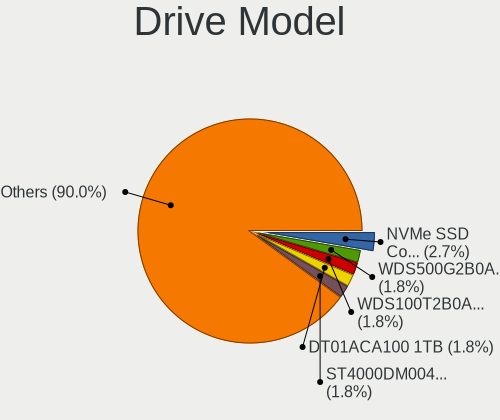
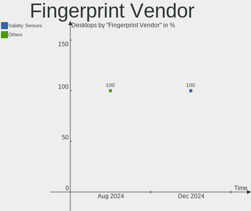

Manjaro - Hardware Trends (Desktops)
------------------------------------

A project to identify most popular hardware characteristics and track their change
over time based on data collected by Linux users at https://Linux-Hardware.org.

Anyone can contribute to this report by the [hw-probe](https://github.com/linuxhw/hw-probe) tool:

    sudo -E hw-probe -all -upload

This report is for one last month. Overall report since the beginning of time: [TestCoverage](https://github.com/linuxhw/TestCoverage)

Period: May, 2022.

Contents
--------

* [ System ](#system)
  - [ OS                       ](#os)
  - [ OS Family                ](#os-family)
  - [ Kernel                   ](#kernel)
  - [ Kernel Family            ](#kernel-family)
  - [ Kernel Major Ver.        ](#kernel-major-ver)
  - [ Arch                     ](#arch)
  - [ DE                       ](#de)
  - [ Display Server           ](#display-server)
  - [ Display Manager          ](#display-manager)
  - [ OS Lang                  ](#os-lang)
  - [ Boot Mode                ](#boot-mode)
  - [ Filesystem               ](#filesystem)
  - [ Part. scheme             ](#part-scheme)
  - [ Dual Boot with Linux/BSD ](#dual-boot-with-linuxbsd)
  - [ Dual Boot (Win)          ](#dual-boot-win)

* [ Board ](#board)
  - [ Vendor                   ](#vendor)
  - [ Model                    ](#model)
  - [ Model Family             ](#model-family)
  - [ MFG Year                 ](#mfg-year)
  - [ Form Factor              ](#form-factor)
  - [ Secure Boot              ](#secure-boot)
  - [ Coreboot                 ](#coreboot)
  - [ RAM Size                 ](#ram-size)
  - [ RAM Used                 ](#ram-used)
  - [ Total Drives             ](#total-drives)
  - [ Has CD-ROM               ](#has-cd-rom)
  - [ Has Ethernet             ](#has-ethernet)
  - [ Has WiFi                 ](#has-wifi)
  - [ Has Bluetooth            ](#has-bluetooth)

* [ Location ](#location)
  - [ Country                  ](#country)
  - [ City                     ](#city)

* [ Drives ](#drives)
  - [ Drive Vendor             ](#drive-vendor)
  - [ Drive Model              ](#drive-model)
  - [ HDD Vendor               ](#hdd-vendor)
  - [ SSD Vendor               ](#ssd-vendor)
  - [ Drive Kind               ](#drive-kind)
  - [ Drive Connector          ](#drive-connector)
  - [ Drive Size               ](#drive-size)
  - [ Space Total              ](#space-total)
  - [ Space Used               ](#space-used)
  - [ Malfunc. Drives          ](#malfunc-drives)
  - [ Malfunc. Drive Vendor    ](#malfunc-drive-vendor)
  - [ Malfunc. HDD Vendor      ](#malfunc-hdd-vendor)
  - [ Malfunc. Drive Kind      ](#malfunc-drive-kind)
  - [ Failed Drives            ](#failed-drives)
  - [ Failed Drive Vendor      ](#failed-drive-vendor)
  - [ Drive Status             ](#drive-status)

* [ Storage controller ](#storage-controller)
  - [ Storage Vendor           ](#storage-vendor)
  - [ Storage Model            ](#storage-model)
  - [ Storage Kind             ](#storage-kind)

* [ Processor ](#processor)
  - [ CPU Vendor               ](#cpu-vendor)
  - [ CPU Model                ](#cpu-model)
  - [ CPU Model Family         ](#cpu-model-family)
  - [ CPU Cores                ](#cpu-cores)
  - [ CPU Sockets              ](#cpu-sockets)
  - [ CPU Threads              ](#cpu-threads)
  - [ CPU Op-Modes             ](#cpu-op-modes)
  - [ CPU Microcode            ](#cpu-microcode)
  - [ CPU Microarch            ](#cpu-microarch)

* [ Graphics ](#graphics)
  - [ GPU Vendor               ](#gpu-vendor)
  - [ GPU Model                ](#gpu-model)
  - [ GPU Combo                ](#gpu-combo)
  - [ GPU Driver               ](#gpu-driver)
  - [ GPU Memory               ](#gpu-memory)

* [ Monitor ](#monitor)
  - [ Monitor Vendor           ](#monitor-vendor)
  - [ Monitor Model            ](#monitor-model)
  - [ Monitor Resolution       ](#monitor-resolution)
  - [ Monitor Diagonal         ](#monitor-diagonal)
  - [ Monitor Width            ](#monitor-width)
  - [ Aspect Ratio             ](#aspect-ratio)
  - [ Monitor Area             ](#monitor-area)
  - [ Pixel Density            ](#pixel-density)
  - [ Multiple Monitors        ](#multiple-monitors)

* [ Network ](#network)
  - [ Net Controller Vendor    ](#net-controller-vendor)
  - [ Net Controller Model     ](#net-controller-model)
  - [ Wireless Vendor          ](#wireless-vendor)
  - [ Wireless Model           ](#wireless-model)
  - [ Ethernet Vendor          ](#ethernet-vendor)
  - [ Ethernet Model           ](#ethernet-model)
  - [ Net Controller Kind      ](#net-controller-kind)
  - [ Used Controller          ](#used-controller)
  - [ NICs                     ](#nics)
  - [ IPv6                     ](#ipv6)

* [ Bluetooth ](#bluetooth)
  - [ Bluetooth Vendor         ](#bluetooth-vendor)
  - [ Bluetooth Model          ](#bluetooth-model)

* [ Sound ](#sound)
  - [ Sound Vendor             ](#sound-vendor)
  - [ Sound Model              ](#sound-model)

* [ Memory ](#memory)
  - [ Memory Vendor            ](#memory-vendor)
  - [ Memory Model             ](#memory-model)
  - [ Memory Kind              ](#memory-kind)
  - [ Memory Form Factor       ](#memory-form-factor)
  - [ Memory Size              ](#memory-size)
  - [ Memory Speed             ](#memory-speed)

* [ Printers & scanners ](#printers--scanners)
  - [ Printer Vendor           ](#printer-vendor)
  - [ Printer Model            ](#printer-model)
  - [ Scanner Vendor           ](#scanner-vendor)
  - [ Scanner Model            ](#scanner-model)

* [ Camera ](#camera)
  - [ Camera Vendor            ](#camera-vendor)
  - [ Camera Model             ](#camera-model)

* [ Security ](#security)
  - [ Fingerprint Vendor       ](#fingerprint-vendor)
  - [ Fingerprint Model        ](#fingerprint-model)
  - [ Chipcard Vendor          ](#chipcard-vendor)
  - [ Chipcard Model           ](#chipcard-model)

* [ Unsupported ](#unsupported)
  - [ Unsupported Devices      ](#unsupported-devices)
  - [ Unsupported Device Types ](#unsupported-device-types)

System
------

OS
--

Installed operating systems

| Name                      | Desktops | Percent |
|---------------------------|----------|---------|
| Manjaro                   | 48       | 60.76%  |
| Manjaro 21.2.6            | 29       | 36.71%  |
| Manjaro 22.04-development | 1        | 1.27%   |
| Manjaro 21.2.5            | 1        | 1.27%   |

OS Family
---------

OS without a version

| Name    | Desktops | Percent |
|---------|----------|---------|
| Manjaro | 79       | 100%    |

Kernel
------

Version of the Linux kernel

| Version            | Desktops | Percent |
|--------------------|----------|---------|
| 5.17.1-3-MANJARO   | 14       | 17.72%  |
| 5.15.32-1-MANJARO  | 13       | 16.46%  |
| 5.17.6-1-MANJARO   | 11       | 13.92%  |
| 5.15.38-1-MANJARO  | 10       | 12.66%  |
| 5.15.41-1-MANJARO  | 9        | 11.39%  |
| 5.17.9-1-MANJARO   | 5        | 6.33%   |
| 5.16.18-1-MANJARO  | 4        | 5.06%   |
| 5.10.109-1-MANJARO | 3        | 3.8%    |
| 5.13.19-2-MANJARO  | 2        | 2.53%   |
| 5.10.105-1-MANJARO | 2        | 2.53%   |
| 5.4.192-1-MANJARO  | 1        | 1.27%   |
| 5.4.188-1-MANJARO  | 1        | 1.27%   |
| 5.17.5-256-tkg-pds | 1        | 1.27%   |
| 5.17.5-256-tkg-bmq | 1        | 1.27%   |
| 5.17.5-2-MANJARO   | 1        | 1.27%   |
| 5.10.114-1-MANJARO | 1        | 1.27%   |

Kernel Family
-------------

Linux kernel without a distro release

| Version  | Desktops | Percent |
|----------|----------|---------|
| 5.17.1   | 14       | 17.72%  |
| 5.15.32  | 13       | 16.46%  |
| 5.17.6   | 11       | 13.92%  |
| 5.15.38  | 10       | 12.66%  |
| 5.15.41  | 9        | 11.39%  |
| 5.17.9   | 5        | 6.33%   |
| 5.16.18  | 4        | 5.06%   |
| 5.17.5   | 3        | 3.8%    |
| 5.10.109 | 3        | 3.8%    |
| 5.13.19  | 2        | 2.53%   |
| 5.10.105 | 2        | 2.53%   |
| 5.4.192  | 1        | 1.27%   |
| 5.4.188  | 1        | 1.27%   |
| 5.10.114 | 1        | 1.27%   |

Kernel Major Ver.
-----------------

Linux kernel major version

| Version | Desktops | Percent |
|---------|----------|---------|
| 5.17    | 33       | 41.77%  |
| 5.15    | 32       | 40.51%  |
| 5.10    | 6        | 7.59%   |
| 5.16    | 4        | 5.06%   |
| 5.4     | 2        | 2.53%   |
| 5.13    | 2        | 2.53%   |

Arch
----

OS architecture (x86_64, i586, etc.)

| Name   | Desktops | Percent |
|--------|----------|---------|
| x86_64 | 79       | 100%    |

DE
--

Desktop Environment

| Name       | Desktops | Percent |
|------------|----------|---------|
| KDE5       | 45       | 56.96%  |
| XFCE       | 14       | 17.72%  |
| GNOME      | 12       | 15.19%  |
| X-Cinnamon | 5        | 6.33%   |
| sway       | 1        | 1.27%   |
| Cinnamon   | 1        | 1.27%   |
| Unknown    | 1        | 1.27%   |

Display Server
--------------

X11 or Wayland

| Name    | Desktops | Percent |
|---------|----------|---------|
| X11     | 67       | 84.81%  |
| Wayland | 8        | 10.13%  |
| Tty     | 2        | 2.53%   |
| Unknown | 2        | 2.53%   |

Display Manager
---------------

SDDM, LightDM, etc.

| Name    | Desktops | Percent |
|---------|----------|---------|
| Unknown | 48       | 60.76%  |
| SDDM    | 16       | 20.25%  |
| LightDM | 9        | 11.39%  |
| GDM     | 6        | 7.59%   |

OS Lang
-------

Language

| Lang   | Desktops | Percent |
|--------|----------|---------|
| en_US  | 36       | 45.57%  |
| de_DE  | 10       | 12.66%  |
| en_GB  | 7        | 8.86%   |
| ru_RU  | 6        | 7.59%   |
| en_CA  | 4        | 5.06%   |
| es_ES  | 2        | 2.53%   |
| en_ZA  | 2        | 2.53%   |
| szl_PL | 1        | 1.27%   |
| ru_UA  | 1        | 1.27%   |
| pt_BR  | 1        | 1.27%   |
| it_IT  | 1        | 1.27%   |
| fr_FR  | 1        | 1.27%   |
| es_MX  | 1        | 1.27%   |
| es_GT  | 1        | 1.27%   |
| es_AR  | 1        | 1.27%   |
| en_IE  | 1        | 1.27%   |
| en_DK  | 1        | 1.27%   |
| da_DK  | 1        | 1.27%   |
| C      | 1        | 1.27%   |

Boot Mode
---------

EFI or BIOS

| Mode | Desktops | Percent |
|------|----------|---------|
| BIOS | 58       | 73.42%  |
| EFI  | 21       | 26.58%  |

Filesystem
----------

Type of filesystem

| Type  | Desktops | Percent |
|-------|----------|---------|
| Ext4  | 61       | 77.22%  |
| Btrfs | 16       | 20.25%  |
| Xfs   | 1        | 1.27%   |
| F2fs  | 1        | 1.27%   |

Part. scheme
------------

Scheme of partitioning

| Type    | Desktops | Percent |
|---------|----------|---------|
| Unknown | 54       | 68.35%  |
| GPT     | 22       | 27.85%  |
| MBR     | 3        | 3.8%    |

Dual Boot with Linux/BSD
------------------------

Hosting more than one Linux/BSD

| Dual boot | Desktops | Percent |
|-----------|----------|---------|
| No        | 73       | 92.41%  |
| Yes       | 6        | 7.59%   |

Dual Boot (Win)
---------------

Hosting Linux and Windows

| Dual boot | Desktops | Percent |
|-----------|----------|---------|
| No        | 59       | 74.68%  |
| Yes       | 20       | 25.32%  |

Board
-----

Vendor
------

Motherboard manufacturer

| Name                | Desktops | Percent |
|---------------------|----------|---------|
| ASUSTek Computer    | 24       | 30.38%  |
| MSI                 | 18       | 22.78%  |
| Gigabyte Technology | 15       | 18.99%  |
| ASRock              | 9        | 11.39%  |
| Hewlett-Packard     | 4        | 5.06%   |
| Google              | 2        | 2.53%   |
| Pegatron            | 1        | 1.27%   |
| Lenovo              | 1        | 1.27%   |
| Intel               | 1        | 1.27%   |
| Dell                | 1        | 1.27%   |
| Chatreey            | 1        | 1.27%   |
| BESSTAR Tech        | 1        | 1.27%   |
| Unknown             | 1        | 1.27%   |

Model
-----

Motherboard model

| Name                                 | Desktops | Percent |
|--------------------------------------|----------|---------|
| Google Guado                         | 2        | 2.53%   |
| ASUS TUF Gaming X570-PLUS            | 2        | 2.53%   |
| ASUS TUF Gaming B550-PLUS            | 2        | 2.53%   |
| ASUS ROG STRIX B550-F GAMING         | 2        | 2.53%   |
| ASUS PRIME X570-PRO                  | 2        | 2.53%   |
| Pegatron BQ466AAR-ABA s5510f         | 1        | 1.27%   |
| MSI MS-7D32                          | 1        | 1.27%   |
| MSI MS-7D03                          | 1        | 1.27%   |
| MSI MS-7C94                          | 1        | 1.27%   |
| MSI MS-7C91                          | 1        | 1.27%   |
| MSI MS-7C09                          | 1        | 1.27%   |
| MSI MS-7C02                          | 1        | 1.27%   |
| MSI MS-7B98                          | 1        | 1.27%   |
| MSI MS-7B90                          | 1        | 1.27%   |
| MSI MS-7B89                          | 1        | 1.27%   |
| MSI MS-7B86                          | 1        | 1.27%   |
| MSI MS-7B79                          | 1        | 1.27%   |
| MSI MS-7B17                          | 1        | 1.27%   |
| MSI MS-7A70                          | 1        | 1.27%   |
| MSI MS-7A38                          | 1        | 1.27%   |
| MSI MS-7977                          | 1        | 1.27%   |
| MSI MS-7924                          | 1        | 1.27%   |
| MSI MS-7885                          | 1        | 1.27%   |
| MSI MS-7758                          | 1        | 1.27%   |
| Lenovo H520S 10093                   | 1        | 1.27%   |
| Intel X79M-S                         | 1        | 1.27%   |
| HP Z440 Workstation                  | 1        | 1.27%   |
| HP Z230 Tower Workstation            | 1        | 1.27%   |
| HP EliteDesk 800 G2 TWR              | 1        | 1.27%   |
| HP Compaq dc7900 Small Form Factor   | 1        | 1.27%   |
| Gigabyte Z97M-DS3H                   | 1        | 1.27%   |
| Gigabyte Z77M-D3H                    | 1        | 1.27%   |
| Gigabyte Z270-HD3P                   | 1        | 1.27%   |
| Gigabyte X570 AORUS ELITE            | 1        | 1.27%   |
| Gigabyte H97M-HD3                    | 1        | 1.27%   |
| Gigabyte H81M-S1                     | 1        | 1.27%   |
| Gigabyte H61M-S2PV                   | 1        | 1.27%   |
| Gigabyte BRi3(H)-10110               | 1        | 1.27%   |
| Gigabyte B550M AORUS ELITE           | 1        | 1.27%   |
| Gigabyte B550I AORUS PRO AX          | 1        | 1.27%   |
| Gigabyte B550 GAMING X V2            | 1        | 1.27%   |
| Gigabyte B550 AORUS PRO AC           | 1        | 1.27%   |
| Gigabyte B450M DS3H                  | 1        | 1.27%   |
| Gigabyte AB350-Gaming 3              | 1        | 1.27%   |
| Gigabyte A520M H                     | 1        | 1.27%   |
| Dell OptiPlex 330                    | 1        | 1.27%   |
| Chatreey AC1-DP                      | 1        | 1.27%   |
| BESSTAR Tech UM350                   | 1        | 1.27%   |
| ASUS TUF Z390-PLUS GAMING            | 1        | 1.27%   |
| ASUS TUF Gaming B550M-PLUS           | 1        | 1.27%   |
| ASUS TUF B450-PLUS GAMING            | 1        | 1.27%   |
| ASUS ROG STRIX Z690-A GAMING WIFI D4 | 1        | 1.27%   |
| ASUS ROG STRIX X570-F GAMING         | 1        | 1.27%   |
| ASUS ROG STRIX B550-A GAMING         | 1        | 1.27%   |
| ASUS ROG STRIX B450-F GAMING II      | 1        | 1.27%   |
| ASUS ROG STRIX B350-F GAMING         | 1        | 1.27%   |
| ASUS PRIME Z390-P                    | 1        | 1.27%   |
| ASUS PRIME X570-P                    | 1        | 1.27%   |
| ASUS PRIME X470-PRO                  | 1        | 1.27%   |
| ASUS PRIME B350-PLUS                 | 1        | 1.27%   |

Model Family
------------

Motherboard model prefix

| Name                   | Desktops | Percent |
|------------------------|----------|---------|
| ASUS TUF               | 7        | 8.86%   |
| ASUS ROG               | 7        | 8.86%   |
| ASUS PRIME             | 6        | 7.59%   |
| Google Guado           | 2        | 2.53%   |
| Gigabyte B550          | 2        | 2.53%   |
| ASRock B550M           | 2        | 2.53%   |
| ASRock AB350           | 2        | 2.53%   |
| Pegatron BQ466AAR-ABA  | 1        | 1.27%   |
| MSI MS-7D32            | 1        | 1.27%   |
| MSI MS-7D03            | 1        | 1.27%   |
| MSI MS-7C94            | 1        | 1.27%   |
| MSI MS-7C91            | 1        | 1.27%   |
| MSI MS-7C09            | 1        | 1.27%   |
| MSI MS-7C02            | 1        | 1.27%   |
| MSI MS-7B98            | 1        | 1.27%   |
| MSI MS-7B90            | 1        | 1.27%   |
| MSI MS-7B89            | 1        | 1.27%   |
| MSI MS-7B86            | 1        | 1.27%   |
| MSI MS-7B79            | 1        | 1.27%   |
| MSI MS-7B17            | 1        | 1.27%   |
| MSI MS-7A70            | 1        | 1.27%   |
| MSI MS-7A38            | 1        | 1.27%   |
| MSI MS-7977            | 1        | 1.27%   |
| MSI MS-7924            | 1        | 1.27%   |
| MSI MS-7885            | 1        | 1.27%   |
| MSI MS-7758            | 1        | 1.27%   |
| Lenovo H520S           | 1        | 1.27%   |
| Intel X79M-S           | 1        | 1.27%   |
| HP Z440                | 1        | 1.27%   |
| HP Z230                | 1        | 1.27%   |
| HP EliteDesk           | 1        | 1.27%   |
| HP Compaq              | 1        | 1.27%   |
| Gigabyte Z97M-DS3H     | 1        | 1.27%   |
| Gigabyte Z77M-D3H      | 1        | 1.27%   |
| Gigabyte Z270-HD3P     | 1        | 1.27%   |
| Gigabyte X570          | 1        | 1.27%   |
| Gigabyte H97M-HD3      | 1        | 1.27%   |
| Gigabyte H81M-S1       | 1        | 1.27%   |
| Gigabyte H61M-S2PV     | 1        | 1.27%   |
| Gigabyte BRi3(H)-10110 | 1        | 1.27%   |
| Gigabyte B550M         | 1        | 1.27%   |
| Gigabyte B550I         | 1        | 1.27%   |
| Gigabyte B450M         | 1        | 1.27%   |
| Gigabyte AB350-Gaming  | 1        | 1.27%   |
| Gigabyte A520M         | 1        | 1.27%   |
| Dell OptiPlex          | 1        | 1.27%   |
| Chatreey AC1-DP        | 1        | 1.27%   |
| BESSTAR Tech UM350     | 1        | 1.27%   |
| ASUS P8Z77-V           | 1        | 1.27%   |
| ASUS P8P67             | 1        | 1.27%   |
| ASUS GZ727AA-A2L       | 1        | 1.27%   |
| ASUS CROSSHAIR         | 1        | 1.27%   |
| ASRock Z77             | 1        | 1.27%   |
| ASRock X570            | 1        | 1.27%   |
| ASRock X370            | 1        | 1.27%   |
| ASRock H470M-HDV       | 1        | 1.27%   |
| ASRock B550AM          | 1        | 1.27%   |
| Unknown                | 1        | 1.27%   |

MFG Year
--------

Motherboard manufacture year

| Year | Desktops | Percent |
|------|----------|---------|
| 2020 | 17       | 21.52%  |
| 2019 | 13       | 16.46%  |
| 2018 | 13       | 16.46%  |
| 2017 | 7        | 8.86%   |
| 2012 | 6        | 7.59%   |
| 2021 | 5        | 6.33%   |
| 2022 | 4        | 5.06%   |
| 2014 | 3        | 3.8%    |
| 2016 | 2        | 2.53%   |
| 2015 | 2        | 2.53%   |
| 2013 | 2        | 2.53%   |
| 2010 | 2        | 2.53%   |
| 2007 | 2        | 2.53%   |
| 2008 | 1        | 1.27%   |

Form Factor
-----------

Physical design of the computer

| Name    | Desktops | Percent |
|---------|----------|---------|
| Desktop | 79       | 100%    |

Secure Boot
-----------

Enabled or disabled

| State    | Desktops | Percent |
|----------|----------|---------|
| Disabled | 79       | 100%    |

Coreboot
--------

Have coreboot on board

| Used | Desktops | Percent |
|------|----------|---------|
| No   | 77       | 97.47%  |
| Yes  | 2        | 2.53%   |

RAM Size
--------

Total RAM memory

| Size in GB  | Desktops | Percent |
|-------------|----------|---------|
| 16.01-24.0  | 27       | 34.18%  |
| 32.01-64.0  | 25       | 31.65%  |
| 8.01-16.0   | 10       | 12.66%  |
| 4.01-8.0    | 9        | 11.39%  |
| 3.01-4.0    | 3        | 3.8%    |
| 24.01-32.0  | 2        | 2.53%   |
| 64.01-256.0 | 2        | 2.53%   |
| 1.01-2.0    | 1        | 1.27%   |

RAM Used
--------

Used RAM memory

| Used GB   | Desktops | Percent |
|-----------|----------|---------|
| 4.01-8.0  | 22       | 27.85%  |
| 3.01-4.0  | 19       | 24.05%  |
| 2.01-3.0  | 16       | 20.25%  |
| 8.01-16.0 | 11       | 13.92%  |
| 1.01-2.0  | 10       | 12.66%  |
| 0.51-1.0  | 1        | 1.27%   |

Total Drives
------------

Number of drives on board

| Drives | Desktops | Percent |
|--------|----------|---------|
| 2      | 28       | 35.44%  |
| 3      | 14       | 17.72%  |
| 1      | 12       | 15.19%  |
| 4      | 9        | 11.39%  |
| 5      | 7        | 8.86%   |
| 6      | 6        | 7.59%   |
| 10     | 1        | 1.27%   |
| 9      | 1        | 1.27%   |
| 8      | 1        | 1.27%   |

Has CD-ROM
----------

Has CD-ROM on board

| Presented | Desktops | Percent |
|-----------|----------|---------|
| No        | 63       | 79.75%  |
| Yes       | 16       | 20.25%  |

Has Ethernet
------------

Has Ethernet on board

| Presented | Desktops | Percent |
|-----------|----------|---------|
| Yes       | 79       | 100%    |

Has WiFi
--------

Has WiFi module

| Presented | Desktops | Percent |
|-----------|----------|---------|
| Yes       | 48       | 60.76%  |
| No        | 31       | 39.24%  |

Has Bluetooth
-------------

Has Bluetooth module

| Presented | Desktops | Percent |
|-----------|----------|---------|
| Yes       | 45       | 56.96%  |
| No        | 34       | 43.04%  |

Location
--------

Country
-------

Geographic location (country)

| Country      | Desktops | Percent |
|--------------|----------|---------|
| USA          | 21       | 26.58%  |
| Germany      | 11       | 13.92%  |
| Russia       | 7        | 8.86%   |
| Poland       | 4        | 5.06%   |
| Canada       | 4        | 5.06%   |
| Spain        | 2        | 2.53%   |
| South Africa | 2        | 2.53%   |
| Jamaica      | 2        | 2.53%   |
| Denmark      | 2        | 2.53%   |
| Brazil       | 2        | 2.53%   |
| Ukraine      | 1        | 1.27%   |
| UK           | 1        | 1.27%   |
| Slovakia     | 1        | 1.27%   |
| Saudi Arabia | 1        | 1.27%   |
| Peru         | 1        | 1.27%   |
| Netherlands  | 1        | 1.27%   |
| Mexico       | 1        | 1.27%   |
| Kuwait       | 1        | 1.27%   |
| Italy        | 1        | 1.27%   |
| Isle of Man  | 1        | 1.27%   |
| Ireland      | 1        | 1.27%   |
| Iran         | 1        | 1.27%   |
| Guatemala    | 1        | 1.27%   |
| Greece       | 1        | 1.27%   |
| France       | 1        | 1.27%   |
| Croatia      | 1        | 1.27%   |
| Chile        | 1        | 1.27%   |
| Bulgaria     | 1        | 1.27%   |
| Belgium      | 1        | 1.27%   |
| Austria      | 1        | 1.27%   |
| Argentina    | 1        | 1.27%   |
| Andorra      | 1        | 1.27%   |

City
----

Geographic location (city)

| City              | Desktops | Percent |
|-------------------|----------|---------|
| Port Orchard      | 2        | 2.53%   |
| Moscow            | 2        | 2.53%   |
| Frankfurt am Main | 2        | 2.53%   |
| Chelyabinsk       | 2        | 2.53%   |
| Ypres             | 1        | 1.27%   |
| West Chester      | 1        | 1.27%   |
| Weitramsdorf      | 1        | 1.27%   |
| Warsaw            | 1        | 1.27%   |
| Waltershausen     | 1        | 1.27%   |
| Vinderup          | 1        | 1.27%   |
| Villahermosa      | 1        | 1.27%   |
| Vienna            | 1        | 1.27%   |
| Velika Gorica     | 1        | 1.27%   |
| Unieszewo         | 1        | 1.27%   |
| Toronto           | 1        | 1.27%   |
| The Bronx         | 1        | 1.27%   |
| St Petersburg     | 1        | 1.27%   |
| Sliven            | 1        | 1.27%   |
| Sarrion           | 1        | 1.27%   |
| Santa Coloma      | 1        | 1.27%   |
| Šaľa            | 1        | 1.27%   |
| Rixheim           | 1        | 1.27%   |
| Rio de Janeiro    | 1        | 1.27%   |
| Richmond          | 1        | 1.27%   |
| Recife            | 1        | 1.27%   |
| Portland          | 1        | 1.27%   |
| Porter Ranch      | 1        | 1.27%   |
| Port Elizabeth    | 1        | 1.27%   |
| Perm              | 1        | 1.27%   |
| Penalolen         | 1        | 1.27%   |
| Ocho Rios         | 1        | 1.27%   |
| O'Fallon          | 1        | 1.27%   |
| North Reading     | 1        | 1.27%   |
| Norfolk           | 1        | 1.27%   |
| Mutterstadt       | 1        | 1.27%   |
| Munich            | 1        | 1.27%   |
| Milton            | 1        | 1.27%   |
| Milan             | 1        | 1.27%   |
| Madrid            | 1        | 1.27%   |
| Lima              | 1        | 1.27%   |
| Leipzig           | 1        | 1.27%   |
| Kyiv              | 1        | 1.27%   |
| Kuwait City       | 1        | 1.27%   |
| Krakow            | 1        | 1.27%   |
| Kozani            | 1        | 1.27%   |
| Kingston          | 1        | 1.27%   |
| Katowice          | 1        | 1.27%   |
| Karaj             | 1        | 1.27%   |
| Kaliningrad       | 1        | 1.27%   |
| Jackson           | 1        | 1.27%   |
| Ipswich           | 1        | 1.27%   |
| Houston           | 1        | 1.27%   |
| Guatemala City    | 1        | 1.27%   |
| Glen Rock         | 1        | 1.27%   |
| Gera              | 1        | 1.27%   |
| Flushing          | 1        | 1.27%   |
| DuBois            | 1        | 1.27%   |
| Dublin            | 1        | 1.27%   |
| Douglas           | 1        | 1.27%   |
| Dayton            | 1        | 1.27%   |

Drives
------

Drive Vendor
------------

Hard drive vendors

| Vendor                      | Desktops | Drives | Percent |
|-----------------------------|----------|--------|---------|
| WDC                         | 34       | 45     | 17.26%  |
| Seagate                     | 30       | 38     | 15.23%  |
| Samsung Electronics         | 29       | 51     | 14.72%  |
| Sandisk                     | 17       | 19     | 8.63%   |
| Kingston                    | 12       | 14     | 6.09%   |
| Crucial                     | 11       | 12     | 5.58%   |
| Hitachi                     | 8        | 9      | 4.06%   |
| Toshiba                     | 7        | 8      | 3.55%   |
| Phison                      | 7        | 7      | 3.55%   |
| A-DATA Technology           | 5        | 5      | 2.54%   |
| XPG                         | 3        | 3      | 1.52%   |
| Unknown                     | 2        | 4      | 1.02%   |
| SK Hynix                    | 2        | 3      | 1.02%   |
| PNY                         | 2        | 2      | 1.02%   |
| OCZ                         | 2        | 2      | 1.02%   |
| Micron/Crucial Technology   | 2        | 2      | 1.02%   |
| Intel                       | 2        | 2      | 1.02%   |
| DOGFISH                     | 2        | 2      | 1.02%   |
| China                       | 2        | 2      | 1.02%   |
| walram                      | 1        | 2      | 0.51%   |
| USB 3.0                     | 1        | 1      | 0.51%   |
| SSD2SC96                    | 1        | 1      | 0.51%   |
| SPCC                        | 1        | 1      | 0.51%   |
| Silicon Motion              | 1        | 1      | 0.51%   |
| Realtek Semiconductor       | 1        | 1      | 0.51%   |
| Phison Electronics          | 1        | 1      | 0.51%   |
| OSCOO                       | 1        | 1      | 0.51%   |
| Micron Technology           | 1        | 1      | 0.51%   |
| MAXIO Technology (Hangzhou) | 1        | 1      | 0.51%   |
| LuminouTek                  | 1        | 1      | 0.51%   |
| Lexar                       | 1        | 1      | 0.51%   |
| Leven                       | 1        | 1      | 0.51%   |
| HGST                        | 1        | 1      | 0.51%   |
| GOODRAM                     | 1        | 1      | 0.51%   |
| ASMT                        | 1        | 1      | 0.51%   |
| Apacer                      | 1        | 1      | 0.51%   |
| Unknown                     | 1        | 1      | 0.51%   |

Drive Model
-----------

Hard drive models

| Model                             | Desktops | Percent |
|-----------------------------------|----------|---------|
| Sandisk NVMe SSD Drive 1TB        | 5        | 2.21%   |
| Samsung NVMe SSD Drive 250GB      | 5        | 2.21%   |
| Sandisk NVMe SSD Drive 500GB      | 4        | 1.77%   |
| Samsung NVMe SSD Drive 500GB      | 4        | 1.77%   |
| Samsung NVMe SSD Drive 1TB        | 4        | 1.77%   |
| WDC WDS500G2B0A-00SM50 500GB SSD  | 3        | 1.33%   |
| WDC WD10EZEX-08WN4A0 1TB          | 3        | 1.33%   |
| Toshiba DT01ACA100 1TB            | 3        | 1.33%   |
| Seagate ST1000DM010-2EP102 1TB    | 3        | 1.33%   |
| Samsung SSD 850 EVO 250GB         | 3        | 1.33%   |
| XPG NVMe SSD Drive 512GB          | 2        | 0.88%   |
| WDC WD20EZBX-00AYRA0 2TB          | 2        | 0.88%   |
| WDC WD10EZEX-00BN5A0 1TB          | 2        | 0.88%   |
| WDC WD1003FZEX-00MK2A0 1TB        | 2        | 0.88%   |
| Unknown Externa 128GB             | 2        | 0.88%   |
| Seagate ST3250318AS 250GB         | 2        | 0.88%   |
| Seagate ST2000DM008-2FR102 2TB    | 2        | 0.88%   |
| Seagate ST2000DM001-1ER164 2TB    | 2        | 0.88%   |
| Seagate ST1000DM003-9YN162 1TB    | 2        | 0.88%   |
| Seagate ST1000DM003-1SB10C 1TB    | 2        | 0.88%   |
| Sandisk NVMe SSD Drive 250GB      | 2        | 0.88%   |
| Samsung SSD 870 QVO 2TB           | 2        | 0.88%   |
| Samsung SSD 860 EVO 500GB         | 2        | 0.88%   |
| Samsung SSD 860 EVO 1TB           | 2        | 0.88%   |
| Samsung SSD 850 EVO 120GB         | 2        | 0.88%   |
| Samsung NVMe SSD Drive 2TB        | 2        | 0.88%   |
| Samsung NVMe SSD Drive 256GB      | 2        | 0.88%   |
| Phison NVMe SSD Drive 512GB       | 2        | 0.88%   |
| Phison NVMe SSD Drive 1TB         | 2        | 0.88%   |
| Micron/Crucial NVMe SSD Drive 1TB | 2        | 0.88%   |
| Kingston SA400S37480G 480GB SSD   | 2        | 0.88%   |
| Kingston SA400S37240G 240GB SSD   | 2        | 0.88%   |
| Kingston SA400S37120G 120GB SSD   | 2        | 0.88%   |
| DOGFISH SSD 512GB                 | 2        | 0.88%   |
| Crucial CT480BX500SSD1 480GB      | 2        | 0.88%   |
| Crucial CT1000P5SSD8 1TB          | 2        | 0.88%   |
| A-DATA SU650 240GB SSD            | 2        | 0.88%   |
| XPG NVMe SSD Drive 2TB            | 1        | 0.44%   |
| WDC WDS500G2B0B-00YS70 500GB SSD  | 1        | 0.44%   |
| WDC WDS240G2G0B-00EPW0 240GB SSD  | 1        | 0.44%   |
| WDC WDS240G2G0A-00JH30 240GB SSD  | 1        | 0.44%   |
| WDC WDS100T2B0C-00PXH0 1TB        | 1        | 0.44%   |
| WDC WD800AAJS-75M0A0 80GB         | 1        | 0.44%   |
| WDC WD7500BPVX-16JC3T3 752GB      | 1        | 0.44%   |
| WDC WD6400AAKS-65Z7B0 640GB       | 1        | 0.44%   |
| WDC WD60EZRZ-00GZ5B1 6TB          | 1        | 0.44%   |
| WDC WD60EFZX-68B3FN0 6TB          | 1        | 0.44%   |
| WDC WD5000LPCX-24VHAT0 500GB      | 1        | 0.44%   |
| WDC WD5000BPKT-08PK4T0 500GB      | 1        | 0.44%   |
| WDC WD5000AZLX-75K2TA0 500GB      | 1        | 0.44%   |
| WDC WD5000AAKX-603CA0 500GB       | 1        | 0.44%   |
| WDC WD5000AAKX-22ERMA0 500GB      | 1        | 0.44%   |
| WDC WD5000AAKS-402AA0 500GB       | 1        | 0.44%   |
| WDC WD40EZRX-22SPEB0 4TB          | 1        | 0.44%   |
| WDC WD3200AVBS-63TAA0 320GB       | 1        | 0.44%   |
| WDC WD20EZRX-00D8PB0 2TB          | 1        | 0.44%   |
| WDC WD2003FZEX-00Z4SA0 2TB        | 1        | 0.44%   |
| WDC WD10SPZX-60Z10T0 1TB          | 1        | 0.44%   |
| WDC WD10PURZ-85U8XY0 1TB          | 1        | 0.44%   |
| WDC WD10JPLX-00MBPT0 1TB          | 1        | 0.44%   |

HDD Vendor
----------

Hard disk drive vendors

| Vendor              | Desktops | Drives | Percent |
|---------------------|----------|--------|---------|
| Seagate             | 30       | 38     | 38.96%  |
| WDC                 | 28       | 38     | 36.36%  |
| Hitachi             | 8        | 9      | 10.39%  |
| Toshiba             | 7        | 8      | 9.09%   |
| Samsung Electronics | 2        | 3      | 2.6%    |
| HGST                | 1        | 1      | 1.3%    |
| ASMT                | 1        | 1      | 1.3%    |

SSD Vendor
----------

Solid state drive vendors

| Vendor              | Desktops | Drives | Percent |
|---------------------|----------|--------|---------|
| Samsung Electronics | 13       | 27     | 20.97%  |
| Kingston            | 9        | 11     | 14.52%  |
| Crucial             | 7        | 8      | 11.29%  |
| WDC                 | 6        | 6      | 9.68%   |
| SanDisk             | 6        | 7      | 9.68%   |
| A-DATA Technology   | 5        | 5      | 8.06%   |
| PNY                 | 2        | 2      | 3.23%   |
| OCZ                 | 2        | 2      | 3.23%   |
| DOGFISH             | 2        | 2      | 3.23%   |
| China               | 2        | 2      | 3.23%   |
| walram              | 1        | 1      | 1.61%   |
| OSCOO               | 1        | 1      | 1.61%   |
| Micron Technology   | 1        | 1      | 1.61%   |
| LuminouTek          | 1        | 1      | 1.61%   |
| Lexar               | 1        | 1      | 1.61%   |
| Leven               | 1        | 1      | 1.61%   |
| GOODRAM             | 1        | 1      | 1.61%   |
| Apacer              | 1        | 1      | 1.61%   |

Drive Kind
----------

HDD or SSD

| Kind    | Desktops | Drives | Percent |
|---------|----------|--------|---------|
| HDD     | 50       | 98     | 34.48%  |
| NVMe    | 45       | 62     | 31.03%  |
| SSD     | 44       | 80     | 30.34%  |
| Unknown | 5        | 8      | 3.45%   |
| MMC     | 1        | 1      | 0.69%   |

Drive Connector
---------------

SATA, SAS, NVMe, etc.

| Type | Desktops | Drives | Percent |
|------|----------|--------|---------|
| SATA | 68       | 172    | 56.2%   |
| NVMe | 45       | 62     | 37.19%  |
| SAS  | 7        | 14     | 5.79%   |
| MMC  | 1        | 1      | 0.83%   |

Drive Size
----------

Size of hard drive

| Size in TB | Desktops | Drives | Percent |
|------------|----------|--------|---------|
| 0.01-0.5   | 49       | 76     | 40.83%  |
| 0.51-1.0   | 42       | 58     | 35%     |
| 1.01-2.0   | 21       | 27     | 17.5%   |
| 3.01-4.0   | 3        | 5      | 2.5%    |
| 4.01-10.0  | 3        | 8      | 2.5%    |
| 2.01-3.0   | 1        | 2      | 0.83%   |
| 10.01-20.0 | 1        | 2      | 0.83%   |

Space Total
-----------

Amount of disk space available on the file system

| Size in GB     | Desktops | Percent |
|----------------|----------|---------|
| More than 3000 | 18       | 22.78%  |
| 1001-2000      | 17       | 21.52%  |
| 251-500        | 15       | 18.99%  |
| 501-1000       | 13       | 16.46%  |
| 101-250        | 8        | 10.13%  |
| 2001-3000      | 6        | 7.59%   |
| Unknown        | 2        | 2.53%   |

Space Used
----------

Amount of used disk space

| Used GB        | Desktops | Percent |
|----------------|----------|---------|
| 251-500        | 16       | 20.25%  |
| 501-1000       | 13       | 16.46%  |
| 1001-2000      | 10       | 12.66%  |
| 51-100         | 8        | 10.13%  |
| More than 3000 | 7        | 8.86%   |
| 2001-3000      | 7        | 8.86%   |
| 101-250        | 7        | 8.86%   |
| 1-20           | 5        | 6.33%   |
| 21-50          | 4        | 5.06%   |
| Unknown        | 2        | 2.53%   |

Malfunc. Drives
---------------

Drive models with a malfunction

| Model                          | Desktops | Drives | Percent |
|--------------------------------|----------|--------|---------|
| WDC WD7500BPVX-16JC3T3 752GB   | 1        | 1      | 33.33%  |
| Seagate ST1000DX001-1CM162 1TB | 1        | 1      | 33.33%  |
| Apacer AS510S 256GB SSD        | 1        | 1      | 33.33%  |

Malfunc. Drive Vendor
---------------------

Vendors of faulty drives

| Vendor  | Desktops | Drives | Percent |
|---------|----------|--------|---------|
| WDC     | 1        | 1      | 33.33%  |
| Seagate | 1        | 1      | 33.33%  |
| Apacer  | 1        | 1      | 33.33%  |

Malfunc. HDD Vendor
-------------------

Vendors of faulty HDD drives

| Vendor  | Desktops | Drives | Percent |
|---------|----------|--------|---------|
| WDC     | 1        | 1      | 50%     |
| Seagate | 1        | 1      | 50%     |

Malfunc. Drive Kind
-------------------

Kinds of faulty drives

| Kind | Desktops | Drives | Percent |
|------|----------|--------|---------|
| HDD  | 2        | 2      | 66.67%  |
| SSD  | 1        | 1      | 33.33%  |

Failed Drives
-------------

Failed drive models

Zero info for selected period =(

Failed Drive Vendor
-------------------

Failed drive vendors

Zero info for selected period =(

Drive Status
------------

Number of failed and malfunc. drives

| Status   | Desktops | Drives | Percent |
|----------|----------|--------|---------|
| Detected | 63       | 198    | 72.41%  |
| Works    | 21       | 48     | 24.14%  |
| Malfunc  | 3        | 3      | 3.45%   |

Storage controller
------------------

Storage Vendor
--------------

Storage controller vendors

| Vendor                      | Desktops | Percent |
|-----------------------------|----------|---------|
| AMD                         | 42       | 29.17%  |
| Intel                       | 38       | 26.39%  |
| Samsung Electronics         | 18       | 12.5%   |
| Sandisk                     | 12       | 8.33%   |
| Phison Electronics          | 8        | 5.56%   |
| Micron/Crucial Technology   | 4        | 2.78%   |
| ASMedia Technology          | 4        | 2.78%   |
| Kingston Technology Company | 3        | 2.08%   |
| ADATA Technology            | 3        | 2.08%   |
| SK Hynix                    | 2        | 1.39%   |
| Realtek Semiconductor       | 2        | 1.39%   |
| Nvidia                      | 2        | 1.39%   |
| JMicron Technology          | 2        | 1.39%   |
| Silicon Motion              | 1        | 0.69%   |
| Micron Technology           | 1        | 0.69%   |
| MAXIO Technology (Hangzhou) | 1        | 0.69%   |
| Marvell Technology Group    | 1        | 0.69%   |

Storage Model
-------------

Storage controller models

| Model                                                                                   | Desktops | Percent |
|-----------------------------------------------------------------------------------------|----------|---------|
| AMD FCH SATA Controller [AHCI mode]                                                     | 23       | 13.77%  |
| AMD 500 Series Chipset SATA Controller                                                  | 15       | 8.98%   |
| AMD 400 Series Chipset SATA Controller                                                  | 11       | 6.59%   |
| Samsung NVMe SSD Controller SM981/PM981/PM983                                           | 9        | 5.39%   |
| Samsung NVMe SSD Controller PM9A1/PM9A3/980PRO                                          | 6        | 3.59%   |
| Phison E12 NVMe Controller                                                              | 6        | 3.59%   |
| AMD 300 Series Chipset SATA Controller                                                  | 5        | 2.99%   |
| Sandisk WD PC SN810 / Black SN850 NVMe SSD                                              | 4        | 2.4%    |
| Sandisk Non-Volatile memory controller                                                  | 4        | 2.4%    |
| Samsung NVMe SSD Controller SM961/PM961/SM963                                           | 4        | 2.4%    |
| Intel SATA Controller [RAID mode]                                                       | 4        | 2.4%    |
| ASMedia ASM1062 Serial ATA Controller                                                   | 4        | 2.4%    |
| Sandisk WD Blue SN570 NVMe SSD                                                          | 3        | 1.8%    |
| Micron/Crucial Non-Volatile memory controller                                           | 3        | 1.8%    |
| Intel 9 Series Chipset Family SATA Controller [AHCI Mode]                               | 3        | 1.8%    |
| Intel 7 Series/C210 Series Chipset Family 6-port SATA Controller [AHCI mode]            | 3        | 1.8%    |
| Intel 6 Series/C200 Series Chipset Family 6 port Desktop SATA AHCI Controller           | 3        | 1.8%    |
| Intel 200 Series PCH SATA controller [AHCI mode]                                        | 3        | 1.8%    |
| ADATA XPG SX8200 Pro PCIe Gen3x4 M.2 2280 Solid State Drive                             | 3        | 1.8%    |
| Nvidia MCP61 SATA Controller                                                            | 2        | 1.2%    |
| Kingston Company A2000 NVMe SSD                                                         | 2        | 1.2%    |
| Intel Wildcat Point-LP SATA Controller [AHCI Mode]                                      | 2        | 1.2%    |
| Intel Q170/Q150/B150/H170/H110/Z170/CM236 Chipset SATA Controller [AHCI Mode]           | 2        | 1.2%    |
| Intel Comet Lake SATA AHCI Controller                                                   | 2        | 1.2%    |
| Intel Celeron/Pentium Silver Processor SATA Controller                                  | 2        | 1.2%    |
| Intel Cannon Lake PCH SATA AHCI Controller                                              | 2        | 1.2%    |
| Intel Alder Lake-S PCH SATA Controller [AHCI Mode]                                      | 2        | 1.2%    |
| Intel 82801JD/DO (ICH10 Family) SATA AHCI Controller                                    | 2        | 1.2%    |
| AMD X370 Series Chipset SATA Controller                                                 | 2        | 1.2%    |
| SK Hynix Gold P31 SSD                                                                   | 1        | 0.6%    |
| SK Hynix BC511                                                                          | 1        | 0.6%    |
| Silicon Motion SM2263EN/SM2263XT SSD Controller                                         | 1        | 0.6%    |
| Sandisk WD Blue SN550 NVMe SSD                                                          | 1        | 0.6%    |
| Samsung NVMe SSD Controller SM951/PM951                                                 | 1        | 0.6%    |
| Samsung NVMe SSD Controller 980                                                         | 1        | 0.6%    |
| Realtek RTS5763DL NVMe SSD Controller                                                   | 1        | 0.6%    |
| Realtek Realtek Non-Volatile memory controller                                          | 1        | 0.6%    |
| Phison PS5013 E13 NVMe Controller                                                       | 1        | 0.6%    |
| Phison E16 PCIe4 NVMe Controller                                                        | 1        | 0.6%    |
| Nvidia MCP61 IDE                                                                        | 1        | 0.6%    |
| Micron/Crucial NVMe Controller                                                          | 1        | 0.6%    |
| Micron Non-Volatile memory controller                                                   | 1        | 0.6%    |
| MAXIO (Hangzhou) NVMe SSD Controller MAP1202                                            | 1        | 0.6%    |
| Marvell Group 88SE9128 PCIe SATA 6 Gb/s RAID controller with HyperDuo                   | 1        | 0.6%    |
| Kingston Company Company Non-Volatile memory controller                                 | 1        | 0.6%    |
| JMicron JMB58x AHCI SATA controller                                                     | 1        | 0.6%    |
| JMicron JMB362 SATA Controller                                                          | 1        | 0.6%    |
| Intel Volume Management Device NVMe RAID Controller                                     | 1        | 0.6%    |
| Intel SSD 660P Series                                                                   | 1        | 0.6%    |
| Intel Non-Volatile memory controller                                                    | 1        | 0.6%    |
| Intel NM10/ICH7 Family SATA Controller [AHCI mode]                                      | 1        | 0.6%    |
| Intel C610/X99 series chipset sSATA Controller [IDE mode]                               | 1        | 0.6%    |
| Intel C610/X99 series chipset sSATA Controller [AHCI mode]                              | 1        | 0.6%    |
| Intel C610/X99 series chipset 6-Port SATA Controller [AHCI mode]                        | 1        | 0.6%    |
| Intel 82801G (ICH7 Family) IDE Controller                                               | 1        | 0.6%    |
| Intel 8 Series/C220 Series Chipset Family 6-port SATA Controller 1 [AHCI mode]          | 1        | 0.6%    |
| Intel 6 Series/C200 Series Chipset Family Desktop SATA Controller (IDE mode, ports 4-5) | 1        | 0.6%    |
| Intel 6 Series/C200 Series Chipset Family Desktop SATA Controller (IDE mode, ports 0-3) | 1        | 0.6%    |
| Intel 500 Series Chipset Family SATA AHCI Controller                                    | 1        | 0.6%    |
| Intel 4 Series Chipset PT IDER Controller                                               | 1        | 0.6%    |

Storage Kind
------------

Kind of storage controller (IDE, SATA, NVMe, SAS, ...)

| Kind | Desktops | Percent |
|------|----------|---------|
| SATA | 74       | 56.92%  |
| NVMe | 45       | 34.62%  |
| IDE  | 6        | 4.62%   |
| RAID | 5        | 3.85%   |

Processor
---------

CPU Vendor
----------

Processor vendors

| Vendor | Desktops | Percent |
|--------|----------|---------|
| AMD    | 44       | 55.7%   |
| Intel  | 35       | 44.3%   |

CPU Model
---------

Processor models

| Model                                         | Desktops | Percent |
|-----------------------------------------------|----------|---------|
| AMD Ryzen 7 3700X 8-Core Processor            | 5        | 6.33%   |
| AMD Ryzen 5 3600 6-Core Processor             | 4        | 5.06%   |
| AMD Ryzen 7 5800X 8-Core Processor            | 3        | 3.8%    |
| AMD Ryzen 7 2700X Eight-Core Processor        | 3        | 3.8%    |
| AMD Ryzen 5 5600X 6-Core Processor            | 3        | 3.8%    |
| AMD Ryzen 5 2600 Six-Core Processor           | 3        | 3.8%    |
| Intel Core i7-5500U CPU @ 2.40GHz             | 2        | 2.53%   |
| Intel Core i5-4460 CPU @ 3.20GHz              | 2        | 2.53%   |
| Intel Celeron J4125 CPU @ 2.00GHz             | 2        | 2.53%   |
| AMD Ryzen 9 3900X 12-Core Processor           | 2        | 2.53%   |
| AMD Ryzen 7 3800X 8-Core Processor            | 2        | 2.53%   |
| AMD Ryzen 5 5600G with Radeon Graphics        | 2        | 2.53%   |
| AMD Ryzen 5 1600X Six-Core Processor          | 2        | 2.53%   |
| Intel Xeon CPU E5-2689 0 @ 2.60GHz            | 1        | 1.27%   |
| Intel Xeon CPU E5-1620 v4 @ 3.50GHz           | 1        | 1.27%   |
| Intel Pentium Gold G5400 CPU @ 3.70GHz        | 1        | 1.27%   |
| Intel Pentium CPU G4600 @ 3.60GHz             | 1        | 1.27%   |
| Intel Core i9-9900KF CPU @ 3.60GHz            | 1        | 1.27%   |
| Intel Core i9-9900K CPU @ 3.60GHz             | 1        | 1.27%   |
| Intel Core i7-9700K CPU @ 3.60GHz             | 1        | 1.27%   |
| Intel Core i7-7700 CPU @ 3.60GHz              | 1        | 1.27%   |
| Intel Core i7-6700K CPU @ 4.00GHz             | 1        | 1.27%   |
| Intel Core i7-6700 CPU @ 3.40GHz              | 1        | 1.27%   |
| Intel Core i7-5820K CPU @ 3.30GHz             | 1        | 1.27%   |
| Intel Core i7-4790 CPU @ 3.60GHz              | 1        | 1.27%   |
| Intel Core i7-10700KF CPU @ 3.80GHz           | 1        | 1.27%   |
| Intel Core i5-3570 CPU @ 3.40GHz              | 1        | 1.27%   |
| Intel Core i5-3450 CPU @ 3.10GHz              | 1        | 1.27%   |
| Intel Core i5-3330 CPU @ 3.00GHz              | 1        | 1.27%   |
| Intel Core i5-2500K CPU @ 3.30GHz             | 1        | 1.27%   |
| Intel Core i5-2500 CPU @ 3.30GHz              | 1        | 1.27%   |
| Intel Core i5-2320 CPU @ 3.00GHz              | 1        | 1.27%   |
| Intel Core i3-9100 CPU @ 3.60GHz              | 1        | 1.27%   |
| Intel Core i3-4330 CPU @ 3.50GHz              | 1        | 1.27%   |
| Intel Core i3-4160 CPU @ 3.60GHz              | 1        | 1.27%   |
| Intel Core i3-3220 CPU @ 3.30GHz              | 1        | 1.27%   |
| Intel Core i3-10110U CPU @ 2.10GHz            | 1        | 1.27%   |
| Intel Core i3-10100F CPU @ 3.60GHz            | 1        | 1.27%   |
| Intel Core 2 Duo CPU E8600 @ 3.33GHz          | 1        | 1.27%   |
| Intel Core 2 Duo CPU E8400 @ 3.00GHz          | 1        | 1.27%   |
| Intel 12th Gen Core i9-12900K                 | 1        | 1.27%   |
| Intel 12th Gen Core i7-12700K                 | 1        | 1.27%   |
| AMD Ryzen 9 5900X 12-Core Processor           | 1        | 1.27%   |
| AMD Ryzen 7 PRO 5750G with Radeon Graphics    | 1        | 1.27%   |
| AMD Ryzen 7 5800X3D 8-Core Processor          | 1        | 1.27%   |
| AMD Ryzen 7 5700G with Radeon Graphics        | 1        | 1.27%   |
| AMD Ryzen 7 1700 Eight-Core Processor         | 1        | 1.27%   |
| AMD Ryzen 5 3600X 6-Core Processor            | 1        | 1.27%   |
| AMD Ryzen 5 3550H with Radeon Vega Mobile Gfx | 1        | 1.27%   |
| AMD Ryzen 5 3500X 6-Core Processor            | 1        | 1.27%   |
| AMD Ryzen 5 2400G with Radeon Vega Graphics   | 1        | 1.27%   |
| AMD Ryzen 5 1600 Six-Core Processor           | 1        | 1.27%   |
| AMD Ryzen 5 1400 Quad-Core Processor          | 1        | 1.27%   |
| AMD Ryzen 3 3100 4-Core Processor             | 1        | 1.27%   |
| AMD Ryzen 3 2200G with Radeon Vega Graphics   | 1        | 1.27%   |
| AMD Phenom 9600 Quad-Core Processor           | 1        | 1.27%   |
| AMD Athlon 64 X2 Dual Core Processor 4200+    | 1        | 1.27%   |

CPU Model Family
----------------

Processor model prefix

| Model              | Desktops | Percent |
|--------------------|----------|---------|
| AMD Ryzen 5        | 20       | 25.32%  |
| AMD Ryzen 7        | 16       | 20.25%  |
| Intel Core i7      | 9        | 11.39%  |
| Intel Core i5      | 8        | 10.13%  |
| Intel Core i3      | 6        | 7.59%   |
| AMD Ryzen 9        | 3        | 3.8%    |
| Other              | 2        | 2.53%   |
| Intel Xeon         | 2        | 2.53%   |
| Intel Core i9      | 2        | 2.53%   |
| Intel Core 2 Duo   | 2        | 2.53%   |
| Intel Celeron      | 2        | 2.53%   |
| AMD Ryzen 3        | 2        | 2.53%   |
| Intel Pentium Gold | 1        | 1.27%   |
| Intel Pentium      | 1        | 1.27%   |
| AMD Ryzen 7 PRO    | 1        | 1.27%   |
| AMD Phenom         | 1        | 1.27%   |
| AMD Athlon 64 X2   | 1        | 1.27%   |

CPU Cores
---------

Number of processor cores

| Number | Desktops | Percent |
|--------|----------|---------|
| 4      | 23       | 29.11%  |
| 8      | 22       | 27.85%  |
| 6      | 18       | 22.78%  |
| 2      | 11       | 13.92%  |
| 12     | 4        | 5.06%   |
| 16     | 1        | 1.27%   |

CPU Sockets
-----------

Number of sockets

| Number | Desktops | Percent |
|--------|----------|---------|
| 1      | 79       | 100%    |

CPU Threads
-----------

Threads per core (Hyper-Threading)

| Number | Desktops | Percent |
|--------|----------|---------|
| 2      | 61       | 77.22%  |
| 1      | 18       | 22.78%  |

CPU Op-Modes
------------

CPU Operation Modes (32-bit, 64-bit)

| Op mode        | Desktops | Percent |
|----------------|----------|---------|
| 32-bit, 64-bit | 79       | 100%    |

CPU Microcode
-------------

Microcode number

| Number     | Desktops | Percent |
|------------|----------|---------|
| Unknown    | 54       | 68.35%  |
| 0x08701021 | 6        | 7.59%   |
| 0x306c3    | 4        | 5.06%   |
| 0x0800820d | 3        | 3.8%    |
| 0x90672    | 1        | 1.27%   |
| 0x806ec    | 1        | 1.27%   |
| 0x706a8    | 1        | 1.27%   |
| 0x506e3    | 1        | 1.27%   |
| 0x406f1    | 1        | 1.27%   |
| 0x306a9    | 1        | 1.27%   |
| 0x206d7    | 1        | 1.27%   |
| 0x206a7    | 1        | 1.27%   |
| 0x0a20120a | 1        | 1.27%   |
| 0x0a201205 | 1        | 1.27%   |
| 0x0a201016 | 1        | 1.27%   |
| 0x08001138 | 1        | 1.27%   |

CPU Microarch
-------------

Microarchitecture

| Name             | Desktops | Percent |
|------------------|----------|---------|
| Zen 2            | 16       | 20.25%  |
| Zen 3            | 12       | 15.19%  |
| KabyLake         | 8        | 10.13%  |
| Zen+             | 7        | 8.86%   |
| Zen              | 7        | 8.86%   |
| Haswell          | 6        | 7.59%   |
| SandyBridge      | 4        | 5.06%   |
| IvyBridge        | 4        | 5.06%   |
| Broadwell        | 3        | 3.8%    |
| Skylake          | 2        | 2.53%   |
| Penryn           | 2        | 2.53%   |
| Goldmont plus    | 2        | 2.53%   |
| CometLake        | 2        | 2.53%   |
| K8 Hammer        | 1        | 1.27%   |
| K10              | 1        | 1.27%   |
| Alderlake Hybrid | 1        | 1.27%   |
| Unknown          | 1        | 1.27%   |

Graphics
--------

GPU Vendor
----------

Vendors of graphics cards

| Vendor | Desktops | Percent |
|--------|----------|---------|
| AMD    | 35       | 43.21%  |
| Nvidia | 34       | 41.98%  |
| Intel  | 12       | 14.81%  |

GPU Model
---------

Graphics card models

| Model                                                                       | Desktops | Percent |
|-----------------------------------------------------------------------------|----------|---------|
| AMD Ellesmere [Radeon RX 470/480/570/570X/580/580X/590]                     | 6        | 7.32%   |
| Nvidia GP106 [GeForce GTX 1060 6GB]                                         | 4        | 4.88%   |
| AMD Navi 22 [Radeon RX 6700/6700 XT/6750 XT / 6800M]                        | 4        | 4.88%   |
| Nvidia TU106 [GeForce RTX 2060 SUPER]                                       | 3        | 3.66%   |
| Nvidia TU102 [GeForce RTX 2080 Ti Rev. A]                                   | 3        | 3.66%   |
| Nvidia GP104 [GeForce GTX 1070]                                             | 3        | 3.66%   |
| Nvidia GM206 [GeForce GTX 960]                                              | 2        | 2.44%   |
| Nvidia GM107 [GeForce GTX 750 Ti]                                           | 2        | 2.44%   |
| Intel Xeon E3-1200 v3/4th Gen Core Processor Integrated Graphics Controller | 2        | 2.44%   |
| Intel HD Graphics 5500                                                      | 2        | 2.44%   |
| Intel GeminiLake [UHD Graphics 600]                                         | 2        | 2.44%   |
| AMD Vega 10 XL/XT [Radeon RX Vega 56/64]                                    | 2        | 2.44%   |
| AMD Raven Ridge [Radeon Vega Series / Radeon Vega Mobile Series]            | 2        | 2.44%   |
| AMD Navi 24 [Radeon RX 6400 / 6500 XT]                                      | 2        | 2.44%   |
| AMD Navi 23 [Radeon RX 6600/6600 XT/6600M]                                  | 2        | 2.44%   |
| AMD Navi 21 [Radeon RX 6800/6800 XT / 6900 XT]                              | 2        | 2.44%   |
| AMD Navi 14 [Radeon RX 5500/5500M / Pro 5500M]                              | 2        | 2.44%   |
| AMD Navi 10 [Radeon RX 5600 OEM/5600 XT / 5700/5700 XT]                     | 2        | 2.44%   |
| AMD Lexa PRO [Radeon 540/540X/550/550X / RX 540X/550/550X]                  | 2        | 2.44%   |
| AMD Cezanne                                                                 | 2        | 2.44%   |
| Nvidia TU116 [GeForce GTX 1660 Ti]                                          | 1        | 1.22%   |
| Nvidia TU116 [GeForce GTX 1650 SUPER]                                       | 1        | 1.22%   |
| Nvidia TU106 [GeForce RTX 2060 Rev. A]                                      | 1        | 1.22%   |
| Nvidia TU104 [GeForce RTX 2080 Rev. A]                                      | 1        | 1.22%   |
| Nvidia TU104 [GeForce RTX 2060]                                             | 1        | 1.22%   |
| Nvidia TU102 [GeForce RTX 2080 Ti]                                          | 1        | 1.22%   |
| Nvidia GP108 [GeForce GT 1030]                                              | 1        | 1.22%   |
| Nvidia GP107 [GeForce GTX 1050 Ti]                                          | 1        | 1.22%   |
| Nvidia GP104 [GeForce GTX 1070 Ti]                                          | 1        | 1.22%   |
| Nvidia GM204 [GeForce GTX 980]                                              | 1        | 1.22%   |
| Nvidia GM204 [GeForce GTX 970]                                              | 1        | 1.22%   |
| Nvidia GK208B [GeForce GT 730]                                              | 1        | 1.22%   |
| Nvidia GK208B [GeForce GT 710]                                              | 1        | 1.22%   |
| Nvidia GK107 [GeForce GT 630 OEM]                                           | 1        | 1.22%   |
| Nvidia GA104 [GeForce RTX 3070]                                             | 1        | 1.22%   |
| Nvidia GA104 [GeForce RTX 3060]                                             | 1        | 1.22%   |
| Nvidia GA102 [GeForce RTX 3080 Ti]                                          | 1        | 1.22%   |
| Nvidia C61 [GeForce 6150SE nForce 430]                                      | 1        | 1.22%   |
| Intel HD Graphics 630                                                       | 1        | 1.22%   |
| Intel HD Graphics 530                                                       | 1        | 1.22%   |
| Intel CometLake-U GT2 [UHD Graphics]                                        | 1        | 1.22%   |
| Intel CoffeeLake-S GT2 [UHD Graphics 630]                                   | 1        | 1.22%   |
| Intel AlderLake-S GT1                                                       | 1        | 1.22%   |
| Intel 2nd Generation Core Processor Family Integrated Graphics Controller   | 1        | 1.22%   |
| AMD Picasso/Raven 2 [Radeon Vega Series / Radeon Vega Mobile Series]        | 1        | 1.22%   |
| AMD Cedar [Radeon HD 5000/6000/7350/8350 Series]                            | 1        | 1.22%   |
| AMD Cape Verde XT [Radeon HD 7770/8760 / R7 250X]                           | 1        | 1.22%   |
| AMD Cape Verde PRO [Radeon HD 7750/8740 / R7 250E]                          | 1        | 1.22%   |
| AMD Caicos [Radeon HD 6450/7450/8450 / R5 230 OEM]                          | 1        | 1.22%   |
| AMD Caicos PRO [Radeon HD 7450]                                             | 1        | 1.22%   |
| AMD Baffin [Radeon RX 550 640SP / RX 560/560X]                              | 1        | 1.22%   |

GPU Combo
---------

Combinations of graphics cards

| Name           | Desktops | Percent |
|----------------|----------|---------|
| 1 x AMD        | 34       | 43.04%  |
| 1 x Nvidia     | 32       | 40.51%  |
| 1 x Intel      | 10       | 12.66%  |
| 2 x Nvidia     | 1        | 1.27%   |
| Intel + Nvidia | 1        | 1.27%   |
| Intel + AMD    | 1        | 1.27%   |

GPU Driver
----------

Free vs proprietary

| Driver      | Desktops | Percent |
|-------------|----------|---------|
| Free        | 49       | 62.03%  |
| Proprietary | 30       | 37.97%  |

GPU Memory
----------

Total video memory

| Size in GB | Desktops | Percent |
|------------|----------|---------|
| Unknown    | 38       | 48.1%   |
| 7.01-8.0   | 13       | 16.46%  |
| 3.01-4.0   | 9        | 11.39%  |
| 1.01-2.0   | 7        | 8.86%   |
| 5.01-6.0   | 6        | 7.59%   |
| 8.01-16.0  | 6        | 7.59%   |

Monitor
-------

Monitor Vendor
--------------

Monitor vendors

| Vendor               | Desktops | Percent |
|----------------------|----------|---------|
| AOC                  | 14       | 14.58%  |
| Samsung Electronics  | 10       | 10.42%  |
| Goldstar             | 8        | 8.33%   |
| Acer                 | 8        | 8.33%   |
| LG Electronics       | 6        | 6.25%   |
| Dell                 | 4        | 4.17%   |
| BenQ                 | 4        | 4.17%   |
| ViewSonic            | 3        | 3.13%   |
| Hewlett-Packard      | 3        | 3.13%   |
| ASUSTek Computer     | 3        | 3.13%   |
| Ancor Communications | 3        | 3.13%   |
| Unknown              | 3        | 3.13%   |
| Unknown              | 2        | 2.08%   |
| Philips              | 2        | 2.08%   |
| NEC Computers        | 2        | 2.08%   |
| MSI                  | 2        | 2.08%   |
| Iiyama               | 2        | 2.08%   |
| Gigabyte Technology  | 2        | 2.08%   |
| Westinghouse         | 1        | 1.04%   |
| Sony                 | 1        | 1.04%   |
| SKY                  | 1        | 1.04%   |
| Onkyo                | 1        | 1.04%   |
| Microstep            | 1        | 1.04%   |
| Lenovo               | 1        | 1.04%   |
| Idek Iiyama          | 1        | 1.04%   |
| Gateway              | 1        | 1.04%   |
| FUS                  | 1        | 1.04%   |
| FUN                  | 1        | 1.04%   |
| Element              | 1        | 1.04%   |
| Eizo                 | 1        | 1.04%   |
| CHD                  | 1        | 1.04%   |
| AUS                  | 1        | 1.04%   |
| APO                  | 1        | 1.04%   |

Monitor Model
-------------

Monitor models

| Model                                                                 | Desktops | Percent |
|-----------------------------------------------------------------------|----------|---------|
| AOC 27G2G4 AOC2702 1920x1080 598x336mm 27.0-inch                      | 3        | 3.06%   |
| Unknown                                                               | 3        | 3.06%   |
| AOC U34G2G1 AOC3402 3440x1440 797x334mm 34.0-inch                     | 2        | 2.04%   |
| Ancor Communications VS248 ACI2498 1920x1080 531x299mm 24.0-inch      | 2        | 2.04%   |
| Westinghouse WD32HB1120-C WET0029 1366x768 700x390mm 31.5-inch        | 1        | 1.02%   |
| ViewSonic VX2718 series VSCE439 1920x1080 609x348mm 27.6-inch         | 1        | 1.02%   |
| ViewSonic VX2457 VSCB931 1920x1080 521x293mm 23.5-inch                | 1        | 1.02%   |
| ViewSonic VA2359 Series VSC6332 1920x1080 509x286mm 23.0-inch         | 1        | 1.02%   |
| Unknown LCD Monitor VTK GN32DB 2560x1440                              | 1        | 1.02%   |
| Unknown LCD Monitor SAMSUNG 3840x2160                                 | 1        | 1.02%   |
| Sony LCD Monitor SNY050A 1280x720 800x450mm 36.1-inch                 | 1        | 1.02%   |
| SKY TV-monitor SKY0001 1920x1080 890x500mm 40.2-inch                  | 1        | 1.02%   |
| Samsung Electronics U32R59x SAM0F94 3840x2160 697x392mm 31.5-inch     | 1        | 1.02%   |
| Samsung Electronics SyncMaster SAM016C 1280x1024 376x301mm 19.0-inch  | 1        | 1.02%   |
| Samsung Electronics S27D390 SAM0B67 1920x1080 598x336mm 27.0-inch     | 1        | 1.02%   |
| Samsung Electronics S22D300 SAM0B3F 1920x1080 477x268mm 21.5-inch     | 1        | 1.02%   |
| Samsung Electronics LS28AG700N SAM7177 3840x2160 632x360mm 28.6-inch  | 1        | 1.02%   |
| Samsung Electronics LCD Monitor V32F390 3200x1080                     | 1        | 1.02%   |
| Samsung Electronics LCD Monitor SAM0B60 1920x1080 887x500mm 40.1-inch | 1        | 1.02%   |
| Samsung Electronics LCD Monitor SAM07D0 1360x768 700x390mm 31.5-inch  | 1        | 1.02%   |
| Samsung Electronics LCD Monitor SAM05EA 1920x1080                     | 1        | 1.02%   |
| Samsung Electronics LCD Monitor C49RG9x 3840x1080                     | 1        | 1.02%   |
| Samsung Electronics LCD Monitor C32JG5x 5120x1440                     | 1        | 1.02%   |
| Philips FTV PHL01EA 1920x1080 1440x810mm 65.0-inch                    | 1        | 1.02%   |
| Philips 234CL PHLC066 1920x1080 509x286mm 23.0-inch                   | 1        | 1.02%   |
| Onkyo TX-SR343 ONK0F31 1920x1080 531x299mm 24.0-inch                  | 1        | 1.02%   |
| NEC Computers LCD Monitor LCD72VM                                     | 1        | 1.02%   |
| NEC Computers LCD Monitor EA190M                                      | 1        | 1.02%   |
| MSI MD271QP MSI30A4 2560x1440 600x330mm 27.0-inch                     | 1        | 1.02%   |
| MSI G241 MSI3BA4 1920x1080 527x296mm 23.8-inch                        | 1        | 1.02%   |
| Microstep LCD Monitor MSI G32CQ4-1                                    | 1        | 1.02%   |
| LG Electronics LCD Monitor LG Ultra HD 3840x2160                      | 1        | 1.02%   |
| LG Electronics LCD Monitor LG HDR WFHD 4480x1080                      | 1        | 1.02%   |
| LG Electronics LCD Monitor LG HDR WFHD 2560x1080                      | 1        | 1.02%   |
| LG Electronics LCD Monitor LG FULL HD                                 | 1        | 1.02%   |
| LG Electronics LCD Monitor 32inch LG FHD 1920x1080                    | 1        | 1.02%   |
| LG Electronics LCD Monitor 27GL850                                    | 1        | 1.02%   |
| Lenovo T24v-10 LEN61BC 1920x1080 527x296mm 23.8-inch                  | 1        | 1.02%   |
| Iiyama PL2770QS IVM666D 2560x1440 600x340mm 27.2-inch                 | 1        | 1.02%   |
| Iiyama PL2288H IVM5633 1920x1080 477x268mm 21.5-inch                  | 1        | 1.02%   |
| Idek Iiyama LCD Monitor PL2770QS 4480x1440                            | 1        | 1.02%   |
| Hewlett-Packard w2007 HWP26A6 1680x1050 433x271mm 20.1-inch           | 1        | 1.02%   |
| Hewlett-Packard LCD Monitor w1907 3360x1080                           | 1        | 1.02%   |
| Hewlett-Packard 2310e HWP288E 1920x1080 510x290mm 23.1-inch           | 1        | 1.02%   |
| Goldstar ULTRAWIDE GSM76FE 2560x1080 798x334mm 34.1-inch              | 1        | 1.02%   |
| Goldstar ULTRAWIDE GSM5AFB 2560x1080 798x334mm 34.1-inch              | 1        | 1.02%   |
| Goldstar TV SSCR GSMC0C8 3840x2160                                    | 1        | 1.02%   |
| Goldstar L1942 GSM4B85 1280x1024 376x301mm 19.0-inch                  | 1        | 1.02%   |
| Goldstar IPS235 GSM587E 1920x1080 510x290mm 23.1-inch                 | 1        | 1.02%   |
| Goldstar IPS QHD GSM5BC4 2560x1440 527x296mm 23.8-inch                | 1        | 1.02%   |
| Goldstar HDR WQHD+ GSM774C 3840x1600 879x366mm 37.5-inch              | 1        | 1.02%   |
| Goldstar FULL HD GSM5B54 1920x1080 480x270mm 21.7-inch                | 1        | 1.02%   |
| Gigabyte Technology G34WQC GBT3400 3440x1440 797x334mm 34.0-inch      | 1        | 1.02%   |
| Gigabyte Technology G27QC GBT270B 2560x1440 597x336mm 27.0-inch       | 1        | 1.02%   |
| Gateway FHD2400 GWY096B 1920x1200 518x324mm 24.1-inch                 | 1        | 1.02%   |
| FUS LCD Monitor X22W-1 1680x1050                                      | 1        | 1.02%   |
| FUN HDMI Monitor FUN9D31 3840x2160 480x270mm 21.7-inch                | 1        | 1.02%   |
| Element ELEFW195 ELE1910 1366x768 410x230mm 18.5-inch                 | 1        | 1.02%   |
| Eizo LCD Monitor FS2434 4480x1440                                     | 1        | 1.02%   |
| Dell U2414H DELA0A2 1920x1080 527x296mm 23.8-inch                     | 1        | 1.02%   |

Monitor Resolution
------------------

Monitor screen resolution

| Resolution         | Desktops | Percent |
|--------------------|----------|---------|
| 1920x1080 (FHD)    | 32       | 34.78%  |
| 3840x2160 (4K)     | 11       | 11.96%  |
| 2560x1440 (QHD)    | 11       | 11.96%  |
| Unknown            | 10       | 10.87%  |
| 4480x1440          | 4        | 4.35%   |
| 3440x1440          | 4        | 4.35%   |
| 2560x1080          | 3        | 3.26%   |
| 3840x1080          | 2        | 2.17%   |
| 1920x1200 (WUXGA)  | 2        | 2.17%   |
| 1680x1050 (WSXGA+) | 2        | 2.17%   |
| 1366x768 (WXGA)    | 2        | 2.17%   |
| 1280x1024 (SXGA)   | 2        | 2.17%   |
| 5120x1440          | 1        | 1.09%   |
| 4480x1080          | 1        | 1.09%   |
| 3840x1600          | 1        | 1.09%   |
| 3360x1080          | 1        | 1.09%   |
| 3200x1080          | 1        | 1.09%   |
| 1360x768           | 1        | 1.09%   |
| 1280x720 (HD)      | 1        | 1.09%   |

Monitor Diagonal
----------------

Diagonal size in inches

| Inches  | Desktops | Percent |
|---------|----------|---------|
| Unknown | 23       | 26.74%  |
| 27      | 12       | 13.95%  |
| 24      | 12       | 13.95%  |
| 23      | 11       | 12.79%  |
| 21      | 7        | 8.14%   |
| 34      | 5        | 5.81%   |
| 31      | 3        | 3.49%   |
| 36      | 2        | 2.33%   |
| 19      | 2        | 2.33%   |
| 72      | 1        | 1.16%   |
| 65      | 1        | 1.16%   |
| 54      | 1        | 1.16%   |
| 40      | 1        | 1.16%   |
| 37      | 1        | 1.16%   |
| 32      | 1        | 1.16%   |
| 28      | 1        | 1.16%   |
| 20      | 1        | 1.16%   |
| 18      | 1        | 1.16%   |

Monitor Width
-------------

Physical width

| Width in mm | Desktops | Percent |
|-------------|----------|---------|
| 501-600     | 30       | 35.71%  |
| Unknown     | 23       | 27.38%  |
| 401-500     | 9        | 10.71%  |
| 701-800     | 8        | 9.52%   |
| 601-700     | 7        | 8.33%   |
| 801-900     | 2        | 2.38%   |
| 351-400     | 2        | 2.38%   |
| 1001-1500   | 2        | 2.38%   |
| 1501-2000   | 1        | 1.19%   |

Aspect Ratio
------------

Proportional relationship between the width and the height

| Ratio   | Desktops | Percent |
|---------|----------|---------|
| 16/9    | 47       | 58.75%  |
| Unknown | 22       | 27.5%   |
| 21/9    | 6        | 7.5%    |
| 16/10   | 3        | 3.75%   |
| 5/4     | 2        | 2.5%    |

Monitor Area
------------

Area in inch²

| Area in inch² | Desktops | Percent |
|----------------|----------|---------|
| 201-250        | 25       | 29.41%  |
| Unknown        | 23       | 27.06%  |
| 301-350        | 12       | 14.12%  |
| 351-500        | 11       | 12.94%  |
| 151-200        | 4        | 4.71%   |
| More than 1000 | 3        | 3.53%   |
| 251-300        | 3        | 3.53%   |
| 501-1000       | 3        | 3.53%   |
| 141-150        | 1        | 1.18%   |

Pixel Density
-------------

Pixels per inch

| Density | Desktops | Percent |
|---------|----------|---------|
| 51-100  | 36       | 42.35%  |
| Unknown | 23       | 27.06%  |
| 101-120 | 13       | 15.29%  |
| 121-160 | 7        | 8.24%   |
| 1-50    | 5        | 5.88%   |
| 161-240 | 1        | 1.18%   |

Multiple Monitors
-----------------

Total monitors connected

| Total | Desktops | Percent |
|-------|----------|---------|
| 1     | 56       | 70.89%  |
| 2     | 22       | 27.85%  |
| 0     | 1        | 1.27%   |

Network
-------

Net Controller Vendor
---------------------

Controller vendors

| Vendor                | Desktops | Percent |
|-----------------------|----------|---------|
| Realtek Semiconductor | 47       | 39.5%   |
| Intel                 | 42       | 35.29%  |
| Qualcomm Atheros      | 5        | 4.2%    |
| Microsoft             | 3        | 2.52%   |
| Linksys               | 3        | 2.52%   |
| TP-Link               | 2        | 1.68%   |
| Nvidia                | 2        | 1.68%   |
| MEDIATEK              | 2        | 1.68%   |
| Broadcom Limited      | 2        | 1.68%   |
| Broadcom              | 2        | 1.68%   |
| Aquantia              | 2        | 1.68%   |
| Wacom                 | 1        | 0.84%   |
| Tenda                 | 1        | 0.84%   |
| T & A Mobile Phones   | 1        | 0.84%   |
| Ralink Technology     | 1        | 0.84%   |
| Microchip Technology  | 1        | 0.84%   |
| Edimax Technology     | 1        | 0.84%   |
| Belkin Components     | 1        | 0.84%   |

Net Controller Model
--------------------

Controller models

| Model                                                                   | Desktops | Percent |
|-------------------------------------------------------------------------|----------|---------|
| Realtek RTL8111/8168/8411 PCI Express Gigabit Ethernet Controller       | 37       | 26.43%  |
| Intel I211 Gigabit Network Connection                                   | 12       | 8.57%   |
| Realtek RTL8125 2.5GbE Controller                                       | 8        | 5.71%   |
| Intel Wi-Fi 6 AX200                                                     | 8        | 5.71%   |
| Intel Ethernet Controller I225-V                                        | 7        | 5%      |
| Intel Wireless 7265                                                     | 4        | 2.86%   |
| Intel Dual Band Wireless-AC 3168NGW [Stone Peak]                        | 4        | 2.86%   |
| Intel Ethernet Connection (7) I219-V                                    | 3        | 2.14%   |
| Realtek RTL8153 Gigabit Ethernet Adapter                                | 2        | 1.43%   |
| Nvidia MCP61 Ethernet                                                   | 2        | 1.43%   |
| Microsoft Wireless XBox Controller Dongle                               | 2        | 1.43%   |
| Intel Wireless 7260                                                     | 2        | 1.43%   |
| Intel Wi-Fi 6 AX210/AX211/AX411 160MHz                                  | 2        | 1.43%   |
| Intel Cannon Lake PCH CNVi WiFi                                         | 2        | 1.43%   |
| Intel Alder Lake-S PCH CNVi WiFi                                        | 2        | 1.43%   |
| Broadcom BCM4360 802.11ac Wireless Network Adapter                      | 2        | 1.43%   |
| Aquantia AQC107 NBase-T/IEEE 802.3bz Ethernet Controller [AQtion]       | 2        | 1.43%   |
| Wacom ACK-40401 [Wireless Accessory Kit]                                | 1        | 0.71%   |
| TP-Link Archer T3U [Realtek RTL8812BU]                                  | 1        | 0.71%   |
| TP-Link 802.11ac NIC                                                    | 1        | 0.71%   |
| Tenda U12                                                               | 1        | 0.71%   |
| T & A Mobile Phones A507DL                                              | 1        | 0.71%   |
| Realtek RTL88x2bu [AC1200 Techkey]                                      | 1        | 0.71%   |
| Realtek RTL8812AU 802.11a/b/g/n/ac 2T2R DB WLAN Adapter                 | 1        | 0.71%   |
| Realtek RTL8723BU 802.11b/g/n WLAN Adapter                              | 1        | 0.71%   |
| Realtek RTL8188EUS 802.11n Wireless Network Adapter                     | 1        | 0.71%   |
| Realtek RTL8188CE 802.11b/g/n WiFi Adapter                              | 1        | 0.71%   |
| Realtek 802.11ac NIC                                                    | 1        | 0.71%   |
| Ralink MT7601U Wireless Adapter                                         | 1        | 0.71%   |
| Qualcomm Atheros Killer E2400 Gigabit Ethernet Controller               | 1        | 0.71%   |
| Qualcomm Atheros Killer E220x Gigabit Ethernet Controller               | 1        | 0.71%   |
| Qualcomm Atheros AR93xx Wireless Network Adapter                        | 1        | 0.71%   |
| Qualcomm Atheros AR9287 Wireless Network Adapter (PCI-Express)          | 1        | 0.71%   |
| Qualcomm Atheros AR8151 v2.0 Gigabit Ethernet                           | 1        | 0.71%   |
| Microsoft XBOX ACC                                                      | 1        | 0.71%   |
| Microchip HTC Hub Controller                                            | 1        | 0.71%   |
| MEDIATEK MT7921K (RZ608) Wi-Fi 6E 80MHz                                 | 1        | 0.71%   |
| MEDIATEK MT7921 802.11ax PCI Express Wireless Network Adapter           | 1        | 0.71%   |
| Linksys WUSB6300 V2                                                     | 1        | 0.71%   |
| Linksys WUSB6100M 802.11a/b/g/n/ac Wireless Adapter                     | 1        | 0.71%   |
| Linksys AE3000 802.11abgn (3x3) Wireless Adapter [Ralink RT3573]        | 1        | 0.71%   |
| Intel Wireless-AC 9260                                                  | 1        | 0.71%   |
| Intel Wireless 8260                                                     | 1        | 0.71%   |
| Intel I210 Gigabit Network Connection                                   | 1        | 0.71%   |
| Intel Ethernet Connection I217-LM                                       | 1        | 0.71%   |
| Intel Ethernet Connection (6) I219-V                                    | 1        | 0.71%   |
| Intel Ethernet Connection (2) I219-V                                    | 1        | 0.71%   |
| Intel Ethernet Connection (2) I219-LM                                   | 1        | 0.71%   |
| Intel Ethernet Connection (2) I218-LM                                   | 1        | 0.71%   |
| Intel 82579V Gigabit Network Connection                                 | 1        | 0.71%   |
| Intel 82567LM-3 Gigabit Network Connection                              | 1        | 0.71%   |
| Edimax EW-7811Un 802.11n Wireless Adapter [Realtek RTL8188CUS]          | 1        | 0.71%   |
| Broadcom NetLink BCM57781 Gigabit Ethernet PCIe                         | 1        | 0.71%   |
| Broadcom Limited NetXtreme BCM5751 Gigabit Ethernet PCI Express         | 1        | 0.71%   |
| Broadcom Limited NetLink BCM5787 Gigabit Ethernet PCI Express           | 1        | 0.71%   |
| Belkin Components F7D1101 v1 Basic Wireless Adapter [Realtek RTL8188SU] | 1        | 0.71%   |

Wireless Vendor
---------------

Wireless vendors

| Vendor                | Desktops | Percent |
|-----------------------|----------|---------|
| Intel                 | 26       | 50.98%  |
| Realtek Semiconductor | 6        | 11.76%  |
| Microsoft             | 3        | 5.88%   |
| Linksys               | 3        | 5.88%   |
| TP-Link               | 2        | 3.92%   |
| Qualcomm Atheros      | 2        | 3.92%   |
| MEDIATEK              | 2        | 3.92%   |
| Broadcom              | 2        | 3.92%   |
| Wacom                 | 1        | 1.96%   |
| Tenda                 | 1        | 1.96%   |
| Ralink Technology     | 1        | 1.96%   |
| Edimax Technology     | 1        | 1.96%   |
| Belkin Components     | 1        | 1.96%   |

Wireless Model
--------------

Wireless models

| Model                                                                   | Desktops | Percent |
|-------------------------------------------------------------------------|----------|---------|
| Intel Wi-Fi 6 AX200                                                     | 8        | 15.69%  |
| Intel Wireless 7265                                                     | 4        | 7.84%   |
| Intel Dual Band Wireless-AC 3168NGW [Stone Peak]                        | 4        | 7.84%   |
| Microsoft Wireless XBox Controller Dongle                               | 2        | 3.92%   |
| Intel Wireless 7260                                                     | 2        | 3.92%   |
| Intel Wi-Fi 6 AX210/AX211/AX411 160MHz                                  | 2        | 3.92%   |
| Intel Cannon Lake PCH CNVi WiFi                                         | 2        | 3.92%   |
| Intel Alder Lake-S PCH CNVi WiFi                                        | 2        | 3.92%   |
| Broadcom BCM4360 802.11ac Wireless Network Adapter                      | 2        | 3.92%   |
| Wacom ACK-40401 [Wireless Accessory Kit]                                | 1        | 1.96%   |
| TP-Link Archer T3U [Realtek RTL8812BU]                                  | 1        | 1.96%   |
| TP-Link 802.11ac NIC                                                    | 1        | 1.96%   |
| Tenda U12                                                               | 1        | 1.96%   |
| Realtek RTL88x2bu [AC1200 Techkey]                                      | 1        | 1.96%   |
| Realtek RTL8812AU 802.11a/b/g/n/ac 2T2R DB WLAN Adapter                 | 1        | 1.96%   |
| Realtek RTL8723BU 802.11b/g/n WLAN Adapter                              | 1        | 1.96%   |
| Realtek RTL8188EUS 802.11n Wireless Network Adapter                     | 1        | 1.96%   |
| Realtek RTL8188CE 802.11b/g/n WiFi Adapter                              | 1        | 1.96%   |
| Realtek 802.11ac NIC                                                    | 1        | 1.96%   |
| Ralink MT7601U Wireless Adapter                                         | 1        | 1.96%   |
| Qualcomm Atheros AR93xx Wireless Network Adapter                        | 1        | 1.96%   |
| Qualcomm Atheros AR9287 Wireless Network Adapter (PCI-Express)          | 1        | 1.96%   |
| Microsoft XBOX ACC                                                      | 1        | 1.96%   |
| MEDIATEK MT7921K (RZ608) Wi-Fi 6E 80MHz                                 | 1        | 1.96%   |
| MEDIATEK MT7921 802.11ax PCI Express Wireless Network Adapter           | 1        | 1.96%   |
| Linksys WUSB6300 V2                                                     | 1        | 1.96%   |
| Linksys WUSB6100M 802.11a/b/g/n/ac Wireless Adapter                     | 1        | 1.96%   |
| Linksys AE3000 802.11abgn (3x3) Wireless Adapter [Ralink RT3573]        | 1        | 1.96%   |
| Intel Wireless-AC 9260                                                  | 1        | 1.96%   |
| Intel Wireless 8260                                                     | 1        | 1.96%   |
| Edimax EW-7811Un 802.11n Wireless Adapter [Realtek RTL8188CUS]          | 1        | 1.96%   |
| Belkin Components F7D1101 v1 Basic Wireless Adapter [Realtek RTL8188SU] | 1        | 1.96%   |

Ethernet Vendor
---------------

Ethernet vendors

| Vendor                | Desktops | Percent |
|-----------------------|----------|---------|
| Realtek Semiconductor | 45       | 52.94%  |
| Intel                 | 29       | 34.12%  |
| Qualcomm Atheros      | 3        | 3.53%   |
| Nvidia                | 2        | 2.35%   |
| Broadcom Limited      | 2        | 2.35%   |
| Aquantia              | 2        | 2.35%   |
| T & A Mobile Phones   | 1        | 1.18%   |
| Broadcom              | 1        | 1.18%   |

Ethernet Model
--------------

Ethernet models

| Model                                                             | Desktops | Percent |
|-------------------------------------------------------------------|----------|---------|
| Realtek RTL8111/8168/8411 PCI Express Gigabit Ethernet Controller | 37       | 42.05%  |
| Intel I211 Gigabit Network Connection                             | 12       | 13.64%  |
| Realtek RTL8125 2.5GbE Controller                                 | 8        | 9.09%   |
| Intel Ethernet Controller I225-V                                  | 7        | 7.95%   |
| Intel Ethernet Connection (7) I219-V                              | 3        | 3.41%   |
| Realtek RTL8153 Gigabit Ethernet Adapter                          | 2        | 2.27%   |
| Nvidia MCP61 Ethernet                                             | 2        | 2.27%   |
| Aquantia AQC107 NBase-T/IEEE 802.3bz Ethernet Controller [AQtion] | 2        | 2.27%   |
| T & A Mobile Phones A507DL                                        | 1        | 1.14%   |
| Qualcomm Atheros Killer E2400 Gigabit Ethernet Controller         | 1        | 1.14%   |
| Qualcomm Atheros Killer E220x Gigabit Ethernet Controller         | 1        | 1.14%   |
| Qualcomm Atheros AR8151 v2.0 Gigabit Ethernet                     | 1        | 1.14%   |
| Intel I210 Gigabit Network Connection                             | 1        | 1.14%   |
| Intel Ethernet Connection I217-LM                                 | 1        | 1.14%   |
| Intel Ethernet Connection (6) I219-V                              | 1        | 1.14%   |
| Intel Ethernet Connection (2) I219-V                              | 1        | 1.14%   |
| Intel Ethernet Connection (2) I219-LM                             | 1        | 1.14%   |
| Intel Ethernet Connection (2) I218-LM                             | 1        | 1.14%   |
| Intel 82579V Gigabit Network Connection                           | 1        | 1.14%   |
| Intel 82567LM-3 Gigabit Network Connection                        | 1        | 1.14%   |
| Broadcom NetLink BCM57781 Gigabit Ethernet PCIe                   | 1        | 1.14%   |
| Broadcom Limited NetXtreme BCM5751 Gigabit Ethernet PCI Express   | 1        | 1.14%   |
| Broadcom Limited NetLink BCM5787 Gigabit Ethernet PCI Express     | 1        | 1.14%   |

Net Controller Kind
-------------------

Ethernet, WiFi or modem

| Kind     | Desktops | Percent |
|----------|----------|---------|
| Ethernet | 80       | 62.02%  |
| WiFi     | 48       | 37.21%  |
| Modem    | 1        | 0.78%   |

Used Controller
---------------

Currently used network controller

| Kind     | Desktops | Percent |
|----------|----------|---------|
| Ethernet | 60       | 72.29%  |
| WiFi     | 23       | 27.71%  |

NICs
----

Total network controllers on board

| Total | Desktops | Percent |
|-------|----------|---------|
| 1     | 41       | 51.9%   |
| 2     | 37       | 46.84%  |
| 3     | 1        | 1.27%   |

IPv6
----

IPv6 vs IPv4

| Used | Desktops | Percent |
|------|----------|---------|
| No   | 62       | 78.48%  |
| Yes  | 17       | 21.52%  |

Bluetooth
---------

Bluetooth Vendor
----------------

Controller vendors

| Vendor                   | Desktops | Percent |
|--------------------------|----------|---------|
| Intel                    | 23       | 48.94%  |
| Cambridge Silicon Radio  | 12       | 25.53%  |
| Broadcom                 | 3        | 6.38%   |
| ASUSTek Computer         | 3        | 6.38%   |
| MediaTek                 | 2        | 4.26%   |
| SINO WEALTH              | 1        | 2.13%   |
| Realtek Semiconductor    | 1        | 2.13%   |
| HTC (High Tech Computer) | 1        | 2.13%   |
| Edimax Technology        | 1        | 2.13%   |

Bluetooth Model
---------------

Controller models

| Model                                                                | Desktops | Percent |
|----------------------------------------------------------------------|----------|---------|
| Cambridge Silicon Radio Bluetooth Dongle (HCI mode)                  | 12       | 25.53%  |
| Intel Bluetooth wireless interface                                   | 6        | 12.77%  |
| Intel AX200 Bluetooth                                                | 6        | 12.77%  |
| Intel Wireless-AC 3168 Bluetooth                                     | 4        | 8.51%   |
| MediaTek Wireless_Device                                             | 2        | 4.26%   |
| Intel Bluetooth 9460/9560 Jefferson Peak (JfP)                       | 2        | 4.26%   |
| Intel AX210 Bluetooth                                                | 2        | 4.26%   |
| Intel AX201 Bluetooth                                                | 2        | 4.26%   |
| Broadcom BCM20702A0 Bluetooth 4.0                                    | 2        | 4.26%   |
| ASUS Broadcom BCM20702A0 Bluetooth                                   | 2        | 4.26%   |
| SINO WEALTH RK Bluetooth Keyboar                                     | 1        | 2.13%   |
| Realtek Bluetooth Radio                                              | 1        | 2.13%   |
| Intel Wireless-AC 9260 Bluetooth Adapter                             | 1        | 2.13%   |
| HTC (High Tech Computer) Vive Hub Bluetooth 4.1 (Broadcom BCM920703) | 1        | 2.13%   |
| Edimax Bluetooth Device                                              | 1        | 2.13%   |
| Broadcom Bluetooth 3.0 Device                                        | 1        | 2.13%   |
| ASUS Bluetooth Adapter                                               | 1        | 2.13%   |

Sound
-----

Sound Vendor
------------

Sound card vendors

| Vendor                   | Desktops | Percent |
|--------------------------|----------|---------|
| AMD                      | 50       | 30.3%   |
| Nvidia                   | 35       | 21.21%  |
| Intel                    | 34       | 20.61%  |
| C-Media Electronics      | 10       | 6.06%   |
| SteelSeries ApS          | 3        | 1.82%   |
| ASUSTek Computer         | 3        | 1.82%   |
| Micro Star International | 2        | 1.21%   |
| Kingston Technology      | 2        | 1.21%   |
| JMTek                    | 2        | 1.21%   |
| Elgato Systems           | 2        | 1.21%   |
| Creative Labs            | 2        | 1.21%   |
| Blue Microphones         | 2        | 1.21%   |
| BEHRINGER International  | 2        | 1.21%   |
| VIA Technologies         | 1        | 0.61%   |
| USB-MIC                  | 1        | 0.61%   |
| Texas Instruments        | 1        | 0.61%   |
| Sony                     | 1        | 0.61%   |
| Razer USA                | 1        | 0.61%   |
| QinHeng Electronics      | 1        | 0.61%   |
| Microsoft                | 1        | 0.61%   |
| Logitech                 | 1        | 0.61%   |
| JOUNIVO JV601            | 1        | 0.61%   |
| Focusrite-Novation       | 1        | 0.61%   |
| Edifier Technology       | 1        | 0.61%   |
| DEXP BK-20               | 1        | 0.61%   |
| Creative Technology      | 1        | 0.61%   |
| Corsair                  | 1        | 0.61%   |
| BigBen Interactive       | 1        | 0.61%   |
| Alesis                   | 1        | 0.61%   |

Sound Model
-----------

Sound card models

| Model                                                                             | Desktops | Percent |
|-----------------------------------------------------------------------------------|----------|---------|
| AMD Starship/Matisse HD Audio Controller                                          | 24       | 12.18%  |
| AMD Navi 21/23 HDMI/DP Audio Controller                                           | 10       | 5.08%   |
| AMD Family 17h (Models 00h-0fh) HD Audio Controller                               | 10       | 5.08%   |
| AMD Family 17h/19h HD Audio Controller                                            | 6        | 3.05%   |
| AMD Ellesmere HDMI Audio [Radeon RX 470/480 / 570/580/590]                        | 6        | 3.05%   |
| Nvidia TU106 High Definition Audio Controller                                     | 4        | 2.03%   |
| Nvidia TU102 High Definition Audio Controller                                     | 4        | 2.03%   |
| Nvidia GP106 High Definition Audio Controller                                     | 4        | 2.03%   |
| Nvidia GP104 High Definition Audio Controller                                     | 4        | 2.03%   |
| Intel Cannon Lake PCH cAVS                                                        | 4        | 2.03%   |
| Intel 7 Series/C216 Chipset Family High Definition Audio Controller               | 4        | 2.03%   |
| Intel 6 Series/C200 Series Chipset Family High Definition Audio Controller        | 4        | 2.03%   |
| AMD Renoir Radeon High Definition Audio Controller                                | 4        | 2.03%   |
| AMD Navi 10 HDMI Audio                                                            | 4        | 2.03%   |
| Intel 9 Series Chipset Family HD Audio Controller                                 | 3        | 1.52%   |
| Intel 200 Series PCH HD Audio                                                     | 3        | 1.52%   |
| C-Media Electronics SADES Luna                                                    | 3        | 1.52%   |
| AMD Raven/Raven2/Fenghuang HDMI/DP Audio Controller                               | 3        | 1.52%   |
| AMD Baffin HDMI/DP Audio [Radeon RX 550 640SP / RX 560/560X]                      | 3        | 1.52%   |
| Nvidia TU116 High Definition Audio Controller                                     | 2        | 1.02%   |
| Nvidia TU104 HD Audio Controller                                                  | 2        | 1.02%   |
| Nvidia MCP61 High Definition Audio                                                | 2        | 1.02%   |
| Nvidia GM206 High Definition Audio Controller                                     | 2        | 1.02%   |
| Nvidia GM204 High Definition Audio Controller                                     | 2        | 1.02%   |
| Nvidia GM107 High Definition Audio Controller [GeForce 940MX]                     | 2        | 1.02%   |
| Nvidia GK208 HDMI/DP Audio Controller                                             | 2        | 1.02%   |
| Micro Star International USB Audio                                                | 2        | 1.02%   |
| JMTek USB PnP Audio Device                                                        | 2        | 1.02%   |
| Intel Xeon E3-1200 v3/4th Gen Core Processor HD Audio Controller                  | 2        | 1.02%   |
| Intel Wildcat Point-LP High Definition Audio Controller                           | 2        | 1.02%   |
| Intel USB PnP Sound Device                                                        | 2        | 1.02%   |
| Intel Celeron/Pentium Silver Processor High Definition Audio                      | 2        | 1.02%   |
| Intel C610/X99 series chipset HD Audio Controller                                 | 2        | 1.02%   |
| Intel Broadwell-U Audio Controller                                                | 2        | 1.02%   |
| Intel 8 Series/C220 Series Chipset High Definition Audio Controller               | 2        | 1.02%   |
| Intel 100 Series/C230 Series Chipset Family HD Audio Controller                   | 2        | 1.02%   |
| Blue Microphones Yeti Stereo Microphone                                           | 2        | 1.02%   |
| BEHRINGER International UMC404HD 192k                                             | 2        | 1.02%   |
| AMD Vega 10 HDMI Audio [Radeon Vega 56/64]                                        | 2        | 1.02%   |
| AMD Oland/Hainan/Cape Verde/Pitcairn HDMI Audio [Radeon HD 7000 Series]           | 2        | 1.02%   |
| AMD Caicos HDMI Audio [Radeon HD 6450 / 7450/8450/8490 OEM / R5 230/235/235X OEM] | 2        | 1.02%   |
| VIA Technologies Audio-gd                                                         | 1        | 0.51%   |
| USB-MIC USB-MIC                                                                   | 1        | 0.51%   |
| Texas Instruments PCM2902 Audio Codec                                             | 1        | 0.51%   |
| SteelSeries ApS SteelSeries Arctis Pro                                            | 1        | 0.51%   |
| SteelSeries ApS SteelSeries Arctis 5                                              | 1        | 0.51%   |
| SteelSeries ApS Arctis Pro Wireless                                               | 1        | 0.51%   |
| Sony DualShock 4 [CUH-ZCT2x]                                                      | 1        | 0.51%   |
| Razer USA Kraken Tournament Edition                                               | 1        | 0.51%   |
| QinHeng Electronics CH345 MIDI adapter                                            | 1        | 0.51%   |
| Nvidia GP108 High Definition Audio Controller                                     | 1        | 0.51%   |
| Nvidia GP107GL High Definition Audio Controller                                   | 1        | 0.51%   |
| Nvidia GK107 HDMI Audio Controller                                                | 1        | 0.51%   |
| Nvidia GA104 High Definition Audio Controller                                     | 1        | 0.51%   |
| Nvidia GA102 High Definition Audio Controller                                     | 1        | 0.51%   |
| Microsoft LifeChat LX-3000 Headset                                                | 1        | 0.51%   |
| Logitech G435 Wireless Gaming Headset                                             | 1        | 0.51%   |
| Kingston Technology HyperX QuadCast                                               | 1        | 0.51%   |
| Kingston Technology HyperX Cloud Stinger S                                        | 1        | 0.51%   |
| JOUNIVO JV601 JOUNIVO JV601                                                       | 1        | 0.51%   |

Memory
------

Memory Vendor
-------------

Memory module vendors

| Vendor              | Desktops | Percent |
|---------------------|----------|---------|
| Kingston            | 8        | 25%     |
| Corsair             | 6        | 18.75%  |
| Samsung Electronics | 3        | 9.38%   |
| G.Skill             | 3        | 9.38%   |
| Crucial             | 3        | 9.38%   |
| SK Hynix            | 2        | 6.25%   |
| Unknown (ABCD)      | 1        | 3.13%   |
| Unknown             | 1        | 3.13%   |
| Team                | 1        | 3.13%   |
| Patriot             | 1        | 3.13%   |
| Micron Technology   | 1        | 3.13%   |
| Kllisre             | 1        | 3.13%   |
| GEIL                | 1        | 3.13%   |

Memory Model
------------

Memory module models

| Model                                                          | Desktops | Percent |
|----------------------------------------------------------------|----------|---------|
| Corsair RAM CMK16GX4M2B3200C16 8GB DIMM DDR4 3600MT/s          | 3        | 8.11%   |
| Unknown RAM 3000 C16 Series 8192MB DIMM DDR4 2133MT/s          | 1        | 2.7%    |
| Unknown (ABCD) RAM 123456789012345678 2GB DIMM LPDDR4 2400MT/s | 1        | 2.7%    |
| Team RAM TEAMGROUP-UD4-3600 16GB DIMM DDR4 3600MT/s            | 1        | 2.7%    |
| SK Hynix RAM HMT351U6CFR8C-PB 4096MB DIMM DDR3 1800MT/s        | 1        | 2.7%    |
| SK Hynix RAM HMT325U6CFR8C-H9 2GB DIMM DDR3 1600MT/s           | 1        | 2.7%    |
| Samsung RAM M393B5170GB0 4GB DIMM DDR3 1866MT/s                | 1        | 2.7%    |
| Samsung RAM M393A1K43BB0-CRC 8GB DIMM DDR4 2400MT/s            | 1        | 2.7%    |
| Samsung RAM M378A5244CB0-CTD 4GB DIMM DDR4 3334MT/s            | 1        | 2.7%    |
| Samsung RAM M378A5244CB0-CRC 4GB DIMM DDR4 3066MT/s            | 1        | 2.7%    |
| Patriot RAM 2400 C15 Series 8GB SODIMM DDR4 2667MT/s           | 1        | 2.7%    |
| Micron RAM 16G2666CL19 16GB DIMM DDR4 2666MT/s                 | 1        | 2.7%    |
| Kllisre RAM KRE-D3U1600M/8G 8GB DIMM DDR3 1600MT/s             | 1        | 2.7%    |
| Kingston RAM KHX3200C16D4/16GX 16GB DIMM DDR4 3600MT/s         | 1        | 2.7%    |
| Kingston RAM KHX316C10FW/4G 4GB DIMM DDR3 1600MT/s             | 1        | 2.7%    |
| Kingston RAM KHX2666C16/8G 8GB DIMM DDR4 3466MT/s              | 1        | 2.7%    |
| Kingston RAM KHX1600C9D3/8GX 8GB DIMM DDR3 1600MT/s            | 1        | 2.7%    |
| Kingston RAM KHX1600C9D3/4GX 4096MB DIMM DDR3 2400MT/s         | 1        | 2.7%    |
| Kingston RAM KHX1600C10D3/8G 4096MB DIMM DDR3 1600MT/s         | 1        | 2.7%    |
| Kingston RAM KHX1600C10D3/4G 4GB DIMM DDR3 1866MT/s            | 1        | 2.7%    |
| Kingston RAM HX316C10FW/4 4GB DIMM DDR3 1600MT/s               | 1        | 2.7%    |
| Kingston RAM CL16-18-18 D4-3000 8GB DIMM DDR4 3000MT/s         | 1        | 2.7%    |
| Kingston RAM 9905403-134.A00LF 2GB DIMM DDR3 1333MT/s          | 1        | 2.7%    |
| GEIL RAM CL16-18-18 D4-3200 8GB DIMM DDR4 3200MT/s             | 1        | 2.7%    |
| G.Skill RAM F4-3600C16-16GTZRC 16GB DIMM DDR4 4400MT/s         | 1        | 2.7%    |
| G.Skill RAM F4-3200C16-8GTZR 8192MB DIMM DDR4 3200MT/s         | 1        | 2.7%    |
| G.Skill RAM F4-3200C16-16GTZKW 16GB DIMM DDR4 3200MT/s         | 1        | 2.7%    |
| Crucial RAM CT51264BD160BJ.M8F 4GB DIMM DDR3 1600MT/s          | 1        | 2.7%    |
| Crucial RAM BLT4G3D1608DT1TX0. 4GB DIMM DDR3 1600MT/s          | 1        | 2.7%    |
| Crucial RAM BLS4G4D240FSE.8FBD2 4GB DIMM DDR4 2400MT/s         | 1        | 2.7%    |
| Crucial RAM BLS4G4D240FSE.8FBD 4GB DIMM DDR4 2400MT/s          | 1        | 2.7%    |
| Corsair RAM CMK8GX4M1Z3200C16 8GB DIMM DDR4 3200MT/s           | 1        | 2.7%    |
| Corsair RAM CMK16GX4M2Z3600C18 8GB DIMM DDR4 3600MT/s          | 1        | 2.7%    |
| Corsair RAM CMK16GX4M2B3000C15 8GB DIMM DDR4 3000MT/s          | 1        | 2.7%    |
| Corsair RAM CMK16GX4M2A2400C14 8GB DIMM DDR4 2800MT/s          | 1        | 2.7%    |

Memory Kind
-----------

Memory module kinds

| Kind   | Desktops | Percent |
|--------|----------|---------|
| DDR4   | 19       | 67.86%  |
| DDR3   | 8        | 28.57%  |
| LPDDR4 | 1        | 3.57%   |

Memory Form Factor
------------------

Physical design of the memory module

| Name   | Desktops | Percent |
|--------|----------|---------|
| DIMM   | 27       | 96.43%  |
| SODIMM | 1        | 3.57%   |

Memory Size
-----------

Memory module size

| Size  | Desktops | Percent |
|-------|----------|---------|
| 8192  | 13       | 41.94%  |
| 16384 | 7        | 22.58%  |
| 4096  | 7        | 22.58%  |
| 32768 | 2        | 6.45%   |
| 2048  | 2        | 6.45%   |

Memory Speed
------------

Memory module speed

| Speed | Desktops | Percent |
|-------|----------|---------|
| 3600  | 7        | 20.59%  |
| 1600  | 5        | 14.71%  |
| 3200  | 4        | 11.76%  |
| 2400  | 4        | 11.76%  |
| 3466  | 2        | 5.88%   |
| 1866  | 2        | 5.88%   |
| 4400  | 1        | 2.94%   |
| 3334  | 1        | 2.94%   |
| 3066  | 1        | 2.94%   |
| 3000  | 1        | 2.94%   |
| 2800  | 1        | 2.94%   |
| 2667  | 1        | 2.94%   |
| 2666  | 1        | 2.94%   |
| 1867  | 1        | 2.94%   |
| 1800  | 1        | 2.94%   |
| 1333  | 1        | 2.94%   |

Printers & scanners
-------------------

Printer Vendor
--------------

Printer device vendors

| Vendor              | Desktops | Percent |
|---------------------|----------|---------|
| Prolific Technology | 1        | 20%     |
| Pantum              | 1        | 20%     |
| Hewlett-Packard     | 1        | 20%     |
| Canon               | 1        | 20%     |
| Apple               | 1        | 20%     |

Printer Model
-------------

Printer device models

| Model                           | Desktops | Percent |
|---------------------------------|----------|---------|
| Prolific PL2305 Parallel Port   | 1        | 20%     |
| Pantum P2200 series             | 1        | 20%     |
| HP LaserJet 200 colorMFP M276nw | 1        | 20%     |
| Canon MG5700 series             | 1        | 20%     |
| Apple Gamesir-T1s 2.0b          | 1        | 20%     |

Scanner Vendor
--------------

Scanner device vendors

Zero info for selected period =(

Scanner Model
-------------

Scanner device models

Zero info for selected period =(

Camera
------

Camera Vendor
-------------

Camera device vendors

| Vendor              | Desktops | Percent |
|---------------------|----------|---------|
| Logitech            | 6        | 42.86%  |
| Sonix Technology    | 1        | 7.14%   |
| Samsung Electronics | 1        | 7.14%   |
| Ruision             | 1        | 7.14%   |
| Microsoft           | 1        | 7.14%   |
| Microdia            | 1        | 7.14%   |
| MacroSilicon        | 1        | 7.14%   |
| HD WEBCAM           | 1        | 7.14%   |
| GEMBIRD             | 1        | 7.14%   |

Camera Model
------------

Camera device models

| Model                                             | Desktops | Percent |
|---------------------------------------------------|----------|---------|
| Logitech C922 Pro Stream Webcam                   | 2        | 14.29%  |
| Sonix Foscam Webcam W41 Audio                     | 1        | 7.14%   |
| Samsung Galaxy A5 (MTP)                           | 1        | 7.14%   |
| Ruision UVC Camera                                | 1        | 7.14%   |
| Microsoft LifeCam VX-800                          | 1        | 7.14%   |
| Microdia USB 2.0 Camera                           | 1        | 7.14%   |
| MacroSilicon USB Video                            | 1        | 7.14%   |
| Logitech Webcam C270                              | 1        | 7.14%   |
| Logitech HD Pro Webcam C920                       | 1        | 7.14%   |
| Logitech C920 PRO HD Webcam                       | 1        | 7.14%   |
| Logitech C505e HD Webcam                          | 1        | 7.14%   |
| HD WEBCAM Web Camera                              | 1        | 7.14%   |
| GEMBIRD Generic UVC 1.00 camera [AppoTech AX2311] | 1        | 7.14%   |

Security
--------

Fingerprint Vendor
------------------

Fingerprint sensor vendors

| Vendor                | Desktops | Percent |
|-----------------------|----------|---------|
| Elan Microelectronics | 1        | 100%    |

Fingerprint Model
-----------------

Fingerprint sensor models

| Model                                       | Desktops | Percent |
|---------------------------------------------|----------|---------|
| Elan fingerprint sensor [FeinTech FPS00200] | 1        | 100%    |

Chipcard Vendor
---------------

Chipcard module vendors

Zero info for selected period =(

Chipcard Model
--------------

Chipcard module models

Zero info for selected period =(

Unsupported
-----------

Unsupported Devices
-------------------

Total unsupported devices on board

| Total | Desktops | Percent |
|-------|----------|---------|
| 0     | 71       | 89.87%  |
| 1     | 7        | 8.86%   |
| 2     | 1        | 1.27%   |

Unsupported Device Types
------------------------

Types of unsupported devices

| Type                     | Desktops | Percent |
|--------------------------|----------|---------|
| Net/wireless             | 3        | 33.33%  |
| Unassigned class         | 2        | 22.22%  |
| Multimedia controller    | 1        | 11.11%  |
| Fingerprint reader       | 1        | 11.11%  |
| Communication controller | 1        | 11.11%  |
| Camera                   | 1        | 11.11%  |

