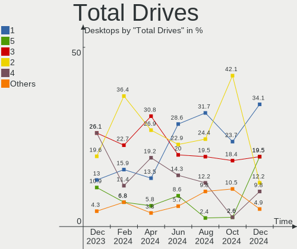
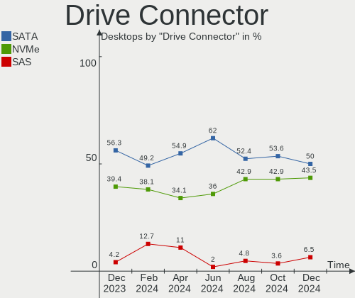
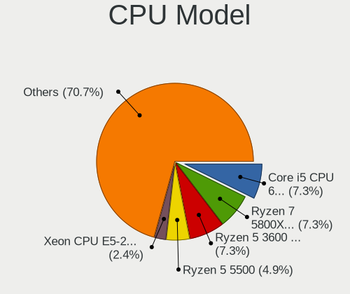
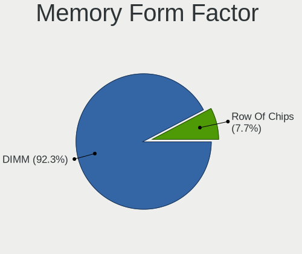
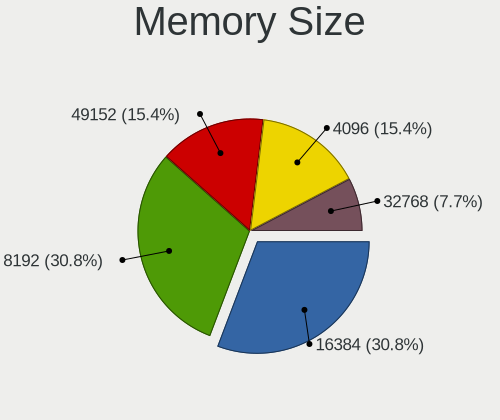

Manjaro Hardware Trends (Desktops)
----------------------------------

A project to identify most popular hardware characteristics and track their change
over time based on data collected by Manjaro users at https://Linux-Hardware.org.

Anyone can contribute to this report by the [hw-probe](https://github.com/linuxhw/hw-probe) tool:

    sudo -E hw-probe -all -upload

Full-feature report is available here: https://linux-hardware.org/?view=trends&formfactor=desktop

Period: Oct, 2021.

Contents
--------

* [ System ](#system)
  - [ OS                       ](#os)
  - [ OS Family                ](#os-family)
  - [ Kernel                   ](#kernel)
  - [ Kernel Family            ](#kernel-family)
  - [ Kernel Major Ver.        ](#kernel-major-ver)
  - [ Arch                     ](#arch)
  - [ DE                       ](#de)
  - [ Display Server           ](#display-server)
  - [ Display Manager          ](#display-manager)
  - [ OS Lang                  ](#os-lang)
  - [ Boot Mode                ](#boot-mode)
  - [ Filesystem               ](#filesystem)
  - [ Part. scheme             ](#part-scheme)
  - [ Dual Boot with Linux/BSD ](#dual-boot-with-linuxbsd)
  - [ Dual Boot (Win)          ](#dual-boot-win)

* [ Board ](#board)
  - [ Vendor                   ](#vendor)
  - [ Model                    ](#model)
  - [ Model Family             ](#model-family)
  - [ MFG Year                 ](#mfg-year)
  - [ Form Factor              ](#form-factor)
  - [ Secure Boot              ](#secure-boot)
  - [ Coreboot                 ](#coreboot)
  - [ RAM Size                 ](#ram-size)
  - [ RAM Used                 ](#ram-used)
  - [ Total Drives             ](#total-drives)
  - [ Has CD-ROM               ](#has-cd-rom)
  - [ Has Ethernet             ](#has-ethernet)
  - [ Has WiFi                 ](#has-wifi)
  - [ Has Bluetooth            ](#has-bluetooth)

* [ Location ](#location)
  - [ Country                  ](#country)
  - [ City                     ](#city)

* [ Drives ](#drives)
  - [ Drive Vendor             ](#drive-vendor)
  - [ Drive Model              ](#drive-model)
  - [ HDD Vendor               ](#hdd-vendor)
  - [ SSD Vendor               ](#ssd-vendor)
  - [ Drive Kind               ](#drive-kind)
  - [ Drive Connector          ](#drive-connector)
  - [ Drive Size               ](#drive-size)
  - [ Space Total              ](#space-total)
  - [ Space Used               ](#space-used)
  - [ Malfunc. Drives          ](#malfunc-drives)
  - [ Malfunc. Drive Vendor    ](#malfunc-drive-vendor)
  - [ Malfunc. HDD Vendor      ](#malfunc-hdd-vendor)
  - [ Malfunc. Drive Kind      ](#malfunc-drive-kind)
  - [ Failed Drives            ](#failed-drives)
  - [ Failed Drive Vendor      ](#failed-drive-vendor)
  - [ Drive Status             ](#drive-status)

* [ Storage controller ](#storage-controller)
  - [ Storage Vendor           ](#storage-vendor)
  - [ Storage Model            ](#storage-model)
  - [ Storage Kind             ](#storage-kind)

* [ Processor ](#processor)
  - [ CPU Vendor               ](#cpu-vendor)
  - [ CPU Model                ](#cpu-model)
  - [ CPU Model Family         ](#cpu-model-family)
  - [ CPU Cores                ](#cpu-cores)
  - [ CPU Sockets              ](#cpu-sockets)
  - [ CPU Threads              ](#cpu-threads)
  - [ CPU Op-Modes             ](#cpu-op-modes)
  - [ CPU Microcode            ](#cpu-microcode)
  - [ CPU Microarch            ](#cpu-microarch)

* [ Graphics ](#graphics)
  - [ GPU Vendor               ](#gpu-vendor)
  - [ GPU Model                ](#gpu-model)
  - [ GPU Combo                ](#gpu-combo)
  - [ GPU Driver               ](#gpu-driver)
  - [ GPU Memory               ](#gpu-memory)

* [ Monitor ](#monitor)
  - [ Monitor Vendor           ](#monitor-vendor)
  - [ Monitor Model            ](#monitor-model)
  - [ Monitor Resolution       ](#monitor-resolution)
  - [ Monitor Diagonal         ](#monitor-diagonal)
  - [ Monitor Width            ](#monitor-width)
  - [ Aspect Ratio             ](#aspect-ratio)
  - [ Monitor Area             ](#monitor-area)
  - [ Pixel Density            ](#pixel-density)
  - [ Multiple Monitors        ](#multiple-monitors)

* [ Network ](#network)
  - [ Net Controller Vendor    ](#net-controller-vendor)
  - [ Net Controller Model     ](#net-controller-model)
  - [ Wireless Vendor          ](#wireless-vendor)
  - [ Wireless Model           ](#wireless-model)
  - [ Ethernet Vendor          ](#ethernet-vendor)
  - [ Ethernet Model           ](#ethernet-model)
  - [ Net Controller Kind      ](#net-controller-kind)
  - [ Used Controller          ](#used-controller)
  - [ NICs                     ](#nics)
  - [ IPv6                     ](#ipv6)

* [ Bluetooth ](#bluetooth)
  - [ Bluetooth Vendor         ](#bluetooth-vendor)
  - [ Bluetooth Model          ](#bluetooth-model)

* [ Sound ](#sound)
  - [ Sound Vendor             ](#sound-vendor)
  - [ Sound Model              ](#sound-model)

* [ Memory ](#memory)
  - [ Memory Vendor            ](#memory-vendor)
  - [ Memory Model             ](#memory-model)
  - [ Memory Kind              ](#memory-kind)
  - [ Memory Form Factor       ](#memory-form-factor)
  - [ Memory Size              ](#memory-size)
  - [ Memory Speed             ](#memory-speed)

* [ Printers & scanners ](#printers--scanners)
  - [ Printer Vendor           ](#printer-vendor)
  - [ Printer Model            ](#printer-model)
  - [ Scanner Vendor           ](#scanner-vendor)
  - [ Scanner Model            ](#scanner-model)

* [ Camera ](#camera)
  - [ Camera Vendor            ](#camera-vendor)
  - [ Camera Model             ](#camera-model)

* [ Security ](#security)
  - [ Fingerprint Vendor       ](#fingerprint-vendor)
  - [ Fingerprint Model        ](#fingerprint-model)
  - [ Chipcard Vendor          ](#chipcard-vendor)
  - [ Chipcard Model           ](#chipcard-model)

* [ Unsupported ](#unsupported)
  - [ Unsupported Devices      ](#unsupported-devices)
  - [ Unsupported Device Types ](#unsupported-device-types)

System
------

OS
--

Installed operating systems

| Name           | Desktops | Percent |
|----------------|----------|---------|
| Manjaro        | 26       | 41.94%  |
| Manjaro 21.1.6 | 17       | 27.42%  |
| Manjaro 21.1.5 | 10       | 16.13%  |
| Manjaro 21.1.4 | 6        | 9.68%   |
| Manjaro 21.2.0 | 3        | 4.84%   |

OS Family
---------

OS without a version

| Name    | Desktops | Percent |
|---------|----------|---------|
| Manjaro | 62       | 100%    |

Kernel
------

Version of the Linux kernel

| Version                | Desktops | Percent |
|------------------------|----------|---------|
| 5.13.19-2-MANJARO      | 20       | 32.26%  |
| 5.14.10-1-MANJARO      | 11       | 17.74%  |
| 5.10.70-1-MANJARO      | 8        | 12.9%   |
| 5.15.0-1-MANJARO       | 6        | 9.68%   |
| 5.14.7-2-MANJARO       | 5        | 8.06%   |
| 5.10.68-1-MANJARO      | 5        | 8.06%   |
| 5.4.150-1-MANJARO      | 1        | 1.61%   |
| 5.14.13-208-tkg-pds    | 1        | 1.61%   |
| 5.14.13-1-MANJARO      | 1        | 1.61%   |
| 5.14.11-lqx1-2-lqx     | 1        | 1.61%   |
| 5.13.15-1-MANJARO      | 1        | 1.61%   |
| 5.10.52-3-rt47-MANJARO | 1        | 1.61%   |
| 5.10.23-1-MANJARO      | 1        | 1.61%   |

Kernel Family
-------------

Linux kernel without a distro release

| Version | Desktops | Percent |
|---------|----------|---------|
| 5.13.19 | 20       | 32.26%  |
| 5.14.10 | 11       | 17.74%  |
| 5.10.70 | 8        | 12.9%   |
| 5.15.0  | 6        | 9.68%   |
| 5.14.7  | 5        | 8.06%   |
| 5.10.68 | 5        | 8.06%   |
| 5.14.13 | 2        | 3.23%   |
| 5.4.150 | 1        | 1.61%   |
| 5.14.11 | 1        | 1.61%   |
| 5.13.15 | 1        | 1.61%   |
| 5.10.52 | 1        | 1.61%   |
| 5.10.23 | 1        | 1.61%   |

Kernel Major Ver.
-----------------

Linux kernel major version

| Version | Desktops | Percent |
|---------|----------|---------|
| 5.13    | 21       | 33.87%  |
| 5.14    | 19       | 30.65%  |
| 5.10    | 15       | 24.19%  |
| 5.15    | 6        | 9.68%   |
| 5.4     | 1        | 1.61%   |

Arch
----

OS architecture (x86_64, i586, etc.)

| Name   | Desktops | Percent |
|--------|----------|---------|
| x86_64 | 62       | 100%    |

DE
--

Desktop Environment

| Name       | Desktops | Percent |
|------------|----------|---------|
| KDE5       | 29       | 46.77%  |
| XFCE       | 18       | 29.03%  |
| GNOME      | 9        | 14.52%  |
| X-Cinnamon | 2        | 3.23%   |
| MATE       | 1        | 1.61%   |
| KDE        | 1        | 1.61%   |
| i3         | 1        | 1.61%   |
| Cinnamon   | 1        | 1.61%   |

Display Server
--------------

X11 or Wayland

| Name    | Desktops | Percent |
|---------|----------|---------|
| X11     | 57       | 91.94%  |
| Wayland | 4        | 6.45%   |
| Tty     | 1        | 1.61%   |

Display Manager
---------------

SDDM, LightDM, etc.

| Name    | Desktops | Percent |
|---------|----------|---------|
| Unknown | 26       | 41.94%  |
| SDDM    | 19       | 30.65%  |
| LightDM | 11       | 17.74%  |
| GDM     | 6        | 9.68%   |

OS Lang
-------

Language

| Lang  | Desktops | Percent |
|-------|----------|---------|
| en_US | 24       | 38.71%  |
| ru_RU | 4        | 6.45%   |
| pt_BR | 4        | 6.45%   |
| de_DE | 4        | 6.45%   |
| en_GB | 3        | 4.84%   |
| en_CA | 3        | 4.84%   |
| ru_UA | 2        | 3.23%   |
| es_ES | 2        | 3.23%   |
| en_IN | 2        | 3.23%   |
| en_IE | 2        | 3.23%   |
| zh_CN | 1        | 1.61%   |
| sv_SE | 1        | 1.61%   |
| pl_PL | 1        | 1.61%   |
| nl_BE | 1        | 1.61%   |
| nb_NO | 1        | 1.61%   |
| hu_HU | 1        | 1.61%   |
| fr_FR | 1        | 1.61%   |
| es_MX | 1        | 1.61%   |
| en_PH | 1        | 1.61%   |
| en_NZ | 1        | 1.61%   |
| en_IL | 1        | 1.61%   |
| de_AT | 1        | 1.61%   |

Boot Mode
---------

EFI or BIOS

| Mode | Desktops | Percent |
|------|----------|---------|
| BIOS | 44       | 70.97%  |
| EFI  | 18       | 29.03%  |

Filesystem
----------

Type of filesystem

| Type    | Desktops | Percent |
|---------|----------|---------|
| Ext4    | 54       | 87.1%   |
| Btrfs   | 5        | 8.06%   |
| Xfs     | 2        | 3.23%   |
| Unknown | 1        | 1.61%   |

Part. scheme
------------

Scheme of partitioning

| Type    | Desktops | Percent |
|---------|----------|---------|
| Unknown | 38       | 61.29%  |
| GPT     | 20       | 32.26%  |
| MBR     | 4        | 6.45%   |

Dual Boot with Linux/BSD
------------------------

Hosting more than one Linux/BSD

| Dual boot | Desktops | Percent |
|-----------|----------|---------|
| No        | 57       | 91.94%  |
| Yes       | 5        | 8.06%   |

Dual Boot (Win)
---------------

Hosting Linux and Windows

| Dual boot | Desktops | Percent |
|-----------|----------|---------|
| No        | 40       | 64.52%  |
| Yes       | 22       | 35.48%  |

Board
-----

Vendor
------

Motherboard manufacturer

| Name                | Desktops | Percent |
|---------------------|----------|---------|
| ASUSTek Computer    | 18       | 29.03%  |
| Gigabyte Technology | 13       | 20.97%  |
| MSI                 | 11       | 17.74%  |
| Dell                | 6        | 9.68%   |
| Lenovo              | 2        | 3.23%   |
| Intel               | 2        | 3.23%   |
| Hewlett-Packard     | 2        | 3.23%   |
| ASRock              | 2        | 3.23%   |
| Huanan              | 1        | 1.61%   |
| Emaxx Technologies  | 1        | 1.61%   |
| Apple               | 1        | 1.61%   |
| Alienware           | 1        | 1.61%   |
| Acer                | 1        | 1.61%   |
| Unknown             | 1        | 1.61%   |

Model
-----

Motherboard model

| Name                                | Desktops | Percent |
|-------------------------------------|----------|---------|
| Gigabyte B450M DS3H                 | 2        | 3.23%   |
| ASUS P8Z77-V LX                     | 2        | 3.23%   |
| MSI MS-7C84                         | 1        | 1.61%   |
| MSI MS-7C37                         | 1        | 1.61%   |
| MSI MS-7C04                         | 1        | 1.61%   |
| MSI MS-7B94                         | 1        | 1.61%   |
| MSI MS-7B79                         | 1        | 1.61%   |
| MSI MS-7B53                         | 1        | 1.61%   |
| MSI MS-7A37                         | 1        | 1.61%   |
| MSI MS-7998                         | 1        | 1.61%   |
| MSI MS-7976                         | 1        | 1.61%   |
| MSI MS-7817                         | 1        | 1.61%   |
| MSI Hyrican PC A320M PRO-E          | 1        | 1.61%   |
| Lenovo ThinkCentre M900 10FD003RUS  | 1        | 1.61%   |
| Lenovo ThinkCentre Edge 92Z 3426EZG | 1        | 1.61%   |
| Intel H61                           | 1        | 1.61%   |
| Intel DB75EN AAG39650-302           | 1        | 1.61%   |
| Huanan X99-F8                       | 1        | 1.61%   |
| HP Z440 Workstation                 | 1        | 1.61%   |
| HP ProDesk 600 G1 DM                | 1        | 1.61%   |
| Gigabyte Z270X-Gaming K5            | 1        | 1.61%   |
| Gigabyte X399 AORUS XTREME          | 1        | 1.61%   |
| Gigabyte M68MT-D3P                  | 1        | 1.61%   |
| Gigabyte J1900N-D3V                 | 1        | 1.61%   |
| Gigabyte H87-HD3                    | 1        | 1.61%   |
| Gigabyte F2A68HM-DS2                | 1        | 1.61%   |
| Gigabyte F2A55M-S1                  | 1        | 1.61%   |
| Gigabyte B450M DS3H WIFI            | 1        | 1.61%   |
| Gigabyte B450 AORUS ELITE           | 1        | 1.61%   |
| Gigabyte AB350M-Gaming 3            | 1        | 1.61%   |
| Gigabyte A320M-H                    | 1        | 1.61%   |
| Emaxx EMX-MCP61D3-iCafe V2.0        | 1        | 1.61%   |
| Dell Precision T7600                | 1        | 1.61%   |
| Dell Precision T5610                | 1        | 1.61%   |
| Dell OptiPlex XE2                   | 1        | 1.61%   |
| Dell OptiPlex 790                   | 1        | 1.61%   |
| Dell OptiPlex 780                   | 1        | 1.61%   |
| Dell OptiPlex 745                   | 1        | 1.61%   |
| ASUS TUF GAMING X570-PLUS           | 1        | 1.61%   |
| ASUS SABERTOOTH X79                 | 1        | 1.61%   |
| ASUS ROG STRIX Z590-E GAMING WIFI   | 1        | 1.61%   |
| ASUS ROG STRIX X570-F GAMING        | 1        | 1.61%   |
| ASUS RK548AA-ABA SR2180NX           | 1        | 1.61%   |
| ASUS PRIME X570-P                   | 1        | 1.61%   |
| ASUS PRIME X399-A                   | 1        | 1.61%   |
| ASUS PRIME B450M-A                  | 1        | 1.61%   |
| ASUS PRIME B450-PLUS                | 1        | 1.61%   |
| ASUS PRIME A320M-K                  | 1        | 1.61%   |
| ASUS P8H61/USB3 R2.0                | 1        | 1.61%   |
| ASUS P8H61-M LX R2.0                | 1        | 1.61%   |
| ASUS P5Q-PRO                        | 1        | 1.61%   |
| ASUS Maximus VIII FORMULA           | 1        | 1.61%   |
| ASUS M3A78-EM                       | 1        | 1.61%   |
| ASUS GZ727AA-A2L s3307c             | 1        | 1.61%   |
| ASRock X99E-ITX/ac                  | 1        | 1.61%   |
| ASRock B365 Pro4                    | 1        | 1.61%   |
| Apple MacPro5,1                     | 1        | 1.61%   |
| Alienware Aurora                    | 1        | 1.61%   |
| Acer Aspire TC-885                  | 1        | 1.61%   |
| Unknown                             | 1        | 1.61%   |

Model Family
------------

Motherboard model prefix

| Name                    | Desktops | Percent |
|-------------------------|----------|---------|
| ASUS PRIME              | 5        | 8.06%   |
| Dell OptiPlex           | 4        | 6.45%   |
| Gigabyte B450M          | 3        | 4.84%   |
| Lenovo ThinkCentre      | 2        | 3.23%   |
| Dell Precision          | 2        | 3.23%   |
| ASUS ROG                | 2        | 3.23%   |
| ASUS P8Z77-V            | 2        | 3.23%   |
| MSI MS-7C84             | 1        | 1.61%   |
| MSI MS-7C37             | 1        | 1.61%   |
| MSI MS-7C04             | 1        | 1.61%   |
| MSI MS-7B94             | 1        | 1.61%   |
| MSI MS-7B79             | 1        | 1.61%   |
| MSI MS-7B53             | 1        | 1.61%   |
| MSI MS-7A37             | 1        | 1.61%   |
| MSI MS-7998             | 1        | 1.61%   |
| MSI MS-7976             | 1        | 1.61%   |
| MSI MS-7817             | 1        | 1.61%   |
| MSI Hyrican             | 1        | 1.61%   |
| Intel H61               | 1        | 1.61%   |
| Intel DB75EN            | 1        | 1.61%   |
| Huanan X99-F8           | 1        | 1.61%   |
| HP Z440                 | 1        | 1.61%   |
| HP ProDesk              | 1        | 1.61%   |
| Gigabyte Z270X-Gaming   | 1        | 1.61%   |
| Gigabyte X399           | 1        | 1.61%   |
| Gigabyte M68MT-D3P      | 1        | 1.61%   |
| Gigabyte J1900N-D3V     | 1        | 1.61%   |
| Gigabyte H87-HD3        | 1        | 1.61%   |
| Gigabyte F2A68HM-DS2    | 1        | 1.61%   |
| Gigabyte F2A55M-S1      | 1        | 1.61%   |
| Gigabyte B450           | 1        | 1.61%   |
| Gigabyte AB350M-Gaming  | 1        | 1.61%   |
| Gigabyte A320M-H        | 1        | 1.61%   |
| Emaxx EMX-MCP61D3-iCafe | 1        | 1.61%   |
| ASUS TUF                | 1        | 1.61%   |
| ASUS SABERTOOTH         | 1        | 1.61%   |
| ASUS RK548AA-ABA        | 1        | 1.61%   |
| ASUS P8H61-M            | 1        | 1.61%   |
| ASUS P8H61              | 1        | 1.61%   |
| ASUS P5Q-PRO            | 1        | 1.61%   |
| ASUS Maximus            | 1        | 1.61%   |
| ASUS M3A78-EM           | 1        | 1.61%   |
| ASUS GZ727AA-A2L        | 1        | 1.61%   |
| ASRock X99E-ITX         | 1        | 1.61%   |
| ASRock B365             | 1        | 1.61%   |
| Apple MacPro5           | 1        | 1.61%   |
| Alienware Aurora        | 1        | 1.61%   |
| Acer Aspire             | 1        | 1.61%   |
| Unknown                 | 1        | 1.61%   |

MFG Year
--------

Motherboard manufacture year

| Year | Desktops | Percent |
|------|----------|---------|
| 2019 | 12       | 19.35%  |
| 2018 | 10       | 16.13%  |
| 2021 | 9        | 14.52%  |
| 2014 | 7        | 11.29%  |
| 2020 | 5        | 8.06%   |
| 2016 | 3        | 4.84%   |
| 2015 | 3        | 4.84%   |
| 2012 | 3        | 4.84%   |
| 2009 | 3        | 4.84%   |
| 2010 | 2        | 3.23%   |
| 2017 | 1        | 1.61%   |
| 2013 | 1        | 1.61%   |
| 2011 | 1        | 1.61%   |
| 2007 | 1        | 1.61%   |
| 2006 | 1        | 1.61%   |

Form Factor
-----------

Physical design of the computer

| Name    | Desktops | Percent |
|---------|----------|---------|
| Desktop | 62       | 100%    |

Secure Boot
-----------

Enabled or disabled

| State    | Desktops | Percent |
|----------|----------|---------|
| Disabled | 62       | 100%    |

Coreboot
--------

Have coreboot on board

| Used | Desktops | Percent |
|------|----------|---------|
| No   | 62       | 100%    |

RAM Size
--------

Total RAM memory

| Size in GB  | Desktops | Percent |
|-------------|----------|---------|
| 16.01-24.0  | 18       | 29.03%  |
| 8.01-16.0   | 16       | 25.81%  |
| 32.01-64.0  | 11       | 17.74%  |
| 64.01-256.0 | 6        | 9.68%   |
| 4.01-8.0    | 4        | 6.45%   |
| 3.01-4.0    | 4        | 6.45%   |
| 1.01-2.0    | 3        | 4.84%   |

RAM Used
--------

Used RAM memory

| Used GB    | Desktops | Percent |
|------------|----------|---------|
| 2.01-3.0   | 14       | 22.58%  |
| 4.01-8.0   | 11       | 17.74%  |
| 3.01-4.0   | 11       | 17.74%  |
| 1.01-2.0   | 11       | 17.74%  |
| 8.01-16.0  | 6        | 9.68%   |
| 0.51-1.0   | 6        | 9.68%   |
| 24.01-32.0 | 2        | 3.23%   |
| 16.01-24.0 | 1        | 1.61%   |

Total Drives
------------

Number of drives on board

| Drives | Desktops | Percent |
|--------|----------|---------|
| 1      | 19       | 30.65%  |
| 2      | 16       | 25.81%  |
| 4      | 10       | 16.13%  |
| 3      | 9        | 14.52%  |
| 7      | 3        | 4.84%   |
| 5      | 3        | 4.84%   |
| 8      | 1        | 1.61%   |
| 6      | 1        | 1.61%   |

Has CD-ROM
----------

Has CD-ROM on board

| Presented | Desktops | Percent |
|-----------|----------|---------|
| No        | 41       | 66.13%  |
| Yes       | 21       | 33.87%  |

Has Ethernet
------------

Has Ethernet on board

| Presented | Desktops | Percent |
|-----------|----------|---------|
| Yes       | 62       | 100%    |

Has WiFi
--------

Has WiFi module

| Presented | Desktops | Percent |
|-----------|----------|---------|
| Yes       | 32       | 51.61%  |
| No        | 30       | 48.39%  |

Has Bluetooth
-------------

Has Bluetooth module

| Presented | Desktops | Percent |
|-----------|----------|---------|
| No        | 37       | 59.68%  |
| Yes       | 25       | 40.32%  |

Location
--------

Country
-------

Geographic location (country)

| Country     | Desktops | Percent |
|-------------|----------|---------|
| USA         | 14       | 22.58%  |
| Germany     | 6        | 9.68%   |
| Russia      | 5        | 8.06%   |
| Poland      | 4        | 6.45%   |
| Brazil      | 4        | 6.45%   |
| Canada      | 3        | 4.84%   |
| Spain       | 2        | 3.23%   |
| Norway      | 2        | 3.23%   |
| Ireland     | 2        | 3.23%   |
| India       | 2        | 3.23%   |
| France      | 2        | 3.23%   |
| Belgium     | 2        | 3.23%   |
| Austria     | 2        | 3.23%   |
| UK          | 1        | 1.61%   |
| Sweden      | 1        | 1.61%   |
| Serbia      | 1        | 1.61%   |
| Puerto Rico | 1        | 1.61%   |
| Philippines | 1        | 1.61%   |
| New Zealand | 1        | 1.61%   |
| Myanmar     | 1        | 1.61%   |
| Mexico      | 1        | 1.61%   |
| Israel      | 1        | 1.61%   |
| Indonesia   | 1        | 1.61%   |
| Hungary     | 1        | 1.61%   |
| Belarus     | 1        | 1.61%   |

City
----

Geographic location (city)

| City                | Desktops | Percent |
|---------------------|----------|---------|
| Warsaw              | 2        | 3.23%   |
| Vienna              | 2        | 3.23%   |
| Tucson              | 2        | 3.23%   |
| Rio de Janeiro      | 2        | 3.23%   |
| Zamboanga City      | 1        | 1.61%   |
| Yogyakarta          | 1        | 1.61%   |
| Yangon              | 1        | 1.61%   |
| Vigo                | 1        | 1.61%   |
| Uelsen              | 1        | 1.61%   |
| Tullinge            | 1        | 1.61%   |
| Tula                | 1        | 1.61%   |
| Toulouse            | 1        | 1.61%   |
| Toledo              | 1        | 1.61%   |
| Tel Aviv            | 1        | 1.61%   |
| Stockport           | 1        | 1.61%   |
| Starotitarovskaya   | 1        | 1.61%   |
| Sheboygan           | 1        | 1.61%   |
| San Juan            | 1        | 1.61%   |
| Salvador            | 1        | 1.61%   |
| Rzesz??w            | 1        | 1.61%   |
| Rathenow            | 1        | 1.61%   |
| Pontevedra          | 1        | 1.61%   |
| Palmerston North    | 1        | 1.61%   |
| Oryol               | 1        | 1.61%   |
| Oklahoma City       | 1        | 1.61%   |
| Nanaimo             | 1        | 1.61%   |
| Naas                | 1        | 1.61%   |
| Moscow              | 1        | 1.61%   |
| Minsk               | 1        | 1.61%   |
| Miami               | 1        | 1.61%   |
| Mezofalva           | 1        | 1.61%   |
| Los Angeles         | 1        | 1.61%   |
| Lohnberg            | 1        | 1.61%   |
| Leopoldsburg        | 1        | 1.61%   |
| Le??n               | 1        | 1.61%   |
| Krakow              | 1        | 1.61%   |
| Kragujevac          | 1        | 1.61%   |
| Kalamazoo           | 1        | 1.61%   |
| Indianapolis        | 1        | 1.61%   |
| Iguaba Grande       | 1        | 1.61%   |
| Hegra               | 1        | 1.61%   |
| Hannoversch M??nden | 1        | 1.61%   |
| Glomfjord           | 1        | 1.61%   |
| Giessen             | 1        | 1.61%   |
| Gatineau            | 1        | 1.61%   |
| Galesburg           | 1        | 1.61%   |
| Foix                | 1        | 1.61%   |
| Dublin              | 1        | 1.61%   |
| Delligsen           | 1        | 1.61%   |
| Deinze              | 1        | 1.61%   |
| Chennai             | 1        | 1.61%   |
| Chelyabinsk         | 1        | 1.61%   |
| Carrollton          | 1        | 1.61%   |
| Brampton            | 1        | 1.61%   |
| Bordentown          | 1        | 1.61%   |
| Bismarck            | 1        | 1.61%   |
| Bhimavaram          | 1        | 1.61%   |
| Austin              | 1        | 1.61%   |

Drives
------

Drive Vendor
------------

Hard drive vendors

| Vendor                    | Desktops | Drives | Percent |
|---------------------------|----------|--------|---------|
| WDC                       | 27       | 37     | 21.09%  |
| Seagate                   | 26       | 39     | 20.31%  |
| Samsung Electronics       | 20       | 27     | 15.63%  |
| Kingston                  | 8        | 10     | 6.25%   |
| Toshiba                   | 7        | 9      | 5.47%   |
| SanDisk                   | 7        | 7      | 5.47%   |
| Hitachi                   | 5        | 6      | 3.91%   |
| Phison                    | 3        | 3      | 2.34%   |
| Crucial                   | 3        | 4      | 2.34%   |
| Corsair                   | 3        | 3      | 2.34%   |
| SK Hynix                  | 2        | 2      | 1.56%   |
| Silicon Motion            | 2        | 2      | 1.56%   |
| Intel                     | 2        | 2      | 1.56%   |
| HGST                      | 2        | 2      | 1.56%   |
| USB3.0                    | 1        | 1      | 0.78%   |
| SPCC                      | 1        | 1      | 0.78%   |
| PNY                       | 1        | 2      | 0.78%   |
| Micron/Crucial Technology | 1        | 1      | 0.78%   |
| LITEON                    | 1        | 1      | 0.78%   |
| LaCie                     | 1        | 1      | 0.78%   |
| KIOXIA                    | 1        | 1      | 0.78%   |
| JMicron                   | 1        | 1      | 0.78%   |
| GALAX                     | 1        | 1      | 0.78%   |
| ASMT                      | 1        | 1      | 0.78%   |
| Unknown                   | 1        | 1      | 0.78%   |

Drive Model
-----------

Hard drive models

| Model                               | Desktops | Percent |
|-------------------------------------|----------|---------|
| Seagate ST2000DM008-2FR102 2TB      | 4        | 2.6%    |
| WDC WD5000AAKX-001CA0 500GB         | 3        | 1.95%   |
| WDC WD10EZEX-08WN4A0 1TB            | 3        | 1.95%   |
| Seagate ST3500418AS 500GB           | 3        | 1.95%   |
| WDC WDBNCE0010PNC 1TB SSD           | 2        | 1.3%    |
| WDC WD30EZRX-00DC0B0 3TB            | 2        | 1.3%    |
| WDC WD10EZEX-21WN4A0 1TB            | 2        | 1.3%    |
| WDC WD10EZEX-00BN5A0 1TB            | 2        | 1.3%    |
| Seagate ST31000524AS 1TB            | 2        | 1.3%    |
| Seagate ST2000DX002-2DV164 2TB      | 2        | 1.3%    |
| Seagate ST2000DM006-2DM164 2TB      | 2        | 1.3%    |
| Seagate ST2000DM005-2CW102 2TB      | 2        | 1.3%    |
| Samsung SSD 970 EVO 500GB           | 2        | 1.3%    |
| Samsung SSD 860 EVO 500GB           | 2        | 1.3%    |
| Samsung SSD 850 EVO 250GB           | 2        | 1.3%    |
| Samsung SSD 850 EVO 120GB           | 2        | 1.3%    |
| Samsung SSD 840 EVO 120GB           | 2        | 1.3%    |
| Samsung NVMe SSD Drive 1TB          | 2        | 1.3%    |
| Kingston SA400S37240G 240GB SSD     | 2        | 1.3%    |
| Kingston SA400S37120G 120GB SSD     | 2        | 1.3%    |
| HGST HTS725032A7E630 320GB          | 2        | 1.3%    |
| WDC WDS500G2B0B-00YS70 500GB SSD    | 1        | 0.65%   |
| WDC WDS240G2G0A-00JH30 240GB SSD    | 1        | 0.65%   |
| WDC WD800JD-60LSA0 80GB             | 1        | 0.65%   |
| WDC WD5001FZWX-00ZHUA0 5TB          | 1        | 0.65%   |
| WDC WD5000AAKX-00ERMA0 500GB        | 1        | 0.65%   |
| WDC WD5000AAKS-00UU3A0 500GB        | 1        | 0.65%   |
| WDC WD40EFRX-68N32N0 4TB            | 1        | 0.65%   |
| WDC WD30EZRZ-00Z5HB0 3TB            | 1        | 0.65%   |
| WDC WD30EZRX-00D8PB0 3TB            | 1        | 0.65%   |
| WDC WD2500AAKX-75U6AA0 250GB        | 1        | 0.65%   |
| WDC WD20EZRZ-00Z5HB0 2TB            | 1        | 0.65%   |
| WDC WD20EZAZ-00L9GB0 2TB            | 1        | 0.65%   |
| WDC WD20EURX-57T0FY1 2TB            | 1        | 0.65%   |
| WDC WD20EFRX-68AX9N0 2TB            | 1        | 0.65%   |
| WDC WD20EARX-00PASB0 2TB            | 1        | 0.65%   |
| WDC WD20EARS-00J2GB0 2TB            | 1        | 0.65%   |
| WDC WD2002FAEX-007BA0 2TB           | 1        | 0.65%   |
| WDC WD15EARS-00MVWB0 1TB            | 1        | 0.65%   |
| WDC WD10EZRX-00A8LB0 1TB            | 1        | 0.65%   |
| WDC WD10EZEX-75WN4A0 1TB            | 1        | 0.65%   |
| WDC WD10EZEX-00WN4A0 1TB            | 1        | 0.65%   |
| WDC WD10EFRX-68JCSN0 1TB            | 1        | 0.65%   |
| WDC WD1002FAEX-00Z3A0 1TB           | 1        | 0.65%   |
| USB3.0 Super Speed 80GB             | 1        | 0.65%   |
| Toshiba TR200 240GB SSD             | 1        | 0.65%   |
| Toshiba MQ04ABF100 1TB              | 1        | 0.65%   |
| Toshiba MQ01ABF050 500GB            | 1        | 0.65%   |
| Toshiba MK3275GSX 320GB             | 1        | 0.65%   |
| Toshiba DT01ACA300 3TB              | 1        | 0.65%   |
| Toshiba DT01ACA200 2TB              | 1        | 0.65%   |
| Toshiba DT01ACA100 1TB              | 1        | 0.65%   |
| SPCC Solid State Disk MX 256GB      | 1        | 0.65%   |
| SK Hynix PC300 NVMe 256GB           | 1        | 0.65%   |
| SK Hynix HFM256GDHTNG-8510B 256GB   | 1        | 0.65%   |
| Silicon Motion NVMe SSD Drive 128GB | 1        | 0.65%   |
| Silicon Motion NVME SSD 1TB         | 1        | 0.65%   |
| Seagate ST9500420AS 500GB           | 1        | 0.65%   |
| Seagate ST91000640NS 1TB            | 1        | 0.65%   |
| Seagate ST8000VN004-2M2101 8TB      | 1        | 0.65%   |

HDD Vendor
----------

Hard disk drive vendors

| Vendor              | Desktops | Drives | Percent |
|---------------------|----------|--------|---------|
| WDC                 | 25       | 33     | 37.31%  |
| Seagate             | 25       | 37     | 37.31%  |
| Toshiba             | 6        | 7      | 8.96%   |
| Hitachi             | 5        | 6      | 7.46%   |
| Samsung Electronics | 3        | 4      | 4.48%   |
| HGST                | 2        | 2      | 2.99%   |
| USB3.0              | 1        | 1      | 1.49%   |

SSD Vendor
----------

Solid state drive vendors

| Vendor              | Desktops | Drives | Percent |
|---------------------|----------|--------|---------|
| Samsung Electronics | 12       | 14     | 31.58%  |
| Kingston            | 6        | 8      | 15.79%  |
| SanDisk             | 5        | 5      | 13.16%  |
| WDC                 | 4        | 4      | 10.53%  |
| Crucial             | 3        | 4      | 7.89%   |
| Toshiba             | 1        | 2      | 2.63%   |
| SPCC                | 1        | 1      | 2.63%   |
| PNY                 | 1        | 2      | 2.63%   |
| Intel               | 1        | 1      | 2.63%   |
| GALAX               | 1        | 1      | 2.63%   |
| Corsair             | 1        | 1      | 2.63%   |
| ASMT                | 1        | 1      | 2.63%   |
| Unknown             | 1        | 1      | 2.63%   |

Drive Kind
----------

HDD or SSD

| Kind    | Desktops | Drives | Percent |
|---------|----------|--------|---------|
| HDD     | 47       | 90     | 46.08%  |
| SSD     | 30       | 45     | 29.41%  |
| NVMe    | 21       | 26     | 20.59%  |
| Unknown | 4        | 4      | 3.92%   |

Drive Connector
---------------

SATA, SAS, NVMe, etc.

| Type | Desktops | Drives | Percent |
|------|----------|--------|---------|
| SATA | 59       | 130    | 67.82%  |
| NVMe | 21       | 26     | 24.14%  |
| SAS  | 7        | 9      | 8.05%   |

Drive Size
----------

Size of hard drive

| Size in TB | Desktops | Drives | Percent |
|------------|----------|--------|---------|
| 0.01-0.5   | 45       | 67     | 45.45%  |
| 0.51-1.0   | 27       | 32     | 27.27%  |
| 1.01-2.0   | 17       | 24     | 17.17%  |
| 2.01-3.0   | 5        | 6      | 5.05%   |
| 4.01-10.0  | 3        | 3      | 3.03%   |
| 3.01-4.0   | 2        | 3      | 2.02%   |

Space Total
-----------

Amount of disk space available on the file system

| Size in GB     | Desktops | Percent |
|----------------|----------|---------|
| 1001-2000      | 15       | 24.19%  |
| 251-500        | 12       | 19.35%  |
| 101-250        | 11       | 17.74%  |
| 501-1000       | 11       | 17.74%  |
| More than 3000 | 7        | 11.29%  |
| 51-100         | 3        | 4.84%   |
| 2001-3000      | 2        | 3.23%   |
| Unknown        | 1        | 1.61%   |

Space Used
----------

Amount of used disk space

| Used GB        | Desktops | Percent |
|----------------|----------|---------|
| 21-50          | 11       | 17.74%  |
| 1-20           | 9        | 14.52%  |
| 501-1000       | 9        | 14.52%  |
| 101-250        | 8        | 12.9%   |
| 51-100         | 7        | 11.29%  |
| 251-500        | 6        | 9.68%   |
| More than 3000 | 5        | 8.06%   |
| 1001-2000      | 5        | 8.06%   |
| 2001-3000      | 1        | 1.61%   |
| Unknown        | 1        | 1.61%   |

Malfunc. Drives
---------------

Drive models with a malfunction

| Model                         | Desktops | Drives | Percent |
|-------------------------------|----------|--------|---------|
| WDC WD5000AAKX-001CA0 500GB   | 1        | 1      | 11.11%  |
| WDC WD5000AAKS-00UU3A0 500GB  | 1        | 1      | 11.11%  |
| WDC WD30EZRZ-00Z5HB0 3TB      | 1        | 1      | 11.11%  |
| WDC WD1002FAEX-00Z3A0 1TB     | 1        | 1      | 11.11%  |
| Toshiba MQ01ABF050 500GB      | 1        | 1      | 11.11%  |
| Seagate ST3500413AS 500GB     | 1        | 1      | 11.11%  |
| Phison BPX 240GB              | 1        | 1      | 11.11%  |
| Hitachi HTS541010G9SA00 100GB | 1        | 1      | 11.11%  |
| Hitachi HDT725032VLA380 320GB | 1        | 1      | 11.11%  |

Malfunc. Drive Vendor
---------------------

Vendors of faulty drives

| Vendor  | Desktops | Drives | Percent |
|---------|----------|--------|---------|
| WDC     | 4        | 4      | 44.44%  |
| Hitachi | 2        | 2      | 22.22%  |
| Toshiba | 1        | 1      | 11.11%  |
| Seagate | 1        | 1      | 11.11%  |
| Phison  | 1        | 1      | 11.11%  |

Malfunc. HDD Vendor
-------------------

Vendors of faulty HDD drives

| Vendor  | Desktops | Drives | Percent |
|---------|----------|--------|---------|
| WDC     | 4        | 4      | 50%     |
| Hitachi | 2        | 2      | 25%     |
| Toshiba | 1        | 1      | 12.5%   |
| Seagate | 1        | 1      | 12.5%   |

Malfunc. Drive Kind
-------------------

Kinds of faulty drives

| Kind | Desktops | Drives | Percent |
|------|----------|--------|---------|
| HDD  | 7        | 8      | 87.5%   |
| NVMe | 1        | 1      | 12.5%   |

Failed Drives
-------------

Failed drive models

Zero info for selected period =(

Failed Drive Vendor
-------------------

Failed drive vendors

Zero info for selected period =(

Drive Status
------------

Number of failed and malfunc. drives

| Status   | Desktops | Drives | Percent |
|----------|----------|--------|---------|
| Detected | 47       | 94     | 64.38%  |
| Works    | 18       | 62     | 24.66%  |
| Malfunc  | 8        | 9      | 10.96%  |

Storage controller
------------------

Storage Vendor
--------------

Storage controller vendors

| Vendor                      | Desktops | Percent |
|-----------------------------|----------|---------|
| Intel                       | 38       | 40.86%  |
| AMD                         | 22       | 23.66%  |
| Samsung Electronics         | 8        | 8.6%    |
| Phison Electronics          | 5        | 5.38%   |
| Nvidia                      | 3        | 3.23%   |
| ASMedia Technology          | 3        | 3.23%   |
| SK Hynix                    | 2        | 2.15%   |
| Silicon Motion              | 2        | 2.15%   |
| Sandisk                     | 2        | 2.15%   |
| Kingston Technology Company | 2        | 2.15%   |
| Silicon Image               | 1        | 1.08%   |
| Micron/Crucial Technology   | 1        | 1.08%   |
| Marvell Technology Group    | 1        | 1.08%   |
| Lite-On Technology          | 1        | 1.08%   |
| KIOXIA                      | 1        | 1.08%   |
| Adaptec                     | 1        | 1.08%   |

Storage Model
-------------

Storage controller models

| Model                                                                                   | Desktops | Percent |
|-----------------------------------------------------------------------------------------|----------|---------|
| AMD FCH SATA Controller [AHCI mode]                                                     | 19       | 15.83%  |
| AMD 400 Series Chipset SATA Controller                                                  | 7        | 5.83%   |
| Samsung NVMe SSD Controller SM981/PM981/PM983                                           | 4        | 3.33%   |
| Intel SATA Controller [RAID mode]                                                       | 4        | 3.33%   |
| Intel Q170/Q150/B150/H170/H110/Z170/CM236 Chipset SATA Controller [AHCI Mode]           | 4        | 3.33%   |
| Intel 7 Series/C210 Series Chipset Family 6-port SATA Controller [AHCI mode]            | 4        | 3.33%   |
| Samsung NVMe SSD Controller SM961/PM961/SM963                                           | 3        | 2.5%    |
| Phison E12 NVMe Controller                                                              | 3        | 2.5%    |
| Nvidia MCP61 SATA Controller                                                            | 3        | 2.5%    |
| Intel C610/X99 series chipset sSATA Controller [AHCI mode]                              | 3        | 2.5%    |
| Intel C600/X79 series chipset 6-Port SATA AHCI Controller                               | 3        | 2.5%    |
| Intel 8 Series/C220 Series Chipset Family 6-port SATA Controller 1 [AHCI mode]          | 3        | 2.5%    |
| Intel 6 Series/C200 Series Chipset Family 6 port Desktop SATA AHCI Controller           | 3        | 2.5%    |
| Intel 200 Series PCH SATA controller [AHCI mode]                                        | 3        | 2.5%    |
| ASMedia ASM1062 Serial ATA Controller                                                   | 3        | 2.5%    |
| AMD FCH SATA Controller D                                                               | 3        | 2.5%    |
| Silicon Motion SM2263EN/SM2263XT SSD Controller                                         | 2        | 1.67%   |
| Nvidia MCP61 IDE                                                                        | 2        | 1.67%   |
| Kingston Company A2000 NVMe SSD                                                         | 2        | 1.67%   |
| Intel Cannon Lake PCH SATA AHCI Controller                                              | 2        | 1.67%   |
| Intel C610/X99 series chipset 6-Port SATA Controller [AHCI mode]                        | 2        | 1.67%   |
| Intel 6 Series/C200 Series Chipset Family Desktop SATA Controller (IDE mode, ports 4-5) | 2        | 1.67%   |
| Intel 6 Series/C200 Series Chipset Family Desktop SATA Controller (IDE mode, ports 0-3) | 2        | 1.67%   |
| AMD X399 Series Chipset SATA Controller                                                 | 2        | 1.67%   |
| AMD 300 Series Chipset SATA Controller                                                  | 2        | 1.67%   |
| SK Hynix PC300 NVMe Solid State Drive 256GB                                             | 1        | 0.83%   |
| SK Hynix BC501 NVMe Solid State Drive                                                   | 1        | 0.83%   |
| Silicon Image SiI 3132 Serial ATA Raid II Controller                                    | 1        | 0.83%   |
| Sandisk WD Blue SN550 NVMe SSD                                                          | 1        | 0.83%   |
| Sandisk WD Black SN750 / PC SN730 NVMe SSD                                              | 1        | 0.83%   |
| Samsung NVMe SSD Controller PM9A1/PM9A3/980PRO                                          | 1        | 0.83%   |
| Samsung Electronics SATA controller                                                     | 1        | 0.83%   |
| Phison E7 NVMe Controller                                                               | 1        | 0.83%   |
| Phison E16 PCIe4 NVMe Controller                                                        | 1        | 0.83%   |
| Micron/Crucial P1 NVMe PCIe SSD                                                         | 1        | 0.83%   |
| Marvell Group 88SE9128 PCIe SATA 6 Gb/s RAID controller with HyperDuo                   | 1        | 0.83%   |
| Lite-On Non-Volatile memory controller                                                  | 1        | 0.83%   |
| KIOXIA Non-Volatile memory controller                                                   | 1        | 0.83%   |
| Intel SSD 660P Series                                                                   | 1        | 0.83%   |
| Intel C606 chipset Dual 4-Port SATA/SAS Storage Control Unit                            | 1        | 0.83%   |
| Intel Atom Processor E3800 Series SATA AHCI Controller                                  | 1        | 0.83%   |
| Intel 82801JI (ICH10 Family) SATA AHCI Controller                                       | 1        | 0.83%   |
| Intel 82801JI (ICH10 Family) 4 port SATA IDE Controller #1                              | 1        | 0.83%   |
| Intel 82801JI (ICH10 Family) 2 port SATA IDE Controller #2                              | 1        | 0.83%   |
| Intel 82801HR/HO/HH (ICH8R/DO/DH) 2 port SATA Controller [IDE mode]                     | 1        | 0.83%   |
| Intel 82801H (ICH8 Family) 4 port SATA Controller [IDE mode]                            | 1        | 0.83%   |
| Intel 82801GR/GDH (ICH7R/ICH7DH) SATA Controller [RAID mode]                            | 1        | 0.83%   |
| Intel 82801G (ICH7 Family) IDE Controller                                               | 1        | 0.83%   |
| Intel 500 Series Chipset Family SATA AHCI Controller                                    | 1        | 0.83%   |
| Intel 4 Series Chipset PT IDER Controller                                               | 1        | 0.83%   |
| AMD SB7x0/SB8x0/SB9x0 SATA Controller [IDE mode]                                        | 1        | 0.83%   |
| AMD SB7x0/SB8x0/SB9x0 IDE Controller                                                    | 1        | 0.83%   |
| AMD FCH SATA Controller [IDE mode]                                                      | 1        | 0.83%   |
| AMD FCH IDE Controller                                                                  | 1        | 0.83%   |
| Adaptec Series 8 12G SAS/PCIe 3                                                         | 1        | 0.83%   |

Storage Kind
------------

Kind of storage controller (IDE, SATA, NVMe, SAS, ...)

| Kind | Desktops | Percent |
|------|----------|---------|
| SATA | 51       | 56.67%  |
| NVMe | 21       | 23.33%  |
| IDE  | 11       | 12.22%  |
| RAID | 6        | 6.67%   |
| SAS  | 1        | 1.11%   |

Processor
---------

CPU Vendor
----------

Processor vendors

| Vendor | Desktops | Percent |
|--------|----------|---------|
| Intel  | 37       | 59.68%  |
| AMD    | 25       | 40.32%  |

CPU Model
---------

Processor models

| Model                                           | Desktops | Percent |
|-------------------------------------------------|----------|---------|
| AMD Ryzen 7 2700X Eight-Core Processor          | 4        | 6.45%   |
| Intel Core i5-9400F CPU @ 2.90GHz               | 3        | 4.84%   |
| AMD Ryzen 7 5800X 8-Core Processor              | 3        | 4.84%   |
| Intel Core i7-6700K CPU @ 4.00GHz               | 2        | 3.23%   |
| Intel Core i5-3450 CPU @ 3.10GHz                | 2        | 3.23%   |
| Intel Core i5-2500 CPU @ 3.30GHz                | 2        | 3.23%   |
| AMD Ryzen 7 2700 Eight-Core Processor           | 2        | 3.23%   |
| AMD Ryzen 5 1500X Quad-Core Processor           | 2        | 3.23%   |
| Intel Xeon CPU E5520 @ 2.27GHz                  | 1        | 1.61%   |
| Intel Xeon CPU E5-2690 0 @ 2.90GHz              | 1        | 1.61%   |
| Intel Xeon CPU E5-2680 v4 @ 2.40GHz             | 1        | 1.61%   |
| Intel Xeon CPU E5-2667 v2 @ 3.30GHz             | 1        | 1.61%   |
| Intel Xeon CPU E5-1620 v3 @ 3.50GHz             | 1        | 1.61%   |
| Intel Xeon CPU E3-1240 v3 @ 3.40GHz             | 1        | 1.61%   |
| Intel Pentium Dual-Core CPU E5200 @ 2.50GHz     | 1        | 1.61%   |
| Intel Pentium D CPU 2.80GHz                     | 1        | 1.61%   |
| Intel Core i9-10900X CPU @ 3.70GHz              | 1        | 1.61%   |
| Intel Core i7-8700 CPU @ 3.20GHz                | 1        | 1.61%   |
| Intel Core i7-7700K CPU @ 4.20GHz               | 1        | 1.61%   |
| Intel Core i7-6800K CPU @ 3.40GHz               | 1        | 1.61%   |
| Intel Core i7-6700 CPU @ 3.40GHz                | 1        | 1.61%   |
| Intel Core i7-3820 CPU @ 3.60GHz                | 1        | 1.61%   |
| Intel Core i7 CPU 920 @ 2.67GHz                 | 1        | 1.61%   |
| Intel Core i5-6600K CPU @ 3.50GHz               | 1        | 1.61%   |
| Intel Core i5-4570S CPU @ 2.90GHz               | 1        | 1.61%   |
| Intel Core i5-3470S CPU @ 2.90GHz               | 1        | 1.61%   |
| Intel Core i5-3350P CPU @ 3.10GHz               | 1        | 1.61%   |
| Intel Core i5-2400 CPU @ 3.10GHz                | 1        | 1.61%   |
| Intel Core i5-2310 CPU @ 2.90GHz                | 1        | 1.61%   |
| Intel Core i3-4150 CPU @ 3.50GHz                | 1        | 1.61%   |
| Intel Core i3-4130 CPU @ 3.40GHz                | 1        | 1.61%   |
| Intel Core i3-2100 CPU @ 3.10GHz                | 1        | 1.61%   |
| Intel Core 2 Quad CPU Q8200 @ 2.33GHz           | 1        | 1.61%   |
| Intel Core 2 CPU 6300 @ 1.86GHz                 | 1        | 1.61%   |
| Intel Celeron CPU J1900 @ 1.99GHz               | 1        | 1.61%   |
| Intel 11th Gen Core i9-11900 @ 2.50GHz          | 1        | 1.61%   |
| AMD Ryzen Threadripper 2950X 16-Core Processor  | 1        | 1.61%   |
| AMD Ryzen Threadripper 1950X 16-Core Processor  | 1        | 1.61%   |
| AMD Ryzen 9 5950X 16-Core Processor             | 1        | 1.61%   |
| AMD Ryzen 7 3700X 8-Core Processor              | 1        | 1.61%   |
| AMD Ryzen 5 PRO 3400G with Radeon Vega Graphics | 1        | 1.61%   |
| AMD Ryzen 5 5600X 6-Core Processor              | 1        | 1.61%   |
| AMD Ryzen 5 2600 Six-Core Processor             | 1        | 1.61%   |
| AMD Ryzen 5 1600 Six-Core Processor             | 1        | 1.61%   |
| AMD Phenom II X4 945 Processor                  | 1        | 1.61%   |
| AMD Phenom II X2 555 Processor                  | 1        | 1.61%   |
| AMD Athlon II X2 260 Processor                  | 1        | 1.61%   |
| AMD Athlon 64 X2 Dual Core Processor 4200+      | 1        | 1.61%   |
| AMD A4-4020 APU with Radeon HD Graphics         | 1        | 1.61%   |
| AMD A4-4000 APU with Radeon HD Graphics         | 1        | 1.61%   |

CPU Model Family
----------------

Processor model prefix

| Model                   | Desktops | Percent |
|-------------------------|----------|---------|
| Intel Core i5           | 13       | 20.97%  |
| AMD Ryzen 7             | 10       | 16.13%  |
| Intel Core i7           | 8        | 12.9%   |
| Intel Xeon              | 6        | 9.68%   |
| AMD Ryzen 5             | 5        | 8.06%   |
| Intel Core i3           | 3        | 4.84%   |
| AMD Ryzen Threadripper  | 2        | 3.23%   |
| AMD A4                  | 2        | 3.23%   |
| Other                   | 1        | 1.61%   |
| Intel Pentium Dual-Core | 1        | 1.61%   |
| Intel Pentium D         | 1        | 1.61%   |
| Intel Core i9           | 1        | 1.61%   |
| Intel Core 2 Quad       | 1        | 1.61%   |
| Intel Core 2            | 1        | 1.61%   |
| Intel Celeron           | 1        | 1.61%   |
| AMD Ryzen 9             | 1        | 1.61%   |
| AMD Ryzen 5 PRO         | 1        | 1.61%   |
| AMD Phenom II X4        | 1        | 1.61%   |
| AMD Phenom II X2        | 1        | 1.61%   |
| AMD Athlon II X2        | 1        | 1.61%   |
| AMD Athlon 64 X2        | 1        | 1.61%   |

CPU Cores
---------

Number of processor cores

| Number | Desktops | Percent |
|--------|----------|---------|
| 4      | 24       | 38.71%  |
| 8      | 12       | 19.35%  |
| 2      | 9        | 14.52%  |
| 6      | 8        | 12.9%   |
| 16     | 5        | 8.06%   |
| 1      | 2        | 3.23%   |
| 14     | 1        | 1.61%   |
| 10     | 1        | 1.61%   |

CPU Sockets
-----------

Number of sockets

| Number | Desktops | Percent |
|--------|----------|---------|
| 1      | 59       | 95.16%  |
| 2      | 3        | 4.84%   |

CPU Threads
-----------

Threads per core (Hyper-Threading)

| Number | Desktops | Percent |
|--------|----------|---------|
| 2      | 39       | 62.9%   |
| 1      | 23       | 37.1%   |

CPU Op-Modes
------------

CPU Operation Modes (32-bit, 64-bit)

| Op mode        | Desktops | Percent |
|----------------|----------|---------|
| 32-bit, 64-bit | 62       | 100%    |

CPU Microcode
-------------

Microcode number

| Number     | Desktops | Percent |
|------------|----------|---------|
| Unknown    | 39       | 62.9%   |
| 0x0a201016 | 3        | 4.84%   |
| 0x0800820d | 3        | 4.84%   |
| 0x08001137 | 3        | 4.84%   |
| 0x506e3    | 2        | 3.23%   |
| 0x010000c8 | 2        | 3.23%   |
| 0xf47      | 1        | 1.61%   |
| 0x906e9    | 1        | 1.61%   |
| 0x406f1    | 1        | 1.61%   |
| 0x306f2    | 1        | 1.61%   |
| 0x306c3    | 1        | 1.61%   |
| 0x306a9    | 1        | 1.61%   |
| 0x30678    | 1        | 1.61%   |
| 0x206d7    | 1        | 1.61%   |
| 0x206a7    | 1        | 1.61%   |
| 0x0a201009 | 1        | 1.61%   |

CPU Microarch
-------------

Microarchitecture

| Name        | Desktops | Percent |
|-------------|----------|---------|
| Zen+        | 10       | 16.13%  |
| SandyBridge | 7        | 11.29%  |
| Zen 3       | 5        | 8.06%   |
| Skylake     | 5        | 8.06%   |
| KabyLake    | 5        | 8.06%   |
| IvyBridge   | 5        | 8.06%   |
| Haswell     | 5        | 8.06%   |
| Zen         | 3        | 4.84%   |
| K10         | 3        | 4.84%   |
| Piledriver  | 2        | 3.23%   |
| Penryn      | 2        | 3.23%   |
| Nehalem     | 2        | 3.23%   |
| Broadwell   | 2        | 3.23%   |
| Zen 2       | 1        | 1.61%   |
| Silvermont  | 1        | 1.61%   |
| NetBurst    | 1        | 1.61%   |
| K8 Hammer   | 1        | 1.61%   |
| Core        | 1        | 1.61%   |
| Unknown     | 1        | 1.61%   |

Graphics
--------

GPU Vendor
----------

Vendors of graphics cards

| Vendor | Desktops | Percent |
|--------|----------|---------|
| Nvidia | 38       | 59.38%  |
| AMD    | 18       | 28.13%  |
| Intel  | 8        | 12.5%   |

GPU Model
---------

Graphics card models

| Model                                                                       | Desktops | Percent |
|-----------------------------------------------------------------------------|----------|---------|
| Nvidia GP106 [GeForce GTX 1060 6GB]                                         | 4        | 6.25%   |
| Nvidia GP104 [GeForce GTX 1070]                                             | 3        | 4.69%   |
| AMD Ellesmere [Radeon RX 470/480/570/570X/580/580X/590]                     | 3        | 4.69%   |
| Nvidia TU104 [GeForce RTX 2070 SUPER]                                       | 2        | 3.13%   |
| Nvidia GP107 [GeForce GTX 1050]                                             | 2        | 3.13%   |
| Nvidia GP107 [GeForce GTX 1050 Ti]                                          | 2        | 3.13%   |
| Nvidia GP102 [GeForce GTX 1080 Ti]                                          | 2        | 3.13%   |
| Nvidia GM107 [GeForce GTX 750 Ti]                                           | 2        | 3.13%   |
| Nvidia GK208B [GeForce GT 710]                                              | 2        | 3.13%   |
| Nvidia GF119 [GeForce GT 610]                                               | 2        | 3.13%   |
| AMD Trinity 2 [Radeon HD 7480D]                                             | 2        | 3.13%   |
| Nvidia TU116 [GeForce GTX 1660 Ti]                                          | 1        | 1.56%   |
| Nvidia TU106 [GeForce RTX 2060 Rev. A]                                      | 1        | 1.56%   |
| Nvidia GT218 [GeForce 210]                                                  | 1        | 1.56%   |
| Nvidia GP106 [GeForce GTX 1060 3GB]                                         | 1        | 1.56%   |
| Nvidia GP104 [GeForce GTX 1080]                                             | 1        | 1.56%   |
| Nvidia GM206 [GeForce GTX 950]                                              | 1        | 1.56%   |
| Nvidia GM107GL [Quadro K620]                                                | 1        | 1.56%   |
| Nvidia GK208B [GeForce GT 720]                                              | 1        | 1.56%   |
| Nvidia GK110B [GeForce GTX TITAN Black]                                     | 1        | 1.56%   |
| Nvidia GF114 [GeForce GTX 560 Ti]                                           | 1        | 1.56%   |
| Nvidia GF108 [GeForce GT 730]                                               | 1        | 1.56%   |
| Nvidia GF108 [GeForce GT 430]                                               | 1        | 1.56%   |
| Nvidia GA104 [GeForce RTX 3070]                                             | 1        | 1.56%   |
| Nvidia G98 [GeForce 8400 GS Rev. 2]                                         | 1        | 1.56%   |
| Nvidia G96 [GeForce 9500 GS]                                                | 1        | 1.56%   |
| Nvidia C61 [GeForce 7025 / nForce 630a]                                     | 1        | 1.56%   |
| Nvidia C61 [GeForce 6150SE nForce 430]                                      | 1        | 1.56%   |
| Intel Xeon E3-1200 v3/4th Gen Core Processor Integrated Graphics Controller | 1        | 1.56%   |
| Intel Xeon E3-1200 v2/3rd Gen Core processor Graphics Controller            | 1        | 1.56%   |
| Intel CometLake-S GT2 [UHD Graphics 630]                                    | 1        | 1.56%   |
| Intel Atom Processor Z36xxx/Z37xxx Series Graphics & Display                | 1        | 1.56%   |
| Intel 82Q963/Q965 Integrated Graphics Controller                            | 1        | 1.56%   |
| Intel 4th Generation Core Processor Family Integrated Graphics Controller   | 1        | 1.56%   |
| Intel 4 Series Chipset Integrated Graphics Controller                       | 1        | 1.56%   |
| Intel 2nd Generation Core Processor Family Integrated Graphics Controller   | 1        | 1.56%   |
| AMD Vega 10 XTX [Radeon Vega Frontier Edition]                              | 1        | 1.56%   |
| AMD Vega 10 XL/XT [Radeon RX Vega 56/64]                                    | 1        | 1.56%   |
| AMD Tonga PRO [Radeon R9 285/380]                                           | 1        | 1.56%   |
| AMD RV730 PRO [Radeon HD 4650]                                              | 1        | 1.56%   |
| AMD Pitcairn PRO [Radeon HD 7850 / R7 265 / R9 270 1024SP]                  | 1        | 1.56%   |
| AMD Picasso                                                                 | 1        | 1.56%   |
| AMD Onega [Radeon HD 6650A/7650A]                                           | 1        | 1.56%   |
| AMD Navi 22 [Radeon RX 6700/6700 XT / 6800M]                                | 1        | 1.56%   |
| AMD Navi 21 [Radeon RX 6800/6800 XT / 6900 XT]                              | 1        | 1.56%   |
| AMD Navi 10 [Radeon RX 5600 OEM/5600 XT / 5700/5700 XT]                     | 1        | 1.56%   |
| AMD Lexa XT [Radeon PRO WX 3100]                                            | 1        | 1.56%   |
| AMD Lexa PRO [Radeon 540/540X/550/550X / RX 540X/550/550X]                  | 1        | 1.56%   |
| AMD Caicos [Radeon HD 6450/7450/8450 / R5 230 OEM]                          | 1        | 1.56%   |

GPU Combo
---------

Combinations of graphics cards

| Name       | Desktops | Percent |
|------------|----------|---------|
| 1 x Nvidia | 37       | 59.68%  |
| 1 x AMD    | 18       | 29.03%  |
| 1 x Intel  | 7        | 11.29%  |

GPU Driver
----------

Free vs proprietary

| Driver      | Desktops | Percent |
|-------------|----------|---------|
| Free        | 33       | 53.23%  |
| Proprietary | 29       | 46.77%  |

GPU Memory
----------

Total video memory

| Size in GB | Desktops | Percent |
|------------|----------|---------|
| Unknown    | 22       | 35.48%  |
| 1.01-2.0   | 13       | 20.97%  |
| 7.01-8.0   | 9        | 14.52%  |
| 5.01-6.0   | 7        | 11.29%  |
| 8.01-16.0  | 5        | 8.06%   |
| 3.01-4.0   | 3        | 4.84%   |
| 0.01-0.5   | 2        | 3.23%   |
| 0.51-1.0   | 1        | 1.61%   |

Monitor
-------

Monitor Vendor
--------------

Monitor vendors

| Vendor               | Desktops | Percent |
|----------------------|----------|---------|
| Samsung Electronics  | 12       | 18.46%  |
| Dell                 | 8        | 12.31%  |
| Goldstar             | 5        | 7.69%   |
| Philips              | 4        | 6.15%   |
| Hewlett-Packard      | 4        | 6.15%   |
| Ancor Communications | 4        | 6.15%   |
| Acer                 | 4        | 6.15%   |
| Unknown              | 3        | 4.62%   |
| LG Electronics       | 3        | 4.62%   |
| BenQ                 | 2        | 3.08%   |
| ViewSonic            | 1        | 1.54%   |
| Vestel Elektronik    | 1        | 1.54%   |
| Vestel               | 1        | 1.54%   |
| Sceptre Tech         | 1        | 1.54%   |
| Pixio                | 1        | 1.54%   |
| OEM                  | 1        | 1.54%   |
| NEC Computers        | 1        | 1.54%   |
| MSI                  | 1        | 1.54%   |
| Medion Akoya         | 1        | 1.54%   |
| Lenovo               | 1        | 1.54%   |
| HVR                  | 1        | 1.54%   |
| HannStar             | 1        | 1.54%   |
| Gigabyte Technology  | 1        | 1.54%   |
| ASUSTek Computer     | 1        | 1.54%   |
| Apple                | 1        | 1.54%   |
| AOC                  | 1        | 1.54%   |

Monitor Model
-------------

Monitor models

| Model                                                                  | Desktops | Percent |
|------------------------------------------------------------------------|----------|---------|
| Samsung Electronics LCD Monitor V32F390 1920x1080                      | 2        | 2.9%    |
| ViewSonic LCD Monitor VSC732E 1920x1080 520x290mm 23.4-inch            | 1        | 1.45%   |
| Vestel LCD Monitor 24W_LCD_TV 1920x1080                                | 1        | 1.45%   |
| Vestel Elektronik 50UHD_LCD_TV VES3700 3840x2160 1872x1053mm 84.6-inch | 1        | 1.45%   |
| Unknown LCD Monitor XXX Union TV                                       | 1        | 1.45%   |
| Unknown LCD Monitor SAMSUNG 3286x1080                                  | 1        | 1.45%   |
| Unknown LCD Monitor MEC MD20491 1920x1080                              | 1        | 1.45%   |
| Sceptre Tech E22 SPT08D5 1920x1080 521x293mm 23.5-inch                 | 1        | 1.45%   |
| Samsung Electronics SyncMaster SAM0564 1024x768 410x230mm 18.5-inch    | 1        | 1.45%   |
| Samsung Electronics SyncMaster SAM030D 1680x1050 474x296mm 22.0-inch   | 1        | 1.45%   |
| Samsung Electronics SyncMaster SAM0302 1680x1050 459x296mm 21.5-inch   | 1        | 1.45%   |
| Samsung Electronics LCD Monitor SyncMaster 1680x1050                   | 1        | 1.45%   |
| Samsung Electronics LCD Monitor SAM7106 1920x1080 600x340mm 27.2-inch  | 1        | 1.45%   |
| Samsung Electronics LCD Monitor SA300/SA350 2880x1080                  | 1        | 1.45%   |
| Samsung Electronics LCD Monitor S24R35x 1920x1080                      | 1        | 1.45%   |
| Samsung Electronics LCD Monitor S22E310 1920x1080                      | 1        | 1.45%   |
| Samsung Electronics LCD Monitor C24F390 5760x1080                      | 1        | 1.45%   |
| Samsung Electronics C49RG9x SAM0F9C 3840x1080 1190x340mm 48.7-inch     | 1        | 1.45%   |
| Samsung Electronics C27JG5x SAM0F58 2560x1440 597x336mm 27.0-inch      | 1        | 1.45%   |
| Samsung Electronics C27F390 SAM0D32 1920x1080 600x340mm 27.2-inch      | 1        | 1.45%   |
| Pixio PX329 PNS0329 2560x1440 697x392mm 31.5-inch                      | 1        | 1.45%   |
| Philips PHL BDM4065 PHL08E1 1920x1080 880x490mm 39.7-inch              | 1        | 1.45%   |
| Philips PHL 273V5 PHLC0D2 1920x1080 600x340mm 27.2-inch                | 1        | 1.45%   |
| Philips LCD Monitor PHL 243V7                                          | 1        | 1.45%   |
| Philips LCD Monitor 191EL 1366x768                                     | 1        | 1.45%   |
| OEM 32W_LCD_TV OEM3700 1920x1080                                       | 1        | 1.45%   |
| NEC Computers LCD Monitor EA243WM 3840x1200                            | 1        | 1.45%   |
| NEC Computers LCD Monitor EA243WM                                      | 1        | 1.45%   |
| MSI MAG322CQRV MSI3DA4 2560x1440 700x390mm 31.5-inch                   | 1        | 1.45%   |
| Medion Akoya MD20491 MEC5201 1920x1080 521x293mm 23.5-inch             | 1        | 1.45%   |
| LG Electronics LCD Monitor LG TV 3840x2160                             | 1        | 1.45%   |
| LG Electronics LCD Monitor LG FULL HD 1920x1080                        | 1        | 1.45%   |
| LG Electronics LCD Monitor D2342P 1920x1080                            | 1        | 1.45%   |
| Lenovo LEN-E92I-C LEN0093 1920x1080 509x286mm 23.0-inch                | 1        | 1.45%   |
| HVR HTC-VIVE HVRAA01 2160x1200                                         | 1        | 1.45%   |
| Hewlett-Packard ZR2440w HWP2955 1920x1080 520x320mm 24.0-inch          | 1        | 1.45%   |
| Hewlett-Packard w2007 HWP26A6 1680x1050 433x271mm 20.1-inch            | 1        | 1.45%   |
| Hewlett-Packard LE1851w HWP2840 1366x768 413x234mm 18.7-inch           | 1        | 1.45%   |
| Hewlett-Packard 25x HPN357E 1920x1080 544x303mm 24.5-inch              | 1        | 1.45%   |
| HannStar HL225D HSD6311 1920x1080 477x268mm 21.5-inch                  | 1        | 1.45%   |
| Goldstar W1642 GSM3E86 1360x768 344x194mm 15.5-inch                    | 1        | 1.45%   |
| Goldstar MP59G GSM5B34 1920x1080 480x270mm 21.7-inch                   | 1        | 1.45%   |
| Goldstar HDR 4K GSM7707 3840x2160 600x340mm 27.2-inch                  | 1        | 1.45%   |
| Goldstar FULL HD GSM5B55 1920x1080 480x270mm 21.7-inch                 | 1        | 1.45%   |
| Goldstar FULL HD GSM5B54 1920x1080 480x270mm 21.7-inch                 | 1        | 1.45%   |
| Gigabyte Technology M27F GBT270C 1920x1080 597x336mm 27.0-inch         | 1        | 1.45%   |
| Dell U2412M DELA07A 1920x1200 518x324mm 24.1-inch                      | 1        | 1.45%   |
| Dell U2311H DELA05F 1920x1080 509x286mm 23.0-inch                      | 1        | 1.45%   |
| Dell SE2422HR DEL424E 1920x1080 527x296mm 23.8-inch                    | 1        | 1.45%   |
| Dell S2721DGF DEL41D9 2560x1440 597x336mm 27.0-inch                    | 1        | 1.45%   |
| Dell S2316H DELD07E 1920x1080 510x290mm 23.1-inch                      | 1        | 1.45%   |
| Dell LCD Monitor U2312HM 1920x1080                                     | 1        | 1.45%   |
| Dell 1908FP DEL4025 1280x1024 380x300mm 19.1-inch                      | 1        | 1.45%   |
| Dell 1801FP DELE004 1280x1024 359x287mm 18.1-inch                      | 1        | 1.45%   |
| BenQ LCD Monitor GW2470 7680x1080                                      | 1        | 1.45%   |
| BenQ GL2450H BNQ78A7 1920x1080 530x300mm 24.0-inch                     | 1        | 1.45%   |
| ASUSTek Computer VZ249 AUS24CC 1920x1080 527x296mm 23.8-inch           | 1        | 1.45%   |
| Apple LCD Monitor LED Cinema 2560x1440                                 | 1        | 1.45%   |
| AOC U34G2G4R3 AOC3402 3440x1440 797x334mm 34.0-inch                    | 1        | 1.45%   |
| Ancor Communications ROG PG279Q ACI27EC 2560x1440 598x336mm 27.0-inch  | 1        | 1.45%   |

Monitor Resolution
------------------

Monitor screen resolution

| Resolution         | Desktops | Percent |
|--------------------|----------|---------|
| 1920x1080 (FHD)    | 28       | 44.44%  |
| 2560x1440 (QHD)    | 6        | 9.52%   |
| 1680x1050 (WSXGA+) | 5        | 7.94%   |
| 3840x2160 (4K)     | 4        | 6.35%   |
| Unknown            | 4        | 6.35%   |
| 1366x768 (WXGA)    | 2        | 3.17%   |
| 1360x768           | 2        | 3.17%   |
| 1280x1024 (SXGA)   | 2        | 3.17%   |
| 7680x1080          | 1        | 1.59%   |
| 5760x1080          | 1        | 1.59%   |
| 3840x1200          | 1        | 1.59%   |
| 3840x1080          | 1        | 1.59%   |
| 3440x1440          | 1        | 1.59%   |
| 3286x1080          | 1        | 1.59%   |
| 2880x1080          | 1        | 1.59%   |
| 2160x1200          | 1        | 1.59%   |
| 1920x540           | 1        | 1.59%   |
| 1920x1200 (WUXGA)  | 1        | 1.59%   |

Monitor Diagonal
----------------

Diagonal size in inches

| Inches  | Desktops | Percent |
|---------|----------|---------|
| Unknown | 20       | 32.79%  |
| 23      | 8        | 13.11%  |
| 27      | 7        | 11.48%  |
| 24      | 6        | 9.84%   |
| 21      | 5        | 8.2%    |
| 18      | 3        | 4.92%   |
| 31      | 2        | 3.28%   |
| 22      | 2        | 3.28%   |
| 84      | 1        | 1.64%   |
| 54      | 1        | 1.64%   |
| 48      | 1        | 1.64%   |
| 39      | 1        | 1.64%   |
| 34      | 1        | 1.64%   |
| 20      | 1        | 1.64%   |
| 19      | 1        | 1.64%   |
| 15      | 1        | 1.64%   |

Monitor Width
-------------

Physical width

| Width in mm | Desktops | Percent |
|-------------|----------|---------|
| 501-600     | 20       | 33.9%   |
| Unknown     | 20       | 33.9%   |
| 401-500     | 10       | 16.95%  |
| 601-700     | 2        | 3.39%   |
| 351-400     | 2        | 3.39%   |
| 801-900     | 1        | 1.69%   |
| 701-800     | 1        | 1.69%   |
| 301-350     | 1        | 1.69%   |
| 1501-2000   | 1        | 1.69%   |
| 1001-1500   | 1        | 1.69%   |

Aspect Ratio
------------

Proportional relationship between the width and the height

| Ratio   | Desktops | Percent |
|---------|----------|---------|
| 16/9    | 30       | 51.72%  |
| Unknown | 19       | 32.76%  |
| 16/10   | 4        | 6.9%    |
| 5/4     | 2        | 3.45%   |
| 32/9    | 1        | 1.72%   |
| 3/2     | 1        | 1.72%   |
| 21/9    | 1        | 1.72%   |

Monitor Area
------------

Area in inch

| Area in inch | Desktops | Percent |
|----------------|----------|---------|
| Unknown        | 20       | 33.33%  |
| 201-250        | 17       | 28.33%  |
| 301-350        | 7        | 11.67%  |
| 151-200        | 4        | 6.67%   |
| 351-500        | 3        | 5%      |
| More than 1000 | 2        | 3.33%   |
| 251-300        | 2        | 3.33%   |
| 141-150        | 2        | 3.33%   |
| 501-1000       | 2        | 3.33%   |
| 101-110        | 1        | 1.67%   |

Pixel Density
-------------

Pixels per inch

| Density | Desktops | Percent |
|---------|----------|---------|
| 51-100  | 29       | 49.15%  |
| Unknown | 20       | 33.9%   |
| 101-120 | 8        | 13.56%  |
| 1-50    | 1        | 1.69%   |
| 161-240 | 1        | 1.69%   |

Multiple Monitors
-----------------

Total monitors connected

| Total | Desktops | Percent |
|-------|----------|---------|
| 1     | 49       | 79.03%  |
| 2     | 8        | 12.9%   |
| 3     | 2        | 3.23%   |
| 0     | 2        | 3.23%   |
| 4     | 1        | 1.61%   |

Network
-------

Net Controller Vendor
---------------------

Controller vendors

| Vendor                | Desktops | Percent |
|-----------------------|----------|---------|
| Realtek Semiconductor | 35       | 37.63%  |
| Intel                 | 29       | 31.18%  |
| Broadcom              | 6        | 6.45%   |
| Qualcomm Atheros      | 5        | 5.38%   |
| Ralink Technology     | 4        | 4.3%    |
| Xiaomi                | 2        | 2.15%   |
| Ralink                | 2        | 2.15%   |
| Nvidia                | 2        | 2.15%   |
| Microchip Technology  | 2        | 2.15%   |
| T & A Mobile Phones   | 1        | 1.08%   |
| NetGear               | 1        | 1.08%   |
| Mercucys              | 1        | 1.08%   |
| Mellanox Technologies | 1        | 1.08%   |
| D-Link System         | 1        | 1.08%   |
| Aquantia              | 1        | 1.08%   |

Net Controller Model
--------------------

Controller models

| Model                                                                       | Desktops | Percent |
|-----------------------------------------------------------------------------|----------|---------|
| Realtek RTL8111/8168/8411 PCI Express Gigabit Ethernet Controller           | 30       | 27.27%  |
| Intel Wi-Fi 6 AX200                                                         | 6        | 5.45%   |
| Intel Ethernet Connection (2) I219-V                                        | 4        | 3.64%   |
| Intel 82579LM Gigabit Network Connection (Lewisville)                       | 4        | 3.64%   |
| Ralink RT2870/RT3070 Wireless Adapter                                       | 3        | 2.73%   |
| Intel I211 Gigabit Network Connection                                       | 3        | 2.73%   |
| Xiaomi Mi/Redmi series (RNDIS)                                              | 2        | 1.82%   |
| Realtek RTL88x2bu [AC1200 Techkey]                                          | 2        | 1.82%   |
| Realtek RTL8125 2.5GbE Controller                                           | 2        | 1.82%   |
| Realtek RTL810xE PCI Express Fast Ethernet controller                       | 2        | 1.82%   |
| Realtek 802.11n WLAN Adapter                                                | 2        | 1.82%   |
| Nvidia MCP61 Ethernet                                                       | 2        | 1.82%   |
| Intel Wireless-AC 9260                                                      | 2        | 1.82%   |
| Intel Wi-Fi 6 AX210/AX211/AX411 160MHz                                      | 2        | 1.82%   |
| Intel Ethernet Connection I217-LM                                           | 2        | 1.82%   |
| Intel 82579V Gigabit Network Connection                                     | 2        | 1.82%   |
| Intel 82574L Gigabit Network Connection                                     | 2        | 1.82%   |
| Broadcom BCM4360 802.11ac Wireless Network Adapter                          | 2        | 1.82%   |
| T & A Mobile Phones Alcatel_5002R                                           | 1        | 0.91%   |
| Realtek RTL8814AU 802.11a/b/g/n/ac Wireless Adapter                         | 1        | 0.91%   |
| Realtek RTL8812AE 802.11ac PCIe Wireless Network Adapter                    | 1        | 0.91%   |
| Realtek RTL-8100/8101L/8139 PCI Fast Ethernet Adapter                       | 1        | 0.91%   |
| Realtek 802.11ac NIC                                                        | 1        | 0.91%   |
| Ralink MT7601U Wireless Adapter                                             | 1        | 0.91%   |
| Ralink RT2800 802.11n PCI                                                   | 1        | 0.91%   |
| Ralink RT2760 Wireless 802.11n 1T/2R                                        | 1        | 0.91%   |
| Qualcomm Atheros QCA6174 802.11ac Wireless Network Adapter                  | 1        | 0.91%   |
| Qualcomm Atheros Killer E2500 Gigabit Ethernet Controller                   | 1        | 0.91%   |
| Qualcomm Atheros Killer E2400 Gigabit Ethernet Controller                   | 1        | 0.91%   |
| Qualcomm Atheros AR93xx Wireless Network Adapter                            | 1        | 0.91%   |
| Qualcomm Atheros AR8121/AR8113/AR8114 Gigabit or Fast Ethernet              | 1        | 0.91%   |
| Qualcomm Atheros AR5212/5213/2414 Wireless Network Adapter                  | 1        | 0.91%   |
| NetGear A6210                                                               | 1        | 0.91%   |
| Microchip MCP2200 USB Serial Port Emulator                                  | 1        | 0.91%   |
| Microchip HTC Hub Controller                                                | 1        | 0.91%   |
| Mercucys 802.11n NIC                                                        | 1        | 0.91%   |
| Mellanox MT27500 Family [ConnectX-3]                                        | 1        | 0.91%   |
| Intel Wireless 8265 / 8275                                                  | 1        | 0.91%   |
| Intel NM10/ICH7 Family LAN Controller                                       | 1        | 0.91%   |
| Intel I210 Gigabit Network Connection                                       | 1        | 0.91%   |
| Intel Ethernet Controller I225-V                                            | 1        | 0.91%   |
| Intel Ethernet Connection (2) I219-LM                                       | 1        | 0.91%   |
| Intel Ethernet Connection (2) I218-V                                        | 1        | 0.91%   |
| Intel Ethernet Connection (2) I218-LM                                       | 1        | 0.91%   |
| Intel Dual Band Wireless-AC 3168NGW [Stone Peak]                            | 1        | 0.91%   |
| Intel Centrino Wireless-N 2230                                              | 1        | 0.91%   |
| Intel Cannon Lake PCH CNVi WiFi                                             | 1        | 0.91%   |
| Intel 82567LM-3 Gigabit Network Connection                                  | 1        | 0.91%   |
| D-Link System DWA-130 802.11n Wireless N Adapter(rev.E) [Realtek RTL8191SU] | 1        | 0.91%   |
| Broadcom NetXtreme BCM5754 Gigabit Ethernet PCI Express                     | 1        | 0.91%   |
| Broadcom NetXtreme BCM5719 Gigabit Ethernet PCIe                            | 1        | 0.91%   |
| Broadcom NetLink BCM5784M Gigabit Ethernet PCIe                             | 1        | 0.91%   |
| Broadcom BCM4352 802.11ac Wireless Network Adapter                          | 1        | 0.91%   |
| Aquantia AQC107 NBase-T/IEEE 802.3bz Ethernet Controller [AQtion]           | 1        | 0.91%   |

Wireless Vendor
---------------

Wireless vendors

| Vendor                | Desktops | Percent |
|-----------------------|----------|---------|
| Intel                 | 14       | 38.89%  |
| Realtek Semiconductor | 7        | 19.44%  |
| Ralink Technology     | 4        | 11.11%  |
| Qualcomm Atheros      | 3        | 8.33%   |
| Broadcom              | 3        | 8.33%   |
| Ralink                | 2        | 5.56%   |
| NetGear               | 1        | 2.78%   |
| Mercucys              | 1        | 2.78%   |
| D-Link System         | 1        | 2.78%   |

Wireless Model
--------------

Wireless models

| Model                                                                       | Desktops | Percent |
|-----------------------------------------------------------------------------|----------|---------|
| Intel Wi-Fi 6 AX200                                                         | 6        | 16.67%  |
| Ralink RT2870/RT3070 Wireless Adapter                                       | 3        | 8.33%   |
| Realtek RTL88x2bu [AC1200 Techkey]                                          | 2        | 5.56%   |
| Realtek 802.11n WLAN Adapter                                                | 2        | 5.56%   |
| Intel Wireless-AC 9260                                                      | 2        | 5.56%   |
| Intel Wi-Fi 6 AX210/AX211/AX411 160MHz                                      | 2        | 5.56%   |
| Broadcom BCM4360 802.11ac Wireless Network Adapter                          | 2        | 5.56%   |
| Realtek RTL8814AU 802.11a/b/g/n/ac Wireless Adapter                         | 1        | 2.78%   |
| Realtek RTL8812AE 802.11ac PCIe Wireless Network Adapter                    | 1        | 2.78%   |
| Realtek 802.11ac NIC                                                        | 1        | 2.78%   |
| Ralink MT7601U Wireless Adapter                                             | 1        | 2.78%   |
| Ralink RT2800 802.11n PCI                                                   | 1        | 2.78%   |
| Ralink RT2760 Wireless 802.11n 1T/2R                                        | 1        | 2.78%   |
| Qualcomm Atheros QCA6174 802.11ac Wireless Network Adapter                  | 1        | 2.78%   |
| Qualcomm Atheros AR93xx Wireless Network Adapter                            | 1        | 2.78%   |
| Qualcomm Atheros AR5212/5213/2414 Wireless Network Adapter                  | 1        | 2.78%   |
| NetGear A6210                                                               | 1        | 2.78%   |
| Mercucys 802.11n NIC                                                        | 1        | 2.78%   |
| Intel Wireless 8265 / 8275                                                  | 1        | 2.78%   |
| Intel Dual Band Wireless-AC 3168NGW [Stone Peak]                            | 1        | 2.78%   |
| Intel Centrino Wireless-N 2230                                              | 1        | 2.78%   |
| Intel Cannon Lake PCH CNVi WiFi                                             | 1        | 2.78%   |
| D-Link System DWA-130 802.11n Wireless N Adapter(rev.E) [Realtek RTL8191SU] | 1        | 2.78%   |
| Broadcom BCM4352 802.11ac Wireless Network Adapter                          | 1        | 2.78%   |

Ethernet Vendor
---------------

Ethernet vendors

| Vendor                | Desktops | Percent |
|-----------------------|----------|---------|
| Realtek Semiconductor | 34       | 50%     |
| Intel                 | 22       | 32.35%  |
| Qualcomm Atheros      | 3        | 4.41%   |
| Broadcom              | 3        | 4.41%   |
| Xiaomi                | 2        | 2.94%   |
| Nvidia                | 2        | 2.94%   |
| Mellanox Technologies | 1        | 1.47%   |
| Aquantia              | 1        | 1.47%   |

Ethernet Model
--------------

Ethernet models

| Model                                                             | Desktops | Percent |
|-------------------------------------------------------------------|----------|---------|
| Realtek RTL8111/8168/8411 PCI Express Gigabit Ethernet Controller | 30       | 42.25%  |
| Intel Ethernet Connection (2) I219-V                              | 4        | 5.63%   |
| Intel 82579LM Gigabit Network Connection (Lewisville)             | 4        | 5.63%   |
| Intel I211 Gigabit Network Connection                             | 3        | 4.23%   |
| Xiaomi Mi/Redmi series (RNDIS)                                    | 2        | 2.82%   |
| Realtek RTL8125 2.5GbE Controller                                 | 2        | 2.82%   |
| Realtek RTL810xE PCI Express Fast Ethernet controller             | 2        | 2.82%   |
| Nvidia MCP61 Ethernet                                             | 2        | 2.82%   |
| Intel Ethernet Connection I217-LM                                 | 2        | 2.82%   |
| Intel 82579V Gigabit Network Connection                           | 2        | 2.82%   |
| Intel 82574L Gigabit Network Connection                           | 2        | 2.82%   |
| Realtek RTL-8100/8101L/8139 PCI Fast Ethernet Adapter             | 1        | 1.41%   |
| Qualcomm Atheros Killer E2500 Gigabit Ethernet Controller         | 1        | 1.41%   |
| Qualcomm Atheros Killer E2400 Gigabit Ethernet Controller         | 1        | 1.41%   |
| Qualcomm Atheros AR8121/AR8113/AR8114 Gigabit or Fast Ethernet    | 1        | 1.41%   |
| Mellanox MT27500 Family [ConnectX-3]                              | 1        | 1.41%   |
| Intel NM10/ICH7 Family LAN Controller                             | 1        | 1.41%   |
| Intel I210 Gigabit Network Connection                             | 1        | 1.41%   |
| Intel Ethernet Controller I225-V                                  | 1        | 1.41%   |
| Intel Ethernet Connection (2) I219-LM                             | 1        | 1.41%   |
| Intel Ethernet Connection (2) I218-V                              | 1        | 1.41%   |
| Intel Ethernet Connection (2) I218-LM                             | 1        | 1.41%   |
| Intel 82567LM-3 Gigabit Network Connection                        | 1        | 1.41%   |
| Broadcom NetXtreme BCM5754 Gigabit Ethernet PCI Express           | 1        | 1.41%   |
| Broadcom NetXtreme BCM5719 Gigabit Ethernet PCIe                  | 1        | 1.41%   |
| Broadcom NetLink BCM5784M Gigabit Ethernet PCIe                   | 1        | 1.41%   |
| Aquantia AQC107 NBase-T/IEEE 802.3bz Ethernet Controller [AQtion] | 1        | 1.41%   |

Net Controller Kind
-------------------

Ethernet, WiFi or modem

| Kind     | Desktops | Percent |
|----------|----------|---------|
| Ethernet | 62       | 64.58%  |
| WiFi     | 31       | 32.29%  |
| Modem    | 3        | 3.13%   |

Used Controller
---------------

Currently used network controller

| Kind     | Desktops | Percent |
|----------|----------|---------|
| Ethernet | 53       | 72.6%   |
| WiFi     | 20       | 27.4%   |

NICs
----

Total network controllers on board

| Total | Desktops | Percent |
|-------|----------|---------|
| 1     | 36       | 58.06%  |
| 2     | 18       | 29.03%  |
| 3     | 6        | 9.68%   |
| 5     | 1        | 1.61%   |
| 4     | 1        | 1.61%   |

IPv6
----

IPv6 vs IPv4

| Used | Desktops | Percent |
|------|----------|---------|
| No   | 48       | 77.42%  |
| Yes  | 14       | 22.58%  |

Bluetooth
---------

Bluetooth Vendor
----------------

Controller vendors

| Vendor                   | Desktops | Percent |
|--------------------------|----------|---------|
| Intel                    | 11       | 40.74%  |
| Cambridge Silicon Radio  | 6        | 22.22%  |
| Realtek Semiconductor    | 2        | 7.41%   |
| Broadcom                 | 2        | 7.41%   |
| IMC Networks             | 1        | 3.7%    |
| HTC (High Tech Computer) | 1        | 3.7%    |
| Dynex                    | 1        | 3.7%    |
| Belkin Components        | 1        | 3.7%    |
| ASUSTek Computer         | 1        | 3.7%    |
| Apple                    | 1        | 3.7%    |

Bluetooth Model
---------------

Controller models

| Model                                                                | Desktops | Percent |
|----------------------------------------------------------------------|----------|---------|
| Cambridge Silicon Radio Bluetooth Dongle (HCI mode)                  | 6        | 22.22%  |
| Intel AX200 Bluetooth                                                | 4        | 14.81%  |
| Realtek Bluetooth Radio                                              | 2        | 7.41%   |
| Intel Bluetooth Device                                               | 2        | 7.41%   |
| Intel AX210 Bluetooth                                                | 2        | 7.41%   |
| Intel Wireless-AC 9260 Bluetooth Adapter                             | 1        | 3.7%    |
| Intel Wireless-AC 3168 Bluetooth                                     | 1        | 3.7%    |
| Intel Bluetooth 9460/9560 Jefferson Peak (JfP)                       | 1        | 3.7%    |
| IMC Networks BCM20702A0                                              | 1        | 3.7%    |
| HTC (High Tech Computer) Vive Hub Bluetooth 4.1 (Broadcom BCM920703) | 1        | 3.7%    |
| Dynex Bluetooth 4.0 Adapter [Broadcom, 1.12, BCM20702A0]             | 1        | 3.7%    |
| Broadcom Bluetooth Controller                                        | 1        | 3.7%    |
| Broadcom BCM20702A0 Bluetooth 4.0                                    | 1        | 3.7%    |
| Belkin Components Bluetooth Mini Dongle                              | 1        | 3.7%    |
| ASUS Qualcomm Bluetooth 4.1                                          | 1        | 3.7%    |
| Apple Built-in Bluetooth 2.0+EDR HCI                                 | 1        | 3.7%    |

Sound
-----

Sound Vendor
------------

Sound card vendors

| Vendor                    | Desktops | Percent |
|---------------------------|----------|---------|
| Nvidia                    | 37       | 29.13%  |
| Intel                     | 33       | 25.98%  |
| AMD                       | 28       | 22.05%  |
| Creative Labs             | 4        | 3.15%   |
| C-Media Electronics       | 4        | 3.15%   |
| Focusrite-Novation        | 3        | 2.36%   |
| Creative Technology       | 3        | 2.36%   |
| M-Audio                   | 2        | 1.57%   |
| Kingston Technology       | 2        | 1.57%   |
| JMTek                     | 2        | 1.57%   |
| ASUSTek Computer          | 2        | 1.57%   |
| Texas Instruments         | 1        | 0.79%   |
| Sennheiser Communications | 1        | 0.79%   |
| Logitech                  | 1        | 0.79%   |
| Generalplus Technology    | 1        | 0.79%   |
| Elite Silicon             | 1        | 0.79%   |
| Corsair                   | 1        | 0.79%   |
| Apple                     | 1        | 0.79%   |

Sound Model
-----------

Sound card models

| Model                                                                      | Desktops | Percent |
|----------------------------------------------------------------------------|----------|---------|
| AMD Family 17h (Models 00h-0fh) HD Audio Controller                        | 12       | 8.63%   |
| Nvidia GP106 High Definition Audio Controller                              | 5        | 3.6%    |
| Intel 6 Series/C200 Series Chipset Family High Definition Audio Controller | 5        | 3.6%    |
| AMD Starship/Matisse HD Audio Controller                                   | 5        | 3.6%    |
| Nvidia GP107GL High Definition Audio Controller                            | 4        | 2.88%   |
| Nvidia GP104 High Definition Audio Controller                              | 4        | 2.88%   |
| Intel 8 Series/C220 Series Chipset High Definition Audio Controller        | 4        | 2.88%   |
| Intel 7 Series/C216 Chipset Family High Definition Audio Controller        | 4        | 2.88%   |
| Nvidia MCP61 High Definition Audio                                         | 3        | 2.16%   |
| Nvidia GM107 High Definition Audio Controller [GeForce 940MX]              | 3        | 2.16%   |
| Nvidia GK208 HDMI/DP Audio Controller                                      | 3        | 2.16%   |
| Intel Cannon Lake PCH cAVS                                                 | 3        | 2.16%   |
| Intel C610/X99 series chipset HD Audio Controller                          | 3        | 2.16%   |
| Intel 200 Series PCH HD Audio                                              | 3        | 2.16%   |
| Intel 100 Series/C230 Series Chipset Family HD Audio Controller            | 3        | 2.16%   |
| AMD Ellesmere HDMI Audio [Radeon RX 470/480 / 570/580/590]                 | 3        | 2.16%   |
| Nvidia TU104 HD Audio Controller                                           | 2        | 1.44%   |
| Nvidia GP102 HDMI Audio Controller                                         | 2        | 1.44%   |
| Nvidia GF119 HDMI Audio Controller                                         | 2        | 1.44%   |
| Nvidia GF108 High Definition Audio Controller                              | 2        | 1.44%   |
| JMTek USB PnP Audio Device                                                 | 2        | 1.44%   |
| Intel Xeon E3-1200 v3/4th Gen Core Processor HD Audio Controller           | 2        | 1.44%   |
| Intel C600/X79 series chipset High Definition Audio Controller             | 2        | 1.44%   |
| Intel 82801JI (ICH10 Family) HD Audio Controller                           | 2        | 1.44%   |
| Creative Labs Sound Core3D [Sound Blaster Recon3D / Z-Series]              | 2        | 1.44%   |
| AMD Vega 10 HDMI Audio [Radeon Vega 56/64]                                 | 2        | 1.44%   |
| AMD Navi 21 HDMI Audio [Radeon RX 6800/6800 XT / 6900 XT]                  | 2        | 1.44%   |
| AMD FCH Azalia Controller                                                  | 2        | 1.44%   |
| AMD Baffin HDMI/DP Audio [Radeon RX 550 640SP / RX 560/560X]               | 2        | 1.44%   |
| Texas Instruments PCM2902 Audio Codec                                      | 1        | 0.72%   |
| Sennheiser Communications EPOS BTD 800                                     | 1        | 0.72%   |
| Nvidia TU116 High Definition Audio Controller                              | 1        | 0.72%   |
| Nvidia TU106 High Definition Audio Controller                              | 1        | 0.72%   |
| Nvidia High Definition Audio Controller                                    | 1        | 0.72%   |
| Nvidia GM206 High Definition Audio Controller                              | 1        | 0.72%   |
| Nvidia GK110 High Definition Audio Controller                              | 1        | 0.72%   |
| Nvidia GF114 HDMI Audio Controller                                         | 1        | 0.72%   |
| Nvidia GA104 High Definition Audio Controller                              | 1        | 0.72%   |
| M-Audio M-Audio RunTime DFU                                                | 1        | 0.72%   |
| M-Audio KeyRig 49                                                          | 1        | 0.72%   |
| Logitech G635 Gaming Headset                                               | 1        | 0.72%   |
| Kingston Technology HyperX Cloud Flight S                                  | 1        | 0.72%   |
| Kingston Technology HyperX 7.1 Audio                                       | 1        | 0.72%   |
| Intel Tiger Lake-H HD Audio Controller                                     | 1        | 0.72%   |
| Intel Atom Processor Z36xxx/Z37xxx Series High Definition Audio Controller | 1        | 0.72%   |
| Intel 82801JD/DO (ICH10 Family) HD Audio Controller                        | 1        | 0.72%   |
| Intel 82801H (ICH8 Family) HD Audio Controller                             | 1        | 0.72%   |
| Generalplus Technology Usb Audio Device                                    | 1        | 0.72%   |
| Focusrite-Novation Impulse 25                                              | 1        | 0.72%   |
| Focusrite-Novation Focusrite Scarlett 6i6                                  | 1        | 0.72%   |
| Focusrite-Novation Focusrite Scarlett 2i2 2nd Gen                          | 1        | 0.72%   |
| Elite Silicon USB Audio Device                                             | 1        | 0.72%   |
| Creative Technology Sound Blaster K3+                                      | 1        | 0.72%   |
| Creative Technology SB X-Fi Surround 5.1                                   | 1        | 0.72%   |
| Creative Technology E-Mu 0404                                              | 1        | 0.72%   |
| Creative Labs CA0110 [Sound Blaster X-Fi Xtreme Audio]                     | 1        | 0.72%   |
| Creative Labs CA0106/CA0111 [SB Live!/Audigy/X-Fi Series]                  | 1        | 0.72%   |
| Corsair VOID PRO Wireless Gaming Headset                                   | 1        | 0.72%   |
| C-Media Electronics USB Advanced Audio Device                              | 1        | 0.72%   |
| C-Media Electronics TONOR TC-777 Audio Device                              | 1        | 0.72%   |

Memory
------

Memory Vendor
-------------

Memory module vendors

| Vendor              | Desktops | Percent |
|---------------------|----------|---------|
| Corsair             | 9        | 26.47%  |
| G.Skill             | 6        | 17.65%  |
| Unknown             | 5        | 14.71%  |
| SK Hynix            | 5        | 14.71%  |
| Team                | 2        | 5.88%   |
| Samsung Electronics | 2        | 5.88%   |
| Kingston            | 2        | 5.88%   |
| Huanan              | 1        | 2.94%   |
| Crucial             | 1        | 2.94%   |
| Unknown             | 1        | 2.94%   |

Memory Model
------------

Memory module models

| Model                                                     | Desktops | Percent |
|-----------------------------------------------------------|----------|---------|
| Corsair RAM CMK16GX4M2B3200C16 8GB DIMM DDR4 3600MT/s     | 3        | 7.89%   |
| G.Skill RAM F4-3200C16-8GTZR 8GB DIMM DDR4 3200MT/s       | 2        | 5.26%   |
| Corsair RAM CMK32GX4M2B3200C16 16GB DIMM DDR4 3400MT/s    | 2        | 5.26%   |
| Unknown RAM Module 8GB DIMM 1333MT/s                      | 1        | 2.63%   |
| Unknown RAM Module 4GB DIMM 1450MT/s                      | 1        | 2.63%   |
| Unknown RAM Module 2GB DIMM DDR2 667MT/s                  | 1        | 2.63%   |
| Unknown RAM Module 2GB DIMM 1333MT/s                      | 1        | 2.63%   |
| Unknown RAM 3000 C16 Series 8192MB DIMM DDR4 2133MT/s     | 1        | 2.63%   |
| Team RAM TEAMGROUP-UD4-3600 8GB DIMM DDR4 3600MT/s        | 1        | 2.63%   |
| Team RAM TEAMGROUP-UD4-3000 8GB DIMM DDR4 3067MT/s        | 1        | 2.63%   |
| SK Hynix RAM HMT42GR7MFR4A-PB 16GB DIMM DDR3 1600MT/s     | 1        | 2.63%   |
| SK Hynix RAM HMT351U7CFR8A-H9 4GB DIMM 1450MT/s           | 1        | 2.63%   |
| SK Hynix RAM HMT351U6EFR8C-PB 4GB DIMM DDR3 1800MT/s      | 1        | 2.63%   |
| SK Hynix RAM HMT351U6CFR8C-H9 4096MB DIMM DDR3 1600MT/s   | 1        | 2.63%   |
| SK Hynix RAM HMT351U6BFR8C-H9 4GB DIMM 1450MT/s           | 1        | 2.63%   |
| SK Hynix RAM HMT351S6CFR8C-PB 4096MB SODIMM DDR3 1600MT/s | 1        | 2.63%   |
| SK Hynix RAM HMT325U6CFR8C-PB 2GB DIMM DDR3 1600MT/s      | 1        | 2.63%   |
| SK Hynix RAM HMA451R7MFR8N-TF 4GB DIMM DDR4 2133MT/s      | 1        | 2.63%   |
| Samsung RAM M393B2G70DB0-YK0 16GB DIMM DDR3 1600MT/s      | 1        | 2.63%   |
| Samsung RAM M3 78T2863DZS-CE6 1GB DIMM DDR2 667MT/s       | 1        | 2.63%   |
| Kingston RAM KHX3000C15D4/4GX 4GB DIMM DDR4 3000MT/s      | 1        | 2.63%   |
| Kingston RAM KHX1866C10D3/4G 8GB DIMM DDR3 1866MT/s       | 1        | 2.63%   |
| Huanan RAM HNMI8GD4240D0 8GB DIMM DDR4 2400MT/s           | 1        | 2.63%   |
| G.Skill RAM F4-3200C14-8GTZRX 8GB DIMM DDR4 3200MT/s      | 1        | 2.63%   |
| G.Skill RAM F3-14900CL9-4GBSR 4096MB DIMM DDR3 1600MT/s   | 1        | 2.63%   |
| G.Skill RAM F3-12800CL9-4GBXL 4GB DIMM DDR3 1600MT/s      | 1        | 2.63%   |
| G.Skill RAM F3-10666CL9-8GBSQ 8GB DIMM DDR3 1333MT/s      | 1        | 2.63%   |
| Crucial RAM BL16G32C16U4B.16FE 16GB DIMM DDR4 3200MT/s    | 1        | 2.63%   |
| Corsair RAM CMZ16GX3M4X1600C9 4096MB DIMM DDR3 1333MT/s   | 1        | 2.63%   |
| Corsair RAM CMX16GX3M4A1333C9 4096MB DIMM DDR3 1333MT/s   | 1        | 2.63%   |
| Corsair RAM CMW32GX4M2Z3200C16 16GB DIMM DDR4 3200MT/s    | 1        | 2.63%   |
| Corsair RAM CMK16GX4M2B3000C15 8GB DIMM DDR4 3466MT/s     | 1        | 2.63%   |
| Corsair RAM CMD32GX4M2B2800C14 16GB DIMM DDR4 2133MT/s    | 1        | 2.63%   |
| Unknown                                                   | 1        | 2.63%   |

Memory Kind
-----------

Memory module kinds

| Kind    | Desktops | Percent |
|---------|----------|---------|
| DDR4    | 19       | 57.58%  |
| DDR3    | 9        | 27.27%  |
| Unknown | 3        | 9.09%   |
| DDR2    | 2        | 6.06%   |

Memory Form Factor
------------------

Physical design of the memory module

| Name   | Desktops | Percent |
|--------|----------|---------|
| DIMM   | 31       | 96.88%  |
| SODIMM | 1        | 3.13%   |

Memory Size
-----------

Memory module size

| Size  | Desktops | Percent |
|-------|----------|---------|
| 8192  | 11       | 33.33%  |
| 4096  | 9        | 27.27%  |
| 16384 | 8        | 24.24%  |
| 2048  | 3        | 9.09%   |
| 32768 | 1        | 3.03%   |
| 1024  | 1        | 3.03%   |

Memory Speed
------------

Memory module speed

| Speed | Desktops | Percent |
|-------|----------|---------|
| 3600  | 6        | 18.18%  |
| 1600  | 5        | 15.15%  |
| 3200  | 4        | 12.12%  |
| 1333  | 4        | 12.12%  |
| 2133  | 3        | 9.09%   |
| 3400  | 2        | 6.06%   |
| 667   | 2        | 6.06%   |
| 3466  | 1        | 3.03%   |
| 3067  | 1        | 3.03%   |
| 3000  | 1        | 3.03%   |
| 2667  | 1        | 3.03%   |
| 2400  | 1        | 3.03%   |
| 1800  | 1        | 3.03%   |
| 1450  | 1        | 3.03%   |

Printers & scanners
-------------------

Printer Vendor
--------------

Printer device vendors

| Vendor             | Desktops | Percent |
|--------------------|----------|---------|
| Seiko Epson        | 1        | 33.33%  |
| Canon              | 1        | 33.33%  |
| Brother Industries | 1        | 33.33%  |

Printer Model
-------------

Printer device models

| Model                    | Desktops | Percent |
|--------------------------|----------|---------|
| Seiko Epson L120 Series  | 1        | 33.33%  |
| Canon PIXMA MP250        | 1        | 33.33%  |
| Brother HL-5370DW series | 1        | 33.33%  |

Scanner Vendor
--------------

Scanner device vendors

| Vendor      | Desktops | Percent |
|-------------|----------|---------|
| Visioneer   | 1        | 33.33%  |
| Seiko Epson | 1        | 33.33%  |
| Canon       | 1        | 33.33%  |

Scanner Model
-------------

Scanner device models

| Model                                 | Desktops | Percent |
|---------------------------------------|----------|---------|
| Visioneer OneTouch 5300 USB           | 1        | 33.33%  |
| Seiko Epson GT-X770 [Perfection V500] | 1        | 33.33%  |
| Canon CanoScan LIDE 25                | 1        | 33.33%  |

Camera
------

Camera Vendor
-------------

Camera device vendors

| Vendor                      | Desktops | Percent |
|-----------------------------|----------|---------|
| Logitech                    | 10       | 45.45%  |
| Microdia                    | 2        | 9.09%   |
| GEMBIRD                     | 2        | 9.09%   |
| Apple                       | 2        | 9.09%   |
| Z-Star Microelectronics     | 1        | 4.55%   |
| Sonix Technology            | 1        | 4.55%   |
| Samsung Electronics         | 1        | 4.55%   |
| Microsoft                   | 1        | 4.55%   |
| KYE Systems (Mouse Systems) | 1        | 4.55%   |
| Generalplus Technology      | 1        | 4.55%   |

Camera Model
------------

Camera device models

| Model                                             | Desktops | Percent |
|---------------------------------------------------|----------|---------|
| Logitech Webcam C270                              | 2        | 9.09%   |
| Logitech HD Pro Webcam C920                       | 2        | 9.09%   |
| Z-Star Integrated Camera                          | 1        | 4.55%   |
| Sonix USB Camera                                  | 1        | 4.55%   |
| Samsung Galaxy A5 (MTP)                           | 1        | 4.55%   |
| Microsoft LifeCam Studio                          | 1        | 4.55%   |
| Microdia USB 2.0 Camera                           | 1        | 4.55%   |
| Microdia ACR010 USB Webcam                        | 1        | 4.55%   |
| Logitech Webcam Pro 9000                          | 1        | 4.55%   |
| Logitech QuickCam Orbit/Sphere AF                 | 1        | 4.55%   |
| Logitech HD Webcam C525                           | 1        | 4.55%   |
| Logitech C922 Pro Stream Webcam                   | 1        | 4.55%   |
| Logitech BRIO                                     | 1        | 4.55%   |
| Logitech B525 HD Webcam                           | 1        | 4.55%   |
| KYE Systems (Mouse Systems) iSlim 1320            | 1        | 4.55%   |
| Generalplus GENERAL WEBCAM                        | 1        | 4.55%   |
| GEMBIRD USB2.0 PC CAMERA                          | 1        | 4.55%   |
| GEMBIRD Generic UVC 1.00 camera [AppoTech AX2311] | 1        | 4.55%   |
| Apple iSight in LED Cinema Display                | 1        | 4.55%   |
| Apple iPhone 5/5C/5S/6/SE                         | 1        | 4.55%   |

Security
--------

Fingerprint Vendor
------------------

Fingerprint sensor vendors

Zero info for selected period =(

Fingerprint Model
-----------------

Fingerprint sensor models

Zero info for selected period =(

Chipcard Vendor
---------------

Chipcard module vendors

Zero info for selected period =(

Chipcard Model
--------------

Chipcard module models

Zero info for selected period =(

Unsupported
-----------

Unsupported Devices
-------------------

Total unsupported devices on board

| Total | Desktops | Percent |
|-------|----------|---------|
| 0     | 51       | 82.26%  |
| 1     | 10       | 16.13%  |
| 2     | 1        | 1.61%   |

Unsupported Device Types
------------------------

Types of unsupported devices

| Type                     | Desktops | Percent |
|--------------------------|----------|---------|
| Net/wireless             | 4        | 33.33%  |
| Unassigned class         | 3        | 25%     |
| Communication controller | 2        | 16.67%  |
| Sound                    | 1        | 8.33%   |
| Dvb card                 | 1        | 8.33%   |
| Bluetooth                | 1        | 8.33%   |

