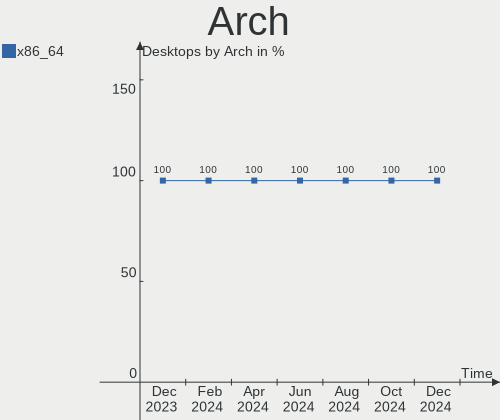
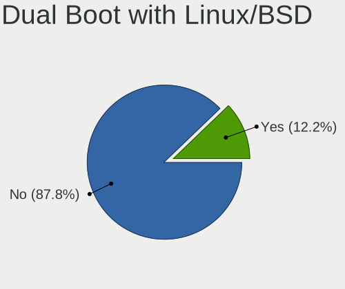
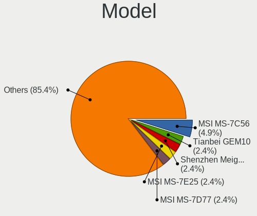
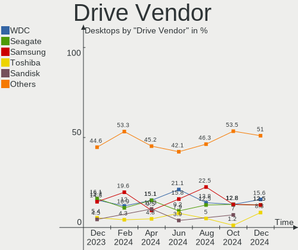
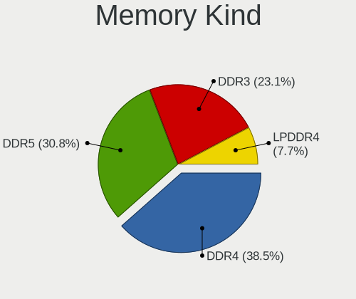

Manjaro Hardware Trends (Desktops)
----------------------------------

A project to identify most popular hardware characteristics and track their change
over time based on data collected by Manjaro users at https://Linux-Hardware.org.

Anyone can contribute to this report by the [hw-probe](https://github.com/linuxhw/hw-probe) tool:

    sudo -E hw-probe -all -upload

Full-feature report is available here: https://linux-hardware.org/?view=trends

Period: Feb, 2022.

Contents
--------

* [ System ](#system)
  - [ OS                       ](#os)
  - [ OS Family                ](#os-family)
  - [ Kernel                   ](#kernel)
  - [ Kernel Family            ](#kernel-family)
  - [ Kernel Major Ver.        ](#kernel-major-ver)
  - [ Arch                     ](#arch)
  - [ DE                       ](#de)
  - [ Display Server           ](#display-server)
  - [ Display Manager          ](#display-manager)
  - [ OS Lang                  ](#os-lang)
  - [ Boot Mode                ](#boot-mode)
  - [ Filesystem               ](#filesystem)
  - [ Part. scheme             ](#part-scheme)
  - [ Dual Boot with Linux/BSD ](#dual-boot-with-linuxbsd)
  - [ Dual Boot (Win)          ](#dual-boot-win)

* [ Board ](#board)
  - [ Vendor                   ](#vendor)
  - [ Model                    ](#model)
  - [ Model Family             ](#model-family)
  - [ MFG Year                 ](#mfg-year)
  - [ Form Factor              ](#form-factor)
  - [ Secure Boot              ](#secure-boot)
  - [ Coreboot                 ](#coreboot)
  - [ RAM Size                 ](#ram-size)
  - [ RAM Used                 ](#ram-used)
  - [ Total Drives             ](#total-drives)
  - [ Has CD-ROM               ](#has-cd-rom)
  - [ Has Ethernet             ](#has-ethernet)
  - [ Has WiFi                 ](#has-wifi)
  - [ Has Bluetooth            ](#has-bluetooth)

* [ Location ](#location)
  - [ Country                  ](#country)
  - [ City                     ](#city)

* [ Drives ](#drives)
  - [ Drive Vendor             ](#drive-vendor)
  - [ Drive Model              ](#drive-model)
  - [ HDD Vendor               ](#hdd-vendor)
  - [ SSD Vendor               ](#ssd-vendor)
  - [ Drive Kind               ](#drive-kind)
  - [ Drive Connector          ](#drive-connector)
  - [ Drive Size               ](#drive-size)
  - [ Space Total              ](#space-total)
  - [ Space Used               ](#space-used)
  - [ Malfunc. Drives          ](#malfunc-drives)
  - [ Malfunc. Drive Vendor    ](#malfunc-drive-vendor)
  - [ Malfunc. HDD Vendor      ](#malfunc-hdd-vendor)
  - [ Malfunc. Drive Kind      ](#malfunc-drive-kind)
  - [ Failed Drives            ](#failed-drives)
  - [ Failed Drive Vendor      ](#failed-drive-vendor)
  - [ Drive Status             ](#drive-status)

* [ Storage controller ](#storage-controller)
  - [ Storage Vendor           ](#storage-vendor)
  - [ Storage Model            ](#storage-model)
  - [ Storage Kind             ](#storage-kind)

* [ Processor ](#processor)
  - [ CPU Vendor               ](#cpu-vendor)
  - [ CPU Model                ](#cpu-model)
  - [ CPU Model Family         ](#cpu-model-family)
  - [ CPU Cores                ](#cpu-cores)
  - [ CPU Sockets              ](#cpu-sockets)
  - [ CPU Threads              ](#cpu-threads)
  - [ CPU Op-Modes             ](#cpu-op-modes)
  - [ CPU Microcode            ](#cpu-microcode)
  - [ CPU Microarch            ](#cpu-microarch)

* [ Graphics ](#graphics)
  - [ GPU Vendor               ](#gpu-vendor)
  - [ GPU Model                ](#gpu-model)
  - [ GPU Combo                ](#gpu-combo)
  - [ GPU Driver               ](#gpu-driver)
  - [ GPU Memory               ](#gpu-memory)

* [ Monitor ](#monitor)
  - [ Monitor Vendor           ](#monitor-vendor)
  - [ Monitor Model            ](#monitor-model)
  - [ Monitor Resolution       ](#monitor-resolution)
  - [ Monitor Diagonal         ](#monitor-diagonal)
  - [ Monitor Width            ](#monitor-width)
  - [ Aspect Ratio             ](#aspect-ratio)
  - [ Monitor Area             ](#monitor-area)
  - [ Pixel Density            ](#pixel-density)
  - [ Multiple Monitors        ](#multiple-monitors)

* [ Network ](#network)
  - [ Net Controller Vendor    ](#net-controller-vendor)
  - [ Net Controller Model     ](#net-controller-model)
  - [ Wireless Vendor          ](#wireless-vendor)
  - [ Wireless Model           ](#wireless-model)
  - [ Ethernet Vendor          ](#ethernet-vendor)
  - [ Ethernet Model           ](#ethernet-model)
  - [ Net Controller Kind      ](#net-controller-kind)
  - [ Used Controller          ](#used-controller)
  - [ NICs                     ](#nics)
  - [ IPv6                     ](#ipv6)

* [ Bluetooth ](#bluetooth)
  - [ Bluetooth Vendor         ](#bluetooth-vendor)
  - [ Bluetooth Model          ](#bluetooth-model)

* [ Sound ](#sound)
  - [ Sound Vendor             ](#sound-vendor)
  - [ Sound Model              ](#sound-model)

* [ Memory ](#memory)
  - [ Memory Vendor            ](#memory-vendor)
  - [ Memory Model             ](#memory-model)
  - [ Memory Kind              ](#memory-kind)
  - [ Memory Form Factor       ](#memory-form-factor)
  - [ Memory Size              ](#memory-size)
  - [ Memory Speed             ](#memory-speed)

* [ Printers & scanners ](#printers--scanners)
  - [ Printer Vendor           ](#printer-vendor)
  - [ Printer Model            ](#printer-model)
  - [ Scanner Vendor           ](#scanner-vendor)
  - [ Scanner Model            ](#scanner-model)

* [ Camera ](#camera)
  - [ Camera Vendor            ](#camera-vendor)
  - [ Camera Model             ](#camera-model)

* [ Security ](#security)
  - [ Fingerprint Vendor       ](#fingerprint-vendor)
  - [ Fingerprint Model        ](#fingerprint-model)
  - [ Chipcard Vendor          ](#chipcard-vendor)
  - [ Chipcard Model           ](#chipcard-model)

* [ Unsupported ](#unsupported)
  - [ Unsupported Devices      ](#unsupported-devices)
  - [ Unsupported Device Types ](#unsupported-device-types)

System
------

OS
--

Installed operating systems

| Name           | Desktops | Percent |
|----------------|----------|---------|
| Manjaro        | 30       | 50.85%  |
| Manjaro 21.2.3 | 26       | 44.07%  |
| Manjaro 21.2.2 | 3        | 5.08%   |

OS Family
---------

OS without a version

| Name    | Desktops | Percent |
|---------|----------|---------|
| Manjaro | 59       | 100%    |

Kernel
------

Version of the Linux kernel

| Version                 | Desktops | Percent |
|-------------------------|----------|---------|
| 5.15.21-1-MANJARO       | 12       | 20.34%  |
| 5.15.19-1-MANJARO       | 11       | 18.64%  |
| 5.16.5-1-MANJARO        | 6        | 10.17%  |
| 5.15.16-1-MANJARO       | 4        | 6.78%   |
| 5.10.96-1-MANJARO       | 4        | 6.78%   |
| 5.16.7-1-MANJARO        | 3        | 5.08%   |
| 5.16.2-1-rt19-MANJARO   | 3        | 5.08%   |
| 5.4.178-1-MANJARO       | 2        | 3.39%   |
| 5.17.0-1-MANJARO        | 2        | 3.39%   |
| 5.16.2-1-MANJARO        | 2        | 3.39%   |
| 5.10.98-1-MANJARO       | 2        | 3.39%   |
| 5.9.16-1-MANJARO        | 1        | 1.69%   |
| 5.16.1-237-tkg-bmq-llvm | 1        | 1.69%   |
| 5.15.7-1-rt23-MANJARO   | 1        | 1.69%   |
| 5.15.6-2-MANJARO        | 1        | 1.69%   |
| 5.15.24-1-MANJARO       | 1        | 1.69%   |
| 5.13.19-2-MANJARO       | 1        | 1.69%   |
| 5.10.93-1-MANJARO       | 1        | 1.69%   |
| 5.10.89-1-MANJARO       | 1        | 1.69%   |

Kernel Family
-------------

Linux kernel without a distro release

| Version | Desktops | Percent |
|---------|----------|---------|
| 5.15.21 | 12       | 20.34%  |
| 5.15.19 | 11       | 18.64%  |
| 5.16.5  | 6        | 10.17%  |
| 5.16.2  | 5        | 8.47%   |
| 5.15.16 | 4        | 6.78%   |
| 5.10.96 | 4        | 6.78%   |
| 5.16.7  | 3        | 5.08%   |
| 5.4.178 | 2        | 3.39%   |
| 5.17.0  | 2        | 3.39%   |
| 5.10.98 | 2        | 3.39%   |
| 5.9.16  | 1        | 1.69%   |
| 5.16.1  | 1        | 1.69%   |
| 5.15.7  | 1        | 1.69%   |
| 5.15.6  | 1        | 1.69%   |
| 5.15.24 | 1        | 1.69%   |
| 5.13.19 | 1        | 1.69%   |
| 5.10.93 | 1        | 1.69%   |
| 5.10.89 | 1        | 1.69%   |

Kernel Major Ver.
-----------------

Linux kernel major version

| Version | Desktops | Percent |
|---------|----------|---------|
| 5.15    | 30       | 50.85%  |
| 5.16    | 15       | 25.42%  |
| 5.10    | 8        | 13.56%  |
| 5.4     | 2        | 3.39%   |
| 5.17    | 2        | 3.39%   |
| 5.9     | 1        | 1.69%   |
| 5.13    | 1        | 1.69%   |

Arch
----

OS architecture (x86_64, i586, etc.)

| Name   | Desktops | Percent |
|--------|----------|---------|
| x86_64 | 59       | 100%    |

DE
--

Desktop Environment

| Name       | Desktops | Percent |
|------------|----------|---------|
| KDE5       | 30       | 50.85%  |
| XFCE       | 12       | 20.34%  |
| GNOME      | 8        | 13.56%  |
| Unknown    | 6        | 10.17%  |
| X-Cinnamon | 2        | 3.39%   |
| Budgie     | 1        | 1.69%   |

Display Server
--------------

X11 or Wayland

| Name    | Desktops | Percent |
|---------|----------|---------|
| X11     | 53       | 89.83%  |
| Wayland | 4        | 6.78%   |
| Tty     | 2        | 3.39%   |

Display Manager
---------------

SDDM, LightDM, etc.

| Name    | Desktops | Percent |
|---------|----------|---------|
| Unknown | 30       | 50.85%  |
| SDDM    | 14       | 23.73%  |
| LightDM | 11       | 18.64%  |
| GDM     | 4        | 6.78%   |

OS Lang
-------

Language

| Lang    | Desktops | Percent |
|---------|----------|---------|
| en_US   | 22       | 37.29%  |
| en_GB   | 7        | 11.86%  |
| en_CA   | 4        | 6.78%   |
| ru_RU   | 3        | 5.08%   |
| es_ES   | 3        | 5.08%   |
| it_IT   | 2        | 3.39%   |
| de_DE   | 2        | 3.39%   |
| ru_UA   | 1        | 1.69%   |
| pt_BR   | 1        | 1.69%   |
| pl_PL   | 1        | 1.69%   |
| nl_NL   | 1        | 1.69%   |
| hu_HU   | 1        | 1.69%   |
| fr_FR   | 1        | 1.69%   |
| fr_CA   | 1        | 1.69%   |
| fi_FI   | 1        | 1.69%   |
| es_MX   | 1        | 1.69%   |
| en_PH   | 1        | 1.69%   |
| en_IN   | 1        | 1.69%   |
| en_IE   | 1        | 1.69%   |
| en_DE   | 1        | 1.69%   |
| en_AU   | 1        | 1.69%   |
| de_AT   | 1        | 1.69%   |
| Unknown | 1        | 1.69%   |

Boot Mode
---------

EFI or BIOS

| Mode | Desktops | Percent |
|------|----------|---------|
| BIOS | 43       | 72.88%  |
| EFI  | 16       | 27.12%  |

Filesystem
----------

Type of filesystem

| Type  | Desktops | Percent |
|-------|----------|---------|
| Ext4  | 48       | 81.36%  |
| Btrfs | 8        | 13.56%  |
| Xfs   | 2        | 3.39%   |
| Tmpfs | 1        | 1.69%   |

Part. scheme
------------

Scheme of partitioning

| Type    | Desktops | Percent |
|---------|----------|---------|
| Unknown | 41       | 69.49%  |
| GPT     | 17       | 28.81%  |
| MBR     | 1        | 1.69%   |

Dual Boot with Linux/BSD
------------------------

Hosting more than one Linux/BSD

| Dual boot | Desktops | Percent |
|-----------|----------|---------|
| No        | 50       | 84.75%  |
| Yes       | 9        | 15.25%  |

Dual Boot (Win)
---------------

Hosting Linux and Windows

| Dual boot | Desktops | Percent |
|-----------|----------|---------|
| No        | 41       | 69.49%  |
| Yes       | 18       | 30.51%  |

Board
-----

Vendor
------

Motherboard manufacturer

| Name                | Desktops | Percent |
|---------------------|----------|---------|
| ASUSTek Computer    | 13       | 22.03%  |
| Gigabyte Technology | 11       | 18.64%  |
| Hewlett-Packard     | 8        | 13.56%  |
| MSI                 | 7        | 11.86%  |
| ASRock              | 7        | 11.86%  |
| Dell                | 5        | 8.47%   |
| Lenovo              | 4        | 6.78%   |
| Intel               | 2        | 3.39%   |
| Biostar             | 1        | 1.69%   |
| Acer                | 1        | 1.69%   |

Model
-----

Motherboard model

| Name                               | Desktops | Percent |
|------------------------------------|----------|---------|
| HP Compaq dc5800 Microtower        | 2        | 3.39%   |
| Gigabyte B250M-DS3H                | 2        | 3.39%   |
| Dell OptiPlex 9020                 | 2        | 3.39%   |
| MSI MS-7C94                        | 1        | 1.69%   |
| MSI MS-7C90                        | 1        | 1.69%   |
| MSI MS-7C35                        | 1        | 1.69%   |
| MSI MS-7B85                        | 1        | 1.69%   |
| MSI MS-7A66                        | 1        | 1.69%   |
| MSI MS-7996                        | 1        | 1.69%   |
| MSI MS-7576                        | 1        | 1.69%   |
| Lenovo V520S-08IKL 10NM0064UK      | 1        | 1.69%   |
| Lenovo ThinkCentre M92p 3228BS3    | 1        | 1.69%   |
| Lenovo ThinkCentre M900 10FD003RUS | 1        | 1.69%   |
| Lenovo ThinkCentre Edge72Z 3569JLP | 1        | 1.69%   |
| Intel H61 V124                     | 1        | 1.69%   |
| Intel DH67GD AAG10206-202          | 1        | 1.69%   |
| HP ProDesk 600 G1 DM               | 1        | 1.69%   |
| HP EliteDesk 800 G1 TWR            | 1        | 1.69%   |
| HP EliteDesk 800 G1 SFF            | 1        | 1.69%   |
| HP EliteDesk 705 G5 SFF            | 1        | 1.69%   |
| HP Compaq dc7800 Small Form Factor | 1        | 1.69%   |
| HP Compaq 6200 Pro SFF PC          | 1        | 1.69%   |
| Gigabyte Z490I AORUS ULTRA         | 1        | 1.69%   |
| Gigabyte h8-1414                   | 1        | 1.69%   |
| Gigabyte F2A55M-DS2                | 1        | 1.69%   |
| Gigabyte C246-WU4                  | 1        | 1.69%   |
| Gigabyte B560M AORUS PRO AX        | 1        | 1.69%   |
| Gigabyte B460MDS3H                 | 1        | 1.69%   |
| Gigabyte B450 I AORUS PRO WIFI     | 1        | 1.69%   |
| Gigabyte AB350-Gaming 3            | 1        | 1.69%   |
| Gigabyte A520M H                   | 1        | 1.69%   |
| Dell Precision WorkStation T5500   | 1        | 1.69%   |
| Dell OptiPlex 7040                 | 1        | 1.69%   |
| Dell Inspiron 660                  | 1        | 1.69%   |
| Biostar TB250-BTC                  | 1        | 1.69%   |
| ASUS TUF GAMING Z490-PLUS          | 1        | 1.69%   |
| ASUS TUF GAMING X570-PLUS          | 1        | 1.69%   |
| ASUS ROG STRIX Z370-G GAMING       | 1        | 1.69%   |
| ASUS ROG STRIX B450-F GAMING II    | 1        | 1.69%   |
| ASUS Pro WS C621-64L SAGE Series   | 1        | 1.69%   |
| ASUS PRIME Z390-A                  | 1        | 1.69%   |
| ASUS PRIME H510M-A                 | 1        | 1.69%   |
| ASUS PRIME B550-PLUS               | 1        | 1.69%   |
| ASUS PRIME B450M-K                 | 1        | 1.69%   |
| ASUS PRIME B450-PLUS               | 1        | 1.69%   |
| ASUS P5QL/EPU                      | 1        | 1.69%   |
| ASUS Maximus Formula               | 1        | 1.69%   |
| ASUS M5A97 EVO                     | 1        | 1.69%   |
| ASRock Z370 Extreme4               | 1        | 1.69%   |
| ASRock H61M-ITX                    | 1        | 1.69%   |
| ASRock H510M-HDV/M.2               | 1        | 1.69%   |
| ASRock H370M-ITX/ac                | 1        | 1.69%   |
| ASRock FM2A68M-HD+                 | 1        | 1.69%   |
| ASRock B450M Pro4                  | 1        | 1.69%   |
| ASRock B450 Pro4                   | 1        | 1.69%   |
| Acer Predator PO3-630              | 1        | 1.69%   |

Model Family
------------

Motherboard model prefix

| Name                  | Desktops | Percent |
|-----------------------|----------|---------|
| ASUS PRIME            | 5        | 8.47%   |
| HP Compaq             | 4        | 6.78%   |
| Lenovo ThinkCentre    | 3        | 5.08%   |
| HP EliteDesk          | 3        | 5.08%   |
| Dell OptiPlex         | 3        | 5.08%   |
| Gigabyte B250M-DS3H   | 2        | 3.39%   |
| ASUS TUF              | 2        | 3.39%   |
| ASUS ROG              | 2        | 3.39%   |
| MSI MS-7C94           | 1        | 1.69%   |
| MSI MS-7C90           | 1        | 1.69%   |
| MSI MS-7C35           | 1        | 1.69%   |
| MSI MS-7B85           | 1        | 1.69%   |
| MSI MS-7A66           | 1        | 1.69%   |
| MSI MS-7996           | 1        | 1.69%   |
| MSI MS-7576           | 1        | 1.69%   |
| Lenovo V520S-08IKL    | 1        | 1.69%   |
| Intel H61             | 1        | 1.69%   |
| Intel DH67GD          | 1        | 1.69%   |
| HP ProDesk            | 1        | 1.69%   |
| Gigabyte Z490I        | 1        | 1.69%   |
| Gigabyte h8-1414      | 1        | 1.69%   |
| Gigabyte F2A55M-DS2   | 1        | 1.69%   |
| Gigabyte C246-WU4     | 1        | 1.69%   |
| Gigabyte B560M        | 1        | 1.69%   |
| Gigabyte B460MDS3H    | 1        | 1.69%   |
| Gigabyte B450         | 1        | 1.69%   |
| Gigabyte AB350-Gaming | 1        | 1.69%   |
| Gigabyte A520M        | 1        | 1.69%   |
| Dell Precision        | 1        | 1.69%   |
| Dell Inspiron         | 1        | 1.69%   |
| Biostar TB250-BTC     | 1        | 1.69%   |
| ASUS Pro              | 1        | 1.69%   |
| ASUS P5QL             | 1        | 1.69%   |
| ASUS Maximus          | 1        | 1.69%   |
| ASUS M5A97            | 1        | 1.69%   |
| ASRock Z370           | 1        | 1.69%   |
| ASRock H61M-ITX       | 1        | 1.69%   |
| ASRock H510M-HDV      | 1        | 1.69%   |
| ASRock H370M-ITX      | 1        | 1.69%   |
| ASRock FM2A68M-HD+    | 1        | 1.69%   |
| ASRock B450M          | 1        | 1.69%   |
| ASRock B450           | 1        | 1.69%   |
| Acer Predator         | 1        | 1.69%   |

MFG Year
--------

Motherboard manufacture year

| Year | Desktops | Percent |
|------|----------|---------|
| 2020 | 9        | 15.25%  |
| 2018 | 8        | 13.56%  |
| 2016 | 7        | 11.86%  |
| 2021 | 5        | 8.47%   |
| 2019 | 5        | 8.47%   |
| 2017 | 4        | 6.78%   |
| 2013 | 4        | 6.78%   |
| 2012 | 4        | 6.78%   |
| 2011 | 4        | 6.78%   |
| 2014 | 3        | 5.08%   |
| 2008 | 3        | 5.08%   |
| 2010 | 1        | 1.69%   |
| 2009 | 1        | 1.69%   |
| 2007 | 1        | 1.69%   |

Form Factor
-----------

Physical design of the computer

| Name    | Desktops | Percent |
|---------|----------|---------|
| Desktop | 59       | 100%    |

Secure Boot
-----------

Enabled or disabled

| State    | Desktops | Percent |
|----------|----------|---------|
| Disabled | 59       | 100%    |

Coreboot
--------

Have coreboot on board

| Used | Desktops | Percent |
|------|----------|---------|
| No   | 59       | 100%    |

RAM Size
--------

Total RAM memory

| Size in GB  | Desktops | Percent |
|-------------|----------|---------|
| 16.01-24.0  | 16       | 27.12%  |
| 8.01-16.0   | 14       | 23.73%  |
| 32.01-64.0  | 12       | 20.34%  |
| 4.01-8.0    | 6        | 10.17%  |
| 24.01-32.0  | 5        | 8.47%   |
| 3.01-4.0    | 4        | 6.78%   |
| 2.01-3.0    | 1        | 1.69%   |
| 64.01-256.0 | 1        | 1.69%   |

RAM Used
--------

Used RAM memory

| Used GB   | Desktops | Percent |
|-----------|----------|---------|
| 2.01-3.0  | 19       | 32.2%   |
| 4.01-8.0  | 14       | 23.73%  |
| 1.01-2.0  | 11       | 18.64%  |
| 8.01-16.0 | 7        | 11.86%  |
| 3.01-4.0  | 6        | 10.17%  |
| 0.51-1.0  | 1        | 1.69%   |
| 0.01-0.5  | 1        | 1.69%   |

Total Drives
------------

Number of drives on board

| Drives | Desktops | Percent |
|--------|----------|---------|
| 2      | 20       | 33.9%   |
| 3      | 16       | 27.12%  |
| 1      | 11       | 18.64%  |
| 4      | 7        | 11.86%  |
| 5      | 3        | 5.08%   |
| 7      | 1        | 1.69%   |
| 6      | 1        | 1.69%   |

Has CD-ROM
----------

Has CD-ROM on board

| Presented | Desktops | Percent |
|-----------|----------|---------|
| No        | 32       | 54.24%  |
| Yes       | 27       | 45.76%  |

Has Ethernet
------------

Has Ethernet on board

| Presented | Desktops | Percent |
|-----------|----------|---------|
| Yes       | 59       | 100%    |

Has WiFi
--------

Has WiFi module

| Presented | Desktops | Percent |
|-----------|----------|---------|
| No        | 31       | 52.54%  |
| Yes       | 28       | 47.46%  |

Has Bluetooth
-------------

Has Bluetooth module

| Presented | Desktops | Percent |
|-----------|----------|---------|
| No        | 33       | 55.93%  |
| Yes       | 26       | 44.07%  |

Location
--------

Country
-------

Geographic location (country)

| Country            | Desktops | Percent |
|--------------------|----------|---------|
| Germany            | 8        | 13.56%  |
| USA                | 6        | 10.17%  |
| Canada             | 6        | 10.17%  |
| Russia             | 5        | 8.47%   |
| Spain              | 4        | 6.78%   |
| UK                 | 2        | 3.39%   |
| Netherlands        | 2        | 3.39%   |
| France             | 2        | 3.39%   |
| Finland            | 2        | 3.39%   |
| Ukraine            | 1        | 1.69%   |
| Turkey             | 1        | 1.69%   |
| Thailand           | 1        | 1.69%   |
| Switzerland        | 1        | 1.69%   |
| Sweden             | 1        | 1.69%   |
| Slovenia           | 1        | 1.69%   |
| Saudi Arabia       | 1        | 1.69%   |
| Poland             | 1        | 1.69%   |
| Philippines        | 1        | 1.69%   |
| Norway             | 1        | 1.69%   |
| Mexico             | 1        | 1.69%   |
| Lithuania          | 1        | 1.69%   |
| Italy              | 1        | 1.69%   |
| Ireland            | 1        | 1.69%   |
| India              | 1        | 1.69%   |
| Hungary            | 1        | 1.69%   |
| Estonia            | 1        | 1.69%   |
| Dominican Republic | 1        | 1.69%   |
| Brazil             | 1        | 1.69%   |
| Belgium            | 1        | 1.69%   |
| Austria            | 1        | 1.69%   |
| Australia          | 1        | 1.69%   |

City
----

Geographic location (city)

| City                     | Desktops | Percent |
|--------------------------|----------|---------|
| Paris                    | 2        | 3.39%   |
| Madrid                   | 2        | 3.39%   |
| Essen                    | 2        | 3.39%   |
| Ziri                     | 1        | 1.69%   |
| Windisch                 | 1        | 1.69%   |
| Walsall                  | 1        | 1.69%   |
| Vilnius                  | 1        | 1.69%   |
| Vienna                   | 1        | 1.69%   |
| Vancouver                | 1        | 1.69%   |
| Ulyanovsk                | 1        | 1.69%   |
| Tres Rios                | 1        | 1.69%   |
| Tomsk                    | 1        | 1.69%   |
| Toledo                   | 1        | 1.69%   |
| Sundsvall                | 1        | 1.69%   |
| Spruce Grove             | 1        | 1.69%   |
| Sertolovo                | 1        | 1.69%   |
| Santo Domingo Este       | 1        | 1.69%   |
| Rijssen                  | 1        | 1.69%   |
| Quezon City              | 1        | 1.69%   |
| Pueblo                   | 1        | 1.69%   |
| Piding                   | 1        | 1.69%   |
| Oslo                     | 1        | 1.69%   |
| Oaxaca City              | 1        | 1.69%   |
| Naples                   | 1        | 1.69%   |
| Munich                   | 1        | 1.69%   |
| Moscow                   | 1        | 1.69%   |
| Montreal                 | 1        | 1.69%   |
| Milton                   | 1        | 1.69%   |
| Melbourne                | 1        | 1.69%   |
| Lexington Park           | 1        | 1.69%   |
| Leuven                   | 1        | 1.69%   |
| Lafayette                | 1        | 1.69%   |
| Krakow                   | 1        | 1.69%   |
| Kaliningrad              | 1        | 1.69%   |
| Jyväskylä          | 1        | 1.69%   |
| Jena                     | 1        | 1.69%   |
| Jeddah                   | 1        | 1.69%   |
| Istanbul                 | 1        | 1.69%   |
| Iisalmi                  | 1        | 1.69%   |
| Hendon                   | 1        | 1.69%   |
| Hatvan                   | 1        | 1.69%   |
| Haabneeme                | 1        | 1.69%   |
| Guelph                   | 1        | 1.69%   |
| Frankfurt am Main        | 1        | 1.69%   |
| Eugene                   | 1        | 1.69%   |
| Easton                   | 1        | 1.69%   |
| Dublin                   | 1        | 1.69%   |
| Dnipro                   | 1        | 1.69%   |
| Darmstadt                | 1        | 1.69%   |
| Cerdanyola del Vallès | 1        | 1.69%   |
| Cedar Park               | 1        | 1.69%   |
| Burnaby                  | 1        | 1.69%   |
| Berlin                   | 1        | 1.69%   |
| Bangkok                  | 1        | 1.69%   |
| Baharampur               | 1        | 1.69%   |
| Almere Stad              | 1        | 1.69%   |

Drives
------

Drive Vendor
------------

Hard drive vendors

| Vendor                    | Desktops | Drives | Percent |
|---------------------------|----------|--------|---------|
| Seagate                   | 24       | 33     | 19.05%  |
| Samsung Electronics       | 20       | 25     | 15.87%  |
| WDC                       | 13       | 18     | 10.32%  |
| Kingston                  | 13       | 13     | 10.32%  |
| Toshiba                   | 5        | 5      | 3.97%   |
| Hitachi                   | 5        | 5      | 3.97%   |
| Crucial                   | 4        | 7      | 3.17%   |
| PNY                       | 3        | 3      | 2.38%   |
| HGST                      | 3        | 4      | 2.38%   |
| Corsair                   | 3        | 3      | 2.38%   |
| XPG                       | 2        | 2      | 1.59%   |
| Unknown                   | 2        | 2      | 1.59%   |
| SPCC                      | 2        | 2      | 1.59%   |
| Phison                    | 2        | 3      | 1.59%   |
| Patriot                   | 2        | 2      | 1.59%   |
| Intel                     | 2        | 2      | 1.59%   |
| ASMT                      | 2        | 7      | 1.59%   |
| A-DATA Technology         | 2        | 2      | 1.59%   |
| SK Hynix                  | 1        | 1      | 0.79%   |
| Silicon Motion            | 1        | 1      | 0.79%   |
| Sandisk                   | 1        | 1      | 0.79%   |
| OCZ                       | 1        | 1      | 0.79%   |
| Micron/Crucial Technology | 1        | 1      | 0.79%   |
| Micron Technology         | 1        | 2      | 0.79%   |
| Lexar                     | 1        | 1      | 0.79%   |
| KIOXIA-EXCERIA            | 1        | 1      | 0.79%   |
| KIOXIA                    | 1        | 2      | 0.79%   |
| KingSpec                  | 1        | 1      | 0.79%   |
| Intenso                   | 1        | 1      | 0.79%   |
| Integral                  | 1        | 1      | 0.79%   |
| G-DRIVE                   | 1        | 1      | 0.79%   |
| Fujitsu                   | 1        | 1      | 0.79%   |
| Apple                     | 1        | 1      | 0.79%   |
| Apacer                    | 1        | 1      | 0.79%   |
| ADATA Technology          | 1        | 1      | 0.79%   |

Drive Model
-----------

Hard drive models

| Model                               | Desktops | Percent |
|-------------------------------------|----------|---------|
| Samsung SSD 860 EVO 250GB           | 4        | 2.86%   |
| Kingston SA400S37120G 120GB SSD     | 4        | 2.86%   |
| WDC WDS500G2B0A-00SM50 500GB SSD    | 3        | 2.14%   |
| Seagate ST3500418AS 500GB           | 3        | 2.14%   |
| Samsung SSD 850 EVO 250GB           | 3        | 2.14%   |
| Kingston SA400S37240G 240GB SSD     | 3        | 2.14%   |
| Seagate ST2000DM008-2FR102 2TB      | 2        | 1.43%   |
| Seagate ST1000DM003-1SB102 1TB      | 2        | 1.43%   |
| Seagate BUP Slim BK 1TB             | 2        | 1.43%   |
| Samsung SSD 860 EVO 1TB             | 2        | 1.43%   |
| Samsung NVMe SSD Drive 500GB        | 2        | 1.43%   |
| Samsung NVMe SSD Drive 1TB          | 2        | 1.43%   |
| PNY CS900 120GB SSD                 | 2        | 1.43%   |
| HGST HUH721010ALE604 10TB           | 2        | 1.43%   |
| XPG NVMe SSD Drive 512GB            | 1        | 0.71%   |
| XPG NVMe SSD Drive 256GB            | 1        | 0.71%   |
| WDC WD5000AAKX-08ERMA0 500GB        | 1        | 0.71%   |
| WDC WD5000AADS-00M2B0 500GB         | 1        | 0.71%   |
| WDC WD40EZRZ-22GXCB0 4TB            | 1        | 0.71%   |
| WDC WD30EFRX-68EUZN0 3TB            | 1        | 0.71%   |
| WDC WD20EARS-00MVWB0 2TB            | 1        | 0.71%   |
| WDC WD15EADS-00P8B0 1TB             | 1        | 0.71%   |
| WDC WD1502FAEX-007BA0 1TB           | 1        | 0.71%   |
| WDC WD10EZEX-75WN4A0 1TB            | 1        | 0.71%   |
| WDC WD10EZEX-00BBHA0 1TB            | 1        | 0.71%   |
| WDC WD10EARX-00N0YB0 1TB            | 1        | 0.71%   |
| WDC WD10EALX-759BA1 1TB             | 1        | 0.71%   |
| WDC WD10EALX-009BA0 1TB             | 1        | 0.71%   |
| WDC WD1003FZEX-00MK2A0 1TB          | 1        | 0.71%   |
| WDC WD1003FZEX-00K3CA0 1TB          | 1        | 0.71%   |
| Unknown OOS12000G 12TB              | 1        | 0.71%   |
| Unknown FK0032CAAZP 32GB            | 1        | 0.71%   |
| Toshiba TR150 480GB SSD             | 1        | 0.71%   |
| Toshiba THNSNJ256GCSU 256GB SSD     | 1        | 0.71%   |
| Toshiba MQ01ABD050V 500GB           | 1        | 0.71%   |
| Toshiba HDWE160 6TB                 | 1        | 0.71%   |
| Toshiba DT01ACA050 500GB            | 1        | 0.71%   |
| SPCC Solid State Disk 64GB          | 1        | 0.71%   |
| SPCC Solid State Disk 1024GB        | 1        | 0.71%   |
| SK Hynix NVMe SSD Drive 512GB       | 1        | 0.71%   |
| Silicon Motion NVMe SSD Drive 128GB | 1        | 0.71%   |
| Seagate USB 2TB                     | 1        | 0.71%   |
| Seagate ST500DM002-1SB10A 500GB     | 1        | 0.71%   |
| Seagate ST500DM002-1BD142 500GB     | 1        | 0.71%   |
| Seagate ST4000DM004-2U9104 4TB      | 1        | 0.71%   |
| Seagate ST4000DM004-2CV104 4TB      | 1        | 0.71%   |
| Seagate ST3500830AS 500GB           | 1        | 0.71%   |
| Seagate ST3250318AS 250GB           | 1        | 0.71%   |
| Seagate ST3160815AS 160GB           | 1        | 0.71%   |
| Seagate ST3000DM007-1WY10G 3TB      | 1        | 0.71%   |
| Seagate ST2000LX001-1RG174 2TB      | 1        | 0.71%   |
| Seagate ST2000LM015-2E8174 2TB      | 1        | 0.71%   |
| Seagate ST2000DM001-1ER164 2TB      | 1        | 0.71%   |
| Seagate ST1750LM000 HN-M171RAD 1TB  | 1        | 0.71%   |
| Seagate ST1500DM003-9YN16G 1TB      | 1        | 0.71%   |
| Seagate ST1000VX001-1Z4102 1TB      | 1        | 0.71%   |
| Seagate ST1000DM010-2EP102 1TB      | 1        | 0.71%   |
| Seagate ST1000DM003-9YN162 1TB      | 1        | 0.71%   |
| Seagate ST1000DM003-1ER162 1TB      | 1        | 0.71%   |
| Seagate ST1000DM003-1CH162 1TB      | 1        | 0.71%   |

HDD Vendor
----------

Hard disk drive vendors

| Vendor              | Desktops | Drives | Percent |
|---------------------|----------|--------|---------|
| Seagate             | 23       | 32     | 43.4%   |
| WDC                 | 11       | 15     | 20.75%  |
| Hitachi             | 5        | 5      | 9.43%   |
| Samsung Electronics | 4        | 4      | 7.55%   |
| Toshiba             | 3        | 3      | 5.66%   |
| HGST                | 3        | 4      | 5.66%   |
| Unknown             | 1        | 1      | 1.89%   |
| Fujitsu             | 1        | 1      | 1.89%   |
| ASMT                | 1        | 2      | 1.89%   |
| Apple               | 1        | 1      | 1.89%   |

SSD Vendor
----------

Solid state drive vendors

| Vendor              | Desktops | Drives | Percent |
|---------------------|----------|--------|---------|
| Samsung Electronics | 11       | 15     | 23.4%   |
| Kingston            | 11       | 11     | 23.4%   |
| WDC                 | 3        | 3      | 6.38%   |
| PNY                 | 3        | 3      | 6.38%   |
| Crucial             | 3        | 6      | 6.38%   |
| Toshiba             | 2        | 2      | 4.26%   |
| SPCC                | 2        | 2      | 4.26%   |
| Patriot             | 2        | 2      | 4.26%   |
| A-DATA Technology   | 2        | 2      | 4.26%   |
| OCZ                 | 1        | 1      | 2.13%   |
| Lexar               | 1        | 1      | 2.13%   |
| Intenso             | 1        | 1      | 2.13%   |
| Intel               | 1        | 1      | 2.13%   |
| Integral            | 1        | 1      | 2.13%   |
| Corsair             | 1        | 1      | 2.13%   |
| ASMT                | 1        | 5      | 2.13%   |
| Apacer              | 1        | 1      | 2.13%   |

Drive Kind
----------

HDD or SSD

| Kind    | Desktops | Drives | Percent |
|---------|----------|--------|---------|
| HDD     | 45       | 68     | 41.67%  |
| SSD     | 37       | 58     | 34.26%  |
| NVMe    | 22       | 27     | 20.37%  |
| Unknown | 4        | 4      | 3.7%    |

Drive Connector
---------------

SATA, SAS, NVMe, etc.

| Type | Desktops | Drives | Percent |
|------|----------|--------|---------|
| SATA | 55       | 117    | 66.27%  |
| NVMe | 22       | 27     | 26.51%  |
| SAS  | 6        | 13     | 7.23%   |

Drive Size
----------

Size of hard drive

| Size in TB | Desktops | Drives | Percent |
|------------|----------|--------|---------|
| 0.01-0.5   | 42       | 68     | 48.28%  |
| 0.51-1.0   | 29       | 41     | 33.33%  |
| 1.01-2.0   | 7        | 7      | 8.05%   |
| 3.01-4.0   | 3        | 3      | 3.45%   |
| 4.01-10.0  | 3        | 4      | 3.45%   |
| 2.01-3.0   | 2        | 2      | 2.3%    |
| 10.01-20.0 | 1        | 1      | 1.15%   |

Space Total
-----------

Amount of disk space available on the file system

| Size in GB     | Desktops | Percent |
|----------------|----------|---------|
| 251-500        | 14       | 23.73%  |
| 1001-2000      | 12       | 20.34%  |
| 101-250        | 9        | 15.25%  |
| More than 3000 | 7        | 11.86%  |
| 501-1000       | 6        | 10.17%  |
| Unknown        | 5        | 8.47%   |
| 2001-3000      | 3        | 5.08%   |
| 21-50          | 1        | 1.69%   |
| 1-20           | 1        | 1.69%   |
| 51-100         | 1        | 1.69%   |

Space Used
----------

Amount of used disk space

| Used GB        | Desktops | Percent |
|----------------|----------|---------|
| 21-50          | 11       | 18.64%  |
| 1-20           | 8        | 13.56%  |
| 101-250        | 7        | 11.86%  |
| 1001-2000      | 6        | 10.17%  |
| 501-1000       | 6        | 10.17%  |
| 51-100         | 6        | 10.17%  |
| More than 3000 | 5        | 8.47%   |
| 251-500        | 5        | 8.47%   |
| Unknown        | 5        | 8.47%   |

Malfunc. Drives
---------------

Drive models with a malfunction

| Model                           | Desktops | Drives | Percent |
|---------------------------------|----------|--------|---------|
| WDC WD20EARS-00MVWB0 2TB        | 1        | 1      | 25%     |
| WDC WD10EARX-00N0YB0 1TB        | 1        | 1      | 25%     |
| Samsung Electronics HD103UJ 1TB | 1        | 1      | 25%     |
| ASMT 2135 120GB SSD             | 1        | 5      | 25%     |

Malfunc. Drive Vendor
---------------------

Vendors of faulty drives

| Vendor              | Desktops | Drives | Percent |
|---------------------|----------|--------|---------|
| WDC                 | 2        | 2      | 50%     |
| Samsung Electronics | 1        | 1      | 25%     |
| ASMT                | 1        | 5      | 25%     |

Malfunc. HDD Vendor
-------------------

Vendors of faulty HDD drives

| Vendor              | Desktops | Drives | Percent |
|---------------------|----------|--------|---------|
| WDC                 | 2        | 2      | 66.67%  |
| Samsung Electronics | 1        | 1      | 33.33%  |

Malfunc. Drive Kind
-------------------

Kinds of faulty drives

| Kind | Desktops | Drives | Percent |
|------|----------|--------|---------|
| HDD  | 3        | 3      | 75%     |
| SSD  | 1        | 5      | 25%     |

Failed Drives
-------------

Failed drive models

Zero info for selected period =(

Failed Drive Vendor
-------------------

Failed drive vendors

Zero info for selected period =(

Drive Status
------------

Number of failed and malfunc. drives

| Status   | Desktops | Drives | Percent |
|----------|----------|--------|---------|
| Detected | 46       | 118    | 70.77%  |
| Works    | 15       | 31     | 23.08%  |
| Malfunc  | 4        | 8      | 6.15%   |

Storage controller
------------------

Storage Vendor
--------------

Storage controller vendors

| Vendor                      | Desktops | Percent |
|-----------------------------|----------|---------|
| Intel                       | 39       | 44.32%  |
| AMD                         | 20       | 22.73%  |
| Samsung Electronics         | 6        | 6.82%   |
| Phison Electronics          | 4        | 4.55%   |
| JMicron Technology          | 3        | 3.41%   |
| ASMedia Technology          | 3        | 3.41%   |
| Micron/Crucial Technology   | 2        | 2.27%   |
| KIOXIA                      | 2        | 2.27%   |
| Kingston Technology Company | 2        | 2.27%   |
| ADATA Technology            | 2        | 2.27%   |
| SK Hynix                    | 1        | 1.14%   |
| Silicon Motion              | 1        | 1.14%   |
| Sandisk                     | 1        | 1.14%   |
| Micron Technology           | 1        | 1.14%   |
| Marvell Technology Group    | 1        | 1.14%   |

Storage Model
-------------

Storage controller models

| Model                                                                                   | Desktops | Percent |
|-----------------------------------------------------------------------------------------|----------|---------|
| AMD FCH SATA Controller [AHCI mode]                                                     | 9        | 8.41%   |
| AMD 400 Series Chipset SATA Controller                                                  | 8        | 7.48%   |
| Intel 200 Series PCH SATA controller [AHCI mode]                                        | 5        | 4.67%   |
| Intel SATA Controller [RAID mode]                                                       | 4        | 3.74%   |
| Intel 82801I (ICH9 Family) 2 port SATA Controller [IDE mode]                            | 4        | 3.74%   |
| Intel 6 Series/C200 Series Chipset Family 6 port Desktop SATA AHCI Controller           | 4        | 3.74%   |
| AMD Starship/Matisse Chipset SATA Controller [AHCI mode]                                | 4        | 3.74%   |
| Intel Q170/Q150/B150/H170/H110/Z170/CM236 Chipset SATA Controller [AHCI Mode]           | 3        | 2.8%    |
| Intel Cannon Lake PCH SATA AHCI Controller                                              | 3        | 2.8%    |
| Intel 8 Series/C220 Series Chipset Family 6-port SATA Controller 1 [AHCI mode]          | 3        | 2.8%    |
| Intel 500 Series Chipset Family SATA AHCI Controller                                    | 3        | 2.8%    |
| ASMedia ASM1062 Serial ATA Controller                                                   | 3        | 2.8%    |
| Samsung NVMe SSD Controller SM981/PM981/PM983                                           | 2        | 1.87%   |
| Samsung NVMe SSD Controller PM9A1/PM9A3/980PRO                                          | 2        | 1.87%   |
| Samsung NVMe SSD Controller 980                                                         | 2        | 1.87%   |
| Phison E12 NVMe Controller                                                              | 2        | 1.87%   |
| Micron/Crucial P2 NVMe PCIe SSD                                                         | 2        | 1.87%   |
| KIOXIA Non-Volatile memory controller                                                   | 2        | 1.87%   |
| JMicron JMB368 IDE controller                                                           | 2        | 1.87%   |
| Intel Comet Lake SATA AHCI Controller                                                   | 2        | 1.87%   |
| Intel 82801IR/IO/IH (ICH9R/DO/DH) 4 port SATA Controller [IDE mode]                     | 2        | 1.87%   |
| Intel 82801IB (ICH9) 2 port SATA Controller [IDE mode]                                  | 2        | 1.87%   |
| Intel 7 Series/C210 Series Chipset Family 6-port SATA Controller [AHCI mode]            | 2        | 1.87%   |
| ADATA XPG SX8200 Pro PCIe Gen3x4 M.2 2280 Solid State Drive                             | 2        | 1.87%   |
| SK Hynix Gold P31 SSD                                                                   | 1        | 0.93%   |
| Silicon Motion SM2263EN/SM2263XT SSD Controller                                         | 1        | 0.93%   |
| Sandisk WD Blue SN570 NVMe SSD                                                          | 1        | 0.93%   |
| Phison E18 PCIe4 NVMe Controller                                                        | 1        | 0.93%   |
| Phison E16 PCIe4 NVMe Controller                                                        | 1        | 0.93%   |
| Micron Non-Volatile memory controller                                                   | 1        | 0.93%   |
| Marvell Group 88SE912x IDE Controller                                                   | 1        | 0.93%   |
| Marvell Group 88SE9120 SATA 6Gb/s Controller                                            | 1        | 0.93%   |
| Kingston Company Company Non-Volatile memory controller                                 | 1        | 0.93%   |
| Kingston Company A2000 NVMe SSD                                                         | 1        | 0.93%   |
| JMicron JMB362 SATA Controller                                                          | 1        | 0.93%   |
| Intel SSD Pro 7600p/760p/E 6100p Series                                                 | 1        | 0.93%   |
| Intel C620 Series Chipset Family SATA Controller [AHCI mode]                            | 1        | 0.93%   |
| Intel C620 Series Chipset Family IDE Redirection                                        | 1        | 0.93%   |
| Intel 82Q35 Express PT IDER Controller                                                  | 1        | 0.93%   |
| Intel 82801JI (ICH10 Family) SATA AHCI Controller                                       | 1        | 0.93%   |
| Intel 82801JI (ICH10 Family) 4 port SATA IDE Controller #1                              | 1        | 0.93%   |
| Intel 82801JI (ICH10 Family) 2 port SATA IDE Controller #2                              | 1        | 0.93%   |
| Intel 8 Series/C220 Series Chipset Family 4-port SATA Controller 1 [IDE mode]           | 1        | 0.93%   |
| Intel 6 Series/C200 Series Chipset Family Desktop SATA Controller (IDE mode, ports 4-5) | 1        | 0.93%   |
| Intel 6 Series/C200 Series Chipset Family Desktop SATA Controller (IDE mode, ports 0-3) | 1        | 0.93%   |
| Intel 500 Series Chipset Family SATA RAID Controller                                    | 1        | 0.93%   |
| AMD SB7x0/SB8x0/SB9x0 SATA Controller [RAID5 mode]                                      | 1        | 0.93%   |
| AMD SB7x0/SB8x0/SB9x0 SATA Controller [IDE mode]                                        | 1        | 0.93%   |
| AMD SB7x0/SB8x0/SB9x0 SATA Controller [AHCI mode]                                       | 1        | 0.93%   |
| AMD SB7x0/SB8x0/SB9x0 IDE Controller                                                    | 1        | 0.93%   |
| AMD FCH SATA Controller [IDE mode]                                                      | 1        | 0.93%   |
| AMD FCH IDE Controller                                                                  | 1        | 0.93%   |
| AMD 300 Series Chipset SATA Controller                                                  | 1        | 0.93%   |
| ADATA A Non-Volatile memory controller                                                  | 1        | 0.93%   |

Storage Kind
------------

Kind of storage controller (IDE, SATA, NVMe, SAS, ...)

| Kind | Desktops | Percent |
|------|----------|---------|
| SATA | 47       | 54.65%  |
| NVMe | 22       | 25.58%  |
| IDE  | 11       | 12.79%  |
| RAID | 6        | 6.98%   |

Processor
---------

CPU Vendor
----------

Processor vendors

| Vendor | Desktops | Percent |
|--------|----------|---------|
| Intel  | 39       | 66.1%   |
| AMD    | 20       | 33.9%   |

CPU Model
---------

Processor models

| Model                                           | Desktops | Percent |
|-------------------------------------------------|----------|---------|
| AMD Ryzen 5 2600 Six-Core Processor             | 4        | 6.78%   |
| Intel Core i7-6700 CPU @ 3.40GHz                | 3        | 5.08%   |
| AMD Ryzen 5 3600 6-Core Processor               | 3        | 5.08%   |
| Intel Core i7-3770 CPU @ 3.40GHz                | 2        | 3.39%   |
| Intel Core i5-8600K CPU @ 3.60GHz               | 2        | 3.39%   |
| Intel Core i5-10400 CPU @ 2.90GHz               | 2        | 3.39%   |
| Intel Core 2 Duo CPU E8500 @ 3.16GHz            | 2        | 3.39%   |
| Intel 11th Gen Core i5-11400 @ 2.60GHz          | 2        | 3.39%   |
| AMD Ryzen 7 5700G with Radeon Graphics          | 2        | 3.39%   |
| Intel Xeon W-3223 CPU @ 3.50GHz                 | 1        | 1.69%   |
| Intel Xeon CPU X5675 @ 3.07GHz                  | 1        | 1.69%   |
| Intel Pentium Dual-Core CPU E5300 @ 2.60GHz     | 1        | 1.69%   |
| Intel Pentium CPU G630 @ 2.70GHz                | 1        | 1.69%   |
| Intel Pentium CPU G4560 @ 3.50GHz               | 1        | 1.69%   |
| Intel Genuine CPU 0000 @ 3.40GHz                | 1        | 1.69%   |
| Intel Core i7-9700K CPU @ 3.60GHz               | 1        | 1.69%   |
| Intel Core i7-7700 CPU @ 3.60GHz                | 1        | 1.69%   |
| Intel Core i7-4790 CPU @ 3.60GHz                | 1        | 1.69%   |
| Intel Core i7-4770 CPU @ 3.40GHz                | 1        | 1.69%   |
| Intel Core i7-10700KF CPU @ 3.80GHz             | 1        | 1.69%   |
| Intel Core i5-9600K CPU @ 3.70GHz               | 1        | 1.69%   |
| Intel Core i5-6400 CPU @ 2.70GHz                | 1        | 1.69%   |
| Intel Core i5-4590 CPU @ 3.30GHz                | 1        | 1.69%   |
| Intel Core i5-4570 CPU @ 3.20GHz                | 1        | 1.69%   |
| Intel Core i5-3570T CPU @ 2.30GHz               | 1        | 1.69%   |
| Intel Core i5-2500K CPU @ 3.30GHz               | 1        | 1.69%   |
| Intel Core i5-2400 CPU @ 3.10GHz                | 1        | 1.69%   |
| Intel Core i3-8100 CPU @ 3.60GHz                | 1        | 1.69%   |
| Intel Core i3-7100 CPU @ 3.90GHz                | 1        | 1.69%   |
| Intel Core i3-4130 CPU @ 3.40GHz                | 1        | 1.69%   |
| Intel Core i3-3240 CPU @ 3.40GHz                | 1        | 1.69%   |
| Intel Core i3-10100F CPU @ 3.60GHz              | 1        | 1.69%   |
| Intel Core 2 Quad CPU Q9550 @ 2.83GHz           | 1        | 1.69%   |
| Intel Core 2 Quad CPU Q8200 @ 2.33GHz           | 1        | 1.69%   |
| Intel 11th Gen Core i7-11700F @ 2.50GHz         | 1        | 1.69%   |
| AMD Ryzen 9 5900X 12-Core Processor             | 1        | 1.69%   |
| AMD Ryzen 9 3900X 12-Core Processor             | 1        | 1.69%   |
| AMD Ryzen 5 PRO 3600 6-Core Processor           | 1        | 1.69%   |
| AMD Ryzen 5 5600X 6-Core Processor              | 1        | 1.69%   |
| AMD Ryzen 5 1600X Six-Core Processor            | 1        | 1.69%   |
| AMD Ryzen 3 2200G with Radeon Vega Graphics     | 1        | 1.69%   |
| AMD Phenom II X6 1100T Processor                | 1        | 1.69%   |
| AMD Phenom II X4 955 Processor                  | 1        | 1.69%   |
| AMD FX-6120 Six-Core Processor                  | 1        | 1.69%   |
| AMD A4-4000 APU with Radeon HD Graphics         | 1        | 1.69%   |
| AMD A10-7890K Radeon R7, 12 Compute Cores 4C+8G | 1        | 1.69%   |

CPU Model Family
----------------

Processor model prefix

| Model                   | Desktops | Percent |
|-------------------------|----------|---------|
| Intel Core i5           | 11       | 18.64%  |
| Intel Core i7           | 10       | 16.95%  |
| AMD Ryzen 5             | 9        | 15.25%  |
| Intel Core i3           | 5        | 8.47%   |
| Other                   | 3        | 5.08%   |
| Intel Xeon              | 2        | 3.39%   |
| Intel Pentium           | 2        | 3.39%   |
| Intel Core 2 Quad       | 2        | 3.39%   |
| Intel Core 2 Duo        | 2        | 3.39%   |
| AMD Ryzen 9             | 2        | 3.39%   |
| AMD Ryzen 7             | 2        | 3.39%   |
| Intel Pentium Dual-Core | 1        | 1.69%   |
| Intel Genuine           | 1        | 1.69%   |
| AMD Ryzen 5 PRO         | 1        | 1.69%   |
| AMD Ryzen 3             | 1        | 1.69%   |
| AMD Phenom II X6        | 1        | 1.69%   |
| AMD Phenom II X4        | 1        | 1.69%   |
| AMD FX                  | 1        | 1.69%   |
| AMD A4                  | 1        | 1.69%   |
| AMD A10                 | 1        | 1.69%   |

CPU Cores
---------

Number of processor cores

| Number | Desktops | Percent |
|--------|----------|---------|
| 4      | 20       | 33.9%   |
| 6      | 19       | 32.2%   |
| 2      | 9        | 15.25%  |
| 8      | 6        | 10.17%  |
| 12     | 3        | 5.08%   |
| 3      | 1        | 1.69%   |
| 1      | 1        | 1.69%   |

CPU Sockets
-----------

Number of sockets

| Number | Desktops | Percent |
|--------|----------|---------|
| 1      | 58       | 98.31%  |
| 2      | 1        | 1.69%   |

CPU Threads
-----------

Threads per core (Hyper-Threading)

| Number | Desktops | Percent |
|--------|----------|---------|
| 2      | 38       | 64.41%  |
| 1      | 21       | 35.59%  |

CPU Op-Modes
------------

CPU Operation Modes (32-bit, 64-bit)

| Op mode        | Desktops | Percent |
|----------------|----------|---------|
| 32-bit, 64-bit | 59       | 100%    |

CPU Microcode
-------------

Microcode number

| Number     | Desktops | Percent |
|------------|----------|---------|
| Unknown    | 36       | 61.02%  |
| 0xa0671    | 2        | 3.39%   |
| 0xa0655    | 2        | 3.39%   |
| 0x306c3    | 2        | 3.39%   |
| 0x1067a    | 2        | 3.39%   |
| 0x0a50000c | 2        | 3.39%   |
| 0x08701021 | 2        | 3.39%   |
| 0x0800820d | 2        | 3.39%   |
| 0x906ed    | 1        | 1.69%   |
| 0x906eb    | 1        | 1.69%   |
| 0x506e3    | 1        | 1.69%   |
| 0x50657    | 1        | 1.69%   |
| 0x306a9    | 1        | 1.69%   |
| 0x206a7    | 1        | 1.69%   |
| 0x0a201009 | 1        | 1.69%   |
| 0x06003106 | 1        | 1.69%   |
| 0x010000c8 | 1        | 1.69%   |

CPU Microarch
-------------

Microarchitecture

| Name        | Desktops | Percent |
|-------------|----------|---------|
| KabyLake    | 9        | 15.25%  |
| Zen 2       | 5        | 8.47%   |
| Skylake     | 5        | 8.47%   |
| Penryn      | 5        | 8.47%   |
| Haswell     | 5        | 8.47%   |
| Zen+        | 4        | 6.78%   |
| Zen 3       | 4        | 6.78%   |
| IvyBridge   | 4        | 6.78%   |
| CometLake   | 4        | 6.78%   |
| SandyBridge | 3        | 5.08%   |
| Zen         | 2        | 3.39%   |
| K10         | 2        | 3.39%   |
| Icelake     | 2        | 3.39%   |
| Westmere    | 1        | 1.69%   |
| Steamroller | 1        | 1.69%   |
| Piledriver  | 1        | 1.69%   |
| Bulldozer   | 1        | 1.69%   |
| Unknown     | 1        | 1.69%   |

Graphics
--------

GPU Vendor
----------

Vendors of graphics cards

| Vendor | Desktops | Percent |
|--------|----------|---------|
| Nvidia | 23       | 36.51%  |
| Intel  | 23       | 36.51%  |
| AMD    | 17       | 26.98%  |

GPU Model
---------

Graphics card models

| Model                                                                       | Desktops | Percent |
|-----------------------------------------------------------------------------|----------|---------|
| AMD Ellesmere [Radeon RX 470/480/570/570X/580/580X/590]                     | 7        | 11.11%  |
| Nvidia GP107 [GeForce GTX 1050 Ti]                                          | 3        | 4.76%   |
| Intel Xeon E3-1200 v3/4th Gen Core Processor Integrated Graphics Controller | 3        | 4.76%   |
| Nvidia TU106 [GeForce RTX 2060 SUPER]                                       | 2        | 3.17%   |
| Nvidia TU104 [GeForce RTX 2060]                                             | 2        | 3.17%   |
| Nvidia GK208B [GeForce GT 720]                                              | 2        | 3.17%   |
| Intel Xeon E3-1200 v2/3rd Gen Core processor Graphics Controller            | 2        | 3.17%   |
| Intel RocketLake-S GT1 [UHD Graphics 730]                                   | 2        | 3.17%   |
| Intel HD Graphics 630                                                       | 2        | 3.17%   |
| Intel CometLake-S GT2 [UHD Graphics 630]                                    | 2        | 3.17%   |
| Intel CoffeeLake-S GT2 [UHD Graphics 630]                                   | 2        | 3.17%   |
| Intel 82Q33 Express Integrated Graphics Controller                          | 2        | 3.17%   |
| Intel 2nd Generation Core Processor Family Integrated Graphics Controller   | 2        | 3.17%   |
| Nvidia TU106 [GeForce RTX 2070 Rev. A]                                      | 1        | 1.59%   |
| Nvidia TU106 [GeForce RTX 2060 Rev. A]                                      | 1        | 1.59%   |
| Nvidia TU106 [GeForce GTX 1650]                                             | 1        | 1.59%   |
| Nvidia TU104 [GeForce RTX 2080 Rev. A]                                      | 1        | 1.59%   |
| Nvidia GP108 [GeForce GT 1030]                                              | 1        | 1.59%   |
| Nvidia GM204 [GeForce GTX 970]                                              | 1        | 1.59%   |
| Nvidia GM107 [GeForce GTX 750 Ti]                                           | 1        | 1.59%   |
| Nvidia GK208B [GeForce GT 730]                                              | 1        | 1.59%   |
| Nvidia GK208B [GeForce GT 710]                                              | 1        | 1.59%   |
| Nvidia GF114 [GeForce GTX 560 Ti]                                           | 1        | 1.59%   |
| Nvidia GF106 [GeForce GTS 450]                                              | 1        | 1.59%   |
| Nvidia GA106 [GeForce RTX 3060 Lite Hash Rate]                              | 1        | 1.59%   |
| Nvidia GA104 [GeForce RTX 3070]                                             | 1        | 1.59%   |
| Nvidia GA102 [GeForce RTX 3080 Ti]                                          | 1        | 1.59%   |
| Intel IvyBridge GT2 [HD Graphics 4000]                                      | 1        | 1.59%   |
| Intel HD Graphics 610                                                       | 1        | 1.59%   |
| Intel HD Graphics 530                                                       | 1        | 1.59%   |
| Intel CoffeeLake-S GT2 [UHD Graphics P630]                                  | 1        | 1.59%   |
| Intel 82Q35 Express Integrated Graphics Controller                          | 1        | 1.59%   |
| Intel 4th Generation Core Processor Family Integrated Graphics Controller   | 1        | 1.59%   |
| AMD Trinity 2 [Radeon HD 7480D]                                             | 1        | 1.59%   |
| AMD Pitcairn PRO [Radeon HD 7850 / R7 265 / R9 270 1024SP]                  | 1        | 1.59%   |
| AMD Oland [Radeon HD 8570 / R5 430 OEM / R7 240/340 / Radeon 520 OEM]       | 1        | 1.59%   |
| AMD Oland XT [Radeon HD 8670 / R5 340X OEM / R7 250/350/350X OEM]           | 1        | 1.59%   |
| AMD Kaveri [Radeon R7 Graphics]                                             | 1        | 1.59%   |
| AMD Juniper PRO [Radeon HD 5750]                                            | 1        | 1.59%   |
| AMD Cezanne                                                                 | 1        | 1.59%   |
| AMD Cedar [Radeon HD 5000/6000/7350/8350 Series]                            | 1        | 1.59%   |
| AMD Caicos PRO [Radeon HD 7450]                                             | 1        | 1.59%   |
| AMD Barts XT [Radeon HD 6870]                                               | 1        | 1.59%   |

GPU Combo
---------

Combinations of graphics cards

| Name        | Desktops | Percent |
|-------------|----------|---------|
| 1 x Nvidia  | 23       | 38.98%  |
| 1 x Intel   | 19       | 32.2%   |
| 1 x AMD     | 16       | 27.12%  |
| Intel + AMD | 1        | 1.69%   |

GPU Driver
----------

Free vs proprietary

| Driver      | Desktops | Percent |
|-------------|----------|---------|
| Free        | 37       | 62.71%  |
| Proprietary | 20       | 33.9%   |
| Unknown     | 2        | 3.39%   |

GPU Memory
----------

Total video memory

| Size in GB | Desktops | Percent |
|------------|----------|---------|
| Unknown    | 36       | 61.02%  |
| 3.01-4.0   | 6        | 10.17%  |
| 7.01-8.0   | 5        | 8.47%   |
| 1.01-2.0   | 5        | 8.47%   |
| 5.01-6.0   | 3        | 5.08%   |
| 0.51-1.0   | 3        | 5.08%   |
| 8.01-16.0  | 1        | 1.69%   |

Monitor
-------

Monitor Vendor
--------------

Monitor vendors

| Vendor               | Desktops | Percent |
|----------------------|----------|---------|
| Dell                 | 8        | 12.9%   |
| Samsung Electronics  | 7        | 11.29%  |
| Hewlett-Packard      | 6        | 9.68%   |
| Goldstar             | 4        | 6.45%   |
| AOC                  | 4        | 6.45%   |
| Acer                 | 4        | 6.45%   |
| LG Electronics       | 3        | 4.84%   |
| Ancor Communications | 3        | 4.84%   |
| ViewSonic            | 2        | 3.23%   |
| Philips              | 2        | 3.23%   |
| Iiyama               | 2        | 3.23%   |
| BenQ                 | 2        | 3.23%   |
| Vestel Elektronik    | 1        | 1.61%   |
| Sony                 | 1        | 1.61%   |
| Sceptre Tech         | 1        | 1.61%   |
| RTK                  | 1        | 1.61%   |
| Pioneer              | 1        | 1.61%   |
| NEC Computers        | 1        | 1.61%   |
| Medion               | 1        | 1.61%   |
| Lenovo               | 1        | 1.61%   |
| HannStar             | 1        | 1.61%   |
| Gigabyte Technology  | 1        | 1.61%   |
| GGF                  | 1        | 1.61%   |
| Fujitsu Siemens      | 1        | 1.61%   |
| Eizo                 | 1        | 1.61%   |
| CND                  | 1        | 1.61%   |
| Unknown              | 1        | 1.61%   |

Monitor Model
-------------

Monitor models

| Model                                                                 | Desktops | Percent |
|-----------------------------------------------------------------------|----------|---------|
| ViewSonic VA2212 Series VSCBD2B 1920x1080 477x268mm 21.5-inch         | 1        | 1.56%   |
| ViewSonic LCD Monitor VA2265 SERIES 1920x1080                         | 1        | 1.56%   |
| Vestel Elektronik 50UHD_LCD_TV VES3700 3840x2160 1100x620mm 49.7-inch | 1        | 1.56%   |
| Sony LCD Monitor TV  *00                                              | 1        | 1.56%   |
| Sceptre Tech Sceptre H24 SPT09B4 1920x1080 575x323mm 26.0-inch        | 1        | 1.56%   |
| Samsung Electronics T24B350 SAM093E 1920x1080 531x299mm 24.0-inch     | 1        | 1.56%   |
| Samsung Electronics SyncMaster SAM05CD 1920x1080                      | 1        | 1.56%   |
| Samsung Electronics SyncMaster SAM0440 1920x1200 518x324mm 24.1-inch  | 1        | 1.56%   |
| Samsung Electronics SyncMaster SAM0304 1680x1050 494x320mm 23.2-inch  | 1        | 1.56%   |
| Samsung Electronics SMS24A450 SAM0839 1920x1200 518x324mm 24.1-inch   | 1        | 1.56%   |
| Samsung Electronics SM2333TN SAM06FC 1920x1080 477x268mm 21.5-inch    | 1        | 1.56%   |
| Samsung Electronics LCD Monitor SAM07C0 1920x1080 890x500mm 40.2-inch | 1        | 1.56%   |
| Samsung Electronics LCD Monitor S24E450                               | 1        | 1.56%   |
| RTK LCD Monitor RTK1D1A 1920x1080 1020x570mm 46.0-inch                | 1        | 1.56%   |
| Pioneer AV Receiver PIO10C7 1920x1080 928x522mm 41.9-inch             | 1        | 1.56%   |
| Philips PHL 272E1 PHLC210 1920x1080 598x336mm 27.0-inch               | 1        | 1.56%   |
| Philips PHL 242M8 PHLC253 1920x1080 527x296mm 23.8-inch               | 1        | 1.56%   |
| Philips PHL 227E7 PHLC100 1920x1080 476x268mm 21.5-inch               | 1        | 1.56%   |
| NEC Computers P242W NEC6902 1920x1200 518x324mm 24.1-inch             | 1        | 1.56%   |
| Medion MD 20889 MED3687 1920x1080 509x286mm 23.0-inch                 | 1        | 1.56%   |
| LG Electronics LCD Monitor LG FULL HD 1920x1080                       | 1        | 1.56%   |
| LG Electronics LCD Monitor E2350 1920x1080                            | 1        | 1.56%   |
| LG Electronics LCD Monitor 22MP56 1920x1080                           | 1        | 1.56%   |
| Lenovo H61 LEN520B 1600x900 410x230mm 18.5-inch                       | 1        | 1.56%   |
| Iiyama PLX2783H IVM6611 1920x1080 598x336mm 27.0-inch                 | 1        | 1.56%   |
| Iiyama PL2592H IVM6135 1920x1080 544x303mm 24.5-inch                  | 1        | 1.56%   |
| Hewlett-Packard LCD Monitor w1907 3360x1080                           | 1        | 1.56%   |
| Hewlett-Packard LA2205 HWP2848 1680x1050 473x296mm 22.0-inch          | 1        | 1.56%   |
| Hewlett-Packard 27w HPN3494 1920x1080 598x336mm 27.0-inch             | 1        | 1.56%   |
| Hewlett-Packard 27fw HPN354C 1920x1080 598x336mm 27.0-inch            | 1        | 1.56%   |
| Hewlett-Packard 24w HPN3431 1920x1080 527x296mm 23.8-inch             | 1        | 1.56%   |
| Hewlett-Packard 2310e HWP288E 1920x1080 510x287mm 23.0-inch           | 1        | 1.56%   |
| HannStar HL225D HSD6311 1920x1080 477x268mm 21.5-inch                 | 1        | 1.56%   |
| Goldstar L1972H GSM4B66 1280x1024 376x301mm 19.0-inch                 | 1        | 1.56%   |
| Goldstar FULL HD GSM5AB9 1920x1080 480x270mm 21.7-inch                | 1        | 1.56%   |
| Goldstar 34GL750 GSM773B 2560x1080 800x340mm 34.2-inch                | 1        | 1.56%   |
| Goldstar 24GM79G GSM5B38 1920x1080 531x298mm 24.0-inch                | 1        | 1.56%   |
| Gigabyte Technology M32Q GBT3203 1280x1440 698x393mm 31.5-inch        | 1        | 1.56%   |
| GGF MG300 GGF2450 1920x1080 542x305mm 24.5-inch                       | 1        | 1.56%   |
| Fujitsu Siemens B22W-7 LED FUS0837 1680x1050 474x296mm 22.0-inch      | 1        | 1.56%   |
| Eizo FS2331 ENC2211 1920x1080 510x287mm 23.0-inch                     | 1        | 1.56%   |
| Dell UP2716D DEL40DD 2560x1440 597x336mm 27.0-inch                    | 1        | 1.56%   |
| Dell U3417W DELA0DF 3440x1440 800x330mm 34.1-inch                     | 1        | 1.56%   |
| Dell U3415W DELA0A7 3440x1440 798x335mm 34.1-inch                     | 1        | 1.56%   |
| Dell U2412M DELA07B 1920x1200 518x324mm 24.1-inch                     | 1        | 1.56%   |
| Dell S2421H DEL41EF 1920x1080 527x296mm 23.8-inch                     | 1        | 1.56%   |
| Dell P2419H DELD0DA 1920x1080 527x296mm 23.8-inch                     | 1        | 1.56%   |
| Dell E228WFP DELD014 1680x1050 473x296mm 22.0-inch                    | 1        | 1.56%   |
| Dell E207WFP DELD010 1680x1050 430x270mm 20.0-inch                    | 1        | 1.56%   |
| CND CNDLCD CND1376 1366x768 300x230mm 14.9-inch                       | 1        | 1.56%   |
| BenQ LCD Monitor XL2411Z                                              | 1        | 1.56%   |
| BenQ G2010W BNQ7811 1680x1050 474x296mm 22.0-inch                     | 1        | 1.56%   |
| AOC LCD Monitor AG273QS3R4 4480x1440                                  | 1        | 1.56%   |
| AOC LCD Monitor AG271QG4 2560x1440                                    | 1        | 1.56%   |
| AOC 2475W1 AOC2475 1920x1080 527x296mm 23.8-inch                      | 1        | 1.56%   |
| AOC 1670W AOC1670 1366x768 344x194mm 15.5-inch                        | 1        | 1.56%   |
| Ancor Communications VE247 ACI2493 1920x1080 530x300mm 24.0-inch      | 1        | 1.56%   |
| Ancor Communications LCD Monitor VK246 3840x1080                      | 1        | 1.56%   |
| Ancor Communications LCD Monitor ASUS VN289 5760x2160                 | 1        | 1.56%   |
| Acer P206HV ACR01ED 1600x900 443x249mm 20.0-inch                      | 1        | 1.56%   |

Monitor Resolution
------------------

Monitor screen resolution

| Resolution         | Desktops | Percent |
|--------------------|----------|---------|
| 1920x1080 (FHD)    | 28       | 47.46%  |
| 1680x1050 (WSXGA+) | 6        | 10.17%  |
| 1920x1200 (WUXGA)  | 4        | 6.78%   |
| Unknown            | 4        | 6.78%   |
| 2560x1440 (QHD)    | 3        | 5.08%   |
| 1600x900 (HD+)     | 3        | 5.08%   |
| 3440x1440          | 2        | 3.39%   |
| 1366x768 (WXGA)    | 2        | 3.39%   |
| 5760x2160          | 1        | 1.69%   |
| 4480x1440          | 1        | 1.69%   |
| 3840x2160 (4K)     | 1        | 1.69%   |
| 3840x1080          | 1        | 1.69%   |
| 3360x1080          | 1        | 1.69%   |
| 2560x1080          | 1        | 1.69%   |
| 1280x1024 (SXGA)   | 1        | 1.69%   |

Monitor Diagonal
----------------

Diagonal size in inches

| Inches  | Desktops | Percent |
|---------|----------|---------|
| 24      | 11       | 18.64%  |
| Unknown | 11       | 18.64%  |
| 23      | 7        | 11.86%  |
| 27      | 6        | 10.17%  |
| 22      | 4        | 6.78%   |
| 21      | 4        | 6.78%   |
| 34      | 3        | 5.08%   |
| 20      | 3        | 5.08%   |
| 84      | 1        | 1.69%   |
| 46      | 1        | 1.69%   |
| 41      | 1        | 1.69%   |
| 40      | 1        | 1.69%   |
| 31      | 1        | 1.69%   |
| 26      | 1        | 1.69%   |
| 19      | 1        | 1.69%   |
| 18      | 1        | 1.69%   |
| 15      | 1        | 1.69%   |
| 14      | 1        | 1.69%   |

Monitor Width
-------------

Physical width

| Width in mm | Desktops | Percent |
|-------------|----------|---------|
| 501-600     | 22       | 38.6%   |
| 401-500     | 13       | 22.81%  |
| Unknown     | 11       | 19.3%   |
| 701-800     | 3        | 5.26%   |
| 801-900     | 1        | 1.75%   |
| 601-700     | 1        | 1.75%   |
| 351-400     | 1        | 1.75%   |
| 301-350     | 1        | 1.75%   |
| 201-300     | 1        | 1.75%   |
| 1501-2000   | 1        | 1.75%   |
| 1001-1500   | 1        | 1.75%   |
| 901-1000    | 1        | 1.75%   |

Aspect Ratio
------------

Proportional relationship between the width and the height

| Ratio   | Desktops | Percent |
|---------|----------|---------|
| 16/9    | 29       | 53.7%   |
| Unknown | 10       | 18.52%  |
| 16/10   | 9        | 16.67%  |
| 21/9    | 3        | 5.56%   |
| 5/4     | 1        | 1.85%   |
| 4/3     | 1        | 1.85%   |
| 3/2     | 1        | 1.85%   |

Monitor Area
------------

Area in inch²

| Area in inch² | Desktops | Percent |
|----------------|----------|---------|
| 201-250        | 17       | 29.31%  |
| Unknown        | 11       | 18.97%  |
| 251-300        | 7        | 12.07%  |
| 301-350        | 6        | 10.34%  |
| 151-200        | 6        | 10.34%  |
| 351-500        | 4        | 6.9%    |
| 501-1000       | 3        | 5.17%   |
| 101-110        | 2        | 3.45%   |
| More than 1000 | 1        | 1.72%   |
| 141-150        | 1        | 1.72%   |

Pixel Density
-------------

Pixels per inch

| Density | Desktops | Percent |
|---------|----------|---------|
| 51-100  | 34       | 61.82%  |
| Unknown | 11       | 20%     |
| 101-120 | 9        | 16.36%  |
| 1-50    | 1        | 1.82%   |

Multiple Monitors
-----------------

Total monitors connected

| Total | Desktops | Percent |
|-------|----------|---------|
| 1     | 40       | 67.8%   |
| 2     | 13       | 22.03%  |
| 0     | 5        | 8.47%   |
| 3     | 1        | 1.69%   |

Network
-------

Net Controller Vendor
---------------------

Controller vendors

| Vendor                   | Desktops | Percent |
|--------------------------|----------|---------|
| Intel                    | 34       | 43.59%  |
| Realtek Semiconductor    | 32       | 41.03%  |
| TP-Link                  | 3        | 3.85%   |
| Ralink Technology        | 2        | 2.56%   |
| Qualcomm Atheros         | 2        | 2.56%   |
| Ralink                   | 1        | 1.28%   |
| Marvell Technology Group | 1        | 1.28%   |
| InterBiometrics          | 1        | 1.28%   |
| Broadcom                 | 1        | 1.28%   |
| Aquantia                 | 1        | 1.28%   |

Net Controller Model
--------------------

Controller models

| Model                                                             | Desktops | Percent |
|-------------------------------------------------------------------|----------|---------|
| Realtek RTL8111/8168/8411 PCI Express Gigabit Ethernet Controller | 24       | 26.37%  |
| Intel Wi-Fi 6 AX200                                               | 6        | 6.59%   |
| Intel Ethernet Connection I217-LM                                 | 5        | 5.49%   |
| Intel I211 Gigabit Network Connection                             | 4        | 4.4%    |
| Realtek RTL8125 2.5GbE Controller                                 | 3        | 3.3%    |
| Intel Wireless-AC 9260                                            | 3        | 3.3%    |
| Intel Ethernet Connection (2) I219-V                              | 3        | 3.3%    |
| Intel 82566DM-2 Gigabit Network Connection                        | 3        | 3.3%    |
| Qualcomm Atheros AR9485 Wireless Network Adapter                  | 2        | 2.2%    |
| Intel I210 Gigabit Network Connection                             | 2        | 2.2%    |
| Intel Ethernet Controller I225-V                                  | 2        | 2.2%    |
| Intel Ethernet Connection (7) I219-V                              | 2        | 2.2%    |
| Intel Ethernet Connection (2) I219-LM                             | 2        | 2.2%    |
| Intel Ethernet Connection (14) I219-V                             | 2        | 2.2%    |
| Intel 82579LM Gigabit Network Connection (Lewisville)             | 2        | 2.2%    |
| TP-Link TL WN823N RTL8192EU                                       | 1        | 1.1%    |
| TP-Link 802.11ac WLAN Adapter                                     | 1        | 1.1%    |
| TP-Link 802.11ac NIC                                              | 1        | 1.1%    |
| Realtek RTL88x2bu [AC1200 Techkey]                                | 1        | 1.1%    |
| Realtek RTL8822BE 802.11a/b/g/n/ac WiFi adapter                   | 1        | 1.1%    |
| Realtek RTL8811AU 802.11a/b/g/n/ac WLAN Adapter                   | 1        | 1.1%    |
| Realtek RTL8192EE PCIe Wireless Network Adapter                   | 1        | 1.1%    |
| Realtek RTL8188FTV 802.11b/g/n 1T1R 2.4G WLAN Adapter             | 1        | 1.1%    |
| Realtek RTL8188EE Wireless Network Adapter                        | 1        | 1.1%    |
| Realtek RTL8153 Gigabit Ethernet Adapter                          | 1        | 1.1%    |
| Realtek RTL810xE PCI Express Fast Ethernet controller             | 1        | 1.1%    |
| Realtek Killer E2600 Gigabit Ethernet Controller                  | 1        | 1.1%    |
| Realtek 802.11ac NIC                                              | 1        | 1.1%    |
| Ralink RT5372 Wireless Adapter                                    | 1        | 1.1%    |
| Ralink RT5370 Wireless Adapter                                    | 1        | 1.1%    |
| Ralink RT3290 Wireless 802.11n 1T/1R PCIe                         | 1        | 1.1%    |
| Marvell Group 88E8056 PCI-E Gigabit Ethernet Controller           | 1        | 1.1%    |
| InterBiometrics Dygma Shortcut Keyboard                           | 1        | 1.1%    |
| Intel Wireless 8265 / 8275                                        | 1        | 1.1%    |
| Intel Tiger Lake PCH CNVi WiFi                                    | 1        | 1.1%    |
| Intel Ethernet Connection (11) I219-V                             | 1        | 1.1%    |
| Intel Dual Band Wireless-AC 3168NGW [Stone Peak]                  | 1        | 1.1%    |
| Intel Comet Lake PCH CNVi WiFi                                    | 1        | 1.1%    |
| Intel 82579V Gigabit Network Connection                           | 1        | 1.1%    |
| Broadcom NetXtreme BCM5761 Gigabit Ethernet PCIe                  | 1        | 1.1%    |
| Aquantia AQC107 NBase-T/IEEE 802.3bz Ethernet Controller [AQtion] | 1        | 1.1%    |

Wireless Vendor
---------------

Wireless vendors

| Vendor                | Desktops | Percent |
|-----------------------|----------|---------|
| Intel                 | 13       | 46.43%  |
| Realtek Semiconductor | 7        | 25%     |
| TP-Link               | 3        | 10.71%  |
| Ralink Technology     | 2        | 7.14%   |
| Qualcomm Atheros      | 2        | 7.14%   |
| Ralink                | 1        | 3.57%   |

Wireless Model
--------------

Wireless models

| Model                                                 | Desktops | Percent |
|-------------------------------------------------------|----------|---------|
| Intel Wi-Fi 6 AX200                                   | 6        | 21.43%  |
| Intel Wireless-AC 9260                                | 3        | 10.71%  |
| Qualcomm Atheros AR9485 Wireless Network Adapter      | 2        | 7.14%   |
| TP-Link TL WN823N RTL8192EU                           | 1        | 3.57%   |
| TP-Link 802.11ac WLAN Adapter                         | 1        | 3.57%   |
| TP-Link 802.11ac NIC                                  | 1        | 3.57%   |
| Realtek RTL88x2bu [AC1200 Techkey]                    | 1        | 3.57%   |
| Realtek RTL8822BE 802.11a/b/g/n/ac WiFi adapter       | 1        | 3.57%   |
| Realtek RTL8811AU 802.11a/b/g/n/ac WLAN Adapter       | 1        | 3.57%   |
| Realtek RTL8192EE PCIe Wireless Network Adapter       | 1        | 3.57%   |
| Realtek RTL8188FTV 802.11b/g/n 1T1R 2.4G WLAN Adapter | 1        | 3.57%   |
| Realtek RTL8188EE Wireless Network Adapter            | 1        | 3.57%   |
| Realtek 802.11ac NIC                                  | 1        | 3.57%   |
| Ralink RT5372 Wireless Adapter                        | 1        | 3.57%   |
| Ralink RT5370 Wireless Adapter                        | 1        | 3.57%   |
| Ralink RT3290 Wireless 802.11n 1T/1R PCIe             | 1        | 3.57%   |
| Intel Wireless 8265 / 8275                            | 1        | 3.57%   |
| Intel Tiger Lake PCH CNVi WiFi                        | 1        | 3.57%   |
| Intel Dual Band Wireless-AC 3168NGW [Stone Peak]      | 1        | 3.57%   |
| Intel Comet Lake PCH CNVi WiFi                        | 1        | 3.57%   |

Ethernet Vendor
---------------

Ethernet vendors

| Vendor                   | Desktops | Percent |
|--------------------------|----------|---------|
| Realtek Semiconductor    | 29       | 48.33%  |
| Intel                    | 28       | 46.67%  |
| Marvell Technology Group | 1        | 1.67%   |
| Broadcom                 | 1        | 1.67%   |
| Aquantia                 | 1        | 1.67%   |

Ethernet Model
--------------

Ethernet models

| Model                                                             | Desktops | Percent |
|-------------------------------------------------------------------|----------|---------|
| Realtek RTL8111/8168/8411 PCI Express Gigabit Ethernet Controller | 24       | 38.71%  |
| Intel Ethernet Connection I217-LM                                 | 5        | 8.06%   |
| Intel I211 Gigabit Network Connection                             | 4        | 6.45%   |
| Realtek RTL8125 2.5GbE Controller                                 | 3        | 4.84%   |
| Intel Ethernet Connection (2) I219-V                              | 3        | 4.84%   |
| Intel 82566DM-2 Gigabit Network Connection                        | 3        | 4.84%   |
| Intel I210 Gigabit Network Connection                             | 2        | 3.23%   |
| Intel Ethernet Controller I225-V                                  | 2        | 3.23%   |
| Intel Ethernet Connection (7) I219-V                              | 2        | 3.23%   |
| Intel Ethernet Connection (2) I219-LM                             | 2        | 3.23%   |
| Intel Ethernet Connection (14) I219-V                             | 2        | 3.23%   |
| Intel 82579LM Gigabit Network Connection (Lewisville)             | 2        | 3.23%   |
| Realtek RTL8153 Gigabit Ethernet Adapter                          | 1        | 1.61%   |
| Realtek RTL810xE PCI Express Fast Ethernet controller             | 1        | 1.61%   |
| Realtek Killer E2600 Gigabit Ethernet Controller                  | 1        | 1.61%   |
| Marvell Group 88E8056 PCI-E Gigabit Ethernet Controller           | 1        | 1.61%   |
| Intel Ethernet Connection (11) I219-V                             | 1        | 1.61%   |
| Intel 82579V Gigabit Network Connection                           | 1        | 1.61%   |
| Broadcom NetXtreme BCM5761 Gigabit Ethernet PCIe                  | 1        | 1.61%   |
| Aquantia AQC107 NBase-T/IEEE 802.3bz Ethernet Controller [AQtion] | 1        | 1.61%   |

Net Controller Kind
-------------------

Ethernet, WiFi or modem

| Kind     | Desktops | Percent |
|----------|----------|---------|
| Ethernet | 59       | 67.05%  |
| WiFi     | 28       | 31.82%  |
| Modem    | 1        | 1.14%   |

Used Controller
---------------

Currently used network controller

| Kind     | Desktops | Percent |
|----------|----------|---------|
| Ethernet | 54       | 72%     |
| WiFi     | 21       | 28%     |

NICs
----

Total network controllers on board

| Total | Desktops | Percent |
|-------|----------|---------|
| 1     | 37       | 62.71%  |
| 2     | 21       | 35.59%  |
| 3     | 1        | 1.69%   |

IPv6
----

IPv6 vs IPv4

| Used | Desktops | Percent |
|------|----------|---------|
| No   | 44       | 74.58%  |
| Yes  | 15       | 25.42%  |

Bluetooth
---------

Bluetooth Vendor
----------------

Controller vendors

| Vendor                  | Desktops | Percent |
|-------------------------|----------|---------|
| Intel                   | 13       | 48.15%  |
| Cambridge Silicon Radio | 9        | 33.33%  |
| ASUSTek Computer        | 4        | 14.81%  |
| Ralink                  | 1        | 3.7%    |

Bluetooth Model
---------------

Controller models

| Model                                               | Desktops | Percent |
|-----------------------------------------------------|----------|---------|
| Cambridge Silicon Radio Bluetooth Dongle (HCI mode) | 9        | 33.33%  |
| Intel AX200 Bluetooth                               | 6        | 22.22%  |
| Intel Wireless-AC 9260 Bluetooth Adapter            | 3        | 11.11%  |
| Intel AX201 Bluetooth                               | 2        | 7.41%   |
| ASUS Broadcom BCM20702A0 Bluetooth                  | 2        | 7.41%   |
| Ralink RT3290 Bluetooth                             | 1        | 3.7%    |
| Intel Wireless-AC 3168 Bluetooth                    | 1        | 3.7%    |
| Intel Bluetooth Device                              | 1        | 3.7%    |
| ASUS Bluetooth Radio                                | 1        | 3.7%    |
| ASUS ASUS USB-BT500                                 | 1        | 3.7%    |

Sound
-----

Sound Vendor
------------

Sound card vendors

| Vendor              | Desktops | Percent |
|---------------------|----------|---------|
| Intel               | 39       | 37.5%   |
| AMD                 | 25       | 24.04%  |
| Nvidia              | 23       | 22.12%  |
| Kingston Technology | 2        | 1.92%   |
| C-Media Electronics | 2        | 1.92%   |
| Yamaha              | 1        | 0.96%   |
| Texas Instruments   | 1        | 0.96%   |
| SteelSeries ApS     | 1        | 0.96%   |
| Plantronics         | 1        | 0.96%   |
| OPPO Electronics    | 1        | 0.96%   |
| Logitech            | 1        | 0.96%   |
| JOUNIVO JV601       | 1        | 0.96%   |
| JMTek               | 1        | 0.96%   |
| Focusrite-Novation  | 1        | 0.96%   |
| DCMT Technology     | 1        | 0.96%   |
| Creative Labs       | 1        | 0.96%   |
| Corsair             | 1        | 0.96%   |
| Blue Microphones    | 1        | 0.96%   |

Sound Model
-----------

Sound card models

| Model                                                                             | Desktops | Percent |
|-----------------------------------------------------------------------------------|----------|---------|
| Intel 200 Series PCH HD Audio                                                     | 7        | 5.88%   |
| AMD Ellesmere HDMI Audio [Radeon RX 470/480 / 570/580/590]                        | 7        | 5.88%   |
| AMD Starship/Matisse HD Audio Controller                                          | 6        | 5.04%   |
| Nvidia TU106 High Definition Audio Controller                                     | 5        | 4.2%    |
| Intel 8 Series/C220 Series Chipset High Definition Audio Controller               | 5        | 4.2%    |
| Intel 6 Series/C200 Series Chipset Family High Definition Audio Controller        | 5        | 4.2%    |
| AMD Family 17h (Models 00h-0fh) HD Audio Controller                               | 5        | 4.2%    |
| Nvidia GK208 HDMI/DP Audio Controller                                             | 4        | 3.36%   |
| Intel Xeon E3-1200 v3/4th Gen Core Processor HD Audio Controller                  | 4        | 3.36%   |
| Intel 82801I (ICH9 Family) HD Audio Controller                                    | 4        | 3.36%   |
| Nvidia TU104 HD Audio Controller                                                  | 3        | 2.52%   |
| Nvidia GP107GL High Definition Audio Controller                                   | 3        | 2.52%   |
| Intel Tiger Lake-H HD Audio Controller                                            | 3        | 2.52%   |
| Intel Cannon Lake PCH cAVS                                                        | 3        | 2.52%   |
| Intel 100 Series/C230 Series Chipset Family HD Audio Controller                   | 3        | 2.52%   |
| AMD SBx00 Azalia (Intel HDA)                                                      | 3        | 2.52%   |
| AMD Oland/Hainan/Cape Verde/Pitcairn HDMI Audio [Radeon HD 7000 Series]           | 3        | 2.52%   |
| AMD Family 17h/19h HD Audio Controller                                            | 3        | 2.52%   |
| Intel Comet Lake PCH cAVS                                                         | 2        | 1.68%   |
| Intel 82801JI (ICH10 Family) HD Audio Controller                                  | 2        | 1.68%   |
| Intel 7 Series/C216 Chipset Family High Definition Audio Controller               | 2        | 1.68%   |
| AMD Renoir Radeon High Definition Audio Controller                                | 2        | 1.68%   |
| Yamaha Steinberg UR22mkII                                                         | 1        | 0.84%   |
| Texas Instruments PCM2902 Audio Codec                                             | 1        | 0.84%   |
| SteelSeries ApS SteelSeries Arctis 1 Wireless                                     | 1        | 0.84%   |
| Plantronics Blackwire 5220 Series                                                 | 1        | 0.84%   |
| OPPO Electronics Electronics Multimedia audio controller                          | 1        | 0.84%   |
| Nvidia GP108 High Definition Audio Controller                                     | 1        | 0.84%   |
| Nvidia GM204 High Definition Audio Controller                                     | 1        | 0.84%   |
| Nvidia GM107 High Definition Audio Controller [GeForce 940MX]                     | 1        | 0.84%   |
| Nvidia GF114 HDMI Audio Controller                                                | 1        | 0.84%   |
| Nvidia GF106 High Definition Audio Controller                                     | 1        | 0.84%   |
| Nvidia GA104 High Definition Audio Controller                                     | 1        | 0.84%   |
| Nvidia GA102 High Definition Audio Controller                                     | 1        | 0.84%   |
| Nvidia Audio device                                                               | 1        | 0.84%   |
| Logitech Headset H340                                                             | 1        | 0.84%   |
| Kingston Technology HyperX Cloud Flight Wireless Headset                          | 1        | 0.84%   |
| Kingston Technology HyperX 7.1 Audio                                              | 1        | 0.84%   |
| JOUNIVO JV601                                                                     | 1        | 0.84%   |
| JMTek USB Audio Device                                                            | 1        | 0.84%   |
| Intel Lewisburg MROM 0                                                            | 1        | 0.84%   |
| Intel Comet Lake PCH-V cAVS                                                       | 1        | 0.84%   |
| Intel Audio device                                                                | 1        | 0.84%   |
| Focusrite-Novation Scarlett 2i2 Camera                                            | 1        | 0.84%   |
| DCMT Technology USB Condenser Microphone                                          | 1        | 0.84%   |
| Creative Labs Sound Core3D [Sound Blaster Recon3D / Z-Series]                     | 1        | 0.84%   |
| Corsair VIRTUOSO SE Wireless Gaming Headset                                       | 1        | 0.84%   |
| C-Media Electronics NCX                                                           | 1        | 0.84%   |
| C-Media Electronics CMI8738/CMI8768 PCI Audio                                     | 1        | 0.84%   |
| Blue Microphones Yeti Stereo Microphone                                           | 1        | 0.84%   |
| AMD Trinity HDMI Audio Controller                                                 | 1        | 0.84%   |
| AMD Kaveri HDMI/DP Audio Controller                                               | 1        | 0.84%   |
| AMD Juniper HDMI Audio [Radeon HD 5700 Series]                                    | 1        | 0.84%   |
| AMD FCH Azalia Controller                                                         | 1        | 0.84%   |
| AMD Cedar HDMI Audio [Radeon HD 5400/6300/7300 Series]                            | 1        | 0.84%   |
| AMD Caicos HDMI Audio [Radeon HD 6450 / 7450/8450/8490 OEM / R5 230/235/235X OEM] | 1        | 0.84%   |
| AMD Barts HDMI Audio [Radeon HD 6790/6850/6870 / 7720 OEM]                        | 1        | 0.84%   |

Memory
------

Memory Vendor
-------------

Memory module vendors

| Vendor                       | Desktops | Percent |
|------------------------------|----------|---------|
| Corsair                      | 6        | 17.65%  |
| Kingston                     | 5        | 14.71%  |
| Micron Technology            | 4        | 11.76%  |
| Unknown                      | 3        | 8.82%   |
| Samsung Electronics          | 3        | 8.82%   |
| Crucial                      | 3        | 8.82%   |
| SK Hynix                     | 2        | 5.88%   |
| G.Skill                      | 2        | 5.88%   |
| Team                         | 1        | 2.94%   |
| Ramaxel Technology           | 1        | 2.94%   |
| Patriot Memory (PDP Systems) | 1        | 2.94%   |
| Patriot                      | 1        | 2.94%   |
| CSX                          | 1        | 2.94%   |
| A-DATA Technology            | 1        | 2.94%   |

Memory Model
------------

Memory module models

| Model                                                                    | Desktops | Percent |
|--------------------------------------------------------------------------|----------|---------|
| Micron RAM 8KTF51264AZ-1G6E1 4GB DIMM DDR3 1600MT/s                      | 2        | 5.26%   |
| Unknown RAM Module 8GB DIMM DDR3 1600MT/s                                | 1        | 2.63%   |
| Unknown RAM Module 4GB DIMM DDR3 1066MT/s                                | 1        | 2.63%   |
| Unknown RAM Module 1GB DIMM DDR2 667MT/s                                 | 1        | 2.63%   |
| Team RAM TEAMGROUP-UD4-3600 8GB DIMM DDR4 3600MT/s                       | 1        | 2.63%   |
| SK Hynix RAM HMT451U6BFR8C-PB 4GB DIMM DDR3 1600MT/s                     | 1        | 2.63%   |
| SK Hynix RAM HMT451U6BFR8A-PB 4GB DIMM DDR3 1600MT/s                     | 1        | 2.63%   |
| SK Hynix RAM HMT41GU6BFR8C-PB 8GB DIMM DDR3 1600MT/s                     | 1        | 2.63%   |
| SK Hynix RAM HMT351U6CFR8C-H9 4GB DIMM DDR3 1600MT/s                     | 1        | 2.63%   |
| Samsung RAM Module 8GB DIMM DDR4 2667MT/s                                | 1        | 2.63%   |
| Samsung RAM M378B5173QH0-CK0 4GB DIMM DDR3 1866MT/s                      | 1        | 2.63%   |
| Samsung RAM M378B5173EB0-YK0 4GB DIMM DDR3 1600MT/s                      | 1        | 2.63%   |
| Ramaxel RAM RMR5040EB68FAW1600 8GB DIMM DDR3 1600MT/s                    | 1        | 2.63%   |
| Patriot RAM PSD48G320081 8GB DIMM DDR4 2933MT/s                          | 1        | 2.63%   |
| Patriot Memory (PDP Systems) RAM 3000 C16 Series 16GB DIMM DDR4 2400MT/s | 1        | 2.63%   |
| Micron RAM 18KSF51272AZ-1G4K1 4GB DIMM DDR3 1067MT/s                     | 1        | 2.63%   |
| Micron RAM 18ASF2G72PDZ-2G9E1 16GB DIMM DDR4 2933MT/s                    | 1        | 2.63%   |
| Kingston RAM Module 1GB DIMM DDR2 800MT/s                                | 1        | 2.63%   |
| Kingston RAM Module 1GB DIMM DDR2 667MT/s                                | 1        | 2.63%   |
| Kingston RAM KHX2666C16/8G 8GB DIMM DDR4 3200MT/s                        | 1        | 2.63%   |
| Kingston RAM KHX2666C15D4/8G 8GB DIMM DDR4 2667MT/s                      | 1        | 2.63%   |
| Kingston RAM ACR32D4U2S8HD-8X 8GB DIMM DDR4 3200MT/s                     | 1        | 2.63%   |
| Kingston RAM 9905471-058.A00LF 8GB DIMM DDR3 1600MT/s                    | 1        | 2.63%   |
| Kingston RAM 9905316-005.A04LF 1GB DIMM DDR2 667MT/s                     | 1        | 2.63%   |
| G.Skill RAM F4-3600C16-16GVKC 16GB DIMM DDR4 3866MT/s                    | 1        | 2.63%   |
| G.Skill RAM F4-3200C16-8GTZR 8GB DIMM DDR4 3200MT/s                      | 1        | 2.63%   |
| CSX RAM V01L3LF4GB26826816 4GB DIMM DDR3 1333MT/s                        | 1        | 2.63%   |
| Crucial RAM CT8G4DFS8266.C8FJ 8GB DIMM DDR4 2666MT/s                     | 1        | 2.63%   |
| Crucial RAM CT8G4DFS8266.C8FD1 8GB DIMM DDR4 2667MT/s                    | 1        | 2.63%   |
| Crucial RAM BL16G36C16U4R.M16FE1 16GB DIMM DDR4 3600MT/s                 | 1        | 2.63%   |
| Corsair RAM CMX4GX3M1A1333C9 4GB DIMM DDR3 1333MT/s                      | 1        | 2.63%   |
| Corsair RAM CMW32GX4M2E3200C16 16384MB DIMM DDR4 3200MT/s                | 1        | 2.63%   |
| Corsair RAM CMK32GX4M2D3000C16 16GB DIMM DDR4 3066MT/s                   | 1        | 2.63%   |
| Corsair RAM CMK16GX4M2B3000C15 8GB DIMM DDR4 3000MT/s                    | 1        | 2.63%   |
| Corsair RAM CMK16GX4M2A2400C16 8GB DIMM DDR4 2933MT/s                    | 1        | 2.63%   |
| Corsair RAM CMK16GX4M1D3000C16 16384MB DIMM DDR4 3000MT/s                | 1        | 2.63%   |
| A-DATA RAM DDR4 3600 16384MB DIMM DDR4 3800MT/s                          | 1        | 2.63%   |

Memory Kind
-----------

Memory module kinds

| Kind | Desktops | Percent |
|------|----------|---------|
| DDR4 | 19       | 65.52%  |
| DDR3 | 8        | 27.59%  |
| DDR2 | 2        | 6.9%    |

Memory Form Factor
------------------

Physical design of the memory module

| Name | Desktops | Percent |
|------|----------|---------|
| DIMM | 29       | 100%    |

Memory Size
-----------

Memory module size

| Size  | Desktops | Percent |
|-------|----------|---------|
| 8192  | 12       | 41.38%  |
| 16384 | 9        | 31.03%  |
| 4096  | 6        | 20.69%  |
| 1024  | 2        | 6.9%    |

Memory Speed
------------

Memory module speed

| Speed | Desktops | Percent |
|-------|----------|---------|
| 1600  | 6        | 18.18%  |
| 3600  | 3        | 9.09%   |
| 3200  | 3        | 9.09%   |
| 2933  | 3        | 9.09%   |
| 2667  | 3        | 9.09%   |
| 1333  | 2        | 6.06%   |
| 667   | 2        | 6.06%   |
| 3866  | 1        | 3.03%   |
| 3800  | 1        | 3.03%   |
| 3466  | 1        | 3.03%   |
| 3066  | 1        | 3.03%   |
| 3000  | 1        | 3.03%   |
| 2666  | 1        | 3.03%   |
| 2400  | 1        | 3.03%   |
| 1866  | 1        | 3.03%   |
| 1067  | 1        | 3.03%   |
| 1066  | 1        | 3.03%   |
| 800   | 1        | 3.03%   |

Printers & scanners
-------------------

Printer Vendor
--------------

Printer device vendors

| Vendor          | Desktops | Percent |
|-----------------|----------|---------|
| Hewlett-Packard | 2        | 66.67%  |
| Seiko Epson     | 1        | 33.33%  |

Printer Model
-------------

Printer device models

| Model                      | Desktops | Percent |
|----------------------------|----------|---------|
| Seiko Epson ET-4760 Series | 1        | 25%     |
| Seiko Epson ET-3850 Series | 1        | 25%     |
| HP LaserJet 1010           | 1        | 25%     |
| HP ENVY 5000 series        | 1        | 25%     |

Scanner Vendor
--------------

Scanner device vendors

Zero info for selected period =(

Scanner Model
-------------

Scanner device models

Zero info for selected period =(

Camera
------

Camera Vendor
-------------

Camera device vendors

| Vendor                  | Desktops | Percent |
|-------------------------|----------|---------|
| Microdia                | 3        | 15.79%  |
| Logitech                | 2        | 10.53%  |
| Z-Star Microelectronics | 1        | 5.26%   |
| Xiongmai                | 1        | 5.26%   |
| Samsung Electronics     | 1        | 5.26%   |
| Nikon                   | 1        | 5.26%   |
| MacroSilicon            | 1        | 5.26%   |
| Jieli Technology        | 1        | 5.26%   |
| Hewlett-Packard         | 1        | 5.26%   |
| HD WEBCAM               | 1        | 5.26%   |
| Google                  | 1        | 5.26%   |
| GEMBIRD                 | 1        | 5.26%   |
| Aveo Technology         | 1        | 5.26%   |
| Arkmicro Technologies   | 1        | 5.26%   |
| AlcorMicroCorp          | 1        | 5.26%   |
| Alcor Micro             | 1        | 5.26%   |

Camera Model
------------

Camera device models

| Model                                             | Desktops | Percent |
|---------------------------------------------------|----------|---------|
| Z-Star Integrated Camera                          | 1        | 5.26%   |
| Xiongmai web camera                               | 1        | 5.26%   |
| Samsung Galaxy A5 (MTP)                           | 1        | 5.26%   |
| Nikon DSC D90                                     | 1        | 5.26%   |
| Microdia Webcam Vitade AF                         | 1        | 5.26%   |
| Microdia USB 2.0 Camera                           | 1        | 5.26%   |
| Microdia PC Microscope camera                     | 1        | 5.26%   |
| MacroSilicon USB Video                            | 1        | 5.26%   |
| Logitech Webcam C170                              | 1        | 5.26%   |
| Logitech HD Pro Webcam C920                       | 1        | 5.26%   |
| Jieli USB PHY 2.0                                 | 1        | 5.26%   |
| HP Webcam HD 4310                                 | 1        | 5.26%   |
| HD WEBCAM Web Camera                              | 1        | 5.26%   |
| Google HD USB Camera                              | 1        | 5.26%   |
| GEMBIRD Generic UVC 1.00 camera [AppoTech AX2311] | 1        | 5.26%   |
| Aveo UVC camera (Bresser microscope)              | 1        | 5.26%   |
| Arkmicro USB2.0 PC CAMERA                         | 1        | 5.26%   |
| AlcorMicroCorp SHUNCCM                            | 1        | 5.26%   |
| Alcor Micro USB 2.0 PC Camera                     | 1        | 5.26%   |

Security
--------

Fingerprint Vendor
------------------

Fingerprint sensor vendors

| Vendor    | Desktops | Percent |
|-----------|----------|---------|
| AuthenTec | 1        | 100%    |

Fingerprint Model
-----------------

Fingerprint sensor models

| Model             | Desktops | Percent |
|-------------------|----------|---------|
| AuthenTec AES1600 | 1        | 100%    |

Chipcard Vendor
---------------

Chipcard module vendors

| Vendor                | Desktops | Percent |
|-----------------------|----------|---------|
| Gemalto (was Gemplus) | 1        | 100%    |

Chipcard Model
--------------

Chipcard module models

| Model                                             | Desktops | Percent |
|---------------------------------------------------|----------|---------|
| Gemalto (was Gemplus) GemPC Twin SmartCard Reader | 1        | 100%    |

Unsupported
-----------

Unsupported Devices
-------------------

Total unsupported devices on board

| Total | Desktops | Percent |
|-------|----------|---------|
| 0     | 48       | 81.36%  |
| 1     | 10       | 16.95%  |
| 2     | 1        | 1.69%   |

Unsupported Device Types
------------------------

Types of unsupported devices

| Type               | Desktops | Percent |
|--------------------|----------|---------|
| Net/wireless       | 2        | 18.18%  |
| Graphics card      | 2        | 18.18%  |
| Camera             | 2        | 18.18%  |
| Unassigned class   | 1        | 9.09%   |
| Storage/raid       | 1        | 9.09%   |
| Fingerprint reader | 1        | 9.09%   |
| Chipcard           | 1        | 9.09%   |
| Bluetooth          | 1        | 9.09%   |

