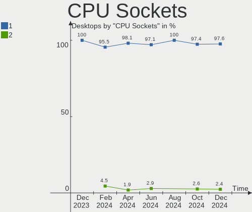

Manjaro Hardware Trends (Desktop)
---------------------------------

A project to identify most popular hardware characteristics and track their change
over time based on data collected by Manjaro users at https://Linux-Hardware.org.

Anyone can contribute to the study by uploading probes of their computers by
the [hw-probe](https://github.com/linuxhw/hw-probe) tool:

    sudo -E hw-probe -all -upload

Full-feature report is available here: https://linux-hardware.org/?view=trends&formfactor=desktop

Period: Sep, 2020.

Contents
--------

- [ OS                       ](#os)
- [ OS Family                ](#os-family)
- [ Kernel                   ](#kernel)
- [ Kernel Family            ](#kernel-family)
- [ Kernel Major Ver.        ](#kernel-major-ver)
- [ Arch                     ](#arch)
- [ DE                       ](#de)
- [ Display Server           ](#display-server)
- [ Display Manager          ](#display-manager)
- [ OS Lang                  ](#os-lang)
- [ Boot Mode                ](#boot-mode)
- [ Filesystem               ](#filesystem)
- [ Part. scheme             ](#part-scheme)
- [ Dual Boot with Linux/BSD ](#dual-boot-with-linux/bsd)
- [ Dual Boot (Win)          ](#dual-boot-win)
- [ Country                  ](#country)
- [ City                     ](#city)
- [ Vendor                   ](#vendor)
- [ Model                    ](#model)
- [ Model Family             ](#model-family)
- [ MFG Year                 ](#mfg-year)
- [ Form Factor              ](#form-factor)
- [ Secure Boot              ](#secure-boot)
- [ Coreboot                 ](#coreboot)
- [ RAM Size                 ](#ram-size)
- [ RAM Used                 ](#ram-used)
- [ Has CD-ROM               ](#has-cd-rom)
- [ Total Drives             ](#total-drives)
- [ Has Ethernet             ](#has-ethernet)
- [ Drive Vendor             ](#drive-vendor)
- [ HDD Vendor               ](#hdd-vendor)
- [ SSD Vendor               ](#ssd-vendor)
- [ Drive Model              ](#drive-model)
- [ Drive Kind               ](#drive-kind)
- [ Drive Connector          ](#drive-connector)
- [ Drive Size               ](#drive-size)
- [ Space Total              ](#space-total)
- [ Space Used               ](#space-used)
- [ Malfunc. Drives          ](#malfunc-drives)
- [ Malfunc. Drive Vendor    ](#malfunc-drive-vendor)
- [ Malfunc. HDD Vendor      ](#malfunc-hdd-vendor)
- [ Malfunc. Drive Kind      ](#malfunc-drive-kind)
- [ Failed Drives            ](#failed-drives)
- [ Failed Drive Vendor      ](#failed-drive-vendor)
- [ Drive Status             ](#drive-status)
- [ Storage Vendor           ](#storage-vendor)
- [ Storage Model            ](#storage-model)
- [ Storage Kind             ](#storage-kind)
- [ CPU Vendor               ](#cpu-vendor)
- [ CPU Model                ](#cpu-model)
- [ CPU Model Family         ](#cpu-model-family)
- [ CPU Cores                ](#cpu-cores)
- [ CPU Sockets              ](#cpu-sockets)
- [ CPU Threads              ](#cpu-threads)
- [ CPU Op-Modes             ](#cpu-op-modes)
- [ CPU Microcode            ](#cpu-microcode)
- [ CPU Microarch            ](#cpu-microarch)
- [ GPU Vendor               ](#gpu-vendor)
- [ GPU Model                ](#gpu-model)
- [ GPU Combo                ](#gpu-combo)
- [ GPU Driver               ](#gpu-driver)
- [ GPU Memory               ](#gpu-memory)
- [ Monitor Vendor           ](#monitor-vendor)
- [ Monitor Model            ](#monitor-model)
- [ Monitor Resolution       ](#monitor-resolution)
- [ Monitor Diagonal         ](#monitor-diagonal)
- [ Monitor Width            ](#monitor-width)
- [ Aspect Ratio             ](#aspect-ratio)
- [ Monitor Area             ](#monitor-area)
- [ Pixel Density            ](#pixel-density)
- [ Multiple Monitors        ](#multiple-monitors)
- [ Net Controller Vendor    ](#net-controller-vendor)
- [ Net Controller Model     ](#net-controller-model)
- [ Wireless Vendor          ](#wireless-vendor)
- [ Wireless Model           ](#wireless-model)
- [ Ethernet Vendor          ](#ethernet-vendor)
- [ Ethernet Model           ](#ethernet-model)
- [ Net Controller Kind      ](#net-controller-kind)
- [ Used Controller          ](#used-controller)
- [ NICs                     ](#nics)
- [ Memory Vendor            ](#memory-vendor)
- [ Memory Model             ](#memory-model)
- [ Memory Kind              ](#memory-kind)
- [ Memory Form Factor       ](#memory-form-factor)
- [ Memory Size              ](#memory-size)
- [ Memory Speed             ](#memory-speed)
- [ Sound Vendor             ](#sound-vendor)
- [ Sound Model              ](#sound-model)
- [ Camera Vendor            ](#camera-vendor)
- [ Camera Model             ](#camera-model)
- [ Fingerprint Vendor       ](#fingerprint-vendor)
- [ Fingerprint Model        ](#fingerprint-model)
- [ Chipcard Vendor          ](#chipcard-vendor)
- [ Chipcard Model           ](#chipcard-model)
- [ Printer Vendor           ](#printer-vendor)
- [ Printer Model            ](#printer-model)
- [ Scanner Vendor           ](#scanner-vendor)
- [ Scanner Model            ](#scanner-model)
- [ Bluetooth Vendor         ](#bluetooth-vendor)
- [ Bluetooth Model          ](#bluetooth-model)
- [ Unsupported Devices      ](#unsupported-devices)
- [ Unsupported Device Types ](#unsupported-device-types)

OS
--

Installed operating systems

| Name         | Desktops | Percent |
|--------------|----------|---------|
| Manjaro 20.1 | 113      | 71.07%  |
| Manjaro      | 46       | 28.93%  |

OS Family
---------

OS without a version

| Name    | Desktops | Percent |
|---------|----------|---------|
| Manjaro | 159      | 100%    |

Kernel
------

Version of the Linux kernel

| Version                | Desktops | Percent |
|------------------------|----------|---------|
| 5.8.6-1-MANJARO        | 65       | 40.88%  |
| 5.8.3-2-MANJARO        | 24       | 15.09%  |
| 5.7.17-2-MANJARO       | 12       | 7.55%   |
| 5.7.19-2-MANJARO       | 10       | 6.29%   |
| 5.4.60-2-MANJARO       | 9        | 5.66%   |
| 5.4.64-1-MANJARO       | 8        | 5.03%   |
| 5.9.0-1-MANJARO        | 5        | 3.14%   |
| 5.8.5-8-tkg-pds        | 2        | 1.26%   |
| 5.8.11-1-MANJARO       | 2        | 1.26%   |
| 5.8.9-2-MANJARO        | 1        | 0.63%   |
| 5.8.9-1-MANJARO        | 1        | 0.63%   |
| 5.8.7-12-tkg-pds       | 1        | 0.63%   |
| 5.8.5-xanmod1-1-xanmod | 1        | 0.63%   |
| 5.8.5-2-MANJARO        | 1        | 0.63%   |
| 5.8.5-1-MANJARO        | 1        | 0.63%   |
| 5.8.3-pf2-1            | 1        | 0.63%   |
| 5.8.12-3-MANJARO       | 1        | 0.63%   |
| 5.8.12-2-MANJARO       | 1        | 0.63%   |
| 5.8.11-18-tkg-upds     | 1        | 0.63%   |
| 5.8.1-3-MANJARO        | 1        | 0.63%   |
| 5.7.19-1-ck            | 1        | 0.63%   |
| 5.7.17-1-clear         | 1        | 0.63%   |
| 5.7.15-1-MANJARO       | 1        | 0.63%   |
| 5.7.14-1-MANJARO       | 1        | 0.63%   |
| 5.6.19-2-MANJARO       | 1        | 0.63%   |
| 5.6.15-1-MANJARO       | 1        | 0.63%   |
| 5.4.62-1-MANJARO       | 1        | 0.63%   |
| 5.4.61-rt37-MANJARO    | 1        | 0.63%   |
| 5.4.61-1-MANJARO       | 1        | 0.63%   |
| 5.4.52-1-MANJARO       | 1        | 0.63%   |
| 4.19.143-1-MANJARO     | 1        | 0.63%   |

Kernel Family
-------------

Linux kernel without a distro release

| Version  | Desktops | Percent |
|----------|----------|---------|
| 5.8.6    | 65       | 40.88%  |
| 5.8.3    | 25       | 15.72%  |
| 5.7.17   | 13       | 8.18%   |
| 5.7.19   | 11       | 6.92%   |
| 5.4.60   | 9        | 5.66%   |
| 5.4.64   | 8        | 5.03%   |
| 5.9.0    | 5        | 3.14%   |
| 5.8.5    | 5        | 3.14%   |
| 5.8.11   | 3        | 1.89%   |
| 5.8.9    | 2        | 1.26%   |
| 5.8.12   | 2        | 1.26%   |
| 5.4.61   | 2        | 1.26%   |
| 5.8.7    | 1        | 0.63%   |
| 5.8.1    | 1        | 0.63%   |
| 5.7.15   | 1        | 0.63%   |
| 5.7.14   | 1        | 0.63%   |
| 5.6.19   | 1        | 0.63%   |
| 5.6.15   | 1        | 0.63%   |
| 5.4.62   | 1        | 0.63%   |
| 5.4.52   | 1        | 0.63%   |
| 4.19.143 | 1        | 0.63%   |

Kernel Major Ver.
-----------------

Linux kernel major version

| Version | Desktops | Percent |
|---------|----------|---------|
| 5.8     | 104      | 65.41%  |
| 5.7     | 26       | 16.35%  |
| 5.4     | 21       | 13.21%  |
| 5.9     | 5        | 3.14%   |
| 5.6     | 2        | 1.26%   |
| 4.19    | 1        | 0.63%   |

Arch
----

OS architecture (x86_64, i586, etc.)

| Name   | Desktops | Percent |
|--------|----------|---------|
| x86_64 | 159      | 100%    |

DE
--

Desktop Environment

| Name          | Desktops | Percent |
|---------------|----------|---------|
| KDE5          | 61       | 38.36%  |
| XFCE          | 30       | 18.87%  |
| GNOME         | 26       | 16.35%  |
| KDE           | 21       | 13.21%  |
| i3            | 5        | 3.14%   |
| X-Cinnamon    | 4        | 2.52%   |
| Unknown       | 4        | 2.52%   |
| Cinnamon      | 2        | 1.26%   |
| openbox       | 1        | 0.63%   |
| LXQt          | 1        | 0.63%   |
| ICEWM         | 1        | 0.63%   |
| GNOME Classic | 1        | 0.63%   |
| Deepin        | 1        | 0.63%   |
| bspwm         | 1        | 0.63%   |

Display Server
--------------

X11 or Wayland

| Name    | Desktops | Percent |
|---------|----------|---------|
| X11     | 155      | 97.48%  |
| Wayland | 3        | 1.89%   |
| Tty     | 1        | 0.63%   |

Display Manager
---------------

SDDM, LightDM, etc.

| Name    | Desktops | Percent |
|---------|----------|---------|
| SDDM    | 63       | 39.62%  |
| Unknown | 43       | 27.04%  |
| LightDM | 29       | 18.24%  |
| GDM     | 20       | 12.58%  |
| TDM     | 4        | 2.52%   |

OS Lang
-------

Language

| Lang       | Desktops | Percent |
|------------|----------|---------|
| en_US      | 71       | 44.65%  |
| en_US.utf8 | 17       | 10.69%  |
| en_GB      | 15       | 9.43%   |
| de_DE      | 8        | 5.03%   |
| pt_BR      | 4        | 2.52%   |
| es_ES      | 4        | 2.52%   |
| de_DE.utf8 | 4        | 2.52%   |
| ru_RU      | 3        | 1.89%   |
| fr_FR      | 3        | 1.89%   |
| en_AU      | 3        | 1.89%   |
| nb_NO      | 2        | 1.26%   |
| it_IT.utf8 | 2        | 1.26%   |
| it_IT      | 2        | 1.26%   |
| en_GB.utf8 | 2        | 1.26%   |
| en_CA      | 2        | 1.26%   |
| C          | 2        | 1.26%   |
| tr_TR      | 1        | 0.63%   |
| sv_SE      | 1        | 0.63%   |
| sma_SE     | 1        | 0.63%   |
| ru_RU.utf8 | 1        | 0.63%   |
| pt_BR.utf8 | 1        | 0.63%   |
| nl_NL      | 1        | 0.63%   |
| nl_BE.utf8 | 1        | 0.63%   |
| es_MX.utf8 | 1        | 0.63%   |
| es_ES.utf8 | 1        | 0.63%   |
| en_IE.utf8 | 1        | 0.63%   |
| en_AU.utf8 | 1        | 0.63%   |
| en_001     | 1        | 0.63%   |
| de_AT      | 1        | 0.63%   |
| da_DK      | 1        | 0.63%   |
| Unknown    | 1        | 0.63%   |

Boot Mode
---------

EFI or BIOS

| Mode | Desktops | Percent |
|------|----------|---------|
| EFI  | 89       | 55.97%  |
| BIOS | 70       | 44.03%  |

Filesystem
----------

Type of filesystem

| Type  | Desktops | Percent |
|-------|----------|---------|
| Ext4  | 150      | 94.34%  |
| Btrfs | 4        | 2.52%   |
| Xfs   | 2        | 1.26%   |
| Zfs   | 1        | 0.63%   |
| F2fs  | 1        | 0.63%   |
| Ext3  | 1        | 0.63%   |

Part. scheme
------------

Scheme of partitioning

| Type    | Desktops | Percent |
|---------|----------|---------|
| GPT     | 103      | 64.78%  |
| Unknown | 42       | 26.42%  |
| MBR     | 14       | 8.81%   |

Dual Boot with Linux/BSD
------------------------

Hosting more than one Linux/BSD

| Dual boot | Desktops | Percent |
|-----------|----------|---------|
| No        | 128      | 80.5%   |
| Yes       | 31       | 19.5%   |

Dual Boot (Win)
---------------

Hosting Linux and Windows

| Dual boot | Desktops | Percent |
|-----------|----------|---------|
| No        | 80       | 50.31%  |
| Yes       | 79       | 49.69%  |

Country
-------

Geographic location (country)

| Country      | Desktops | Percent |
|--------------|----------|---------|
| USA          | 40       | 25.16%  |
| Germany      | 17       | 10.69%  |
| Spain        | 10       | 6.29%   |
| Brazil       | 9        | 5.66%   |
| UK           | 7        | 4.4%    |
| Netherlands  | 6        | 3.77%   |
| Italy        | 6        | 3.77%   |
| Sweden       | 5        | 3.14%   |
| Russia       | 5        | 3.14%   |
| Poland       | 4        | 2.52%   |
| France       | 4        | 2.52%   |
| Canada       | 4        | 2.52%   |
| Australia    | 4        | 2.52%   |
| Switzerland  | 3        | 1.89%   |
| Romania      | 3        | 1.89%   |
| Portugal     | 3        | 1.89%   |
| Mexico       | 3        | 1.89%   |
| Austria      | 3        | 1.89%   |
| Turkey       | 2        | 1.26%   |
| Slovakia     | 2        | 1.26%   |
| Norway       | 2        | 1.26%   |
| Finland      | 2        | 1.26%   |
| Belgium      | 2        | 1.26%   |
| Belarus      | 2        | 1.26%   |
| South Africa | 1        | 0.63%   |
| Pakistan     | 1        | 0.63%   |
| Israel       | 1        | 0.63%   |
| Indonesia    | 1        | 0.63%   |
| Greece       | 1        | 0.63%   |
| Denmark      | 1        | 0.63%   |
| Croatia      | 1        | 0.63%   |
| Bulgaria     | 1        | 0.63%   |
| Bangladesh   | 1        | 0.63%   |
| Argentina    | 1        | 0.63%   |
| Algeria      | 1        | 0.63%   |

City
----

Geographic location (city)

| City                  | Desktops | Percent |
|-----------------------|----------|---------|
| Stockholm             | 3        | 1.89%   |
| Vienna                | 2        | 1.26%   |
| Stuttgart             | 2        | 1.26%   |
| Saint Paul            | 2        | 1.26%   |
| Rio de Janeiro        | 2        | 1.26%   |
| New York              | 2        | 1.26%   |
| Helsinki              | 2        | 1.26%   |
| Durham                | 2        | 1.26%   |
| Drammen               | 2        | 1.26%   |
| Barcelona             | 2        | 1.26%   |
| Łódź               | 1        | 0.63%   |
| Zurich                | 1        | 0.63%   |
| Zagreb                | 1        | 0.63%   |
| Woodbridge            | 1        | 0.63%   |
| Watertown             | 1        | 0.63%   |
| Warsaw                | 1        | 0.63%   |
| Viterbo               | 1        | 0.63%   |
| Vincennes             | 1        | 0.63%   |
| Vancouver             | 1        | 0.63%   |
| Valencia              | 1        | 0.63%   |
| Utrecht               | 1        | 0.63%   |
| Urgnano               | 1        | 0.63%   |
| Uberlândia           | 1        | 0.63%   |
| Tver                  | 1        | 0.63%   |
| Tucson                | 1        | 0.63%   |
| Tlajomulco de Zuniga  | 1        | 0.63%   |
| Sydney                | 1        | 0.63%   |
| Surrey                | 1        | 0.63%   |
| Sukkur                | 1        | 0.63%   |
| Stowmarket            | 1        | 0.63%   |
| St Petersburg         | 1        | 0.63%   |
| St Louis              | 1        | 0.63%   |
| Spruce Grove          | 1        | 0.63%   |
| Sorocaba              | 1        | 0.63%   |
| Sesena Nuevo          | 1        | 0.63%   |
| Seattle               | 1        | 0.63%   |
| Schifferstadt         | 1        | 0.63%   |
| Santander             | 1        | 0.63%   |
| Sant Adrià de Besòs | 1        | 0.63%   |
| San Jose              | 1        | 0.63%   |
| Rostov-on-Don         | 1        | 0.63%   |
| Rome                  | 1        | 0.63%   |
| Recife                | 1        | 0.63%   |
| Reading               | 1        | 0.63%   |
| Radomsko              | 1        | 0.63%   |
| Porto Alegre          | 1        | 0.63%   |
| Portland              | 1        | 0.63%   |
| Port Townsend         | 1        | 0.63%   |
| Plovdiv               | 1        | 0.63%   |
| Ploieşti             | 1        | 0.63%   |
| Pisa                  | 1        | 0.63%   |
| Perth                 | 1        | 0.63%   |
| Pereira               | 1        | 0.63%   |
| Pelotas               | 1        | 0.63%   |
| Panealba              | 1        | 0.63%   |
| Palma                 | 1        | 0.63%   |
| Nové Zámky          | 1        | 0.63%   |
| Novara                | 1        | 0.63%   |
| Newport News          | 1        | 0.63%   |
| Neptune City          | 1        | 0.63%   |

Vendor
------

Motherboard manufacturer

| Name                | Desktops | Percent |
|---------------------|----------|---------|
| ASUSTek Computer    | 57       | 35.85%  |
| MSI                 | 31       | 19.5%   |
| Gigabyte Technology | 31       | 19.5%   |
| ASRock              | 22       | 13.84%  |
| Dell                | 4        | 2.52%   |
| Hewlett-Packard     | 3        | 1.89%   |
| Pegatron            | 2        | 1.26%   |
| Medion              | 2        | 1.26%   |
| Intel               | 2        | 1.26%   |
| Fujitsu Siemens     | 1        | 0.63%   |
| Fujitsu             | 1        | 0.63%   |
| Foxconn             | 1        | 0.63%   |
| ASRockRack          | 1        | 0.63%   |
| Acer                | 1        | 0.63%   |

Model
-----

Motherboard model

| Name                                                          | Desktops | Percent |
|---------------------------------------------------------------|----------|---------|
| ASUS All Series                                               | 7        | 4.4%    |
| MSI MS-7C02                                                   | 5        | 3.14%   |
| ASUS TUF B450-PLUS GAMING                                     | 3        | 1.89%   |
| ASUS PRIME X470-PRO                                           | 3        | 1.89%   |
| ASUS PRIME A320M-K                                            | 3        | 1.89%   |
| ASRock B450M Pro4                                             | 3        | 1.89%   |
| MSI MS-7B89                                                   | 2        | 1.26%   |
| MSI MS-7B86                                                   | 2        | 1.26%   |
| MSI MS-7B79                                                   | 2        | 1.26%   |
| MSI MS-7B78                                                   | 2        | 1.26%   |
| MSI MS-7A32                                                   | 2        | 1.26%   |
| Gigabyte X570 I AORUS PRO WIFI                                | 2        | 1.26%   |
| Gigabyte X570 AORUS ELITE                                     | 2        | 1.26%   |
| Gigabyte X470 AORUS ULTRA GAMING                              | 2        | 1.26%   |
| Gigabyte B450M DS3H                                           | 2        | 1.26%   |
| ASUS TUF GAMING X570-PLUS                                     | 2        | 1.26%   |
| ASUS TUF B350M-PLUS GAMING                                    | 2        | 1.26%   |
| ASUS ROG STRIX X370-F GAMING                                  | 2        | 1.26%   |
| ASUS ROG STRIX B350-F GAMING                                  | 2        | 1.26%   |
| ASUS PRIME B350M-A                                            | 2        | 1.26%   |
| ASUS PRIME B350-PLUS                                          | 2        | 1.26%   |
| ASRock X470 Taichi                                            | 2        | 1.26%   |
| ASRock B450 Gaming-ITX/ac                                     | 2        | 1.26%   |
| Pegatron BM412AA-ABA CQ5600Y                                  | 1        | 0.63%   |
| Pegatron 300-1200la                                           | 1        | 0.63%   |
| MSI MS-7C52                                                   | 1        | 0.63%   |
| MSI MS-7C37                                                   | 1        | 0.63%   |
| MSI MS-7C35                                                   | 1        | 0.63%   |
| MSI MS-7C08                                                   | 1        | 0.63%   |
| MSI MS-7B85                                                   | 1        | 0.63%   |
| MSI MS-7B45                                                   | 1        | 0.63%   |
| MSI MS-7B43                                                   | 1        | 0.63%   |
| MSI MS-7B22                                                   | 1        | 0.63%   |
| MSI MS-7A68                                                   | 1        | 0.63%   |
| MSI MS-7A38                                                   | 1        | 0.63%   |
| MSI MS-7977                                                   | 1        | 0.63%   |
| MSI MS-7976                                                   | 1        | 0.63%   |
| MSI MS-7971                                                   | 1        | 0.63%   |
| MSI MS-7885                                                   | 1        | 0.63%   |
| MSI MS-7823                                                   | 1        | 0.63%   |
| MSI MS-7821                                                   | 1        | 0.63%   |
| Medion MS-7728                                                | 1        | 0.63%   |
| Medion Akoya P2222 D/B564                                     | 1        | 0.63%   |
| Intel X79 (INTEL Xeon E5/Corei7 DMI2 - C600/C200 Cipset V3.5B | 1        | 0.63%   |
| Intel DH55HC AAE70933-506                                     | 1        | 0.63%   |
| HP Pavilion Desktop 590-p0xxx                                 | 1        | 0.63%   |
| HP Pavilion 570-P013WB                                        | 1        | 0.63%   |
| HP Compaq Pro 6300 SFF                                        | 1        | 0.63%   |
| Gigabyte Z68A-D3-B3                                           | 1        | 0.63%   |
| Gigabyte Z390 I AORUS PRO WIFI                                | 1        | 0.63%   |
| Gigabyte Z270X-Gaming 7                                       | 1        | 0.63%   |
| Gigabyte X99-UD4P-CF                                          | 1        | 0.63%   |
| Gigabyte X58A-UD3R                                            | 1        | 0.63%   |
| Gigabyte X570 AORUS ULTRA                                     | 1        | 0.63%   |
| Gigabyte X570 AORUS PRO                                       | 1        | 0.63%   |
| Gigabyte X570 AORUS MASTER                                    | 1        | 0.63%   |
| Gigabyte H87-HD3                                              | 1        | 0.63%   |
| Gigabyte H61M-S2V-B3                                          | 1        | 0.63%   |
| Gigabyte H61M-S1                                              | 1        | 0.63%   |
| Gigabyte H310N                                                | 1        | 0.63%   |

Model Family
------------

Motherboard model prefix

| Name                   | Desktops | Percent |
|------------------------|----------|---------|
| ASUS PRIME             | 15       | 9.43%   |
| ASUS TUF               | 9        | 5.66%   |
| ASUS ROG               | 8        | 5.03%   |
| Gigabyte X570          | 7        | 4.4%    |
| ASUS All               | 7        | 4.4%    |
| MSI MS-7C02            | 5        | 3.14%   |
| ASRock X570            | 4        | 2.52%   |
| ASRock B450M           | 4        | 2.52%   |
| Dell OptiPlex          | 3        | 1.89%   |
| ASRock X470            | 3        | 1.89%   |
| MSI MS-7B89            | 2        | 1.26%   |
| MSI MS-7B86            | 2        | 1.26%   |
| MSI MS-7B79            | 2        | 1.26%   |
| MSI MS-7B78            | 2        | 1.26%   |
| MSI MS-7A32            | 2        | 1.26%   |
| HP Pavilion            | 2        | 1.26%   |
| Gigabyte X470          | 2        | 1.26%   |
| Gigabyte B450M         | 2        | 1.26%   |
| Gigabyte B450          | 2        | 1.26%   |
| ASUS P9X79             | 2        | 1.26%   |
| ASUS Maximus           | 2        | 1.26%   |
| ASRock B450            | 2        | 1.26%   |
| Pegatron BM412AA-ABA   | 1        | 0.63%   |
| Pegatron 300-1200la    | 1        | 0.63%   |
| MSI MS-7C52            | 1        | 0.63%   |
| MSI MS-7C37            | 1        | 0.63%   |
| MSI MS-7C35            | 1        | 0.63%   |
| MSI MS-7C08            | 1        | 0.63%   |
| MSI MS-7B85            | 1        | 0.63%   |
| MSI MS-7B45            | 1        | 0.63%   |
| MSI MS-7B43            | 1        | 0.63%   |
| MSI MS-7B22            | 1        | 0.63%   |
| MSI MS-7A68            | 1        | 0.63%   |
| MSI MS-7A38            | 1        | 0.63%   |
| MSI MS-7977            | 1        | 0.63%   |
| MSI MS-7976            | 1        | 0.63%   |
| MSI MS-7971            | 1        | 0.63%   |
| MSI MS-7885            | 1        | 0.63%   |
| MSI MS-7823            | 1        | 0.63%   |
| MSI MS-7821            | 1        | 0.63%   |
| Medion MS-7728         | 1        | 0.63%   |
| Medion Akoya           | 1        | 0.63%   |
| Intel X79              | 1        | 0.63%   |
| Intel DH55HC           | 1        | 0.63%   |
| HP Compaq              | 1        | 0.63%   |
| Gigabyte Z68A-D3-B3    | 1        | 0.63%   |
| Gigabyte Z390          | 1        | 0.63%   |
| Gigabyte Z270X-Gaming  | 1        | 0.63%   |
| Gigabyte X99-UD4P-CF   | 1        | 0.63%   |
| Gigabyte X58A-UD3R     | 1        | 0.63%   |
| Gigabyte H87-HD3       | 1        | 0.63%   |
| Gigabyte H61M-S2V-B3   | 1        | 0.63%   |
| Gigabyte H61M-S1       | 1        | 0.63%   |
| Gigabyte H310N         | 1        | 0.63%   |
| Gigabyte H110M-S2H     | 1        | 0.63%   |
| Gigabyte GA-970A-UD3   | 1        | 0.63%   |
| Gigabyte GA-880GA-UD3H | 1        | 0.63%   |
| Gigabyte B75M-D3H      | 1        | 0.63%   |
| Gigabyte AX370-Gaming  | 1        | 0.63%   |
| Gigabyte AB350M-DS3H   | 1        | 0.63%   |

MFG Year
--------

Motherboard manufacture year

| Year | Desktops | Percent |
|------|----------|---------|
| 2019 | 44       | 27.67%  |
| 2020 | 42       | 26.42%  |
| 2018 | 22       | 13.84%  |
| 2013 | 8        | 5.03%   |
| 2016 | 7        | 4.4%    |
| 2010 | 7        | 4.4%    |
| 2017 | 6        | 3.77%   |
| 2012 | 6        | 3.77%   |
| 2015 | 5        | 3.14%   |
| 2014 | 4        | 2.52%   |
| 2011 | 4        | 2.52%   |
| 2009 | 2        | 1.26%   |
| 2007 | 2        | 1.26%   |

Form Factor
-----------

Physical design of the computer

| Name    | Desktops | Percent |
|---------|----------|---------|
| Desktop | 159      | 100%    |

Secure Boot
-----------

Enabled or disabled

| State    | Desktops | Percent |
|----------|----------|---------|
| Disabled | 159      | 100%    |

Coreboot
--------

Have coreboot on board

| Used | Desktops | Percent |
|------|----------|---------|
| No   | 159      | 100%    |

RAM Size
--------

Total RAM memory

| Size in GB  | Desktops | Percent |
|-------------|----------|---------|
| 16.01-24.0  | 85       | 53.46%  |
| 32.01-64.0  | 33       | 20.75%  |
| 8.01-16.0   | 17       | 10.69%  |
| 4.01-8.0    | 10       | 6.29%   |
| 3.01-4.0    | 6        | 3.77%   |
| 24.01-32.0  | 4        | 2.52%   |
| 64.01-256.0 | 4        | 2.52%   |

RAM Used
--------

Used RAM memory

| Used GB    | Desktops | Percent |
|------------|----------|---------|
| 4.01-8.0   | 56       | 35.22%  |
| 3.01-4.0   | 29       | 18.24%  |
| 2.01-3.0   | 26       | 16.35%  |
| 1.01-2.0   | 22       | 13.84%  |
| 8.01-16.0  | 22       | 13.84%  |
| 16.01-24.0 | 3        | 1.89%   |
| 0.01-1.0   | 1        | 0.63%   |

Has CD-ROM
----------

Has CD-ROM on board

| Presented | Desktops | Percent |
|-----------|----------|---------|
| No        | 119      | 74.84%  |
| Yes       | 40       | 25.16%  |

Total Drives
------------

Number of drives on board

| Drives | Desktops | Percent |
|--------|----------|---------|
| 2      | 48       | 30.19%  |
| 3      | 36       | 22.64%  |
| 4      | 30       | 18.87%  |
| 1      | 24       | 15.09%  |
| 5      | 14       | 8.81%   |
| 8      | 2        | 1.26%   |
| 7      | 2        | 1.26%   |
| 6      | 2        | 1.26%   |
| 12     | 1        | 0.63%   |

Has Ethernet
------------

Has Ethernet on board

| Presented | Desktops | Percent |
|-----------|----------|---------|
| Yes       | 158      | 99.37%  |
| No        | 1        | 0.63%   |

Drive Vendor
------------

Hard drive vendors

| Vendor                    | Desktops | Drives | Percent |
|---------------------------|----------|--------|---------|
| Seagate                   | 75       | 103    | 19.84%  |
| WDC                       | 69       | 90     | 18.25%  |
| Samsung Electronics       | 68       | 101    | 17.99%  |
| Kingston                  | 33       | 38     | 8.73%   |
| Crucial                   | 23       | 26     | 6.08%   |
| Toshiba                   | 13       | 14     | 3.44%   |
| Intel                     | 13       | 14     | 3.44%   |
| Hitachi                   | 13       | 13     | 3.44%   |
| Phison                    | 10       | 10     | 2.65%   |
| Sandisk                   | 9        | 10     | 2.38%   |
| SPCC                      | 5        | 5      | 1.32%   |
| HGST                      | 5        | 5      | 1.32%   |
| SK Hynix                  | 4        | 4      | 1.06%   |
| PNY                       | 4        | 4      | 1.06%   |
| Corsair                   | 4        | 4      | 1.06%   |
| China                     | 3        | 4      | 0.79%   |
| A-DATA Technology         | 3        | 3      | 0.79%   |
| XPG                       | 2        | 2      | 0.53%   |
| Transcend                 | 2        | 2      | 0.53%   |
| Silicon Motion            | 2        | 3      | 0.53%   |
| Patriot                   | 2        | 2      | 0.53%   |
| OCZ                       | 2        | 2      | 0.53%   |
| MAXTOR                    | 2        | 2      | 0.53%   |
| T-FORCE                   | 1        | 1      | 0.26%   |
| PLEXTOR                   | 1        | 1      | 0.26%   |
| Micron/Crucial Technology | 1        | 1      | 0.26%   |
| Micron Technology         | 1        | 1      | 0.26%   |
| Lexar                     | 1        | 1      | 0.26%   |
| Lenovo                    | 1        | 1      | 0.26%   |
| KingDian                  | 1        | 1      | 0.26%   |
| Intenso                   | 1        | 1      | 0.26%   |
| GOODRAM                   | 1        | 1      | 0.26%   |
| BRAVEEAGLE                | 1        | 1      | 0.26%   |
| asmedia                   | 1        | 1      | 0.26%   |
| Apple                     | 1        | 1      | 0.26%   |

HDD Vendor
----------

Hard disk drive vendors

| Vendor              | Desktops | Drives | Percent |
|---------------------|----------|--------|---------|
| Seagate             | 73       | 99     | 41.01%  |
| WDC                 | 66       | 85     | 37.08%  |
| Hitachi             | 13       | 13     | 7.3%    |
| Toshiba             | 10       | 11     | 5.62%   |
| Samsung Electronics | 6        | 6      | 3.37%   |
| HGST                | 5        | 5      | 2.81%   |
| Maxtor              | 2        | 2      | 1.12%   |
| Lenovo              | 1        | 1      | 0.56%   |
| asmedia             | 1        | 1      | 0.56%   |
| Apple               | 1        | 1      | 0.56%   |

SSD Vendor
----------

Solid state drive vendors

| Vendor              | Desktops | Drives | Percent |
|---------------------|----------|--------|---------|
| Samsung Electronics | 49       | 62     | 32.24%  |
| Kingston            | 31       | 35     | 20.39%  |
| Crucial             | 21       | 24     | 13.82%  |
| SanDisk             | 8        | 9      | 5.26%   |
| Intel               | 7        | 8      | 4.61%   |
| PNY                 | 4        | 4      | 2.63%   |
| WDC                 | 3        | 3      | 1.97%   |
| SPCC                | 3        | 3      | 1.97%   |
| Corsair             | 3        | 3      | 1.97%   |
| China               | 3        | 4      | 1.97%   |
| Transcend           | 2        | 2      | 1.32%   |
| Toshiba             | 2        | 2      | 1.32%   |
| SK Hynix            | 2        | 2      | 1.32%   |
| OCZ                 | 2        | 2      | 1.32%   |
| A-DATA Technology   | 2        | 2      | 1.32%   |
| T-FORCE             | 1        | 1      | 0.66%   |
| Seagate             | 1        | 1      | 0.66%   |
| PLEXTOR             | 1        | 1      | 0.66%   |
| Patriot             | 1        | 1      | 0.66%   |
| Micron Technology   | 1        | 1      | 0.66%   |
| Lexar               | 1        | 1      | 0.66%   |
| KingDian            | 1        | 1      | 0.66%   |
| Intenso             | 1        | 1      | 0.66%   |
| GOODRAM             | 1        | 1      | 0.66%   |
| BRAVEEAGLE          | 1        | 1      | 0.66%   |

Drive Model
-----------

Hard drive models

| Model                    | Desktops | Percent |
|--------------------------|----------|---------|
| SSD 850 EVO 500GB        | 12       | 2.67%   |
| SSD 860 EVO 1TB          | 8        | 1.78%   |
| SA400S37120G 120GB SSD   | 8        | 1.78%   |
| NVMe SSD Drive 500GB     | 8        | 1.78%   |
| SA400S37240G 240GB SSD   | 7        | 1.56%   |
| SV300S37A120G 120GB SSD  | 6        | 1.34%   |
| ST2000DM008-2FR102 2TB   | 6        | 1.34%   |
| NVMe SSD Drive 512GB     | 6        | 1.34%   |
| Expansion 1TB            | 6        | 1.34%   |
| ST1000DM003-1ER162 1TB   | 5        | 1.11%   |
| SSD 970 EVO Plus 500GB   | 5        | 1.11%   |
| NVMe SSD Drive 1TB       | 5        | 1.11%   |
| CT500MX500SSD1 500GB     | 5        | 1.11%   |
| CT1000MX500SSD1 1TB      | 5        | 1.11%   |
| WD20EZRZ-00Z5HB0 2TB     | 4        | 0.89%   |
| WD10EZEX-00BN5A0 1TB     | 4        | 0.89%   |
| ST4000DM004-2CV104 4TB   | 4        | 0.89%   |
| ST2000DM006-2DM164 2TB   | 4        | 0.89%   |
| SSD 860 EVO 500GB        | 4        | 0.89%   |
| SA400S37480G 480GB SSD   | 4        | 0.89%   |
| CT240BX500SSD1 240GB     | 4        | 0.89%   |
| ST2000DM001-1ER164 2TB   | 3        | 0.67%   |
| ST2000DM001-1CH164 2TB   | 3        | 0.67%   |
| ST1000DM010-2EP102 1TB   | 3        | 0.67%   |
| SSD 970 EVO 500GB        | 3        | 0.67%   |
| SSD 840 PRO Series 256GB | 3        | 0.67%   |
| SSD 830 Series 128GB     | 3        | 0.67%   |
| HUA723020ALA641 2TB      | 3        | 0.67%   |
| CT525MX300SSD1 528GB     | 3        | 0.67%   |
| WD7501AALS-00J7B0 752GB  | 2        | 0.45%   |
| WD5000AAKX-00U6AA0 500GB | 2        | 0.45%   |
| WD40EZRZ-00GXCB0 4TB     | 2        | 0.45%   |
| WD40EFRX-68WT0N0 4TB     | 2        | 0.45%   |
| WD4002FYYZ-01B7CB1 4TB   | 2        | 0.45%   |
| WD2500AAKX-753CA1 250GB  | 2        | 0.45%   |
| WD20EZAZ-00GGJB0 2TB     | 2        | 0.45%   |
| WD15EADS-00P8B0 1TB      | 2        | 0.45%   |
| WD10EZEX-22MFCA0 1TB     | 2        | 0.45%   |
| WD10EZEX-21WN4A0 1TB     | 2        | 0.45%   |
| WD10EZEX-08WN4A0 1TB     | 2        | 0.45%   |
| WD10EZEX-08M2NA0 1TB     | 2        | 0.45%   |
| WD10EARS-00Y5B1 1TB      | 2        | 0.45%   |
| WD1003FZEX-00MK2A0 1TB   | 2        | 0.45%   |
| STM3500418AS 500GB       | 2        | 0.45%   |
| ST91000640NS 1TB         | 2        | 0.45%   |
| ST3500630AS 500GB        | 2        | 0.45%   |
| ST3500418AS 500GB        | 2        | 0.45%   |
| ST31000528AS 1TB         | 2        | 0.45%   |
| ST1000LM048-2E7172 1TB   | 2        | 0.45%   |
| ST1000DX002-2DV162 1TB   | 2        | 0.45%   |
| ST1000DM003-9YN162 1TB   | 2        | 0.45%   |
| ST1000DM003-1SB10C 1TB   | 2        | 0.45%   |
| SSDSC2KW010T8 1TB        | 2        | 0.45%   |
| SSDSC2CT120A3 120GB      | 2        | 0.45%   |
| SSDPEKNW020T8 2TB        | 2        | 0.45%   |
| SSD 970 PRO 512GB        | 2        | 0.45%   |
| SSD 970 EVO Plus 250GB   | 2        | 0.45%   |
| SSD 960 EVO 250GB        | 2        | 0.45%   |
| SSD 860 QVO 1TB          | 2        | 0.45%   |
| SSD 850 PRO 1TB          | 2        | 0.45%   |

Drive Kind
----------

HDD or SSD

| Kind    | Desktops | Drives | Percent |
|---------|----------|--------|---------|
| HDD     | 130      | 224    | 41.8%   |
| SSD     | 116      | 175    | 37.3%   |
| NVMe    | 63       | 72     | 20.26%  |
| Unknown | 2        | 2      | 0.64%   |

Drive Connector
---------------

SATA, SAS, NVMe, etc.

| Type | Desktops | Drives | Percent |
|------|----------|--------|---------|
| SATA | 151      | 383    | 66.52%  |
| NVMe | 63       | 72     | 27.75%  |
| SAS  | 13       | 18     | 5.73%   |

Drive Size
----------

Size of hard drive

| Size in TB | Desktops | Drives | Percent |
|------------|----------|--------|---------|
| 0.01-0.5   | 125      | 213    | 39.81%  |
| 0.51-1.0   | 102      | 151    | 32.48%  |
| 1.01-2.0   | 45       | 53     | 14.33%  |
| 3.01-4.0   | 19       | 26     | 6.05%   |
| 2.01-3.0   | 12       | 12     | 3.82%   |
| 4.01-10.0  | 9        | 13     | 2.87%   |
| 10.01-20.0 | 2        | 5      | 0.64%   |

Space Total
-----------

Amount of disk space available on the file system

| Size in GB     | Desktops | Percent |
|----------------|----------|---------|
| 1001-2000      | 36       | 22.64%  |
| More than 3000 | 29       | 18.24%  |
| 501-1000       | 24       | 15.09%  |
| 251-500        | 23       | 14.47%  |
| 2001-3000      | 23       | 14.47%  |
| 101-250        | 17       | 10.69%  |
| Unknown        | 4        | 2.52%   |
| 21-50          | 1        | 0.63%   |
| 1-20           | 1        | 0.63%   |
| 51-100         | 1        | 0.63%   |

Space Used
----------

Amount of used disk space

| Used GB        | Desktops | Percent |
|----------------|----------|---------|
| 501-1000       | 32       | 20.13%  |
| 1001-2000      | 26       | 16.35%  |
| 101-250        | 25       | 15.72%  |
| 251-500        | 19       | 11.95%  |
| More than 3000 | 12       | 7.55%   |
| 21-50          | 12       | 7.55%   |
| 51-100         | 11       | 6.92%   |
| 2001-3000      | 9        | 5.66%   |
| 1-20           | 9        | 5.66%   |
| Unknown        | 4        | 2.52%   |

Malfunc. Drives
---------------

Drive models with a malfunction

| Model                        | Desktops | Drives | Percent |
|------------------------------|----------|--------|---------|
| WD10EARS-00Y5B1 1TB          | 2        | 2      | 8%      |
| WD5000AAKX-00U6AA0 500GB     | 1        | 1      | 4%      |
| WD5000AAKX-003CA0 500GB      | 1        | 1      | 4%      |
| WD5000AADS-56S9B1 500GB      | 1        | 1      | 4%      |
| WD10EZEX-08M2NA0 1TB         | 1        | 1      | 4%      |
| WD10EZEX-00ZF5A0 1TB         | 1        | 1      | 4%      |
| WD10EZEX-00BN5A0 1TB         | 1        | 1      | 4%      |
| WD10EADX-22TDHB0 1TB         | 1        | 1      | 4%      |
| SV300S37A120G 120GB SSD      | 1        | 1      | 4%      |
| ST9250827AS 250GB            | 1        | 1      | 4%      |
| ST500DM002-1BD142 500GB      | 1        | 1      | 4%      |
| ST500DM002-1BC142 500GB      | 1        | 1      | 4%      |
| ST31000340NS 1TB             | 1        | 1      | 4%      |
| ST2000DM008-2FR102 2TB       | 1        | 1      | 4%      |
| ST2000DM006-2DM164 2TB       | 1        | 1      | 4%      |
| ST1000DM003-9YN162 1TB       | 1        | 1      | 4%      |
| SSDSC2KW360H6 360GB          | 1        | 1      | 4%      |
| SSDSC2KW010T8 1TB            | 1        | 1      | 4%      |
| SSDSC2CT120A3 120GB          | 1        | 1      | 4%      |
| SDSSDXPS960G 960GB           | 1        | 2      | 4%      |
| SA400S37120G 120GB SSD       | 1        | 1      | 4%      |
| HTS727550A9E364 500GB        | 1        | 1      | 4%      |
| HTS541010A9E680 1TB          | 1        | 1      | 4%      |
| HFS128G39TND-N210A 128GB SSD | 1        | 1      | 4%      |

Malfunc. Drive Vendor
---------------------

Vendors of faulty drives

| Vendor   | Desktops | Drives | Percent |
|----------|----------|--------|---------|
| WDC      | 9        | 9      | 36%     |
| Seagate  | 7        | 7      | 28%     |
| Intel    | 3        | 3      | 12%     |
| Kingston | 2        | 2      | 8%      |
| SK Hynix | 1        | 1      | 4%      |
| SanDisk  | 1        | 2      | 4%      |
| Hitachi  | 1        | 1      | 4%      |
| HGST     | 1        | 1      | 4%      |

Malfunc. HDD Vendor
-------------------

Vendors of faulty HDD drives

| Vendor  | Desktops | Drives | Percent |
|---------|----------|--------|---------|
| WDC     | 9        | 9      | 50%     |
| Seagate | 7        | 7      | 38.89%  |
| Hitachi | 1        | 1      | 5.56%   |
| HGST    | 1        | 1      | 5.56%   |

Malfunc. Drive Kind
-------------------

Kinds of faulty drives

| Kind | Desktops | Drives | Percent |
|------|----------|--------|---------|
| HDD  | 16       | 18     | 69.57%  |
| SSD  | 7        | 8      | 30.43%  |

Failed Drives
-------------

Failed drive models

| Model                   | Desktops | Drives | Percent |
|-------------------------|----------|--------|---------|
| SV300S37A120G 120GB SSD | 1        | 1      | 50%     |
| ST3500418AS 500GB       | 1        | 1      | 50%     |

Failed Drive Vendor
-------------------

Failed drive vendors

| Vendor   | Desktops | Drives | Percent |
|----------|----------|--------|---------|
| Seagate  | 1        | 1      | 50%     |
| Kingston | 1        | 1      | 50%     |

Drive Status
------------

Number of failed and malfunc. drives

| Status   | Desktops | Drives | Percent |
|----------|----------|--------|---------|
| Detected | 84       | 236    | 43.75%  |
| Works    | 84       | 209    | 43.75%  |
| Malfunc  | 22       | 26     | 11.46%  |
| Failed   | 2        | 2      | 1.04%   |

Storage Vendor
--------------

Storage controller vendors

| Vendor                       | Desktops | Percent |
|------------------------------|----------|---------|
| AMD                          | 90       | 37.19%  |
| Intel                        | 72       | 29.75%  |
| Samsung Electronics          | 29       | 11.98%  |
| Phison Electronics           | 13       | 5.37%   |
| ASMedia Technology           | 10       | 4.13%   |
| Silicon Motion               | 3        | 1.24%   |
| Sandisk                      | 3        | 1.24%   |
| Micron/Crucial Technology    | 3        | 1.24%   |
| Marvell Technology Group     | 3        | 1.24%   |
| JMicron Technology           | 3        | 1.24%   |
| ADATA Technology             | 3        | 1.24%   |
| SK Hynix                     | 2        | 0.83%   |
| Nvidia                       | 2        | 0.83%   |
| Kingston Technology Company  | 2        | 0.83%   |
| VIA Technologies             | 1        | 0.41%   |
| Toshiba America Info Systems | 1        | 0.41%   |
| Seagate Technology           | 1        | 0.41%   |
| Adaptec                      | 1        | 0.41%   |

Storage Model
-------------

Storage controller models

| Model                                                                             | Desktops | Percent |
|-----------------------------------------------------------------------------------|----------|---------|
| FCH SATA Controller [AHCI mode]                                                   | 80       | 25%     |
| 400 Series Chipset SATA Controller                                                | 38       | 11.88%  |
| NVMe SSD Controller SM981/PM981/PM983                                             | 21       | 6.56%   |
| 300 Series Chipset SATA Controller                                                | 11       | 3.44%   |
| Q170/Q150/B150/H170/H110/Z170/CM236 Chipset SATA Controller [AHCI Mode]           | 10       | 3.13%   |
| ASM1062 Serial ATA Controller                                                     | 10       | 3.13%   |
| 200 Series PCH SATA controller [AHCI mode]                                        | 10       | 3.13%   |
| NVMe SSD Controller SM961/PM961                                                   | 8        | 2.5%    |
| X370 Series Chipset SATA Controller                                               | 7        | 2.19%   |
| E12 NVMe Controller                                                               | 7        | 2.19%   |
| 8 Series/C220 Series Chipset Family 6-port SATA Controller 1 [AHCI mode]          | 7        | 2.19%   |
| 7 Series/C210 Series Chipset Family 6-port SATA Controller [AHCI mode]            | 6        | 1.88%   |
| SSD 660P Series                                                                   | 5        | 1.56%   |
| SB7x0/SB8x0/SB9x0 SATA Controller [AHCI mode]                                     | 5        | 1.56%   |
| SB7x0/SB8x0/SB9x0 IDE Controller                                                  | 5        | 1.56%   |
| Non-Volatile memory controller                                                    | 5        | 1.56%   |
| FCH SATA Controller D                                                             | 5        | 1.56%   |
| Cannon Lake PCH SATA AHCI Controller                                              | 5        | 1.56%   |
| 9 Series Chipset Family SATA Controller [AHCI Mode]                               | 5        | 1.56%   |
| 6 Series/C200 Series Chipset Family 6 port Desktop SATA AHCI Controller           | 5        | 1.56%   |
| SB7x0/SB8x0/SB9x0 SATA Controller [IDE mode]                                      | 4        | 1.25%   |
| E16 PCIe4 NVMe Controller                                                         | 4        | 1.25%   |
| C610/X99 series chipset sSATA Controller [AHCI mode]                              | 4        | 1.25%   |
| XPG SX8200 Pro PCIe Gen3x4 M.2 2280 Solid State Drive                             | 3        | 0.94%   |
| P1 NVMe PCIe SSD                                                                  | 3        | 0.94%   |
| JMB363 SATA/IDE Controller                                                        | 3        | 0.94%   |
| C610/X99 series chipset 6-Port SATA Controller [AHCI mode]                        | 3        | 0.94%   |
| C600/X79 series chipset 6-Port SATA AHCI Controller                               | 3        | 0.94%   |
| 6 Series/C200 Series Chipset Family Desktop SATA Controller (IDE mode, ports 4-5) | 3        | 0.94%   |
| 6 Series/C200 Series Chipset Family Desktop SATA Controller (IDE mode, ports 0-3) | 3        | 0.94%   |
| WD Black 2018/PC SN520 NVMe SSD                                                   | 2        | 0.63%   |
| SATA Controller [RAID mode]                                                       | 2        | 0.63%   |
| NM10/ICH7 Family SATA Controller [IDE mode]                                       | 2        | 0.63%   |
| MCP61 SATA Controller                                                             | 2        | 0.63%   |
| A2000, M.2, 500GB                                                                 | 2        | 0.63%   |
| 82801JI (ICH10 Family) SATA AHCI Controller                                       | 2        | 0.63%   |
| X399 Series Chipset SATA Controller                                               | 1        | 0.31%   |
| VT6415 PATA IDE Host Controller                                                   | 1        | 0.31%   |
| Toshiba America Info Non-Volatile memory controller                               | 1        | 0.31%   |
| SSD Pro 7600p/760p/E 6100p Series                                                 | 1        | 0.31%   |
| SM2262/SM2262EN SSD Controller                                                    | 1        | 0.31%   |
| Series 6 - 6G SAS/PCIe 2                                                          | 1        | 0.31%   |
| RS690 PCI to PCI Bridge (PCI Express Port 2)                                      | 1        | 0.31%   |
| NVMe Storage Controller                                                           | 1        | 0.31%   |
| MCP61 IDE                                                                         | 1        | 0.31%   |
| E7 NVMe Controller                                                                | 1        | 0.31%   |
| BC501 NVMe Solid State Drive 512GB                                                | 1        | 0.31%   |
| 88SE9172 SATA 6Gb/s Controller                                                    | 1        | 0.31%   |
| 88SE9128 PCIe SATA 6 Gb/s RAID controller with HyperDuo                           | 1        | 0.31%   |
| 88SE9128 PCIe SATA 6 Gb/s RAID controller                                         | 1        | 0.31%   |
| 82801IR/IO/IH (ICH9R/DO/DH) 6 port SATA Controller [AHCI mode]                    | 1        | 0.31%   |
| 82801HR/HO/HH (ICH8R/DO/DH) 2 port SATA Controller [IDE mode]                     | 1        | 0.31%   |
| 82801H (ICH8 Family) 4 port SATA Controller [IDE mode]                            | 1        | 0.31%   |
| 82801G (ICH7 Family) IDE Controller                                               | 1        | 0.31%   |
| 5 Series/3400 Series Chipset PT IDER Controller                                   | 1        | 0.31%   |
| 5 Series/3400 Series Chipset 6 port SATA AHCI Controller                          | 1        | 0.31%   |

Storage Kind
------------

Kind of storage controller (IDE, SATA, NVMe, SAS, ...)

| Kind | Desktops | Percent |
|------|----------|---------|
| SATA | 148      | 63.52%  |
| NVMe | 63       | 27.04%  |
| IDE  | 18       | 7.73%   |
| RAID | 4        | 1.72%   |

CPU Vendor
----------

Processor vendors

| Vendor | Desktops | Percent |
|--------|----------|---------|
| AMD    | 92       | 57.86%  |
| Intel  | 67       | 42.14%  |

CPU Model
---------

Processor models

| Model                                  | Desktops | Percent |
|----------------------------------------|----------|---------|
| AMD Ryzen 5 3600 6-Core Processor      | 14       | 8.81%   |
| AMD Ryzen 7 3700X 8-Core Processor     | 9        | 5.66%   |
| AMD Ryzen 7 2700X Eight-Core Processor | 7        | 4.4%    |
| Intel Core i7-6700K CPU @ 4.00GHz      | 6        | 3.77%   |
| AMD Ryzen 5 2600X Six-Core Processor   | 6        | 3.77%   |
| AMD Ryzen 5 2600 Six-Core Processor    | 6        | 3.77%   |
| AMD Ryzen 5 3600X 6-Core Processor     | 5        | 3.14%   |
| Intel Core i7-4790K CPU @ 4.00GHz      | 4        | 2.52%   |
| AMD Ryzen 9 3900X 12-Core Processor    | 4        | 2.52%   |
| AMD Ryzen 7 2700 Eight-Core Processor  | 4        | 2.52%   |
| AMD Ryzen 5 1600 Six-Core Processor    | 4        | 2.52%   |
| Intel Core i7-8700K CPU @ 3.70GHz      | 3        | 1.89%   |
| Intel Core i7-7700K CPU @ 4.20GHz      | 3        | 1.89%   |
| AMD Ryzen 9 3950X 16-Core Processor    | 3        | 1.89%   |
| AMD Ryzen 7 1700X Eight-Core Processor | 3        | 1.89%   |
| Intel Core i7-5820K CPU @ 3.30GHz      | 2        | 1.26%   |
| Intel Core i7-4790 CPU @ 3.60GHz       | 2        | 1.26%   |
| Intel Core i7-3930K CPU @ 3.20GHz      | 2        | 1.26%   |
| Intel Core i7-3770 CPU @ 3.40GHz       | 2        | 1.26%   |
| Intel Core i7-2600K CPU @ 3.40GHz      | 2        | 1.26%   |
| Intel Core i5-3470 CPU @ 3.20GHz       | 2        | 1.26%   |
| Intel Core i5-2500 CPU @ 3.30GHz       | 2        | 1.26%   |
| Intel Core i5-2320 CPU @ 3.00GHz       | 2        | 1.26%   |
| Intel Core i3-8100 CPU @ 3.60GHz       | 2        | 1.26%   |
| AMD Ryzen 7 3800X 8-Core Processor     | 2        | 1.26%   |
| AMD Ryzen 7 1700 Eight-Core Processor  | 2        | 1.26%   |
| AMD FX-6300 Six-Core Processor         | 2        | 1.26%   |
| Intel Xeon E-2174G CPU @ 3.80GHz       | 1        | 0.63%   |
| Intel Xeon CPU W3690 @ 3.47GHz         | 1        | 0.63%   |
| Intel Xeon CPU E5-2680 v3 @ 2.50GHz    | 1        | 0.63%   |
| Intel Xeon CPU E5-2667 v2 @ 3.30GHz    | 1        | 0.63%   |
| Intel Xeon CPU E3-1240 v3 @ 3.40GHz    | 1        | 0.63%   |
| Intel Core i7-8700 CPU @ 3.20GHz       | 1        | 0.63%   |
| Intel Core i7-8086K CPU @ 4.00GHz      | 1        | 0.63%   |
| Intel Core i7-7700 CPU @ 3.60GHz       | 1        | 0.63%   |
| Intel Core i7-6800K CPU @ 3.40GHz      | 1        | 0.63%   |
| Intel Core i7-6700 CPU @ 3.40GHz       | 1        | 0.63%   |
| Intel Core i7-4930K CPU @ 3.40GHz      | 1        | 0.63%   |
| Intel Core i7-4770K CPU @ 3.50GHz      | 1        | 0.63%   |
| Intel Core i7-2600 CPU @ 3.40GHz       | 1        | 0.63%   |
| Intel Core i7 CPU 930 @ 2.80GHz        | 1        | 0.63%   |
| Intel Core i5-9400F CPU @ 2.90GHz      | 1        | 0.63%   |
| Intel Core i5-8600K CPU @ 3.60GHz      | 1        | 0.63%   |
| Intel Core i5-7500 CPU @ 3.40GHz       | 1        | 0.63%   |
| Intel Core i5-6600K CPU @ 3.50GHz      | 1        | 0.63%   |
| Intel Core i5-4690K CPU @ 3.50GHz      | 1        | 0.63%   |
| Intel Core i5-4670K CPU @ 3.40GHz      | 1        | 0.63%   |
| Intel Core i5-4570 CPU @ 3.20GHz       | 1        | 0.63%   |
| Intel Core i5-3550 CPU @ 3.30GHz       | 1        | 0.63%   |
| Intel Core i5-3330 CPU @ 3.00GHz       | 1        | 0.63%   |
| Intel Core i3-9100F CPU @ 3.60GHz      | 1        | 0.63%   |
| Intel Core i3-6100T CPU @ 3.20GHz      | 1        | 0.63%   |
| Intel Core i3-4160 CPU @ 3.60GHz       | 1        | 0.63%   |
| Intel Core i3-3220T CPU @ 2.80GHz      | 1        | 0.63%   |
| Intel Core i3 CPU 560 @ 3.33GHz        | 1        | 0.63%   |
| Intel Core 2 Duo CPU E8400 @ 3.00GHz   | 1        | 0.63%   |
| Intel Core 2 Duo CPU E6550 @ 2.33GHz   | 1        | 0.63%   |
| Intel Core 2 Duo CPU E4500 @ 2.20GHz   | 1        | 0.63%   |
| Intel Core 2 CPU 6600 @ 2.40GHz        | 1        | 0.63%   |
| Intel Celeron CPU G3900 @ 2.80GHz      | 1        | 0.63%   |

CPU Model Family
----------------

Processor model prefix

| Model                  | Desktops | Percent |
|------------------------|----------|---------|
| AMD Ryzen 5            | 40       | 25.16%  |
| Intel Core i7          | 35       | 22.01%  |
| AMD Ryzen 7            | 28       | 17.61%  |
| Intel Core i5          | 15       | 9.43%   |
| AMD Ryzen 9            | 8        | 5.03%   |
| Intel Core i3          | 7        | 4.4%    |
| Intel Xeon             | 5        | 3.14%   |
| AMD FX                 | 5        | 3.14%   |
| Intel Core 2 Duo       | 3        | 1.89%   |
| AMD Phenom II X4       | 3        | 1.89%   |
| AMD Ryzen Threadripper | 2        | 1.26%   |
| AMD Ryzen 3            | 2        | 1.26%   |
| Intel Core 2           | 1        | 0.63%   |
| Intel Celeron          | 1        | 0.63%   |
| AMD Phenom             | 1        | 0.63%   |
| AMD Athlon X4          | 1        | 0.63%   |
| AMD Athlon II X2       | 1        | 0.63%   |
| AMD Athlon 64 X2       | 1        | 0.63%   |

CPU Cores
---------

Number of processor cores

| Number | Desktops | Percent |
|--------|----------|---------|
| 6      | 51       | 32.08%  |
| 4      | 51       | 32.08%  |
| 8      | 28       | 17.61%  |
| 2      | 13       | 8.18%   |
| 12     | 6        | 3.77%   |
| 16     | 5        | 3.14%   |
| 3      | 3        | 1.89%   |
| 24     | 1        | 0.63%   |
| 1      | 1        | 0.63%   |

CPU Sockets
-----------

Number of sockets

| Number | Desktops | Percent |
|--------|----------|---------|
| 1      | 158      | 99.37%  |
| 2      | 1        | 0.63%   |

CPU Threads
-----------

Threads per core (Hyper-Threading)

| Number | Desktops | Percent |
|--------|----------|---------|
| 2      | 127      | 79.87%  |
| 1      | 32       | 20.13%  |

CPU Op-Modes
------------

CPU Operation Modes (32-bit, 64-bit)

| Op mode        | Desktops | Percent |
|----------------|----------|---------|
| 32-bit, 64-bit | 159      | 100%    |

CPU Microcode
-------------

Microcode number

| Number     | Desktops | Percent |
|------------|----------|---------|
| Unknown    | 50       | 31.45%  |
| 0x08701021 | 16       | 10.06%  |
| 0x0800820d | 16       | 10.06%  |
| 0x08701013 | 13       | 8.18%   |
| 0x306c3    | 8        | 5.03%   |
| 0x506e3    | 7        | 4.4%    |
| 0x906ea    | 6        | 3.77%   |
| 0x306a9    | 6        | 3.77%   |
| 0x206a7    | 5        | 3.14%   |
| 0x08001129 | 4        | 2.52%   |
| 0x906eb    | 3        | 1.89%   |
| 0x08001138 | 3        | 1.89%   |
| 0x08001137 | 3        | 1.89%   |
| 0x906e9    | 2        | 1.26%   |
| 0x306f2    | 2        | 1.26%   |
| 0x08108109 | 2        | 1.26%   |
| 0x06000852 | 2        | 1.26%   |
| 0x6f6      | 1        | 0.63%   |
| 0x206d7    | 1        | 0.63%   |
| 0x206c2    | 1        | 0.63%   |
| 0x106a5    | 1        | 0.63%   |
| 0x08301039 | 1        | 0.63%   |
| 0x0600611a | 1        | 0.63%   |
| 0x0600063e | 1        | 0.63%   |
| 0x010000db | 1        | 0.63%   |
| 0x010000c8 | 1        | 0.63%   |
| 0x01000095 | 1        | 0.63%   |
| 0x00000000 | 1        | 0.63%   |

CPU Microarch
-------------

Microarchitecture

| Name        | Desktops | Percent |
|-------------|----------|---------|
| Zen 2       | 40       | 25.16%  |
| Zen+        | 25       | 15.72%  |
| Skylake     | 20       | 12.58%  |
| Zen         | 15       | 9.43%   |
| Haswell     | 15       | 9.43%   |
| SandyBridge | 9        | 5.66%   |
| IvyBridge   | 9        | 5.66%   |
| KabyLake    | 6        | 3.77%   |
| K10         | 5        | 3.14%   |
| Piledriver  | 3        | 1.89%   |
| Core        | 3        | 1.89%   |
| Westmere    | 2        | 1.26%   |
| Bulldozer   | 2        | 1.26%   |
| Penryn      | 1        | 0.63%   |
| Nehalem     | 1        | 0.63%   |
| K8 Hammer   | 1        | 0.63%   |
| Excavator   | 1        | 0.63%   |
| Broadwell   | 1        | 0.63%   |

GPU Vendor
----------

Vendors of graphics cards

| Vendor | Desktops | Percent |
|--------|----------|---------|
| Nvidia | 88       | 52.07%  |
| AMD    | 67       | 39.64%  |
| Intel  | 14       | 8.28%   |

GPU Model
---------

Graphics card models

| Model                                                                 | Desktops | Percent |
|-----------------------------------------------------------------------|----------|---------|
| Navi 10 [Radeon RX 5600 OEM/5600 XT / 5700/5700 XT]                   | 24       | 14.12%  |
| Ellesmere [Radeon RX 470/480/570/570X/580/580X/590]                   | 14       | 8.24%   |
| GP104 [GeForce GTX 1070]                                              | 12       | 7.06%   |
| Vega 10 XL/XT [Radeon RX Vega 56/64]                                  | 7        | 4.12%   |
| GM204 [GeForce GTX 970]                                               | 7        | 4.12%   |
| GP107 [GeForce GTX 1050 Ti]                                           | 6        | 3.53%   |
| GP104 [GeForce GTX 1080]                                              | 6        | 3.53%   |
| Xeon E3-1200 v2/3rd Gen Core processor Graphics Controller            | 5        | 2.94%   |
| GP102 [GeForce GTX 1080 Ti]                                           | 5        | 2.94%   |
| GP106 [GeForce GTX 1060 6GB]                                          | 4        | 2.35%   |
| GP106 [GeForce GTX 1060 3GB]                                          | 4        | 2.35%   |
| GM107 [GeForce GTX 750 Ti]                                            | 4        | 2.35%   |
| Xeon E3-1200 v3/4th Gen Core Processor Integrated Graphics Controller | 3        | 1.76%   |
| TU104 [GeForce RTX 2070 SUPER]                                        | 3        | 1.76%   |
| TU117 [GeForce GTX 1650]                                              | 2        | 1.18%   |
| TU116 [GeForce GTX 1660]                                              | 2        | 1.18%   |
| TU116 [GeForce GTX 1650 SUPER]                                        | 2        | 1.18%   |
| TU106 [GeForce RTX 2070 Rev. A]                                       | 2        | 1.18%   |
| TU106 [GeForce RTX 2060 Rev. A]                                       | 2        | 1.18%   |
| Picasso                                                               | 2        | 1.18%   |
| Navi 14 [Radeon RX 5500/5500M / Pro 5500M]                            | 2        | 1.18%   |
| GP107 [GeForce GTX 1050]                                              | 2        | 1.18%   |
| GP104 [GeForce GTX 1070 Ti]                                           | 2        | 1.18%   |
| GK208B [GeForce GT 710]                                               | 2        | 1.18%   |
| GF116 [GeForce GTX 550 Ti]                                            | 2        | 1.18%   |
| Baffin [Radeon RX 460/560D / Pro 450/455/460/555/555X/560/560X]       | 2        | 1.18%   |
| Vega 20 [Radeon VII]                                                  | 1        | 0.59%   |
| UHD Graphics 630 (Desktop)                                            | 1        | 0.59%   |
| Turks PRO [Radeon HD 6570/7570/8550]                                  | 1        | 0.59%   |
| TU116 [GeForce GTX 1660 SUPER]                                        | 1        | 0.59%   |
| TU106 [GeForce RTX 2070]                                              | 1        | 0.59%   |
| TU106 [GeForce RTX 2060 SUPER]                                        | 1        | 0.59%   |
| TU104 [GeForce RTX 2080 SUPER]                                        | 1        | 0.59%   |
| TU104 [GeForce RTX 2080 Rev. A]                                       | 1        | 0.59%   |
| Tonga XT / Amethyst XT [Radeon R9 380X / R9 M295X]                    | 1        | 0.59%   |
| Tahiti PRO [Radeon HD 7950/8950 OEM / R9 280]                         | 1        | 0.59%   |
| RV770/M98L [Mobility Radeon HD 4850]                                  | 1        | 0.59%   |
| RV770 [Radeon HD 4870]                                                | 1        | 0.59%   |
| RV730 XT [Radeon HD 4670]                                             | 1        | 0.59%   |
| RV710 [Radeon HD 4350/4550]                                           | 1        | 0.59%   |
| RS880 [Radeon HD 4250]                                                | 1        | 0.59%   |
| RS780M [Mobility Radeon HD 3200]                                      | 1        | 0.59%   |
| Raven Ridge [Radeon Vega Series / Radeon Vega Mobile Series]          | 1        | 0.59%   |
| Radeon R7 240 Series                                                  | 1        | 0.59%   |
| Pitcairn XT [Radeon HD 7870 GHz Edition]                              | 1        | 0.59%   |
| Juniper XT [Radeon HD 5770]                                           | 1        | 0.59%   |
| HD Graphics P630                                                      | 1        | 0.59%   |
| HD Graphics 530                                                       | 1        | 0.59%   |
| HD Graphics 510                                                       | 1        | 0.59%   |
| Hawaii PRO [Radeon R9 290/390]                                        | 1        | 0.59%   |
| GT218 [GeForce 210]                                                   | 1        | 0.59%   |
| GT216 [GeForce GT 220]                                                | 1        | 0.59%   |
| GM206 [GeForce GTX 960]                                               | 1        | 0.59%   |
| GM200 [GeForce GTX 980 Ti]                                            | 1        | 0.59%   |
| GM107 [GeForce GTX 750]                                               | 1        | 0.59%   |
| GK110B [GeForce GTX TITAN Black]                                      | 1        | 0.59%   |
| GK107GL [Quadro K420]                                                 | 1        | 0.59%   |
| GK107 [GeForce GTX 650]                                               | 1        | 0.59%   |
| GK106 [GeForce GTX 660]                                               | 1        | 0.59%   |
| GK104 [GeForce GTX 760]                                               | 1        | 0.59%   |

GPU Combo
---------

Combinations of graphics cards

| Name         | Desktops | Percent |
|--------------|----------|---------|
| 1 x Nvidia   | 80       | 50.31%  |
| 1 x AMD      | 61       | 38.36%  |
| 1 x Intel    | 10       | 6.29%   |
| AMD + Nvidia | 5        | 3.14%   |
| 2 x Nvidia   | 2        | 1.26%   |
| 2 x AMD      | 1        | 0.63%   |

GPU Driver
----------

Free vs proprietary

| Driver      | Desktops | Percent |
|-------------|----------|---------|
| Free        | 83       | 52.2%   |
| Proprietary | 76       | 47.8%   |

GPU Memory
----------

Total video memory

| Size in GB | Desktops | Percent |
|------------|----------|---------|
| 7.01-8.0   | 53       | 33.33%  |
| Unknown    | 38       | 23.9%   |
| 3.01-4.0   | 18       | 11.32%  |
| 1.01-2.0   | 17       | 10.69%  |
| 5.01-6.0   | 13       | 8.18%   |
| 0.51-1.0   | 6        | 3.77%   |
| 2.01-3.0   | 5        | 3.14%   |
| 8.01-16.0  | 5        | 3.14%   |
| 0.01-0.5   | 4        | 2.52%   |

Monitor Vendor
--------------

Monitor vendors

| Vendor               | Desktops | Percent |
|----------------------|----------|---------|
| Samsung Electronics  | 30       | 14.71%  |
| Goldstar             | 30       | 14.71%  |
| Ancor Communications | 23       | 11.27%  |
| Acer                 | 18       | 8.82%   |
| AOC                  | 17       | 8.33%   |
| Dell                 | 15       | 7.35%   |
| BenQ                 | 15       | 7.35%   |
| Hewlett-Packard      | 8        | 3.92%   |
| ViewSonic            | 7        | 3.43%   |
| Philips              | 5        | 2.45%   |
| ASUSTek Computer     | 5        | 2.45%   |
| Unknown              | 3        | 1.47%   |
| Eizo                 | 3        | 1.47%   |
| Sharp                | 2        | 0.98%   |
| MSI                  | 2        | 0.98%   |
| Lenovo               | 2        | 0.98%   |
| Iiyama               | 2        | 0.98%   |
| Vizio                | 1        | 0.49%   |
| VIZ                  | 1        | 0.49%   |
| Viotek               | 1        | 0.49%   |
| Vestel Elektronik    | 1        | 0.49%   |
| Sony                 | 1        | 0.49%   |
| Sceptre Tech         | 1        | 0.49%   |
| Sangyo               | 1        | 0.49%   |
| NEC Computers        | 1        | 0.49%   |
| Mitac                | 1        | 0.49%   |
| LG Electronics       | 1        | 0.49%   |
| InnoLux Display      | 1        | 0.49%   |
| Idek Iiyama          | 1        | 0.49%   |
| HVR                  | 1        | 0.49%   |
| HannStar             | 1        | 0.49%   |
| Fujitsu Siemens      | 1        | 0.49%   |
| DENON                | 1        | 0.49%   |
| CND                  | 1        | 0.49%   |

Monitor Model
-------------

Monitor models

| Model                                               | Desktops | Percent |
|-----------------------------------------------------|----------|---------|
| ASUS VS228 ACI22FD 1920x1080 476x268mm 21.5-inch    | 4        | 1.79%   |
| LG ULTRAWIDE GSM59F1 1920x1080 580x240mm 24.7-inch  | 3        | 1.35%   |
| XF270HU ACR0549 2560x1440 597x336mm 27.0-inch       | 2        | 0.9%    |
| VG248 ACI24A4 1920x1080 530x300mm 24.0-inch         | 2        | 0.9%    |
| VE247 ACI2493 1920x1080 531x299mm 24.0-inch         | 2        | 0.9%    |
| ULTRAWIDE GSM5AFB 2560x1080 798x334mm 34.1-inch     | 2        | 0.9%    |
| MP59HT GSM5B44 1920x1080 480x270mm 21.7-inch        | 2        | 0.9%    |
| LEN Y27q-20 LEN65EE 2560x1440 597x336mm 27.0-inch   | 2        | 0.9%    |
| IPS FULLHD GSM5AB8 1920x1080 480x270mm 21.7-inch    | 2        | 0.9%    |
| E2350 GSM5791 1920x1080 510x290mm 23.1-inch         | 2        | 0.9%    |
| C24F390 SAM0D2C 1920x1080 520x290mm 23.4-inch       | 2        | 0.9%    |
| 2D HD LG TV GSM59CA 1920x1080 510x290mm 23.1-inch   | 2        | 0.9%    |
| 27GL850 GSM5B7F 2560x1440 597x336mm 27.0-inch       | 2        | 0.9%    |
| ZR2440w HWP2956 1920x1200 518x324mm 24.1-inch       | 1        | 0.45%   |
| ZR2440w HWP2955 1920x1080 520x320mm 24.0-inch       | 1        | 0.45%   |
| ZOWIE XL LCD BNQ7F3D 1920x1080 531x298mm 24.0-inch  | 1        | 0.45%   |
| ZOWIE XL LCD BNQ7F31 1920x1080 531x298mm 24.0-inch  | 1        | 0.45%   |
| XR382CQK ACR0566 3840x1600 880x367mm 37.5-inch      | 1        | 0.45%   |
| XR341CK ACR044F 3440x1440 819x363mm 35.3-inch       | 1        | 0.45%   |
| XL2411T BNQ7F10 1920x1080 531x298mm 24.0-inch       | 1        | 0.45%   |
| XFA240 ACR062C 1920x1080 531x299mm 24.0-inch        | 1        | 0.45%   |
| XF270H B ACR064D 1920x1080 598x336mm 27.0-inch      | 1        | 0.45%   |
| XB271HU ACR0490 2560x1440 598x336mm 27.0-inch       | 1        | 0.45%   |
| XB270HU ACR0408 2560x1440 600x340mm 27.2-inch       | 1        | 0.45%   |
| X233H ACR0093 1920x1080 510x287mm 23.0-inch         | 1        | 0.45%   |
| X202W ACRAD97 1680x1050 470x300mm 22.0-inch         | 1        | 0.45%   |
| W2443 GSM571C 1920x1080 510x290mm 23.1-inch         | 1        | 0.45%   |
| w2216 HWP280B 1680x1050 465x291mm 21.6-inch         | 1        | 0.45%   |
| w2007 HWP26A7 1680x1050 433x271mm 20.1-inch         | 1        | 0.45%   |
| W1972a HWP3012 1366x768 410x230mm 18.5-inch         | 1        | 0.45%   |
| VZ249 AUS24CC 1920x1080 527x296mm 23.8-inch         | 1        | 0.45%   |
| VX3258 SERIES VSCDE35 2560x1440 697x392mm 31.5-inch | 1        | 0.45%   |
| VX248 ACI24C5 1920x1080 530x300mm 24.0-inch         | 1        | 0.45%   |
| VX2252 Series VSCDC2E 1920x1080 477x268mm 21.5-inch | 1        | 0.45%   |
| VX1951m VSCD627 1600x900 410x260mm 19.1-inch        | 1        | 0.45%   |
| VS278 ACI27A1 1920x1080 598x336mm 27.0-inch         | 1        | 0.45%   |
| vs17 HWP2647 1280x1024 340x270mm 17.1-inch          | 1        | 0.45%   |
| VP278 AUS27AE 1920x1080 598x336mm 27.0-inch         | 1        | 0.45%   |
| VG27AQL1A AUS2704 2560x1440 596x336mm 26.9-inch     | 1        | 0.45%   |
| VG278 AUS27AD 1920x1080 598x336mm 27.0-inch         | 1        | 0.45%   |
| VG271 P ACR06DC 1920x1080 600x340mm 27.2-inch       | 1        | 0.45%   |
| VG245 AUS24A1 1920x1080 531x299mm 24.0-inch         | 1        | 0.45%   |
| VE248 ACI2494 1920x1080 531x299mm 24.0-inch         | 1        | 0.45%   |
| VE228 ACI22FA 1920x1080 477x268mm 21.5-inch         | 1        | 0.45%   |
| VA2212 Series VSCBD2B 1920x1080 477x268mm 21.5-inch | 1        | 0.45%   |
| VA1912wSERIES VSC711C 1440x900 410x256mm 19.0-inch  | 1        | 0.45%   |
| ULTRAWIDE GSM76FE 2560x1080 798x334mm 34.1-inch     | 1        | 0.45%   |
| Ultra HD GSM5B08 3840x2160 600x340mm 27.2-inch      | 1        | 0.45%   |
| U32V3 AOC3203 3840x2160 697x392mm 31.5-inch         | 1        | 0.45%   |
| U32R59x SAM0F94 3840x2160 697x392mm 31.5-inch       | 1        | 0.45%   |
| U3277WB AOC3277 3840x2160 698x393mm 31.5-inch       | 1        | 0.45%   |
| U28E590 SAM0C4D 3840x2160 607x345mm 27.5-inch       | 1        | 0.45%   |
| U2718Q DELA0EC 3840x2160 609x349mm 27.6-inch        | 1        | 0.45%   |
| U2715H DELD069 2560x1440 597x336mm 27.0-inch        | 1        | 0.45%   |
| U2415 DELA0B9 1920x1080 518x324mm 24.1-inch         | 1        | 0.45%   |
| U2412M DELA079 1920x1200 518x324mm 24.1-inch        | 1        | 0.45%   |
| TV *02 SNY9403 1920x1080 1218x685mm 55.0-inch       | 1        | 0.45%   |
| TouchSmart HWP4009 1600x900 443x249mm 20.0-inch     | 1        | 0.45%   |
| T23C350 SAM0ABC 1920x1080 510x287mm 23.0-inch       | 1        | 0.45%   |
| SyncMaster SAM0587 1920x1200 518x324mm 24.1-inch    | 1        | 0.45%   |

Monitor Resolution
------------------

Monitor screen resolution

| Resolution         | Desktops | Percent |
|--------------------|----------|---------|
| 1920x1080 (FHD)    | 94       | 48.45%  |
| 2560x1440 (QHD)    | 24       | 12.37%  |
| 3840x2160 (4K)     | 15       | 7.73%   |
| 1680x1050 (WSXGA+) | 9        | 4.64%   |
| 2560x1080          | 8        | 4.12%   |
| 1920x1200 (WUXGA)  | 7        | 3.61%   |
| 1366x768 (WXGA)    | 7        | 3.61%   |
| Unknown            | 5        | 2.58%   |
| 1280x1024 (SXGA)   | 4        | 2.06%   |
| 1600x900 (HD+)     | 3        | 1.55%   |
| 1360x768           | 3        | 1.55%   |
| 3840x1080          | 2        | 1.03%   |
| 3440x1440          | 2        | 1.03%   |
| 1440x900 (WXGA+)   | 2        | 1.03%   |
| 1024x768 (XGA)     | 2        | 1.03%   |
| 6400x1440          | 1        | 0.52%   |
| 3840x1600          | 1        | 0.52%   |
| 3840x1200          | 1        | 0.52%   |
| 3600x1080          | 1        | 0.52%   |
| 2560x1600          | 1        | 0.52%   |
| 2160x1200          | 1        | 0.52%   |
| 1920x540           | 1        | 0.52%   |

Monitor Diagonal
----------------

Diagonal size in inches

| Inches  | Desktops | Percent |
|---------|----------|---------|
| 27      | 38       | 18.54%  |
| 23      | 31       | 15.12%  |
| 24      | 30       | 14.63%  |
| 21      | 30       | 14.63%  |
| Unknown | 20       | 9.76%   |
| 18      | 7        | 3.41%   |
| 19      | 6        | 2.93%   |
| 31      | 5        | 2.44%   |
| 34      | 4        | 1.95%   |
| 29      | 4        | 1.95%   |
| 22      | 4        | 1.95%   |
| 40      | 3        | 1.46%   |
| 33      | 3        | 1.46%   |
| 32      | 3        | 1.46%   |
| 20      | 3        | 1.46%   |
| 25      | 2        | 0.98%   |
| 84      | 1        | 0.49%   |
| 64      | 1        | 0.49%   |
| 55      | 1        | 0.49%   |
| 49      | 1        | 0.49%   |
| 43      | 1        | 0.49%   |
| 38      | 1        | 0.49%   |
| 37      | 1        | 0.49%   |
| 35      | 1        | 0.49%   |
| 28      | 1        | 0.49%   |
| 26      | 1        | 0.49%   |
| 17      | 1        | 0.49%   |
| 14      | 1        | 0.49%   |

Monitor Width
-------------

Physical width

| Width in mm | Desktops | Percent |
|-------------|----------|---------|
| 501-600     | 84       | 45.16%  |
| 401-500     | 42       | 22.58%  |
| Unknown     | 20       | 10.75%  |
| 601-700     | 13       | 6.99%   |
| 701-800     | 10       | 5.38%   |
| 801-900     | 6        | 3.23%   |
| 351-400     | 3        | 1.61%   |
| 1001-1500   | 3        | 1.61%   |
| 201-300     | 2        | 1.08%   |
| 301-350     | 1        | 0.54%   |
| 1501-2000   | 1        | 0.54%   |
| 901-1000    | 1        | 0.54%   |

Aspect Ratio
------------

Proportional relationship between the width and the height

| Ratio   | Desktops | Percent |
|---------|----------|---------|
| 16/9    | 126      | 72%     |
| 16/10   | 16       | 9.14%   |
| Unknown | 16       | 9.14%   |
| 21/9    | 11       | 6.29%   |
| 5/4     | 4        | 2.29%   |
| 4/3     | 1        | 0.57%   |
| 0.80    | 1        | 0.57%   |

Monitor Area
------------

Area in inch²

| Area in inch² | Desktops | Percent |
|----------------|----------|---------|
| 201-250        | 63       | 31.98%  |
| 301-350        | 43       | 21.83%  |
| 151-200        | 27       | 13.71%  |
| Unknown        | 20       | 10.15%  |
| 351-500        | 17       | 8.63%   |
| 251-300        | 10       | 5.08%   |
| 141-150        | 6        | 3.05%   |
| 501-1000       | 6        | 3.05%   |
| More than 1000 | 4        | 2.03%   |
| 101-110        | 1        | 0.51%   |

Pixel Density
-------------

Pixels per inch

| Density | Desktops | Percent |
|---------|----------|---------|
| 51-100  | 92       | 50.27%  |
| 101-120 | 53       | 28.96%  |
| Unknown | 20       | 10.93%  |
| 121-160 | 10       | 5.46%   |
| 161-240 | 5        | 2.73%   |
| 1-50    | 3        | 1.64%   |

Multiple Monitors
-----------------

Total monitors connected

| Total | Desktops | Percent |
|-------|----------|---------|
| 1     | 105      | 66.04%  |
| 2     | 46       | 28.93%  |
| 3     | 7        | 4.4%    |
| 4     | 1        | 0.63%   |

Net Controller Vendor
---------------------

Controller vendors

| Vendor                                 | Desktops | Percent |
|----------------------------------------|----------|---------|
| Realtek Semiconductor                  | 86       | 39.81%  |
| Intel                                  | 80       | 37.04%  |
| TP-Link                                | 7        | 3.24%   |
| Qualcomm Atheros                       | 7        | 3.24%   |
| Microsoft                              | 7        | 3.24%   |
| Broadcom Inc. and subsidiaries         | 4        | 1.85%   |
| Ralink                                 | 3        | 1.39%   |
| Xiaomi                                 | 2        | 0.93%   |
| Samsung Electronics                    | 2        | 0.93%   |
| Ralink Technology                      | 2        | 0.93%   |
| Nvidia                                 | 2        | 0.93%   |
| MediaTek                               | 2        | 0.93%   |
| ASUSTek Computer                       | 2        | 0.93%   |
| Sony Ericsson Mobile Communications AB | 1        | 0.46%   |
| Qualcomm                               | 1        | 0.46%   |
| NetGear                                | 1        | 0.46%   |
| Microchip Technology                   | 1        | 0.46%   |
| Linksys                                | 1        | 0.46%   |
| Input Club                             | 1        | 0.46%   |
| Huawei Technologies                    | 1        | 0.46%   |
| Fujitsu Siemens Computers              | 1        | 0.46%   |
| D-Link                                 | 1        | 0.46%   |
| Aquantia                               | 1        | 0.46%   |

Net Controller Model
--------------------

Controller models

| Model                                                     | Desktops | Percent |
|-----------------------------------------------------------|----------|---------|
| RTL8111/8168/8411 PCI Express Gigabit Ethernet Controller | 78       | 31.33%  |
| I211 Gigabit Network Connection                           | 40       | 16.06%  |
| Wi-Fi 6 AX200                                             | 14       | 5.62%   |
| Ethernet Connection (2) I219-V                            | 11       | 4.42%   |
| Ethernet Connection (2) I218-V                            | 8        | 3.21%   |
| Dual Band Wireless-AC 3168NGW [Stone Peak]                | 8        | 3.21%   |
| Xbox 360 Wireless Adapter                                 | 5        | 2.01%   |
| Wireless-AC 9260                                          | 4        | 1.61%   |
| 82579LM Gigabit Network Connection (Lewisville)           | 4        | 1.61%   |
| 802.11ac WLAN Adapter                                     | 4        | 1.61%   |
| RTL8125 2.5GbE Controller                                 | 3        | 1.2%    |
| BCM4360 802.11ac Wireless Network Adapter                 | 3        | 1.2%    |
| 802.11ac NIC                                              | 3        | 1.2%    |
| XBOX ACC                                                  | 2        | 0.8%    |
| Wireless 8260                                             | 2        | 0.8%    |
| RTL8821CE 802.11ac PCIe Wireless Network Adapter          | 2        | 0.8%    |
| RTL8192EE PCIe Wireless Network Adapter                   | 2        | 0.8%    |
| Mi/Redmi series (RNDIS)                                   | 2        | 0.8%    |
| MCP61 Ethernet                                            | 2        | 0.8%    |
| Killer E2400 Gigabit Ethernet Controller                  | 2        | 0.8%    |
| Ethernet Connection I217-V                                | 2        | 0.8%    |
| Ethernet Connection (7) I219-V                            | 2        | 0.8%    |
| 82579V Gigabit Network Connection                         | 2        | 0.8%    |
| WUSB6400M                                                 | 1        | 0.4%    |
| WNA3100(v1) Wireless-N 300 [Broadcom BCM43231]            | 1        | 0.4%    |
| Wireless-AC 9560 [Jefferson Peak]                         | 1        | 0.4%    |
| Wireless 8265 / 8275                                      | 1        | 0.4%    |
| Wireless 7260                                             | 1        | 0.4%    |
| USB3.0 802.11ac 1200M Adapter                             | 1        | 0.4%    |
| RTL8822BE 802.11a/b/g/n/ac WiFi adapter                   | 1        | 0.4%    |
| RTL8812AU Archer T4U 802.11ac                             | 1        | 0.4%    |
| RTL8812AU 802.11a/b/g/n/ac 2T2R DB WLAN Adapter           | 1        | 0.4%    |
| RTL8192CE PCIe Wireless Network Adapter                   | 1        | 0.4%    |
| RTL8188EUS 802.11n Wireless Network Adapter               | 1        | 0.4%    |
| RTL8188CUS 802.11n WLAN Adapter                           | 1        | 0.4%    |
| RTL-8110SC/8169SC Gigabit Ethernet                        | 1        | 0.4%    |
| RT5572 Wireless Adapter                                   | 1        | 0.4%    |
| RT5390R 802.11bgn PCIe Wireless Network Adapter           | 1        | 0.4%    |
| RT3092 Wireless 802.11n 2T/2R PCIe                        | 1        | 0.4%    |
| RT2790 Wireless 802.11n 1T/2R PCIe                        | 1        | 0.4%    |
| QCA6174 802.11ac Wireless Network Adapter                 | 1        | 0.4%    |
| Nokia 3.1                                                 | 1        | 0.4%    |
| MT7601U Wireless Adapter                                  | 1        | 0.4%    |
| miniCard D2301 802.11bg Wireless Module [SiS 163U]        | 1        | 0.4%    |
| M7200                                                     | 1        | 0.4%    |
| Lenovo Z5 Pro GT                                          | 1        | 0.4%    |
| Killer E2500 Gigabit Ethernet Controller                  | 1        | 0.4%    |
| Killer E220x Gigabit Ethernet Controller                  | 1        | 0.4%    |
| Infinix X624                                              | 1        | 0.4%    |
| I210 Gigabit Network Connection                           | 1        | 0.4%    |
| HTC Hub Controller                                        | 1        | 0.4%    |
| GT-I9070 (network tethering, USB debugging enabled)       | 1        | 0.4%    |
| Galaxy series, misc. (tethering mode)                     | 1        | 0.4%    |
| FIG-LX1                                                   | 1        | 0.4%    |
| Ethernet Connection I217-LM                               | 1        | 0.4%    |
| Ethernet Connection (7) I219-LM                           | 1        | 0.4%    |
| ErgoDox Infinity                                          | 1        | 0.4%    |
| DWA-171                                                   | 1        | 0.4%    |
| D2303                                                     | 1        | 0.4%    |
| BCM4352 802.11ac Wireless Network Adapter                 | 1        | 0.4%    |

Wireless Vendor
---------------

Wireless vendors

| Vendor                         | Desktops | Percent |
|--------------------------------|----------|---------|
| Intel                          | 31       | 43.66%  |
| Realtek Semiconductor          | 10       | 14.08%  |
| Microsoft                      | 7        | 9.86%   |
| TP-Link                        | 6        | 8.45%   |
| Broadcom Inc. and subsidiaries | 4        | 5.63%   |
| Ralink                         | 3        | 4.23%   |
| Ralink Technology              | 2        | 2.82%   |
| Qualcomm Atheros               | 2        | 2.82%   |
| ASUSTek Computer               | 2        | 2.82%   |
| NetGear                        | 1        | 1.41%   |
| Linksys                        | 1        | 1.41%   |
| Fujitsu Siemens Computers      | 1        | 1.41%   |
| D-Link                         | 1        | 1.41%   |

Wireless Model
--------------

Wireless models

| Model                                              | Desktops | Percent |
|----------------------------------------------------|----------|---------|
| Wi-Fi 6 AX200                                      | 14       | 19.72%  |
| Dual Band Wireless-AC 3168NGW [Stone Peak]         | 8        | 11.27%  |
| Xbox 360 Wireless Adapter                          | 5        | 7.04%   |
| Wireless-AC 9260                                   | 4        | 5.63%   |
| 802.11ac WLAN Adapter                              | 4        | 5.63%   |
| BCM4360 802.11ac Wireless Network Adapter          | 3        | 4.23%   |
| 802.11ac NIC                                       | 3        | 4.23%   |
| XBOX ACC                                           | 2        | 2.82%   |
| Wireless 8260                                      | 2        | 2.82%   |
| RTL8821CE 802.11ac PCIe Wireless Network Adapter   | 2        | 2.82%   |
| RTL8192EE PCIe Wireless Network Adapter            | 2        | 2.82%   |
| WUSB6400M                                          | 1        | 1.41%   |
| WNA3100(v1) Wireless-N 300 [Broadcom BCM43231]     | 1        | 1.41%   |
| Wireless-AC 9560 [Jefferson Peak]                  | 1        | 1.41%   |
| Wireless 8265 / 8275                               | 1        | 1.41%   |
| Wireless 7260                                      | 1        | 1.41%   |
| USB3.0 802.11ac 1200M Adapter                      | 1        | 1.41%   |
| RTL8822BE 802.11a/b/g/n/ac WiFi adapter            | 1        | 1.41%   |
| RTL8812AU Archer T4U 802.11ac                      | 1        | 1.41%   |
| RTL8812AU 802.11a/b/g/n/ac 2T2R DB WLAN Adapter    | 1        | 1.41%   |
| RTL8192CE PCIe Wireless Network Adapter            | 1        | 1.41%   |
| RTL8188EUS 802.11n Wireless Network Adapter        | 1        | 1.41%   |
| RTL8188CUS 802.11n WLAN Adapter                    | 1        | 1.41%   |
| RT5572 Wireless Adapter                            | 1        | 1.41%   |
| RT5390R 802.11bgn PCIe Wireless Network Adapter    | 1        | 1.41%   |
| RT3092 Wireless 802.11n 2T/2R PCIe                 | 1        | 1.41%   |
| RT2790 Wireless 802.11n 1T/2R PCIe                 | 1        | 1.41%   |
| QCA6174 802.11ac Wireless Network Adapter          | 1        | 1.41%   |
| MT7601U Wireless Adapter                           | 1        | 1.41%   |
| miniCard D2301 802.11bg Wireless Module [SiS 163U] | 1        | 1.41%   |
| DWA-171                                            | 1        | 1.41%   |
| BCM4352 802.11ac Wireless Network Adapter          | 1        | 1.41%   |
| AR9287 Wireless Network Adapter (PCI-Express)      | 1        | 1.41%   |

Ethernet Vendor
---------------

Ethernet vendors

| Vendor                                 | Desktops | Percent |
|----------------------------------------|----------|---------|
| Realtek Semiconductor                  | 82       | 47.95%  |
| Intel                                  | 72       | 42.11%  |
| Qualcomm Atheros                       | 5        | 2.92%   |
| Xiaomi                                 | 2        | 1.17%   |
| Samsung Electronics                    | 2        | 1.17%   |
| Nvidia                                 | 2        | 1.17%   |
| MediaTek                               | 2        | 1.17%   |
| TP-Link                                | 1        | 0.58%   |
| Sony Ericsson Mobile Communications AB | 1        | 0.58%   |
| Huawei Technologies                    | 1        | 0.58%   |
| Aquantia                               | 1        | 0.58%   |

Ethernet Model
--------------

Ethernet models

| Model                                                     | Desktops | Percent |
|-----------------------------------------------------------|----------|---------|
| RTL8111/8168/8411 PCI Express Gigabit Ethernet Controller | 78       | 44.57%  |
| I211 Gigabit Network Connection                           | 40       | 22.86%  |
| Ethernet Connection (2) I219-V                            | 11       | 6.29%   |
| Ethernet Connection (2) I218-V                            | 8        | 4.57%   |
| 82579LM Gigabit Network Connection (Lewisville)           | 4        | 2.29%   |
| RTL8125 2.5GbE Controller                                 | 3        | 1.71%   |
| Mi/Redmi series (RNDIS)                                   | 2        | 1.14%   |
| MCP61 Ethernet                                            | 2        | 1.14%   |
| Killer E2400 Gigabit Ethernet Controller                  | 2        | 1.14%   |
| Ethernet Connection I217-V                                | 2        | 1.14%   |
| Ethernet Connection (7) I219-V                            | 2        | 1.14%   |
| 82579V Gigabit Network Connection                         | 2        | 1.14%   |
| RTL-8110SC/8169SC Gigabit Ethernet                        | 1        | 0.57%   |
| Nokia 3.1                                                 | 1        | 0.57%   |
| M7200                                                     | 1        | 0.57%   |
| Killer E2500 Gigabit Ethernet Controller                  | 1        | 0.57%   |
| Killer E220x Gigabit Ethernet Controller                  | 1        | 0.57%   |
| Infinix X624                                              | 1        | 0.57%   |
| I210 Gigabit Network Connection                           | 1        | 0.57%   |
| GT-I9070 (network tethering, USB debugging enabled)       | 1        | 0.57%   |
| Galaxy series, misc. (tethering mode)                     | 1        | 0.57%   |
| FIG-LX1                                                   | 1        | 0.57%   |
| Ethernet Connection I217-LM                               | 1        | 0.57%   |
| Ethernet Connection (7) I219-LM                           | 1        | 0.57%   |
| D2303                                                     | 1        | 0.57%   |
| AR8121/AR8113/AR8114 Gigabit or Fast Ethernet             | 1        | 0.57%   |
| AQC107 NBase-T/IEEE 802.3bz Ethernet Controller [AQtion]  | 1        | 0.57%   |
| 82578DC Gigabit Network Connection                        | 1        | 0.57%   |
| 82574L Gigabit Network Connection                         | 1        | 0.57%   |
| 82572EI Gigabit Ethernet Controller (Copper)              | 1        | 0.57%   |
| 82566DC Gigabit Network Connection                        | 1        | 0.57%   |

Net Controller Kind
-------------------

Ethernet, WiFi or modem

| Kind     | Desktops | Percent |
|----------|----------|---------|
| Ethernet | 158      | 69%     |
| WiFi     | 68       | 29.69%  |
| Modem    | 2        | 0.87%   |
| Unknown  | 1        | 0.44%   |

Used Controller
---------------

Currently used network controller

| Kind     | Desktops | Percent |
|----------|----------|---------|
| Ethernet | 136      | 79.07%  |
| WiFi     | 36       | 20.93%  |

NICs
----

Total network controllers on board

| Total | Desktops | Percent |
|-------|----------|---------|
| 1     | 107      | 67.3%   |
| 2     | 44       | 27.67%  |
| 3     | 6        | 3.77%   |
| 0     | 2        | 1.26%   |

Memory Vendor
-------------

Memory module vendors

| Vendor              | Desktops | Percent |
|---------------------|----------|---------|
| Corsair             | 39       | 28.68%  |
| G.Skill             | 27       | 19.85%  |
| Kingston            | 24       | 17.65%  |
| Crucial             | 12       | 8.82%   |
| Unknown             | 11       | 8.09%   |
| Samsung Electronics | 6        | 4.41%   |
| Micron Technology   | 4        | 2.94%   |
| SK Hynix            | 3        | 2.21%   |
| Team                | 2        | 1.47%   |
| Patriot             | 2        | 1.47%   |
| A-DATA Technology   | 2        | 1.47%   |
| Transcend           | 1        | 0.74%   |
| PNY                 | 1        | 0.74%   |
| Nanya Technology    | 1        | 0.74%   |
| AMD                 | 1        | 0.74%   |

Memory Model
------------

Memory module models

| Model                                             | Desktops | Percent |
|---------------------------------------------------|----------|---------|
| RAM CMK16GX4M2B3200C16 8192MB DIMM DDR4 3266MT/s  | 7        | 4.79%   |
| RAM CMK16GX4M2B3000C15 8192MB DIMM DDR4 3466MT/s  | 5        | 3.42%   |
| RAM F4-3000C16-8GISB 8192MB DIMM DDR4 3200MT/s    | 4        | 2.74%   |
| RAM CMK16GX4M2A2666C16 8192MB DIMM DDR4 3200MT/s  | 4        | 2.74%   |
| RAM KHX2133C14D4/8G 8192MB DIMM DDR4 2667MT/s     | 3        | 2.05%   |
| RAM F4-3200C16-8GVGB 8192MB DIMM DDR4 3200MT/s    | 3        | 2.05%   |
| RAM CMK16GX4M2D3000C16 8192MB DIMM DDR4 3200MT/s  | 3        | 2.05%   |
| RAM Module 8192MB DIMM DDR3 1333MT/s              | 2        | 1.37%   |
| RAM Module 4096MB DIMM 1333MT/s                   | 2        | 1.37%   |
| RAM M378B1G73QH0-CK0 8192MB DIMM DDR3 1600MT/s    | 2        | 1.37%   |
| RAM KHX2666C16/8G 8GB DIMM DDR4 2800MT/s          | 2        | 1.37%   |
| RAM KHX2666C16/16G 16384MB DIMM DDR4 2667MT/s     | 2        | 1.37%   |
| RAM KHX1866C10D3/8G 8192MB DIMM DDR3 1904MT/s     | 2        | 1.37%   |
| RAM F4-3200C16-8GVKB 8192MB DIMM DDR4 3200MT/s    | 2        | 1.37%   |
| RAM CT8G4DFS824A.C8FDD1 8192MB DIMM DDR4 2667MT/s | 2        | 1.37%   |
| RAM CMZ8GX3M2A1600C9 4096MB DIMM DDR3 1600MT/s    | 2        | 1.37%   |
| RAM CMK32GX4M2B3200C16 16384MB DIMM DDR4 3400MT/s | 2        | 1.37%   |
| RAM TEAMGROUP-UD4-4133 8192MB DIMM DDR4 3734MT/s  | 1        | 0.68%   |
| RAM TEAMGROUP-UD4-3200 16384MB DIMM DDR4 3200MT/s | 1        | 0.68%   |
| RAM R534G1601U1S 4096MB DIMM DDR3 1600MT/s        | 1        | 0.68%   |
| RAM NT4GC64B8HG0NF-DI 4096MB DIMM DDR3 1600MT/s   | 1        | 0.68%   |
| RAM Module 8192MB DIMM 1866MT/s                   | 1        | 0.68%   |
| RAM Module 8192MB DIMM 1333MT/s                   | 1        | 0.68%   |
| RAM Module 4096MB DIMM DDR4 2400MT/s              | 1        | 0.68%   |
| RAM Module 4096MB DIMM DDR 800MT/s                | 1        | 0.68%   |
| RAM Module 4096MB DIMM 667MT/s                    | 1        | 0.68%   |
| RAM Module 4096MB DIMM 400MT/s                    | 1        | 0.68%   |
| RAM Module 2048MB DIMM 400MHz                     | 1        | 0.68%   |
| RAM Module 2048MB DIMM 1333MHz                    | 1        | 0.68%   |
| RAM Module 1024MB DIMM 800MT/s                    | 1        | 0.68%   |
| RAM M471B5173QH0-YK0 4096MB SODIMM DDR3 1600MT/s  | 1        | 0.68%   |
| RAM M378B5173DB0-CK0 4096MB DIMM DDR3 1600MT/s    | 1        | 0.68%   |
| RAM M378A2K43BB1-CPB 16384MB DIMM DDR4 2400MT/s   | 1        | 0.68%   |
| RAM M3 78T5663EH3-CF7 2048MB DIMM DDR2 2048MT/s   | 1        | 0.68%   |
| RAM KHX3200C18D4/16G 16GB DIMM DDR4 3200MT/s      | 1        | 0.68%   |
| RAM KHX3200C16D4/8GX 8192MB DIMM DDR4 3333MT/s    | 1        | 0.68%   |
| RAM KHX2666C15D4/4G 4096MB DIMM DDR4 3000MT/s     | 1        | 0.68%   |
| RAM KHX2400C15D4/4G 4096MB DIMM DDR4 2400MT/s     | 1        | 0.68%   |
| RAM KHX2400C15/8G 8192MB DIMM DDR4 2933MT/s       | 1        | 0.68%   |
| RAM KHX2400C11D3/8GX 8192MB DIMM DDR3 2400MT/s    | 1        | 0.68%   |
| RAM KHX2400C11D3/4GX 4096MB DIMM DDR3 2400MT/s    | 1        | 0.68%   |
| RAM KHX1600C9D3/4GX 4096MB DIMM DDR3 2400MT/s     | 1        | 0.68%   |
| RAM JM1600KLN-4G 4096MB DIMM DDR3 1600MT/s        | 1        | 0.68%   |
| RAM HMT325U7CFR8C-PB 2048MB DIMM DDR3 1333MT/s    | 1        | 0.68%   |
| RAM HMT325U6EFR8C-PB 2048MB DIMM DDR3 1600MT/s    | 1        | 0.68%   |
| RAM HMT125U6TFR8C-H9 2048MB DIMM DDR3 1333MT/s    | 1        | 0.68%   |
| RAM HMA81GU6AFR8N-UH 8192MB DIMM DDR4 2400MT/s    | 1        | 0.68%   |
| RAM F4-4266C19-8GTZA 8192MB DIMM DDR4 2133MT/s    | 1        | 0.68%   |
| RAM F4-3600C16-8GVKC 8192MB DIMM DDR4 3600MT/s    | 1        | 0.68%   |
| RAM F4-3600C16-8GTZKW 8192MB DIMM DDR4 4000MT/s   | 1        | 0.68%   |
| RAM F4-3600C15-8GTZ 8192MB DIMM DDR4 3800MT/s     | 1        | 0.68%   |
| RAM F4-3200C16-8GTZR 8GB DIMM DDR4 2133MT/s       | 1        | 0.68%   |
| RAM F4-3200C16-8GTZKW 8192MB DIMM DDR4 3200MT/s   | 1        | 0.68%   |
| RAM F4-3200C16-8GSXKB 8192MB DIMM DDR4 2133MT/s   | 1        | 0.68%   |
| RAM F4-3200C16-16GVK 16GB DIMM DDR4 3600MT/s      | 1        | 0.68%   |
| RAM F4-3200C16-16GIS 16384MB DIMM DDR4 3200MT/s   | 1        | 0.68%   |
| RAM F4-3200C16-16GFX 16384MB DIMM DDR4 3200MT/s   | 1        | 0.68%   |
| RAM F4-3200C14-8GFX 8192MB DIMM DDR4 3733MT/s     | 1        | 0.68%   |
| RAM F4-3200C14-16GTZKW 16384MB DIMM DDR4 3200MT/s | 1        | 0.68%   |
| RAM F4-3200C14-16GTZ 16GB DIMM DDR4 3200MT/s      | 1        | 0.68%   |

Memory Kind
-----------

Memory module kinds

| Kind    | Desktops | Percent |
|---------|----------|---------|
| DDR4    | 91       | 74.59%  |
| DDR3    | 22       | 18.03%  |
| Unknown | 7        | 5.74%   |
| DDR2    | 1        | 0.82%   |
| DDR     | 1        | 0.82%   |

Memory Form Factor
------------------

Physical design of the memory module

| Name   | Desktops | Percent |
|--------|----------|---------|
| DIMM   | 120      | 98.36%  |
| SODIMM | 2        | 1.64%   |

Memory Size
-----------

Memory module size

| Size  | Desktops | Percent |
|-------|----------|---------|
| 8192  | 81       | 62.31%  |
| 4096  | 21       | 16.15%  |
| 16384 | 16       | 12.31%  |
| 8000  | 4        | 3.08%   |
| 2048  | 4        | 3.08%   |
| 16000 | 3        | 2.31%   |
| 1024  | 1        | 0.77%   |

Memory Speed
------------

Memory module speed

| Speed | Desktops | Percent |
|-------|----------|---------|
| 2133  | 43       | 33.86%  |
| 1333  | 14       | 11.02%  |
| 3200  | 13       | 10.24%  |
| 2400  | 12       | 9.45%   |
| 1600  | 11       | 8.66%   |
| 2667  | 7        | 5.51%   |
| 3000  | 6        | 4.72%   |
| 2666  | 6        | 4.72%   |
| 800   | 4        | 3.15%   |
| 3600  | 3        | 2.36%   |
| 3133  | 3        | 2.36%   |
| 667   | 2        | 1.57%   |
| 4000  | 1        | 0.79%   |
| 1866  | 1        | 0.79%   |
| 400   | 1        | 0.79%   |

Sound Vendor
------------

Sound card vendors

| Vendor                                          | Desktops | Percent |
|-------------------------------------------------|----------|---------|
| AMD                                             | 103      | 31.12%  |
| Nvidia                                          | 87       | 26.28%  |
| Intel                                           | 63       | 19.03%  |
| C-Media Electronics                             | 16       | 4.83%   |
| Logitech                                        | 8        | 2.42%   |
| Kingston Technology                             | 7        | 2.11%   |
| Creative Labs                                   | 5        | 1.51%   |
| SteelSeries ApS                                 | 4        | 1.21%   |
| Blue Microphones                                | 4        | 1.21%   |
| Texas Instruments                               | 3        | 0.91%   |
| Sony                                            | 3        | 0.91%   |
| Corsair                                         | 3        | 0.91%   |
| M-Audio                                         | 2        | 0.6%    |
| JMTek                                           | 2        | 0.6%    |
| Focusrite-Novation                              | 2        | 0.6%    |
| BEHRINGER International                         | 2        | 0.6%    |
| Audio-Technica                                  | 2        | 0.6%    |
| Yamaha                                          | 1        | 0.3%    |
| XMOS                                            | 1        | 0.3%    |
| Valve Software                                  | 1        | 0.3%    |
| Turtle Beach                                    | 1        | 0.3%    |
| Sennheiser Communications                       | 1        | 0.3%    |
| RODE Microphones                                | 1        | 0.3%    |
| Realtek Semiconductor                           | 1        | 0.3%    |
| Plantronics                                     | 1        | 0.3%    |
| Meridian                                        | 1        | 0.3%    |
| Licensed by Sony Computer Entertainment America | 1        | 0.3%    |
| GuangZhou FiiO Electronics                      | 1        | 0.3%    |
| Generalplus Technology                          | 1        | 0.3%    |
| Cambridge Audio                                 | 1        | 0.3%    |
| Audioengine                                     | 1        | 0.3%    |
| ASUSTek Computer                                | 1        | 0.3%    |

Sound Model
-----------

Sound card models

| Model                                                                | Desktops | Percent |
|----------------------------------------------------------------------|----------|---------|
| Starship/Matisse HD Audio Controller                                 | 39       | 10.13%  |
| Family 17h (Models 00h-0fh) HD Audio Controller                      | 34       | 8.83%   |
| Navi 10 HDMI Audio                                                   | 26       | 6.75%   |
| GP104 High Definition Audio Controller                               | 20       | 5.19%   |
| Ellesmere HDMI Audio [Radeon RX 470/480 / 570/580/590]               | 14       | 3.64%   |
| 6 Series/C200 Series Chipset Family High Definition Audio Controller | 9        | 2.34%   |
| 200 Series PCH HD Audio                                              | 9        | 2.34%   |
| 100 Series/C230 Series Chipset Family HD Audio Controller            | 9        | 2.34%   |
| SBx00 Azalia (Intel HDA)                                             | 8        | 2.08%   |
| GP107GL High Definition Audio Controller                             | 8        | 2.08%   |
| Vega 10 HDMI Audio [Radeon Vega 56/64]                               | 7        | 1.82%   |
| GP106 High Definition Audio Controller                               | 7        | 1.82%   |
| GM204 High Definition Audio Controller                               | 7        | 1.82%   |
| 8 Series/C220 Series Chipset High Definition Audio Controller        | 7        | 1.82%   |
| TU106 High Definition Audio Controller                               | 6        | 1.56%   |
| 7 Series/C216 Chipset Family High Definition Audio Controller        | 6        | 1.56%   |
| TU116 High Definition Audio Controller                               | 5        | 1.3%    |
| TU104 HD Audio Controller                                            | 5        | 1.3%    |
| HyperX 7.1 Audio                                                     | 5        | 1.3%    |
| GP102 HDMI Audio Controller                                          | 5        | 1.3%    |
| GM107 High Definition Audio Controller [GeForce 940MX]               | 5        | 1.3%    |
| Cannon Lake PCH cAVS                                                 | 5        | 1.3%    |
| 9 Series Chipset Family HD Audio Controller                          | 5        | 1.3%    |
| Yeti Stereo Microphone                                               | 4        | 1.04%   |
| C610/X99 series chipset HD Audio Controller                          | 4        | 1.04%   |
| Blue Snowball                                                        | 4        | 1.04%   |
| Xeon E3-1200 v3/4th Gen Core Processor HD Audio Controller           | 3        | 0.78%   |
| USB Audio Device                                                     | 3        | 0.78%   |
| USB Advanced Audio Device                                            | 3        | 0.78%   |
| Sound Core3D [Sound Blaster Recon3D / Z-Series]                      | 3        | 0.78%   |
| Raven/Raven2/Fenghuang HDMI/DP Audio Controller                      | 3        | 0.78%   |
| Family 17h (Models 10h-1fh) HD Audio Controller                      | 3        | 0.78%   |
| DualShock 4 [CUH-ZCT2x]                                              | 3        | 0.78%   |
| Baffin HDMI/DP Audio [Radeon RX 550 640SP / RX 560/560X]             | 3        | 0.78%   |
| VOID PRO Wireless Gaming Headset                                     | 2        | 0.52%   |
| USB Audio                                                            | 2        | 0.52%   |
| TU107 GeForce GTX 1650 High Definition Audio Controller              | 2        | 0.52%   |
| RV770 HDMI Audio [Radeon HD 4850/4870]                               | 2        | 0.52%   |
| RV710/730 HDMI Audio [Radeon HD 4000 series]                         | 2        | 0.52%   |
| PCM2902 Audio Codec                                                  | 2        | 0.52%   |
| Oland/Hainan/Cape Verde/Pitcairn HDMI Audio [Radeon HD 7000 Series]  | 2        | 0.52%   |
| MCP61 High Definition Audio                                          | 2        | 0.52%   |
| HyperX Cloud Revolver S                                              | 2        | 0.52%   |
| GK208 HDMI/DP Audio Controller                                       | 2        | 0.52%   |
| GK107 HDMI Audio Controller                                          | 2        | 0.52%   |
| GK104 HDMI Audio Controller                                          | 2        | 0.52%   |
| GF116 High Definition Audio Controller                               | 2        | 0.52%   |
| CMI8738/CMI8768 PCI Audio                                            | 2        | 0.52%   |
| C600/X79 series chipset High Definition Audio Controller             | 2        | 0.52%   |
| Audio Adapter (Unitek Y-247A)                                        | 2        | 0.52%   |
| 82801JI (ICH10 Family) HD Audio Controller                           | 2        | 0.52%   |
| [G533 Wireless Headset Dongle]                                       | 1        | 0.26%   |
| X18/XR18                                                             | 1        | 0.26%   |
| Wireless Stereo Headset                                              | 1        | 0.26%   |
| Vega 20 HDMI Audio [Radeon VII]                                      | 1        | 0.26%   |
| Valve VR Radio & HMD Mic                                             | 1        | 0.26%   |
| USB PnP Sound Device                                                 | 1        | 0.26%   |
| USB PnP Audio Device                                                 | 1        | 0.26%   |
| USB Audio 2.0                                                        | 1        | 0.26%   |
| UMC404HD 192k                                                        | 1        | 0.26%   |

Camera Vendor
-------------

Camera device vendors

| Vendor                  | Desktops | Percent |
|-------------------------|----------|---------|
| Logitech                | 21       | 61.76%  |
| Microsoft               | 4        | 11.76%  |
| Chicony Electronics     | 2        | 5.88%   |
| Z-Star Microelectronics | 1        | 2.94%   |
| Valve Software          | 1        | 2.94%   |
| Solid Year              | 1        | 2.94%   |
| Novatel Wireless        | 1        | 2.94%   |
| Microdia                | 1        | 2.94%   |
| Generalplus Technology  | 1        | 2.94%   |
| Creative Technology     | 1        | 2.94%   |

Camera Model
------------

Camera device models

| Model                        | Desktops | Percent |
|------------------------------|----------|---------|
| HD Pro Webcam C920           | 8        | 22.86%  |
| Webcam C270                  | 5        | 14.29%  |
| Webcam C310                  | 2        | 5.71%   |
| LifeCam VX-2000              | 2        | 5.71%   |
| HD Webcam C615               | 2        | 5.71%   |
| Venus USB2.0 Camera          | 1        | 2.86%   |
| USB Live camera              | 1        | 2.86%   |
| StreamCam                    | 1        | 2.86%   |
| QuickCam Pro for Notebooks   | 1        | 2.86%   |
| Merlin U740 (non-Vodafone)   | 1        | 2.86%   |
| Live! Cam Sync HD [VF0770]   | 1        | 2.86%   |
| LifeCam HD-3000              | 1        | 2.86%   |
| LifeCam Cinema               | 1        | 2.86%   |
| HD Webcam C525               | 1        | 2.86%   |
| Gateway Webcam               | 1        | 2.86%   |
| CNF8050 Webcam               | 1        | 2.86%   |
| BRIO                         | 1        | 2.86%   |
| B525 HD Webcam               | 1        | 2.86%   |
| AWC113                       | 1        | 2.86%   |
| 808 Camera #9 (web-cam mode) | 1        | 2.86%   |
| 3D Camera                    | 1        | 2.86%   |

Fingerprint Vendor
------------------

Fingerprint sensor vendors

| Vendor              | Desktops | Percent |
|---------------------|----------|---------|
| Futronic Technology | 1        | 100%    |

Fingerprint Model
-----------------

Fingerprint sensor models

| Model                           | Desktops | Percent |
|---------------------------------|----------|---------|
| FS81 Fingerprint Scanner Module | 1        | 100%    |

Chipcard Vendor
---------------

Chipcard module vendors

| Vendor                | Desktops | Percent |
|-----------------------|----------|---------|
| SCM Microsystems      | 1        | 33.33%  |
| Gemalto (was Gemplus) | 1        | 33.33%  |
| Alcor Micro           | 1        | 33.33%  |

Chipcard Model
--------------

Chipcard module models

| Model                       | Desktops | Percent |
|-----------------------------|----------|---------|
| Watchdata W 1981            | 1        | 33.33%  |
| SCR331 SmartCard Reader     | 1        | 33.33%  |
| GemPC Twin SmartCard Reader | 1        | 33.33%  |

Printer Vendor
--------------

Printer device vendors

| Vendor                | Desktops | Percent |
|-----------------------|----------|---------|
| Hewlett-Packard       | 2        | 50%     |
| Lexmark International | 1        | 25%     |
| Brother Industries    | 1        | 25%     |

Printer Model
-------------

Printer device models

| Model                   | Desktops | Percent |
|-------------------------|----------|---------|
| Officejet 2620 series   | 1        | 25%     |
| Lexmark MS312dn         | 1        | 25%     |
| LaserJet P2015 series   | 1        | 25%     |
| HL-2270DW Laser Printer | 1        | 25%     |

Scanner Vendor
--------------

Scanner device vendors

| Vendor | Desktops | Percent |
|--------|----------|---------|
| Canon  | 3        | 100%    |

Scanner Model
-------------

Scanner device models

| Model             | Desktops | Percent |
|-------------------|----------|---------|
| CanoScan LiDE 220 | 2        | 66.67%  |
| CanoScan LiDE 120 | 1        | 33.33%  |

Bluetooth Vendor
----------------

Controller vendors

| Vendor                   | Desktops | Percent |
|--------------------------|----------|---------|
| Intel                    | 29       | 45.31%  |
| Cambridge Silicon Radio  | 22       | 34.38%  |
| ASUSTek Computer         | 7        | 10.94%  |
| Realtek Semiconductor    | 2        | 3.13%   |
| Broadcom                 | 2        | 3.13%   |
| HTC (High Tech Computer) | 1        | 1.56%   |
| Dynex                    | 1        | 1.56%   |

Bluetooth Model
---------------

Controller models

| Model                                            | Desktops | Percent |
|--------------------------------------------------|----------|---------|
| Bluetooth Dongle (HCI mode)                      | 22       | 34.38%  |
| Bluetooth Device                                 | 21       | 32.81%  |
| Wireless-AC 3168 Bluetooth                       | 8        | 12.5%   |
| Broadcom BCM20702A0 Bluetooth                    | 4        | 6.25%   |
| Bluetooth Radio                                  | 2        | 3.13%   |
| BCM20702A0                                       | 2        | 3.13%   |
| Qualcomm Bluetooth 4.1                           | 1        | 1.56%   |
| Broadcom BCM20702 Single-Chip Bluetooth 4.0 + LE | 1        | 1.56%   |
| Bluetooth Controller                             | 1        | 1.56%   |
| BCM920703 Bluetooth 4.1                          | 1        | 1.56%   |
| BCM20702A0 Bluetooth 4.0                         | 1        | 1.56%   |

Unsupported Devices
-------------------

Total unsupported devices on board

| Total | Desktops | Percent |
|-------|----------|---------|
| 0     | 140      | 88.05%  |
| 1     | 18       | 11.32%  |
| 3     | 1        | 0.63%   |

Unsupported Device Types
------------------------

Types of unsupported devices

| Type                     | Desktops | Percent |
|--------------------------|----------|---------|
| Net/wireless             | 10       | 50%     |
| Unassigned class         | 4        | 20%     |
| Graphics card            | 3        | 15%     |
| Multimedia controller    | 1        | 5%      |
| Communication controller | 1        | 5%      |
| Chipcard                 | 1        | 5%      |

