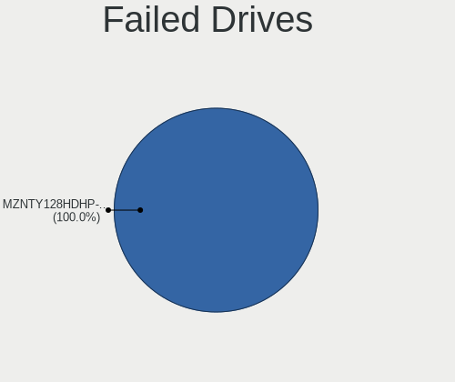
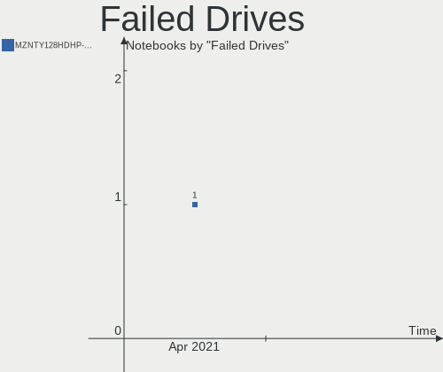
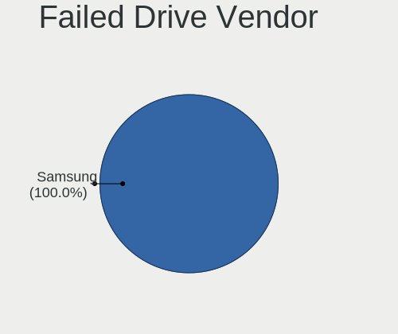
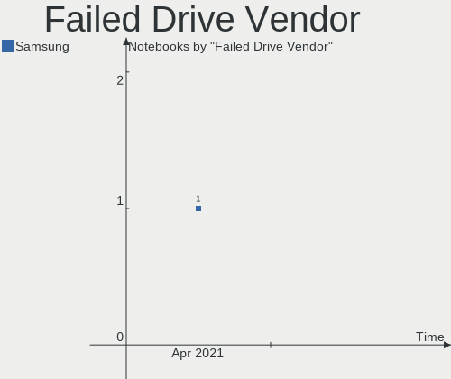

Manjaro Hardware Trends (Notebook)
----------------------------------

A project to identify most popular hardware characteristics and track their change
over time based on data collected by Manjaro users at https://Linux-Hardware.org.

Anyone can contribute to the study by uploading probes of their computers by
the [hw-probe](https://github.com/linuxhw/hw-probe) tool:

    sudo -E hw-probe -all -upload

Full-feature report is available here: https://linux-hardware.org/?view=trends&formfactor=notebook

Period: Feb, 2021.

Contents
--------

- [ OS                       ](#os)
- [ OS Family                ](#os-family)
- [ Kernel                   ](#kernel)
- [ Kernel Family            ](#kernel-family)
- [ Kernel Major Ver.        ](#kernel-major-ver)
- [ Arch                     ](#arch)
- [ DE                       ](#de)
- [ Display Server           ](#display-server)
- [ Display Manager          ](#display-manager)
- [ OS Lang                  ](#os-lang)
- [ Boot Mode                ](#boot-mode)
- [ Filesystem               ](#filesystem)
- [ Part. scheme             ](#part-scheme)
- [ Dual Boot with Linux/BSD ](#dual-boot-with-linux/bsd)
- [ Dual Boot (Win)          ](#dual-boot-win)
- [ Country                  ](#country)
- [ City                     ](#city)
- [ Vendor                   ](#vendor)
- [ Model                    ](#model)
- [ Model Family             ](#model-family)
- [ MFG Year                 ](#mfg-year)
- [ Form Factor              ](#form-factor)
- [ Secure Boot              ](#secure-boot)
- [ Coreboot                 ](#coreboot)
- [ RAM Size                 ](#ram-size)
- [ RAM Used                 ](#ram-used)
- [ Has CD-ROM               ](#has-cd-rom)
- [ Total Drives             ](#total-drives)
- [ Has Ethernet             ](#has-ethernet)
- [ Drive Vendor             ](#drive-vendor)
- [ Drive Model              ](#drive-model)
- [ HDD Vendor               ](#hdd-vendor)
- [ SSD Vendor               ](#ssd-vendor)
- [ Drive Kind               ](#drive-kind)
- [ Drive Connector          ](#drive-connector)
- [ Drive Size               ](#drive-size)
- [ Space Total              ](#space-total)
- [ Space Used               ](#space-used)
- [ Malfunc. Drives          ](#malfunc-drives)
- [ Malfunc. Drive Vendor    ](#malfunc-drive-vendor)
- [ Malfunc. HDD Vendor      ](#malfunc-hdd-vendor)
- [ Malfunc. Drive Kind      ](#malfunc-drive-kind)
- [ Failed Drives            ](#failed-drives)
- [ Failed Drive Vendor      ](#failed-drive-vendor)
- [ Drive Status             ](#drive-status)
- [ Storage Vendor           ](#storage-vendor)
- [ Storage Model            ](#storage-model)
- [ Storage Kind             ](#storage-kind)
- [ CPU Vendor               ](#cpu-vendor)
- [ CPU Model                ](#cpu-model)
- [ CPU Model Family         ](#cpu-model-family)
- [ CPU Cores                ](#cpu-cores)
- [ CPU Sockets              ](#cpu-sockets)
- [ CPU Threads              ](#cpu-threads)
- [ CPU Op-Modes             ](#cpu-op-modes)
- [ CPU Microcode            ](#cpu-microcode)
- [ CPU Microarch            ](#cpu-microarch)
- [ GPU Vendor               ](#gpu-vendor)
- [ GPU Model                ](#gpu-model)
- [ GPU Combo                ](#gpu-combo)
- [ GPU Driver               ](#gpu-driver)
- [ GPU Memory               ](#gpu-memory)
- [ Monitor Vendor           ](#monitor-vendor)
- [ Monitor Model            ](#monitor-model)
- [ Monitor Resolution       ](#monitor-resolution)
- [ Monitor Diagonal         ](#monitor-diagonal)
- [ Monitor Width            ](#monitor-width)
- [ Aspect Ratio             ](#aspect-ratio)
- [ Monitor Area             ](#monitor-area)
- [ Pixel Density            ](#pixel-density)
- [ Multiple Monitors        ](#multiple-monitors)
- [ Net Controller Vendor    ](#net-controller-vendor)
- [ Net Controller Model     ](#net-controller-model)
- [ Wireless Vendor          ](#wireless-vendor)
- [ Wireless Model           ](#wireless-model)
- [ Ethernet Vendor          ](#ethernet-vendor)
- [ Ethernet Model           ](#ethernet-model)
- [ Net Controller Kind      ](#net-controller-kind)
- [ Used Controller          ](#used-controller)
- [ NICs                     ](#nics)
- [ Memory Vendor            ](#memory-vendor)
- [ Memory Model             ](#memory-model)
- [ Memory Kind              ](#memory-kind)
- [ Memory Form Factor       ](#memory-form-factor)
- [ Memory Size              ](#memory-size)
- [ Memory Speed             ](#memory-speed)
- [ Sound Vendor             ](#sound-vendor)
- [ Sound Model              ](#sound-model)
- [ Camera Vendor            ](#camera-vendor)
- [ Camera Model             ](#camera-model)
- [ Fingerprint Vendor       ](#fingerprint-vendor)
- [ Fingerprint Model        ](#fingerprint-model)
- [ Chipcard Vendor          ](#chipcard-vendor)
- [ Chipcard Model           ](#chipcard-model)
- [ Printer Vendor           ](#printer-vendor)
- [ Printer Model            ](#printer-model)
- [ Scanner Vendor           ](#scanner-vendor)
- [ Scanner Model            ](#scanner-model)
- [ Bluetooth Vendor         ](#bluetooth-vendor)
- [ Bluetooth Model          ](#bluetooth-model)
- [ Unsupported Devices      ](#unsupported-devices)
- [ Unsupported Device Types ](#unsupported-device-types)

OS
--

Installed operating systems

| Name           | Notebooks | Percent |
|----------------|-----------|---------|
| Manjaro 20.2.1 | 66        | 61.68%  |
| Manjaro        | 38        | 35.51%  |
| Manjaro 20.2   | 2         | 1.87%   |
| Manjaro 19.0.1 | 1         | 0.93%   |

OS Family
---------

OS without a version

| Name    | Notebooks | Percent |
|---------|-----------|---------|
| Manjaro | 107       | 100%    |

Kernel
------

Version of the Linux kernel

| Version            | Notebooks | Percent |
|--------------------|-----------|---------|
| 5.9.16-1-MANJARO   | 46        | 42.99%  |
| 5.10.7-3-MANJARO   | 22        | 20.56%  |
| 5.10.15-1-MANJARO  | 16        | 14.95%  |
| 5.11.0-1-MANJARO   | 4         | 3.74%   |
| 5.10.13-2-MANJARO  | 4         | 3.74%   |
| 5.4.89-1-MANJARO   | 3         | 2.8%    |
| 5.4.95-1-MANJARO   | 2         | 1.87%   |
| 4.19.160-1-MANJARO | 2         | 1.87%   |
| 5.9.11-3-MANJARO   | 1         | 0.93%   |
| 5.7.0-3-MANJARO    | 1         | 0.93%   |
| 5.4.97-1-MANJARO   | 1         | 0.93%   |
| 5.4.22-1-MANJARO   | 1         | 0.93%   |
| 5.11.1-1-MANJARO   | 1         | 0.93%   |
| 5.10.2-2-MANJARO   | 1         | 0.93%   |
| 5.10.17-1-MANJARO  | 1         | 0.93%   |
| 4.19.173-1-MANJARO | 1         | 0.93%   |

Kernel Family
-------------

Linux kernel without a distro release

| Version  | Notebooks | Percent |
|----------|-----------|---------|
| 5.9.16   | 46        | 42.99%  |
| 5.10.7   | 22        | 20.56%  |
| 5.10.15  | 16        | 14.95%  |
| 5.11.0   | 4         | 3.74%   |
| 5.10.13  | 4         | 3.74%   |
| 5.4.89   | 3         | 2.8%    |
| 5.4.95   | 2         | 1.87%   |
| 4.19.160 | 2         | 1.87%   |
| 5.9.11   | 1         | 0.93%   |
| 5.7.0    | 1         | 0.93%   |
| 5.4.97   | 1         | 0.93%   |
| 5.4.22   | 1         | 0.93%   |
| 5.11.1   | 1         | 0.93%   |
| 5.10.2   | 1         | 0.93%   |
| 5.10.17  | 1         | 0.93%   |
| 4.19.173 | 1         | 0.93%   |

Kernel Major Ver.
-----------------

Linux kernel major version

| Version | Notebooks | Percent |
|---------|-----------|---------|
| 5.9     | 47        | 43.93%  |
| 5.10    | 44        | 41.12%  |
| 5.4     | 7         | 6.54%   |
| 5.11    | 5         | 4.67%   |
| 4.19    | 3         | 2.8%    |
| 5.7     | 1         | 0.93%   |

Arch
----

OS architecture (x86_64, i586, etc.)

| Name   | Notebooks | Percent |
|--------|-----------|---------|
| x86_64 | 107       | 100%    |

DE
--

Desktop Environment

| Name       | Notebooks | Percent |
|------------|-----------|---------|
| KDE5       | 29        | 27.1%   |
| XFCE       | 28        | 26.17%  |
| GNOME      | 24        | 22.43%  |
| KDE        | 14        | 13.08%  |
| X-Cinnamon | 3         | 2.8%    |
| i3         | 3         | 2.8%    |
| Cinnamon   | 2         | 1.87%   |
| Unknown    | 2         | 1.87%   |
| MATE       | 1         | 0.93%   |
| Deepin     | 1         | 0.93%   |

Display Server
--------------

X11 or Wayland

| Name    | Notebooks | Percent |
|---------|-----------|---------|
| X11     | 94        | 87.85%  |
| Wayland | 10        | 9.35%   |
| Unknown | 3         | 2.8%    |

Display Manager
---------------

SDDM, LightDM, etc.

| Name    | Notebooks | Percent |
|---------|-----------|---------|
| Unknown | 38        | 35.51%  |
| SDDM    | 29        | 27.1%   |
| LightDM | 28        | 26.17%  |
| GDM     | 10        | 9.35%   |
| TDM     | 2         | 1.87%   |

OS Lang
-------

Language

| Lang  | Notebooks | Percent |
|-------|-----------|---------|
| en_US | 49        | 45.79%  |
| de_DE | 11        | 10.28%  |
| ru_RU | 9         | 8.41%   |
| pt_BR | 7         | 6.54%   |
| en_GB | 6         | 5.61%   |
| it_IT | 4         | 3.74%   |
| fr_FR | 4         | 3.74%   |
| ru_UA | 2         | 1.87%   |
| pl_PL | 2         | 1.87%   |
| es_ES | 2         | 1.87%   |
| el_GR | 2         | 1.87%   |
| sk_SK | 1         | 0.93%   |
| fr_CA | 1         | 0.93%   |
| en_ZA | 1         | 0.93%   |
| en_NZ | 1         | 0.93%   |
| en_IN | 1         | 0.93%   |
| en_IL | 1         | 0.93%   |
| en_IE | 1         | 0.93%   |
| en_DE | 1         | 0.93%   |
| en_CA | 1         | 0.93%   |

Boot Mode
---------

EFI or BIOS

| Mode | Notebooks | Percent |
|------|-----------|---------|
| EFI  | 54        | 50.47%  |
| BIOS | 53        | 49.53%  |

Filesystem
----------

Type of filesystem

| Type    | Notebooks | Percent |
|---------|-----------|---------|
| Ext4    | 97        | 90.65%  |
| Btrfs   | 7         | 6.54%   |
| Overlay | 2         | 1.87%   |
| Xfs     | 1         | 0.93%   |

Part. scheme
------------

Scheme of partitioning

| Type    | Notebooks | Percent |
|---------|-----------|---------|
| GPT     | 57        | 53.27%  |
| Unknown | 37        | 34.58%  |
| MBR     | 13        | 12.15%  |

Dual Boot with Linux/BSD
------------------------

Hosting more than one Linux/BSD

| Dual boot | Notebooks | Percent |
|-----------|-----------|---------|
| No        | 94        | 87.85%  |
| Yes       | 13        | 12.15%  |

Dual Boot (Win)
---------------

Hosting Linux and Windows

| Dual boot | Notebooks | Percent |
|-----------|-----------|---------|
| No        | 66        | 61.68%  |
| Yes       | 41        | 38.32%  |

Country
-------

Geographic location (country)

| Country              | Notebooks | Percent |
|----------------------|-----------|---------|
| Germany              | 13        | 12.15%  |
| USA                  | 10        | 9.35%   |
| Russia               | 10        | 9.35%   |
| Brazil               | 9         | 8.41%   |
| UK                   | 6         | 5.61%   |
| Italy                | 6         | 5.61%   |
| Mexico               | 4         | 3.74%   |
| France               | 4         | 3.74%   |
| Belarus              | 4         | 3.74%   |
| Ukraine              | 3         | 2.8%    |
| Poland               | 3         | 2.8%    |
| Iran                 | 3         | 2.8%    |
| Canada               | 3         | 2.8%    |
| Bulgaria             | 3         | 2.8%    |
| Spain                | 2         | 1.87%   |
| South Africa         | 2         | 1.87%   |
| Netherlands          | 2         | 1.87%   |
| Greece               | 2         | 1.87%   |
| Argentina            | 2         | 1.87%   |
| Trinidad and Tobago  | 1         | 0.93%   |
| Sweden               | 1         | 0.93%   |
| Slovakia             | 1         | 0.93%   |
| Serbia               | 1         | 0.93%   |
| Portugal             | 1         | 0.93%   |
| New Zealand          | 1         | 0.93%   |
| Moldova, Republic of | 1         | 0.93%   |
| Kosovo               | 1         | 0.93%   |
| Israel               | 1         | 0.93%   |
| India                | 1         | 0.93%   |
| Czech Republic       | 1         | 0.93%   |
| Croatia              | 1         | 0.93%   |
| China                | 1         | 0.93%   |
| Belgium              | 1         | 0.93%   |
| Bangladesh           | 1         | 0.93%   |
| Austria              | 1         | 0.93%   |

City
----

Geographic location (city)

| City                | Notebooks | Percent |
|---------------------|-----------|---------|
| Moscow              | 4         | 3.74%   |
| Berlin              | 4         | 3.74%   |
| Minsk               | 3         | 2.8%    |
| Curitiba            | 3         | 2.8%    |
| Milan               | 2         | 1.87%   |
| Johannesburg        | 2         | 1.87%   |
| Whitby              | 1         | 0.93%   |
| West Drayton        | 1         | 0.93%   |
| Warsaw              | 1         | 0.93%   |
| Voskresensk         | 1         | 0.93%   |
| Visakhapatnam       | 1         | 0.93%   |
| Vienna              | 1         | 0.93%   |
| Ulyanovsk           | 1         | 0.93%   |
| Troyes              | 1         | 0.93%   |
| Tehran              | 1         | 0.93%   |
| Tajrīsh            | 1         | 0.93%   |
| Streatham           | 1         | 0.93%   |
| Stevenage           | 1         | 0.93%   |
| Stadthagen          | 1         | 0.93%   |
| St Petersburg       | 1         | 0.93%   |
| Sofia               | 1         | 0.93%   |
| Setúbal            | 1         | 0.93%   |
| Santa Úrsula       | 1         | 0.93%   |
| San Juan del Río   | 1         | 0.93%   |
| Ružomberok         | 1         | 0.93%   |
| Rouen               | 1         | 0.93%   |
| Rotherhithe         | 1         | 0.93%   |
| Rostov-on-Don       | 1         | 0.93%   |
| Rome                | 1         | 0.93%   |
| Rochester           | 1         | 0.93%   |
| Rio de Janeiro      | 1         | 0.93%   |
| Rio Ceballos        | 1         | 0.93%   |
| Rector              | 1         | 0.93%   |
| Razgrad             | 1         | 0.93%   |
| Ramiseto            | 1         | 0.93%   |
| Pristina            | 1         | 0.93%   |
| Portland            | 1         | 0.93%   |
| Port of Spain       | 1         | 0.93%   |
| Poltava             | 1         | 0.93%   |
| Petrolina           | 1         | 0.93%   |
| Panorama            | 1         | 0.93%   |
| Pabianice           | 1         | 0.93%   |
| Osasco              | 1         | 0.93%   |
| Odesa               | 1         | 0.93%   |
| Oaxaca City         | 1         | 0.93%   |
| Neuss               | 1         | 0.93%   |
| Neckarbischofsheim  | 1         | 0.93%   |
| Nantes              | 1         | 0.93%   |
| Mymensingh          | 1         | 0.93%   |
| Mons                | 1         | 0.93%   |
| Minooka             | 1         | 0.93%   |
| Mar del Plata       | 1         | 0.93%   |
| Maladzyechna        | 1         | 0.93%   |
| Lovech              | 1         | 0.93%   |
| Lidkoeping          | 1         | 0.93%   |
| Leicester           | 1         | 0.93%   |
| Lattes              | 1         | 0.93%   |
| Krasnodar           | 1         | 0.93%   |
| Konstancin-Jeziorna | 1         | 0.93%   |
| Kennesaw            | 1         | 0.93%   |

Vendor
------

Motherboard manufacturer

| Name                | Notebooks | Percent |
|---------------------|-----------|---------|
| Lenovo              | 26        | 24.3%   |
| Hewlett-Packard     | 19        | 17.76%  |
| Dell                | 19        | 17.76%  |
| ASUSTek Computer    | 14        | 13.08%  |
| Acer                | 9         | 8.41%   |
| Samsung Electronics | 5         | 4.67%   |
| HUAWEI              | 3         | 2.8%    |
| Toshiba             | 2         | 1.87%   |
| MSI                 | 2         | 1.87%   |
| Fujitsu             | 2         | 1.87%   |
| Razer               | 1         | 0.93%   |
| Packard Bell        | 1         | 0.93%   |
| Notebook            | 1         | 0.93%   |
| Google              | 1         | 0.93%   |
| Apple               | 1         | 0.93%   |
| Alienware           | 1         | 0.93%   |

Model
-----

Motherboard model

| Name                                                  | Notebooks | Percent |
|-------------------------------------------------------|-----------|---------|
| Samsung 300V3A/300V4A/300V5A/200A4B/200A5B            | 2         | 1.87%   |
| Lenovo Legion 5 15ARH05 82B5                          | 2         | 1.87%   |
| Lenovo IdeaPad L340-15IRH Gaming 81LK                 | 2         | 1.87%   |
| HUAWEI NBLK-WAX9X                                     | 2         | 1.87%   |
| HP Laptop 15-bw0xx                                    | 2         | 1.87%   |
| HP EliteBook 2540p                                    | 2         | 1.87%   |
| ASUS VivoBook_ASUSLaptop X509DAP_M509DA               | 2         | 1.87%   |
| Toshiba Satellite S50-B                               | 1         | 0.93%   |
| Toshiba Satellite L775D                               | 1         | 0.93%   |
| Samsung 850XBC                                        | 1         | 0.93%   |
| Samsung 750XBE/730XBE                                 | 1         | 0.93%   |
| Samsung 340XAA/350XAA/550XAA                          | 1         | 0.93%   |
| Razer Blade 15 Advanced Model (Early 2020) - RZ09-033 | 1         | 0.93%   |
| Packard Bell EasyNote_ST85-M-001SPD                   | 1         | 0.93%   |
| Notebook N85_N87,HJ,HJ1,HK1                           | 1         | 0.93%   |
| MSI GS66 Stealth 10SGS                                | 1         | 0.93%   |
| MSI GL63 8RC                                          | 1         | 0.93%   |
| Lenovo Zhaoyang E49L 20178                            | 1         | 0.93%   |
| Lenovo Z50-70 20354                                   | 1         | 0.93%   |
| Lenovo ThinkPad X1 Carbon 6th 20KHCTO1WW              | 1         | 0.93%   |
| Lenovo ThinkPad W530 2447H21                          | 1         | 0.93%   |
| Lenovo ThinkPad T460 20FMS2D600                       | 1         | 0.93%   |
| Lenovo ThinkPad T440p 20AWS1XV00                      | 1         | 0.93%   |
| Lenovo ThinkPad T440p 20ANCTO1WW                      | 1         | 0.93%   |
| Lenovo ThinkPad T430 2349D17                          | 1         | 0.93%   |
| Lenovo ThinkPad S1 Yoga 20CD00A5RT                    | 1         | 0.93%   |
| Lenovo ThinkPad Edge E540 20C6005VRT                  | 1         | 0.93%   |
| Lenovo ThinkPad E14 20RA001LMC                        | 1         | 0.93%   |
| Lenovo ThinkBook 15-IIL 20SM                          | 1         | 0.93%   |
| Lenovo ThinkBook 14-IML 20RV                          | 1         | 0.93%   |
| Lenovo Legion 5 82B5                                  | 1         | 0.93%   |
| Lenovo Legion 5 15IMH05 82AU                          | 1         | 0.93%   |
| Lenovo IdeaPad Z510 20287                             | 1         | 0.93%   |
| Lenovo IdeaPad S145-15API 81V7                        | 1         | 0.93%   |
| Lenovo IdeaPad 3 15IIL05 81WE                         | 1         | 0.93%   |
| Lenovo IdeaPad 3 14ADA05 81W0                         | 1         | 0.93%   |
| Lenovo IdeaPad 110-15ISK 80UD                         | 1         | 0.93%   |
| Lenovo IdeaPad 1 14ADA05 82GW                         | 1         | 0.93%   |
| Lenovo G580 20150                                     | 1         | 0.93%   |
| HUAWEI HN-WX9X                                        | 1         | 0.93%   |
| HP ZBook 14                                           | 1         | 0.93%   |
| HP ProBook 650 G1                                     | 1         | 0.93%   |
| HP ProBook 450 G5                                     | 1         | 0.93%   |
| HP ProBook 450 G1                                     | 1         | 0.93%   |
| HP Pavilion dv6700                                    | 1         | 0.93%   |
| HP OMEN by HP Laptop 15-dc0xxx                        | 1         | 0.93%   |
| HP Laptop 15-dy1xxx                                   | 1         | 0.93%   |
| HP Laptop 15-dw0xxx                                   | 1         | 0.93%   |
| HP ENVY Laptop 13-aq0xxx                              | 1         | 0.93%   |
| HP EliteBook 8770w                                    | 1         | 0.93%   |
| HP EliteBook 845 G7 Notebook PC                       | 1         | 0.93%   |
| HP Compaq nx7300 (RH687EA#ABD)                        | 1         | 0.93%   |
| HP 350 G2                                             | 1         | 0.93%   |
| HP 255 G4                                             | 1         | 0.93%   |
| HP 15                                                 | 1         | 0.93%   |
| Google Coral                                          | 1         | 0.93%   |
| Fujitsu STYLISTIC Q702                                | 1         | 0.93%   |
| Fujitsu LIFEBOOK E459                                 | 1         | 0.93%   |
| Dell XPS 17 9700                                      | 1         | 0.93%   |
| Dell XPS 15 9550                                      | 1         | 0.93%   |

Model Family
------------

Motherboard model prefix

| Name                  | Notebooks | Percent |
|-----------------------|-----------|---------|
| Lenovo ThinkPad       | 9         | 8.41%   |
| Lenovo IdeaPad        | 8         | 7.48%   |
| Dell Latitude         | 6         | 5.61%   |
| Dell Inspiron         | 6         | 5.61%   |
| Acer Aspire           | 6         | 5.61%   |
| Dell XPS              | 5         | 4.67%   |
| ASUS VivoBook         | 5         | 4.67%   |
| Lenovo Legion         | 4         | 3.74%   |
| HP Laptop             | 4         | 3.74%   |
| HP EliteBook          | 4         | 3.74%   |
| HP ProBook            | 3         | 2.8%    |
| Toshiba Satellite     | 2         | 1.87%   |
| Samsung 300V3A        | 2         | 1.87%   |
| Lenovo ThinkBook      | 2         | 1.87%   |
| HUAWEI NBLK-WAX9X     | 2         | 1.87%   |
| Dell Vostro           | 2         | 1.87%   |
| ASUS ZenBook          | 2         | 1.87%   |
| ASUS TUF              | 2         | 1.87%   |
| Acer TravelMate       | 2         | 1.87%   |
| Samsung 850XBC        | 1         | 0.93%   |
| Samsung 750XBE        | 1         | 0.93%   |
| Samsung 340XAA        | 1         | 0.93%   |
| Razer Blade           | 1         | 0.93%   |
| Packard Bell EasyNote | 1         | 0.93%   |
| Notebook N85          | 1         | 0.93%   |
| MSI GS66              | 1         | 0.93%   |
| MSI GL63              | 1         | 0.93%   |
| Lenovo Zhaoyang       | 1         | 0.93%   |
| Lenovo Z50-70         | 1         | 0.93%   |
| Lenovo G580           | 1         | 0.93%   |
| HUAWEI HN-WX9X        | 1         | 0.93%   |
| HP ZBook              | 1         | 0.93%   |
| HP Pavilion           | 1         | 0.93%   |
| HP OMEN               | 1         | 0.93%   |
| HP ENVY               | 1         | 0.93%   |
| HP Compaq             | 1         | 0.93%   |
| HP 350                | 1         | 0.93%   |
| HP 255                | 1         | 0.93%   |
| HP 15                 | 1         | 0.93%   |
| Google Coral          | 1         | 0.93%   |
| Fujitsu STYLISTIC     | 1         | 0.93%   |
| Fujitsu LIFEBOOK      | 1         | 0.93%   |
| ASUS X542UQ           | 1         | 0.93%   |
| ASUS X456URK          | 1         | 0.93%   |
| ASUS K53BR            | 1         | 0.93%   |
| ASUS GL753VE          | 1         | 0.93%   |
| ASUS ASUS             | 1         | 0.93%   |
| Apple MacBookAir7     | 1         | 0.93%   |
| Alienware 15          | 1         | 0.93%   |
| Acer Swift            | 1         | 0.93%   |

MFG Year
--------

Motherboard manufacture year

| Year | Notebooks | Percent |
|------|-----------|---------|
| 2020 | 44        | 41.12%  |
| 2019 | 20        | 18.69%  |
| 2018 | 10        | 9.35%   |
| 2014 | 6         | 5.61%   |
| 2013 | 6         | 5.61%   |
| 2011 | 6         | 5.61%   |
| 2007 | 4         | 3.74%   |
| 2015 | 3         | 2.8%    |
| 2016 | 2         | 1.87%   |
| 2012 | 2         | 1.87%   |
| 2010 | 2         | 1.87%   |
| 2017 | 1         | 0.93%   |
| 2008 | 1         | 0.93%   |

Form Factor
-----------

Physical design of the computer

| Name     | Notebooks | Percent |
|----------|-----------|---------|
| Notebook | 107       | 100%    |

Secure Boot
-----------

Enabled or disabled

| State    | Notebooks | Percent |
|----------|-----------|---------|
| Disabled | 107       | 100%    |

Coreboot
--------

Have coreboot on board

| Used | Notebooks | Percent |
|------|-----------|---------|
| No   | 106       | 99.07%  |
| Yes  | 1         | 0.93%   |

RAM Size
--------

Total RAM memory

| Size in GB  | Notebooks | Percent |
|-------------|-----------|---------|
| 4.01-8.0    | 37        | 34.58%  |
| 16.01-24.0  | 27        | 25.23%  |
| 3.01-4.0    | 18        | 16.82%  |
| 8.01-16.0   | 16        | 14.95%  |
| 32.01-64.0  | 3         | 2.8%    |
| 64.01-256.0 | 3         | 2.8%    |
| 24.01-32.0  | 1         | 0.93%   |
| 1.01-2.0    | 1         | 0.93%   |
| 0.51-1.0    | 1         | 0.93%   |

RAM Used
--------

Used RAM memory

| Used GB   | Notebooks | Percent |
|-----------|-----------|---------|
| 1.01-2.0  | 29        | 27.1%   |
| 2.01-3.0  | 28        | 26.17%  |
| 4.01-8.0  | 22        | 20.56%  |
| 3.01-4.0  | 20        | 18.69%  |
| 0.51-1.0  | 5         | 4.67%   |
| 8.01-16.0 | 3         | 2.8%    |

Has CD-ROM
----------

Has CD-ROM on board

| Presented | Notebooks | Percent |
|-----------|-----------|---------|
| No        | 75        | 70.09%  |
| Yes       | 32        | 29.91%  |

Total Drives
------------

Number of drives on board

| Drives | Notebooks | Percent |
|--------|-----------|---------|
| 1      | 61        | 57.01%  |
| 2      | 39        | 36.45%  |
| 3      | 3         | 2.8%    |
| 4      | 2         | 1.87%   |
| 0      | 2         | 1.87%   |

Has Ethernet
------------

Has Ethernet on board

| Presented | Notebooks | Percent |
|-----------|-----------|---------|
| Yes       | 83        | 77.57%  |
| No        | 24        | 22.43%  |

Drive Vendor
------------

Hard drive vendors

| Vendor              | Notebooks | Drives | Percent |
|---------------------|-----------|--------|---------|
| Samsung Electronics | 20        | 20     | 13.42%  |
| Sandisk             | 16        | 16     | 10.74%  |
| WDC                 | 15        | 17     | 10.07%  |
| Seagate             | 12        | 12     | 8.05%   |
| Toshiba             | 11        | 12     | 7.38%   |
| Crucial             | 11        | 12     | 7.38%   |
| HGST                | 10        | 10     | 6.71%   |
| Unknown             | 7         | 7      | 4.7%    |
| Intel               | 7         | 7      | 4.7%    |
| Micron Technology   | 4         | 5      | 2.68%   |
| LITEONIT            | 4         | 4      | 2.68%   |
| Kingston            | 4         | 4      | 2.68%   |
| SK Hynix            | 3         | 3      | 2.01%   |
| Hitachi             | 3         | 3      | 2.01%   |
| China               | 3         | 3      | 2.01%   |
| XPG                 | 2         | 2      | 1.34%   |
| TO Exter            | 2         | 2      | 1.34%   |
| PNY                 | 2         | 2      | 1.34%   |
| LITEON              | 2         | 2      | 1.34%   |
| GOODRAM             | 2         | 2      | 1.34%   |
| USB3.0              | 1         | 1      | 0.67%   |
| Union Memory        | 1         | 1      | 0.67%   |
| Silicon Motion      | 1         | 1      | 0.67%   |
| Realtek             | 1         | 1      | 0.67%   |
| Phison              | 1         | 1      | 0.67%   |
| Patriot             | 1         | 1      | 0.67%   |
| OCZ                 | 1         | 1      | 0.67%   |
| Fujitsu             | 1         | 1      | 0.67%   |
| Corsair             | 1         | 1      | 0.67%   |

Drive Model
-----------

Hard drive models

| Model                                | Notebooks | Percent |
|--------------------------------------|-----------|---------|
| Toshiba MQ01ABD100 1TB               | 4         | 2.61%   |
| Sandisk NVMe SSD Drive 256GB         | 4         | 2.61%   |
| WDC WD10SPZX-24Z10 1TB               | 3         | 1.96%   |
| HGST HTS725050A7E630 500GB           | 3         | 1.96%   |
| HGST HTS721010A9E630 1TB             | 3         | 1.96%   |
| Toshiba MQ04ABF100 1TB               | 2         | 1.31%   |
| TO Exter nal USB 3.0 1TB             | 2         | 1.31%   |
| Seagate ST1000LM035-1RK172 1TB       | 2         | 1.31%   |
| Seagate ST1000LM014-1EJ164 1TB       | 2         | 1.31%   |
| Sandisk NVMe SSD Drive 512GB         | 2         | 1.31%   |
| Sandisk NVMe SSD Drive 1TB           | 2         | 1.31%   |
| Samsung NVMe SSD Drive 512GB         | 2         | 1.31%   |
| Micron MTFDHBA256TDV 256GB           | 2         | 1.31%   |
| HGST HTS545050A7E680 500GB           | 2         | 1.31%   |
| China SSD 512GB                      | 2         | 1.31%   |
| XPG NVMe SSD Drive 512GB             | 1         | 0.65%   |
| XPG NVMe SSD Drive 1024GB            | 1         | 0.65%   |
| WDC WDS240G2G0B-00EPW0 240GB SSD     | 1         | 0.65%   |
| WDC WDS120G2G0B-00EPW0 120GB SSD     | 1         | 0.65%   |
| WDC WD5000LPCX-60VHAT0 500GB         | 1         | 0.65%   |
| WDC WD5000LPCX-00VHAT0 500GB         | 1         | 0.65%   |
| WDC WD5000BEVT-00ZAT0 500GB          | 1         | 0.65%   |
| WDC WD3200BEVT-22ZCT0 320GB          | 1         | 0.65%   |
| WDC WD10SPZX-75Z10T2 1TB             | 1         | 0.65%   |
| WDC WD10SPZX-75Z10T0 1TB             | 1         | 0.65%   |
| WDC WD10SPZX-60Z10T0 1TB             | 1         | 0.65%   |
| WDC WD10JPVX-75JC3T0 1TB             | 1         | 0.65%   |
| WDC WD10JPVX-60JC3T1 1TB             | 1         | 0.65%   |
| WDC PC SN730 SDBPNTY-512G-1027 512GB | 1         | 0.65%   |
| WDC PC SN520 SDAPNUW-256G-1102 256GB | 1         | 0.65%   |
| USB3.0 Disk 500GB                    | 1         | 0.65%   |
| Unknown SD512  507MB                 | 1         | 0.65%   |
| Unknown SABRENT SABRENT 480GB        | 1         | 0.65%   |
| Unknown MMC Card  64GB               | 1         | 0.65%   |
| Unknown MMC Card  32GB               | 1         | 0.65%   |
| Unknown MMC Card  16GB               | 1         | 0.65%   |
| Unknown GC16G  16GB                  | 1         | 0.65%   |
| Unknown AS  16GB                     | 1         | 0.65%   |
| Union Memory RPFTJ128PDD2EWX 128GB   | 1         | 0.65%   |
| Toshiba THNSNK128GVN8 128GB SSD      | 1         | 0.65%   |
| Toshiba NVMe SSD Drive 256GB         | 1         | 0.65%   |
| Toshiba NVMe SSD Drive 1024GB        | 1         | 0.65%   |
| Toshiba MK5061GSYN 500GB             | 1         | 0.65%   |
| Toshiba MK1633GSG 160GB              | 1         | 0.65%   |
| Toshiba KXG60ZNV256G NVMe 256GB      | 1         | 0.65%   |
| SK Hynix PC300 NVMe 512GB            | 1         | 0.65%   |
| SK Hynix NVMe SSD Drive 256GB        | 1         | 0.65%   |
| SK Hynix HFM256GDJTNG-8310A 256GB    | 1         | 0.65%   |
| Silicon Motion NVMe SSD Drive 512GB  | 1         | 0.65%   |
| Seagate ST9500423AS 500GB            | 1         | 0.65%   |
| Seagate ST750LM022 HN-M750MBB 752GB  | 1         | 0.65%   |
| Seagate ST500LM012 HN-M500MBB 500GB  | 1         | 0.65%   |
| Seagate ST2000LM015-2E8174 2TB       | 1         | 0.65%   |
| Seagate ST1000LX001-1EM164 1TB       | 1         | 0.65%   |
| Seagate ST1000LM024 HN-M101MBB 1TB   | 1         | 0.65%   |
| Seagate Expansion 500GB              | 1         | 0.65%   |
| Seagate BUP Slim BK 2TB              | 1         | 0.65%   |
| SanDisk X600 M.2 2280 SATA 128GB SSD | 1         | 0.65%   |
| SanDisk SSD U110 16GB                | 1         | 0.65%   |
| SanDisk SSD PLUS 1000GB              | 1         | 0.65%   |

HDD Vendor
----------

Hard disk drive vendors

| Vendor   | Notebooks | Drives | Percent |
|----------|-----------|--------|---------|
| WDC      | 12        | 13     | 24.49%  |
| Seagate  | 12        | 12     | 24.49%  |
| HGST     | 10        | 10     | 20.41%  |
| Toshiba  | 8         | 8      | 16.33%  |
| Hitachi  | 3         | 3      | 6.12%   |
| TO Exter | 2         | 2      | 4.08%   |
| USB3.0   | 1         | 1      | 2.04%   |
| Fujitsu  | 1         | 1      | 2.04%   |

SSD Vendor
----------

Solid state drive vendors

| Vendor              | Notebooks | Drives | Percent |
|---------------------|-----------|--------|---------|
| Crucial             | 10        | 11     | 22.73%  |
| SanDisk             | 6         | 6      | 13.64%  |
| Samsung Electronics | 6         | 6      | 13.64%  |
| LITEONIT            | 4         | 4      | 9.09%   |
| Kingston            | 3         | 3      | 6.82%   |
| China               | 3         | 3      | 6.82%   |
| WDC                 | 2         | 2      | 4.55%   |
| PNY                 | 2         | 2      | 4.55%   |
| GOODRAM             | 2         | 2      | 4.55%   |
| Toshiba             | 1         | 1      | 2.27%   |
| Patriot             | 1         | 1      | 2.27%   |
| OCZ                 | 1         | 1      | 2.27%   |
| LITEON              | 1         | 1      | 2.27%   |
| Intel               | 1         | 1      | 2.27%   |
| Corsair             | 1         | 1      | 2.27%   |

Drive Kind
----------

HDD or SSD

| Kind    | Notebooks | Drives | Percent |
|---------|-----------|--------|---------|
| NVMe    | 47        | 52     | 33.33%  |
| HDD     | 45        | 50     | 31.91%  |
| SSD     | 42        | 45     | 29.79%  |
| MMC     | 6         | 6      | 4.26%   |
| Unknown | 1         | 1      | 0.71%   |

Drive Connector
---------------

SATA, SAS, NVMe, etc.

| Type | Notebooks | Drives | Percent |
|------|-----------|--------|---------|
| SATA | 72        | 89     | 54.14%  |
| NVMe | 47        | 51     | 35.34%  |
| SAS  | 8         | 8      | 6.02%   |
| MMC  | 6         | 6      | 4.51%   |

Drive Size
----------

Size of hard drive

| Size in TB | Notebooks | Drives | Percent |
|------------|-----------|--------|---------|
| 0.01-0.5   | 48        | 56     | 57.14%  |
| 0.51-1.0   | 32        | 35     | 38.1%   |
| 1.01-2.0   | 3         | 3      | 3.57%   |
| 3.01-4.0   | 1         | 1      | 1.19%   |

Space Total
-----------

Amount of disk space available on the file system

| Size in GB     | Notebooks | Percent |
|----------------|-----------|---------|
| 101-250        | 33        | 30.84%  |
| 251-500        | 23        | 21.5%   |
| 501-1000       | 17        | 15.89%  |
| 1001-2000      | 11        | 10.28%  |
| 21-50          | 5         | 4.67%   |
| Unknown        | 5         | 4.67%   |
| 2001-3000      | 4         | 3.74%   |
| 51-100         | 4         | 3.74%   |
| More than 3000 | 3         | 2.8%    |
| 1-20           | 2         | 1.87%   |

Space Used
----------

Amount of used disk space

| Used GB   | Notebooks | Percent |
|-----------|-----------|---------|
| 1-20      | 25        | 23.36%  |
| 101-250   | 20        | 18.69%  |
| 21-50     | 18        | 16.82%  |
| 51-100    | 15        | 14.02%  |
| 251-500   | 12        | 11.21%  |
| 501-1000  | 7         | 6.54%   |
| 1001-2000 | 5         | 4.67%   |
| Unknown   | 5         | 4.67%   |

Malfunc. Drives
---------------

Drive models with a malfunction

| Model                            | Notebooks | Drives | Percent |
|----------------------------------|-----------|--------|---------|
| HGST HTS725050A7E630 500GB       | 2         | 2      | 20%     |
| WDC WDS240G2G0B-00EPW0 240GB SSD | 1         | 1      | 10%     |
| WDC WD10JPVX-75JC3T0 1TB         | 1         | 1      | 10%     |
| Toshiba MQ01ABD100 1TB           | 1         | 1      | 10%     |
| Seagate ST1000LM014-1EJ164 1TB   | 1         | 1      | 10%     |
| HGST HTS545050A7E680 500GB       | 1         | 1      | 10%     |
| Crucial M4-CT256M4SSD3 256GB     | 1         | 1      | 10%     |
| Crucial CT240M500SSD1 240GB      | 1         | 1      | 10%     |
| Corsair Neutron GTX SSD 240GB    | 1         | 1      | 10%     |

Malfunc. Drive Vendor
---------------------

Vendors of faulty drives

| Vendor  | Notebooks | Drives | Percent |
|---------|-----------|--------|---------|
| HGST    | 3         | 3      | 30%     |
| WDC     | 2         | 2      | 20%     |
| Crucial | 2         | 2      | 20%     |
| Toshiba | 1         | 1      | 10%     |
| Seagate | 1         | 1      | 10%     |
| Corsair | 1         | 1      | 10%     |

Malfunc. HDD Vendor
-------------------

Vendors of faulty HDD drives

| Vendor  | Notebooks | Drives | Percent |
|---------|-----------|--------|---------|
| HGST    | 3         | 3      | 50%     |
| WDC     | 1         | 1      | 16.67%  |
| Toshiba | 1         | 1      | 16.67%  |
| Seagate | 1         | 1      | 16.67%  |

Malfunc. Drive Kind
-------------------

Kinds of faulty drives

| Kind | Notebooks | Drives | Percent |
|------|-----------|--------|---------|
| HDD  | 6         | 6      | 60%     |
| SSD  | 4         | 4      | 40%     |

Failed Drives
-------------

Failed drive models

| Model                                | Notebooks | Drives | Percent |
|--------------------------------------|-----------|--------|---------|
| WDC PC SN520 SDAPNUW-256G-1102 256GB | 1         | 1      | 100%    |

Failed Drive Vendor
-------------------

Failed drive vendors

| Vendor | Notebooks | Drives | Percent |
|--------|-----------|--------|---------|
| WDC    | 1         | 1      | 100%    |

Drive Status
------------

Number of failed and malfunc. drives

| Status   | Notebooks | Drives | Percent |
|----------|-----------|--------|---------|
| Detected | 63        | 92     | 53.85%  |
| Works    | 43        | 51     | 36.75%  |
| Malfunc  | 10        | 10     | 8.55%   |
| Failed   | 1         | 1      | 0.85%   |

Storage Vendor
--------------

Storage controller vendors

| Vendor                       | Notebooks | Percent |
|------------------------------|-----------|---------|
| Intel                        | 74        | 53.62%  |
| AMD                          | 19        | 13.77%  |
| Samsung Electronics          | 14        | 10.14%  |
| Sandisk                      | 11        | 7.97%   |
| Micron Technology            | 4         | 2.9%    |
| Toshiba America Info Systems | 3         | 2.17%   |
| SK Hynix                     | 3         | 2.17%   |
| ADATA Technology             | 2         | 1.45%   |
| Union Memory (Shenzhen)      | 1         | 0.72%   |
| Silicon Motion               | 1         | 0.72%   |
| Phison Electronics           | 1         | 0.72%   |
| Nvidia                       | 1         | 0.72%   |
| Micron/Crucial Technology    | 1         | 0.72%   |
| Lite-On Technology           | 1         | 0.72%   |
| Kingston Technology Company  | 1         | 0.72%   |
| JMicron Technology           | 1         | 0.72%   |

Storage Model
-------------

Storage controller models

| Model                                                                            | Notebooks | Percent |
|----------------------------------------------------------------------------------|-----------|---------|
| AMD FCH SATA Controller [AHCI mode]                                              | 16        | 10.74%  |
| Samsung NVMe SSD Controller SM981/PM981/PM983                                    | 12        | 8.05%   |
| Intel Sunrise Point-LP SATA Controller [AHCI mode]                               | 11        | 7.38%   |
| Intel 82801 Mobile SATA Controller [RAID mode]                                   | 10        | 6.71%   |
| Intel 7 Series Chipset Family 6-port SATA Controller [AHCI mode]                 | 9         | 6.04%   |
| Intel 8 Series/C220 Series Chipset Family 6-port SATA Controller 1 [AHCI mode]   | 7         | 4.7%    |
| Intel 8 Series SATA Controller 1 [AHCI mode]                                     | 6         | 4.03%   |
| Sandisk WD Blue SN550 NVMe SSD                                                   | 4         | 2.68%   |
| Sandisk WD Blue SN500 / PC SN520 NVMe SSD                                        | 4         | 2.68%   |
| Micron Non-Volatile memory controller                                            | 4         | 2.68%   |
| Intel SSD 660P Series                                                            | 4         | 2.68%   |
| Intel Cannon Point-LP SATA Controller [AHCI Mode]                                | 4         | 2.68%   |
| Intel HM170/QM170 Chipset SATA Controller [AHCI Mode]                            | 3         | 2.01%   |
| Intel Comet Lake SATA AHCI Controller                                            | 3         | 2.01%   |
| Intel Cannon Lake Mobile PCH SATA AHCI Controller                                | 3         | 2.01%   |
| Toshiba America Info Systems XG6 NVMe SSD Controller                             | 2         | 1.34%   |
| Sandisk WD Black SN750 / PC SN730 NVMe SSD                                       | 2         | 1.34%   |
| Intel Wildcat Point-LP SATA Controller [AHCI Mode]                               | 2         | 1.34%   |
| Intel Ice Lake-LP SATA Controller [AHCI mode]                                    | 2         | 1.34%   |
| Intel 6 Series/C200 Series Chipset Family 6 port Mobile SATA AHCI Controller     | 2         | 1.34%   |
| Intel 5 Series/3400 Series Chipset 4 port SATA IDE Controller                    | 2         | 1.34%   |
| Intel 5 Series/3400 Series Chipset 2 port SATA IDE Controller                    | 2         | 1.34%   |
| AMD SB7x0/SB8x0/SB9x0 SATA Controller [AHCI mode]                                | 2         | 1.34%   |
| AMD SB7x0/SB8x0/SB9x0 IDE Controller                                             | 2         | 1.34%   |
| ADATA XPG SX8200 Pro PCIe Gen3x4 M.2 2280 Solid State Drive                      | 2         | 1.34%   |
| Union Memory (Shenzhen) Non-Volatile memory controller                           | 1         | 0.67%   |
| Toshiba America Info Systems Toshiba America Info Non-Volatile memory controller | 1         | 0.67%   |
| SK Hynix PC300 NVMe Solid State Drive 512GB                                      | 1         | 0.67%   |
| SK Hynix BC511                                                                   | 1         | 0.67%   |
| SK Hynix BC501 NVMe Solid State Drive 512GB                                      | 1         | 0.67%   |
| Silicon Motion SM2263EN/SM2263XT SSD Controller                                  | 1         | 0.67%   |
| Sandisk PC SN520 NVMe SSD                                                        | 1         | 0.67%   |
| Samsung NVMe SSD Controller SM961/PM961/SM963                                    | 1         | 0.67%   |
| Samsung Electronics Non-Volatile memory controller                               | 1         | 0.67%   |
| Phison E12 NVMe Controller                                                       | 1         | 0.67%   |
| Nvidia MCP65 SATA Controller                                                     | 1         | 0.67%   |
| Nvidia MCP65 IDE                                                                 | 1         | 0.67%   |
| Micron/Crucial P1 NVMe PCIe SSD                                                  | 1         | 0.67%   |
| Lite-On Non-Volatile memory controller                                           | 1         | 0.67%   |
| Kingston Company A2000 NVMe SSD                                                  | 1         | 0.67%   |
| JMicron JMB360 AHCI Controller                                                   | 1         | 0.67%   |
| Intel SSD Pro 7600p/760p/E 6100p Series                                          | 1         | 0.67%   |
| Intel NVMe Optane Memory Series                                                  | 1         | 0.67%   |
| Intel Mobile 4 Series Chipset PT IDER Controller                                 | 1         | 0.67%   |
| Intel Atom/Celeron/Pentium Processor x5-E8000/J3xxx/N3xxx Series SATA Controller | 1         | 0.67%   |
| Intel 82801IBM/IEM (ICH9M/ICH9M-E) 4 port SATA Controller [AHCI mode]            | 1         | 0.67%   |
| Intel 82801GBM/GHM (ICH7-M Family) SATA Controller [IDE mode]                    | 1         | 0.67%   |
| Intel 82801GBM/GHM (ICH7-M Family) SATA Controller [AHCI mode]                   | 1         | 0.67%   |
| Intel 82801G (ICH7 Family) IDE Controller                                        | 1         | 0.67%   |
| Intel 5 Series/3400 Series Chipset 6 port SATA AHCI Controller                   | 1         | 0.67%   |
| Intel 400 Series Chipset Family SATA AHCI Controller                             | 1         | 0.67%   |
| AMD SB600 Non-Raid-5 SATA                                                        | 1         | 0.67%   |
| AMD SB600 IDE                                                                    | 1         | 0.67%   |
| AMD FCH IDE Controller                                                           | 1         | 0.67%   |

Storage Kind
------------

Kind of storage controller (IDE, SATA, NVMe, SAS, ...)

| Kind | Notebooks | Percent |
|------|-----------|---------|
| SATA | 76        | 53.15%  |
| NVMe | 47        | 32.87%  |
| RAID | 10        | 6.99%   |
| IDE  | 10        | 6.99%   |

CPU Vendor
----------

Processor vendors

| Vendor | Notebooks | Percent |
|--------|-----------|---------|
| Intel  | 80        | 74.77%  |
| AMD    | 27        | 25.23%  |

CPU Model
---------

Processor models

| Model                                           | Notebooks | Percent |
|-------------------------------------------------|-----------|---------|
| AMD Ryzen 5 3500U with Radeon Vega Mobile Gfx   | 6         | 5.61%   |
| Intel Core i5-4200M CPU @ 2.50GHz               | 5         | 4.67%   |
| Intel Core i7-10510U CPU @ 1.80GHz              | 4         | 3.74%   |
| Intel Core i5-8265U CPU @ 1.60GHz               | 4         | 3.74%   |
| Intel Core i7-8565U CPU @ 1.80GHz               | 3         | 2.8%    |
| Intel Core i7-8550U CPU @ 1.80GHz               | 3         | 2.8%    |
| Intel Core i5-7200U CPU @ 2.50GHz               | 3         | 2.8%    |
| Intel Core i5-4210U CPU @ 1.70GHz               | 3         | 2.8%    |
| Intel Core i7-8750H CPU @ 2.20GHz               | 2         | 1.87%   |
| Intel Core i7-7700HQ CPU @ 2.80GHz              | 2         | 1.87%   |
| Intel Core i7-10875H CPU @ 2.30GHz              | 2         | 1.87%   |
| Intel Core i7-10750H CPU @ 2.60GHz              | 2         | 1.87%   |
| Intel Core i5-9300H CPU @ 2.40GHz               | 2         | 1.87%   |
| Intel Core i5-8250U CPU @ 1.60GHz               | 2         | 1.87%   |
| Intel Core i5-1035G1 CPU @ 1.00GHz              | 2         | 1.87%   |
| AMD Ryzen 7 4800H with Radeon Graphics          | 2         | 1.87%   |
| AMD Ryzen 5 4600H with Radeon Graphics          | 2         | 1.87%   |
| AMD Ryzen 3 3250U with Radeon Graphics          | 2         | 1.87%   |
| AMD A12-9720P RADEON R7, 12 COMPUTE CORES 4C+8G | 2         | 1.87%   |
| Intel Pentium CPU N3710 @ 1.60GHz               | 1         | 0.93%   |
| Intel Pentium CPU 2020M @ 2.40GHz               | 1         | 0.93%   |
| Intel Core i7-9750H CPU @ 2.60GHz               | 1         | 0.93%   |
| Intel Core i7-8665U CPU @ 1.90GHz               | 1         | 0.93%   |
| Intel Core i7-7500U CPU @ 2.70GHz               | 1         | 0.93%   |
| Intel Core i7-6700HQ CPU @ 2.60GHz              | 1         | 0.93%   |
| Intel Core i7-5500U CPU @ 2.40GHz               | 1         | 0.93%   |
| Intel Core i7-4720HQ CPU @ 2.60GHz              | 1         | 0.93%   |
| Intel Core i7-4710MQ CPU @ 2.50GHz              | 1         | 0.93%   |
| Intel Core i7-4610M CPU @ 3.00GHz               | 1         | 0.93%   |
| Intel Core i7-4600U CPU @ 2.10GHz               | 1         | 0.93%   |
| Intel Core i7-4500U CPU @ 1.80GHz               | 1         | 0.93%   |
| Intel Core i7-3820QM CPU @ 2.70GHz              | 1         | 0.93%   |
| Intel Core i7-3632QM CPU @ 2.20GHz              | 1         | 0.93%   |
| Intel Core i7-3630QM CPU @ 2.40GHz              | 1         | 0.93%   |
| Intel Core i7-2670QM CPU @ 2.20GHz              | 1         | 0.93%   |
| Intel Core i7-1065G7 CPU @ 1.30GHz              | 1         | 0.93%   |
| Intel Core i7 CPU L 640 @ 2.13GHz               | 1         | 0.93%   |
| Intel Core i5-8300H CPU @ 2.30GHz               | 1         | 0.93%   |
| Intel Core i5-6300U CPU @ 2.40GHz               | 1         | 0.93%   |
| Intel Core i5-5350U CPU @ 1.80GHz               | 1         | 0.93%   |
| Intel Core i5-5200U CPU @ 2.20GHz               | 1         | 0.93%   |
| Intel Core i5-4200U CPU @ 1.60GHz               | 1         | 0.93%   |
| Intel Core i5-3360M CPU @ 2.80GHz               | 1         | 0.93%   |
| Intel Core i5-3337U CPU @ 1.80GHz               | 1         | 0.93%   |
| Intel Core i5-3320M CPU @ 2.60GHz               | 1         | 0.93%   |
| Intel Core i5-3230M CPU @ 2.60GHz               | 1         | 0.93%   |
| Intel Core i5-2450M CPU @ 2.50GHz               | 1         | 0.93%   |
| Intel Core i5-10210U CPU @ 1.60GHz              | 1         | 0.93%   |
| Intel Core i5 CPU M 540 @ 2.53GHz               | 1         | 0.93%   |
| Intel Core i3-8145U CPU @ 2.10GHz               | 1         | 0.93%   |
| Intel Core i3-7130U CPU @ 2.70GHz               | 1         | 0.93%   |
| Intel Core i3-6100U CPU @ 2.30GHz               | 1         | 0.93%   |
| Intel Core i3-3120M CPU @ 2.50GHz               | 1         | 0.93%   |
| Intel Core i3 CPU M 370 @ 2.40GHz               | 1         | 0.93%   |
| Intel Core 2 Duo CPU P9700 @ 2.80GHz            | 1         | 0.93%   |
| Intel Core 2 Duo CPU P8400 @ 2.26GHz            | 1         | 0.93%   |
| Intel Core 2 CPU T5600 @ 1.83GHz                | 1         | 0.93%   |
| Intel Core 2 CPU T5500 @ 1.66GHz                | 1         | 0.93%   |
| Intel Celeron CPU N3350 @ 1.10GHz               | 1         | 0.93%   |
| Intel 11th Gen Core i7-1165G7 @ 2.80GHz         | 1         | 0.93%   |

CPU Model Family
----------------

Processor model prefix

| Model                   | Notebooks | Percent |
|-------------------------|-----------|---------|
| Intel Core i7           | 34        | 31.78%  |
| Intel Core i5           | 33        | 30.84%  |
| AMD Ryzen 5             | 11        | 10.28%  |
| Intel Core i3           | 5         | 4.67%   |
| AMD Ryzen 3             | 3         | 2.8%    |
| Intel Pentium           | 2         | 1.87%   |
| Intel Core 2 Duo        | 2         | 1.87%   |
| Intel Core 2            | 2         | 1.87%   |
| AMD Turion 64 X2 Mobile | 2         | 1.87%   |
| AMD Ryzen 7             | 2         | 1.87%   |
| AMD A12                 | 2         | 1.87%   |
| Other                   | 1         | 0.93%   |
| Intel Celeron           | 1         | 0.93%   |
| AMD Ryzen 7 PRO         | 1         | 0.93%   |
| AMD E2                  | 1         | 0.93%   |
| AMD E1                  | 1         | 0.93%   |
| AMD E                   | 1         | 0.93%   |
| AMD Athlon II           | 1         | 0.93%   |
| AMD Athlon              | 1         | 0.93%   |
| AMD A6                  | 1         | 0.93%   |

CPU Cores
---------

Number of processor cores

| Number | Notebooks | Percent |
|--------|-----------|---------|
| 2      | 50        | 46.73%  |
| 4      | 44        | 41.12%  |
| 6      | 8         | 7.48%   |
| 8      | 5         | 4.67%   |

CPU Sockets
-----------

Number of sockets

| Number | Notebooks | Percent |
|--------|-----------|---------|
| 1      | 107       | 100%    |

CPU Threads
-----------

Threads per core (Hyper-Threading)

| Number | Notebooks | Percent |
|--------|-----------|---------|
| 2      | 92        | 85.98%  |
| 1      | 15        | 14.02%  |

CPU Op-Modes
------------

CPU Operation Modes (32-bit, 64-bit)

| Op mode        | Notebooks | Percent |
|----------------|-----------|---------|
| 32-bit, 64-bit | 107       | 100%    |

CPU Microcode
-------------

Microcode number

| Number     | Notebooks | Percent |
|------------|-----------|---------|
| Unknown    | 43        | 40.19%  |
| 0x806ec    | 7         | 6.54%   |
| 0x08108109 | 6         | 5.61%   |
| 0x906ea    | 5         | 4.67%   |
| 0x806ea    | 5         | 4.67%   |
| 0x306c3    | 5         | 4.67%   |
| 0x40651    | 4         | 3.74%   |
| 0x306a9    | 4         | 3.74%   |
| 0x08600103 | 4         | 3.74%   |
| 0xa0652    | 2         | 1.87%   |
| 0x906e9    | 2         | 1.87%   |
| 0x6f2      | 2         | 1.87%   |
| 0x20655    | 2         | 1.87%   |
| 0x08108102 | 2         | 1.87%   |
| 0x806eb    | 1         | 0.93%   |
| 0x806e9    | 1         | 0.93%   |
| 0x706e5    | 1         | 0.93%   |
| 0x506e3    | 1         | 0.93%   |
| 0x406e3    | 1         | 0.93%   |
| 0x406c4    | 1         | 0.93%   |
| 0x306d4    | 1         | 0.93%   |
| 0x08600106 | 1         | 0.93%   |
| 0x08200103 | 1         | 0.93%   |
| 0x0810100b | 1         | 0.93%   |
| 0x07000110 | 1         | 0.93%   |
| 0x06006705 | 1         | 0.93%   |
| 0x0600611a | 1         | 0.93%   |
| 0x06006118 | 1         | 0.93%   |

CPU Microarch
-------------

Microarchitecture

| Name        | Notebooks | Percent |
|-------------|-----------|---------|
| KabyLake    | 32        | 29.91%  |
| Haswell     | 14        | 13.08%  |
| Zen+        | 10        | 9.35%   |
| IvyBridge   | 9         | 8.41%   |
| Zen 2       | 6         | 5.61%   |
| CometLake   | 4         | 3.74%   |
| Westmere    | 3         | 2.8%    |
| Skylake     | 3         | 2.8%    |
| IceLake     | 3         | 2.8%    |
| Excavator   | 3         | 2.8%    |
| Broadwell   | 3         | 2.8%    |
| Zen         | 2         | 1.87%   |
| SandyBridge | 2         | 1.87%   |
| Penryn      | 2         | 1.87%   |
| K8 Hammer   | 2         | 1.87%   |
| Core        | 2         | 1.87%   |
| TigerLake   | 1         | 0.93%   |
| Silvermont  | 1         | 0.93%   |
| K10 Llano   | 1         | 0.93%   |
| K10         | 1         | 0.93%   |
| Jaguar      | 1         | 0.93%   |
| Goldmont    | 1         | 0.93%   |
| Bobcat      | 1         | 0.93%   |

GPU Vendor
----------

Vendors of graphics cards

| Vendor | Notebooks | Percent |
|--------|-----------|---------|
| Intel  | 72        | 51.06%  |
| Nvidia | 38        | 26.95%  |
| AMD    | 31        | 21.99%  |

GPU Model
---------

Graphics card models

| Model                                                                                    | Notebooks | Percent |
|------------------------------------------------------------------------------------------|-----------|---------|
| AMD Picasso                                                                              | 11        | 7.59%   |
| Intel WhiskeyLake-U GT2 [UHD Graphics 620]                                               | 9         | 6.21%   |
| Intel 4th Gen Core Processor Integrated Graphics Controller                              | 8         | 5.52%   |
| Intel 3rd Gen Core processor Graphics Controller                                         | 7         | 4.83%   |
| Intel Haswell-ULT Integrated Graphics Controller                                         | 6         | 4.14%   |
| Intel UHD Graphics 620                                                                   | 5         | 3.45%   |
| Intel HD Graphics 620                                                                    | 5         | 3.45%   |
| Intel CometLake-U GT2 [UHD Graphics]                                                     | 5         | 3.45%   |
| AMD Renoir                                                                               | 5         | 3.45%   |
| Intel CoffeeLake-H GT2 [UHD Graphics 630]                                                | 4         | 2.76%   |
| Intel CometLake-H GT2 [UHD Graphics]                                                     | 3         | 2.07%   |
| Nvidia TU117M [GeForce GTX 1650 Ti Mobile]                                               | 2         | 1.38%   |
| Nvidia TU117M [GeForce GTX 1650 Mobile / Max-Q]                                          | 2         | 1.38%   |
| Nvidia TU117M                                                                            | 2         | 1.38%   |
| Nvidia TU104M [GeForce RTX 2080 SUPER Mobile / Max-Q]                                    | 2         | 1.38%   |
| Nvidia GP107M [GeForce GTX 1050 Ti Mobile]                                               | 2         | 1.38%   |
| Nvidia GP107M [GeForce GTX 1050 Mobile]                                                  | 2         | 1.38%   |
| Nvidia GM204M [GeForce GTX 970M]                                                         | 2         | 1.38%   |
| Nvidia GM108M [GeForce 940MX]                                                            | 2         | 1.38%   |
| Nvidia GM108M [GeForce 930MX]                                                            | 2         | 1.38%   |
| Nvidia GK208M [GeForce GT 740M]                                                          | 2         | 1.38%   |
| Nvidia GF117M [GeForce 610M/710M/810M/820M / GT 620M/625M/630M/720M]                     | 2         | 1.38%   |
| Intel Skylake GT2 [HD Graphics 520]                                                      | 2         | 1.38%   |
| Intel Mobile 945GM/GMS/GME, 943/940GML Express Integrated Graphics Controller            | 2         | 1.38%   |
| Intel Mobile 945GM/GMS, 943/940GML Express Integrated Graphics Controller                | 2         | 1.38%   |
| Intel Iris Plus Graphics G1 (Ice Lake)                                                   | 2         | 1.38%   |
| Intel HD Graphics 630                                                                    | 2         | 1.38%   |
| Intel HD Graphics 5500                                                                   | 2         | 1.38%   |
| Intel Core Processor Integrated Graphics Controller                                      | 2         | 1.38%   |
| Intel 2nd Generation Core Processor Family Integrated Graphics Controller                | 2         | 1.38%   |
| AMD Wani [Radeon R5/R6/R7 Graphics]                                                      | 2         | 1.38%   |
| AMD Topaz XT [Radeon R7 M260/M265 / M340/M360 / M440/M445 / 530/535 / 620/625 Mobile]    | 2         | 1.38%   |
| Nvidia TU106M [GeForce RTX 2060 Mobile]                                                  | 1         | 0.69%   |
| Nvidia TU106M [GeForce RTX 2060 Max-Q]                                                   | 1         | 0.69%   |
| Nvidia TU106BM [GeForce RTX 2060 Mobile]                                                 | 1         | 0.69%   |
| Nvidia GP108M [GeForce MX150]                                                            | 1         | 0.69%   |
| Nvidia GP108BM [GeForce MX250]                                                           | 1         | 0.69%   |
| Nvidia GP107M [GeForce GTX 1050 3 GB Max-Q]                                              | 1         | 0.69%   |
| Nvidia GP104BM [GeForce GTX 1070 Mobile]                                                 | 1         | 0.69%   |
| Nvidia GM108M [GeForce MX110]                                                            | 1         | 0.69%   |
| Nvidia GM108M [GeForce 840M]                                                             | 1         | 0.69%   |
| Nvidia GM107M [GeForce GTX 960M]                                                         | 1         | 0.69%   |
| Nvidia GK208M [GeForce GT 730M]                                                          | 1         | 0.69%   |
| Nvidia GK107GLM [Quadro K1000M]                                                          | 1         | 0.69%   |
| Nvidia GF119M [GeForce GT 520MX]                                                         | 1         | 0.69%   |
| Nvidia GF108M [NVS 5400M]                                                                | 1         | 0.69%   |
| Nvidia G98M [Quadro NVS 160M]                                                            | 1         | 0.69%   |
| Nvidia G86M [GeForce 8400M GS]                                                           | 1         | 0.69%   |
| Intel TigerLake GT2 [Iris Xe Graphics]                                                   | 1         | 0.69%   |
| Intel Iris Plus Graphics G7                                                              | 1         | 0.69%   |
| Intel HD Graphics 6000                                                                   | 1         | 0.69%   |
| Intel HD Graphics 530                                                                    | 1         | 0.69%   |
| Intel HD Graphics 500                                                                    | 1         | 0.69%   |
| Intel Atom/Celeron/Pentium Processor x5-E8000/J3xxx/N3xxx Integrated Graphics Controller | 1         | 0.69%   |
| AMD Wrestler [Radeon HD 6320]                                                            | 1         | 0.69%   |
| AMD Sumo [Radeon HD 6520G]                                                               | 1         | 0.69%   |
| AMD Stoney [Radeon R2/R3/R4/R5 Graphics]                                                 | 1         | 0.69%   |
| AMD Seymour [Radeon HD 6400M/7400M Series]                                               | 1         | 0.69%   |
| AMD RV730/M96 [Mobility Radeon HD 4650/5165]                                             | 1         | 0.69%   |
| AMD RV635/M86 [Mobility Radeon HD 3650]                                                  | 1         | 0.69%   |

GPU Combo
---------

Combinations of graphics cards

| Name           | Notebooks | Percent |
|----------------|-----------|---------|
| 1 x Intel      | 42        | 39.25%  |
| Intel + Nvidia | 26        | 24.3%   |
| 1 x AMD        | 21        | 19.63%  |
| 1 x Nvidia     | 8         | 7.48%   |
| Intel + AMD    | 4         | 3.74%   |
| AMD + Nvidia   | 4         | 3.74%   |
| 2 x AMD        | 2         | 1.87%   |

GPU Driver
----------

Free vs proprietary

| Driver      | Notebooks | Percent |
|-------------|-----------|---------|
| Free        | 88        | 82.24%  |
| Proprietary | 19        | 17.76%  |

GPU Memory
----------

Total video memory

| Size in GB | Notebooks | Percent |
|------------|-----------|---------|
| Unknown    | 73        | 68.22%  |
| 0.01-0.5   | 11        | 10.28%  |
| 0.51-1.0   | 9         | 8.41%   |
| 1.01-2.0   | 6         | 5.61%   |
| 5.01-6.0   | 3         | 2.8%    |
| 3.01-4.0   | 3         | 2.8%    |
| 7.01-8.0   | 2         | 1.87%   |

Monitor Vendor
--------------

Monitor vendors

| Vendor                  | Notebooks | Percent |
|-------------------------|-----------|---------|
| AU Optronics            | 25        | 19.08%  |
| BOE                     | 24        | 18.32%  |
| LG Display              | 17        | 12.98%  |
| Chimei Innolux          | 17        | 12.98%  |
| Samsung Electronics     | 14        | 10.69%  |
| Sharp                   | 4         | 3.05%   |
| Goldstar                | 4         | 3.05%   |
| Lenovo                  | 3         | 2.29%   |
| Hewlett-Packard         | 3         | 2.29%   |
| Dell                    | 3         | 2.29%   |
| Chi Mei Optoelectronics | 2         | 1.53%   |
| Toshiba                 | 1         | 0.76%   |
| SEE                     | 1         | 0.76%   |
| PANDA                   | 1         | 0.76%   |
| NEC Computers           | 1         | 0.76%   |
| LG Philips              | 1         | 0.76%   |
| LG Electronics          | 1         | 0.76%   |
| KDC                     | 1         | 0.76%   |
| InnoLux Display         | 1         | 0.76%   |
| Iiyama                  | 1         | 0.76%   |
| HKC                     | 1         | 0.76%   |
| BOE Technology Group    | 1         | 0.76%   |
| BenQ                    | 1         | 0.76%   |
| Belinea                 | 1         | 0.76%   |
| ASUSTek Computer        | 1         | 0.76%   |
| Apple                   | 1         | 0.76%   |

Monitor Model
-------------

Monitor models

| Model                                                                 | Notebooks | Percent |
|-----------------------------------------------------------------------|-----------|---------|
| Samsung Electronics LCD Monitor SEC324A 1366x768 344x194mm 15.5-inch  | 2         | 1.5%    |
| Chimei Innolux LCD Monitor CMN15F5 1920x1080 344x193mm 15.5-inch      | 2         | 1.5%    |
| Chimei Innolux LCD Monitor CMN14D4 1920x1080 309x173mm 13.9-inch      | 2         | 1.5%    |
| BOE LCD Monitor BOE0903 1920x1080 344x194mm 15.5-inch                 | 2         | 1.5%    |
| BOE LCD Monitor BOE0700 1920x1080 344x194mm 15.5-inch                 | 2         | 1.5%    |
| AU Optronics LCD Monitor AUO80EC 1366x768 344x193mm 15.5-inch         | 2         | 1.5%    |
| AU Optronics LCD Monitor AUO38ED 1920x1080 340x190mm 15.3-inch        | 2         | 1.5%    |
| AU Optronics LCD Monitor 1920x1080                                    | 2         | 1.5%    |
| Toshiba TV TSB1205 1920x540                                           | 1         | 0.75%   |
| Sharp LCD Monitor SHP14FA 3840x2400 288x180mm 13.4-inch               | 1         | 0.75%   |
| Sharp LCD Monitor SHP14D6 3840x2400 366x229mm 17.0-inch               | 1         | 0.75%   |
| Sharp LCD Monitor SHP14AE 1920x1080 294x165mm 13.3-inch               | 1         | 0.75%   |
| Sharp LCD Monitor SHP1453 1920x1080 346x194mm 15.6-inch               | 1         | 0.75%   |
| SEE SEEYOO SEE3130 1280x1024 698x392mm 31.5-inch                      | 1         | 0.75%   |
| Samsung Electronics SMT22A550 SAM07AF 1920x1080 477x268mm 21.5-inch   | 1         | 0.75%   |
| Samsung Electronics S22B350 SAM08D4 1920x1080 480x270mm 21.7-inch     | 1         | 0.75%   |
| Samsung Electronics LCD Monitor SEC5448 1920x1080 344x194mm 15.5-inch | 1         | 0.75%   |
| Samsung Electronics LCD Monitor SEC4D45 1280x800 331x207mm 15.4-inch  | 1         | 0.75%   |
| Samsung Electronics LCD Monitor SEC4B41 1280x800 261x163mm 12.1-inch  | 1         | 0.75%   |
| Samsung Electronics LCD Monitor SEC364C 1366x768 309x174mm 14.0-inch  | 1         | 0.75%   |
| Samsung Electronics LCD Monitor SEC3245 1366x768 344x194mm 15.5-inch  | 1         | 0.75%   |
| Samsung Electronics LCD Monitor SDC4C51 1366x768 344x194mm 15.5-inch  | 1         | 0.75%   |
| Samsung Electronics LCD Monitor SDC4751 1366x768 344x194mm 15.5-inch  | 1         | 0.75%   |
| Samsung Electronics Color LCD SDCA029 2160x1440 252x168mm 11.9-inch   | 1         | 0.75%   |
| Samsung Electronics C34H89x SAM0E25 3440x1440 797x333mm 34.0-inch     | 1         | 0.75%   |
| Samsung Electronics C27JG5x SAM0F58 2560x1440 597x336mm 27.0-inch     | 1         | 0.75%   |
| Samsung Electronics C27JG5x SAM0F56 2560x1440 597x336mm 27.0-inch     | 1         | 0.75%   |
| PANDA LCD Monitor NCP004D 1920x1080 344x194mm 15.5-inch               | 1         | 0.75%   |
| NEC Computers EA244WMi NEC68D5 1920x1200 520x320mm 24.0-inch          | 1         | 0.75%   |
| LG Philips LCD Monitor LPL0140 1440x900 304x190mm 14.1-inch           | 1         | 0.75%   |
| LG Electronics LCD Monitor 24MP56                                     | 1         | 0.75%   |
| LG Display LCD Monitor LGD065A 1920x1080 344x194mm 15.5-inch          | 1         | 0.75%   |
| LG Display LCD Monitor LGD058C 1920x1080 344x194mm 15.5-inch          | 1         | 0.75%   |
| LG Display LCD Monitor LGD0563 1920x1080 344x194mm 15.5-inch          | 1         | 0.75%   |
| LG Display LCD Monitor LGD0525 1366x768 344x194mm 15.5-inch           | 1         | 0.75%   |
| LG Display LCD Monitor LGD04E8 1920x1080 382x215mm 17.3-inch          | 1         | 0.75%   |
| LG Display LCD Monitor LGD04A7 1920x1080 340x190mm 15.3-inch          | 1         | 0.75%   |
| LG Display LCD Monitor LGD0470 1920x1080 345x194mm 15.6-inch          | 1         | 0.75%   |
| LG Display LCD Monitor LGD046F 1920x1080 344x194mm 15.5-inch          | 1         | 0.75%   |
| LG Display LCD Monitor LGD0456 1366x768 344x194mm 15.5-inch           | 1         | 0.75%   |
| LG Display LCD Monitor LGD0446 1920x1080 309x174mm 14.0-inch          | 1         | 0.75%   |
| LG Display LCD Monitor LGD0414 1920x1080 276x156mm 12.5-inch          | 1         | 0.75%   |
| LG Display LCD Monitor LGD03E6 1366x768 350x190mm 15.7-inch           | 1         | 0.75%   |
| LG Display LCD Monitor LGD038C 1366x768 256x144mm 11.6-inch           | 1         | 0.75%   |
| LG Display LCD Monitor LGD0362 1600x900 309x174mm 14.0-inch           | 1         | 0.75%   |
| LG Display LCD Monitor LGD033A 1366x768 340x190mm 15.3-inch           | 1         | 0.75%   |
| LG Display LCD Monitor LGD024F 1280x800 260x160mm 12.0-inch           | 1         | 0.75%   |
| LG Display LCD Monitor LGD018B 1366x768 310x174mm 14.0-inch           | 1         | 0.75%   |
| Lenovo LEN LT2452pwC LEN1144 1920x1200 518x324mm 24.1-inch            | 1         | 0.75%   |
| Lenovo LCD Monitor LEN40B1 1600x900 344x194mm 15.5-inch               | 1         | 0.75%   |
| Lenovo L24i-10 LEN65D6 1920x1080 527x296mm 23.8-inch                  | 1         | 0.75%   |
| KDC LCD Monitor KDC0803 1920x1080 294x165mm 13.3-inch                 | 1         | 0.75%   |
| InnoLux Display LCD Monitor INL0014 1366x768 309x174mm 14.0-inch      | 1         | 0.75%   |
| Iiyama PL3270Q IVM7607 2560x1440 700x390mm 31.5-inch                  | 1         | 0.75%   |
| HKC TV HKC531A 1360x768 930x530mm 42.1-inch                           | 1         | 0.75%   |
| Hewlett-Packard 27w HPN3494 1920x1080 598x336mm 27.0-inch             | 1         | 0.75%   |
| Hewlett-Packard 27f HPN354B 1920x1080 598x336mm 27.0-inch             | 1         | 0.75%   |
| Hewlett-Packard 22w HPN342E 1920x1080 480x270mm 21.7-inch             | 1         | 0.75%   |
| Goldstar W1943 GSM4BAD 1024x768 410x230mm 18.5-inch                   | 1         | 0.75%   |
| Goldstar ULTRAWIDE GSM76F9 2560x1080 531x298mm 24.0-inch              | 1         | 0.75%   |

Monitor Resolution
------------------

Monitor screen resolution

| Resolution         | Notebooks | Percent |
|--------------------|-----------|---------|
| 1920x1080 (FHD)    | 62        | 50.41%  |
| 1366x768 (WXGA)    | 29        | 23.58%  |
| 1600x900 (HD+)     | 5         | 4.07%   |
| 1280x800 (WXGA)    | 5         | 4.07%   |
| 1440x900 (WXGA+)   | 3         | 2.44%   |
| 3840x2400          | 2         | 1.63%   |
| 2560x1440 (QHD)    | 2         | 1.63%   |
| 2560x1080          | 2         | 1.63%   |
| 1920x1200 (WUXGA)  | 2         | 1.63%   |
| 1360x768           | 2         | 1.63%   |
| 3840x2160 (4K)     | 1         | 0.81%   |
| 3840x1080          | 1         | 0.81%   |
| 3440x1440          | 1         | 0.81%   |
| 2160x1440          | 1         | 0.81%   |
| 1920x540           | 1         | 0.81%   |
| 1680x1050 (WSXGA+) | 1         | 0.81%   |
| 1600x1200          | 1         | 0.81%   |
| 1280x1024 (SXGA)   | 1         | 0.81%   |
| Unknown            | 1         | 0.81%   |

Monitor Diagonal
----------------

Diagonal size in inches

| Inches  | Notebooks | Percent |
|---------|-----------|---------|
| 15      | 58        | 44.62%  |
| 13      | 19        | 14.62%  |
| 14      | 13        | 10%     |
| 27      | 5         | 3.85%   |
| 17      | 5         | 3.85%   |
| 12      | 5         | 3.85%   |
| 24      | 4         | 3.08%   |
| Unknown | 4         | 3.08%   |
| 34      | 3         | 2.31%   |
| 21      | 3         | 2.31%   |
| 31      | 2         | 1.54%   |
| 20      | 2         | 1.54%   |
| 18      | 2         | 1.54%   |
| 11      | 2         | 1.54%   |
| 42      | 1         | 0.77%   |
| 23      | 1         | 0.77%   |
| 19      | 1         | 0.77%   |

Monitor Width
-------------

Physical width

| Width in mm | Notebooks | Percent |
|-------------|-----------|---------|
| 301-350     | 82        | 63.08%  |
| 201-300     | 15        | 11.54%  |
| 501-600     | 10        | 7.69%   |
| 401-500     | 7         | 5.38%   |
| 351-400     | 6         | 4.62%   |
| Unknown     | 4         | 3.08%   |
| 701-800     | 3         | 2.31%   |
| 601-700     | 2         | 1.54%   |
| 901-1000    | 1         | 0.77%   |

Aspect Ratio
------------

Proportional relationship between the width and the height

| Ratio   | Notebooks | Percent |
|---------|-----------|---------|
| 16/9    | 95        | 80.51%  |
| 16/10   | 13        | 11.02%  |
| 21/9    | 3         | 2.54%   |
| Unknown | 3         | 2.54%   |
| 5/4     | 1         | 0.85%   |
| 4/3     | 1         | 0.85%   |
| 32/9    | 1         | 0.85%   |
| 3/2     | 1         | 0.85%   |

Monitor Area
------------

Area in inch²

| Area in inch² | Notebooks | Percent |
|----------------|-----------|---------|
| 101-110        | 56        | 43.08%  |
| 81-90          | 24        | 18.46%  |
| 71-80          | 8         | 6.15%   |
| 61-70          | 5         | 3.85%   |
| 351-500        | 5         | 3.85%   |
| 301-350        | 5         | 3.85%   |
| 201-250        | 5         | 3.85%   |
| 121-130        | 4         | 3.08%   |
| Unknown        | 4         | 3.08%   |
| 251-300        | 3         | 2.31%   |
| 151-200        | 3         | 2.31%   |
| 51-60          | 2         | 1.54%   |
| 141-150        | 2         | 1.54%   |
| 91-100         | 2         | 1.54%   |
| 131-140        | 1         | 0.77%   |
| 501-1000       | 1         | 0.77%   |

Pixel Density
-------------

Pixels per inch

| Density       | Notebooks | Percent |
|---------------|-----------|---------|
| 121-160       | 60        | 46.51%  |
| 101-120       | 33        | 25.58%  |
| 51-100        | 21        | 16.28%  |
| 161-240       | 7         | 5.43%   |
| Unknown       | 4         | 3.1%    |
| More than 240 | 3         | 2.33%   |
| 1-50          | 1         | 0.78%   |

Multiple Monitors
-----------------

Total monitors connected

| Total | Notebooks | Percent |
|-------|-----------|---------|
| 1     | 82        | 76.64%  |
| 2     | 23        | 21.5%   |
| 3     | 2         | 1.87%   |

Net Controller Vendor
---------------------

Controller vendors

| Vendor                         | Notebooks | Percent |
|--------------------------------|-----------|---------|
| Realtek Semiconductor          | 60        | 36.36%  |
| Intel                          | 55        | 33.33%  |
| Qualcomm Atheros               | 24        | 14.55%  |
| Broadcom Inc. and subsidiaries | 11        | 6.67%   |
| Broadcom Limited               | 4         | 2.42%   |
| Dell                           | 2         | 1.21%   |
| TP-Link                        | 1         | 0.61%   |
| Sierra Wireless                | 1         | 0.61%   |
| Ralink Technology              | 1         | 0.61%   |
| Nvidia                         | 1         | 0.61%   |
| MediaTek                       | 1         | 0.61%   |
| ICS Advent                     | 1         | 0.61%   |
| Huawei Technologies            | 1         | 0.61%   |
| Hewlett-Packard                | 1         | 0.61%   |
| DisplayLink                    | 1         | 0.61%   |

Net Controller Model
--------------------

Controller models

| Model                                                                     | Notebooks | Percent |
|---------------------------------------------------------------------------|-----------|---------|
| Realtek RTL8111/8168/8411 PCI Express Gigabit Ethernet Controller         | 39        | 19.6%   |
| Realtek RTL810xE PCI Express Fast Ethernet controller                     | 10        | 5.03%   |
| Qualcomm Atheros QCA6174 802.11ac Wireless Network Adapter                | 8         | 4.02%   |
| Intel Wireless 7260                                                       | 8         | 4.02%   |
| Realtek RTL8821CE 802.11ac PCIe Wireless Network Adapter                  | 7         | 3.52%   |
| Qualcomm Atheros QCA9377 802.11ac Wireless Network Adapter                | 6         | 3.02%   |
| Intel Cannon Point-LP CNVi [Wireless-AC]                                  | 6         | 3.02%   |
| Realtek RTL8822CE 802.11ac PCIe Wireless Network Adapter                  | 5         | 2.51%   |
| Intel Wireless 8265 / 8275                                                | 5         | 2.51%   |
| Intel Wi-Fi 6 AX200                                                       | 5         | 2.51%   |
| Intel Comet Lake PCH CNVi WiFi                                            | 4         | 2.01%   |
| Realtek RTL8822BE 802.11a/b/g/n/ac WiFi adapter                           | 3         | 1.51%   |
| Realtek RTL8153 Gigabit Ethernet Adapter                                  | 3         | 1.51%   |
| Qualcomm Atheros QCA9565 / AR9565 Wireless Network Adapter                | 3         | 1.51%   |
| Intel Wireless-AC 9560 [Jefferson Peak]                                   | 3         | 1.51%   |
| Intel Wireless 7265                                                       | 3         | 1.51%   |
| Intel Ethernet Connection I217-LM                                         | 3         | 1.51%   |
| Intel Comet Lake PCH-LP CNVi WiFi                                         | 3         | 1.51%   |
| Intel 82579LM Gigabit Network Connection (Lewisville)                     | 3         | 1.51%   |
| Broadcom Inc. and subsidiaries BCM4313 802.11bgn Wireless Network Adapter | 3         | 1.51%   |
| Realtek RTL8723DE Wireless Network Adapter                                | 2         | 1.01%   |
| Realtek RTL8723BE PCIe Wireless Network Adapter                           | 2         | 1.01%   |
| Qualcomm Atheros AR9485 Wireless Network Adapter                          | 2         | 1.01%   |
| Qualcomm Atheros AR9285 Wireless Network Adapter (PCI-Express)            | 2         | 1.01%   |
| Intel Killer Wi-Fi 6 AX1650i 160MHz Wireless Network Adapter (201NGW)     | 2         | 1.01%   |
| Intel Ethernet Connection (4) I219-V                                      | 2         | 1.01%   |
| Intel Centrino Ultimate-N 6300                                            | 2         | 1.01%   |
| Intel Centrino Advanced-N 6200                                            | 2         | 1.01%   |
| Intel 82577LM Gigabit Network Connection                                  | 2         | 1.01%   |
| TP-Link TL-WN722N v2/v3 [Realtek RTL8188EUS]                              | 1         | 0.5%    |
| Sierra Wireless MC8355                                                    | 1         | 0.5%    |
| Realtek RTL88x2bu [AC1200 Techkey]                                        | 1         | 0.5%    |
| Realtek RTL8821AE 802.11ac PCIe Wireless Network Adapter                  | 1         | 0.5%    |
| Realtek RTL8188EE Wireless Network Adapter                                | 1         | 0.5%    |
| Ralink RT5572 Wireless Adapter                                            | 1         | 0.5%    |
| Qualcomm Atheros QCA8171 Gigabit Ethernet                                 | 1         | 0.5%    |
| Qualcomm Atheros Killer E220x Gigabit Ethernet Controller                 | 1         | 0.5%    |
| Qualcomm Atheros AR9462 Wireless Network Adapter                          | 1         | 0.5%    |
| Qualcomm Atheros AR8162 Fast Ethernet                                     | 1         | 0.5%    |
| Qualcomm Atheros AR8152 v1.1 Fast Ethernet                                | 1         | 0.5%    |
| Nvidia MCP65 Ethernet                                                     | 1         | 0.5%    |
| MediaTek TECNO CAMON 15 Air                                               | 1         | 0.5%    |
| Intel Wireless 8260                                                       | 1         | 0.5%    |
| Intel Wireless 3160                                                       | 1         | 0.5%    |
| Intel WiFi Link 5100                                                      | 1         | 0.5%    |
| Intel Wi-Fi 6 AX201                                                       | 1         | 0.5%    |
| Intel Ultimate N WiFi Link 5300                                           | 1         | 0.5%    |
| Intel PRO/Wireless 3945ABG [Golan] Network Connection                     | 1         | 0.5%    |
| Intel Ethernet controller                                                 | 1         | 0.5%    |
| Intel Ethernet Connection I219-LM                                         | 1         | 0.5%    |
| Intel Ethernet Connection I218-LM                                         | 1         | 0.5%    |
| Intel Ethernet Connection I217-V                                          | 1         | 0.5%    |
| Intel Ethernet Connection (6) I219-LM                                     | 1         | 0.5%    |
| Intel Ethernet Connection (4) I219-LM                                     | 1         | 0.5%    |
| Intel Ethernet Connection (10) I219-V                                     | 1         | 0.5%    |
| Intel Centrino Wireless-N 130                                             | 1         | 0.5%    |
| Intel Centrino Advanced-N 6235                                            | 1         | 0.5%    |
| Intel Centrino Advanced-N 6230 [Rainbow Peak]                             | 1         | 0.5%    |
| Intel Centrino Advanced-N 6205 [Taylor Peak]                              | 1         | 0.5%    |
| Intel 82579V Gigabit Network Connection                                   | 1         | 0.5%    |

Wireless Vendor
---------------

Wireless vendors

| Vendor                         | Notebooks | Percent |
|--------------------------------|-----------|---------|
| Intel                          | 53        | 47.75%  |
| Qualcomm Atheros               | 22        | 19.82%  |
| Realtek Semiconductor          | 21        | 18.92%  |
| Broadcom Inc. and subsidiaries | 8         | 7.21%   |
| Broadcom Limited               | 2         | 1.8%    |
| TP-Link                        | 1         | 0.9%    |
| Sierra Wireless                | 1         | 0.9%    |
| Ralink Technology              | 1         | 0.9%    |
| Hewlett-Packard                | 1         | 0.9%    |
| Dell                           | 1         | 0.9%    |

Wireless Model
--------------

Wireless models

| Model                                                                     | Notebooks | Percent |
|---------------------------------------------------------------------------|-----------|---------|
| Qualcomm Atheros QCA6174 802.11ac Wireless Network Adapter                | 8         | 7.14%   |
| Intel Wireless 7260                                                       | 8         | 7.14%   |
| Realtek RTL8821CE 802.11ac PCIe Wireless Network Adapter                  | 7         | 6.25%   |
| Qualcomm Atheros QCA9377 802.11ac Wireless Network Adapter                | 6         | 5.36%   |
| Intel Cannon Point-LP CNVi [Wireless-AC]                                  | 6         | 5.36%   |
| Realtek RTL8822CE 802.11ac PCIe Wireless Network Adapter                  | 5         | 4.46%   |
| Intel Wireless 8265 / 8275                                                | 5         | 4.46%   |
| Intel Wi-Fi 6 AX200                                                       | 5         | 4.46%   |
| Intel Comet Lake PCH CNVi WiFi                                            | 4         | 3.57%   |
| Realtek RTL8822BE 802.11a/b/g/n/ac WiFi adapter                           | 3         | 2.68%   |
| Qualcomm Atheros QCA9565 / AR9565 Wireless Network Adapter                | 3         | 2.68%   |
| Intel Wireless-AC 9560 [Jefferson Peak]                                   | 3         | 2.68%   |
| Intel Wireless 7265                                                       | 3         | 2.68%   |
| Intel Comet Lake PCH-LP CNVi WiFi                                         | 3         | 2.68%   |
| Broadcom Inc. and subsidiaries BCM4313 802.11bgn Wireless Network Adapter | 3         | 2.68%   |
| Realtek RTL8723DE Wireless Network Adapter                                | 2         | 1.79%   |
| Realtek RTL8723BE PCIe Wireless Network Adapter                           | 2         | 1.79%   |
| Qualcomm Atheros AR9485 Wireless Network Adapter                          | 2         | 1.79%   |
| Qualcomm Atheros AR9285 Wireless Network Adapter (PCI-Express)            | 2         | 1.79%   |
| Intel Killer Wi-Fi 6 AX1650i 160MHz Wireless Network Adapter (201NGW)     | 2         | 1.79%   |
| Intel Centrino Ultimate-N 6300                                            | 2         | 1.79%   |
| Intel Centrino Advanced-N 6200                                            | 2         | 1.79%   |
| TP-Link TL-WN722N v2/v3 [Realtek RTL8188EUS]                              | 1         | 0.89%   |
| Sierra Wireless MC8355                                                    | 1         | 0.89%   |
| Realtek RTL88x2bu [AC1200 Techkey]                                        | 1         | 0.89%   |
| Realtek RTL8821AE 802.11ac PCIe Wireless Network Adapter                  | 1         | 0.89%   |
| Realtek RTL8188EE Wireless Network Adapter                                | 1         | 0.89%   |
| Ralink RT5572 Wireless Adapter                                            | 1         | 0.89%   |
| Qualcomm Atheros AR9462 Wireless Network Adapter                          | 1         | 0.89%   |
| Intel Wireless 8260                                                       | 1         | 0.89%   |
| Intel Wireless 3160                                                       | 1         | 0.89%   |
| Intel WiFi Link 5100                                                      | 1         | 0.89%   |
| Intel Wi-Fi 6 AX201                                                       | 1         | 0.89%   |
| Intel Ultimate N WiFi Link 5300                                           | 1         | 0.89%   |
| Intel PRO/Wireless 3945ABG [Golan] Network Connection                     | 1         | 0.89%   |
| Intel Centrino Wireless-N 130                                             | 1         | 0.89%   |
| Intel Centrino Advanced-N 6235                                            | 1         | 0.89%   |
| Intel Centrino Advanced-N 6230 [Rainbow Peak]                             | 1         | 0.89%   |
| Intel Centrino Advanced-N 6205 [Taylor Peak]                              | 1         | 0.89%   |
| HP lt4112 Gobi 4G Module Network Device                                   | 1         | 0.89%   |
| Dell Wireless 5570 HSPA+ (42Mbps) Mobile Broadband Card                   | 1         | 0.89%   |
| Broadcom Limited BCM4360 802.11ac Wireless Network Adapter                | 1         | 0.89%   |
| Broadcom Limited BCM4311 802.11a/b/g                                      | 1         | 0.89%   |
| Broadcom Inc. and subsidiaries BCM4350 802.11ac Wireless Network Adapter  | 1         | 0.89%   |
| Broadcom Inc. and subsidiaries BCM43228 802.11a/b/g/n                     | 1         | 0.89%   |
| Broadcom Inc. and subsidiaries BCM43225 802.11b/g/n                       | 1         | 0.89%   |
| Broadcom Inc. and subsidiaries BCM43142 802.11b/g/n                       | 1         | 0.89%   |
| Broadcom Inc. and subsidiaries BCM4312 802.11b/g LP-PHY                   | 1         | 0.89%   |

Ethernet Vendor
---------------

Ethernet vendors

| Vendor                         | Notebooks | Percent |
|--------------------------------|-----------|---------|
| Realtek Semiconductor          | 52        | 60.47%  |
| Intel                          | 19        | 22.09%  |
| Qualcomm Atheros               | 4         | 4.65%   |
| Broadcom Inc. and subsidiaries | 4         | 4.65%   |
| Broadcom Limited               | 2         | 2.33%   |
| Nvidia                         | 1         | 1.16%   |
| MediaTek                       | 1         | 1.16%   |
| ICS Advent                     | 1         | 1.16%   |
| Huawei Technologies            | 1         | 1.16%   |
| DisplayLink                    | 1         | 1.16%   |

Ethernet Model
--------------

Ethernet models

| Model                                                                         | Notebooks | Percent |
|-------------------------------------------------------------------------------|-----------|---------|
| Realtek RTL8111/8168/8411 PCI Express Gigabit Ethernet Controller             | 39        | 45.35%  |
| Realtek RTL810xE PCI Express Fast Ethernet controller                         | 10        | 11.63%  |
| Realtek RTL8153 Gigabit Ethernet Adapter                                      | 3         | 3.49%   |
| Intel Ethernet Connection I217-LM                                             | 3         | 3.49%   |
| Intel 82579LM Gigabit Network Connection (Lewisville)                         | 3         | 3.49%   |
| Intel Ethernet Connection (4) I219-V                                          | 2         | 2.33%   |
| Intel 82577LM Gigabit Network Connection                                      | 2         | 2.33%   |
| Qualcomm Atheros QCA8171 Gigabit Ethernet                                     | 1         | 1.16%   |
| Qualcomm Atheros Killer E220x Gigabit Ethernet Controller                     | 1         | 1.16%   |
| Qualcomm Atheros AR8162 Fast Ethernet                                         | 1         | 1.16%   |
| Qualcomm Atheros AR8152 v1.1 Fast Ethernet                                    | 1         | 1.16%   |
| Nvidia MCP65 Ethernet                                                         | 1         | 1.16%   |
| MediaTek TECNO CAMON 15 Air                                                   | 1         | 1.16%   |
| Intel Ethernet controller                                                     | 1         | 1.16%   |
| Intel Ethernet Connection I219-LM                                             | 1         | 1.16%   |
| Intel Ethernet Connection I218-LM                                             | 1         | 1.16%   |
| Intel Ethernet Connection I217-V                                              | 1         | 1.16%   |
| Intel Ethernet Connection (6) I219-LM                                         | 1         | 1.16%   |
| Intel Ethernet Connection (4) I219-LM                                         | 1         | 1.16%   |
| Intel Ethernet Connection (10) I219-V                                         | 1         | 1.16%   |
| Intel 82579V Gigabit Network Connection                                       | 1         | 1.16%   |
| Intel 82567LM Gigabit Network Connection                                      | 1         | 1.16%   |
| ICS Advent DM9601 Fast Ethernet Adapter                                       | 1         | 1.16%   |
| Huawei JNY-LX1                                                                | 1         | 1.16%   |
| DisplayLink Targus USB3 DV1K-2K Compact Dock                                  | 1         | 1.16%   |
| Broadcom Limited NetLink BCM57780 Gigabit Ethernet PCIe                       | 1         | 1.16%   |
| Broadcom Limited BCM4401-B0 100Base-TX                                        | 1         | 1.16%   |
| Broadcom Inc. and subsidiaries NetXtreme BCM57761 Gigabit Ethernet PCIe       | 1         | 1.16%   |
| Broadcom Inc. and subsidiaries NetXtreme BCM5761 Gigabit Ethernet PCIe        | 1         | 1.16%   |
| Broadcom Inc. and subsidiaries NetXtreme BCM5752 Gigabit Ethernet PCI Express | 1         | 1.16%   |
| Broadcom Inc. and subsidiaries BCM4401-B0 100Base-TX                          | 1         | 1.16%   |

Net Controller Kind
-------------------

Ethernet, WiFi or modem

| Kind     | Notebooks | Percent |
|----------|-----------|---------|
| WiFi     | 106       | 55.79%  |
| Ethernet | 83        | 43.68%  |
| Modem    | 1         | 0.53%   |

Used Controller
---------------

Currently used network controller

| Kind     | Notebooks | Percent |
|----------|-----------|---------|
| WiFi     | 95        | 68.35%  |
| Ethernet | 43        | 30.94%  |
| Modem    | 1         | 0.72%   |

NICs
----

Total network controllers on board

| Total | Notebooks | Percent |
|-------|-----------|---------|
| 2     | 78        | 72.9%   |
| 1     | 29        | 27.1%   |

Memory Vendor
-------------

Memory module vendors

| Vendor              | Notebooks | Percent |
|---------------------|-----------|---------|
| Samsung Electronics | 26        | 32.1%   |
| SK Hynix            | 22        | 27.16%  |
| Micron Technology   | 12        | 14.81%  |
| Kingston            | 6         | 7.41%   |
| Crucial             | 5         | 6.17%   |
| Corsair             | 3         | 3.7%    |
| Unknown             | 2         | 2.47%   |
| Ramaxel Technology  | 2         | 2.47%   |
| SMART Brazil        | 1         | 1.23%   |
| Avant               | 1         | 1.23%   |
| A-DATA Technology   | 1         | 1.23%   |

Memory Model
------------

Memory module models

| Model                                                            | Notebooks | Percent |
|------------------------------------------------------------------|-----------|---------|
| SK Hynix RAM HMA81GS6AFR8N-UH 8GB SODIMM DDR4 2667MT/s           | 3         | 3.49%   |
| Samsung RAM M471A1K43DB1-CWE 8192MB SODIMM DDR4 3200MT/s         | 3         | 3.49%   |
| SK Hynix RAM HMA851S6CJR6N-VK 4GB Row Of Chips DDR4 2667MT/s     | 2         | 2.33%   |
| SK Hynix RAM HMA81GS6JJR8N-VK 8192MB SODIMM DDR4 2667MT/s        | 2         | 2.33%   |
| Samsung RAM Module 4GB SODIMM DDR3 1600MT/s                      | 2         | 2.33%   |
| Samsung RAM M471B5673FH0-CH9 2048MB SODIMM DDR3 1334MT/s         | 2         | 2.33%   |
| Samsung RAM M471B5173QH0-YK0 4096MB SODIMM DDR3 1600MT/s         | 2         | 2.33%   |
| Samsung RAM M471A5244CB0-CTD 4GB SODIMM DDR4 2667MT/s            | 2         | 2.33%   |
| Samsung RAM M471A1K43CB1-CRC 8192MB SODIMM DDR4 2667MT/s         | 2         | 2.33%   |
| Micron RAM MT52L1G32D4PG-093 8GB Row Of Chips LPDDR3 2133MT/s    | 2         | 2.33%   |
| Unknown RAM Module 2GB SODIMM DRAM                               | 1         | 1.16%   |
| Unknown RAM Module 2GB SODIMM DDR2 667MT/s                       | 1         | 1.16%   |
| SMART Brazil RAM SMS4TDC3C0K0446SCG 4GB SODIMM DDR4 2667MT/s     | 1         | 1.16%   |
| SK Hynix RAM Module 2GB SODIMM DDR3 1600MT/s                     | 1         | 1.16%   |
| SK Hynix RAM HYMP564S64CP6-Y5 512MB SODIMM DDR 667MT/s           | 1         | 1.16%   |
| SK Hynix RAM HMT451S6AFR8A-PB 4096MB SODIMM DDR3 1600MT/s        | 1         | 1.16%   |
| SK Hynix RAM HMT425S6CFR6A-PB 2GB SODIMM DDR3 1600MT/s           | 1         | 1.16%   |
| SK Hynix RAM HMT425S6AFR6A-PB 2GB SODIMM DDR3 1600MT/s           | 1         | 1.16%   |
| SK Hynix RAM HMT41GS6AFR8A-PB 8GB SODIMM DDR3 1600MT/s           | 1         | 1.16%   |
| SK Hynix RAM HMT351S6EFR8C-PB 4GB SODIMM DDR3 1600MT/s           | 1         | 1.16%   |
| SK Hynix RAM HMT325S6EFR8C-PB 2048MB SODIMM DDR3 1600MT/s        | 1         | 1.16%   |
| SK Hynix RAM HMAA1GS6CMR6N-VK 8GB SODIMM DDR4 2667MT/s           | 1         | 1.16%   |
| SK Hynix RAM HMAA1GS6CMR6N-VK 8192MB SODIMM DDR4 2667MT/s        | 1         | 1.16%   |
| SK Hynix RAM HMA851S6CJR6N-VK 4GB SODIMM DDR4 2667MT/s           | 1         | 1.16%   |
| SK Hynix RAM HMA851S6CJR6N-VK 4096MB SODIMM DDR4 2667MT/s        | 1         | 1.16%   |
| SK Hynix RAM HMA851S6AFR6N-UH 4096MB SODIMM DDR4 2667MT/s        | 1         | 1.16%   |
| SK Hynix RAM HMA82GS6CJR8N-VK 16GB SODIMM DDR4 2667MT/s          | 1         | 1.16%   |
| SK Hynix RAM HMA81GS6JJR8N-VK 8GB SODIMM DDR4 2667MT/s           | 1         | 1.16%   |
| SK Hynix RAM H9CCNNNCLGALAR-NVD 8GB Row Of Chips LPDDR3 2133MT/s | 1         | 1.16%   |
| SK Hynix RAM H5TC8G63AMR-PBR 4GB SODIMM DDR3 1600MT/s            | 1         | 1.16%   |
| Samsung RAM M471B5173EB0-YK0 4096MB SODIMM DDR3 1600MT/s         | 1         | 1.16%   |
| Samsung RAM M471B5173DB0-YK0 4GB SODIMM DDR3 1600MT/s            | 1         | 1.16%   |
| Samsung RAM M471B1G73EB0-YK0 8GB SODIMM DDR3 1600MT/s            | 1         | 1.16%   |
| Samsung RAM M471A5244CB0-CWE 4096MB Row Of Chips DDR4 3200MT/s   | 1         | 1.16%   |
| Samsung RAM M471A5244CB0-CTD 4GB Row Of Chips DDR4 2667MT/s      | 1         | 1.16%   |
| Samsung RAM M471A5244CB0-CRC 4GB SODIMM DDR4 2667MT/s            | 1         | 1.16%   |
| Samsung RAM M471A5244BB0-CRC 4GB SODIMM DDR4 2400MT/s            | 1         | 1.16%   |
| Samsung RAM M471A5143EB0-CPB 4GB SODIMM DDR4 2133MT/s            | 1         | 1.16%   |
| Samsung RAM M471A2K43DB1-CWE 16GB SODIMM DDR4 3200MT/s           | 1         | 1.16%   |
| Samsung RAM M471A2K43BB1-CRC 16GB SODIMM DDR4 2400MT/s           | 1         | 1.16%   |
| Samsung RAM M471A2K43BB1-CPB 16GB SODIMM DDR4 2133MT/s           | 1         | 1.16%   |
| Samsung RAM M471A1K44BM0-CRC 8GB SODIMM DDR4 2400MT/s            | 1         | 1.16%   |
| Samsung RAM K4EBE304EC-EGCG 8192MB Row Of Chips LPDDR3 2133MT/s  | 1         | 1.16%   |
| Samsung RAM K4E6E304EC-EGCG 4GB Row Of Chips LPDDR3 2133MT/s     | 1         | 1.16%   |
| Ramaxel RAM RMT3170EB68F9W1600 4GB SODIMM DDR3 1600MT/s          | 1         | 1.16%   |
| Ramaxel RAM RMSA3260ME78HAF-2666 8192MB SODIMM DDR4 2667MT/s     | 1         | 1.16%   |
| Micron RAM Module 8GB SODIMM DDR4 2400MT/s                       | 1         | 1.16%   |
| Micron RAM Module 32GB SODIMM DDR4 3200MT/s                      | 1         | 1.16%   |
| Micron RAM 8ATF51264HZ-2G3B1 4GB SODIMM DDR4 2400MT/s            | 1         | 1.16%   |
| Micron RAM 8ATF1G64HZ-2G6E1 8GB SODIMM DDR4 2667MT/s             | 1         | 1.16%   |
| Micron RAM 4ATF51264HZ-2G6E1 4GB SODIMM DDR4 2667MT/s            | 1         | 1.16%   |
| Micron RAM 4ATF51264HZ-2G6E! 4GB SODIMM DDR4 2400MT/s            | 1         | 1.16%   |
| Micron RAM 4ATF51264HZ-2G2AZ 4GB SODIMM DDR4 2133MT/s            | 1         | 1.16%   |
| Micron RAM 16KTF1G64HZ-1G6N1 8GB SODIMM DDR3 1600MT/s            | 1         | 1.16%   |
| Micron RAM 16ATF4G64HZ-3G2B2 32GB SODIMM DDR4 3200MT/s           | 1         | 1.16%   |
| Micron RAM 16ATF2G64HZ-2G3B1 16GB SODIMM DDR4 2400MT/s           | 1         | 1.16%   |
| Kingston RAM SNY1600S11-4G-EDEG 4GB SODIMM DDR3 1600MT/s         | 1         | 1.16%   |
| Kingston RAM Module 2GB SODIMM DDR2 667MT/s                      | 1         | 1.16%   |
| Kingston RAM M378A2G43MB1-CTD 16GB SODIMM DDR4 2400MT/s          | 1         | 1.16%   |
| Kingston RAM LV32D4S2S8HD-8 8GB SODIMM DDR4 3200MT/s             | 1         | 1.16%   |

Memory Kind
-----------

Memory module kinds

| Kind   | Notebooks | Percent |
|--------|-----------|---------|
| DDR4   | 40        | 55.56%  |
| DDR3   | 22        | 30.56%  |
| LPDDR3 | 5         | 6.94%   |
| DDR2   | 3         | 4.17%   |
| LPDDR4 | 1         | 1.39%   |
| DRAM   | 1         | 1.39%   |

Memory Form Factor
------------------

Physical design of the memory module

| Name         | Notebooks | Percent |
|--------------|-----------|---------|
| SODIMM       | 63        | 86.3%   |
| Row Of Chips | 10        | 13.7%   |

Memory Size
-----------

Memory module size

| Size  | Notebooks | Percent |
|-------|-----------|---------|
| 8192  | 31        | 39.74%  |
| 4096  | 27        | 34.62%  |
| 2048  | 10        | 12.82%  |
| 16384 | 7         | 8.97%   |
| 32768 | 2         | 2.56%   |
| 512   | 1         | 1.28%   |

Memory Speed
------------

Memory module speed

| Speed   | Notebooks | Percent |
|---------|-----------|---------|
| 2667    | 24        | 31.17%  |
| 1600    | 20        | 25.97%  |
| 2400    | 9         | 11.69%  |
| 2133    | 9         | 11.69%  |
| 3200    | 8         | 10.39%  |
| 1334    | 3         | 3.9%    |
| 667     | 3         | 3.9%    |
| Unknown | 1         | 1.3%    |

Sound Vendor
------------

Sound card vendors

| Vendor                | Notebooks | Percent |
|-----------------------|-----------|---------|
| Intel                 | 80        | 62.99%  |
| AMD                   | 29        | 22.83%  |
| Nvidia                | 10        | 7.87%   |
| Realtek Semiconductor | 2         | 1.57%   |
| Samsung Electronics   | 1         | 0.79%   |
| Razer USA             | 1         | 0.79%   |
| Logitech              | 1         | 0.79%   |
| Kingston Technology   | 1         | 0.79%   |
| JMTek                 | 1         | 0.79%   |
| Audio-Technica        | 1         | 0.79%   |

Sound Model
-----------

Sound card models

| Model                                                                                             | Notebooks | Percent |
|---------------------------------------------------------------------------------------------------|-----------|---------|
| AMD Family 17h (Models 10h-1fh) HD Audio Controller                                               | 18        | 10.91%  |
| Intel Sunrise Point-LP HD Audio                                                                   | 12        | 7.27%   |
| AMD Raven/Raven2/Fenghuang HDMI/DP Audio Controller                                               | 11        | 6.67%   |
| Intel Cannon Point-LP High Definition Audio Controller                                            | 9         | 5.45%   |
| Intel 7 Series/C216 Chipset Family High Definition Audio Controller                               | 9         | 5.45%   |
| Intel Xeon E3-1200 v3/4th Gen Core Processor HD Audio Controller                                  | 8         | 4.85%   |
| Intel 8 Series/C220 Series Chipset High Definition Audio Controller                               | 8         | 4.85%   |
| Intel Haswell-ULT HD Audio Controller                                                             | 6         | 3.64%   |
| Intel Cannon Lake PCH cAVS                                                                        | 6         | 3.64%   |
| Intel 8 Series HD Audio Controller                                                                | 6         | 3.64%   |
| Intel Comet Lake PCH-LP cAVS                                                                      | 5         | 3.03%   |
| Intel Comet Lake PCH cAVS                                                                         | 4         | 2.42%   |
| Nvidia TU106 High Definition Audio Controller                                                     | 3         | 1.82%   |
| Intel Wildcat Point-LP High Definition Audio Controller                                           | 3         | 1.82%   |
| Intel Ice Lake-LP Smart Sound Technology Audio Controller                                         | 3         | 1.82%   |
| Intel Broadwell-U Audio Controller                                                                | 3         | 1.82%   |
| Intel 5 Series/3400 Series Chipset High Definition Audio                                          | 3         | 1.82%   |
| AMD SBx00 Azalia (Intel HDA)                                                                      | 3         | 1.82%   |
| AMD Renoir Radeon High Definition Audio Controller                                                | 3         | 1.82%   |
| AMD Kabini HDMI/DP Audio                                                                          | 3         | 1.82%   |
| AMD Family 15h (Models 60h-6fh) Audio Controller                                                  | 3         | 1.82%   |
| Realtek Semiconductor USB Audio                                                                   | 2         | 1.21%   |
| Nvidia TU107 GeForce GTX 1650 High Definition Audio Controller                                    | 2         | 1.21%   |
| Intel NM10/ICH7 Family High Definition Audio Controller                                           | 2         | 1.21%   |
| Intel CM238 HD Audio Controller                                                                   | 2         | 1.21%   |
| Intel 82801I (ICH9 Family) HD Audio Controller                                                    | 2         | 1.21%   |
| Intel 6 Series/C200 Series Chipset Family High Definition Audio Controller                        | 2         | 1.21%   |
| AMD FCH Azalia Controller                                                                         | 2         | 1.21%   |
| Samsung Electronics USBC Headset                                                                  | 1         | 0.61%   |
| Razer USA Nari (Wireless)                                                                         | 1         | 0.61%   |
| Nvidia MCP65 High Definition Audio                                                                | 1         | 0.61%   |
| Nvidia GP104 High Definition Audio Controller                                                     | 1         | 0.61%   |
| Nvidia GM204 High Definition Audio Controller                                                     | 1         | 0.61%   |
| Nvidia GK107 HDMI Audio Controller                                                                | 1         | 0.61%   |
| Nvidia GF108 High Definition Audio Controller                                                     | 1         | 0.61%   |
| Logitech USB Headset                                                                              | 1         | 0.61%   |
| Kingston Technology HyperX Virtual Surround Sound                                                 | 1         | 0.61%   |
| JMTek USB PnP Audio Device                                                                        | 1         | 0.61%   |
| Intel Tiger Lake-LP Smart Sound Technology Audio Controller                                       | 1         | 0.61%   |
| Intel Celeron N3350/Pentium N4200/Atom E3900 Series Audio Cluster                                 | 1         | 0.61%   |
| Intel Atom/Celeron/Pentium Processor x5-E8000/J3xxx/N3xxx Series High Definition Audio Controller | 1         | 0.61%   |
| Intel 100 Series/C230 Series Chipset Family HD Audio Controller                                   | 1         | 0.61%   |
| Audio-Technica ATH-DSR7BT                                                                         | 1         | 0.61%   |
| AMD Wrestler HDMI Audio                                                                           | 1         | 0.61%   |
| AMD RV710/730 HDMI Audio [Radeon HD 4000 series]                                                  | 1         | 0.61%   |
| AMD RV635 HDMI Audio [Radeon HD 3650/3730/3750]                                                   | 1         | 0.61%   |
| AMD Oland/Hainan/Cape Verde/Pitcairn HDMI Audio [Radeon HD 7000 Series]                           | 1         | 0.61%   |
| AMD High Definition Audio Controller                                                              | 1         | 0.61%   |
| AMD Cedar HDMI Audio [Radeon HD 5400/6300/7300 Series]                                            | 1         | 0.61%   |
| AMD BeaverCreek HDMI Audio [Radeon HD 6500D and 6400G-6600G series]                               | 1         | 0.61%   |

Camera Vendor
-------------

Camera device vendors

| Vendor                                 | Notebooks | Percent |
|----------------------------------------|-----------|---------|
| IMC Networks                           | 23        | 23.71%  |
| Chicony Electronics                    | 18        | 18.56%  |
| Microdia                               | 10        | 10.31%  |
| Realtek Semiconductor                  | 8         | 8.25%   |
| Syntek                                 | 7         | 7.22%   |
| Acer                                   | 6         | 6.19%   |
| Sunplus Innovation Technology          | 4         | 4.12%   |
| Silicon Motion                         | 4         | 4.12%   |
| Quanta                                 | 4         | 4.12%   |
| Suyin                                  | 3         | 3.09%   |
| Lite-On Technology                     | 3         | 3.09%   |
| Luxvisions Innotech Limited            | 2         | 2.06%   |
| Cheng Uei Precision Industry (Foxlink) | 2         | 2.06%   |
| Unknown                                | 1         | 1.03%   |
| Samsung Electronics                    | 1         | 1.03%   |
| Logitech                               | 1         | 1.03%   |

Camera Model
------------

Camera device models

| Model                                                       | Notebooks | Percent |
|-------------------------------------------------------------|-----------|---------|
| Syntek Integrated Camera                                    | 5         | 5.15%   |
| Microdia Integrated_Webcam_HD                               | 5         | 5.15%   |
| IMC Networks USB2.0 HD UVC WebCam                           | 5         | 5.15%   |
| IMC Networks Integrated Camera                              | 4         | 4.12%   |
| Chicony Integrated Camera                                   | 4         | 4.12%   |
| Realtek Integrated_Webcam_HD                                | 3         | 3.09%   |
| IMC Networks USB2.0 VGA UVC WebCam                          | 3         | 3.09%   |
| IMC Networks USB2.0 HD IR UVC WebCam                        | 3         | 3.09%   |
| Acer Integrated Camera                                      | 3         | 3.09%   |
| Sunplus Integrated_Webcam_HD                                | 2         | 2.06%   |
| Silicon Motion WebCam SCB-1100N                             | 2         | 2.06%   |
| Silicon Motion Web Camera                                   | 2         | 2.06%   |
| Quanta HD Webcam                                            | 2         | 2.06%   |
| Microdia Laptop_Integrated_Webcam_HD                        | 2         | 2.06%   |
| Lite-On Integrated Camera                                   | 2         | 2.06%   |
| IMC Networks ov9734_azurewave_camera                        | 2         | 2.06%   |
| Chicony HP Webcam                                           | 2         | 2.06%   |
| Chicony HP HD Webcam                                        | 2         | 2.06%   |
| Chicony HD User Facing                                      | 2         | 2.06%   |
| Acer Lenovo Integrated Webcam                               | 2         | 2.06%   |
| Unknown 720p HD Camera                                      | 1         | 1.03%   |
| Syntek Syntek USB 2.0 UVC PC Camera                         | 1         | 1.03%   |
| Syntek Lenovo EasyCamera                                    | 1         | 1.03%   |
| Suyin HP Webcam                                             | 1         | 1.03%   |
| Suyin HP Truevision HD                                      | 1         | 1.03%   |
| Suyin 1.3M WebCam (notebook emachines E730, Acer sub-brand) | 1         | 1.03%   |
| Sunplus HP HD Webcam [Fixed]                                | 1         | 1.03%   |
| Sunplus HD User Facing                                      | 1         | 1.03%   |
| Samsung Galaxy A5 (MTP)                                     | 1         | 1.03%   |
| Realtek VGA WebCam                                          | 1         | 1.03%   |
| Realtek USB2.0 VGA UVC WebCam                               | 1         | 1.03%   |
| Realtek Integrated Webcam HD                                | 1         | 1.03%   |
| Realtek Integrated Webcam                                   | 1         | 1.03%   |
| Realtek EasyCamera                                          | 1         | 1.03%   |
| Quanta USB2.0 HD UVC WebCam                                 | 1         | 1.03%   |
| Quanta HP Wide Vision HD Camera                             | 1         | 1.03%   |
| Microdia Integrated_Webcam_2M                               | 1         | 1.03%   |
| Microdia Integrated Webcam HD                               | 1         | 1.03%   |
| Microdia 1.3 MPixel Integrated Webcam                       | 1         | 1.03%   |
| Luxvisions Innotech Limited HP TrueVision HD Camera         | 1         | 1.03%   |
| Luxvisions Innotech Limited HP HD Camera                    | 1         | 1.03%   |
| Logitech HD Webcam C615                                     | 1         | 1.03%   |
| Lite-On HP HD Webcam                                        | 1         | 1.03%   |
| IMC Networks VGA UVC WebCam                                 | 1         | 1.03%   |
| IMC Networks TOSHIBA Web Camera - HD                        | 1         | 1.03%   |
| IMC Networks Lenovo EasyCamera                              | 1         | 1.03%   |
| IMC Networks HP TrueVision HD Camera                        | 1         | 1.03%   |
| IMC Networks HD Camera                                      | 1         | 1.03%   |
| IMC Networks EasyCamera                                     | 1         | 1.03%   |
| Chicony USB 2.0 Camera                                      | 1         | 1.03%   |
| Chicony TOSHIBA Web Camera - MP                             | 1         | 1.03%   |
| Chicony thinkpad t430s camera                               | 1         | 1.03%   |
| Chicony HP TrueVision HD Camera                             | 1         | 1.03%   |
| Chicony HP HD Camera                                        | 1         | 1.03%   |
| Chicony HD WebCam                                           | 1         | 1.03%   |
| Chicony FJ Camera                                           | 1         | 1.03%   |
| Chicony CNFA078                                             | 1         | 1.03%   |
| Cheng Uei Precision Industry (Foxlink) HP Webcam            | 1         | 1.03%   |
| Cheng Uei Precision Industry (Foxlink) FJ 5M Camera         | 1         | 1.03%   |
| Acer HD Camera                                              | 1         | 1.03%   |

Fingerprint Vendor
------------------

Fingerprint sensor vendors

| Vendor                     | Notebooks | Percent |
|----------------------------|-----------|---------|
| Validity Sensors           | 6         | 31.58%  |
| Shenzhen Goodix Technology | 6         | 31.58%  |
| Synaptics                  | 3         | 15.79%  |
| AuthenTec                  | 2         | 10.53%  |
| Samsung Electronics        | 1         | 5.26%   |
| LighTuning Technology      | 1         | 5.26%   |

Fingerprint Model
-----------------

Fingerprint sensor models

| Model                                            | Notebooks | Percent |
|--------------------------------------------------|-----------|---------|
| Shenzhen Goodix  Fingerprint Device              | 3         | 15.79%  |
| Validity Sensors VFS495 Fingerprint Reader       | 2         | 10.53%  |
| Shenzhen Goodix FingerPrint                      | 2         | 10.53%  |
| Unknown                                          | 2         | 10.53%  |
| Validity Sensors VFS5011 Fingerprint Reader      | 1         | 5.26%   |
| Validity Sensors VFS491                          | 1         | 5.26%   |
| Validity Sensors VFS451 Fingerprint Reader       | 1         | 5.26%   |
| Validity Sensors VFS 5011 fingerprint sensor     | 1         | 5.26%   |
| Synaptics Metallica MIS Touch Fingerprint Reader | 1         | 5.26%   |
| Shenzhen Goodix Fingerprint Reader               | 1         | 5.26%   |
| Samsung Fingerprint Device                       | 1         | 5.26%   |
| LighTuning EgisTec Touch Fingerprint Sensor      | 1         | 5.26%   |
| AuthenTec Fingerprint Sensor                     | 1         | 5.26%   |
| AuthenTec AES2501 Fingerprint Sensor             | 1         | 5.26%   |

Chipcard Vendor
---------------

Chipcard module vendors

| Vendor     | Notebooks | Percent |
|------------|-----------|---------|
| Broadcom   | 2         | 33.33%  |
| Yubico.com | 1         | 16.67%  |
| Upek       | 1         | 16.67%  |
| O2 Micro   | 1         | 16.67%  |
| Lenovo     | 1         | 16.67%  |

Chipcard Model
--------------

Chipcard module models

| Model                                                      | Notebooks | Percent |
|------------------------------------------------------------|-----------|---------|
| Yubico.com Yubikey NEO(-N) OTP+CCID                        | 1         | 16.67%  |
| Upek TouchChip Fingerprint Coprocessor (WBF advanced mode) | 1         | 16.67%  |
| O2 Micro Oz776 SmartCard Reader                            | 1         | 16.67%  |
| Lenovo Integrated Smart Card Reader                        | 1         | 16.67%  |
| Broadcom BCM5880 Secure Applications Processor             | 1         | 16.67%  |
| Broadcom 5880                                              | 1         | 16.67%  |

Printer Vendor
--------------

Printer device vendors

Zero info for selected period =(

Printer Model
-------------

Printer device models

Zero info for selected period =(

Scanner Vendor
--------------

Scanner device vendors

Zero info for selected period =(

Scanner Model
-------------

Scanner device models

Zero info for selected period =(

Bluetooth Vendor
----------------

Controller vendors

| Vendor                          | Notebooks | Percent |
|---------------------------------|-----------|---------|
| Intel                           | 41        | 46.59%  |
| Qualcomm Atheros Communications | 14        | 15.91%  |
| Realtek Semiconductor           | 9         | 10.23%  |
| IMC Networks                    | 8         | 9.09%   |
| Lite-On Technology              | 4         | 4.55%   |
| Realtek                         | 3         | 3.41%   |
| Broadcom                        | 3         | 3.41%   |
| Foxconn / Hon Hai               | 2         | 2.27%   |
| Foxconn International           | 1         | 1.14%   |
| Dell                            | 1         | 1.14%   |
| ASUSTek Computer                | 1         | 1.14%   |
| Apple                           | 1         | 1.14%   |

Bluetooth Model
---------------

Controller models

| Model                                             | Notebooks | Percent |
|---------------------------------------------------|-----------|---------|
| Intel Bluetooth wireless interface                | 16        | 18.18%  |
| Intel Bluetooth 9460/9560 Jefferson Peak (JfP)    | 10        | 11.36%  |
| Intel Bluetooth Device                            | 9         | 10.23%  |
| IMC Networks Bluetooth Radio                      | 6         | 6.82%   |
| Realtek Bluetooth Radio                           | 5         | 5.68%   |
| Qualcomm Atheros  Bluetooth Device                | 5         | 5.68%   |
| Intel AX200 Bluetooth                             | 5         | 5.68%   |
| Realtek  Bluetooth 4.2 Adapter                    | 4         | 4.55%   |
| Realtek Bluetooth Radio                           | 3         | 3.41%   |
| Qualcomm Atheros QCA61x4 Bluetooth 4.0            | 3         | 3.41%   |
| Qualcomm Atheros AR3012 Bluetooth 4.0             | 2         | 2.27%   |
| Lite-On Qualcomm Atheros QCA9377 Bluetooth        | 2         | 2.27%   |
| Lite-On Bluetooth Device                          | 2         | 2.27%   |
| IMC Networks Bluetooth Device                     | 2         | 2.27%   |
| Qualcomm Atheros Bluetooth USB Host Controller    | 1         | 1.14%   |
| Qualcomm Atheros AR9462 Bluetooth                 | 1         | 1.14%   |
| Qualcomm Atheros AR3012 Bluetooth                 | 1         | 1.14%   |
| Qualcomm Atheros AR3011 Bluetooth                 | 1         | 1.14%   |
| Intel Centrino Bluetooth Wireless Transceiver     | 1         | 1.14%   |
| Foxconn International BCM43142A0 Bluetooth module | 1         | 1.14%   |
| Foxconn / Hon Hai Bluetooth Device                | 1         | 1.14%   |
| Foxconn / Hon Hai BCM20702A0                      | 1         | 1.14%   |
| Dell BCM20702A0 Bluetooth Module                  | 1         | 1.14%   |
| Broadcom HP Portable SoftSailing                  | 1         | 1.14%   |
| Broadcom HP Portable Bumble Bee                   | 1         | 1.14%   |
| Broadcom BCM2045A0                                | 1         | 1.14%   |
| ASUS BT-253 Bluetooth Adapter                     | 1         | 1.14%   |
| Apple Bluetooth USB Host Controller               | 1         | 1.14%   |

Unsupported Devices
-------------------

Total unsupported devices on board

| Total | Notebooks | Percent |
|-------|-----------|---------|
| 0     | 71        | 66.36%  |
| 1     | 30        | 28.04%  |
| 2     | 6         | 5.61%   |

Unsupported Device Types
------------------------

Types of unsupported devices

| Type                  | Notebooks | Percent |
|-----------------------|-----------|---------|
| Fingerprint reader    | 18        | 47.37%  |
| Graphics card         | 9         | 23.68%  |
| Net/wireless          | 4         | 10.53%  |
| Chipcard              | 4         | 10.53%  |
| Multimedia controller | 3         | 7.89%   |

