Manjaro - Hardware Trends (Notebooks)
-------------------------------------

A project to identify most popular hardware characteristics and track their change
over time based on data collected by Linux users at https://Linux-Hardware.org.

Anyone can contribute to this report by the [hw-probe](https://github.com/linuxhw/hw-probe) tool:

    sudo -E hw-probe -all -upload

This report is for one last month. Overall report since the beginning of time: [TestDays](https://github.com/linuxhw/TestDays)

Period: Dec, 2025.

Contents
--------

* [ System ](#system)
  - [ OS                       ](#os)
  - [ OS Family                ](#os-family)
  - [ Kernel                   ](#kernel)
  - [ Kernel Family            ](#kernel-family)
  - [ Kernel Major Ver.        ](#kernel-major-ver)
  - [ Arch                     ](#arch)
  - [ DE                       ](#de)
  - [ Display Server           ](#display-server)
  - [ Display Manager          ](#display-manager)
  - [ OS Lang                  ](#os-lang)
  - [ Boot Mode                ](#boot-mode)
  - [ Filesystem               ](#filesystem)
  - [ Part. scheme             ](#part-scheme)
  - [ Dual Boot with Linux/BSD ](#dual-boot-with-linuxbsd)
  - [ Dual Boot (Win)          ](#dual-boot-win)

* [ Board ](#board)
  - [ Vendor                   ](#vendor)
  - [ Model                    ](#model)
  - [ Model Family             ](#model-family)
  - [ MFG Year                 ](#mfg-year)
  - [ Form Factor              ](#form-factor)
  - [ Secure Boot              ](#secure-boot)
  - [ Coreboot                 ](#coreboot)
  - [ RAM Size                 ](#ram-size)
  - [ RAM Used                 ](#ram-used)
  - [ Total Drives             ](#total-drives)
  - [ Has CD-ROM               ](#has-cd-rom)
  - [ Has Ethernet             ](#has-ethernet)
  - [ Has WiFi                 ](#has-wifi)
  - [ Has Bluetooth            ](#has-bluetooth)

* [ Location ](#location)
  - [ Country                  ](#country)
  - [ City                     ](#city)

* [ Drives ](#drives)
  - [ Drive Vendor             ](#drive-vendor)
  - [ Drive Model              ](#drive-model)
  - [ HDD Vendor               ](#hdd-vendor)
  - [ SSD Vendor               ](#ssd-vendor)
  - [ Drive Kind               ](#drive-kind)
  - [ Drive Connector          ](#drive-connector)
  - [ Drive Size               ](#drive-size)
  - [ Space Total              ](#space-total)
  - [ Space Used               ](#space-used)
  - [ Malfunc. Drives          ](#malfunc-drives)
  - [ Malfunc. Drive Vendor    ](#malfunc-drive-vendor)
  - [ Malfunc. HDD Vendor      ](#malfunc-hdd-vendor)
  - [ Malfunc. Drive Kind      ](#malfunc-drive-kind)
  - [ Failed Drives            ](#failed-drives)
  - [ Failed Drive Vendor      ](#failed-drive-vendor)
  - [ Drive Status             ](#drive-status)

* [ Storage controller ](#storage-controller)
  - [ Storage Vendor           ](#storage-vendor)
  - [ Storage Model            ](#storage-model)
  - [ Storage Kind             ](#storage-kind)

* [ Processor ](#processor)
  - [ CPU Vendor               ](#cpu-vendor)
  - [ CPU Model                ](#cpu-model)
  - [ CPU Model Family         ](#cpu-model-family)
  - [ CPU Cores                ](#cpu-cores)
  - [ CPU Sockets              ](#cpu-sockets)
  - [ CPU Threads              ](#cpu-threads)
  - [ CPU Op-Modes             ](#cpu-op-modes)
  - [ CPU Microcode            ](#cpu-microcode)
  - [ CPU Microarch            ](#cpu-microarch)

* [ Graphics ](#graphics)
  - [ GPU Vendor               ](#gpu-vendor)
  - [ GPU Model                ](#gpu-model)
  - [ GPU Combo                ](#gpu-combo)
  - [ GPU Driver               ](#gpu-driver)
  - [ GPU Memory               ](#gpu-memory)

* [ Monitor ](#monitor)
  - [ Monitor Vendor           ](#monitor-vendor)
  - [ Monitor Model            ](#monitor-model)
  - [ Monitor Resolution       ](#monitor-resolution)
  - [ Monitor Diagonal         ](#monitor-diagonal)
  - [ Monitor Width            ](#monitor-width)
  - [ Aspect Ratio             ](#aspect-ratio)
  - [ Monitor Area             ](#monitor-area)
  - [ Pixel Density            ](#pixel-density)
  - [ Multiple Monitors        ](#multiple-monitors)

* [ Network ](#network)
  - [ Net Controller Vendor    ](#net-controller-vendor)
  - [ Net Controller Model     ](#net-controller-model)
  - [ Wireless Vendor          ](#wireless-vendor)
  - [ Wireless Model           ](#wireless-model)
  - [ Ethernet Vendor          ](#ethernet-vendor)
  - [ Ethernet Model           ](#ethernet-model)
  - [ Net Controller Kind      ](#net-controller-kind)
  - [ Used Controller          ](#used-controller)
  - [ NICs                     ](#nics)
  - [ IPv6                     ](#ipv6)

* [ Bluetooth ](#bluetooth)
  - [ Bluetooth Vendor         ](#bluetooth-vendor)
  - [ Bluetooth Model          ](#bluetooth-model)

* [ Sound ](#sound)
  - [ Sound Vendor             ](#sound-vendor)
  - [ Sound Model              ](#sound-model)

* [ Memory ](#memory)
  - [ Memory Vendor            ](#memory-vendor)
  - [ Memory Model             ](#memory-model)
  - [ Memory Kind              ](#memory-kind)
  - [ Memory Form Factor       ](#memory-form-factor)
  - [ Memory Size              ](#memory-size)
  - [ Memory Speed             ](#memory-speed)

* [ Printers & scanners ](#printers--scanners)
  - [ Printer Vendor           ](#printer-vendor)
  - [ Printer Model            ](#printer-model)
  - [ Scanner Vendor           ](#scanner-vendor)
  - [ Scanner Model            ](#scanner-model)

* [ Camera ](#camera)
  - [ Camera Vendor            ](#camera-vendor)
  - [ Camera Model             ](#camera-model)

* [ Security ](#security)
  - [ Fingerprint Vendor       ](#fingerprint-vendor)
  - [ Fingerprint Model        ](#fingerprint-model)
  - [ Chipcard Vendor          ](#chipcard-vendor)
  - [ Chipcard Model           ](#chipcard-model)

* [ Unsupported ](#unsupported)
  - [ Unsupported Devices      ](#unsupported-devices)
  - [ Unsupported Device Types ](#unsupported-device-types)

System
------

OS
--

Installed operating systems

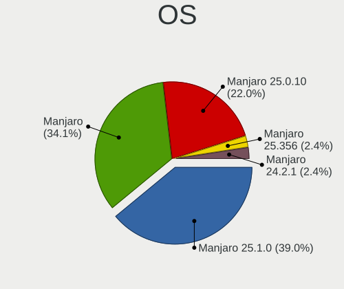

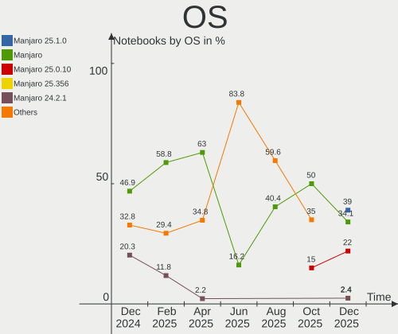

| Name            | Notebooks | Percent |
|-----------------|-----------|---------|
| Manjaro 25.1.0  | 16        | 39.02%  |
| Manjaro         | 14        | 34.15%  |
| Manjaro 25.0.10 | 9         | 21.95%  |
| Manjaro 25.356  | 1         | 2.44%   |
| Manjaro 24.2.1  | 1         | 2.44%   |

OS Family
---------

OS without a version

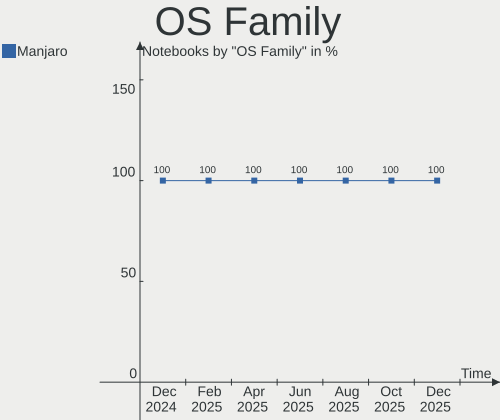

| Name    | Notebooks | Percent |
|---------|-----------|---------|
| Manjaro | 41        | 100%    |

Kernel
------

Version of the Linux kernel

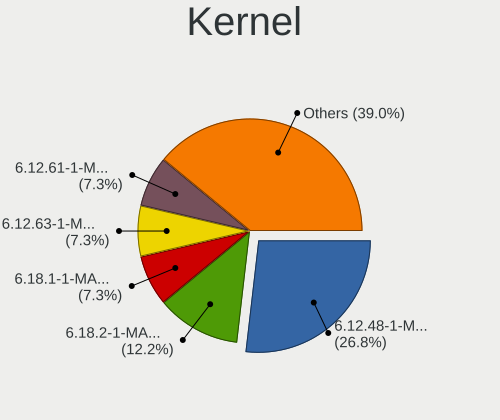

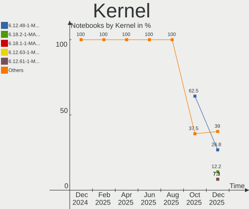

| Version              | Notebooks | Percent |
|----------------------|-----------|---------|
| 6.12.48-1-MANJARO    | 11        | 26.83%  |
| 6.18.2-1-MANJARO     | 5         | 12.2%   |
| 6.18.1-1-MANJARO     | 3         | 7.32%   |
| 6.12.63-1-MANJARO    | 3         | 7.32%   |
| 6.12.61-1-MANJARO    | 3         | 7.32%   |
| 6.6.119-1-MANJARO    | 2         | 4.88%   |
| 6.17.12-1-MANJARO    | 2         | 4.88%   |
| 6.17.1-0-MANJARO     | 2         | 4.88%   |
| 6.12.62-1-MANJARO    | 2         | 4.88%   |
| 6.6.99-1-MANJARO     | 1         | 2.44%   |
| 6.6.107-1-MANJARO    | 1         | 2.44%   |
| 6.19.0-rc1-1-MANJARO | 1         | 2.44%   |
| 6.18.0-1-MANJARO     | 1         | 2.44%   |
| 6.17.9-1-MANJARO     | 1         | 2.44%   |
| 6.16.8-1-MANJARO     | 1         | 2.44%   |
| 6.12.4-1-MANJARO     | 1         | 2.44%   |
| 5.15.197-1-MANJARO   | 1         | 2.44%   |

Kernel Family
-------------

Linux kernel without a distro release

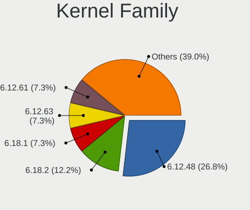

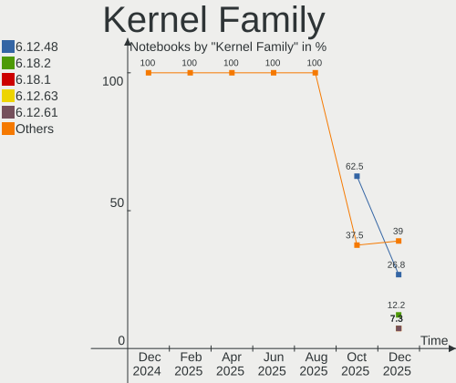

| Version  | Notebooks | Percent |
|----------|-----------|---------|
| 6.12.48  | 11        | 26.83%  |
| 6.18.2   | 5         | 12.2%   |
| 6.18.1   | 3         | 7.32%   |
| 6.12.63  | 3         | 7.32%   |
| 6.12.61  | 3         | 7.32%   |
| 6.6.119  | 2         | 4.88%   |
| 6.17.12  | 2         | 4.88%   |
| 6.17.1   | 2         | 4.88%   |
| 6.12.62  | 2         | 4.88%   |
| 6.6.99   | 1         | 2.44%   |
| 6.6.107  | 1         | 2.44%   |
| 6.19.0   | 1         | 2.44%   |
| 6.18.0   | 1         | 2.44%   |
| 6.17.9   | 1         | 2.44%   |
| 6.16.8   | 1         | 2.44%   |
| 6.12.4   | 1         | 2.44%   |
| 5.15.197 | 1         | 2.44%   |

Kernel Major Ver.
-----------------

Linux kernel major version

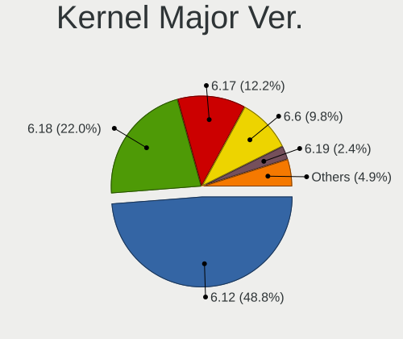

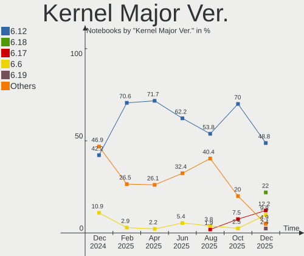

| Version | Notebooks | Percent |
|---------|-----------|---------|
| 6.12    | 20        | 48.78%  |
| 6.18    | 9         | 21.95%  |
| 6.17    | 5         | 12.2%   |
| 6.6     | 4         | 9.76%   |
| 6.19    | 1         | 2.44%   |
| 6.16    | 1         | 2.44%   |
| 5.15    | 1         | 2.44%   |

Arch
----

OS architecture (x86_64, i586, etc.)

| Name   | Notebooks | Percent |
|--------|-----------|---------|
| x86_64 | 41        | 100%    |

DE
--

Desktop Environment

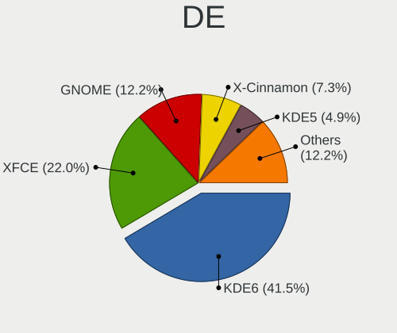

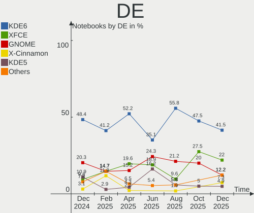

| Name       | Notebooks | Percent |
|------------|-----------|---------|
| KDE6       | 17        | 41.46%  |
| XFCE       | 9         | 21.95%  |
| GNOME      | 5         | 12.2%   |
| X-Cinnamon | 3         | 7.32%   |
| KDE5       | 2         | 4.88%   |
| KDE        | 2         | 4.88%   |
| sway       | 1         | 2.44%   |
| i3         | 1         | 2.44%   |
| Cinnamon   | 1         | 2.44%   |

Display Server
--------------

X11 or Wayland

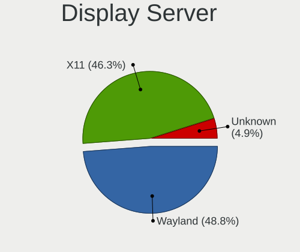

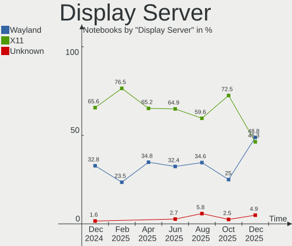

| Name    | Notebooks | Percent |
|---------|-----------|---------|
| Wayland | 20        | 48.78%  |
| X11     | 19        | 46.34%  |
| Unknown | 2         | 4.88%   |

Display Manager
---------------

SDDM, LightDM, etc.

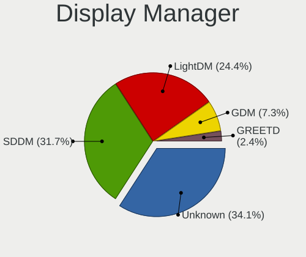

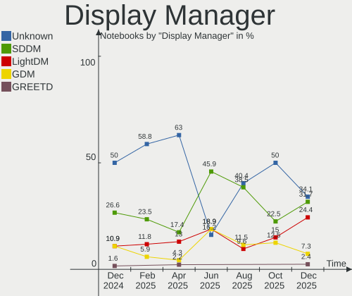

| Name    | Notebooks | Percent |
|---------|-----------|---------|
| Unknown | 14        | 34.15%  |
| SDDM    | 13        | 31.71%  |
| LightDM | 10        | 24.39%  |
| GDM     | 3         | 7.32%   |
| GREETD  | 1         | 2.44%   |

OS Lang
-------

Language

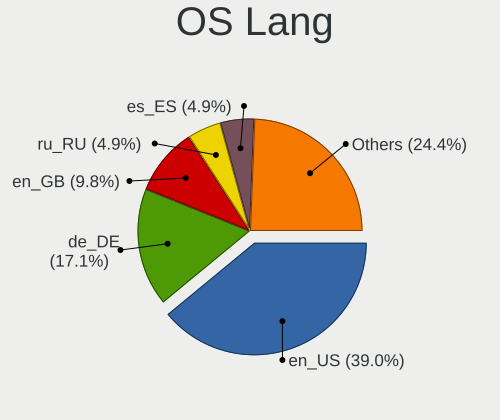

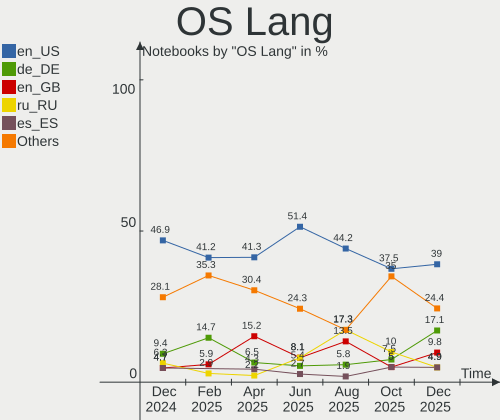

| Lang  | Notebooks | Percent |
|-------|-----------|---------|
| en_US | 16        | 39.02%  |
| de_DE | 7         | 17.07%  |
| en_GB | 4         | 9.76%   |
| ru_RU | 2         | 4.88%   |
| es_ES | 2         | 4.88%   |
| en_DK | 2         | 4.88%   |
| en_AU | 2         | 4.88%   |
| pl_PL | 1         | 2.44%   |
| it_IT | 1         | 2.44%   |
| fr_FR | 1         | 2.44%   |
| es_MX | 1         | 2.44%   |
| es_EC | 1         | 2.44%   |
| de_CH | 1         | 2.44%   |

Boot Mode
---------

EFI or BIOS

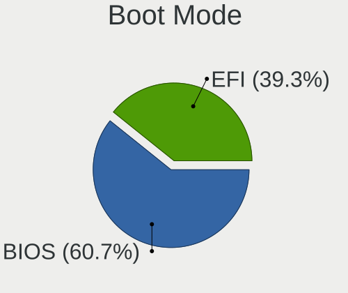

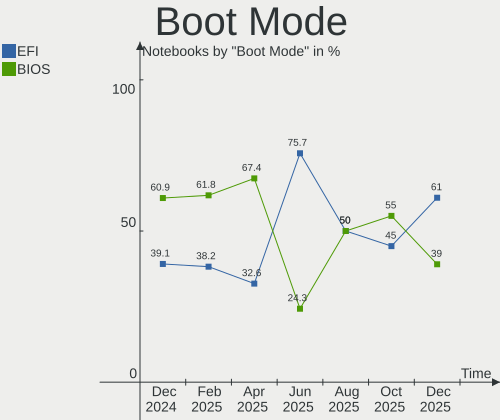

| Mode | Notebooks | Percent |
|------|-----------|---------|
| EFI  | 25        | 60.98%  |
| BIOS | 16        | 39.02%  |

Filesystem
----------

Type of filesystem

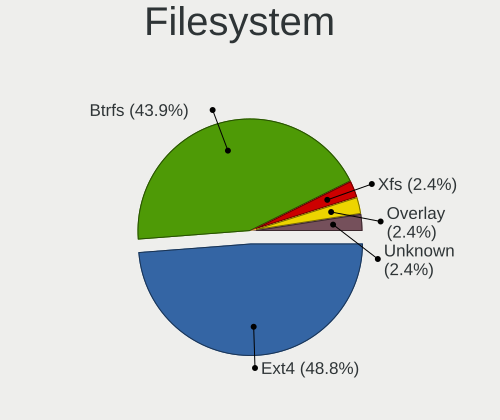

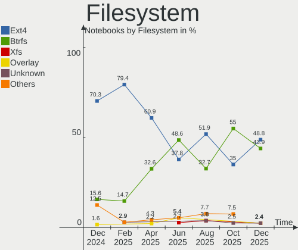

| Type    | Notebooks | Percent |
|---------|-----------|---------|
| Ext4    | 20        | 48.78%  |
| Btrfs   | 18        | 43.9%   |
| Xfs     | 1         | 2.44%   |
| Overlay | 1         | 2.44%   |
| Unknown | 1         | 2.44%   |

Part. scheme
------------

Scheme of partitioning

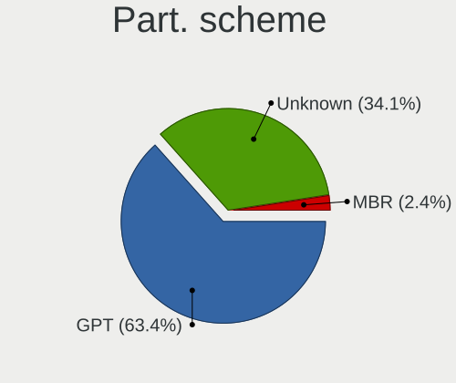

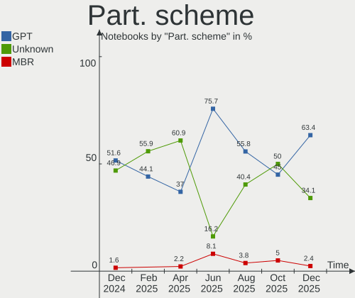

| Type    | Notebooks | Percent |
|---------|-----------|---------|
| GPT     | 26        | 63.41%  |
| Unknown | 14        | 34.15%  |
| MBR     | 1         | 2.44%   |

Dual Boot with Linux/BSD
------------------------

Hosting more than one Linux/BSD

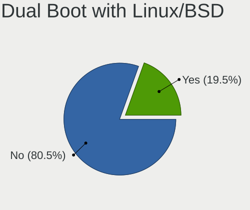

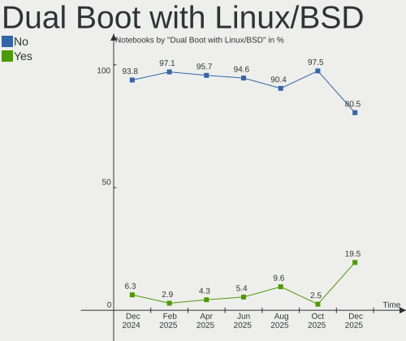

| Dual boot | Notebooks | Percent |
|-----------|-----------|---------|
| No        | 33        | 80.49%  |
| Yes       | 8         | 19.51%  |

Dual Boot (Win)
---------------

Hosting Linux and Windows

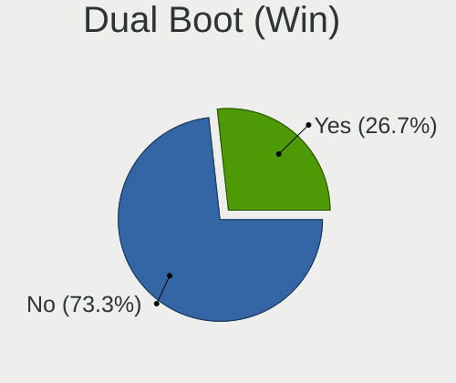

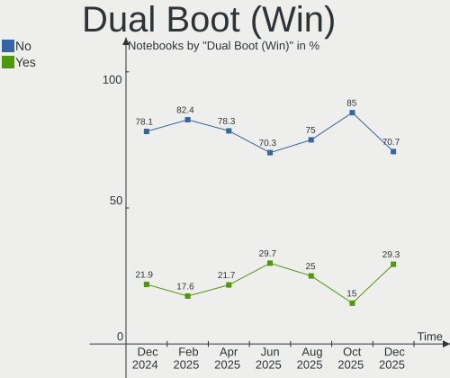

| Dual boot | Notebooks | Percent |
|-----------|-----------|---------|
| No        | 29        | 70.73%  |
| Yes       | 12        | 29.27%  |

Board
-----

Vendor
------

Motherboard manufacturer

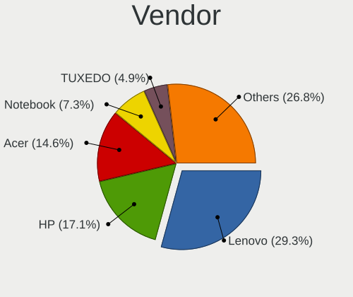

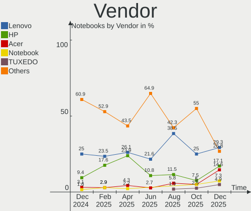

| Name             | Notebooks | Percent |
|------------------|-----------|---------|
| Lenovo           | 12        | 29.27%  |
| Hewlett-Packard  | 7         | 17.07%  |
| Acer             | 6         | 14.63%  |
| Notebook         | 3         | 7.32%   |
| TUXEDO           | 2         | 4.88%   |
| MSI              | 2         | 4.88%   |
| Google           | 2         | 4.88%   |
| Dell             | 2         | 4.88%   |
| Apple            | 2         | 4.88%   |
| Toshiba          | 1         | 2.44%   |
| Medion           | 1         | 2.44%   |
| ASUSTek Computer | 1         | 2.44%   |

Model
-----

Motherboard model

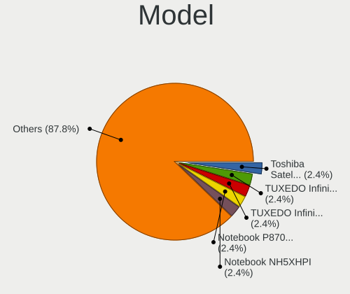

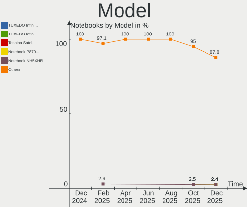

| Name                                 | Notebooks | Percent |
|--------------------------------------|-----------|---------|
| TUXEDO InfinityBook Pro Gen8 (MK1)   | 1         | 2.44%   |
| TUXEDO InfinityBook Pro 14 Gen6      | 1         | 2.44%   |
| Toshiba Satellite U300               | 1         | 2.44%   |
| Notebook P870DM-G                    | 1         | 2.44%   |
| Notebook NH5XHPI                     | 1         | 2.44%   |
| Notebook N14xWU                      | 1         | 2.44%   |
| MSI Thin 15 B13VE                    | 1         | 2.44%   |
| MSI Raider A18 HX A9WJG              | 1         | 2.44%   |
| Medion P7648 MD99980                 | 1         | 2.44%   |
| Lenovo Yoga Pro 7 14ASP9 83HN        | 1         | 2.44%   |
| Lenovo V14 G2 ALC 82KC               | 1         | 2.44%   |
| Lenovo ThinkPad X13 Gen 4 21J3CTO1WW | 1         | 2.44%   |
| Lenovo ThinkPad P16 Gen 3 21RQS0DV00 | 1         | 2.44%   |
| Lenovo ThinkPad L570 20J9S0DL01      | 1         | 2.44%   |
| Lenovo ThinkPad Edge E530 32597AU    | 1         | 2.44%   |
| Lenovo ThinkPad E580 20KS001JRT      | 1         | 2.44%   |
| Lenovo ThinkBook X G2 IAH 21TU       | 1         | 2.44%   |
| Lenovo ThinkBook 15 G4 IAP 21DJ      | 1         | 2.44%   |
| Lenovo Legion Y740-15IRHg 81UH       | 1         | 2.44%   |
| Lenovo Legion Pro 7 16IAX10H 83F5    | 1         | 2.44%   |
| Lenovo Legion Pro 7 16AFR10H 83RU    | 1         | 2.44%   |
| HP Victus by Laptop 16-d0xxx         | 1         | 2.44%   |
| HP ProBook 470 G1                    | 1         | 2.44%   |
| HP ProBook 450 G8 Notebook PC        | 1         | 2.44%   |
| HP ProBook 440 G7                    | 1         | 2.44%   |
| HP Notebook                          | 1         | 2.44%   |
| HP Laptop 14s-fq1xxx                 | 1         | 2.44%   |
| Google Robo                          | 1         | 2.44%   |
| Google Eve                           | 1         | 2.44%   |
| Dell Latitude 5420                   | 1         | 2.44%   |
| Dell G15 5530                        | 1         | 2.44%   |
| ASUS GL502VT                         | 1         | 2.44%   |
| Apple MacBookPro5,5                  | 1         | 2.44%   |
| Apple MacBookAir6,2                  | 1         | 2.44%   |
| Acer Swift SF314-41                  | 1         | 2.44%   |
| Acer Aspire ES1-131                  | 1         | 2.44%   |
| Acer Aspire A515-57G                 | 1         | 2.44%   |
| Acer Aspire A515-45                  | 1         | 2.44%   |
| Acer Aspire A515-43                  | 1         | 2.44%   |
| Acer Aspire A315-59                  | 1         | 2.44%   |

Model Family
------------

Motherboard model prefix

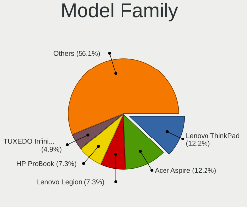

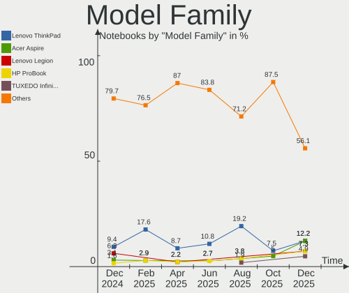

| Name                | Notebooks | Percent |
|---------------------|-----------|---------|
| Lenovo ThinkPad     | 5         | 12.2%   |
| Acer Aspire         | 5         | 12.2%   |
| Lenovo Legion       | 3         | 7.32%   |
| HP ProBook          | 3         | 7.32%   |
| TUXEDO InfinityBook | 2         | 4.88%   |
| Lenovo ThinkBook    | 2         | 4.88%   |
| Toshiba Satellite   | 1         | 2.44%   |
| Notebook P870DM-G   | 1         | 2.44%   |
| Notebook NH5XHPI    | 1         | 2.44%   |
| Notebook N14xWU     | 1         | 2.44%   |
| MSI Thin            | 1         | 2.44%   |
| MSI Raider          | 1         | 2.44%   |
| Medion P7648        | 1         | 2.44%   |
| Lenovo Yoga         | 1         | 2.44%   |
| Lenovo V14          | 1         | 2.44%   |
| HP Victus           | 1         | 2.44%   |
| HP Notebook         | 1         | 2.44%   |
| HP Laptop           | 1         | 2.44%   |
| Google Robo         | 1         | 2.44%   |
| Google Eve          | 1         | 2.44%   |
| Dell Latitude       | 1         | 2.44%   |
| Dell G15            | 1         | 2.44%   |
| ASUS GL502VT        | 1         | 2.44%   |
| Apple MacBookPro5   | 1         | 2.44%   |
| Apple MacBookAir6   | 1         | 2.44%   |
| Acer Swift          | 1         | 2.44%   |
| Unknown             | 1         | 2.44%   |

MFG Year
--------

Motherboard manufacture year

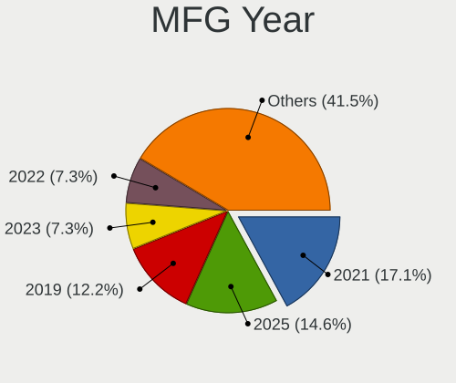

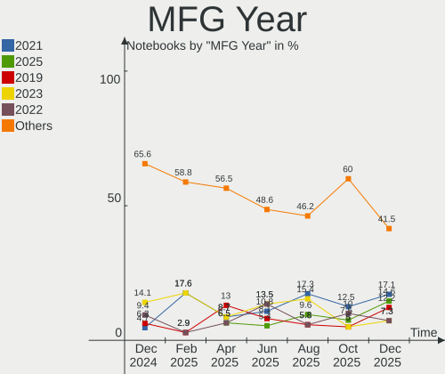

| Year | Notebooks | Percent |
|------|-----------|---------|
| 2021 | 7         | 17.07%  |
| 2025 | 6         | 14.63%  |
| 2019 | 5         | 12.2%   |
| 2023 | 3         | 7.32%   |
| 2022 | 3         | 7.32%   |
| 2016 | 3         | 7.32%   |
| 2024 | 2         | 4.88%   |
| 2020 | 2         | 4.88%   |
| 2017 | 2         | 4.88%   |
| 2015 | 2         | 4.88%   |
| 2013 | 2         | 4.88%   |
| 2018 | 1         | 2.44%   |
| 2012 | 1         | 2.44%   |
| 2009 | 1         | 2.44%   |
| 2007 | 1         | 2.44%   |

Form Factor
-----------

Physical design of the computer

| Name     | Notebooks | Percent |
|----------|-----------|---------|
| Notebook | 41        | 100%    |

Secure Boot
-----------

Enabled or disabled

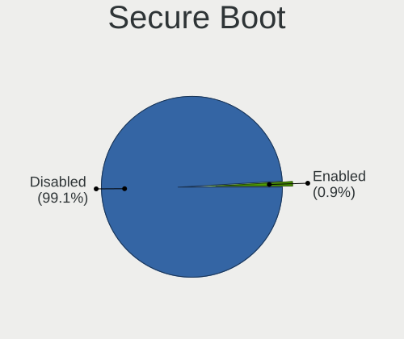

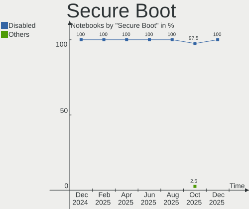

| State    | Notebooks | Percent |
|----------|-----------|---------|
| Disabled | 41        | 100%    |

Coreboot
--------

Have coreboot on board

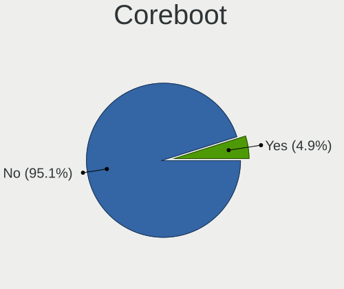

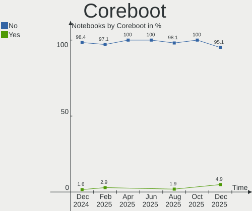

| Used | Notebooks | Percent |
|------|-----------|---------|
| No   | 39        | 95.12%  |
| Yes  | 2         | 4.88%   |

RAM Size
--------

Total RAM memory

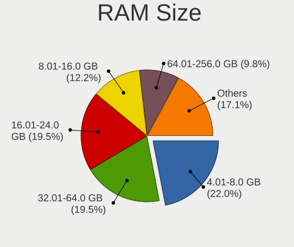

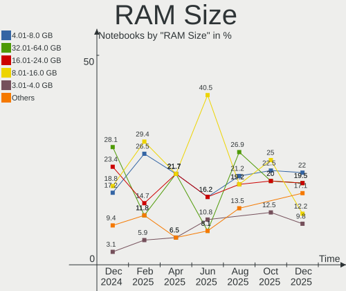

| Size in GB  | Notebooks | Percent |
|-------------|-----------|---------|
| 4.01-8.0    | 9         | 21.95%  |
| 32.01-64.0  | 8         | 19.51%  |
| 16.01-24.0  | 8         | 19.51%  |
| 8.01-16.0   | 5         | 12.2%   |
| 3.01-4.0    | 4         | 9.76%   |
| 64.01-256.0 | 4         | 9.76%   |
| 24.01-32.0  | 3         | 7.32%   |

RAM Used
--------

Used RAM memory

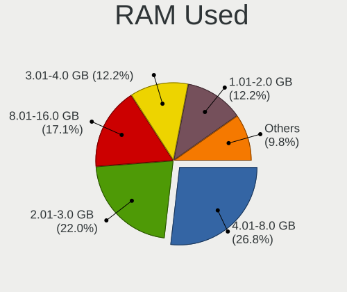

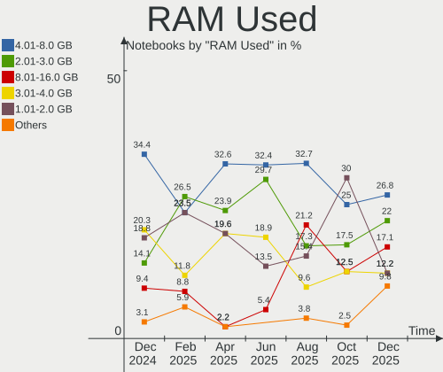

| Used GB    | Notebooks | Percent |
|------------|-----------|---------|
| 4.01-8.0   | 11        | 26.83%  |
| 2.01-3.0   | 9         | 21.95%  |
| 8.01-16.0  | 7         | 17.07%  |
| 3.01-4.0   | 5         | 12.2%   |
| 1.01-2.0   | 5         | 12.2%   |
| 24.01-32.0 | 2         | 4.88%   |
| 16.01-24.0 | 1         | 2.44%   |
| 0.51-1.0   | 1         | 2.44%   |

Total Drives
------------

Number of drives on board

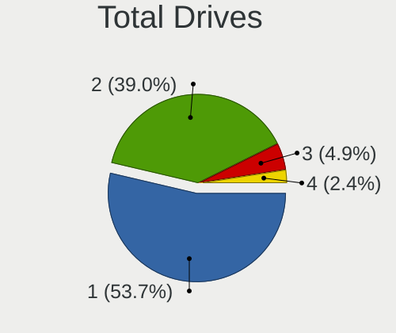

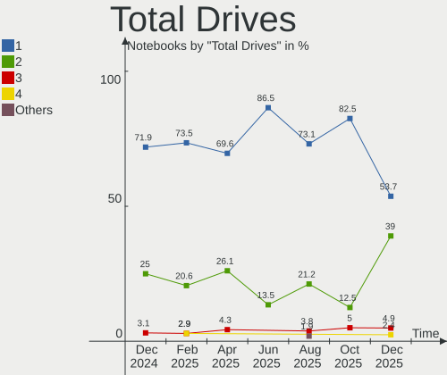

| Drives | Notebooks | Percent |
|--------|-----------|---------|
| 1      | 22        | 53.66%  |
| 2      | 16        | 39.02%  |
| 3      | 2         | 4.88%   |
| 4      | 1         | 2.44%   |

Has CD-ROM
----------

Has CD-ROM on board

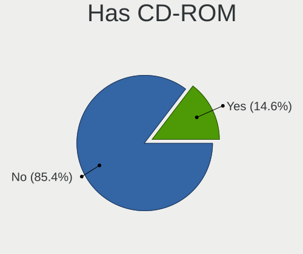

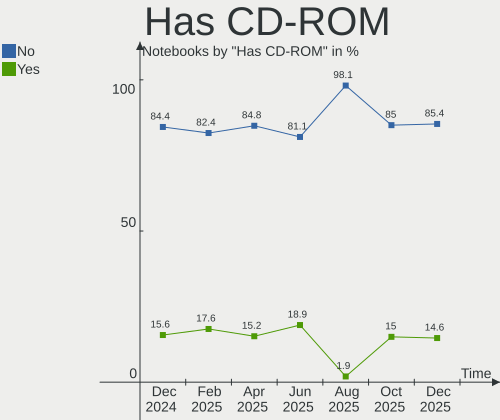

| Presented | Notebooks | Percent |
|-----------|-----------|---------|
| No        | 35        | 85.37%  |
| Yes       | 6         | 14.63%  |

Has Ethernet
------------

Has Ethernet on board

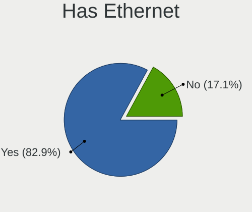

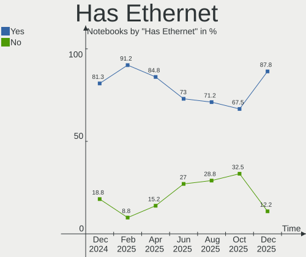

| Presented | Notebooks | Percent |
|-----------|-----------|---------|
| Yes       | 36        | 87.8%   |
| No        | 5         | 12.2%   |

Has WiFi
--------

Has WiFi module

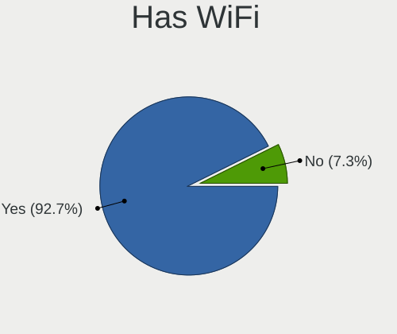

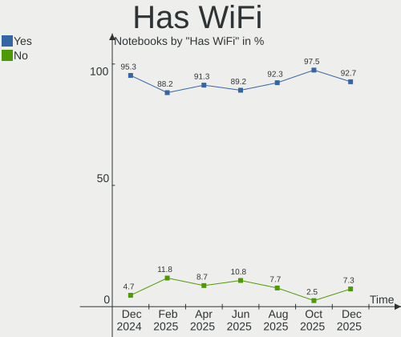

| Presented | Notebooks | Percent |
|-----------|-----------|---------|
| Yes       | 38        | 92.68%  |
| No        | 3         | 7.32%   |

Has Bluetooth
-------------

Has Bluetooth module

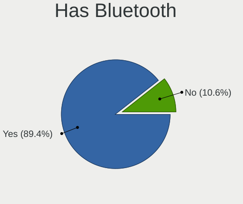

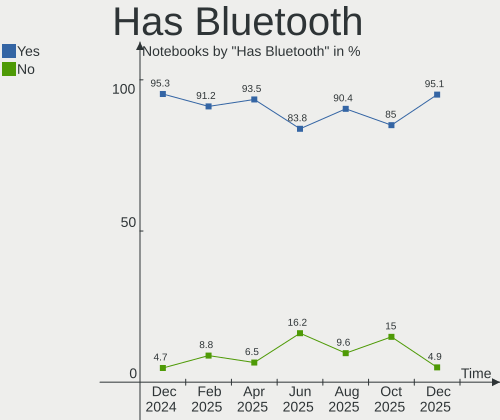

| Presented | Notebooks | Percent |
|-----------|-----------|---------|
| Yes       | 39        | 95.12%  |
| No        | 2         | 4.88%   |

Location
--------

Country
-------

Geographic location (country)

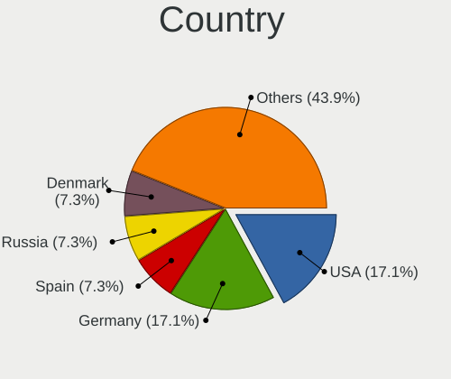

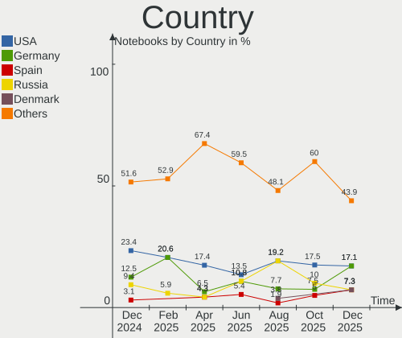

| Country     | Notebooks | Percent |
|-------------|-----------|---------|
| USA         | 7         | 17.07%  |
| Germany     | 7         | 17.07%  |
| Spain       | 3         | 7.32%   |
| Russia      | 3         | 7.32%   |
| Denmark     | 3         | 7.32%   |
| Switzerland | 2         | 4.88%   |
| France      | 2         | 4.88%   |
| Australia   | 2         | 4.88%   |
| Ukraine     | 1         | 2.44%   |
| UK          | 1         | 2.44%   |
| Thailand    | 1         | 2.44%   |
| Poland      | 1         | 2.44%   |
| Mexico      | 1         | 2.44%   |
| Italy       | 1         | 2.44%   |
| Greece      | 1         | 2.44%   |
| Ecuador     | 1         | 2.44%   |
| Canada      | 1         | 2.44%   |
| Brazil      | 1         | 2.44%   |
| Bangladesh  | 1         | 2.44%   |
| Argentina   | 1         | 2.44%   |

City
----

Geographic location (city)

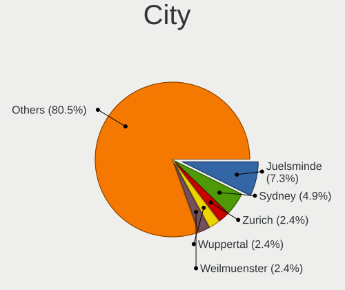

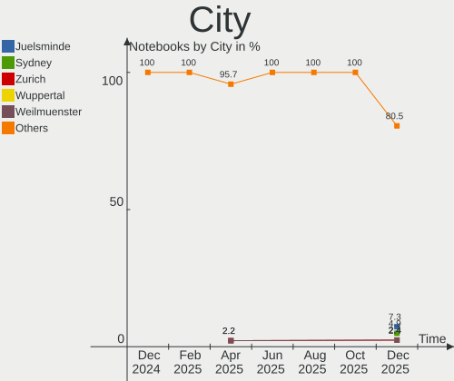

| City                     | Notebooks | Percent |
|--------------------------|-----------|---------|
| Juelsminde               | 3         | 7.32%   |
| Sydney                   | 2         | 4.88%   |
| Zurich                   | 1         | 2.44%   |
| Wuppertal                | 1         | 2.44%   |
| Weilmuenster             | 1         | 2.44%   |
| Toronto                  | 1         | 2.44%   |
| Sucúa                   | 1         | 2.44%   |
| Seville                  | 1         | 2.44%   |
| Seattle                  | 1         | 2.44%   |
| Salvador                 | 1         | 2.44%   |
| Regensburg               | 1         | 2.44%   |
| Plano                    | 1         | 2.44%   |
| Norwich                  | 1         | 2.44%   |
| Nanterre                 | 1         | 2.44%   |
| Moscow                   | 1         | 2.44%   |
| Monterrey                | 1         | 2.44%   |
| Miami                    | 1         | 2.44%   |
| Legnaro                  | 1         | 2.44%   |
| Kyiv                     | 1         | 2.44%   |
| Kubinka                  | 1         | 2.44%   |
| Koblenz                  | 1         | 2.44%   |
| Karditsa                 | 1         | 2.44%   |
| Kaluga                   | 1         | 2.44%   |
| Gelnhausen               | 1         | 2.44%   |
| Gdansk                   | 1         | 2.44%   |
| Garmisch-Partenkirchen   | 1         | 2.44%   |
| Essen                    | 1         | 2.44%   |
| Donostia / San Sebastian | 1         | 2.44%   |
| Dhaka                    | 1         | 2.44%   |
| Córdoba                 | 1         | 2.44%   |
| Cary                     | 1         | 2.44%   |
| Brooklyn                 | 1         | 2.44%   |
| Birmingham               | 1         | 2.44%   |
| Biel/Bienne              | 1         | 2.44%   |
| Barcelona                | 1         | 2.44%   |
| Bang Bai Mai             | 1         | 2.44%   |
| Atlanta                  | 1         | 2.44%   |
| Armentières             | 1         | 2.44%   |

Drives
------

Drive Vendor
------------

Hard drive vendors

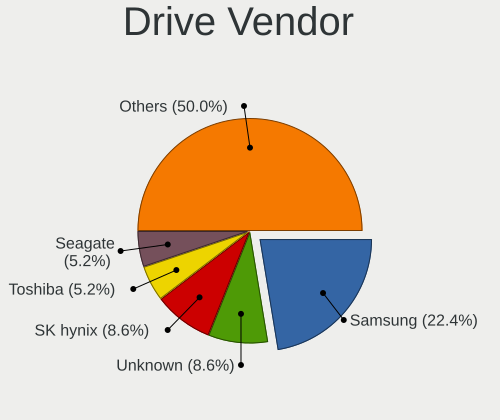

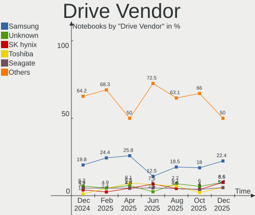

| Vendor                      | Notebooks | Drives | Percent |
|-----------------------------|-----------|--------|---------|
| Samsung Electronics         | 13        | 18     | 22.41%  |
| Unknown                     | 5         | 6      | 8.62%   |
| SK hynix                    | 5         | 6      | 8.62%   |
| Toshiba                     | 3         | 3      | 5.17%   |
| Seagate                     | 3         | 3      | 5.17%   |
| WDC                         | 2         | 2      | 3.45%   |
| Realtek Semiconductor       | 2         | 2      | 3.45%   |
| Phison Electronics          | 2         | 2      | 3.45%   |
| Micron Technology           | 2         | 2      | 3.45%   |
| KIOXIA                      | 2         | 2      | 3.45%   |
| HGST                        | 2         | 2      | 3.45%   |
| China                       | 2         | 2      | 3.45%   |
| Union Memory (Shenzhen)     | 1         | 1      | 1.72%   |
| Transcend                   | 1         | 1      | 1.72%   |
| Silicon Motion              | 1         | 1      | 1.72%   |
| Sandisk                     | 1         | 1      | 1.72%   |
| Netac                       | 1         | 1      | 1.72%   |
| Micron/Crucial Technology   | 1         | 1      | 1.72%   |
| LITEON                      | 1         | 1      | 1.72%   |
| Kingston Technology Company | 1         | 2      | 1.72%   |
| Kingston                    | 1         | 1      | 1.72%   |
| Intenso                     | 1         | 2      | 1.72%   |
| Hitachi                     | 1         | 1      | 1.72%   |
| EAGET                       | 1         | 1      | 1.72%   |
| Digma                       | 1         | 1      | 1.72%   |
| Apple                       | 1         | 1      | 1.72%   |
| ADATA Technology            | 1         | 1      | 1.72%   |

Drive Model
-----------

Hard drive models

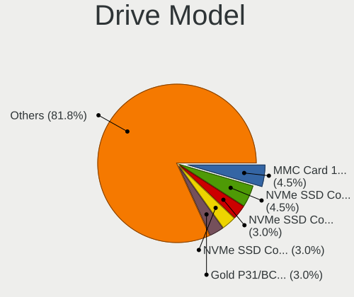

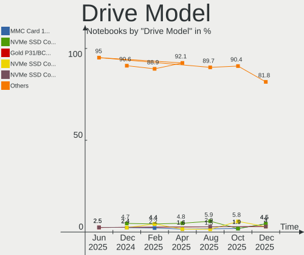

| Model                                                      | Notebooks | Percent |
|------------------------------------------------------------|-----------|---------|
| Unknown MMC Card  128GB                                    | 3         | 4.55%   |
| Samsung NVMe SSD Controller SM981/PM981/PM983 1TB          | 3         | 4.55%   |
| SK hynix Gold P31/BC711/PC711 NVMe Solid State Drive 512GB | 2         | 3.03%   |
| Samsung NVMe SSD Controller PM9A1/PM9A3/980PRO 1TB         | 2         | 3.03%   |
| Samsung NVMe SSD Controller 980 (DRAM-less) 256GB          | 2         | 3.03%   |
| WDC WDS200T2B0A-00SM50 2TB SSD                             | 1         | 1.52%   |
| WDC WD Blue SA510 M.2 2280 250GB SSD                       | 1         | 1.52%   |
| Unknown SD/MMC/MS PRO 2GB                                  | 1         | 1.52%   |
| Unknown MMC Card  64GB                                     | 1         | 1.52%   |
| Unknown MMC Card  32GB                                     | 1         | 1.52%   |
| Union Memory (Shenzhen) UMIS RPJYJ1T24MML1AWY 1TB          | 1         | 1.52%   |
| Transcend TS1TMTS425S 1TB SSD                              | 1         | 1.52%   |
| Toshiba MQ04ABF100 1TB                                     | 1         | 1.52%   |
| Toshiba MQ01ABD100M 1TB                                    | 1         | 1.52%   |
| Toshiba BG3 NVMe SSD Controller 256GB                      | 1         | 1.52%   |
| SK hynix Platinum P41/PC801 NVMe Solid State Drive 1TB     | 1         | 1.52%   |
| SK hynix PC601 NVMe Solid State Drive 512GB                | 1         | 1.52%   |
| SK hynix BC501 NVMe Solid State Drive 512GB                | 1         | 1.52%   |
| Silicon Motion SM2263EN/SM2263XT SSD Controller 512GB      | 1         | 1.52%   |
| Seagate ST500LT012-1DG142 500GB                            | 1         | 1.52%   |
| Seagate ST1000LM049-2GH172 1TB                             | 1         | 1.52%   |
| Seagate ST1000LM035-1RK172 1TB                             | 1         | 1.52%   |
| Sandisk WD PC SN740 SDDQNQD-512G-1014 512GB                | 1         | 1.52%   |
| Samsung SSD 990 EVO Plus 1TB                               | 1         | 1.52%   |
| Samsung SSD 980 1TB                                        | 1         | 1.52%   |
| Samsung SSD 860 EVO M.2 500GB                              | 1         | 1.52%   |
| Samsung SSD 860 EVO 500GB                                  | 1         | 1.52%   |
| Samsung NVMe SSD Controller SM961/PM961/SM963 1024GB       | 1         | 1.52%   |
| Samsung NVMe SSD Controller PM9C1a (DRAM-less) 1TB         | 1         | 1.52%   |
| Samsung NVMe SSD Controller PM9B1 (DRAM-less) 512GB        | 1         | 1.52%   |
| Samsung MZVLC2T0HBLD-00BT7 2TB                             | 1         | 1.52%   |
| Samsung MZVLC2T0HBLD-00BLL 2TB                             | 1         | 1.52%   |
| Samsung MZVLC2T0HBLD-00BL2 2TB                             | 1         | 1.52%   |
| Samsung MZVL8512HELU-00BTW 512GB                           | 1         | 1.52%   |
| Realtek RTS5763DL NVMe SSD Controller 512GB                | 1         | 1.52%   |
| Realtek RTS5762 NVMe SSD Controller 1TB                    | 1         | 1.52%   |
| Phison PS5013-E13 PCIe3 NVMe Controller (DRAM-less) 512GB  | 1         | 1.52%   |
| Phison E12 NVMe Controller 1TB                             | 1         | 1.52%   |
| Netac SSD 240GB                                            | 1         | 1.52%   |
| Micron/Crucial P5 Plus NVMe PCIe SSD 1TB                   | 1         | 1.52%   |

HDD Vendor
----------

Hard disk drive vendors

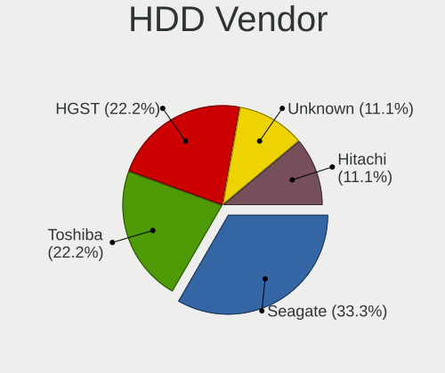

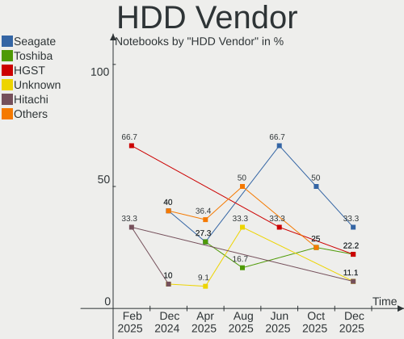

| Vendor  | Notebooks | Drives | Percent |
|---------|-----------|--------|---------|
| Seagate | 3         | 3      | 33.33%  |
| Toshiba | 2         | 2      | 22.22%  |
| HGST    | 2         | 2      | 22.22%  |
| Unknown | 1         | 1      | 11.11%  |
| Hitachi | 1         | 1      | 11.11%  |

SSD Vendor
----------

Solid state drive vendors

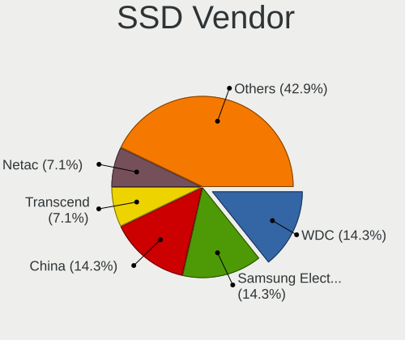

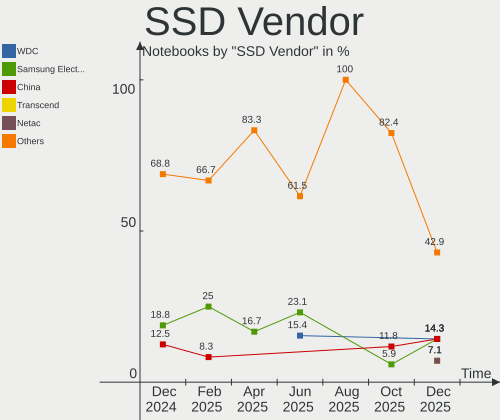

| Vendor              | Notebooks | Drives | Percent |
|---------------------|-----------|--------|---------|
| WDC                 | 2         | 2      | 14.29%  |
| Samsung Electronics | 2         | 2      | 14.29%  |
| China               | 2         | 2      | 14.29%  |
| Transcend           | 1         | 1      | 7.14%   |
| Netac               | 1         | 1      | 7.14%   |
| LITEON              | 1         | 1      | 7.14%   |
| Kingston            | 1         | 1      | 7.14%   |
| Intenso             | 1         | 2      | 7.14%   |
| EAGET               | 1         | 1      | 7.14%   |
| Digma               | 1         | 1      | 7.14%   |
| Apple               | 1         | 1      | 7.14%   |

Drive Kind
----------

HDD or SSD

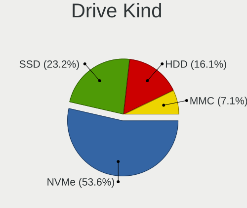

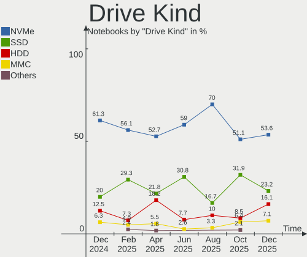

| Kind | Notebooks | Drives | Percent |
|------|-----------|--------|---------|
| NVMe | 30        | 38     | 53.57%  |
| SSD  | 13        | 15     | 23.21%  |
| HDD  | 9         | 9      | 16.07%  |
| MMC  | 4         | 5      | 7.14%   |

Drive Connector
---------------

SATA, SAS, NVMe, etc.

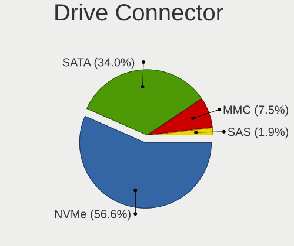

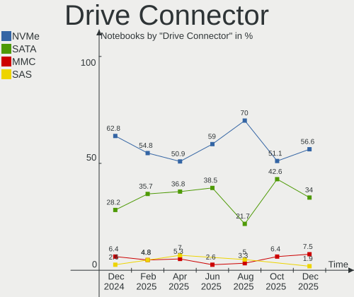

| Type | Notebooks | Drives | Percent |
|------|-----------|--------|---------|
| NVMe | 30        | 38     | 56.6%   |
| SATA | 18        | 23     | 33.96%  |
| MMC  | 4         | 5      | 7.55%   |
| SAS  | 1         | 1      | 1.89%   |

Drive Size
----------

Size of hard drive

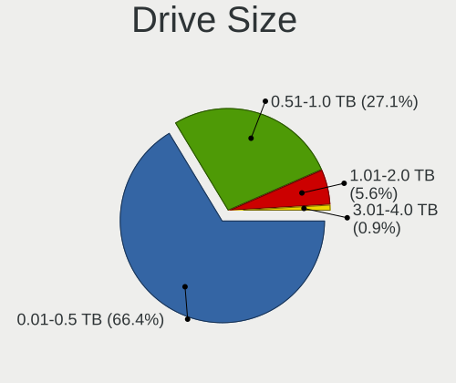

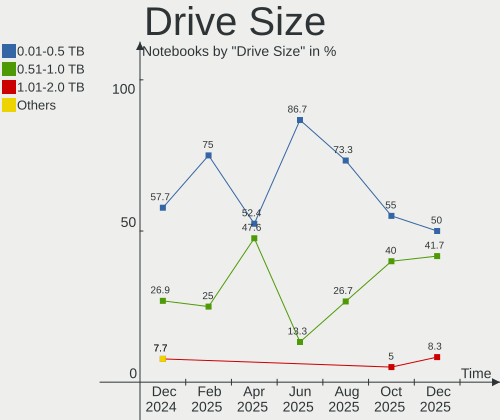

| Size in TB | Notebooks | Drives | Percent |
|------------|-----------|--------|---------|
| 0.01-0.5   | 12        | 12     | 50%     |
| 0.51-1.0   | 10        | 10     | 41.67%  |
| 1.01-2.0   | 2         | 2      | 8.33%   |

Space Total
-----------

Amount of disk space available on the file system

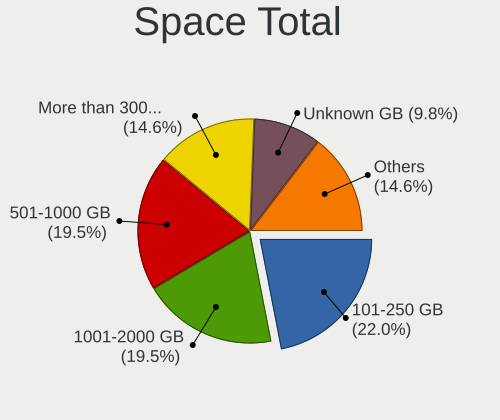

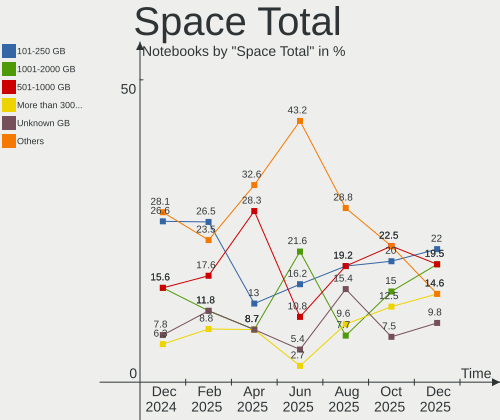

| Size in GB     | Notebooks | Percent |
|----------------|-----------|---------|
| 101-250        | 9         | 21.95%  |
| 1001-2000      | 8         | 19.51%  |
| 501-1000       | 8         | 19.51%  |
| More than 3000 | 6         | 14.63%  |
| Unknown        | 4         | 9.76%   |
| 251-500        | 3         | 7.32%   |
| 1-20           | 2         | 4.88%   |
| 2001-3000      | 1         | 2.44%   |

Space Used
----------

Amount of used disk space

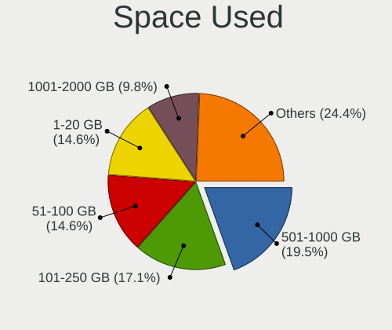

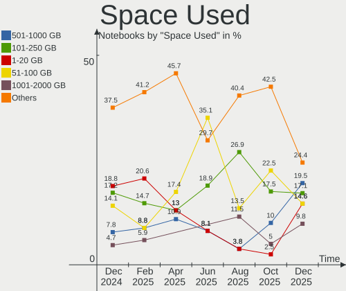

| Used GB        | Notebooks | Percent |
|----------------|-----------|---------|
| 501-1000       | 8         | 19.51%  |
| 101-250        | 7         | 17.07%  |
| 1-20           | 6         | 14.63%  |
| 51-100         | 6         | 14.63%  |
| 1001-2000      | 4         | 9.76%   |
| Unknown        | 4         | 9.76%   |
| 2001-3000      | 3         | 7.32%   |
| More than 3000 | 1         | 2.44%   |
| 251-500        | 1         | 2.44%   |
| 21-50          | 1         | 2.44%   |

Malfunc. Drives
---------------

Drive models with a malfunction

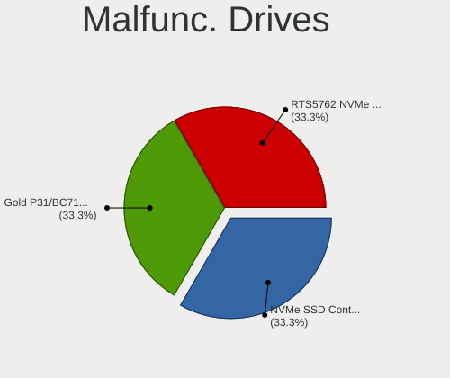

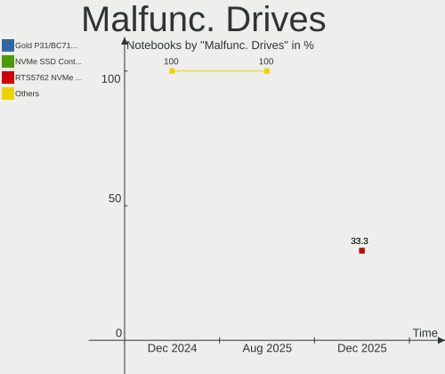

| Model                                                         | Notebooks | Drives | Percent |
|---------------------------------------------------------------|-----------|--------|---------|
| SK hynix Gold P31/BC711/PC711 NVMe Solid State Drive 512GB    | 1         | 1      | 33.33%  |
| Samsung Electronics NVMe SSD Controller 980 (DRAM-less) 256GB | 1         | 1      | 33.33%  |
| Realtek Semiconductor RTS5762 NVMe SSD Controller 1TB         | 1         | 1      | 33.33%  |

Malfunc. Drive Vendor
---------------------

Vendors of faulty drives

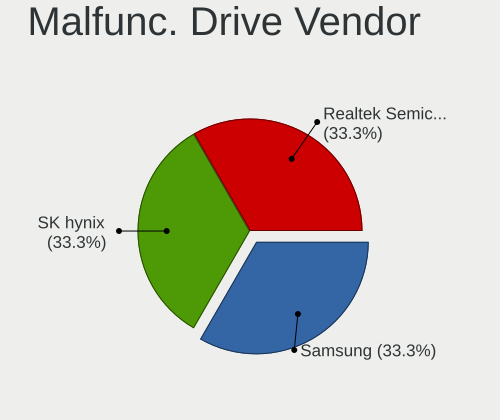

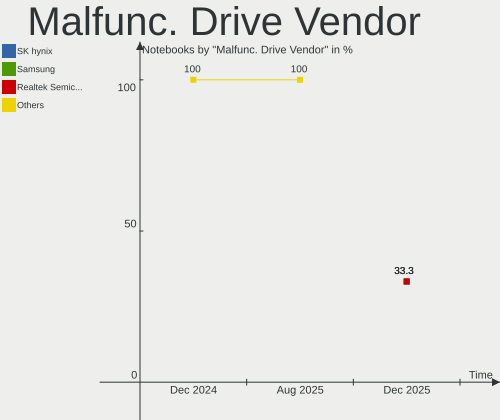

| Vendor                | Notebooks | Drives | Percent |
|-----------------------|-----------|--------|---------|
| SK hynix              | 1         | 1      | 33.33%  |
| Samsung Electronics   | 1         | 1      | 33.33%  |
| Realtek Semiconductor | 1         | 1      | 33.33%  |

Malfunc. HDD Vendor
-------------------

Vendors of faulty HDD drives

Zero info for selected period =(

Malfunc. Drive Kind
-------------------

Kinds of faulty drives

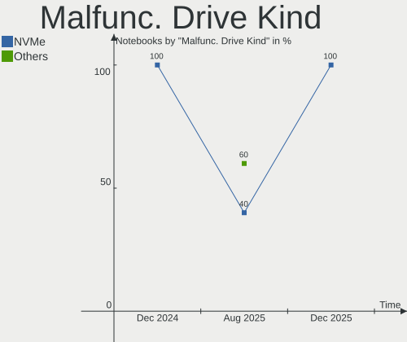

| Kind | Notebooks | Drives | Percent |
|------|-----------|--------|---------|
| NVMe | 3         | 3      | 100%    |

Failed Drives
-------------

Failed drive models

Zero info for selected period =(

Failed Drive Vendor
-------------------

Failed drive vendors

Zero info for selected period =(

Drive Status
------------

Number of failed and malfunc. drives

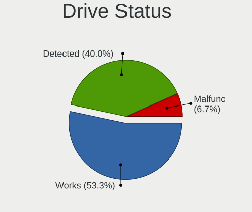

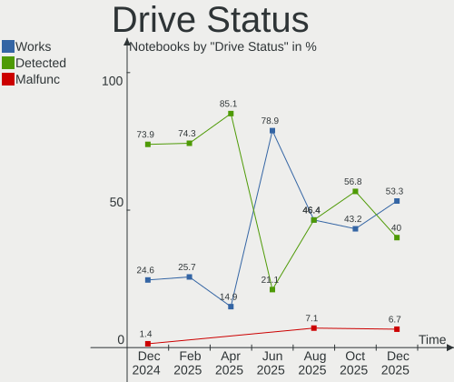

| Status   | Notebooks | Drives | Percent |
|----------|-----------|--------|---------|
| Works    | 24        | 37     | 53.33%  |
| Detected | 18        | 27     | 40%     |
| Malfunc  | 3         | 3      | 6.67%   |

Storage controller
------------------

Storage Vendor
--------------

Storage controller vendors

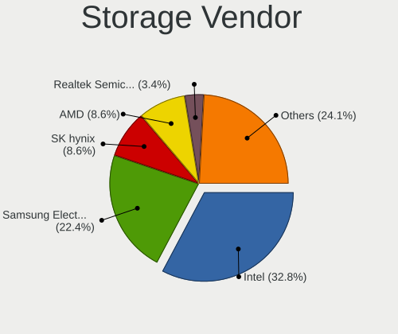

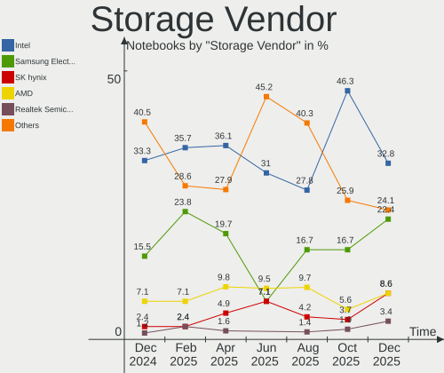

| Vendor                                  | Notebooks | Percent |
|-----------------------------------------|-----------|---------|
| Intel                                   | 19        | 32.76%  |
| Samsung Electronics                     | 13        | 22.41%  |
| SK hynix                                | 5         | 8.62%   |
| AMD                                     | 5         | 8.62%   |
| Realtek Semiconductor                   | 2         | 3.45%   |
| Phison Electronics                      | 2         | 3.45%   |
| Micron Technology                       | 2         | 3.45%   |
| Toshiba America Info Systems            | 1         | 1.72%   |
| Silicon Motion                          | 1         | 1.72%   |
| Shenzhen Unionmemory Information System | 1         | 1.72%   |
| SanDisk                                 | 1         | 1.72%   |
| Nvidia                                  | 1         | 1.72%   |
| Micron/Crucial Technology               | 1         | 1.72%   |
| Marvell Technology Group                | 1         | 1.72%   |
| KIOXIA                                  | 1         | 1.72%   |
| Kingston Technology Company             | 1         | 1.72%   |
| ADATA Technology                        | 1         | 1.72%   |

Storage Model
-------------

Storage controller models

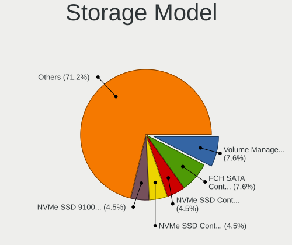

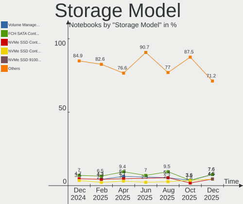

| Model                                                                            | Notebooks | Percent |
|----------------------------------------------------------------------------------|-----------|---------|
| Intel Volume Management Device NVMe RAID Controller                              | 5         | 7.58%   |
| AMD FCH SATA Controller [AHCI mode]                                              | 5         | 7.58%   |
| Samsung NVMe SSD Controller SM981/PM981/PM983                                    | 3         | 4.55%   |
| Samsung NVMe SSD Controller 980 (DRAM-less)                                      | 3         | 4.55%   |
| Samsung NVMe SSD 9100 PRO [PM9E1]                                                | 3         | 4.55%   |
| Intel Sunrise Point-LP SATA Controller [AHCI mode]                               | 3         | 4.55%   |
| Intel Alder Lake-P SATA AHCI Controller                                          | 3         | 4.55%   |
| SK hynix Gold P31/BC711/PC711 NVMe Solid State Drive                             | 2         | 3.03%   |
| Samsung NVMe SSD Controller PM9C1a (DRAM-less)                                   | 2         | 3.03%   |
| Samsung NVMe SSD Controller PM9A1/PM9A3/980PRO                                   | 2         | 3.03%   |
| Realtek RTS5762 NVMe SSD Controller                                              | 2         | 3.03%   |
| Intel RST Volume Management Device Controller                                    | 2         | 3.03%   |
| Intel Atom/Celeron/Pentium Processor x5-E8000/J3xxx/N3xxx Series SATA Controller | 2         | 3.03%   |
| Toshiba America Info Systems BG3 x2 NVMe SSD Controller (DRAM-less)              | 1         | 1.52%   |
| SK hynix Platinum P41/PC801 NVMe Solid State Drive                               | 1         | 1.52%   |
| SK hynix PC601 NVMe Solid State Drive                                            | 1         | 1.52%   |
| SK hynix BC501 NVMe Solid State Drive                                            | 1         | 1.52%   |
| Silicon Motion SM2263EN/SM2263XT (DRAM-less) NVMe SSD Controllers                | 1         | 1.52%   |
| Shenzhen Unionmemory Information System Non-Volatile memory controller           | 1         | 1.52%   |
| SanDisk WD SN560/SN740/SN770/SN5000 NVMe SSD                                     | 1         | 1.52%   |
| Samsung NVMe SSD Controller SM961/PM961/SM963                                    | 1         | 1.52%   |
| Samsung NVMe SSD Controller PM9B1 (DRAM-less)                                    | 1         | 1.52%   |
| Phison PS5013-E13 PCIe3 NVMe Controller (DRAM-less)                              | 1         | 1.52%   |
| Phison E12 NVMe Controller                                                       | 1         | 1.52%   |
| Nvidia MCP79 AHCI Controller                                                     | 1         | 1.52%   |
| Micron/Crucial P5 Plus NVMe PCIe SSD                                             | 1         | 1.52%   |
| Micron 2550 NVMe SSD (DRAM-less)                                                 | 1         | 1.52%   |
| Micron 2210 NVMe SSD [Cobain]                                                    | 1         | 1.52%   |
| Marvell Group 88SS9183 PCIe SSD Controller                                       | 1         | 1.52%   |
| KIOXIA NVMe SSD Controller BG5 (DRAM-less)                                       | 1         | 1.52%   |
| Kingston Company NV2 NVMe SSD [SM2267XT] (DRAM-less)                             | 1         | 1.52%   |
| Kingston Company NV1 NVMe SSD [SM2263XT] (DRAM-less)                             | 1         | 1.52%   |
| Intel Tiger Lake SATA AHCI Controller                                            | 1         | 1.52%   |
| Intel Q170/Q150/B150/H170/H110/Z170/CM236 Chipset SATA Controller [AHCI Mode]    | 1         | 1.52%   |
| Intel HM170/QM170 Chipset SATA Controller [AHCI Mode]                            | 1         | 1.52%   |
| Intel Comet Lake SATA AHCI Controller                                            | 1         | 1.52%   |
| Intel Cannon Lake Mobile PCH SATA AHCI Controller                                | 1         | 1.52%   |
| Intel 82801HM/HEM (ICH8M/ICH8M-E) SATA Controller [AHCI mode]                    | 1         | 1.52%   |
| Intel 82801HM/HEM (ICH8M/ICH8M-E) IDE Controller                                 | 1         | 1.52%   |
| Intel 8 Series/C220 Series Chipset Family 6-port SATA Controller 1 [AHCI mode]   | 1         | 1.52%   |

Storage Kind
------------

Kind of storage controller (IDE, SATA, NVMe, SAS, ...)

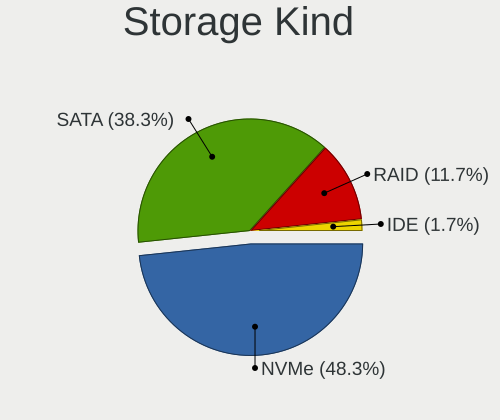

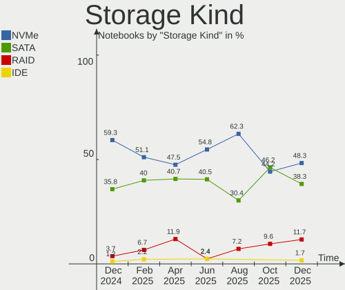

| Kind | Notebooks | Percent |
|------|-----------|---------|
| NVMe | 29        | 48.33%  |
| SATA | 23        | 38.33%  |
| RAID | 7         | 11.67%  |
| IDE  | 1         | 1.67%   |

Processor
---------

CPU Vendor
----------

Processor vendors

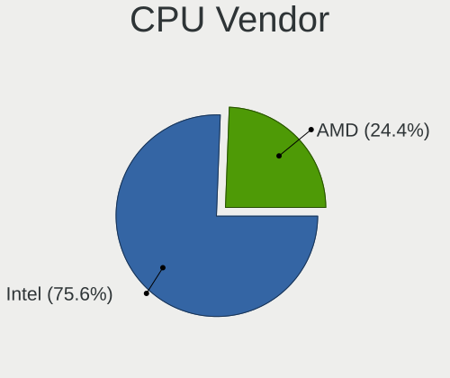

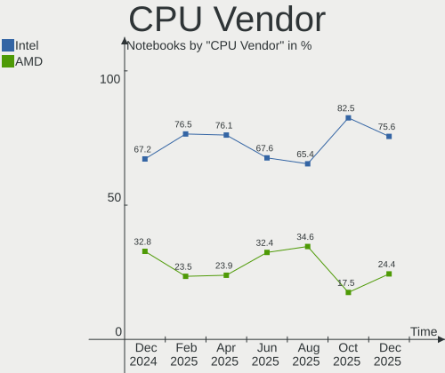

| Vendor | Notebooks | Percent |
|--------|-----------|---------|
| Intel  | 31        | 75.61%  |
| AMD    | 10        | 24.39%  |

CPU Model
---------

Processor models

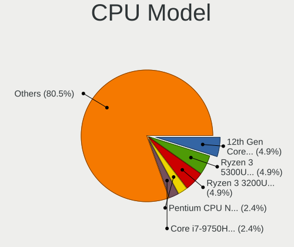

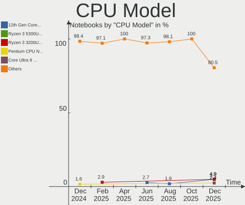

| Model                                         | Notebooks | Percent |
|-----------------------------------------------|-----------|---------|
| Intel 12th Gen Core i5-1235U                  | 2         | 4.88%   |
| AMD Ryzen 3 5300U with Radeon Graphics        | 2         | 4.88%   |
| AMD Ryzen 3 3200U with Radeon Vega Mobile Gfx | 2         | 4.88%   |
| Intel Pentium CPU N3700 @ 1.60GHz             | 1         | 2.44%   |
| Intel Core Ultra 9 285HX                      | 1         | 2.44%   |
| Intel Core Ultra 9 285H                       | 1         | 2.44%   |
| Intel Core Ultra 9 275HX                      | 1         | 2.44%   |
| Intel Core i7-9750H CPU @ 2.60GHz             | 1         | 2.44%   |
| Intel Core i7-8550U CPU @ 1.80GHz             | 1         | 2.44%   |
| Intel Core i7-7500U CPU @ 2.70GHz             | 1         | 2.44%   |
| Intel Core i7-6700 CPU @ 3.40GHz              | 1         | 2.44%   |
| Intel Core i7-4702MQ CPU @ 2.20GHz            | 1         | 2.44%   |
| Intel Core i7-3612QM CPU @ 2.10GHz            | 1         | 2.44%   |
| Intel Core i7-10510U CPU @ 1.80GHz            | 1         | 2.44%   |
| Intel Core i5-8250U CPU @ 1.60GHz             | 1         | 2.44%   |
| Intel Core i5-7Y57 CPU @ 1.20GHz              | 1         | 2.44%   |
| Intel Core i5-7300U CPU @ 2.60GHz             | 1         | 2.44%   |
| Intel Core i5-6300HQ CPU @ 2.30GHz            | 1         | 2.44%   |
| Intel Core i5-4260U CPU @ 1.40GHz             | 1         | 2.44%   |
| Intel Core 2 Duo CPU T7100 @ 1.80GHz          | 1         | 2.44%   |
| Intel Core 2 Duo CPU P7550 @ 2.26GHz          | 1         | 2.44%   |
| Intel Celeron CPU N3350 @ 1.10GHz             | 1         | 2.44%   |
| Intel Celeron CPU N3050 @ 1.60GHz             | 1         | 2.44%   |
| Intel 13th Gen Core i7-13700H                 | 1         | 2.44%   |
| Intel 13th Gen Core i7-13620H                 | 1         | 2.44%   |
| Intel 13th Gen Core i5-13450HX                | 1         | 2.44%   |
| Intel 12th Gen Core i3-1220P                  | 1         | 2.44%   |
| Intel 11th Gen Core i7-11800H @ 2.30GHz       | 1         | 2.44%   |
| Intel 11th Gen Core i7-11370H @ 3.30GHz       | 1         | 2.44%   |
| Intel 11th Gen Core i5-1145G7 @ 2.60GHz       | 1         | 2.44%   |
| Intel 11th Gen Core i5-11400H @ 2.70GHz       | 1         | 2.44%   |
| Intel 11th Gen Core i3-1115G4 @ 3.00GHz       | 1         | 2.44%   |
| AMD Ryzen AI 9 365 w/ Radeon 880M             | 1         | 2.44%   |
| AMD Ryzen 9 9955HX3D 16-Core Processor        | 1         | 2.44%   |
| AMD Ryzen 9 9955HX 16-Core Processor          | 1         | 2.44%   |
| AMD Ryzen 7 PRO 7840U w/ Radeon 780M Graphics | 1         | 2.44%   |
| AMD Ryzen 5 5500U with Radeon Graphics        | 1         | 2.44%   |
| AMD A8-7410 APU with AMD Radeon R5 Graphics   | 1         | 2.44%   |

CPU Model Family
----------------

Processor model prefix

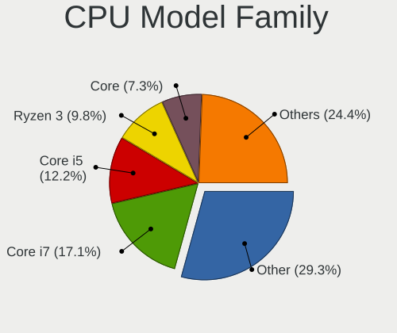

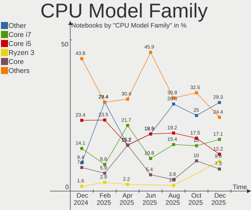

| Model            | Notebooks | Percent |
|------------------|-----------|---------|
| Other            | 12        | 29.27%  |
| Intel Core i7    | 7         | 17.07%  |
| Intel Core i5    | 5         | 12.2%   |
| AMD Ryzen 3      | 4         | 9.76%   |
| Intel Core       | 3         | 7.32%   |
| Intel Core 2 Duo | 2         | 4.88%   |
| Intel Celeron    | 2         | 4.88%   |
| AMD Ryzen 9      | 2         | 4.88%   |
| Intel Pentium    | 1         | 2.44%   |
| AMD Ryzen 7 PRO  | 1         | 2.44%   |
| AMD Ryzen 5      | 1         | 2.44%   |
| AMD A8           | 1         | 2.44%   |

CPU Cores
---------

Number of processor cores

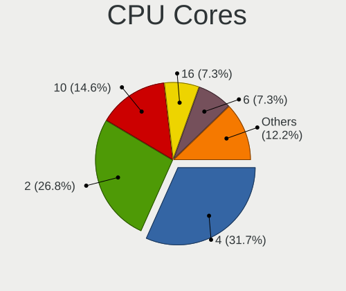

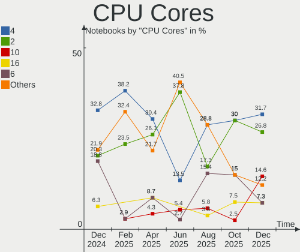

| Number | Notebooks | Percent |
|--------|-----------|---------|
| 4      | 13        | 31.71%  |
| 2      | 11        | 26.83%  |
| 10     | 6         | 14.63%  |
| 16     | 3         | 7.32%   |
| 6      | 3         | 7.32%   |
| 24     | 2         | 4.88%   |
| 8      | 2         | 4.88%   |
| 14     | 1         | 2.44%   |

CPU Sockets
-----------

Number of sockets

| Number | Notebooks | Percent |
|--------|-----------|---------|
| 1      | 41        | 100%    |

CPU Threads
-----------

Threads per core (Hyper-Threading)

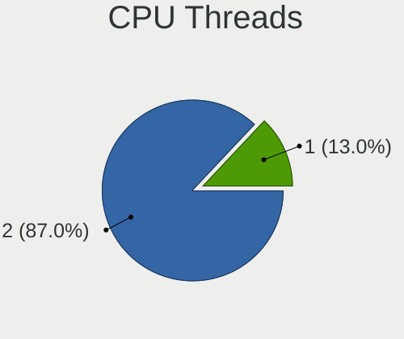

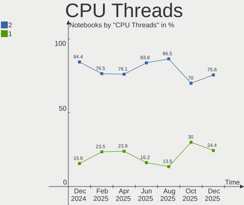

| Number | Notebooks | Percent |
|--------|-----------|---------|
| 2      | 31        | 75.61%  |
| 1      | 10        | 24.39%  |

CPU Op-Modes
------------

CPU Operation Modes (32-bit, 64-bit)

| Op mode        | Notebooks | Percent |
|----------------|-----------|---------|
| 32-bit, 64-bit | 41        | 100%    |

CPU Microcode
-------------

Microcode number

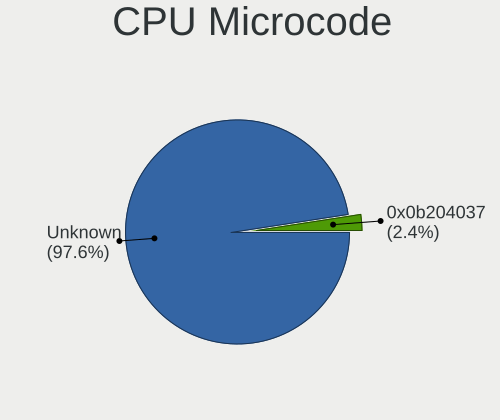

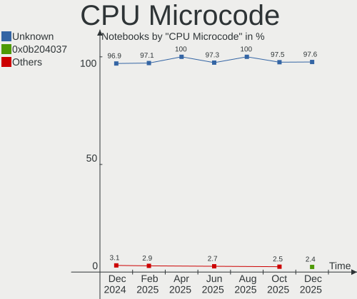

| Number     | Notebooks | Percent |
|------------|-----------|---------|
| Unknown    | 40        | 97.56%  |
| 0x0b204037 | 1         | 2.44%   |

CPU Microarch
-------------

Microarchitecture

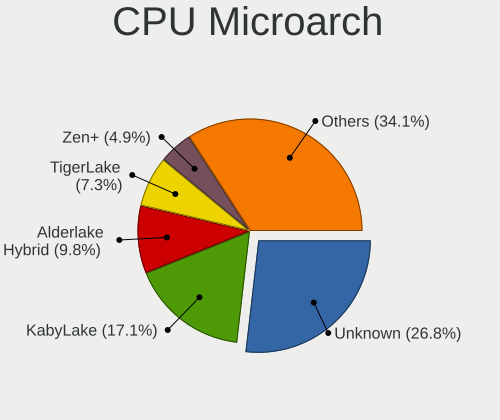

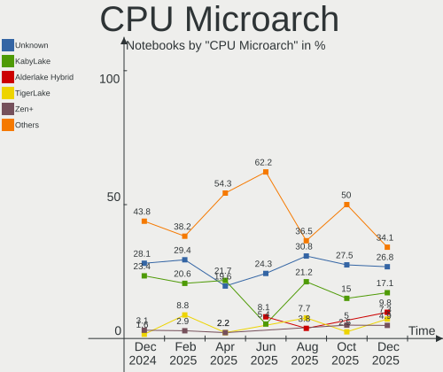

| Name             | Notebooks | Percent |
|------------------|-----------|---------|
| Unknown          | 11        | 26.83%  |
| KabyLake         | 7         | 17.07%  |
| Alderlake Hybrid | 4         | 9.76%   |
| TigerLake        | 3         | 7.32%   |
| Zen+             | 2         | 4.88%   |
| Skylake          | 2         | 4.88%   |
| Silvermont       | 2         | 4.88%   |
| Lunarlake Hybrid | 2         | 4.88%   |
| Haswell          | 2         | 4.88%   |
| Puma             | 1         | 2.44%   |
| Penryn           | 1         | 2.44%   |
| IvyBridge        | 1         | 2.44%   |
| Icelake          | 1         | 2.44%   |
| Goldmont         | 1         | 2.44%   |
| Core             | 1         | 2.44%   |

Graphics
--------

GPU Vendor
----------

Vendors of graphics cards

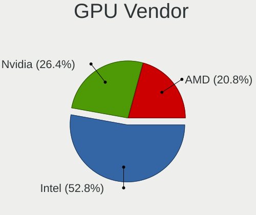

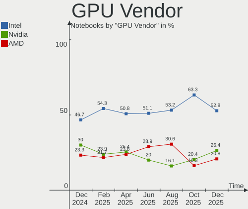

| Vendor | Notebooks | Percent |
|--------|-----------|---------|
| Intel  | 28        | 52.83%  |
| Nvidia | 14        | 26.42%  |
| AMD    | 11        | 20.75%  |

GPU Model
---------

Graphics card models

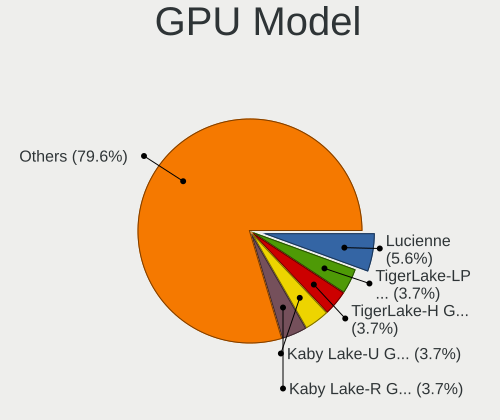

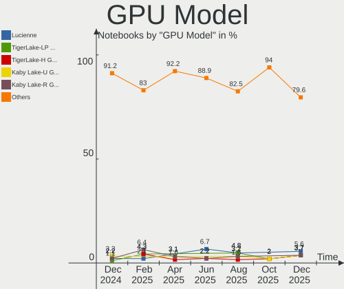

| Model                                                                                    | Notebooks | Percent |
|------------------------------------------------------------------------------------------|-----------|---------|
| AMD Lucienne                                                                             | 3         | 5.56%   |
| Intel TigerLake-LP GT2 [Iris Xe Graphics]                                                | 2         | 3.7%    |
| Intel TigerLake-H GT1 [UHD Graphics]                                                     | 2         | 3.7%    |
| Intel Kaby Lake-U GT2 [HD Graphics 620]                                                  | 2         | 3.7%    |
| Intel Kaby Lake-R GT2 [UHD Graphics 620]                                                 | 2         | 3.7%    |
| Intel Atom/Celeron/Pentium Processor x5-E8000/J3xxx/N3xxx Integrated Graphics Controller | 2         | 3.7%    |
| Intel Arrow Lake-S [Intel Graphics]                                                      | 2         | 3.7%    |
| AMD Picasso/Raven 2 [Radeon Vega Series / Radeon Vega Mobile Series]                     | 2         | 3.7%    |
| AMD Granite Ridge [Radeon Graphics]                                                      | 2         | 3.7%    |
| Nvidia TU104BM [GeForce RTX 2080 Mobile]                                                 | 1         | 1.85%   |
| Nvidia GM204M [GeForce GTX 980 Mobile]                                                   | 1         | 1.85%   |
| Nvidia GM204M [GeForce GTX 960 OEM / 970M]                                               | 1         | 1.85%   |
| Nvidia GM107M [GeForce GTX 950M]                                                         | 1         | 1.85%   |
| Nvidia GB205M [GeForce RTX 5070 Ti Mobile]                                               | 1         | 1.85%   |
| Nvidia GB203M / GN22-X11 [GeForce RTX 5090 Max-Q / Mobile]                               | 1         | 1.85%   |
| Nvidia GB203M / GN22 [GeForce RTX 5090 Max-Q / Mobile]                                   | 1         | 1.85%   |
| Nvidia GB203GLM [RTX PRO 5000 Blackwell Generation Laptop GPU]                           | 1         | 1.85%   |
| Nvidia GA107M [GeForce RTX 3050 Mobile]                                                  | 1         | 1.85%   |
| Nvidia GA107M [GeForce RTX 2050]                                                         | 1         | 1.85%   |
| Nvidia GA107BM / GN20-P0-R-K2 [GeForce RTX 3050 6GB Laptop GPU]                          | 1         | 1.85%   |
| Nvidia GA106M [GeForce RTX 3060 Mobile / Max-Q]                                          | 1         | 1.85%   |
| Nvidia C79 [GeForce 9400M]                                                               | 1         | 1.85%   |
| Nvidia AD107M [GeForce RTX 4050 Max-Q / Mobile]                                          | 1         | 1.85%   |
| Intel Tiger Lake-LP GT2 [UHD Graphics G4]                                                | 1         | 1.85%   |
| Intel Skylake-H GT2 [HD Graphics 530]                                                    | 1         | 1.85%   |
| Intel Raptor Lake-S UHD Graphics                                                         | 1         | 1.85%   |
| Intel Raptor Lake-P [UHD Graphics]                                                       | 1         | 1.85%   |
| Intel Raptor Lake-P [Iris Xe Graphics]                                                   | 1         | 1.85%   |
| Intel Mobile GM965/GL960 Integrated Graphics Controller (secondary)                      | 1         | 1.85%   |
| Intel Mobile GM965/GL960 Integrated Graphics Controller (primary)                        | 1         | 1.85%   |
| Intel Kaby Lake-Y GT2 [HD Graphics 615]                                                  | 1         | 1.85%   |
| Intel Haswell-ULT Integrated Graphics Controller                                         | 1         | 1.85%   |
| Intel CometLake-U GT2 [UHD Graphics]                                                     | 1         | 1.85%   |
| Intel Arrow Lake-P [Arc Pro 130T/140T]                                                   | 1         | 1.85%   |
| Intel Apollo Lake GT1 [HD Graphics 500]                                                  | 1         | 1.85%   |
| Intel Alder Lake-UP3 GT2 [UHD Graphics]                                                  | 1         | 1.85%   |
| Intel Alder Lake-UP3 GT2 [Iris Xe Graphics]                                              | 1         | 1.85%   |
| Intel Alder Lake-UP3 GT1 [UHD Graphics]                                                  | 1         | 1.85%   |
| Intel 4th Gen Core Processor Integrated Graphics Controller                              | 1         | 1.85%   |
| Intel 3rd Gen Core processor Graphics Controller                                         | 1         | 1.85%   |

GPU Combo
---------

Combinations of graphics cards

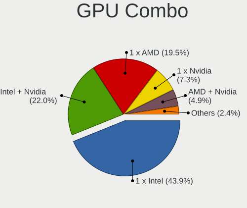

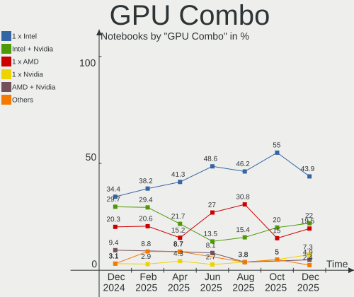

| Name           | Notebooks | Percent |
|----------------|-----------|---------|
| 1 x Intel      | 18        | 43.9%   |
| Intel + Nvidia | 9         | 21.95%  |
| 1 x AMD        | 8         | 19.51%  |
| 1 x Nvidia     | 3         | 7.32%   |
| AMD + Nvidia   | 2         | 4.88%   |
| Intel + AMD    | 1         | 2.44%   |

GPU Driver
----------

Free vs proprietary

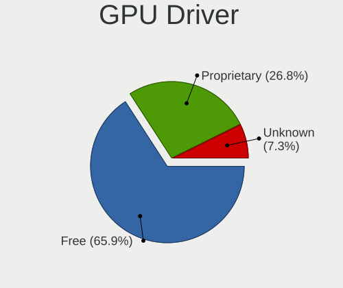

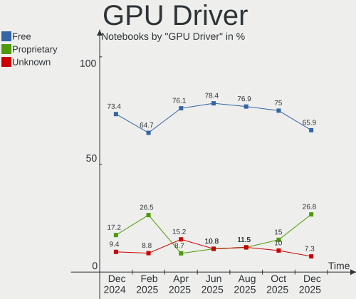

| Driver      | Notebooks | Percent |
|-------------|-----------|---------|
| Free        | 27        | 65.85%  |
| Proprietary | 11        | 26.83%  |
| Unknown     | 3         | 7.32%   |

GPU Memory
----------

Total video memory

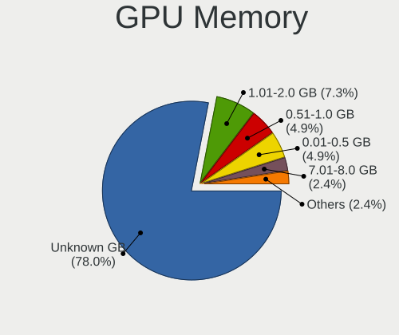

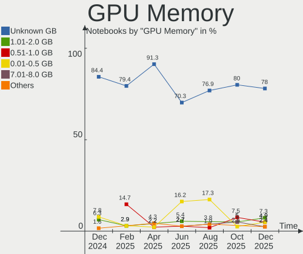

| Size in GB | Notebooks | Percent |
|------------|-----------|---------|
| Unknown    | 32        | 78.05%  |
| 1.01-2.0   | 3         | 7.32%   |
| 0.51-1.0   | 2         | 4.88%   |
| 0.01-0.5   | 2         | 4.88%   |
| 7.01-8.0   | 1         | 2.44%   |
| 3.01-4.0   | 1         | 2.44%   |

Monitor
-------

Monitor Vendor
--------------

Monitor vendors

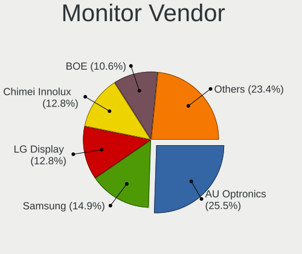

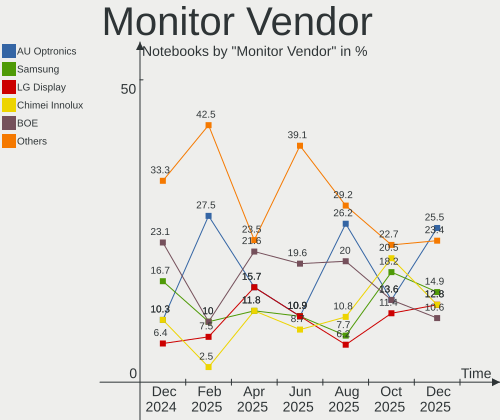

| Vendor              | Notebooks | Percent |
|---------------------|-----------|---------|
| AU Optronics        | 12        | 25.53%  |
| Samsung Electronics | 7         | 14.89%  |
| LG Display          | 6         | 12.77%  |
| Chimei Innolux      | 6         | 12.77%  |
| BOE                 | 5         | 10.64%  |
| Apple               | 3         | 6.38%   |
| Lenovo              | 2         | 4.26%   |
| CSOT                | 2         | 4.26%   |
| Sony                | 1         | 2.13%   |
| Sharp               | 1         | 2.13%   |
| Philips             | 1         | 2.13%   |
| Goldstar            | 1         | 2.13%   |

Monitor Model
-------------

Monitor models

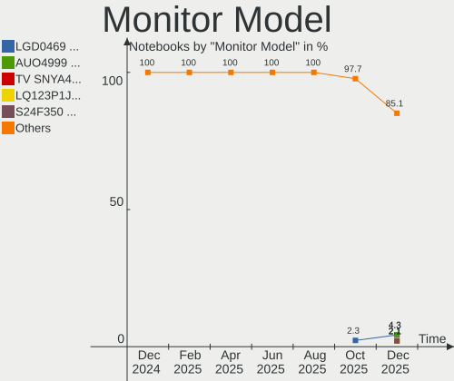

| Model                                                                 | Notebooks | Percent |
|-----------------------------------------------------------------------|-----------|---------|
| LG Display LCD Monitor LGD0469 1920x1080 382x215mm 17.3-inch          | 2         | 4.26%   |
| AU Optronics LCD Monitor AUO4999 1920x1080 344x193mm 15.5-inch        | 2         | 4.26%   |
| Sony TV SNYA401 1920x1080                                             | 1         | 2.13%   |
| Sharp LQ123P1JX32 SHP148A 2400x1600 259x173mm 12.3-inch               | 1         | 2.13%   |
| Samsung Electronics S24F350 SAM0D20 1920x1080 521x293mm 23.5-inch     | 1         | 2.13%   |
| Samsung Electronics LF24T35 SAM707E 1920x1080 528x297mm 23.9-inch     | 1         | 2.13%   |
| Samsung Electronics LCD Monitor SDC4188 2880x1800 312x195mm 14.5-inch | 1         | 2.13%   |
| Samsung Electronics LCD Monitor SDC324C 1920x1080 344x194mm 15.5-inch | 1         | 2.13%   |
| Samsung Electronics C32R50x SAM7000 1920x1080 698x393mm 31.5-inch     | 1         | 2.13%   |
| Samsung Electronics ATNA60HU02-0  SDC421B                             | 1         | 2.13%   |
| Samsung Electronics ATNA60HU01-0  SDC420B                             | 1         | 2.13%   |
| Philips PHL 276B1 PHL0947 2560x1440 600x340mm 27.2-inch               | 1         | 2.13%   |
| LG Display LCD Monitor LGD065A 1920x1080 344x194mm 15.5-inch          | 1         | 2.13%   |
| LG Display LCD Monitor LGD05F6 1920x1080 309x174mm 14.0-inch          | 1         | 2.13%   |
| LG Display LCD Monitor LGD0590 1920x1080 344x194mm 15.5-inch          | 1         | 2.13%   |
| LG Display LCD Monitor LGD0493 1366x768 344x194mm 15.5-inch           | 1         | 2.13%   |
| Lenovo LCD Monitor LEN41AD 1920x1200 286x178mm 13.3-inch              | 1         | 2.13%   |
| Lenovo LCD Monitor LEN40BA 1920x1080 344x194mm 15.5-inch              | 1         | 2.13%   |
| Goldstar HDR WFHD GSM5BBC 2560x1080 798x334mm 34.1-inch               | 1         | 2.13%   |
| CSOT LCD Monitor CSO140C 2880x1800 302x188mm 14.0-inch                | 1         | 2.13%   |
| CSOT LCD Monitor CSO1402 2880x1800 302x188mm 14.0-inch                | 1         | 2.13%   |
| Chimei Innolux LCD Monitor CMN1731 1600x900 382x215mm 17.3-inch       | 1         | 2.13%   |
| Chimei Innolux LCD Monitor CMN1606 1920x1080 355x199mm 16.0-inch      | 1         | 2.13%   |
| Chimei Innolux LCD Monitor CMN1522 1920x1080 344x193mm 15.5-inch      | 1         | 2.13%   |
| Chimei Innolux LCD Monitor CMN14E7 1920x1080 309x173mm 13.9-inch      | 1         | 2.13%   |
| Chimei Innolux LCD Monitor CMN1494 1366x768 309x173mm 13.9-inch       | 1         | 2.13%   |
| Chimei Innolux LCD Monitor CMN142A 1920x1080 309x173mm 13.9-inch      | 1         | 2.13%   |
| BOE LCD Monitor BOE0D43 3840x2400 345x215mm 16.0-inch                 | 1         | 2.13%   |
| BOE LCD Monitor BOE0C11 2880x1920 285x190mm 13.5-inch                 | 1         | 2.13%   |
| BOE LCD Monitor BOE0910 1920x1080 344x194mm 15.5-inch                 | 1         | 2.13%   |
| BOE LCD Monitor BOE0868 1920x1080 309x174mm 14.0-inch                 | 1         | 2.13%   |
| BOE LCD Monitor BOE083B 1920x1080 344x193mm 15.5-inch                 | 1         | 2.13%   |
| AU Optronics LCD Monitor AUOF390 1366x768 309x173mm 13.9-inch         | 1         | 2.13%   |
| AU Optronics LCD Monitor AUOE48D 1920x1080 344x194mm 15.5-inch        | 1         | 2.13%   |
| AU Optronics LCD Monitor AUOD0A2 1920x1080 344x193mm 15.5-inch        | 1         | 2.13%   |
| AU Optronics LCD Monitor AUOC5AC 3840x2400 387x242mm 18.0-inch        | 1         | 2.13%   |
| AU Optronics LCD Monitor AUO5890 1366x768 344x193mm 15.5-inch         | 1         | 2.13%   |
| AU Optronics LCD Monitor AUO403D 1920x1080 309x174mm 14.0-inch        | 1         | 2.13%   |
| AU Optronics LCD Monitor AUO255C 1366x768 256x144mm 11.6-inch         | 1         | 2.13%   |
| AU Optronics LCD Monitor AUO235C 1366x768 256x144mm 11.6-inch         | 1         | 2.13%   |

Monitor Resolution
------------------

Monitor screen resolution

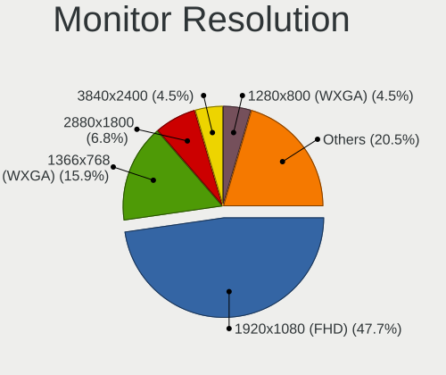

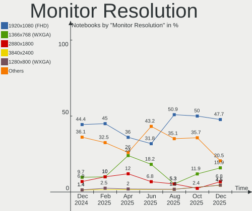

| Resolution        | Notebooks | Percent |
|-------------------|-----------|---------|
| 1920x1080 (FHD)   | 21        | 47.73%  |
| 1366x768 (WXGA)   | 7         | 15.91%  |
| 2880x1800         | 3         | 6.82%   |
| 3840x2400         | 2         | 4.55%   |
| 1280x800 (WXGA)   | 2         | 4.55%   |
| Unknown           | 2         | 4.55%   |
| 2880x1920         | 1         | 2.27%   |
| 2560x1440 (QHD)   | 1         | 2.27%   |
| 2560x1080         | 1         | 2.27%   |
| 2400x1600         | 1         | 2.27%   |
| 1920x1200 (WUXGA) | 1         | 2.27%   |
| 1600x900 (HD+)    | 1         | 2.27%   |
| 1440x900 (WXGA+)  | 1         | 2.27%   |

Monitor Diagonal
----------------

Diagonal size in inches

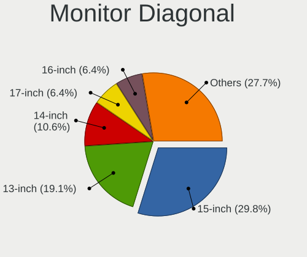

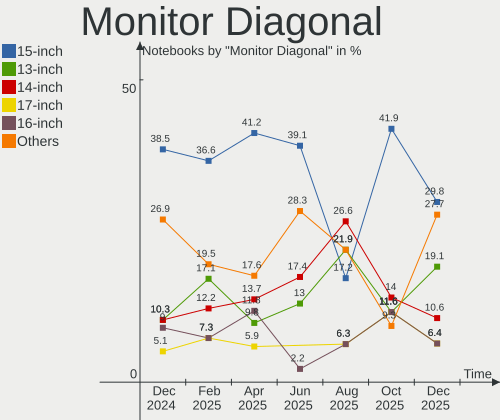

| Inches  | Notebooks | Percent |
|---------|-----------|---------|
| 15      | 14        | 29.79%  |
| 13      | 9         | 19.15%  |
| 14      | 5         | 10.64%  |
| 17      | 3         | 6.38%   |
| 16      | 3         | 6.38%   |
| 23      | 2         | 4.26%   |
| 11      | 2         | 4.26%   |
| Unknown | 2         | 4.26%   |
| 72      | 1         | 2.13%   |
| 34      | 1         | 2.13%   |
| 31      | 1         | 2.13%   |
| 27      | 1         | 2.13%   |
| 21      | 1         | 2.13%   |
| 18      | 1         | 2.13%   |
| 12      | 1         | 2.13%   |

Monitor Width
-------------

Physical width

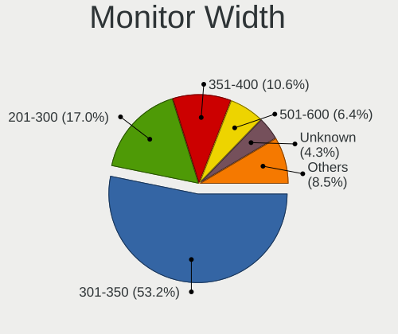

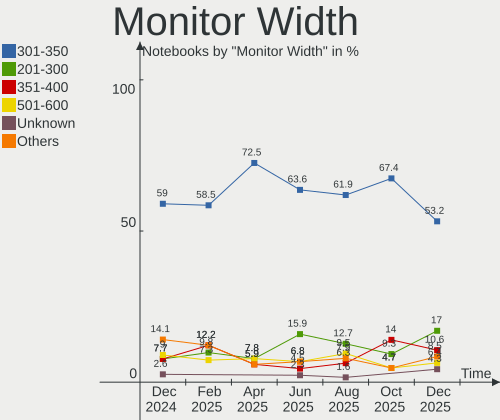

| Width in mm | Notebooks | Percent |
|-------------|-----------|---------|
| 301-350     | 25        | 53.19%  |
| 201-300     | 8         | 17.02%  |
| 351-400     | 5         | 10.64%  |
| 501-600     | 3         | 6.38%   |
| Unknown     | 2         | 4.26%   |
| 701-800     | 1         | 2.13%   |
| 601-700     | 1         | 2.13%   |
| 401-500     | 1         | 2.13%   |
| 1501-2000   | 1         | 2.13%   |

Aspect Ratio
------------

Proportional relationship between the width and the height

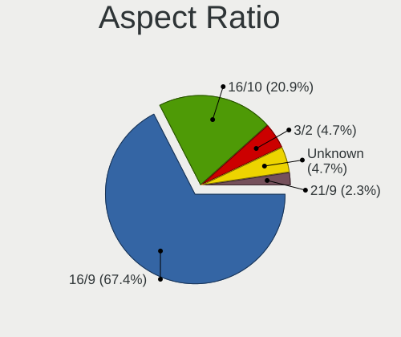

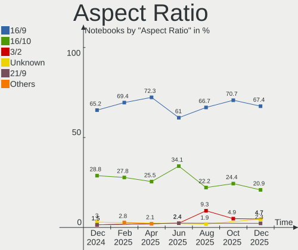

| Ratio   | Notebooks | Percent |
|---------|-----------|---------|
| 16/9    | 29        | 67.44%  |
| 16/10   | 9         | 20.93%  |
| 3/2     | 2         | 4.65%   |
| Unknown | 2         | 4.65%   |
| 21/9    | 1         | 2.33%   |

Monitor Area
------------

Area in inch²

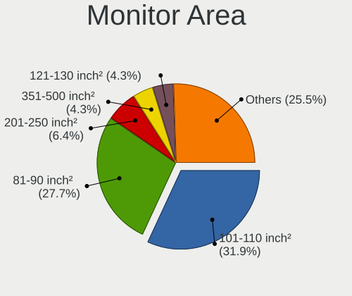

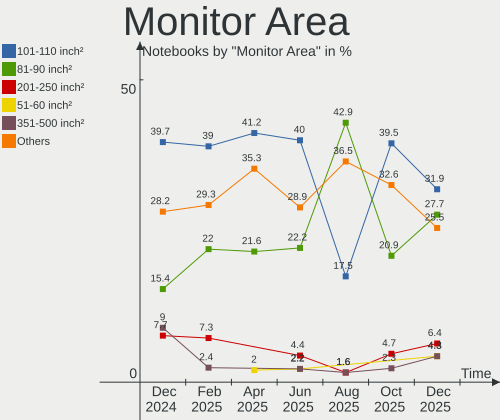

| Area in inch² | Notebooks | Percent |
|----------------|-----------|---------|
| 101-110        | 15        | 31.91%  |
| 81-90          | 13        | 27.66%  |
| 201-250        | 3         | 6.38%   |
| 51-60          | 2         | 4.26%   |
| 351-500        | 2         | 4.26%   |
| 121-130        | 2         | 4.26%   |
| 111-120        | 2         | 4.26%   |
| Unknown        | 2         | 4.26%   |
| More than 1000 | 1         | 2.13%   |
| 71-80          | 1         | 2.13%   |
| 61-70          | 1         | 2.13%   |
| 301-350        | 1         | 2.13%   |
| 141-150        | 1         | 2.13%   |
| 131-140        | 1         | 2.13%   |

Pixel Density
-------------

Pixels per inch

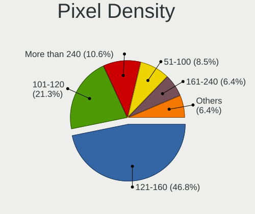

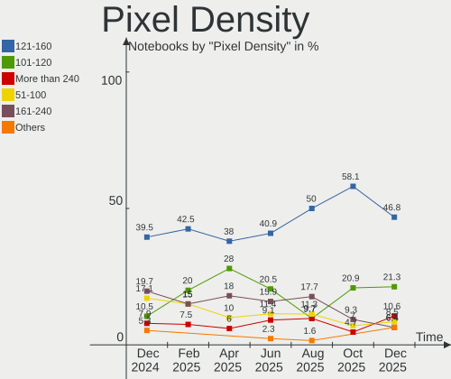

| Density       | Notebooks | Percent |
|---------------|-----------|---------|
| 121-160       | 22        | 46.81%  |
| 101-120       | 10        | 21.28%  |
| More than 240 | 5         | 10.64%  |
| 51-100        | 4         | 8.51%   |
| 161-240       | 3         | 6.38%   |
| Unknown       | 2         | 4.26%   |
| 1-50          | 1         | 2.13%   |

Multiple Monitors
-----------------

Total monitors connected

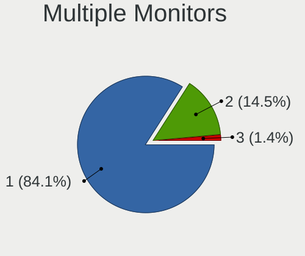

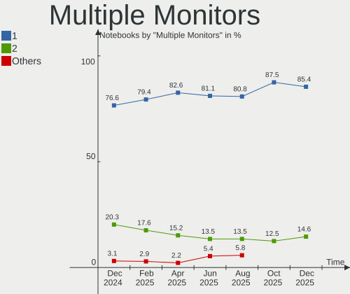

| Total | Notebooks | Percent |
|-------|-----------|---------|
| 1     | 35        | 85.37%  |
| 2     | 6         | 14.63%  |

Network
-------

Net Controller Vendor
---------------------

Controller vendors

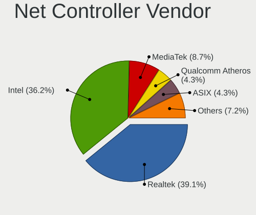

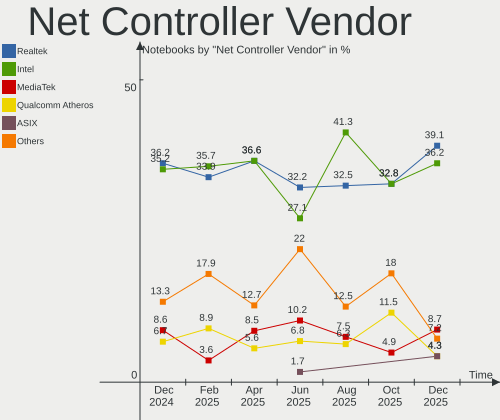

| Vendor                | Notebooks | Percent |
|-----------------------|-----------|---------|
| Realtek Semiconductor | 27        | 39.13%  |
| Intel                 | 25        | 36.23%  |
| MediaTek              | 6         | 8.7%    |
| Qualcomm Atheros      | 3         | 4.35%   |
| ASIX Electronics      | 3         | 4.35%   |
| Samsung Electronics   | 1         | 1.45%   |
| Qualcomm              | 1         | 1.45%   |
| Nvidia                | 1         | 1.45%   |
| Broadcom Limited      | 1         | 1.45%   |
| Broadcom              | 1         | 1.45%   |

Net Controller Model
--------------------

Controller models

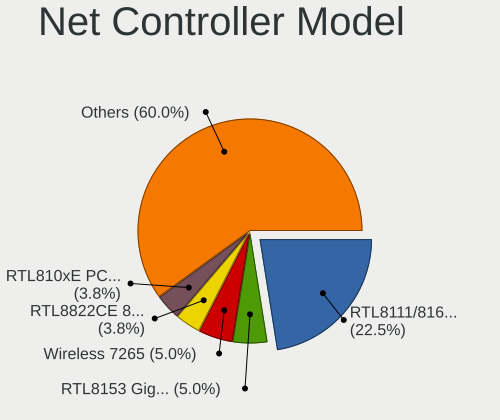

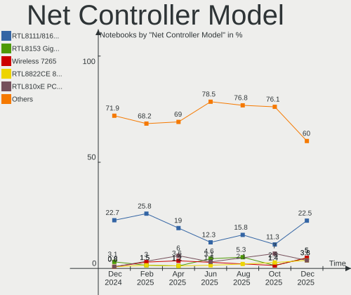

| Model                                                                           | Notebooks | Percent |
|---------------------------------------------------------------------------------|-----------|---------|
| Realtek RTL8111/8168/8211/8411 PCI Express Gigabit Ethernet Controller          | 18        | 22.5%   |
| Realtek RTL8153 Gigabit Ethernet Adapter                                        | 4         | 5%      |
| Intel Wireless 7265                                                             | 4         | 5%      |
| Realtek RTL8822CE 802.11ac PCIe Wireless Network Adapter                        | 3         | 3.75%   |
| Realtek RTL810xE PCI Express Fast Ethernet controller                           | 3         | 3.75%   |
| ASIX AX88179 Gigabit Ethernet                                                   | 3         | 3.75%   |
| Realtek RTL8125 2.5GbE Controller                                               | 2         | 2.5%    |
| Intel Wireless 8265 / 8275                                                      | 2         | 2.5%    |
| Intel Wireless 8260                                                             | 2         | 2.5%    |
| Intel Wi-Fi 7(802.11be) AX1775*/AX1790*/BE20*/BE401/BE1750* 2x2                 | 2         | 2.5%    |
| Intel Wi-Fi 6 AX201                                                             | 2         | 2.5%    |
| Intel Wi-Fi 6 AX200                                                             | 2         | 2.5%    |
| Intel Raptor Lake PCH CNVi WiFi                                                 | 2         | 2.5%    |
| Samsung GT-I9070 (network tethering, USB debugging enabled)                     | 1         | 1.25%   |
| Realtek RTL88x2bu [AC1200 Techkey]                                              | 1         | 1.25%   |
| Realtek RTL8852BE PCIe 802.11ax Wireless Network Controller                     | 1         | 1.25%   |
| Realtek RTL8188EE Wireless Network Adapter                                      | 1         | 1.25%   |
| Qualcomm QCNFA765 Wireless Network Adapter                                      | 1         | 1.25%   |
| Qualcomm Atheros QCA9565 / AR9565 Wireless Network Adapter                      | 1         | 1.25%   |
| Qualcomm Atheros QCA6174 802.11ac Wireless Network Adapter                      | 1         | 1.25%   |
| Qualcomm Atheros Killer E2400 Gigabit Ethernet Controller                       | 1         | 1.25%   |
| Nvidia MCP79 Ethernet                                                           | 1         | 1.25%   |
| MediaTek MT7927 802.11be 320MHz 2x2 PCIe Wireless Network Adapter [Filogic 380] | 1         | 1.25%   |
| MediaTek MT7925 802.11be 160MHz 2x2 PCIe Wireless Network Adapter [Filogic 360] | 1         | 1.25%   |
| MediaTek MT7922 802.11ax PCI Express Wireless Network Adapter                   | 1         | 1.25%   |
| MediaTek MT7921 802.11ax PCIe Wireless Network Adapter [Filogic 330]            | 1         | 1.25%   |
| MediaTek MT7902 802.11ax PCIe Wireless Network Adapter [Filogic 310]            | 1         | 1.25%   |
| MediaTek MT7630e 802.11bgn Wireless Network Adapter                             | 1         | 1.25%   |
| Intel Wi-Fi 5(802.11ac) Wireless-AC 9x6x [Thunder Peak]                         | 1         | 1.25%   |
| Intel Tiger Lake PCH CNVi WiFi                                                  | 1         | 1.25%   |
| Intel PRO/Wireless 4965 AG or AGN [Kedron] Network Connection                   | 1         | 1.25%   |
| Intel Ethernet Controller I226-V                                                | 1         | 1.25%   |
| Intel Ethernet Controller I226-LM                                               | 1         | 1.25%   |
| Intel Ethernet Connection (4) I219-LM                                           | 1         | 1.25%   |
| Intel Ethernet Connection (16) I219-V                                           | 1         | 1.25%   |
| Intel Ethernet Connection (14) I219-V                                           | 1         | 1.25%   |
| Intel Ethernet Connection (13) I219-LM                                          | 1         | 1.25%   |
| Intel Dual Band Wireless-AC 3165 Plus Bluetooth                                 | 1         | 1.25%   |
| Intel Centrino Wireless-N 2230                                                  | 1         | 1.25%   |
| Intel Cannon Lake PCH CNVi WiFi                                                 | 1         | 1.25%   |

Wireless Vendor
---------------

Wireless vendors

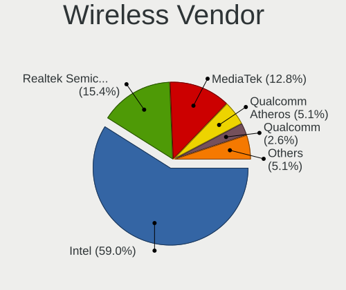

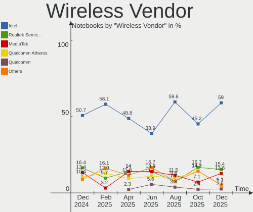

| Vendor                | Notebooks | Percent |
|-----------------------|-----------|---------|
| Intel                 | 23        | 58.97%  |
| Realtek Semiconductor | 6         | 15.38%  |
| MediaTek              | 5         | 12.82%  |
| Qualcomm Atheros      | 2         | 5.13%   |
| Qualcomm              | 1         | 2.56%   |
| Broadcom Limited      | 1         | 2.56%   |
| Broadcom              | 1         | 2.56%   |

Wireless Model
--------------

Wireless models

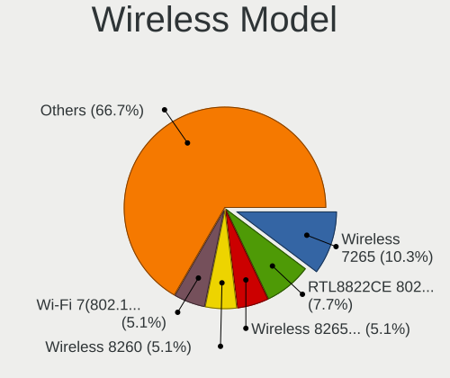

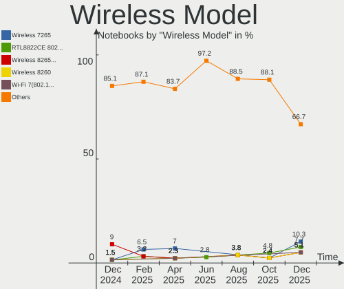

| Model                                                                           | Notebooks | Percent |
|---------------------------------------------------------------------------------|-----------|---------|
| Intel Wireless 7265                                                             | 4         | 10.26%  |
| Realtek RTL8822CE 802.11ac PCIe Wireless Network Adapter                        | 3         | 7.69%   |
| Intel Wireless 8265 / 8275                                                      | 2         | 5.13%   |
| Intel Wireless 8260                                                             | 2         | 5.13%   |
| Intel Wi-Fi 7(802.11be) AX1775*/AX1790*/BE20*/BE401/BE1750* 2x2                 | 2         | 5.13%   |
| Intel Wi-Fi 6 AX201                                                             | 2         | 5.13%   |
| Intel Wi-Fi 6 AX200                                                             | 2         | 5.13%   |
| Intel Raptor Lake PCH CNVi WiFi                                                 | 2         | 5.13%   |
| Realtek RTL88x2bu [AC1200 Techkey]                                              | 1         | 2.56%   |
| Realtek RTL8852BE PCIe 802.11ax Wireless Network Controller                     | 1         | 2.56%   |
| Realtek RTL8188EE Wireless Network Adapter                                      | 1         | 2.56%   |
| Qualcomm QCNFA765 Wireless Network Adapter                                      | 1         | 2.56%   |
| Qualcomm Atheros QCA9565 / AR9565 Wireless Network Adapter                      | 1         | 2.56%   |
| Qualcomm Atheros QCA6174 802.11ac Wireless Network Adapter                      | 1         | 2.56%   |
| MediaTek MT7925 802.11be 160MHz 2x2 PCIe Wireless Network Adapter [Filogic 360] | 1         | 2.56%   |
| MediaTek MT7922 802.11ax PCI Express Wireless Network Adapter                   | 1         | 2.56%   |
| MediaTek MT7921 802.11ax PCIe Wireless Network Adapter [Filogic 330]            | 1         | 2.56%   |
| MediaTek MT7902 802.11ax PCIe Wireless Network Adapter [Filogic 310]            | 1         | 2.56%   |
| MediaTek MT7630e 802.11bgn Wireless Network Adapter                             | 1         | 2.56%   |
| Intel Wi-Fi 5(802.11ac) Wireless-AC 9x6x [Thunder Peak]                         | 1         | 2.56%   |
| Intel Tiger Lake PCH CNVi WiFi                                                  | 1         | 2.56%   |
| Intel PRO/Wireless 4965 AG or AGN [Kedron] Network Connection                   | 1         | 2.56%   |
| Intel Dual Band Wireless-AC 3165 Plus Bluetooth                                 | 1         | 2.56%   |
| Intel Centrino Wireless-N 2230                                                  | 1         | 2.56%   |
| Intel Cannon Lake PCH CNVi WiFi                                                 | 1         | 2.56%   |
| Intel 700 Series Chipset CNVi WiFi                                              | 1         | 2.56%   |
| Broadcom Limited BCM4360 802.11ac Dual Band Wireless Network Adapter            | 1         | 2.56%   |
| Broadcom BCM43142 802.11b/g/n                                                   | 1         | 2.56%   |

Ethernet Vendor
---------------

Ethernet vendors

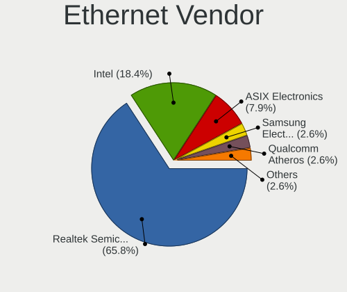

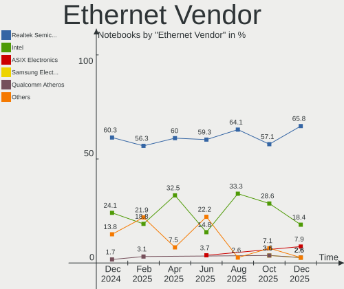

| Vendor                | Notebooks | Percent |
|-----------------------|-----------|---------|
| Realtek Semiconductor | 25        | 65.79%  |
| Intel                 | 7         | 18.42%  |
| ASIX Electronics      | 3         | 7.89%   |
| Samsung Electronics   | 1         | 2.63%   |
| Qualcomm Atheros      | 1         | 2.63%   |
| Nvidia                | 1         | 2.63%   |

Ethernet Model
--------------

Ethernet models

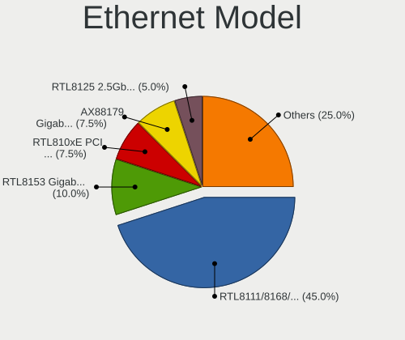

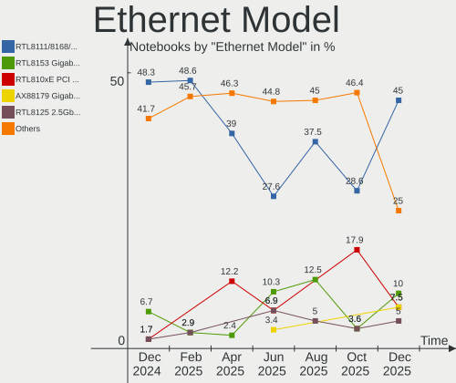

| Model                                                                  | Notebooks | Percent |
|------------------------------------------------------------------------|-----------|---------|
| Realtek RTL8111/8168/8211/8411 PCI Express Gigabit Ethernet Controller | 18        | 45%     |
| Realtek RTL8153 Gigabit Ethernet Adapter                               | 4         | 10%     |
| Realtek RTL810xE PCI Express Fast Ethernet controller                  | 3         | 7.5%    |
| ASIX AX88179 Gigabit Ethernet                                          | 3         | 7.5%    |
| Realtek RTL8125 2.5GbE Controller                                      | 2         | 5%      |
| Samsung GT-I9070 (network tethering, USB debugging enabled)            | 1         | 2.5%    |
| Qualcomm Atheros Killer E2400 Gigabit Ethernet Controller              | 1         | 2.5%    |
| Nvidia MCP79 Ethernet                                                  | 1         | 2.5%    |
| Intel Ethernet Controller I226-V                                       | 1         | 2.5%    |
| Intel Ethernet Controller I226-LM                                      | 1         | 2.5%    |
| Intel Ethernet Connection (4) I219-LM                                  | 1         | 2.5%    |
| Intel Ethernet Connection (16) I219-V                                  | 1         | 2.5%    |
| Intel Ethernet Connection (14) I219-V                                  | 1         | 2.5%    |
| Intel Ethernet Connection (13) I219-LM                                 | 1         | 2.5%    |
| Intel Arrow Lake CNVi WiFi                                             | 1         | 2.5%    |

Net Controller Kind
-------------------

Ethernet, WiFi or modem

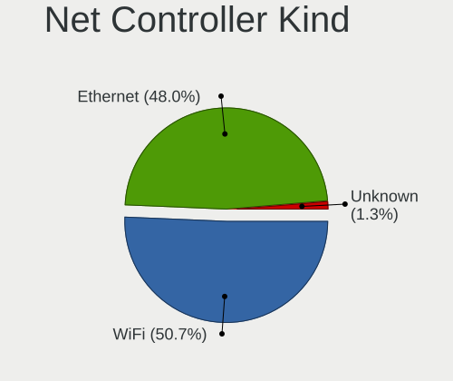

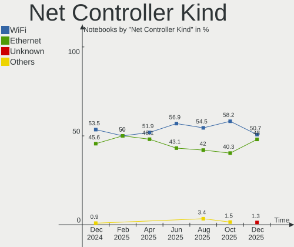

| Kind     | Notebooks | Percent |
|----------|-----------|---------|
| WiFi     | 38        | 50.67%  |
| Ethernet | 36        | 48%     |
| Unknown  | 1         | 1.33%   |

Used Controller
---------------

Currently used network controller

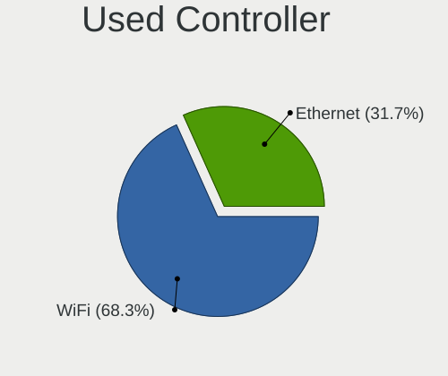

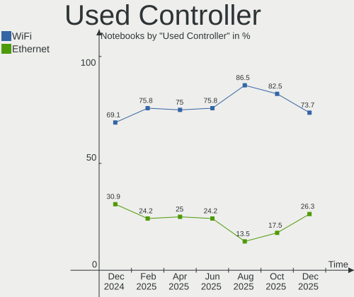

| Kind     | Notebooks | Percent |
|----------|-----------|---------|
| WiFi     | 28        | 73.68%  |
| Ethernet | 10        | 26.32%  |

NICs
----

Total network controllers on board

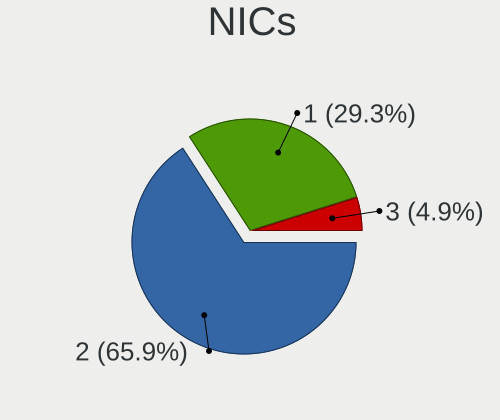

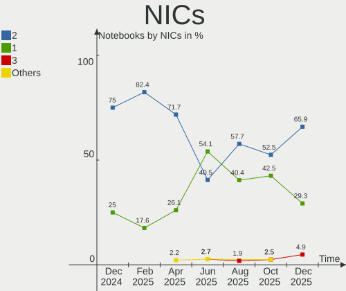

| Total | Notebooks | Percent |
|-------|-----------|---------|
| 2     | 27        | 65.85%  |
| 1     | 12        | 29.27%  |
| 3     | 2         | 4.88%   |

IPv6
----

IPv6 vs IPv4

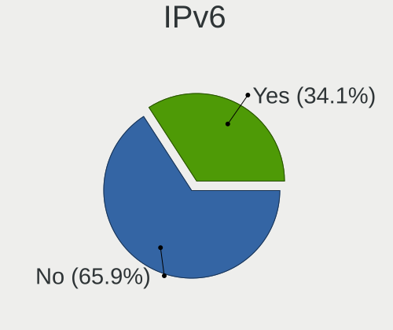

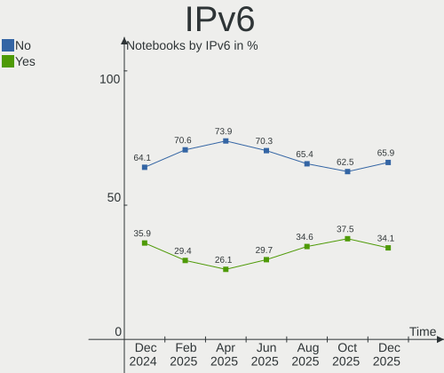

| Used | Notebooks | Percent |
|------|-----------|---------|
| No   | 27        | 65.85%  |
| Yes  | 14        | 34.15%  |

Bluetooth
---------

Bluetooth Vendor
----------------

Controller vendors

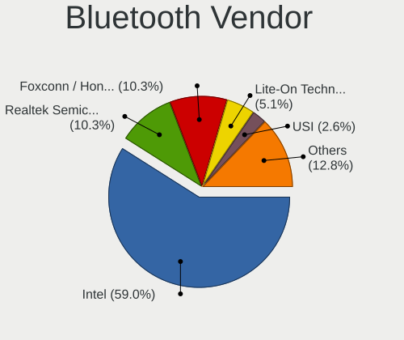

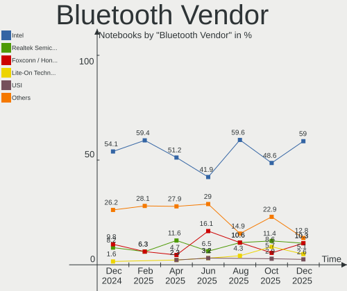

| Vendor                | Notebooks | Percent |
|-----------------------|-----------|---------|
| Intel                 | 23        | 58.97%  |
| Realtek Semiconductor | 4         | 10.26%  |
| Foxconn / Hon Hai     | 4         | 10.26%  |
| Lite-On Technology    | 2         | 5.13%   |
| USI                   | 1         | 2.56%   |
| Toshiba               | 1         | 2.56%   |
| MediaTek              | 1         | 2.56%   |
| IMC Networks          | 1         | 2.56%   |
| Broadcom              | 1         | 2.56%   |
| Apple                 | 1         | 2.56%   |

Bluetooth Model
---------------

Controller models

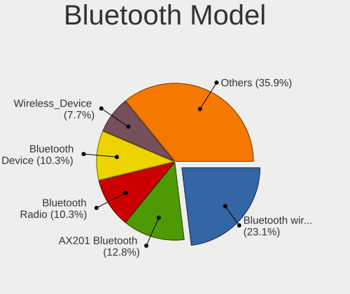

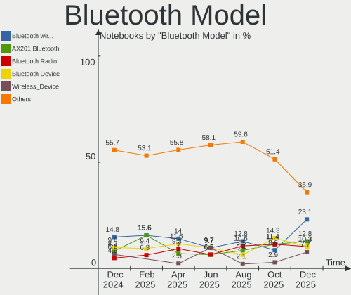

| Model                                          | Notebooks | Percent |
|------------------------------------------------|-----------|---------|
| Intel Bluetooth wireless interface             | 9         | 23.08%  |
| Intel AX201 Bluetooth                          | 5         | 12.82%  |
| Realtek Bluetooth Radio                        | 4         | 10.26%  |
| Intel Bluetooth Device                         | 4         | 10.26%  |
| Foxconn / Hon Hai Wireless_Device              | 3         | 7.69%   |
| Intel AX200 Bluetooth                          | 2         | 5.13%   |
| USI Bluetooth Device                           | 1         | 2.56%   |
| Toshiba Integrated Bluetooth HCI               | 1         | 2.56%   |
| MediaTek MT7630e Bluetooth Adapter             | 1         | 2.56%   |
| Lite-On Wireless_Device                        | 1         | 2.56%   |
| Lite-On Bluetooth Device                       | 1         | 2.56%   |
| Intel Wireless-AC 9260 Bluetooth Adapter       | 1         | 2.56%   |
| Intel Centrino Bluetooth Wireless Transceiver  | 1         | 2.56%   |
| Intel Bluetooth 9460/9560 Jefferson Peak (JfP) | 1         | 2.56%   |
| IMC Networks Wireless_Device                   | 1         | 2.56%   |
| Foxconn / Hon Hai Bluetooth Device             | 1         | 2.56%   |
| Broadcom BCM43142A0 Bluetooth 4.0              | 1         | 2.56%   |
| Apple Bluetooth USB Host Controller            | 1         | 2.56%   |

Sound
-----

Sound Vendor
------------

Sound card vendors

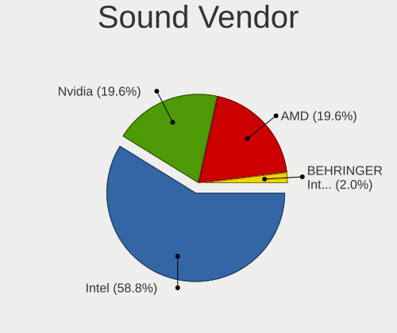

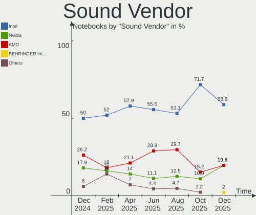

| Vendor                  | Notebooks | Percent |
|-------------------------|-----------|---------|
| Intel                   | 30        | 58.82%  |
| Nvidia                  | 10        | 19.61%  |
| AMD                     | 10        | 19.61%  |
| BEHRINGER International | 1         | 1.96%   |

Sound Model
-----------

Sound card models

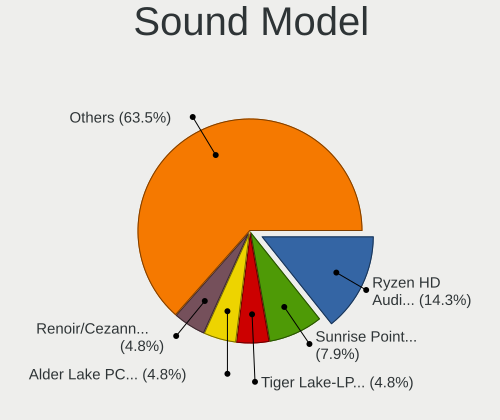

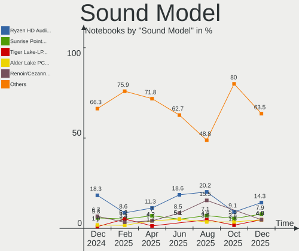

| Model                                                                                             | Notebooks | Percent |
|---------------------------------------------------------------------------------------------------|-----------|---------|
| AMD Ryzen HD Audio Controller                                                                     | 9         | 14.29%  |
| Intel Sunrise Point-LP HD Audio                                                                   | 5         | 7.94%   |
| Intel Tiger Lake-LP Smart Sound Technology Audio Controller                                       | 3         | 4.76%   |
| Intel Alder Lake PCH-P High Definition Audio Controller                                           | 3         | 4.76%   |
| AMD Renoir/Cezanne HDMI/DP Audio Controller                                                       | 3         | 4.76%   |
| AMD Radeon High Definition Audio Controller                                                       | 3         | 4.76%   |
| Nvidia GB203 High Definition Audio Controller                                                     | 2         | 3.17%   |
| Nvidia GA107 High Definition Audio Controller                                                     | 2         | 3.17%   |
| Intel Tiger Lake-H HD Audio Controller                                                            | 2         | 3.17%   |
| Intel Raptor Lake-P/U/H cAVS                                                                      | 2         | 3.17%   |
| Intel Atom/Celeron/Pentium Processor x5-E8000/J3xxx/N3xxx Series High Definition Audio Controller | 2         | 3.17%   |
| Intel 800 Series ACE (Audio Context Engine)                                                       | 2         | 3.17%   |
| Intel 100 Series/C230 Series Chipset Family HD Audio Controller                                   | 2         | 3.17%   |
| AMD Raven/Raven2/Fenghuang HDMI/DP Audio Controller                                               | 2         | 3.17%   |
| Nvidia TU104 HD Audio Controller                                                                  | 1         | 1.59%   |
| Nvidia MCP79 High Definition Audio                                                                | 1         | 1.59%   |
| Nvidia GM204 High Definition Audio Controller                                                     | 1         | 1.59%   |
| Nvidia GB205 High Definition Audio Controller                                                     | 1         | 1.59%   |
| Nvidia GA106 High Definition Audio Controller                                                     | 1         | 1.59%   |
| Nvidia AD107 High Definition Audio Controller                                                     | 1         | 1.59%   |
| Intel Xeon E3-1200 v3/4th Gen Core Processor HD Audio Controller                                  | 1         | 1.59%   |
| Intel Raptor Lake High Definition Audio Controller                                                | 1         | 1.59%   |
| Intel Haswell-ULT HD Audio Controller                                                             | 1         | 1.59%   |
| Intel Comet Lake PCH-LP cAVS                                                                      | 1         | 1.59%   |
| Intel Celeron N3350/Pentium N4200/Atom E3900 Series Audio Cluster                                 | 1         | 1.59%   |
| Intel Cannon Lake PCH cAVS                                                                        | 1         | 1.59%   |
| Intel Arrow Lake cAVS                                                                             | 1         | 1.59%   |
| Intel 82801H (ICH8 Family) HD Audio Controller                                                    | 1         | 1.59%   |
| Intel 8 Series/C220 Series Chipset High Definition Audio Controller                               | 1         | 1.59%   |
| Intel 8 Series HD Audio Controller                                                                | 1         | 1.59%   |
| Intel 7 Series/C216 Chipset Family High Definition Audio Controller                               | 1         | 1.59%   |
| BEHRINGER International X18/XR18                                                                  | 1         | 1.59%   |
| BEHRINGER International X-Touch                                                                   | 1         | 1.59%   |
| AMD Kabini HDMI/DP Audio                                                                          | 1         | 1.59%   |
| AMD FCH Azalia Controller                                                                         | 1         | 1.59%   |

Memory
------

Memory Vendor
-------------

Memory module vendors

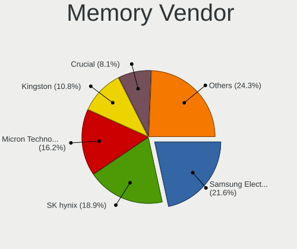

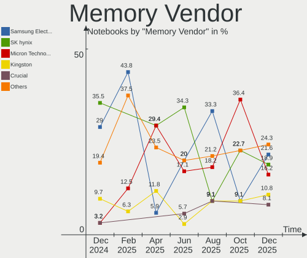

| Vendor              | Notebooks | Percent |
|---------------------|-----------|---------|
| Samsung Electronics | 8         | 21.62%  |
| SK hynix            | 7         | 18.92%  |
| Micron Technology   | 6         | 16.22%  |
| Kingston            | 4         | 10.81%  |
| Crucial             | 3         | 8.11%   |
| A-DATA Technology   | 2         | 5.41%   |
| Timetec             | 1         | 2.7%    |
| Ramaxel Technology  | 1         | 2.7%    |
| KingFast            | 1         | 2.7%    |
| G.Skill             | 1         | 2.7%    |
| fef5                | 1         | 2.7%    |
| EXCELERAM           | 1         | 2.7%    |
| Unknown             | 1         | 2.7%    |

Memory Model
------------

Memory module models

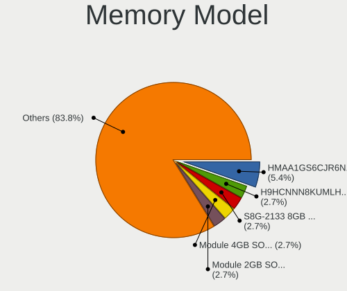

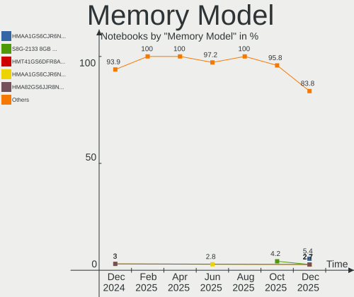

| Model                                                            | Notebooks | Percent |
|------------------------------------------------------------------|-----------|---------|
| SK hynix RAM HMAA1GS6CJR6N-XN 8GB SODIMM DDR4 3200MT/s           | 2         | 5.41%   |
| Timetec RAM S8G-2133 8GB SODIMM DDR4 2133MT/s                    | 1         | 2.7%    |
| SK hynix RAM HMT41GS6DFR8A-PB 8GB SODIMM DDR3 1600MT/s           | 1         | 2.7%    |
| SK hynix RAM HMAA1GS6CJR6N-XN 8GB Row Of Chips DDR4 3200MT/s     | 1         | 2.7%    |
| SK hynix RAM HMA82GS6JJR8N-VK 16GB SODIMM DDR4 2667MT/s          | 1         | 2.7%    |
| SK hynix RAM HMA82GS6DJR8N-XN 16GB SODIMM DDR4 3200MT/s          | 1         | 2.7%    |
| SK hynix RAM H9HCNNN8KUMLHR 1GB 2400MT/s                         | 1         | 2.7%    |
| Samsung RAM Module 4GB SODIMM DDR3 1067MT/s                      | 1         | 2.7%    |
| Samsung RAM Module 2GB SODIMM DDR3 1600MT/s                      | 1         | 2.7%    |
| Samsung RAM M471B1G73DB0-YK0 8GB SODIMM DDR3 1600MT/s            | 1         | 2.7%    |
| Samsung RAM M471A5244CB0-CWE 4GB Row Of Chips DDR4 3200MT/s      | 1         | 2.7%    |
| Samsung RAM M471A2G43BB2-CWE 16GB SODIMM DDR4 3200MT/s           | 1         | 2.7%    |
| Samsung RAM M471A1K43EB1-CWE 8GB SODIMM DDR4 3200MT/s            | 1         | 2.7%    |
| Samsung RAM M471A1G44BB0-CWE 8GB SODIMM DDR4 3200MT/s            | 1         | 2.7%    |
| Samsung RAM M425R4GA3EB0-CWMOD 32GB SODIMM DDR5 5600MT/s         | 1         | 2.7%    |
| Ramaxel RAM RMSA3260MB78HAF2400 8GB SODIMM DDR4 2400MT/s         | 1         | 2.7%    |
| Micron RAM MTC16C2085S1VC64BD1 32GB SODIMM DDR5 6400MT/s         | 1         | 2.7%    |
| Micron RAM MTC16C2085S1SC56BD1 32GB SODIMM DDR5 5600MT/s         | 1         | 2.7%    |
| Micron RAM MT62F2G32D4DS-026 WT 8GiB SODIMM LPDDR5 7500MT/s      | 1         | 2.7%    |
| Micron RAM MT62F2G32D4DS-026 WT 8GB Row Of Chips LPDDR5 7500MT/s | 1         | 2.7%    |
| Micron RAM 8ATF1G64HZ-3G2R1 8GB SODIMM DDR4 3200MT/s             | 1         | 2.7%    |
| Micron RAM 4ATF51264HZ-2G6E1 4GB SODIMM DDR4 2667MT/s            | 1         | 2.7%    |
| Kingston RAM Module 16GB SODIMM DDR4 2667MT/s                    | 1         | 2.7%    |
| Kingston RAM KHX2133C13S4/8G 8GB SODIMM DDR4 2267MT/s            | 1         | 2.7%    |
| Kingston RAM K821PJ-MID 16GB SODIMM DDR4 2400MT/s                | 1         | 2.7%    |
| Kingston RAM 9905711-067.A00G 8GB SODIMM DDR4 3200MT/s           | 1         | 2.7%    |
| KingFast RAM 1600NDBD3 8GB SODIMM DDR3 1600MT/s                  | 1         | 2.7%    |
| G.Skill RAM F4-2133C15-16GRS 16GB SODIMM DDR4 2667MT/s           | 1         | 2.7%    |
| fef5 RAM H9HCNNN8KUMLHR 1GB 2400MT/s                             | 1         | 2.7%    |
| EXCELERAM RAM E408269S 8GB SODIMM DDR4 2667MT/s                  | 1         | 2.7%    |
| Crucial RAM CT8G4SFS824A.M8FD 8GB SODIMM DDR4 2400MT/s           | 1         | 2.7%    |
| Crucial RAM CT32G4SFD832A.C16FF 32GB SODIMM DDR4 3200MT/s        | 1         | 2.7%    |
| Crucial RAM CT16G48C40S5.C8A1 16GB SODIMM DDR5 4800MT/s          | 1         | 2.7%    |
| A-DATA RAM Module 8GB SODIMM DDR4 2400MT/s                       | 1         | 2.7%    |
| A-DATA RAM AI1V56WC8W1-B1BS 8GB SODIMM DDR5 5600MT/s             | 1         | 2.7%    |
| Unknown                                                          | 1         | 2.7%    |

Memory Kind
-----------

Memory module kinds

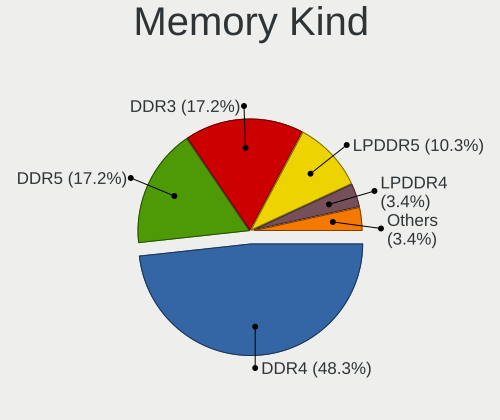

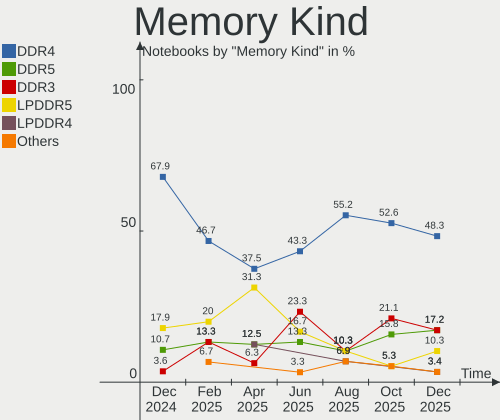

| Kind    | Notebooks | Percent |
|---------|-----------|---------|
| DDR4    | 14        | 48.28%  |
| DDR5    | 5         | 17.24%  |
| DDR3    | 5         | 17.24%  |
| LPDDR5  | 3         | 10.34%  |
| LPDDR4  | 1         | 3.45%   |
| Unknown | 1         | 3.45%   |

Memory Form Factor
------------------

Physical design of the memory module

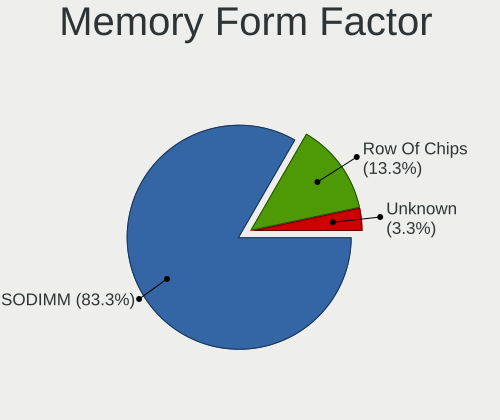

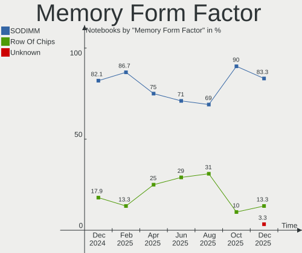

| Name         | Notebooks | Percent |
|--------------|-----------|---------|
| SODIMM       | 25        | 83.33%  |
| Row Of Chips | 4         | 13.33%  |
| Unknown      | 1         | 3.33%   |

Memory Size
-----------

Memory module size

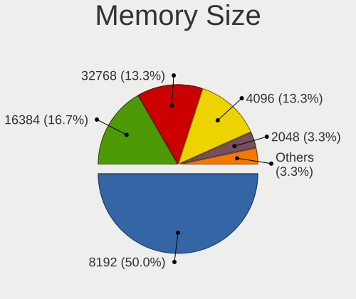

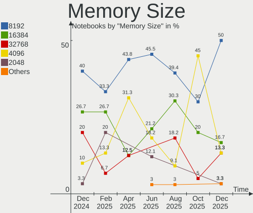

| Size  | Notebooks | Percent |
|-------|-----------|---------|
| 8192  | 15        | 50%     |
| 16384 | 5         | 16.67%  |
| 32768 | 4         | 13.33%  |
| 4096  | 4         | 13.33%  |
| 2048  | 1         | 3.33%   |
| 1024  | 1         | 3.33%   |

Memory Speed
------------

Memory module speed

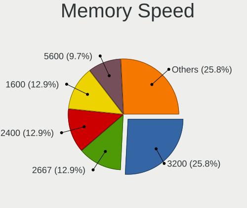

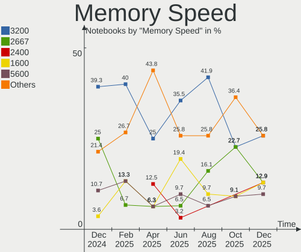

| Speed | Notebooks | Percent |
|-------|-----------|---------|
| 3200  | 8         | 25.81%  |
| 2667  | 4         | 12.9%   |
| 2400  | 4         | 12.9%   |
| 1600  | 4         | 12.9%   |
| 5600  | 3         | 9.68%   |
| 7500  | 2         | 6.45%   |
| 7467  | 1         | 3.23%   |
| 6400  | 1         | 3.23%   |
| 4800  | 1         | 3.23%   |
| 2267  | 1         | 3.23%   |
| 2133  | 1         | 3.23%   |
| 1067  | 1         | 3.23%   |

Printers & scanners
-------------------

Printer Vendor
--------------

Printer device vendors

Zero info for selected period =(

Printer Model
-------------

Printer device models

Zero info for selected period =(

Scanner Vendor
--------------

Scanner device vendors

Zero info for selected period =(

Scanner Model
-------------

Scanner device models

Zero info for selected period =(

Camera
------

Camera Vendor
-------------

Camera device vendors

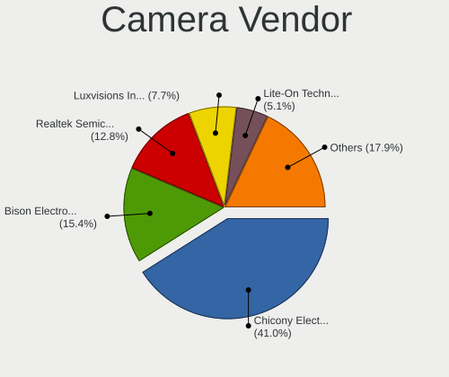

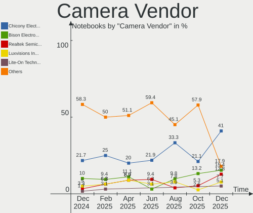

| Vendor                                 | Notebooks | Percent |
|----------------------------------------|-----------|---------|
| Chicony Electronics                    | 16        | 41.03%  |
| Bison Electronics                      | 6         | 15.38%  |
| Realtek Semiconductor                  | 5         | 12.82%  |
| Luxvisions Innotech Limited            | 3         | 7.69%   |
| Lite-On Technology                     | 2         | 5.13%   |
| Cheng Uei Precision Industry (Foxlink) | 2         | 5.13%   |
| SunplusIT                              | 1         | 2.56%   |
| Ricoh                                  | 1         | 2.56%   |
| Quanta                                 | 1         | 2.56%   |
| Microdia                               | 1         | 2.56%   |
| IMC Networks                           | 1         | 2.56%   |

Camera Model
------------

Camera device models

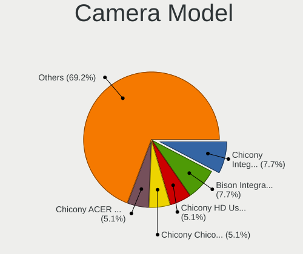

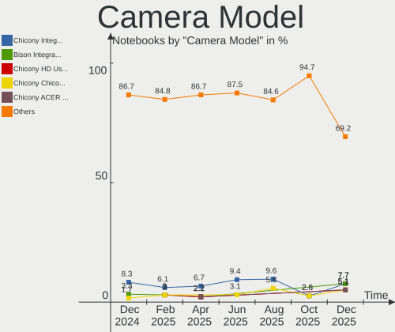

| Model                                                   | Notebooks | Percent |
|---------------------------------------------------------|-----------|---------|
| Chicony Integrated Camera                               | 3         | 7.69%   |
| Bison Integrated Camera                                 | 3         | 7.69%   |
| Chicony HD User Facing                                  | 2         | 5.13%   |
| Chicony Chicony USB2.0 Camera                           | 2         | 5.13%   |
| Chicony ACER HD User Facing                             | 2         | 5.13%   |
| SunplusIT FHD Webcam                                    | 1         | 2.56%   |
| Ricoh Integrated Camera                                 | 1         | 2.56%   |
| Realtek WebCamera                                       | 1         | 2.56%   |
| Realtek USB2.0 HD UVC WebCam                            | 1         | 2.56%   |
| Realtek Thronmax Stream Go Pro Webcam                   | 1         | 2.56%   |
| Realtek Integrated_Webcam_HD                            | 1         | 2.56%   |
| Realtek Built-In Video Camera                           | 1         | 2.56%   |
| Quanta HP HD Camera                                     | 1         | 2.56%   |
| Microdia Integrated_Webcam_HD                           | 1         | 2.56%   |
| Luxvisions Innotech Limited Integrated Camera           | 1         | 2.56%   |
| Luxvisions Innotech Limited HP TrueVision HD Camera     | 1         | 2.56%   |
| Luxvisions Innotech Limited HP HD Camera                | 1         | 2.56%   |
| Lite-On Integrated Camera                               | 1         | 2.56%   |
| Lite-On EasyCamera 1M                                   | 1         | 2.56%   |
| IMC Networks Integrated Camera                          | 1         | 2.56%   |
| Chicony VGA Webcam                                      | 1         | 2.56%   |
| Chicony USB 2.0 Camera                                  | 1         | 2.56%   |
| Chicony Integrated IR Camera                            | 1         | 2.56%   |
| Chicony Integrated Camera (1280x720@30)                 | 1         | 2.56%   |
| Chicony HP Wide Vision HD Camera                        | 1         | 2.56%   |
| Chicony HP Truevision HD                                | 1         | 2.56%   |
| Chicony HD WebCam                                       | 1         | 2.56%   |
| Cheng Uei Precision Industry (Foxlink) HP Truevision HD | 1         | 2.56%   |
| Cheng Uei Precision Industry (Foxlink) HP HD Webcam     | 1         | 2.56%   |
| Bison HD Webcam                                         | 1         | 2.56%   |
| Bison FHD Camera                                        | 1         | 2.56%   |
| Bison BisonCam, NB Pro                                  | 1         | 2.56%   |

Security
--------

Fingerprint Vendor
------------------

Fingerprint sensor vendors

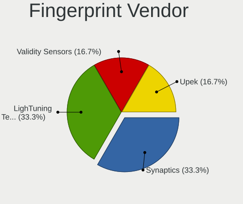

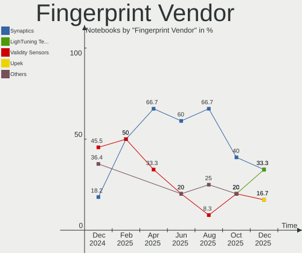

| Vendor                | Notebooks | Percent |
|-----------------------|-----------|---------|
| Synaptics             | 2         | 33.33%  |
| LighTuning Technology | 2         | 33.33%  |
| Validity Sensors      | 1         | 16.67%  |
| Upek                  | 1         | 16.67%  |

Fingerprint Model
-----------------

Fingerprint sensor models

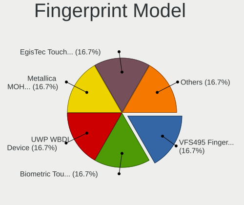

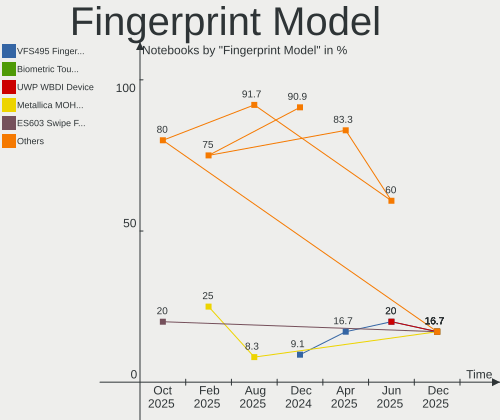

| Model                                                  | Notebooks | Percent |
|--------------------------------------------------------|-----------|---------|
| Validity Sensors VFS495 Fingerprint Reader             | 1         | 16.67%  |
| Upek Biometric Touchchip/Touchstrip Fingerprint Sensor | 1         | 16.67%  |
| Synaptics UWP WBDI Device                              | 1         | 16.67%  |
| Synaptics Metallica MOH Touch Fingerprint Reader       | 1         | 16.67%  |
| LighTuning ES603 Swipe Fingerprint Sensor              | 1         | 16.67%  |
| LighTuning EgisTec Touch Fingerprint Sensor            | 1         | 16.67%  |

Chipcard Vendor
---------------

Chipcard module vendors

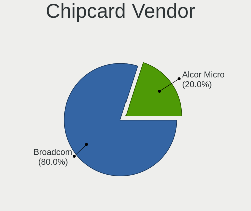

| Vendor      | Notebooks | Percent |
|-------------|-----------|---------|
| Alcor Micro | 1         | 100%    |

Chipcard Model
--------------

Chipcard module models

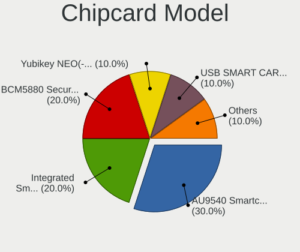

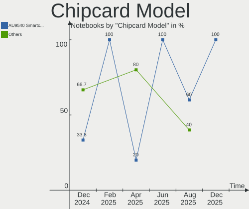

| Model                               | Notebooks | Percent |
|-------------------------------------|-----------|---------|
| Alcor Micro AU9540 Smartcard Reader | 1         | 100%    |

Unsupported
-----------

Unsupported Devices
-------------------

Total unsupported devices on board

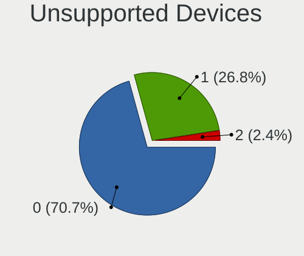

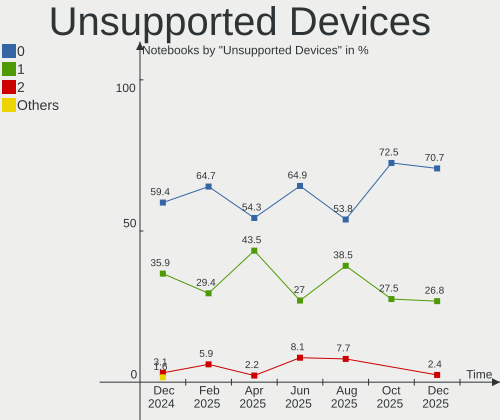

| Total | Notebooks | Percent |
|-------|-----------|---------|
| 0     | 29        | 70.73%  |
| 1     | 11        | 26.83%  |
| 2     | 1         | 2.44%   |

Unsupported Device Types
------------------------

Types of unsupported devices

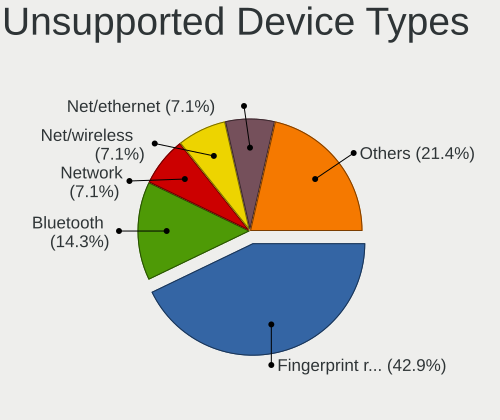

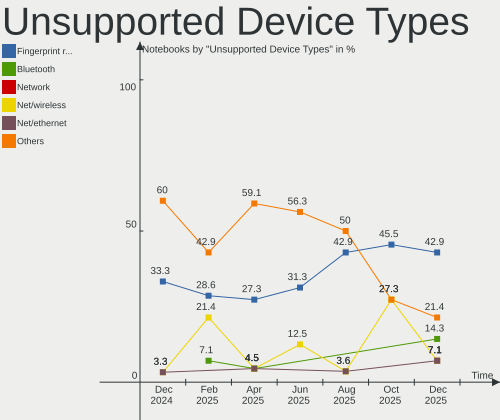

| Type                  | Notebooks | Percent |
|-----------------------|-----------|---------|
| Fingerprint reader    | 6         | 42.86%  |
| Bluetooth             | 2         | 14.29%  |
| Network               | 1         | 7.14%   |
| Net/wireless          | 1         | 7.14%   |
| Net/ethernet          | 1         | 7.14%   |
| Multimedia controller | 1         | 7.14%   |
| Chipcard              | 1         | 7.14%   |
| Camera                | 1         | 7.14%   |

