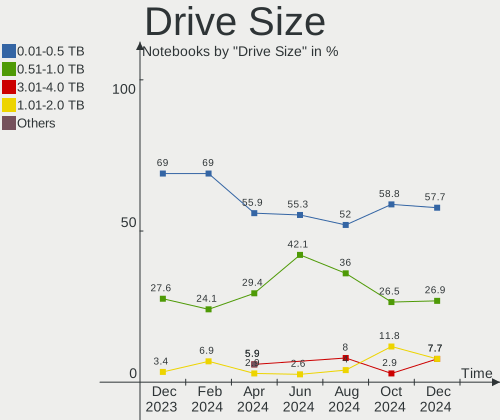
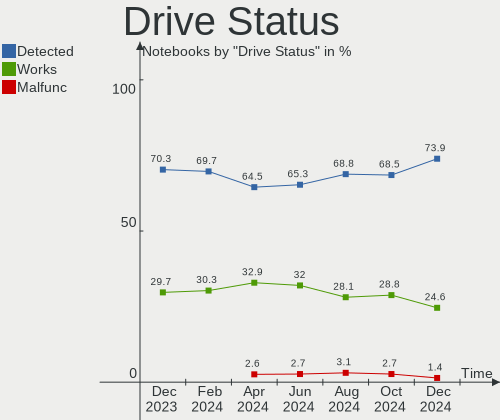

Manjaro - Hardware Trends (Notebooks)
-------------------------------------

A project to identify most popular hardware characteristics and track their change
over time based on data collected by Linux users at https://Linux-Hardware.org.

Anyone can contribute to this report by the [hw-probe](https://github.com/linuxhw/hw-probe) tool:

    sudo -E hw-probe -all -upload

This report is for one last month. Overall report since the beginning of time: [TestDays](https://github.com/linuxhw/TestDays)

Period: Jul, 2023.

Contents
--------

* [ System ](#system)
  - [ OS                       ](#os)
  - [ OS Family                ](#os-family)
  - [ Kernel                   ](#kernel)
  - [ Kernel Family            ](#kernel-family)
  - [ Kernel Major Ver.        ](#kernel-major-ver)
  - [ Arch                     ](#arch)
  - [ DE                       ](#de)
  - [ Display Server           ](#display-server)
  - [ Display Manager          ](#display-manager)
  - [ OS Lang                  ](#os-lang)
  - [ Boot Mode                ](#boot-mode)
  - [ Filesystem               ](#filesystem)
  - [ Part. scheme             ](#part-scheme)
  - [ Dual Boot with Linux/BSD ](#dual-boot-with-linuxbsd)
  - [ Dual Boot (Win)          ](#dual-boot-win)

* [ Board ](#board)
  - [ Vendor                   ](#vendor)
  - [ Model                    ](#model)
  - [ Model Family             ](#model-family)
  - [ MFG Year                 ](#mfg-year)
  - [ Form Factor              ](#form-factor)
  - [ Secure Boot              ](#secure-boot)
  - [ Coreboot                 ](#coreboot)
  - [ RAM Size                 ](#ram-size)
  - [ RAM Used                 ](#ram-used)
  - [ Total Drives             ](#total-drives)
  - [ Has CD-ROM               ](#has-cd-rom)
  - [ Has Ethernet             ](#has-ethernet)
  - [ Has WiFi                 ](#has-wifi)
  - [ Has Bluetooth            ](#has-bluetooth)

* [ Location ](#location)
  - [ Country                  ](#country)
  - [ City                     ](#city)

* [ Drives ](#drives)
  - [ Drive Vendor             ](#drive-vendor)
  - [ Drive Model              ](#drive-model)
  - [ HDD Vendor               ](#hdd-vendor)
  - [ SSD Vendor               ](#ssd-vendor)
  - [ Drive Kind               ](#drive-kind)
  - [ Drive Connector          ](#drive-connector)
  - [ Drive Size               ](#drive-size)
  - [ Space Total              ](#space-total)
  - [ Space Used               ](#space-used)
  - [ Malfunc. Drives          ](#malfunc-drives)
  - [ Malfunc. Drive Vendor    ](#malfunc-drive-vendor)
  - [ Malfunc. HDD Vendor      ](#malfunc-hdd-vendor)
  - [ Malfunc. Drive Kind      ](#malfunc-drive-kind)
  - [ Failed Drives            ](#failed-drives)
  - [ Failed Drive Vendor      ](#failed-drive-vendor)
  - [ Drive Status             ](#drive-status)

* [ Storage controller ](#storage-controller)
  - [ Storage Vendor           ](#storage-vendor)
  - [ Storage Model            ](#storage-model)
  - [ Storage Kind             ](#storage-kind)

* [ Processor ](#processor)
  - [ CPU Vendor               ](#cpu-vendor)
  - [ CPU Model                ](#cpu-model)
  - [ CPU Model Family         ](#cpu-model-family)
  - [ CPU Cores                ](#cpu-cores)
  - [ CPU Sockets              ](#cpu-sockets)
  - [ CPU Threads              ](#cpu-threads)
  - [ CPU Op-Modes             ](#cpu-op-modes)
  - [ CPU Microcode            ](#cpu-microcode)
  - [ CPU Microarch            ](#cpu-microarch)

* [ Graphics ](#graphics)
  - [ GPU Vendor               ](#gpu-vendor)
  - [ GPU Model                ](#gpu-model)
  - [ GPU Combo                ](#gpu-combo)
  - [ GPU Driver               ](#gpu-driver)
  - [ GPU Memory               ](#gpu-memory)

* [ Monitor ](#monitor)
  - [ Monitor Vendor           ](#monitor-vendor)
  - [ Monitor Model            ](#monitor-model)
  - [ Monitor Resolution       ](#monitor-resolution)
  - [ Monitor Diagonal         ](#monitor-diagonal)
  - [ Monitor Width            ](#monitor-width)
  - [ Aspect Ratio             ](#aspect-ratio)
  - [ Monitor Area             ](#monitor-area)
  - [ Pixel Density            ](#pixel-density)
  - [ Multiple Monitors        ](#multiple-monitors)

* [ Network ](#network)
  - [ Net Controller Vendor    ](#net-controller-vendor)
  - [ Net Controller Model     ](#net-controller-model)
  - [ Wireless Vendor          ](#wireless-vendor)
  - [ Wireless Model           ](#wireless-model)
  - [ Ethernet Vendor          ](#ethernet-vendor)
  - [ Ethernet Model           ](#ethernet-model)
  - [ Net Controller Kind      ](#net-controller-kind)
  - [ Used Controller          ](#used-controller)
  - [ NICs                     ](#nics)
  - [ IPv6                     ](#ipv6)

* [ Bluetooth ](#bluetooth)
  - [ Bluetooth Vendor         ](#bluetooth-vendor)
  - [ Bluetooth Model          ](#bluetooth-model)

* [ Sound ](#sound)
  - [ Sound Vendor             ](#sound-vendor)
  - [ Sound Model              ](#sound-model)

* [ Memory ](#memory)
  - [ Memory Vendor            ](#memory-vendor)
  - [ Memory Model             ](#memory-model)
  - [ Memory Kind              ](#memory-kind)
  - [ Memory Form Factor       ](#memory-form-factor)
  - [ Memory Size              ](#memory-size)
  - [ Memory Speed             ](#memory-speed)

* [ Printers & scanners ](#printers--scanners)
  - [ Printer Vendor           ](#printer-vendor)
  - [ Printer Model            ](#printer-model)
  - [ Scanner Vendor           ](#scanner-vendor)
  - [ Scanner Model            ](#scanner-model)

* [ Camera ](#camera)
  - [ Camera Vendor            ](#camera-vendor)
  - [ Camera Model             ](#camera-model)

* [ Security ](#security)
  - [ Fingerprint Vendor       ](#fingerprint-vendor)
  - [ Fingerprint Model        ](#fingerprint-model)
  - [ Chipcard Vendor          ](#chipcard-vendor)
  - [ Chipcard Model           ](#chipcard-model)

* [ Unsupported ](#unsupported)
  - [ Unsupported Devices      ](#unsupported-devices)
  - [ Unsupported Device Types ](#unsupported-device-types)

System
------

OS
--

Installed operating systems

| Name           | Notebooks | Percent |
|----------------|-----------|---------|
| Manjaro        | 39        | 57.35%  |
| Manjaro 23.0.0 | 28        | 41.18%  |
| Manjaro 22.1.0 | 1         | 1.47%   |

OS Family
---------

OS without a version

| Name    | Notebooks | Percent |
|---------|-----------|---------|
| Manjaro | 68        | 100%    |

Kernel
------

Version of the Linux kernel

| Version             | Notebooks | Percent |
|---------------------|-----------|---------|
| 6.1.38-1-MANJARO    | 14        | 20.59%  |
| 6.1.31-2-MANJARO    | 13        | 19.12%  |
| 6.4.2-3-MANJARO     | 7         | 10.29%  |
| 6.4.6-1-MANJARO     | 4         | 5.88%   |
| 6.4.3-1-MANJARO     | 4         | 5.88%   |
| 6.3.12-1-MANJARO    | 4         | 5.88%   |
| 6.1.41-1-MANJARO    | 4         | 5.88%   |
| 5.15.114-2-MANJARO  | 3         | 4.41%   |
| 6.3.5-2-MANJARO     | 2         | 2.94%   |
| 6.2.0-2-rt3-MANJARO | 2         | 2.94%   |
| 6.4.0-1-rt6-MANJARO | 1         | 1.47%   |
| 6.4.0-1-MANJARO     | 1         | 1.47%   |
| 6.3.13-1-MANJARO    | 1         | 1.47%   |
| 6.3.11-2-MANJARO    | 1         | 1.47%   |
| 6.2.16-2-MANJARO    | 1         | 1.47%   |
| 6.1.30-1-MANJARO    | 1         | 1.47%   |
| 6.1.26-1-MANJARO    | 1         | 1.47%   |
| 6.1.22-1-MANJARO    | 1         | 1.47%   |
| 5.18.19-3-MANJARO   | 1         | 1.47%   |
| 5.15.120-1-MANJARO  | 1         | 1.47%   |
| 5.10.181-2-MANJARO  | 1         | 1.47%   |

Kernel Family
-------------

Linux kernel without a distro release

| Version  | Notebooks | Percent |
|----------|-----------|---------|
| 6.1.38   | 14        | 20.59%  |
| 6.1.31   | 13        | 19.12%  |
| 6.4.2    | 7         | 10.29%  |
| 6.4.6    | 4         | 5.88%   |
| 6.4.3    | 4         | 5.88%   |
| 6.3.12   | 4         | 5.88%   |
| 6.1.41   | 4         | 5.88%   |
| 5.15.114 | 3         | 4.41%   |
| 6.4.0    | 2         | 2.94%   |
| 6.3.5    | 2         | 2.94%   |
| 6.2.0    | 2         | 2.94%   |
| 6.3.13   | 1         | 1.47%   |
| 6.3.11   | 1         | 1.47%   |
| 6.2.16   | 1         | 1.47%   |
| 6.1.30   | 1         | 1.47%   |
| 6.1.26   | 1         | 1.47%   |
| 6.1.22   | 1         | 1.47%   |
| 5.18.19  | 1         | 1.47%   |
| 5.15.120 | 1         | 1.47%   |
| 5.10.181 | 1         | 1.47%   |

Kernel Major Ver.
-----------------

Linux kernel major version

| Version | Notebooks | Percent |
|---------|-----------|---------|
| 6.1     | 34        | 50%     |
| 6.4     | 17        | 25%     |
| 6.3     | 8         | 11.76%  |
| 5.15    | 4         | 5.88%   |
| 6.2     | 3         | 4.41%   |
| 5.18    | 1         | 1.47%   |
| 5.10    | 1         | 1.47%   |

Arch
----

OS architecture (x86_64, i586, etc.)

| Name   | Notebooks | Percent |
|--------|-----------|---------|
| x86_64 | 68        | 100%    |

DE
--

Desktop Environment

| Name       | Notebooks | Percent |
|------------|-----------|---------|
| KDE5       | 40        | 58.82%  |
| GNOME      | 13        | 19.12%  |
| XFCE       | 8         | 11.76%  |
| i3         | 2         | 2.94%   |
| Unknown    | 2         | 2.94%   |
| X-Cinnamon | 1         | 1.47%   |
| MATE       | 1         | 1.47%   |
| LXQt       | 1         | 1.47%   |

Display Server
--------------

X11 or Wayland

| Name    | Notebooks | Percent |
|---------|-----------|---------|
| X11     | 48        | 70.59%  |
| Wayland | 20        | 29.41%  |

Display Manager
---------------

SDDM, LightDM, etc.

| Name    | Notebooks | Percent |
|---------|-----------|---------|
| Unknown | 39        | 57.35%  |
| SDDM    | 14        | 20.59%  |
| LightDM | 10        | 14.71%  |
| GDM     | 5         | 7.35%   |

OS Lang
-------

Language

| Lang    | Notebooks | Percent |
|---------|-----------|---------|
| en_US   | 25        | 36.76%  |
| de_DE   | 10        | 14.71%  |
| en_GB   | 6         | 8.82%   |
| pt_BR   | 5         | 7.35%   |
| ru_RU   | 4         | 5.88%   |
| Unknown | 3         | 4.41%   |
| nl_NL   | 2         | 2.94%   |
| ja_JP   | 1         | 1.47%   |
| it_IT   | 1         | 1.47%   |
| fr_BE   | 1         | 1.47%   |
| es_SV   | 1         | 1.47%   |
| es_PE   | 1         | 1.47%   |
| es_ES   | 1         | 1.47%   |
| en_NZ   | 1         | 1.47%   |
| en_IN   | 1         | 1.47%   |
| en_IE   | 1         | 1.47%   |
| en_CA   | 1         | 1.47%   |
| en_AU   | 1         | 1.47%   |
| el_GR   | 1         | 1.47%   |
| de_CH   | 1         | 1.47%   |

Boot Mode
---------

EFI or BIOS

| Mode | Notebooks | Percent |
|------|-----------|---------|
| BIOS | 44        | 64.71%  |
| EFI  | 24        | 35.29%  |

Filesystem
----------

Type of filesystem

| Type  | Notebooks | Percent |
|-------|-----------|---------|
| Ext4  | 52        | 76.47%  |
| Tmpfs | 9         | 13.24%  |
| Btrfs | 6         | 8.82%   |
| Xfs   | 1         | 1.47%   |

Part. scheme
------------

Scheme of partitioning

| Type    | Notebooks | Percent |
|---------|-----------|---------|
| Unknown | 37        | 54.41%  |
| GPT     | 26        | 38.24%  |
| MBR     | 5         | 7.35%   |

Dual Boot with Linux/BSD
------------------------

Hosting more than one Linux/BSD

| Dual boot | Notebooks | Percent |
|-----------|-----------|---------|
| No        | 63        | 92.65%  |
| Yes       | 5         | 7.35%   |

Dual Boot (Win)
---------------

Hosting Linux and Windows

| Dual boot | Notebooks | Percent |
|-----------|-----------|---------|
| No        | 54        | 79.41%  |
| Yes       | 14        | 20.59%  |

Board
-----

Vendor
------

Motherboard manufacturer

| Name             | Notebooks | Percent |
|------------------|-----------|---------|
| Hewlett-Packard  | 14        | 20.59%  |
| Lenovo           | 11        | 16.18%  |
| Dell             | 9         | 13.24%  |
| Acer             | 9         | 13.24%  |
| ASUSTek Computer | 8         | 11.76%  |
| TUXEDO           | 4         | 5.88%   |
| Fujitsu          | 3         | 4.41%   |
| Valve            | 1         | 1.47%   |
| Teclast          | 1         | 1.47%   |
| Packard Bell     | 1         | 1.47%   |
| MSI              | 1         | 1.47%   |
| Medion           | 1         | 1.47%   |
| HUAWEI           | 1         | 1.47%   |
| HONOR            | 1         | 1.47%   |
| Google           | 1         | 1.47%   |
| Framework        | 1         | 1.47%   |
| Apple            | 1         | 1.47%   |

Model
-----

Motherboard model

| Name                                    | Notebooks | Percent |
|-----------------------------------------|-----------|---------|
| Valve Jupiter                           | 1         | 1.47%   |
| TUXEDO N7x0WU                           | 1         | 1.47%   |
| TUXEDO InfinityBook Pro Gen7 (MK2)      | 1         | 1.47%   |
| TUXEDO InfinityBook Pro Gen7 (MK1)      | 1         | 1.47%   |
| TUXEDO InfinityBook Pro 14 Gen6         | 1         | 1.47%   |
| Teclast F15Plus 2                       | 1         | 1.47%   |
| Packard Bell EasyNote MH36              | 1         | 1.47%   |
| MSI Prestige 14Evo A12M                 | 1         | 1.47%   |
| Medion E4251 MD61435                    | 1         | 1.47%   |
| Lenovo Yoga S740-14IIL 81RS             | 1         | 1.47%   |
| Lenovo ThinkPad X250 20CLS21F00         | 1         | 1.47%   |
| Lenovo ThinkPad T420 4180C31            | 1         | 1.47%   |
| Lenovo ThinkPad T14 Gen 3 21CGS1HJ00    | 1         | 1.47%   |
| Lenovo ThinkPad P15v Gen 3 21EM0036US   | 1         | 1.47%   |
| Lenovo ThinkPad L470 20J5S01S00         | 1         | 1.47%   |
| Lenovo ThinkPad E575 20H8S02W00         | 1         | 1.47%   |
| Lenovo ThinkBook 15 G2 ITL 20VE         | 1         | 1.47%   |
| Lenovo Legion Y530-15ICH 81FV           | 1         | 1.47%   |
| Lenovo IdeaPad S145-14AST 81ST          | 1         | 1.47%   |
| Lenovo IdeaPad 320-17IKB 80XM           | 1         | 1.47%   |
| HUAWEI KLVL-WXX9                        | 1         | 1.47%   |
| HONOR BBR-WAX9                          | 1         | 1.47%   |
| HP ZBook 15 G4                          | 1         | 1.47%   |
| HP ZBook 15 G2                          | 1         | 1.47%   |
| HP Victus by Laptop 16-e0xxx            | 1         | 1.47%   |
| HP ProBook 4740s                        | 1         | 1.47%   |
| HP ProBook 470 G5                       | 1         | 1.47%   |
| HP OMEN Laptop 15-en0xxx                | 1         | 1.47%   |
| HP Laptop 17-cn0xxx                     | 1         | 1.47%   |
| HP EliteBook 8460p                      | 1         | 1.47%   |
| HP EliteBook 840 G5                     | 1         | 1.47%   |
| HP EliteBook 840 14 inch G9 Notebook PC | 1         | 1.47%   |
| HP EliteBook 2540p                      | 1         | 1.47%   |
| HP Compaq Presario CQ40                 | 1         | 1.47%   |
| HP 255 G7 Notebook PC                   | 1         | 1.47%   |
| HP 255 15.6 inch G9 Notebook PC         | 1         | 1.47%   |
| Google Blooglet                         | 1         | 1.47%   |
| Fujitsu LIFEBOOK S752                   | 1         | 1.47%   |
| Fujitsu LIFEBOOK LH532                  | 1         | 1.47%   |
| Fujitsu LIFEBOOK E752                   | 1         | 1.47%   |

Model Family
------------

Motherboard model prefix

| Name                  | Notebooks | Percent |
|-----------------------|-----------|---------|
| Lenovo ThinkPad       | 6         | 8.82%   |
| HP EliteBook          | 4         | 5.88%   |
| Acer Aspire           | 4         | 5.88%   |
| TUXEDO InfinityBook   | 3         | 4.41%   |
| Fujitsu LIFEBOOK      | 3         | 4.41%   |
| Dell Latitude         | 3         | 4.41%   |
| Dell Inspiron         | 3         | 4.41%   |
| Lenovo IdeaPad        | 2         | 2.94%   |
| HP ZBook              | 2         | 2.94%   |
| HP ProBook            | 2         | 2.94%   |
| HP 255                | 2         | 2.94%   |
| Dell XPS              | 2         | 2.94%   |
| ASUS VivoBook         | 2         | 2.94%   |
| Acer Nitro            | 2         | 2.94%   |
| Valve Jupiter         | 1         | 1.47%   |
| TUXEDO N7x0WU         | 1         | 1.47%   |
| Teclast F15Plus       | 1         | 1.47%   |
| Packard Bell EasyNote | 1         | 1.47%   |
| MSI Prestige          | 1         | 1.47%   |
| Medion E4251          | 1         | 1.47%   |
| Lenovo Yoga           | 1         | 1.47%   |
| Lenovo ThinkBook      | 1         | 1.47%   |
| Lenovo Legion         | 1         | 1.47%   |
| HUAWEI KLVL-WXX9      | 1         | 1.47%   |
| HONOR BBR-WAX9        | 1         | 1.47%   |
| HP Victus             | 1         | 1.47%   |
| HP OMEN               | 1         | 1.47%   |
| HP Laptop             | 1         | 1.47%   |
| HP Compaq             | 1         | 1.47%   |
| Google Blooglet       | 1         | 1.47%   |
| Framework Laptop      | 1         | 1.47%   |
| Dell Vostro           | 1         | 1.47%   |
| ASUS X75A1            | 1         | 1.47%   |
| ASUS X456UV           | 1         | 1.47%   |
| ASUS UX550VE          | 1         | 1.47%   |
| ASUS N53SM            | 1         | 1.47%   |
| ASUS K53SV            | 1         | 1.47%   |
| ASUS GL702VM          | 1         | 1.47%   |
| Apple MacBookPro14    | 1         | 1.47%   |
| Acer TravelMate       | 1         | 1.47%   |

MFG Year
--------

Motherboard manufacture year

| Year | Notebooks | Percent |
|------|-----------|---------|
| 2022 | 11        | 16.18%  |
| 2018 | 10        | 14.71%  |
| 2020 | 7         | 10.29%  |
| 2017 | 7         | 10.29%  |
| 2012 | 6         | 8.82%   |
| 2021 | 5         | 7.35%   |
| 2019 | 5         | 7.35%   |
| 2011 | 5         | 7.35%   |
| 2008 | 3         | 4.41%   |
| 2023 | 2         | 2.94%   |
| 2016 | 2         | 2.94%   |
| 2015 | 2         | 2.94%   |
| 2013 | 2         | 2.94%   |
| 2010 | 1         | 1.47%   |

Form Factor
-----------

Physical design of the computer

| Name     | Notebooks | Percent |
|----------|-----------|---------|
| Notebook | 68        | 100%    |

Secure Boot
-----------

Enabled or disabled

| State    | Notebooks | Percent |
|----------|-----------|---------|
| Disabled | 68        | 100%    |

Coreboot
--------

Have coreboot on board

| Used | Notebooks | Percent |
|------|-----------|---------|
| No   | 67        | 98.53%  |
| Yes  | 1         | 1.47%   |

RAM Size
--------

Total RAM memory

| Size in GB  | Notebooks | Percent |
|-------------|-----------|---------|
| 4.01-8.0    | 17        | 25%     |
| 16.01-24.0  | 16        | 23.53%  |
| 8.01-16.0   | 11        | 16.18%  |
| 3.01-4.0    | 9         | 13.24%  |
| 32.01-64.0  | 8         | 11.76%  |
| 24.01-32.0  | 5         | 7.35%   |
| 64.01-256.0 | 2         | 2.94%   |

RAM Used
--------

Used RAM memory

| Used GB    | Notebooks | Percent |
|------------|-----------|---------|
| 4.01-8.0   | 24        | 35.29%  |
| 2.01-3.0   | 15        | 22.06%  |
| 3.01-4.0   | 12        | 17.65%  |
| 1.01-2.0   | 12        | 17.65%  |
| 8.01-16.0  | 3         | 4.41%   |
| 16.01-24.0 | 1         | 1.47%   |
| 0.51-1.0   | 1         | 1.47%   |

Total Drives
------------

Number of drives on board

| Drives | Notebooks | Percent |
|--------|-----------|---------|
| 1      | 45        | 66.18%  |
| 2      | 19        | 27.94%  |
| 3      | 3         | 4.41%   |
| 4      | 1         | 1.47%   |

Has CD-ROM
----------

Has CD-ROM on board

| Presented | Notebooks | Percent |
|-----------|-----------|---------|
| No        | 48        | 70.59%  |
| Yes       | 20        | 29.41%  |

Has Ethernet
------------

Has Ethernet on board

| Presented | Notebooks | Percent |
|-----------|-----------|---------|
| Yes       | 50        | 73.53%  |
| No        | 18        | 26.47%  |

Has WiFi
--------

Has WiFi module

| Presented | Notebooks | Percent |
|-----------|-----------|---------|
| Yes       | 68        | 100%    |

Has Bluetooth
-------------

Has Bluetooth module

| Presented | Notebooks | Percent |
|-----------|-----------|---------|
| Yes       | 63        | 92.65%  |
| No        | 5         | 7.35%   |

Location
--------

Country
-------

Geographic location (country)

| Country     | Notebooks | Percent |
|-------------|-----------|---------|
| Germany     | 14        | 20.59%  |
| USA         | 9         | 13.24%  |
| Brazil      | 6         | 8.82%   |
| Russia      | 5         | 7.35%   |
| Netherlands | 5         | 7.35%   |
| UK          | 3         | 4.41%   |
| Poland      | 3         | 4.41%   |
| Italy       | 2         | 2.94%   |
| Greece      | 2         | 2.94%   |
| Vietnam     | 1         | 1.47%   |
| Ukraine     | 1         | 1.47%   |
| Switzerland | 1         | 1.47%   |
| Spain       | 1         | 1.47%   |
| Romania     | 1         | 1.47%   |
| Peru        | 1         | 1.47%   |
| New Zealand | 1         | 1.47%   |
| Japan       | 1         | 1.47%   |
| Israel      | 1         | 1.47%   |
| Ireland     | 1         | 1.47%   |
| India       | 1         | 1.47%   |
| France      | 1         | 1.47%   |
| El Salvador | 1         | 1.47%   |
| Denmark     | 1         | 1.47%   |
| Croatia     | 1         | 1.47%   |
| Colombia    | 1         | 1.47%   |
| Canada      | 1         | 1.47%   |
| Belgium     | 1         | 1.47%   |
| Australia   | 1         | 1.47%   |

City
----

Geographic location (city)

| City                | Notebooks | Percent |
|---------------------|-----------|---------|
| Wegberg             | 2         | 2.94%   |
| Moscow              | 2         | 2.94%   |
| Frankfurt Am Main   | 2         | 2.94%   |
| Dresden             | 2         | 2.94%   |
| Würzburg           | 1         | 1.47%   |
| Vancouver           | 1         | 1.47%   |
| Ulm                 | 1         | 1.47%   |
| Tokyo               | 1         | 1.47%   |
| Terneuzen           | 1         | 1.47%   |
| Sucha Beskidzka     | 1         | 1.47%   |
| Strmec              | 1         | 1.47%   |
| Saratov             | 1         | 1.47%   |
| Sao Paulo           | 1         | 1.47%   |
| Sao Miguel do Oeste | 1         | 1.47%   |
| San Salvador        | 1         | 1.47%   |
| San Antonio         | 1         | 1.47%   |
| Samara              | 1         | 1.47%   |
| Rome                | 1         | 1.47%   |
| Rehetobel           | 1         | 1.47%   |
| Raleigh             | 1         | 1.47%   |
| Petah Tikva         | 1         | 1.47%   |
| Perkasie            | 1         | 1.47%   |
| Pátrai             | 1         | 1.47%   |
| Panorama City       | 1         | 1.47%   |
| Nizhniy Novgorod    | 1         | 1.47%   |
| Newcastle upon Tyne | 1         | 1.47%   |
| Monnickendam        | 1         | 1.47%   |
| Milton              | 1         | 1.47%   |
| Mill Valley         | 1         | 1.47%   |
| Milan               | 1         | 1.47%   |
| Meppel              | 1         | 1.47%   |
| Melbourne           | 1         | 1.47%   |
| Malkinia Gorna      | 1         | 1.47%   |
| Madrid              | 1         | 1.47%   |
| Lüneburg           | 1         | 1.47%   |
| Lower Hutt          | 1         | 1.47%   |
| Liège              | 1         | 1.47%   |
| Leipzig             | 1         | 1.47%   |
| Leeds               | 1         | 1.47%   |
| Kyiv                | 1         | 1.47%   |

Drives
------

Drive Vendor
------------

Hard drive vendors

| Vendor                    | Notebooks | Drives | Percent |
|---------------------------|-----------|--------|---------|
| Samsung Electronics       | 17        | 18     | 19.1%   |
| Micron Technology         | 8         | 8      | 8.99%   |
| WDC                       | 7         | 7      | 7.87%   |
| Seagate                   | 7         | 7      | 7.87%   |
| Sandisk                   | 7         | 8      | 7.87%   |
| Toshiba                   | 5         | 5      | 5.62%   |
| Unknown                   | 4         | 4      | 4.49%   |
| Phison Electronics        | 4         | 4      | 4.49%   |
| Kingston                  | 4         | 4      | 4.49%   |
| China                     | 3         | 3      | 3.37%   |
| SK hynix                  | 2         | 2      | 2.25%   |
| Intel                     | 2         | 3      | 2.25%   |
| HGST                      | 2         | 2      | 2.25%   |
| A-DATA Technology         | 2         | 2      | 2.25%   |
| WALRAM                    | 1         | 1      | 1.12%   |
| Teclast                   | 1         | 1      | 1.12%   |
| SPCC                      | 1         | 1      | 1.12%   |
| Realtek Semiconductor     | 1         | 1      | 1.12%   |
| PNY                       | 1         | 1      | 1.12%   |
| Phison                    | 1         | 1      | 1.12%   |
| Mushkin                   | 1         | 1      | 1.12%   |
| Micron/Crucial Technology | 1         | 1      | 1.12%   |
| LITEON                    | 1         | 1      | 1.12%   |
| JMicron Technology        | 1         | 1      | 1.12%   |
| Intenso                   | 1         | 1      | 1.12%   |
| Hitachi                   | 1         | 1      | 1.12%   |
| Crucial                   | 1         | 1      | 1.12%   |
| Apple                     | 1         | 2      | 1.12%   |
| Unknown                   | 1         | 1      | 1.12%   |

Drive Model
-----------

Hard drive models

| Model                                               | Notebooks | Percent |
|-----------------------------------------------------|-----------|---------|
| Samsung NVMe SSD Controller SM981/PM981/PM983 500GB | 5         | 5.43%   |
| Sandisk WD Black SN750 / PC SN730 NVMe SSD 1024GB   | 2         | 2.17%   |
| Samsung SSD 870 QVO 1TB                             | 2         | 2.17%   |
| Samsung SSD 840 EVO 250GB                           | 2         | 2.17%   |
| Samsung NVMe SSD Controller PM9A1/PM9A3/980PRO 1TB  | 2         | 2.17%   |
| Phison E16 PCIe4 NVMe Controller 1TB                | 2         | 2.17%   |
| Micron 2450_MTFDKBA512TFK 512GB                     | 2         | 2.17%   |
| HGST HTS721010A9E630 1TB                            | 2         | 2.17%   |
| WDC WDS500G2B0A-00SM50 500GB SSD                    | 1         | 1.09%   |
| WDC WDS240G2G0A-00JH30 240GB SSD                    | 1         | 1.09%   |
| WDC WD5000LPLX-08ZNTT0 500GB                        | 1         | 1.09%   |
| WDC WD10SPZX-21Z10T0 1TB                            | 1         | 1.09%   |
| WDC WD10SPSX-21A6WT0 1TB                            | 1         | 1.09%   |
| WDC PC SN730 SDBPNTY-1T00-1101 1TB                  | 1         | 1.09%   |
| WDC PC SN530 SDBPNPZ-256G-1014 256GB                | 1         | 1.09%   |
| WALRAM 512GB                                        | 1         | 1.09%   |
| Unknown MMC Card  7GB                               | 1         | 1.09%   |
| Unknown MMC Card  64GB                              | 1         | 1.09%   |
| Unknown MMC Card  512GB                             | 1         | 1.09%   |
| Unknown MMC Card  32GB                              | 1         | 1.09%   |
| Toshiba MQ04ABF100 1TB                              | 1         | 1.09%   |
| Toshiba MQ01ABD100 1TB                              | 1         | 1.09%   |
| Toshiba MK5061GSYN 500GB                            | 1         | 1.09%   |
| Toshiba MK2533GSG 250GB                             | 1         | 1.09%   |
| Toshiba KSG60ZMV256G M.2 2280 256GB SSD             | 1         | 1.09%   |
| Teclast BD256GB SHCB-2280 SSD                       | 1         | 1.09%   |
| SPCC Solid State Disk 1024GB                        | 1         | 1.09%   |
| SK hynix SKHynix_HFS512GDE9X081N 512GB              | 1         | 1.09%   |
| SK hynix PC601 HFS512GD9TNG-L2A0A 512GB             | 1         | 1.09%   |
| Seagate ST500LT012-9WS142 500GB                     | 1         | 1.09%   |
| Seagate ST500LM000-1EJ162 500GB                     | 1         | 1.09%   |
| Seagate ST1000LM049-2GH172 1TB                      | 1         | 1.09%   |
| Seagate ST1000LM035-1RK172 1TB                      | 1         | 1.09%   |
| Seagate ST1000LM024 HN-M101MBB 1TB                  | 1         | 1.09%   |
| Seagate ST1000LM 024 HN-M101MBB 1TB                 | 1         | 1.09%   |
| Seagate BarraCuda Q5 ZP1000CV30001 1TB              | 1         | 1.09%   |
| Sandisk WD_BLACK SN770 1TB                          | 1         | 1.09%   |
| Sandisk WD Green SN350 1TB                          | 1         | 1.09%   |
| Sandisk WD Blue SN570 500GB                         | 1         | 1.09%   |
| Sandisk WD Black SN850 1TB                          | 1         | 1.09%   |

HDD Vendor
----------

Hard disk drive vendors

| Vendor             | Notebooks | Drives | Percent |
|--------------------|-----------|--------|---------|
| Seagate            | 6         | 6      | 35.29%  |
| Toshiba            | 4         | 4      | 23.53%  |
| WDC                | 3         | 3      | 17.65%  |
| HGST               | 2         | 2      | 11.76%  |
| JMicron Technology | 1         | 1      | 5.88%   |
| Hitachi            | 1         | 1      | 5.88%   |

SSD Vendor
----------

Solid state drive vendors

| Vendor              | Notebooks | Drives | Percent |
|---------------------|-----------|--------|---------|
| Samsung Electronics | 7         | 8      | 21.88%  |
| Micron Technology   | 3         | 3      | 9.38%   |
| Kingston            | 3         | 3      | 9.38%   |
| China               | 3         | 3      | 9.38%   |
| WDC                 | 2         | 2      | 6.25%   |
| SanDisk             | 2         | 2      | 6.25%   |
| A-DATA Technology   | 2         | 2      | 6.25%   |
| Toshiba             | 1         | 1      | 3.13%   |
| Teclast             | 1         | 1      | 3.13%   |
| SPCC                | 1         | 1      | 3.13%   |
| PNY                 | 1         | 1      | 3.13%   |
| Phison              | 1         | 1      | 3.13%   |
| Mushkin             | 1         | 1      | 3.13%   |
| LITEON              | 1         | 1      | 3.13%   |
| Intenso             | 1         | 1      | 3.13%   |
| Crucial             | 1         | 1      | 3.13%   |
| Unknown             | 1         | 1      | 3.13%   |

Drive Kind
----------

HDD or SSD

| Kind    | Notebooks | Drives | Percent |
|---------|-----------|--------|---------|
| NVMe    | 32        | 38     | 38.55%  |
| SSD     | 29        | 33     | 34.94%  |
| HDD     | 17        | 17     | 20.48%  |
| MMC     | 4         | 4      | 4.82%   |
| Unknown | 1         | 1      | 1.2%    |

Drive Connector
---------------

SATA, SAS, NVMe, etc.

| Type | Notebooks | Drives | Percent |
|------|-----------|--------|---------|
| SATA | 43        | 49     | 53.09%  |
| NVMe | 32        | 38     | 39.51%  |
| MMC  | 4         | 4      | 4.94%   |
| SAS  | 2         | 2      | 2.47%   |

Drive Size
----------

Size of hard drive

| Size in TB | Notebooks | Drives | Percent |
|------------|-----------|--------|---------|
| 0.01-0.5   | 27        | 30     | 58.7%   |
| 0.51-1.0   | 17        | 18     | 36.96%  |
| 1.01-2.0   | 2         | 2      | 4.35%   |

Space Total
-----------

Amount of disk space available on the file system

| Size in GB     | Notebooks | Percent |
|----------------|-----------|---------|
| 101-250        | 18        | 26.47%  |
| 251-500        | 15        | 22.06%  |
| 501-1000       | 11        | 16.18%  |
| 1001-2000      | 9         | 13.24%  |
| Unknown        | 7         | 10.29%  |
| 51-100         | 5         | 7.35%   |
| More than 3000 | 1         | 1.47%   |
| 2001-3000      | 1         | 1.47%   |
| 1-20           | 1         | 1.47%   |

Space Used
----------

Amount of used disk space

| Used GB        | Notebooks | Percent |
|----------------|-----------|---------|
| 21-50          | 13        | 19.12%  |
| 1-20           | 13        | 19.12%  |
| 101-250        | 11        | 16.18%  |
| 51-100         | 9         | 13.24%  |
| 251-500        | 7         | 10.29%  |
| Unknown        | 7         | 10.29%  |
| 501-1000       | 5         | 7.35%   |
| 1001-2000      | 2         | 2.94%   |
| More than 3000 | 1         | 1.47%   |

Malfunc. Drives
---------------

Drive models with a malfunction

| Model                       | Notebooks | Drives | Percent |
|-----------------------------|-----------|--------|---------|
| Toshiba MK2533GSG 250GB     | 1         | 1      | 33.33%  |
| HGST HTS721010A9E630 1TB    | 1         | 1      | 33.33%  |
| Crucial CT960M500SSD1 960GB | 1         | 1      | 33.33%  |

Malfunc. Drive Vendor
---------------------

Vendors of faulty drives

| Vendor  | Notebooks | Drives | Percent |
|---------|-----------|--------|---------|
| Toshiba | 1         | 1      | 33.33%  |
| HGST    | 1         | 1      | 33.33%  |
| Crucial | 1         | 1      | 33.33%  |

Malfunc. HDD Vendor
-------------------

Vendors of faulty HDD drives

| Vendor  | Notebooks | Drives | Percent |
|---------|-----------|--------|---------|
| Toshiba | 1         | 1      | 50%     |
| HGST    | 1         | 1      | 50%     |

Malfunc. Drive Kind
-------------------

Kinds of faulty drives

| Kind | Notebooks | Drives | Percent |
|------|-----------|--------|---------|
| HDD  | 2         | 2      | 66.67%  |
| SSD  | 1         | 1      | 33.33%  |

Failed Drives
-------------

Failed drive models

Zero info for selected period =(

Failed Drive Vendor
-------------------

Failed drive vendors

Zero info for selected period =(

Drive Status
------------

Number of failed and malfunc. drives

| Status   | Notebooks | Drives | Percent |
|----------|-----------|--------|---------|
| Detected | 50        | 68     | 71.43%  |
| Works    | 17        | 22     | 24.29%  |
| Malfunc  | 3         | 3      | 4.29%   |

Storage controller
------------------

Storage Vendor
--------------

Storage controller vendors

| Vendor                      | Notebooks | Percent |
|-----------------------------|-----------|---------|
| Intel                       | 43        | 51.81%  |
| Samsung Electronics         | 10        | 12.05%  |
| SanDisk                     | 7         | 8.43%   |
| AMD                         | 7         | 8.43%   |
| Micron Technology           | 5         | 6.02%   |
| Phison Electronics          | 4         | 4.82%   |
| SK hynix                    | 2         | 2.41%   |
| Seagate Technology          | 1         | 1.2%    |
| Realtek Semiconductor       | 1         | 1.2%    |
| Micron/Crucial Technology   | 1         | 1.2%    |
| Kingston Technology Company | 1         | 1.2%    |
| Apple                       | 1         | 1.2%    |

Storage Model
-------------

Storage controller models

| Model                                                                         | Notebooks | Percent |
|-------------------------------------------------------------------------------|-----------|---------|
| Intel Sunrise Point-LP SATA Controller [AHCI mode]                            | 10        | 11.24%  |
| AMD FCH SATA Controller [AHCI mode]                                           | 7         | 7.87%   |
| Intel 7 Series Chipset Family 6-port SATA Controller [AHCI mode]              | 6         | 6.74%   |
| Samsung NVMe SSD Controller SM981/PM981/PM983                                 | 5         | 5.62%   |
| Intel 6 Series/C200 Series Chipset Family 6 port Mobile SATA AHCI Controller  | 5         | 5.62%   |
| Intel Volume Management Device NVMe RAID Controller                           | 4         | 4.49%   |
| SanDisk WD Black SN750 / PC SN730 NVMe SSD                                    | 3         | 3.37%   |
| Intel Tiger Lake-LP SATA Controller                                           | 3         | 3.37%   |
| Samsung NVMe SSD Controller PM9A1/PM9A3/980PRO                                | 2         | 2.25%   |
| Samsung NVMe SSD Controller 980                                               | 2         | 2.25%   |
| Phison E16 PCIe4 NVMe Controller                                              | 2         | 2.25%   |
| Micron 2450 NVMe SSD [HendrixV] (DRAM-less)                                   | 2         | 2.25%   |
| Intel HM170/QM170 Chipset SATA Controller [AHCI Mode]                         | 2         | 2.25%   |
| Intel Celeron/Pentium Silver Processor SATA Controller                        | 2         | 2.25%   |
| Intel 8 Series SATA Controller 1 [AHCI mode]                                  | 2         | 2.25%   |
| Intel 400 Series Chipset Family SATA AHCI Controller                          | 2         | 2.25%   |
| SK hynix PC601 NVMe Solid State Drive                                         | 1         | 1.12%   |
| SK hynix Gold P31/BC711/PC711 NVMe Solid State Drive                          | 1         | 1.12%   |
| Seagate BarraCuda Q5 NVMe SSD (DRAM-less)                                     | 1         | 1.12%   |
| SanDisk WD PC SN810 / Black SN850 NVMe SSD                                    | 1         | 1.12%   |
| SanDisk WD Green SN350 NVMe SSD 1 TB (DRAM-less)                              | 1         | 1.12%   |
| SanDisk WD Blue SN570 NVMe SSD 1TB                                            | 1         | 1.12%   |
| SanDisk WD Blue SN550 NVMe SSD                                                | 1         | 1.12%   |
| SanDisk WD Black SN770 / PC SN740 256GB / PC SN560 (DRAM-less) NVMe SSD       | 1         | 1.12%   |
| Samsung NVMe SSD Controller SM961/PM961/SM963                                 | 1         | 1.12%   |
| Realtek RTS5765DL NVMe SSD Controller (DRAM-less)                             | 1         | 1.12%   |
| Phison PS5021-E21 PCIe4 NVMe Controller (DRAM-less)                           | 1         | 1.12%   |
| Phison E12 NVMe Controller                                                    | 1         | 1.12%   |
| Micron/Crucial P2 [Nick P2] / P3 / P3 Plus NVMe PCIe SSD (DRAM-less)          | 1         | 1.12%   |
| Micron 3400 NVMe SSD [Hendrix]                                                | 1         | 1.12%   |
| Micron 2300 NVMe SSD [Santana]                                                | 1         | 1.12%   |
| Micron 2200S NVMe SSD [Cassandra]                                             | 1         | 1.12%   |
| Kingston Company A2000 NVMe SSD                                               | 1         | 1.12%   |
| Intel Wildcat Point-LP SATA Controller [AHCI Mode]                            | 1         | 1.12%   |
| Intel Volume Management Device NVMe RAID Controller Intel Corporation         | 1         | 1.12%   |
| Intel SSD 600P Series                                                         | 1         | 1.12%   |
| Intel Q170/Q150/B150/H170/H110/Z170/CM236 Chipset SATA Controller [AHCI Mode] | 1         | 1.12%   |
| Intel Optane NVME SSD H10 with Solid State Storage [Teton Glacier]            | 1         | 1.12%   |
| Intel Comet Lake SATA AHCI Controller                                         | 1         | 1.12%   |
| Intel Cannon Lake Mobile PCH SATA AHCI Controller                             | 1         | 1.12%   |

Storage Kind
------------

Kind of storage controller (IDE, SATA, NVMe, SAS, ...)

| Kind | Notebooks | Percent |
|------|-----------|---------|
| SATA | 46        | 54.12%  |
| NVMe | 32        | 37.65%  |
| RAID | 6         | 7.06%   |
| IDE  | 1         | 1.18%   |

Processor
---------

CPU Vendor
----------

Processor vendors

| Vendor | Notebooks | Percent |
|--------|-----------|---------|
| Intel  | 55        | 80.88%  |
| AMD    | 13        | 19.12%  |

CPU Model
---------

Processor models

| Model                                       | Notebooks | Percent |
|---------------------------------------------|-----------|---------|
| Intel Core i5-8250U CPU @ 1.60GHz           | 3         | 4.41%   |
| Intel 12th Gen Core i7-12700H               | 3         | 4.41%   |
| Intel 11th Gen Core i5-1135G7 @ 2.40GHz     | 3         | 4.41%   |
| Intel Core i7-8550U CPU @ 1.80GHz           | 2         | 2.94%   |
| Intel Core i7-7700HQ CPU @ 2.80GHz          | 2         | 2.94%   |
| Intel Core i5-7200U CPU @ 2.50GHz           | 2         | 2.94%   |
| Intel Core i5-4200U CPU @ 1.60GHz           | 2         | 2.94%   |
| Intel Core i5-3230M CPU @ 2.60GHz           | 2         | 2.94%   |
| Intel 11th Gen Core i7-1165G7 @ 2.80GHz     | 2         | 2.94%   |
| AMD Ryzen 7 4800H with Radeon Graphics      | 2         | 2.94%   |
| Intel Pentium Silver N5030 CPU @ 1.10GHz    | 1         | 1.47%   |
| Intel Pentium Dual-Core CPU T4200 @ 2.00GHz | 1         | 1.47%   |
| Intel Pentium CPU 4415U @ 2.30GHz           | 1         | 1.47%   |
| Intel Pentium CPU 2020M @ 2.40GHz           | 1         | 1.47%   |
| Intel Core i7-6700HQ CPU @ 2.60GHz          | 1         | 1.47%   |
| Intel Core i7-6500U CPU @ 2.50GHz           | 1         | 1.47%   |
| Intel Core i7-4810MQ CPU @ 2.80GHz          | 1         | 1.47%   |
| Intel Core i7-3632QM CPU @ 2.20GHz          | 1         | 1.47%   |
| Intel Core i7-3612QM CPU @ 2.10GHz          | 1         | 1.47%   |
| Intel Core i7-2670QM CPU @ 2.20GHz          | 1         | 1.47%   |
| Intel Core i7-2640M CPU @ 2.80GHz           | 1         | 1.47%   |
| Intel Core i7-10870H CPU @ 2.20GHz          | 1         | 1.47%   |
| Intel Core i7-10750H CPU @ 2.60GHz          | 1         | 1.47%   |
| Intel Core i7-1065G7 CPU @ 1.30GHz          | 1         | 1.47%   |
| Intel Core i7 CPU L 640 @ 2.13GHz           | 1         | 1.47%   |
| Intel Core i5-8350U CPU @ 1.70GHz           | 1         | 1.47%   |
| Intel Core i5-8300H CPU @ 2.30GHz           | 1         | 1.47%   |
| Intel Core i5-7267U CPU @ 3.10GHz           | 1         | 1.47%   |
| Intel Core i5-6200U CPU @ 2.30GHz           | 1         | 1.47%   |
| Intel Core i5-5200U CPU @ 2.20GHz           | 1         | 1.47%   |
| Intel Core i5-3320M CPU @ 2.60GHz           | 1         | 1.47%   |
| Intel Core i5-2540M CPU @ 2.60GHz           | 1         | 1.47%   |
| Intel Core i5-2450M CPU @ 2.50GHz           | 1         | 1.47%   |
| Intel Core i5-10300H CPU @ 2.50GHz          | 1         | 1.47%   |
| Intel Core i3-2310M CPU @ 2.10GHz           | 1         | 1.47%   |
| Intel Core i3-10110U CPU @ 2.10GHz          | 1         | 1.47%   |
| Intel Core 2 Duo CPU T6600 @ 2.20GHz        | 1         | 1.47%   |
| Intel Core 2 Duo CPU P8600 @ 2.40GHz        | 1         | 1.47%   |
| Intel Celeron N4120 CPU @ 1.10GHz           | 1         | 1.47%   |
| Intel Celeron N4000 CPU @ 1.10GHz           | 1         | 1.47%   |

CPU Model Family
----------------

Processor model prefix

| Model                   | Notebooks | Percent |
|-------------------------|-----------|---------|
| Intel Core i5           | 18        | 26.47%  |
| Intel Core i7           | 15        | 22.06%  |
| Other                   | 14        | 20.59%  |
| AMD Ryzen 7             | 4         | 5.88%   |
| Intel Pentium           | 2         | 2.94%   |
| Intel Core i3           | 2         | 2.94%   |
| Intel Core 2 Duo        | 2         | 2.94%   |
| Intel Celeron           | 2         | 2.94%   |
| AMD Ryzen 7 PRO         | 2         | 2.94%   |
| Intel Pentium Silver    | 1         | 1.47%   |
| Intel Pentium Dual-Core | 1         | 1.47%   |
| AMD Ryzen 5             | 1         | 1.47%   |
| AMD Ryzen 3             | 1         | 1.47%   |
| AMD A4                  | 1         | 1.47%   |
| AMD A12                 | 1         | 1.47%   |
| AMD A10                 | 1         | 1.47%   |

CPU Cores
---------

Number of processor cores

| Number | Notebooks | Percent |
|--------|-----------|---------|
| 2      | 28        | 41.18%  |
| 4      | 26        | 38.24%  |
| 8      | 6         | 8.82%   |
| 14     | 4         | 5.88%   |
| 6      | 2         | 2.94%   |
| 12     | 1         | 1.47%   |
| 10     | 1         | 1.47%   |

CPU Sockets
-----------

Number of sockets

| Number | Notebooks | Percent |
|--------|-----------|---------|
| 1      | 68        | 100%    |

CPU Threads
-----------

Threads per core (Hyper-Threading)

| Number | Notebooks | Percent |
|--------|-----------|---------|
| 2      | 59        | 86.76%  |
| 1      | 9         | 13.24%  |

CPU Op-Modes
------------

CPU Operation Modes (32-bit, 64-bit)

| Op mode        | Notebooks | Percent |
|----------------|-----------|---------|
| 32-bit, 64-bit | 68        | 100%    |

CPU Microcode
-------------

Microcode number

| Number     | Notebooks | Percent |
|------------|-----------|---------|
| Unknown    | 50        | 73.53%  |
| 0x806c1    | 4         | 5.88%   |
| 0x906a3    | 1         | 1.47%   |
| 0x806ea    | 1         | 1.47%   |
| 0x706e5    | 1         | 1.47%   |
| 0x406e3    | 1         | 1.47%   |
| 0x40651    | 1         | 1.47%   |
| 0x306c3    | 1         | 1.47%   |
| 0x306a9    | 1         | 1.47%   |
| 0x20655    | 1         | 1.47%   |
| 0x0a50000d | 1         | 1.47%   |
| 0x0a404102 | 1         | 1.47%   |
| 0x08600106 | 1         | 1.47%   |
| 0x08108109 | 1         | 1.47%   |
| 0x06006705 | 1         | 1.47%   |
| 0x0600611a | 1         | 1.47%   |

CPU Microarch
-------------

Microarchitecture

| Name             | Notebooks | Percent |
|------------------|-----------|---------|
| KabyLake         | 14        | 20.59%  |
| Unknown          | 7         | 10.29%  |
| TigerLake        | 6         | 8.82%   |
| IvyBridge        | 6         | 8.82%   |
| SandyBridge      | 5         | 7.35%   |
| Excavator        | 4         | 5.88%   |
| Skylake          | 3         | 4.41%   |
| Penryn           | 3         | 4.41%   |
| Haswell          | 3         | 4.41%   |
| Goldmont plus    | 3         | 4.41%   |
| CometLake        | 3         | 4.41%   |
| Zen+             | 2         | 2.94%   |
| Zen 3            | 2         | 2.94%   |
| Zen 2            | 2         | 2.94%   |
| Alderlake Hybrid | 2         | 2.94%   |
| Westmere         | 1         | 1.47%   |
| IceLake          | 1         | 1.47%   |
| Broadwell        | 1         | 1.47%   |

Graphics
--------

GPU Vendor
----------

Vendors of graphics cards

| Vendor | Notebooks | Percent |
|--------|-----------|---------|
| Intel  | 51        | 56.04%  |
| Nvidia | 23        | 25.27%  |
| AMD    | 17        | 18.68%  |

GPU Model
---------

Graphics card models

| Model                                                                     | Notebooks | Percent |
|---------------------------------------------------------------------------|-----------|---------|
| Intel UHD Graphics 620                                                    | 6         | 6.45%   |
| Intel TigerLake-LP GT2 [Iris Xe Graphics]                                 | 6         | 6.45%   |
| Intel 3rd Gen Core processor Graphics Controller                          | 6         | 6.45%   |
| Intel Alder Lake-P Integrated Graphics Controller                         | 4         | 4.3%    |
| Intel 2nd Generation Core Processor Family Integrated Graphics Controller | 4         | 4.3%    |
| Intel Mobile 4 Series Chipset Integrated Graphics Controller              | 3         | 3.23%   |
| Intel CometLake-H GT2 [UHD Graphics]                                      | 3         | 3.23%   |
| Nvidia GA107M [GeForce RTX 3050 Mobile]                                   | 2         | 2.15%   |
| Intel Skylake GT2 [HD Graphics 520]                                       | 2         | 2.15%   |
| Intel HD Graphics 620                                                     | 2         | 2.15%   |
| Intel Haswell-ULT Integrated Graphics Controller                          | 2         | 2.15%   |
| Intel GeminiLake [UHD Graphics 600]                                       | 2         | 2.15%   |
| AMD Wani [Radeon R5/R6/R7 Graphics]                                       | 2         | 2.15%   |
| AMD Stoney [Radeon R2/R3/R4/R5 Graphics]                                  | 2         | 2.15%   |
| AMD Renoir                                                                | 2         | 2.15%   |
| AMD Rembrandt [Radeon 680M]                                               | 2         | 2.15%   |
| AMD Picasso/Raven 2 [Radeon Vega Series / Radeon Vega Mobile Series]      | 2         | 2.15%   |
| Nvidia TU117M [GeForce GTX 1650 Ti Mobile]                                | 1         | 1.08%   |
| Nvidia TU117M [GeForce GTX 1650 Mobile / Max-Q]                           | 1         | 1.08%   |
| Nvidia TU117M                                                             | 1         | 1.08%   |
| Nvidia TU117GLM [T600 Laptop GPU]                                         | 1         | 1.08%   |
| Nvidia TU116M [GeForce GTX 1660 Ti Mobile]                                | 1         | 1.08%   |
| Nvidia GP108M [GeForce MX250]                                             | 1         | 1.08%   |
| Nvidia GP107M [GeForce GTX 1050 Ti Mobile]                                | 1         | 1.08%   |
| Nvidia GP107M [GeForce GTX 1050 Mobile]                                   | 1         | 1.08%   |
| Nvidia GP106BM [GeForce GTX 1060 Mobile 6GB]                              | 1         | 1.08%   |
| Nvidia GM108M [GeForce 930MX]                                             | 1         | 1.08%   |
| Nvidia GM108M [GeForce 920MX]                                             | 1         | 1.08%   |
| Nvidia GM107GLM [Quadro M1200 Mobile]                                     | 1         | 1.08%   |
| Nvidia GM107 [GeForce 940MX]                                              | 1         | 1.08%   |
| Nvidia GK106GLM [Quadro K2100M]                                           | 1         | 1.08%   |
| Nvidia GF108M [GeForce GT 620M]                                           | 1         | 1.08%   |
| Nvidia GF108M [GeForce GT 620M/630M/635M/640M LE]                         | 1         | 1.08%   |
| Nvidia GF108M [GeForce GT 540M]                                           | 1         | 1.08%   |
| Nvidia GA107M [GeForce RTX 3050 Ti Mobile]                                | 1         | 1.08%   |
| Nvidia GA106M [GeForce RTX 3060 Mobile / Max-Q]                           | 1         | 1.08%   |
| Nvidia GA104 [Geforce RTX 3070 Ti Laptop GPU]                             | 1         | 1.08%   |
| Nvidia AD107M [GeForce RTX 4060 Max-Q / Mobile]                           | 1         | 1.08%   |
| Intel Raptor Lake-P [Iris Xe Graphics]                                    | 1         | 1.08%   |
| Intel Iris Plus Graphics G7                                               | 1         | 1.08%   |

GPU Combo
---------

Combinations of graphics cards

| Name           | Notebooks | Percent |
|----------------|-----------|---------|
| 1 x Intel      | 31        | 45.59%  |
| Intel + Nvidia | 16        | 23.53%  |
| 1 x AMD        | 8         | 11.76%  |
| AMD + Nvidia   | 4         | 5.88%   |
| 1 x Nvidia     | 3         | 4.41%   |
| Intel + AMD    | 3         | 4.41%   |
| 2 x AMD        | 2         | 2.94%   |
| Other          | 1         | 1.47%   |

GPU Driver
----------

Free vs proprietary

| Driver      | Notebooks | Percent |
|-------------|-----------|---------|
| Free        | 53        | 77.94%  |
| Proprietary | 15        | 22.06%  |

GPU Memory
----------

Total video memory

| Size in GB | Notebooks | Percent |
|------------|-----------|---------|
| Unknown    | 54        | 79.41%  |
| 1.01-2.0   | 5         | 7.35%   |
| 3.01-4.0   | 3         | 4.41%   |
| 0.01-0.5   | 3         | 4.41%   |
| 7.01-8.0   | 1         | 1.47%   |
| 5.01-6.0   | 1         | 1.47%   |
| 0.51-1.0   | 1         | 1.47%   |

Monitor
-------

Monitor Vendor
--------------

Monitor vendors

| Vendor              | Notebooks | Percent |
|---------------------|-----------|---------|
| BOE                 | 16        | 20%     |
| AU Optronics        | 16        | 20%     |
| Chimei Innolux      | 11        | 13.75%  |
| LG Display          | 10        | 12.5%   |
| Samsung Electronics | 6         | 7.5%    |
| Sharp               | 2         | 2.5%    |
| PANDA               | 2         | 2.5%    |
| Lenovo              | 2         | 2.5%    |
| Goldstar            | 2         | 2.5%    |
| AOC                 | 2         | 2.5%    |
| XGM                 | 1         | 1.25%   |
| ViewSonic           | 1         | 1.25%   |
| Valve               | 1         | 1.25%   |
| Sony                | 1         | 1.25%   |
| HXS                 | 1         | 1.25%   |
| Hewlett-Packard     | 1         | 1.25%   |
| Dell                | 1         | 1.25%   |
| CSO                 | 1         | 1.25%   |
| CPT                 | 1         | 1.25%   |
| Apple               | 1         | 1.25%   |
| Unknown             | 1         | 1.25%   |

Monitor Model
-------------

Monitor models

| Model                                                                 | Notebooks | Percent |
|-----------------------------------------------------------------------|-----------|---------|
| AU Optronics LCD Monitor AUO38ED 1920x1080 344x193mm 15.5-inch        | 2         | 2.5%    |
| XGM XGIMI TV XGM8130 3840x2160 708x398mm 32.0-inch                    | 1         | 1.25%   |
| ViewSonic VG2756-2K VSC543A 2560x1440 597x336mm 27.0-inch             | 1         | 1.25%   |
| Valve ANX7530 U VLV3001 800x1280 100x150mm 7.1-inch                   | 1         | 1.25%   |
| Sony TV XV SNY5C01 1920x1080                                          | 1         | 1.25%   |
| Sharp LCD Monitor SHP1518 1920x1200 366x229mm 17.0-inch               | 1         | 1.25%   |
| Sharp LCD Monitor SHP14D0 3840x2400 336x210mm 15.6-inch               | 1         | 1.25%   |
| Samsung Electronics SyncMaster SAM0590 1600x900 443x249mm 20.0-inch   | 1         | 1.25%   |
| Samsung Electronics LCD Monitor SEC4B41 1280x800 261x163mm 12.1-inch  | 1         | 1.25%   |
| Samsung Electronics LCD Monitor SEC3342 1366x768 309x174mm 14.0-inch  | 1         | 1.25%   |
| Samsung Electronics LCD Monitor SDC5344 1920x1080 344x194mm 15.5-inch | 1         | 1.25%   |
| Samsung Electronics LCD Monitor SDC4180 2880x1620 344x194mm 15.5-inch | 1         | 1.25%   |
| Samsung Electronics LCD Monitor SDC4171 2880x1800 302x189mm 14.0-inch | 1         | 1.25%   |
| PANDA LCD Monitor NCP004D 1920x1080 344x194mm 15.5-inch               | 1         | 1.25%   |
| PANDA LCD Monitor NCP0046 1920x1080 344x194mm 15.5-inch               | 1         | 1.25%   |
| LG Display LCD Monitor LGD06C9 1920x1080 309x174mm 14.0-inch          | 1         | 1.25%   |
| LG Display LCD Monitor LGD05FE 1920x1080 344x194mm 15.5-inch          | 1         | 1.25%   |
| LG Display LCD Monitor LGD056D 1920x1080 382x215mm 17.3-inch          | 1         | 1.25%   |
| LG Display LCD Monitor LGD0563 1920x1080 340x190mm 15.3-inch          | 1         | 1.25%   |
| LG Display LCD Monitor LGD04E8 1920x1080 380x210mm 17.1-inch          | 1         | 1.25%   |
| LG Display LCD Monitor LGD03ED 1366x768 277x156mm 12.5-inch           | 1         | 1.25%   |
| LG Display LCD Monitor LGD0393 1600x900 382x215mm 17.3-inch           | 1         | 1.25%   |
| LG Display LCD Monitor LGD038E 1366x768 344x194mm 15.5-inch           | 1         | 1.25%   |
| LG Display LCD Monitor LGD033E 1366x768 309x174mm 14.0-inch           | 1         | 1.25%   |
| LG Display LCD Monitor LGD01F5 1280x800 304x190mm 14.1-inch           | 1         | 1.25%   |
| Lenovo LEN LT2252pwA LEN0A0C 1680x1050 474x296mm 22.0-inch            | 1         | 1.25%   |
| Lenovo LCD Monitor LEN40B1 1600x900 345x194mm 15.6-inch               | 1         | 1.25%   |
| HXS HP204 HXS2400 1920x1080 409x230mm 18.5-inch                       | 1         | 1.25%   |
| Hewlett-Packard X27q HPN3725 2560x1440 597x336mm 27.0-inch            | 1         | 1.25%   |
| Goldstar ULTRAGEAR GSM773A 2560x1080 531x298mm 24.0-inch              | 1         | 1.25%   |
| Goldstar TV GSM75F0 1920x1080 700x390mm 31.5-inch                     | 1         | 1.25%   |
| Dell S2316H DELD07E 1920x1080 509x286mm 23.0-inch                     | 1         | 1.25%   |
| CSO LCD Monitor CSO1402 2880x1800 302x188mm 14.0-inch                 | 1         | 1.25%   |
| CPT LCD Monitor CPT13B1 1280x800 331x207mm 15.4-inch                  | 1         | 1.25%   |
| Chimei Innolux LCD Monitor CMN176F 1920x1080 381x214mm 17.2-inch      | 1         | 1.25%   |
| Chimei Innolux LCD Monitor CMN1738 1920x1080 381x214mm 17.2-inch      | 1         | 1.25%   |
| Chimei Innolux LCD Monitor CMN1728 1600x900 382x215mm 17.3-inch       | 1         | 1.25%   |
| Chimei Innolux LCD Monitor CMN15E8 1920x1080 344x193mm 15.5-inch      | 1         | 1.25%   |
| Chimei Innolux LCD Monitor CMN15E7 1920x1080 344x193mm 15.5-inch      | 1         | 1.25%   |
| Chimei Innolux LCD Monitor CMN15DB 1366x768 344x193mm 15.5-inch       | 1         | 1.25%   |

Monitor Resolution
------------------

Monitor screen resolution

| Resolution         | Notebooks | Percent |
|--------------------|-----------|---------|
| 1920x1080 (FHD)    | 35        | 44.87%  |
| 1366x768 (WXGA)    | 13        | 16.67%  |
| 1600x900 (HD+)     | 8         | 10.26%  |
| 1920x1200 (WUXGA)  | 4         | 5.13%   |
| 1280x800 (WXGA)    | 4         | 5.13%   |
| 2880x1800          | 3         | 3.85%   |
| 2560x1440 (QHD)    | 2         | 2.56%   |
| 800x1280           | 1         | 1.28%   |
| 3840x2400          | 1         | 1.28%   |
| 3840x2160 (4K)     | 1         | 1.28%   |
| 2880x1620          | 1         | 1.28%   |
| 2560x1600          | 1         | 1.28%   |
| 2560x1080          | 1         | 1.28%   |
| 2256x1504          | 1         | 1.28%   |
| 2160x1440          | 1         | 1.28%   |
| 1680x1050 (WSXGA+) | 1         | 1.28%   |

Monitor Diagonal
----------------

Diagonal size in inches

| Inches  | Notebooks | Percent |
|---------|-----------|---------|
| 15      | 27        | 33.75%  |
| 14      | 17        | 21.25%  |
| 17      | 10        | 12.5%   |
| 13      | 8         | 10%     |
| 23      | 3         | 3.75%   |
| 27      | 2         | 2.5%    |
| 16      | 2         | 2.5%    |
| 12      | 2         | 2.5%    |
| 72      | 1         | 1.25%   |
| 34      | 1         | 1.25%   |
| 32      | 1         | 1.25%   |
| 31      | 1         | 1.25%   |
| 22      | 1         | 1.25%   |
| 20      | 1         | 1.25%   |
| 18      | 1         | 1.25%   |
| 7       | 1         | 1.25%   |
| Unknown | 1         | 1.25%   |

Monitor Width
-------------

Physical width

| Width in mm | Notebooks | Percent |
|-------------|-----------|---------|
| 301-350     | 50        | 63.29%  |
| 351-400     | 11        | 13.92%  |
| 201-300     | 5         | 6.33%   |
| 501-600     | 4         | 5.06%   |
| 401-500     | 3         | 3.8%    |
| 701-800     | 2         | 2.53%   |
| 601-700     | 1         | 1.27%   |
| 1501-2000   | 1         | 1.27%   |
| 1-100       | 1         | 1.27%   |
| Unknown     | 1         | 1.27%   |

Aspect Ratio
------------

Proportional relationship between the width and the height

| Ratio   | Notebooks | Percent |
|---------|-----------|---------|
| 16/9    | 52        | 73.24%  |
| 16/10   | 14        | 19.72%  |
| 3/2     | 2         | 2.82%   |
| 21/9    | 1         | 1.41%   |
| 0.67    | 1         | 1.41%   |
| Unknown | 1         | 1.41%   |

Monitor Area
------------

Area in inch²

| Area in inch² | Notebooks | Percent |
|----------------|-----------|---------|
| 101-110        | 28        | 35%     |
| 81-90          | 24        | 30%     |
| 121-130        | 9         | 11.25%  |
| 201-250        | 4         | 5%      |
| 351-500        | 3         | 3.75%   |
| 61-70          | 2         | 2.5%    |
| 301-350        | 2         | 2.5%    |
| More than 1000 | 1         | 1.25%   |
| 71-80          | 1         | 1.25%   |
| 1-40           | 1         | 1.25%   |
| 151-200        | 1         | 1.25%   |
| 141-150        | 1         | 1.25%   |
| 131-140        | 1         | 1.25%   |
| 111-120        | 1         | 1.25%   |
| Unknown        | 1         | 1.25%   |

Pixel Density
-------------

Pixels per inch

| Density       | Notebooks | Percent |
|---------------|-----------|---------|
| 121-160       | 33        | 41.25%  |
| 101-120       | 24        | 30%     |
| 161-240       | 8         | 10%     |
| 51-100        | 8         | 10%     |
| More than 240 | 5         | 6.25%   |
| 1-50          | 1         | 1.25%   |
| Unknown       | 1         | 1.25%   |

Multiple Monitors
-----------------

Total monitors connected

| Total | Notebooks | Percent |
|-------|-----------|---------|
| 1     | 56        | 82.35%  |
| 2     | 11        | 16.18%  |
| 4     | 1         | 1.47%   |

Network
-------

Net Controller Vendor
---------------------

Controller vendors

| Vendor                                 | Notebooks | Percent |
|----------------------------------------|-----------|---------|
| Intel                                  | 40        | 37.38%  |
| Realtek Semiconductor                  | 38        | 35.51%  |
| Qualcomm Atheros                       | 11        | 10.28%  |
| Broadcom                               | 5         | 4.67%   |
| MediaTek                               | 3         | 2.8%    |
| Ralink                                 | 2         | 1.87%   |
| Qualcomm                               | 2         | 1.87%   |
| TP-Link                                | 1         | 0.93%   |
| Sony Ericsson Mobile Communications AB | 1         | 0.93%   |
| Ralink Technology                      | 1         | 0.93%   |
| Google                                 | 1         | 0.93%   |
| Fibocom                                | 1         | 0.93%   |
| ASIX Electronics                       | 1         | 0.93%   |

Net Controller Model
--------------------

Controller models

| Model                                                             | Notebooks | Percent |
|-------------------------------------------------------------------|-----------|---------|
| Realtek RTL8111/8168/8411 PCI Express Gigabit Ethernet Controller | 26        | 20.8%   |
| Intel Wireless 8265 / 8275                                        | 7         | 5.6%    |
| Qualcomm Atheros QCA9377 802.11ac Wireless Network Adapter        | 6         | 4.8%    |
| Realtek RTL810xE PCI Express Fast Ethernet controller             | 5         | 4%      |
| Intel Centrino Advanced-N 6205 [Taylor Peak]                      | 5         | 4%      |
| Intel Alder Lake-P PCH CNVi WiFi                                  | 5         | 4%      |
| Intel Wireless 7265                                               | 4         | 3.2%    |
| Realtek RTL8822CE 802.11ac PCIe Wireless Network Adapter          | 3         | 2.4%    |
| Realtek RTL8821CE 802.11ac PCIe Wireless Network Adapter          | 3         | 2.4%    |
| Intel Wireless 7260                                               | 3         | 2.4%    |
| Intel Wi-Fi 6 AX201                                               | 3         | 2.4%    |
| Intel Comet Lake PCH CNVi WiFi                                    | 3         | 2.4%    |
| Realtek Killer E2600 Gigabit Ethernet Controller                  | 2         | 1.6%    |
| Qualcomm QCNFA765 Wireless Network Adapter                        | 2         | 1.6%    |
| MediaTek MT7921 802.11ax PCI Express Wireless Network Adapter     | 2         | 1.6%    |
| Intel 82579V Gigabit Network Connection                           | 2         | 1.6%    |
| Intel 82579LM Gigabit Network Connection (Lewisville)             | 2         | 1.6%    |
| TP-Link Archer T3U [Realtek RTL8812BU]                            | 1         | 0.8%    |
| Sony Ericsson Mobile AB H3113                                     | 1         | 0.8%    |
| Realtek RTL88x2bu [AC1200 Techkey]                                | 1         | 0.8%    |
| Realtek RTL8852AE 802.11ax PCIe Wireless Network Adapter          | 1         | 0.8%    |
| Realtek RTL8822BE 802.11a/b/g/n/ac WiFi adapter                   | 1         | 0.8%    |
| Realtek RTL8821AE 802.11ac PCIe Wireless Network Adapter          | 1         | 0.8%    |
| Realtek RTL8153 Gigabit Ethernet Adapter                          | 1         | 0.8%    |
| Ralink MT7601U Wireless Adapter                                   | 1         | 0.8%    |
| Ralink RT5390 Wireless 802.11n 1T/1R PCIe                         | 1         | 0.8%    |
| Ralink RT2790 Wireless 802.11n 1T/2R PCIe                         | 1         | 0.8%    |
| Qualcomm Atheros QCA9565 / AR9565 Wireless Network Adapter        | 1         | 0.8%    |
| Qualcomm Atheros QCA6174 802.11ac Wireless Network Adapter        | 1         | 0.8%    |
| Qualcomm Atheros AR9462 Wireless Network Adapter                  | 1         | 0.8%    |
| Qualcomm Atheros AR9285 Wireless Network Adapter (PCI-Express)    | 1         | 0.8%    |
| Qualcomm Atheros AR8161 Gigabit Ethernet                          | 1         | 0.8%    |
| MediaTek WiFi                                                     | 1         | 0.8%    |
| Intel Wireless 3160                                               | 1         | 0.8%    |
| Intel Wi-Fi 6 AX210/AX211/AX411 160MHz                            | 1         | 0.8%    |
| Intel Wi-Fi 6 AX200                                               | 1         | 0.8%    |
| Intel Ultimate N WiFi Link 5300                                   | 1         | 0.8%    |
| Intel Raptor Lake PCH CNVi WiFi                                   | 1         | 0.8%    |
| Intel Ice Lake-LP PCH CNVi WiFi                                   | 1         | 0.8%    |
| Intel Gemini Lake PCH CNVi WiFi                                   | 1         | 0.8%    |

Wireless Vendor
---------------

Wireless vendors

| Vendor                | Notebooks | Percent |
|-----------------------|-----------|---------|
| Intel                 | 40        | 54.79%  |
| Realtek Semiconductor | 10        | 13.7%   |
| Qualcomm Atheros      | 10        | 13.7%   |
| MediaTek              | 3         | 4.11%   |
| Broadcom              | 3         | 4.11%   |
| Ralink                | 2         | 2.74%   |
| Qualcomm              | 2         | 2.74%   |
| TP-Link               | 1         | 1.37%   |
| Ralink Technology     | 1         | 1.37%   |
| Fibocom               | 1         | 1.37%   |

Wireless Model
--------------

Wireless models

| Model                                                          | Notebooks | Percent |
|----------------------------------------------------------------|-----------|---------|
| Intel Wireless 8265 / 8275                                     | 7         | 9.59%   |
| Qualcomm Atheros QCA9377 802.11ac Wireless Network Adapter     | 6         | 8.22%   |
| Intel Centrino Advanced-N 6205 [Taylor Peak]                   | 5         | 6.85%   |
| Intel Alder Lake-P PCH CNVi WiFi                               | 5         | 6.85%   |
| Intel Wireless 7265                                            | 4         | 5.48%   |
| Realtek RTL8822CE 802.11ac PCIe Wireless Network Adapter       | 3         | 4.11%   |
| Realtek RTL8821CE 802.11ac PCIe Wireless Network Adapter       | 3         | 4.11%   |
| Intel Wireless 7260                                            | 3         | 4.11%   |
| Intel Wi-Fi 6 AX201                                            | 3         | 4.11%   |
| Intel Comet Lake PCH CNVi WiFi                                 | 3         | 4.11%   |
| Qualcomm QCNFA765 Wireless Network Adapter                     | 2         | 2.74%   |
| MediaTek MT7921 802.11ax PCI Express Wireless Network Adapter  | 2         | 2.74%   |
| TP-Link Archer T3U [Realtek RTL8812BU]                         | 1         | 1.37%   |
| Realtek RTL88x2bu [AC1200 Techkey]                             | 1         | 1.37%   |
| Realtek RTL8852AE 802.11ax PCIe Wireless Network Adapter       | 1         | 1.37%   |
| Realtek RTL8822BE 802.11a/b/g/n/ac WiFi adapter                | 1         | 1.37%   |
| Realtek RTL8821AE 802.11ac PCIe Wireless Network Adapter       | 1         | 1.37%   |
| Ralink MT7601U Wireless Adapter                                | 1         | 1.37%   |
| Ralink RT5390 Wireless 802.11n 1T/1R PCIe                      | 1         | 1.37%   |
| Ralink RT2790 Wireless 802.11n 1T/2R PCIe                      | 1         | 1.37%   |
| Qualcomm Atheros QCA9565 / AR9565 Wireless Network Adapter     | 1         | 1.37%   |
| Qualcomm Atheros QCA6174 802.11ac Wireless Network Adapter     | 1         | 1.37%   |
| Qualcomm Atheros AR9462 Wireless Network Adapter               | 1         | 1.37%   |
| Qualcomm Atheros AR9285 Wireless Network Adapter (PCI-Express) | 1         | 1.37%   |
| MediaTek WiFi                                                  | 1         | 1.37%   |
| Intel Wireless 3160                                            | 1         | 1.37%   |
| Intel Wi-Fi 6 AX210/AX211/AX411 160MHz                         | 1         | 1.37%   |
| Intel Wi-Fi 6 AX200                                            | 1         | 1.37%   |
| Intel Ultimate N WiFi Link 5300                                | 1         | 1.37%   |
| Intel Raptor Lake PCH CNVi WiFi                                | 1         | 1.37%   |
| Intel Ice Lake-LP PCH CNVi WiFi                                | 1         | 1.37%   |
| Intel Gemini Lake PCH CNVi WiFi                                | 1         | 1.37%   |
| Intel Comet Lake PCH-LP CNVi WiFi                              | 1         | 1.37%   |
| Intel Centrino Ultimate-N 6300                                 | 1         | 1.37%   |
| Intel Centrino Advanced-N 6200                                 | 1         | 1.37%   |
| Fibocom L831-EAU-00                                            | 1         | 1.37%   |
| Broadcom BCM43602 802.11ac Wireless LAN SoC                    | 1         | 1.37%   |
| Broadcom BCM43225 802.11b/g/n                                  | 1         | 1.37%   |
| Broadcom BCM4312 802.11b/g LP-PHY                              | 1         | 1.37%   |

Ethernet Vendor
---------------

Ethernet vendors

| Vendor                                 | Notebooks | Percent |
|----------------------------------------|-----------|---------|
| Realtek Semiconductor                  | 34        | 66.67%  |
| Intel                                  | 12        | 23.53%  |
| Broadcom                               | 2         | 3.92%   |
| Sony Ericsson Mobile Communications AB | 1         | 1.96%   |
| Qualcomm Atheros                       | 1         | 1.96%   |
| ASIX Electronics                       | 1         | 1.96%   |

Ethernet Model
--------------

Ethernet models

| Model                                                             | Notebooks | Percent |
|-------------------------------------------------------------------|-----------|---------|
| Realtek RTL8111/8168/8411 PCI Express Gigabit Ethernet Controller | 26        | 50.98%  |
| Realtek RTL810xE PCI Express Fast Ethernet controller             | 5         | 9.8%    |
| Realtek Killer E2600 Gigabit Ethernet Controller                  | 2         | 3.92%   |
| Intel 82579V Gigabit Network Connection                           | 2         | 3.92%   |
| Intel 82579LM Gigabit Network Connection (Lewisville)             | 2         | 3.92%   |
| Sony Ericsson Mobile AB H3113                                     | 1         | 1.96%   |
| Realtek RTL8153 Gigabit Ethernet Adapter                          | 1         | 1.96%   |
| Qualcomm Atheros AR8161 Gigabit Ethernet                          | 1         | 1.96%   |
| Intel Ethernet Connection I219-LM                                 | 1         | 1.96%   |
| Intel Ethernet Connection I217-LM                                 | 1         | 1.96%   |
| Intel Ethernet Connection (4) I219-V                              | 1         | 1.96%   |
| Intel Ethernet Connection (4) I219-LM                             | 1         | 1.96%   |
| Intel Ethernet Connection (3) I218-LM                             | 1         | 1.96%   |
| Intel Ethernet Connection (2) I219-LM                             | 1         | 1.96%   |
| Intel 82577LM Gigabit Network Connection                          | 1         | 1.96%   |
| Intel 82567LM Gigabit Network Connection                          | 1         | 1.96%   |
| Broadcom NetXtreme BCM57786 Gigabit Ethernet PCIe                 | 1         | 1.96%   |
| Broadcom NetXtreme BCM5761 Gigabit Ethernet PCIe                  | 1         | 1.96%   |
| ASIX AX88179 Gigabit Ethernet                                     | 1         | 1.96%   |

Net Controller Kind
-------------------

Ethernet, WiFi or modem

| Kind     | Notebooks | Percent |
|----------|-----------|---------|
| WiFi     | 68        | 57.14%  |
| Ethernet | 50        | 42.02%  |
| Modem    | 1         | 0.84%   |

Used Controller
---------------

Currently used network controller

| Kind     | Notebooks | Percent |
|----------|-----------|---------|
| WiFi     | 62        | 84.93%  |
| Ethernet | 11        | 15.07%  |

NICs
----

Total network controllers on board

| Total | Notebooks | Percent |
|-------|-----------|---------|
| 2     | 46        | 67.65%  |
| 1     | 20        | 29.41%  |
| 3     | 2         | 2.94%   |

IPv6
----

IPv6 vs IPv4

| Used | Notebooks | Percent |
|------|-----------|---------|
| No   | 39        | 57.35%  |
| Yes  | 29        | 42.65%  |

Bluetooth
---------

Bluetooth Vendor
----------------

Controller vendors

| Vendor                          | Notebooks | Percent |
|---------------------------------|-----------|---------|
| Intel                           | 32        | 50.79%  |
| Realtek Semiconductor           | 7         | 11.11%  |
| Qualcomm Atheros Communications | 6         | 9.52%   |
| Foxconn / Hon Hai               | 4         | 6.35%   |
| Lite-On Technology              | 3         | 4.76%   |
| IMC Networks                    | 3         | 4.76%   |
| Hewlett-Packard                 | 3         | 4.76%   |
| USI                             | 2         | 3.17%   |
| Realtek                         | 1         | 1.59%   |
| Cambridge Silicon Radio         | 1         | 1.59%   |
| Broadcom                        | 1         | 1.59%   |

Bluetooth Model
---------------

Controller models

| Model                                               | Notebooks | Percent |
|-----------------------------------------------------|-----------|---------|
| Intel Bluetooth wireless interface                  | 15        | 23.81%  |
| Intel AX201 Bluetooth                               | 9         | 14.29%  |
| Realtek Bluetooth Radio                             | 4         | 6.35%   |
| Qualcomm Atheros  Bluetooth Device                  | 4         | 6.35%   |
| Intel Bluetooth Device                              | 4         | 6.35%   |
| Foxconn / Hon Hai BCM20702A0                        | 3         | 4.76%   |
| USI Bluetooth Device                                | 2         | 3.17%   |
| Intel Bluetooth 9460/9560 Jefferson Peak (JfP)      | 2         | 3.17%   |
| HP Broadcom 2070 Bluetooth Combo                    | 2         | 3.17%   |
| Realtek RTL8822BE Bluetooth 4.2 Adapter             | 1         | 1.59%   |
| Realtek RTL8821A Bluetooth                          | 1         | 1.59%   |
| Realtek  Bluetooth 4.2 Adapter                      | 1         | 1.59%   |
| Realtek 802.11ac WLAN Adapter                       | 1         | 1.59%   |
| Qualcomm Atheros AR3012 Bluetooth 4.0               | 1         | 1.59%   |
| Qualcomm Atheros AR3011 Bluetooth                   | 1         | 1.59%   |
| Lite-On Wireless_Device                             | 1         | 1.59%   |
| Lite-On Qualcomm Atheros QCA9377 Bluetooth          | 1         | 1.59%   |
| Lite-On Bluetooth Device                            | 1         | 1.59%   |
| Intel AX210 Bluetooth                               | 1         | 1.59%   |
| Intel AX200 Bluetooth                               | 1         | 1.59%   |
| IMC Networks Wireless_Device                        | 1         | 1.59%   |
| IMC Networks Bluetooth Radio                        | 1         | 1.59%   |
| IMC Networks Bluetooth Device                       | 1         | 1.59%   |
| HP Bluetooth 2.0 Interface [Broadcom BCM2045]       | 1         | 1.59%   |
| Foxconn / Hon Hai Bluetooth Device                  | 1         | 1.59%   |
| Cambridge Silicon Radio Bluetooth Dongle (HCI mode) | 1         | 1.59%   |
| Broadcom BCM2045B (BDC-2.1)                         | 1         | 1.59%   |

Sound
-----

Sound Vendor
------------

Sound card vendors

| Vendor              | Notebooks | Percent |
|---------------------|-----------|---------|
| Intel               | 55        | 63.95%  |
| Nvidia              | 14        | 16.28%  |
| AMD                 | 14        | 16.28%  |
| JMTek               | 1         | 1.16%   |
| C-Media Electronics | 1         | 1.16%   |
| AudioQuest          | 1         | 1.16%   |

Sound Model
-----------

Sound card models

| Model                                                                      | Notebooks | Percent |
|----------------------------------------------------------------------------|-----------|---------|
| Intel Sunrise Point-LP HD Audio                                            | 12        | 12.12%  |
| AMD Family 17h/19h HD Audio Controller                                     | 7         | 7.07%   |
| Intel Tiger Lake-LP Smart Sound Technology Audio Controller                | 6         | 6.06%   |
| Intel 7 Series/C216 Chipset Family High Definition Audio Controller        | 6         | 6.06%   |
| Intel Alder Lake PCH-P High Definition Audio Controller                    | 5         | 5.05%   |
| Intel 6 Series/C200 Series Chipset Family High Definition Audio Controller | 5         | 5.05%   |
| AMD Family 15h (Models 60h-6fh) Audio Controller                           | 4         | 4.04%   |
| Nvidia GF108 High Definition Audio Controller                              | 3         | 3.03%   |
| Intel Comet Lake PCH cAVS                                                  | 3         | 3.03%   |
| Intel Celeron/Pentium Silver Processor High Definition Audio               | 3         | 3.03%   |
| Intel 82801I (ICH9 Family) HD Audio Controller                             | 3         | 3.03%   |
| AMD Renoir Radeon High Definition Audio Controller                         | 3         | 3.03%   |
| AMD Rembrandt Radeon High Definition Audio Controller                      | 3         | 3.03%   |
| Nvidia GM107 High Definition Audio Controller [GeForce 940MX]              | 2         | 2.02%   |
| Nvidia Audio device                                                        | 2         | 2.02%   |
| Intel Haswell-ULT HD Audio Controller                                      | 2         | 2.02%   |
| Intel CM238 HD Audio Controller                                            | 2         | 2.02%   |
| Intel 8 Series HD Audio Controller                                         | 2         | 2.02%   |
| AMD Raven/Raven2/Fenghuang HDMI/DP Audio Controller                        | 2         | 2.02%   |
| AMD Kabini HDMI/DP Audio                                                   | 2         | 2.02%   |
| AMD High Definition Audio Controller                                       | 2         | 2.02%   |
| Nvidia TU116 High Definition Audio Controller                              | 1         | 1.01%   |
| Nvidia TU107 GeForce GTX 1650 High Definition Audio Controller             | 1         | 1.01%   |
| Nvidia GP107GL High Definition Audio Controller                            | 1         | 1.01%   |
| Nvidia GP106 High Definition Audio Controller                              | 1         | 1.01%   |
| Nvidia GK106 HDMI Audio Controller                                         | 1         | 1.01%   |
| Nvidia GA106 High Definition Audio Controller                              | 1         | 1.01%   |
| Nvidia GA104 High Definition Audio Controller                              | 1         | 1.01%   |
| JMTek USB PnP Audio Device                                                 | 1         | 1.01%   |
| Intel Wildcat Point-LP High Definition Audio Controller                    | 1         | 1.01%   |
| Intel Raptor Lake-P/U/H cAVS                                               | 1         | 1.01%   |
| Intel Ice Lake-LP Smart Sound Technology Audio Controller                  | 1         | 1.01%   |
| Intel Comet Lake PCH-LP cAVS                                               | 1         | 1.01%   |
| Intel Cannon Lake PCH cAVS                                                 | 1         | 1.01%   |
| Intel Broadwell-U Audio Controller                                         | 1         | 1.01%   |
| Intel 8 Series/C220 Series Chipset High Definition Audio Controller        | 1         | 1.01%   |
| Intel 5 Series/3400 Series Chipset High Definition Audio                   | 1         | 1.01%   |
| Intel 100 Series/C230 Series Chipset Family HD Audio Controller            | 1         | 1.01%   |
| C-Media Electronics USB Audio Device                                       | 1         | 1.01%   |
| AudioQuest DragonFly Black v1.5                                            | 1         | 1.01%   |

Memory
------

Memory Vendor
-------------

Memory module vendors

| Vendor              | Notebooks | Percent |
|---------------------|-----------|---------|
| Samsung Electronics | 8         | 26.67%  |
| SK hynix            | 7         | 23.33%  |
| Micron Technology   | 7         | 23.33%  |
| Kingston            | 2         | 6.67%   |
| Crucial             | 2         | 6.67%   |
| Unknown (ABCD)      | 1         | 3.33%   |
| Unknown             | 1         | 3.33%   |
| Team                | 1         | 3.33%   |
| Corsair             | 1         | 3.33%   |

Memory Model
------------

Memory module models

| Model                                                            | Notebooks | Percent |
|------------------------------------------------------------------|-----------|---------|
| SK hynix RAM HMA81GS6DJR8N-XN 8GB SODIMM DDR4 3200MT/s           | 2         | 6.45%   |
| Unknown RAM Module 8GB SODIMM DDR3 1333MT/s                      | 1         | 3.23%   |
| Unknown (ABCD) RAM 123456789012345678 2GB SODIMM LPDDR4 2400MT/s | 1         | 3.23%   |
| Team RAM TEAMGROUP-SD4-2666 16GB SODIMM DDR4 2667MT/s            | 1         | 3.23%   |
| SK hynix RAM HMAA2GS6AJR8N-XN 16GB SODIMM DDR4 3200MT/s          | 1         | 3.23%   |
| SK hynix RAM HMAA1GS6CJR6N-XN 8GB Row Of Chips DDR4 3200MT/s     | 1         | 3.23%   |
| SK hynix RAM HMA851S6CJR6N-VK 4GB SODIMM DDR4 2667MT/s           | 1         | 3.23%   |
| SK hynix RAM HMA82GS6MFR8N-TF 16GB SODIMM DDR4 2133MT/s          | 1         | 3.23%   |
| SK hynix RAM H9HCNNNCPMMLXR-NEE 2GB Row Of Chips LPDDR4 4267MT/s | 1         | 3.23%   |
| Samsung RAM M471B5673FH0-CH9 2GB SODIMM DDR3 1334MT/s            | 1         | 3.23%   |
| Samsung RAM M471A5244CB0-CTD 4GB SODIMM DDR4 3266MT/s            | 1         | 3.23%   |
| Samsung RAM M471A5143SB1-CRC 4GB SODIMM DDR4 2400MT/s            | 1         | 3.23%   |
| Samsung RAM M471A5143DB0-CPB 4GB SODIMM DDR4 2133MT/s            | 1         | 3.23%   |
| Samsung RAM M471A4G43AB1-CWE 32GB SODIMM DDR4 3200MT/s           | 1         | 3.23%   |
| Samsung RAM M471A2K43EB1-CWE 16GB SODIMM DDR4 3200MT/s           | 1         | 3.23%   |
| Samsung RAM M471A1K43EB1-CWE 8GB SODIMM DDR4 3200MT/s            | 1         | 3.23%   |
| Samsung RAM M471A1G44AB0-CTD 8GB Row Of Chips DDR4 2667MT/s      | 1         | 3.23%   |
| Micron RAM MT62F2G32D8DR-031 WT 8GB SODIMM LPDDR5 6400MT/s       | 1         | 3.23%   |
| Micron RAM Module 8GB SODIMM DDR4 3200MT/s                       | 1         | 3.23%   |
| Micron RAM Module 8GB SODIMM DDR4 2133MT/s                       | 1         | 3.23%   |
| Micron RAM Module 8GB Row Of Chips LPDDR4 3733MT/s               | 1         | 3.23%   |
| Micron RAM 8KTF51264HZ-1G6P1 4GB SODIMM DDR3 1600MT/s            | 1         | 3.23%   |
| Micron RAM 8KTF51264HZ-1G6E1 4GB SODIMM DDR3 1600MT/s            | 1         | 3.23%   |
| Micron RAM 8ATF51264HZ-2G3B1 4GB SODIMM DDR4 2400MT/s            | 1         | 3.23%   |
| Micron RAM 16KTF51264HZ-1G6M1 4GB SODIMM DDR3 1600MT/s           | 1         | 3.23%   |
| Kingston RAM KHX2666C15S4/16G 16GB SODIMM DDR4 2667MT/s          | 1         | 3.23%   |
| Kingston RAM 9905744-106.A00G 32GB SODIMM DDR4 3200MT/s          | 1         | 3.23%   |
| Crucial RAM CT16G4SFRA32A.M16FR 16384MB SODIMM DDR4 3200MT/s     | 1         | 3.23%   |
| Crucial RAM CT16G4SFRA32A.C8FE 16GB SODIMM DDR4 3200MT/s         | 1         | 3.23%   |
| Corsair RAM CMSX16GX3M2B1600C9 8GB SODIMM DDR3 1600MT/s          | 1         | 3.23%   |

Memory Kind
-----------

Memory module kinds

| Kind   | Notebooks | Percent |
|--------|-----------|---------|
| DDR4   | 17        | 65.38%  |
| DDR3   | 5         | 19.23%  |
| LPDDR4 | 3         | 11.54%  |
| LPDDR5 | 1         | 3.85%   |

Memory Form Factor
------------------

Physical design of the memory module

| Name         | Notebooks | Percent |
|--------------|-----------|---------|
| SODIMM       | 23        | 85.19%  |
| Row Of Chips | 4         | 14.81%  |

Memory Size
-----------

Memory module size

| Size  | Notebooks | Percent |
|-------|-----------|---------|
| 8192  | 15        | 53.57%  |
| 16384 | 5         | 17.86%  |
| 4096  | 4         | 14.29%  |
| 32768 | 3         | 10.71%  |
| 2048  | 1         | 3.57%   |

Memory Speed
------------

Memory module speed

| Speed | Notebooks | Percent |
|-------|-----------|---------|
| 3200  | 9         | 32.14%  |
| 2667  | 4         | 14.29%  |
| 2400  | 3         | 10.71%  |
| 2133  | 3         | 10.71%  |
| 1600  | 3         | 10.71%  |
| 6400  | 1         | 3.57%   |
| 4267  | 1         | 3.57%   |
| 3733  | 1         | 3.57%   |
| 3266  | 1         | 3.57%   |
| 1334  | 1         | 3.57%   |
| 1333  | 1         | 3.57%   |

Printers & scanners
-------------------

Printer Vendor
--------------

Printer device vendors

Zero info for selected period =(

Printer Model
-------------

Printer device models

Zero info for selected period =(

Scanner Vendor
--------------

Scanner device vendors

Zero info for selected period =(

Scanner Model
-------------

Scanner device models

Zero info for selected period =(

Camera
------

Camera Vendor
-------------

Camera device vendors

| Vendor                                 | Notebooks | Percent |
|----------------------------------------|-----------|---------|
| Chicony Electronics                    | 21        | 33.33%  |
| Quanta                                 | 9         | 14.29%  |
| IMC Networks                           | 7         | 11.11%  |
| Microdia                               | 6         | 9.52%   |
| Cheng Uei Precision Industry (Foxlink) | 4         | 6.35%   |
| Realtek Semiconductor                  | 3         | 4.76%   |
| Bison Electronics                      | 3         | 4.76%   |
| Syntek                                 | 2         | 3.17%   |
| Acer                                   | 2         | 3.17%   |
| Sunplus Innovation Technology          | 1         | 1.59%   |
| Sonix Technology                       | 1         | 1.59%   |
| Samsung Electronics                    | 1         | 1.59%   |
| Luxvisions Innotech Limited            | 1         | 1.59%   |
| Lite-On Technology                     | 1         | 1.59%   |
| Alcor Micro                            | 1         | 1.59%   |

Camera Model
------------

Camera device models

| Model                                               | Notebooks | Percent |
|-----------------------------------------------------|-----------|---------|
| Quanta HD User Facing                               | 5         | 7.94%   |
| Chicony integrated camera                           | 5         | 7.94%   |
| Chicony HD WebCam                                   | 3         | 4.76%   |
| Quanta HP Wide Vision HD Camera                     | 2         | 3.17%   |
| Microdia Integrated_Webcam_HD                       | 2         | 3.17%   |
| IMC Networks USB2.0 HD UVC WebCam                   | 2         | 3.17%   |
| Chicony FJ Camera                                   | 2         | 3.17%   |
| Chicony FHD Webcam                                  | 2         | 3.17%   |
| Cheng Uei Precision Industry (Foxlink) HP HD Camera | 2         | 3.17%   |
| Bison Integrated Camera                             | 2         | 3.17%   |
| Syntek USB Camera Device                            | 1         | 1.59%   |
| Syntek Integrated Camera                            | 1         | 1.59%   |
| Sunplus Integrated_Webcam_HD                        | 1         | 1.59%   |
| Sonix USB2.0 FHD UVC WebCam                         | 1         | 1.59%   |
| Samsung Galaxy series, misc. (MTP mode)             | 1         | 1.59%   |
| Realtek Laptop Camera                               | 1         | 1.59%   |
| Realtek Integrated_Webcam_HD                        | 1         | 1.59%   |
| Realtek Integrated Webcam                           | 1         | 1.59%   |
| Quanta HP TrueVision HD Camera                      | 1         | 1.59%   |
| Quanta HD Webcam                                    | 1         | 1.59%   |
| Microdia Webcam Vitade AF                           | 1         | 1.59%   |
| Microdia Laptop_Integrated_Webcam_1.3M              | 1         | 1.59%   |
| Microdia Integrated Webcam                          | 1         | 1.59%   |
| Microdia Dell Laptop Integrated Webcam HD           | 1         | 1.59%   |
| Luxvisions Innotech Limited HP 5MP Camera           | 1         | 1.59%   |
| Lite-On HP HD Webcam                                | 1         | 1.59%   |
| IMC Networks UVC VGA Webcam                         | 1         | 1.59%   |
| IMC Networks USB2.0 VGA UVC WebCam                  | 1         | 1.59%   |
| IMC Networks Integrated Camera                      | 1         | 1.59%   |
| IMC Networks HD Camera                              | 1         | 1.59%   |
| IMC Networks 2M Integrated Webcam                   | 1         | 1.59%   |
| Chicony UVC 1.00 device HD UVC WebCam               | 1         | 1.59%   |
| Chicony USB2.0 VGA UVC WebCam                       | 1         | 1.59%   |
| Chicony USB2.0 Camera                               | 1         | 1.59%   |
| Chicony Integrated IR Camera                        | 1         | 1.59%   |
| Chicony Integrated HP HD Webcam                     | 1         | 1.59%   |
| Chicony HP Wide Vision HD Camera                    | 1         | 1.59%   |
| Chicony HP TrueVision HD Camera                     | 1         | 1.59%   |
| Chicony HP HD Webcam [Fixed]                        | 1         | 1.59%   |
| Chicony CNF7045                                     | 1         | 1.59%   |

Security
--------

Fingerprint Vendor
------------------

Fingerprint sensor vendors

| Vendor                     | Notebooks | Percent |
|----------------------------|-----------|---------|
| Validity Sensors           | 8         | 57.14%  |
| Synaptics                  | 3         | 21.43%  |
| Shenzhen Goodix Technology | 2         | 14.29%  |
| Elan Microelectronics      | 1         | 7.14%   |

Fingerprint Model
-----------------

Fingerprint sensor models

| Model                                                                      | Notebooks | Percent |
|----------------------------------------------------------------------------|-----------|---------|
| Validity Sensors VFS495 Fingerprint Reader                                 | 3         | 21.43%  |
| Validity Sensors VFS5011 Fingerprint Reader                                | 1         | 7.14%   |
| Validity Sensors VFS491                                                    | 1         | 7.14%   |
| Validity Sensors VFS471 Fingerprint Reader                                 | 1         | 7.14%   |
| Validity Sensors Synaptics VFS7552 Touch Fingerprint Sensor with PurePrint | 1         | 7.14%   |
| Validity Sensors Synaptics VFS7552 Touch Fingerprint Sensor                | 1         | 7.14%   |
| Synaptics WBDI Fingerprint Reader USB 086                                  | 1         | 7.14%   |
| Synaptics UWP WBDI                                                         | 1         | 7.14%   |
| Synaptics Prometheus MIS Touch Fingerprint Reader                          | 1         | 7.14%   |
| Shenzhen Goodix  Fingerprint Device                                        | 1         | 7.14%   |
| Shenzhen Goodix FingerPrint                                                | 1         | 7.14%   |
| Elan ELAN:Fingerprint                                                      | 1         | 7.14%   |

Chipcard Vendor
---------------

Chipcard module vendors

| Vendor      | Notebooks | Percent |
|-------------|-----------|---------|
| O2 Micro    | 2         | 50%     |
| Broadcom    | 1         | 25%     |
| Alcor Micro | 1         | 25%     |

Chipcard Model
--------------

Chipcard module models

| Model                                          | Notebooks | Percent |
|------------------------------------------------|-----------|---------|
| O2 Micro OZ776 CCID Smartcard Reader           | 2         | 50%     |
| Broadcom BCM5880 Secure Applications Processor | 1         | 25%     |
| Alcor Micro AU9540 Smartcard Reader            | 1         | 25%     |

Unsupported
-----------

Unsupported Devices
-------------------

Total unsupported devices on board

| Total | Notebooks | Percent |
|-------|-----------|---------|
| 0     | 45        | 66.18%  |
| 1     | 19        | 27.94%  |
| 2     | 4         | 5.88%   |

Unsupported Device Types
------------------------

Types of unsupported devices

| Type               | Notebooks | Percent |
|--------------------|-----------|---------|
| Fingerprint reader | 14        | 50%     |
| Graphics card      | 7         | 25%     |
| Chipcard           | 4         | 14.29%  |
| Net/wireless       | 1         | 3.57%   |
| Net/ethernet       | 1         | 3.57%   |
| Bluetooth          | 1         | 3.57%   |

