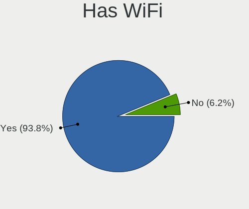
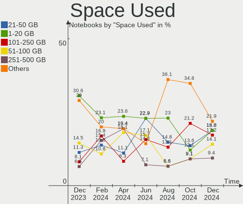
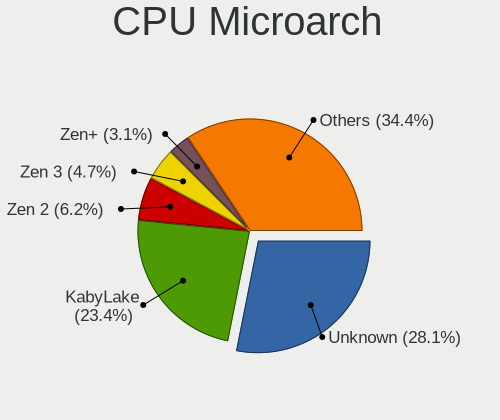
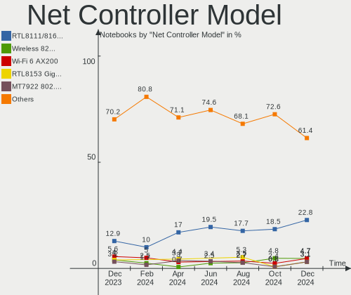
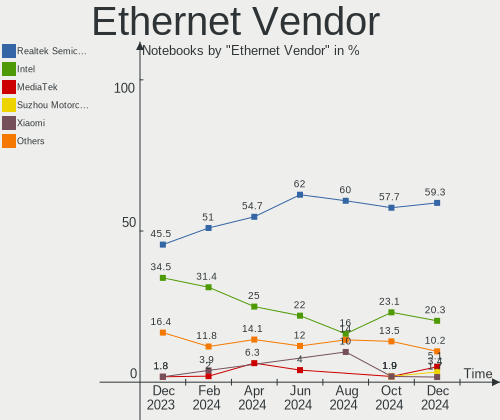
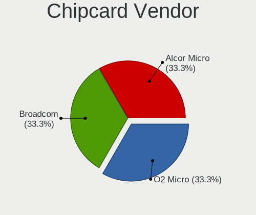
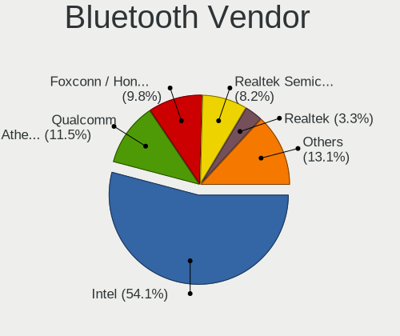

Manjaro Hardware Trends (Notebook)
----------------------------------

A project to identify most popular hardware characteristics and track their change
over time based on data collected by Manjaro users at https://Linux-Hardware.org.

Anyone can contribute to the study by uploading probes of their computers by
the [hw-probe](https://github.com/linuxhw/hw-probe) tool:

    sudo -E hw-probe -all -upload

Full-feature report is available here: https://linux-hardware.org/?view=trends&formfactor=notebook

Period: May, 2021.

Contents
--------

- [ OS                       ](#os)
- [ OS Family                ](#os-family)
- [ Kernel                   ](#kernel)
- [ Kernel Family            ](#kernel-family)
- [ Kernel Major Ver.        ](#kernel-major-ver)
- [ Arch                     ](#arch)
- [ DE                       ](#de)
- [ Display Server           ](#display-server)
- [ Display Manager          ](#display-manager)
- [ OS Lang                  ](#os-lang)
- [ Boot Mode                ](#boot-mode)
- [ Filesystem               ](#filesystem)
- [ Part. scheme             ](#part-scheme)
- [ Dual Boot with Linux/BSD ](#dual-boot-with-linux/bsd)
- [ Dual Boot (Win)          ](#dual-boot-win)
- [ Country                  ](#country)
- [ City                     ](#city)
- [ Vendor                   ](#vendor)
- [ Model                    ](#model)
- [ Model Family             ](#model-family)
- [ MFG Year                 ](#mfg-year)
- [ Form Factor              ](#form-factor)
- [ Secure Boot              ](#secure-boot)
- [ Coreboot                 ](#coreboot)
- [ RAM Size                 ](#ram-size)
- [ RAM Used                 ](#ram-used)
- [ Has CD-ROM               ](#has-cd-rom)
- [ Total Drives             ](#total-drives)
- [ Has Ethernet             ](#has-ethernet)
- [ Has WiFi                 ](#has-wifi)
- [ Has Bluetooth            ](#has-bluetooth)
- [ Drive Vendor             ](#drive-vendor)
- [ Drive Model              ](#drive-model)
- [ HDD Vendor               ](#hdd-vendor)
- [ SSD Vendor               ](#ssd-vendor)
- [ Drive Kind               ](#drive-kind)
- [ Drive Connector          ](#drive-connector)
- [ Drive Size               ](#drive-size)
- [ Space Total              ](#space-total)
- [ Space Used               ](#space-used)
- [ Malfunc. Drives          ](#malfunc-drives)
- [ Malfunc. Drive Vendor    ](#malfunc-drive-vendor)
- [ Malfunc. HDD Vendor      ](#malfunc-hdd-vendor)
- [ Malfunc. Drive Kind      ](#malfunc-drive-kind)
- [ Failed Drives            ](#failed-drives)
- [ Failed Drive Vendor      ](#failed-drive-vendor)
- [ Drive Status             ](#drive-status)
- [ Storage Vendor           ](#storage-vendor)
- [ Storage Model            ](#storage-model)
- [ Storage Kind             ](#storage-kind)
- [ CPU Vendor               ](#cpu-vendor)
- [ CPU Model                ](#cpu-model)
- [ CPU Model Family         ](#cpu-model-family)
- [ CPU Cores                ](#cpu-cores)
- [ CPU Sockets              ](#cpu-sockets)
- [ CPU Threads              ](#cpu-threads)
- [ CPU Op-Modes             ](#cpu-op-modes)
- [ CPU Microcode            ](#cpu-microcode)
- [ CPU Microarch            ](#cpu-microarch)
- [ GPU Vendor               ](#gpu-vendor)
- [ GPU Model                ](#gpu-model)
- [ GPU Combo                ](#gpu-combo)
- [ GPU Driver               ](#gpu-driver)
- [ GPU Memory               ](#gpu-memory)
- [ Monitor Vendor           ](#monitor-vendor)
- [ Monitor Model            ](#monitor-model)
- [ Monitor Resolution       ](#monitor-resolution)
- [ Monitor Diagonal         ](#monitor-diagonal)
- [ Monitor Width            ](#monitor-width)
- [ Aspect Ratio             ](#aspect-ratio)
- [ Monitor Area             ](#monitor-area)
- [ Pixel Density            ](#pixel-density)
- [ Multiple Monitors        ](#multiple-monitors)
- [ Net Controller Vendor    ](#net-controller-vendor)
- [ Net Controller Model     ](#net-controller-model)
- [ Wireless Vendor          ](#wireless-vendor)
- [ Wireless Model           ](#wireless-model)
- [ Ethernet Vendor          ](#ethernet-vendor)
- [ Ethernet Model           ](#ethernet-model)
- [ Net Controller Kind      ](#net-controller-kind)
- [ Used Controller          ](#used-controller)
- [ NICs                     ](#nics)
- [ IPv6                     ](#ipv6)
- [ Memory Vendor            ](#memory-vendor)
- [ Memory Model             ](#memory-model)
- [ Memory Kind              ](#memory-kind)
- [ Memory Form Factor       ](#memory-form-factor)
- [ Memory Size              ](#memory-size)
- [ Memory Speed             ](#memory-speed)
- [ Sound Vendor             ](#sound-vendor)
- [ Sound Model              ](#sound-model)
- [ Camera Vendor            ](#camera-vendor)
- [ Camera Model             ](#camera-model)
- [ Fingerprint Vendor       ](#fingerprint-vendor)
- [ Fingerprint Model        ](#fingerprint-model)
- [ Chipcard Vendor          ](#chipcard-vendor)
- [ Chipcard Model           ](#chipcard-model)
- [ Printer Vendor           ](#printer-vendor)
- [ Printer Model            ](#printer-model)
- [ Scanner Vendor           ](#scanner-vendor)
- [ Scanner Model            ](#scanner-model)
- [ Bluetooth Vendor         ](#bluetooth-vendor)
- [ Bluetooth Model          ](#bluetooth-model)
- [ Unsupported Devices      ](#unsupported-devices)
- [ Unsupported Device Types ](#unsupported-device-types)

OS
--

Installed operating systems

| Name           | Notebooks | Percent |
|----------------|-----------|---------|
| Manjaro        | 56        | 42.42%  |
| Manjaro 21.0.4 | 31        | 23.48%  |
| Manjaro 21.0.5 | 30        | 22.73%  |
| Manjaro 21.0.3 | 12        | 9.09%   |
| Manjaro 21.0.1 | 1         | 0.76%   |
| Manjaro 21.0   | 1         | 0.76%   |
| Manjaro 20.2.1 | 1         | 0.76%   |

OS Family
---------

OS without a version

| Name    | Notebooks | Percent |
|---------|-----------|---------|
| Manjaro | 132       | 100%    |

Kernel
------

Version of the Linux kernel

| Version              | Notebooks | Percent |
|----------------------|-----------|---------|
| 5.10.34-1-MANJARO    | 27        | 20.45%  |
| 5.10.36-2-MANJARO    | 21        | 15.91%  |
| 5.12.2-1-MANJARO     | 17        | 12.88%  |
| 5.10.32-1-MANJARO    | 15        | 11.36%  |
| 5.9.16-1-MANJARO     | 10        | 7.58%   |
| 5.12.1-2-MANJARO     | 10        | 7.58%   |
| 5.12.0-1-MANJARO     | 5         | 3.79%   |
| 5.4.116-1-MANJARO    | 4         | 3.03%   |
| 5.13.0-1-MANJARO     | 3         | 2.27%   |
| 5.11.19-1-MANJARO    | 3         | 2.27%   |
| 5.11.18-1-MANJARO    | 3         | 2.27%   |
| 5.4.118-1-MANJARO    | 2         | 1.52%   |
| 5.9.11-3-MANJARO     | 1         | 0.76%   |
| 5.9.1-1-rt19-MANJARO | 1         | 0.76%   |
| 5.4.114-1-MANJARO    | 1         | 0.76%   |
| 5.12.5-1-MANJARO     | 1         | 0.76%   |
| 5.12.4-lqx3-1-lqx    | 1         | 0.76%   |
| 5.12.1-1-ck-haswell  | 1         | 0.76%   |
| 5.11.16-2-MANJARO    | 1         | 0.76%   |
| 5.11.14-1-MANJARO    | 1         | 0.76%   |
| 5.10.33-1-MANJARO    | 1         | 0.76%   |
| 5.10.30-1-MANJARO    | 1         | 0.76%   |
| 5.10.26-1-MANJARO    | 1         | 0.76%   |
| 5.10.23-1-MANJARO    | 1         | 0.76%   |

Kernel Family
-------------

Linux kernel without a distro release

| Version | Notebooks | Percent |
|---------|-----------|---------|
| 5.10.34 | 27        | 20.45%  |
| 5.10.36 | 21        | 15.91%  |
| 5.12.2  | 17        | 12.88%  |
| 5.10.32 | 15        | 11.36%  |
| 5.12.1  | 11        | 8.33%   |
| 5.9.16  | 10        | 7.58%   |
| 5.12.0  | 5         | 3.79%   |
| 5.4.116 | 4         | 3.03%   |
| 5.13.0  | 3         | 2.27%   |
| 5.11.19 | 3         | 2.27%   |
| 5.11.18 | 3         | 2.27%   |
| 5.4.118 | 2         | 1.52%   |
| 5.9.11  | 1         | 0.76%   |
| 5.9.1   | 1         | 0.76%   |
| 5.4.114 | 1         | 0.76%   |
| 5.12.5  | 1         | 0.76%   |
| 5.12.4  | 1         | 0.76%   |
| 5.11.16 | 1         | 0.76%   |
| 5.11.14 | 1         | 0.76%   |
| 5.10.33 | 1         | 0.76%   |
| 5.10.30 | 1         | 0.76%   |
| 5.10.26 | 1         | 0.76%   |
| 5.10.23 | 1         | 0.76%   |

Kernel Major Ver.
-----------------

Linux kernel major version

| Version | Notebooks | Percent |
|---------|-----------|---------|
| 5.10    | 67        | 50.76%  |
| 5.12    | 35        | 26.52%  |
| 5.9     | 12        | 9.09%   |
| 5.11    | 8         | 6.06%   |
| 5.4     | 7         | 5.3%    |
| 5.13    | 3         | 2.27%   |

Arch
----

OS architecture (x86_64, i586, etc.)

| Name   | Notebooks | Percent |
|--------|-----------|---------|
| x86_64 | 132       | 100%    |

DE
--

Desktop Environment

| Name       | Notebooks | Percent |
|------------|-----------|---------|
| XFCE       | 34        | 25.76%  |
| KDE5       | 34        | 25.76%  |
| GNOME      | 27        | 20.45%  |
| KDE        | 22        | 16.67%  |
| X-Cinnamon | 4         | 3.03%   |
| Deepin     | 3         | 2.27%   |
| Cinnamon   | 3         | 2.27%   |
| i3         | 2         | 1.52%   |
| Unknown    | 2         | 1.52%   |
| Budgie     | 1         | 0.76%   |

Display Server
--------------

X11 or Wayland

| Name    | Notebooks | Percent |
|---------|-----------|---------|
| X11     | 111       | 84.09%  |
| Wayland | 16        | 12.12%  |
| Unknown | 3         | 2.27%   |
| Tty     | 2         | 1.52%   |

Display Manager
---------------

SDDM, LightDM, etc.

| Name    | Notebooks | Percent |
|---------|-----------|---------|
| Unknown | 55        | 41.67%  |
| SDDM    | 34        | 25.76%  |
| LightDM | 24        | 18.18%  |
| GDM     | 18        | 13.64%  |
| TDM     | 1         | 0.76%   |

OS Lang
-------

Language

| Lang    | Notebooks | Percent |
|---------|-----------|---------|
| en_US   | 52        | 39.39%  |
| de_DE   | 17        | 12.88%  |
| en_GB   | 10        | 7.58%   |
| pt_BR   | 8         | 6.06%   |
| ru_RU   | 7         | 5.3%    |
| en_AU   | 4         | 3.03%   |
| pl_PL   | 3         | 2.27%   |
| it_IT   | 3         | 2.27%   |
| es_ES   | 3         | 2.27%   |
| nb_NO   | 2         | 1.52%   |
| fr_FR   | 2         | 1.52%   |
| en_ZA   | 2         | 1.52%   |
| en_IN   | 2         | 1.52%   |
| en_CA   | 2         | 1.52%   |
| Unknown | 2         | 1.52%   |
| zh_CN   | 1         | 0.76%   |
| uk_UA   | 1         | 0.76%   |
| nl_NL   | 1         | 0.76%   |
| es_EC   | 1         | 0.76%   |
| es_AR   | 1         | 0.76%   |
| en_SI   | 1         | 0.76%   |
| en_NZ   | 1         | 0.76%   |
| en_NG   | 1         | 0.76%   |
| de_CH   | 1         | 0.76%   |
| de_AT   | 1         | 0.76%   |
| cs_CZ   | 1         | 0.76%   |
| C       | 1         | 0.76%   |
| bg_BG   | 1         | 0.76%   |

Boot Mode
---------

EFI or BIOS

| Mode | Notebooks | Percent |
|------|-----------|---------|
| BIOS | 67        | 50.76%  |
| EFI  | 65        | 49.24%  |

Filesystem
----------

Type of filesystem

| Type     | Notebooks | Percent |
|----------|-----------|---------|
| Ext4     | 113       | 85.61%  |
| Btrfs    | 8         | 6.06%   |
| Overlay  | 7         | 5.3%    |
| Xfs      | 2         | 1.52%   |
| Reiserfs | 1         | 0.76%   |
| Unknown  | 1         | 0.76%   |

Part. scheme
------------

Scheme of partitioning

| Type    | Notebooks | Percent |
|---------|-----------|---------|
| GPT     | 65        | 49.24%  |
| Unknown | 53        | 40.15%  |
| MBR     | 14        | 10.61%  |

Dual Boot with Linux/BSD
------------------------

Hosting more than one Linux/BSD

| Dual boot | Notebooks | Percent |
|-----------|-----------|---------|
| No        | 118       | 89.39%  |
| Yes       | 14        | 10.61%  |

Dual Boot (Win)
---------------

Hosting Linux and Windows

| Dual boot | Notebooks | Percent |
|-----------|-----------|---------|
| No        | 100       | 75.76%  |
| Yes       | 32        | 24.24%  |

Country
-------

Geographic location (country)

| Country      | Notebooks | Percent |
|--------------|-----------|---------|
| USA          | 16        | 12.12%  |
| Germany      | 16        | 12.12%  |
| Brazil       | 12        | 9.09%   |
| Russia       | 7         | 5.3%    |
| UK           | 6         | 4.55%   |
| Spain        | 6         | 4.55%   |
| Poland       | 6         | 4.55%   |
| Ukraine      | 4         | 3.03%   |
| India        | 4         | 3.03%   |
| Australia    | 4         | 3.03%   |
| Norway       | 3         | 2.27%   |
| Netherlands  | 3         | 2.27%   |
| Italy        | 3         | 2.27%   |
| Canada       | 3         | 2.27%   |
| Turkey       | 2         | 1.52%   |
| Switzerland  | 2         | 1.52%   |
| South Africa | 2         | 1.52%   |
| Iran         | 2         | 1.52%   |
| France       | 2         | 1.52%   |
| China        | 2         | 1.52%   |
| Belarus      | 2         | 1.52%   |
| Bangladesh   | 2         | 1.52%   |
| Austria      | 2         | 1.52%   |
| Vietnam      | 1         | 0.76%   |
| Sri Lanka    | 1         | 0.76%   |
| Slovenia     | 1         | 0.76%   |
| Slovakia     | 1         | 0.76%   |
| Romania      | 1         | 0.76%   |
| Panama       | 1         | 0.76%   |
| Nigeria      | 1         | 0.76%   |
| New Zealand  | 1         | 0.76%   |
| Malaysia     | 1         | 0.76%   |
| Libya        | 1         | 0.76%   |
| Kazakhstan   | 1         | 0.76%   |
| Israel       | 1         | 0.76%   |
| Ireland      | 1         | 0.76%   |
| Indonesia    | 1         | 0.76%   |
| Guatemala    | 1         | 0.76%   |
| Egypt        | 1         | 0.76%   |
| Ecuador      | 1         | 0.76%   |
| Czechia      | 1         | 0.76%   |
| Colombia     | 1         | 0.76%   |
| Bulgaria     | 1         | 0.76%   |
| Argentina    | 1         | 0.76%   |

City
----

Geographic location (city)

| City                  | Notebooks | Percent |
|-----------------------|-----------|---------|
| Rio de Janeiro        | 3         | 2.27%   |
| London                | 3         | 2.27%   |
| Ingolstadt            | 3         | 2.27%   |
| Brisbane              | 3         | 2.27%   |
| Wimbledon             | 2         | 1.52%   |
| São Paulo            | 2         | 1.52%   |
| Moscow                | 2         | 1.52%   |
| Madrid                | 2         | 1.52%   |
| Kyiv                  | 2         | 1.52%   |
| Istanbul              | 2         | 1.52%   |
| Dhaka                 | 2         | 1.52%   |
| Ślesin               | 1         | 0.76%   |
| Zurich                | 1         | 0.76%   |
| Zabrze                | 1         | 0.76%   |
| Yakutsk               | 1         | 0.76%   |
| Warsaw                | 1         | 0.76%   |
| Wachtberg             | 1         | 0.76%   |
| Vrhnika               | 1         | 0.76%   |
| Vinnytsia             | 1         | 0.76%   |
| Vienna                | 1         | 0.76%   |
| Turin                 | 1         | 0.76%   |
| Tucson                | 1         | 0.76%   |
| Tubarao               | 1         | 0.76%   |
| Toronto               | 1         | 0.76%   |
| Timișoara            | 1         | 0.76%   |
| Tilburg               | 1         | 0.76%   |
| The Hague             | 1         | 0.76%   |
| Tehran                | 1         | 0.76%   |
| Tabriz                | 1         | 0.76%   |
| Stuttgart             | 1         | 0.76%   |
| St Petersburg         | 1         | 0.76%   |
| Sorocaba              | 1         | 0.76%   |
| Sion                  | 1         | 0.76%   |
| Sindelfingen          | 1         | 0.76%   |
| Shenzhen              | 1         | 0.76%   |
| Seward                | 1         | 0.76%   |
| Sao Jose do Rio Preto | 1         | 0.76%   |
| San Antonio           | 1         | 0.76%   |
| Salzburg              | 1         | 0.76%   |
| Roztoky               | 1         | 0.76%   |
| Rishon LeZiyyon       | 1         | 0.76%   |
| Rio Ceballos          | 1         | 0.76%   |
| Portland              | 1         | 0.76%   |
| Perth                 | 1         | 0.76%   |
| Paris                 | 1         | 0.76%   |
| Panama City           | 1         | 0.76%   |
| Palmyra               | 1         | 0.76%   |
| Paderno Dugnano       | 1         | 0.76%   |
| Oslo                  | 1         | 0.76%   |
| Orozko                | 1         | 0.76%   |
| Obernkirchen          | 1         | 0.76%   |
| Nuremberg             | 1         | 0.76%   |
| Notteroy              | 1         | 0.76%   |
| Murmansk              | 1         | 0.76%   |
| Muhr am See           | 1         | 0.76%   |
| Midland               | 1         | 0.76%   |
| Mercersburg           | 1         | 0.76%   |
| Medellín             | 1         | 0.76%   |
| Malbork               | 1         | 0.76%   |
| Maharagama            | 1         | 0.76%   |

Vendor
------

Motherboard manufacturer

| Name                   | Notebooks | Percent |
|------------------------|-----------|---------|
| Lenovo                 | 33        | 25%     |
| Hewlett-Packard        | 28        | 21.21%  |
| Dell                   | 21        | 15.91%  |
| ASUSTek Computer       | 14        | 10.61%  |
| Acer                   | 7         | 5.3%    |
| Apple                  | 6         | 4.55%   |
| MSI                    | 5         | 3.79%   |
| Toshiba                | 3         | 2.27%   |
| Sony                   | 2         | 1.52%   |
| Samsung Electronics    | 2         | 1.52%   |
| Multilaser             | 2         | 1.52%   |
| HUAWEI                 | 2         | 1.52%   |
| Timi                   | 1         | 0.76%   |
| ONE-NETBOOK TECHNOLOGY | 1         | 0.76%   |
| Notebook               | 1         | 0.76%   |
| Medion                 | 1         | 0.76%   |
| Google                 | 1         | 0.76%   |
| Gigabyte Technology    | 1         | 0.76%   |
| Chuwi                  | 1         | 0.76%   |

Model
-----

Motherboard model

| Name                                     | Notebooks | Percent |
|------------------------------------------|-----------|---------|
| Multilaser PC301                         | 2         | 1.52%   |
| Dell Precision 5530                      | 2         | 1.52%   |
| Toshiba Satellite L510                   | 1         | 0.76%   |
| Toshiba Satellite C50D-B                 | 1         | 0.76%   |
| Toshiba SATEGO P100                      | 1         | 0.76%   |
| Timi TM1703                              | 1         | 0.76%   |
| Sony VPCYB35AB                           | 1         | 0.76%   |
| Sony VPCEH2D0E                           | 1         | 0.76%   |
| Samsung 750XDA                           | 1         | 0.76%   |
| Samsung 550XBE/350XBE                    | 1         | 0.76%   |
| ONE-NETBOOK TECHNOLOGY One-Mix3 Pro      | 1         | 0.76%   |
| Notebook NH5xAx                          | 1         | 0.76%   |
| MSI PS42 8RB                             | 1         | 0.76%   |
| MSI GS66 Stealth 10SGS                   | 1         | 0.76%   |
| MSI GF63 Thin 9SC                        | 1         | 0.76%   |
| MSI GE76 Raider 10UE                     | 1         | 0.76%   |
| MSI GE60 2OC\2OD\2OE                     | 1         | 0.76%   |
| Medion S15450                            | 1         | 0.76%   |
| Lenovo Zhaoyang K29 20186                | 1         | 0.76%   |
| Lenovo Z50-70 20354                      | 1         | 0.76%   |
| Lenovo Y520-15IKBN 80WK                  | 1         | 0.76%   |
| Lenovo V310-14ISK 80UF0004BR             | 1         | 0.76%   |
| Lenovo V14-ADA 82C6                      | 1         | 0.76%   |
| Lenovo ThinkPad X250 20CLS1V210          | 1         | 0.76%   |
| Lenovo ThinkPad X250 20CLCTO1WW          | 1         | 0.76%   |
| Lenovo ThinkPad X200T 7449FWG            | 1         | 0.76%   |
| Lenovo ThinkPad X1 Carbon 3rd 20BS002BAU | 1         | 0.76%   |
| Lenovo ThinkPad T61 766512G              | 1         | 0.76%   |
| Lenovo ThinkPad T61 765912G              | 1         | 0.76%   |
| Lenovo ThinkPad T60 2007VW1              | 1         | 0.76%   |
| Lenovo ThinkPad T520 42406EG             | 1         | 0.76%   |
| Lenovo ThinkPad T460 20FN003NUK          | 1         | 0.76%   |
| Lenovo ThinkPad T460 20FMS2D600          | 1         | 0.76%   |
| Lenovo ThinkPad T430s 2356GPU            | 1         | 0.76%   |
| Lenovo ThinkPad S1 Yoga 20CDS02B00       | 1         | 0.76%   |
| Lenovo ThinkPad P14s Gen 1 20Y1CTO1WW    | 1         | 0.76%   |
| Lenovo ThinkPad L390 20NR0013SP          | 1         | 0.76%   |
| Lenovo ThinkPad L15 Gen 1 20U3002FGE     | 1         | 0.76%   |
| Lenovo ThinkPad E490 20N8000YGE          | 1         | 0.76%   |
| Lenovo Legion Y540-15IRH 81RJ            | 1         | 0.76%   |
| Lenovo Legion R9000P2021H 82JQ           | 1         | 0.76%   |
| Lenovo Legion 5 82B5                     | 1         | 0.76%   |
| Lenovo IdeaPad Z580                      | 1         | 0.76%   |
| Lenovo IdeaPad Slim 1-14AST-05 81VS      | 1         | 0.76%   |
| Lenovo IdeaPad Gaming 3 15IMH05 81Y4     | 1         | 0.76%   |
| Lenovo IdeaPad 330-17IKB 81DM            | 1         | 0.76%   |
| Lenovo IdeaPad 330-15AST 81D6            | 1         | 0.76%   |
| Lenovo IdeaPad 3 15IIL05 81WE            | 1         | 0.76%   |
| Lenovo IdeaPad 110-15IBR 80T7            | 1         | 0.76%   |
| Lenovo IdeaPad 1 14ADA05 82GW            | 1         | 0.76%   |
| Lenovo G580 20150                        | 1         | 0.76%   |
| HUAWEI MACH-WX9                          | 1         | 0.76%   |
| HUAWEI KLVL-WXX9                         | 1         | 0.76%   |
| HP ProBook 6550b                         | 1         | 0.76%   |
| HP ProBook 455 G7                        | 1         | 0.76%   |
| HP ProBook 450 G8 Notebook PC            | 1         | 0.76%   |
| HP ProBook 450 G5                        | 1         | 0.76%   |
| HP ProBook 440 G7                        | 1         | 0.76%   |
| HP Pavilion x2 Detachable                | 1         | 0.76%   |
| HP Pavilion Notebook 15-dp0xxx           | 1         | 0.76%   |

Model Family
------------

Motherboard model prefix

| Name                            | Notebooks | Percent |
|---------------------------------|-----------|---------|
| Lenovo ThinkPad                 | 16        | 12.12%  |
| Lenovo IdeaPad                  | 8         | 6.06%   |
| HP Pavilion                     | 7         | 5.3%    |
| Dell Inspiron                   | 7         | 5.3%    |
| HP EliteBook                    | 6         | 4.55%   |
| HP ProBook                      | 5         | 3.79%   |
| Dell Latitude                   | 5         | 3.79%   |
| Dell XPS                        | 4         | 3.03%   |
| Lenovo Legion                   | 3         | 2.27%   |
| HP Laptop                       | 3         | 2.27%   |
| Acer Aspire                     | 3         | 2.27%   |
| Toshiba Satellite               | 2         | 1.52%   |
| Multilaser PC301                | 2         | 1.52%   |
| HP Compaq                       | 2         | 1.52%   |
| HP 15                           | 2         | 1.52%   |
| Dell Precision                  | 2         | 1.52%   |
| ASUS ROG                        | 2         | 1.52%   |
| Acer Nitro                      | 2         | 1.52%   |
| Toshiba SATEGO                  | 1         | 0.76%   |
| Timi TM1703                     | 1         | 0.76%   |
| Sony VPCYB35AB                  | 1         | 0.76%   |
| Sony VPCEH2D0E                  | 1         | 0.76%   |
| Samsung 750XDA                  | 1         | 0.76%   |
| Samsung 550XBE                  | 1         | 0.76%   |
| ONE-NETBOOK TECHNOLOGY One-Mix3 | 1         | 0.76%   |
| Notebook NH5xAx                 | 1         | 0.76%   |
| MSI PS42                        | 1         | 0.76%   |
| MSI GS66                        | 1         | 0.76%   |
| MSI GF63                        | 1         | 0.76%   |
| MSI GE76                        | 1         | 0.76%   |
| MSI GE60                        | 1         | 0.76%   |
| Medion S15450                   | 1         | 0.76%   |
| Lenovo Zhaoyang                 | 1         | 0.76%   |
| Lenovo Z50-70                   | 1         | 0.76%   |
| Lenovo Y520-15IKBN              | 1         | 0.76%   |
| Lenovo V310-14ISK               | 1         | 0.76%   |
| Lenovo V14-ADA                  | 1         | 0.76%   |
| Lenovo G580                     | 1         | 0.76%   |
| HUAWEI MACH-WX9                 | 1         | 0.76%   |
| HUAWEI KLVL-WXX9                | 1         | 0.76%   |
| HP Notebook                     | 1         | 0.76%   |
| HP ENVY                         | 1         | 0.76%   |
| HP 250                          | 1         | 0.76%   |
| Google Edgar                    | 1         | 0.76%   |
| Gigabyte AERO                   | 1         | 0.76%   |
| Dell Vostro                     | 1         | 0.76%   |
| Dell G7                         | 1         | 0.76%   |
| Dell G3                         | 1         | 0.76%   |
| Chuwi GemiBook                  | 1         | 0.76%   |
| ASUS ZenBook                    | 1         | 0.76%   |
| ASUS X705UDR                    | 1         | 0.76%   |
| ASUS X550VX                     | 1         | 0.76%   |
| ASUS UX430UAR                   | 1         | 0.76%   |
| ASUS TUF                        | 1         | 0.76%   |
| ASUS N56VB                      | 1         | 0.76%   |
| ASUS N550JK                     | 1         | 0.76%   |
| ASUS K54C                       | 1         | 0.76%   |
| ASUS K53Z                       | 1         | 0.76%   |
| ASUS K53SM                      | 1         | 0.76%   |
| ASUS K52Jr                      | 1         | 0.76%   |

MFG Year
--------

Motherboard manufacture year

| Year    | Notebooks | Percent |
|---------|-----------|---------|
| 2020    | 47        | 35.61%  |
| 2019    | 19        | 14.39%  |
| 2021    | 11        | 8.33%   |
| 2018    | 11        | 8.33%   |
| 2011    | 7         | 5.3%    |
| 2016    | 5         | 3.79%   |
| 2013    | 5         | 3.79%   |
| 2012    | 5         | 3.79%   |
| 2017    | 4         | 3.03%   |
| 2014    | 4         | 3.03%   |
| 2009    | 4         | 3.03%   |
| 2015    | 3         | 2.27%   |
| 2008    | 3         | 2.27%   |
| 2010    | 2         | 1.52%   |
| 2007    | 1         | 0.76%   |
| Unknown | 1         | 0.76%   |

Form Factor
-----------

Physical design of the computer

| Name     | Notebooks | Percent |
|----------|-----------|---------|
| Notebook | 132       | 100%    |

Secure Boot
-----------

Enabled or disabled

| State    | Notebooks | Percent |
|----------|-----------|---------|
| Disabled | 132       | 100%    |

Coreboot
--------

Have coreboot on board

| Used | Notebooks | Percent |
|------|-----------|---------|
| No   | 131       | 99.24%  |
| Yes  | 1         | 0.76%   |

RAM Size
--------

Total RAM memory

| Size in GB  | Notebooks | Percent |
|-------------|-----------|---------|
| 4.01-8.0    | 41        | 31.06%  |
| 8.01-16.0   | 30        | 22.73%  |
| 16.01-24.0  | 23        | 17.42%  |
| 3.01-4.0    | 19        | 14.39%  |
| 32.01-64.0  | 10        | 7.58%   |
| 1.01-2.0    | 6         | 4.55%   |
| 64.01-256.0 | 2         | 1.52%   |
| 24.01-32.0  | 1         | 0.76%   |

RAM Used
--------

Used RAM memory

| Used GB   | Notebooks | Percent |
|-----------|-----------|---------|
| 1.01-2.0  | 44        | 33.33%  |
| 2.01-3.0  | 31        | 23.48%  |
| 3.01-4.0  | 22        | 16.67%  |
| 4.01-8.0  | 19        | 14.39%  |
| 0.51-1.0  | 11        | 8.33%   |
| 8.01-16.0 | 4         | 3.03%   |
| 0.01-0.5  | 1         | 0.76%   |

Has CD-ROM
----------

Has CD-ROM on board

| Presented | Notebooks | Percent |
|-----------|-----------|---------|
| No        | 94        | 71.21%  |
| Yes       | 38        | 28.79%  |

Total Drives
------------

Number of drives on board

| Drives | Notebooks | Percent |
|--------|-----------|---------|
| 1      | 87        | 65.91%  |
| 2      | 38        | 28.79%  |
| 3      | 6         | 4.55%   |
| 0      | 1         | 0.76%   |

Has Ethernet
------------

Has Ethernet on board

| Presented | Notebooks | Percent |
|-----------|-----------|---------|
| Yes       | 111       | 84.09%  |
| No        | 21        | 15.91%  |

Has WiFi
--------

Has WiFi module

| Presented | Notebooks | Percent |
|-----------|-----------|---------|
| Yes       | 128       | 96.97%  |
| No        | 4         | 3.03%   |

Has Bluetooth
-------------

Has Bluetooth module

| Presented | Notebooks | Percent |
|-----------|-----------|---------|
| Yes       | 98        | 74.24%  |
| No        | 34        | 25.76%  |

Drive Vendor
------------

Hard drive vendors

| Vendor              | Notebooks | Drives | Percent |
|---------------------|-----------|--------|---------|
| Samsung Electronics | 30        | 32     | 16.95%  |
| Seagate             | 26        | 27     | 14.69%  |
| Unknown             | 16        | 16     | 9.04%   |
| WDC                 | 15        | 16     | 8.47%   |
| Toshiba             | 12        | 12     | 6.78%   |
| Kingston            | 10        | 10     | 5.65%   |
| SK Hynix            | 9         | 9      | 5.08%   |
| SanDisk             | 7         | 7      | 3.95%   |
| Hitachi             | 7         | 7      | 3.95%   |
| Intel               | 6         | 6      | 3.39%   |
| Crucial             | 6         | 6      | 3.39%   |
| Apple               | 5         | 5      | 2.82%   |
| Transcend           | 3         | 3      | 1.69%   |
| Union Memory        | 2         | 2      | 1.13%   |
| Phison              | 2         | 2      | 1.13%   |
| LITEON              | 2         | 2      | 1.13%   |
| HGST                | 2         | 2      | 1.13%   |
| China               | 2         | 2      | 1.13%   |
| A-DATA Technology   | 2         | 2      | 1.13%   |
| XPG                 | 1         | 1      | 0.56%   |
| SSK                 | 1         | 1      | 0.56%   |
| SPCC                | 1         | 1      | 0.56%   |
| QNAP                | 1         | 1      | 0.56%   |
| Phison Electronics  | 1         | 1      | 0.56%   |
| Patriot             | 1         | 1      | 0.56%   |
| Mushkin             | 1         | 1      | 0.56%   |
| KIOXIA              | 1         | 1      | 0.56%   |
| GOODRAM             | 1         | 1      | 0.56%   |
| Fujitsu             | 1         | 1      | 0.56%   |
| FORESEE             | 1         | 1      | 0.56%   |
| ASMT                | 1         | 1      | 0.56%   |
| Apacer              | 1         | 1      | 0.56%   |

Drive Model
-----------

Hard drive models

| Model                                   | Notebooks | Percent |
|-----------------------------------------|-----------|---------|
| Seagate ST1000LM035-1RK172 1TB          | 6         | 3.31%   |
| Unknown SD/MMC/MS PRO 8GB               | 3         | 1.66%   |
| Unknown MMC Card  32GB                  | 3         | 1.66%   |
| SK Hynix NVMe SSD Drive 512GB           | 3         | 1.66%   |
| SK Hynix NVMe SSD Drive 256GB           | 3         | 1.66%   |
| Samsung NVMe SSD Drive 1024GB           | 3         | 1.66%   |
| WDC WD10SPZX-24Z10 1TB                  | 2         | 1.1%    |
| Unknown NVMe SSD Drive 256GB            | 2         | 1.1%    |
| Toshiba MQ04ABF100 1TB                  | 2         | 1.1%    |
| Seagate ST9500325AS 500GB               | 2         | 1.1%    |
| Seagate ST750LM022 HN-M750MBB 752GB     | 2         | 1.1%    |
| Seagate ST500LT012-1DG142 500GB         | 2         | 1.1%    |
| Seagate ST1000LM024 HN-M101MBB 1TB      | 2         | 1.1%    |
| Seagate BUP Slim BK 2TB                 | 2         | 1.1%    |
| Samsung NVMe SSD Drive 512GB            | 2         | 1.1%    |
| Samsung NVMe SSD Drive 256GB            | 2         | 1.1%    |
| Samsung NVMe SSD Drive 1TB              | 2         | 1.1%    |
| Samsung MZ7LN256HCHP-000L7 256GB SSD    | 2         | 1.1%    |
| HGST HTS721010A9E630 1TB                | 2         | 1.1%    |
| Crucial CT240BX500SSD1 240GB            | 2         | 1.1%    |
| XPG NVMe SSD Drive 1024GB               | 1         | 0.55%   |
| WDC WDS240G2G0A-00JH30 240GB SSD        | 1         | 0.55%   |
| WDC WDS100T2B0B-00YS70 1TB SSD          | 1         | 0.55%   |
| WDC WDBNCE5000PNC 500GB SSD             | 1         | 0.55%   |
| WDC WD5000LPVX-28V0TT1 500GB            | 1         | 0.55%   |
| WDC WD5000LPCX-21VHAT0 500GB            | 1         | 0.55%   |
| WDC WD2500BPVT-80ZEST0 250GB            | 1         | 0.55%   |
| WDC WD10SPZX-75Z10T1 1TB                | 1         | 0.55%   |
| WDC WD10SPZX-35Z10T0 1TB                | 1         | 0.55%   |
| WDC WD10JPVX-75JC3T0 1TB                | 1         | 0.55%   |
| WDC WD10JPVX-60JC3T0 1TB                | 1         | 0.55%   |
| WDC PC SN730 SDBPNTY-1T00-1032 1TB      | 1         | 0.55%   |
| WDC PC SN530 SDBPNPZ-512G-1114 512GB    | 1         | 0.55%   |
| WDC PC SN520 SDAPNUW-256G-1006 256GB    | 1         | 0.55%   |
| WDC PC SN520 SDAPMUW-128G-1101 128GB    | 1         | 0.55%   |
| Unknown SN400  394GB                    | 1         | 0.55%   |
| Unknown SDU1  16GB                      | 1         | 0.55%   |
| Unknown SD64G  64GB                     | 1         | 0.55%   |
| Unknown SC16G  16GB                     | 1         | 0.55%   |
| Unknown S11-512G-PHISON-DVS-B27 512GB   | 1         | 0.55%   |
| Unknown MMC Card  128GB                 | 1         | 0.55%   |
| Unknown HBG4a2  32GB                    | 1         | 0.55%   |
| Unknown 00000  64GB                     | 1         | 0.55%   |
| Union Memory UMIS RPJTJ256MEE1OWX 256GB | 1         | 0.55%   |
| Union Memory RPFTJ128PDD2EWX 128GB      | 1         | 0.55%   |
| Transcend TS128GMTS400 128GB SSD        | 1         | 0.55%   |
| Transcend TS128GMSA370 128GB SSD        | 1         | 0.55%   |
| Transcend TS120GSSD220S 120GB           | 1         | 0.55%   |
| Toshiba NVMe SSD Drive 256GB            | 1         | 0.55%   |
| Toshiba MQ01ABF050 500GB                | 1         | 0.55%   |
| Toshiba MQ01ABD100 1TB                  | 1         | 0.55%   |
| Toshiba MQ01ABD075 752GB                | 1         | 0.55%   |
| Toshiba MK5076GSX 500GB                 | 1         | 0.55%   |
| Toshiba MK3263GSX 320GB                 | 1         | 0.55%   |
| Toshiba MK2561GSYN 250GB                | 1         | 0.55%   |
| Toshiba MK1665GSX 160GB                 | 1         | 0.55%   |
| Toshiba KXG60PNV2T04 NVMe KIOXIA 2048GB | 1         | 0.55%   |
| Toshiba KBG30ZMT256G 256GB              | 1         | 0.55%   |
| SSK Disk 256GB                          | 1         | 0.55%   |
| SPCC M.2 PCIe SSD 1TB                   | 1         | 0.55%   |

HDD Vendor
----------

Hard disk drive vendors

| Vendor  | Notebooks | Drives | Percent |
|---------|-----------|--------|---------|
| Seagate | 25        | 26     | 45.45%  |
| WDC     | 9         | 9      | 16.36%  |
| Toshiba | 9         | 9      | 16.36%  |
| Hitachi | 7         | 7      | 12.73%  |
| HGST    | 2         | 2      | 3.64%   |
| QNAP    | 1         | 1      | 1.82%   |
| Fujitsu | 1         | 1      | 1.82%   |
| ASMT    | 1         | 1      | 1.82%   |

SSD Vendor
----------

Solid state drive vendors

| Vendor              | Notebooks | Drives | Percent |
|---------------------|-----------|--------|---------|
| Samsung Electronics | 16        | 16     | 27.12%  |
| Kingston            | 7         | 7      | 11.86%  |
| SanDisk             | 6         | 6      | 10.17%  |
| Crucial             | 6         | 6      | 10.17%  |
| Apple               | 5         | 5      | 8.47%   |
| WDC                 | 3         | 3      | 5.08%   |
| Transcend           | 3         | 3      | 5.08%   |
| Intel               | 3         | 3      | 5.08%   |
| SK Hynix            | 2         | 2      | 3.39%   |
| China               | 2         | 2      | 3.39%   |
| Seagate             | 1         | 1      | 1.69%   |
| Patriot             | 1         | 1      | 1.69%   |
| Mushkin             | 1         | 1      | 1.69%   |
| LITEON              | 1         | 1      | 1.69%   |
| GOODRAM             | 1         | 1      | 1.69%   |
| A-DATA Technology   | 1         | 1      | 1.69%   |

Drive Kind
----------

HDD or SSD

| Kind    | Notebooks | Drives | Percent |
|---------|-----------|--------|---------|
| SSD     | 56        | 59     | 32.75%  |
| HDD     | 53        | 56     | 30.99%  |
| NVMe    | 47        | 51     | 27.49%  |
| MMC     | 10        | 10     | 5.85%   |
| Unknown | 5         | 5      | 2.92%   |

Drive Connector
---------------

SATA, SAS, NVMe, etc.

| Type | Notebooks | Drives | Percent |
|------|-----------|--------|---------|
| SATA | 92        | 110    | 58.23%  |
| NVMe | 47        | 51     | 29.75%  |
| MMC  | 10        | 10     | 6.33%   |
| SAS  | 9         | 10     | 5.7%    |

Drive Size
----------

Size of hard drive

| Size in TB | Notebooks | Drives | Percent |
|------------|-----------|--------|---------|
| 0.01-0.5   | 71        | 79     | 66.36%  |
| 0.51-1.0   | 29        | 29     | 27.1%   |
| 1.01-2.0   | 6         | 6      | 5.61%   |
| 3.01-4.0   | 1         | 1      | 0.93%   |

Space Total
-----------

Amount of disk space available on the file system

| Size in GB     | Notebooks | Percent |
|----------------|-----------|---------|
| 101-250        | 38        | 28.79%  |
| 251-500        | 30        | 22.73%  |
| 501-1000       | 17        | 12.88%  |
| 1001-2000      | 13        | 9.85%   |
| 1-20           | 10        | 7.58%   |
| Unknown        | 9         | 6.82%   |
| 51-100         | 7         | 5.3%    |
| 21-50          | 5         | 3.79%   |
| More than 3000 | 3         | 2.27%   |

Space Used
----------

Amount of used disk space

| Used GB   | Notebooks | Percent |
|-----------|-----------|---------|
| 1-20      | 36        | 27.27%  |
| 101-250   | 27        | 20.45%  |
| 21-50     | 21        | 15.91%  |
| 51-100    | 18        | 13.64%  |
| 251-500   | 14        | 10.61%  |
| Unknown   | 9         | 6.82%   |
| 501-1000  | 5         | 3.79%   |
| 1001-2000 | 1         | 0.76%   |
| 0         | 1         | 0.76%   |

Malfunc. Drives
---------------

Drive models with a malfunction

| Model                                 | Notebooks | Drives | Percent |
|---------------------------------------|-----------|--------|---------|
| Seagate ST9500325AS 500GB             | 2         | 2      | 13.33%  |
| Toshiba MQ01ABD100 1TB                | 1         | 1      | 6.67%   |
| Toshiba MK1665GSX 160GB               | 1         | 1      | 6.67%   |
| SK Hynix HFS256G3BTND-N210A 256GB SSD | 1         | 1      | 6.67%   |
| SK Hynix HFS256G39TND-N210A 256GB SSD | 1         | 1      | 6.67%   |
| Seagate ST500LT012-9WS142 500GB       | 1         | 1      | 6.67%   |
| Seagate ST500LM021-1KJ152 500GB       | 1         | 1      | 6.67%   |
| Seagate ST1000LX015-1U7172 1TB        | 1         | 1      | 6.67%   |
| Seagate ST1000LM024 HN-M101MBB 1TB    | 1         | 1      | 6.67%   |
| LITEON CV8-8E128-HP 128GB SSD         | 1         | 1      | 6.67%   |
| Hitachi HTS727575A9E364 752GB         | 1         | 1      | 6.67%   |
| Hitachi HTS725050A7E630 500GB         | 1         | 1      | 6.67%   |
| Hitachi HTS545032B9A302 320GB         | 1         | 1      | 6.67%   |
| HGST HTS721010A9E630 1TB              | 1         | 1      | 6.67%   |

Malfunc. Drive Vendor
---------------------

Vendors of faulty drives

| Vendor   | Notebooks | Drives | Percent |
|----------|-----------|--------|---------|
| Seagate  | 6         | 6      | 40%     |
| Hitachi  | 3         | 3      | 20%     |
| Toshiba  | 2         | 2      | 13.33%  |
| SK Hynix | 2         | 2      | 13.33%  |
| LITEON   | 1         | 1      | 6.67%   |
| HGST     | 1         | 1      | 6.67%   |

Malfunc. HDD Vendor
-------------------

Vendors of faulty HDD drives

| Vendor  | Notebooks | Drives | Percent |
|---------|-----------|--------|---------|
| Seagate | 6         | 6      | 50%     |
| Hitachi | 3         | 3      | 25%     |
| Toshiba | 2         | 2      | 16.67%  |
| HGST    | 1         | 1      | 8.33%   |

Malfunc. Drive Kind
-------------------

Kinds of faulty drives

| Kind | Notebooks | Drives | Percent |
|------|-----------|--------|---------|
| HDD  | 12        | 12     | 80%     |
| SSD  | 3         | 3      | 20%     |

Failed Drives
-------------

Failed drive models

Zero info for selected period =(

Failed Drive Vendor
-------------------

Failed drive vendors

Zero info for selected period =(

Drive Status
------------

Number of failed and malfunc. drives

| Status   | Notebooks | Drives | Percent |
|----------|-----------|--------|---------|
| Detected | 79        | 101    | 52.67%  |
| Works    | 56        | 65     | 37.33%  |
| Malfunc  | 15        | 15     | 10%     |

Storage Vendor
--------------

Storage controller vendors

| Vendor                         | Notebooks | Percent |
|--------------------------------|-----------|---------|
| Intel                          | 91        | 57.96%  |
| Samsung Electronics            | 17        | 10.83%  |
| AMD                            | 16        | 10.19%  |
| SK Hynix                       | 7         | 4.46%   |
| Sandisk                        | 5         | 3.18%   |
| Phison Electronics             | 5         | 3.18%   |
| Toshiba America Info Systems   | 3         | 1.91%   |
| Kingston Technology Company    | 3         | 1.91%   |
| Union Memory (Shenzhen)        | 2         | 1.27%   |
| Solid State Storage Technology | 2         | 1.27%   |
| ADATA Technology               | 2         | 1.27%   |
| Shenzhen Longsys Electronics   | 1         | 0.64%   |
| Nvidia                         | 1         | 0.64%   |
| Lite-On Technology             | 1         | 0.64%   |
| KIOXIA                         | 1         | 0.64%   |

Storage Model
-------------

Storage controller models

| Model                                                                            | Notebooks | Percent |
|----------------------------------------------------------------------------------|-----------|---------|
| Intel Sunrise Point-LP SATA Controller [AHCI mode]                               | 18        | 11.11%  |
| AMD FCH SATA Controller [AHCI mode]                                              | 15        | 9.26%   |
| Samsung NVMe SSD Controller SM981/PM981/PM983                                    | 11        | 6.79%   |
| Intel Wildcat Point-LP SATA Controller [AHCI Mode]                               | 7         | 4.32%   |
| Intel 82801 Mobile SATA Controller [RAID mode]                                   | 7         | 4.32%   |
| Intel 7 Series Chipset Family 6-port SATA Controller [AHCI mode]                 | 7         | 4.32%   |
| Intel 6 Series/C200 Series Chipset Family 6 port Mobile SATA AHCI Controller     | 7         | 4.32%   |
| Intel Cannon Lake Mobile PCH SATA AHCI Controller                                | 6         | 3.7%    |
| Intel 82801IBM/IEM (ICH9M/ICH9M-E) 4 port SATA Controller [AHCI mode]            | 4         | 2.47%   |
| Intel 8 Series SATA Controller 1 [AHCI mode]                                     | 4         | 2.47%   |
| Intel 400 Series Chipset Family SATA AHCI Controller                             | 4         | 2.47%   |
| SK Hynix BC511                                                                   | 3         | 1.85%   |
| Samsung Electronics SATA controller                                              | 3         | 1.85%   |
| Phison E12 NVMe Controller                                                       | 3         | 1.85%   |
| Intel SSD 660P Series                                                            | 3         | 1.85%   |
| Union Memory (Shenzhen) Non-Volatile memory controller                           | 2         | 1.23%   |
| Toshiba America Info Systems XG6 NVMe SSD Controller                             | 2         | 1.23%   |
| Solid State Storage Non-Volatile memory controller                               | 2         | 1.23%   |
| SK Hynix NVMe SSD Controller                                                     | 2         | 1.23%   |
| Sandisk WD Black SN750 / PC SN730 NVMe SSD                                       | 2         | 1.23%   |
| Samsung NVMe SSD Controller SM961/PM961/SM963                                    | 2         | 1.23%   |
| Samsung NVMe Controller                                                          | 2         | 1.23%   |
| Phison PS5013 E13 NVMe Controller                                                | 2         | 1.23%   |
| Kingston Company A2000 NVMe SSD                                                  | 2         | 1.23%   |
| Intel Volume Management Device NVMe RAID Controller                              | 2         | 1.23%   |
| Intel Tiger Lake-LP SATA Controller [AHCI mode]                                  | 2         | 1.23%   |
| Intel HM170/QM170 Chipset SATA Controller [AHCI Mode]                            | 2         | 1.23%   |
| Intel Cannon Point-LP SATA Controller [AHCI Mode]                                | 2         | 1.23%   |
| Intel Atom/Celeron/Pentium Processor x5-E8000/J3xxx/N3xxx Series SATA Controller | 2         | 1.23%   |
| Intel 82801HM/HEM (ICH8M/ICH8M-E) SATA Controller [IDE mode]                     | 2         | 1.23%   |
| Intel 82801GBM/GHM (ICH7-M Family) SATA Controller [IDE mode]                    | 2         | 1.23%   |
| Intel 8 Series/C220 Series Chipset Family 6-port SATA Controller 1 [AHCI mode]   | 2         | 1.23%   |
| Intel 5 Series/3400 Series Chipset 6 port SATA AHCI Controller                   | 2         | 1.23%   |
| ADATA XPG SX8200 Pro PCIe Gen3x4 M.2 2280 Solid State Drive                      | 2         | 1.23%   |
| Toshiba America Info Systems BG3 NVMe SSD Controller                             | 1         | 0.62%   |
| SK Hynix PC401 NVMe Solid State Drive 256GB                                      | 1         | 0.62%   |
| SK Hynix BC501 NVMe Solid State Drive 512GB                                      | 1         | 0.62%   |
| Shenzhen Longsys Non-Volatile memory controller                                  | 1         | 0.62%   |
| Sandisk WD Blue SN550 NVMe SSD                                                   | 1         | 0.62%   |
| Sandisk WD Blue SN500 / PC SN520 NVMe SSD                                        | 1         | 0.62%   |
| Sandisk PC SN520 NVMe SSD                                                        | 1         | 0.62%   |
| Nvidia MCP89 SATA Controller (AHCI mode)                                         | 1         | 0.62%   |
| Lite-On Non-Volatile memory controller                                           | 1         | 0.62%   |
| KIOXIA Non-Volatile memory controller                                            | 1         | 0.62%   |
| Kingston Company U-SNS8154P3 NVMe SSD                                            | 1         | 0.62%   |
| Intel NM10/ICH7 Family SATA Controller [AHCI mode]                               | 1         | 0.62%   |
| Intel Ice Lake-LP SATA Controller [AHCI mode]                                    | 1         | 0.62%   |
| Intel Comet Lake SATA AHCI Controller                                            | 1         | 0.62%   |
| Intel Celeron/Pentium Silver Processor SATA Controller                           | 1         | 0.62%   |
| Intel 82801GBM/GHM (ICH7-M Family) SATA Controller [AHCI mode]                   | 1         | 0.62%   |
| Intel 82801G (ICH7 Family) IDE Controller                                        | 1         | 0.62%   |
| Intel 5 Series/3400 Series Chipset 4 port SATA IDE Controller                    | 1         | 0.62%   |
| Intel 5 Series/3400 Series Chipset 4 port SATA AHCI Controller                   | 1         | 0.62%   |
| Intel 5 Series/3400 Series Chipset 2 port SATA IDE Controller                    | 1         | 0.62%   |
| AMD SB7x0/SB8x0/SB9x0 SATA Controller [AHCI mode]                                | 1         | 0.62%   |
| AMD 400 Series Chipset SATA Controller                                           | 1         | 0.62%   |

Storage Kind
------------

Kind of storage controller (IDE, SATA, NVMe, SAS, ...)

| Kind | Notebooks | Percent |
|------|-----------|---------|
| SATA | 95        | 60.51%  |
| NVMe | 47        | 29.94%  |
| RAID | 9         | 5.73%   |
| IDE  | 6         | 3.82%   |

CPU Vendor
----------

Processor vendors

| Vendor | Notebooks | Percent |
|--------|-----------|---------|
| Intel  | 108       | 81.82%  |
| AMD    | 24        | 18.18%  |

CPU Model
---------

Processor models

| Model                                       | Notebooks | Percent |
|---------------------------------------------|-----------|---------|
| Intel Core i7-8550U CPU @ 1.80GHz           | 8         | 6.06%   |
| Intel Core i7-10750H CPU @ 2.60GHz          | 5         | 3.79%   |
| Intel Core i5-7200U CPU @ 2.50GHz           | 4         | 3.03%   |
| Intel Core i5-8265U CPU @ 1.60GHz           | 3         | 2.27%   |
| Intel Core i5-6200U CPU @ 2.30GHz           | 3         | 2.27%   |
| Intel Core i5-5200U CPU @ 2.20GHz           | 3         | 2.27%   |
| Intel 11th Gen Core i5-1135G7 @ 2.40GHz     | 3         | 2.27%   |
| Intel Pentium CPU N3700 @ 1.60GHz           | 2         | 1.52%   |
| Intel Core i7-9750H CPU @ 2.60GHz           | 2         | 1.52%   |
| Intel Core i7-8850H CPU @ 2.60GHz           | 2         | 1.52%   |
| Intel Core i7-2670QM CPU @ 2.20GHz          | 2         | 1.52%   |
| Intel Core i5-8300H CPU @ 2.30GHz           | 2         | 1.52%   |
| Intel Core i5-8250U CPU @ 1.60GHz           | 2         | 1.52%   |
| Intel Core i5-5300U CPU @ 2.30GHz           | 2         | 1.52%   |
| Intel Core i5-4210U CPU @ 1.70GHz           | 2         | 1.52%   |
| Intel Core i5-3320M CPU @ 2.60GHz           | 2         | 1.52%   |
| Intel Core i5-10300H CPU @ 2.50GHz          | 2         | 1.52%   |
| Intel Core 2 Duo CPU T7300 @ 2.00GHz        | 2         | 1.52%   |
| Intel Core 2 Duo CPU P8600 @ 2.40GHz        | 2         | 1.52%   |
| Intel Core 2 CPU T7200 @ 2.00GHz            | 2         | 1.52%   |
| Intel 11th Gen Core i7-1165G7 @ 2.80GHz     | 2         | 1.52%   |
| AMD Ryzen 7 PRO 4750U with Radeon Graphics  | 2         | 1.52%   |
| AMD Ryzen 7 4800H with Radeon Graphics      | 2         | 1.52%   |
| AMD Ryzen 5 4500U with Radeon Graphics      | 2         | 1.52%   |
| Intel Pentium Dual-Core CPU T4500 @ 2.30GHz | 1         | 0.76%   |
| Intel Pentium Dual-Core CPU T4300 @ 2.10GHz | 1         | 0.76%   |
| Intel Pentium CPU B950 @ 2.10GHz            | 1         | 0.76%   |
| Intel Pentium CPU 5405U @ 2.30GHz           | 1         | 0.76%   |
| Intel Pentium CPU 2020M @ 2.40GHz           | 1         | 0.76%   |
| Intel Pentium 3558U @ 1.70GHz               | 1         | 0.76%   |
| Intel Core m3-6Y30 CPU @ 0.90GHz            | 1         | 0.76%   |
| Intel Core i9-10885H CPU @ 2.40GHz          | 1         | 0.76%   |
| Intel Core i7-8750H CPU @ 2.20GHz           | 1         | 0.76%   |
| Intel Core i7-8565U CPU @ 1.80GHz           | 1         | 0.76%   |
| Intel Core i7-7700HQ CPU @ 2.80GHz          | 1         | 0.76%   |
| Intel Core i7-7500U CPU @ 2.70GHz           | 1         | 0.76%   |
| Intel Core i7-5600U CPU @ 2.60GHz           | 1         | 0.76%   |
| Intel Core i7-4770HQ CPU @ 2.20GHz          | 1         | 0.76%   |
| Intel Core i7-4700MQ CPU @ 2.40GHz          | 1         | 0.76%   |
| Intel Core i7-4700HQ CPU @ 2.40GHz          | 1         | 0.76%   |
| Intel Core i7-4600U CPU @ 2.10GHz           | 1         | 0.76%   |
| Intel Core i7-3720QM CPU @ 2.60GHz          | 1         | 0.76%   |
| Intel Core i7-3632QM CPU @ 2.20GHz          | 1         | 0.76%   |
| Intel Core i7-3630QM CPU @ 2.40GHz          | 1         | 0.76%   |
| Intel Core i7-10870H CPU @ 2.20GHz          | 1         | 0.76%   |
| Intel Core i7-10510Y CPU @ 1.20GHz          | 1         | 0.76%   |
| Intel Core i7-10510U CPU @ 1.80GHz          | 1         | 0.76%   |
| Intel Core i7 CPU L 640 @ 2.13GHz           | 1         | 0.76%   |
| Intel Core i5-8365U CPU @ 1.60GHz           | 1         | 0.76%   |
| Intel Core i5-7300HQ CPU @ 2.50GHz          | 1         | 0.76%   |
| Intel Core i5-6300U CPU @ 2.40GHz           | 1         | 0.76%   |
| Intel Core i5-6300HQ CPU @ 2.30GHz          | 1         | 0.76%   |
| Intel Core i5-5257U CPU @ 2.70GHz           | 1         | 0.76%   |
| Intel Core i5-5250U CPU @ 1.60GHz           | 1         | 0.76%   |
| Intel Core i5-4200U CPU @ 1.60GHz           | 1         | 0.76%   |
| Intel Core i5-3210M CPU @ 2.50GHz           | 1         | 0.76%   |
| Intel Core i5-2540M CPU @ 2.60GHz           | 1         | 0.76%   |
| Intel Core i5-2450M CPU @ 2.50GHz           | 1         | 0.76%   |
| Intel Core i5-2415M CPU @ 2.30GHz           | 1         | 0.76%   |
| Intel Core i5-1035G1 CPU @ 1.00GHz          | 1         | 0.76%   |

CPU Model Family
----------------

Processor model prefix

| Model                   | Notebooks | Percent |
|-------------------------|-----------|---------|
| Intel Core i5           | 40        | 30.3%   |
| Intel Core i7           | 35        | 26.52%  |
| Other                   | 6         | 4.55%   |
| Intel Pentium           | 6         | 4.55%   |
| Intel Core 2 Duo        | 6         | 4.55%   |
| AMD Ryzen 7             | 6         | 4.55%   |
| Intel Core i3           | 4         | 3.03%   |
| Intel Celeron           | 4         | 3.03%   |
| AMD Ryzen 5             | 4         | 3.03%   |
| Intel Core 2            | 3         | 2.27%   |
| AMD A4                  | 3         | 2.27%   |
| Intel Pentium Dual-Core | 2         | 1.52%   |
| AMD Ryzen 7 PRO         | 2         | 1.52%   |
| AMD Ryzen 3             | 2         | 1.52%   |
| AMD A6                  | 2         | 1.52%   |
| Intel Core m3           | 1         | 0.76%   |
| Intel Core i9           | 1         | 0.76%   |
| Intel Atom              | 1         | 0.76%   |
| AMD Ryzen 9             | 1         | 0.76%   |
| AMD E1                  | 1         | 0.76%   |
| AMD E                   | 1         | 0.76%   |
| AMD Athlon              | 1         | 0.76%   |

CPU Cores
---------

Number of processor cores

| Number | Notebooks | Percent |
|--------|-----------|---------|
| 2      | 60        | 45.45%  |
| 4      | 47        | 35.61%  |
| 6      | 12        | 9.09%   |
| 8      | 10        | 7.58%   |
| 1      | 2         | 1.52%   |
| 16     | 1         | 0.76%   |

CPU Sockets
-----------

Number of sockets

| Number | Notebooks | Percent |
|--------|-----------|---------|
| 1      | 132       | 100%    |

CPU Threads
-----------

Threads per core (Hyper-Threading)

| Number | Notebooks | Percent |
|--------|-----------|---------|
| 2      | 100       | 75.76%  |
| 1      | 32        | 24.24%  |

CPU Op-Modes
------------

CPU Operation Modes (32-bit, 64-bit)

| Op mode        | Notebooks | Percent |
|----------------|-----------|---------|
| 32-bit, 64-bit | 132       | 100%    |

CPU Microcode
-------------

Microcode number

| Number     | Notebooks | Percent |
|------------|-----------|---------|
| Unknown    | 60        | 45.45%  |
| 0x806ea    | 6         | 4.55%   |
| 0xa0652    | 5         | 3.79%   |
| 0x906ea    | 4         | 3.03%   |
| 0x806e9    | 4         | 3.03%   |
| 0x406e3    | 4         | 3.03%   |
| 0x306d4    | 4         | 3.03%   |
| 0x206a7    | 4         | 3.03%   |
| 0x806ec    | 3         | 2.27%   |
| 0x806eb    | 3         | 2.27%   |
| 0x806c1    | 3         | 2.27%   |
| 0x306a9    | 3         | 2.27%   |
| 0x08600106 | 3         | 2.27%   |
| 0x906e9    | 2         | 1.52%   |
| 0x6f6      | 2         | 1.52%   |
| 0x40651    | 2         | 1.52%   |
| 0x08600104 | 2         | 1.52%   |
| 0x08108102 | 2         | 1.52%   |
| 0x07030105 | 2         | 1.52%   |
| 0x906ed    | 1         | 0.76%   |
| 0x506e3    | 1         | 0.76%   |
| 0x406c3    | 1         | 0.76%   |
| 0x40661    | 1         | 0.76%   |
| 0x306c3    | 1         | 0.76%   |
| 0x20652    | 1         | 0.76%   |
| 0x106ca    | 1         | 0.76%   |
| 0x1067a    | 1         | 0.76%   |
| 0x0a50000b | 1         | 0.76%   |
| 0x08600103 | 1         | 0.76%   |
| 0x08600102 | 1         | 0.76%   |
| 0x08200103 | 1         | 0.76%   |
| 0x08108109 | 1         | 0.76%   |
| 0x06006705 | 1         | 0.76%   |

CPU Microarch
-------------

Microarchitecture

| Name          | Notebooks | Percent |
|---------------|-----------|---------|
| KabyLake      | 33        | 25%     |
| Zen 2         | 9         | 6.82%   |
| CometLake     | 9         | 6.82%   |
| Broadwell     | 9         | 6.82%   |
| Haswell       | 8         | 6.06%   |
| Skylake       | 7         | 5.3%    |
| SandyBridge   | 7         | 5.3%    |
| IvyBridge     | 7         | 5.3%    |
| Penryn        | 6         | 4.55%   |
| TigerLake     | 5         | 3.79%   |
| Silvermont    | 5         | 3.79%   |
| Core          | 5         | 3.79%   |
| Zen+          | 4         | 3.03%   |
| Westmere      | 4         | 3.03%   |
| Zen 3         | 2         | 1.52%   |
| Puma          | 2         | 1.52%   |
| Excavator     | 2         | 1.52%   |
| Bobcat        | 2         | 1.52%   |
| Zen           | 1         | 0.76%   |
| Piledriver    | 1         | 0.76%   |
| K10 Llano     | 1         | 0.76%   |
| IceLake       | 1         | 0.76%   |
| Goldmont plus | 1         | 0.76%   |
| Bonnell       | 1         | 0.76%   |

GPU Vendor
----------

Vendors of graphics cards

| Vendor | Notebooks | Percent |
|--------|-----------|---------|
| Intel  | 99        | 56.57%  |
| Nvidia | 49        | 28%     |
| AMD    | 27        | 15.43%  |

GPU Model
---------

Graphics card models

| Model                                                                                    | Notebooks | Percent |
|------------------------------------------------------------------------------------------|-----------|---------|
| Intel UHD Graphics 620                                                                   | 10        | 5.68%   |
| Intel CometLake-H GT2 [UHD Graphics]                                                     | 9         | 5.11%   |
| AMD Renoir                                                                               | 8         | 4.55%   |
| Intel HD Graphics 5500                                                                   | 7         | 3.98%   |
| Intel 2nd Generation Core Processor Family Integrated Graphics Controller                | 7         | 3.98%   |
| Intel CoffeeLake-H GT2 [UHD Graphics 630]                                                | 6         | 3.41%   |
| Intel 3rd Gen Core processor Graphics Controller                                         | 6         | 3.41%   |
| Intel WhiskeyLake-U GT2 [UHD Graphics 620]                                               | 5         | 2.84%   |
| Intel TigerLake-LP GT2 [Iris Xe Graphics]                                                | 5         | 2.84%   |
| Intel Skylake GT2 [HD Graphics 520]                                                      | 5         | 2.84%   |
| Intel Mobile 4 Series Chipset Integrated Graphics Controller                             | 5         | 2.84%   |
| Intel HD Graphics 620                                                                    | 5         | 2.84%   |
| Intel Haswell-ULT Integrated Graphics Controller                                         | 5         | 2.84%   |
| Intel Atom/Celeron/Pentium Processor x5-E8000/J3xxx/N3xxx Integrated Graphics Controller | 5         | 2.84%   |
| AMD Picasso                                                                              | 5         | 2.84%   |
| Nvidia GP108M [GeForce MX150]                                                            | 4         | 2.27%   |
| Nvidia TU117M [GeForce GTX 1650 Ti Mobile]                                               | 3         | 1.7%    |
| Nvidia TU106M [GeForce RTX 2060 Mobile]                                                  | 3         | 1.7%    |
| Nvidia GP107M [GeForce GTX 1050 Ti Mobile]                                               | 3         | 1.7%    |
| Nvidia GA106M [GeForce RTX 3060 Mobile / Max-Q]                                          | 3         | 1.7%    |
| Nvidia TU117M [GeForce GTX 1650 Mobile / Max-Q]                                          | 2         | 1.14%   |
| Nvidia TU106M [GeForce RTX 2070 Mobile / Max-Q Refresh]                                  | 2         | 1.14%   |
| Nvidia GP107M [GeForce GTX 1050 Mobile]                                                  | 2         | 1.14%   |
| Nvidia GP107GLM [Quadro P1000 Mobile]                                                    | 2         | 1.14%   |
| Nvidia GM108M [GeForce 840M]                                                             | 2         | 1.14%   |
| Nvidia GM107M [GeForce GTX 950M]                                                         | 2         | 1.14%   |
| Intel HD Graphics 630                                                                    | 2         | 1.14%   |
| Intel Core Processor Integrated Graphics Controller                                      | 2         | 1.14%   |
| Intel CometLake-U GT2 [UHD Graphics]                                                     | 2         | 1.14%   |
| Intel 4th Gen Core Processor Integrated Graphics Controller                              | 2         | 1.14%   |
| AMD Topaz XT [Radeon R7 M260/M265 / M340/M360 / M440/M445 / 530/535 / 620/625 Mobile]    | 2         | 1.14%   |
| AMD Stoney [Radeon R2/R3/R4/R5 Graphics]                                                 | 2         | 1.14%   |
| Nvidia TU117M                                                                            | 1         | 0.57%   |
| Nvidia TU106M [GeForce RTX 2060 Max-Q]                                                   | 1         | 0.57%   |
| Nvidia TU104M [GeForce RTX 2080 SUPER Mobile / Max-Q]                                    | 1         | 0.57%   |
| Nvidia MCP89 [GeForce 320M]                                                              | 1         | 0.57%   |
| Nvidia GT218M [GeForce G 105M]                                                           | 1         | 0.57%   |
| Nvidia GP106M [GeForce GTX 1060 Mobile]                                                  | 1         | 0.57%   |
| Nvidia GM108M [GeForce MX130]                                                            | 1         | 0.57%   |
| Nvidia GM108M [GeForce 930MX]                                                            | 1         | 0.57%   |
| Nvidia GM107M [GeForce GTX 850M]                                                         | 1         | 0.57%   |
| Nvidia GM107 [GeForce 940MX]                                                             | 1         | 0.57%   |
| Nvidia GK208BM [GeForce 920M]                                                            | 1         | 0.57%   |
| Nvidia GK107M [GeForce GT 750M]                                                          | 1         | 0.57%   |
| Nvidia GK107M [GeForce GT 740M]                                                          | 1         | 0.57%   |
| Nvidia GK107M [GeForce GT 650M Mac Edition]                                              | 1         | 0.57%   |
| Nvidia GF117M [GeForce 610M/710M/810M/820M / GT 620M/625M/630M/720M]                     | 1         | 0.57%   |
| Nvidia GF108M [GeForce GT 620M/630M/635M/640M LE]                                        | 1         | 0.57%   |
| Nvidia GF108M [GeForce GT 540M]                                                          | 1         | 0.57%   |
| Nvidia GF108GLM [NVS 5200M]                                                              | 1         | 0.57%   |
| Nvidia G86M [Quadro NVS 140M]                                                            | 1         | 0.57%   |
| Nvidia G72M [GeForce Go 7400]                                                            | 1         | 0.57%   |
| Nvidia G71M [GeForce Go 7900 GS]                                                         | 1         | 0.57%   |
| Intel UHD Graphics 615                                                                   | 1         | 0.57%   |
| Intel Mobile GM965/GL960 Integrated Graphics Controller (secondary)                      | 1         | 0.57%   |
| Intel Mobile GM965/GL960 Integrated Graphics Controller (primary)                        | 1         | 0.57%   |
| Intel Iris Plus Graphics G1 (Ice Lake)                                                   | 1         | 0.57%   |
| Intel Iris Graphics 6100                                                                 | 1         | 0.57%   |
| Intel HD Graphics 6000                                                                   | 1         | 0.57%   |
| Intel HD Graphics 530                                                                    | 1         | 0.57%   |

GPU Combo
---------

Combinations of graphics cards

| Name           | Notebooks | Percent |
|----------------|-----------|---------|
| 1 x Intel      | 59        | 44.7%   |
| Intel + Nvidia | 37        | 28.03%  |
| 1 x AMD        | 21        | 15.91%  |
| 1 x Nvidia     | 9         | 6.82%   |
| Intel + AMD    | 3         | 2.27%   |
| AMD + Nvidia   | 3         | 2.27%   |

GPU Driver
----------

Free vs proprietary

| Driver      | Notebooks | Percent |
|-------------|-----------|---------|
| Free        | 103       | 78.03%  |
| Proprietary | 29        | 21.97%  |

GPU Memory
----------

Total video memory

| Size in GB | Notebooks | Percent |
|------------|-----------|---------|
| Unknown    | 100       | 75.76%  |
| 0.01-0.5   | 13        | 9.85%   |
| 1.01-2.0   | 7         | 5.3%    |
| 3.01-4.0   | 4         | 3.03%   |
| 0.51-1.0   | 4         | 3.03%   |
| 5.01-6.0   | 3         | 2.27%   |
| 7.01-8.0   | 1         | 0.76%   |

Monitor Vendor
--------------

Monitor vendors

| Vendor                  | Notebooks | Percent |
|-------------------------|-----------|---------|
| LG Display              | 32        | 20.65%  |
| AU Optronics            | 24        | 15.48%  |
| Chimei Innolux          | 21        | 13.55%  |
| BOE                     | 15        | 9.68%   |
| Samsung Electronics     | 9         | 5.81%   |
| Sharp                   | 6         | 3.87%   |
| Lenovo                  | 6         | 3.87%   |
| Apple                   | 6         | 3.87%   |
| PANDA                   | 5         | 3.23%   |
| Goldstar                | 5         | 3.23%   |
| Hewlett-Packard         | 4         | 2.58%   |
| Dell                    | 3         | 1.94%   |
| Chi Mei Optoelectronics | 3         | 1.94%   |
| Philips                 | 2         | 1.29%   |
| LGD                     | 2         | 1.29%   |
| Ancor Communications    | 2         | 1.29%   |
| Unknown                 | 1         | 0.65%   |
| Sony                    | 1         | 0.65%   |
| Panasonic               | 1         | 0.65%   |
| LG Electronics          | 1         | 0.65%   |
| JDI                     | 1         | 0.65%   |
| InfoVision              | 1         | 0.65%   |
| Iiyama                  | 1         | 0.65%   |
| GDH                     | 1         | 0.65%   |
| BenQ                    | 1         | 0.65%   |
| AOC                     | 1         | 0.65%   |

Monitor Model
-------------

Monitor models

| Model                                                                    | Notebooks | Percent |
|--------------------------------------------------------------------------|-----------|---------|
| AU Optronics LCD Monitor AUO38ED 1920x1080 340x190mm 15.3-inch           | 3         | 1.92%   |
| Sharp LCD Monitor SHP148D 3840x2160 344x194mm 15.5-inch                  | 2         | 1.28%   |
| Dell U2718Q DELA0EC 3840x2160 609x349mm 27.6-inch                        | 2         | 1.28%   |
| Chimei Innolux LCD Monitor CMN15E7 1920x1080 344x193mm 15.5-inch         | 2         | 1.28%   |
| Chimei Innolux LCD Monitor CMN15DB 1366x768 344x193mm 15.5-inch          | 2         | 1.28%   |
| Chi Mei Optoelectronics LCD Monitor CMO15A7 1366x768 350x190mm 15.7-inch | 2         | 1.28%   |
| BOE LCD Monitor BOE0771 1366x768 256x144mm 11.6-inch                     | 2         | 1.28%   |
| AU Optronics LCD Monitor AUO403D 1920x1080 309x173mm 13.9-inch           | 2         | 1.28%   |
| Unknown LCD Monitor CSO 2560x1600                                        | 1         | 0.64%   |
| Sony BW8 MS_9001 1600x2560 113x181mm 8.4-inch                            | 1         | 0.64%   |
| Sharp LQ173M1JW05 SHP14EC 1920x1080 382x215mm 17.3-inch                  | 1         | 0.64%   |
| Sharp LCD Monitor SHP14D6 3840x2400 366x229mm 17.0-inch                  | 1         | 0.64%   |
| Sharp LCD Monitor SHP14D1 1920x1200 336x210mm 15.6-inch                  | 1         | 0.64%   |
| Sharp LCD Monitor SHP1447 1920x1080 290x170mm 13.2-inch                  | 1         | 0.64%   |
| Samsung Electronics SMB2440MH SAM06DD 1920x1080                          | 1         | 0.64%   |
| Samsung Electronics S20B300 SAM08A8 1600x900 443x249mm 20.0-inch         | 1         | 0.64%   |
| Samsung Electronics LS27R75 SAM0F98 2560x1440 598x336mm 27.0-inch        | 1         | 0.64%   |
| Samsung Electronics LCD Monitor SEC4351 1366x768 344x194mm 15.5-inch     | 1         | 0.64%   |
| Samsung Electronics LCD Monitor SEC3647 1440x900 367x230mm 17.1-inch     | 1         | 0.64%   |
| Samsung Electronics LCD Monitor SEC3157 1280x800 300x190mm 14.0-inch     | 1         | 0.64%   |
| Samsung Electronics LCD Monitor SEC3142 1366x768 256x144mm 11.6-inch     | 1         | 0.64%   |
| Samsung Electronics LCD Monitor SDC5451 1366x768 340x190mm 15.3-inch     | 1         | 0.64%   |
| Samsung Electronics LCD Monitor SDC4347 1366x768 340x190mm 15.3-inch     | 1         | 0.64%   |
| Samsung Electronics C24FG70 SAM0D57 1920x1080 532x304mm 24.1-inch        | 1         | 0.64%   |
| Philips PHL 499P9 PHL092A 3840x1080 1193x336mm 48.8-inch                 | 1         | 0.64%   |
| Philips PHL 223V5 PHLC0CF 1920x1080 480x270mm 21.7-inch                  | 1         | 0.64%   |
| PANDA LM156LF9L02 NCP002F 1920x1080 344x194mm 15.5-inch                  | 1         | 0.64%   |
| PANDA LCD Monitor NCP0064 1920x1080 344x194mm 15.5-inch                  | 1         | 0.64%   |
| PANDA LCD Monitor NCP0050 1920x1080 309x174mm 14.0-inch                  | 1         | 0.64%   |
| PANDA LCD Monitor NCP004D 1920x1080 344x194mm 15.5-inch                  | 1         | 0.64%   |
| PANDA LCD Monitor NCP002D 1920x1080 344x194mm 15.5-inch                  | 1         | 0.64%   |
| Panasonic TV MEIA296 1920x1080 1280x720mm 57.8-inch                      | 1         | 0.64%   |
| LGD LCD Monitor 3286x1080                                                | 1         | 0.64%   |
| LGD LCD Monitor 1920x1080                                                | 1         | 0.64%   |
| LG Electronics LCD Monitor LG FULL HD                                    | 1         | 0.64%   |
| LG Display LCD Monitor LGDD901 1366x768 344x194mm 15.5-inch              | 1         | 0.64%   |
| LG Display LCD Monitor LGD0671 1920x1080 382x215mm 17.3-inch             | 1         | 0.64%   |
| LG Display LCD Monitor LGD066C 1920x1080 382x215mm 17.3-inch             | 1         | 0.64%   |
| LG Display LCD Monitor LGD065A 1920x1080 344x194mm 15.5-inch             | 1         | 0.64%   |
| LG Display LCD Monitor LGD064C 1920x1080 344x194mm 15.5-inch             | 1         | 0.64%   |
| LG Display LCD Monitor LGD062E 1920x1080 344x194mm 15.5-inch             | 1         | 0.64%   |
| LG Display LCD Monitor LGD0625 1920x1080 344x194mm 15.5-inch             | 1         | 0.64%   |
| LG Display LCD Monitor LGD05B9 1920x1080 380x210mm 17.1-inch             | 1         | 0.64%   |
| LG Display LCD Monitor LGD059E 1920x1080 382x215mm 17.3-inch             | 1         | 0.64%   |
| LG Display LCD Monitor LGD053F 1920x1080 344x194mm 15.5-inch             | 1         | 0.64%   |
| LG Display LCD Monitor LGD053C 1920x1080 309x174mm 14.0-inch             | 1         | 0.64%   |
| LG Display LCD Monitor LGD0533 1920x1080 344x194mm 15.5-inch             | 1         | 0.64%   |
| LG Display LCD Monitor LGD04FC 1366x768 344x194mm 15.5-inch              | 1         | 0.64%   |
| LG Display LCD Monitor LGD04FB 1366x768 309x174mm 14.0-inch              | 1         | 0.64%   |
| LG Display LCD Monitor LGD04E8 1920x1080 382x215mm 17.3-inch             | 1         | 0.64%   |
| LG Display LCD Monitor LGD04A5 1920x1280 253x169mm 12.0-inch             | 1         | 0.64%   |
| LG Display LCD Monitor LGD04A4 1920x1080 309x174mm 14.0-inch             | 1         | 0.64%   |
| LG Display LCD Monitor LGD0465 1366x768 344x194mm 15.5-inch              | 1         | 0.64%   |
| LG Display LCD Monitor LGD044B 1366x768 340x190mm 15.3-inch              | 1         | 0.64%   |
| LG Display LCD Monitor LGD042C 1920x1080 345x194mm 15.6-inch             | 1         | 0.64%   |
| LG Display LCD Monitor LGD0418 2560x1440 310x174mm 14.0-inch             | 1         | 0.64%   |
| LG Display LCD Monitor LGD0414 1920x1080 276x156mm 12.5-inch             | 1         | 0.64%   |
| LG Display LCD Monitor LGD0384 1366x768 344x194mm 15.5-inch              | 1         | 0.64%   |
| LG Display LCD Monitor LGD033A 1366x768 340x190mm 15.3-inch              | 1         | 0.64%   |
| LG Display LCD Monitor LGD02DC 1366x768 344x194mm 15.5-inch              | 1         | 0.64%   |

Monitor Resolution
------------------

Monitor screen resolution

| Resolution         | Notebooks | Percent |
|--------------------|-----------|---------|
| 1920x1080 (FHD)    | 64        | 43.84%  |
| 1366x768 (WXGA)    | 36        | 24.66%  |
| 2560x1440 (QHD)    | 6         | 4.11%   |
| 1600x900 (HD+)     | 6         | 4.11%   |
| 1280x800 (WXGA)    | 6         | 4.11%   |
| 3840x2160 (4K)     | 5         | 3.42%   |
| 1440x900 (WXGA+)   | 4         | 2.74%   |
| 2560x1600          | 3         | 2.05%   |
| 2880x1800          | 2         | 1.37%   |
| 2160x1440          | 2         | 1.37%   |
| 3840x2400          | 1         | 0.68%   |
| 3840x1080          | 1         | 0.68%   |
| 3300x2200          | 1         | 0.68%   |
| 3286x1080          | 1         | 0.68%   |
| 3000x2000          | 1         | 0.68%   |
| 2560x1080          | 1         | 0.68%   |
| 1920x1280          | 1         | 0.68%   |
| 1920x1200 (WUXGA)  | 1         | 0.68%   |
| 1680x1050 (WSXGA+) | 1         | 0.68%   |
| 1400x1050          | 1         | 0.68%   |
| 1024x600           | 1         | 0.68%   |
| Unknown            | 1         | 0.68%   |

Monitor Diagonal
----------------

Diagonal size in inches

| Inches  | Notebooks | Percent |
|---------|-----------|---------|
| 15      | 64        | 41.29%  |
| 14      | 19        | 12.26%  |
| 13      | 17        | 10.97%  |
| 17      | 11        | 7.1%    |
| 12      | 10        | 6.45%   |
| 27      | 6         | 3.87%   |
| 23      | 5         | 3.23%   |
| Unknown | 4         | 2.58%   |
| 21      | 3         | 1.94%   |
| 11      | 3         | 1.94%   |
| 32      | 2         | 1.29%   |
| 31      | 2         | 1.29%   |
| 84      | 1         | 0.65%   |
| 48      | 1         | 0.65%   |
| 34      | 1         | 0.65%   |
| 24      | 1         | 0.65%   |
| 22      | 1         | 0.65%   |
| 20      | 1         | 0.65%   |
| 19      | 1         | 0.65%   |
| 10      | 1         | 0.65%   |
| 8       | 1         | 0.65%   |

Monitor Width
-------------

Physical width

| Width in mm | Notebooks | Percent |
|-------------|-----------|---------|
| 301-350     | 91        | 59.09%  |
| 201-300     | 23        | 14.94%  |
| 351-400     | 11        | 7.14%   |
| 501-600     | 9         | 5.84%   |
| 401-500     | 6         | 3.9%    |
| 601-700     | 4         | 2.6%    |
| Unknown     | 4         | 2.6%    |
| 701-800     | 3         | 1.95%   |
| 1501-2000   | 1         | 0.65%   |
| 101-200     | 1         | 0.65%   |
| 1001-1500   | 1         | 0.65%   |

Aspect Ratio
------------

Proportional relationship between the width and the height

| Ratio   | Notebooks | Percent |
|---------|-----------|---------|
| 16/9    | 106       | 79.1%   |
| 16/10   | 15        | 11.19%  |
| 3/2     | 6         | 4.48%   |
| Unknown | 3         | 2.24%   |
| 4/3     | 1         | 0.75%   |
| 32/9    | 1         | 0.75%   |
| 21/9    | 1         | 0.75%   |
| 0.62    | 1         | 0.75%   |

Monitor Area
------------

Area in inch²

| Area in inch² | Notebooks | Percent |
|----------------|-----------|---------|
| 101-110        | 64        | 41.29%  |
| 81-90          | 32        | 20.65%  |
| 61-70          | 10        | 6.45%   |
| 121-130        | 10        | 6.45%   |
| 201-250        | 9         | 5.81%   |
| 301-350        | 6         | 3.87%   |
| 351-500        | 5         | 3.23%   |
| 71-80          | 4         | 2.58%   |
| Unknown        | 4         | 2.58%   |
| 51-60          | 3         | 1.94%   |
| 151-200        | 2         | 1.29%   |
| More than 1000 | 1         | 0.65%   |
| 41-50          | 1         | 0.65%   |
| 1-40           | 1         | 0.65%   |
| 251-300        | 1         | 0.65%   |
| 131-140        | 1         | 0.65%   |
| 501-1000       | 1         | 0.65%   |

Pixel Density
-------------

Pixels per inch

| Density       | Notebooks | Percent |
|---------------|-----------|---------|
| 121-160       | 71        | 46.71%  |
| 101-120       | 39        | 25.66%  |
| 51-100        | 20        | 13.16%  |
| 161-240       | 12        | 7.89%   |
| More than 240 | 6         | 3.95%   |
| Unknown       | 4         | 2.63%   |

Multiple Monitors
-----------------

Total monitors connected

| Total | Notebooks | Percent |
|-------|-----------|---------|
| 1     | 103       | 78.03%  |
| 2     | 26        | 19.7%   |
| 0     | 2         | 1.52%   |
| 3     | 1         | 0.76%   |

Net Controller Vendor
---------------------

Controller vendors

| Vendor                   | Notebooks | Percent |
|--------------------------|-----------|---------|
| Realtek Semiconductor    | 79        | 37.8%   |
| Intel                    | 78        | 37.32%  |
| Qualcomm Atheros         | 23        | 11%     |
| Broadcom                 | 8         | 3.83%   |
| Broadcom Limited         | 7         | 3.35%   |
| Xiaomi                   | 2         | 0.96%   |
| TP-Link                  | 1         | 0.48%   |
| Sierra Wireless          | 1         | 0.48%   |
| Ralink Technology        | 1         | 0.48%   |
| Ralink                   | 1         | 0.48%   |
| Qualcomm                 | 1         | 0.48%   |
| Motorola PCS             | 1         | 0.48%   |
| MEDIATEK                 | 1         | 0.48%   |
| Marvell Technology Group | 1         | 0.48%   |
| JMicron Technology       | 1         | 0.48%   |
| Edimax Technology        | 1         | 0.48%   |
| DisplayLink              | 1         | 0.48%   |
| ASUSTek Computer         | 1         | 0.48%   |

Net Controller Model
--------------------

Controller models

| Model                                                             | Notebooks | Percent |
|-------------------------------------------------------------------|-----------|---------|
| Realtek RTL8111/8168/8411 PCI Express Gigabit Ethernet Controller | 43        | 17%     |
| Realtek RTL810xE PCI Express Fast Ethernet controller             | 15        | 5.93%   |
| Intel Wi-Fi 6 AX200                                               | 11        | 4.35%   |
| Realtek RTL8153 Gigabit Ethernet Adapter                          | 9         | 3.56%   |
| Qualcomm Atheros QCA9377 802.11ac Wireless Network Adapter        | 7         | 2.77%   |
| Intel Wireless 7265                                               | 6         | 2.37%   |
| Intel Comet Lake PCH CNVi WiFi                                    | 6         | 2.37%   |
| Qualcomm Atheros AR9285 Wireless Network Adapter (PCI-Express)    | 5         | 1.98%   |
| Intel Wireless 8265 / 8275                                        | 5         | 1.98%   |
| Intel Wi-Fi 6 AX201                                               | 5         | 1.98%   |
| Intel Ethernet Connection (3) I218-LM                             | 5         | 1.98%   |
| Realtek RTL8821CE 802.11ac PCIe Wireless Network Adapter          | 4         | 1.58%   |
| Intel Wireless 3160                                               | 4         | 1.58%   |
| Intel 82579LM Gigabit Network Connection (Lewisville)             | 4         | 1.58%   |
| Realtek RTL8822BE 802.11a/b/g/n/ac WiFi adapter                   | 3         | 1.19%   |
| Realtek Killer E2600 Gigabit Ethernet Controller                  | 3         | 1.19%   |
| Qualcomm Atheros QCA6174 802.11ac Wireless Network Adapter        | 3         | 1.19%   |
| Intel Wireless-AC 9260                                            | 3         | 1.19%   |
| Intel Wireless 8260                                               | 3         | 1.19%   |
| Intel Wireless 7260                                               | 3         | 1.19%   |
| Intel Wireless 3165                                               | 3         | 1.19%   |
| Intel PRO/Wireless 3945ABG [Golan] Network Connection             | 3         | 1.19%   |
| Intel Dual Band Wireless-AC 3168NGW [Stone Peak]                  | 3         | 1.19%   |
| Intel Cannon Lake PCH CNVi WiFi                                   | 3         | 1.19%   |
| Xiaomi Mi/Redmi series (RNDIS)                                    | 2         | 0.79%   |
| Realtek RTL8822CE 802.11ac PCIe Wireless Network Adapter          | 2         | 0.79%   |
| Realtek RTL8723BU 802.11b/g/n WLAN Adapter                        | 2         | 0.79%   |
| Realtek RTL8188EE Wireless Network Adapter                        | 2         | 0.79%   |
| Realtek RTL8152 Fast Ethernet Adapter                             | 2         | 0.79%   |
| Realtek 802.11ac NIC                                              | 2         | 0.79%   |
| Qualcomm Atheros QCA9565 / AR9565 Wireless Network Adapter        | 2         | 0.79%   |
| Intel PRO/Wireless 4965 AG or AGN [Kedron] Network Connection     | 2         | 0.79%   |
| Intel Ethernet controller                                         | 2         | 0.79%   |
| Intel Ethernet Connection I219-V                                  | 2         | 0.79%   |
| Intel Centrino Wireless-N 2230                                    | 2         | 0.79%   |
| Intel Centrino Advanced-N 6205 [Taylor Peak]                      | 2         | 0.79%   |
| Intel Centrino Advanced-N 6200                                    | 2         | 0.79%   |
| Intel Cannon Point-LP CNVi [Wireless-AC]                          | 2         | 0.79%   |
| Intel 82567LM Gigabit Network Connection                          | 2         | 0.79%   |
| Intel 82566MM Gigabit Network Connection                          | 2         | 0.79%   |
| Broadcom BCM43602 802.11ac Wireless LAN SoC                       | 2         | 0.79%   |
| TP-Link Archer T3U [Realtek RTL8812BU]                            | 1         | 0.4%    |
| Sierra Wireless EM7345 4G LTE                                     | 1         | 0.4%    |
| Realtek RTL8821AE 802.11ac PCIe Wireless Network Adapter          | 1         | 0.4%    |
| Realtek RTL8812AU 802.11a/b/g/n/ac 2T2R DB WLAN Adapter           | 1         | 0.4%    |
| Realtek RTL8723DE Wireless Network Adapter                        | 1         | 0.4%    |
| Realtek RTL8723AE PCIe Wireless Network Adapter                   | 1         | 0.4%    |
| Realtek RTL8192EE PCIe Wireless Network Adapter                   | 1         | 0.4%    |
| Realtek RTL8192CU 802.11n WLAN Adapter                            | 1         | 0.4%    |
| Realtek RTL8188EUS 802.11n Wireless Network Adapter               | 1         | 0.4%    |
| Realtek RTL8187B Wireless Adapter                                 | 1         | 0.4%    |
| Realtek Killer E2500 Gigabit Ethernet Controller                  | 1         | 0.4%    |
| Ralink RT5370 Wireless Adapter                                    | 1         | 0.4%    |
| Ralink RT3290 Wireless 802.11n 1T/1R PCIe                         | 1         | 0.4%    |
| Qualcomm QCA6390 Wireless Network Adapter [AX500-DBS (2x2)]       | 1         | 0.4%    |
| Qualcomm Atheros Killer E220x Gigabit Ethernet Controller         | 1         | 0.4%    |
| Qualcomm Atheros AR9485 Wireless Network Adapter                  | 1         | 0.4%    |
| Qualcomm Atheros AR8162 Fast Ethernet                             | 1         | 0.4%    |
| Qualcomm Atheros AR8161 Gigabit Ethernet                          | 1         | 0.4%    |
| Qualcomm Atheros AR8152 v1.1 Fast Ethernet                        | 1         | 0.4%    |

Wireless Vendor
---------------

Wireless vendors

| Vendor                | Notebooks | Percent |
|-----------------------|-----------|---------|
| Intel                 | 75        | 56.39%  |
| Realtek Semiconductor | 21        | 15.79%  |
| Qualcomm Atheros      | 18        | 13.53%  |
| Broadcom              | 7         | 5.26%   |
| Broadcom Limited      | 5         | 3.76%   |
| TP-Link               | 1         | 0.75%   |
| Sierra Wireless       | 1         | 0.75%   |
| Ralink Technology     | 1         | 0.75%   |
| Ralink                | 1         | 0.75%   |
| Qualcomm              | 1         | 0.75%   |
| Edimax Technology     | 1         | 0.75%   |
| ASUSTek Computer      | 1         | 0.75%   |

Wireless Model
--------------

Wireless models

| Model                                                          | Notebooks | Percent |
|----------------------------------------------------------------|-----------|---------|
| Intel Wi-Fi 6 AX200                                            | 11        | 8.15%   |
| Qualcomm Atheros QCA9377 802.11ac Wireless Network Adapter     | 7         | 5.19%   |
| Intel Wireless 7265                                            | 6         | 4.44%   |
| Intel Comet Lake PCH CNVi WiFi                                 | 6         | 4.44%   |
| Qualcomm Atheros AR9285 Wireless Network Adapter (PCI-Express) | 5         | 3.7%    |
| Intel Wireless 8265 / 8275                                     | 5         | 3.7%    |
| Intel Wi-Fi 6 AX201                                            | 5         | 3.7%    |
| Realtek RTL8821CE 802.11ac PCIe Wireless Network Adapter       | 4         | 2.96%   |
| Intel Wireless 3160                                            | 4         | 2.96%   |
| Realtek RTL8822BE 802.11a/b/g/n/ac WiFi adapter                | 3         | 2.22%   |
| Qualcomm Atheros QCA6174 802.11ac Wireless Network Adapter     | 3         | 2.22%   |
| Intel Wireless-AC 9260                                         | 3         | 2.22%   |
| Intel Wireless 8260                                            | 3         | 2.22%   |
| Intel Wireless 7260                                            | 3         | 2.22%   |
| Intel Wireless 3165                                            | 3         | 2.22%   |
| Intel PRO/Wireless 3945ABG [Golan] Network Connection          | 3         | 2.22%   |
| Intel Dual Band Wireless-AC 3168NGW [Stone Peak]               | 3         | 2.22%   |
| Intel Cannon Lake PCH CNVi WiFi                                | 3         | 2.22%   |
| Realtek RTL8822CE 802.11ac PCIe Wireless Network Adapter       | 2         | 1.48%   |
| Realtek RTL8723BU 802.11b/g/n WLAN Adapter                     | 2         | 1.48%   |
| Realtek RTL8188EE Wireless Network Adapter                     | 2         | 1.48%   |
| Realtek 802.11ac NIC                                           | 2         | 1.48%   |
| Qualcomm Atheros QCA9565 / AR9565 Wireless Network Adapter     | 2         | 1.48%   |
| Intel PRO/Wireless 4965 AG or AGN [Kedron] Network Connection  | 2         | 1.48%   |
| Intel Centrino Wireless-N 2230                                 | 2         | 1.48%   |
| Intel Centrino Advanced-N 6205 [Taylor Peak]                   | 2         | 1.48%   |
| Intel Centrino Advanced-N 6200                                 | 2         | 1.48%   |
| Intel Cannon Point-LP CNVi [Wireless-AC]                       | 2         | 1.48%   |
| Broadcom BCM43602 802.11ac Wireless LAN SoC                    | 2         | 1.48%   |
| TP-Link Archer T3U [Realtek RTL8812BU]                         | 1         | 0.74%   |
| Sierra Wireless EM7345 4G LTE                                  | 1         | 0.74%   |
| Realtek RTL8821AE 802.11ac PCIe Wireless Network Adapter       | 1         | 0.74%   |
| Realtek RTL8812AU 802.11a/b/g/n/ac 2T2R DB WLAN Adapter        | 1         | 0.74%   |
| Realtek RTL8723DE Wireless Network Adapter                     | 1         | 0.74%   |
| Realtek RTL8723AE PCIe Wireless Network Adapter                | 1         | 0.74%   |
| Realtek RTL8192EE PCIe Wireless Network Adapter                | 1         | 0.74%   |
| Realtek RTL8192CU 802.11n WLAN Adapter                         | 1         | 0.74%   |
| Realtek RTL8188EUS 802.11n Wireless Network Adapter            | 1         | 0.74%   |
| Realtek RTL8187B Wireless Adapter                              | 1         | 0.74%   |
| Ralink RT5370 Wireless Adapter                                 | 1         | 0.74%   |
| Ralink RT3290 Wireless 802.11n 1T/1R PCIe                      | 1         | 0.74%   |
| Qualcomm QCA6390 Wireless Network Adapter [AX500-DBS (2x2)]    | 1         | 0.74%   |
| Qualcomm Atheros AR9485 Wireless Network Adapter               | 1         | 0.74%   |
| Intel Wi-Fi 6 AX210/AX211/AX411 160MHz                         | 1         | 0.74%   |
| Intel Ultimate N WiFi Link 5300                                | 1         | 0.74%   |
| Intel PRO/Wireless 5100 AGN [Shiloh] Network Connection        | 1         | 0.74%   |
| Intel Ice Lake-LP PCH CNVi WiFi                                | 1         | 0.74%   |
| Intel Gemini Lake PCH CNVi WiFi                                | 1         | 0.74%   |
| Intel Comet Lake PCH-LP CNVi WiFi                              | 1         | 0.74%   |
| Intel Centrino Ultimate-N 6300                                 | 1         | 0.74%   |
| Edimax EW-7811Un 802.11n Wireless Adapter [Realtek RTL8188CUS] | 1         | 0.74%   |
| Broadcom Limited BCM4360 802.11ac Wireless Network Adapter     | 1         | 0.74%   |
| Broadcom Limited BCM4331 802.11a/b/g/n                         | 1         | 0.74%   |
| Broadcom Limited BCM43225 802.11b/g/n                          | 1         | 0.74%   |
| Broadcom Limited BCM4313 802.11bgn Wireless Network Adapter    | 1         | 0.74%   |
| Broadcom Limited BCM4312 802.11b/g LP-PHY                      | 1         | 0.74%   |
| Broadcom BCM4331 802.11a/b/g/n                                 | 1         | 0.74%   |
| Broadcom BCM43228 802.11a/b/g/n                                | 1         | 0.74%   |
| Broadcom BCM43224 802.11a/b/g/n                                | 1         | 0.74%   |
| Broadcom BCM43142 802.11b/g/n                                  | 1         | 0.74%   |

Ethernet Vendor
---------------

Ethernet vendors

| Vendor                   | Notebooks | Percent |
|--------------------------|-----------|---------|
| Realtek Semiconductor    | 71        | 62.28%  |
| Intel                    | 27        | 23.68%  |
| Qualcomm Atheros         | 6         | 5.26%   |
| Xiaomi                   | 2         | 1.75%   |
| Broadcom Limited         | 2         | 1.75%   |
| Broadcom                 | 2         | 1.75%   |
| Motorola PCS             | 1         | 0.88%   |
| Marvell Technology Group | 1         | 0.88%   |
| JMicron Technology       | 1         | 0.88%   |
| DisplayLink              | 1         | 0.88%   |

Ethernet Model
--------------

Ethernet models

| Model                                                             | Notebooks | Percent |
|-------------------------------------------------------------------|-----------|---------|
| Realtek RTL8111/8168/8411 PCI Express Gigabit Ethernet Controller | 43        | 36.75%  |
| Realtek RTL810xE PCI Express Fast Ethernet controller             | 15        | 12.82%  |
| Realtek RTL8153 Gigabit Ethernet Adapter                          | 9         | 7.69%   |
| Intel Ethernet Connection (3) I218-LM                             | 5         | 4.27%   |
| Intel 82579LM Gigabit Network Connection (Lewisville)             | 4         | 3.42%   |
| Realtek Killer E2600 Gigabit Ethernet Controller                  | 3         | 2.56%   |
| Xiaomi Mi/Redmi series (RNDIS)                                    | 2         | 1.71%   |
| Realtek RTL8152 Fast Ethernet Adapter                             | 2         | 1.71%   |
| Intel Ethernet controller                                         | 2         | 1.71%   |
| Intel Ethernet Connection I219-V                                  | 2         | 1.71%   |
| Intel 82567LM Gigabit Network Connection                          | 2         | 1.71%   |
| Intel 82566MM Gigabit Network Connection                          | 2         | 1.71%   |
| Realtek Killer E2500 Gigabit Ethernet Controller                  | 1         | 0.85%   |
| Qualcomm Atheros Killer E220x Gigabit Ethernet Controller         | 1         | 0.85%   |
| Qualcomm Atheros AR8162 Fast Ethernet                             | 1         | 0.85%   |
| Qualcomm Atheros AR8161 Gigabit Ethernet                          | 1         | 0.85%   |
| Qualcomm Atheros AR8152 v1.1 Fast Ethernet                        | 1         | 0.85%   |
| Qualcomm Atheros AR8151 v2.0 Gigabit Ethernet                     | 1         | 0.85%   |
| Qualcomm Atheros AR8131 Gigabit Ethernet                          | 1         | 0.85%   |
| Motorola PCS MotoE2(4G-LTE)                                       | 1         | 0.85%   |
| Marvell Group 88E8040 PCI-E Fast Ethernet Controller              | 1         | 0.85%   |
| JMicron JMC250 PCI Express Gigabit Ethernet Controller            | 1         | 0.85%   |
| Intel PRO/100 VE Network Connection                               | 1         | 0.85%   |
| Intel Ethernet Connection I219-LM                                 | 1         | 0.85%   |
| Intel Ethernet Connection I218-LM                                 | 1         | 0.85%   |
| Intel Ethernet Connection (6) I219-V                              | 1         | 0.85%   |
| Intel Ethernet Connection (6) I219-LM                             | 1         | 0.85%   |
| Intel Ethernet Connection (4) I219-LM                             | 1         | 0.85%   |
| Intel Ethernet Connection (10) I219-V                             | 1         | 0.85%   |
| Intel 82577LM Gigabit Network Connection                          | 1         | 0.85%   |
| Intel 82577LC Gigabit Network Connection                          | 1         | 0.85%   |
| Intel 82573L Gigabit Ethernet Controller                          | 1         | 0.85%   |
| DisplayLink Targus USB3.0 DV Docking Station                      | 1         | 0.85%   |
| Broadcom NetXtreme BCM57786 Gigabit Ethernet PCIe                 | 1         | 0.85%   |
| Broadcom NetXtreme BCM57765 Gigabit Ethernet PCIe                 | 1         | 0.85%   |
| Broadcom NetXtreme BCM57762 Gigabit Ethernet PCIe                 | 1         | 0.85%   |
| Broadcom Limited NetLink BCM5787M Gigabit Ethernet PCI Express    | 1         | 0.85%   |
| Broadcom Limited BCM4401-B0 100Base-TX                            | 1         | 0.85%   |

Net Controller Kind
-------------------

Ethernet, WiFi or modem

| Kind     | Notebooks | Percent |
|----------|-----------|---------|
| WiFi     | 128       | 53.33%  |
| Ethernet | 111       | 46.25%  |
| Unknown  | 1         | 0.42%   |

Used Controller
---------------

Currently used network controller

| Kind     | Notebooks | Percent |
|----------|-----------|---------|
| WiFi     | 110       | 65.09%  |
| Ethernet | 59        | 34.91%  |

NICs
----

Total network controllers on board

| Total | Notebooks | Percent |
|-------|-----------|---------|
| 2     | 92        | 69.7%   |
| 1     | 36        | 27.27%  |
| 3     | 2         | 1.52%   |
| 0     | 2         | 1.52%   |

IPv6
----

IPv6 vs IPv4

| Used | Notebooks | Percent |
|------|-----------|---------|
| No   | 102       | 77.27%  |
| Yes  | 30        | 22.73%  |

Memory Vendor
-------------

Memory module vendors

| Vendor              | Notebooks | Percent |
|---------------------|-----------|---------|
| Samsung Electronics | 30        | 30.3%   |
| SK Hynix            | 20        | 20.2%   |
| Micron Technology   | 16        | 16.16%  |
| Kingston            | 10        | 10.1%   |
| Unknown             | 5         | 5.05%   |
| Elpida              | 4         | 4.04%   |
| Ramaxel Technology  | 3         | 3.03%   |
| GOODRAM             | 3         | 3.03%   |
| Crucial             | 3         | 3.03%   |
| Smart               | 2         | 2.02%   |
| Patriot             | 1         | 1.01%   |
| G.Skill             | 1         | 1.01%   |
| Corsair             | 1         | 1.01%   |

Memory Model
------------

Memory module models

| Model                                                            | Notebooks | Percent |
|------------------------------------------------------------------|-----------|---------|
| Micron RAM 8ATF1G64HZ-3G2J1 8192MB SODIMM DDR4 3200MT/s          | 4         | 3.88%   |
| SK Hynix RAM HMA81GS6CJR8N-VK 8GB SODIMM DDR4 2667MT/s           | 3         | 2.91%   |
| Unknown RAM Module 1GB SODIMM DDR2                               | 2         | 1.94%   |
| Smart RAM SF4641G8CK8IEHLSBG 8GB SODIMM DDR4 2667MT/s            | 2         | 1.94%   |
| SK Hynix RAM HMA81GS6AFR8N-UH 8GB SODIMM DDR4 2667MT/s           | 2         | 1.94%   |
| Samsung RAM M471B5273DH0-CH9 4GB SODIMM DDR3 1334MT/s            | 2         | 1.94%   |
| Samsung RAM M471A5244CB0-CWE 4GB Row Of Chips DDR4 3200MT/s      | 2         | 1.94%   |
| Samsung RAM M471A5244CB0-CTD 4GB SODIMM DDR4 2667MT/s            | 2         | 1.94%   |
| Samsung RAM M471A1K43DB1-CTD 8192MB SODIMM DDR4 2667MT/s         | 2         | 1.94%   |
| Samsung RAM M471A1K43CB1-CTD 8192MB SODIMM DDR4 2667MT/s         | 2         | 1.94%   |
| Samsung RAM M471A1K43CB1-CRC 8192MB SODIMM DDR4 2667MT/s         | 2         | 1.94%   |
| Kingston RAM KHX1600C9S3L/8G 8GB SODIMM DDR3 1600MT/s            | 2         | 1.94%   |
| GOODRAM RAM GR2133S464L15S/8G 8GB SODIMM DDR4 2133MT/s           | 2         | 1.94%   |
| Elpida RAM EBJ41UF8BCS0-DJ-F 4096MB SODIMM DDR3 1334MT/s         | 2         | 1.94%   |
| Unknown RAM Module 4GB SODIMM DDR3                               | 1         | 0.97%   |
| Unknown RAM Module 2GB SODIMM DDR3 1600MT/s                      | 1         | 0.97%   |
| Unknown RAM Module 2048MB SODIMM DDR3 667MT/s                    | 1         | 0.97%   |
| SK Hynix RAM Module 8GB SODIMM DDR4 3200MT/s                     | 1         | 0.97%   |
| SK Hynix RAM Module 4GB SODIMM DDR3 1867MT/s                     | 1         | 0.97%   |
| SK Hynix RAM HMT425S6AFR6A-PB 2GB SODIMM DDR3 1600MT/s           | 1         | 0.97%   |
| SK Hynix RAM HMT41GS6BFR8A-PB 8GB SODIMM DDR3 1600MT/s           | 1         | 0.97%   |
| SK Hynix RAM HMT351S6CFR8A-PB 4GB SODIMM DDR3 1600MT/s           | 1         | 0.97%   |
| SK Hynix RAM HMA851S6JJR6N-VK 4GB SODIMM DDR4 2667MT/s           | 1         | 0.97%   |
| SK Hynix RAM HMA851S6CJR6N-VK 4GB Row Of Chips DDR4 1866MT/s     | 1         | 0.97%   |
| SK Hynix RAM HMA851S6CJR6N-VK 4096MB SODIMM DDR4 2667MT/s        | 1         | 0.97%   |
| SK Hynix RAM HMA851S6AFR6N-UH 4GB SODIMM DDR4 2667MT/s           | 1         | 0.97%   |
| SK Hynix RAM HMA82GS6JJR8N-VK 16GB SODIMM DDR4 2667MT/s          | 1         | 0.97%   |
| SK Hynix RAM HMA81GS6DJR8N-XN 8GB SODIMM DDR4 3200MT/s           | 1         | 0.97%   |
| SK Hynix RAM HMA425S6AFR6N-UH 2GB SODIMM DDR4 2400MT/s           | 1         | 0.97%   |
| SK Hynix RAM HMA41GS6AFR8N-TF 8GB SODIMM DDR4 2133MT/s           | 1         | 0.97%   |
| SK Hynix RAM H9CCNNNBPTBLBR-NUD 2GB Row Of Chips LPDDR3 1867MT/s | 1         | 0.97%   |
| SK Hynix RAM H9CCNNN8JTBLAR-NUD 2GB SODIMM LPDDR3 1600MT/s       | 1         | 0.97%   |
| Samsung RAM U6E3S4AA-MGCR 1GB Row Of Chips LPDDR4 4267MT/s       | 1         | 0.97%   |
| Samsung RAM Module 8GB Row Of Chips LPDDR3 1600MT/s              | 1         | 0.97%   |
| Samsung RAM Module 16GB SODIMM DDR4 2667MT/s                     | 1         | 0.97%   |
| Samsung RAM M471B5673EH1-CF8 2048MB SODIMM 4199MT/s              | 1         | 0.97%   |
| Samsung RAM M471B5273DH0-YK0 4GB SODIMM DDR3 1600MT/s            | 1         | 0.97%   |
| Samsung RAM M471B5273DH0-CK0 4GB SODIMM DDR3 1600MT/s            | 1         | 0.97%   |
| Samsung RAM M471B5174BM0-YK0 4GB Chip DDR3 1600MT/s              | 1         | 0.97%   |
| Samsung RAM M471B5173QH0-YK0 4GB SODIMM DDR3 1600MT/s            | 1         | 0.97%   |
| Samsung RAM M471B5173EB0-YK0 4096MB SODIMM DDR3 1600MT/s         | 1         | 0.97%   |
| Samsung RAM M471B5173DB0-YK0 4096MB SODIMM DDR3 1600MT/s         | 1         | 0.97%   |
| Samsung RAM M471B1G73EB0-YK0 8192MB SODIMM DDR3 1600MT/s         | 1         | 0.97%   |
| Samsung RAM M471A5143EB0-CPB 4GB SODIMM DDR4 2133MT/s            | 1         | 0.97%   |
| Samsung RAM M471A1K43DB1-CWE 8192MB SODIMM DDR4 3200MT/s         | 1         | 0.97%   |
| Samsung RAM M471A1K43BB1-CRC 8GB SODIMM DDR4 2667MT/s            | 1         | 0.97%   |
| Samsung RAM M471A1K43BB0-CPB 8GB SODIMM DDR4 2133MT/s            | 1         | 0.97%   |
| Samsung RAM M471A1G44AB0-CWE 8192MB SODIMM DDR4 3200MT/s         | 1         | 0.97%   |
| Samsung RAM M471A1G44AB0-CTD 8GB Row Of Chips DDR4 2667MT/s      | 1         | 0.97%   |
| Samsung RAM K4F6E3S4HM-MGCJ 4096MB SODIMM LPDDR4 3733MT/s        | 1         | 0.97%   |
| Samsung RAM K4EBE304EB-EGCG 8GB Row Of Chips LPDDR3 2133MT/s     | 1         | 0.97%   |
| Samsung RAM K4E6E304EB-EGCG 4GB Row Of Chips LPDDR3 2133MT/s     | 1         | 0.97%   |
| Ramaxel RAM RMT3170ME68F9F1600 4GB SODIMM DDR3 1600MT/s          | 1         | 0.97%   |
| Ramaxel RAM RMSA3330MJ78HBF-3200 16GB SODIMM DDR4 3200MT/s       | 1         | 0.97%   |
| Ramaxel RAM RMSA3300ME78HBF-2666 16GB SODIMM DDR4 2667MT/s       | 1         | 0.97%   |
| Patriot RAM PSD34G13332S 4GB SODIMM DDR3 1334MT/s                | 1         | 0.97%   |
| Micron RAM MT40A512M8HX-093E 4GB SODIMM DDR4 2133MT/s            | 1         | 0.97%   |
| Micron RAM Module 8GB SODIMM DDR3 1600MT/s                       | 1         | 0.97%   |
| Micron RAM Module 16GB SODIMM DDR4 3200MT/s                      | 1         | 0.97%   |
| Micron RAM 8KTF51264HZ-1G6N1 4096MB SODIMM DDR3 1600MT/s         | 1         | 0.97%   |

Memory Kind
-----------

Memory module kinds

| Kind   | Notebooks | Percent |
|--------|-----------|---------|
| DDR4   | 45        | 54.22%  |
| DDR3   | 26        | 31.33%  |
| LPDDR3 | 5         | 6.02%   |
| LPDDR4 | 4         | 4.82%   |
| DDR2   | 2         | 2.41%   |
| SDRAM  | 1         | 1.2%    |

Memory Form Factor
------------------

Physical design of the memory module

| Name         | Notebooks | Percent |
|--------------|-----------|---------|
| SODIMM       | 72        | 86.75%  |
| Row Of Chips | 10        | 12.05%  |
| Chip         | 1         | 1.2%    |

Memory Size
-----------

Memory module size

| Size  | Notebooks | Percent |
|-------|-----------|---------|
| 8192  | 37        | 40.66%  |
| 4096  | 30        | 32.97%  |
| 2048  | 10        | 10.99%  |
| 16384 | 8         | 8.79%   |
| 32768 | 3         | 3.3%    |
| 1024  | 3         | 3.3%    |

Memory Speed
------------

Memory module speed

| Speed   | Notebooks | Percent |
|---------|-----------|---------|
| 2667    | 23        | 25.84%  |
| 1600    | 18        | 20.22%  |
| 3200    | 17        | 19.1%   |
| 2133    | 7         | 7.87%   |
| 1334    | 5         | 5.62%   |
| 2400    | 4         | 4.49%   |
| 1333    | 3         | 3.37%   |
| Unknown | 3         | 3.37%   |
| 4267    | 2         | 2.25%   |
| 1867    | 2         | 2.25%   |
| 4199    | 1         | 1.12%   |
| 3733    | 1         | 1.12%   |
| 1866    | 1         | 1.12%   |
| 1067    | 1         | 1.12%   |
| 667     | 1         | 1.12%   |

Sound Vendor
------------

Sound card vendors

| Vendor                               | Notebooks | Percent |
|--------------------------------------|-----------|---------|
| Intel                                | 107       | 66.05%  |
| AMD                                  | 25        | 15.43%  |
| Nvidia                               | 15        | 9.26%   |
| Realtek Semiconductor                | 4         | 2.47%   |
| Logitech                             | 3         | 1.85%   |
| JMTek                                | 2         | 1.23%   |
| Trust                                | 1         | 0.62%   |
| Thesycon Systemsoftware & Consulting | 1         | 0.62%   |
| Kingston Technology                  | 1         | 0.62%   |
| Hewlett-Packard                      | 1         | 0.62%   |
| GN Netcom                            | 1         | 0.62%   |
| C-Media Electronics                  | 1         | 0.62%   |

Sound Model
-----------

Sound card models

| Model                                                                                             | Notebooks | Percent |
|---------------------------------------------------------------------------------------------------|-----------|---------|
| Intel Sunrise Point-LP HD Audio                                                                   | 22        | 11.06%  |
| AMD Family 17h (Models 10h-1fh) HD Audio Controller                                               | 15        | 7.54%   |
| Intel Wildcat Point-LP High Definition Audio Controller                                           | 9         | 4.52%   |
| Intel Comet Lake PCH cAVS                                                                         | 9         | 4.52%   |
| Intel Broadwell-U Audio Controller                                                                | 9         | 4.52%   |
| AMD Renoir Radeon High Definition Audio Controller                                                | 8         | 4.02%   |
| Intel Cannon Lake PCH cAVS                                                                        | 7         | 3.52%   |
| Intel 7 Series/C216 Chipset Family High Definition Audio Controller                               | 7         | 3.52%   |
| Intel 6 Series/C200 Series Chipset Family High Definition Audio Controller                        | 7         | 3.52%   |
| Intel Cannon Point-LP High Definition Audio Controller                                            | 6         | 3.02%   |
| Intel Tiger Lake-LP Smart Sound Technology Audio Controller                                       | 5         | 2.51%   |
| Intel Haswell-ULT HD Audio Controller                                                             | 5         | 2.51%   |
| Intel Atom/Celeron/Pentium Processor x5-E8000/J3xxx/N3xxx Series High Definition Audio Controller | 5         | 2.51%   |
| Intel 82801I (ICH9 Family) HD Audio Controller                                                    | 5         | 2.51%   |
| Intel 8 Series HD Audio Controller                                                                | 5         | 2.51%   |
| AMD FCH Azalia Controller                                                                         | 5         | 2.51%   |
| Realtek Semiconductor USB Audio                                                                   | 4         | 2.01%   |
| Intel NM10/ICH7 Family High Definition Audio Controller                                           | 4         | 2.01%   |
| Intel 5 Series/3400 Series Chipset High Definition Audio                                          | 4         | 2.01%   |
| AMD Raven/Raven2/Fenghuang HDMI/DP Audio Controller                                               | 4         | 2.01%   |
| Nvidia GF108 High Definition Audio Controller                                                     | 3         | 1.51%   |
| Intel 8 Series/C220 Series Chipset High Definition Audio Controller                               | 3         | 1.51%   |
| Nvidia TU106 High Definition Audio Controller                                                     | 2         | 1.01%   |
| Nvidia GP107GL High Definition Audio Controller                                                   | 2         | 1.01%   |
| Nvidia GK107 HDMI Audio Controller                                                                | 2         | 1.01%   |
| Intel Xeon E3-1200 v3/4th Gen Core Processor HD Audio Controller                                  | 2         | 1.01%   |
| Intel Comet Lake PCH-LP cAVS                                                                      | 2         | 1.01%   |
| Intel CM238 HD Audio Controller                                                                   | 2         | 1.01%   |
| Intel 82801H (ICH8 Family) HD Audio Controller                                                    | 2         | 1.01%   |
| AMD Wrestler HDMI Audio                                                                           | 2         | 1.01%   |
| AMD Kabini HDMI/DP Audio                                                                          | 2         | 1.01%   |
| AMD High Definition Audio Controller                                                              | 2         | 1.01%   |
| AMD Family 15h (Models 60h-6fh) Audio Controller                                                  | 2         | 1.01%   |
| Trust GXT 232 Microphone                                                                          | 1         | 0.5%    |
| Thesycon Systemsoftware & Consulting E30                                                          | 1         | 0.5%    |
| Nvidia TU107 GeForce GTX 1650 High Definition Audio Controller                                    | 1         | 0.5%    |
| Nvidia MCP89 High Definition Audio                                                                | 1         | 0.5%    |
| Nvidia High Definition Audio Controller                                                           | 1         | 0.5%    |
| Nvidia GP106 High Definition Audio Controller                                                     | 1         | 0.5%    |
| Nvidia GM107 High Definition Audio Controller [GeForce 940MX]                                     | 1         | 0.5%    |
| Nvidia GK208 HDMI/DP Audio Controller                                                             | 1         | 0.5%    |
| Logitech USB Headset                                                                              | 1         | 0.5%    |
| Logitech QuickCam for DELL Notebooks                                                              | 1         | 0.5%    |
| Logitech G935 Gaming Headset                                                                      | 1         | 0.5%    |
| Kingston Technology HyperX Cloud Flight Wireless Headset                                          | 1         | 0.5%    |
| JMTek USB PnP Audio Device                                                                        | 1         | 0.5%    |
| JMTek USB Audio Device                                                                            | 1         | 0.5%    |
| Intel Ice Lake-LP Smart Sound Technology Audio Controller                                         | 1         | 0.5%    |
| Intel Crystal Well HD Audio Controller                                                            | 1         | 0.5%    |
| Intel Celeron/Pentium Silver Processor High Definition Audio                                      | 1         | 0.5%    |
| Intel 100 Series/C230 Series Chipset Family HD Audio Controller                                   | 1         | 0.5%    |
| Hewlett-Packard USB Audio                                                                         | 1         | 0.5%    |
| GN Netcom Jabra EVOLVE 20                                                                         | 1         | 0.5%    |
| C-Media Electronics Multimedia Headset [Gigaware by Ignition L.P.]                                | 1         | 0.5%    |
| AMD Trinity HDMI Audio Controller                                                                 | 1         | 0.5%    |
| AMD Starship/Matisse HD Audio Controller                                                          | 1         | 0.5%    |
| AMD SBx00 Azalia (Intel HDA)                                                                      | 1         | 0.5%    |
| AMD Cedar HDMI Audio [Radeon HD 5400/6300/7300 Series]                                            | 1         | 0.5%    |
| AMD BeaverCreek HDMI Audio [Radeon HD 6500D and 6400G-6600G series]                               | 1         | 0.5%    |

Camera Vendor
-------------

Camera device vendors

| Vendor                                 | Notebooks | Percent |
|----------------------------------------|-----------|---------|
| Chicony Electronics                    | 22        | 19.13%  |
| Acer                                   | 14        | 12.17%  |
| IMC Networks                           | 13        | 11.3%   |
| Realtek Semiconductor                  | 11        | 9.57%   |
| Microdia                               | 8         | 6.96%   |
| Sunplus Innovation Technology          | 7         | 6.09%   |
| Quanta                                 | 6         | 5.22%   |
| Cheng Uei Precision Industry (Foxlink) | 6         | 5.22%   |
| Suyin                                  | 5         | 4.35%   |
| Apple                                  | 5         | 4.35%   |
| Syntek                                 | 3         | 2.61%   |
| Lite-On Technology                     | 3         | 2.61%   |
| Luxvisions Innotech Limited            | 2         | 1.74%   |
| Logitech                               | 2         | 1.74%   |
| Denron                                 | 2         | 1.74%   |
| Silicon Motion                         | 1         | 0.87%   |
| Samsung Electronics                    | 1         | 0.87%   |
| Ricoh                                  | 1         | 0.87%   |
| Panasonic (Matsushita)                 | 1         | 0.87%   |
| Microsoft                              | 1         | 0.87%   |
| Alcor Micro                            | 1         | 0.87%   |

Camera Model
------------

Camera device models

| Model                                                       | Notebooks | Percent |
|-------------------------------------------------------------|-----------|---------|
| Acer Integrated Camera                                      | 7         | 6.09%   |
| Microdia Integrated_Webcam_HD                               | 5         | 4.35%   |
| IMC Networks USB2.0 HD UVC WebCam                           | 4         | 3.48%   |
| Syntek Integrated Camera                                    | 3         | 2.61%   |
| Sunplus Integrated_Webcam_HD                                | 3         | 2.61%   |
| Realtek EasyCamera                                          | 3         | 2.61%   |
| Chicony HP HD Camera                                        | 3         | 2.61%   |
| Realtek USB2.0 VGA UVC WebCam                               | 2         | 1.74%   |
| Realtek Integrated_Webcam_HD                                | 2         | 1.74%   |
| Realtek Integrated Webcam                                   | 2         | 1.74%   |
| Quanta HD User Facing                                       | 2         | 1.74%   |
| Microdia HP Webcam                                          | 2         | 1.74%   |
| Luxvisions Innotech Limited HP HD Camera                    | 2         | 1.74%   |
| Logitech BRIO                                               | 2         | 1.74%   |
| Lite-On Integrated Camera                                   | 2         | 1.74%   |
| IMC Networks Integrated Camera                              | 2         | 1.74%   |
| IMC Networks HD Camera                                      | 2         | 1.74%   |
| Denron USB 2.0 Camera                                       | 2         | 1.74%   |
| Chicony Sony Visual Communication Camera                    | 2         | 1.74%   |
| Chicony HD WebCam                                           | 2         | 1.74%   |
| Chicony HD User Facing                                      | 2         | 1.74%   |
| Apple iPhone 5/5C/5S/6/SE                                   | 2         | 1.74%   |
| Suyin USB 2.0 Camera                                        | 1         | 0.87%   |
| Suyin HP webcam [dv6-1190en]                                | 1         | 0.87%   |
| Suyin HP TrueVision HD Integrated Webcam                    | 1         | 0.87%   |
| Suyin HP Truevision HD                                      | 1         | 0.87%   |
| Suyin 1.3M WebCam (notebook emachines E730, Acer sub-brand) | 1         | 0.87%   |
| Sunplus Laptop Integrated Webcam HD                         | 1         | 0.87%   |
| Sunplus HP Truevision HD                                    | 1         | 0.87%   |
| Sunplus HP HD Webcam [Fixed]                                | 1         | 0.87%   |
| Sunplus ASUS USB2.0 Webcam                                  | 1         | 0.87%   |
| Silicon Motion Web Camera                                   | 1         | 0.87%   |
| Samsung Galaxy A5 (MTP)                                     | 1         | 0.87%   |
| Ricoh Integrated Webcam                                     | 1         | 0.87%   |
| Realtek Integrated Webcam_HD                                | 1         | 0.87%   |
| Realtek HD WebCam                                           | 1         | 0.87%   |
| Quanta Laptop_Integrated_Webcam_2HDM                        | 1         | 0.87%   |
| Quanta HP Wide Vision HD Camera                             | 1         | 0.87%   |
| Quanta HP Wide version HD                                   | 1         | 0.87%   |
| Quanta HP HD Camera                                         | 1         | 0.87%   |
| Panasonic (Matsushita) TY-CC20W                             | 1         | 0.87%   |
| Microsoft Microsoft LifeCam HD-6000 for Notebooks         | 1         | 0.87%   |
| Microdia Webcam Vitade AF                                   | 1         | 0.87%   |
| Lite-On HP HD Camera                                        | 1         | 0.87%   |
| IMC Networks USB2.0 VGA UVC WebCam                          | 1         | 0.87%   |
| IMC Networks USB2.0 UVC HD Webcam                           | 1         | 0.87%   |
| IMC Networks USB2.0 HD IR UVC WebCam                        | 1         | 0.87%   |
| IMC Networks HP TrueVision HD Camera                        | 1         | 0.87%   |
| IMC Networks EasyCamera                                     | 1         | 0.87%   |
| Chicony USB2.0 FHD UVC WebCam                               | 1         | 0.87%   |
| Chicony TOSHIBA Web Camera - HD                             | 1         | 0.87%   |
| Chicony thinkpad t430s camera                               | 1         | 0.87%   |
| Chicony Lenovo Integrated Camera (0.3MP)                    | 1         | 0.87%   |
| Chicony Lenovo EasyCamera                                   | 1         | 0.87%   |
| Chicony Integrated Camera                                   | 1         | 0.87%   |
| Chicony HP Wide Vision HD                                   | 1         | 0.87%   |
| Chicony HP TrueVision HD Camera                             | 1         | 0.87%   |
| Chicony HP HD Webcam                                        | 1         | 0.87%   |
| Chicony EasyCamera                                          | 1         | 0.87%   |
| Chicony CNFA078                                             | 1         | 0.87%   |

Fingerprint Vendor
------------------

Fingerprint sensor vendors

| Vendor                     | Notebooks | Percent |
|----------------------------|-----------|---------|
| Validity Sensors           | 8         | 28.57%  |
| Synaptics                  | 8         | 28.57%  |
| Shenzhen Goodix Technology | 4         | 14.29%  |
| Upek                       | 2         | 7.14%   |
| STMicroelectronics         | 2         | 7.14%   |
| Elan Microelectronics      | 2         | 7.14%   |
| HOLTEK                     | 1         | 3.57%   |
| AuthenTec                  | 1         | 3.57%   |

Fingerprint Model
-----------------

Fingerprint sensor models

| Model                                                      | Notebooks | Percent |
|------------------------------------------------------------|-----------|---------|
| Validity Sensors VFS 5011 fingerprint sensor               | 3         | 10.71%  |
| Validity Sensors VFS451 Fingerprint Reader                 | 2         | 7.14%   |
| Upek Biometric Touchchip/Touchstrip Fingerprint Sensor     | 2         | 7.14%   |
| Synaptics  FS7604 Touch Fingerprint Sensor with PurePrint  | 2         | 7.14%   |
| Synaptics Metallica MOH Touch Fingerprint Reader           | 2         | 7.14%   |
| STMicroelectronics Fingerprint Reader                      | 2         | 7.14%   |
| Shenzhen Goodix FingerPrint                                | 2         | 7.14%   |
| Elan ELAN:Fingerprint                                      | 2         | 7.14%   |
| Unknown                                                    | 2         | 7.14%   |
| Validity Sensors VFS5011 Fingerprint Reader                | 1         | 3.57%   |
| Validity Sensors VFS495 Fingerprint Reader                 | 1         | 3.57%   |
| Validity Sensors Swipe Fingerprint Sensor                  | 1         | 3.57%   |
| Synaptics  VFS7552 Touch Fingerprint Sensor with PurePrint | 1         | 3.57%   |
| Synaptics Prometheus MIS Touch Fingerprint Reader          | 1         | 3.57%   |
| Shenzhen Goodix  Fingerprint Device                        | 1         | 3.57%   |
| Shenzhen Goodix Fingerprint Reader                         | 1         | 3.57%   |
| HOLTEK FocalTech Fingerprint Device                        | 1         | 3.57%   |
| AuthenTec AES2810                                          | 1         | 3.57%   |

Chipcard Vendor
---------------

Chipcard module vendors

| Vendor      | Notebooks | Percent |
|-------------|-----------|---------|
| Broadcom    | 3         | 30%     |
| Alcor Micro | 3         | 30%     |
| Lenovo      | 2         | 20%     |
| Yubico.com  | 1         | 10%     |
| C3PO        | 1         | 10%     |

Chipcard Model
--------------

Chipcard module models

| Model                                          | Notebooks | Percent |
|------------------------------------------------|-----------|---------|
| Alcor Micro AU9540 Smartcard Reader            | 3         | 30%     |
| Lenovo Integrated Smart Card Reader            | 2         | 20%     |
| Broadcom BCM5880 Secure Applications Processor | 2         | 20%     |
| Yubico.com Yubikey NEO(-N) OTP+CCID            | 1         | 10%     |
| C3PO USB SMART CARD READER                     | 1         | 10%     |
| Broadcom 5880                                  | 1         | 10%     |

Printer Vendor
--------------

Printer device vendors

| Vendor          | Notebooks | Percent |
|-----------------|-----------|---------|
| Hewlett-Packard | 2         | 100%    |

Printer Model
-------------

Printer device models

| Model                  | Notebooks | Percent |
|------------------------|-----------|---------|
| HP LaserJet P1102      | 1         | 50%     |
| HP Ink Tank 310 series | 1         | 50%     |

Scanner Vendor
--------------

Scanner device vendors

Zero info for selected period =(

Scanner Model
-------------

Scanner device models

Zero info for selected period =(

Bluetooth Vendor
----------------

Controller vendors

| Vendor                          | Notebooks | Percent |
|---------------------------------|-----------|---------|
| Intel                           | 58        | 58.59%  |
| Qualcomm Atheros Communications | 9         | 9.09%   |
| Realtek Semiconductor           | 7         | 7.07%   |
| Apple                           | 6         | 6.06%   |
| IMC Networks                    | 5         | 5.05%   |
| Broadcom                        | 3         | 3.03%   |
| Lite-On Technology              | 2         | 2.02%   |
| Foxconn / Hon Hai               | 2         | 2.02%   |
| Cambridge Silicon Radio         | 2         | 2.02%   |
| Toshiba                         | 1         | 1.01%   |
| Realtek                         | 1         | 1.01%   |
| Ralink                          | 1         | 1.01%   |
| Foxconn International           | 1         | 1.01%   |
| Dell                            | 1         | 1.01%   |

Bluetooth Model
---------------

Controller models

| Model                                               | Notebooks | Percent |
|-----------------------------------------------------|-----------|---------|
| Intel Bluetooth Device                              | 20        | 20.2%   |
| Intel Bluetooth wireless interface                  | 12        | 12.12%  |
| Intel AX200 Bluetooth                               | 11        | 11.11%  |
| Intel Bluetooth 9460/9560 Jefferson Peak (JfP)      | 8         | 8.08%   |
| Qualcomm Atheros  Bluetooth Device                  | 7         | 7.07%   |
| Realtek Bluetooth Radio                             | 5         | 5.05%   |
| Apple Bluetooth Host Controller                     | 4         | 4.04%   |
| Intel Wireless-AC 9260 Bluetooth Adapter            | 3         | 3.03%   |
| Intel Wireless-AC 3168 Bluetooth                    | 3         | 3.03%   |
| IMC Networks Bluetooth Radio                        | 2         | 2.02%   |
| Cambridge Silicon Radio Bluetooth Dongle (HCI mode) | 2         | 2.02%   |
| Apple Bluetooth USB Host Controller                 | 2         | 2.02%   |
| Toshiba Bluetooth Device                            | 1         | 1.01%   |
| Realtek RTL8821A Bluetooth                          | 1         | 1.01%   |
| Realtek  Bluetooth 4.2 Adapter                      | 1         | 1.01%   |
| Realtek Bluetooth Radio                             | 1         | 1.01%   |
| Ralink RT3290 Bluetooth                             | 1         | 1.01%   |
| Qualcomm Atheros AR3012 Bluetooth 4.0               | 1         | 1.01%   |
| Qualcomm Atheros AR3011 Bluetooth                   | 1         | 1.01%   |
| Lite-On Qualcomm Atheros QCA9377 Bluetooth          | 1         | 1.01%   |
| Lite-On Bluetooth Device                            | 1         | 1.01%   |
| Intel Centrino Bluetooth Wireless Transceiver       | 1         | 1.01%   |
| IMC Networks Wireless_Device                        | 1         | 1.01%   |
| IMC Networks Bluetooth USB Host Controller          | 1         | 1.01%   |
| IMC Networks Bluetooth                              | 1         | 1.01%   |
| Foxconn International BCM43142A0 Bluetooth module   | 1         | 1.01%   |
| Foxconn / Hon Hai Broadcom BCM20702 Bluetooth       | 1         | 1.01%   |
| Foxconn / Hon Hai Bluetooth Device                  | 1         | 1.01%   |
| Dell Wireless 355 Bluetooth                         | 1         | 1.01%   |
| Broadcom BCM2070 Bluetooth 2.1 + EDR                | 1         | 1.01%   |
| Broadcom BCM2045B (BDC-2.1) [Bluetooth Controller]  | 1         | 1.01%   |
| Broadcom BCM2045B (BDC-2.1)                         | 1         | 1.01%   |

Unsupported Devices
-------------------

Total unsupported devices on board

| Total | Notebooks | Percent |
|-------|-----------|---------|
| 0     | 81        | 61.36%  |
| 1     | 41        | 31.06%  |
| 2     | 10        | 7.58%   |

Unsupported Device Types
------------------------

Types of unsupported devices

| Type                     | Notebooks | Percent |
|--------------------------|-----------|---------|
| Fingerprint reader       | 28        | 46.67%  |
| Graphics card            | 8         | 13.33%  |
| Chipcard                 | 7         | 11.67%  |
| Net/wireless             | 5         | 8.33%   |
| Multimedia controller    | 4         | 6.67%   |
| Net/ethernet             | 2         | 3.33%   |
| Bluetooth                | 2         | 3.33%   |
| Network                  | 1         | 1.67%   |
| Modem                    | 1         | 1.67%   |
| Communication controller | 1         | 1.67%   |
| Camera                   | 1         | 1.67%   |

