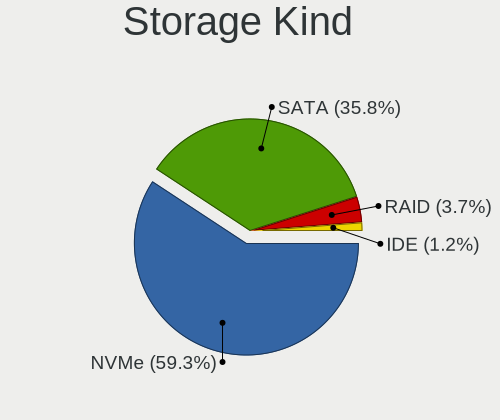
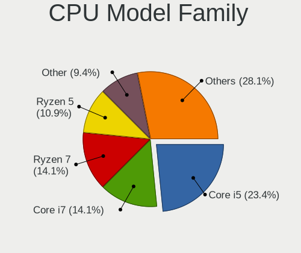
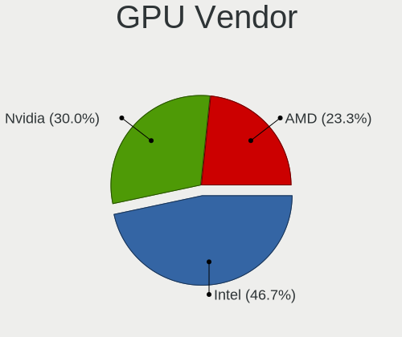
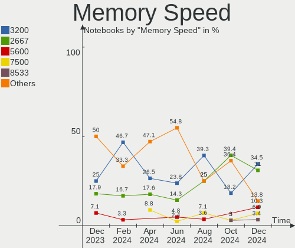
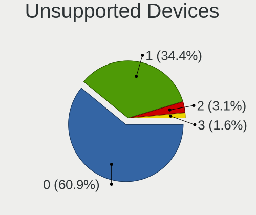

Manjaro Hardware Trends (Notebooks)
-----------------------------------

A project to identify most popular hardware characteristics and track their change
over time based on data collected by Manjaro users at https://Linux-Hardware.org.

Anyone can contribute to this report by the [hw-probe](https://github.com/linuxhw/hw-probe) tool:

    sudo -E hw-probe -all -upload

Full-feature report is available here: https://linux-hardware.org/?view=trends&formfactor=notebook

Period: Oct, 2021.

Contents
--------

* [ System ](#system)
  - [ OS                       ](#os)
  - [ OS Family                ](#os-family)
  - [ Kernel                   ](#kernel)
  - [ Kernel Family            ](#kernel-family)
  - [ Kernel Major Ver.        ](#kernel-major-ver)
  - [ Arch                     ](#arch)
  - [ DE                       ](#de)
  - [ Display Server           ](#display-server)
  - [ Display Manager          ](#display-manager)
  - [ OS Lang                  ](#os-lang)
  - [ Boot Mode                ](#boot-mode)
  - [ Filesystem               ](#filesystem)
  - [ Part. scheme             ](#part-scheme)
  - [ Dual Boot with Linux/BSD ](#dual-boot-with-linuxbsd)
  - [ Dual Boot (Win)          ](#dual-boot-win)

* [ Board ](#board)
  - [ Vendor                   ](#vendor)
  - [ Model                    ](#model)
  - [ Model Family             ](#model-family)
  - [ MFG Year                 ](#mfg-year)
  - [ Form Factor              ](#form-factor)
  - [ Secure Boot              ](#secure-boot)
  - [ Coreboot                 ](#coreboot)
  - [ RAM Size                 ](#ram-size)
  - [ RAM Used                 ](#ram-used)
  - [ Total Drives             ](#total-drives)
  - [ Has CD-ROM               ](#has-cd-rom)
  - [ Has Ethernet             ](#has-ethernet)
  - [ Has WiFi                 ](#has-wifi)
  - [ Has Bluetooth            ](#has-bluetooth)

* [ Location ](#location)
  - [ Country                  ](#country)
  - [ City                     ](#city)

* [ Drives ](#drives)
  - [ Drive Vendor             ](#drive-vendor)
  - [ Drive Model              ](#drive-model)
  - [ HDD Vendor               ](#hdd-vendor)
  - [ SSD Vendor               ](#ssd-vendor)
  - [ Drive Kind               ](#drive-kind)
  - [ Drive Connector          ](#drive-connector)
  - [ Drive Size               ](#drive-size)
  - [ Space Total              ](#space-total)
  - [ Space Used               ](#space-used)
  - [ Malfunc. Drives          ](#malfunc-drives)
  - [ Malfunc. Drive Vendor    ](#malfunc-drive-vendor)
  - [ Malfunc. HDD Vendor      ](#malfunc-hdd-vendor)
  - [ Malfunc. Drive Kind      ](#malfunc-drive-kind)
  - [ Failed Drives            ](#failed-drives)
  - [ Failed Drive Vendor      ](#failed-drive-vendor)
  - [ Drive Status             ](#drive-status)

* [ Storage controller ](#storage-controller)
  - [ Storage Vendor           ](#storage-vendor)
  - [ Storage Model            ](#storage-model)
  - [ Storage Kind             ](#storage-kind)

* [ Processor ](#processor)
  - [ CPU Vendor               ](#cpu-vendor)
  - [ CPU Model                ](#cpu-model)
  - [ CPU Model Family         ](#cpu-model-family)
  - [ CPU Cores                ](#cpu-cores)
  - [ CPU Sockets              ](#cpu-sockets)
  - [ CPU Threads              ](#cpu-threads)
  - [ CPU Op-Modes             ](#cpu-op-modes)
  - [ CPU Microcode            ](#cpu-microcode)
  - [ CPU Microarch            ](#cpu-microarch)

* [ Graphics ](#graphics)
  - [ GPU Vendor               ](#gpu-vendor)
  - [ GPU Model                ](#gpu-model)
  - [ GPU Combo                ](#gpu-combo)
  - [ GPU Driver               ](#gpu-driver)
  - [ GPU Memory               ](#gpu-memory)

* [ Monitor ](#monitor)
  - [ Monitor Vendor           ](#monitor-vendor)
  - [ Monitor Model            ](#monitor-model)
  - [ Monitor Resolution       ](#monitor-resolution)
  - [ Monitor Diagonal         ](#monitor-diagonal)
  - [ Monitor Width            ](#monitor-width)
  - [ Aspect Ratio             ](#aspect-ratio)
  - [ Monitor Area             ](#monitor-area)
  - [ Pixel Density            ](#pixel-density)
  - [ Multiple Monitors        ](#multiple-monitors)

* [ Network ](#network)
  - [ Net Controller Vendor    ](#net-controller-vendor)
  - [ Net Controller Model     ](#net-controller-model)
  - [ Wireless Vendor          ](#wireless-vendor)
  - [ Wireless Model           ](#wireless-model)
  - [ Ethernet Vendor          ](#ethernet-vendor)
  - [ Ethernet Model           ](#ethernet-model)
  - [ Net Controller Kind      ](#net-controller-kind)
  - [ Used Controller          ](#used-controller)
  - [ NICs                     ](#nics)
  - [ IPv6                     ](#ipv6)

* [ Bluetooth ](#bluetooth)
  - [ Bluetooth Vendor         ](#bluetooth-vendor)
  - [ Bluetooth Model          ](#bluetooth-model)

* [ Sound ](#sound)
  - [ Sound Vendor             ](#sound-vendor)
  - [ Sound Model              ](#sound-model)

* [ Memory ](#memory)
  - [ Memory Vendor            ](#memory-vendor)
  - [ Memory Model             ](#memory-model)
  - [ Memory Kind              ](#memory-kind)
  - [ Memory Form Factor       ](#memory-form-factor)
  - [ Memory Size              ](#memory-size)
  - [ Memory Speed             ](#memory-speed)

* [ Printers & scanners ](#printers--scanners)
  - [ Printer Vendor           ](#printer-vendor)
  - [ Printer Model            ](#printer-model)
  - [ Scanner Vendor           ](#scanner-vendor)
  - [ Scanner Model            ](#scanner-model)

* [ Camera ](#camera)
  - [ Camera Vendor            ](#camera-vendor)
  - [ Camera Model             ](#camera-model)

* [ Security ](#security)
  - [ Fingerprint Vendor       ](#fingerprint-vendor)
  - [ Fingerprint Model        ](#fingerprint-model)
  - [ Chipcard Vendor          ](#chipcard-vendor)
  - [ Chipcard Model           ](#chipcard-model)

* [ Unsupported ](#unsupported)
  - [ Unsupported Devices      ](#unsupported-devices)
  - [ Unsupported Device Types ](#unsupported-device-types)

System
------

OS
--

Installed operating systems

| Name           | Notebooks | Percent |
|----------------|-----------|---------|
| Manjaro        | 27        | 32.93%  |
| Manjaro 21.1.6 | 23        | 28.05%  |
| Manjaro 21.1.4 | 16        | 19.51%  |
| Manjaro 21.1.5 | 12        | 14.63%  |
| Manjaro 21.2.0 | 2         | 2.44%   |
| Manjaro 21.1.3 | 1         | 1.22%   |
| Manjaro 21.1.2 | 1         | 1.22%   |

OS Family
---------

OS without a version

| Name    | Notebooks | Percent |
|---------|-----------|---------|
| Manjaro | 82        | 100%    |

Kernel
------

Version of the Linux kernel

| Version                     | Notebooks | Percent |
|-----------------------------|-----------|---------|
| 5.13.19-2-MANJARO           | 31        | 37.8%   |
| 5.10.70-1-MANJARO           | 12        | 14.63%  |
| 5.14.10-1-MANJARO           | 11        | 13.41%  |
| 5.10.68-1-MANJARO           | 6         | 7.32%   |
| 5.15.0-1-MANJARO            | 5         | 6.1%    |
| 5.14.7-2-MANJARO            | 5         | 6.1%    |
| 5.4.150-1-MANJARO           | 2         | 2.44%   |
| 5.9.16-1-MANJARO            | 1         | 1.22%   |
| 5.4.148-1-MANJARO           | 1         | 1.22%   |
| 5.14.8-xanmod1-cacule-1     | 1         | 1.22%   |
| 5.14.8-hardened1-1-hardened | 1         | 1.22%   |
| 5.14.4-199-tkg-cacule       | 1         | 1.22%   |
| 5.14.12-207-tkg-pds         | 1         | 1.22%   |
| 5.13.2-1-MANJARO            | 1         | 1.22%   |
| 5.13.13-1-MANJARO           | 1         | 1.22%   |
| 5.11.22-2-MANJARO           | 1         | 1.22%   |
| 5.10.66-1-MANJARO-m133-n    | 1         | 1.22%   |

Kernel Family
-------------

Linux kernel without a distro release

| Version | Notebooks | Percent |
|---------|-----------|---------|
| 5.13.19 | 31        | 37.8%   |
| 5.10.70 | 12        | 14.63%  |
| 5.14.10 | 11        | 13.41%  |
| 5.10.68 | 6         | 7.32%   |
| 5.15.0  | 5         | 6.1%    |
| 5.14.7  | 5         | 6.1%    |
| 5.4.150 | 2         | 2.44%   |
| 5.14.8  | 2         | 2.44%   |
| 5.9.16  | 1         | 1.22%   |
| 5.4.148 | 1         | 1.22%   |
| 5.14.4  | 1         | 1.22%   |
| 5.14.12 | 1         | 1.22%   |
| 5.13.2  | 1         | 1.22%   |
| 5.13.13 | 1         | 1.22%   |
| 5.11.22 | 1         | 1.22%   |
| 5.10.66 | 1         | 1.22%   |

Kernel Major Ver.
-----------------

Linux kernel major version

| Version | Notebooks | Percent |
|---------|-----------|---------|
| 5.13    | 33        | 40.24%  |
| 5.14    | 20        | 24.39%  |
| 5.10    | 19        | 23.17%  |
| 5.15    | 5         | 6.1%    |
| 5.4     | 3         | 3.66%   |
| 5.9     | 1         | 1.22%   |
| 5.11    | 1         | 1.22%   |

Arch
----

OS architecture (x86_64, i586, etc.)

| Name   | Notebooks | Percent |
|--------|-----------|---------|
| x86_64 | 82        | 100%    |

DE
--

Desktop Environment

| Name           | Notebooks | Percent |
|----------------|-----------|---------|
| KDE5           | 34        | 41.46%  |
| GNOME          | 21        | 25.61%  |
| XFCE           | 16        | 19.51%  |
| X-Cinnamon     | 3         | 3.66%   |
| Unknown        | 3         | 3.66%   |
| i3             | 2         | 2.44%   |
| i3-with-shmlog | 1         | 1.22%   |
| Budgie         | 1         | 1.22%   |
| awesome        | 1         | 1.22%   |

Display Server
--------------

X11 or Wayland

| Name    | Notebooks | Percent |
|---------|-----------|---------|
| X11     | 65        | 79.27%  |
| Wayland | 15        | 18.29%  |
| Tty     | 2         | 2.44%   |

Display Manager
---------------

SDDM, LightDM, etc.

| Name    | Notebooks | Percent |
|---------|-----------|---------|
| Unknown | 28        | 34.15%  |
| SDDM    | 24        | 29.27%  |
| GDM     | 15        | 18.29%  |
| LightDM | 14        | 17.07%  |
| LXDM    | 1         | 1.22%   |

OS Lang
-------

Language

| Lang  | Notebooks | Percent |
|-------|-----------|---------|
| en_US | 44        | 53.66%  |
| ru_RU | 7         | 8.54%   |
| de_DE | 4         | 4.88%   |
| pt_BR | 3         | 3.66%   |
| en_GB | 3         | 3.66%   |
| tr_TR | 2         | 2.44%   |
| fr_FR | 2         | 2.44%   |
| es_ES | 2         | 2.44%   |
| en_CA | 2         | 2.44%   |
| zh_TW | 1         | 1.22%   |
| zh_CN | 1         | 1.22%   |
| ru_UA | 1         | 1.22%   |
| pt_PT | 1         | 1.22%   |
| pl_PL | 1         | 1.22%   |
| it_IT | 1         | 1.22%   |
| fi_FI | 1         | 1.22%   |
| es_PE | 1         | 1.22%   |
| es_MX | 1         | 1.22%   |
| es_CO | 1         | 1.22%   |
| en_IN | 1         | 1.22%   |
| en_DK | 1         | 1.22%   |
| en_AU | 1         | 1.22%   |

Boot Mode
---------

EFI or BIOS

| Mode | Notebooks | Percent |
|------|-----------|---------|
| BIOS | 44        | 53.66%  |
| EFI  | 38        | 46.34%  |

Filesystem
----------

Type of filesystem

| Type    | Notebooks | Percent |
|---------|-----------|---------|
| Ext4    | 67        | 81.71%  |
| Btrfs   | 10        | 12.2%   |
| Overlay | 4         | 4.88%   |
| F2fs    | 1         | 1.22%   |

Part. scheme
------------

Scheme of partitioning

| Type    | Notebooks | Percent |
|---------|-----------|---------|
| GPT     | 37        | 45.12%  |
| Unknown | 37        | 45.12%  |
| MBR     | 8         | 9.76%   |

Dual Boot with Linux/BSD
------------------------

Hosting more than one Linux/BSD

| Dual boot | Notebooks | Percent |
|-----------|-----------|---------|
| No        | 76        | 92.68%  |
| Yes       | 6         | 7.32%   |

Dual Boot (Win)
---------------

Hosting Linux and Windows

| Dual boot | Notebooks | Percent |
|-----------|-----------|---------|
| No        | 55        | 67.07%  |
| Yes       | 27        | 32.93%  |

Board
-----

Vendor
------

Motherboard manufacturer

| Name                | Notebooks | Percent |
|---------------------|-----------|---------|
| Lenovo              | 30        | 36.59%  |
| Hewlett-Packard     | 12        | 14.63%  |
| Dell                | 11        | 13.41%  |
| ASUSTek Computer    | 10        | 12.2%   |
| Acer                | 5         | 6.1%    |
| HUAWEI              | 4         | 4.88%   |
| Alienware           | 2         | 2.44%   |
| TUXEDO              | 1         | 1.22%   |
| Sony                | 1         | 1.22%   |
| Samsung Electronics | 1         | 1.22%   |
| Notebook            | 1         | 1.22%   |
| MSI                 | 1         | 1.22%   |
| LG Electronics      | 1         | 1.22%   |
| Fujitsu Siemens     | 1         | 1.22%   |
| Unknown             | 1         | 1.22%   |

Model
-----

Motherboard model

| Name                                  | Notebooks | Percent |
|---------------------------------------|-----------|---------|
| HUAWEI NBLB-WAX9N                     | 2         | 2.44%   |
| TUXEDO Aura 15 Gen1                   | 1         | 1.22%   |
| Sony VPCEB2Z1E                        | 1         | 1.22%   |
| Samsung RC410/RC510/RC710             | 1         | 1.22%   |
| Notebook P95_96_97Ex,Rx               | 1         | 1.22%   |
| MSI GV72 7RD                          | 1         | 1.22%   |
| LG A410-K.BE43P1                      | 1         | 1.22%   |
| Lenovo V15 G2 ALC 82KD                | 1         | 1.22%   |
| Lenovo ThinkPad X250 20CLS7R400       | 1         | 1.22%   |
| Lenovo ThinkPad X230 2325SWF          | 1         | 1.22%   |
| Lenovo ThinkPad W550s 20E2CTO1WW      | 1         | 1.22%   |
| Lenovo ThinkPad T480s 20L8SB9Y00      | 1         | 1.22%   |
| Lenovo ThinkPad T480s 20L8S4T801      | 1         | 1.22%   |
| Lenovo ThinkPad T14s Gen 1 20UJS2YE00 | 1         | 1.22%   |
| Lenovo ThinkPad P51 20HH000TUS        | 1         | 1.22%   |
| Lenovo ThinkPad E15 Gen 2 20T9S0B500  | 1         | 1.22%   |
| Lenovo ThinkPad E14 Gen 3 20Y7CTO1WW  | 1         | 1.22%   |
| Lenovo ThinkBook 15-IIL 20SM          | 1         | 1.22%   |
| Lenovo Legion S7 15ACH6 82K8          | 1         | 1.22%   |
| Lenovo IdeaPad Y700 Touch-15ISK 80NW  | 1         | 1.22%   |
| Lenovo IdeaPad S540-14API 81NH        | 1         | 1.22%   |
| Lenovo IdeaPad S340-14API 81NB        | 1         | 1.22%   |
| Lenovo IdeaPad S145-15IWL 81S9        | 1         | 1.22%   |
| Lenovo IdeaPad S145-15AST 81N3        | 1         | 1.22%   |
| Lenovo IdeaPad Gaming 3 15ARH05 82EY  | 1         | 1.22%   |
| Lenovo IdeaPad 5 15IIL05 81YK         | 1         | 1.22%   |
| Lenovo IdeaPad 5 15ARE05 81YQ         | 1         | 1.22%   |
| Lenovo IdeaPad 330-17IKB 81DM         | 1         | 1.22%   |
| Lenovo IdeaPad 330-15IGM 81D1         | 1         | 1.22%   |
| Lenovo IdeaPad 320-17AST 80XW         | 1         | 1.22%   |
| Lenovo IdeaPad 320-15ISK 80XH         | 1         | 1.22%   |
| Lenovo IdeaPad 320-15IKB 80XL         | 1         | 1.22%   |
| Lenovo IdeaPad 310-15ABR 80ST         | 1         | 1.22%   |
| Lenovo IdeaPad 3 15IIL05 81WE         | 1         | 1.22%   |
| Lenovo IdeaPad 100S-14IBR 80R9        | 1         | 1.22%   |
| Lenovo G580 20150                     | 1         | 1.22%   |
| Lenovo B320-14IKB 81CC                | 1         | 1.22%   |
| HUAWEI NBLK-WAX9X                     | 1         | 1.22%   |
| HUAWEI HLYL-WXX9                      | 1         | 1.22%   |
| HP ProBook 5320m                      | 1         | 1.22%   |
| HP ProBook 455R G6                    | 1         | 1.22%   |
| HP ProBook 450 G7                     | 1         | 1.22%   |
| HP ProBook 430 G1                     | 1         | 1.22%   |
| HP Pavilion x2 Detachable             | 1         | 1.22%   |
| HP Pavilion Power Laptop 15-cb0xx     | 1         | 1.22%   |
| HP OMEN Laptop 15-ek0xxx              | 1         | 1.22%   |
| HP Laptop 15s-eq2xxx                  | 1         | 1.22%   |
| HP Laptop 15-ef2xxx                   | 1         | 1.22%   |
| HP Laptop 15-db0xxx                   | 1         | 1.22%   |
| HP ENVY Laptop 13-ba1xxx              | 1         | 1.22%   |
| HP Dratini                            | 1         | 1.22%   |
| Fujitsu Siemens AMILO Xi 2428         | 1         | 1.22%   |
| Dell XPS 15 7590                      | 1         | 1.22%   |
| Dell Latitude E6430                   | 1         | 1.22%   |
| Dell Latitude E5440                   | 1         | 1.22%   |
| Dell Latitude E5400                   | 1         | 1.22%   |
| Dell Inspiron 7558                    | 1         | 1.22%   |
| Dell Inspiron 5570                    | 1         | 1.22%   |
| Dell Inspiron 5567                    | 1         | 1.22%   |
| Dell Inspiron 5421                    | 1         | 1.22%   |

Model Family
------------

Motherboard model prefix

| Name                  | Notebooks | Percent |
|-----------------------|-----------|---------|
| Lenovo IdeaPad        | 16        | 19.51%  |
| Lenovo ThinkPad       | 9         | 10.98%  |
| Dell Inspiron         | 5         | 6.1%    |
| HP ProBook            | 4         | 4.88%   |
| HP Laptop             | 3         | 3.66%   |
| Dell Latitude         | 3         | 3.66%   |
| ASUS ZenBook          | 3         | 3.66%   |
| HUAWEI NBLB-WAX9N     | 2         | 2.44%   |
| HP Pavilion           | 2         | 2.44%   |
| Dell G5               | 2         | 2.44%   |
| Acer TravelMate       | 2         | 2.44%   |
| TUXEDO Aura           | 1         | 1.22%   |
| Sony VPCEB2Z1E        | 1         | 1.22%   |
| Samsung RC410         | 1         | 1.22%   |
| Notebook P95          | 1         | 1.22%   |
| MSI GV72              | 1         | 1.22%   |
| LG A410-K.BE43P1      | 1         | 1.22%   |
| Lenovo V15            | 1         | 1.22%   |
| Lenovo ThinkBook      | 1         | 1.22%   |
| Lenovo Legion         | 1         | 1.22%   |
| Lenovo G580           | 1         | 1.22%   |
| Lenovo B320-14IKB     | 1         | 1.22%   |
| HUAWEI NBLK-WAX9X     | 1         | 1.22%   |
| HUAWEI HLYL-WXX9      | 1         | 1.22%   |
| HP OMEN               | 1         | 1.22%   |
| HP ENVY               | 1         | 1.22%   |
| HP Dratini            | 1         | 1.22%   |
| Fujitsu Siemens AMILO | 1         | 1.22%   |
| Dell XPS              | 1         | 1.22%   |
| ASUS X556UJ           | 1         | 1.22%   |
| ASUS X555DA           | 1         | 1.22%   |
| ASUS X540LJ           | 1         | 1.22%   |
| ASUS VivoBook         | 1         | 1.22%   |
| ASUS U36SD            | 1         | 1.22%   |
| ASUS ROG              | 1         | 1.22%   |
| ASUS GL753VD          | 1         | 1.22%   |
| Alienware M17xR4      | 1         | 1.22%   |
| Alienware m17         | 1         | 1.22%   |
| Acer Predator         | 1         | 1.22%   |
| Acer Aspire           | 1         | 1.22%   |
| Acer AS1830           | 1         | 1.22%   |
| Unknown               | 1         | 1.22%   |

MFG Year
--------

Motherboard manufacture year

| Year | Notebooks | Percent |
|------|-----------|---------|
| 2021 | 30        | 36.59%  |
| 2020 | 13        | 15.85%  |
| 2019 | 7         | 8.54%   |
| 2018 | 6         | 7.32%   |
| 2017 | 5         | 6.1%    |
| 2016 | 4         | 4.88%   |
| 2015 | 3         | 3.66%   |
| 2013 | 3         | 3.66%   |
| 2011 | 3         | 3.66%   |
| 2010 | 3         | 3.66%   |
| 2008 | 2         | 2.44%   |
| 2014 | 1         | 1.22%   |
| 2012 | 1         | 1.22%   |
| 2009 | 1         | 1.22%   |

Form Factor
-----------

Physical design of the computer

| Name     | Notebooks | Percent |
|----------|-----------|---------|
| Notebook | 82        | 100%    |

Secure Boot
-----------

Enabled or disabled

| State    | Notebooks | Percent |
|----------|-----------|---------|
| Disabled | 81        | 98.78%  |
| Enabled  | 1         | 1.22%   |

Coreboot
--------

Have coreboot on board

| Used | Notebooks | Percent |
|------|-----------|---------|
| No   | 81        | 98.78%  |
| Yes  | 1         | 1.22%   |

RAM Size
--------

Total RAM memory

| Size in GB | Notebooks | Percent |
|------------|-----------|---------|
| 4.01-8.0   | 25        | 30.49%  |
| 8.01-16.0  | 18        | 21.95%  |
| 3.01-4.0   | 14        | 17.07%  |
| 32.01-64.0 | 10        | 12.2%   |
| 16.01-24.0 | 10        | 12.2%   |
| 24.01-32.0 | 2         | 2.44%   |
| 1.01-2.0   | 2         | 2.44%   |
| 2.01-3.0   | 1         | 1.22%   |

RAM Used
--------

Used RAM memory

| Used GB   | Notebooks | Percent |
|-----------|-----------|---------|
| 2.01-3.0  | 24        | 29.27%  |
| 1.01-2.0  | 21        | 25.61%  |
| 4.01-8.0  | 17        | 20.73%  |
| 8.01-16.0 | 9         | 10.98%  |
| 3.01-4.0  | 6         | 7.32%   |
| 0.51-1.0  | 5         | 6.1%    |

Total Drives
------------

Number of drives on board

| Drives | Notebooks | Percent |
|--------|-----------|---------|
| 1      | 55        | 67.07%  |
| 2      | 22        | 26.83%  |
| 3      | 4         | 4.88%   |
| 0      | 1         | 1.22%   |

Has CD-ROM
----------

Has CD-ROM on board

| Presented | Notebooks | Percent |
|-----------|-----------|---------|
| No        | 68        | 82.93%  |
| Yes       | 14        | 17.07%  |

Has Ethernet
------------

Has Ethernet on board

| Presented | Notebooks | Percent |
|-----------|-----------|---------|
| Yes       | 56        | 68.29%  |
| No        | 26        | 31.71%  |

Has WiFi
--------

Has WiFi module

| Presented | Notebooks | Percent |
|-----------|-----------|---------|
| Yes       | 81        | 98.78%  |
| No        | 1         | 1.22%   |

Has Bluetooth
-------------

Has Bluetooth module

| Presented | Notebooks | Percent |
|-----------|-----------|---------|
| Yes       | 74        | 90.24%  |
| No        | 8         | 9.76%   |

Location
--------

Country
-------

Geographic location (country)

| Country     | Notebooks | Percent |
|-------------|-----------|---------|
| USA         | 15        | 18.29%  |
| Russia      | 12        | 14.63%  |
| Ukraine     | 6         | 7.32%   |
| Germany     | 5         | 6.1%    |
| Brazil      | 4         | 4.88%   |
| France      | 3         | 3.66%   |
| UK          | 2         | 2.44%   |
| Turkey      | 2         | 2.44%   |
| Spain       | 2         | 2.44%   |
| Mexico      | 2         | 2.44%   |
| India       | 2         | 2.44%   |
| Hungary     | 2         | 2.44%   |
| Greece      | 2         | 2.44%   |
| Canada      | 2         | 2.44%   |
| Taiwan      | 1         | 1.22%   |
| Switzerland | 1         | 1.22%   |
| Slovenia    | 1         | 1.22%   |
| Slovakia    | 1         | 1.22%   |
| Serbia      | 1         | 1.22%   |
| Romania     | 1         | 1.22%   |
| Portugal    | 1         | 1.22%   |
| Poland      | 1         | 1.22%   |
| Peru        | 1         | 1.22%   |
| Netherlands | 1         | 1.22%   |
| Morocco     | 1         | 1.22%   |
| Japan       | 1         | 1.22%   |
| Italy       | 1         | 1.22%   |
| Israel      | 1         | 1.22%   |
| Denmark     | 1         | 1.22%   |
| Colombia    | 1         | 1.22%   |
| China       | 1         | 1.22%   |
| Belgium     | 1         | 1.22%   |
| Belarus     | 1         | 1.22%   |
| Australia   | 1         | 1.22%   |
| Argentina   | 1         | 1.22%   |

City
----

Geographic location (city)

| City                   | Notebooks | Percent |
|------------------------|-----------|---------|
| Zaporizhzhya           | 3         | 3.66%   |
| Ulyanovsk              | 3         | 3.66%   |
| St Petersburg          | 2         | 2.44%   |
| Budapest               | 2         | 2.44%   |
| Zaragoza               | 1         | 1.22%   |
| Wilderness Rim         | 1         | 1.22%   |
| Voronezh               | 1         | 1.22%   |
| Urbana                 | 1         | 1.22%   |
| Ufa                    | 1         | 1.22%   |
| Trikala                | 1         | 1.22%   |
| Tomar                  | 1         | 1.22%   |
| Tokyo                  | 1         | 1.22%   |
| Tel Aviv               | 1         | 1.22%   |
| Tangier                | 1         | 1.22%   |
| Sydney                 | 1         | 1.22%   |
| Smolensk               | 1         | 1.22%   |
| Sheboygan              | 1         | 1.22%   |
| Senec                  | 1         | 1.22%   |
| Seattle                | 1         | 1.22%   |
| Santa Cruz de Tenerife | 1         | 1.22%   |
| San Diego              | 1         | 1.22%   |
| Salt Lake City         | 1         | 1.22%   |
| Rio Grande             | 1         | 1.22%   |
| Pompano Beach          | 1         | 1.22%   |
| Plano                  | 1         | 1.22%   |
| Palaiseau              | 1         | 1.22%   |
| Nogales                | 1         | 1.22%   |
| Neihu                  | 1         | 1.22%   |
| Navapolatsk            | 1         | 1.22%   |
| Moscow                 | 1         | 1.22%   |
| Modugno                | 1         | 1.22%   |
| Mechanicsburg          | 1         | 1.22%   |
| Mazatl??n              | 1         | 1.22%   |
| Manaus                 | 1         | 1.22%   |
| Malbork                | 1         | 1.22%   |
| Long Beach             | 1         | 1.22%   |
| London                 | 1         | 1.22%   |
| Ljubljana              | 1         | 1.22%   |
| Little Rock            | 1         | 1.22%   |
| Lima                   | 1         | 1.22%   |
| Lambeth                | 1         | 1.22%   |
| Labytnangi             | 1         | 1.22%   |
| Kyiv                   | 1         | 1.22%   |
| Krasnoznamensk         | 1         | 1.22%   |
| Kramatorsk             | 1         | 1.22%   |
| Khimki                 | 1         | 1.22%   |
| Istanbul               | 1         | 1.22%   |
| Ipatinga               | 1         | 1.22%   |
| Indianapolis           | 1         | 1.22%   |
| Horishni Plavni        | 1         | 1.22%   |
| Hamburg                | 1         | 1.22%   |
| Guwahati               | 1         | 1.22%   |
| Guntur                 | 1         | 1.22%   |
| Frankfurt              | 1         | 1.22%   |
| Fontaines-sur-Saone    | 1         | 1.22%   |
| Edmonton               | 1         | 1.22%   |
| D??dingen              | 1         | 1.22%   |
| Dallas                 | 1         | 1.22%   |
| Copenhagen             | 1         | 1.22%   |
| Cologne                | 1         | 1.22%   |

Drives
------

Drive Vendor
------------

Hard drive vendors

| Vendor              | Notebooks | Drives | Percent |
|---------------------|-----------|--------|---------|
| Samsung Electronics | 16        | 18     | 15.38%  |
| Seagate             | 12        | 12     | 11.54%  |
| Toshiba             | 9         | 9      | 8.65%   |
| Kingston            | 8         | 8      | 7.69%   |
| Unknown             | 5         | 6      | 4.81%   |
| SK Hynix            | 5         | 6      | 4.81%   |
| Sandisk             | 5         | 7      | 4.81%   |
| Crucial             | 5         | 5      | 4.81%   |
| Micron Technology   | 3         | 3      | 2.88%   |
| HGST                | 3         | 3      | 2.88%   |
| XPG                 | 2         | 2      | 1.92%   |
| WDC                 | 2         | 2      | 1.92%   |
| UMIS                | 2         | 2      | 1.92%   |
| Phison              | 2         | 2      | 1.92%   |
| KIOXIA              | 2         | 2      | 1.92%   |
| JMicron             | 2         | 2      | 1.92%   |
| Intel               | 2         | 2      | 1.92%   |
| Hitachi             | 2         | 2      | 1.92%   |
| Hewlett-Packard     | 2         | 2      | 1.92%   |
| GOODRAM             | 2         | 2      | 1.92%   |
| China               | 2         | 2      | 1.92%   |
| XrayDisk            | 1         | 1      | 0.96%   |
| Union Memory        | 1         | 1      | 0.96%   |
| Solid State Storage | 1         | 1      | 0.96%   |
| Silicon Motion      | 1         | 1      | 0.96%   |
| LONDISK             | 1         | 1      | 0.96%   |
| LITEONIT            | 1         | 1      | 0.96%   |
| LITEON              | 1         | 1      | 0.96%   |
| IM3D                | 1         | 1      | 0.96%   |
| Fujitsu             | 1         | 1      | 0.96%   |
| Corsair             | 1         | 1      | 0.96%   |
| A-DATA Technology   | 1         | 1      | 0.96%   |

Drive Model
-----------

Hard drive models

| Model                                     | Notebooks | Percent |
|-------------------------------------------|-----------|---------|
| Toshiba MQ01ABF050 500GB                  | 5         | 4.59%   |
| Samsung PM963 2.5" NVMe PCIe SSD 512GB    | 5         | 4.59%   |
| Seagate ST1000LM035-1RK172 1TB            | 3         | 2.75%   |
| Kingston SA400S37480G 480GB SSD           | 3         | 2.75%   |
| Unknown MMC Card  32GB                    | 2         | 1.83%   |
| Toshiba MQ04ABF100 1TB                    | 2         | 1.83%   |
| Seagate ST1000LM049-2GH172 1TB            | 2         | 1.83%   |
| Seagate ST1000LM024 HN-M101MBB 1TB        | 2         | 1.83%   |
| Sandisk NVMe SSD Drive 512GB              | 2         | 1.83%   |
| Samsung NVMe SSD Drive 1TB                | 2         | 1.83%   |
| JMicron Tech 250GB                        | 2         | 1.83%   |
| HGST HTS545050A7E680 500GB                | 2         | 1.83%   |
| Crucial CT512M550SSD1 512GB               | 2         | 1.83%   |
| XrayDisk SSD 120GB                        | 1         | 0.92%   |
| XPG GAMMIX S50 Lite 1TB                   | 1         | 0.92%   |
| XPG GAMMIX S11 Pro 1TB                    | 1         | 0.92%   |
| WDC WD5000LPCX-00VHAT0 500GB              | 1         | 0.92%   |
| WDC PC SN530 SDBPMPZ-256G-1001 256GB      | 1         | 0.92%   |
| Unknown SD16G  16GB                       | 1         | 0.92%   |
| Unknown SD/MMC/MS PRO 128GB               | 1         | 0.92%   |
| Unknown MMC Card  64GB                    | 1         | 0.92%   |
| Unknown MMC Card  128GB                   | 1         | 0.92%   |
| Union Memory RTOTJ128VGD2EYX 128GB SSD    | 1         | 0.92%   |
| UMIS RPJTJ256MEE1OWX 256GB                | 1         | 0.92%   |
| UMIS RPFTJ256PDD2MWX 256GB                | 1         | 0.92%   |
| Toshiba KXG60ZNV256G 256GB                | 1         | 0.92%   |
| Toshiba KXG50ZNV256G 256GB                | 1         | 0.92%   |
| Solid State Storage SSSTC CL1-4D512 512GB | 1         | 0.92%   |
| SK Hynix SKHynix_HFS001TDE9X084N 1TB      | 1         | 0.92%   |
| SK Hynix SKHynix_HFS001TDE9X081N 1TB      | 1         | 0.92%   |
| SK Hynix NVMe SSD Drive 1024GB            | 1         | 0.92%   |
| SK Hynix HFS256G3BTND-N210A 256GB SSD     | 1         | 0.92%   |
| SK Hynix HFM001TD3JX013N 1TB              | 1         | 0.92%   |
| SK Hynix BC711 HFM256GD3JX013N 256GB      | 1         | 0.92%   |
| Silicon Motion NVMe SSD Drive 512GB       | 1         | 0.92%   |
| Seagate ST500LT012-9WS142 500GB           | 1         | 0.92%   |
| Seagate ST500LT012-1DG142 500GB           | 1         | 0.92%   |
| Seagate ST500LM021-1KJ152 500GB           | 1         | 0.92%   |
| Seagate ST500LM000-1EJ162 500GB           | 1         | 0.92%   |
| Seagate ST1000LM048-2E7172 1TB            | 1         | 0.92%   |
| Sandisk NVMe SSD Drive 500GB              | 1         | 0.92%   |
| Sandisk NVMe SSD Drive 1024GB             | 1         | 0.92%   |
| SanDisk Extreme Pro 55AF 2TB SSD          | 1         | 0.92%   |
| SanDisk DF4032  32GB                      | 1         | 0.92%   |
| Samsung SSD PM830 mSATA 32GB              | 1         | 0.92%   |
| Samsung SSD 870 EVO 250GB                 | 1         | 0.92%   |
| Samsung SSD 860 EVO 2TB                   | 1         | 0.92%   |
| Samsung SSD 850 EVO 500GB                 | 1         | 0.92%   |
| Samsung SSD 850 EVO 120GB                 | 1         | 0.92%   |
| Samsung SM963 2.5" NVMe PCIe SSD 250GB    | 1         | 0.92%   |
| Samsung NVMe SSD Drive 1024GB             | 1         | 0.92%   |
| Samsung MZVLQ256HAJD-00000 256GB          | 1         | 0.92%   |
| Samsung MZVLQ1T0HALB-000H1 1TB            | 1         | 0.92%   |
| Samsung MZVLB512HAJQ-00000 512GB          | 1         | 0.92%   |
| Samsung MZALQ512HALU-000L2 512GB          | 1         | 0.92%   |
| Phison Smartbuy S3 256GB                  | 1         | 0.92%   |
| Phison NVMe SSD Drive 1TB                 | 1         | 0.92%   |
| Micron NVMe SSD Drive 512GB               | 1         | 0.92%   |
| Micron NVMe SSD Drive 500GB               | 1         | 0.92%   |
| Micron MTFDHBA256TCK-1AS1AABHA 256GB      | 1         | 0.92%   |

HDD Vendor
----------

Hard disk drive vendors

| Vendor  | Notebooks | Drives | Percent |
|---------|-----------|--------|---------|
| Seagate | 12        | 12     | 44.44%  |
| Toshiba | 7         | 7      | 25.93%  |
| HGST    | 3         | 3      | 11.11%  |
| Hitachi | 2         | 2      | 7.41%   |
| WDC     | 1         | 1      | 3.7%    |
| Unknown | 1         | 1      | 3.7%    |
| Fujitsu | 1         | 1      | 3.7%    |

SSD Vendor
----------

Solid state drive vendors

| Vendor              | Notebooks | Drives | Percent |
|---------------------|-----------|--------|---------|
| Kingston            | 7         | 7      | 24.14%  |
| Crucial             | 5         | 5      | 17.24%  |
| Samsung Electronics | 4         | 5      | 13.79%  |
| China               | 2         | 2      | 6.9%    |
| XrayDisk            | 1         | 1      | 3.45%   |
| Union Memory        | 1         | 1      | 3.45%   |
| SK Hynix            | 1         | 1      | 3.45%   |
| SanDisk             | 1         | 1      | 3.45%   |
| LONDISK             | 1         | 1      | 3.45%   |
| LITEONIT            | 1         | 1      | 3.45%   |
| LITEON              | 1         | 1      | 3.45%   |
| IM3D                | 1         | 1      | 3.45%   |
| Hewlett-Packard     | 1         | 1      | 3.45%   |
| GOODRAM             | 1         | 1      | 3.45%   |
| A-DATA Technology   | 1         | 1      | 3.45%   |

Drive Kind
----------

HDD or SSD

| Kind    | Notebooks | Drives | Percent |
|---------|-----------|--------|---------|
| NVMe    | 37        | 44     | 37.76%  |
| SSD     | 27        | 30     | 27.55%  |
| HDD     | 26        | 27     | 26.53%  |
| MMC     | 5         | 6      | 5.1%    |
| Unknown | 3         | 3      | 3.06%   |

Drive Connector
---------------

SATA, SAS, NVMe, etc.

| Type | Notebooks | Drives | Percent |
|------|-----------|--------|---------|
| SATA | 47        | 55     | 50%     |
| NVMe | 37        | 44     | 39.36%  |
| SAS  | 5         | 5      | 5.32%   |
| MMC  | 5         | 6      | 5.32%   |

Drive Size
----------

Size of hard drive

| Size in TB | Notebooks | Drives | Percent |
|------------|-----------|--------|---------|
| 0.01-0.5   | 34        | 37     | 64.15%  |
| 0.51-1.0   | 17        | 18     | 32.08%  |
| 1.01-2.0   | 2         | 2      | 3.77%   |

Space Total
-----------

Amount of disk space available on the file system

| Size in GB     | Notebooks | Percent |
|----------------|-----------|---------|
| 251-500        | 22        | 26.83%  |
| 101-250        | 19        | 23.17%  |
| 501-1000       | 15        | 18.29%  |
| 51-100         | 6         | 7.32%   |
| 1-20           | 5         | 6.1%    |
| Unknown        | 5         | 6.1%    |
| 21-50          | 4         | 4.88%   |
| 1001-2000      | 4         | 4.88%   |
| More than 3000 | 1         | 1.22%   |
| 2001-3000      | 1         | 1.22%   |

Space Used
----------

Amount of used disk space

| Used GB  | Notebooks | Percent |
|----------|-----------|---------|
| 1-20     | 20        | 24.39%  |
| 21-50    | 18        | 21.95%  |
| 101-250  | 12        | 14.63%  |
| 51-100   | 12        | 14.63%  |
| 251-500  | 10        | 12.2%   |
| 501-1000 | 5         | 6.1%    |
| Unknown  | 5         | 6.1%    |

Malfunc. Drives
---------------

Drive models with a malfunction

| Model                                | Notebooks | Drives | Percent |
|--------------------------------------|-----------|--------|---------|
| SK Hynix BC711 HFM256GD3JX013N 256GB | 1         | 1      | 14.29%  |
| Seagate ST500LT012-9WS142 500GB      | 1         | 1      | 14.29%  |
| Seagate ST500LM021-1KJ152 500GB      | 1         | 1      | 14.29%  |
| Seagate ST1000LM035-1RK172 1TB       | 1         | 1      | 14.29%  |
| IM3D L06B B0KB 120GB SSD             | 1         | 1      | 14.29%  |
| Crucial CT512M550SSD1 512GB          | 1         | 1      | 14.29%  |
| A-DATA Technology SX900 512GB SSD    | 1         | 1      | 14.29%  |

Malfunc. Drive Vendor
---------------------

Vendors of faulty drives

| Vendor            | Notebooks | Drives | Percent |
|-------------------|-----------|--------|---------|
| Seagate           | 3         | 3      | 42.86%  |
| SK Hynix          | 1         | 1      | 14.29%  |
| IM3D              | 1         | 1      | 14.29%  |
| Crucial           | 1         | 1      | 14.29%  |
| A-DATA Technology | 1         | 1      | 14.29%  |

Malfunc. HDD Vendor
-------------------

Vendors of faulty HDD drives

| Vendor  | Notebooks | Drives | Percent |
|---------|-----------|--------|---------|
| Seagate | 3         | 3      | 100%    |

Malfunc. Drive Kind
-------------------

Kinds of faulty drives

| Kind | Notebooks | Drives | Percent |
|------|-----------|--------|---------|
| SSD  | 3         | 3      | 42.86%  |
| HDD  | 3         | 3      | 42.86%  |
| NVMe | 1         | 1      | 14.29%  |

Failed Drives
-------------

Failed drive models

Zero info for selected period =(

Failed Drive Vendor
-------------------

Failed drive vendors

Zero info for selected period =(

Drive Status
------------

Number of failed and malfunc. drives

| Status   | Notebooks | Drives | Percent |
|----------|-----------|--------|---------|
| Detected | 51        | 64     | 56.67%  |
| Works    | 32        | 39     | 35.56%  |
| Malfunc  | 7         | 7      | 7.78%   |

Storage controller
------------------

Storage Vendor
--------------

Storage controller vendors

| Vendor                         | Notebooks | Percent |
|--------------------------------|-----------|---------|
| Intel                          | 54        | 52.43%  |
| Samsung Electronics            | 12        | 11.65%  |
| AMD                            | 10        | 9.71%   |
| Sandisk                        | 5         | 4.85%   |
| SK Hynix                       | 4         | 3.88%   |
| Micron Technology              | 3         | 2.91%   |
| Union Memory (Shenzhen)        | 2         | 1.94%   |
| Toshiba America Info Systems   | 2         | 1.94%   |
| Phison Electronics             | 2         | 1.94%   |
| KIOXIA                         | 2         | 1.94%   |
| ADATA Technology               | 2         | 1.94%   |
| Solid State Storage Technology | 1         | 0.97%   |
| Silicon Motion                 | 1         | 0.97%   |
| Silicon Image                  | 1         | 0.97%   |
| Shenzhen Longsys Electronics   | 1         | 0.97%   |
| Kingston Technology Company    | 1         | 0.97%   |

Storage Model
-------------

Storage controller models

| Model                                                                            | Notebooks | Percent |
|----------------------------------------------------------------------------------|-----------|---------|
| AMD FCH SATA Controller [AHCI mode]                                              | 10        | 9.35%   |
| Samsung NVMe SSD Controller SM981/PM981/PM983                                    | 7         | 6.54%   |
| Intel 82801 Mobile SATA Controller [RAID mode]                                   | 6         | 5.61%   |
| Intel Sunrise Point-LP SATA Controller [AHCI mode]                               | 5         | 4.67%   |
| SK Hynix Gold P31 SSD                                                            | 4         | 3.74%   |
| Samsung NVMe SSD Controller 980                                                  | 4         | 3.74%   |
| Intel Wildcat Point-LP SATA Controller [AHCI Mode]                               | 4         | 3.74%   |
| Intel HM170/QM170 Chipset SATA Controller [AHCI Mode]                            | 4         | 3.74%   |
| Intel 7 Series Chipset Family 6-port SATA Controller [AHCI mode]                 | 4         | 3.74%   |
| Micron Non-Volatile memory controller                                            | 3         | 2.8%    |
| Intel Ice Lake-LP SATA Controller [AHCI mode]                                    | 3         | 2.8%    |
| Intel Comet Lake SATA AHCI Controller                                            | 3         | 2.8%    |
| Intel Cannon Lake Mobile PCH SATA AHCI Controller                                | 3         | 2.8%    |
| Intel Atom/Celeron/Pentium Processor x5-E8000/J3xxx/N3xxx Series SATA Controller | 3         | 2.8%    |
| Intel 5 Series/3400 Series Chipset 4 port SATA AHCI Controller                   | 3         | 2.8%    |
| Union Memory (Shenzhen) Non-Volatile memory controller                           | 2         | 1.87%   |
| Sandisk WD Black SN750 / PC SN730 NVMe SSD                                       | 2         | 1.87%   |
| KIOXIA Non-Volatile memory controller                                            | 2         | 1.87%   |
| Intel Volume Management Device NVMe RAID Controller                              | 2         | 1.87%   |
| Intel SSD 660P Series                                                            | 2         | 1.87%   |
| Intel 82801HM/HEM (ICH8M/ICH8M-E) IDE Controller                                 | 2         | 1.87%   |
| Intel 8 Series SATA Controller 1 [AHCI mode]                                     | 2         | 1.87%   |
| Toshiba America Info Systems XG6 NVMe SSD Controller                             | 1         | 0.93%   |
| Toshiba America Info Systems Toshiba America Info Non-Volatile memory controller | 1         | 0.93%   |
| Solid State Storage Non-Volatile memory controller                               | 1         | 0.93%   |
| Silicon Motion SM2262/SM2262EN SSD Controller                                    | 1         | 0.93%   |
| Silicon Image SiI 3531 [SATALink/SATARaid] Serial ATA Controller                 | 1         | 0.93%   |
| Shenzhen Longsys SM2263EN/SM2263XT-based OEM SSD                                 | 1         | 0.93%   |
| Sandisk WD Blue SN500 / PC SN520 NVMe SSD                                        | 1         | 0.93%   |
| Sandisk WD Black 2018/SN750 / PC SN720 NVMe SSD                                  | 1         | 0.93%   |
| Sandisk Non-Volatile memory controller                                           | 1         | 0.93%   |
| Samsung NVMe SSD Controller PM9A1/PM9A3/980PRO                                   | 1         | 0.93%   |
| Phison E16 PCIe4 NVMe Controller                                                 | 1         | 0.93%   |
| Phison E12 NVMe Controller                                                       | 1         | 0.93%   |
| Kingston Company A2000 NVMe SSD                                                  | 1         | 0.93%   |
| Intel Q170/Q150/B150/H170/H110/Z170/CM236 Chipset SATA Controller [AHCI Mode]    | 1         | 0.93%   |
| Intel Celeron/Pentium Silver Processor SATA Controller                           | 1         | 0.93%   |
| Intel Celeron N3350/Pentium N4200/Atom E3900 Series SATA AHCI Controller         | 1         | 0.93%   |
| Intel Cannon Point-LP SATA Controller [AHCI Mode]                                | 1         | 0.93%   |
| Intel 82801IBM/IEM (ICH9M/ICH9M-E) 2 port SATA Controller [IDE mode]             | 1         | 0.93%   |
| Intel 82801HM/HEM (ICH8M/ICH8M-E) SATA Controller [IDE mode]                     | 1         | 0.93%   |
| Intel 82801HM/HEM (ICH8M/ICH8M-E) SATA Controller [AHCI mode]                    | 1         | 0.93%   |
| Intel 6 Series/C200 Series Chipset Family 6 port Mobile SATA AHCI Controller     | 1         | 0.93%   |
| Intel 5 Series/3400 Series Chipset 6 port SATA AHCI Controller                   | 1         | 0.93%   |
| Intel 5 Series/3400 Series Chipset 4 port SATA IDE Controller                    | 1         | 0.93%   |
| Intel 5 Series/3400 Series Chipset 2 port SATA IDE Controller                    | 1         | 0.93%   |
| Intel 400 Series Chipset Family SATA AHCI Controller                             | 1         | 0.93%   |
| ADATA XPG SX8200 Pro PCIe Gen3x4 M.2 2280 Solid State Drive                      | 1         | 0.93%   |
| ADATA A Non-Volatile memory controller                                           | 1         | 0.93%   |

Storage Kind
------------

Kind of storage controller (IDE, SATA, NVMe, SAS, ...)

| Kind | Notebooks | Percent |
|------|-----------|---------|
| SATA | 52        | 50.98%  |
| NVMe | 37        | 36.27%  |
| RAID | 9         | 8.82%   |
| IDE  | 4         | 3.92%   |

Processor
---------

CPU Vendor
----------

Processor vendors

| Vendor | Notebooks | Percent |
|--------|-----------|---------|
| Intel  | 59        | 71.95%  |
| AMD    | 23        | 28.05%  |

CPU Model
---------

Processor models

| Model                                           | Notebooks | Percent |
|-------------------------------------------------|-----------|---------|
| AMD Ryzen 5 3500U with Radeon Vega Mobile Gfx   | 4         | 4.88%   |
| Intel Core i7-9750H CPU @ 2.60GHz               | 3         | 3.66%   |
| Intel Core i7-7700HQ CPU @ 2.80GHz              | 3         | 3.66%   |
| Intel Core i3-6006U CPU @ 2.00GHz               | 3         | 3.66%   |
| AMD Ryzen 7 5700U with Radeon Graphics          | 3         | 3.66%   |
| Intel Core i7-8650U CPU @ 1.90GHz               | 2         | 2.44%   |
| Intel Core i7-8565U CPU @ 1.80GHz               | 2         | 2.44%   |
| Intel Core i5-1035G4 CPU @ 1.10GHz              | 2         | 2.44%   |
| Intel Core i5-10210U CPU @ 1.60GHz              | 2         | 2.44%   |
| Intel Core i5 CPU M 480 @ 2.67GHz               | 2         | 2.44%   |
| Intel Core i3-5010U CPU @ 2.10GHz               | 2         | 2.44%   |
| AMD Ryzen 7 4700U with Radeon Graphics          | 2         | 2.44%   |
| AMD Ryzen 5 5500U with Radeon Graphics          | 2         | 2.44%   |
| AMD Ryzen 5 4600H with Radeon Graphics          | 2         | 2.44%   |
| AMD Ryzen 5 4500U with Radeon Graphics          | 2         | 2.44%   |
| Intel Pentium CPU U5400 @ 1.20GHz               | 1         | 1.22%   |
| Intel Pentium CPU N3710 @ 1.60GHz               | 1         | 1.22%   |
| Intel Pentium CPU 6405U @ 2.40GHz               | 1         | 1.22%   |
| Intel Pentium CPU 2020M @ 2.40GHz               | 1         | 1.22%   |
| Intel Core i7-8550U CPU @ 1.80GHz               | 1         | 1.22%   |
| Intel Core i7-6700HQ CPU @ 2.60GHz              | 1         | 1.22%   |
| Intel Core i7-6500U CPU @ 2.50GHz               | 1         | 1.22%   |
| Intel Core i7-5500U CPU @ 2.40GHz               | 1         | 1.22%   |
| Intel Core i7-3740QM CPU @ 2.70GHz              | 1         | 1.22%   |
| Intel Core i7-3630QM CPU @ 2.40GHz              | 1         | 1.22%   |
| Intel Core i7-3537U CPU @ 2.00GHz               | 1         | 1.22%   |
| Intel Core i7-10870H CPU @ 2.20GHz              | 1         | 1.22%   |
| Intel Core i7-10750H CPU @ 2.60GHz              | 1         | 1.22%   |
| Intel Core i7-1065G7 CPU @ 1.30GHz              | 1         | 1.22%   |
| Intel Core i5-8250U CPU @ 1.60GHz               | 1         | 1.22%   |
| Intel Core i5-7300HQ CPU @ 2.50GHz              | 1         | 1.22%   |
| Intel Core i5-7200U CPU @ 2.50GHz               | 1         | 1.22%   |
| Intel Core i5-6300HQ CPU @ 2.30GHz              | 1         | 1.22%   |
| Intel Core i5-4310U CPU @ 2.00GHz               | 1         | 1.22%   |
| Intel Core i5-4200U CPU @ 1.60GHz               | 1         | 1.22%   |
| Intel Core i5-3320M CPU @ 2.60GHz               | 1         | 1.22%   |
| Intel Core i5-2430M CPU @ 2.40GHz               | 1         | 1.22%   |
| Intel Core i5-10300H CPU @ 2.50GHz              | 1         | 1.22%   |
| Intel Core i5 CPU M 430 @ 2.27GHz               | 1         | 1.22%   |
| Intel Core i3-7100U CPU @ 2.40GHz               | 1         | 1.22%   |
| Intel Core i3-5005U CPU @ 2.00GHz               | 1         | 1.22%   |
| Intel Core i3-10110U CPU @ 2.10GHz              | 1         | 1.22%   |
| Intel Core i3 CPU M 350 @ 2.27GHz               | 1         | 1.22%   |
| Intel Core 2 Duo CPU T7700 @ 2.40GHz            | 1         | 1.22%   |
| Intel Core 2 Duo CPU T7500 @ 2.20GHz            | 1         | 1.22%   |
| Intel Core 2 Duo CPU P8600 @ 2.40GHz            | 1         | 1.22%   |
| Intel Celeron N4100 CPU @ 1.10GHz               | 1         | 1.22%   |
| Intel Celeron CPU N3450 @ 1.10GHz               | 1         | 1.22%   |
| Intel Celeron CPU N3060 @ 1.60GHz               | 1         | 1.22%   |
| Intel Celeron CPU N3050 @ 1.60GHz               | 1         | 1.22%   |
| Intel Atom x5-Z8300 CPU @ 1.44GHz               | 1         | 1.22%   |
| Intel 11th Gen Core i7-1165G7 @ 2.80GHz         | 1         | 1.22%   |
| Intel 11th Gen Core i5-1135G7 @ 2.40GHz         | 1         | 1.22%   |
| AMD Ryzen 9 5900HS with Radeon Graphics         | 1         | 1.22%   |
| AMD Ryzen 7 PRO 4750U with Radeon Graphics      | 1         | 1.22%   |
| AMD Ryzen 7 5800H with Radeon Graphics          | 1         | 1.22%   |
| AMD A9-9425 RADEON R5, 5 COMPUTE CORES 2C+3G    | 1         | 1.22%   |
| AMD A6-9220 RADEON R4, 5 COMPUTE CORES 2C+3G    | 1         | 1.22%   |
| AMD A4-9125 RADEON R3, 4 COMPUTE CORES 2C+2G    | 1         | 1.22%   |
| AMD A10-9600P RADEON R5, 10 COMPUTE CORES 4C+6G | 1         | 1.22%   |

CPU Model Family
----------------

Processor model prefix

| Model            | Notebooks | Percent |
|------------------|-----------|---------|
| Intel Core i7    | 20        | 24.39%  |
| Intel Core i5    | 16        | 19.51%  |
| AMD Ryzen 5      | 10        | 12.2%   |
| Intel Core i3    | 9         | 10.98%  |
| AMD Ryzen 7      | 6         | 7.32%   |
| Intel Pentium    | 4         | 4.88%   |
| Intel Celeron    | 4         | 4.88%   |
| Other            | 3         | 3.66%   |
| Intel Core 2 Duo | 3         | 3.66%   |
| AMD A10          | 2         | 2.44%   |
| Intel Atom       | 1         | 1.22%   |
| AMD Ryzen 9      | 1         | 1.22%   |
| AMD Ryzen 7 PRO  | 1         | 1.22%   |
| AMD A6           | 1         | 1.22%   |
| AMD A4           | 1         | 1.22%   |

CPU Cores
---------

Number of processor cores

| Number | Notebooks | Percent |
|--------|-----------|---------|
| 2      | 33        | 40.24%  |
| 4      | 30        | 36.59%  |
| 6      | 10        | 12.2%   |
| 8      | 9         | 10.98%  |

CPU Sockets
-----------

Number of sockets

| Number | Notebooks | Percent |
|--------|-----------|---------|
| 1      | 82        | 100%    |

CPU Threads
-----------

Threads per core (Hyper-Threading)

| Number | Notebooks | Percent |
|--------|-----------|---------|
| 2      | 62        | 75.61%  |
| 1      | 20        | 24.39%  |

CPU Op-Modes
------------

CPU Operation Modes (32-bit, 64-bit)

| Op mode        | Notebooks | Percent |
|----------------|-----------|---------|
| 32-bit, 64-bit | 82        | 100%    |

CPU Microcode
-------------

Microcode number

| Number     | Notebooks | Percent |
|------------|-----------|---------|
| Unknown    | 35        | 42.68%  |
| 0x306a9    | 4         | 4.88%   |
| 0x08608103 | 4         | 4.88%   |
| 0x906e9    | 3         | 3.66%   |
| 0x806ec    | 3         | 3.66%   |
| 0x406e3    | 3         | 3.66%   |
| 0x306d4    | 3         | 3.66%   |
| 0x08600106 | 3         | 3.66%   |
| 0x906ea    | 2         | 2.44%   |
| 0x806e9    | 2         | 2.44%   |
| 0x40651    | 2         | 2.44%   |
| 0x08108102 | 2         | 2.44%   |
| 0xa0652    | 1         | 1.22%   |
| 0x806eb    | 1         | 1.22%   |
| 0x806ea    | 1         | 1.22%   |
| 0x806c1    | 1         | 1.22%   |
| 0x706e5    | 1         | 1.22%   |
| 0x506e3    | 1         | 1.22%   |
| 0x506c9    | 1         | 1.22%   |
| 0x20655    | 1         | 1.22%   |
| 0x20652    | 1         | 1.22%   |
| 0x1067a    | 1         | 1.22%   |
| 0x0a50000c | 1         | 1.22%   |
| 0x08608102 | 1         | 1.22%   |
| 0x08600103 | 1         | 1.22%   |
| 0x08108109 | 1         | 1.22%   |
| 0x06006705 | 1         | 1.22%   |
| 0x06006110 | 1         | 1.22%   |

CPU Microarch
-------------

Microarchitecture

| Name          | Notebooks | Percent |
|---------------|-----------|---------|
| KabyLake      | 19        | 23.17%  |
| Zen 2         | 7         | 8.54%   |
| Skylake       | 6         | 7.32%   |
| Westmere      | 5         | 6.1%    |
| IvyBridge     | 5         | 6.1%    |
| Excavator     | 5         | 6.1%    |
| Unknown       | 5         | 6.1%    |
| Zen+          | 4         | 4.88%   |
| Silvermont    | 4         | 4.88%   |
| Broadwell     | 4         | 4.88%   |
| IceLake       | 3         | 3.66%   |
| CometLake     | 3         | 3.66%   |
| Zen 3         | 2         | 2.44%   |
| TigerLake     | 2         | 2.44%   |
| Haswell       | 2         | 2.44%   |
| Core          | 2         | 2.44%   |
| SandyBridge   | 1         | 1.22%   |
| Penryn        | 1         | 1.22%   |
| Goldmont plus | 1         | 1.22%   |
| Goldmont      | 1         | 1.22%   |

Graphics
--------

GPU Vendor
----------

Vendors of graphics cards

| Vendor | Notebooks | Percent |
|--------|-----------|---------|
| Intel  | 54        | 47.79%  |
| Nvidia | 33        | 29.2%   |
| AMD    | 26        | 23.01%  |

GPU Model
---------

Graphics card models

| Model                                                                                    | Notebooks | Percent |
|------------------------------------------------------------------------------------------|-----------|---------|
| AMD Renoir                                                                               | 7         | 6.09%   |
| AMD Lucienne                                                                             | 5         | 4.35%   |
| Intel UHD Graphics 620                                                                   | 4         | 3.48%   |
| Intel HD Graphics 630                                                                    | 4         | 3.48%   |
| Intel HD Graphics 5500                                                                   | 4         | 3.48%   |
| Intel Atom/Celeron/Pentium Processor x5-E8000/J3xxx/N3xxx Integrated Graphics Controller | 4         | 3.48%   |
| Intel 3rd Gen Core processor Graphics Controller                                         | 4         | 3.48%   |
| AMD Picasso                                                                              | 4         | 3.48%   |
| Nvidia GP107M [GeForce GTX 1050 Mobile]                                                  | 3         | 2.61%   |
| Intel Core Processor Integrated Graphics Controller                                      | 3         | 2.61%   |
| Intel CometLake-U GT2 [UHD Graphics]                                                     | 3         | 2.61%   |
| Intel CometLake-H GT2 [UHD Graphics]                                                     | 3         | 2.61%   |
| Intel CoffeeLake-H GT2 [UHD Graphics 630]                                                | 3         | 2.61%   |
| AMD Stoney [Radeon R2/R3/R4/R5 Graphics]                                                 | 3         | 2.61%   |
| Nvidia TU106M [GeForce RTX 2060 Mobile]                                                  | 2         | 1.74%   |
| Nvidia GM108M [GeForce 940MX]                                                            | 2         | 1.74%   |
| Nvidia GK208BM [GeForce 920M]                                                            | 2         | 1.74%   |
| Nvidia GF117M [GeForce 610M/710M/810M/820M / GT 620M/625M/630M/720M]                     | 2         | 1.74%   |
| Nvidia GA104M [GeForce RTX 3080 Mobile / Max-Q 8GB/16GB]                                 | 2         | 1.74%   |
| Intel WhiskeyLake-U GT2 [UHD Graphics 620]                                               | 2         | 1.74%   |
| Intel TigerLake-LP GT2 [Iris Xe Graphics]                                                | 2         | 1.74%   |
| Intel Skylake GT2 [HD Graphics 520]                                                      | 2         | 1.74%   |
| Intel Iris Plus Graphics G4 (Ice Lake)                                                   | 2         | 1.74%   |
| Intel HD Graphics 620                                                                    | 2         | 1.74%   |
| Intel HD Graphics 520                                                                    | 2         | 1.74%   |
| Intel Haswell-ULT Integrated Graphics Controller                                         | 2         | 1.74%   |
| AMD Wani [Radeon R5/R6/R7 Graphics]                                                      | 2         | 1.74%   |
| AMD Cezanne                                                                              | 2         | 1.74%   |
| Nvidia TU117M [GeForce MX450]                                                            | 1         | 0.87%   |
| Nvidia TU117M [GeForce GTX 1650 Ti Mobile]                                               | 1         | 0.87%   |
| Nvidia TU117M [GeForce GTX 1650 Mobile / Max-Q]                                          | 1         | 0.87%   |
| Nvidia TU117M                                                                            | 1         | 0.87%   |
| Nvidia TU106M [GeForce RTX 2070 Mobile]                                                  | 1         | 0.87%   |
| Nvidia GT218M [GeForce 315M]                                                             | 1         | 0.87%   |
| Nvidia GT218M [GeForce 310M]                                                             | 1         | 0.87%   |
| Nvidia GP108M [GeForce MX150]                                                            | 1         | 0.87%   |
| Nvidia GP107M [GeForce MX350]                                                            | 1         | 0.87%   |
| Nvidia GP104BM [GeForce GTX 1070 Mobile]                                                 | 1         | 0.87%   |
| Nvidia GM108M [GeForce MX110]                                                            | 1         | 0.87%   |
| Nvidia GM108M [GeForce 920MX]                                                            | 1         | 0.87%   |
| Nvidia GM108GLM [Quadro K620M / Quadro M500M]                                            | 1         | 0.87%   |
| Nvidia GM107M [GeForce GTX 960M]                                                         | 1         | 0.87%   |
| Nvidia GM107GLM [Quadro M1200 Mobile]                                                    | 1         | 0.87%   |
| Nvidia GK107M [GeForce GT 730M]                                                          | 1         | 0.87%   |
| Nvidia GK104M [GeForce GTX 680M]                                                         | 1         | 0.87%   |
| Nvidia GF119M [GeForce GT 520M]                                                          | 1         | 0.87%   |
| Nvidia GF108GLM [NVS 5200M]                                                              | 1         | 0.87%   |
| Nvidia GA106M [GeForce RTX 3060 Mobile / Max-Q]                                          | 1         | 0.87%   |
| Intel Mobile GM965/GL960 Integrated Graphics Controller (secondary)                      | 1         | 0.87%   |
| Intel Mobile GM965/GL960 Integrated Graphics Controller (primary)                        | 1         | 0.87%   |
| Intel Mobile 4 Series Chipset Integrated Graphics Controller                             | 1         | 0.87%   |
| Intel Iris Plus Graphics G7                                                              | 1         | 0.87%   |
| Intel HD Graphics 530                                                                    | 1         | 0.87%   |
| Intel HD Graphics 500                                                                    | 1         | 0.87%   |
| Intel GeminiLake [UHD Graphics 600]                                                      | 1         | 0.87%   |
| Intel Comet Lake UHD Graphics                                                            | 1         | 0.87%   |
| Intel 2nd Generation Core Processor Family Integrated Graphics Controller                | 1         | 0.87%   |
| AMD Topaz XT [Radeon R7 M260/M265 / M340/M360 / M440/M445 / 530/535 / 620/625 Mobile]    | 1         | 0.87%   |
| AMD Sun XT [Radeon HD 8670A/8670M/8690M / R5 M330 / M430 / Radeon 520 Mobile]            | 1         | 0.87%   |
| AMD RV550/M71 [Mobility Radeon HD 2300]                                                  | 1         | 0.87%   |

GPU Combo
---------

Combinations of graphics cards

| Name           | Notebooks | Percent |
|----------------|-----------|---------|
| 1 x Intel      | 27        | 32.93%  |
| Intel + Nvidia | 26        | 31.71%  |
| 1 x AMD        | 20        | 24.39%  |
| AMD + Nvidia   | 4         | 4.88%   |
| 1 x Nvidia     | 3         | 3.66%   |
| 2 x AMD        | 1         | 1.22%   |
| Intel + AMD    | 1         | 1.22%   |

GPU Driver
----------

Free vs proprietary

| Driver      | Notebooks | Percent |
|-------------|-----------|---------|
| Free        | 63        | 76.83%  |
| Proprietary | 19        | 23.17%  |

GPU Memory
----------

Total video memory

| Size in GB | Notebooks | Percent |
|------------|-----------|---------|
| Unknown    | 61        | 74.39%  |
| 0.01-0.5   | 9         | 10.98%  |
| 1.01-2.0   | 7         | 8.54%   |
| 3.01-4.0   | 2         | 2.44%   |
| 0.51-1.0   | 2         | 2.44%   |
| 5.01-6.0   | 1         | 1.22%   |

Monitor
-------

Monitor Vendor
--------------

Monitor vendors

| Vendor                  | Notebooks | Percent |
|-------------------------|-----------|---------|
| BOE                     | 19        | 21.11%  |
| Chimei Innolux          | 17        | 18.89%  |
| LG Display              | 14        | 15.56%  |
| AU Optronics            | 13        | 14.44%  |
| Samsung Electronics     | 4         | 4.44%   |
| PANDA                   | 4         | 4.44%   |
| Goldstar                | 3         | 3.33%   |
| Dell                    | 3         | 3.33%   |
| CPT                     | 2         | 2.22%   |
| Sony                    | 1         | 1.11%   |
| Sharp                   | 1         | 1.11%   |
| RTK                     | 1         | 1.11%   |
| Panasonic               | 1         | 1.11%   |
| LG Philips              | 1         | 1.11%   |
| Lenovo                  | 1         | 1.11%   |
| JDI                     | 1         | 1.11%   |
| Hewlett-Packard         | 1         | 1.11%   |
| Chi Mei Optoelectronics | 1         | 1.11%   |
| ASUSTek Computer        | 1         | 1.11%   |
| AOC                     | 1         | 1.11%   |

Monitor Model
-------------

Monitor models

| Model                                                                    | Notebooks | Percent |
|--------------------------------------------------------------------------|-----------|---------|
| BOE LCD Monitor BOE0877 1920x1080 309x173mm 13.9-inch                    | 3         | 3.33%   |
| LG Display LCD Monitor LGD062E 1920x1080 344x194mm 15.5-inch             | 2         | 2.22%   |
| Chimei Innolux LCD Monitor CMN15F5 1920x1080 344x193mm 15.5-inch         | 2         | 2.22%   |
| Sony Nvidia Defaul SNY05FA 1366x768 290x170mm 13.2-inch                  | 1         | 1.11%   |
| Sharp LCD Monitor SHP14BA 1920x1080 344x194mm 15.5-inch                  | 1         | 1.11%   |
| Samsung Electronics LCD Monitor SEC544B 1600x900 382x214mm 17.2-inch     | 1         | 1.11%   |
| Samsung Electronics LCD Monitor SDC4C48 1920x1080 409x230mm 18.5-inch    | 1         | 1.11%   |
| Samsung Electronics LCD Monitor SDC4155 1920x1080 294x165mm 13.3-inch    | 1         | 1.11%   |
| Samsung Electronics 173HT02-T01 SEC5044 1920x1080 380x210mm 17.1-inch    | 1         | 1.11%   |
| RTK FHD HDR RTK3B3A 1920x1080 344x195mm 15.6-inch                        | 1         | 1.11%   |
| PANDA LM156LF1L03 NCP001C 1920x1080 344x194mm 15.5-inch                  | 1         | 1.11%   |
| PANDA LCD Monitor NCP0054 1920x1080 344x194mm 15.5-inch                  | 1         | 1.11%   |
| PANDA LCD Monitor NCP0040 1920x1080 344x194mm 15.5-inch                  | 1         | 1.11%   |
| PANDA LCD Monitor NCP0035 1920x1080 309x174mm 14.0-inch                  | 1         | 1.11%   |
| Panasonic VVX13F009G00 MEI96A2 1920x1080 290x170mm 13.2-inch             | 1         | 1.11%   |
| LG Philips LCD Monitor LPL012B 1280x800 304x190mm 14.1-inch              | 1         | 1.11%   |
| LG Display LCD Monitor LGD065D 1920x1080 344x194mm 15.5-inch             | 1         | 1.11%   |
| LG Display LCD Monitor LGD05B9 1920x1080 380x210mm 17.1-inch             | 1         | 1.11%   |
| LG Display LCD Monitor LGD0532 1920x1080 344x194mm 15.5-inch             | 1         | 1.11%   |
| LG Display LCD Monitor LGD04E8 1920x1080 382x215mm 17.3-inch             | 1         | 1.11%   |
| LG Display LCD Monitor LGD04E2 1366x768 344x194mm 15.5-inch              | 1         | 1.11%   |
| LG Display LCD Monitor LGD04A7 1920x1080 340x190mm 15.3-inch             | 1         | 1.11%   |
| LG Display LCD Monitor LGD0456 1366x768 344x194mm 15.5-inch              | 1         | 1.11%   |
| LG Display LCD Monitor LGD03CD 1366x768 277x156mm 12.5-inch              | 1         | 1.11%   |
| LG Display LCD Monitor LGD0354 1366x768 293x165mm 13.2-inch              | 1         | 1.11%   |
| LG Display LCD Monitor LGD033A 1366x768 340x190mm 15.3-inch              | 1         | 1.11%   |
| LG Display LCD Monitor LGD02E9 1366x768 309x174mm 14.0-inch              | 1         | 1.11%   |
| LG Display LCD Monitor LGD0218 1366x768 293x165mm 13.2-inch              | 1         | 1.11%   |
| Lenovo LEN S24e-03 LEN61F9 1920x1080 527x296mm 23.8-inch                 | 1         | 1.11%   |
| JDI LCD Monitor JDI385A 3840x2160 294x165mm 13.3-inch                    | 1         | 1.11%   |
| Hewlett-Packard ZR2440w HWP2956 1920x1200 518x324mm 24.1-inch            | 1         | 1.11%   |
| Goldstar IPS231 GSM5816 1920x1080 510x290mm 23.1-inch                    | 1         | 1.11%   |
| Goldstar FULL HD GSM5B55 1920x1080 480x270mm 21.7-inch                   | 1         | 1.11%   |
| Goldstar 23EA53 GSM59A9 1920x1080 510x290mm 23.1-inch                    | 1         | 1.11%   |
| Dell U3818DW DELA0F4 3840x1600 880x367mm 37.5-inch                       | 1         | 1.11%   |
| Dell U2312HM DEL4072 1920x1080 510x290mm 23.1-inch                       | 1         | 1.11%   |
| Dell P2419H DELD0DA 1920x1080 527x296mm 23.8-inch                        | 1         | 1.11%   |
| CPT LCD Monitor CPT1415 1280x800 331x207mm 15.4-inch                     | 1         | 1.11%   |
| CPT LCD Monitor COR5244 1366x768 293x164mm 13.2-inch                     | 1         | 1.11%   |
| Chimei Innolux LCD Monitor CMN1735 1920x1080 382x215mm 17.3-inch         | 1         | 1.11%   |
| Chimei Innolux LCD Monitor CMN1604 1920x1080 355x199mm 16.0-inch         | 1         | 1.11%   |
| Chimei Innolux LCD Monitor CMN15E7 1920x1080 344x193mm 15.5-inch         | 1         | 1.11%   |
| Chimei Innolux LCD Monitor CMN15DC 1366x768 344x193mm 15.5-inch          | 1         | 1.11%   |
| Chimei Innolux LCD Monitor CMN15DB 1366x768 344x193mm 15.5-inch          | 1         | 1.11%   |
| Chimei Innolux LCD Monitor CMN15D7 1920x1080 344x193mm 15.5-inch         | 1         | 1.11%   |
| Chimei Innolux LCD Monitor CMN15CA 1366x768 340x190mm 15.3-inch          | 1         | 1.11%   |
| Chimei Innolux LCD Monitor CMN1526 1920x1080 344x193mm 15.5-inch         | 1         | 1.11%   |
| Chimei Innolux LCD Monitor CMN14F2 1920x1080 309x173mm 13.9-inch         | 1         | 1.11%   |
| Chimei Innolux LCD Monitor CMN14D5 1920x1080 309x173mm 13.9-inch         | 1         | 1.11%   |
| Chimei Innolux LCD Monitor CMN14D4 1920x1080 309x173mm 13.9-inch         | 1         | 1.11%   |
| Chimei Innolux LCD Monitor CMN14C9 1920x1080 309x173mm 13.9-inch         | 1         | 1.11%   |
| Chimei Innolux LCD Monitor CMN1487 1366x768 310x170mm 13.9-inch          | 1         | 1.11%   |
| Chimei Innolux LCD Monitor CMN1476 1366x768 309x174mm 14.0-inch          | 1         | 1.11%   |
| Chimei Innolux LCD Monitor CMN1406 1920x1080 309x173mm 13.9-inch         | 1         | 1.11%   |
| Chi Mei Optoelectronics LCD Monitor CMO1592 1366x768 344x193mm 15.5-inch | 1         | 1.11%   |
| BOE LCD Monitor BOE0998 1920x1080 344x194mm 15.5-inch                    | 1         | 1.11%   |
| BOE LCD Monitor BOE0973 2560x1440 344x194mm 15.5-inch                    | 1         | 1.11%   |
| BOE LCD Monitor BOE08E2 1920x1080 344x194mm 15.5-inch                    | 1         | 1.11%   |
| BOE LCD Monitor BOE08D7 1920x1080 309x174mm 14.0-inch                    | 1         | 1.11%   |
| BOE LCD Monitor BOE0860 1920x1080 344x194mm 15.5-inch                    | 1         | 1.11%   |

Monitor Resolution
------------------

Monitor screen resolution

| Resolution      | Notebooks | Percent |
|-----------------|-----------|---------|
| 1920x1080 (FHD) | 48        | 56.47%  |
| 1366x768 (WXGA) | 22        | 25.88%  |
| 3840x2160 (4K)  | 6         | 7.06%   |
| 1280x800 (WXGA) | 4         | 4.71%   |
| 2560x1440 (QHD) | 2         | 2.35%   |
| 1600x900 (HD+)  | 2         | 2.35%   |
| 3840x1600       | 1         | 1.18%   |

Monitor Diagonal
----------------

Diagonal size in inches

| Inches | Notebooks | Percent |
|--------|-----------|---------|
| 15     | 43        | 47.78%  |
| 13     | 16        | 17.78%  |
| 17     | 8         | 8.89%   |
| 14     | 7         | 7.78%   |
| 23     | 4         | 4.44%   |
| 24     | 2         | 2.22%   |
| 11     | 2         | 2.22%   |
| 37     | 1         | 1.11%   |
| 27     | 1         | 1.11%   |
| 22     | 1         | 1.11%   |
| 21     | 1         | 1.11%   |
| 18     | 1         | 1.11%   |
| 16     | 1         | 1.11%   |
| 12     | 1         | 1.11%   |
| 10     | 1         | 1.11%   |

Monitor Width
-------------

Physical width

| Width in mm | Notebooks | Percent |
|-------------|-----------|---------|
| 301-350     | 59        | 66.29%  |
| 201-300     | 10        | 11.24%  |
| 351-400     | 9         | 10.11%  |
| 501-600     | 6         | 6.74%   |
| 401-500     | 3         | 3.37%   |
| 801-900     | 1         | 1.12%   |
| 601-700     | 1         | 1.12%   |

Aspect Ratio
------------

Proportional relationship between the width and the height

| Ratio | Notebooks | Percent |
|-------|-----------|---------|
| 16/9  | 76        | 91.57%  |
| 16/10 | 6         | 7.23%   |
| 21/9  | 1         | 1.2%    |

Monitor Area
------------

Area in inch

| Area in inch | Notebooks | Percent |
|----------------|-----------|---------|
| 101-110        | 43        | 47.78%  |
| 81-90          | 17        | 18.89%  |
| 121-130        | 8         | 8.89%   |
| 201-250        | 7         | 7.78%   |
| 71-80          | 6         | 6.67%   |
| 51-60          | 2         | 2.22%   |
| 61-70          | 1         | 1.11%   |
| 41-50          | 1         | 1.11%   |
| 301-350        | 1         | 1.11%   |
| 251-300        | 1         | 1.11%   |
| 141-150        | 1         | 1.11%   |
| 501-1000       | 1         | 1.11%   |
| 91-100         | 1         | 1.11%   |

Pixel Density
-------------

Pixels per inch

| Density       | Notebooks | Percent |
|---------------|-----------|---------|
| 121-160       | 47        | 53.41%  |
| 101-120       | 24        | 27.27%  |
| 51-100        | 10        | 11.36%  |
| More than 240 | 4         | 4.55%   |
| 161-240       | 3         | 3.41%   |

Multiple Monitors
-----------------

Total monitors connected

| Total | Notebooks | Percent |
|-------|-----------|---------|
| 1     | 71        | 86.59%  |
| 2     | 9         | 10.98%  |
| 3     | 1         | 1.22%   |
| 0     | 1         | 1.22%   |

Network
-------

Net Controller Vendor
---------------------

Controller vendors

| Vendor                   | Notebooks | Percent |
|--------------------------|-----------|---------|
| Realtek Semiconductor    | 48        | 39.02%  |
| Intel                    | 45        | 36.59%  |
| Qualcomm Atheros         | 17        | 13.82%  |
| Broadcom                 | 5         | 4.07%   |
| MEDIATEK                 | 2         | 1.63%   |
| Xiaomi                   | 1         | 0.81%   |
| Ralink                   | 1         | 0.81%   |
| Marvell Technology Group | 1         | 0.81%   |
| Fibocom                  | 1         | 0.81%   |
| Broadcom Limited         | 1         | 0.81%   |
| ASIX Electronics         | 1         | 0.81%   |

Net Controller Model
--------------------

Controller models

| Model                                                                                         | Notebooks | Percent |
|-----------------------------------------------------------------------------------------------|-----------|---------|
| Realtek RTL8111/8168/8411 PCI Express Gigabit Ethernet Controller                             | 30        | 20.69%  |
| Realtek RTL8822CE 802.11ac PCIe Wireless Network Adapter                                      | 9         | 6.21%   |
| Realtek RTL810xE PCI Express Fast Ethernet controller                                         | 6         | 4.14%   |
| Intel Wireless 7265                                                                           | 6         | 4.14%   |
| Intel Wi-Fi 6 AX200                                                                           | 6         | 4.14%   |
| Qualcomm Atheros QCA9565 / AR9565 Wireless Network Adapter                                    | 4         | 2.76%   |
| Qualcomm Atheros QCA9377 802.11ac Wireless Network Adapter                                    | 4         | 2.76%   |
| Intel Wireless 8265 / 8275                                                                    | 4         | 2.76%   |
| Intel Dual Band Wireless-AC 3165 Plus Bluetooth                                               | 4         | 2.76%   |
| Realtek RTL8153 Gigabit Ethernet Adapter                                                      | 3         | 2.07%   |
| Intel Wireless 7260                                                                           | 3         | 2.07%   |
| Intel Wireless 3165                                                                           | 3         | 2.07%   |
| Intel Ice Lake-LP PCH CNVi WiFi                                                               | 3         | 2.07%   |
| Intel Comet Lake PCH-LP CNVi WiFi                                                             | 3         | 2.07%   |
| Realtek RTL8852AE 802.11ax PCIe Wireless Network Adapter                                      | 2         | 1.38%   |
| Realtek RTL8822BE 802.11a/b/g/n/ac WiFi adapter                                               | 2         | 1.38%   |
| Realtek RTL8821AE 802.11ac PCIe Wireless Network Adapter                                      | 2         | 1.38%   |
| Qualcomm Atheros AR9285 Wireless Network Adapter (PCI-Express)                                | 2         | 1.38%   |
| Qualcomm Atheros AR8151 v2.0 Gigabit Ethernet                                                 | 2         | 1.38%   |
| MEDIATEK Network controller                                                                   | 2         | 1.38%   |
| Intel Wi-Fi 6 AX201                                                                           | 2         | 1.38%   |
| Intel Ethernet Connection (4) I219-LM                                                         | 2         | 1.38%   |
| Intel Comet Lake PCH CNVi WiFi                                                                | 2         | 1.38%   |
| Intel Cannon Lake PCH CNVi WiFi                                                               | 2         | 1.38%   |
| Intel 82579LM Gigabit Network Connection (Lewisville)                                         | 2         | 1.38%   |
| Broadcom BCM4313 802.11bgn Wireless Network Adapter                                           | 2         | 1.38%   |
| Xiaomi Mi/Redmi series (RNDIS)                                                                | 1         | 0.69%   |
| Realtek RTL8821CE 802.11ac PCIe Wireless Network Adapter                                      | 1         | 0.69%   |
| Realtek RTL8723DE Wireless Network Adapter                                                    | 1         | 0.69%   |
| Realtek RTL8723BE PCIe Wireless Network Adapter                                               | 1         | 0.69%   |
| Realtek Realtek 8812AU/8821AU 802.11ac WLAN Adapter [USB Wireless Dual-Band Adapter 2.4/5Ghz] | 1         | 0.69%   |
| Realtek Killer E2500 Gigabit Ethernet Controller                                              | 1         | 0.69%   |
| Realtek 802.11ac NIC                                                                          | 1         | 0.69%   |
| Ralink RT3090 Wireless 802.11n 1T/1R PCIe                                                     | 1         | 0.69%   |
| Qualcomm Atheros QCA8171 Gigabit Ethernet                                                     | 1         | 0.69%   |
| Qualcomm Atheros Killer E2400 Gigabit Ethernet Controller                                     | 1         | 0.69%   |
| Qualcomm Atheros AR9485 Wireless Network Adapter                                              | 1         | 0.69%   |
| Qualcomm Atheros AR8162 Fast Ethernet                                                         | 1         | 0.69%   |
| Qualcomm Atheros AR8151 v1.0 Gigabit Ethernet                                                 | 1         | 0.69%   |
| Qualcomm Atheros AR242x / AR542x Wireless Network Adapter (PCI-Express)                       | 1         | 0.69%   |
| Marvell Group Yukon Optima 88E8059 [PCIe Gigabit Ethernet Controller with AVB]                | 1         | 0.69%   |
| Intel WiFi Link 5100                                                                          | 1         | 0.69%   |
| Intel PRO/Wireless 4965 AG or AGN [Kedron] Network Connection                                 | 1         | 0.69%   |
| Intel I210 Gigabit Network Connection                                                         | 1         | 0.69%   |
| Intel Ethernet controller                                                                     | 1         | 0.69%   |
| Intel Ethernet Connection I218-LM                                                             | 1         | 0.69%   |
| Intel Ethernet Connection (5) I219-V                                                          | 1         | 0.69%   |
| Intel Ethernet Connection (3) I218-V                                                          | 1         | 0.69%   |
| Intel Ethernet Connection (3) I218-LM                                                         | 1         | 0.69%   |
| Intel Dual Band Wireless-AC 3168NGW [Stone Peak]                                              | 1         | 0.69%   |
| Intel Centrino Wireless-N 2230                                                                | 1         | 0.69%   |
| Intel Centrino Ultimate-N 6300                                                                | 1         | 0.69%   |
| Intel Cannon Point-LP CNVi [Wireless-AC]                                                      | 1         | 0.69%   |
| Fibocom MBIM + 3 CDC-ACM                                                                      | 1         | 0.69%   |
| Broadcom NetLink BCM5787M Gigabit Ethernet PCI Express                                        | 1         | 0.69%   |
| Broadcom Limited NetXtreme BCM5761e Gigabit Ethernet PCIe                                     | 1         | 0.69%   |
| Broadcom BCM43225 802.11b/g/n                                                                 | 1         | 0.69%   |
| Broadcom BCM43142 802.11b/g/n                                                                 | 1         | 0.69%   |
| ASIX AX88179 Gigabit Ethernet                                                                 | 1         | 0.69%   |

Wireless Vendor
---------------

Wireless vendors

| Vendor                | Notebooks | Percent |
|-----------------------|-----------|---------|
| Intel                 | 44        | 53.01%  |
| Realtek Semiconductor | 20        | 24.1%   |
| Qualcomm Atheros      | 12        | 14.46%  |
| Broadcom              | 4         | 4.82%   |
| MEDIATEK              | 2         | 2.41%   |
| Ralink                | 1         | 1.2%    |

Wireless Model
--------------

Wireless models

| Model                                                                                         | Notebooks | Percent |
|-----------------------------------------------------------------------------------------------|-----------|---------|
| Realtek RTL8822CE 802.11ac PCIe Wireless Network Adapter                                      | 9         | 10.84%  |
| Intel Wireless 7265                                                                           | 6         | 7.23%   |
| Intel Wi-Fi 6 AX200                                                                           | 6         | 7.23%   |
| Qualcomm Atheros QCA9565 / AR9565 Wireless Network Adapter                                    | 4         | 4.82%   |
| Qualcomm Atheros QCA9377 802.11ac Wireless Network Adapter                                    | 4         | 4.82%   |
| Intel Wireless 8265 / 8275                                                                    | 4         | 4.82%   |
| Intel Dual Band Wireless-AC 3165 Plus Bluetooth                                               | 4         | 4.82%   |
| Intel Wireless 7260                                                                           | 3         | 3.61%   |
| Intel Wireless 3165                                                                           | 3         | 3.61%   |
| Intel Ice Lake-LP PCH CNVi WiFi                                                               | 3         | 3.61%   |
| Intel Comet Lake PCH-LP CNVi WiFi                                                             | 3         | 3.61%   |
| Realtek RTL8852AE 802.11ax PCIe Wireless Network Adapter                                      | 2         | 2.41%   |
| Realtek RTL8822BE 802.11a/b/g/n/ac WiFi adapter                                               | 2         | 2.41%   |
| Realtek RTL8821AE 802.11ac PCIe Wireless Network Adapter                                      | 2         | 2.41%   |
| Qualcomm Atheros AR9285 Wireless Network Adapter (PCI-Express)                                | 2         | 2.41%   |
| MEDIATEK Network controller                                                                   | 2         | 2.41%   |
| Intel Wi-Fi 6 AX201                                                                           | 2         | 2.41%   |
| Intel Comet Lake PCH CNVi WiFi                                                                | 2         | 2.41%   |
| Intel Cannon Lake PCH CNVi WiFi                                                               | 2         | 2.41%   |
| Broadcom BCM4313 802.11bgn Wireless Network Adapter                                           | 2         | 2.41%   |
| Realtek RTL8821CE 802.11ac PCIe Wireless Network Adapter                                      | 1         | 1.2%    |
| Realtek RTL8723DE Wireless Network Adapter                                                    | 1         | 1.2%    |
| Realtek RTL8723BE PCIe Wireless Network Adapter                                               | 1         | 1.2%    |
| Realtek Realtek 8812AU/8821AU 802.11ac WLAN Adapter [USB Wireless Dual-Band Adapter 2.4/5Ghz] | 1         | 1.2%    |
| Realtek 802.11ac NIC                                                                          | 1         | 1.2%    |
| Ralink RT3090 Wireless 802.11n 1T/1R PCIe                                                     | 1         | 1.2%    |
| Qualcomm Atheros AR9485 Wireless Network Adapter                                              | 1         | 1.2%    |
| Qualcomm Atheros AR242x / AR542x Wireless Network Adapter (PCI-Express)                       | 1         | 1.2%    |
| Intel WiFi Link 5100                                                                          | 1         | 1.2%    |
| Intel PRO/Wireless 4965 AG or AGN [Kedron] Network Connection                                 | 1         | 1.2%    |
| Intel Dual Band Wireless-AC 3168NGW [Stone Peak]                                              | 1         | 1.2%    |
| Intel Centrino Wireless-N 2230                                                                | 1         | 1.2%    |
| Intel Centrino Ultimate-N 6300                                                                | 1         | 1.2%    |
| Intel Cannon Point-LP CNVi [Wireless-AC]                                                      | 1         | 1.2%    |
| Broadcom BCM43225 802.11b/g/n                                                                 | 1         | 1.2%    |
| Broadcom BCM43142 802.11b/g/n                                                                 | 1         | 1.2%    |

Ethernet Vendor
---------------

Ethernet vendors

| Vendor                   | Notebooks | Percent |
|--------------------------|-----------|---------|
| Realtek Semiconductor    | 38        | 65.52%  |
| Intel                    | 9         | 15.52%  |
| Qualcomm Atheros         | 6         | 10.34%  |
| Xiaomi                   | 1         | 1.72%   |
| Marvell Technology Group | 1         | 1.72%   |
| Broadcom Limited         | 1         | 1.72%   |
| Broadcom                 | 1         | 1.72%   |
| ASIX Electronics         | 1         | 1.72%   |

Ethernet Model
--------------

Ethernet models

| Model                                                                          | Notebooks | Percent |
|--------------------------------------------------------------------------------|-----------|---------|
| Realtek RTL8111/8168/8411 PCI Express Gigabit Ethernet Controller              | 30        | 49.18%  |
| Realtek RTL810xE PCI Express Fast Ethernet controller                          | 6         | 9.84%   |
| Realtek RTL8153 Gigabit Ethernet Adapter                                       | 3         | 4.92%   |
| Qualcomm Atheros AR8151 v2.0 Gigabit Ethernet                                  | 2         | 3.28%   |
| Intel Ethernet Connection (4) I219-LM                                          | 2         | 3.28%   |
| Intel 82579LM Gigabit Network Connection (Lewisville)                          | 2         | 3.28%   |
| Xiaomi Mi/Redmi series (RNDIS)                                                 | 1         | 1.64%   |
| Realtek Killer E2500 Gigabit Ethernet Controller                               | 1         | 1.64%   |
| Qualcomm Atheros QCA8171 Gigabit Ethernet                                      | 1         | 1.64%   |
| Qualcomm Atheros Killer E2400 Gigabit Ethernet Controller                      | 1         | 1.64%   |
| Qualcomm Atheros AR8162 Fast Ethernet                                          | 1         | 1.64%   |
| Qualcomm Atheros AR8151 v1.0 Gigabit Ethernet                                  | 1         | 1.64%   |
| Marvell Group Yukon Optima 88E8059 [PCIe Gigabit Ethernet Controller with AVB] | 1         | 1.64%   |
| Intel I210 Gigabit Network Connection                                          | 1         | 1.64%   |
| Intel Ethernet controller                                                      | 1         | 1.64%   |
| Intel Ethernet Connection I218-LM                                              | 1         | 1.64%   |
| Intel Ethernet Connection (5) I219-V                                           | 1         | 1.64%   |
| Intel Ethernet Connection (3) I218-V                                           | 1         | 1.64%   |
| Intel Ethernet Connection (3) I218-LM                                          | 1         | 1.64%   |
| Broadcom NetLink BCM5787M Gigabit Ethernet PCI Express                         | 1         | 1.64%   |
| Broadcom Limited NetXtreme BCM5761e Gigabit Ethernet PCIe                      | 1         | 1.64%   |
| ASIX AX88179 Gigabit Ethernet                                                  | 1         | 1.64%   |

Net Controller Kind
-------------------

Ethernet, WiFi or modem

| Kind     | Notebooks | Percent |
|----------|-----------|---------|
| WiFi     | 81        | 58.7%   |
| Ethernet | 56        | 40.58%  |
| Unknown  | 1         | 0.72%   |

Used Controller
---------------

Currently used network controller

| Kind     | Notebooks | Percent |
|----------|-----------|---------|
| WiFi     | 80        | 75.47%  |
| Ethernet | 25        | 23.58%  |
| Unknown  | 1         | 0.94%   |

NICs
----

Total network controllers on board

| Total | Notebooks | Percent |
|-------|-----------|---------|
| 2     | 53        | 64.63%  |
| 1     | 28        | 34.15%  |
| 3     | 1         | 1.22%   |

IPv6
----

IPv6 vs IPv4

| Used | Notebooks | Percent |
|------|-----------|---------|
| No   | 70        | 85.37%  |
| Yes  | 12        | 14.63%  |

Bluetooth
---------

Bluetooth Vendor
----------------

Controller vendors

| Vendor                          | Notebooks | Percent |
|---------------------------------|-----------|---------|
| Intel                           | 39        | 52.7%   |
| Realtek Semiconductor           | 15        | 20.27%  |
| Qualcomm Atheros Communications | 7         | 9.46%   |
| IMC Networks                    | 4         | 5.41%   |
| Realtek                         | 2         | 2.7%    |
| Foxconn / Hon Hai               | 2         | 2.7%    |
| Hewlett-Packard                 | 1         | 1.35%   |
| Foxconn International           | 1         | 1.35%   |
| Dell                            | 1         | 1.35%   |
| Cambridge Silicon Radio         | 1         | 1.35%   |
| Broadcom                        | 1         | 1.35%   |

Bluetooth Model
---------------

Controller models

| Model                                                  | Notebooks | Percent |
|--------------------------------------------------------|-----------|---------|
| Intel Bluetooth wireless interface                     | 14        | 18.92%  |
| Realtek Bluetooth Radio                                | 11        | 14.86%  |
| Intel Bluetooth 9460/9560 Jefferson Peak (JfP)         | 7         | 9.46%   |
| Intel AX201 Bluetooth                                  | 6         | 8.11%   |
| Intel AX200 Bluetooth                                  | 6         | 8.11%   |
| Qualcomm Atheros  Bluetooth Device                     | 5         | 6.76%   |
| Intel Bluetooth Device                                 | 5         | 6.76%   |
| Realtek RTL8821A Bluetooth                             | 2         | 2.7%    |
| Realtek  Bluetooth 4.2 Adapter                         | 2         | 2.7%    |
| Realtek Bluetooth Radio                                | 2         | 2.7%    |
| IMC Networks Bluetooth Device                          | 2         | 2.7%    |
| Qualcomm Atheros Bluetooth USB Host Controller         | 1         | 1.35%   |
| Qualcomm Atheros AR3012 Bluetooth                      | 1         | 1.35%   |
| Intel Wireless-AC 3168 Bluetooth                       | 1         | 1.35%   |
| IMC Networks Wireless_Device                           | 1         | 1.35%   |
| IMC Networks Asus Integrated Bluetooth module [AR3011] | 1         | 1.35%   |
| HP Broadcom 2070 Bluetooth Combo                       | 1         | 1.35%   |
| Foxconn International BCM43142A0 Bluetooth module      | 1         | 1.35%   |
| Foxconn / Hon Hai Wireless_Device                      | 1         | 1.35%   |
| Foxconn / Hon Hai Bluetooth Device                     | 1         | 1.35%   |
| Dell BCM20702A0 Bluetooth Module                       | 1         | 1.35%   |
| Cambridge Silicon Radio Bluetooth Dongle (HCI mode)    | 1         | 1.35%   |
| Broadcom BCM2070 Bluetooth Device                      | 1         | 1.35%   |

Sound
-----

Sound Vendor
------------

Sound card vendors

| Vendor                | Notebooks | Percent |
|-----------------------|-----------|---------|
| Intel                 | 58        | 54.72%  |
| AMD                   | 24        | 22.64%  |
| Nvidia                | 16        | 15.09%  |
| VIA Technologies      | 1         | 0.94%   |
| Realtek Semiconductor | 1         | 0.94%   |
| Plantronics           | 1         | 0.94%   |
| Other World Computing | 1         | 0.94%   |
| Kingston Technology   | 1         | 0.94%   |
| JMTek                 | 1         | 0.94%   |
| GN Netcom             | 1         | 0.94%   |
| Blue Microphones      | 1         | 0.94%   |

Sound Model
-----------

Sound card models

| Model                                                                                             | Notebooks | Percent |
|---------------------------------------------------------------------------------------------------|-----------|---------|
| AMD Family 17h (Models 10h-1fh) HD Audio Controller                                               | 18        | 13.53%  |
| AMD Renoir Radeon High Definition Audio Controller                                                | 12        | 9.02%   |
| Intel Sunrise Point-LP HD Audio                                                                   | 10        | 7.52%   |
| Intel 7 Series/C216 Chipset Family High Definition Audio Controller                               | 5         | 3.76%   |
| Intel 5 Series/3400 Series Chipset High Definition Audio                                          | 5         | 3.76%   |
| AMD Family 15h (Models 60h-6fh) Audio Controller                                                  | 5         | 3.76%   |
| Intel Wildcat Point-LP High Definition Audio Controller                                           | 4         | 3.01%   |
| Intel Comet Lake PCH-LP cAVS                                                                      | 4         | 3.01%   |
| Intel CM238 HD Audio Controller                                                                   | 4         | 3.01%   |
| Intel Broadwell-U Audio Controller                                                                | 4         | 3.01%   |
| AMD Raven/Raven2/Fenghuang HDMI/DP Audio Controller                                               | 4         | 3.01%   |
| Intel Ice Lake-LP Smart Sound Technology Audio Controller                                         | 3         | 2.26%   |
| Intel Comet Lake PCH cAVS                                                                         | 3         | 2.26%   |
| Intel Cannon Lake PCH cAVS                                                                        | 3         | 2.26%   |
| Intel Atom/Celeron/Pentium Processor x5-E8000/J3xxx/N3xxx Series High Definition Audio Controller | 3         | 2.26%   |
| AMD High Definition Audio Controller                                                              | 3         | 2.26%   |
| Nvidia TU107 GeForce GTX 1650 High Definition Audio Controller                                    | 2         | 1.5%    |
| Nvidia TU106 High Definition Audio Controller                                                     | 2         | 1.5%    |
| Nvidia High Definition Audio Controller                                                           | 2         | 1.5%    |
| Nvidia GK208 HDMI/DP Audio Controller                                                             | 2         | 1.5%    |
| Nvidia GA104 High Definition Audio Controller                                                     | 2         | 1.5%    |
| Intel Tiger Lake-LP Smart Sound Technology Audio Controller                                       | 2         | 1.5%    |
| Intel Haswell-ULT HD Audio Controller                                                             | 2         | 1.5%    |
| Intel Cannon Point-LP High Definition Audio Controller                                            | 2         | 1.5%    |
| Intel 82801H (ICH8 Family) HD Audio Controller                                                    | 2         | 1.5%    |
| Intel 8 Series HD Audio Controller                                                                | 2         | 1.5%    |
| Intel 100 Series/C230 Series Chipset Family HD Audio Controller                                   | 2         | 1.5%    |
| AMD Kabini HDMI/DP Audio                                                                          | 2         | 1.5%    |
| VIA Technologies Audio-gd                                                                         | 1         | 0.75%   |
| Realtek Semiconductor TX-384Khz Hifi Type-C Audio                                                 | 1         | 0.75%   |
| Plantronics Audio 622 USB                                                                         | 1         | 0.75%   |
| Other World Computing OWC Thunderbolt 3 Audio Device                                              | 1         | 0.75%   |
| Nvidia GP107GL High Definition Audio Controller                                                   | 1         | 0.75%   |
| Nvidia GP104 High Definition Audio Controller                                                     | 1         | 0.75%   |
| Nvidia GM107 High Definition Audio Controller [GeForce 940MX]                                     | 1         | 0.75%   |
| Nvidia GK104 HDMI Audio Controller                                                                | 1         | 0.75%   |
| Nvidia GF108 High Definition Audio Controller                                                     | 1         | 0.75%   |
| Nvidia Audio device                                                                               | 1         | 0.75%   |
| Kingston Technology HyperX Amp                                                                    | 1         | 0.75%   |
| JMTek USB PnP Audio Device                                                                        | 1         | 0.75%   |
| Intel Celeron/Pentium Silver Processor High Definition Audio                                      | 1         | 0.75%   |
| Intel Celeron N3350/Pentium N4200/Atom E3900 Series Audio Cluster                                 | 1         | 0.75%   |
| Intel 82801I (ICH9 Family) HD Audio Controller                                                    | 1         | 0.75%   |
| Intel 6 Series/C200 Series Chipset Family High Definition Audio Controller                        | 1         | 0.75%   |
| GN Netcom Jabra Link 370                                                                          | 1         | 0.75%   |
| Blue Microphones Yeti Stereo Microphone                                                           | 1         | 0.75%   |
| AMD Redwood HDMI Audio [Radeon HD 5000 Series]                                                    | 1         | 0.75%   |

Memory
------

Memory Vendor
-------------

Memory module vendors

| Vendor              | Notebooks | Percent |
|---------------------|-----------|---------|
| Samsung Electronics | 23        | 33.82%  |
| SK Hynix            | 14        | 20.59%  |
| Micron Technology   | 11        | 16.18%  |
| Kingston            | 3         | 4.41%   |
| Team                | 2         | 2.94%   |
| Patriot             | 2         | 2.94%   |
| A-DATA Technology   | 2         | 2.94%   |
| Unknown (ABCD)      | 1         | 1.47%   |
| Unknown (768A)      | 1         | 1.47%   |
| Smart               | 1         | 1.47%   |
| Ramaxel Technology  | 1         | 1.47%   |
| Nanya Technology    | 1         | 1.47%   |
| GOODRAM             | 1         | 1.47%   |
| Goldkey             | 1         | 1.47%   |
| Crucial             | 1         | 1.47%   |
| Corsair             | 1         | 1.47%   |
| Apacer              | 1         | 1.47%   |
| AMD                 | 1         | 1.47%   |

Memory Model
------------

Memory module models

| Model                                                          | Notebooks | Percent |
|----------------------------------------------------------------|-----------|---------|
| Samsung RAM M471A5244CB0-CTD 4GB SODIMM DDR4 3266MT/s          | 3         | 4.29%   |
| Samsung RAM M471A1G44AB0-CWE 8GB SODIMM DDR4 3200MT/s          | 3         | 4.29%   |
| SK Hynix RAM HMT41GS6BFR8A-PB 8192MB SODIMM DDR3 1600MT/s      | 2         | 2.86%   |
| SK Hynix RAM HMA81GS6AFR8N-UH 8GB SODIMM DDR4 2667MT/s         | 2         | 2.86%   |
| Samsung RAM M471A5244CB0-CWE 4GB SODIMM DDR4 3200MT/s          | 2         | 2.86%   |
| Samsung RAM M471A5244CB0-CRC 4GB SODIMM DDR4 2667MT/s          | 2         | 2.86%   |
| Micron RAM 4ATF51264HZ-2G6E1 4096MB SODIMM DDR4 2667MT/s       | 2         | 2.86%   |
| A-DATA RAM Module 8GB SODIMM DDR4 2667MT/s                     | 2         | 2.86%   |
| Unknown (ABCD) RAM 123456789012345678 1GB DIMM DDR3 2400MT/s   | 1         | 1.43%   |
| Unknown (768A) RAM Module 16GB SODIMM DDR4 2667MT/s            | 1         | 1.43%   |
| Team RAM TEAMGROUP-SD4-3200 16GB SODIMM DDR4 3200MT/s          | 1         | 1.43%   |
| Team RAM TEAMGROUP-SD4-2133 8GB SODIMM DDR4 2133MT/s           | 1         | 1.43%   |
| Smart RAM SH564128FJ8NZRNSDG 4GB SODIMM DDR3 1600MT/s          | 1         | 1.43%   |
| SK Hynix RAM HMT451S6BFR8A-PB 4GB SODIMM DDR3 1600MT/s         | 1         | 1.43%   |
| SK Hynix RAM HMT351S6BFR8C-H9 4GB SODIMM DDR3 1333MT/s         | 1         | 1.43%   |
| SK Hynix RAM HMAB2GS6AMR6N-XN 16GB SODIMM DDR4 3200MT/s        | 1         | 1.43%   |
| SK Hynix RAM HMAA1GS6DMR6N-XN 8GB Row Of Chips DDR4 3200MT/s   | 1         | 1.43%   |
| SK Hynix RAM HMA851S6DJR6N-XN 4GB SODIMM DDR4 3200MT/s         | 1         | 1.43%   |
| SK Hynix RAM HMA851S6CJR6N-XN 4GB SODIMM DDR4 3200MT/s         | 1         | 1.43%   |
| SK Hynix RAM HMA851S6CJR6N-VK 4GB Row Of Chips DDR4 2667MT/s   | 1         | 1.43%   |
| SK Hynix RAM HMA851S6AFR6N-UH 4GB SODIMM DDR4 2667MT/s         | 1         | 1.43%   |
| SK Hynix RAM HMA82GS6JJR8N-VK 16GB SODIMM DDR4 2667MT/s        | 1         | 1.43%   |
| SK Hynix RAM H9HCNNNBKMMLXR-NEE 4GB SODIMM LPDDR4 4266MT/s     | 1         | 1.43%   |
| Samsung RAM Module 8GB SODIMM DDR4 2667MT/s                    | 1         | 1.43%   |
| Samsung RAM M471B5173QH0-YK0 4GB SODIMM DDR3 1600MT/s          | 1         | 1.43%   |
| Samsung RAM M471B1G73QH0-YK0 8GB SODIMM DDR3 2667MT/s          | 1         | 1.43%   |
| Samsung RAM M471B1G73CB0-CK0 8GB SODIMM DDR3 1600MT/s          | 1         | 1.43%   |
| Samsung RAM M471A2K43DB1-CWE 16GB SODIMM DDR4 3200MT/s         | 1         | 1.43%   |
| Samsung RAM M471A2K43CB1-CRC 16384MB SODIMM DDR4 2667MT/s      | 1         | 1.43%   |
| Samsung RAM M471A2G44AM0-CWE 16GB SODIMM DDR4 3200MT/s         | 1         | 1.43%   |
| Samsung RAM M471A2G43AB2-CWE 16GB SODIMM DDR4 3200MT/s         | 1         | 1.43%   |
| Samsung RAM M471A1K43EB1-CWE 8GB SODIMM DDR4 3200MT/s          | 1         | 1.43%   |
| Samsung RAM M471A1K43DB1-CWE 8GB SODIMM DDR4 3200MT/s          | 1         | 1.43%   |
| Samsung RAM M471A1K43BB1-CRC 8GB SODIMM DDR4 2667MT/s          | 1         | 1.43%   |
| Samsung RAM M471A1G44AB0-CWE 8192MB Row Of Chips DDR4 3200MT/s | 1         | 1.43%   |
| Samsung RAM M471A1G43DB0-CPB 8GB SODIMM DDR4 2400MT/s          | 1         | 1.43%   |
| Samsung RAM M4 70T5663EH3-CF7 2048MB SODIMM DDR2 667MT/s       | 1         | 1.43%   |
| Samsung RAM K4AAG165WA-BCWE 8GB SODIMM DDR4 3200MT/s           | 1         | 1.43%   |
| Ramaxel RAM RMT3170MN68F9F1600 4GB SODIMM DDR3 1600MT/s        | 1         | 1.43%   |
| Patriot RAM PSD38G1600L2S 8GB SODIMM DDR3 1600MT/s             | 1         | 1.43%   |
| Patriot RAM PSD34G13332S 4GB SODIMM DDR3 1334MT/s              | 1         | 1.43%   |
| Nanya RAM NT8GC64B8HB0NS-DI 8GB SODIMM DDR3 1600MT/s           | 1         | 1.43%   |
| Micron RAM MT52L1G32D4PG-093 8GB Row Of Chips LPDDR3 2133MT/s  | 1         | 1.43%   |
| Micron RAM 8KTF51264HZ-1G9P2 4GB SODIMM DDR3 1867MT/s          | 1         | 1.43%   |
| Micron RAM 8KTF51264HDZ-1G6E1 4GB SODIMM DDR3 1600MT/s         | 1         | 1.43%   |
| Micron RAM 8KTF51264HDZ-1G4E1 4GB SODIMM DDR3 1333MT/s         | 1         | 1.43%   |
| Micron RAM 8ATF1G64HZ-2G3H1 8GB SODIMM DDR4 2400MT/s           | 1         | 1.43%   |
| Micron RAM 53E1G32D2NP-046 2048MB Row Of Chips LPDDR4 4267MT/s | 1         | 1.43%   |
| Micron RAM 4ATS1G64HZ-2G3A1 8GB SODIMM DDR4 2400MT/s           | 1         | 1.43%   |
| Micron RAM 4ATF1G64HZ-3G2E1 8GB SODIMM DDR4 3200MT/s           | 1         | 1.43%   |
| Micron RAM 4ATF1G64HZ-3G2E1 8192MB Row Of Chips DDR4 3200MT/s  | 1         | 1.43%   |
| Kingston RAM HP26D4S9S8ME-8 8192MB SODIMM DDR4 2667MT/s        | 1         | 1.43%   |
| Kingston RAM ACR16D3LS1KNG/8G 8GB SODIMM DDR3 1600MT/s         | 1         | 1.43%   |
| Kingston RAM 9905711-015.A00G 4GB SODIMM DDR4 2400MT/s         | 1         | 1.43%   |
| GOODRAM RAM GR2133S464L15S/8G 8GB SODIMM DDR4 2133MT/s         | 1         | 1.43%   |
| Goldkey RAM GKE160SO102408-2666 16GB SODIMM DDR4 2667MT/s      | 1         | 1.43%   |
| Crucial RAM CT16G4SFD824A.C16FBD 16GB SODIMM DDR4 2667MT/s     | 1         | 1.43%   |
| Corsair RAM CMSX32GX4M2A2666C18 16GB SODIMM DDR4 2667MT/s      | 1         | 1.43%   |
| Apacer RAM 78.B2GC9.AT10C 4GB SODIMM DDR3 800MT/s              | 1         | 1.43%   |
| AMD RAM R748G2400S2S 8GB SODIMM DDR4 2400MT/s                  | 1         | 1.43%   |

Memory Kind
-----------

Memory module kinds

| Kind   | Notebooks | Percent |
|--------|-----------|---------|
| DDR4   | 36        | 65.45%  |
| DDR3   | 13        | 23.64%  |
| LPDDR4 | 4         | 7.27%   |
| SDRAM  | 1         | 1.82%   |
| LPDDR3 | 1         | 1.82%   |

Memory Form Factor
------------------

Physical design of the memory module

| Name         | Notebooks | Percent |
|--------------|-----------|---------|
| SODIMM       | 48        | 87.27%  |
| Row Of Chips | 6         | 10.91%  |
| DIMM         | 1         | 1.82%   |

Memory Size
-----------

Memory module size

| Size  | Notebooks | Percent |
|-------|-----------|---------|
| 8192  | 28        | 43.75%  |
| 4096  | 23        | 35.94%  |
| 16384 | 11        | 17.19%  |
| 32768 | 1         | 1.56%   |
| 2048  | 1         | 1.56%   |

Memory Speed
------------

Memory module speed

| Speed | Notebooks | Percent |
|-------|-----------|---------|
| 2667  | 19        | 30.16%  |
| 3200  | 15        | 23.81%  |
| 1600  | 9         | 14.29%  |
| 2400  | 6         | 9.52%   |
| 3266  | 3         | 4.76%   |
| 2133  | 3         | 4.76%   |
| 1333  | 2         | 3.17%   |
| 4267  | 1         | 1.59%   |
| 4266  | 1         | 1.59%   |
| 2048  | 1         | 1.59%   |
| 1867  | 1         | 1.59%   |
| 1334  | 1         | 1.59%   |
| 800   | 1         | 1.59%   |

Printers & scanners
-------------------

Printer Vendor
--------------

Printer device vendors

| Vendor          | Notebooks | Percent |
|-----------------|-----------|---------|
| Seiko Epson     | 1         | 50%     |
| Hewlett-Packard | 1         | 50%     |

Printer Model
-------------

Printer device models

| Model                                                  | Notebooks | Percent |
|--------------------------------------------------------|-----------|---------|
| Seiko Epson ME Office 600F/Stylus Office BX300F/TX300F | 1         | 50%     |
| HP Ink Tank Wireless 410 series                        | 1         | 50%     |

Scanner Vendor
--------------

Scanner device vendors

Zero info for selected period =(

Scanner Model
-------------

Scanner device models

Zero info for selected period =(

Camera
------

Camera Vendor
-------------

Camera device vendors

| Vendor                                 | Notebooks | Percent |
|----------------------------------------|-----------|---------|
| IMC Networks                           | 17        | 22.08%  |
| Chicony Electronics                    | 17        | 22.08%  |
| Realtek Semiconductor                  | 7         | 9.09%   |
| Microdia                               | 7         | 9.09%   |
| Acer                                   | 6         | 7.79%   |
| Cheng Uei Precision Industry (Foxlink) | 4         | 5.19%   |
| Lite-On Technology                     | 3         | 3.9%    |
| Syntek                                 | 2         | 2.6%    |
| Suyin                                  | 2         | 2.6%    |
| Sunplus Innovation Technology          | 2         | 2.6%    |
| Quanta                                 | 2         | 2.6%    |
| Luxvisions Innotech Limited            | 2         | 2.6%    |
| Samsung Electronics                    | 1         | 1.3%    |
| MacroSilicon                           | 1         | 1.3%    |
| Google                                 | 1         | 1.3%    |
| DigiTech                               | 1         | 1.3%    |
| Denron                                 | 1         | 1.3%    |
| Alcor Micro                            | 1         | 1.3%    |

Camera Model
------------

Camera device models

| Model                                                                      | Notebooks | Percent |
|----------------------------------------------------------------------------|-----------|---------|
| IMC Networks Integrated Camera                                             | 6         | 7.79%   |
| IMC Networks USB2.0 HD UVC WebCam                                          | 4         | 5.19%   |
| IMC Networks EasyCamera                                                    | 4         | 5.19%   |
| Chicony Integrated Camera                                                  | 4         | 5.19%   |
| Microdia Integrated_Webcam_HD                                              | 3         | 3.9%    |
| Syntek Integrated Camera                                                   | 2         | 2.6%    |
| Sunplus Integrated_Webcam_HD                                               | 2         | 2.6%    |
| Realtek USB Camera                                                         | 2         | 2.6%    |
| Realtek Integrated_Webcam_HD                                               | 2         | 2.6%    |
| Luxvisions Innotech Limited HP TrueVision HD Camera                        | 2         | 2.6%    |
| Lite-On Integrated Camera                                                  | 2         | 2.6%    |
| IMC Networks HD Camera                                                     | 2         | 2.6%    |
| Chicony Lenovo EasyCamera                                                  | 2         | 2.6%    |
| Chicony HD WebCam                                                          | 2         | 2.6%    |
| Chicony EasyCamera                                                         | 2         | 2.6%    |
| Cheng Uei Precision Industry (Foxlink) HP Wide Vision HD Camera            | 2         | 2.6%    |
| Acer Integrated Camera                                                     | 2         | 2.6%    |
| Suyin Laptop_Integrated_Webcam_FHD                                         | 1         | 1.3%    |
| Suyin Acer CrystalEye Webcam                                               | 1         | 1.3%    |
| Samsung Galaxy A5 (MTP)                                                    | 1         | 1.3%    |
| Realtek LG Webcam                                                          | 1         | 1.3%    |
| Realtek Integrated Webcam                                                  | 1         | 1.3%    |
| Realtek EasyCamera                                                         | 1         | 1.3%    |
| Quanta USB2.0 HD UVC WebCam                                                | 1         | 1.3%    |
| Quanta ov9734_techfront_camera                                             | 1         | 1.3%    |
| Microdia Webcam                                                            | 1         | 1.3%    |
| Microdia Laptop_Integrated_Webcam_HD                                       | 1         | 1.3%    |
| Microdia Integrated Webcam                                                 | 1         | 1.3%    |
| Microdia Dell Integrated HD Webcam                                         | 1         | 1.3%    |
| MacroSilicon USB Video                                                     | 1         | 1.3%    |
| Lite-On HP HD Camera                                                       | 1         | 1.3%    |
| IMC Networks ov9734_azurewave_camera                                       | 1         | 1.3%    |
| Google Nexus/Pixel Device (MTP + debug)                                    | 1         | 1.3%    |
| DigiTech WebCam SCB-1110M                                                  | 1         | 1.3%    |
| Denron 2M Front Camera                                                     | 1         | 1.3%    |
| Chicony VGA Webcam                                                         | 1         | 1.3%    |
| Chicony USB2.0 VGA UVC WebCam                                              | 1         | 1.3%    |
| Chicony Integrated Camera (1280x720@30)                                    | 1         | 1.3%    |
| Chicony HP Wide Vision HD Camera                                           | 1         | 1.3%    |
| Chicony HP TrueVision HD Camera                                            | 1         | 1.3%    |
| Chicony HP HD Webcam                                                       | 1         | 1.3%    |
| Chicony 1.3M Webcam                                                        | 1         | 1.3%    |
| Cheng Uei Precision Industry (Foxlink) Webcam                              | 1         | 1.3%    |
| Cheng Uei Precision Industry (Foxlink) HP Wide Vision HD Integrated Webcam | 1         | 1.3%    |
| Alcor Micro Asus Integrated Webcam                                         | 1         | 1.3%    |
| Acer SunplusIT Integrated Camera                                           | 1         | 1.3%    |
| Acer Lenovo EasyCamera                                                     | 1         | 1.3%    |
| Acer BisonCam,NB Pro                                                       | 1         | 1.3%    |
| Acer BisonCam, NB Pro                                                      | 1         | 1.3%    |

Security
--------

Fingerprint Vendor
------------------

Fingerprint sensor vendors

| Vendor                     | Notebooks | Percent |
|----------------------------|-----------|---------|
| Synaptics                  | 6         | 35.29%  |
| Shenzhen Goodix Technology | 6         | 35.29%  |
| Validity Sensors           | 4         | 23.53%  |
| Elan Microelectronics      | 1         | 5.88%   |

Fingerprint Model
-----------------

Fingerprint sensor models

| Model                                                      | Notebooks | Percent |
|------------------------------------------------------------|-----------|---------|
| Shenzhen Goodix  FingerPrint Device                        | 4         | 23.53%  |
| Synaptics Metallica MIS Touch Fingerprint Reader           | 2         | 11.76%  |
| Shenzhen Goodix Fingerprint Reader                         | 2         | 11.76%  |
| Unknown                                                    | 2         | 11.76%  |
| Validity Sensors VFS495 Fingerprint Reader                 | 1         | 5.88%   |
| Validity Sensors VFS451 Fingerprint Reader                 | 1         | 5.88%   |
| Validity Sensors VFS 5011 fingerprint sensor               | 1         | 5.88%   |
| Validity Sensors Synaptics WBDI                            | 1         | 5.88%   |
| Synaptics  VFS7552 Touch Fingerprint Sensor with PurePrint | 1         | 5.88%   |
| Synaptics Prometheus MIS Touch Fingerprint Reader          | 1         | 5.88%   |
| Elan ELAN:Fingerprint                                      | 1         | 5.88%   |

Chipcard Vendor
---------------

Chipcard module vendors

| Vendor      | Notebooks | Percent |
|-------------|-----------|---------|
| Alcor Micro | 4         | 80%     |
| O2 Micro    | 1         | 20%     |

Chipcard Model
--------------

Chipcard module models

| Model                                | Notebooks | Percent |
|--------------------------------------|-----------|---------|
| Alcor Micro AU9540 Smartcard Reader  | 4         | 80%     |
| O2 Micro OZ776 CCID Smartcard Reader | 1         | 20%     |

Unsupported
-----------

Unsupported Devices
-------------------

Total unsupported devices on board

| Total | Notebooks | Percent |
|-------|-----------|---------|
| 0     | 51        | 62.2%   |
| 1     | 25        | 30.49%  |
| 2     | 5         | 6.1%    |
| 3     | 1         | 1.22%   |

Unsupported Device Types
------------------------

Types of unsupported devices

| Type                  | Notebooks | Percent |
|-----------------------|-----------|---------|
| Fingerprint reader    | 15        | 41.67%  |
| Chipcard              | 5         | 13.89%  |
| Multimedia controller | 4         | 11.11%  |
| Graphics card         | 4         | 11.11%  |
| Camera                | 3         | 8.33%   |
| Net/wireless          | 2         | 5.56%   |
| Bluetooth             | 2         | 5.56%   |
| Modem                 | 1         | 2.78%   |

