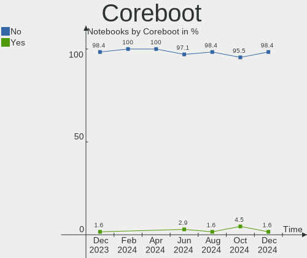
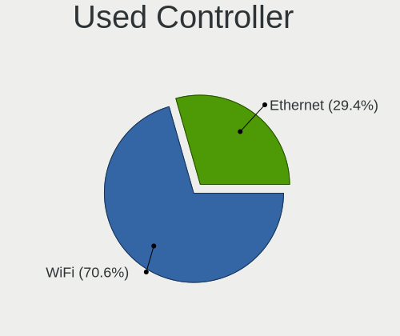

Manjaro Hardware Trends (Notebook)
----------------------------------

A project to identify most popular hardware characteristics and track their change
over time based on data collected by Manjaro users at https://Linux-Hardware.org.

Anyone can contribute to the study by uploading probes of their computers by
the [hw-probe](https://github.com/linuxhw/hw-probe) tool:

    sudo hw-probe -all -upload

Full-feature report is available here: https://linux-hardware.org/?view=trends&formfactor=notebook

Period: Mar, 2020.

Contents
--------

- [ OS                       ](#os)
- [ OS Family                ](#os-family)
- [ Kernel                   ](#kernel)
- [ Kernel Family            ](#kernel-family)
- [ Kernel Major Ver.        ](#kernel-major-ver)
- [ Arch                     ](#arch)
- [ DE                       ](#de)
- [ Display Server           ](#display-server)
- [ OS Lang                  ](#os-lang)
- [ Boot Mode                ](#boot-mode)
- [ Filesystem               ](#filesystem)
- [ Dual Boot with Linux     ](#dual-boot-with-linux)
- [ Dual Boot (Win)          ](#dual-boot-win)
- [ Country                  ](#country)
- [ City                     ](#city)
- [ Vendor                   ](#vendor)
- [ Model                    ](#model)
- [ Model Family             ](#model-family)
- [ MFG Year                 ](#mfg-year)
- [ Form Factor              ](#form-factor)
- [ Secure Boot              ](#secure-boot)
- [ Coreboot                 ](#coreboot)
- [ RAM Size                 ](#ram-size)
- [ RAM Used                 ](#ram-used)
- [ Drive Vendor             ](#drive-vendor)
- [ Drive Model              ](#drive-model)
- [ Drive Kind               ](#drive-kind)
- [ Drive Connector          ](#drive-connector)
- [ Drive Size               ](#drive-size)
- [ Space Total              ](#space-total)
- [ Space Used               ](#space-used)
- [ Malfunc. Drives          ](#malfunc-drives)
- [ Malfunc. Drive Vendor    ](#malfunc-drive-vendor)
- [ Malfunc. Drive Kind      ](#malfunc-drive-kind)
- [ Failed Drives            ](#failed-drives)
- [ Failed Drive Vendor      ](#failed-drive-vendor)
- [ Drive Status             ](#drive-status)
- [ Storage Vendor           ](#storage-vendor)
- [ Storage Model            ](#storage-model)
- [ Storage Kind             ](#storage-kind)
- [ CPU Vendor               ](#cpu-vendor)
- [ CPU Model                ](#cpu-model)
- [ CPU Model Family         ](#cpu-model-family)
- [ CPU Cores                ](#cpu-cores)
- [ CPU Sockets              ](#cpu-sockets)
- [ CPU Threads              ](#cpu-threads)
- [ CPU Op-Modes             ](#cpu-op-modes)
- [ CPU Microarch            ](#cpu-microarch)
- [ CPU Microcode            ](#cpu-microcode)
- [ GPU Vendor               ](#gpu-vendor)
- [ GPU Model                ](#gpu-model)
- [ GPU Combo                ](#gpu-combo)
- [ GPU Driver               ](#gpu-driver)
- [ GPU Memory               ](#gpu-memory)
- [ Monitor Vendor           ](#monitor-vendor)
- [ Monitor Model            ](#monitor-model)
- [ Monitor Resolution       ](#monitor-resolution)
- [ Monitor Diagonal         ](#monitor-diagonal)
- [ Monitor Width            ](#monitor-width)
- [ Aspect Ratio             ](#aspect-ratio)
- [ Monitor Area             ](#monitor-area)
- [ Pixel Density            ](#pixel-density)
- [ Multiple Monitors        ](#multiple-monitors)
- [ Net Controller Vendor    ](#net-controller-vendor)
- [ Net Controller Model     ](#net-controller-model)
- [ Net Controller Kind      ](#net-controller-kind)
- [ Used Controller          ](#used-controller)
- [ NICs                     ](#nics)
- [ Unsupported Devices      ](#unsupported-devices)
- [ Unsupported Device Types ](#unsupported-device-types)

OS
--

Installed operating systems

| Name           | Computers | Percent |
|----------------|-----------|---------|
| Manjaro 19.0.2 | 32        | 47.06%  |
| Manjaro        | 29        | 42.65%  |
| Manjaro 19.0.1 | 7         | 10.29%  |

OS Family
---------

OS without a version

| Name    | Computers | Percent |
|---------|-----------|---------|
| Manjaro | 68        | 100%    |

Kernel
------

Version of the Linux kernel

| Version            | Computers | Percent |
|--------------------|-----------|---------|
| 5.4.23-1-MANJARO   | 13        | 19.12%  |
| 5.4.22-1-MANJARO   | 8         | 11.76%  |
| 5.5.8-1-MANJARO    | 7         | 10.29%  |
| 5.4.24-1-MANJARO   | 6         | 8.82%   |
| 5.5.13-1-MANJARO   | 5         | 7.35%   |
| 5.4.27-1-MANJARO   | 5         | 7.35%   |
| 5.6.0-2-MANJARO    | 4         | 5.88%   |
| 5.5.7-1-MANJARO    | 4         | 5.88%   |
| 5.5.11-1-MANJARO   | 4         | 5.88%   |
| 4.19.108-1-MANJARO | 4         | 5.88%   |
| 5.6.0-1-MANJARO    | 2         | 2.94%   |
| 4.19.106-1-MANJARO | 2         | 2.94%   |
| 5.5.6-1-MANJARO    | 1         | 1.47%   |
| 5.4.28-1-MANJARO   | 1         | 1.47%   |
| 5.4.18-1-MANJARO   | 1         | 1.47%   |
| 4.19.107-1-MANJARO | 1         | 1.47%   |

Kernel Family
-------------

Linux kernel without a distro release

| Version  | Computers | Percent |
|----------|-----------|---------|
| 5.4.23   | 13        | 19.12%  |
| 5.4.22   | 8         | 11.76%  |
| 5.5.8    | 7         | 10.29%  |
| 5.6.0    | 6         | 8.82%   |
| 5.4.24   | 6         | 8.82%   |
| 5.5.13   | 5         | 7.35%   |
| 5.4.27   | 5         | 7.35%   |
| 5.5.7    | 4         | 5.88%   |
| 5.5.11   | 4         | 5.88%   |
| 4.19.108 | 4         | 5.88%   |
| 4.19.106 | 2         | 2.94%   |
| 5.5.6    | 1         | 1.47%   |
| 5.4.28   | 1         | 1.47%   |
| 5.4.18   | 1         | 1.47%   |
| 4.19.107 | 1         | 1.47%   |

Kernel Major Ver.
-----------------

Linux kernel major version

| Version | Computers | Percent |
|---------|-----------|---------|
| 5.4     | 34        | 50%     |
| 5.5     | 21        | 30.88%  |
| 4.19    | 7         | 10.29%  |
| 5.6     | 6         | 8.82%   |

Arch
----

OS architecture (x86_64, i586, etc.)

| Name   | Computers | Percent |
|--------|-----------|---------|
| x86_64 | 68        | 100%    |

DE
--

Desktop Environment

| Name       | Computers | Percent |
|------------|-----------|---------|
| XFCE       | 23        | 33.82%  |
| KDE5       | 15        | 22.06%  |
| GNOME      | 11        | 16.18%  |
| KDE        | 6         | 8.82%   |
| Unknown    | 4         | 5.88%   |
| Cinnamon   | 3         | 4.41%   |
| X-Cinnamon | 2         | 2.94%   |
| i3         | 2         | 2.94%   |
| Deepin     | 1         | 1.47%   |
| Awesome    | 1         | 1.47%   |

Display Server
--------------

X11 or Wayland

| Name    | Computers | Percent |
|---------|-----------|---------|
| X11     | 63        | 92.65%  |
| Wayland | 4         | 5.88%   |
| Unknown | 1         | 1.47%   |

OS Lang
-------

Language

| Lang       | Computers | Percent |
|------------|-----------|---------|
| en_US      | 23        | 33.82%  |
| en_US.utf8 | 10        | 14.71%  |
| de_DE      | 5         | 7.35%   |
| en_GB      | 4         | 5.88%   |
| ru_RU      | 3         | 4.41%   |
| en_GB.utf8 | 3         | 4.41%   |
| en_AU      | 3         | 4.41%   |
| de_DE.utf8 | 3         | 4.41%   |
| en_CA      | 2         | 2.94%   |
| uk_UA      | 1         | 1.47%   |
| pt_BR.utf8 | 1         | 1.47%   |
| it_IT.utf8 | 1         | 1.47%   |
| it_IT      | 1         | 1.47%   |
| fr_FR.utf8 | 1         | 1.47%   |
| fr_FR      | 1         | 1.47%   |
| fi_FI      | 1         | 1.47%   |
| es_MX      | 1         | 1.47%   |
| es_ES      | 1         | 1.47%   |
| en_IE      | 1         | 1.47%   |
| cs_CZ.utf8 | 1         | 1.47%   |
| Unknown    | 1         | 1.47%   |

Boot Mode
---------

EFI or BIOS

| Mode | Computers | Percent |
|------|-----------|---------|
| EFI  | 36        | 52.94%  |
| BIOS | 32        | 47.06%  |

Filesystem
----------

Type of filesystem

| Type    | Computers | Percent |
|---------|-----------|---------|
| Ext4    | 59        | 86.76%  |
| Btrfs   | 4         | 5.88%   |
| Xfs     | 2         | 2.94%   |
| Overlay | 2         | 2.94%   |
| Tmpfs   | 1         | 1.47%   |

Dual Boot with Linux
--------------------

Hosting more than one Linux

| Dual boot | Computers | Percent |
|-----------|-----------|---------|
| No        | 61        | 89.71%  |
| Yes       | 7         | 10.29%  |

Dual Boot (Win)
---------------

Hosting Linux and Windows

| Dual boot | Computers | Percent |
|-----------|-----------|---------|
| No        | 49        | 72.06%  |
| Yes       | 19        | 27.94%  |

Country
-------

Geographic location (country)

| Country                | Computers | Percent |
|------------------------|-----------|---------|
| USA                    | 15        | 22.06%  |
| Germany                | 10        | 14.71%  |
| Ukraine                | 4         | 5.88%   |
| Sweden                 | 3         | 4.41%   |
| Russia                 | 3         | 4.41%   |
| Australia              | 3         | 4.41%   |
| Italy                  | 2         | 2.94%   |
| France                 | 2         | 2.94%   |
| China                  | 2         | 2.94%   |
| Canada                 | 2         | 2.94%   |
| Brazil                 | 2         | 2.94%   |
| Belgium                | 2         | 2.94%   |
| UK                     | 1         | 1.47%   |
| Switzerland            | 1         | 1.47%   |
| Spain                  | 1         | 1.47%   |
| Slovenia               | 1         | 1.47%   |
| Serbia                 | 1         | 1.47%   |
| Romania                | 1         | 1.47%   |
| Portugal               | 1         | 1.47%   |
| Norway                 | 1         | 1.47%   |
| Mexico                 | 1         | 1.47%   |
| Luxembourg             | 1         | 1.47%   |
| Ireland                | 1         | 1.47%   |
| Indonesia              | 1         | 1.47%   |
| India                  | 1         | 1.47%   |
| Finland                | 1         | 1.47%   |
| Czech Republic         | 1         | 1.47%   |
| Colombia               | 1         | 1.47%   |
| Bulgaria               | 1         | 1.47%   |
| Bosnia and Herzegovina | 1         | 1.47%   |

City
----

Geographic location (city)

| City                 | Computers | Percent |
|----------------------|-----------|---------|
| Stockholm            | 2         | 2.94%   |
| Neuburg an der Donau | 2         | 2.94%   |
| Kyiv                 | 2         | 2.94%   |
| Brussels             | 2         | 2.94%   |
| Xi'an                | 1         | 1.47%   |
| Warren               | 1         | 1.47%   |
| Voronezh             | 1         | 1.47%   |
| Vojnuv Mestec        | 1         | 1.47%   |
| Verona               | 1         | 1.47%   |
| Udine                | 1         | 1.47%   |
| Tuzla                | 1         | 1.47%   |
| Tianjin              | 1         | 1.47%   |
| Tampere              | 1         | 1.47%   |
| São Paulo           | 1         | 1.47%   |
| Stuttgart            | 1         | 1.47%   |
| Strassen             | 1         | 1.47%   |
| Speyer               | 1         | 1.47%   |
| Sofia                | 1         | 1.47%   |
| Skien                | 1         | 1.47%   |
| Sevnica              | 1         | 1.47%   |
| Schortens            | 1         | 1.47%   |
| Salem                | 1         | 1.47%   |
| Rio de Janeiro       | 1         | 1.47%   |
| Puebla City          | 1         | 1.47%   |
| Povoa de Santa Iria  | 1         | 1.47%   |
| Phoenix              | 1         | 1.47%   |
| Perth                | 1         | 1.47%   |
| Owasso               | 1         | 1.47%   |
| Novi Sad             | 1         | 1.47%   |
| North Augusta        | 1         | 1.47%   |
| New Brunswick        | 1         | 1.47%   |
| Moscow               | 1         | 1.47%   |
| Montrouge            | 1         | 1.47%   |
| Montreal             | 1         | 1.47%   |
| Mokrous              | 1         | 1.47%   |
| Melbourne            | 1         | 1.47%   |
| Marble Falls         | 1         | 1.47%   |
| Lviv                 | 1         | 1.47%   |
| Luleå               | 1         | 1.47%   |
| Leipzig              | 1         | 1.47%   |
| La Rochelle          | 1         | 1.47%   |
| Kharkiv              | 1         | 1.47%   |
| Jakarta              | 1         | 1.47%   |
| Independence         | 1         | 1.47%   |
| Ilton                | 1         | 1.47%   |
| Hildesheim           | 1         | 1.47%   |
| Frederick            | 1         | 1.47%   |
| Fort Collins         | 1         | 1.47%   |
| Focşani             | 1         | 1.47%   |
| Findlay              | 1         | 1.47%   |
| Edmonton             | 1         | 1.47%   |
| Dublin               | 1         | 1.47%   |
| Coppell              | 1         | 1.47%   |
| Chicago              | 1         | 1.47%   |
| Chattanooga          | 1         | 1.47%   |
| Cartagena            | 1         | 1.47%   |
| Brooklyn             | 1         | 1.47%   |
| Brisbane             | 1         | 1.47%   |
| Breitnau             | 1         | 1.47%   |
| Bogotá              | 1         | 1.47%   |

Vendor
------

Motherboard manufacturer

| Name                  | Computers | Percent |
|-----------------------|-----------|---------|
| Lenovo                | 16        | 23.53%  |
| Dell                  | 12        | 17.65%  |
| ASUSTek Computer      | 11        | 16.18%  |
| Hewlett-Packard       | 10        | 14.71%  |
| Acer                  | 7         | 10.29%  |
| Notebook              | 3         | 4.41%   |
| Apple                 | 2         | 2.94%   |
| Timi                  | 1         | 1.47%   |
| StationX              | 1         | 1.47%   |
| Samsung Electronics   | 1         | 1.47%   |
| Multilaser Industrial | 1         | 1.47%   |
| MSI                   | 1         | 1.47%   |
| GPD                   | 1         | 1.47%   |
| Bak USA Technologies  | 1         | 1.47%   |

Model
-----

Motherboard model

| Name                                        | Computers | Percent |
|---------------------------------------------|-----------|---------|
| Lenovo IdeaPad 330S-15ARR 81FB              | 2         | 2.94%   |
| Timi TM1613                                 | 1         | 1.47%   |
| StationX Manjaro Spitfire                   | 1         | 1.47%   |
| Samsung Electronics 530U3BI/530U4BI/530U4BH | 1         | 1.47%   |
| Notebook W35xSTQ_370ST                      | 1         | 1.47%   |
| Notebook P65_P67RGRERA                      | 1         | 1.47%   |
| Notebook N141CU                             | 1         | 1.47%   |
| Multilaser Industrial PC150                 | 1         | 1.47%   |
| MSI PS63 Modern 8SC                         | 1         | 1.47%   |
| Lenovo XiaoXinPro-13IML 2019 81XB           | 1         | 1.47%   |
| Lenovo V580c 20160                          | 1         | 1.47%   |
| Lenovo ThinkPad X220 4290FP2                | 1         | 1.47%   |
| Lenovo ThinkPad X1 Carbon 7th 20R1S04100    | 1         | 1.47%   |
| Lenovo ThinkPad X1 Carbon 7th 20QDCTO1WW    | 1         | 1.47%   |
| Lenovo ThinkPad X1 Carbon 7th 20QD003LRT    | 1         | 1.47%   |
| Lenovo ThinkPad X1 Carbon 3rd 20BSCTO1WW    | 1         | 1.47%   |
| Lenovo ThinkPad T480 20L5CTO1WW             | 1         | 1.47%   |
| Lenovo ThinkPad T470 20HES2SF00             | 1         | 1.47%   |
| Lenovo ThinkPad T440s 20ARA0K400            | 1         | 1.47%   |
| Lenovo ThinkPad S1 Yoga 20CD0038MZ          | 1         | 1.47%   |
| Lenovo Legion Y530-15ICH 81FV               | 1         | 1.47%   |
| Lenovo IdeaPad S540-14API 81NH              | 1         | 1.47%   |
| Lenovo IdeaPad 100-15IBD 80QQ               | 1         | 1.47%   |
| HP ProBook 650 G5                           | 1         | 1.47%   |
| HP ProBook 450 G5                           | 1         | 1.47%   |
| HP Laptop 17-by0xxx                         | 1         | 1.47%   |
| HP Laptop 15-bs1xx                          | 1         | 1.47%   |
| HP G42                                      | 1         | 1.47%   |
| HP ENVY Laptop 13-aq0xxx                    | 1         | 1.47%   |
| HP EliteBook 840 G6                         | 1         | 1.47%   |
| HP EliteBook 840 G5                         | 1         | 1.47%   |
| HP EliteBook 840 G2                         | 1         | 1.47%   |
| HP Compaq 8710w (GC125EA#ABN)               | 1         | 1.47%   |
| GPD P2 MAX                                  | 1         | 1.47%   |
| Dell Precision M4600                        | 1         | 1.47%   |
| Dell Precision M3800                        | 1         | 1.47%   |
| Dell Precision 5510                         | 1         | 1.47%   |
| Dell Latitude E6410                         | 1         | 1.47%   |
| Dell Latitude 7400                          | 1         | 1.47%   |
| Dell Latitude 7280                          | 1         | 1.47%   |
| Dell Latitude 5501                          | 1         | 1.47%   |
| Dell Inspiron 3585                          | 1         | 1.47%   |
| Dell Inspiron 3583                          | 1         | 1.47%   |
| Dell Inspiron 3542                          | 1         | 1.47%   |
| Dell Inspiron 3541                          | 1         | 1.47%   |
| Dell G7 7588                                | 1         | 1.47%   |
| Bak USA Technologies Atlas                  | 1         | 1.47%   |
| ASUS X750LB                                 | 1         | 1.47%   |
| ASUS X540SA                                 | 1         | 1.47%   |
| ASUS X510UAR                                | 1         | 1.47%   |
| ASUS VivoBook_ASUSLaptop X512DA_F512DA      | 1         | 1.47%   |
| ASUS UX410UAR                               | 1         | 1.47%   |
| ASUS UX331UN                                | 1         | 1.47%   |
| ASUS TUF Gaming FX505GD_FX505GD             | 1         | 1.47%   |
| ASUS Strix 15 GL503GE                       | 1         | 1.47%   |
| ASUS K52JT                                  | 1         | 1.47%   |
| ASUS K43SV                                  | 1         | 1.47%   |
| ASUS F5N                                    | 1         | 1.47%   |
| Apple MacBookPro11,2                        | 1         | 1.47%   |
| Apple MacBookAir3,1                         | 1         | 1.47%   |

Model Family
------------

Motherboard model prefix

| Name                        | Computers | Percent |
|-----------------------------|-----------|---------|
| Lenovo ThinkPad             | 9         | 13.24%  |
| Lenovo IdeaPad              | 4         | 5.88%   |
| Dell Latitude               | 4         | 5.88%   |
| Dell Inspiron               | 4         | 5.88%   |
| Acer Aspire                 | 4         | 5.88%   |
| HP EliteBook                | 3         | 4.41%   |
| Dell Precision              | 3         | 4.41%   |
| HP ProBook                  | 2         | 2.94%   |
| HP Laptop                   | 2         | 2.94%   |
| Timi TM1613                 | 1         | 1.47%   |
| StationX Manjaro            | 1         | 1.47%   |
| Samsung Electronics 530U3BI | 1         | 1.47%   |
| Notebook W35xSTQ            | 1         | 1.47%   |
| Notebook P65                | 1         | 1.47%   |
| Notebook N141CU             | 1         | 1.47%   |
| Multilaser Industrial PC150 | 1         | 1.47%   |
| MSI PS63                    | 1         | 1.47%   |
| Lenovo XiaoXinPro-13IML     | 1         | 1.47%   |
| Lenovo V580c                | 1         | 1.47%   |
| Lenovo Legion               | 1         | 1.47%   |
| HP G42                      | 1         | 1.47%   |
| HP ENVY                     | 1         | 1.47%   |
| HP Compaq                   | 1         | 1.47%   |
| GPD P2                      | 1         | 1.47%   |
| Dell G7                     | 1         | 1.47%   |
| Bak USA Technologies Atlas  | 1         | 1.47%   |
| ASUS X750LB                 | 1         | 1.47%   |
| ASUS X540SA                 | 1         | 1.47%   |
| ASUS X510UAR                | 1         | 1.47%   |
| ASUS VivoBook               | 1         | 1.47%   |
| ASUS UX410UAR               | 1         | 1.47%   |
| ASUS UX331UN                | 1         | 1.47%   |
| ASUS TUF                    | 1         | 1.47%   |
| ASUS Strix                  | 1         | 1.47%   |
| ASUS K52JT                  | 1         | 1.47%   |
| ASUS K43SV                  | 1         | 1.47%   |
| ASUS F5N                    | 1         | 1.47%   |
| Apple MacBookPro11          | 1         | 1.47%   |
| Apple MacBookAir3           | 1         | 1.47%   |
| Acer Swift                  | 1         | 1.47%   |
| Acer Nitro                  | 1         | 1.47%   |
| Acer Extensa                | 1         | 1.47%   |

MFG Year
--------

Motherboard manufacture year

| Year | Computers | Percent |
|------|-----------|---------|
| 2019 | 28        | 41.18%  |
| 2018 | 9         | 13.24%  |
| 2020 | 6         | 8.82%   |
| 2017 | 4         | 5.88%   |
| 2016 | 4         | 5.88%   |
| 2013 | 4         | 5.88%   |
| 2015 | 3         | 4.41%   |
| 2011 | 3         | 4.41%   |
| 2014 | 2         | 2.94%   |
| 2010 | 2         | 2.94%   |
| 2007 | 2         | 2.94%   |
| 2008 | 1         | 1.47%   |

Form Factor
-----------

Physical design of the computer

| Name     | Computers | Percent |
|----------|-----------|---------|
| Notebook | 68        | 100%    |

Secure Boot
-----------

Enabled or disabled

| State    | Computers | Percent |
|----------|-----------|---------|
| Disabled | 68        | 100%    |

Coreboot
--------

Have coreboot on board

| Used | Computers | Percent |
|------|-----------|---------|
| No   | 68        | 100%    |

RAM Size
--------

Total RAM memory

| Size in GB | Computers | Percent |
|------------|-----------|---------|
| 16.01-24.0 | 23        | 33.82%  |
| 4.01-8.0   | 21        | 30.88%  |
| 3.01-4.0   | 9         | 13.24%  |
| 8.01-16.0  | 8         | 11.76%  |
| 1.01-2.0   | 4         | 5.88%   |
| 32.01-64.0 | 3         | 4.41%   |

RAM Used
--------

Used RAM memory

| Used GB  | Computers | Percent |
|----------|-----------|---------|
| 2.01-3.0 | 20        | 29.41%  |
| 1.01-2.0 | 18        | 26.47%  |
| 3.01-4.0 | 15        | 22.06%  |
| 4.01-8.0 | 11        | 16.18%  |
| 0.01-1.0 | 4         | 5.88%   |

Drive Vendor
------------

Hard drive vendors

| Vendor              | Computers | Drives | Percent |
|---------------------|-----------|--------|---------|
| Samsung Electronics | 13        | 15     | 17.33%  |
| Seagate             | 12        | 12     | 16%     |
| WDC                 | 8         | 8      | 10.67%  |
| Intel               | 8         | 8      | 10.67%  |
| Unknown             | 4         | 4      | 5.33%   |
| Hitachi             | 3         | 3      | 4%      |
| Crucial             | 3         | 3      | 4%      |
| Transcend           | 2         | 2      | 2.67%   |
| Toshiba             | 2         | 2      | 2.67%   |
| SK Hynix            | 2         | 2      | 2.67%   |
| SanDisk             | 2         | 2      | 2.67%   |
| Micron Technology   | 2         | 2      | 2.67%   |
| Kingston            | 2         | 2      | 2.67%   |
| Apple               | 2         | 2      | 2.67%   |
| SKhynix             | 1         | 1      | 1.33%   |
| Phison              | 1         | 1      | 1.33%   |
| Patriot             | 1         | 1      | 1.33%   |
| LITEONIT            | 1         | 1      | 1.33%   |
| Intenso             | 1         | 1      | 1.33%   |
| HGST                | 1         | 1      | 1.33%   |
| Hewlett-Packard     | 1         | 1      | 1.33%   |
| FORESEE             | 1         | 1      | 1.33%   |
| BIWIN               | 1         | 1      | 1.33%   |
| A-DATA Technology   | 1         | 1      | 1.33%   |

Drive Model
-----------

Hard drive models

| Model                             | Computers | Percent |
|-----------------------------------|-----------|---------|
| ST1000LM035-1RK172 1TB            | 4         | 5.19%   |
| SSDPEKKF010T8L 1TB                | 3         | 3.9%    |
| ST1000LM024 HN-M101MBB 1TB        | 2         | 2.6%    |
| SSD 850 EVO 250GB                 | 2         | 2.6%    |
| SA400M8240G 240GB SSD             | 2         | 2.6%    |
| WDS500G2B0B-00YS70 500GB SSD      | 1         | 1.3%    |
| WDS100T2B0A-00SM50 1TB SSD        | 1         | 1.3%    |
| WD3200BPVT-22JJ5T0 320GB          | 1         | 1.3%    |
| WD3200BEVT-22ZCT0 320GB           | 1         | 1.3%    |
| WD3200BEVT-00ZAT0 320GB           | 1         | 1.3%    |
| WD2500BPVT-22ZEST0 250GB          | 1         | 1.3%    |
| WD10SPZX-21Z10T0 1TB              | 1         | 1.3%    |
| TS512GMTS430S 512GB SSD           | 1         | 1.3%    |
| TS256GMTS400 256GB SSD            | 1         | 1.3%    |
| SX8200PNP 256GB                   | 1         | 1.3%    |
| ST95005620AS 500GB                | 1         | 1.3%    |
| ST9500325AS 500GB                 | 1         | 1.3%    |
| ST500LT012-1DG142 500GB           | 1         | 1.3%    |
| ST500LM034-2GH17A 500GB           | 1         | 1.3%    |
| ST1000LX015-1U7172 1TB            | 1         | 1.3%    |
| SSDSCKKF256H6 SATA 256GB          | 1         | 1.3%    |
| SSDSCKKF128G8 SATA 128GB          | 1         | 1.3%    |
| SSDSC2BF180A5H SED 180GB          | 1         | 1.3%    |
| SSDPEKNW010T8H 1TB                | 1         | 1.3%    |
| SSDMCEAF180A4L 180GB              | 1         | 1.3%    |
| SSD TS064C 64GB                   | 1         | 1.3%    |
| SSD SM0128G 121GB                 | 1         | 1.3%    |
| SSD Sata III 960GB                | 1         | 1.3%    |
| SSD EX920 1TB                     | 1         | 1.3%    |
| SSD 970 EVO Plus 250GB            | 1         | 1.3%    |
| SSD 860 QVO 1TB                   | 1         | 1.3%    |
| SSD 860 EVO M.2 1TB               | 1         | 1.3%    |
| SSD 860 EVO 1TB                   | 1         | 1.3%    |
| SSD 850 EVO 1TB                   | 1         | 1.3%    |
| SSD 840 EVO 250GB                 | 1         | 1.3%    |
| SSD 512GB                         | 1         | 1.3%    |
| SLD32G  32GB                      | 1         | 1.3%    |
| SD7SN6S-512G-1006 512GB SSD       | 1         | 1.3%    |
| SD32G  32GB                       | 1         | 1.3%    |
| SC300 HFS512G32MND-3210A 512GB    | 1         | 1.3%    |
| Sabrent Rocket Q 2TB              | 1         | 1.3%    |
| PC SN520 SDAPNUW-256G-1002 256GB  | 1         | 1.3%    |
| MZVLB512HBJQ-000L2 512GB          | 1         | 1.3%    |
| MZVLB512HAJQ-000H1 512GB          | 1         | 1.3%    |
| MZVLB256HAHQ-000H1 256GB          | 1         | 1.3%    |
| MZNLN256HAJQ-000H1 256GB SSD      | 1         | 1.3%    |
| MZ7TE256HMHP-000L7 256GB SSD      | 1         | 1.3%    |
| MZ7TD256HAFV-000L9 256GB SSD      | 1         | 1.3%    |
| MZ7LN256HAJQ-000L2 256GB SSD      | 1         | 1.3%    |
| MTFDDAV256TDL-1AW1ZABHA 256GB SSD | 1         | 1.3%    |
| MQ04ABF100 1TB                    | 1         | 1.3%    |
| MQ01ABD100 1TB                    | 1         | 1.3%    |
| MMC Card  2GB                     | 1         | 1.3%    |
| LMT-256L9M-11 MSATA 256GB SSD     | 1         | 1.3%    |
| iSSD P4 16GB                      | 1         | 1.3%    |
| HTS547564A9E384 640GB             | 1         | 1.3%    |
| HTS545050A7E680 500GB             | 1         | 1.3%    |
| HTS545050A7E380 500GB             | 1         | 1.3%    |
| HTS541680J9SA00 80GB              | 1         | 1.3%    |
| HFS256G39TND-N210A 256GB SSD      | 1         | 1.3%    |

Drive Kind
----------

HDD or SSD

| Kind    | Computers | Drives | Percent |
|---------|-----------|--------|---------|
| SSD     | 32        | 36     | 45.07%  |
| HDD     | 22        | 23     | 30.99%  |
| NVMe    | 12        | 13     | 16.9%   |
| MMC     | 4         | 4      | 5.63%   |
| Unknown | 1         | 1      | 1.41%   |

Drive Connector
---------------

SATA, SAS, NVMe, etc.

| Type | Computers | Drives | Percent |
|------|-----------|--------|---------|
| SATA | 51        | 59     | 75%     |
| NVMe | 12        | 13     | 17.65%  |
| MMC  | 4         | 4      | 5.88%   |
| SAS  | 1         | 1      | 1.47%   |

Drive Size
----------

Size of hard drive

| Size in TB | Computers | Drives | Percent |
|------------|-----------|--------|---------|
| 0.01-0.5   | 39        | 45     | 57.35%  |
| 0.51-1.0   | 27        | 30     | 39.71%  |
| 1.01-2.0   | 2         | 2      | 2.94%   |

Space Total
-----------

Amount of disk space available on the file system

| Size in GB | Computers | Percent |
|------------|-----------|---------|
| 251-500    | 17        | 25%     |
| 101-250    | 16        | 23.53%  |
| 501-1000   | 9         | 13.24%  |
| 51-100     | 9         | 13.24%  |
| 1001-2000  | 8         | 11.76%  |
| Unknown    | 4         | 5.88%   |
| 1-20       | 3         | 4.41%   |
| 21-50      | 2         | 2.94%   |

Space Used
----------

Amount of used disk space

| Used GB  | Computers | Percent |
|----------|-----------|---------|
| 1-20     | 23        | 33.82%  |
| 101-250  | 15        | 22.06%  |
| 21-50    | 9         | 13.24%  |
| 51-100   | 7         | 10.29%  |
| 251-500  | 5         | 7.35%   |
| 501-1000 | 5         | 7.35%   |
| Unknown  | 4         | 5.88%   |

Malfunc. Drives
---------------

Drive models with a malfunction

| Model                             | Computers | Drives | Percent |
|-----------------------------------|-----------|--------|---------|
| MTFDDAV256TDL-1AW1ZABHA 256GB SSD | 1         | 1      | 25%     |
| iSSD P4 16GB                      | 1         | 1      | 25%     |
| HTS545050A7E380 500GB             | 1         | 1      | 25%     |
| CT525MX300SSD1 528GB              | 1         | 1      | 25%     |

Malfunc. Drive Vendor
---------------------

Vendors of faulty drives

| Vendor            | Computers | Drives | Percent |
|-------------------|-----------|--------|---------|
| SanDisk           | 1         | 1      | 25%     |
| Micron Technology | 1         | 1      | 25%     |
| Hitachi           | 1         | 1      | 25%     |
| Crucial           | 1         | 1      | 25%     |

Malfunc. Drive Kind
-------------------

Kinds of faulty drives

| Kind | Computers | Drives | Percent |
|------|-----------|--------|---------|
| SSD  | 3         | 3      | 75%     |
| HDD  | 1         | 1      | 25%     |

Failed Drives
-------------

Failed drive models

Zero info for selected period =(

Failed Drive Vendor
-------------------

Failed drive vendors

Zero info for selected period =(

Drive Status
------------

Number of failed and malfunc. drives

| Status   | Computers | Drives | Percent |
|----------|-----------|--------|---------|
| Detected | 39        | 47     | 63.93%  |
| Works    | 19        | 26     | 31.15%  |
| Malfunc  | 3         | 4      | 4.92%   |

Storage Vendor
--------------

Storage controller vendors

| Vendor                       | Computers | Percent |
|------------------------------|-----------|---------|
| Intel                        | 52        | 65%     |
| AMD                          | 8         | 10%     |
| Samsung Electronics          | 7         | 8.75%   |
| Silicon Motion               | 3         | 3.75%   |
| Toshiba America Info Systems | 2         | 2.5%    |
| Nvidia                       | 2         | 2.5%    |
| Union Memory (Shenzhen)      | 1         | 1.25%   |
| SK Hynix                     | 1         | 1.25%   |
| Sandisk                      | 1         | 1.25%   |
| Phison Electronics           | 1         | 1.25%   |
| KIOXIA                       | 1         | 1.25%   |
| ADATA Technology             | 1         | 1.25%   |

Storage Model
-------------

Storage controller models

| Model                                                                      | Computers | Percent |
|----------------------------------------------------------------------------|-----------|---------|
| Sunrise Point-LP SATA Controller [AHCI mode]                               | 8         | 9.41%   |
| FCH SATA Controller [AHCI mode]                                            | 8         | 9.41%   |
| 82801 Mobile SATA Controller [RAID mode]                                   | 6         | 7.06%   |
| Non-Volatile memory controller                                             | 5         | 5.88%   |
| 8 Series SATA Controller 1 [AHCI mode]                                     | 5         | 5.88%   |
| 6 Series/C200 Series Chipset Family 6 port Mobile SATA AHCI Controller     | 5         | 5.88%   |
| Wildcat Point-LP SATA Controller [AHCI Mode]                               | 4         | 4.71%   |
| NVMe SSD Controller SM981/PM981/PM983                                      | 4         | 4.71%   |
| SSD Pro 7600p/760p/E 6100p Series                                          | 3         | 3.53%   |
| Cannon Point-LP SATA Controller [AHCI Mode]                                | 3         | 3.53%   |
| Cannon Lake Mobile PCH SATA AHCI Controller                                | 3         | 3.53%   |
| SSD 660P Series                                                            | 2         | 2.35%   |
| SATA controller                                                            | 2         | 2.35%   |
| NVMe SSD Controller SM951/PM951                                            | 2         | 2.35%   |
| 82801HM/HEM (ICH8M/ICH8M-E) SATA Controller [AHCI mode]                    | 2         | 2.35%   |
| 82801HM/HEM (ICH8M/ICH8M-E) IDE Controller                                 | 2         | 2.35%   |
| 8 Series/C220 Series Chipset Family 6-port SATA Controller 1 [AHCI mode]   | 2         | 2.35%   |
| 5 Series/3400 Series Chipset 4 port SATA AHCI Controller                   | 2         | 2.35%   |
| XPG SX8200 Pro PCIe Gen3x4 M.2 2280 Solid State Drive                      | 1         | 1.18%   |
| XG4 NVMe SSD Controller                                                    | 1         | 1.18%   |
| WD Black 2018/PC SN520 NVMe SSD                                            | 1         | 1.18%   |
| Toshiba America Info Non-Volatile memory controller                        | 1         | 1.18%   |
| SATA Controller [RAID mode]                                                | 1         | 1.18%   |
| Mobile PM965/GM965 PT IDER Controller                                      | 1         | 1.18%   |
| MCP89 SATA Controller (AHCI mode)                                          | 1         | 1.18%   |
| MCP67 IDE Controller                                                       | 1         | 1.18%   |
| MCP67 AHCI Controller                                                      | 1         | 1.18%   |
| HM170/QM170 Chipset SATA Controller [AHCI Mode]                            | 1         | 1.18%   |
| Electronics SATA controller                                                | 1         | 1.18%   |
| E12 NVMe Controller                                                        | 1         | 1.18%   |
| Comet Lake SATA AHCI Controller                                            | 1         | 1.18%   |
| BC501 NVMe Solid State Drive 512GB                                         | 1         | 1.18%   |
| Atom/Celeron/Pentium Processor x5-E8000/J3xxx/N3xxx Series SATA Controller | 1         | 1.18%   |
| 82801IBM/IEM (ICH9M/ICH9M-E) 4 port SATA Controller [AHCI mode]            | 1         | 1.18%   |
| 7 Series Chipset Family 6-port SATA Controller [AHCI mode]                 | 1         | 1.18%   |

Storage Kind
------------

Kind of storage controller (IDE, SATA, NVMe, SAS, ...)

| Kind | Computers | Percent |
|------|-----------|---------|
| SATA | 51        | 62.2%   |
| NVMe | 21        | 25.61%  |
| RAID | 7         | 8.54%   |
| IDE  | 3         | 3.66%   |

CPU Vendor
----------

Processor vendors

| Vendor | Computers | Percent |
|--------|-----------|---------|
| Intel  | 58        | 85.29%  |
| AMD    | 10        | 14.71%  |

CPU Model
---------

Processor models

| Model                                         | Computers | Percent |
|-----------------------------------------------|-----------|---------|
| Intel Core i7-8750H CPU @ 2.20GHz             | 4         | 5.88%   |
| Intel Core i5-8250U CPU @ 1.60GHz             | 4         | 5.88%   |
| Intel Core i7-8565U CPU @ 1.80GHz             | 3         | 4.41%   |
| AMD Ryzen 5 2500U with Radeon Vega Mobile Gfx | 3         | 4.41%   |
| Intel Core i7-8665U CPU @ 1.90GHz             | 2         | 2.94%   |
| Intel Core i7-4500U CPU @ 1.80GHz             | 2         | 2.94%   |
| Intel Core i7-10710U CPU @ 1.10GHz            | 2         | 2.94%   |
| Intel Core i5-8265U CPU @ 1.60GHz             | 2         | 2.94%   |
| Intel Pentium CPU N3700 @ 1.60GHz             | 1         | 1.47%   |
| Intel Core m3-8100Y CPU @ 1.10GHz             | 1         | 1.47%   |
| Intel Core i7-9850H CPU @ 2.60GHz             | 1         | 1.47%   |
| Intel Core i7-8650U CPU @ 1.90GHz             | 1         | 1.47%   |
| Intel Core i7-8550U CPU @ 1.80GHz             | 1         | 1.47%   |
| Intel Core i7-7500U CPU @ 2.70GHz             | 1         | 1.47%   |
| Intel Core i7-6820HQ CPU @ 2.70GHz            | 1         | 1.47%   |
| Intel Core i7-6700HQ CPU @ 2.60GHz            | 1         | 1.47%   |
| Intel Core i7-6500U CPU @ 2.50GHz             | 1         | 1.47%   |
| Intel Core i7-5600U CPU @ 2.60GHz             | 1         | 1.47%   |
| Intel Core i7-4850HQ CPU @ 2.30GHz            | 1         | 1.47%   |
| Intel Core i7-4702HQ CPU @ 2.20GHz            | 1         | 1.47%   |
| Intel Core i7-4700MQ CPU @ 2.40GHz            | 1         | 1.47%   |
| Intel Core i7-4600U CPU @ 2.10GHz             | 1         | 1.47%   |
| Intel Core i7-2640M CPU @ 2.80GHz             | 1         | 1.47%   |
| Intel Core i7-10510U CPU @ 1.80GHz            | 1         | 1.47%   |
| Intel Core i7 CPU Q 740 @ 1.73GHz             | 1         | 1.47%   |
| Intel Core i5-8365U CPU @ 1.60GHz             | 1         | 1.47%   |
| Intel Core i5-7300U CPU @ 2.60GHz             | 1         | 1.47%   |
| Intel Core i5-7200U CPU @ 2.50GHz             | 1         | 1.47%   |
| Intel Core i5-5300U CPU @ 2.30GHz             | 1         | 1.47%   |
| Intel Core i5-4210U CPU @ 1.70GHz             | 1         | 1.47%   |
| Intel Core i5-4200U CPU @ 1.60GHz             | 1         | 1.47%   |
| Intel Core i5-2520M CPU @ 2.50GHz             | 1         | 1.47%   |
| Intel Core i5-2467M CPU @ 1.60GHz             | 1         | 1.47%   |
| Intel Core i5-2450M CPU @ 2.50GHz             | 1         | 1.47%   |
| Intel Core i5-2410M CPU @ 2.30GHz             | 1         | 1.47%   |
| Intel Core i5-1035G4 CPU @ 1.10GHz            | 1         | 1.47%   |
| Intel Core i5 CPU M 520 @ 2.40GHz             | 1         | 1.47%   |
| Intel Core i5 CPU M 460 @ 2.53GHz             | 1         | 1.47%   |
| Intel Core i3-5020U CPU @ 2.20GHz             | 1         | 1.47%   |
| Intel Core i3-5005U CPU @ 2.00GHz             | 1         | 1.47%   |
| Intel Core i3-3110M CPU @ 2.40GHz             | 1         | 1.47%   |
| Intel Core 2 Duo CPU U9400 @ 1.40GHz          | 1         | 1.47%   |
| Intel Core 2 Duo CPU T7700 @ 2.40GHz          | 1         | 1.47%   |
| Intel Core 2 Duo CPU T6600 @ 2.20GHz          | 1         | 1.47%   |
| Intel Celeron N4100 CPU @ 1.10GHz             | 1         | 1.47%   |
| Intel Celeron N4000 CPU @ 1.10GHz             | 1         | 1.47%   |
| Intel Celeron CPU 530 @ 1.73GHz               | 1         | 1.47%   |
| AMD Turion 64 X2 Mobile Technology TL-58      | 1         | 1.47%   |
| AMD Ryzen 7 2700U with Radeon Vega Mobile Gfx | 1         | 1.47%   |
| AMD Ryzen 5 3500U with Radeon Vega Mobile Gfx | 1         | 1.47%   |
| AMD Ryzen 3 3200U with Radeon Vega Mobile Gfx | 1         | 1.47%   |
| AMD Ryzen 3 2200U with Radeon Vega Mobile Gfx | 1         | 1.47%   |
| AMD A6-6310 APU with AMD Radeon R4 Graphics   | 1         | 1.47%   |
| AMD A4-9120e RADEON R3, 4 COMPUTE CORES 2C+2G | 1         | 1.47%   |

CPU Model Family
----------------

Processor model prefix

| Model                   | Computers | Percent |
|-------------------------|-----------|---------|
| Intel Core i7           | 28        | 41.18%  |
| Intel Core i5           | 19        | 27.94%  |
| AMD Ryzen 5             | 4         | 5.88%   |
| Intel Core i3           | 3         | 4.41%   |
| Intel Core 2 Duo        | 3         | 4.41%   |
| Intel Celeron           | 3         | 4.41%   |
| AMD Ryzen 3             | 2         | 2.94%   |
| Intel Pentium           | 1         | 1.47%   |
| Intel Core m3           | 1         | 1.47%   |
| AMD Turion 64 X2 Mobile | 1         | 1.47%   |
| AMD Ryzen 7             | 1         | 1.47%   |
| AMD A6                  | 1         | 1.47%   |
| AMD A4                  | 1         | 1.47%   |

CPU Cores
---------

Number of processor cores

| Number | Computers | Percent |
|--------|-----------|---------|
| 4      | 30        | 44.12%  |
| 2      | 30        | 44.12%  |
| 6      | 7         | 10.29%  |
| 1      | 1         | 1.47%   |

CPU Sockets
-----------

Number of sockets

| Number | Computers | Percent |
|--------|-----------|---------|
| 1      | 68        | 100%    |

CPU Threads
-----------

Threads per core (Hyper-Threading)

| Number | Computers | Percent |
|--------|-----------|---------|
| 2      | 58        | 85.29%  |
| 1      | 10        | 14.71%  |

CPU Op-Modes
------------

CPU Operation Modes (32-bit, 64-bit)

| Op mode        | Computers | Percent |
|----------------|-----------|---------|
| 32-bit, 64-bit | 68        | 100%    |

CPU Microarch
-------------

Microarchitecture

| Name          | Computers | Percent |
|---------------|-----------|---------|
| Skylake       | 20        | 29.41%  |
| KabyLake      | 9         | 13.24%  |
| Haswell       | 8         | 11.76%  |
| Zen           | 5         | 7.35%   |
| SandyBridge   | 5         | 7.35%   |
| Broadwell     | 4         | 5.88%   |
| Zen+          | 2         | 2.94%   |
| Westmere      | 2         | 2.94%   |
| Penryn        | 2         | 2.94%   |
| Goldmont plus | 2         | 2.94%   |
| Core          | 2         | 2.94%   |
| Silvermont    | 1         | 1.47%   |
| Puma          | 1         | 1.47%   |
| Nehalem       | 1         | 1.47%   |
| K8 Hammer     | 1         | 1.47%   |
| IvyBridge     | 1         | 1.47%   |
| Icelake       | 1         | 1.47%   |
| Excavator     | 1         | 1.47%   |

CPU Microcode
-------------

Microcode number

| Number     | Computers | Percent |
|------------|-----------|---------|
| Unknown    | 26        | 38.24%  |
| 0x806ec    | 7         | 10.29%  |
| 0x906ea    | 4         | 5.88%   |
| 0x806ea    | 3         | 4.41%   |
| 0x806e9    | 3         | 4.41%   |
| 0x40651    | 3         | 4.41%   |
| 0x0810100b | 3         | 4.41%   |
| 0xa0660    | 2         | 2.94%   |
| 0x306d4    | 2         | 2.94%   |
| 0x306c3    | 2         | 2.94%   |
| 0x206a7    | 2         | 2.94%   |
| 0x08108102 | 2         | 2.94%   |
| 0x806eb    | 1         | 1.47%   |
| 0x706e5    | 1         | 1.47%   |
| 0x706a1    | 1         | 1.47%   |
| 0x6fb      | 1         | 1.47%   |
| 0x506e3    | 1         | 1.47%   |
| 0x406e3    | 1         | 1.47%   |
| 0x40661    | 1         | 1.47%   |
| 0x106e5    | 1         | 1.47%   |
| 0x06006705 | 1         | 1.47%   |

GPU Vendor
----------

Vendors of graphics cards

| Vendor | Computers | Percent |
|--------|-----------|---------|
| Intel  | 53        | 59.55%  |
| Nvidia | 24        | 26.97%  |
| AMD    | 12        | 13.48%  |

GPU Model
---------

Graphics card models

| Model                                                                              | Computers | Percent |
|------------------------------------------------------------------------------------|-----------|---------|
| UHD Graphics 620 (Whiskey Lake)                                                    | 8         | 8.79%   |
| UHD Graphics 620                                                                   | 6         | 6.59%   |
| UHD Graphics 630 (Mobile)                                                          | 5         | 5.49%   |
| Raven Ridge [Radeon Vega Series / Radeon Vega Mobile Series]                       | 5         | 5.49%   |
| Haswell-ULT Integrated Graphics Controller                                         | 5         | 5.49%   |
| HD Graphics 5500                                                                   | 4         | 4.4%    |
| 2nd Generation Core Processor Family Integrated Graphics Controller                | 4         | 4.4%    |
| UHD Graphics                                                                       | 3         | 3.3%    |
| HD Graphics 620                                                                    | 3         | 3.3%    |
| UHD Graphics 605                                                                   | 2         | 2.2%    |
| Picasso                                                                            | 2         | 2.2%    |
| HD Graphics 530                                                                    | 2         | 2.2%    |
| GP108M [GeForce MX150]                                                             | 2         | 2.2%    |
| GP107M [GeForce GTX 1050 Ti Mobile]                                                | 2         | 2.2%    |
| Core Processor Integrated Graphics Controller                                      | 2         | 2.2%    |
| 4th Gen Core Processor Integrated Graphics Controller                              | 2         | 2.2%    |
| UHD Graphics 615                                                                   | 1         | 1.1%    |
| TU117M [GeForce GTX 1650 Mobile / Max-Q]                                           | 1         | 1.1%    |
| Stoney [Radeon R2/R3/R4/R5 Graphics]                                               | 1         | 1.1%    |
| Skylake GT2 [HD Graphics 520]                                                      | 1         | 1.1%    |
| RV710/M92 [Mobility Radeon HD 4530/4570/545v]                                      | 1         | 1.1%    |
| Robson CE [Radeon HD 6370M/7370M]                                                  | 1         | 1.1%    |
| Mullins [Radeon R4/R5 Graphics]                                                    | 1         | 1.1%    |
| Mobile GM965/GL960 Integrated Graphics Controller (secondary)                      | 1         | 1.1%    |
| Mobile GM965/GL960 Integrated Graphics Controller (primary)                        | 1         | 1.1%    |
| MCP89 [GeForce 320M]                                                               | 1         | 1.1%    |
| Jet PRO [Radeon R5 M230 / R7 M260DX / Radeon 520 Mobile]                           | 1         | 1.1%    |
| Iris Plus Graphics G4 (Ice Lake)                                                   | 1         | 1.1%    |
| GP108M [GeForce MX250]                                                             | 1         | 1.1%    |
| GP108BM [GeForce MX250]                                                            | 1         | 1.1%    |
| GP107M [GeForce MX150]                                                             | 1         | 1.1%    |
| GP107M [GeForce GTX 1050 Mobile]                                                   | 1         | 1.1%    |
| GP106M [GeForce GTX 1060 Mobile]                                                   | 1         | 1.1%    |
| GM204M [GeForce GTX 970M]                                                          | 1         | 1.1%    |
| GM108M [GeForce 940MX]                                                             | 1         | 1.1%    |
| GM108M [GeForce 930MX]                                                             | 1         | 1.1%    |
| GM107GLM [Quadro M1000M]                                                           | 1         | 1.1%    |
| GK208M [GeForce GT 740M]                                                           | 1         | 1.1%    |
| GK107GLM [Quadro K1100M]                                                           | 1         | 1.1%    |
| GK106M [GeForce GTX 765M]                                                          | 1         | 1.1%    |
| GF119M [GeForce 610M]                                                              | 1         | 1.1%    |
| GF117M [GeForce 610M/710M/810M/820M / GT 620M/625M/630M/720M]                      | 1         | 1.1%    |
| GF108M [GeForce GT 540M]                                                           | 1         | 1.1%    |
| GF108GLM [Quadro 1000M]                                                            | 1         | 1.1%    |
| G84GLM [Quadro FX 1600M]                                                           | 1         | 1.1%    |
| Crystal Well Integrated Graphics Controller                                        | 1         | 1.1%    |
| C67 [GeForce 7000M / nForce 610M]                                                  | 1         | 1.1%    |
| Baffin [Radeon RX 460/560D / Pro 450/455/460/555/555X/560/560X]                    | 1         | 1.1%    |
| Atom/Celeron/Pentium Processor x5-E8000/J3xxx/N3xxx Integrated Graphics Controller | 1         | 1.1%    |
| 3rd Gen Core processor Graphics Controller                                         | 1         | 1.1%    |

GPU Combo
---------

Combinations of graphics cards

| Name           | Computers | Percent |
|----------------|-----------|---------|
| 1 x Intel      | 32        | 47.06%  |
| Intel + Nvidia | 20        | 29.41%  |
| 1 x AMD        | 10        | 14.71%  |
| 1 x Nvidia     | 4         | 5.88%   |
| 2 x AMD        | 1         | 1.47%   |
| Intel + AMD    | 1         | 1.47%   |

GPU Driver
----------

Free vs proprietary

| Driver      | Computers | Percent |
|-------------|-----------|---------|
| Free        | 56        | 82.35%  |
| Proprietary | 12        | 17.65%  |

GPU Memory
----------

Total video memory

| Size in GB | Computers | Percent |
|------------|-----------|---------|
| Unknown    | 55        | 80.88%  |
| 0.51-1.0   | 5         | 7.35%   |
| 1.01-2.0   | 4         | 5.88%   |
| 0.01-0.5   | 3         | 4.41%   |
| 3.01-4.0   | 1         | 1.47%   |

Monitor Vendor
--------------

Monitor vendors

| Vendor                  | Computers | Percent |
|-------------------------|-----------|---------|
| AU Optronics            | 17        | 23.29%  |
| LG Display              | 15        | 20.55%  |
| Chimei Innolux          | 13        | 17.81%  |
| BOE                     | 9         | 12.33%  |
| Sharp                   | 3         | 4.11%   |
| Samsung Electronics     | 2         | 2.74%   |
| Chi Mei Optoelectronics | 2         | 2.74%   |
| Apple                   | 2         | 2.74%   |
| Acer                    | 2         | 2.74%   |
| InfoVision              | 1         | 1.37%   |
| Iiyama                  | 1         | 1.37%   |
| Hewlett-Packard         | 1         | 1.37%   |
| Goldstar                | 1         | 1.37%   |
| Dell                    | 1         | 1.37%   |
| CSOT T3                 | 1         | 1.37%   |
| BenQ                    | 1         | 1.37%   |
| AOC                     | 1         | 1.37%   |

Monitor Model
-------------

Monitor models

| Model                                             | Computers | Percent |
|---------------------------------------------------|-----------|---------|
| LCD Monitor CMN15B1 1920x1080 344x194mm 15.5-inch | 2         | 2.74%   |
| LCD Monitor AUO123D 1920x1080 309x173mm 13.9-inch | 2         | 2.74%   |
| Ultra HD GSM5B09 3840x2160 600x340mm 27.2-inch    | 1         | 1.37%   |
| S273HL ACR00DB 1920x1080 600x340mm 27.2-inch      | 1         | 1.37%   |
| PL2792Q IVM6637 2560x1440 597x336mm 27.0-inch     | 1         | 1.37%   |
| P2419H DELD0DA 1920x1080 527x296mm 23.8-inch      | 1         | 1.37%   |
| LP2475w HWP26F6 1920x1200 546x352mm 25.6-inch     | 1         | 1.37%   |
| LCD Monitor SHP1447 1920x1080 290x170mm 13.2-inch | 1         | 1.37%   |
| LCD Monitor SHP143E 3840x2160 346x194mm 15.6-inch | 1         | 1.37%   |
| LCD Monitor SHP13F8 3200x1800 346x194mm 15.6-inch | 1         | 1.37%   |
| LCD Monitor SEC4945 1280x800 330x210mm 15.4-inch  | 1         | 1.37%   |
| LCD Monitor SAM0900 1920x1080 700x390mm 31.5-inch | 1         | 1.37%   |
| LCD Monitor LGD0608 1920x1080 309x174mm 14.0-inch | 1         | 1.37%   |
| LCD Monitor LGD05EC 1920x1080 309x174mm 14.0-inch | 1         | 1.37%   |
| LCD Monitor LGD05E5 1920x1080 344x194mm 15.5-inch | 1         | 1.37%   |
| LCD Monitor LGD05DA 1920x1080 309x174mm 14.0-inch | 1         | 1.37%   |
| LCD Monitor LGD05D8 1920x1080 344x194mm 15.5-inch | 1         | 1.37%   |
| LCD Monitor LGD0573 1920x1080 344x194mm 15.5-inch | 1         | 1.37%   |
| LCD Monitor LGD0563 1920x1080 344x194mm 15.5-inch | 1         | 1.37%   |
| LCD Monitor LGD053F 1920x1080 344x194mm 15.5-inch | 1         | 1.37%   |
| LCD Monitor LGD04E1 1366x768 340x190mm 15.3-inch  | 1         | 1.37%   |
| LCD Monitor LGD046F 1920x1080 344x194mm 15.5-inch | 1         | 1.37%   |
| LCD Monitor LGD0456 1366x768 344x194mm 15.5-inch  | 1         | 1.37%   |
| LCD Monitor LGD0414 1920x1080 276x156mm 12.5-inch | 1         | 1.37%   |
| LCD Monitor LGD02F8 1366x768 309x174mm 14.0-inch  | 1         | 1.37%   |
| LCD Monitor LGD02DC 1366x768 344x194mm 15.5-inch  | 1         | 1.37%   |
| LCD Monitor LGD0251 1366x768 310x174mm 14.0-inch  | 1         | 1.37%   |
| LCD Monitor IVO057F 1920x1080 309x174mm 14.0-inch | 1         | 1.37%   |
| LCD Monitor CSO076D 2560x1600 286x179mm 13.3-inch | 1         | 1.37%   |
| LCD Monitor Color LCD 1366x768                    | 1         | 1.37%   |
| LCD Monitor CMO15A3 1366x768 344x193mm 15.5-inch  | 1         | 1.37%   |
| LCD Monitor CMO1526 1280x800 331x207mm 15.4-inch  | 1         | 1.37%   |
| LCD Monitor CMN15F5 1920x1080 344x193mm 15.5-inch | 1         | 1.37%   |
| LCD Monitor CMN15F4 1920x1080 344x193mm 15.5-inch | 1         | 1.37%   |
| LCD Monitor CMN15E8 1920x1080 344x193mm 15.5-inch | 1         | 1.37%   |
| LCD Monitor CMN15E7 1920x1080 344x193mm 15.5-inch | 1         | 1.37%   |
| LCD Monitor CMN15D3 1920x1080 344x193mm 15.5-inch | 1         | 1.37%   |
| LCD Monitor CMN14E4 1920x1080 309x173mm 13.9-inch | 1         | 1.37%   |
| LCD Monitor CMN14E0 1920x1080 309x173mm 13.9-inch | 1         | 1.37%   |
| LCD Monitor CMN14D6 1366x768 309x173mm 13.9-inch  | 1         | 1.37%   |
| LCD Monitor CMN14D2 1920x1080 309x173mm 13.9-inch | 1         | 1.37%   |
| LCD Monitor CMN14C9 1920x1080 309x173mm 13.9-inch | 1         | 1.37%   |
| LCD Monitor CMN1367 1920x1080 293x165mm 13.2-inch | 1         | 1.37%   |
| LCD Monitor BOE08BC 2256x1504 285x190mm 13.5-inch | 1         | 1.37%   |
| LCD Monitor BOE0869 1920x1080 344x194mm 15.5-inch | 1         | 1.37%   |
| LCD Monitor BOE0852 1920x1080 344x194mm 15.5-inch | 1         | 1.37%   |
| LCD Monitor BOE07C8 3840x2160 309x174mm 14.0-inch | 1         | 1.37%   |
| LCD Monitor BOE06C8 1366x768 277x156mm 12.5-inch  | 1         | 1.37%   |
| LCD Monitor BOE06B3 1366x768 309x173mm 13.9-inch  | 1         | 1.37%   |
| LCD Monitor BOE0687 1920x1080 344x193mm 15.5-inch | 1         | 1.37%   |
| LCD Monitor BOE0660 1600x900 382x215mm 17.3-inch  | 1         | 1.37%   |
| LCD Monitor BOE061D 1366x768 309x173mm 13.9-inch  | 1         | 1.37%   |
| LCD Monitor AUO71EC 1366x768 340x190mm 15.3-inch  | 1         | 1.37%   |
| LCD Monitor AUO572D 1920x1080 293x165mm 13.2-inch | 1         | 1.37%   |
| LCD Monitor AUO5544 1280x800 303x189mm 14.1-inch  | 1         | 1.37%   |
| LCD Monitor AUO543D 1920x1080 309x174mm 14.0-inch | 1         | 1.37%   |
| LCD Monitor AUO492D 1920x1080 293x165mm 13.2-inch | 1         | 1.37%   |
| LCD Monitor AUO47EC 1366x768 344x193mm 15.5-inch  | 1         | 1.37%   |
| LCD Monitor AUO38ED 1920x1080 340x190mm 15.3-inch | 1         | 1.37%   |
| LCD Monitor AUO31EC 1366x768 340x190mm 15.3-inch  | 1         | 1.37%   |

Monitor Resolution
------------------

Monitor screen resolution

| Resolution        | Computers | Percent |
|-------------------|-----------|---------|
| 1920x1080 (FHD)   | 37        | 54.41%  |
| 1366x768 (WXGA)   | 17        | 25%     |
| 3840x2160 (4K)    | 3         | 4.41%   |
| 1280x800 (WXGA)   | 3         | 4.41%   |
| 2560x1440 (QHD)   | 2         | 2.94%   |
| 3200x1800 (QHD+)  | 1         | 1.47%   |
| 2880x1800         | 1         | 1.47%   |
| 2560x1600         | 1         | 1.47%   |
| 2256x1504         | 1         | 1.47%   |
| 1920x1200 (WUXGA) | 1         | 1.47%   |
| 1600x900 (HD+)    | 1         | 1.47%   |

Monitor Diagonal
----------------

Diagonal size in inches

| Inches  | Computers | Percent |
|---------|-----------|---------|
| 15      | 33        | 45.21%  |
| 13      | 16        | 21.92%  |
| 14      | 9         | 12.33%  |
| 27      | 3         | 4.11%   |
| 17      | 3         | 4.11%   |
| 23      | 2         | 2.74%   |
| 12      | 2         | 2.74%   |
| 26      | 1         | 1.37%   |
| 25      | 1         | 1.37%   |
| 24      | 1         | 1.37%   |
| 21      | 1         | 1.37%   |
| Unknown | 1         | 1.37%   |

Monitor Width
-------------

Physical width

| Width in mm | Computers | Percent |
|-------------|-----------|---------|
| 301-350     | 52        | 71.23%  |
| 501-600     | 8         | 10.96%  |
| 201-300     | 8         | 10.96%  |
| 351-400     | 3         | 4.11%   |
| 401-500     | 1         | 1.37%   |
| Unknown     | 1         | 1.37%   |

Aspect Ratio
------------

Proportional relationship between the width and the height

| Ratio   | Computers | Percent |
|---------|-----------|---------|
| 16/9    | 56        | 86.15%  |
| 16/10   | 6         | 9.23%   |
| 3/2     | 2         | 3.08%   |
| Unknown | 1         | 1.54%   |

Monitor Area
------------

Area in inch²

| Area in inch² | Computers | Percent |
|----------------|-----------|---------|
| 101-110        | 33        | 45.21%  |
| 81-90          | 20        | 27.4%   |
| 71-80          | 5         | 6.85%   |
| 301-350        | 3         | 4.11%   |
| 201-250        | 3         | 4.11%   |
| 61-70          | 2         | 2.74%   |
| 251-300        | 2         | 2.74%   |
| 121-130        | 2         | 2.74%   |
| 151-200        | 1         | 1.37%   |
| 131-140        | 1         | 1.37%   |
| Unknown        | 1         | 1.37%   |

Pixel Density
-------------

Pixels per inch

| Density       | Computers | Percent |
|---------------|-----------|---------|
| 121-160       | 32        | 43.84%  |
| 101-120       | 19        | 26.03%  |
| 161-240       | 11        | 15.07%  |
| 51-100        | 8         | 10.96%  |
| More than 240 | 2         | 2.74%   |
| Unknown       | 1         | 1.37%   |

Multiple Monitors
-----------------

Total monitors connected

| Total | Computers | Percent |
|-------|-----------|---------|
| 1     | 57        | 83.82%  |
| 2     | 10        | 14.71%  |
| 0     | 1         | 1.47%   |

Net Controller Vendor
---------------------

Controller vendors

| Vendor                | Computers | Percent |
|-----------------------|-----------|---------|
| Intel                 | 11        | 55%     |
| Realtek Semiconductor | 5         | 25%     |
| Dell                  | 2         | 10%     |
| Huawei Technologies   | 1         | 5%      |
| DisplayLink           | 1         | 5%      |

Net Controller Model
--------------------

Controller models

| Model                                           | Computers | Percent |
|-------------------------------------------------|-----------|---------|
| Wireless 8265 / 8275                            | 3         | 15%     |
| Wi-Fi 6 AX200                                   | 3         | 15%     |
| RTL8153 Gigabit Ethernet Adapter                | 3         | 15%     |
| RTL8723DE Wireless Network Adapter              | 1         | 5%      |
| RTL8723BU 802.11n WLAN Adapter                  | 1         | 5%      |
| ME936 LTE/HSDPA+ 4G modem                       | 1         | 5%      |
| F3607gw v2 Mobile Broadband Module              | 1         | 5%      |
| DW5811e Snapdragon X7 LTE                       | 1         | 5%      |
| Dell USB3.0 Dock                                | 1         | 5%      |
| Centrino Advanced-N 6230 [Rainbow Peak]         | 1         | 5%      |
| Centrino Advanced-N 6205 [Taylor Peak]          | 1         | 5%      |
| 82579LM Gigabit Network Connection (Lewisville) | 1         | 5%      |
| 82577LM Gigabit Network Connection              | 1         | 5%      |
| 82566MM Gigabit Network Connection              | 1         | 5%      |

Net Controller Kind
-------------------

Ethernet, WiFi or modem

| Kind     | Computers | Percent |
|----------|-----------|---------|
| WiFi     | 11        | 55%     |
| Ethernet | 7         | 35%     |
| Modem    | 2         | 10%     |

Used Controller
---------------

Currently used network controller

| Kind     | Computers | Percent |
|----------|-----------|---------|
| WiFi     | 8         | 66.67%  |
| Ethernet | 4         | 33.33%  |

NICs
----

Total network controllers on board

| Total | Computers | Percent |
|-------|-----------|---------|
| 2     | 45        | 66.18%  |
| 1     | 22        | 32.35%  |
| 0     | 1         | 1.47%   |

Unsupported Devices
-------------------

Total unsupported devices on board

| Total | Computers | Percent |
|-------|-----------|---------|
| 0     | 36        | 52.94%  |
| 1     | 24        | 35.29%  |
| 2     | 8         | 11.76%  |

Unsupported Device Types
------------------------

Types of unsupported devices

| Type                  | Computers | Percent |
|-----------------------|-----------|---------|
| Fingerprint reader    | 18        | 45%     |
| Graphics card         | 7         | 17.5%   |
| Chipcard              | 6         | 15%     |
| Net/wireless          | 2         | 5%      |
| Multimedia controller | 2         | 5%      |
| Camera                | 2         | 5%      |
| Storage               | 1         | 2.5%    |
| Network               | 1         | 2.5%    |
| Bluetooth             | 1         | 2.5%    |

