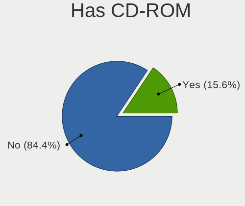
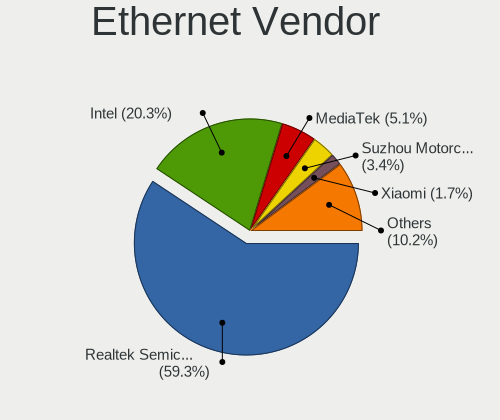

Manjaro - Hardware Trends (Notebooks)
-------------------------------------

A project to identify most popular hardware characteristics and track their change
over time based on data collected by Linux users at https://Linux-Hardware.org.

Anyone can contribute to this report by the [hw-probe](https://github.com/linuxhw/hw-probe) tool:

    sudo -E hw-probe -all -upload

This report is for one last month. Overall report since the beginning of time: [TestCoverage](https://github.com/linuxhw/TestCoverage)

Period: May, 2022.

Contents
--------

* [ System ](#system)
  - [ OS                       ](#os)
  - [ OS Family                ](#os-family)
  - [ Kernel                   ](#kernel)
  - [ Kernel Family            ](#kernel-family)
  - [ Kernel Major Ver.        ](#kernel-major-ver)
  - [ Arch                     ](#arch)
  - [ DE                       ](#de)
  - [ Display Server           ](#display-server)
  - [ Display Manager          ](#display-manager)
  - [ OS Lang                  ](#os-lang)
  - [ Boot Mode                ](#boot-mode)
  - [ Filesystem               ](#filesystem)
  - [ Part. scheme             ](#part-scheme)
  - [ Dual Boot with Linux/BSD ](#dual-boot-with-linuxbsd)
  - [ Dual Boot (Win)          ](#dual-boot-win)

* [ Board ](#board)
  - [ Vendor                   ](#vendor)
  - [ Model                    ](#model)
  - [ Model Family             ](#model-family)
  - [ MFG Year                 ](#mfg-year)
  - [ Form Factor              ](#form-factor)
  - [ Secure Boot              ](#secure-boot)
  - [ Coreboot                 ](#coreboot)
  - [ RAM Size                 ](#ram-size)
  - [ RAM Used                 ](#ram-used)
  - [ Total Drives             ](#total-drives)
  - [ Has CD-ROM               ](#has-cd-rom)
  - [ Has Ethernet             ](#has-ethernet)
  - [ Has WiFi                 ](#has-wifi)
  - [ Has Bluetooth            ](#has-bluetooth)

* [ Location ](#location)
  - [ Country                  ](#country)
  - [ City                     ](#city)

* [ Drives ](#drives)
  - [ Drive Vendor             ](#drive-vendor)
  - [ Drive Model              ](#drive-model)
  - [ HDD Vendor               ](#hdd-vendor)
  - [ SSD Vendor               ](#ssd-vendor)
  - [ Drive Kind               ](#drive-kind)
  - [ Drive Connector          ](#drive-connector)
  - [ Drive Size               ](#drive-size)
  - [ Space Total              ](#space-total)
  - [ Space Used               ](#space-used)
  - [ Malfunc. Drives          ](#malfunc-drives)
  - [ Malfunc. Drive Vendor    ](#malfunc-drive-vendor)
  - [ Malfunc. HDD Vendor      ](#malfunc-hdd-vendor)
  - [ Malfunc. Drive Kind      ](#malfunc-drive-kind)
  - [ Failed Drives            ](#failed-drives)
  - [ Failed Drive Vendor      ](#failed-drive-vendor)
  - [ Drive Status             ](#drive-status)

* [ Storage controller ](#storage-controller)
  - [ Storage Vendor           ](#storage-vendor)
  - [ Storage Model            ](#storage-model)
  - [ Storage Kind             ](#storage-kind)

* [ Processor ](#processor)
  - [ CPU Vendor               ](#cpu-vendor)
  - [ CPU Model                ](#cpu-model)
  - [ CPU Model Family         ](#cpu-model-family)
  - [ CPU Cores                ](#cpu-cores)
  - [ CPU Sockets              ](#cpu-sockets)
  - [ CPU Threads              ](#cpu-threads)
  - [ CPU Op-Modes             ](#cpu-op-modes)
  - [ CPU Microcode            ](#cpu-microcode)
  - [ CPU Microarch            ](#cpu-microarch)

* [ Graphics ](#graphics)
  - [ GPU Vendor               ](#gpu-vendor)
  - [ GPU Model                ](#gpu-model)
  - [ GPU Combo                ](#gpu-combo)
  - [ GPU Driver               ](#gpu-driver)
  - [ GPU Memory               ](#gpu-memory)

* [ Monitor ](#monitor)
  - [ Monitor Vendor           ](#monitor-vendor)
  - [ Monitor Model            ](#monitor-model)
  - [ Monitor Resolution       ](#monitor-resolution)
  - [ Monitor Diagonal         ](#monitor-diagonal)
  - [ Monitor Width            ](#monitor-width)
  - [ Aspect Ratio             ](#aspect-ratio)
  - [ Monitor Area             ](#monitor-area)
  - [ Pixel Density            ](#pixel-density)
  - [ Multiple Monitors        ](#multiple-monitors)

* [ Network ](#network)
  - [ Net Controller Vendor    ](#net-controller-vendor)
  - [ Net Controller Model     ](#net-controller-model)
  - [ Wireless Vendor          ](#wireless-vendor)
  - [ Wireless Model           ](#wireless-model)
  - [ Ethernet Vendor          ](#ethernet-vendor)
  - [ Ethernet Model           ](#ethernet-model)
  - [ Net Controller Kind      ](#net-controller-kind)
  - [ Used Controller          ](#used-controller)
  - [ NICs                     ](#nics)
  - [ IPv6                     ](#ipv6)

* [ Bluetooth ](#bluetooth)
  - [ Bluetooth Vendor         ](#bluetooth-vendor)
  - [ Bluetooth Model          ](#bluetooth-model)

* [ Sound ](#sound)
  - [ Sound Vendor             ](#sound-vendor)
  - [ Sound Model              ](#sound-model)

* [ Memory ](#memory)
  - [ Memory Vendor            ](#memory-vendor)
  - [ Memory Model             ](#memory-model)
  - [ Memory Kind              ](#memory-kind)
  - [ Memory Form Factor       ](#memory-form-factor)
  - [ Memory Size              ](#memory-size)
  - [ Memory Speed             ](#memory-speed)

* [ Printers & scanners ](#printers--scanners)
  - [ Printer Vendor           ](#printer-vendor)
  - [ Printer Model            ](#printer-model)
  - [ Scanner Vendor           ](#scanner-vendor)
  - [ Scanner Model            ](#scanner-model)

* [ Camera ](#camera)
  - [ Camera Vendor            ](#camera-vendor)
  - [ Camera Model             ](#camera-model)

* [ Security ](#security)
  - [ Fingerprint Vendor       ](#fingerprint-vendor)
  - [ Fingerprint Model        ](#fingerprint-model)
  - [ Chipcard Vendor          ](#chipcard-vendor)
  - [ Chipcard Model           ](#chipcard-model)

* [ Unsupported ](#unsupported)
  - [ Unsupported Devices      ](#unsupported-devices)
  - [ Unsupported Device Types ](#unsupported-device-types)

System
------

OS
--

Installed operating systems

| Name           | Notebooks | Percent |
|----------------|-----------|---------|
| Manjaro 21.2.6 | 64        | 53.78%  |
| Manjaro        | 53        | 44.54%  |
| Manjaro 21.2.4 | 1         | 0.84%   |
| Manjaro 21.2.0 | 1         | 0.84%   |

OS Family
---------

OS without a version

| Name    | Notebooks | Percent |
|---------|-----------|---------|
| Manjaro | 119       | 100%    |

Kernel
------

Version of the Linux kernel

| Version                                    | Notebooks | Percent |
|--------------------------------------------|-----------|---------|
| 5.15.32-1-MANJARO                          | 32        | 26.89%  |
| 5.15.38-1-MANJARO                          | 22        | 18.49%  |
| 5.17.6-1-MANJARO                           | 10        | 8.4%    |
| 5.17.1-3-MANJARO                           | 9         | 7.56%   |
| 5.15.41-1-MANJARO                          | 8         | 6.72%   |
| 5.16.20-2-MANJARO                          | 7         | 5.88%   |
| 5.10.109-1-MANJARO                         | 6         | 5.04%   |
| 5.16.18-1-MANJARO                          | 4         | 3.36%   |
| 5.17.9-1-MANJARO                           | 3         | 2.52%   |
| 5.13.19-2-MANJARO                          | 3         | 2.52%   |
| 5.18.0-1-MANJARO                           | 2         | 1.68%   |
| 5.18.0-rc5-1-git-rtw89-00178-g30c8e80f7932 | 1         | 0.84%   |
| 5.17.9-zen-gcdd22facad20-dirty             | 1         | 0.84%   |
| 5.17.8-2-MANJARO                           | 1         | 0.84%   |
| 5.17.11-xanmod1-1                          | 1         | 0.84%   |
| 5.17.1-3-rt17-MANJARO                      | 1         | 0.84%   |
| 5.17.1-1-rt17-MANJARO                      | 1         | 0.84%   |
| 5.17.1-1-rt16-MANJARO                      | 1         | 0.84%   |
| 5.16.2-3-rt19-MANJARO                      | 1         | 0.84%   |
| 5.16.14-1-MANJARO                          | 1         | 0.84%   |
| 5.15.36-1-MANJARO                          | 1         | 0.84%   |
| 5.10.114-1-MANJARO                         | 1         | 0.84%   |
| 5.10.112-1-MANJARO                         | 1         | 0.84%   |
| 4.14.275-1-MANJARO                         | 1         | 0.84%   |

Kernel Family
-------------

Linux kernel without a distro release

| Version  | Notebooks | Percent |
|----------|-----------|---------|
| 5.15.32  | 32        | 26.89%  |
| 5.15.38  | 22        | 18.49%  |
| 5.17.1   | 12        | 10.08%  |
| 5.17.6   | 10        | 8.4%    |
| 5.15.41  | 8         | 6.72%   |
| 5.16.20  | 7         | 5.88%   |
| 5.10.109 | 6         | 5.04%   |
| 5.17.9   | 4         | 3.36%   |
| 5.16.18  | 4         | 3.36%   |
| 5.18.0   | 3         | 2.52%   |
| 5.13.19  | 3         | 2.52%   |
| 5.17.8   | 1         | 0.84%   |
| 5.17.11  | 1         | 0.84%   |
| 5.16.2   | 1         | 0.84%   |
| 5.16.14  | 1         | 0.84%   |
| 5.15.36  | 1         | 0.84%   |
| 5.10.114 | 1         | 0.84%   |
| 5.10.112 | 1         | 0.84%   |
| 4.14.275 | 1         | 0.84%   |

Kernel Major Ver.
-----------------

Linux kernel major version

| Version | Notebooks | Percent |
|---------|-----------|---------|
| 5.15    | 63        | 52.94%  |
| 5.17    | 28        | 23.53%  |
| 5.16    | 13        | 10.92%  |
| 5.10    | 8         | 6.72%   |
| 5.18    | 3         | 2.52%   |
| 5.13    | 3         | 2.52%   |
| 4.14    | 1         | 0.84%   |

Arch
----

OS architecture (x86_64, i586, etc.)

| Name   | Notebooks | Percent |
|--------|-----------|---------|
| x86_64 | 119       | 100%    |

DE
--

Desktop Environment

| Name       | Notebooks | Percent |
|------------|-----------|---------|
| KDE5       | 58        | 48.74%  |
| GNOME      | 33        | 27.73%  |
| XFCE       | 18        | 15.13%  |
| Unknown    | 4         | 3.36%   |
| X-Cinnamon | 1         | 0.84%   |
| Unity      | 1         | 0.84%   |
| LXQt       | 1         | 0.84%   |
| i3         | 1         | 0.84%   |
| Cinnamon   | 1         | 0.84%   |
| Budgie     | 1         | 0.84%   |

Display Server
--------------

X11 or Wayland

| Name    | Notebooks | Percent |
|---------|-----------|---------|
| X11     | 91        | 76.47%  |
| Wayland | 24        | 20.17%  |
| Tty     | 2         | 1.68%   |
| Unknown | 2         | 1.68%   |

Display Manager
---------------

SDDM, LightDM, etc.

| Name    | Notebooks | Percent |
|---------|-----------|---------|
| Unknown | 53        | 44.54%  |
| SDDM    | 30        | 25.21%  |
| LightDM | 18        | 15.13%  |
| GDM     | 18        | 15.13%  |

OS Lang
-------

Language

| Lang    | Notebooks | Percent |
|---------|-----------|---------|
| en_US   | 50        | 42.02%  |
| en_GB   | 13        | 10.92%  |
| ru_RU   | 11        | 9.24%   |
| de_DE   | 9         | 7.56%   |
| pt_BR   | 8         | 6.72%   |
| en_CA   | 4         | 3.36%   |
| zh_CN   | 2         | 1.68%   |
| it_IT   | 2         | 1.68%   |
| es_MX   | 2         | 1.68%   |
| en_AU   | 2         | 1.68%   |
| Unknown | 2         | 1.68%   |
| ro_RO   | 1         | 0.84%   |
| pl_PL   | 1         | 0.84%   |
| nl_BE   | 1         | 0.84%   |
| nb_NO   | 1         | 0.84%   |
| ja_JP   | 1         | 0.84%   |
| fr_LU   | 1         | 0.84%   |
| fr_FR   | 1         | 0.84%   |
| es_ES   | 1         | 0.84%   |
| es_CO   | 1         | 0.84%   |
| es_AR   | 1         | 0.84%   |
| en_IN   | 1         | 0.84%   |
| en_DK   | 1         | 0.84%   |
| el_GR   | 1         | 0.84%   |
| de_CH   | 1         | 0.84%   |

Boot Mode
---------

EFI or BIOS

| Mode | Notebooks | Percent |
|------|-----------|---------|
| BIOS | 77        | 64.71%  |
| EFI  | 42        | 35.29%  |

Filesystem
----------

Type of filesystem

| Type  | Notebooks | Percent |
|-------|-----------|---------|
| Ext4  | 104       | 87.39%  |
| Btrfs | 15        | 12.61%  |

Part. scheme
------------

Scheme of partitioning

| Type    | Notebooks | Percent |
|---------|-----------|---------|
| Unknown | 71        | 59.66%  |
| GPT     | 40        | 33.61%  |
| MBR     | 8         | 6.72%   |

Dual Boot with Linux/BSD
------------------------

Hosting more than one Linux/BSD

| Dual boot | Notebooks | Percent |
|-----------|-----------|---------|
| No        | 109       | 91.6%   |
| Yes       | 10        | 8.4%    |

Dual Boot (Win)
---------------

Hosting Linux and Windows

| Dual boot | Notebooks | Percent |
|-----------|-----------|---------|
| No        | 92        | 77.31%  |
| Yes       | 27        | 22.69%  |

Board
-----

Vendor
------

Motherboard manufacturer

| Name                   | Notebooks | Percent |
|------------------------|-----------|---------|
| Lenovo                 | 28        | 23.53%  |
| Hewlett-Packard        | 16        | 13.45%  |
| ASUSTek Computer       | 16        | 13.45%  |
| Dell                   | 13        | 10.92%  |
| Acer                   | 9         | 7.56%   |
| Apple                  | 5         | 4.2%    |
| Sony                   | 3         | 2.52%   |
| Samsung Electronics    | 3         | 2.52%   |
| MSI                    | 3         | 2.52%   |
| TUXEDO                 | 2         | 1.68%   |
| Toshiba                | 2         | 1.68%   |
| Schenker               | 2         | 1.68%   |
| Razer                  | 2         | 1.68%   |
| Packard Bell           | 2         | 1.68%   |
| Notebook               | 2         | 1.68%   |
| Fujitsu                | 2         | 1.68%   |
| Star Labs              | 1         | 0.84%   |
| Standard               | 1         | 0.84%   |
| Positivo Bahia - VAIO  | 1         | 0.84%   |
| Pegatron               | 1         | 0.84%   |
| Panasonic              | 1         | 0.84%   |
| HUAWEI                 | 1         | 0.84%   |
| HONOR                  | 1         | 0.84%   |
| Chuwi                  | 1         | 0.84%   |
| Avell High Performance | 1         | 0.84%   |

Model
-----

Motherboard model

| Name                                                  | Notebooks | Percent |
|-------------------------------------------------------|-----------|---------|
| Lenovo ThinkBook 16p Gen 2 20YM                       | 2         | 1.68%   |
| HP ProBook 455 G7                                     | 2         | 1.68%   |
| Dell XPS 15 9570                                      | 2         | 1.68%   |
| Dell XPS 15 9500                                      | 2         | 1.68%   |
| ASUS N53SM                                            | 2         | 1.68%   |
| TUXEDO Pulse 14 Gen1                                  | 1         | 0.84%   |
| TUXEDO InfinityBook Pro 14 Gen6                       | 1         | 0.84%   |
| Toshiba Satellite L10W-B-101                          | 1         | 0.84%   |
| Toshiba Satellite C850-D1W                            | 1         | 0.84%   |
| Star Labs Lite                                        | 1         | 0.84%   |
| Standard B14HM21                                      | 1         | 0.84%   |
| Sony VPCF236FM                                        | 1         | 0.84%   |
| Sony SVS1512U1RW                                      | 1         | 0.84%   |
| Sony SVS13137PGB                                      | 1         | 0.84%   |
| Schenker XMG_APEX15_XAP15E20                          | 1         | 0.84%   |
| Schenker VISION 15 (SVS15E21)                         | 1         | 0.84%   |
| Samsung 750XDA                                        | 1         | 0.84%   |
| Samsung 550XDA                                        | 1         | 0.84%   |
| Samsung 530XBB                                        | 1         | 0.84%   |
| Razer Blade 15 Advanced Model (Early 2020) - RZ09-033 | 1         | 0.84%   |
| Razer Blade                                           | 1         | 0.84%   |
| Positivo Bahia - VAIO VJFE43F11X-XXXXXX               | 1         | 0.84%   |
| Pegatron H36ST                                        | 1         | 0.84%   |
| Panasonic CF-19THRAXF9                                | 1         | 0.84%   |
| Packard Bell EasyNote TE69CXP                         | 1         | 0.84%   |
| Packard Bell EasyNote LM98                            | 1         | 0.84%   |
| Notebook NLx0MU                                       | 1         | 0.84%   |
| Notebook Multicom Xishan NL50                         | 1         | 0.84%   |
| MSI MS-16Y1                                           | 1         | 0.84%   |
| MSI Modern 14 B11MO                                   | 1         | 0.84%   |
| MSI Modern 14 B10MW                                   | 1         | 0.84%   |
| Lenovo Yoga Slim 7 14ARE05 82A2                       | 1         | 0.84%   |
| Lenovo Y40-70 20347                                   | 1         | 0.84%   |
| Lenovo V145-15AST 81MT                                | 1         | 0.84%   |
| Lenovo ThinkPad X250 20CMCTO1WW                       | 1         | 0.84%   |
| Lenovo ThinkPad X230 2325SU3                          | 1         | 0.84%   |
| Lenovo ThinkPad X1 Carbon 6th 20KH006MRT              | 1         | 0.84%   |
| Lenovo ThinkPad T460s 20FAS0F400                      | 1         | 0.84%   |
| Lenovo ThinkPad T14s Gen 1 20T1S24W00                 | 1         | 0.84%   |
| Lenovo ThinkPad T14 Gen 2i 20W0005VCD                 | 1         | 0.84%   |
| Lenovo ThinkPad P15v Gen 1 20TQCTO1WW                 | 1         | 0.84%   |
| Lenovo ThinkPad P15s Gen 2i 20W6000JMH                | 1         | 0.84%   |
| Lenovo ThinkPad P14s Gen 1 20Y1002UFR                 | 1         | 0.84%   |
| Lenovo ThinkPad L490 20Q50021MX                       | 1         | 0.84%   |
| Lenovo ThinkPad E14 Gen 3 20YDS06J00                  | 1         | 0.84%   |
| Lenovo ThinkBook 15-IIL 20SM                          | 1         | 0.84%   |
| Lenovo ThinkBook 14 G2 ITL 20VD                       | 1         | 0.84%   |
| Lenovo Legion S7 15ACH6 82K8                          | 1         | 0.84%   |
| Lenovo Legion 5 82B5                                  | 1         | 0.84%   |
| Lenovo IdeaPad Y700-17ISK 80Q0                        | 1         | 0.84%   |
| Lenovo IdeaPad S540-14API 81NH                        | 1         | 0.84%   |
| Lenovo IdeaPad S145-15API 81V7                        | 1         | 0.84%   |
| Lenovo IdeaPad L340-15API 81LW                        | 1         | 0.84%   |
| Lenovo IdeaPad 5 15ITL05 82FG                         | 1         | 0.84%   |
| Lenovo IdeaPad 330S-15IKB 81F5                        | 1         | 0.84%   |
| Lenovo IdeaPad 3 15ITL6 82H8                          | 1         | 0.84%   |
| Lenovo B590 20208                                     | 1         | 0.84%   |
| HUAWEI BOHK-WAX9X                                     | 1         | 0.84%   |
| HONOR NMH-WCX9                                        | 1         | 0.84%   |
| HP ProBook 645 G1                                     | 1         | 0.84%   |

Model Family
------------

Motherboard model prefix

| Name                                    | Notebooks | Percent |
|-----------------------------------------|-----------|---------|
| Lenovo ThinkPad                         | 11        | 9.24%   |
| Acer Aspire                             | 8         | 6.72%   |
| Lenovo IdeaPad                          | 7         | 5.88%   |
| Dell XPS                                | 6         | 5.04%   |
| Dell Inspiron                           | 5         | 4.2%    |
| Lenovo ThinkBook                        | 4         | 3.36%   |
| HP ProBook                              | 4         | 3.36%   |
| HP Laptop                               | 3         | 2.52%   |
| HP EliteBook                            | 3         | 2.52%   |
| ASUS VivoBook                           | 3         | 2.52%   |
| Toshiba Satellite                       | 2         | 1.68%   |
| Razer Blade                             | 2         | 1.68%   |
| Packard Bell EasyNote                   | 2         | 1.68%   |
| MSI Modern                              | 2         | 1.68%   |
| Lenovo Legion                           | 2         | 1.68%   |
| HP Pavilion                             | 2         | 1.68%   |
| ASUS TUF                                | 2         | 1.68%   |
| ASUS ROG                                | 2         | 1.68%   |
| ASUS N53SM                              | 2         | 1.68%   |
| ASUS ASUS                               | 2         | 1.68%   |
| TUXEDO Pulse                            | 1         | 0.84%   |
| TUXEDO InfinityBook                     | 1         | 0.84%   |
| Star Labs Lite                          | 1         | 0.84%   |
| Standard B14HM21                        | 1         | 0.84%   |
| Sony VPCF236FM                          | 1         | 0.84%   |
| Sony SVS1512U1RW                        | 1         | 0.84%   |
| Sony SVS13137PGB                        | 1         | 0.84%   |
| Schenker XMG                            | 1         | 0.84%   |
| Schenker VISION                         | 1         | 0.84%   |
| Samsung 750XDA                          | 1         | 0.84%   |
| Samsung 550XDA                          | 1         | 0.84%   |
| Samsung 530XBB                          | 1         | 0.84%   |
| Positivo Bahia - VAIO VJFE43F11X-XXXXXX | 1         | 0.84%   |
| Pegatron H36ST                          | 1         | 0.84%   |
| Panasonic CF-19THRAXF9                  | 1         | 0.84%   |
| Notebook NLx0MU                         | 1         | 0.84%   |
| Notebook Multicom                       | 1         | 0.84%   |
| MSI MS-16Y1                             | 1         | 0.84%   |
| Lenovo Yoga                             | 1         | 0.84%   |
| Lenovo Y40-70                           | 1         | 0.84%   |
| Lenovo V145-15AST                       | 1         | 0.84%   |
| Lenovo B590                             | 1         | 0.84%   |
| HUAWEI BOHK-WAX9X                       | 1         | 0.84%   |
| HONOR NMH-WCX9                          | 1         | 0.84%   |
| HP OMEN                                 | 1         | 0.84%   |
| HP Notebook                             | 1         | 0.84%   |
| HP ENVY                                 | 1         | 0.84%   |
| HP 255                                  | 1         | 0.84%   |
| Fujitsu LIFEBOOK                        | 1         | 0.84%   |
| Fujitsu CELSIUS                         | 1         | 0.84%   |
| Dell Vostro                             | 1         | 0.84%   |
| Dell Latitude                           | 1         | 0.84%   |
| Chuwi HeroBook                          | 1         | 0.84%   |
| Avell High Performance G1713            | 1         | 0.84%   |
| ASUS X555LB                             | 1         | 0.84%   |
| ASUS UX310UA                            | 1         | 0.84%   |
| ASUS N552VW                             | 1         | 0.84%   |
| ASUS GL552VW                            | 1         | 0.84%   |
| ASUS G752VL                             | 1         | 0.84%   |
| Apple MacBookPro8                       | 1         | 0.84%   |

MFG Year
--------

Motherboard manufacture year

| Year | Notebooks | Percent |
|------|-----------|---------|
| 2020 | 24        | 20.17%  |
| 2021 | 23        | 19.33%  |
| 2019 | 12        | 10.08%  |
| 2018 | 9         | 7.56%   |
| 2015 | 9         | 7.56%   |
| 2016 | 7         | 5.88%   |
| 2014 | 7         | 5.88%   |
| 2011 | 7         | 5.88%   |
| 2012 | 5         | 4.2%    |
| 2010 | 5         | 4.2%    |
| 2022 | 4         | 3.36%   |
| 2013 | 4         | 3.36%   |
| 2017 | 2         | 1.68%   |
| 2009 | 1         | 0.84%   |

Form Factor
-----------

Physical design of the computer

| Name     | Notebooks | Percent |
|----------|-----------|---------|
| Notebook | 119       | 100%    |

Secure Boot
-----------

Enabled or disabled

| State    | Notebooks | Percent |
|----------|-----------|---------|
| Disabled | 119       | 100%    |

Coreboot
--------

Have coreboot on board

| Used | Notebooks | Percent |
|------|-----------|---------|
| No   | 118       | 99.16%  |
| Yes  | 1         | 0.84%   |

RAM Size
--------

Total RAM memory

| Size in GB  | Notebooks | Percent |
|-------------|-----------|---------|
| 4.01-8.0    | 34        | 28.57%  |
| 8.01-16.0   | 30        | 25.21%  |
| 16.01-24.0  | 24        | 20.17%  |
| 3.01-4.0    | 12        | 10.08%  |
| 32.01-64.0  | 11        | 9.24%   |
| 24.01-32.0  | 3         | 2.52%   |
| 64.01-256.0 | 3         | 2.52%   |
| 2.01-3.0    | 2         | 1.68%   |

RAM Used
--------

Used RAM memory

| Used GB    | Notebooks | Percent |
|------------|-----------|---------|
| 2.01-3.0   | 39        | 32.77%  |
| 4.01-8.0   | 26        | 21.85%  |
| 3.01-4.0   | 26        | 21.85%  |
| 1.01-2.0   | 18        | 15.13%  |
| 8.01-16.0  | 9         | 7.56%   |
| 16.01-24.0 | 1         | 0.84%   |

Total Drives
------------

Number of drives on board

| Drives | Notebooks | Percent |
|--------|-----------|---------|
| 1      | 81        | 68.07%  |
| 2      | 35        | 29.41%  |
| 3      | 3         | 2.52%   |

Has CD-ROM
----------

Has CD-ROM on board

| Presented | Notebooks | Percent |
|-----------|-----------|---------|
| No        | 95        | 79.83%  |
| Yes       | 24        | 20.17%  |

Has Ethernet
------------

Has Ethernet on board

| Presented | Notebooks | Percent |
|-----------|-----------|---------|
| Yes       | 88        | 73.95%  |
| No        | 31        | 26.05%  |

Has WiFi
--------

Has WiFi module

| Presented | Notebooks | Percent |
|-----------|-----------|---------|
| Yes       | 119       | 100%    |

Has Bluetooth
-------------

Has Bluetooth module

| Presented | Notebooks | Percent |
|-----------|-----------|---------|
| Yes       | 109       | 91.6%   |
| No        | 10        | 8.4%    |

Location
--------

Country
-------

Geographic location (country)

| Country      | Notebooks | Percent |
|--------------|-----------|---------|
| Germany      | 17        | 14.29%  |
| USA          | 13        | 10.92%  |
| Russia       | 13        | 10.92%  |
| Brazil       | 8         | 6.72%   |
| UK           | 6         | 5.04%   |
| Canada       | 5         | 4.2%    |
| Spain        | 3         | 2.52%   |
| Poland       | 3         | 2.52%   |
| Mexico       | 3         | 2.52%   |
| Italy        | 3         | 2.52%   |
| France       | 3         | 2.52%   |
| Czechia      | 3         | 2.52%   |
| Ukraine      | 2         | 1.68%   |
| Sweden       | 2         | 1.68%   |
| Romania      | 2         | 1.68%   |
| Netherlands  | 2         | 1.68%   |
| Hungary      | 2         | 1.68%   |
| China        | 2         | 1.68%   |
| Belgium      | 2         | 1.68%   |
| Bangladesh   | 2         | 1.68%   |
| Australia    | 2         | 1.68%   |
| Vietnam      | 1         | 0.84%   |
| Turkey       | 1         | 0.84%   |
| Thailand     | 1         | 0.84%   |
| Syria        | 1         | 0.84%   |
| Switzerland  | 1         | 0.84%   |
| Saudi Arabia | 1         | 0.84%   |
| Norway       | 1         | 0.84%   |
| Morocco      | 1         | 0.84%   |
| Luxembourg   | 1         | 0.84%   |
| Latvia       | 1         | 0.84%   |
| Japan        | 1         | 0.84%   |
| Iran         | 1         | 0.84%   |
| Indonesia    | 1         | 0.84%   |
| India        | 1         | 0.84%   |
| Greece       | 1         | 0.84%   |
| Finland      | 1         | 0.84%   |
| Denmark      | 1         | 0.84%   |
| Colombia     | 1         | 0.84%   |
| Belarus      | 1         | 0.84%   |
| Austria      | 1         | 0.84%   |
| Argentina    | 1         | 0.84%   |

City
----

Geographic location (city)

| City              | Notebooks | Percent |
|-------------------|-----------|---------|
| St Petersburg     | 3         | 2.52%   |
| Moscow            | 3         | 2.52%   |
| Sao Paulo         | 2         | 1.68%   |
| Muelheim-Kaerlich | 2         | 1.68%   |
| Mission           | 2         | 1.68%   |
| Lviv              | 2         | 1.68%   |
| Frankfurt am Main | 2         | 1.68%   |
| Amsterdam         | 2         | 1.68%   |
| Zarinsk           | 1         | 0.84%   |
| Yorba Linda       | 1         | 0.84%   |
| Wuppertal         | 1         | 0.84%   |
| Whitsett          | 1         | 0.84%   |
| Westwood          | 1         | 0.84%   |
| Weiden            | 1         | 0.84%   |
| Warsaw            | 1         | 0.84%   |
| Villa Ballester   | 1         | 0.84%   |
| Vienna            | 1         | 0.84%   |
| Turin             | 1         | 0.84%   |
| Tulcea            | 1         | 0.84%   |
| Tehran            | 1         | 0.84%   |
| Szentendre        | 1         | 0.84%   |
| Syktyvkar         | 1         | 0.84%   |
| Sydney            | 1         | 0.84%   |
| Stuttgart         | 1         | 0.84%   |
| Stockholm         | 1         | 0.84%   |
| Smolensk          | 1         | 0.84%   |
| Shenyang          | 1         | 0.84%   |
| Setagaya-ku       | 1         | 0.84%   |
| Sarzana           | 1         | 0.84%   |
| Sao Jose          | 1         | 0.84%   |
| Santa Cruz do Sul | 1         | 0.84%   |
| San Jose          | 1         | 0.84%   |
| Samara            | 1         | 0.84%   |
| Roztoky           | 1         | 0.84%   |
| Riyadh            | 1         | 0.84%   |
| Riga              | 1         | 0.84%   |
| Regina            | 1         | 0.84%   |
| Red Deer          | 1         | 0.84%   |
| Recife            | 1         | 0.84%   |
| Rajshahi          | 1         | 0.84%   |
| Prague            | 1         | 0.84%   |
| Poznan            | 1         | 0.84%   |
| Phuket            | 1         | 0.84%   |
| Peterborough      | 1         | 0.84%   |
| Paris             | 1         | 0.84%   |
| Omsk              | 1         | 0.84%   |
| Oldham            | 1         | 0.84%   |
| Ocoee             | 1         | 0.84%   |
| Nuremberg         | 1         | 0.84%   |
| Nizhniy Novgorod  | 1         | 0.84%   |
| New Westminster   | 1         | 0.84%   |
| Naucalpan         | 1         | 0.84%   |
| Naples            | 1         | 0.84%   |
| Nanjing           | 1         | 0.84%   |
| Munich            | 1         | 0.84%   |
| Munchenstein      | 1         | 0.84%   |
| Mexico City       | 1         | 0.84%   |
| Melbourne         | 1         | 0.84%   |
| Maplewood         | 1         | 0.84%   |
| Malmo             | 1         | 0.84%   |

Drives
------

Drive Vendor
------------

Hard drive vendors

| Vendor                         | Notebooks | Drives | Percent |
|--------------------------------|-----------|--------|---------|
| Samsung Electronics            | 35        | 39     | 22.73%  |
| Toshiba                        | 15        | 16     | 9.74%   |
| WDC                            | 12        | 12     | 7.79%   |
| Sandisk                        | 10        | 10     | 6.49%   |
| SK Hynix                       | 8         | 9      | 5.19%   |
| Seagate                        | 7         | 7      | 4.55%   |
| Kingston                       | 7         | 7      | 4.55%   |
| HGST                           | 7         | 7      | 4.55%   |
| Unknown                        | 5         | 5      | 3.25%   |
| Micron Technology              | 5         | 5      | 3.25%   |
| KIOXIA                         | 4         | 4      | 2.6%    |
| Intel                          | 4         | 4      | 2.6%    |
| Solid State Storage Technology | 3         | 3      | 1.95%   |
| Hitachi                        | 3         | 3      | 1.95%   |
| Crucial                        | 3         | 3      | 1.95%   |
| Apple                          | 3         | 3      | 1.95%   |
| A-DATA Technology              | 3         | 3      | 1.95%   |
| SPCC                           | 2         | 2      | 1.3%    |
| Phison                         | 2         | 2      | 1.3%    |
| GOODRAM                        | 2         | 2      | 1.3%    |
| XrayDisk                       | 1         | 1      | 0.65%   |
| Union Memory (Shenzhen)        | 1         | 1      | 0.65%   |
| Transcend                      | 1         | 1      | 0.65%   |
| Star                           | 1         | 1      | 0.65%   |
| Silicon Motion                 | 1         | 1      | 0.65%   |
| Realtek Semiconductor          | 1         | 1      | 0.65%   |
| PLEXTOR                        | 1         | 1      | 0.65%   |
| OWC                            | 1         | 1      | 0.65%   |
| OCZ                            | 1         | 1      | 0.65%   |
| Netac                          | 1         | 1      | 0.65%   |
| Micron/Crucial Technology      | 1         | 1      | 0.65%   |
| JMicron                        | 1         | 1      | 0.65%   |
| China                          | 1         | 1      | 0.65%   |
| BIWIN                          | 1         | 1      | 0.65%   |

Drive Model
-----------

Hard drive models

| Model                                        | Notebooks | Percent |
|----------------------------------------------|-----------|---------|
| Samsung NVMe SSD Drive 1024GB                | 4         | 2.52%   |
| Toshiba MQ04ABF100 1TB                       | 3         | 1.89%   |
| Toshiba MQ01ABF050 500GB                     | 3         | 1.89%   |
| Samsung NVMe SSD Drive 1TB                   | 3         | 1.89%   |
| KIOXIA NVMe SSD Drive 256GB                  | 3         | 1.89%   |
| HGST HTS721010A9E630 1TB                     | 3         | 1.89%   |
| Solid State Storage NVMe SSD Drive 512GB     | 2         | 1.26%   |
| SK Hynix NVMe SSD Drive 256GB                | 2         | 1.26%   |
| Seagate ST1000LM035-1RK172 1TB               | 2         | 1.26%   |
| Sandisk NVMe SSD Drive 1TB                   | 2         | 1.26%   |
| Samsung SSD 970 EVO 1TB                      | 2         | 1.26%   |
| Samsung SSD 870 EVO 1TB                      | 2         | 1.26%   |
| Samsung NVMe SSD Drive 500GB                 | 2         | 1.26%   |
| Phison Sabrent Rocket Q 1TB                  | 2         | 1.26%   |
| Micron 1100_MTFDDAV256TBN 256GB SSD          | 2         | 1.26%   |
| Kingston NVMe SSD Drive 512GB                | 2         | 1.26%   |
| Kingston NVMe SSD Drive 256GB                | 2         | 1.26%   |
| Intel SSDPEKNU512GZ 512GB                    | 2         | 1.26%   |
| XrayDisk 240GB                               | 1         | 0.63%   |
| WDC WDS480G2G0B-00EPW0 480GB SSD             | 1         | 0.63%   |
| WDC WDS480G2G0A-00JH30 480GB SSD             | 1         | 0.63%   |
| WDC WD5000LPVX-22V0TT0 500GB                 | 1         | 0.63%   |
| WDC WD5000LPLX-60ZNTT2 500GB                 | 1         | 0.63%   |
| WDC WD5000LPLX-00ZNTT0 500GB                 | 1         | 0.63%   |
| WDC WD3200BPVT-22ZEST0 320GB                 | 1         | 0.63%   |
| WDC WD20SPZX-00UA7T0 2TB                     | 1         | 0.63%   |
| WDC WD10SPZX-75Z10T2 1TB                     | 1         | 0.63%   |
| WDC WD10SPZX-24Z10 1TB                       | 1         | 0.63%   |
| WDC WD10SPZX-22Z10T1 1TB                     | 1         | 0.63%   |
| WDC PC SN730 SDBQNTY-512G-1001 512GB         | 1         | 0.63%   |
| WDC PC SN730 SDBPNTY-1T00-1101 1TB           | 1         | 0.63%   |
| Unknown SD32G  32GB                          | 1         | 0.63%   |
| Unknown MMC Card  248GB                      | 1         | 0.63%   |
| Unknown MMC Card  128GB                      | 1         | 0.63%   |
| Unknown DA4064  64GB                         | 1         | 0.63%   |
| Unknown 00000  64GB                          | 1         | 0.63%   |
| Union Memory (Shenzhen) NVMe SSD Drive 256GB | 1         | 0.63%   |
| Transcend TS128GSSD370S 128GB                | 1         | 0.63%   |
| Toshiba NVMe SSD Drive 512GB                 | 1         | 0.63%   |
| Toshiba NVMe SSD Drive 2TB                   | 1         | 0.63%   |
| Toshiba MQ02ABF100 1TB                       | 1         | 0.63%   |
| Toshiba MQ01ACF032 320GB                     | 1         | 0.63%   |
| Toshiba MQ01ABD100V -63 1TB                  | 1         | 0.63%   |
| Toshiba MQ01ABD100 1TB                       | 1         | 0.63%   |
| Toshiba MK7559GSXP 752GB                     | 1         | 0.63%   |
| Toshiba KXG60ZNV512G 512GB                   | 1         | 0.63%   |
| Toshiba KBG30ZMS128G 128GB NVMe SSD          | 1         | 0.63%   |
| Star Drive SATA SSD 240GB                    | 1         | 0.63%   |
| SPCC M.2 PCIe SSD 2TB                        | 1         | 0.63%   |
| SPCC M.2 PCIe SSD 1TB                        | 1         | 0.63%   |
| Solid State Storage NVMe SSD Drive 128GB     | 1         | 0.63%   |
| SK Hynix SKHynix_HFS512GDE9X084N 512GB       | 1         | 0.63%   |
| SK Hynix SKHynix_HFS256GD9TNI-L2B0B 256GB    | 1         | 0.63%   |
| SK Hynix SKHynix_HFS001TDE9X084N 1TB         | 1         | 0.63%   |
| SK Hynix NVMe SSD Drive 512GB                | 1         | 0.63%   |
| SK Hynix HFS256G39TND-N210A 256GB SSD        | 1         | 0.63%   |
| SK Hynix HFS128G32TNF-N3A0A 128GB SSD        | 1         | 0.63%   |
| SK Hynix BC511 NVMe 512GB                    | 1         | 0.63%   |
| Silicon Motion NVMe SSD Drive 512GB          | 1         | 0.63%   |
| Seagate ST9750420AS 752GB                    | 1         | 0.63%   |

HDD Vendor
----------

Hard disk drive vendors

| Vendor              | Notebooks | Drives | Percent |
|---------------------|-----------|--------|---------|
| Toshiba             | 11        | 11     | 29.73%  |
| WDC                 | 8         | 8      | 21.62%  |
| Seagate             | 7         | 7      | 18.92%  |
| HGST                | 7         | 7      | 18.92%  |
| Hitachi             | 3         | 3      | 8.11%   |
| Samsung Electronics | 1         | 1      | 2.7%    |

SSD Vendor
----------

Solid state drive vendors

| Vendor              | Notebooks | Drives | Percent |
|---------------------|-----------|--------|---------|
| Samsung Electronics | 13        | 14     | 30.23%  |
| SanDisk             | 5         | 5      | 11.63%  |
| Micron Technology   | 3         | 3      | 6.98%   |
| WDC                 | 2         | 2      | 4.65%   |
| SK Hynix            | 2         | 2      | 4.65%   |
| Kingston            | 2         | 2      | 4.65%   |
| GOODRAM             | 2         | 2      | 4.65%   |
| Crucial             | 2         | 2      | 4.65%   |
| Apple               | 2         | 2      | 4.65%   |
| A-DATA Technology   | 2         | 2      | 4.65%   |
| Transcend           | 1         | 1      | 2.33%   |
| Star                | 1         | 1      | 2.33%   |
| PLEXTOR             | 1         | 1      | 2.33%   |
| OCZ                 | 1         | 1      | 2.33%   |
| Netac               | 1         | 1      | 2.33%   |
| JMicron             | 1         | 1      | 2.33%   |
| China               | 1         | 1      | 2.33%   |
| BIWIN               | 1         | 1      | 2.33%   |

Drive Kind
----------

HDD or SSD

| Kind    | Notebooks | Drives | Percent |
|---------|-----------|--------|---------|
| NVMe    | 63        | 73     | 43.75%  |
| SSD     | 40        | 44     | 27.78%  |
| HDD     | 35        | 37     | 24.31%  |
| MMC     | 5         | 5      | 3.47%   |
| Unknown | 1         | 1      | 0.69%   |

Drive Connector
---------------

SATA, SAS, NVMe, etc.

| Type | Notebooks | Drives | Percent |
|------|-----------|--------|---------|
| NVMe | 63        | 73     | 46.32%  |
| SATA | 63        | 77     | 46.32%  |
| SAS  | 5         | 5      | 3.68%   |
| MMC  | 5         | 5      | 3.68%   |

Drive Size
----------

Size of hard drive

| Size in TB | Notebooks | Drives | Percent |
|------------|-----------|--------|---------|
| 0.01-0.5   | 44        | 50     | 60.27%  |
| 0.51-1.0   | 26        | 28     | 35.62%  |
| 1.01-2.0   | 2         | 2      | 2.74%   |
| 3.01-4.0   | 1         | 1      | 1.37%   |

Space Total
-----------

Amount of disk space available on the file system

| Size in GB     | Notebooks | Percent |
|----------------|-----------|---------|
| 251-500        | 33        | 27.73%  |
| 501-1000       | 29        | 24.37%  |
| 101-250        | 25        | 21.01%  |
| 1001-2000      | 8         | 6.72%   |
| Unknown        | 6         | 5.04%   |
| 21-50          | 5         | 4.2%    |
| 51-100         | 4         | 3.36%   |
| More than 3000 | 3         | 2.52%   |
| 2001-3000      | 3         | 2.52%   |
| 1-20           | 3         | 2.52%   |

Space Used
----------

Amount of used disk space

| Used GB        | Notebooks | Percent |
|----------------|-----------|---------|
| 1-20           | 25        | 21.01%  |
| 251-500        | 23        | 19.33%  |
| 21-50          | 22        | 18.49%  |
| 101-250        | 20        | 16.81%  |
| 51-100         | 12        | 10.08%  |
| Unknown        | 6         | 5.04%   |
| 501-1000       | 5         | 4.2%    |
| 1001-2000      | 3         | 2.52%   |
| 2001-3000      | 2         | 1.68%   |
| More than 3000 | 1         | 0.84%   |

Malfunc. Drives
---------------

Drive models with a malfunction

| Model                               | Notebooks | Drives | Percent |
|-------------------------------------|-----------|--------|---------|
| Seagate ST500LT012-9WS142 500GB     | 1         | 1      | 20%     |
| Samsung Electronics SSD 870 EVO 1TB | 1         | 1      | 20%     |
| HGST HTS725050A7E630 500GB          | 1         | 1      | 20%     |
| HGST HTS541010A9E680 1TB            | 1         | 1      | 20%     |
| A-DATA Technology SX8100NP 4TB      | 1         | 1      | 20%     |

Malfunc. Drive Vendor
---------------------

Vendors of faulty drives

| Vendor              | Notebooks | Drives | Percent |
|---------------------|-----------|--------|---------|
| HGST                | 2         | 2      | 40%     |
| Seagate             | 1         | 1      | 20%     |
| Samsung Electronics | 1         | 1      | 20%     |
| A-DATA Technology   | 1         | 1      | 20%     |

Malfunc. HDD Vendor
-------------------

Vendors of faulty HDD drives

| Vendor  | Notebooks | Drives | Percent |
|---------|-----------|--------|---------|
| HGST    | 2         | 2      | 66.67%  |
| Seagate | 1         | 1      | 33.33%  |

Malfunc. Drive Kind
-------------------

Kinds of faulty drives

| Kind | Notebooks | Drives | Percent |
|------|-----------|--------|---------|
| HDD  | 3         | 3      | 60%     |
| NVMe | 1         | 1      | 20%     |
| SSD  | 1         | 1      | 20%     |

Failed Drives
-------------

Failed drive models

Zero info for selected period =(

Failed Drive Vendor
-------------------

Failed drive vendors

Zero info for selected period =(

Drive Status
------------

Number of failed and malfunc. drives

| Status   | Notebooks | Drives | Percent |
|----------|-----------|--------|---------|
| Detected | 87        | 116    | 69.6%   |
| Works    | 33        | 39     | 26.4%   |
| Malfunc  | 5         | 5      | 4%      |

Storage controller
------------------

Storage Vendor
--------------

Storage controller vendors

| Vendor                         | Notebooks | Percent |
|--------------------------------|-----------|---------|
| Intel                          | 68        | 45.03%  |
| Samsung Electronics            | 22        | 14.57%  |
| AMD                            | 19        | 12.58%  |
| Sandisk                        | 7         | 4.64%   |
| SK Hynix                       | 6         | 3.97%   |
| Kingston Technology Company    | 5         | 3.31%   |
| Toshiba America Info Systems   | 4         | 2.65%   |
| Phison Electronics             | 4         | 2.65%   |
| KIOXIA                         | 4         | 2.65%   |
| Solid State Storage Technology | 3         | 1.99%   |
| Realtek Semiconductor          | 2         | 1.32%   |
| Micron/Crucial Technology      | 2         | 1.32%   |
| Micron Technology              | 2         | 1.32%   |
| Union Memory (Shenzhen)        | 1         | 0.66%   |
| Silicon Motion                 | 1         | 0.66%   |
| Apple                          | 1         | 0.66%   |

Storage Model
-------------

Storage controller models

| Model                                                                            | Notebooks | Percent |
|----------------------------------------------------------------------------------|-----------|---------|
| AMD FCH SATA Controller [AHCI mode]                                              | 17        | 10.56%  |
| Samsung NVMe SSD Controller SM981/PM981/PM983                                    | 11        | 6.83%   |
| Intel Sunrise Point-LP SATA Controller [AHCI mode]                               | 8         | 4.97%   |
| Samsung NVMe SSD Controller 980                                                  | 7         | 4.35%   |
| Intel Volume Management Device NVMe RAID Controller                              | 7         | 4.35%   |
| Intel 7 Series Chipset Family 6-port SATA Controller [AHCI mode]                 | 7         | 4.35%   |
| Intel Tiger Lake-LP SATA Controller [AHCI mode]                                  | 6         | 3.73%   |
| Intel 6 Series/C200 Series Chipset Family 6 port Mobile SATA AHCI Controller     | 6         | 3.73%   |
| Intel 8 Series SATA Controller 1 [AHCI mode]                                     | 5         | 3.11%   |
| Sandisk WD Black SN750 / PC SN730 NVMe SSD                                       | 4         | 2.48%   |
| Samsung NVMe SSD Controller PM9A1/PM9A3/980PRO                                   | 4         | 2.48%   |
| KIOXIA Non-Volatile memory controller                                            | 4         | 2.48%   |
| Intel Wildcat Point-LP SATA Controller [AHCI Mode]                               | 4         | 2.48%   |
| Intel HM170/QM170 Chipset SATA Controller [AHCI Mode]                            | 4         | 2.48%   |
| Intel Celeron/Pentium Silver Processor SATA Controller                           | 4         | 2.48%   |
| Intel Cannon Lake Mobile PCH SATA AHCI Controller                                | 4         | 2.48%   |
| Toshiba America Info Systems XG6 NVMe SSD Controller                             | 3         | 1.86%   |
| Solid State Storage Non-Volatile memory controller                               | 3         | 1.86%   |
| SK Hynix Gold P31 SSD                                                            | 3         | 1.86%   |
| Phison E12 NVMe Controller                                                       | 3         | 1.86%   |
| Intel Non-Volatile memory controller                                             | 3         | 1.86%   |
| Micron/Crucial P2 NVMe PCIe SSD                                                  | 2         | 1.24%   |
| Micron Non-Volatile memory controller                                            | 2         | 1.24%   |
| Kingston Company OM3PDP3 NVMe SSD                                                | 2         | 1.24%   |
| Intel Ice Lake-LP SATA Controller [AHCI mode]                                    | 2         | 1.24%   |
| Intel 5 Series/3400 Series Chipset 6 port SATA AHCI Controller                   | 2         | 1.24%   |
| Intel 5 Series/3400 Series Chipset 4 port SATA AHCI Controller                   | 2         | 1.24%   |
| Intel 400 Series Chipset Family SATA AHCI Controller                             | 2         | 1.24%   |
| Union Memory (Shenzhen) Non-Volatile memory controller                           | 1         | 0.62%   |
| Toshiba America Info Systems Toshiba America Info Non-Volatile memory controller | 1         | 0.62%   |
| SK Hynix Non-Volatile memory controller                                          | 1         | 0.62%   |
| SK Hynix BC511                                                                   | 1         | 0.62%   |
| SK Hynix BC501 NVMe Solid State Drive                                            | 1         | 0.62%   |
| Silicon Motion SM2263EN/SM2263XT SSD Controller                                  | 1         | 0.62%   |
| Sandisk WD Blue SN500 / PC SN520 NVMe SSD                                        | 1         | 0.62%   |
| Sandisk PC SN520 NVMe SSD                                                        | 1         | 0.62%   |
| Sandisk Non-Volatile memory controller                                           | 1         | 0.62%   |
| Samsung Apple PCIe SSD                                                           | 1         | 0.62%   |
| Realtek RTS5763DL NVMe SSD Controller                                            | 1         | 0.62%   |
| Realtek Realtek Non-Volatile memory controller                                   | 1         | 0.62%   |
| Phison NVMe Storage Controller                                                   | 1         | 0.62%   |
| Kingston Company U-SNS8154P3 NVMe SSD                                            | 1         | 0.62%   |
| Kingston Company Company Non-Volatile memory controller                          | 1         | 0.62%   |
| Kingston Company KC2000 NVMe SSD                                                 | 1         | 0.62%   |
| Intel SSD Pro 7600p/760p/E 6100p Series                                          | 1         | 0.62%   |
| Intel SATA Controller [RAID mode]                                                | 1         | 0.62%   |
| Intel Cannon Point-LP SATA Controller [AHCI Mode]                                | 1         | 0.62%   |
| Intel Atom Processor E3800 Series SATA AHCI Controller                           | 1         | 0.62%   |
| Intel 82801 Mobile SATA Controller [RAID mode]                                   | 1         | 0.62%   |
| Intel 8 Series/C220 Series Chipset Family 6-port SATA Controller 1 [AHCI mode]   | 1         | 0.62%   |
| Intel 7 Series Chipset Family 4-port SATA Controller [IDE mode]                  | 1         | 0.62%   |
| Intel 7 Series Chipset Family 2-port SATA Controller [IDE mode]                  | 1         | 0.62%   |
| Intel 5 Series/3400 Series Chipset 4 port SATA IDE Controller                    | 1         | 0.62%   |
| Intel 5 Series/3400 Series Chipset 2 port SATA IDE Controller                    | 1         | 0.62%   |
| Apple ANS2 NVMe Controller                                                       | 1         | 0.62%   |
| AMD SB7x0/SB8x0/SB9x0 SATA Controller [AHCI mode]                                | 1         | 0.62%   |
| AMD FCH SATA Controller [IDE mode]                                               | 1         | 0.62%   |
| AMD 400 Series Chipset SATA Controller                                           | 1         | 0.62%   |

Storage Kind
------------

Kind of storage controller (IDE, SATA, NVMe, SAS, ...)

| Kind | Notebooks | Percent |
|------|-----------|---------|
| SATA | 79        | 51.63%  |
| NVMe | 63        | 41.18%  |
| RAID | 9         | 5.88%   |
| IDE  | 2         | 1.31%   |

Processor
---------

CPU Vendor
----------

Processor vendors

| Vendor | Notebooks | Percent |
|--------|-----------|---------|
| Intel  | 88        | 73.95%  |
| AMD    | 31        | 26.05%  |

CPU Model
---------

Processor models

| Model                                         | Notebooks | Percent |
|-----------------------------------------------|-----------|---------|
| Intel 11th Gen Core i7-1165G7 @ 2.80GHz       | 6         | 5.04%   |
| Intel Core i7-8750H CPU @ 2.20GHz             | 5         | 4.2%    |
| Intel Core i7-6700HQ CPU @ 2.60GHz            | 5         | 4.2%    |
| Intel 11th Gen Core i5-1135G7 @ 2.40GHz       | 5         | 4.2%    |
| AMD Ryzen 7 5800H with Radeon Graphics        | 4         | 3.36%   |
| Intel Core i7-2670QM CPU @ 2.20GHz            | 3         | 2.52%   |
| AMD Ryzen 5 5500U with Radeon Graphics        | 3         | 2.52%   |
| Intel Core i7-8565U CPU @ 1.80GHz             | 2         | 1.68%   |
| Intel Core i7-10875H CPU @ 2.30GHz            | 2         | 1.68%   |
| Intel Core i7-10750H CPU @ 2.60GHz            | 2         | 1.68%   |
| Intel Core i5-8250U CPU @ 1.60GHz             | 2         | 1.68%   |
| Intel Core i5-6300U CPU @ 2.40GHz             | 2         | 1.68%   |
| Intel Core i5-5200U CPU @ 2.20GHz             | 2         | 1.68%   |
| Intel Core i3 CPU M 370 @ 2.40GHz             | 2         | 1.68%   |
| Intel 11th Gen Core i7-1195G7 @ 2.90GHz       | 2         | 1.68%   |
| AMD Ryzen 9 5900HX with Radeon Graphics       | 2         | 1.68%   |
| AMD Ryzen 7 4800H with Radeon Graphics        | 2         | 1.68%   |
| AMD Ryzen 7 3700U with Radeon Vega Mobile Gfx | 2         | 1.68%   |
| AMD Ryzen 5 4500U with Radeon Graphics        | 2         | 1.68%   |
| AMD Ryzen 5 3500U with Radeon Vega Mobile Gfx | 2         | 1.68%   |
| Intel Pentium Silver N5030 CPU @ 1.10GHz      | 1         | 0.84%   |
| Intel Pentium Silver N5000 CPU @ 1.10GHz      | 1         | 0.84%   |
| Intel Pentium 3558U @ 1.70GHz                 | 1         | 0.84%   |
| Intel Core i7-9750H CPU @ 2.60GHz             | 1         | 0.84%   |
| Intel Core i7-8550U CPU @ 1.80GHz             | 1         | 0.84%   |
| Intel Core i7-6500U CPU @ 2.50GHz             | 1         | 0.84%   |
| Intel Core i7-5600U CPU @ 2.60GHz             | 1         | 0.84%   |
| Intel Core i7-4870HQ CPU @ 2.50GHz            | 1         | 0.84%   |
| Intel Core i7-4510U CPU @ 2.00GHz             | 1         | 0.84%   |
| Intel Core i7-4500U CPU @ 1.80GHz             | 1         | 0.84%   |
| Intel Core i7-3667U CPU @ 2.00GHz             | 1         | 0.84%   |
| Intel Core i7-3632QM CPU @ 2.20GHz            | 1         | 0.84%   |
| Intel Core i7-3630QM CPU @ 2.40GHz            | 1         | 0.84%   |
| Intel Core i7-3540M CPU @ 3.00GHz             | 1         | 0.84%   |
| Intel Core i7-2640M CPU @ 2.80GHz             | 1         | 0.84%   |
| Intel Core i7-10870H CPU @ 2.20GHz            | 1         | 0.84%   |
| Intel Core i7-10850H CPU @ 2.70GHz            | 1         | 0.84%   |
| Intel Core i7-1065G7 CPU @ 1.30GHz            | 1         | 0.84%   |
| Intel Core i7-10610U CPU @ 1.80GHz            | 1         | 0.84%   |
| Intel Core i5-9300H CPU @ 2.40GHz             | 1         | 0.84%   |
| Intel Core i5-7200U CPU @ 2.50GHz             | 1         | 0.84%   |
| Intel Core i5-6200U CPU @ 2.30GHz             | 1         | 0.84%   |
| Intel Core i5-5250U CPU @ 1.60GHz             | 1         | 0.84%   |
| Intel Core i5-4310M CPU @ 2.70GHz             | 1         | 0.84%   |
| Intel Core i5-4210U CPU @ 1.70GHz             | 1         | 0.84%   |
| Intel Core i5-4200U CPU @ 1.60GHz             | 1         | 0.84%   |
| Intel Core i5-3320M CPU @ 2.60GHz             | 1         | 0.84%   |
| Intel Core i5-3230M CPU @ 2.60GHz             | 1         | 0.84%   |
| Intel Core i5-3210M CPU @ 2.50GHz             | 1         | 0.84%   |
| Intel Core i5-2450M CPU @ 2.50GHz             | 1         | 0.84%   |
| Intel Core i5-2410M CPU @ 2.30GHz             | 1         | 0.84%   |
| Intel Core i5-1035G4 CPU @ 1.10GHz            | 1         | 0.84%   |
| Intel Core i5 CPU U 540 @ 1.20GHz             | 1         | 0.84%   |
| Intel Core i3-8130U CPU @ 2.20GHz             | 1         | 0.84%   |
| Intel Core i3-6006U CPU @ 2.00GHz             | 1         | 0.84%   |
| Intel Core i3-5015U CPU @ 2.10GHz             | 1         | 0.84%   |
| Intel Core i3-3217U CPU @ 1.80GHz             | 1         | 0.84%   |
| Intel Core i3-2328M CPU @ 2.20GHz             | 1         | 0.84%   |
| Intel Core i3-10110U CPU @ 2.10GHz            | 1         | 0.84%   |
| Intel Core i3 CPU M 380 @ 2.53GHz             | 1         | 0.84%   |

CPU Model Family
----------------

Processor model prefix

| Model                | Notebooks | Percent |
|----------------------|-----------|---------|
| Intel Core i7        | 35        | 29.41%  |
| Intel Core i5        | 20        | 16.81%  |
| Other                | 16        | 13.45%  |
| Intel Core i3        | 10        | 8.4%    |
| AMD Ryzen 7          | 10        | 8.4%    |
| AMD Ryzen 5          | 8         | 6.72%   |
| AMD Ryzen 9          | 5         | 4.2%    |
| Intel Celeron        | 4         | 3.36%   |
| AMD Ryzen 3          | 3         | 2.52%   |
| Intel Pentium Silver | 2         | 1.68%   |
| Intel Pentium        | 1         | 0.84%   |
| AMD Ryzen 7 PRO      | 1         | 0.84%   |
| AMD E                | 1         | 0.84%   |
| AMD Athlon           | 1         | 0.84%   |
| AMD A6               | 1         | 0.84%   |
| AMD A10              | 1         | 0.84%   |

CPU Cores
---------

Number of processor cores

| Number | Notebooks | Percent |
|--------|-----------|---------|
| 2      | 45        | 37.82%  |
| 4      | 40        | 33.61%  |
| 8      | 15        | 12.61%  |
| 6      | 15        | 12.61%  |
| 12     | 2         | 1.68%   |
| 14     | 1         | 0.84%   |
| 3      | 1         | 0.84%   |

CPU Sockets
-----------

Number of sockets

| Number | Notebooks | Percent |
|--------|-----------|---------|
| 1      | 119       | 100%    |

CPU Threads
-----------

Threads per core (Hyper-Threading)

| Number | Notebooks | Percent |
|--------|-----------|---------|
| 2      | 106       | 89.08%  |
| 1      | 13        | 10.92%  |

CPU Op-Modes
------------

CPU Operation Modes (32-bit, 64-bit)

| Op mode        | Notebooks | Percent |
|----------------|-----------|---------|
| 32-bit, 64-bit | 119       | 100%    |

CPU Microcode
-------------

Microcode number

| Number     | Notebooks | Percent |
|------------|-----------|---------|
| Unknown    | 75        | 63.03%  |
| 0x806c1    | 6         | 5.04%   |
| 0x306a9    | 5         | 4.2%    |
| 0x0a50000c | 4         | 3.36%   |
| 0x08600106 | 4         | 3.36%   |
| 0x306d4    | 3         | 2.52%   |
| 0x206a7    | 3         | 2.52%   |
| 0xa0652    | 2         | 1.68%   |
| 0x906ea    | 2         | 1.68%   |
| 0x806ea    | 2         | 1.68%   |
| 0x906a3    | 1         | 0.84%   |
| 0x806ec    | 1         | 0.84%   |
| 0x806eb    | 1         | 0.84%   |
| 0x806c2    | 1         | 0.84%   |
| 0x406e3    | 1         | 0.84%   |
| 0x40651    | 1         | 0.84%   |
| 0x20655    | 1         | 0.84%   |
| 0x0a201016 | 1         | 0.84%   |
| 0x08608103 | 1         | 0.84%   |
| 0x08600104 | 1         | 0.84%   |
| 0x08600103 | 1         | 0.84%   |
| 0x08108109 | 1         | 0.84%   |
| 0x0810100b | 1         | 0.84%   |

CPU Microarch
-------------

Microarchitecture

| Name             | Notebooks | Percent |
|------------------|-----------|---------|
| KabyLake         | 16        | 13.45%  |
| TigerLake        | 14        | 11.76%  |
| Skylake          | 10        | 8.4%    |
| Zen 2            | 9         | 7.56%   |
| IvyBridge        | 8         | 6.72%   |
| Zen 3            | 7         | 5.88%   |
| SandyBridge      | 7         | 5.88%   |
| Haswell          | 7         | 5.88%   |
| Unknown          | 7         | 5.88%   |
| Zen+             | 6         | 5.04%   |
| CometLake        | 6         | 5.04%   |
| Westmere         | 5         | 4.2%    |
| Broadwell        | 5         | 4.2%    |
| Goldmont plus    | 4         | 3.36%   |
| IceLake          | 2         | 1.68%   |
| Zen              | 1         | 0.84%   |
| Silvermont       | 1         | 0.84%   |
| Piledriver       | 1         | 0.84%   |
| Excavator        | 1         | 0.84%   |
| Bobcat           | 1         | 0.84%   |
| Alderlake Hybrid | 1         | 0.84%   |

Graphics
--------

GPU Vendor
----------

Vendors of graphics cards

| Vendor | Notebooks | Percent |
|--------|-----------|---------|
| Intel  | 83        | 50.3%   |
| Nvidia | 45        | 27.27%  |
| AMD    | 37        | 22.42%  |

GPU Model
---------

Graphics card models

| Model                                                                     | Notebooks | Percent |
|---------------------------------------------------------------------------|-----------|---------|
| Intel TigerLake-LP GT2 [Iris Xe Graphics]                                 | 13        | 7.78%   |
| Intel 3rd Gen Core processor Graphics Controller                          | 8         | 4.79%   |
| AMD Renoir                                                                | 8         | 4.79%   |
| Intel CometLake-H GT2 [UHD Graphics]                                      | 6         | 3.59%   |
| Intel CoffeeLake-H GT2 [UHD Graphics 630]                                 | 6         | 3.59%   |
| AMD Picasso/Raven 2 [Radeon Vega Series / Radeon Vega Mobile Series]      | 6         | 3.59%   |
| AMD Cezanne                                                               | 6         | 3.59%   |
| Intel Skylake GT2 [HD Graphics 520]                                       | 5         | 2.99%   |
| Intel Haswell-ULT Integrated Graphics Controller                          | 5         | 2.99%   |
| Intel Core Processor Integrated Graphics Controller                       | 5         | 2.99%   |
| Intel 2nd Generation Core Processor Family Integrated Graphics Controller | 5         | 2.99%   |
| AMD Lucienne                                                              | 5         | 2.99%   |
| Nvidia TU117M [GeForce GTX 1650 Ti Mobile]                                | 4         | 2.4%    |
| Nvidia GP107M [GeForce GTX 1050 Ti Mobile]                                | 4         | 2.4%    |
| Nvidia GM107M [GeForce GTX 960M]                                          | 4         | 2.4%    |
| Nvidia GA106M [GeForce RTX 3060 Mobile / Max-Q]                           | 4         | 2.4%    |
| Intel UHD Graphics 620                                                    | 4         | 2.4%    |
| Intel HD Graphics 5500                                                    | 4         | 2.4%    |
| Intel HD Graphics 530                                                     | 4         | 2.4%    |
| Nvidia GF108M [GeForce GT 620M/630M/635M/640M LE]                         | 3         | 1.8%    |
| Nvidia GK107M [GeForce GT 640M LE]                                        | 2         | 1.2%    |
| Nvidia GF117M [GeForce 610M/710M/810M/820M / GT 620M/625M/630M/720M]      | 2         | 1.2%    |
| Nvidia GA104M [GeForce RTX 3070 Mobile / Max-Q]                           | 2         | 1.2%    |
| Intel WhiskeyLake-U GT2 [UHD Graphics 620]                                | 2         | 1.2%    |
| Intel GeminiLake [UHD Graphics 605]                                       | 2         | 1.2%    |
| Intel GeminiLake [UHD Graphics 600]                                       | 2         | 1.2%    |
| Intel CometLake-U GT2 [UHD Graphics]                                      | 2         | 1.2%    |
| Nvidia TU117M [GeForce MX450]                                             | 1         | 0.6%    |
| Nvidia TU117GLM [Quadro T500 Mobile]                                      | 1         | 0.6%    |
| Nvidia TU117GLM [Quadro T2000 Mobile / Max-Q]                             | 1         | 0.6%    |
| Nvidia TU116M [GeForce GTX 1660 Ti Mobile]                                | 1         | 0.6%    |
| Nvidia TU106M [GeForce RTX 2070 Mobile]                                   | 1         | 0.6%    |
| Nvidia TU106M [GeForce RTX 2070 Mobile / Max-Q Refresh]                   | 1         | 0.6%    |
| Nvidia TU106M [GeForce RTX 2060 Max-Q]                                    | 1         | 0.6%    |
| Nvidia TU104M [GeForce RTX 2080 SUPER Mobile / Max-Q]                     | 1         | 0.6%    |
| Nvidia GP108M [GeForce MX150]                                             | 1         | 0.6%    |
| Nvidia GP107M [GeForce GTX 1050 Mobile]                                   | 1         | 0.6%    |
| Nvidia GM204M [GeForce GTX 965M]                                          | 1         | 0.6%    |
| Nvidia GM108M [GeForce 940M]                                              | 1         | 0.6%    |
| Nvidia GM108M [GeForce 940MX]                                             | 1         | 0.6%    |
| Nvidia GM108M [GeForce 930M]                                              | 1         | 0.6%    |
| Nvidia GK107M [GeForce GT 750M Mac Edition]                               | 1         | 0.6%    |
| Nvidia GF108M [GeForce GT 540M]                                           | 1         | 0.6%    |
| Nvidia GF108M [GeForce GT 520M]                                           | 1         | 0.6%    |
| Nvidia GA107M [GeForce RTX 3050 Mobile]                                   | 1         | 0.6%    |
| Nvidia GA106M [GeForce RTX 3050 Ti Mobile / Max-Q]                        | 1         | 0.6%    |
| Nvidia GA104 [GeForce RTX 3060 Ti Lite Hash Rate]                         | 1         | 0.6%    |
| Nvidia GA102 [GeForce RTX 3080 Lite Hash Rate]                            | 1         | 0.6%    |
| Intel TigerLake-H GT1 [UHD Graphics]                                      | 1         | 0.6%    |
| Intel Tiger Lake UHD Graphics                                             | 1         | 0.6%    |
| Intel JasperLake [UHD Graphics]                                           | 1         | 0.6%    |
| Intel Iris Plus Graphics G7                                               | 1         | 0.6%    |
| Intel Iris Plus Graphics G4 (Ice Lake)                                    | 1         | 0.6%    |
| Intel HD Graphics 620                                                     | 1         | 0.6%    |
| Intel HD Graphics 6000                                                    | 1         | 0.6%    |
| Intel Atom Processor Z36xxx/Z37xxx Series Graphics & Display              | 1         | 0.6%    |
| Intel Alder Lake-P Integrated Graphics Controller                         | 1         | 0.6%    |
| Intel 4th Gen Core Processor Integrated Graphics Controller               | 1         | 0.6%    |
| AMD Wrestler [Radeon HD 6310]                                             | 1         | 0.6%    |
| AMD Whistler LE [Radeon HD 6610M/7610M]                                   | 1         | 0.6%    |

GPU Combo
---------

Combinations of graphics cards

| Name               | Notebooks | Percent |
|--------------------|-----------|---------|
| 1 x Intel          | 46        | 38.66%  |
| Intel + Nvidia     | 30        | 25.21%  |
| 1 x AMD            | 21        | 17.65%  |
| AMD + Nvidia       | 9         | 7.56%   |
| Intel + AMD        | 6         | 5.04%   |
| 1 x Nvidia         | 5         | 4.2%    |
| 2 x AMD            | 1         | 0.84%   |
| Intel + 2 x Nvidia | 1         | 0.84%   |

GPU Driver
----------

Free vs proprietary

| Driver      | Notebooks | Percent |
|-------------|-----------|---------|
| Free        | 88        | 73.95%  |
| Proprietary | 31        | 26.05%  |

GPU Memory
----------

Total video memory

| Size in GB | Notebooks | Percent |
|------------|-----------|---------|
| Unknown    | 96        | 80.67%  |
| 0.01-0.5   | 9         | 7.56%   |
| 1.01-2.0   | 6         | 5.04%   |
| 0.51-1.0   | 4         | 3.36%   |
| 7.01-8.0   | 3         | 2.52%   |
| 8.01-16.0  | 1         | 0.84%   |

Monitor
-------

Monitor Vendor
--------------

Monitor vendors

| Vendor                  | Notebooks | Percent |
|-------------------------|-----------|---------|
| AU Optronics            | 24        | 16.33%  |
| LG Display              | 23        | 15.65%  |
| BOE                     | 22        | 14.97%  |
| Chimei Innolux          | 18        | 12.24%  |
| Samsung Electronics     | 13        | 8.84%   |
| Dell                    | 6         | 4.08%   |
| Sharp                   | 5         | 3.4%    |
| Apple                   | 5         | 3.4%    |
| PANDA                   | 3         | 2.04%   |
| Goldstar                | 3         | 2.04%   |
| CSO                     | 3         | 2.04%   |
| AOC                     | 3         | 2.04%   |
| Ancor Communications    | 3         | 2.04%   |
| Acer                    | 2         | 1.36%   |
| ViewSonic               | 1         | 0.68%   |
| Unknown                 | 1         | 0.68%   |
| TMX                     | 1         | 0.68%   |
| TCL                     | 1         | 0.68%   |
| Philips                 | 1         | 0.68%   |
| Lenovo                  | 1         | 0.68%   |
| InnoLux Display         | 1         | 0.68%   |
| Hewlett-Packard         | 1         | 0.68%   |
| Eizo                    | 1         | 0.68%   |
| DST                     | 1         | 0.68%   |
| Chi Mei Optoelectronics | 1         | 0.68%   |
| CHD                     | 1         | 0.68%   |
| BenQ                    | 1         | 0.68%   |
| ASUSTek Computer        | 1         | 0.68%   |

Monitor Model
-------------

Monitor models

| Model                                                                 | Notebooks | Percent |
|-----------------------------------------------------------------------|-----------|---------|
| Chimei Innolux LCD Monitor CMN1521 1920x1080 344x193mm 15.5-inch      | 3         | 2.01%   |
| Sharp LCD Monitor SHP149A 1920x1080 344x194mm 15.5-inch               | 2         | 1.34%   |
| LG Display LCD Monitor LGD046F 1920x1080 344x194mm 15.5-inch          | 2         | 1.34%   |
| CSO LCD Monitor CSO1500 3840x2160 344x194mm 15.5-inch                 | 2         | 1.34%   |
| Chimei Innolux LCD Monitor CMN15D5 1920x1080 344x193mm 15.5-inch      | 2         | 1.34%   |
| Chimei Innolux LCD Monitor CMN1526 1920x1080 344x193mm 15.5-inch      | 2         | 1.34%   |
| Chimei Innolux LCD Monitor CMN14C9 1920x1080 309x173mm 13.9-inch      | 2         | 1.34%   |
| BOE LCD Monitor BOE0757 1366x768 344x194mm 15.5-inch                  | 2         | 1.34%   |
| AU Optronics LCD Monitor AUO21ED 1920x1080 344x194mm 15.5-inch        | 2         | 1.34%   |
| AU Optronics LCD Monitor AUO1296 2560x1600 344x215mm 16.0-inch        | 2         | 1.34%   |
| ViewSonic VX2776-4K-mhd VSC7137 3840x2160 608x355mm 27.7-inch         | 1         | 0.67%   |
| Unknown LCD Monitor NCP 3840x1080                                     | 1         | 0.67%   |
| TMX TL156VDXP01 TMX1560 1920x1080 344x194mm 15.5-inch                 | 1         | 0.67%   |
| TCL LCD TV TCL0030 1920x1080 708x398mm 32.0-inch                      | 1         | 0.67%   |
| Sharp LCD Monitor SHP1517 3840x2400 366x229mm 17.0-inch               | 1         | 0.67%   |
| Sharp LCD Monitor SHP14D1 1920x1200 336x210mm 15.6-inch               | 1         | 0.67%   |
| Sharp LCD Monitor SHP14D0 3840x2400 336x210mm 15.6-inch               | 1         | 0.67%   |
| Samsung Electronics U28E590 SAM0C4E 3840x2160 610x350mm 27.7-inch     | 1         | 0.67%   |
| Samsung Electronics U28E590 SAM0C4C 3840x2160 608x345mm 27.5-inch     | 1         | 0.67%   |
| Samsung Electronics LU28R55 SAM1018 3840x2160 632x360mm 28.6-inch     | 1         | 0.67%   |
| Samsung Electronics LCD Monitor SEC4149 1366x768 292x174mm 13.4-inch  | 1         | 0.67%   |
| Samsung Electronics LCD Monitor SEC3241 1366x768 344x194mm 15.5-inch  | 1         | 0.67%   |
| Samsung Electronics LCD Monitor SEC3152 1366x768 344x194mm 15.5-inch  | 1         | 0.67%   |
| Samsung Electronics LCD Monitor SDC4E51 1366x768 344x194mm 15.5-inch  | 1         | 0.67%   |
| Samsung Electronics LCD Monitor SDC414F 3456x2160 288x180mm 13.4-inch | 1         | 0.67%   |
| Samsung Electronics LCD Monitor SDC3754 1600x900 382x215mm 17.3-inch  | 1         | 0.67%   |
| Samsung Electronics LCD Monitor SDC374A 3200x1800 293x165mm 13.2-inch | 1         | 0.67%   |
| Samsung Electronics LCD Monitor SDC3150 1920x1080 344x194mm 15.5-inch | 1         | 0.67%   |
| Samsung Electronics LC49G95T SAM7053 3840x1080 1193x336mm 48.8-inch   | 1         | 0.67%   |
| Samsung Electronics C27JG5x SAM0FDC 2560x1440 597x336mm 27.0-inch     | 1         | 0.67%   |
| Samsung Electronics C24F390 SAM0D2C 1920x1080 521x293mm 23.5-inch     | 1         | 0.67%   |
| Philips PHL 499P9 PHL092A 3840x1080 1193x336mm 48.8-inch              | 1         | 0.67%   |
| PANDA LCD Monitor NCP004D 1920x1080 344x194mm 15.5-inch               | 1         | 0.67%   |
| PANDA LCD Monitor NCP003B 1920x1080 344x194mm 15.5-inch               | 1         | 0.67%   |
| PANDA LCD Monitor NCP0004 1920x1080 294x165mm 13.3-inch               | 1         | 0.67%   |
| LG Display LCD Monitor LGD070C 1920x1080 309x174mm 14.0-inch          | 1         | 0.67%   |
| LG Display LCD Monitor LGD065A 1920x1080 344x194mm 15.5-inch          | 1         | 0.67%   |
| LG Display LCD Monitor LGD062E 1920x1080 344x194mm 15.5-inch          | 1         | 0.67%   |
| LG Display LCD Monitor LGD05FA 1920x1080 309x174mm 14.0-inch          | 1         | 0.67%   |
| LG Display LCD Monitor LGD05F2 1920x1080 344x194mm 15.5-inch          | 1         | 0.67%   |
| LG Display LCD Monitor LGD05EC 1920x1080 309x174mm 14.0-inch          | 1         | 0.67%   |
| LG Display LCD Monitor LGD05E5 1920x1080 344x194mm 15.5-inch          | 1         | 0.67%   |
| LG Display LCD Monitor LGD05C0 1920x1080 344x194mm 15.5-inch          | 1         | 0.67%   |
| LG Display LCD Monitor LGD056D 1920x1080 382x215mm 17.3-inch          | 1         | 0.67%   |
| LG Display LCD Monitor LGD0563 1920x1080 344x194mm 15.5-inch          | 1         | 0.67%   |
| LG Display LCD Monitor LGD04E8 1920x1080 382x215mm 17.3-inch          | 1         | 0.67%   |
| LG Display LCD Monitor LGD04D9 3840x2160 344x194mm 15.5-inch          | 1         | 0.67%   |
| LG Display LCD Monitor LGD0469 1920x1080 382x215mm 17.3-inch          | 1         | 0.67%   |
| LG Display LCD Monitor LGD045E 1366x768 310x174mm 14.0-inch           | 1         | 0.67%   |
| LG Display LCD Monitor LGD0437 1920x1080 276x156mm 12.5-inch          | 1         | 0.67%   |
| LG Display LCD Monitor LGD03A5 1920x1080 345x194mm 15.6-inch          | 1         | 0.67%   |
| LG Display LCD Monitor LGD034D 1366x768 344x194mm 15.5-inch           | 1         | 0.67%   |
| LG Display LCD Monitor LGD02D9 1920x1080 344x194mm 15.5-inch          | 1         | 0.67%   |
| LG Display LCD Monitor LGD02D8 1366x768 277x156mm 12.5-inch           | 1         | 0.67%   |
| LG Display LCD Monitor LGD02AC 1366x768 344x194mm 15.5-inch           | 1         | 0.67%   |
| LG Display LCD Monitor LGD0289 1600x900 382x215mm 17.3-inch           | 1         | 0.67%   |
| Lenovo G27q-20 LEN66C3 2560x1440 597x336mm 27.0-inch                  | 1         | 0.67%   |
| InnoLux Display LCD Monitor INL0005 1366x768 344x194mm 15.5-inch      | 1         | 0.67%   |
| Hewlett-Packard P24h G4 HPN3660 1920x1080 527x296mm 23.8-inch         | 1         | 0.67%   |
| Hewlett-Packard 23xi HWP3032 1920x1080 509x286mm 23.0-inch            | 1         | 0.67%   |

Monitor Resolution
------------------

Monitor screen resolution

| Resolution        | Notebooks | Percent |
|-------------------|-----------|---------|
| 1920x1080 (FHD)   | 72        | 51.8%   |
| 1366x768 (WXGA)   | 25        | 17.99%  |
| 2560x1440 (QHD)   | 12        | 8.63%   |
| 3840x2160 (4K)    | 8         | 5.76%   |
| 3840x1080         | 3         | 2.16%   |
| 1440x900 (WXGA+)  | 3         | 2.16%   |
| 3840x2400         | 2         | 1.44%   |
| 2560x1600         | 2         | 1.44%   |
| 1920x1200 (WUXGA) | 2         | 1.44%   |
| 1600x900 (HD+)    | 2         | 1.44%   |
| 3456x2160         | 1         | 0.72%   |
| 3200x2000         | 1         | 0.72%   |
| 3200x1800 (QHD+)  | 1         | 0.72%   |
| 3072x1920         | 1         | 0.72%   |
| 2880x1800         | 1         | 0.72%   |
| 2560x1080         | 1         | 0.72%   |
| 1280x800 (WXGA)   | 1         | 0.72%   |
| Unknown           | 1         | 0.72%   |

Monitor Diagonal
----------------

Diagonal size in inches

| Inches  | Notebooks | Percent |
|---------|-----------|---------|
| 15      | 66        | 46.15%  |
| 13      | 16        | 11.19%  |
| 14      | 13        | 9.09%   |
| 27      | 11        | 7.69%   |
| 17      | 8         | 5.59%   |
| 16      | 5         | 3.5%    |
| 11      | 4         | 2.8%    |
| 24      | 3         | 2.1%    |
| 48      | 2         | 1.4%    |
| 31      | 2         | 1.4%    |
| 23      | 2         | 1.4%    |
| 12      | 2         | 1.4%    |
| Unknown | 2         | 1.4%    |
| 34      | 1         | 0.7%    |
| 32      | 1         | 0.7%    |
| 28      | 1         | 0.7%    |
| 22      | 1         | 0.7%    |
| 21      | 1         | 0.7%    |
| 19      | 1         | 0.7%    |
| 18      | 1         | 0.7%    |

Monitor Width
-------------

Physical width

| Width in mm | Notebooks | Percent |
|-------------|-----------|---------|
| 301-350     | 91        | 63.64%  |
| 501-600     | 13        | 9.09%   |
| 201-300     | 13        | 9.09%   |
| 351-400     | 10        | 6.99%   |
| 601-700     | 6         | 4.2%    |
| 401-500     | 4         | 2.8%    |
| 701-800     | 2         | 1.4%    |
| 1001-1500   | 2         | 1.4%    |
| Unknown     | 2         | 1.4%    |

Aspect Ratio
------------

Proportional relationship between the width and the height

| Ratio   | Notebooks | Percent |
|---------|-----------|---------|
| 16/9    | 107       | 84.92%  |
| 16/10   | 14        | 11.11%  |
| 32/9    | 2         | 1.59%   |
| Unknown | 2         | 1.59%   |
| 21/9    | 1         | 0.79%   |

Monitor Area
------------

Area in inch

| Area in inch | Notebooks | Percent |
|----------------|-----------|---------|
| 101-110        | 67        | 46.85%  |
| 81-90          | 23        | 16.08%  |
| 301-350        | 11        | 7.69%   |
| 121-130        | 7         | 4.9%    |
| 71-80          | 6         | 4.2%    |
| 201-250        | 6         | 4.2%    |
| 351-500        | 5         | 3.5%    |
| 51-60          | 4         | 2.8%    |
| 111-120        | 4         | 2.8%    |
| 61-70          | 2         | 1.4%    |
| 151-200        | 2         | 1.4%    |
| 501-1000       | 2         | 1.4%    |
| Unknown        | 2         | 1.4%    |
| 141-150        | 1         | 0.7%    |
| 131-140        | 1         | 0.7%    |

Pixel Density
-------------

Pixels per inch

| Density       | Notebooks | Percent |
|---------------|-----------|---------|
| 121-160       | 74        | 52.86%  |
| 101-120       | 31        | 22.14%  |
| 51-100        | 14        | 10%     |
| 161-240       | 10        | 7.14%   |
| More than 240 | 9         | 6.43%   |
| Unknown       | 2         | 1.43%   |

Multiple Monitors
-----------------

Total monitors connected

| Total | Notebooks | Percent |
|-------|-----------|---------|
| 1     | 90        | 75.63%  |
| 2     | 24        | 20.17%  |
| 3     | 5         | 4.2%    |

Network
-------

Net Controller Vendor
---------------------

Controller vendors

| Vendor                     | Notebooks | Percent |
|----------------------------|-----------|---------|
| Realtek Semiconductor      | 69        | 36.13%  |
| Intel                      | 65        | 34.03%  |
| Qualcomm Atheros           | 23        | 12.04%  |
| Broadcom                   | 11        | 5.76%   |
| MEDIATEK                   | 4         | 2.09%   |
| Sierra Wireless            | 3         | 1.57%   |
| TP-Link                    | 2         | 1.05%   |
| Ralink                     | 2         | 1.05%   |
| Broadcom Limited           | 2         | 1.05%   |
| ASIX Electronics           | 2         | 1.05%   |
| Ralink Technology          | 1         | 0.52%   |
| Quectel Wireless Solutions | 1         | 0.52%   |
| Lenovo                     | 1         | 0.52%   |
| JMicron Technology         | 1         | 0.52%   |
| Hewlett-Packard            | 1         | 0.52%   |
| Edimax Technology          | 1         | 0.52%   |
| DisplayLink                | 1         | 0.52%   |
| ASUSTek Computer           | 1         | 0.52%   |

Net Controller Model
--------------------

Controller models

| Model                                                             | Notebooks | Percent |
|-------------------------------------------------------------------|-----------|---------|
| Realtek RTL8111/8168/8411 PCI Express Gigabit Ethernet Controller | 47        | 21.17%  |
| Intel Wi-Fi 6 AX200                                               | 13        | 5.86%   |
| Intel Wi-Fi 6 AX201                                               | 9         | 4.05%   |
| Realtek RTL8153 Gigabit Ethernet Adapter                          | 7         | 3.15%   |
| Qualcomm Atheros QCA9377 802.11ac Wireless Network Adapter        | 7         | 3.15%   |
| Realtek RTL810xE PCI Express Fast Ethernet controller             | 6         | 2.7%    |
| Qualcomm Atheros QCA9565 / AR9565 Wireless Network Adapter        | 6         | 2.7%    |
| Intel Wireless 7265                                               | 6         | 2.7%    |
| Intel Comet Lake PCH CNVi WiFi                                    | 6         | 2.7%    |
| Realtek RTL8822CE 802.11ac PCIe Wireless Network Adapter          | 5         | 2.25%   |
| Qualcomm Atheros QCA6174 802.11ac Wireless Network Adapter        | 4         | 1.8%    |
| Qualcomm Atheros AR9285 Wireless Network Adapter (PCI-Express)    | 4         | 1.8%    |
| MEDIATEK MT7921 802.11ax PCI Express Wireless Network Adapter     | 4         | 1.8%    |
| Realtek RTL8852AE 802.11ax PCIe Wireless Network Adapter          | 3         | 1.35%   |
| Realtek RTL8821CE 802.11ac PCIe Wireless Network Adapter          | 3         | 1.35%   |
| Intel Wi-Fi 6 AX210/AX211/AX411 160MHz                            | 3         | 1.35%   |
| Intel Gemini Lake PCH CNVi WiFi                                   | 3         | 1.35%   |
| Intel Ethernet Connection (13) I219-V                             | 3         | 1.35%   |
| Intel Cannon Lake PCH CNVi WiFi                                   | 3         | 1.35%   |
| Realtek RTL8723BE PCIe Wireless Network Adapter                   | 2         | 0.9%    |
| Intel Wireless 8260                                               | 2         | 0.9%    |
| Intel Ice Lake-LP PCH CNVi WiFi                                   | 2         | 0.9%    |
| Intel Ethernet Connection (11) I219-LM                            | 2         | 0.9%    |
| Intel Dual Band Wireless-AC 3165 Plus Bluetooth                   | 2         | 0.9%    |
| Intel Comet Lake PCH-LP CNVi WiFi                                 | 2         | 0.9%    |
| Intel Centrino Advanced-N 6235                                    | 2         | 0.9%    |
| Intel Centrino Advanced-N 6205 [Taylor Peak]                      | 2         | 0.9%    |
| Intel 82579LM Gigabit Network Connection (Lewisville)             | 2         | 0.9%    |
| Broadcom NetXtreme BCM57786 Gigabit Ethernet PCIe                 | 2         | 0.9%    |
| Broadcom BCM43142 802.11b/g/n                                     | 2         | 0.9%    |
| ASIX AX88179 Gigabit Ethernet                                     | 2         | 0.9%    |
| TP-Link USB 10/100 LAN                                            | 1         | 0.45%   |
| TP-Link Archer T2U PLUS [RTL8821AU]                               | 1         | 0.45%   |
| Sierra Wireless EM7421                                            | 1         | 0.45%   |
| Sierra Wireless EM7345 4G LTE                                     | 1         | 0.45%   |
| Sierra Wireless EM7305 Modem                                      | 1         | 0.45%   |
| Realtek RTL8723DE Wireless Network Adapter                        | 1         | 0.45%   |
| Realtek RTL8723BU 802.11b/g/n WLAN Adapter                        | 1         | 0.45%   |
| Realtek RTL8723AE PCIe Wireless Network Adapter                   | 1         | 0.45%   |
| Realtek RTL8191SEvB Wireless LAN Controller                       | 1         | 0.45%   |
| Realtek RTL8188EUS 802.11n Wireless Network Adapter               | 1         | 0.45%   |
| Realtek Killer E2600 Gigabit Ethernet Controller                  | 1         | 0.45%   |
| Ralink MT7610U ("Archer T2U" 2.4G+5G WLAN Adapter                 | 1         | 0.45%   |
| Ralink RT5390 [802.11 b/g/n 1T1R G-band PCI Express Single Chip]  | 1         | 0.45%   |
| Ralink RT3290 Wireless 802.11n 1T/1R PCIe                         | 1         | 0.45%   |
| Quectel Wireless Solutions Quectel EM05-CE                        | 1         | 0.45%   |
| Qualcomm Atheros AR9462 Wireless Network Adapter                  | 1         | 0.45%   |
| Qualcomm Atheros AR9287 Wireless Network Adapter (PCI-Express)    | 1         | 0.45%   |
| Qualcomm Atheros AR8151 v2.0 Gigabit Ethernet                     | 1         | 0.45%   |
| Qualcomm Atheros AR8131 Gigabit Ethernet                          | 1         | 0.45%   |
| Lenovo USB-C Dock Ethernet                                        | 1         | 0.45%   |
| JMicron JMC250 PCI Express Gigabit Ethernet Controller            | 1         | 0.45%   |
| Intel Wireless-AC 9260                                            | 1         | 0.45%   |
| Intel Wireless 8265 / 8275                                        | 1         | 0.45%   |
| Intel Wireless 7260                                               | 1         | 0.45%   |
| Intel Wireless 3165                                               | 1         | 0.45%   |
| Intel Wireless 3160                                               | 1         | 0.45%   |
| Intel Tiger Lake PCH CNVi WiFi                                    | 1         | 0.45%   |
| Intel I210 Gigabit Network Connection                             | 1         | 0.45%   |
| Intel Ethernet Controller I225-V                                  | 1         | 0.45%   |

Wireless Vendor
---------------

Wireless vendors

| Vendor                     | Notebooks | Percent |
|----------------------------|-----------|---------|
| Intel                      | 64        | 49.61%  |
| Qualcomm Atheros           | 23        | 17.83%  |
| Realtek Semiconductor      | 18        | 13.95%  |
| Broadcom                   | 8         | 6.2%    |
| MEDIATEK                   | 4         | 3.1%    |
| Sierra Wireless            | 3         | 2.33%   |
| Ralink                     | 2         | 1.55%   |
| Broadcom Limited           | 2         | 1.55%   |
| TP-Link                    | 1         | 0.78%   |
| Ralink Technology          | 1         | 0.78%   |
| Quectel Wireless Solutions | 1         | 0.78%   |
| Edimax Technology          | 1         | 0.78%   |
| ASUSTek Computer           | 1         | 0.78%   |

Wireless Model
--------------

Wireless models

| Model                                                            | Notebooks | Percent |
|------------------------------------------------------------------|-----------|---------|
| Intel Wi-Fi 6 AX200                                              | 13        | 10%     |
| Intel Wi-Fi 6 AX201                                              | 9         | 6.92%   |
| Qualcomm Atheros QCA9377 802.11ac Wireless Network Adapter       | 7         | 5.38%   |
| Qualcomm Atheros QCA9565 / AR9565 Wireless Network Adapter       | 6         | 4.62%   |
| Intel Wireless 7265                                              | 6         | 4.62%   |
| Intel Comet Lake PCH CNVi WiFi                                   | 6         | 4.62%   |
| Realtek RTL8822CE 802.11ac PCIe Wireless Network Adapter         | 5         | 3.85%   |
| Qualcomm Atheros QCA6174 802.11ac Wireless Network Adapter       | 4         | 3.08%   |
| Qualcomm Atheros AR9285 Wireless Network Adapter (PCI-Express)   | 4         | 3.08%   |
| MEDIATEK MT7921 802.11ax PCI Express Wireless Network Adapter    | 4         | 3.08%   |
| Realtek RTL8852AE 802.11ax PCIe Wireless Network Adapter         | 3         | 2.31%   |
| Realtek RTL8821CE 802.11ac PCIe Wireless Network Adapter         | 3         | 2.31%   |
| Intel Wi-Fi 6 AX210/AX211/AX411 160MHz                           | 3         | 2.31%   |
| Intel Gemini Lake PCH CNVi WiFi                                  | 3         | 2.31%   |
| Intel Cannon Lake PCH CNVi WiFi                                  | 3         | 2.31%   |
| Realtek RTL8723BE PCIe Wireless Network Adapter                  | 2         | 1.54%   |
| Intel Wireless 8260                                              | 2         | 1.54%   |
| Intel Ice Lake-LP PCH CNVi WiFi                                  | 2         | 1.54%   |
| Intel Dual Band Wireless-AC 3165 Plus Bluetooth                  | 2         | 1.54%   |
| Intel Comet Lake PCH-LP CNVi WiFi                                | 2         | 1.54%   |
| Intel Centrino Advanced-N 6235                                   | 2         | 1.54%   |
| Intel Centrino Advanced-N 6205 [Taylor Peak]                     | 2         | 1.54%   |
| Broadcom BCM43142 802.11b/g/n                                    | 2         | 1.54%   |
| TP-Link Archer T2U PLUS [RTL8821AU]                              | 1         | 0.77%   |
| Sierra Wireless EM7421                                           | 1         | 0.77%   |
| Sierra Wireless EM7345 4G LTE                                    | 1         | 0.77%   |
| Sierra Wireless EM7305 Modem                                     | 1         | 0.77%   |
| Realtek RTL8723DE Wireless Network Adapter                       | 1         | 0.77%   |
| Realtek RTL8723BU 802.11b/g/n WLAN Adapter                       | 1         | 0.77%   |
| Realtek RTL8723AE PCIe Wireless Network Adapter                  | 1         | 0.77%   |
| Realtek RTL8191SEvB Wireless LAN Controller                      | 1         | 0.77%   |
| Realtek RTL8188EUS 802.11n Wireless Network Adapter              | 1         | 0.77%   |
| Ralink MT7610U ("Archer T2U" 2.4G+5G WLAN Adapter                | 1         | 0.77%   |
| Ralink RT5390 [802.11 b/g/n 1T1R G-band PCI Express Single Chip] | 1         | 0.77%   |
| Ralink RT3290 Wireless 802.11n 1T/1R PCIe                        | 1         | 0.77%   |
| Quectel Wireless Solutions Quectel EM05-CE                       | 1         | 0.77%   |
| Qualcomm Atheros AR9462 Wireless Network Adapter                 | 1         | 0.77%   |
| Qualcomm Atheros AR9287 Wireless Network Adapter (PCI-Express)   | 1         | 0.77%   |
| Intel Wireless-AC 9260                                           | 1         | 0.77%   |
| Intel Wireless 8265 / 8275                                       | 1         | 0.77%   |
| Intel Wireless 7260                                              | 1         | 0.77%   |
| Intel Wireless 3165                                              | 1         | 0.77%   |
| Intel Wireless 3160                                              | 1         | 0.77%   |
| Intel Tiger Lake PCH CNVi WiFi                                   | 1         | 0.77%   |
| Intel Centrino Wireless-N 6150                                   | 1         | 0.77%   |
| Intel Centrino Wireless-N + WiMAX 6150                           | 1         | 0.77%   |
| Intel Centrino Advanced-N 6200                                   | 1         | 0.77%   |
| Intel Alder Lake-P PCH CNVi WiFi                                 | 1         | 0.77%   |
| Edimax AC1200 MU-MIMO USB3.0 Adapter                             | 1         | 0.77%   |
| Broadcom Limited BCM4360 802.11ac Wireless Network Adapter       | 1         | 0.77%   |
| Broadcom Limited BCM43142 802.11b/g/n                            | 1         | 0.77%   |
| Broadcom BCM4364 802.11ac Wireless Network Adapter               | 1         | 0.77%   |
| Broadcom BCM4360 802.11ac Wireless Network Adapter               | 1         | 0.77%   |
| Broadcom BCM4331 802.11a/b/g/n                                   | 1         | 0.77%   |
| Broadcom BCM43228 802.11a/b/g/n                                  | 1         | 0.77%   |
| Broadcom BCM43224 802.11a/b/g/n                                  | 1         | 0.77%   |
| Broadcom BCM4313 802.11bgn Wireless Network Adapter              | 1         | 0.77%   |
| ASUS 802.11ac NIC                                                | 1         | 0.77%   |

Ethernet Vendor
---------------

Ethernet vendors

| Vendor                | Notebooks | Percent |
|-----------------------|-----------|---------|
| Realtek Semiconductor | 59        | 66.29%  |
| Intel                 | 18        | 20.22%  |
| Broadcom              | 4         | 4.49%   |
| Qualcomm Atheros      | 2         | 2.25%   |
| ASIX Electronics      | 2         | 2.25%   |
| TP-Link               | 1         | 1.12%   |
| Lenovo                | 1         | 1.12%   |
| JMicron Technology    | 1         | 1.12%   |
| DisplayLink           | 1         | 1.12%   |

Ethernet Model
--------------

Ethernet models

| Model                                                             | Notebooks | Percent |
|-------------------------------------------------------------------|-----------|---------|
| Realtek RTL8111/8168/8411 PCI Express Gigabit Ethernet Controller | 47        | 51.65%  |
| Realtek RTL8153 Gigabit Ethernet Adapter                          | 7         | 7.69%   |
| Realtek RTL810xE PCI Express Fast Ethernet controller             | 6         | 6.59%   |
| Intel Ethernet Connection (13) I219-V                             | 3         | 3.3%    |
| Intel Ethernet Connection (11) I219-LM                            | 2         | 2.2%    |
| Intel 82579LM Gigabit Network Connection (Lewisville)             | 2         | 2.2%    |
| Broadcom NetXtreme BCM57786 Gigabit Ethernet PCIe                 | 2         | 2.2%    |
| ASIX AX88179 Gigabit Ethernet                                     | 2         | 2.2%    |
| TP-Link USB 10/100 LAN                                            | 1         | 1.1%    |
| Realtek Killer E2600 Gigabit Ethernet Controller                  | 1         | 1.1%    |
| Qualcomm Atheros AR8151 v2.0 Gigabit Ethernet                     | 1         | 1.1%    |
| Qualcomm Atheros AR8131 Gigabit Ethernet                          | 1         | 1.1%    |
| Lenovo USB-C Dock Ethernet                                        | 1         | 1.1%    |
| JMicron JMC250 PCI Express Gigabit Ethernet Controller            | 1         | 1.1%    |
| Intel I210 Gigabit Network Connection                             | 1         | 1.1%    |
| Intel Ethernet Controller I225-V                                  | 1         | 1.1%    |
| Intel Ethernet Connection I219-V                                  | 1         | 1.1%    |
| Intel Ethernet Connection I219-LM                                 | 1         | 1.1%    |
| Intel Ethernet Connection I218-LM                                 | 1         | 1.1%    |
| Intel Ethernet Connection I217-LM                                 | 1         | 1.1%    |
| Intel Ethernet Connection (6) I219-V                              | 1         | 1.1%    |
| Intel Ethernet Connection (4) I219-V                              | 1         | 1.1%    |
| Intel Ethernet Connection (3) I218-LM                             | 1         | 1.1%    |
| Intel Ethernet Connection (10) I219-LM                            | 1         | 1.1%    |
| Intel 82577LM Gigabit Network Connection                          | 1         | 1.1%    |
| DisplayLink Dell Universal Dock D6000                             | 1         | 1.1%    |
| Broadcom NetXtreme BCM57765 Gigabit Ethernet PCIe                 | 1         | 1.1%    |
| Broadcom NetLink BCM57780 Gigabit Ethernet PCIe                   | 1         | 1.1%    |

Net Controller Kind
-------------------

Ethernet, WiFi or modem

| Kind     | Notebooks | Percent |
|----------|-----------|---------|
| WiFi     | 119       | 57.49%  |
| Ethernet | 87        | 42.03%  |
| Modem    | 1         | 0.48%   |

Used Controller
---------------

Currently used network controller

| Kind     | Notebooks | Percent |
|----------|-----------|---------|
| WiFi     | 103       | 85.83%  |
| Ethernet | 17        | 14.17%  |

NICs
----

Total network controllers on board

| Total | Notebooks | Percent |
|-------|-----------|---------|
| 2     | 78        | 65.55%  |
| 1     | 39        | 32.77%  |
| 3     | 1         | 0.84%   |
| 0     | 1         | 0.84%   |

IPv6
----

IPv6 vs IPv4

| Used | Notebooks | Percent |
|------|-----------|---------|
| No   | 86        | 72.27%  |
| Yes  | 33        | 27.73%  |

Bluetooth
---------

Bluetooth Vendor
----------------

Controller vendors

| Vendor                          | Notebooks | Percent |
|---------------------------------|-----------|---------|
| Intel                           | 59        | 53.15%  |
| Realtek Semiconductor           | 12        | 10.81%  |
| Qualcomm Atheros Communications | 10        | 9.01%   |
| Lite-On Technology              | 8         | 7.21%   |
| IMC Networks                    | 4         | 3.6%    |
| Apple                           | 4         | 3.6%    |
| Toshiba                         | 2         | 1.8%    |
| Foxconn / Hon Hai               | 2         | 1.8%    |
| Cambridge Silicon Radio         | 2         | 1.8%    |
| Broadcom                        | 2         | 1.8%    |
| Realtek                         | 1         | 0.9%    |
| Ralink Technology               | 1         | 0.9%    |
| Ralink                          | 1         | 0.9%    |
| Hewlett-Packard                 | 1         | 0.9%    |
| Foxconn International           | 1         | 0.9%    |
| Alps Electric                   | 1         | 0.9%    |

Bluetooth Model
---------------

Controller models

| Model                                               | Notebooks | Percent |
|-----------------------------------------------------|-----------|---------|
| Intel AX201 Bluetooth                               | 15        | 13.51%  |
| Intel Bluetooth wireless interface                  | 14        | 12.61%  |
| Intel AX200 Bluetooth                               | 13        | 11.71%  |
| Intel Bluetooth 9460/9560 Jefferson Peak (JfP)      | 10        | 9.01%   |
| Realtek Bluetooth Radio                             | 9         | 8.11%   |
| Qualcomm Atheros  Bluetooth Device                  | 6         | 5.41%   |
| Lite-On Qualcomm Atheros QCA9377 Bluetooth          | 4         | 3.6%    |
| Intel AX210 Bluetooth                               | 3         | 2.7%    |
| Realtek 802.11ac WLAN Adapter                       | 2         | 1.8%    |
| Qualcomm Atheros AR3011 Bluetooth                   | 2         | 1.8%    |
| Lite-On Wireless_Device                             | 2         | 1.8%    |
| Intel Centrino Bluetooth Wireless Transceiver       | 2         | 1.8%    |
| IMC Networks Wireless_Device                        | 2         | 1.8%    |
| IMC Networks Bluetooth Device                       | 2         | 1.8%    |
| Foxconn / Hon Hai Bluetooth Device                  | 2         | 1.8%    |
| Cambridge Silicon Radio Bluetooth Dongle (HCI mode) | 2         | 1.8%    |
| Apple Bluetooth Host Controller                     | 2         | 1.8%    |
| Toshiba RT Bluetooth Radio                          | 1         | 0.9%    |
| Toshiba Bluetooth Radio                             | 1         | 0.9%    |
| Realtek  Bluetooth 4.2 Adapter                      | 1         | 0.9%    |
| Realtek Bluetooth Radio                             | 1         | 0.9%    |
| Ralink CSR BS8510                                   | 1         | 0.9%    |
| Ralink RT3290 Bluetooth                             | 1         | 0.9%    |
| Qualcomm Atheros QCA61x4 Bluetooth 4.0              | 1         | 0.9%    |
| Qualcomm Atheros AR3012 Bluetooth                   | 1         | 0.9%    |
| Lite-On Broadcom BCM43142A0 Bluetooth Device        | 1         | 0.9%    |
| Lite-On Atheros AR3012 Bluetooth                    | 1         | 0.9%    |
| Intel Wireless-AC 9260 Bluetooth Adapter            | 1         | 0.9%    |
| Intel Bluetooth Device                              | 1         | 0.9%    |
| HP Broadcom 2070 Bluetooth Combo                    | 1         | 0.9%    |
| Foxconn International BCM43142A0 Bluetooth module   | 1         | 0.9%    |
| Broadcom HP Portable Bumble Bee                     | 1         | 0.9%    |
| Broadcom BCM43142A0 Bluetooth 4.0                   | 1         | 0.9%    |
| Apple Built-in Bluetooth 2.0+EDR HCI                | 1         | 0.9%    |
| Apple Bluetooth USB Host Controller                 | 1         | 0.9%    |
| Alps Electric UGTZ4 Bluetooth                       | 1         | 0.9%    |

Sound
-----

Sound Vendor
------------

Sound card vendors

| Vendor                 | Notebooks | Percent |
|------------------------|-----------|---------|
| Intel                  | 87        | 52.73%  |
| AMD                    | 33        | 20%     |
| Nvidia                 | 24        | 14.55%  |
| C-Media Electronics    | 3         | 1.82%   |
| SteelSeries ApS        | 2         | 1.21%   |
| GYROCOM C&C            | 2         | 1.21%   |
| Texas Instruments      | 1         | 0.61%   |
| Sony                   | 1         | 0.61%   |
| RODE Microphones       | 1         | 0.61%   |
| Realtek Semiconductor  | 1         | 0.61%   |
| Plugable               | 1         | 0.61%   |
| Mark of the Unicorn    | 1         | 0.61%   |
| Logitech               | 1         | 0.61%   |
| Lenovo                 | 1         | 0.61%   |
| JMTek                  | 1         | 0.61%   |
| JBL                    | 1         | 0.61%   |
| Generalplus Technology | 1         | 0.61%   |
| Focusrite-Novation     | 1         | 0.61%   |
| Blue Microphones       | 1         | 0.61%   |
| Apple                  | 1         | 0.61%   |

Sound Model
-----------

Sound card models

| Model                                                                      | Notebooks | Percent |
|----------------------------------------------------------------------------|-----------|---------|
| AMD Family 17h/19h HD Audio Controller                                     | 26        | 12.87%  |
| Intel Tiger Lake-LP Smart Sound Technology Audio Controller                | 14        | 6.93%   |
| AMD Renoir Radeon High Definition Audio Controller                         | 14        | 6.93%   |
| Intel Sunrise Point-LP HD Audio                                            | 10        | 4.95%   |
| Intel 7 Series/C216 Chipset Family High Definition Audio Controller        | 9         | 4.46%   |
| AMD Raven/Raven2/Fenghuang HDMI/DP Audio Controller                        | 7         | 3.47%   |
| Intel Comet Lake PCH cAVS                                                  | 6         | 2.97%   |
| Intel Cannon Lake PCH cAVS                                                 | 6         | 2.97%   |
| Intel 6 Series/C200 Series Chipset Family High Definition Audio Controller | 6         | 2.97%   |
| Nvidia GF108 High Definition Audio Controller                              | 5         | 2.48%   |
| Nvidia Audio device                                                        | 5         | 2.48%   |
| Intel Wildcat Point-LP High Definition Audio Controller                    | 5         | 2.48%   |
| Intel Haswell-ULT HD Audio Controller                                      | 5         | 2.48%   |
| Intel Broadwell-U Audio Controller                                         | 5         | 2.48%   |
| Intel 8 Series HD Audio Controller                                         | 5         | 2.48%   |
| Intel 5 Series/3400 Series Chipset High Definition Audio                   | 5         | 2.48%   |
| Intel 100 Series/C230 Series Chipset Family HD Audio Controller            | 5         | 2.48%   |
| Intel Celeron/Pentium Silver Processor High Definition Audio               | 4         | 1.98%   |
| Nvidia TU106 High Definition Audio Controller                              | 3         | 1.49%   |
| Nvidia GA104 High Definition Audio Controller                              | 3         | 1.49%   |
| Nvidia TU107 GeForce GTX 1650 High Definition Audio Controller             | 2         | 0.99%   |
| Nvidia GP107GL High Definition Audio Controller                            | 2         | 0.99%   |
| Intel Ice Lake-LP Smart Sound Technology Audio Controller                  | 2         | 0.99%   |
| Intel Comet Lake PCH-LP cAVS                                               | 2         | 0.99%   |
| Intel Cannon Point-LP High Definition Audio Controller                     | 2         | 0.99%   |
| Intel 8 Series/C220 Series Chipset High Definition Audio Controller        | 2         | 0.99%   |
| GYROCOM C&C Fiio E10                                                       | 2         | 0.99%   |
| AMD Starship/Matisse HD Audio Controller                                   | 2         | 0.99%   |
| Texas Instruments PCM2902 Audio Codec                                      | 1         | 0.5%    |
| SteelSeries ApS SteelSeries Arctis 1 Wireless                              | 1         | 0.5%    |
| SteelSeries ApS Arctis 7P+                                                 | 1         | 0.5%    |
| Sony Wireless Controller                                                   | 1         | 0.5%    |
| RODE Microphones Podcaster                                                 | 1         | 0.5%    |
| Realtek Semiconductor USB Audio                                            | 1         | 0.5%    |
| Plugable TBT3-UDV Dock Audio                                               | 1         | 0.5%    |
| Nvidia TU116 High Definition Audio Controller                              | 1         | 0.5%    |
| Nvidia TU104 HD Audio Controller                                           | 1         | 0.5%    |
| Nvidia GM204 High Definition Audio Controller                              | 1         | 0.5%    |
| Nvidia GK107 HDMI Audio Controller                                         | 1         | 0.5%    |
| Nvidia GA102 High Definition Audio Controller                              | 1         | 0.5%    |
| Mark of the Unicorn UltraLite AVB                                          | 1         | 0.5%    |
| Logitech G432 Gaming Headset                                               | 1         | 0.5%    |
| Lenovo ThinkPad USB-C Dock Gen2 USB Audio                                  | 1         | 0.5%    |
| JMTek USB PnP Audio Device                                                 | 1         | 0.5%    |
| JBL Quantum 600                                                            | 1         | 0.5%    |
| Intel Xeon E3-1200 v3/4th Gen Core Processor HD Audio Controller           | 1         | 0.5%    |
| Intel Tiger Lake-H HD Audio Controller                                     | 1         | 0.5%    |
| Intel Jasper Lake HD Audio                                                 | 1         | 0.5%    |
| Intel Atom Processor Z36xxx/Z37xxx Series High Definition Audio Controller | 1         | 0.5%    |
| Intel Alder Lake PCH-P High Definition Audio Controller                    | 1         | 0.5%    |
| Generalplus Technology Usb Audio Device                                    | 1         | 0.5%    |
| Focusrite-Novation Scarlett Solo USB                                       | 1         | 0.5%    |
| C-Media Electronics USB Advanced Audio Device                              | 1         | 0.5%    |
| C-Media Electronics TONOR TC30 Audio Device                                | 1         | 0.5%    |
| C-Media Electronics CM108 Audio Controller                                 | 1         | 0.5%    |
| Blue Microphones Yeti Stereo Microphone                                    | 1         | 0.5%    |
| Apple Audio Device                                                         | 1         | 0.5%    |
| AMD Wrestler HDMI Audio                                                    | 1         | 0.5%    |
| AMD Turks HDMI Audio [Radeon HD 6500/6600 / 6700M Series]                  | 1         | 0.5%    |
| AMD Trinity HDMI Audio Controller                                          | 1         | 0.5%    |

Memory
------

Memory Vendor
-------------

Memory module vendors

| Vendor              | Notebooks | Percent |
|---------------------|-----------|---------|
| SK Hynix            | 16        | 23.53%  |
| Samsung Electronics | 16        | 23.53%  |
| Micron Technology   | 12        | 17.65%  |
| Kingston            | 5         | 7.35%   |
| Unknown             | 4         | 5.88%   |
| Crucial             | 3         | 4.41%   |
| Nanya Technology    | 2         | 2.94%   |
| Transcend           | 1         | 1.47%   |
| Teikon              | 1         | 1.47%   |
| SHARETRONIC         | 1         | 1.47%   |
| Patriot             | 1         | 1.47%   |
| GOODRAM             | 1         | 1.47%   |
| G.Skill             | 1         | 1.47%   |
| Elpida              | 1         | 1.47%   |
| Corsair             | 1         | 1.47%   |
| A-DATA Technology   | 1         | 1.47%   |
| Unknown             | 1         | 1.47%   |

Memory Model
------------

Memory module models

| Model                                                            | Notebooks | Percent |
|------------------------------------------------------------------|-----------|---------|
| Samsung RAM M471A1G44AB0-CWE 8GB Row Of Chips DDR4 3200MT/s      | 3         | 4.23%   |
| Unknown RAM Module 4GB SODIMM DDR3                               | 2         | 2.82%   |
| SK Hynix RAM HMAB2GS6AMR6N-XN 16GB SODIMM DDR4 3200MT/s          | 2         | 2.82%   |
| SK Hynix RAM HMAA1GS6CJR6N-XN 8192MB SODIMM DDR4 3200MT/s        | 2         | 2.82%   |
| SK Hynix RAM HMAA1GS6CJR6N-XN 8192MB Row Of Chips DDR4 3200MT/s  | 2         | 2.82%   |
| Micron RAM 4ATF1G64HZ-3G2E2 8GB SODIMM DDR4 3200MT/s             | 2         | 2.82%   |
| Unknown RAM Module 8GB SODIMM DDR4 2667MT/s                      | 1         | 1.41%   |
| Unknown RAM Module 8GB SODIMM DDR3                               | 1         | 1.41%   |
| Unknown RAM Module 2GB Row Of Chips LPDDR4 4267MT/s              | 1         | 1.41%   |
| Transcend RAM JM3200HSB-8G 8GB SODIMM DDR4 3200MT/s              | 1         | 1.41%   |
| Teikon RAM TMT451S6BFR8A-PBHJ 4GB SODIMM DDR3 1600MT/s           | 1         | 1.41%   |
| SK Hynix RAM Module 8GB SODIMM DDR4 3200MT/s                     | 1         | 1.41%   |
| SK Hynix RAM HMT451S6BFR8A-PB 4GB SODIMM DDR3 1600MT/s           | 1         | 1.41%   |
| SK Hynix RAM HMT425S6CFR6A-PB 2GB SODIMM DDR3 1600MT/s           | 1         | 1.41%   |
| SK Hynix RAM HMT41GS6BFR8A-PB 8GB SODIMM DDR3 1600MT/s           | 1         | 1.41%   |
| SK Hynix RAM HMT351S6CFR8C-PB 4GB SODIMM DDR3 1600MT/s           | 1         | 1.41%   |
| SK Hynix RAM HMT112S6BFR6C-G7 1GB SODIMM 1067MT/s                | 1         | 1.41%   |
| SK Hynix RAM HMA851S6CJR6N-VK 4GB SODIMM DDR4 2667MT/s           | 1         | 1.41%   |
| SK Hynix RAM HMA851S6CJR6N-VK 4GB Row Of Chips DDR4 2667MT/s     | 1         | 1.41%   |
| SK Hynix RAM HMA851S6AFR6N-UH 4GB SODIMM DDR4 2667MT/s           | 1         | 1.41%   |
| SK Hynix RAM HMA81GS6DJR8N-XN 8GB SODIMM DDR4 3200MT/s           | 1         | 1.41%   |
| SK Hynix RAM HMA81GS6CJR8N-VK 8192MB SODIMM DDR4 2667MT/s        | 1         | 1.41%   |
| SHARETRONIC RAM Module 4GB SODIMM DDR3 1333MT/s                  | 1         | 1.41%   |
| Samsung RAM Module 2GB SODIMM DDR3 1600MT/s                      | 1         | 1.41%   |
| Samsung RAM M471B5273CH0-CH9 4GB SODIMM DDR3 1334MT/s            | 1         | 1.41%   |
| Samsung RAM M471B5173DB0-YK0 4GB SODIMM DDR3 1600MT/s            | 1         | 1.41%   |
| Samsung RAM M471B1G73DB0-YK0 8192MB SODIMM DDR3 1600MT/s         | 1         | 1.41%   |
| Samsung RAM M471A5244BB0-CRC 4GB SODIMM DDR4 2667MT/s            | 1         | 1.41%   |
| Samsung RAM M471A2K43DB1-CWE 16GB SODIMM DDR4 3200MT/s           | 1         | 1.41%   |
| Samsung RAM M471A2G43AB2-CWE 16GB SODIMM DDR4 3200MT/s           | 1         | 1.41%   |
| Samsung RAM M471A1K43EB1-CWE 8GB SODIMM DDR4 3200MT/s            | 1         | 1.41%   |
| Samsung RAM M471A1K43DB1-CWE 8GB SODIMM DDR4 3200MT/s            | 1         | 1.41%   |
| Samsung RAM M471A1K43DB1-CTD 8GB SODIMM DDR4 2667MT/s            | 1         | 1.41%   |
| Samsung RAM M471A1K43CB1-CTD 8GB SODIMM DDR4 2667MT/s            | 1         | 1.41%   |
| Samsung RAM M471A1K43BB1-CTD 8GB SODIMM DDR4 2667MT/s            | 1         | 1.41%   |
| Samsung RAM M471A1G44AB0-CWE 8GB SODIMM DDR4 3200MT/s            | 1         | 1.41%   |
| Samsung RAM M425R4GA3BB0-CQKOD 32GB SODIMM 4800MT/s              | 1         | 1.41%   |
| Patriot RAM PSD432G32002S 32GB SODIMM DDR4 3200MT/s              | 1         | 1.41%   |
| Nanya RAM NT2GC64B8HC0NS-BE 2GB SODIMM DDR3 1067MT/s             | 1         | 1.41%   |
| Nanya RAM M2S2G64CB88D5N-CG 2GB SODIMM DDR3 1333MT/s             | 1         | 1.41%   |
| Micron RAM MT53E1G32D4NQ-046WTE 8GB Row Of Chips LPDDR4 4266MT/s | 1         | 1.41%   |
| Micron RAM MT52L1G32D4PG-093 8GB Row Of Chips LPDDR3 2133MT/s    | 1         | 1.41%   |
| Micron RAM Module 16GB SODIMM DDR4 3200MT/s                      | 1         | 1.41%   |
| Micron RAM 8ATF1G64HZ-3G2J1 8GB SODIMM DDR4 3200MT/s             | 1         | 1.41%   |
| Micron RAM 8ATF1G64HZ-2G6E1 8GB SODIMM DDR4 2667MT/s             | 1         | 1.41%   |
| Micron RAM 53E1G32D4NQ-046 2GB Row Of Chips LPDDR4 4267MT/s      | 1         | 1.41%   |
| Micron RAM 4ATS2G64HZ-3G2B1 16GB SODIMM DDR4 3200MT/s            | 1         | 1.41%   |
| Micron RAM 4ATF1G64HZ-3G2E1 8GB SODIMM DDR4 3200MT/s             | 1         | 1.41%   |
| Micron RAM 4ATF1G64HZ-3G2B2 8GB SODIMM DDR4 3200MT/s             | 1         | 1.41%   |
| Micron RAM 16ATF4G64HZ-3G2B2 32GB SODIMM DDR4 3200MT/s           | 1         | 1.41%   |
| Kingston RAM SNY1333D3S9ELC/4G 4GB SODIMM DDR3 1334MT/s          | 1         | 1.41%   |
| Kingston RAM KKRVFX-MIE 8GB SODIMM DDR4 3200MT/s                 | 1         | 1.41%   |
| Kingston RAM HP16D3LS1KBG/4G 4096MB SODIMM DDR3 1600MT/s         | 1         | 1.41%   |
| Kingston RAM ACR16D3LS1NGG/4G 4GB SODIMM DDR3 1600MT/s           | 1         | 1.41%   |
| Kingston RAM 9905711-004.A00G 4GB SODIMM DDR4 2400MT/s           | 1         | 1.41%   |
| GOODRAM RAM GR1600S3V64L11/8G 8GB SODIMM DDR3 1600MT/s           | 1         | 1.41%   |
| G.Skill RAM F4-3600C16-16GTRS 16GB DIMM DDR4 3600MT/s            | 1         | 1.41%   |
| Elpida RAM EBJ41UF8BCS0-DJ-F 4GB SODIMM DDR3 1334MT/s            | 1         | 1.41%   |
| Crucial RAM CT8G4SFS824A.C8FJ 8GB SODIMM DDR4 2400MT/s           | 1         | 1.41%   |
| Crucial RAM CT8G4SFRA266.C8FE 8192MB SODIMM DDR4 2667MT/s        | 1         | 1.41%   |

Memory Kind
-----------

Memory module kinds

| Kind    | Notebooks | Percent |
|---------|-----------|---------|
| DDR4    | 33        | 61.11%  |
| DDR3    | 15        | 27.78%  |
| LPDDR4  | 4         | 7.41%   |
| LPDDR3  | 1         | 1.85%   |
| Unknown | 1         | 1.85%   |

Memory Form Factor
------------------

Physical design of the memory module

| Name         | Notebooks | Percent |
|--------------|-----------|---------|
| SODIMM       | 45        | 80.36%  |
| Row Of Chips | 10        | 17.86%  |
| DIMM         | 1         | 1.79%   |

Memory Size
-----------

Memory module size

| Size  | Notebooks | Percent |
|-------|-----------|---------|
| 8192  | 30        | 48.39%  |
| 4096  | 14        | 22.58%  |
| 16384 | 8         | 12.9%   |
| 2048  | 6         | 9.68%   |
| 32768 | 3         | 4.84%   |
| 1024  | 1         | 1.61%   |

Memory Speed
------------

Memory module speed

| Speed   | Notebooks | Percent |
|---------|-----------|---------|
| 3200    | 20        | 34.48%  |
| 2667    | 12        | 20.69%  |
| 1600    | 9         | 15.52%  |
| 2400    | 4         | 6.9%    |
| 4267    | 2         | 3.45%   |
| 1334    | 2         | 3.45%   |
| 1333    | 2         | 3.45%   |
| Unknown | 2         | 3.45%   |
| 4800    | 1         | 1.72%   |
| 4266    | 1         | 1.72%   |
| 3600    | 1         | 1.72%   |
| 2133    | 1         | 1.72%   |
| 1067    | 1         | 1.72%   |

Printers & scanners
-------------------

Printer Vendor
--------------

Printer device vendors

Zero info for selected period =(

Printer Model
-------------

Printer device models

Zero info for selected period =(

Scanner Vendor
--------------

Scanner device vendors

Zero info for selected period =(

Scanner Model
-------------

Scanner device models

Zero info for selected period =(

Camera
------

Camera Vendor
-------------

Camera device vendors

| Vendor                                 | Notebooks | Percent |
|----------------------------------------|-----------|---------|
| Chicony Electronics                    | 34        | 29.82%  |
| IMC Networks                           | 11        | 9.65%   |
| Microdia                               | 10        | 8.77%   |
| Realtek Semiconductor                  | 9         | 7.89%   |
| Acer                                   | 9         | 7.89%   |
| Sunplus Innovation Technology          | 8         | 7.02%   |
| Quanta                                 | 6         | 5.26%   |
| Syntek                                 | 5         | 4.39%   |
| Cheng Uei Precision Industry (Foxlink) | 5         | 4.39%   |
| Luxvisions Innotech Limited            | 3         | 2.63%   |
| Logitech                               | 2         | 1.75%   |
| Apple                                  | 2         | 1.75%   |
| USB Camera                             | 1         | 0.88%   |
| SunplusIT                              | 1         | 0.88%   |
| Sonix Technology                       | 1         | 0.88%   |
| Silicon Motion                         | 1         | 0.88%   |
| Samsung Electronics                    | 1         | 0.88%   |
| Ricoh                                  | 1         | 0.88%   |
| Microsoft                              | 1         | 0.88%   |
| Lite-On Technology                     | 1         | 0.88%   |
| GEMBIRD                                | 1         | 0.88%   |
| ARC International                      | 1         | 0.88%   |

Camera Model
------------

Camera device models

| Model                                                         | Notebooks | Percent |
|---------------------------------------------------------------|-----------|---------|
| Chicony Integrated Camera                                     | 12        | 10.53%  |
| Microdia Integrated_Webcam_HD                                 | 6         | 5.26%   |
| IMC Networks Integrated Camera                                | 6         | 5.26%   |
| Acer Integrated Camera                                        | 5         | 4.39%   |
| Realtek Integrated_Webcam_HD                                  | 3         | 2.63%   |
| IMC Networks USB2.0 HD UVC WebCam                             | 3         | 2.63%   |
| Chicony HD Webcam                                             | 3         | 2.63%   |
| Syntek USB2.0 Camera                                          | 2         | 1.75%   |
| Syntek Integrated Camera                                      | 2         | 1.75%   |
| Sunplus Integrated_Webcam_HD                                  | 2         | 1.75%   |
| Sunplus HD WebCam                                             | 2         | 1.75%   |
| Sunplus ASUS Webcam                                           | 2         | 1.75%   |
| Realtek USB Camera                                            | 2         | 1.75%   |
| Realtek HD WebCam                                             | 2         | 1.75%   |
| Luxvisions Innotech Limited HP TrueVision HD Camera           | 2         | 1.75%   |
| Chicony USB2.0 HD UVC WebCam                                  | 2         | 1.75%   |
| Chicony HP Truevision HD                                      | 2         | 1.75%   |
| Chicony HP HD Webcam                                          | 2         | 1.75%   |
| Chicony HD User Facing                                        | 2         | 1.75%   |
| Cheng Uei Precision Industry (Foxlink) USB2.0 UVC 1.3M Webcam | 2         | 1.75%   |
| Acer BisonCam,NB Pro                                          | 2         | 1.75%   |
| USB Camera USB Camera                                         | 1         | 0.88%   |
| Syntek Lenovo EasyCamera                                      | 1         | 0.88%   |
| SunplusIT 720p HD Camera                                      | 1         | 0.88%   |
| Sunplus HP TrueVision HD Camera                               | 1         | 0.88%   |
| Sunplus HP HD Webcam [Fixed]                                  | 1         | 0.88%   |
| Sonix USB2.0 HD UVC WebCam                                    | 1         | 0.88%   |
| Silicon Motion Web Camera                                     | 1         | 0.88%   |
| Samsung Galaxy A5 (MTP)                                       | 1         | 0.88%   |
| Ricoh USB2.0 Camera                                           | 1         | 0.88%   |
| Realtek VGA WebCam                                            | 1         | 0.88%   |
| Realtek USB2.0 HD UVC WebCam                                  | 1         | 0.88%   |
| Quanta VGA WebCam                                             | 1         | 0.88%   |
| Quanta USB2.0 VGA UVC WebCam                                  | 1         | 0.88%   |
| Quanta ov9734_techfront_camera                                | 1         | 0.88%   |
| Quanta HP TrueVision HD Camera                                | 1         | 0.88%   |
| Quanta HD User Facing                                         | 1         | 0.88%   |
| Quanta HD Camera                                              | 1         | 0.88%   |
| Microsoft Microsoft LifeCam Cinema                          | 1         | 0.88%   |
| Microdia USB Camera                                           | 1         | 0.88%   |
| Microdia USB 2.0 Camera                                       | 1         | 0.88%   |
| Microdia Laptop_Integrated_Webcam_2M                          | 1         | 0.88%   |
| Microdia Integrated Webcam                                    | 1         | 0.88%   |
| Luxvisions Innotech Limited HP HD Camera                      | 1         | 0.88%   |
| Logitech HD Webcam C525                                       | 1         | 0.88%   |
| Logitech BRIO Ultra HD Webcam                                 | 1         | 0.88%   |
| Lite-On HP HD Camera                                          | 1         | 0.88%   |
| IMC Networks USB2.0 VGA UVC WebCam                            | 1         | 0.88%   |
| IMC Networks TOSHIBA Web Camera - HD                          | 1         | 0.88%   |
| GEMBIRD USB2.0 PC CAMERA                                      | 1         | 0.88%   |
| Chicony USB2.0 VGA UVC WebCam                                 | 1         | 0.88%   |
| Chicony USB2.0 Camera                                         | 1         | 0.88%   |
| Chicony TOSHIBA Web Camera                                    | 1         | 0.88%   |
| Chicony Lenovo EasyCamera                                     | 1         | 0.88%   |
| Chicony Integrated Camera [ThinkPad]                          | 1         | 0.88%   |
| Chicony Integrated Camera (1280x720@30)                       | 1         | 0.88%   |
| Chicony HP Wide Vision HD Camera                              | 1         | 0.88%   |
| Chicony HD WebCam (Acer)                                      | 1         | 0.88%   |
| Chicony EasyCamera                                            | 1         | 0.88%   |
| Chicony CNFA033                                               | 1         | 0.88%   |

Security
--------

Fingerprint Vendor
------------------

Fingerprint sensor vendors

| Vendor                     | Notebooks | Percent |
|----------------------------|-----------|---------|
| Synaptics                  | 10        | 37.04%  |
| Shenzhen Goodix Technology | 8         | 29.63%  |
| Validity Sensors           | 7         | 25.93%  |
| Samsung Electronics        | 1         | 3.7%    |
| Elan Microelectronics      | 1         | 3.7%    |

Fingerprint Model
-----------------

Fingerprint sensor models

| Model                                                     | Notebooks | Percent |
|-----------------------------------------------------------|-----------|---------|
| Synaptics Prometheus MIS Touch Fingerprint Reader         | 5         | 18.52%  |
| Shenzhen Goodix  Fingerprint Device                       | 4         | 14.81%  |
| Shenzhen Goodix FingerPrint                               | 3         | 11.11%  |
| Validity Sensors VFS495 Fingerprint Reader                | 2         | 7.41%   |
| Synaptics  FS7604 Touch Fingerprint Sensor with PurePrint | 2         | 7.41%   |
| Unknown                                                   | 2         | 7.41%   |
| Validity Sensors VFS7500 Touch Fingerprint Sensor         | 1         | 3.7%    |
| Validity Sensors VFS471 Fingerprint Reader                | 1         | 3.7%    |
| Validity Sensors VFS 5011 fingerprint sensor              | 1         | 3.7%    |
| Validity Sensors Swipe Fingerprint Sensor                 | 1         | 3.7%    |
| Validity Sensors Fingerprint scanner                      | 1         | 3.7%    |
| Synaptics Metallica MIS Touch Fingerprint Reader          | 1         | 3.7%    |
| Shenzhen Goodix Fingerprint Reader                        | 1         | 3.7%    |
| Samsung Fingerprint Device                                | 1         | 3.7%    |
| Elan ELAN:Fingerprint                                     | 1         | 3.7%    |

Chipcard Vendor
---------------

Chipcard module vendors

| Vendor      | Notebooks | Percent |
|-------------|-----------|---------|
| Alcor Micro | 5         | 55.56%  |
| Upek        | 1         | 11.11%  |
| O2 Micro    | 1         | 11.11%  |
| Clay Logic  | 1         | 11.11%  |
| Broadcom    | 1         | 11.11%  |

Chipcard Model
--------------

Chipcard module models

| Model                                                      | Notebooks | Percent |
|------------------------------------------------------------|-----------|---------|
| Alcor Micro AU9540 Smartcard Reader                        | 5         | 55.56%  |
| Upek TouchChip Fingerprint Coprocessor (WBF advanced mode) | 1         | 11.11%  |
| O2 Micro OZ776 CCID Smartcard Reader                       | 1         | 11.11%  |
| Clay Logic Nitrokey Pro                                    | 1         | 11.11%  |
| Broadcom BCM5880 Secure Applications Processor             | 1         | 11.11%  |

Unsupported
-----------

Unsupported Devices
-------------------

Total unsupported devices on board

| Total | Notebooks | Percent |
|-------|-----------|---------|
| 0     | 70        | 58.82%  |
| 1     | 37        | 31.09%  |
| 2     | 10        | 8.4%    |
| 4     | 1         | 0.84%   |
| 3     | 1         | 0.84%   |

Unsupported Device Types
------------------------

Types of unsupported devices

| Type                  | Notebooks | Percent |
|-----------------------|-----------|---------|
| Fingerprint reader    | 27        | 42.19%  |
| Graphics card         | 10        | 15.63%  |
| Chipcard              | 8         | 12.5%   |
| Multimedia controller | 7         | 10.94%  |
| Net/wireless          | 4         | 6.25%   |
| Net/ethernet          | 2         | 3.13%   |
| Camera                | 2         | 3.13%   |
| Sound                 | 1         | 1.56%   |
| Network               | 1         | 1.56%   |
| Card reader           | 1         | 1.56%   |
| Bluetooth             | 1         | 1.56%   |

