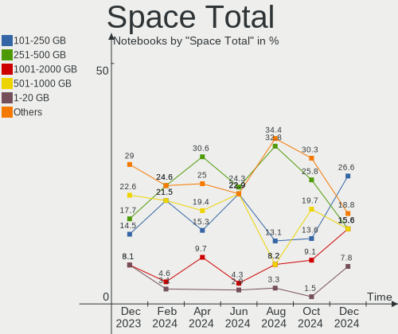
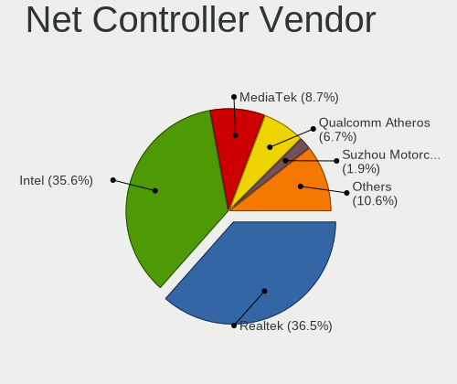
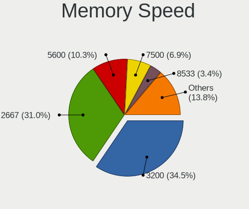
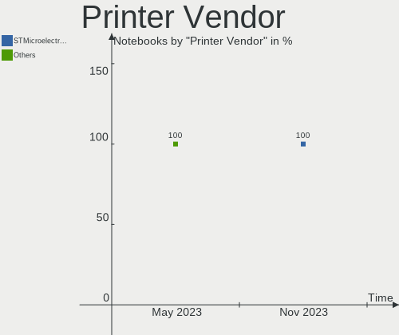
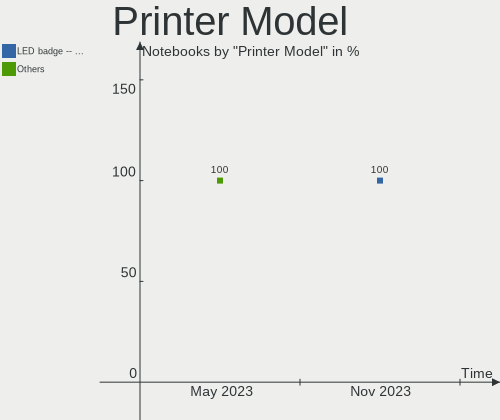

Manjaro Hardware Trends (Notebook)
----------------------------------

A project to identify most popular hardware characteristics and track their change
over time based on data collected by Manjaro users at https://Linux-Hardware.org.

Anyone can contribute to the study by uploading probes of their computers by
the [hw-probe](https://github.com/linuxhw/hw-probe) tool:

    sudo -E hw-probe -all -upload

Full-feature report is available here: https://linux-hardware.org/?view=trends&formfactor=notebook

Period: Oct, 2020.

Contents
--------

- [ OS                       ](#os)
- [ OS Family                ](#os-family)
- [ Kernel                   ](#kernel)
- [ Kernel Family            ](#kernel-family)
- [ Kernel Major Ver.        ](#kernel-major-ver)
- [ Arch                     ](#arch)
- [ DE                       ](#de)
- [ Display Server           ](#display-server)
- [ Display Manager          ](#display-manager)
- [ OS Lang                  ](#os-lang)
- [ Boot Mode                ](#boot-mode)
- [ Filesystem               ](#filesystem)
- [ Part. scheme             ](#part-scheme)
- [ Dual Boot with Linux/BSD ](#dual-boot-with-linux/bsd)
- [ Dual Boot (Win)          ](#dual-boot-win)
- [ Country                  ](#country)
- [ City                     ](#city)
- [ Vendor                   ](#vendor)
- [ Model                    ](#model)
- [ Model Family             ](#model-family)
- [ MFG Year                 ](#mfg-year)
- [ Form Factor              ](#form-factor)
- [ Secure Boot              ](#secure-boot)
- [ Coreboot                 ](#coreboot)
- [ RAM Size                 ](#ram-size)
- [ RAM Used                 ](#ram-used)
- [ Has CD-ROM               ](#has-cd-rom)
- [ Total Drives             ](#total-drives)
- [ Has Ethernet             ](#has-ethernet)
- [ Drive Vendor             ](#drive-vendor)
- [ HDD Vendor               ](#hdd-vendor)
- [ SSD Vendor               ](#ssd-vendor)
- [ Drive Model              ](#drive-model)
- [ Drive Kind               ](#drive-kind)
- [ Drive Connector          ](#drive-connector)
- [ Drive Size               ](#drive-size)
- [ Space Total              ](#space-total)
- [ Space Used               ](#space-used)
- [ Malfunc. Drives          ](#malfunc-drives)
- [ Malfunc. Drive Vendor    ](#malfunc-drive-vendor)
- [ Malfunc. HDD Vendor      ](#malfunc-hdd-vendor)
- [ Malfunc. Drive Kind      ](#malfunc-drive-kind)
- [ Failed Drives            ](#failed-drives)
- [ Failed Drive Vendor      ](#failed-drive-vendor)
- [ Drive Status             ](#drive-status)
- [ Storage Vendor           ](#storage-vendor)
- [ Storage Model            ](#storage-model)
- [ Storage Kind             ](#storage-kind)
- [ CPU Vendor               ](#cpu-vendor)
- [ CPU Model                ](#cpu-model)
- [ CPU Model Family         ](#cpu-model-family)
- [ CPU Cores                ](#cpu-cores)
- [ CPU Sockets              ](#cpu-sockets)
- [ CPU Threads              ](#cpu-threads)
- [ CPU Op-Modes             ](#cpu-op-modes)
- [ CPU Microcode            ](#cpu-microcode)
- [ CPU Microarch            ](#cpu-microarch)
- [ GPU Vendor               ](#gpu-vendor)
- [ GPU Model                ](#gpu-model)
- [ GPU Combo                ](#gpu-combo)
- [ GPU Driver               ](#gpu-driver)
- [ GPU Memory               ](#gpu-memory)
- [ Monitor Vendor           ](#monitor-vendor)
- [ Monitor Model            ](#monitor-model)
- [ Monitor Resolution       ](#monitor-resolution)
- [ Monitor Diagonal         ](#monitor-diagonal)
- [ Monitor Width            ](#monitor-width)
- [ Aspect Ratio             ](#aspect-ratio)
- [ Monitor Area             ](#monitor-area)
- [ Pixel Density            ](#pixel-density)
- [ Multiple Monitors        ](#multiple-monitors)
- [ Net Controller Vendor    ](#net-controller-vendor)
- [ Net Controller Model     ](#net-controller-model)
- [ Wireless Vendor          ](#wireless-vendor)
- [ Wireless Model           ](#wireless-model)
- [ Ethernet Vendor          ](#ethernet-vendor)
- [ Ethernet Model           ](#ethernet-model)
- [ Net Controller Kind      ](#net-controller-kind)
- [ Used Controller          ](#used-controller)
- [ NICs                     ](#nics)
- [ Memory Vendor            ](#memory-vendor)
- [ Memory Model             ](#memory-model)
- [ Memory Kind              ](#memory-kind)
- [ Memory Form Factor       ](#memory-form-factor)
- [ Memory Size              ](#memory-size)
- [ Memory Speed             ](#memory-speed)
- [ Sound Vendor             ](#sound-vendor)
- [ Sound Model              ](#sound-model)
- [ Camera Vendor            ](#camera-vendor)
- [ Camera Model             ](#camera-model)
- [ Fingerprint Vendor       ](#fingerprint-vendor)
- [ Fingerprint Model        ](#fingerprint-model)
- [ Chipcard Vendor          ](#chipcard-vendor)
- [ Chipcard Model           ](#chipcard-model)
- [ Printer Vendor           ](#printer-vendor)
- [ Printer Model            ](#printer-model)
- [ Scanner Vendor           ](#scanner-vendor)
- [ Scanner Model            ](#scanner-model)
- [ Bluetooth Vendor         ](#bluetooth-vendor)
- [ Bluetooth Model          ](#bluetooth-model)
- [ Unsupported Devices      ](#unsupported-devices)
- [ Unsupported Device Types ](#unsupported-device-types)

OS
--

Installed operating systems

| Name           | Notebooks | Percent |
|----------------|-----------|---------|
| Manjaro        | 68        | 45.03%  |
| Manjaro 20.1.1 | 41        | 27.15%  |
| Manjaro 20.1.2 | 29        | 19.21%  |
| Manjaro 20.1   | 7         | 4.64%   |
| Manjaro 20.2   | 5         | 3.31%   |
| Manjaro 20.0.3 | 1         | 0.66%   |

OS Family
---------

OS without a version

| Name    | Notebooks | Percent |
|---------|-----------|---------|
| Manjaro | 151       | 100%    |

Kernel
------

Version of the Linux kernel

| Version               | Notebooks | Percent |
|-----------------------|-----------|---------|
| 5.8.11-1-MANJARO      | 65        | 43.05%  |
| 5.8.16-2-MANJARO      | 25        | 16.56%  |
| 5.9.1-1-MANJARO       | 16        | 10.6%   |
| 5.8.6-1-MANJARO       | 7         | 4.64%   |
| 5.7.19-2-MANJARO      | 4         | 2.65%   |
| 5.4.72-1-MANJARO      | 4         | 2.65%   |
| 5.9.0-1-MANJARO       | 3         | 1.99%   |
| 5.4.67-1-MANJARO      | 3         | 1.99%   |
| 5.4.64-1-MANJARO      | 3         | 1.99%   |
| 5.9.0-1-rt16-MANJARO  | 2         | 1.32%   |
| 5.9.1-3-MANJARO       | 1         | 0.66%   |
| 5.9.1-2-MANJARO       | 1         | 0.66%   |
| 5.9.1-1-ck-ivybridge  | 1         | 0.66%   |
| 5.9.0-3-MANJARO       | 1         | 0.66%   |
| 5.9.0-2-MANJARO       | 1         | 0.66%   |
| 5.8.7-arch1-1         | 1         | 0.66%   |
| 5.8.16-1.1-MANJARO    | 1         | 0.66%   |
| 5.8.15-1-MANJARO      | 1         | 0.66%   |
| 5.8.14-1-MANJARO      | 1         | 0.66%   |
| 5.8.13-5-MANJARO      | 1         | 0.66%   |
| 5.8.13-3-MANJARO      | 1         | 0.66%   |
| 5.8.12-pf6-1          | 1         | 0.66%   |
| 5.8.12-3-MANJARO      | 1         | 0.66%   |
| 5.6.19-3-rt12-MANJARO | 1         | 0.66%   |
| 5.6.19-2-MANJARO      | 1         | 0.66%   |
| 5.6.15-1-MANJARO      | 1         | 0.66%   |
| 5.10.0-1-MANJARO      | 1         | 0.66%   |
| 4.19.152-1-MANJARO    | 1         | 0.66%   |
| 4.19.144-1-MANJARO    | 1         | 0.66%   |

Kernel Family
-------------

Linux kernel without a distro release

| Version  | Notebooks | Percent |
|----------|-----------|---------|
| 5.8.11   | 65        | 43.05%  |
| 5.8.16   | 26        | 17.22%  |
| 5.9.1    | 19        | 12.58%  |
| 5.9.0    | 7         | 4.64%   |
| 5.8.6    | 7         | 4.64%   |
| 5.7.19   | 4         | 2.65%   |
| 5.4.72   | 4         | 2.65%   |
| 5.4.67   | 3         | 1.99%   |
| 5.4.64   | 3         | 1.99%   |
| 5.8.13   | 2         | 1.32%   |
| 5.8.12   | 2         | 1.32%   |
| 5.6.19   | 2         | 1.32%   |
| 5.8.7    | 1         | 0.66%   |
| 5.8.15   | 1         | 0.66%   |
| 5.8.14   | 1         | 0.66%   |
| 5.6.15   | 1         | 0.66%   |
| 5.10.0   | 1         | 0.66%   |
| 4.19.152 | 1         | 0.66%   |
| 4.19.144 | 1         | 0.66%   |

Kernel Major Ver.
-----------------

Linux kernel major version

| Version | Notebooks | Percent |
|---------|-----------|---------|
| 5.8     | 105       | 69.54%  |
| 5.9     | 26        | 17.22%  |
| 5.4     | 10        | 6.62%   |
| 5.7     | 4         | 2.65%   |
| 5.6     | 3         | 1.99%   |
| 4.19    | 2         | 1.32%   |
| 5.10    | 1         | 0.66%   |

Arch
----

OS architecture (x86_64, i586, etc.)

| Name   | Notebooks | Percent |
|--------|-----------|---------|
| x86_64 | 151       | 100%    |

DE
--

Desktop Environment

| Name       | Notebooks | Percent |
|------------|-----------|---------|
| XFCE       | 43        | 28.48%  |
| KDE5       | 34        | 22.52%  |
| GNOME      | 29        | 19.21%  |
| KDE        | 24        | 15.89%  |
| X-Cinnamon | 5         | 3.31%   |
| Cinnamon   | 4         | 2.65%   |
| Unknown    | 4         | 2.65%   |
| MATE       | 3         | 1.99%   |
| i3         | 3         | 1.99%   |
| Deepin     | 2         | 1.32%   |

Display Server
--------------

X11 or Wayland

| Name    | Notebooks | Percent |
|---------|-----------|---------|
| X11     | 142       | 94.04%  |
| Wayland | 7         | 4.64%   |
| Tty     | 1         | 0.66%   |
| Unknown | 1         | 0.66%   |

Display Manager
---------------

SDDM, LightDM, etc.

| Name    | Notebooks | Percent |
|---------|-----------|---------|
| Unknown | 67        | 44.37%  |
| SDDM    | 36        | 23.84%  |
| LightDM | 33        | 21.85%  |
| GDM     | 14        | 9.27%   |
| TDM     | 1         | 0.66%   |

OS Lang
-------

Language

| Lang       | Notebooks | Percent |
|------------|-----------|---------|
| en_US      | 54        | 35.76%  |
| en_US.utf8 | 17        | 11.26%  |
| de_DE      | 10        | 6.62%   |
| ru_RU      | 8         | 5.3%    |
| en_GB      | 6         | 3.97%   |
| en_GB.utf8 | 5         | 3.31%   |
| pl_PL      | 4         | 2.65%   |
| fr_FR      | 3         | 1.99%   |
| es_ES      | 3         | 1.99%   |
| de_DE.utf8 | 3         | 1.99%   |
| ru_UA      | 2         | 1.32%   |
| ru_RU.utf8 | 2         | 1.32%   |
| pt_PT.utf8 | 2         | 1.32%   |
| pt_BR      | 2         | 1.32%   |
| it_IT      | 2         | 1.32%   |
| fi_FI      | 2         | 1.32%   |
| en_CA      | 2         | 1.32%   |
| de_AT      | 2         | 1.32%   |
| zh_CN      | 1         | 0.66%   |
| vi_VN      | 1         | 0.66%   |
| uk_UA      | 1         | 0.66%   |
| tr_TR      | 1         | 0.66%   |
| pt_BR.utf8 | 1         | 0.66%   |
| nb_NO      | 1         | 0.66%   |
| hr_HR      | 1         | 0.66%   |
| fr_FR.utf8 | 1         | 0.66%   |
| fr_CH.utf8 | 1         | 0.66%   |
| fr_CA      | 1         | 0.66%   |
| es_PE.utf8 | 1         | 0.66%   |
| es_MX      | 1         | 0.66%   |
| en_ZA.utf8 | 1         | 0.66%   |
| en_PH      | 1         | 0.66%   |
| en_NZ      | 1         | 0.66%   |
| en_IN.utf8 | 1         | 0.66%   |
| en_IN      | 1         | 0.66%   |
| en_IE      | 1         | 0.66%   |
| en_DE      | 1         | 0.66%   |
| de_CH.utf8 | 1         | 0.66%   |
| da_DK      | 1         | 0.66%   |
| cs_CZ.utf8 | 1         | 0.66%   |

Boot Mode
---------

EFI or BIOS

| Mode | Notebooks | Percent |
|------|-----------|---------|
| BIOS | 78        | 51.66%  |
| EFI  | 73        | 48.34%  |

Filesystem
----------

Type of filesystem

| Type    | Notebooks | Percent |
|---------|-----------|---------|
| Ext4    | 141       | 93.38%  |
| Btrfs   | 5         | 3.31%   |
| Xfs     | 2         | 1.32%   |
| Overlay | 2         | 1.32%   |
| Tmpfs   | 1         | 0.66%   |

Part. scheme
------------

Scheme of partitioning

| Type    | Notebooks | Percent |
|---------|-----------|---------|
| GPT     | 73        | 48.34%  |
| Unknown | 66        | 43.71%  |
| MBR     | 12        | 7.95%   |

Dual Boot with Linux/BSD
------------------------

Hosting more than one Linux/BSD

| Dual boot | Notebooks | Percent |
|-----------|-----------|---------|
| No        | 134       | 88.74%  |
| Yes       | 17        | 11.26%  |

Dual Boot (Win)
---------------

Hosting Linux and Windows

| Dual boot | Notebooks | Percent |
|-----------|-----------|---------|
| No        | 107       | 70.86%  |
| Yes       | 44        | 29.14%  |

Country
-------

Geographic location (country)

| Country                     | Notebooks | Percent |
|-----------------------------|-----------|---------|
| Germany                     | 19        | 12.58%  |
| USA                         | 17        | 11.26%  |
| Russia                      | 10        | 6.62%   |
| UK                          | 8         | 5.3%    |
| Canada                      | 7         | 4.64%   |
| Brazil                      | 7         | 4.64%   |
| Ukraine                     | 6         | 3.97%   |
| Poland                      | 6         | 3.97%   |
| France                      | 5         | 3.31%   |
| Spain                       | 4         | 2.65%   |
| Italy                       | 4         | 2.65%   |
| Switzerland                 | 3         | 1.99%   |
| Portugal                    | 3         | 1.99%   |
| India                       | 3         | 1.99%   |
| Finland                     | 3         | 1.99%   |
| Croatia                     | 3         | 1.99%   |
| Austria                     | 3         | 1.99%   |
| Turkey                      | 2         | 1.32%   |
| South Africa                | 2         | 1.32%   |
| Serbia                      | 2         | 1.32%   |
| Jordan                      | 2         | 1.32%   |
| Egypt                       | 2         | 1.32%   |
| Bulgaria                    | 2         | 1.32%   |
| Belgium                     | 2         | 1.32%   |
| Bangladesh                  | 2         | 1.32%   |
| Vietnam                     | 1         | 0.66%   |
| Uzbekistan                  | 1         | 0.66%   |
| Uruguay                     | 1         | 0.66%   |
| Taiwan                      | 1         | 0.66%   |
| Philippines                 | 1         | 0.66%   |
| Peru                        | 1         | 0.66%   |
| Norway                      | 1         | 0.66%   |
| New Zealand                 | 1         | 0.66%   |
| Netherlands                 | 1         | 0.66%   |
| Nepal                       | 1         | 0.66%   |
| Mexico                      | 1         | 0.66%   |
| Lithuania                   | 1         | 0.66%   |
| Latvia                      | 1         | 0.66%   |
| Kosovo                      | 1         | 0.66%   |
| Kazakhstan                  | 1         | 0.66%   |
| Japan                       | 1         | 0.66%   |
| Israel                      | 1         | 0.66%   |
| Iceland                     | 1         | 0.66%   |
| Hashemite Kingdom of Jordan | 1         | 0.66%   |
| Greece                      | 1         | 0.66%   |
| French Polynesia            | 1         | 0.66%   |
| Denmark                     | 1         | 0.66%   |
| Czech Republic              | 1         | 0.66%   |
| Belarus                     | 1         | 0.66%   |

City
----

Geographic location (city)

| City             | Notebooks | Percent |
|------------------|-----------|---------|
| Warendorf        | 3         | 1.99%   |
| Paris            | 3         | 1.99%   |
| Laval            | 3         | 1.99%   |
| Amman            | 3         | 1.99%   |
| Zagreb           | 2         | 1.32%   |
| Vienna           | 2         | 1.32%   |
| Oxford           | 2         | 1.32%   |
| Lenting          | 2         | 1.32%   |
| Kyiv             | 2         | 1.32%   |
| Hanover          | 2         | 1.32%   |
| Dhaka            | 2         | 1.32%   |
| Cairo            | 2         | 1.32%   |
| Brussels         | 2         | 1.32%   |
| Łódź          | 1         | 0.66%   |
| Yalta            | 1         | 0.66%   |
| Westminster      | 1         | 0.66%   |
| Weingarten       | 1         | 0.66%   |
| Weiden           | 1         | 0.66%   |
| Warsaw           | 1         | 0.66%   |
| Walton on Thames | 1         | 0.66%   |
| Vilnius          | 1         | 0.66%   |
| Vigo             | 1         | 0.66%   |
| Viborg           | 1         | 0.66%   |
| Veracruz         | 1         | 0.66%   |
| Utica            | 1         | 0.66%   |
| Tucson           | 1         | 0.66%   |
| Trikala          | 1         | 0.66%   |
| The Hague        | 1         | 0.66%   |
| Terrassa         | 1         | 0.66%   |
| Tel Aviv         | 1         | 0.66%   |
| Taoyuan District | 1         | 0.66%   |
| Tampere          | 1         | 0.66%   |
| São Paulo       | 1         | 0.66%   |
| Surgut           | 1         | 0.66%   |
| Strathcarron     | 1         | 0.66%   |
| Stevenage        | 1         | 0.66%   |
| St Petersburg    | 1         | 0.66%   |
| Sofia            | 1         | 0.66%   |
| Sinzheim         | 1         | 0.66%   |
| Sigulda          | 1         | 0.66%   |
| Shishino         | 1         | 0.66%   |
| Seattle          | 1         | 0.66%   |
| Savski Venac     | 1         | 0.66%   |
| Saskatoon        | 1         | 0.66%   |
| Santa Rosa       | 1         | 0.66%   |
| Samarkand        | 1         | 0.66%   |
| Rozhdestveno     | 1         | 0.66%   |
| Rotmanka         | 1         | 0.66%   |
| Rochdale         | 1         | 0.66%   |
| Riverview        | 1         | 0.66%   |
| Rio de Janeiro   | 1         | 0.66%   |
| Richterswil      | 1         | 0.66%   |
| Remscheid        | 1         | 0.66%   |
| Recife           | 1         | 0.66%   |
| Puyallup         | 1         | 0.66%   |
| Pristina         | 1         | 0.66%   |
| Prague           | 1         | 0.66%   |
| Poznan           | 1         | 0.66%   |
| Perm             | 1         | 0.66%   |
| Papeete          | 1         | 0.66%   |

Vendor
------

Motherboard manufacturer

| Name                   | Notebooks | Percent |
|------------------------|-----------|---------|
| Lenovo                 | 49        | 32.45%  |
| Hewlett-Packard        | 31        | 20.53%  |
| Dell                   | 20        | 13.25%  |
| ASUSTek Computer       | 15        | 9.93%   |
| Acer                   | 10        | 6.62%   |
| MSI                    | 5         | 3.31%   |
| Apple                  | 4         | 2.65%   |
| Toshiba                | 3         | 1.99%   |
| Monster                | 2         | 1.32%   |
| TUXEDO                 | 1         | 0.66%   |
| Timi                   | 1         | 0.66%   |
| System76               | 1         | 0.66%   |
| Sony                   | 1         | 0.66%   |
| Positivo               | 1         | 0.66%   |
| Packard Bell           | 1         | 0.66%   |
| ONE-NETBOOK TECHNOLOGY | 1         | 0.66%   |
| HUAWEI                 | 1         | 0.66%   |
| Gigabyte Technology    | 1         | 0.66%   |
| Fujitsu                | 1         | 0.66%   |
| Clevo                  | 1         | 0.66%   |
| Alienware              | 1         | 0.66%   |

Model
-----

Motherboard model

| Name                                  | Notebooks | Percent |
|---------------------------------------|-----------|---------|
| Lenovo Legion 5 15ARH05 82B5          | 4         | 2.65%   |
| Lenovo IdeaPad 5 15ARE05 81YQ         | 2         | 1.32%   |
| Lenovo IdeaPad 330-15IKB 81DE         | 2         | 1.32%   |
| HP Pavilion dm4                       | 2         | 1.32%   |
| HP Notebook                           | 2         | 1.32%   |
| HP Laptop 15-bs0xx                    | 2         | 1.32%   |
| Dell Latitude E7240                   | 2         | 1.32%   |
| Dell G3 3590                          | 2         | 1.32%   |
| ASUS TUF Gaming FA706IU_FA706IU       | 2         | 1.32%   |
| Unknown                               | 2         | 1.32%   |
| Toshiba Satellite S70D-A              | 1         | 0.66%   |
| Toshiba Satellite P50-A-11J           | 1         | 0.66%   |
| Toshiba Satellite C855                | 1         | 0.66%   |
| Timi TM1701                           | 1         | 0.66%   |
| System76 Lemur Pro                    | 1         | 0.66%   |
| Sony SVE14A35CXH                      | 1         | 0.66%   |
| Positivo N1103                        | 1         | 0.66%   |
| Packard Bell EasyNote LE69KB          | 1         | 0.66%   |
| ONE-NETBOOK TECHNOLOGY One-Mix3 Pro   | 1         | 0.66%   |
| MSI Modern 14 B4MW                    | 1         | 0.66%   |
| MSI GT70 2PC                          | 1         | 0.66%   |
| MSI GL65 Leopard 9SCXR                | 1         | 0.66%   |
| MSI GL63 9SDK                         | 1         | 0.66%   |
| MSI GL63 8RC                          | 1         | 0.66%   |
| Monster ABRA A5 V15.8                 | 1         | 0.66%   |
| Monster ABRA A5 V12.1                 | 1         | 0.66%   |
| Lenovo Y720-15IKB 80VR                | 1         | 0.66%   |
| Lenovo Y520-15IKBA 80WY               | 1         | 0.66%   |
| Lenovo Y50-70 20378                   | 1         | 0.66%   |
| Lenovo XiaoXinAir 15ARE 2021 82GL     | 1         | 0.66%   |
| Lenovo ThinkPad X230 23202YG          | 1         | 0.66%   |
| Lenovo ThinkPad X220 42872W5          | 1         | 0.66%   |
| Lenovo ThinkPad X201 3680U18          | 1         | 0.66%   |
| Lenovo ThinkPad X140e 20BLS00300      | 1         | 0.66%   |
| Lenovo ThinkPad W530 24478Z5          | 1         | 0.66%   |
| Lenovo ThinkPad T480 20L5CTO1WW       | 1         | 0.66%   |
| Lenovo ThinkPad T14s Gen 1 20UJS00K00 | 1         | 0.66%   |
| Lenovo ThinkPad T14 Gen 1 20UD0014IX  | 1         | 0.66%   |
| Lenovo ThinkPad SL510 28479XU         | 1         | 0.66%   |
| Lenovo ThinkPad S5-S540 20B3005CMS    | 1         | 0.66%   |
| Lenovo ThinkPad P50 20EQS0VV0C        | 1         | 0.66%   |
| Lenovo ThinkPad L15 Gen 1 20U70001SC  | 1         | 0.66%   |
| Lenovo ThinkPad L14 Gen 1 20U1000TAD  | 1         | 0.66%   |
| Lenovo ThinkPad E590 20NB005MUS       | 1         | 0.66%   |
| Lenovo ThinkPad E15 Gen 2 20T8000MGE  | 1         | 0.66%   |
| Lenovo ThinkPad E15 20RD001CGE        | 1         | 0.66%   |
| Lenovo ThinkPad E14 Gen 2 20T7S00W00  | 1         | 0.66%   |
| Lenovo ThinkPad 20HMS0930E            | 1         | 0.66%   |
| Lenovo ThinkBook 14-IIL 20SL          | 1         | 0.66%   |
| Lenovo Legion 5 82B5                  | 1         | 0.66%   |
| Lenovo Legion 5 15ARH05H 82B1         | 1         | 0.66%   |
| Lenovo IdeaPad Z580                   | 1         | 0.66%   |
| Lenovo IdeaPad S340-15API 81NC        | 1         | 0.66%   |
| Lenovo IdeaPad S145-15API 81V7        | 1         | 0.66%   |
| Lenovo IdeaPad P400 Touch 20211       | 1         | 0.66%   |
| Lenovo IdeaPad L340-15API 81LW        | 1         | 0.66%   |
| Lenovo IdeaPad 5 14ARE05 81YM         | 1         | 0.66%   |
| Lenovo IdeaPad 330-17IKB 81DM         | 1         | 0.66%   |
| Lenovo IdeaPad 320-15IKB 81BT         | 1         | 0.66%   |
| Lenovo IdeaPad 320-15IKB 80XL         | 1         | 0.66%   |

Model Family
------------

Motherboard model prefix

| Name                            | Notebooks | Percent |
|---------------------------------|-----------|---------|
| Lenovo ThinkPad                 | 18        | 11.92%  |
| Lenovo IdeaPad                  | 14        | 9.27%   |
| HP Pavilion                     | 7         | 4.64%   |
| HP Laptop                       | 7         | 4.64%   |
| Acer Aspire                     | 7         | 4.64%   |
| Lenovo Legion                   | 6         | 3.97%   |
| Dell Latitude                   | 6         | 3.97%   |
| HP EliteBook                    | 5         | 3.31%   |
| ASUS VivoBook                   | 5         | 3.31%   |
| HP ProBook                      | 4         | 2.65%   |
| Dell XPS                        | 4         | 2.65%   |
| Dell Inspiron                   | 4         | 2.65%   |
| Toshiba Satellite               | 3         | 1.99%   |
| Dell G3                         | 3         | 1.99%   |
| ASUS TUF                        | 3         | 1.99%   |
| MSI GL63                        | 2         | 1.32%   |
| Monster ABRA                    | 2         | 1.32%   |
| HP Notebook                     | 2         | 1.32%   |
| HP ENVY                         | 2         | 1.32%   |
| Dell Vostro                     | 2         | 1.32%   |
| Apple MacBookPro8               | 2         | 1.32%   |
| Unknown                         | 2         | 1.32%   |
| Timi TM1701                     | 1         | 0.66%   |
| System76 Lemur                  | 1         | 0.66%   |
| Sony SVE14A35CXH                | 1         | 0.66%   |
| Positivo N1103                  | 1         | 0.66%   |
| Packard Bell EasyNote           | 1         | 0.66%   |
| ONE-NETBOOK TECHNOLOGY One-Mix3 | 1         | 0.66%   |
| MSI Modern                      | 1         | 0.66%   |
| MSI GT70                        | 1         | 0.66%   |
| MSI GL65                        | 1         | 0.66%   |
| Lenovo Y720-15IKB               | 1         | 0.66%   |
| Lenovo Y520-15IKBA              | 1         | 0.66%   |
| Lenovo Y50-70                   | 1         | 0.66%   |
| Lenovo XiaoXinAir               | 1         | 0.66%   |
| Lenovo ThinkBook                | 1         | 0.66%   |
| Lenovo G580                     | 1         | 0.66%   |
| Lenovo G570                     | 1         | 0.66%   |
| Lenovo G50-30                   | 1         | 0.66%   |
| Lenovo E41-25                   | 1         | 0.66%   |
| Lenovo 3000                     | 1         | 0.66%   |
| HUAWEI WRT-WX9                  | 1         | 0.66%   |
| HP OMEN                         | 1         | 0.66%   |
| HP G56                          | 1         | 0.66%   |
| HP 255                          | 1         | 0.66%   |
| HP 250                          | 1         | 0.66%   |
| Gigabyte GB-BSi3-6100           | 1         | 0.66%   |
| Fujitsu FMVWW11W                | 1         | 0.66%   |
| Dell G5                         | 1         | 0.66%   |
| Clevo P65                       | 1         | 0.66%   |
| ASUS X75VD                      | 1         | 0.66%   |
| ASUS X580VD                     | 1         | 0.66%   |
| ASUS N501VW                     | 1         | 0.66%   |
| ASUS G751JT                     | 1         | 0.66%   |
| ASUS G74Sx                      | 1         | 0.66%   |
| ASUS E402NA                     | 1         | 0.66%   |
| ASUS 1215B                      | 1         | 0.66%   |
| Apple MacBookPro9               | 1         | 0.66%   |
| Apple MacBookPro11              | 1         | 0.66%   |
| Alienware 17                    | 1         | 0.66%   |

MFG Year
--------

Motherboard manufacture year

| Year | Notebooks | Percent |
|------|-----------|---------|
| 2020 | 43        | 28.48%  |
| 2019 | 43        | 28.48%  |
| 2018 | 15        | 9.93%   |
| 2017 | 10        | 6.62%   |
| 2013 | 10        | 6.62%   |
| 2015 | 9         | 5.96%   |
| 2012 | 7         | 4.64%   |
| 2014 | 4         | 2.65%   |
| 2011 | 3         | 1.99%   |
| 2016 | 2         | 1.32%   |
| 2010 | 2         | 1.32%   |
| 2007 | 2         | 1.32%   |
| 2009 | 1         | 0.66%   |

Form Factor
-----------

Physical design of the computer

| Name     | Notebooks | Percent |
|----------|-----------|---------|
| Notebook | 151       | 100%    |

Secure Boot
-----------

Enabled or disabled

| State    | Notebooks | Percent |
|----------|-----------|---------|
| Disabled | 150       | 99.34%  |
| Enabled  | 1         | 0.66%   |

Coreboot
--------

Have coreboot on board

| Used | Notebooks | Percent |
|------|-----------|---------|
| No   | 150       | 99.34%  |
| Yes  | 1         | 0.66%   |

RAM Size
--------

Total RAM memory

| Size in GB  | Notebooks | Percent |
|-------------|-----------|---------|
| 4.01-8.0    | 51        | 33.77%  |
| 16.01-24.0  | 35        | 23.18%  |
| 8.01-16.0   | 32        | 21.19%  |
| 3.01-4.0    | 17        | 11.26%  |
| 32.01-64.0  | 9         | 5.96%   |
| 24.01-32.0  | 3         | 1.99%   |
| 64.01-256.0 | 3         | 1.99%   |
| 1.01-2.0    | 1         | 0.66%   |

RAM Used
--------

Used RAM memory

| Used GB   | Notebooks | Percent |
|-----------|-----------|---------|
| 2.01-3.0  | 43        | 28.48%  |
| 1.01-2.0  | 35        | 23.18%  |
| 3.01-4.0  | 34        | 22.52%  |
| 4.01-8.0  | 27        | 17.88%  |
| 0.01-1.0  | 8         | 5.3%    |
| 8.01-16.0 | 4         | 2.65%   |

Has CD-ROM
----------

Has CD-ROM on board

| Presented | Notebooks | Percent |
|-----------|-----------|---------|
| No        | 111       | 73.51%  |
| Yes       | 40        | 26.49%  |

Total Drives
------------

Number of drives on board

| Drives | Notebooks | Percent |
|--------|-----------|---------|
| 1      | 103       | 68.21%  |
| 2      | 44        | 29.14%  |
| 3      | 2         | 1.32%   |
| 0      | 2         | 1.32%   |

Has Ethernet
------------

Has Ethernet on board

| Presented | Notebooks | Percent |
|-----------|-----------|---------|
| Yes       | 124       | 82.12%  |
| No        | 27        | 17.88%  |

Drive Vendor
------------

Hard drive vendors

| Vendor              | Notebooks | Drives | Percent |
|---------------------|-----------|--------|---------|
| Samsung Electronics | 34        | 39     | 17.99%  |
| WDC                 | 23        | 25     | 12.17%  |
| Seagate             | 18        | 18     | 9.52%   |
| SanDisk             | 15        | 15     | 7.94%   |
| Kingston            | 14        | 14     | 7.41%   |
| Toshiba             | 11        | 11     | 5.82%   |
| SK Hynix            | 10        | 10     | 5.29%   |
| HGST                | 9         | 11     | 4.76%   |
| Unknown             | 7         | 7      | 3.7%    |
| Intel               | 7         | 7      | 3.7%    |
| Crucial             | 6         | 6      | 3.17%   |
| Phison              | 4         | 4      | 2.12%   |
| Micron Technology   | 4         | 4      | 2.12%   |
| Hitachi             | 4         | 4      | 2.12%   |
| LITEONIT            | 3         | 3      | 1.59%   |
| A-DATA Technology   | 3         | 3      | 1.59%   |
| Silicon Motion      | 2         | 2      | 1.06%   |
| PNY                 | 2         | 2      | 1.06%   |
| GOODRAM             | 2         | 2      | 1.06%   |
| China               | 2         | 2      | 1.06%   |
| Zheino              | 1         | 1      | 0.53%   |
| Union Memory        | 1         | 1      | 0.53%   |
| Team                | 1         | 1      | 0.53%   |
| Solid               | 1         | 1      | 0.53%   |
| PLEXTOR             | 1         | 1      | 0.53%   |
| KingDian            | 1         | 1      | 0.53%   |
| FORESEE             | 1         | 1      | 0.53%   |
| Corsair             | 1         | 1      | 0.53%   |
| Apple               | 1         | 1      | 0.53%   |

HDD Vendor
----------

Hard disk drive vendors

| Vendor  | Notebooks | Drives | Percent |
|---------|-----------|--------|---------|
| Seagate | 18        | 18     | 31.58%  |
| WDC     | 17        | 18     | 29.82%  |
| HGST    | 9         | 11     | 15.79%  |
| Toshiba | 8         | 8      | 14.04%  |
| Hitachi | 4         | 4      | 7.02%   |
| Apple   | 1         | 1      | 1.75%   |

SSD Vendor
----------

Solid state drive vendors

| Vendor              | Notebooks | Drives | Percent |
|---------------------|-----------|--------|---------|
| Samsung Electronics | 13        | 14     | 21.31%  |
| SanDisk             | 10        | 10     | 16.39%  |
| Kingston            | 8         | 8      | 13.11%  |
| Crucial             | 6         | 6      | 9.84%   |
| Micron Technology   | 3         | 3      | 4.92%   |
| LITEONIT            | 3         | 3      | 4.92%   |
| PNY                 | 2         | 2      | 3.28%   |
| Intel               | 2         | 2      | 3.28%   |
| GOODRAM             | 2         | 2      | 3.28%   |
| China               | 2         | 2      | 3.28%   |
| A-DATA Technology   | 2         | 2      | 3.28%   |
| Zheino              | 1         | 1      | 1.64%   |
| WDC                 | 1         | 1      | 1.64%   |
| Team                | 1         | 1      | 1.64%   |
| Solid               | 1         | 1      | 1.64%   |
| SK Hynix            | 1         | 1      | 1.64%   |
| PLEXTOR             | 1         | 1      | 1.64%   |
| KingDian            | 1         | 1      | 1.64%   |
| Corsair             | 1         | 1      | 1.64%   |

Drive Model
-----------

Hard drive models

| Model                        | Notebooks | Percent |
|------------------------------|-----------|---------|
| NVMe SSD Drive 512GB         | 13        | 6.63%   |
| NVMe SSD Drive 256GB         | 9         | 4.59%   |
| ST1000LM035-1RK172 1TB       | 8         | 4.08%   |
| NVMe SSD Drive 1024GB        | 5         | 2.55%   |
| SSD 850 EVO M.2 500GB        | 3         | 1.53%   |
| SA400S37240G 240GB SSD       | 3         | 1.53%   |
| NVMe SSD Drive 500GB         | 3         | 1.53%   |
| NVMe SSD Drive 250GB         | 3         | 1.53%   |
| MQ01ABF050 500GB             | 3         | 1.53%   |
| HTS725050A7E630 500GB        | 3         | 1.53%   |
| HTS721010A9E630 1TB          | 3         | 1.53%   |
| HTS541010A9E680 1TB          | 3         | 1.53%   |
| WD10SPZX-24Z10T0 1TB         | 2         | 1.02%   |
| WD10JPVX-75JC3T0 1TB         | 2         | 1.02%   |
| ST1000LM024 HN-M101MBB 1TB   | 2         | 1.02%   |
| SSDPEKNW512G8 512GB          | 2         | 1.02%   |
| SDSSDH3 4T00 4TB             | 2         | 1.02%   |
| Sabrent Rocket Q 2TB         | 2         | 1.02%   |
| MZVLB512HBJQ-000L2 512GB     | 2         | 1.02%   |
| MQ04ABF100 1TB               | 2         | 1.02%   |
| CT1000MX500SSD1 1TB          | 2         | 1.02%   |
| 1100_MTFDDAV256TBN 256GB SSD | 2         | 1.02%   |
| Z400s M.2 2280 128GB SSD     | 1         | 0.51%   |
| X110 2.5 7MM 128GB SSD       | 1         | 0.51%   |
| WDS100T2B0A-00SM50 1TB SSD   | 1         | 0.51%   |
| WD7500BPVT-75A1YT0 752GB     | 1         | 0.51%   |
| WD5000LPCX-60VHAT0 500GB     | 1         | 0.51%   |
| WD5000LPCX-24VHAT0 500GB     | 1         | 0.51%   |
| WD5000LPCX-24C6HT0 500GB     | 1         | 0.51%   |
| WD5000BPKT-80PK4T0 500GB     | 1         | 0.51%   |
| WD3200LPVX-75V0TT0 320GB     | 1         | 0.51%   |
| WD3200BPVT-75JJ5T0 320GB     | 1         | 0.51%   |
| WD32 00BEVT-22A23T0 320GB    | 1         | 0.51%   |
| WD20SPZX-75UA7T1 2TB         | 1         | 0.51%   |
| WD1600BEVS-08VAT2 160GB      | 1         | 0.51%   |
| WD10SPZX-60Z10T0 1TB         | 1         | 0.51%   |
| WD10SPZX-24Z10 1TB           | 1         | 0.51%   |
| WD10SPZX-21Z10T0 1TB         | 1         | 0.51%   |
| WD10JPVX-22JC3T0 1TB         | 1         | 0.51%   |
| WD easystore 240GB           | 1         | 0.51%   |
| UMIS RPITJ512PED2OWX 512GB   | 1         | 0.51%   |
| Ultra II 480GB SSD           | 1         | 0.51%   |
| T253E2001T 1024GB SSD        | 1         | 0.51%   |
| SX8200PNP 1TB                | 1         | 0.51%   |
| SV300S37A480G 480GB SSD      | 1         | 0.51%   |
| SV300S37A240G 240GB SSD      | 1         | 0.51%   |
| SV300S37A120G 120GB SSD      | 1         | 0.51%   |
| SUV400S37480G 480GB SSD      | 1         | 0.51%   |
| SU800 256GB SSD              | 1         | 0.51%   |
| SU800 128GB SSD              | 1         | 0.51%   |
| ST9160821AS 160GB            | 1         | 0.51%   |
| ST9120822AS 120GB            | 1         | 0.51%   |
| ST500LT012-9WS142 500GB      | 1         | 0.51%   |
| ST500LM000-1EJ162 500GB      | 1         | 0.51%   |
| ST480HM000 480GB             | 1         | 0.51%   |
| ST2000LM007-1R8174 2TB       | 1         | 0.51%   |
| ST1000LX015-1U7172-SSHD 1TB  | 1         | 0.51%   |
| ST1000LM049-2GH172 1TB       | 1         | 0.51%   |
| SSDSC2CW180A3 180GB          | 1         | 0.51%   |
| SSDSA2M160G2HP 160GB         | 1         | 0.51%   |

Drive Kind
----------

HDD or SSD

| Kind    | Notebooks | Drives | Percent |
|---------|-----------|--------|---------|
| NVMe    | 65        | 69     | 34.76%  |
| SSD     | 59        | 62     | 31.55%  |
| HDD     | 56        | 60     | 29.95%  |
| MMC     | 6         | 6      | 3.21%   |
| Unknown | 1         | 1      | 0.53%   |

Drive Connector
---------------

SATA, SAS, NVMe, etc.

| Type | Notebooks | Drives | Percent |
|------|-----------|--------|---------|
| SATA | 103       | 122    | 58.86%  |
| NVMe | 65        | 69     | 37.14%  |
| MMC  | 6         | 6      | 3.43%   |
| SAS  | 1         | 1      | 0.57%   |

Drive Size
----------

Size of hard drive

| Size in TB | Notebooks | Drives | Percent |
|------------|-----------|--------|---------|
| 0.01-0.5   | 66        | 71     | 57.39%  |
| 0.51-1.0   | 43        | 45     | 37.39%  |
| 1.01-2.0   | 4         | 4      | 3.48%   |
| 3.01-4.0   | 2         | 2      | 1.74%   |

Space Total
-----------

Amount of disk space available on the file system

| Size in GB     | Notebooks | Percent |
|----------------|-----------|---------|
| 101-250        | 46        | 30.46%  |
| 251-500        | 38        | 25.17%  |
| 501-1000       | 21        | 13.91%  |
| 51-100         | 18        | 11.92%  |
| 1001-2000      | 11        | 7.28%   |
| 21-50          | 5         | 3.31%   |
| 1-20           | 5         | 3.31%   |
| More than 3000 | 3         | 1.99%   |
| Unknown        | 3         | 1.99%   |
| 2001-3000      | 1         | 0.66%   |

Space Used
----------

Amount of used disk space

| Used GB   | Notebooks | Percent |
|-----------|-----------|---------|
| 1-20      | 47        | 31.13%  |
| 101-250   | 27        | 17.88%  |
| 21-50     | 26        | 17.22%  |
| 51-100    | 25        | 16.56%  |
| 501-1000  | 14        | 9.27%   |
| 251-500   | 7         | 4.64%   |
| Unknown   | 3         | 1.99%   |
| 1001-2000 | 2         | 1.32%   |

Malfunc. Drives
---------------

Drive models with a malfunction

| Model                        | Notebooks | Drives | Percent |
|------------------------------|-----------|--------|---------|
| WD10JPVX-75JC3T0 1TB         | 1         | 1      | 12.5%   |
| ST500LT012-9WS142 500GB      | 1         | 1      | 12.5%   |
| ST1000LM035-1RK172 1TB       | 1         | 1      | 12.5%   |
| ST1000LM024 HN-M101MBB 1TB   | 1         | 1      | 12.5%   |
| MZNLH128HBHQ-000H1 128GB SSD | 1         | 1      | 12.5%   |
| HTS725050A7E630 500GB        | 1         | 1      | 12.5%   |
| HTS541010A9E680 1TB          | 1         | 1      | 12.5%   |
| HFS256G3BTND-N210A 256GB SSD | 1         | 1      | 12.5%   |

Malfunc. Drive Vendor
---------------------

Vendors of faulty drives

| Vendor              | Notebooks | Drives | Percent |
|---------------------|-----------|--------|---------|
| Seagate             | 3         | 3      | 37.5%   |
| HGST                | 2         | 2      | 25%     |
| WDC                 | 1         | 1      | 12.5%   |
| SK Hynix            | 1         | 1      | 12.5%   |
| Samsung Electronics | 1         | 1      | 12.5%   |

Malfunc. HDD Vendor
-------------------

Vendors of faulty HDD drives

| Vendor  | Notebooks | Drives | Percent |
|---------|-----------|--------|---------|
| Seagate | 3         | 3      | 50%     |
| HGST    | 2         | 2      | 33.33%  |
| WDC     | 1         | 1      | 16.67%  |

Malfunc. Drive Kind
-------------------

Kinds of faulty drives

| Kind | Notebooks | Drives | Percent |
|------|-----------|--------|---------|
| HDD  | 6         | 6      | 75%     |
| SSD  | 2         | 2      | 25%     |

Failed Drives
-------------

Failed drive models

Zero info for selected period =(

Failed Drive Vendor
-------------------

Failed drive vendors

Zero info for selected period =(

Drive Status
------------

Number of failed and malfunc. drives

| Status   | Notebooks | Drives | Percent |
|----------|-----------|--------|---------|
| Detected | 88        | 110    | 55%     |
| Works    | 64        | 80     | 40%     |
| Malfunc  | 8         | 8      | 5%      |

Storage Vendor
--------------

Storage controller vendors

| Vendor                       | Notebooks | Percent |
|------------------------------|-----------|---------|
| Intel                        | 100       | 51.02%  |
| AMD                          | 34        | 17.35%  |
| Samsung Electronics          | 23        | 11.73%  |
| Sandisk                      | 10        | 5.1%    |
| SK Hynix                     | 9         | 4.59%   |
| Kingston Technology Company  | 6         | 3.06%   |
| Phison Electronics           | 4         | 2.04%   |
| Toshiba America Info Systems | 3         | 1.53%   |
| Silicon Motion               | 2         | 1.02%   |
| ADATA Technology             | 2         | 1.02%   |
| Union Memory (Shenzhen)      | 1         | 0.51%   |
| Shenzhen Longsys Electronics | 1         | 0.51%   |
| Micron Technology            | 1         | 0.51%   |

Storage Model
-------------

Storage controller models

| Model                                                                      | Notebooks | Percent |
|----------------------------------------------------------------------------|-----------|---------|
| FCH SATA Controller [AHCI mode]                                            | 31        | 15.42%  |
| Sunrise Point-LP SATA Controller [AHCI mode]                               | 15        | 7.46%   |
| Non-Volatile memory controller                                             | 13        | 6.47%   |
| 7 Series Chipset Family 6-port SATA Controller [AHCI mode]                 | 13        | 6.47%   |
| NVMe SSD Controller SM981/PM981/PM983                                      | 12        | 5.97%   |
| 82801 Mobile SATA Controller [RAID mode]                                   | 11        | 5.47%   |
| HM170/QM170 Chipset SATA Controller [AHCI Mode]                            | 9         | 4.48%   |
| Cannon Lake Mobile PCH SATA AHCI Controller                                | 9         | 4.48%   |
| 6 Series/C200 Series Chipset Family 6 port Mobile SATA AHCI Controller     | 7         | 3.48%   |
| NVMe SSD Controller SM961/PM961                                            | 6         | 2.99%   |
| SSD 660P Series                                                            | 5         | 2.49%   |
| BC501 NVMe Solid State Drive 512GB                                         | 5         | 2.49%   |
| 8 Series/C220 Series Chipset Family 6-port SATA Controller 1 [AHCI mode]   | 5         | 2.49%   |
| E12 NVMe Controller                                                        | 4         | 1.99%   |
| Cannon Point-LP SATA Controller [AHCI Mode]                                | 4         | 1.99%   |
| Wildcat Point-LP SATA Controller [AHCI Mode]                               | 3         | 1.49%   |
| WD Black 2019/PC SN750 NVMe SSD                                            | 3         | 1.49%   |
| Technology Company Non-Volatile memory controller                          | 3         | 1.49%   |
| Electronics Non-Volatile memory controller                                 | 3         | 1.49%   |
| Comet Lake SATA AHCI Controller                                            | 3         | 1.49%   |
| 82801IBM/IEM (ICH9M/ICH9M-E) 4 port SATA Controller [AHCI mode]            | 3         | 1.49%   |
| 8 Series SATA Controller 1 [AHCI mode]                                     | 3         | 1.49%   |
| WD Blue SN550 NVMe SSD                                                     | 2         | 1%      |
| WD Black 2018 / PC SN520 NVMe SSD                                          | 2         | 1%      |
| SM2262/SM2262EN SSD Controller                                             | 2         | 1%      |
| SB7x0/SB8x0/SB9x0 SATA Controller [AHCI mode]                              | 2         | 1%      |
| Ice Lake-LP SATA Controller [AHCI mode]                                    | 2         | 1%      |
| Atom/Celeron/Pentium Processor x5-E8000/J3xxx/N3xxx Series SATA Controller | 2         | 1%      |
| 5 Series/3400 Series Chipset 6 port SATA AHCI Controller                   | 2         | 1%      |
| XPG SX8200 Pro PCIe Gen3x4 M.2 2280 Solid State Drive                      | 1         | 0.5%    |
| XG4 NVMe SSD Controller                                                    | 1         | 0.5%    |
| Toshiba America Info Non-Volatile memory controller                        | 1         | 0.5%    |
| SB600 Non-Raid-5 SATA                                                      | 1         | 0.5%    |
| SB600 IDE                                                                  | 1         | 0.5%    |
| SATA controller                                                            | 1         | 0.5%    |
| Q170/Q150/B150/H170/H110/Z170/CM236 Chipset SATA Controller [AHCI Mode]    | 1         | 0.5%    |
| NVMe SSD Controller SM951/PM951                                            | 1         | 0.5%    |
| Mobile 4 Series Chipset PT IDER Controller                                 | 1         | 0.5%    |
| Electronics SATA controller                                                | 1         | 0.5%    |
| Celeron N3350/Pentium N4200/Atom E3900 Series SATA AHCI Controller         | 1         | 0.5%    |
| BG3 NVMe SSD Controller                                                    | 1         | 0.5%    |
| Atom Processor E3800 Series SATA AHCI Controller                           | 1         | 0.5%    |
| A2000, M.2, 500GB                                                          | 1         | 0.5%    |
| 82801HM/HEM (ICH8M/ICH8M-E) SATA Controller [AHCI mode]                    | 1         | 0.5%    |
| 82801HM/HEM (ICH8M/ICH8M-E) IDE Controller                                 | 1         | 0.5%    |
| 400 Series Chipset Family SATA AHCI Controller                             | 1         | 0.5%    |

Storage Kind
------------

Kind of storage controller (IDE, SATA, NVMe, SAS, ...)

| Kind | Notebooks | Percent |
|------|-----------|---------|
| SATA | 121       | 60.8%   |
| NVMe | 64        | 32.16%  |
| RAID | 11        | 5.53%   |
| IDE  | 3         | 1.51%   |

CPU Vendor
----------

Processor vendors

| Vendor | Notebooks | Percent |
|--------|-----------|---------|
| Intel  | 108       | 71.52%  |
| AMD    | 43        | 28.48%  |

CPU Model
---------

Processor models

| Model                                         | Notebooks | Percent |
|-----------------------------------------------|-----------|---------|
| Intel Core i5-8250U CPU @ 1.60GHz             | 6         | 3.97%   |
| Intel Core i7-7700HQ CPU @ 2.80GHz            | 5         | 3.31%   |
| Intel Core i5-8265U CPU @ 1.60GHz             | 5         | 3.31%   |
| AMD Ryzen 7 4800H with Radeon Graphics        | 5         | 3.31%   |
| AMD Ryzen 5 4500U with Radeon Graphics        | 5         | 3.31%   |
| Intel Core i5-10210U CPU @ 1.60GHz            | 4         | 2.65%   |
| AMD Ryzen 5 4600H with Radeon Graphics        | 4         | 2.65%   |
| AMD Ryzen 3 3200U with Radeon Vega Mobile Gfx | 4         | 2.65%   |
| Intel Core i7-9750H CPU @ 2.60GHz             | 3         | 1.99%   |
| Intel Core i7-8550U CPU @ 1.80GHz             | 3         | 1.99%   |
| Intel Core i7-6700HQ CPU @ 2.60GHz            | 3         | 1.99%   |
| Intel Core i7-10510U CPU @ 1.80GHz            | 3         | 1.99%   |
| Intel Core i5-9300H CPU @ 2.40GHz             | 3         | 1.99%   |
| Intel Core i5-7200U CPU @ 2.50GHz             | 3         | 1.99%   |
| Intel Core i5-3210M CPU @ 2.50GHz             | 3         | 1.99%   |
| Intel Core i5-1035G1 CPU @ 1.00GHz            | 3         | 1.99%   |
| AMD Ryzen 7 4800U with Radeon Graphics        | 3         | 1.99%   |
| AMD Ryzen 5 3500U with Radeon Vega Mobile Gfx | 3         | 1.99%   |
| Intel Core i7-8565U CPU @ 1.80GHz             | 2         | 1.32%   |
| Intel Core i7-4720HQ CPU @ 2.60GHz            | 2         | 1.32%   |
| Intel Core i7-2720QM CPU @ 2.20GHz            | 2         | 1.32%   |
| Intel Core i5-8300H CPU @ 2.30GHz             | 2         | 1.32%   |
| Intel Core i5-7300HQ CPU @ 2.50GHz            | 2         | 1.32%   |
| Intel Core i5-6200U CPU @ 2.30GHz             | 2         | 1.32%   |
| Intel Core i5-3320M CPU @ 2.60GHz             | 2         | 1.32%   |
| Intel Core i5-3230M CPU @ 2.60GHz             | 2         | 1.32%   |
| Intel Core i3-3120M CPU @ 2.50GHz             | 2         | 1.32%   |
| Intel Celeron CPU N3060 @ 1.60GHz             | 2         | 1.32%   |
| AMD Ryzen 7 PRO 4750U with Radeon Graphics    | 2         | 1.32%   |
| AMD Ryzen 5 3550H with Radeon Vega Mobile Gfx | 2         | 1.32%   |
| AMD Ryzen 5 2500U with Radeon Vega Mobile Gfx | 2         | 1.32%   |
| AMD E1-2500 APU with Radeon HD Graphics       | 2         | 1.32%   |
| Intel Pentium Dual-Core CPU T4500 @ 2.30GHz   | 1         | 0.66%   |
| Intel Pentium CPU N4200 @ 1.10GHz             | 1         | 0.66%   |
| Intel Pentium CPU N3710 @ 1.60GHz             | 1         | 0.66%   |
| Intel Pentium CPU B950 @ 2.10GHz              | 1         | 0.66%   |
| Intel Pentium CPU 2020M @ 2.40GHz             | 1         | 0.66%   |
| Intel Core i9-8950HK CPU @ 2.90GHz            | 1         | 0.66%   |
| Intel Core i7-7500U CPU @ 2.70GHz             | 1         | 0.66%   |
| Intel Core i7-6820HQ CPU @ 2.70GHz            | 1         | 0.66%   |
| Intel Core i7-6500U CPU @ 2.50GHz             | 1         | 0.66%   |
| Intel Core i7-4980HQ CPU @ 2.80GHz            | 1         | 0.66%   |
| Intel Core i7-4710MQ CPU @ 2.50GHz            | 1         | 0.66%   |
| Intel Core i7-4710HQ CPU @ 2.50GHz            | 1         | 0.66%   |
| Intel Core i7-4700MQ CPU @ 2.40GHz            | 1         | 0.66%   |
| Intel Core i7-4600U CPU @ 2.10GHz             | 1         | 0.66%   |
| Intel Core i7-4500U CPU @ 1.80GHz             | 1         | 0.66%   |
| Intel Core i7-3740QM CPU @ 2.70GHz            | 1         | 0.66%   |
| Intel Core i7-3632QM CPU @ 2.20GHz            | 1         | 0.66%   |
| Intel Core i7-3610QM CPU @ 2.30GHz            | 1         | 0.66%   |
| Intel Core i7-2670QM CPU @ 2.20GHz            | 1         | 0.66%   |
| Intel Core i7-10750H CPU @ 2.60GHz            | 1         | 0.66%   |
| Intel Core i7-10510Y CPU @ 1.20GHz            | 1         | 0.66%   |
| Intel Core i7 CPU Q 720 @ 1.60GHz             | 1         | 0.66%   |
| Intel Core i5-5200U CPU @ 2.20GHz             | 1         | 0.66%   |
| Intel Core i5-4300U CPU @ 1.90GHz             | 1         | 0.66%   |
| Intel Core i5-4300M CPU @ 2.60GHz             | 1         | 0.66%   |
| Intel Core i5-4200U CPU @ 1.60GHz             | 1         | 0.66%   |
| Intel Core i5-3380M CPU @ 2.90GHz             | 1         | 0.66%   |
| Intel Core i5-3340M CPU @ 2.70GHz             | 1         | 0.66%   |

CPU Model Family
----------------

Processor model prefix

| Model                   | Notebooks | Percent |
|-------------------------|-----------|---------|
| Intel Core i5           | 47        | 31.13%  |
| Intel Core i7           | 39        | 25.83%  |
| AMD Ryzen 5             | 16        | 10.6%   |
| AMD Ryzen 7             | 9         | 5.96%   |
| Intel Core i3           | 8         | 5.3%    |
| Intel Celeron           | 5         | 3.31%   |
| AMD Ryzen 3             | 5         | 3.31%   |
| Intel Pentium           | 4         | 2.65%   |
| Intel Core 2 Duo        | 3         | 1.99%   |
| AMD E1                  | 3         | 1.99%   |
| Other                   | 2         | 1.32%   |
| AMD Ryzen 7 PRO         | 2         | 1.32%   |
| AMD A10                 | 2         | 1.32%   |
| Intel Pentium Dual-Core | 1         | 0.66%   |
| Intel Core i9           | 1         | 0.66%   |
| AMD Turion 64 X2 Mobile | 1         | 0.66%   |
| AMD E                   | 1         | 0.66%   |
| AMD Athlon II Dual-Core | 1         | 0.66%   |
| AMD A8                  | 1         | 0.66%   |

CPU Cores
---------

Number of processor cores

| Number | Notebooks | Percent |
|--------|-----------|---------|
| 4      | 66        | 43.71%  |
| 2      | 61        | 40.4%   |
| 6      | 14        | 9.27%   |
| 8      | 10        | 6.62%   |

CPU Sockets
-----------

Number of sockets

| Number | Notebooks | Percent |
|--------|-----------|---------|
| 1      | 151       | 100%    |

CPU Threads
-----------

Threads per core (Hyper-Threading)

| Number | Notebooks | Percent |
|--------|-----------|---------|
| 2      | 120       | 79.47%  |
| 1      | 31        | 20.53%  |

CPU Op-Modes
------------

CPU Operation Modes (32-bit, 64-bit)

| Op mode        | Notebooks | Percent |
|----------------|-----------|---------|
| 32-bit, 64-bit | 151       | 100%    |

CPU Microcode
-------------

Microcode number

| Number     | Notebooks | Percent |
|------------|-----------|---------|
| Unknown    | 75        | 49.67%  |
| 0x306a9    | 9         | 5.96%   |
| 0x806ec    | 8         | 5.3%    |
| 0x08600103 | 7         | 4.64%   |
| 0x08600104 | 6         | 3.97%   |
| 0x806ea    | 5         | 3.31%   |
| 0x906ea    | 4         | 2.65%   |
| 0x906e9    | 3         | 1.99%   |
| 0x806eb    | 3         | 1.99%   |
| 0x306c3    | 3         | 1.99%   |
| 0x08108109 | 3         | 1.99%   |
| 0x08108102 | 3         | 1.99%   |
| 0x806e9    | 2         | 1.32%   |
| 0x406e3    | 2         | 1.32%   |
| 0x406c4    | 2         | 1.32%   |
| 0x40651    | 2         | 1.32%   |
| 0x306d4    | 2         | 1.32%   |
| 0x206a7    | 2         | 1.32%   |
| 0x0700010f | 2         | 1.32%   |
| 0xa0652    | 1         | 0.66%   |
| 0x706e5    | 1         | 0.66%   |
| 0x506e3    | 1         | 0.66%   |
| 0x08600106 | 1         | 0.66%   |
| 0x0810100b | 1         | 0.66%   |
| 0x07000110 | 1         | 0.66%   |
| 0x06006705 | 1         | 0.66%   |
| 0x05000119 | 1         | 0.66%   |

CPU Microarch
-------------

Microarchitecture

| Name          | Notebooks | Percent |
|---------------|-----------|---------|
| KabyLake      | 45        | 29.8%   |
| Zen 2         | 19        | 12.58%  |
| IvyBridge     | 16        | 10.6%   |
| Zen+          | 11        | 7.28%   |
| Haswell       | 11        | 7.28%   |
| Skylake       | 9         | 5.96%   |
| SandyBridge   | 8         | 5.3%    |
| Silvermont    | 4         | 2.65%   |
| Zen           | 3         | 1.99%   |
| Penryn        | 3         | 1.99%   |
| Jaguar        | 3         | 1.99%   |
| IceLake       | 3         | 1.99%   |
| Broadwell     | 3         | 1.99%   |
| Piledriver    | 2         | 1.32%   |
| Excavator     | 2         | 1.32%   |
| Westmere      | 1         | 0.66%   |
| Nehalem       | 1         | 0.66%   |
| K8 Hammer     | 1         | 0.66%   |
| K10           | 1         | 0.66%   |
| Goldmont plus | 1         | 0.66%   |
| Goldmont      | 1         | 0.66%   |
| Core          | 1         | 0.66%   |
| CometLake     | 1         | 0.66%   |
| Bobcat        | 1         | 0.66%   |

GPU Vendor
----------

Vendors of graphics cards

| Vendor | Notebooks | Percent |
|--------|-----------|---------|
| Intel  | 100       | 48.08%  |
| Nvidia | 55        | 26.44%  |
| AMD    | 53        | 25.48%  |

GPU Model
---------

Graphics card models

| Model                                                                              | Notebooks | Percent |
|------------------------------------------------------------------------------------|-----------|---------|
| Renoir                                                                             | 18        | 8.61%   |
| 3rd Gen Core processor Graphics Controller                                         | 15        | 7.18%   |
| Picasso                                                                            | 12        | 5.74%   |
| UHD Graphics 620                                                                   | 10        | 4.78%   |
| UHD Graphics 630 (Mobile)                                                          | 9         | 4.31%   |
| UHD Graphics                                                                       | 8         | 3.83%   |
| UHD Graphics 620 (Whiskey Lake)                                                    | 7         | 3.35%   |
| 2nd Generation Core Processor Family Integrated Graphics Controller                | 7         | 3.35%   |
| TU116M [GeForce GTX 1660 Ti Mobile]                                                | 6         | 2.87%   |
| HD Graphics 630                                                                    | 6         | 2.87%   |
| TU117M [GeForce GTX 1650 Ti Mobile]                                                | 5         | 2.39%   |
| Skylake GT2 [HD Graphics 520]                                                      | 5         | 2.39%   |
| GP107M [GeForce GTX 1050 Mobile]                                                   | 5         | 2.39%   |
| 4th Gen Core Processor Integrated Graphics Controller                              | 5         | 2.39%   |
| TU117M [GeForce GTX 1650 Mobile / Max-Q]                                           | 4         | 1.91%   |
| HD Graphics 620                                                                    | 4         | 1.91%   |
| Haswell-ULT Integrated Graphics Controller                                         | 4         | 1.91%   |
| TU117M                                                                             | 3         | 1.44%   |
| Sun XT [Radeon HD 8670A/8670M/8690M / R5 M330 / M430 / Radeon 520 Mobile]          | 3         | 1.44%   |
| Mobile 4 Series Chipset Integrated Graphics Controller                             | 3         | 1.44%   |
| Kabini [Radeon HD 8240 / R3 Series]                                                | 3         | 1.44%   |
| Iris Plus Graphics G1 (Ice Lake)                                                   | 3         | 1.44%   |
| HD Graphics 530                                                                    | 3         | 1.44%   |
| GM108M [GeForce MX130]                                                             | 3         | 1.44%   |
| Atom/Celeron/Pentium Processor x5-E8000/J3xxx/N3xxx Integrated Graphics Controller | 3         | 1.44%   |
| Whistler [Radeon HD 6630M/6650M/6750M/7670M/7690M]                                 | 2         | 0.96%   |
| Raven Ridge [Radeon Vega Series / Radeon Vega Mobile Series]                       | 2         | 0.96%   |
| HD Graphics 5500                                                                   | 2         | 0.96%   |
| GP108M [GeForce MX230]                                                             | 2         | 0.96%   |
| GP108M [GeForce MX150]                                                             | 2         | 0.96%   |
| GP106M [GeForce GTX 1060 Mobile]                                                   | 2         | 0.96%   |
| GM204M [GeForce GTX 970M]                                                          | 2         | 0.96%   |
| GM107M [GeForce GTX 960M]                                                          | 2         | 0.96%   |
| GM107M [GeForce GTX 950M]                                                          | 2         | 0.96%   |
| Baffin [Radeon RX 460/560D / Pro 450/455/460/555/555X/560/560X]                    | 2         | 0.96%   |
| Wrestler [Radeon HD 6320]                                                          | 1         | 0.48%   |
| Wani [Radeon R5/R6/R7 Graphics]                                                    | 1         | 0.48%   |
| Venus XT [Radeon HD 8870M / R9 M270X/M370X]                                        | 1         | 0.48%   |
| UHD Graphics 615                                                                   | 1         | 0.48%   |
| UHD Graphics 605                                                                   | 1         | 0.48%   |
| Topaz XT [Radeon R7 M260/M265 / M340/M360 / M440/M445 / 530/535 / 620/625 Mobile]  | 1         | 0.48%   |
| Thames [Radeon HD 7550M/7570M/7650M]                                               | 1         | 0.48%   |
| Stoney [Radeon R2/R3/R4/R5 Graphics]                                               | 1         | 0.48%   |
| RV730/M96 [Mobility Radeon HD 4650/5165]                                           | 1         | 0.48%   |
| RS482/RS485 [Radeon Xpress 1100/1150]                                              | 1         | 0.48%   |
| Richland [Radeon HD 8650G]                                                         | 1         | 0.48%   |
| Richland [Radeon HD 8550G]                                                         | 1         | 0.48%   |
| Mars [Radeon HD 8670A/8670M/8750M]                                                 | 1         | 0.48%   |
| Jet XT [Radeon R5 M240]                                                            | 1         | 0.48%   |
| HD Graphics                                                                        | 1         | 0.48%   |
| GT216GLM [Quadro FX 880M]                                                          | 1         | 0.48%   |
| GP108M [GeForce MX250]                                                             | 1         | 0.48%   |
| GP106BM [GeForce GTX 1060 Mobile 6GB]                                              | 1         | 0.48%   |
| GP104BM [GeForce GTX 1080 Mobile]                                                  | 1         | 0.48%   |
| GM108M [GeForce 940MX]                                                             | 1         | 0.48%   |
| GM108M [GeForce 920MX]                                                             | 1         | 0.48%   |
| GM107M [GeForce GTX 860M]                                                          | 1         | 0.48%   |
| GM107GLM [Quadro M1000M]                                                           | 1         | 0.48%   |
| GK107M [GeForce GT 730M]                                                           | 1         | 0.48%   |
| GK107GLM [Quadro K1000M]                                                           | 1         | 0.48%   |

GPU Combo
---------

Combinations of graphics cards

| Name           | Notebooks | Percent |
|----------------|-----------|---------|
| 1 x Intel      | 54        | 35.76%  |
| Intel + Nvidia | 36        | 23.84%  |
| 1 x AMD        | 32        | 21.19%  |
| AMD + Nvidia   | 11        | 7.28%   |
| Intel + AMD    | 9         | 5.96%   |
| 1 x Nvidia     | 8         | 5.3%    |
| 2 x AMD        | 1         | 0.66%   |

GPU Driver
----------

Free vs proprietary

| Driver      | Notebooks | Percent |
|-------------|-----------|---------|
| Free        | 121       | 80.13%  |
| Proprietary | 30        | 19.87%  |

GPU Memory
----------

Total video memory

| Size in GB | Notebooks | Percent |
|------------|-----------|---------|
| Unknown    | 111       | 73.51%  |
| 0.01-0.5   | 17        | 11.26%  |
| 1.01-2.0   | 8         | 5.3%    |
| 3.01-4.0   | 7         | 4.64%   |
| 5.01-6.0   | 3         | 1.99%   |
| 0.51-1.0   | 3         | 1.99%   |
| 7.01-8.0   | 1         | 0.66%   |
| 2.01-3.0   | 1         | 0.66%   |

Monitor Vendor
--------------

Monitor vendors

| Vendor                  | Notebooks | Percent |
|-------------------------|-----------|---------|
| AU Optronics            | 36        | 21.05%  |
| LG Display              | 32        | 18.71%  |
| BOE                     | 27        | 15.79%  |
| Chimei Innolux          | 24        | 14.04%  |
| Samsung Electronics     | 10        | 5.85%   |
| PANDA                   | 4         | 2.34%   |
| Goldstar                | 4         | 2.34%   |
| Apple                   | 4         | 2.34%   |
| Sharp                   | 3         | 1.75%   |
| Lenovo                  | 3         | 1.75%   |
| Dell                    | 3         | 1.75%   |
| Ancor Communications    | 3         | 1.75%   |
| HannStar                | 2         | 1.17%   |
| Chi Mei Optoelectronics | 2         | 1.17%   |
| Acer                    | 2         | 1.17%   |
| Toshiba                 | 1         | 0.58%   |
| Sony                    | 1         | 0.58%   |
| Philips                 | 1         | 0.58%   |
| Panasonic               | 1         | 0.58%   |
| LGD                     | 1         | 0.58%   |
| LG Philips              | 1         | 0.58%   |
| KDC                     | 1         | 0.58%   |
| HKC                     | 1         | 0.58%   |
| Hewlett-Packard         | 1         | 0.58%   |
| ASUSTek Computer        | 1         | 0.58%   |
| APD                     | 1         | 0.58%   |
| AGO                     | 1         | 0.58%   |

Monitor Model
-------------

Monitor models

| Model                                               | Notebooks | Percent |
|-----------------------------------------------------|-----------|---------|
| LCD Monitor CMN15D5 1920x1080 340x190mm 15.3-inch   | 3         | 1.74%   |
| LCD Monitor AUO61ED 1920x1080 340x190mm 15.3-inch   | 3         | 1.74%   |
| LCD Monitor AUO403D 1920x1080 309x173mm 13.9-inch   | 3         | 1.74%   |
| LCD Monitor LGD053F 1920x1080 344x194mm 15.5-inch   | 2         | 1.16%   |
| LCD Monitor CMN1728 1600x900 382x215mm 17.3-inch    | 2         | 1.16%   |
| LCD Monitor CMN15F5 1920x1080 344x193mm 15.5-inch   | 2         | 1.16%   |
| LCD Monitor BOE08DF 1920x1080 344x194mm 15.5-inch   | 2         | 1.16%   |
| LCD Monitor BOE08B9 1920x1080 344x194mm 15.5-inch   | 2         | 1.16%   |
| LCD Monitor BOE07CB 1920x1080 344x193mm 15.5-inch   | 2         | 1.16%   |
| LCD Monitor AUOD1ED 1920x1080 340x190mm 15.3-inch   | 2         | 1.16%   |
| LCD Monitor AUO71EC 1366x768 340x190mm 15.3-inch    | 2         | 1.16%   |
| LCD Monitor AUO38ED 1920x1080 340x190mm 15.3-inch   | 2         | 1.16%   |
| LCD Monitor AUO21ED 1920x1080 344x194mm 15.5-inch   | 2         | 1.16%   |
| LCD Monitor AUO203E 1600x900 310x170mm 13.9-inch    | 2         | 1.16%   |
| ASUS VX239 ACI23E1 1920x1080 509x286mm 23.0-inch    | 2         | 1.16%   |
| VVX13F009G00 MEI96A2 1920x1080 290x170mm 13.2-inch  | 1         | 0.58%   |
| VA24E AUS24D1 1920x1080 527x296mm 23.8-inch         | 1         | 0.58%   |
| ULTRAWIDE GSM76F9 2560x1080 531x298mm 24.0-inch     | 1         | 0.58%   |
| U2419H DEL415D 1920x1080 527x296mm 23.8-inch        | 1         | 0.58%   |
| TV TSB0206 1920x1080 886x498mm 40.0-inch            | 1         | 0.58%   |
| SyncMaster SAM022B 1280x1024 338x270mm 17.0-inch    | 1         | 0.58%   |
| SE2419H DELF109 1920x1080 527x296mm 23.8-inch       | 1         | 0.58%   |
| RT270 ACR053A 1920x1080 598x336mm 27.0-inch         | 1         | 0.58%   |
| QG241Y ACR06F9 1920x1080 527x296mm 23.8-inch        | 1         | 0.58%   |
| PHL 241B8Q PHL0929 1920x1080 527x296mm 23.8-inch    | 1         | 0.58%   |
| P2412H DELA07C 1920x1080 530x300mm 24.0-inch        | 1         | 0.58%   |
| P130ZDZ-EF1 CMN8201 2160x1440 275x183mm 13.0-inch   | 1         | 0.58%   |
| Monitor APDFFFF 1680x1050 480x300mm 22.3-inch       | 1         | 0.58%   |
| LP156WH2-TLQA LGD026A 1366x768 344x194mm 15.5-inch  | 1         | 0.58%   |
| LCD Monitor SHP14B9 3840x2160 344x194mm 15.5-inch   | 1         | 0.58%   |
| LCD Monitor SHP1453 1920x1080 346x194mm 15.6-inch   | 1         | 0.58%   |
| LCD Monitor SHP144A 3200x1800 294x165mm 13.3-inch   | 1         | 0.58%   |
| LCD Monitor SEC5448 1920x1080 344x194mm 15.5-inch   | 1         | 0.58%   |
| LCD Monitor SEC4C42 1280x800 303x190mm 14.1-inch    | 1         | 0.58%   |
| LCD Monitor SEC4252 1366x768 344x194mm 15.5-inch    | 1         | 0.58%   |
| LCD Monitor SDCC34F 3840x2160 344x194mm 15.5-inch   | 1         | 0.58%   |
| LCD Monitor SDC4C51 1366x768 344x194mm 15.5-inch    | 1         | 0.58%   |
| LCD Monitor SDC4852 3840x2160 340x190mm 15.3-inch   | 1         | 0.58%   |
| LCD Monitor SDC4851 1366x768 344x194mm 15.5-inch    | 1         | 0.58%   |
| LCD Monitor SAM0DF7 3840x2160 1872x1053mm 84.6-inch | 1         | 0.58%   |
| LCD Monitor NCP0058 1920x1080 344x194mm 15.5-inch   | 1         | 0.58%   |
| LCD Monitor NCP0040 1920x1080 344x194mm 15.5-inch   | 1         | 0.58%   |
| LCD Monitor NCP0036 1920x1080 344x194mm 15.5-inch   | 1         | 0.58%   |
| LCD Monitor NCP0035 1920x1080 309x174mm 14.0-inch   | 1         | 0.58%   |
| LCD Monitor LPL1479 1680x1050 331x207mm 15.4-inch   | 1         | 0.58%   |
| LCD Monitor LGD066D 1920x1080 344x194mm 15.5-inch   | 1         | 0.58%   |
| LCD Monitor LGD062C 1920x1080 309x174mm 14.0-inch   | 1         | 0.58%   |
| LCD Monitor LGD05FA 1920x1080 309x174mm 14.0-inch   | 1         | 0.58%   |
| LCD Monitor LGD05F6 1920x1080 309x174mm 14.0-inch   | 1         | 0.58%   |
| LCD Monitor LGD05F2 1920x1080 344x194mm 15.5-inch   | 1         | 0.58%   |
| LCD Monitor LGD05D8 1920x1080 344x194mm 15.5-inch   | 1         | 0.58%   |
| LCD Monitor LGD05CE 1920x1080 344x194mm 15.5-inch   | 1         | 0.58%   |
| LCD Monitor LGD05C8 1920x1080 344x194mm 15.5-inch   | 1         | 0.58%   |
| LCD Monitor LGD05B9 1920x1080 380x210mm 17.1-inch   | 1         | 0.58%   |
| LCD Monitor LGD054F 1920x1080 344x194mm 15.5-inch   | 1         | 0.58%   |
| LCD Monitor LGD0521 1920x1080 309x174mm 14.0-inch   | 1         | 0.58%   |
| LCD Monitor LGD04D4 3840x2160 344x194mm 15.5-inch   | 1         | 0.58%   |
| LCD Monitor LGD04BD 1366x768 344x194mm 15.5-inch    | 1         | 0.58%   |
| LCD Monitor LGD04B3 1920x1080 350x190mm 15.7-inch   | 1         | 0.58%   |
| LCD Monitor LGD046F 1920x1080 344x194mm 15.5-inch   | 1         | 0.58%   |

Monitor Resolution
------------------

Monitor screen resolution

| Resolution         | Notebooks | Percent |
|--------------------|-----------|---------|
| 1920x1080 (FHD)    | 90        | 55.9%   |
| 1366x768 (WXGA)    | 38        | 23.6%   |
| 1600x900 (HD+)     | 10        | 6.21%   |
| 3840x2160 (4K)     | 7         | 4.35%   |
| 1280x800 (WXGA)    | 4         | 2.48%   |
| 1920x1200 (WUXGA)  | 2         | 1.24%   |
| 1680x1050 (WSXGA+) | 2         | 1.24%   |
| 3200x1800 (QHD+)   | 1         | 0.62%   |
| 2880x1800          | 1         | 0.62%   |
| 2560x1600          | 1         | 0.62%   |
| 2560x1080          | 1         | 0.62%   |
| 2160x1440          | 1         | 0.62%   |
| 1440x900 (WXGA+)   | 1         | 0.62%   |
| 1360x768           | 1         | 0.62%   |
| 1280x1024 (SXGA)   | 1         | 0.62%   |

Monitor Diagonal
----------------

Diagonal size in inches

| Inches  | Notebooks | Percent |
|---------|-----------|---------|
| 15      | 89        | 51.74%  |
| 14      | 20        | 11.63%  |
| 17      | 14        | 8.14%   |
| 13      | 14        | 8.14%   |
| 12      | 8         | 4.65%   |
| 23      | 7         | 4.07%   |
| 27      | 4         | 2.33%   |
| 18      | 4         | 2.33%   |
| Unknown | 3         | 1.74%   |
| 24      | 2         | 1.16%   |
| 84      | 1         | 0.58%   |
| 74      | 1         | 0.58%   |
| 34      | 1         | 0.58%   |
| 22      | 1         | 0.58%   |
| 21      | 1         | 0.58%   |
| 11      | 1         | 0.58%   |
| 8       | 1         | 0.58%   |

Monitor Width
-------------

Physical width

| Width in mm | Notebooks | Percent |
|-------------|-----------|---------|
| 301-350     | 118       | 68.6%   |
| 201-300     | 15        | 8.72%   |
| 501-600     | 13        | 7.56%   |
| 351-400     | 13        | 7.56%   |
| 401-500     | 6         | 3.49%   |
| Unknown     | 3         | 1.74%   |
| 1501-2000   | 2         | 1.16%   |
| 701-800     | 1         | 0.58%   |
| 101-200     | 1         | 0.58%   |

Aspect Ratio
------------

Proportional relationship between the width and the height

| Ratio   | Notebooks | Percent |
|---------|-----------|---------|
| 16/9    | 137       | 87.82%  |
| 16/10   | 10        | 6.41%   |
| Unknown | 3         | 1.92%   |
| 3/2     | 2         | 1.28%   |
| 5/4     | 1         | 0.64%   |
| 4/3     | 1         | 0.64%   |
| 21/9    | 1         | 0.64%   |
| 0.62    | 1         | 0.64%   |

Monitor Area
------------

Area in inch²

| Area in inch² | Notebooks | Percent |
|----------------|-----------|---------|
| 101-110        | 89        | 51.74%  |
| 81-90          | 29        | 16.86%  |
| 201-250        | 11        | 6.4%    |
| 121-130        | 9         | 5.23%   |
| 61-70          | 7         | 4.07%   |
| 71-80          | 6         | 3.49%   |
| 141-150        | 5         | 2.91%   |
| 301-350        | 4         | 2.33%   |
| 131-140        | 4         | 2.33%   |
| Unknown        | 3         | 1.74%   |
| More than 1000 | 2         | 1.16%   |
| 51-60          | 1         | 0.58%   |
| 351-500        | 1         | 0.58%   |
| 1-40           | 1         | 0.58%   |

Pixel Density
-------------

Pixels per inch

| Density       | Notebooks | Percent |
|---------------|-----------|---------|
| 121-160       | 92        | 54.12%  |
| 101-120       | 41        | 24.12%  |
| 51-100        | 21        | 12.35%  |
| More than 240 | 6         | 3.53%   |
| 161-240       | 6         | 3.53%   |
| Unknown       | 3         | 1.76%   |
| 1-50          | 1         | 0.59%   |

Multiple Monitors
-----------------

Total monitors connected

| Total | Notebooks | Percent |
|-------|-----------|---------|
| 1     | 133       | 88.08%  |
| 2     | 17        | 11.26%  |
| 3     | 1         | 0.66%   |

Net Controller Vendor
---------------------

Controller vendors

| Vendor                         | Notebooks | Percent |
|--------------------------------|-----------|---------|
| Intel                          | 92        | 37.55%  |
| Realtek Semiconductor          | 88        | 35.92%  |
| Qualcomm Atheros               | 37        | 15.1%   |
| Broadcom Inc. and subsidiaries | 12        | 4.9%    |
| Samsung Electronics            | 2         | 0.82%   |
| Ralink Technology              | 2         | 0.82%   |
| Dell                           | 2         | 0.82%   |
| Broadcom Limited               | 2         | 0.82%   |
| Xiaomi                         | 1         | 0.41%   |
| TP-Link                        | 1         | 0.41%   |
| OnePlus Technology (Shenzhen)  | 1         | 0.41%   |
| Huawei Technologies            | 1         | 0.41%   |
| Hewlett-Packard                | 1         | 0.41%   |
| D-Link                         | 1         | 0.41%   |
| Attansic Technology            | 1         | 0.41%   |
| ASIX Electronics               | 1         | 0.41%   |

Net Controller Model
--------------------

Controller models

| Model                                                           | Notebooks | Percent |
|-----------------------------------------------------------------|-----------|---------|
| RTL8111/8168/8411 PCI Express Gigabit Ethernet Controller       | 71        | 25.18%  |
| Wi-Fi 6 AX200                                                   | 23        | 8.16%   |
| QCA9377 802.11ac Wireless Network Adapter                       | 14        | 4.96%   |
| Wireless 8265 / 8275                                            | 9         | 3.19%   |
| RTL810xE PCI Express Fast Ethernet controller                   | 9         | 3.19%   |
| Wireless 7260                                                   | 8         | 2.84%   |
| Wireless-AC 9560 [Jefferson Peak]                               | 6         | 2.13%   |
| 82579LM Gigabit Network Connection (Lewisville)                 | 6         | 2.13%   |
| Wireless 3165                                                   | 5         | 1.77%   |
| RTL8822CE 802.11ac PCIe Wireless Network Adapter                | 5         | 1.77%   |
| RTL8821CE 802.11ac PCIe Wireless Network Adapter                | 5         | 1.77%   |
| Centrino Advanced-N 6205 [Taylor Peak]                          | 5         | 1.77%   |
| Wireless 7265                                                   | 4         | 1.42%   |
| QCA6174 802.11ac Wireless Network Adapter                       | 4         | 1.42%   |
| Dual Band Wireless-AC 3168NGW [Stone Peak]                      | 4         | 1.42%   |
| Dual Band Wireless-AC 3165 Plus Bluetooth                       | 4         | 1.42%   |
| Wireless-AC 9260                                                | 3         | 1.06%   |
| QCA9565 / AR9565 Wireless Network Adapter                       | 3         | 1.06%   |
| NetXtreme BCM57765 Gigabit Ethernet PCIe                        | 3         | 1.06%   |
| Centrino Wireless-N 2230                                        | 3         | 1.06%   |
| Centrino Ultimate-N 6300                                        | 3         | 1.06%   |
| Cannon Point-LP CNVi [Wireless-AC]                              | 3         | 1.06%   |
| BCM4331 802.11a/b/g/n                                           | 3         | 1.06%   |
| AR9285 Wireless Network Adapter (PCI-Express)                   | 3         | 1.06%   |
| AR8162 Fast Ethernet                                            | 3         | 1.06%   |
| RTL8822BE 802.11a/b/g/n/ac WiFi adapter                         | 2         | 0.71%   |
| RTL8723DE Wireless Network Adapter                              | 2         | 0.71%   |
| RTL8188EE Wireless Network Adapter                              | 2         | 0.71%   |
| RTL8153 Gigabit Ethernet Adapter                                | 2         | 0.71%   |
| QCA8171 Gigabit Ethernet                                        | 2         | 0.71%   |
| MT7601U Wireless Adapter                                        | 2         | 0.71%   |
| Killer Wi-Fi 6 AX1650i 160MHz Wireless Network Adapter (201NGW) | 2         | 0.71%   |
| Hub of E-Port Replicator                                        | 2         | 0.71%   |
| Ethernet Connection I218-LM                                     | 2         | 0.71%   |
| Ethernet Connection (4) I219-V                                  | 2         | 0.71%   |
| Ethernet Connection (4) I219-LM                                 | 2         | 0.71%   |
| Comet Lake PCH-LP CNVi WiFi                                     | 2         | 0.71%   |
| Centrino Wireless-N 1000 [Condor Peak]                          | 2         | 0.71%   |
| AR9485 Wireless Network Adapter                                 | 2         | 0.71%   |
| AR8152 v2.0 Fast Ethernet                                       | 2         | 0.71%   |
| 82577LM Gigabit Network Connection                              | 2         | 0.71%   |
| Ultimate N WiFi Link 5300                                       | 1         | 0.35%   |
| RTL8723BU 802.11b/g/n WLAN Adapter                              | 1         | 0.35%   |
| RTL8723BE PCIe Wireless Network Adapter                         | 1         | 0.35%   |
| RTL8191SEvA Wireless LAN Controller                             | 1         | 0.35%   |
| RTL8152 Fast Ethernet Adapter                                   | 1         | 0.35%   |
| PRO/Wireless 4965 AG or AGN [Kedron] Network Connection         | 1         | 0.35%   |
| NetXtreme BCM57786 Gigabit Ethernet PCIe                        | 1         | 0.35%   |
| NetXtreme BCM5761 Gigabit Ethernet PCIe                         | 1         | 0.35%   |
| NetLink BCM5906M Fast Ethernet PCI Express                      | 1         | 0.35%   |
| NetLink BCM57785 Gigabit Ethernet PCIe                          | 1         | 0.35%   |
| NetLink BCM57780 Gigabit Ethernet PCIe                          | 1         | 0.35%   |
| Mi/Redmi series (RNDIS)                                         | 1         | 0.35%   |
| ME936 LTE/HSDPA+ 4G modem                                       | 1         | 0.35%   |
| lt4112 Gobi 4G Module Network Device                            | 1         | 0.35%   |
| Killer E2500 Gigabit Ethernet Controller                        | 1         | 0.35%   |
| Killer E2400 Gigabit Ethernet Controller                        | 1         | 0.35%   |
| Killer E220x Gigabit Ethernet Controller                        | 1         | 0.35%   |
| GT-I9070 (network tethering, USB debugging enabled)             | 1         | 0.35%   |
| GM1917                                                          | 1         | 0.35%   |

Wireless Vendor
---------------

Wireless vendors

| Vendor                         | Notebooks | Percent |
|--------------------------------|-----------|---------|
| Intel                          | 91        | 59.48%  |
| Qualcomm Atheros               | 27        | 17.65%  |
| Realtek Semiconductor          | 19        | 12.42%  |
| Broadcom Inc. and subsidiaries | 8         | 5.23%   |
| Ralink Technology              | 2         | 1.31%   |
| Dell                           | 2         | 1.31%   |
| TP-Link                        | 1         | 0.65%   |
| Hewlett-Packard                | 1         | 0.65%   |
| D-Link                         | 1         | 0.65%   |
| Broadcom Limited               | 1         | 0.65%   |

Wireless Model
--------------

Wireless models

| Model                                                           | Notebooks | Percent |
|-----------------------------------------------------------------|-----------|---------|
| Wi-Fi 6 AX200                                                   | 23        | 15.03%  |
| QCA9377 802.11ac Wireless Network Adapter                       | 14        | 9.15%   |
| Wireless 8265 / 8275                                            | 9         | 5.88%   |
| Wireless 7260                                                   | 8         | 5.23%   |
| Wireless-AC 9560 [Jefferson Peak]                               | 6         | 3.92%   |
| Wireless 3165                                                   | 5         | 3.27%   |
| RTL8822CE 802.11ac PCIe Wireless Network Adapter                | 5         | 3.27%   |
| RTL8821CE 802.11ac PCIe Wireless Network Adapter                | 5         | 3.27%   |
| Centrino Advanced-N 6205 [Taylor Peak]                          | 5         | 3.27%   |
| Wireless 7265                                                   | 4         | 2.61%   |
| QCA6174 802.11ac Wireless Network Adapter                       | 4         | 2.61%   |
| Dual Band Wireless-AC 3168NGW [Stone Peak]                      | 4         | 2.61%   |
| Dual Band Wireless-AC 3165 Plus Bluetooth                       | 4         | 2.61%   |
| Wireless-AC 9260                                                | 3         | 1.96%   |
| QCA9565 / AR9565 Wireless Network Adapter                       | 3         | 1.96%   |
| Centrino Wireless-N 2230                                        | 3         | 1.96%   |
| Centrino Ultimate-N 6300                                        | 3         | 1.96%   |
| Cannon Point-LP CNVi [Wireless-AC]                              | 3         | 1.96%   |
| BCM4331 802.11a/b/g/n                                           | 3         | 1.96%   |
| AR9285 Wireless Network Adapter (PCI-Express)                   | 3         | 1.96%   |
| RTL8822BE 802.11a/b/g/n/ac WiFi adapter                         | 2         | 1.31%   |
| RTL8723DE Wireless Network Adapter                              | 2         | 1.31%   |
| RTL8188EE Wireless Network Adapter                              | 2         | 1.31%   |
| MT7601U Wireless Adapter                                        | 2         | 1.31%   |
| Killer Wi-Fi 6 AX1650i 160MHz Wireless Network Adapter (201NGW) | 2         | 1.31%   |
| Hub of E-Port Replicator                                        | 2         | 1.31%   |
| Comet Lake PCH-LP CNVi WiFi                                     | 2         | 1.31%   |
| Centrino Wireless-N 1000 [Condor Peak]                          | 2         | 1.31%   |
| AR9485 Wireless Network Adapter                                 | 2         | 1.31%   |
| Ultimate N WiFi Link 5300                                       | 1         | 0.65%   |
| RTL8723BU 802.11b/g/n WLAN Adapter                              | 1         | 0.65%   |
| RTL8723BE PCIe Wireless Network Adapter                         | 1         | 0.65%   |
| RTL8191SEvA Wireless LAN Controller                             | 1         | 0.65%   |
| PRO/Wireless 4965 AG or AGN [Kedron] Network Connection         | 1         | 0.65%   |
| lt4112 Gobi 4G Module Network Device                            | 1         | 0.65%   |
| Comet Lake PCH CNVi WiFi                                        | 1         | 0.65%   |
| Centrino Wireless-N 1030 [Rainbow Peak]                         | 1         | 0.65%   |
| Centrino Advanced-N 6235                                        | 1         | 0.65%   |
| BCM43602 802.11ac Wireless LAN SoC                              | 1         | 0.65%   |
| BCM4350 802.11ac Wireless Network Adapter                       | 1         | 0.65%   |
| BCM43228 802.11a/b/g/n                                          | 1         | 0.65%   |
| BCM43142 802.11b/g/n                                            | 1         | 0.65%   |
| BCM4313 802.11bgn Wireless Network Adapter                      | 1         | 0.65%   |
| BCM4312 802.11b/g LP-PHY                                        | 1         | 0.65%   |
| AR9462 Wireless Network Adapter                                 | 1         | 0.65%   |
| 802.11ac WLAN Adapter                                           | 1         | 0.65%   |
| 802.11ac NIC                                                    | 1         | 0.65%   |

Ethernet Vendor
---------------

Ethernet vendors

| Vendor                         | Notebooks | Percent |
|--------------------------------|-----------|---------|
| Realtek Semiconductor          | 82        | 64.57%  |
| Intel                          | 20        | 15.75%  |
| Qualcomm Atheros               | 11        | 8.66%   |
| Broadcom Inc. and subsidiaries | 7         | 5.51%   |
| Samsung Electronics            | 2         | 1.57%   |
| Xiaomi                         | 1         | 0.79%   |
| OnePlus Technology (Shenzhen)  | 1         | 0.79%   |
| Broadcom Limited               | 1         | 0.79%   |
| Attansic Technology            | 1         | 0.79%   |
| ASIX Electronics               | 1         | 0.79%   |

Ethernet Model
--------------

Ethernet models

| Model                                                     | Notebooks | Percent |
|-----------------------------------------------------------|-----------|---------|
| RTL8111/8168/8411 PCI Express Gigabit Ethernet Controller | 71        | 55.47%  |
| RTL810xE PCI Express Fast Ethernet controller             | 9         | 7.03%   |
| 82579LM Gigabit Network Connection (Lewisville)           | 6         | 4.69%   |
| NetXtreme BCM57765 Gigabit Ethernet PCIe                  | 3         | 2.34%   |
| AR8162 Fast Ethernet                                      | 3         | 2.34%   |
| RTL8153 Gigabit Ethernet Adapter                          | 2         | 1.56%   |
| QCA8171 Gigabit Ethernet                                  | 2         | 1.56%   |
| Ethernet Connection I218-LM                               | 2         | 1.56%   |
| Ethernet Connection (4) I219-V                            | 2         | 1.56%   |
| Ethernet Connection (4) I219-LM                           | 2         | 1.56%   |
| AR8152 v2.0 Fast Ethernet                                 | 2         | 1.56%   |
| 82577LM Gigabit Network Connection                        | 2         | 1.56%   |
| RTL8152 Fast Ethernet Adapter                             | 1         | 0.78%   |
| NetXtreme BCM57786 Gigabit Ethernet PCIe                  | 1         | 0.78%   |
| NetXtreme BCM5761 Gigabit Ethernet PCIe                   | 1         | 0.78%   |
| NetLink BCM5906M Fast Ethernet PCI Express                | 1         | 0.78%   |
| NetLink BCM57785 Gigabit Ethernet PCIe                    | 1         | 0.78%   |
| NetLink BCM57780 Gigabit Ethernet PCIe                    | 1         | 0.78%   |
| Mi/Redmi series (RNDIS)                                   | 1         | 0.78%   |
| Killer E2500 Gigabit Ethernet Controller                  | 1         | 0.78%   |
| Killer E2400 Gigabit Ethernet Controller                  | 1         | 0.78%   |
| Killer E220x Gigabit Ethernet Controller                  | 1         | 0.78%   |
| GT-I9070 (network tethering, USB debugging enabled)       | 1         | 0.78%   |
| GM1917                                                    | 1         | 0.78%   |
| Galaxy series, misc. (tethering mode)                     | 1         | 0.78%   |
| Ethernet Connection I219-V                                | 1         | 0.78%   |
| Ethernet Connection I217-LM                               | 1         | 0.78%   |
| Ethernet Connection (6) I219-V                            | 1         | 0.78%   |
| Ethernet Connection (2) I219-LM                           | 1         | 0.78%   |
| Ethernet Connection (10) I219-V                           | 1         | 0.78%   |
| AX88179 Gigabit Ethernet                                  | 1         | 0.78%   |
| AR8161 Gigabit Ethernet                                   | 1         | 0.78%   |
| AR8151 v2.0 Gigabit Ethernet                              | 1         | 0.78%   |
| 82567LM Gigabit Network Connection                        | 1         | 0.78%   |

Net Controller Kind
-------------------

Ethernet, WiFi or modem

| Kind     | Notebooks | Percent |
|----------|-----------|---------|
| WiFi     | 147       | 54.04%  |
| Ethernet | 124       | 45.59%  |
| Modem    | 1         | 0.37%   |

Used Controller
---------------

Currently used network controller

| Kind     | Notebooks | Percent |
|----------|-----------|---------|
| WiFi     | 131       | 68.59%  |
| Ethernet | 60        | 31.41%  |

NICs
----

Total network controllers on board

| Total | Notebooks | Percent |
|-------|-----------|---------|
| 2     | 114       | 75.5%   |
| 1     | 35        | 23.18%  |
| 3     | 1         | 0.66%   |
| 0     | 1         | 0.66%   |

Memory Vendor
-------------

Memory module vendors

| Vendor              | Notebooks | Percent |
|---------------------|-----------|---------|
| Samsung Electronics | 33        | 27.05%  |
| SK Hynix            | 26        | 21.31%  |
| Kingston            | 16        | 13.11%  |
| Micron Technology   | 14        | 11.48%  |
| Crucial             | 10        | 8.2%    |
| A-DATA Technology   | 5         | 4.1%    |
| Elpida              | 4         | 3.28%   |
| Unknown             | 3         | 2.46%   |
| Ramaxel Technology  | 3         | 2.46%   |
| Nanya Technology    | 3         | 2.46%   |
| Transcend           | 1         | 0.82%   |
| SMART Brazil        | 1         | 0.82%   |
| Patriot             | 1         | 0.82%   |
| GOODRAM             | 1         | 0.82%   |
| G.Skill             | 1         | 0.82%   |

Memory Model
------------

Memory module models

| Model                                                   | Notebooks | Percent |
|---------------------------------------------------------|-----------|---------|
| RAM M471A1K43DB1-CWE 8GB SODIMM DDR4 3200MT/s           | 5         | 3.94%   |
| RAM M471A1K43CB1-CRC 8GB SODIMM DDR4 2667MT/s           | 4         | 3.15%   |
| RAM HMA81GS6AFR8N-UH 8GB SODIMM DDR4 2667MT/s           | 4         | 3.15%   |
| RAM M471A5244CB0-CTD 4096MB SODIMM DDR4 2667MT/s        | 3         | 2.36%   |
| RAM M471A5244CB0-CRC 4GB SODIMM DDR4 2667MT/s           | 3         | 2.36%   |
| RAM HMA81GS6JJR8N-VK 8192MB SODIMM DDR4 2667MT/s        | 3         | 2.36%   |
| RAM RMSA3300ME78HBF-2666 16384MB SODIMM DDR4 2667MT/s   | 2         | 1.57%   |
| RAM M471B5173QH0-YK0 4096MB SODIMM DDR3 1600MT/s        | 2         | 1.57%   |
| RAM M471A1G44AB0-CWE 8192MB SODIMM DDR4 3200MT/s        | 2         | 1.57%   |
| RAM LV32D4S2S8HD-8 8GB SODIMM DDR4 3200MT/s             | 2         | 1.57%   |
| RAM KHYXPX-MIE 8192MB SODIMM DDR4 2667MT/s              | 2         | 1.57%   |
| RAM HMT41GS6AFR8A-PB 8GB SODIMM DDR3 1600MT/s           | 2         | 1.57%   |
| RAM HMT351S6CFR8C-PB 4GB SODIMM DDR3 1600MT/s           | 2         | 1.57%   |
| RAM 16ATF4G64HZ-3G2B2 32GB SODIMM DDR4 3200MT/s         | 2         | 1.57%   |
| RAM X7C75G-HYC 4096MB SODIMM DDR3 1333MT/s              | 1         | 0.79%   |
| RAM SMS4TDC3C0K0446SCG 4096MB SODIMM DDR4 2667MT/s      | 1         | 0.79%   |
| RAM RMSA3270ME86H9F-2666 4096MB SODIMM DDR4 2667MT/s    | 1         | 0.79%   |
| RAM PSD34G13332S 4GB SODIMM DDR3 1334MT/s               | 1         | 0.79%   |
| RAM NT4GC64C88B1NS-DI 4096MB SODIMM DDR3 1600MT/s       | 1         | 0.79%   |
| RAM NT4GC64B8HB0NS-CG 4096MB SODIMM DDR3 1334MT/s       | 1         | 0.79%   |
| RAM MSI16D3LS1KFG/8G 8192MB SODIMM DDR3 1600MT/s        | 1         | 0.79%   |
| RAM Module 8192MB SODIMM DDR4 3200MT/s                  | 1         | 0.79%   |
| RAM Module 8192MB SODIMM DDR4 2400MT/s                  | 1         | 0.79%   |
| RAM Module 8192MB SODIMM DDR3 1600MT/s                  | 1         | 0.79%   |
| RAM Module 8192MB Row Of Chips LPDDR3 1600MT/s          | 1         | 0.79%   |
| RAM Module 4096MB SODIMM DDR3 1600MT/s                  | 1         | 0.79%   |
| RAM Module 2048MB SODIMM DRAM                           | 1         | 0.79%   |
| RAM Module 2048MB SODIMM DDR3 1600MT/s                  | 1         | 0.79%   |
| RAM Module 2048MB SODIMM DDR3 1066MT/s                  | 1         | 0.79%   |
| RAM Module 16384MB SODIMM DDR4 2667MT/s                 | 1         | 0.79%   |
| RAM M471B5773DH0-CH9 2048MB SODIMM DDR3 1600MT/s        | 1         | 0.79%   |
| RAM M471B5773CHS-CK0 2048MB SODIMM DDR3 1600MT/s        | 1         | 0.79%   |
| RAM M471B5674EB0-YK0 2048MB SODIMM 1600MT/s             | 1         | 0.79%   |
| RAM M471B5673FH0-CH9 2GB SODIMM 1333MT/s                | 1         | 0.79%   |
| RAM M471B5273DH0-CK0 4GB SODIMM DDR3 1600MT/s           | 1         | 0.79%   |
| RAM M471B5173EB0-YK0 4GB SODIMM DDR3 1600MT/s           | 1         | 0.79%   |
| RAM M471B5173BH0-CK0 4096MB SODIMM DDR3 1600MT/s        | 1         | 0.79%   |
| RAM M471B1G73QH0-YK0 8GB SODIMM DDR3 1600MT/s           | 1         | 0.79%   |
| RAM M471A5244BB0-CRC 4096MB SODIMM DDR4 2400MT/s        | 1         | 0.79%   |
| RAM M471A4G43MB1-CTD 32GB SODIMM DDR4 2667MT/s          | 1         | 0.79%   |
| RAM M471A2G44AM0-CWE 16GB SODIMM DDR4 3200MT/s          | 1         | 0.79%   |
| RAM M471A1K43CB1-CTD 8GB SODIMM DDR4 2667MT/s           | 1         | 0.79%   |
| RAM M471A1K43BB1-CRC 8GB SODIMM DDR4 2667MT/s           | 1         | 0.79%   |
| RAM M471A1K43BB0-CPB 8192MB SODIMM DDR4 2133MT/s        | 1         | 0.79%   |
| RAM M2S4G64CC88C4N-DI 4096MB SODIMM DDR3 1600MT/s       | 1         | 0.79%   |
| RAM KHX1600C9S3L/8G 8GB SODIMM DDR3 1600MT/s            | 1         | 0.79%   |
| RAM K4E6E304EC-EGCG 4096MB Row Of Chips LPDDR3 2133MT/s | 1         | 0.79%   |
| RAM K4E6E3 4EC-EGCG 4096MB Row Of Chips LPDDR3 2133MT/s | 1         | 0.79%   |
| RAM K4AAG165WA-BCTD 8192MB SODIMM DDR4 2667MT/s         | 1         | 0.79%   |
| RAM HMT451S6BFR8A-PB 4GB SODIMM DDR3 1600MT/s           | 1         | 0.79%   |
| RAM HMT451S6AFR8C-PB 4096MB SODIMM DDR3 1600MT/s        | 1         | 0.79%   |
| RAM HMT451S6AFR8A-PB 4GB SODIMM DDR3 1600MT/s           | 1         | 0.79%   |
| RAM HMT451S6AFR8A-PB 4096MB SODIMM DDR3 1600MT/s        | 1         | 0.79%   |
| RAM HMT425S6AFR6A-PB 2GB SODIMM DDR3 1600MT/s           | 1         | 0.79%   |
| RAM HMT41GS6DFR8A-PB 8192MB SODIMM DDR3 1600MT/s        | 1         | 0.79%   |
| RAM HMT41GS6AFR8A-PB 8192MB SODIMM DDR3 1600MT/s        | 1         | 0.79%   |
| RAM HMT351S6EFR8C-PB 4096MB SODIMM DDR3 1600MT/s        | 1         | 0.79%   |
| RAM HMAA1GS6CMR6N-XN 8GB SODIMM DDR4 3200MT/s           | 1         | 0.79%   |
| RAM HMA851S6JJR6N-VK 4GB SODIMM DDR4 2667MT/s           | 1         | 0.79%   |
| RAM HMA851S6CJR6N-VK 4096MB SODIMM DDR4 2667MT/s        | 1         | 0.79%   |

Memory Kind
-----------

Memory module kinds

| Kind   | Notebooks | Percent |
|--------|-----------|---------|
| DDR4   | 56        | 58.33%  |
| DDR3   | 35        | 36.46%  |
| LPDDR3 | 4         | 4.17%   |
| DRAM   | 1         | 1.04%   |

Memory Form Factor
------------------

Physical design of the memory module

| Name         | Notebooks | Percent |
|--------------|-----------|---------|
| SODIMM       | 90        | 93.75%  |
| Row Of Chips | 6         | 6.25%   |

Memory Size
-----------

Memory module size

| Size  | Notebooks | Percent |
|-------|-----------|---------|
| 8192  | 49        | 45.79%  |
| 4096  | 37        | 34.58%  |
| 16384 | 10        | 9.35%   |
| 2048  | 8         | 7.48%   |
| 32768 | 3         | 2.8%    |

Memory Speed
------------

Memory module speed

| Speed   | Notebooks | Percent |
|---------|-----------|---------|
| 2667    | 34        | 32.08%  |
| 1600    | 31        | 29.25%  |
| 3200    | 19        | 17.92%  |
| 2400    | 8         | 7.55%   |
| 1334    | 6         | 5.66%   |
| 2133    | 4         | 3.77%   |
| 1333    | 2         | 1.89%   |
| 1066    | 1         | 0.94%   |
| Unknown | 1         | 0.94%   |

Sound Vendor
------------

Sound card vendors

| Vendor          | Notebooks | Percent |
|-----------------|-----------|---------|
| Intel           | 108       | 61.36%  |
| AMD             | 47        | 26.7%   |
| Nvidia          | 16        | 9.09%   |
| SteelSeries ApS | 1         | 0.57%   |
| Razer USA       | 1         | 0.57%   |
| Logitech        | 1         | 0.57%   |
| Alesis          | 1         | 0.57%   |
| Afatech         | 1         | 0.57%   |

Sound Model
-----------

Sound card models

| Model                                                                                       | Notebooks | Percent |
|---------------------------------------------------------------------------------------------|-----------|---------|
| Family 17h (Models 10h-1fh) HD Audio Controller                                             | 33        | 15%     |
| Sunrise Point-LP HD Audio                                                                   | 20        | 9.09%   |
| 7 Series/C216 Chipset Family High Definition Audio Controller                               | 17        | 7.73%   |
| Renoir Radeon High Definition Audio Controller                                              | 12        | 5.45%   |
| Raven/Raven2/Fenghuang HDMI/DP Audio Controller                                             | 12        | 5.45%   |
| Cannon Lake PCH cAVS                                                                        | 9         | 4.09%   |
| Comet Lake PCH-LP cAVS                                                                      | 7         | 3.18%   |
| CM238 HD Audio Controller                                                                   | 7         | 3.18%   |
| Cannon Point-LP High Definition Audio Controller                                            | 7         | 3.18%   |
| 8 Series/C220 Series Chipset High Definition Audio Controller                               | 7         | 3.18%   |
| 6 Series/C200 Series Chipset Family High Definition Audio Controller                        | 7         | 3.18%   |
| FCH Azalia Controller                                                                       | 5         | 2.27%   |
| Xeon E3-1200 v3/4th Gen Core Processor HD Audio Controller                                  | 4         | 1.82%   |
| Kabini HDMI/DP Audio                                                                        | 4         | 1.82%   |
| Haswell-ULT HD Audio Controller                                                             | 4         | 1.82%   |
| 8 Series HD Audio Controller                                                                | 4         | 1.82%   |
| 100 Series/C230 Series Chipset Family HD Audio Controller                                   | 4         | 1.82%   |
| Wildcat Point-LP High Definition Audio Controller                                           | 3         | 1.36%   |
| Turks HDMI Audio [Radeon HD 6500/6600 / 6700M Series]                                       | 3         | 1.36%   |
| TU116 High Definition Audio Controller                                                      | 3         | 1.36%   |
| Smart Sound Technology Audio Controller                                                     | 3         | 1.36%   |
| SBx00 Azalia (Intel HDA)                                                                    | 3         | 1.36%   |
| Broadwell-U Audio Controller                                                                | 3         | 1.36%   |
| Atom/Celeron/Pentium Processor x5-E8000/J3xxx/N3xxx Series High Definition Audio Controller | 3         | 1.36%   |
| 82801I (ICH9 Family) HD Audio Controller                                                    | 3         | 1.36%   |
| TU107 GeForce GTX 1650 High Definition Audio Controller                                     | 2         | 0.91%   |
| Trinity HDMI Audio Controller                                                               | 2         | 0.91%   |
| GF108 High Definition Audio Controller                                                      | 2         | 0.91%   |
| Family 15h (Models 60h-6fh) Audio Controller                                                | 2         | 0.91%   |
| 5 Series/3400 Series Chipset High Definition Audio                                          | 2         | 0.91%   |
| Wrestler HDMI Audio                                                                         | 1         | 0.45%   |
| SteelSeries Arctis 1 Wireless                                                               | 1         | 0.45%   |
| RV710/730 HDMI Audio [Radeon HD 4000 series]                                                | 1         | 0.45%   |
| Razer Hammerhead USB-C ANC                                                                  | 1         | 0.45%   |
| Oland/Hainan/Cape Verde/Pitcairn HDMI Audio [Radeon HD 7000 Series]                         | 1         | 0.45%   |
| io|2                                                                                        | 1         | 0.45%   |
| High Definition Audio Controller                                                            | 1         | 0.45%   |
| H820e                                                                                       | 1         | 0.45%   |
| GT216 HDMI Audio Controller                                                                 | 1         | 0.45%   |
| GP107GL High Definition Audio Controller                                                    | 1         | 0.45%   |
| GP106 High Definition Audio Controller                                                      | 1         | 0.45%   |
| GP104 High Definition Audio Controller                                                      | 1         | 0.45%   |
| GM204 High Definition Audio Controller                                                      | 1         | 0.45%   |
| GM107 High Definition Audio Controller [GeForce 940MX]                                      | 1         | 0.45%   |
| GK107 HDMI Audio Controller                                                                 | 1         | 0.45%   |
| GK104 HDMI Audio Controller                                                                 | 1         | 0.45%   |
| GF116 High Definition Audio Controller                                                      | 1         | 0.45%   |
| Dazzle Video Capture USB Audio Device                                                       | 1         | 0.45%   |
| Comet Lake PCH cAVS                                                                         | 1         | 0.45%   |
| Celeron/Pentium Silver Processor High Definition Audio                                      | 1         | 0.45%   |
| Celeron N3350/Pentium N4200/Atom E3900 Series Audio Cluster                                 | 1         | 0.45%   |
| Atom Processor Z36xxx/Z37xxx Series High Definition Audio Controller                        | 1         | 0.45%   |
| 82801H (ICH8 Family) HD Audio Controller                                                    | 1         | 0.45%   |

Camera Vendor
-------------

Camera device vendors

| Vendor                                 | Notebooks | Percent |
|----------------------------------------|-----------|---------|
| Chicony Electronics                    | 44        | 30.77%  |
| IMC Networks                           | 21        | 14.69%  |
| Microdia                               | 11        | 7.69%   |
| Acer                                   | 10        | 6.99%   |
| Realtek Semiconductor                  | 9         | 6.29%   |
| Syntek                                 | 7         | 4.9%    |
| Sunplus Innovation Technology          | 7         | 4.9%    |
| Quanta                                 | 6         | 4.2%    |
| Lite-On Technology                     | 5         | 3.5%    |
| Suyin                                  | 4         | 2.8%    |
| Cheng Uei Precision Industry (Foxlink) | 4         | 2.8%    |
| Apple                                  | 3         | 2.1%    |
| Samsung Electronics                    | 2         | 1.4%    |
| Lenovo                                 | 2         | 1.4%    |
| Importek                               | 2         | 1.4%    |
| Tobii Technology AB                    | 1         | 0.7%    |
| Silicon Motion                         | 1         | 0.7%    |
| Primax Electronics                     | 1         | 0.7%    |
| Logitech                               | 1         | 0.7%    |
| Linux Foundation                       | 1         | 0.7%    |
| DJKCVA1G4DRJFS                         | 1         | 0.7%    |

Camera Model
------------

Camera device models

| Model                              | Notebooks | Percent |
|------------------------------------|-----------|---------|
| Integrated Camera                  | 27        | 18.88%  |
| Integrated_Webcam_HD               | 14        | 9.79%   |
| HD WebCam                          | 10        | 6.99%   |
| USB2.0 HD UVC WebCam               | 9         | 6.29%   |
| EasyCamera                         | 9         | 6.29%   |
| HP TrueVision HD Camera            | 7         | 4.9%    |
| Integrated Webcam                  | 6         | 4.2%    |
| Lenovo EasyCamera                  | 5         | 3.5%    |
| HP TrueVision HD                   | 5         | 3.5%    |
| USB2.0 Camera                      | 3         | 2.1%    |
| HP Webcam                          | 3         | 2.1%    |
| HP HD Camera                       | 3         | 2.1%    |
| HD User Facing                     | 3         | 2.1%    |
| FaceTime HD Camera                 | 3         | 2.1%    |
| USB2.0 VGA UVC WebCam              | 2         | 1.4%    |
| TOSHIBA Web Camera - HD            | 2         | 1.4%    |
| Integrated HP HD Webcam            | 2         | 1.4%    |
| HP Wide Vision HD Camera           | 2         | 1.4%    |
| Galaxy series, misc. (MTP mode)    | 2         | 1.4%    |
| BisonCam, NB Pro                   | 2         | 1.4%    |
| XiaoMi USB 2.0 Webcam              | 1         | 0.7%    |
| Webcam C930e                       | 1         | 0.7%    |
| VGA WebCam                         | 1         | 0.7%    |
| USB Webcam gadget                  | 1         | 0.7%    |
| USB 2.0 UVC VGA WebCam             | 1         | 0.7%    |
| USB 2.0 Camera                     | 1         | 0.7%    |
| TOSHIBA Web Camera - FHD           | 1         | 0.7%    |
| SunplusIT Integrated Camera        | 1         | 0.7%    |
| Lenovo Integrated Camera (0.3MP)   | 1         | 0.7%    |
| Integrated_Webcam_FHD              | 1         | 0.7%    |
| Integrated Webcam_HD               | 1         | 0.7%    |
| Integrated Webcam [R5U877]         | 1         | 0.7%    |
| HP Webcam-101                      | 1         | 0.7%    |
| HP Webcam [2 MP Macro]             | 1         | 0.7%    |
| HP Truevision HD Integrated Webcam | 1         | 0.7%    |
| HP Integrated Webcam               | 1         | 0.7%    |
| HP HD Webcam [Fixed]               | 1         | 0.7%    |
| HP HD Webcam                       | 1         | 0.7%    |
| HD WebCam (Acer)                   | 1         | 0.7%    |
| HD Camera                          | 1         | 0.7%    |
| FJ Camera                          | 1         | 0.7%    |
| EyeChip                            | 1         | 0.7%    |
| Asus Webcam                        | 1         | 0.7%    |
| 300k Pixel Camera                  | 1         | 0.7%    |

Fingerprint Vendor
------------------

Fingerprint sensor vendors

| Vendor                     | Notebooks | Percent |
|----------------------------|-----------|---------|
| Validity Sensors           | 9         | 32.14%  |
| Synaptics                  | 5         | 17.86%  |
| Shenzhen Goodix Technology | 5         | 17.86%  |
| Elan Microelectronics      | 3         | 10.71%  |
| Upek                       | 2         | 7.14%   |
| LighTuning Technology      | 2         | 7.14%   |
| AuthenTec                  | 2         | 7.14%   |

Fingerprint Model
-----------------

Fingerprint sensor models

| Model                                                     | Notebooks | Percent |
|-----------------------------------------------------------|-----------|---------|
| Goodix FingerPrint Device                                 | 4         | 14.29%  |
| ELAN:Fingerprint                                          | 3         | 10.71%  |
| VFS495 Fingerprint Reader                                 | 2         | 7.14%   |
| Synaptics VFS7552 Touch Fingerprint Sensor with PurePrint | 2         | 7.14%   |
| Prometheus MIS Touch Fingerprint Reader                   | 2         | 7.14%   |
| Fingerprint Sensor                                        | 2         | 7.14%   |
| Biometric Touchchip/Touchstrip Fingerprint Sensor         | 2         | 7.14%   |
| Unknown                                                   | 2         | 7.14%   |
| VFS7500 Touch Fingerprint Sensor                          | 1         | 3.57%   |
| VFS5011 Fingerprint Reader                                | 1         | 3.57%   |
| VFS491                                                    | 1         | 3.57%   |
| VFS471 Fingerprint Reader                                 | 1         | 3.57%   |
| VFS451 Fingerprint Reader                                 | 1         | 3.57%   |
| Fingerprint scanner                                       | 1         | 3.57%   |
| Fingerprint Reader                                        | 1         | 3.57%   |
| ES603 Swipe Fingerprint Sensor                            | 1         | 3.57%   |
| AES2501 Fingerprint Sensor                                | 1         | 3.57%   |

Chipcard Vendor
---------------

Chipcard module vendors

| Vendor      | Notebooks | Percent |
|-------------|-----------|---------|
| Yubico.com  | 3         | 33.33%  |
| Broadcom    | 3         | 33.33%  |
| Alcor Micro | 2         | 22.22%  |
| Upek        | 1         | 11.11%  |

Chipcard Model
--------------

Chipcard module models

| Model                                                               | Notebooks | Percent |
|---------------------------------------------------------------------|-----------|---------|
| Yubikey NEO(-N) OTP+CCID                                            | 3         | 33.33%  |
| BCM5880 Secure Applications Processor with fingerprint swipe sensor | 2         | 22.22%  |
| AU9540 Smartcard Reader                                             | 2         | 22.22%  |
| TouchChip Fingerprint Coprocessor (WBF advanced mode)               | 1         | 11.11%  |
| 5880                                                                | 1         | 11.11%  |

Printer Vendor
--------------

Printer device vendors

| Vendor      | Notebooks | Percent |
|-------------|-----------|---------|
| Seiko Epson | 1         | 100%    |

Printer Model
-------------

Printer device models

| Model   | Notebooks | Percent |
|---------|-----------|---------|
| Printer | 1         | 100%    |

Scanner Vendor
--------------

Scanner device vendors

Zero info for selected period =(

Scanner Model
-------------

Scanner device models

Zero info for selected period =(

Bluetooth Vendor
----------------

Controller vendors

| Vendor                          | Notebooks | Percent |
|---------------------------------|-----------|---------|
| Intel                           | 74        | 58.73%  |
| Qualcomm Atheros Communications | 16        | 12.7%   |
| IMC Networks                    | 8         | 6.35%   |
| Realtek Semiconductor           | 6         | 4.76%   |
| Broadcom                        | 6         | 4.76%   |
| Lite-On Technology              | 4         | 3.17%   |
| Apple                           | 4         | 3.17%   |
| Hewlett-Packard                 | 2         | 1.59%   |
| Fujitsu                         | 2         | 1.59%   |
| Foxconn / Hon Hai               | 2         | 1.59%   |
| Toshiba                         | 1         | 0.79%   |
| Foxconn International           | 1         | 0.79%   |

Bluetooth Model
---------------

Controller models

| Model                                      | Notebooks | Percent |
|--------------------------------------------|-----------|---------|
| Bluetooth wireless interface               | 28        | 22.22%  |
| AX200 Bluetooth                            | 20        | 15.87%  |
| Bluetooth Device                           | 14        | 11.11%  |
| Qualcomm Atheros Bluetooth Device          | 11        | 8.73%   |
| Bluetooth 9460/9560 Jefferson Peak (JfP)   | 10        | 7.94%   |
| Bluetooth Radio                            | 9         | 7.14%   |
| Wireless-AC 3168 Bluetooth                 | 4         | 3.17%   |
| Realtek Bluetooth 4.2 Adapter              | 4         | 3.17%   |
| Centrino Bluetooth Wireless Transceiver    | 4         | 3.17%   |
| Bluetooth Host Controller                  | 3         | 2.38%   |
| Qualcomm Atheros QCA9377 Bluetooth         | 2         | 1.59%   |
| HP Portable SoftSailing                    | 2         | 1.59%   |
| Bluetooth USB Host Controller              | 2         | 1.59%   |
| AR3012 Bluetooth 4.0                       | 2         | 1.59%   |
| AR3011 Bluetooth                           | 2         | 1.59%   |
| QCA61x4 Bluetooth 4.0                      | 1         | 0.79%   |
| Centrino Advanced-N 6230 Bluetooth adapter | 1         | 0.79%   |
| Broadcom 2070 Bluetooth Combo              | 1         | 0.79%   |
| Bluetooth 2.0 Interface [Broadcom BCM2045] | 1         | 0.79%   |
| BCM43142A0 Bluetooth module                | 1         | 0.79%   |
| BCM20702A0                                 | 1         | 0.79%   |
| BCM2045B (BDC-2.1)                         | 1         | 0.79%   |
| BCM2045A0                                  | 1         | 0.79%   |
| BCM2045 Bluetooth                          | 1         | 0.79%   |

Unsupported Devices
-------------------

Total unsupported devices on board

| Total | Notebooks | Percent |
|-------|-----------|---------|
| 0     | 102       | 67.55%  |
| 1     | 37        | 24.5%   |
| 2     | 12        | 7.95%   |

Unsupported Device Types
------------------------

Types of unsupported devices

| Type                  | Notebooks | Percent |
|-----------------------|-----------|---------|
| Fingerprint reader    | 28        | 46.67%  |
| Graphics card         | 12        | 20%     |
| Net/wireless          | 7         | 11.67%  |
| Chipcard              | 6         | 10%     |
| Multimedia controller | 3         | 5%      |
| Camera                | 3         | 5%      |
| Bluetooth             | 1         | 1.67%   |

