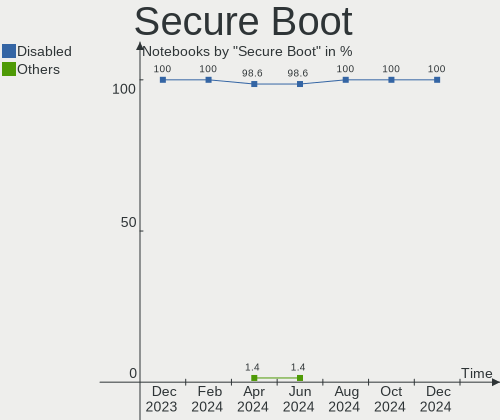
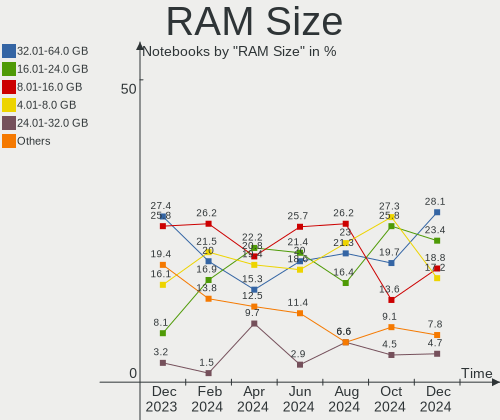
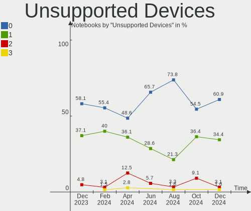

Manjaro Hardware Trends (Notebooks)
-----------------------------------

A project to identify most popular hardware characteristics and track their change
over time based on data collected by Manjaro users at https://Linux-Hardware.org.

Anyone can contribute to this report by the [hw-probe](https://github.com/linuxhw/hw-probe) tool:

    sudo -E hw-probe -all -upload

Full-feature report is available here: https://linux-hardware.org/?view=trends

Period: Dec, 2021.

Contents
--------

* [ System ](#system)
  - [ OS                       ](#os)
  - [ OS Family                ](#os-family)
  - [ Kernel                   ](#kernel)
  - [ Kernel Family            ](#kernel-family)
  - [ Kernel Major Ver.        ](#kernel-major-ver)
  - [ Arch                     ](#arch)
  - [ DE                       ](#de)
  - [ Display Server           ](#display-server)
  - [ Display Manager          ](#display-manager)
  - [ OS Lang                  ](#os-lang)
  - [ Boot Mode                ](#boot-mode)
  - [ Filesystem               ](#filesystem)
  - [ Part. scheme             ](#part-scheme)
  - [ Dual Boot with Linux/BSD ](#dual-boot-with-linuxbsd)
  - [ Dual Boot (Win)          ](#dual-boot-win)

* [ Board ](#board)
  - [ Vendor                   ](#vendor)
  - [ Model                    ](#model)
  - [ Model Family             ](#model-family)
  - [ MFG Year                 ](#mfg-year)
  - [ Form Factor              ](#form-factor)
  - [ Secure Boot              ](#secure-boot)
  - [ Coreboot                 ](#coreboot)
  - [ RAM Size                 ](#ram-size)
  - [ RAM Used                 ](#ram-used)
  - [ Total Drives             ](#total-drives)
  - [ Has CD-ROM               ](#has-cd-rom)
  - [ Has Ethernet             ](#has-ethernet)
  - [ Has WiFi                 ](#has-wifi)
  - [ Has Bluetooth            ](#has-bluetooth)

* [ Location ](#location)
  - [ Country                  ](#country)
  - [ City                     ](#city)

* [ Drives ](#drives)
  - [ Drive Vendor             ](#drive-vendor)
  - [ Drive Model              ](#drive-model)
  - [ HDD Vendor               ](#hdd-vendor)
  - [ SSD Vendor               ](#ssd-vendor)
  - [ Drive Kind               ](#drive-kind)
  - [ Drive Connector          ](#drive-connector)
  - [ Drive Size               ](#drive-size)
  - [ Space Total              ](#space-total)
  - [ Space Used               ](#space-used)
  - [ Malfunc. Drives          ](#malfunc-drives)
  - [ Malfunc. Drive Vendor    ](#malfunc-drive-vendor)
  - [ Malfunc. HDD Vendor      ](#malfunc-hdd-vendor)
  - [ Malfunc. Drive Kind      ](#malfunc-drive-kind)
  - [ Failed Drives            ](#failed-drives)
  - [ Failed Drive Vendor      ](#failed-drive-vendor)
  - [ Drive Status             ](#drive-status)

* [ Storage controller ](#storage-controller)
  - [ Storage Vendor           ](#storage-vendor)
  - [ Storage Model            ](#storage-model)
  - [ Storage Kind             ](#storage-kind)

* [ Processor ](#processor)
  - [ CPU Vendor               ](#cpu-vendor)
  - [ CPU Model                ](#cpu-model)
  - [ CPU Model Family         ](#cpu-model-family)
  - [ CPU Cores                ](#cpu-cores)
  - [ CPU Sockets              ](#cpu-sockets)
  - [ CPU Threads              ](#cpu-threads)
  - [ CPU Op-Modes             ](#cpu-op-modes)
  - [ CPU Microcode            ](#cpu-microcode)
  - [ CPU Microarch            ](#cpu-microarch)

* [ Graphics ](#graphics)
  - [ GPU Vendor               ](#gpu-vendor)
  - [ GPU Model                ](#gpu-model)
  - [ GPU Combo                ](#gpu-combo)
  - [ GPU Driver               ](#gpu-driver)
  - [ GPU Memory               ](#gpu-memory)

* [ Monitor ](#monitor)
  - [ Monitor Vendor           ](#monitor-vendor)
  - [ Monitor Model            ](#monitor-model)
  - [ Monitor Resolution       ](#monitor-resolution)
  - [ Monitor Diagonal         ](#monitor-diagonal)
  - [ Monitor Width            ](#monitor-width)
  - [ Aspect Ratio             ](#aspect-ratio)
  - [ Monitor Area             ](#monitor-area)
  - [ Pixel Density            ](#pixel-density)
  - [ Multiple Monitors        ](#multiple-monitors)

* [ Network ](#network)
  - [ Net Controller Vendor    ](#net-controller-vendor)
  - [ Net Controller Model     ](#net-controller-model)
  - [ Wireless Vendor          ](#wireless-vendor)
  - [ Wireless Model           ](#wireless-model)
  - [ Ethernet Vendor          ](#ethernet-vendor)
  - [ Ethernet Model           ](#ethernet-model)
  - [ Net Controller Kind      ](#net-controller-kind)
  - [ Used Controller          ](#used-controller)
  - [ NICs                     ](#nics)
  - [ IPv6                     ](#ipv6)

* [ Bluetooth ](#bluetooth)
  - [ Bluetooth Vendor         ](#bluetooth-vendor)
  - [ Bluetooth Model          ](#bluetooth-model)

* [ Sound ](#sound)
  - [ Sound Vendor             ](#sound-vendor)
  - [ Sound Model              ](#sound-model)

* [ Memory ](#memory)
  - [ Memory Vendor            ](#memory-vendor)
  - [ Memory Model             ](#memory-model)
  - [ Memory Kind              ](#memory-kind)
  - [ Memory Form Factor       ](#memory-form-factor)
  - [ Memory Size              ](#memory-size)
  - [ Memory Speed             ](#memory-speed)

* [ Printers & scanners ](#printers--scanners)
  - [ Printer Vendor           ](#printer-vendor)
  - [ Printer Model            ](#printer-model)
  - [ Scanner Vendor           ](#scanner-vendor)
  - [ Scanner Model            ](#scanner-model)

* [ Camera ](#camera)
  - [ Camera Vendor            ](#camera-vendor)
  - [ Camera Model             ](#camera-model)

* [ Security ](#security)
  - [ Fingerprint Vendor       ](#fingerprint-vendor)
  - [ Fingerprint Model        ](#fingerprint-model)
  - [ Chipcard Vendor          ](#chipcard-vendor)
  - [ Chipcard Model           ](#chipcard-model)

* [ Unsupported ](#unsupported)
  - [ Unsupported Devices      ](#unsupported-devices)
  - [ Unsupported Device Types ](#unsupported-device-types)

System
------

OS
--

Installed operating systems

| Name             | Notebooks | Percent |
|------------------|-----------|---------|
| Manjaro 21.2.0   | 37        | 40.22%  |
| Manjaro          | 35        | 38.04%  |
| Manjaro 21.2rc   | 14        | 15.22%  |
| Manjaro 21.2rc1  | 3         | 3.26%   |
| Manjaro 21.1.6   | 2         | 2.17%   |
| Manjaro 21.2pre1 | 1         | 1.09%   |

OS Family
---------

OS without a version

| Name    | Notebooks | Percent |
|---------|-----------|---------|
| Manjaro | 92        | 100%    |

Kernel
------

Version of the Linux kernel

| Version               | Notebooks | Percent |
|-----------------------|-----------|---------|
| 5.13.19-2-MANJARO     | 21        | 22.83%  |
| 5.15.7-1-MANJARO      | 20        | 21.74%  |
| 5.15.6-2-MANJARO      | 14        | 15.22%  |
| 5.10.84-1-MANJARO     | 9         | 9.78%   |
| 5.15.2-2-MANJARO      | 4         | 4.35%   |
| 5.10.79-1-MANJARO     | 4         | 4.35%   |
| 5.16.0-1-MANJARO      | 3         | 3.26%   |
| 5.15.5-1-rt22-MANJARO | 3         | 3.26%   |
| 5.10.83-1-MANJARO     | 3         | 3.26%   |
| 5.4.164-1-MANJARO     | 2         | 2.17%   |
| 5.14.21-2-MANJARO     | 2         | 2.17%   |
| 5.14.18-1-MANJARO     | 2         | 2.17%   |
| 5.9.16-1-MANJARO      | 1         | 1.09%   |
| 5.15.2-1-rt19-MANJARO | 1         | 1.09%   |
| 5.15.11-1-MANJARO     | 1         | 1.09%   |
| 5.11.22-2-MANJARO     | 1         | 1.09%   |
| 4.19.217-1-MANJARO    | 1         | 1.09%   |

Kernel Family
-------------

Linux kernel without a distro release

| Version  | Notebooks | Percent |
|----------|-----------|---------|
| 5.13.19  | 21        | 22.83%  |
| 5.15.7   | 20        | 21.74%  |
| 5.15.6   | 14        | 15.22%  |
| 5.10.84  | 9         | 9.78%   |
| 5.15.2   | 5         | 5.43%   |
| 5.10.79  | 4         | 4.35%   |
| 5.16.0   | 3         | 3.26%   |
| 5.15.5   | 3         | 3.26%   |
| 5.10.83  | 3         | 3.26%   |
| 5.4.164  | 2         | 2.17%   |
| 5.14.21  | 2         | 2.17%   |
| 5.14.18  | 2         | 2.17%   |
| 5.9.16   | 1         | 1.09%   |
| 5.15.11  | 1         | 1.09%   |
| 5.11.22  | 1         | 1.09%   |
| 4.19.217 | 1         | 1.09%   |

Kernel Major Ver.
-----------------

Linux kernel major version

| Version | Notebooks | Percent |
|---------|-----------|---------|
| 5.15    | 43        | 46.74%  |
| 5.13    | 21        | 22.83%  |
| 5.10    | 16        | 17.39%  |
| 5.14    | 4         | 4.35%   |
| 5.16    | 3         | 3.26%   |
| 5.4     | 2         | 2.17%   |
| 5.9     | 1         | 1.09%   |
| 5.11    | 1         | 1.09%   |
| 4.19    | 1         | 1.09%   |

Arch
----

OS architecture (x86_64, i586, etc.)

| Name   | Notebooks | Percent |
|--------|-----------|---------|
| x86_64 | 92        | 100%    |

DE
--

Desktop Environment

| Name       | Notebooks | Percent |
|------------|-----------|---------|
| KDE5       | 35        | 38.04%  |
| GNOME      | 25        | 27.17%  |
| XFCE       | 24        | 26.09%  |
| i3         | 4         | 4.35%   |
| Unknown    | 3         | 3.26%   |
| X-Cinnamon | 1         | 1.09%   |

Display Server
--------------

X11 or Wayland

| Name    | Notebooks | Percent |
|---------|-----------|---------|
| X11     | 79        | 85.87%  |
| Wayland | 11        | 11.96%  |
| Unknown | 2         | 2.17%   |

Display Manager
---------------

SDDM, LightDM, etc.

| Name    | Notebooks | Percent |
|---------|-----------|---------|
| Unknown | 35        | 38.04%  |
| LightDM | 21        | 22.83%  |
| GDM     | 20        | 21.74%  |
| SDDM    | 16        | 17.39%  |

OS Lang
-------

Language

| Lang    | Notebooks | Percent |
|---------|-----------|---------|
| en_US   | 42        | 45.65%  |
| de_DE   | 10        | 10.87%  |
| pt_BR   | 7         | 7.61%   |
| ru_RU   | 5         | 5.43%   |
| en_GB   | 5         | 5.43%   |
| fr_FR   | 3         | 3.26%   |
| en_AU   | 3         | 3.26%   |
| zh_CN   | 2         | 2.17%   |
| sv_SE   | 2         | 2.17%   |
| es_ES   | 2         | 2.17%   |
| en_CA   | 2         | 2.17%   |
| pl_PL   | 1         | 1.09%   |
| nl_NL   | 1         | 1.09%   |
| nb_NO   | 1         | 1.09%   |
| it_IT   | 1         | 1.09%   |
| es_PE   | 1         | 1.09%   |
| es_MX   | 1         | 1.09%   |
| en_IN   | 1         | 1.09%   |
| en_DE   | 1         | 1.09%   |
| Unknown | 1         | 1.09%   |

Boot Mode
---------

EFI or BIOS

| Mode | Notebooks | Percent |
|------|-----------|---------|
| BIOS | 56        | 60.87%  |
| EFI  | 36        | 39.13%  |

Filesystem
----------

Type of filesystem

| Type    | Notebooks | Percent |
|---------|-----------|---------|
| Ext4    | 81        | 88.04%  |
| Btrfs   | 7         | 7.61%   |
| Tmpfs   | 2         | 2.17%   |
| Xfs     | 1         | 1.09%   |
| Overlay | 1         | 1.09%   |

Part. scheme
------------

Scheme of partitioning

| Type    | Notebooks | Percent |
|---------|-----------|---------|
| Unknown | 54        | 58.7%   |
| GPT     | 36        | 39.13%  |
| MBR     | 2         | 2.17%   |

Dual Boot with Linux/BSD
------------------------

Hosting more than one Linux/BSD

| Dual boot | Notebooks | Percent |
|-----------|-----------|---------|
| No        | 84        | 91.3%   |
| Yes       | 8         | 8.7%    |

Dual Boot (Win)
---------------

Hosting Linux and Windows

| Dual boot | Notebooks | Percent |
|-----------|-----------|---------|
| No        | 72        | 78.26%  |
| Yes       | 20        | 21.74%  |

Board
-----

Vendor
------

Motherboard manufacturer

| Name                  | Notebooks | Percent |
|-----------------------|-----------|---------|
| Lenovo                | 17        | 18.48%  |
| Dell                  | 17        | 18.48%  |
| Acer                  | 13        | 14.13%  |
| Hewlett-Packard       | 11        | 11.96%  |
| ASUSTek Computer      | 9         | 9.78%   |
| Toshiba               | 4         | 4.35%   |
| MSI                   | 4         | 4.35%   |
| Timi                  | 2         | 2.17%   |
| Schenker              | 2         | 2.17%   |
| Samsung Electronics   | 2         | 2.17%   |
| Fujitsu               | 2         | 2.17%   |
| Apple                 | 2         | 2.17%   |
| UNIQCELL              | 1         | 1.09%   |
| Sony                  | 1         | 1.09%   |
| Schenker Technologies | 1         | 1.09%   |
| Packard Bell          | 1         | 1.09%   |
| Google                | 1         | 1.09%   |
| AMI                   | 1         | 1.09%   |
| Alienware             | 1         | 1.09%   |

Model
-----

Motherboard model

| Name                                     | Notebooks | Percent |
|------------------------------------------|-----------|---------|
| Lenovo ThinkBook 15-IIL 20SM             | 2         | 2.17%   |
| Lenovo G50-80 80E5                       | 2         | 2.17%   |
| UNIQCELL Q15.6                           | 1         | 1.09%   |
| Toshiba Satellite P850                   | 1         | 1.09%   |
| Toshiba Satellite L50-B                  | 1         | 1.09%   |
| Toshiba Satellite C855D                  | 1         | 1.09%   |
| Toshiba PORTEGE Z30-A                    | 1         | 1.09%   |
| Timi RedmiBook Pro 15                    | 1         | 1.09%   |
| Timi RedmiBook 16                        | 1         | 1.09%   |
| Sony SVS131290S                          | 1         | 1.09%   |
| Schenker XMG CORE 15(M20, RTX 2060)      | 1         | 1.09%   |
| Schenker XMG CORE (REN/E21)              | 1         | 1.09%   |
| Schenker VIA13                           | 1         | 1.09%   |
| Samsung 900X3G                           | 1         | 1.09%   |
| Samsung 270E5G/270E5U                    | 1         | 1.09%   |
| Packard Bell EasyNote TE69HW             | 1         | 1.09%   |
| MSI GS70 6QE                             | 1         | 1.09%   |
| MSI GL65 Leopard 9SCXR                   | 1         | 1.09%   |
| MSI GE76 Raider 10UE                     | 1         | 1.09%   |
| MSI GE66 Raider 10SGS                    | 1         | 1.09%   |
| Lenovo V15 G2 ALC 82KD                   | 1         | 1.09%   |
| Lenovo ThinkPad X1 Nano Gen 1 20UN002GGE | 1         | 1.09%   |
| Lenovo ThinkPad T580 20LAS2BH00          | 1         | 1.09%   |
| Lenovo ThinkPad T490s 20NYS1XK00         | 1         | 1.09%   |
| Lenovo ThinkPad T14 Gen 1 20S0S2NH00     | 1         | 1.09%   |
| Lenovo ThinkPad L390 20NR0013SP          | 1         | 1.09%   |
| Lenovo ThinkPad E15 Gen 2 20T9S0B500     | 1         | 1.09%   |
| Lenovo Legion 5 Pro 16ACH6H 82JQ         | 1         | 1.09%   |
| Lenovo IdeaPad S145-15IIL 82DJ           | 1         | 1.09%   |
| Lenovo IdeaPad 5 Pro 14ACN6 82L7         | 1         | 1.09%   |
| Lenovo IdeaPad 5 15ITL05 82FG            | 1         | 1.09%   |
| Lenovo IdeaPad 3 15ITL05 81X8            | 1         | 1.09%   |
| Lenovo G460 20041                        | 1         | 1.09%   |
| HP ZBook 15                              | 1         | 1.09%   |
| HP ZBook 14                              | 1         | 1.09%   |
| HP Pavilion Gaming Laptop 15-ec1xxx      | 1         | 1.09%   |
| HP Pavilion g6                           | 1         | 1.09%   |
| HP OMEN Laptop 15-en0xxx                 | 1         | 1.09%   |
| HP OMEN Laptop 15-ek0xxx                 | 1         | 1.09%   |
| HP Notebook                              | 1         | 1.09%   |
| HP Laptop 15s-eq2xxx                     | 1         | 1.09%   |
| HP EliteBook 8560p                       | 1         | 1.09%   |
| HP EliteBook 8440p                       | 1         | 1.09%   |
| HP Compaq 6730b (NB021EA#ABB)            | 1         | 1.09%   |
| Google Edgar                             | 1         | 1.09%   |
| Fujitsu LIFEBOOK U7510                   | 1         | 1.09%   |
| Fujitsu LIFEBOOK NH532                   | 1         | 1.09%   |
| Dell XPS 13 9343                         | 1         | 1.09%   |
| Dell XPS 13 9310                         | 1         | 1.09%   |
| Dell XPS 13 7390                         | 1         | 1.09%   |
| Dell Vostro 5471                         | 1         | 1.09%   |
| Dell Vostro 5402                         | 1         | 1.09%   |
| Dell Vostro 3480                         | 1         | 1.09%   |
| Dell Precision M4700                     | 1         | 1.09%   |
| Dell Precision M3800                     | 1         | 1.09%   |
| Dell Latitude XT3                        | 1         | 1.09%   |
| Dell Latitude E7470                      | 1         | 1.09%   |
| Dell Latitude D830                       | 1         | 1.09%   |
| Dell Latitude D630                       | 1         | 1.09%   |
| Dell Inspiron 7572                       | 1         | 1.09%   |

Model Family
------------

Motherboard model prefix

| Name                  | Notebooks | Percent |
|-----------------------|-----------|---------|
| Acer Aspire           | 10        | 10.87%  |
| Lenovo ThinkPad       | 6         | 6.52%   |
| Dell Inspiron         | 5         | 5.43%   |
| Lenovo IdeaPad        | 4         | 4.35%   |
| Dell Latitude         | 4         | 4.35%   |
| Toshiba Satellite     | 3         | 3.26%   |
| Dell XPS              | 3         | 3.26%   |
| Dell Vostro           | 3         | 3.26%   |
| ASUS VivoBook         | 3         | 3.26%   |
| ASUS ROG              | 3         | 3.26%   |
| Timi RedmiBook        | 2         | 2.17%   |
| Schenker XMG          | 2         | 2.17%   |
| Lenovo ThinkBook      | 2         | 2.17%   |
| Lenovo G50-80         | 2         | 2.17%   |
| HP ZBook              | 2         | 2.17%   |
| HP Pavilion           | 2         | 2.17%   |
| HP OMEN               | 2         | 2.17%   |
| HP EliteBook          | 2         | 2.17%   |
| Fujitsu LIFEBOOK      | 2         | 2.17%   |
| Dell Precision        | 2         | 2.17%   |
| UNIQCELL Q15.6        | 1         | 1.09%   |
| Toshiba PORTEGE       | 1         | 1.09%   |
| Sony SVS131290S       | 1         | 1.09%   |
| Schenker VIA13        | 1         | 1.09%   |
| Samsung 900X3G        | 1         | 1.09%   |
| Samsung 270E5G        | 1         | 1.09%   |
| Packard Bell EasyNote | 1         | 1.09%   |
| MSI GS70              | 1         | 1.09%   |
| MSI GL65              | 1         | 1.09%   |
| MSI GE76              | 1         | 1.09%   |
| MSI GE66              | 1         | 1.09%   |
| Lenovo V15            | 1         | 1.09%   |
| Lenovo Legion         | 1         | 1.09%   |
| Lenovo G460           | 1         | 1.09%   |
| HP Notebook           | 1         | 1.09%   |
| HP Laptop             | 1         | 1.09%   |
| HP Compaq             | 1         | 1.09%   |
| Google Edgar          | 1         | 1.09%   |
| ASUS ZenBook          | 1         | 1.09%   |
| ASUS N551JW           | 1         | 1.09%   |
| ASUS ASUS             | 1         | 1.09%   |
| Apple MacBook8        | 1         | 1.09%   |
| Apple MacBook3        | 1         | 1.09%   |
| AMI Intel             | 1         | 1.09%   |
| Alienware M17xR3      | 1         | 1.09%   |
| Acer Swift            | 1         | 1.09%   |
| Acer Nitro            | 1         | 1.09%   |
| Unknown               | 1         | 1.09%   |

MFG Year
--------

Motherboard manufacture year

| Year | Notebooks | Percent |
|------|-----------|---------|
| 2021 | 33        | 35.87%  |
| 2020 | 14        | 15.22%  |
| 2019 | 9         | 9.78%   |
| 2018 | 7         | 7.61%   |
| 2013 | 5         | 5.43%   |
| 2011 | 5         | 5.43%   |
| 2015 | 4         | 4.35%   |
| 2012 | 4         | 4.35%   |
| 2016 | 3         | 3.26%   |
| 2014 | 3         | 3.26%   |
| 2009 | 2         | 2.17%   |
| 2017 | 1         | 1.09%   |
| 2008 | 1         | 1.09%   |
| 2007 | 1         | 1.09%   |

Form Factor
-----------

Physical design of the computer

| Name     | Notebooks | Percent |
|----------|-----------|---------|
| Notebook | 92        | 100%    |

Secure Boot
-----------

Enabled or disabled

| State    | Notebooks | Percent |
|----------|-----------|---------|
| Disabled | 92        | 100%    |

Coreboot
--------

Have coreboot on board

| Used | Notebooks | Percent |
|------|-----------|---------|
| No   | 91        | 98.91%  |
| Yes  | 1         | 1.09%   |

RAM Size
--------

Total RAM memory

| Size in GB  | Notebooks | Percent |
|-------------|-----------|---------|
| 4.01-8.0    | 26        | 28.26%  |
| 8.01-16.0   | 26        | 28.26%  |
| 16.01-24.0  | 16        | 17.39%  |
| 3.01-4.0    | 12        | 13.04%  |
| 32.01-64.0  | 7         | 7.61%   |
| 2.01-3.0    | 2         | 2.17%   |
| 1.01-2.0    | 2         | 2.17%   |
| 64.01-256.0 | 1         | 1.09%   |

RAM Used
--------

Used RAM memory

| Used GB    | Notebooks | Percent |
|------------|-----------|---------|
| 1.01-2.0   | 29        | 31.52%  |
| 2.01-3.0   | 21        | 22.83%  |
| 3.01-4.0   | 18        | 19.57%  |
| 4.01-8.0   | 15        | 16.3%   |
| 8.01-16.0  | 4         | 4.35%   |
| 0.51-1.0   | 4         | 4.35%   |
| 24.01-32.0 | 1         | 1.09%   |

Total Drives
------------

Number of drives on board

| Drives | Notebooks | Percent |
|--------|-----------|---------|
| 1      | 60        | 65.22%  |
| 2      | 31        | 33.7%   |
| 3      | 1         | 1.09%   |

Has CD-ROM
----------

Has CD-ROM on board

| Presented | Notebooks | Percent |
|-----------|-----------|---------|
| No        | 71        | 77.17%  |
| Yes       | 21        | 22.83%  |

Has Ethernet
------------

Has Ethernet on board

| Presented | Notebooks | Percent |
|-----------|-----------|---------|
| Yes       | 71        | 77.17%  |
| No        | 21        | 22.83%  |

Has WiFi
--------

Has WiFi module

| Presented | Notebooks | Percent |
|-----------|-----------|---------|
| Yes       | 92        | 100%    |

Has Bluetooth
-------------

Has Bluetooth module

| Presented | Notebooks | Percent |
|-----------|-----------|---------|
| Yes       | 75        | 81.52%  |
| No        | 17        | 18.48%  |

Location
--------

Country
-------

Geographic location (country)

| Country      | Notebooks | Percent |
|--------------|-----------|---------|
| USA          | 14        | 15.22%  |
| Germany      | 14        | 15.22%  |
| Brazil       | 9         | 9.78%   |
| Russia       | 5         | 5.43%   |
| Spain        | 4         | 4.35%   |
| France       | 4         | 4.35%   |
| Poland       | 3         | 3.26%   |
| Canada       | 3         | 3.26%   |
| Australia    | 3         | 3.26%   |
| Ukraine      | 2         | 2.17%   |
| Sweden       | 2         | 2.17%   |
| Norway       | 2         | 2.17%   |
| Mexico       | 2         | 2.17%   |
| India        | 2         | 2.17%   |
| China        | 2         | 2.17%   |
| Bulgaria     | 2         | 2.17%   |
| Venezuela    | 1         | 1.09%   |
| Uzbekistan   | 1         | 1.09%   |
| UK           | 1         | 1.09%   |
| Switzerland  | 1         | 1.09%   |
| Sri Lanka    | 1         | 1.09%   |
| Saudi Arabia | 1         | 1.09%   |
| Peru         | 1         | 1.09%   |
| Netherlands  | 1         | 1.09%   |
| Kenya        | 1         | 1.09%   |
| Japan        | 1         | 1.09%   |
| Italy        | 1         | 1.09%   |
| Israel       | 1         | 1.09%   |
| Iran         | 1         | 1.09%   |
| Hungary      | 1         | 1.09%   |
| Egypt        | 1         | 1.09%   |
| Colombia     | 1         | 1.09%   |
| Belarus      | 1         | 1.09%   |
| Austria      | 1         | 1.09%   |
| Argentina    | 1         | 1.09%   |

City
----

Geographic location (city)

| City              | Notebooks | Percent |
|-------------------|-----------|---------|
| Barcelona         | 3         | 3.26%   |
| S??o Paulo        | 2         | 2.17%   |
| Mexico City       | 2         | 2.17%   |
| Zurich            | 1         | 1.09%   |
| Zhytomyr          | 1         | 1.09%   |
| Wrzesnia          | 1         | 1.09%   |
| Woodstock         | 1         | 1.09%   |
| Warsaw            | 1         | 1.09%   |
| Wake Forest       | 1         | 1.09%   |
| Vienna            | 1         | 1.09%   |
| Ulyanovsk         | 1         | 1.09%   |
| Toronto           | 1         | 1.09%   |
| Toftbyn           | 1         | 1.09%   |
| Thomasville       | 1         | 1.09%   |
| Tel Aviv          | 1         | 1.09%   |
| Tashkent          | 1         | 1.09%   |
| Sydney            | 1         | 1.09%   |
| Shanghai          | 1         | 1.09%   |
| Samoreau          | 1         | 1.09%   |
| Saint Paul        | 1         | 1.09%   |
| Rome              | 1         | 1.09%   |
| Rockville         | 1         | 1.09%   |
| Polikrayshte      | 1         | 1.09%   |
| Perth             | 1         | 1.09%   |
| Oslo              | 1         | 1.09%   |
| Osinovo           | 1         | 1.09%   |
| Ochsenfurt        | 1         | 1.09%   |
| Novosibirsk       | 1         | 1.09%   |
| Neuwied           | 1         | 1.09%   |
| Nairobi           | 1         | 1.09%   |
| Munich            | 1         | 1.09%   |
| Moscow            | 1         | 1.09%   |
| Minsk             | 1         | 1.09%   |
| Meerane           | 1         | 1.09%   |
| Maracaibo         | 1         | 1.09%   |
| Maplewood         | 1         | 1.09%   |
| Longmont          | 1         | 1.09%   |
| Long Beach        | 1         | 1.09%   |
| Lima              | 1         | 1.09%   |
| Lille             | 1         | 1.09%   |
| Lidaladdi         | 1         | 1.09%   |
| Landsberg am Lech | 1         | 1.09%   |
| La Jolla          | 1         | 1.09%   |
| Kristianstad      | 1         | 1.09%   |
| Krakow            | 1         | 1.09%   |
| Kolkata           | 1         | 1.09%   |
| Kharkiv           | 1         | 1.09%   |
| Khabarovsk        | 1         | 1.09%   |
| Kakogawa          | 1         | 1.09%   |
| Kailua            | 1         | 1.09%   |
| Kahr?«z           | 1         | 1.09%   |
| Jubail            | 1         | 1.09%   |
| Indaiatuba        | 1         | 1.09%   |
| Hyderabad         | 1         | 1.09%   |
| Horn              | 1         | 1.09%   |
| Hanover           | 1         | 1.09%   |
| Hamburg           | 1         | 1.09%   |
| Guaratingueta     | 1         | 1.09%   |
| Grosbliederstroff | 1         | 1.09%   |
| Greater Sudbury   | 1         | 1.09%   |

Drives
------

Drive Vendor
------------

Hard drive vendors

| Vendor              | Notebooks | Drives | Percent |
|---------------------|-----------|--------|---------|
| Samsung Electronics | 17        | 20     | 14.05%  |
| WDC                 | 14        | 14     | 11.57%  |
| Toshiba             | 10        | 10     | 8.26%   |
| SK Hynix            | 9         | 9      | 7.44%   |
| Seagate             | 9         | 10     | 7.44%   |
| Sandisk             | 9         | 10     | 7.44%   |
| Unknown             | 8         | 9      | 6.61%   |
| Crucial             | 6         | 6      | 4.96%   |
| Kingston            | 5         | 5      | 4.13%   |
| KIOXIA              | 4         | 4      | 3.31%   |
| HGST                | 4         | 4      | 3.31%   |
| Intel               | 3         | 4      | 2.48%   |
| Hitachi             | 3         | 3      | 2.48%   |
| A-DATA Technology   | 3         | 3      | 2.48%   |
| UMIS                | 2         | 2      | 1.65%   |
| Micron Technology   | 2         | 2      | 1.65%   |
| China               | 2         | 2      | 1.65%   |
| ADATA Technology    | 2         | 2      | 1.65%   |
| Vaseky              | 1         | 1      | 0.83%   |
| LITEONIT            | 1         | 1      | 0.83%   |
| LITEON              | 1         | 1      | 0.83%   |
| Leven               | 1         | 1      | 0.83%   |
| HS-SSD-C100         | 1         | 1      | 0.83%   |
| Hewlett-Packard     | 1         | 1      | 0.83%   |
| Gigabyte Technology | 1         | 1      | 0.83%   |
| Apple               | 1         | 1      | 0.83%   |
| Acer                | 1         | 1      | 0.83%   |

Drive Model
-----------

Hard drive models

| Model                                | Notebooks | Percent |
|--------------------------------------|-----------|---------|
| Toshiba MQ04ABF100 1TB               | 4         | 3.15%   |
| Samsung NVMe SSD Drive 1TB           | 4         | 3.15%   |
| Sandisk NVMe SSD Drive 512GB         | 3         | 2.36%   |
| HGST HTS721010A9E630 1TB             | 3         | 2.36%   |
| Unknown SD/MMC/MS PRO 7GB            | 2         | 1.57%   |
| Unknown MMC Card  32GB               | 2         | 1.57%   |
| UMIS RPJTJ256MEE1OWX 256GB           | 2         | 1.57%   |
| SK Hynix NVMe SSD Drive 512GB        | 2         | 1.57%   |
| SK Hynix NVMe SSD Drive 256GB        | 2         | 1.57%   |
| SK Hynix NVMe SSD Drive 128GB        | 2         | 1.57%   |
| Seagate ST500LT012-1DG142 500GB      | 2         | 1.57%   |
| Sandisk NVMe SSD Drive 1TB           | 2         | 1.57%   |
| Samsung NVMe SSD Drive 500GB         | 2         | 1.57%   |
| Samsung NVMe SSD Drive 256GB         | 2         | 1.57%   |
| Samsung MZALQ512HALU-000L2 512GB     | 2         | 1.57%   |
| KIOXIA NVMe SSD Drive 512GB          | 2         | 1.57%   |
| Kingston SA400S37120G 120GB SSD      | 2         | 1.57%   |
| China SSD 128GB                      | 2         | 1.57%   |
| WDC WDS120G1G0B-00RC30 120GB SSD     | 1         | 0.79%   |
| WDC WDS100T2B0B 1TB SSD              | 1         | 0.79%   |
| WDC WD7500BPVT-22HXZT3 752GB         | 1         | 0.79%   |
| WDC WD5000LPVX-75V0TT0 500GB         | 1         | 0.79%   |
| WDC WD5000LPLX-08ZNTT0 500GB         | 1         | 0.79%   |
| WDC WD10SPZX-75Z10T1 1TB             | 1         | 0.79%   |
| WDC WD10SPZX-24Z10 1TB               | 1         | 0.79%   |
| WDC WD10SPZX-21Z10T0 1TB             | 1         | 0.79%   |
| WDC WD10S21X-24R1BT0-SSHD-8GB        | 1         | 0.79%   |
| WDC PC SN730 SDBPNTY-512G-1006 512GB | 1         | 0.79%   |
| WDC PC SN730 SDBPNTY-1T00-1032 1TB   | 1         | 0.79%   |
| WDC PC SN730 NVMe 512GB              | 1         | 0.79%   |
| WDC PC SN530 SDBPNPZ-512G-1032 512GB | 1         | 0.79%   |
| WDC PC SN530 SDBPMPZ-256G-1001 256GB | 1         | 0.79%   |
| Vaseky V800/128G 128GB               | 1         | 0.79%   |
| Unknown SF128  128GB                 | 1         | 0.79%   |
| Unknown SD32G  32GB                  | 1         | 0.79%   |
| Unknown MMC Card  8GB                | 1         | 0.79%   |
| Unknown MMC Card  393GB              | 1         | 0.79%   |
| Unknown MMC Card  128GB              | 1         | 0.79%   |
| Toshiba THNS064GE4BBDC 64GB SSD      | 1         | 0.79%   |
| Toshiba MQ01ACF050 500GB             | 1         | 0.79%   |
| Toshiba MQ01ABD075 752GB             | 1         | 0.79%   |
| Toshiba MQ01ABD050 500GB             | 1         | 0.79%   |
| Toshiba MK5076GSX 500GB              | 1         | 0.79%   |
| Toshiba MK3276GSX 320GB              | 1         | 0.79%   |
| SK Hynix NVMe SSD Drive 1TB          | 1         | 0.79%   |
| SK Hynix NVMe SSD Drive 1024GB       | 1         | 0.79%   |
| SK Hynix HFM512GDJTNG-8310A 512GB    | 1         | 0.79%   |
| Seagate ST9750420AS 752GB            | 1         | 0.79%   |
| Seagate ST9320328CS 320GB            | 1         | 0.79%   |
| Seagate ST9320325AS 320GB            | 1         | 0.79%   |
| Seagate ST1000LM035-1RK172 1TB       | 1         | 0.79%   |
| Seagate ST1000LM024 HN-M101MBB 1TB   | 1         | 0.79%   |
| Seagate One Touch HDD 4TB            | 1         | 0.79%   |
| Seagate Expansion 1TB                | 1         | 0.79%   |
| Seagate BUP Slim RD 2TB              | 1         | 0.79%   |
| SanDisk SDSSDH3 500G                 | 1         | 0.79%   |
| SanDisk SD6SB1M-256G-1006 256GB SSD  | 1         | 0.79%   |
| Sandisk NVMe SSD Drive 256GB         | 1         | 0.79%   |
| SanDisk DF4064  64GB                 | 1         | 0.79%   |
| Samsung SSD SM841 mSATA 128GB        | 1         | 0.79%   |

HDD Vendor
----------

Hard disk drive vendors

| Vendor  | Notebooks | Drives | Percent |
|---------|-----------|--------|---------|
| Toshiba | 9         | 9      | 26.47%  |
| Seagate | 9         | 10     | 26.47%  |
| WDC     | 7         | 7      | 20.59%  |
| HGST    | 4         | 4      | 11.76%  |
| Hitachi | 3         | 3      | 8.82%   |
| Unknown | 2         | 2      | 5.88%   |

SSD Vendor
----------

Solid state drive vendors

| Vendor              | Notebooks | Drives | Percent |
|---------------------|-----------|--------|---------|
| Samsung Electronics | 7         | 7      | 20%     |
| Crucial             | 6         | 6      | 17.14%  |
| Kingston            | 5         | 5      | 14.29%  |
| WDC                 | 2         | 2      | 5.71%   |
| SanDisk             | 2         | 2      | 5.71%   |
| China               | 2         | 2      | 5.71%   |
| Vaseky              | 1         | 1      | 2.86%   |
| Toshiba             | 1         | 1      | 2.86%   |
| Micron Technology   | 1         | 1      | 2.86%   |
| LITEONIT            | 1         | 1      | 2.86%   |
| LITEON              | 1         | 1      | 2.86%   |
| Leven               | 1         | 1      | 2.86%   |
| HS-SSD-C100         | 1         | 1      | 2.86%   |
| Hewlett-Packard     | 1         | 1      | 2.86%   |
| Gigabyte Technology | 1         | 1      | 2.86%   |
| Acer                | 1         | 1      | 2.86%   |
| A-DATA Technology   | 1         | 1      | 2.86%   |

Drive Kind
----------

HDD or SSD

| Kind | Notebooks | Drives | Percent |
|------|-----------|--------|---------|
| NVMe | 44        | 50     | 37.61%  |
| SSD  | 35        | 35     | 29.91%  |
| HDD  | 31        | 35     | 26.5%   |
| MMC  | 7         | 8      | 5.98%   |

Drive Connector
---------------

SATA, SAS, NVMe, etc.

| Type | Notebooks | Drives | Percent |
|------|-----------|--------|---------|
| SATA | 56        | 64     | 49.56%  |
| NVMe | 44        | 50     | 38.94%  |
| MMC  | 7         | 8      | 6.19%   |
| SAS  | 6         | 6      | 5.31%   |

Drive Size
----------

Size of hard drive

| Size in TB | Notebooks | Drives | Percent |
|------------|-----------|--------|---------|
| 0.01-0.5   | 45        | 46     | 66.18%  |
| 0.51-1.0   | 21        | 22     | 30.88%  |
| 3.01-4.0   | 1         | 1      | 1.47%   |
| 1.01-2.0   | 1         | 1      | 1.47%   |

Space Total
-----------

Amount of disk space available on the file system

| Size in GB     | Notebooks | Percent |
|----------------|-----------|---------|
| 101-250        | 27        | 29.35%  |
| 251-500        | 21        | 22.83%  |
| 501-1000       | 16        | 17.39%  |
| Unknown        | 10        | 10.87%  |
| 1001-2000      | 7         | 7.61%   |
| 51-100         | 6         | 6.52%   |
| 1-20           | 2         | 2.17%   |
| More than 3000 | 1         | 1.09%   |
| 21-50          | 1         | 1.09%   |
| 2001-3000      | 1         | 1.09%   |

Space Used
----------

Amount of used disk space

| Used GB  | Notebooks | Percent |
|----------|-----------|---------|
| 21-50    | 22        | 23.91%  |
| 1-20     | 21        | 22.83%  |
| 51-100   | 13        | 14.13%  |
| Unknown  | 10        | 10.87%  |
| 101-250  | 9         | 9.78%   |
| 251-500  | 8         | 8.7%    |
| 501-1000 | 8         | 8.7%    |
| 0        | 1         | 1.09%   |

Malfunc. Drives
---------------

Drive models with a malfunction

| Model                     | Notebooks | Drives | Percent |
|---------------------------|-----------|--------|---------|
| Seagate ST9320328CS 320GB | 1         | 1      | 100%    |

Malfunc. Drive Vendor
---------------------

Vendors of faulty drives

| Vendor  | Notebooks | Drives | Percent |
|---------|-----------|--------|---------|
| Seagate | 1         | 1      | 100%    |

Malfunc. HDD Vendor
-------------------

Vendors of faulty HDD drives

| Vendor  | Notebooks | Drives | Percent |
|---------|-----------|--------|---------|
| Seagate | 1         | 1      | 100%    |

Malfunc. Drive Kind
-------------------

Kinds of faulty drives

| Kind | Notebooks | Drives | Percent |
|------|-----------|--------|---------|
| HDD  | 1         | 1      | 100%    |

Failed Drives
-------------

Failed drive models

Zero info for selected period =(

Failed Drive Vendor
-------------------

Failed drive vendors

Zero info for selected period =(

Drive Status
------------

Number of failed and malfunc. drives

| Status   | Notebooks | Drives | Percent |
|----------|-----------|--------|---------|
| Detected | 75        | 99     | 75%     |
| Works    | 24        | 28     | 24%     |
| Malfunc  | 1         | 1      | 1%      |

Storage controller
------------------

Storage Vendor
--------------

Storage controller vendors

| Vendor                  | Notebooks | Percent |
|-------------------------|-----------|---------|
| Intel                   | 57        | 50.89%  |
| AMD                     | 13        | 11.61%  |
| Sandisk                 | 11        | 9.82%   |
| Samsung Electronics     | 11        | 9.82%   |
| SK Hynix                | 9         | 8.04%   |
| KIOXIA                  | 4         | 3.57%   |
| ADATA Technology        | 3         | 2.68%   |
| Union Memory (Shenzhen) | 2         | 1.79%   |
| Micron Technology       | 1         | 0.89%   |
| Apple                   | 1         | 0.89%   |

Storage Model
-------------

Storage controller models

| Model                                                                            | Notebooks | Percent |
|----------------------------------------------------------------------------------|-----------|---------|
| AMD FCH SATA Controller [AHCI mode]                                              | 13        | 10.83%  |
| Sandisk WD Black SN750 / PC SN730 NVMe SSD                                       | 6         | 5%      |
| Samsung NVMe SSD Controller SM981/PM981/PM983                                    | 6         | 5%      |
| Intel 82801 Mobile SATA Controller [RAID mode]                                   | 6         | 5%      |
| Intel 7 Series Chipset Family 6-port SATA Controller [AHCI mode]                 | 6         | 5%      |
| Samsung NVMe SSD Controller 980                                                  | 5         | 4.17%   |
| Intel Volume Management Device NVMe RAID Controller                              | 5         | 4.17%   |
| Intel 8 Series SATA Controller 1 [AHCI mode]                                     | 5         | 4.17%   |
| SK Hynix BC501 NVMe Solid State Drive                                            | 4         | 3.33%   |
| KIOXIA Non-Volatile memory controller                                            | 4         | 3.33%   |
| Intel Tiger Lake-LP SATA Controller [AHCI mode]                                  | 4         | 3.33%   |
| Intel Sunrise Point-LP SATA Controller [AHCI mode]                               | 4         | 3.33%   |
| Intel 6 Series/C200 Series Chipset Family 6 port Mobile SATA AHCI Controller     | 4         | 3.33%   |
| Intel Wildcat Point-LP SATA Controller [AHCI Mode]                               | 3         | 2.5%    |
| Intel Ice Lake-LP SATA Controller [AHCI mode]                                    | 3         | 2.5%    |
| Intel 82801HM/HEM (ICH8M/ICH8M-E) IDE Controller                                 | 3         | 2.5%    |
| Intel 8 Series/C220 Series Chipset Family 6-port SATA Controller 1 [AHCI mode]   | 3         | 2.5%    |
| Intel 5 Series/3400 Series Chipset 4 port SATA AHCI Controller                   | 3         | 2.5%    |
| ADATA Non-Volatile memory controller                                             | 3         | 2.5%    |
| Union Memory (Shenzhen) Non-Volatile memory controller                           | 2         | 1.67%   |
| SK Hynix Gold P31 SSD                                                            | 2         | 1.67%   |
| SK Hynix BC511                                                                   | 2         | 1.67%   |
| Sandisk WD Blue SN550 NVMe SSD                                                   | 2         | 1.67%   |
| Sandisk Non-Volatile memory controller                                           | 2         | 1.67%   |
| Intel SSD 660P Series                                                            | 2         | 1.67%   |
| Intel Celeron/Pentium Silver Processor SATA Controller                           | 2         | 1.67%   |
| Intel Celeron N3350/Pentium N4200/Atom E3900 Series SATA AHCI Controller         | 2         | 1.67%   |
| Intel 82801HM/HEM (ICH8M/ICH8M-E) SATA Controller [AHCI mode]                    | 2         | 1.67%   |
| SK Hynix Non-Volatile memory controller                                          | 1         | 0.83%   |
| Sandisk WD Black 2018/SN750 / PC SN720 NVMe SSD                                  | 1         | 0.83%   |
| Micron Non-Volatile memory controller                                            | 1         | 0.83%   |
| Intel Non-Volatile memory controller                                             | 1         | 0.83%   |
| Intel HM170/QM170 Chipset SATA Controller [AHCI Mode]                            | 1         | 0.83%   |
| Intel Cannon Point-LP SATA Controller [AHCI Mode]                                | 1         | 0.83%   |
| Intel Cannon Lake Mobile PCH SATA AHCI Controller                                | 1         | 0.83%   |
| Intel Atom/Celeron/Pentium Processor x5-E8000/J3xxx/N3xxx Series SATA Controller | 1         | 0.83%   |
| Intel 82801IBM/IEM (ICH9M/ICH9M-E) 4 port SATA Controller [AHCI mode]            | 1         | 0.83%   |
| Intel 82801HM/HEM (ICH8M/ICH8M-E) SATA Controller [IDE mode]                     | 1         | 0.83%   |
| Intel 5 Series/3400 Series Chipset 6 port SATA AHCI Controller                   | 1         | 0.83%   |
| Apple S1X NVMe Controller                                                        | 1         | 0.83%   |

Storage Kind
------------

Kind of storage controller (IDE, SATA, NVMe, SAS, ...)

| Kind | Notebooks | Percent |
|------|-----------|---------|
| SATA | 60        | 50.85%  |
| NVMe | 44        | 37.29%  |
| RAID | 11        | 9.32%   |
| IDE  | 3         | 2.54%   |

Processor
---------

CPU Vendor
----------

Processor vendors

| Vendor | Notebooks | Percent |
|--------|-----------|---------|
| Intel  | 71        | 77.17%  |
| AMD    | 21        | 22.83%  |

CPU Model
---------

Processor models

| Model                                         | Notebooks | Percent |
|-----------------------------------------------|-----------|---------|
| Intel 11th Gen Core i5-1135G7 @ 2.40GHz       | 4         | 4.35%   |
| AMD Ryzen 7 4800H with Radeon Graphics        | 3         | 3.26%   |
| Intel Core i7-8550U CPU @ 1.80GHz             | 2         | 2.17%   |
| Intel Core i7-4510U CPU @ 2.00GHz             | 2         | 2.17%   |
| Intel Core i7-10750H CPU @ 2.60GHz            | 2         | 2.17%   |
| Intel Core i5-8265U CPU @ 1.60GHz             | 2         | 2.17%   |
| Intel Core i5-4200U CPU @ 1.60GHz             | 2         | 2.17%   |
| Intel Core i5-1035G1 CPU @ 1.00GHz            | 2         | 2.17%   |
| Intel 11th Gen Core i7-1165G7 @ 2.80GHz       | 2         | 2.17%   |
| Intel 11th Gen Core i3-1115G4 @ 3.00GHz       | 2         | 2.17%   |
| AMD Ryzen 7 5800HS with Radeon Graphics       | 2         | 2.17%   |
| AMD Ryzen 7 5700U with Radeon Graphics        | 2         | 2.17%   |
| AMD Ryzen 7 4700U with Radeon Graphics        | 2         | 2.17%   |
| AMD Ryzen 7 3700U with Radeon Vega Mobile Gfx | 2         | 2.17%   |
| AMD Ryzen 5 4600H with Radeon Graphics        | 2         | 2.17%   |
| Intel Pentium Silver N5000 CPU @ 1.10GHz      | 1         | 1.09%   |
| Intel Pentium CPU N3710 @ 1.60GHz             | 1         | 1.09%   |
| Intel Pentium CPU 2117U @ 1.80GHz             | 1         | 1.09%   |
| Intel Core M-5Y31 CPU @ 0.90GHz               | 1         | 1.09%   |
| Intel Core i7-6700HQ CPU @ 2.60GHz            | 1         | 1.09%   |
| Intel Core i7-6500U CPU @ 2.50GHz             | 1         | 1.09%   |
| Intel Core i7-4720HQ CPU @ 2.60GHz            | 1         | 1.09%   |
| Intel Core i7-4712HQ CPU @ 2.30GHz            | 1         | 1.09%   |
| Intel Core i7-4700MQ CPU @ 2.40GHz            | 1         | 1.09%   |
| Intel Core i7-3740QM CPU @ 2.70GHz            | 1         | 1.09%   |
| Intel Core i7-3632QM CPU @ 2.20GHz            | 1         | 1.09%   |
| Intel Core i7-3630QM CPU @ 2.40GHz            | 1         | 1.09%   |
| Intel Core i7-3520M CPU @ 2.90GHz             | 1         | 1.09%   |
| Intel Core i7-2670QM CPU @ 2.20GHz            | 1         | 1.09%   |
| Intel Core i7-2620M CPU @ 2.70GHz             | 1         | 1.09%   |
| Intel Core i7-10870H CPU @ 2.20GHz            | 1         | 1.09%   |
| Intel Core i7-10710U CPU @ 1.10GHz            | 1         | 1.09%   |
| Intel Core i7-1065G7 CPU @ 1.30GHz            | 1         | 1.09%   |
| Intel Core i7-10510U CPU @ 1.80GHz            | 1         | 1.09%   |
| Intel Core i5-9300H CPU @ 2.40GHz             | 1         | 1.09%   |
| Intel Core i5-8365U CPU @ 1.60GHz             | 1         | 1.09%   |
| Intel Core i5-8250U CPU @ 1.60GHz             | 1         | 1.09%   |
| Intel Core i5-6300U CPU @ 2.40GHz             | 1         | 1.09%   |
| Intel Core i5-6200U CPU @ 2.30GHz             | 1         | 1.09%   |
| Intel Core i5-5200U CPU @ 2.20GHz             | 1         | 1.09%   |
| Intel Core i5-4210U CPU @ 1.70GHz             | 1         | 1.09%   |
| Intel Core i5-3230M CPU @ 2.60GHz             | 1         | 1.09%   |
| Intel Core i5-3210M CPU @ 2.50GHz             | 1         | 1.09%   |
| Intel Core i5-2520M CPU @ 2.50GHz             | 1         | 1.09%   |
| Intel Core i5-2430M CPU @ 2.40GHz             | 1         | 1.09%   |
| Intel Core i5-1035G4 CPU @ 1.10GHz            | 1         | 1.09%   |
| Intel Core i5-10300H CPU @ 2.50GHz            | 1         | 1.09%   |
| Intel Core i5-10210U CPU @ 1.60GHz            | 1         | 1.09%   |
| Intel Core i5 CPU M 520 @ 2.40GHz             | 1         | 1.09%   |
| Intel Core i3-5010U CPU @ 2.10GHz             | 1         | 1.09%   |
| Intel Core i3-5005U CPU @ 2.00GHz             | 1         | 1.09%   |
| Intel Core i3-10110U CPU @ 2.10GHz            | 1         | 1.09%   |
| Intel Core i3 CPU M 380 @ 2.53GHz             | 1         | 1.09%   |
| Intel Core i3 CPU M 370 @ 2.40GHz             | 1         | 1.09%   |
| Intel Core i3 CPU M 330 @ 2.13GHz             | 1         | 1.09%   |
| Intel Core 2 Duo CPU T7500 @ 2.20GHz          | 1         | 1.09%   |
| Intel Core 2 Duo CPU T7300 @ 2.00GHz          | 1         | 1.09%   |
| Intel Core 2 Duo CPU T7100 @ 1.80GHz          | 1         | 1.09%   |
| Intel Core 2 Duo CPU P8700 @ 2.53GHz          | 1         | 1.09%   |
| Intel Celeron N4000 CPU @ 1.10GHz             | 1         | 1.09%   |

CPU Model Family
----------------

Processor model prefix

| Model                | Notebooks | Percent |
|----------------------|-----------|---------|
| Intel Core i7        | 21        | 22.83%  |
| Intel Core i5        | 21        | 22.83%  |
| AMD Ryzen 7          | 14        | 15.22%  |
| Other                | 10        | 10.87%  |
| Intel Core i3        | 6         | 6.52%   |
| Intel Core 2 Duo     | 4         | 4.35%   |
| Intel Celeron        | 4         | 4.35%   |
| AMD Ryzen 5          | 3         | 3.26%   |
| Intel Pentium        | 2         | 2.17%   |
| Intel Pentium Silver | 1         | 1.09%   |
| Intel Core M         | 1         | 1.09%   |
| Intel Atom           | 1         | 1.09%   |
| AMD Ryzen 9          | 1         | 1.09%   |
| AMD FX               | 1         | 1.09%   |
| AMD E                | 1         | 1.09%   |
| AMD A8               | 1         | 1.09%   |

CPU Cores
---------

Number of processor cores

| Number | Notebooks | Percent |
|--------|-----------|---------|
| 4      | 38        | 41.3%   |
| 2      | 34        | 36.96%  |
| 8      | 14        | 15.22%  |
| 6      | 6         | 6.52%   |

CPU Sockets
-----------

Number of sockets

| Number | Notebooks | Percent |
|--------|-----------|---------|
| 1      | 92        | 100%    |

CPU Threads
-----------

Threads per core (Hyper-Threading)

| Number | Notebooks | Percent |
|--------|-----------|---------|
| 2      | 75        | 81.52%  |
| 1      | 17        | 18.48%  |

CPU Op-Modes
------------

CPU Operation Modes (32-bit, 64-bit)

| Op mode        | Notebooks | Percent |
|----------------|-----------|---------|
| 32-bit, 64-bit | 92        | 100%    |

CPU Microcode
-------------

Microcode number

| Number     | Notebooks | Percent |
|------------|-----------|---------|
| Unknown    | 54        | 58.7%   |
| 0x806c1    | 6         | 6.52%   |
| 0xa0652    | 4         | 4.35%   |
| 0x806ec    | 3         | 3.26%   |
| 0x706e5    | 3         | 3.26%   |
| 0x206a7    | 3         | 3.26%   |
| 0x08600103 | 3         | 3.26%   |
| 0x40651    | 2         | 2.17%   |
| 0x306c3    | 2         | 2.17%   |
| 0x08608103 | 2         | 2.17%   |
| 0x906ea    | 1         | 1.09%   |
| 0x806ea    | 1         | 1.09%   |
| 0x706a1    | 1         | 1.09%   |
| 0x406e3    | 1         | 1.09%   |
| 0x406c4    | 1         | 1.09%   |
| 0x20655    | 1         | 1.09%   |
| 0x1067a    | 1         | 1.09%   |
| 0x0a50000c | 1         | 1.09%   |
| 0x08600104 | 1         | 1.09%   |
| 0x0600611a | 1         | 1.09%   |

CPU Microarch
-------------

Microarchitecture

| Name          | Notebooks | Percent |
|---------------|-----------|---------|
| TigerLake     | 10        | 10.87%  |
| KabyLake      | 10        | 10.87%  |
| Zen 2         | 9         | 9.78%   |
| Haswell       | 8         | 8.7%    |
| IvyBridge     | 7         | 7.61%   |
| Zen 3         | 5         | 5.43%   |
| SandyBridge   | 5         | 5.43%   |
| CometLake     | 5         | 5.43%   |
| Westmere      | 4         | 4.35%   |
| Skylake       | 4         | 4.35%   |
| IceLake       | 4         | 4.35%   |
| Broadwell     | 4         | 4.35%   |
| Core          | 3         | 3.26%   |
| Zen+          | 2         | 2.17%   |
| Silvermont    | 2         | 2.17%   |
| Goldmont plus | 2         | 2.17%   |
| Goldmont      | 2         | 2.17%   |
| Unknown       | 2         | 2.17%   |
| Puma          | 1         | 1.09%   |
| Penryn        | 1         | 1.09%   |
| Excavator     | 1         | 1.09%   |
| Bobcat        | 1         | 1.09%   |

Graphics
--------

GPU Vendor
----------

Vendors of graphics cards

| Vendor | Notebooks | Percent |
|--------|-----------|---------|
| Intel  | 69        | 54.76%  |
| Nvidia | 31        | 24.6%   |
| AMD    | 26        | 20.63%  |

GPU Model
---------

Graphics card models

| Model                                                                                    | Notebooks | Percent |
|------------------------------------------------------------------------------------------|-----------|---------|
| AMD Renoir                                                                               | 9         | 6.87%   |
| Intel TigerLake-LP GT2 [Iris Xe Graphics]                                                | 7         | 5.34%   |
| Intel 3rd Gen Core processor Graphics Controller                                         | 7         | 5.34%   |
| Intel Haswell-ULT Integrated Graphics Controller                                         | 5         | 3.82%   |
| Intel Core Processor Integrated Graphics Controller                                      | 4         | 3.05%   |
| Intel 2nd Generation Core Processor Family Integrated Graphics Controller                | 4         | 3.05%   |
| AMD Cezanne                                                                              | 4         | 3.05%   |
| Nvidia TU117M                                                                            | 3         | 2.29%   |
| Nvidia TU106M [GeForce RTX 2060 Mobile]                                                  | 3         | 2.29%   |
| Intel WhiskeyLake-U GT2 [UHD Graphics 620]                                               | 3         | 2.29%   |
| Intel UHD Graphics 620                                                                   | 3         | 2.29%   |
| Intel Skylake GT2 [HD Graphics 520]                                                      | 3         | 2.29%   |
| Intel Mobile GM965/GL960 Integrated Graphics Controller (secondary)                      | 3         | 2.29%   |
| Intel Mobile GM965/GL960 Integrated Graphics Controller (primary)                        | 3         | 2.29%   |
| Intel HD Graphics 5500                                                                   | 3         | 2.29%   |
| Intel CometLake-U GT2 [UHD Graphics]                                                     | 3         | 2.29%   |
| Intel CometLake-H GT2 [UHD Graphics]                                                     | 3         | 2.29%   |
| Intel 4th Gen Core Processor Integrated Graphics Controller                              | 3         | 2.29%   |
| Nvidia GP108M [GeForce MX150]                                                            | 2         | 1.53%   |
| Nvidia GK107M [GeForce GT 640M LE]                                                       | 2         | 1.53%   |
| Nvidia GA106M [GeForce RTX 3060 Mobile / Max-Q]                                          | 2         | 1.53%   |
| Intel Tiger Lake UHD Graphics                                                            | 2         | 1.53%   |
| Intel Iris Plus Graphics G1 (Ice Lake)                                                   | 2         | 1.53%   |
| Intel Atom/Celeron/Pentium Processor x5-E8000/J3xxx/N3xxx Integrated Graphics Controller | 2         | 1.53%   |
| AMD Topaz XT [Radeon R7 M260/M265 / M340/M360 / M440/M445 / 530/535 / 620/625 Mobile]    | 2         | 1.53%   |
| AMD Picasso/Raven 2 [Radeon Vega Series / Radeon Vega Mobile Series]                     | 2         | 1.53%   |
| AMD Lucienne                                                                             | 2         | 1.53%   |
| Nvidia TU117M [GeForce MX450]                                                            | 1         | 0.76%   |
| Nvidia TU117M [GeForce GTX 1650 Ti Mobile]                                               | 1         | 0.76%   |
| Nvidia TU117M [GeForce GTX 1650 Mobile / Max-Q]                                          | 1         | 0.76%   |
| Nvidia TU106M [GeForce RTX 2060 Max-Q]                                                   | 1         | 0.76%   |
| Nvidia TU104M [GeForce RTX 2080 SUPER Mobile / Max-Q]                                    | 1         | 0.76%   |
| Nvidia GP108M [GeForce MX330]                                                            | 1         | 0.76%   |
| Nvidia GP108M [GeForce MX230]                                                            | 1         | 0.76%   |
| Nvidia GP107M [GeForce MX350]                                                            | 1         | 0.76%   |
| Nvidia GP107M [GeForce GTX 1050 Mobile]                                                  | 1         | 0.76%   |
| Nvidia GM204M [GeForce GTX 970M]                                                         | 1         | 0.76%   |
| Nvidia GM108M [GeForce 930M]                                                             | 1         | 0.76%   |
| Nvidia GM107M [GeForce GTX 960M]                                                         | 1         | 0.76%   |
| Nvidia GM107GLM [Quadro M1200 Mobile]                                                    | 1         | 0.76%   |
| Nvidia GK107M [GeForce GT 640M]                                                          | 1         | 0.76%   |
| Nvidia GK107GLM [Quadro K1100M]                                                          | 1         | 0.76%   |
| Nvidia GK106GLM [Quadro K2100M]                                                          | 1         | 0.76%   |
| Nvidia GF108M [GeForce GT 540M]                                                          | 1         | 0.76%   |
| Nvidia GA104M [GeForce RTX 3080 Mobile / Max-Q 8GB/16GB]                                 | 1         | 0.76%   |
| Nvidia GA104M [GeForce RTX 3070 Mobile / Max-Q]                                          | 1         | 0.76%   |
| Intel Tiger Lake Iris Xe Graphics                                                        | 1         | 0.76%   |
| Intel Mobile 4 Series Chipset Integrated Graphics Controller                             | 1         | 0.76%   |
| Intel Iris Plus Graphics G7                                                              | 1         | 0.76%   |
| Intel Iris Plus Graphics G4 (Ice Lake)                                                   | 1         | 0.76%   |
| Intel HD Graphics 5300                                                                   | 1         | 0.76%   |
| Intel HD Graphics 530                                                                    | 1         | 0.76%   |
| Intel HD Graphics 500                                                                    | 1         | 0.76%   |
| Intel GeminiLake [UHD Graphics 605]                                                      | 1         | 0.76%   |
| Intel GeminiLake [UHD Graphics 600]                                                      | 1         | 0.76%   |
| Intel Comet Lake UHD Graphics                                                            | 1         | 0.76%   |
| Intel CoffeeLake-H GT2 [UHD Graphics 630]                                                | 1         | 0.76%   |
| Intel Celeron N3350/Pentium N4200/Atom E3900 Series Integrated Graphics Controller       | 1         | 0.76%   |
| AMD Wrestler [Radeon HD 6320]                                                            | 1         | 0.76%   |
| AMD Wani [Radeon R5/R6/R7 Graphics]                                                      | 1         | 0.76%   |

GPU Combo
---------

Combinations of graphics cards

| Name           | Notebooks | Percent |
|----------------|-----------|---------|
| 1 x Intel      | 44        | 47.83%  |
| Intel + Nvidia | 20        | 21.74%  |
| 1 x AMD        | 10        | 10.87%  |
| AMD + Nvidia   | 9         | 9.78%   |
| Intel + AMD    | 5         | 5.43%   |
| 2 x AMD        | 2         | 2.17%   |
| 1 x Nvidia     | 2         | 2.17%   |

GPU Driver
----------

Free vs proprietary

| Driver      | Notebooks | Percent |
|-------------|-----------|---------|
| Free        | 68        | 73.91%  |
| Proprietary | 24        | 26.09%  |

GPU Memory
----------

Total video memory

| Size in GB | Notebooks | Percent |
|------------|-----------|---------|
| Unknown    | 78        | 84.78%  |
| 0.01-0.5   | 6         | 6.52%   |
| 1.01-2.0   | 4         | 4.35%   |
| 7.01-8.0   | 1         | 1.09%   |
| 5.01-6.0   | 1         | 1.09%   |
| 3.01-4.0   | 1         | 1.09%   |
| 0.51-1.0   | 1         | 1.09%   |

Monitor
-------

Monitor Vendor
--------------

Monitor vendors

| Vendor                  | Notebooks | Percent |
|-------------------------|-----------|---------|
| LG Display              | 17        | 16.19%  |
| Chimei Innolux          | 17        | 16.19%  |
| AU Optronics            | 16        | 15.24%  |
| BOE                     | 12        | 11.43%  |
| Sharp                   | 9         | 8.57%   |
| Samsung Electronics     | 9         | 8.57%   |
| PANDA                   | 5         | 4.76%   |
| Goldstar                | 3         | 2.86%   |
| Philips                 | 2         | 1.9%    |
| LG Philips              | 2         | 1.9%    |
| CSO                     | 2         | 1.9%    |
| Chi Mei Optoelectronics | 2         | 1.9%    |
| Apple                   | 2         | 1.9%    |
| ViewSonic               | 1         | 0.95%   |
| TMX                     | 1         | 0.95%   |
| InfoVision              | 1         | 0.95%   |
| Hewlett-Packard         | 1         | 0.95%   |
| Eizo                    | 1         | 0.95%   |
| Dell                    | 1         | 0.95%   |
| AOC                     | 1         | 0.95%   |

Monitor Model
-------------

Monitor models

| Model                                                                   | Notebooks | Percent |
|-------------------------------------------------------------------------|-----------|---------|
| PANDA LCD Monitor NCP0040 1920x1080 344x194mm 15.5-inch                 | 2         | 1.89%   |
| Chimei Innolux LCD Monitor CMN15F5 1920x1080 344x193mm 15.5-inch        | 2         | 1.89%   |
| Chimei Innolux LCD Monitor CMN15BF 1366x768 344x193mm 15.5-inch         | 2         | 1.89%   |
| BOE LCD Monitor BOE07CE 1366x768 344x193mm 15.5-inch                    | 2         | 1.89%   |
| AU Optronics LCD Monitor AUO213D 1920x1080 309x173mm 13.9-inch          | 2         | 1.89%   |
| AU Optronics LCD Monitor AUO183C 1366x768 309x173mm 13.9-inch           | 2         | 1.89%   |
| ViewSonic VG2755-2K VSC4E37 2560x1440 597x336mm 27.0-inch               | 1         | 0.94%   |
| TMX TL156MDMP01-0 TMX1560 3200x2000 336x210mm 15.6-inch                 | 1         | 0.94%   |
| Sharp LQ173M1JW05 SHP14EC 1920x1080 382x215mm 17.3-inch                 | 1         | 0.94%   |
| Sharp LQ156M1JW16 SHP14F4 1920x1080 344x194mm 15.5-inch                 | 1         | 0.94%   |
| Sharp LQ156M1JW03 SHP14C5 1920x1080 344x194mm 15.5-inch                 | 1         | 0.94%   |
| Sharp LQ134N1JW52 SHP151E 1920x1200 288x180mm 13.4-inch                 | 1         | 0.94%   |
| Sharp LQ133M1JW02 SHP141A 1920x1080 294x165mm 13.3-inch                 | 1         | 0.94%   |
| Sharp LCD Monitor SHP14F9 1920x1200 288x180mm 13.4-inch                 | 1         | 0.94%   |
| Sharp LCD Monitor SHP14AD 3840x2160 294x165mm 13.3-inch                 | 1         | 0.94%   |
| Sharp LCD Monitor SHP1431 3840x2160 350x190mm 15.7-inch                 | 1         | 0.94%   |
| Sharp LCD Monitor SHP1421 3200x1800 294x165mm 13.3-inch                 | 1         | 0.94%   |
| Samsung Electronics SyncMaster SAM0352 1680x1050 459x296mm 21.5-inch    | 1         | 0.94%   |
| Samsung Electronics S27H85x SAM0E0E 2560x1440 597x336mm 27.0-inch       | 1         | 0.94%   |
| Samsung Electronics LCD Monitor SEC384A 1366x768 344x194mm 15.5-inch    | 1         | 0.94%   |
| Samsung Electronics LCD Monitor SEC3358 1280x800 331x207mm 15.4-inch    | 1         | 0.94%   |
| Samsung Electronics LCD Monitor SDC5344 1920x1080 344x194mm 15.5-inch   | 1         | 0.94%   |
| Samsung Electronics LCD Monitor SDC4852 3840x2160 340x190mm 15.3-inch   | 1         | 0.94%   |
| Samsung Electronics LCD Monitor SAM0F3E 3840x2160 1872x1053mm 84.6-inch | 1         | 0.94%   |
| Samsung Electronics LC32G5xT SAM7088 2560x1440 698x393mm 31.5-inch      | 1         | 0.94%   |
| Samsung Electronics C27F390 SAM0D32 1920x1080 600x340mm 27.2-inch       | 1         | 0.94%   |
| Samsung Electronics C24F390 SAM0D2C 1920x1080 520x290mm 23.4-inch       | 1         | 0.94%   |
| Philips PHL 328E1 PHLC204 3840x2160 697x392mm 31.5-inch                 | 1         | 0.94%   |
| Philips PHL 243V7 PHLC155 1920x1080 530x300mm 24.0-inch                 | 1         | 0.94%   |
| PANDA LCD Monitor NCP004D 1920x1080 344x194mm 15.5-inch                 | 1         | 0.94%   |
| PANDA LCD Monitor NCP004B 1920x1080 344x194mm 15.5-inch                 | 1         | 0.94%   |
| PANDA LCD Monitor NCP003B 1920x1080 344x194mm 15.5-inch                 | 1         | 0.94%   |
| LG Philips LCD Monitor LPL3701 1680x1050 331x207mm 15.4-inch            | 1         | 0.94%   |
| LG Philips LCD Monitor LPL0C01 1280x800 304x190mm 14.1-inch             | 1         | 0.94%   |
| LG Display LCD Monitor LGD068A 1920x1080 309x174mm 14.0-inch            | 1         | 0.94%   |
| LG Display LCD Monitor LGD0676 1920x1080 309x174mm 14.0-inch            | 1         | 0.94%   |
| LG Display LCD Monitor LGD065D 1920x1080 344x194mm 15.5-inch            | 1         | 0.94%   |
| LG Display LCD Monitor LGD065A 1920x1080 344x194mm 15.5-inch            | 1         | 0.94%   |
| LG Display LCD Monitor LGD0653 1920x1080 309x174mm 14.0-inch            | 1         | 0.94%   |
| LG Display LCD Monitor LGD051F 1920x1080 344x194mm 15.5-inch            | 1         | 0.94%   |
| LG Display LCD Monitor LGD046F 1920x1080 344x194mm 15.5-inch            | 1         | 0.94%   |
| LG Display LCD Monitor LGD0468 1366x768 340x190mm 15.3-inch             | 1         | 0.94%   |
| LG Display LCD Monitor LGD0448 1920x1080 345x194mm 15.6-inch            | 1         | 0.94%   |
| LG Display LCD Monitor LGD042C 1920x1080 345x194mm 15.6-inch            | 1         | 0.94%   |
| LG Display LCD Monitor LGD040A 1920x1080 310x170mm 13.9-inch            | 1         | 0.94%   |
| LG Display LCD Monitor LGD034D 1366x768 344x194mm 15.5-inch             | 1         | 0.94%   |
| LG Display LCD Monitor LGD033A 1366x768 340x190mm 15.3-inch             | 1         | 0.94%   |
| LG Display LCD Monitor LGD0302 1366x768 293x165mm 13.2-inch             | 1         | 0.94%   |
| LG Display LCD Monitor LGD02F8 1366x768 309x174mm 14.0-inch             | 1         | 0.94%   |
| LG Display LCD Monitor LGD02F1 1366x768 344x194mm 15.5-inch             | 1         | 0.94%   |
| LG Display LCD Monitor LGD02DA 1920x1080 380x220mm 17.3-inch            | 1         | 0.94%   |
| InfoVision LCD Monitor IVO8C45 2240x1400 302x188mm 14.0-inch            | 1         | 0.94%   |
| Hewlett-Packard L2035 HWP2612 1600x1200 408x306mm 20.1-inch             | 1         | 0.94%   |
| Goldstar WFHD GSM7747 2560x1080 798x334mm 34.1-inch                     | 1         | 0.94%   |
| Goldstar FULL HD GSM5B55 1920x1080 480x270mm 21.7-inch                  | 1         | 0.94%   |
| Goldstar FULL HD GSM5B54 1920x1080 480x270mm 21.7-inch                  | 1         | 0.94%   |
| Eizo EV2450 ENC2531 1920x1080 528x297mm 23.9-inch                       | 1         | 0.94%   |
| Dell U2913WM DEL408A 2560x1080 673x284mm 28.8-inch                      | 1         | 0.94%   |
| CSO LCD Monitor CSO1600 2560x1600 340x220mm 15.9-inch                   | 1         | 0.94%   |
| CSO LCD Monitor CSO1303 2160x1350 280x175mm 13.0-inch                   | 1         | 0.94%   |

Monitor Resolution
------------------

Monitor screen resolution

| Resolution         | Notebooks | Percent |
|--------------------|-----------|---------|
| 1920x1080 (FHD)    | 46        | 45.1%   |
| 1366x768 (WXGA)    | 25        | 24.51%  |
| 3840x2160 (4K)     | 7         | 6.86%   |
| 2560x1440 (QHD)    | 6         | 5.88%   |
| 1280x800 (WXGA)    | 3         | 2.94%   |
| 2560x1080          | 2         | 1.96%   |
| 1920x1200 (WUXGA)  | 2         | 1.96%   |
| 1680x1050 (WSXGA+) | 2         | 1.96%   |
| 1600x900 (HD+)     | 2         | 1.96%   |
| 3200x2000          | 1         | 0.98%   |
| 3200x1800 (QHD+)   | 1         | 0.98%   |
| 2560x1600          | 1         | 0.98%   |
| 2304x1440          | 1         | 0.98%   |
| 2240x1400          | 1         | 0.98%   |
| 2160x1350          | 1         | 0.98%   |
| 1600x1200          | 1         | 0.98%   |

Monitor Diagonal
----------------

Diagonal size in inches

| Inches | Notebooks | Percent |
|--------|-----------|---------|
| 15     | 51        | 48.57%  |
| 13     | 18        | 17.14%  |
| 14     | 14        | 13.33%  |
| 17     | 4         | 3.81%   |
| 27     | 3         | 2.86%   |
| 21     | 3         | 2.86%   |
| 31     | 2         | 1.9%    |
| 24     | 2         | 1.9%    |
| 84     | 1         | 0.95%   |
| 34     | 1         | 0.95%   |
| 28     | 1         | 0.95%   |
| 23     | 1         | 0.95%   |
| 20     | 1         | 0.95%   |
| 16     | 1         | 0.95%   |
| 12     | 1         | 0.95%   |
| 11     | 1         | 0.95%   |

Monitor Width
-------------

Physical width

| Width in mm | Notebooks | Percent |
|-------------|-----------|---------|
| 301-350     | 71        | 67.62%  |
| 201-300     | 14        | 13.33%  |
| 501-600     | 6         | 5.71%   |
| 351-400     | 5         | 4.76%   |
| 401-500     | 4         | 3.81%   |
| 601-700     | 3         | 2.86%   |
| 701-800     | 1         | 0.95%   |
| 1501-2000   | 1         | 0.95%   |

Aspect Ratio
------------

Proportional relationship between the width and the height

| Ratio | Notebooks | Percent |
|-------|-----------|---------|
| 16/9  | 81        | 84.38%  |
| 16/10 | 11        | 11.46%  |
| 21/9  | 2         | 2.08%   |
| 4/3   | 1         | 1.04%   |
| 3/2   | 1         | 1.04%   |

Monitor Area
------------

Area in inch²

| Area in inch² | Notebooks | Percent |
|----------------|-----------|---------|
| 101-110        | 51        | 48.57%  |
| 81-90          | 21        | 20%     |
| 71-80          | 11        | 10.48%  |
| 201-250        | 6         | 5.71%   |
| 351-500        | 3         | 2.86%   |
| 301-350        | 3         | 2.86%   |
| 121-130        | 3         | 2.86%   |
| More than 1000 | 1         | 0.95%   |
| 61-70          | 1         | 0.95%   |
| 51-60          | 1         | 0.95%   |
| 251-300        | 1         | 0.95%   |
| 151-200        | 1         | 0.95%   |
| 131-140        | 1         | 0.95%   |
| 111-120        | 1         | 0.95%   |

Pixel Density
-------------

Pixels per inch

| Density       | Notebooks | Percent |
|---------------|-----------|---------|
| 121-160       | 45        | 43.27%  |
| 101-120       | 31        | 29.81%  |
| 161-240       | 13        | 12.5%   |
| 51-100        | 11        | 10.58%  |
| More than 240 | 4         | 3.85%   |

Multiple Monitors
-----------------

Total monitors connected

| Total | Notebooks | Percent |
|-------|-----------|---------|
| 1     | 77        | 83.7%   |
| 2     | 13        | 14.13%  |
| 3     | 1         | 1.09%   |
| 0     | 1         | 1.09%   |

Network
-------

Net Controller Vendor
---------------------

Controller vendors

| Vendor                   | Notebooks | Percent |
|--------------------------|-----------|---------|
| Intel                    | 55        | 38.46%  |
| Realtek Semiconductor    | 48        | 33.57%  |
| Qualcomm Atheros         | 20        | 13.99%  |
| Broadcom                 | 9         | 6.29%   |
| Broadcom Limited         | 3         | 2.1%    |
| MEDIATEK                 | 2         | 1.4%    |
| Samsung Electronics      | 1         | 0.7%    |
| Ralink                   | 1         | 0.7%    |
| Marvell Technology Group | 1         | 0.7%    |
| Hewlett-Packard          | 1         | 0.7%    |
| Dell                     | 1         | 0.7%    |
| ASIX Electronics         | 1         | 0.7%    |

Net Controller Model
--------------------

Controller models

| Model                                                             | Notebooks | Percent |
|-------------------------------------------------------------------|-----------|---------|
| Realtek RTL8111/8168/8411 PCI Express Gigabit Ethernet Controller | 33        | 19.41%  |
| Intel Wi-Fi 6 AX201                                               | 9         | 5.29%   |
| Realtek RTL810xE PCI Express Fast Ethernet controller             | 7         | 4.12%   |
| Qualcomm Atheros QCA6174 802.11ac Wireless Network Adapter        | 6         | 3.53%   |
| Realtek RTL8822CE 802.11ac PCIe Wireless Network Adapter          | 5         | 2.94%   |
| Intel Wi-Fi 6 AX200                                               | 5         | 2.94%   |
| Realtek RTL8821CE 802.11ac PCIe Wireless Network Adapter          | 4         | 2.35%   |
| Qualcomm Atheros QCA9565 / AR9565 Wireless Network Adapter        | 4         | 2.35%   |
| Qualcomm Atheros QCA9377 802.11ac Wireless Network Adapter        | 4         | 2.35%   |
| Intel Wireless 7260                                               | 4         | 2.35%   |
| Realtek RTL8153 Gigabit Ethernet Adapter                          | 3         | 1.76%   |
| Qualcomm Atheros AR9287 Wireless Network Adapter (PCI-Express)    | 3         | 1.76%   |
| Intel Wireless 8260                                               | 3         | 1.76%   |
| Intel Wireless 3160                                               | 3         | 1.76%   |
| Intel Wi-Fi 6 AX210/AX211/AX411 160MHz                            | 3         | 1.76%   |
| Intel Comet Lake PCH CNVi WiFi                                    | 3         | 1.76%   |
| Intel Centrino Advanced-N 6205 [Taylor Peak]                      | 3         | 1.76%   |
| Intel Cannon Point-LP CNVi [Wireless-AC]                          | 3         | 1.76%   |
| Intel 82579LM Gigabit Network Connection (Lewisville)             | 3         | 1.76%   |
| MEDIATEK Network controller                                       | 2         | 1.18%   |
| Intel Wireless 8265 / 8275                                        | 2         | 1.18%   |
| Intel Wireless 7265                                               | 2         | 1.18%   |
| Intel PRO/Wireless 3945ABG [Golan] Network Connection             | 2         | 1.18%   |
| Intel Ice Lake-LP PCH CNVi WiFi                                   | 2         | 1.18%   |
| Intel Ethernet controller                                         | 2         | 1.18%   |
| Intel Comet Lake PCH-LP CNVi WiFi                                 | 2         | 1.18%   |
| Broadcom NetXtreme BCM57786 Gigabit Ethernet PCIe                 | 2         | 1.18%   |
| Broadcom NetLink BCM57785 Gigabit Ethernet PCIe                   | 2         | 1.18%   |
| Broadcom NetLink BCM57780 Gigabit Ethernet PCIe                   | 2         | 1.18%   |
| Samsung Galaxy series, misc. (tethering mode)                     | 1         | 0.59%   |
| Realtek RTL8852AE 802.11ax PCIe Wireless Network Adapter          | 1         | 0.59%   |
| Realtek RTL8723BE PCIe Wireless Network Adapter                   | 1         | 0.59%   |
| Realtek RTL8192CU 802.11n WLAN Adapter                            | 1         | 0.59%   |
| Realtek RTL8188EUS 802.11n Wireless Network Adapter               | 1         | 0.59%   |
| Realtek RTL8188CE 802.11b/g/n WiFi Adapter                        | 1         | 0.59%   |
| Realtek RTL8125 2.5GbE Controller                                 | 1         | 0.59%   |
| Ralink RT3290 Wireless 802.11n 1T/1R PCIe                         | 1         | 0.59%   |
| Qualcomm Atheros Killer E2400 Gigabit Ethernet Controller         | 1         | 0.59%   |
| Qualcomm Atheros AR93xx Wireless Network Adapter                  | 1         | 0.59%   |
| Qualcomm Atheros AR928X Wireless Network Adapter (PCI-Express)    | 1         | 0.59%   |
| Qualcomm Atheros AR9285 Wireless Network Adapter (PCI-Express)    | 1         | 0.59%   |
| Qualcomm Atheros AR8151 v2.0 Gigabit Ethernet                     | 1         | 0.59%   |
| Marvell Group 88E8058 PCI-E Gigabit Ethernet Controller           | 1         | 0.59%   |
| Intel Wireless 3165                                               | 1         | 0.59%   |
| Intel PRO/Wireless 5100 AGN [Shiloh] Network Connection           | 1         | 0.59%   |
| Intel Gemini Lake PCH CNVi WiFi                                   | 1         | 0.59%   |
| Intel Ethernet Connection I219-LM                                 | 1         | 0.59%   |
| Intel Ethernet Connection I218-V                                  | 1         | 0.59%   |
| Intel Ethernet Connection I218-LM                                 | 1         | 0.59%   |
| Intel Ethernet Connection I217-LM                                 | 1         | 0.59%   |
| Intel Ethernet Connection (6) I219-V                              | 1         | 0.59%   |
| Intel Ethernet Connection (6) I219-LM                             | 1         | 0.59%   |
| Intel Ethernet Connection (4) I219-V                              | 1         | 0.59%   |
| Intel Ethernet Connection (10) I219-V                             | 1         | 0.59%   |
| Intel Ethernet Connection (10) I219-LM                            | 1         | 0.59%   |
| Intel Dual Band Wireless-AC 3168NGW [Stone Peak]                  | 1         | 0.59%   |
| Intel Centrino Wireless-N 2230                                    | 1         | 0.59%   |
| Intel Centrino Ultimate-N 6300                                    | 1         | 0.59%   |
| Intel Centrino Advanced-N 6235                                    | 1         | 0.59%   |
| Intel Centrino Advanced-N 6200                                    | 1         | 0.59%   |

Wireless Vendor
---------------

Wireless vendors

| Vendor                | Notebooks | Percent |
|-----------------------|-----------|---------|
| Intel                 | 54        | 57.45%  |
| Qualcomm Atheros      | 20        | 21.28%  |
| Realtek Semiconductor | 13        | 13.83%  |
| MEDIATEK              | 2         | 2.13%   |
| Broadcom              | 2         | 2.13%   |
| Ralink                | 1         | 1.06%   |
| Hewlett-Packard       | 1         | 1.06%   |
| Broadcom Limited      | 1         | 1.06%   |

Wireless Model
--------------

Wireless models

| Model                                                          | Notebooks | Percent |
|----------------------------------------------------------------|-----------|---------|
| Intel Wi-Fi 6 AX201                                            | 9         | 9.38%   |
| Qualcomm Atheros QCA6174 802.11ac Wireless Network Adapter     | 6         | 6.25%   |
| Realtek RTL8822CE 802.11ac PCIe Wireless Network Adapter       | 5         | 5.21%   |
| Intel Wi-Fi 6 AX200                                            | 5         | 5.21%   |
| Realtek RTL8821CE 802.11ac PCIe Wireless Network Adapter       | 4         | 4.17%   |
| Qualcomm Atheros QCA9565 / AR9565 Wireless Network Adapter     | 4         | 4.17%   |
| Qualcomm Atheros QCA9377 802.11ac Wireless Network Adapter     | 4         | 4.17%   |
| Intel Wireless 7260                                            | 4         | 4.17%   |
| Qualcomm Atheros AR9287 Wireless Network Adapter (PCI-Express) | 3         | 3.13%   |
| Intel Wireless 8260                                            | 3         | 3.13%   |
| Intel Wireless 3160                                            | 3         | 3.13%   |
| Intel Wi-Fi 6 AX210/AX211/AX411 160MHz                         | 3         | 3.13%   |
| Intel Comet Lake PCH CNVi WiFi                                 | 3         | 3.13%   |
| Intel Centrino Advanced-N 6205 [Taylor Peak]                   | 3         | 3.13%   |
| Intel Cannon Point-LP CNVi [Wireless-AC]                       | 3         | 3.13%   |
| MEDIATEK Network controller                                    | 2         | 2.08%   |
| Intel Wireless 8265 / 8275                                     | 2         | 2.08%   |
| Intel Wireless 7265                                            | 2         | 2.08%   |
| Intel PRO/Wireless 3945ABG [Golan] Network Connection          | 2         | 2.08%   |
| Intel Ice Lake-LP PCH CNVi WiFi                                | 2         | 2.08%   |
| Intel Comet Lake PCH-LP CNVi WiFi                              | 2         | 2.08%   |
| Realtek RTL8852AE 802.11ax PCIe Wireless Network Adapter       | 1         | 1.04%   |
| Realtek RTL8723BE PCIe Wireless Network Adapter                | 1         | 1.04%   |
| Realtek RTL8192CU 802.11n WLAN Adapter                         | 1         | 1.04%   |
| Realtek RTL8188EUS 802.11n Wireless Network Adapter            | 1         | 1.04%   |
| Realtek RTL8188CE 802.11b/g/n WiFi Adapter                     | 1         | 1.04%   |
| Ralink RT3290 Wireless 802.11n 1T/1R PCIe                      | 1         | 1.04%   |
| Qualcomm Atheros AR93xx Wireless Network Adapter               | 1         | 1.04%   |
| Qualcomm Atheros AR928X Wireless Network Adapter (PCI-Express) | 1         | 1.04%   |
| Qualcomm Atheros AR9285 Wireless Network Adapter (PCI-Express) | 1         | 1.04%   |
| Intel Wireless 3165                                            | 1         | 1.04%   |
| Intel PRO/Wireless 5100 AGN [Shiloh] Network Connection        | 1         | 1.04%   |
| Intel Gemini Lake PCH CNVi WiFi                                | 1         | 1.04%   |
| Intel Dual Band Wireless-AC 3168NGW [Stone Peak]               | 1         | 1.04%   |
| Intel Centrino Wireless-N 2230                                 | 1         | 1.04%   |
| Intel Centrino Ultimate-N 6300                                 | 1         | 1.04%   |
| Intel Centrino Advanced-N 6235                                 | 1         | 1.04%   |
| Intel Centrino Advanced-N 6200                                 | 1         | 1.04%   |
| Intel Cannon Lake PCH CNVi WiFi                                | 1         | 1.04%   |
| HP lt4112 Gobi 4G Module Network Device                        | 1         | 1.04%   |
| Broadcom Limited BCM4352 802.11ac Wireless Network Adapter     | 1         | 1.04%   |
| Broadcom BCM4350 802.11ac Wireless Network Adapter             | 1         | 1.04%   |
| Broadcom BCM4321 802.11a/b/g/n                                 | 1         | 1.04%   |

Ethernet Vendor
---------------

Ethernet vendors

| Vendor                   | Notebooks | Percent |
|--------------------------|-----------|---------|
| Realtek Semiconductor    | 42        | 59.15%  |
| Intel                    | 15        | 21.13%  |
| Broadcom                 | 7         | 9.86%   |
| Qualcomm Atheros         | 2         | 2.82%   |
| Broadcom Limited         | 2         | 2.82%   |
| Samsung Electronics      | 1         | 1.41%   |
| Marvell Technology Group | 1         | 1.41%   |
| ASIX Electronics         | 1         | 1.41%   |

Ethernet Model
--------------

Ethernet models

| Model                                                             | Notebooks | Percent |
|-------------------------------------------------------------------|-----------|---------|
| Realtek RTL8111/8168/8411 PCI Express Gigabit Ethernet Controller | 33        | 45.21%  |
| Realtek RTL810xE PCI Express Fast Ethernet controller             | 7         | 9.59%   |
| Realtek RTL8153 Gigabit Ethernet Adapter                          | 3         | 4.11%   |
| Intel 82579LM Gigabit Network Connection (Lewisville)             | 3         | 4.11%   |
| Intel Ethernet controller                                         | 2         | 2.74%   |
| Broadcom NetXtreme BCM57786 Gigabit Ethernet PCIe                 | 2         | 2.74%   |
| Broadcom NetLink BCM57785 Gigabit Ethernet PCIe                   | 2         | 2.74%   |
| Broadcom NetLink BCM57780 Gigabit Ethernet PCIe                   | 2         | 2.74%   |
| Samsung Galaxy series, misc. (tethering mode)                     | 1         | 1.37%   |
| Realtek RTL8125 2.5GbE Controller                                 | 1         | 1.37%   |
| Qualcomm Atheros Killer E2400 Gigabit Ethernet Controller         | 1         | 1.37%   |
| Qualcomm Atheros AR8151 v2.0 Gigabit Ethernet                     | 1         | 1.37%   |
| Marvell Group 88E8058 PCI-E Gigabit Ethernet Controller           | 1         | 1.37%   |
| Intel Ethernet Connection I219-LM                                 | 1         | 1.37%   |
| Intel Ethernet Connection I218-V                                  | 1         | 1.37%   |
| Intel Ethernet Connection I218-LM                                 | 1         | 1.37%   |
| Intel Ethernet Connection I217-LM                                 | 1         | 1.37%   |
| Intel Ethernet Connection (6) I219-V                              | 1         | 1.37%   |
| Intel Ethernet Connection (6) I219-LM                             | 1         | 1.37%   |
| Intel Ethernet Connection (4) I219-V                              | 1         | 1.37%   |
| Intel Ethernet Connection (10) I219-V                             | 1         | 1.37%   |
| Intel Ethernet Connection (10) I219-LM                            | 1         | 1.37%   |
| Intel 82577LM Gigabit Network Connection                          | 1         | 1.37%   |
| Broadcom NetXtreme BCM5755M Gigabit Ethernet PCI Express          | 1         | 1.37%   |
| Broadcom Limited NetXtreme BCM5755M Gigabit Ethernet PCI Express  | 1         | 1.37%   |
| Broadcom Limited NetLink BCM5787M Gigabit Ethernet PCI Express    | 1         | 1.37%   |
| ASIX AX88179 Gigabit Ethernet                                     | 1         | 1.37%   |

Net Controller Kind
-------------------

Ethernet, WiFi or modem

| Kind     | Notebooks | Percent |
|----------|-----------|---------|
| WiFi     | 92        | 56.1%   |
| Ethernet | 71        | 43.29%  |
| Modem    | 1         | 0.61%   |

Used Controller
---------------

Currently used network controller

| Kind     | Notebooks | Percent |
|----------|-----------|---------|
| WiFi     | 87        | 65.41%  |
| Ethernet | 46        | 34.59%  |

NICs
----

Total network controllers on board

| Total | Notebooks | Percent |
|-------|-----------|---------|
| 2     | 68        | 73.91%  |
| 1     | 24        | 26.09%  |

IPv6
----

IPv6 vs IPv4

| Used | Notebooks | Percent |
|------|-----------|---------|
| No   | 68        | 73.91%  |
| Yes  | 24        | 26.09%  |

Bluetooth
---------

Bluetooth Vendor
----------------

Controller vendors

| Vendor                          | Notebooks | Percent |
|---------------------------------|-----------|---------|
| Intel                           | 42        | 55.26%  |
| Lite-On Technology              | 8         | 10.53%  |
| Realtek Semiconductor           | 7         | 9.21%   |
| Qualcomm Atheros Communications | 7         | 9.21%   |
| IMC Networks                    | 3         | 3.95%   |
| Foxconn / Hon Hai               | 2         | 2.63%   |
| Dell                            | 2         | 2.63%   |
| Realtek                         | 1         | 1.32%   |
| Ralink                          | 1         | 1.32%   |
| Cambridge Silicon Radio         | 1         | 1.32%   |
| Broadcom                        | 1         | 1.32%   |
| Apple                           | 1         | 1.32%   |

Bluetooth Model
---------------

Controller models

| Model                                               | Notebooks | Percent |
|-----------------------------------------------------|-----------|---------|
| Intel Bluetooth Device                              | 28        | 36.36%  |
| Intel Bluetooth wireless interface                  | 8         | 10.39%  |
| Realtek Bluetooth Radio                             | 7         | 9.09%   |
| Qualcomm Atheros  Bluetooth Device                  | 5         | 6.49%   |
| Intel AX200 Bluetooth                               | 5         | 6.49%   |
| Qualcomm Atheros AR3012 Bluetooth 4.0               | 2         | 2.6%    |
| Lite-On Qualcomm Atheros QCA9377 Bluetooth          | 2         | 2.6%    |
| Lite-On Bluetooth Device                            | 2         | 2.6%    |
| Lite-On Atheros AR3012 Bluetooth                    | 2         | 2.6%    |
| Dell DW375 Bluetooth Module                         | 2         | 2.6%    |
| Realtek Bluetooth Radio                             | 1         | 1.3%    |
| Ralink RT3290 Bluetooth                             | 1         | 1.3%    |
| Lite-On Wireless_Device                             | 1         | 1.3%    |
| Lite-On Bluetooth Radio                             | 1         | 1.3%    |
| Intel Wireless-AC 3168 Bluetooth                    | 1         | 1.3%    |
| Intel Centrino Bluetooth Wireless Transceiver       | 1         | 1.3%    |
| IMC Networks Wireless_Device                        | 1         | 1.3%    |
| IMC Networks Bluetooth Radio                        | 1         | 1.3%    |
| IMC Networks Bluetooth Device                       | 1         | 1.3%    |
| Foxconn / Hon Hai Broadcom Bluetooth 2.1 Device     | 1         | 1.3%    |
| Foxconn / Hon Hai BCM20702A0                        | 1         | 1.3%    |
| Cambridge Silicon Radio Bluetooth Dongle (HCI mode) | 1         | 1.3%    |
| Broadcom BCM20702A0 Bluetooth                       | 1         | 1.3%    |
| Apple Bluetooth HCI MacBookPro (HID mode)           | 1         | 1.3%    |

Sound
-----

Sound Vendor
------------

Sound card vendors

| Vendor                  | Notebooks | Percent |
|-------------------------|-----------|---------|
| Intel                   | 71        | 60.17%  |
| AMD                     | 24        | 20.34%  |
| Nvidia                  | 12        | 10.17%  |
| Kingston Technology     | 2         | 1.69%   |
| SlrTek                  | 1         | 0.85%   |
| Realtek Semiconductor   | 1         | 0.85%   |
| Razer USA               | 1         | 0.85%   |
| Lenovo                  | 1         | 0.85%   |
| JMTek                   | 1         | 0.85%   |
| Google                  | 1         | 0.85%   |
| GN Netcom               | 1         | 0.85%   |
| DCMT Technology         | 1         | 0.85%   |
| Cambridge Silicon Radio | 1         | 0.85%   |

Sound Model
-----------

Sound card models

| Model                                                                                             | Notebooks | Percent |
|---------------------------------------------------------------------------------------------------|-----------|---------|
| AMD Family 17h (Models 10h-1fh) HD Audio Controller                                               | 18        | 12.41%  |
| AMD Renoir Radeon High Definition Audio Controller                                                | 11        | 7.59%   |
| Intel Tiger Lake-LP Smart Sound Technology Audio Controller                                       | 10        | 6.9%    |
| Intel 7 Series/C216 Chipset Family High Definition Audio Controller                               | 7         | 4.83%   |
| Intel Sunrise Point-LP HD Audio                                                                   | 6         | 4.14%   |
| Intel Haswell-ULT HD Audio Controller                                                             | 5         | 3.45%   |
| Intel 8 Series HD Audio Controller                                                                | 5         | 3.45%   |
| Intel 6 Series/C200 Series Chipset Family High Definition Audio Controller                        | 5         | 3.45%   |
| Nvidia TU106 High Definition Audio Controller                                                     | 4         | 2.76%   |
| Intel Wildcat Point-LP High Definition Audio Controller                                           | 4         | 2.76%   |
| Intel Ice Lake-LP Smart Sound Technology Audio Controller                                         | 4         | 2.76%   |
| Intel Comet Lake PCH-LP cAVS                                                                      | 4         | 2.76%   |
| Intel Comet Lake PCH cAVS                                                                         | 4         | 2.76%   |
| Intel Broadwell-U Audio Controller                                                                | 4         | 2.76%   |
| Intel 5 Series/3400 Series Chipset High Definition Audio                                          | 4         | 2.76%   |
| Intel Cannon Point-LP High Definition Audio Controller                                            | 3         | 2.07%   |
| Intel 82801H (ICH8 Family) HD Audio Controller                                                    | 3         | 2.07%   |
| Intel 8 Series/C220 Series Chipset High Definition Audio Controller                               | 3         | 2.07%   |
| Nvidia TU107 GeForce GTX 1650 High Definition Audio Controller                                    | 2         | 1.38%   |
| Nvidia GA104 High Definition Audio Controller                                                     | 2         | 1.38%   |
| Intel Xeon E3-1200 v3/4th Gen Core Processor HD Audio Controller                                  | 2         | 1.38%   |
| Intel Celeron/Pentium Silver Processor High Definition Audio                                      | 2         | 1.38%   |
| Intel Celeron N3350/Pentium N4200/Atom E3900 Series Audio Cluster                                 | 2         | 1.38%   |
| Intel Atom/Celeron/Pentium Processor x5-E8000/J3xxx/N3xxx Series High Definition Audio Controller | 2         | 1.38%   |
| AMD Raven/Raven2/Fenghuang HDMI/DP Audio Controller                                               | 2         | 1.38%   |
| AMD Kabini HDMI/DP Audio                                                                          | 2         | 1.38%   |
| AMD FCH Azalia Controller                                                                         | 2         | 1.38%   |
| SlrTek Usb_Audio                                                                                  | 1         | 0.69%   |
| Realtek Semiconductor USB Audio                                                                   | 1         | 0.69%   |
| Razer USA Razer USB Audio Controller                                                              | 1         | 0.69%   |
| Nvidia GM107 High Definition Audio Controller [GeForce 940MX]                                     | 1         | 0.69%   |
| Nvidia GK106 HDMI Audio Controller                                                                | 1         | 0.69%   |
| Nvidia GF108 High Definition Audio Controller                                                     | 1         | 0.69%   |
| Nvidia Audio device                                                                               | 1         | 0.69%   |
| Lenovo ThinkPad USB-C Dock Gen2 USB Audio                                                         | 1         | 0.69%   |
| Kingston Technology HyperX QuadCast                                                               | 1         | 0.69%   |
| Kingston Technology HyperX 7.1 Audio                                                              | 1         | 0.69%   |
| JMTek USB PnP Audio Device                                                                        | 1         | 0.69%   |
| Intel Cannon Lake PCH cAVS                                                                        | 1         | 0.69%   |
| Intel 82801I (ICH9 Family) HD Audio Controller                                                    | 1         | 0.69%   |
| Intel 100 Series/C230 Series Chipset Family HD Audio Controller                                   | 1         | 0.69%   |
| Google Android Open Accessory device (audio + ADB)                                                | 1         | 0.69%   |
| GN Netcom Jabra Speak 710                                                                         | 1         | 0.69%   |
| DCMT Technology USB Condenser Microphone                                                          | 1         | 0.69%   |
| Cambridge Silicon Radio CSR8670                                                                   | 1         | 0.69%   |
| AMD Wrestler HDMI Audio                                                                           | 1         | 0.69%   |
| AMD Oland/Hainan/Cape Verde/Pitcairn HDMI Audio [Radeon HD 7000 Series]                           | 1         | 0.69%   |
| AMD Family 15h (Models 60h-6fh) Audio Controller                                                  | 1         | 0.69%   |
| AMD Caicos HDMI Audio [Radeon HD 6450 / 7450/8450/8490 OEM / R5 230/235/235X OEM]                 | 1         | 0.69%   |
| AMD Barts HDMI Audio [Radeon HD 6790/6850/6870 / 7720 OEM]                                        | 1         | 0.69%   |

Memory
------

Memory Vendor
-------------

Memory module vendors

| Vendor              | Notebooks | Percent |
|---------------------|-----------|---------|
| Samsung Electronics | 19        | 35.19%  |
| SK Hynix            | 11        | 20.37%  |
| Kingston            | 5         | 9.26%   |
| Micron Technology   | 4         | 7.41%   |
| A-DATA Technology   | 3         | 5.56%   |
| Unknown             | 2         | 3.7%    |
| Unknown (ABCD)      | 1         | 1.85%   |
| Silicon Power       | 1         | 1.85%   |
| Ramaxel Technology  | 1         | 1.85%   |
| Qimonda             | 1         | 1.85%   |
| Nanya Technology    | 1         | 1.85%   |
| GOODRAM             | 1         | 1.85%   |
| Elpida              | 1         | 1.85%   |
| Crucial             | 1         | 1.85%   |
| ASint Technology    | 1         | 1.85%   |
| Unknown             | 1         | 1.85%   |

Memory Model
------------

Memory module models

| Model                                                           | Notebooks | Percent |
|-----------------------------------------------------------------|-----------|---------|
| Samsung RAM M471A1G44AB0-CWE 8GB SODIMM DDR4 3200MT/s           | 3         | 5.26%   |
| Samsung RAM M471A1K43DB1-CWE 8192MB SODIMM DDR4 3200MT/s        | 2         | 3.51%   |
| Unknown RAM Module 4GB SODIMM DDR4 2400MT/s                     | 1         | 1.75%   |
| Unknown RAM Module 1GB Row Of Chips LPDDR4 4267MT/s             | 1         | 1.75%   |
| Unknown (ABCD) RAM 123456789012345678 4GB DIMM DDR4 2400MT/s    | 1         | 1.75%   |
| SK Hynix RAM HMT451S6AFR8A-PB 4GB SODIMM DDR3 1600MT/s          | 1         | 1.75%   |
| SK Hynix RAM HMT41GS6BFR8A-PB 8192MB SODIMM DDR3 1600MT/s       | 1         | 1.75%   |
| SK Hynix RAM HMT351S6CFR8C-H9 4GB SODIMM DDR3 1333MT/s          | 1         | 1.75%   |
| SK Hynix RAM HMT351S6BFR8C-H9 4GB SODIMM DDR3 1333MT/s          | 1         | 1.75%   |
| SK Hynix RAM HMT325S6BFR8C-H9 2GB SODIMM DDR3 1334MT/s          | 1         | 1.75%   |
| SK Hynix RAM HMAA2GS6AJR8N-XN 16GB SODIMM DDR4 3200MT/s         | 1         | 1.75%   |
| SK Hynix RAM HMAA1GS6DMR6N-XN 8GB Row Of Chips DDR4 3200MT/s    | 1         | 1.75%   |
| SK Hynix RAM HMA851S6CJR6N-XN 4096MB Row Of Chips DDR4 3200MT/s | 1         | 1.75%   |
| SK Hynix RAM HMA851S6CJR6N-VK 4GB SODIMM DDR4 2667MT/s          | 1         | 1.75%   |
| SK Hynix RAM HMA851S6CJR6N-VK 4096MB SODIMM DDR4 2667MT/s       | 1         | 1.75%   |
| SK Hynix RAM HMA851S6AFR6N-UH 4GB SODIMM DDR4 2400MT/s          | 1         | 1.75%   |
| SK Hynix RAM HMA82GS6JJR8N-VK 16GB SODIMM DDR4 2667MT/s         | 1         | 1.75%   |
| SK Hynix RAM HMA81GS6AFR8N-UH 8GB SODIMM DDR4 2667MT/s          | 1         | 1.75%   |
| Silicon Power RAM SP032GBSFU320F02 32GB SODIMM DDR4 3200MT/s    | 1         | 1.75%   |
| Samsung RAM Module 4GB SODIMM DDR3 1600MT/s                     | 1         | 1.75%   |
| Samsung RAM Module 2GB Row Of Chips LPDDR4 4267MT/s             | 1         | 1.75%   |
| Samsung RAM M471B5773DH0-CH9 2048MB SODIMM DDR3 1600MT/s        | 1         | 1.75%   |
| Samsung RAM M471B5773CHS-CH9 2GB SODIMM DDR3 4199MT/s           | 1         | 1.75%   |
| Samsung RAM M471B1G73QH0-YK0 8192MB SODIMM DDR3 2667MT/s        | 1         | 1.75%   |
| Samsung RAM M471B1G73DB0-YK0 8192MB SODIMM DDR3 1600MT/s        | 1         | 1.75%   |
| Samsung RAM M471A5244CB0-CWE 4GB SODIMM DDR4 3200MT/s           | 1         | 1.75%   |
| Samsung RAM M471A5244CB0-CWE 4GB Row Of Chips DDR4 3200MT/s     | 1         | 1.75%   |
| Samsung RAM M471A4G43MB1-CTD 32GB SODIMM DDR4 2667MT/s          | 1         | 1.75%   |
| Samsung RAM M471A2G44AM0-CWE 16GB SODIMM DDR4 3200MT/s          | 1         | 1.75%   |
| Samsung RAM M471A1K43EB1-CWE 8GB SODIMM DDR4 3200MT/s           | 1         | 1.75%   |
| Samsung RAM M471A1G44AB0-CTD 8GB SODIMM DDR4 2667MT/s           | 1         | 1.75%   |
| Samsung RAM M471A1G43EB1-CPB 8192MB SODIMM DDR4 2133MT/s        | 1         | 1.75%   |
| Samsung RAM K4EBE304EC-EGCG 8GB Row Of Chips LPDDR3 2133MT/s    | 1         | 1.75%   |
| Samsung RAM K4E8E304EE-EGCE 2GB LPDDR3 1600MT/s                 | 1         | 1.75%   |
| Ramaxel RAM RMSA3310MJ86H9F-3200 4GB SODIMM DDR4 3200MT/s       | 1         | 1.75%   |
| Qimonda RAM 64T256020EDL2.5C2 2048MB SODIMM DDR2 2048MT/s       | 1         | 1.75%   |
| Nanya RAM NT4GC64B8HG0NS-CG 4GB SODIMM DDR3 1334MT/s            | 1         | 1.75%   |
| Micron RAM 4ATF1G64HZ-3G2E1 8GB SODIMM DDR4 3200MT/s            | 1         | 1.75%   |
| Micron RAM 16KTF51264HZ-1G6M1 4096MB SODIMM DDR3 1600MT/s       | 1         | 1.75%   |
| Micron RAM 16KTF1G64HZ-1G6E1 8GB SODIMM DDR3 1600MT/s           | 1         | 1.75%   |
| Micron RAM 16ATF2G64HZ-3G2J1 16GB SODIMM DDR4 3200MT/s          | 1         | 1.75%   |
| Kingston RAM ACR32D4S2S1ME-8 8GB SODIMM DDR4 3200MT/s           | 1         | 1.75%   |
| Kingston RAM ACR26D4S9S1KA-4 4GB SODIMM DDR4 2667MT/s           | 1         | 1.75%   |
| Kingston RAM ACR256X64D3S1333C9 2GB SODIMM DDR3 1334MT/s        | 1         | 1.75%   |
| Kingston RAM 9905744-067.A00G 32GB SODIMM DDR4 2667MT/s         | 1         | 1.75%   |
| Kingston RAM 9905663-030.A00G 16GB SODIMM DDR4 2667MT/s         | 1         | 1.75%   |
| GOODRAM RAM GR2666S464L19/16G 16GB SODIMM DDR4 2667MT/s         | 1         | 1.75%   |
| Elpida RAM Module 4GB SODIMM DDR3 1600MT/s                      | 1         | 1.75%   |
| Crucial RAM CT16G4SFRA266.C8FB 16384MB SODIMM DDR4 2667MT/s     | 1         | 1.75%   |
| ASint RAM B19J2S73DNH 1GB SODIMM DDR2 667MT/s                   | 1         | 1.75%   |
| A-DATA RAM Module 8GB SODIMM DDR4 2667MT/s                      | 1         | 1.75%   |
| A-DATA RAM Module 4GB SODIMM DDR4 2400MT/s                      | 1         | 1.75%   |
| A-DATA RAM AM1L16BC4R1-B1WS 4GB SODIMM DDR3 1333MT/s            | 1         | 1.75%   |
| Unknown                                                         | 1         | 1.75%   |

Memory Kind
-----------

Memory module kinds

| Kind   | Notebooks | Percent |
|--------|-----------|---------|
| DDR4   | 26        | 59.09%  |
| DDR3   | 10        | 22.73%  |
| LPDDR4 | 3         | 6.82%   |
| SDRAM  | 2         | 4.55%   |
| LPDDR3 | 2         | 4.55%   |
| DDR2   | 1         | 2.27%   |

Memory Form Factor
------------------

Physical design of the memory module

| Name         | Notebooks | Percent |
|--------------|-----------|---------|
| SODIMM       | 35        | 81.4%   |
| Row Of Chips | 6         | 13.95%  |
| DIMM         | 1         | 2.33%   |
| Unknown      | 1         | 2.33%   |

Memory Size
-----------

Memory module size

| Size  | Notebooks | Percent |
|-------|-----------|---------|
| 8192  | 16        | 33.33%  |
| 4096  | 13        | 27.08%  |
| 16384 | 7         | 14.58%  |
| 2048  | 7         | 14.58%  |
| 32768 | 3         | 6.25%   |
| 1024  | 2         | 4.17%   |

Memory Speed
------------

Memory module speed

| Speed | Notebooks | Percent |
|-------|-----------|---------|
| 3200  | 15        | 30%     |
| 2667  | 11        | 22%     |
| 1600  | 9         | 18%     |
| 2400  | 3         | 6%      |
| 1334  | 3         | 6%      |
| 4267  | 2         | 4%      |
| 2133  | 2         | 4%      |
| 1333  | 2         | 4%      |
| 4199  | 1         | 2%      |
| 2048  | 1         | 2%      |
| 667   | 1         | 2%      |

Printers & scanners
-------------------

Printer Vendor
--------------

Printer device vendors

| Vendor             | Notebooks | Percent |
|--------------------|-----------|---------|
| Brother Industries | 1         | 100%    |

Printer Model
-------------

Printer device models

| Model                      | Notebooks | Percent |
|----------------------------|-----------|---------|
| Brother MFC-L2710DW series | 1         | 100%    |

Scanner Vendor
--------------

Scanner device vendors

Zero info for selected period =(

Scanner Model
-------------

Scanner device models

Zero info for selected period =(

Camera
------

Camera Vendor
-------------

Camera device vendors

| Vendor                                 | Notebooks | Percent |
|----------------------------------------|-----------|---------|
| Chicony Electronics                    | 24        | 28.24%  |
| IMC Networks                           | 10        | 11.76%  |
| Microdia                               | 8         | 9.41%   |
| Realtek Semiconductor                  | 6         | 7.06%   |
| Quanta                                 | 6         | 7.06%   |
| Acer                                   | 5         | 5.88%   |
| Lite-On Technology                     | 4         | 4.71%   |
| Suyin                                  | 3         | 3.53%   |
| Sunplus Innovation Technology          | 3         | 3.53%   |
| Syntek                                 | 2         | 2.35%   |
| Silicon Motion                         | 2         | 2.35%   |
| Logitech                               | 2         | 2.35%   |
| Cheng Uei Precision Industry (Foxlink) | 2         | 2.35%   |
| Sonix Technology                       | 1         | 1.18%   |
| Ricoh                                  | 1         | 1.18%   |
| Microsoft                              | 1         | 1.18%   |
| Lenovo                                 | 1         | 1.18%   |
| Importek                               | 1         | 1.18%   |
| Foxconn / Hon Hai                      | 1         | 1.18%   |
| ALi                                    | 1         | 1.18%   |
| Alcor Micro                            | 1         | 1.18%   |

Camera Model
------------

Camera device models

| Model                                                        | Notebooks | Percent |
|--------------------------------------------------------------|-----------|---------|
| Microdia Integrated_Webcam_HD                                | 5         | 5.88%   |
| Chicony HD Webcam                                            | 5         | 5.88%   |
| Acer Integrated Camera                                       | 4         | 4.71%   |
| Realtek Integrated_Webcam_HD                                 | 3         | 3.53%   |
| IMC Networks Integrated Camera                               | 3         | 3.53%   |
| Chicony Integrated Camera                                    | 3         | 3.53%   |
| Syntek Integrated Camera                                     | 2         | 2.35%   |
| Suyin 1.3M HD WebCam                                         | 2         | 2.35%   |
| Realtek Integrated Webcam                                    | 2         | 2.35%   |
| Quanta VGA WebCam                                            | 2         | 2.35%   |
| Lite-On Integrated Camera                                    | 2         | 2.35%   |
| IMC Networks USB2.0 VGA UVC WebCam                           | 2         | 2.35%   |
| IMC Networks USB2.0 HD UVC WebCam                            | 2         | 2.35%   |
| IMC Networks Lenovo EasyCamera                               | 2         | 2.35%   |
| Chicony TOSHIBA Web Camera - HD                              | 2         | 2.35%   |
| Chicony HP Truevision HD                                     | 2         | 2.35%   |
| Chicony HD User Facing                                       | 2         | 2.35%   |
| Chicony FJ Camera                                            | 2         | 2.35%   |
| Suyin Acer/HP Integrated Webcam [CN0314]                     | 1         | 1.18%   |
| Sunplus Integrated_Webcam_HD                                 | 1         | 1.18%   |
| Sunplus HP HD Webcam [Fixed]                                 | 1         | 1.18%   |
| Sunplus Dell Integrated HD Webcam                            | 1         | 1.18%   |
| Sonix USB2.0 HD UVC WebCam                                   | 1         | 1.18%   |
| Silicon Motion WebCam SC-10HDL13824N                         | 1         | 1.18%   |
| Silicon Motion WebCam SC-10HDD12636N                         | 1         | 1.18%   |
| Ricoh Laptop_Integrated_Webcam_3M                            | 1         | 1.18%   |
| Realtek HD WebCam                                            | 1         | 1.18%   |
| Quanta USB2.0 VGA UVC WebCam                                 | 1         | 1.18%   |
| Quanta HP Wide Vision HD Camera                              | 1         | 1.18%   |
| Quanta HP TrueVision HD Camera                               | 1         | 1.18%   |
| Quanta HD User Facing                                        | 1         | 1.18%   |
| Microsoft Microsoft?‚ LifeCam Studio                         | 1         | 1.18%   |
| Microdia Sonix USB 2.0 Camera                                | 1         | 1.18%   |
| Microdia Laptop_Integrated_Webcam_HD                         | 1         | 1.18%   |
| Microdia Integrated Webcam HD                                | 1         | 1.18%   |
| Logitech Webcam C930e                                        | 1         | 1.18%   |
| Logitech HD Pro Webcam C920                                  | 1         | 1.18%   |
| Lite-On HP HD Webcam                                         | 1         | 1.18%   |
| Lite-On EasyCamera 5M                                        | 1         | 1.18%   |
| Lenovo 500 RGB Camera                                        | 1         | 1.18%   |
| Importek TOSHIBA Web Camera                                  | 1         | 1.18%   |
| IMC Networks USB2.0 UVC HD Webcam                            | 1         | 1.18%   |
| Foxconn / Hon Hai USB2.0 Camera                              | 1         | 1.18%   |
| Chicony VGA WebCam                                           | 1         | 1.18%   |
| Chicony TOSHIBA Web Camera - FHD                             | 1         | 1.18%   |
| Chicony ThinkPad T490 Webcam                                 | 1         | 1.18%   |
| Chicony Integrated Camera (1280x720@30)                      | 1         | 1.18%   |
| Chicony HP Wide Vision HD Camera                             | 1         | 1.18%   |
| Chicony HP Webcam [2 MP Macro]                               | 1         | 1.18%   |
| Chicony HP TrueVision HD Camera                              | 1         | 1.18%   |
| Chicony HD WebCam (Acer)                                     | 1         | 1.18%   |
| Cheng Uei Precision Industry (Foxlink) XiaoMi USB 2.0 Webcam | 1         | 1.18%   |
| Cheng Uei Precision Industry (Foxlink) HP HD Webcam          | 1         | 1.18%   |
| ALi Gateway Webcam                                           | 1         | 1.18%   |
| Alcor Micro USB 2.0 Camera                                   | 1         | 1.18%   |
| Acer Lenovo EasyCamera                                       | 1         | 1.18%   |

Security
--------

Fingerprint Vendor
------------------

Fingerprint sensor vendors

| Vendor                     | Notebooks | Percent |
|----------------------------|-----------|---------|
| Validity Sensors           | 5         | 35.71%  |
| Synaptics                  | 4         | 28.57%  |
| Shenzhen Goodix Technology | 3         | 21.43%  |
| LighTuning Technology      | 1         | 7.14%   |
| Elan Microelectronics      | 1         | 7.14%   |

Fingerprint Model
-----------------

Fingerprint sensor models

| Model                                             | Notebooks | Percent |
|---------------------------------------------------|-----------|---------|
| Synaptics Prometheus MIS Touch Fingerprint Reader | 3         | 21.43%  |
| Validity Sensors VFS495 Fingerprint Reader        | 2         | 14.29%  |
| Shenzhen Goodix  FingerPrint Device               | 2         | 14.29%  |
| Validity Sensors VFS471 Fingerprint Reader        | 1         | 7.14%   |
| Validity Sensors VFS451 Fingerprint Reader        | 1         | 7.14%   |
| Validity Sensors VFS Fingerprint sensor           | 1         | 7.14%   |
| Synaptics Metallica MOH Touch Fingerprint Reader  | 1         | 7.14%   |
| Shenzhen Goodix FingerPrint                       | 1         | 7.14%   |
| LighTuning EgisTec Touch Fingerprint Sensor       | 1         | 7.14%   |
| Elan ELAN:Fingerprint                             | 1         | 7.14%   |

Chipcard Vendor
---------------

Chipcard module vendors

| Vendor                   | Notebooks | Percent |
|--------------------------|-----------|---------|
| O2 Micro                 | 3         | 50%     |
| Reiner SCT Kartensysteme | 1         | 16.67%  |
| Broadcom                 | 1         | 16.67%  |
| Alcor Micro              | 1         | 16.67%  |

Chipcard Model
--------------

Chipcard module models

| Model                                                                        | Notebooks | Percent |
|------------------------------------------------------------------------------|-----------|---------|
| O2 Micro OZ776 CCID Smartcard Reader                                         | 3         | 50%     |
| Reiner SCT Kartensysteme cyberJack RFID basis contactless smartcard reader   | 1         | 16.67%  |
| Broadcom BCM5880 Secure Applications Processor with fingerprint swipe sensor | 1         | 16.67%  |
| Alcor Micro AU9540 Smartcard Reader                                          | 1         | 16.67%  |

Unsupported
-----------

Unsupported Devices
-------------------

Total unsupported devices on board

| Total | Notebooks | Percent |
|-------|-----------|---------|
| 0     | 64        | 69.57%  |
| 1     | 22        | 23.91%  |
| 2     | 5         | 5.43%   |
| 3     | 1         | 1.09%   |

Unsupported Device Types
------------------------

Types of unsupported devices

| Type                  | Notebooks | Percent |
|-----------------------|-----------|---------|
| Fingerprint reader    | 12        | 34.29%  |
| Chipcard              | 6         | 17.14%  |
| Multimedia controller | 5         | 14.29%  |
| Graphics card         | 5         | 14.29%  |
| Net/wireless          | 2         | 5.71%   |
| Net/ethernet          | 2         | 5.71%   |
| Bluetooth             | 2         | 5.71%   |
| Camera                | 1         | 2.86%   |

