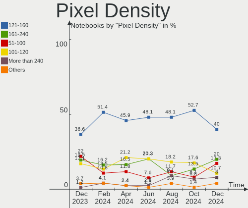
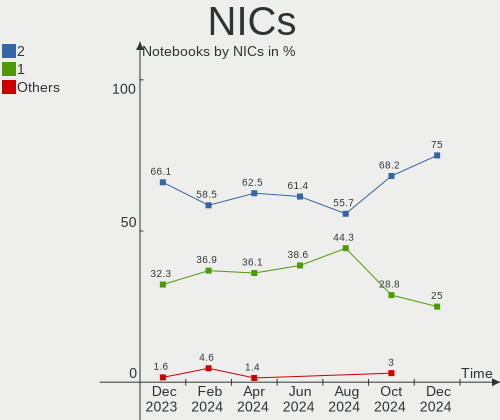

Manjaro - Hardware Trends (Notebooks)
-------------------------------------

A project to identify most popular hardware characteristics and track their change
over time based on data collected by Linux users at https://Linux-Hardware.org.

Anyone can contribute to this report by the [hw-probe](https://github.com/linuxhw/hw-probe) tool:

    sudo -E hw-probe -all -upload

This report is for one last month. Overall report since the beginning of time: [TestDays](https://github.com/linuxhw/TestDays)

Period: Jan, 2024.

Contents
--------

* [ System ](#system)
  - [ OS                       ](#os)
  - [ OS Family                ](#os-family)
  - [ Kernel                   ](#kernel)
  - [ Kernel Family            ](#kernel-family)
  - [ Kernel Major Ver.        ](#kernel-major-ver)
  - [ Arch                     ](#arch)
  - [ DE                       ](#de)
  - [ Display Server           ](#display-server)
  - [ Display Manager          ](#display-manager)
  - [ OS Lang                  ](#os-lang)
  - [ Boot Mode                ](#boot-mode)
  - [ Filesystem               ](#filesystem)
  - [ Part. scheme             ](#part-scheme)
  - [ Dual Boot with Linux/BSD ](#dual-boot-with-linuxbsd)
  - [ Dual Boot (Win)          ](#dual-boot-win)

* [ Board ](#board)
  - [ Vendor                   ](#vendor)
  - [ Model                    ](#model)
  - [ Model Family             ](#model-family)
  - [ MFG Year                 ](#mfg-year)
  - [ Form Factor              ](#form-factor)
  - [ Secure Boot              ](#secure-boot)
  - [ Coreboot                 ](#coreboot)
  - [ RAM Size                 ](#ram-size)
  - [ RAM Used                 ](#ram-used)
  - [ Total Drives             ](#total-drives)
  - [ Has CD-ROM               ](#has-cd-rom)
  - [ Has Ethernet             ](#has-ethernet)
  - [ Has WiFi                 ](#has-wifi)
  - [ Has Bluetooth            ](#has-bluetooth)

* [ Location ](#location)
  - [ Country                  ](#country)
  - [ City                     ](#city)

* [ Drives ](#drives)
  - [ Drive Vendor             ](#drive-vendor)
  - [ Drive Model              ](#drive-model)
  - [ HDD Vendor               ](#hdd-vendor)
  - [ SSD Vendor               ](#ssd-vendor)
  - [ Drive Kind               ](#drive-kind)
  - [ Drive Connector          ](#drive-connector)
  - [ Drive Size               ](#drive-size)
  - [ Space Total              ](#space-total)
  - [ Space Used               ](#space-used)
  - [ Malfunc. Drives          ](#malfunc-drives)
  - [ Malfunc. Drive Vendor    ](#malfunc-drive-vendor)
  - [ Malfunc. HDD Vendor      ](#malfunc-hdd-vendor)
  - [ Malfunc. Drive Kind      ](#malfunc-drive-kind)
  - [ Failed Drives            ](#failed-drives)
  - [ Failed Drive Vendor      ](#failed-drive-vendor)
  - [ Drive Status             ](#drive-status)

* [ Storage controller ](#storage-controller)
  - [ Storage Vendor           ](#storage-vendor)
  - [ Storage Model            ](#storage-model)
  - [ Storage Kind             ](#storage-kind)

* [ Processor ](#processor)
  - [ CPU Vendor               ](#cpu-vendor)
  - [ CPU Model                ](#cpu-model)
  - [ CPU Model Family         ](#cpu-model-family)
  - [ CPU Cores                ](#cpu-cores)
  - [ CPU Sockets              ](#cpu-sockets)
  - [ CPU Threads              ](#cpu-threads)
  - [ CPU Op-Modes             ](#cpu-op-modes)
  - [ CPU Microcode            ](#cpu-microcode)
  - [ CPU Microarch            ](#cpu-microarch)

* [ Graphics ](#graphics)
  - [ GPU Vendor               ](#gpu-vendor)
  - [ GPU Model                ](#gpu-model)
  - [ GPU Combo                ](#gpu-combo)
  - [ GPU Driver               ](#gpu-driver)
  - [ GPU Memory               ](#gpu-memory)

* [ Monitor ](#monitor)
  - [ Monitor Vendor           ](#monitor-vendor)
  - [ Monitor Model            ](#monitor-model)
  - [ Monitor Resolution       ](#monitor-resolution)
  - [ Monitor Diagonal         ](#monitor-diagonal)
  - [ Monitor Width            ](#monitor-width)
  - [ Aspect Ratio             ](#aspect-ratio)
  - [ Monitor Area             ](#monitor-area)
  - [ Pixel Density            ](#pixel-density)
  - [ Multiple Monitors        ](#multiple-monitors)

* [ Network ](#network)
  - [ Net Controller Vendor    ](#net-controller-vendor)
  - [ Net Controller Model     ](#net-controller-model)
  - [ Wireless Vendor          ](#wireless-vendor)
  - [ Wireless Model           ](#wireless-model)
  - [ Ethernet Vendor          ](#ethernet-vendor)
  - [ Ethernet Model           ](#ethernet-model)
  - [ Net Controller Kind      ](#net-controller-kind)
  - [ Used Controller          ](#used-controller)
  - [ NICs                     ](#nics)
  - [ IPv6                     ](#ipv6)

* [ Bluetooth ](#bluetooth)
  - [ Bluetooth Vendor         ](#bluetooth-vendor)
  - [ Bluetooth Model          ](#bluetooth-model)

* [ Sound ](#sound)
  - [ Sound Vendor             ](#sound-vendor)
  - [ Sound Model              ](#sound-model)

* [ Memory ](#memory)
  - [ Memory Vendor            ](#memory-vendor)
  - [ Memory Model             ](#memory-model)
  - [ Memory Kind              ](#memory-kind)
  - [ Memory Form Factor       ](#memory-form-factor)
  - [ Memory Size              ](#memory-size)
  - [ Memory Speed             ](#memory-speed)

* [ Printers & scanners ](#printers--scanners)
  - [ Printer Vendor           ](#printer-vendor)
  - [ Printer Model            ](#printer-model)
  - [ Scanner Vendor           ](#scanner-vendor)
  - [ Scanner Model            ](#scanner-model)

* [ Camera ](#camera)
  - [ Camera Vendor            ](#camera-vendor)
  - [ Camera Model             ](#camera-model)

* [ Security ](#security)
  - [ Fingerprint Vendor       ](#fingerprint-vendor)
  - [ Fingerprint Model        ](#fingerprint-model)
  - [ Chipcard Vendor          ](#chipcard-vendor)
  - [ Chipcard Model           ](#chipcard-model)

* [ Unsupported ](#unsupported)
  - [ Unsupported Devices      ](#unsupported-devices)
  - [ Unsupported Device Types ](#unsupported-device-types)

System
------

OS
--

Installed operating systems

| Name           | Notebooks | Percent |
|----------------|-----------|---------|
| Manjaro        | 42        | 49.41%  |
| Manjaro 23.1.3 | 22        | 25.88%  |
| Manjaro 23.1.2 | 14        | 16.47%  |
| Manjaro 23.1.1 | 2         | 2.35%   |
| Manjaro 23.1.0 | 2         | 2.35%   |
| Manjaro 23.0.1 | 2         | 2.35%   |
| Manjaro 23.0.2 | 1         | 1.18%   |

OS Family
---------

OS without a version

| Name    | Notebooks | Percent |
|---------|-----------|---------|
| Manjaro | 85        | 100%    |

Kernel
------

Version of the Linux kernel

| Version            | Notebooks | Percent |
|--------------------|-----------|---------|
| 6.6.10-1-MANJARO   | 21        | 24.71%  |
| 6.6.8-2-MANJARO    | 19        | 22.35%  |
| 6.7.0-0-MANJARO    | 11        | 12.94%  |
| 6.5.13-7-MANJARO   | 9         | 10.59%  |
| 6.1.69-1-MANJARO   | 8         | 9.41%   |
| 6.1.71-1-MANJARO   | 5         | 5.88%   |
| 6.5.3-1-MANJARO    | 2         | 2.35%   |
| 6.6.7-4-MANJARO    | 1         | 1.18%   |
| 6.6.7-1-MANJARO    | 1         | 1.18%   |
| 6.6.13-1-MANJARO   | 1         | 1.18%   |
| 6.5.5-1-MANJARO    | 1         | 1.18%   |
| 6.5.1-1-MANJARO    | 1         | 1.18%   |
| 6.1.68-1-MANJARO   | 1         | 1.18%   |
| 5.15.146-1-MANJARO | 1         | 1.18%   |
| 5.15.145-1-MANJARO | 1         | 1.18%   |
| 5.15.140-1-MANJARO | 1         | 1.18%   |
| 5.10.205-1-MANJARO | 1         | 1.18%   |

Kernel Family
-------------

Linux kernel without a distro release

| Version  | Notebooks | Percent |
|----------|-----------|---------|
| 6.6.10   | 21        | 24.71%  |
| 6.6.8    | 19        | 22.35%  |
| 6.7.0    | 11        | 12.94%  |
| 6.5.13   | 9         | 10.59%  |
| 6.1.69   | 8         | 9.41%   |
| 6.1.71   | 5         | 5.88%   |
| 6.6.7    | 2         | 2.35%   |
| 6.5.3    | 2         | 2.35%   |
| 6.6.13   | 1         | 1.18%   |
| 6.5.5    | 1         | 1.18%   |
| 6.5.1    | 1         | 1.18%   |
| 6.1.68   | 1         | 1.18%   |
| 5.15.146 | 1         | 1.18%   |
| 5.15.145 | 1         | 1.18%   |
| 5.15.140 | 1         | 1.18%   |
| 5.10.205 | 1         | 1.18%   |

Kernel Major Ver.
-----------------

Linux kernel major version

| Version | Notebooks | Percent |
|---------|-----------|---------|
| 6.6     | 43        | 50.59%  |
| 6.1     | 14        | 16.47%  |
| 6.5     | 13        | 15.29%  |
| 6.7     | 11        | 12.94%  |
| 5.15    | 3         | 3.53%   |
| 5.10    | 1         | 1.18%   |

Arch
----

OS architecture (x86_64, i586, etc.)

| Name   | Notebooks | Percent |
|--------|-----------|---------|
| x86_64 | 85        | 100%    |

DE
--

Desktop Environment

| Name       | Notebooks | Percent |
|------------|-----------|---------|
| KDE5       | 42        | 49.41%  |
| GNOME      | 20        | 23.53%  |
| XFCE       | 13        | 15.29%  |
| X-Cinnamon | 3         | 3.53%   |
| KDE        | 2         | 2.35%   |
| i3         | 2         | 2.35%   |
| Unknown    | 2         | 2.35%   |
| Budgie     | 1         | 1.18%   |

Display Server
--------------

X11 or Wayland

| Name    | Notebooks | Percent |
|---------|-----------|---------|
| X11     | 63        | 74.12%  |
| Wayland | 22        | 25.88%  |

Display Manager
---------------

SDDM, LightDM, etc.

| Name    | Notebooks | Percent |
|---------|-----------|---------|
| Unknown | 42        | 49.41%  |
| SDDM    | 21        | 24.71%  |
| LightDM | 12        | 14.12%  |
| GDM     | 10        | 11.76%  |

OS Lang
-------

Language

| Lang    | Notebooks | Percent |
|---------|-----------|---------|
| en_US   | 33        | 38.82%  |
| de_DE   | 10        | 11.76%  |
| ru_RU   | 7         | 8.24%   |
| es_ES   | 4         | 4.71%   |
| pt_BR   | 3         | 3.53%   |
| pl_PL   | 3         | 3.53%   |
| fr_FR   | 3         | 3.53%   |
| en_IN   | 3         | 3.53%   |
| de_CH   | 3         | 3.53%   |
| it_IT   | 2         | 2.35%   |
| el_GR   | 2         | 2.35%   |
| Unknown | 2         | 2.35%   |
| sv_SE   | 1         | 1.18%   |
| ru      | 1         | 1.18%   |
| ja_JP   | 1         | 1.18%   |
| hu_HU   | 1         | 1.18%   |
| es_MX   | 1         | 1.18%   |
| en_GB   | 1         | 1.18%   |
| en_CA   | 1         | 1.18%   |
| en_AU   | 1         | 1.18%   |
| de_AT   | 1         | 1.18%   |
| bg_BG   | 1         | 1.18%   |

Boot Mode
---------

EFI or BIOS

| Mode | Notebooks | Percent |
|------|-----------|---------|
| BIOS | 51        | 60%     |
| EFI  | 34        | 40%     |

Filesystem
----------

Type of filesystem

| Type    | Notebooks | Percent |
|---------|-----------|---------|
| Ext4    | 61        | 71.76%  |
| Tmpfs   | 11        | 12.94%  |
| Btrfs   | 9         | 10.59%  |
| Overlay | 3         | 3.53%   |
| Unknown | 1         | 1.18%   |

Part. scheme
------------

Scheme of partitioning

| Type    | Notebooks | Percent |
|---------|-----------|---------|
| GPT     | 42        | 49.41%  |
| Unknown | 39        | 45.88%  |
| MBR     | 4         | 4.71%   |

Dual Boot with Linux/BSD
------------------------

Hosting more than one Linux/BSD

| Dual boot | Notebooks | Percent |
|-----------|-----------|---------|
| No        | 79        | 92.94%  |
| Yes       | 6         | 7.06%   |

Dual Boot (Win)
---------------

Hosting Linux and Windows

| Dual boot | Notebooks | Percent |
|-----------|-----------|---------|
| No        | 67        | 78.82%  |
| Yes       | 18        | 21.18%  |

Board
-----

Vendor
------

Motherboard manufacturer

| Name             | Notebooks | Percent |
|------------------|-----------|---------|
| Lenovo           | 21        | 24.71%  |
| Hewlett-Packard  | 15        | 17.65%  |
| Dell             | 11        | 12.94%  |
| ASUSTek Computer | 10        | 11.76%  |
| Acer             | 4         | 4.71%   |
| Notebook         | 3         | 3.53%   |
| MSI              | 3         | 3.53%   |
| HUAWEI           | 3         | 3.53%   |
| Apple            | 3         | 3.53%   |
| TUXEDO           | 2         | 2.35%   |
| Medion           | 2         | 2.35%   |
| Thomson          | 1         | 1.18%   |
| realme           | 1         | 1.18%   |
| Razer            | 1         | 1.18%   |
| LG Electronics   | 1         | 1.18%   |
| Irbis            | 1         | 1.18%   |
| Fujitsu          | 1         | 1.18%   |
| ARDOR GAMING     | 1         | 1.18%   |
| Alienware        | 1         | 1.18%   |

Model
-----

Motherboard model

| Name                                        | Notebooks | Percent |
|---------------------------------------------|-----------|---------|
| HP Laptop 15-fc0xxx                         | 2         | 2.35%   |
| ASUS VivoBook_ASUSLaptop X1505VA_F1505VA    | 2         | 2.35%   |
| TUXEDO Pulse 15 Gen1                        | 1         | 1.18%   |
| TUXEDO InfinityBook Pro Gen8 (MK1)          | 1         | 1.18%   |
| Thomson N15C8BK2T                           | 1         | 1.18%   |
| realme CloudProXXXX                         | 1         | 1.18%   |
| Razer Blade                                 | 1         | 1.18%   |
| Notebook W350STQ/W370ST                     | 1         | 1.18%   |
| Notebook P7xxDM-G                           | 1         | 1.18%   |
| Notebook N14xWU                             | 1         | 1.18%   |
| MSI MS-7C37                                 | 1         | 1.18%   |
| MSI Katana 17 B13VFK                        | 1         | 1.18%   |
| MSI GP75 Leopard 10SFK                      | 1         | 1.18%   |
| Medion Scout E10                            | 1         | 1.18%   |
| Medion S15449                               | 1         | 1.18%   |
| LG 23V545-G.BK55P1                          | 1         | 1.18%   |
| Lenovo Z50-70 20354                         | 1         | 1.18%   |
| Lenovo ThinkPad X270 20K5S1A524             | 1         | 1.18%   |
| Lenovo ThinkPad X260 20F5A1AC00             | 1         | 1.18%   |
| Lenovo ThinkPad X1 Carbon Gen 11 21HM007JCX | 1         | 1.18%   |
| Lenovo ThinkPad T495 20NKS5AU00             | 1         | 1.18%   |
| Lenovo ThinkPad T430 2344BMU                | 1         | 1.18%   |
| Lenovo ThinkPad T14 Gen 1 20S1S8MX2H        | 1         | 1.18%   |
| Lenovo ThinkPad P14s Gen 3 21AK000UGE       | 1         | 1.18%   |
| Lenovo ThinkPad L460 20FU001LGE             | 1         | 1.18%   |
| Lenovo ThinkPad E15 Gen 2 20T8000TMZ        | 1         | 1.18%   |
| Lenovo ThinkPad E14 Gen 3 20Y7003FUS        | 1         | 1.18%   |
| Lenovo Legion Y530-15ICH 81FV               | 1         | 1.18%   |
| Lenovo Legion 7 16ACHg6 82N6                | 1         | 1.18%   |
| Lenovo Legion 5 17ACH6H 82JY                | 1         | 1.18%   |
| Lenovo Legion 5 15ARH05 82B5                | 1         | 1.18%   |
| Lenovo IdeaPad S145-15IIL 81W8              | 1         | 1.18%   |
| Lenovo IdeaPad Pro 5 14IMH9 83D2            | 1         | 1.18%   |
| Lenovo IdeaPad 5 15ARE05 81YQ               | 1         | 1.18%   |
| Lenovo IdeaPad 320-14IKB 80XK               | 1         | 1.18%   |
| Lenovo IdeaPad 3 17ADA05 81W2               | 1         | 1.18%   |
| Lenovo IdeaPad 3 15ABA7 82RN                | 1         | 1.18%   |
| Irbis NB264                                 | 1         | 1.18%   |
| HUAWEI RLEF-XX                              | 1         | 1.18%   |
| HUAWEI BOM-WXX9                             | 1         | 1.18%   |

Model Family
------------

Motherboard model prefix

| Name                | Notebooks | Percent |
|---------------------|-----------|---------|
| Lenovo ThinkPad     | 10        | 11.76%  |
| Lenovo IdeaPad      | 6         | 7.06%   |
| Dell Latitude       | 6         | 7.06%   |
| Lenovo Legion       | 4         | 4.71%   |
| ASUS VivoBook       | 4         | 4.71%   |
| HP EliteBook        | 3         | 3.53%   |
| Dell XPS            | 3         | 3.53%   |
| HP Victus           | 2         | 2.35%   |
| HP Pavilion         | 2         | 2.35%   |
| HP Laptop           | 2         | 2.35%   |
| Dell Inspiron       | 2         | 2.35%   |
| TUXEDO Pulse        | 1         | 1.18%   |
| TUXEDO InfinityBook | 1         | 1.18%   |
| Thomson N15C8BK2T   | 1         | 1.18%   |
| realme CloudProXXXX | 1         | 1.18%   |
| Razer Blade         | 1         | 1.18%   |
| Notebook W350STQ    | 1         | 1.18%   |
| Notebook P7xxDM-G   | 1         | 1.18%   |
| Notebook N14xWU     | 1         | 1.18%   |
| MSI MS-7C37         | 1         | 1.18%   |
| MSI Katana          | 1         | 1.18%   |
| MSI GP75            | 1         | 1.18%   |
| Medion Scout        | 1         | 1.18%   |
| Medion S15449       | 1         | 1.18%   |
| LG 23V545-G.BK55P1  | 1         | 1.18%   |
| Lenovo Z50-70       | 1         | 1.18%   |
| Irbis NB264         | 1         | 1.18%   |
| HUAWEI RLEF-XX      | 1         | 1.18%   |
| HUAWEI BOM-WXX9     | 1         | 1.18%   |
| HUAWEI BOD-WXX9     | 1         | 1.18%   |
| HP ZBook            | 1         | 1.18%   |
| HP Stream           | 1         | 1.18%   |
| HP ProBook          | 1         | 1.18%   |
| HP OMEN             | 1         | 1.18%   |
| HP Notebook         | 1         | 1.18%   |
| HP 255              | 1         | 1.18%   |
| Fujitsu LIFEBOOK    | 1         | 1.18%   |
| ASUS Zenbook        | 1         | 1.18%   |
| ASUS X550VXK        | 1         | 1.18%   |
| ASUS X541UJ         | 1         | 1.18%   |

MFG Year
--------

Motherboard manufacture year

| Year | Notebooks | Percent |
|------|-----------|---------|
| 2020 | 14        | 16.47%  |
| 2021 | 12        | 14.12%  |
| 2022 | 11        | 12.94%  |
| 2023 | 9         | 10.59%  |
| 2017 | 7         | 8.24%   |
| 2018 | 6         | 7.06%   |
| 2014 | 6         | 7.06%   |
| 2016 | 5         | 5.88%   |
| 2013 | 4         | 4.71%   |
| 2012 | 4         | 4.71%   |
| 2019 | 3         | 3.53%   |
| 2015 | 2         | 2.35%   |
| 2010 | 1         | 1.18%   |
| 2007 | 1         | 1.18%   |

Form Factor
-----------

Physical design of the computer

| Name     | Notebooks | Percent |
|----------|-----------|---------|
| Notebook | 85        | 100%    |

Secure Boot
-----------

Enabled or disabled

| State    | Notebooks | Percent |
|----------|-----------|---------|
| Disabled | 85        | 100%    |

Coreboot
--------

Have coreboot on board

| Used | Notebooks | Percent |
|------|-----------|---------|
| No   | 85        | 100%    |

RAM Size
--------

Total RAM memory

| Size in GB  | Notebooks | Percent |
|-------------|-----------|---------|
| 16.01-24.0  | 23        | 27.06%  |
| 8.01-16.0   | 21        | 24.71%  |
| 4.01-8.0    | 16        | 18.82%  |
| 32.01-64.0  | 14        | 16.47%  |
| 64.01-256.0 | 6         | 7.06%   |
| 3.01-4.0    | 3         | 3.53%   |
| 24.01-32.0  | 1         | 1.18%   |
| 1.01-2.0    | 1         | 1.18%   |

RAM Used
--------

Used RAM memory

| Used GB    | Notebooks | Percent |
|------------|-----------|---------|
| 4.01-8.0   | 30        | 35.29%  |
| 3.01-4.0   | 18        | 21.18%  |
| 1.01-2.0   | 16        | 18.82%  |
| 2.01-3.0   | 15        | 17.65%  |
| 8.01-16.0  | 5         | 5.88%   |
| 24.01-32.0 | 1         | 1.18%   |

Total Drives
------------

Number of drives on board

| Drives | Notebooks | Percent |
|--------|-----------|---------|
| 1      | 56        | 65.88%  |
| 2      | 22        | 25.88%  |
| 3      | 5         | 5.88%   |
| 4      | 2         | 2.35%   |

Has CD-ROM
----------

Has CD-ROM on board

| Presented | Notebooks | Percent |
|-----------|-----------|---------|
| No        | 72        | 84.71%  |
| Yes       | 13        | 15.29%  |

Has Ethernet
------------

Has Ethernet on board

| Presented | Notebooks | Percent |
|-----------|-----------|---------|
| Yes       | 55        | 64.71%  |
| No        | 30        | 35.29%  |

Has WiFi
--------

Has WiFi module

| Presented | Notebooks | Percent |
|-----------|-----------|---------|
| Yes       | 83        | 97.65%  |
| No        | 2         | 2.35%   |

Has Bluetooth
-------------

Has Bluetooth module

| Presented | Notebooks | Percent |
|-----------|-----------|---------|
| Yes       | 76        | 89.41%  |
| No        | 9         | 10.59%  |

Location
--------

Country
-------

Geographic location (country)

| Country     | Notebooks | Percent |
|-------------|-----------|---------|
| USA         | 14        | 16.47%  |
| Germany     | 11        | 12.94%  |
| Russia      | 10        | 11.76%  |
| Switzerland | 6         | 7.06%   |
| Spain       | 6         | 7.06%   |
| India       | 4         | 4.71%   |
| France      | 4         | 4.71%   |
| Brazil      | 4         | 4.71%   |
| Sweden      | 3         | 3.53%   |
| Italy       | 3         | 3.53%   |
| UK          | 2         | 2.35%   |
| Poland      | 2         | 2.35%   |
| Netherlands | 2         | 2.35%   |
| Greece      | 2         | 2.35%   |
| Serbia      | 1         | 1.18%   |
| Malawi      | 1         | 1.18%   |
| Japan       | 1         | 1.18%   |
| Iran        | 1         | 1.18%   |
| Hungary     | 1         | 1.18%   |
| Denmark     | 1         | 1.18%   |
| Chile       | 1         | 1.18%   |
| Canada      | 1         | 1.18%   |
| Belarus     | 1         | 1.18%   |
| Austria     | 1         | 1.18%   |
| Australia   | 1         | 1.18%   |
| Argentina   | 1         | 1.18%   |

City
----

Geographic location (city)

| City                          | Notebooks | Percent |
|-------------------------------|-----------|---------|
| Moscow                        | 4         | 4.71%   |
| Zurich                        | 3         | 3.53%   |
| Wilmington                    | 2         | 2.35%   |
| Zabrze                        | 1         | 1.18%   |
| Wurzen                        | 1         | 1.18%   |
| Windsor                       | 1         | 1.18%   |
| Warsaw                        | 1         | 1.18%   |
| Volgograd                     | 1         | 1.18%   |
| Vertou                        | 1         | 1.18%   |
| Vancouver                     | 1         | 1.18%   |
| Valjevo                       | 1         | 1.18%   |
| Ushuaia                       | 1         | 1.18%   |
| Ulan-Ude                      | 1         | 1.18%   |
| Traun                         | 1         | 1.18%   |
| Tambov                        | 1         | 1.18%   |
| Székesfehérvár             | 1         | 1.18%   |
| Swansea                       | 1         | 1.18%   |
| Surgut                        | 1         | 1.18%   |
| St Petersburg                 | 1         | 1.18%   |
| Sparti                        | 1         | 1.18%   |
| Schonbuhl                     | 1         | 1.18%   |
| Santiago                      | 1         | 1.18%   |
| Santa Cruz de Tenerife        | 1         | 1.18%   |
| Sant Adrià de Besòs         | 1         | 1.18%   |
| Roy                           | 1         | 1.18%   |
| Rockville                     | 1         | 1.18%   |
| Rio de Janeiro                | 1         | 1.18%   |
| Rethymno                      | 1         | 1.18%   |
| Reggio Emilia                 | 1         | 1.18%   |
| Ravenna                       | 1         | 1.18%   |
| Pontevedra                    | 1         | 1.18%   |
| Plymouth                      | 1         | 1.18%   |
| Pinto                         | 1         | 1.18%   |
| Ottawa                        | 1         | 1.18%   |
| Oosternijkerk                 | 1         | 1.18%   |
| Oetwil / Oetwil an der Limmat | 1         | 1.18%   |
| Nanterre                      | 1         | 1.18%   |
| Mumbai                        | 1         | 1.18%   |
| Minsk                         | 1         | 1.18%   |
| Milano                        | 1         | 1.18%   |

Drives
------

Drive Vendor
------------

Hard drive vendors

| Vendor                         | Notebooks | Drives | Percent |
|--------------------------------|-----------|--------|---------|
| Samsung Electronics            | 22        | 23     | 18.33%  |
| Sandisk                        | 13        | 14     | 10.83%  |
| Kingston                       | 9         | 10     | 7.5%    |
| SK hynix                       | 8         | 8      | 6.67%   |
| Crucial                        | 8         | 8      | 6.67%   |
| Toshiba                        | 6         | 6      | 5%      |
| WDC                            | 5         | 5      | 4.17%   |
| Unknown                        | 5         | 5      | 4.17%   |
| Seagate                        | 4         | 4      | 3.33%   |
| Phison Electronics             | 3         | 3      | 2.5%    |
| Micron Technology              | 3         | 3      | 2.5%    |
| Intel                          | 3         | 3      | 2.5%    |
| Silicon Motion                 | 2         | 2      | 1.67%   |
| Micron/Crucial Technology      | 2         | 2      | 1.67%   |
| MAXIO Technology (Hangzhou)    | 2         | 2      | 1.67%   |
| LITEONIT                       | 2         | 2      | 1.67%   |
| LITEON                         | 2         | 2      | 1.67%   |
| Kingston Technology Company    | 2         | 2      | 1.67%   |
| BHT                            | 2         | 2      | 1.67%   |
| Apple                          | 2         | 3      | 1.67%   |
| SSK                            | 1         | 1      | 0.83%   |
| Solid State Storage Technology | 1         | 1      | 0.83%   |
| Shenzhen Longsys Electronics   | 1         | 1      | 0.83%   |
| OCZ                            | 1         | 1      | 0.83%   |
| Lite-On Technology             | 1         | 1      | 0.83%   |
| KODAK                          | 1         | 1      | 0.83%   |
| KingDian                       | 1         | 1      | 0.83%   |
| JMicron Technology             | 1         | 1      | 0.83%   |
| HGST                           | 1         | 1      | 0.83%   |
| Green House                    | 1         | 1      | 0.83%   |
| CONSISTENT                     | 1         | 1      | 0.83%   |
| Colorful                       | 1         | 1      | 0.83%   |
| ADATA Technology               | 1         | 1      | 0.83%   |
| A-DATA Technology              | 1         | 1      | 0.83%   |
| Unknown                        | 1         | 1      | 0.83%   |

Drive Model
-----------

Hard drive models

| Model                                                | Notebooks | Percent |
|------------------------------------------------------|-----------|---------|
| Samsung NVMe SSD Controller SM981/PM981/PM983 1TB    | 5         | 4.1%    |
| Sandisk WD Black SN750 / PC SN730 NVMe SSD 512GB     | 3         | 2.46%   |
| Samsung NVMe SSD Controller SM951/PM951 256GB        | 3         | 2.46%   |
| Samsung NVMe SSD Controller PM9A1/PM9A3/980PRO 2TB   | 3         | 2.46%   |
| Crucial CT1000MX500SSD1 1TB                          | 3         | 2.46%   |
| Crucial CT1000BX500SSD1 1TB                          | 3         | 2.46%   |
| WDC WD10JPVX-22JC3T0 1TB                             | 2         | 1.64%   |
| Toshiba XG6 NVMe SSD Controller 256GB                | 2         | 1.64%   |
| Toshiba MQ01ABD100 1TB                               | 2         | 1.64%   |
| Silicon Motion PCIe-8 SSD 512GB                      | 2         | 1.64%   |
| Seagate ST1000LM035-1RK172 1TB                       | 2         | 1.64%   |
| Sandisk WD Black SN850 1024GB                        | 2         | 1.64%   |
| Micron/Crucial P2 NVMe PCIe SSD 1TB                  | 2         | 1.64%   |
| Micron 2450_MTFDKBA1T0TFK 1TB                        | 2         | 1.64%   |
| MAXIO (Hangzhou) NVMe SSD Controller MAP1202 512GB   | 2         | 1.64%   |
| Kingston SA400S37480G 480GB SSD                      | 2         | 1.64%   |
| Kingston SA400S37240G 240GB SSD                      | 2         | 1.64%   |
| Intel SSD 660P Series 1024GB                         | 2         | 1.64%   |
| WDC WDS500G2B0A-00SM50 500GB SSD                     | 1         | 0.82%   |
| WDC WDS240G2G0B-00EPW0 240GB SSD                     | 1         | 0.82%   |
| WDC WD7500BPKT-75PK4T0 752GB                         | 1         | 0.82%   |
| Unknown SD/MMC/MS PRO 256GB                          | 1         | 0.82%   |
| Unknown NVMe SSD Drive 256GB                         | 1         | 0.82%   |
| Unknown MMC Card  7GB                                | 1         | 0.82%   |
| Unknown MMC Card  4GB                                | 1         | 0.82%   |
| Unknown MMC Card  128GB                              | 1         | 0.82%   |
| Toshiba THNSNH128GMCT 128GB SSD                      | 1         | 0.82%   |
| Toshiba MQ01ABD075 752GB                             | 1         | 0.82%   |
| SSK Storage 2TB                                      | 1         | 0.82%   |
| Solid State Storage CA6-8D2048-Q11 NVMe SSSTC 2048GB | 1         | 0.82%   |
| SK hynix SKHynix_HFS001TEJ4X112N 1024GB              | 1         | 0.82%   |
| SK hynix SKHynix_HFS001TDE9X084N 1024GB              | 1         | 0.82%   |
| SK hynix SKHynix_HFS001TDE9X081N 1TB                 | 1         | 0.82%   |
| SK hynix SC311 SATA 256GB SSD                        | 1         | 0.82%   |
| SK hynix SC300 M.2 2280 128GB SSD                    | 1         | 0.82%   |
| SK hynix HFS001TEJ9X108N 1TB                         | 1         | 0.82%   |
| SK hynix BC901 HFS512GEJ9X108N 512GB                 | 1         | 0.82%   |
| SK hynix BC511 256GB                                 | 1         | 0.82%   |
| Shenzhen Longsys Lexar SSD NM790 2TB                 | 1         | 0.82%   |
| Seagate ST9500325AS 500GB                            | 1         | 0.82%   |

HDD Vendor
----------

Hard disk drive vendors

| Vendor             | Notebooks | Drives | Percent |
|--------------------|-----------|--------|---------|
| Seagate            | 4         | 4      | 30.77%  |
| WDC                | 3         | 3      | 23.08%  |
| Toshiba            | 3         | 3      | 23.08%  |
| Unknown            | 1         | 1      | 7.69%   |
| JMicron Technology | 1         | 1      | 7.69%   |
| HGST               | 1         | 1      | 7.69%   |

SSD Vendor
----------

Solid state drive vendors

| Vendor              | Notebooks | Drives | Percent |
|---------------------|-----------|--------|---------|
| Crucial             | 8         | 8      | 20.51%  |
| Kingston            | 5         | 5      | 12.82%  |
| Samsung Electronics | 4         | 4      | 10.26%  |
| WDC                 | 2         | 2      | 5.13%   |
| SK hynix            | 2         | 2      | 5.13%   |
| SanDisk             | 2         | 2      | 5.13%   |
| LITEONIT            | 2         | 2      | 5.13%   |
| LITEON              | 2         | 2      | 5.13%   |
| BHT                 | 2         | 2      | 5.13%   |
| Toshiba             | 1         | 1      | 2.56%   |
| OCZ                 | 1         | 1      | 2.56%   |
| KODAK               | 1         | 1      | 2.56%   |
| KingDian            | 1         | 1      | 2.56%   |
| Intel               | 1         | 1      | 2.56%   |
| Green House         | 1         | 1      | 2.56%   |
| CONSISTENT          | 1         | 1      | 2.56%   |
| Colorful            | 1         | 1      | 2.56%   |
| Apple               | 1         | 1      | 2.56%   |
| A-DATA Technology   | 1         | 1      | 2.56%   |

Drive Kind
----------

HDD or SSD

| Kind | Notebooks | Drives | Percent |
|------|-----------|--------|---------|
| NVMe | 56        | 68     | 53.33%  |
| SSD  | 32        | 39     | 30.48%  |
| HDD  | 13        | 13     | 12.38%  |
| MMC  | 4         | 4      | 3.81%   |

Drive Connector
---------------

SATA, SAS, NVMe, etc.

| Type | Notebooks | Drives | Percent |
|------|-----------|--------|---------|
| NVMe | 55        | 66     | 54.46%  |
| SATA | 38        | 50     | 37.62%  |
| SAS  | 4         | 4      | 3.96%   |
| MMC  | 4         | 4      | 3.96%   |

Drive Size
----------

Size of hard drive

| Size in TB | Notebooks | Drives | Percent |
|------------|-----------|--------|---------|
| 0.01-0.5   | 28        | 33     | 62.22%  |
| 0.51-1.0   | 17        | 19     | 37.78%  |

Space Total
-----------

Amount of disk space available on the file system

| Size in GB     | Notebooks | Percent |
|----------------|-----------|---------|
| 251-500        | 27        | 31.76%  |
| 101-250        | 21        | 24.71%  |
| 501-1000       | 10        | 11.76%  |
| Unknown        | 9         | 10.59%  |
| 1001-2000      | 8         | 9.41%   |
| 1-20           | 4         | 4.71%   |
| 21-50          | 2         | 2.35%   |
| 51-100         | 2         | 2.35%   |
| More than 3000 | 1         | 1.18%   |
| 2001-3000      | 1         | 1.18%   |

Space Used
----------

Amount of used disk space

| Used GB   | Notebooks | Percent |
|-----------|-----------|---------|
| 1-20      | 22        | 25.88%  |
| 101-250   | 14        | 16.47%  |
| 21-50     | 12        | 14.12%  |
| 51-100    | 10        | 11.76%  |
| 251-500   | 9         | 10.59%  |
| Unknown   | 9         | 10.59%  |
| 501-1000  | 7         | 8.24%   |
| 1001-2000 | 2         | 2.35%   |

Malfunc. Drives
---------------

Drive models with a malfunction

| Model                                                                      | Notebooks | Drives | Percent |
|----------------------------------------------------------------------------|-----------|--------|---------|
| Seagate ST1000LM049-2GH172 1TB                                             | 1         | 1      | 25%     |
| Kingston Technology Company OM3PDP3 NVMe SSD 256GB                         | 1         | 1      | 25%     |
| Kingston SHPM2280P2H 480G SSD                                              | 1         | 1      | 25%     |
| ADATA Technology XPG SX8200 Pro PCIe Gen3x4 M.2 2280 Solid State Drive 2TB | 1         | 1      | 25%     |

Malfunc. Drive Vendor
---------------------

Vendors of faulty drives

| Vendor                      | Notebooks | Drives | Percent |
|-----------------------------|-----------|--------|---------|
| Seagate                     | 1         | 1      | 25%     |
| Kingston Technology Company | 1         | 1      | 25%     |
| Kingston                    | 1         | 1      | 25%     |
| ADATA Technology            | 1         | 1      | 25%     |

Malfunc. HDD Vendor
-------------------

Vendors of faulty HDD drives

| Vendor  | Notebooks | Drives | Percent |
|---------|-----------|--------|---------|
| Seagate | 1         | 1      | 100%    |

Malfunc. Drive Kind
-------------------

Kinds of faulty drives

| Kind | Notebooks | Drives | Percent |
|------|-----------|--------|---------|
| NVMe | 2         | 2      | 50%     |
| SSD  | 1         | 1      | 25%     |
| HDD  | 1         | 1      | 25%     |

Failed Drives
-------------

Failed drive models

Zero info for selected period =(

Failed Drive Vendor
-------------------

Failed drive vendors

Zero info for selected period =(

Drive Status
------------

Number of failed and malfunc. drives

| Status   | Notebooks | Drives | Percent |
|----------|-----------|--------|---------|
| Detected | 62        | 85     | 69.66%  |
| Works    | 24        | 35     | 26.97%  |
| Malfunc  | 3         | 4      | 3.37%   |

Storage controller
------------------

Storage Vendor
--------------

Storage controller vendors

| Vendor                               | Notebooks | Percent |
|--------------------------------------|-----------|---------|
| Intel                                | 47        | 38.21%  |
| Samsung Electronics                  | 18        | 14.63%  |
| SanDisk                              | 12        | 9.76%   |
| AMD                                  | 12        | 9.76%   |
| Kingston Technology Company          | 7         | 5.69%   |
| SK hynix                             | 6         | 4.88%   |
| Phison Electronics                   | 3         | 2.44%   |
| Micron Technology                    | 3         | 2.44%   |
| Toshiba America Info Systems         | 2         | 1.63%   |
| Silicon Motion                       | 2         | 1.63%   |
| Micron/Crucial Technology            | 2         | 1.63%   |
| MAXIO Technology (Hangzhou)          | 2         | 1.63%   |
| Solid State Storage Technology       | 1         | 0.81%   |
| Shenzhen Longsys Electronics         | 1         | 0.81%   |
| Ramaxel Technology(Shenzhen) Limited | 1         | 0.81%   |
| Lite-On Technology                   | 1         | 0.81%   |
| ASMedia Technology                   | 1         | 0.81%   |
| Apple                                | 1         | 0.81%   |
| ADATA Technology                     | 1         | 0.81%   |

Storage Model
-------------

Storage controller models

| Model                                                                          | Notebooks | Percent |
|--------------------------------------------------------------------------------|-----------|---------|
| AMD FCH SATA Controller [AHCI mode]                                            | 11        | 8.87%   |
| Intel Sunrise Point-LP SATA Controller [AHCI mode]                             | 8         | 6.45%   |
| Intel Volume Management Device NVMe RAID Controller                            | 6         | 4.84%   |
| Intel 82801 Mobile SATA Controller [RAID mode]                                 | 6         | 4.84%   |
| Samsung NVMe SSD Controller SM981/PM981/PM983                                  | 5         | 4.03%   |
| Samsung NVMe SSD Controller 980 (DRAM-less)                                    | 4         | 3.23%   |
| Intel 8 Series/C220 Series Chipset Family 6-port SATA Controller 1 [AHCI mode] | 4         | 3.23%   |
| SK hynix BC901 NVMe Solid State Drive (DRAM-less)                              | 3         | 2.42%   |
| SanDisk Extreme Pro / WD Black SN750 / PC SN730 / Red SN700 NVMe SSD           | 3         | 2.42%   |
| Samsung NVMe SSD Controller SM951/PM951                                        | 3         | 2.42%   |
| Samsung NVMe SSD Controller PM9A1/PM9A3/980PRO                                 | 3         | 2.42%   |
| Intel Volume Management Device NVMe RAID Controller Intel Corporation          | 3         | 2.42%   |
| Intel HM170/QM170 Chipset SATA Controller [AHCI Mode]                          | 3         | 2.42%   |
| Intel 8 Series SATA Controller 1 [AHCI mode]                                   | 3         | 2.42%   |
| Intel 7 Series Chipset Family 6-port SATA Controller [AHCI mode]               | 3         | 2.42%   |
| Toshiba America Info Systems XG6 NVMe SSD Controller                           | 2         | 1.61%   |
| SK hynix Gold P31/BC711/PC711 NVMe Solid State Drive                           | 2         | 1.61%   |
| Silicon Motion Non-Volatile memory controller                                  | 2         | 1.61%   |
| SanDisk WD PC SN810 / Black SN850 NVMe SSD                                     | 2         | 1.61%   |
| Micron/Crucial P2 [Nick P2] / P3 / P3 Plus NVMe PCIe SSD (DRAM-less)           | 2         | 1.61%   |
| Micron 2450 NVMe SSD [HendrixV] (DRAM-less)                                    | 2         | 1.61%   |
| MAXIO (Hangzhou) NVMe SSD Controller MAP1202 (DRAM-less)                       | 2         | 1.61%   |
| Kingston Company NV1 NVMe SSD SM2263XT (DRAM-less)                             | 2         | 1.61%   |
| Kingston Company KC3000/FURY Renegade NVMe SSD E18                             | 2         | 1.61%   |
| Intel SSD 660P Series                                                          | 2         | 1.61%   |
| Intel Cannon Lake Mobile PCH SATA AHCI Controller                              | 2         | 1.61%   |
| Intel 400 Series Chipset Family SATA AHCI Controller                           | 2         | 1.61%   |
| Solid State Storage CA6-8D512 NVMe SSD M.2                                     | 1         | 0.81%   |
| SK hynix BC511 NVMe SSD                                                        | 1         | 0.81%   |
| Shenzhen Longsys Lexar NM790 NVME SSD (DRAM-less)                              | 1         | 0.81%   |
| SanDisk WD Blue SN500 / PC SN520 x2 M.2 2280 NVMe SSD                          | 1         | 0.81%   |
| SanDisk WD Black SN770 / PC SN740 256GB / PC SN560 (DRAM-less) NVMe SSD        | 1         | 0.81%   |
| SanDisk Ultra 3D / WD Blue SN570 NVMe SSD (DRAM-less)                          | 1         | 0.81%   |
| SanDisk Ultra 3D / WD Blue SN550 NVMe SSD                                      | 1         | 0.81%   |
| SanDisk PC SN735 NVMe SSD (DRAM-less)                                          | 1         | 0.81%   |
| SanDisk PC SN530 NVMe SSD (DRAM-less)                                          | 1         | 0.81%   |
| SanDisk PC SN520 x2 M.2 2242 NVMe SSD                                          | 1         | 0.81%   |
| Samsung S4LN058A01[SSUBX] AHCI SSD Controller (Apple slot)                     | 1         | 0.81%   |
| Samsung NVMe SSD Controller SM961/PM961/SM963                                  | 1         | 0.81%   |
| Samsung NVMe SSD Controller PM9B1 (DRAM-less)                                  | 1         | 0.81%   |

Storage Kind
------------

Kind of storage controller (IDE, SATA, NVMe, SAS, ...)

| Kind | Notebooks | Percent |
|------|-----------|---------|
| NVMe | 55        | 48.25%  |
| SATA | 44        | 38.6%   |
| RAID | 15        | 13.16%  |

Processor
---------

CPU Vendor
----------

Processor vendors

| Vendor | Notebooks | Percent |
|--------|-----------|---------|
| Intel  | 61        | 71.76%  |
| AMD    | 24        | 28.24%  |

CPU Model
---------

Processor models

| Model                                   | Notebooks | Percent |
|-----------------------------------------|-----------|---------|
| Intel Core i5-7200U CPU @ 2.50GHz       | 4         | 4.71%   |
| Intel Core i5-8250U CPU @ 1.60GHz       | 3         | 3.53%   |
| Intel 13th Gen Core i9-13900H           | 3         | 3.53%   |
| AMD Ryzen 7 4800H with Radeon Graphics  | 3         | 3.53%   |
| Intel Core i7-8750H CPU @ 2.20GHz       | 2         | 2.35%   |
| Intel Core i7-8550U CPU @ 1.80GHz       | 2         | 2.35%   |
| Intel Core i7-6700HQ CPU @ 2.60GHz      | 2         | 2.35%   |
| Intel Core i5-6300U CPU @ 2.40GHz       | 2         | 2.35%   |
| Intel Core i5-4200M CPU @ 2.50GHz       | 2         | 2.35%   |
| Intel 12th Gen Core i7-12700H           | 2         | 2.35%   |
| Intel 11th Gen Core i7-1165G7 @ 2.80GHz | 2         | 2.35%   |
| AMD Ryzen 7 5700U with Radeon Graphics  | 2         | 2.35%   |
| Intel Core Ultra 7 155H                 | 1         | 1.18%   |
| Intel Core i7-8650U CPU @ 1.90GHz       | 1         | 1.18%   |
| Intel Core i7-6700K CPU @ 4.00GHz       | 1         | 1.18%   |
| Intel Core i7-4700MQ CPU @ 2.40GHz      | 1         | 1.18%   |
| Intel Core i7-4600U CPU @ 2.10GHz       | 1         | 1.18%   |
| Intel Core i7-4510U CPU @ 2.00GHz       | 1         | 1.18%   |
| Intel Core i7-4500U CPU @ 1.80GHz       | 1         | 1.18%   |
| Intel Core i7-3720QM CPU @ 2.60GHz      | 1         | 1.18%   |
| Intel Core i7-10875H CPU @ 2.30GHz      | 1         | 1.18%   |
| Intel Core i7-10750H CPU @ 2.60GHz      | 1         | 1.18%   |
| Intel Core i5-7360U CPU @ 2.30GHz       | 1         | 1.18%   |
| Intel Core i5-7300HQ CPU @ 2.50GHz      | 1         | 1.18%   |
| Intel Core i5-6200U CPU @ 2.30GHz       | 1         | 1.18%   |
| Intel Core i5-5300U CPU @ 2.30GHz       | 1         | 1.18%   |
| Intel Core i5-5250U CPU @ 1.60GHz       | 1         | 1.18%   |
| Intel Core i5-4310M CPU @ 2.70GHz       | 1         | 1.18%   |
| Intel Core i5-4210U CPU @ 1.70GHz       | 1         | 1.18%   |
| Intel Core i5-3320M CPU @ 2.60GHz       | 1         | 1.18%   |
| Intel Core i5-3210M CPU @ 2.50GHz       | 1         | 1.18%   |
| Intel Core i5-1035G1 CPU @ 1.00GHz      | 1         | 1.18%   |
| Intel Core i5-10310U CPU @ 1.70GHz      | 1         | 1.18%   |
| Intel Core i3 CPU M 370 @ 2.40GHz       | 1         | 1.18%   |
| Intel Celeron N4020 CPU @ 1.10GHz       | 1         | 1.18%   |
| Intel Celeron CPU N3350 @ 1.10GHz       | 1         | 1.18%   |
| Intel Celeron CPU 1000M @ 1.80GHz       | 1         | 1.18%   |
| Intel 13th Gen Core i7-13700HX          | 1         | 1.18%   |
| Intel 13th Gen Core i7-13700H           | 1         | 1.18%   |
| Intel 13th Gen Core i7-13620H           | 1         | 1.18%   |

CPU Model Family
----------------

Processor model prefix

| Model           | Notebooks | Percent |
|-----------------|-----------|---------|
| Intel Core i5   | 22        | 25.88%  |
| Other           | 19        | 22.35%  |
| Intel Core i7   | 15        | 17.65%  |
| AMD Ryzen 7     | 12        | 14.12%  |
| AMD Ryzen 5     | 5         | 5.88%   |
| Intel Celeron   | 3         | 3.53%   |
| AMD Ryzen 7 PRO | 2         | 2.35%   |
| AMD Ryzen 3     | 2         | 2.35%   |
| Intel Core i3   | 1         | 1.18%   |
| Intel Core      | 1         | 1.18%   |
| AMD Ryzen 9     | 1         | 1.18%   |
| AMD E2          | 1         | 1.18%   |
| AMD A4          | 1         | 1.18%   |

CPU Cores
---------

Number of processor cores

| Number | Notebooks | Percent |
|--------|-----------|---------|
| 2      | 25        | 29.41%  |
| 4      | 23        | 27.06%  |
| 8      | 17        | 20%     |
| 6      | 8         | 9.41%   |
| 14     | 6         | 7.06%   |
| 16     | 2         | 2.35%   |
| 12     | 2         | 2.35%   |
| 10     | 2         | 2.35%   |

CPU Sockets
-----------

Number of sockets

| Number | Notebooks | Percent |
|--------|-----------|---------|
| 1      | 85        | 100%    |

CPU Threads
-----------

Threads per core (Hyper-Threading)

| Number | Notebooks | Percent |
|--------|-----------|---------|
| 2      | 76        | 89.41%  |
| 1      | 9         | 10.59%  |

CPU Op-Modes
------------

CPU Operation Modes (32-bit, 64-bit)

| Op mode        | Notebooks | Percent |
|----------------|-----------|---------|
| 32-bit, 64-bit | 85        | 100%    |

CPU Microcode
-------------

Microcode number

| Number     | Notebooks | Percent |
|------------|-----------|---------|
| Unknown    | 65        | 76.47%  |
| 0x08600103 | 3         | 3.53%   |
| 0x506e3    | 2         | 2.35%   |
| 0x906a3    | 1         | 1.18%   |
| 0x806ec    | 1         | 1.18%   |
| 0x806ea    | 1         | 1.18%   |
| 0x806d1    | 1         | 1.18%   |
| 0x306d4    | 1         | 1.18%   |
| 0x306c3    | 1         | 1.18%   |
| 0x0a50000d | 1         | 1.18%   |
| 0x0a404102 | 1         | 1.18%   |
| 0x0a404101 | 1         | 1.18%   |
| 0x0a201025 | 1         | 1.18%   |
| 0x08608103 | 1         | 1.18%   |
| 0x08608102 | 1         | 1.18%   |
| 0x08108109 | 1         | 1.18%   |
| 0x08108102 | 1         | 1.18%   |
| 0x07030106 | 1         | 1.18%   |

CPU Microarch
-------------

Microarchitecture

| Name             | Notebooks | Percent |
|------------------|-----------|---------|
| KabyLake         | 15        | 17.65%  |
| Unknown          | 13        | 15.29%  |
| Haswell          | 8         | 9.41%   |
| Alderlake Hybrid | 8         | 9.41%   |
| Zen 3            | 7         | 8.24%   |
| Skylake          | 6         | 7.06%   |
| Zen 2            | 5         | 5.88%   |
| TigerLake        | 5         | 5.88%   |
| IvyBridge        | 4         | 4.71%   |
| Icelake          | 3         | 3.53%   |
| Zen+             | 2         | 2.35%   |
| CometLake        | 2         | 2.35%   |
| Broadwell        | 2         | 2.35%   |
| Westmere         | 1         | 1.18%   |
| Puma             | 1         | 1.18%   |
| Goldmont plus    | 1         | 1.18%   |
| Goldmont         | 1         | 1.18%   |
| Excavator        | 1         | 1.18%   |

Graphics
--------

GPU Vendor
----------

Vendors of graphics cards

| Vendor | Notebooks | Percent |
|--------|-----------|---------|
| Intel  | 57        | 51.35%  |
| Nvidia | 29        | 26.13%  |
| AMD    | 25        | 22.52%  |

GPU Model
---------

Graphics card models

| Model                                                                         | Notebooks | Percent |
|-------------------------------------------------------------------------------|-----------|---------|
| Intel UHD Graphics 620                                                        | 6         | 5.31%   |
| Intel TigerLake-LP GT2 [Iris Xe Graphics]                                     | 5         | 4.42%   |
| Intel Raptor Lake-P [Iris Xe Graphics]                                        | 5         | 4.42%   |
| Nvidia GA107M [GeForce RTX 3050 Ti Mobile]                                    | 4         | 3.54%   |
| Intel HD Graphics 620                                                         | 4         | 3.54%   |
| Intel Haswell-ULT Integrated Graphics Controller                              | 4         | 3.54%   |
| Intel Alder Lake-P GT2 [Iris Xe Graphics]                                     | 4         | 3.54%   |
| Intel 4th Gen Core Processor Integrated Graphics Controller                   | 4         | 3.54%   |
| Intel 3rd Gen Core processor Graphics Controller                              | 4         | 3.54%   |
| AMD Renoir [Radeon RX Vega 6 (Ryzen 4000/5000 Mobile Series)]                 | 4         | 3.54%   |
| Intel Skylake GT2 [HD Graphics 520]                                           | 3         | 2.65%   |
| AMD Lucienne                                                                  | 3         | 2.65%   |
| AMD Cezanne [Radeon Vega Series / Radeon Vega Mobile Series]                  | 3         | 2.65%   |
| Nvidia TU117M [GeForce GTX 1650 Mobile / Max-Q]                               | 2         | 1.77%   |
| Nvidia AD106M [GeForce RTX 4070 Max-Q / Mobile]                               | 2         | 1.77%   |
| Intel TigerLake-H GT1 [UHD Graphics]                                          | 2         | 1.77%   |
| Intel HD Graphics 530                                                         | 2         | 1.77%   |
| Intel CoffeeLake-H GT2 [UHD Graphics 630]                                     | 2         | 1.77%   |
| AMD Sun XT [Radeon HD 8670A/8670M/8690M / R5 M330 / M430 / Radeon 520 Mobile] | 2         | 1.77%   |
| AMD Rembrandt [Radeon 680M]                                                   | 2         | 1.77%   |
| AMD Picasso/Raven 2 [Radeon Vega Series / Radeon Vega Mobile Series]          | 2         | 1.77%   |
| AMD Mendocino                                                                 | 2         | 1.77%   |
| AMD Barcelo                                                                   | 2         | 1.77%   |
| Nvidia TU117GLM [Quadro T500 Mobile]                                          | 1         | 0.88%   |
| Nvidia TU106M [GeForce RTX 2070 Mobile / Max-Q Refresh]                       | 1         | 0.88%   |
| Nvidia TU104BM [GeForce RTX 2070 SUPER Mobile / Max-Q]                        | 1         | 0.88%   |
| Nvidia GP108M [GeForce MX150]                                                 | 1         | 0.88%   |
| Nvidia GP107M [GeForce GTX 1050 Ti Mobile]                                    | 1         | 0.88%   |
| Nvidia GP104M [GeForce GTX 1070 Mobile]                                       | 1         | 0.88%   |
| Nvidia GM206M [GeForce GTX 965M]                                              | 1         | 0.88%   |
| Nvidia GM204M [GeForce GTX 980M]                                              | 1         | 0.88%   |
| Nvidia GM204M [GeForce GTX 960 OEM / 970M]                                    | 1         | 0.88%   |
| Nvidia GM108M [GeForce 840M]                                                  | 1         | 0.88%   |
| Nvidia GM107M [GeForce GTX 950M]                                              | 1         | 0.88%   |
| Nvidia GM107M [GeForce GTX 860M]                                              | 1         | 0.88%   |
| Nvidia GK208BM [GeForce 920M]                                                 | 1         | 0.88%   |
| Nvidia GK107M [GeForce GT 650M Mac Edition]                                   | 1         | 0.88%   |
| Nvidia GK106M [GeForce GTX 765M]                                              | 1         | 0.88%   |
| Nvidia GF108M [NVS 5400M]                                                     | 1         | 0.88%   |
| Nvidia GA107M [GeForce RTX 3050 Mobile]                                       | 1         | 0.88%   |

GPU Combo
---------

Combinations of graphics cards

| Name           | Notebooks | Percent |
|----------------|-----------|---------|
| 1 x Intel      | 33        | 38.82%  |
| Intel + Nvidia | 20        | 23.53%  |
| 1 x AMD        | 18        | 21.18%  |
| 1 x Nvidia     | 7         | 8.24%   |
| Intel + AMD    | 3         | 3.53%   |
| 2 x AMD        | 2         | 2.35%   |
| AMD + Nvidia   | 2         | 2.35%   |

GPU Driver
----------

Free vs proprietary

| Driver      | Notebooks | Percent |
|-------------|-----------|---------|
| Free        | 66        | 77.65%  |
| Proprietary | 19        | 22.35%  |

GPU Memory
----------

Total video memory

| Size in GB | Notebooks | Percent |
|------------|-----------|---------|
| Unknown    | 65        | 76.47%  |
| 0.01-0.5   | 7         | 8.24%   |
| 3.01-4.0   | 5         | 5.88%   |
| 1.01-2.0   | 3         | 3.53%   |
| 7.01-8.0   | 2         | 2.35%   |
| 8.01-16.0  | 2         | 2.35%   |
| 0.51-1.0   | 1         | 1.18%   |

Monitor
-------

Monitor Vendor
--------------

Monitor vendors

| Vendor              | Notebooks | Percent |
|---------------------|-----------|---------|
| AU Optronics        | 23        | 23.23%  |
| Samsung Electronics | 14        | 14.14%  |
| BOE                 | 12        | 12.12%  |
| Chimei Innolux      | 11        | 11.11%  |
| LG Display          | 8         | 8.08%   |
| InfoVision          | 4         | 4.04%   |
| Sharp               | 3         | 3.03%   |
| Goldstar            | 3         | 3.03%   |
| BenQ                | 3         | 3.03%   |
| Apple               | 3         | 3.03%   |
| Philips             | 2         | 2.02%   |
| PANDA               | 2         | 2.02%   |
| Hewlett-Packard     | 2         | 2.02%   |
| Dell                | 2         | 2.02%   |
| Unknown             | 1         | 1.01%   |
| Lenovo              | 1         | 1.01%   |
| Iiyama              | 1         | 1.01%   |
| CSO                 | 1         | 1.01%   |
| CHD                 | 1         | 1.01%   |
| ASUSTek Computer    | 1         | 1.01%   |
| Acer                | 1         | 1.01%   |

Monitor Model
-------------

Monitor models

| Model                                                                   | Notebooks | Percent |
|-------------------------------------------------------------------------|-----------|---------|
| AU Optronics LCD Monitor AUO139D 1920x1080 381x214mm 17.2-inch          | 3         | 3.03%   |
| Samsung Electronics LCD Monitor SDC416E 2880x1620 344x194mm 15.5-inch   | 2         | 2.02%   |
| Samsung Electronics LCD Monitor SDC4161 1920x1080 344x194mm 15.5-inch   | 2         | 2.02%   |
| Samsung Electronics LCD Monitor SDC414D 3456x2160 336x210mm 15.6-inch   | 2         | 2.02%   |
| BOE LCD Monitor BOE0872 1920x1080 344x194mm 15.5-inch                   | 2         | 2.02%   |
| AU Optronics LCD Monitor AUO403D 1920x1080 309x174mm 14.0-inch          | 2         | 2.02%   |
| Unknown LCD Monitor CSO 2560x1600                                       | 1         | 1.01%   |
| Sharp LQ156M1JW01 SHP14C3 1920x1080 344x194mm 15.5-inch                 | 1         | 1.01%   |
| Sharp LQ140Z1JW01 SHP1401 3200x1800 310x174mm 14.0-inch                 | 1         | 1.01%   |
| Sharp LCD Monitor SHP1515 1920x1200 336x210mm 15.6-inch                 | 1         | 1.01%   |
| Samsung Electronics SyncMaster SAM036D 1920x1080                        | 1         | 1.01%   |
| Samsung Electronics LCD Monitor SEC5441 1366x768 344x194mm 15.5-inch    | 1         | 1.01%   |
| Samsung Electronics LCD Monitor SEC324C 1600x900 310x174mm 14.0-inch    | 1         | 1.01%   |
| Samsung Electronics LCD Monitor SDC5441 1366x768 344x194mm 15.5-inch    | 1         | 1.01%   |
| Samsung Electronics LCD Monitor SDC419F 2880x1800 302x189mm 14.0-inch   | 1         | 1.01%   |
| Samsung Electronics LCD Monitor SDC4193 2880x1800 302x189mm 14.0-inch   | 1         | 1.01%   |
| Samsung Electronics LCD Monitor SDC4180 2880x1620 344x194mm 15.5-inch   | 1         | 1.01%   |
| Samsung Electronics LCD Monitor SAM0B90 3840x2160 1872x1053mm 84.6-inch | 1         | 1.01%   |
| Philips PHL 242V8 PHLC219 1920x1080 527x296mm 23.8-inch                 | 1         | 1.01%   |
| Philips PHL 223V5LH PHLC114 1920x1080 477x268mm 21.5-inch               | 1         | 1.01%   |
| PANDA LM156LF1L03 NCP001C 1920x1080 344x194mm 15.5-inch                 | 1         | 1.01%   |
| PANDA LCD Monitor NCP004D 1920x1080 344x194mm 15.5-inch                 | 1         | 1.01%   |
| LG Display LCD Monitor LGD06CA 1920x1080 309x174mm 14.0-inch            | 1         | 1.01%   |
| LG Display LCD Monitor LGD065B 1920x1080 382x215mm 17.3-inch            | 1         | 1.01%   |
| LG Display LCD Monitor LGD05FA 1920x1080 309x174mm 14.0-inch            | 1         | 1.01%   |
| LG Display LCD Monitor LGD05E5 1920x1080 344x194mm 15.5-inch            | 1         | 1.01%   |
| LG Display LCD Monitor LGD05D0 1920x1080 344x194mm 15.5-inch            | 1         | 1.01%   |
| LG Display LCD Monitor LGD046F 1920x1080 345x194mm 15.6-inch            | 1         | 1.01%   |
| LG Display LCD Monitor LGD03FC 1600x900 309x174mm 14.0-inch             | 1         | 1.01%   |
| LG Display LCD Monitor LGD0259 1920x1080 345x194mm 15.6-inch            | 1         | 1.01%   |
| Lenovo LEN T24i-10 LEN61CE 1920x1080 527x296mm 23.8-inch                | 1         | 1.01%   |
| InfoVision LCD Monitor IVO3D41 1920x1080 344x194mm 15.5-inch            | 1         | 1.01%   |
| InfoVision LCD Monitor IVO061F 1920x1080 344x194mm 15.5-inch            | 1         | 1.01%   |
| InfoVision LCD Monitor IVO057D 1920x1080 309x174mm 14.0-inch            | 1         | 1.01%   |
| InfoVision LCD Monitor IVO03F4 1366x768 344x193mm 15.5-inch             | 1         | 1.01%   |
| Iiyama PL3271Q IVM761B 2560x1440 698x393mm 31.5-inch                    | 1         | 1.01%   |
| Hewlett-Packard E243 HPN3469 1920x1080 527x296mm 23.8-inch              | 1         | 1.01%   |
| Hewlett-Packard 2311x HWP293A 1920x1080 510x287mm 23.0-inch             | 1         | 1.01%   |
| Goldstar W2361 GSM56FB 1920x1080 510x290mm 23.1-inch                    | 1         | 1.01%   |
| Goldstar ULTRAGEAR GSM5BB7 1920x1080 600x340mm 27.2-inch                | 1         | 1.01%   |

Monitor Resolution
------------------

Monitor screen resolution

| Resolution         | Notebooks | Percent |
|--------------------|-----------|---------|
| 1920x1080 (FHD)    | 51        | 57.3%   |
| 1366x768 (WXGA)    | 11        | 12.36%  |
| 1920x1200 (WUXGA)  | 5         | 5.62%   |
| 2880x1800          | 4         | 4.49%   |
| 1600x900 (HD+)     | 4         | 4.49%   |
| 2880x1620          | 3         | 3.37%   |
| 2560x1440 (QHD)    | 3         | 3.37%   |
| 3456x2160          | 2         | 2.25%   |
| 3840x2160 (4K)     | 1         | 1.12%   |
| 3200x1800 (QHD+)   | 1         | 1.12%   |
| 2560x1600          | 1         | 1.12%   |
| 2160x1440          | 1         | 1.12%   |
| 1680x1050 (WSXGA+) | 1         | 1.12%   |
| 1440x900 (WXGA+)   | 1         | 1.12%   |

Monitor Diagonal
----------------

Diagonal size in inches

| Inches  | Notebooks | Percent |
|---------|-----------|---------|
| 15      | 38        | 38.78%  |
| 14      | 14        | 14.29%  |
| 17      | 12        | 12.24%  |
| 13      | 10        | 10.2%   |
| 24      | 6         | 6.12%   |
| 23      | 3         | 3.06%   |
| 12      | 3         | 3.06%   |
| Unknown | 3         | 3.06%   |
| 27      | 2         | 2.04%   |
| 21      | 2         | 2.04%   |
| 16      | 2         | 2.04%   |
| 84      | 1         | 1.02%   |
| 31      | 1         | 1.02%   |
| 22      | 1         | 1.02%   |

Monitor Width
-------------

Physical width

| Width in mm | Notebooks | Percent |
|-------------|-----------|---------|
| 301-350     | 57        | 58.16%  |
| 351-400     | 15        | 15.31%  |
| 501-600     | 11        | 11.22%  |
| 201-300     | 7         | 7.14%   |
| 401-500     | 3         | 3.06%   |
| Unknown     | 3         | 3.06%   |
| 601-700     | 1         | 1.02%   |
| 1501-2000   | 1         | 1.02%   |

Aspect Ratio
------------

Proportional relationship between the width and the height

| Ratio   | Notebooks | Percent |
|---------|-----------|---------|
| 16/9    | 73        | 82.95%  |
| 16/10   | 12        | 13.64%  |
| Unknown | 2         | 2.27%   |
| 3/2     | 1         | 1.14%   |

Monitor Area
------------

Area in inch²

| Area in inch² | Notebooks | Percent |
|----------------|-----------|---------|
| 101-110        | 38        | 38.78%  |
| 81-90          | 23        | 23.47%  |
| 121-130        | 12        | 12.24%  |
| 201-250        | 10        | 10.2%   |
| 61-70          | 3         | 3.06%   |
| Unknown        | 3         | 3.06%   |
| 301-350        | 2         | 2.04%   |
| 251-300        | 2         | 2.04%   |
| 111-120        | 2         | 2.04%   |
| More than 1000 | 1         | 1.02%   |
| 71-80          | 1         | 1.02%   |
| 351-500        | 1         | 1.02%   |

Pixel Density
-------------

Pixels per inch

| Density       | Notebooks | Percent |
|---------------|-----------|---------|
| 121-160       | 50        | 51.55%  |
| 51-100        | 16        | 16.49%  |
| 101-120       | 13        | 13.4%   |
| 161-240       | 8         | 8.25%   |
| More than 240 | 7         | 7.22%   |
| Unknown       | 3         | 3.09%   |

Multiple Monitors
-----------------

Total monitors connected

| Total | Notebooks | Percent |
|-------|-----------|---------|
| 1     | 69        | 81.18%  |
| 2     | 16        | 18.82%  |

Network
-------

Net Controller Vendor
---------------------

Controller vendors

| Vendor                | Notebooks | Percent |
|-----------------------|-----------|---------|
| Intel                 | 45        | 37.5%   |
| Realtek Semiconductor | 43        | 35.83%  |
| MediaTek              | 9         | 7.5%    |
| Qualcomm Atheros      | 8         | 6.67%   |
| Ralink                | 3         | 2.5%    |
| Broadcom              | 3         | 2.5%    |
| TP-Link               | 2         | 1.67%   |
| Samsung Electronics   | 1         | 0.83%   |
| Ralink Technology     | 1         | 0.83%   |
| Lenovo                | 1         | 0.83%   |
| JMicron Technology    | 1         | 0.83%   |
| Fibocom               | 1         | 0.83%   |
| Broadcom Limited      | 1         | 0.83%   |
| ASIX Electronics      | 1         | 0.83%   |

Net Controller Model
--------------------

Controller models

| Model                                                                  | Notebooks | Percent |
|------------------------------------------------------------------------|-----------|---------|
| Realtek RTL8111/8168/8211/8411 PCI Express Gigabit Ethernet Controller | 23        | 15.97%  |
| Intel Wi-Fi 6 AX200                                                    | 6         | 4.17%   |
| Realtek RTL8822CE 802.11ac PCIe Wireless Network Adapter               | 5         | 3.47%   |
| Realtek RTL810xE PCI Express Fast Ethernet controller                  | 5         | 3.47%   |
| Intel Wi-Fi 6 AX201                                                    | 5         | 3.47%   |
| Intel Wireless 8265 / 8275                                             | 4         | 2.78%   |
| Intel Raptor Lake PCH CNVi WiFi                                        | 4         | 2.78%   |
| Intel Alder Lake-P PCH CNVi WiFi                                       | 4         | 2.78%   |
| Qualcomm Atheros QCA6174 802.11ac Wireless Network Adapter             | 3         | 2.08%   |
| MediaTek Wi-Fi 6E MT7902 Wireless Network Adapter                      | 3         | 2.08%   |
| MediaTek MT7921 802.11ax PCI Express Wireless Network Adapter          | 3         | 2.08%   |
| Intel Wireless 8260                                                    | 3         | 2.08%   |
| Intel Ethernet Connection (4) I219-LM                                  | 3         | 2.08%   |
| Realtek RTL8852BE PCIe 802.11ax Wireless Network Controller [1T1R]     | 2         | 1.39%   |
| Realtek RTL8821AE 802.11ac PCIe Wireless Network Adapter               | 2         | 1.39%   |
| Realtek RTL8723BU 802.11b/g/n WLAN Adapter                             | 2         | 1.39%   |
| Realtek RTL8723BE PCIe Wireless Network Adapter                        | 2         | 1.39%   |
| Realtek RTL8125 2.5GbE Controller                                      | 2         | 1.39%   |
| Ralink RT3290 Wireless 802.11n 1T/1R PCIe                              | 2         | 1.39%   |
| Qualcomm Atheros QCA9377 802.11ac Wireless Network Adapter             | 2         | 1.39%   |
| MediaTek MT7922 802.11ax PCI Express Wireless Network Adapter          | 2         | 1.39%   |
| Intel Wireless 7265                                                    | 2         | 1.39%   |
| Intel Wireless 7260                                                    | 2         | 1.39%   |
| Intel Wireless 3160                                                    | 2         | 1.39%   |
| Intel Wi-Fi 5(802.11ac) Wireless-AC 9x6x [Thunder Peak]                | 2         | 1.39%   |
| Intel Tiger Lake PCH CNVi WiFi                                         | 2         | 1.39%   |
| Intel Ethernet Connection I219-LM                                      | 2         | 1.39%   |
| Intel Comet Lake PCH CNVi WiFi                                         | 2         | 1.39%   |
| TP-Link Archer T4U ver.3                                               | 1         | 0.69%   |
| TP-Link Archer T3U [Realtek RTL8812BU]                                 | 1         | 0.69%   |
| Samsung Galaxy series, misc. (tethering mode)                          | 1         | 0.69%   |
| Realtek RTL8852BE PCIe 802.11ax Wireless Network Controller            | 1         | 0.69%   |
| Realtek RTL8852AE 802.11ax PCIe Wireless Network Adapter               | 1         | 0.69%   |
| Realtek RTL8188EUS 802.11n Wireless Network Adapter                    | 1         | 0.69%   |
| Realtek RTL8153 Gigabit Ethernet Adapter                               | 1         | 0.69%   |
| Realtek RTL8152 Fast Ethernet Adapter                                  | 1         | 0.69%   |
| Realtek Killer E3000 2.5GbE Controller                                 | 1         | 0.69%   |
| Realtek Killer E2600 GbE Controller                                    | 1         | 0.69%   |
| Ralink MT7610U ("Archer T2U" 2.4G+5G WLAN Adapter                      | 1         | 0.69%   |
| Ralink RT5390R 802.11bgn PCIe Wireless Network Adapter                 | 1         | 0.69%   |

Wireless Vendor
---------------

Wireless vendors

| Vendor                | Notebooks | Percent |
|-----------------------|-----------|---------|
| Intel                 | 44        | 51.16%  |
| Realtek Semiconductor | 16        | 18.6%   |
| MediaTek              | 9         | 10.47%  |
| Qualcomm Atheros      | 7         | 8.14%   |
| Ralink                | 3         | 3.49%   |
| TP-Link               | 2         | 2.33%   |
| Broadcom              | 2         | 2.33%   |
| Ralink Technology     | 1         | 1.16%   |
| Fibocom               | 1         | 1.16%   |
| Broadcom Limited      | 1         | 1.16%   |

Wireless Model
--------------

Wireless models

| Model                                                              | Notebooks | Percent |
|--------------------------------------------------------------------|-----------|---------|
| Intel Wi-Fi 6 AX200                                                | 6         | 6.9%    |
| Realtek RTL8822CE 802.11ac PCIe Wireless Network Adapter           | 5         | 5.75%   |
| Intel Wi-Fi 6 AX201                                                | 5         | 5.75%   |
| Intel Wireless 8265 / 8275                                         | 4         | 4.6%    |
| Intel Raptor Lake PCH CNVi WiFi                                    | 4         | 4.6%    |
| Intel Alder Lake-P PCH CNVi WiFi                                   | 4         | 4.6%    |
| Qualcomm Atheros QCA6174 802.11ac Wireless Network Adapter         | 3         | 3.45%   |
| MediaTek Wi-Fi 6E MT7902 Wireless Network Adapter                  | 3         | 3.45%   |
| MediaTek MT7921 802.11ax PCI Express Wireless Network Adapter      | 3         | 3.45%   |
| Intel Wireless 8260                                                | 3         | 3.45%   |
| Realtek RTL8852BE PCIe 802.11ax Wireless Network Controller [1T1R] | 2         | 2.3%    |
| Realtek RTL8821AE 802.11ac PCIe Wireless Network Adapter           | 2         | 2.3%    |
| Realtek RTL8723BU 802.11b/g/n WLAN Adapter                         | 2         | 2.3%    |
| Realtek RTL8723BE PCIe Wireless Network Adapter                    | 2         | 2.3%    |
| Ralink RT3290 Wireless 802.11n 1T/1R PCIe                          | 2         | 2.3%    |
| Qualcomm Atheros QCA9377 802.11ac Wireless Network Adapter         | 2         | 2.3%    |
| MediaTek MT7922 802.11ax PCI Express Wireless Network Adapter      | 2         | 2.3%    |
| Intel Wireless 7265                                                | 2         | 2.3%    |
| Intel Wireless 7260                                                | 2         | 2.3%    |
| Intel Wireless 3160                                                | 2         | 2.3%    |
| Intel Wi-Fi 5(802.11ac) Wireless-AC 9x6x [Thunder Peak]            | 2         | 2.3%    |
| Intel Tiger Lake PCH CNVi WiFi                                     | 2         | 2.3%    |
| Intel Comet Lake PCH CNVi WiFi                                     | 2         | 2.3%    |
| TP-Link Archer T4U ver.3                                           | 1         | 1.15%   |
| TP-Link Archer T3U [Realtek RTL8812BU]                             | 1         | 1.15%   |
| Realtek RTL8852BE PCIe 802.11ax Wireless Network Controller        | 1         | 1.15%   |
| Realtek RTL8852AE 802.11ax PCIe Wireless Network Adapter           | 1         | 1.15%   |
| Realtek RTL8188EUS 802.11n Wireless Network Adapter                | 1         | 1.15%   |
| Ralink MT7610U ("Archer T2U" 2.4G+5G WLAN Adapter                  | 1         | 1.15%   |
| Ralink RT5390R 802.11bgn PCIe Wireless Network Adapter             | 1         | 1.15%   |
| Qualcomm Atheros QCA9565 / AR9565 Wireless Network Adapter         | 1         | 1.15%   |
| Qualcomm Atheros AR9285 Wireless Network Adapter (PCI-Express)     | 1         | 1.15%   |
| MediaTek MT7921K (RZ608) Wi-Fi 6E 80MHz                            | 1         | 1.15%   |
| Intel Wireless-AC                                                  | 1         | 1.15%   |
| Intel Wireless Gigabit 17265                                       | 1         | 1.15%   |
| Intel Wireless 3165                                                | 1         | 1.15%   |
| Intel Wi-Fi 6E(802.11ax) AX210/AX1675* 2x2 [Typhoon Peak]          | 1         | 1.15%   |
| Intel Raptor Lake-S PCH CNVi WiFi                                  | 1         | 1.15%   |
| Intel Comet Lake PCH-LP CNVi WiFi                                  | 1         | 1.15%   |
| Intel Centrino Advanced-N 6205 [Taylor Peak]                       | 1         | 1.15%   |

Ethernet Vendor
---------------

Ethernet vendors

| Vendor                | Notebooks | Percent |
|-----------------------|-----------|---------|
| Realtek Semiconductor | 34        | 59.65%  |
| Intel                 | 15        | 26.32%  |
| Qualcomm Atheros      | 2         | 3.51%   |
| Broadcom              | 2         | 3.51%   |
| Samsung Electronics   | 1         | 1.75%   |
| Lenovo                | 1         | 1.75%   |
| JMicron Technology    | 1         | 1.75%   |
| ASIX Electronics      | 1         | 1.75%   |

Ethernet Model
--------------

Ethernet models

| Model                                                                  | Notebooks | Percent |
|------------------------------------------------------------------------|-----------|---------|
| Realtek RTL8111/8168/8211/8411 PCI Express Gigabit Ethernet Controller | 23        | 40.35%  |
| Realtek RTL810xE PCI Express Fast Ethernet controller                  | 5         | 8.77%   |
| Intel Ethernet Connection (4) I219-LM                                  | 3         | 5.26%   |
| Realtek RTL8125 2.5GbE Controller                                      | 2         | 3.51%   |
| Intel Ethernet Connection I219-LM                                      | 2         | 3.51%   |
| Samsung Galaxy series, misc. (tethering mode)                          | 1         | 1.75%   |
| Realtek RTL8153 Gigabit Ethernet Adapter                               | 1         | 1.75%   |
| Realtek RTL8152 Fast Ethernet Adapter                                  | 1         | 1.75%   |
| Realtek Killer E3000 2.5GbE Controller                                 | 1         | 1.75%   |
| Realtek Killer E2600 GbE Controller                                    | 1         | 1.75%   |
| Qualcomm Atheros Killer E2500 Gigabit Ethernet Controller              | 1         | 1.75%   |
| Qualcomm Atheros Killer E2400 Gigabit Ethernet Controller              | 1         | 1.75%   |
| Lenovo ThinkPad Dock Ethernet [Realtek RTL8153B]                       | 1         | 1.75%   |
| JMicron JMC250 PCI Express Gigabit Ethernet Controller                 | 1         | 1.75%   |
| Intel Wi-Fi 7(802.11be) AX1775*/AX1790*/BE20*/BE401/BE1750* 2x2        | 1         | 1.75%   |
| Intel Ethernet Connection I219-V                                       | 1         | 1.75%   |
| Intel Ethernet Connection I218-V                                       | 1         | 1.75%   |
| Intel Ethernet Connection I218-LM                                      | 1         | 1.75%   |
| Intel Ethernet Connection I217-V                                       | 1         | 1.75%   |
| Intel Ethernet Connection (4) I219-V                                   | 1         | 1.75%   |
| Intel Ethernet Connection (3) I218-LM                                  | 1         | 1.75%   |
| Intel Ethernet Connection (16) I219-V                                  | 1         | 1.75%   |
| Intel Ethernet Connection (10) I219-LM                                 | 1         | 1.75%   |
| Intel 82579LM Gigabit Network Connection (Lewisville)                  | 1         | 1.75%   |
| Broadcom NetXtreme BCM57765 Gigabit Ethernet PCIe                      | 1         | 1.75%   |
| Broadcom NetXtreme BCM5761 Gigabit Ethernet PCIe                       | 1         | 1.75%   |
| ASIX AX88179 Gigabit Ethernet                                          | 1         | 1.75%   |

Net Controller Kind
-------------------

Ethernet, WiFi or modem

| Kind     | Notebooks | Percent |
|----------|-----------|---------|
| WiFi     | 83        | 60.14%  |
| Ethernet | 55        | 39.86%  |

Used Controller
---------------

Currently used network controller

| Kind     | Notebooks | Percent |
|----------|-----------|---------|
| WiFi     | 77        | 84.62%  |
| Ethernet | 14        | 15.38%  |

NICs
----

Total network controllers on board

| Total | Notebooks | Percent |
|-------|-----------|---------|
| 2     | 45        | 52.94%  |
| 1     | 36        | 42.35%  |
| 3     | 2         | 2.35%   |
| 0     | 2         | 2.35%   |

IPv6
----

IPv6 vs IPv4

| Used | Notebooks | Percent |
|------|-----------|---------|
| No   | 52        | 61.18%  |
| Yes  | 33        | 38.82%  |

Bluetooth
---------

Bluetooth Vendor
----------------

Controller vendors

| Vendor                          | Notebooks | Percent |
|---------------------------------|-----------|---------|
| Intel                           | 40        | 51.95%  |
| Realtek Semiconductor           | 12        | 15.58%  |
| IMC Networks                    | 6         | 7.79%   |
| Qualcomm Atheros Communications | 5         | 6.49%   |
| Ralink                          | 2         | 2.6%    |
| Lite-On Technology              | 2         | 2.6%    |
| Foxconn / Hon Hai               | 2         | 2.6%    |
| Cambridge Silicon Radio         | 2         | 2.6%    |
| Apple                           | 2         | 2.6%    |
| TP-Link                         | 1         | 1.3%    |
| Realtek                         | 1         | 1.3%    |
| MediaTek                        | 1         | 1.3%    |
| Broadcom                        | 1         | 1.3%    |

Bluetooth Model
---------------

Controller models

| Model                                               | Notebooks | Percent |
|-----------------------------------------------------|-----------|---------|
| Intel AX201 Bluetooth                               | 13        | 16.67%  |
| Intel Bluetooth wireless interface                  | 12        | 15.38%  |
| Realtek Bluetooth Radio                             | 10        | 12.82%  |
| Intel Bluetooth Device                              | 7         | 8.97%   |
| Intel AX200 Bluetooth                               | 6         | 7.69%   |
| IMC Networks Wireless_Device                        | 5         | 6.41%   |
| Qualcomm Atheros QCA61x4 Bluetooth 4.0              | 3         | 3.85%   |
| Ralink RT3290 Bluetooth                             | 2         | 2.56%   |
| Qualcomm Atheros  Bluetooth Device                  | 2         | 2.56%   |
| Intel Wireless-AC 9260 Bluetooth Adapter            | 2         | 2.56%   |
| Foxconn / Hon Hai Wireless_Device                   | 2         | 2.56%   |
| Cambridge Silicon Radio Bluetooth Dongle (HCI mode) | 2         | 2.56%   |
| Apple Bluetooth USB Host Controller                 | 2         | 2.56%   |
| TP-Link UB500 Adapter                               | 1         | 1.28%   |
| Realtek RTL8723B Bluetooth                          | 1         | 1.28%   |
| Realtek RTL8723A Bluetooth                          | 1         | 1.28%   |
| Realtek Bluetooth Radio                             | 1         | 1.28%   |
| MediaTek Wireless_Device                            | 1         | 1.28%   |
| Lite-On Wireless_Device                             | 1         | 1.28%   |
| Lite-On Qualcomm Atheros QCA9377 Bluetooth          | 1         | 1.28%   |
| Intel AX210 Bluetooth                               | 1         | 1.28%   |
| IMC Networks Bluetooth Radio                        | 1         | 1.28%   |
| Broadcom BCM20702 Bluetooth 4.0 [ThinkPad]          | 1         | 1.28%   |

Sound
-----

Sound Vendor
------------

Sound card vendors

| Vendor                 | Notebooks | Percent |
|------------------------|-----------|---------|
| Intel                  | 61        | 53.98%  |
| AMD                    | 25        | 22.12%  |
| Nvidia                 | 18        | 15.93%  |
| Realtek Semiconductor  | 2         | 1.77%   |
| Lenovo                 | 2         | 1.77%   |
| USB-MIC                | 1         | 0.88%   |
| Sony                   | 1         | 0.88%   |
| M-Audio                | 1         | 0.88%   |
| Generalplus Technology | 1         | 0.88%   |
| C-Media Electronics    | 1         | 0.88%   |

Sound Model
-----------

Sound card models

| Model                                                               | Notebooks | Percent |
|---------------------------------------------------------------------|-----------|---------|
| AMD Family 17h/19h HD Audio Controller                              | 20        | 13.99%  |
| Intel Sunrise Point-LP HD Audio                                     | 14        | 9.79%   |
| AMD Renoir Radeon High Definition Audio Controller                  | 10        | 6.99%   |
| Intel Raptor Lake-P/U/H cAVS                                        | 6         | 4.2%    |
| Intel Tiger Lake-LP Smart Sound Technology Audio Controller         | 5         | 3.5%    |
| Intel Alder Lake PCH-P High Definition Audio Controller             | 5         | 3.5%    |
| AMD Rembrandt Radeon High Definition Audio Controller               | 5         | 3.5%    |
| Nvidia Audio device                                                 | 4         | 2.8%    |
| Intel Xeon E3-1200 v3/4th Gen Core Processor HD Audio Controller    | 4         | 2.8%    |
| Intel Haswell-ULT HD Audio Controller                               | 4         | 2.8%    |
| Intel 8 Series/C220 Series Chipset High Definition Audio Controller | 4         | 2.8%    |
| Intel 8 Series HD Audio Controller                                  | 4         | 2.8%    |
| Intel 7 Series/C216 Chipset Family High Definition Audio Controller | 4         | 2.8%    |
| Intel 100 Series/C230 Series Chipset Family HD Audio Controller     | 3         | 2.1%    |
| Nvidia TU107 GeForce GTX 1650 High Definition Audio Controller      | 2         | 1.4%    |
| Nvidia GA104 High Definition Audio Controller                       | 2         | 1.4%    |
| Intel Wildcat Point-LP High Definition Audio Controller             | 2         | 1.4%    |
| Intel Tiger Lake-H HD Audio Controller                              | 2         | 1.4%    |
| Intel Comet Lake PCH cAVS                                           | 2         | 1.4%    |
| Intel Cannon Lake PCH cAVS                                          | 2         | 1.4%    |
| Intel Broadwell-U Audio Controller                                  | 2         | 1.4%    |
| AMD Raven/Raven2/Fenghuang HDMI/DP Audio Controller                 | 2         | 1.4%    |
| USB-MIC USB-MIC                                                     | 1         | 0.7%    |
| Sony DualSense wireless controller (PS5)                            | 1         | 0.7%    |
| Realtek Semiconductor USB2.0 Microphone                             | 1         | 0.7%    |
| Realtek Semiconductor Alienware 510H                                | 1         | 0.7%    |
| Nvidia TU106 High Definition Audio Controller                       | 1         | 0.7%    |
| Nvidia TU104 HD Audio Controller                                    | 1         | 0.7%    |
| Nvidia GP107GL High Definition Audio Controller                     | 1         | 0.7%    |
| Nvidia GP104 High Definition Audio Controller                       | 1         | 0.7%    |
| Nvidia GM206 High Definition Audio Controller                       | 1         | 0.7%    |
| Nvidia GM204 High Definition Audio Controller                       | 1         | 0.7%    |
| Nvidia GK208 HDMI/DP Audio Controller                               | 1         | 0.7%    |
| Nvidia GK107 HDMI Audio Controller                                  | 1         | 0.7%    |
| Nvidia GF108 High Definition Audio Controller                       | 1         | 0.7%    |
| Nvidia GA106 High Definition Audio Controller                       | 1         | 0.7%    |
| M-Audio M-Audio Fast Track Ultra                                    | 1         | 0.7%    |
| Lenovo ThinkPad Dock USB Audio                                      | 1         | 0.7%    |
| Lenovo ThinkPad Dock Audio                                          | 1         | 0.7%    |
| Intel Raptor Lake High Definition Audio Controller                  | 1         | 0.7%    |

Memory
------

Memory Vendor
-------------

Memory module vendors

| Vendor              | Notebooks | Percent |
|---------------------|-----------|---------|
| Samsung Electronics | 15        | 31.91%  |
| SK hynix            | 12        | 25.53%  |
| Micron Technology   | 7         | 14.89%  |
| Kingston            | 7         | 14.89%  |
| Crucial             | 2         | 4.26%   |
| Unknown             | 1         | 2.13%   |
| Teikon              | 1         | 2.13%   |
| Smart               | 1         | 2.13%   |
| ChangXin Memory     | 1         | 2.13%   |

Memory Model
------------

Memory module models

| Model                                                        | Notebooks | Percent |
|--------------------------------------------------------------|-----------|---------|
| SK hynix RAM HMAG68EXNSA051N 8GB SODIMM DDR4 3200MT/s        | 2         | 3.7%    |
| SK hynix RAM HMAA1GS6CJR6N-XN 8GB SODIMM DDR4 3200MT/s       | 2         | 3.7%    |
| Micron RAM 4ATF1G64HZ-3G2F1 8GB SODIMM DDR4 3200MT/s         | 2         | 3.7%    |
| Unknown RAM Module 2GB Row Of Chips LPDDR4 4267MT/s          | 1         | 1.85%   |
| Teikon RAM TMA851S6AFR6N-UHHC 4GB SODIMM DDR4 2400MT/s       | 1         | 1.85%   |
| Smart RAM SH564128FJ8NWRNSQR 4GB SODIMM DDR3 1600MT/s        | 1         | 1.85%   |
| Smart RAM SH564128FJ8NWRNSQG 4GB SODIMM DDR3 1600MT/s        | 1         | 1.85%   |
| SK hynix RAM Module 4GB SODIMM DDR3 1600MT/s                 | 1         | 1.85%   |
| SK hynix RAM HMT451S6DFR8A-PB 4GB SODIMM DDR3 1600MT/s       | 1         | 1.85%   |
| SK hynix RAM HMCG66MEBSA092N 8GB SODIMM DDR5 4800MT/s        | 1         | 1.85%   |
| SK hynix RAM HMAB2GS6AMR6N-XN 16GB SODIMM DDR4 3200MT/s      | 1         | 1.85%   |
| SK hynix RAM HMAA2GS6CJR8N-XN 16GB SODIMM DDR4 3200MT/s      | 1         | 1.85%   |
| SK hynix RAM HMAA1GS6CMR6N-VK 8GB SODIMM DDR4 2667MT/s       | 1         | 1.85%   |
| SK hynix RAM HMA82GS6DJR8N-XN 16GB SODIMM DDR4 3200MT/s      | 1         | 1.85%   |
| SK hynix RAM HMA81GS6JJR8N-VK 8GB SODIMM DDR4 2667MT/s       | 1         | 1.85%   |
| SK hynix RAM HMA81GS6DJR8N-XN 8GB SODIMM DDR4 3200MT/s       | 1         | 1.85%   |
| SK hynix RAM HMA81GS6AFR8N-UH 8GB SODIMM DDR4 2667MT/s       | 1         | 1.85%   |
| SK hynix RAM H9JCNNNFA5MLYR-N6E 8GB SODIMM LPDDR5 6400MT/s   | 1         | 1.85%   |
| Samsung RAM SAMSUNG/K4RAH165VB-B 8GB SODIMM DDR5 4800MT/s    | 1         | 1.85%   |
| Samsung RAM M471B5173EB0-YK0 4GB SODIMM DDR3 1600MT/s        | 1         | 1.85%   |
| Samsung RAM M471B1G73DB0-YK0 8GB SODIMM DDR3 1600MT/s        | 1         | 1.85%   |
| Samsung RAM M471A5244CB0-CWE 4GB Row Of Chips DDR4 3200MT/s  | 1         | 1.85%   |
| Samsung RAM M471A5244CB0-CTD 4096MB SODIMM DDR4 3266MT/s     | 1         | 1.85%   |
| Samsung RAM M471A4G43AB1-CWE 32GB SODIMM DDR4 3200MT/s       | 1         | 1.85%   |
| Samsung RAM M471A2K43CB1-CTD 16GB SODIMM DDR4 8400MT/s       | 1         | 1.85%   |
| Samsung RAM M471A2G44BM0-CWE 16GB SODIMM DDR4 3200MT/s       | 1         | 1.85%   |
| Samsung RAM M471A1K43DB1-CWE 8GB SODIMM DDR4 3200MT/s        | 1         | 1.85%   |
| Samsung RAM M471A1K43CB1-CTD 8GB SODIMM DDR4 2667MT/s        | 1         | 1.85%   |
| Samsung RAM M471A1K43BB0-CPB 8GB SODIMM DDR4 2133MT/s        | 1         | 1.85%   |
| Samsung RAM M471A1G44AB0-CWE 8GB SODIMM DDR4 3200MT/s        | 1         | 1.85%   |
| Samsung RAM M471A1G43DB0-CPB 8GB SODIMM DDR4 3200MT/s        | 1         | 1.85%   |
| Samsung RAM M425R4GA3BB0-CQKOL 32GB SODIMM DDR5 4800MT/s     | 1         | 1.85%   |
| Samsung RAM M425R2GA3BB0-CQKOL 16GB SODIMM DDR5 4800MT/s     | 1         | 1.85%   |
| Samsung RAM M425R1GB4BB0-CWMOD 8192MB SODIMM 5600MT/s        | 1         | 1.85%   |
| Samsung RAM K3KL9L90CM-MGCT 4GB Row Of Chips LPDDR5 7467MT/s | 1         | 1.85%   |
| Samsung RAM Fusontai SO8GB1600 8GB SODIMM DDR3 1600MT/s      | 1         | 1.85%   |
| Micron RAM MT53E512M32D2NP-046 4GB SODIMM LPDDR4 4266MT/s    | 1         | 1.85%   |
| Micron RAM Module 2GB Row Of Chips LPDDR5 6400MT/s           | 1         | 1.85%   |
| Micron RAM 8ATF2G64HZ-3G2E1 16GB SODIMM DDR4 3200MT/s        | 1         | 1.85%   |
| Micron RAM 4ATF51264HZ-3G2J1 4GB Row Of Chips DDR4 3200MT/s  | 1         | 1.85%   |

Memory Kind
-----------

Memory module kinds

| Kind   | Notebooks | Percent |
|--------|-----------|---------|
| DDR4   | 24        | 58.54%  |
| DDR3   | 6         | 14.63%  |
| DDR5   | 5         | 12.2%   |
| LPDDR5 | 3         | 7.32%   |
| LPDDR4 | 3         | 7.32%   |

Memory Form Factor
------------------

Physical design of the memory module

| Name         | Notebooks | Percent |
|--------------|-----------|---------|
| SODIMM       | 34        | 80.95%  |
| Row Of Chips | 7         | 16.67%  |
| DIMM         | 1         | 2.38%   |

Memory Size
-----------

Memory module size

| Size  | Notebooks | Percent |
|-------|-----------|---------|
| 8192  | 19        | 43.18%  |
| 16384 | 10        | 22.73%  |
| 4096  | 10        | 22.73%  |
| 32768 | 2         | 4.55%   |
| 2048  | 2         | 4.55%   |
| 1024  | 1         | 2.27%   |

Memory Speed
------------

Memory module speed

| Speed | Notebooks | Percent |
|-------|-----------|---------|
| 3200  | 16        | 37.21%  |
| 1600  | 6         | 13.95%  |
| 4800  | 4         | 9.3%    |
| 2667  | 3         | 6.98%   |
| 2400  | 3         | 6.98%   |
| 6400  | 2         | 4.65%   |
| 8400  | 1         | 2.33%   |
| 7467  | 1         | 2.33%   |
| 5600  | 1         | 2.33%   |
| 4267  | 1         | 2.33%   |
| 4266  | 1         | 2.33%   |
| 3800  | 1         | 2.33%   |
| 3733  | 1         | 2.33%   |
| 3266  | 1         | 2.33%   |
| 2133  | 1         | 2.33%   |

Printers & scanners
-------------------

Printer Vendor
--------------

Printer device vendors

Zero info for selected period =(

Printer Model
-------------

Printer device models

Zero info for selected period =(

Scanner Vendor
--------------

Scanner device vendors

Zero info for selected period =(

Scanner Model
-------------

Scanner device models

Zero info for selected period =(

Camera
------

Camera Vendor
-------------

Camera device vendors

| Vendor                                 | Notebooks | Percent |
|----------------------------------------|-----------|---------|
| Chicony Electronics                    | 20        | 26.32%  |
| IMC Networks                           | 11        | 14.47%  |
| Quanta                                 | 8         | 10.53%  |
| Sunplus Innovation Technology          | 5         | 6.58%   |
| Bison Electronics                      | 5         | 6.58%   |
| Realtek Semiconductor                  | 4         | 5.26%   |
| Logitech                               | 4         | 5.26%   |
| Syntek                                 | 3         | 3.95%   |
| Microdia                               | 3         | 3.95%   |
| SunplusIT                              | 2         | 2.63%   |
| Luxvisions Innotech Limited            | 2         | 2.63%   |
| USB Camera CS                          | 1         | 1.32%   |
| Suyin                                  | 1         | 1.32%   |
| Sonix Technology                       | 1         | 1.32%   |
| Silicon Motion                         | 1         | 1.32%   |
| Shinetech                              | 1         | 1.32%   |
| Lite-On Technology                     | 1         | 1.32%   |
| Cheng Uei Precision Industry (Foxlink) | 1         | 1.32%   |
| Apple                                  | 1         | 1.32%   |
| Acer                                   | 1         | 1.32%   |

Camera Model
------------

Camera device models

| Model                                                | Notebooks | Percent |
|------------------------------------------------------|-----------|---------|
| Chicony Integrated Camera                            | 7         | 9.21%   |
| IMC Networks Integrated Camera                       | 6         | 7.89%   |
| Sunplus Integrated_Webcam_HD                         | 4         | 5.26%   |
| IMC Networks USB2.0 HD UVC WebCam                    | 4         | 5.26%   |
| Microdia Integrated_Webcam_HD                        | 3         | 3.95%   |
| Syntek Integrated Camera                             | 2         | 2.63%   |
| Realtek USB Camera                                   | 2         | 2.63%   |
| Quanta ov9734_techfront_camera                       | 2         | 2.63%   |
| Quanta HP HD Camera                                  | 2         | 2.63%   |
| Luxvisions Innotech Limited HP True Vision HD Camera | 2         | 2.63%   |
| Logitech C920 PRO HD Webcam                          | 2         | 2.63%   |
| Chicony HD WebCam                                    | 2         | 2.63%   |
| Bison BisonCam,NB Pro                                | 2         | 2.63%   |
| USB Camera CS USB Camera CS                          | 1         | 1.32%   |
| Syntek Lenovo EasyCamera                             | 1         | 1.32%   |
| Suyin HP Truevision HD                               | 1         | 1.32%   |
| SunplusIT FHD Webcam                                 | 1         | 1.32%   |
| SunplusIT 720p HD Camera                             | 1         | 1.32%   |
| Sunplus Laptop Integrated Webcam FHD                 | 1         | 1.32%   |
| Sonix USB2.0 FHD UVC WebCam                          | 1         | 1.32%   |
| Silicon Motion LG 1.3M WebCam                        | 1         | 1.32%   |
| Shinetech USB2.0 FHD UVC WebCam                      | 1         | 1.32%   |
| Realtek USB2.0 VGA UVC WebCam                        | 1         | 1.32%   |
| Realtek Integrated Webcam                            | 1         | 1.32%   |
| Quanta HP Wide Vision HD Camera                      | 1         | 1.32%   |
| Quanta HP Webcam                                     | 1         | 1.32%   |
| Quanta HD User Facing                                | 1         | 1.32%   |
| Quanta FHD Camera                                    | 1         | 1.32%   |
| Logitech HD Webcam C910                              | 1         | 1.32%   |
| Logitech HD Pro Webcam C920                          | 1         | 1.32%   |
| Lite-On Integrated Camera                            | 1         | 1.32%   |
| IMC Networks Integrated Webcam                       | 1         | 1.32%   |
| Chicony USB2.0 VGA UVC WebCam                        | 1         | 1.32%   |
| Chicony thinkpad t430s camera                        | 1         | 1.32%   |
| Chicony HP Wide Vision HD Camera                     | 1         | 1.32%   |
| Chicony HP Truevision HD camera                      | 1         | 1.32%   |
| Chicony HP TrueVision HD                             | 1         | 1.32%   |
| Chicony HP True Vision HD Camera                     | 1         | 1.32%   |
| Chicony HP HD Webcam [Fixed]                         | 1         | 1.32%   |
| Chicony HP HD Camera                                 | 1         | 1.32%   |

Security
--------

Fingerprint Vendor
------------------

Fingerprint sensor vendors

| Vendor                             | Notebooks | Percent |
|------------------------------------|-----------|---------|
| Validity Sensors                   | 4         | 25%     |
| Synaptics                          | 4         | 25%     |
| Shenzhen Goodix Technology         | 4         | 25%     |
| Realtek USB2.0 Finger Print Bridge | 2         | 12.5%   |
| Upek                               | 1         | 6.25%   |
| LighTuning Technology              | 1         | 6.25%   |

Fingerprint Model
-----------------

Fingerprint sensor models

| Model                                                                      | Notebooks | Percent |
|----------------------------------------------------------------------------|-----------|---------|
| Shenzhen Goodix  FingerPrint Device                                        | 4         | 25%     |
| Synaptics Prometheus MIS Touch Fingerprint Reader                          | 2         | 12.5%   |
| Synaptics FS7604 Touch Fingerprint Sensor with PurePrint                   | 2         | 12.5%   |
| Realtek USB2.0 Finger Print Bridge FocalTech Fingerprint Device            | 2         | 12.5%   |
| Validity Sensors VFS5011 Fingerprint Reader                                | 1         | 6.25%   |
| Validity Sensors VFS491                                                    | 1         | 6.25%   |
| Validity Sensors Synaptics WBDI                                            | 1         | 6.25%   |
| Validity Sensors Synaptics VFS7552 Touch Fingerprint Sensor with PurePrint | 1         | 6.25%   |
| Upek Biometric Touchchip/Touchstrip Fingerprint Sensor                     | 1         | 6.25%   |
| LighTuning ES603 Swipe Fingerprint Sensor                                  | 1         | 6.25%   |

Chipcard Vendor
---------------

Chipcard module vendors

| Vendor      | Notebooks | Percent |
|-------------|-----------|---------|
| Broadcom    | 3         | 50%     |
| Upek        | 1         | 16.67%  |
| O2 Micro    | 1         | 16.67%  |
| Alcor Micro | 1         | 16.67%  |

Chipcard Model
--------------

Chipcard module models

| Model                                                                        | Notebooks | Percent |
|------------------------------------------------------------------------------|-----------|---------|
| Upek TouchChip Fingerprint Coprocessor (WBF advanced mode)                   | 1         | 16.67%  |
| O2 Micro OZ776 CCID Smartcard Reader                                         | 1         | 16.67%  |
| Broadcom BCM5880 Secure Applications Processor with fingerprint swipe sensor | 1         | 16.67%  |
| Broadcom BCM5880 Secure Applications Processor                               | 1         | 16.67%  |
| Broadcom 5880                                                                | 1         | 16.67%  |
| Alcor Micro AU9540 Smartcard Reader                                          | 1         | 16.67%  |

Unsupported
-----------

Unsupported Devices
-------------------

Total unsupported devices on board

| Total | Notebooks | Percent |
|-------|-----------|---------|
| 0     | 50        | 58.82%  |
| 1     | 31        | 36.47%  |
| 2     | 4         | 4.71%   |

Unsupported Device Types
------------------------

Types of unsupported devices

| Type                  | Notebooks | Percent |
|-----------------------|-----------|---------|
| Fingerprint reader    | 16        | 41.03%  |
| Multimedia controller | 6         | 15.38%  |
| Chipcard              | 6         | 15.38%  |
| Net/wireless          | 4         | 10.26%  |
| Graphics card         | 3         | 7.69%   |
| Bluetooth             | 2         | 5.13%   |
| Card reader           | 1         | 2.56%   |
| Camera                | 1         | 2.56%   |

