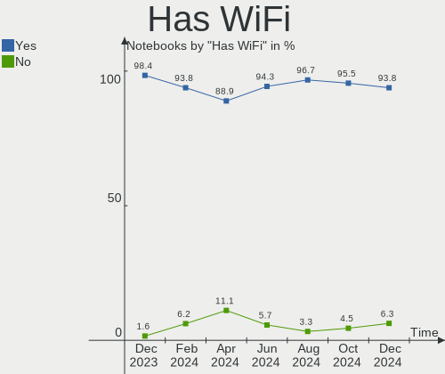
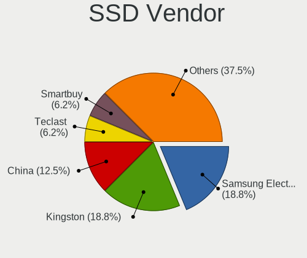
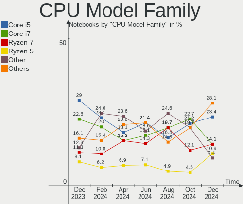
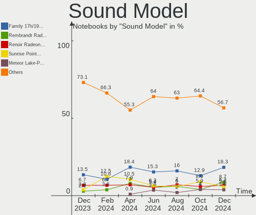
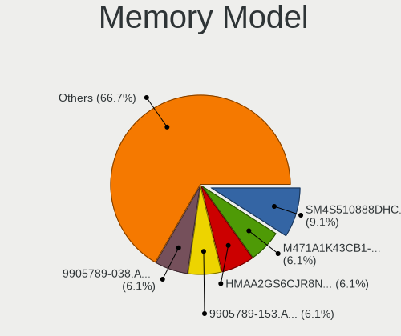
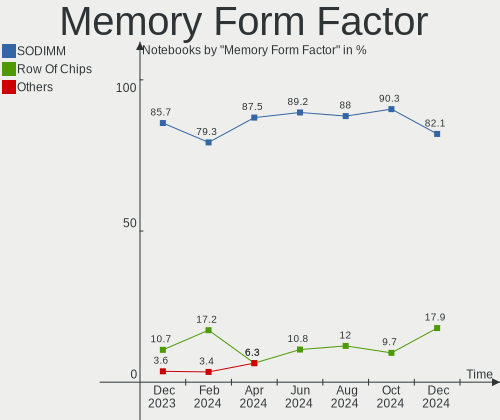
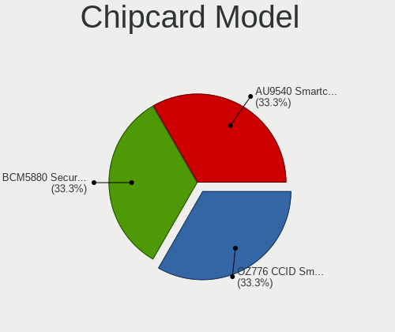
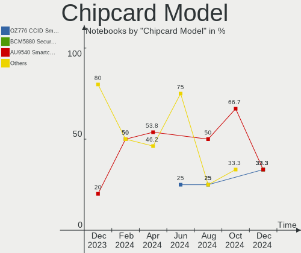

Manjaro - Hardware Trends (Notebooks)
-------------------------------------

A project to identify most popular hardware characteristics and track their change
over time based on data collected by Linux users at https://Linux-Hardware.org.

Anyone can contribute to this report by the [hw-probe](https://github.com/linuxhw/hw-probe) tool:

    sudo -E hw-probe -all -upload

This report is for one last month. Overall report since the beginning of time: [TestDays](https://github.com/linuxhw/TestDays)

Period: Mar, 2023.

Contents
--------

* [ System ](#system)
  - [ OS                       ](#os)
  - [ OS Family                ](#os-family)
  - [ Kernel                   ](#kernel)
  - [ Kernel Family            ](#kernel-family)
  - [ Kernel Major Ver.        ](#kernel-major-ver)
  - [ Arch                     ](#arch)
  - [ DE                       ](#de)
  - [ Display Server           ](#display-server)
  - [ Display Manager          ](#display-manager)
  - [ OS Lang                  ](#os-lang)
  - [ Boot Mode                ](#boot-mode)
  - [ Filesystem               ](#filesystem)
  - [ Part. scheme             ](#part-scheme)
  - [ Dual Boot with Linux/BSD ](#dual-boot-with-linuxbsd)
  - [ Dual Boot (Win)          ](#dual-boot-win)

* [ Board ](#board)
  - [ Vendor                   ](#vendor)
  - [ Model                    ](#model)
  - [ Model Family             ](#model-family)
  - [ MFG Year                 ](#mfg-year)
  - [ Form Factor              ](#form-factor)
  - [ Secure Boot              ](#secure-boot)
  - [ Coreboot                 ](#coreboot)
  - [ RAM Size                 ](#ram-size)
  - [ RAM Used                 ](#ram-used)
  - [ Total Drives             ](#total-drives)
  - [ Has CD-ROM               ](#has-cd-rom)
  - [ Has Ethernet             ](#has-ethernet)
  - [ Has WiFi                 ](#has-wifi)
  - [ Has Bluetooth            ](#has-bluetooth)

* [ Location ](#location)
  - [ Country                  ](#country)
  - [ City                     ](#city)

* [ Drives ](#drives)
  - [ Drive Vendor             ](#drive-vendor)
  - [ Drive Model              ](#drive-model)
  - [ HDD Vendor               ](#hdd-vendor)
  - [ SSD Vendor               ](#ssd-vendor)
  - [ Drive Kind               ](#drive-kind)
  - [ Drive Connector          ](#drive-connector)
  - [ Drive Size               ](#drive-size)
  - [ Space Total              ](#space-total)
  - [ Space Used               ](#space-used)
  - [ Malfunc. Drives          ](#malfunc-drives)
  - [ Malfunc. Drive Vendor    ](#malfunc-drive-vendor)
  - [ Malfunc. HDD Vendor      ](#malfunc-hdd-vendor)
  - [ Malfunc. Drive Kind      ](#malfunc-drive-kind)
  - [ Failed Drives            ](#failed-drives)
  - [ Failed Drive Vendor      ](#failed-drive-vendor)
  - [ Drive Status             ](#drive-status)

* [ Storage controller ](#storage-controller)
  - [ Storage Vendor           ](#storage-vendor)
  - [ Storage Model            ](#storage-model)
  - [ Storage Kind             ](#storage-kind)

* [ Processor ](#processor)
  - [ CPU Vendor               ](#cpu-vendor)
  - [ CPU Model                ](#cpu-model)
  - [ CPU Model Family         ](#cpu-model-family)
  - [ CPU Cores                ](#cpu-cores)
  - [ CPU Sockets              ](#cpu-sockets)
  - [ CPU Threads              ](#cpu-threads)
  - [ CPU Op-Modes             ](#cpu-op-modes)
  - [ CPU Microcode            ](#cpu-microcode)
  - [ CPU Microarch            ](#cpu-microarch)

* [ Graphics ](#graphics)
  - [ GPU Vendor               ](#gpu-vendor)
  - [ GPU Model                ](#gpu-model)
  - [ GPU Combo                ](#gpu-combo)
  - [ GPU Driver               ](#gpu-driver)
  - [ GPU Memory               ](#gpu-memory)

* [ Monitor ](#monitor)
  - [ Monitor Vendor           ](#monitor-vendor)
  - [ Monitor Model            ](#monitor-model)
  - [ Monitor Resolution       ](#monitor-resolution)
  - [ Monitor Diagonal         ](#monitor-diagonal)
  - [ Monitor Width            ](#monitor-width)
  - [ Aspect Ratio             ](#aspect-ratio)
  - [ Monitor Area             ](#monitor-area)
  - [ Pixel Density            ](#pixel-density)
  - [ Multiple Monitors        ](#multiple-monitors)

* [ Network ](#network)
  - [ Net Controller Vendor    ](#net-controller-vendor)
  - [ Net Controller Model     ](#net-controller-model)
  - [ Wireless Vendor          ](#wireless-vendor)
  - [ Wireless Model           ](#wireless-model)
  - [ Ethernet Vendor          ](#ethernet-vendor)
  - [ Ethernet Model           ](#ethernet-model)
  - [ Net Controller Kind      ](#net-controller-kind)
  - [ Used Controller          ](#used-controller)
  - [ NICs                     ](#nics)
  - [ IPv6                     ](#ipv6)

* [ Bluetooth ](#bluetooth)
  - [ Bluetooth Vendor         ](#bluetooth-vendor)
  - [ Bluetooth Model          ](#bluetooth-model)

* [ Sound ](#sound)
  - [ Sound Vendor             ](#sound-vendor)
  - [ Sound Model              ](#sound-model)

* [ Memory ](#memory)
  - [ Memory Vendor            ](#memory-vendor)
  - [ Memory Model             ](#memory-model)
  - [ Memory Kind              ](#memory-kind)
  - [ Memory Form Factor       ](#memory-form-factor)
  - [ Memory Size              ](#memory-size)
  - [ Memory Speed             ](#memory-speed)

* [ Printers & scanners ](#printers--scanners)
  - [ Printer Vendor           ](#printer-vendor)
  - [ Printer Model            ](#printer-model)
  - [ Scanner Vendor           ](#scanner-vendor)
  - [ Scanner Model            ](#scanner-model)

* [ Camera ](#camera)
  - [ Camera Vendor            ](#camera-vendor)
  - [ Camera Model             ](#camera-model)

* [ Security ](#security)
  - [ Fingerprint Vendor       ](#fingerprint-vendor)
  - [ Fingerprint Model        ](#fingerprint-model)
  - [ Chipcard Vendor          ](#chipcard-vendor)
  - [ Chipcard Model           ](#chipcard-model)

* [ Unsupported ](#unsupported)
  - [ Unsupported Devices      ](#unsupported-devices)
  - [ Unsupported Device Types ](#unsupported-device-types)

System
------

OS
--

Installed operating systems

| Name           | Notebooks | Percent |
|----------------|-----------|---------|
| Manjaro        | 48        | 50%     |
| Manjaro 22.0.4 | 24        | 25%     |
| Manjaro 22.0.5 | 22        | 22.92%  |
| Manjaro 22.0.2 | 1         | 1.04%   |
| Manjaro 22.0.1 | 1         | 1.04%   |

OS Family
---------

OS without a version

| Name    | Notebooks | Percent |
|---------|-----------|---------|
| Manjaro | 96        | 100%    |

Kernel
------

Version of the Linux kernel

| Version                        | Notebooks | Percent |
|--------------------------------|-----------|---------|
| 6.1.12-1-MANJARO               | 34        | 35.42%  |
| 6.1.19-1-MANJARO               | 20        | 20.83%  |
| 5.15.94-1-MANJARO              | 12        | 12.5%   |
| 6.2.7-2-MANJARO                | 9         | 9.38%   |
| 5.15.102-1-MANJARO             | 5         | 5.21%   |
| 6.0.5-4-rt14-MANJARO           | 2         | 2.08%   |
| 6.2.6-1-MANJARO                | 1         | 1.04%   |
| 6.2.0-1-MANJARO                | 1         | 1.04%   |
| 6.1.9-1-MANJARO                | 1         | 1.04%   |
| 6.1.7-1-MANJARO                | 1         | 1.04%   |
| 6.1.21-1-MANJARO               | 1         | 1.04%   |
| 6.1.15-x64v1-xanmod1-1-lts     | 1         | 1.04%   |
| 6.1.14-skylake-xanmod1-MANJARO | 1         | 1.04%   |
| 6.1.13-zen2-xanmod1-MANJARO    | 1         | 1.04%   |
| 6.1.13-lqx2-1-lqx              | 1         | 1.04%   |
| 5.19.7-1-MANJARO               | 1         | 1.04%   |
| 5.15.96-1-MANJARO              | 1         | 1.04%   |
| 5.15.93-1-MANJARO              | 1         | 1.04%   |
| 5.10.79-1-MANJARO              | 1         | 1.04%   |
| 5.10.167-1-MANJARO             | 1         | 1.04%   |

Kernel Family
-------------

Linux kernel without a distro release

| Version  | Notebooks | Percent |
|----------|-----------|---------|
| 6.1.12   | 34        | 35.42%  |
| 6.1.19   | 20        | 20.83%  |
| 5.15.94  | 12        | 12.5%   |
| 6.2.7    | 9         | 9.38%   |
| 5.15.102 | 5         | 5.21%   |
| 6.1.13   | 2         | 2.08%   |
| 6.0.5    | 2         | 2.08%   |
| 6.2.6    | 1         | 1.04%   |
| 6.2.0    | 1         | 1.04%   |
| 6.1.9    | 1         | 1.04%   |
| 6.1.7    | 1         | 1.04%   |
| 6.1.21   | 1         | 1.04%   |
| 6.1.15   | 1         | 1.04%   |
| 6.1.14   | 1         | 1.04%   |
| 5.19.7   | 1         | 1.04%   |
| 5.15.96  | 1         | 1.04%   |
| 5.15.93  | 1         | 1.04%   |
| 5.10.79  | 1         | 1.04%   |
| 5.10.167 | 1         | 1.04%   |

Kernel Major Ver.
-----------------

Linux kernel major version

| Version | Notebooks | Percent |
|---------|-----------|---------|
| 6.1     | 61        | 63.54%  |
| 5.15    | 19        | 19.79%  |
| 6.2     | 11        | 11.46%  |
| 6.0     | 2         | 2.08%   |
| 5.10    | 2         | 2.08%   |
| 5.19    | 1         | 1.04%   |

Arch
----

OS architecture (x86_64, i586, etc.)

| Name   | Notebooks | Percent |
|--------|-----------|---------|
| x86_64 | 96        | 100%    |

DE
--

Desktop Environment

| Name       | Notebooks | Percent |
|------------|-----------|---------|
| KDE5       | 61        | 63.54%  |
| GNOME      | 14        | 14.58%  |
| XFCE       | 13        | 13.54%  |
| X-Cinnamon | 4         | 4.17%   |
| sway       | 1         | 1.04%   |
| KDE        | 1         | 1.04%   |
| Hyprland   | 1         | 1.04%   |
| Unknown    | 1         | 1.04%   |

Display Server
--------------

X11 or Wayland

| Name    | Notebooks | Percent |
|---------|-----------|---------|
| X11     | 79        | 82.29%  |
| Wayland | 16        | 16.67%  |
| Tty     | 1         | 1.04%   |

Display Manager
---------------

SDDM, LightDM, etc.

| Name    | Notebooks | Percent |
|---------|-----------|---------|
| Unknown | 48        | 50%     |
| SDDM    | 25        | 26.04%  |
| LightDM | 13        | 13.54%  |
| GDM     | 9         | 9.38%   |
| GREETD  | 1         | 1.04%   |

OS Lang
-------

Language

| Lang    | Notebooks | Percent |
|---------|-----------|---------|
| en_US   | 43        | 44.79%  |
| ru_RU   | 7         | 7.29%   |
| en_GB   | 7         | 7.29%   |
| pt_BR   | 6         | 6.25%   |
| de_DE   | 6         | 6.25%   |
| zh_CN   | 2         | 2.08%   |
| tr_TR   | 2         | 2.08%   |
| pl_PL   | 2         | 2.08%   |
| nl_NL   | 2         | 2.08%   |
| it_IT   | 2         | 2.08%   |
| es_ES   | 2         | 2.08%   |
| en_IN   | 2         | 2.08%   |
| sv_SE   | 1         | 1.04%   |
| ja_JP   | 1         | 1.04%   |
| fr_FR   | 1         | 1.04%   |
| fi_FI   | 1         | 1.04%   |
| es_MX   | 1         | 1.04%   |
| es_CL   | 1         | 1.04%   |
| es_BO   | 1         | 1.04%   |
| en_DK   | 1         | 1.04%   |
| en_CA   | 1         | 1.04%   |
| en_AU   | 1         | 1.04%   |
| de_AT   | 1         | 1.04%   |
| C       | 1         | 1.04%   |
| Unknown | 1         | 1.04%   |

Boot Mode
---------

EFI or BIOS

| Mode | Notebooks | Percent |
|------|-----------|---------|
| BIOS | 59        | 61.46%  |
| EFI  | 37        | 38.54%  |

Filesystem
----------

Type of filesystem

| Type    | Notebooks | Percent |
|---------|-----------|---------|
| Ext4    | 72        | 75%     |
| Btrfs   | 19        | 19.79%  |
| Xfs     | 2         | 2.08%   |
| Overlay | 2         | 2.08%   |
| Tmpfs   | 1         | 1.04%   |

Part. scheme
------------

Scheme of partitioning

| Type    | Notebooks | Percent |
|---------|-----------|---------|
| GPT     | 47        | 48.96%  |
| Unknown | 46        | 47.92%  |
| MBR     | 3         | 3.13%   |

Dual Boot with Linux/BSD
------------------------

Hosting more than one Linux/BSD

| Dual boot | Notebooks | Percent |
|-----------|-----------|---------|
| No        | 90        | 93.75%  |
| Yes       | 6         | 6.25%   |

Dual Boot (Win)
---------------

Hosting Linux and Windows

| Dual boot | Notebooks | Percent |
|-----------|-----------|---------|
| No        | 72        | 75%     |
| Yes       | 24        | 25%     |

Board
-----

Vendor
------

Motherboard manufacturer

| Name                | Notebooks | Percent |
|---------------------|-----------|---------|
| Lenovo              | 23        | 23.96%  |
| Dell                | 19        | 19.79%  |
| Hewlett-Packard     | 15        | 15.63%  |
| ASUSTek Computer    | 6         | 6.25%   |
| Acer                | 5         | 5.21%   |
| Apple               | 3         | 3.13%   |
| Toshiba             | 2         | 2.08%   |
| Sony                | 2         | 2.08%   |
| Samsung Electronics | 2         | 2.08%   |
| Positivo            | 2         | 2.08%   |
| Medion              | 2         | 2.08%   |
| Unknown             | 2         | 2.08%   |
| TUXEDO              | 1         | 1.04%   |
| SLIMBOOK            | 1         | 1.04%   |
| realme              | 1         | 1.04%   |
| Razer               | 1         | 1.04%   |
| MSI                 | 1         | 1.04%   |
| Itautec             | 1         | 1.04%   |
| Infinix             | 1         | 1.04%   |
| HUAWEI              | 1         | 1.04%   |
| HONOR               | 1         | 1.04%   |
| GPD                 | 1         | 1.04%   |
| Google              | 1         | 1.04%   |
| Framework           | 1         | 1.04%   |
| Alienware           | 1         | 1.04%   |

Model
-----

Motherboard model

| Name                                               | Notebooks | Percent |
|----------------------------------------------------|-----------|---------|
| Dell XPS 15 9500                                   | 2         | 2.08%   |
| Apple MacBookPro14,1                               | 2         | 2.08%   |
| Unknown                                            | 2         | 2.08%   |
| TUXEDO InfinityBook S 15/17 Gen7                   | 1         | 1.04%   |
| Toshiba Satellite P300                             | 1         | 1.04%   |
| Toshiba QOSMIO F750                                | 1         | 1.04%   |
| Sony VPCEB4L1E                                     | 1         | 1.04%   |
| Sony SVZ1311C5E                                    | 1         | 1.04%   |
| SLIMBOOK PROX-AMD5                                 | 1         | 1.04%   |
| Samsung 530U3C/530U4C/532U3C                       | 1         | 1.04%   |
| Samsung 530U3BI/530U4BI/530U4BH                    | 1         | 1.04%   |
| realme CloudProXXXX                                | 1         | 1.04%   |
| Razer Blade 15 Base Model (Early 2020) - RZ09-0328 | 1         | 1.04%   |
| Positivo Q464B                                     | 1         | 1.04%   |
| Positivo C14CR21                                   | 1         | 1.04%   |
| MSI GT70 2PE                                       | 1         | 1.04%   |
| Medion E4251                                       | 1         | 1.04%   |
| Medion Akoya E6412T                                | 1         | 1.04%   |
| Lenovo XiaoXinPro-13ARE 2020 82DM                  | 1         | 1.04%   |
| Lenovo ThinkPad X1 Carbon 6th 20KHS18V00           | 1         | 1.04%   |
| Lenovo ThinkPad X1 Carbon 5th 20HR000DUS           | 1         | 1.04%   |
| Lenovo ThinkPad T580 20LAS1KA0R                    | 1         | 1.04%   |
| Lenovo ThinkPad T480 20L6S64C00                    | 1         | 1.04%   |
| Lenovo ThinkPad T470s 20HGS1C200                   | 1         | 1.04%   |
| Lenovo ThinkPad T430 2349A17                       | 1         | 1.04%   |
| Lenovo ThinkPad T420s 4174CN5                      | 1         | 1.04%   |
| Lenovo ThinkPad T15 Gen 2i 20W4003FUK              | 1         | 1.04%   |
| Lenovo ThinkPad P15s Gen 2i 20W6005JGE             | 1         | 1.04%   |
| Lenovo ThinkPad P14s Gen 3 21AK0054FR              | 1         | 1.04%   |
| Lenovo ThinkPad P14s Gen 3 21AK000UGE              | 1         | 1.04%   |
| Lenovo ThinkPad L15 Gen 3 21C3000CPG               | 1         | 1.04%   |
| Lenovo ThinkPad E15 Gen 2 20TDS0XG00               | 1         | 1.04%   |
| Lenovo ThinkPad E14 Gen 3 20YDS05600               | 1         | 1.04%   |
| Lenovo ThinkBook 13s G2 ITL 20V9                   | 1         | 1.04%   |
| Lenovo Legion 5 Pro 16ACH6 82JS                    | 1         | 1.04%   |
| Lenovo IdeaPad S340-15API 81NC                     | 1         | 1.04%   |
| Lenovo IdeaPad 700-15ISK 80RU                      | 1         | 1.04%   |
| Lenovo IdeaPad 5 14ARE05 81YM                      | 1         | 1.04%   |
| Lenovo IdeaPad 330S-15IKB 81F5                     | 1         | 1.04%   |
| Lenovo IdeaPad 330-15ICH 81FK                      | 1         | 1.04%   |

Model Family
------------

Motherboard model prefix

| Name                    | Notebooks | Percent |
|-------------------------|-----------|---------|
| Lenovo ThinkPad         | 14        | 14.58%  |
| Dell XPS                | 7         | 7.29%   |
| Lenovo IdeaPad          | 6         | 6.25%   |
| HP Laptop               | 6         | 6.25%   |
| Dell Latitude           | 5         | 5.21%   |
| HP Pavilion             | 3         | 3.13%   |
| Dell Vostro             | 2         | 2.08%   |
| Dell Precision          | 2         | 2.08%   |
| ASUS VivoBook           | 2         | 2.08%   |
| ASUS ROG                | 2         | 2.08%   |
| Apple MacBookPro14      | 2         | 2.08%   |
| Acer Swift              | 2         | 2.08%   |
| Unknown                 | 2         | 2.08%   |
| TUXEDO InfinityBook     | 1         | 1.04%   |
| Toshiba Satellite       | 1         | 1.04%   |
| Toshiba QOSMIO          | 1         | 1.04%   |
| Sony VPCEB4L1E          | 1         | 1.04%   |
| Sony SVZ1311C5E         | 1         | 1.04%   |
| SLIMBOOK PROX-AMD5      | 1         | 1.04%   |
| Samsung 530U3C          | 1         | 1.04%   |
| Samsung 530U3BI         | 1         | 1.04%   |
| realme CloudProXXXX     | 1         | 1.04%   |
| Razer Blade             | 1         | 1.04%   |
| Positivo Q464B          | 1         | 1.04%   |
| Positivo C14CR21        | 1         | 1.04%   |
| MSI GT70                | 1         | 1.04%   |
| Medion E4251            | 1         | 1.04%   |
| Medion Akoya            | 1         | 1.04%   |
| Lenovo XiaoXinPro-13ARE | 1         | 1.04%   |
| Lenovo ThinkBook        | 1         | 1.04%   |
| Lenovo Legion           | 1         | 1.04%   |
| Itautec Infoway         | 1         | 1.04%   |
| Infinix INBOOK          | 1         | 1.04%   |
| HUAWEI NBLB-WAX9N       | 1         | 1.04%   |
| HONOR BMH-WCX9          | 1         | 1.04%   |
| HP ProBook              | 1         | 1.04%   |
| HP OMEN                 | 1         | 1.04%   |
| HP Notebook             | 1         | 1.04%   |
| HP EliteBook            | 1         | 1.04%   |
| HP 250                  | 1         | 1.04%   |

MFG Year
--------

Motherboard manufacture year

| Year | Notebooks | Percent |
|------|-----------|---------|
| 2022 | 22        | 22.92%  |
| 2021 | 15        | 15.63%  |
| 2020 | 10        | 10.42%  |
| 2018 | 10        | 10.42%  |
| 2019 | 8         | 8.33%   |
| 2012 | 6         | 6.25%   |
| 2017 | 5         | 5.21%   |
| 2016 | 4         | 4.17%   |
| 2015 | 3         | 3.13%   |
| 2014 | 3         | 3.13%   |
| 2011 | 3         | 3.13%   |
| 2010 | 2         | 2.08%   |
| 2008 | 2         | 2.08%   |
| 2023 | 1         | 1.04%   |
| 2013 | 1         | 1.04%   |
| 2009 | 1         | 1.04%   |

Form Factor
-----------

Physical design of the computer

| Name     | Notebooks | Percent |
|----------|-----------|---------|
| Notebook | 96        | 100%    |

Secure Boot
-----------

Enabled or disabled

| State    | Notebooks | Percent |
|----------|-----------|---------|
| Disabled | 96        | 100%    |

Coreboot
--------

Have coreboot on board

| Used | Notebooks | Percent |
|------|-----------|---------|
| No   | 95        | 98.96%  |
| Yes  | 1         | 1.04%   |

RAM Size
--------

Total RAM memory

| Size in GB  | Notebooks | Percent |
|-------------|-----------|---------|
| 4.01-8.0    | 24        | 25%     |
| 32.01-64.0  | 22        | 22.92%  |
| 16.01-24.0  | 22        | 22.92%  |
| 8.01-16.0   | 17        | 17.71%  |
| 3.01-4.0    | 10        | 10.42%  |
| 64.01-256.0 | 1         | 1.04%   |

RAM Used
--------

Used RAM memory

| Used GB    | Notebooks | Percent |
|------------|-----------|---------|
| 2.01-3.0   | 26        | 27.08%  |
| 4.01-8.0   | 24        | 25%     |
| 3.01-4.0   | 15        | 15.63%  |
| 1.01-2.0   | 15        | 15.63%  |
| 8.01-16.0  | 13        | 13.54%  |
| 16.01-24.0 | 2         | 2.08%   |
| 24.01-32.0 | 1         | 1.04%   |

Total Drives
------------

Number of drives on board

| Drives | Notebooks | Percent |
|--------|-----------|---------|
| 1      | 59        | 61.46%  |
| 2      | 33        | 34.38%  |
| 3      | 3         | 3.13%   |
| 4      | 1         | 1.04%   |

Has CD-ROM
----------

Has CD-ROM on board

| Presented | Notebooks | Percent |
|-----------|-----------|---------|
| No        | 83        | 86.46%  |
| Yes       | 13        | 13.54%  |

Has Ethernet
------------

Has Ethernet on board

| Presented | Notebooks | Percent |
|-----------|-----------|---------|
| Yes       | 65        | 67.71%  |
| No        | 31        | 32.29%  |

Has WiFi
--------

Has WiFi module

| Presented | Notebooks | Percent |
|-----------|-----------|---------|
| Yes       | 94        | 97.92%  |
| No        | 2         | 2.08%   |

Has Bluetooth
-------------

Has Bluetooth module

| Presented | Notebooks | Percent |
|-----------|-----------|---------|
| Yes       | 79        | 82.29%  |
| No        | 17        | 17.71%  |

Location
--------

Country
-------

Geographic location (country)

| Country     | Notebooks | Percent |
|-------------|-----------|---------|
| USA         | 19        | 19.79%  |
| Germany     | 12        | 12.5%   |
| Russia      | 8         | 8.33%   |
| Brazil      | 7         | 7.29%   |
| UK          | 4         | 4.17%   |
| Italy       | 4         | 4.17%   |
| Spain       | 3         | 3.13%   |
| Netherlands | 3         | 3.13%   |
| India       | 3         | 3.13%   |
| Turkey      | 2         | 2.08%   |
| Portugal    | 2         | 2.08%   |
| Japan       | 2         | 2.08%   |
| Hungary     | 2         | 2.08%   |
| Czechia     | 2         | 2.08%   |
| China       | 2         | 2.08%   |
| Canada      | 2         | 2.08%   |
| Vietnam     | 1         | 1.04%   |
| Sweden      | 1         | 1.04%   |
| Sri Lanka   | 1         | 1.04%   |
| Romania     | 1         | 1.04%   |
| Poland      | 1         | 1.04%   |
| Norway      | 1         | 1.04%   |
| Nigeria     | 1         | 1.04%   |
| Mexico      | 1         | 1.04%   |
| Kyrgyzstan  | 1         | 1.04%   |
| Greece      | 1         | 1.04%   |
| France      | 1         | 1.04%   |
| Finland     | 1         | 1.04%   |
| Denmark     | 1         | 1.04%   |
| Chile       | 1         | 1.04%   |
| Bulgaria    | 1         | 1.04%   |
| Bolivia     | 1         | 1.04%   |
| Belgium     | 1         | 1.04%   |
| Austria     | 1         | 1.04%   |
| Australia   | 1         | 1.04%   |

City
----

Geographic location (city)

| City                        | Notebooks | Percent |
|-----------------------------|-----------|---------|
| Moscow                      | 4         | 4.17%   |
| St Petersburg               | 3         | 3.13%   |
| Frankfurt am Main           | 3         | 3.13%   |
| Berlin                      | 3         | 3.13%   |
| Wilster                     | 1         | 1.04%   |
| Wellington                  | 1         | 1.04%   |
| Vitry-sur-Seine             | 1         | 1.04%   |
| Vienna                      | 1         | 1.04%   |
| Toronto                     | 1         | 1.04%   |
| Toeroekbalint               | 1         | 1.04%   |
| Tijuana                     | 1         | 1.04%   |
| Thu Duc                     | 1         | 1.04%   |
| Thessaloniki                | 1         | 1.04%   |
| Tarpon Springs              | 1         | 1.04%   |
| Sofia                       | 1         | 1.04%   |
| Shenzhen                    | 1         | 1.04%   |
| Santiago                    | 1         | 1.04%   |
| San Jose                    | 1         | 1.04%   |
| San Cristóbal de La Laguna | 1         | 1.04%   |
| Rockford                    | 1         | 1.04%   |
| Prague                      | 1         | 1.04%   |
| Poznan                      | 1         | 1.04%   |
| Potomac                     | 1         | 1.04%   |
| Porto Alegre                | 1         | 1.04%   |
| Porto                       | 1         | 1.04%   |
| Pocking                     | 1         | 1.04%   |
| Oxford                      | 1         | 1.04%   |
| New York                    | 1         | 1.04%   |
| Mumbai                      | 1         | 1.04%   |
| Mountain View               | 1         | 1.04%   |
| Milano                      | 1         | 1.04%   |
| Milan                       | 1         | 1.04%   |
| Melbourne                   | 1         | 1.04%   |
| Marília                    | 1         | 1.04%   |
| Maracanau                   | 1         | 1.04%   |
| Maplewood                   | 1         | 1.04%   |
| Los Angeles                 | 1         | 1.04%   |
| London                      | 1         | 1.04%   |
| Lisbon                      | 1         | 1.04%   |
| Lancaster                   | 1         | 1.04%   |

Drives
------

Drive Vendor
------------

Hard drive vendors

| Vendor                         | Notebooks | Drives | Percent |
|--------------------------------|-----------|--------|---------|
| Samsung Electronics            | 19        | 21     | 14.39%  |
| SanDisk                        | 15        | 15     | 11.36%  |
| SK hynix                       | 10        | 10     | 7.58%   |
| WDC                            | 9         | 9      | 6.82%   |
| Seagate                        | 9         | 9      | 6.82%   |
| Toshiba                        | 8         | 10     | 6.06%   |
| Unknown                        | 7         | 7      | 5.3%    |
| Micron Technology              | 5         | 5      | 3.79%   |
| Kingston                       | 5         | 5      | 3.79%   |
| HGST                           | 5         | 5      | 3.79%   |
| Micron/Crucial Technology      | 4         | 4      | 3.03%   |
| Kingston Technology Company    | 3         | 3      | 2.27%   |
| Intel                          | 3         | 3      | 2.27%   |
| Apple                          | 3         | 5      | 2.27%   |
| Realtek Semiconductor          | 2         | 2      | 1.52%   |
| Realtek                        | 2         | 2      | 1.52%   |
| Phison Electronics             | 2         | 2      | 1.52%   |
| KIOXIA                         | 2         | 2      | 1.52%   |
| Crucial                        | 2         | 2      | 1.52%   |
| A-DATA Technology              | 2         | 2      | 1.52%   |
| Super Talent                   | 1         | 1      | 0.76%   |
| Solid State Storage Technology | 1         | 1      | 0.76%   |
| Solid State Storage            | 1         | 1      | 0.76%   |
| Silicon Motion                 | 1         | 1      | 0.76%   |
| Shenzhen Longsys Electronics   | 1         | 1      | 0.76%   |
| Phison                         | 1         | 1      | 0.76%   |
| Maxtor                         | 1         | 1      | 0.76%   |
| JetFlash                       | 1         | 1      | 0.76%   |
| Intenso                        | 1         | 1      | 0.76%   |
| HEORIADY                       | 1         | 1      | 0.76%   |
| GOODRAM                        | 1         | 1      | 0.76%   |
| CHN25SATAS1                    | 1         | 1      | 0.76%   |
| CHIPFANC                       | 1         | 1      | 0.76%   |
| China                          | 1         | 1      | 0.76%   |
| Unknown                        | 1         | 2      | 0.76%   |

Drive Model
-----------

Hard drive models

| Model                                               | Notebooks | Percent |
|-----------------------------------------------------|-----------|---------|
| Samsung NVMe SSD Controller SM981/PM981/PM983 250GB | 7         | 5.22%   |
| Seagate ST1000LM035-1RK172 1TB                      | 4         | 2.99%   |
| Unknown MMC Card  64GB                              | 3         | 2.24%   |
| Toshiba XG6 NVMe SSD Controller 512GB               | 3         | 2.24%   |
| SK hynix SKHynix_HFS001TDE9X081N 1024GB             | 3         | 2.24%   |
| Sandisk WD Blue SN550 NVMe SSD 256GB                | 3         | 2.24%   |
| Toshiba XG4 NVMe SSD Controller 256GB               | 2         | 1.49%   |
| Sandisk WD Black SN850 1TB                          | 2         | 1.49%   |
| Samsung SSD 860 EVO 1TB                             | 2         | 1.49%   |
| Samsung NVMe SSD Controller SM951/PM951 128GB       | 2         | 1.49%   |
| Micron/Crucial CT1000P5PSSD8 1TB                    | 2         | 1.49%   |
| Kingston Company OM3PDP3 NVMe SSD 256GB             | 2         | 1.49%   |
| Kingston SNVS1000G 1TB                              | 2         | 1.49%   |
| HGST HTS721010A9E630 1TB                            | 2         | 1.49%   |
| HGST HTS545050A7E680 500GB                          | 2         | 1.49%   |
| Apple S3X NVMe Controller 256GB                     | 2         | 1.49%   |
| WDC WD5000LPLX-60ZNTT2 500GB                        | 1         | 0.75%   |
| WDC WD5000LPCX-60VHAT1 500GB                        | 1         | 0.75%   |
| WDC WD5000BPVT-00HXZT3 500GB                        | 1         | 0.75%   |
| WDC WD3200BPVT-22JJ5T0 320GB                        | 1         | 0.75%   |
| WDC WD1600BJKT-75F4T0 160GB                         | 1         | 0.75%   |
| WDC WD10SPZX-24Z10 1TB                              | 1         | 0.75%   |
| WDC WD10SPZX-22Z10T1 1TB                            | 1         | 0.75%   |
| WDC WD10SPCX-24HWST1 1TB                            | 1         | 0.75%   |
| WDC WD10SPCX-08HWST0 1TB                            | 1         | 0.75%   |
| Unknown NVMe SSD Drive 1TB                          | 1         | 0.75%   |
| Unknown MMC Card  32GB                              | 1         | 0.75%   |
| Unknown MMC Card  128GB                             | 1         | 0.75%   |
| Unknown MMC Card  120MB                             | 1         | 0.75%   |
| Unknown Externa 320GB                               | 1         | 0.75%   |
| Toshiba THNSNH128GMCT 128GB SSD                     | 1         | 0.75%   |
| Toshiba MQ04ABF100 1TB                              | 1         | 0.75%   |
| Toshiba BG3 NVMe SSD Controller 512GB               | 1         | 0.75%   |
| Super Talent FTM25N325H 250GB                       | 1         | 0.75%   |
| Solid State Storage SSSTC CL4-4D512-Q79 512GB       | 1         | 0.75%   |
| Solid State Storage SSSTC CL1-8D512 512GB           | 1         | 0.75%   |
| SK hynix SKHynix_HFS512GDE9X081N 512GB              | 1         | 0.75%   |
| SK hynix SC311 SATA 512GB SSD                       | 1         | 0.75%   |
| SK hynix SC311 SATA 256GB SSD                       | 1         | 0.75%   |
| SK hynix SC311 SATA 128GB SSD                       | 1         | 0.75%   |

HDD Vendor
----------

Hard disk drive vendors

| Vendor  | Notebooks | Drives | Percent |
|---------|-----------|--------|---------|
| WDC     | 9         | 9      | 39.13%  |
| Seagate | 8         | 8      | 34.78%  |
| HGST    | 5         | 5      | 21.74%  |
| Toshiba | 1         | 1      | 4.35%   |

SSD Vendor
----------

Solid state drive vendors

| Vendor              | Notebooks | Drives | Percent |
|---------------------|-----------|--------|---------|
| Samsung Electronics | 6         | 6      | 19.35%  |
| SanDisk             | 5         | 5      | 16.13%  |
| SK hynix            | 4         | 4      | 12.9%   |
| Kingston            | 2         | 2      | 6.45%   |
| Crucial             | 2         | 2      | 6.45%   |
| A-DATA Technology   | 2         | 2      | 6.45%   |
| Toshiba             | 1         | 3      | 3.23%   |
| Super Talent        | 1         | 1      | 3.23%   |
| Phison              | 1         | 1      | 3.23%   |
| Maxtor              | 1         | 1      | 3.23%   |
| Intenso             | 1         | 1      | 3.23%   |
| HEORIADY            | 1         | 1      | 3.23%   |
| GOODRAM             | 1         | 1      | 3.23%   |
| China               | 1         | 1      | 3.23%   |
| Apple               | 1         | 1      | 3.23%   |
| Unknown             | 1         | 2      | 3.23%   |

Drive Kind
----------

HDD or SSD

| Kind    | Notebooks | Drives | Percent |
|---------|-----------|--------|---------|
| NVMe    | 61        | 72     | 49.59%  |
| SSD     | 28        | 34     | 22.76%  |
| HDD     | 23        | 23     | 18.7%   |
| MMC     | 6         | 6      | 4.88%   |
| Unknown | 5         | 4      | 4.07%   |

Drive Connector
---------------

SATA, SAS, NVMe, etc.

| Type | Notebooks | Drives | Percent |
|------|-----------|--------|---------|
| NVMe | 61        | 70     | 52.14%  |
| SATA | 41        | 54     | 35.04%  |
| SAS  | 9         | 9      | 7.69%   |
| MMC  | 6         | 6      | 5.13%   |

Drive Size
----------

Size of hard drive

| Size in TB | Notebooks | Drives | Percent |
|------------|-----------|--------|---------|
| 0.01-0.5   | 30        | 38     | 62.5%   |
| 0.51-1.0   | 16        | 17     | 33.33%  |
| 1.01-2.0   | 1         | 1      | 2.08%   |
| 4.01-10.0  | 1         | 1      | 2.08%   |

Space Total
-----------

Amount of disk space available on the file system

| Size in GB     | Notebooks | Percent |
|----------------|-----------|---------|
| 251-500        | 28        | 29.17%  |
| 101-250        | 21        | 21.88%  |
| 501-1000       | 12        | 12.5%   |
| Unknown        | 11        | 11.46%  |
| 1001-2000      | 8         | 8.33%   |
| 51-100         | 7         | 7.29%   |
| More than 3000 | 3         | 3.13%   |
| 2001-3000      | 3         | 3.13%   |
| 1-20           | 2         | 2.08%   |
| 21-50          | 1         | 1.04%   |

Space Used
----------

Amount of used disk space

| Used GB        | Notebooks | Percent |
|----------------|-----------|---------|
| 21-50          | 25        | 26.04%  |
| 1-20           | 17        | 17.71%  |
| 251-500        | 13        | 13.54%  |
| 51-100         | 13        | 13.54%  |
| Unknown        | 11        | 11.46%  |
| 101-250        | 10        | 10.42%  |
| 1001-2000      | 3         | 3.13%   |
| 501-1000       | 2         | 2.08%   |
| More than 3000 | 1         | 1.04%   |
| 2001-3000      | 1         | 1.04%   |

Malfunc. Drives
---------------

Drive models with a malfunction

| Model                                 | Notebooks | Drives | Percent |
|---------------------------------------|-----------|--------|---------|
| SK hynix SC308 SATA 512GB SSD         | 1         | 1      | 20%     |
| Samsung Electronics SSD 870 EVO 500GB | 1         | 1      | 20%     |
| Samsung Electronics SSD 840 EVO 250GB | 1         | 1      | 20%     |
| Realtek RTL9210 NVME 512GB            | 1         | 1      | 20%     |
| HGST HTS545050A7E680 500GB            | 1         | 1      | 20%     |

Malfunc. Drive Vendor
---------------------

Vendors of faulty drives

| Vendor              | Notebooks | Drives | Percent |
|---------------------|-----------|--------|---------|
| Samsung Electronics | 2         | 2      | 40%     |
| SK hynix            | 1         | 1      | 20%     |
| Realtek             | 1         | 1      | 20%     |
| HGST                | 1         | 1      | 20%     |

Malfunc. HDD Vendor
-------------------

Vendors of faulty HDD drives

| Vendor | Notebooks | Drives | Percent |
|--------|-----------|--------|---------|
| HGST   | 1         | 1      | 100%    |

Malfunc. Drive Kind
-------------------

Kinds of faulty drives

| Kind | Notebooks | Drives | Percent |
|------|-----------|--------|---------|
| SSD  | 3         | 3      | 60%     |
| NVMe | 1         | 1      | 20%     |
| HDD  | 1         | 1      | 20%     |

Failed Drives
-------------

Failed drive models

Zero info for selected period =(

Failed Drive Vendor
-------------------

Failed drive vendors

Zero info for selected period =(

Drive Status
------------

Number of failed and malfunc. drives

| Status   | Notebooks | Drives | Percent |
|----------|-----------|--------|---------|
| Detected | 67        | 95     | 65.69%  |
| Works    | 30        | 39     | 29.41%  |
| Malfunc  | 5         | 5      | 4.9%    |

Storage controller
------------------

Storage Vendor
--------------

Storage controller vendors

| Vendor                         | Notebooks | Percent |
|--------------------------------|-----------|---------|
| Intel                          | 50        | 39.06%  |
| Samsung Electronics            | 15        | 11.72%  |
| AMD                            | 13        | 10.16%  |
| SanDisk                        | 10        | 7.81%   |
| Toshiba America Info Systems   | 6         | 4.69%   |
| SK hynix                       | 6         | 4.69%   |
| Kingston Technology Company    | 6         | 4.69%   |
| Micron Technology              | 5         | 3.91%   |
| Micron/Crucial Technology      | 4         | 3.13%   |
| Solid State Storage Technology | 2         | 1.56%   |
| Realtek Semiconductor          | 2         | 1.56%   |
| Phison Electronics             | 2         | 1.56%   |
| KIOXIA                         | 2         | 1.56%   |
| Apple                          | 2         | 1.56%   |
| Transcend                      | 1         | 0.78%   |
| Silicon Motion                 | 1         | 0.78%   |
| Shenzhen Longsys Electronics   | 1         | 0.78%   |

Storage Model
-------------

Storage controller models

| Model                                                                        | Notebooks | Percent |
|------------------------------------------------------------------------------|-----------|---------|
| AMD FCH SATA Controller [AHCI mode]                                          | 13        | 10%     |
| Samsung NVMe SSD Controller SM981/PM981/PM983                                | 7         | 5.38%   |
| Intel Volume Management Device NVMe RAID Controller                          | 7         | 5.38%   |
| Intel 82801 Mobile SATA Controller [RAID mode]                               | 6         | 4.62%   |
| SK hynix Gold P31/PC711 NVMe Solid State Drive                               | 5         | 3.85%   |
| Micron NVMe Storage Controller                                               | 5         | 3.85%   |
| Intel Sunrise Point-LP SATA Controller [AHCI mode]                           | 4         | 3.08%   |
| Intel 6 Series/C200 Series Chipset Family 6 port Mobile SATA AHCI Controller | 4         | 3.08%   |
| Toshiba America Info Systems XG6 NVMe SSD Controller                         | 3         | 2.31%   |
| SanDisk WD Blue SN550 NVMe SSD                                               | 3         | 2.31%   |
| Samsung NVMe SSD Controller 980                                              | 3         | 2.31%   |
| Intel Tiger Lake-LP SATA Controller                                          | 3         | 2.31%   |
| Intel Cannon Lake Mobile PCH SATA AHCI Controller                            | 3         | 2.31%   |
| Intel 7 Series Chipset Family 6-port SATA Controller [AHCI mode]             | 3         | 2.31%   |
| Toshiba America Info Systems XG4 NVMe SSD Controller                         | 2         | 1.54%   |
| Solid State Storage Non-Volatile memory controller                           | 2         | 1.54%   |
| SanDisk WD PC SN810 / Black SN850 NVMe SSD                                   | 2         | 1.54%   |
| SanDisk NVMe Controller                                                      | 2         | 1.54%   |
| Sandisk Non-Volatile memory controller                                       | 2         | 1.54%   |
| Samsung NVMe SSD Controller SM951/PM951                                      | 2         | 1.54%   |
| Realtek NVMe Controller                                                      | 2         | 1.54%   |
| Micron/Crucial P5 Plus NVMe PCIe SSD                                         | 2         | 1.54%   |
| KIOXIA NVMe SSD Controller BG4                                               | 2         | 1.54%   |
| Kingston Company OM3PDP3 NVMe SSD                                            | 2         | 1.54%   |
| Kingston Company NVMe Controller                                             | 2         | 1.54%   |
| Intel Wildcat Point-LP SATA Controller [AHCI Mode]                           | 2         | 1.54%   |
| Intel Non-Volatile memory controller                                         | 2         | 1.54%   |
| Intel HM170/QM170 Chipset SATA Controller [AHCI Mode]                        | 2         | 1.54%   |
| Intel Comet Lake SATA AHCI Controller                                        | 2         | 1.54%   |
| Intel Celeron/Pentium Silver Processor SATA Controller                       | 2         | 1.54%   |
| Intel Alder Lake-P SATA AHCI Controller                                      | 2         | 1.54%   |
| Intel 82801IBM/IEM (ICH9M/ICH9M-E) 4 port SATA Controller [AHCI mode]        | 2         | 1.54%   |
| Intel 5 Series/3400 Series Chipset 4 port SATA AHCI Controller               | 2         | 1.54%   |
| Apple S3X NVMe Controller                                                    | 2         | 1.54%   |
| Transcend Non-Volatile memory controller                                     | 1         | 0.77%   |
| Toshiba America Info Systems BG3 NVMe SSD Controller                         | 1         | 0.77%   |
| SK hynix BC501 NVMe Solid State Drive                                        | 1         | 0.77%   |
| Silicon Motion SM2263EN/SM2263XT SSD Controller                              | 1         | 0.77%   |
| Shenzhen Longsys Electronics Non-Volatile memory controller                  | 1         | 0.77%   |
| SanDisk WD Black SN750 / PC SN730 NVMe SSD                                   | 1         | 0.77%   |

Storage Kind
------------

Kind of storage controller (IDE, SATA, NVMe, SAS, ...)

| Kind | Notebooks | Percent |
|------|-----------|---------|
| NVMe | 61        | 49.19%  |
| SATA | 50        | 40.32%  |
| RAID | 13        | 10.48%  |

Processor
---------

CPU Vendor
----------

Processor vendors

| Vendor | Notebooks | Percent |
|--------|-----------|---------|
| Intel  | 72        | 75%     |
| AMD    | 24        | 25%     |

CPU Model
---------

Processor models

| Model                                    | Notebooks | Percent |
|------------------------------------------|-----------|---------|
| Intel 11th Gen Core i7-1165G7 @ 2.80GHz  | 5         | 5.21%   |
| AMD Ryzen 7 5800H with Radeon Graphics   | 5         | 5.21%   |
| Intel 12th Gen Core i7-1260P             | 3         | 3.13%   |
| AMD Ryzen 7 5700U with Radeon Graphics   | 3         | 3.13%   |
| AMD Ryzen 5 5500U with Radeon Graphics   | 3         | 3.13%   |
| Intel Core i7-8750H CPU @ 2.20GHz        | 2         | 2.08%   |
| Intel Core i7-8650U CPU @ 1.90GHz        | 2         | 2.08%   |
| Intel Core i7-6700HQ CPU @ 2.60GHz       | 2         | 2.08%   |
| Intel Core i7-2670QM CPU @ 2.20GHz       | 2         | 2.08%   |
| Intel Core i7-10750H CPU @ 2.60GHz       | 2         | 2.08%   |
| Intel Core i5-7360U CPU @ 2.30GHz        | 2         | 2.08%   |
| Intel Core i5-7300U CPU @ 2.60GHz        | 2         | 2.08%   |
| Intel Core i5-5200U CPU @ 2.20GHz        | 2         | 2.08%   |
| Intel Core i3 CPU M 380 @ 2.53GHz        | 2         | 2.08%   |
| Intel 12th Gen Core i7-12700H            | 2         | 2.08%   |
| Intel 11th Gen Core i5-1135G7 @ 2.40GHz  | 2         | 2.08%   |
| Intel 11th Gen Core i3-1115G4 @ 3.00GHz  | 2         | 2.08%   |
| Intel Pentium Silver N5030 CPU @ 1.10GHz | 1         | 1.04%   |
| Intel Pentium 3558U @ 1.70GHz            | 1         | 1.04%   |
| Intel Core i9-10900K CPU @ 3.70GHz       | 1         | 1.04%   |
| Intel Core i9-10885H CPU @ 2.40GHz       | 1         | 1.04%   |
| Intel Core i7-9750H CPU @ 2.60GHz        | 1         | 1.04%   |
| Intel Core i7-8565U CPU @ 1.80GHz        | 1         | 1.04%   |
| Intel Core i7-7600U CPU @ 2.80GHz        | 1         | 1.04%   |
| Intel Core i7-7560U CPU @ 2.40GHz        | 1         | 1.04%   |
| Intel Core i7-7500U CPU @ 2.70GHz        | 1         | 1.04%   |
| Intel Core i7-4870HQ CPU @ 2.50GHz       | 1         | 1.04%   |
| Intel Core i7-4800MQ CPU @ 2.70GHz       | 1         | 1.04%   |
| Intel Core i7-3632QM CPU @ 2.20GHz       | 1         | 1.04%   |
| Intel Core i7-3612QM CPU @ 2.10GHz       | 1         | 1.04%   |
| Intel Core i7-3520M CPU @ 2.90GHz        | 1         | 1.04%   |
| Intel Core i7-2640M CPU @ 2.80GHz        | 1         | 1.04%   |
| Intel Core i7-1065G7 CPU @ 1.30GHz       | 1         | 1.04%   |
| Intel Core i5-8279U CPU @ 2.40GHz        | 1         | 1.04%   |
| Intel Core i5-8250U CPU @ 1.60GHz        | 1         | 1.04%   |
| Intel Core i5-6300U CPU @ 2.40GHz        | 1         | 1.04%   |
| Intel Core i5-3317U CPU @ 1.70GHz        | 1         | 1.04%   |
| Intel Core i5-2467M CPU @ 1.60GHz        | 1         | 1.04%   |
| Intel Core i5-10210U CPU @ 1.60GHz       | 1         | 1.04%   |
| Intel Core i3-8145U CPU @ 2.10GHz        | 1         | 1.04%   |

CPU Model Family
----------------

Processor model prefix

| Model                | Notebooks | Percent |
|----------------------|-----------|---------|
| Other                | 22        | 22.92%  |
| Intel Core i7        | 22        | 22.92%  |
| Intel Core i5        | 12        | 12.5%   |
| AMD Ryzen 7          | 10        | 10.42%  |
| AMD Ryzen 5          | 6         | 6.25%   |
| Intel Core i3        | 5         | 5.21%   |
| Intel Celeron        | 4         | 4.17%   |
| Intel Core i9        | 2         | 2.08%   |
| Intel Core 2 Duo     | 2         | 2.08%   |
| AMD Ryzen 9          | 2         | 2.08%   |
| AMD Ryzen 3          | 2         | 2.08%   |
| Intel Pentium Silver | 1         | 1.04%   |
| Intel Pentium        | 1         | 1.04%   |
| Intel Atom           | 1         | 1.04%   |
| AMD Ryzen 7 PRO      | 1         | 1.04%   |
| AMD E2               | 1         | 1.04%   |
| AMD E1               | 1         | 1.04%   |
| AMD A10              | 1         | 1.04%   |

CPU Cores
---------

Number of processor cores

| Number | Notebooks | Percent |
|--------|-----------|---------|
| 2      | 33        | 34.38%  |
| 4      | 28        | 29.17%  |
| 8      | 15        | 15.63%  |
| 6      | 10        | 10.42%  |
| 10     | 4         | 4.17%   |
| 14     | 3         | 3.13%   |
| 12     | 3         | 3.13%   |

CPU Sockets
-----------

Number of sockets

| Number | Notebooks | Percent |
|--------|-----------|---------|
| 1      | 96        | 100%    |

CPU Threads
-----------

Threads per core (Hyper-Threading)

| Number | Notebooks | Percent |
|--------|-----------|---------|
| 2      | 84        | 87.5%   |
| 1      | 12        | 12.5%   |

CPU Op-Modes
------------

CPU Operation Modes (32-bit, 64-bit)

| Op mode        | Notebooks | Percent |
|----------------|-----------|---------|
| 32-bit, 64-bit | 96        | 100%    |

CPU Microcode
-------------

Microcode number

| Number     | Notebooks | Percent |
|------------|-----------|---------|
| Unknown    | 67        | 69.79%  |
| 0x08608103 | 3         | 3.13%   |
| 0xa0652    | 2         | 2.08%   |
| 0x806ea    | 2         | 2.08%   |
| 0x806e9    | 2         | 2.08%   |
| 0x806c2    | 2         | 2.08%   |
| 0x0a50000d | 2         | 2.08%   |
| 0x08108109 | 2         | 2.08%   |
| 0x906ea    | 1         | 1.04%   |
| 0x906a4    | 1         | 1.04%   |
| 0x906a3    | 1         | 1.04%   |
| 0x806ec    | 1         | 1.04%   |
| 0x806eb    | 1         | 1.04%   |
| 0x806c1    | 1         | 1.04%   |
| 0x406e3    | 1         | 1.04%   |
| 0x406c4    | 1         | 1.04%   |
| 0x306a9    | 1         | 1.04%   |
| 0x30673    | 1         | 1.04%   |
| 0x0a50000c | 1         | 1.04%   |
| 0x0a50000b | 1         | 1.04%   |
| 0x08600109 | 1         | 1.04%   |
| 0x08600106 | 1         | 1.04%   |

CPU Microarch
-------------

Microarchitecture

| Name             | Notebooks | Percent |
|------------------|-----------|---------|
| KabyLake         | 18        | 18.75%  |
| Unknown          | 15        | 15.63%  |
| TigerLake        | 12        | 12.5%   |
| Zen 3            | 7         | 7.29%   |
| SandyBridge      | 5         | 5.21%   |
| Skylake          | 4         | 4.17%   |
| IvyBridge        | 4         | 4.17%   |
| CometLake        | 4         | 4.17%   |
| Zen 2            | 3         | 3.13%   |
| Haswell          | 3         | 3.13%   |
| Alderlake Hybrid | 3         | 3.13%   |
| Zen+             | 2         | 2.08%   |
| Westmere         | 2         | 2.08%   |
| Silvermont       | 2         | 2.08%   |
| Penryn           | 2         | 2.08%   |
| Goldmont plus    | 2         | 2.08%   |
| Excavator        | 2         | 2.08%   |
| Broadwell        | 2         | 2.08%   |
| Zen              | 1         | 1.04%   |
| Jaguar           | 1         | 1.04%   |
| IceLake          | 1         | 1.04%   |
| Goldmont         | 1         | 1.04%   |

Graphics
--------

GPU Vendor
----------

Vendors of graphics cards

| Vendor | Notebooks | Percent |
|--------|-----------|---------|
| Intel  | 67        | 54.92%  |
| Nvidia | 30        | 24.59%  |
| AMD    | 25        | 20.49%  |

GPU Model
---------

Graphics card models

| Model                                                                                 | Notebooks | Percent |
|---------------------------------------------------------------------------------------|-----------|---------|
| Intel TigerLake-LP GT2 [Iris Xe Graphics]                                             | 10        | 8.06%   |
| Intel Alder Lake-P Integrated Graphics Controller                                     | 6         | 4.84%   |
| AMD Lucienne                                                                          | 6         | 4.84%   |
| Intel HD Graphics 620                                                                 | 5         | 4.03%   |
| AMD Cezanne [Radeon Vega Series / Radeon Vega Mobile Series]                          | 5         | 4.03%   |
| Intel 3rd Gen Core processor Graphics Controller                                      | 4         | 3.23%   |
| Intel UHD Graphics 620                                                                | 3         | 2.42%   |
| Intel Iris Plus Graphics 640                                                          | 3         | 2.42%   |
| Intel CometLake-H GT2 [UHD Graphics]                                                  | 3         | 2.42%   |
| Intel CoffeeLake-H GT2 [UHD Graphics 630]                                             | 3         | 2.42%   |
| Intel 2nd Generation Core Processor Family Integrated Graphics Controller             | 3         | 2.42%   |
| AMD Renoir                                                                            | 3         | 2.42%   |
| Nvidia TU117M [GeForce MX450]                                                         | 2         | 1.61%   |
| Nvidia TU117M [GeForce GTX 1650 Ti Mobile]                                            | 2         | 1.61%   |
| Nvidia TU117M [GeForce GTX 1650 Mobile / Max-Q]                                       | 2         | 1.61%   |
| Nvidia TU117GLM [T550 Laptop GPU]                                                     | 2         | 1.61%   |
| Nvidia GA107M [GeForce RTX 3050 Ti Mobile]                                            | 2         | 1.61%   |
| Intel WhiskeyLake-U GT2 [UHD Graphics 620]                                            | 2         | 1.61%   |
| Intel Tiger Lake-LP GT2 [UHD Graphics G4]                                             | 2         | 1.61%   |
| Intel Skylake GT2 [HD Graphics 520]                                                   | 2         | 1.61%   |
| Intel HD Graphics 5500                                                                | 2         | 1.61%   |
| Intel HD Graphics 530                                                                 | 2         | 1.61%   |
| Intel Core Processor Integrated Graphics Controller                                   | 2         | 1.61%   |
| Intel Alder Lake-UP3 GT2 [Iris Xe Graphics]                                           | 2         | 1.61%   |
| AMD Topaz XT [Radeon R7 M260/M265 / M340/M360 / M440/M445 / 530/535 / 620/625 Mobile] | 2         | 1.61%   |
| AMD Rembrandt [Radeon 680M]                                                           | 2         | 1.61%   |
| AMD Picasso/Raven 2 [Radeon Vega Series / Radeon Vega Mobile Series]                  | 2         | 1.61%   |
| Nvidia TU117GLM [T600 Laptop GPU]                                                     | 1         | 0.81%   |
| Nvidia TU117GLM [Quadro T500 Mobile]                                                  | 1         | 0.81%   |
| Nvidia TU106M [GeForce RTX 2060 Mobile]                                               | 1         | 0.81%   |
| Nvidia TU104M [GeForce RTX 2080 SUPER Mobile / Max-Q]                                 | 1         | 0.81%   |
| Nvidia GP107M [GeForce GTX 1050 Mobile]                                               | 1         | 0.81%   |
| Nvidia GP106M [GeForce GTX 1060 Mobile]                                               | 1         | 0.81%   |
| Nvidia GM108M [GeForce 940M]                                                          | 1         | 0.81%   |
| Nvidia GM108M [GeForce 940MX]                                                         | 1         | 0.81%   |
| Nvidia GM107M [GeForce GTX 960M]                                                      | 1         | 0.81%   |
| Nvidia GM107M [GeForce GTX 950M]                                                      | 1         | 0.81%   |
| Nvidia GK208BM [GeForce 920M]                                                         | 1         | 0.81%   |
| Nvidia GK107M [GeForce GT 750M Mac Edition]                                           | 1         | 0.81%   |
| Nvidia GK104M [GeForce GTX 880M]                                                      | 1         | 0.81%   |

GPU Combo
---------

Combinations of graphics cards

| Name           | Notebooks | Percent |
|----------------|-----------|---------|
| 1 x Intel      | 45        | 46.88%  |
| Intel + Nvidia | 20        | 20.83%  |
| 1 x AMD        | 18        | 18.75%  |
| 1 x Nvidia     | 6         | 6.25%   |
| AMD + Nvidia   | 4         | 4.17%   |
| 2 x AMD        | 2         | 2.08%   |
| Intel + AMD    | 1         | 1.04%   |

GPU Driver
----------

Free vs proprietary

| Driver      | Notebooks | Percent |
|-------------|-----------|---------|
| Free        | 77        | 80.21%  |
| Proprietary | 19        | 19.79%  |

GPU Memory
----------

Total video memory

| Size in GB | Notebooks | Percent |
|------------|-----------|---------|
| Unknown    | 79        | 82.29%  |
| 0.01-0.5   | 7         | 7.29%   |
| 1.01-2.0   | 4         | 4.17%   |
| 0.51-1.0   | 3         | 3.13%   |
| 7.01-8.0   | 1         | 1.04%   |
| 3.01-4.0   | 1         | 1.04%   |
| 8.01-16.0  | 1         | 1.04%   |

Monitor
-------

Monitor Vendor
--------------

Monitor vendors

| Vendor                  | Notebooks | Percent |
|-------------------------|-----------|---------|
| Chimei Innolux          | 22        | 18.49%  |
| BOE                     | 22        | 18.49%  |
| AU Optronics            | 16        | 13.45%  |
| LG Display              | 10        | 8.4%    |
| Samsung Electronics     | 7         | 5.88%   |
| Sharp                   | 5         | 4.2%    |
| Dell                    | 5         | 4.2%    |
| Apple                   | 3         | 2.52%   |
| InfoVision              | 2         | 1.68%   |
| Hewlett-Packard         | 2         | 1.68%   |
| Chi Mei Optoelectronics | 2         | 1.68%   |
| Acer                    | 2         | 1.68%   |
| Unknown                 | 1         | 0.84%   |
| Toshiba                 | 1         | 0.84%   |
| TMX                     | 1         | 0.84%   |
| Sony                    | 1         | 0.84%   |
| Seiko/Epson             | 1         | 0.84%   |
| Planar                  | 1         | 0.84%   |
| Philips                 | 1         | 0.84%   |
| PANDA                   | 1         | 0.84%   |
| NEC Computers           | 1         | 0.84%   |
| MSI                     | 1         | 0.84%   |
| Mi                      | 1         | 0.84%   |
| Lenovo                  | 1         | 0.84%   |
| HKC                     | 1         | 0.84%   |
| Hitachi                 | 1         | 0.84%   |
| Goldstar                | 1         | 0.84%   |
| Eve Spectrum            | 1         | 0.84%   |
| EQV                     | 1         | 0.84%   |
| CSO                     | 1         | 0.84%   |
| AOC                     | 1         | 0.84%   |
| Ancor Communications    | 1         | 0.84%   |
| Unknown                 | 1         | 0.84%   |

Monitor Model
-------------

Monitor models

| Model                                                                 | Notebooks | Percent |
|-----------------------------------------------------------------------|-----------|---------|
| Sharp LCD Monitor SHP14D0 3840x2400 336x210mm 15.6-inch               | 2         | 1.68%   |
| Chimei Innolux LCD Monitor CMN15F5 1920x1080 344x193mm 15.5-inch      | 2         | 1.68%   |
| Chimei Innolux LCD Monitor CMN143C 1920x1200 301x188mm 14.0-inch      | 2         | 1.68%   |
| BOE LCD Monitor BOE06A5 1366x768 344x194mm 15.5-inch                  | 2         | 1.68%   |
| Unknown LCD Monitor SAMSUNG                                           | 1         | 0.84%   |
| Toshiba LCD Monitor TV                                                | 1         | 0.84%   |
| TMX TL140VDXP03-2 TMX1398 1920x1080 309x174mm 14.0-inch               | 1         | 0.84%   |
| Sony Nvidia Defaul t Flat Panel MS_0025 1920x1080 360x200mm 16.2-inch | 1         | 0.84%   |
| Sharp LCD Monitor SHP1548 1920x1200 288x180mm 13.4-inch               | 1         | 0.84%   |
| Sharp LCD Monitor SHP1515 1920x1200 336x210mm 15.6-inch               | 1         | 0.84%   |
| Sharp LCD Monitor SHP144A 3200x1800 294x165mm 13.3-inch               | 1         | 0.84%   |
| Seiko/Epson LCD Monitor 3520x1080                                     | 1         | 0.84%   |
| Samsung Electronics SyncMaster SAM036D 1920x1080                      | 1         | 0.84%   |
| Samsung Electronics SMS24A450 SAM083A 1920x1200 518x324mm 24.1-inch   | 1         | 0.84%   |
| Samsung Electronics S22B300 SAM08C8 1920x1080 477x268mm 21.5-inch     | 1         | 0.84%   |
| Samsung Electronics Q80A SAM7142 1920x1080 1872x1053mm 84.6-inch      | 1         | 0.84%   |
| Samsung Electronics LCD Monitor SEC3847 1440x900 367x230mm 17.1-inch  | 1         | 0.84%   |
| Samsung Electronics LCD Monitor SDCA029 3840x2160 344x194mm 15.5-inch | 1         | 0.84%   |
| Samsung Electronics LCD Monitor SDC416E 2880x1620 344x194mm 15.5-inch | 1         | 0.84%   |
| Planar PLN2200 PLN2200 1920x1080 477x268mm 21.5-inch                  | 1         | 0.84%   |
| Philips PHL 243V7 PHLC155 1920x1080 527x296mm 23.8-inch               | 1         | 0.84%   |
| PANDA LCD Monitor NCP0046 1920x1080 344x194mm 15.5-inch               | 1         | 0.84%   |
| NEC Computers LCD Monitor EA243WM                                     | 1         | 0.84%   |
| MSI MAG321CURV MSI3DA2 3840x2160 700x390mm 31.5-inch                  | 1         | 0.84%   |
| Mi Monitor XMI23C3 1920x1080 527x293mm 23.7-inch                      | 1         | 0.84%   |
| LG Display LCD Monitor LGD4C01 1920x1200 367x230mm 17.1-inch          | 1         | 0.84%   |
| LG Display LCD Monitor LGD062E 1920x1080 344x194mm 15.5-inch          | 1         | 0.84%   |
| LG Display LCD Monitor LGD0625 1920x1080 344x194mm 15.5-inch          | 1         | 0.84%   |
| LG Display LCD Monitor LGD05E5 1920x1080 344x194mm 15.5-inch          | 1         | 0.84%   |
| LG Display LCD Monitor LGD05D0 1920x1080 344x194mm 15.5-inch          | 1         | 0.84%   |
| LG Display LCD Monitor LGD0546 1920x1080 344x194mm 15.5-inch          | 1         | 0.84%   |
| LG Display LCD Monitor LGD0493 1366x768 344x194mm 15.5-inch           | 1         | 0.84%   |
| LG Display LCD Monitor LGD0490 1920x1080 309x174mm 14.0-inch          | 1         | 0.84%   |
| LG Display LCD Monitor LGD0465 1366x768 344x194mm 15.5-inch           | 1         | 0.84%   |
| LG Display LCD Monitor LGD0385 1366x768 309x174mm 14.0-inch           | 1         | 0.84%   |
| Lenovo L24e-30 LEN66BC 1920x1080 527x296mm 23.8-inch                  | 1         | 0.84%   |
| InfoVision LCD Monitor IVO8CBE 1920x1200 302x189mm 14.0-inch          | 1         | 0.84%   |
| InfoVision LCD Monitor IVO057D 1920x1080 309x174mm 14.0-inch          | 1         | 0.84%   |
| HKC LCD Monitor HKC3CFB 1920x1080 344x194mm 15.5-inch                 | 1         | 0.84%   |
| Hitachi HISENSE HEC002F 3840x2160 1872x1053mm 84.6-inch               | 1         | 0.84%   |

Monitor Resolution
------------------

Monitor screen resolution

| Resolution        | Notebooks | Percent |
|-------------------|-----------|---------|
| 1920x1080 (FHD)   | 53        | 48.18%  |
| 1366x768 (WXGA)   | 17        | 15.45%  |
| 1920x1200 (WUXGA) | 8         | 7.27%   |
| 3840x2160 (4K)    | 6         | 5.45%   |
| 2560x1440 (QHD)   | 6         | 5.45%   |
| 2560x1600         | 4         | 3.64%   |
| 2880x1800         | 3         | 2.73%   |
| 3840x2400         | 2         | 1.82%   |
| Unknown           | 2         | 1.82%   |
| 3840x1200         | 1         | 0.91%   |
| 3520x1080         | 1         | 0.91%   |
| 3440x1440         | 1         | 0.91%   |
| 3200x1800 (QHD+)  | 1         | 0.91%   |
| 2880x1620         | 1         | 0.91%   |
| 2256x1504         | 1         | 0.91%   |
| 2160x1440         | 1         | 0.91%   |
| 1600x900 (HD+)    | 1         | 0.91%   |
| 1440x900 (WXGA+)  | 1         | 0.91%   |

Monitor Diagonal
----------------

Diagonal size in inches

| Inches  | Notebooks | Percent |
|---------|-----------|---------|
| 15      | 46        | 40%     |
| 14      | 17        | 14.78%  |
| 13      | 17        | 14.78%  |
| 17      | 7         | 6.09%   |
| 24      | 6         | 5.22%   |
| 27      | 5         | 4.35%   |
| 23      | 4         | 3.48%   |
| Unknown | 4         | 3.48%   |
| 84      | 2         | 1.74%   |
| 31      | 2         | 1.74%   |
| 21      | 2         | 1.74%   |
| 34      | 1         | 0.87%   |
| 26      | 1         | 0.87%   |
| 16      | 1         | 0.87%   |

Monitor Width
-------------

Physical width

| Width in mm | Notebooks | Percent |
|-------------|-----------|---------|
| 301-350     | 71        | 61.74%  |
| 501-600     | 16        | 13.91%  |
| 201-300     | 10        | 8.7%    |
| 351-400     | 7         | 6.09%   |
| Unknown     | 4         | 3.48%   |
| 601-700     | 2         | 1.74%   |
| 401-500     | 2         | 1.74%   |
| 1501-2000   | 2         | 1.74%   |
| 701-800     | 1         | 0.87%   |

Aspect Ratio
------------

Proportional relationship between the width and the height

| Ratio   | Notebooks | Percent |
|---------|-----------|---------|
| 16/9    | 76        | 76.77%  |
| 16/10   | 17        | 17.17%  |
| Unknown | 3         | 3.03%   |
| 3/2     | 2         | 2.02%   |
| 21/9    | 1         | 1.01%   |

Monitor Area
------------

Area in inch²

| Area in inch² | Notebooks | Percent |
|----------------|-----------|---------|
| 101-110        | 45        | 38.79%  |
| 81-90          | 27        | 23.28%  |
| 201-250        | 9         | 7.76%   |
| 71-80          | 7         | 6.03%   |
| 301-350        | 6         | 5.17%   |
| 121-130        | 5         | 4.31%   |
| Unknown        | 4         | 3.45%   |
| 351-500        | 3         | 2.59%   |
| More than 1000 | 2         | 1.72%   |
| 251-300        | 2         | 1.72%   |
| 151-200        | 2         | 1.72%   |
| 131-140        | 2         | 1.72%   |
| 111-120        | 2         | 1.72%   |

Pixel Density
-------------

Pixels per inch

| Density       | Notebooks | Percent |
|---------------|-----------|---------|
| 121-160       | 47        | 41.59%  |
| 101-120       | 21        | 18.58%  |
| 161-240       | 17        | 15.04%  |
| 51-100        | 16        | 14.16%  |
| More than 240 | 7         | 6.19%   |
| Unknown       | 4         | 3.54%   |
| 1-50          | 1         | 0.88%   |

Multiple Monitors
-----------------

Total monitors connected

| Total | Notebooks | Percent |
|-------|-----------|---------|
| 1     | 70        | 72.92%  |
| 2     | 24        | 25%     |
| 3     | 2         | 2.08%   |

Network
-------

Net Controller Vendor
---------------------

Controller vendors

| Vendor                          | Notebooks | Percent |
|---------------------------------|-----------|---------|
| Intel                           | 58        | 39.46%  |
| Realtek Semiconductor           | 51        | 34.69%  |
| Qualcomm Atheros                | 11        | 7.48%   |
| MediaTek                        | 6         | 4.08%   |
| Broadcom                        | 5         | 3.4%    |
| Marvell Technology Group        | 2         | 1.36%   |
| ZyDAS                           | 1         | 0.68%   |
| Sierra Wireless                 | 1         | 0.68%   |
| Samsung Electronics             | 1         | 0.68%   |
| Ralink Technology               | 1         | 0.68%   |
| Ralink                          | 1         | 0.68%   |
| Qualcomm Atheros Communications | 1         | 0.68%   |
| Qualcomm                        | 1         | 0.68%   |
| Lenovo                          | 1         | 0.68%   |
| JMicron Technology              | 1         | 0.68%   |
| Huawei Technologies             | 1         | 0.68%   |
| Google                          | 1         | 0.68%   |
| Dell                            | 1         | 0.68%   |
| Broadcom Limited                | 1         | 0.68%   |
| ASIX Electronics                | 1         | 0.68%   |

Net Controller Model
--------------------

Controller models

| Model                                                             | Notebooks | Percent |
|-------------------------------------------------------------------|-----------|---------|
| Realtek RTL8111/8168/8411 PCI Express Gigabit Ethernet Controller | 28        | 16.37%  |
| Intel Alder Lake-P PCH CNVi WiFi                                  | 9         | 5.26%   |
| Intel Wi-Fi 6 AX201                                               | 8         | 4.68%   |
| Intel Wi-Fi 6 AX200                                               | 8         | 4.68%   |
| Realtek RTL8153 Gigabit Ethernet Adapter                          | 7         | 4.09%   |
| MediaTek MT7921 802.11ax PCI Express Wireless Network Adapter     | 5         | 2.92%   |
| Intel Wireless 8265 / 8275                                        | 5         | 2.92%   |
| Intel Ethernet Connection (4) I219-LM                             | 5         | 2.92%   |
| Realtek RTL8822CE 802.11ac PCIe Wireless Network Adapter          | 4         | 2.34%   |
| Qualcomm Atheros QCA9377 802.11ac Wireless Network Adapter        | 4         | 2.34%   |
| Intel Wi-Fi 6 AX210/AX211/AX411 160MHz                            | 4         | 2.34%   |
| Realtek RTL810xE PCI Express Fast Ethernet controller             | 3         | 1.75%   |
| Intel Ethernet Connection (16) I219-V                             | 3         | 1.75%   |
| Intel Comet Lake PCH CNVi WiFi                                    | 3         | 1.75%   |
| Intel Centrino Advanced-N 6235                                    | 3         | 1.75%   |
| Realtek RTL8821CE 802.11ac PCIe Wireless Network Adapter          | 2         | 1.17%   |
| Realtek RTL8723DE Wireless Network Adapter                        | 2         | 1.17%   |
| Realtek RTL8188EE Wireless Network Adapter                        | 2         | 1.17%   |
| Realtek RTL8125 2.5GbE Controller                                 | 2         | 1.17%   |
| Realtek Killer E2600 Gigabit Ethernet Controller                  | 2         | 1.17%   |
| Qualcomm Atheros QCA6174 802.11ac Wireless Network Adapter        | 2         | 1.17%   |
| Intel WiFi Link 5100                                              | 2         | 1.17%   |
| Intel Ethernet Connection (13) I219-V                             | 2         | 1.17%   |
| Intel Cannon Lake PCH CNVi WiFi                                   | 2         | 1.17%   |
| Intel 82579LM Gigabit Network Connection (Lewisville)             | 2         | 1.17%   |
| Broadcom BCM4350 802.11ac Wireless Network Adapter                | 2         | 1.17%   |
| ZyDAS ZD1211 802.11g                                              | 1         | 0.58%   |
| Sierra Wireless EM7455                                            | 1         | 0.58%   |
| Samsung Galaxy series, misc. (tethering mode)                     | 1         | 0.58%   |
| Realtek RTL88x2bu [AC1200 Techkey]                                | 1         | 0.58%   |
| Realtek RTL8852BE PCIe 802.11ax Wireless Network Controller       | 1         | 0.58%   |
| Realtek RTL8852AE 802.11ax PCIe Wireless Network Adapter          | 1         | 0.58%   |
| Realtek RTL8822BE 802.11a/b/g/n/ac WiFi adapter                   | 1         | 0.58%   |
| Realtek Killer E3000 2.5GbE Controller                            | 1         | 0.58%   |
| Realtek 802.11n WLAN Adapter                                      | 1         | 0.58%   |
| Ralink RT2870/RT3070 Wireless Adapter                             | 1         | 0.58%   |
| Ralink RT3290 Wireless 802.11n 1T/1R PCIe                         | 1         | 0.58%   |
| Qualcomm QCA6390 Wireless Network Adapter                         | 1         | 0.58%   |
| Qualcomm Atheros QCA9565 / AR9565 Wireless Network Adapter        | 1         | 0.58%   |
| Qualcomm Atheros Killer E2400 Gigabit Ethernet Controller         | 1         | 0.58%   |

Wireless Vendor
---------------

Wireless vendors

| Vendor                          | Notebooks | Percent |
|---------------------------------|-----------|---------|
| Intel                           | 57        | 57.58%  |
| Realtek Semiconductor           | 15        | 15.15%  |
| Qualcomm Atheros                | 9         | 9.09%   |
| MediaTek                        | 6         | 6.06%   |
| Broadcom                        | 5         | 5.05%   |
| ZyDAS                           | 1         | 1.01%   |
| Sierra Wireless                 | 1         | 1.01%   |
| Ralink Technology               | 1         | 1.01%   |
| Ralink                          | 1         | 1.01%   |
| Qualcomm Atheros Communications | 1         | 1.01%   |
| Qualcomm                        | 1         | 1.01%   |
| Dell                            | 1         | 1.01%   |

Wireless Model
--------------

Wireless models

| Model                                                          | Notebooks | Percent |
|----------------------------------------------------------------|-----------|---------|
| Intel Alder Lake-P PCH CNVi WiFi                               | 9         | 9.09%   |
| Intel Wi-Fi 6 AX201                                            | 8         | 8.08%   |
| Intel Wi-Fi 6 AX200                                            | 8         | 8.08%   |
| MediaTek MT7921 802.11ax PCI Express Wireless Network Adapter  | 5         | 5.05%   |
| Intel Wireless 8265 / 8275                                     | 5         | 5.05%   |
| Realtek RTL8822CE 802.11ac PCIe Wireless Network Adapter       | 4         | 4.04%   |
| Qualcomm Atheros QCA9377 802.11ac Wireless Network Adapter     | 4         | 4.04%   |
| Intel Wi-Fi 6 AX210/AX211/AX411 160MHz                         | 4         | 4.04%   |
| Intel Comet Lake PCH CNVi WiFi                                 | 3         | 3.03%   |
| Intel Centrino Advanced-N 6235                                 | 3         | 3.03%   |
| Realtek RTL8821CE 802.11ac PCIe Wireless Network Adapter       | 2         | 2.02%   |
| Realtek RTL8723DE Wireless Network Adapter                     | 2         | 2.02%   |
| Realtek RTL8188EE Wireless Network Adapter                     | 2         | 2.02%   |
| Qualcomm Atheros QCA6174 802.11ac Wireless Network Adapter     | 2         | 2.02%   |
| Intel WiFi Link 5100                                           | 2         | 2.02%   |
| Intel Cannon Lake PCH CNVi WiFi                                | 2         | 2.02%   |
| Broadcom BCM4350 802.11ac Wireless Network Adapter             | 2         | 2.02%   |
| ZyDAS ZD1211 802.11g                                           | 1         | 1.01%   |
| Sierra Wireless EM7455                                         | 1         | 1.01%   |
| Realtek RTL88x2bu [AC1200 Techkey]                             | 1         | 1.01%   |
| Realtek RTL8852BE PCIe 802.11ax Wireless Network Controller    | 1         | 1.01%   |
| Realtek RTL8852AE 802.11ax PCIe Wireless Network Adapter       | 1         | 1.01%   |
| Realtek RTL8822BE 802.11a/b/g/n/ac WiFi adapter                | 1         | 1.01%   |
| Realtek 802.11n WLAN Adapter                                   | 1         | 1.01%   |
| Ralink RT2870/RT3070 Wireless Adapter                          | 1         | 1.01%   |
| Ralink RT3290 Wireless 802.11n 1T/1R PCIe                      | 1         | 1.01%   |
| Qualcomm QCA6390 Wireless Network Adapter                      | 1         | 1.01%   |
| Qualcomm Atheros QCA9565 / AR9565 Wireless Network Adapter     | 1         | 1.01%   |
| Qualcomm Atheros AR9271 802.11n                                | 1         | 1.01%   |
| Qualcomm Atheros AR9462 Wireless Network Adapter               | 1         | 1.01%   |
| Qualcomm Atheros AR9285 Wireless Network Adapter (PCI-Express) | 1         | 1.01%   |
| MediaTek Wi-Fi 6E MT7922 160MHz Wireless Network Adapter       | 1         | 1.01%   |
| Intel Wireless 8260                                            | 1         | 1.01%   |
| Intel Wireless 7265                                            | 1         | 1.01%   |
| Intel Wireless 3165                                            | 1         | 1.01%   |
| Intel Wireless 3160                                            | 1         | 1.01%   |
| Intel Tiger Lake PCH CNVi WiFi                                 | 1         | 1.01%   |
| Intel Gemini Lake PCH CNVi WiFi                                | 1         | 1.01%   |
| Intel Dual Band Wireless-AC 3165 Plus Bluetooth                | 1         | 1.01%   |
| Intel Comet Lake PCH-LP CNVi WiFi                              | 1         | 1.01%   |

Ethernet Vendor
---------------

Ethernet vendors

| Vendor                   | Notebooks | Percent |
|--------------------------|-----------|---------|
| Realtek Semiconductor    | 42        | 60%     |
| Intel                    | 16        | 22.86%  |
| Qualcomm Atheros         | 2         | 2.86%   |
| Marvell Technology Group | 2         | 2.86%   |
| Broadcom                 | 2         | 2.86%   |
| Samsung Electronics      | 1         | 1.43%   |
| Lenovo                   | 1         | 1.43%   |
| JMicron Technology       | 1         | 1.43%   |
| Google                   | 1         | 1.43%   |
| Broadcom Limited         | 1         | 1.43%   |
| ASIX Electronics         | 1         | 1.43%   |

Ethernet Model
--------------

Ethernet models

| Model                                                                          | Notebooks | Percent |
|--------------------------------------------------------------------------------|-----------|---------|
| Realtek RTL8111/8168/8411 PCI Express Gigabit Ethernet Controller              | 28        | 39.44%  |
| Realtek RTL8153 Gigabit Ethernet Adapter                                       | 7         | 9.86%   |
| Intel Ethernet Connection (4) I219-LM                                          | 5         | 7.04%   |
| Realtek RTL810xE PCI Express Fast Ethernet controller                          | 3         | 4.23%   |
| Intel Ethernet Connection (16) I219-V                                          | 3         | 4.23%   |
| Realtek RTL8125 2.5GbE Controller                                              | 2         | 2.82%   |
| Realtek Killer E2600 Gigabit Ethernet Controller                               | 2         | 2.82%   |
| Intel Ethernet Connection (13) I219-V                                          | 2         | 2.82%   |
| Intel 82579LM Gigabit Network Connection (Lewisville)                          | 2         | 2.82%   |
| Samsung Galaxy series, misc. (tethering mode)                                  | 1         | 1.41%   |
| Realtek Killer E3000 2.5GbE Controller                                         | 1         | 1.41%   |
| Qualcomm Atheros Killer E2400 Gigabit Ethernet Controller                      | 1         | 1.41%   |
| Qualcomm Atheros Killer E220x Gigabit Ethernet Controller                      | 1         | 1.41%   |
| Marvell Group Yukon Optima 88E8059 [PCIe Gigabit Ethernet Controller with AVB] | 1         | 1.41%   |
| Marvell Group 88E8040T PCI-E Fast Ethernet Controller                          | 1         | 1.41%   |
| Lenovo ThinkPad Lan                                                            | 1         | 1.41%   |
| JMicron JMC250 PCI Express Gigabit Ethernet Controller                         | 1         | 1.41%   |
| Intel Ethernet Connection I219-LM                                              | 1         | 1.41%   |
| Intel Ethernet Connection (4) I219-V                                           | 1         | 1.41%   |
| Intel Ethernet Connection (16) I219-LM                                         | 1         | 1.41%   |
| Intel Ethernet Connection (14) I219-LM                                         | 1         | 1.41%   |
| Google Pixel 7                                                                 | 1         | 1.41%   |
| Broadcom NetXtreme BCM57762 Gigabit Ethernet PCIe                              | 1         | 1.41%   |
| Broadcom NetXtreme BCM5761 Gigabit Ethernet PCIe                               | 1         | 1.41%   |
| Broadcom Limited NetXtreme BCM5761e Gigabit Ethernet PCIe                      | 1         | 1.41%   |
| ASIX AX88179 Gigabit Ethernet                                                  | 1         | 1.41%   |

Net Controller Kind
-------------------

Ethernet, WiFi or modem

| Kind     | Notebooks | Percent |
|----------|-----------|---------|
| WiFi     | 94        | 58.75%  |
| Ethernet | 65        | 40.63%  |
| Modem    | 1         | 0.63%   |

Used Controller
---------------

Currently used network controller

| Kind     | Notebooks | Percent |
|----------|-----------|---------|
| WiFi     | 85        | 82.52%  |
| Ethernet | 18        | 17.48%  |

NICs
----

Total network controllers on board

| Total | Notebooks | Percent |
|-------|-----------|---------|
| 2     | 58        | 60.42%  |
| 1     | 36        | 37.5%   |
| 0     | 2         | 2.08%   |

IPv6
----

IPv6 vs IPv4

| Used | Notebooks | Percent |
|------|-----------|---------|
| No   | 63        | 65.63%  |
| Yes  | 33        | 34.38%  |

Bluetooth
---------

Bluetooth Vendor
----------------

Controller vendors

| Vendor                          | Notebooks | Percent |
|---------------------------------|-----------|---------|
| Intel                           | 49        | 61.25%  |
| Realtek Semiconductor           | 10        | 12.5%   |
| Qualcomm Atheros Communications | 5         | 6.25%   |
| IMC Networks                    | 5         | 6.25%   |
| Foxconn / Hon Hai               | 4         | 5%      |
| Lite-On Technology              | 2         | 2.5%    |
| Broadcom                        | 2         | 2.5%    |
| Ralink                          | 1         | 1.25%   |
| Dell                            | 1         | 1.25%   |
| Apple                           | 1         | 1.25%   |

Bluetooth Model
---------------

Controller models

| Model                                                                               | Notebooks | Percent |
|-------------------------------------------------------------------------------------|-----------|---------|
| Intel AX201 Bluetooth                                                               | 12        | 15%     |
| Realtek Bluetooth Radio                                                             | 8         | 10%     |
| Intel Bluetooth wireless interface                                                  | 8         | 10%     |
| Intel AX200 Bluetooth                                                               | 8         | 10%     |
| Intel Bluetooth Device                                                              | 6         | 7.5%    |
| Intel Bluetooth 9460/9560 Jefferson Peak (JfP)                                      | 6         | 7.5%    |
| Qualcomm Atheros  Bluetooth Device                                                  | 4         | 5%      |
| Intel AX210 Bluetooth                                                               | 4         | 5%      |
| Intel Centrino Bluetooth Wireless Transceiver                                       | 3         | 3.75%   |
| IMC Networks Wireless_Device                                                        | 3         | 3.75%   |
| Realtek  Bluetooth 4.2 Adapter                                                      | 2         | 2.5%    |
| Lite-On Wireless_Device                                                             | 2         | 2.5%    |
| Intel Centrino Advanced-N 6230 Bluetooth adapter                                    | 2         | 2.5%    |
| Ralink RT3290 Bluetooth                                                             | 1         | 1.25%   |
| Qualcomm Atheros AR3011 Bluetooth                                                   | 1         | 1.25%   |
| IMC Networks Bluetooth Device                                                       | 1         | 1.25%   |
| IMC Networks Atheros AR3012 Bluetooth                                               | 1         | 1.25%   |
| Foxconn / Hon Hai Wireless_Device                                                   | 1         | 1.25%   |
| Foxconn / Hon Hai Foxconn T77H114 BCM2070 [Single-Chip Bluetooth 2.1 + EDR Adapter] | 1         | 1.25%   |
| Foxconn / Hon Hai Bluetooth USB Host Controller                                     | 1         | 1.25%   |
| Foxconn / Hon Hai Bluetooth Device                                                  | 1         | 1.25%   |
| Dell BCM20702A0 Bluetooth Module                                                    | 1         | 1.25%   |
| Broadcom BCM43142A0 Bluetooth 4.0                                                   | 1         | 1.25%   |
| Broadcom BCM2045B (BDC-2.1)                                                         | 1         | 1.25%   |
| Apple Bluetooth Host Controller                                                     | 1         | 1.25%   |

Sound
-----

Sound Vendor
------------

Sound card vendors

| Vendor                     | Notebooks | Percent |
|----------------------------|-----------|---------|
| Intel                      | 71        | 57.72%  |
| AMD                        | 25        | 20.33%  |
| Nvidia                     | 14        | 11.38%  |
| Realtek Semiconductor      | 3         | 2.44%   |
| Yealink Network Technology | 1         | 0.81%   |
| Samson Technologies        | 1         | 0.81%   |
| Razer USA                  | 1         | 0.81%   |
| Plantronics                | 1         | 0.81%   |
| Lenovo                     | 1         | 0.81%   |
| JMTek                      | 1         | 0.81%   |
| Harman International       | 1         | 0.81%   |
| Focusrite-Novation         | 1         | 0.81%   |
| Creative Technology        | 1         | 0.81%   |
| Anlya.cn                   | 1         | 0.81%   |

Sound Model
-----------

Sound card models

| Model                                                                      | Notebooks | Percent |
|----------------------------------------------------------------------------|-----------|---------|
| AMD Family 17h/19h HD Audio Controller                                     | 21        | 14.09%  |
| AMD Renoir Radeon High Definition Audio Controller                         | 14        | 9.4%    |
| Intel Sunrise Point-LP HD Audio                                            | 13        | 8.72%   |
| Intel Tiger Lake-LP Smart Sound Technology Audio Controller                | 12        | 8.05%   |
| Intel Alder Lake PCH-P High Definition Audio Controller                    | 8         | 5.37%   |
| Intel 7 Series/C216 Chipset Family High Definition Audio Controller        | 5         | 3.36%   |
| Intel Comet Lake PCH cAVS                                                  | 4         | 2.68%   |
| Intel 6 Series/C200 Series Chipset Family High Definition Audio Controller | 4         | 2.68%   |
| Realtek Semiconductor USB Audio                                            | 3         | 2.01%   |
| Nvidia Audio device                                                        | 3         | 2.01%   |
| Intel Cannon Point-LP High Definition Audio Controller                     | 3         | 2.01%   |
| Intel Cannon Lake PCH cAVS                                                 | 3         | 2.01%   |
| AMD Raven/Raven2/Fenghuang HDMI/DP Audio Controller                        | 3         | 2.01%   |
| Nvidia GA104 High Definition Audio Controller                              | 2         | 1.34%   |
| Intel Wildcat Point-LP High Definition Audio Controller                    | 2         | 1.34%   |
| Intel Celeron/Pentium Silver Processor High Definition Audio               | 2         | 1.34%   |
| Intel Broadwell-U Audio Controller                                         | 2         | 1.34%   |
| Intel 82801I (ICH9 Family) HD Audio Controller                             | 2         | 1.34%   |
| Intel 8 Series/C220 Series Chipset High Definition Audio Controller        | 2         | 1.34%   |
| Intel 5 Series/3400 Series Chipset High Definition Audio                   | 2         | 1.34%   |
| Intel 100 Series/C230 Series Chipset Family HD Audio Controller            | 2         | 1.34%   |
| AMD Rembrandt Radeon High Definition Audio Controller                      | 2         | 1.34%   |
| AMD Kabini HDMI/DP Audio                                                   | 2         | 1.34%   |
| AMD Family 15h (Models 60h-6fh) Audio Controller                           | 2         | 1.34%   |
| Yealink Network Technology Yealink UH34                                    | 1         | 0.67%   |
| Samson Technologies C01U Pro condenser microphone                          | 1         | 0.67%   |
| Razer USA Razer Seiren Mini                                                | 1         | 0.67%   |
| Plantronics BT600                                                          | 1         | 0.67%   |
| Nvidia TU106 High Definition Audio Controller                              | 1         | 0.67%   |
| Nvidia TU104 HD Audio Controller                                           | 1         | 0.67%   |
| Nvidia GP106 High Definition Audio Controller                              | 1         | 0.67%   |
| Nvidia GM107 High Definition Audio Controller [GeForce 940MX]              | 1         | 0.67%   |
| Nvidia GK208 HDMI/DP Audio Controller                                      | 1         | 0.67%   |
| Nvidia GK107 HDMI Audio Controller                                         | 1         | 0.67%   |
| Nvidia GK104 HDMI Audio Controller                                         | 1         | 0.67%   |
| Nvidia GF119 HDMI Audio Controller                                         | 1         | 0.67%   |
| Nvidia GF108 High Definition Audio Controller                              | 1         | 0.67%   |
| Lenovo ThinkPad Dock USB Audio                                             | 1         | 0.67%   |
| JMTek USB PnP Audio Device                                                 | 1         | 0.67%   |
| Intel Tiger Lake-H HD Audio Controller                                     | 1         | 0.67%   |

Memory
------

Memory Vendor
-------------

Memory module vendors

| Vendor              | Notebooks | Percent |
|---------------------|-----------|---------|
| Micron Technology   | 13        | 29.55%  |
| Samsung Electronics | 10        | 22.73%  |
| SK hynix            | 9         | 20.45%  |
| Kingston            | 3         | 6.82%   |
| Unknown             | 2         | 4.55%   |
| Crucial             | 2         | 4.55%   |
| Unknown             | 2         | 4.55%   |
| Transcend           | 1         | 2.27%   |
| GOODRAM             | 1         | 2.27%   |
| A-DATA Technology   | 1         | 2.27%   |

Memory Model
------------

Memory module models

| Model                                                          | Notebooks | Percent |
|----------------------------------------------------------------|-----------|---------|
| Micron RAM 4ATF1G64HZ-3G2F1 8GB SODIMM DDR4 3200MT/s           | 2         | 4.17%   |
| Unknown                                                        | 2         | 4.17%   |
| Unknown RAM Module 4GB SODIMM DDR3                             | 1         | 2.08%   |
| Unknown RAM Module 2GB SODIMM DDR3                             | 1         | 2.08%   |
| Transcend RAM JM3200HSB-16G 16GB SODIMM DDR4 3200MT/s          | 1         | 2.08%   |
| SK hynix RAM Module 8GB SODIMM LPDDR3 2133MT/s                 | 1         | 2.08%   |
| SK hynix RAM Module 8GB SODIMM DDR4 3200MT/s                   | 1         | 2.08%   |
| SK hynix RAM HMCG78MEBSA095N 16GB SODIMM DDR5 4800MT/s         | 1         | 2.08%   |
| SK hynix RAM HMCG66MEBSA092N 8GB SODIMM DDR5 4800MT/s          | 1         | 2.08%   |
| SK hynix RAM HMAA1GS6CJR6N-XN 8GB SODIMM DDR4 3200MT/s         | 1         | 2.08%   |
| SK hynix RAM HMA82GS6DJR8N-XN 16GB SODIMM DDR4 3200MT/s        | 1         | 2.08%   |
| SK hynix RAM HMA81GS6DJR8N-XN 8GB SODIMM DDR4 3200MT/s         | 1         | 2.08%   |
| SK hynix RAM HMA81GS6CJR8N-VK 8GB SODIMM DDR4 2667MT/s         | 1         | 2.08%   |
| SK hynix RAM HMA81GS6AFR8N-UH 8GB SODIMM DDR4 2667MT/s         | 1         | 2.08%   |
| Samsung RAM M471B5173QH0-YK0 4GB SODIMM DDR3 1600MT/s          | 1         | 2.08%   |
| Samsung RAM M471B1G73QH0-YK0 8GB SODIMM DDR3 1867MT/s          | 1         | 2.08%   |
| Samsung RAM M471A5244CB0-CTD 4GB SODIMM DDR4 3266MT/s          | 1         | 2.08%   |
| Samsung RAM M471A2K43CB1-CRC 16GB SODIMM DDR4 2667MT/s         | 1         | 2.08%   |
| Samsung RAM M471A2G44BM0-CWE 16GB SODIMM DDR4 3200MT/s         | 1         | 2.08%   |
| Samsung RAM M471A2G43BB2-CWE 16GB SODIMM DDR4 3200MT/s         | 1         | 2.08%   |
| Samsung RAM M471A2G43AB2-CWE 16384MB SODIMM DDR4 3200MT/s      | 1         | 2.08%   |
| Samsung RAM M471A1K43EB1-CWE 8GB SODIMM DDR4 3200MT/s          | 1         | 2.08%   |
| Samsung RAM M471A1K43DB1-CWE 8GB SODIMM DDR4 3200MT/s          | 1         | 2.08%   |
| Samsung RAM M471A1G44BB0-CWE 8GB SODIMM DDR4 3200MT/s          | 1         | 2.08%   |
| Samsung RAM K4EBE304EB-EGCG 8GB Row Of Chips LPDDR3 2133MT/s   | 1         | 2.08%   |
| Samsung RAM K4E6E304EC-EGCG 4GB Row Of Chips LPDDR3 2133MT/s   | 1         | 2.08%   |
| Micron RAM MTC16C2085S1SC48BA1 32GB SODIMM DDR5 4800MT/s       | 1         | 2.08%   |
| Micron RAM MT53E512M32D2NP-046 4GB SODIMM LPDDR4 4266MT/s      | 1         | 2.08%   |
| Micron RAM MT53E1G32D2NP-046 8GB SODIMM LPDDR4 4266MT/s        | 1         | 2.08%   |
| Micron RAM MT52L1G32D4PG-093 8GB Row Of Chips LPDDR3 2133MT/s  | 1         | 2.08%   |
| Micron RAM 53E1G32D4NQ-046WTE 4GB Row Of Chips LPDDR4 3200MT/s | 1         | 2.08%   |
| Micron RAM 4ATF51264HZ-3G2R1 4GB SODIMM DDR4 3200MT/s          | 1         | 2.08%   |
| Micron RAM 4ATF51264HZ-3G2J1 4GB SODIMM DDR4 3200MT/s          | 1         | 2.08%   |
| Micron RAM 4ATF1G64HZ-3G2E1 8GB SODIMM DDR4 3200MT/s           | 1         | 2.08%   |
| Micron RAM 4ATF1G64HZ-3G2E1 8GB Row Of Chips DDR4 3200MT/s     | 1         | 2.08%   |
| Micron RAM 16ATF2G64HZ-2G3B1 16GB SODIMM DDR4 2400MT/s         | 1         | 2.08%   |
| Micron RAM 1 32GB SODIMM DDR4 2667MT/s                         | 1         | 2.08%   |
| Kingston RAM KF3200C20S4/16G 16GB SODIMM DDR4 3200MT/s         | 1         | 2.08%   |
| Kingston RAM 99U5428-063.A00LF 8GB SODIMM DDR3 1600MT/s        | 1         | 2.08%   |
| Kingston RAM 9905711-015.A00G 4GB SODIMM DDR4 2400MT/s         | 1         | 2.08%   |

Memory Kind
-----------

Memory module kinds

| Kind   | Notebooks | Percent |
|--------|-----------|---------|
| DDR4   | 24        | 60%     |
| DDR3   | 5         | 12.5%   |
| LPDDR3 | 4         | 10%     |
| LPDDR4 | 3         | 7.5%    |
| DDR5   | 3         | 7.5%    |
| LPDDR5 | 1         | 2.5%    |

Memory Form Factor
------------------

Physical design of the memory module

| Name         | Notebooks | Percent |
|--------------|-----------|---------|
| SODIMM       | 33        | 82.5%   |
| Row Of Chips | 7         | 17.5%   |

Memory Size
-----------

Memory module size

| Size  | Notebooks | Percent |
|-------|-----------|---------|
| 8192  | 20        | 47.62%  |
| 16384 | 10        | 23.81%  |
| 4096  | 7         | 16.67%  |
| 32768 | 3         | 7.14%   |
| 2048  | 2         | 4.76%   |

Memory Speed
------------

Memory module speed

| Speed   | Notebooks | Percent |
|---------|-----------|---------|
| 3200    | 18        | 41.86%  |
| 2667    | 8         | 18.6%   |
| 2133    | 4         | 9.3%    |
| 4800    | 3         | 6.98%   |
| 4266    | 2         | 4.65%   |
| 2400    | 2         | 4.65%   |
| 1600    | 2         | 4.65%   |
| Unknown | 2         | 4.65%   |
| 6400    | 1         | 2.33%   |
| 3266    | 1         | 2.33%   |

Printers & scanners
-------------------

Printer Vendor
--------------

Printer device vendors

Zero info for selected period =(

Printer Model
-------------

Printer device models

Zero info for selected period =(

Scanner Vendor
--------------

Scanner device vendors

Zero info for selected period =(

Scanner Model
-------------

Scanner device models

Zero info for selected period =(

Camera
------

Camera Vendor
-------------

Camera device vendors

| Vendor                                 | Notebooks | Percent |
|----------------------------------------|-----------|---------|
| Chicony Electronics                    | 18        | 20.93%  |
| Microdia                               | 14        | 16.28%  |
| IMC Networks                           | 10        | 11.63%  |
| Quanta                                 | 8         | 9.3%    |
| Realtek Semiconductor                  | 6         | 6.98%   |
| Acer                                   | 6         | 6.98%   |
| Cheng Uei Precision Industry (Foxlink) | 3         | 3.49%   |
| Syntek                                 | 2         | 2.33%   |
| Sunplus Innovation Technology          | 2         | 2.33%   |
| Sonix Technology                       | 2         | 2.33%   |
| Silicon Motion                         | 2         | 2.33%   |
| Lite-On Technology                     | 2         | 2.33%   |
| Alcor Micro                            | 2         | 2.33%   |
| YGTek                                  | 1         | 1.16%   |
| USB Camera                             | 1         | 1.16%   |
| Tobii Technology AB                    | 1         | 1.16%   |
| Suyin                                  | 1         | 1.16%   |
| SunplusIT                              | 1         | 1.16%   |
| Samsung Electronics                    | 1         | 1.16%   |
| Ricoh                                  | 1         | 1.16%   |
| Luxvisions Innotech Limited            | 1         | 1.16%   |
| Bison Electronics                      | 1         | 1.16%   |

Camera Model
------------

Camera device models

| Model                                                          | Notebooks | Percent |
|----------------------------------------------------------------|-----------|---------|
| Microdia Integrated_Webcam_HD                                  | 8         | 9.2%    |
| Realtek Integrated_Webcam_HD                                   | 5         | 5.75%   |
| IMC Networks Integrated Camera                                 | 5         | 5.75%   |
| Chicony Integrated Camera                                      | 5         | 5.75%   |
| Acer Integrated Camera                                         | 5         | 5.75%   |
| Quanta HP TrueVision HD Camera                                 | 3         | 3.45%   |
| Chicony HP Truevision HD                                       | 3         | 3.45%   |
| Sunplus Integrated_Webcam_HD                                   | 2         | 2.3%    |
| Quanta USB2.0 HD UVC WebCam                                    | 2         | 2.3%    |
| Chicony USB 2.0 Camera                                         | 2         | 2.3%    |
| Chicony HD User Facing                                         | 2         | 2.3%    |
| Cheng Uei Precision Industry (Foxlink) HP TrueVision HD Camera | 2         | 2.3%    |
| Alcor Micro USB 2.0 Camera                                     | 2         | 2.3%    |
| YGTek Webcam                                                   | 1         | 1.15%   |
| USB Camera USB Camera                                          | 1         | 1.15%   |
| Tobii AB EyeChip                                               | 1         | 1.15%   |
| Syntek Integrated Camera                                       | 1         | 1.15%   |
| Syntek EasyCamera                                              | 1         | 1.15%   |
| Suyin USB 2.0 Camera                                           | 1         | 1.15%   |
| SunplusIT 720p HD Camera                                       | 1         | 1.15%   |
| Sonix USB2.0 HD UVC WebCam                                     | 1         | 1.15%   |
| Sonix USB2.0 FHD UVC WebCam                                    | 1         | 1.15%   |
| Silicon Motion WebCam SC-13HDL12131N                           | 1         | 1.15%   |
| Silicon Motion WebCam SC-13HDL11431N                           | 1         | 1.15%   |
| Samsung Galaxy A5 (MTP)                                        | 1         | 1.15%   |
| Ricoh USB2.0 Camera                                            | 1         | 1.15%   |
| Realtek Laptop Camera                                          | 1         | 1.15%   |
| Quanta ov9734_techfront_camera                                 | 1         | 1.15%   |
| Quanta HD User Facing                                          | 1         | 1.15%   |
| Quanta Acer FHD User Facing                                    | 1         | 1.15%   |
| Microdia USB Camera                                            | 1         | 1.15%   |
| Microdia USB 2.0 Camera                                        | 1         | 1.15%   |
| Microdia Laptop_Integrated_Webcam_2M                           | 1         | 1.15%   |
| Microdia Integrated_Webcam_FHD                                 | 1         | 1.15%   |
| Microdia Integrated Webcam HD                                  | 1         | 1.15%   |
| Microdia HP Integrated Webcam                                  | 1         | 1.15%   |
| Luxvisions Innotech Limited HP 5MP Camera                      | 1         | 1.15%   |
| Lite-On Integrated Camera                                      | 1         | 1.15%   |
| Lite-On HP HD Camera                                           | 1         | 1.15%   |
| IMC Networks USB2.0 UVC 1.3M WebCam                            | 1         | 1.15%   |

Security
--------

Fingerprint Vendor
------------------

Fingerprint sensor vendors

| Vendor                             | Notebooks | Percent |
|------------------------------------|-----------|---------|
| Synaptics                          | 8         | 40%     |
| Shenzhen Goodix Technology         | 5         | 25%     |
| Validity Sensors                   | 4         | 20%     |
| Realtek USB2.0 Finger Print Bridge | 1         | 5%      |
| Elan Microelectronics              | 1         | 5%      |
| AuthenTec                          | 1         | 5%      |

Fingerprint Model
-----------------

Fingerprint sensor models

| Model                                                           | Notebooks | Percent |
|-----------------------------------------------------------------|-----------|---------|
| Synaptics Metallica MIS Touch Fingerprint Reader                | 3         | 15%     |
| Shenzhen Goodix  FingerPrint Device                             | 3         | 15%     |
| Synaptics Prometheus MIS Touch Fingerprint Reader               | 2         | 10%     |
| Shenzhen Goodix FingerPrint                                     | 2         | 10%     |
| Validity Sensors VFS7552 Touch Fingerprint Sensor               | 1         | 5%      |
| Validity Sensors VFS301 Fingerprint Reader                      | 1         | 5%      |
| Validity Sensors Synaptics WBDI                                 | 1         | 5%      |
| Validity Sensors Fingerprint scanner                            | 1         | 5%      |
| Synaptics UWP WBDI Device                                       | 1         | 5%      |
| Synaptics  FS7604 Touch Fingerprint Sensor with PurePrint       | 1         | 5%      |
| Synaptics FS7604 Touch Fingerprint Sensor with PurePrint        | 1         | 5%      |
| Realtek USB2.0 Finger Print Bridge FocalTech Fingerprint Device | 1         | 5%      |
| Elan ELAN:ARM-M4                                                | 1         | 5%      |
| AuthenTec AES1660 Fingerprint Sensor                            | 1         | 5%      |

Chipcard Vendor
---------------

Chipcard module vendors

| Vendor      | Notebooks | Percent |
|-------------|-----------|---------|
| Broadcom    | 4         | 50%     |
| Alcor Micro | 4         | 50%     |

Chipcard Model
--------------

Chipcard module models

| Model                                          | Notebooks | Percent |
|------------------------------------------------|-----------|---------|
| Alcor Micro AU9540 Smartcard Reader            | 4         | 50%     |
| Broadcom 5880                                  | 2         | 25%     |
| Broadcom BCM5880 Secure Applications Processor | 1         | 12.5%   |
| Broadcom 58200                                 | 1         | 12.5%   |

Unsupported
-----------

Unsupported Devices
-------------------

Total unsupported devices on board

| Total | Notebooks | Percent |
|-------|-----------|---------|
| 0     | 58        | 60.42%  |
| 1     | 30        | 31.25%  |
| 2     | 8         | 8.33%   |

Unsupported Device Types
------------------------

Types of unsupported devices

| Type                  | Notebooks | Percent |
|-----------------------|-----------|---------|
| Fingerprint reader    | 19        | 41.3%   |
| Multimedia controller | 8         | 17.39%  |
| Chipcard              | 8         | 17.39%  |
| Net/wireless          | 3         | 6.52%   |
| Graphics card         | 3         | 6.52%   |
| Storage               | 1         | 2.17%   |
| Sound                 | 1         | 2.17%   |
| Net/ethernet          | 1         | 2.17%   |
| Card reader           | 1         | 2.17%   |
| Bluetooth             | 1         | 2.17%   |

