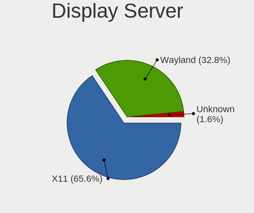
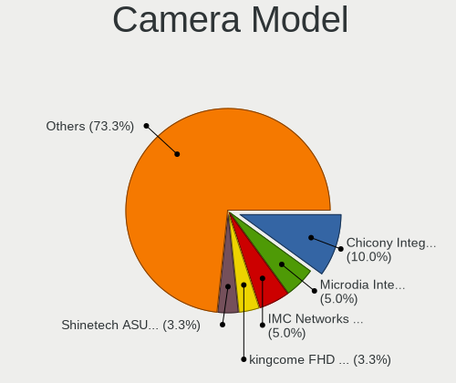

Manjaro Hardware Trends (Notebook)
----------------------------------

A project to identify most popular hardware characteristics and track their change
over time based on data collected by Manjaro users at https://Linux-Hardware.org.

Anyone can contribute to the study by uploading probes of their computers by
the [hw-probe](https://github.com/linuxhw/hw-probe) tool:

    sudo -E hw-probe -all -upload

Full-feature report is available here: https://linux-hardware.org/?view=trends&formfactor=notebook

Period: Jan, 2021.

Contents
--------

- [ OS                       ](#os)
- [ OS Family                ](#os-family)
- [ Kernel                   ](#kernel)
- [ Kernel Family            ](#kernel-family)
- [ Kernel Major Ver.        ](#kernel-major-ver)
- [ Arch                     ](#arch)
- [ DE                       ](#de)
- [ Display Server           ](#display-server)
- [ Display Manager          ](#display-manager)
- [ OS Lang                  ](#os-lang)
- [ Boot Mode                ](#boot-mode)
- [ Filesystem               ](#filesystem)
- [ Part. scheme             ](#part-scheme)
- [ Dual Boot with Linux/BSD ](#dual-boot-with-linux/bsd)
- [ Dual Boot (Win)          ](#dual-boot-win)
- [ Country                  ](#country)
- [ City                     ](#city)
- [ Vendor                   ](#vendor)
- [ Model                    ](#model)
- [ Model Family             ](#model-family)
- [ MFG Year                 ](#mfg-year)
- [ Form Factor              ](#form-factor)
- [ Secure Boot              ](#secure-boot)
- [ Coreboot                 ](#coreboot)
- [ RAM Size                 ](#ram-size)
- [ RAM Used                 ](#ram-used)
- [ Has CD-ROM               ](#has-cd-rom)
- [ Total Drives             ](#total-drives)
- [ Has Ethernet             ](#has-ethernet)
- [ Drive Vendor             ](#drive-vendor)
- [ Drive Model              ](#drive-model)
- [ HDD Vendor               ](#hdd-vendor)
- [ SSD Vendor               ](#ssd-vendor)
- [ Drive Kind               ](#drive-kind)
- [ Drive Connector          ](#drive-connector)
- [ Drive Size               ](#drive-size)
- [ Space Total              ](#space-total)
- [ Space Used               ](#space-used)
- [ Malfunc. Drives          ](#malfunc-drives)
- [ Malfunc. Drive Vendor    ](#malfunc-drive-vendor)
- [ Malfunc. HDD Vendor      ](#malfunc-hdd-vendor)
- [ Malfunc. Drive Kind      ](#malfunc-drive-kind)
- [ Failed Drives            ](#failed-drives)
- [ Failed Drive Vendor      ](#failed-drive-vendor)
- [ Drive Status             ](#drive-status)
- [ Storage Vendor           ](#storage-vendor)
- [ Storage Model            ](#storage-model)
- [ Storage Kind             ](#storage-kind)
- [ CPU Vendor               ](#cpu-vendor)
- [ CPU Model                ](#cpu-model)
- [ CPU Model Family         ](#cpu-model-family)
- [ CPU Cores                ](#cpu-cores)
- [ CPU Sockets              ](#cpu-sockets)
- [ CPU Threads              ](#cpu-threads)
- [ CPU Op-Modes             ](#cpu-op-modes)
- [ CPU Microcode            ](#cpu-microcode)
- [ CPU Microarch            ](#cpu-microarch)
- [ GPU Vendor               ](#gpu-vendor)
- [ GPU Model                ](#gpu-model)
- [ GPU Combo                ](#gpu-combo)
- [ GPU Driver               ](#gpu-driver)
- [ GPU Memory               ](#gpu-memory)
- [ Monitor Vendor           ](#monitor-vendor)
- [ Monitor Model            ](#monitor-model)
- [ Monitor Resolution       ](#monitor-resolution)
- [ Monitor Diagonal         ](#monitor-diagonal)
- [ Monitor Width            ](#monitor-width)
- [ Aspect Ratio             ](#aspect-ratio)
- [ Monitor Area             ](#monitor-area)
- [ Pixel Density            ](#pixel-density)
- [ Multiple Monitors        ](#multiple-monitors)
- [ Net Controller Vendor    ](#net-controller-vendor)
- [ Net Controller Model     ](#net-controller-model)
- [ Wireless Vendor          ](#wireless-vendor)
- [ Wireless Model           ](#wireless-model)
- [ Ethernet Vendor          ](#ethernet-vendor)
- [ Ethernet Model           ](#ethernet-model)
- [ Net Controller Kind      ](#net-controller-kind)
- [ Used Controller          ](#used-controller)
- [ NICs                     ](#nics)
- [ Memory Vendor            ](#memory-vendor)
- [ Memory Model             ](#memory-model)
- [ Memory Kind              ](#memory-kind)
- [ Memory Form Factor       ](#memory-form-factor)
- [ Memory Size              ](#memory-size)
- [ Memory Speed             ](#memory-speed)
- [ Sound Vendor             ](#sound-vendor)
- [ Sound Model              ](#sound-model)
- [ Camera Vendor            ](#camera-vendor)
- [ Camera Model             ](#camera-model)
- [ Fingerprint Vendor       ](#fingerprint-vendor)
- [ Fingerprint Model        ](#fingerprint-model)
- [ Chipcard Vendor          ](#chipcard-vendor)
- [ Chipcard Model           ](#chipcard-model)
- [ Printer Vendor           ](#printer-vendor)
- [ Printer Model            ](#printer-model)
- [ Scanner Vendor           ](#scanner-vendor)
- [ Scanner Model            ](#scanner-model)
- [ Bluetooth Vendor         ](#bluetooth-vendor)
- [ Bluetooth Model          ](#bluetooth-model)
- [ Unsupported Devices      ](#unsupported-devices)
- [ Unsupported Device Types ](#unsupported-device-types)

OS
--

Installed operating systems

| Name           | Notebooks | Percent |
|----------------|-----------|---------|
| Manjaro        | 61        | 47.66%  |
| Manjaro 20.2.1 | 50        | 39.06%  |
| Manjaro 20.2   | 17        | 13.28%  |

OS Family
---------

OS without a version

| Name    | Notebooks | Percent |
|---------|-----------|---------|
| Manjaro | 128       | 100%    |

Kernel
------

Version of the Linux kernel

| Version                                | Notebooks | Percent |
|----------------------------------------|-----------|---------|
| 5.9.16-1-MANJARO                       | 44        | 34.38%  |
| 5.10.2-2-MANJARO                       | 38        | 29.69%  |
| 5.10.7-3-MANJARO                       | 18        | 14.06%  |
| 5.4.85-1-MANJARO                       | 8         | 6.25%   |
| 5.4.89-1-MANJARO                       | 4         | 3.13%   |
| 5.9.11-3-MANJARO                       | 3         | 2.34%   |
| 5.4.80-2-MANJARO                       | 3         | 2.34%   |
| 5.8.18-1-MANJARO                       | 1         | 0.78%   |
| 5.6.15-1-MANJARO                       | 1         | 0.78%   |
| 5.11.0-rc1-1-drm-tip-git-g2713b5aa1b76 | 1         | 0.78%   |
| 5.11.0-2-MANJARO                       | 1         | 0.78%   |
| 5.11.0-1-MANJARO                       | 1         | 0.78%   |
| 5.10.7-AMD-znver2                      | 1         | 0.78%   |
| 5.10.4-1-MANJARO                       | 1         | 0.78%   |
| 5.10.0-1-MANJARO                       | 1         | 0.78%   |
| 4.19.163-1-MANJARO                     | 1         | 0.78%   |
| 4.19.154-1-MANJARO                     | 1         | 0.78%   |

Kernel Family
-------------

Linux kernel without a distro release

| Version  | Notebooks | Percent |
|----------|-----------|---------|
| 5.9.16   | 44        | 34.38%  |
| 5.10.2   | 38        | 29.69%  |
| 5.10.7   | 19        | 14.84%  |
| 5.4.85   | 8         | 6.25%   |
| 5.4.89   | 4         | 3.13%   |
| 5.9.11   | 3         | 2.34%   |
| 5.4.80   | 3         | 2.34%   |
| 5.11.0   | 3         | 2.34%   |
| 5.8.18   | 1         | 0.78%   |
| 5.6.15   | 1         | 0.78%   |
| 5.10.4   | 1         | 0.78%   |
| 5.10.0   | 1         | 0.78%   |
| 4.19.163 | 1         | 0.78%   |
| 4.19.154 | 1         | 0.78%   |

Kernel Major Ver.
-----------------

Linux kernel major version

| Version | Notebooks | Percent |
|---------|-----------|---------|
| 5.10    | 59        | 46.09%  |
| 5.9     | 47        | 36.72%  |
| 5.4     | 15        | 11.72%  |
| 5.11    | 3         | 2.34%   |
| 4.19    | 2         | 1.56%   |
| 5.8     | 1         | 0.78%   |
| 5.6     | 1         | 0.78%   |

Arch
----

OS architecture (x86_64, i586, etc.)

| Name   | Notebooks | Percent |
|--------|-----------|---------|
| x86_64 | 128       | 100%    |

DE
--

Desktop Environment

| Name              | Notebooks | Percent |
|-------------------|-----------|---------|
| XFCE              | 35        | 27.34%  |
| GNOME             | 30        | 23.44%  |
| KDE5              | 25        | 19.53%  |
| KDE               | 19        | 14.84%  |
| X-Cinnamon        | 3         | 2.34%   |
| MATE              | 3         | 2.34%   |
| Cinnamon          | 3         | 2.34%   |
| LXDE              | 2         | 1.56%   |
| leftwm            | 2         | 1.56%   |
| Unknown           | 2         | 1.56%   |
| Yaru:ubuntu:GNOME | 1         | 0.78%   |
| i3                | 1         | 0.78%   |
| Bspwm             | 1         | 0.78%   |
| awesome           | 1         | 0.78%   |

Display Server
--------------

X11 or Wayland

| Name    | Notebooks | Percent |
|---------|-----------|---------|
| X11     | 104       | 81.25%  |
| Wayland | 18        | 14.06%  |
| Tty     | 4         | 3.13%   |
| Unknown | 2         | 1.56%   |

Display Manager
---------------

SDDM, LightDM, etc.

| Name    | Notebooks | Percent |
|---------|-----------|---------|
| Unknown | 60        | 46.88%  |
| LightDM | 29        | 22.66%  |
| SDDM    | 25        | 19.53%  |
| GDM     | 14        | 10.94%  |

OS Lang
-------

Language

| Lang    | Notebooks | Percent |
|---------|-----------|---------|
| en_US   | 64        | 50%     |
| ru_RU   | 10        | 7.81%   |
| de_DE   | 9         | 7.03%   |
| pt_BR   | 7         | 5.47%   |
| en_GB   | 7         | 5.47%   |
| es_ES   | 5         | 3.91%   |
| fr_FR   | 4         | 3.13%   |
| de_AT   | 3         | 2.34%   |
| zh_CN   | 2         | 1.56%   |
| ru_UA   | 2         | 1.56%   |
| pl_PL   | 2         | 1.56%   |
| fi_FI   | 2         | 1.56%   |
| en_IN   | 2         | 1.56%   |
| pt_PT   | 1         | 0.78%   |
| fr_CA   | 1         | 0.78%   |
| fr_BE   | 1         | 0.78%   |
| es_MX   | 1         | 0.78%   |
| es_CO   | 1         | 0.78%   |
| en_PH   | 1         | 0.78%   |
| en_CA   | 1         | 0.78%   |
| en_150  | 1         | 0.78%   |
| Unknown | 1         | 0.78%   |

Boot Mode
---------

EFI or BIOS

| Mode | Notebooks | Percent |
|------|-----------|---------|
| BIOS | 73        | 57.03%  |
| EFI  | 55        | 42.97%  |

Filesystem
----------

Type of filesystem

| Type    | Notebooks | Percent |
|---------|-----------|---------|
| Ext4    | 111       | 86.72%  |
| Btrfs   | 13        | 10.16%  |
| Overlay | 3         | 2.34%   |
| Jfs     | 1         | 0.78%   |

Part. scheme
------------

Scheme of partitioning

| Type    | Notebooks | Percent |
|---------|-----------|---------|
| Unknown | 60        | 46.88%  |
| GPT     | 54        | 42.19%  |
| MBR     | 14        | 10.94%  |

Dual Boot with Linux/BSD
------------------------

Hosting more than one Linux/BSD

| Dual boot | Notebooks | Percent |
|-----------|-----------|---------|
| No        | 118       | 92.19%  |
| Yes       | 10        | 7.81%   |

Dual Boot (Win)
---------------

Hosting Linux and Windows

| Dual boot | Notebooks | Percent |
|-----------|-----------|---------|
| No        | 92        | 71.88%  |
| Yes       | 36        | 28.13%  |

Country
-------

Geographic location (country)

| Country              | Notebooks | Percent |
|----------------------|-----------|---------|
| USA                  | 18        | 14.06%  |
| Germany              | 15        | 11.72%  |
| Russia               | 13        | 10.16%  |
| Brazil               | 10        | 7.81%   |
| Spain                | 5         | 3.91%   |
| Norway               | 5         | 3.91%   |
| India                | 5         | 3.91%   |
| France               | 5         | 3.91%   |
| UK                   | 4         | 3.13%   |
| Canada               | 4         | 3.13%   |
| Austria              | 4         | 3.13%   |
| Ukraine              | 3         | 2.34%   |
| Costa Rica           | 3         | 2.34%   |
| Belarus              | 3         | 2.34%   |
| Poland               | 2         | 1.56%   |
| Moldova, Republic of | 2         | 1.56%   |
| Mexico               | 2         | 1.56%   |
| Finland              | 2         | 1.56%   |
| Bulgaria             | 2         | 1.56%   |
| Bangladesh           | 2         | 1.56%   |
| Turkey               | 1         | 0.78%   |
| Switzerland          | 1         | 0.78%   |
| Romania              | 1         | 0.78%   |
| Portugal             | 1         | 0.78%   |
| Philippines          | 1         | 0.78%   |
| Peru                 | 1         | 0.78%   |
| Netherlands          | 1         | 0.78%   |
| Lithuania            | 1         | 0.78%   |
| Lebanon              | 1         | 0.78%   |
| Latvia               | 1         | 0.78%   |
| Ireland              | 1         | 0.78%   |
| Iran                 | 1         | 0.78%   |
| Indonesia            | 1         | 0.78%   |
| Hungary              | 1         | 0.78%   |
| Hong Kong            | 1         | 0.78%   |
| Czech Republic       | 1         | 0.78%   |
| Croatia              | 1         | 0.78%   |
| Colombia             | 1         | 0.78%   |
| China                | 1         | 0.78%   |

City
----

Geographic location (city)

| City                     | Notebooks | Percent |
|--------------------------|-----------|---------|
| Berlin                   | 4         | 3.13%   |
| São Paulo               | 3         | 2.34%   |
| Walton on Thames         | 2         | 1.56%   |
| Vienna                   | 2         | 1.56%   |
| Rostov-on-Don            | 2         | 1.56%   |
| Oslo                     | 2         | 1.56%   |
| Moscow                   | 2         | 1.56%   |
| Minsk                    | 2         | 1.56%   |
| Dhaka                    | 2         | 1.56%   |
| Chisinau                 | 2         | 1.56%   |
| Alajuela                 | 2         | 1.56%   |
| Zurich                   | 1         | 0.78%   |
| Zhodzina                 | 1         | 0.78%   |
| Yalta                    | 1         | 0.78%   |
| Wyandotte                | 1         | 0.78%   |
| Woking                   | 1         | 0.78%   |
| Vilnius                  | 1         | 0.78%   |
| Villeneuve-Loubet        | 1         | 0.78%   |
| Vancouver                | 1         | 0.78%   |
| Valmiera                 | 1         | 0.78%   |
| Turku                    | 1         | 0.78%   |
| Tuguegarao City          | 1         | 0.78%   |
| Trivandrum               | 1         | 0.78%   |
| Tomsk                    | 1         | 0.78%   |
| Tenosique                | 1         | 0.78%   |
| Sylt-Ost                 | 1         | 0.78%   |
| Sofia                    | 1         | 0.78%   |
| Skjetten                 | 1         | 0.78%   |
| Sidon                    | 1         | 0.78%   |
| Semarang                 | 1         | 0.78%   |
| Saratov                  | 1         | 0.78%   |
| Salzburg                 | 1         | 0.78%   |
| Salt Lake City           | 1         | 0.78%   |
| Salem                    | 1         | 0.78%   |
| Salamanca                | 1         | 0.78%   |
| Saint-Christophe-du-Luat | 1         | 0.78%   |
| Rumia                    | 1         | 0.78%   |
| Rouen                    | 1         | 0.78%   |
| Rotterdam                | 1         | 0.78%   |
| Rosenheim                | 1         | 0.78%   |
| Qom                      | 1         | 0.78%   |
| Puebla                   | 1         | 0.78%   |
| Poços de Caldas         | 1         | 0.78%   |
| Porto Alegre             | 1         | 0.78%   |
| Popesti-Leordeni         | 1         | 0.78%   |
| Podolsk                  | 1         | 0.78%   |
| Penza                    | 1         | 0.78%   |
| Paris                    | 1         | 0.78%   |
| Oxford                   | 1         | 0.78%   |
| Osasco                   | 1         | 0.78%   |
| Odesa                    | 1         | 0.78%   |
| Nuremberg                | 1         | 0.78%   |
| Novosibirsk              | 1         | 0.78%   |
| Neulussheim              | 1         | 0.78%   |
| Nashville                | 1         | 0.78%   |
| Naranjo                  | 1         | 0.78%   |
| Nagpur                   | 1         | 0.78%   |
| Naantali                 | 1         | 0.78%   |
| Murcia                   | 1         | 0.78%   |
| Munich                   | 1         | 0.78%   |

Vendor
------

Motherboard manufacturer

| Name                             | Notebooks | Percent |
|----------------------------------|-----------|---------|
| Lenovo                           | 35        | 27.34%  |
| Hewlett-Packard                  | 22        | 17.19%  |
| Dell                             | 15        | 11.72%  |
| ASUSTek Computer                 | 14        | 10.94%  |
| Acer                             | 7         | 5.47%   |
| MSI                              | 6         | 4.69%   |
| Samsung Electronics              | 4         | 3.13%   |
| HUAWEI                           | 3         | 2.34%   |
| Apple                            | 3         | 2.34%   |
| Toshiba                          | 2         | 1.56%   |
| Timi                             | 2         | 1.56%   |
| Sony                             | 2         | 1.56%   |
| Positivo                         | 2         | 1.56%   |
| TUXEDO                           | 1         | 0.78%   |
| Star Labs                        | 1         | 0.78%   |
| Razer                            | 1         | 0.78%   |
| Notebook                         | 1         | 0.78%   |
| Login Informatica                | 1         | 0.78%   |
| Gigabyte Technology              | 1         | 0.78%   |
| FUJITSU CLIENT COMPUTING LIMITED | 1         | 0.78%   |
| Fujitsu                          | 1         | 0.78%   |
| EVGA                             | 1         | 0.78%   |
| Chuwi                            | 1         | 0.78%   |
| Alienware                        | 1         | 0.78%   |

Model
-----

Motherboard model

| Name                                     | Notebooks | Percent |
|------------------------------------------|-----------|---------|
| Lenovo Yoga Slim 7 14ARE05 82A2          | 2         | 1.56%   |
| HP EliteBook 8770w                       | 2         | 1.56%   |
| Dell Inspiron 5584                       | 2         | 1.56%   |
| TUXEDO Book XP1511                       | 1         | 0.78%   |
| Toshiba Satellite P755                   | 1         | 0.78%   |
| Toshiba Satellite L855                   | 1         | 0.78%   |
| Timi TM1703                              | 1         | 0.78%   |
| Timi RedmiBook 14 II                     | 1         | 0.78%   |
| Star Labs LabTop                         | 1         | 0.78%   |
| Sony VGN-TZ170N                          | 1         | 0.78%   |
| Sony SVF13N2J2RS                         | 1         | 0.78%   |
| Samsung RF511/RF411/RF711                | 1         | 0.78%   |
| Samsung QX311/QX411/QX412/QX511          | 1         | 0.78%   |
| Samsung 550XCJ/550XCR                    | 1         | 0.78%   |
| Samsung 340XAA/350XAA/550XAA             | 1         | 0.78%   |
| Razer Blade                              | 1         | 0.78%   |
| Positivo MOBILE                          | 1         | 0.78%   |
| Positivo CHT14B                          | 1         | 0.78%   |
| Notebook NB50TZ                          | 1         | 0.78%   |
| MSI PE72 7RE                             | 1         | 0.78%   |
| MSI GV62 8RD                             | 1         | 0.78%   |
| MSI GT72 6QD                             | 1         | 0.78%   |
| MSI GL63 9SEK                            | 1         | 0.78%   |
| MSI GL63 8RC                             | 1         | 0.78%   |
| MSI GE72VR 7RF                           | 1         | 0.78%   |
| Login Informatica LOG-QAL30              | 1         | 0.78%   |
| Lenovo Z51-70 80K6                       | 1         | 0.78%   |
| Lenovo Yoga Slim 7 14ITL05 82A3          | 1         | 0.78%   |
| Lenovo Y720-15IKB 80VR                   | 1         | 0.78%   |
| Lenovo Y520-15IKBN 80WK                  | 1         | 0.78%   |
| Lenovo Y520-15IKBM 80YY                  | 1         | 0.78%   |
| Lenovo V330-15IKB 81AX                   | 1         | 0.78%   |
| Lenovo ThinkPad X230 2325AC7             | 1         | 0.78%   |
| Lenovo ThinkPad X1 Carbon 6th 20KHCTO1WW | 1         | 0.78%   |
| Lenovo ThinkPad W520 4282A23             | 1         | 0.78%   |
| Lenovo ThinkPad T570 20HAS01E00          | 1         | 0.78%   |
| Lenovo ThinkPad T480 20L6002DMX          | 1         | 0.78%   |
| Lenovo ThinkPad T450s 20BWS3MG00         | 1         | 0.78%   |
| Lenovo ThinkPad T440p 20AWS4XN00         | 1         | 0.78%   |
| Lenovo ThinkPad T430 2349G5G             | 1         | 0.78%   |
| Lenovo ThinkPad T410 2537V28             | 1         | 0.78%   |
| Lenovo ThinkPad T410 2522B32             | 1         | 0.78%   |
| Lenovo ThinkPad L15 Gen 1 20U70001SC     | 1         | 0.78%   |
| Lenovo ThinkPad E14 Gen 2 20T7S1V305     | 1         | 0.78%   |
| Lenovo ThinkPad E14 Gen 2 20T6S0A500     | 1         | 0.78%   |
| Lenovo ThinkBook 13s G2 ITL 20V9         | 1         | 0.78%   |
| Lenovo Legion 5 82B5                     | 1         | 0.78%   |
| Lenovo Legion 5 15ARH05 82B5             | 1         | 0.78%   |
| Lenovo IdeaPad S340-14IIL 81VV           | 1         | 0.78%   |
| Lenovo IdeaPad S145-15IIL 81W8           | 1         | 0.78%   |
| Lenovo IdeaPad L340-15IRH Gaming 81LK    | 1         | 0.78%   |
| Lenovo IdeaPad L340-15API 81LW           | 1         | 0.78%   |
| Lenovo IdeaPad Gaming3 15ARH05D 82EY     | 1         | 0.78%   |
| Lenovo IdeaPad 5 14ARE05 81YM            | 1         | 0.78%   |
| Lenovo IdeaPad 330S-15ARR 81FB           | 1         | 0.78%   |
| Lenovo IdeaPad 320-15ABR 80XS            | 1         | 0.78%   |
| Lenovo IdeaPad 320-14IKB 80YD            | 1         | 0.78%   |
| Lenovo IdeaPad 310-15ISK 80SM            | 1         | 0.78%   |
| Lenovo Flex 2 Pro-15 80FL                | 1         | 0.78%   |
| HUAWEI KPRC-WX0                          | 1         | 0.78%   |

Model Family
------------

Motherboard model prefix

| Name                                      | Notebooks | Percent |
|-------------------------------------------|-----------|---------|
| Lenovo ThinkPad                           | 13        | 10.16%  |
| Lenovo IdeaPad                            | 10        | 7.81%   |
| HP EliteBook                              | 7         | 5.47%   |
| Dell Inspiron                             | 7         | 5.47%   |
| HP Pavilion                               | 5         | 3.91%   |
| Acer Aspire                               | 5         | 3.91%   |
| HP Laptop                                 | 4         | 3.13%   |
| Dell XPS                                  | 4         | 3.13%   |
| Lenovo Yoga                               | 3         | 2.34%   |
| Toshiba Satellite                         | 2         | 1.56%   |
| MSI GL63                                  | 2         | 1.56%   |
| Lenovo Legion                             | 2         | 1.56%   |
| Dell Latitude                             | 2         | 1.56%   |
| ASUS ZenBook                              | 2         | 1.56%   |
| ASUS TUF                                  | 2         | 1.56%   |
| TUXEDO Book                               | 1         | 0.78%   |
| Timi TM1703                               | 1         | 0.78%   |
| Timi RedmiBook                            | 1         | 0.78%   |
| Star Labs LabTop                          | 1         | 0.78%   |
| Sony VGN-TZ170N                           | 1         | 0.78%   |
| Sony SVF13N2J2RS                          | 1         | 0.78%   |
| Samsung RF511                             | 1         | 0.78%   |
| Samsung QX311                             | 1         | 0.78%   |
| Samsung 550XCJ                            | 1         | 0.78%   |
| Samsung 340XAA                            | 1         | 0.78%   |
| Razer Blade                               | 1         | 0.78%   |
| Positivo MOBILE                           | 1         | 0.78%   |
| Positivo CHT14B                           | 1         | 0.78%   |
| Notebook NB50TZ                           | 1         | 0.78%   |
| MSI PE72                                  | 1         | 0.78%   |
| MSI GV62                                  | 1         | 0.78%   |
| MSI GT72                                  | 1         | 0.78%   |
| MSI GE72VR                                | 1         | 0.78%   |
| Login Informatica LOG-QAL30               | 1         | 0.78%   |
| Lenovo Z51-70                             | 1         | 0.78%   |
| Lenovo Y720-15IKB                         | 1         | 0.78%   |
| Lenovo Y520-15IKBN                        | 1         | 0.78%   |
| Lenovo Y520-15IKBM                        | 1         | 0.78%   |
| Lenovo V330-15IKB                         | 1         | 0.78%   |
| Lenovo ThinkBook                          | 1         | 0.78%   |
| Lenovo Flex                               | 1         | 0.78%   |
| HUAWEI KPRC-WX0                           | 1         | 0.78%   |
| HUAWEI HN-WX9X                            | 1         | 0.78%   |
| HUAWEI HLY-WX9XX                          | 1         | 0.78%   |
| HP ProBook                                | 1         | 0.78%   |
| HP OMEN                                   | 1         | 0.78%   |
| HP 625                                    | 1         | 0.78%   |
| HP 350                                    | 1         | 0.78%   |
| HP 255                                    | 1         | 0.78%   |
| HP 15                                     | 1         | 0.78%   |
| Gigabyte B450M                            | 1         | 0.78%   |
| Fujitsu LIFEBOOK                          | 1         | 0.78%   |
| FUJITSU CLIENT COMPUTING LIMITED LIFEBOOK | 1         | 0.78%   |
| Dell Vostro                               | 1         | 0.78%   |
| Dell Precision                            | 1         | 0.78%   |
| Chuwi GemiBook                            | 1         | 0.78%   |
| ASUS X45C                                 | 1         | 0.78%   |
| ASUS VivoBook                             | 1         | 0.78%   |
| ASUS UX305UA                              | 1         | 0.78%   |
| ASUS U36SD                                | 1         | 0.78%   |

MFG Year
--------

Motherboard manufacture year

| Year | Notebooks | Percent |
|------|-----------|---------|
| 2020 | 41        | 32.03%  |
| 2019 | 21        | 16.41%  |
| 2018 | 12        | 9.38%   |
| 2017 | 9         | 7.03%   |
| 2012 | 9         | 7.03%   |
| 2013 | 7         | 5.47%   |
| 2011 | 7         | 5.47%   |
| 2016 | 5         | 3.91%   |
| 2015 | 5         | 3.91%   |
| 2014 | 4         | 3.13%   |
| 2007 | 3         | 2.34%   |
| 2010 | 2         | 1.56%   |
| 2008 | 2         | 1.56%   |
| 2009 | 1         | 0.78%   |

Form Factor
-----------

Physical design of the computer

| Name     | Notebooks | Percent |
|----------|-----------|---------|
| Notebook | 128       | 100%    |

Secure Boot
-----------

Enabled or disabled

| State    | Notebooks | Percent |
|----------|-----------|---------|
| Disabled | 128       | 100%    |

Coreboot
--------

Have coreboot on board

| Used | Notebooks | Percent |
|------|-----------|---------|
| No   | 127       | 99.22%  |
| Yes  | 1         | 0.78%   |

RAM Size
--------

Total RAM memory

| Size in GB  | Notebooks | Percent |
|-------------|-----------|---------|
| 4.01-8.0    | 47        | 36.72%  |
| 8.01-16.0   | 28        | 21.88%  |
| 16.01-24.0  | 24        | 18.75%  |
| 3.01-4.0    | 11        | 8.59%   |
| 32.01-64.0  | 10        | 7.81%   |
| 1.01-2.0    | 5         | 3.91%   |
| 2.01-3.0    | 2         | 1.56%   |
| 64.01-256.0 | 1         | 0.78%   |

RAM Used
--------

Used RAM memory

| Used GB   | Notebooks | Percent |
|-----------|-----------|---------|
| 2.01-3.0  | 40        | 31.25%  |
| 1.01-2.0  | 39        | 30.47%  |
| 3.01-4.0  | 22        | 17.19%  |
| 4.01-8.0  | 16        | 12.5%   |
| 0.51-1.0  | 8         | 6.25%   |
| 8.01-16.0 | 2         | 1.56%   |
| 0.01-0.5  | 1         | 0.78%   |

Has CD-ROM
----------

Has CD-ROM on board

| Presented | Notebooks | Percent |
|-----------|-----------|---------|
| No        | 87        | 67.97%  |
| Yes       | 41        | 32.03%  |

Total Drives
------------

Number of drives on board

| Drives | Notebooks | Percent |
|--------|-----------|---------|
| 1      | 85        | 66.41%  |
| 2      | 36        | 28.13%  |
| 3      | 6         | 4.69%   |
| 0      | 1         | 0.78%   |

Has Ethernet
------------

Has Ethernet on board

| Presented | Notebooks | Percent |
|-----------|-----------|---------|
| Yes       | 100       | 78.13%  |
| No        | 28        | 21.88%  |

Drive Vendor
------------

Hard drive vendors

| Vendor              | Notebooks | Drives | Percent |
|---------------------|-----------|--------|---------|
| Samsung Electronics | 27        | 29     | 15.79%  |
| WDC                 | 24        | 24     | 14.04%  |
| Seagate             | 20        | 21     | 11.7%   |
| Toshiba             | 13        | 14     | 7.6%    |
| Sandisk             | 10        | 10     | 5.85%   |
| Kingston            | 10        | 10     | 5.85%   |
| HGST                | 10        | 10     | 5.85%   |
| SK Hynix            | 8         | 8      | 4.68%   |
| Intel               | 7         | 8      | 4.09%   |
| Unknown             | 6         | 6      | 3.51%   |
| Crucial             | 6         | 6      | 3.51%   |
| Phison              | 4         | 4      | 2.34%   |
| Transcend           | 3         | 3      | 1.75%   |
| Micron Technology   | 3         | 3      | 1.75%   |
| Hitachi             | 3         | 3      | 1.75%   |
| GOODRAM             | 2         | 2      | 1.17%   |
| Apple               | 2         | 2      | 1.17%   |
| XPG                 | 1         | 1      | 0.58%   |
| WDC WDS5            | 1         | 1      | 0.58%   |
| Team                | 1         | 1      | 0.58%   |
| SPCC                | 1         | 1      | 0.58%   |
| Silicon Motion      | 1         | 1      | 0.58%   |
| LITEONIT            | 1         | 1      | 0.58%   |
| LITEON              | 1         | 1      | 0.58%   |
| KIOXIA              | 1         | 1      | 0.58%   |
| KingSpec            | 1         | 1      | 0.58%   |
| Dell                | 1         | 1      | 0.58%   |
| China               | 1         | 1      | 0.58%   |
| Apacer              | 1         | 1      | 0.58%   |
| A-DATA Technology   | 1         | 1      | 0.58%   |

Drive Model
-----------

Hard drive models

| Model                                     | Notebooks | Percent |
|-------------------------------------------|-----------|---------|
| Seagate ST1000LM035-1RK172 1TB            | 4         | 2.27%   |
| Samsung NVMe SSD Drive 256GB              | 4         | 2.27%   |
| WDC WDS240G2G0A-00JH30 240GB SSD          | 3         | 1.7%    |
| WDC WD10SPZX-24Z10 1TB                    | 3         | 1.7%    |
| Unknown MMC Card  32GB                    | 3         | 1.7%    |
| SK Hynix NVMe SSD Drive 512GB             | 3         | 1.7%    |
| Sandisk NVMe SSD Drive 1TB                | 3         | 1.7%    |
| Kingston SA400S37480G 480GB SSD           | 3         | 1.7%    |
| Intel NVMe SSD Drive 512GB                | 3         | 1.7%    |
| HGST HTS721010A9E630 1TB                  | 3         | 1.7%    |
| WDC WDS500G2B0A-00SM50 500GB SSD          | 2         | 1.14%   |
| Unknown SD/MMC/MS PRO 32GB                | 2         | 1.14%   |
| Toshiba KBG30ZMS256G NVMe 256GB           | 2         | 1.14%   |
| Samsung SSD 850 EVO 500GB                 | 2         | 1.14%   |
| Samsung NVMe SSD Drive 512GB              | 2         | 1.14%   |
| Samsung MZALQ256HAJD-000L2 256GB          | 2         | 1.14%   |
| Phison NVMe SSD Drive 2TB                 | 2         | 1.14%   |
| Intel SSDPEKNW512G8 512GB                 | 2         | 1.14%   |
| Hitachi HTS545050A7E380 500GB             | 2         | 1.14%   |
| HGST HTS545050A7E680 500GB                | 2         | 1.14%   |
| HGST HTS545050A7E380 500GB                | 2         | 1.14%   |
| Crucial CT1000MX500SSD1 1TB               | 2         | 1.14%   |
| XPG NVMe SSD Drive 1024GB                 | 1         | 0.57%   |
| WDC WDS500G2B0B-00YS70 500GB SSD          | 1         | 0.57%   |
| WDC WDS5 00G2B0C-00PX 500GB SSD           | 1         | 0.57%   |
| WDC WDS100T1B0A-00H9H0 1TB SSD            | 1         | 0.57%   |
| WDC WD5000LPCX-22VHAT1 500GB              | 1         | 0.57%   |
| WDC WD5000BEVT-00ZAT0 500GB               | 1         | 0.57%   |
| WDC WD40EZRZ-22GXCB0 4TB                  | 1         | 0.57%   |
| WDC WD3200BEVT-22ZCT0 320GB               | 1         | 0.57%   |
| WDC WD2500BEVT-22ZCT0 250GB               | 1         | 0.57%   |
| WDC WD2500BEVT-00A23T0 250GB              | 1         | 0.57%   |
| WDC WD20SPZX-08UA7 2TB                    | 1         | 0.57%   |
| WDC WD1600BEKT-60A25T1 160GB              | 1         | 0.57%   |
| WDC WD10SPZX-75Z10T2 1TB                  | 1         | 0.57%   |
| WDC WD10SPZX-21Z10T0 1TB                  | 1         | 0.57%   |
| WDC WD10SPZX-17Z10T1 1TB                  | 1         | 0.57%   |
| WDC WD10JPCX-24UE4T0 1TB                  | 1         | 0.57%   |
| WDC PC SN730 SDBPNTY-512G-1027 512GB      | 1         | 0.57%   |
| WDC PC SN530 SDBPMPZ-256G-1001 256GB      | 1         | 0.57%   |
| Unknown SU08G  8GB                        | 1         | 0.57%   |
| Transcend TS512GMTS400 512GB SSD          | 1         | 0.57%   |
| Transcend TS240GSSD220S 240GB             | 1         | 0.57%   |
| Transcend TS240GMTS420S 240GB SSD         | 1         | 0.57%   |
| Toshiba TL100 240GB SSD                   | 1         | 0.57%   |
| Toshiba THNSNJ256G8NY 256GB SSD           | 1         | 0.57%   |
| Toshiba NVMe SSD Drive 512GB              | 1         | 0.57%   |
| Toshiba NVMe SSD Drive 256GB              | 1         | 0.57%   |
| Toshiba NVMe SSD Drive 1024GB             | 1         | 0.57%   |
| Toshiba MQ04ABF100 1TB                    | 1         | 0.57%   |
| Toshiba MQ01ABD100 1TB                    | 1         | 0.57%   |
| Toshiba MQ01ABD075 752GB                  | 1         | 0.57%   |
| Toshiba MQ01ABD050V 500GB                 | 1         | 0.57%   |
| Toshiba MK1255GSX H 120GB                 | 1         | 0.57%   |
| Toshiba MK1011GAH 100GB                   | 1         | 0.57%   |
| Toshiba KXG50ZNV256G NVMe 256GB           | 1         | 0.57%   |
| Team T253X2512G 512GB SSD                 | 1         | 0.57%   |
| SPCC Solid State Disk 256GB               | 1         | 0.57%   |
| SK Hynix SKHynix_HFM256GDHTNI-87A0B 256GB | 1         | 0.57%   |
| SK Hynix NVMe SSD Drive 256GB             | 1         | 0.57%   |

HDD Vendor
----------

Hard disk drive vendors

| Vendor  | Notebooks | Drives | Percent |
|---------|-----------|--------|---------|
| Seagate | 20        | 21     | 37.04%  |
| WDC     | 15        | 15     | 27.78%  |
| HGST    | 10        | 10     | 18.52%  |
| Toshiba | 6         | 6      | 11.11%  |
| Hitachi | 3         | 3      | 5.56%   |

SSD Vendor
----------

Solid state drive vendors

| Vendor              | Notebooks | Drives | Percent |
|---------------------|-----------|--------|---------|
| Samsung Electronics | 12        | 12     | 20%     |
| Kingston            | 8         | 8      | 13.33%  |
| WDC                 | 7         | 7      | 11.67%  |
| Crucial             | 6         | 6      | 10%     |
| Transcend           | 3         | 3      | 5%      |
| SanDisk             | 3         | 3      | 5%      |
| Micron Technology   | 3         | 3      | 5%      |
| Toshiba             | 2         | 2      | 3.33%   |
| Intel               | 2         | 2      | 3.33%   |
| GOODRAM             | 2         | 2      | 3.33%   |
| Apple               | 2         | 2      | 3.33%   |
| WDC WDS5            | 1         | 1      | 1.67%   |
| Team                | 1         | 1      | 1.67%   |
| SPCC                | 1         | 1      | 1.67%   |
| SK Hynix            | 1         | 1      | 1.67%   |
| LITEONIT            | 1         | 1      | 1.67%   |
| LITEON              | 1         | 1      | 1.67%   |
| KingSpec            | 1         | 1      | 1.67%   |
| China               | 1         | 1      | 1.67%   |
| Apacer              | 1         | 1      | 1.67%   |
| A-DATA Technology   | 1         | 1      | 1.67%   |

Drive Kind
----------

HDD or SSD

| Kind    | Notebooks | Drives | Percent |
|---------|-----------|--------|---------|
| SSD     | 55        | 60     | 33.54%  |
| HDD     | 52        | 55     | 31.71%  |
| NVMe    | 50        | 54     | 30.49%  |
| MMC     | 4         | 4      | 2.44%   |
| Unknown | 3         | 3      | 1.83%   |

Drive Connector
---------------

SATA, SAS, NVMe, etc.

| Type | Notebooks | Drives | Percent |
|------|-----------|--------|---------|
| SATA | 95        | 111    | 60.9%   |
| NVMe | 50        | 54     | 32.05%  |
| SAS  | 7         | 7      | 4.49%   |
| MMC  | 4         | 4      | 2.56%   |

Drive Size
----------

Size of hard drive

| Size in TB | Notebooks | Drives | Percent |
|------------|-----------|--------|---------|
| 0.01-0.5   | 61        | 74     | 60.4%   |
| 0.51-1.0   | 34        | 35     | 33.66%  |
| 1.01-2.0   | 3         | 3      | 2.97%   |
| 3.01-4.0   | 2         | 2      | 1.98%   |
| 4.01-10.0  | 1         | 1      | 0.99%   |

Space Total
-----------

Amount of disk space available on the file system

| Size in GB     | Notebooks | Percent |
|----------------|-----------|---------|
| 101-250        | 38        | 29.69%  |
| 501-1000       | 29        | 22.66%  |
| 251-500        | 24        | 18.75%  |
| 1001-2000      | 7         | 5.47%   |
| Unknown        | 7         | 5.47%   |
| 21-50          | 6         | 4.69%   |
| 51-100         | 6         | 4.69%   |
| 1-20           | 5         | 3.91%   |
| More than 3000 | 4         | 3.13%   |
| 2001-3000      | 2         | 1.56%   |

Space Used
----------

Amount of used disk space

| Used GB   | Notebooks | Percent |
|-----------|-----------|---------|
| 1-20      | 32        | 25%     |
| 101-250   | 21        | 16.41%  |
| 21-50     | 20        | 15.63%  |
| 51-100    | 20        | 15.63%  |
| 251-500   | 15        | 11.72%  |
| 501-1000  | 8         | 6.25%   |
| Unknown   | 7         | 5.47%   |
| 1001-2000 | 4         | 3.13%   |
| 2001-3000 | 1         | 0.78%   |

Malfunc. Drives
---------------

Drive models with a malfunction

| Model                                               | Notebooks | Drives | Percent |
|-----------------------------------------------------|-----------|--------|---------|
| Seagate ST9750423AS 752GB                           | 1         | 1      | 11.11%  |
| Seagate ST500LM012 HN-M500MBB 500GB                 | 1         | 1      | 11.11%  |
| Seagate ST2000LM007-1R8174 2TB                      | 1         | 1      | 11.11%  |
| Seagate ST1000LM035-1RK172 1TB                      | 1         | 1      | 11.11%  |
| Micron Technology MTFDDAV256TDL-1AW1ZABHA 256GB SSD | 1         | 1      | 11.11%  |
| Kingston SMS200S3120G 120GB SSD                     | 1         | 1      | 11.11%  |
| HGST HTS545050A7E680 500GB                          | 1         | 1      | 11.11%  |
| HGST HTS541075A9E680 752GB                          | 1         | 1      | 11.11%  |
| A-DATA Technology SU630 480GB SSD                   | 1         | 1      | 11.11%  |

Malfunc. Drive Vendor
---------------------

Vendors of faulty drives

| Vendor            | Notebooks | Drives | Percent |
|-------------------|-----------|--------|---------|
| Seagate           | 4         | 4      | 44.44%  |
| HGST              | 2         | 2      | 22.22%  |
| Micron Technology | 1         | 1      | 11.11%  |
| Kingston          | 1         | 1      | 11.11%  |
| A-DATA Technology | 1         | 1      | 11.11%  |

Malfunc. HDD Vendor
-------------------

Vendors of faulty HDD drives

| Vendor  | Notebooks | Drives | Percent |
|---------|-----------|--------|---------|
| Seagate | 4         | 4      | 66.67%  |
| HGST    | 2         | 2      | 33.33%  |

Malfunc. Drive Kind
-------------------

Kinds of faulty drives

| Kind | Notebooks | Drives | Percent |
|------|-----------|--------|---------|
| HDD  | 6         | 6      | 66.67%  |
| SSD  | 3         | 3      | 33.33%  |

Failed Drives
-------------

Failed drive models

Zero info for selected period =(

Failed Drive Vendor
-------------------

Failed drive vendors

Zero info for selected period =(

Drive Status
------------

Number of failed and malfunc. drives

| Status   | Notebooks | Drives | Percent |
|----------|-----------|--------|---------|
| Detected | 80        | 110    | 60.15%  |
| Works    | 44        | 57     | 33.08%  |
| Malfunc  | 9         | 9      | 6.77%   |

Storage Vendor
--------------

Storage controller vendors

| Vendor                       | Notebooks | Percent |
|------------------------------|-----------|---------|
| Intel                        | 91        | 55.15%  |
| AMD                          | 22        | 13.33%  |
| Samsung Electronics          | 18        | 10.91%  |
| Sandisk                      | 10        | 6.06%   |
| SK Hynix                     | 7         | 4.24%   |
| Toshiba America Info Systems | 5         | 3.03%   |
| Phison Electronics           | 4         | 2.42%   |
| JMicron Technology           | 3         | 1.82%   |
| Kingston Technology Company  | 2         | 1.21%   |
| Silicon Motion               | 1         | 0.61%   |
| KIOXIA                       | 1         | 0.61%   |
| ADATA Technology             | 1         | 0.61%   |

Storage Model
-------------

Storage controller models

| Model                                                                                  | Notebooks | Percent |
|----------------------------------------------------------------------------------------|-----------|---------|
| AMD FCH SATA Controller [AHCI mode]                                                    | 18        | 10.23%  |
| Intel 7 Series Chipset Family 6-port SATA Controller [AHCI mode]                       | 11        | 6.25%   |
| Intel Sunrise Point-LP SATA Controller [AHCI mode]                                     | 10        | 5.68%   |
| Intel 6 Series/C200 Series Chipset Family 6 port Mobile SATA AHCI Controller           | 10        | 5.68%   |
| Intel HM170/QM170 Chipset SATA Controller [AHCI Mode]                                  | 9         | 5.11%   |
| Intel Cannon Lake Mobile PCH SATA AHCI Controller                                      | 7         | 3.98%   |
| Samsung NVMe SSD Controller SM981/PM981/PM983                                          | 6         | 3.41%   |
| Sandisk WD Black SN750 / PC SN730 NVMe SSD                                             | 5         | 2.84%   |
| Samsung Electronics Non-Volatile memory controller                                     | 5         | 2.84%   |
| Intel 8 Series SATA Controller 1 [AHCI mode]                                           | 5         | 2.84%   |
| SK Hynix Non-Volatile memory controller                                                | 4         | 2.27%   |
| Samsung NVMe SSD Controller SM961/PM961/SM963                                          | 4         | 2.27%   |
| Phison E12 NVMe Controller                                                             | 4         | 2.27%   |
| Intel SSD 660P Series                                                                  | 4         | 2.27%   |
| Intel Cannon Point-LP SATA Controller [AHCI Mode]                                      | 4         | 2.27%   |
| Intel 82801 Mobile SATA Controller [RAID mode]                                         | 4         | 2.27%   |
| JMicron JMB360 AHCI Controller                                                         | 3         | 1.7%    |
| Intel Wildcat Point-LP SATA Controller [AHCI Mode]                                     | 3         | 1.7%    |
| Intel Celeron/Pentium Silver Processor SATA Controller                                 | 3         | 1.7%    |
| Intel 82801HM/HEM (ICH8M/ICH8M-E) IDE Controller                                       | 3         | 1.7%    |
| Intel 8 Series/C220 Series Chipset Family 6-port SATA Controller 1 [AHCI mode]         | 3         | 1.7%    |
| Intel 5 Series/3400 Series Chipset 6 port SATA AHCI Controller                         | 3         | 1.7%    |
| Toshiba America Info Systems XG6 NVMe SSD Controller                                   | 2         | 1.14%   |
| Toshiba America Info Systems BG3 NVMe SSD Controller                                   | 2         | 1.14%   |
| SK Hynix BC501 NVMe Solid State Drive 512GB                                            | 2         | 1.14%   |
| Sandisk WD Blue SN550 NVMe SSD                                                         | 2         | 1.14%   |
| Sandisk Non-Volatile memory controller                                                 | 2         | 1.14%   |
| Samsung NVMe SSD Controller SM951/PM951                                                | 2         | 1.14%   |
| Intel Ice Lake-LP SATA Controller [AHCI mode]                                          | 2         | 1.14%   |
| Intel Comet Lake SATA AHCI Controller                                                  | 2         | 1.14%   |
| Intel 82801HM/HEM (ICH8M/ICH8M-E) SATA Controller [AHCI mode]                          | 2         | 1.14%   |
| Intel 5 Series/3400 Series Chipset 4 port SATA AHCI Controller                         | 2         | 1.14%   |
| AMD SB600 Non-Raid-5 SATA                                                              | 2         | 1.14%   |
| AMD SB600 IDE                                                                          | 2         | 1.14%   |
| Toshiba America Info Systems Toshiba America Info Non-Volatile memory controller       | 1         | 0.57%   |
| SK Hynix PC401 NVMe Solid State Drive 256GB                                            | 1         | 0.57%   |
| Silicon Motion SM2262/SM2262EN SSD Controller                                          | 1         | 0.57%   |
| Sandisk WD Black 2018 / PC SN720 NVMe SSD                                              | 1         | 0.57%   |
| Samsung Electronics SATA controller                                                    | 1         | 0.57%   |
| KIOXIA Non-Volatile memory controller                                                  | 1         | 0.57%   |
| Kingston Company U-SNS8154P3 NVMe SSD                                                  | 1         | 0.57%   |
| Kingston Company Company Non-Volatile memory controller                                | 1         | 0.57%   |
| Intel Volume Management Device NVMe RAID Controller                                    | 1         | 0.57%   |
| Intel SSD Pro 7600p/760p/E 6100p Series                                                | 1         | 0.57%   |
| Intel Cannon Lake PCH SATA AHCI Controller                                             | 1         | 0.57%   |
| Intel 82801IBM/IEM (ICH9M/ICH9M-E) 4 port SATA Controller [AHCI mode]                  | 1         | 0.57%   |
| Intel 82801HM/HEM (ICH8M/ICH8M-E) SATA Controller [IDE mode]                           | 1         | 0.57%   |
| Intel 82801G (ICH7 Family) IDE Controller                                              | 1         | 0.57%   |
| Intel 7 Series Chipset Family 4-port SATA Controller [IDE mode]                        | 1         | 0.57%   |
| Intel 7 Series Chipset Family 2-port SATA Controller [IDE mode]                        | 1         | 0.57%   |
| Intel 6 Series/C200 Series Chipset Family Mobile SATA Controller (IDE mode, ports 4-5) | 1         | 0.57%   |
| Intel 6 Series/C200 Series Chipset Family Mobile SATA Controller (IDE mode, ports 0-3) | 1         | 0.57%   |
| Intel 400 Series Chipset Family SATA AHCI Controller                                   | 1         | 0.57%   |
| AMD SB7x0/SB8x0/SB9x0 SATA Controller [IDE mode]                                       | 1         | 0.57%   |
| AMD SB7x0/SB8x0/SB9x0 SATA Controller [AHCI mode]                                      | 1         | 0.57%   |
| AMD SB7x0/SB8x0/SB9x0 IDE Controller                                                   | 1         | 0.57%   |
| AMD 400 Series Chipset SATA Controller                                                 | 1         | 0.57%   |
| ADATA XPG SX8200 Pro PCIe Gen3x4 M.2 2280 Solid State Drive                            | 1         | 0.57%   |

Storage Kind
------------

Kind of storage controller (IDE, SATA, NVMe, SAS, ...)

| Kind | Notebooks | Percent |
|------|-----------|---------|
| SATA | 103       | 61.68%  |
| NVMe | 51        | 30.54%  |
| IDE  | 9         | 5.39%   |
| RAID | 4         | 2.4%    |

CPU Vendor
----------

Processor vendors

| Vendor | Notebooks | Percent |
|--------|-----------|---------|
| Intel  | 97        | 75.78%  |
| AMD    | 31        | 24.22%  |

CPU Model
---------

Processor models

| Model                                         | Notebooks | Percent |
|-----------------------------------------------|-----------|---------|
| Intel Core i7-7700HQ CPU @ 2.80GHz            | 4         | 3.13%   |
| Intel Core i5-2410M CPU @ 2.30GHz             | 4         | 3.13%   |
| Intel Core i7-9750H CPU @ 2.60GHz             | 3         | 2.34%   |
| Intel Core i7-8565U CPU @ 1.80GHz             | 3         | 2.34%   |
| Intel Core i7-6700HQ CPU @ 2.60GHz            | 3         | 2.34%   |
| Intel Core i5-8300H CPU @ 2.30GHz             | 3         | 2.34%   |
| Intel Core i5-8250U CPU @ 1.60GHz             | 3         | 2.34%   |
| Intel Core i5-7200U CPU @ 2.50GHz             | 3         | 2.34%   |
| Intel Core i5-6200U CPU @ 2.30GHz             | 3         | 2.34%   |
| Intel Core i5-1035G1 CPU @ 1.00GHz            | 3         | 2.34%   |
| Intel Core i5 CPU M 520 @ 2.40GHz             | 3         | 2.34%   |
| AMD Ryzen 7 4800U with Radeon Graphics        | 3         | 2.34%   |
| AMD Ryzen 7 4800H with Radeon Graphics        | 3         | 2.34%   |
| AMD Ryzen 5 4500U with Radeon Graphics        | 3         | 2.34%   |
| Intel Pentium Silver N5000 CPU @ 1.10GHz      | 2         | 1.56%   |
| Intel Core i7-8550U CPU @ 1.80GHz             | 2         | 1.56%   |
| Intel Core i7-3630QM CPU @ 2.40GHz            | 2         | 1.56%   |
| Intel Core i7-2760QM CPU @ 2.40GHz            | 2         | 1.56%   |
| Intel Core i5-8265U CPU @ 1.60GHz             | 2         | 1.56%   |
| Intel Core i5-4210U CPU @ 1.70GHz             | 2         | 1.56%   |
| Intel Core i5-3427U CPU @ 1.80GHz             | 2         | 1.56%   |
| Intel Core i5-3320M CPU @ 2.60GHz             | 2         | 1.56%   |
| AMD Ryzen 7 3700U with Radeon Vega Mobile Gfx | 2         | 1.56%   |
| AMD Ryzen 5 3550H with Radeon Vega Mobile Gfx | 2         | 1.56%   |
| AMD Ryzen 5 3500U with Radeon Vega Mobile Gfx | 2         | 1.56%   |
| Intel Pentium Dual-Core CPU T4200 @ 2.00GHz   | 1         | 0.78%   |
| Intel Core i9-9880H CPU @ 2.30GHz             | 1         | 0.78%   |
| Intel Core i7-8750H CPU @ 2.20GHz             | 1         | 0.78%   |
| Intel Core i7-8700 CPU @ 3.20GHz              | 1         | 0.78%   |
| Intel Core i7-7500U CPU @ 2.70GHz             | 1         | 0.78%   |
| Intel Core i7-6820HK CPU @ 2.70GHz            | 1         | 0.78%   |
| Intel Core i7-4720HQ CPU @ 2.60GHz            | 1         | 0.78%   |
| Intel Core i7-4710MQ CPU @ 2.50GHz            | 1         | 0.78%   |
| Intel Core i7-4700HQ CPU @ 2.40GHz            | 1         | 0.78%   |
| Intel Core i7-4600U CPU @ 2.10GHz             | 1         | 0.78%   |
| Intel Core i7-4510U CPU @ 2.00GHz             | 1         | 0.78%   |
| Intel Core i7-2670QM CPU @ 2.20GHz            | 1         | 0.78%   |
| Intel Core i7-2637M CPU @ 1.70GHz             | 1         | 0.78%   |
| Intel Core i7-2620M CPU @ 2.70GHz             | 1         | 0.78%   |
| Intel Core i7-10875H CPU @ 2.30GHz            | 1         | 0.78%   |
| Intel Core i7-10510U CPU @ 1.80GHz            | 1         | 0.78%   |
| Intel Core i7 CPU Q 720 @ 1.60GHz             | 1         | 0.78%   |
| Intel Core i5-8350U CPU @ 1.70GHz             | 1         | 0.78%   |
| Intel Core i5-7300HQ CPU @ 2.50GHz            | 1         | 0.78%   |
| Intel Core i5-6267U CPU @ 2.90GHz             | 1         | 0.78%   |
| Intel Core i5-5300U CPU @ 2.30GHz             | 1         | 0.78%   |
| Intel Core i5-5257U CPU @ 2.70GHz             | 1         | 0.78%   |
| Intel Core i5-5200U CPU @ 2.20GHz             | 1         | 0.78%   |
| Intel Core i5-3230M CPU @ 2.60GHz             | 1         | 0.78%   |
| Intel Core i5-3210M CPU @ 2.50GHz             | 1         | 0.78%   |
| Intel Core i5-2450M CPU @ 2.50GHz             | 1         | 0.78%   |
| Intel Core i5-2430M CPU @ 2.40GHz             | 1         | 0.78%   |
| Intel Core i5-10210U CPU @ 1.60GHz            | 1         | 0.78%   |
| Intel Core i3-5010U CPU @ 2.10GHz             | 1         | 0.78%   |
| Intel Core i3-4005U CPU @ 1.70GHz             | 1         | 0.78%   |
| Intel Core i3-3217U CPU @ 1.80GHz             | 1         | 0.78%   |
| Intel Core i3-3120M CPU @ 2.50GHz             | 1         | 0.78%   |
| Intel Core i3-2328M CPU @ 2.20GHz             | 1         | 0.78%   |
| Intel Core i3-2312M CPU @ 2.10GHz             | 1         | 0.78%   |
| Intel Core i3-2310M CPU @ 2.10GHz             | 1         | 0.78%   |

CPU Model Family
----------------

Processor model prefix

| Model                          | Notebooks | Percent |
|--------------------------------|-----------|---------|
| Intel Core i5                  | 41        | 32.03%  |
| Intel Core i7                  | 34        | 26.56%  |
| AMD Ryzen 5                    | 11        | 8.59%   |
| Intel Core i3                  | 8         | 6.25%   |
| AMD Ryzen 7                    | 8         | 6.25%   |
| Other                          | 4         | 3.13%   |
| Intel Core 2 Duo               | 3         | 2.34%   |
| AMD A6                         | 3         | 2.34%   |
| Intel Pentium Silver           | 2         | 1.56%   |
| Intel Celeron                  | 2         | 1.56%   |
| AMD A12                        | 2         | 1.56%   |
| Intel Pentium Dual-Core        | 1         | 0.78%   |
| Intel Core i9                  | 1         | 0.78%   |
| Intel Core 2                   | 1         | 0.78%   |
| Intel Atom                     | 1         | 0.78%   |
| AMD Turion X2 Dual-Core Mobile | 1         | 0.78%   |
| AMD Turion II                  | 1         | 0.78%   |
| AMD Turion 64 X2 Mobile        | 1         | 0.78%   |
| AMD Ryzen 5 PRO                | 1         | 0.78%   |
| AMD Ryzen 3                    | 1         | 0.78%   |
| AMD Athlon 64 X2               | 1         | 0.78%   |

CPU Cores
---------

Number of processor cores

| Number | Notebooks | Percent |
|--------|-----------|---------|
| 2      | 56        | 43.75%  |
| 4      | 51        | 39.84%  |
| 6      | 12        | 9.38%   |
| 8      | 8         | 6.25%   |
| 1      | 1         | 0.78%   |

CPU Sockets
-----------

Number of sockets

| Number | Notebooks | Percent |
|--------|-----------|---------|
| 1      | 128       | 100%    |

CPU Threads
-----------

Threads per core (Hyper-Threading)

| Number | Notebooks | Percent |
|--------|-----------|---------|
| 2      | 106       | 82.81%  |
| 1      | 22        | 17.19%  |

CPU Op-Modes
------------

CPU Operation Modes (32-bit, 64-bit)

| Op mode        | Notebooks | Percent |
|----------------|-----------|---------|
| 32-bit, 64-bit | 128       | 100%    |

CPU Microcode
-------------

Microcode number

| Number     | Notebooks | Percent |
|------------|-----------|---------|
| Unknown    | 65        | 50.78%  |
| 0x806ec    | 5         | 3.91%   |
| 0x906e9    | 4         | 3.13%   |
| 0x306a9    | 4         | 3.13%   |
| 0x206a7    | 4         | 3.13%   |
| 0x806e9    | 3         | 2.34%   |
| 0x806c1    | 3         | 2.34%   |
| 0x406e3    | 3         | 2.34%   |
| 0x08600106 | 3         | 2.34%   |
| 0x08600103 | 3         | 2.34%   |
| 0x08108102 | 3         | 2.34%   |
| 0x906ea    | 2         | 1.56%   |
| 0x806eb    | 2         | 1.56%   |
| 0x806ea    | 2         | 1.56%   |
| 0x40651    | 2         | 1.56%   |
| 0x306c3    | 2         | 1.56%   |
| 0x20655    | 2         | 1.56%   |
| 0x08108109 | 2         | 1.56%   |
| 0x06006705 | 2         | 1.56%   |
| 0x0600611a | 2         | 1.56%   |
| 0xa0652    | 1         | 0.78%   |
| 0x706e5    | 1         | 0.78%   |
| 0x6f2      | 1         | 0.78%   |
| 0x306d4    | 1         | 0.78%   |
| 0x20652    | 1         | 0.78%   |
| 0x1067a    | 1         | 0.78%   |
| 0x08600104 | 1         | 0.78%   |
| 0x0700010f | 1         | 0.78%   |
| 0x06001119 | 1         | 0.78%   |
| 0x010000c8 | 1         | 0.78%   |

CPU Microarch
-------------

Microarchitecture

| Name            | Notebooks | Percent |
|-----------------|-----------|---------|
| KabyLake        | 31        | 24.22%  |
| SandyBridge     | 14        | 10.94%  |
| Zen 2           | 12        | 9.38%   |
| IvyBridge       | 10        | 7.81%   |
| Zen+            | 8         | 6.25%   |
| Skylake         | 8         | 6.25%   |
| Haswell         | 8         | 6.25%   |
| Westmere        | 4         | 3.13%   |
| Excavator       | 4         | 3.13%   |
| Broadwell       | 4         | 3.13%   |
| TigerLake       | 3         | 2.34%   |
| Penryn          | 3         | 2.34%   |
| IceLake         | 3         | 2.34%   |
| Goldmont plus   | 3         | 2.34%   |
| K8 Hammer       | 2         | 1.56%   |
| Core            | 2         | 1.56%   |
| CometLake       | 2         | 1.56%   |
| Zen             | 1         | 0.78%   |
| Silvermont      | 1         | 0.78%   |
| Piledriver      | 1         | 0.78%   |
| Nehalem         | 1         | 0.78%   |
| K8 & K10 hybrid | 1         | 0.78%   |
| K10             | 1         | 0.78%   |
| Jaguar          | 1         | 0.78%   |

GPU Vendor
----------

Vendors of graphics cards

| Vendor | Notebooks | Percent |
|--------|-----------|---------|
| Intel  | 89        | 52.35%  |
| Nvidia | 43        | 25.29%  |
| AMD    | 38        | 22.35%  |

GPU Model
---------

Graphics card models

| Model                                                                                 | Notebooks | Percent |
|---------------------------------------------------------------------------------------|-----------|---------|
| Intel 2nd Generation Core Processor Family Integrated Graphics Controller             | 14        | 7.95%   |
| AMD Renoir                                                                            | 11        | 6.25%   |
| Intel UHD Graphics 630 (Mobile)                                                       | 8         | 4.55%   |
| Intel 3rd Gen Core processor Graphics Controller                                      | 8         | 4.55%   |
| AMD Picasso                                                                           | 7         | 3.98%   |
| Intel UHD Graphics 620                                                                | 6         | 3.41%   |
| Nvidia GP106M [GeForce GTX 1060 Mobile]                                               | 5         | 2.84%   |
| Intel UHD Graphics 620 (Whiskey Lake)                                                 | 5         | 2.84%   |
| Intel HD Graphics 630                                                                 | 5         | 2.84%   |
| Intel Haswell-ULT Integrated Graphics Controller                                      | 5         | 2.84%   |
| Intel HD Graphics 620                                                                 | 4         | 2.27%   |
| Intel Core Processor Integrated Graphics Controller                                   | 4         | 2.27%   |
| Nvidia GM204M [GeForce GTX 970M]                                                      | 3         | 1.7%    |
| Intel UHD Graphics 605                                                                | 3         | 1.7%    |
| Intel Skylake GT2 [HD Graphics 520]                                                   | 3         | 1.7%    |
| Intel Iris Plus Graphics G1 (Ice Lake)                                                | 3         | 1.7%    |
| Intel HD Graphics 5500                                                                | 3         | 1.7%    |
| Intel HD Graphics 530                                                                 | 3         | 1.7%    |
| Nvidia TU117M [GeForce GTX 1650 Ti Mobile]                                            | 2         | 1.14%   |
| Nvidia TU117M [GeForce GTX 1650 Mobile / Max-Q]                                       | 2         | 1.14%   |
| Nvidia GP108BM [GeForce MX250]                                                        | 2         | 1.14%   |
| Nvidia GP107M [GeForce GTX 1050 Ti Mobile]                                            | 2         | 1.14%   |
| Nvidia GP107M [GeForce GTX 1050 Mobile]                                               | 2         | 1.14%   |
| Nvidia GM108M [GeForce MX110]                                                         | 2         | 1.14%   |
| Nvidia GM107M [GeForce GTX 960M]                                                      | 2         | 1.14%   |
| Nvidia GF119M [GeForce GT 520M]                                                       | 2         | 1.14%   |
| Nvidia GF108M [GeForce GT 540M]                                                       | 2         | 1.14%   |
| Intel TigerLake GT2 [Iris Xe Graphics]                                                | 2         | 1.14%   |
| Intel CometLake-U GT2 [UHD Graphics]                                                  | 2         | 1.14%   |
| Intel 4th Gen Core Processor Integrated Graphics Controller                           | 2         | 1.14%   |
| AMD Wani [Radeon R5/R6/R7 Graphics]                                                   | 2         | 1.14%   |
| AMD Topaz XT [Radeon R7 M260/M265 / M340/M360 / M440/M445 / 530/535 / 620/625 Mobile] | 2         | 1.14%   |
| AMD Stoney [Radeon R2/R3/R4/R5 Graphics]                                              | 2         | 1.14%   |
| Nvidia TU117M                                                                         | 1         | 0.57%   |
| Nvidia TU117GLM [Quadro T2000 Mobile / Max-Q]                                         | 1         | 0.57%   |
| Nvidia TU116M [GeForce GTX 1660 Ti Mobile]                                            | 1         | 0.57%   |
| Nvidia TU106M [GeForce RTX 2070 Mobile]                                               | 1         | 0.57%   |
| Nvidia TU106M [GeForce RTX 2070 Mobile / Max-Q Refresh]                               | 1         | 0.57%   |
| Nvidia TU106M [GeForce RTX 2060 Mobile]                                               | 1         | 0.57%   |
| Nvidia GM204M [GeForce GTX 980M]                                                      | 1         | 0.57%   |
| Nvidia GM204 [GeForce GTX 980]                                                        | 1         | 0.57%   |
| Nvidia GM108M [GeForce 940MX]                                                         | 1         | 0.57%   |
| Nvidia GM108M [GeForce 920MX]                                                         | 1         | 0.57%   |
| Nvidia GM108M [GeForce 840M]                                                          | 1         | 0.57%   |
| Nvidia GM107M [GeForce GTX 850M]                                                      | 1         | 0.57%   |
| Nvidia GK208M [GeForce GT 740M]                                                       | 1         | 0.57%   |
| Nvidia GK107M [GeForce GT 640M]                                                       | 1         | 0.57%   |
| Nvidia GF108GLM [Quadro 1000M]                                                        | 1         | 0.57%   |
| Nvidia GF106M [GeForce GT 550M]                                                       | 1         | 0.57%   |
| Nvidia G86M [Quadro NVS 135M]                                                         | 1         | 0.57%   |
| Nvidia G86M [GeForce 8400M GS]                                                        | 1         | 0.57%   |
| Intel VGA compatible controller                                                       | 1         | 0.57%   |
| Intel UHD Graphics 630 (Desktop)                                                      | 1         | 0.57%   |
| Intel UHD Graphics                                                                    | 1         | 0.57%   |
| Intel Mobile GM965/GL960 Integrated Graphics Controller (secondary)                   | 1         | 0.57%   |
| Intel Mobile GM965/GL960 Integrated Graphics Controller (primary)                     | 1         | 0.57%   |
| Intel Mobile 945GM/GMS/GME, 943/940GML Express Integrated Graphics Controller         | 1         | 0.57%   |
| Intel Mobile 945GM/GMS, 943/940GML Express Integrated Graphics Controller             | 1         | 0.57%   |
| Intel Iris Graphics 6100                                                              | 1         | 0.57%   |
| Intel Iris Graphics 550                                                               | 1         | 0.57%   |

GPU Combo
---------

Combinations of graphics cards

| Name           | Notebooks | Percent |
|----------------|-----------|---------|
| 1 x Intel      | 51        | 39.84%  |
| Intel + Nvidia | 33        | 25.78%  |
| 1 x AMD        | 26        | 20.31%  |
| 1 x Nvidia     | 6         | 4.69%   |
| Intel + AMD    | 5         | 3.91%   |
| AMD + Nvidia   | 4         | 3.13%   |
| 2 x AMD        | 3         | 2.34%   |

GPU Driver
----------

Free vs proprietary

| Driver      | Notebooks | Percent |
|-------------|-----------|---------|
| Free        | 100       | 78.13%  |
| Proprietary | 27        | 21.09%  |
| Unknown     | 1         | 0.78%   |

GPU Memory
----------

Total video memory

| Size in GB | Notebooks | Percent |
|------------|-----------|---------|
| Unknown    | 92        | 71.88%  |
| 0.01-0.5   | 13        | 10.16%  |
| 0.51-1.0   | 7         | 5.47%   |
| 1.01-2.0   | 6         | 4.69%   |
| 5.01-6.0   | 4         | 3.13%   |
| 3.01-4.0   | 3         | 2.34%   |
| 2.01-3.0   | 2         | 1.56%   |
| 7.01-8.0   | 1         | 0.78%   |

Monitor Vendor
--------------

Monitor vendors

| Vendor                  | Notebooks | Percent |
|-------------------------|-----------|---------|
| AU Optronics            | 27        | 18.37%  |
| Chimei Innolux          | 22        | 14.97%  |
| BOE                     | 20        | 13.61%  |
| LG Display              | 19        | 12.93%  |
| Samsung Electronics     | 12        | 8.16%   |
| Sharp                   | 6         | 4.08%   |
| Dell                    | 6         | 4.08%   |
| Lenovo                  | 4         | 2.72%   |
| Goldstar                | 3         | 2.04%   |
| Chi Mei Optoelectronics | 3         | 2.04%   |
| BenQ                    | 3         | 2.04%   |
| Apple                   | 3         | 2.04%   |
| PANDA                   | 2         | 1.36%   |
| LGD                     | 2         | 1.36%   |
| ViewSonic               | 1         | 0.68%   |
| Sony                    | 1         | 0.68%   |
| Sceptre Tech            | 1         | 0.68%   |
| Ruijiang                | 1         | 0.68%   |
| Philips                 | 1         | 0.68%   |
| Panasonic               | 1         | 0.68%   |
| NEC Computers           | 1         | 0.68%   |
| LG Philips              | 1         | 0.68%   |
| Insignia                | 1         | 0.68%   |
| Hewlett-Packard         | 1         | 0.68%   |
| CPT                     | 1         | 0.68%   |
| BOE Technology Group    | 1         | 0.68%   |
| AOC                     | 1         | 0.68%   |
| Ancor Communications    | 1         | 0.68%   |
| Acer                    | 1         | 0.68%   |

Monitor Model
-------------

Monitor models

| Model                                                                 | Notebooks | Percent |
|-----------------------------------------------------------------------|-----------|---------|
| AU Optronics LCD Monitor AUO38ED 1920x1080 340x190mm 15.3-inch        | 4         | 2.72%   |
| Chimei Innolux LCD Monitor CMN15E7 1920x1080 344x193mm 15.5-inch      | 3         | 2.04%   |
| AU Optronics LCD Monitor AUO683D 1920x1080 309x174mm 14.0-inch        | 3         | 2.04%   |
| Samsung Electronics SyncMaster SAM0472 1440x900 367x229mm 17.0-inch   | 2         | 1.36%   |
| Samsung Electronics LCD Monitor SEC544B 1600x900 382x214mm 17.2-inch  | 2         | 1.36%   |
| LGD LCD Monitor 1920x1080                                             | 2         | 1.36%   |
| LG Display LCD Monitor LGD05FA 1920x1080 309x174mm 14.0-inch          | 2         | 1.36%   |
| LG Display LCD Monitor LGD0590 1920x1080 344x194mm 15.5-inch          | 2         | 1.36%   |
| Lenovo LCD Monitor LEN4036 1440x900 304x190mm 14.1-inch               | 2         | 1.36%   |
| Chimei Innolux LCD Monitor CMN15D6 1920x1080 344x193mm 15.5-inch      | 2         | 1.36%   |
| BOE LCD Monitor BOE0812 1920x1080 344x194mm 15.5-inch                 | 2         | 1.36%   |
| BOE LCD Monitor BOE0696 1366x768 309x173mm 13.9-inch                  | 2         | 1.36%   |
| BOE LCD Monitor BOE05B1 1366x768 309x173mm 13.9-inch                  | 2         | 1.36%   |
| AU Optronics LCD Monitor AUO25ED 1920x1080 344x193mm 15.5-inch        | 2         | 1.36%   |
| ViewSonic VA2261 VSC0F30 1920x1080 477x268mm 21.5-inch                | 1         | 0.68%   |
| Sony TV SNYAB03 1920x1080 1600x900mm 72.3-inch                        | 1         | 0.68%   |
| Sharp LQ173D1JW31 SHP145E 3840x2160 382x215mm 17.3-inch               | 1         | 0.68%   |
| Sharp LQ156M1JW03 SHP14C5 1920x1080 344x194mm 15.5-inch               | 1         | 0.68%   |
| Sharp LQ133M1JW42 SHP14BD 1920x1080 294x165mm 13.3-inch               | 1         | 0.68%   |
| Sharp LCD Monitor SHP14B9 3840x2160 344x194mm 15.5-inch               | 1         | 0.68%   |
| Sharp LCD Monitor SHP144A 3200x1800 294x165mm 13.3-inch               | 1         | 0.68%   |
| Sharp HDMI SHP0FE9 1360x768 820x460mm 37.0-inch                       | 1         | 0.68%   |
| Sceptre Tech N43 SPT110C 3840x2160 575x323mm 26.0-inch                | 1         | 0.68%   |
| Samsung Electronics LCD Monitor SEC5741 1280x800 261x163mm 12.1-inch  | 1         | 0.68%   |
| Samsung Electronics LCD Monitor SEC5441 1366x768 344x194mm 15.5-inch  | 1         | 0.68%   |
| Samsung Electronics LCD Monitor SEC364A 1366x768 344x194mm 15.5-inch  | 1         | 0.68%   |
| Samsung Electronics LCD Monitor SEC3449 1366x768 309x174mm 14.0-inch  | 1         | 0.68%   |
| Samsung Electronics LCD Monitor SEC3150 1366x768 344x193mm 15.5-inch  | 1         | 0.68%   |
| Samsung Electronics LCD Monitor SDC4A51 1366x768 344x194mm 15.5-inch  | 1         | 0.68%   |
| Samsung Electronics LCD Monitor SDC374A 3200x1800 293x165mm 13.2-inch | 1         | 0.68%   |
| Samsung Electronics Color LCD SDCA029 2160x1440 252x168mm 11.9-inch   | 1         | 0.68%   |
| Ruijiang RJT HDMI RJT1200 1920x1200 320x180mm 14.5-inch               | 1         | 0.68%   |
| Philips LCD Monitor 226VL                                             | 1         | 0.68%   |
| PANDA LCD Monitor NCP0035 1920x1080 309x174mm 14.0-inch               | 1         | 0.68%   |
| PANDA LC133LF1L02 NCP0019 1920x1080 294x165mm 13.3-inch               | 1         | 0.68%   |
| Panasonic VVX13F009G00 MEI96A2 1920x1080 290x170mm 13.2-inch          | 1         | 0.68%   |
| NEC Computers EA241WM NEC674F 1920x1200 518x324mm 24.1-inch           | 1         | 0.68%   |
| LG Philips LCD Monitor LPLDF00 1440x900 331x207mm 15.4-inch           | 1         | 0.68%   |
| LG Display LCD Monitor LGD05EC 1920x1080 309x174mm 14.0-inch          | 1         | 0.68%   |
| LG Display LCD Monitor LGD05E4 1920x1080 344x194mm 15.5-inch          | 1         | 0.68%   |
| LG Display LCD Monitor LGD0533 1920x1080 344x194mm 15.5-inch          | 1         | 0.68%   |
| LG Display LCD Monitor LGD04D4 3840x2160 344x194mm 15.5-inch          | 1         | 0.68%   |
| LG Display LCD Monitor LGD04CB 1920x1080 294x165mm 13.3-inch          | 1         | 0.68%   |
| LG Display LCD Monitor LGD0456 1366x768 344x194mm 15.5-inch           | 1         | 0.68%   |
| LG Display LCD Monitor LGD044F 1920x1080 350x190mm 15.7-inch          | 1         | 0.68%   |
| LG Display LCD Monitor LGD042C 1920x1080 345x194mm 15.6-inch          | 1         | 0.68%   |
| LG Display LCD Monitor LGD0362 1600x900 309x174mm 14.0-inch           | 1         | 0.68%   |
| LG Display LCD Monitor LGD033E 1366x768 309x174mm 14.0-inch           | 1         | 0.68%   |
| LG Display LCD Monitor LGD02E9 1366x768 309x174mm 14.0-inch           | 1         | 0.68%   |
| LG Display LCD Monitor LGD02E3 1366x768 344x194mm 15.5-inch           | 1         | 0.68%   |
| LG Display LCD Monitor LGD02DC 1366x768 344x194mm 15.5-inch           | 1         | 0.68%   |
| LG Display LCD Monitor LGD02D8 1366x768 277x156mm 12.5-inch           | 1         | 0.68%   |
| LG Display LCD Monitor LGD02AC 1366x768 344x194mm 15.5-inch           | 1         | 0.68%   |
| Lenovo LEN T24i-10 LEN61CE 1920x1080 527x296mm 23.8-inch              | 1         | 0.68%   |
| Lenovo LCD Monitor LEN40B2 1920x1080 344x193mm 15.5-inch              | 1         | 0.68%   |
| Insignia HDMI BBY4000 1920x1080 1152x648mm 52.0-inch                  | 1         | 0.68%   |
| Hewlett-Packard 22cwa HWP3183 1920x1080 476x268mm 21.5-inch           | 1         | 0.68%   |
| Goldstar IPS FULLHD GSM5AB8 1920x1080 480x270mm 21.7-inch             | 1         | 0.68%   |
| Goldstar 24GL600F GSM5B72 1920x1080 531x298mm 24.0-inch               | 1         | 0.68%   |
| Goldstar 22MP55 GSM5A26 1920x1080 477x268mm 21.5-inch                 | 1         | 0.68%   |

Monitor Resolution
------------------

Monitor screen resolution

| Resolution        | Notebooks | Percent |
|-------------------|-----------|---------|
| 1920x1080 (FHD)   | 73        | 52.52%  |
| 1366x768 (WXGA)   | 32        | 23.02%  |
| 3840x2160 (4K)    | 7         | 5.04%   |
| 1440x900 (WXGA+)  | 7         | 5.04%   |
| 1600x900 (HD+)    | 3         | 2.16%   |
| 1280x800 (WXGA)   | 3         | 2.16%   |
| 3200x1800 (QHD+)  | 2         | 1.44%   |
| 2560x1600         | 2         | 1.44%   |
| 2560x1440 (QHD)   | 2         | 1.44%   |
| 2160x1440         | 2         | 1.44%   |
| 1920x1200 (WUXGA) | 2         | 1.44%   |
| 3840x1080         | 1         | 0.72%   |
| 3440x1440         | 1         | 0.72%   |
| 1360x768          | 1         | 0.72%   |
| Unknown           | 1         | 0.72%   |

Monitor Diagonal
----------------

Diagonal size in inches

| Inches  | Notebooks | Percent |
|---------|-----------|---------|
| 15      | 57        | 39.04%  |
| 13      | 28        | 19.18%  |
| 14      | 19        | 13.01%  |
| 17      | 11        | 7.53%   |
| 24      | 6         | 4.11%   |
| 21      | 6         | 4.11%   |
| Unknown | 4         | 2.74%   |
| 27      | 3         | 2.05%   |
| 12      | 3         | 2.05%   |
| 26      | 2         | 1.37%   |
| 23      | 2         | 1.37%   |
| 72      | 1         | 0.68%   |
| 54      | 1         | 0.68%   |
| 37      | 1         | 0.68%   |
| 34      | 1         | 0.68%   |
| 16      | 1         | 0.68%   |

Monitor Width
-------------

Physical width

| Width in mm | Notebooks | Percent |
|-------------|-----------|---------|
| 301-350     | 88        | 60.27%  |
| 201-300     | 18        | 12.33%  |
| 501-600     | 13        | 8.9%    |
| 351-400     | 13        | 8.9%    |
| 401-500     | 6         | 4.11%   |
| Unknown     | 4         | 2.74%   |
| 801-900     | 1         | 0.68%   |
| 701-800     | 1         | 0.68%   |
| 1501-2000   | 1         | 0.68%   |
| 1001-1500   | 1         | 0.68%   |

Aspect Ratio
------------

Proportional relationship between the width and the height

| Ratio   | Notebooks | Percent |
|---------|-----------|---------|
| 16/9    | 108       | 84.38%  |
| 16/10   | 13        | 10.16%  |
| Unknown | 4         | 3.13%   |
| 3/2     | 2         | 1.56%   |
| 21/9    | 1         | 0.78%   |

Monitor Area
------------

Area in inch²

| Area in inch² | Notebooks | Percent |
|----------------|-----------|---------|
| 101-110        | 58        | 39.73%  |
| 81-90          | 35        | 23.97%  |
| 71-80          | 12        | 8.22%   |
| 201-250        | 11        | 7.53%   |
| 121-130        | 9         | 6.16%   |
| 301-350        | 4         | 2.74%   |
| Unknown        | 4         | 2.74%   |
| 61-70          | 3         | 2.05%   |
| 251-300        | 3         | 2.05%   |
| More than 1000 | 2         | 1.37%   |
| 131-140        | 2         | 1.37%   |
| 351-500        | 1         | 0.68%   |
| 151-200        | 1         | 0.68%   |
| 501-1000       | 1         | 0.68%   |

Pixel Density
-------------

Pixels per inch

| Density       | Notebooks | Percent |
|---------------|-----------|---------|
| 121-160       | 64        | 44.14%  |
| 101-120       | 39        | 26.9%   |
| 51-100        | 16        | 11.03%  |
| 161-240       | 11        | 7.59%   |
| More than 240 | 8         | 5.52%   |
| Unknown       | 4         | 2.76%   |
| 1-50          | 3         | 2.07%   |

Multiple Monitors
-----------------

Total monitors connected

| Total | Notebooks | Percent |
|-------|-----------|---------|
| 1     | 98        | 76.56%  |
| 2     | 27        | 21.09%  |
| 0     | 3         | 2.34%   |

Net Controller Vendor
---------------------

Controller vendors

| Vendor                         | Notebooks | Percent |
|--------------------------------|-----------|---------|
| Intel                          | 70        | 36.08%  |
| Realtek Semiconductor          | 68        | 35.05%  |
| Qualcomm Atheros               | 31        | 15.98%  |
| Broadcom Inc. and subsidiaries | 9         | 4.64%   |
| Broadcom Limited               | 3         | 1.55%   |
| Samsung Electronics            | 2         | 1.03%   |
| Marvell Technology Group       | 2         | 1.03%   |
| Xiaomi                         | 1         | 0.52%   |
| TP-Link                        | 1         | 0.52%   |
| Sierra Wireless                | 1         | 0.52%   |
| Ralink Technology              | 1         | 0.52%   |
| OnePlus Technology (Shenzhen)  | 1         | 0.52%   |
| NetGear                        | 1         | 0.52%   |
| ICS Advent                     | 1         | 0.52%   |
| Fibocom                        | 1         | 0.52%   |
| D-Link                         | 1         | 0.52%   |

Net Controller Model
--------------------

Controller models

| Model                                                                     | Notebooks | Percent |
|---------------------------------------------------------------------------|-----------|---------|
| Realtek RTL8111/8168/8411 PCI Express Gigabit Ethernet Controller         | 48        | 20%     |
| Intel Wi-Fi 6 AX200                                                       | 12        | 5%      |
| Realtek RTL8822CE 802.11ac PCIe Wireless Network Adapter                  | 9         | 3.75%   |
| Realtek RTL810xE PCI Express Fast Ethernet controller                     | 9         | 3.75%   |
| Intel Wireless 7260                                                       | 8         | 3.33%   |
| Qualcomm Atheros QCA6174 802.11ac Wireless Network Adapter                | 7         | 2.92%   |
| Intel 82579LM Gigabit Network Connection (Lewisville)                     | 7         | 2.92%   |
| Qualcomm Atheros QCA9377 802.11ac Wireless Network Adapter                | 6         | 2.5%    |
| Intel Wireless-AC 9560 [Jefferson Peak]                                   | 5         | 2.08%   |
| Qualcomm Atheros AR9285 Wireless Network Adapter (PCI-Express)            | 4         | 1.67%   |
| Intel Wireless 8265 / 8275                                                | 4         | 1.67%   |
| Intel Wireless 7265                                                       | 4         | 1.67%   |
| Intel Centrino Advanced-N 6205 [Taylor Peak]                              | 4         | 1.67%   |
| Realtek RTL8821CE 802.11ac PCIe Wireless Network Adapter                  | 3         | 1.25%   |
| Qualcomm Atheros QCA8171 Gigabit Ethernet                                 | 3         | 1.25%   |
| Qualcomm Atheros AR8151 v2.0 Gigabit Ethernet                             | 3         | 1.25%   |
| Intel Wireless-AC 9260                                                    | 3         | 1.25%   |
| Intel Comet Lake PCH-LP CNVi WiFi                                         | 3         | 1.25%   |
| Intel Centrino Advanced-N 6200                                            | 3         | 1.25%   |
| Intel 82577LM Gigabit Network Connection                                  | 3         | 1.25%   |
| Realtek RTL8821AE 802.11ac PCIe Wireless Network Adapter                  | 2         | 0.83%   |
| Realtek RTL8723BE PCIe Wireless Network Adapter                           | 2         | 0.83%   |
| Realtek RTL8188CE 802.11b/g/n WiFi Adapter                                | 2         | 0.83%   |
| Realtek RTL8153 Gigabit Ethernet Adapter                                  | 2         | 0.83%   |
| Qualcomm Atheros Killer E2500 Gigabit Ethernet Controller                 | 2         | 0.83%   |
| Qualcomm Atheros Killer E2400 Gigabit Ethernet Controller                 | 2         | 0.83%   |
| Qualcomm Atheros AR9485 Wireless Network Adapter                          | 2         | 0.83%   |
| Qualcomm Atheros AR242x / AR542x Wireless Network Adapter (PCI-Express)   | 2         | 0.83%   |
| Intel Wireless 3160                                                       | 2         | 0.83%   |
| Intel Wi-Fi 6 AX201                                                       | 2         | 0.83%   |
| Intel PRO/Wireless 4965 AG or AGN [Kedron] Network Connection             | 2         | 0.83%   |
| Intel Ethernet Connection (4) I219-V                                      | 2         | 0.83%   |
| Intel Dual Band Wireless-AC 3168NGW [Stone Peak]                          | 2         | 0.83%   |
| Intel Dual Band Wireless-AC 3165 Plus Bluetooth                           | 2         | 0.83%   |
| Intel Centrino Wireless-N 6150                                            | 2         | 0.83%   |
| Intel Centrino Wireless-N 1000 [Condor Peak]                              | 2         | 0.83%   |
| Intel Centrino Wireless-N + WiMAX 6150                                    | 2         | 0.83%   |
| Intel Cannon Point-LP CNVi [Wireless-AC]                                  | 2         | 0.83%   |
| Intel AC 1550i Wireless                                                   | 2         | 0.83%   |
| Broadcom Inc. and subsidiaries BCM4313 802.11bgn Wireless Network Adapter | 2         | 0.83%   |
| Broadcom Inc. and subsidiaries BCM4312 802.11b/g LP-PHY                   | 2         | 0.83%   |
| Xiaomi Mi/Redmi series (RNDIS + ADB)                                      | 1         | 0.42%   |
| TP-Link Archer T4U v2 [Realtek RTL8812AU]                                 | 1         | 0.42%   |
| Sierra Wireless EM7345 4G LTE                                             | 1         | 0.42%   |
| Samsung GT-I9070 (network tethering, USB debugging enabled)               | 1         | 0.42%   |
| Samsung Galaxy series, misc. (tethering mode)                             | 1         | 0.42%   |
| Realtek RTL8822BE 802.11a/b/g/n/ac WiFi adapter                           | 1         | 0.42%   |
| Realtek RTL8723DE Wireless Network Adapter                                | 1         | 0.42%   |
| Realtek RTL8192CU 802.11n WLAN Adapter                                    | 1         | 0.42%   |
| Realtek RTL8188EUS 802.11n Wireless Network Adapter                       | 1         | 0.42%   |
| Realtek RTL8188EE Wireless Network Adapter                                | 1         | 0.42%   |
| Realtek RTL-8110SC/8169SC Gigabit Ethernet                                | 1         | 0.42%   |
| Realtek 802.11ac NIC                                                      | 1         | 0.42%   |
| Ralink RT5572 Wireless Adapter                                            | 1         | 0.42%   |
| Qualcomm Atheros QCA9565 / AR9565 Wireless Network Adapter                | 1         | 0.42%   |
| Qualcomm Atheros AR9462 Wireless Network Adapter                          | 1         | 0.42%   |
| Qualcomm Atheros AR9287 Wireless Network Adapter (PCI-Express)            | 1         | 0.42%   |
| Qualcomm Atheros AR8162 Fast Ethernet                                     | 1         | 0.42%   |
| Qualcomm Atheros AR8161 Gigabit Ethernet                                  | 1         | 0.42%   |
| OnePlus (Shenzhen) OnePlus                                                | 1         | 0.42%   |

Wireless Vendor
---------------

Wireless vendors

| Vendor                         | Notebooks | Percent |
|--------------------------------|-----------|---------|
| Intel                          | 69        | 52.67%  |
| Qualcomm Atheros               | 24        | 18.32%  |
| Realtek Semiconductor          | 22        | 16.79%  |
| Broadcom Inc. and subsidiaries | 8         | 6.11%   |
| Broadcom Limited               | 2         | 1.53%   |
| TP-Link                        | 1         | 0.76%   |
| Sierra Wireless                | 1         | 0.76%   |
| Ralink Technology              | 1         | 0.76%   |
| NetGear                        | 1         | 0.76%   |
| Fibocom                        | 1         | 0.76%   |
| D-Link                         | 1         | 0.76%   |

Wireless Model
--------------

Wireless models

| Model                                                                     | Notebooks | Percent |
|---------------------------------------------------------------------------|-----------|---------|
| Intel Wi-Fi 6 AX200                                                       | 12        | 8.82%   |
| Realtek RTL8822CE 802.11ac PCIe Wireless Network Adapter                  | 9         | 6.62%   |
| Intel Wireless 7260                                                       | 8         | 5.88%   |
| Qualcomm Atheros QCA6174 802.11ac Wireless Network Adapter                | 7         | 5.15%   |
| Qualcomm Atheros QCA9377 802.11ac Wireless Network Adapter                | 6         | 4.41%   |
| Intel Wireless-AC 9560 [Jefferson Peak]                                   | 5         | 3.68%   |
| Qualcomm Atheros AR9285 Wireless Network Adapter (PCI-Express)            | 4         | 2.94%   |
| Intel Wireless 8265 / 8275                                                | 4         | 2.94%   |
| Intel Wireless 7265                                                       | 4         | 2.94%   |
| Intel Centrino Advanced-N 6205 [Taylor Peak]                              | 4         | 2.94%   |
| Realtek RTL8821CE 802.11ac PCIe Wireless Network Adapter                  | 3         | 2.21%   |
| Intel Wireless-AC 9260                                                    | 3         | 2.21%   |
| Intel Comet Lake PCH-LP CNVi WiFi                                         | 3         | 2.21%   |
| Intel Centrino Advanced-N 6200                                            | 3         | 2.21%   |
| Realtek RTL8821AE 802.11ac PCIe Wireless Network Adapter                  | 2         | 1.47%   |
| Realtek RTL8723BE PCIe Wireless Network Adapter                           | 2         | 1.47%   |
| Realtek RTL8188CE 802.11b/g/n WiFi Adapter                                | 2         | 1.47%   |
| Qualcomm Atheros AR9485 Wireless Network Adapter                          | 2         | 1.47%   |
| Qualcomm Atheros AR242x / AR542x Wireless Network Adapter (PCI-Express)   | 2         | 1.47%   |
| Intel Wireless 3160                                                       | 2         | 1.47%   |
| Intel Wi-Fi 6 AX201                                                       | 2         | 1.47%   |
| Intel PRO/Wireless 4965 AG or AGN [Kedron] Network Connection             | 2         | 1.47%   |
| Intel Dual Band Wireless-AC 3168NGW [Stone Peak]                          | 2         | 1.47%   |
| Intel Dual Band Wireless-AC 3165 Plus Bluetooth                           | 2         | 1.47%   |
| Intel Centrino Wireless-N 6150                                            | 2         | 1.47%   |
| Intel Centrino Wireless-N 1000 [Condor Peak]                              | 2         | 1.47%   |
| Intel Centrino Wireless-N + WiMAX 6150                                    | 2         | 1.47%   |
| Intel Cannon Point-LP CNVi [Wireless-AC]                                  | 2         | 1.47%   |
| Intel AC 1550i Wireless                                                   | 2         | 1.47%   |
| Broadcom Inc. and subsidiaries BCM4313 802.11bgn Wireless Network Adapter | 2         | 1.47%   |
| Broadcom Inc. and subsidiaries BCM4312 802.11b/g LP-PHY                   | 2         | 1.47%   |
| TP-Link Archer T4U v2 [Realtek RTL8812AU]                                 | 1         | 0.74%   |
| Sierra Wireless EM7345 4G LTE                                             | 1         | 0.74%   |
| Realtek RTL8822BE 802.11a/b/g/n/ac WiFi adapter                           | 1         | 0.74%   |
| Realtek RTL8723DE Wireless Network Adapter                                | 1         | 0.74%   |
| Realtek RTL8192CU 802.11n WLAN Adapter                                    | 1         | 0.74%   |
| Realtek RTL8188EUS 802.11n Wireless Network Adapter                       | 1         | 0.74%   |
| Realtek RTL8188EE Wireless Network Adapter                                | 1         | 0.74%   |
| Realtek 802.11ac NIC                                                      | 1         | 0.74%   |
| Ralink RT5572 Wireless Adapter                                            | 1         | 0.74%   |
| Qualcomm Atheros QCA9565 / AR9565 Wireless Network Adapter                | 1         | 0.74%   |
| Qualcomm Atheros AR9462 Wireless Network Adapter                          | 1         | 0.74%   |
| Qualcomm Atheros AR9287 Wireless Network Adapter (PCI-Express)            | 1         | 0.74%   |
| NetGear Nighthawk A7000 802.11ac Wireless Adapter AC1900 [Realtek 8814AU] | 1         | 0.74%   |
| Intel Wireless 8260                                                       | 1         | 0.74%   |
| Intel Wireless 3165                                                       | 1         | 0.74%   |
| Intel Ultimate N WiFi Link 5300                                           | 1         | 0.74%   |
| Intel PRO/Wireless 3945ABG [Golan] Network Connection                     | 1         | 0.74%   |
| Intel Centrino Wireless-N 1030 [Rainbow Peak]                             | 1         | 0.74%   |
| Intel Centrino Advanced-N 6235                                            | 1         | 0.74%   |
| Fibocom L830-EB-00 LTE WWAN Modem                                         | 1         | 0.74%   |
| D-Link DWA-171                                                            | 1         | 0.74%   |
| Broadcom Limited BCM4352 802.11ac Wireless Network Adapter                | 1         | 0.74%   |
| Broadcom Limited BCM4321 802.11a/b/g/n                                    | 1         | 0.74%   |
| Broadcom Inc. and subsidiaries BCM43602 802.11ac Wireless LAN SoC         | 1         | 0.74%   |
| Broadcom Inc. and subsidiaries BCM4331 802.11a/b/g/n                      | 1         | 0.74%   |
| Broadcom Inc. and subsidiaries BCM43224 802.11a/b/g/n                     | 1         | 0.74%   |
| Broadcom Inc. and subsidiaries BCM4311 802.11b/g WLAN                     | 1         | 0.74%   |

Ethernet Vendor
---------------

Ethernet vendors

| Vendor                         | Notebooks | Percent |
|--------------------------------|-----------|---------|
| Realtek Semiconductor          | 60        | 57.69%  |
| Intel                          | 19        | 18.27%  |
| Qualcomm Atheros               | 12        | 11.54%  |
| Broadcom Inc. and subsidiaries | 4         | 3.85%   |
| Samsung Electronics            | 2         | 1.92%   |
| Marvell Technology Group       | 2         | 1.92%   |
| Broadcom Limited               | 2         | 1.92%   |
| Xiaomi                         | 1         | 0.96%   |
| OnePlus Technology (Shenzhen)  | 1         | 0.96%   |
| ICS Advent                     | 1         | 0.96%   |

Ethernet Model
--------------

Ethernet models

| Model                                                                          | Notebooks | Percent |
|--------------------------------------------------------------------------------|-----------|---------|
| Realtek RTL8111/8168/8411 PCI Express Gigabit Ethernet Controller              | 48        | 46.15%  |
| Realtek RTL810xE PCI Express Fast Ethernet controller                          | 9         | 8.65%   |
| Intel 82579LM Gigabit Network Connection (Lewisville)                          | 7         | 6.73%   |
| Qualcomm Atheros QCA8171 Gigabit Ethernet                                      | 3         | 2.88%   |
| Qualcomm Atheros AR8151 v2.0 Gigabit Ethernet                                  | 3         | 2.88%   |
| Intel 82577LM Gigabit Network Connection                                       | 3         | 2.88%   |
| Realtek RTL8153 Gigabit Ethernet Adapter                                       | 2         | 1.92%   |
| Qualcomm Atheros Killer E2500 Gigabit Ethernet Controller                      | 2         | 1.92%   |
| Qualcomm Atheros Killer E2400 Gigabit Ethernet Controller                      | 2         | 1.92%   |
| Intel Ethernet Connection (4) I219-V                                           | 2         | 1.92%   |
| Xiaomi Mi/Redmi series (RNDIS + ADB)                                           | 1         | 0.96%   |
| Samsung GT-I9070 (network tethering, USB debugging enabled)                    | 1         | 0.96%   |
| Samsung Galaxy series, misc. (tethering mode)                                  | 1         | 0.96%   |
| Realtek RTL-8110SC/8169SC Gigabit Ethernet                                     | 1         | 0.96%   |
| Qualcomm Atheros AR8162 Fast Ethernet                                          | 1         | 0.96%   |
| Qualcomm Atheros AR8161 Gigabit Ethernet                                       | 1         | 0.96%   |
| OnePlus (Shenzhen) OnePlus                                                     | 1         | 0.96%   |
| Marvell Group 88E8055 PCI-E Gigabit Ethernet Controller                        | 1         | 0.96%   |
| Marvell Group 88E8040 PCI-E Fast Ethernet Controller                           | 1         | 0.96%   |
| Intel Ethernet Connection I218-LM                                              | 1         | 0.96%   |
| Intel Ethernet Connection I217-LM                                              | 1         | 0.96%   |
| Intel Ethernet Connection (6) I219-V                                           | 1         | 0.96%   |
| Intel Ethernet Connection (6) I219-LM                                          | 1         | 0.96%   |
| Intel Ethernet Connection (4) I219-LM                                          | 1         | 0.96%   |
| Intel Ethernet Connection (3) I218-LM                                          | 1         | 0.96%   |
| Intel Ethernet Connection (2) I219-V                                           | 1         | 0.96%   |
| ICS Advent DM9601 Fast Ethernet Adapter                                        | 1         | 0.96%   |
| Broadcom Limited NetLink BCM5906M Fast Ethernet PCI Express                    | 1         | 0.96%   |
| Broadcom Limited NetLink BCM57780 Gigabit Ethernet PCIe                        | 1         | 0.96%   |
| Broadcom Inc. and subsidiaries NetXtreme BCM57765 Gigabit Ethernet PCIe        | 1         | 0.96%   |
| Broadcom Inc. and subsidiaries NetXtreme BCM5761 Gigabit Ethernet PCIe         | 1         | 0.96%   |
| Broadcom Inc. and subsidiaries NetXtreme BCM5755M Gigabit Ethernet PCI Express | 1         | 0.96%   |
| Broadcom Inc. and subsidiaries BCM4401-B0 100Base-TX                           | 1         | 0.96%   |

Net Controller Kind
-------------------

Ethernet, WiFi or modem

| Kind     | Notebooks | Percent |
|----------|-----------|---------|
| WiFi     | 124       | 55.36%  |
| Ethernet | 100       | 44.64%  |

Used Controller
---------------

Currently used network controller

| Kind     | Notebooks | Percent |
|----------|-----------|---------|
| WiFi     | 112       | 68.29%  |
| Ethernet | 52        | 31.71%  |

NICs
----

Total network controllers on board

| Total | Notebooks | Percent |
|-------|-----------|---------|
| 2     | 93        | 72.66%  |
| 1     | 33        | 25.78%  |
| 3     | 1         | 0.78%   |
| 0     | 1         | 0.78%   |

Memory Vendor
-------------

Memory module vendors

| Vendor              | Notebooks | Percent |
|---------------------|-----------|---------|
| Samsung Electronics | 37        | 43.53%  |
| SK Hynix            | 16        | 18.82%  |
| Micron Technology   | 11        | 12.94%  |
| Ramaxel Technology  | 6         | 7.06%   |
| Unknown             | 3         | 3.53%   |
| Patriot             | 3         | 3.53%   |
| Team                | 2         | 2.35%   |
| Kingston            | 2         | 2.35%   |
| Crucial             | 2         | 2.35%   |
| Nanya Technology    | 1         | 1.18%   |
| Elpida              | 1         | 1.18%   |
| Apacer              | 1         | 1.18%   |

Memory Model
------------

Memory module models

| Model                                                             | Notebooks | Percent |
|-------------------------------------------------------------------|-----------|---------|
| Samsung RAM M471A5244CB0-CRC 4096MB SODIMM DDR4 2667MT/s          | 4         | 4.55%   |
| Samsung RAM M471A1K43CB1-CTD 8GB SODIMM DDR4 2667MT/s             | 4         | 4.55%   |
| Samsung RAM M471B1G73QH0-YK0 8GB SODIMM DDR3 1600MT/s             | 3         | 3.41%   |
| Samsung RAM M471A1G44AB0-CWE 8GB SODIMM DDR4 3200MT/s             | 3         | 3.41%   |
| Team RAM TEAMGROUP-SD4-2666 16384MB SODIMM DDR4 2667MT/s          | 2         | 2.27%   |
| SK Hynix RAM HMT351S6EFR8A-PB 4GB SODIMM DDR3 1600MT/s            | 2         | 2.27%   |
| SK Hynix RAM HMA851S6CJR6N-VK 4GB Row Of Chips DDR4 2667MT/s      | 2         | 2.27%   |
| Samsung RAM M471B5273CH0-CH9 4096MB SODIMM DDR3 1334MT/s          | 2         | 2.27%   |
| Samsung RAM M471A1K43DB1-CWE 8192MB SODIMM DDR4 3200MT/s          | 2         | 2.27%   |
| Samsung RAM M471A1K43CB1-CRC 8192MB SODIMM DDR4 2667MT/s          | 2         | 2.27%   |
| Ramaxel RAM RMSA3270MB86H9F2400 4GB SODIMM DDR4 2400MT/s          | 2         | 2.27%   |
| Ramaxel RAM RMSA3260MH78HAF-2666 8192MB SODIMM DDR4 2667MT/s      | 2         | 2.27%   |
| Micron RAM 4ATF51264HZ-3G2J1 4096MB Row Of Chips DDR4 3200MT/s    | 2         | 2.27%   |
| Unknown RAM Module 8GB Row Of Chips LPDDR4 4266MT/s               | 1         | 1.14%   |
| Unknown RAM Module 2GB SODIMM DDR2 333MT/s                        | 1         | 1.14%   |
| Unknown RAM Module 2GB SODIMM DDR                                 | 1         | 1.14%   |
| Unknown RAM Module 1GB SODIMM DDR2 333MT/s                        | 1         | 1.14%   |
| SK Hynix RAM HMT451S6MFR8C-PB 4GB SODIMM DDR3 1600MT/s            | 1         | 1.14%   |
| SK Hynix RAM HMT425S6AFR6A-PB 2GB SODIMM DDR3 1600MT/s            | 1         | 1.14%   |
| SK Hynix RAM HMT41GS6BFR8A-PB 8GB SODIMM DDR3 1600MT/s            | 1         | 1.14%   |
| SK Hynix RAM HMT41GS6BFR8A-PB 8192MB SODIMM DDR3 1600MT/s         | 1         | 1.14%   |
| SK Hynix RAM HMT351S6CFR8C-PB 4GB SODIMM DDR3 1600MT/s            | 1         | 1.14%   |
| SK Hynix RAM HMT325S6BFR8C-H9 2GB SODIMM DDR3 1600MT/s            | 1         | 1.14%   |
| SK Hynix RAM HMAA1GS6CMR6N-VK 8GB SODIMM DDR4 2667MT/s            | 1         | 1.14%   |
| SK Hynix RAM HMA851S6JJR6N-VK 4096MB SODIMM DDR4 2667MT/s         | 1         | 1.14%   |
| SK Hynix RAM HMA851S6AFR6N-UH 4096MB SODIMM DDR4 2667MT/s         | 1         | 1.14%   |
| SK Hynix RAM HMA82GS6JJR8N-VK 16GB SODIMM DDR4 2667MT/s           | 1         | 1.14%   |
| SK Hynix RAM HMA81GS6JJR8N-VK 8192MB SODIMM DDR4 2667MT/s         | 1         | 1.14%   |
| SK Hynix RAM HMA81GS6DJR8N-XN 8GB SODIMM DDR4 3200MT/s            | 1         | 1.14%   |
| Samsung RAM Module 8GB SODIMM DDR4 2667MT/s                       | 1         | 1.14%   |
| Samsung RAM Module 4GB SODIMM LPDDR3 1600MT/s                     | 1         | 1.14%   |
| Samsung RAM Module 4GB SODIMM DDR3 1867MT/s                       | 1         | 1.14%   |
| Samsung RAM Module 4GB Row Of Chips LPDDR3 2133MT/s               | 1         | 1.14%   |
| Samsung RAM M471B5773CHS-CH9 2048MB SODIMM DDR3 4199MT/s          | 1         | 1.14%   |
| Samsung RAM M471B5673DZ1-CF8 2GB SODIMM DDR3 1067MT/s             | 1         | 1.14%   |
| Samsung RAM M471B5273DH0-CK0 4096MB SODIMM DDR3 1600MT/s          | 1         | 1.14%   |
| Samsung RAM M471B5273DH0-CH9 4GB SODIMM DDR3 1334MT/s             | 1         | 1.14%   |
| Samsung RAM M471B5173QH0-YK0 4096MB SODIMM DDR3 1600MT/s          | 1         | 1.14%   |
| Samsung RAM M471B5173BH0-YK0 4096MB SODIMM DDR3 1600MT/s          | 1         | 1.14%   |
| Samsung RAM M471B2873FHS-CH9 1024MB SODIMM 1334MT/s               | 1         | 1.14%   |
| Samsung RAM M471A5244CB0-CTD 4096MB SODIMM DDR4 2667MT/s          | 1         | 1.14%   |
| Samsung RAM M471A5244BB0-CPB 4GB SODIMM DDR4 2400MT/s             | 1         | 1.14%   |
| Samsung RAM M471A1K43BB1-CRC 8GB SODIMM DDR4 2667MT/s             | 1         | 1.14%   |
| Samsung RAM M471A1G44AB0-CWE 8192MB Row Of Chips DDR4 3200MT/s    | 1         | 1.14%   |
| Samsung RAM M471A1G44AB0-CTD 8GB SODIMM DDR4 2667MT/s             | 1         | 1.14%   |
| Samsung RAM M4 70T5663EH3-CF7 2048MB SODIMM DDR2 2048MT/s         | 1         | 1.14%   |
| Samsung RAM K4EBE3 4ED-EGCG 8192MB Row Of Chips LPDDR3 2133MT/s   | 1         | 1.14%   |
| Ramaxel RAM RMSA3270ME86H9F-2666 4096MB SODIMM DDR4 2667MT/s      | 1         | 1.14%   |
| Ramaxel RAM RMSA3260ME78HAF-2666 8GB SODIMM DDR4 2667MT/s         | 1         | 1.14%   |
| Patriot RAM PSD48G320081S 8GB SODIMM DDR4 3200MT/s                | 1         | 1.14%   |
| Patriot RAM PSD416G24002S 16384MB SODIMM DDR4 2667MT/s            | 1         | 1.14%   |
| Patriot RAM PSD38G16002S 8GB SODIMM DDR3 1600MT/s                 | 1         | 1.14%   |
| Nanya RAM NT8GA64D88AX3S-HR 8GB SODIMM DDR4 2667MT/s              | 1         | 1.14%   |
| Micron RAM MT52L512M32D2PF-10 4096MB Row Of Chips LPDDR3 1867MT/s | 1         | 1.14%   |
| Micron RAM MT52L1G32D4PG-093 8192MB Row Of Chips LPDDR3 2133MT/s  | 1         | 1.14%   |
| Micron RAM 8ATF1G64HZ-2G6D1 8GB SODIMM DDR4 2667MT/s              | 1         | 1.14%   |
| Micron RAM 8ATF1G64HZ-2G3B1 8GB SODIMM DDR4 2400MT/s              | 1         | 1.14%   |
| Micron RAM 53E1G32D2NP-046 2048MB Row Of Chips LPDDR4 4267MT/s    | 1         | 1.14%   |
| Micron RAM 4ATF51264HZ-2G6E1 4GB SODIMM DDR4 2667MT/s             | 1         | 1.14%   |
| Micron RAM 4ATF51264HZ-2G3BZ 8GB SODIMM DDR4 2667MT/s             | 1         | 1.14%   |

Memory Kind
-----------

Memory module kinds

| Kind   | Notebooks | Percent |
|--------|-----------|---------|
| DDR4   | 41        | 54.67%  |
| DDR3   | 22        | 29.33%  |
| LPDDR3 | 5         | 6.67%   |
| LPDDR4 | 3         | 4%      |
| SDRAM  | 2         | 2.67%   |
| DDR2   | 1         | 1.33%   |
| DDR    | 1         | 1.33%   |

Memory Form Factor
------------------

Physical design of the memory module

| Name         | Notebooks | Percent |
|--------------|-----------|---------|
| SODIMM       | 64        | 85.33%  |
| Row Of Chips | 11        | 14.67%  |

Memory Size
-----------

Memory module size

| Size  | Notebooks | Percent |
|-------|-----------|---------|
| 8192  | 35        | 44.87%  |
| 4096  | 26        | 33.33%  |
| 2048  | 9         | 11.54%  |
| 16384 | 4         | 5.13%   |
| 32768 | 3         | 3.85%   |
| 1024  | 1         | 1.28%   |

Memory Speed
------------

Memory module speed

| Speed   | Notebooks | Percent |
|---------|-----------|---------|
| 2667    | 31        | 39.74%  |
| 1600    | 16        | 20.51%  |
| 3200    | 9         | 11.54%  |
| 2400    | 4         | 5.13%   |
| 2133    | 4         | 5.13%   |
| 1334    | 4         | 5.13%   |
| 1867    | 2         | 2.56%   |
| 1067    | 2         | 2.56%   |
| 4267    | 1         | 1.28%   |
| 4266    | 1         | 1.28%   |
| 4199    | 1         | 1.28%   |
| 2048    | 1         | 1.28%   |
| 333     | 1         | 1.28%   |
| Unknown | 1         | 1.28%   |

Sound Vendor
------------

Sound card vendors

| Vendor                 | Notebooks | Percent |
|------------------------|-----------|---------|
| Intel                  | 96        | 64.43%  |
| AMD                    | 35        | 23.49%  |
| Nvidia                 | 13        | 8.72%   |
| Generalplus Technology | 2         | 1.34%   |
| C-Media Electronics    | 2         | 1.34%   |
| Lenovo                 | 1         | 0.67%   |

Sound Model
-----------

Sound card models

| Model                                                                      | Notebooks | Percent |
|----------------------------------------------------------------------------|-----------|---------|
| AMD Family 17h (Models 10h-1fh) HD Audio Controller                        | 20        | 10.75%  |
| Intel Sunrise Point-LP HD Audio                                            | 14        | 7.53%   |
| Intel 7 Series/C216 Chipset Family High Definition Audio Controller        | 13        | 6.99%   |
| Intel 6 Series/C200 Series Chipset Family High Definition Audio Controller | 11        | 5.91%   |
| Intel Cannon Lake PCH cAVS                                                 | 9         | 4.84%   |
| AMD Renoir Radeon High Definition Audio Controller                         | 9         | 4.84%   |
| AMD Raven/Raven2/Fenghuang HDMI/DP Audio Controller                        | 7         | 3.76%   |
| Intel Haswell-ULT HD Audio Controller                                      | 5         | 2.69%   |
| Intel CM238 HD Audio Controller                                            | 5         | 2.69%   |
| Intel Cannon Point-LP High Definition Audio Controller                     | 5         | 2.69%   |
| Intel 8 Series HD Audio Controller                                         | 5         | 2.69%   |
| Intel 5 Series/3400 Series Chipset High Definition Audio                   | 5         | 2.69%   |
| Nvidia GM204 High Definition Audio Controller                              | 4         | 2.15%   |
| Intel Wildcat Point-LP High Definition Audio Controller                    | 4         | 2.15%   |
| Intel Broadwell-U Audio Controller                                         | 4         | 2.15%   |
| Intel 100 Series/C230 Series Chipset Family HD Audio Controller            | 4         | 2.15%   |
| AMD SBx00 Azalia (Intel HDA)                                               | 4         | 2.15%   |
| AMD Family 15h (Models 60h-6fh) Audio Controller                           | 4         | 2.15%   |
| Nvidia GF108 High Definition Audio Controller                              | 3         | 1.61%   |
| Intel Tiger Lake-LP Smart Sound Technology Audio Controller                | 3         | 1.61%   |
| Intel Ice Lake-LP Smart Sound Technology Audio Controller                  | 3         | 1.61%   |
| Intel Comet Lake PCH-LP cAVS                                               | 3         | 1.61%   |
| Intel Celeron/Pentium Silver Processor High Definition Audio               | 3         | 1.61%   |
| Intel 82801H (ICH8 Family) HD Audio Controller                             | 3         | 1.61%   |
| Intel 8 Series/C220 Series Chipset High Definition Audio Controller        | 3         | 1.61%   |
| AMD Kabini HDMI/DP Audio                                                   | 3         | 1.61%   |
| Nvidia TU107 GeForce GTX 1650 High Definition Audio Controller             | 2         | 1.08%   |
| Intel Xeon E3-1200 v3/4th Gen Core Processor HD Audio Controller           | 2         | 1.08%   |
| Generalplus Technology Usb Audio Device                                    | 2         | 1.08%   |
| AMD Oland/Hainan/Cape Verde/Pitcairn HDMI Audio [Radeon HD 7000 Series]    | 2         | 1.08%   |
| AMD High Definition Audio Controller                                       | 2         | 1.08%   |
| AMD FCH Azalia Controller                                                  | 2         | 1.08%   |
| Nvidia TU116 High Definition Audio Controller                              | 1         | 0.54%   |
| Nvidia TU106 High Definition Audio Controller                              | 1         | 0.54%   |
| Nvidia GM107 High Definition Audio Controller [GeForce 940MX]              | 1         | 0.54%   |
| Nvidia GF106 High Definition Audio Controller                              | 1         | 0.54%   |
| Lenovo ThinkPad Thunderbolt 3 Dock USB Audio                               | 1         | 0.54%   |
| Intel NM10/ICH7 Family High Definition Audio Controller                    | 1         | 0.54%   |
| Intel Comet Lake PCH cAVS                                                  | 1         | 0.54%   |
| Intel 82801I (ICH9 Family) HD Audio Controller                             | 1         | 0.54%   |
| C-Media Electronics CM108 Audio Controller                                 | 1         | 0.54%   |
| C-Media Electronics Audio Adapter (Unitek Y-247A)                          | 1         | 0.54%   |
| AMD Trinity HDMI Audio Controller                                          | 1         | 0.54%   |
| AMD RV710/730 HDMI Audio [Radeon HD 4000 series]                           | 1         | 0.54%   |
| AMD RV620 HDMI Audio [Radeon HD 3450/3470/3550/3570]                       | 1         | 0.54%   |
| AMD RS880 HDMI Audio [Radeon HD 4200 Series]                               | 1         | 0.54%   |
| AMD RS690 HDMI Audio [Radeon Xpress 1200 Series]                           | 1         | 0.54%   |
| AMD Redwood HDMI Audio [Radeon HD 5000 Series]                             | 1         | 0.54%   |
| AMD Family 17h (Models 00h-0fh) HD Audio Controller                        | 1         | 0.54%   |
| AMD Ellesmere HDMI Audio [Radeon RX 470/480 / 570/580/590]                 | 1         | 0.54%   |

Camera Vendor
-------------

Camera device vendors

| Vendor                                 | Notebooks | Percent |
|----------------------------------------|-----------|---------|
| IMC Networks                           | 20        | 16.95%  |
| Chicony Electronics                    | 20        | 16.95%  |
| Acer                                   | 13        | 11.02%  |
| Realtek Semiconductor                  | 9         | 7.63%   |
| Sunplus Innovation Technology          | 8         | 6.78%   |
| Microdia                               | 8         | 6.78%   |
| Cheng Uei Precision Industry (Foxlink) | 8         | 6.78%   |
| Silicon Motion                         | 5         | 4.24%   |
| Quanta                                 | 5         | 4.24%   |
| Syntek                                 | 3         | 2.54%   |
| Alcor Micro                            | 3         | 2.54%   |
| Samsung Electronics                    | 2         | 1.69%   |
| OmniVision Technologies                | 2         | 1.69%   |
| Lenovo                                 | 2         | 1.69%   |
| Apple                                  | 2         | 1.69%   |
| Suyin                                  | 1         | 0.85%   |
| Ricoh                                  | 1         | 0.85%   |
| Primax Electronics                     | 1         | 0.85%   |
| Luxvisions Innotech Limited            | 1         | 0.85%   |
| Logitech                               | 1         | 0.85%   |
| Lite-On Technology                     | 1         | 0.85%   |
| Intel                                  | 1         | 0.85%   |
| Importek                               | 1         | 0.85%   |

Camera Model
------------

Camera device models

| Model                                               | Notebooks | Percent |
|-----------------------------------------------------|-----------|---------|
| IMC Networks Integrated Camera                      | 9         | 7.44%   |
| Chicony Integrated Camera                           | 6         | 4.96%   |
| Microdia Integrated_Webcam_HD                       | 4         | 3.31%   |
| IMC Networks USB2.0 HD UVC WebCam                   | 4         | 3.31%   |
| Syntek Integrated Camera                            | 3         | 2.48%   |
| Acer Integrated Camera                              | 3         | 2.48%   |
| Acer EasyCamera                                     | 3         | 2.48%   |
| Silicon Motion Web Camera                           | 2         | 1.65%   |
| Samsung Galaxy series, misc. (MTP mode)             | 2         | 1.65%   |
| Realtek USB2.0 HD UVC WebCam                        | 2         | 1.65%   |
| Quanta HP Webcam                                    | 2         | 1.65%   |
| OmniVision OV2640 Webcam                            | 2         | 1.65%   |
| Microdia Laptop_Integrated_Webcam_HD                | 2         | 1.65%   |
| Lenovo Integrated Webcam [R5U877]                   | 2         | 1.65%   |
| IMC Networks HP TrueVision HD Camera                | 2         | 1.65%   |
| Chicony VGA WebCam                                  | 2         | 1.65%   |
| Cheng Uei Precision Industry (Foxlink) Webcam       | 2         | 1.65%   |
| Cheng Uei Precision Industry (Foxlink) HP Webcam    | 2         | 1.65%   |
| Acer BisonCam, NB Pro                               | 2         | 1.65%   |
| Suyin HP Truevision HD                              | 1         | 0.83%   |
| Sunplus SPCA2087 PC Camera                          | 1         | 0.83%   |
| Sunplus Integrated_Webcam_FHD                       | 1         | 0.83%   |
| Sunplus HP Wide Vision HD                           | 1         | 0.83%   |
| Sunplus HP Truevision Full HD                       | 1         | 0.83%   |
| Sunplus HP HD Webcam [Fixed]                        | 1         | 0.83%   |
| Sunplus HD Webcam                                   | 1         | 0.83%   |
| Sunplus HD User Facing                              | 1         | 0.83%   |
| Sunplus Asus Webcam                                 | 1         | 0.83%   |
| Silicon Motion WebCam SCB-1100N                     | 1         | 0.83%   |
| Silicon Motion WebCam SC-0311139N                   | 1         | 0.83%   |
| Silicon Motion HD WebCam                            | 1         | 0.83%   |
| Ricoh Visual Communication Camera VGP-VCC7 [R5U870] | 1         | 0.83%   |
| Realtek USB2.0-Camera                               | 1         | 0.83%   |
| Realtek USB Camera                                  | 1         | 0.83%   |
| Realtek Rear Camera                                 | 1         | 0.83%   |
| Realtek Integrated_Webcam_HD                        | 1         | 0.83%   |
| Realtek Integrated Webcam HD                        | 1         | 0.83%   |
| Realtek HD Webcam - Realtek                         | 1         | 0.83%   |
| Realtek Front Camera                                | 1         | 0.83%   |
| Realtek EasyCamera                                  | 1         | 0.83%   |
| Quanta WEBCAM                                       | 1         | 0.83%   |
| Quanta Laptop_Integrated_Webcam_2HDM                | 1         | 0.83%   |
| Quanta HP TrueVision HD Camera                      | 1         | 0.83%   |
| Primax HP HD Webcam [Fixed]                         | 1         | 0.83%   |
| Microdia Webcam Vitade AF                           | 1         | 0.83%   |
| Microdia JOYACCESS JA-Webcam                        | 1         | 0.83%   |
| Luxvisions Innotech Limited HP HD Camera            | 1         | 0.83%   |
| Logitech HD Pro Webcam C920                         | 1         | 0.83%   |
| Lite-On Integrated Camera                           | 1         | 0.83%   |
| Intel RealSense 3D Camera (Front F200)              | 1         | 0.83%   |
| Importek TOSHIBA Web Camera - HD                    | 1         | 0.83%   |
| IMC Networks UVC VGA Webcam                         | 1         | 0.83%   |
| IMC Networks USB2.0 UVC HD Webcam                   | 1         | 0.83%   |
| IMC Networks USB2.0 HD IR UVC WebCam                | 1         | 0.83%   |
| IMC Networks ov9734_azurewave_camera                | 1         | 0.83%   |
| IMC Networks EasyCamera                             | 1         | 0.83%   |
| Chicony XiaoMi USB 2.0 Webcam                       | 1         | 0.83%   |
| Chicony UVC 1.00 device HD UVC WebCam               | 1         | 0.83%   |
| Chicony USB2.0 HD UVC WebCam                        | 1         | 0.83%   |
| Chicony Lenovo Integrated Camera (0.3MP)            | 1         | 0.83%   |

Fingerprint Vendor
------------------

Fingerprint sensor vendors

| Vendor                     | Notebooks | Percent |
|----------------------------|-----------|---------|
| Validity Sensors           | 11        | 39.29%  |
| Synaptics                  | 7         | 25%     |
| Shenzhen Goodix Technology | 3         | 10.71%  |
| Upek                       | 2         | 7.14%   |
| STMicroelectronics         | 2         | 7.14%   |
| Elan Microelectronics      | 2         | 7.14%   |
| LighTuning Technology      | 1         | 3.57%   |

Fingerprint Model
-----------------

Fingerprint sensor models

| Model                                                      | Notebooks | Percent |
|------------------------------------------------------------|-----------|---------|
| Validity Sensors VFS491                                    | 3         | 10.71%  |
| Shenzhen Goodix Fingerprint Reader                         | 3         | 10.71%  |
| Unknown                                                    | 3         | 10.71%  |
| Upek Biometric Touchchip/Touchstrip Fingerprint Sensor     | 2         | 7.14%   |
| Synaptics Metallica MIS Touch Fingerprint Reader           | 2         | 7.14%   |
| STMicroelectronics Fingerprint Reader                      | 2         | 7.14%   |
| Elan ELAN:Fingerprint                                      | 2         | 7.14%   |
| Validity Sensors VFS5011 Fingerprint Reader                | 1         | 3.57%   |
| Validity Sensors VFS495 Fingerprint Reader                 | 1         | 3.57%   |
| Validity Sensors VFS471 Fingerprint Reader                 | 1         | 3.57%   |
| Validity Sensors VFS451 Fingerprint Reader                 | 1         | 3.57%   |
| Validity Sensors VFS301 Fingerprint Reader                 | 1         | 3.57%   |
| Validity Sensors VFS101 Fingerprint Reader                 | 1         | 3.57%   |
| Validity Sensors Synaptics WBDI                            | 1         | 3.57%   |
| Validity Sensors Swipe Fingerprint Sensor                  | 1         | 3.57%   |
| Synaptics  WBDI                                            | 1         | 3.57%   |
| Synaptics  VFS7552 Touch Fingerprint Sensor with PurePrint | 1         | 3.57%   |
| LighTuning EgisTec Touch Fingerprint Sensor                | 1         | 3.57%   |

Chipcard Vendor
---------------

Chipcard module vendors

| Vendor      | Notebooks | Percent |
|-------------|-----------|---------|
| Alcor Micro | 4         | 44.44%  |
| Lenovo      | 2         | 22.22%  |
| Yubico.com  | 1         | 11.11%  |
| Upek        | 1         | 11.11%  |
| O2 Micro    | 1         | 11.11%  |

Chipcard Model
--------------

Chipcard module models

| Model                                                      | Notebooks | Percent |
|------------------------------------------------------------|-----------|---------|
| Alcor Micro AU9540 Smartcard Reader                        | 4         | 44.44%  |
| Lenovo Integrated Smart Card Reader                        | 2         | 22.22%  |
| Yubico.com Yubikey NEO(-N) OTP+CCID                        | 1         | 11.11%  |
| Upek TouchChip Fingerprint Coprocessor (WBF advanced mode) | 1         | 11.11%  |
| O2 Micro OZ776 CCID Smartcard Reader                       | 1         | 11.11%  |

Printer Vendor
--------------

Printer device vendors

| Vendor      | Notebooks | Percent |
|-------------|-----------|---------|
| Seiko Epson | 1         | 100%    |

Printer Model
-------------

Printer device models

| Model                   | Notebooks | Percent |
|-------------------------|-----------|---------|
| Seiko Epson L366 Series | 1         | 100%    |

Scanner Vendor
--------------

Scanner device vendors

Zero info for selected period =(

Scanner Model
-------------

Scanner device models

Zero info for selected period =(

Bluetooth Vendor
----------------

Controller vendors

| Vendor                          | Notebooks | Percent |
|---------------------------------|-----------|---------|
| Intel                           | 49        | 50.52%  |
| Realtek Semiconductor           | 14        | 14.43%  |
| Qualcomm Atheros Communications | 12        | 12.37%  |
| Lite-On Technology              | 5         | 5.15%   |
| Broadcom                        | 5         | 5.15%   |
| Realtek                         | 3         | 3.09%   |
| Apple                           | 3         | 3.09%   |
| Cambridge Silicon Radio         | 2         | 2.06%   |
| IMC Networks                    | 1         | 1.03%   |
| Dell                            | 1         | 1.03%   |
| Askey Computer                  | 1         | 1.03%   |
| Alps Electric                   | 1         | 1.03%   |

Bluetooth Model
---------------

Controller models

| Model                                               | Notebooks | Percent |
|-----------------------------------------------------|-----------|---------|
| Intel Bluetooth wireless interface                  | 18        | 18.56%  |
| Intel AX200 Bluetooth                               | 12        | 12.37%  |
| Realtek Bluetooth Radio                             | 11        | 11.34%  |
| Intel Bluetooth 9460/9560 Jefferson Peak (JfP)      | 11        | 11.34%  |
| Qualcomm Atheros  Bluetooth Device                  | 6         | 6.19%   |
| Qualcomm Atheros QCA61x4 Bluetooth 4.0              | 4         | 4.12%   |
| Lite-On Bluetooth Device                            | 4         | 4.12%   |
| Realtek Bluetooth Radio                             | 3         | 3.09%   |
| Intel Bluetooth Device                              | 3         | 3.09%   |
| Realtek  Bluetooth 4.2 Adapter                      | 2         | 2.06%   |
| Qualcomm Atheros AR3011 Bluetooth                   | 2         | 2.06%   |
| Intel Wireless-AC 9260 Bluetooth Adapter            | 2         | 2.06%   |
| Intel Wireless-AC 3168 Bluetooth                    | 2         | 2.06%   |
| Cambridge Silicon Radio Bluetooth Dongle (HCI mode) | 2         | 2.06%   |
| Broadcom BCM20702 Bluetooth 4.0 [ThinkPad]          | 2         | 2.06%   |
| Realtek 802.11n WLAN Adapter                        | 1         | 1.03%   |
| Lite-On Qualcomm Atheros Bluetooth                  | 1         | 1.03%   |
| Intel Centrino Advanced-N 6230 Bluetooth adapter    | 1         | 1.03%   |
| IMC Networks Bluetooth Radio                        | 1         | 1.03%   |
| Dell Wireless 360 Bluetooth                         | 1         | 1.03%   |
| Broadcom HP Portable SoftSailing                    | 1         | 1.03%   |
| Broadcom BCM20702A0 Bluetooth                       | 1         | 1.03%   |
| Broadcom BCM2045B (BDC-2.1)                         | 1         | 1.03%   |
| Askey Bluetooth Device                              | 1         | 1.03%   |
| Apple Built-in Bluetooth 2.0+EDR HCI                | 1         | 1.03%   |
| Apple Bluetooth USB Host Controller                 | 1         | 1.03%   |
| Apple Bluetooth Host Controller                     | 1         | 1.03%   |
| Alps Electric Bluetooth Controller (ALPS/UGPZ6)     | 1         | 1.03%   |

Unsupported Devices
-------------------

Total unsupported devices on board

| Total | Notebooks | Percent |
|-------|-----------|---------|
| 0     | 75        | 58.59%  |
| 1     | 43        | 33.59%  |
| 2     | 8         | 6.25%   |
| 3     | 2         | 1.56%   |

Unsupported Device Types
------------------------

Types of unsupported devices

| Type                  | Notebooks | Percent |
|-----------------------|-----------|---------|
| Fingerprint reader    | 28        | 45.16%  |
| Graphics card         | 13        | 20.97%  |
| Chipcard              | 8         | 12.9%   |
| Net/wireless          | 5         | 8.06%   |
| Multimedia controller | 5         | 8.06%   |
| Net/ethernet          | 2         | 3.23%   |
| Camera                | 1         | 1.61%   |

