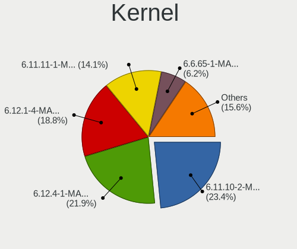
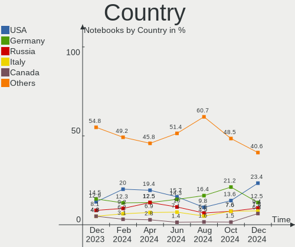
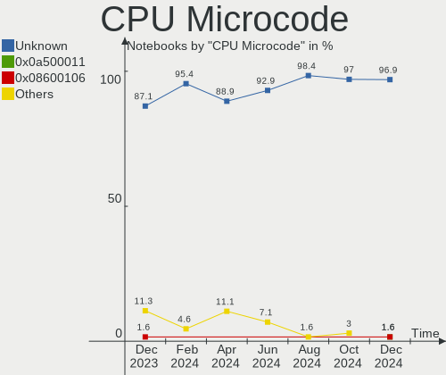
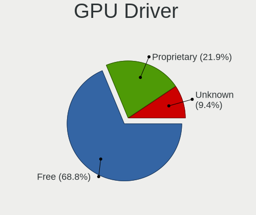
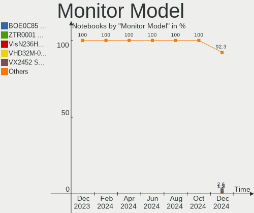

Manjaro Hardware Trends (Notebook)
----------------------------------

A project to identify most popular hardware characteristics and track their change
over time based on data collected by Manjaro users at https://Linux-Hardware.org.

Anyone can contribute to the study by uploading probes of their computers by
the [hw-probe](https://github.com/linuxhw/hw-probe) tool:

    sudo hw-probe -all -upload

Full-feature report is available here: https://linux-hardware.org/?view=trends&formfactor=notebook

Period: Feb, 2020.

Contents
--------

- [ OS                       ](#os)
- [ OS Family                ](#os-family)
- [ Kernel                   ](#kernel)
- [ Kernel Family            ](#kernel-family)
- [ Kernel Major Ver.        ](#kernel-major-ver)
- [ Arch                     ](#arch)
- [ DE                       ](#de)
- [ Display Server           ](#display-server)
- [ OS Lang                  ](#os-lang)
- [ Boot Mode                ](#boot-mode)
- [ Filesystem               ](#filesystem)
- [ Dual Boot with Linux     ](#dual-boot-with-linux)
- [ Dual Boot (Win)          ](#dual-boot-win)
- [ Country                  ](#country)
- [ City                     ](#city)
- [ Vendor                   ](#vendor)
- [ Model                    ](#model)
- [ Model Family             ](#model-family)
- [ MFG Year                 ](#mfg-year)
- [ Form Factor              ](#form-factor)
- [ Secure Boot              ](#secure-boot)
- [ Coreboot                 ](#coreboot)
- [ RAM Size                 ](#ram-size)
- [ RAM Used                 ](#ram-used)
- [ Drive Vendor             ](#drive-vendor)
- [ Drive Model              ](#drive-model)
- [ Drive Kind               ](#drive-kind)
- [ Drive Connector          ](#drive-connector)
- [ Drive Size               ](#drive-size)
- [ Space Total              ](#space-total)
- [ Space Used               ](#space-used)
- [ Malfunc. Drives          ](#malfunc-drives)
- [ Malfunc. Drive Vendor    ](#malfunc-drive-vendor)
- [ Malfunc. Drive Kind      ](#malfunc-drive-kind)
- [ Failed Drives            ](#failed-drives)
- [ Failed Drive Vendor      ](#failed-drive-vendor)
- [ Drive Status             ](#drive-status)
- [ Storage Vendor           ](#storage-vendor)
- [ Storage Model            ](#storage-model)
- [ Storage Kind             ](#storage-kind)
- [ CPU Vendor               ](#cpu-vendor)
- [ CPU Model                ](#cpu-model)
- [ CPU Model Family         ](#cpu-model-family)
- [ CPU Cores                ](#cpu-cores)
- [ CPU Sockets              ](#cpu-sockets)
- [ CPU Threads              ](#cpu-threads)
- [ CPU Op-Modes             ](#cpu-op-modes)
- [ CPU Microarch            ](#cpu-microarch)
- [ CPU Microcode            ](#cpu-microcode)
- [ GPU Vendor               ](#gpu-vendor)
- [ GPU Model                ](#gpu-model)
- [ GPU Combo                ](#gpu-combo)
- [ GPU Driver               ](#gpu-driver)
- [ GPU Memory               ](#gpu-memory)
- [ Monitor Vendor           ](#monitor-vendor)
- [ Monitor Model            ](#monitor-model)
- [ Monitor Resolution       ](#monitor-resolution)
- [ Monitor Diagonal         ](#monitor-diagonal)
- [ Monitor Width            ](#monitor-width)
- [ Aspect Ratio             ](#aspect-ratio)
- [ Monitor Area             ](#monitor-area)
- [ Pixel Density            ](#pixel-density)
- [ Multiple Monitors        ](#multiple-monitors)
- [ Net Controller Vendor    ](#net-controller-vendor)
- [ Net Controller Model     ](#net-controller-model)
- [ Net Controller Kind      ](#net-controller-kind)
- [ Used Controller          ](#used-controller)
- [ NICs                     ](#nics)
- [ Unsupported Devices      ](#unsupported-devices)
- [ Unsupported Device Types ](#unsupported-device-types)

OS
--

Installed operating systems

| Name              | Computers | Percent |
|-------------------|-----------|---------|
| Manjaro 18.1.5    | 41        | 53.25%  |
| Manjaro           | 24        | 31.17%  |
| Manjaro 19.0.0    | 5         | 6.49%   |
| Manjaro 19.0      | 5         | 6.49%   |
| Manjaro 19.0.1    | 1         | 1.3%    |
| Manjaro 19.0-pre1 | 1         | 1.3%    |

OS Family
---------

OS without a version

| Name    | Computers | Percent |
|---------|-----------|---------|
| Manjaro | 77        | 100%    |

Kernel
------

Version of the Linux kernel

| Version             | Computers | Percent |
|---------------------|-----------|---------|
| 5.4.15-2-MANJARO    | 20        | 25.97%  |
| 5.5.2-1-MANJARO     | 12        | 15.58%  |
| 5.5.0-1-MANJARO     | 10        | 12.99%  |
| 5.4.18-1-MANJARO    | 10        | 12.99%  |
| 5.3.18-1-MANJARO    | 5         | 6.49%   |
| 5.4.6-2-MANJARO     | 3         | 3.9%    |
| 5.4.17-1-MANJARO    | 3         | 3.9%    |
| 5.5.6-1-MANJARO     | 2         | 2.6%    |
| 4.19.99-1-MANJARO   | 2         | 2.6%    |
| 5.4.22-1-MANJARO    | 1         | 1.3%    |
| 5.4.16-1-MANJARO    | 1         | 1.3%    |
| 5.4.13-rt7-MANJARO  | 1         | 1.3%    |
| 5.4.13-3-MANJARO    | 1         | 1.3%    |
| 5.4.12-1-MANJARO    | 1         | 1.3%    |
| 5.2.21-rt15-MANJARO | 1         | 1.3%    |
| 4.19.97-1-MANJARO   | 1         | 1.3%    |
| 4.19.81-1-MANJARO   | 1         | 1.3%    |
| 4.19.102-1-MANJARO  | 1         | 1.3%    |
| 4.19.101-1-MANJARO  | 1         | 1.3%    |

Kernel Family
-------------

Linux kernel without a distro release

| Version  | Computers | Percent |
|----------|-----------|---------|
| 5.4.15   | 20        | 25.97%  |
| 5.5.2    | 12        | 15.58%  |
| 5.5.0    | 10        | 12.99%  |
| 5.4.18   | 10        | 12.99%  |
| 5.3.18   | 5         | 6.49%   |
| 5.4.6    | 3         | 3.9%    |
| 5.4.17   | 3         | 3.9%    |
| 5.5.6    | 2         | 2.6%    |
| 5.4.13   | 2         | 2.6%    |
| 4.19.99  | 2         | 2.6%    |
| 5.4.22   | 1         | 1.3%    |
| 5.4.16   | 1         | 1.3%    |
| 5.4.12   | 1         | 1.3%    |
| 5.2.21   | 1         | 1.3%    |
| 4.19.97  | 1         | 1.3%    |
| 4.19.81  | 1         | 1.3%    |
| 4.19.102 | 1         | 1.3%    |
| 4.19.101 | 1         | 1.3%    |

Kernel Major Ver.
-----------------

Linux kernel major version

| Version | Computers | Percent |
|---------|-----------|---------|
| 5.4     | 41        | 53.25%  |
| 5.5     | 24        | 31.17%  |
| 4.19    | 6         | 7.79%   |
| 5.3     | 5         | 6.49%   |
| 5.2     | 1         | 1.3%    |

Arch
----

OS architecture (x86_64, i586, etc.)

| Name   | Computers | Percent |
|--------|-----------|---------|
| x86_64 | 77        | 100%    |

DE
--

Desktop Environment

| Name     | Computers | Percent |
|----------|-----------|---------|
| KDE5     | 28        | 36.36%  |
| XFCE     | 20        | 25.97%  |
| GNOME    | 11        | 14.29%  |
| KDE      | 10        | 12.99%  |
| MATE     | 2         | 2.6%    |
| Cinnamon | 2         | 2.6%    |
| Unknown  | 2         | 2.6%    |
| i3       | 1         | 1.3%    |
| Budgie   | 1         | 1.3%    |

Display Server
--------------

X11 or Wayland

| Name    | Computers | Percent |
|---------|-----------|---------|
| X11     | 70        | 90.91%  |
| Wayland | 7         | 9.09%   |

OS Lang
-------

Language

| Lang       | Computers | Percent |
|------------|-----------|---------|
| en_US      | 24        | 31.17%  |
| en_US.utf8 | 8         | 10.39%  |
| de_DE      | 5         | 6.49%   |
| ru_RU      | 4         | 5.19%   |
| pl_PL      | 4         | 5.19%   |
| en_GB      | 4         | 5.19%   |
| en_CA      | 3         | 3.9%    |
| de_DE.utf8 | 3         | 3.9%    |
| pt_BR.utf8 | 2         | 2.6%    |
| it_IT.utf8 | 2         | 2.6%    |
| zh_CN.utf8 | 1         | 1.3%    |
| zh_CN      | 1         | 1.3%    |
| ru_RU.utf8 | 1         | 1.3%    |
| ro_RO      | 1         | 1.3%    |
| pt_BR      | 1         | 1.3%    |
| nl_BE      | 1         | 1.3%    |
| it_IT      | 1         | 1.3%    |
| hu_HU      | 1         | 1.3%    |
| fr_FR      | 1         | 1.3%    |
| fr_BE      | 1         | 1.3%    |
| et_EE      | 1         | 1.3%    |
| es_ES      | 1         | 1.3%    |
| es_AR      | 1         | 1.3%    |
| en_IN      | 1         | 1.3%    |
| en_DK      | 1         | 1.3%    |
| en_CA.utf8 | 1         | 1.3%    |
| en_AU      | 1         | 1.3%    |
| Unknown    | 1         | 1.3%    |

Boot Mode
---------

EFI or BIOS

| Mode | Computers | Percent |
|------|-----------|---------|
| EFI  | 44        | 57.14%  |
| BIOS | 33        | 42.86%  |

Filesystem
----------

Type of filesystem

| Type  | Computers | Percent |
|-------|-----------|---------|
| Ext4  | 69        | 89.61%  |
| Btrfs | 6         | 7.79%   |
| Xfs   | 1         | 1.3%    |
| Tmpfs | 1         | 1.3%    |

Dual Boot with Linux
--------------------

Hosting more than one Linux

| Dual boot | Computers | Percent |
|-----------|-----------|---------|
| No        | 69        | 89.61%  |
| Yes       | 8         | 10.39%  |

Dual Boot (Win)
---------------

Hosting Linux and Windows

| Dual boot | Computers | Percent |
|-----------|-----------|---------|
| No        | 45        | 58.44%  |
| Yes       | 32        | 41.56%  |

Country
-------

Geographic location (country)

| Country        | Computers | Percent |
|----------------|-----------|---------|
| USA            | 10        | 12.99%  |
| Russia         | 8         | 10.39%  |
| Germany        | 7         | 9.09%   |
| Poland         | 5         | 6.49%   |
| Canada         | 5         | 6.49%   |
| Brazil         | 4         | 5.19%   |
| Italy          | 3         | 3.9%    |
| Indonesia      | 3         | 3.9%    |
| Belgium        | 3         | 3.9%    |
| UK             | 2         | 2.6%    |
| Romania        | 2         | 2.6%    |
| Hungary        | 2         | 2.6%    |
| China          | 2         | 2.6%    |
| Austria        | 2         | 2.6%    |
| Ukraine        | 1         | 1.3%    |
| Sweden         | 1         | 1.3%    |
| Spain          | 1         | 1.3%    |
| Slovenia       | 1         | 1.3%    |
| Slovakia       | 1         | 1.3%    |
| Serbia         | 1         | 1.3%    |
| Panama         | 1         | 1.3%    |
| Mexico         | 1         | 1.3%    |
| Mauritius      | 1         | 1.3%    |
| India          | 1         | 1.3%    |
| Greece         | 1         | 1.3%    |
| Finland        | 1         | 1.3%    |
| Estonia        | 1         | 1.3%    |
| Denmark        | 1         | 1.3%    |
| Czech Republic | 1         | 1.3%    |
| Croatia        | 1         | 1.3%    |
| Bangladesh     | 1         | 1.3%    |
| Australia      | 1         | 1.3%    |
| Argentina      | 1         | 1.3%    |

City
----

Geographic location (city)

| City                | Computers | Percent |
|---------------------|-----------|---------|
| Kitchener           | 3         | 3.9%    |
| Brussels            | 3         | 3.9%    |
| St Petersburg       | 2         | 2.6%    |
| Budapest            | 2         | 2.6%    |
| Bucharest           | 2         | 2.6%    |
| Bandung             | 2         | 2.6%    |
| Yekaterinburg       | 1         | 1.3%    |
| Wrocław            | 1         | 1.3%    |
| Wakefield           | 1         | 1.3%    |
| Vienna              | 1         | 1.3%    |
| Vaskjala            | 1         | 1.3%    |
| Turin               | 1         | 1.3%    |
| Toruń              | 1         | 1.3%    |
| São Paulo          | 1         | 1.3%    |
| St. Petersburg      | 1         | 1.3%    |
| Spokane             | 1         | 1.3%    |
| Serravalle Scrivia  | 1         | 1.3%    |
| Río Cuarto         | 1         | 1.3%    |
| Rzeszów            | 1         | 1.3%    |
| Rio de Janeiro      | 1         | 1.3%    |
| Qujing              | 1         | 1.3%    |
| Pullman             | 1         | 1.3%    |
| Ptujska Gora        | 1         | 1.3%    |
| Port Louis          | 1         | 1.3%    |
| Pontal              | 1         | 1.3%    |
| Plympton            | 1         | 1.3%    |
| Passaic             | 1         | 1.3%    |
| Panama City         | 1         | 1.3%    |
| Oshawa              | 1         | 1.3%    |
| Osa                 | 1         | 1.3%    |
| Nuremberg           | 1         | 1.3%    |
| Nanning             | 1         | 1.3%    |
| Münster            | 1         | 1.3%    |
| Moscow              | 1         | 1.3%    |
| Monterrey           | 1         | 1.3%    |
| Moncton             | 1         | 1.3%    |
| Marília            | 1         | 1.3%    |
| Manassas            | 1         | 1.3%    |
| Madrid              | 1         | 1.3%    |
| London              | 1         | 1.3%    |
| Linz                | 1         | 1.3%    |
| Levice              | 1         | 1.3%    |
| Leitzkau            | 1         | 1.3%    |
| Krakow              | 1         | 1.3%    |
| Konstantynow Lodzki | 1         | 1.3%    |
| Killeen             | 1         | 1.3%    |
| Jakarta             | 1         | 1.3%    |
| Ivanovo             | 1         | 1.3%    |
| Helsinki            | 1         | 1.3%    |
| Heilbronn           | 1         | 1.3%    |
| Gothenburg          | 1         | 1.3%    |
| Giessen             | 1         | 1.3%    |
| Donji Miholjac      | 1         | 1.3%    |
| Dnipro              | 1         | 1.3%    |
| Dhaka               | 1         | 1.3%    |
| Delhi               | 1         | 1.3%    |
| Copenhagen          | 1         | 1.3%    |
| Colorado Springs    | 1         | 1.3%    |
| Chicago             | 1         | 1.3%    |
| Chesapeake          | 1         | 1.3%    |

Vendor
------

Motherboard manufacturer

| Name                  | Computers | Percent |
|-----------------------|-----------|---------|
| Hewlett-Packard       | 21        | 27.27%  |
| Lenovo                | 17        | 22.08%  |
| Dell                  | 14        | 18.18%  |
| ASUSTek Computer      | 8         | 10.39%  |
| Acer                  | 4         | 5.19%   |
| Sony                  | 3         | 3.9%    |
| MSI                   | 3         | 3.9%    |
| Quanta                | 1         | 1.3%    |
| Multilaser Industrial | 1         | 1.3%    |
| Medion                | 1         | 1.3%    |
| Fujitsu               | 1         | 1.3%    |
| Dream Machines        | 1         | 1.3%    |
| Digibras              | 1         | 1.3%    |
| Alienware             | 1         | 1.3%    |

Model
-----

Motherboard model

| Name                                 | Computers | Percent |
|--------------------------------------|-----------|---------|
| HP Notebook                          | 2         | 2.6%    |
| HP 15                                | 2         | 2.6%    |
| Sony VPCEB2M1R                       | 1         | 1.3%    |
| Sony SVF15218SNW                     | 1         | 1.3%    |
| Sony SVE11125CVW                     | 1         | 1.3%    |
| Quanta TWH                           | 1         | 1.3%    |
| Multilaser Industrial PC150          | 1         | 1.3%    |
| MSI GS63VR 7RG                       | 1         | 1.3%    |
| MSI GL63 8RE                         | 1         | 1.3%    |
| MSI GE75 Raider 9SE                  | 1         | 1.3%    |
| Medion E7424 MD60150                 | 1         | 1.3%    |
| Lenovo Z50-70 20354                  | 1         | 1.3%    |
| Lenovo XiaoXin Air 13IWL 81J8        | 1         | 1.3%    |
| Lenovo ThinkPad T480s 20L7S0XM00     | 1         | 1.3%    |
| Lenovo ThinkPad T480 20L5000AHV      | 1         | 1.3%    |
| Lenovo ThinkPad T440s 20ARS34900     | 1         | 1.3%    |
| Lenovo ThinkPad T420 4180PBG         | 1         | 1.3%    |
| Lenovo ThinkPad Edge E540 20C6003QPB | 1         | 1.3%    |
| Lenovo ThinkPad Edge E530 3259AHG    | 1         | 1.3%    |
| Lenovo ThinkPad E595 20NF0000GE      | 1         | 1.3%    |
| Lenovo ThinkPad E15 20RDCTO1WW       | 1         | 1.3%    |
| Lenovo ThinkBook 15-IML 20RW         | 1         | 1.3%    |
| Lenovo IdeaPad S340-15API 81NC       | 1         | 1.3%    |
| Lenovo IdeaPad 530S-15IKB 81EV       | 1         | 1.3%    |
| Lenovo IdeaPad 330S-15ARR 81FB       | 1         | 1.3%    |
| Lenovo IdeaPad 330-15IKB 81DE        | 1         | 1.3%    |
| Lenovo IdeaPad 100-14IBY 80MH        | 1         | 1.3%    |
| Lenovo Flex 2-15 20405               | 1         | 1.3%    |
| HP Stream Laptop 14-cb102ca          | 1         | 1.3%    |
| HP ProBook 650 G5                    | 1         | 1.3%    |
| HP ProBook 650 G1                    | 1         | 1.3%    |
| HP ProBook 450 G6                    | 1         | 1.3%    |
| HP ProBook 430 G1                    | 1         | 1.3%    |
| HP Pavilion Gaming Laptop 17-cd0xxx  | 1         | 1.3%    |
| HP Pavilion g6                       | 1         | 1.3%    |
| HP Pavilion dv7                      | 1         | 1.3%    |
| HP OMEN by HP Laptop 15-dc1xxx       | 1         | 1.3%    |
| HP G42                               | 1         | 1.3%    |
| HP EliteBook 8570p                   | 1         | 1.3%    |
| HP EliteBook 8470p                   | 1         | 1.3%    |
| HP EliteBook 840 G6                  | 1         | 1.3%    |
| HP EliteBook 840 G3                  | 1         | 1.3%    |
| HP EliteBook 1040 G4                 | 1         | 1.3%    |
| HP 250 G7 Notebook PC                | 1         | 1.3%    |
| HP 250 G5 Notebook PC                | 1         | 1.3%    |
| Fujitsu LIFEBOOK E782                | 1         | 1.3%    |
| Dream Machines N85_N87,HJ,HJ1,HK1    | 1         | 1.3%    |
| Digibras NH4CU03                     | 1         | 1.3%    |
| Dell XPS 15 9560                     | 1         | 1.3%    |
| Dell XPS 13 9370                     | 1         | 1.3%    |
| Dell Precision M4700                 | 1         | 1.3%    |
| Dell Precision 5520                  | 1         | 1.3%    |
| Dell Latitude E7440                  | 1         | 1.3%    |
| Dell Latitude E6430                  | 1         | 1.3%    |
| Dell Latitude E5410                  | 1         | 1.3%    |
| Dell Latitude 7480                   | 1         | 1.3%    |
| Dell Latitude 5491                   | 1         | 1.3%    |
| Dell Inspiron 7559                   | 1         | 1.3%    |
| Dell Inspiron 3542                   | 1         | 1.3%    |
| Dell Inspiron 15 7000 Gaming         | 1         | 1.3%    |

Model Family
------------

Motherboard model prefix

| Name                        | Computers | Percent |
|-----------------------------|-----------|---------|
| Lenovo ThinkPad             | 8         | 10.39%  |
| Lenovo IdeaPad              | 5         | 6.49%   |
| HP EliteBook                | 5         | 6.49%   |
| Dell Latitude               | 5         | 6.49%   |
| HP ProBook                  | 4         | 5.19%   |
| Dell Inspiron               | 4         | 5.19%   |
| HP Pavilion                 | 3         | 3.9%    |
| HP Notebook                 | 2         | 2.6%    |
| HP 250                      | 2         | 2.6%    |
| HP 15                       | 2         | 2.6%    |
| Dell XPS                    | 2         | 2.6%    |
| Dell Precision              | 2         | 2.6%    |
| Sony VPCEB2M1R              | 1         | 1.3%    |
| Sony SVF15218SNW            | 1         | 1.3%    |
| Sony SVE11125CVW            | 1         | 1.3%    |
| Quanta TWH                  | 1         | 1.3%    |
| Multilaser Industrial PC150 | 1         | 1.3%    |
| MSI GS63VR                  | 1         | 1.3%    |
| MSI GL63                    | 1         | 1.3%    |
| MSI GE75                    | 1         | 1.3%    |
| Medion E7424                | 1         | 1.3%    |
| Lenovo Z50-70               | 1         | 1.3%    |
| Lenovo XiaoXin              | 1         | 1.3%    |
| Lenovo ThinkBook            | 1         | 1.3%    |
| Lenovo Flex                 | 1         | 1.3%    |
| HP Stream                   | 1         | 1.3%    |
| HP OMEN                     | 1         | 1.3%    |
| HP G42                      | 1         | 1.3%    |
| Fujitsu LIFEBOOK            | 1         | 1.3%    |
| Dream Machines N85          | 1         | 1.3%    |
| Digibras NH4CU03            | 1         | 1.3%    |
| Dell G3                     | 1         | 1.3%    |
| ASUS X550JK                 | 1         | 1.3%    |
| ASUS X541NA                 | 1         | 1.3%    |
| ASUS VivoBook               | 1         | 1.3%    |
| ASUS UX410UAK               | 1         | 1.3%    |
| ASUS N551JQ                 | 1         | 1.3%    |
| ASUS K50IJ                  | 1         | 1.3%    |
| ASUS K45VM                  | 1         | 1.3%    |
| ASUS GL503VD                | 1         | 1.3%    |
| Alienware 15                | 1         | 1.3%    |
| Acer TravelMate             | 1         | 1.3%    |
| Acer Predator               | 1         | 1.3%    |
| Acer Nitro                  | 1         | 1.3%    |
| Acer Aspire                 | 1         | 1.3%    |

MFG Year
--------

Motherboard manufacture year

| Year | Computers | Percent |
|------|-----------|---------|
| 2019 | 28        | 36.36%  |
| 2018 | 12        | 15.58%  |
| 2013 | 11        | 14.29%  |
| 2017 | 7         | 9.09%   |
| 2014 | 6         | 7.79%   |
| 2011 | 3         | 3.9%    |
| 2020 | 2         | 2.6%    |
| 2016 | 2         | 2.6%    |
| 2015 | 2         | 2.6%    |
| 2012 | 2         | 2.6%    |
| 2010 | 2         | 2.6%    |

Form Factor
-----------

Physical design of the computer

| Name     | Computers | Percent |
|----------|-----------|---------|
| Notebook | 77        | 100%    |

Secure Boot
-----------

Enabled or disabled

| State    | Computers | Percent |
|----------|-----------|---------|
| Disabled | 77        | 100%    |

Coreboot
--------

Have coreboot on board

| Used | Computers | Percent |
|------|-----------|---------|
| No   | 77        | 100%    |

RAM Size
--------

Total RAM memory

| Size in GB | Computers | Percent |
|------------|-----------|---------|
| 4.01-8.0   | 24        | 31.17%  |
| 16.01-24.0 | 21        | 27.27%  |
| 3.01-4.0   | 13        | 16.88%  |
| 8.01-16.0  | 12        | 15.58%  |
| 32.01-64.0 | 3         | 3.9%    |
| 24.01-32.0 | 3         | 3.9%    |
| 1.01-2.0   | 1         | 1.3%    |

RAM Used
--------

Used RAM memory

| Used GB   | Computers | Percent |
|-----------|-----------|---------|
| 1.01-2.0  | 23        | 29.87%  |
| 2.01-3.0  | 20        | 25.97%  |
| 4.01-8.0  | 14        | 18.18%  |
| 3.01-4.0  | 11        | 14.29%  |
| 8.01-16.0 | 5         | 6.49%   |
| 0.01-1.0  | 4         | 5.19%   |

Drive Vendor
------------

Hard drive vendors

| Vendor              | Computers | Drives  | Percent |
|---------------------|-----------|---------|---------|
| Samsung Electronics | 17        | 18      | 19.32%  |
| WDC                 | 15        | 15      | 17.05%  |
| Seagate             | 9         | 9       | 10.23%  |
| SanDisk             | 9         | 9       | 10.23%  |
| Unknown             | 5         | 5       | 5.68%   |
| Toshiba             | 5         | 5       | 5.68%   |
| Kingston            | 5         | 5       | 5.68%   |
| Crucial             | 5         | 5       | 5.68%   |
| Intel               | 4         | 4       | 4.55%   |
| HGST                | 4         | 4       | 4.55%   |
| Hitachi             | 2         | 2       | 2.27%   |
| SK Hynix            | 1         | 1       | 1.14%   |
| PLEXTOR             | 1         | 1       | 1.14%   |
| Phison              | 1         | 1       | 1.14%   |
| OCZ                 | 1         | 1       | 1.14%   |
| Micron Technology   | 1         | 1       | 1.14%   |
| LITEONIT            | 1         | 1       | 1.14%   |
| KESU                | 1         | 1       | 1.14%   |
| HL-DT-ST            | 1         | Unknown | 1.14%   |

Drive Model
-----------

Hard drive models

| Model                            | Computers | Percent |
|----------------------------------|-----------|---------|
| WD10S21X-24R1BT0-SSHD-8GB        | 2         | 2.25%   |
| SV300S37A240G 240GB SSD          | 2         | 2.25%   |
| ST1000LM049-2GH172 1TB           | 2         | 2.25%   |
| SSD 860 QVO 1TB                  | 2         | 2.25%   |
| CT240BX500SSD1 240GB             | 2         | 2.25%   |
| X400 2.5 7MM 256GB SSD           | 1         | 1.12%   |
| WDS500G2B0A-00SM50 500GB SSD     | 1         | 1.12%   |
| WDS240G1G0A-00SS50 240GB SSD     | 1         | 1.12%   |
| WDS100T2B0B-00YS70 1TB SSD       | 1         | 1.12%   |
| WD7500BPVT-08HXZT3 752GB         | 1         | 1.12%   |
| WD5000LPVX-60V0TT0 500GB         | 1         | 1.12%   |
| WD5000LPVX-22V0TT0 500GB         | 1         | 1.12%   |
| WD3200BPVT-22JJ5T0 320GB         | 1         | 1.12%   |
| WD10SPZX-21Z10T0 1TB             | 1         | 1.12%   |
| WD10JPVX-60JC3T0 1TB             | 1         | 1.12%   |
| WD10JPVX-22JC3T0 1TB             | 1         | 1.12%   |
| WD10JPVX-08JC3T5 1TB             | 1         | 1.12%   |
| WD10 JPVX-75JC3T0 1TB            | 1         | 1.12%   |
| USB 3.0 2TB                      | 1         | 1.12%   |
| Ultra II 960GB SSD               | 1         | 1.12%   |
| Ultra II 240GB SSD               | 1         | 1.12%   |
| TRION100 240GB SSD               | 1         | 1.12%   |
| THNSNK256GVN8 M.2 2280 256GB SSD | 1         | 1.12%   |
| ST500LT012-1DG142 500GB          | 1         | 1.12%   |
| ST500LM034-2GH17A 500GB          | 1         | 1.12%   |
| ST500LM030-2E717D 500GB          | 1         | 1.12%   |
| ST2000LM015-2E8174 2TB           | 1         | 1.12%   |
| ST1000LX015-1U7172 1TB           | 1         | 1.12%   |
| ST1000LM035-1RK172 1TB           | 1         | 1.12%   |
| ST1000LM024 HN-M101MBB 1TB       | 1         | 1.12%   |
| SSDSCKKF256H6 SATA 256GB         | 1         | 1.12%   |
| SSDSA2M160G2HP 160GB             | 1         | 1.12%   |
| SSDPEKKW256G7 256GB              | 1         | 1.12%   |
| SSDPEKKF512G8L 512GB             | 1         | 1.12%   |
| SSD U110 16GB                    | 1         | 1.12%   |
| SSD PM851 mSATA 128GB            | 1         | 1.12%   |
| SSD PM830 FDE 2.5 7mm 256GB      | 1         | 1.12%   |
| SSD 970 EVO Plus 500GB           | 1         | 1.12%   |
| SSD 970 EVO Plus 1TB             | 1         | 1.12%   |
| SSD 860 QVO 2TB                  | 1         | 1.12%   |
| SSD 850 PRO 512GB                | 1         | 1.12%   |
| SSD 750 EVO 120GB                | 1         | 1.12%   |
| SLD32G  32GB                     | 1         | 1.12%   |
| SDSSDHII240G 240GB               | 1         | 1.12%   |
| SD9SN8W128G1102 128GB SSD        | 1         | 1.12%   |
| SD9SB8W256G1002 256GB SSD        | 1         | 1.12%   |
| SD8SN8U-256G-1006 256GB SSD      | 1         | 1.12%   |
| SC32G  32GB                      | 1         | 1.12%   |
| SA400S37960G 960GB SSD           | 1         | 1.12%   |
| SA400S37240G 240GB SSD           | 1         | 1.12%   |
| SA400S37120G 120GB SSD           | 1         | 1.12%   |
| S11-128G-PHISON-SSD 128GB        | 1         | 1.12%   |
| PX-128S2G 128GB SSD              | 1         | 1.12%   |
| PC SN520 SDAPMUW-512G-1001 512GB | 1         | 1.12%   |
| MZVLW256HEHP-000L2 256GB         | 1         | 1.12%   |
| MZVLW256HEHP-00000 256GB         | 1         | 1.12%   |
| MZVLB512HAJQ-000L2 512GB         | 1         | 1.12%   |
| MZVLB512HAJQ-00000 512GB         | 1         | 1.12%   |
| MZVLB256HBHQ-000L7 256GB         | 1         | 1.12%   |
| MZVLB256HAHQ-000L2 256GB         | 1         | 1.12%   |

Drive Kind
----------

HDD or SSD

| Kind    | Computers | Drives | Percent |
|---------|-----------|--------|---------|
| SSD     | 35        | 38     | 40.7%   |
| HDD     | 30        | 30     | 34.88%  |
| NVMe    | 13        | 13     | 15.12%  |
| MMC     | 5         | 5      | 5.81%   |
| Unknown | 3         | 2      | 3.49%   |

Drive Connector
---------------

SATA, SAS, NVMe, etc.

| Type | Computers | Drives | Percent |
|------|-----------|--------|---------|
| SATA | 60        | 67     | 73.17%  |
| NVMe | 13        | 13     | 15.85%  |
| MMC  | 5         | 5      | 6.1%    |
| SAS  | 4         | 3      | 4.88%   |

Drive Size
----------

Size of hard drive

| Size in TB | Computers | Drives | Percent |
|------------|-----------|--------|---------|
| 0.01-0.5   | 48        | 53     | 59.26%  |
| 0.51-1.0   | 30        | 32     | 37.04%  |
| 1.01-2.0   | 3         | 3      | 3.7%    |

Space Total
-----------

Amount of disk space available on the file system

| Size in GB | Computers | Percent |
|------------|-----------|---------|
| 101-250    | 21        | 27.27%  |
| 251-500    | 17        | 22.08%  |
| 51-100     | 10        | 12.99%  |
| 1001-2000  | 9         | 11.69%  |
| 501-1000   | 9         | 11.69%  |
| Unknown    | 6         | 7.79%   |
| 21-50      | 3         | 3.9%    |
| 2001-3000  | 2         | 2.6%    |

Space Used
----------

Amount of used disk space

| Used GB   | Computers | Percent |
|-----------|-----------|---------|
| 1-20      | 17        | 22.08%  |
| 51-100    | 15        | 19.48%  |
| 21-50     | 12        | 15.58%  |
| 101-250   | 9         | 11.69%  |
| 501-1000  | 8         | 10.39%  |
| 251-500   | 7         | 9.09%   |
| Unknown   | 6         | 7.79%   |
| 1001-2000 | 3         | 3.9%    |

Malfunc. Drives
---------------

Drive models with a malfunction

| Model                  | Computers | Drives | Percent |
|------------------------|-----------|--------|---------|
| WD10JPVX-22JC3T0 1TB   | 1         | 1      | 33.33%  |
| ST1000LX015-1U7172 1TB | 1         | 1      | 33.33%  |
| HTS545050A7E380 500GB  | 1         | 1      | 33.33%  |

Malfunc. Drive Vendor
---------------------

Vendors of faulty drives

| Vendor  | Computers | Drives | Percent |
|---------|-----------|--------|---------|
| WDC     | 1         | 1      | 33.33%  |
| Seagate | 1         | 1      | 33.33%  |
| HGST    | 1         | 1      | 33.33%  |

Malfunc. Drive Kind
-------------------

Kinds of faulty drives

| Kind | Computers | Drives | Percent |
|------|-----------|--------|---------|
| HDD  | 3         | 3      | 100%    |

Failed Drives
-------------

Failed drive models

Zero info for selected period =(

Failed Drive Vendor
-------------------

Failed drive vendors

Zero info for selected period =(

Drive Status
------------

Number of failed and malfunc. drives

| Status   | Computers | Drives | Percent |
|----------|-----------|--------|---------|
| Detected | 43        | 52     | 59.72%  |
| Works    | 26        | 33     | 36.11%  |
| Malfunc  | 3         | 3      | 4.17%   |

Storage Vendor
--------------

Storage controller vendors

| Vendor                       | Computers | Percent |
|------------------------------|-----------|---------|
| Intel                        | 61        | 66.3%   |
| Samsung Electronics          | 10        | 10.87%  |
| AMD                          | 9         | 9.78%   |
| Sandisk                      | 5         | 5.43%   |
| SK Hynix                     | 3         | 3.26%   |
| Toshiba America Info Systems | 2         | 2.17%   |
| Micron/Crucial Technology    | 1         | 1.09%   |
| Lite-On Technology           | 1         | 1.09%   |

Storage Model
-------------

Storage controller models

| Model                                                                    | Computers | Percent |
|--------------------------------------------------------------------------|-----------|---------|
| 82801 Mobile SATA Controller [RAID mode]                                 | 10        | 10.53%  |
| FCH SATA Controller [AHCI mode]                                          | 9         | 9.47%   |
| NVMe SSD Controller SM981/PM981/PM983                                    | 8         | 8.42%   |
| 7 Series Chipset Family 6-port SATA Controller [AHCI mode]               | 8         | 8.42%   |
| Sunrise Point-LP SATA Controller [AHCI mode]                             | 7         | 7.37%   |
| Non-Volatile memory controller                                           | 7         | 7.37%   |
| 8 Series SATA Controller 1 [AHCI mode]                                   | 6         | 6.32%   |
| HM170/QM170 Chipset SATA Controller [AHCI Mode]                          | 5         | 5.26%   |
| Cannon Lake Mobile PCH SATA AHCI Controller                              | 4         | 4.21%   |
| 8 Series/C220 Series Chipset Family 6-port SATA Controller 1 [AHCI mode] | 4         | 4.21%   |
| 5 Series/3400 Series Chipset 4 port SATA AHCI Controller                 | 3         | 3.16%   |
| WD Black 2018/PC SN720 NVMe SSD                                          | 2         | 2.11%   |
| Q170/Q150/B150/H170/H110/Z170/CM236 Chipset SATA Controller [AHCI Mode]  | 2         | 2.11%   |
| NVMe SSD Controller SM961/PM961                                          | 2         | 2.11%   |
| Comet Lake SATA AHCI Controller                                          | 2         | 2.11%   |
| Cannon Point-LP SATA Controller [AHCI Mode]                              | 2         | 2.11%   |
| 6 Series/C200 Series Chipset Family 6 port Mobile SATA AHCI Controller   | 2         | 2.11%   |
| XG4 NVMe SSD Controller                                                  | 1         | 1.05%   |
| Wildcat Point-LP SATA Controller [AHCI Mode]                             | 1         | 1.05%   |
| WD Black 2018/PC SN520 NVMe SSD                                          | 1         | 1.05%   |
| Toshiba America Info Non-Volatile memory controller                      | 1         | 1.05%   |
| SSD Pro 7600p/760p/E 6100p Series                                        | 1         | 1.05%   |
| SSD 600P Series                                                          | 1         | 1.05%   |
| P1 NVMe PCIe SSD                                                         | 1         | 1.05%   |
| Celeron N3350/Pentium N4200/Atom E3900 Series SATA AHCI Controller       | 1         | 1.05%   |
| Atom Processor E3800 Series SATA AHCI Controller                         | 1         | 1.05%   |
| 82801IBM/IEM (ICH9M/ICH9M-E) 4 port SATA Controller [AHCI mode]          | 1         | 1.05%   |
| 7 Series Chipset Family 4-port SATA Controller [IDE mode]                | 1         | 1.05%   |
| 7 Series Chipset Family 2-port SATA Controller [IDE mode]                | 1         | 1.05%   |

Storage Kind
------------

Kind of storage controller (IDE, SATA, NVMe, SAS, ...)

| Kind | Computers | Percent |
|------|-----------|---------|
| SATA | 58        | 61.7%   |
| NVMe | 25        | 26.6%   |
| RAID | 10        | 10.64%  |
| IDE  | 1         | 1.06%   |

CPU Vendor
----------

Processor vendors

| Vendor | Computers | Percent |
|--------|-----------|---------|
| Intel  | 67        | 87.01%  |
| AMD    | 10        | 12.99%  |

CPU Model
---------

Processor models

| Model                                           | Computers | Percent |
|-------------------------------------------------|-----------|---------|
| Intel Core i7-8550U CPU @ 1.80GHz               | 5         | 6.49%   |
| Intel Core i7-7700HQ CPU @ 2.80GHz              | 4         | 5.19%   |
| Intel Core i5-7300HQ CPU @ 2.50GHz              | 3         | 3.9%    |
| Intel Core i5-7200U CPU @ 2.50GHz               | 3         | 3.9%    |
| Intel Core i5-4210U CPU @ 1.70GHz               | 3         | 3.9%    |
| Intel Core i7-9750H CPU @ 2.60GHz               | 2         | 2.6%    |
| Intel Core i7-8565U CPU @ 1.80GHz               | 2         | 2.6%    |
| Intel Core i5-8300H CPU @ 2.30GHz               | 2         | 2.6%    |
| Intel Core i5-8265U CPU @ 1.60GHz               | 2         | 2.6%    |
| Intel Core i5-3360M CPU @ 2.80GHz               | 2         | 2.6%    |
| Intel Core i5-3210M CPU @ 2.50GHz               | 2         | 2.6%    |
| AMD Ryzen 5 2500U with Radeon Vega Mobile Gfx   | 2         | 2.6%    |
| AMD Ryzen 3 3200U with Radeon Vega Mobile Gfx   | 2         | 2.6%    |
| Intel Xeon CPU E3-1505M v6 @ 3.00GHz            | 1         | 1.3%    |
| Intel Pentium CPU N4200 @ 1.10GHz               | 1         | 1.3%    |
| Intel Core i7-8750H CPU @ 2.20GHz               | 1         | 1.3%    |
| Intel Core i7-8665U CPU @ 1.90GHz               | 1         | 1.3%    |
| Intel Core i7-6700HQ CPU @ 2.60GHz              | 1         | 1.3%    |
| Intel Core i7-6600U CPU @ 2.60GHz               | 1         | 1.3%    |
| Intel Core i7-4710HQ CPU @ 2.50GHz              | 1         | 1.3%    |
| Intel Core i7-4702MQ CPU @ 2.20GHz              | 1         | 1.3%    |
| Intel Core i7-4600U CPU @ 2.10GHz               | 1         | 1.3%    |
| Intel Core i7-4510U CPU @ 2.00GHz               | 1         | 1.3%    |
| Intel Core i7-3740QM CPU @ 2.70GHz              | 1         | 1.3%    |
| Intel Core i7-3610QM CPU @ 2.30GHz              | 1         | 1.3%    |
| Intel Core i7-10510U CPU @ 1.80GHz              | 1         | 1.3%    |
| Intel Core i5-8400H CPU @ 2.50GHz               | 1         | 1.3%    |
| Intel Core i5-7300U CPU @ 2.60GHz               | 1         | 1.3%    |
| Intel Core i5-6200U CPU @ 2.30GHz               | 1         | 1.3%    |
| Intel Core i5-5200U CPU @ 2.20GHz               | 1         | 1.3%    |
| Intel Core i5-4310U CPU @ 2.00GHz               | 1         | 1.3%    |
| Intel Core i5-4200M CPU @ 2.50GHz               | 1         | 1.3%    |
| Intel Core i5-4200H CPU @ 2.80GHz               | 1         | 1.3%    |
| Intel Core i5-3340M CPU @ 2.70GHz               | 1         | 1.3%    |
| Intel Core i5-3337U CPU @ 1.80GHz               | 1         | 1.3%    |
| Intel Core i5-3320M CPU @ 2.60GHz               | 1         | 1.3%    |
| Intel Core i5-3230M CPU @ 2.60GHz               | 1         | 1.3%    |
| Intel Core i5-2520M CPU @ 2.50GHz               | 1         | 1.3%    |
| Intel Core i5-2430M CPU @ 2.40GHz               | 1         | 1.3%    |
| Intel Core i5-10210U CPU @ 1.60GHz              | 1         | 1.3%    |
| Intel Core i5 CPU M 460 @ 2.53GHz               | 1         | 1.3%    |
| Intel Core i3-7100U CPU @ 2.40GHz               | 1         | 1.3%    |
| Intel Core i3-4010U CPU @ 1.70GHz               | 1         | 1.3%    |
| Intel Core i3-3217U CPU @ 1.80GHz               | 1         | 1.3%    |
| Intel Core i3-3120M CPU @ 2.50GHz               | 1         | 1.3%    |
| Intel Core i3 CPU M 370 @ 2.40GHz               | 1         | 1.3%    |
| Intel Core i3 CPU M 350 @ 2.27GHz               | 1         | 1.3%    |
| Intel Core 2 Duo CPU T9300 @ 2.50GHz            | 1         | 1.3%    |
| Intel Celeron N4000 CPU @ 1.10GHz               | 1         | 1.3%    |
| Intel Celeron CPU N2840 @ 2.16GHz               | 1         | 1.3%    |
| AMD Ryzen 7 3700U with Radeon Vega Mobile Gfx   | 1         | 1.3%    |
| AMD E2-1800 APU with Radeon HD Graphics         | 1         | 1.3%    |
| AMD E1-2100 APU with Radeon HD Graphics         | 1         | 1.3%    |
| AMD A4-9120e RADEON R3, 4 COMPUTE CORES 2C+2G   | 1         | 1.3%    |
| AMD A10-9600P RADEON R5, 10 COMPUTE CORES 4C+6G | 1         | 1.3%    |
| AMD A10-5757M APU with Radeon HD Graphics       | 1         | 1.3%    |

CPU Model Family
----------------

Processor model prefix

| Model            | Computers | Percent |
|------------------|-----------|---------|
| Intel Core i5    | 32        | 41.56%  |
| Intel Core i7    | 24        | 31.17%  |
| Intel Core i3    | 6         | 7.79%   |
| Intel Celeron    | 2         | 2.6%    |
| AMD Ryzen 5      | 2         | 2.6%    |
| AMD Ryzen 3      | 2         | 2.6%    |
| AMD A10          | 2         | 2.6%    |
| Intel Xeon       | 1         | 1.3%    |
| Intel Pentium    | 1         | 1.3%    |
| Intel Core 2 Duo | 1         | 1.3%    |
| AMD Ryzen 7      | 1         | 1.3%    |
| AMD E2           | 1         | 1.3%    |
| AMD E1           | 1         | 1.3%    |
| AMD A4           | 1         | 1.3%    |

CPU Cores
---------

Number of processor cores

| Number | Computers | Percent |
|--------|-----------|---------|
| 2      | 42        | 54.55%  |
| 4      | 32        | 41.56%  |
| 6      | 3         | 3.9%    |

CPU Sockets
-----------

Number of sockets

| Number | Computers | Percent |
|--------|-----------|---------|
| 1      | 77        | 100%    |

CPU Threads
-----------

Threads per core (Hyper-Threading)

| Number | Computers | Percent |
|--------|-----------|---------|
| 2      | 67        | 87.01%  |
| 1      | 10        | 12.99%  |

CPU Op-Modes
------------

CPU Operation Modes (32-bit, 64-bit)

| Op mode        | Computers | Percent |
|----------------|-----------|---------|
| 32-bit, 64-bit | 77        | 100%    |

CPU Microarch
-------------

Microarchitecture

| Name          | Computers | Percent |
|---------------|-----------|---------|
| Skylake       | 18        | 23.38%  |
| KabyLake      | 16        | 20.78%  |
| IvyBridge     | 12        | 15.58%  |
| Haswell       | 11        | 14.29%  |
| Zen+          | 3         | 3.9%    |
| Westmere      | 3         | 3.9%    |
| Zen           | 2         | 2.6%    |
| SandyBridge   | 2         | 2.6%    |
| Excavator     | 2         | 2.6%    |
| Silvermont    | 1         | 1.3%    |
| Piledriver    | 1         | 1.3%    |
| Penryn        | 1         | 1.3%    |
| Jaguar        | 1         | 1.3%    |
| Goldmont plus | 1         | 1.3%    |
| Goldmont      | 1         | 1.3%    |
| Broadwell     | 1         | 1.3%    |
| Bobcat        | 1         | 1.3%    |

CPU Microcode
-------------

Microcode number

| Number     | Computers | Percent |
|------------|-----------|---------|
| Unknown    | 31        | 40.26%  |
| 0x306a9    | 7         | 9.09%   |
| 0x40651    | 5         | 6.49%   |
| 0x906ea    | 4         | 5.19%   |
| 0x906e9    | 4         | 5.19%   |
| 0x806e9    | 4         | 5.19%   |
| 0x306c3    | 4         | 5.19%   |
| 0x806ec    | 3         | 3.9%    |
| 0x806ea    | 3         | 3.9%    |
| 0x806eb    | 2         | 2.6%    |
| 0x08108102 | 2         | 2.6%    |
| 0x0810100b | 2         | 2.6%    |
| 0x706a1    | 1         | 1.3%    |
| 0x406e3    | 1         | 1.3%    |
| 0x30678    | 1         | 1.3%    |
| 0x206a7    | 1         | 1.3%    |
| 0x0700010f | 1         | 1.3%    |
| 0x06006705 | 1         | 1.3%    |

GPU Vendor
----------

Vendors of graphics cards

| Vendor | Computers | Percent |
|--------|-----------|---------|
| Intel  | 65        | 61.9%   |
| Nvidia | 27        | 25.71%  |
| AMD    | 13        | 12.38%  |

GPU Model
---------

Graphics card models

| Model                                                                        | Computers | Percent |
|------------------------------------------------------------------------------|-----------|---------|
| 3rd Gen Core processor Graphics Controller                                   | 12        | 11.21%  |
| HD Graphics 630                                                              | 7         | 6.54%   |
| Haswell-ULT Integrated Graphics Controller                                   | 7         | 6.54%   |
| UHD Graphics 630 (Mobile)                                                    | 5         | 4.67%   |
| UHD Graphics 620 (Whiskey Lake)                                              | 5         | 4.67%   |
| UHD Graphics 620                                                             | 5         | 4.67%   |
| HD Graphics 620                                                              | 5         | 4.67%   |
| 4th Gen Core Processor Integrated Graphics Controller                        | 4         | 3.74%   |
| Picasso                                                                      | 3         | 2.8%    |
| GP107M [GeForce GTX 1050 Mobile]                                             | 3         | 2.8%    |
| GF108M [GeForce GT 620M/630M/635M/640M LE]                                   | 3         | 2.8%    |
| UHD Graphics                                                                 | 2         | 1.87%   |
| TU106M [GeForce RTX 2060 Mobile]                                             | 2         | 1.87%   |
| Skylake GT2 [HD Graphics 520]                                                | 2         | 1.87%   |
| Raven Ridge [Radeon Vega Series / Radeon Vega Mobile Series]                 | 2         | 1.87%   |
| GP108M [GeForce MX150]                                                       | 2         | 1.87%   |
| GP106M [GeForce GTX 1060 Mobile]                                             | 2         | 1.87%   |
| GM108M [GeForce 840M]                                                        | 2         | 1.87%   |
| Core Processor Integrated Graphics Controller                                | 2         | 1.87%   |
| 2nd Generation Core Processor Family Integrated Graphics Controller          | 2         | 1.87%   |
| Wrestler [Radeon HD 7340]                                                    | 1         | 0.93%   |
| Wani [Radeon R5/R6/R7 Graphics]                                              | 1         | 0.93%   |
| UHD Graphics 605                                                             | 1         | 0.93%   |
| TU117M [GeForce GTX 1650 Mobile / Max-Q]                                     | 1         | 0.93%   |
| Thames [Radeon HD 7500M/7600M Series]                                        | 1         | 0.93%   |
| Sun XT [Radeon HD 8670A/8670M/8690M / R5 M330 / M430 / Radeon 520 Mobile]    | 1         | 0.93%   |
| Stoney [Radeon R2/R3/R4/R5 Graphics]                                         | 1         | 0.93%   |
| Richland [Radeon HD 8650G]                                                   | 1         | 0.93%   |
| Park [Mobility Radeon HD 5430/5450/5470]                                     | 1         | 0.93%   |
| Mobile 4 Series Chipset Integrated Graphics Controller                       | 1         | 0.93%   |
| Mars [Radeon HD 8670A/8670M/8750M]                                           | 1         | 0.93%   |
| Kabini [Radeon HD 8210]                                                      | 1         | 0.93%   |
| HD Graphics P630                                                             | 1         | 0.93%   |
| HD Graphics 5500                                                             | 1         | 0.93%   |
| HD Graphics 530                                                              | 1         | 0.93%   |
| GP108M [GeForce MX250]                                                       | 1         | 0.93%   |
| GP107M [GeForce GTX 1050 Ti Mobile]                                          | 1         | 0.93%   |
| GP106BM [GeForce GTX 1060 Mobile 6GB]                                        | 1         | 0.93%   |
| GP104M [GeForce GTX 1070 Mobile]                                             | 1         | 0.93%   |
| GM107M [GeForce GTX 960M]                                                    | 1         | 0.93%   |
| GM107M [GeForce GTX 850M]                                                    | 1         | 0.93%   |
| GM107M [GeForce 845M]                                                        | 1         | 0.93%   |
| GM107GLM [Quadro M1200 Mobile]                                               | 1         | 0.93%   |
| GM107GLM [Quadro M1000M]                                                     | 1         | 0.93%   |
| GK208M [GeForce GT 740M]                                                     | 1         | 0.93%   |
| GF117M [GeForce 610M/710M/810M/820M / GT 620M/625M/630M/720M]                | 1         | 0.93%   |
| GF108GLM [NVS 5200M]                                                         | 1         | 0.93%   |
| Celeron N3350/Pentium N4200/Atom E3900 Series Integrated Graphics Controller | 1         | 0.93%   |
| Baffin [Radeon RX 460/560D / Pro 450/455/460/555/555X/560/560X]              | 1         | 0.93%   |
| Atom Processor Z36xxx/Z37xxx Series Graphics & Display                       | 1         | 0.93%   |

GPU Combo
---------

Combinations of graphics cards

| Name           | Computers | Percent |
|----------------|-----------|---------|
| 1 x Intel      | 37        | 48.05%  |
| Intel + Nvidia | 25        | 32.47%  |
| 1 x AMD        | 9         | 11.69%  |
| 2 x AMD        | 2         | 2.6%    |
| 1 x Nvidia     | 2         | 2.6%    |
| Intel + AMD    | 2         | 2.6%    |

GPU Driver
----------

Free vs proprietary

| Driver      | Computers | Percent |
|-------------|-----------|---------|
| Free        | 65        | 84.42%  |
| Proprietary | 12        | 15.58%  |

GPU Memory
----------

Total video memory

| Size in GB | Computers | Percent |
|------------|-----------|---------|
| Unknown    | 64        | 83.12%  |
| 1.01-2.0   | 4         | 5.19%   |
| 5.01-6.0   | 3         | 3.9%    |
| 0.01-0.5   | 3         | 3.9%    |
| 7.01-8.0   | 1         | 1.3%    |
| 3.01-4.0   | 1         | 1.3%    |
| 0.51-1.0   | 1         | 1.3%    |

Monitor Vendor
--------------

Monitor vendors

| Vendor                  | Computers | Percent |
|-------------------------|-----------|---------|
| Chimei Innolux          | 16        | 17.98%  |
| AU Optronics            | 16        | 17.98%  |
| LG Display              | 15        | 16.85%  |
| BOE                     | 15        | 16.85%  |
| Samsung Electronics     | 6         | 6.74%   |
| Sharp                   | 3         | 3.37%   |
| Dell                    | 3         | 3.37%   |
| LGD                     | 2         | 2.25%   |
| CPT                     | 2         | 2.25%   |
| AOC                     | 2         | 2.25%   |
| Sony                    | 1         | 1.12%   |
| Philips                 | 1         | 1.12%   |
| Panasonic               | 1         | 1.12%   |
| NEC Computers           | 1         | 1.12%   |
| Lenovo                  | 1         | 1.12%   |
| InfoVision              | 1         | 1.12%   |
| Iiyama                  | 1         | 1.12%   |
| Hewlett-Packard         | 1         | 1.12%   |
| Chi Mei Optoelectronics | 1         | 1.12%   |

Monitor Model
-------------

Monitor models

| Model                                              | Computers | Percent |
|----------------------------------------------------|-----------|---------|
| LCD Monitor LGD0533 1920x1080 344x194mm 15.5-inch  | 2         | 2.22%   |
| LCD Monitor CMN15C4 1920x1080 344x193mm 15.5-inch  | 2         | 2.22%   |
| LCD Monitor CMN14C9 1920x1080 309x173mm 13.9-inch  | 2         | 2.22%   |
| LCD Monitor BOE0700 1920x1080 344x194mm 15.5-inch  | 2         | 2.22%   |
| LCD Monitor BOE0687 1920x1080 344x193mm 15.5-inch  | 2         | 2.22%   |
| LCD Monitor AUO10EC 1366x768 340x190mm 15.3-inch   | 2         | 2.22%   |
| X2483_2481 IVM6128 1920x1080 527x296mm 23.8-inch   | 1         | 1.11%   |
| U2417H DEL40E8 1920x1080 527x296mm 23.8-inch       | 1         | 1.11%   |
| U2412M DELA07B 1920x1200 518x324mm 24.1-inch       | 1         | 1.11%   |
| U2312HM DEL4072 1920x1080 510x290mm 23.1-inch      | 1         | 1.11%   |
| SyncMaster SAM05CB 1920x1080 530x300mm 24.0-inch   | 1         | 1.11%   |
| SyncMaster SAM0370 1680x1050 459x296mm 21.5-inch   | 1         | 1.11%   |
| S270n HPN352E 3840x2160 597x336mm 27.0-inch        | 1         | 1.11%   |
| S24F350 SAM0D20 1920x1080 521x293mm 23.5-inch      | 1         | 1.11%   |
| Q3279WG5B AOC3279 2560x1440 725x428mm 33.1-inch    | 1         | 1.11%   |
| PanasonicTV0 MEIA0D7 1920x540 698x392mm 31.5-inch  | 1         | 1.11%   |
| Nvidia Defaul SNY05FA 1366x768 290x170mm 13.2-inch | 1         | 1.11%   |
| LCD Monitor U28E590                                | 1         | 1.11%   |
| LCD Monitor SHP148B 3840x2160 294x165mm 13.3-inch  | 1         | 1.11%   |
| LCD Monitor SHP1476 3840x2160 346x194mm 15.6-inch  | 1         | 1.11%   |
| LCD Monitor SHP1453 1920x1080 346x194mm 15.6-inch  | 1         | 1.11%   |
| LCD Monitor SDCC34F 3840x2160 344x194mm 15.5-inch  | 1         | 1.11%   |
| LCD Monitor SDC4E51 1366x768 340x190mm 15.3-inch   | 1         | 1.11%   |
| LCD Monitor SDC4951 1366x768 344x194mm 15.5-inch   | 1         | 1.11%   |
| LCD Monitor LGD40A0 1366x768 310x174mm 14.0-inch   | 1         | 1.11%   |
| LCD Monitor LGD05E5 1920x1080 344x194mm 15.5-inch  | 1         | 1.11%   |
| LCD Monitor LGD0590 1920x1080 344x194mm 15.5-inch  | 1         | 1.11%   |
| LCD Monitor LGD053F 1920x1080 344x194mm 15.5-inch  | 1         | 1.11%   |
| LCD Monitor LGD046F 1920x1080 344x194mm 15.5-inch  | 1         | 1.11%   |
| LCD Monitor LGD044F 1920x1080 350x190mm 15.7-inch  | 1         | 1.11%   |
| LCD Monitor LGD03EA 1920x1080 309x174mm 14.0-inch  | 1         | 1.11%   |
| LCD Monitor LGD034D 1366x768 344x194mm 15.5-inch   | 1         | 1.11%   |
| LCD Monitor LGD033B 1366x768 344x194mm 15.5-inch   | 1         | 1.11%   |
| LCD Monitor LGD032C 1920x1080 344x194mm 15.5-inch  | 1         | 1.11%   |
| LCD Monitor LGD0306 1600x900 310x174mm 14.0-inch   | 1         | 1.11%   |
| LCD Monitor LGD0259 1920x1080 350x190mm 15.7-inch  | 1         | 1.11%   |
| LCD Monitor LGD0251 1366x768 310x174mm 14.0-inch   | 1         | 1.11%   |
| LCD Monitor LEN40B1 1600x900 344x194mm 15.5-inch   | 1         | 1.11%   |
| LCD Monitor IVO8C69 1920x1080 309x174mm 14.0-inch  | 1         | 1.11%   |
| LCD Monitor CPT14C7 1366x768 344x194mm 15.5-inch   | 1         | 1.11%   |
| LCD Monitor CPT14BF 1366x768 344x193mm 15.5-inch   | 1         | 1.11%   |
| LCD Monitor CMO1113 1366x768 256x144mm 11.6-inch   | 1         | 1.11%   |
| LCD Monitor CMN1760 1920x1080 381x214mm 17.2-inch  | 1         | 1.11%   |
| LCD Monitor CMN15F4 1920x1080 344x193mm 15.5-inch  | 1         | 1.11%   |
| LCD Monitor CMN15D3 1920x1080 344x193mm 15.5-inch  | 1         | 1.11%   |
| LCD Monitor CMN15C2 1920x1080 344x194mm 15.5-inch  | 1         | 1.11%   |
| LCD Monitor CMN15C0 1920x1080 344x194mm 15.5-inch  | 1         | 1.11%   |
| LCD Monitor CMN15BF 1366x768 344x193mm 15.5-inch   | 1         | 1.11%   |
| LCD Monitor CMN15AB 1366x768 350x190mm 15.7-inch   | 1         | 1.11%   |
| LCD Monitor CMN1502 1920x1080 344x193mm 15.5-inch  | 1         | 1.11%   |
| LCD Monitor CMN14D7 1920x1080 309x173mm 13.9-inch  | 1         | 1.11%   |
| LCD Monitor CMN14D6 1366x768 309x173mm 13.9-inch   | 1         | 1.11%   |
| LCD Monitor CMN14D2 1920x1080 309x173mm 13.9-inch  | 1         | 1.11%   |
| LCD Monitor CMN1470 1366x768 309x174mm 14.0-inch   | 1         | 1.11%   |
| LCD Monitor BOE0864 1920x1080 344x194mm 15.5-inch  | 1         | 1.11%   |
| LCD Monitor BOE0852 1920x1080 344x194mm 15.5-inch  | 1         | 1.11%   |
| LCD Monitor BOE07F1 1920x1080 344x193mm 15.5-inch  | 1         | 1.11%   |
| LCD Monitor BOE07D7 1920x1080 294x165mm 13.3-inch  | 1         | 1.11%   |
| LCD Monitor BOE07B0 1920x1080 344x194mm 15.5-inch  | 1         | 1.11%   |
| LCD Monitor BOE07A3 1920x1080 344x193mm 15.5-inch  | 1         | 1.11%   |

Monitor Resolution
------------------

Monitor screen resolution

| Resolution         | Computers | Percent |
|--------------------|-----------|---------|
| 1920x1080 (FHD)    | 46        | 53.49%  |
| 1366x768 (WXGA)    | 25        | 29.07%  |
| 3840x2160 (4K)     | 4         | 4.65%   |
| 1600x900 (HD+)     | 4         | 4.65%   |
| 1680x1050 (WSXGA+) | 2         | 2.33%   |
| 2560x1440 (QHD)    | 1         | 1.16%   |
| 1920x540           | 1         | 1.16%   |
| 1920x1200 (WUXGA)  | 1         | 1.16%   |
| 1440x900 (WXGA+)   | 1         | 1.16%   |
| Unknown            | 1         | 1.16%   |

Monitor Diagonal
----------------

Diagonal size in inches

| Inches  | Computers | Percent |
|---------|-----------|---------|
| 15      | 45        | 50.56%  |
| 13      | 17        | 19.1%   |
| 14      | 7         | 7.87%   |
| 23      | 5         | 5.62%   |
| 17      | 4         | 4.49%   |
| 24      | 2         | 2.25%   |
| Unknown | 2         | 2.25%   |
| 33      | 1         | 1.12%   |
| 31      | 1         | 1.12%   |
| 27      | 1         | 1.12%   |
| 22      | 1         | 1.12%   |
| 21      | 1         | 1.12%   |
| 18      | 1         | 1.12%   |
| 11      | 1         | 1.12%   |

Monitor Width
-------------

Physical width

| Width in mm | Computers | Percent |
|-------------|-----------|---------|
| 301-350     | 64        | 71.91%  |
| 501-600     | 8         | 8.99%   |
| 201-300     | 6         | 6.74%   |
| 351-400     | 4         | 4.49%   |
| 401-500     | 3         | 3.37%   |
| Unknown     | 2         | 2.25%   |
| 701-800     | 1         | 1.12%   |
| 601-700     | 1         | 1.12%   |

Aspect Ratio
------------

Proportional relationship between the width and the height

| Ratio   | Computers | Percent |
|---------|-----------|---------|
| 16/9    | 73        | 92.41%  |
| 16/10   | 4         | 5.06%   |
| Unknown | 2         | 2.53%   |

Monitor Area
------------

Area in inch²

| Area in inch² | Computers | Percent |
|----------------|-----------|---------|
| 101-110        | 43        | 48.86%  |
| 81-90          | 19        | 21.59%  |
| 201-250        | 7         | 7.95%   |
| 71-80          | 5         | 5.68%   |
| 121-130        | 4         | 4.55%   |
| 351-500        | 2         | 2.27%   |
| 91-100         | 2         | 2.27%   |
| Unknown        | 2         | 2.27%   |
| 51-60          | 1         | 1.14%   |
| 301-350        | 1         | 1.14%   |
| 251-300        | 1         | 1.14%   |
| 141-150        | 1         | 1.14%   |

Pixel Density
-------------

Pixels per inch

| Density       | Computers | Percent |
|---------------|-----------|---------|
| 121-160       | 43        | 49.43%  |
| 101-120       | 26        | 29.89%  |
| 51-100        | 10        | 11.49%  |
| More than 240 | 3         | 3.45%   |
| 161-240       | 3         | 3.45%   |
| Unknown       | 2         | 2.3%    |

Multiple Monitors
-----------------

Total monitors connected

| Total | Computers | Percent |
|-------|-----------|---------|
| 1     | 64        | 83.12%  |
| 2     | 11        | 14.29%  |
| 3     | 2         | 2.6%    |

Net Controller Vendor
---------------------

Controller vendors

| Vendor                            | Computers | Percent |
|-----------------------------------|-----------|---------|
| Intel                             | 10        | 58.82%  |
| Realtek Semiconductor             | 3         | 17.65%  |
| Huawei Technologies               | 1         | 5.88%   |
| Hewlett-Packard                   | 1         | 5.88%   |
| Ericsson Business Mobile Networks | 1         | 5.88%   |
| Dell                              | 1         | 5.88%   |

Net Controller Model
--------------------

Controller models

| Model                                                     | Computers | Percent |
|-----------------------------------------------------------|-----------|---------|
| 82579LM Gigabit Network Connection (Lewisville)           | 6         | 28.57%  |
| Centrino Advanced-N 6205 [Taylor Peak]                    | 3         | 14.29%  |
| Wi-Fi 6 AX200                                             | 2         | 9.52%   |
| Wireless 8265 / 8275                                      | 1         | 4.76%   |
| RTL8723BU 802.11n WLAN Adapter                            | 1         | 4.76%   |
| RTL8153 Gigabit Ethernet Adapter                          | 1         | 4.76%   |
| RTL8111/8168/8411 PCI Express Gigabit Ethernet Controller | 1         | 4.76%   |
| hs2350 HSPA+ MobileBroadband                              | 1         | 4.76%   |
| F5521gw                                                   | 1         | 4.76%   |
| EM770W miniPCI WCDMA Modem                                | 1         | 4.76%   |
| DW5811e Snapdragon X7 LTE                                 | 1         | 4.76%   |
| Centrino Ultimate-N 6300                                  | 1         | 4.76%   |
| Centrino Advanced-N 6200                                  | 1         | 4.76%   |

Net Controller Kind
-------------------

Ethernet, WiFi or modem

| Kind     | Computers | Percent |
|----------|-----------|---------|
| WiFi     | 10        | 47.62%  |
| Ethernet | 8         | 38.1%   |
| Modem    | 3         | 14.29%  |

Used Controller
---------------

Currently used network controller

| Kind     | Computers | Percent |
|----------|-----------|---------|
| WiFi     | 7         | 70%     |
| Ethernet | 3         | 30%     |

NICs
----

Total network controllers on board

| Total | Computers | Percent |
|-------|-----------|---------|
| 2     | 63        | 81.82%  |
| 1     | 13        | 16.88%  |
| 0     | 1         | 1.3%    |

Unsupported Devices
-------------------

Total unsupported devices on board

| Total | Computers | Percent |
|-------|-----------|---------|
| 0     | 45        | 58.44%  |
| 1     | 22        | 28.57%  |
| 2     | 9         | 11.69%  |
| 3     | 1         | 1.3%    |

Unsupported Device Types
------------------------

Types of unsupported devices

| Type                  | Computers | Percent |
|-----------------------|-----------|---------|
| Fingerprint reader    | 18        | 41.86%  |
| Graphics card         | 12        | 27.91%  |
| Chipcard              | 7         | 16.28%  |
| Camera                | 2         | 4.65%   |
| Net/wireless          | 1         | 2.33%   |
| Multimedia controller | 1         | 2.33%   |
| Card reader           | 1         | 2.33%   |
| Bluetooth             | 1         | 2.33%   |

