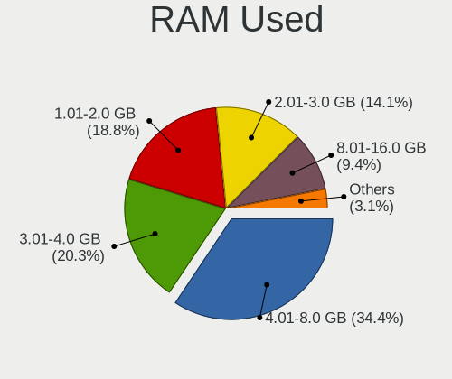
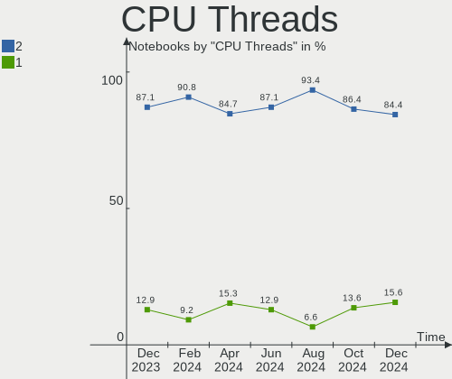

Manjaro - Hardware Trends (Notebooks)
-------------------------------------

A project to identify most popular hardware characteristics and track their change
over time based on data collected by Linux users at https://Linux-Hardware.org.

Anyone can contribute to this report by the [hw-probe](https://github.com/linuxhw/hw-probe) tool:

    sudo -E hw-probe -all -upload

This report is for one last month. Overall report since the beginning of time: [TestDays](https://github.com/linuxhw/TestDays)

Period: Nov, 2023.

Contents
--------

* [ System ](#system)
  - [ OS                       ](#os)
  - [ OS Family                ](#os-family)
  - [ Kernel                   ](#kernel)
  - [ Kernel Family            ](#kernel-family)
  - [ Kernel Major Ver.        ](#kernel-major-ver)
  - [ Arch                     ](#arch)
  - [ DE                       ](#de)
  - [ Display Server           ](#display-server)
  - [ Display Manager          ](#display-manager)
  - [ OS Lang                  ](#os-lang)
  - [ Boot Mode                ](#boot-mode)
  - [ Filesystem               ](#filesystem)
  - [ Part. scheme             ](#part-scheme)
  - [ Dual Boot with Linux/BSD ](#dual-boot-with-linuxbsd)
  - [ Dual Boot (Win)          ](#dual-boot-win)

* [ Board ](#board)
  - [ Vendor                   ](#vendor)
  - [ Model                    ](#model)
  - [ Model Family             ](#model-family)
  - [ MFG Year                 ](#mfg-year)
  - [ Form Factor              ](#form-factor)
  - [ Secure Boot              ](#secure-boot)
  - [ Coreboot                 ](#coreboot)
  - [ RAM Size                 ](#ram-size)
  - [ RAM Used                 ](#ram-used)
  - [ Total Drives             ](#total-drives)
  - [ Has CD-ROM               ](#has-cd-rom)
  - [ Has Ethernet             ](#has-ethernet)
  - [ Has WiFi                 ](#has-wifi)
  - [ Has Bluetooth            ](#has-bluetooth)

* [ Location ](#location)
  - [ Country                  ](#country)
  - [ City                     ](#city)

* [ Drives ](#drives)
  - [ Drive Vendor             ](#drive-vendor)
  - [ Drive Model              ](#drive-model)
  - [ HDD Vendor               ](#hdd-vendor)
  - [ SSD Vendor               ](#ssd-vendor)
  - [ Drive Kind               ](#drive-kind)
  - [ Drive Connector          ](#drive-connector)
  - [ Drive Size               ](#drive-size)
  - [ Space Total              ](#space-total)
  - [ Space Used               ](#space-used)
  - [ Malfunc. Drives          ](#malfunc-drives)
  - [ Malfunc. Drive Vendor    ](#malfunc-drive-vendor)
  - [ Malfunc. HDD Vendor      ](#malfunc-hdd-vendor)
  - [ Malfunc. Drive Kind      ](#malfunc-drive-kind)
  - [ Failed Drives            ](#failed-drives)
  - [ Failed Drive Vendor      ](#failed-drive-vendor)
  - [ Drive Status             ](#drive-status)

* [ Storage controller ](#storage-controller)
  - [ Storage Vendor           ](#storage-vendor)
  - [ Storage Model            ](#storage-model)
  - [ Storage Kind             ](#storage-kind)

* [ Processor ](#processor)
  - [ CPU Vendor               ](#cpu-vendor)
  - [ CPU Model                ](#cpu-model)
  - [ CPU Model Family         ](#cpu-model-family)
  - [ CPU Cores                ](#cpu-cores)
  - [ CPU Sockets              ](#cpu-sockets)
  - [ CPU Threads              ](#cpu-threads)
  - [ CPU Op-Modes             ](#cpu-op-modes)
  - [ CPU Microcode            ](#cpu-microcode)
  - [ CPU Microarch            ](#cpu-microarch)

* [ Graphics ](#graphics)
  - [ GPU Vendor               ](#gpu-vendor)
  - [ GPU Model                ](#gpu-model)
  - [ GPU Combo                ](#gpu-combo)
  - [ GPU Driver               ](#gpu-driver)
  - [ GPU Memory               ](#gpu-memory)

* [ Monitor ](#monitor)
  - [ Monitor Vendor           ](#monitor-vendor)
  - [ Monitor Model            ](#monitor-model)
  - [ Monitor Resolution       ](#monitor-resolution)
  - [ Monitor Diagonal         ](#monitor-diagonal)
  - [ Monitor Width            ](#monitor-width)
  - [ Aspect Ratio             ](#aspect-ratio)
  - [ Monitor Area             ](#monitor-area)
  - [ Pixel Density            ](#pixel-density)
  - [ Multiple Monitors        ](#multiple-monitors)

* [ Network ](#network)
  - [ Net Controller Vendor    ](#net-controller-vendor)
  - [ Net Controller Model     ](#net-controller-model)
  - [ Wireless Vendor          ](#wireless-vendor)
  - [ Wireless Model           ](#wireless-model)
  - [ Ethernet Vendor          ](#ethernet-vendor)
  - [ Ethernet Model           ](#ethernet-model)
  - [ Net Controller Kind      ](#net-controller-kind)
  - [ Used Controller          ](#used-controller)
  - [ NICs                     ](#nics)
  - [ IPv6                     ](#ipv6)

* [ Bluetooth ](#bluetooth)
  - [ Bluetooth Vendor         ](#bluetooth-vendor)
  - [ Bluetooth Model          ](#bluetooth-model)

* [ Sound ](#sound)
  - [ Sound Vendor             ](#sound-vendor)
  - [ Sound Model              ](#sound-model)

* [ Memory ](#memory)
  - [ Memory Vendor            ](#memory-vendor)
  - [ Memory Model             ](#memory-model)
  - [ Memory Kind              ](#memory-kind)
  - [ Memory Form Factor       ](#memory-form-factor)
  - [ Memory Size              ](#memory-size)
  - [ Memory Speed             ](#memory-speed)

* [ Printers & scanners ](#printers--scanners)
  - [ Printer Vendor           ](#printer-vendor)
  - [ Printer Model            ](#printer-model)
  - [ Scanner Vendor           ](#scanner-vendor)
  - [ Scanner Model            ](#scanner-model)

* [ Camera ](#camera)
  - [ Camera Vendor            ](#camera-vendor)
  - [ Camera Model             ](#camera-model)

* [ Security ](#security)
  - [ Fingerprint Vendor       ](#fingerprint-vendor)
  - [ Fingerprint Model        ](#fingerprint-model)
  - [ Chipcard Vendor          ](#chipcard-vendor)
  - [ Chipcard Model           ](#chipcard-model)

* [ Unsupported ](#unsupported)
  - [ Unsupported Devices      ](#unsupported-devices)
  - [ Unsupported Device Types ](#unsupported-device-types)

System
------

OS
--

Installed operating systems

| Name           | Notebooks | Percent |
|----------------|-----------|---------|
| Manjaro        | 31        | 39.74%  |
| Manjaro 23.1.0 | 29        | 37.18%  |
| Manjaro 23.0.4 | 16        | 20.51%  |
| Manjaro 23.0.3 | 1         | 1.28%   |
| Manjaro 23.0   | 1         | 1.28%   |

OS Family
---------

OS without a version

| Name    | Notebooks | Percent |
|---------|-----------|---------|
| Manjaro | 78        | 100%    |

Kernel
------

Version of the Linux kernel

| Version            | Notebooks | Percent |
|--------------------|-----------|---------|
| 6.5.11-1-MANJARO   | 15        | 19.23%  |
| 6.5.5-1-MANJARO    | 11        | 14.1%   |
| 6.5.9-1-MANJARO    | 10        | 12.82%  |
| 6.1.55-1-MANJARO   | 9         | 11.54%  |
| 6.6.1-1-MANJARO    | 7         | 8.97%   |
| 6.6.0-1-MANJARO    | 6         | 7.69%   |
| 6.1.60-1-MANJARO   | 5         | 6.41%   |
| 5.15.133-1-MANJARO | 3         | 3.85%   |
| 6.5.12-1-MANJARO   | 2         | 2.56%   |
| 6.1.63-1-MANJARO   | 2         | 2.56%   |
| 6.1.62-1-MANJARO   | 2         | 2.56%   |
| 6.7.0-1-MANJARO    | 1         | 1.28%   |
| 6.6.2-1-MANJARO    | 1         | 1.28%   |
| 6.5.0-1-MANJARO    | 1         | 1.28%   |
| 6.4.16-5-MANJARO   | 1         | 1.28%   |
| 5.4.260-1-MANJARO  | 1         | 1.28%   |
| 5.15.137-1-MANJARO | 1         | 1.28%   |

Kernel Family
-------------

Linux kernel without a distro release

| Version  | Notebooks | Percent |
|----------|-----------|---------|
| 6.5.11   | 15        | 19.23%  |
| 6.5.5    | 11        | 14.1%   |
| 6.5.9    | 10        | 12.82%  |
| 6.1.55   | 9         | 11.54%  |
| 6.6.1    | 7         | 8.97%   |
| 6.6.0    | 6         | 7.69%   |
| 6.1.60   | 5         | 6.41%   |
| 5.15.133 | 3         | 3.85%   |
| 6.5.12   | 2         | 2.56%   |
| 6.1.63   | 2         | 2.56%   |
| 6.1.62   | 2         | 2.56%   |
| 6.7.0    | 1         | 1.28%   |
| 6.6.2    | 1         | 1.28%   |
| 6.5.0    | 1         | 1.28%   |
| 6.4.16   | 1         | 1.28%   |
| 5.4.260  | 1         | 1.28%   |
| 5.15.137 | 1         | 1.28%   |

Kernel Major Ver.
-----------------

Linux kernel major version

| Version | Notebooks | Percent |
|---------|-----------|---------|
| 6.5     | 39        | 50%     |
| 6.1     | 18        | 23.08%  |
| 6.6     | 14        | 17.95%  |
| 5.15    | 4         | 5.13%   |
| 6.7     | 1         | 1.28%   |
| 6.4     | 1         | 1.28%   |
| 5.4     | 1         | 1.28%   |

Arch
----

OS architecture (x86_64, i586, etc.)

| Name   | Notebooks | Percent |
|--------|-----------|---------|
| x86_64 | 78        | 100%    |

DE
--

Desktop Environment

| Name       | Notebooks | Percent |
|------------|-----------|---------|
| KDE5       | 37        | 47.44%  |
| GNOME      | 24        | 30.77%  |
| XFCE       | 11        | 14.1%   |
| i3         | 3         | 3.85%   |
| X-Cinnamon | 2         | 2.56%   |
| Unknown    | 1         | 1.28%   |

Display Server
--------------

X11 or Wayland

| Name    | Notebooks | Percent |
|---------|-----------|---------|
| X11     | 54        | 69.23%  |
| Wayland | 23        | 29.49%  |
| Tty     | 1         | 1.28%   |

Display Manager
---------------

SDDM, LightDM, etc.

| Name    | Notebooks | Percent |
|---------|-----------|---------|
| Unknown | 32        | 41.03%  |
| SDDM    | 21        | 26.92%  |
| GDM     | 13        | 16.67%  |
| LightDM | 12        | 15.38%  |

OS Lang
-------

Language

| Lang    | Notebooks | Percent |
|---------|-----------|---------|
| en_US   | 37        | 47.44%  |
| en_GB   | 10        | 12.82%  |
| ru_RU   | 6         | 7.69%   |
| pt_BR   | 4         | 5.13%   |
| pl_PL   | 3         | 3.85%   |
| it_IT   | 3         | 3.85%   |
| ro_RO   | 2         | 2.56%   |
| en_CA   | 2         | 2.56%   |
| sv_SE   | 1         | 1.28%   |
| nl_NL   | 1         | 1.28%   |
| id_ID   | 1         | 1.28%   |
| fr_FR   | 1         | 1.28%   |
| es_ES   | 1         | 1.28%   |
| en_IN   | 1         | 1.28%   |
| en_AU   | 1         | 1.28%   |
| de_DE   | 1         | 1.28%   |
| de_AT   | 1         | 1.28%   |
| cs_CZ   | 1         | 1.28%   |
| Unknown | 1         | 1.28%   |

Boot Mode
---------

EFI or BIOS

| Mode | Notebooks | Percent |
|------|-----------|---------|
| BIOS | 39        | 50%     |
| EFI  | 39        | 50%     |

Filesystem
----------

Type of filesystem

| Type  | Notebooks | Percent |
|-------|-----------|---------|
| Ext4  | 61        | 78.21%  |
| Btrfs | 8         | 10.26%  |
| Tmpfs | 7         | 8.97%   |
| Xfs   | 1         | 1.28%   |
| Ext3  | 1         | 1.28%   |

Part. scheme
------------

Scheme of partitioning

| Type    | Notebooks | Percent |
|---------|-----------|---------|
| GPT     | 42        | 53.85%  |
| Unknown | 30        | 38.46%  |
| MBR     | 6         | 7.69%   |

Dual Boot with Linux/BSD
------------------------

Hosting more than one Linux/BSD

| Dual boot | Notebooks | Percent |
|-----------|-----------|---------|
| No        | 70        | 89.74%  |
| Yes       | 8         | 10.26%  |

Dual Boot (Win)
---------------

Hosting Linux and Windows

| Dual boot | Notebooks | Percent |
|-----------|-----------|---------|
| No        | 59        | 75.64%  |
| Yes       | 19        | 24.36%  |

Board
-----

Vendor
------

Motherboard manufacturer

| Name                       | Notebooks | Percent |
|----------------------------|-----------|---------|
| Lenovo                     | 16        | 20.51%  |
| Hewlett-Packard            | 14        | 17.95%  |
| ASUSTek Computer           | 10        | 12.82%  |
| Acer                       | 9         | 11.54%  |
| Dell                       | 4         | 5.13%   |
| Apple                      | 3         | 3.85%   |
| TUXEDO                     | 2         | 2.56%   |
| MSI                        | 2         | 2.56%   |
| HUAWEI                     | 2         | 2.56%   |
| Timi                       | 1         | 1.28%   |
| Thomson                    | 1         | 1.28%   |
| TECNO Mobile Limited       | 1         | 1.28%   |
| Shenzhen WEIBU Information | 1         | 1.28%   |
| Samsung Electronics        | 1         | 1.28%   |
| Panasonic                  | 1         | 1.28%   |
| Olivetti                   | 1         | 1.28%   |
| Notebook                   | 1         | 1.28%   |
| Medion                     | 1         | 1.28%   |
| Maibenben                  | 1         | 1.28%   |
| Google                     | 1         | 1.28%   |
| Gigabyte Technology        | 1         | 1.28%   |
| Gateway                    | 1         | 1.28%   |
| Fujitsu                    | 1         | 1.28%   |
| Framework                  | 1         | 1.28%   |
| Alurin                     | 1         | 1.28%   |

Model
-----

Motherboard model

| Name                                        | Notebooks | Percent |
|---------------------------------------------|-----------|---------|
| TUXEDO Stellaris Intel Gen4                 | 1         | 1.28%   |
| TUXEDO InfinityBook S 15/17 Gen7            | 1         | 1.28%   |
| Timi Mi Laptop Pro 15 2020                  | 1         | 1.28%   |
| Thomson N14C4WH64                           | 1         | 1.28%   |
| TECNO Mobile Limited MEGABOOK T14TA         | 1         | 1.28%   |
| Shenzhen WEIBU Information Alder Lake N     | 1         | 1.28%   |
| Samsung RV411/RV511/E3511/S3511/RV711/E3411 | 1         | 1.28%   |
| Panasonic CF-54-1                           | 1         | 1.28%   |
| Olivetti P55-AEU-323-4G320                  | 1         | 1.28%   |
| Notebook P7xxTM                             | 1         | 1.28%   |
| MSI Thin GF63 12VF                          | 1         | 1.28%   |
| MSI Prestige 14Evo A12M                     | 1         | 1.28%   |
| Medion E4251 MD61435                        | 1         | 1.28%   |
| Maibenben MaiBook M                         | 1         | 1.28%   |
| Lenovo Yoga Slim 7 Pro 14IAH7 82UT          | 1         | 1.28%   |
| Lenovo Yoga Slim 7 Carbon 14ACN6 82L0       | 1         | 1.28%   |
| Lenovo Yoga Pro 7 14APH8 82Y8               | 1         | 1.28%   |
| Lenovo ThinkPad X280 20KFCTO1WW             | 1         | 1.28%   |
| Lenovo ThinkPad X260 20F5S9GM01             | 1         | 1.28%   |
| Lenovo ThinkPad T480 20L6S4XW00             | 1         | 1.28%   |
| Lenovo ThinkPad T480 20L60017UK             | 1         | 1.28%   |
| Lenovo ThinkPad T440 20B7A0CYMH             | 1         | 1.28%   |
| Lenovo ThinkPad L460 20FVS12A00             | 1         | 1.28%   |
| Lenovo ThinkPad L14 Gen 3 21C1005TPB        | 1         | 1.28%   |
| Lenovo ThinkBook 15-IIL 20SM                | 1         | 1.28%   |
| Lenovo ThinkBook 15 G2 ARE 20VG             | 1         | 1.28%   |
| Lenovo Legion Slim 5 16APH8 82Y9            | 1         | 1.28%   |
| Lenovo Legion 5 Pro 16ITH6H 82JD            | 1         | 1.28%   |
| Lenovo IdeaPad 320-15IAP 80XR               | 1         | 1.28%   |
| Lenovo G40-45 80E1                          | 1         | 1.28%   |
| HUAWEI KLVD-WXX9                            | 1         | 1.28%   |
| HUAWEI BOM-WXX9                             | 1         | 1.28%   |
| HP ProBook 635 Aero G8 Notebook PC          | 1         | 1.28%   |
| HP ProBook 450 15.6 inch G9 Notebook PC     | 1         | 1.28%   |
| HP ProBook 440 G7                           | 1         | 1.28%   |
| HP Pavilion Laptop 15-eg0xxx                | 1         | 1.28%   |
| HP Pavilion dv6                             | 1         | 1.28%   |
| HP OMEN Laptop 15-ek0xxx                    | 1         | 1.28%   |
| HP Laptop 15-ef3xxx                         | 1         | 1.28%   |
| HP Laptop 15-dw0xxx                         | 1         | 1.28%   |

Model Family
------------

Motherboard model prefix

| Name                             | Notebooks | Percent |
|----------------------------------|-----------|---------|
| Lenovo ThinkPad                  | 7         | 8.97%   |
| ASUS VivoBook                    | 6         | 7.69%   |
| Acer Aspire                      | 6         | 7.69%   |
| HP EliteBook                     | 4         | 5.13%   |
| Lenovo Yoga                      | 3         | 3.85%   |
| HP ProBook                       | 3         | 3.85%   |
| Lenovo ThinkBook                 | 2         | 2.56%   |
| Lenovo Legion                    | 2         | 2.56%   |
| HP Pavilion                      | 2         | 2.56%   |
| HP Laptop                        | 2         | 2.56%   |
| Dell Precision                   | 2         | 2.56%   |
| ASUS Zenbook                     | 2         | 2.56%   |
| ASUS ROG                         | 2         | 2.56%   |
| Acer Predator                    | 2         | 2.56%   |
| TUXEDO Stellaris                 | 1         | 1.28%   |
| TUXEDO InfinityBook              | 1         | 1.28%   |
| Timi Mi                          | 1         | 1.28%   |
| Thomson N14C4WH64                | 1         | 1.28%   |
| TECNO Mobile Limited MEGABOOK    | 1         | 1.28%   |
| Shenzhen WEIBU Information Alder | 1         | 1.28%   |
| Samsung RV411                    | 1         | 1.28%   |
| Panasonic CF-54-1                | 1         | 1.28%   |
| Olivetti P55-AEU-323-4G320       | 1         | 1.28%   |
| Notebook P7xxTM                  | 1         | 1.28%   |
| MSI Thin                         | 1         | 1.28%   |
| MSI Prestige                     | 1         | 1.28%   |
| Medion E4251                     | 1         | 1.28%   |
| Maibenben MaiBook                | 1         | 1.28%   |
| Lenovo IdeaPad                   | 1         | 1.28%   |
| Lenovo G40-45                    | 1         | 1.28%   |
| HUAWEI KLVD-WXX9                 | 1         | 1.28%   |
| HUAWEI BOM-WXX9                  | 1         | 1.28%   |
| HP OMEN                          | 1         | 1.28%   |
| HP 530                           | 1         | 1.28%   |
| HP 255                           | 1         | 1.28%   |
| Google Pujjo                     | 1         | 1.28%   |
| Gigabyte AORUS                   | 1         | 1.28%   |
| Gateway P-6301                   | 1         | 1.28%   |
| Fujitsu LIFEBOOK                 | 1         | 1.28%   |
| Framework Laptop                 | 1         | 1.28%   |

MFG Year
--------

Motherboard manufacture year

| Year | Notebooks | Percent |
|------|-----------|---------|
| 2022 | 14        | 17.95%  |
| 2020 | 13        | 16.67%  |
| 2023 | 9         | 11.54%  |
| 2021 | 7         | 8.97%   |
| 2019 | 6         | 7.69%   |
| 2018 | 6         | 7.69%   |
| 2013 | 4         | 5.13%   |
| 2017 | 3         | 3.85%   |
| 2016 | 3         | 3.85%   |
| 2014 | 3         | 3.85%   |
| 2015 | 2         | 2.56%   |
| 2012 | 2         | 2.56%   |
| 2011 | 2         | 2.56%   |
| 2007 | 2         | 2.56%   |
| 2010 | 1         | 1.28%   |
| 2008 | 1         | 1.28%   |

Form Factor
-----------

Physical design of the computer

| Name     | Notebooks | Percent |
|----------|-----------|---------|
| Notebook | 78        | 100%    |

Secure Boot
-----------

Enabled or disabled

| State    | Notebooks | Percent |
|----------|-----------|---------|
| Disabled | 78        | 100%    |

Coreboot
--------

Have coreboot on board

| Used | Notebooks | Percent |
|------|-----------|---------|
| No   | 77        | 98.72%  |
| Yes  | 1         | 1.28%   |

RAM Size
--------

Total RAM memory

| Size in GB  | Notebooks | Percent |
|-------------|-----------|---------|
| 4.01-8.0    | 16        | 20.51%  |
| 16.01-24.0  | 16        | 20.51%  |
| 8.01-16.0   | 16        | 20.51%  |
| 3.01-4.0    | 12        | 15.38%  |
| 32.01-64.0  | 10        | 12.82%  |
| 24.01-32.0  | 5         | 6.41%   |
| 2.01-3.0    | 2         | 2.56%   |
| 64.01-256.0 | 1         | 1.28%   |

RAM Used
--------

Used RAM memory

| Used GB    | Notebooks | Percent |
|------------|-----------|---------|
| 4.01-8.0   | 32        | 41.03%  |
| 3.01-4.0   | 14        | 17.95%  |
| 1.01-2.0   | 14        | 17.95%  |
| 2.01-3.0   | 10        | 12.82%  |
| 8.01-16.0  | 6         | 7.69%   |
| 16.01-24.0 | 1         | 1.28%   |
| 0.51-1.0   | 1         | 1.28%   |

Total Drives
------------

Number of drives on board

| Drives | Notebooks | Percent |
|--------|-----------|---------|
| 1      | 61        | 78.21%  |
| 2      | 15        | 19.23%  |
| 3      | 2         | 2.56%   |

Has CD-ROM
----------

Has CD-ROM on board

| Presented | Notebooks | Percent |
|-----------|-----------|---------|
| No        | 69        | 88.46%  |
| Yes       | 9         | 11.54%  |

Has Ethernet
------------

Has Ethernet on board

| Presented | Notebooks | Percent |
|-----------|-----------|---------|
| Yes       | 55        | 70.51%  |
| No        | 23        | 29.49%  |

Has WiFi
--------

Has WiFi module

| Presented | Notebooks | Percent |
|-----------|-----------|---------|
| Yes       | 78        | 100%    |

Has Bluetooth
-------------

Has Bluetooth module

| Presented | Notebooks | Percent |
|-----------|-----------|---------|
| Yes       | 66        | 84.62%  |
| No        | 12        | 15.38%  |

Location
--------

Country
-------

Geographic location (country)

| Country     | Notebooks | Percent |
|-------------|-----------|---------|
| Russia      | 12        | 15.38%  |
| USA         | 9         | 11.54%  |
| Italy       | 8         | 10.26%  |
| Germany     | 7         | 8.97%   |
| Poland      | 4         | 5.13%   |
| Brazil      | 4         | 5.13%   |
| France      | 3         | 3.85%   |
| Switzerland | 2         | 2.56%   |
| Sweden      | 2         | 2.56%   |
| Romania     | 2         | 2.56%   |
| Norway      | 2         | 2.56%   |
| Netherlands | 2         | 2.56%   |
| Indonesia   | 2         | 2.56%   |
| Greece      | 2         | 2.56%   |
| Czechia     | 2         | 2.56%   |
| Canada      | 2         | 2.56%   |
| Bulgaria    | 2         | 2.56%   |
| UK          | 1         | 1.28%   |
| Spain       | 1         | 1.28%   |
| Slovenia    | 1         | 1.28%   |
| Paraguay    | 1         | 1.28%   |
| India       | 1         | 1.28%   |
| Hungary     | 1         | 1.28%   |
| Egypt       | 1         | 1.28%   |
| Colombia    | 1         | 1.28%   |
| China       | 1         | 1.28%   |
| Austria     | 1         | 1.28%   |
| Australia   | 1         | 1.28%   |

City
----

Geographic location (city)

| City             | Notebooks | Percent |
|------------------|-----------|---------|
| Moscow           | 4         | 5.13%   |
| Lublin           | 2         | 2.56%   |
| Buzau            | 2         | 2.56%   |
| Berlin           | 2         | 2.56%   |
| Yaroslavl        | 1         | 1.28%   |
| Würzburg        | 1         | 1.28%   |
| Winterthur       | 1         | 1.28%   |
| Walsenburg       | 1         | 1.28%   |
| Urbana           | 1         | 1.28%   |
| Ulan-Ude         | 1         | 1.28%   |
| Topuzevo         | 1         | 1.28%   |
| St Petersburg    | 1         | 1.28%   |
| Sofia            | 1         | 1.28%   |
| Siena            | 1         | 1.28%   |
| Shenzhen         | 1         | 1.28%   |
| Sesto Fiorentino | 1         | 1.28%   |
| Saratov          | 1         | 1.28%   |
| Sao Paulo        | 1         | 1.28%   |
| San Jose         | 1         | 1.28%   |
| Samara           | 1         | 1.28%   |
| Rethymno         | 1         | 1.28%   |
| Příbram        | 1         | 1.28%   |
| Prague           | 1         | 1.28%   |
| Portland         | 1         | 1.28%   |
| Porsgrunn        | 1         | 1.28%   |
| Perm             | 1         | 1.28%   |
| Paris            | 1         | 1.28%   |
| Oslo             | 1         | 1.28%   |
| Novosibirsk      | 1         | 1.28%   |
| Milano           | 1         | 1.28%   |
| Maua             | 1         | 1.28%   |
| Maringá         | 1         | 1.28%   |
| Malmo            | 1         | 1.28%   |
| Madrid           | 1         | 1.28%   |
| L’Aquila       | 1         | 1.28%   |
| Ludhiana         | 1         | 1.28%   |
| Lodz             | 1         | 1.28%   |
| Ljubljana        | 1         | 1.28%   |
| Liévin          | 1         | 1.28%   |
| Leinster         | 1         | 1.28%   |

Drives
------

Drive Vendor
------------

Hard drive vendors

| Vendor                       | Notebooks | Drives | Percent |
|------------------------------|-----------|--------|---------|
| Samsung Electronics          | 17        | 18     | 17.89%  |
| Sandisk                      | 11        | 11     | 11.58%  |
| WDC                          | 7         | 7      | 7.37%   |
| Intel                        | 7         | 7      | 7.37%   |
| Crucial                      | 7         | 7      | 7.37%   |
| Toshiba                      | 6         | 6      | 6.32%   |
| Unknown                      | 4         | 5      | 4.21%   |
| Kingston                     | 4         | 4      | 4.21%   |
| Silicon Motion               | 3         | 3      | 3.16%   |
| Micron Technology            | 3         | 3      | 3.16%   |
| SK hynix                     | 2         | 2      | 2.11%   |
| Seagate                      | 2         | 2      | 2.11%   |
| Phison                       | 2         | 2      | 2.11%   |
| KIOXIA                       | 2         | 2      | 2.11%   |
| Hitachi                      | 2         | 2      | 2.11%   |
| Apple                        | 2         | 2      | 2.11%   |
| Union Memory (Shenzhen)      | 1         | 1      | 1.05%   |
| Transcend                    | 1         | 1      | 1.05%   |
| Shenzhen Longsys Electronics | 1         | 1      | 1.05%   |
| Realtek Semiconductor        | 1         | 1      | 1.05%   |
| Ramos Technology             | 1         | 1      | 1.05%   |
| Phison Electronics           | 1         | 1      | 1.05%   |
| Micron/Crucial Technology    | 1         | 1      | 1.05%   |
| MAXIO Technology (Hangzhou)  | 1         | 1      | 1.05%   |
| KIOXIA-EXCERIA               | 1         | 1      | 1.05%   |
| Kingston Technology Company  | 1         | 1      | 1.05%   |
| JMicron Technology           | 1         | 1      | 1.05%   |
| Galaxy                       | 1         | 1      | 1.05%   |
| Emtec                        | 1         | 1      | 1.05%   |
| A-DATA Technology            | 1         | 1      | 1.05%   |

Drive Model
-----------

Hard drive models

| Model                                                 | Notebooks | Percent |
|-------------------------------------------------------|-----------|---------|
| Samsung NVMe SSD Controller SM981/PM981/PM983 250GB   | 5         | 5.15%   |
| Intel SSD 660P Series 512GB                           | 5         | 5.15%   |
| Samsung NVMe SSD Controller PM9A1/PM9A3/980PRO 2TB    | 4         | 4.12%   |
| Crucial CT500MX500SSD1 500GB                          | 4         | 4.12%   |
| Unknown MMC Card  64GB                                | 3         | 3.09%   |
| Toshiba MQ01ABD100 1TB                                | 3         | 3.09%   |
| Sandisk WD Blue SN550 NVMe SSD 512GB                  | 3         | 3.09%   |
| WDC WD3200BPVT-75JJ5T0 320GB                          | 2         | 2.06%   |
| Toshiba XG6 NVMe SSD Controller 512GB                 | 2         | 2.06%   |
| SK hynix SKHynix_HFS512GEJ9X115N 512GB                | 2         | 2.06%   |
| Silicon Motion SM2263EN/SM2263XT SSD Controller 256GB | 2         | 2.06%   |
| Sandisk WD PC SN735 SDBPNHH-1T00-1002 1TB             | 2         | 2.06%   |
| Sandisk WD Black SN750 / PC SN730 NVMe SSD 500GB      | 2         | 2.06%   |
| Samsung MZALQ512HALU-000L2 512GB                      | 2         | 2.06%   |
| Kingston OM8PCP3512F-AB 512GB                         | 2         | 2.06%   |
| Crucial CT1000MX500SSD1 1TB                           | 2         | 2.06%   |
| WDC WD5000LPCX-24VHAT0 500GB                          | 1         | 1.03%   |
| WDC WD5000BPKX-60HPJT0 500GB                          | 1         | 1.03%   |
| WDC WD3200BEVT-00A0RT0 320GB                          | 1         | 1.03%   |
| WDC WD1600BEVT-80A23T0 160GB                          | 1         | 1.03%   |
| WDC WD10SPCX-22HWST0 1TB                              | 1         | 1.03%   |
| Unknown USB DISK 3.2 1TB                              | 1         | 1.03%   |
| Unknown MMC Card  256GB                               | 1         | 1.03%   |
| Union Memory (Shenzhen) UMIS RPJTJ512MGE1QDQ 512GB    | 1         | 1.03%   |
| Transcend TS512GMTS430S 512GB SSD                     | 1         | 1.03%   |
| Toshiba KXG50ZNV256G NVMe 256GB                       | 1         | 1.03%   |
| Silicon Motion PCIe-8 SSD 512GB                       | 1         | 1.03%   |
| Shenzhen Longsys FORESEE XP1000F512G 512GB            | 1         | 1.03%   |
| Seagate ST500LX012-SSHD-8GB                           | 1         | 1.03%   |
| Seagate ST500LT012-9WS142 500GB                       | 1         | 1.03%   |
| Sandisk WD_BLACK SN770 1TB                            | 1         | 1.03%   |
| Sandisk WD PC SN540 SDDPNPF-512G                      | 1         | 1.03%   |
| Sandisk WD Green SN350 1TB                            | 1         | 1.03%   |
| SanDisk SD9SN8W-128G-1006 128GB SSD                   | 1         | 1.03%   |
| Samsung SSD SM841N mSATA 256GB                        | 1         | 1.03%   |
| Samsung SSD 980 1TB                                   | 1         | 1.03%   |
| Samsung NVMe SSD Controller SM961/PM961/SM963 256GB   | 1         | 1.03%   |
| Samsung MZVLQ512HBLU-00B07 512GB                      | 1         | 1.03%   |
| Samsung MZVL4512HBLU-00BTW 512GB                      | 1         | 1.03%   |
| Samsung MZNTY128HDHP-00000 128GB SSD                  | 1         | 1.03%   |

HDD Vendor
----------

Hard disk drive vendors

| Vendor  | Notebooks | Drives | Percent |
|---------|-----------|--------|---------|
| WDC     | 7         | 7      | 46.67%  |
| Toshiba | 3         | 3      | 20%     |
| Seagate | 2         | 2      | 13.33%  |
| Hitachi | 2         | 2      | 13.33%  |
| Apple   | 1         | 1      | 6.67%   |

SSD Vendor
----------

Solid state drive vendors

| Vendor              | Notebooks | Drives | Percent |
|---------------------|-----------|--------|---------|
| Crucial             | 7         | 7      | 33.33%  |
| Samsung Electronics | 3         | 3      | 14.29%  |
| Transcend           | 1         | 1      | 4.76%   |
| SanDisk             | 1         | 1      | 4.76%   |
| Ramos Technology    | 1         | 1      | 4.76%   |
| Phison              | 1         | 1      | 4.76%   |
| Micron Technology   | 1         | 1      | 4.76%   |
| Kingston            | 1         | 1      | 4.76%   |
| JMicron Technology  | 1         | 1      | 4.76%   |
| Galaxy              | 1         | 1      | 4.76%   |
| Emtec               | 1         | 1      | 4.76%   |
| Apple               | 1         | 1      | 4.76%   |
| A-DATA Technology   | 1         | 1      | 4.76%   |

Drive Kind
----------

HDD or SSD

| Kind    | Notebooks | Drives | Percent |
|---------|-----------|--------|---------|
| NVMe    | 51        | 56     | 58.62%  |
| SSD     | 18        | 21     | 20.69%  |
| HDD     | 14        | 15     | 16.09%  |
| MMC     | 3         | 4      | 3.45%   |
| Unknown | 1         | 1      | 1.15%   |

Drive Connector
---------------

SATA, SAS, NVMe, etc.

| Type | Notebooks | Drives | Percent |
|------|-----------|--------|---------|
| NVMe | 51        | 56     | 60%     |
| SATA | 29        | 35     | 34.12%  |
| MMC  | 3         | 4      | 3.53%   |
| SAS  | 2         | 2      | 2.35%   |

Drive Size
----------

Size of hard drive

| Size in TB | Notebooks | Drives | Percent |
|------------|-----------|--------|---------|
| 0.01-0.5   | 24        | 28     | 75%     |
| 0.51-1.0   | 8         | 8      | 25%     |

Space Total
-----------

Amount of disk space available on the file system

| Size in GB     | Notebooks | Percent |
|----------------|-----------|---------|
| 251-500        | 23        | 29.49%  |
| 101-250        | 19        | 24.36%  |
| 501-1000       | 12        | 15.38%  |
| Unknown        | 9         | 11.54%  |
| 51-100         | 5         | 6.41%   |
| 1-20           | 4         | 5.13%   |
| 1001-2000      | 3         | 3.85%   |
| More than 3000 | 2         | 2.56%   |
| 21-50          | 1         | 1.28%   |

Space Used
----------

Amount of used disk space

| Used GB   | Notebooks | Percent |
|-----------|-----------|---------|
| 21-50     | 17        | 21.79%  |
| 1-20      | 17        | 21.79%  |
| 101-250   | 15        | 19.23%  |
| 51-100    | 12        | 15.38%  |
| Unknown   | 9         | 11.54%  |
| 251-500   | 5         | 6.41%   |
| 501-1000  | 2         | 2.56%   |
| 2001-3000 | 1         | 1.28%   |

Malfunc. Drives
---------------

Drive models with a malfunction

| Model                         | Notebooks | Drives | Percent |
|-------------------------------|-----------|--------|---------|
| Hitachi HTS543225A7A384 250GB | 1         | 1      | 100%    |

Malfunc. Drive Vendor
---------------------

Vendors of faulty drives

| Vendor  | Notebooks | Drives | Percent |
|---------|-----------|--------|---------|
| Hitachi | 1         | 1      | 100%    |

Malfunc. HDD Vendor
-------------------

Vendors of faulty HDD drives

| Vendor  | Notebooks | Drives | Percent |
|---------|-----------|--------|---------|
| Hitachi | 1         | 1      | 100%    |

Malfunc. Drive Kind
-------------------

Kinds of faulty drives

| Kind | Notebooks | Drives | Percent |
|------|-----------|--------|---------|
| HDD  | 1         | 1      | 100%    |

Failed Drives
-------------

Failed drive models

Zero info for selected period =(

Failed Drive Vendor
-------------------

Failed drive vendors

Zero info for selected period =(

Drive Status
------------

Number of failed and malfunc. drives

| Status   | Notebooks | Drives | Percent |
|----------|-----------|--------|---------|
| Detected | 49        | 57     | 59.76%  |
| Works    | 32        | 39     | 39.02%  |
| Malfunc  | 1         | 1      | 1.22%   |

Storage controller
------------------

Storage Vendor
--------------

Storage controller vendors

| Vendor                       | Notebooks | Percent |
|------------------------------|-----------|---------|
| Intel                        | 41        | 41.84%  |
| Samsung Electronics          | 14        | 14.29%  |
| SanDisk                      | 10        | 10.2%   |
| AMD                          | 9         | 9.18%   |
| Kingston Technology Company  | 4         | 4.08%   |
| Toshiba America Info Systems | 3         | 3.06%   |
| Silicon Motion               | 3         | 3.06%   |
| KIOXIA                       | 3         | 3.06%   |
| SK hynix                     | 2         | 2.04%   |
| Phison Electronics           | 2         | 2.04%   |
| Micron Technology            | 2         | 2.04%   |
| Union Memory (Shenzhen)      | 1         | 1.02%   |
| Shenzhen Longsys Electronics | 1         | 1.02%   |
| Realtek Semiconductor        | 1         | 1.02%   |
| Micron/Crucial Technology    | 1         | 1.02%   |
| MAXIO Technology (Hangzhou)  | 1         | 1.02%   |

Storage Model
-------------

Storage controller models

| Model                                                                   | Notebooks | Percent |
|-------------------------------------------------------------------------|-----------|---------|
| AMD FCH SATA Controller [AHCI mode]                                     | 9         | 8.57%   |
| Samsung NVMe SSD Controller SM981/PM981/PM983                           | 5         | 4.76%   |
| Intel SSD 660P Series                                                   | 5         | 4.76%   |
| Samsung NVMe SSD Controller PM9A1/PM9A3/980PRO                          | 4         | 3.81%   |
| Samsung NVMe SSD Controller 980 (DRAM-less)                             | 4         | 3.81%   |
| Intel 7 Series Chipset Family 6-port SATA Controller [AHCI mode]        | 4         | 3.81%   |
| SanDisk Ultra 3D / WD Blue SN550 NVMe SSD                               | 3         | 2.86%   |
| Kingston Company OM8PCP Design-In PCIe 3 NVMe SSD (DRAM-less)           | 3         | 2.86%   |
| Intel Sunrise Point-LP SATA Controller [AHCI mode]                      | 3         | 2.86%   |
| Intel Ice Lake-LP SATA Controller [AHCI mode]                           | 3         | 2.86%   |
| Intel 82801 Mobile SATA Controller [RAID mode]                          | 3         | 2.86%   |
| Intel 8 Series SATA Controller 1 [AHCI mode]                            | 3         | 2.86%   |
| Toshiba America Info Systems XG6 NVMe SSD Controller                    | 2         | 1.9%    |
| SK hynix Platinum P41/PC801 NVMe Solid State Drive                      | 2         | 1.9%    |
| Silicon Motion SM2263EN/SM2263XT (DRAM-less) NVMe SSD Controllers       | 2         | 1.9%    |
| SanDisk WD PC SN540 / Green SN350 NVMe SSD 1 TB (DRAM-less)             | 2         | 1.9%    |
| SanDisk PC SN735 NVMe SSD (DRAM-less)                                   | 2         | 1.9%    |
| SanDisk Extreme Pro / WD Black SN750 / PC SN730 / Red SN700 NVMe SSD    | 2         | 1.9%    |
| Intel Wildcat Point-LP SATA Controller [AHCI Mode]                      | 2         | 1.9%    |
| Intel Volume Management Device NVMe RAID Controller                     | 2         | 1.9%    |
| Intel SSD 670p Series [Keystone Harbor]                                 | 2         | 1.9%    |
| Intel Celeron/Pentium Silver Processor SATA Controller                  | 2         | 1.9%    |
| Intel 5 Series/3400 Series Chipset 4 port SATA AHCI Controller          | 2         | 1.9%    |
| Union Memory (Shenzhen) AM630 PCIe 4.0 x4 NVMe SSD Controller           | 1         | 0.95%   |
| Toshiba America Info Systems XG5 NVMe SSD Controller                    | 1         | 0.95%   |
| Silicon Motion Non-Volatile memory controller                           | 1         | 0.95%   |
| Shenzhen Longsys Lexar NM620 NVME SSD (DRAM-less)                       | 1         | 0.95%   |
| SanDisk WD Black SN770 / PC SN740 256GB / PC SN560 (DRAM-less) NVMe SSD | 1         | 0.95%   |
| Samsung NVMe SSD Controller SM961/PM961/SM963                           | 1         | 0.95%   |
| Samsung NVMe SSD Controller PM9B1 (DRAM-less)                           | 1         | 0.95%   |
| Realtek RTS5765DL NVMe SSD Controller (DRAM-less)                       | 1         | 0.95%   |
| Phison PS5013-E13 PCIe3 NVMe Controller (DRAM-less)                     | 1         | 0.95%   |
| Phison E18 PCIe4 NVMe Controller                                        | 1         | 0.95%   |
| Micron/Crucial P5 NVMe PCIe SSD[SlashP5]                                | 1         | 0.95%   |
| Micron 2450 NVMe SSD [HendrixV] (DRAM-less)                             | 1         | 0.95%   |
| Micron 2210 NVMe SSD [Cobain]                                           | 1         | 0.95%   |
| MAXIO (Hangzhou) NVMe SSD Controller MAP1202                            | 1         | 0.95%   |
| KIOXIA RD500/Exceria Plus/Exceria Plus G2 NVMe SSD                      | 1         | 0.95%   |
| KIOXIA NVMe SSD Controller BG5 (DRAM-less)                              | 1         | 0.95%   |
| KIOXIA NVMe SSD Controller BG4 (DRAM-less)                              | 1         | 0.95%   |

Storage Kind
------------

Kind of storage controller (IDE, SATA, NVMe, SAS, ...)

| Kind | Notebooks | Percent |
|------|-----------|---------|
| NVMe | 51        | 51%     |
| SATA | 41        | 41%     |
| RAID | 5         | 5%      |
| IDE  | 3         | 3%      |

Processor
---------

CPU Vendor
----------

Processor vendors

| Vendor | Notebooks | Percent |
|--------|-----------|---------|
| Intel  | 57        | 73.08%  |
| AMD    | 21        | 26.92%  |

CPU Model
---------

Processor models

| Model                                   | Notebooks | Percent |
|-----------------------------------------|-----------|---------|
| Intel 12th Gen Core i5-1235U            | 3         | 3.85%   |
| Intel Core i7-8650U CPU @ 1.90GHz       | 2         | 2.56%   |
| Intel Core i7-10750H CPU @ 2.60GHz      | 2         | 2.56%   |
| Intel Core i7-10510U CPU @ 1.80GHz      | 2         | 2.56%   |
| Intel Core i5-4300U CPU @ 1.90GHz       | 2         | 2.56%   |
| Intel Core i5-3230M CPU @ 2.60GHz       | 2         | 2.56%   |
| Intel 12th Gen Core i5-12500H           | 2         | 2.56%   |
| Intel 11th Gen Core i7-11800H @ 2.30GHz | 2         | 2.56%   |
| AMD Ryzen 7 4700U with Radeon Graphics  | 2         | 2.56%   |
| AMD Ryzen 5 5625U with Radeon Graphics  | 2         | 2.56%   |
| AMD Ryzen 5 5500U with Radeon Graphics  | 2         | 2.56%   |
| Intel Pentium Dual CPU T2310 @ 1.46GHz  | 1         | 1.28%   |
| Intel Pentium CPU N4200 @ 1.10GHz       | 1         | 1.28%   |
| Intel Pentium CPU 4405U @ 2.10GHz       | 1         | 1.28%   |
| Intel N95                               | 1         | 1.28%   |
| Intel N100                              | 1         | 1.28%   |
| Intel Core i7-9750H CPU @ 2.60GHz       | 1         | 1.28%   |
| Intel Core i7-8700 CPU @ 3.20GHz        | 1         | 1.28%   |
| Intel Core i7-8565U CPU @ 1.80GHz       | 1         | 1.28%   |
| Intel Core i7-7700HQ CPU @ 2.80GHz      | 1         | 1.28%   |
| Intel Core i7-4810MQ CPU @ 2.80GHz      | 1         | 1.28%   |
| Intel Core i7-4500U CPU @ 1.80GHz       | 1         | 1.28%   |
| Intel Core i7-3615QM CPU @ 2.30GHz      | 1         | 1.28%   |
| Intel Core i7-10850H CPU @ 2.70GHz      | 1         | 1.28%   |
| Intel Core i5-8350U CPU @ 1.70GHz       | 1         | 1.28%   |
| Intel Core i5-8265U CPU @ 1.60GHz       | 1         | 1.28%   |
| Intel Core i5-7200U CPU @ 2.50GHz       | 1         | 1.28%   |
| Intel Core i5-6300U CPU @ 2.40GHz       | 1         | 1.28%   |
| Intel Core i5-5300U CPU @ 2.30GHz       | 1         | 1.28%   |
| Intel Core i5-3210M CPU @ 2.50GHz       | 1         | 1.28%   |
| Intel Core i5-1035G4 CPU @ 1.10GHz      | 1         | 1.28%   |
| Intel Core i5-1035G1 CPU @ 1.00GHz      | 1         | 1.28%   |
| Intel Core i5 CPU M 520 @ 2.40GHz       | 1         | 1.28%   |
| Intel Core i5 CPU M 480 @ 2.67GHz       | 1         | 1.28%   |
| Intel Core i3-5005U CPU @ 2.00GHz       | 1         | 1.28%   |
| Intel Core i3-1005G1 CPU @ 1.20GHz      | 1         | 1.28%   |
| Intel Core 2 CPU T7400 @ 2.16GHz        | 1         | 1.28%   |
| Intel Celeron N4500 @ 1.10GHz           | 1         | 1.28%   |
| Intel Celeron N4020 CPU @ 1.10GHz       | 1         | 1.28%   |
| Intel Celeron N4000 CPU @ 1.10GHz       | 1         | 1.28%   |

CPU Model Family
----------------

Processor model prefix

| Model              | Notebooks | Percent |
|--------------------|-----------|---------|
| Other              | 20        | 25.64%  |
| Intel Core i7      | 14        | 17.95%  |
| Intel Core i5      | 14        | 17.95%  |
| AMD Ryzen 7        | 11        | 14.1%   |
| AMD Ryzen 5        | 5         | 6.41%   |
| Intel Celeron      | 4         | 5.13%   |
| Intel Pentium      | 2         | 2.56%   |
| Intel Core i3      | 2         | 2.56%   |
| AMD E1             | 2         | 2.56%   |
| Intel Pentium Dual | 1         | 1.28%   |
| Intel Core 2       | 1         | 1.28%   |
| AMD E2             | 1         | 1.28%   |
| AMD A6             | 1         | 1.28%   |

CPU Cores
---------

Number of processor cores

| Number | Notebooks | Percent |
|--------|-----------|---------|
| 4      | 23        | 29.49%  |
| 2      | 23        | 29.49%  |
| 8      | 12        | 15.38%  |
| 6      | 10        | 12.82%  |
| 10     | 4         | 5.13%   |
| 14     | 3         | 3.85%   |
| 12     | 3         | 3.85%   |

CPU Sockets
-----------

Number of sockets

| Number | Notebooks | Percent |
|--------|-----------|---------|
| 1      | 78        | 100%    |

CPU Threads
-----------

Threads per core (Hyper-Threading)

| Number | Notebooks | Percent |
|--------|-----------|---------|
| 2      | 62        | 79.49%  |
| 1      | 16        | 20.51%  |

CPU Op-Modes
------------

CPU Operation Modes (32-bit, 64-bit)

| Op mode        | Notebooks | Percent |
|----------------|-----------|---------|
| 32-bit, 64-bit | 78        | 100%    |

CPU Microcode
-------------

Microcode number

| Number     | Notebooks | Percent |
|------------|-----------|---------|
| Unknown    | 52        | 66.67%  |
| 0x0a50000c | 3         | 3.85%   |
| 0x906a3    | 2         | 2.56%   |
| 0x806ec    | 2         | 2.56%   |
| 0x806d1    | 2         | 2.56%   |
| 0x0a704103 | 2         | 2.56%   |
| 0xa0652    | 1         | 1.28%   |
| 0x906a4    | 1         | 1.28%   |
| 0x806ea    | 1         | 1.28%   |
| 0x806c1    | 1         | 1.28%   |
| 0x6f6      | 1         | 1.28%   |
| 0x40651    | 1         | 1.28%   |
| 0x20655    | 1         | 1.28%   |
| 0x0a404101 | 1         | 1.28%   |
| 0x08608103 | 1         | 1.28%   |
| 0x08600104 | 1         | 1.28%   |
| 0x08108109 | 1         | 1.28%   |
| 0x07030106 | 1         | 1.28%   |
| 0x07030104 | 1         | 1.28%   |
| 0x06006705 | 1         | 1.28%   |
| 0x03000027 | 1         | 1.28%   |

CPU Microarch
-------------

Microarchitecture

| Name             | Notebooks | Percent |
|------------------|-----------|---------|
| Unknown          | 15        | 19.23%  |
| KabyLake         | 11        | 14.1%   |
| Zen 3            | 5         | 6.41%   |
| TigerLake        | 5         | 6.41%   |
| IceLake          | 5         | 6.41%   |
| IvyBridge        | 4         | 5.13%   |
| Haswell          | 4         | 5.13%   |
| Alderlake Hybrid | 4         | 5.13%   |
| Zen 2            | 3         | 3.85%   |
| Puma             | 3         | 3.85%   |
| CometLake        | 3         | 3.85%   |
| Westmere         | 2         | 2.56%   |
| Skylake          | 2         | 2.56%   |
| Goldmont plus    | 2         | 2.56%   |
| Core             | 2         | 2.56%   |
| Broadwell        | 2         | 2.56%   |
| Zen+             | 1         | 1.28%   |
| Silvermont       | 1         | 1.28%   |
| K10 Llano        | 1         | 1.28%   |
| Gracemont        | 1         | 1.28%   |
| Goldmont         | 1         | 1.28%   |
| Excavator        | 1         | 1.28%   |

Graphics
--------

GPU Vendor
----------

Vendors of graphics cards

| Vendor | Notebooks | Percent |
|--------|-----------|---------|
| Intel  | 54        | 55.67%  |
| Nvidia | 22        | 22.68%  |
| AMD    | 21        | 21.65%  |

GPU Model
---------

Graphics card models

| Model                                                         | Notebooks | Percent |
|---------------------------------------------------------------|-----------|---------|
| Intel Alder Lake-P GT2 [Iris Xe Graphics]                     | 6         | 6%      |
| Nvidia GA106M [GeForce RTX 3060 Mobile / Max-Q]               | 4         | 4%      |
| Intel TigerLake-LP GT2 [Iris Xe Graphics]                     | 4         | 4%      |
| Intel 3rd Gen Core processor Graphics Controller              | 4         | 4%      |
| Intel UHD Graphics 620                                        | 3         | 3%      |
| Intel Haswell-ULT Integrated Graphics Controller              | 3         | 3%      |
| Intel CometLake-H GT2 [UHD Graphics]                          | 3         | 3%      |
| AMD Renoir [Radeon RX Vega 6 (Ryzen 4000/5000 Mobile Series)] | 3         | 3%      |
| AMD Phoenix1                                                  | 3         | 3%      |
| AMD Mullins [Radeon R2 Graphics]                              | 3         | 3%      |
| AMD Cezanne [Radeon Vega Series / Radeon Vega Mobile Series]  | 3         | 3%      |
| Nvidia TU116M [GeForce GTX 1660 Ti Mobile]                    | 2         | 2%      |
| Nvidia AD107M [GeForce RTX 4060 Max-Q / Mobile]               | 2         | 2%      |
| Intel WhiskeyLake-U GT2 [UHD Graphics 620]                    | 2         | 2%      |
| Intel TigerLake-H GT1 [UHD Graphics]                          | 2         | 2%      |
| Intel Iris Plus Graphics G1 (Ice Lake)                        | 2         | 2%      |
| Intel HD Graphics 5500                                        | 2         | 2%      |
| Intel GeminiLake [UHD Graphics 600]                           | 2         | 2%      |
| Intel CometLake-U GT2 [UHD Graphics]                          | 2         | 2%      |
| Intel Alder Lake-UP3 GT2 [Iris Xe Graphics]                   | 2         | 2%      |
| Intel Alder Lake-N [UHD Graphics]                             | 2         | 2%      |
| AMD Rembrandt [Radeon 680M]                                   | 2         | 2%      |
| AMD Lucienne                                                  | 2         | 2%      |
| AMD Barcelo                                                   | 2         | 2%      |
| Nvidia TU117M [GeForce GTX 1650 Mobile / Max-Q]               | 1         | 1%      |
| Nvidia TU117GLM [Quadro T1000 Mobile]                         | 1         | 1%      |
| Nvidia TU106M [GeForce RTX 2060 Mobile]                       | 1         | 1%      |
| Nvidia GT218M [GeForce 315M]                                  | 1         | 1%      |
| Nvidia GT216M [GeForce GT 330M]                               | 1         | 1%      |
| Nvidia GP108M [GeForce MX150]                                 | 1         | 1%      |
| Nvidia GP107M [GeForce MX350]                                 | 1         | 1%      |
| Nvidia GP107M [GeForce GTX 1050 Ti Mobile]                    | 1         | 1%      |
| Nvidia GP106BM [GeForce GTX 1060 Mobile 6GB]                  | 1         | 1%      |
| Nvidia GM108M [GeForce MX130]                                 | 1         | 1%      |
| Nvidia GK107M [GeForce GT 750M]                               | 1         | 1%      |
| Nvidia GK107M [GeForce GT 650M Mac Edition]                   | 1         | 1%      |
| Nvidia GK107GLM [Quadro K1100M]                               | 1         | 1%      |
| Nvidia GA107M [GeForce RTX 3050 Ti Mobile]                    | 1         | 1%      |
| Intel Tiger Lake-LP GT2 [UHD Graphics G4]                     | 1         | 1%      |
| Intel Skylake GT2 [HD Graphics 520]                           | 1         | 1%      |

GPU Combo
---------

Combinations of graphics cards

| Name           | Notebooks | Percent |
|----------------|-----------|---------|
| 1 x Intel      | 37        | 47.44%  |
| 1 x AMD        | 17        | 21.79%  |
| Intel + Nvidia | 16        | 20.51%  |
| 1 x Nvidia     | 3         | 3.85%   |
| AMD + Nvidia   | 3         | 3.85%   |
| 2 x Intel      | 1         | 1.28%   |
| 2 x AMD        | 1         | 1.28%   |

GPU Driver
----------

Free vs proprietary

| Driver      | Notebooks | Percent |
|-------------|-----------|---------|
| Free        | 63        | 80.77%  |
| Proprietary | 14        | 17.95%  |
| Unknown     | 1         | 1.28%   |

GPU Memory
----------

Total video memory

| Size in GB | Notebooks | Percent |
|------------|-----------|---------|
| Unknown    | 57        | 73.08%  |
| 0.01-0.5   | 12        | 15.38%  |
| 5.01-6.0   | 3         | 3.85%   |
| 3.01-4.0   | 2         | 2.56%   |
| 1.01-2.0   | 2         | 2.56%   |
| 0.51-1.0   | 2         | 2.56%   |

Monitor
-------

Monitor Vendor
--------------

Monitor vendors

| Vendor                  | Notebooks | Percent |
|-------------------------|-----------|---------|
| Chimei Innolux          | 20        | 20.62%  |
| BOE                     | 17        | 17.53%  |
| AU Optronics            | 17        | 17.53%  |
| Samsung Electronics     | 8         | 8.25%   |
| LG Display              | 6         | 6.19%   |
| Dell                    | 4         | 4.12%   |
| Sharp                   | 3         | 3.09%   |
| Hewlett-Packard         | 3         | 3.09%   |
| Apple                   | 3         | 3.09%   |
| CSO                     | 2         | 2.06%   |
| ViewSonic               | 1         | 1.03%   |
| SLD                     | 1         | 1.03%   |
| SAC                     | 1         | 1.03%   |
| Philips                 | 1         | 1.03%   |
| NCS                     | 1         | 1.03%   |
| MPI                     | 1         | 1.03%   |
| LG Philips              | 1         | 1.03%   |
| Lenovo                  | 1         | 1.03%   |
| HKC                     | 1         | 1.03%   |
| Goldstar                | 1         | 1.03%   |
| Gigabyte Technology     | 1         | 1.03%   |
| Chi Mei Optoelectronics | 1         | 1.03%   |
| BenQ                    | 1         | 1.03%   |
| ASUSTek Computer        | 1         | 1.03%   |

Monitor Model
-------------

Monitor models

| Model                                                                 | Notebooks | Percent |
|-----------------------------------------------------------------------|-----------|---------|
| Chimei Innolux LCD Monitor CMN15F5 1920x1080 344x193mm 15.5-inch      | 3         | 2.97%   |
| Chimei Innolux LCD Monitor CMN15E7 1920x1080 344x193mm 15.5-inch      | 2         | 1.98%   |
| BOE LCD Monitor BOE0700 1920x1080 344x194mm 15.5-inch                 | 2         | 1.98%   |
| ViewSonic VA1926wSERIES VSC5920 1440x900 410x256mm 19.0-inch          | 1         | 0.99%   |
| SLD LCD Monitor SLD003C 1366x768 309x173mm 13.9-inch                  | 1         | 0.99%   |
| Sharp LQ156M1JW01 SHP14C3 1920x1080 344x194mm 15.5-inch               | 1         | 0.99%   |
| Sharp LCD Monitor SHP14F9 1920x1200 288x180mm 13.4-inch               | 1         | 0.99%   |
| Sharp LCD Monitor SHP14D1 1920x1200 336x210mm 15.6-inch               | 1         | 0.99%   |
| Sharp LCD Monitor SHP14BA 1920x1080 344x194mm 15.5-inch               | 1         | 0.99%   |
| Samsung Electronics S27F350 SAM0D22 1920x1080 598x336mm 27.0-inch     | 1         | 0.99%   |
| Samsung Electronics S24F350 SAM0D20 1920x1080 521x293mm 23.5-inch     | 1         | 0.99%   |
| Samsung Electronics LCD Monitor SEC3847 1440x900 367x230mm 17.1-inch  | 1         | 0.99%   |
| Samsung Electronics LCD Monitor SDC4642 1366x768 309x174mm 14.0-inch  | 1         | 0.99%   |
| Samsung Electronics LCD Monitor SDC4172 2880x1800 289x186mm 13.5-inch | 1         | 0.99%   |
| Samsung Electronics LCD Monitor SDC4171 2880x1800 302x189mm 14.0-inch | 1         | 0.99%   |
| Samsung Electronics LCD Monitor SDC416E 2880x1620 344x194mm 15.5-inch | 1         | 0.99%   |
| Samsung Electronics LCD Monitor SDC4152 2880x1800 302x189mm 14.0-inch | 1         | 0.99%   |
| Samsung Electronics LCD Monitor SDC364D 1920x1080 309x174mm 14.0-inch | 1         | 0.99%   |
| SAC DP2 SAC2700 2560x1440 597x335mm 27.0-inch                         | 1         | 0.99%   |
| Philips PHL24M1N3200Z PHLC263 1920x1080 530x300mm 24.0-inch           | 1         | 0.99%   |
| NCS LCD Monitor NCS2275 1920x1080 256x192mm 12.6-inch                 | 1         | 0.99%   |
| MPI MPI5001 MPI5001 800x480 255x255mm 14.2-inch                       | 1         | 0.99%   |
| LG Philips LCD Monitor LPLAB00 1920x1200 331x207mm 15.4-inch          | 1         | 0.99%   |
| LG Display LCD Monitor LGD06E8 1920x1080 344x194mm 15.5-inch          | 1         | 0.99%   |
| LG Display LCD Monitor LGD061E 1920x1080 344x194mm 15.5-inch          | 1         | 0.99%   |
| LG Display LCD Monitor LGD0618 1920x1080 344x194mm 15.5-inch          | 1         | 0.99%   |
| LG Display LCD Monitor LGD04B2 1920x1080 309x174mm 14.0-inch          | 1         | 0.99%   |
| LG Display LCD Monitor LGD03F0 1366x768 310x174mm 14.0-inch           | 1         | 0.99%   |
| LG Display LCD Monitor LGD038E 1366x768 344x194mm 15.5-inch           | 1         | 0.99%   |
| Lenovo P27h-28 LEN62ED 2560x1440 597x336mm 27.0-inch                  | 1         | 0.99%   |
| HKC LCD Monitor HKC0200 1920x1200 302x188mm 14.0-inch                 | 1         | 0.99%   |
| Hewlett-Packard E27u G4 HPN36EE 2560x1440 597x336mm 27.0-inch         | 1         | 0.99%   |
| Hewlett-Packard E240 HWP3266 1920x1080 527x296mm 23.8-inch            | 1         | 0.99%   |
| Hewlett-Packard E233 HPN3460 1920x1080 510x290mm 23.1-inch            | 1         | 0.99%   |
| Hewlett-Packard E233 HPN345F 1920x1080 509x286mm 23.0-inch            | 1         | 0.99%   |
| Goldstar ULTRAWIDE GSM5AE2 3440x1440 800x335mm 34.1-inch              | 1         | 0.99%   |
| Gigabyte Technology M32U GBT3204 3840x2160 697x392mm 31.5-inch        | 1         | 0.99%   |
| Dell S2723HC DEL4298 1920x1080 598x336mm 27.0-inch                    | 1         | 0.99%   |
| Dell P2723QE DELF13B 3840x2160 597x336mm 27.0-inch                    | 1         | 0.99%   |
| Dell P2422H DELA1C4 1920x1080 527x296mm 23.8-inch                     | 1         | 0.99%   |

Monitor Resolution
------------------

Monitor screen resolution

| Resolution        | Notebooks | Percent |
|-------------------|-----------|---------|
| 1920x1080 (FHD)   | 43        | 46.24%  |
| 1366x768 (WXGA)   | 15        | 16.13%  |
| 1920x1200 (WUXGA) | 8         | 8.6%    |
| 2560x1440 (QHD)   | 6         | 6.45%   |
| 2880x1800         | 5         | 5.38%   |
| 3840x2160 (4K)    | 3         | 3.23%   |
| 2560x1600         | 3         | 3.23%   |
| 1440x900 (WXGA+)  | 3         | 3.23%   |
| 800x480           | 1         | 1.08%   |
| 3440x1440         | 1         | 1.08%   |
| 2880x1620         | 1         | 1.08%   |
| 2256x1504         | 1         | 1.08%   |
| 2160x1440         | 1         | 1.08%   |
| 1600x900 (HD+)    | 1         | 1.08%   |
| 1280x800 (WXGA)   | 1         | 1.08%   |

Monitor Diagonal
----------------

Diagonal size in inches

| Inches | Notebooks | Percent |
|--------|-----------|---------|
| 15     | 41        | 42.27%  |
| 14     | 19        | 19.59%  |
| 13     | 12        | 12.37%  |
| 27     | 6         | 6.19%   |
| 12     | 4         | 4.12%   |
| 24     | 3         | 3.09%   |
| 23     | 3         | 3.09%   |
| 16     | 3         | 3.09%   |
| 17     | 2         | 2.06%   |
| 34     | 1         | 1.03%   |
| 31     | 1         | 1.03%   |
| 21     | 1         | 1.03%   |
| 19     | 1         | 1.03%   |

Monitor Width
-------------

Physical width

| Width in mm | Notebooks | Percent |
|-------------|-----------|---------|
| 301-350     | 67        | 70.53%  |
| 501-600     | 11        | 11.58%  |
| 201-300     | 11        | 11.58%  |
| 401-500     | 2         | 2.11%   |
| 351-400     | 2         | 2.11%   |
| 701-800     | 1         | 1.05%   |
| 601-700     | 1         | 1.05%   |

Aspect Ratio
------------

Proportional relationship between the width and the height

| Ratio | Notebooks | Percent |
|-------|-----------|---------|
| 16/9  | 61        | 70.93%  |
| 16/10 | 20        | 23.26%  |
| 3/2   | 2         | 2.33%   |
| 4/3   | 1         | 1.16%   |
| 21/9  | 1         | 1.16%   |
| 1.00  | 1         | 1.16%   |

Monitor Area
------------

Area in inch²

| Area in inch² | Notebooks | Percent |
|----------------|-----------|---------|
| 101-110        | 41        | 42.71%  |
| 81-90          | 27        | 28.13%  |
| 301-350        | 6         | 6.25%   |
| 201-250        | 6         | 6.25%   |
| 111-120        | 4         | 4.17%   |
| 71-80          | 3         | 3.13%   |
| 61-70          | 3         | 3.13%   |
| 351-500        | 2         | 2.08%   |
| 151-200        | 1         | 1.04%   |
| 131-140        | 1         | 1.04%   |
| 121-130        | 1         | 1.04%   |
| 91-100         | 1         | 1.04%   |

Pixel Density
-------------

Pixels per inch

| Density       | Notebooks | Percent |
|---------------|-----------|---------|
| 121-160       | 36        | 37.5%   |
| 101-120       | 21        | 21.88%  |
| 161-240       | 20        | 20.83%  |
| 51-100        | 14        | 14.58%  |
| More than 240 | 5         | 5.21%   |

Multiple Monitors
-----------------

Total monitors connected

| Total | Notebooks | Percent |
|-------|-----------|---------|
| 1     | 62        | 79.49%  |
| 2     | 10        | 12.82%  |
| 3     | 5         | 6.41%   |
| 4     | 1         | 1.28%   |

Network
-------

Net Controller Vendor
---------------------

Controller vendors

| Vendor                | Notebooks | Percent |
|-----------------------|-----------|---------|
| Realtek Semiconductor | 43        | 35.54%  |
| Intel                 | 43        | 35.54%  |
| Qualcomm Atheros      | 9         | 7.44%   |
| MediaTek              | 9         | 7.44%   |
| Broadcom              | 7         | 5.79%   |
| Xiaomi                | 2         | 1.65%   |
| TP-Link               | 2         | 1.65%   |
| Lenovo                | 2         | 1.65%   |
| Sierra Wireless       | 1         | 0.83%   |
| Qualcomm              | 1         | 0.83%   |
| Broadcom Limited      | 1         | 0.83%   |
| ASIX Electronics      | 1         | 0.83%   |

Net Controller Model
--------------------

Controller models

| Model                                                             | Notebooks | Percent |
|-------------------------------------------------------------------|-----------|---------|
| Realtek RTL8111/8168/8411 PCI Express Gigabit Ethernet Controller | 25        | 17.48%  |
| Intel Alder Lake-P PCH CNVi WiFi                                  | 9         | 6.29%   |
| MediaTek MT7922 802.11ax PCI Express Wireless Network Adapter     | 7         | 4.9%    |
| Realtek RTL8821CE 802.11ac PCIe Wireless Network Adapter          | 5         | 3.5%    |
| Realtek RTL8153 Gigabit Ethernet Adapter                          | 5         | 3.5%    |
| Intel Wi-Fi 6 AX200                                               | 5         | 3.5%    |
| Qualcomm Atheros QCA9377 802.11ac Wireless Network Adapter        | 4         | 2.8%    |
| Realtek RTL8822CE 802.11ac PCIe Wireless Network Adapter          | 3         | 2.1%    |
| Realtek RTL8125 2.5GbE Controller                                 | 3         | 2.1%    |
| Intel Wireless 7265                                               | 3         | 2.1%    |
| Intel Wireless 7260                                               | 3         | 2.1%    |
| Intel Ice Lake-LP PCH CNVi WiFi                                   | 3         | 2.1%    |
| Intel Ethernet Connection (4) I219-LM                             | 3         | 2.1%    |
| Intel Comet Lake PCH CNVi WiFi                                    | 3         | 2.1%    |
| Xiaomi Mi/Redmi series (RNDIS)                                    | 2         | 1.4%    |
| Realtek RTL810xE PCI Express Fast Ethernet controller             | 2         | 1.4%    |
| Qualcomm Atheros Killer E2500 Gigabit Ethernet Controller         | 2         | 1.4%    |
| MediaTek MT7921 802.11ax PCI Express Wireless Network Adapter     | 2         | 1.4%    |
| Intel Wireless 8265 / 8275                                        | 2         | 1.4%    |
| Intel Wireless 8260                                               | 2         | 1.4%    |
| Intel Wi-Fi 6 AX201                                               | 2         | 1.4%    |
| Intel Ethernet Connection I218-LM                                 | 2         | 1.4%    |
| Intel Comet Lake PCH-LP CNVi WiFi                                 | 2         | 1.4%    |
| Broadcom BCM4313 802.11bgn Wireless Network Adapter               | 2         | 1.4%    |
| TP-Link Archer T2U PLUS [RTL8821AU]                               | 1         | 0.7%    |
| TP-Link 802.11ac NIC                                              | 1         | 0.7%    |
| Sierra Wireless EM7305 Modem                                      | 1         | 0.7%    |
| Realtek USB 10/100/1G/2.5G LAN                                    | 1         | 0.7%    |
| Realtek RTL88x2bu [AC1200 Techkey]                                | 1         | 0.7%    |
| Realtek RTL8852BE PCIe 802.11ax Wireless Network Controller       | 1         | 0.7%    |
| Realtek RTL8852AE 802.11ax PCIe Wireless Network Adapter          | 1         | 0.7%    |
| Realtek RTL8723BE PCIe Wireless Network Adapter                   | 1         | 0.7%    |
| Realtek RTL8152 Fast Ethernet Adapter                             | 1         | 0.7%    |
| Realtek Killer E2600 Gigabit Ethernet Controller                  | 1         | 0.7%    |
| Realtek 802.11n WLAN Adapter                                      | 1         | 0.7%    |
| Qualcomm QCA6390 Wireless Network Adapter                         | 1         | 0.7%    |
| Qualcomm Atheros QCA9565 / AR9565 Wireless Network Adapter        | 1         | 0.7%    |
| Qualcomm Atheros AR9462 Wireless Network Adapter                  | 1         | 0.7%    |
| Qualcomm Atheros AR928X Wireless Network Adapter (PCI-Express)    | 1         | 0.7%    |
| Lenovo ThinkPad Lan                                               | 1         | 0.7%    |

Wireless Vendor
---------------

Wireless vendors

| Vendor                | Notebooks | Percent |
|-----------------------|-----------|---------|
| Intel                 | 42        | 51.22%  |
| Realtek Semiconductor | 13        | 15.85%  |
| MediaTek              | 9         | 10.98%  |
| Qualcomm Atheros      | 7         | 8.54%   |
| Broadcom              | 6         | 7.32%   |
| TP-Link               | 2         | 2.44%   |
| Sierra Wireless       | 1         | 1.22%   |
| Qualcomm              | 1         | 1.22%   |
| Broadcom Limited      | 1         | 1.22%   |

Wireless Model
--------------

Wireless models

| Model                                                          | Notebooks | Percent |
|----------------------------------------------------------------|-----------|---------|
| Intel Alder Lake-P PCH CNVi WiFi                               | 9         | 10.98%  |
| MediaTek MT7922 802.11ax PCI Express Wireless Network Adapter  | 7         | 8.54%   |
| Realtek RTL8821CE 802.11ac PCIe Wireless Network Adapter       | 5         | 6.1%    |
| Intel Wi-Fi 6 AX200                                            | 5         | 6.1%    |
| Qualcomm Atheros QCA9377 802.11ac Wireless Network Adapter     | 4         | 4.88%   |
| Realtek RTL8822CE 802.11ac PCIe Wireless Network Adapter       | 3         | 3.66%   |
| Intel Wireless 7265                                            | 3         | 3.66%   |
| Intel Wireless 7260                                            | 3         | 3.66%   |
| Intel Ice Lake-LP PCH CNVi WiFi                                | 3         | 3.66%   |
| Intel Comet Lake PCH CNVi WiFi                                 | 3         | 3.66%   |
| MediaTek MT7921 802.11ax PCI Express Wireless Network Adapter  | 2         | 2.44%   |
| Intel Wireless 8265 / 8275                                     | 2         | 2.44%   |
| Intel Wireless 8260                                            | 2         | 2.44%   |
| Intel Wi-Fi 6 AX201                                            | 2         | 2.44%   |
| Intel Comet Lake PCH-LP CNVi WiFi                              | 2         | 2.44%   |
| Broadcom BCM4313 802.11bgn Wireless Network Adapter            | 2         | 2.44%   |
| TP-Link Archer T2U PLUS [RTL8821AU]                            | 1         | 1.22%   |
| TP-Link 802.11ac NIC                                           | 1         | 1.22%   |
| Sierra Wireless EM7305 Modem                                   | 1         | 1.22%   |
| Realtek RTL88x2bu [AC1200 Techkey]                             | 1         | 1.22%   |
| Realtek RTL8852BE PCIe 802.11ax Wireless Network Controller    | 1         | 1.22%   |
| Realtek RTL8852AE 802.11ax PCIe Wireless Network Adapter       | 1         | 1.22%   |
| Realtek RTL8723BE PCIe Wireless Network Adapter                | 1         | 1.22%   |
| Realtek 802.11n WLAN Adapter                                   | 1         | 1.22%   |
| Qualcomm QCA6390 Wireless Network Adapter                      | 1         | 1.22%   |
| Qualcomm Atheros QCA9565 / AR9565 Wireless Network Adapter     | 1         | 1.22%   |
| Qualcomm Atheros AR9462 Wireless Network Adapter               | 1         | 1.22%   |
| Qualcomm Atheros AR928X Wireless Network Adapter (PCI-Express) | 1         | 1.22%   |
| Intel Wireless-AC 9260                                         | 1         | 1.22%   |
| Intel Tiger Lake PCH CNVi WiFi                                 | 1         | 1.22%   |
| Intel Gemini Lake PCH CNVi WiFi                                | 1         | 1.22%   |
| Intel Dual Band Wireless-AC 3168NGW [Stone Peak]               | 1         | 1.22%   |
| Intel Dual Band Wireless-AC 3165 Plus Bluetooth                | 1         | 1.22%   |
| Intel Centrino Wireless-N 1000 [Condor Peak]                   | 1         | 1.22%   |
| Intel Centrino Advanced-N 6205 [Taylor Peak]                   | 1         | 1.22%   |
| Intel Cannon Lake PCH CNVi WiFi                                | 1         | 1.22%   |
| Broadcom Limited BCM4331 802.11a/b/g/n                         | 1         | 1.22%   |
| Broadcom BCM4331 802.11a/b/g/n                                 | 1         | 1.22%   |
| Broadcom BCM43224 802.11a/b/g/n                                | 1         | 1.22%   |
| Broadcom BCM43142 802.11b/g/n                                  | 1         | 1.22%   |

Ethernet Vendor
---------------

Ethernet vendors

| Vendor                | Notebooks | Percent |
|-----------------------|-----------|---------|
| Realtek Semiconductor | 37        | 61.67%  |
| Intel                 | 13        | 21.67%  |
| Broadcom              | 3         | 5%      |
| Xiaomi                | 2         | 3.33%   |
| Qualcomm Atheros      | 2         | 3.33%   |
| Lenovo                | 2         | 3.33%   |
| ASIX Electronics      | 1         | 1.67%   |

Ethernet Model
--------------

Ethernet models

| Model                                                                | Notebooks | Percent |
|----------------------------------------------------------------------|-----------|---------|
| Realtek RTL8111/8168/8411 PCI Express Gigabit Ethernet Controller    | 25        | 40.98%  |
| Realtek RTL8153 Gigabit Ethernet Adapter                             | 5         | 8.2%    |
| Realtek RTL8125 2.5GbE Controller                                    | 3         | 4.92%   |
| Intel Ethernet Connection (4) I219-LM                                | 3         | 4.92%   |
| Xiaomi Mi/Redmi series (RNDIS)                                       | 2         | 3.28%   |
| Realtek RTL810xE PCI Express Fast Ethernet controller                | 2         | 3.28%   |
| Qualcomm Atheros Killer E2500 Gigabit Ethernet Controller            | 2         | 3.28%   |
| Intel Ethernet Connection I218-LM                                    | 2         | 3.28%   |
| Realtek USB 10/100/1G/2.5G LAN                                       | 1         | 1.64%   |
| Realtek RTL8152 Fast Ethernet Adapter                                | 1         | 1.64%   |
| Realtek Killer E2600 Gigabit Ethernet Controller                     | 1         | 1.64%   |
| Lenovo ThinkPad Lan                                                  | 1         | 1.64%   |
| Lenovo ThinkPad Dock Ethernet [Realtek RTL8153B]                     | 1         | 1.64%   |
| Intel Ethernet Connection I219-LM                                    | 1         | 1.64%   |
| Intel Ethernet Connection I217-LM                                    | 1         | 1.64%   |
| Intel Ethernet Connection (6) I219-V                                 | 1         | 1.64%   |
| Intel Ethernet Connection (3) I218-LM                                | 1         | 1.64%   |
| Intel Ethernet Connection (16) I219-V                                | 1         | 1.64%   |
| Intel Ethernet Connection (13) I219-LM                               | 1         | 1.64%   |
| Intel 82579LM Gigabit Network Connection (Lewisville)                | 1         | 1.64%   |
| Intel 82562ET/EZ/GT/GZ - PRO/100 VE (LOM) Ethernet Controller Mobile | 1         | 1.64%   |
| Broadcom NetXtreme BCM57786 Gigabit Ethernet PCIe                    | 1         | 1.64%   |
| Broadcom NetXtreme BCM57765 Gigabit Ethernet PCIe                    | 1         | 1.64%   |
| Broadcom NetXtreme BCM5764M Gigabit Ethernet PCIe                    | 1         | 1.64%   |
| ASIX AX88179 Gigabit Ethernet                                        | 1         | 1.64%   |

Net Controller Kind
-------------------

Ethernet, WiFi or modem

| Kind     | Notebooks | Percent |
|----------|-----------|---------|
| WiFi     | 78        | 58.65%  |
| Ethernet | 55        | 41.35%  |

Used Controller
---------------

Currently used network controller

| Kind     | Notebooks | Percent |
|----------|-----------|---------|
| WiFi     | 64        | 75.29%  |
| Ethernet | 21        | 24.71%  |

NICs
----

Total network controllers on board

| Total | Notebooks | Percent |
|-------|-----------|---------|
| 2     | 49        | 62.82%  |
| 1     | 28        | 35.9%   |
| 0     | 1         | 1.28%   |

IPv6
----

IPv6 vs IPv4

| Used | Notebooks | Percent |
|------|-----------|---------|
| No   | 57        | 73.08%  |
| Yes  | 21        | 26.92%  |

Bluetooth
---------

Bluetooth Vendor
----------------

Controller vendors

| Vendor                | Notebooks | Percent |
|-----------------------|-----------|---------|
| Intel                 | 35        | 53.03%  |
| Realtek Semiconductor | 8         | 12.12%  |
| IMC Networks          | 7         | 10.61%  |
| Lite-On Technology    | 4         | 6.06%   |
| Foxconn / Hon Hai     | 4         | 6.06%   |
| Broadcom              | 3         | 4.55%   |
| Apple                 | 3         | 4.55%   |
| Realtek               | 1         | 1.52%   |
| MediaTek              | 1         | 1.52%   |

Bluetooth Model
---------------

Controller models

| Model                                          | Notebooks | Percent |
|------------------------------------------------|-----------|---------|
| Intel AX201 Bluetooth                          | 13        | 19.7%   |
| Intel Bluetooth wireless interface             | 8         | 12.12%  |
| Intel AX200 Bluetooth                          | 5         | 7.58%   |
| Realtek Bluetooth Radio                        | 4         | 6.06%   |
| Intel Bluetooth Device                         | 4         | 6.06%   |
| IMC Networks Wireless_Device                   | 4         | 6.06%   |
| Intel Bluetooth 9460/9560 Jefferson Peak (JfP) | 3         | 4.55%   |
| Realtek 802.11ac WLAN Adapter                  | 2         | 3.03%   |
| Lite-On Qualcomm Atheros QCA9377 Bluetooth     | 2         | 3.03%   |
| IMC Networks Bluetooth Device                  | 2         | 3.03%   |
| Foxconn / Hon Hai Bluetooth Adapter            | 2         | 3.03%   |
| Apple Bluetooth Host Controller                | 2         | 3.03%   |
| Realtek RTL8723B Bluetooth                     | 1         | 1.52%   |
| Realtek  Bluetooth 4.2 Adapter                 | 1         | 1.52%   |
| Realtek 802.11ac WLAN Adapter                  | 1         | 1.52%   |
| MediaTek Wireless_Device                       | 1         | 1.52%   |
| Lite-On Bluetooth Device                       | 1         | 1.52%   |
| Lite-On Atheros AR3012 Bluetooth               | 1         | 1.52%   |
| Intel Wireless-AC 9260 Bluetooth Adapter       | 1         | 1.52%   |
| Intel Wireless-AC 3168 Bluetooth               | 1         | 1.52%   |
| IMC Networks Bluetooth Radio                   | 1         | 1.52%   |
| Foxconn / Hon Hai Wireless_Device              | 1         | 1.52%   |
| Foxconn / Hon Hai MediaTek Bluetooth Adapter   | 1         | 1.52%   |
| Broadcom HP Portable Valentine                 | 1         | 1.52%   |
| Broadcom BCM43142 Bluetooth 4.0                | 1         | 1.52%   |
| Broadcom BCM2070 Bluetooth Device              | 1         | 1.52%   |
| Apple Bluetooth USB Host Controller            | 1         | 1.52%   |

Sound
-----

Sound Vendor
------------

Sound card vendors

| Vendor          | Notebooks | Percent |
|-----------------|-----------|---------|
| Intel           | 57        | 57%     |
| AMD             | 21        | 21%     |
| Nvidia          | 16        | 16%     |
| ZOOM            | 1         | 1%      |
| Lenovo          | 1         | 1%      |
| Hewlett-Packard | 1         | 1%      |
| DSEA A/S        | 1         | 1%      |
| DCMT Technology | 1         | 1%      |
| Audio-Technica  | 1         | 1%      |

Sound Model
-----------

Sound card models

| Model                                                                                             | Notebooks | Percent |
|---------------------------------------------------------------------------------------------------|-----------|---------|
| AMD Family 17h/19h HD Audio Controller                                                            | 15        | 12.1%   |
| Intel Alder Lake PCH-P High Definition Audio Controller                                           | 10        | 8.06%   |
| AMD Renoir Radeon High Definition Audio Controller                                                | 10        | 8.06%   |
| Intel Sunrise Point-LP HD Audio                                                                   | 6         | 4.84%   |
| Intel Tiger Lake-LP Smart Sound Technology Audio Controller                                       | 5         | 4.03%   |
| Nvidia GA106 High Definition Audio Controller                                                     | 4         | 3.23%   |
| Intel 7 Series/C216 Chipset Family High Definition Audio Controller                               | 4         | 3.23%   |
| AMD Rembrandt Radeon High Definition Audio Controller                                             | 4         | 3.23%   |
| AMD FCH Azalia Controller                                                                         | 4         | 3.23%   |
| Intel Ice Lake-LP Smart Sound Technology Audio Controller                                         | 3         | 2.42%   |
| Intel Haswell-ULT HD Audio Controller                                                             | 3         | 2.42%   |
| Intel Comet Lake PCH cAVS                                                                         | 3         | 2.42%   |
| Intel 8 Series HD Audio Controller                                                                | 3         | 2.42%   |
| AMD Kabini HDMI/DP Audio                                                                          | 3         | 2.42%   |
| Nvidia TU116 High Definition Audio Controller                                                     | 2         | 1.61%   |
| Nvidia GK107 HDMI Audio Controller                                                                | 2         | 1.61%   |
| Nvidia Audio device                                                                               | 2         | 1.61%   |
| Intel Wildcat Point-LP High Definition Audio Controller                                           | 2         | 1.61%   |
| Intel Tiger Lake-H HD Audio Controller                                                            | 2         | 1.61%   |
| Intel Comet Lake PCH-LP cAVS                                                                      | 2         | 1.61%   |
| Intel Celeron/Pentium Silver Processor High Definition Audio                                      | 2         | 1.61%   |
| Intel Cannon Point-LP High Definition Audio Controller                                            | 2         | 1.61%   |
| Intel Broadwell-U Audio Controller                                                                | 2         | 1.61%   |
| Intel Alder Lake-N HD Graphics SGPC                                                               | 2         | 1.61%   |
| Intel 5 Series/3400 Series Chipset High Definition Audio                                          | 2         | 1.61%   |
| ZOOM Handy Recorder stereo mix                                                                    | 1         | 0.81%   |
| Nvidia TU107 GeForce GTX 1650 High Definition Audio Controller                                    | 1         | 0.81%   |
| Nvidia TU106 High Definition Audio Controller                                                     | 1         | 0.81%   |
| Nvidia High Definition Audio Controller                                                           | 1         | 0.81%   |
| Nvidia GT216 HDMI Audio Controller                                                                | 1         | 0.81%   |
| Nvidia GP107GL High Definition Audio Controller                                                   | 1         | 0.81%   |
| Nvidia GP106 High Definition Audio Controller                                                     | 1         | 0.81%   |
| Lenovo ThinkPad Dock Audio                                                                        | 1         | 0.81%   |
| Intel NM10/ICH7 Family High Definition Audio Controller                                           | 1         | 0.81%   |
| Intel Jasper Lake HD Audio                                                                        | 1         | 0.81%   |
| Intel CM238 HD Audio Controller                                                                   | 1         | 0.81%   |
| Intel Celeron N3350/Pentium N4200/Atom E3900 Series Audio Cluster                                 | 1         | 0.81%   |
| Intel Cannon Lake PCH cAVS                                                                        | 1         | 0.81%   |
| Intel Atom/Celeron/Pentium Processor x5-E8000/J3xxx/N3xxx Series High Definition Audio Controller | 1         | 0.81%   |
| Intel 82801H (ICH8 Family) HD Audio Controller                                                    | 1         | 0.81%   |

Memory
------

Memory Vendor
-------------

Memory module vendors

| Vendor              | Notebooks | Percent |
|---------------------|-----------|---------|
| Samsung Electronics | 16        | 29.09%  |
| Micron Technology   | 10        | 18.18%  |
| SK hynix            | 9         | 16.36%  |
| Kingston            | 7         | 12.73%  |
| Crucial             | 4         | 7.27%   |
| Unknown             | 3         | 5.45%   |
| Corsair             | 2         | 3.64%   |
| Ramaxel Technology  | 1         | 1.82%   |
| pqi                 | 1         | 1.82%   |
| AMD                 | 1         | 1.82%   |
| A-DATA Technology   | 1         | 1.82%   |

Memory Model
------------

Memory module models

| Model                                                            | Notebooks | Percent |
|------------------------------------------------------------------|-----------|---------|
| Samsung RAM M471A1K43EB1-CWE 8GB SODIMM DDR4 3200MT/s            | 3         | 4.84%   |
| Samsung RAM M471B5273DH0-CH9 4GB SODIMM DDR3 1334MT/s            | 2         | 3.23%   |
| Samsung RAM M471A1G44BB0-CWE 8GB SODIMM DDR4 3200MT/s            | 2         | 3.23%   |
| Unknown RAM Module 8GB SODIMM DDR4 2400MT/s                      | 1         | 1.61%   |
| Unknown RAM Module 4GB SODIMM DDR3 1067MT/s                      | 1         | 1.61%   |
| Unknown RAM Module 4GB Row Of Chips LPDDR4 4267MT/s              | 1         | 1.61%   |
| SK hynix RAM Module 8GB SODIMM DDR4 2667MT/s                     | 1         | 1.61%   |
| SK hynix RAM Module 4GB SODIMM DDR3 1600MT/s                     | 1         | 1.61%   |
| SK hynix RAM HMT451S6MFR8A-PB 4GB SODIMM DDR3 1600MT/s           | 1         | 1.61%   |
| SK hynix RAM HMT451S6MFR6A-PB 4GB SODIMM DDR3 1600MT/s           | 1         | 1.61%   |
| SK hynix RAM HMAA1GS6CMR6N-VK 8GB SODIMM DDR4 2667MT/s           | 1         | 1.61%   |
| SK hynix RAM HMA851S6DJR6N-XN 4GB SODIMM DDR4 3200MT/s           | 1         | 1.61%   |
| SK hynix RAM HMA82GS6JJR8N-VK 16GB SODIMM DDR4 2667MT/s          | 1         | 1.61%   |
| SK hynix RAM HMA81GS6JJR8N-VK 8GB SODIMM DDR4 2667MT/s           | 1         | 1.61%   |
| SK hynix RAM HMA81GS6CJR8N-XN 8GB SODIMM DDR4 3200MT/s           | 1         | 1.61%   |
| SK hynix RAM HMA81GS6AFR8N-TF 8GB SODIMM DDR4 2133MT/s           | 1         | 1.61%   |
| SK hynix RAM HMA41GS6AFR8N-TF 8GB SODIMM DDR4 2667MT/s           | 1         | 1.61%   |
| SK hynix RAM H9HCNNNCPMMLXR-NEE 2GB Row Of Chips LPDDR4 4267MT/s | 1         | 1.61%   |
| Samsung RAM UBE3D4AA-MGCL 2GB Row Of Chips LPDDR4 4267MT/s       | 1         | 1.61%   |
| Samsung RAM Module 8GB SODIMM DDR4 2667MT/s                      | 1         | 1.61%   |
| Samsung RAM M471B5273CH0-CH9 4GB SODIMM DDR3 1334MT/s            | 1         | 1.61%   |
| Samsung RAM M471B5174EB0-YK0 4GB SODIMM DDR3 1600MT/s            | 1         | 1.61%   |
| Samsung RAM M471B1G73BH0-YK0 8GB SODIMM DDR3 1600MT/s            | 1         | 1.61%   |
| Samsung RAM M471A5244CB0-CWE 4GB SODIMM DDR4 3200MT/s            | 1         | 1.61%   |
| Samsung RAM M471A5244CB0-CTD 4GB SODIMM DDR4 3266MT/s            | 1         | 1.61%   |
| Samsung RAM M471A2G43BB2-CWE 16GB SODIMM DDR4 3200MT/s           | 1         | 1.61%   |
| Samsung RAM M471A2G43AB2-CWE 16GB SODIMM DDR4 3200MT/s           | 1         | 1.61%   |
| Samsung RAM M471A1K43CB1-CTD 8GB SODIMM DDR4 2667MT/s            | 1         | 1.61%   |
| Samsung RAM M4 70T5663QZ3-CF7 2GB SODIMM DDR2 2048MT/s           | 1         | 1.61%   |
| Samsung RAM K3LKBKB0BM-MGCP 4GB SODIMM LPDDR5 6400MT/s           | 1         | 1.61%   |
| Ramaxel RAM RMSA3300ME78HBF-2666 16GB SODIMM DDR4 2667MT/s       | 1         | 1.61%   |
| pqi RAM Module 1GB SODIMM DDR2 975MT/s                           | 1         | 1.61%   |
| Micron RAM MT53E1G32D2NP-046 8GB SODIMM LPDDR4 4266MT/s          | 1         | 1.61%   |
| Micron RAM Module 3GB Row Of Chips LPDDR5 6400MT/s               | 1         | 1.61%   |
| Micron RAM Module 2GB Row Of Chips LPDDR5 6400MT/s               | 1         | 1.61%   |
| Micron RAM 8ATF2G64HZ-3G2E1 8GB Row Of Chips DDR4 3200MT/s       | 1         | 1.61%   |
| Micron RAM 8ATF1G64HZ-3G2J1 8GB SODIMM DDR4 3200MT/s             | 1         | 1.61%   |
| Micron RAM 4ATF51264HZ-3G2E1 4GB SODIMM DDR4 3200MT/s            | 1         | 1.61%   |
| Micron RAM 4ATF1G64HZ-3G2E1 8GB SODIMM DDR4 3200MT/s             | 1         | 1.61%   |
| Micron RAM 4ATF1G64HZ-3G2E1 8GB Row Of Chips DDR4 3200MT/s       | 1         | 1.61%   |

Memory Kind
-----------

Memory module kinds

| Kind   | Notebooks | Percent |
|--------|-----------|---------|
| DDR4   | 24        | 52.17%  |
| DDR3   | 11        | 23.91%  |
| LPDDR4 | 4         | 8.7%    |
| LPDDR5 | 3         | 6.52%   |
| DDR5   | 2         | 4.35%   |
| SDRAM  | 1         | 2.17%   |
| DDR2   | 1         | 2.17%   |

Memory Form Factor
------------------

Physical design of the memory module

| Name         | Notebooks | Percent |
|--------------|-----------|---------|
| SODIMM       | 38        | 84.44%  |
| Row Of Chips | 7         | 15.56%  |

Memory Size
-----------

Memory module size

| Size  | Notebooks | Percent |
|-------|-----------|---------|
| 8192  | 22        | 42.31%  |
| 4096  | 13        | 25%     |
| 16384 | 11        | 21.15%  |
| 2048  | 3         | 5.77%   |
| 32768 | 1         | 1.92%   |
| 3072  | 1         | 1.92%   |
| 1024  | 1         | 1.92%   |

Memory Speed
------------

Memory module speed

| Speed | Notebooks | Percent |
|-------|-----------|---------|
| 3200  | 14        | 28.57%  |
| 2667  | 8         | 16.33%  |
| 1600  | 7         | 14.29%  |
| 6400  | 3         | 6.12%   |
| 4267  | 3         | 6.12%   |
| 2400  | 3         | 6.12%   |
| 5600  | 2         | 4.08%   |
| 1334  | 2         | 4.08%   |
| 4266  | 1         | 2.04%   |
| 3266  | 1         | 2.04%   |
| 2133  | 1         | 2.04%   |
| 2048  | 1         | 2.04%   |
| 1333  | 1         | 2.04%   |
| 1067  | 1         | 2.04%   |
| 975   | 1         | 2.04%   |

Printers & scanners
-------------------

Printer Vendor
--------------

Printer device vendors

| Vendor             | Notebooks | Percent |
|--------------------|-----------|---------|
| STMicroelectronics | 1         | 100%    |

Printer Model
-------------

Printer device models

| Model                                                     | Notebooks | Percent |
|-----------------------------------------------------------|-----------|---------|
| STMicroelectronics LED badge -- mini LED display -- 11x44 | 1         | 100%    |

Scanner Vendor
--------------

Scanner device vendors

Zero info for selected period =(

Scanner Model
-------------

Scanner device models

Zero info for selected period =(

Camera
------

Camera Vendor
-------------

Camera device vendors

| Vendor                                 | Notebooks | Percent |
|----------------------------------------|-----------|---------|
| Chicony Electronics                    | 13        | 19.4%   |
| IMC Networks                           | 12        | 17.91%  |
| Quanta                                 | 8         | 11.94%  |
| Luxvisions Innotech Limited            | 5         | 7.46%   |
| Microdia                               | 4         | 5.97%   |
| Bison Electronics                      | 4         | 5.97%   |
| Apple                                  | 4         | 5.97%   |
| Cheng Uei Precision Industry (Foxlink) | 3         | 4.48%   |
| Sonix Technology                       | 2         | 2.99%   |
| Realtek Semiconductor                  | 2         | 2.99%   |
| Y Media                                | 1         | 1.49%   |
| Suyin                                  | 1         | 1.49%   |
| SunplusIT                              | 1         | 1.49%   |
| Silicon Motion                         | 1         | 1.49%   |
| ShineTech                              | 1         | 1.49%   |
| Logitech                               | 1         | 1.49%   |
| Lite-On Technology                     | 1         | 1.49%   |
| icSpring                               | 1         | 1.49%   |
| Alcor Micro                            | 1         | 1.49%   |
| Acer                                   | 1         | 1.49%   |

Camera Model
------------

Camera device models

| Model                                                | Notebooks | Percent |
|------------------------------------------------------|-----------|---------|
| IMC Networks USB2.0 HD UVC WebCam                    | 5         | 7.35%   |
| IMC Networks USB2.0 VGA UVC WebCam                   | 3         | 4.41%   |
| IMC Networks Integrated Camera                       | 3         | 4.41%   |
| Chicony Integrated Camera                            | 3         | 4.41%   |
| Quanta HD User Facing                                | 2         | 2.94%   |
| Microdia Integrated_Webcam_HD                        | 2         | 2.94%   |
| Bison Integrated Camera                              | 2         | 2.94%   |
| Y Media USB Camera                                   | 1         | 1.47%   |
| Suyin HD WebCam                                      | 1         | 1.47%   |
| SunplusIT HP TrueVision HD Camera                    | 1         | 1.47%   |
| Sonix USB2.0 FHD UVC WebCam                          | 1         | 1.47%   |
| Sonix Usb Camera                                     | 1         | 1.47%   |
| Silicon Motion WebCam SCB-0385N                      | 1         | 1.47%   |
| ShineTech USB2.0 HD UVC WebCam                       | 1         | 1.47%   |
| Realtek Integrated_Webcam_HD                         | 1         | 1.47%   |
| Realtek Acer 640 x 480 laptop camera                 | 1         | 1.47%   |
| Quanta VGA WebCam                                    | 1         | 1.47%   |
| Quanta USB HD Webcam                                 | 1         | 1.47%   |
| Quanta ov9734_techfront_camera                       | 1         | 1.47%   |
| Quanta HP TrueVision HD Camera                       | 1         | 1.47%   |
| Quanta HP HD Camera                                  | 1         | 1.47%   |
| Quanta HD Camera                                     | 1         | 1.47%   |
| Microdia USB 2.0 Camera                              | 1         | 1.47%   |
| Microdia Integrated Webcam                           | 1         | 1.47%   |
| Luxvisions Innotech Limited Integrated RGB Camera    | 1         | 1.47%   |
| Luxvisions Innotech Limited Integrated Camera        | 1         | 1.47%   |
| Luxvisions Innotech Limited HP Wide Vision HD Camera | 1         | 1.47%   |
| Luxvisions Innotech Limited HP HD Camera             | 1         | 1.47%   |
| Luxvisions Innotech Limited HP 5MP Camera            | 1         | 1.47%   |
| Logitech HD Pro Webcam C920                          | 1         | 1.47%   |
| Lite-On HP HD Camera                                 | 1         | 1.47%   |
| IMC Networks Integrated RGB Camera                   | 1         | 1.47%   |
| icSpring camera                                      | 1         | 1.47%   |
| Chicony VGA Webcam                                   | 1         | 1.47%   |
| Chicony Integrated IR Camera                         | 1         | 1.47%   |
| Chicony Integrated HD WebCam                         | 1         | 1.47%   |
| Chicony Integrated Camera (1280x720@30)              | 1         | 1.47%   |
| Chicony HP Wide Vision HD Camera                     | 1         | 1.47%   |
| Chicony HP HD Webcam                                 | 1         | 1.47%   |
| Chicony HD User Facing                               | 1         | 1.47%   |

Security
--------

Fingerprint Vendor
------------------

Fingerprint sensor vendors

| Vendor                             | Notebooks | Percent |
|------------------------------------|-----------|---------|
| Synaptics                          | 6         | 31.58%  |
| Elan Microelectronics              | 6         | 31.58%  |
| Shenzhen Goodix Technology         | 4         | 21.05%  |
| Validity Sensors                   | 1         | 5.26%   |
| Realtek USB2.0 Finger Print Bridge | 1         | 5.26%   |
| Focal-systems.Corp                 | 1         | 5.26%   |

Fingerprint Model
-----------------

Fingerprint sensor models

| Model                                                           | Notebooks | Percent |
|-----------------------------------------------------------------|-----------|---------|
| Shenzhen Goodix  FingerPrint Device                             | 3         | 15.79%  |
| Elan ELAN:Fingerprint                                           | 3         | 15.79%  |
| Elan ELAN:ARM-M4                                                | 3         | 15.79%  |
| Synaptics Metallica MIS Touch Fingerprint Reader                | 2         | 10.53%  |
| Validity Sensors VFS491                                         | 1         | 5.26%   |
| Synaptics WBDI Fingerprint Reader USB 086                       | 1         | 5.26%   |
| Synaptics WBDI Device                                           | 1         | 5.26%   |
| Synaptics UWP WBDI Device                                       | 1         | 5.26%   |
| Synaptics Fingerprint reader [HP G6]                            | 1         | 5.26%   |
| Shenzhen Goodix FingerPrint                                     | 1         | 5.26%   |
| Realtek USB2.0 Finger Print Bridge FocalTech Fingerprint Device | 1         | 5.26%   |
| Focal-systems.Corp FT9201Fingerprint.                           | 1         | 5.26%   |

Chipcard Vendor
---------------

Chipcard module vendors

| Vendor      | Notebooks | Percent |
|-------------|-----------|---------|
| Alcor Micro | 4         | 80%     |
| Broadcom    | 1         | 20%     |

Chipcard Model
--------------

Chipcard module models

| Model                                          | Notebooks | Percent |
|------------------------------------------------|-----------|---------|
| Alcor Micro AU9540 Smartcard Reader            | 4         | 80%     |
| Broadcom BCM5880 Secure Applications Processor | 1         | 20%     |

Unsupported
-----------

Unsupported Devices
-------------------

Total unsupported devices on board

| Total | Notebooks | Percent |
|-------|-----------|---------|
| 0     | 44        | 56.41%  |
| 1     | 28        | 35.9%   |
| 2     | 6         | 7.69%   |

Unsupported Device Types
------------------------

Types of unsupported devices

| Type                     | Notebooks | Percent |
|--------------------------|-----------|---------|
| Fingerprint reader       | 19        | 48.72%  |
| Net/wireless             | 4         | 10.26%  |
| Multimedia controller    | 4         | 10.26%  |
| Graphics card            | 4         | 10.26%  |
| Chipcard                 | 3         | 7.69%   |
| Camera                   | 3         | 7.69%   |
| Net/ethernet             | 1         | 2.56%   |
| Communication controller | 1         | 2.56%   |

