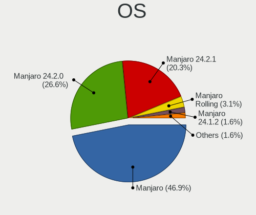
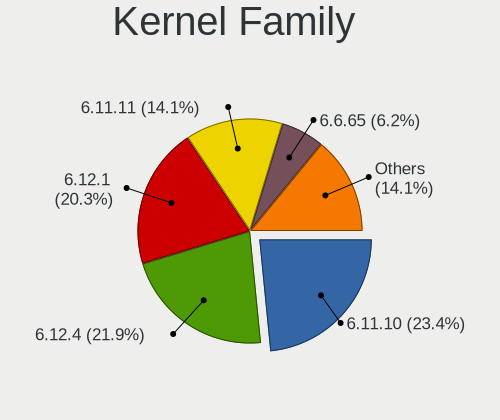
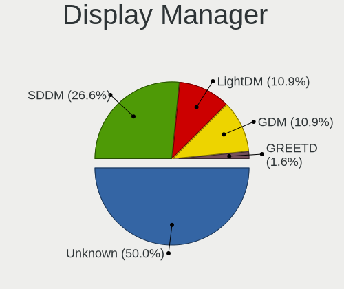
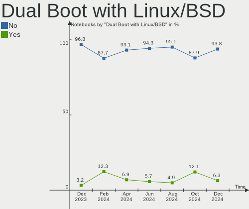
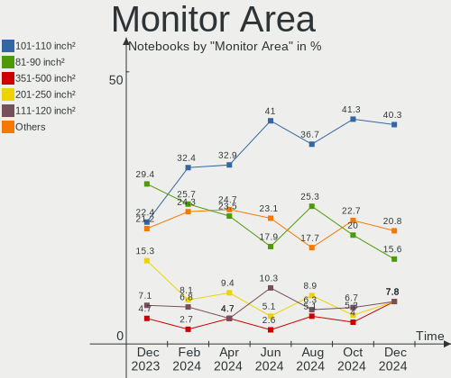
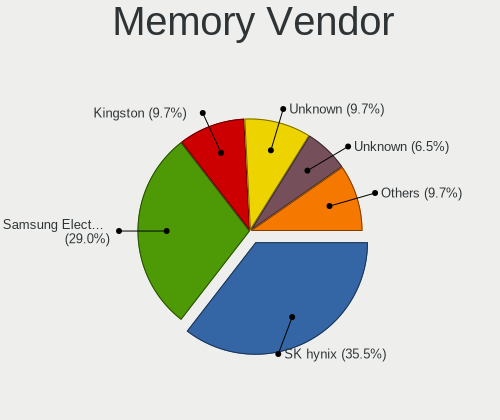
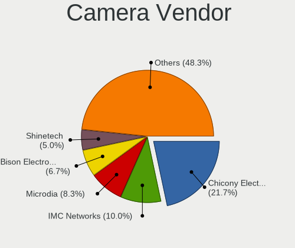

Manjaro Hardware Trends (Notebooks)
-----------------------------------

A project to identify most popular hardware characteristics and track their change
over time based on data collected by Manjaro users at https://Linux-Hardware.org.

Anyone can contribute to this report by the [hw-probe](https://github.com/linuxhw/hw-probe) tool:

    sudo -E hw-probe -all -upload

Full-feature report is available here: https://linux-hardware.org/?view=trends

Period: Jan, 2022.

Contents
--------

* [ System ](#system)
  - [ OS                       ](#os)
  - [ OS Family                ](#os-family)
  - [ Kernel                   ](#kernel)
  - [ Kernel Family            ](#kernel-family)
  - [ Kernel Major Ver.        ](#kernel-major-ver)
  - [ Arch                     ](#arch)
  - [ DE                       ](#de)
  - [ Display Server           ](#display-server)
  - [ Display Manager          ](#display-manager)
  - [ OS Lang                  ](#os-lang)
  - [ Boot Mode                ](#boot-mode)
  - [ Filesystem               ](#filesystem)
  - [ Part. scheme             ](#part-scheme)
  - [ Dual Boot with Linux/BSD ](#dual-boot-with-linuxbsd)
  - [ Dual Boot (Win)          ](#dual-boot-win)

* [ Board ](#board)
  - [ Vendor                   ](#vendor)
  - [ Model                    ](#model)
  - [ Model Family             ](#model-family)
  - [ MFG Year                 ](#mfg-year)
  - [ Form Factor              ](#form-factor)
  - [ Secure Boot              ](#secure-boot)
  - [ Coreboot                 ](#coreboot)
  - [ RAM Size                 ](#ram-size)
  - [ RAM Used                 ](#ram-used)
  - [ Total Drives             ](#total-drives)
  - [ Has CD-ROM               ](#has-cd-rom)
  - [ Has Ethernet             ](#has-ethernet)
  - [ Has WiFi                 ](#has-wifi)
  - [ Has Bluetooth            ](#has-bluetooth)

* [ Location ](#location)
  - [ Country                  ](#country)
  - [ City                     ](#city)

* [ Drives ](#drives)
  - [ Drive Vendor             ](#drive-vendor)
  - [ Drive Model              ](#drive-model)
  - [ HDD Vendor               ](#hdd-vendor)
  - [ SSD Vendor               ](#ssd-vendor)
  - [ Drive Kind               ](#drive-kind)
  - [ Drive Connector          ](#drive-connector)
  - [ Drive Size               ](#drive-size)
  - [ Space Total              ](#space-total)
  - [ Space Used               ](#space-used)
  - [ Malfunc. Drives          ](#malfunc-drives)
  - [ Malfunc. Drive Vendor    ](#malfunc-drive-vendor)
  - [ Malfunc. HDD Vendor      ](#malfunc-hdd-vendor)
  - [ Malfunc. Drive Kind      ](#malfunc-drive-kind)
  - [ Failed Drives            ](#failed-drives)
  - [ Failed Drive Vendor      ](#failed-drive-vendor)
  - [ Drive Status             ](#drive-status)

* [ Storage controller ](#storage-controller)
  - [ Storage Vendor           ](#storage-vendor)
  - [ Storage Model            ](#storage-model)
  - [ Storage Kind             ](#storage-kind)

* [ Processor ](#processor)
  - [ CPU Vendor               ](#cpu-vendor)
  - [ CPU Model                ](#cpu-model)
  - [ CPU Model Family         ](#cpu-model-family)
  - [ CPU Cores                ](#cpu-cores)
  - [ CPU Sockets              ](#cpu-sockets)
  - [ CPU Threads              ](#cpu-threads)
  - [ CPU Op-Modes             ](#cpu-op-modes)
  - [ CPU Microcode            ](#cpu-microcode)
  - [ CPU Microarch            ](#cpu-microarch)

* [ Graphics ](#graphics)
  - [ GPU Vendor               ](#gpu-vendor)
  - [ GPU Model                ](#gpu-model)
  - [ GPU Combo                ](#gpu-combo)
  - [ GPU Driver               ](#gpu-driver)
  - [ GPU Memory               ](#gpu-memory)

* [ Monitor ](#monitor)
  - [ Monitor Vendor           ](#monitor-vendor)
  - [ Monitor Model            ](#monitor-model)
  - [ Monitor Resolution       ](#monitor-resolution)
  - [ Monitor Diagonal         ](#monitor-diagonal)
  - [ Monitor Width            ](#monitor-width)
  - [ Aspect Ratio             ](#aspect-ratio)
  - [ Monitor Area             ](#monitor-area)
  - [ Pixel Density            ](#pixel-density)
  - [ Multiple Monitors        ](#multiple-monitors)

* [ Network ](#network)
  - [ Net Controller Vendor    ](#net-controller-vendor)
  - [ Net Controller Model     ](#net-controller-model)
  - [ Wireless Vendor          ](#wireless-vendor)
  - [ Wireless Model           ](#wireless-model)
  - [ Ethernet Vendor          ](#ethernet-vendor)
  - [ Ethernet Model           ](#ethernet-model)
  - [ Net Controller Kind      ](#net-controller-kind)
  - [ Used Controller          ](#used-controller)
  - [ NICs                     ](#nics)
  - [ IPv6                     ](#ipv6)

* [ Bluetooth ](#bluetooth)
  - [ Bluetooth Vendor         ](#bluetooth-vendor)
  - [ Bluetooth Model          ](#bluetooth-model)

* [ Sound ](#sound)
  - [ Sound Vendor             ](#sound-vendor)
  - [ Sound Model              ](#sound-model)

* [ Memory ](#memory)
  - [ Memory Vendor            ](#memory-vendor)
  - [ Memory Model             ](#memory-model)
  - [ Memory Kind              ](#memory-kind)
  - [ Memory Form Factor       ](#memory-form-factor)
  - [ Memory Size              ](#memory-size)
  - [ Memory Speed             ](#memory-speed)

* [ Printers & scanners ](#printers--scanners)
  - [ Printer Vendor           ](#printer-vendor)
  - [ Printer Model            ](#printer-model)
  - [ Scanner Vendor           ](#scanner-vendor)
  - [ Scanner Model            ](#scanner-model)

* [ Camera ](#camera)
  - [ Camera Vendor            ](#camera-vendor)
  - [ Camera Model             ](#camera-model)

* [ Security ](#security)
  - [ Fingerprint Vendor       ](#fingerprint-vendor)
  - [ Fingerprint Model        ](#fingerprint-model)
  - [ Chipcard Vendor          ](#chipcard-vendor)
  - [ Chipcard Model           ](#chipcard-model)

* [ Unsupported ](#unsupported)
  - [ Unsupported Devices      ](#unsupported-devices)
  - [ Unsupported Device Types ](#unsupported-device-types)

System
------

OS
--

Installed operating systems

| Name           | Notebooks | Percent |
|----------------|-----------|---------|
| Manjaro 21.2.1 | 47        | 43.93%  |
| Manjaro        | 34        | 31.78%  |
| Manjaro 21.2.2 | 21        | 19.63%  |
| Manjaro 21.2.0 | 5         | 4.67%   |

OS Family
---------

OS without a version

| Name    | Notebooks | Percent |
|---------|-----------|---------|
| Manjaro | 107       | 100%    |

Kernel
------

Version of the Linux kernel

| Version               | Notebooks | Percent |
|-----------------------|-----------|---------|
| 5.15.12-1-MANJARO     | 50        | 46.73%  |
| 5.15.16-1-MANJARO     | 10        | 9.35%   |
| 5.16.2-1-MANJARO      | 8         | 7.48%   |
| 5.10.89-1-MANJARO     | 8         | 7.48%   |
| 5.13.19-2-MANJARO     | 7         | 6.54%   |
| 5.16.0-1-MANJARO      | 6         | 5.61%   |
| 5.15.7-1-MANJARO      | 6         | 5.61%   |
| 5.10.93-1-MANJARO     | 5         | 4.67%   |
| 5.9.16-1-MANJARO      | 2         | 1.87%   |
| 5.9.1-1-rt20-MANJARO  | 1         | 0.93%   |
| 5.16.0-rc5-MANJARO+   | 1         | 0.93%   |
| 5.15.7-1-rt23-MANJARO | 1         | 0.93%   |
| 5.15.14-1-MANJARO     | 1         | 0.93%   |
| 5.14.21-2-MANJARO     | 1         | 0.93%   |

Kernel Family
-------------

Linux kernel without a distro release

| Version | Notebooks | Percent |
|---------|-----------|---------|
| 5.15.12 | 50        | 46.73%  |
| 5.15.16 | 10        | 9.35%   |
| 5.16.2  | 8         | 7.48%   |
| 5.10.89 | 8         | 7.48%   |
| 5.16.0  | 7         | 6.54%   |
| 5.15.7  | 7         | 6.54%   |
| 5.13.19 | 7         | 6.54%   |
| 5.10.93 | 5         | 4.67%   |
| 5.9.16  | 2         | 1.87%   |
| 5.9.1   | 1         | 0.93%   |
| 5.15.14 | 1         | 0.93%   |
| 5.14.21 | 1         | 0.93%   |

Kernel Major Ver.
-----------------

Linux kernel major version

| Version | Notebooks | Percent |
|---------|-----------|---------|
| 5.15    | 68        | 63.55%  |
| 5.16    | 15        | 14.02%  |
| 5.10    | 13        | 12.15%  |
| 5.13    | 7         | 6.54%   |
| 5.9     | 3         | 2.8%    |
| 5.14    | 1         | 0.93%   |

Arch
----

OS architecture (x86_64, i586, etc.)

| Name   | Notebooks | Percent |
|--------|-----------|---------|
| x86_64 | 107       | 100%    |

DE
--

Desktop Environment

| Name       | Notebooks | Percent |
|------------|-----------|---------|
| KDE5       | 48        | 44.86%  |
| GNOME      | 28        | 26.17%  |
| XFCE       | 22        | 20.56%  |
| X-Cinnamon | 2         | 1.87%   |
| i3         | 2         | 1.87%   |
| Unknown    | 2         | 1.87%   |
| sway       | 1         | 0.93%   |
| LeftWM     | 1         | 0.93%   |
| Cinnamon   | 1         | 0.93%   |

Display Server
--------------

X11 or Wayland

| Name    | Notebooks | Percent |
|---------|-----------|---------|
| X11     | 84        | 78.5%   |
| Wayland | 21        | 19.63%  |
| Tty     | 1         | 0.93%   |
| Unknown | 1         | 0.93%   |

Display Manager
---------------

SDDM, LightDM, etc.

| Name    | Notebooks | Percent |
|---------|-----------|---------|
| Unknown | 34        | 31.78%  |
| SDDM    | 26        | 24.3%   |
| LightDM | 23        | 21.5%   |
| GDM     | 23        | 21.5%   |
| GREETD  | 1         | 0.93%   |

OS Lang
-------

Language

| Lang  | Notebooks | Percent |
|-------|-----------|---------|
| en_US | 48        | 44.86%  |
| de_DE | 15        | 14.02%  |
| en_GB | 9         | 8.41%   |
| ru_RU | 5         | 4.67%   |
| fr_FR | 4         | 3.74%   |
| pl_PL | 3         | 2.8%    |
| es_ES | 3         | 2.8%    |
| en_IN | 3         | 2.8%    |
| zh_CN | 2         | 1.87%   |
| sv_SE | 2         | 1.87%   |
| pt_BR | 2         | 1.87%   |
| it_IT | 2         | 1.87%   |
| hu_HU | 2         | 1.87%   |
| uk_UA | 1         | 0.93%   |
| nl_NL | 1         | 0.93%   |
| es_MX | 1         | 0.93%   |
| es_AR | 1         | 0.93%   |
| en_DK | 1         | 0.93%   |
| en_CA | 1         | 0.93%   |
| en_AU | 1         | 0.93%   |

Boot Mode
---------

EFI or BIOS

| Mode | Notebooks | Percent |
|------|-----------|---------|
| BIOS | 65        | 60.75%  |
| EFI  | 42        | 39.25%  |

Filesystem
----------

Type of filesystem

| Type    | Notebooks | Percent |
|---------|-----------|---------|
| Ext4    | 89        | 83.18%  |
| Btrfs   | 14        | 13.08%  |
| Overlay | 2         | 1.87%   |
| Xfs     | 1         | 0.93%   |
| F2fs    | 1         | 0.93%   |

Part. scheme
------------

Scheme of partitioning

| Type    | Notebooks | Percent |
|---------|-----------|---------|
| Unknown | 61        | 57.01%  |
| GPT     | 40        | 37.38%  |
| MBR     | 6         | 5.61%   |

Dual Boot with Linux/BSD
------------------------

Hosting more than one Linux/BSD

| Dual boot | Notebooks | Percent |
|-----------|-----------|---------|
| No        | 97        | 90.65%  |
| Yes       | 10        | 9.35%   |

Dual Boot (Win)
---------------

Hosting Linux and Windows

| Dual boot | Notebooks | Percent |
|-----------|-----------|---------|
| No        | 79        | 73.83%  |
| Yes       | 28        | 26.17%  |

Board
-----

Vendor
------

Motherboard manufacturer

| Name                  | Notebooks | Percent |
|-----------------------|-----------|---------|
| Lenovo                | 34        | 31.78%  |
| Hewlett-Packard       | 20        | 18.69%  |
| Dell                  | 13        | 12.15%  |
| ASUSTek Computer      | 6         | 5.61%   |
| Google                | 5         | 4.67%   |
| Acer                  | 4         | 3.74%   |
| MSI                   | 3         | 2.8%    |
| Fujitsu               | 3         | 2.8%    |
| Apple                 | 3         | 2.8%    |
| TUXEDO                | 2         | 1.87%   |
| Sony                  | 2         | 1.87%   |
| Schenker              | 2         | 1.87%   |
| HONOR                 | 2         | 1.87%   |
| Toshiba               | 1         | 0.93%   |
| Star Labs             | 1         | 0.93%   |
| Razer                 | 1         | 0.93%   |
| Positivo Bahia - VAIO | 1         | 0.93%   |
| ilife                 | 1         | 0.93%   |
| HUAWEI                | 1         | 0.93%   |
| GPD                   | 1         | 0.93%   |
| AZW                   | 1         | 0.93%   |

Model
-----

Motherboard model

| Name                                    | Notebooks | Percent |
|-----------------------------------------|-----------|---------|
| HP Pavilion Gaming Laptop 15-ec1xxx     | 3         | 2.8%    |
| Lenovo ThinkPad T400 2768WGB            | 2         | 1.87%   |
| Lenovo ThinkBook 15-IIL 20SM            | 2         | 1.87%   |
| Lenovo IdeaPad Gaming 3 15ACH6 82K2     | 2         | 1.87%   |
| Google Falco                            | 2         | 1.87%   |
| TUXEDO Pulse 15 Gen1                    | 1         | 0.93%   |
| TUXEDO Book XP1511                      | 1         | 0.93%   |
| Toshiba Satellite C855D                 | 1         | 0.93%   |
| Star Labs LabTop                        | 1         | 0.93%   |
| Sony VPCEB2Z1E                          | 1         | 0.93%   |
| Sony SVF13N2J4RS                        | 1         | 0.93%   |
| Schenker VISION 15 (SVS15E21)           | 1         | 0.93%   |
| Schenker N24_25JU                       | 1         | 0.93%   |
| Razer Blade Stealth 13 Late 2019        | 1         | 0.93%   |
| Positivo Bahia - VAIO VJFE43F11X-XXXXXX | 1         | 0.93%   |
| MSI Prestige 15 A10SC                   | 1         | 0.93%   |
| MSI GS66 Stealth 10SGS                  | 1         | 0.93%   |
| MSI GP66 Leopard 11UH                   | 1         | 0.93%   |
| Lenovo Y520-15IKBN 80WK                 | 1         | 0.93%   |
| Lenovo V15 G2 ALC 82KD                  | 1         | 0.93%   |
| Lenovo V14 G2 ITL 82NM                  | 1         | 0.93%   |
| Lenovo ThinkPad X230 2324A82            | 1         | 0.93%   |
| Lenovo ThinkPad X220 4291B60            | 1         | 0.93%   |
| Lenovo ThinkPad T470 W10DG 20JNS0DB00   | 1         | 0.93%   |
| Lenovo ThinkPad T440p 20AWS17N00        | 1         | 0.93%   |
| Lenovo ThinkPad T430s 2356BQ5           | 1         | 0.93%   |
| Lenovo ThinkPad T430 2344BZU            | 1         | 0.93%   |
| Lenovo ThinkPad T15g Gen 1 20URA002AU   | 1         | 0.93%   |
| Lenovo ThinkPad T15 Gen 2i 20W4003FUK   | 1         | 0.93%   |
| Lenovo ThinkPad L14 Gen 1 20U50001PB    | 1         | 0.93%   |
| Lenovo ThinkPad L14 Gen 1 20U50001GE    | 1         | 0.93%   |
| Lenovo ThinkPad E560 20EV002UIX         | 1         | 0.93%   |
| Lenovo ThinkBook 15 G2 ARE 20VG         | 1         | 0.93%   |
| Lenovo Legion Y530-15ICH 81FV           | 1         | 0.93%   |
| Lenovo Legion 5 15IMH05 82AU            | 1         | 0.93%   |
| Lenovo Legion 5 15ARH05H 82B1           | 1         | 0.93%   |
| Lenovo IdeaPad Y580                     | 1         | 0.93%   |
| Lenovo IdeaPad S540-14API 81NH          | 1         | 0.93%   |
| Lenovo IdeaPad S145-14IGM 81MW          | 1         | 0.93%   |
| Lenovo IdeaPad 530S-15IKB 81EV          | 1         | 0.93%   |
| Lenovo IdeaPad 320-14AST 80XU           | 1         | 0.93%   |
| Lenovo IdeaPad 3 14ADA05 81W0           | 1         | 0.93%   |
| Lenovo IdeaPad 120S-14IAP 81A5          | 1         | 0.93%   |
| Lenovo G580 20157                       | 1         | 0.93%   |
| Lenovo G50-30 80G0                      | 1         | 0.93%   |
| Lenovo G460 20041                       | 1         | 0.93%   |
| ilife S806                              | 1         | 0.93%   |
| HUAWEI KLVL-WXX9                        | 1         | 0.93%   |
| HONOR NMH-WCX9                          | 1         | 0.93%   |
| HONOR BMH-WCX9                          | 1         | 0.93%   |
| HP ZBook Studio G7 Mobile Workstation   | 1         | 0.93%   |
| HP ZBook 14                             | 1         | 0.93%   |
| HP Split 13 x2 PC                       | 1         | 0.93%   |
| HP ProBook 6470b                        | 1         | 0.93%   |
| HP ProBook 4720s                        | 1         | 0.93%   |
| HP ProBook 450 G3                       | 1         | 0.93%   |
| HP ProBook 430 G2                       | 1         | 0.93%   |
| HP Pavilion Laptop 15-eh0xxx            | 1         | 0.93%   |
| HP Pavilion dv5                         | 1         | 0.93%   |
| HP OMEN by Laptop 16-b0xxx              | 1         | 0.93%   |

Model Family
------------

Motherboard model prefix

| Name                                    | Notebooks | Percent |
|-----------------------------------------|-----------|---------|
| Lenovo ThinkPad                         | 13        | 12.15%  |
| Lenovo IdeaPad                          | 9         | 8.41%   |
| HP Pavilion                             | 5         | 4.67%   |
| Dell Latitude                           | 5         | 4.67%   |
| HP ProBook                              | 4         | 3.74%   |
| Dell Inspiron                           | 4         | 3.74%   |
| Lenovo ThinkBook                        | 3         | 2.8%    |
| Lenovo Legion                           | 3         | 2.8%    |
| HP EliteBook                            | 3         | 2.8%    |
| Fujitsu LIFEBOOK                        | 3         | 2.8%    |
| HP ZBook                                | 2         | 1.87%   |
| HP OMEN                                 | 2         | 1.87%   |
| HP Laptop                               | 2         | 1.87%   |
| Google Falco                            | 2         | 1.87%   |
| Dell XPS                                | 2         | 1.87%   |
| Acer Aspire                             | 2         | 1.87%   |
| TUXEDO Pulse                            | 1         | 0.93%   |
| TUXEDO Book                             | 1         | 0.93%   |
| Toshiba Satellite                       | 1         | 0.93%   |
| Star Labs LabTop                        | 1         | 0.93%   |
| Sony VPCEB2Z1E                          | 1         | 0.93%   |
| Sony SVF13N2J4RS                        | 1         | 0.93%   |
| Schenker VISION                         | 1         | 0.93%   |
| Schenker N24                            | 1         | 0.93%   |
| Razer Blade                             | 1         | 0.93%   |
| Positivo Bahia - VAIO VJFE43F11X-XXXXXX | 1         | 0.93%   |
| MSI Prestige                            | 1         | 0.93%   |
| MSI GS66                                | 1         | 0.93%   |
| MSI GP66                                | 1         | 0.93%   |
| Lenovo Y520-15IKBN                      | 1         | 0.93%   |
| Lenovo V15                              | 1         | 0.93%   |
| Lenovo V14                              | 1         | 0.93%   |
| Lenovo G580                             | 1         | 0.93%   |
| Lenovo G50-30                           | 1         | 0.93%   |
| Lenovo G460                             | 1         | 0.93%   |
| ilife S806                              | 1         | 0.93%   |
| HUAWEI KLVL-WXX9                        | 1         | 0.93%   |
| HONOR NMH-WCX9                          | 1         | 0.93%   |
| HONOR BMH-WCX9                          | 1         | 0.93%   |
| HP Split                                | 1         | 0.93%   |
| HP Notebook                             | 1         | 0.93%   |
| GPD G1621-02                            | 1         | 0.93%   |
| Google Rammus                           | 1         | 0.93%   |
| Google Candy                            | 1         | 0.93%   |
| Google Barla                            | 1         | 0.93%   |
| Dell Vostro                             | 1         | 0.93%   |
| Dell Precision                          | 1         | 0.93%   |
| AZW SEi                                 | 1         | 0.93%   |
| ASUS X556UJ                             | 1         | 0.93%   |
| ASUS VivoBook                           | 1         | 0.93%   |
| ASUS TP300LD                            | 1         | 0.93%   |
| ASUS ROG                                | 1         | 0.93%   |
| ASUS N61Vn                              | 1         | 0.93%   |
| ASUS ASUS                               | 1         | 0.93%   |
| Apple MacBookPro5                       | 1         | 0.93%   |
| Apple MacBookPro12                      | 1         | 0.93%   |
| Apple MacBook3                          | 1         | 0.93%   |
| Acer TravelMate                         | 1         | 0.93%   |
| Acer Predator                           | 1         | 0.93%   |

MFG Year
--------

Motherboard manufacture year

| Year | Notebooks | Percent |
|------|-----------|---------|
| 2020 | 23        | 21.5%   |
| 2021 | 19        | 17.76%  |
| 2012 | 11        | 10.28%  |
| 2019 | 8         | 7.48%   |
| 2014 | 8         | 7.48%   |
| 2018 | 7         | 6.54%   |
| 2016 | 5         | 4.67%   |
| 2013 | 5         | 4.67%   |
| 2010 | 5         | 4.67%   |
| 2017 | 4         | 3.74%   |
| 2015 | 4         | 3.74%   |
| 2008 | 4         | 3.74%   |
| 2011 | 2         | 1.87%   |
| 2009 | 2         | 1.87%   |

Form Factor
-----------

Physical design of the computer

| Name     | Notebooks | Percent |
|----------|-----------|---------|
| Notebook | 107       | 100%    |

Secure Boot
-----------

Enabled or disabled

| State    | Notebooks | Percent |
|----------|-----------|---------|
| Disabled | 107       | 100%    |

Coreboot
--------

Have coreboot on board

| Used | Notebooks | Percent |
|------|-----------|---------|
| No   | 100       | 93.46%  |
| Yes  | 7         | 6.54%   |

RAM Size
--------

Total RAM memory

| Size in GB  | Notebooks | Percent |
|-------------|-----------|---------|
| 4.01-8.0    | 33        | 30.84%  |
| 16.01-24.0  | 22        | 20.56%  |
| 3.01-4.0    | 18        | 16.82%  |
| 8.01-16.0   | 18        | 16.82%  |
| 32.01-64.0  | 11        | 10.28%  |
| 1.01-2.0    | 3         | 2.8%    |
| 24.01-32.0  | 1         | 0.93%   |
| 64.01-256.0 | 1         | 0.93%   |

RAM Used
--------

Used RAM memory

| Used GB   | Notebooks | Percent |
|-----------|-----------|---------|
| 1.01-2.0  | 36        | 33.64%  |
| 2.01-3.0  | 27        | 25.23%  |
| 4.01-8.0  | 23        | 21.5%   |
| 3.01-4.0  | 16        | 14.95%  |
| 8.01-16.0 | 3         | 2.8%    |
| 0.51-1.0  | 2         | 1.87%   |

Total Drives
------------

Number of drives on board

| Drives | Notebooks | Percent |
|--------|-----------|---------|
| 1      | 75        | 70.09%  |
| 2      | 30        | 28.04%  |
| 3      | 2         | 1.87%   |

Has CD-ROM
----------

Has CD-ROM on board

| Presented | Notebooks | Percent |
|-----------|-----------|---------|
| No        | 84        | 78.5%   |
| Yes       | 23        | 21.5%   |

Has Ethernet
------------

Has Ethernet on board

| Presented | Notebooks | Percent |
|-----------|-----------|---------|
| Yes       | 78        | 72.9%   |
| No        | 29        | 27.1%   |

Has WiFi
--------

Has WiFi module

| Presented | Notebooks | Percent |
|-----------|-----------|---------|
| Yes       | 106       | 99.07%  |
| No        | 1         | 0.93%   |

Has Bluetooth
-------------

Has Bluetooth module

| Presented | Notebooks | Percent |
|-----------|-----------|---------|
| Yes       | 87        | 81.31%  |
| No        | 20        | 18.69%  |

Location
--------

Country
-------

Geographic location (country)

| Country     | Notebooks | Percent |
|-------------|-----------|---------|
| Germany     | 15        | 14.02%  |
| USA         | 14        | 13.08%  |
| Russia      | 9         | 8.41%   |
| Spain       | 7         | 6.54%   |
| Hungary     | 5         | 4.67%   |
| UK          | 4         | 3.74%   |
| Poland      | 4         | 3.74%   |
| Netherlands | 4         | 3.74%   |
| France      | 4         | 3.74%   |
| Brazil      | 4         | 3.74%   |
| Sweden      | 3         | 2.8%    |
| Italy       | 3         | 2.8%    |
| India       | 3         | 2.8%    |
| Turkey      | 2         | 1.87%   |
| Mexico      | 2         | 1.87%   |
| Indonesia   | 2         | 1.87%   |
| Finland     | 2         | 1.87%   |
| China       | 2         | 1.87%   |
| Canada      | 2         | 1.87%   |
| Ukraine     | 1         | 0.93%   |
| UAE         | 1         | 0.93%   |
| Taiwan      | 1         | 0.93%   |
| South Korea | 1         | 0.93%   |
| Romania     | 1         | 0.93%   |
| Norway      | 1         | 0.93%   |
| New Zealand | 1         | 0.93%   |
| Iran        | 1         | 0.93%   |
| Ghana       | 1         | 0.93%   |
| Egypt       | 1         | 0.93%   |
| Denmark     | 1         | 0.93%   |
| Czechia     | 1         | 0.93%   |
| Bulgaria    | 1         | 0.93%   |
| Bangladesh  | 1         | 0.93%   |
| Austria     | 1         | 0.93%   |
| Argentina   | 1         | 0.93%   |

City
----

Geographic location (city)

| City                   | Notebooks | Percent |
|------------------------|-----------|---------|
| The Hague              | 2         | 1.87%   |
| Tampere                | 2         | 1.87%   |
| Phoenix                | 2         | 1.87%   |
| Neuwied                | 2         | 1.87%   |
| Moscow                 | 2         | 1.87%   |
| Milan                  | 2         | 1.87%   |
| Budapest               | 2         | 1.87%   |
| Zabrze                 | 1         | 0.93%   |
| Yekaterinburg          | 1         | 0.93%   |
| Woodbridge             | 1         | 0.93%   |
| Wolfenb??ttel          | 1         | 0.93%   |
| Wichita                | 1         | 0.93%   |
| Weinbohla              | 1         | 0.93%   |
| Vitoria-Gasteiz        | 1         | 0.93%   |
| Vigo                   | 1         | 0.93%   |
| Vienna                 | 1         | 0.93%   |
| Ulyanovsk              | 1         | 0.93%   |
| Turda                  | 1         | 0.93%   |
| Toftbyn                | 1         | 0.93%   |
| Tatab??nya             | 1         | 0.93%   |
| Tarsus                 | 1         | 0.93%   |
| Sz?©kesfeh?©rv??r      | 1         | 0.93%   |
| Surabaya               | 1         | 0.93%   |
| Stockholm              | 1         | 0.93%   |
| St Petersburg          | 1         | 0.93%   |
| Solingen               | 1         | 0.93%   |
| Shanghai               | 1         | 0.93%   |
| Seoul                  | 1         | 0.93%   |
| S??o Paulo             | 1         | 0.93%   |
| S??o Jos?© dos Campos  | 1         | 0.93%   |
| Sant Vicenc de Montalt | 1         | 0.93%   |
| San Giuliano Milanese  | 1         | 0.93%   |
| Salford                | 1         | 0.93%   |
| Saint-Privat-des-Vieux | 1         | 0.93%   |
| Saint Paul             | 1         | 0.93%   |
| Rostov-on-Don          | 1         | 0.93%   |
| Reus                   | 1         | 0.93%   |
| Raucoules              | 1         | 0.93%   |
| Prague                 | 1         | 0.93%   |
| Poltava                | 1         | 0.93%   |
| Pernik                 | 1         | 0.93%   |
| Novosibirsk            | 1         | 0.93%   |
| New Taipei             | 1         | 0.93%   |
| Nauheim                | 1         | 0.93%   |
| Nashville              | 1         | 0.93%   |
| Nadym                  | 1         | 0.93%   |
| Mumbai                 | 1         | 0.93%   |
| Moss                   | 1         | 0.93%   |
| Mosina                 | 1         | 0.93%   |
| Milo                   | 1         | 0.93%   |
| Mexico City            | 1         | 0.93%   |
| Mashhad                | 1         | 0.93%   |
| Manikganj              | 1         | 0.93%   |
| Madrid                 | 1         | 0.93%   |
| Lippstadt              | 1         | 0.93%   |
| Lerma de Villada       | 1         | 0.93%   |
| Leicester              | 1         | 0.93%   |
| Langenzenn             | 1         | 0.93%   |
| Landskrona             | 1         | 0.93%   |
| La Pobla Llarga        | 1         | 0.93%   |

Drives
------

Drive Vendor
------------

Hard drive vendors

| Vendor                         | Notebooks | Drives | Percent |
|--------------------------------|-----------|--------|---------|
| Samsung Electronics            | 36        | 39     | 26.47%  |
| WDC                            | 11        | 11     | 8.09%   |
| Seagate                        | 11        | 12     | 8.09%   |
| Unknown                        | 8         | 10     | 5.88%   |
| Sandisk                        | 7         | 7      | 5.15%   |
| Crucial                        | 7         | 7      | 5.15%   |
| Toshiba                        | 6         | 6      | 4.41%   |
| SK Hynix                       | 6         | 6      | 4.41%   |
| Kingston                       | 5         | 5      | 3.68%   |
| LITEONIT                       | 4         | 5      | 2.94%   |
| KIOXIA                         | 4         | 4      | 2.94%   |
| Hitachi                        | 4         | 4      | 2.94%   |
| Solid State Storage Technology | 3         | 3      | 2.21%   |
| Micron/Crucial Technology      | 3         | 3      | 2.21%   |
| Micron Technology              | 3         | 3      | 2.21%   |
| Patriot                        | 2         | 2      | 1.47%   |
| HGST                           | 2         | 2      | 1.47%   |
| Unknown                        | 2         | 2      | 1.47%   |
| XPG                            | 1         | 1      | 0.74%   |
| UMIS                           | 1         | 1      | 0.74%   |
| Transcend                      | 1         | 1      | 0.74%   |
| Star Drive                     | 1         | 1      | 0.74%   |
| SPCC                           | 1         | 1      | 0.74%   |
| Phison                         | 1         | 1      | 0.74%   |
| Intenso                        | 1         | 1      | 0.74%   |
| Intel                          | 1         | 1      | 0.74%   |
| HS-SSD-C100                    | 1         | 1      | 0.74%   |
| China                          | 1         | 1      | 0.74%   |
| Biwin                          | 1         | 1      | 0.74%   |
| A-DATA Technology              | 1         | 1      | 0.74%   |

Drive Model
-----------

Hard drive models

| Model                                     | Notebooks | Percent |
|-------------------------------------------|-----------|---------|
| Samsung NVMe SSD Drive 512GB              | 5         | 3.52%   |
| Solid State Storage NVMe SSD Drive 512GB  | 3         | 2.11%   |
| Samsung NVMe SSD Drive 256GB              | 3         | 2.11%   |
| Samsung NVMe SSD Drive 1024GB             | 3         | 2.11%   |
| Unknown SD/MMC/MS PRO 128GB               | 2         | 1.41%   |
| SK Hynix NVMe SSD Drive 512GB             | 2         | 1.41%   |
| Seagate ST500LT012-1DG142 500GB           | 2         | 1.41%   |
| Sandisk NVMe SSD Drive 512GB              | 2         | 1.41%   |
| Samsung MZNLN256HMHQ-000H1 256GB SSD      | 2         | 1.41%   |
| Samsung MZALQ512HALU-000L2 512GB          | 2         | 1.41%   |
| Micron/Crucial NVMe SSD Drive 1TB         | 2         | 1.41%   |
| Micron NVMe SSD Drive 512GB               | 2         | 1.41%   |
| LITEONIT LSS-32L6G-HP 32GB SSD            | 2         | 1.41%   |
| Kingston SA400S37240G 240GB SSD           | 2         | 1.41%   |
| Crucial CT500MX500SSD1 500GB              | 2         | 1.41%   |
| Unknown                                   | 2         | 1.41%   |
| XPG NVMe SSD Drive 1024GB                 | 1         | 0.7%    |
| WDC WDS500G2B0B-00YS70 500GB SSD          | 1         | 0.7%    |
| WDC WDS500G2B0A-00SM50 500GB SSD          | 1         | 0.7%    |
| WDC WDS120G2G0A-00JH30 120GB SSD          | 1         | 0.7%    |
| WDC WD10SPZX-75Z10T0 1TB                  | 1         | 0.7%    |
| WDC WD10SPCX-08HWST0 1TB                  | 1         | 0.7%    |
| WDC WD10S21X-24R1BT0-SSHD-8GB             | 1         | 0.7%    |
| WDC WD10JPVX-60JC3T0 1TB                  | 1         | 0.7%    |
| WDC WD SSD 120GB                          | 1         | 0.7%    |
| WDC PC SN730 SDBPNTY-512G-1027 512GB      | 1         | 0.7%    |
| WDC PC SN530 SDBPMPZ-512G-1101 512GB      | 1         | 0.7%    |
| WDC PC SN520 SDAPNUW-512G-1032 512GB      | 1         | 0.7%    |
| Unknown TA2964  64GB                      | 1         | 0.7%    |
| Unknown SE32G  32GB                       | 1         | 0.7%    |
| Unknown SDU1  64GB                        | 1         | 0.7%    |
| Unknown NCard  32GB                       | 1         | 0.7%    |
| Unknown MMC Card  64GB                    | 1         | 0.7%    |
| Unknown HBG4a2  32GB                      | 1         | 0.7%    |
| Unknown HAG2e  16GB                       | 1         | 0.7%    |
| Unknown DA4032  32GB                      | 1         | 0.7%    |
| UMIS RPJTJ256MEE1OWX 256GB                | 1         | 0.7%    |
| Transcend TS120GMTS420S 120GB SSD         | 1         | 0.7%    |
| Toshiba MQ04ABF100 1TB                    | 1         | 0.7%    |
| Toshiba MQ01ACF050 500GB                  | 1         | 0.7%    |
| Toshiba MK5056GSY 500GB                   | 1         | 0.7%    |
| Toshiba MK3276GSX 320GB                   | 1         | 0.7%    |
| Toshiba KBG40ZMT128G MEMORY 128GB         | 1         | 0.7%    |
| Toshiba KBG30ZMS128G 128GB NVMe SSD       | 1         | 0.7%    |
| Star Drive PCIe SSD 480GB                 | 1         | 0.7%    |
| SPCC Solid State Disk 128GB               | 1         | 0.7%    |
| SK Hynix SKHynix_HFM512GDHTNI-87A0B 512GB | 1         | 0.7%    |
| SK Hynix PC401 NVMe 1TB                   | 1         | 0.7%    |
| SK Hynix HFS128G39TND-N210A 128GB SSD     | 1         | 0.7%    |
| SK Hynix HFM512GD3JX013N 512GB            | 1         | 0.7%    |
| Seagate ST9320328CS 320GB                 | 1         | 0.7%    |
| Seagate ST750LM022 HN-M750MBB 752GB       | 1         | 0.7%    |
| Seagate ST500LM012 HN-M500MBB 500GB       | 1         | 0.7%    |
| Seagate ST500LM000-1EJ162 500GB           | 1         | 0.7%    |
| Seagate ST250LT003-9YG14C 250GB           | 1         | 0.7%    |
| Seagate ST1000LM035-1RK172 1TB            | 1         | 0.7%    |
| Seagate ST1000LM024 HN-M101MBB 1TB        | 1         | 0.7%    |
| Seagate ST1000LM014-SSHD-8GB              | 1         | 0.7%    |
| Seagate BUP BK 4TB                        | 1         | 0.7%    |
| Seagate Backup+ Hub BK 8TB                | 1         | 0.7%    |

HDD Vendor
----------

Hard disk drive vendors

| Vendor  | Notebooks | Drives | Percent |
|---------|-----------|--------|---------|
| Seagate | 11        | 12     | 40.74%  |
| WDC     | 4         | 4      | 14.81%  |
| Toshiba | 4         | 4      | 14.81%  |
| Hitachi | 4         | 4      | 14.81%  |
| Unknown | 2         | 2      | 7.41%   |
| HGST    | 2         | 2      | 7.41%   |

SSD Vendor
----------

Solid state drive vendors

| Vendor              | Notebooks | Drives | Percent |
|---------------------|-----------|--------|---------|
| Samsung Electronics | 13        | 13     | 29.55%  |
| Crucial             | 7         | 7      | 15.91%  |
| WDC                 | 4         | 4      | 9.09%   |
| LITEONIT            | 4         | 5      | 9.09%   |
| Kingston            | 4         | 4      | 9.09%   |
| SanDisk             | 2         | 2      | 4.55%   |
| Patriot             | 2         | 2      | 4.55%   |
| Transcend           | 1         | 1      | 2.27%   |
| SPCC                | 1         | 1      | 2.27%   |
| SK Hynix            | 1         | 1      | 2.27%   |
| Micron Technology   | 1         | 1      | 2.27%   |
| Intenso             | 1         | 1      | 2.27%   |
| Intel               | 1         | 1      | 2.27%   |
| HS-SSD-C100         | 1         | 1      | 2.27%   |
| China               | 1         | 1      | 2.27%   |

Drive Kind
----------

HDD or SSD

| Kind | Notebooks | Drives | Percent |
|------|-----------|--------|---------|
| NVMe | 52        | 60     | 41.6%   |
| SSD  | 40        | 45     | 32%     |
| HDD  | 26        | 28     | 20.8%   |
| MMC  | 7         | 10     | 5.6%    |

Drive Connector
---------------

SATA, SAS, NVMe, etc.

| Type | Notebooks | Drives | Percent |
|------|-----------|--------|---------|
| SATA | 57        | 69     | 47.5%   |
| NVMe | 52        | 60     | 43.33%  |
| MMC  | 7         | 10     | 5.83%   |
| SAS  | 4         | 4      | 3.33%   |

Drive Size
----------

Size of hard drive

| Size in TB | Notebooks | Drives | Percent |
|------------|-----------|--------|---------|
| 0.01-0.5   | 43        | 52     | 67.19%  |
| 0.51-1.0   | 18        | 18     | 28.13%  |
| 3.01-4.0   | 1         | 1      | 1.56%   |
| 1.01-2.0   | 1         | 1      | 1.56%   |
| 4.01-10.0  | 1         | 1      | 1.56%   |

Space Total
-----------

Amount of disk space available on the file system

| Size in GB     | Notebooks | Percent |
|----------------|-----------|---------|
| 101-250        | 35        | 32.71%  |
| 251-500        | 25        | 23.36%  |
| 501-1000       | 19        | 17.76%  |
| 21-50          | 6         | 5.61%   |
| 1001-2000      | 6         | 5.61%   |
| 1-20           | 4         | 3.74%   |
| 51-100         | 4         | 3.74%   |
| Unknown        | 4         | 3.74%   |
| More than 3000 | 2         | 1.87%   |
| 2001-3000      | 2         | 1.87%   |

Space Used
----------

Amount of used disk space

| Used GB        | Notebooks | Percent |
|----------------|-----------|---------|
| 21-50          | 26        | 24.3%   |
| 1-20           | 24        | 22.43%  |
| 101-250        | 18        | 16.82%  |
| 51-100         | 14        | 13.08%  |
| 251-500        | 12        | 11.21%  |
| 501-1000       | 6         | 5.61%   |
| Unknown        | 4         | 3.74%   |
| More than 3000 | 1         | 0.93%   |
| 2001-3000      | 1         | 0.93%   |
| 1001-2000      | 1         | 0.93%   |

Malfunc. Drives
---------------

Drive models with a malfunction

| Model                         | Notebooks | Drives | Percent |
|-------------------------------|-----------|--------|---------|
| WDC WD10JPVX-60JC3T0 1TB      | 1         | 1      | 25%     |
| Seagate ST9320328CS 320GB     | 1         | 1      | 25%     |
| Hitachi HTS725050A7E635 500GB | 1         | 1      | 25%     |
| Hitachi HTS542525K9A300 250GB | 1         | 1      | 25%     |

Malfunc. Drive Vendor
---------------------

Vendors of faulty drives

| Vendor  | Notebooks | Drives | Percent |
|---------|-----------|--------|---------|
| Hitachi | 2         | 2      | 50%     |
| WDC     | 1         | 1      | 25%     |
| Seagate | 1         | 1      | 25%     |

Malfunc. HDD Vendor
-------------------

Vendors of faulty HDD drives

| Vendor  | Notebooks | Drives | Percent |
|---------|-----------|--------|---------|
| Hitachi | 2         | 2      | 50%     |
| WDC     | 1         | 1      | 25%     |
| Seagate | 1         | 1      | 25%     |

Malfunc. Drive Kind
-------------------

Kinds of faulty drives

| Kind | Notebooks | Drives | Percent |
|------|-----------|--------|---------|
| HDD  | 4         | 4      | 100%    |

Failed Drives
-------------

Failed drive models

Zero info for selected period =(

Failed Drive Vendor
-------------------

Failed drive vendors

Zero info for selected period =(

Drive Status
------------

Number of failed and malfunc. drives

| Status   | Notebooks | Drives | Percent |
|----------|-----------|--------|---------|
| Detected | 76        | 101    | 68.47%  |
| Works    | 31        | 38     | 27.93%  |
| Malfunc  | 4         | 4      | 3.6%    |

Storage controller
------------------

Storage Vendor
--------------

Storage controller vendors

| Vendor                         | Notebooks | Percent |
|--------------------------------|-----------|---------|
| Intel                          | 63        | 46.32%  |
| Samsung Electronics            | 25        | 18.38%  |
| AMD                            | 13        | 9.56%   |
| Sandisk                        | 8         | 5.88%   |
| SK Hynix                       | 5         | 3.68%   |
| KIOXIA                         | 5         | 3.68%   |
| Solid State Storage Technology | 3         | 2.21%   |
| Micron/Crucial Technology      | 3         | 2.21%   |
| Phison Electronics             | 2         | 1.47%   |
| Micron Technology              | 2         | 1.47%   |
| ADATA Technology               | 2         | 1.47%   |
| Union Memory (Shenzhen)        | 1         | 0.74%   |
| Toshiba America Info Systems   | 1         | 0.74%   |
| Nvidia                         | 1         | 0.74%   |
| Kingston Technology Company    | 1         | 0.74%   |
| Biwin Storage Technology       | 1         | 0.74%   |

Storage Model
-------------

Storage controller models

| Model                                                                            | Notebooks | Percent |
|----------------------------------------------------------------------------------|-----------|---------|
| AMD FCH SATA Controller [AHCI mode]                                              | 13        | 9.35%   |
| Samsung NVMe SSD Controller SM981/PM981/PM983                                    | 11        | 7.91%   |
| Samsung NVMe SSD Controller 980                                                  | 10        | 7.19%   |
| Intel 7 Series Chipset Family 6-port SATA Controller [AHCI mode]                 | 9         | 6.47%   |
| Intel 8 Series SATA Controller 1 [AHCI mode]                                     | 7         | 5.04%   |
| Intel Sunrise Point-LP SATA Controller [AHCI mode]                               | 6         | 4.32%   |
| Intel 82801 Mobile SATA Controller [RAID mode]                                   | 6         | 4.32%   |
| KIOXIA Non-Volatile memory controller                                            | 5         | 3.6%    |
| Intel Volume Management Device NVMe RAID Controller                              | 4         | 2.88%   |
| Intel 82801IBM/IEM (ICH9M/ICH9M-E) 4 port SATA Controller [AHCI mode]            | 4         | 2.88%   |
| Solid State Storage Non-Volatile memory controller                               | 3         | 2.16%   |
| Sandisk Non-Volatile memory controller                                           | 3         | 2.16%   |
| Intel Wildcat Point-LP SATA Controller [AHCI Mode]                               | 3         | 2.16%   |
| Intel Ice Lake-LP SATA Controller [AHCI mode]                                    | 3         | 2.16%   |
| Intel Cannon Lake Mobile PCH SATA AHCI Controller                                | 3         | 2.16%   |
| Intel 5 Series/3400 Series Chipset 4 port SATA AHCI Controller                   | 3         | 2.16%   |
| SK Hynix Gold P31 SSD                                                            | 2         | 1.44%   |
| Samsung NVMe SSD Controller PM9A1/PM9A3/980PRO                                   | 2         | 1.44%   |
| Micron Non-Volatile memory controller                                            | 2         | 1.44%   |
| Intel Tiger Lake-LP SATA Controller [AHCI mode]                                  | 2         | 1.44%   |
| Intel HM170/QM170 Chipset SATA Controller [AHCI Mode]                            | 2         | 1.44%   |
| Intel 5 Series/3400 Series Chipset 6 port SATA AHCI Controller                   | 2         | 1.44%   |
| Intel 400 Series Chipset Family SATA AHCI Controller                             | 2         | 1.44%   |
| ADATA XPG SX8200 Pro PCIe Gen3x4 M.2 2280 Solid State Drive                      | 2         | 1.44%   |
| Union Memory (Shenzhen) Non-Volatile memory controller                           | 1         | 0.72%   |
| Toshiba America Info Systems Toshiba America Info Non-Volatile memory controller | 1         | 0.72%   |
| SK Hynix PC401 NVMe Solid State Drive 256GB                                      | 1         | 0.72%   |
| SK Hynix Non-Volatile memory controller                                          | 1         | 0.72%   |
| SK Hynix BC511                                                                   | 1         | 0.72%   |
| Sandisk WD PC SN810 / Black SN850 NVMe SSD                                       | 1         | 0.72%   |
| Sandisk WD Blue SN500 / PC SN520 NVMe SSD                                        | 1         | 0.72%   |
| Sandisk WD Black SN750 / PC SN730 NVMe SSD                                       | 1         | 0.72%   |
| Sandisk WD Black 2018/SN750 / PC SN720 NVMe SSD                                  | 1         | 0.72%   |
| Sandisk PC SN520 NVMe SSD                                                        | 1         | 0.72%   |
| Samsung NVMe SSD Controller SM961/PM961/SM963                                    | 1         | 0.72%   |
| Samsung NVMe SSD Controller SM951/PM951                                          | 1         | 0.72%   |
| Phison E16 PCIe4 NVMe Controller                                                 | 1         | 0.72%   |
| Phison E12 NVMe Controller                                                       | 1         | 0.72%   |
| Nvidia MCP79 AHCI Controller                                                     | 1         | 0.72%   |
| Micron/Crucial P2 NVMe PCIe SSD                                                  | 1         | 0.72%   |
| Micron/Crucial P1 NVMe PCIe SSD                                                  | 1         | 0.72%   |
| Micron/Crucial NVMe Controller                                                   | 1         | 0.72%   |
| Kingston Company OM3PDP3 NVMe SSD                                                | 1         | 0.72%   |
| Intel Q170/Q150/B150/H170/H110/Z170/CM236 Chipset SATA Controller [AHCI Mode]    | 1         | 0.72%   |
| Intel Comet Lake SATA AHCI Controller                                            | 1         | 0.72%   |
| Intel Celeron/Pentium Silver Processor SATA Controller                           | 1         | 0.72%   |
| Intel Celeron N3350/Pentium N4200/Atom E3900 Series SATA AHCI Controller         | 1         | 0.72%   |
| Intel Cannon Point-LP SATA Controller [AHCI Mode]                                | 1         | 0.72%   |
| Intel Atom Processor E3800 Series SATA AHCI Controller                           | 1         | 0.72%   |
| Intel 82801HM/HEM (ICH8M/ICH8M-E) SATA Controller [AHCI mode]                    | 1         | 0.72%   |
| Intel 82801HM/HEM (ICH8M/ICH8M-E) IDE Controller                                 | 1         | 0.72%   |
| Intel 8 Series/C220 Series Chipset Family 6-port SATA Controller 1 [AHCI mode]   | 1         | 0.72%   |
| Intel 6 Series/C200 Series Chipset Family 6 port Mobile SATA AHCI Controller     | 1         | 0.72%   |
| Biwin Storage Non-Volatile memory controller                                     | 1         | 0.72%   |

Storage Kind
------------

Kind of storage controller (IDE, SATA, NVMe, SAS, ...)

| Kind | Notebooks | Percent |
|------|-----------|---------|
| SATA | 69        | 52.27%  |
| NVMe | 52        | 39.39%  |
| RAID | 10        | 7.58%   |
| IDE  | 1         | 0.76%   |

Processor
---------

CPU Vendor
----------

Processor vendors

| Vendor | Notebooks | Percent |
|--------|-----------|---------|
| Intel  | 82        | 76.64%  |
| AMD    | 25        | 23.36%  |

CPU Model
---------

Processor models

| Model                                      | Notebooks | Percent |
|--------------------------------------------|-----------|---------|
| Intel Core i5-3320M CPU @ 2.60GHz          | 5         | 4.67%   |
| Intel Core i7-10750H CPU @ 2.60GHz         | 3         | 2.8%    |
| Intel Core i5-6200U CPU @ 2.30GHz          | 3         | 2.8%    |
| Intel 11th Gen Core i7-11800H @ 2.30GHz    | 3         | 2.8%    |
| Intel 11th Gen Core i7-1165G7 @ 2.80GHz    | 3         | 2.8%    |
| AMD Ryzen 7 4800H with Radeon Graphics     | 3         | 2.8%    |
| AMD Ryzen 5 4600H with Radeon Graphics     | 3         | 2.8%    |
| Intel Core i7-7700HQ CPU @ 2.80GHz         | 2         | 1.87%   |
| Intel Core i7-6500U CPU @ 2.50GHz          | 2         | 1.87%   |
| Intel Core i7-4500U CPU @ 1.80GHz          | 2         | 1.87%   |
| Intel Core i7-10710U CPU @ 1.10GHz         | 2         | 1.87%   |
| Intel Core i7-1065G7 CPU @ 1.30GHz         | 2         | 1.87%   |
| Intel Core i5-8300H CPU @ 2.30GHz          | 2         | 1.87%   |
| Intel Core i5-2540M CPU @ 2.60GHz          | 2         | 1.87%   |
| Intel Core i5-1035G4 CPU @ 1.10GHz         | 2         | 1.87%   |
| Intel Core i3-4030U CPU @ 1.90GHz          | 2         | 1.87%   |
| Intel Core i3 CPU M 370 @ 2.40GHz          | 2         | 1.87%   |
| Intel Core 2 Duo CPU P8600 @ 2.40GHz       | 2         | 1.87%   |
| Intel Celeron CPU N2840 @ 2.16GHz          | 2         | 1.87%   |
| Intel Celeron 2955U @ 1.40GHz              | 2         | 1.87%   |
| AMD Ryzen 7 PRO 4750U with Radeon Graphics | 2         | 1.87%   |
| AMD Ryzen 5 5600H with Radeon Graphics     | 2         | 1.87%   |
| AMD Ryzen 5 5500U with Radeon Graphics     | 2         | 1.87%   |
| AMD Ryzen 3 3250U with Radeon Graphics     | 2         | 1.87%   |
| Intel Pentium Silver N6000 @ 1.10GHz       | 1         | 0.93%   |
| Intel Pentium CPU B950 @ 2.10GHz           | 1         | 0.93%   |
| Intel Pentium CPU 4415Y @ 1.60GHz          | 1         | 0.93%   |
| Intel Core i9-10980HK CPU @ 2.40GHz        | 1         | 0.93%   |
| Intel Core i7-8750H CPU @ 2.20GHz          | 1         | 0.93%   |
| Intel Core i7-8550U CPU @ 1.80GHz          | 1         | 0.93%   |
| Intel Core i7-5500U CPU @ 2.40GHz          | 1         | 0.93%   |
| Intel Core i7-3740QM CPU @ 2.70GHz         | 1         | 0.93%   |
| Intel Core i7-3610QM CPU @ 2.30GHz         | 1         | 0.93%   |
| Intel Core i7-3517U CPU @ 1.90GHz          | 1         | 0.93%   |
| Intel Core i7-10875H CPU @ 2.30GHz         | 1         | 0.93%   |
| Intel Core i7-10850H CPU @ 2.70GHz         | 1         | 0.93%   |
| Intel Core i5-8279U CPU @ 2.40GHz          | 1         | 0.93%   |
| Intel Core i5-7200U CPU @ 2.50GHz          | 1         | 0.93%   |
| Intel Core i5-6440HQ CPU @ 2.60GHz         | 1         | 0.93%   |
| Intel Core i5-5257U CPU @ 2.70GHz          | 1         | 0.93%   |
| Intel Core i5-5200U CPU @ 2.20GHz          | 1         | 0.93%   |
| Intel Core i5-4310U CPU @ 2.00GHz          | 1         | 0.93%   |
| Intel Core i5-4300M CPU @ 2.60GHz          | 1         | 0.93%   |
| Intel Core i5-4202Y CPU @ 1.60GHz          | 1         | 0.93%   |
| Intel Core i5-10210U CPU @ 1.60GHz         | 1         | 0.93%   |
| Intel Core i5 CPU M 520 @ 2.40GHz          | 1         | 0.93%   |
| Intel Core i5 CPU M 460 @ 2.53GHz          | 1         | 0.93%   |
| Intel Core i5 CPU M 430 @ 2.27GHz          | 1         | 0.93%   |
| Intel Core i3-6100U CPU @ 2.30GHz          | 1         | 0.93%   |
| Intel Core i3-5005U CPU @ 2.00GHz          | 1         | 0.93%   |
| Intel Core i3-4010U CPU @ 1.70GHz          | 1         | 0.93%   |
| Intel Core i3-3110M CPU @ 2.40GHz          | 1         | 0.93%   |
| Intel Core i3-2350M CPU @ 2.30GHz          | 1         | 0.93%   |
| Intel Core i3-10110U CPU @ 2.10GHz         | 1         | 0.93%   |
| Intel Core 2 Quad CPU Q9000 @ 2.00GHz      | 1         | 0.93%   |
| Intel Core 2 Duo CPU T7300 @ 2.00GHz       | 1         | 0.93%   |
| Intel Core 2 Duo CPU P7550 @ 2.26GHz       | 1         | 0.93%   |
| Intel Core 2 Duo CPU P7350 @ 2.00GHz       | 1         | 0.93%   |
| Intel Celeron N4000 CPU @ 1.10GHz          | 1         | 0.93%   |
| Intel Celeron CPU N3350 @ 1.10GHz          | 1         | 0.93%   |

CPU Model Family
----------------

Processor model prefix

| Model                | Notebooks | Percent |
|----------------------|-----------|---------|
| Intel Core i5        | 26        | 24.3%   |
| Intel Core i7        | 21        | 19.63%  |
| Intel Core i3        | 10        | 9.35%   |
| AMD Ryzen 5          | 10        | 9.35%   |
| Other                | 9         | 8.41%   |
| AMD Ryzen 7          | 7         | 6.54%   |
| Intel Celeron        | 6         | 5.61%   |
| Intel Core 2 Duo     | 5         | 4.67%   |
| Intel Pentium        | 2         | 1.87%   |
| AMD Ryzen 7 PRO      | 2         | 1.87%   |
| AMD Ryzen 3          | 2         | 1.87%   |
| Intel Pentium Silver | 1         | 0.93%   |
| Intel Core i9        | 1         | 0.93%   |
| Intel Core 2 Quad    | 1         | 0.93%   |
| Intel Atom           | 1         | 0.93%   |
| AMD PRO A10          | 1         | 0.93%   |
| AMD E                | 1         | 0.93%   |
| AMD A4               | 1         | 0.93%   |

CPU Cores
---------

Number of processor cores

| Number | Notebooks | Percent |
|--------|-----------|---------|
| 2      | 54        | 50.47%  |
| 4      | 25        | 23.36%  |
| 6      | 15        | 14.02%  |
| 8      | 13        | 12.15%  |

CPU Sockets
-----------

Number of sockets

| Number | Notebooks | Percent |
|--------|-----------|---------|
| 1      | 107       | 100%    |

CPU Threads
-----------

Threads per core (Hyper-Threading)

| Number | Notebooks | Percent |
|--------|-----------|---------|
| 2      | 86        | 80.37%  |
| 1      | 21        | 19.63%  |

CPU Op-Modes
------------

CPU Operation Modes (32-bit, 64-bit)

| Op mode        | Notebooks | Percent |
|----------------|-----------|---------|
| 32-bit, 64-bit | 107       | 100%    |

CPU Microcode
-------------

Microcode number

| Number     | Notebooks | Percent |
|------------|-----------|---------|
| Unknown    | 58        | 54.21%  |
| 0x08600106 | 6         | 5.61%   |
| 0x406e3    | 4         | 3.74%   |
| 0x40651    | 4         | 3.74%   |
| 0xa0652    | 3         | 2.8%    |
| 0x906ea    | 3         | 2.8%    |
| 0x306a9    | 3         | 2.8%    |
| 0x30678    | 3         | 2.8%    |
| 0x806c1    | 2         | 1.87%   |
| 0x706e5    | 2         | 1.87%   |
| 0x206a7    | 2         | 1.87%   |
| 0x1067a    | 2         | 1.87%   |
| 0x0a50000c | 2         | 1.87%   |
| 0xa0660    | 1         | 0.93%   |
| 0x906e9    | 1         | 0.93%   |
| 0x806ec    | 1         | 0.93%   |
| 0x806ea    | 1         | 0.93%   |
| 0x806d1    | 1         | 0.93%   |
| 0x506c9    | 1         | 0.93%   |
| 0x10676    | 1         | 0.93%   |
| 0x08608103 | 1         | 0.93%   |
| 0x08600103 | 1         | 0.93%   |
| 0x08108109 | 1         | 0.93%   |
| 0x06006705 | 1         | 0.93%   |
| 0x06006704 | 1         | 0.93%   |
| 0x0600611a | 1         | 0.93%   |

CPU Microarch
-------------

Microarchitecture

| Name          | Notebooks | Percent |
|---------------|-----------|---------|
| KabyLake      | 11        | 10.28%  |
| Zen 2         | 10        | 9.35%   |
| Haswell       | 10        | 9.35%   |
| IvyBridge     | 9         | 8.41%   |
| CometLake     | 8         | 7.48%   |
| Skylake       | 7         | 6.54%   |
| Unknown       | 6         | 5.61%   |
| Zen+          | 5         | 4.67%   |
| Westmere      | 5         | 4.67%   |
| TigerLake     | 5         | 4.67%   |
| Penryn        | 5         | 4.67%   |
| Icelake       | 5         | 4.67%   |
| SandyBridge   | 4         | 3.74%   |
| Broadwell     | 4         | 3.74%   |
| Zen 3         | 3         | 2.8%    |
| Silvermont    | 3         | 2.8%    |
| Excavator     | 3         | 2.8%    |
| Goldmont plus | 1         | 0.93%   |
| Goldmont      | 1         | 0.93%   |
| Core          | 1         | 0.93%   |
| Bobcat        | 1         | 0.93%   |

Graphics
--------

GPU Vendor
----------

Vendors of graphics cards

| Vendor | Notebooks | Percent |
|--------|-----------|---------|
| Intel  | 74        | 53.24%  |
| Nvidia | 33        | 23.74%  |
| AMD    | 32        | 23.02%  |

GPU Model
---------

Graphics card models

| Model                                                                     | Notebooks | Percent |
|---------------------------------------------------------------------------|-----------|---------|
| Intel 3rd Gen Core processor Graphics Controller                          | 9         | 6.43%   |
| AMD Renoir                                                                | 9         | 6.43%   |
| Intel Haswell-ULT Integrated Graphics Controller                          | 8         | 5.71%   |
| Intel Skylake GT2 [HD Graphics 520]                                       | 6         | 4.29%   |
| Nvidia TU117M [GeForce GTX 1650 Mobile / Max-Q]                           | 5         | 3.57%   |
| Nvidia GP107M [GeForce GTX 1050 Ti Mobile]                                | 5         | 3.57%   |
| Intel TigerLake-LP GT2 [Iris Xe Graphics]                                 | 5         | 3.57%   |
| AMD Picasso/Raven 2 [Radeon Vega Series / Radeon Vega Mobile Series]      | 5         | 3.57%   |
| Intel CometLake-H GT2 [UHD Graphics]                                      | 4         | 2.86%   |
| Intel 2nd Generation Core Processor Family Integrated Graphics Controller | 4         | 2.86%   |
| AMD Lucienne                                                              | 4         | 2.86%   |
| Intel TigerLake-H GT1 [UHD Graphics]                                      | 3         | 2.14%   |
| Intel HD Graphics 5500                                                    | 3         | 2.14%   |
| Intel Core Processor Integrated Graphics Controller                       | 3         | 2.14%   |
| Intel CoffeeLake-H GT2 [UHD Graphics 630]                                 | 3         | 2.14%   |
| Intel Atom Processor Z36xxx/Z37xxx Series Graphics & Display              | 3         | 2.14%   |
| AMD Cezanne                                                               | 3         | 2.14%   |
| Intel Iris Plus Graphics G7                                               | 2         | 1.43%   |
| Intel Iris Plus Graphics G4 (Ice Lake)                                    | 2         | 1.43%   |
| Intel HD Graphics 630                                                     | 2         | 1.43%   |
| Intel CometLake-U GT2 [UHD Graphics]                                      | 2         | 1.43%   |
| Intel Comet Lake UHD Graphics                                             | 2         | 1.43%   |
| AMD Stoney [Radeon R2/R3/R4/R5 Graphics]                                  | 2         | 1.43%   |
| AMD RV620/M82 [Mobility Radeon HD 3450/3470]                              | 2         | 1.43%   |
| Nvidia TU117M [GeForce GTX 1650 Ti Mobile]                                | 1         | 0.71%   |
| Nvidia TU117M                                                             | 1         | 0.71%   |
| Nvidia TU117GLM [Quadro T1000 Mobile]                                     | 1         | 0.71%   |
| Nvidia TU116M [GeForce GTX 1660 Ti Mobile]                                | 1         | 0.71%   |
| Nvidia TU106M [GeForce RTX 2070 Mobile / Max-Q Refresh]                   | 1         | 0.71%   |
| Nvidia TU106M [GeForce RTX 2060 Mobile]                                   | 1         | 0.71%   |
| Nvidia TU104M [GeForce RTX 2080 SUPER Mobile / Max-Q]                     | 1         | 0.71%   |
| Nvidia TU104M [GeForce RTX 2070 SUPER Mobile / Max-Q]                     | 1         | 0.71%   |
| Nvidia TU104BM [GeForce RTX 2080 SUPER Mobile / Max-Q]                    | 1         | 0.71%   |
| Nvidia GT216M [GeForce GT 240M]                                           | 1         | 0.71%   |
| Nvidia GP108M [GeForce MX150]                                             | 1         | 0.71%   |
| Nvidia GP107M [GeForce MX350]                                             | 1         | 0.71%   |
| Nvidia GP107M [GeForce GTX 1050 3 GB Max-Q]                               | 1         | 0.71%   |
| Nvidia GM107GLM [Quadro M1200 Mobile]                                     | 1         | 0.71%   |
| Nvidia GK208BM [GeForce 920M]                                             | 1         | 0.71%   |
| Nvidia GK107M [GeForce GTX 660M]                                          | 1         | 0.71%   |
| Nvidia GF117M [GeForce 610M/710M/810M/820M / GT 620M/625M/630M/720M]      | 1         | 0.71%   |
| Nvidia GF108M [GeForce GT 620M/630M/635M/640M LE]                         | 1         | 0.71%   |
| Nvidia GA107M [GeForce RTX 3050 Ti Mobile]                                | 1         | 0.71%   |
| Nvidia GA106M [GeForce RTX 3060 Mobile / Max-Q]                           | 1         | 0.71%   |
| Nvidia GA104M [GeForce RTX 3080 Mobile / Max-Q 8GB/16GB]                  | 1         | 0.71%   |
| Nvidia GA104M [GeForce RTX 3070 Mobile / Max-Q]                           | 1         | 0.71%   |
| Nvidia C79 [GeForce 9400M]                                                | 1         | 0.71%   |
| Intel UHD Graphics 620                                                    | 1         | 0.71%   |
| Intel Mobile GM965/GL960 Integrated Graphics Controller (secondary)       | 1         | 0.71%   |
| Intel Mobile GM965/GL960 Integrated Graphics Controller (primary)         | 1         | 0.71%   |
| Intel Mobile 4 Series Chipset Integrated Graphics Controller              | 1         | 0.71%   |
| Intel JasperLake [UHD Graphics]                                           | 1         | 0.71%   |
| Intel Iris Graphics 6100                                                  | 1         | 0.71%   |
| Intel HD Graphics 620                                                     | 1         | 0.71%   |
| Intel HD Graphics 615                                                     | 1         | 0.71%   |
| Intel HD Graphics 530                                                     | 1         | 0.71%   |
| Intel HD Graphics 500                                                     | 1         | 0.71%   |
| Intel Haswell-ULT High Definition Audio Controller [HD Graphics]          | 1         | 0.71%   |
| Intel GeminiLake [UHD Graphics 600]                                       | 1         | 0.71%   |
| Intel CoffeeLake-U GT3e [Iris Plus Graphics 655]                          | 1         | 0.71%   |

GPU Combo
---------

Combinations of graphics cards

| Name           | Notebooks | Percent |
|----------------|-----------|---------|
| 1 x Intel      | 50        | 46.73%  |
| Intel + Nvidia | 22        | 20.56%  |
| 1 x AMD        | 22        | 20.56%  |
| AMD + Nvidia   | 6         | 5.61%   |
| 1 x Nvidia     | 5         | 4.67%   |
| Intel + AMD    | 2         | 1.87%   |

GPU Driver
----------

Free vs proprietary

| Driver      | Notebooks | Percent |
|-------------|-----------|---------|
| Free        | 84        | 78.5%   |
| Proprietary | 23        | 21.5%   |

GPU Memory
----------

Total video memory

| Size in GB | Notebooks | Percent |
|------------|-----------|---------|
| Unknown    | 87        | 81.31%  |
| 0.01-0.5   | 12        | 11.21%  |
| 1.01-2.0   | 4         | 3.74%   |
| 7.01-8.0   | 1         | 0.93%   |
| 5.01-6.0   | 1         | 0.93%   |
| 3.01-4.0   | 1         | 0.93%   |
| 0.51-1.0   | 1         | 0.93%   |

Monitor
-------

Monitor Vendor
--------------

Monitor vendors

| Vendor                  | Notebooks | Percent |
|-------------------------|-----------|---------|
| LG Display              | 22        | 17.74%  |
| AU Optronics            | 21        | 16.94%  |
| Chimei Innolux          | 19        | 15.32%  |
| BOE                     | 19        | 15.32%  |
| Samsung Electronics     | 7         | 5.65%   |
| Goldstar                | 5         | 4.03%   |
| Sharp                   | 4         | 3.23%   |
| Apple                   | 4         | 3.23%   |
| PANDA                   | 3         | 2.42%   |
| Lenovo                  | 3         | 2.42%   |
| Dell                    | 3         | 2.42%   |
| Chi Mei Optoelectronics | 3         | 2.42%   |
| ViewSonic               | 2         | 1.61%   |
| ASUSTek Computer        | 2         | 1.61%   |
| Sony                    | 1         | 0.81%   |
| Panasonic               | 1         | 0.81%   |
| Mi                      | 1         | 0.81%   |
| LG Philips              | 1         | 0.81%   |
| InfoVision              | 1         | 0.81%   |
| Ancor Communications    | 1         | 0.81%   |
| Unknown                 | 1         | 0.81%   |

Monitor Model
-------------

Monitor models

| Model                                                                   | Notebooks | Percent |
|-------------------------------------------------------------------------|-----------|---------|
| BOE LCD Monitor BOE0700 1920x1080 344x194mm 15.5-inch                   | 3         | 2.4%    |
| LG Display LCD Monitor LGD046F 1920x1080 340x190mm 15.3-inch            | 2         | 1.6%    |
| LG Display LCD Monitor LGD02D8 1366x768 277x156mm 12.5-inch             | 2         | 1.6%    |
| Lenovo LCD Monitor LEN4036 1440x900 303x190mm 14.1-inch                 | 2         | 1.6%    |
| Chimei Innolux LCD Monitor CMN15F5 1920x1080 344x193mm 15.5-inch        | 2         | 1.6%    |
| Chimei Innolux LCD Monitor CMN14A1 1366x768 309x174mm 14.0-inch         | 2         | 1.6%    |
| BOE LCD Monitor BOE0936 1920x1080 344x194mm 15.5-inch                   | 2         | 1.6%    |
| BOE LCD Monitor BOE06BD 1366x768 309x173mm 13.9-inch                    | 2         | 1.6%    |
| AU Optronics LCD Monitor AUO61ED 1920x1080 344x194mm 15.5-inch          | 2         | 1.6%    |
| AU Optronics LCD Monitor AUO213E 1600x900 309x174mm 14.0-inch           | 2         | 1.6%    |
| AU Optronics LCD Monitor AUO203D 1920x1080 309x174mm 14.0-inch          | 2         | 1.6%    |
| ViewSonic XG2405 VSC0D39 1920x1080 530x300mm 24.0-inch                  | 1         | 0.8%    |
| ViewSonic VX2376 Series VSC3B32 1920x1080 509x286mm 23.0-inch           | 1         | 0.8%    |
| Sony Nvidia Defaul SNY05FA 1366x768 290x170mm 13.2-inch                 | 1         | 0.8%    |
| Sharp LQ156M1JW03 SHP155D 1920x1080 344x194mm 15.5-inch                 | 1         | 0.8%    |
| Sharp LQ134N1JW52 SHP151E 1920x1200 288x180mm 13.4-inch                 | 1         | 0.8%    |
| Sharp LCD Monitor SHP14B8 1920x1080 294x165mm 13.3-inch                 | 1         | 0.8%    |
| Sharp LCD Monitor SHP148D 3840x2160 344x194mm 15.5-inch                 | 1         | 0.8%    |
| Samsung Electronics LCD Monitor SEC524D 1366x768 350x200mm 15.9-inch    | 1         | 0.8%    |
| Samsung Electronics LCD Monitor SDC4852 1366x768 344x194mm 15.5-inch    | 1         | 0.8%    |
| Samsung Electronics LCD Monitor SDC4145 3840x2160 344x194mm 15.5-inch   | 1         | 0.8%    |
| Samsung Electronics LCD Monitor SAM0B90 3840x2160 1872x1053mm 84.6-inch | 1         | 0.8%    |
| Samsung Electronics LCD Monitor SAM03BC 1920x1080                       | 1         | 0.8%    |
| Samsung Electronics Color LCD SDCA029 2160x1440 252x168mm 11.9-inch     | 1         | 0.8%    |
| Samsung Electronics C27FG7x SAM0E42 1920x1080 598x337mm 27.0-inch       | 1         | 0.8%    |
| PANDA LCD Monitor NCP0058 1920x1080 344x194mm 15.5-inch                 | 1         | 0.8%    |
| PANDA LCD Monitor NCP004D 1920x1080 344x194mm 15.5-inch                 | 1         | 0.8%    |
| PANDA LC133LF1L02 NCP0019 1920x1080 294x165mm 13.3-inch                 | 1         | 0.8%    |
| Panasonic LCD Monitor MEI96A2 2880x1620 344x193mm 15.5-inch             | 1         | 0.8%    |
| Mi Monitor XMI3444 3440x1440 800x330mm 34.1-inch                        | 1         | 0.8%    |
| LG Philips LP154WX4-TLC8 LPL0120 1280x800 331x207mm 15.4-inch           | 1         | 0.8%    |
| LG Display LCD Monitor LGD062C 1920x1080 309x174mm 14.0-inch            | 1         | 0.8%    |
| LG Display LCD Monitor LGD05EC 1920x1080 309x174mm 14.0-inch            | 1         | 0.8%    |
| LG Display LCD Monitor LGD05CF 1920x1080 344x194mm 15.5-inch            | 1         | 0.8%    |
| LG Display LCD Monitor LGD053F 1920x1080 344x194mm 15.5-inch            | 1         | 0.8%    |
| LG Display LCD Monitor LGD0521 1920x1080 309x174mm 14.0-inch            | 1         | 0.8%    |
| LG Display LCD Monitor LGD04E2 1366x768 344x194mm 15.5-inch             | 1         | 0.8%    |
| LG Display LCD Monitor LGD0492 1920x1080 344x194mm 15.5-inch            | 1         | 0.8%    |
| LG Display LCD Monitor LGD0465 1366x768 344x194mm 15.5-inch             | 1         | 0.8%    |
| LG Display LCD Monitor LGD040B 1366x768 293x165mm 13.2-inch             | 1         | 0.8%    |
| LG Display LCD Monitor LGD040A 1920x1080 309x175mm 14.0-inch            | 1         | 0.8%    |
| LG Display LCD Monitor LGD03FC 1600x900 309x174mm 14.0-inch             | 1         | 0.8%    |
| LG Display LCD Monitor LGD03E3 1366x768 309x174mm 14.0-inch             | 1         | 0.8%    |
| LG Display LCD Monitor LGD036C 1366x768 277x156mm 12.5-inch             | 1         | 0.8%    |
| LG Display LCD Monitor LGD0354 1366x768 293x165mm 13.2-inch             | 1         | 0.8%    |
| LG Display LCD Monitor LGD033A 1366x768 344x194mm 15.5-inch             | 1         | 0.8%    |
| LG Display LCD Monitor LGD02E3 1366x768 344x194mm 15.5-inch             | 1         | 0.8%    |
| LG Display LCD Monitor LGD0214 1600x900 344x194mm 15.5-inch             | 1         | 0.8%    |
| LG Display LCD Monitor LGD01E9 1920x1080 345x194mm 15.6-inch            | 1         | 0.8%    |
| Lenovo LEN P24h-20 LEN61F4 2560x1440 527x296mm 23.8-inch                | 1         | 0.8%    |
| InfoVision LCD Monitor IVO0533 1366x768 293x164mm 13.2-inch             | 1         | 0.8%    |
| Goldstar QHD GSM771D 2560x1440 698x392mm 31.5-inch                      | 1         | 0.8%    |
| Goldstar LG FULL HD GSM5B55 1920x1080 480x270mm 21.7-inch               | 1         | 0.8%    |
| Goldstar LG FULL HD GSM5B54 1920x1080 480x270mm 21.7-inch               | 1         | 0.8%    |
| Goldstar LCD Monitor GSM5AB8 1920x1080 480x270mm 21.7-inch              | 1         | 0.8%    |
| Goldstar L1918S GSM4B31 1280x1024 376x301mm 19.0-inch                   | 1         | 0.8%    |
| Dell U2719DC DEL417C 2560x1440 600x340mm 27.2-inch                      | 1         | 0.8%    |
| Dell U2412M DELA07A 1920x1200 518x324mm 24.1-inch                       | 1         | 0.8%    |
| Dell S2721HS DEL41FA 1920x1080 598x336mm 27.0-inch                      | 1         | 0.8%    |
| Dell S2721H DEL41F6 1920x1080 598x336mm 27.0-inch                       | 1         | 0.8%    |

Monitor Resolution
------------------

Monitor screen resolution

| Resolution        | Notebooks | Percent |
|-------------------|-----------|---------|
| 1920x1080 (FHD)   | 57        | 48.31%  |
| 1366x768 (WXGA)   | 30        | 25.42%  |
| 3840x2160 (4K)    | 8         | 6.78%   |
| 2560x1440 (QHD)   | 5         | 4.24%   |
| 1600x900 (HD+)    | 4         | 3.39%   |
| 1280x800 (WXGA)   | 3         | 2.54%   |
| 1920x1200 (WUXGA) | 2         | 1.69%   |
| 1440x900 (WXGA+)  | 2         | 1.69%   |
| 4480x1440         | 1         | 0.85%   |
| 3440x1440         | 1         | 0.85%   |
| 2880x1800         | 1         | 0.85%   |
| 2560x1600         | 1         | 0.85%   |
| 2160x1440         | 1         | 0.85%   |
| 1280x1024 (SXGA)  | 1         | 0.85%   |
| Unknown           | 1         | 0.85%   |

Monitor Diagonal
----------------

Diagonal size in inches

| Inches  | Notebooks | Percent |
|---------|-----------|---------|
| 15      | 51        | 41.46%  |
| 14      | 24        | 19.51%  |
| 13      | 20        | 16.26%  |
| 27      | 5         | 4.07%   |
| 21      | 4         | 3.25%   |
| 24      | 3         | 2.44%   |
| 12      | 3         | 2.44%   |
| Unknown | 3         | 2.44%   |
| 23      | 2         | 1.63%   |
| 11      | 2         | 1.63%   |
| 84      | 1         | 0.81%   |
| 34      | 1         | 0.81%   |
| 31      | 1         | 0.81%   |
| 19      | 1         | 0.81%   |
| 17      | 1         | 0.81%   |
| 16      | 1         | 0.81%   |

Monitor Width
-------------

Physical width

| Width in mm | Notebooks | Percent |
|-------------|-----------|---------|
| 301-350     | 81        | 66.39%  |
| 201-300     | 18        | 14.75%  |
| 501-600     | 9         | 7.38%   |
| 401-500     | 4         | 3.28%   |
| 351-400     | 4         | 3.28%   |
| Unknown     | 3         | 2.46%   |
| 701-800     | 1         | 0.82%   |
| 601-700     | 1         | 0.82%   |
| 1501-2000   | 1         | 0.82%   |

Aspect Ratio
------------

Proportional relationship between the width and the height

| Ratio   | Notebooks | Percent |
|---------|-----------|---------|
| 16/9    | 95        | 87.16%  |
| 16/10   | 9         | 8.26%   |
| Unknown | 2         | 1.83%   |
| 5/4     | 1         | 0.92%   |
| 3/2     | 1         | 0.92%   |
| 21/9    | 1         | 0.92%   |

Monitor Area
------------

Area in inch²

| Area in inch² | Notebooks | Percent |
|----------------|-----------|---------|
| 101-110        | 50        | 40.98%  |
| 81-90          | 35        | 28.69%  |
| 71-80          | 9         | 7.38%   |
| 201-250        | 7         | 5.74%   |
| 301-350        | 5         | 4.1%    |
| 61-70          | 3         | 2.46%   |
| Unknown        | 3         | 2.46%   |
| 51-60          | 2         | 1.64%   |
| 351-500        | 2         | 1.64%   |
| 91-100         | 2         | 1.64%   |
| More than 1000 | 1         | 0.82%   |
| 251-300        | 1         | 0.82%   |
| 151-200        | 1         | 0.82%   |
| 121-130        | 1         | 0.82%   |

Pixel Density
-------------

Pixels per inch

| Density       | Notebooks | Percent |
|---------------|-----------|---------|
| 121-160       | 58        | 48.33%  |
| 101-120       | 32        | 26.67%  |
| 51-100        | 12        | 10%     |
| 161-240       | 11        | 9.17%   |
| More than 240 | 4         | 3.33%   |
| Unknown       | 3         | 2.5%    |

Multiple Monitors
-----------------

Total monitors connected

| Total | Notebooks | Percent |
|-------|-----------|---------|
| 1     | 92        | 85.98%  |
| 2     | 11        | 10.28%  |
| 3     | 4         | 3.74%   |

Network
-------

Net Controller Vendor
---------------------

Controller vendors

| Vendor                   | Notebooks | Percent |
|--------------------------|-----------|---------|
| Intel                    | 69        | 43.4%   |
| Realtek Semiconductor    | 51        | 32.08%  |
| Qualcomm Atheros         | 14        | 8.81%   |
| Broadcom                 | 10        | 6.29%   |
| Ralink Technology        | 2         | 1.26%   |
| MEDIATEK                 | 2         | 1.26%   |
| Marvell Technology Group | 2         | 1.26%   |
| Sierra Wireless          | 1         | 0.63%   |
| Samsung Electronics      | 1         | 0.63%   |
| Ralink                   | 1         | 0.63%   |
| Nvidia                   | 1         | 0.63%   |
| Mercucys                 | 1         | 0.63%   |
| ICS Advent               | 1         | 0.63%   |
| DisplayLink              | 1         | 0.63%   |
| Dell                     | 1         | 0.63%   |
| Broadcom Limited         | 1         | 0.63%   |

Net Controller Model
--------------------

Controller models

| Model                                                                          | Notebooks | Percent |
|--------------------------------------------------------------------------------|-----------|---------|
| Realtek RTL8111/8168/8411 PCI Express Gigabit Ethernet Controller              | 33        | 17.01%  |
| Intel Wi-Fi 6 AX200                                                            | 12        | 6.19%   |
| Realtek RTL8821CE 802.11ac PCIe Wireless Network Adapter                       | 7         | 3.61%   |
| Intel Wireless 7260                                                            | 7         | 3.61%   |
| Intel 82579LM Gigabit Network Connection (Lewisville)                          | 7         | 3.61%   |
| Realtek RTL810xE PCI Express Fast Ethernet controller                          | 6         | 3.09%   |
| Intel Comet Lake PCH CNVi WiFi                                                 | 5         | 2.58%   |
| Intel Centrino Advanced-N 6205 [Taylor Peak]                                   | 5         | 2.58%   |
| Realtek RTL8822CE 802.11ac PCIe Wireless Network Adapter                       | 4         | 2.06%   |
| Qualcomm Atheros AR9462 Wireless Network Adapter                               | 4         | 2.06%   |
| Intel Wireless 8260                                                            | 4         | 2.06%   |
| Intel Wireless 7265                                                            | 4         | 2.06%   |
| Intel Ice Lake-LP PCH CNVi WiFi                                                | 4         | 2.06%   |
| Realtek RTL8153 Gigabit Ethernet Adapter                                       | 3         | 1.55%   |
| Qualcomm Atheros AR9285 Wireless Network Adapter (PCI-Express)                 | 3         | 1.55%   |
| Intel Wireless 8265 / 8275                                                     | 3         | 1.55%   |
| Intel Wi-Fi 6 AX210/AX211/AX411 160MHz                                         | 3         | 1.55%   |
| Intel Wi-Fi 6 AX201                                                            | 3         | 1.55%   |
| Intel Ethernet Connection I219-V                                               | 3         | 1.55%   |
| Intel Ethernet Connection I218-LM                                              | 3         | 1.55%   |
| Realtek RTL8852AE 802.11ax PCIe Wireless Network Adapter                       | 2         | 1.03%   |
| Realtek RTL8822BE 802.11a/b/g/n/ac WiFi adapter                                | 2         | 1.03%   |
| Realtek RTL8723BE PCIe Wireless Network Adapter                                | 2         | 1.03%   |
| Realtek RTL8188CE 802.11b/g/n WiFi Adapter                                     | 2         | 1.03%   |
| Realtek RTL8125 2.5GbE Controller                                              | 2         | 1.03%   |
| Qualcomm Atheros QCA6174 802.11ac Wireless Network Adapter                     | 2         | 1.03%   |
| Intel Wireless 3165                                                            | 2         | 1.03%   |
| Intel Tiger Lake PCH CNVi WiFi                                                 | 2         | 1.03%   |
| Intel PRO/Wireless 5100 AGN [Shiloh] Network Connection                        | 2         | 1.03%   |
| Intel Dual Band Wireless-AC 3165 Plus Bluetooth                                | 2         | 1.03%   |
| Intel Comet Lake PCH-LP CNVi WiFi                                              | 2         | 1.03%   |
| Intel 82567LM Gigabit Network Connection                                       | 2         | 1.03%   |
| Broadcom NetLink BCM57785 Gigabit Ethernet PCIe                                | 2         | 1.03%   |
| Broadcom BCM43602 802.11ac Wireless LAN SoC                                    | 2         | 1.03%   |
| Broadcom BCM4321 802.11a/b/g/n                                                 | 2         | 1.03%   |
| Sierra Wireless EM7305 Modem                                                   | 1         | 0.52%   |
| Samsung GT-I9070 (network tethering, USB debugging enabled)                    | 1         | 0.52%   |
| Realtek RTL88x2bu [AC1200 Techkey]                                             | 1         | 0.52%   |
| Realtek RTL8821AE 802.11ac PCIe Wireless Network Adapter                       | 1         | 0.52%   |
| Ralink MT7610U ("Archer T2U" 2.4G+5G WLAN Adapter                              | 1         | 0.52%   |
| Ralink MT7601U Wireless Adapter                                                | 1         | 0.52%   |
| Ralink RT3090 Wireless 802.11n 1T/1R PCIe                                      | 1         | 0.52%   |
| Qualcomm Atheros QCA9565 / AR9565 Wireless Network Adapter                     | 1         | 0.52%   |
| Qualcomm Atheros AR9485 Wireless Network Adapter                               | 1         | 0.52%   |
| Qualcomm Atheros AR8162 Fast Ethernet                                          | 1         | 0.52%   |
| Qualcomm Atheros AR8161 Gigabit Ethernet                                       | 1         | 0.52%   |
| Qualcomm Atheros AR8131 Gigabit Ethernet                                       | 1         | 0.52%   |
| Nvidia MCP79 Ethernet                                                          | 1         | 0.52%   |
| Mercucys 802.11n NIC                                                           | 1         | 0.52%   |
| MEDIATEK MT7921 802.11ax PCI Express Wireless Network Adapter                  | 1         | 0.52%   |
| MEDIATEK MT7630e 802.11bgn Wireless Network Adapter                            | 1         | 0.52%   |
| Marvell Group Yukon Optima 88E8059 [PCIe Gigabit Ethernet Controller with AVB] | 1         | 0.52%   |
| Marvell Group 88E8058 PCI-E Gigabit Ethernet Controller                        | 1         | 0.52%   |
| Intel WiFi Link 5100                                                           | 1         | 0.52%   |
| Intel Wi-Fi 6 AX201 160MHz                                                     | 1         | 0.52%   |
| Intel Ethernet controller                                                      | 1         | 0.52%   |
| Intel Ethernet Connection I217-LM                                              | 1         | 0.52%   |
| Intel Ethernet Connection (4) I219-LM                                          | 1         | 0.52%   |
| Intel Ethernet Connection (2) I219-LM                                          | 1         | 0.52%   |
| Intel Ethernet Connection (13) I219-V                                          | 1         | 0.52%   |

Wireless Vendor
---------------

Wireless vendors

| Vendor                | Notebooks | Percent |
|-----------------------|-----------|---------|
| Intel                 | 66        | 57.89%  |
| Realtek Semiconductor | 21        | 18.42%  |
| Qualcomm Atheros      | 11        | 9.65%   |
| Broadcom              | 7         | 6.14%   |
| Ralink Technology     | 2         | 1.75%   |
| MEDIATEK              | 2         | 1.75%   |
| Sierra Wireless       | 1         | 0.88%   |
| Ralink                | 1         | 0.88%   |
| Mercucys              | 1         | 0.88%   |
| Dell                  | 1         | 0.88%   |
| Broadcom Limited      | 1         | 0.88%   |

Wireless Model
--------------

Wireless models

| Model                                                          | Notebooks | Percent |
|----------------------------------------------------------------|-----------|---------|
| Intel Wi-Fi 6 AX200                                            | 12        | 10.53%  |
| Realtek RTL8821CE 802.11ac PCIe Wireless Network Adapter       | 7         | 6.14%   |
| Intel Wireless 7260                                            | 7         | 6.14%   |
| Intel Comet Lake PCH CNVi WiFi                                 | 5         | 4.39%   |
| Intel Centrino Advanced-N 6205 [Taylor Peak]                   | 5         | 4.39%   |
| Realtek RTL8822CE 802.11ac PCIe Wireless Network Adapter       | 4         | 3.51%   |
| Qualcomm Atheros AR9462 Wireless Network Adapter               | 4         | 3.51%   |
| Intel Wireless 8260                                            | 4         | 3.51%   |
| Intel Wireless 7265                                            | 4         | 3.51%   |
| Intel Ice Lake-LP PCH CNVi WiFi                                | 4         | 3.51%   |
| Qualcomm Atheros AR9285 Wireless Network Adapter (PCI-Express) | 3         | 2.63%   |
| Intel Wireless 8265 / 8275                                     | 3         | 2.63%   |
| Intel Wi-Fi 6 AX210/AX211/AX411 160MHz                         | 3         | 2.63%   |
| Intel Wi-Fi 6 AX201                                            | 3         | 2.63%   |
| Realtek RTL8852AE 802.11ax PCIe Wireless Network Adapter       | 2         | 1.75%   |
| Realtek RTL8822BE 802.11a/b/g/n/ac WiFi adapter                | 2         | 1.75%   |
| Realtek RTL8723BE PCIe Wireless Network Adapter                | 2         | 1.75%   |
| Realtek RTL8188CE 802.11b/g/n WiFi Adapter                     | 2         | 1.75%   |
| Qualcomm Atheros QCA6174 802.11ac Wireless Network Adapter     | 2         | 1.75%   |
| Intel Wireless 3165                                            | 2         | 1.75%   |
| Intel Tiger Lake PCH CNVi WiFi                                 | 2         | 1.75%   |
| Intel PRO/Wireless 5100 AGN [Shiloh] Network Connection        | 2         | 1.75%   |
| Intel Dual Band Wireless-AC 3165 Plus Bluetooth                | 2         | 1.75%   |
| Intel Comet Lake PCH-LP CNVi WiFi                              | 2         | 1.75%   |
| Broadcom BCM43602 802.11ac Wireless LAN SoC                    | 2         | 1.75%   |
| Broadcom BCM4321 802.11a/b/g/n                                 | 2         | 1.75%   |
| Sierra Wireless EM7305 Modem                                   | 1         | 0.88%   |
| Realtek RTL88x2bu [AC1200 Techkey]                             | 1         | 0.88%   |
| Realtek RTL8821AE 802.11ac PCIe Wireless Network Adapter       | 1         | 0.88%   |
| Ralink MT7610U ("Archer T2U" 2.4G+5G WLAN Adapter              | 1         | 0.88%   |
| Ralink MT7601U Wireless Adapter                                | 1         | 0.88%   |
| Ralink RT3090 Wireless 802.11n 1T/1R PCIe                      | 1         | 0.88%   |
| Qualcomm Atheros QCA9565 / AR9565 Wireless Network Adapter     | 1         | 0.88%   |
| Qualcomm Atheros AR9485 Wireless Network Adapter               | 1         | 0.88%   |
| Mercucys 802.11n NIC                                           | 1         | 0.88%   |
| MEDIATEK MT7921 802.11ax PCI Express Wireless Network Adapter  | 1         | 0.88%   |
| MEDIATEK MT7630e 802.11bgn Wireless Network Adapter            | 1         | 0.88%   |
| Intel WiFi Link 5100                                           | 1         | 0.88%   |
| Intel Wi-Fi 6 AX201 160MHz                                     | 1         | 0.88%   |
| Intel Centrino Wireless-N 2200                                 | 1         | 0.88%   |
| Intel Centrino Advanced-N 6235                                 | 1         | 0.88%   |
| Intel Centrino Advanced-N 6200                                 | 1         | 0.88%   |
| Intel Cannon Lake PCH CNVi WiFi                                | 1         | 0.88%   |
| Dell DW5811e Snapdragon???„?? X7 LTE                           | 1         | 0.88%   |
| Broadcom Limited BCM4313 802.11bgn Wireless Network Adapter    | 1         | 0.88%   |
| Broadcom BCM4352 802.11ac Wireless Network Adapter             | 1         | 0.88%   |
| Broadcom BCM4322 802.11a/b/g/n Wireless LAN Controller         | 1         | 0.88%   |
| Broadcom BCM4313 802.11bgn Wireless Network Adapter            | 1         | 0.88%   |

Ethernet Vendor
---------------

Ethernet vendors

| Vendor                   | Notebooks | Percent |
|--------------------------|-----------|---------|
| Realtek Semiconductor    | 43        | 54.43%  |
| Intel                    | 24        | 30.38%  |
| Qualcomm Atheros         | 3         | 3.8%    |
| Broadcom                 | 3         | 3.8%    |
| Marvell Technology Group | 2         | 2.53%   |
| Samsung Electronics      | 1         | 1.27%   |
| Nvidia                   | 1         | 1.27%   |
| ICS Advent               | 1         | 1.27%   |
| DisplayLink              | 1         | 1.27%   |

Ethernet Model
--------------

Ethernet models

| Model                                                                          | Notebooks | Percent |
|--------------------------------------------------------------------------------|-----------|---------|
| Realtek RTL8111/8168/8411 PCI Express Gigabit Ethernet Controller              | 33        | 41.25%  |
| Intel 82579LM Gigabit Network Connection (Lewisville)                          | 7         | 8.75%   |
| Realtek RTL810xE PCI Express Fast Ethernet controller                          | 6         | 7.5%    |
| Realtek RTL8153 Gigabit Ethernet Adapter                                       | 3         | 3.75%   |
| Intel Ethernet Connection I219-V                                               | 3         | 3.75%   |
| Intel Ethernet Connection I218-LM                                              | 3         | 3.75%   |
| Realtek RTL8125 2.5GbE Controller                                              | 2         | 2.5%    |
| Intel 82567LM Gigabit Network Connection                                       | 2         | 2.5%    |
| Broadcom NetLink BCM57785 Gigabit Ethernet PCIe                                | 2         | 2.5%    |
| Samsung GT-I9070 (network tethering, USB debugging enabled)                    | 1         | 1.25%   |
| Qualcomm Atheros AR8162 Fast Ethernet                                          | 1         | 1.25%   |
| Qualcomm Atheros AR8161 Gigabit Ethernet                                       | 1         | 1.25%   |
| Qualcomm Atheros AR8131 Gigabit Ethernet                                       | 1         | 1.25%   |
| Nvidia MCP79 Ethernet                                                          | 1         | 1.25%   |
| Marvell Group Yukon Optima 88E8059 [PCIe Gigabit Ethernet Controller with AVB] | 1         | 1.25%   |
| Marvell Group 88E8058 PCI-E Gigabit Ethernet Controller                        | 1         | 1.25%   |
| Intel Ethernet controller                                                      | 1         | 1.25%   |
| Intel Ethernet Connection I217-LM                                              | 1         | 1.25%   |
| Intel Ethernet Connection (4) I219-LM                                          | 1         | 1.25%   |
| Intel Ethernet Connection (2) I219-LM                                          | 1         | 1.25%   |
| Intel Ethernet Connection (13) I219-V                                          | 1         | 1.25%   |
| Intel Ethernet Connection (11) I219-V                                          | 1         | 1.25%   |
| Intel Ethernet Connection (10) I219-LM                                         | 1         | 1.25%   |
| Intel 82579V Gigabit Network Connection                                        | 1         | 1.25%   |
| Intel 82577LM Gigabit Network Connection                                       | 1         | 1.25%   |
| ICS Advent USB 10/100 LAN                                                      | 1         | 1.25%   |
| DisplayLink LAPDOCK                                                            | 1         | 1.25%   |
| Broadcom NetXtreme BCM5762 Gigabit Ethernet PCIe                               | 1         | 1.25%   |

Net Controller Kind
-------------------

Ethernet, WiFi or modem

| Kind     | Notebooks | Percent |
|----------|-----------|---------|
| WiFi     | 108       | 58.06%  |
| Ethernet | 78        | 41.94%  |

Used Controller
---------------

Currently used network controller

| Kind     | Notebooks | Percent |
|----------|-----------|---------|
| WiFi     | 104       | 66.24%  |
| Ethernet | 53        | 33.76%  |

NICs
----

Total network controllers on board

| Total | Notebooks | Percent |
|-------|-----------|---------|
| 2     | 74        | 69.16%  |
| 1     | 32        | 29.91%  |
| 0     | 1         | 0.93%   |

IPv6
----

IPv6 vs IPv4

| Used | Notebooks | Percent |
|------|-----------|---------|
| No   | 80        | 74.77%  |
| Yes  | 27        | 25.23%  |

Bluetooth
---------

Bluetooth Vendor
----------------

Controller vendors

| Vendor                          | Notebooks | Percent |
|---------------------------------|-----------|---------|
| Intel                           | 50        | 56.18%  |
| Realtek Semiconductor           | 16        | 17.98%  |
| Qualcomm Atheros Communications | 5         | 5.62%   |
| Foxconn / Hon Hai               | 4         | 4.49%   |
| Broadcom                        | 4         | 4.49%   |
| Apple                           | 3         | 3.37%   |
| IMC Networks                    | 2         | 2.25%   |
| SINO WEALTH                     | 1         | 1.12%   |
| Realtek                         | 1         | 1.12%   |
| Ralink Technology               | 1         | 1.12%   |
| Hewlett-Packard                 | 1         | 1.12%   |
| Askey Computer                  | 1         | 1.12%   |

Bluetooth Model
---------------

Controller models

| Model                                               | Notebooks | Percent |
|-----------------------------------------------------|-----------|---------|
| Intel Bluetooth Device                              | 38        | 42.7%   |
| Realtek Bluetooth Radio                             | 11        | 12.36%  |
| Intel Bluetooth wireless interface                  | 5         | 5.62%   |
| Intel Bluetooth 9460/9560 Jefferson Peak (JfP)      | 3         | 3.37%   |
| Intel AX210 Bluetooth                               | 3         | 3.37%   |
| Broadcom BCM20702 Bluetooth 4.0 [ThinkPad]          | 3         | 3.37%   |
| Realtek RTL8822BE Bluetooth 4.2 Adapter             | 2         | 2.25%   |
| Realtek  Bluetooth 4.2 Adapter                      | 2         | 2.25%   |
| Qualcomm Atheros QCA61x4 Bluetooth 4.0              | 2         | 2.25%   |
| Apple Bluetooth Host Controller                     | 2         | 2.25%   |
| SINO WEALTH RK Bluetooth Keyboar                    | 1         | 1.12%   |
| Realtek RTL8821A Bluetooth                          | 1         | 1.12%   |
| Realtek Bluetooth Radio                             | 1         | 1.12%   |
| Ralink Motorola BC4 Bluetooth 3.0+HS Adapter        | 1         | 1.12%   |
| Qualcomm Atheros  Bluetooth Device                  | 1         | 1.12%   |
| Qualcomm Atheros AR3012 Bluetooth 4.0 (no firmware) | 1         | 1.12%   |
| Qualcomm Atheros AR3012 Bluetooth 4.0               | 1         | 1.12%   |
| Intel Centrino Bluetooth Wireless Transceiver       | 1         | 1.12%   |
| IMC Networks Bluetooth Radio                        | 1         | 1.12%   |
| IMC Networks BCM20702A0                             | 1         | 1.12%   |
| HP Broadcom 2070 Bluetooth Combo                    | 1         | 1.12%   |
| Foxconn / Hon Hai BT                                | 1         | 1.12%   |
| Foxconn / Hon Hai Broadcom Bluetooth 2.1 Device     | 1         | 1.12%   |
| Foxconn / Hon Hai Broadcom BCM20702 Bluetooth       | 1         | 1.12%   |
| Foxconn / Hon Hai Bluetooth Device                  | 1         | 1.12%   |
| Broadcom BCM2045B (BDC-2.1)                         | 1         | 1.12%   |
| Askey Bluetooth Device                              | 1         | 1.12%   |
| Apple Bluetooth HCI MacBookPro (HID mode)           | 1         | 1.12%   |

Sound
-----

Sound Vendor
------------

Sound card vendors

| Vendor | Notebooks | Percent |
|--------|-----------|---------|
| Intel  | 80        | 62.5%   |
| AMD    | 29        | 22.66%  |
| Nvidia | 18        | 14.06%  |
| Lenovo | 1         | 0.78%   |

Sound Model
-----------

Sound card models

| Model                                                                      | Notebooks | Percent |
|----------------------------------------------------------------------------|-----------|---------|
| AMD Family 17h (Models 10h-1fh) HD Audio Controller                        | 22        | 13.5%   |
| AMD Renoir Radeon High Definition Audio Controller                         | 13        | 7.98%   |
| Intel 7 Series/C216 Chipset Family High Definition Audio Controller        | 11        | 6.75%   |
| Intel Sunrise Point-LP HD Audio                                            | 9         | 5.52%   |
| Intel Haswell-ULT HD Audio Controller                                      | 9         | 5.52%   |
| Intel 8 Series HD Audio Controller                                         | 9         | 5.52%   |
| Intel Comet Lake PCH cAVS                                                  | 6         | 3.68%   |
| Intel Tiger Lake-LP Smart Sound Technology Audio Controller                | 5         | 3.07%   |
| Intel 5 Series/3400 Series Chipset High Definition Audio                   | 5         | 3.07%   |
| AMD Raven/Raven2/Fenghuang HDMI/DP Audio Controller                        | 5         | 3.07%   |
| Intel Wildcat Point-LP High Definition Audio Controller                    | 4         | 2.45%   |
| Intel Ice Lake-LP Smart Sound Technology Audio Controller                  | 4         | 2.45%   |
| Intel Comet Lake PCH-LP cAVS                                               | 4         | 2.45%   |
| Intel Broadwell-U Audio Controller                                         | 4         | 2.45%   |
| Intel 82801I (ICH9 Family) HD Audio Controller                             | 4         | 2.45%   |
| Nvidia GP107GL High Definition Audio Controller                            | 3         | 1.84%   |
| Intel Tiger Lake-H HD Audio Controller                                     | 3         | 1.84%   |
| Intel Cannon Lake PCH cAVS                                                 | 3         | 1.84%   |
| Nvidia TU107 GeForce GTX 1650 High Definition Audio Controller             | 2         | 1.23%   |
| Nvidia TU106 High Definition Audio Controller                              | 2         | 1.23%   |
| Nvidia TU104 HD Audio Controller                                           | 2         | 1.23%   |
| Nvidia GA104 High Definition Audio Controller                              | 2         | 1.23%   |
| Intel CM238 HD Audio Controller                                            | 2         | 1.23%   |
| Intel Atom Processor Z36xxx/Z37xxx Series High Definition Audio Controller | 2         | 1.23%   |
| Intel 6 Series/C200 Series Chipset Family High Definition Audio Controller | 2         | 1.23%   |
| AMD High Definition Audio Controller                                       | 2         | 1.23%   |
| AMD Family 15h (Models 60h-6fh) Audio Controller                           | 2         | 1.23%   |
| Nvidia TU116 High Definition Audio Controller                              | 1         | 0.61%   |
| Nvidia MCP79 High Definition Audio                                         | 1         | 0.61%   |
| Nvidia GT216 HDMI Audio Controller                                         | 1         | 0.61%   |
| Nvidia GM107 High Definition Audio Controller [GeForce 940MX]              | 1         | 0.61%   |
| Nvidia GK208 HDMI/DP Audio Controller                                      | 1         | 0.61%   |
| Nvidia GF108 High Definition Audio Controller                              | 1         | 0.61%   |
| Nvidia Audio device                                                        | 1         | 0.61%   |
| Lenovo ThinkPad USB-C Dock Gen2 USB Audio                                  | 1         | 0.61%   |
| Intel Xeon E3-1200 v3/4th Gen Core Processor HD Audio Controller           | 1         | 0.61%   |
| Intel Jasper Lake HD Audio                                                 | 1         | 0.61%   |
| Intel Celeron/Pentium Silver Processor High Definition Audio               | 1         | 0.61%   |
| Intel Celeron N3350/Pentium N4200/Atom E3900 Series Audio Cluster          | 1         | 0.61%   |
| Intel Cannon Point-LP High Definition Audio Controller                     | 1         | 0.61%   |
| Intel 82801H (ICH8 Family) HD Audio Controller                             | 1         | 0.61%   |
| Intel 8 Series/C220 Series Chipset High Definition Audio Controller        | 1         | 0.61%   |
| Intel 100 Series/C230 Series Chipset Family HD Audio Controller            | 1         | 0.61%   |
| AMD Wrestler HDMI Audio                                                    | 1         | 0.61%   |
| AMD Redwood HDMI Audio [Radeon HD 5000 Series]                             | 1         | 0.61%   |
| AMD Oland/Hainan/Cape Verde/Pitcairn HDMI Audio [Radeon HD 7000 Series]    | 1         | 0.61%   |
| AMD Kabini HDMI/DP Audio                                                   | 1         | 0.61%   |
| AMD FCH Azalia Controller                                                  | 1         | 0.61%   |
| AMD Cedar HDMI Audio [Radeon HD 5400/6300/7300 Series]                     | 1         | 0.61%   |

Memory
------

Memory Vendor
-------------

Memory module vendors

| Vendor              | Notebooks | Percent |
|---------------------|-----------|---------|
| Samsung Electronics | 22        | 36.07%  |
| SK Hynix            | 12        | 19.67%  |
| Micron Technology   | 8         | 13.11%  |
| Kingston            | 5         | 8.2%    |
| Crucial             | 5         | 8.2%    |
| Unknown             | 2         | 3.28%   |
| Ramaxel Technology  | 2         | 3.28%   |
| Smart Modular       | 1         | 1.64%   |
| GOODRAM             | 1         | 1.64%   |
| Corsair             | 1         | 1.64%   |
| Avant               | 1         | 1.64%   |
| Unknown             | 1         | 1.64%   |

Memory Model
------------

Memory module models

| Model                                                                    | Notebooks | Percent |
|--------------------------------------------------------------------------|-----------|---------|
| Samsung RAM M471A1G44AB0-CWE 8192MB SODIMM DDR4 3200MT/s                 | 4         | 6.25%   |
| SK Hynix RAM HMA82GS6JJR8N-VK 16384MB SODIMM DDR4 2667MT/s               | 2         | 3.13%   |
| Samsung RAM M471B5673FH0-CF8 2048MB SODIMM 1067MT/s                      | 2         | 3.13%   |
| Samsung RAM M471A2K43DB1-CWE 16GB SODIMM DDR4 3200MT/s                   | 2         | 3.13%   |
| Micron RAM 4KTF25664HZ-1G6E1 2GB SODIMM DDR3 1600MT/s                    | 2         | 3.13%   |
| Unknown RAM Module 2GB SODIMM DDR3 1333MT/s                              | 1         | 1.56%   |
| Unknown RAM Module 16GB SODIMM DDR4 2133MT/s                             | 1         | 1.56%   |
| Smart Modular RAM SMS4WEC8C1K0446FCG 8GB SODIMM DDR4 3200MT/s            | 1         | 1.56%   |
| SK Hynix RAM Module 8GB SODIMM DDR4 2133MT/s                             | 1         | 1.56%   |
| SK Hynix RAM HMT451S6MFR8C-PB 4GB SODIMM DDR3 1600MT/s                   | 1         | 1.56%   |
| SK Hynix RAM HMT425S6AFR6A-RD 2GB SODIMM DDR3 1600MT/s                   | 1         | 1.56%   |
| SK Hynix RAM HMT425S6AFR6A-PB 2GB SODIMM DDR3 1600MT/s                   | 1         | 1.56%   |
| SK Hynix RAM HMT325S6BFR8C-H9 2048MB SODIMM DDR3 1334MT/s                | 1         | 1.56%   |
| SK Hynix RAM HMAA1GS6DMR6N-XN 8GB Row Of Chips DDR4 3200MT/s             | 1         | 1.56%   |
| SK Hynix RAM HMAA1GS6CJR6N-XN 8GB SODIMM DDR4 3200MT/s                   | 1         | 1.56%   |
| SK Hynix RAM HMA82GS6DJR8N-XN 16GB SODIMM DDR4 3200MT/s                  | 1         | 1.56%   |
| SK Hynix RAM HMA82GS6CJR8N-VK 16384MB SODIMM DDR4 2667MT/s               | 1         | 1.56%   |
| SK Hynix RAM H5AN8G6NCJR-VKC 4GB SODIMM DDR4 933MT/s                     | 1         | 1.56%   |
| Samsung RAM Module 8GB SODIMM LPDDR3 2133MT/s                            | 1         | 1.56%   |
| Samsung RAM Module 8GB SODIMM DDR3 1600MT/s                              | 1         | 1.56%   |
| Samsung RAM M471B5773CHS-CH9 2GB SODIMM DDR3 4199MT/s                    | 1         | 1.56%   |
| Samsung RAM M471A5244CB0-CWE 4GB SODIMM DDR4 3200MT/s                    | 1         | 1.56%   |
| Samsung RAM M471A5244CB0-CTD 4GB SODIMM DDR4 3266MT/s                    | 1         | 1.56%   |
| Samsung RAM M471A1K43DB1-CWE 8GB SODIMM DDR4 3200MT/s                    | 1         | 1.56%   |
| Samsung RAM M471A1K43CB1-CRC 8GB SODIMM DDR4 2667MT/s                    | 1         | 1.56%   |
| Samsung RAM M471A1K43BB0-CPB 8192MB SODIMM DDR4 2133MT/s                 | 1         | 1.56%   |
| Samsung RAM M471A1G44AB0-CWE 8GB Row Of Chips DDR4 3200MT/s              | 1         | 1.56%   |
| Samsung RAM M471A1G44AB0-CTD 8GB Row Of Chips DDR4 2667MT/s              | 1         | 1.56%   |
| Samsung RAM K4F8E304HB-MGCJ 1GB SODIMM LPDDR4 2400MT/s                   | 1         | 1.56%   |
| Samsung RAM K4E8E324EB-EGCF 2GB SODIMM LPDDR3 1867MT/s                   | 1         | 1.56%   |
| Samsung RAM K4E6E304EC-EGCG 4GB Row Of Chips LPDDR3 2133MT/s             | 1         | 1.56%   |
| Samsung RAM AFSD38BK1L 8GB SODIMM DDR3 800MT/s                           | 1         | 1.56%   |
| Samsung RAM ACACACACACACACACACACACACACACACACACAC 2GB SODIMM DDR2 800MT/s | 1         | 1.56%   |
| Samsung RAM 4D4D4D4D4D4D4D4D4D4D4D4D4D4D4D4D4D4D 2GB SODIMM DDR2 800MT/s | 1         | 1.56%   |
| Ramaxel RAM RMSA3260MD78HAF-2666 8192MB SODIMM DDR4 2667MT/s             | 1         | 1.56%   |
| Ramaxel RAM RMSA3260MB78HAF2400 8GB SODIMM DDR4 2400MT/s                 | 1         | 1.56%   |
| Micron RAM MT40A1G16KD-062E:E 8192MB SODIMM DDR4 2667MT/s                | 1         | 1.56%   |
| Micron RAM Module 4GB SODIMM DDR3 1600MT/s                               | 1         | 1.56%   |
| Micron RAM 8KTF51264HZ-1G6E1 4096MB SODIMM DDR3 1600MT/s                 | 1         | 1.56%   |
| Micron RAM 4KTF25664HZ-1G6E 2048MB SODIMM DDR3 1333MT/s                  | 1         | 1.56%   |
| Micron RAM 4ATF51264HZ-3G2J1 4GB Row Of Chips DDR4 3200MT/s              | 1         | 1.56%   |
| Micron RAM 16ATF2G64HZ-3G2J1 16GB SODIMM DDR4 3200MT/s                   | 1         | 1.56%   |
| Kingston RAM KHX1866C11S3L/8G 8GB SODIMM DDR3 1867MT/s                   | 1         | 1.56%   |
| Kingston RAM KHX1866C10S3L/8G 8GB SODIMM DDR3 888MT/s                    | 1         | 1.56%   |
| Kingston RAM ACR26D4S9S8ME-8 8GB SODIMM DDR4 2667MT/s                    | 1         | 1.56%   |
| Kingston RAM 99U5624-003.A00G 8GB SODIMM DDR4 2667MT/s                   | 1         | 1.56%   |
| Kingston RAM 99U5428-018.A00LF 8GB SODIMM DDR3 1600MT/s                  | 1         | 1.56%   |
| Kingston RAM 9905744-077.A00G 16384MB SODIMM DDR4 3200MT/s               | 1         | 1.56%   |
| GOODRAM RAM GR3200S464L22/16G 16GB SODIMM DDR4 3200MT/s                  | 1         | 1.56%   |
| Crucial RAM CT8G4SFS8266.M8FD 8GB SODIMM DDR4 2667MT/s                   | 1         | 1.56%   |
| Crucial RAM CT8G4SFRA32A.C4FE 8192MB SODIMM DDR4 3200MT/s                | 1         | 1.56%   |
| Crucial RAM CT16G4SFD824A.C16FBR 16GB SODIMM DDR4 2400MT/s               | 1         | 1.56%   |
| Crucial RAM CT102464BF160B.M16 8192MB SODIMM DDR3 1600MT/s               | 1         | 1.56%   |
| Crucial RAM BLS16G4S26BFSD.16FD 16GB SODIMM DDR4 2667MT/s                | 1         | 1.56%   |
| Corsair RAM CMSX8GX3M1A1600C10 8GB SODIMM DDR3 1600MT/s                  | 1         | 1.56%   |
| Avant RAM J644GU44J2320NQ 32GB SODIMM DDR4 3200MT/s                      | 1         | 1.56%   |
| Unknown                                                                  | 1         | 1.56%   |

Memory Kind
-----------

Memory module kinds

| Kind   | Notebooks | Percent |
|--------|-----------|---------|
| DDR4   | 30        | 53.57%  |
| DDR3   | 20        | 35.71%  |
| LPDDR3 | 3         | 5.36%   |
| SDRAM  | 1         | 1.79%   |
| LPDDR4 | 1         | 1.79%   |
| DDR2   | 1         | 1.79%   |

Memory Form Factor
------------------

Physical design of the memory module

| Name         | Notebooks | Percent |
|--------------|-----------|---------|
| SODIMM       | 52        | 91.23%  |
| Row Of Chips | 5         | 8.77%   |

Memory Size
-----------

Memory module size

| Size  | Notebooks | Percent |
|-------|-----------|---------|
| 8192  | 25        | 44.64%  |
| 16384 | 11        | 19.64%  |
| 2048  | 11        | 19.64%  |
| 4096  | 8         | 14.29%  |
| 32768 | 1         | 1.79%   |

Memory Speed
------------

Memory module speed

| Speed | Notebooks | Percent |
|-------|-----------|---------|
| 3200  | 16        | 27.12%  |
| 1600  | 11        | 18.64%  |
| 2667  | 10        | 16.95%  |
| 2133  | 5         | 8.47%   |
| 2400  | 3         | 5.08%   |
| 1867  | 2         | 3.39%   |
| 1333  | 2         | 3.39%   |
| 1067  | 2         | 3.39%   |
| 800   | 2         | 3.39%   |
| 4199  | 1         | 1.69%   |
| 3266  | 1         | 1.69%   |
| 1334  | 1         | 1.69%   |
| 933   | 1         | 1.69%   |
| 888   | 1         | 1.69%   |
| 666   | 1         | 1.69%   |

Printers & scanners
-------------------

Printer Vendor
--------------

Printer device vendors

Zero info for selected period =(

Printer Model
-------------

Printer device models

Zero info for selected period =(

Scanner Vendor
--------------

Scanner device vendors

| Vendor | Notebooks | Percent |
|--------|-----------|---------|
| Canon  | 1         | 100%    |

Scanner Model
-------------

Scanner device models

| Model                              | Notebooks | Percent |
|------------------------------------|-----------|---------|
| Canon CanoScan N670U/N676U/LiDE 20 | 1         | 100%    |

Camera
------

Camera Vendor
-------------

Camera device vendors

| Vendor                                 | Notebooks | Percent |
|----------------------------------------|-----------|---------|
| IMC Networks                           | 19        | 19.79%  |
| Chicony Electronics                    | 18        | 18.75%  |
| Acer                                   | 11        | 11.46%  |
| Microdia                               | 8         | 8.33%   |
| Realtek Semiconductor                  | 7         | 7.29%   |
| Sunplus Innovation Technology          | 4         | 4.17%   |
| Quanta                                 | 4         | 4.17%   |
| Lite-On Technology                     | 4         | 4.17%   |
| Syntek                                 | 3         | 3.13%   |
| Suyin                                  | 3         | 3.13%   |
| Cheng Uei Precision Industry (Foxlink) | 3         | 3.13%   |
| Luxvisions Innotech Limited            | 2         | 2.08%   |
| Lenovo                                 | 2         | 2.08%   |
| Apple                                  | 2         | 2.08%   |
| Silicon Motion                         | 1         | 1.04%   |
| Logitech                               | 1         | 1.04%   |
| Importek                               | 1         | 1.04%   |
| Creative Technology                    | 1         | 1.04%   |
| ARC International                      | 1         | 1.04%   |
| Alcor Micro                            | 1         | 1.04%   |

Camera Model
------------

Camera device models

| Model                                                   | Notebooks | Percent |
|---------------------------------------------------------|-----------|---------|
| IMC Networks Integrated Camera                          | 9         | 9.28%   |
| Microdia Integrated_Webcam_HD                           | 4         | 4.12%   |
| Chicony Integrated Camera                               | 4         | 4.12%   |
| Acer Integrated Camera                                  | 4         | 4.12%   |
| Syntek Integrated Camera                                | 3         | 3.09%   |
| Realtek USB Camera                                      | 3         | 3.09%   |
| IMC Networks HP TrueVision HD Camera                    | 3         | 3.09%   |
| IMC Networks HD Camera                                  | 3         | 3.09%   |
| Sunplus Integrated_Webcam_HD                            | 2         | 2.06%   |
| Realtek HP Truevision HD integrated webcam              | 2         | 2.06%   |
| Microdia Integrated Webcam                              | 2         | 2.06%   |
| Lenovo Integrated Webcam                                | 2         | 2.06%   |
| IMC Networks USB2.0 HD UVC WebCam                       | 2         | 2.06%   |
| Chicony Lenovo EasyCamera                               | 2         | 2.06%   |
| Chicony HP TrueVision HD Camera                         | 2         | 2.06%   |
| Chicony HP HD Camera                                    | 2         | 2.06%   |
| Chicony HD Webcam                                       | 2         | 2.06%   |
| Chicony FJ Camera                                       | 2         | 2.06%   |
| Acer Lenovo EasyCamera                                  | 2         | 2.06%   |
| Acer EasyCamera                                         | 2         | 2.06%   |
| Suyin UVC 1.3MPixel WebCam                              | 1         | 1.03%   |
| Suyin HP TrueVision Full HD                             | 1         | 1.03%   |
| Suyin Asus Integrated Webcam                            | 1         | 1.03%   |
| Sunplus Laptop_Integrated_Webcam_FHD                    | 1         | 1.03%   |
| Sunplus HD WebCam                                       | 1         | 1.03%   |
| Silicon Motion USB 2.0 PC Cam                           | 1         | 1.03%   |
| Realtek Rear Camera                                     | 1         | 1.03%   |
| Realtek Integrated_Webcam_HD                            | 1         | 1.03%   |
| Realtek Front Camera                                    | 1         | 1.03%   |
| Quanta HP Wide Vision HD Camera                         | 1         | 1.03%   |
| Quanta HP Webcam                                        | 1         | 1.03%   |
| Quanta HD Webcam                                        | 1         | 1.03%   |
| Quanta HD Camera                                        | 1         | 1.03%   |
| Microdia Webcam                                         | 1         | 1.03%   |
| Microdia Integrated HD Webcam                           | 1         | 1.03%   |
| Luxvisions Innotech Limited HP Wide Vision HD Camera    | 1         | 1.03%   |
| Luxvisions Innotech Limited HP TrueVision HD Camera     | 1         | 1.03%   |
| Logitech Webcam C270                                    | 1         | 1.03%   |
| Lite-On Integrated Camera                               | 1         | 1.03%   |
| Lite-On HP Wide Vision HD Camera                        | 1         | 1.03%   |
| Lite-On HP HD Webcam                                    | 1         | 1.03%   |
| Lite-On HP HD Camera                                    | 1         | 1.03%   |
| Importek TOSHIBA Web Camera                             | 1         | 1.03%   |
| IMC Networks USB2.0 VGA UVC WebCam                      | 1         | 1.03%   |
| IMC Networks EasyCamera                                 | 1         | 1.03%   |
| Creative Live! Cam Sync HD [VF0770]                     | 1         | 1.03%   |
| Chicony USB 2.0 Camera                                  | 1         | 1.03%   |
| Chicony thinkpad t430s camera                           | 1         | 1.03%   |
| Chicony HP Webcam [2 MP Macro]                          | 1         | 1.03%   |
| Chicony 1.3M HD WebCam                                  | 1         | 1.03%   |
| Cheng Uei Precision Industry (Foxlink) HP TrueVision HD | 1         | 1.03%   |
| Cheng Uei Precision Industry (Foxlink) HP HD Webcam     | 1         | 1.03%   |
| Cheng Uei Precision Industry (Foxlink) HP HD Camera     | 1         | 1.03%   |
| ARC International Camera                                | 1         | 1.03%   |
| Apple iBridge                                           | 1         | 1.03%   |
| Apple Built-in iSight                                   | 1         | 1.03%   |
| Alcor Micro USB 2.0 Web Camera                          | 1         | 1.03%   |
| Acer SunplusIT INC. Integrated Camera                   | 1         | 1.03%   |
| Acer HD Webcam                                          | 1         | 1.03%   |
| Acer HD Camera                                          | 1         | 1.03%   |

Security
--------

Fingerprint Vendor
------------------

Fingerprint sensor vendors

| Vendor                     | Notebooks | Percent |
|----------------------------|-----------|---------|
| Shenzhen Goodix Technology | 9         | 39.13%  |
| Validity Sensors           | 8         | 34.78%  |
| Synaptics                  | 6         | 26.09%  |

Fingerprint Model
-----------------

Fingerprint sensor models

| Model                                                     | Notebooks | Percent |
|-----------------------------------------------------------|-----------|---------|
| Shenzhen Goodix  Fingerprint Device                       | 6         | 26.09%  |
| Validity Sensors VFS495 Fingerprint Reader                | 4         | 17.39%  |
| Shenzhen Goodix Fingerprint Reader                        | 3         | 13.04%  |
| Synaptics Prometheus MIS Touch Fingerprint Reader         | 2         | 8.7%    |
| Unknown                                                   | 2         | 8.7%    |
| Validity Sensors VFS5011 Fingerprint Reader               | 1         | 4.35%   |
| Validity Sensors VFS451 Fingerprint Reader                | 1         | 4.35%   |
| Validity Sensors Synaptics WBDI                           | 1         | 4.35%   |
| Validity Sensors Swipe Fingerprint Sensor                 | 1         | 4.35%   |
| Synaptics  WBDI                                           | 1         | 4.35%   |
| Synaptics  FS7604 Touch Fingerprint Sensor with PurePrint | 1         | 4.35%   |

Chipcard Vendor
---------------

Chipcard module vendors

| Vendor      | Notebooks | Percent |
|-------------|-----------|---------|
| Alcor Micro | 5         | 41.67%  |
| Broadcom    | 3         | 25%     |
| Lenovo      | 2         | 16.67%  |
| Upek        | 1         | 8.33%   |
| Clay Logic  | 1         | 8.33%   |

Chipcard Model
--------------

Chipcard module models

| Model                                                                        | Notebooks | Percent |
|------------------------------------------------------------------------------|-----------|---------|
| Alcor Micro AU9540 Smartcard Reader                                          | 5         | 41.67%  |
| Lenovo Integrated Smart Card Reader                                          | 2         | 16.67%  |
| Upek TouchChip Fingerprint Coprocessor (WBF advanced mode)                   | 1         | 8.33%   |
| Clay Logic Nitrokey Pro                                                      | 1         | 8.33%   |
| Broadcom BCM5880 Secure Applications Processor with fingerprint swipe sensor | 1         | 8.33%   |
| Broadcom BCM5880 Secure Applications Processor                               | 1         | 8.33%   |
| Broadcom 5880                                                                | 1         | 8.33%   |

Unsupported
-----------

Unsupported Devices
-------------------

Total unsupported devices on board

| Total | Notebooks | Percent |
|-------|-----------|---------|
| 0     | 67        | 62.62%  |
| 1     | 28        | 26.17%  |
| 2     | 10        | 9.35%   |
| 3     | 2         | 1.87%   |

Unsupported Device Types
------------------------

Types of unsupported devices

| Type                  | Notebooks | Percent |
|-----------------------|-----------|---------|
| Fingerprint reader    | 21        | 37.5%   |
| Chipcard              | 11        | 19.64%  |
| Multimedia controller | 8         | 14.29%  |
| Graphics card         | 6         | 10.71%  |
| Net/wireless          | 5         | 8.93%   |
| Storage               | 1         | 1.79%   |
| Net/ethernet          | 1         | 1.79%   |
| Modem                 | 1         | 1.79%   |
| Camera                | 1         | 1.79%   |
| Bluetooth             | 1         | 1.79%   |

