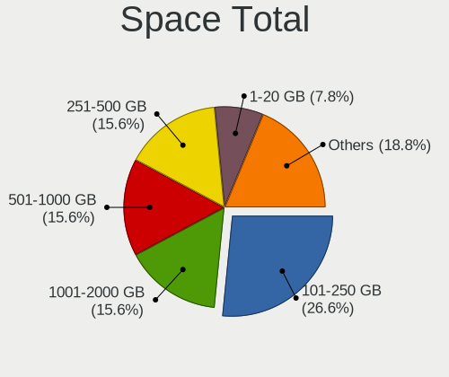
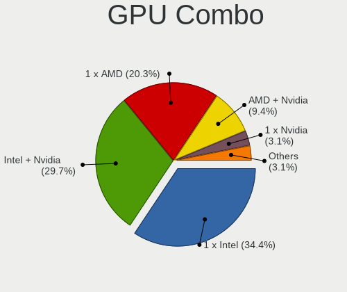
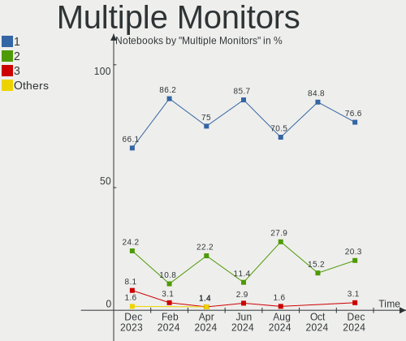

Manjaro Hardware Trends (Notebook)
----------------------------------

A project to identify most popular hardware characteristics and track their change
over time based on data collected by Manjaro users at https://Linux-Hardware.org.

Anyone can contribute to the study by uploading probes of their computers by
the [hw-probe](https://github.com/linuxhw/hw-probe) tool:

    sudo hw-probe -all -upload

Full-feature report is available here: https://linux-hardware.org/?view=trends&formfactor=notebook

Period: Jan, 2020.

Contents
--------

- [ OS                       ](#os)
- [ OS Family                ](#os-family)
- [ Kernel                   ](#kernel)
- [ Kernel Family            ](#kernel-family)
- [ Kernel Major Ver.        ](#kernel-major-ver)
- [ Arch                     ](#arch)
- [ DE                       ](#de)
- [ Display Server           ](#display-server)
- [ OS Lang                  ](#os-lang)
- [ Boot Mode                ](#boot-mode)
- [ Filesystem               ](#filesystem)
- [ Dual Boot with Linux     ](#dual-boot-with-linux)
- [ Dual Boot (Win)          ](#dual-boot-win)
- [ Country                  ](#country)
- [ City                     ](#city)
- [ Vendor                   ](#vendor)
- [ Model                    ](#model)
- [ Model Family             ](#model-family)
- [ MFG Year                 ](#mfg-year)
- [ Form Factor              ](#form-factor)
- [ Secure Boot              ](#secure-boot)
- [ Coreboot                 ](#coreboot)
- [ RAM Size                 ](#ram-size)
- [ RAM Used                 ](#ram-used)
- [ Drive Vendor             ](#drive-vendor)
- [ Drive Model              ](#drive-model)
- [ Drive Kind               ](#drive-kind)
- [ Drive Connector          ](#drive-connector)
- [ Drive Size               ](#drive-size)
- [ Space Total              ](#space-total)
- [ Space Used               ](#space-used)
- [ Malfunc. Drives          ](#malfunc-drives)
- [ Malfunc. Drive Vendor    ](#malfunc-drive-vendor)
- [ Malfunc. Drive Kind      ](#malfunc-drive-kind)
- [ Failed Drives            ](#failed-drives)
- [ Failed Drive Vendor      ](#failed-drive-vendor)
- [ Drive Status             ](#drive-status)
- [ CPU Vendor               ](#cpu-vendor)
- [ CPU Model                ](#cpu-model)
- [ CPU Model Family         ](#cpu-model-family)
- [ CPU Cores                ](#cpu-cores)
- [ CPU Sockets              ](#cpu-sockets)
- [ CPU Threads              ](#cpu-threads)
- [ CPU Op-Modes             ](#cpu-op-modes)
- [ CPU Microarch            ](#cpu-microarch)
- [ CPU Microcode            ](#cpu-microcode)
- [ GPU Vendor               ](#gpu-vendor)
- [ GPU Model                ](#gpu-model)
- [ GPU Combo                ](#gpu-combo)
- [ GPU Driver               ](#gpu-driver)
- [ GPU Memory               ](#gpu-memory)
- [ Monitor Vendor           ](#monitor-vendor)
- [ Monitor Model            ](#monitor-model)
- [ Monitor Resolution       ](#monitor-resolution)
- [ Monitor Diagonal         ](#monitor-diagonal)
- [ Monitor Width            ](#monitor-width)
- [ Aspect Ratio             ](#aspect-ratio)
- [ Monitor Area             ](#monitor-area)
- [ Pixel Density            ](#pixel-density)
- [ Multiple Monitors        ](#multiple-monitors)
- [ Net Controller Vendor    ](#net-controller-vendor)
- [ Net Controller Model     ](#net-controller-model)
- [ Net Controller Kind      ](#net-controller-kind)
- [ Used Controller          ](#used-controller)
- [ NICs                     ](#nics)
- [ Unsupported Devices      ](#unsupported-devices)
- [ Unsupported Device Types ](#unsupported-device-types)

OS
--

Installed operating systems

| Name           | Computers | Percent |
|----------------|-----------|---------|
| Manjaro 18.1.5 | 40        | 70.18%  |
| Manjaro        | 16        | 28.07%  |
| Manjaro 18.1.1 | 1         | 1.75%   |

OS Family
---------

OS without a version

| Name    | Computers | Percent |
|---------|-----------|---------|
| Manjaro | 57        | 100%    |

Kernel
------

Version of the Linux kernel

| Version             | Computers | Percent |
|---------------------|-----------|---------|
| 5.4.6-2-MANJARO     | 18        | 31.58%  |
| 5.4.13-3-MANJARO    | 12        | 21.05%  |
| 5.4.14-2-MANJARO    | 4         | 7.02%   |
| 5.3.18-1-MANJARO    | 4         | 7.02%   |
| 5.5.0-1-MANJARO     | 2         | 3.51%   |
| 5.4.13-2-MANJARO    | 2         | 3.51%   |
| 5.4.12-1-MANJARO    | 2         | 3.51%   |
| 4.19.98-1-MANJARO   | 2         | 3.51%   |
| 4.19.97-1-MANJARO   | 2         | 3.51%   |
| 5.4.2-1-MANJARO     | 1         | 1.75%   |
| 5.4.15-2-MANJARO    | 1         | 1.75%   |
| 5.4.13-1-MANJARO    | 1         | 1.75%   |
| 5.3.6-1-MANJARO     | 1         | 1.75%   |
| 5.2.21-rt15-MANJARO | 1         | 1.75%   |
| 4.19.96-1-MANJARO   | 1         | 1.75%   |
| 4.19.91-1-MANJARO   | 1         | 1.75%   |
| 4.19.88-1-MANJARO   | 1         | 1.75%   |
| 4.19.85-1-MANJARO   | 1         | 1.75%   |

Kernel Family
-------------

Linux kernel without a distro release

| Version | Computers | Percent |
|---------|-----------|---------|
| 5.4.6   | 18        | 31.58%  |
| 5.4.13  | 15        | 26.32%  |
| 5.4.14  | 4         | 7.02%   |
| 5.3.18  | 4         | 7.02%   |
| 5.5.0   | 2         | 3.51%   |
| 5.4.12  | 2         | 3.51%   |
| 4.19.98 | 2         | 3.51%   |
| 4.19.97 | 2         | 3.51%   |
| 5.4.2   | 1         | 1.75%   |
| 5.4.15  | 1         | 1.75%   |
| 5.3.6   | 1         | 1.75%   |
| 5.2.21  | 1         | 1.75%   |
| 4.19.96 | 1         | 1.75%   |
| 4.19.91 | 1         | 1.75%   |
| 4.19.88 | 1         | 1.75%   |
| 4.19.85 | 1         | 1.75%   |

Kernel Major Ver.
-----------------

Linux kernel major version

| Version | Computers | Percent |
|---------|-----------|---------|
| 5.4     | 41        | 71.93%  |
| 4.19    | 8         | 14.04%  |
| 5.3     | 5         | 8.77%   |
| 5.5     | 2         | 3.51%   |
| 5.2     | 1         | 1.75%   |

Arch
----

OS architecture (x86_64, i586, etc.)

| Name   | Computers | Percent |
|--------|-----------|---------|
| x86_64 | 57        | 100%    |

DE
--

Desktop Environment

| Name       | Computers | Percent |
|------------|-----------|---------|
| KDE5       | 17        | 29.82%  |
| XFCE       | 15        | 26.32%  |
| GNOME      | 9         | 15.79%  |
| KDE        | 6         | 10.53%  |
| Cinnamon   | 3         | 5.26%   |
| X-Cinnamon | 2         | 3.51%   |
| Unknown    | 2         | 3.51%   |
| MATE       | 1         | 1.75%   |
| Deepin     | 1         | 1.75%   |
| awesome    | 1         | 1.75%   |

Display Server
--------------

X11 or Wayland

| Name    | Computers | Percent |
|---------|-----------|---------|
| Unknown | 39        | 68.42%  |
| X11     | 16        | 28.07%  |
| Wayland | 2         | 3.51%   |

OS Lang
-------

Language

| Lang       | Computers | Percent |
|------------|-----------|---------|
| en_US      | 24        | 42.11%  |
| en_US.utf8 | 7         | 12.28%  |
| de_DE      | 5         | 8.77%   |
| en_GB      | 4         | 7.02%   |
| en_CA      | 4         | 7.02%   |
| pt_BR.utf8 | 2         | 3.51%   |
| fr_FR      | 2         | 3.51%   |
| de_DE.utf8 | 2         | 3.51%   |
| ru_UA.utf8 | 1         | 1.75%   |
| ru_RU      | 1         | 1.75%   |
| pl_PL      | 1         | 1.75%   |
| en_CA.utf8 | 1         | 1.75%   |
| de_CH      | 1         | 1.75%   |
| de_AT      | 1         | 1.75%   |
| C          | 1         | 1.75%   |

Boot Mode
---------

EFI or BIOS

| Mode | Computers | Percent |
|------|-----------|---------|
| EFI  | 34        | 59.65%  |
| BIOS | 23        | 40.35%  |

Filesystem
----------

Type of filesystem

| Type    | Computers | Percent |
|---------|-----------|---------|
| Ext4    | 50        | 87.72%  |
| Btrfs   | 5         | 8.77%   |
| Xfs     | 1         | 1.75%   |
| Overlay | 1         | 1.75%   |

Dual Boot with Linux
--------------------

Hosting more than one Linux

| Dual boot | Computers | Percent |
|-----------|-----------|---------|
| No        | 47        | 82.46%  |
| Yes       | 10        | 17.54%  |

Dual Boot (Win)
---------------

Hosting Linux and Windows

| Dual boot | Computers | Percent |
|-----------|-----------|---------|
| No        | 40        | 70.18%  |
| Yes       | 17        | 29.82%  |

Country
-------

Geographic location (country)

| Country     | Computers | Percent |
|-------------|-----------|---------|
| Germany     | 8         | 14.04%  |
| USA         | 6         | 10.53%  |
| Canada      | 5         | 8.77%   |
| Russia      | 4         | 7.02%   |
| Austria     | 3         | 5.26%   |
| Spain       | 2         | 3.51%   |
| Portugal    | 2         | 3.51%   |
| Poland      | 2         | 3.51%   |
| Norway      | 2         | 3.51%   |
| Netherlands | 2         | 3.51%   |
| France      | 2         | 3.51%   |
| Brazil      | 2         | 3.51%   |
| Ukraine     | 1         | 1.75%   |
| UK          | 1         | 1.75%   |
| Turkey      | 1         | 1.75%   |
| Switzerland | 1         | 1.75%   |
| Serbia      | 1         | 1.75%   |
| Romania     | 1         | 1.75%   |
| Mexico      | 1         | 1.75%   |
| Lithuania   | 1         | 1.75%   |
| Italy       | 1         | 1.75%   |
| Indonesia   | 1         | 1.75%   |
| Iceland     | 1         | 1.75%   |
| Georgia     | 1         | 1.75%   |
| Finland     | 1         | 1.75%   |
| Egypt       | 1         | 1.75%   |
| Croatia     | 1         | 1.75%   |
| Colombia    | 1         | 1.75%   |
| Belarus     | 1         | 1.75%   |

City
----

Geographic location (city)

| City                | Computers | Percent |
|---------------------|-----------|---------|
| Toronto             | 2         | 3.51%   |
| Ingolstadt          | 2         | 3.51%   |
| Zapopan             | 1         | 1.75%   |
| Zagreb              | 1         | 1.75%   |
| Yekaterinburg       | 1         | 1.75%   |
| Wuppertal           | 1         | 1.75%   |
| Wrocław            | 1         | 1.75%   |
| West Kelowna        | 1         | 1.75%   |
| Warsaw              | 1         | 1.75%   |
| Voronezh            | 1         | 1.75%   |
| Vienna              | 1         | 1.75%   |
| Verdun              | 1         | 1.75%   |
| Utena               | 1         | 1.75%   |
| Turda               | 1         | 1.75%   |
| Tromsø             | 1         | 1.75%   |
| Traismauer          | 1         | 1.75%   |
| Tbilisi             | 1         | 1.75%   |
| Tagelswangen        | 1         | 1.75%   |
| St Petersburg       | 1         | 1.75%   |
| Sloviansk           | 1         | 1.75%   |
| Rusko               | 1         | 1.75%   |
| Pozuelo de Alarcón | 1         | 1.75%   |
| Ottawa              | 1         | 1.75%   |
| Novi Sad            | 1         | 1.75%   |
| Mustang             | 1         | 1.75%   |
| Moscow              | 1         | 1.75%   |
| Minsk               | 1         | 1.75%   |
| Mery-sur-Oise       | 1         | 1.75%   |
| Mersin              | 1         | 1.75%   |
| Mendig              | 1         | 1.75%   |
| Mauthausen          | 1         | 1.75%   |
| Marília            | 1         | 1.75%   |
| Martinsville        | 1         | 1.75%   |
| Lysaker             | 1         | 1.75%   |
| Los Angeles         | 1         | 1.75%   |
| Lisbon              | 1         | 1.75%   |
| Lichtenstein        | 1         | 1.75%   |
| Leipzig             | 1         | 1.75%   |
| La Porte            | 1         | 1.75%   |
| Keflavik            | 1         | 1.75%   |
| Grimaud             | 1         | 1.75%   |
| Frankfurt am Main   | 1         | 1.75%   |
| Fortaleza           | 1         | 1.75%   |
| Exeter              | 1         | 1.75%   |
| Essen               | 1         | 1.75%   |
| Eindhoven           | 1         | 1.75%   |
| Cairo               | 1         | 1.75%   |
| Burlington          | 1         | 1.75%   |
| Buffalo             | 1         | 1.75%   |
| Bologna             | 1         | 1.75%   |
| Bogotá             | 1         | 1.75%   |
| Barcelona           | 1         | 1.75%   |
| Banjarmasin         | 1         | 1.75%   |
| Amsterdam           | 1         | 1.75%   |
| Alverca do Ribatejo | 1         | 1.75%   |

Vendor
------

Motherboard manufacturer

| Name                  | Computers | Percent |
|-----------------------|-----------|---------|
| Lenovo                | 16        | 28.07%  |
| Dell                  | 10        | 17.54%  |
| Hewlett-Packard       | 8         | 14.04%  |
| Acer                  | 7         | 12.28%  |
| ASUSTek Computer      | 3         | 5.26%   |
| MSI                   | 2         | 3.51%   |
| Apple                 | 2         | 3.51%   |
| StationX              | 1         | 1.75%   |
| PC Specialist         | 1         | 1.75%   |
| Multilaser Industrial | 1         | 1.75%   |
| Medion                | 1         | 1.75%   |
| HUAWEI                | 1         | 1.75%   |
| Gigabyte Technology   | 1         | 1.75%   |
| EVGA                  | 1         | 1.75%   |
| Digibras              | 1         | 1.75%   |
| Chuwi                 | 1         | 1.75%   |

Model
-----

Motherboard model

| Name                         | Computers | Percent |
|------------------------------|-----------|---------|
| ZBook 17 G2                  | 1         | 1.75%   |
| Z50-70 20354                 | 1         | 1.75%   |
| Y720-15IKB 80VR              | 1         | 1.75%   |
| Y520-15IKBN 80WK             | 1         | 1.75%   |
| Y50-70 20378                 | 1         | 1.75%   |
| XPS 15 9560                  | 1         | 1.75%   |
| XPS 15 9550                  | 1         | 1.75%   |
| XPS 13 9380                  | 1         | 1.75%   |
| X540SA                       | 1         | 1.75%   |
| WRT-WX9                      | 1         | 1.75%   |
| ThinkPad Yoga 11e 20DAS0SF00 | 1         | 1.75%   |
| ThinkPad T460 20FN002JUS     | 1         | 1.75%   |
| ThinkPad T440s 20AQ0069MZ    | 1         | 1.75%   |
| ThinkPad T430 2349PQ4        | 1         | 1.75%   |
| ThinkPad E480 20KN001QGE     | 1         | 1.75%   |
| Studio 1747                  | 1         | 1.75%   |
| S451LB                       | 1         | 1.75%   |
| ProBook 470 G4               | 1         | 1.75%   |
| Prestige 15 A10SC            | 1         | 1.75%   |
| Pavilion dv8                 | 1         | 1.75%   |
| Pavilion dv6                 | 1         | 1.75%   |
| P35V3                        | 1         | 1.75%   |
| Nitro AN517-51               | 1         | 1.75%   |
| NH4CU03                      | 1         | 1.75%   |
| N2x0WU                       | 1         | 1.75%   |
| MLX11 EDUC                   | 1         | 1.75%   |
| Manjaro Spitfire             | 1         | 1.75%   |
| MacBookPro8,1                | 1         | 1.75%   |
| MacBookPro11,1               | 1         | 1.75%   |
| Latitude E6540               | 1         | 1.75%   |
| Latitude E5530 non-vPro      | 1         | 1.75%   |
| Latitude 3540                | 1         | 1.75%   |
| Laptop 15-db0xxx             | 1         | 1.75%   |
| LapBook SE                   | 1         | 1.75%   |
| K50IJ                        | 1         | 1.75%   |
| Inspiron N5110               | 1         | 1.75%   |
| Inspiron MM061               | 1         | 1.75%   |
| Inspiron 5570                | 1         | 1.75%   |
| IdeaPad S540-14API 81NH      | 1         | 1.75%   |
| IdeaPad 530S-14ARR 81H1      | 1         | 1.75%   |
| IdeaPad 330-15AST 81D6       | 1         | 1.75%   |
| IdeaPad 320-15ABR 80XS       | 1         | 1.75%   |
| GL62 6QD                     | 1         | 1.75%   |
| G505s 20255                  | 1         | 1.75%   |
| G50-80 80L0                  | 1         | 1.75%   |
| EliteBook 850 G6             | 1         | 1.75%   |
| EliteBook 8460p              | 1         | 1.75%   |
| EliteBook 1040 G4            | 1         | 1.75%   |
| E7424 MD60150                | 1         | 1.75%   |
| B570e HuronRiver Platform    | 1         | 1.75%   |
| Aspire V3-772                | 1         | 1.75%   |
| Aspire E5-575G               | 1         | 1.75%   |
| Aspire E5-573                | 1         | 1.75%   |
| Aspire E1-531                | 1         | 1.75%   |
| Aspire A715-71G              | 1         | 1.75%   |
| Aspire A515-43               | 1         | 1.75%   |
| Unknown                      | 1         | 1.75%   |

Model Family
------------

Motherboard model prefix

| Name                        | Computers | Percent |
|-----------------------------|-----------|---------|
| Acer Aspire                 | 6         | 10.53%  |
| Lenovo ThinkPad             | 5         | 8.77%   |
| Lenovo IdeaPad              | 4         | 7.02%   |
| HP EliteBook                | 3         | 5.26%   |
| Dell XPS                    | 3         | 5.26%   |
| Dell Latitude               | 3         | 5.26%   |
| Dell Inspiron               | 3         | 5.26%   |
| HP Pavilion                 | 2         | 3.51%   |
| StationX Manjaro            | 1         | 1.75%   |
| PC Specialist N2x0WU        | 1         | 1.75%   |
| Multilaser Industrial MLX11 | 1         | 1.75%   |
| MSI Prestige                | 1         | 1.75%   |
| MSI GL62                    | 1         | 1.75%   |
| Medion E7424                | 1         | 1.75%   |
| Lenovo Z50-70               | 1         | 1.75%   |
| Lenovo Y720-15IKB           | 1         | 1.75%   |
| Lenovo Y520-15IKBN          | 1         | 1.75%   |
| Lenovo Y50-70               | 1         | 1.75%   |
| Lenovo G505s                | 1         | 1.75%   |
| Lenovo G50-80               | 1         | 1.75%   |
| Lenovo B570e                | 1         | 1.75%   |
| HUAWEI WRT-WX9              | 1         | 1.75%   |
| HP ZBook                    | 1         | 1.75%   |
| HP ProBook                  | 1         | 1.75%   |
| HP Laptop                   | 1         | 1.75%   |
| Gigabyte P35V3              | 1         | 1.75%   |
| Digibras NH4CU03            | 1         | 1.75%   |
| Dell Studio                 | 1         | 1.75%   |
| Chuwi LapBook               | 1         | 1.75%   |
| ASUS X540SA                 | 1         | 1.75%   |
| ASUS S451LB                 | 1         | 1.75%   |
| ASUS K50IJ                  | 1         | 1.75%   |
| Apple MacBookPro8           | 1         | 1.75%   |
| Apple MacBookPro11          | 1         | 1.75%   |
| Acer Nitro                  | 1         | 1.75%   |
| Unknown                     | 1         | 1.75%   |

MFG Year
--------

Motherboard manufacture year

| Year | Computers | Percent |
|------|-----------|---------|
| 2019 | 18        | 31.58%  |
| 2018 | 12        | 21.05%  |
| 2017 | 6         | 10.53%  |
| 2015 | 5         | 8.77%   |
| 2013 | 4         | 7.02%   |
| 2010 | 3         | 5.26%   |
| 2016 | 2         | 3.51%   |
| 2014 | 2         | 3.51%   |
| 2012 | 2         | 3.51%   |
| 2011 | 2         | 3.51%   |
| 2007 | 1         | 1.75%   |

Form Factor
-----------

Physical design of the computer

| Name     | Computers | Percent |
|----------|-----------|---------|
| Notebook | 57        | 100%    |

Secure Boot
-----------

Enabled or disabled

| State    | Computers | Percent |
|----------|-----------|---------|
| Disabled | 47        | 82.46%  |
| Unknown  | 10        | 17.54%  |

Coreboot
--------

Have coreboot on board

| Used | Computers | Percent |
|------|-----------|---------|
| No   | 57        | 100%    |

RAM Size
--------

Total RAM memory

| Size in GB | Computers | Percent |
|------------|-----------|---------|
| 4.01-8.0   | 17        | 29.82%  |
| 16.01-24.0 | 16        | 28.07%  |
| 8.01-16.0  | 11        | 19.3%   |
| 3.01-4.0   | 8         | 14.04%  |
| 32.01-64.0 | 3         | 5.26%   |
| 24.01-32.0 | 1         | 1.75%   |
| 1.01-2.0   | 1         | 1.75%   |

RAM Used
--------

Used RAM memory

| Used GB   | Computers | Percent |
|-----------|-----------|---------|
| 2.01-3.0  | 17        | 29.82%  |
| 1.01-2.0  | 16        | 28.07%  |
| 4.01-8.0  | 12        | 21.05%  |
| 0.01-1.0  | 5         | 8.77%   |
| 3.01-4.0  | 4         | 7.02%   |
| 8.01-16.0 | 3         | 5.26%   |

Drive Vendor
------------

Hard drive vendors

| Vendor              | Computers | Drives  | Percent |
|---------------------|-----------|---------|---------|
| Samsung Electronics | 14        | 16      | 18.18%  |
| WDC                 | 10        | 10      | 12.99%  |
| Seagate             | 9         | 9       | 11.69%  |
| Kingston            | 7         | 8       | 9.09%   |
| Toshiba             | 6         | 7       | 7.79%   |
| Unknown             | 5         | 5       | 6.49%   |
| Crucial             | 5         | 5       | 6.49%   |
| SK Hynix            | 3         | 3       | 3.9%    |
| SanDisk             | 3         | 3       | 3.9%    |
| Intel               | 3         | 3       | 3.9%    |
| HGST                | 2         | 2       | 2.6%    |
| Transcend           | 1         | 1       | 1.3%    |
| sobetter            | 1         | 1       | 1.3%    |
| Micron Technology   | 1         | 1       | 1.3%    |
| LITEON              | 1         | 1       | 1.3%    |
| HL-DT-ST            | 1         | Unknown | 1.3%    |
| Hitachi             | 1         | 1       | 1.3%    |
| Generic             | 1         | 1       | 1.3%    |
| FORESEE             | 1         | 1       | 1.3%    |
| China               | 1         | 1       | 1.3%    |
| Apple               | 1         | 1       | 1.3%    |

Drive Model
-----------

Hard drive models

| Model                            | Computers | Percent |
|----------------------------------|-----------|---------|
| SSD 860 EVO 1TB                  | 2         | 2.47%   |
| SSD 850 EVO 500GB                | 2         | 2.47%   |
| CT240BX500SSD1 240GB             | 2         | 2.47%   |
| xD/SD/M.S.                       | 1         | 1.23%   |
| WDS500G2B0B-00YS70 500GB SSD     | 1         | 1.23%   |
| WDS500G2B0A 500GB SSD            | 1         | 1.23%   |
| WD5000LPVX-22V0TT0 500GB         | 1         | 1.23%   |
| WD3200BPVT-22ZEST0 320GB         | 1         | 1.23%   |
| WD3200BJKT-00F4T0 320GB          | 1         | 1.23%   |
| WD10SPZX-24Z10 1TB               | 1         | 1.23%   |
| WD10SPZX-08Z 1TB                 | 1         | 1.23%   |
| WD10SPCX-24HWST1 1TB             | 1         | 1.23%   |
| WD10JPCX-24UE4T0 1TB             | 1         | 1.23%   |
| Ultra II 240GB SSD               | 1         | 1.23%   |
| TS240GSSD220S 240GB              | 1         | 1.23%   |
| THNSNJ128GCSU 128GB SSD          | 1         | 1.23%   |
| THNSN5512GPUK 512GB              | 1         | 1.23%   |
| SUV500MS480G 480GB SSD           | 1         | 1.23%   |
| ST9320423AS 320GB                | 1         | 1.23%   |
| ST500LT012-1DG142 500GB          | 1         | 1.23%   |
| ST500LM021-1KJ152 500GB          | 1         | 1.23%   |
| ST320LM001 HN-M320MBB 320GB      | 1         | 1.23%   |
| ST2000LX001-1RG174 2TB           | 1         | 1.23%   |
| ST1000LM035-1RK172 1TB           | 1         | 1.23%   |
| ST1000LM024 HN-M 1TB             | 1         | 1.23%   |
| ST1000LM014-SSHD 1TB             | 1         | 1.23%   |
| SSDSC2BW240H6 240GB              | 1         | 1.23%   |
| SSDPEKNW512G8H 512GB             | 1         | 1.23%   |
| SSDPEKKW256G7 256GB              | 1         | 1.23%   |
| SSD SD0128F 121GB                | 1         | 1.23%   |
| SSD PLUS 1000GB                  | 1         | 1.23%   |
| SSD 970 EVO 500GB                | 1         | 1.23%   |
| SSD 860 QVO 1TB                  | 1         | 1.23%   |
| SSD 860 EVO M.2 1TB              | 1         | 1.23%   |
| SSD 860 EVO 500GB                | 1         | 1.23%   |
| SSD 860 500GB                    | 1         | 1.23%   |
| SSD 860 250GB                    | 1         | 1.23%   |
| SSD 850 PRO 1TB                  | 1         | 1.23%   |
| SSD 850 EVO 1TB                  | 1         | 1.23%   |
| SSD 850 500GB                    | 1         | 1.23%   |
| SSD 850 1TB                      | 1         | 1.23%   |
| SLD64G  64GB                     | 1         | 1.23%   |
| SHFS37A240G 240GB SSD            | 1         | 1.23%   |
| SHFS37A120G 120GB SSD            | 1         | 1.23%   |
| SD8SN8U-256G-1006 256GB SSD      | 1         | 1.23%   |
| SC300 2.5 7MM 256GB SSD          | 1         | 1.23%   |
| SATA SSD 120GB                   | 1         | 1.23%   |
| SA400S37480G 480GB SSD           | 1         | 1.23%   |
| SA400S37240G 240GB SSD           | 1         | 1.23%   |
| SA400S37120G 120GB SSD           | 1         | 1.23%   |
| SA400S3 120GB SSD                | 1         | 1.23%   |
| SA400M8120G 120GB SSD            | 1         | 1.23%   |
| SA16G  16GB                      | 1         | 1.23%   |
| S11-128G-PHISON-SSD 128GB        | 1         | 1.23%   |
| PC401 NVMe 512GB                 | 1         | 1.23%   |
| PC SN520 SDAPNUW-128G-1014 128GB | 1         | 1.23%   |
| MZVLW256HEHP-000L2 256GB         | 1         | 1.23%   |
| MZ7TE512HMHP-000L2 512GB SSD     | 1         | 1.23%   |
| MQ01ABF050M 500GB                | 1         | 1.23%   |
| MQ01ABF0 500GB                   | 1         | 1.23%   |

Drive Kind
----------

HDD or SSD

| Kind    | Computers | Drives | Percent |
|---------|-----------|--------|---------|
| SSD     | 35        | 41     | 47.3%   |
| HDD     | 22        | 23     | 29.73%  |
| NVMe    | 10        | 10     | 13.51%  |
| MMC     | 4         | 4      | 5.41%   |
| Unknown | 3         | 2      | 4.05%   |

Drive Connector
---------------

SATA, SAS, NVMe, etc.

| Type | Computers | Drives | Percent |
|------|-----------|--------|---------|
| SATA | 47        | 63     | 72.31%  |
| NVMe | 10        | 10     | 15.38%  |
| SAS  | 4         | 3      | 6.15%   |
| MMC  | 4         | 4      | 6.15%   |

Drive Size
----------

Size of hard drive

| Size in TB | Computers | Drives | Percent |
|------------|-----------|--------|---------|
| 0.01-0.5   | 39        | 55     | 63.93%  |
| 0.51-1.0   | 19        | 22     | 31.15%  |
| 1.01-2.0   | 2         | 2      | 3.28%   |
| 4.01-10.0  | 1         | 1      | 1.64%   |

Space Total
-----------

Amount of disk space available on the file system

| Size in GB     | Computers | Percent |
|----------------|-----------|---------|
| 101-250        | 17        | 29.82%  |
| 501-1000       | 10        | 17.54%  |
| 251-500        | 9         | 15.79%  |
| 1001-2000      | 8         | 14.04%  |
| Unknown        | 5         | 8.77%   |
| 51-100         | 4         | 7.02%   |
| More than 3000 | 2         | 3.51%   |
| 1-20           | 2         | 3.51%   |

Space Used
----------

Amount of used disk space

| Used GB        | Computers | Percent |
|----------------|-----------|---------|
| 101-250        | 12        | 21.05%  |
| 21-50          | 10        | 17.54%  |
| 1-20           | 9         | 15.79%  |
| 251-500        | 7         | 12.28%  |
| 51-100         | 6         | 10.53%  |
| Unknown        | 5         | 8.77%   |
| 501-1000       | 4         | 7.02%   |
| More than 3000 | 2         | 3.51%   |
| 1001-2000      | 2         | 3.51%   |

Malfunc. Drives
---------------

Drive models with a malfunction

| Model                 | Computers | Drives | Percent |
|-----------------------|-----------|--------|---------|
| ST1000LM014-SSHD 1TB  | 1         | 1      | 25%     |
| SSDSC2BW240H6 240GB   | 1         | 1      | 25%     |
| HTS725050A9A364 500GB | 1         | 1      | 25%     |
| CT1000P1SSD8 1TB      | 1         | 1      | 25%     |

Malfunc. Drive Vendor
---------------------

Vendors of faulty drives

| Vendor  | Computers | Drives | Percent |
|---------|-----------|--------|---------|
| Seagate | 1         | 1      | 25%     |
| Intel   | 1         | 1      | 25%     |
| Hitachi | 1         | 1      | 25%     |
| Crucial | 1         | 1      | 25%     |

Malfunc. Drive Kind
-------------------

Kinds of faulty drives

| Kind | Computers | Drives | Percent |
|------|-----------|--------|---------|
| HDD  | 2         | 2      | 50%     |
| NVMe | 1         | 1      | 25%     |
| SSD  | 1         | 1      | 25%     |

Failed Drives
-------------

Failed drive models

Zero info for selected period =(

Failed Drive Vendor
-------------------

Failed drive vendors

Zero info for selected period =(

Drive Status
------------

Number of failed and malfunc. drives

| Status   | Computers | Drives | Percent |
|----------|-----------|--------|---------|
| Detected | 28        | 36     | 46.67%  |
| Works    | 28        | 40     | 46.67%  |
| Malfunc  | 4         | 4      | 6.67%   |

CPU Vendor
----------

Processor vendors

| Vendor | Computers | Percent |
|--------|-----------|---------|
| Intel  | 50        | 87.72%  |
| AMD    | 7         | 12.28%  |

CPU Model
---------

Processor models

| Model                                           | Computers | Percent |
|-------------------------------------------------|-----------|---------|
| Intel Core i7-8565U CPU @ 1.80GHz               | 3         | 5.26%   |
| Intel Core i7-7700HQ CPU @ 2.80GHz              | 2         | 3.51%   |
| Intel Core i7-7500U CPU @ 2.70GHz               | 2         | 3.51%   |
| Intel Core i7-6700HQ CPU @ 2.60GHz              | 2         | 3.51%   |
| Intel Core i7-4500U CPU @ 1.80GHz               | 2         | 3.51%   |
| Intel Core i7 CPU Q 720 @ 1.60GHz               | 2         | 3.51%   |
| Intel Core i5-8250U CPU @ 1.60GHz               | 2         | 3.51%   |
| Intel Core i5-7300HQ CPU @ 2.50GHz              | 2         | 3.51%   |
| Intel Core i5-7200U CPU @ 2.50GHz               | 2         | 3.51%   |
| AMD Ryzen 3 2200U with Radeon Vega Mobile Gfx   | 2         | 3.51%   |
| Intel Pentium CPU N3700 @ 1.60GHz               | 1         | 1.75%   |
| Intel Pentium CPU B960 @ 2.20GHz                | 1         | 1.75%   |
| Intel Core i7-8550U CPU @ 1.80GHz               | 1         | 1.75%   |
| Intel Core i7-6820HK CPU @ 2.70GHz              | 1         | 1.75%   |
| Intel Core i7-4860HQ CPU @ 2.40GHz              | 1         | 1.75%   |
| Intel Core i7-4710MQ CPU @ 2.50GHz              | 1         | 1.75%   |
| Intel Core i7-4710HQ CPU @ 2.50GHz              | 1         | 1.75%   |
| Intel Core i7-4702MQ CPU @ 2.20GHz              | 1         | 1.75%   |
| Intel Core i7-4610M CPU @ 3.00GHz               | 1         | 1.75%   |
| Intel Core i7-4600U CPU @ 2.10GHz               | 1         | 1.75%   |
| Intel Core i7-2630QM CPU @ 2.00GHz              | 1         | 1.75%   |
| Intel Core i7-10710U CPU @ 1.10GHz              | 1         | 1.75%   |
| Intel Core i5-9300H CPU @ 2.40GHz               | 1         | 1.75%   |
| Intel Core i5-6300U CPU @ 2.40GHz               | 1         | 1.75%   |
| Intel Core i5-5200U CPU @ 2.20GHz               | 1         | 1.75%   |
| Intel Core i5-4278U CPU @ 2.60GHz               | 1         | 1.75%   |
| Intel Core i5-4210U CPU @ 1.70GHz               | 1         | 1.75%   |
| Intel Core i5-3320M CPU @ 2.60GHz               | 1         | 1.75%   |
| Intel Core i5-2520M CPU @ 2.50GHz               | 1         | 1.75%   |
| Intel Core i5-2415M CPU @ 2.30GHz               | 1         | 1.75%   |
| Intel Core i5-2410M CPU @ 2.30GHz               | 1         | 1.75%   |
| Intel Core i3-7100U CPU @ 2.40GHz               | 1         | 1.75%   |
| Intel Core i3-4005U CPU @ 1.70GHz               | 1         | 1.75%   |
| Intel Core i3-3217U CPU @ 1.80GHz               | 1         | 1.75%   |
| Intel Core i3-3120M CPU @ 2.50GHz               | 1         | 1.75%   |
| Intel Core 2 Duo CPU T9300 @ 2.50GHz            | 1         | 1.75%   |
| Intel Core 2 CPU T7200 @ 2.00GHz                | 1         | 1.75%   |
| Intel Celeron N4100 CPU @ 1.10GHz               | 1         | 1.75%   |
| Intel Celeron CPU N3350 @ 1.10GHz               | 1         | 1.75%   |
| Intel Celeron CPU N2940 @ 1.83GHz               | 1         | 1.75%   |
| Intel Celeron CPU B820 @ 1.70GHz                | 1         | 1.75%   |
| AMD Ryzen 7 3700U with Radeon Vega Mobile Gfx   | 1         | 1.75%   |
| AMD Ryzen 3 3200U with Radeon Vega Mobile Gfx   | 1         | 1.75%   |
| AMD A8-5550M APU with Radeon HD Graphics        | 1         | 1.75%   |
| AMD A6-9225 RADEON R4, 5 COMPUTE CORES 2C+3G    | 1         | 1.75%   |
| AMD A12-9720P RADEON R7, 12 COMPUTE CORES 4C+8G | 1         | 1.75%   |

CPU Model Family
----------------

Processor model prefix

| Model            | Computers | Percent |
|------------------|-----------|---------|
| Intel Core i7    | 23        | 40.35%  |
| Intel Core i5    | 15        | 26.32%  |
| Intel Core i3    | 4         | 7.02%   |
| Intel Celeron    | 4         | 7.02%   |
| AMD Ryzen 3      | 3         | 5.26%   |
| Intel Pentium    | 2         | 3.51%   |
| Intel Core 2 Duo | 1         | 1.75%   |
| Intel Core 2     | 1         | 1.75%   |
| AMD Ryzen 7      | 1         | 1.75%   |
| AMD A8           | 1         | 1.75%   |
| AMD A6           | 1         | 1.75%   |
| AMD A12          | 1         | 1.75%   |

CPU Cores
---------

Number of processor cores

| Number | Computers | Percent |
|--------|-----------|---------|
| 2      | 31        | 54.39%  |
| 4      | 25        | 43.86%  |
| 6      | 1         | 1.75%   |

CPU Sockets
-----------

Number of sockets

| Number | Computers | Percent |
|--------|-----------|---------|
| 1      | 57        | 100%    |

CPU Threads
-----------

Threads per core (Hyper-Threading)

| Number | Computers | Percent |
|--------|-----------|---------|
| 2      | 46        | 80.7%   |
| 1      | 11        | 19.3%   |

CPU Op-Modes
------------

CPU Operation Modes (32-bit, 64-bit)

| Op mode        | Computers | Percent |
|----------------|-----------|---------|
| 32-bit, 64-bit | 57        | 100%    |

CPU Microarch
-------------

Microarchitecture

| Name          | Computers | Percent |
|---------------|-----------|---------|
| Skylake       | 14        | 24.56%  |
| Haswell       | 11        | 19.3%   |
| SandyBridge   | 6         | 10.53%  |
| KabyLake      | 6         | 10.53%  |
| IvyBridge     | 3         | 5.26%   |
| Zen+          | 2         | 3.51%   |
| Zen           | 2         | 3.51%   |
| Silvermont    | 2         | 3.51%   |
| Nehalem       | 2         | 3.51%   |
| Excavator     | 2         | 3.51%   |
| Piledriver    | 1         | 1.75%   |
| Penryn        | 1         | 1.75%   |
| Goldmont plus | 1         | 1.75%   |
| Goldmont      | 1         | 1.75%   |
| Core          | 1         | 1.75%   |
| CometLake     | 1         | 1.75%   |
| Broadwell     | 1         | 1.75%   |

CPU Microcode
-------------

Microcode number

| Number     | Computers | Percent |
|------------|-----------|---------|
| Unknown    | 21        | 36.84%  |
| 0x906e9    | 4         | 7.02%   |
| 0x806e9    | 4         | 7.02%   |
| 0x40651    | 4         | 7.02%   |
| 0x806ea    | 3         | 5.26%   |
| 0x306c3    | 3         | 5.26%   |
| 0x206a7    | 2         | 3.51%   |
| 0x106e5    | 2         | 3.51%   |
| 0x08108102 | 2         | 3.51%   |
| 0xa0660    | 1         | 1.75%   |
| 0x906ea    | 1         | 1.75%   |
| 0x806eb    | 1         | 1.75%   |
| 0x506e3    | 1         | 1.75%   |
| 0x506c9    | 1         | 1.75%   |
| 0x406e3    | 1         | 1.75%   |
| 0x406c3    | 1         | 1.75%   |
| 0x40661    | 1         | 1.75%   |
| 0x306a9    | 1         | 1.75%   |
| 0x0810100b | 1         | 1.75%   |
| 0x0600611a | 1         | 1.75%   |
| 0x06001119 | 1         | 1.75%   |

GPU Vendor
----------

Vendors of graphics cards

| Vendor | Computers | Percent |
|--------|-----------|---------|
| Intel  | 46        | 58.97%  |
| Nvidia | 19        | 24.36%  |
| AMD    | 13        | 16.67%  |

GPU Model
---------

Graphics card models

| Model                                                                              | Computers | Percent |
|------------------------------------------------------------------------------------|-----------|---------|
| Haswell-ULT Integrated Graphics Controller                                         | 6         | 7.59%   |
| 2nd Generation Core Processor Family Integrated Graphics Controller                | 6         | 7.59%   |
| HD Graphics 620                                                                    | 5         | 6.33%   |
| HD Graphics 630                                                                    | 4         | 5.06%   |
| UHD Graphics 620 (Whiskey Lake)                                                    | 3         | 3.8%    |
| UHD Graphics 620                                                                   | 3         | 3.8%    |
| HD Graphics 530                                                                    | 3         | 3.8%    |
| 4th Gen Core Processor Integrated Graphics Controller                              | 3         | 3.8%    |
| 3rd Gen Core processor Graphics Controller                                         | 3         | 3.8%    |
| Raven Ridge [Radeon Vega Series / Radeon Vega Mobile Series]                       | 2         | 2.53%   |
| Picasso                                                                            | 2         | 2.53%   |
| GP107M [GeForce GTX 1050 Mobile]                                                   | 2         | 2.53%   |
| Whistler [Radeon HD 6730M/6770M/7690M XT]                                          | 1         | 1.27%   |
| Wani [Radeon R5/R6/R7 Graphics]                                                    | 1         | 1.27%   |
| UHD Graphics 630 (Mobile)                                                          | 1         | 1.27%   |
| UHD Graphics 605                                                                   | 1         | 1.27%   |
| UHD Graphics                                                                       | 1         | 1.27%   |
| TU117M [GeForce GTX 1650 Mobile / Max-Q]                                           | 1         | 1.27%   |
| Topaz XT [Radeon R7 M260/M265 / M340/M360 / M440/M445 / 530/535 / 620/625 Mobile]  | 1         | 1.27%   |
| Sun XT [Radeon HD 8670A/8670M/8690M / R5 M330 / M430 / Radeon 520 Mobile]          | 1         | 1.27%   |
| Sun PRO [Radeon HD 8570A/8570M]                                                    | 1         | 1.27%   |
| Stoney [Radeon R2/R3/R4/R5 Graphics]                                               | 1         | 1.27%   |
| Skylake GT2 [HD Graphics 520]                                                      | 1         | 1.27%   |
| RV730/M96 [Mobility Radeon HD 4650/5165]                                           | 1         | 1.27%   |
| RV515/M54 [Mobility Radeon X1400]                                                  | 1         | 1.27%   |
| Richland [Radeon HD 8550G]                                                         | 1         | 1.27%   |
| Mobile 4 Series Chipset Integrated Graphics Controller                             | 1         | 1.27%   |
| Mars XTX [Radeon HD 8790M]                                                         | 1         | 1.27%   |
| HD Graphics 5500                                                                   | 1         | 1.27%   |
| HD Graphics 500                                                                    | 1         | 1.27%   |
| GT216M [GeForce GT 230M]                                                           | 1         | 1.27%   |
| GP108M [GeForce MX150]                                                             | 1         | 1.27%   |
| GP107M [GeForce GTX 1050 Ti Mobile]                                                | 1         | 1.27%   |
| GP107M [GeForce GTX 1050 3 GB Max-Q]                                               | 1         | 1.27%   |
| GP106M [GeForce GTX 1060 Mobile]                                                   | 1         | 1.27%   |
| GM204M [GeForce GTX 980M]                                                          | 1         | 1.27%   |
| GM108M [GeForce 940MX]                                                             | 1         | 1.27%   |
| GM108M [GeForce 930MX]                                                             | 1         | 1.27%   |
| GM108M [GeForce 840M]                                                              | 1         | 1.27%   |
| GM107M [GeForce GTX 960M]                                                          | 1         | 1.27%   |
| GM107M [GeForce GTX 950M]                                                          | 1         | 1.27%   |
| GM107M [GeForce GTX 860M]                                                          | 1         | 1.27%   |
| GK208M [GeForce GT 740M]                                                           | 1         | 1.27%   |
| GK106M [GeForce GTX 760M]                                                          | 1         | 1.27%   |
| GK104GLM [Quadro K3100M]                                                           | 1         | 1.27%   |
| GF108M [GeForce GT 525M]                                                           | 1         | 1.27%   |
| Crystal Well Integrated Graphics Controller                                        | 1         | 1.27%   |
| Atom/Celeron/Pentium Processor x5-E8000/J3xxx/N3xxx Integrated Graphics Controller | 1         | 1.27%   |
| Atom Processor Z36xxx/Z37xxx Series Graphics & Display                             | 1         | 1.27%   |

GPU Combo
---------

Combinations of graphics cards

| Name           | Computers | Percent |
|----------------|-----------|---------|
| 1 x Intel      | 25        | 43.86%  |
| Intel + Nvidia | 17        | 29.82%  |
| 1 x AMD        | 8         | 14.04%  |
| Intel + AMD    | 4         | 7.02%   |
| 1 x Nvidia     | 2         | 3.51%   |
| 2 x AMD        | 1         | 1.75%   |

GPU Driver
----------

Free vs proprietary

| Driver      | Computers | Percent |
|-------------|-----------|---------|
| Free        | 52        | 91.23%  |
| Proprietary | 5         | 8.77%   |

GPU Memory
----------

Total video memory

| Size in GB | Computers | Percent |
|------------|-----------|---------|
| Unknown    | 43        | 75.44%  |
| 0.51-1.0   | 6         | 10.53%  |
| 1.01-2.0   | 4         | 7.02%   |
| 3.01-4.0   | 3         | 5.26%   |
| 0.01-0.5   | 1         | 1.75%   |

Monitor Vendor
--------------

Monitor vendors

| Vendor                  | Computers | Percent |
|-------------------------|-----------|---------|
| Chimei Innolux          | 12        | 17.14%  |
| AU Optronics            | 11        | 15.71%  |
| LG Display              | 8         | 11.43%  |
| BOE                     | 8         | 11.43%  |
| Samsung Electronics     | 6         | 8.57%   |
| Sharp                   | 4         | 5.71%   |
| Dell                    | 3         | 4.29%   |
| Lenovo                  | 2         | 2.86%   |
| Chi Mei Optoelectronics | 2         | 2.86%   |
| Apple                   | 2         | 2.86%   |
| Ancor Communications    | 2         | 2.86%   |
| Sony                    | 1         | 1.43%   |
| Q@L                     | 1         | 1.43%   |
| Philips                 | 1         | 1.43%   |
| Panasonic               | 1         | 1.43%   |
| Medion                  | 1         | 1.43%   |
| Iiyama                  | 1         | 1.43%   |
| Goldstar                | 1         | 1.43%   |
| FF058                   | 1         | 1.43%   |
| CPT                     | 1         | 1.43%   |
| Acer                    | 1         | 1.43%   |

Monitor Model
-------------

Monitor models

| Model                                              | Computers | Percent |
|----------------------------------------------------|-----------|---------|
| LCD Monitor SDC4852 3840x2160 340x190mm 15.3-inch  | 2         | 2.86%   |
| LCD Monitor BOE06C6 1920x1080 344x194mm 15.5-inch  | 2         | 2.86%   |
| LCD Monitor AUO22EC 1366x768 344x193mm 15.5-inch   | 2         | 2.86%   |
| VVX13F009G00 MEI96A2 1920x1080 290x170mm 13.2-inch | 1         | 1.43%   |
| VN279 ACI27A4 1920x1080 597x336mm 27.0-inch        | 1         | 1.43%   |
| U2412M DELA07B 1920x1200 518x324mm 24.1-inch       | 1         | 1.43%   |
| TV SNY5A01 1280x720 1600x900mm 72.3-inch           | 1         | 1.43%   |
| SyncMaster SAM04D5 1920x540                        | 1         | 1.43%   |
| SA270 ACR0580 1920x1080 598x336mm 27.0-inch        | 1         | 1.43%   |
| S24D590 SAM0B47 1920x1080 520x290mm 23.4-inch      | 1         | 1.43%   |
| PLE2483H IVM6113 1920x1080 531x299mm 24.0-inch     | 1         | 1.43%   |
| PHL 272P7V PHL0902 3840x2160 597x336mm 27.0-inch   | 1         | 1.43%   |
| P2411H DELA06E 1920x1080 531x299mm 24.0-inch       | 1         | 1.43%   |
| P130ZDZ-EF1 CMN8201 2160x1440 275x183mm 13.0-inch  | 1         | 1.43%   |
| MD 20122 MED3602 1680x1050 474x296mm 22.0-inch     | 1         | 1.43%   |
| LQ173D1JW31 SHP145E 3840x2160 382x215mm 17.3-inch  | 1         | 1.43%   |
| LQ133M1JW08 SHP1425 1920x1080 294x165mm 13.3-inch  | 1         | 1.43%   |
| LEN L27q-10 LEN65CE 2560x1440 597x336mm 27.0-inch  | 1         | 1.43%   |
| LCD Monitor SHP1453 1920x1080 346x194mm 15.6-inch  | 1         | 1.43%   |
| LCD Monitor SHP143E 3840x2160 346x194mm 15.6-inch  | 1         | 1.43%   |
| LCD Monitor SEC314A 1920x1080 408x230mm 18.4-inch  | 1         | 1.43%   |
| LCD Monitor SDC4652 1366x768 344x194mm 15.5-inch   | 1         | 1.43%   |
| LCD Monitor Q@L0057 1680x1050 330x210mm 15.4-inch  | 1         | 1.43%   |
| LCD Monitor LGD0618 1920x1080 344x194mm 15.5-inch  | 1         | 1.43%   |
| LCD Monitor LGD05EC 1920x1080 309x174mm 14.0-inch  | 1         | 1.43%   |
| LCD Monitor LGD0563 1920x1080 344x194mm 15.5-inch  | 1         | 1.43%   |
| LCD Monitor LGD04A4 1920x1080 309x174mm 14.0-inch  | 1         | 1.43%   |
| LCD Monitor LGD0456 1366x768 344x194mm 15.5-inch   | 1         | 1.43%   |
| LCD Monitor LGD040A 1920x1080 310x170mm 13.9-inch  | 1         | 1.43%   |
| LCD Monitor LGD03B8 1366x768 310x174mm 14.0-inch   | 1         | 1.43%   |
| LCD Monitor LGD033A 1366x768 340x190mm 15.3-inch   | 1         | 1.43%   |
| LCD Monitor L0057 1680x1050 331x207mm 15.4-inch    | 1         | 1.43%   |
| LCD Monitor CPT14BF 1366x768 344x193mm 15.5-inch   | 1         | 1.43%   |
| LCD Monitor CMO15A2 1366x768 344x193mm 15.5-inch   | 1         | 1.43%   |
| LCD Monitor CMO1467 1366x768 309x174mm 14.0-inch   | 1         | 1.43%   |
| LCD Monitor CMN1738 1920x1080 381x214mm 17.2-inch  | 1         | 1.43%   |
| LCD Monitor CMN1735 1920x1080 382x215mm 17.3-inch  | 1         | 1.43%   |
| LCD Monitor CMN15E8 1920x1080 344x193mm 15.5-inch  | 1         | 1.43%   |
| LCD Monitor CMN15DB 1366x768 344x193mm 15.5-inch   | 1         | 1.43%   |
| LCD Monitor CMN15D3 1920x1080 344x193mm 15.5-inch  | 1         | 1.43%   |
| LCD Monitor CMN15D2 1920x1080 340x190mm 15.3-inch  | 1         | 1.43%   |
| LCD Monitor CMN15C5 1366x768 344x193mm 15.5-inch   | 1         | 1.43%   |
| LCD Monitor CMN15A9 1366x768 344x193mm 15.5-inch   | 1         | 1.43%   |
| LCD Monitor CMN14D4 1920x1080 309x173mm 13.9-inch  | 1         | 1.43%   |
| LCD Monitor CMN14C9 1920x1080 309x173mm 13.9-inch  | 1         | 1.43%   |
| LCD Monitor CMN1493 1366x768 310x170mm 13.9-inch   | 1         | 1.43%   |
| LCD Monitor BOE0839 1920x1080 382x215mm 17.3-inch  | 1         | 1.43%   |
| LCD Monitor BOE07B4 1366x768 344x194mm 15.5-inch   | 1         | 1.43%   |
| LCD Monitor BOE06A9 1920x1080 344x193mm 15.5-inch  | 1         | 1.43%   |
| LCD Monitor BOE06A5 1366x768 344x194mm 15.5-inch   | 1         | 1.43%   |
| LCD Monitor BOE066E 1366x768 344x194mm 15.5-inch   | 1         | 1.43%   |
| LCD Monitor BOE05E9 1366x768 256x144mm 11.6-inch   | 1         | 1.43%   |
| LCD Monitor AUO5B2D 1920x1080 293x162mm 13.2-inch  | 1         | 1.43%   |
| LCD Monitor AUO46EC 1366x768 344x193mm 15.5-inch   | 1         | 1.43%   |
| LCD Monitor AUO403D 1920x1080 309x173mm 13.9-inch  | 1         | 1.43%   |
| LCD Monitor AUO37ED 1920x1080 344x193mm 15.5-inch  | 1         | 1.43%   |
| LCD Monitor AUO373D 1920x1080 309x174mm 14.0-inch  | 1         | 1.43%   |
| LCD Monitor AUO219E 1600x900 382x214mm 17.2-inch   | 1         | 1.43%   |
| LCD Monitor AUO219D 1920x1080 381x214mm 17.2-inch  | 1         | 1.43%   |
| LCD Monitor AUO11ED 1920x1080 344x193mm 15.5-inch  | 1         | 1.43%   |

Monitor Resolution
------------------

Monitor screen resolution

| Resolution         | Computers | Percent |
|--------------------|-----------|---------|
| 1920x1080 (FHD)    | 27        | 42.86%  |
| 1366x768 (WXGA)    | 18        | 28.57%  |
| 3840x2160 (4K)     | 5         | 7.94%   |
| 1680x1050 (WSXGA+) | 2         | 3.17%   |
| 1600x900 (HD+)     | 2         | 3.17%   |
| 3000x2000          | 1         | 1.59%   |
| 2560x1600          | 1         | 1.59%   |
| 2560x1440 (QHD)    | 1         | 1.59%   |
| 2160x1440          | 1         | 1.59%   |
| 1920x540           | 1         | 1.59%   |
| 1920x1200 (WUXGA)  | 1         | 1.59%   |
| 1280x800 (WXGA)    | 1         | 1.59%   |
| 1280x720 (HD)      | 1         | 1.59%   |
| 1280x1024 (SXGA)   | 1         | 1.59%   |

Monitor Diagonal
----------------

Diagonal size in inches

| Inches  | Computers | Percent |
|---------|-----------|---------|
| 15      | 29        | 42.03%  |
| 13      | 10        | 14.49%  |
| 17      | 7         | 10.14%  |
| 14      | 6         | 8.7%    |
| 27      | 4         | 5.8%    |
| 24      | 3         | 4.35%   |
| 23      | 3         | 4.35%   |
| 72      | 1         | 1.45%   |
| 22      | 1         | 1.45%   |
| 21      | 1         | 1.45%   |
| 19      | 1         | 1.45%   |
| 18      | 1         | 1.45%   |
| 11      | 1         | 1.45%   |
| Unknown | 1         | 1.45%   |

Monitor Width
-------------

Physical width

| Width in mm | Computers | Percent |
|-------------|-----------|---------|
| 301-350     | 39        | 56.52%  |
| 501-600     | 10        | 14.49%  |
| 351-400     | 8         | 11.59%  |
| 201-300     | 7         | 10.14%  |
| 401-500     | 3         | 4.35%   |
| 1501-2000   | 1         | 1.45%   |
| Unknown     | 1         | 1.45%   |

Aspect Ratio
------------

Proportional relationship between the width and the height

| Ratio | Computers | Percent |
|-------|-----------|---------|
| 16/9  | 49        | 85.96%  |
| 16/10 | 4         | 7.02%   |
| 3/2   | 2         | 3.51%   |
| 5/4   | 1         | 1.75%   |
| 32/9  | 1         | 1.75%   |

Monitor Area
------------

Area in inch²

| Area in inch² | Computers | Percent |
|----------------|-----------|---------|
| 101-110        | 27        | 39.13%  |
| 81-90          | 11        | 15.94%  |
| 201-250        | 7         | 10.14%  |
| 121-130        | 7         | 10.14%  |
| 71-80          | 5         | 7.25%   |
| 301-350        | 4         | 5.8%    |
| 91-100         | 2         | 2.9%    |
| More than 1000 | 1         | 1.45%   |
| 51-60          | 1         | 1.45%   |
| 251-300        | 1         | 1.45%   |
| 151-200        | 1         | 1.45%   |
| 141-150        | 1         | 1.45%   |
| Unknown        | 1         | 1.45%   |

Pixel Density
-------------

Pixels per inch

| Density       | Computers | Percent |
|---------------|-----------|---------|
| 121-160       | 24        | 35.82%  |
| 101-120       | 22        | 32.84%  |
| 51-100        | 9         | 13.43%  |
| More than 240 | 5         | 7.46%   |
| 161-240       | 5         | 7.46%   |
| 1-50          | 1         | 1.49%   |
| Unknown       | 1         | 1.49%   |

Multiple Monitors
-----------------

Total monitors connected

| Total | Computers | Percent |
|-------|-----------|---------|
| 1     | 40        | 70.18%  |
| 2     | 16        | 28.07%  |
| 3     | 1         | 1.75%   |

Net Controller Vendor
---------------------

Controller vendors

| Vendor                            | Computers | Percent |
|-----------------------------------|-----------|---------|
| Intel                             | 8         | 50%     |
| Realtek Semiconductor             | 4         | 25%     |
| Ericsson Business Mobile Networks | 1         | 6.25%   |
| Broadcom Inc. and subsidiaries    | 1         | 6.25%   |
| ASIX Electronics                  | 1         | 6.25%   |
| Apple                             | 1         | 6.25%   |

Net Controller Model
--------------------

Controller models

| Model                                           | Computers | Percent |
|-------------------------------------------------|-----------|---------|
| Wireless 8265 / 8275                            | 3         | 16.67%  |
| Wi-Fi 6 AX200                                   | 2         | 11.11%  |
| RTL8153 Gigabit Ethernet Adapter                | 2         | 11.11%  |
| Centrino Advanced-N 6205 [Taylor Peak]          | 2         | 11.11%  |
| 82579LM Gigabit Network Connection (Lewisville) | 2         | 11.11%  |
| RTL8723DE Wireless Network Adapter              | 1         | 5.56%   |
| RTL8187 Wireless LAN Adapter                    | 1         | 5.56%   |
| N5321 gw                                        | 1         | 5.56%   |
| Ethernet Adapter [A1277]                        | 1         | 5.56%   |
| Centrino Advanced-N 6235                        | 1         | 5.56%   |
| BCM4401-B0 100Base-TX                           | 1         | 5.56%   |
| AX88772B                                        | 1         | 5.56%   |

Net Controller Kind
-------------------

Ethernet, WiFi or modem

| Kind     | Computers | Percent |
|----------|-----------|---------|
| WiFi     | 10        | 55.56%  |
| Ethernet | 7         | 38.89%  |
| Modem    | 1         | 5.56%   |

Used Controller
---------------

Currently used network controller

| Kind     | Computers | Percent |
|----------|-----------|---------|
| WiFi     | 8         | 66.67%  |
| Ethernet | 4         | 33.33%  |

NICs
----

Total network controllers on board

| Total | Computers | Percent |
|-------|-----------|---------|
| 2     | 45        | 78.95%  |
| 1     | 11        | 19.3%   |
| 3     | 1         | 1.75%   |

Unsupported Devices
-------------------

Total unsupported devices on board

| Total | Computers | Percent |
|-------|-----------|---------|
| 0     | 30        | 52.63%  |
| 1     | 24        | 42.11%  |
| 2     | 3         | 5.26%   |

Unsupported Device Types
------------------------

Types of unsupported devices

| Type                  | Computers | Percent |
|-----------------------|-----------|---------|
| Graphics card         | 12        | 40%     |
| Fingerprint reader    | 12        | 40%     |
| Chipcard              | 2         | 6.67%   |
| Storage               | 1         | 3.33%   |
| Net/wireless          | 1         | 3.33%   |
| Multimedia controller | 1         | 3.33%   |
| Camera                | 1         | 3.33%   |

