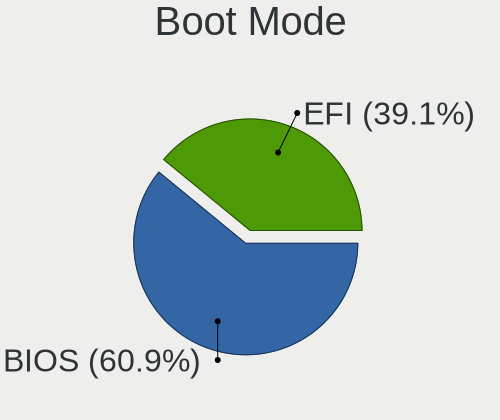
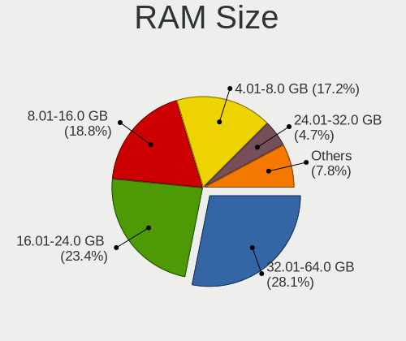
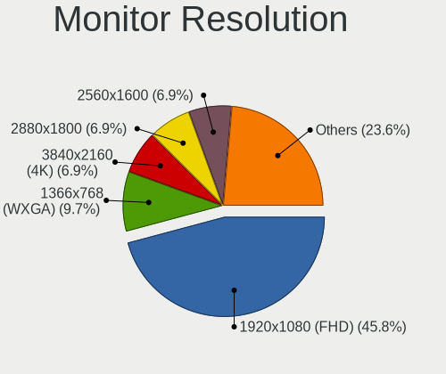

Manjaro Hardware Trends (Notebook)
----------------------------------

A project to identify most popular hardware characteristics and track their change
over time based on data collected by Manjaro users at https://Linux-Hardware.org.

Anyone can contribute to the study by uploading probes of their computers by
the [hw-probe](https://github.com/linuxhw/hw-probe) tool:

    sudo -E hw-probe -all -upload

Full-feature report is available here: https://linux-hardware.org/?view=trends&formfactor=notebook

Period: Nov, 2020.

Contents
--------

- [ OS                       ](#os)
- [ OS Family                ](#os-family)
- [ Kernel                   ](#kernel)
- [ Kernel Family            ](#kernel-family)
- [ Kernel Major Ver.        ](#kernel-major-ver)
- [ Arch                     ](#arch)
- [ DE                       ](#de)
- [ Display Server           ](#display-server)
- [ Display Manager          ](#display-manager)
- [ OS Lang                  ](#os-lang)
- [ Boot Mode                ](#boot-mode)
- [ Filesystem               ](#filesystem)
- [ Part. scheme             ](#part-scheme)
- [ Dual Boot with Linux/BSD ](#dual-boot-with-linux/bsd)
- [ Dual Boot (Win)          ](#dual-boot-win)
- [ Country                  ](#country)
- [ City                     ](#city)
- [ Vendor                   ](#vendor)
- [ Model                    ](#model)
- [ Model Family             ](#model-family)
- [ MFG Year                 ](#mfg-year)
- [ Form Factor              ](#form-factor)
- [ Secure Boot              ](#secure-boot)
- [ Coreboot                 ](#coreboot)
- [ RAM Size                 ](#ram-size)
- [ RAM Used                 ](#ram-used)
- [ Has CD-ROM               ](#has-cd-rom)
- [ Total Drives             ](#total-drives)
- [ Has Ethernet             ](#has-ethernet)
- [ Drive Vendor             ](#drive-vendor)
- [ Drive Model              ](#drive-model)
- [ HDD Vendor               ](#hdd-vendor)
- [ SSD Vendor               ](#ssd-vendor)
- [ Drive Kind               ](#drive-kind)
- [ Drive Connector          ](#drive-connector)
- [ Drive Size               ](#drive-size)
- [ Space Total              ](#space-total)
- [ Space Used               ](#space-used)
- [ Malfunc. Drives          ](#malfunc-drives)
- [ Malfunc. Drive Vendor    ](#malfunc-drive-vendor)
- [ Malfunc. HDD Vendor      ](#malfunc-hdd-vendor)
- [ Malfunc. Drive Kind      ](#malfunc-drive-kind)
- [ Failed Drives            ](#failed-drives)
- [ Failed Drive Vendor      ](#failed-drive-vendor)
- [ Drive Status             ](#drive-status)
- [ Storage Vendor           ](#storage-vendor)
- [ Storage Model            ](#storage-model)
- [ Storage Kind             ](#storage-kind)
- [ CPU Vendor               ](#cpu-vendor)
- [ CPU Model                ](#cpu-model)
- [ CPU Model Family         ](#cpu-model-family)
- [ CPU Cores                ](#cpu-cores)
- [ CPU Sockets              ](#cpu-sockets)
- [ CPU Threads              ](#cpu-threads)
- [ CPU Op-Modes             ](#cpu-op-modes)
- [ CPU Microcode            ](#cpu-microcode)
- [ CPU Microarch            ](#cpu-microarch)
- [ GPU Vendor               ](#gpu-vendor)
- [ GPU Model                ](#gpu-model)
- [ GPU Combo                ](#gpu-combo)
- [ GPU Driver               ](#gpu-driver)
- [ GPU Memory               ](#gpu-memory)
- [ Monitor Vendor           ](#monitor-vendor)
- [ Monitor Model            ](#monitor-model)
- [ Monitor Resolution       ](#monitor-resolution)
- [ Monitor Diagonal         ](#monitor-diagonal)
- [ Monitor Width            ](#monitor-width)
- [ Aspect Ratio             ](#aspect-ratio)
- [ Monitor Area             ](#monitor-area)
- [ Pixel Density            ](#pixel-density)
- [ Multiple Monitors        ](#multiple-monitors)
- [ Net Controller Vendor    ](#net-controller-vendor)
- [ Net Controller Model     ](#net-controller-model)
- [ Wireless Vendor          ](#wireless-vendor)
- [ Wireless Model           ](#wireless-model)
- [ Ethernet Vendor          ](#ethernet-vendor)
- [ Ethernet Model           ](#ethernet-model)
- [ Net Controller Kind      ](#net-controller-kind)
- [ Used Controller          ](#used-controller)
- [ NICs                     ](#nics)
- [ Memory Vendor            ](#memory-vendor)
- [ Memory Model             ](#memory-model)
- [ Memory Kind              ](#memory-kind)
- [ Memory Form Factor       ](#memory-form-factor)
- [ Memory Size              ](#memory-size)
- [ Memory Speed             ](#memory-speed)
- [ Sound Vendor             ](#sound-vendor)
- [ Sound Model              ](#sound-model)
- [ Camera Vendor            ](#camera-vendor)
- [ Camera Model             ](#camera-model)
- [ Fingerprint Vendor       ](#fingerprint-vendor)
- [ Fingerprint Model        ](#fingerprint-model)
- [ Chipcard Vendor          ](#chipcard-vendor)
- [ Chipcard Model           ](#chipcard-model)
- [ Printer Vendor           ](#printer-vendor)
- [ Printer Model            ](#printer-model)
- [ Scanner Vendor           ](#scanner-vendor)
- [ Scanner Model            ](#scanner-model)
- [ Bluetooth Vendor         ](#bluetooth-vendor)
- [ Bluetooth Model          ](#bluetooth-model)
- [ Unsupported Devices      ](#unsupported-devices)
- [ Unsupported Device Types ](#unsupported-device-types)

OS
--

Installed operating systems

| Name             | Notebooks | Percent |
|------------------|-----------|---------|
| Manjaro          | 67        | 47.86%  |
| Manjaro 20.2     | 59        | 42.14%  |
| Manjaro 20.1.2   | 11        | 7.86%   |
| Manjaro 20.2-rc3 | 1         | 0.71%   |
| Manjaro 20.1.1   | 1         | 0.71%   |
| Manjaro 20.1     | 1         | 0.71%   |

OS Family
---------

OS without a version

| Name    | Notebooks | Percent |
|---------|-----------|---------|
| Manjaro | 140       | 100%    |

Kernel
------

Version of the Linux kernel

| Version              | Notebooks | Percent |
|----------------------|-----------|---------|
| 5.8.18-1-MANJARO     | 35        | 25%     |
| 5.9.3-1-MANJARO      | 23        | 16.43%  |
| 5.8.16-2-MANJARO     | 17        | 12.14%  |
| 5.4.74-1-MANJARO     | 11        | 7.86%   |
| 5.9.10-1-MANJARO     | 10        | 7.14%   |
| 5.9.8-2-MANJARO      | 8         | 5.71%   |
| 5.9.1-1-MANJARO      | 7         | 5%      |
| 5.9.11-3-MANJARO     | 3         | 2.14%   |
| 5.8.11-1-MANJARO     | 3         | 2.14%   |
| 5.4.72-1-MANJARO     | 3         | 2.14%   |
| 5.10.0-1-MANJARO     | 3         | 2.14%   |
| 5.7.19-2-MANJARO     | 2         | 1.43%   |
| 5.4.78-1-MANJARO     | 2         | 1.43%   |
| 5.9.9-1-MANJARO      | 1         | 0.71%   |
| 5.9.8-1-MANJARO      | 1         | 0.71%   |
| 5.9.6-1-MANJARO      | 1         | 0.71%   |
| 5.9.3-2-MANJARO      | 1         | 0.71%   |
| 5.9.3-1-ck           | 1         | 0.71%   |
| 5.9.11-2-MANJARO     | 1         | 0.71%   |
| 5.9.1-xanmod1-1      | 1         | 0.71%   |
| 5.9.1-1-rt19-MANJARO | 1         | 0.71%   |
| 5.8.6-1-MANJARO      | 1         | 0.71%   |
| 5.7.17-2-MANJARO     | 1         | 0.71%   |
| 5.4.80-2-MANJARO     | 1         | 0.71%   |
| 5.4.80-1-MANJARO     | 1         | 0.71%   |
| 5.4.77-1-MANJARO     | 1         | 0.71%   |

Kernel Family
-------------

Linux kernel without a distro release

| Version | Notebooks | Percent |
|---------|-----------|---------|
| 5.8.18  | 35        | 25%     |
| 5.9.3   | 25        | 17.86%  |
| 5.8.16  | 17        | 12.14%  |
| 5.4.74  | 11        | 7.86%   |
| 5.9.10  | 10        | 7.14%   |
| 5.9.8   | 9         | 6.43%   |
| 5.9.1   | 9         | 6.43%   |
| 5.9.11  | 4         | 2.86%   |
| 5.8.11  | 3         | 2.14%   |
| 5.4.72  | 3         | 2.14%   |
| 5.10.0  | 3         | 2.14%   |
| 5.7.19  | 2         | 1.43%   |
| 5.4.80  | 2         | 1.43%   |
| 5.4.78  | 2         | 1.43%   |
| 5.9.9   | 1         | 0.71%   |
| 5.9.6   | 1         | 0.71%   |
| 5.8.6   | 1         | 0.71%   |
| 5.7.17  | 1         | 0.71%   |
| 5.4.77  | 1         | 0.71%   |

Kernel Major Ver.
-----------------

Linux kernel major version

| Version | Notebooks | Percent |
|---------|-----------|---------|
| 5.9     | 59        | 42.14%  |
| 5.8     | 56        | 40%     |
| 5.4     | 19        | 13.57%  |
| 5.7     | 3         | 2.14%   |
| 5.10    | 3         | 2.14%   |

Arch
----

OS architecture (x86_64, i586, etc.)

| Name   | Notebooks | Percent |
|--------|-----------|---------|
| x86_64 | 140       | 100%    |

DE
--

Desktop Environment

| Name       | Notebooks | Percent |
|------------|-----------|---------|
| XFCE       | 41        | 29.29%  |
| GNOME      | 37        | 26.43%  |
| KDE5       | 28        | 20%     |
| KDE        | 19        | 13.57%  |
| X-Cinnamon | 5         | 3.57%   |
| MATE       | 2         | 1.43%   |
| i3         | 2         | 1.43%   |
| xinitrc    | 1         | 0.71%   |
| LXQt       | 1         | 0.71%   |
| LXDE       | 1         | 0.71%   |
| Deepin     | 1         | 0.71%   |
| Cinnamon   | 1         | 0.71%   |
| Unknown    | 1         | 0.71%   |

Display Server
--------------

X11 or Wayland

| Name    | Notebooks | Percent |
|---------|-----------|---------|
| X11     | 125       | 89.29%  |
| Wayland | 15        | 10.71%  |

Display Manager
---------------

SDDM, LightDM, etc.

| Name    | Notebooks | Percent |
|---------|-----------|---------|
| Unknown | 66        | 47.14%  |
| SDDM    | 29        | 20.71%  |
| LightDM | 24        | 17.14%  |
| GDM     | 18        | 12.86%  |
| TDM     | 3         | 2.14%   |

OS Lang
-------

Language

| Lang       | Notebooks | Percent |
|------------|-----------|---------|
| en_US      | 45        | 32.14%  |
| en_US.utf8 | 14        | 10%     |
| de_DE      | 11        | 7.86%   |
| ru_RU      | 7         | 5%      |
| en_GB.utf8 | 6         | 4.29%   |
| en_GB      | 6         | 4.29%   |
| fr_FR.utf8 | 5         | 3.57%   |
| de_DE.utf8 | 5         | 3.57%   |
| ru_RU.utf8 | 4         | 2.86%   |
| pt_BR      | 4         | 2.86%   |
| pl_PL      | 3         | 2.14%   |
| it_IT      | 3         | 2.14%   |
| en_CA      | 3         | 2.14%   |
| en_AU      | 2         | 1.43%   |
| zh_CN      | 1         | 0.71%   |
| tr_TR      | 1         | 0.71%   |
| ru_UA      | 1         | 0.71%   |
| pt_PT.utf8 | 1         | 0.71%   |
| pt_BR.utf8 | 1         | 0.71%   |
| pl_PL.utf8 | 1         | 0.71%   |
| ja_JP      | 1         | 0.71%   |
| it_IT.utf8 | 1         | 0.71%   |
| hr_HR      | 1         | 0.71%   |
| fr_FR      | 1         | 0.71%   |
| fr_BE      | 1         | 0.71%   |
| es_MX      | 1         | 0.71%   |
| es_ES.utf8 | 1         | 0.71%   |
| es_ES      | 1         | 0.71%   |
| en_SI      | 1         | 0.71%   |
| en_IN      | 1         | 0.71%   |
| en_DK      | 1         | 0.71%   |
| en_DE      | 1         | 0.71%   |
| el_GR.utf8 | 1         | 0.71%   |
| de_AT      | 1         | 0.71%   |
| da_DK      | 1         | 0.71%   |
| C          | 1         | 0.71%   |

Boot Mode
---------

EFI or BIOS

| Mode | Notebooks | Percent |
|------|-----------|---------|
| BIOS | 76        | 54.29%  |
| EFI  | 64        | 45.71%  |

Filesystem
----------

Type of filesystem

| Type    | Notebooks | Percent |
|---------|-----------|---------|
| Ext4    | 128       | 91.43%  |
| Btrfs   | 7         | 5%      |
| Xfs     | 2         | 1.43%   |
| Overlay | 2         | 1.43%   |
| Unknown | 1         | 0.71%   |

Part. scheme
------------

Scheme of partitioning

| Type    | Notebooks | Percent |
|---------|-----------|---------|
| Unknown | 66        | 47.14%  |
| GPT     | 64        | 45.71%  |
| MBR     | 10        | 7.14%   |

Dual Boot with Linux/BSD
------------------------

Hosting more than one Linux/BSD

| Dual boot | Notebooks | Percent |
|-----------|-----------|---------|
| No        | 129       | 92.14%  |
| Yes       | 11        | 7.86%   |

Dual Boot (Win)
---------------

Hosting Linux and Windows

| Dual boot | Notebooks | Percent |
|-----------|-----------|---------|
| No        | 96        | 68.57%  |
| Yes       | 44        | 31.43%  |

Country
-------

Geographic location (country)

| Country              | Notebooks | Percent |
|----------------------|-----------|---------|
| Germany              | 20        | 14.29%  |
| USA                  | 19        | 13.57%  |
| Russia               | 11        | 7.86%   |
| UK                   | 8         | 5.71%   |
| Brazil               | 8         | 5.71%   |
| France               | 7         | 5%      |
| Poland               | 6         | 4.29%   |
| Italy                | 6         | 4.29%   |
| Spain                | 4         | 2.86%   |
| Canada               | 3         | 2.14%   |
| Austria              | 3         | 2.14%   |
| Australia            | 3         | 2.14%   |
| Ukraine              | 2         | 1.43%   |
| Turkey               | 2         | 1.43%   |
| Sweden               | 2         | 1.43%   |
| Portugal             | 2         | 1.43%   |
| Netherlands          | 2         | 1.43%   |
| Moldova, Republic of | 2         | 1.43%   |
| Lithuania            | 2         | 1.43%   |
| Japan                | 2         | 1.43%   |
| Greece               | 2         | 1.43%   |
| Denmark              | 2         | 1.43%   |
| Croatia              | 2         | 1.43%   |
| China                | 2         | 1.43%   |
| Taiwan               | 1         | 0.71%   |
| Switzerland          | 1         | 0.71%   |
| Slovenia             | 1         | 0.71%   |
| Singapore            | 1         | 0.71%   |
| Romania              | 1         | 0.71%   |
| Reunion              | 1         | 0.71%   |
| New Zealand          | 1         | 0.71%   |
| Mexico               | 1         | 0.71%   |
| Malaysia             | 1         | 0.71%   |
| Latvia               | 1         | 0.71%   |
| Jordan               | 1         | 0.71%   |
| Iran                 | 1         | 0.71%   |
| India                | 1         | 0.71%   |
| Czech Republic       | 1         | 0.71%   |
| Belgium              | 1         | 0.71%   |
| Belarus              | 1         | 0.71%   |
| Bangladesh           | 1         | 0.71%   |
| Albania              | 1         | 0.71%   |

City
----

Geographic location (city)

| City                       | Notebooks | Percent |
|----------------------------|-----------|---------|
| Moscow                     | 4         | 2.86%   |
| Krasnodar                  | 3         | 2.14%   |
| Warsaw                     | 2         | 1.43%   |
| St. Albert                 | 2         | 1.43%   |
| Rome                       | 2         | 1.43%   |
| London                     | 2         | 1.43%   |
| Hamburg                    | 2         | 1.43%   |
| Denver                     | 2         | 1.43%   |
| Cologne                    | 2         | 1.43%   |
| Chisinau                   | 2         | 1.43%   |
| Berlin                     | 2         | 1.43%   |
| Zuilichem                  | 1         | 0.71%   |
| Zaporizhia                 | 1         | 0.71%   |
| Wrocław                   | 1         | 0.71%   |
| Wetschen                   | 1         | 0.71%   |
| West Kelowna               | 1         | 0.71%   |
| West Drayton               | 1         | 0.71%   |
| Walton on Thames           | 1         | 0.71%   |
| Vrhnika                    | 1         | 0.71%   |
| Vilnius                    | 1         | 0.71%   |
| Vienna                     | 1         | 0.71%   |
| Ukhta                      | 1         | 0.71%   |
| Tricesimo                  | 1         | 0.71%   |
| Tortona                    | 1         | 0.71%   |
| Toluca                     | 1         | 0.71%   |
| Tirana                     | 1         | 0.71%   |
| Thessaloniki               | 1         | 0.71%   |
| São Paulo                 | 1         | 0.71%   |
| Sulzbach                   | 1         | 0.71%   |
| Stuttgart                  | 1         | 0.71%   |
| St Petersburg              | 1         | 0.71%   |
| Springfield                | 1         | 0.71%   |
| Sorocaba                   | 1         | 0.71%   |
| Solotvyn                   | 1         | 0.71%   |
| Solihull                   | 1         | 0.71%   |
| Singapore                  | 1         | 0.71%   |
| Shenzhen                   | 1         | 0.71%   |
| Shahre Jadide Andisheh     | 1         | 0.71%   |
| Seattle                    | 1         | 0.71%   |
| Schwäbisch Gmünd         | 1         | 0.71%   |
| Sao Domingos de Rana       | 1         | 0.71%   |
| San Carlo-Condofuri Marina | 1         | 0.71%   |
| Salvador                   | 1         | 0.71%   |
| Sacele                     | 1         | 0.71%   |
| Rzeszów                   | 1         | 0.71%   |
| Rouen                      | 1         | 0.71%   |
| Ronde                      | 1         | 0.71%   |
| Rocky Ford                 | 1         | 0.71%   |
| Rijeka                     | 1         | 0.71%   |
| Richmond                   | 1         | 0.71%   |
| Prague                     | 1         | 0.71%   |
| Plymouth                   | 1         | 0.71%   |
| Plouzane                   | 1         | 0.71%   |
| Piacenza                   | 1         | 0.71%   |
| Paris                      | 1         | 0.71%   |
| Padova                     | 1         | 0.71%   |
| Paderborn                  | 1         | 0.71%   |
| Othis                      | 1         | 0.71%   |
| Orihuela                   | 1         | 0.71%   |
| Northcote                  | 1         | 0.71%   |

Vendor
------

Motherboard manufacturer

| Name                | Notebooks | Percent |
|---------------------|-----------|---------|
| Lenovo              | 33        | 23.57%  |
| Hewlett-Packard     | 23        | 16.43%  |
| Dell                | 22        | 15.71%  |
| ASUSTek Computer    | 19        | 13.57%  |
| Acer                | 9         | 6.43%   |
| Apple               | 7         | 5%      |
| MSI                 | 5         | 3.57%   |
| Toshiba             | 3         | 2.14%   |
| TUXEDO              | 2         | 1.43%   |
| System76            | 2         | 1.43%   |
| Sony                | 1         | 0.71%   |
| Samsung Electronics | 1         | 0.71%   |
| Panasonic           | 1         | 0.71%   |
| Notebook            | 1         | 0.71%   |
| MouseComputer       | 1         | 0.71%   |
| Monster             | 1         | 0.71%   |
| HASEE Computer      | 1         | 0.71%   |
| Google              | 1         | 0.71%   |
| Gigabyte Technology | 1         | 0.71%   |
| Fujitsu             | 1         | 0.71%   |
| Dream Machines      | 1         | 0.71%   |
| Clevo               | 1         | 0.71%   |
| Alienware           | 1         | 0.71%   |
| Aftershock          | 1         | 0.71%   |
| Unknown             | 1         | 0.71%   |

Model
-----

Motherboard model

| Name                                                  | Notebooks | Percent |
|-------------------------------------------------------|-----------|---------|
| Dell XPS 13 9310                                      | 4         | 2.86%   |
| Lenovo Y520-15IKBN 80WK                               | 2         | 1.43%   |
| Lenovo Legion 5 15ARH05 82B5                          | 2         | 1.43%   |
| Lenovo G580 20150                                     | 2         | 1.43%   |
| HP EliteBook 855 G7 Notebook PC                       | 2         | 1.43%   |
| HP 14                                                 | 2         | 1.43%   |
| Apple MacBookPro15,1                                  | 2         | 1.43%   |
| Unknown                                               | 2         | 1.43%   |
| TUXEDO N7x0WU                                         | 1         | 0.71%   |
| Toshiba Satellite C655                                | 1         | 0.71%   |
| Toshiba Satellite C55D-B                              | 1         | 0.71%   |
| Toshiba PORTEGE Z20t-B                                | 1         | 0.71%   |
| System76 Serval WS                                    | 1         | 0.71%   |
| System76 Oryx Pro                                     | 1         | 0.71%   |
| Sony VPCEH38FN_W                                      | 1         | 0.71%   |
| Samsung 300E5EV/300E4EV/270E5EV/270E4EV/2470EV/2470EE | 1         | 0.71%   |
| Panasonic CF-SX1GDHYS                                 | 1         | 0.71%   |
| Notebook N24_25BU                                     | 1         | 0.71%   |
| MSI Modern 14 A10RAS                                  | 1         | 0.71%   |
| MSI GS66 Stealth 10SE                                 | 1         | 0.71%   |
| MSI GS65 Stealth Thin 8RF                             | 1         | 0.71%   |
| MSI GL63 8RC                                          | 1         | 0.71%   |
| MSI GF65 Thin 9SE                                     | 1         | 0.71%   |
| MouseComputer N252JU                                  | 1         | 0.71%   |
| Monster ABRA A5 V1                                    | 1         | 0.71%   |
| Lenovo Z710 20250                                     | 1         | 0.71%   |
| Lenovo Z50-70 20354                                   | 1         | 0.71%   |
| Lenovo ThinkPad X1 Carbon 4th 20FC000RAU              | 1         | 0.71%   |
| Lenovo ThinkPad W541 20EFS01B09                       | 1         | 0.71%   |
| Lenovo ThinkPad T460p 20FWA023CD                      | 1         | 0.71%   |
| Lenovo ThinkPad T430s 23563F0                         | 1         | 0.71%   |
| Lenovo ThinkPad SL510 28479XU                         | 1         | 0.71%   |
| Lenovo ThinkPad P51 20HHS1D000                        | 1         | 0.71%   |
| Lenovo ThinkPad P51 20HHCTO1WW                        | 1         | 0.71%   |
| Lenovo ThinkPad L480 20LTS6VS00                       | 1         | 0.71%   |
| Lenovo ThinkPad L440 20ASS0QF00                       | 1         | 0.71%   |
| Lenovo ThinkPad E590 20NB005MUS                       | 1         | 0.71%   |
| Lenovo ThinkPad E15 Gen 2 20T8000TGE                  | 1         | 0.71%   |
| Lenovo ThinkPad E15 20RD003HMZ                        | 1         | 0.71%   |
| Lenovo ThinkPad E14 Gen 2 20T7S00W00                  | 1         | 0.71%   |
| Lenovo ThinkPad E14 Gen 2 20T6000RSC                  | 1         | 0.71%   |
| Lenovo Legion 5 82B5                                  | 1         | 0.71%   |
| Lenovo IdeaPad Z570 HuronRiver Platform               | 1         | 0.71%   |
| Lenovo IdeaPad S540-14API 81NH                        | 1         | 0.71%   |
| Lenovo IdeaPad 520-15IKB 81BF                         | 1         | 0.71%   |
| Lenovo IdeaPad 330S-15ARR 81FB                        | 1         | 0.71%   |
| Lenovo IdeaPad 330-15IKB 81DE                         | 1         | 0.71%   |
| Lenovo IdeaPad 330-15AST 81D6                         | 1         | 0.71%   |
| Lenovo IdeaPad 110-15IBR 80T7                         | 1         | 0.71%   |
| Lenovo IdeaPad 100-15IBD 80QQ                         | 1         | 0.71%   |
| Lenovo G50-30 80G0                                    | 1         | 0.71%   |
| Lenovo E5                                             | 1         | 0.71%   |
| HP ZBook Studio G5                                    | 1         | 0.71%   |
| HP ProBook 6460b                                      | 1         | 0.71%   |
| HP ProBook 470 G5                                     | 1         | 0.71%   |
| HP Pavilion Laptop 15-cw0xxx                          | 1         | 0.71%   |
| HP Pavilion Gaming Laptop 16-a0xxx                    | 1         | 0.71%   |
| HP Pavilion Gaming Laptop 15-ec0xxx                   | 1         | 0.71%   |
| HP Pavilion Gaming Laptop 15-dk1xxx                   | 1         | 0.71%   |
| HP Pavilion dv6                                       | 1         | 0.71%   |

Model Family
------------

Motherboard model prefix

| Name                  | Notebooks | Percent |
|-----------------------|-----------|---------|
| Lenovo ThinkPad       | 14        | 10%     |
| Lenovo IdeaPad        | 8         | 5.71%   |
| HP Pavilion           | 8         | 5.71%   |
| Dell XPS              | 6         | 4.29%   |
| Acer Aspire           | 6         | 4.29%   |
| Dell Latitude         | 4         | 2.86%   |
| Dell Inspiron         | 4         | 2.86%   |
| Lenovo Legion         | 3         | 2.14%   |
| HP EliteBook          | 3         | 2.14%   |
| Dell Precision        | 3         | 2.14%   |
| Toshiba Satellite     | 2         | 1.43%   |
| Lenovo Y520-15IKBN    | 2         | 1.43%   |
| Lenovo G580           | 2         | 1.43%   |
| HP ProBook            | 2         | 1.43%   |
| HP Compaq             | 2         | 1.43%   |
| HP 14                 | 2         | 1.43%   |
| Dell G3               | 2         | 1.43%   |
| ASUS ZenBook          | 2         | 1.43%   |
| ASUS VivoBook         | 2         | 1.43%   |
| ASUS TUF              | 2         | 1.43%   |
| Apple MacBookPro15    | 2         | 1.43%   |
| Acer Swift            | 2         | 1.43%   |
| Unknown               | 2         | 1.43%   |
| TUXEDO N7x0WU         | 1         | 0.71%   |
| Toshiba PORTEGE       | 1         | 0.71%   |
| System76 Serval       | 1         | 0.71%   |
| System76 Oryx         | 1         | 0.71%   |
| Sony VPCEH38FN        | 1         | 0.71%   |
| Samsung 300E5EV       | 1         | 0.71%   |
| Panasonic CF-SX1GDHYS | 1         | 0.71%   |
| Notebook N24          | 1         | 0.71%   |
| MSI Modern            | 1         | 0.71%   |
| MSI GS66              | 1         | 0.71%   |
| MSI GS65              | 1         | 0.71%   |
| MSI GL63              | 1         | 0.71%   |
| MSI GF65              | 1         | 0.71%   |
| MouseComputer N252JU  | 1         | 0.71%   |
| Monster ABRA          | 1         | 0.71%   |
| Lenovo Z710           | 1         | 0.71%   |
| Lenovo Z50-70         | 1         | 0.71%   |
| Lenovo G50-30         | 1         | 0.71%   |
| Lenovo E5             | 1         | 0.71%   |
| HP ZBook              | 1         | 0.71%   |
| HP Laptop             | 1         | 0.71%   |
| HP 625                | 1         | 0.71%   |
| HP 350                | 1         | 0.71%   |
| HP 250                | 1         | 0.71%   |
| HP 15                 | 1         | 0.71%   |
| HASEE QTH6            | 1         | 0.71%   |
| Google Ekko           | 1         | 0.71%   |
| Gigabyte AERO         | 1         | 0.71%   |
| Fujitsu LIFEBOOK      | 1         | 0.71%   |
| Dream Machines N85    | 1         | 0.71%   |
| Dell Vostro           | 1         | 0.71%   |
| Dell Studio           | 1         | 0.71%   |
| Dell G7               | 1         | 0.71%   |
| Clevo W150HRM         | 1         | 0.71%   |
| ASUS Zephyrus         | 1         | 0.71%   |
| ASUS X580VD           | 1         | 0.71%   |
| ASUS X555LJ           | 1         | 0.71%   |

MFG Year
--------

Motherboard manufacture year

| Year | Notebooks | Percent |
|------|-----------|---------|
| 2020 | 47        | 33.57%  |
| 2019 | 26        | 18.57%  |
| 2018 | 15        | 10.71%  |
| 2014 | 8         | 5.71%   |
| 2013 | 8         | 5.71%   |
| 2017 | 7         | 5%      |
| 2015 | 7         | 5%      |
| 2011 | 7         | 5%      |
| 2012 | 5         | 3.57%   |
| 2016 | 4         | 2.86%   |
| 2010 | 2         | 1.43%   |
| 2009 | 2         | 1.43%   |
| 2008 | 1         | 0.71%   |
| 2007 | 1         | 0.71%   |

Form Factor
-----------

Physical design of the computer

| Name     | Notebooks | Percent |
|----------|-----------|---------|
| Notebook | 140       | 100%    |

Secure Boot
-----------

Enabled or disabled

| State    | Notebooks | Percent |
|----------|-----------|---------|
| Disabled | 139       | 99.29%  |
| Enabled  | 1         | 0.71%   |

Coreboot
--------

Have coreboot on board

| Used | Notebooks | Percent |
|------|-----------|---------|
| No   | 138       | 98.57%  |
| Yes  | 2         | 1.43%   |

RAM Size
--------

Total RAM memory

| Size in GB  | Notebooks | Percent |
|-------------|-----------|---------|
| 16.01-24.0  | 40        | 28.57%  |
| 4.01-8.0    | 38        | 27.14%  |
| 8.01-16.0   | 29        | 20.71%  |
| 3.01-4.0    | 16        | 11.43%  |
| 32.01-64.0  | 11        | 7.86%   |
| 1.01-2.0    | 3         | 2.14%   |
| 64.01-256.0 | 2         | 1.43%   |
| 24.01-32.0  | 1         | 0.71%   |

RAM Used
--------

Used RAM memory

| Used GB    | Notebooks | Percent |
|------------|-----------|---------|
| 1.01-2.0   | 43        | 30.71%  |
| 2.01-3.0   | 39        | 27.86%  |
| 4.01-8.0   | 30        | 21.43%  |
| 3.01-4.0   | 18        | 12.86%  |
| 0.01-1.0   | 6         | 4.29%   |
| 8.01-16.0  | 3         | 2.14%   |
| 16.01-24.0 | 1         | 0.71%   |

Has CD-ROM
----------

Has CD-ROM on board

| Presented | Notebooks | Percent |
|-----------|-----------|---------|
| No        | 99        | 70.71%  |
| Yes       | 41        | 29.29%  |

Total Drives
------------

Number of drives on board

| Drives | Notebooks | Percent |
|--------|-----------|---------|
| 1      | 83        | 59.29%  |
| 2      | 50        | 35.71%  |
| 3      | 7         | 5%      |

Has Ethernet
------------

Has Ethernet on board

| Presented | Notebooks | Percent |
|-----------|-----------|---------|
| Yes       | 122       | 87.14%  |
| No        | 18        | 12.86%  |

Drive Vendor
------------

Hard drive vendors

| Vendor                    | Notebooks | Drives | Percent |
|---------------------------|-----------|--------|---------|
| Seagate                   | 36        | 37     | 18.95%  |
| Samsung Electronics       | 36        | 42     | 18.95%  |
| WDC                       | 24        | 26     | 12.63%  |
| Toshiba                   | 13        | 13     | 6.84%   |
| Sandisk                   | 10        | 11     | 5.26%   |
| Kingston                  | 10        | 10     | 5.26%   |
| Crucial                   | 6         | 6      | 3.16%   |
| Intel                     | 5         | 6      | 2.63%   |
| Unknown                   | 4         | 4      | 2.11%   |
| SK Hynix                  | 4         | 4      | 2.11%   |
| Hitachi                   | 4         | 4      | 2.11%   |
| HGST                      | 4         | 4      | 2.11%   |
| Apple                     | 4         | 4      | 2.11%   |
| A-DATA Technology         | 4         | 4      | 2.11%   |
| Phison                    | 2         | 2      | 1.05%   |
| Micron/Crucial Technology | 2         | 2      | 1.05%   |
| Micron Technology         | 2         | 2      | 1.05%   |
| LITEON                    | 2         | 2      | 1.05%   |
| China                     | 2         | 2      | 1.05%   |
| Transcend                 | 1         | 1      | 0.53%   |
| Reeinno                   | 1         | 1      | 0.53%   |
| PNY                       | 1         | 1      | 0.53%   |
| PLEXTOR                   | 1         | 1      | 0.53%   |
| Pioneer                   | 1         | 1      | 0.53%   |
| OWC                       | 1         | 2      | 0.53%   |
| KingSpec                  | 1         | 1      | 0.53%   |
| Kingchuxing               | 1         | 1      | 0.53%   |
| KINGBANK                  | 1         | 1      | 0.53%   |
| JMicron                   | 1         | 1      | 0.53%   |
| GOODRAM                   | 1         | 1      | 0.53%   |
| Emtec                     | 1         | 1      | 0.53%   |
| Drevo                     | 1         | 1      | 0.53%   |
| Corsair                   | 1         | 1      | 0.53%   |
| ADATA Technology          | 1         | 1      | 0.53%   |
| ACCLAMATOR                | 1         | 1      | 0.53%   |

Drive Model
-----------

Hard drive models

| Model                                | Notebooks | Percent |
|--------------------------------------|-----------|---------|
| Seagate ST1000LM035-1RK172 1TB       | 8         | 4.04%   |
| Samsung NVMe SSD Drive 512GB         | 7         | 3.54%   |
| Seagate Expansion 1TB                | 4         | 2.02%   |
| Toshiba MQ01ABD100 1TB               | 3         | 1.52%   |
| Seagate ST9500325AS 500GB            | 3         | 1.52%   |
| Sandisk NVMe SSD Drive 1024GB        | 3         | 1.52%   |
| Intel NVMe SSD Drive 512GB           | 3         | 1.52%   |
| HGST HTS721010A9E630 1TB             | 3         | 1.52%   |
| Crucial CT1000MX500SSD1 1TB          | 3         | 1.52%   |
| WDC PC SN730 SDBPNTY-1T00-1032 1TB   | 2         | 1.01%   |
| Seagate ST500LT012-9WS142 500GB      | 2         | 1.01%   |
| Seagate ST500LM000-1EJ162 500GB      | 2         | 1.01%   |
| Seagate ST1000LM024 HN-M101MBB 1TB   | 2         | 1.01%   |
| Sandisk NVMe SSD Drive 512GB         | 2         | 1.01%   |
| Samsung SSD 850 EVO M.2 250GB        | 2         | 1.01%   |
| Samsung SSD 850 EVO 500GB            | 2         | 1.01%   |
| Samsung NVMe SSD Drive 250GB         | 2         | 1.01%   |
| Samsung MZNLN128HAHQ-000H1 128GB SSD | 2         | 1.01%   |
| Micron/Crucial NVMe SSD Drive 1TB    | 2         | 1.01%   |
| Kingston SA400S37240G 240GB SSD      | 2         | 1.01%   |
| Kingston SA400S37120G 120GB SSD      | 2         | 1.01%   |
| Kingston NVMe SSD Drive 512GB        | 2         | 1.01%   |
| Apple SSD AP0512M 500GB              | 2         | 1.01%   |
| A-DATA SU800NS38 256GB SSD           | 2         | 1.01%   |
| WDC WDS500G2B0C-00PXH0 500GB         | 1         | 0.51%   |
| WDC WDS500G2B0A-00SM50 500GB SSD     | 1         | 0.51%   |
| WDC WDS500G1B0A-00H9H0 500GB SSD     | 1         | 0.51%   |
| WDC WDS250G3X0C-00SJG0 250GB         | 1         | 0.51%   |
| WDC WDS250G2B0A-00SM50 250GB SSD     | 1         | 0.51%   |
| WDC WDS240G2G0B-00EPW0 240GB SSD     | 1         | 0.51%   |
| WDC WDS100T2B0C-00PXH0 1TB           | 1         | 0.51%   |
| WDC WDBNCE5000PNC-WRSN 500GB SSD     | 1         | 0.51%   |
| WDC WDBNCE0010PNC 1TB SSD            | 1         | 0.51%   |
| WDC WD7500BPVT-22HXZT1 752GB         | 1         | 0.51%   |
| WDC WD7500BPKX-80HPJT0 752GB         | 1         | 0.51%   |
| WDC WD7500BPKX-00HPJT0 752GB         | 1         | 0.51%   |
| WDC WD5000LPCX-24VHAT0 500GB         | 1         | 0.51%   |
| WDC WD3200BPVT-75JJ5T0 320GB         | 1         | 0.51%   |
| WDC WD32 00BEVT-22A23T0 320GB        | 1         | 0.51%   |
| WDC WD1600BEKT-60A25T1 160GB         | 1         | 0.51%   |
| WDC WD10SPZX-75Z10T2 1TB             | 1         | 0.51%   |
| WDC WD10JPVX-75JC3T0 1TB             | 1         | 0.51%   |
| WDC WD10JPVX-22JC3T0 1TB             | 1         | 0.51%   |
| WDC WD10JPVX-00JC3T0 1TB             | 1         | 0.51%   |
| WDC PC SN530 SDBPMPZ-512G-1001 512GB | 1         | 0.51%   |
| WDC PC SN520 SDAPNUW-512G-1006 512GB | 1         | 0.51%   |
| WDC PC SN520 SDAPNUW-256G-1014 256GB | 1         | 0.51%   |
| Unknown SD/MMC/MS PRO 128GB          | 1         | 0.51%   |
| Unknown DA4128  128GB                | 1         | 0.51%   |
| Unknown CSSD-S6M256CG3VZ 256GB       | 1         | 0.51%   |
| Unknown ASP550SS7-240GM-MI-B 240GB   | 1         | 0.51%   |
| Transcend TS128GSSD370S 128GB        | 1         | 0.51%   |
| Toshiba THNSNJ512GCSU 512GB SSD      | 1         | 0.51%   |
| Toshiba THNSNJ256GVNU 256GB SSD      | 1         | 0.51%   |
| Toshiba NVMe SSD Drive 512GB         | 1         | 0.51%   |
| Toshiba NVMe SSD Drive 1024GB        | 1         | 0.51%   |
| Toshiba MQ04ABF100 1TB               | 1         | 0.51%   |
| Toshiba MQ01ACF050 500GB             | 1         | 0.51%   |
| Toshiba MQ01ABF050 500GB             | 1         | 0.51%   |
| Toshiba MQ01ABD050 500GB             | 1         | 0.51%   |

HDD Vendor
----------

Hard disk drive vendors

| Vendor              | Notebooks | Drives | Percent |
|---------------------|-----------|--------|---------|
| Seagate             | 36        | 36     | 56.25%  |
| WDC                 | 11        | 12     | 17.19%  |
| Toshiba             | 7         | 7      | 10.94%  |
| Hitachi             | 4         | 4      | 6.25%   |
| HGST                | 4         | 4      | 6.25%   |
| Samsung Electronics | 1         | 1      | 1.56%   |
| Apple               | 1         | 1      | 1.56%   |

SSD Vendor
----------

Solid state drive vendors

| Vendor              | Notebooks | Drives | Percent |
|---------------------|-----------|--------|---------|
| Samsung Electronics | 16        | 18     | 24.62%  |
| WDC                 | 6         | 6      | 9.23%   |
| Kingston            | 6         | 6      | 9.23%   |
| SanDisk             | 5         | 6      | 7.69%   |
| Crucial             | 5         | 5      | 7.69%   |
| A-DATA Technology   | 4         | 4      | 6.15%   |
| Toshiba             | 2         | 2      | 3.08%   |
| SK Hynix            | 2         | 2      | 3.08%   |
| LITEON              | 2         | 2      | 3.08%   |
| China               | 2         | 2      | 3.08%   |
| Unknown             | 1         | 1      | 1.54%   |
| Transcend           | 1         | 1      | 1.54%   |
| Reeinno             | 1         | 1      | 1.54%   |
| PNY                 | 1         | 1      | 1.54%   |
| PLEXTOR             | 1         | 1      | 1.54%   |
| Pioneer             | 1         | 1      | 1.54%   |
| OWC                 | 1         | 2      | 1.54%   |
| Micron Technology   | 1         | 1      | 1.54%   |
| Kingchuxing         | 1         | 1      | 1.54%   |
| Intel               | 1         | 1      | 1.54%   |
| GOODRAM             | 1         | 1      | 1.54%   |
| Emtec               | 1         | 1      | 1.54%   |
| Corsair             | 1         | 1      | 1.54%   |
| Apple               | 1         | 1      | 1.54%   |
| ACCLAMATOR          | 1         | 1      | 1.54%   |

Drive Kind
----------

HDD or SSD

| Kind    | Notebooks | Drives | Percent |
|---------|-----------|--------|---------|
| SSD     | 62        | 69     | 33.88%  |
| HDD     | 61        | 65     | 33.33%  |
| NVMe    | 53        | 60     | 28.96%  |
| Unknown | 6         | 7      | 3.28%   |
| MMC     | 1         | 1      | 0.55%   |

Drive Connector
---------------

SATA, SAS, NVMe, etc.

| Type | Notebooks | Drives | Percent |
|------|-----------|--------|---------|
| SATA | 97        | 131    | 60.63%  |
| NVMe | 53        | 60     | 33.13%  |
| SAS  | 9         | 10     | 5.63%   |
| MMC  | 1         | 1      | 0.63%   |

Drive Size
----------

Size of hard drive

| Size in TB | Notebooks | Drives | Percent |
|------------|-----------|--------|---------|
| 0.01-0.5   | 73        | 85     | 61.86%  |
| 0.51-1.0   | 41        | 45     | 34.75%  |
| 3.01-4.0   | 2         | 2      | 1.69%   |
| 1.01-2.0   | 2         | 2      | 1.69%   |

Space Total
-----------

Amount of disk space available on the file system

| Size in GB     | Notebooks | Percent |
|----------------|-----------|---------|
| 251-500        | 41        | 29.29%  |
| 101-250        | 35        | 25%     |
| 501-1000       | 22        | 15.71%  |
| 1001-2000      | 16        | 11.43%  |
| 51-100         | 6         | 4.29%   |
| Unknown        | 6         | 4.29%   |
| 21-50          | 5         | 3.57%   |
| More than 3000 | 3         | 2.14%   |
| 2001-3000      | 3         | 2.14%   |
| 1-20           | 3         | 2.14%   |

Space Used
----------

Amount of used disk space

| Used GB   | Notebooks | Percent |
|-----------|-----------|---------|
| 1-20      | 35        | 25%     |
| 21-50     | 28        | 20%     |
| 51-100    | 22        | 15.71%  |
| 501-1000  | 16        | 11.43%  |
| 101-250   | 14        | 10%     |
| 251-500   | 13        | 9.29%   |
| Unknown   | 6         | 4.29%   |
| 1001-2000 | 5         | 3.57%   |
| 2001-3000 | 1         | 0.71%   |

Malfunc. Drives
---------------

Drive models with a malfunction

| Model                           | Notebooks | Drives | Percent |
|---------------------------------|-----------|--------|---------|
| Seagate ST1000LM035-1RK172 1TB  | 2         | 2      | 40%     |
| Seagate ST95005620AS 500GB      | 1         | 1      | 20%     |
| Seagate ST9500325AS 500GB       | 1         | 1      | 20%     |
| Seagate ST500LT012-9WS142 500GB | 1         | 1      | 20%     |

Malfunc. Drive Vendor
---------------------

Vendors of faulty drives

| Vendor  | Notebooks | Drives | Percent |
|---------|-----------|--------|---------|
| Seagate | 5         | 5      | 100%    |

Malfunc. HDD Vendor
-------------------

Vendors of faulty HDD drives

| Vendor  | Notebooks | Drives | Percent |
|---------|-----------|--------|---------|
| Seagate | 5         | 5      | 100%    |

Malfunc. Drive Kind
-------------------

Kinds of faulty drives

| Kind | Notebooks | Drives | Percent |
|------|-----------|--------|---------|
| HDD  | 5         | 5      | 100%    |

Failed Drives
-------------

Failed drive models

Zero info for selected period =(

Failed Drive Vendor
-------------------

Failed drive vendors

Zero info for selected period =(

Drive Status
------------

Number of failed and malfunc. drives

| Status   | Notebooks | Drives | Percent |
|----------|-----------|--------|---------|
| Detected | 88        | 122    | 60.27%  |
| Works    | 53        | 75     | 36.3%   |
| Malfunc  | 5         | 5      | 3.42%   |

Storage Vendor
--------------

Storage controller vendors

| Vendor                       | Notebooks | Percent |
|------------------------------|-----------|---------|
| Intel                        | 100       | 58.14%  |
| Samsung Electronics          | 21        | 12.21%  |
| AMD                          | 17        | 9.88%   |
| Sandisk                      | 13        | 7.56%   |
| Kingston Technology Company  | 4         | 2.33%   |
| Toshiba America Info Systems | 3         | 1.74%   |
| Micron/Crucial Technology    | 3         | 1.74%   |
| SK Hynix                     | 2         | 1.16%   |
| Phison Electronics           | 2         | 1.16%   |
| Nvidia                       | 2         | 1.16%   |
| Apple                        | 2         | 1.16%   |
| Micron Technology            | 1         | 0.58%   |
| KIOXIA                       | 1         | 0.58%   |
| ADATA Technology             | 1         | 0.58%   |

Storage Model
-------------

Storage controller models

| Model                                                                            | Notebooks | Percent |
|----------------------------------------------------------------------------------|-----------|---------|
| AMD FCH SATA Controller [AHCI mode]                                              | 14        | 7.87%   |
| Samsung Electronics NVMe SSD Controller SM981/PM981/PM983                        | 13        | 7.3%    |
| Intel 6 Series/C200 Series Chipset Family 6 port Mobile SATA AHCI Controller     | 13        | 7.3%    |
| Intel 82801 Mobile SATA Controller [RAID mode]                                   | 12        | 6.74%   |
| Intel HM170/QM170 Chipset SATA Controller [AHCI Mode]                            | 10        | 5.62%   |
| Intel Cannon Lake Mobile PCH SATA AHCI Controller                                | 10        | 5.62%   |
| Intel Sunrise Point-LP SATA Controller [AHCI mode]                               | 9         | 5.06%   |
| Intel 7 Series Chipset Family 6-port SATA Controller [AHCI mode]                 | 8         | 4.49%   |
| Intel 8 Series/C220 Series Chipset Family 6-port SATA Controller 1 [AHCI mode]   | 7         | 3.93%   |
| Sandisk WD Black 2019/PC SN750 NVMe SSD                                          | 6         | 3.37%   |
| Samsung Electronics Electronics Non-Volatile memory controller                   | 5         | 2.81%   |
| Intel Wildcat Point-LP SATA Controller [AHCI Mode]                               | 5         | 2.81%   |
| Intel 8 Series SATA Controller 1 [AHCI mode]                                     | 5         | 2.81%   |
| Samsung Electronics NVMe SSD Controller SM961/PM961                              | 3         | 1.69%   |
| Micron/Crucial Technology P1 NVMe PCIe SSD                                       | 3         | 1.69%   |
| Intel Comet Lake SATA AHCI Controller                                            | 3         | 1.69%   |
| Intel 82801IBM/IEM (ICH9M/ICH9M-E) 4 port SATA Controller [AHCI mode]            | 3         | 1.69%   |
| Toshiba America Info Systems Toshiba America Info Non-Volatile memory controller | 2         | 1.12%   |
| Sandisk WD Blue SN550 NVMe SSD                                                   | 2         | 1.12%   |
| Sandisk WD Black 2018 / PC SN520 NVMe SSD                                        | 2         | 1.12%   |
| Phison Electronics E12 NVMe Controller                                           | 2         | 1.12%   |
| Nvidia MCP79 AHCI Controller                                                     | 2         | 1.12%   |
| Kingston Technology Company Non-Volatile memory controller                       | 2         | 1.12%   |
| Kingston Technology Company A2000 NVMe SSD                                       | 2         | 1.12%   |
| Intel SSD 660P Series                                                            | 2         | 1.12%   |
| Intel Cannon Point-LP SATA Controller [AHCI Mode]                                | 2         | 1.12%   |
| Intel Atom Processor E3800 Series SATA AHCI Controller                           | 2         | 1.12%   |
| Intel 82801IBM/IEM (ICH9M/ICH9M-E) 2 port SATA Controller [IDE mode]             | 2         | 1.12%   |
| Apple ANS2 NVMe Controller                                                       | 2         | 1.12%   |
| AMD SB7x0/SB8x0/SB9x0 SATA Controller [IDE mode]                                 | 2         | 1.12%   |
| Toshiba America Info Systems BG3 NVMe SSD Controller                             | 1         | 0.56%   |
| SK Hynix Non-Volatile memory controller                                          | 1         | 0.56%   |
| SK Hynix BC501 NVMe Solid State Drive 512GB                                      | 1         | 0.56%   |
| Sandisk WD Black 2018 / PC SN720 NVMe SSD                                        | 1         | 0.56%   |
| Sandisk PC SN520 NVMe SSD                                                        | 1         | 0.56%   |
| Sandisk Non-Volatile memory controller                                           | 1         | 0.56%   |
| Micron Technology Non-Volatile memory controller                                 | 1         | 0.56%   |
| KIOXIA Non-Volatile memory controller                                            | 1         | 0.56%   |
| Intel SSD Pro 7600p/760p/E 6100p Series                                          | 1         | 0.56%   |
| Intel SATA controller                                                            | 1         | 0.56%   |
| Intel Q170/Q150/B150/H170/H110/Z170/CM236 Chipset SATA Controller [AHCI Mode]    | 1         | 0.56%   |
| Intel Non-Volatile memory controller                                             | 1         | 0.56%   |
| Intel Ice Lake-LP SATA Controller [AHCI mode]                                    | 1         | 0.56%   |
| Intel Atom/Celeron/Pentium Processor x5-E8000/J3xxx/N3xxx Series SATA Controller | 1         | 0.56%   |
| Intel 82801HM/HEM (ICH8M/ICH8M-E) SATA Controller [AHCI mode]                    | 1         | 0.56%   |
| Intel 7 Series Chipset Family 4-port SATA Controller [IDE mode]                  | 1         | 0.56%   |
| Intel 7 Series Chipset Family 2-port SATA Controller [IDE mode]                  | 1         | 0.56%   |
| Intel 400 Series Chipset Family SATA AHCI Controller                             | 1         | 0.56%   |
| AMD SB600 Non-Raid-5 SATA                                                        | 1         | 0.56%   |
| AMD SB600 IDE                                                                    | 1         | 0.56%   |
| AMD FCH IDE Controller                                                           | 1         | 0.56%   |
| AMD 400 Series Chipset SATA Controller                                           | 1         | 0.56%   |
| ADATA Technology Non-Volatile memory controller                                  | 1         | 0.56%   |

Storage Kind
------------

Kind of storage controller (IDE, SATA, NVMe, SAS, ...)

| Kind | Notebooks | Percent |
|------|-----------|---------|
| SATA | 102       | 59.3%   |
| NVMe | 53        | 30.81%  |
| RAID | 12        | 6.98%   |
| IDE  | 5         | 2.91%   |

CPU Vendor
----------

Processor vendors

| Vendor | Notebooks | Percent |
|--------|-----------|---------|
| Intel  | 114       | 81.43%  |
| AMD    | 26        | 18.57%  |

CPU Model
---------

Processor models

| Model                                         | Notebooks | Percent |
|-----------------------------------------------|-----------|---------|
| Intel Core i7-6700HQ CPU @ 2.60GHz            | 6         | 4.29%   |
| Intel Core i5-8250U CPU @ 1.60GHz             | 6         | 4.29%   |
| Intel Core i7-9750H CPU @ 2.60GHz             | 5         | 3.57%   |
| Intel Core i7-7700HQ CPU @ 2.80GHz            | 4         | 2.86%   |
| Intel Core i7-10510U CPU @ 1.80GHz            | 4         | 2.86%   |
| Intel 11th Gen Core i7-1165G7 @ 2.80GHz       | 4         | 2.86%   |
| Intel Core i7-8850H CPU @ 2.60GHz             | 3         | 2.14%   |
| Intel Core i7-8750H CPU @ 2.20GHz             | 3         | 2.14%   |
| Intel Core i7-3610QM CPU @ 2.30GHz            | 3         | 2.14%   |
| Intel Core i5-8300H CPU @ 2.30GHz             | 3         | 2.14%   |
| Intel Core i5-2410M CPU @ 2.30GHz             | 3         | 2.14%   |
| AMD Ryzen 7 3750H with Radeon Vega Mobile Gfx | 3         | 2.14%   |
| AMD Ryzen 5 4500U with Radeon Graphics        | 3         | 2.14%   |
| Intel Core i7-1065G7 CPU @ 1.30GHz            | 2         | 1.43%   |
| Intel Core i5-8265U CPU @ 1.60GHz             | 2         | 1.43%   |
| Intel Core i5-7300HQ CPU @ 2.50GHz            | 2         | 1.43%   |
| Intel Core i5-5200U CPU @ 2.20GHz             | 2         | 1.43%   |
| Intel Core i5-4300M CPU @ 2.60GHz             | 2         | 1.43%   |
| Intel Core i5-4210U CPU @ 1.70GHz             | 2         | 1.43%   |
| Intel Core i5-2520M CPU @ 2.50GHz             | 2         | 1.43%   |
| Intel Core i5-10300H CPU @ 2.50GHz            | 2         | 1.43%   |
| Intel Core i3-5005U CPU @ 2.00GHz             | 2         | 1.43%   |
| AMD Ryzen 7 3700U with Radeon Vega Mobile Gfx | 2         | 1.43%   |
| AMD Ryzen 5 4600H with Radeon Graphics        | 2         | 1.43%   |
| AMD Ryzen 5 2500U with Radeon Vega Mobile Gfx | 2         | 1.43%   |
| Intel Pentium Silver N5000 CPU @ 1.10GHz      | 1         | 0.71%   |
| Intel Pentium Dual-Core CPU T4500 @ 2.30GHz   | 1         | 0.71%   |
| Intel Pentium CPU B960 @ 2.20GHz              | 1         | 0.71%   |
| Intel Pentium CPU 2020M @ 2.40GHz             | 1         | 0.71%   |
| Intel Core M-5Y51 CPU @ 1.10GHz               | 1         | 0.71%   |
| Intel Core i9-8950HK CPU @ 2.90GHz            | 1         | 0.71%   |
| Intel Core i7-8565U CPU @ 1.80GHz             | 1         | 0.71%   |
| Intel Core i7-8550U CPU @ 1.80GHz             | 1         | 0.71%   |
| Intel Core i7-7820HQ CPU @ 2.90GHz            | 1         | 0.71%   |
| Intel Core i7-7500U CPU @ 2.70GHz             | 1         | 0.71%   |
| Intel Core i7-6500U CPU @ 2.50GHz             | 1         | 0.71%   |
| Intel Core i7-4980HQ CPU @ 2.80GHz            | 1         | 0.71%   |
| Intel Core i7-4810MQ CPU @ 2.80GHz            | 1         | 0.71%   |
| Intel Core i7-4710MQ CPU @ 2.50GHz            | 1         | 0.71%   |
| Intel Core i7-4702HQ CPU @ 2.20GHz            | 1         | 0.71%   |
| Intel Core i7-4700MQ CPU @ 2.40GHz            | 1         | 0.71%   |
| Intel Core i7-4700HQ CPU @ 2.40GHz            | 1         | 0.71%   |
| Intel Core i7-4510U CPU @ 2.00GHz             | 1         | 0.71%   |
| Intel Core i7-3720QM CPU @ 2.60GHz            | 1         | 0.71%   |
| Intel Core i7-3632QM CPU @ 2.20GHz            | 1         | 0.71%   |
| Intel Core i7-3630QM CPU @ 2.40GHz            | 1         | 0.71%   |
| Intel Core i7-2720QM CPU @ 2.20GHz            | 1         | 0.71%   |
| Intel Core i7-2620M CPU @ 2.70GHz             | 1         | 0.71%   |
| Intel Core i7-10875H CPU @ 2.30GHz            | 1         | 0.71%   |
| Intel Core i7-10750H CPU @ 2.60GHz            | 1         | 0.71%   |
| Intel Core i5-9300H CPU @ 2.40GHz             | 1         | 0.71%   |
| Intel Core i5-8400H CPU @ 2.50GHz             | 1         | 0.71%   |
| Intel Core i5-6300U CPU @ 2.40GHz             | 1         | 0.71%   |
| Intel Core i5-4200U CPU @ 1.60GHz             | 1         | 0.71%   |
| Intel Core i5-3337U CPU @ 1.80GHz             | 1         | 0.71%   |
| Intel Core i5-3320M CPU @ 2.60GHz             | 1         | 0.71%   |
| Intel Core i5-2540M CPU @ 2.60GHz             | 1         | 0.71%   |
| Intel Core i5-2467M CPU @ 1.60GHz             | 1         | 0.71%   |
| Intel Core i5-2450M CPU @ 2.50GHz             | 1         | 0.71%   |
| Intel Core i5-10210U CPU @ 1.60GHz            | 1         | 0.71%   |

CPU Model Family
----------------

Processor model prefix

| Model                   | Notebooks | Percent |
|-------------------------|-----------|---------|
| Intel Core i7           | 49        | 35%     |
| Intel Core i5           | 36        | 25.71%  |
| Intel Core i3           | 8         | 5.71%   |
| AMD Ryzen 7             | 8         | 5.71%   |
| AMD Ryzen 5             | 8         | 5.71%   |
| Intel Core 2 Duo        | 7         | 5%      |
| Other                   | 4         | 2.86%   |
| Intel Celeron           | 4         | 2.86%   |
| Intel Pentium           | 2         | 1.43%   |
| AMD A8                  | 2         | 1.43%   |
| Intel Pentium Silver    | 1         | 0.71%   |
| Intel Pentium Dual-Core | 1         | 0.71%   |
| Intel Core M            | 1         | 0.71%   |
| Intel Core i9           | 1         | 0.71%   |
| AMD V120                | 1         | 0.71%   |
| AMD Turion 64 X2 Mobile | 1         | 0.71%   |
| AMD Ryzen 7 PRO         | 1         | 0.71%   |
| AMD Ryzen 5 PRO         | 1         | 0.71%   |
| AMD Ryzen 3             | 1         | 0.71%   |
| AMD Athlon X2           | 1         | 0.71%   |
| AMD A6                  | 1         | 0.71%   |
| AMD A4                  | 1         | 0.71%   |

CPU Cores
---------

Number of processor cores

| Number | Notebooks | Percent |
|--------|-----------|---------|
| 4      | 65        | 46.43%  |
| 2      | 49        | 35%     |
| 6      | 19        | 13.57%  |
| 8      | 5         | 3.57%   |
| 1      | 2         | 1.43%   |

CPU Sockets
-----------

Number of sockets

| Number | Notebooks | Percent |
|--------|-----------|---------|
| 1      | 140       | 100%    |

CPU Threads
-----------

Threads per core (Hyper-Threading)

| Number | Notebooks | Percent |
|--------|-----------|---------|
| 2      | 113       | 80.71%  |
| 1      | 27        | 19.29%  |

CPU Op-Modes
------------

CPU Operation Modes (32-bit, 64-bit)

| Op mode        | Notebooks | Percent |
|----------------|-----------|---------|
| 32-bit, 64-bit | 140       | 100%    |

CPU Microcode
-------------

Microcode number

| Number     | Notebooks | Percent |
|------------|-----------|---------|
| Unknown    | 70        | 50%     |
| 0x906ea    | 12        | 8.57%   |
| 0x08600103 | 7         | 5%      |
| 0x306a9    | 6         | 4.29%   |
| 0x806ea    | 5         | 3.57%   |
| 0x206a7    | 5         | 3.57%   |
| 0x506e3    | 4         | 2.86%   |
| 0xa0652    | 3         | 2.14%   |
| 0x306d4    | 3         | 2.14%   |
| 0x10676    | 3         | 2.14%   |
| 0x08108102 | 3         | 2.14%   |
| 0x706e5    | 2         | 1.43%   |
| 0x40651    | 2         | 1.43%   |
| 0x306c3    | 2         | 1.43%   |
| 0x30678    | 2         | 1.43%   |
| 0x906e9    | 1         | 0.71%   |
| 0x806ec    | 1         | 0.71%   |
| 0x806eb    | 1         | 0.71%   |
| 0x806e9    | 1         | 0.71%   |
| 0x706a1    | 1         | 0.71%   |
| 0x406e3    | 1         | 0.71%   |
| 0x08701013 | 1         | 0.71%   |
| 0x08600106 | 1         | 0.71%   |
| 0x08108109 | 1         | 0.71%   |
| 0x02000057 | 1         | 0.71%   |
| 0x010000c8 | 1         | 0.71%   |

CPU Microarch
-------------

Microarchitecture

| Name            | Notebooks | Percent |
|-----------------|-----------|---------|
| KabyLake        | 42        | 30%     |
| SandyBridge     | 14        | 10%     |
| Haswell         | 13        | 9.29%   |
| Zen 2           | 10        | 7.14%   |
| IvyBridge       | 10        | 7.14%   |
| Skylake         | 8         | 5.71%   |
| Penryn          | 8         | 5.71%   |
| Zen+            | 7         | 5%      |
| Broadwell       | 5         | 3.57%   |
| TigerLake       | 4         | 2.86%   |
| CometLake       | 4         | 2.86%   |
| Silvermont      | 3         | 2.14%   |
| Zen             | 2         | 1.43%   |
| IceLake         | 2         | 1.43%   |
| Puma            | 1         | 0.71%   |
| Piledriver      | 1         | 0.71%   |
| K8 Hammer       | 1         | 0.71%   |
| K8 & K10 hybrid | 1         | 0.71%   |
| K10 Llano       | 1         | 0.71%   |
| K10             | 1         | 0.71%   |
| Goldmont plus   | 1         | 0.71%   |
| Excavator       | 1         | 0.71%   |

GPU Vendor
----------

Vendors of graphics cards

| Vendor | Notebooks | Percent |
|--------|-----------|---------|
| Intel  | 103       | 50.49%  |
| Nvidia | 71        | 34.8%   |
| AMD    | 30        | 14.71%  |

GPU Model
---------

Graphics card models

| Model                                                                     | Notebooks | Percent |
|---------------------------------------------------------------------------|-----------|---------|
| Intel UHD Graphics 630 (Mobile)                                           | 15        | 7.21%   |
| Intel 2nd Generation Core Processor Family Integrated Graphics Controller | 12        | 5.77%   |
| Intel 3rd Gen Core processor Graphics Controller                          | 10        | 4.81%   |
| Intel UHD Graphics                                                        | 9         | 4.33%   |
| AMD Renoir                                                                | 9         | 4.33%   |
| Intel UHD Graphics 620                                                    | 8         | 3.85%   |
| AMD Picasso                                                               | 7         | 3.37%   |
| Intel HD Graphics 630                                                     | 6         | 2.88%   |
| Intel 4th Gen Core Processor Integrated Graphics Controller               | 6         | 2.88%   |
| Nvidia GP107M [GeForce GTX 1050 Ti Mobile]                                | 5         | 2.4%    |
| Nvidia GP107M [GeForce GTX 1050 Mobile]                                   | 5         | 2.4%    |
| Intel HD Graphics 530                                                     | 5         | 2.4%    |
| Intel Haswell-ULT Integrated Graphics Controller                          | 5         | 2.4%    |
| Nvidia TU117M [GeForce GTX 1650 Mobile / Max-Q]                           | 4         | 1.92%   |
| Nvidia TU106M [GeForce RTX 2060 Mobile]                                   | 4         | 1.92%   |
| Nvidia GF117M [GeForce 610M/710M/810M/820M / GT 620M/625M/630M/720M]      | 4         | 1.92%   |
| Intel Mobile 4 Series Chipset Integrated Graphics Controller              | 4         | 1.92%   |
| Intel Iris Xe Graphics                                                    | 4         | 1.92%   |
| Intel HD Graphics 5500                                                    | 4         | 1.92%   |
| Intel UHD Graphics 620 (Whiskey Lake)                                     | 3         | 1.44%   |
| AMD Baffin [Radeon RX 460/560D / Pro 450/455/460/555/555X/560/560X]       | 3         | 1.44%   |
| Nvidia TU117M [GeForce GTX 1650 Ti Mobile]                                | 2         | 0.96%   |
| Nvidia TU117M                                                             | 2         | 0.96%   |
| Nvidia TU116M [GeForce GTX 1660 Ti Mobile]                                | 2         | 0.96%   |
| Nvidia GP108M [GeForce MX230]                                             | 2         | 0.96%   |
| Nvidia GP108M [GeForce MX150]                                             | 2         | 0.96%   |
| Nvidia GM107M [GeForce GTX 950M]                                          | 2         | 0.96%   |
| Nvidia GF108M [GeForce GT 540M]                                           | 2         | 0.96%   |
| Nvidia G96CM [GeForce 9600M GT]                                           | 2         | 0.96%   |
| Intel Skylake GT2 [HD Graphics 520]                                       | 2         | 0.96%   |
| Intel Iris Plus Graphics G7                                               | 2         | 0.96%   |
| Intel HD Graphics 620                                                     | 2         | 0.96%   |
| Intel Atom Processor Z36xxx/Z37xxx Series Graphics & Display              | 2         | 0.96%   |
| AMD Raven Ridge [Radeon Vega Series / Radeon Vega Mobile Series]          | 2         | 0.96%   |
| AMD Lexa [Radeon 540X/550X/630 / RX 640 / E9171 MCM]                      | 2         | 0.96%   |
| Nvidia TU106M [GeForce RTX 2070 Mobile / Max-Q Refresh]                   | 1         | 0.48%   |
| Nvidia GP108M [GeForce MX330]                                             | 1         | 0.48%   |
| Nvidia GP108BM [GeForce MX250]                                            | 1         | 0.48%   |
| Nvidia GP107M [GeForce MX350]                                             | 1         | 0.48%   |
| Nvidia GP107GLM [Quadro P600 Mobile]                                      | 1         | 0.48%   |
| Nvidia GP107GLM [Quadro P2000 Mobile]                                     | 1         | 0.48%   |
| Nvidia GP107GLM [Quadro P1000 Mobile]                                     | 1         | 0.48%   |
| Nvidia GP106M [GeForce GTX 1060 Mobile]                                   | 1         | 0.48%   |
| Nvidia GP104M [GeForce GTX 1070 Mobile]                                   | 1         | 0.48%   |
| Nvidia GM206M [GeForce GTX 965M]                                          | 1         | 0.48%   |
| Nvidia GM206GLM [Quadro M2200 Mobile]                                     | 1         | 0.48%   |
| Nvidia GM204M [GeForce GTX 970M]                                          | 1         | 0.48%   |
| Nvidia GM108M [GeForce MX110]                                             | 1         | 0.48%   |
| Nvidia GM108M [GeForce 940MX]                                             | 1         | 0.48%   |
| Nvidia GM108M [GeForce 930MX]                                             | 1         | 0.48%   |
| Nvidia GM108M [GeForce 920MX]                                             | 1         | 0.48%   |
| Nvidia GM107M [GeForce GTX 960M]                                          | 1         | 0.48%   |
| Nvidia GM107M [GeForce GTX 860M]                                          | 1         | 0.48%   |
| Nvidia GM107GLM [Quadro M1200 Mobile]                                     | 1         | 0.48%   |
| Nvidia GK208M [GeForce GT 740M]                                           | 1         | 0.48%   |
| Nvidia GK208BM [GeForce 920M]                                             | 1         | 0.48%   |
| Nvidia GK107M [GeForce GTX 660M]                                          | 1         | 0.48%   |
| Nvidia GK107M [GeForce GT 740M]                                           | 1         | 0.48%   |
| Nvidia GK107M [GeForce GT 650M]                                           | 1         | 0.48%   |
| Nvidia GK107M [GeForce GT 650M Mac Edition]                               | 1         | 0.48%   |

GPU Combo
---------

Combinations of graphics cards

| Name           | Notebooks | Percent |
|----------------|-----------|---------|
| Intel + Nvidia | 57        | 40.71%  |
| 1 x Intel      | 44        | 31.43%  |
| 1 x AMD        | 21        | 15%     |
| 1 x Nvidia     | 8         | 5.71%   |
| AMD + Nvidia   | 5         | 3.57%   |
| 2 x AMD        | 2         | 1.43%   |
| Intel + AMD    | 2         | 1.43%   |
| 2 x Nvidia     | 1         | 0.71%   |

GPU Driver
----------

Free vs proprietary

| Driver      | Notebooks | Percent |
|-------------|-----------|---------|
| Free        | 101       | 72.14%  |
| Proprietary | 39        | 27.86%  |

GPU Memory
----------

Total video memory

| Size in GB | Notebooks | Percent |
|------------|-----------|---------|
| Unknown    | 105       | 75%     |
| 0.01-0.5   | 12        | 8.57%   |
| 1.01-2.0   | 9         | 6.43%   |
| 3.01-4.0   | 7         | 5%      |
| 5.01-6.0   | 3         | 2.14%   |
| 0.51-1.0   | 3         | 2.14%   |
| 2.01-3.0   | 1         | 0.71%   |

Monitor Vendor
--------------

Monitor vendors

| Vendor                  | Notebooks | Percent |
|-------------------------|-----------|---------|
| AU Optronics            | 33        | 20.25%  |
| LG Display              | 28        | 17.18%  |
| Samsung Electronics     | 20        | 12.27%  |
| Chimei Innolux          | 15        | 9.2%    |
| BOE                     | 14        | 8.59%   |
| Sharp                   | 8         | 4.91%   |
| PANDA                   | 7         | 4.29%   |
| Apple                   | 7         | 4.29%   |
| Lenovo                  | 4         | 2.45%   |
| Dell                    | 4         | 2.45%   |
| Chi Mei Optoelectronics | 3         | 1.84%   |
| ViewSonic               | 2         | 1.23%   |
| AOC                     | 2         | 1.23%   |
| Ancor Communications    | 2         | 1.23%   |
| Acer                    | 2         | 1.23%   |
| Unknown                 | 1         | 0.61%   |
| Toshiba                 | 1         | 0.61%   |
| Panasonic               | 1         | 0.61%   |
| LGD                     | 1         | 0.61%   |
| Insignia                | 1         | 0.61%   |
| IBM                     | 1         | 0.61%   |
| Hewlett-Packard         | 1         | 0.61%   |
| HannStar Display        | 1         | 0.61%   |
| HannStar                | 1         | 0.61%   |
| Envision                | 1         | 0.61%   |
| BenQ                    | 1         | 0.61%   |
| ASUSTek Computer        | 1         | 0.61%   |

Monitor Model
-------------

Monitor models

| Model                                                                 | Notebooks | Percent |
|-----------------------------------------------------------------------|-----------|---------|
| LG Display LCD Monitor LGD0533 1920x1080 344x194mm 15.5-inch          | 4         | 2.44%   |
| Sharp LCD Monitor SHP14FA 3840x2400 288x180mm 13.4-inch               | 3         | 1.83%   |
| Sharp LCD Monitor SHP149A 1920x1080 344x194mm 15.5-inch               | 2         | 1.22%   |
| Samsung Electronics LCD Monitor SEC5441 1366x768 344x194mm 15.5-inch  | 2         | 1.22%   |
| PANDA LCD Monitor NCP004D 1920x1080 344x194mm 15.5-inch               | 2         | 1.22%   |
| PANDA LCD Monitor NCP0035 1920x1080 309x174mm 14.0-inch               | 2         | 1.22%   |
| LG Display LCD Monitor LGD0590 1920x1080 344x194mm 15.5-inch          | 2         | 1.22%   |
| LG Display LCD Monitor LGD053F 1920x1080 344x194mm 15.5-inch          | 2         | 1.22%   |
| Lenovo LCD Monitor LEN40B0 1366x768 344x194mm 15.5-inch               | 2         | 1.22%   |
| Chimei Innolux LCD Monitor CMN1738 1920x1080 381x214mm 17.2-inch      | 2         | 1.22%   |
| Chimei Innolux LCD Monitor CMN15B1 1920x1080 344x194mm 15.5-inch      | 2         | 1.22%   |
| BOE LCD Monitor BOE07B4 1366x768 344x194mm 15.5-inch                  | 2         | 1.22%   |
| BOE LCD Monitor BOE0602 1366x768 344x193mm 15.5-inch                  | 2         | 1.22%   |
| AU Optronics LCD Monitor AUOD1ED 1920x1080 340x190mm 15.3-inch        | 2         | 1.22%   |
| AU Optronics LCD Monitor AUOA08B 1920x1080 344x193mm 15.5-inch        | 2         | 1.22%   |
| AU Optronics LCD Monitor AUO43EC 1366x768 344x193mm 15.5-inch         | 2         | 1.22%   |
| AU Optronics LCD Monitor AUO403D 1920x1080 309x173mm 13.9-inch        | 2         | 1.22%   |
| AU Optronics LCD Monitor AUO22EC 1366x768 344x193mm 15.5-inch         | 2         | 1.22%   |
| AU Optronics LCD Monitor AUO21ED 1920x1080 344x194mm 15.5-inch        | 2         | 1.22%   |
| Apple Color LCD APPA040 2880x1800 331x207mm 15.4-inch                 | 2         | 1.22%   |
| Apple Color LCD APP9CA4 1440x900 331x207mm 15.4-inch                  | 2         | 1.22%   |
| ViewSonic VX2456 SERIES VSC4F2F 1920x1080 521x293mm 23.5-inch         | 1         | 0.61%   |
| ViewSonic VX2453 Series VSC0C28 1920x1080 520x290mm 23.4-inch         | 1         | 0.61%   |
| Unknown LCD Monitor GKK MONITOR                                       | 1         | 0.61%   |
| Toshiba TV TSB0206 1920x1080 886x498mm 40.0-inch                      | 1         | 0.61%   |
| Sharp LQ156M1JW03 SHP14C5 1920x1080 344x194mm 15.5-inch               | 1         | 0.61%   |
| Sharp LCD Monitor SHP14F9 1920x1200 288x180mm 13.4-inch               | 1         | 0.61%   |
| Sharp LCD Monitor SHP14BA 1920x1080 344x194mm 15.5-inch               | 1         | 0.61%   |
| Samsung Electronics U32H85x SAM0E3C 3840x2160 697x392mm 31.5-inch     | 1         | 0.61%   |
| Samsung Electronics U32H85x SAM0E3B 3840x2160 700x390mm 31.5-inch     | 1         | 0.61%   |
| Samsung Electronics LCD Monitor SEC5741 1280x800 261x163mm 12.1-inch  | 1         | 0.61%   |
| Samsung Electronics LCD Monitor SEC5541 1366x768 344x193mm 15.5-inch  | 1         | 0.61%   |
| Samsung Electronics LCD Monitor SEC5443 1920x1200 367x230mm 17.1-inch | 1         | 0.61%   |
| Samsung Electronics LCD Monitor SEC4D42 1280x800 303x190mm 14.1-inch  | 1         | 0.61%   |
| Samsung Electronics LCD Monitor SEC4252 1366x768 344x194mm 15.5-inch  | 1         | 0.61%   |
| Samsung Electronics LCD Monitor SEC3859 1366x768 293x165mm 13.2-inch  | 1         | 0.61%   |
| Samsung Electronics LCD Monitor SEC314C 1920x1080 344x194mm 15.5-inch | 1         | 0.61%   |
| Samsung Electronics LCD Monitor SDC4A52 1366x768 344x194mm 15.5-inch  | 1         | 0.61%   |
| Samsung Electronics LCD Monitor SDC4347 1366x768 340x190mm 15.3-inch  | 1         | 0.61%   |
| Samsung Electronics LCD Monitor SDC4250 1920x1080 276x156mm 12.5-inch | 1         | 0.61%   |
| Samsung Electronics LCD Monitor SDC324C 1920x1080 344x194mm 15.5-inch | 1         | 0.61%   |
| Samsung Electronics LCD Monitor SAM0B30 1920x1080 890x500mm 40.2-inch | 1         | 0.61%   |
| Samsung Electronics LCD Monitor SAM0530 1360x768                      | 1         | 0.61%   |
| Samsung Electronics Color LCD SDCA029 2160x1440 252x168mm 11.9-inch   | 1         | 0.61%   |
| Samsung Electronics C27JG5x SAM0F56 2560x1440 597x336mm 27.0-inch     | 1         | 0.61%   |
| Samsung Electronics C27F591 SAM0D37 1920x1080 598x336mm 27.0-inch     | 1         | 0.61%   |
| Samsung Electronics C27F390 SAM0D32 1920x1080 600x340mm 27.2-inch     | 1         | 0.61%   |
| PANDA LM156LF1L03 NCP001C 1920x1080 344x194mm 15.5-inch               | 1         | 0.61%   |
| PANDA LCD Monitor NCP004B 1920x1080 344x194mm 15.5-inch               | 1         | 0.61%   |
| PANDA LCD Monitor NCP0036 1920x1080 344x194mm 15.5-inch               | 1         | 0.61%   |
| Panasonic VVX13F009G00 MEI96A2 1920x1080 290x170mm 13.2-inch          | 1         | 0.61%   |
| LGD LCD Monitor                                                       | 1         | 0.61%   |
| LG Display LP140WH2-TLA1 LGD0201 1366x768 310x174mm 14.0-inch         | 1         | 0.61%   |
| LG Display LCD Monitor LGD063B 1920x1080 382x215mm 17.3-inch          | 1         | 0.61%   |
| LG Display LCD Monitor LGD0618 1920x1080 344x194mm 15.5-inch          | 1         | 0.61%   |
| LG Display LCD Monitor LGD05EC 1920x1080 309x174mm 14.0-inch          | 1         | 0.61%   |
| LG Display LCD Monitor LGD05D0 1920x1080 344x194mm 15.5-inch          | 1         | 0.61%   |
| LG Display LCD Monitor LGD0563 1920x1080 344x194mm 15.5-inch          | 1         | 0.61%   |
| LG Display LCD Monitor LGD04FC 1366x768 344x194mm 15.5-inch           | 1         | 0.61%   |
| LG Display LCD Monitor LGD04E8 1920x1080 382x215mm 17.3-inch          | 1         | 0.61%   |

Monitor Resolution
------------------

Monitor screen resolution

| Resolution         | Notebooks | Percent |
|--------------------|-----------|---------|
| 1920x1080 (FHD)    | 82        | 53.25%  |
| 1366x768 (WXGA)    | 39        | 25.32%  |
| 3840x2160 (4K)     | 6         | 3.9%    |
| 1440x900 (WXGA+)   | 5         | 3.25%   |
| 3840x2400          | 3         | 1.95%   |
| 2880x1800          | 3         | 1.95%   |
| 1280x800 (WXGA)    | 3         | 1.95%   |
| 2560x1440 (QHD)    | 2         | 1.3%    |
| 1920x1200 (WUXGA)  | 2         | 1.3%    |
| 1600x900 (HD+)     | 2         | 1.3%    |
| 1360x768           | 2         | 1.3%    |
| Unknown            | 2         | 1.3%    |
| 3286x1080          | 1         | 0.65%   |
| 1680x1050 (WSXGA+) | 1         | 0.65%   |
| 1280x1024 (SXGA)   | 1         | 0.65%   |

Monitor Diagonal
----------------

Diagonal size in inches

| Inches  | Notebooks | Percent |
|---------|-----------|---------|
| 15      | 92        | 56.79%  |
| 13      | 14        | 8.64%   |
| 17      | 13        | 8.02%   |
| 14      | 11        | 6.79%   |
| 23      | 7         | 4.32%   |
| 27      | 6         | 3.7%    |
| 31      | 3         | 1.85%   |
| 24      | 3         | 1.85%   |
| 12      | 3         | 1.85%   |
| Unknown | 3         | 1.85%   |
| 74      | 1         | 0.62%   |
| 40      | 1         | 0.62%   |
| 32      | 1         | 0.62%   |
| 21      | 1         | 0.62%   |
| 20      | 1         | 0.62%   |
| 16      | 1         | 0.62%   |
| 11      | 1         | 0.62%   |

Monitor Width
-------------

Physical width

| Width in mm | Notebooks | Percent |
|-------------|-----------|---------|
| 301-350     | 110       | 68.32%  |
| 351-400     | 16        | 9.94%   |
| 501-600     | 14        | 8.7%    |
| 201-300     | 9         | 5.59%   |
| 601-700     | 4         | 2.48%   |
| Unknown     | 3         | 1.86%   |
| 401-500     | 2         | 1.24%   |
| 801-900     | 1         | 0.62%   |
| 701-800     | 1         | 0.62%   |
| 1501-2000   | 1         | 0.62%   |

Aspect Ratio
------------

Proportional relationship between the width and the height

| Ratio   | Notebooks | Percent |
|---------|-----------|---------|
| 16/9    | 123       | 86.01%  |
| 16/10   | 16        | 11.19%  |
| Unknown | 2         | 1.4%    |
| 5/4     | 1         | 0.7%    |
| 3/2     | 1         | 0.7%    |

Monitor Area
------------

Area in inch²

| Area in inch² | Notebooks | Percent |
|----------------|-----------|---------|
| 101-110        | 92        | 56.79%  |
| 81-90          | 20        | 12.35%  |
| 201-250        | 10        | 6.17%   |
| 121-130        | 10        | 6.17%   |
| 301-350        | 6         | 3.7%    |
| 71-80          | 5         | 3.09%   |
| 351-500        | 4         | 2.47%   |
| 61-70          | 3         | 1.85%   |
| Unknown        | 3         | 1.85%   |
| 151-200        | 2         | 1.23%   |
| 131-140        | 2         | 1.23%   |
| More than 1000 | 1         | 0.62%   |
| 51-60          | 1         | 0.62%   |
| 141-150        | 1         | 0.62%   |
| 111-120        | 1         | 0.62%   |
| 501-1000       | 1         | 0.62%   |

Pixel Density
-------------

Pixels per inch

| Density       | Notebooks | Percent |
|---------------|-----------|---------|
| 121-160       | 78        | 50%     |
| 101-120       | 39        | 25%     |
| 51-100        | 22        | 14.1%   |
| More than 240 | 6         | 3.85%   |
| 161-240       | 5         | 3.21%   |
| 1-50          | 3         | 1.92%   |
| Unknown       | 3         | 1.92%   |

Multiple Monitors
-----------------

Total monitors connected

| Total | Notebooks | Percent |
|-------|-----------|---------|
| 1     | 114       | 81.43%  |
| 2     | 23        | 16.43%  |
| 3     | 3         | 2.14%   |

Net Controller Vendor
---------------------

Controller vendors

| Vendor                         | Notebooks | Percent |
|--------------------------------|-----------|---------|
| Realtek Semiconductor          | 85        | 36.02%  |
| Intel                          | 82        | 34.75%  |
| Qualcomm Atheros               | 30        | 12.71%  |
| Broadcom Inc. and subsidiaries | 17        | 7.2%    |
| TP-Link                        | 2         | 0.85%   |
| Ralink Technology              | 2         | 0.85%   |
| MEDIATEK                       | 2         | 0.85%   |
| DisplayLink                    | 2         | 0.85%   |
| Broadcom Limited               | 2         | 0.85%   |
| ASIX Electronics               | 2         | 0.85%   |
| ZTE WCDMA Technologies MSM     | 1         | 0.42%   |
| Sierra Wireless                | 1         | 0.42%   |
| OnePlus Technology (Shenzhen)  | 1         | 0.42%   |
| Nvidia                         | 1         | 0.42%   |
| Marvell Technology Group       | 1         | 0.42%   |
| JMicron Technology             | 1         | 0.42%   |
| Huawei Technologies            | 1         | 0.42%   |
| Dell                           | 1         | 0.42%   |
| D-Link System                  | 1         | 0.42%   |
| Broadcom                       | 1         | 0.42%   |

Net Controller Model
--------------------

Controller models

| Model                                                                        | Notebooks | Percent |
|------------------------------------------------------------------------------|-----------|---------|
| Realtek RTL8111/8168/8411 PCI Express Gigabit Ethernet Controller            | 57        | 20.43%  |
| Realtek RTL810xE PCI Express Fast Ethernet controller                        | 16        | 5.73%   |
| Intel Wi-Fi 6 AX200                                                          | 13        | 4.66%   |
| Intel Wireless-AC 9560 [Jefferson Peak]                                      | 10        | 3.58%   |
| Realtek RTL8153 Gigabit Ethernet Adapter                                     | 8         | 2.87%   |
| Intel Wireless 8265 / 8275                                                   | 8         | 2.87%   |
| Intel Wireless 7260                                                          | 8         | 2.87%   |
| Realtek RTL8723BE PCIe Wireless Network Adapter                              | 5         | 1.79%   |
| Intel Wireless 8260                                                          | 5         | 1.79%   |
| Intel Centrino Advanced-N 6205 [Taylor Peak]                                 | 5         | 1.79%   |
| Intel 82579LM Gigabit Network Connection (Lewisville)                        | 5         | 1.79%   |
| Qualcomm Atheros QCA9377 802.11ac Wireless Network Adapter                   | 4         | 1.43%   |
| Qualcomm Atheros QCA6174 802.11ac Wireless Network Adapter                   | 4         | 1.43%   |
| Qualcomm Atheros AR9485 Wireless Network Adapter                             | 4         | 1.43%   |
| Qualcomm Atheros AR9285 Wireless Network Adapter (PCI-Express)               | 4         | 1.43%   |
| Qualcomm Atheros AR8151 v2.0 Gigabit Ethernet                                | 4         | 1.43%   |
| Intel Wireless 7265                                                          | 4         | 1.43%   |
| Intel Wi-Fi 6 AX201                                                          | 4         | 1.43%   |
| Realtek RTL8822CE 802.11ac PCIe Wireless Network Adapter                     | 3         | 1.08%   |
| Realtek RTL8821CE 802.11ac PCIe Wireless Network Adapter                     | 3         | 1.08%   |
| Qualcomm Atheros QCA8171 Gigabit Ethernet                                    | 3         | 1.08%   |
| Intel Wireless-AC 9260                                                       | 3         | 1.08%   |
| Intel Dual Band Wireless-AC 3165 Plus Bluetooth                              | 3         | 1.08%   |
| Intel Comet Lake PCH-LP CNVi WiFi                                            | 3         | 1.08%   |
| Broadcom Inc. and subsidiaries BCM4312 802.11b/g LP-PHY                      | 3         | 1.08%   |
| TP-Link TL-WN823N v2/v3 [Realtek RTL8192EU]                                  | 2         | 0.72%   |
| Realtek RTL8822BE 802.11a/b/g/n/ac WiFi adapter                              | 2         | 0.72%   |
| Realtek RTL8188EE Wireless Network Adapter                                   | 2         | 0.72%   |
| Qualcomm Atheros QCA9565 / AR9565 Wireless Network Adapter                   | 2         | 0.72%   |
| Qualcomm Atheros AR9462 Wireless Network Adapter                             | 2         | 0.72%   |
| Qualcomm Atheros AR8162 Fast Ethernet                                        | 2         | 0.72%   |
| MEDIATEK MT7630e 802.11bgn Wireless Network Adapter                          | 2         | 0.72%   |
| Intel Wireless 3165                                                          | 2         | 0.72%   |
| Intel Ethernet Connection I217-LM                                            | 2         | 0.72%   |
| Intel Dual Band Wireless-AC 3168NGW [Stone Peak]                             | 2         | 0.72%   |
| Intel Comet Lake PCH CNVi WiFi                                               | 2         | 0.72%   |
| Intel Centrino Wireless-N 1000 [Condor Peak]                                 | 2         | 0.72%   |
| DisplayLink Dell Universal Dock D6000                                        | 2         | 0.72%   |
| Broadcom Inc. and subsidiaries NetXtreme BCM57765 Gigabit Ethernet PCIe      | 2         | 0.72%   |
| Broadcom Inc. and subsidiaries BCM4364 802.11ac Wireless Network Adapter     | 2         | 0.72%   |
| Broadcom Inc. and subsidiaries BCM4331 802.11a/b/g/n                         | 2         | 0.72%   |
| Broadcom Inc. and subsidiaries BCM4322 802.11a/b/g/n Wireless LAN Controller | 2         | 0.72%   |
| Broadcom Inc. and subsidiaries BCM43142 802.11b/g/n                          | 2         | 0.72%   |
| Broadcom Inc. and subsidiaries BCM4313 802.11bgn Wireless Network Adapter    | 2         | 0.72%   |
| ASIX AX88179 Gigabit Ethernet                                                | 2         | 0.72%   |
| ZTE WCDMA MSM USB SCSI CD-ROM                                                | 1         | 0.36%   |
| Sierra Wireless EM7345 4G LTE                                                | 1         | 0.36%   |
| Realtek RTL8821AE 802.11ac PCIe Wireless Network Adapter                     | 1         | 0.36%   |
| Realtek RTL8723DE Wireless Network Adapter                                   | 1         | 0.36%   |
| Realtek RTL8192EU 802.11b/g/n WLAN Adapter                                   | 1         | 0.36%   |
| Realtek RTL8188EUS 802.11n Wireless Network Adapter                          | 1         | 0.36%   |
| Realtek RTL8188CE 802.11b/g/n WiFi Adapter                                   | 1         | 0.36%   |
| Realtek RTL8150 Fast Ethernet Adapter                                        | 1         | 0.36%   |
| Realtek Killer E2600 Gigabit Ethernet Controller                             | 1         | 0.36%   |
| Realtek 802.11ac NIC                                                         | 1         | 0.36%   |
| Ralink RT5370 Wireless Adapter                                               | 1         | 0.36%   |
| Ralink RT2870/RT3070 Wireless Adapter                                        | 1         | 0.36%   |
| Qualcomm Atheros QCA986x/988x 802.11ac Wireless Network Adapter              | 1         | 0.36%   |
| Qualcomm Atheros Killer E2500 Gigabit Ethernet Controller                    | 1         | 0.36%   |
| Qualcomm Atheros Killer E2400 Gigabit Ethernet Controller                    | 1         | 0.36%   |

Wireless Vendor
---------------

Wireless vendors

| Vendor                         | Notebooks | Percent |
|--------------------------------|-----------|---------|
| Intel                          | 81        | 54.73%  |
| Qualcomm Atheros               | 22        | 14.86%  |
| Realtek Semiconductor          | 20        | 13.51%  |
| Broadcom Inc. and subsidiaries | 15        | 10.14%  |
| TP-Link                        | 2         | 1.35%   |
| Ralink Technology              | 2         | 1.35%   |
| MEDIATEK                       | 2         | 1.35%   |
| Broadcom Limited               | 2         | 1.35%   |
| Sierra Wireless                | 1         | 0.68%   |
| D-Link System                  | 1         | 0.68%   |

Wireless Model
--------------

Wireless models

| Model                                                                        | Notebooks | Percent |
|------------------------------------------------------------------------------|-----------|---------|
| Intel Wi-Fi 6 AX200                                                          | 13        | 8.72%   |
| Intel Wireless-AC 9560 [Jefferson Peak]                                      | 10        | 6.71%   |
| Intel Wireless 8265 / 8275                                                   | 8         | 5.37%   |
| Intel Wireless 7260                                                          | 8         | 5.37%   |
| Realtek RTL8723BE PCIe Wireless Network Adapter                              | 5         | 3.36%   |
| Intel Wireless 8260                                                          | 5         | 3.36%   |
| Intel Centrino Advanced-N 6205 [Taylor Peak]                                 | 5         | 3.36%   |
| Qualcomm Atheros QCA9377 802.11ac Wireless Network Adapter                   | 4         | 2.68%   |
| Qualcomm Atheros QCA6174 802.11ac Wireless Network Adapter                   | 4         | 2.68%   |
| Qualcomm Atheros AR9485 Wireless Network Adapter                             | 4         | 2.68%   |
| Qualcomm Atheros AR9285 Wireless Network Adapter (PCI-Express)               | 4         | 2.68%   |
| Intel Wireless 7265                                                          | 4         | 2.68%   |
| Intel Wi-Fi 6 AX201                                                          | 4         | 2.68%   |
| Realtek RTL8822CE 802.11ac PCIe Wireless Network Adapter                     | 3         | 2.01%   |
| Realtek RTL8821CE 802.11ac PCIe Wireless Network Adapter                     | 3         | 2.01%   |
| Intel Wireless-AC 9260                                                       | 3         | 2.01%   |
| Intel Dual Band Wireless-AC 3165 Plus Bluetooth                              | 3         | 2.01%   |
| Intel Comet Lake PCH-LP CNVi WiFi                                            | 3         | 2.01%   |
| Broadcom Inc. and subsidiaries BCM4312 802.11b/g LP-PHY                      | 3         | 2.01%   |
| TP-Link TL-WN823N v2/v3 [Realtek RTL8192EU]                                  | 2         | 1.34%   |
| Realtek RTL8822BE 802.11a/b/g/n/ac WiFi adapter                              | 2         | 1.34%   |
| Realtek RTL8188EE Wireless Network Adapter                                   | 2         | 1.34%   |
| Qualcomm Atheros QCA9565 / AR9565 Wireless Network Adapter                   | 2         | 1.34%   |
| Qualcomm Atheros AR9462 Wireless Network Adapter                             | 2         | 1.34%   |
| MEDIATEK MT7630e 802.11bgn Wireless Network Adapter                          | 2         | 1.34%   |
| Intel Wireless 3165                                                          | 2         | 1.34%   |
| Intel Dual Band Wireless-AC 3168NGW [Stone Peak]                             | 2         | 1.34%   |
| Intel Comet Lake PCH CNVi WiFi                                               | 2         | 1.34%   |
| Intel Centrino Wireless-N 1000 [Condor Peak]                                 | 2         | 1.34%   |
| Broadcom Inc. and subsidiaries BCM4364 802.11ac Wireless Network Adapter     | 2         | 1.34%   |
| Broadcom Inc. and subsidiaries BCM4331 802.11a/b/g/n                         | 2         | 1.34%   |
| Broadcom Inc. and subsidiaries BCM4322 802.11a/b/g/n Wireless LAN Controller | 2         | 1.34%   |
| Broadcom Inc. and subsidiaries BCM43142 802.11b/g/n                          | 2         | 1.34%   |
| Broadcom Inc. and subsidiaries BCM4313 802.11bgn Wireless Network Adapter    | 2         | 1.34%   |
| Sierra Wireless EM7345 4G LTE                                                | 1         | 0.67%   |
| Realtek RTL8821AE 802.11ac PCIe Wireless Network Adapter                     | 1         | 0.67%   |
| Realtek RTL8723DE Wireless Network Adapter                                   | 1         | 0.67%   |
| Realtek RTL8192EU 802.11b/g/n WLAN Adapter                                   | 1         | 0.67%   |
| Realtek RTL8188EUS 802.11n Wireless Network Adapter                          | 1         | 0.67%   |
| Realtek RTL8188CE 802.11b/g/n WiFi Adapter                                   | 1         | 0.67%   |
| Realtek 802.11ac NIC                                                         | 1         | 0.67%   |
| Ralink RT5370 Wireless Adapter                                               | 1         | 0.67%   |
| Ralink RT2870/RT3070 Wireless Adapter                                        | 1         | 0.67%   |
| Qualcomm Atheros QCA986x/988x 802.11ac Wireless Network Adapter              | 1         | 0.67%   |
| Qualcomm Atheros AR9287 Wireless Network Adapter (PCI-Express)               | 1         | 0.67%   |
| Intel WiFi Link 5100                                                         | 1         | 0.67%   |
| Intel PRO/Wireless 5100 AGN [Shiloh] Network Connection                      | 1         | 0.67%   |
| Intel Killer Wi-Fi 6 AX1650i 160MHz Wireless Network Adapter (201NGW)        | 1         | 0.67%   |
| Intel Centrino Wireless-N 2230                                               | 1         | 0.67%   |
| Intel Centrino Wireless-N + WiMAX 6150                                       | 1         | 0.67%   |
| Intel Centrino Ultimate-N 6300                                               | 1         | 0.67%   |
| Intel Cannon Point-LP CNVi [Wireless-AC]                                     | 1         | 0.67%   |
| D-Link System DWA-110 Wireless G Adapter(rev.A1) [Ralink RT2571W]            | 1         | 0.67%   |
| Broadcom Limited BCM43225 802.11b/g/n                                        | 1         | 0.67%   |
| Broadcom Limited BCM4312 802.11b/g LP-PHY                                    | 1         | 0.67%   |
| Broadcom Inc. and subsidiaries BCM43602 802.11ac Wireless LAN SoC            | 1         | 0.67%   |
| Broadcom Inc. and subsidiaries BCM43224 802.11a/b/g/n                        | 1         | 0.67%   |

Ethernet Vendor
---------------

Ethernet vendors

| Vendor                         | Notebooks | Percent |
|--------------------------------|-----------|---------|
| Realtek Semiconductor          | 82        | 64.57%  |
| Intel                          | 18        | 14.17%  |
| Qualcomm Atheros               | 13        | 10.24%  |
| Broadcom Inc. and subsidiaries | 4         | 3.15%   |
| DisplayLink                    | 2         | 1.57%   |
| ASIX Electronics               | 2         | 1.57%   |
| ZTE WCDMA Technologies MSM     | 1         | 0.79%   |
| OnePlus Technology (Shenzhen)  | 1         | 0.79%   |
| Nvidia                         | 1         | 0.79%   |
| Marvell Technology Group       | 1         | 0.79%   |
| JMicron Technology             | 1         | 0.79%   |
| Broadcom                       | 1         | 0.79%   |

Ethernet Model
--------------

Ethernet models

| Model                                                                   | Notebooks | Percent |
|-------------------------------------------------------------------------|-----------|---------|
| Realtek RTL8111/8168/8411 PCI Express Gigabit Ethernet Controller       | 57        | 44.53%  |
| Realtek RTL810xE PCI Express Fast Ethernet controller                   | 16        | 12.5%   |
| Realtek RTL8153 Gigabit Ethernet Adapter                                | 8         | 6.25%   |
| Intel 82579LM Gigabit Network Connection (Lewisville)                   | 5         | 3.91%   |
| Qualcomm Atheros AR8151 v2.0 Gigabit Ethernet                           | 4         | 3.13%   |
| Qualcomm Atheros QCA8171 Gigabit Ethernet                               | 3         | 2.34%   |
| Qualcomm Atheros AR8162 Fast Ethernet                                   | 2         | 1.56%   |
| Intel Ethernet Connection I217-LM                                       | 2         | 1.56%   |
| DisplayLink Dell Universal Dock D6000                                   | 2         | 1.56%   |
| Broadcom Inc. and subsidiaries NetXtreme BCM57765 Gigabit Ethernet PCIe | 2         | 1.56%   |
| ASIX AX88179 Gigabit Ethernet                                           | 2         | 1.56%   |
| ZTE WCDMA MSM USB SCSI CD-ROM                                           | 1         | 0.78%   |
| Realtek RTL8150 Fast Ethernet Adapter                                   | 1         | 0.78%   |
| Realtek Killer E2600 Gigabit Ethernet Controller                        | 1         | 0.78%   |
| Qualcomm Atheros Killer E2500 Gigabit Ethernet Controller               | 1         | 0.78%   |
| Qualcomm Atheros Killer E2400 Gigabit Ethernet Controller               | 1         | 0.78%   |
| Qualcomm Atheros AR8161 Gigabit Ethernet                                | 1         | 0.78%   |
| Qualcomm Atheros AR8152 v1.1 Fast Ethernet                              | 1         | 0.78%   |
| OnePlus (Shenzhen) IN2013                                               | 1         | 0.78%   |
| Nvidia MCP79 Ethernet                                                   | 1         | 0.78%   |
| Marvell Group 88E8042 PCI-E Fast Ethernet Controller                    | 1         | 0.78%   |
| JMicron JMC250 PCI Express Gigabit Ethernet Controller                  | 1         | 0.78%   |
| Intel Ethernet controller                                               | 1         | 0.78%   |
| Intel Ethernet Connection I219-LM                                       | 1         | 0.78%   |
| Intel Ethernet Connection I217-V                                        | 1         | 0.78%   |
| Intel Ethernet Connection (7) I219-LM                                   | 1         | 0.78%   |
| Intel Ethernet Connection (5) I219-V                                    | 1         | 0.78%   |
| Intel Ethernet Connection (5) I219-LM                                   | 1         | 0.78%   |
| Intel Ethernet Connection (4) I219-V                                    | 1         | 0.78%   |
| Intel Ethernet Connection (3) I218-V                                    | 1         | 0.78%   |
| Intel Ethernet Connection (2) I219-LM                                   | 1         | 0.78%   |
| Intel 82579V Gigabit Network Connection                                 | 1         | 0.78%   |
| Intel 82567LM Gigabit Network Connection                                | 1         | 0.78%   |
| Broadcom NetLink BCM5784M Gigabit Ethernet PCIe                         | 1         | 0.78%   |
| Broadcom Inc. and subsidiaries NetXtreme BCM5761 Gigabit Ethernet PCIe  | 1         | 0.78%   |
| Broadcom Inc. and subsidiaries NetLink BCM57785 Gigabit Ethernet PCIe   | 1         | 0.78%   |

Net Controller Kind
-------------------

Ethernet, WiFi or modem

| Kind     | Notebooks | Percent |
|----------|-----------|---------|
| WiFi     | 140       | 53.03%  |
| Ethernet | 122       | 46.21%  |
| Modem    | 2         | 0.76%   |

Used Controller
---------------

Currently used network controller

| Kind     | Notebooks | Percent |
|----------|-----------|---------|
| WiFi     | 120       | 66.3%   |
| Ethernet | 61        | 33.7%   |

NICs
----

Total network controllers on board

| Total | Notebooks | Percent |
|-------|-----------|---------|
| 2     | 112       | 80%     |
| 1     | 28        | 20%     |

Memory Vendor
-------------

Memory module vendors

| Vendor              | Notebooks | Percent |
|---------------------|-----------|---------|
| SK Hynix            | 27        | 29.67%  |
| Samsung Electronics | 24        | 26.37%  |
| Micron Technology   | 11        | 12.09%  |
| Kingston            | 8         | 8.79%   |
| Crucial             | 6         | 6.59%   |
| Unknown             | 5         | 5.49%   |
| Ramaxel Technology  | 2         | 2.2%    |
| Nanya Technology    | 2         | 2.2%    |
| Transcend           | 1         | 1.1%    |
| Patriot             | 1         | 1.1%    |
| GOODRAM             | 1         | 1.1%    |
| Elpida              | 1         | 1.1%    |
| Corsair             | 1         | 1.1%    |
| AMD                 | 1         | 1.1%    |

Memory Model
------------

Memory module models

| Model                                                            | Notebooks | Percent |
|------------------------------------------------------------------|-----------|---------|
| SK Hynix RAM HMA81GS6AFR8N-UH 8192MB SODIMM DDR4 2667MT/s        | 7         | 7.14%   |
| Samsung RAM M471A1K43DB1-CWE 8192MB SODIMM DDR4 3200MT/s         | 4         | 4.08%   |
| Samsung RAM M471A1K43CB1-CTD 8192MB SODIMM DDR4 2667MT/s         | 4         | 4.08%   |
| SK Hynix RAM HMA81GS6CJR8N-VK 8192MB SODIMM DDR4 2667MT/s        | 3         | 3.06%   |
| Micron RAM 4ATF51264HZ-2G6E1 4096MB SODIMM DDR4 2667MT/s         | 3         | 3.06%   |
| SK Hynix RAM HMAA1GS6CMR6N-XN 8GB SODIMM DDR4 3200MT/s           | 2         | 2.04%   |
| SK Hynix RAM HMA82GS6CJR8N-VK 16GB SODIMM DDR4 2667MT/s          | 2         | 2.04%   |
| Samsung RAM M471B5173QH0-YK0 4GB SODIMM DDR3 1600MT/s            | 2         | 2.04%   |
| Samsung RAM M471A4G43MB1-CTD 32GB SODIMM DDR4 2667MT/s           | 2         | 2.04%   |
| Samsung RAM M471A1K43BB0-CPB 8GB SODIMM DDR4 2133MT/s            | 2         | 2.04%   |
| Unknown RAM NMSO416E82-3200E 16GB SODIMM DDR4 3200MT/s           | 1         | 1.02%   |
| Unknown RAM Module 4GB SODIMM DDR4 2133MT/s                      | 1         | 1.02%   |
| Unknown RAM Module 4GB SODIMM DDR3 1067MT/s                      | 1         | 1.02%   |
| Unknown RAM Module 4096MB SODIMM DDR4 2133MT/s                   | 1         | 1.02%   |
| Unknown RAM Module 2GB Row Of Chips LPDDR4 4267MT/s              | 1         | 1.02%   |
| Unknown RAM Module 2048MB SODIMM DRAM                            | 1         | 1.02%   |
| Transcend RAM Module 16GB SODIMM DDR4 2667MT/s                   | 1         | 1.02%   |
| SK Hynix RAM Module 8GB SODIMM DDR4 3200MT/s                     | 1         | 1.02%   |
| SK Hynix RAM Module 8192MB SODIMM DDR4 2400MT/s                  | 1         | 1.02%   |
| SK Hynix RAM HYMP125S64CP8-Y5 2048MB SODIMM DDR2 667MT/s         | 1         | 1.02%   |
| SK Hynix RAM HYMP125S64CP8-S6 2GB SODIMM DDR2 975MT/s            | 1         | 1.02%   |
| SK Hynix RAM HMT451S6BFR8A-PB 4GB SODIMM DDR3 1600MT/s           | 1         | 1.02%   |
| SK Hynix RAM HMT425S6AFR6A-PB 2GB SODIMM DDR3 1600MT/s           | 1         | 1.02%   |
| SK Hynix RAM HMT425S6AFR6A-PB 2048MB SODIMM DDR3 1600MT/s        | 1         | 1.02%   |
| SK Hynix RAM HMT112S6AFR6C-G7 1GB SODIMM DDR3 1067MT/s           | 1         | 1.02%   |
| SK Hynix RAM HMA851S6CJR6N-VK 4GB SODIMM DDR4 2667MT/s           | 1         | 1.02%   |
| SK Hynix RAM HMA851S6CJR6N-VK 4GB SODIMM DDR4 2400MT/s           | 1         | 1.02%   |
| SK Hynix RAM HMA81GS6JJR8N-VK 8GB SODIMM DDR4 2667MT/s           | 1         | 1.02%   |
| SK Hynix RAM HMA81GS6DJR8N-XN 8GB SODIMM DDR4 3200MT/s           | 1         | 1.02%   |
| SK Hynix RAM HMA81GS6DJR8N-VK 8192MB SODIMM DDR4 2667MT/s        | 1         | 1.02%   |
| SK Hynix RAM H9HCNNNCPMALHR-NEE 8GB Row Of Chips LPDDR4 4267MT/s | 1         | 1.02%   |
| Samsung RAM Module 4GB SODIMM LPDDR3 1600MT/s                    | 1         | 1.02%   |
| Samsung RAM Module 16GB SODIMM DDR4 2667MT/s                     | 1         | 1.02%   |
| Samsung RAM M471B5773CHS-CH9 2GB SODIMM DDR3 4199MT/s            | 1         | 1.02%   |
| Samsung RAM M471B5273CH0-YK0 4GB SODIMM DDR3 1600MT/s            | 1         | 1.02%   |
| Samsung RAM M471B5273CH0-CH9 4GB SODIMM DDR3 1334MT/s            | 1         | 1.02%   |
| Samsung RAM M471B5173EB0-YK0 4096MB SODIMM DDR3 1600MT/s         | 1         | 1.02%   |
| Samsung RAM M471B1G73EB0-YK0 8192MB SODIMM DDR3 1600MT/s         | 1         | 1.02%   |
| Samsung RAM M471B1G73DB0-YK0 8GB SODIMM DDR3 1600MT/s            | 1         | 1.02%   |
| Samsung RAM M471A5244CB0-CRC 4GB SODIMM DDR4 2667MT/s            | 1         | 1.02%   |
| Samsung RAM M471A1K43BB1-CRC 8192MB SODIMM DDR4 2667MT/s         | 1         | 1.02%   |
| Samsung RAM M471A1G44AB0-CWE 8GB SODIMM DDR4 3200MT/s            | 1         | 1.02%   |
| Samsung RAM M4 70T2953EZ3-CE6 1GB SODIMM DDR2 667MT/s            | 1         | 1.02%   |
| Samsung RAM M4 70T2864QZ3-CE6 1GB SODIMM DDR2 1639MT/s           | 1         | 1.02%   |
| Samsung RAM K4E6E304EE-EGCF 4GB SODIMM LPDDR3 1867MT/s           | 1         | 1.02%   |
| Samsung RAM K4E6E304EE-EGCF 4GB Chip LPDDR3 1867MT/s             | 1         | 1.02%   |
| Ramaxel RAM RMT3160ED58E9W1600 4096MB SODIMM DDR3 1600MT/s       | 1         | 1.02%   |
| Ramaxel RAM RMSA3320MJ78HAF-3200 8GB SODIMM DDR4 3200MT/s        | 1         | 1.02%   |
| Patriot RAM PSD34G13332S 4GB SODIMM DDR3 1334MT/s                | 1         | 1.02%   |
| Nanya RAM NT4GC64C88B1NS-DI 4096MB SODIMM DDR3 1600MT/s          | 1         | 1.02%   |
| Nanya RAM NT4GC64B8HB0NS-CG 4096MB SODIMM DDR3 1334MT/s          | 1         | 1.02%   |
| Micron RAM MT8KTF51264HZ-1G6 4GB SODIMM DDR3 1600MT/s            | 1         | 1.02%   |
| Micron RAM Module 1GB SODIMM DDR3 1333MT/s                       | 1         | 1.02%   |
| Micron RAM 8KTF51264HZ-1G6E1 4096MB SODIMM DDR3 1600MT/s         | 1         | 1.02%   |
| Micron RAM 8ATF1G64HZ-3G2J1 8GB SODIMM DDR4 3200MT/s             | 1         | 1.02%   |
| Micron RAM 16JTF51264HZ-1G6M1 4096MB SODIMM DDR3 1600MT/s        | 1         | 1.02%   |
| Micron RAM 16JTF1G64HZ-1G6D1 8GB SODIMM DDR3 1600MT/s            | 1         | 1.02%   |
| Micron RAM 16ATF4G64HZ-3G2B2 32GB SODIMM DDR4 3200MT/s           | 1         | 1.02%   |
| Micron RAM 16ATF2G64HZ-3G2J1 16384MB SODIMM DDR4 3200MT/s        | 1         | 1.02%   |
| Kingston RAM Module 2048MB SODIMM DDR2 667MT/s                   | 1         | 1.02%   |

Memory Kind
-----------

Memory module kinds

| Kind   | Notebooks | Percent |
|--------|-----------|---------|
| DDR4   | 48        | 62.34%  |
| DDR3   | 19        | 24.68%  |
| DDR2   | 3         | 3.9%    |
| SDRAM  | 2         | 2.6%    |
| LPDDR4 | 2         | 2.6%    |
| LPDDR3 | 2         | 2.6%    |
| DRAM   | 1         | 1.3%    |

Memory Form Factor
------------------

Physical design of the memory module

| Name         | Notebooks | Percent |
|--------------|-----------|---------|
| SODIMM       | 73        | 96.05%  |
| Row Of Chips | 2         | 2.63%   |
| Chip         | 1         | 1.32%   |

Memory Size
-----------

Memory module size

| Size  | Notebooks | Percent |
|-------|-----------|---------|
| 8192  | 37        | 44.58%  |
| 4096  | 24        | 28.92%  |
| 16384 | 8         | 9.64%   |
| 2048  | 8         | 9.64%   |
| 32768 | 3         | 3.61%   |
| 1024  | 3         | 3.61%   |

Memory Speed
------------

Memory module speed

| Speed   | Notebooks | Percent |
|---------|-----------|---------|
| 2667    | 28        | 35%     |
| 1600    | 13        | 16.25%  |
| 3200    | 11        | 13.75%  |
| 2400    | 5         | 6.25%   |
| 2133    | 4         | 5%      |
| 1334    | 4         | 5%      |
| 667     | 3         | 3.75%   |
| 4267    | 2         | 2.5%    |
| 1867    | 2         | 2.5%    |
| 1333    | 2         | 2.5%    |
| 1067    | 2         | 2.5%    |
| 4199    | 1         | 1.25%   |
| 1639    | 1         | 1.25%   |
| 975     | 1         | 1.25%   |
| Unknown | 1         | 1.25%   |

Sound Vendor
------------

Sound card vendors

| Vendor                | Notebooks | Percent |
|-----------------------|-----------|---------|
| Intel                 | 110       | 62.86%  |
| AMD                   | 30        | 17.14%  |
| Nvidia                | 23        | 13.14%  |
| Realtek Semiconductor | 5         | 2.86%   |
| C-Media Electronics   | 2         | 1.14%   |
| Apple                 | 2         | 1.14%   |
| Logitech              | 1         | 0.57%   |
| Kingston Technology   | 1         | 0.57%   |
| Alesis                | 1         | 0.57%   |

Sound Model
-----------

Sound card models

| Model                                                                                             | Notebooks | Percent |
|---------------------------------------------------------------------------------------------------|-----------|---------|
| AMD Family 17h (Models 10h-1fh) HD Audio Controller                                               | 18        | 8.61%   |
| Intel Cannon Lake PCH cAVS                                                                        | 15        | 7.18%   |
| Intel 6 Series/C200 Series Chipset Family High Definition Audio Controller                        | 13        | 6.22%   |
| Intel Sunrise Point-LP HD Audio                                                                   | 12        | 5.74%   |
| Intel 7 Series/C216 Chipset Family High Definition Audio Controller                               | 11        | 5.26%   |
| Intel 8 Series/C220 Series Chipset High Definition Audio Controller                               | 8         | 3.83%   |
| Intel CM238 HD Audio Controller                                                                   | 7         | 3.35%   |
| AMD Raven/Raven2/Fenghuang HDMI/DP Audio Controller                                               | 7         | 3.35%   |
| Intel Xeon E3-1200 v3/4th Gen Core Processor HD Audio Controller                                  | 6         | 2.87%   |
| Intel 100 Series/C230 Series Chipset Family HD Audio Controller                                   | 6         | 2.87%   |
| AMD Renoir Radeon High Definition Audio Controller                                                | 6         | 2.87%   |
| Realtek Semiconductor USB Audio                                                                   | 5         | 2.39%   |
| Intel Wildcat Point-LP High Definition Audio Controller                                           | 5         | 2.39%   |
| Intel Haswell-ULT HD Audio Controller                                                             | 5         | 2.39%   |
| Intel Comet Lake PCH-LP cAVS                                                                      | 5         | 2.39%   |
| Intel Broadwell-U Audio Controller                                                                | 5         | 2.39%   |
| Intel 82801I (ICH9 Family) HD Audio Controller                                                    | 5         | 2.39%   |
| Intel 8 Series HD Audio Controller                                                                | 5         | 2.39%   |
| Nvidia GK107 HDMI Audio Controller                                                                | 4         | 1.91%   |
| Intel Tiger Lake-LP Smart Sound Technology Audio Controller                                       | 4         | 1.91%   |
| Intel Comet Lake PCH cAVS                                                                         | 4         | 1.91%   |
| Nvidia GF108 High Definition Audio Controller                                                     | 3         | 1.44%   |
| Intel Cannon Point-LP High Definition Audio Controller                                            | 3         | 1.44%   |
| AMD SBx00 Azalia (Intel HDA)                                                                      | 3         | 1.44%   |
| AMD FCH Azalia Controller                                                                         | 3         | 1.44%   |
| Nvidia TU116 High Definition Audio Controller                                                     | 2         | 0.96%   |
| Nvidia MCP79 High Definition Audio                                                                | 2         | 0.96%   |
| Nvidia GF119 HDMI Audio Controller                                                                | 2         | 0.96%   |
| Intel Smart Sound Technology Audio Controller                                                     | 2         | 0.96%   |
| Intel Atom Processor Z36xxx/Z37xxx Series High Definition Audio Controller                        | 2         | 0.96%   |
| Apple Audio Device                                                                                | 2         | 0.96%   |
| AMD Baffin HDMI/DP Audio [Radeon RX 550 640SP / RX 560/560X]                                      | 2         | 0.96%   |
| Nvidia TU107 GeForce GTX 1650 High Definition Audio Controller                                    | 1         | 0.48%   |
| Nvidia TU106 High Definition Audio Controller                                                     | 1         | 0.48%   |
| Nvidia GP107GL High Definition Audio Controller                                                   | 1         | 0.48%   |
| Nvidia GP106 High Definition Audio Controller                                                     | 1         | 0.48%   |
| Nvidia GM206 High Definition Audio Controller                                                     | 1         | 0.48%   |
| Nvidia GM107 High Definition Audio Controller [GeForce 940MX]                                     | 1         | 0.48%   |
| Nvidia GK208 HDMI/DP Audio Controller                                                             | 1         | 0.48%   |
| Nvidia GK106 HDMI Audio Controller                                                                | 1         | 0.48%   |
| Nvidia GK104 HDMI Audio Controller                                                                | 1         | 0.48%   |
| Nvidia GF106 High Definition Audio Controller                                                     | 1         | 0.48%   |
| Logitech USB Headset                                                                              | 1         | 0.48%   |
| Kingston Technology HyperX 7.1 Audio                                                              | 1         | 0.48%   |
| Intel Celeron/Pentium Silver Processor High Definition Audio                                      | 1         | 0.48%   |
| Intel Atom/Celeron/Pentium Processor x5-E8000/J3xxx/N3xxx Series High Definition Audio Controller | 1         | 0.48%   |
| Intel 82801H (ICH8 Family) HD Audio Controller                                                    | 1         | 0.48%   |
| C-Media Electronics CM103+ Audio Controller                                                       | 1         | 0.48%   |
| C-Media Electronics Blue Snowball                                                                 | 1         | 0.48%   |
| AMD Turks HDMI Audio [Radeon HD 6500/6600 / 6700M Series]                                         | 1         | 0.48%   |
| AMD Trinity HDMI Audio Controller                                                                 | 1         | 0.48%   |
| AMD Starship/Matisse HD Audio Controller                                                          | 1         | 0.48%   |
| AMD RS880 HDMI Audio [Radeon HD 4200 Series]                                                      | 1         | 0.48%   |
| AMD Oland/Hainan/Cape Verde/Pitcairn HDMI Audio [Radeon HD 7000 Series]                           | 1         | 0.48%   |
| AMD Kabini HDMI/DP Audio                                                                          | 1         | 0.48%   |
| AMD High Definition Audio Controller                                                              | 1         | 0.48%   |
| AMD Family 15h (Models 60h-6fh) Audio Controller                                                  | 1         | 0.48%   |
| AMD BeaverCreek HDMI Audio [Radeon HD 6500D and 6400G-6600G series]                               | 1         | 0.48%   |
| Alesis io|2                                                                                       | 1         | 0.48%   |

Camera Vendor
-------------

Camera device vendors

| Vendor                                 | Notebooks | Percent |
|----------------------------------------|-----------|---------|
| Chicony Electronics                    | 30        | 23.81%  |
| IMC Networks                           | 16        | 12.7%   |
| Acer                                   | 14        | 11.11%  |
| Realtek Semiconductor                  | 13        | 10.32%  |
| Microdia                               | 8         | 6.35%   |
| Quanta                                 | 7         | 5.56%   |
| Syntek                                 | 6         | 4.76%   |
| Suyin                                  | 6         | 4.76%   |
| Sunplus Innovation Technology          | 6         | 4.76%   |
| Apple                                  | 5         | 3.97%   |
| Logitech                               | 3         | 2.38%   |
| Cheng Uei Precision Industry (Foxlink) | 3         | 2.38%   |
| Lite-On Technology                     | 2         | 1.59%   |
| Samsung Electronics                    | 1         | 0.79%   |
| Ricoh                                  | 1         | 0.79%   |
| Pixart Imaging                         | 1         | 0.79%   |
| Lenovo                                 | 1         | 0.79%   |
| Importek                               | 1         | 0.79%   |
| GEMBIRD                                | 1         | 0.79%   |
| DJJHFA19IDXEOQ                         | 1         | 0.79%   |

Camera Model
------------

Camera device models

| Model                                         | Notebooks | Percent |
|-----------------------------------------------|-----------|---------|
| Realtek Integrated_Webcam_HD                  | 7         | 5.51%   |
| IMC Networks USB2.0 HD UVC WebCam             | 7         | 5.51%   |
| Microdia Integrated_Webcam_HD                 | 5         | 3.94%   |
| Chicony USB2.0 Camera                         | 5         | 3.94%   |
| Chicony Integrated Camera                     | 4         | 3.15%   |
| Syntek Lenovo EasyCamera                      | 3         | 2.36%   |
| Syntek Integrated Camera                      | 3         | 2.36%   |
| Quanta HP TrueVision HD Camera                | 3         | 2.36%   |
| IMC Networks Integrated Camera                | 3         | 2.36%   |
| Chicony HD User Facing                        | 3         | 2.36%   |
| Acer Lenovo EasyCamera                        | 3         | 2.36%   |
| Acer Integrated Camera                        | 3         | 2.36%   |
| Suyin HP Truevision HD                        | 2         | 1.57%   |
| Sunplus Integrated_Webcam_HD                  | 2         | 1.57%   |
| Realtek USB2.0 HD UVC WebCam                  | 2         | 1.57%   |
| Quanta HP HD Camera                           | 2         | 1.57%   |
| IMC Networks USB2.0 UVC HD Webcam             | 2         | 1.57%   |
| IMC Networks EasyCamera                       | 2         | 1.57%   |
| Chicony HP Wide Vision HD Camera              | 2         | 1.57%   |
| Chicony EasyCamera                            | 2         | 1.57%   |
| Cheng Uei Precision Industry (Foxlink) Webcam | 2         | 1.57%   |
| Apple FaceTime HD Camera                      | 2         | 1.57%   |
| Acer BisonCam, NB Pro                         | 2         | 1.57%   |
| Suyin USB Webcam                              | 1         | 0.79%   |
| Suyin Laptop_Integrated_Webcam_FHD            | 1         | 0.79%   |
| Suyin Integrated Webcam                       | 1         | 0.79%   |
| Suyin HP Webcam 101                           | 1         | 0.79%   |
| Sunplus Laptop Integrated Webcam FHD          | 1         | 0.79%   |
| Sunplus HD WebCam                             | 1         | 0.79%   |
| Sunplus HD User Facing                        | 1         | 0.79%   |
| Sunplus Asus Webcam                           | 1         | 0.79%   |
| Samsung Galaxy (debugging mode)               | 1         | 0.79%   |
| Ricoh Integrated Webcam                       | 1         | 0.79%   |
| Realtek USB Camera                            | 1         | 0.79%   |
| Realtek Integrated Camera                     | 1         | 0.79%   |
| Realtek HP Truevision HD integrated webcam    | 1         | 0.79%   |
| Realtek EasyCamera                            | 1         | 0.79%   |
| Quanta VGA WebCam                             | 1         | 0.79%   |
| Quanta HD WebCam                              | 1         | 0.79%   |
| Pixart Imaging USB2.0_Camera                  | 1         | 0.79%   |
| Microdia Dell Laptop Integrated Webcam HD     | 1         | 0.79%   |
| Microdia Dell Integrated HD Webcam            | 1         | 0.79%   |
| Microdia Camera                               | 1         | 0.79%   |
| Logitech Webcam C270                          | 1         | 0.79%   |
| Logitech Webcam C170                          | 1         | 0.79%   |
| Logitech HD Webcam C525                       | 1         | 0.79%   |
| Lite-On Integrated Camera                     | 1         | 0.79%   |
| Lite-On HP HD Camera                          | 1         | 0.79%   |
| Lenovo Integrated Webcam [R5U877]             | 1         | 0.79%   |
| Importek HP Truevision HD Integrated Webcam   | 1         | 0.79%   |
| IMC Networks USB2.0 VGA UVC WebCam            | 1         | 0.79%   |
| IMC Networks USB2.0 HD IR UVC WebCam          | 1         | 0.79%   |
| GEMBIRD USB2.0 PC CAMERA                      | 1         | 0.79%   |
| DJJHFA19IDXEOQ HP HD Camera                   | 1         | 0.79%   |
| Chicony VGA WebCam                            | 1         | 0.79%   |
| Chicony USB2.0 HD UVC WebCam                  | 1         | 0.79%   |
| Chicony TOSHIBA Web Camera - HD               | 1         | 0.79%   |
| Chicony TOSHIBA Web Camera - FHD              | 1         | 0.79%   |
| Chicony TOSHIBA Web Camera - 5M               | 1         | 0.79%   |
| Chicony Sony Visual Communication Camera      | 1         | 0.79%   |

Fingerprint Vendor
------------------

Fingerprint sensor vendors

| Vendor                     | Notebooks | Percent |
|----------------------------|-----------|---------|
| Validity Sensors           | 10        | 41.67%  |
| Synaptics                  | 4         | 16.67%  |
| LighTuning Technology      | 4         | 16.67%  |
| Shenzhen Goodix Technology | 3         | 12.5%   |
| Upek                       | 1         | 4.17%   |
| Elan Microelectronics      | 1         | 4.17%   |
| AuthenTec                  | 1         | 4.17%   |

Fingerprint Model
-----------------

Fingerprint sensor models

| Model                                                                      | Notebooks | Percent |
|----------------------------------------------------------------------------|-----------|---------|
| Validity Sensors VFS7500 Touch Fingerprint Sensor                          | 2         | 8.33%   |
| Validity Sensors VFS471 Fingerprint Reader                                 | 2         | 8.33%   |
| Validity Sensors Synaptics WBDI                                            | 2         | 8.33%   |
| Shenzhen Goodix  FingerPrint Device                                        | 2         | 8.33%   |
| LighTuning ES603 Swipe Fingerprint Sensor                                  | 2         | 8.33%   |
| LighTuning EgisTec Touch Fingerprint Sensor                                | 2         | 8.33%   |
| Unknown                                                                    | 2         | 8.33%   |
| Validity Sensors VFS495 Fingerprint Reader                                 | 1         | 4.17%   |
| Validity Sensors VFS 5011 fingerprint sensor                               | 1         | 4.17%   |
| Validity Sensors Synaptics VFS7552 Touch Fingerprint Sensor with PurePrint | 1         | 4.17%   |
| Validity Sensors Fingerprint scanner                                       | 1         | 4.17%   |
| Upek TCS5B Fingerprint sensor                                              | 1         | 4.17%   |
| Synaptics  WBDI                                                            | 1         | 4.17%   |
| Synaptics Metallica MIS Touch Fingerprint Reader                           | 1         | 4.17%   |
| Shenzhen Goodix Fingerprint Reader                                         | 1         | 4.17%   |
| Elan ELAN:Fingerprint                                                      | 1         | 4.17%   |
| AuthenTec AES1600                                                          | 1         | 4.17%   |

Chipcard Vendor
---------------

Chipcard module vendors

| Vendor      | Notebooks | Percent |
|-------------|-----------|---------|
| Alcor Micro | 4         | 44.44%  |
| Broadcom    | 3         | 33.33%  |
| Yubico.com  | 1         | 11.11%  |
| O2 Micro    | 1         | 11.11%  |

Chipcard Model
--------------

Chipcard module models

| Model                                          | Notebooks | Percent |
|------------------------------------------------|-----------|---------|
| Alcor Micro AU9540 Smartcard Reader            | 4         | 44.44%  |
| Broadcom BCM5880 Secure Applications Processor | 2         | 22.22%  |
| Yubico.com Yubikey NEO(-N) OTP+CCID            | 1         | 11.11%  |
| O2 Micro OZ776 CCID Smartcard Reader           | 1         | 11.11%  |
| Broadcom 5880                                  | 1         | 11.11%  |

Printer Vendor
--------------

Printer device vendors

| Vendor             | Notebooks | Percent |
|--------------------|-----------|---------|
| Brother Industries | 2         | 66.67%  |
| Hewlett-Packard    | 1         | 33.33%  |

Printer Model
-------------

Printer device models

| Model                        | Notebooks | Percent |
|------------------------------|-----------|---------|
| HP Officejet 4500 G510g-m    | 1         | 33.33%  |
| Brother QL-500 label printer | 1         | 33.33%  |
| Brother HL-L2300D series     | 1         | 33.33%  |

Scanner Vendor
--------------

Scanner device vendors

Zero info for selected period =(

Scanner Model
-------------

Scanner device models

Zero info for selected period =(

Bluetooth Vendor
----------------

Controller vendors

| Vendor                          | Notebooks | Percent |
|---------------------------------|-----------|---------|
| Intel                           | 63        | 57.8%   |
| Qualcomm Atheros Communications | 13        | 11.93%  |
| Realtek Semiconductor           | 12        | 11.01%  |
| Apple                           | 5         | 4.59%   |
| Lite-On Technology              | 3         | 2.75%   |
| Foxconn / Hon Hai               | 3         | 2.75%   |
| IMC Networks                    | 2         | 1.83%   |
| Cambridge Silicon Radio         | 2         | 1.83%   |
| Hewlett-Packard                 | 1         | 0.92%   |
| Foxconn International           | 1         | 0.92%   |
| Dell                            | 1         | 0.92%   |
| Broadcom                        | 1         | 0.92%   |
| ASUSTek Computer                | 1         | 0.92%   |
| Alps Electric                   | 1         | 0.92%   |

Bluetooth Model
---------------

Controller models

| Model                                               | Notebooks | Percent |
|-----------------------------------------------------|-----------|---------|
| Intel Bluetooth wireless interface                  | 26        | 23.85%  |
| Intel Bluetooth 9460/9560 Jefferson Peak (JfP)      | 12        | 11.01%  |
| Intel AX200 Bluetooth                               | 12        | 11.01%  |
| Realtek Bluetooth Radio                             | 7         | 6.42%   |
| Intel Bluetooth Device                              | 7         | 6.42%   |
| Qualcomm Atheros  Bluetooth Device                  | 6         | 5.5%    |
| Qualcomm Atheros AR3012 Bluetooth 4.0               | 4         | 3.67%   |
| Lite-On Bluetooth Device                            | 3         | 2.75%   |
| Intel Wireless-AC 9260 Bluetooth Adapter            | 3         | 2.75%   |
| Apple Bluetooth Host Controller                     | 3         | 2.75%   |
| Realtek RTL8723B Bluetooth                          | 2         | 1.83%   |
| Qualcomm Atheros AR3011 Bluetooth                   | 2         | 1.83%   |
| Intel Wireless-AC 3168 Bluetooth                    | 2         | 1.83%   |
| Foxconn / Hon Hai BT                                | 2         | 1.83%   |
| Cambridge Silicon Radio Bluetooth Dongle (HCI mode) | 2         | 1.83%   |
| Realtek RTL8822BE Bluetooth 4.2 Adapter             | 1         | 0.92%   |
| Realtek RTL8821A Bluetooth                          | 1         | 0.92%   |
| Realtek  Bluetooth 4.2 Adapter                      | 1         | 0.92%   |
| Qualcomm Atheros AR9462 Bluetooth                   | 1         | 0.92%   |
| Intel Centrino Bluetooth Wireless Transceiver       | 1         | 0.92%   |
| IMC Networks Bluetooth Radio                        | 1         | 0.92%   |
| IMC Networks Atheros AR3012 Bluetooth 4.0 Adapter   | 1         | 0.92%   |
| HP Broadcom 2070 Bluetooth Combo                    | 1         | 0.92%   |
| Foxconn International BCM43142A0 Bluetooth module   | 1         | 0.92%   |
| Foxconn / Hon Hai Broadcom Bluetooth 2.1 Device     | 1         | 0.92%   |
| Dell BCM20702A0 Bluetooth Module                    | 1         | 0.92%   |
| Broadcom BCM43142A0 Bluetooth Device                | 1         | 0.92%   |
| ASUS BT-253 Bluetooth Adapter                       | 1         | 0.92%   |
| Apple Built-in Bluetooth 2.0+EDR HCI                | 1         | 0.92%   |
| Apple Bluetooth USB Host Controller                 | 1         | 0.92%   |
| Alps Electric UGTZ4 Bluetooth                       | 1         | 0.92%   |

Unsupported Devices
-------------------

Total unsupported devices on board

| Total | Notebooks | Percent |
|-------|-----------|---------|
| 0     | 92        | 65.71%  |
| 1     | 36        | 25.71%  |
| 2     | 12        | 8.57%   |

Unsupported Device Types
------------------------

Types of unsupported devices

| Type                  | Notebooks | Percent |
|-----------------------|-----------|---------|
| Fingerprint reader    | 24        | 40.68%  |
| Graphics card         | 12        | 20.34%  |
| Chipcard              | 8         | 13.56%  |
| Net/wireless          | 4         | 6.78%   |
| Multimedia controller | 3         | 5.08%   |
| Sound                 | 2         | 3.39%   |
| Bluetooth             | 2         | 3.39%   |
| Storage               | 1         | 1.69%   |
| Network               | 1         | 1.69%   |
| Card reader           | 1         | 1.69%   |
| Camera                | 1         | 1.69%   |

