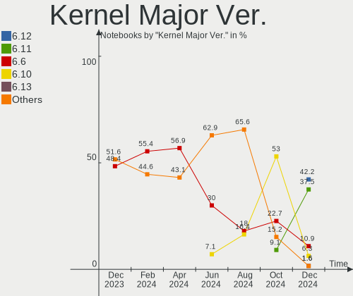
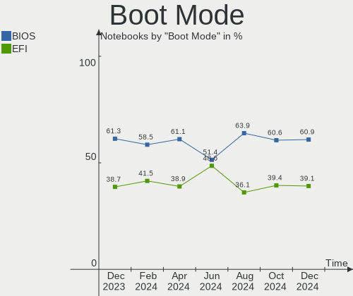
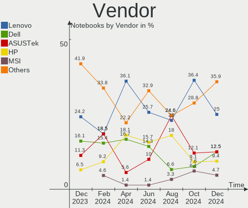
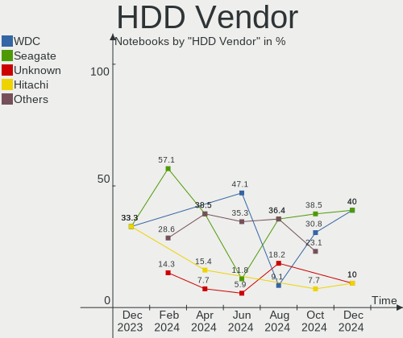
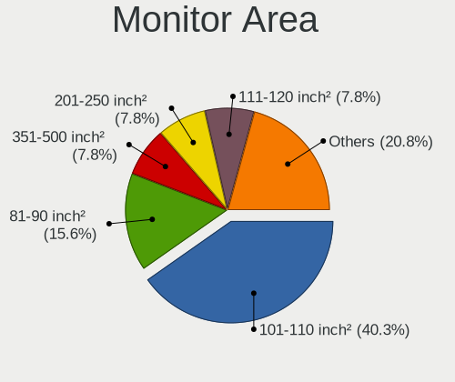

Manjaro - Hardware Trends (Notebooks)
-------------------------------------

A project to identify most popular hardware characteristics and track their change
over time based on data collected by Linux users at https://Linux-Hardware.org.

Anyone can contribute to this report by the [hw-probe](https://github.com/linuxhw/hw-probe) tool:

    sudo -E hw-probe -all -upload

This report is for one last month. Overall report since the beginning of time: [TestDays](https://github.com/linuxhw/TestDays)

Period: Dec, 2023.

Contents
--------

* [ System ](#system)
  - [ OS                       ](#os)
  - [ OS Family                ](#os-family)
  - [ Kernel                   ](#kernel)
  - [ Kernel Family            ](#kernel-family)
  - [ Kernel Major Ver.        ](#kernel-major-ver)
  - [ Arch                     ](#arch)
  - [ DE                       ](#de)
  - [ Display Server           ](#display-server)
  - [ Display Manager          ](#display-manager)
  - [ OS Lang                  ](#os-lang)
  - [ Boot Mode                ](#boot-mode)
  - [ Filesystem               ](#filesystem)
  - [ Part. scheme             ](#part-scheme)
  - [ Dual Boot with Linux/BSD ](#dual-boot-with-linuxbsd)
  - [ Dual Boot (Win)          ](#dual-boot-win)

* [ Board ](#board)
  - [ Vendor                   ](#vendor)
  - [ Model                    ](#model)
  - [ Model Family             ](#model-family)
  - [ MFG Year                 ](#mfg-year)
  - [ Form Factor              ](#form-factor)
  - [ Secure Boot              ](#secure-boot)
  - [ Coreboot                 ](#coreboot)
  - [ RAM Size                 ](#ram-size)
  - [ RAM Used                 ](#ram-used)
  - [ Total Drives             ](#total-drives)
  - [ Has CD-ROM               ](#has-cd-rom)
  - [ Has Ethernet             ](#has-ethernet)
  - [ Has WiFi                 ](#has-wifi)
  - [ Has Bluetooth            ](#has-bluetooth)

* [ Location ](#location)
  - [ Country                  ](#country)
  - [ City                     ](#city)

* [ Drives ](#drives)
  - [ Drive Vendor             ](#drive-vendor)
  - [ Drive Model              ](#drive-model)
  - [ HDD Vendor               ](#hdd-vendor)
  - [ SSD Vendor               ](#ssd-vendor)
  - [ Drive Kind               ](#drive-kind)
  - [ Drive Connector          ](#drive-connector)
  - [ Drive Size               ](#drive-size)
  - [ Space Total              ](#space-total)
  - [ Space Used               ](#space-used)
  - [ Malfunc. Drives          ](#malfunc-drives)
  - [ Malfunc. Drive Vendor    ](#malfunc-drive-vendor)
  - [ Malfunc. HDD Vendor      ](#malfunc-hdd-vendor)
  - [ Malfunc. Drive Kind      ](#malfunc-drive-kind)
  - [ Failed Drives            ](#failed-drives)
  - [ Failed Drive Vendor      ](#failed-drive-vendor)
  - [ Drive Status             ](#drive-status)

* [ Storage controller ](#storage-controller)
  - [ Storage Vendor           ](#storage-vendor)
  - [ Storage Model            ](#storage-model)
  - [ Storage Kind             ](#storage-kind)

* [ Processor ](#processor)
  - [ CPU Vendor               ](#cpu-vendor)
  - [ CPU Model                ](#cpu-model)
  - [ CPU Model Family         ](#cpu-model-family)
  - [ CPU Cores                ](#cpu-cores)
  - [ CPU Sockets              ](#cpu-sockets)
  - [ CPU Threads              ](#cpu-threads)
  - [ CPU Op-Modes             ](#cpu-op-modes)
  - [ CPU Microcode            ](#cpu-microcode)
  - [ CPU Microarch            ](#cpu-microarch)

* [ Graphics ](#graphics)
  - [ GPU Vendor               ](#gpu-vendor)
  - [ GPU Model                ](#gpu-model)
  - [ GPU Combo                ](#gpu-combo)
  - [ GPU Driver               ](#gpu-driver)
  - [ GPU Memory               ](#gpu-memory)

* [ Monitor ](#monitor)
  - [ Monitor Vendor           ](#monitor-vendor)
  - [ Monitor Model            ](#monitor-model)
  - [ Monitor Resolution       ](#monitor-resolution)
  - [ Monitor Diagonal         ](#monitor-diagonal)
  - [ Monitor Width            ](#monitor-width)
  - [ Aspect Ratio             ](#aspect-ratio)
  - [ Monitor Area             ](#monitor-area)
  - [ Pixel Density            ](#pixel-density)
  - [ Multiple Monitors        ](#multiple-monitors)

* [ Network ](#network)
  - [ Net Controller Vendor    ](#net-controller-vendor)
  - [ Net Controller Model     ](#net-controller-model)
  - [ Wireless Vendor          ](#wireless-vendor)
  - [ Wireless Model           ](#wireless-model)
  - [ Ethernet Vendor          ](#ethernet-vendor)
  - [ Ethernet Model           ](#ethernet-model)
  - [ Net Controller Kind      ](#net-controller-kind)
  - [ Used Controller          ](#used-controller)
  - [ NICs                     ](#nics)
  - [ IPv6                     ](#ipv6)

* [ Bluetooth ](#bluetooth)
  - [ Bluetooth Vendor         ](#bluetooth-vendor)
  - [ Bluetooth Model          ](#bluetooth-model)

* [ Sound ](#sound)
  - [ Sound Vendor             ](#sound-vendor)
  - [ Sound Model              ](#sound-model)

* [ Memory ](#memory)
  - [ Memory Vendor            ](#memory-vendor)
  - [ Memory Model             ](#memory-model)
  - [ Memory Kind              ](#memory-kind)
  - [ Memory Form Factor       ](#memory-form-factor)
  - [ Memory Size              ](#memory-size)
  - [ Memory Speed             ](#memory-speed)

* [ Printers & scanners ](#printers--scanners)
  - [ Printer Vendor           ](#printer-vendor)
  - [ Printer Model            ](#printer-model)
  - [ Scanner Vendor           ](#scanner-vendor)
  - [ Scanner Model            ](#scanner-model)

* [ Camera ](#camera)
  - [ Camera Vendor            ](#camera-vendor)
  - [ Camera Model             ](#camera-model)

* [ Security ](#security)
  - [ Fingerprint Vendor       ](#fingerprint-vendor)
  - [ Fingerprint Model        ](#fingerprint-model)
  - [ Chipcard Vendor          ](#chipcard-vendor)
  - [ Chipcard Model           ](#chipcard-model)

* [ Unsupported ](#unsupported)
  - [ Unsupported Devices      ](#unsupported-devices)
  - [ Unsupported Device Types ](#unsupported-device-types)

System
------

OS
--

Installed operating systems

| Name           | Notebooks | Percent |
|----------------|-----------|---------|
| Manjaro        | 33        | 53.23%  |
| Manjaro 23.1.0 | 15        | 24.19%  |
| Manjaro 23.1.1 | 11        | 17.74%  |
| Manjaro 23.0.1 | 2         | 3.23%   |
| Manjaro 23.0.3 | 1         | 1.61%   |

OS Family
---------

OS without a version

| Name    | Notebooks | Percent |
|---------|-----------|---------|
| Manjaro | 62        | 100%    |

Kernel
------

Version of the Linux kernel

| Version            | Notebooks | Percent |
|--------------------|-----------|---------|
| 6.6.8-2-MANJARO    | 14        | 22.58%  |
| 6.5.13-1-MANJARO   | 6         | 9.68%   |
| 6.6.5-1-MANJARO    | 4         | 6.45%   |
| 6.6.3-1-MANJARO    | 4         | 6.45%   |
| 6.5.13-4-MANJARO   | 4         | 6.45%   |
| 6.1.69-1-MANJARO   | 4         | 6.45%   |
| 6.6.7-4-MANJARO    | 3         | 4.84%   |
| 6.5.13-7-MANJARO   | 3         | 4.84%   |
| 6.6.7-1-MANJARO    | 2         | 3.23%   |
| 6.6.2-1-MANJARO    | 2         | 3.23%   |
| 6.5.3-1-MANJARO    | 2         | 3.23%   |
| 6.7.0-4-MANJARO    | 1         | 1.61%   |
| 6.7.0-1-MANJARO    | 1         | 1.61%   |
| 6.6.5-3-MANJARO    | 1         | 1.61%   |
| 6.6.1-1-MANJARO    | 1         | 1.61%   |
| 6.5.5-1-MANJARO    | 1         | 1.61%   |
| 6.5.11-1-MANJARO   | 1         | 1.61%   |
| 6.1.68-1-MANJARO   | 1         | 1.61%   |
| 6.1.67-2-MANJARO   | 1         | 1.61%   |
| 6.1.65-1-MANJARO   | 1         | 1.61%   |
| 6.1.64-1-MANJARO   | 1         | 1.61%   |
| 6.1.63-1-MANJARO   | 1         | 1.61%   |
| 5.15.143-1-MANJARO | 1         | 1.61%   |
| 5.15.139-1-MANJARO | 1         | 1.61%   |
| 5.10.197-1-MANJARO | 1         | 1.61%   |

Kernel Family
-------------

Linux kernel without a distro release

| Version  | Notebooks | Percent |
|----------|-----------|---------|
| 6.6.8    | 14        | 22.58%  |
| 6.5.13   | 13        | 20.97%  |
| 6.6.7    | 5         | 8.06%   |
| 6.6.5    | 5         | 8.06%   |
| 6.6.3    | 4         | 6.45%   |
| 6.1.69   | 4         | 6.45%   |
| 6.7.0    | 2         | 3.23%   |
| 6.6.2    | 2         | 3.23%   |
| 6.5.3    | 2         | 3.23%   |
| 6.6.1    | 1         | 1.61%   |
| 6.5.5    | 1         | 1.61%   |
| 6.5.11   | 1         | 1.61%   |
| 6.1.68   | 1         | 1.61%   |
| 6.1.67   | 1         | 1.61%   |
| 6.1.65   | 1         | 1.61%   |
| 6.1.64   | 1         | 1.61%   |
| 6.1.63   | 1         | 1.61%   |
| 5.15.143 | 1         | 1.61%   |
| 5.15.139 | 1         | 1.61%   |
| 5.10.197 | 1         | 1.61%   |

Kernel Major Ver.
-----------------

Linux kernel major version

| Version | Notebooks | Percent |
|---------|-----------|---------|
| 6.6     | 31        | 50%     |
| 6.5     | 17        | 27.42%  |
| 6.1     | 9         | 14.52%  |
| 6.7     | 2         | 3.23%   |
| 5.15    | 2         | 3.23%   |
| 5.10    | 1         | 1.61%   |

Arch
----

OS architecture (x86_64, i586, etc.)

| Name   | Notebooks | Percent |
|--------|-----------|---------|
| x86_64 | 62        | 100%    |

DE
--

Desktop Environment

| Name       | Notebooks | Percent |
|------------|-----------|---------|
| KDE5       | 27        | 43.55%  |
| GNOME      | 15        | 24.19%  |
| XFCE       | 11        | 17.74%  |
| X-Cinnamon | 5         | 8.06%   |
| KDE        | 1         | 1.61%   |
| i3         | 1         | 1.61%   |
| Hyprland   | 1         | 1.61%   |
| Unknown    | 1         | 1.61%   |

Display Server
--------------

X11 or Wayland

| Name    | Notebooks | Percent |
|---------|-----------|---------|
| X11     | 45        | 72.58%  |
| Wayland | 15        | 24.19%  |
| Unknown | 2         | 3.23%   |

Display Manager
---------------

SDDM, LightDM, etc.

| Name    | Notebooks | Percent |
|---------|-----------|---------|
| Unknown | 33        | 53.23%  |
| LightDM | 12        | 19.35%  |
| SDDM    | 9         | 14.52%  |
| GDM     | 8         | 12.9%   |

OS Lang
-------

Language

| Lang    | Notebooks | Percent |
|---------|-----------|---------|
| en_US   | 30        | 48.39%  |
| de_DE   | 5         | 8.06%   |
| en_GB   | 4         | 6.45%   |
| pt_BR   | 3         | 4.84%   |
| ru_RU   | 2         | 3.23%   |
| it_IT   | 2         | 3.23%   |
| fr_FR   | 2         | 3.23%   |
| es_MX   | 2         | 3.23%   |
| en_CA   | 2         | 3.23%   |
| zh_CN   | 1         | 1.61%   |
| ro_RO   | 1         | 1.61%   |
| pt_PT   | 1         | 1.61%   |
| pl_PL   | 1         | 1.61%   |
| nl_NL   | 1         | 1.61%   |
| nl_BE   | 1         | 1.61%   |
| es_ES   | 1         | 1.61%   |
| de_AT   | 1         | 1.61%   |
| cs_CZ   | 1         | 1.61%   |
| Unknown | 1         | 1.61%   |

Boot Mode
---------

EFI or BIOS

| Mode | Notebooks | Percent |
|------|-----------|---------|
| BIOS | 38        | 61.29%  |
| EFI  | 24        | 38.71%  |

Filesystem
----------

Type of filesystem

| Type    | Notebooks | Percent |
|---------|-----------|---------|
| Ext4    | 48        | 77.42%  |
| Btrfs   | 9         | 14.52%  |
| Tmpfs   | 3         | 4.84%   |
| Overlay | 2         | 3.23%   |

Part. scheme
------------

Scheme of partitioning

| Type    | Notebooks | Percent |
|---------|-----------|---------|
| Unknown | 32        | 51.61%  |
| GPT     | 26        | 41.94%  |
| MBR     | 4         | 6.45%   |

Dual Boot with Linux/BSD
------------------------

Hosting more than one Linux/BSD

| Dual boot | Notebooks | Percent |
|-----------|-----------|---------|
| No        | 60        | 96.77%  |
| Yes       | 2         | 3.23%   |

Dual Boot (Win)
---------------

Hosting Linux and Windows

| Dual boot | Notebooks | Percent |
|-----------|-----------|---------|
| No        | 52        | 83.87%  |
| Yes       | 10        | 16.13%  |

Board
-----

Vendor
------

Motherboard manufacturer

| Name                | Notebooks | Percent |
|---------------------|-----------|---------|
| Lenovo              | 15        | 24.19%  |
| Dell                | 10        | 16.13%  |
| ASUSTek Computer    | 7         | 11.29%  |
| Acer                | 5         | 8.06%   |
| Hewlett-Packard     | 4         | 6.45%   |
| Samsung Electronics | 3         | 4.84%   |
| HUAWEI              | 3         | 4.84%   |
| Framework           | 3         | 4.84%   |
| TUXEDO              | 2         | 3.23%   |
| Apple               | 2         | 3.23%   |
| Alienware           | 2         | 3.23%   |
| SLIMBOOK            | 1         | 1.61%   |
| Schenker            | 1         | 1.61%   |
| Panasonic           | 1         | 1.61%   |
| MECHREVO            | 1         | 1.61%   |
| Google              | 1         | 1.61%   |
| GEO                 | 1         | 1.61%   |

Model
-----

Motherboard model

| Name                                       | Notebooks | Percent |
|--------------------------------------------|-----------|---------|
| Framework Laptop 13 (AMD Ryzen 7040Series) | 2         | 3.23%   |
| Dell Precision 7520                        | 2         | 3.23%   |
| Dell Latitude 7490                         | 2         | 3.23%   |
| TUXEDO InfinityBook Pro Gen8 (MK1)         | 1         | 1.61%   |
| TUXEDO Book XP15 / XP17 Gen12              | 1         | 1.61%   |
| SLIMBOOK PROX-AMD5                         | 1         | 1.61%   |
| Schenker XMG NEO 15(E20, RTX 20xx)         | 1         | 1.61%   |
| Samsung RV419/RV420                        | 1         | 1.61%   |
| Samsung R428/P428                          | 1         | 1.61%   |
| Samsung 550XCJ/550XCR                      | 1         | 1.61%   |
| Panasonic FZ-M1CCA17E3                     | 1         | 1.61%   |
| MECHREVO Jiaolong16Q Series GM6BG0Q        | 1         | 1.61%   |
| Lenovo ThinkPad X390 20Q0004VUS            | 1         | 1.61%   |
| Lenovo ThinkPad X220 4290JN8               | 1         | 1.61%   |
| Lenovo ThinkPad X201 3680WXT               | 1         | 1.61%   |
| Lenovo ThinkPad T490s 20NYS5HM00           | 1         | 1.61%   |
| Lenovo ThinkPad T470s 20HF005NUS           | 1         | 1.61%   |
| Lenovo ThinkPad T460 20FNS11S00            | 1         | 1.61%   |
| Lenovo ThinkPad T440p 20AWS4YE00           | 1         | 1.61%   |
| Lenovo ThinkPad T440p 20AWS4UD00           | 1         | 1.61%   |
| Lenovo ThinkPad T16 Gen 1 21BWS2U600       | 1         | 1.61%   |
| Lenovo ThinkPad P52 20MAS19500             | 1         | 1.61%   |
| Lenovo ThinkPad L590 20Q7001CGE            | 1         | 1.61%   |
| Lenovo ThinkPad E14 Gen 2 20T7S1M200       | 1         | 1.61%   |
| Lenovo ThinkBook 13s G2 ITL 20V9           | 1         | 1.61%   |
| Lenovo Legion Pro 7 16IRX8H 82WQ           | 1         | 1.61%   |
| Lenovo Legion 5 15ARH05H 82B1              | 1         | 1.61%   |
| HUAWEI NBLK-WAX9X                          | 1         | 1.61%   |
| HUAWEI HVY-WXX9                            | 1         | 1.61%   |
| HUAWEI CREFG-XX                            | 1         | 1.61%   |
| HP Stream Laptop 14-DS0xxx                 | 1         | 1.61%   |
| HP ProBook 6470b                           | 1         | 1.61%   |
| HP ProBook 430 G6                          | 1         | 1.61%   |
| HP Pavilion Gaming Laptop 17-cd2xxx        | 1         | 1.61%   |
| Google Dratini                             | 1         | 1.61%   |
| GEO GEOBOOK 2E                             | 1         | 1.61%   |
| Framework Laptop (12th Gen Intel Core)     | 1         | 1.61%   |
| Dell XPS 13 9343                           | 1         | 1.61%   |
| Dell Latitude E7440                        | 1         | 1.61%   |
| Dell Latitude 7410                         | 1         | 1.61%   |

Model Family
------------

Motherboard model prefix

| Name                   | Notebooks | Percent |
|------------------------|-----------|---------|
| Lenovo ThinkPad        | 12        | 19.35%  |
| Dell Latitude          | 6         | 9.68%   |
| Framework Laptop       | 3         | 4.84%   |
| Lenovo Legion          | 2         | 3.23%   |
| HP ProBook             | 2         | 3.23%   |
| Dell Precision         | 2         | 3.23%   |
| ASUS Zenbook           | 2         | 3.23%   |
| ASUS ROG               | 2         | 3.23%   |
| Acer Nitro             | 2         | 3.23%   |
| Acer Aspire            | 2         | 3.23%   |
| TUXEDO InfinityBook    | 1         | 1.61%   |
| TUXEDO Book            | 1         | 1.61%   |
| SLIMBOOK PROX-AMD5     | 1         | 1.61%   |
| Schenker XMG           | 1         | 1.61%   |
| Samsung RV419          | 1         | 1.61%   |
| Samsung R428           | 1         | 1.61%   |
| Samsung 550XCJ         | 1         | 1.61%   |
| Panasonic FZ-M1CCA17E3 | 1         | 1.61%   |
| MECHREVO Jiaolong16Q   | 1         | 1.61%   |
| Lenovo ThinkBook       | 1         | 1.61%   |
| HUAWEI NBLK-WAX9X      | 1         | 1.61%   |
| HUAWEI HVY-WXX9        | 1         | 1.61%   |
| HUAWEI CREFG-XX        | 1         | 1.61%   |
| HP Stream              | 1         | 1.61%   |
| HP Pavilion            | 1         | 1.61%   |
| Google Dratini         | 1         | 1.61%   |
| GEO GEOBOOK            | 1         | 1.61%   |
| Dell XPS               | 1         | 1.61%   |
| Dell Inspiron          | 1         | 1.61%   |
| ASUS X550VB            | 1         | 1.61%   |
| ASUS VivoBook          | 1         | 1.61%   |
| ASUS S551LN            | 1         | 1.61%   |
| Apple MacBookPro9      | 1         | 1.61%   |
| Apple MacBookAir7      | 1         | 1.61%   |
| Alienware m18          | 1         | 1.61%   |
| Alienware m16          | 1         | 1.61%   |
| Acer TMP645-M          | 1         | 1.61%   |

MFG Year
--------

Motherboard manufacture year

| Year | Notebooks | Percent |
|------|-----------|---------|
| 2020 | 14        | 22.58%  |
| 2023 | 10        | 16.13%  |
| 2019 | 8         | 12.9%   |
| 2022 | 4         | 6.45%   |
| 2017 | 4         | 6.45%   |
| 2013 | 4         | 6.45%   |
| 2018 | 3         | 4.84%   |
| 2014 | 3         | 4.84%   |
| 2012 | 3         | 4.84%   |
| 2011 | 2         | 3.23%   |
| 2010 | 2         | 3.23%   |
| 2021 | 1         | 1.61%   |
| 2016 | 1         | 1.61%   |
| 2015 | 1         | 1.61%   |
| 2009 | 1         | 1.61%   |
| 2007 | 1         | 1.61%   |

Form Factor
-----------

Physical design of the computer

| Name     | Notebooks | Percent |
|----------|-----------|---------|
| Notebook | 62        | 100%    |

Secure Boot
-----------

Enabled or disabled

| State    | Notebooks | Percent |
|----------|-----------|---------|
| Disabled | 62        | 100%    |

Coreboot
--------

Have coreboot on board

| Used | Notebooks | Percent |
|------|-----------|---------|
| No   | 61        | 98.39%  |
| Yes  | 1         | 1.61%   |

RAM Size
--------

Total RAM memory

| Size in GB  | Notebooks | Percent |
|-------------|-----------|---------|
| 32.01-64.0  | 17        | 27.42%  |
| 8.01-16.0   | 16        | 25.81%  |
| 4.01-8.0    | 10        | 16.13%  |
| 3.01-4.0    | 8         | 12.9%   |
| 16.01-24.0  | 5         | 8.06%   |
| 64.01-256.0 | 3         | 4.84%   |
| 24.01-32.0  | 2         | 3.23%   |
| 2.01-3.0    | 1         | 1.61%   |

RAM Used
--------

Used RAM memory

| Used GB    | Notebooks | Percent |
|------------|-----------|---------|
| 4.01-8.0   | 20        | 32.26%  |
| 2.01-3.0   | 13        | 20.97%  |
| 1.01-2.0   | 10        | 16.13%  |
| 8.01-16.0  | 8         | 12.9%   |
| 3.01-4.0   | 7         | 11.29%  |
| 16.01-24.0 | 2         | 3.23%   |
| 32.01-64.0 | 1         | 1.61%   |
| 0.51-1.0   | 1         | 1.61%   |

Total Drives
------------

Number of drives on board

| Drives | Notebooks | Percent |
|--------|-----------|---------|
| 1      | 46        | 74.19%  |
| 2      | 15        | 24.19%  |
| 3      | 1         | 1.61%   |

Has CD-ROM
----------

Has CD-ROM on board

| Presented | Notebooks | Percent |
|-----------|-----------|---------|
| No        | 55        | 88.71%  |
| Yes       | 7         | 11.29%  |

Has Ethernet
------------

Has Ethernet on board

| Presented | Notebooks | Percent |
|-----------|-----------|---------|
| Yes       | 46        | 74.19%  |
| No        | 16        | 25.81%  |

Has WiFi
--------

Has WiFi module

| Presented | Notebooks | Percent |
|-----------|-----------|---------|
| Yes       | 62        | 100%    |

Has Bluetooth
-------------

Has Bluetooth module

| Presented | Notebooks | Percent |
|-----------|-----------|---------|
| Yes       | 53        | 85.48%  |
| No        | 9         | 14.52%  |

Location
--------

Country
-------

Geographic location (country)

| Country            | Notebooks | Percent |
|--------------------|-----------|---------|
| Germany            | 9         | 14.52%  |
| USA                | 8         | 12.9%   |
| Russia             | 5         | 8.06%   |
| Brazil             | 4         | 6.45%   |
| Poland             | 3         | 4.84%   |
| Italy              | 3         | 4.84%   |
| France             | 3         | 4.84%   |
| Canada             | 3         | 4.84%   |
| UK                 | 2         | 3.23%   |
| Serbia             | 2         | 3.23%   |
| Romania            | 2         | 3.23%   |
| Greece             | 2         | 3.23%   |
| Belarus            | 2         | 3.23%   |
| Austria            | 2         | 3.23%   |
| The Netherlands    | 1         | 1.61%   |
| Spain              | 1         | 1.61%   |
| Portugal           | 1         | 1.61%   |
| Netherlands        | 1         | 1.61%   |
| Mexico             | 1         | 1.61%   |
| Kazakhstan         | 1         | 1.61%   |
| Israel             | 1         | 1.61%   |
| Dominican Republic | 1         | 1.61%   |
| Czechia            | 1         | 1.61%   |
| China              | 1         | 1.61%   |
| Chile              | 1         | 1.61%   |
| Belgium            | 1         | 1.61%   |

City
----

Geographic location (city)

| City                       | Notebooks | Percent |
|----------------------------|-----------|---------|
| Warsaw                     | 3         | 4.84%   |
| The Hague                  | 2         | 3.23%   |
| Sao Paulo                  | 2         | 3.23%   |
| Hamburg                    | 2         | 3.23%   |
| Frankfurt am Main          | 2         | 3.23%   |
| Belgrade                   | 2         | 3.23%   |
| Zola Predosa               | 1         | 1.61%   |
| Yekaterinburg              | 1         | 1.61%   |
| Voronezh                   | 1         | 1.61%   |
| Tripoli                    | 1         | 1.61%   |
| Tepatitlán de Morelos     | 1         | 1.61%   |
| St Petersburg              | 1         | 1.61%   |
| Silver Spring              | 1         | 1.61%   |
| Shchelkovo                 | 1         | 1.61%   |
| Shanghai                   | 1         | 1.61%   |
| Santiago de los Caballeros | 1         | 1.61%   |
| Salzburg                   | 1         | 1.61%   |
| Saint-Eustache             | 1         | 1.61%   |
| Rockville                  | 1         | 1.61%   |
| Richmond Hill              | 1         | 1.61%   |
| Prague                     | 1         | 1.61%   |
| Pfaffenhofen               | 1         | 1.61%   |
| Petrozavodsk               | 1         | 1.61%   |
| Pavlodar                   | 1         | 1.61%   |
| Orsago                     | 1         | 1.61%   |
| Oneida                     | 1         | 1.61%   |
| Oklahoma City              | 1         | 1.61%   |
| Nilopolis                  | 1         | 1.61%   |
| Munich                     | 1         | 1.61%   |
| Mount Royal                | 1         | 1.61%   |
| Minsk                      | 1         | 1.61%   |
| Mazyr                      | 1         | 1.61%   |
| Martin                     | 1         | 1.61%   |
| Madrid                     | 1         | 1.61%   |
| Lustenau                   | 1         | 1.61%   |
| Lod                        | 1         | 1.61%   |
| Las Cabras                 | 1         | 1.61%   |
| La Spezia                  | 1         | 1.61%   |
| Karellas                   | 1         | 1.61%   |
| Indiana                    | 1         | 1.61%   |

Drives
------

Drive Vendor
------------

Hard drive vendors

| Vendor                      | Notebooks | Drives | Percent |
|-----------------------------|-----------|--------|---------|
| Samsung Electronics         | 25        | 27     | 32.89%  |
| Sandisk                     | 9         | 9      | 11.84%  |
| Unknown                     | 4         | 5      | 5.26%   |
| SK hynix                    | 4         | 4      | 5.26%   |
| Micron Technology           | 4         | 4      | 5.26%   |
| Micron/Crucial Technology   | 3         | 3      | 3.95%   |
| Kingston                    | 3         | 3      | 3.95%   |
| WDC                         | 2         | 2      | 2.63%   |
| Seagate                     | 2         | 2      | 2.63%   |
| KIOXIA                      | 2         | 2      | 2.63%   |
| Hitachi                     | 2         | 2      | 2.63%   |
| GOODRAM                     | 2         | 2      | 2.63%   |
| Crucial                     | 2         | 2      | 2.63%   |
| Yangtze Memory Technologies | 1         | 1      | 1.32%   |
| WALRAM                      | 1         | 1      | 1.32%   |
| Union Memory (Shenzhen)     | 1         | 1      | 1.32%   |
| SPCC                        | 1         | 1      | 1.32%   |
| Silicon Motion              | 1         | 1      | 1.32%   |
| Mushkin                     | 1         | 1      | 1.32%   |
| MAXIO Technology (Hangzhou) | 1         | 1      | 1.32%   |
| Intel                       | 1         | 1      | 1.32%   |
| Emtec                       | 1         | 1      | 1.32%   |
| BHT                         | 1         | 1      | 1.32%   |
| Apple                       | 1         | 1      | 1.32%   |
| A-DATA Technology           | 1         | 1      | 1.32%   |

Drive Model
-----------

Hard drive models

| Model                                               | Notebooks | Percent |
|-----------------------------------------------------|-----------|---------|
| Samsung NVMe SSD Controller SM981/PM981/PM983 512GB | 7         | 8.97%   |
| Unknown MMC Card  64GB                              | 2         | 2.56%   |
| Unknown MMC Card  128GB                             | 2         | 2.56%   |
| Sandisk WD Black SN750 / PC SN730 NVMe SSD 2TB      | 2         | 2.56%   |
| Samsung NVMe SSD Controller PM9A1/PM9A3/980PRO 2TB  | 2         | 2.56%   |
| Micron/Crucial P2 NVMe PCIe SSD 4TB                 | 2         | 2.56%   |
| GOODRAM SSDPR-CX400-256 256GB                       | 2         | 2.56%   |
| Yangtze Memory YMTC PC300-512GB-B                   | 1         | 1.28%   |
| WDC WD5000LPVX-22V0TT0 500GB                        | 1         | 1.28%   |
| WDC WD10SPZX-21Z10T0 1TB                            | 1         | 1.28%   |
| WALRAM 512GB                                        | 1         | 1.28%   |
| Unknown MMC Card  256GB                             | 1         | 1.28%   |
| Union Memory (Shenzhen) NVMe 256G SSD device        | 1         | 1.28%   |
| SPCC Solid State Disk 1024GB                        | 1         | 1.28%   |
| SK hynix SKHynix_HFS512GD9TNG-L5B0B 512GB           | 1         | 1.28%   |
| SK hynix SKHynix_HFS001TEJ9X115N 1024GB             | 1         | 1.28%   |
| SK hynix SC401 SATA 512GB SSD                       | 1         | 1.28%   |
| SK hynix HFM001TD3JX013N 1024GB                     | 1         | 1.28%   |
| Silicon Motion PCIe-8 SSD 512GB                     | 1         | 1.28%   |
| Seagate ST9500420AS 500GB                           | 1         | 1.28%   |
| Seagate ST1000LM035-1RK172 1TB                      | 1         | 1.28%   |
| Sandisk WD_BLACK SN770 1TB                          | 1         | 1.28%   |
| Sandisk WDC PC SN530 SDBPMPZ-512G-1101 512GB        | 1         | 1.28%   |
| Sandisk WD PC SN740 SDDPNQD-1T00-1027 1TB           | 1         | 1.28%   |
| Sandisk WD Blue SN570 1TB                           | 1         | 1.28%   |
| Sandisk WD Blue SN550 NVMe SSD 1TB                  | 1         | 1.28%   |
| Sandisk WD Blue SN500 / PC SN520 NVMe SSD 128GB     | 1         | 1.28%   |
| SanDisk SSD PLUS 1000GB                             | 1         | 1.28%   |
| Samsung SSD PM851 M.2 2280 128GB                    | 1         | 1.28%   |
| Samsung SSD 990 PRO 4TB                             | 1         | 1.28%   |
| Samsung SSD 980 PRO 2TB                             | 1         | 1.28%   |
| Samsung SSD 980 1TB                                 | 1         | 1.28%   |
| Samsung SSD 870 QVO 1TB                             | 1         | 1.28%   |
| Samsung SSD 870 EVO 500GB                           | 1         | 1.28%   |
| Samsung SSD 860 EVO 500GB                           | 1         | 1.28%   |
| Samsung SSD 860 EVO 250GB                           | 1         | 1.28%   |
| Samsung SSD 850 PRO 256GB                           | 1         | 1.28%   |
| Samsung SSD 850 EVO 1TB                             | 1         | 1.28%   |
| Samsung SSD 840 PRO Series 128GB                    | 1         | 1.28%   |
| Samsung NVMe SSD Controller SM961/PM961/SM963 250GB | 1         | 1.28%   |

HDD Vendor
----------

Hard disk drive vendors

| Vendor  | Notebooks | Drives | Percent |
|---------|-----------|--------|---------|
| WDC     | 2         | 2      | 33.33%  |
| Seagate | 2         | 2      | 33.33%  |
| Hitachi | 2         | 2      | 33.33%  |

SSD Vendor
----------

Solid state drive vendors

| Vendor              | Notebooks | Drives | Percent |
|---------------------|-----------|--------|---------|
| Samsung Electronics | 9         | 9      | 36%     |
| Kingston            | 3         | 3      | 12%     |
| GOODRAM             | 2         | 2      | 8%      |
| Crucial             | 2         | 2      | 8%      |
| SPCC                | 1         | 1      | 4%      |
| SK hynix            | 1         | 1      | 4%      |
| SanDisk             | 1         | 1      | 4%      |
| Mushkin             | 1         | 1      | 4%      |
| Micron Technology   | 1         | 1      | 4%      |
| Emtec               | 1         | 1      | 4%      |
| BHT                 | 1         | 1      | 4%      |
| Apple               | 1         | 1      | 4%      |
| A-DATA Technology   | 1         | 1      | 4%      |

Drive Kind
----------

HDD or SSD

| Kind    | Notebooks | Drives | Percent |
|---------|-----------|--------|---------|
| NVMe    | 38        | 42     | 53.52%  |
| SSD     | 22        | 25     | 30.99%  |
| HDD     | 6         | 6      | 8.45%   |
| MMC     | 4         | 5      | 5.63%   |
| Unknown | 1         | 1      | 1.41%   |

Drive Connector
---------------

SATA, SAS, NVMe, etc.

| Type | Notebooks | Drives | Percent |
|------|-----------|--------|---------|
| NVMe | 38        | 42     | 53.52%  |
| SATA | 27        | 30     | 38.03%  |
| MMC  | 4         | 5      | 5.63%   |
| SAS  | 2         | 2      | 2.82%   |

Drive Size
----------

Size of hard drive

| Size in TB | Notebooks | Drives | Percent |
|------------|-----------|--------|---------|
| 0.01-0.5   | 20        | 21     | 68.97%  |
| 0.51-1.0   | 8         | 9      | 27.59%  |
| 1.01-2.0   | 1         | 1      | 3.45%   |

Space Total
-----------

Amount of disk space available on the file system

| Size in GB     | Notebooks | Percent |
|----------------|-----------|---------|
| 501-1000       | 14        | 22.58%  |
| 251-500        | 11        | 17.74%  |
| 101-250        | 9         | 14.52%  |
| Unknown        | 7         | 11.29%  |
| 1001-2000      | 5         | 8.06%   |
| 1-20           | 5         | 8.06%   |
| 51-100         | 5         | 8.06%   |
| More than 3000 | 3         | 4.84%   |
| 2001-3000      | 2         | 3.23%   |
| 21-50          | 1         | 1.61%   |

Space Used
----------

Amount of used disk space

| Used GB   | Notebooks | Percent |
|-----------|-----------|---------|
| 1-20      | 19        | 30.65%  |
| 501-1000  | 9         | 14.52%  |
| 51-100    | 9         | 14.52%  |
| 21-50     | 7         | 11.29%  |
| Unknown   | 7         | 11.29%  |
| 101-250   | 5         | 8.06%   |
| 251-500   | 4         | 6.45%   |
| 2001-3000 | 2         | 3.23%   |

Malfunc. Drives
---------------

Drive models with a malfunction

Zero info for selected period =(

Malfunc. Drive Vendor
---------------------

Vendors of faulty drives

Zero info for selected period =(

Malfunc. HDD Vendor
-------------------

Vendors of faulty HDD drives

Zero info for selected period =(

Malfunc. Drive Kind
-------------------

Kinds of faulty drives

Zero info for selected period =(

Failed Drives
-------------

Failed drive models

Zero info for selected period =(

Failed Drive Vendor
-------------------

Failed drive vendors

Zero info for selected period =(

Drive Status
------------

Number of failed and malfunc. drives

| Status   | Notebooks | Drives | Percent |
|----------|-----------|--------|---------|
| Detected | 45        | 57     | 70.31%  |
| Works    | 19        | 22     | 29.69%  |

Storage controller
------------------

Storage Vendor
--------------

Storage controller vendors

| Vendor                      | Notebooks | Percent |
|-----------------------------|-----------|---------|
| Intel                       | 31        | 40.26%  |
| Samsung Electronics         | 18        | 23.38%  |
| SanDisk                     | 8         | 10.39%  |
| AMD                         | 5         | 6.49%   |
| SK hynix                    | 3         | 3.9%    |
| Micron/Crucial Technology   | 3         | 3.9%    |
| Micron Technology           | 3         | 3.9%    |
| KIOXIA                      | 2         | 2.6%    |
| Yangtze Memory Technologies | 1         | 1.3%    |
| Union Memory (Shenzhen)     | 1         | 1.3%    |
| Silicon Motion              | 1         | 1.3%    |
| MAXIO Technology (Hangzhou) | 1         | 1.3%    |

Storage Model
-------------

Storage controller models

| Model                                                                          | Notebooks | Percent |
|--------------------------------------------------------------------------------|-----------|---------|
| Samsung NVMe SSD Controller SM981/PM981/PM983                                  | 7         | 8.97%   |
| AMD FCH SATA Controller [AHCI mode]                                            | 5         | 6.41%   |
| Samsung NVMe SSD Controller 980 (DRAM-less)                                    | 4         | 5.13%   |
| Intel 8 Series SATA Controller 1 [AHCI mode]                                   | 4         | 5.13%   |
| Samsung NVMe SSD Controller PM9A1/PM9A3/980PRO                                 | 3         | 3.85%   |
| Intel Q170/Q150/B150/H170/H110/Z170/CM236 Chipset SATA Controller [AHCI Mode]  | 3         | 3.85%   |
| Intel 7 Series Chipset Family 6-port SATA Controller [AHCI mode]               | 3         | 3.85%   |
| Intel 6 Series/C200 Series Chipset Family 6 port Mobile SATA AHCI Controller   | 3         | 3.85%   |
| SanDisk WD Black SN770 / PC SN740 256GB / PC SN560 (DRAM-less) NVMe SSD        | 2         | 2.56%   |
| SanDisk Extreme Pro / WD Black SN750 / PC SN730 / Red SN700 NVMe SSD           | 2         | 2.56%   |
| Micron/Crucial P2 [Nick P2] / P3 / P3 Plus NVMe PCIe SSD (DRAM-less)           | 2         | 2.56%   |
| Micron 2200S NVMe SSD [Cassandra]                                              | 2         | 2.56%   |
| Intel Volume Management Device NVMe RAID Controller                            | 2         | 2.56%   |
| Intel 82801IBM/IEM (ICH9M/ICH9M-E) 4 port SATA Controller [AHCI mode]          | 2         | 2.56%   |
| Intel 82801 Mobile SATA Controller [RAID mode]                                 | 2         | 2.56%   |
| Intel 8 Series/C220 Series Chipset Family 6-port SATA Controller 1 [AHCI mode] | 2         | 2.56%   |
| Intel 400 Series Chipset Family SATA AHCI Controller                           | 2         | 2.56%   |
| Yangtze Memory PC300 NVMe SSD (DRAM-less)                                      | 1         | 1.28%   |
| Union Memory (Shenzhen) AH631 PCIe 3.0 NVMe SSD 256GB                          | 1         | 1.28%   |
| SK hynix Platinum P41/PC801 NVMe Solid State Drive                             | 1         | 1.28%   |
| SK hynix PC601 NVMe Solid State Drive                                          | 1         | 1.28%   |
| SK hynix Gold P31/BC711/PC711 NVMe Solid State Drive                           | 1         | 1.28%   |
| Silicon Motion Non-Volatile memory controller                                  | 1         | 1.28%   |
| SanDisk WD Blue SN500 / PC SN520 x2 M.2 2280 NVMe SSD                          | 1         | 1.28%   |
| SanDisk Ultra 3D / WD Blue SN570 NVMe SSD (DRAM-less)                          | 1         | 1.28%   |
| SanDisk Ultra 3D / WD Blue SN550 NVMe SSD                                      | 1         | 1.28%   |
| SanDisk PC SN530 NVMe SSD (DRAM-less)                                          | 1         | 1.28%   |
| Samsung S4LN058A01[SSUBX] AHCI SSD Controller (Apple slot)                     | 1         | 1.28%   |
| Samsung NVMe SSD Controller SM961/PM961/SM963                                  | 1         | 1.28%   |
| Samsung NVMe SSD Controller S4LV008[Pascal]                                    | 1         | 1.28%   |
| Samsung NVMe SSD Controller PM9B1 (DRAM-less)                                  | 1         | 1.28%   |
| Micron/Crucial P5 Plus NVMe PCIe SSD                                           | 1         | 1.28%   |
| Micron 2400 NVMe SSD (DRAM-less)                                               | 1         | 1.28%   |
| MAXIO (Hangzhou) NVMe SSD Controller MAP1202                                   | 1         | 1.28%   |
| KIOXIA NVMe SSD Controller XG8                                                 | 1         | 1.28%   |
| KIOXIA NVMe SSD Controller BG4 (DRAM-less)                                     | 1         | 1.28%   |
| Intel Wildcat Point-LP SATA Controller [AHCI Mode]                             | 1         | 1.28%   |
| Intel Tiger Lake-LP SATA Controller                                            | 1         | 1.28%   |
| Intel Sunrise Point-LP SATA Controller [AHCI mode]                             | 1         | 1.28%   |
| Intel SSD 660P Series                                                          | 1         | 1.28%   |

Storage Kind
------------

Kind of storage controller (IDE, SATA, NVMe, SAS, ...)

| Kind | Notebooks | Percent |
|------|-----------|---------|
| NVMe | 38        | 50.67%  |
| SATA | 33        | 44%     |
| RAID | 4         | 5.33%   |

Processor
---------

CPU Vendor
----------

Processor vendors

| Vendor | Notebooks | Percent |
|--------|-----------|---------|
| Intel  | 46        | 74.19%  |
| AMD    | 16        | 25.81%  |

CPU Model
---------

Processor models

| Model                                       | Notebooks | Percent |
|---------------------------------------------|-----------|---------|
| Intel Core i7-8665U CPU @ 1.90GHz           | 2         | 3.23%   |
| Intel Core i7-8650U CPU @ 1.90GHz           | 2         | 3.23%   |
| Intel Core i5-8265U CPU @ 1.60GHz           | 2         | 3.23%   |
| Intel 13th Gen Core i7-13700H               | 2         | 3.23%   |
| AMD Ryzen 5 4600H with Radeon Graphics      | 2         | 3.23%   |
| Intel Genuine CPU U4100 @ 1.30GHz           | 1         | 1.61%   |
| Intel Core i7-8850H CPU @ 2.60GHz           | 1         | 1.61%   |
| Intel Core i7-7820HQ CPU @ 2.90GHz          | 1         | 1.61%   |
| Intel Core i7-6920HQ CPU @ 2.90GHz          | 1         | 1.61%   |
| Intel Core i7-6820HQ CPU @ 2.70GHz          | 1         | 1.61%   |
| Intel Core i7-6600U CPU @ 2.60GHz           | 1         | 1.61%   |
| Intel Core i7-4810MQ CPU @ 2.80GHz          | 1         | 1.61%   |
| Intel Core i7-4510U CPU @ 2.00GHz           | 1         | 1.61%   |
| Intel Core i7-10875H CPU @ 2.30GHz          | 1         | 1.61%   |
| Intel Core i7-10870H CPU @ 2.20GHz          | 1         | 1.61%   |
| Intel Core i7-10610U CPU @ 1.80GHz          | 1         | 1.61%   |
| Intel Core i5-9300H CPU @ 2.40GHz           | 1         | 1.61%   |
| Intel Core i5-8365U CPU @ 1.60GHz           | 1         | 1.61%   |
| Intel Core i5-7200U CPU @ 2.50GHz           | 1         | 1.61%   |
| Intel Core i5-5250U CPU @ 1.60GHz           | 1         | 1.61%   |
| Intel Core i5-5200U CPU @ 2.20GHz           | 1         | 1.61%   |
| Intel Core i5-4302Y CPU @ 1.60GHz           | 1         | 1.61%   |
| Intel Core i5-4300U CPU @ 1.90GHz           | 1         | 1.61%   |
| Intel Core i5-4210U CPU @ 1.70GHz           | 1         | 1.61%   |
| Intel Core i5-4210M CPU @ 2.60GHz           | 1         | 1.61%   |
| Intel Core i5-3320M CPU @ 2.60GHz           | 1         | 1.61%   |
| Intel Core i5-3230M CPU @ 2.60GHz           | 1         | 1.61%   |
| Intel Core i5-3210M CPU @ 2.50GHz           | 1         | 1.61%   |
| Intel Core i5-2540M CPU @ 2.60GHz           | 1         | 1.61%   |
| Intel Core i5-10310U CPU @ 1.70GHz          | 1         | 1.61%   |
| Intel Core i5-10210U CPU @ 1.60GHz          | 1         | 1.61%   |
| Intel Core i5 CPU M 520 @ 2.40GHz           | 1         | 1.61%   |
| Intel Core i3-2350M CPU @ 2.30GHz           | 1         | 1.61%   |
| Intel Celeron N4500 @ 1.10GHz               | 1         | 1.61%   |
| Intel Celeron Dual-Core CPU T3300 @ 2.00GHz | 1         | 1.61%   |
| Intel Celeron CPU N3450 @ 1.10GHz           | 1         | 1.61%   |
| Intel Celeron CPU B800 @ 1.50GHz            | 1         | 1.61%   |
| Intel 13th Gen Core i9-13900HX              | 1         | 1.61%   |
| Intel 13th Gen Core i7-13700HX              | 1         | 1.61%   |
| Intel 12th Gen Core i7-1280P                | 1         | 1.61%   |

CPU Model Family
----------------

Processor model prefix

| Model                   | Notebooks | Percent |
|-------------------------|-----------|---------|
| Intel Core i5           | 18        | 29.03%  |
| Intel Core i7           | 14        | 22.58%  |
| Other                   | 8         | 12.9%   |
| AMD Ryzen 7             | 7         | 11.29%  |
| AMD Ryzen 5             | 5         | 8.06%   |
| Intel Celeron           | 3         | 4.84%   |
| AMD Ryzen 9             | 3         | 4.84%   |
| Intel Genuine           | 1         | 1.61%   |
| Intel Core i3           | 1         | 1.61%   |
| Intel Celeron Dual-Core | 1         | 1.61%   |
| AMD A4                  | 1         | 1.61%   |

CPU Cores
---------

Number of processor cores

| Number | Notebooks | Percent |
|--------|-----------|---------|
| 4      | 20        | 32.26%  |
| 2      | 19        | 30.65%  |
| 8      | 10        | 16.13%  |
| 6      | 5         | 8.06%   |
| 14     | 3         | 4.84%   |
| 12     | 2         | 3.23%   |
| 24     | 1         | 1.61%   |
| 16     | 1         | 1.61%   |
| 1      | 1         | 1.61%   |

CPU Sockets
-----------

Number of sockets

| Number | Notebooks | Percent |
|--------|-----------|---------|
| 1      | 62        | 100%    |

CPU Threads
-----------

Threads per core (Hyper-Threading)

| Number | Notebooks | Percent |
|--------|-----------|---------|
| 2      | 54        | 87.1%   |
| 1      | 8         | 12.9%   |

CPU Op-Modes
------------

CPU Operation Modes (32-bit, 64-bit)

| Op mode        | Notebooks | Percent |
|----------------|-----------|---------|
| 32-bit, 64-bit | 62        | 100%    |

CPU Microcode
-------------

Microcode number

| Number     | Notebooks | Percent |
|------------|-----------|---------|
| Unknown    | 54        | 87.1%   |
| 0x806ec    | 2         | 3.23%   |
| 0x0a404102 | 2         | 3.23%   |
| 0x0a704103 | 1         | 1.61%   |
| 0x0a50000b | 1         | 1.61%   |
| 0x08600106 | 1         | 1.61%   |
| 0x08600104 | 1         | 1.61%   |

CPU Microarch
-------------

Microarchitecture

| Name             | Notebooks | Percent |
|------------------|-----------|---------|
| KabyLake         | 13        | 20.97%  |
| Unknown          | 8         | 12.9%   |
| Haswell          | 6         | 9.68%   |
| Zen 2            | 5         | 8.06%   |
| Alderlake Hybrid | 5         | 8.06%   |
| Skylake          | 3         | 4.84%   |
| SandyBridge      | 3         | 4.84%   |
| IvyBridge        | 3         | 4.84%   |
| CometLake        | 3         | 4.84%   |
| Zen+             | 2         | 3.23%   |
| Zen 3            | 2         | 3.23%   |
| TigerLake        | 2         | 3.23%   |
| Penryn           | 2         | 3.23%   |
| Broadwell        | 2         | 3.23%   |
| Westmere         | 1         | 1.61%   |
| Goldmont         | 1         | 1.61%   |
| Excavator        | 1         | 1.61%   |

Graphics
--------

GPU Vendor
----------

Vendors of graphics cards

| Vendor | Notebooks | Percent |
|--------|-----------|---------|
| Intel  | 44        | 56.41%  |
| Nvidia | 17        | 21.79%  |
| AMD    | 17        | 21.79%  |

GPU Model
---------

Graphics card models

| Model                                                                     | Notebooks | Percent |
|---------------------------------------------------------------------------|-----------|---------|
| Intel WhiskeyLake-U GT2 [UHD Graphics 620]                                | 5         | 6.41%   |
| AMD Renoir [Radeon RX Vega 6 (Ryzen 4000/5000 Mobile Series)]             | 5         | 6.41%   |
| Intel Haswell-ULT Integrated Graphics Controller                          | 3         | 3.85%   |
| Intel 3rd Gen Core processor Graphics Controller                          | 3         | 3.85%   |
| Intel 2nd Generation Core Processor Family Integrated Graphics Controller | 3         | 3.85%   |
| Nvidia TU117M [GeForce GTX 1650 Mobile / Max-Q]                           | 2         | 2.56%   |
| Nvidia GM107GLM [Quadro M1200 Mobile]                                     | 2         | 2.56%   |
| Nvidia AD107M [GeForce RTX 4060 Max-Q / Mobile]                           | 2         | 2.56%   |
| Intel UHD Graphics 620                                                    | 2         | 2.56%   |
| Intel TigerLake-LP GT2 [Iris Xe Graphics]                                 | 2         | 2.56%   |
| Intel Raptor Lake-P [Iris Xe Graphics]                                    | 2         | 2.56%   |
| Intel Mobile 4 Series Chipset Integrated Graphics Controller              | 2         | 2.56%   |
| Intel HD Graphics 530                                                     | 2         | 2.56%   |
| Intel CometLake-U GT2 [UHD Graphics]                                      | 2         | 2.56%   |
| Intel CoffeeLake-H GT2 [UHD Graphics 630]                                 | 2         | 2.56%   |
| Intel Alder Lake-P GT2 [Iris Xe Graphics]                                 | 2         | 2.56%   |
| Intel 4th Gen Core Processor Integrated Graphics Controller               | 2         | 2.56%   |
| AMD Rembrandt [Radeon 680M]                                               | 2         | 2.56%   |
| AMD Picasso/Raven 2 [Radeon Vega Series / Radeon Vega Mobile Series]      | 2         | 2.56%   |
| AMD Phoenix1                                                              | 2         | 2.56%   |
| Nvidia TU106M [GeForce RTX 2070 Mobile / Max-Q Refresh]                   | 1         | 1.28%   |
| Nvidia TU106M [GeForce RTX 2060 Mobile]                                   | 1         | 1.28%   |
| Nvidia TU106M [GeForce RTX 2060 Max-Q]                                    | 1         | 1.28%   |
| Nvidia GP104GLM [Quadro P3200 Mobile]                                     | 1         | 1.28%   |
| Nvidia GM108M [GeForce 840M]                                              | 1         | 1.28%   |
| Nvidia GM107 [GeForce 940MX]                                              | 1         | 1.28%   |
| Nvidia GK208M [GeForce GT 740M]                                           | 1         | 1.28%   |
| Nvidia GF108M [GeForce GT 525M]                                           | 1         | 1.28%   |
| Nvidia GA104M [GeForce RTX 3080 Mobile / Max-Q 8GB/16GB]                  | 1         | 1.28%   |
| Nvidia GA104M [GeForce RTX 3070 Mobile / Max-Q]                           | 1         | 1.28%   |
| Nvidia AD104M [GeForce RTX 4080 Max-Q / Mobile]                           | 1         | 1.28%   |
| Intel Skylake GT2 [HD Graphics 520]                                       | 1         | 1.28%   |
| Intel JasperLake [UHD Graphics]                                           | 1         | 1.28%   |
| Intel HD Graphics 630                                                     | 1         | 1.28%   |
| Intel HD Graphics 620                                                     | 1         | 1.28%   |
| Intel HD Graphics 6000                                                    | 1         | 1.28%   |
| Intel HD Graphics 5500                                                    | 1         | 1.28%   |
| Intel HD Graphics 500                                                     | 1         | 1.28%   |
| Intel Haswell-ULT Integrated Graphics Controller [HD Graphics]            | 1         | 1.28%   |
| Intel Core Processor Integrated Graphics Controller                       | 1         | 1.28%   |

GPU Combo
---------

Combinations of graphics cards

| Name           | Notebooks | Percent |
|----------------|-----------|---------|
| 1 x Intel      | 33        | 53.23%  |
| 1 x AMD        | 11        | 17.74%  |
| Intel + Nvidia | 10        | 16.13%  |
| AMD + Nvidia   | 5         | 8.06%   |
| 1 x Nvidia     | 2         | 3.23%   |
| Intel + AMD    | 1         | 1.61%   |

GPU Driver
----------

Free vs proprietary

| Driver      | Notebooks | Percent |
|-------------|-----------|---------|
| Free        | 48        | 77.42%  |
| Proprietary | 14        | 22.58%  |

GPU Memory
----------

Total video memory

| Size in GB | Notebooks | Percent |
|------------|-----------|---------|
| Unknown    | 55        | 88.71%  |
| 0.01-0.5   | 5         | 8.06%   |
| 1.01-2.0   | 1         | 1.61%   |
| 8.01-16.0  | 1         | 1.61%   |

Monitor
-------

Monitor Vendor
--------------

Monitor vendors

| Vendor               | Notebooks | Percent |
|----------------------|-----------|---------|
| BOE                  | 18        | 21.69%  |
| Samsung Electronics  | 11        | 13.25%  |
| AU Optronics         | 9         | 10.84%  |
| LG Display           | 8         | 9.64%   |
| Chimei Innolux       | 8         | 9.64%   |
| Hewlett-Packard      | 4         | 4.82%   |
| Goldstar             | 4         | 4.82%   |
| Sharp                | 3         | 3.61%   |
| Dell                 | 3         | 3.61%   |
| Philips              | 2         | 2.41%   |
| PANDA                | 2         | 2.41%   |
| Apple                | 2         | 2.41%   |
| NEC Computers        | 1         | 1.2%    |
| MSI                  | 1         | 1.2%    |
| Lenovo               | 1         | 1.2%    |
| InfoVision           | 1         | 1.2%    |
| HUAWEI               | 1         | 1.2%    |
| Eizo                 | 1         | 1.2%    |
| CSO                  | 1         | 1.2%    |
| CPT                  | 1         | 1.2%    |
| Ancor Communications | 1         | 1.2%    |

Monitor Model
-------------

Monitor models

| Model                                                                 | Notebooks | Percent |
|-----------------------------------------------------------------------|-----------|---------|
| LG Display LCD Monitor LGD045E 1366x768 310x174mm 14.0-inch           | 2         | 2.33%   |
| BOE LCD Monitor BOE0BCA 2256x1504 285x190mm 13.5-inch                 | 2         | 2.33%   |
| AU Optronics LCD Monitor AUO243D 1920x1080 309x173mm 13.9-inch        | 2         | 2.33%   |
| Sharp LCD Monitor SHP14AC 1920x1080 309x174mm 14.0-inch               | 1         | 1.16%   |
| Sharp LCD Monitor SHP1430 3840x2160 350x190mm 15.7-inch               | 1         | 1.16%   |
| Sharp LCD Monitor SHP1420 1920x1080 294x165mm 13.3-inch               | 1         | 1.16%   |
| Samsung Electronics S24C31x SAM7311 1920x1080 521x293mm 23.5-inch     | 1         | 1.16%   |
| Samsung Electronics LS32R75 SAM0F92 3840x2160 697x392mm 31.5-inch     | 1         | 1.16%   |
| Samsung Electronics LCD Monitor SEC4542 1366x768 309x174mm 14.0-inch  | 1         | 1.16%   |
| Samsung Electronics LCD Monitor SEC4249 1366x768 309x174mm 14.0-inch  | 1         | 1.16%   |
| Samsung Electronics LCD Monitor SEC3052 1366x768 256x144mm 11.6-inch  | 1         | 1.16%   |
| Samsung Electronics LCD Monitor SEC3047 1366x768 277x156mm 12.5-inch  | 1         | 1.16%   |
| Samsung Electronics LCD Monitor SDC5441 1366x768 344x194mm 15.5-inch  | 1         | 1.16%   |
| Samsung Electronics LCD Monitor SDC4180 2880x1620 344x194mm 15.5-inch | 1         | 1.16%   |
| Samsung Electronics LCD Monitor SAM0C39 1920x1080 885x498mm 40.0-inch | 1         | 1.16%   |
| Samsung Electronics LCD Monitor SAM0B60 1920x1080 887x500mm 40.1-inch | 1         | 1.16%   |
| Samsung Electronics C32R50x SAM7000 1920x1080 698x393mm 31.5-inch     | 1         | 1.16%   |
| Samsung Electronics C27F390 SAM0D32 1920x1080 598x336mm 27.0-inch     | 1         | 1.16%   |
| Philips PHL 246V5 PHLC0C5 1920x1080 531x299mm 24.0-inch               | 1         | 1.16%   |
| Philips PHL 242V8 PHLC219 1920x1080 527x296mm 23.8-inch               | 1         | 1.16%   |
| PANDA LCD Monitor NCP0061 2560x1600 302x189mm 14.0-inch               | 1         | 1.16%   |
| PANDA LCD Monitor NCP005E 1920x1080 309x174mm 14.0-inch               | 1         | 1.16%   |
| NEC Computers EA244WMi NEC68D5 1920x1200 519x324mm 24.1-inch          | 1         | 1.16%   |
| NEC Computers EA244WMi NEC68D4 1920x1200 519x324mm 24.1-inch          | 1         | 1.16%   |
| MSI G241V MSI3BA7 1920x1080 527x296mm 23.8-inch                       | 1         | 1.16%   |
| LG Display LCD Monitor LGD062C 1920x1080 309x174mm 14.0-inch          | 1         | 1.16%   |
| LG Display LCD Monitor LGD0615 1920x1080 382x215mm 17.3-inch          | 1         | 1.16%   |
| LG Display LCD Monitor LGD0557 1920x1080 309x174mm 14.0-inch          | 1         | 1.16%   |
| LG Display LCD Monitor LGD03D9 1366x768 345x194mm 15.6-inch           | 1         | 1.16%   |
| LG Display LCD Monitor LGD0386 1366x768 309x174mm 14.0-inch           | 1         | 1.16%   |
| LG Display LCD Monitor LGD02DC 1366x768 344x194mm 15.5-inch           | 1         | 1.16%   |
| Lenovo LCD Monitor LEN4011 1280x800 261x163mm 12.1-inch               | 1         | 1.16%   |
| InfoVision LCD Monitor IVO04E5 1366x768 276x155mm 12.5-inch           | 1         | 1.16%   |
| HUAWEI SSN-24 HWV6E4E 1920x1080 527x296mm 23.8-inch                   | 1         | 1.16%   |
| Hewlett-Packard V223 HWP334A 1920x1080 520x290mm 23.4-inch            | 1         | 1.16%   |
| Hewlett-Packard LV2311 HWP300E 1920x1080 510x287mm 23.0-inch          | 1         | 1.16%   |
| Hewlett-Packard 27xw HWP3198 1920x1080 598x336mm 27.0-inch            | 1         | 1.16%   |
| Hewlett-Packard 24mh HPN366C 1920x1080 530x300mm 24.0-inch            | 1         | 1.16%   |
| Goldstar ULTRAWIDE GSM76FA 2560x1080 531x298mm 24.0-inch              | 1         | 1.16%   |
| Goldstar ULTRAGEAR GSM5B7F 2560x1440 597x336mm 27.0-inch              | 1         | 1.16%   |

Monitor Resolution
------------------

Monitor screen resolution

| Resolution         | Notebooks | Percent |
|--------------------|-----------|---------|
| 1920x1080 (FHD)    | 33        | 44.59%  |
| 1366x768 (WXGA)    | 14        | 18.92%  |
| 2560x1600          | 7         | 9.46%   |
| 3840x2160 (4K)     | 3         | 4.05%   |
| 2256x1504          | 3         | 4.05%   |
| 1920x1200 (WUXGA)  | 3         | 4.05%   |
| 1280x800 (WXGA)    | 3         | 4.05%   |
| 2560x1440 (QHD)    | 2         | 2.7%    |
| 1440x900 (WXGA+)   | 2         | 2.7%    |
| 2880x1620          | 1         | 1.35%   |
| 2560x1080          | 1         | 1.35%   |
| 2520x1680          | 1         | 1.35%   |
| 1680x1050 (WSXGA+) | 1         | 1.35%   |

Monitor Diagonal
----------------

Diagonal size in inches

| Inches  | Notebooks | Percent |
|---------|-----------|---------|
| 15      | 19        | 22.35%  |
| 14      | 15        | 17.65%  |
| 13      | 13        | 15.29%  |
| 24      | 9         | 10.59%  |
| 16      | 6         | 7.06%   |
| 23      | 4         | 4.71%   |
| 31      | 3         | 3.53%   |
| 12      | 3         | 3.53%   |
| 40      | 2         | 2.35%   |
| 27      | 2         | 2.35%   |
| 17      | 2         | 2.35%   |
| 54      | 1         | 1.18%   |
| 34      | 1         | 1.18%   |
| 22      | 1         | 1.18%   |
| 21      | 1         | 1.18%   |
| 19      | 1         | 1.18%   |
| 18      | 1         | 1.18%   |
| Unknown | 1         | 1.18%   |

Monitor Width
-------------

Physical width

| Width in mm | Notebooks | Percent |
|-------------|-----------|---------|
| 301-350     | 43        | 51.19%  |
| 501-600     | 14        | 16.67%  |
| 201-300     | 12        | 14.29%  |
| 351-400     | 4         | 4.76%   |
| 601-700     | 3         | 3.57%   |
| 401-500     | 3         | 3.57%   |
| 801-900     | 2         | 2.38%   |
| 701-800     | 1         | 1.19%   |
| 1001-1500   | 1         | 1.19%   |
| Unknown     | 1         | 1.19%   |

Aspect Ratio
------------

Proportional relationship between the width and the height

| Ratio | Notebooks | Percent |
|-------|-----------|---------|
| 16/9  | 48        | 68.57%  |
| 16/10 | 15        | 21.43%  |
| 3/2   | 6         | 8.57%   |
| 21/9  | 1         | 1.43%   |

Monitor Area
------------

Area in inch²

| Area in inch² | Notebooks | Percent |
|----------------|-----------|---------|
| 81-90          | 25        | 29.41%  |
| 101-110        | 19        | 22.35%  |
| 201-250        | 12        | 14.12%  |
| 111-120        | 6         | 7.06%   |
| 351-500        | 4         | 4.71%   |
| 71-80          | 3         | 3.53%   |
| 61-70          | 3         | 3.53%   |
| 301-350        | 2         | 2.35%   |
| 251-300        | 2         | 2.35%   |
| 151-200        | 2         | 2.35%   |
| 121-130        | 2         | 2.35%   |
| 501-1000       | 2         | 2.35%   |
| More than 1000 | 1         | 1.18%   |
| 141-150        | 1         | 1.18%   |
| Unknown        | 1         | 1.18%   |

Pixel Density
-------------

Pixels per inch

| Density       | Notebooks | Percent |
|---------------|-----------|---------|
| 121-160       | 30        | 36.59%  |
| 51-100        | 19        | 23.17%  |
| 161-240       | 16        | 19.51%  |
| 101-120       | 14        | 17.07%  |
| More than 240 | 1         | 1.22%   |
| 1-50          | 1         | 1.22%   |
| Unknown       | 1         | 1.22%   |

Multiple Monitors
-----------------

Total monitors connected

| Total | Notebooks | Percent |
|-------|-----------|---------|
| 1     | 41        | 66.13%  |
| 2     | 15        | 24.19%  |
| 3     | 5         | 8.06%   |
| 0     | 1         | 1.61%   |

Network
-------

Net Controller Vendor
---------------------

Controller vendors

| Vendor                            | Notebooks | Percent |
|-----------------------------------|-----------|---------|
| Intel                             | 41        | 41.41%  |
| Realtek Semiconductor             | 29        | 29.29%  |
| Qualcomm Atheros                  | 7         | 7.07%   |
| MediaTek                          | 4         | 4.04%   |
| ASIX Electronics                  | 3         | 3.03%   |
| Ericsson Business Mobile Networks | 2         | 2.02%   |
| DisplayLink                       | 2         | 2.02%   |
| Broadcom Limited                  | 2         | 2.02%   |
| Xiaomi                            | 1         | 1.01%   |
| Ralink Technology                 | 1         | 1.01%   |
| Qualcomm Technologies             | 1         | 1.01%   |
| NetGear                           | 1         | 1.01%   |
| Marvell Technology Group          | 1         | 1.01%   |
| Lenovo                            | 1         | 1.01%   |
| Fibocom                           | 1         | 1.01%   |
| Dell                              | 1         | 1.01%   |
| Broadcom                          | 1         | 1.01%   |

Net Controller Model
--------------------

Controller models

| Model                                                                     | Notebooks | Percent |
|---------------------------------------------------------------------------|-----------|---------|
| Realtek RTL8111/8168/8411 PCI Express Gigabit Ethernet Controller         | 16        | 12.9%   |
| Intel Wi-Fi 6 AX200                                                       | 7         | 5.65%   |
| Realtek RTL8153 Gigabit Ethernet Adapter                                  | 5         | 4.03%   |
| Intel Wireless 8265 / 8275                                                | 5         | 4.03%   |
| Realtek RTL8822CE 802.11ac PCIe Wireless Network Adapter                  | 4         | 3.23%   |
| MediaTek MT7922 802.11ax PCI Express Wireless Network Adapter             | 4         | 3.23%   |
| Intel Wireless 7260                                                       | 4         | 3.23%   |
| Qualcomm Atheros AR9285 Wireless Network Adapter (PCI-Express)            | 3         | 2.42%   |
| Intel Wi-Fi 6 AX210/AX211/AX411 160MHz                                    | 3         | 2.42%   |
| Intel Ethernet Connection (5) I219-LM                                     | 3         | 2.42%   |
| Intel Comet Lake PCH-LP CNVi WiFi                                         | 3         | 2.42%   |
| Intel Cannon Point-LP CNVi [Wireless-AC]                                  | 3         | 2.42%   |
| ASIX AX88179 Gigabit Ethernet                                             | 3         | 2.42%   |
| Realtek RTL8821CE 802.11ac PCIe Wireless Network Adapter                  | 2         | 1.61%   |
| Realtek RTL810xE PCI Express Fast Ethernet controller                     | 2         | 1.61%   |
| Qualcomm Atheros AR9485 Wireless Network Adapter                          | 2         | 1.61%   |
| Intel Raptor Lake PCH CNVi WiFi                                           | 2         | 1.61%   |
| Intel Ethernet Connection I218-LM                                         | 2         | 1.61%   |
| Intel Ethernet Connection I217-LM                                         | 2         | 1.61%   |
| Intel Ethernet Connection (6) I219-LM                                     | 2         | 1.61%   |
| Intel Ethernet Connection (4) I219-LM                                     | 2         | 1.61%   |
| Intel Centrino Wireless-N 1000 [Condor Peak]                              | 2         | 1.61%   |
| Intel Cannon Lake PCH CNVi WiFi                                           | 2         | 1.61%   |
| Intel 700 Series Chipset Family Wi-Fi                                     | 2         | 1.61%   |
| Ericsson Business Mobile Networks N5321 gw                                | 2         | 1.61%   |
| Xiaomi Mi/Redmi series (RNDIS)                                            | 1         | 0.81%   |
| Realtek RTL8852AE WiFi 6 802.11ax PCIe Adapter                            | 1         | 0.81%   |
| Realtek RTL8822BE 802.11a/b/g/n/ac WiFi adapter                           | 1         | 0.81%   |
| Realtek RTL8125 2.5GbE Controller                                         | 1         | 0.81%   |
| Realtek Killer E3000 2.5GbE Controller                                    | 1         | 0.81%   |
| Ralink RT5572 Wireless Adapter                                            | 1         | 0.81%   |
| Qualcomm QCNFA765 Wireless Network Adapter                                | 1         | 0.81%   |
| Qualcomm Atheros QCA6174 802.11ac Wireless Network Adapter                | 1         | 0.81%   |
| Qualcomm Atheros AR8131 Gigabit Ethernet                                  | 1         | 0.81%   |
| NetGear Wireless_Device                                                   | 1         | 0.81%   |
| NetGear Nighthawk A7000 802.11ac Wireless Adapter AC1900 [Realtek 8814AU] | 1         | 0.81%   |
| Marvell Group 88E8040 PCI-E Fast Ethernet Controller                      | 1         | 0.81%   |
| Lenovo ThinkPad TBT3 LAN                                                  | 1         | 0.81%   |
| Intel Wireless-AC 9260                                                    | 1         | 0.81%   |
| Intel Wireless Gigabit 17265                                              | 1         | 0.81%   |

Wireless Vendor
---------------

Wireless vendors

| Vendor                            | Notebooks | Percent |
|-----------------------------------|-----------|---------|
| Intel                             | 40        | 58.82%  |
| Realtek Semiconductor             | 8         | 11.76%  |
| Qualcomm Atheros                  | 6         | 8.82%   |
| MediaTek                          | 4         | 5.88%   |
| Ericsson Business Mobile Networks | 2         | 2.94%   |
| Broadcom Limited                  | 2         | 2.94%   |
| Ralink Technology                 | 1         | 1.47%   |
| Qualcomm Technologies             | 1         | 1.47%   |
| NetGear                           | 1         | 1.47%   |
| Fibocom                           | 1         | 1.47%   |
| Dell                              | 1         | 1.47%   |
| Broadcom                          | 1         | 1.47%   |

Wireless Model
--------------

Wireless models

| Model                                                                     | Notebooks | Percent |
|---------------------------------------------------------------------------|-----------|---------|
| Intel Wi-Fi 6 AX200                                                       | 7         | 10%     |
| Intel Wireless 8265 / 8275                                                | 5         | 7.14%   |
| Realtek RTL8822CE 802.11ac PCIe Wireless Network Adapter                  | 4         | 5.71%   |
| MediaTek MT7922 802.11ax PCI Express Wireless Network Adapter             | 4         | 5.71%   |
| Intel Wireless 7260                                                       | 4         | 5.71%   |
| Qualcomm Atheros AR9285 Wireless Network Adapter (PCI-Express)            | 3         | 4.29%   |
| Intel Wi-Fi 6 AX210/AX211/AX411 160MHz                                    | 3         | 4.29%   |
| Intel Comet Lake PCH-LP CNVi WiFi                                         | 3         | 4.29%   |
| Intel Cannon Point-LP CNVi [Wireless-AC]                                  | 3         | 4.29%   |
| Realtek RTL8821CE 802.11ac PCIe Wireless Network Adapter                  | 2         | 2.86%   |
| Qualcomm Atheros AR9485 Wireless Network Adapter                          | 2         | 2.86%   |
| Intel Raptor Lake PCH CNVi WiFi                                           | 2         | 2.86%   |
| Intel Centrino Wireless-N 1000 [Condor Peak]                              | 2         | 2.86%   |
| Intel Cannon Lake PCH CNVi WiFi                                           | 2         | 2.86%   |
| Intel 700 Series Chipset Family Wi-Fi                                     | 2         | 2.86%   |
| Ericsson Business Mobile Networks N5321 gw                                | 2         | 2.86%   |
| Realtek RTL8852AE WiFi 6 802.11ax PCIe Adapter                            | 1         | 1.43%   |
| Realtek RTL8822BE 802.11a/b/g/n/ac WiFi adapter                           | 1         | 1.43%   |
| Ralink RT5572 Wireless Adapter                                            | 1         | 1.43%   |
| Qualcomm QCNFA765 Wireless Network Adapter                                | 1         | 1.43%   |
| Qualcomm Atheros QCA6174 802.11ac Wireless Network Adapter                | 1         | 1.43%   |
| NetGear Wireless_Device                                                   | 1         | 1.43%   |
| NetGear Nighthawk A7000 802.11ac Wireless Adapter AC1900 [Realtek 8814AU] | 1         | 1.43%   |
| Intel Wireless-AC 9260                                                    | 1         | 1.43%   |
| Intel Wireless Gigabit 17265                                              | 1         | 1.43%   |
| Intel Wireless 8260                                                       | 1         | 1.43%   |
| Intel Wi-Fi 6 AX201                                                       | 1         | 1.43%   |
| Intel Comet Lake PCH CNVi WiFi                                            | 1         | 1.43%   |
| Intel Centrino Advanced-N 6205 [Taylor Peak]                              | 1         | 1.43%   |
| Intel Centrino Advanced-N 6200                                            | 1         | 1.43%   |
| Intel Alder Lake-P PCH CNVi WiFi                                          | 1         | 1.43%   |
| Fibocom L830-EB-00 LTE WWAN Modem                                         | 1         | 1.43%   |
| Dell DW5811e Snapdragon™ X7 LTE                                      | 1         | 1.43%   |
| Broadcom Limited BCM4360 802.11ac Dual Band Wireless Network Adapter      | 1         | 1.43%   |
| Broadcom Limited BCM4352 802.11ac Dual Band Wireless Network Adapter      | 1         | 1.43%   |
| Broadcom BCM4331 802.11a/b/g/n                                            | 1         | 1.43%   |

Ethernet Vendor
---------------

Ethernet vendors

| Vendor                   | Notebooks | Percent |
|--------------------------|-----------|---------|
| Realtek Semiconductor    | 25        | 46.3%   |
| Intel                    | 19        | 35.19%  |
| ASIX Electronics         | 3         | 5.56%   |
| DisplayLink              | 2         | 3.7%    |
| Xiaomi                   | 1         | 1.85%   |
| Qualcomm Atheros         | 1         | 1.85%   |
| Marvell Technology Group | 1         | 1.85%   |
| Lenovo                   | 1         | 1.85%   |
| Broadcom                 | 1         | 1.85%   |

Ethernet Model
--------------

Ethernet models

| Model                                                             | Notebooks | Percent |
|-------------------------------------------------------------------|-----------|---------|
| Realtek RTL8111/8168/8411 PCI Express Gigabit Ethernet Controller | 16        | 29.63%  |
| Realtek RTL8153 Gigabit Ethernet Adapter                          | 5         | 9.26%   |
| Intel Ethernet Connection (5) I219-LM                             | 3         | 5.56%   |
| ASIX AX88179 Gigabit Ethernet                                     | 3         | 5.56%   |
| Realtek RTL810xE PCI Express Fast Ethernet controller             | 2         | 3.7%    |
| Intel Ethernet Connection I218-LM                                 | 2         | 3.7%    |
| Intel Ethernet Connection I217-LM                                 | 2         | 3.7%    |
| Intel Ethernet Connection (6) I219-LM                             | 2         | 3.7%    |
| Intel Ethernet Connection (4) I219-LM                             | 2         | 3.7%    |
| Xiaomi Mi/Redmi series (RNDIS)                                    | 1         | 1.85%   |
| Realtek RTL8125 2.5GbE Controller                                 | 1         | 1.85%   |
| Realtek Killer E3000 2.5GbE Controller                            | 1         | 1.85%   |
| Qualcomm Atheros AR8131 Gigabit Ethernet                          | 1         | 1.85%   |
| Marvell Group 88E8040 PCI-E Fast Ethernet Controller              | 1         | 1.85%   |
| Lenovo ThinkPad TBT3 LAN                                          | 1         | 1.85%   |
| Intel Ethernet Connection I219-LM                                 | 1         | 1.85%   |
| Intel Ethernet Connection (7) I219-LM                             | 1         | 1.85%   |
| Intel Ethernet Connection (6) I219-V                              | 1         | 1.85%   |
| Intel Ethernet Connection (4) I219-V                              | 1         | 1.85%   |
| Intel Ethernet Connection (16) I219-LM                            | 1         | 1.85%   |
| Intel 82579V Gigabit Network Connection                           | 1         | 1.85%   |
| Intel 82579LM Gigabit Network Connection (Lewisville)             | 1         | 1.85%   |
| Intel 82577LM Gigabit Network Connection                          | 1         | 1.85%   |
| DisplayLink HP Port Replicator (Composite Device)                 | 1         | 1.85%   |
| DisplayLink Dell D3100 Docking Station                            | 1         | 1.85%   |
| Broadcom NetXtreme BCM57765 Gigabit Ethernet PCIe                 | 1         | 1.85%   |

Net Controller Kind
-------------------

Ethernet, WiFi or modem

| Kind     | Notebooks | Percent |
|----------|-----------|---------|
| WiFi     | 62        | 57.41%  |
| Ethernet | 46        | 42.59%  |

Used Controller
---------------

Currently used network controller

| Kind     | Notebooks | Percent |
|----------|-----------|---------|
| WiFi     | 55        | 80.88%  |
| Ethernet | 13        | 19.12%  |

NICs
----

Total network controllers on board

| Total | Notebooks | Percent |
|-------|-----------|---------|
| 2     | 41        | 66.13%  |
| 1     | 20        | 32.26%  |
| 3     | 1         | 1.61%   |

IPv6
----

IPv6 vs IPv4

| Used | Notebooks | Percent |
|------|-----------|---------|
| No   | 42        | 67.74%  |
| Yes  | 20        | 32.26%  |

Bluetooth
---------

Bluetooth Vendor
----------------

Controller vendors

| Vendor                          | Notebooks | Percent |
|---------------------------------|-----------|---------|
| Intel                           | 33        | 62.26%  |
| Realtek Semiconductor           | 6         | 11.32%  |
| Broadcom                        | 3         | 5.66%   |
| MediaTek                        | 2         | 3.77%   |
| IMC Networks                    | 2         | 3.77%   |
| Foxconn / Hon Hai               | 2         | 3.77%   |
| Apple                           | 2         | 3.77%   |
| Realtek                         | 1         | 1.89%   |
| Qualcomm Atheros Communications | 1         | 1.89%   |
| Lite-On Technology              | 1         | 1.89%   |

Bluetooth Model
---------------

Controller models

| Model                                             | Notebooks | Percent |
|---------------------------------------------------|-----------|---------|
| Intel Bluetooth wireless interface                | 9         | 16.98%  |
| Intel Bluetooth Device                            | 9         | 16.98%  |
| Intel AX200 Bluetooth                             | 7         | 13.21%  |
| Realtek Bluetooth Radio                           | 5         | 9.43%   |
| Intel Bluetooth 9460/9560 Jefferson Peak (JfP)    | 5         | 9.43%   |
| MediaTek Wireless_Device                          | 2         | 3.77%   |
| Intel AX210 Bluetooth                             | 2         | 3.77%   |
| Apple Bluetooth USB Host Controller               | 2         | 3.77%   |
| Realtek  Bluetooth 4.2 Adapter                    | 1         | 1.89%   |
| Realtek Bluetooth Radio                           | 1         | 1.89%   |
| Qualcomm Atheros AR3011 Bluetooth                 | 1         | 1.89%   |
| Lite-On Bluetooth Device                          | 1         | 1.89%   |
| Intel Wireless-AC 9260 Bluetooth Adapter          | 1         | 1.89%   |
| IMC Networks Wireless_Device                      | 1         | 1.89%   |
| IMC Networks Atheros AR3012 Bluetooth 4.0 Adapter | 1         | 1.89%   |
| Foxconn / Hon Hai Wireless_Device                 | 1         | 1.89%   |
| Foxconn / Hon Hai Bluetooth Device                | 1         | 1.89%   |
| Broadcom HP Portable SoftSailing                  | 1         | 1.89%   |
| Broadcom BCM20702A0 Bluetooth                     | 1         | 1.89%   |
| Broadcom BCM2045B (BDC-2.1)                       | 1         | 1.89%   |

Sound
-----

Sound Vendor
------------

Sound card vendors

| Vendor                 | Notebooks | Percent |
|------------------------|-----------|---------|
| Intel                  | 46        | 54.76%  |
| AMD                    | 17        | 20.24%  |
| Nvidia                 | 13        | 15.48%  |
| C-Media Electronics    | 2         | 2.38%   |
| Yamaha                 | 1         | 1.19%   |
| Realtek Semiconductor  | 1         | 1.19%   |
| Lenovo                 | 1         | 1.19%   |
| GN Netcom              | 1         | 1.19%   |
| Generalplus Technology | 1         | 1.19%   |
| Audio-Technica         | 1         | 1.19%   |

Sound Model
-----------

Sound card models

| Model                                                                      | Notebooks | Percent |
|----------------------------------------------------------------------------|-----------|---------|
| AMD Family 17h/19h HD Audio Controller                                     | 14        | 13.46%  |
| AMD Renoir Radeon High Definition Audio Controller                         | 7         | 6.73%   |
| Intel Cannon Point-LP High Definition Audio Controller                     | 5         | 4.81%   |
| Intel Sunrise Point-LP HD Audio                                            | 4         | 3.85%   |
| Intel Haswell-ULT HD Audio Controller                                      | 4         | 3.85%   |
| Intel 8 Series HD Audio Controller                                         | 4         | 3.85%   |
| Nvidia TU106 High Definition Audio Controller                              | 3         | 2.88%   |
| Nvidia GM107 High Definition Audio Controller [GeForce 940MX]              | 3         | 2.88%   |
| Intel Comet Lake PCH-LP cAVS                                               | 3         | 2.88%   |
| Intel CM238 HD Audio Controller                                            | 3         | 2.88%   |
| Intel 7 Series/C216 Chipset Family High Definition Audio Controller        | 3         | 2.88%   |
| Intel 6 Series/C200 Series Chipset Family High Definition Audio Controller | 3         | 2.88%   |
| AMD Rembrandt Radeon High Definition Audio Controller                      | 3         | 2.88%   |
| Nvidia GA104 High Definition Audio Controller                              | 2         | 1.92%   |
| Nvidia Audio device                                                        | 2         | 1.92%   |
| Intel Xeon E3-1200 v3/4th Gen Core Processor HD Audio Controller           | 2         | 1.92%   |
| Intel Tiger Lake-LP Smart Sound Technology Audio Controller                | 2         | 1.92%   |
| Intel Raptor Lake-P/U/H cAVS                                               | 2         | 1.92%   |
| Intel Comet Lake PCH cAVS                                                  | 2         | 1.92%   |
| Intel Cannon Lake PCH cAVS                                                 | 2         | 1.92%   |
| Intel Broadwell-U Audio Controller                                         | 2         | 1.92%   |
| Intel Alder Lake PCH-P High Definition Audio Controller                    | 2         | 1.92%   |
| Intel 82801I (ICH9 Family) HD Audio Controller                             | 2         | 1.92%   |
| Intel 8 Series/C220 Series Chipset High Definition Audio Controller        | 2         | 1.92%   |
| Intel 700 Series Chipset Family Precise Touch and Stylus Port #1           | 2         | 1.92%   |
| AMD Raven/Raven2/Fenghuang HDMI/DP Audio Controller                        | 2         | 1.92%   |
| Yamaha Steinberg UR242                                                     | 1         | 0.96%   |
| Realtek Semiconductor USB Audio                                            | 1         | 0.96%   |
| Nvidia TU107 GeForce GTX 1650 High Definition Audio Controller             | 1         | 0.96%   |
| Nvidia GP104 High Definition Audio Controller                              | 1         | 0.96%   |
| Nvidia GF108 High Definition Audio Controller                              | 1         | 0.96%   |
| Lenovo ThinkPad Thunderbolt 3 Dock Audio                                   | 1         | 0.96%   |
| Intel Wildcat Point-LP High Definition Audio Controller                    | 1         | 0.96%   |
| Intel Jasper Lake HD Audio                                                 | 1         | 0.96%   |
| Intel Celeron N3350/Pentium N4200/Atom E3900 Series Audio Cluster          | 1         | 0.96%   |
| Intel 5 Series/3400 Series Chipset High Definition Audio                   | 1         | 0.96%   |
| GN Netcom Jabra EVOLVE 20 SE MS                                            | 1         | 0.96%   |
| Generalplus Technology USB Audio Device                                    | 1         | 0.96%   |
| C-Media Electronics Blue Snowball                                          | 1         | 0.96%   |
| C-Media Electronics Audio Adapter (Unitek Y-247A)                          | 1         | 0.96%   |

Memory
------

Memory Vendor
-------------

Memory module vendors

| Vendor              | Notebooks | Percent |
|---------------------|-----------|---------|
| SK hynix            | 7         | 23.33%  |
| Samsung Electronics | 6         | 20%     |
| Micron Technology   | 5         | 16.67%  |
| GOODRAM             | 3         | 10%     |
| Kingston            | 2         | 6.67%   |
| Crucial             | 2         | 6.67%   |
| Unknown             | 2         | 6.67%   |
| G.Skill             | 1         | 3.33%   |
| Corsair             | 1         | 3.33%   |
| A-DATA Technology   | 1         | 3.33%   |

Memory Model
------------

Memory module models

| Model                                                        | Notebooks | Percent |
|--------------------------------------------------------------|-----------|---------|
| GOODRAM RAM GR1600S3V64L11/8G 8GB SODIMM DDR3 1600MT/s       | 2         | 5.88%   |
| Unknown                                                      | 2         | 5.88%   |
| SK hynix RAM HMT451S6DFR8A-PB 4GB SODIMM DDR3 1600MT/s       | 1         | 2.94%   |
| SK hynix RAM HMT451S6BFR8A-PB 4GB SODIMM DDR3 1600MT/s       | 1         | 2.94%   |
| SK hynix RAM HMT451S6AFR6A-PB 4GB SODIMM DDR3 1600MT/s       | 1         | 2.94%   |
| SK hynix RAM HMCG88AEBSA095N 32GB SODIMM DDR5 4800MT/s       | 1         | 2.94%   |
| SK hynix RAM HMCG78AGBSA095N 16GB SODIMM DDR5 5600MT/s       | 1         | 2.94%   |
| SK hynix RAM HMAA1GS6CMR8N-VK 8GB Row Of Chips DDR4 2667MT/s | 1         | 2.94%   |
| SK hynix RAM HMA81GS6DJR8N-XN 8GB SODIMM DDR4 3200MT/s       | 1         | 2.94%   |
| SK hynix RAM H9JCNNNFA5MLYR-N6E 8GB SODIMM LPDDR5 6400MT/s   | 1         | 2.94%   |
| Samsung RAM Module 8GB SODIMM DDR4 2667MT/s                  | 1         | 2.94%   |
| Samsung RAM Module 2GB SODIMM DDR3 1600MT/s                  | 1         | 2.94%   |
| Samsung RAM M471B1G73EB0-YK0 8192MB SODIMM DDR3 1600MT/s     | 1         | 2.94%   |
| Samsung RAM M471A1K43BB1-CTD 8GB SODIMM DDR4 2667MT/s        | 1         | 2.94%   |
| Samsung RAM M425R4GA3BB0-CQKOD 32GB SODIMM DDR5 4800MT/s     | 1         | 2.94%   |
| Samsung RAM M425R1GB4BB0-CQKOL 8GB SODIMM DDR5 4800MT/s      | 1         | 2.94%   |
| Micron RAM Module 8GB SODIMM DDR3 1600MT/s                   | 1         | 2.94%   |
| Micron RAM 8ATF1G64HZ-3G2J1 8GB SODIMM DDR4 3200MT/s         | 1         | 2.94%   |
| Micron RAM 4KTF25664HZ-1G6E1 2GB Chip DDR3 1600MT/s          | 1         | 2.94%   |
| Micron RAM 4ATF1G64HZ-3G2E1 8GB Row Of Chips DDR4 3200MT/s   | 1         | 2.94%   |
| Micron RAM 16KTF2G64HZ-1G6A1 16GB SODIMM DDR3 1600MT/s       | 1         | 2.94%   |
| Kingston RAM ACR16D3LS1NGG/4G 4096MB SODIMM DDR3 1600MT/s    | 1         | 2.94%   |
| Kingston RAM 99U5469-041.A00LF 4GB SODIMM DDR3 1600MT/s      | 1         | 2.94%   |
| Kingston RAM 9905700-047.A00G 16GB SODIMM DDR4 2667MT/s      | 1         | 2.94%   |
| GOODRAM RAM GR3200S464L22/32G 32GB SODIMM DDR4 3200MT/s      | 1         | 2.94%   |
| G.Skill RAM F4-3200C22-16GRS 16GB SODIMM DDR4 3200MT/s       | 1         | 2.94%   |
| Crucial RAM CT16G4SFRA32A.M8FF 16GB SODIMM DDR4 3200MT/s     | 1         | 2.94%   |
| Crucial RAM CT16G4SFRA32A.M16FR 16GB SODIMM DDR4 3200MT/s    | 1         | 2.94%   |
| Crucial RAM CT16G4SFRA266.C8FB 16GB SODIMM DDR4 2667MT/s     | 1         | 2.94%   |
| Crucial RAM CT16G4SFD8266.C16FD1 16GB SODIMM DDR4 2667MT/s   | 1         | 2.94%   |
| Corsair RAM CMSX32GX4M2A3200C22 16GB SODIMM DDR4 3200MT/s    | 1         | 2.94%   |
| A-DATA RAM AD5S56008G-B 8GB SODIMM DDR5 5600MT/s             | 1         | 2.94%   |

Memory Kind
-----------

Memory module kinds

| Kind   | Notebooks | Percent |
|--------|-----------|---------|
| DDR4   | 12        | 42.86%  |
| DDR3   | 9         | 32.14%  |
| DDR5   | 5         | 17.86%  |
| LPDDR5 | 2         | 7.14%   |

Memory Form Factor
------------------

Physical design of the memory module

| Name         | Notebooks | Percent |
|--------------|-----------|---------|
| SODIMM       | 24        | 85.71%  |
| Row Of Chips | 3         | 10.71%  |
| Chip         | 1         | 3.57%   |

Memory Size
-----------

Memory module size

| Size  | Notebooks | Percent |
|-------|-----------|---------|
| 8192  | 14        | 46.67%  |
| 16384 | 7         | 23.33%  |
| 4096  | 4         | 13.33%  |
| 32768 | 3         | 10%     |
| 2048  | 2         | 6.67%   |

Memory Speed
------------

Memory module speed

| Speed | Notebooks | Percent |
|-------|-----------|---------|
| 1600  | 9         | 32.14%  |
| 3200  | 7         | 25%     |
| 2667  | 5         | 17.86%  |
| 4800  | 3         | 10.71%  |
| 6400  | 2         | 7.14%   |
| 5600  | 2         | 7.14%   |

Printers & scanners
-------------------

Printer Vendor
--------------

Printer device vendors

Zero info for selected period =(

Printer Model
-------------

Printer device models

Zero info for selected period =(

Scanner Vendor
--------------

Scanner device vendors

Zero info for selected period =(

Scanner Model
-------------

Scanner device models

Zero info for selected period =(

Camera
------

Camera Vendor
-------------

Camera device vendors

| Vendor                        | Notebooks | Percent |
|-------------------------------|-----------|---------|
| Chicony Electronics           | 10        | 16.13%  |
| Realtek Semiconductor         | 9         | 14.52%  |
| IMC Networks                  | 5         | 8.06%   |
| Sunplus Innovation Technology | 4         | 6.45%   |
| Microdia                      | 4         | 6.45%   |
| Bison Electronics             | 4         | 6.45%   |
| Sonix Technology              | 3         | 4.84%   |
| Quanta                        | 3         | 4.84%   |
| Logitech                      | 3         | 4.84%   |
| Lite-On Technology            | 3         | 4.84%   |
| Syntek                        | 2         | 3.23%   |
| SunplusIT                     | 2         | 3.23%   |
| Silicon Motion                | 2         | 3.23%   |
| Z-Star Microelectronics       | 1         | 1.61%   |
| Suyin                         | 1         | 1.61%   |
| Shinetech                     | 1         | 1.61%   |
| Microsoft                     | 1         | 1.61%   |
| Luxvisions Innotech Limited   | 1         | 1.61%   |
| Lenovo                        | 1         | 1.61%   |
| Apple                         | 1         | 1.61%   |
| Acer                          | 1         | 1.61%   |

Camera Model
------------

Camera device models

| Model                                         | Notebooks | Percent |
|-----------------------------------------------|-----------|---------|
| Syntek Integrated Camera                      | 2         | 3.23%   |
| Sunplus Integrated_Webcam_HD                  | 2         | 3.23%   |
| Realtek Integrated_Webcam_HD                  | 2         | 3.23%   |
| Realtek Integrated_Webcam_FHD                 | 2         | 3.23%   |
| Realtek Integrated Webcam_HD                  | 2         | 3.23%   |
| IMC Networks Integrated Camera                | 2         | 3.23%   |
| Chicony Integrated Camera                     | 2         | 3.23%   |
| Chicony HD Webcam                             | 2         | 3.23%   |
| Z-Star Webcam                                 | 1         | 1.61%   |
| Suyin Acer/Lenovo Webcam [CN0316]             | 1         | 1.61%   |
| SunplusIT MTD camera                          | 1         | 1.61%   |
| SunplusIT FHD Webcam                          | 1         | 1.61%   |
| Sunplus USB 2.0 Camera                        | 1         | 1.61%   |
| Sunplus HD WebCam                             | 1         | 1.61%   |
| Sonix USB2.0 FHD UVC WebCam                   | 1         | 1.61%   |
| Sonix USB 2.0 Camera                          | 1         | 1.61%   |
| Sonix Integrated Webcam_FHD                   | 1         | 1.61%   |
| Silicon Motion WebCam SC-0311139N             | 1         | 1.61%   |
| Silicon Motion Web Camera                     | 1         | 1.61%   |
| Shinetech USB2.0 FHD UVC WebCam               | 1         | 1.61%   |
| Realtek USB2.0 VGA UVC WebCam                 | 1         | 1.61%   |
| Realtek Integrated Webcam HD                  | 1         | 1.61%   |
| Realtek HD WebCam                             | 1         | 1.61%   |
| Quanta VGA WebCam                             | 1         | 1.61%   |
| Quanta HP Webcam                              | 1         | 1.61%   |
| Quanta HD User Facing                         | 1         | 1.61%   |
| Microsoft LifeCam Studio                      | 1         | 1.61%   |
| Microdia USB Live camera                      | 1         | 1.61%   |
| Microdia USB 2.0 Camera                       | 1         | 1.61%   |
| Microdia Laptop_Integrated_Webcam_HD          | 1         | 1.61%   |
| Microdia Integrated Webcam HD                 | 1         | 1.61%   |
| Luxvisions Innotech Limited Integrated Camera | 1         | 1.61%   |
| Logitech Webcam C930e                         | 1         | 1.61%   |
| Logitech HD Pro Webcam C920                   | 1         | 1.61%   |
| Logitech C922 Pro Stream Webcam               | 1         | 1.61%   |
| Lite-On Integrated Camera                     | 1         | 1.61%   |
| Lite-On HP Wide Vision HD Camera              | 1         | 1.61%   |
| Lite-On HP HD Camera                          | 1         | 1.61%   |
| Lenovo Integrated Webcam                      | 1         | 1.61%   |
| IMC Networks USB2.0 HD UVC WebCam             | 1         | 1.61%   |

Security
--------

Fingerprint Vendor
------------------

Fingerprint sensor vendors

| Vendor                     | Notebooks | Percent |
|----------------------------|-----------|---------|
| Validity Sensors           | 4         | 36.36%  |
| Synaptics                  | 4         | 36.36%  |
| Shenzhen Goodix Technology | 2         | 18.18%  |
| LighTuning Technology      | 1         | 9.09%   |

Fingerprint Model
-----------------

Fingerprint sensor models

| Model                                                                      | Notebooks | Percent |
|----------------------------------------------------------------------------|-----------|---------|
| Validity Sensors VFS 5011 fingerprint sensor                               | 2         | 18.18%  |
| Synaptics Prometheus MIS Touch Fingerprint Reader                          | 2         | 18.18%  |
| Validity Sensors Synaptics WBDI                                            | 1         | 9.09%   |
| Validity Sensors Synaptics VFS7552 Touch Fingerprint Sensor with PurePrint | 1         | 9.09%   |
| Synaptics Metallica MIS Touch Fingerprint Reader                           | 1         | 9.09%   |
| Shenzhen Goodix  Fingerprint Device                                        | 1         | 9.09%   |
| Shenzhen Goodix Fingerprint Reader                                         | 1         | 9.09%   |
| LighTuning ES603 Swipe Fingerprint Sensor                                  | 1         | 9.09%   |
| Unknown                                                                    | 1         | 9.09%   |

Chipcard Vendor
---------------

Chipcard module vendors

| Vendor                | Notebooks | Percent |
|-----------------------|-----------|---------|
| Broadcom              | 6         | 60%     |
| Alcor Micro           | 2         | 20%     |
| Realtek Semiconductor | 1         | 10%     |
| Gemalto (was Gemplus) | 1         | 10%     |

Chipcard Model
--------------

Chipcard module models

| Model                                                                        | Notebooks | Percent |
|------------------------------------------------------------------------------|-----------|---------|
| Broadcom 5880                                                                | 3         | 30%     |
| Broadcom 58200                                                               | 2         | 20%     |
| Alcor Micro AU9540 Smartcard Reader                                          | 2         | 20%     |
| Realtek Semiconductor Smart Card Reader Interface                            | 1         | 10%     |
| Gemalto (was Gemplus) Compact Smart Card Reader Writer                       | 1         | 10%     |
| Broadcom BCM5880 Secure Applications Processor with fingerprint swipe sensor | 1         | 10%     |

Unsupported
-----------

Unsupported Devices
-------------------

Total unsupported devices on board

| Total | Notebooks | Percent |
|-------|-----------|---------|
| 0     | 36        | 58.06%  |
| 1     | 23        | 37.1%   |
| 2     | 3         | 4.84%   |

Unsupported Device Types
------------------------

Types of unsupported devices

| Type                  | Notebooks | Percent |
|-----------------------|-----------|---------|
| Fingerprint reader    | 11        | 37.93%  |
| Chipcard              | 10        | 34.48%  |
| Multimedia controller | 3         | 10.34%  |
| Net/wireless          | 2         | 6.9%    |
| Graphics card         | 2         | 6.9%    |
| Net/ethernet          | 1         | 3.45%   |

