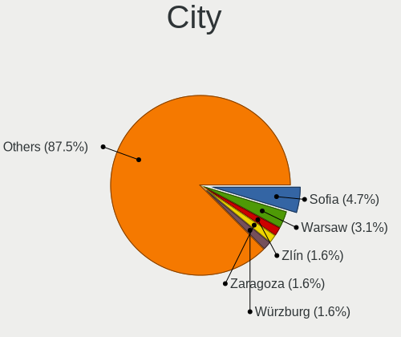
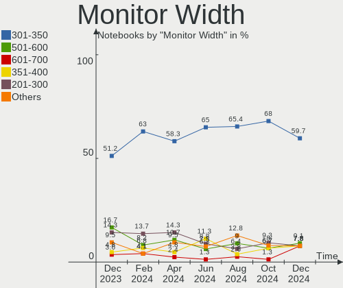
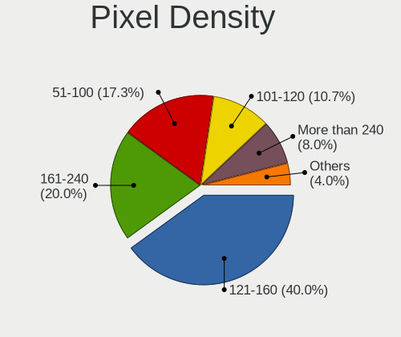

Manjaro - Hardware Trends (Notebooks)
-------------------------------------

A project to identify most popular hardware characteristics and track their change
over time based on data collected by Linux users at https://Linux-Hardware.org.

Anyone can contribute to this report by the [hw-probe](https://github.com/linuxhw/hw-probe) tool:

    sudo -E hw-probe -all -upload

This report is for one last month. Overall report since the beginning of time: [TestCoverage](https://github.com/linuxhw/TestCoverage)

Period: Jul, 2022.

Contents
--------

* [ System ](#system)
  - [ OS                       ](#os)
  - [ OS Family                ](#os-family)
  - [ Kernel                   ](#kernel)
  - [ Kernel Family            ](#kernel-family)
  - [ Kernel Major Ver.        ](#kernel-major-ver)
  - [ Arch                     ](#arch)
  - [ DE                       ](#de)
  - [ Display Server           ](#display-server)
  - [ Display Manager          ](#display-manager)
  - [ OS Lang                  ](#os-lang)
  - [ Boot Mode                ](#boot-mode)
  - [ Filesystem               ](#filesystem)
  - [ Part. scheme             ](#part-scheme)
  - [ Dual Boot with Linux/BSD ](#dual-boot-with-linuxbsd)
  - [ Dual Boot (Win)          ](#dual-boot-win)

* [ Board ](#board)
  - [ Vendor                   ](#vendor)
  - [ Model                    ](#model)
  - [ Model Family             ](#model-family)
  - [ MFG Year                 ](#mfg-year)
  - [ Form Factor              ](#form-factor)
  - [ Secure Boot              ](#secure-boot)
  - [ Coreboot                 ](#coreboot)
  - [ RAM Size                 ](#ram-size)
  - [ RAM Used                 ](#ram-used)
  - [ Total Drives             ](#total-drives)
  - [ Has CD-ROM               ](#has-cd-rom)
  - [ Has Ethernet             ](#has-ethernet)
  - [ Has WiFi                 ](#has-wifi)
  - [ Has Bluetooth            ](#has-bluetooth)

* [ Location ](#location)
  - [ Country                  ](#country)
  - [ City                     ](#city)

* [ Drives ](#drives)
  - [ Drive Vendor             ](#drive-vendor)
  - [ Drive Model              ](#drive-model)
  - [ HDD Vendor               ](#hdd-vendor)
  - [ SSD Vendor               ](#ssd-vendor)
  - [ Drive Kind               ](#drive-kind)
  - [ Drive Connector          ](#drive-connector)
  - [ Drive Size               ](#drive-size)
  - [ Space Total              ](#space-total)
  - [ Space Used               ](#space-used)
  - [ Malfunc. Drives          ](#malfunc-drives)
  - [ Malfunc. Drive Vendor    ](#malfunc-drive-vendor)
  - [ Malfunc. HDD Vendor      ](#malfunc-hdd-vendor)
  - [ Malfunc. Drive Kind      ](#malfunc-drive-kind)
  - [ Failed Drives            ](#failed-drives)
  - [ Failed Drive Vendor      ](#failed-drive-vendor)
  - [ Drive Status             ](#drive-status)

* [ Storage controller ](#storage-controller)
  - [ Storage Vendor           ](#storage-vendor)
  - [ Storage Model            ](#storage-model)
  - [ Storage Kind             ](#storage-kind)

* [ Processor ](#processor)
  - [ CPU Vendor               ](#cpu-vendor)
  - [ CPU Model                ](#cpu-model)
  - [ CPU Model Family         ](#cpu-model-family)
  - [ CPU Cores                ](#cpu-cores)
  - [ CPU Sockets              ](#cpu-sockets)
  - [ CPU Threads              ](#cpu-threads)
  - [ CPU Op-Modes             ](#cpu-op-modes)
  - [ CPU Microcode            ](#cpu-microcode)
  - [ CPU Microarch            ](#cpu-microarch)

* [ Graphics ](#graphics)
  - [ GPU Vendor               ](#gpu-vendor)
  - [ GPU Model                ](#gpu-model)
  - [ GPU Combo                ](#gpu-combo)
  - [ GPU Driver               ](#gpu-driver)
  - [ GPU Memory               ](#gpu-memory)

* [ Monitor ](#monitor)
  - [ Monitor Vendor           ](#monitor-vendor)
  - [ Monitor Model            ](#monitor-model)
  - [ Monitor Resolution       ](#monitor-resolution)
  - [ Monitor Diagonal         ](#monitor-diagonal)
  - [ Monitor Width            ](#monitor-width)
  - [ Aspect Ratio             ](#aspect-ratio)
  - [ Monitor Area             ](#monitor-area)
  - [ Pixel Density            ](#pixel-density)
  - [ Multiple Monitors        ](#multiple-monitors)

* [ Network ](#network)
  - [ Net Controller Vendor    ](#net-controller-vendor)
  - [ Net Controller Model     ](#net-controller-model)
  - [ Wireless Vendor          ](#wireless-vendor)
  - [ Wireless Model           ](#wireless-model)
  - [ Ethernet Vendor          ](#ethernet-vendor)
  - [ Ethernet Model           ](#ethernet-model)
  - [ Net Controller Kind      ](#net-controller-kind)
  - [ Used Controller          ](#used-controller)
  - [ NICs                     ](#nics)
  - [ IPv6                     ](#ipv6)

* [ Bluetooth ](#bluetooth)
  - [ Bluetooth Vendor         ](#bluetooth-vendor)
  - [ Bluetooth Model          ](#bluetooth-model)

* [ Sound ](#sound)
  - [ Sound Vendor             ](#sound-vendor)
  - [ Sound Model              ](#sound-model)

* [ Memory ](#memory)
  - [ Memory Vendor            ](#memory-vendor)
  - [ Memory Model             ](#memory-model)
  - [ Memory Kind              ](#memory-kind)
  - [ Memory Form Factor       ](#memory-form-factor)
  - [ Memory Size              ](#memory-size)
  - [ Memory Speed             ](#memory-speed)

* [ Printers & scanners ](#printers--scanners)
  - [ Printer Vendor           ](#printer-vendor)
  - [ Printer Model            ](#printer-model)
  - [ Scanner Vendor           ](#scanner-vendor)
  - [ Scanner Model            ](#scanner-model)

* [ Camera ](#camera)
  - [ Camera Vendor            ](#camera-vendor)
  - [ Camera Model             ](#camera-model)

* [ Security ](#security)
  - [ Fingerprint Vendor       ](#fingerprint-vendor)
  - [ Fingerprint Model        ](#fingerprint-model)
  - [ Chipcard Vendor          ](#chipcard-vendor)
  - [ Chipcard Model           ](#chipcard-model)

* [ Unsupported ](#unsupported)
  - [ Unsupported Devices      ](#unsupported-devices)
  - [ Unsupported Device Types ](#unsupported-device-types)

System
------

OS
--

Installed operating systems

| Name           | Notebooks | Percent |
|----------------|-----------|---------|
| Manjaro        | 46        | 48.42%  |
| Manjaro 21.3.2 | 15        | 15.79%  |
| Manjaro 21.3.5 | 9         | 9.47%   |
| Manjaro 21.3.1 | 8         | 8.42%   |
| Manjaro 21.3.3 | 7         | 7.37%   |
| Manjaro 21.3.6 | 4         | 4.21%   |
| Manjaro 21.3.4 | 3         | 3.16%   |
| Manjaro 21.2.6 | 2         | 2.11%   |
| Manjaro 21.2.4 | 1         | 1.05%   |

OS Family
---------

OS without a version

| Name    | Notebooks | Percent |
|---------|-----------|---------|
| Manjaro | 95        | 100%    |

Kernel
------

Version of the Linux kernel

| Version                | Notebooks | Percent |
|------------------------|-----------|---------|
| 5.15.49-1-MANJARO      | 13        | 13.68%  |
| 5.15.55-1-MANJARO      | 9         | 9.47%   |
| 5.18.12-3-MANJARO      | 8         | 8.42%   |
| 5.15.53-1-MANJARO      | 8         | 8.42%   |
| 5.15.50-1-MANJARO      | 7         | 7.37%   |
| 5.18.10-1-MANJARO      | 6         | 6.32%   |
| 5.19.0-1-MANJARO       | 4         | 4.21%   |
| 5.18.7-1-MANJARO       | 4         | 4.21%   |
| 5.18.6-1-MANJARO       | 4         | 4.21%   |
| 5.18.0-1-rt11-MANJARO  | 4         | 4.21%   |
| 5.15.57-2-MANJARO      | 4         | 4.21%   |
| 5.17.15-1-MANJARO      | 3         | 3.16%   |
| 5.13.19-2-MANJARO      | 3         | 3.16%   |
| 5.10.131-1-MANJARO     | 3         | 3.16%   |
| 5.15.46-1-MANJARO      | 2         | 2.11%   |
| 5.15.32-1-MANJARO      | 2         | 2.11%   |
| 5.15.25-1-MANJARO      | 2         | 2.11%   |
| 5.10.124-1-MANJARO     | 2         | 2.11%   |
| 5.8.18-1-MANJARO       | 1         | 1.05%   |
| 5.19.0-rc6-264-tkg-cfs | 1         | 1.05%   |
| 5.18.14-1-MANJARO      | 1         | 1.05%   |
| 5.18.11-lqx1-1-lqx     | 1         | 1.05%   |
| 5.16.20-2-MANJARO      | 1         | 1.05%   |
| 5.16.18-1-MANJARO      | 1         | 1.05%   |
| 5.15.54-1-MANJARO      | 1         | 1.05%   |

Kernel Family
-------------

Linux kernel without a distro release

| Version  | Notebooks | Percent |
|----------|-----------|---------|
| 5.15.49  | 13        | 13.68%  |
| 5.15.55  | 9         | 9.47%   |
| 5.18.12  | 8         | 8.42%   |
| 5.15.53  | 8         | 8.42%   |
| 5.15.50  | 7         | 7.37%   |
| 5.18.10  | 6         | 6.32%   |
| 5.19.0   | 5         | 5.26%   |
| 5.18.7   | 4         | 4.21%   |
| 5.18.6   | 4         | 4.21%   |
| 5.18.0   | 4         | 4.21%   |
| 5.15.57  | 4         | 4.21%   |
| 5.17.15  | 3         | 3.16%   |
| 5.13.19  | 3         | 3.16%   |
| 5.10.131 | 3         | 3.16%   |
| 5.15.46  | 2         | 2.11%   |
| 5.15.32  | 2         | 2.11%   |
| 5.15.25  | 2         | 2.11%   |
| 5.10.124 | 2         | 2.11%   |
| 5.8.18   | 1         | 1.05%   |
| 5.18.14  | 1         | 1.05%   |
| 5.18.11  | 1         | 1.05%   |
| 5.16.20  | 1         | 1.05%   |
| 5.16.18  | 1         | 1.05%   |
| 5.15.54  | 1         | 1.05%   |

Kernel Major Ver.
-----------------

Linux kernel major version

| Version | Notebooks | Percent |
|---------|-----------|---------|
| 5.15    | 48        | 50.53%  |
| 5.18    | 28        | 29.47%  |
| 5.19    | 5         | 5.26%   |
| 5.10    | 5         | 5.26%   |
| 5.17    | 3         | 3.16%   |
| 5.13    | 3         | 3.16%   |
| 5.16    | 2         | 2.11%   |
| 5.8     | 1         | 1.05%   |

Arch
----

OS architecture (x86_64, i586, etc.)

| Name   | Notebooks | Percent |
|--------|-----------|---------|
| x86_64 | 95        | 100%    |

DE
--

Desktop Environment

| Name    | Notebooks | Percent |
|---------|-----------|---------|
| KDE5    | 45        | 47.37%  |
| GNOME   | 23        | 24.21%  |
| XFCE    | 19        | 20%     |
| sway    | 2         | 2.11%   |
| MATE    | 2         | 2.11%   |
| Deepin  | 2         | 2.11%   |
| i3      | 1         | 1.05%   |
| Unknown | 1         | 1.05%   |

Display Server
--------------

X11 or Wayland

| Name    | Notebooks | Percent |
|---------|-----------|---------|
| X11     | 81        | 85.26%  |
| Wayland | 14        | 14.74%  |

Display Manager
---------------

SDDM, LightDM, etc.

| Name    | Notebooks | Percent |
|---------|-----------|---------|
| Unknown | 46        | 48.42%  |
| SDDM    | 16        | 16.84%  |
| GDM     | 16        | 16.84%  |
| LightDM | 15        | 15.79%  |
| LXDM    | 1         | 1.05%   |
| GREETD  | 1         | 1.05%   |

OS Lang
-------

Language

| Lang    | Notebooks | Percent |
|---------|-----------|---------|
| en_US   | 45        | 47.37%  |
| ru_RU   | 9         | 9.47%   |
| de_DE   | 8         | 8.42%   |
| pt_BR   | 6         | 6.32%   |
| pl_PL   | 3         | 3.16%   |
| en_GB   | 3         | 3.16%   |
| fr_FR   | 2         | 2.11%   |
| es_MX   | 2         | 2.11%   |
| es_AR   | 2         | 2.11%   |
| en_DK   | 2         | 2.11%   |
| uk_UA   | 1         | 1.05%   |
| ro_RO   | 1         | 1.05%   |
| nl_NL   | 1         | 1.05%   |
| fr_CH   | 1         | 1.05%   |
| es_ES   | 1         | 1.05%   |
| es_EC   | 1         | 1.05%   |
| es_CL   | 1         | 1.05%   |
| en_IN   | 1         | 1.05%   |
| en_CA   | 1         | 1.05%   |
| en_AU   | 1         | 1.05%   |
| en_AG   | 1         | 1.05%   |
| C       | 1         | 1.05%   |
| Unknown | 1         | 1.05%   |

Boot Mode
---------

EFI or BIOS

| Mode | Notebooks | Percent |
|------|-----------|---------|
| BIOS | 61        | 64.21%  |
| EFI  | 34        | 35.79%  |

Filesystem
----------

Type of filesystem

| Type    | Notebooks | Percent |
|---------|-----------|---------|
| Ext4    | 78        | 82.11%  |
| Btrfs   | 14        | 14.74%  |
| Overlay | 3         | 3.16%   |

Part. scheme
------------

Scheme of partitioning

| Type    | Notebooks | Percent |
|---------|-----------|---------|
| Unknown | 58        | 61.05%  |
| GPT     | 35        | 36.84%  |
| MBR     | 2         | 2.11%   |

Dual Boot with Linux/BSD
------------------------

Hosting more than one Linux/BSD

| Dual boot | Notebooks | Percent |
|-----------|-----------|---------|
| No        | 87        | 91.58%  |
| Yes       | 8         | 8.42%   |

Dual Boot (Win)
---------------

Hosting Linux and Windows

| Dual boot | Notebooks | Percent |
|-----------|-----------|---------|
| No        | 73        | 76.84%  |
| Yes       | 22        | 23.16%  |

Board
-----

Vendor
------

Motherboard manufacturer

| Name                | Notebooks | Percent |
|---------------------|-----------|---------|
| Lenovo              | 22        | 23.16%  |
| Dell                | 16        | 16.84%  |
| ASUSTek Computer    | 15        | 15.79%  |
| Hewlett-Packard     | 14        | 14.74%  |
| Acer                | 5         | 5.26%   |
| HUAWEI              | 3         | 3.16%   |
| Apple               | 3         | 3.16%   |
| Timi                | 2         | 2.11%   |
| Schenker            | 2         | 2.11%   |
| MSI                 | 2         | 2.11%   |
| Chuwi               | 2         | 2.11%   |
| Toshiba             | 1         | 1.05%   |
| TENKU               | 1         | 1.05%   |
| System76            | 1         | 1.05%   |
| Sony                | 1         | 1.05%   |
| Samsung Electronics | 1         | 1.05%   |
| Notebook            | 1         | 1.05%   |
| LG Electronics      | 1         | 1.05%   |
| Google              | 1         | 1.05%   |
| Alienware           | 1         | 1.05%   |

Model
-----

Motherboard model

| Name                                  | Notebooks | Percent |
|---------------------------------------|-----------|---------|
| Chuwi HeroBook Air                    | 2         | 2.11%   |
| Toshiba Satellite A100                | 1         | 1.05%   |
| Timi TM1701                           | 1         | 1.05%   |
| Timi Mi NoteBook Pro                  | 1         | 1.05%   |
| TENKU SB14                            | 1         | 1.05%   |
| System76 Serval WS                    | 1         | 1.05%   |
| Sony VJF153                           | 1         | 1.05%   |
| Schenker XMG PRO (Late 2021)          | 1         | 1.05%   |
| Schenker VISION 15 (SVS15E21)         | 1         | 1.05%   |
| Samsung 340XAA/350XAA/550XAA          | 1         | 1.05%   |
| Notebook W350STQ/W370ST               | 1         | 1.05%   |
| MSI GS66 Stealth 10SGS                | 1         | 1.05%   |
| MSI GF63 Thin 9SC                     | 1         | 1.05%   |
| LG 17Z90N-V.AA55A1                    | 1         | 1.05%   |
| Lenovo ThinkPad X240 20AMS1JQ11       | 1         | 1.05%   |
| Lenovo ThinkPad X230 2325TXB          | 1         | 1.05%   |
| Lenovo ThinkPad T480s 20L8S31T00      | 1         | 1.05%   |
| Lenovo ThinkPad SL510 28479XU         | 1         | 1.05%   |
| Lenovo ThinkPad P15v Gen 1 20TQCTO1WW | 1         | 1.05%   |
| Lenovo ThinkPad L470 20J5S01L00       | 1         | 1.05%   |
| Lenovo ThinkPad L13 Gen 2 20VH0018RT  | 1         | 1.05%   |
| Lenovo ThinkPad Edge E430 325437S     | 1         | 1.05%   |
| Lenovo ThinkPad E585 20KVCTO1WW       | 1         | 1.05%   |
| Lenovo ThinkBook 14 G2 ITL 20VD       | 1         | 1.05%   |
| Lenovo Legion S7 15ACH6 82K8          | 1         | 1.05%   |
| Lenovo Legion 5 17ACH6 82K0           | 1         | 1.05%   |
| Lenovo Legion 5 15ACH6H 82JU          | 1         | 1.05%   |
| Lenovo IdeaPad Z510 20287             | 1         | 1.05%   |
| Lenovo IdeaPad U430 Touch 20270       | 1         | 1.05%   |
| Lenovo IdeaPad U330p 20267            | 1         | 1.05%   |
| Lenovo IdeaPad S145-14IIL 81W6        | 1         | 1.05%   |
| Lenovo IdeaPad Gaming 3 15ARH05 82EY  | 1         | 1.05%   |
| Lenovo IdeaPad 700-15ISK 80RU         | 1         | 1.05%   |
| Lenovo IdeaPad 5 14ALC05 82LM         | 1         | 1.05%   |
| Lenovo IdeaPad 120S-14IAP 81A5        | 1         | 1.05%   |
| Lenovo G580 20150                     | 1         | 1.05%   |
| HUAWEI VLT-WX0                        | 1         | 1.05%   |
| HUAWEI KLVL-WXXW                      | 1         | 1.05%   |
| HUAWEI CREM-WXX9                      | 1         | 1.05%   |
| HP ZBook 15 G5                        | 1         | 1.05%   |
| HP ProBook 4540s                      | 1         | 1.05%   |
| HP ProBook 4520s                      | 1         | 1.05%   |
| HP ProBook 440 G4                     | 1         | 1.05%   |
| HP ProBook 430 G6                     | 1         | 1.05%   |
| HP Pavilion Laptop 14-ce0xxx          | 1         | 1.05%   |
| HP Pavilion Gaming Laptop 15-ec0xxx   | 1         | 1.05%   |
| HP Pavilion Gaming Laptop 15-dk0xxx   | 1         | 1.05%   |
| HP Pavilion g6                        | 1         | 1.05%   |
| HP Laptop 17-cp0xxx                   | 1         | 1.05%   |
| HP Laptop 15-dy0xxx                   | 1         | 1.05%   |
| HP EliteBook 8540p                    | 1         | 1.05%   |
| HP EliteBook 850 G1                   | 1         | 1.05%   |
| HP EliteBook 840 G5                   | 1         | 1.05%   |
| Google Coral                          | 1         | 1.05%   |
| Dell XPS 15 9510                      | 1         | 1.05%   |
| Dell XPS 13 9333                      | 1         | 1.05%   |
| Dell Vostro 15 3510                   | 1         | 1.05%   |
| Dell Latitude E6430                   | 1         | 1.05%   |
| Dell Latitude E6410                   | 1         | 1.05%   |
| Dell Latitude E5530 non-vPro          | 1         | 1.05%   |

Model Family
------------

Motherboard model prefix

| Name               | Notebooks | Percent |
|--------------------|-----------|---------|
| Lenovo ThinkPad    | 9         | 9.47%   |
| Lenovo IdeaPad     | 8         | 8.42%   |
| Dell Inspiron      | 8         | 8.42%   |
| Dell Latitude      | 5         | 5.26%   |
| HP ProBook         | 4         | 4.21%   |
| HP Pavilion        | 4         | 4.21%   |
| Lenovo Legion      | 3         | 3.16%   |
| HP EliteBook       | 3         | 3.16%   |
| ASUS VivoBook      | 3         | 3.16%   |
| ASUS ASUS          | 3         | 3.16%   |
| Acer Aspire        | 3         | 3.16%   |
| HP Laptop          | 2         | 2.11%   |
| Dell XPS           | 2         | 2.11%   |
| Chuwi HeroBook     | 2         | 2.11%   |
| ASUS TUF           | 2         | 2.11%   |
| Apple MacBookPro14 | 2         | 2.11%   |
| Toshiba Satellite  | 1         | 1.05%   |
| Timi TM1701        | 1         | 1.05%   |
| Timi Mi            | 1         | 1.05%   |
| TENKU SB14         | 1         | 1.05%   |
| System76 Serval    | 1         | 1.05%   |
| Sony VJF153        | 1         | 1.05%   |
| Schenker XMG       | 1         | 1.05%   |
| Schenker VISION    | 1         | 1.05%   |
| Samsung 340XAA     | 1         | 1.05%   |
| Notebook W350STQ   | 1         | 1.05%   |
| MSI GS66           | 1         | 1.05%   |
| MSI GF63           | 1         | 1.05%   |
| LG 17Z90N-V.AA55A1 | 1         | 1.05%   |
| Lenovo ThinkBook   | 1         | 1.05%   |
| Lenovo G580        | 1         | 1.05%   |
| HUAWEI VLT-WX0     | 1         | 1.05%   |
| HUAWEI KLVL-WXXW   | 1         | 1.05%   |
| HUAWEI CREM-WXX9   | 1         | 1.05%   |
| HP ZBook           | 1         | 1.05%   |
| Google Coral       | 1         | 1.05%   |
| Dell Vostro        | 1         | 1.05%   |
| ASUS X55U          | 1         | 1.05%   |
| ASUS X555LN        | 1         | 1.05%   |
| ASUS X450LCP       | 1         | 1.05%   |
| ASUS X202E         | 1         | 1.05%   |
| ASUS ROG           | 1         | 1.05%   |
| ASUS Q504UA        | 1         | 1.05%   |
| ASUS N552VW        | 1         | 1.05%   |
| Apple MacBookAir6  | 1         | 1.05%   |
| Alienware 17       | 1         | 1.05%   |
| Acer Swift         | 1         | 1.05%   |
| Acer Predator      | 1         | 1.05%   |

MFG Year
--------

Motherboard manufacture year

| Year | Notebooks | Percent |
|------|-----------|---------|
| 2021 | 16        | 16.84%  |
| 2019 | 14        | 14.74%  |
| 2020 | 12        | 12.63%  |
| 2018 | 10        | 10.53%  |
| 2012 | 10        | 10.53%  |
| 2013 | 9         | 9.47%   |
| 2017 | 8         | 8.42%   |
| 2016 | 4         | 4.21%   |
| 2010 | 3         | 3.16%   |
| 2015 | 2         | 2.11%   |
| 2014 | 2         | 2.11%   |
| 2009 | 2         | 2.11%   |
| 2022 | 1         | 1.05%   |
| 2011 | 1         | 1.05%   |
| 2006 | 1         | 1.05%   |

Form Factor
-----------

Physical design of the computer

| Name     | Notebooks | Percent |
|----------|-----------|---------|
| Notebook | 95        | 100%    |

Secure Boot
-----------

Enabled or disabled

| State    | Notebooks | Percent |
|----------|-----------|---------|
| Disabled | 95        | 100%    |

Coreboot
--------

Have coreboot on board

| Used | Notebooks | Percent |
|------|-----------|---------|
| No   | 94        | 98.95%  |
| Yes  | 1         | 1.05%   |

RAM Size
--------

Total RAM memory

| Size in GB  | Notebooks | Percent |
|-------------|-----------|---------|
| 4.01-8.0    | 30        | 31.58%  |
| 8.01-16.0   | 19        | 20%     |
| 16.01-24.0  | 18        | 18.95%  |
| 3.01-4.0    | 13        | 13.68%  |
| 32.01-64.0  | 9         | 9.47%   |
| 24.01-32.0  | 3         | 3.16%   |
| 64.01-256.0 | 2         | 2.11%   |
| 1.01-2.0    | 1         | 1.05%   |

RAM Used
--------

Used RAM memory

| Used GB   | Notebooks | Percent |
|-----------|-----------|---------|
| 4.01-8.0  | 27        | 28.42%  |
| 1.01-2.0  | 25        | 26.32%  |
| 2.01-3.0  | 22        | 23.16%  |
| 3.01-4.0  | 15        | 15.79%  |
| 8.01-16.0 | 5         | 5.26%   |
| 0.51-1.0  | 1         | 1.05%   |

Total Drives
------------

Number of drives on board

| Drives | Notebooks | Percent |
|--------|-----------|---------|
| 1      | 59        | 62.11%  |
| 2      | 33        | 34.74%  |
| 3      | 3         | 3.16%   |

Has CD-ROM
----------

Has CD-ROM on board

| Presented | Notebooks | Percent |
|-----------|-----------|---------|
| No        | 76        | 80%     |
| Yes       | 19        | 20%     |

Has Ethernet
------------

Has Ethernet on board

| Presented | Notebooks | Percent |
|-----------|-----------|---------|
| Yes       | 67        | 70.53%  |
| No        | 28        | 29.47%  |

Has WiFi
--------

Has WiFi module

| Presented | Notebooks | Percent |
|-----------|-----------|---------|
| Yes       | 95        | 100%    |

Has Bluetooth
-------------

Has Bluetooth module

| Presented | Notebooks | Percent |
|-----------|-----------|---------|
| Yes       | 81        | 85.26%  |
| No        | 14        | 14.74%  |

Location
--------

Country
-------

Geographic location (country)

| Country     | Notebooks | Percent |
|-------------|-----------|---------|
| USA         | 20        | 21.05%  |
| Germany     | 11        | 11.58%  |
| Russia      | 9         | 9.47%   |
| Brazil      | 8         | 8.42%   |
| Poland      | 5         | 5.26%   |
| Netherlands | 4         | 4.21%   |
| India       | 4         | 4.21%   |
| Mexico      | 3         | 3.16%   |
| France      | 3         | 3.16%   |
| UK          | 2         | 2.11%   |
| Spain       | 2         | 2.11%   |
| Latvia      | 2         | 2.11%   |
| Denmark     | 2         | 2.11%   |
| Canada      | 2         | 2.11%   |
| Argentina   | 2         | 2.11%   |
| Vietnam     | 1         | 1.05%   |
| Taiwan      | 1         | 1.05%   |
| Switzerland | 1         | 1.05%   |
| Sweden      | 1         | 1.05%   |
| Romania     | 1         | 1.05%   |
| Moldova     | 1         | 1.05%   |
| Italy       | 1         | 1.05%   |
| Israel      | 1         | 1.05%   |
| Iran        | 1         | 1.05%   |
| Ghana       | 1         | 1.05%   |
| Finland     | 1         | 1.05%   |
| Ecuador     | 1         | 1.05%   |
| Chile       | 1         | 1.05%   |
| Bangladesh  | 1         | 1.05%   |
| Australia   | 1         | 1.05%   |
| Armenia     | 1         | 1.05%   |

City
----

Geographic location (city)

| City               | Notebooks | Percent |
|--------------------|-----------|---------|
| Moscow             | 4         | 4.21%   |
| Warsaw             | 2         | 2.11%   |
| Tucson             | 2         | 2.11%   |
| Sao Paulo          | 2         | 2.11%   |
| Riga               | 2         | 2.11%   |
| Holstebro          | 2         | 2.11%   |
| Dresden            | 2         | 2.11%   |
| Denver             | 2         | 2.11%   |
| Zutphen            | 1         | 1.05%   |
| Yerevan            | 1         | 1.05%   |
| Yamunanagar        | 1         | 1.05%   |
| Wroclaw            | 1         | 1.05%   |
| Wettringen         | 1         | 1.05%   |
| Villa Ballester    | 1         | 1.05%   |
| Victoria           | 1         | 1.05%   |
| Veenendaal         | 1         | 1.05%   |
| Valdemoro          | 1         | 1.05%   |
| Ufa                | 1         | 1.05%   |
| Toulon             | 1         | 1.05%   |
| The Hague          | 1         | 1.05%   |
| The Bronx          | 1         | 1.05%   |
| Tehran             | 1         | 1.05%   |
| Tainan City        | 1         | 1.05%   |
| Sydney             | 1         | 1.05%   |
| Stratford          | 1         | 1.05%   |
| Stockholm          | 1         | 1.05%   |
| St Petersburg      | 1         | 1.05%   |
| Sibiu              | 1         | 1.05%   |
| Serra              | 1         | 1.05%   |
| Santiago Amoltepec | 1         | 1.05%   |
| Santiago           | 1         | 1.05%   |
| Salt Lake City     | 1         | 1.05%   |
| Saint Charles      | 1         | 1.05%   |
| Rosario            | 1         | 1.05%   |
| Recife             | 1         | 1.05%   |
| Quimper            | 1         | 1.05%   |
| Port Clinton       | 1         | 1.05%   |
| Pachelma           | 1         | 1.05%   |
| Nuremberg          | 1         | 1.05%   |
| Nakhodka           | 1         | 1.05%   |
| Muscle Shoals      | 1         | 1.05%   |
| Malbork            | 1         | 1.05%   |
| Lufkin             | 1         | 1.05%   |
| London             | 1         | 1.05%   |
| Limeira            | 1         | 1.05%   |
| Lehesten           | 1         | 1.05%   |
| Lausanne           | 1         | 1.05%   |
| Krasnodar          | 1         | 1.05%   |
| Kennesaw           | 1         | 1.05%   |
| Karlsruhe          | 1         | 1.05%   |
| Kagal              | 1         | 1.05%   |
| Jerusalem          | 1         | 1.05%   |
| Interlaken         | 1         | 1.05%   |
| Hrubieszów        | 1         | 1.05%   |
| Guwahati           | 1         | 1.05%   |
| Gurgaon            | 1         | 1.05%   |
| Guayaquil          | 1         | 1.05%   |
| Guadalajara        | 1         | 1.05%   |
| Grand Junction     | 1         | 1.05%   |
| Gaffney            | 1         | 1.05%   |

Drives
------

Drive Vendor
------------

Hard drive vendors

| Vendor              | Notebooks | Drives | Percent |
|---------------------|-----------|--------|---------|
| Samsung Electronics | 23        | 26     | 17.83%  |
| Seagate             | 15        | 15     | 11.63%  |
| WDC                 | 12        | 13     | 9.3%    |
| SanDisk             | 8         | 8      | 6.2%    |
| Micron Technology   | 8         | 8      | 6.2%    |
| Kingston            | 8         | 8      | 6.2%    |
| Toshiba             | 7         | 7      | 5.43%   |
| SK hynix            | 7         | 7      | 5.43%   |
| Unknown             | 5         | 5      | 3.88%   |
| Crucial             | 5         | 5      | 3.88%   |
| KIOXIA              | 4         | 4      | 3.1%    |
| Hitachi             | 4         | 4      | 3.1%    |
| HGST                | 4         | 4      | 3.1%    |
| XPG                 | 2         | 2      | 1.55%   |
| Phison              | 2         | 2      | 1.55%   |
| Netac               | 2         | 2      | 1.55%   |
| Intel               | 2         | 2      | 1.55%   |
| Apple               | 2         | 3      | 1.55%   |
| Win Memory          | 1         | 1      | 0.78%   |
| Transcend           | 1         | 1      | 0.78%   |
| SSK                 | 1         | 1      | 0.78%   |
| PNY                 | 1         | 1      | 0.78%   |
| NGFF                | 1         | 1      | 0.78%   |
| Lexar               | 1         | 1      | 0.78%   |
| Hewlett-Packard     | 1         | 1      | 0.78%   |
| GOODRAM             | 1         | 1      | 0.78%   |
| A-DATA Technology   | 1         | 1      | 0.78%   |

Drive Model
-----------

Hard drive models

| Model                                   | Notebooks | Percent |
|-----------------------------------------|-----------|---------|
| Seagate ST1000LM035-1RK172 1TB          | 4         | 3.01%   |
| Kingston SA400S37480G 480GB SSD         | 4         | 3.01%   |
| Samsung NVMe SSD Drive 256GB            | 3         | 2.26%   |
| XPG NVMe SSD Drive 1024GB               | 2         | 1.5%    |
| WDC WDS250G2B0A-00SM50 250GB SSD        | 2         | 1.5%    |
| Toshiba NVMe SSD Drive 2TB              | 2         | 1.5%    |
| SK hynix NVMe SSD Drive 512GB           | 2         | 1.5%    |
| SK hynix BC501 HFM256GDJTNG-8310A 256GB | 2         | 1.5%    |
| Seagate ST500LT012-9WS142 500GB         | 2         | 1.5%    |
| Seagate ST1000LM049-2GH172 1TB          | 2         | 1.5%    |
| SanDisk NVMe SSD Drive 512GB            | 2         | 1.5%    |
| SanDisk NVMe SSD Drive 256GB            | 2         | 1.5%    |
| Samsung SSD 870 QVO 1TB                 | 2         | 1.5%    |
| Samsung SSD 860 EVO 500GB               | 2         | 1.5%    |
| Samsung NVMe SSD Drive 512GB            | 2         | 1.5%    |
| Samsung NVMe SSD Drive 1024GB           | 2         | 1.5%    |
| Netac SSD 128GB                         | 2         | 1.5%    |
| Micron NVMe SSD Drive 512GB             | 2         | 1.5%    |
| Micron 1100 SATA 512GB SSD              | 2         | 1.5%    |
| Intel NVMe SSD Drive 512GB              | 2         | 1.5%    |
| Hitachi HTS727550A9E364 500GB           | 2         | 1.5%    |
| Crucial CT500MX500SSD1 500GB            | 2         | 1.5%    |
| Win Memory SWR256G-301II 256GB          | 1         | 0.75%   |
| WDC WDS100T2B0C-00PXH0 1TB              | 1         | 0.75%   |
| WDC WD7500BPVX-60JC3T0 752GB            | 1         | 0.75%   |
| WDC WD7500BPKT-75PK4T0 752GB            | 1         | 0.75%   |
| WDC WD50 00LPCX-24C6HT0 500GB           | 1         | 0.75%   |
| WDC WD3200BEKT-75PVMT1 320GB            | 1         | 0.75%   |
| WDC WD2500LPCX-24C6HT0 250GB            | 1         | 0.75%   |
| WDC WD10SPCX-24HWST1 1TB                | 1         | 0.75%   |
| WDC WD10JPCX-24UE4T0 1TB                | 1         | 0.75%   |
| WDC PC SN730 SDBPNTY-512G               | 1         | 0.75%   |
| WDC PC SN730 NVMe 1024GB                | 1         | 0.75%   |
| WDC PC SN530 SDBPNPZ-512G-1006 512GB    | 1         | 0.75%   |
| Unknown TA2964  64GB                    | 1         | 0.75%   |
| Unknown MMC Card  16GB                  | 1         | 0.75%   |
| Unknown EC2QT  64GB                     | 1         | 0.75%   |
| Unknown ABLCE  64GB                     | 1         | 0.75%   |
| Unknown 00000  32GB                     | 1         | 0.75%   |
| Transcend TS256GMTS430S 256GB SSD       | 1         | 0.75%   |
| Toshiba THNSNH128GMCT 128GB SSD         | 1         | 0.75%   |
| Toshiba NVMe SSD Drive 1TB              | 1         | 0.75%   |
| Toshiba MK6476GSX 640GB                 | 1         | 0.75%   |
| Toshiba MK5061GSY 500GB                 | 1         | 0.75%   |
| Toshiba MK2556GSY 250GB                 | 1         | 0.75%   |
| SSK Disk 128GB                          | 1         | 0.75%   |
| SK hynix NVMe SSD Drive 256GB           | 1         | 0.75%   |
| SK hynix HFS256G39MND-2300A 256GB SSD   | 1         | 0.75%   |
| SK hynix BC511 HFM256GDJTNI-82A0A 256GB | 1         | 0.75%   |
| Seagate ST9250410AS 250GB               | 1         | 0.75%   |
| Seagate ST500LM012 HN-M500MBB 500GB     | 1         | 0.75%   |
| Seagate ST4000LM024-2AN17V 4TB          | 1         | 0.75%   |
| Seagate ST2000LM007-1R8174 2TB          | 1         | 0.75%   |
| Seagate ST1000LX015-1U7172 1TB          | 1         | 0.75%   |
| Seagate ST1000LM024 HN-M101MBB 1TB      | 1         | 0.75%   |
| Seagate Portable 2TB                    | 1         | 0.75%   |
| SanDisk X600 M.2 2280 SATA 128GB SSD    | 1         | 0.75%   |
| SanDisk SD8SN8U-256G-1006 256GB SSD     | 1         | 0.75%   |
| SanDisk NVMe SSD Drive 500GB            | 1         | 0.75%   |
| SanDisk DF4032  32GB                    | 1         | 0.75%   |

HDD Vendor
----------

Hard disk drive vendors

| Vendor  | Notebooks | Drives | Percent |
|---------|-----------|--------|---------|
| Seagate | 14        | 14     | 45.16%  |
| WDC     | 6         | 7      | 19.35%  |
| Hitachi | 4         | 4      | 12.9%   |
| HGST    | 4         | 4      | 12.9%   |
| Toshiba | 3         | 3      | 9.68%   |

SSD Vendor
----------

Solid state drive vendors

| Vendor              | Notebooks | Drives | Percent |
|---------------------|-----------|--------|---------|
| Samsung Electronics | 10        | 10     | 25.64%  |
| Kingston            | 6         | 6      | 15.38%  |
| Micron Technology   | 3         | 3      | 7.69%   |
| Crucial             | 3         | 3      | 7.69%   |
| WDC                 | 2         | 2      | 5.13%   |
| SanDisk             | 2         | 2      | 5.13%   |
| Netac               | 2         | 2      | 5.13%   |
| Win Memory          | 1         | 1      | 2.56%   |
| Transcend           | 1         | 1      | 2.56%   |
| Toshiba             | 1         | 1      | 2.56%   |
| SK hynix            | 1         | 1      | 2.56%   |
| PNY                 | 1         | 1      | 2.56%   |
| NGFF                | 1         | 1      | 2.56%   |
| Lexar               | 1         | 1      | 2.56%   |
| Hewlett-Packard     | 1         | 1      | 2.56%   |
| GOODRAM             | 1         | 1      | 2.56%   |
| Apple               | 1         | 1      | 2.56%   |
| A-DATA Technology   | 1         | 1      | 2.56%   |

Drive Kind
----------

HDD or SSD

| Kind    | Notebooks | Drives | Percent |
|---------|-----------|--------|---------|
| NVMe    | 49        | 55     | 38.89%  |
| SSD     | 39        | 39     | 30.95%  |
| HDD     | 31        | 32     | 24.6%   |
| MMC     | 5         | 6      | 3.97%   |
| Unknown | 2         | 2      | 1.59%   |

Drive Connector
---------------

SATA, SAS, NVMe, etc.

| Type | Notebooks | Drives | Percent |
|------|-----------|--------|---------|
| SATA | 60        | 69     | 50.85%  |
| NVMe | 49        | 55     | 41.53%  |
| MMC  | 5         | 6      | 4.24%   |
| SAS  | 4         | 4      | 3.39%   |

Drive Size
----------

Size of hard drive

| Size in TB | Notebooks | Drives | Percent |
|------------|-----------|--------|---------|
| 0.01-0.5   | 44        | 46     | 64.71%  |
| 0.51-1.0   | 22        | 23     | 32.35%  |
| 3.01-4.0   | 1         | 1      | 1.47%   |
| 1.01-2.0   | 1         | 1      | 1.47%   |

Space Total
-----------

Amount of disk space available on the file system

| Size in GB     | Notebooks | Percent |
|----------------|-----------|---------|
| 251-500        | 28        | 29.47%  |
| 101-250        | 21        | 22.11%  |
| 501-1000       | 12        | 12.63%  |
| 1001-2000      | 10        | 10.53%  |
| 51-100         | 8         | 8.42%   |
| More than 3000 | 5         | 5.26%   |
| 1-20           | 4         | 4.21%   |
| Unknown        | 4         | 4.21%   |
| 2001-3000      | 2         | 2.11%   |
| 21-50          | 1         | 1.05%   |

Space Used
----------

Amount of used disk space

| Used GB        | Notebooks | Percent |
|----------------|-----------|---------|
| 21-50          | 21        | 22.11%  |
| 101-250        | 17        | 17.89%  |
| 1-20           | 16        | 16.84%  |
| 51-100         | 15        | 15.79%  |
| 251-500        | 13        | 13.68%  |
| 501-1000       | 5         | 5.26%   |
| Unknown        | 4         | 4.21%   |
| 1001-2000      | 2         | 2.11%   |
| More than 3000 | 1         | 1.05%   |
| 2001-3000      | 1         | 1.05%   |

Malfunc. Drives
---------------

Drive models with a malfunction

| Model                           | Notebooks | Drives | Percent |
|---------------------------------|-----------|--------|---------|
| Seagate ST500LT012-9WS142 500GB | 2         | 2      | 50%     |
| Seagate ST1000LX015-1U7172 1TB  | 1         | 1      | 25%     |
| Kingston SA400S37480G 480GB SSD | 1         | 1      | 25%     |

Malfunc. Drive Vendor
---------------------

Vendors of faulty drives

| Vendor   | Notebooks | Drives | Percent |
|----------|-----------|--------|---------|
| Seagate  | 3         | 3      | 75%     |
| Kingston | 1         | 1      | 25%     |

Malfunc. HDD Vendor
-------------------

Vendors of faulty HDD drives

| Vendor  | Notebooks | Drives | Percent |
|---------|-----------|--------|---------|
| Seagate | 3         | 3      | 100%    |

Malfunc. Drive Kind
-------------------

Kinds of faulty drives

| Kind | Notebooks | Drives | Percent |
|------|-----------|--------|---------|
| HDD  | 3         | 3      | 75%     |
| SSD  | 1         | 1      | 25%     |

Failed Drives
-------------

Failed drive models

Zero info for selected period =(

Failed Drive Vendor
-------------------

Failed drive vendors

Zero info for selected period =(

Drive Status
------------

Number of failed and malfunc. drives

| Status   | Notebooks | Drives | Percent |
|----------|-----------|--------|---------|
| Detected | 67        | 92     | 66.34%  |
| Works    | 30        | 38     | 29.7%   |
| Malfunc  | 4         | 4      | 3.96%   |

Storage controller
------------------

Storage Vendor
--------------

Storage controller vendors

| Vendor                       | Notebooks | Percent |
|------------------------------|-----------|---------|
| Intel                        | 59        | 46.83%  |
| Samsung Electronics          | 16        | 12.7%   |
| AMD                          | 15        | 11.9%   |
| SanDisk                      | 9         | 7.14%   |
| SK hynix                     | 6         | 4.76%   |
| Micron Technology            | 5         | 3.97%   |
| KIOXIA                       | 5         | 3.97%   |
| Toshiba America Info Systems | 2         | 1.59%   |
| Phison Electronics           | 2         | 1.59%   |
| Micron/Crucial Technology    | 2         | 1.59%   |
| Kingston Technology Company  | 2         | 1.59%   |
| ADATA Technology             | 2         | 1.59%   |
| Apple                        | 1         | 0.79%   |

Storage Model
-------------

Storage controller models

| Model                                                                          | Notebooks | Percent |
|--------------------------------------------------------------------------------|-----------|---------|
| AMD FCH SATA Controller [AHCI mode]                                            | 15        | 11.54%  |
| Intel Sunrise Point-LP SATA Controller [AHCI mode]                             | 11        | 8.46%   |
| Intel 7 Series Chipset Family 6-port SATA Controller [AHCI mode]               | 8         | 6.15%   |
| Intel 8 Series SATA Controller 1 [AHCI mode]                                   | 7         | 5.38%   |
| Samsung NVMe SSD Controller SM981/PM981/PM983                                  | 6         | 4.62%   |
| Intel 82801 Mobile SATA Controller [RAID mode]                                 | 6         | 4.62%   |
| Samsung NVMe SSD Controller 980                                                | 5         | 3.85%   |
| Micron Non-Volatile memory controller                                          | 5         | 3.85%   |
| KIOXIA NVMe SSD Controller BG4                                                 | 4         | 3.08%   |
| Intel Volume Management Device NVMe RAID Controller                            | 4         | 3.08%   |
| Intel Celeron/Pentium Silver Processor SATA Controller                         | 4         | 3.08%   |
| SanDisk WD Blue SN550 NVMe SSD                                                 | 3         | 2.31%   |
| Intel HM170/QM170 Chipset SATA Controller [AHCI Mode]                          | 3         | 2.31%   |
| Intel Cannon Lake Mobile PCH SATA AHCI Controller                              | 3         | 2.31%   |
| Intel 8 Series/C220 Series Chipset Family 6-port SATA Controller 1 [AHCI mode] | 3         | 2.31%   |
| Toshiba America Info Systems XG6 NVMe SSD Controller                           | 2         | 1.54%   |
| SK hynix Gold P31 SSD                                                          | 2         | 1.54%   |
| SK hynix BC511                                                                 | 2         | 1.54%   |
| SK hynix BC501 NVMe Solid State Drive                                          | 2         | 1.54%   |
| SanDisk WD Blue SN500 / PC SN520 NVMe SSD                                      | 2         | 1.54%   |
| SanDisk WD Black SN750 / PC SN730 NVMe SSD                                     | 2         | 1.54%   |
| Samsung NVMe SSD Controller SM961/PM961/SM963                                  | 2         | 1.54%   |
| Phison PS5013 E13 NVMe Controller                                              | 2         | 1.54%   |
| Intel SSD 660P Series                                                          | 2         | 1.54%   |
| Intel Ice Lake-LP SATA Controller [AHCI mode]                                  | 2         | 1.54%   |
| Intel 5 Series/3400 Series Chipset 6 port SATA AHCI Controller                 | 2         | 1.54%   |
| ADATA XPG SX8200 Pro PCIe Gen3x4 M.2 2280 Solid State Drive                    | 2         | 1.54%   |
| SanDisk WD Black 2018/SN750 / PC SN720 NVMe SSD                                | 1         | 0.77%   |
| SanDisk PC SN520 NVMe SSD                                                      | 1         | 0.77%   |
| Samsung NVMe SSD Controller SM951/PM951                                        | 1         | 0.77%   |
| Samsung NVMe SSD Controller PM9A1/PM9A3/980PRO                                 | 1         | 0.77%   |
| Samsung Apple PCIe SSD                                                         | 1         | 0.77%   |
| Micron/Crucial P2 NVMe PCIe SSD                                                | 1         | 0.77%   |
| Micron/Crucial Non-Volatile memory controller                                  | 1         | 0.77%   |
| KIOXIA NVMe SSD                                                                | 1         | 0.77%   |
| Kingston Company U-SNS8154P3 NVMe SSD                                          | 1         | 0.77%   |
| Kingston Company Company Non-Volatile memory controller                        | 1         | 0.77%   |
| Intel Wildcat Point-LP SATA Controller [AHCI Mode]                             | 1         | 0.77%   |
| Intel Tiger Lake-LP SATA Controller                                            | 1         | 0.77%   |
| Intel Celeron N3350/Pentium N4200/Atom E3900 Series SATA AHCI Controller       | 1         | 0.77%   |
| Intel Cannon Point-LP SATA Controller [AHCI Mode]                              | 1         | 0.77%   |
| Intel 82801IBM/IEM (ICH9M/ICH9M-E) 4 port SATA Controller [AHCI mode]          | 1         | 0.77%   |
| Intel 82801GBM/GHM (ICH7-M Family) SATA Controller [IDE mode]                  | 1         | 0.77%   |
| Intel 5 Series/3400 Series Chipset 4 port SATA AHCI Controller                 | 1         | 0.77%   |
| Apple S3X NVMe Controller                                                      | 1         | 0.77%   |
| AMD 400 Series Chipset SATA Controller                                         | 1         | 0.77%   |

Storage Kind
------------

Kind of storage controller (IDE, SATA, NVMe, SAS, ...)

| Kind | Notebooks | Percent |
|------|-----------|---------|
| SATA | 65        | 52%     |
| NVMe | 49        | 39.2%   |
| RAID | 10        | 8%      |
| IDE  | 1         | 0.8%    |

Processor
---------

CPU Vendor
----------

Processor vendors

| Vendor | Notebooks | Percent |
|--------|-----------|---------|
| Intel  | 75        | 78.95%  |
| AMD    | 20        | 21.05%  |

CPU Model
---------

Processor models

| Model                                         | Notebooks | Percent |
|-----------------------------------------------|-----------|---------|
| Intel Core i7-8550U CPU @ 1.80GHz             | 4         | 4.21%   |
| Intel Core i5-8250U CPU @ 1.60GHz             | 4         | 4.21%   |
| Intel Core i5-4210U CPU @ 1.70GHz             | 3         | 3.16%   |
| Intel 11th Gen Core i5-1135G7 @ 2.40GHz       | 3         | 3.16%   |
| AMD Ryzen 5 5500U with Radeon Graphics        | 3         | 3.16%   |
| Intel Core i7-9750H CPU @ 2.60GHz             | 2         | 2.11%   |
| Intel Core i7-7500U CPU @ 2.70GHz             | 2         | 2.11%   |
| Intel Core i7-6700HQ CPU @ 2.60GHz            | 2         | 2.11%   |
| Intel Core i5-7200U CPU @ 2.50GHz             | 2         | 2.11%   |
| Intel Core i5-3320M CPU @ 2.60GHz             | 2         | 2.11%   |
| Intel Core i5-1035G1 CPU @ 1.00GHz            | 2         | 2.11%   |
| Intel Core i5 CPU M 520 @ 2.40GHz             | 2         | 2.11%   |
| Intel Celeron N4020 CPU @ 1.10GHz             | 2         | 2.11%   |
| Intel Celeron CPU N3350 @ 1.10GHz             | 2         | 2.11%   |
| Intel 11th Gen Core i7-11800H @ 2.30GHz       | 2         | 2.11%   |
| Intel 11th Gen Core i7-1165G7 @ 2.80GHz       | 2         | 2.11%   |
| AMD Ryzen 7 5800H with Radeon Graphics        | 2         | 2.11%   |
| AMD Ryzen 7 4800H with Radeon Graphics        | 2         | 2.11%   |
| AMD Ryzen 7 3700U with Radeon Vega Mobile Gfx | 2         | 2.11%   |
| AMD Ryzen 5 5600H with Radeon Graphics        | 2         | 2.11%   |
| AMD Ryzen 5 3550H with Radeon Vega Mobile Gfx | 2         | 2.11%   |
| Intel Pentium Silver N5030 CPU @ 1.10GHz      | 1         | 1.05%   |
| Intel Pentium CPU 2020M @ 2.40GHz             | 1         | 1.05%   |
| Intel Core i7-8850H CPU @ 2.60GHz             | 1         | 1.05%   |
| Intel Core i7-8650U CPU @ 1.90GHz             | 1         | 1.05%   |
| Intel Core i7-7700HQ CPU @ 2.80GHz            | 1         | 1.05%   |
| Intel Core i7-4710MQ CPU @ 2.50GHz            | 1         | 1.05%   |
| Intel Core i7-4702MQ CPU @ 2.20GHz            | 1         | 1.05%   |
| Intel Core i7-4700MQ CPU @ 2.40GHz            | 1         | 1.05%   |
| Intel Core i7-4650U CPU @ 1.70GHz             | 1         | 1.05%   |
| Intel Core i7-4600U CPU @ 2.10GHz             | 1         | 1.05%   |
| Intel Core i7-4500U CPU @ 1.80GHz             | 1         | 1.05%   |
| Intel Core i7-3632QM CPU @ 2.20GHz            | 1         | 1.05%   |
| Intel Core i7-2760QM CPU @ 2.40GHz            | 1         | 1.05%   |
| Intel Core i7-10875H CPU @ 2.30GHz            | 1         | 1.05%   |
| Intel Core i7-10750H CPU @ 2.60GHz            | 1         | 1.05%   |
| Intel Core i7-1065G7 CPU @ 1.30GHz            | 1         | 1.05%   |
| Intel Core i5-9300H CPU @ 2.40GHz             | 1         | 1.05%   |
| Intel Core i5-8350U CPU @ 1.70GHz             | 1         | 1.05%   |
| Intel Core i5-8300H CPU @ 2.30GHz             | 1         | 1.05%   |
| Intel Core i5-8265U CPU @ 1.60GHz             | 1         | 1.05%   |
| Intel Core i5-7360U CPU @ 2.30GHz             | 1         | 1.05%   |
| Intel Core i5-7267U CPU @ 3.10GHz             | 1         | 1.05%   |
| Intel Core i5-6200U CPU @ 2.30GHz             | 1         | 1.05%   |
| Intel Core i5-4300U CPU @ 1.90GHz             | 1         | 1.05%   |
| Intel Core i5-4200U CPU @ 1.60GHz             | 1         | 1.05%   |
| Intel Core i5-3340M CPU @ 2.70GHz             | 1         | 1.05%   |
| Intel Core i5-3337U CPU @ 1.80GHz             | 1         | 1.05%   |
| Intel Core i5-3210M CPU @ 2.50GHz             | 1         | 1.05%   |
| Intel Core i5-1035G7 CPU @ 1.20GHz            | 1         | 1.05%   |
| Intel Core i5-10210U CPU @ 1.60GHz            | 1         | 1.05%   |
| Intel Core i5 CPU M 480 @ 2.67GHz             | 1         | 1.05%   |
| Intel Core i5 CPU M 430 @ 2.27GHz             | 1         | 1.05%   |
| Intel Core i3-5005U CPU @ 2.00GHz             | 1         | 1.05%   |
| Intel Core i3-3217U CPU @ 1.80GHz             | 1         | 1.05%   |
| Intel Core i3-2370M CPU @ 2.40GHz             | 1         | 1.05%   |
| Intel Core 2 Duo CPU T6570 @ 2.10GHz          | 1         | 1.05%   |
| Intel Core 2 CPU T7200 @ 2.00GHz              | 1         | 1.05%   |
| Intel Celeron J4115 CPU @ 1.80GHz             | 1         | 1.05%   |
| Intel 11th Gen Core i5-11300H @ 3.10GHz       | 1         | 1.05%   |

CPU Model Family
----------------

Processor model prefix

| Model                | Notebooks | Percent |
|----------------------|-----------|---------|
| Intel Core i5        | 31        | 32.63%  |
| Intel Core i7        | 24        | 25.26%  |
| AMD Ryzen 7          | 9         | 9.47%   |
| Other                | 8         | 8.42%   |
| AMD Ryzen 5          | 8         | 8.42%   |
| Intel Celeron        | 5         | 5.26%   |
| Intel Core i3        | 3         | 3.16%   |
| Intel Pentium Silver | 1         | 1.05%   |
| Intel Pentium        | 1         | 1.05%   |
| Intel Core 2 Duo     | 1         | 1.05%   |
| Intel Core 2         | 1         | 1.05%   |
| AMD Ryzen 9          | 1         | 1.05%   |
| AMD C-60             | 1         | 1.05%   |
| AMD A8               | 1         | 1.05%   |

CPU Cores
---------

Number of processor cores

| Number | Notebooks | Percent |
|--------|-----------|---------|
| 4      | 41        | 43.16%  |
| 2      | 35        | 36.84%  |
| 6      | 10        | 10.53%  |
| 8      | 9         | 9.47%   |

CPU Sockets
-----------

Number of sockets

| Number | Notebooks | Percent |
|--------|-----------|---------|
| 1      | 95        | 100%    |

CPU Threads
-----------

Threads per core (Hyper-Threading)

| Number | Notebooks | Percent |
|--------|-----------|---------|
| 2      | 83        | 87.37%  |
| 1      | 12        | 12.63%  |

CPU Op-Modes
------------

CPU Operation Modes (32-bit, 64-bit)

| Op mode        | Notebooks | Percent |
|----------------|-----------|---------|
| 32-bit, 64-bit | 95        | 100%    |

CPU Microcode
-------------

Microcode number

| Number     | Notebooks | Percent |
|------------|-----------|---------|
| Unknown    | 65        | 68.42%  |
| 0x806ea    | 5         | 5.26%   |
| 0x806e9    | 2         | 2.11%   |
| 0x806c1    | 2         | 2.11%   |
| 0x40651    | 2         | 2.11%   |
| 0x306a9    | 2         | 2.11%   |
| 0x0a50000c | 2         | 2.11%   |
| 0x08608103 | 2         | 2.11%   |
| 0x08108102 | 2         | 2.11%   |
| 0x906ed    | 1         | 1.05%   |
| 0x806ec    | 1         | 1.05%   |
| 0x806d1    | 1         | 1.05%   |
| 0x706e5    | 1         | 1.05%   |
| 0x6f6      | 1         | 1.05%   |
| 0x206a7    | 1         | 1.05%   |
| 0x20652    | 1         | 1.05%   |
| 0x08701013 | 1         | 1.05%   |
| 0x08608102 | 1         | 1.05%   |
| 0x08600104 | 1         | 1.05%   |
| 0x07030105 | 1         | 1.05%   |

CPU Microarch
-------------

Microarchitecture

| Name          | Notebooks | Percent |
|---------------|-----------|---------|
| KabyLake      | 24        | 25.26%  |
| Haswell       | 11        | 11.58%  |
| IvyBridge     | 8         | 8.42%   |
| TigerLake     | 6         | 6.32%   |
| Zen+          | 5         | 5.26%   |
| IceLake       | 5         | 5.26%   |
| Unknown       | 5         | 5.26%   |
| Zen 3         | 4         | 4.21%   |
| Zen 2         | 4         | 4.21%   |
| Westmere      | 4         | 4.21%   |
| Goldmont plus | 4         | 4.21%   |
| Skylake       | 3         | 3.16%   |
| SandyBridge   | 2         | 2.11%   |
| Goldmont      | 2         | 2.11%   |
| CometLake     | 2         | 2.11%   |
| Zen           | 1         | 1.05%   |
| Puma          | 1         | 1.05%   |
| Penryn        | 1         | 1.05%   |
| Core          | 1         | 1.05%   |
| Broadwell     | 1         | 1.05%   |
| Bobcat        | 1         | 1.05%   |

Graphics
--------

GPU Vendor
----------

Vendors of graphics cards

| Vendor | Notebooks | Percent |
|--------|-----------|---------|
| Intel  | 73        | 57.03%  |
| Nvidia | 35        | 27.34%  |
| AMD    | 20        | 15.63%  |

GPU Model
---------

Graphics card models

| Model                                                                     | Notebooks | Percent |
|---------------------------------------------------------------------------|-----------|---------|
| Intel UHD Graphics 620                                                    | 10        | 7.75%   |
| Intel Haswell-ULT Integrated Graphics Controller                          | 8         | 6.2%    |
| Intel 3rd Gen Core processor Graphics Controller                          | 8         | 6.2%    |
| Intel TigerLake-LP GT2 [Iris Xe Graphics]                                 | 6         | 4.65%   |
| Intel CoffeeLake-H GT2 [UHD Graphics 630]                                 | 5         | 3.88%   |
| AMD Picasso/Raven 2 [Radeon Vega Series / Radeon Vega Mobile Series]      | 5         | 3.88%   |
| Nvidia TU117M [GeForce GTX 1650 Mobile / Max-Q]                           | 4         | 3.1%    |
| Intel HD Graphics 620                                                     | 4         | 3.1%    |
| Nvidia TU116M [GeForce GTX 1660 Ti Mobile]                                | 3         | 2.33%   |
| Intel GeminiLake [UHD Graphics 600]                                       | 3         | 2.33%   |
| Intel Core Processor Integrated Graphics Controller                       | 3         | 2.33%   |
| Intel 4th Gen Core Processor Integrated Graphics Controller               | 3         | 2.33%   |
| AMD Renoir                                                                | 3         | 2.33%   |
| AMD Lucienne                                                              | 3         | 2.33%   |
| Nvidia GP108M [GeForce MX150]                                             | 2         | 1.55%   |
| Nvidia GF117M [GeForce 610M/710M/810M/820M / GT 620M/625M/630M/720M]      | 2         | 1.55%   |
| Nvidia GA106M [GeForce RTX 3060 Mobile / Max-Q]                           | 2         | 1.55%   |
| Intel TigerLake-H GT1 [UHD Graphics]                                      | 2         | 1.55%   |
| Intel Iris Plus Graphics G7                                               | 2         | 1.55%   |
| Intel Iris Plus Graphics G1 (Ice Lake)                                    | 2         | 1.55%   |
| Intel HD Graphics 530                                                     | 2         | 1.55%   |
| Intel HD Graphics 500                                                     | 2         | 1.55%   |
| Intel CometLake-H GT2 [UHD Graphics]                                      | 2         | 1.55%   |
| Intel 2nd Generation Core Processor Family Integrated Graphics Controller | 2         | 1.55%   |
| AMD Cezanne                                                               | 2         | 1.55%   |
| Nvidia TU117M [GeForce GTX 1650 Ti Mobile]                                | 1         | 0.78%   |
| Nvidia TU117M                                                             | 1         | 0.78%   |
| Nvidia TU117BM [GeForce GTX 1650 Mobile Refresh]                          | 1         | 0.78%   |
| Nvidia TU106M [GeForce RTX 2060 Mobile]                                   | 1         | 0.78%   |
| Nvidia TU104M [GeForce RTX 2080 SUPER Mobile / Max-Q]                     | 1         | 0.78%   |
| Nvidia GT216M [NVS 5100M]                                                 | 1         | 0.78%   |
| Nvidia GP108M [GeForce MX330]                                             | 1         | 0.78%   |
| Nvidia GP107M [GeForce MX350]                                             | 1         | 0.78%   |
| Nvidia GP107M [GeForce GTX 1050 Mobile]                                   | 1         | 0.78%   |
| Nvidia GP106M [GeForce GTX 1060 Mobile]                                   | 1         | 0.78%   |
| Nvidia GM204M [GeForce GTX 980M]                                          | 1         | 0.78%   |
| Nvidia GM108M [GeForce MX110]                                             | 1         | 0.78%   |
| Nvidia GM108M [GeForce 940MX]                                             | 1         | 0.78%   |
| Nvidia GM108M [GeForce 840M]                                              | 1         | 0.78%   |
| Nvidia GM107M [GeForce GTX 960M]                                          | 1         | 0.78%   |
| Nvidia GM107M [GeForce GTX 950M]                                          | 1         | 0.78%   |
| Nvidia GK208M [GeForce GT 740M]                                           | 1         | 0.78%   |
| Nvidia GK208M [GeForce GT 730M]                                           | 1         | 0.78%   |
| Nvidia GK106M [GeForce GTX 765M]                                          | 1         | 0.78%   |
| Nvidia GA107M [GeForce RTX 3050 Ti Mobile]                                | 1         | 0.78%   |
| Nvidia GA104M [GeForce RTX 3080 Mobile / Max-Q 8GB/16GB]                  | 1         | 0.78%   |
| Nvidia G73M [GeForce Go 7600]                                             | 1         | 0.78%   |
| Intel WhiskeyLake-U GT2 [UHD Graphics 620]                                | 1         | 0.78%   |
| Intel Skylake GT2 [HD Graphics 520]                                       | 1         | 0.78%   |
| Intel Mobile 4 Series Chipset Integrated Graphics Controller              | 1         | 0.78%   |
| Intel Iris Plus Graphics 650                                              | 1         | 0.78%   |
| Intel Iris Plus Graphics 640                                              | 1         | 0.78%   |
| Intel HD Graphics 630                                                     | 1         | 0.78%   |
| Intel HD Graphics 5500                                                    | 1         | 0.78%   |
| Intel GeminiLake [UHD Graphics 605]                                       | 1         | 0.78%   |
| Intel CometLake-U GT2 [UHD Graphics]                                      | 1         | 0.78%   |
| AMD Wrestler [Radeon HD 6290]                                             | 1         | 0.78%   |
| AMD Thames [Radeon HD 7550M/7570M/7650M]                                  | 1         | 0.78%   |
| AMD Thames [Radeon HD 7500M/7600M Series]                                 | 1         | 0.78%   |
| AMD Rembrandt [Radeon 680M]                                               | 1         | 0.78%   |

GPU Combo
---------

Combinations of graphics cards

| Name           | Notebooks | Percent |
|----------------|-----------|---------|
| 1 x Intel      | 47        | 49.47%  |
| Intel + Nvidia | 23        | 24.21%  |
| 1 x AMD        | 9         | 9.47%   |
| AMD + Nvidia   | 7         | 7.37%   |
| 1 x Nvidia     | 5         | 5.26%   |
| Intel + AMD    | 3         | 3.16%   |
| 2 x AMD        | 1         | 1.05%   |

GPU Driver
----------

Free vs proprietary

| Driver      | Notebooks | Percent |
|-------------|-----------|---------|
| Free        | 75        | 78.95%  |
| Proprietary | 20        | 21.05%  |

GPU Memory
----------

Total video memory

| Size in GB | Notebooks | Percent |
|------------|-----------|---------|
| Unknown    | 81        | 85.26%  |
| 0.01-0.5   | 7         | 7.37%   |
| 5.01-6.0   | 2         | 2.11%   |
| 7.01-8.0   | 1         | 1.05%   |
| 3.01-4.0   | 1         | 1.05%   |
| 1.01-2.0   | 1         | 1.05%   |
| 8.01-16.0  | 1         | 1.05%   |
| 0.51-1.0   | 1         | 1.05%   |

Monitor
-------

Monitor Vendor
--------------

Monitor vendors

| Vendor               | Notebooks | Percent |
|----------------------|-----------|---------|
| AU Optronics         | 30        | 26.09%  |
| BOE                  | 24        | 20.87%  |
| LG Display           | 18        | 15.65%  |
| Chimei Innolux       | 9         | 7.83%   |
| Samsung Electronics  | 4         | 3.48%   |
| Goldstar             | 4         | 3.48%   |
| BenQ                 | 3         | 2.61%   |
| Apple                | 3         | 2.61%   |
| Philips              | 2         | 1.74%   |
| PANDA                | 2         | 1.74%   |
| InfoVision           | 2         | 1.74%   |
| Hewlett-Packard      | 2         | 1.74%   |
| Dell                 | 2         | 1.74%   |
| Sharp                | 1         | 0.87%   |
| MSI                  | 1         | 0.87%   |
| Lenovo               | 1         | 0.87%   |
| ITE                  | 1         | 0.87%   |
| Insignia             | 1         | 0.87%   |
| Gateway              | 1         | 0.87%   |
| CSO                  | 1         | 0.87%   |
| AOC                  | 1         | 0.87%   |
| Ancor Communications | 1         | 0.87%   |
| Acer                 | 1         | 0.87%   |

Monitor Model
-------------

Monitor models

| Model                                                                 | Notebooks | Percent |
|-----------------------------------------------------------------------|-----------|---------|
| AU Optronics LCD Monitor AUO71EC 1366x768 344x193mm 15.5-inch         | 3         | 2.59%   |
| BOE LCD Monitor BOE08BE 1920x1080 382x215mm 17.3-inch                 | 2         | 1.72%   |
| AU Optronics LCD Monitor AUO2E3C 1366x768 309x173mm 13.9-inch         | 2         | 1.72%   |
| AU Optronics LCD Monitor AUO22EC 1366x768 344x193mm 15.5-inch         | 2         | 1.72%   |
| Apple Color LCD APPA034 2880x1800 286x179mm 13.3-inch                 | 2         | 1.72%   |
| Sharp LCD Monitor SHP1479 1920x1280 259x173mm 12.3-inch               | 1         | 0.86%   |
| Samsung Electronics S24F350 SAM0D20 1920x1080 521x293mm 23.5-inch     | 1         | 0.86%   |
| Samsung Electronics LCD Monitor SEC5441 1366x768 344x194mm 15.5-inch  | 1         | 0.86%   |
| Samsung Electronics LCD Monitor SEC3047 1366x768 277x156mm 12.5-inch  | 1         | 0.86%   |
| Samsung Electronics LCD Monitor SDC414D 3456x2160 336x210mm 15.6-inch | 1         | 0.86%   |
| Philips PHL 243V7 PHLC155 1920x1080 527x296mm 23.8-inch               | 1         | 0.86%   |
| Philips 249CQH PHLC0A5 1920x1080 531x299mm 24.0-inch                  | 1         | 0.86%   |
| PANDA LCD Monitor NCP004D 1920x1080 344x194mm 15.5-inch               | 1         | 0.86%   |
| PANDA LCD Monitor NCP0036 1920x1080 344x194mm 15.5-inch               | 1         | 0.86%   |
| MSI G27C4 MSI3CA9 1920x1080 598x336mm 27.0-inch                       | 1         | 0.86%   |
| LG Display LCD Monitor LGD06FF 1920x1080 344x194mm 15.5-inch          | 1         | 0.86%   |
| LG Display LCD Monitor LGD065A 1920x1080 344x194mm 15.5-inch          | 1         | 0.86%   |
| LG Display LCD Monitor LGD05F8 2560x1600 366x229mm 17.0-inch          | 1         | 0.86%   |
| LG Display LCD Monitor LGD05F2 1920x1080 344x194mm 15.5-inch          | 1         | 0.86%   |
| LG Display LCD Monitor LGD0563 1920x1080 344x194mm 15.5-inch          | 1         | 0.86%   |
| LG Display LCD Monitor LGD053F 1920x1080 344x194mm 15.5-inch          | 1         | 0.86%   |
| LG Display LCD Monitor LGD053C 1920x1080 309x174mm 14.0-inch          | 1         | 0.86%   |
| LG Display LCD Monitor LGD0534 1920x1080 344x194mm 15.5-inch          | 1         | 0.86%   |
| LG Display LCD Monitor LGD04D4 3840x2160 344x194mm 15.5-inch          | 1         | 0.86%   |
| LG Display LCD Monitor LGD046F 1920x1080 345x194mm 15.6-inch          | 1         | 0.86%   |
| LG Display LCD Monitor LGD03F8 1366x768 345x194mm 15.6-inch           | 1         | 0.86%   |
| LG Display LCD Monitor LGD0395 1366x768 344x194mm 15.5-inch           | 1         | 0.86%   |
| LG Display LCD Monitor LGD034D 1366x768 344x194mm 15.5-inch           | 1         | 0.86%   |
| LG Display LCD Monitor LGD033A 1366x768 344x194mm 15.5-inch           | 1         | 0.86%   |
| LG Display LCD Monitor LGD02DF 1600x900 310x174mm 14.0-inch           | 1         | 0.86%   |
| LG Display LCD Monitor LGD02AD 1366x768 344x194mm 15.5-inch           | 1         | 0.86%   |
| LG Display LCD Monitor LGD0259 1920x1080 345x194mm 15.6-inch          | 1         | 0.86%   |
| LG Display LCD Monitor LGD021D 1600x900 382x215mm 17.3-inch           | 1         | 0.86%   |
| Lenovo LCD Monitor LEN40B0 1366x768 344x194mm 15.5-inch               | 1         | 0.86%   |
| ITE LCD Monitor ITE814C 1920x1080 600x340mm 27.2-inch                 | 1         | 0.86%   |
| Insignia LCDTV BBY0019 1680x1050 640x384mm 29.4-inch                  | 1         | 0.86%   |
| InfoVision LCD Monitor IVO057D 1920x1080 309x174mm 14.0-inch          | 1         | 0.86%   |
| InfoVision LCD Monitor IVO0533 1366x768 293x165mm 13.2-inch           | 1         | 0.86%   |
| Hewlett-Packard X24ih HPN36DA 1920x1080 527x297mm 23.8-inch           | 1         | 0.86%   |
| Hewlett-Packard X24ih HPN36D9 1920x1080 527x297mm 23.8-inch           | 1         | 0.86%   |
| Hewlett-Packard 27xi HWP3038 1920x1080 600x340mm 27.2-inch            | 1         | 0.86%   |
| Goldstar ULTRAWIDE GSM76F9 2560x1080 531x298mm 24.0-inch              | 1         | 0.86%   |
| Goldstar ULTRAWIDE GSM59F1 2560x1080 673x284mm 28.8-inch              | 1         | 0.86%   |
| Goldstar TV GSMC0A0 3840x2160                                         | 1         | 0.86%   |
| Goldstar HDR WFHD GSM7714 2560x1080 798x334mm 34.1-inch               | 1         | 0.86%   |
| Gateway HX2000 GWY00CC 1600x900 442x249mm 20.0-inch                   | 1         | 0.86%   |
| Dell S2721HGF DEL41E7 1920x1080 597x336mm 27.0-inch                   | 1         | 0.86%   |
| Dell P2213 DELF042 1680x1050 473x296mm 22.0-inch                      | 1         | 0.86%   |
| CSO LCD Monitor CSO1500 3840x2160 344x194mm 15.5-inch                 | 1         | 0.86%   |
| Chimei Innolux LCD Monitor CMN15F5 1920x1080 344x193mm 15.5-inch      | 1         | 0.86%   |
| Chimei Innolux LCD Monitor CMN15E7 1920x1080 344x193mm 15.5-inch      | 1         | 0.86%   |
| Chimei Innolux LCD Monitor CMN15BD 1366x768 344x194mm 15.5-inch       | 1         | 0.86%   |
| Chimei Innolux LCD Monitor CMN15B1 1920x1080 344x194mm 15.5-inch      | 1         | 0.86%   |
| Chimei Innolux LCD Monitor CMN1521 1920x1080 344x193mm 15.5-inch      | 1         | 0.86%   |
| Chimei Innolux LCD Monitor CMN14D4 1920x1080 309x173mm 13.9-inch      | 1         | 0.86%   |
| Chimei Innolux LCD Monitor CMN1476 1366x768 309x174mm 14.0-inch       | 1         | 0.86%   |
| Chimei Innolux LCD Monitor CMN140A 1920x1080 309x173mm 13.9-inch      | 1         | 0.86%   |
| Chimei Innolux LCD Monitor CMN1345 1920x1080 293x165mm 13.2-inch      | 1         | 0.86%   |
| BOE LCD Monitor BOE0A46 2560x1600 302x189mm 14.0-inch                 | 1         | 0.86%   |
| BOE LCD Monitor BOE0A1D 2560x1600 302x189mm 14.0-inch                 | 1         | 0.86%   |

Monitor Resolution
------------------

Monitor screen resolution

| Resolution         | Notebooks | Percent |
|--------------------|-----------|---------|
| 1920x1080 (FHD)    | 55        | 51.89%  |
| 1366x768 (WXGA)    | 27        | 25.47%  |
| 1600x900 (HD+)     | 5         | 4.72%   |
| 3840x2160 (4K)     | 4         | 3.77%   |
| 2560x1600          | 3         | 2.83%   |
| 2560x1080          | 3         | 2.83%   |
| 2880x1800          | 2         | 1.89%   |
| 3456x2160          | 1         | 0.94%   |
| 2520x1680          | 1         | 0.94%   |
| 2160x1440          | 1         | 0.94%   |
| 1920x1280          | 1         | 0.94%   |
| 1680x1050 (WSXGA+) | 1         | 0.94%   |
| 1440x900 (WXGA+)   | 1         | 0.94%   |
| 1360x768           | 1         | 0.94%   |

Monitor Diagonal
----------------

Diagonal size in inches

| Inches  | Notebooks | Percent |
|---------|-----------|---------|
| 15      | 49        | 42.24%  |
| 13      | 18        | 15.52%  |
| 14      | 13        | 11.21%  |
| 17      | 6         | 5.17%   |
| 27      | 5         | 4.31%   |
| 24      | 4         | 3.45%   |
| 34      | 3         | 2.59%   |
| 23      | 3         | 2.59%   |
| 12      | 3         | 2.59%   |
| 11      | 3         | 2.59%   |
| 21      | 2         | 1.72%   |
| 72      | 1         | 0.86%   |
| 29      | 1         | 0.86%   |
| 22      | 1         | 0.86%   |
| 20      | 1         | 0.86%   |
| 18      | 1         | 0.86%   |
| 16      | 1         | 0.86%   |
| Unknown | 1         | 0.86%   |

Monitor Width
-------------

Physical width

| Width in mm | Notebooks | Percent |
|-------------|-----------|---------|
| 301-350     | 72        | 63.16%  |
| 201-300     | 14        | 12.28%  |
| 501-600     | 10        | 8.77%   |
| 351-400     | 7         | 6.14%   |
| 401-500     | 5         | 4.39%   |
| 701-800     | 3         | 2.63%   |
| 601-700     | 1         | 0.88%   |
| 1501-2000   | 1         | 0.88%   |
| Unknown     | 1         | 0.88%   |

Aspect Ratio
------------

Proportional relationship between the width and the height

| Ratio   | Notebooks | Percent |
|---------|-----------|---------|
| 16/9    | 84        | 84.85%  |
| 16/10   | 8         | 8.08%   |
| 3/2     | 3         | 3.03%   |
| 21/9    | 3         | 3.03%   |
| Unknown | 1         | 1.01%   |

Monitor Area
------------

Area in inch²

| Area in inch² | Notebooks | Percent |
|----------------|-----------|---------|
| 101-110        | 48        | 41.74%  |
| 81-90          | 25        | 21.74%  |
| 201-250        | 9         | 7.83%   |
| 71-80          | 6         | 5.22%   |
| 121-130        | 6         | 5.22%   |
| 301-350        | 5         | 4.35%   |
| 351-500        | 4         | 3.48%   |
| 61-70          | 3         | 2.61%   |
| 51-60          | 3         | 2.61%   |
| More than 1000 | 1         | 0.87%   |
| 151-200        | 1         | 0.87%   |
| 141-150        | 1         | 0.87%   |
| 111-120        | 1         | 0.87%   |
| 91-100         | 1         | 0.87%   |
| Unknown        | 1         | 0.87%   |

Pixel Density
-------------

Pixels per inch

| Density       | Notebooks | Percent |
|---------------|-----------|---------|
| 121-160       | 54        | 47.79%  |
| 101-120       | 23        | 20.35%  |
| 51-100        | 20        | 17.7%   |
| 161-240       | 10        | 8.85%   |
| More than 240 | 5         | 4.42%   |
| Unknown       | 1         | 0.88%   |

Multiple Monitors
-----------------

Total monitors connected

| Total | Notebooks | Percent |
|-------|-----------|---------|
| 1     | 74        | 77.89%  |
| 2     | 20        | 21.05%  |
| 4     | 1         | 1.05%   |

Network
-------

Net Controller Vendor
---------------------

Controller vendors

| Vendor                | Notebooks | Percent |
|-----------------------|-----------|---------|
| Intel                 | 52        | 37.14%  |
| Realtek Semiconductor | 51        | 36.43%  |
| Qualcomm Atheros      | 13        | 9.29%   |
| Broadcom              | 9         | 6.43%   |
| Ralink Technology     | 3         | 2.14%   |
| Ralink                | 3         | 2.14%   |
| MediaTek              | 2         | 1.43%   |
| Lenovo                | 2         | 1.43%   |
| Broadcom Limited      | 2         | 1.43%   |
| Xiaomi                | 1         | 0.71%   |
| NetGear               | 1         | 0.71%   |
| Belkin Components     | 1         | 0.71%   |

Net Controller Model
--------------------

Controller models

| Model                                                             | Notebooks | Percent |
|-------------------------------------------------------------------|-----------|---------|
| Realtek RTL8111/8168/8411 PCI Express Gigabit Ethernet Controller | 35        | 20.35%  |
| Realtek RTL8822CE 802.11ac PCIe Wireless Network Adapter          | 9         | 5.23%   |
| Intel Wireless 8265 / 8275                                        | 8         | 4.65%   |
| Intel Wireless 7260                                               | 7         | 4.07%   |
| Realtek RTL810xE PCI Express Fast Ethernet controller             | 6         | 3.49%   |
| Realtek RTL8821CE 802.11ac PCIe Wireless Network Adapter          | 5         | 2.91%   |
| Intel Wi-Fi 6 AX201                                               | 5         | 2.91%   |
| Realtek RTL8153 Gigabit Ethernet Adapter                          | 4         | 2.33%   |
| Intel Wireless 7265                                               | 4         | 2.33%   |
| Intel Wi-Fi 6 AX200                                               | 4         | 2.33%   |
| Intel Ice Lake-LP PCH CNVi WiFi                                   | 4         | 2.33%   |
| Realtek RTL8822BE 802.11a/b/g/n/ac WiFi adapter                   | 3         | 1.74%   |
| Ralink RT3290 Wireless 802.11n 1T/1R PCIe                         | 3         | 1.74%   |
| Qualcomm Atheros QCA9377 802.11ac Wireless Network Adapter        | 3         | 1.74%   |
| Qualcomm Atheros QCA6174 802.11ac Wireless Network Adapter        | 3         | 1.74%   |
| Intel Ethernet Connection (4) I219-V                              | 3         | 1.74%   |
| Ralink MT7601U Wireless Adapter                                   | 2         | 1.16%   |
| Qualcomm Atheros AR9485 Wireless Network Adapter                  | 2         | 1.16%   |
| Qualcomm Atheros AR8162 Fast Ethernet                             | 2         | 1.16%   |
| Intel Wireless 3165                                               | 2         | 1.16%   |
| Intel Wi-Fi 6 AX210/AX211/AX411 160MHz                            | 2         | 1.16%   |
| Intel Tiger Lake PCH CNVi WiFi                                    | 2         | 1.16%   |
| Intel Ethernet Connection I218-LM                                 | 2         | 1.16%   |
| Intel Dual Band Wireless-AC 3165 Plus Bluetooth                   | 2         | 1.16%   |
| Intel Comet Lake PCH CNVi WiFi                                    | 2         | 1.16%   |
| Intel Centrino Ultimate-N 6300                                    | 2         | 1.16%   |
| Intel Centrino Advanced-N 6205 [Taylor Peak]                      | 2         | 1.16%   |
| Intel Cannon Lake PCH CNVi WiFi                                   | 2         | 1.16%   |
| Intel 82579LM Gigabit Network Connection (Lewisville)             | 2         | 1.16%   |
| Intel 82577LM Gigabit Network Connection                          | 2         | 1.16%   |
| Broadcom BCM43224 802.11a/b/g/n                                   | 2         | 1.16%   |
| Broadcom BCM43142 802.11b/g/n                                     | 2         | 1.16%   |
| Xiaomi Mi/Redmi series (RNDIS + ADB)                              | 1         | 0.58%   |
| Realtek RTL8723BU 802.11b/g/n WLAN Adapter                        | 1         | 0.58%   |
| Realtek RTL8188EUS 802.11n Wireless Network Adapter               | 1         | 0.58%   |
| Realtek 802.11n WLAN Adapter                                      | 1         | 0.58%   |
| Realtek 802.11ac NIC                                              | 1         | 0.58%   |
| Ralink RT5370 Wireless Adapter                                    | 1         | 0.58%   |
| Qualcomm Atheros QCA9565 / AR9565 Wireless Network Adapter        | 1         | 0.58%   |
| Qualcomm Atheros QCA8171 Gigabit Ethernet                         | 1         | 0.58%   |
| Qualcomm Atheros Killer E2500 Gigabit Ethernet Controller         | 1         | 0.58%   |
| Qualcomm Atheros Killer E220x Gigabit Ethernet Controller         | 1         | 0.58%   |
| Qualcomm Atheros AR8161 Gigabit Ethernet                          | 1         | 0.58%   |
| NetGear WNA1000M 802.11bgn [Realtek RTL8188CUS]                   | 1         | 0.58%   |
| MediaTek WLAN controller                                          | 1         | 0.58%   |
| MediaTek moto e(6) plus                                           | 1         | 0.58%   |
| Lenovo USB-C Dock Ethernet                                        | 1         | 0.58%   |
| Lenovo Thinkpad LAN                                               | 1         | 0.58%   |
| Intel PRO/Wireless 3945ABG [Golan] Network Connection             | 1         | 0.58%   |
| Intel PRO/100 VE Network Connection                               | 1         | 0.58%   |
| Intel Ethernet controller                                         | 1         | 0.58%   |
| Intel Ethernet Connection (7) I219-LM                             | 1         | 0.58%   |
| Intel Ethernet Connection (4) I219-LM                             | 1         | 0.58%   |
| Intel Ethernet Connection (13) I219-V                             | 1         | 0.58%   |
| Intel Ethernet Connection (11) I219-LM                            | 1         | 0.58%   |
| Intel Ethernet Connection (10) I219-V                             | 1         | 0.58%   |
| Intel Comet Lake PCH-LP CNVi WiFi                                 | 1         | 0.58%   |
| Intel Centrino Wireless-N 1000 [Condor Peak]                      | 1         | 0.58%   |
| Broadcom NetXtreme BCM5761 Gigabit Ethernet PCIe                  | 1         | 0.58%   |
| Broadcom Limited BCM4360 802.11ac Wireless Network Adapter        | 1         | 0.58%   |

Wireless Vendor
---------------

Wireless vendors

| Vendor                | Notebooks | Percent |
|-----------------------|-----------|---------|
| Intel                 | 51        | 51%     |
| Realtek Semiconductor | 21        | 21%     |
| Qualcomm Atheros      | 9         | 9%      |
| Broadcom              | 8         | 8%      |
| Ralink Technology     | 3         | 3%      |
| Ralink                | 3         | 3%      |
| Broadcom Limited      | 2         | 2%      |
| NetGear               | 1         | 1%      |
| MediaTek              | 1         | 1%      |
| Belkin Components     | 1         | 1%      |

Wireless Model
--------------

Wireless models

| Model                                                                                     | Notebooks | Percent |
|-------------------------------------------------------------------------------------------|-----------|---------|
| Realtek RTL8822CE 802.11ac PCIe Wireless Network Adapter                                  | 9         | 9%      |
| Intel Wireless 8265 / 8275                                                                | 8         | 8%      |
| Intel Wireless 7260                                                                       | 7         | 7%      |
| Realtek RTL8821CE 802.11ac PCIe Wireless Network Adapter                                  | 5         | 5%      |
| Intel Wi-Fi 6 AX201                                                                       | 5         | 5%      |
| Intel Wireless 7265                                                                       | 4         | 4%      |
| Intel Wi-Fi 6 AX200                                                                       | 4         | 4%      |
| Intel Ice Lake-LP PCH CNVi WiFi                                                           | 4         | 4%      |
| Realtek RTL8822BE 802.11a/b/g/n/ac WiFi adapter                                           | 3         | 3%      |
| Ralink RT3290 Wireless 802.11n 1T/1R PCIe                                                 | 3         | 3%      |
| Qualcomm Atheros QCA9377 802.11ac Wireless Network Adapter                                | 3         | 3%      |
| Qualcomm Atheros QCA6174 802.11ac Wireless Network Adapter                                | 3         | 3%      |
| Ralink MT7601U Wireless Adapter                                                           | 2         | 2%      |
| Qualcomm Atheros AR9485 Wireless Network Adapter                                          | 2         | 2%      |
| Intel Wireless 3165                                                                       | 2         | 2%      |
| Intel Wi-Fi 6 AX210/AX211/AX411 160MHz                                                    | 2         | 2%      |
| Intel Tiger Lake PCH CNVi WiFi                                                            | 2         | 2%      |
| Intel Dual Band Wireless-AC 3165 Plus Bluetooth                                           | 2         | 2%      |
| Intel Comet Lake PCH CNVi WiFi                                                            | 2         | 2%      |
| Intel Centrino Ultimate-N 6300                                                            | 2         | 2%      |
| Intel Centrino Advanced-N 6205 [Taylor Peak]                                              | 2         | 2%      |
| Intel Cannon Lake PCH CNVi WiFi                                                           | 2         | 2%      |
| Broadcom BCM43224 802.11a/b/g/n                                                           | 2         | 2%      |
| Broadcom BCM43142 802.11b/g/n                                                             | 2         | 2%      |
| Realtek RTL8723BU 802.11b/g/n WLAN Adapter                                                | 1         | 1%      |
| Realtek RTL8188EUS 802.11n Wireless Network Adapter                                       | 1         | 1%      |
| Realtek 802.11n WLAN Adapter                                                              | 1         | 1%      |
| Realtek 802.11ac NIC                                                                      | 1         | 1%      |
| Ralink RT5370 Wireless Adapter                                                            | 1         | 1%      |
| Qualcomm Atheros QCA9565 / AR9565 Wireless Network Adapter                                | 1         | 1%      |
| NetGear WNA1000M 802.11bgn [Realtek RTL8188CUS]                                           | 1         | 1%      |
| MediaTek WLAN controller                                                                  | 1         | 1%      |
| Intel PRO/Wireless 3945ABG [Golan] Network Connection                                     | 1         | 1%      |
| Intel Comet Lake PCH-LP CNVi WiFi                                                         | 1         | 1%      |
| Intel Centrino Wireless-N 1000 [Condor Peak]                                              | 1         | 1%      |
| Broadcom Limited BCM4360 802.11ac Wireless Network Adapter                                | 1         | 1%      |
| Broadcom Limited BCM43142 802.11b/g/n                                                     | 1         | 1%      |
| Broadcom BCM43602 802.11ac Wireless LAN SoC                                               | 1         | 1%      |
| Broadcom BCM4352 802.11ac Wireless Network Adapter                                        | 1         | 1%      |
| Broadcom BCM4350 802.11ac Wireless Network Adapter                                        | 1         | 1%      |
| Broadcom BCM4313 802.11bgn Wireless Network Adapter                                       | 1         | 1%      |
| Belkin Components F7D2101 802.11n Surf & Share Wireless Adapter v1000 [Realtek RTL8192SU] | 1         | 1%      |

Ethernet Vendor
---------------

Ethernet vendors

| Vendor                | Notebooks | Percent |
|-----------------------|-----------|---------|
| Realtek Semiconductor | 43        | 61.43%  |
| Intel                 | 16        | 22.86%  |
| Qualcomm Atheros      | 6         | 8.57%   |
| Lenovo                | 2         | 2.86%   |
| Xiaomi                | 1         | 1.43%   |
| MediaTek              | 1         | 1.43%   |
| Broadcom              | 1         | 1.43%   |

Ethernet Model
--------------

Ethernet models

| Model                                                             | Notebooks | Percent |
|-------------------------------------------------------------------|-----------|---------|
| Realtek RTL8111/8168/8411 PCI Express Gigabit Ethernet Controller | 35        | 48.61%  |
| Realtek RTL810xE PCI Express Fast Ethernet controller             | 6         | 8.33%   |
| Realtek RTL8153 Gigabit Ethernet Adapter                          | 4         | 5.56%   |
| Intel Ethernet Connection (4) I219-V                              | 3         | 4.17%   |
| Qualcomm Atheros AR8162 Fast Ethernet                             | 2         | 2.78%   |
| Intel Ethernet Connection I218-LM                                 | 2         | 2.78%   |
| Intel 82579LM Gigabit Network Connection (Lewisville)             | 2         | 2.78%   |
| Intel 82577LM Gigabit Network Connection                          | 2         | 2.78%   |
| Xiaomi Mi/Redmi series (RNDIS + ADB)                              | 1         | 1.39%   |
| Qualcomm Atheros QCA8171 Gigabit Ethernet                         | 1         | 1.39%   |
| Qualcomm Atheros Killer E2500 Gigabit Ethernet Controller         | 1         | 1.39%   |
| Qualcomm Atheros Killer E220x Gigabit Ethernet Controller         | 1         | 1.39%   |
| Qualcomm Atheros AR8161 Gigabit Ethernet                          | 1         | 1.39%   |
| MediaTek moto e(6) plus                                           | 1         | 1.39%   |
| Lenovo USB-C Dock Ethernet                                        | 1         | 1.39%   |
| Lenovo Thinkpad LAN                                               | 1         | 1.39%   |
| Intel PRO/100 VE Network Connection                               | 1         | 1.39%   |
| Intel Ethernet controller                                         | 1         | 1.39%   |
| Intel Ethernet Connection (7) I219-LM                             | 1         | 1.39%   |
| Intel Ethernet Connection (4) I219-LM                             | 1         | 1.39%   |
| Intel Ethernet Connection (13) I219-V                             | 1         | 1.39%   |
| Intel Ethernet Connection (11) I219-LM                            | 1         | 1.39%   |
| Intel Ethernet Connection (10) I219-V                             | 1         | 1.39%   |
| Broadcom NetXtreme BCM5761 Gigabit Ethernet PCIe                  | 1         | 1.39%   |

Net Controller Kind
-------------------

Ethernet, WiFi or modem

| Kind     | Notebooks | Percent |
|----------|-----------|---------|
| WiFi     | 95        | 58.64%  |
| Ethernet | 67        | 41.36%  |

Used Controller
---------------

Currently used network controller

| Kind     | Notebooks | Percent |
|----------|-----------|---------|
| WiFi     | 82        | 83.67%  |
| Ethernet | 16        | 16.33%  |

NICs
----

Total network controllers on board

| Total | Notebooks | Percent |
|-------|-----------|---------|
| 2     | 62        | 65.26%  |
| 1     | 31        | 32.63%  |
| 0     | 2         | 2.11%   |

IPv6
----

IPv6 vs IPv4

| Used | Notebooks | Percent |
|------|-----------|---------|
| No   | 60        | 63.16%  |
| Yes  | 35        | 36.84%  |

Bluetooth
---------

Bluetooth Vendor
----------------

Controller vendors

| Vendor                          | Notebooks | Percent |
|---------------------------------|-----------|---------|
| Intel                           | 42        | 51.85%  |
| Realtek Semiconductor           | 9         | 11.11%  |
| IMC Networks                    | 8         | 9.88%   |
| Lite-On Technology              | 5         | 6.17%   |
| Qualcomm Atheros Communications | 4         | 4.94%   |
| Ralink                          | 3         | 3.7%    |
| Realtek                         | 2         | 2.47%   |
| Dell                            | 2         | 2.47%   |
| Broadcom                        | 2         | 2.47%   |
| Toshiba                         | 1         | 1.23%   |
| Foxconn International           | 1         | 1.23%   |
| Cambridge Silicon Radio         | 1         | 1.23%   |
| Apple                           | 1         | 1.23%   |

Bluetooth Model
---------------

Controller models

| Model                                               | Notebooks | Percent |
|-----------------------------------------------------|-----------|---------|
| Intel Bluetooth wireless interface                  | 20        | 24.69%  |
| Intel AX201 Bluetooth                               | 12        | 14.81%  |
| IMC Networks Bluetooth Radio                        | 6         | 7.41%   |
| Realtek Bluetooth Radio                             | 5         | 6.17%   |
| Intel Bluetooth 9460/9560 Jefferson Peak (JfP)      | 4         | 4.94%   |
| Intel AX200 Bluetooth                               | 4         | 4.94%   |
| Realtek  Bluetooth 4.2 Adapter                      | 3         | 3.7%    |
| Ralink RT3290 Bluetooth                             | 3         | 3.7%    |
| Qualcomm Atheros  Bluetooth Device                  | 3         | 3.7%    |
| Realtek Bluetooth Radio                             | 2         | 2.47%   |
| Lite-On Qualcomm Atheros QCA9377 Bluetooth          | 2         | 2.47%   |
| Intel AX210 Bluetooth                               | 2         | 2.47%   |
| Toshiba Integrated Bluetooth HCI                    | 1         | 1.23%   |
| Realtek RTL8723A Bluetooth                          | 1         | 1.23%   |
| Qualcomm Atheros AR9462 Bluetooth                   | 1         | 1.23%   |
| Lite-On Broadcom BCM43142A0 Bluetooth Device        | 1         | 1.23%   |
| Lite-On Bluetooth Device                            | 1         | 1.23%   |
| Lite-On Atheros Bluetooth                           | 1         | 1.23%   |
| IMC Networks Wireless_Device                        | 1         | 1.23%   |
| IMC Networks BCM20702A0                             | 1         | 1.23%   |
| Foxconn International BCM43142A0 Bluetooth module   | 1         | 1.23%   |
| Dell DW375 Bluetooth Module                         | 1         | 1.23%   |
| Dell BCM20702A0 Bluetooth Module                    | 1         | 1.23%   |
| Cambridge Silicon Radio Bluetooth Dongle (HCI mode) | 1         | 1.23%   |
| Broadcom BCM43142 Bluetooth 4.0                     | 1         | 1.23%   |
| Broadcom BCM2070 Bluetooth 2.1 + EDR                | 1         | 1.23%   |
| Apple Bluetooth USB Host Controller                 | 1         | 1.23%   |

Sound
-----

Sound Vendor
------------

Sound card vendors

| Vendor              | Notebooks | Percent |
|---------------------|-----------|---------|
| Intel               | 75        | 63.56%  |
| AMD                 | 21        | 17.8%   |
| Nvidia              | 14        | 11.86%  |
| Logitech            | 2         | 1.69%   |
| C-Media Electronics | 2         | 1.69%   |
| Lenovo              | 1         | 0.85%   |
| JMTek               | 1         | 0.85%   |
| GN Netcom           | 1         | 0.85%   |
| AudioQuest          | 1         | 0.85%   |

Sound Model
-----------

Sound card models

| Model                                                               | Notebooks | Percent |
|---------------------------------------------------------------------|-----------|---------|
| Intel Sunrise Point-LP HD Audio                                     | 17        | 11.97%  |
| AMD Family 17h/19h HD Audio Controller                              | 16        | 11.27%  |
| Intel 7 Series/C216 Chipset Family High Definition Audio Controller | 10        | 7.04%   |
| Intel Haswell-ULT HD Audio Controller                               | 8         | 5.63%   |
| Intel 8 Series HD Audio Controller                                  | 8         | 5.63%   |
| Intel Tiger Lake-LP Smart Sound Technology Audio Controller         | 6         | 4.23%   |
| AMD Renoir Radeon High Definition Audio Controller                  | 6         | 4.23%   |
| Nvidia TU107 GeForce GTX 1650 High Definition Audio Controller      | 5         | 3.52%   |
| Intel Cannon Lake PCH cAVS                                          | 5         | 3.52%   |
| Intel Ice Lake-LP Smart Sound Technology Audio Controller           | 4         | 2.82%   |
| Intel Celeron/Pentium Silver Processor High Definition Audio        | 4         | 2.82%   |
| Intel 5 Series/3400 Series Chipset High Definition Audio            | 4         | 2.82%   |
| Intel Xeon E3-1200 v3/4th Gen Core Processor HD Audio Controller    | 3         | 2.11%   |
| Intel 8 Series/C220 Series Chipset High Definition Audio Controller | 3         | 2.11%   |
| AMD Raven/Raven2/Fenghuang HDMI/DP Audio Controller                 | 3         | 2.11%   |
| Nvidia TU116 High Definition Audio Controller                       | 2         | 1.41%   |
| Nvidia GA106 High Definition Audio Controller                       | 2         | 1.41%   |
| Intel Tiger Lake-H HD Audio Controller                              | 2         | 1.41%   |
| Intel Comet Lake PCH cAVS                                           | 2         | 1.41%   |
| Intel Celeron N3350/Pentium N4200/Atom E3900 Series Audio Cluster   | 2         | 1.41%   |
| Intel 100 Series/C230 Series Chipset Family HD Audio Controller     | 2         | 1.41%   |
| AMD FCH Azalia Controller                                           | 2         | 1.41%   |
| Nvidia TU106 High Definition Audio Controller                       | 1         | 0.7%    |
| Nvidia GT216 HDMI Audio Controller                                  | 1         | 0.7%    |
| Nvidia GP106 High Definition Audio Controller                       | 1         | 0.7%    |
| Nvidia GM204 High Definition Audio Controller                       | 1         | 0.7%    |
| Nvidia GA104 High Definition Audio Controller                       | 1         | 0.7%    |
| Logitech USB Headset                                                | 1         | 0.7%    |
| Logitech PRO X Wireless Gaming Headset                              | 1         | 0.7%    |
| Lenovo ThinkPad USB-C Dock Gen2 USB Audio                           | 1         | 0.7%    |
| JMTek USB PnP Audio Device                                          | 1         | 0.7%    |
| Intel Wildcat Point-LP High Definition Audio Controller             | 1         | 0.7%    |
| Intel NM10/ICH7 Family High Definition Audio Controller             | 1         | 0.7%    |
| Intel Comet Lake PCH-LP cAVS                                        | 1         | 0.7%    |
| Intel CM238 HD Audio Controller                                     | 1         | 0.7%    |
| Intel Cannon Point-LP High Definition Audio Controller              | 1         | 0.7%    |
| Intel Broadwell-U Audio Controller                                  | 1         | 0.7%    |
| Intel 82801I (ICH9 Family) HD Audio Controller                      | 1         | 0.7%    |
| GN Netcom Jabra Evolve2 40                                          | 1         | 0.7%    |
| C-Media Electronics USB Audio Device                                | 1         | 0.7%    |
| C-Media Electronics CM106 Like Sound Device                         | 1         | 0.7%    |
| AudioQuest DragonFly                                                | 1         | 0.7%    |
| AMD Wrestler HDMI Audio                                             | 1         | 0.7%    |
| AMD Starship/Matisse HD Audio Controller                            | 1         | 0.7%    |
| AMD Rembrandt Radeon High Definition Audio Controller               | 1         | 0.7%    |
| AMD Navi 21/23 HDMI/DP Audio Controller                             | 1         | 0.7%    |
| AMD Kabini HDMI/DP Audio                                            | 1         | 0.7%    |
| AMD Baffin HDMI/DP Audio [Radeon RX 550 640SP / RX 560/560X]        | 1         | 0.7%    |

Memory
------

Memory Vendor
-------------

Memory module vendors

| Vendor              | Notebooks | Percent |
|---------------------|-----------|---------|
| Micron Technology   | 12        | 23.53%  |
| Samsung Electronics | 10        | 19.61%  |
| SK hynix            | 9         | 17.65%  |
| Kingston            | 7         | 13.73%  |
| Unknown             | 4         | 7.84%   |
| Crucial             | 3         | 5.88%   |
| SHARETRONIC         | 1         | 1.96%   |
| Patriot             | 1         | 1.96%   |
| Nanya Technology    | 1         | 1.96%   |
| G.Skill             | 1         | 1.96%   |
| Corsair             | 1         | 1.96%   |
| A-DATA Technology   | 1         | 1.96%   |

Memory Model
------------

Memory module models

| Model                                                            | Notebooks | Percent |
|------------------------------------------------------------------|-----------|---------|
| SK hynix RAM HMA82GS6AFR8N-UH 16GB SODIMM DDR4 2667MT/s          | 2         | 3.77%   |
| Samsung RAM M471A1K43DB1-CTD 8192MB SODIMM DDR4 2667MT/s         | 2         | 3.77%   |
| Samsung RAM M471A1K43CB1-CTD 8GB SODIMM DDR4 2667MT/s            | 2         | 3.77%   |
| Samsung RAM M471A1K43BB1-CRC 8GB SODIMM DDR4 2667MT/s            | 2         | 3.77%   |
| Micron RAM 8ATF1G64HZ-3G2J1 8GB SODIMM DDR4 3200MT/s             | 2         | 3.77%   |
| Micron RAM 4ATF1G64HZ-3G2E1 8GB Row Of Chips DDR4 3200MT/s       | 2         | 3.77%   |
| Unknown RAM Module 8GB SODIMM DDR3 800MT/s                       | 1         | 1.89%   |
| Unknown RAM Module 4GB SODIMM DDR3 1600MT/s                      | 1         | 1.89%   |
| Unknown RAM Module 4GB Row Of Chips LPDDR3 1867MT/s              | 1         | 1.89%   |
| Unknown RAM Module 2GB SODIMM DDR2 667MT/s                       | 1         | 1.89%   |
| Unknown RAM Module 2GB SODIMM DDR2                               | 1         | 1.89%   |
| SK hynix RAM HMT351S6EFR8A-PB 4GB SODIMM DDR3 1600MT/s           | 1         | 1.89%   |
| SK hynix RAM HMT125S6TFR8C-H9 2GB SODIMM DDR3 1334MT/s           | 1         | 1.89%   |
| SK hynix RAM HMAA2GS6CJR8N-XN 16GB SODIMM DDR4 3200MT/s          | 1         | 1.89%   |
| SK hynix RAM HMAA1GS6CJR6N-XN 8GB Row Of Chips DDR4 3200MT/s     | 1         | 1.89%   |
| SK hynix RAM HMA81GS6DJR8N-XN 8GB SODIMM DDR4 3200MT/s           | 1         | 1.89%   |
| SK hynix RAM HMA81GS6AFR8N-UH 8GB SODIMM DDR4 2667MT/s           | 1         | 1.89%   |
| SK hynix RAM H9HCNNNCPMALHR-NEE 8GB Row Of Chips LPDDR4 4800MT/s | 1         | 1.89%   |
| SHARETRONIC RAM Module 8GB SODIMM DDR3 1600MT/s                  | 1         | 1.89%   |
| Samsung RAM Module 8GB SODIMM DDR4 2667MT/s                      | 1         | 1.89%   |
| Samsung RAM Module 16GB SODIMM DDR4 2400MT/s                     | 1         | 1.89%   |
| Samsung RAM M471A4G43AB1-CWE 32GB SODIMM DDR4 3200MT/s           | 1         | 1.89%   |
| Samsung RAM M471A2K43BB1-CRC 16GB SODIMM DDR4 2400MT/s           | 1         | 1.89%   |
| Samsung RAM M471A1K43EB1-CWE 8192MB SODIMM DDR4 3200MT/s         | 1         | 1.89%   |
| Patriot RAM PSD34G13332S 4GB SODIMM DDR3 1334MT/s                | 1         | 1.89%   |
| Nanya RAM NT4GC64B8HG0NS-DI 4GB SODIMM DDR3 1600MT/s             | 1         | 1.89%   |
| Micron RAM MT53B256M32D1NP-062AIT:C 1GB SODIMM LPDDR4 2133MT/s   | 1         | 1.89%   |
| Micron RAM Module 4GB SODIMM LPDDR3 2133MT/s                     | 1         | 1.89%   |
| Micron RAM 53E1G32D4NQ-046 2GB Row Of Chips LPDDR4 4267MT/s      | 1         | 1.89%   |
| Micron RAM 4ATF51264HZ-3G2J1 4GB SODIMM DDR4 3200MT/s            | 1         | 1.89%   |
| Micron RAM 4ATF1G64HZ-3G2E1 8GB SODIMM DDR4 3200MT/s             | 1         | 1.89%   |
| Micron RAM 4ATF1G64HZ-3G2B1 8GB Row Of Chips DDR4 3200MT/s       | 1         | 1.89%   |
| Micron RAM 16KTF1G64HZ-1G6E1 8GB SODIMM DDR3 1600MT/s            | 1         | 1.89%   |
| Micron RAM 16JSF25664HZ-1G1F1 2GB SODIMM DDR3 1067MT/s           | 1         | 1.89%   |
| Kingston RAM K6VDX7-MIE 8GB SODIMM DDR4 3200MT/s                 | 1         | 1.89%   |
| Kingston RAM HP26D4S9S8ME-8 8GB SODIMM DDR4 2667MT/s             | 1         | 1.89%   |
| Kingston RAM HP26D4S9S8HJ-8 8GB SODIMM DDR4 2667MT/s             | 1         | 1.89%   |
| Kingston RAM ACR16D3LS1KBGR/8G 8GB SODIMM DDR3 1600MT/s          | 1         | 1.89%   |
| Kingston RAM 99U5469-053.A00LF 4GB SODIMM DDR3 1333MT/s          | 1         | 1.89%   |
| Kingston RAM 9905624-023.A00G 8GB SODIMM DDR4 2133MT/s           | 1         | 1.89%   |
| Kingston RAM 9905428-012.A01LF 4GB SODIMM DDR3 1600MT/s          | 1         | 1.89%   |
| G.Skill RAM F4-2666C19-8GRS 8GB SODIMM DDR4 2667MT/s             | 1         | 1.89%   |
| Crucial RAM CT8G4SFD824A.M16FE1 8GB SODIMM DDR4 2400MT/s         | 1         | 1.89%   |
| Crucial RAM CT16G4SFRA32A.C8FB 16GB SODIMM DDR4 3200MT/s         | 1         | 1.89%   |
| Crucial RAM BL8G32C16S4B.8FE 8GB SODIMM DDR4 2667MT/s            | 1         | 1.89%   |
| Corsair RAM CMSX16GX4M1A2666C18 16GB SODIMM DDR4 2667MT/s        | 1         | 1.89%   |
| A-DATA RAM Module 8GB SODIMM DDR4 2133MT/s                       | 1         | 1.89%   |

Memory Kind
-----------

Memory module kinds

| Kind   | Notebooks | Percent |
|--------|-----------|---------|
| DDR4   | 28        | 66.67%  |
| DDR3   | 8         | 19.05%  |
| LPDDR4 | 3         | 7.14%   |
| LPDDR3 | 2         | 4.76%   |
| DDR2   | 1         | 2.38%   |

Memory Form Factor
------------------

Physical design of the memory module

| Name         | Notebooks | Percent |
|--------------|-----------|---------|
| SODIMM       | 36        | 83.72%  |
| Row Of Chips | 7         | 16.28%  |

Memory Size
-----------

Memory module size

| Size  | Notebooks | Percent |
|-------|-----------|---------|
| 8192  | 25        | 56.82%  |
| 16384 | 7         | 15.91%  |
| 4096  | 7         | 15.91%  |
| 2048  | 3         | 6.82%   |
| 32768 | 1         | 2.27%   |
| 1024  | 1         | 2.27%   |

Memory Speed
------------

Memory module speed

| Speed   | Notebooks | Percent |
|---------|-----------|---------|
| 3200    | 13        | 27.66%  |
| 2667    | 11        | 23.4%   |
| 1600    | 6         | 12.77%  |
| 2133    | 4         | 8.51%   |
| 2400    | 3         | 6.38%   |
| 1334    | 2         | 4.26%   |
| 4800    | 1         | 2.13%   |
| 4267    | 1         | 2.13%   |
| 1867    | 1         | 2.13%   |
| 1333    | 1         | 2.13%   |
| 1067    | 1         | 2.13%   |
| 800     | 1         | 2.13%   |
| 667     | 1         | 2.13%   |
| Unknown | 1         | 2.13%   |

Printers & scanners
-------------------

Printer Vendor
--------------

Printer device vendors

| Vendor | Notebooks | Percent |
|--------|-----------|---------|
| Canon  | 1         | 100%    |

Printer Model
-------------

Printer device models

| Model              | Notebooks | Percent |
|--------------------|-----------|---------|
| Canon TS300 series | 1         | 100%    |

Scanner Vendor
--------------

Scanner device vendors

Zero info for selected period =(

Scanner Model
-------------

Scanner device models

Zero info for selected period =(

Camera
------

Camera Vendor
-------------

Camera device vendors

| Vendor                                 | Notebooks | Percent |
|----------------------------------------|-----------|---------|
| IMC Networks                           | 18        | 20.69%  |
| Chicony Electronics                    | 15        | 17.24%  |
| Realtek Semiconductor                  | 13        | 14.94%  |
| Quanta                                 | 6         | 6.9%    |
| Microdia                               | 6         | 6.9%    |
| Sunplus Innovation Technology          | 4         | 4.6%    |
| Logitech                               | 4         | 4.6%    |
| Acer                                   | 4         | 4.6%    |
| Cheng Uei Precision Industry (Foxlink) | 3         | 3.45%   |
| Luxvisions Innotech Limited            | 2         | 2.3%    |
| icSpring                               | 2         | 2.3%    |
| Suyin                                  | 1         | 1.15%   |
| Sonix Technology                       | 1         | 1.15%   |
| Silicon Motion                         | 1         | 1.15%   |
| ShineTech                              | 1         | 1.15%   |
| Samsung Electronics                    | 1         | 1.15%   |
| Ricoh                                  | 1         | 1.15%   |
| Primax Electronics                     | 1         | 1.15%   |
| Lite-On Technology                     | 1         | 1.15%   |
| Lenovo                                 | 1         | 1.15%   |
| Alcor Micro                            | 1         | 1.15%   |

Camera Model
------------

Camera device models

| Model                                                                      | Notebooks | Percent |
|----------------------------------------------------------------------------|-----------|---------|
| IMC Networks USB2.0 HD UVC WebCam                                          | 7         | 8.05%   |
| Realtek Integrated_Webcam_HD                                               | 5         | 5.75%   |
| IMC Networks Integrated Camera                                             | 5         | 5.75%   |
| Microdia Integrated_Webcam_HD                                              | 3         | 3.45%   |
| Logitech Webcam C270                                                       | 3         | 3.45%   |
| Chicony Integrated Camera                                                  | 3         | 3.45%   |
| Realtek Lenovo EasyCamera                                                  | 2         | 2.3%    |
| Quanta USB2.0 HD UVC WebCam                                                | 2         | 2.3%    |
| Luxvisions Innotech Limited HP TrueVision HD Camera                        | 2         | 2.3%    |
| icSpring camera                                                            | 2         | 2.3%    |
| Chicony Lenovo EasyCamera                                                  | 2         | 2.3%    |
| Chicony Integrated Camera [ThinkPad]                                       | 2         | 2.3%    |
| Acer Integrated Camera                                                     | 2         | 2.3%    |
| Suyin Laptop_Integrated_Webcam_HD                                          | 1         | 1.15%   |
| Sunplus XiaoMi USB 2.0 Webcam                                              | 1         | 1.15%   |
| Sunplus Laptop Integrated Webcam FHD                                       | 1         | 1.15%   |
| Sunplus Integrated_Webcam_HD                                               | 1         | 1.15%   |
| Sunplus ASUS USB2.0 Webcam                                                 | 1         | 1.15%   |
| Sonix USB2.0 HD UVC WebCam                                                 | 1         | 1.15%   |
| Silicon Motion Web Camera                                                  | 1         | 1.15%   |
| ShineTech HD Camera                                                        | 1         | 1.15%   |
| Samsung Galaxy A5 (MTP)                                                    | 1         | 1.15%   |
| Ricoh HD Webcam                                                            | 1         | 1.15%   |
| Realtek USB Camera                                                         | 1         | 1.15%   |
| Realtek LG Camera                                                          | 1         | 1.15%   |
| Realtek Integrated Webcam HD                                               | 1         | 1.15%   |
| Realtek Integrated Camera                                                  | 1         | 1.15%   |
| Realtek Front Camera                                                       | 1         | 1.15%   |
| Realtek Acer 640 x 480 laptop camera                                       | 1         | 1.15%   |
| Quanta VGA WebCam                                                          | 1         | 1.15%   |
| Quanta HP Wide Vision HD Camera                                            | 1         | 1.15%   |
| Quanta HP TrueVision HD Camera                                             | 1         | 1.15%   |
| Quanta HD User Facing                                                      | 1         | 1.15%   |
| Primax Villem                                                              | 1         | 1.15%   |
| Microdia Laptop_Integrated_Webcam_HD                                       | 1         | 1.15%   |
| Microdia Laptop_Integrated_Webcam_E4HD                                     | 1         | 1.15%   |
| Microdia 1.3 MPixel Integrated Webcam                                      | 1         | 1.15%   |
| Logitech Logi Webcam C920e                                                 | 1         | 1.15%   |
| Lite-On HP HD Camera                                                       | 1         | 1.15%   |
| Lenovo Integrated Webcam [R5U877]                                          | 1         | 1.15%   |
| IMC Networks USB2.0 VGA UVC WebCam                                         | 1         | 1.15%   |
| IMC Networks USB2.0 UVC HD Webcam                                          | 1         | 1.15%   |
| IMC Networks USB2.0 HD IR UVC WebCam                                       | 1         | 1.15%   |
| IMC Networks Lenovo EasyCamera                                             | 1         | 1.15%   |
| IMC Networks imx188_azurewave(p)                                           | 1         | 1.15%   |
| IMC Networks HD Camera                                                     | 1         | 1.15%   |
| Chicony USB2.0 HD UVC WebCam                                               | 1         | 1.15%   |
| Chicony USB2.0 Camera                                                      | 1         | 1.15%   |
| Chicony USB 2.0 Webcam Device                                              | 1         | 1.15%   |
| Chicony HP Truevision HD                                                   | 1         | 1.15%   |
| Chicony HP HD Webcam [Fixed]                                               | 1         | 1.15%   |
| Chicony HD WebCam                                                          | 1         | 1.15%   |
| Chicony HD User Facing                                                     | 1         | 1.15%   |
| Chicony EasyCamera                                                         | 1         | 1.15%   |
| Cheng Uei Precision Industry (Foxlink) XiaoMi USB 2.0 Webcam               | 1         | 1.15%   |
| Cheng Uei Precision Industry (Foxlink) HP Wide Vision HD Integrated Webcam | 1         | 1.15%   |
| Cheng Uei Precision Industry (Foxlink) HP HD Camera                        | 1         | 1.15%   |
| Alcor Micro USB 2.0 PC cam                                                 | 1         | 1.15%   |
| Acer SunplusIT Integrated Camera                                           | 1         | 1.15%   |
| Acer HD Camera                                                             | 1         | 1.15%   |

Security
--------

Fingerprint Vendor
------------------

Fingerprint sensor vendors

| Vendor                     | Notebooks | Percent |
|----------------------------|-----------|---------|
| Validity Sensors           | 6         | 28.57%  |
| Synaptics                  | 4         | 19.05%  |
| Shenzhen Goodix Technology | 4         | 19.05%  |
| Elan Microelectronics      | 2         | 9.52%   |
| Upek                       | 1         | 4.76%   |
| STMicroelectronics         | 1         | 4.76%   |
| LighTuning Technology      | 1         | 4.76%   |
| DigitalPersona             | 1         | 4.76%   |
| AuthenTec                  | 1         | 4.76%   |

Fingerprint Model
-----------------

Fingerprint sensor models

| Model                                                                      | Notebooks | Percent |
|----------------------------------------------------------------------------|-----------|---------|
| Shenzhen Goodix  FingerPrint Device                                        | 4         | 19.05%  |
| Validity Sensors Synaptics VFS7552 Touch Fingerprint Sensor with PurePrint | 2         | 9.52%   |
| Synaptics Prometheus MIS Touch Fingerprint Reader                          | 2         | 9.52%   |
| Validity Sensors VFS5011 Fingerprint Reader                                | 1         | 4.76%   |
| Validity Sensors VFS495 Fingerprint Reader                                 | 1         | 4.76%   |
| Validity Sensors VFS491                                                    | 1         | 4.76%   |
| Validity Sensors VFS 5011 fingerprint sensor                               | 1         | 4.76%   |
| Upek Biometric Touchchip/Touchstrip Fingerprint Sensor                     | 1         | 4.76%   |
| Synaptics Metallica MIS Touch Fingerprint Reader                           | 1         | 4.76%   |
| STMicroelectronics Fingerprint Reader                                      | 1         | 4.76%   |
| LighTuning EgisTec Touch Fingerprint Sensor                                | 1         | 4.76%   |
| Elan ELAN:Fingerprint                                                      | 1         | 4.76%   |
| Elan ELAN:ARM-M4                                                           | 1         | 4.76%   |
| DigitalPersona Fingerprint Reader                                          | 1         | 4.76%   |
| AuthenTec AES2810                                                          | 1         | 4.76%   |
| Unknown                                                                    | 1         | 4.76%   |

Chipcard Vendor
---------------

Chipcard module vendors

| Vendor                | Notebooks | Percent |
|-----------------------|-----------|---------|
| Broadcom              | 2         | 40%     |
| Gemalto (was Gemplus) | 1         | 20%     |
| Clay Logic            | 1         | 20%     |
| Alcor Micro           | 1         | 20%     |

Chipcard Model
--------------

Chipcard module models

| Model                                                  | Notebooks | Percent |
|--------------------------------------------------------|-----------|---------|
| Gemalto (was Gemplus) Compact Smart Card Reader Writer | 1         | 20%     |
| Clay Logic Nitrokey Pro                                | 1         | 20%     |
| Broadcom BCM5880 Secure Applications Processor         | 1         | 20%     |
| Broadcom 5880                                          | 1         | 20%     |
| Alcor Micro AU9540 Smartcard Reader                    | 1         | 20%     |

Unsupported
-----------

Unsupported Devices
-------------------

Total unsupported devices on board

| Total | Notebooks | Percent |
|-------|-----------|---------|
| 0     | 49        | 51.58%  |
| 1     | 38        | 40%     |
| 2     | 8         | 8.42%   |

Unsupported Device Types
------------------------

Types of unsupported devices

| Type                  | Notebooks | Percent |
|-----------------------|-----------|---------|
| Fingerprint reader    | 21        | 39.62%  |
| Multimedia controller | 9         | 16.98%  |
| Graphics card         | 8         | 15.09%  |
| Net/wireless          | 4         | 7.55%   |
| Chipcard              | 4         | 7.55%   |
| Bluetooth             | 4         | 7.55%   |
| Net/ethernet          | 2         | 3.77%   |
| Camera                | 1         | 1.89%   |

