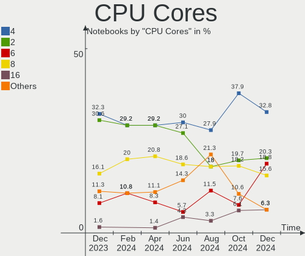
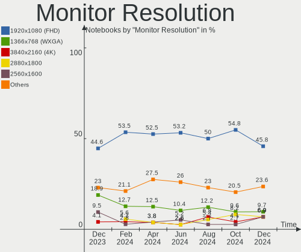
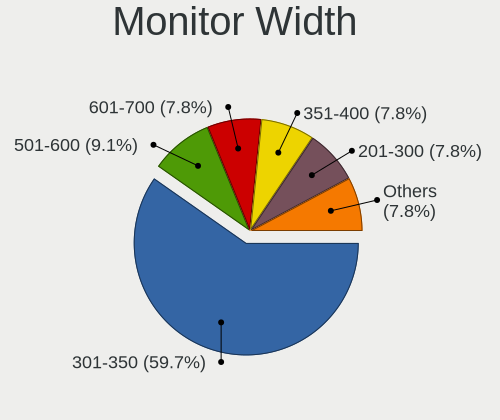
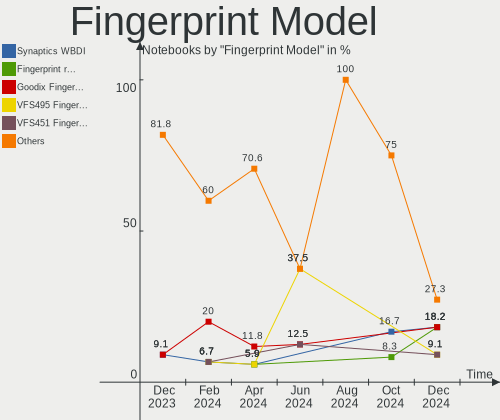

Manjaro - Hardware Trends (Notebooks)
-------------------------------------

A project to identify most popular hardware characteristics and track their change
over time based on data collected by Linux users at https://Linux-Hardware.org.

Anyone can contribute to this report by the [hw-probe](https://github.com/linuxhw/hw-probe) tool:

    sudo -E hw-probe -all -upload

This report is for one last month. Overall report since the beginning of time: [TestCoverage](https://github.com/linuxhw/TestCoverage)

Period: Nov, 2022.

Contents
--------

* [ System ](#system)
  - [ OS                       ](#os)
  - [ OS Family                ](#os-family)
  - [ Kernel                   ](#kernel)
  - [ Kernel Family            ](#kernel-family)
  - [ Kernel Major Ver.        ](#kernel-major-ver)
  - [ Arch                     ](#arch)
  - [ DE                       ](#de)
  - [ Display Server           ](#display-server)
  - [ Display Manager          ](#display-manager)
  - [ OS Lang                  ](#os-lang)
  - [ Boot Mode                ](#boot-mode)
  - [ Filesystem               ](#filesystem)
  - [ Part. scheme             ](#part-scheme)
  - [ Dual Boot with Linux/BSD ](#dual-boot-with-linuxbsd)
  - [ Dual Boot (Win)          ](#dual-boot-win)

* [ Board ](#board)
  - [ Vendor                   ](#vendor)
  - [ Model                    ](#model)
  - [ Model Family             ](#model-family)
  - [ MFG Year                 ](#mfg-year)
  - [ Form Factor              ](#form-factor)
  - [ Secure Boot              ](#secure-boot)
  - [ Coreboot                 ](#coreboot)
  - [ RAM Size                 ](#ram-size)
  - [ RAM Used                 ](#ram-used)
  - [ Total Drives             ](#total-drives)
  - [ Has CD-ROM               ](#has-cd-rom)
  - [ Has Ethernet             ](#has-ethernet)
  - [ Has WiFi                 ](#has-wifi)
  - [ Has Bluetooth            ](#has-bluetooth)

* [ Location ](#location)
  - [ Country                  ](#country)
  - [ City                     ](#city)

* [ Drives ](#drives)
  - [ Drive Vendor             ](#drive-vendor)
  - [ Drive Model              ](#drive-model)
  - [ HDD Vendor               ](#hdd-vendor)
  - [ SSD Vendor               ](#ssd-vendor)
  - [ Drive Kind               ](#drive-kind)
  - [ Drive Connector          ](#drive-connector)
  - [ Drive Size               ](#drive-size)
  - [ Space Total              ](#space-total)
  - [ Space Used               ](#space-used)
  - [ Malfunc. Drives          ](#malfunc-drives)
  - [ Malfunc. Drive Vendor    ](#malfunc-drive-vendor)
  - [ Malfunc. HDD Vendor      ](#malfunc-hdd-vendor)
  - [ Malfunc. Drive Kind      ](#malfunc-drive-kind)
  - [ Failed Drives            ](#failed-drives)
  - [ Failed Drive Vendor      ](#failed-drive-vendor)
  - [ Drive Status             ](#drive-status)

* [ Storage controller ](#storage-controller)
  - [ Storage Vendor           ](#storage-vendor)
  - [ Storage Model            ](#storage-model)
  - [ Storage Kind             ](#storage-kind)

* [ Processor ](#processor)
  - [ CPU Vendor               ](#cpu-vendor)
  - [ CPU Model                ](#cpu-model)
  - [ CPU Model Family         ](#cpu-model-family)
  - [ CPU Cores                ](#cpu-cores)
  - [ CPU Sockets              ](#cpu-sockets)
  - [ CPU Threads              ](#cpu-threads)
  - [ CPU Op-Modes             ](#cpu-op-modes)
  - [ CPU Microcode            ](#cpu-microcode)
  - [ CPU Microarch            ](#cpu-microarch)

* [ Graphics ](#graphics)
  - [ GPU Vendor               ](#gpu-vendor)
  - [ GPU Model                ](#gpu-model)
  - [ GPU Combo                ](#gpu-combo)
  - [ GPU Driver               ](#gpu-driver)
  - [ GPU Memory               ](#gpu-memory)

* [ Monitor ](#monitor)
  - [ Monitor Vendor           ](#monitor-vendor)
  - [ Monitor Model            ](#monitor-model)
  - [ Monitor Resolution       ](#monitor-resolution)
  - [ Monitor Diagonal         ](#monitor-diagonal)
  - [ Monitor Width            ](#monitor-width)
  - [ Aspect Ratio             ](#aspect-ratio)
  - [ Monitor Area             ](#monitor-area)
  - [ Pixel Density            ](#pixel-density)
  - [ Multiple Monitors        ](#multiple-monitors)

* [ Network ](#network)
  - [ Net Controller Vendor    ](#net-controller-vendor)
  - [ Net Controller Model     ](#net-controller-model)
  - [ Wireless Vendor          ](#wireless-vendor)
  - [ Wireless Model           ](#wireless-model)
  - [ Ethernet Vendor          ](#ethernet-vendor)
  - [ Ethernet Model           ](#ethernet-model)
  - [ Net Controller Kind      ](#net-controller-kind)
  - [ Used Controller          ](#used-controller)
  - [ NICs                     ](#nics)
  - [ IPv6                     ](#ipv6)

* [ Bluetooth ](#bluetooth)
  - [ Bluetooth Vendor         ](#bluetooth-vendor)
  - [ Bluetooth Model          ](#bluetooth-model)

* [ Sound ](#sound)
  - [ Sound Vendor             ](#sound-vendor)
  - [ Sound Model              ](#sound-model)

* [ Memory ](#memory)
  - [ Memory Vendor            ](#memory-vendor)
  - [ Memory Model             ](#memory-model)
  - [ Memory Kind              ](#memory-kind)
  - [ Memory Form Factor       ](#memory-form-factor)
  - [ Memory Size              ](#memory-size)
  - [ Memory Speed             ](#memory-speed)

* [ Printers & scanners ](#printers--scanners)
  - [ Printer Vendor           ](#printer-vendor)
  - [ Printer Model            ](#printer-model)
  - [ Scanner Vendor           ](#scanner-vendor)
  - [ Scanner Model            ](#scanner-model)

* [ Camera ](#camera)
  - [ Camera Vendor            ](#camera-vendor)
  - [ Camera Model             ](#camera-model)

* [ Security ](#security)
  - [ Fingerprint Vendor       ](#fingerprint-vendor)
  - [ Fingerprint Model        ](#fingerprint-model)
  - [ Chipcard Vendor          ](#chipcard-vendor)
  - [ Chipcard Model           ](#chipcard-model)

* [ Unsupported ](#unsupported)
  - [ Unsupported Devices      ](#unsupported-devices)
  - [ Unsupported Device Types ](#unsupported-device-types)

System
------

OS
--

Installed operating systems

| Name                      | Notebooks | Percent |
|---------------------------|-----------|---------|
| Manjaro 22.0.0            | 39        | 52.7%   |
| Manjaro                   | 33        | 44.59%  |
| Manjaro 22.10-development | 1         | 1.35%   |
| Manjaro 21.3.7            | 1         | 1.35%   |

OS Family
---------

OS without a version

| Name    | Notebooks | Percent |
|---------|-----------|---------|
| Manjaro | 74        | 100%    |

Kernel
------

Version of the Linux kernel

| Version            | Notebooks | Percent |
|--------------------|-----------|---------|
| 5.15.78-1-MANJARO  | 20        | 27.03%  |
| 6.0.8-1-MANJARO    | 11        | 14.86%  |
| 5.15.76-1-MANJARO  | 10        | 13.51%  |
| 6.1.0-1-MANJARO    | 5         | 6.76%   |
| 6.0.6-1-MANJARO    | 5         | 6.76%   |
| 5.15.74-3-MANJARO  | 5         | 6.76%   |
| 6.0.2-2-MANJARO    | 4         | 5.41%   |
| 5.19.17-2-MANJARO  | 3         | 4.05%   |
| 6.0.8-lqx1-1-lqx   | 1         | 1.35%   |
| 6.0.7-2-MANJARO    | 1         | 1.35%   |
| 6.0.7-1-MANJARO    | 1         | 1.35%   |
| 6.0.6-2-MANJARO    | 1         | 1.35%   |
| 5.4.224-1-MANJARO  | 1         | 1.35%   |
| 5.4.218-2-MANJARO  | 1         | 1.35%   |
| 5.19.17-1-MANJARO  | 1         | 1.35%   |
| 5.19.16-2-MANJARO  | 1         | 1.35%   |
| 5.15.60-1-MANJARO  | 1         | 1.35%   |
| 5.14.21-2-MANJARO  | 1         | 1.35%   |
| 5.10.148-1-MANJARO | 1         | 1.35%   |

Kernel Family
-------------

Linux kernel without a distro release

| Version  | Notebooks | Percent |
|----------|-----------|---------|
| 5.15.78  | 20        | 27.03%  |
| 6.0.8    | 12        | 16.22%  |
| 5.15.76  | 10        | 13.51%  |
| 6.0.6    | 6         | 8.11%   |
| 6.1.0    | 5         | 6.76%   |
| 5.15.74  | 5         | 6.76%   |
| 6.0.2    | 4         | 5.41%   |
| 5.19.17  | 4         | 5.41%   |
| 6.0.7    | 2         | 2.7%    |
| 5.4.224  | 1         | 1.35%   |
| 5.4.218  | 1         | 1.35%   |
| 5.19.16  | 1         | 1.35%   |
| 5.15.60  | 1         | 1.35%   |
| 5.14.21  | 1         | 1.35%   |
| 5.10.148 | 1         | 1.35%   |

Kernel Major Ver.
-----------------

Linux kernel major version

| Version | Notebooks | Percent |
|---------|-----------|---------|
| 5.15    | 36        | 48.65%  |
| 6.0     | 24        | 32.43%  |
| 6.1     | 5         | 6.76%   |
| 5.19    | 5         | 6.76%   |
| 5.4     | 2         | 2.7%    |
| 5.14    | 1         | 1.35%   |
| 5.10    | 1         | 1.35%   |

Arch
----

OS architecture (x86_64, i586, etc.)

| Name   | Notebooks | Percent |
|--------|-----------|---------|
| x86_64 | 74        | 100%    |

DE
--

Desktop Environment

| Name       | Notebooks | Percent |
|------------|-----------|---------|
| KDE5       | 43        | 58.11%  |
| GNOME      | 15        | 20.27%  |
| XFCE       | 10        | 13.51%  |
| KDE        | 3         | 4.05%   |
| X-Cinnamon | 1         | 1.35%   |
| Budgie     | 1         | 1.35%   |
| Unknown    | 1         | 1.35%   |

Display Server
--------------

X11 or Wayland

| Name    | Notebooks | Percent |
|---------|-----------|---------|
| X11     | 55        | 74.32%  |
| Wayland | 16        | 21.62%  |
| Unknown | 2         | 2.7%    |
| Tty     | 1         | 1.35%   |

Display Manager
---------------

SDDM, LightDM, etc.

| Name    | Notebooks | Percent |
|---------|-----------|---------|
| Unknown | 32        | 43.24%  |
| SDDM    | 26        | 35.14%  |
| GDM     | 9         | 12.16%  |
| LightDM | 7         | 9.46%   |

OS Lang
-------

Language

| Lang    | Notebooks | Percent |
|---------|-----------|---------|
| en_US   | 34        | 45.95%  |
| de_DE   | 6         | 8.11%   |
| it_IT   | 5         | 6.76%   |
| es_ES   | 5         | 6.76%   |
| pl_PL   | 4         | 5.41%   |
| en_GB   | 4         | 5.41%   |
| ru_RU   | 3         | 4.05%   |
| en_AU   | 3         | 4.05%   |
| zh_CN   | 1         | 1.35%   |
| tr_TR   | 1         | 1.35%   |
| fr_FR   | 1         | 1.35%   |
| fr_CH   | 1         | 1.35%   |
| es_CO   | 1         | 1.35%   |
| es_BO   | 1         | 1.35%   |
| es_AR   | 1         | 1.35%   |
| en_AG   | 1         | 1.35%   |
| de_CH   | 1         | 1.35%   |
| Unknown | 1         | 1.35%   |

Boot Mode
---------

EFI or BIOS

| Mode | Notebooks | Percent |
|------|-----------|---------|
| BIOS | 42        | 56.76%  |
| EFI  | 32        | 43.24%  |

Filesystem
----------

Type of filesystem

| Type    | Notebooks | Percent |
|---------|-----------|---------|
| Ext4    | 62        | 83.78%  |
| Btrfs   | 8         | 10.81%  |
| F2fs    | 2         | 2.7%    |
| Xfs     | 1         | 1.35%   |
| Overlay | 1         | 1.35%   |

Part. scheme
------------

Scheme of partitioning

| Type    | Notebooks | Percent |
|---------|-----------|---------|
| GPT     | 40        | 54.05%  |
| Unknown | 28        | 37.84%  |
| MBR     | 6         | 8.11%   |

Dual Boot with Linux/BSD
------------------------

Hosting more than one Linux/BSD

| Dual boot | Notebooks | Percent |
|-----------|-----------|---------|
| No        | 70        | 94.59%  |
| Yes       | 4         | 5.41%   |

Dual Boot (Win)
---------------

Hosting Linux and Windows

| Dual boot | Notebooks | Percent |
|-----------|-----------|---------|
| No        | 55        | 74.32%  |
| Yes       | 19        | 25.68%  |

Board
-----

Vendor
------

Motherboard manufacturer

| Name                | Notebooks | Percent |
|---------------------|-----------|---------|
| Lenovo              | 25        | 33.78%  |
| Hewlett-Packard     | 12        | 16.22%  |
| Dell                | 10        | 13.51%  |
| ASUSTek Computer    | 9         | 12.16%  |
| Acer                | 4         | 5.41%   |
| MSI                 | 3         | 4.05%   |
| TUXEDO              | 1         | 1.35%   |
| Toshiba             | 1         | 1.35%   |
| Timi                | 1         | 1.35%   |
| Schenker            | 1         | 1.35%   |
| Samsung Electronics | 1         | 1.35%   |
| Razer               | 1         | 1.35%   |
| HUAWEI              | 1         | 1.35%   |
| Google              | 1         | 1.35%   |
| Fujitsu             | 1         | 1.35%   |
| Apple               | 1         | 1.35%   |
| Alienware           | 1         | 1.35%   |

Model
-----

Motherboard model

| Name                                     | Notebooks | Percent |
|------------------------------------------|-----------|---------|
| TUXEDO Pulse 15 Gen1                     | 1         | 1.35%   |
| Toshiba TECRA S11                        | 1         | 1.35%   |
| Timi Xiaomi Book Pro 16 2022             | 1         | 1.35%   |
| Schenker VISION 15 (SVS15E21)            | 1         | 1.35%   |
| Samsung 350V5C/351V5C/3540VC/3440VC      | 1         | 1.35%   |
| Razer Blade                              | 1         | 1.35%   |
| MSI GS60 6QE                             | 1         | 1.35%   |
| MSI GP63 Leopard 8RE                     | 1         | 1.35%   |
| MSI GL62 7QF                             | 1         | 1.35%   |
| Lenovo V15-IIL 82C5                      | 1         | 1.35%   |
| Lenovo ThinkPad X13 Gen 2a 20XH005BUS    | 1         | 1.35%   |
| Lenovo ThinkPad X1 Carbon 3rd 20BS003BUS | 1         | 1.35%   |
| Lenovo ThinkPad X1 Carbon 2nd 20A7000NAD | 1         | 1.35%   |
| Lenovo ThinkPad T490 20N3S7BC02          | 1         | 1.35%   |
| Lenovo ThinkPad T460s 20FAS16J00         | 1         | 1.35%   |
| Lenovo ThinkPad T450s 20BW000DHV         | 1         | 1.35%   |
| Lenovo ThinkPad T430 2349KQ3             | 1         | 1.35%   |
| Lenovo ThinkPad T430 2344BZU             | 1         | 1.35%   |
| Lenovo ThinkPad T14 Gen 2i 20W1S34Y00    | 1         | 1.35%   |
| Lenovo ThinkPad P14s Gen 3 21AK0054FR    | 1         | 1.35%   |
| Lenovo ThinkPad P14s Gen 1 20Y1CTO1WW    | 1         | 1.35%   |
| Lenovo ThinkPad L460 20FVS1Y500          | 1         | 1.35%   |
| Lenovo ThinkPad E15 Gen 2 20TDS0XG00     | 1         | 1.35%   |
| Lenovo ThinkPad E14 Gen 3 20YDS06K00     | 1         | 1.35%   |
| Lenovo ThinkBook 15-IIL 20SM             | 1         | 1.35%   |
| Lenovo ThinkBook 13s G2 ITL 20V9         | 1         | 1.35%   |
| Lenovo Legion R9000P2021H 82JQ           | 1         | 1.35%   |
| Lenovo Legion 5 Pro 16ARH7H 82RG         | 1         | 1.35%   |
| Lenovo Legion 5 17ACH6H 82JY             | 1         | 1.35%   |
| Lenovo IdeaPad 720S-13IKB 81BV           | 1         | 1.35%   |
| Lenovo IdeaPad 5 15ARE05 81YQ            | 1         | 1.35%   |
| Lenovo IdeaPad 320-15AST 80XV            | 1         | 1.35%   |
| Lenovo G580 20150                        | 1         | 1.35%   |
| Lenovo G500 20236                        | 1         | 1.35%   |
| HUAWEI KLVL-WXXW                         | 1         | 1.35%   |
| HP Victus by Laptop 16-e0xxx             | 1         | 1.35%   |
| HP ProBook 455 G7                        | 1         | 1.35%   |
| HP ProBook 450 G7                        | 1         | 1.35%   |
| HP ProBook 440 G5                        | 1         | 1.35%   |
| HP OMEN by Laptop 16-c0xxx               | 1         | 1.35%   |

Model Family
------------

Motherboard model prefix

| Name              | Notebooks | Percent |
|-------------------|-----------|---------|
| Lenovo ThinkPad   | 14        | 18.92%  |
| Dell Latitude     | 5         | 6.76%   |
| Lenovo Legion     | 3         | 4.05%   |
| Lenovo IdeaPad    | 3         | 4.05%   |
| HP ProBook        | 3         | 4.05%   |
| HP EliteBook      | 3         | 4.05%   |
| ASUS VivoBook     | 3         | 4.05%   |
| Acer Aspire       | 3         | 4.05%   |
| Lenovo ThinkBook  | 2         | 2.7%    |
| Dell Precision    | 2         | 2.7%    |
| Dell Inspiron     | 2         | 2.7%    |
| TUXEDO Pulse      | 1         | 1.35%   |
| Toshiba TECRA     | 1         | 1.35%   |
| Timi Xiaomi       | 1         | 1.35%   |
| Schenker VISION   | 1         | 1.35%   |
| Samsung 350V5C    | 1         | 1.35%   |
| Razer Blade       | 1         | 1.35%   |
| MSI GS60          | 1         | 1.35%   |
| MSI GP63          | 1         | 1.35%   |
| MSI GL62          | 1         | 1.35%   |
| Lenovo V15-IIL    | 1         | 1.35%   |
| Lenovo G580       | 1         | 1.35%   |
| Lenovo G500       | 1         | 1.35%   |
| HUAWEI KLVL-WXXW  | 1         | 1.35%   |
| HP Victus         | 1         | 1.35%   |
| HP OMEN           | 1         | 1.35%   |
| HP Notebook       | 1         | 1.35%   |
| HP Laptop         | 1         | 1.35%   |
| HP ENVY           | 1         | 1.35%   |
| HP Compaq         | 1         | 1.35%   |
| Google Boten      | 1         | 1.35%   |
| Fujitsu LIFEBOOK  | 1         | 1.35%   |
| Dell XPS          | 1         | 1.35%   |
| ASUS ZenBook      | 1         | 1.35%   |
| ASUS X555YI       | 1         | 1.35%   |
| ASUS X553MA       | 1         | 1.35%   |
| ASUS ROG          | 1         | 1.35%   |
| ASUS PRIME        | 1         | 1.35%   |
| ASUS ASUS         | 1         | 1.35%   |
| Apple MacBookAir6 | 1         | 1.35%   |

MFG Year
--------

Motherboard manufacture year

| Year | Notebooks | Percent |
|------|-----------|---------|
| 2021 | 14        | 18.92%  |
| 2020 | 10        | 13.51%  |
| 2019 | 10        | 13.51%  |
| 2017 | 6         | 8.11%   |
| 2016 | 6         | 8.11%   |
| 2022 | 5         | 6.76%   |
| 2012 | 5         | 6.76%   |
| 2015 | 4         | 5.41%   |
| 2013 | 4         | 5.41%   |
| 2014 | 3         | 4.05%   |
| 2011 | 3         | 4.05%   |
| 2018 | 2         | 2.7%    |
| 2010 | 2         | 2.7%    |

Form Factor
-----------

Physical design of the computer

| Name     | Notebooks | Percent |
|----------|-----------|---------|
| Notebook | 74        | 100%    |

Secure Boot
-----------

Enabled or disabled

| State    | Notebooks | Percent |
|----------|-----------|---------|
| Disabled | 74        | 100%    |

Coreboot
--------

Have coreboot on board

| Used | Notebooks | Percent |
|------|-----------|---------|
| No   | 73        | 98.65%  |
| Yes  | 1         | 1.35%   |

RAM Size
--------

Total RAM memory

| Size in GB | Notebooks | Percent |
|------------|-----------|---------|
| 4.01-8.0   | 26        | 35.14%  |
| 16.01-24.0 | 17        | 22.97%  |
| 8.01-16.0  | 15        | 20.27%  |
| 32.01-64.0 | 8         | 10.81%  |
| 3.01-4.0   | 5         | 6.76%   |
| 24.01-32.0 | 3         | 4.05%   |

RAM Used
--------

Used RAM memory

| Used GB   | Notebooks | Percent |
|-----------|-----------|---------|
| 2.01-3.0  | 24        | 32.43%  |
| 4.01-8.0  | 23        | 31.08%  |
| 3.01-4.0  | 12        | 16.22%  |
| 8.01-16.0 | 9         | 12.16%  |
| 1.01-2.0  | 6         | 8.11%   |

Total Drives
------------

Number of drives on board

| Drives | Notebooks | Percent |
|--------|-----------|---------|
| 1      | 49        | 66.22%  |
| 2      | 21        | 28.38%  |
| 3      | 4         | 5.41%   |

Has CD-ROM
----------

Has CD-ROM on board

| Presented | Notebooks | Percent |
|-----------|-----------|---------|
| No        | 64        | 86.49%  |
| Yes       | 10        | 13.51%  |

Has Ethernet
------------

Has Ethernet on board

| Presented | Notebooks | Percent |
|-----------|-----------|---------|
| Yes       | 57        | 77.03%  |
| No        | 17        | 22.97%  |

Has WiFi
--------

Has WiFi module

| Presented | Notebooks | Percent |
|-----------|-----------|---------|
| Yes       | 73        | 98.65%  |
| No        | 1         | 1.35%   |

Has Bluetooth
-------------

Has Bluetooth module

| Presented | Notebooks | Percent |
|-----------|-----------|---------|
| Yes       | 66        | 89.19%  |
| No        | 8         | 10.81%  |

Location
--------

Country
-------

Geographic location (country)

| Country            | Notebooks | Percent |
|--------------------|-----------|---------|
| USA                | 10        | 13.51%  |
| Germany            | 10        | 13.51%  |
| Italy              | 8         | 10.81%  |
| Spain              | 5         | 6.76%   |
| Russia             | 4         | 5.41%   |
| Poland             | 4         | 5.41%   |
| France             | 4         | 5.41%   |
| Netherlands        | 3         | 4.05%   |
| Australia          | 3         | 4.05%   |
| UK                 | 2         | 2.7%    |
| Switzerland        | 2         | 2.7%    |
| Kazakhstan         | 2         | 2.7%    |
| Hungary            | 2         | 2.7%    |
| Ukraine            | 1         | 1.35%   |
| Turkey             | 1         | 1.35%   |
| Thailand           | 1         | 1.35%   |
| Malta              | 1         | 1.35%   |
| Finland            | 1         | 1.35%   |
| Estonia            | 1         | 1.35%   |
| Dominican Republic | 1         | 1.35%   |
| Czechia            | 1         | 1.35%   |
| Colombia           | 1         | 1.35%   |
| China              | 1         | 1.35%   |
| Brazil             | 1         | 1.35%   |
| Bolivia            | 1         | 1.35%   |
| Belarus            | 1         | 1.35%   |
| Austria            | 1         | 1.35%   |
| Argentina          | 1         | 1.35%   |

City
----

Geographic location (city)

| City                 | Notebooks | Percent |
|----------------------|-----------|---------|
| Paris                | 2         | 2.7%    |
| Milan                | 2         | 2.7%    |
| Budapest             | 2         | 2.7%    |
| Wollongong           | 1         | 1.35%   |
| Winterswijk          | 1         | 1.35%   |
| Wiesbaden            | 1         | 1.35%   |
| Wichita              | 1         | 1.35%   |
| West Malling         | 1         | 1.35%   |
| Warsaw               | 1         | 1.35%   |
| Tallinn              | 1         | 1.35%   |
| Stolberg             | 1         | 1.35%   |
| St Petersburg        | 1         | 1.35%   |
| Sommerein            | 1         | 1.35%   |
| Solothurn            | 1         | 1.35%   |
| Sindelfingen         | 1         | 1.35%   |
| Shawnee              | 1         | 1.35%   |
| Sellano              | 1         | 1.35%   |
| Salaya               | 1         | 1.35%   |
| Saint Venera         | 1         | 1.35%   |
| Rüsselsheim am Main | 1         | 1.35%   |
| Rho                  | 1         | 1.35%   |
| Pozzallo             | 1         | 1.35%   |
| Podolsk              | 1         | 1.35%   |
| Pilsen               | 1         | 1.35%   |
| Palermo              | 1         | 1.35%   |
| Palencia             | 1         | 1.35%   |
| Olavarría           | 1         | 1.35%   |
| Nuremberg            | 1         | 1.35%   |
| New York             | 1         | 1.35%   |
| Naaldwijk            | 1         | 1.35%   |
| Muelheim-Kaerlich    | 1         | 1.35%   |
| Moscow               | 1         | 1.35%   |
| Melbourne            | 1         | 1.35%   |
| Malbork              | 1         | 1.35%   |
| Málaga              | 1         | 1.35%   |
| Madrid               | 1         | 1.35%   |
| Lincoln              | 1         | 1.35%   |
| Lezay                | 1         | 1.35%   |
| Leeds                | 1         | 1.35%   |
| Lausanne             | 1         | 1.35%   |

Drives
------

Drive Vendor
------------

Hard drive vendors

| Vendor                      | Notebooks | Drives | Percent |
|-----------------------------|-----------|--------|---------|
| Samsung Electronics         | 22        | 26     | 21.78%  |
| SK hynix                    | 9         | 9      | 8.91%   |
| Toshiba                     | 7         | 7      | 6.93%   |
| Sandisk                     | 7         | 7      | 6.93%   |
| Unknown                     | 6         | 6      | 5.94%   |
| Micron Technology           | 6         | 6      | 5.94%   |
| Kingston                    | 6         | 6      | 5.94%   |
| Seagate                     | 5         | 5      | 4.95%   |
| Crucial                     | 5         | 5      | 4.95%   |
| WDC                         | 4         | 4      | 3.96%   |
| KIOXIA                      | 4         | 4      | 3.96%   |
| HGST                        | 3         | 3      | 2.97%   |
| Transcend                   | 2         | 2      | 1.98%   |
| LITEONIT                    | 2         | 2      | 1.98%   |
| Intel                       | 2         | 2      | 1.98%   |
| WD Green                    | 1         | 1      | 0.99%   |
| USB3.0                      | 1         | 1      | 0.99%   |
| Silicon Motion              | 1         | 1      | 0.99%   |
| Phison Electronics          | 1         | 1      | 0.99%   |
| Micron/Crucial Technology   | 1         | 1      | 0.99%   |
| Leven                       | 1         | 1      | 0.99%   |
| Kingston Technology Company | 1         | 1      | 0.99%   |
| Hewlett-Packard             | 1         | 1      | 0.99%   |
| GOODRAM                     | 1         | 1      | 0.99%   |
| China                       | 1         | 1      | 0.99%   |
| Apple                       | 1         | 1      | 0.99%   |

Drive Model
-----------

Hard drive models

| Model                                                 | Notebooks | Percent |
|-------------------------------------------------------|-----------|---------|
| Samsung NVMe SSD Controller SM981/PM981/PM983 1TB     | 8         | 7.77%   |
| Toshiba XG6 NVMe SSD Controller 256GB                 | 2         | 1.94%   |
| Sandisk WD Black SN750 / PC SN730 NVMe SSD 1024GB     | 2         | 1.94%   |
| Samsung SSD 980 1TB                                   | 2         | 1.94%   |
| Samsung NVMe SSD Controller PM9A1/PM9A3/980PRO 250GB  | 2         | 1.94%   |
| Micron MTFDHBA512TDV-1AZ1AABHA 512GB                  | 2         | 1.94%   |
| KIOXIA KBG40ZNV256G 256GB                             | 2         | 1.94%   |
| HGST HTS721010A9E630 1TB                              | 2         | 1.94%   |
| WDC WD5000LPLX-75ZNTT0 500GB                          | 1         | 0.97%   |
| WDC WD1600BEVT-00A0RT0 160GB                          | 1         | 0.97%   |
| WDC WD10JPVX-60JC3T0 1TB                              | 1         | 0.97%   |
| WDC WD10JPVX-22JC3T0 1TB                              | 1         | 0.97%   |
| WD Green 2.5 1000GB                                   | 1         | 0.97%   |
| USB3.0 Super Speed 200GB                              | 1         | 0.97%   |
| Unknown xD/SD/M.S.                                    | 1         | 0.97%   |
| Unknown SD/MMC/MS PRO 8GB                             | 1         | 0.97%   |
| Unknown NVMe SSD Drive 1TB                            | 1         | 0.97%   |
| Unknown MMC Card  7GB                                 | 1         | 0.97%   |
| Unknown MMC Card  134GB                               | 1         | 0.97%   |
| Unknown MMC Card  128GB                               | 1         | 0.97%   |
| Transcend TS1TSSD230S 1024GB                          | 1         | 0.97%   |
| Transcend TS1TMTE110Q 1TB                             | 1         | 0.97%   |
| Toshiba XG4 NVMe SSD Controller 256GB                 | 1         | 0.97%   |
| Toshiba THNSNJ128G8NU 128GB SSD                       | 1         | 0.97%   |
| Toshiba MQ04ABF100 1TB                                | 1         | 0.97%   |
| Toshiba MQ01ABF050 500GB                              | 1         | 0.97%   |
| Toshiba MQ01ABD100 1TB                                | 1         | 0.97%   |
| SK hynix SKHynix_HFS512GDE9X081N 512GB                | 1         | 0.97%   |
| SK hynix SKHynix_HFS512GD9TNI-L2A0B 512GB             | 1         | 0.97%   |
| SK hynix SKHynix_HFS001TDE9X081N 1TB                  | 1         | 0.97%   |
| SK hynix SC311 SATA 256GB SSD                         | 1         | 0.97%   |
| SK hynix PC401 NVMe Solid State Drive 256GB           | 1         | 0.97%   |
| SK hynix HFM512GD3JX013N 512GB                        | 1         | 0.97%   |
| SK hynix HFM128GD3JX016N 128GB                        | 1         | 0.97%   |
| SK hynix BC711 HFM256GD3JX013N 256GB                  | 1         | 0.97%   |
| SK hynix BC501 NVMe Solid State Drive 512GB           | 1         | 0.97%   |
| Silicon Motion SM2263EN/SM2263XT SSD Controller 128GB | 1         | 0.97%   |
| Seagate ST9160823AS 160GB                             | 1         | 0.97%   |
| Seagate ST500LT012-9WS142 500GB                       | 1         | 0.97%   |
| Seagate ST1000LM035-1RK172 1TB                        | 1         | 0.97%   |

HDD Vendor
----------

Hard disk drive vendors

| Vendor  | Notebooks | Drives | Percent |
|---------|-----------|--------|---------|
| Seagate | 5         | 5      | 31.25%  |
| WDC     | 4         | 4      | 25%     |
| Toshiba | 3         | 3      | 18.75%  |
| HGST    | 3         | 3      | 18.75%  |
| Unknown | 1         | 1      | 6.25%   |

SSD Vendor
----------

Solid state drive vendors

| Vendor              | Notebooks | Drives | Percent |
|---------------------|-----------|--------|---------|
| Samsung Electronics | 6         | 6      | 19.35%  |
| Crucial             | 5         | 5      | 16.13%  |
| Kingston            | 4         | 4      | 12.9%   |
| SanDisk             | 3         | 3      | 9.68%   |
| Micron Technology   | 2         | 2      | 6.45%   |
| LITEONIT            | 2         | 2      | 6.45%   |
| USB3.0              | 1         | 1      | 3.23%   |
| Transcend           | 1         | 1      | 3.23%   |
| Toshiba             | 1         | 1      | 3.23%   |
| SK hynix            | 1         | 1      | 3.23%   |
| Intel               | 1         | 1      | 3.23%   |
| Hewlett-Packard     | 1         | 1      | 3.23%   |
| GOODRAM             | 1         | 1      | 3.23%   |
| China               | 1         | 1      | 3.23%   |
| Apple               | 1         | 1      | 3.23%   |

Drive Kind
----------

HDD or SSD

| Kind    | Notebooks | Drives | Percent |
|---------|-----------|--------|---------|
| NVMe    | 41        | 52     | 45.56%  |
| SSD     | 28        | 31     | 31.11%  |
| HDD     | 15        | 16     | 16.67%  |
| MMC     | 3         | 3      | 3.33%   |
| Unknown | 3         | 3      | 3.33%   |

Drive Connector
---------------

SATA, SAS, NVMe, etc.

| Type | Notebooks | Drives | Percent |
|------|-----------|--------|---------|
| NVMe | 41        | 52     | 47.67%  |
| SATA | 36        | 44     | 41.86%  |
| SAS  | 6         | 6      | 6.98%   |
| MMC  | 3         | 3      | 3.49%   |

Drive Size
----------

Size of hard drive

| Size in TB | Notebooks | Drives | Percent |
|------------|-----------|--------|---------|
| 0.01-0.5   | 27        | 33     | 65.85%  |
| 0.51-1.0   | 12        | 12     | 29.27%  |
| 3.01-4.0   | 1         | 1      | 2.44%   |
| 1.01-2.0   | 1         | 1      | 2.44%   |

Space Total
-----------

Amount of disk space available on the file system

| Size in GB | Notebooks | Percent |
|------------|-----------|---------|
| 251-500    | 23        | 31.08%  |
| 101-250    | 18        | 24.32%  |
| 501-1000   | 14        | 18.92%  |
| 1001-2000  | 7         | 9.46%   |
| Unknown    | 6         | 8.11%   |
| 51-100     | 4         | 5.41%   |
| 21-50      | 1         | 1.35%   |
| 1-20       | 1         | 1.35%   |

Space Used
----------

Amount of used disk space

| Used GB  | Notebooks | Percent |
|----------|-----------|---------|
| 101-250  | 17        | 22.97%  |
| 21-50    | 13        | 17.57%  |
| 251-500  | 12        | 16.22%  |
| 51-100   | 12        | 16.22%  |
| 501-1000 | 8         | 10.81%  |
| 1-20     | 6         | 8.11%   |
| Unknown  | 6         | 8.11%   |

Malfunc. Drives
---------------

Drive models with a malfunction

| Model                           | Notebooks | Drives | Percent |
|---------------------------------|-----------|--------|---------|
| Seagate ST500LT012-9WS142 500GB | 1         | 1      | 100%    |

Malfunc. Drive Vendor
---------------------

Vendors of faulty drives

| Vendor  | Notebooks | Drives | Percent |
|---------|-----------|--------|---------|
| Seagate | 1         | 1      | 100%    |

Malfunc. HDD Vendor
-------------------

Vendors of faulty HDD drives

| Vendor  | Notebooks | Drives | Percent |
|---------|-----------|--------|---------|
| Seagate | 1         | 1      | 100%    |

Malfunc. Drive Kind
-------------------

Kinds of faulty drives

| Kind | Notebooks | Drives | Percent |
|------|-----------|--------|---------|
| HDD  | 1         | 1      | 100%    |

Failed Drives
-------------

Failed drive models

Zero info for selected period =(

Failed Drive Vendor
-------------------

Failed drive vendors

Zero info for selected period =(

Drive Status
------------

Number of failed and malfunc. drives

| Status   | Notebooks | Drives | Percent |
|----------|-----------|--------|---------|
| Detected | 47        | 64     | 61.04%  |
| Works    | 29        | 40     | 37.66%  |
| Malfunc  | 1         | 1      | 1.3%    |

Storage controller
------------------

Storage Vendor
--------------

Storage controller vendors

| Vendor                       | Notebooks | Percent |
|------------------------------|-----------|---------|
| Intel                        | 35        | 35.71%  |
| Samsung Electronics          | 18        | 18.37%  |
| AMD                          | 14        | 14.29%  |
| SK hynix                     | 8         | 8.16%   |
| SanDisk                      | 4         | 4.08%   |
| Micron Technology            | 4         | 4.08%   |
| KIOXIA                       | 4         | 4.08%   |
| Toshiba America Info Systems | 3         | 3.06%   |
| Kingston Technology Company  | 3         | 3.06%   |
| Transcend                    | 1         | 1.02%   |
| Silicon Motion               | 1         | 1.02%   |
| Phison Electronics           | 1         | 1.02%   |
| Micron/Crucial Technology    | 1         | 1.02%   |
| Marvell Technology Group     | 1         | 1.02%   |

Storage Model
-------------

Storage controller models

| Model                                                                         | Notebooks | Percent |
|-------------------------------------------------------------------------------|-----------|---------|
| AMD FCH SATA Controller [AHCI mode]                                           | 14        | 14%     |
| Samsung NVMe SSD Controller SM981/PM981/PM983                                 | 8         | 8%      |
| Samsung NVMe SSD Controller 980                                               | 7         | 7%      |
| Intel 7 Series Chipset Family 6-port SATA Controller [AHCI mode]              | 6         | 6%      |
| SK hynix Gold P31/PC711 NVMe Solid State Drive                                | 5         | 5%      |
| Intel 82801 Mobile SATA Controller [RAID mode]                                | 5         | 5%      |
| Micron Non-Volatile memory controller                                         | 4         | 4%      |
| KIOXIA NVMe SSD Controller BG4                                                | 4         | 4%      |
| Intel Sunrise Point-LP SATA Controller [AHCI mode]                            | 4         | 4%      |
| Intel Volume Management Device NVMe RAID Controller                           | 3         | 3%      |
| Intel Cannon Lake Mobile PCH SATA AHCI Controller                             | 3         | 3%      |
| Intel 6 Series/C200 Series Chipset Family 6 port Mobile SATA AHCI Controller  | 3         | 3%      |
| Toshiba America Info Systems XG6 NVMe SSD Controller                          | 2         | 2%      |
| SanDisk WD Black SN750 / PC SN730 NVMe SSD                                    | 2         | 2%      |
| Samsung NVMe SSD Controller PM9A1/PM9A3/980PRO                                | 2         | 2%      |
| Kingston Company Company Non-Volatile memory controller                       | 2         | 2%      |
| Intel Ice Lake-LP SATA Controller [AHCI mode]                                 | 2         | 2%      |
| Intel HM170/QM170 Chipset SATA Controller [AHCI Mode]                         | 2         | 2%      |
| Transcend Non-Volatile memory controller                                      | 1         | 1%      |
| Toshiba America Info Systems XG4 NVMe SSD Controller                          | 1         | 1%      |
| SK hynix PC401 NVMe Solid State Drive 256GB                                   | 1         | 1%      |
| SK hynix Non-Volatile memory controller                                       | 1         | 1%      |
| SK hynix BC501 NVMe Solid State Drive                                         | 1         | 1%      |
| Silicon Motion SM2263EN/SM2263XT SSD Controller                               | 1         | 1%      |
| SanDisk WD Black NVMe SSD                                                     | 1         | 1%      |
| SanDisk Non-Volatile memory controller                                        | 1         | 1%      |
| Samsung NVMe SSD Controller SM951/PM951                                       | 1         | 1%      |
| Samsung Electronics SATA controller                                           | 1         | 1%      |
| Phison PS5013 E13 NVMe Controller                                             | 1         | 1%      |
| Micron/Crucial P2 NVMe PCIe SSD                                               | 1         | 1%      |
| Marvell Group 88SS9183 PCIe SSD Controller                                    | 1         | 1%      |
| Kingston Company OM3PDP3 NVMe SSD                                             | 1         | 1%      |
| Intel Wildcat Point-LP SATA Controller [AHCI Mode]                            | 1         | 1%      |
| Intel SSD 660P Series                                                         | 1         | 1%      |
| Intel Q170/Q150/B150/H170/H110/Z170/CM236 Chipset SATA Controller [AHCI Mode] | 1         | 1%      |
| Intel Comet Lake SATA AHCI Controller                                         | 1         | 1%      |
| Intel Atom Processor E3800 Series SATA AHCI Controller                        | 1         | 1%      |
| Intel Alder Lake-S PCH SATA Controller [AHCI Mode]                            | 1         | 1%      |
| Intel 8 Series SATA Controller 1 [AHCI mode]                                  | 1         | 1%      |
| Intel 5 Series/3400 Series Chipset 6 port SATA AHCI Controller                | 1         | 1%      |

Storage Kind
------------

Kind of storage controller (IDE, SATA, NVMe, SAS, ...)

| Kind | Notebooks | Percent |
|------|-----------|---------|
| SATA | 43        | 46.74%  |
| NVMe | 41        | 44.57%  |
| RAID | 8         | 8.7%    |

Processor
---------

CPU Vendor
----------

Processor vendors

| Vendor | Notebooks | Percent |
|--------|-----------|---------|
| Intel  | 52        | 70.27%  |
| AMD    | 22        | 29.73%  |

CPU Model
---------

Processor models

| Model                                       | Notebooks | Percent |
|---------------------------------------------|-----------|---------|
| Intel 11th Gen Core i7-1165G7 @ 2.80GHz     | 5         | 6.76%   |
| Intel Core i5-6300U CPU @ 2.40GHz           | 3         | 4.05%   |
| Intel 12th Gen Core i7-1260P                | 3         | 4.05%   |
| AMD Ryzen 7 5800H with Radeon Graphics      | 3         | 4.05%   |
| Intel Pentium CPU 2020M @ 2.40GHz           | 2         | 2.7%    |
| Intel Core i7-5600U CPU @ 2.60GHz           | 2         | 2.7%    |
| Intel Core i5-8250U CPU @ 1.60GHz           | 2         | 2.7%    |
| Intel Core i5-3320M CPU @ 2.60GHz           | 2         | 2.7%    |
| Intel Core i5-2520M CPU @ 2.50GHz           | 2         | 2.7%    |
| Intel Core i3-1005G1 CPU @ 1.20GHz          | 2         | 2.7%    |
| AMD Ryzen 7 PRO 5850U with Radeon Graphics  | 2         | 2.7%    |
| AMD Ryzen 5 5500U with Radeon Graphics      | 2         | 2.7%    |
| AMD A8-7410 APU with AMD Radeon R5 Graphics | 2         | 2.7%    |
| Intel Pentium Silver N6000 @ 1.10GHz        | 1         | 1.35%   |
| Intel Pentium CPU N3540 @ 2.16GHz           | 1         | 1.35%   |
| Intel Core i9-8950HK CPU @ 2.90GHz          | 1         | 1.35%   |
| Intel Core i7-9750H CPU @ 2.60GHz           | 1         | 1.35%   |
| Intel Core i7-8750H CPU @ 2.20GHz           | 1         | 1.35%   |
| Intel Core i7-8565U CPU @ 1.80GHz           | 1         | 1.35%   |
| Intel Core i7-8550U CPU @ 1.80GHz           | 1         | 1.35%   |
| Intel Core i7-7820HQ CPU @ 2.90GHz          | 1         | 1.35%   |
| Intel Core i7-7700HQ CPU @ 2.80GHz          | 1         | 1.35%   |
| Intel Core i7-6700HQ CPU @ 2.60GHz          | 1         | 1.35%   |
| Intel Core i7-6600U CPU @ 2.60GHz           | 1         | 1.35%   |
| Intel Core i7-4720HQ CPU @ 2.60GHz          | 1         | 1.35%   |
| Intel Core i7-2640M CPU @ 2.80GHz           | 1         | 1.35%   |
| Intel Core i7-10750H CPU @ 2.60GHz          | 1         | 1.35%   |
| Intel Core i7-10610U CPU @ 1.80GHz          | 1         | 1.35%   |
| Intel Core i5-8365U CPU @ 1.60GHz           | 1         | 1.35%   |
| Intel Core i5-8265U CPU @ 1.60GHz           | 1         | 1.35%   |
| Intel Core i5-7300HQ CPU @ 2.50GHz          | 1         | 1.35%   |
| Intel Core i5-4260U CPU @ 1.40GHz           | 1         | 1.35%   |
| Intel Core i5-4200U CPU @ 1.60GHz           | 1         | 1.35%   |
| Intel Core i5-3340M CPU @ 2.70GHz           | 1         | 1.35%   |
| Intel Core i5-3230M CPU @ 2.60GHz           | 1         | 1.35%   |
| Intel Core i5-3210M CPU @ 2.50GHz           | 1         | 1.35%   |
| Intel Core i5-1035G4 CPU @ 1.10GHz          | 1         | 1.35%   |
| Intel Core i5 CPU M 520 @ 2.40GHz           | 1         | 1.35%   |
| Intel 12th Gen Core i9-12900KS              | 1         | 1.35%   |
| Intel 11th Gen Core i5-11400H @ 2.70GHz     | 1         | 1.35%   |

CPU Model Family
----------------

Processor model prefix

| Model                | Notebooks | Percent |
|----------------------|-----------|---------|
| Intel Core i5        | 19        | 25.68%  |
| Intel Core i7        | 14        | 18.92%  |
| Other                | 13        | 17.57%  |
| AMD Ryzen 5          | 7         | 9.46%   |
| AMD Ryzen 7          | 4         | 5.41%   |
| Intel Pentium        | 3         | 4.05%   |
| AMD Ryzen 7 PRO      | 3         | 4.05%   |
| Intel Core i3        | 2         | 2.7%    |
| AMD Ryzen 3          | 2         | 2.7%    |
| AMD A8               | 2         | 2.7%    |
| Intel Pentium Silver | 1         | 1.35%   |
| Intel Core i9        | 1         | 1.35%   |
| AMD E1               | 1         | 1.35%   |
| AMD A4               | 1         | 1.35%   |
| AMD A10              | 1         | 1.35%   |

CPU Cores
---------

Number of processor cores

| Number | Notebooks | Percent |
|--------|-----------|---------|
| 4      | 26        | 35.14%  |
| 2      | 26        | 35.14%  |
| 6      | 11        | 14.86%  |
| 8      | 7         | 9.46%   |
| 12     | 3         | 4.05%   |
| 16     | 1         | 1.35%   |

CPU Sockets
-----------

Number of sockets

| Number | Notebooks | Percent |
|--------|-----------|---------|
| 1      | 74        | 100%    |

CPU Threads
-----------

Threads per core (Hyper-Threading)

| Number | Notebooks | Percent |
|--------|-----------|---------|
| 2      | 61        | 82.43%  |
| 1      | 13        | 17.57%  |

CPU Op-Modes
------------

CPU Operation Modes (32-bit, 64-bit)

| Op mode        | Notebooks | Percent |
|----------------|-----------|---------|
| 32-bit, 64-bit | 74        | 100%    |

CPU Microcode
-------------

Microcode number

| Number     | Notebooks | Percent |
|------------|-----------|---------|
| Unknown    | 41        | 55.41%  |
| 0x806c1    | 5         | 6.76%   |
| 0x906a3    | 3         | 4.05%   |
| 0x306a9    | 3         | 4.05%   |
| 0x906ea    | 2         | 2.7%    |
| 0x906e9    | 2         | 2.7%    |
| 0x806ec    | 2         | 2.7%    |
| 0x0a50000c | 2         | 2.7%    |
| 0x08108109 | 2         | 2.7%    |
| 0x906c0    | 1         | 1.35%   |
| 0x806d1    | 1         | 1.35%   |
| 0x706e5    | 1         | 1.35%   |
| 0x406e3    | 1         | 1.35%   |
| 0x306c3    | 1         | 1.35%   |
| 0x206a7    | 1         | 1.35%   |
| 0x20652    | 1         | 1.35%   |
| 0x0a404102 | 1         | 1.35%   |
| 0x08608102 | 1         | 1.35%   |
| 0x08600106 | 1         | 1.35%   |
| 0x08600103 | 1         | 1.35%   |
| 0x06006705 | 1         | 1.35%   |

CPU Microarch
-------------

Microarchitecture

| Name             | Notebooks | Percent |
|------------------|-----------|---------|
| KabyLake         | 13        | 17.57%  |
| TigerLake        | 7         | 9.46%   |
| IvyBridge        | 7         | 9.46%   |
| Zen 3            | 6         | 8.11%   |
| Skylake          | 5         | 6.76%   |
| Unknown          | 5         | 6.76%   |
| Zen 2            | 4         | 5.41%   |
| IceLake          | 4         | 5.41%   |
| Zen+             | 3         | 4.05%   |
| SandyBridge      | 3         | 4.05%   |
| Haswell          | 3         | 4.05%   |
| Puma             | 2         | 2.7%    |
| Jaguar           | 2         | 2.7%    |
| Broadwell        | 2         | 2.7%    |
| Alderlake Hybrid | 2         | 2.7%    |
| Westmere         | 1         | 1.35%   |
| Tremont          | 1         | 1.35%   |
| Silvermont       | 1         | 1.35%   |
| Piledriver       | 1         | 1.35%   |
| Excavator        | 1         | 1.35%   |
| CometLake        | 1         | 1.35%   |

Graphics
--------

GPU Vendor
----------

Vendors of graphics cards

| Vendor | Notebooks | Percent |
|--------|-----------|---------|
| Intel  | 49        | 53.26%  |
| AMD    | 22        | 23.91%  |
| Nvidia | 21        | 22.83%  |

GPU Model
---------

Graphics card models

| Model                                                                     | Notebooks | Percent |
|---------------------------------------------------------------------------|-----------|---------|
| Intel 3rd Gen Core processor Graphics Controller                          | 7         | 7.37%   |
| Intel TigerLake-LP GT2 [Iris Xe Graphics]                                 | 6         | 6.32%   |
| AMD Cezanne [Radeon Vega Series / Radeon Vega Mobile Series]              | 5         | 5.26%   |
| Intel Skylake GT2 [HD Graphics 520]                                       | 4         | 4.21%   |
| AMD Renoir                                                                | 4         | 4.21%   |
| Nvidia GA106M [GeForce RTX 3060 Mobile / Max-Q]                           | 3         | 3.16%   |
| Intel WhiskeyLake-U GT2 [UHD Graphics 620]                                | 3         | 3.16%   |
| Intel UHD Graphics 620                                                    | 3         | 3.16%   |
| Intel HD Graphics 630                                                     | 3         | 3.16%   |
| Intel CoffeeLake-H GT2 [UHD Graphics 630]                                 | 3         | 3.16%   |
| Intel Alder Lake-P Integrated Graphics Controller                         | 3         | 3.16%   |
| AMD Picasso/Raven 2 [Radeon Vega Series / Radeon Vega Mobile Series]      | 3         | 3.16%   |
| Nvidia GP106M [GeForce GTX 1060 Mobile]                                   | 2         | 2.11%   |
| Nvidia GM204M [GeForce GTX 970M]                                          | 2         | 2.11%   |
| Intel Iris Plus Graphics G1 (Ice Lake)                                    | 2         | 2.11%   |
| Intel HD Graphics 5500                                                    | 2         | 2.11%   |
| Intel Haswell-ULT Integrated Graphics Controller                          | 2         | 2.11%   |
| Intel 2nd Generation Core Processor Family Integrated Graphics Controller | 2         | 2.11%   |
| AMD Mullins [Radeon R4/R5 Graphics]                                       | 2         | 2.11%   |
| AMD Lucienne                                                              | 2         | 2.11%   |
| Nvidia TU117M [GeForce MX450]                                             | 1         | 1.05%   |
| Nvidia TU117M [GeForce GTX 1650 Mobile / Max-Q]                           | 1         | 1.05%   |
| Nvidia TU117GLM [T550 Laptop GPU]                                         | 1         | 1.05%   |
| Nvidia TU106M [GeForce RTX 2070 Mobile / Max-Q Refresh]                   | 1         | 1.05%   |
| Nvidia GT218M [NVS 2100M]                                                 | 1         | 1.05%   |
| Nvidia GP108M [GeForce MX230]                                             | 1         | 1.05%   |
| Nvidia GP107M [GeForce GTX 1050 Mobile]                                   | 1         | 1.05%   |
| Nvidia GP104GLM [Quadro P3200 Mobile]                                     | 1         | 1.05%   |
| Nvidia GM107M [GeForce GTX 960M]                                          | 1         | 1.05%   |
| Nvidia GM107GLM [Quadro M1200 Mobile]                                     | 1         | 1.05%   |
| Nvidia GF119M [NVS 4200M]                                                 | 1         | 1.05%   |
| Nvidia GA107M [GeForce RTX 3050 Mobile]                                   | 1         | 1.05%   |
| Nvidia GA107M [GeForce RTX 2050]                                          | 1         | 1.05%   |
| Nvidia GA102 [GeForce RTX 3090 Ti]                                        | 1         | 1.05%   |
| Intel TigerLake-H GT1 [UHD Graphics]                                      | 1         | 1.05%   |
| Intel Tiger Lake-LP GT2 [UHD Graphics G4]                                 | 1         | 1.05%   |
| Intel JasperLake [UHD Graphics]                                           | 1         | 1.05%   |
| Intel Iris Plus Graphics G4 (Ice Lake)                                    | 1         | 1.05%   |
| Intel HD Graphics 530                                                     | 1         | 1.05%   |
| Intel CometLake-U GT2 [UHD Graphics]                                      | 1         | 1.05%   |

GPU Combo
---------

Combinations of graphics cards

| Name           | Notebooks | Percent |
|----------------|-----------|---------|
| 1 x Intel      | 34        | 45.95%  |
| 1 x AMD        | 15        | 20.27%  |
| Intel + Nvidia | 14        | 18.92%  |
| 1 x Nvidia     | 4         | 5.41%   |
| 2 x AMD        | 3         | 4.05%   |
| AMD + Nvidia   | 3         | 4.05%   |
| Intel + AMD    | 1         | 1.35%   |

GPU Driver
----------

Free vs proprietary

| Driver      | Notebooks | Percent |
|-------------|-----------|---------|
| Free        | 57        | 77.03%  |
| Proprietary | 17        | 22.97%  |

GPU Memory
----------

Total video memory

| Size in GB | Notebooks | Percent |
|------------|-----------|---------|
| Unknown    | 55        | 74.32%  |
| 0.01-0.5   | 6         | 8.11%   |
| 1.01-2.0   | 4         | 5.41%   |
| 0.51-1.0   | 4         | 5.41%   |
| 3.01-4.0   | 3         | 4.05%   |
| 5.01-6.0   | 1         | 1.35%   |
| 16.01-24.0 | 1         | 1.35%   |

Monitor
-------

Monitor Vendor
--------------

Monitor vendors

| Vendor                  | Notebooks | Percent |
|-------------------------|-----------|---------|
| BOE                     | 16        | 16.84%  |
| LG Display              | 15        | 15.79%  |
| Chimei Innolux          | 15        | 15.79%  |
| AU Optronics            | 12        | 12.63%  |
| Samsung Electronics     | 9         | 9.47%   |
| Goldstar                | 4         | 4.21%   |
| Dell                    | 4         | 4.21%   |
| InfoVision              | 2         | 2.11%   |
| BenQ                    | 2         | 2.11%   |
| ASUSTek Computer        | 2         | 2.11%   |
| TMX                     | 1         | 1.05%   |
| Seiko/Epson             | 1         | 1.05%   |
| Philips                 | 1         | 1.05%   |
| PANDA                   | 1         | 1.05%   |
| Mi                      | 1         | 1.05%   |
| LG Electronics          | 1         | 1.05%   |
| Lenovo                  | 1         | 1.05%   |
| Hewlett-Packard         | 1         | 1.05%   |
| eMachines               | 1         | 1.05%   |
| CSO                     | 1         | 1.05%   |
| Chi Mei Optoelectronics | 1         | 1.05%   |
| Apple                   | 1         | 1.05%   |
| Acer                    | 1         | 1.05%   |
| Unknown                 | 1         | 1.05%   |

Monitor Model
-------------

Monitor models

| Model                                                                 | Notebooks | Percent |
|-----------------------------------------------------------------------|-----------|---------|
| Samsung Electronics C24F390 SAM0D2C 1920x1080 520x290mm 23.4-inch     | 2         | 2.08%   |
| Goldstar ULTRAWIDE GSM76F6 3440x1440 800x335mm 34.1-inch              | 2         | 2.08%   |
| Chimei Innolux LCD Monitor CMN14D4 1920x1080 309x173mm 13.9-inch      | 2         | 2.08%   |
| TMX TL160VDMP01 TMX1602 1920x1200 345x215mm 16.0-inch                 | 1         | 1.04%   |
| Seiko/Epson LCD Monitor 3286x1080                                     | 1         | 1.04%   |
| Samsung Electronics U32R59x SAM0F94 3840x2160 697x392mm 31.5-inch     | 1         | 1.04%   |
| Samsung Electronics T24C370 SAM0ADB 1920x1080 521x293mm 23.5-inch     | 1         | 1.04%   |
| Samsung Electronics LCD Monitor SDC4752 1366x768 344x194mm 15.5-inch  | 1         | 1.04%   |
| Samsung Electronics LCD Monitor SDC4173 3840x2400 344x215mm 16.0-inch | 1         | 1.04%   |
| Samsung Electronics LCD Monitor SDC324C 1920x1080 344x194mm 15.5-inch | 1         | 1.04%   |
| Samsung Electronics LCD Monitor SDC3150 1920x1080 344x194mm 15.5-inch | 1         | 1.04%   |
| Samsung Electronics C49HG9x SAM0E5E 3840x1080 1196x336mm 48.9-inch    | 1         | 1.04%   |
| Philips PHL 243V7 PHLC155 1920x1080 527x296mm 23.8-inch               | 1         | 1.04%   |
| PANDA LCD Monitor NCP004D 1920x1080 344x194mm 15.5-inch               | 1         | 1.04%   |
| Mi Monitor XMI23C3 1920x1080 527x293mm 23.7-inch                      | 1         | 1.04%   |
| LG Electronics LCD Monitor LG HDR 4K 3840x2160                        | 1         | 1.04%   |
| LG Display LCD Monitor LGD6616 1366x768 277x156mm 12.5-inch           | 1         | 1.04%   |
| LG Display LCD Monitor LGD070C 1920x1080 309x174mm 14.0-inch          | 1         | 1.04%   |
| LG Display LCD Monitor LGD062E 1920x1080 344x194mm 15.5-inch          | 1         | 1.04%   |
| LG Display LCD Monitor LGD0608 1920x1080 309x174mm 14.0-inch          | 1         | 1.04%   |
| LG Display LCD Monitor LGD05F2 1920x1080 344x194mm 15.5-inch          | 1         | 1.04%   |
| LG Display LCD Monitor LGD0563 1920x1080 344x194mm 15.5-inch          | 1         | 1.04%   |
| LG Display LCD Monitor LGD0521 1920x1080 309x174mm 14.0-inch          | 1         | 1.04%   |
| LG Display LCD Monitor LGD04EF 1920x1080 294x165mm 13.3-inch          | 1         | 1.04%   |
| LG Display LCD Monitor LGD04CE 1366x768 309x174mm 14.0-inch           | 1         | 1.04%   |
| LG Display LCD Monitor LGD049B 1920x1080 344x194mm 15.5-inch          | 1         | 1.04%   |
| LG Display LCD Monitor LGD046F 1920x1080 345x194mm 15.6-inch          | 1         | 1.04%   |
| LG Display LCD Monitor LGD0353 1366x768 345x194mm 15.6-inch           | 1         | 1.04%   |
| LG Display LCD Monitor LGD034C 1366x768 293x165mm 13.2-inch           | 1         | 1.04%   |
| LG Display LCD Monitor LGD033A 1366x768 344x194mm 15.5-inch           | 1         | 1.04%   |
| LG Display LCD Monitor LGD02DF 1600x900 310x174mm 14.0-inch           | 1         | 1.04%   |
| Lenovo D27-30 LEN66B8 1920x1080 597x336mm 27.0-inch                   | 1         | 1.04%   |
| InfoVision LCD Monitor IVO8CBE 1920x1200 302x189mm 14.0-inch          | 1         | 1.04%   |
| InfoVision LCD Monitor IVO3D41 1920x1080 344x194mm 15.5-inch          | 1         | 1.04%   |
| Hewlett-Packard V24i HPN36AC 1920x1080 527x296mm 23.8-inch            | 1         | 1.04%   |
| Goldstar W1943 GSM4BAD 1360x768 406x229mm 18.4-inch                   | 1         | 1.04%   |
| Goldstar HDR WQHD GSM7756 3440x1440 820x346mm 35.0-inch               | 1         | 1.04%   |
| eMachines E182H EMA00B3 1366x768 410x230mm 18.5-inch                  | 1         | 1.04%   |
| Dell U2414H DELA0B2 1920x1080 527x296mm 23.8-inch                     | 1         | 1.04%   |
| Dell U2414H DELA0A4 1920x1080 527x296mm 23.8-inch                     | 1         | 1.04%   |

Monitor Resolution
------------------

Monitor screen resolution

| Resolution        | Notebooks | Percent |
|-------------------|-----------|---------|
| 1920x1080 (FHD)   | 48        | 53.33%  |
| 1366x768 (WXGA)   | 19        | 21.11%  |
| 1920x1200 (WUXGA) | 4         | 4.44%   |
| 3840x2160 (4K)    | 3         | 3.33%   |
| 3440x1440         | 3         | 3.33%   |
| 2560x1600         | 2         | 2.22%   |
| 1600x900 (HD+)    | 2         | 2.22%   |
| 3840x2400         | 1         | 1.11%   |
| 3840x1080         | 1         | 1.11%   |
| 3286x1080         | 1         | 1.11%   |
| 2560x1440 (QHD)   | 1         | 1.11%   |
| 2288x1287         | 1         | 1.11%   |
| 2160x1440         | 1         | 1.11%   |
| 1440x900 (WXGA+)  | 1         | 1.11%   |
| 1360x768          | 1         | 1.11%   |
| Unknown           | 1         | 1.11%   |

Monitor Diagonal
----------------

Diagonal size in inches

| Inches  | Notebooks | Percent |
|---------|-----------|---------|
| 15      | 33        | 35.11%  |
| 13      | 15        | 15.96%  |
| 14      | 12        | 12.77%  |
| 23      | 5         | 5.32%   |
| 16      | 5         | 5.32%   |
| 27      | 4         | 4.26%   |
| 24      | 4         | 4.26%   |
| Unknown | 3         | 3.19%   |
| 40      | 2         | 2.13%   |
| 18      | 2         | 2.13%   |
| 12      | 2         | 2.13%   |
| 11      | 2         | 2.13%   |
| 49      | 1         | 1.06%   |
| 35      | 1         | 1.06%   |
| 31      | 1         | 1.06%   |
| 21      | 1         | 1.06%   |
| 19      | 1         | 1.06%   |

Monitor Width
-------------

Physical width

| Width in mm | Notebooks | Percent |
|-------------|-----------|---------|
| 301-350     | 55        | 58.51%  |
| 501-600     | 12        | 12.77%  |
| 201-300     | 12        | 12.77%  |
| 801-900     | 3         | 3.19%   |
| 401-500     | 3         | 3.19%   |
| 351-400     | 3         | 3.19%   |
| Unknown     | 3         | 3.19%   |
| 601-700     | 2         | 2.13%   |
| 1001-1500   | 1         | 1.06%   |

Aspect Ratio
------------

Proportional relationship between the width and the height

| Ratio   | Notebooks | Percent |
|---------|-----------|---------|
| 16/9    | 64        | 81.01%  |
| 16/10   | 8         | 10.13%  |
| Unknown | 3         | 3.8%    |
| 5/4     | 1         | 1.27%   |
| 32/9    | 1         | 1.27%   |
| 3/2     | 1         | 1.27%   |
| 21/9    | 1         | 1.27%   |

Monitor Area
------------

Area in inch²

| Area in inch² | Notebooks | Percent |
|----------------|-----------|---------|
| 101-110        | 35        | 37.63%  |
| 81-90          | 21        | 22.58%  |
| 201-250        | 9         | 9.68%   |
| 71-80          | 6         | 6.45%   |
| 301-350        | 4         | 4.3%    |
| 111-120        | 3         | 3.23%   |
| Unknown        | 3         | 3.23%   |
| 61-70          | 2         | 2.15%   |
| 51-60          | 2         | 2.15%   |
| 351-500        | 2         | 2.15%   |
| 151-200        | 2         | 2.15%   |
| 141-150        | 2         | 2.15%   |
| 501-1000       | 2         | 2.15%   |

Pixel Density
-------------

Pixels per inch

| Density       | Notebooks | Percent |
|---------------|-----------|---------|
| 121-160       | 45        | 48.91%  |
| 51-100        | 18        | 19.57%  |
| 101-120       | 15        | 16.3%   |
| 161-240       | 9         | 9.78%   |
| Unknown       | 3         | 3.26%   |
| More than 240 | 1         | 1.09%   |
| 1-50          | 1         | 1.09%   |

Multiple Monitors
-----------------

Total monitors connected

| Total | Notebooks | Percent |
|-------|-----------|---------|
| 1     | 55        | 74.32%  |
| 2     | 15        | 20.27%  |
| 3     | 4         | 5.41%   |

Network
-------

Net Controller Vendor
---------------------

Controller vendors

| Vendor                          | Notebooks | Percent |
|---------------------------------|-----------|---------|
| Intel                           | 45        | 39.47%  |
| Realtek Semiconductor           | 34        | 29.82%  |
| Qualcomm Atheros                | 18        | 15.79%  |
| Dell                            | 3         | 2.63%   |
| Qualcomm                        | 2         | 1.75%   |
| MediaTek                        | 2         | 1.75%   |
| Broadcom                        | 2         | 1.75%   |
| ASIX Electronics                | 2         | 1.75%   |
| Sierra Wireless                 | 1         | 0.88%   |
| Samsung Electronics             | 1         | 0.88%   |
| Qualcomm Atheros Communications | 1         | 0.88%   |
| Lenovo                          | 1         | 0.88%   |
| DisplayLink                     | 1         | 0.88%   |
| Broadcom Limited                | 1         | 0.88%   |

Net Controller Model
--------------------

Controller models

| Model                                                             | Notebooks | Percent |
|-------------------------------------------------------------------|-----------|---------|
| Realtek RTL8111/8168/8411 PCI Express Gigabit Ethernet Controller | 20        | 14.39%  |
| Intel Wi-Fi 6 AX200                                               | 7         | 5.04%   |
| Intel 82579LM Gigabit Network Connection (Lewisville)             | 7         | 5.04%   |
| Qualcomm Atheros QCA6174 802.11ac Wireless Network Adapter        | 6         | 4.32%   |
| Realtek RTL8153 Gigabit Ethernet Adapter                          | 4         | 2.88%   |
| Realtek RTL810xE PCI Express Fast Ethernet controller             | 4         | 2.88%   |
| Intel Wireless 8260                                               | 4         | 2.88%   |
| Intel Wi-Fi 6 AX201                                               | 4         | 2.88%   |
| Realtek RTL8852AE 802.11ax PCIe Wireless Network Adapter          | 3         | 2.16%   |
| Realtek RTL8822CE 802.11ac PCIe Wireless Network Adapter          | 3         | 2.16%   |
| Qualcomm Atheros AR9485 Wireless Network Adapter                  | 3         | 2.16%   |
| Intel Centrino Ultimate-N 6300                                    | 3         | 2.16%   |
| Intel Centrino Advanced-N 6205 [Taylor Peak]                      | 3         | 2.16%   |
| Intel Cannon Point-LP CNVi [Wireless-AC]                          | 3         | 2.16%   |
| Intel Alder Lake-P PCH CNVi WiFi                                  | 3         | 2.16%   |
| Realtek RTL8821CE 802.11ac PCIe Wireless Network Adapter          | 2         | 1.44%   |
| Qualcomm Atheros QCA9565 / AR9565 Wireless Network Adapter        | 2         | 1.44%   |
| Qualcomm Atheros QCA9377 802.11ac Wireless Network Adapter        | 2         | 1.44%   |
| Qualcomm Atheros QCA8171 Gigabit Ethernet                         | 2         | 1.44%   |
| Qualcomm Atheros Killer E2400 Gigabit Ethernet Controller         | 2         | 1.44%   |
| Intel Wireless 8265 / 8275                                        | 2         | 1.44%   |
| Intel Wireless 7265                                               | 2         | 1.44%   |
| Intel Wi-Fi 6 AX210/AX211/AX411 160MHz                            | 2         | 1.44%   |
| Intel Ice Lake-LP PCH CNVi WiFi                                   | 2         | 1.44%   |
| Intel Ethernet Connection I219-LM                                 | 2         | 1.44%   |
| Intel Ethernet Connection (3) I218-LM                             | 2         | 1.44%   |
| ASIX AX88179 Gigabit Ethernet                                     | 2         | 1.44%   |
| Sierra Wireless EM7305 Modem                                      | 1         | 0.72%   |
| Samsung Galaxy series, misc. (tethering mode)                     | 1         | 0.72%   |
| Realtek RTL8125 2.5GbE Controller                                 | 1         | 0.72%   |
| Realtek Realtek Ethernet controller                               | 1         | 0.72%   |
| Qualcomm QCNFA765 Wireless Network Adapter                        | 1         | 0.72%   |
| Qualcomm OnePlus 6                                                | 1         | 0.72%   |
| Qualcomm Atheros QCA8172 Fast Ethernet                            | 1         | 0.72%   |
| Qualcomm Atheros Killer E220x Gigabit Ethernet Controller         | 1         | 0.72%   |
| Qualcomm Atheros AR9271 802.11n                                   | 1         | 0.72%   |
| Qualcomm Atheros AR9462 Wireless Network Adapter                  | 1         | 0.72%   |
| Qualcomm Atheros AR8162 Fast Ethernet                             | 1         | 0.72%   |
| MediaTek MT7922 802.11ax PCI Express Wireless Network Adapter     | 1         | 0.72%   |
| MediaTek MT7921 802.11ax PCI Express Wireless Network Adapter     | 1         | 0.72%   |

Wireless Vendor
---------------

Wireless vendors

| Vendor                          | Notebooks | Percent |
|---------------------------------|-----------|---------|
| Intel                           | 44        | 58.67%  |
| Qualcomm Atheros                | 14        | 18.67%  |
| Realtek Semiconductor           | 8         | 10.67%  |
| MediaTek                        | 2         | 2.67%   |
| Broadcom                        | 2         | 2.67%   |
| Sierra Wireless                 | 1         | 1.33%   |
| Qualcomm Atheros Communications | 1         | 1.33%   |
| Qualcomm                        | 1         | 1.33%   |
| Dell                            | 1         | 1.33%   |
| Broadcom Limited                | 1         | 1.33%   |

Wireless Model
--------------

Wireless models

| Model                                                         | Notebooks | Percent |
|---------------------------------------------------------------|-----------|---------|
| Intel Wi-Fi 6 AX200                                           | 7         | 9.33%   |
| Qualcomm Atheros QCA6174 802.11ac Wireless Network Adapter    | 6         | 8%      |
| Intel Wireless 8260                                           | 4         | 5.33%   |
| Intel Wi-Fi 6 AX201                                           | 4         | 5.33%   |
| Realtek RTL8852AE 802.11ax PCIe Wireless Network Adapter      | 3         | 4%      |
| Realtek RTL8822CE 802.11ac PCIe Wireless Network Adapter      | 3         | 4%      |
| Qualcomm Atheros AR9485 Wireless Network Adapter              | 3         | 4%      |
| Intel Centrino Ultimate-N 6300                                | 3         | 4%      |
| Intel Centrino Advanced-N 6205 [Taylor Peak]                  | 3         | 4%      |
| Intel Cannon Point-LP CNVi [Wireless-AC]                      | 3         | 4%      |
| Intel Alder Lake-P PCH CNVi WiFi                              | 3         | 4%      |
| Realtek RTL8821CE 802.11ac PCIe Wireless Network Adapter      | 2         | 2.67%   |
| Qualcomm Atheros QCA9565 / AR9565 Wireless Network Adapter    | 2         | 2.67%   |
| Qualcomm Atheros QCA9377 802.11ac Wireless Network Adapter    | 2         | 2.67%   |
| Intel Wireless 8265 / 8275                                    | 2         | 2.67%   |
| Intel Wireless 7265                                           | 2         | 2.67%   |
| Intel Wi-Fi 6 AX210/AX211/AX411 160MHz                        | 2         | 2.67%   |
| Intel Ice Lake-LP PCH CNVi WiFi                               | 2         | 2.67%   |
| Sierra Wireless EM7305 Modem                                  | 1         | 1.33%   |
| Qualcomm QCNFA765 Wireless Network Adapter                    | 1         | 1.33%   |
| Qualcomm Atheros AR9271 802.11n                               | 1         | 1.33%   |
| Qualcomm Atheros AR9462 Wireless Network Adapter              | 1         | 1.33%   |
| MediaTek MT7922 802.11ax PCI Express Wireless Network Adapter | 1         | 1.33%   |
| MediaTek MT7921 802.11ax PCI Express Wireless Network Adapter | 1         | 1.33%   |
| Intel Wireless-AC 9260                                        | 1         | 1.33%   |
| Intel Wireless 7260                                           | 1         | 1.33%   |
| Intel Wi-Fi 6 AX201 160MHz                                    | 1         | 1.33%   |
| Intel Dual Band Wireless-AC 3168NGW [Stone Peak]              | 1         | 1.33%   |
| Intel Comet Lake PCH-LP CNVi WiFi                             | 1         | 1.33%   |
| Intel Comet Lake PCH CNVi WiFi                                | 1         | 1.33%   |
| Intel Centrino Wireless-N 135                                 | 1         | 1.33%   |
| Intel Centrino Advanced-N 6200                                | 1         | 1.33%   |
| Intel Cannon Lake PCH CNVi WiFi                               | 1         | 1.33%   |
| Dell DW5811e Snapdragon™ X7 LTE                          | 1         | 1.33%   |
| Broadcom Limited BCM4360 802.11ac Wireless Network Adapter    | 1         | 1.33%   |
| Broadcom BCM43228 802.11a/b/g/n                               | 1         | 1.33%   |
| Broadcom BCM43142 802.11b/g/n                                 | 1         | 1.33%   |

Ethernet Vendor
---------------

Ethernet vendors

| Vendor                | Notebooks | Percent |
|-----------------------|-----------|---------|
| Realtek Semiconductor | 29        | 47.54%  |
| Intel                 | 19        | 31.15%  |
| Qualcomm Atheros      | 7         | 11.48%  |
| ASIX Electronics      | 2         | 3.28%   |
| Samsung Electronics   | 1         | 1.64%   |
| Qualcomm              | 1         | 1.64%   |
| Lenovo                | 1         | 1.64%   |
| DisplayLink           | 1         | 1.64%   |

Ethernet Model
--------------

Ethernet models

| Model                                                             | Notebooks | Percent |
|-------------------------------------------------------------------|-----------|---------|
| Realtek RTL8111/8168/8411 PCI Express Gigabit Ethernet Controller | 20        | 32.26%  |
| Intel 82579LM Gigabit Network Connection (Lewisville)             | 7         | 11.29%  |
| Realtek RTL8153 Gigabit Ethernet Adapter                          | 4         | 6.45%   |
| Realtek RTL810xE PCI Express Fast Ethernet controller             | 4         | 6.45%   |
| Qualcomm Atheros QCA8171 Gigabit Ethernet                         | 2         | 3.23%   |
| Qualcomm Atheros Killer E2400 Gigabit Ethernet Controller         | 2         | 3.23%   |
| Intel Ethernet Connection I219-LM                                 | 2         | 3.23%   |
| Intel Ethernet Connection (3) I218-LM                             | 2         | 3.23%   |
| ASIX AX88179 Gigabit Ethernet                                     | 2         | 3.23%   |
| Samsung Galaxy series, misc. (tethering mode)                     | 1         | 1.61%   |
| Realtek RTL8125 2.5GbE Controller                                 | 1         | 1.61%   |
| Realtek Realtek Ethernet controller                               | 1         | 1.61%   |
| Qualcomm OnePlus 6                                                | 1         | 1.61%   |
| Qualcomm Atheros QCA8172 Fast Ethernet                            | 1         | 1.61%   |
| Qualcomm Atheros Killer E220x Gigabit Ethernet Controller         | 1         | 1.61%   |
| Qualcomm Atheros AR8162 Fast Ethernet                             | 1         | 1.61%   |
| Lenovo ThinkPad Lan                                               | 1         | 1.61%   |
| Intel Ethernet Connection I219-V                                  | 1         | 1.61%   |
| Intel Ethernet Connection I218-V                                  | 1         | 1.61%   |
| Intel Ethernet Connection (7) I219-LM                             | 1         | 1.61%   |
| Intel Ethernet Connection (6) I219-LM                             | 1         | 1.61%   |
| Intel Ethernet Connection (5) I219-LM                             | 1         | 1.61%   |
| Intel Ethernet Connection (4) I219-LM                             | 1         | 1.61%   |
| Intel Ethernet Connection (16) I219-V                             | 1         | 1.61%   |
| Intel 82577LM Gigabit Network Connection                          | 1         | 1.61%   |
| DisplayLink Targus USB3 DV4K DOCK w PD100W                        | 1         | 1.61%   |

Net Controller Kind
-------------------

Ethernet, WiFi or modem

| Kind     | Notebooks | Percent |
|----------|-----------|---------|
| WiFi     | 72        | 54.96%  |
| Ethernet | 57        | 43.51%  |
| Modem    | 2         | 1.53%   |

Used Controller
---------------

Currently used network controller

| Kind     | Notebooks | Percent |
|----------|-----------|---------|
| WiFi     | 62        | 82.67%  |
| Ethernet | 13        | 17.33%  |

NICs
----

Total network controllers on board

| Total | Notebooks | Percent |
|-------|-----------|---------|
| 2     | 49        | 66.22%  |
| 1     | 24        | 32.43%  |
| 3     | 1         | 1.35%   |

IPv6
----

IPv6 vs IPv4

| Used | Notebooks | Percent |
|------|-----------|---------|
| No   | 53        | 71.62%  |
| Yes  | 21        | 28.38%  |

Bluetooth
---------

Bluetooth Vendor
----------------

Controller vendors

| Vendor                          | Notebooks | Percent |
|---------------------------------|-----------|---------|
| Intel                           | 32        | 48.48%  |
| Qualcomm Atheros Communications | 9         | 13.64%  |
| Realtek Semiconductor           | 6         | 9.09%   |
| IMC Networks                    | 3         | 4.55%   |
| Foxconn / Hon Hai               | 3         | 4.55%   |
| Dell                            | 3         | 4.55%   |
| Broadcom                        | 2         | 3.03%   |
| Toshiba                         | 1         | 1.52%   |
| Realtek                         | 1         | 1.52%   |
| Lite-On Technology              | 1         | 1.52%   |
| Hewlett-Packard                 | 1         | 1.52%   |
| Foxconn International           | 1         | 1.52%   |
| Cambridge Silicon Radio         | 1         | 1.52%   |
| ASUSTek Computer                | 1         | 1.52%   |
| Apple                           | 1         | 1.52%   |

Bluetooth Model
---------------

Controller models

| Model                                               | Notebooks | Percent |
|-----------------------------------------------------|-----------|---------|
| Intel AX201 Bluetooth                               | 10        | 15.15%  |
| Intel Bluetooth wireless interface                  | 7         | 10.61%  |
| Realtek Bluetooth Radio                             | 6         | 9.09%   |
| Intel AX200 Bluetooth                               | 6         | 9.09%   |
| Qualcomm Atheros  Bluetooth Device                  | 4         | 6.06%   |
| Qualcomm Atheros QCA61x4 Bluetooth 4.0              | 3         | 4.55%   |
| Qualcomm Atheros AR3012 Bluetooth 4.0               | 2         | 3.03%   |
| Intel Bluetooth Device                              | 2         | 3.03%   |
| Intel Bluetooth 9460/9560 Jefferson Peak (JfP)      | 2         | 3.03%   |
| Intel AX210 Bluetooth                               | 2         | 3.03%   |
| IMC Networks Bluetooth Device                       | 2         | 3.03%   |
| Foxconn / Hon Hai Bluetooth Device                  | 2         | 3.03%   |
| Dell DW375 Bluetooth Module                         | 2         | 3.03%   |
| Broadcom BCM20702 Bluetooth 4.0 [ThinkPad]          | 2         | 3.03%   |
| Toshiba Integrated Bluetooth HCI                    | 1         | 1.52%   |
| Realtek Bluetooth Radio                             | 1         | 1.52%   |
| Lite-On Wireless_Device                             | 1         | 1.52%   |
| Intel Wireless-AC 9260 Bluetooth Adapter            | 1         | 1.52%   |
| Intel Wireless-AC 3168 Bluetooth                    | 1         | 1.52%   |
| Intel Centrino Bluetooth Wireless Transceiver       | 1         | 1.52%   |
| IMC Networks Bluetooth Radio                        | 1         | 1.52%   |
| HP Broadcom 2070 Bluetooth Combo                    | 1         | 1.52%   |
| Foxconn International BCM43142A0 Bluetooth module   | 1         | 1.52%   |
| Foxconn / Hon Hai Wireless_Device                   | 1         | 1.52%   |
| Dell BCM20702A0 Bluetooth Module                    | 1         | 1.52%   |
| Cambridge Silicon Radio Bluetooth Dongle (HCI mode) | 1         | 1.52%   |
| ASUS ASUS USB-BT500                                 | 1         | 1.52%   |
| Apple Bluetooth USB Host Controller                 | 1         | 1.52%   |

Sound
-----

Sound Vendor
------------

Sound card vendors

| Vendor                | Notebooks | Percent |
|-----------------------|-----------|---------|
| Intel                 | 52        | 57.14%  |
| AMD                   | 22        | 24.18%  |
| Nvidia                | 14        | 15.38%  |
| Sony                  | 1         | 1.1%    |
| Realtek Semiconductor | 1         | 1.1%    |
| Hewlett-Packard       | 1         | 1.1%    |

Sound Model
-----------

Sound card models

| Model                                                                      | Notebooks | Percent |
|----------------------------------------------------------------------------|-----------|---------|
| AMD Family 17h/19h HD Audio Controller                                     | 15        | 12.93%  |
| AMD Renoir Radeon High Definition Audio Controller                         | 10        | 8.62%   |
| Intel Tiger Lake-LP Smart Sound Technology Audio Controller                | 7         | 6.03%   |
| Intel Sunrise Point-LP HD Audio                                            | 7         | 6.03%   |
| Intel 7 Series/C216 Chipset Family High Definition Audio Controller        | 7         | 6.03%   |
| AMD FCH Azalia Controller                                                  | 5         | 4.31%   |
| AMD Kabini HDMI/DP Audio                                                   | 4         | 3.45%   |
| Nvidia GA106 High Definition Audio Controller                              | 3         | 2.59%   |
| Intel Ice Lake-LP Smart Sound Technology Audio Controller                  | 3         | 2.59%   |
| Intel CM238 HD Audio Controller                                            | 3         | 2.59%   |
| Intel Cannon Point-LP High Definition Audio Controller                     | 3         | 2.59%   |
| Intel Cannon Lake PCH cAVS                                                 | 3         | 2.59%   |
| Intel Alder Lake PCH-P High Definition Audio Controller                    | 3         | 2.59%   |
| Intel 6 Series/C200 Series Chipset Family High Definition Audio Controller | 3         | 2.59%   |
| AMD Raven/Raven2/Fenghuang HDMI/DP Audio Controller                        | 3         | 2.59%   |
| Nvidia GP106 High Definition Audio Controller                              | 2         | 1.72%   |
| Intel Wildcat Point-LP High Definition Audio Controller                    | 2         | 1.72%   |
| Intel Haswell-ULT HD Audio Controller                                      | 2         | 1.72%   |
| Intel Broadwell-U Audio Controller                                         | 2         | 1.72%   |
| Intel 8 Series HD Audio Controller                                         | 2         | 1.72%   |
| Sony DualSense wireless controller (PS5)                                   | 1         | 0.86%   |
| Realtek Semiconductor USB Audio                                            | 1         | 0.86%   |
| Nvidia TU107 GeForce GTX 1650 High Definition Audio Controller             | 1         | 0.86%   |
| Nvidia TU106 High Definition Audio Controller                              | 1         | 0.86%   |
| Nvidia High Definition Audio Controller                                    | 1         | 0.86%   |
| Nvidia GP107GL High Definition Audio Controller                            | 1         | 0.86%   |
| Nvidia GP104 High Definition Audio Controller                              | 1         | 0.86%   |
| Nvidia GM107 High Definition Audio Controller [GeForce 940MX]              | 1         | 0.86%   |
| Nvidia GF119 HDMI Audio Controller                                         | 1         | 0.86%   |
| Nvidia GA102 High Definition Audio Controller                              | 1         | 0.86%   |
| Nvidia Audio device                                                        | 1         | 0.86%   |
| Intel Xeon E3-1200 v3/4th Gen Core Processor HD Audio Controller           | 1         | 0.86%   |
| Intel Tiger Lake-H HD Audio Controller                                     | 1         | 0.86%   |
| Intel Jasper Lake HD Audio                                                 | 1         | 0.86%   |
| Intel Comet Lake PCH-LP cAVS                                               | 1         | 0.86%   |
| Intel Comet Lake PCH cAVS                                                  | 1         | 0.86%   |
| Intel Atom Processor Z36xxx/Z37xxx Series High Definition Audio Controller | 1         | 0.86%   |
| Intel Alder Lake-S HD Audio Controller                                     | 1         | 0.86%   |
| Intel 8 Series/C220 Series Chipset High Definition Audio Controller        | 1         | 0.86%   |
| Intel 5 Series/3400 Series Chipset High Definition Audio                   | 1         | 0.86%   |

Memory
------

Memory Vendor
-------------

Memory module vendors

| Vendor              | Notebooks | Percent |
|---------------------|-----------|---------|
| Micron Technology   | 16        | 32.65%  |
| Samsung Electronics | 12        | 24.49%  |
| SK hynix            | 10        | 20.41%  |
| Unknown             | 3         | 6.12%   |
| Crucial             | 2         | 4.08%   |
| Transcend           | 1         | 2.04%   |
| Timetec             | 1         | 2.04%   |
| Ramaxel Technology  | 1         | 2.04%   |
| GOODRAM             | 1         | 2.04%   |
| G.Skill             | 1         | 2.04%   |
| Apacer              | 1         | 2.04%   |

Memory Model
------------

Memory module models

| Model                                                        | Notebooks | Percent |
|--------------------------------------------------------------|-----------|---------|
| Micron RAM 8ATF1G64HZ-3G2J1 8GB SODIMM DDR4 3200MT/s         | 2         | 4%      |
| Micron RAM 4ATF1G64HZ-3G2E1 8GB Row Of Chips DDR4 3200MT/s   | 2         | 4%      |
| Unknown RAM Module 8GB SODIMM DDR4 2133MT/s                  | 1         | 2%      |
| Unknown RAM Module 8GB SODIMM DDR3 800MT/s                   | 1         | 2%      |
| Unknown RAM Module 2GB Row Of Chips LPDDR4 4267MT/s          | 1         | 2%      |
| Transcend RAM JM3200HSE-32G 32GB SODIMM DDR4 3200MT/s        | 1         | 2%      |
| Timetec RAM SD4-2400 4GB SODIMM DDR4 2400MT/s                | 1         | 2%      |
| SK hynix RAM Module 8GB SODIMM DDR4 3200MT/s                 | 1         | 2%      |
| SK hynix RAM HMT451S6AFR6A-PB N0 2GB Chip DDR3 1600MT/s      | 1         | 2%      |
| SK hynix RAM HMT41GS6AFR8A-PB 8GB SODIMM DDR3 1600MT/s       | 1         | 2%      |
| SK hynix RAM HMAB2GS6AMR6N-XN 16GB SODIMM DDR4 3200MT/s      | 1         | 2%      |
| SK hynix RAM HMAA2GS6CJR8N-XN 16GB SODIMM DDR4 3200MT/s      | 1         | 2%      |
| SK hynix RAM HMA851S6JJR6N-VK 4GB SODIMM DDR4 2667MT/s       | 1         | 2%      |
| SK hynix RAM HMA851S6DJR6N-XN 4GB SODIMM DDR4 3200MT/s       | 1         | 2%      |
| SK hynix RAM HMA851S6AFR6N-UH 4GB SODIMM DDR4 2667MT/s       | 1         | 2%      |
| SK hynix RAM HMA41GS6AFR8N-TF 8GB SODIMM DDR4 2667MT/s       | 1         | 2%      |
| SK hynix RAM H9JCNNNCP3MLYR-N6E 2048MB Row Of Chips 6400MT/s | 1         | 2%      |
| Samsung RAM UBE3D4AA-MGCR 2GB Row Of Chips LPDDR4 4267MT/s   | 1         | 2%      |
| Samsung RAM Module 32GB SODIMM DDR5 4800MT/s                 | 1         | 2%      |
| Samsung RAM Module 16GB SODIMM DDR4 3200MT/s                 | 1         | 2%      |
| Samsung RAM M471B5673FH0-CF8 2GB SODIMM DDR3 1067MT/s        | 1         | 2%      |
| Samsung RAM M471B5173QH0-YK0 4GB SODIMM DDR3 1600MT/s        | 1         | 2%      |
| Samsung RAM M471A5244CB0-CTD 4GB SODIMM DDR4 3266MT/s        | 1         | 2%      |
| Samsung RAM M471A5244CB0-CTD 4GB Row Of Chips DDR4 2667MT/s  | 1         | 2%      |
| Samsung RAM M471A2K43EB1-CWE 16GB SODIMM DDR4 3200MT/s       | 1         | 2%      |
| Samsung RAM M471A2G44BM0-CWE 16GB SODIMM DDR4 3200MT/s       | 1         | 2%      |
| Samsung RAM M471A2G44AM0-CWE 16GB SODIMM DDR4 3200MT/s       | 1         | 2%      |
| Samsung RAM M471A2G43BB2-CWE 16GB SODIMM DDR4 3200MT/s       | 1         | 2%      |
| Samsung RAM M471A1K43EB1-CWE 8GB SODIMM DDR4 3200MT/s        | 1         | 2%      |
| Samsung RAM K4B8G1646B-MYK0 4GB SODIMM DDR3 1600MT/s         | 1         | 2%      |
| Ramaxel RAM RMSA3320ME88HBF-3200 16GB SODIMM DDR4 3200MT/s   | 1         | 2%      |
| Micron RAM MTC4C10163S1SC48BA1 8GB SODIMM 4800MT/s           | 1         | 2%      |
| Micron RAM MT53E512M32D2NP 2GB LPDDR4 2933MT/s               | 1         | 2%      |
| Micron RAM MT53E1G32D2NP-046 8GB SODIMM LPDDR4 4266MT/s      | 1         | 2%      |
| Micron RAM Module 4GB Row Of Chips LPDDR4 4267MT/s           | 1         | 2%      |
| Micron RAM Module 16GB SODIMM DDR4 3200MT/s                  | 1         | 2%      |
| Micron RAM 8ATF1G64HZ-2G3H1R 8GB SODIMM DDR4 2400MT/s        | 1         | 2%      |
| Micron RAM 8ATF1G64HDZ-2G3B1 8GB SODIMM DDR4 2400MT/s        | 1         | 2%      |
| Micron RAM 53E1G32D4NQ-046 2GB Row Of Chips LPDDR4 4267MT/s  | 1         | 2%      |
| Micron RAM 4ATS1G64HZ-2G6E1 8GB SODIMM DDR4 2667MT/s         | 1         | 2%      |

Memory Kind
-----------

Memory module kinds

| Kind   | Notebooks | Percent |
|--------|-----------|---------|
| DDR4   | 25        | 58.14%  |
| DDR3   | 8         | 18.6%   |
| LPDDR4 | 7         | 16.28%  |
| DDR5   | 2         | 4.65%   |
| LPDDR5 | 1         | 2.33%   |

Memory Form Factor
------------------

Physical design of the memory module

| Name         | Notebooks | Percent |
|--------------|-----------|---------|
| SODIMM       | 34        | 77.27%  |
| Row Of Chips | 8         | 18.18%  |
| Chip         | 1         | 2.27%   |
| Unknown      | 1         | 2.27%   |

Memory Size
-----------

Memory module size

| Size  | Notebooks | Percent |
|-------|-----------|---------|
| 8192  | 18        | 40.91%  |
| 4096  | 10        | 22.73%  |
| 16384 | 9         | 20.45%  |
| 2048  | 5         | 11.36%  |
| 32768 | 2         | 4.55%   |

Memory Speed
------------

Memory module speed

| Speed | Notebooks | Percent |
|-------|-----------|---------|
| 3200  | 17        | 36.96%  |
| 1600  | 7         | 15.22%  |
| 2667  | 6         | 13.04%  |
| 4267  | 4         | 8.7%    |
| 2400  | 3         | 6.52%   |
| 4800  | 2         | 4.35%   |
| 6400  | 1         | 2.17%   |
| 4266  | 1         | 2.17%   |
| 3266  | 1         | 2.17%   |
| 2933  | 1         | 2.17%   |
| 2133  | 1         | 2.17%   |
| 1067  | 1         | 2.17%   |
| 800   | 1         | 2.17%   |

Printers & scanners
-------------------

Printer Vendor
--------------

Printer device vendors

Zero info for selected period =(

Printer Model
-------------

Printer device models

Zero info for selected period =(

Scanner Vendor
--------------

Scanner device vendors

Zero info for selected period =(

Scanner Model
-------------

Scanner device models

Zero info for selected period =(

Camera
------

Camera Vendor
-------------

Camera device vendors

| Vendor                        | Notebooks | Percent |
|-------------------------------|-----------|---------|
| Chicony Electronics           | 20        | 30.77%  |
| IMC Networks                  | 8         | 12.31%  |
| Acer                          | 7         | 10.77%  |
| Realtek Semiconductor         | 5         | 7.69%   |
| Sunplus Innovation Technology | 4         | 6.15%   |
| Microdia                      | 4         | 6.15%   |
| Lite-On Technology            | 4         | 6.15%   |
| Quanta                        | 3         | 4.62%   |
| Syntek                        | 2         | 3.08%   |
| Luxvisions Innotech Limited   | 2         | 3.08%   |
| TANDBERG                      | 1         | 1.54%   |
| Suyin                         | 1         | 1.54%   |
| Sonix Technology              | 1         | 1.54%   |
| Silicon Motion                | 1         | 1.54%   |
| Samsung Electronics           | 1         | 1.54%   |
| Apple                         | 1         | 1.54%   |

Camera Model
------------

Camera device models

| Model                                               | Notebooks | Percent |
|-----------------------------------------------------|-----------|---------|
| Chicony Integrated Camera                           | 7         | 10.77%  |
| Acer Integrated Camera                              | 5         | 7.69%   |
| Realtek USB Camera                                  | 2         | 3.08%   |
| Realtek Integrated_Webcam_HD                        | 2         | 3.08%   |
| Microdia Integrated_Webcam_HD                       | 2         | 3.08%   |
| Lite-On Integrated Camera                           | 2         | 3.08%   |
| Lite-On HP HD Camera                                | 2         | 3.08%   |
| IMC Networks USB2.0 VGA UVC WebCam                  | 2         | 3.08%   |
| IMC Networks Integrated Camera                      | 2         | 3.08%   |
| Chicony HD Webcam                                   | 2         | 3.08%   |
| TANDBERG PrecisionHD Camera                         | 1         | 1.54%   |
| Syntek Lenovo EasyCamera                            | 1         | 1.54%   |
| Syntek Integrated Camera                            | 1         | 1.54%   |
| Suyin HP Truevision HD                              | 1         | 1.54%   |
| Sunplus XiaoMi WebCam                               | 1         | 1.54%   |
| Sunplus Laptop_Integrated_Webcam_HD                 | 1         | 1.54%   |
| Sunplus Laptop_Integrated_Webcam_FHD                | 1         | 1.54%   |
| Sunplus Integrated_Webcam_HD                        | 1         | 1.54%   |
| Sonix USB2.0 HD UVC WebCam                          | 1         | 1.54%   |
| Silicon Motion WebCam SC-13HDL11939N                | 1         | 1.54%   |
| Samsung Galaxy series, misc. (MTP mode)             | 1         | 1.54%   |
| Realtek Integrated Webcam_HD                        | 1         | 1.54%   |
| Quanta HP Wide Vision HD Camera                     | 1         | 1.54%   |
| Quanta HP 5MP Camera                                | 1         | 1.54%   |
| Quanta HD Webcam                                    | 1         | 1.54%   |
| Microdia Integrated Webcam                          | 1         | 1.54%   |
| Microdia Dell Integrated HD Webcam                  | 1         | 1.54%   |
| Luxvisions Innotech Limited Integrated Camera       | 1         | 1.54%   |
| Luxvisions Innotech Limited HP TrueVision HD Camera | 1         | 1.54%   |
| IMC Networks USB2.0 HD UVC WebCam                   | 1         | 1.54%   |
| IMC Networks USB2.0 HD IR UVC WebCam                | 1         | 1.54%   |
| IMC Networks Integrated RGB Camera                  | 1         | 1.54%   |
| IMC Networks HD Camera                              | 1         | 1.54%   |
| Chicony USB2.0 VGA UVC WebCam                       | 1         | 1.54%   |
| Chicony USB2.0 UVC WebCam                           | 1         | 1.54%   |
| Chicony ThinkPad T490 Webcam                        | 1         | 1.54%   |
| Chicony Lenovo EasyCamera                           | 1         | 1.54%   |
| Chicony Integrated HP HD Webcam                     | 1         | 1.54%   |
| Chicony HP Wide Vision HD Camera                    | 1         | 1.54%   |
| Chicony HP TrueVision HD                            | 1         | 1.54%   |

Security
--------

Fingerprint Vendor
------------------

Fingerprint sensor vendors

| Vendor                     | Notebooks | Percent |
|----------------------------|-----------|---------|
| Synaptics                  | 7         | 31.82%  |
| Shenzhen Goodix Technology | 6         | 27.27%  |
| Validity Sensors           | 5         | 22.73%  |
| LighTuning Technology      | 2         | 9.09%   |
| Elan Microelectronics      | 1         | 4.55%   |
| AuthenTec                  | 1         | 4.55%   |

Fingerprint Model
-----------------

Fingerprint sensor models

| Model                                                     | Notebooks | Percent |
|-----------------------------------------------------------|-----------|---------|
| Shenzhen Goodix  FingerPrint Device                       | 6         | 27.27%  |
| Synaptics Prometheus MIS Touch Fingerprint Reader         | 3         | 13.64%  |
| Validity Sensors Swipe Fingerprint Sensor                 | 2         | 9.09%   |
| LighTuning EgisTec Touch Fingerprint Sensor               | 2         | 9.09%   |
| Unknown                                                   | 2         | 9.09%   |
| Validity Sensors VFS495 Fingerprint Reader                | 1         | 4.55%   |
| Validity Sensors VFS471 Fingerprint Reader                | 1         | 4.55%   |
| Validity Sensors VFS 5011 fingerprint sensor              | 1         | 4.55%   |
| Synaptics  WBDI                                           | 1         | 4.55%   |
| Synaptics  FS7604 Touch Fingerprint Sensor with PurePrint | 1         | 4.55%   |
| Elan ELAN:Fingerprint                                     | 1         | 4.55%   |
| AuthenTec Fingerprint Sensor                              | 1         | 4.55%   |

Chipcard Vendor
---------------

Chipcard module vendors

| Vendor      | Notebooks | Percent |
|-------------|-----------|---------|
| Broadcom    | 4         | 44.44%  |
| Alcor Micro | 2         | 22.22%  |
| Upek        | 1         | 11.11%  |
| O2 Micro    | 1         | 11.11%  |
| Clay Logic  | 1         | 11.11%  |

Chipcard Model
--------------

Chipcard module models

| Model                                                                        | Notebooks | Percent |
|------------------------------------------------------------------------------|-----------|---------|
| Broadcom 5880                                                                | 2         | 22.22%  |
| Alcor Micro AU9540 Smartcard Reader                                          | 2         | 22.22%  |
| Upek TouchChip Fingerprint Coprocessor (WBF advanced mode)                   | 1         | 11.11%  |
| O2 Micro OZ776 CCID Smartcard Reader                                         | 1         | 11.11%  |
| Clay Logic Nitrokey Pro                                                      | 1         | 11.11%  |
| Broadcom BCM5880 Secure Applications Processor with fingerprint swipe sensor | 1         | 11.11%  |
| Broadcom BCM5880 Secure Applications Processor                               | 1         | 11.11%  |

Unsupported
-----------

Unsupported Devices
-------------------

Total unsupported devices on board

| Total | Notebooks | Percent |
|-------|-----------|---------|
| 0     | 40        | 54.05%  |
| 1     | 26        | 35.14%  |
| 2     | 7         | 9.46%   |
| 3     | 1         | 1.35%   |

Unsupported Device Types
------------------------

Types of unsupported devices

| Type                  | Notebooks | Percent |
|-----------------------|-----------|---------|
| Fingerprint reader    | 21        | 48.84%  |
| Chipcard              | 8         | 18.6%   |
| Card reader           | 3         | 6.98%   |
| Storage               | 2         | 4.65%   |
| Net/ethernet          | 2         | 4.65%   |
| Multimedia controller | 2         | 4.65%   |
| Graphics card         | 2         | 4.65%   |
| Camera                | 2         | 4.65%   |
| Bluetooth             | 1         | 2.33%   |

