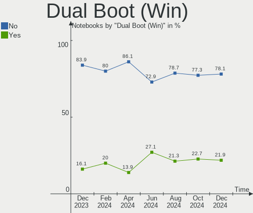
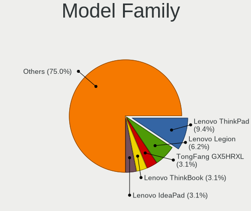
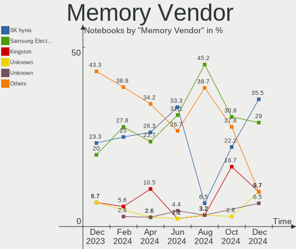

Manjaro - Hardware Trends (Notebooks)
-------------------------------------

A project to identify most popular hardware characteristics and track their change
over time based on data collected by Linux users at https://Linux-Hardware.org.

Anyone can contribute to this report by the [hw-probe](https://github.com/linuxhw/hw-probe) tool:

    sudo -E hw-probe -all -upload

This report is for one last month. Overall report since the beginning of time: [TestDays](https://github.com/linuxhw/TestDays)

Period: Feb, 2023.

Contents
--------

* [ System ](#system)
  - [ OS                       ](#os)
  - [ OS Family                ](#os-family)
  - [ Kernel                   ](#kernel)
  - [ Kernel Family            ](#kernel-family)
  - [ Kernel Major Ver.        ](#kernel-major-ver)
  - [ Arch                     ](#arch)
  - [ DE                       ](#de)
  - [ Display Server           ](#display-server)
  - [ Display Manager          ](#display-manager)
  - [ OS Lang                  ](#os-lang)
  - [ Boot Mode                ](#boot-mode)
  - [ Filesystem               ](#filesystem)
  - [ Part. scheme             ](#part-scheme)
  - [ Dual Boot with Linux/BSD ](#dual-boot-with-linuxbsd)
  - [ Dual Boot (Win)          ](#dual-boot-win)

* [ Board ](#board)
  - [ Vendor                   ](#vendor)
  - [ Model                    ](#model)
  - [ Model Family             ](#model-family)
  - [ MFG Year                 ](#mfg-year)
  - [ Form Factor              ](#form-factor)
  - [ Secure Boot              ](#secure-boot)
  - [ Coreboot                 ](#coreboot)
  - [ RAM Size                 ](#ram-size)
  - [ RAM Used                 ](#ram-used)
  - [ Total Drives             ](#total-drives)
  - [ Has CD-ROM               ](#has-cd-rom)
  - [ Has Ethernet             ](#has-ethernet)
  - [ Has WiFi                 ](#has-wifi)
  - [ Has Bluetooth            ](#has-bluetooth)

* [ Location ](#location)
  - [ Country                  ](#country)
  - [ City                     ](#city)

* [ Drives ](#drives)
  - [ Drive Vendor             ](#drive-vendor)
  - [ Drive Model              ](#drive-model)
  - [ HDD Vendor               ](#hdd-vendor)
  - [ SSD Vendor               ](#ssd-vendor)
  - [ Drive Kind               ](#drive-kind)
  - [ Drive Connector          ](#drive-connector)
  - [ Drive Size               ](#drive-size)
  - [ Space Total              ](#space-total)
  - [ Space Used               ](#space-used)
  - [ Malfunc. Drives          ](#malfunc-drives)
  - [ Malfunc. Drive Vendor    ](#malfunc-drive-vendor)
  - [ Malfunc. HDD Vendor      ](#malfunc-hdd-vendor)
  - [ Malfunc. Drive Kind      ](#malfunc-drive-kind)
  - [ Failed Drives            ](#failed-drives)
  - [ Failed Drive Vendor      ](#failed-drive-vendor)
  - [ Drive Status             ](#drive-status)

* [ Storage controller ](#storage-controller)
  - [ Storage Vendor           ](#storage-vendor)
  - [ Storage Model            ](#storage-model)
  - [ Storage Kind             ](#storage-kind)

* [ Processor ](#processor)
  - [ CPU Vendor               ](#cpu-vendor)
  - [ CPU Model                ](#cpu-model)
  - [ CPU Model Family         ](#cpu-model-family)
  - [ CPU Cores                ](#cpu-cores)
  - [ CPU Sockets              ](#cpu-sockets)
  - [ CPU Threads              ](#cpu-threads)
  - [ CPU Op-Modes             ](#cpu-op-modes)
  - [ CPU Microcode            ](#cpu-microcode)
  - [ CPU Microarch            ](#cpu-microarch)

* [ Graphics ](#graphics)
  - [ GPU Vendor               ](#gpu-vendor)
  - [ GPU Model                ](#gpu-model)
  - [ GPU Combo                ](#gpu-combo)
  - [ GPU Driver               ](#gpu-driver)
  - [ GPU Memory               ](#gpu-memory)

* [ Monitor ](#monitor)
  - [ Monitor Vendor           ](#monitor-vendor)
  - [ Monitor Model            ](#monitor-model)
  - [ Monitor Resolution       ](#monitor-resolution)
  - [ Monitor Diagonal         ](#monitor-diagonal)
  - [ Monitor Width            ](#monitor-width)
  - [ Aspect Ratio             ](#aspect-ratio)
  - [ Monitor Area             ](#monitor-area)
  - [ Pixel Density            ](#pixel-density)
  - [ Multiple Monitors        ](#multiple-monitors)

* [ Network ](#network)
  - [ Net Controller Vendor    ](#net-controller-vendor)
  - [ Net Controller Model     ](#net-controller-model)
  - [ Wireless Vendor          ](#wireless-vendor)
  - [ Wireless Model           ](#wireless-model)
  - [ Ethernet Vendor          ](#ethernet-vendor)
  - [ Ethernet Model           ](#ethernet-model)
  - [ Net Controller Kind      ](#net-controller-kind)
  - [ Used Controller          ](#used-controller)
  - [ NICs                     ](#nics)
  - [ IPv6                     ](#ipv6)

* [ Bluetooth ](#bluetooth)
  - [ Bluetooth Vendor         ](#bluetooth-vendor)
  - [ Bluetooth Model          ](#bluetooth-model)

* [ Sound ](#sound)
  - [ Sound Vendor             ](#sound-vendor)
  - [ Sound Model              ](#sound-model)

* [ Memory ](#memory)
  - [ Memory Vendor            ](#memory-vendor)
  - [ Memory Model             ](#memory-model)
  - [ Memory Kind              ](#memory-kind)
  - [ Memory Form Factor       ](#memory-form-factor)
  - [ Memory Size              ](#memory-size)
  - [ Memory Speed             ](#memory-speed)

* [ Printers & scanners ](#printers--scanners)
  - [ Printer Vendor           ](#printer-vendor)
  - [ Printer Model            ](#printer-model)
  - [ Scanner Vendor           ](#scanner-vendor)
  - [ Scanner Model            ](#scanner-model)

* [ Camera ](#camera)
  - [ Camera Vendor            ](#camera-vendor)
  - [ Camera Model             ](#camera-model)

* [ Security ](#security)
  - [ Fingerprint Vendor       ](#fingerprint-vendor)
  - [ Fingerprint Model        ](#fingerprint-model)
  - [ Chipcard Vendor          ](#chipcard-vendor)
  - [ Chipcard Model           ](#chipcard-model)

* [ Unsupported ](#unsupported)
  - [ Unsupported Devices      ](#unsupported-devices)
  - [ Unsupported Device Types ](#unsupported-device-types)

System
------

OS
--

Installed operating systems

| Name           | Notebooks | Percent |
|----------------|-----------|---------|
| Manjaro        | 44        | 50.57%  |
| Manjaro 22.0.4 | 13        | 14.94%  |
| Manjaro 22.0.2 | 12        | 13.79%  |
| Manjaro 22.0.3 | 11        | 12.64%  |
| Manjaro 22.0.1 | 7         | 8.05%   |

OS Family
---------

OS without a version

| Name    | Notebooks | Percent |
|---------|-----------|---------|
| Manjaro | 87        | 100%    |

Kernel
------

Version of the Linux kernel

| Version                         | Notebooks | Percent |
|---------------------------------|-----------|---------|
| 6.1.11-1-MANJARO                | 22        | 25.29%  |
| 6.1.12-1-MANJARO                | 15        | 17.24%  |
| 6.1.9-1-MANJARO                 | 12        | 13.79%  |
| 6.1.7-1-MANJARO                 | 9         | 10.34%  |
| 5.15.94-1-MANJARO               | 7         | 8.05%   |
| 5.15.89-1-MANJARO               | 5         | 5.75%   |
| 5.15.93-1-MANJARO               | 4         | 4.6%    |
| 6.2.0-1-MANJARO                 | 2         | 2.3%    |
| 5.15.91-1-MANJARO               | 2         | 2.3%    |
| 5.10.164-1-MANJARO              | 2         | 2.3%    |
| 6.2.0-2-MANJARO                 | 1         | 1.15%   |
| 6.1.1-1-MANJARO                 | 1         | 1.15%   |
| 6.0.5-4-rt14-MANJARO            | 1         | 1.15%   |
| 6.0.19-3-MANJARO                | 1         | 1.15%   |
| 5.18.19-3-MANJARO               | 1         | 1.15%   |
| 5.15.74-zen1-1-zen-515lts-dirty | 1         | 1.15%   |
| 5.15.65-1-MANJARO               | 1         | 1.15%   |

Kernel Family
-------------

Linux kernel without a distro release

| Version  | Notebooks | Percent |
|----------|-----------|---------|
| 6.1.11   | 22        | 25.29%  |
| 6.1.12   | 15        | 17.24%  |
| 6.1.9    | 12        | 13.79%  |
| 6.1.7    | 9         | 10.34%  |
| 5.15.94  | 7         | 8.05%   |
| 5.15.89  | 5         | 5.75%   |
| 5.15.93  | 4         | 4.6%    |
| 6.2.0    | 3         | 3.45%   |
| 5.15.91  | 2         | 2.3%    |
| 5.10.164 | 2         | 2.3%    |
| 6.1.1    | 1         | 1.15%   |
| 6.0.5    | 1         | 1.15%   |
| 6.0.19   | 1         | 1.15%   |
| 5.18.19  | 1         | 1.15%   |
| 5.15.74  | 1         | 1.15%   |
| 5.15.65  | 1         | 1.15%   |

Kernel Major Ver.
-----------------

Linux kernel major version

| Version | Notebooks | Percent |
|---------|-----------|---------|
| 6.1     | 59        | 67.82%  |
| 5.15    | 20        | 22.99%  |
| 6.2     | 3         | 3.45%   |
| 6.0     | 2         | 2.3%    |
| 5.10    | 2         | 2.3%    |
| 5.18    | 1         | 1.15%   |

Arch
----

OS architecture (x86_64, i586, etc.)

| Name   | Notebooks | Percent |
|--------|-----------|---------|
| x86_64 | 87        | 100%    |

DE
--

Desktop Environment

| Name       | Notebooks | Percent |
|------------|-----------|---------|
| KDE5       | 54        | 62.07%  |
| GNOME      | 14        | 16.09%  |
| XFCE       | 11        | 12.64%  |
| Unknown    | 3         | 3.45%   |
| X-Cinnamon | 2         | 2.3%    |
| KDE        | 1         | 1.15%   |
| i3         | 1         | 1.15%   |
| Deepin     | 1         | 1.15%   |

Display Server
--------------

X11 or Wayland

| Name    | Notebooks | Percent |
|---------|-----------|---------|
| X11     | 71        | 81.61%  |
| Wayland | 12        | 13.79%  |
| Unknown | 3         | 3.45%   |
| Tty     | 1         | 1.15%   |

Display Manager
---------------

SDDM, LightDM, etc.

| Name    | Notebooks | Percent |
|---------|-----------|---------|
| Unknown | 44        | 50.57%  |
| SDDM    | 27        | 31.03%  |
| LightDM | 8         | 9.2%    |
| GDM     | 8         | 9.2%    |

OS Lang
-------

Language

| Lang    | Notebooks | Percent |
|---------|-----------|---------|
| en_US   | 34        | 39.08%  |
| ru_RU   | 12        | 13.79%  |
| en_GB   | 9         | 10.34%  |
| de_DE   | 8         | 9.2%    |
| Unknown | 3         | 3.45%   |
| pt_BR   | 2         | 2.3%    |
| pl_PL   | 2         | 2.3%    |
| nl_NL   | 2         | 2.3%    |
| fr_FR   | 2         | 2.3%    |
| es_MX   | 2         | 2.3%    |
| tr_TR   | 1         | 1.15%   |
| ro_RO   | 1         | 1.15%   |
| it_IT   | 1         | 1.15%   |
| fr_CA   | 1         | 1.15%   |
| fi_FI   | 1         | 1.15%   |
| es_PE   | 1         | 1.15%   |
| es_CO   | 1         | 1.15%   |
| en_IN   | 1         | 1.15%   |
| en_IE   | 1         | 1.15%   |
| en_AU   | 1         | 1.15%   |
| cs_CZ   | 1         | 1.15%   |

Boot Mode
---------

EFI or BIOS

| Mode | Notebooks | Percent |
|------|-----------|---------|
| BIOS | 49        | 56.32%  |
| EFI  | 38        | 43.68%  |

Filesystem
----------

Type of filesystem

| Type    | Notebooks | Percent |
|---------|-----------|---------|
| Ext4    | 74        | 85.06%  |
| Btrfs   | 11        | 12.64%  |
| Xfs     | 1         | 1.15%   |
| Overlay | 1         | 1.15%   |

Part. scheme
------------

Scheme of partitioning

| Type    | Notebooks | Percent |
|---------|-----------|---------|
| GPT     | 46        | 52.87%  |
| Unknown | 39        | 44.83%  |
| MBR     | 2         | 2.3%    |

Dual Boot with Linux/BSD
------------------------

Hosting more than one Linux/BSD

| Dual boot | Notebooks | Percent |
|-----------|-----------|---------|
| No        | 80        | 91.95%  |
| Yes       | 7         | 8.05%   |

Dual Boot (Win)
---------------

Hosting Linux and Windows

| Dual boot | Notebooks | Percent |
|-----------|-----------|---------|
| No        | 66        | 75.86%  |
| Yes       | 21        | 24.14%  |

Board
-----

Vendor
------

Motherboard manufacturer

| Name                | Notebooks | Percent |
|---------------------|-----------|---------|
| Lenovo              | 18        | 20.69%  |
| Dell                | 15        | 17.24%  |
| Hewlett-Packard     | 13        | 14.94%  |
| ASUSTek Computer    | 10        | 11.49%  |
| Acer                | 8         | 9.2%    |
| MSI                 | 5         | 5.75%   |
| HUAWEI              | 3         | 3.45%   |
| Timi                | 2         | 2.3%    |
| Apple               | 2         | 2.3%    |
| Unknown             | 2         | 2.3%    |
| TUXEDO              | 1         | 1.15%   |
| System76            | 1         | 1.15%   |
| Schenker            | 1         | 1.15%   |
| Samsung Electronics | 1         | 1.15%   |
| HONOR               | 1         | 1.15%   |
| GPD                 | 1         | 1.15%   |
| Google              | 1         | 1.15%   |
| Gigabyte Technology | 1         | 1.15%   |
| Fujitsu             | 1         | 1.15%   |

Model
-----

Motherboard model

| Name                                        | Notebooks | Percent |
|---------------------------------------------|-----------|---------|
| MSI GF63 Thin 11UC                          | 2         | 2.3%    |
| Unknown                                     | 2         | 2.3%    |
| TUXEDO Stellaris Intel Gen4                 | 1         | 1.15%   |
| Timi Xiaomi Book Pro 14 2022                | 1         | 1.15%   |
| Timi A34S                                   | 1         | 1.15%   |
| System76 Serval WS                          | 1         | 1.15%   |
| Schenker VISION 15 (SVS15E21)               | 1         | 1.15%   |
| Samsung 530U3BI/530U4BI/530U4BH             | 1         | 1.15%   |
| MSI Summit E13FlipEvo A11MT                 | 1         | 1.15%   |
| MSI GF63 Thin 9RCX                          | 1         | 1.15%   |
| MSI GE60 2QE                                | 1         | 1.15%   |
| Lenovo Yoga Slim 7 Pro 14IAP7 82SV          | 1         | 1.15%   |
| Lenovo ThinkPad X230 2324A82                | 1         | 1.15%   |
| Lenovo ThinkPad X1 Extreme Gen 3 20TK0047US | 1         | 1.15%   |
| Lenovo ThinkPad T530 2392AQU                | 1         | 1.15%   |
| Lenovo ThinkPad T460 20FMS06V00             | 1         | 1.15%   |
| Lenovo ThinkPad T430s 2356BQ5               | 1         | 1.15%   |
| Lenovo ThinkPad P51 20HJS02000              | 1         | 1.15%   |
| Lenovo ThinkPad L15 Gen1 20U70003CK         | 1         | 1.15%   |
| Lenovo ThinkPad L15 Gen 2 20X4S6U400        | 1         | 1.15%   |
| Lenovo ThinkBook 15 G2 ITL 20VE             | 1         | 1.15%   |
| Lenovo Legion Y540-15IRH 81SX               | 1         | 1.15%   |
| Lenovo Legion S7 16ARHA7 82UG               | 1         | 1.15%   |
| Lenovo Legion 5 Pro 16ACH6 82JS             | 1         | 1.15%   |
| Lenovo Legion 5 15IMH05 82AU                | 1         | 1.15%   |
| Lenovo Legion 5 15ARH05H 82B1               | 1         | 1.15%   |
| Lenovo IdeaPad Y580                         | 1         | 1.15%   |
| Lenovo IdeaPad 3 15ALC6 82KU                | 1         | 1.15%   |
| Lenovo IdeaPad 1 15ALC7 82R4                | 1         | 1.15%   |
| HUAWEI NBLB-WAX9N                           | 1         | 1.15%   |
| HUAWEI BOM-WXX9                             | 1         | 1.15%   |
| HUAWEI BOD-WXX9                             | 1         | 1.15%   |
| HONOR BMH-WCX9                              | 1         | 1.15%   |
| HP ZBook 17 G2                              | 1         | 1.15%   |
| HP ProBook 450 G1                           | 1         | 1.15%   |
| HP ProBook 445 G8 Notebook PC               | 1         | 1.15%   |
| HP Pavilion Notebook                        | 1         | 1.15%   |
| HP Pavilion Gaming Laptop 16-a0xxx          | 1         | 1.15%   |
| HP Pavilion g6                              | 1         | 1.15%   |
| HP Notebook                                 | 1         | 1.15%   |

Model Family
------------

Motherboard model prefix

| Name              | Notebooks | Percent |
|-------------------|-----------|---------|
| Lenovo ThinkPad   | 8         | 9.2%    |
| Dell Latitude     | 6         | 6.9%    |
| Lenovo Legion     | 5         | 5.75%   |
| HP EliteBook      | 4         | 4.6%    |
| MSI GF63          | 3         | 3.45%   |
| Lenovo IdeaPad    | 3         | 3.45%   |
| HP Pavilion       | 3         | 3.45%   |
| Dell XPS          | 3         | 3.45%   |
| ASUS VivoBook     | 3         | 3.45%   |
| Acer Aspire       | 3         | 3.45%   |
| HP ProBook        | 2         | 2.3%    |
| Dell Vostro       | 2         | 2.3%    |
| Dell Inspiron     | 2         | 2.3%    |
| Acer TravelMate   | 2         | 2.3%    |
| Acer Predator     | 2         | 2.3%    |
| Unknown           | 2         | 2.3%    |
| TUXEDO Stellaris  | 1         | 1.15%   |
| Timi Xiaomi       | 1         | 1.15%   |
| Timi A34S         | 1         | 1.15%   |
| System76 Serval   | 1         | 1.15%   |
| Schenker VISION   | 1         | 1.15%   |
| Samsung 530U3BI   | 1         | 1.15%   |
| MSI Summit        | 1         | 1.15%   |
| MSI GE60          | 1         | 1.15%   |
| Lenovo Yoga       | 1         | 1.15%   |
| Lenovo ThinkBook  | 1         | 1.15%   |
| HUAWEI NBLB-WAX9N | 1         | 1.15%   |
| HUAWEI BOM-WXX9   | 1         | 1.15%   |
| HUAWEI BOD-WXX9   | 1         | 1.15%   |
| HONOR BMH-WCX9    | 1         | 1.15%   |
| HP ZBook          | 1         | 1.15%   |
| HP Notebook       | 1         | 1.15%   |
| HP G60            | 1         | 1.15%   |
| HP 15             | 1         | 1.15%   |
| GPD G1619-04      | 1         | 1.15%   |
| Google Robo360    | 1         | 1.15%   |
| Gigabyte AORUS    | 1         | 1.15%   |
| Fujitsu LIFEBOOK  | 1         | 1.15%   |
| Dell Precision    | 1         | 1.15%   |
| Dell G3           | 1         | 1.15%   |

MFG Year
--------

Motherboard manufacture year

| Year | Notebooks | Percent |
|------|-----------|---------|
| 2021 | 17        | 19.54%  |
| 2022 | 15        | 17.24%  |
| 2019 | 14        | 16.09%  |
| 2020 | 8         | 9.2%    |
| 2012 | 7         | 8.05%   |
| 2014 | 5         | 5.75%   |
| 2017 | 4         | 4.6%    |
| 2016 | 4         | 4.6%    |
| 2015 | 4         | 4.6%    |
| 2018 | 3         | 3.45%   |
| 2011 | 3         | 3.45%   |
| 2013 | 2         | 2.3%    |
| 2008 | 1         | 1.15%   |

Form Factor
-----------

Physical design of the computer

| Name     | Notebooks | Percent |
|----------|-----------|---------|
| Notebook | 87        | 100%    |

Secure Boot
-----------

Enabled or disabled

| State    | Notebooks | Percent |
|----------|-----------|---------|
| Disabled | 87        | 100%    |

Coreboot
--------

Have coreboot on board

| Used | Notebooks | Percent |
|------|-----------|---------|
| No   | 86        | 98.85%  |
| Yes  | 1         | 1.15%   |

RAM Size
--------

Total RAM memory

| Size in GB  | Notebooks | Percent |
|-------------|-----------|---------|
| 4.01-8.0    | 22        | 25.29%  |
| 16.01-24.0  | 21        | 24.14%  |
| 8.01-16.0   | 20        | 22.99%  |
| 32.01-64.0  | 13        | 14.94%  |
| 3.01-4.0    | 7         | 8.05%   |
| 24.01-32.0  | 2         | 2.3%    |
| 64.01-256.0 | 2         | 2.3%    |

RAM Used
--------

Used RAM memory

| Used GB    | Notebooks | Percent |
|------------|-----------|---------|
| 4.01-8.0   | 28        | 32.18%  |
| 2.01-3.0   | 23        | 26.44%  |
| 3.01-4.0   | 15        | 17.24%  |
| 8.01-16.0  | 10        | 11.49%  |
| 1.01-2.0   | 9         | 10.34%  |
| 24.01-32.0 | 1         | 1.15%   |
| 0.51-1.0   | 1         | 1.15%   |

Total Drives
------------

Number of drives on board

| Drives | Notebooks | Percent |
|--------|-----------|---------|
| 1      | 63        | 72.41%  |
| 2      | 20        | 22.99%  |
| 3      | 4         | 4.6%    |

Has CD-ROM
----------

Has CD-ROM on board

| Presented | Notebooks | Percent |
|-----------|-----------|---------|
| No        | 74        | 85.06%  |
| Yes       | 13        | 14.94%  |

Has Ethernet
------------

Has Ethernet on board

| Presented | Notebooks | Percent |
|-----------|-----------|---------|
| Yes       | 64        | 73.56%  |
| No        | 23        | 26.44%  |

Has WiFi
--------

Has WiFi module

| Presented | Notebooks | Percent |
|-----------|-----------|---------|
| Yes       | 86        | 98.85%  |
| No        | 1         | 1.15%   |

Has Bluetooth
-------------

Has Bluetooth module

| Presented | Notebooks | Percent |
|-----------|-----------|---------|
| Yes       | 79        | 90.8%   |
| No        | 8         | 9.2%    |

Location
--------

Country
-------

Geographic location (country)

| Country     | Notebooks | Percent |
|-------------|-----------|---------|
| USA         | 14        | 16.09%  |
| Russia      | 14        | 16.09%  |
| Germany     | 11        | 12.64%  |
| Netherlands | 4         | 4.6%    |
| Italy       | 4         | 4.6%    |
| UK          | 3         | 3.45%   |
| Brazil      | 3         | 3.45%   |
| Spain       | 2         | 2.3%    |
| Romania     | 2         | 2.3%    |
| Poland      | 2         | 2.3%    |
| Peru        | 2         | 2.3%    |
| Mexico      | 2         | 2.3%    |
| Indonesia   | 2         | 2.3%    |
| India       | 2         | 2.3%    |
| Czechia     | 2         | 2.3%    |
| Uzbekistan  | 1         | 1.15%   |
| Turkey      | 1         | 1.15%   |
| Slovakia    | 1         | 1.15%   |
| Kuwait      | 1         | 1.15%   |
| Japan       | 1         | 1.15%   |
| Ireland     | 1         | 1.15%   |
| Iran        | 1         | 1.15%   |
| Hungary     | 1         | 1.15%   |
| France      | 1         | 1.15%   |
| Finland     | 1         | 1.15%   |
| Cyprus      | 1         | 1.15%   |
| Colombia    | 1         | 1.15%   |
| Chile       | 1         | 1.15%   |
| Canada      | 1         | 1.15%   |
| Bulgaria    | 1         | 1.15%   |
| Bangladesh  | 1         | 1.15%   |
| Australia   | 1         | 1.15%   |
| Algeria     | 1         | 1.15%   |

City
----

Geographic location (city)

| City              | Notebooks | Percent |
|-------------------|-----------|---------|
| St Petersburg     | 3         | 3.45%   |
| Stuttgart         | 2         | 2.3%    |
| Prague            | 2         | 2.3%    |
| Moscow            | 2         | 2.3%    |
| Bucharest         | 2         | 2.3%    |
| Astrakhan         | 2         | 2.3%    |
| Wittenberg        | 1         | 1.15%   |
| West Stockbridge  | 1         | 1.15%   |
| Walsall           | 1         | 1.15%   |
| Vladivostok       | 1         | 1.15%   |
| Velke Surovce     | 1         | 1.15%   |
| Trento            | 1         | 1.15%   |
| Toronto           | 1         | 1.15%   |
| The Hague         | 1         | 1.15%   |
| Terrassa          | 1         | 1.15%   |
| Tehran            | 1         | 1.15%   |
| Tashkent          | 1         | 1.15%   |
| Solingen          | 1         | 1.15%   |
| Savona            | 1         | 1.15%   |
| Sao Paulo         | 1         | 1.15%   |
| Santiago          | 1         | 1.15%   |
| San Jose          | 1         | 1.15%   |
| Sammamish         | 1         | 1.15%   |
| Saint-Nazaire     | 1         | 1.15%   |
| Rostov-on-Don     | 1         | 1.15%   |
| Relizane          | 1         | 1.15%   |
| Plovdiv           | 1         | 1.15%   |
| Pittsburgh        | 1         | 1.15%   |
| Olympia           | 1         | 1.15%   |
| Oak Harbor        | 1         | 1.15%   |
| Nuremberg         | 1         | 1.15%   |
| Novosibirsk       | 1         | 1.15%   |
| Nishikicho        | 1         | 1.15%   |
| Nicosia           | 1         | 1.15%   |
| Muelheim-Kaerlich | 1         | 1.15%   |
| Mittagong         | 1         | 1.15%   |
| Milano            | 1         | 1.15%   |
| Mexico City       | 1         | 1.15%   |
| Marktheidenfeld   | 1         | 1.15%   |
| Maplewood         | 1         | 1.15%   |

Drives
------

Drive Vendor
------------

Hard drive vendors

| Vendor                         | Notebooks | Drives | Percent |
|--------------------------------|-----------|--------|---------|
| Samsung Electronics            | 25        | 27     | 21.93%  |
| Sandisk                        | 13        | 14     | 11.4%   |
| Toshiba                        | 7         | 7      | 6.14%   |
| Seagate                        | 7         | 8      | 6.14%   |
| SK hynix                       | 6         | 6      | 5.26%   |
| WDC                            | 5         | 6      | 4.39%   |
| Micron Technology              | 5         | 5      | 4.39%   |
| Kingston                       | 5         | 5      | 4.39%   |
| Unknown                        | 4         | 4      | 3.51%   |
| Phison Electronics             | 4         | 4      | 3.51%   |
| Crucial                        | 4         | 4      | 3.51%   |
| Intel                          | 3         | 3      | 2.63%   |
| HGST                           | 3         | 3      | 2.63%   |
| SABRENT                        | 2         | 2      | 1.75%   |
| Realtek                        | 2         | 2      | 1.75%   |
| Micron/Crucial Technology      | 2         | 2      | 1.75%   |
| KIOXIA                         | 2         | 2      | 1.75%   |
| Kingston Technology Company    | 2         | 2      | 1.75%   |
| Apple                          | 2         | 3      | 1.75%   |
| Yangtze Memory Technologies    | 1         | 1      | 0.88%   |
| TwinMOS                        | 1         | 1      | 0.88%   |
| T-FORCE                        | 1         | 1      | 0.88%   |
| SSK                            | 1         | 1      | 0.88%   |
| Solid State Storage Technology | 1         | 1      | 0.88%   |
| Plextor                        | 1         | 1      | 0.88%   |
| Dogfish                        | 1         | 1      | 0.88%   |
| Biwin Storage Technology       | 1         | 1      | 0.88%   |
| ADATA Technology               | 1         | 1      | 0.88%   |
| A-DATA Technology              | 1         | 1      | 0.88%   |
| Unknown                        | 1         | 1      | 0.88%   |

Drive Model
-----------

Hard drive models

| Model                                                | Notebooks | Percent |
|------------------------------------------------------|-----------|---------|
| Samsung NVMe SSD Controller SM981/PM981/PM983 250GB  | 7         | 5.88%   |
| Samsung NVMe SSD Controller PM9A1/PM9A3/980PRO 960GB | 4         | 3.36%   |
| Toshiba MQ01ABD100 1TB                               | 3         | 2.52%   |
| Sandisk WD Blue SN550 NVMe SSD 1TB                   | 3         | 2.52%   |
| Toshiba MQ01ABD075 752GB                             | 2         | 1.68%   |
| Sandisk WD Blue SN500 / PC SN520 NVMe SSD 256GB      | 2         | 1.68%   |
| SanDisk SSD PLUS 1000GB                              | 2         | 1.68%   |
| Sandisk PC SN520 NVMe SSD 512GB                      | 2         | 1.68%   |
| Samsung SSD 870 EVO 1TB                              | 2         | 1.68%   |
| SABRENT Disk 256GB                                   | 2         | 1.68%   |
| Phison PS5013 E13 NVMe Controller 500GB              | 2         | 1.68%   |
| Intel SSDPEKNW512GZL 512GB                           | 2         | 1.68%   |
| Yangtze Memory YMTC PC005 256GB                      | 1         | 0.84%   |
| WDC WDS200T2B0B-00YS70 2TB SSD                       | 1         | 0.84%   |
| WDC WD10SPZX-21Z10T0 1TB                             | 1         | 0.84%   |
| WDC WD10SPZX-08Z10 1TB                               | 1         | 0.84%   |
| WDC WD10JPVX-22JC3T0 1TB                             | 1         | 0.84%   |
| WDC WD10 SPZX-08Z10 1TB                              | 1         | 0.84%   |
| WDC WD SSD 120GB                                     | 1         | 0.84%   |
| Unknown MMC Card  64GB                               | 1         | 0.84%   |
| Unknown MMC Card  512GB                              | 1         | 0.84%   |
| Unknown MMC Card  4GB                                | 1         | 0.84%   |
| Unknown MMC Card  32GB                               | 1         | 0.84%   |
| TwinMOS SSD 256GB                                    | 1         | 0.84%   |
| Toshiba MQ04ABF100 1TB                               | 1         | 0.84%   |
| Toshiba BG3 NVMe SSD Controller 256GB                | 1         | 0.84%   |
| T-FORCE 1TB                                          | 1         | 0.84%   |
| SSK Storage 250GB                                    | 1         | 0.84%   |
| Solid State Storage CL4-3D512-Q11 NVMe SSSTC 512GB   | 1         | 0.84%   |
| SK hynix SKHynix_HFS512GD9TNI-L2A0B 512GB            | 1         | 0.84%   |
| SK hynix SKHynix_HFS256GD9TNG-L3A0B 256GB            | 1         | 0.84%   |
| SK hynix SHGS31-500GS-2 500GB SSD                    | 1         | 0.84%   |
| SK hynix PC601 NVMe 512GB                            | 1         | 0.84%   |
| SK hynix HFM001TD3JX013N 1TB                         | 1         | 0.84%   |
| SK hynix BC511 512GB                                 | 1         | 0.84%   |
| Seagate ST9500420AS 500GB                            | 1         | 0.84%   |
| Seagate ST9500325AS 500GB                            | 1         | 0.84%   |
| Seagate ST500LX012-1LM162-SSHD 500GB                 | 1         | 0.84%   |
| Seagate ST2000LX001-1RG174 2TB                       | 1         | 0.84%   |
| Seagate ST1000LM049-2GH172 1TB                       | 1         | 0.84%   |

HDD Vendor
----------

Hard disk drive vendors

| Vendor  | Notebooks | Drives | Percent |
|---------|-----------|--------|---------|
| Seagate | 7         | 8      | 31.82%  |
| Toshiba | 6         | 6      | 27.27%  |
| WDC     | 4         | 4      | 18.18%  |
| HGST    | 3         | 3      | 13.64%  |
| SABRENT | 2         | 2      | 9.09%   |

SSD Vendor
----------

Solid state drive vendors

| Vendor              | Notebooks | Drives | Percent |
|---------------------|-----------|--------|---------|
| Samsung Electronics | 8         | 8      | 28.57%  |
| SanDisk             | 4         | 5      | 14.29%  |
| Crucial             | 4         | 4      | 14.29%  |
| WDC                 | 2         | 2      | 7.14%   |
| Micron Technology   | 2         | 2      | 7.14%   |
| Kingston            | 2         | 2      | 7.14%   |
| TwinMOS             | 1         | 1      | 3.57%   |
| SK hynix            | 1         | 1      | 3.57%   |
| Plextor             | 1         | 1      | 3.57%   |
| Dogfish             | 1         | 1      | 3.57%   |
| Apple               | 1         | 1      | 3.57%   |
| A-DATA Technology   | 1         | 1      | 3.57%   |

Drive Kind
----------

HDD or SSD

| Kind    | Notebooks | Drives | Percent |
|---------|-----------|--------|---------|
| NVMe    | 52        | 62     | 50%     |
| SSD     | 25        | 29     | 24.04%  |
| HDD     | 21        | 23     | 20.19%  |
| MMC     | 4         | 4      | 3.85%   |
| Unknown | 2         | 2      | 1.92%   |

Drive Connector
---------------

SATA, SAS, NVMe, etc.

| Type | Notebooks | Drives | Percent |
|------|-----------|--------|---------|
| NVMe | 52        | 59     | 51.49%  |
| SATA | 40        | 50     | 39.6%   |
| SAS  | 5         | 7      | 4.95%   |
| MMC  | 4         | 4      | 3.96%   |

Drive Size
----------

Size of hard drive

| Size in TB | Notebooks | Drives | Percent |
|------------|-----------|--------|---------|
| 0.01-0.5   | 24        | 25     | 50%     |
| 0.51-1.0   | 21        | 24     | 43.75%  |
| 1.01-2.0   | 3         | 3      | 6.25%   |

Space Total
-----------

Amount of disk space available on the file system

| Size in GB     | Notebooks | Percent |
|----------------|-----------|---------|
| 251-500        | 20        | 22.99%  |
| 101-250        | 19        | 21.84%  |
| 501-1000       | 17        | 19.54%  |
| 1001-2000      | 9         | 10.34%  |
| Unknown        | 8         | 9.2%    |
| 1-20           | 4         | 4.6%    |
| 51-100         | 4         | 4.6%    |
| More than 3000 | 2         | 2.3%    |
| 21-50          | 2         | 2.3%    |
| 2001-3000      | 2         | 2.3%    |

Space Used
----------

Amount of used disk space

| Used GB        | Notebooks | Percent |
|----------------|-----------|---------|
| 21-50          | 19        | 21.84%  |
| 1-20           | 15        | 17.24%  |
| 101-250        | 14        | 16.09%  |
| 51-100         | 12        | 13.79%  |
| 251-500        | 8         | 9.2%    |
| Unknown        | 8         | 9.2%    |
| 501-1000       | 6         | 6.9%    |
| 1001-2000      | 2         | 2.3%    |
| 0              | 2         | 2.3%    |
| More than 3000 | 1         | 1.15%   |

Malfunc. Drives
---------------

Drive models with a malfunction

| Model                               | Notebooks | Drives | Percent |
|-------------------------------------|-----------|--------|---------|
| WDC WD10 SPZX-08Z10 1TB             | 1         | 1      | 33.33%  |
| Samsung Electronics SSD 870 EVO 1TB | 1         | 1      | 33.33%  |
| HGST HTS721010A9E630 1TB            | 1         | 1      | 33.33%  |

Malfunc. Drive Vendor
---------------------

Vendors of faulty drives

| Vendor              | Notebooks | Drives | Percent |
|---------------------|-----------|--------|---------|
| WDC                 | 1         | 1      | 33.33%  |
| Samsung Electronics | 1         | 1      | 33.33%  |
| HGST                | 1         | 1      | 33.33%  |

Malfunc. HDD Vendor
-------------------

Vendors of faulty HDD drives

| Vendor | Notebooks | Drives | Percent |
|--------|-----------|--------|---------|
| WDC    | 1         | 1      | 50%     |
| HGST   | 1         | 1      | 50%     |

Malfunc. Drive Kind
-------------------

Kinds of faulty drives

| Kind | Notebooks | Drives | Percent |
|------|-----------|--------|---------|
| HDD  | 2         | 2      | 66.67%  |
| SSD  | 1         | 1      | 33.33%  |

Failed Drives
-------------

Failed drive models

Zero info for selected period =(

Failed Drive Vendor
-------------------

Failed drive vendors

Zero info for selected period =(

Drive Status
------------

Number of failed and malfunc. drives

| Status   | Notebooks | Drives | Percent |
|----------|-----------|--------|---------|
| Detected | 56        | 73     | 60.22%  |
| Works    | 34        | 44     | 36.56%  |
| Malfunc  | 3         | 3      | 3.23%   |

Storage controller
------------------

Storage Vendor
--------------

Storage controller vendors

| Vendor                         | Notebooks | Percent |
|--------------------------------|-----------|---------|
| Intel                          | 54        | 45.38%  |
| Samsung Electronics            | 18        | 15.13%  |
| AMD                            | 11        | 9.24%   |
| SanDisk                        | 9         | 7.56%   |
| SK hynix                       | 5         | 4.2%    |
| Kingston Technology Company    | 5         | 4.2%    |
| Phison Electronics             | 4         | 3.36%   |
| Micron Technology              | 3         | 2.52%   |
| Micron/Crucial Technology      | 2         | 1.68%   |
| KIOXIA                         | 2         | 1.68%   |
| Yangtze Memory Technologies    | 1         | 0.84%   |
| Toshiba America Info Systems   | 1         | 0.84%   |
| Solid State Storage Technology | 1         | 0.84%   |
| Biwin Storage Technology       | 1         | 0.84%   |
| Apple                          | 1         | 0.84%   |
| ADATA Technology               | 1         | 0.84%   |

Storage Model
-------------

Storage controller models

| Model                                                                          | Notebooks | Percent |
|--------------------------------------------------------------------------------|-----------|---------|
| AMD FCH SATA Controller [AHCI mode]                                            | 11        | 8.94%   |
| Samsung NVMe SSD Controller SM981/PM981/PM983                                  | 7         | 5.69%   |
| Intel 7 Series Chipset Family 6-port SATA Controller [AHCI mode]               | 7         | 5.69%   |
| Intel Cannon Lake Mobile PCH SATA AHCI Controller                              | 6         | 4.88%   |
| Samsung NVMe SSD Controller 980                                                | 5         | 4.07%   |
| Intel Volume Management Device NVMe RAID Controller                            | 5         | 4.07%   |
| Intel 82801 Mobile SATA Controller [RAID mode]                                 | 5         | 4.07%   |
| Samsung NVMe SSD Controller PM9A1/PM9A3/980PRO                                 | 4         | 3.25%   |
| Intel Sunrise Point-LP SATA Controller [AHCI mode]                             | 4         | 3.25%   |
| Intel 8 Series/C220 Series Chipset Family 6-port SATA Controller 1 [AHCI mode] | 4         | 3.25%   |
| SK hynix Non-Volatile memory controller                                        | 3         | 2.44%   |
| SanDisk WD Blue SN550 NVMe SSD                                                 | 3         | 2.44%   |
| Micron Non-Volatile memory controller                                          | 3         | 2.44%   |
| Kingston Company Company Non-Volatile memory controller                        | 3         | 2.44%   |
| Intel Wildcat Point-LP SATA Controller [AHCI Mode]                             | 3         | 2.44%   |
| Intel Non-Volatile memory controller                                           | 3         | 2.44%   |
| Intel 6 Series/C200 Series Chipset Family 6 port Mobile SATA AHCI Controller   | 3         | 2.44%   |
| Intel 500 Series Chipset Family SATA AHCI Controller                           | 3         | 2.44%   |
| SanDisk WD Blue SN500 / PC SN520 NVMe SSD                                      | 2         | 1.63%   |
| SanDisk PC SN520 NVMe SSD                                                      | 2         | 1.63%   |
| Phison PS5013 E13 NVMe Controller                                              | 2         | 1.63%   |
| Intel Comet Lake SATA AHCI Controller                                          | 2         | 1.63%   |
| Intel Alder Lake-P SATA AHCI Controller                                        | 2         | 1.63%   |
| Yangtze Memory Non-Volatile memory controller                                  | 1         | 0.81%   |
| Toshiba America Info Systems BG3 NVMe SSD Controller                           | 1         | 0.81%   |
| Solid State Storage Non-Volatile memory controller                             | 1         | 0.81%   |
| SK hynix Gold P31/PC711 NVMe Solid State Drive                                 | 1         | 0.81%   |
| SK hynix BC511                                                                 | 1         | 0.81%   |
| SanDisk WD Blue SN570 NVMe SSD                                                 | 1         | 0.81%   |
| SanDisk Non-Volatile memory controller                                         | 1         | 0.81%   |
| Samsung NVMe SSD Controller SM951/PM951                                        | 1         | 0.81%   |
| Samsung NVMe SSD Controller PM9B1                                              | 1         | 0.81%   |
| Samsung Electronics SATA controller                                            | 1         | 0.81%   |
| Phison E18 PCIe4 NVMe Controller                                               | 1         | 0.81%   |
| Phison E16 PCIe4 NVMe Controller                                               | 1         | 0.81%   |
| Micron/Crucial P2 NVMe PCIe SSD                                                | 1         | 0.81%   |
| Micron/Crucial Non-Volatile memory controller                                  | 1         | 0.81%   |
| KIOXIA NVMe SSD Controller BG4                                                 | 1         | 0.81%   |
| KIOXIA Non-Volatile memory controller                                          | 1         | 0.81%   |
| Kingston Company U-SNS8154P3 NVMe SSD                                          | 1         | 0.81%   |

Storage Kind
------------

Kind of storage controller (IDE, SATA, NVMe, SAS, ...)

| Kind | Notebooks | Percent |
|------|-----------|---------|
| SATA | 54        | 46.15%  |
| NVMe | 52        | 44.44%  |
| RAID | 10        | 8.55%   |
| IDE  | 1         | 0.85%   |

Processor
---------

CPU Vendor
----------

Processor vendors

| Vendor | Notebooks | Percent |
|--------|-----------|---------|
| Intel  | 68        | 78.16%  |
| AMD    | 19        | 21.84%  |

CPU Model
---------

Processor models

| Model                                   | Notebooks | Percent |
|-----------------------------------------|-----------|---------|
| Intel Core i7-9750H CPU @ 2.60GHz       | 3         | 3.45%   |
| Intel Core i7-10750H CPU @ 2.60GHz      | 3         | 3.45%   |
| Intel Core i5-9300H CPU @ 2.40GHz       | 3         | 3.45%   |
| Intel 11th Gen Core i5-1135G7 @ 2.40GHz | 3         | 3.45%   |
| Intel Core i5-8265U CPU @ 1.60GHz       | 2         | 2.3%    |
| Intel Core i5-6300U CPU @ 2.40GHz       | 2         | 2.3%    |
| Intel Core i5-5200U CPU @ 2.20GHz       | 2         | 2.3%    |
| Intel Core i5-3320M CPU @ 2.60GHz       | 2         | 2.3%    |
| Intel 12th Gen Core i7-12700H           | 2         | 2.3%    |
| Intel 12th Gen Core i7-1260P            | 2         | 2.3%    |
| Intel 11th Gen Core i7-11800H @ 2.30GHz | 2         | 2.3%    |
| AMD Ryzen 7 5700U with Radeon Graphics  | 2         | 2.3%    |
| AMD Ryzen 5 5500U with Radeon Graphics  | 2         | 2.3%    |
| Intel Xeon CPU E3-1505M v6 @ 3.00GHz    | 1         | 1.15%   |
| Intel Core i9-9900K CPU @ 3.60GHz       | 1         | 1.15%   |
| Intel Core i7-8650U CPU @ 1.90GHz       | 1         | 1.15%   |
| Intel Core i7-8565U CPU @ 1.80GHz       | 1         | 1.15%   |
| Intel Core i7-5600U CPU @ 2.60GHz       | 1         | 1.15%   |
| Intel Core i7-4720HQ CPU @ 2.60GHz      | 1         | 1.15%   |
| Intel Core i7-4710MQ CPU @ 2.50GHz      | 1         | 1.15%   |
| Intel Core i7-4710HQ CPU @ 2.50GHz      | 1         | 1.15%   |
| Intel Core i7-4702MQ CPU @ 2.20GHz      | 1         | 1.15%   |
| Intel Core i7-3940XM CPU @ 3.00GHz      | 1         | 1.15%   |
| Intel Core i7-3610QM CPU @ 2.30GHz      | 1         | 1.15%   |
| Intel Core i7-3520M CPU @ 2.90GHz       | 1         | 1.15%   |
| Intel Core i7-10610U CPU @ 1.80GHz      | 1         | 1.15%   |
| Intel Core i7-10510U CPU @ 1.80GHz      | 1         | 1.15%   |
| Intel Core i5-7360U CPU @ 2.30GHz       | 1         | 1.15%   |
| Intel Core i5-7300HQ CPU @ 2.50GHz      | 1         | 1.15%   |
| Intel Core i5-7200U CPU @ 2.50GHz       | 1         | 1.15%   |
| Intel Core i5-6198DU CPU @ 2.30GHz      | 1         | 1.15%   |
| Intel Core i5-5350U CPU @ 1.80GHz       | 1         | 1.15%   |
| Intel Core i5-4210M CPU @ 2.60GHz       | 1         | 1.15%   |
| Intel Core i5-3337U CPU @ 1.80GHz       | 1         | 1.15%   |
| Intel Core i5-3230M CPU @ 2.60GHz       | 1         | 1.15%   |
| Intel Core i5-2467M CPU @ 1.60GHz       | 1         | 1.15%   |
| Intel Core i5-10210U CPU @ 1.60GHz      | 1         | 1.15%   |
| Intel Core i3-5005U CPU @ 2.00GHz       | 1         | 1.15%   |
| Intel Core i3-3120M CPU @ 2.50GHz       | 1         | 1.15%   |
| Intel Core i3-2350M CPU @ 2.30GHz       | 1         | 1.15%   |

CPU Model Family
----------------

Processor model prefix

| Model            | Notebooks | Percent |
|------------------|-----------|---------|
| Intel Core i5    | 21        | 24.14%  |
| Other            | 19        | 21.84%  |
| Intel Core i7    | 18        | 20.69%  |
| AMD Ryzen 7      | 6         | 6.9%    |
| Intel Core i3    | 5         | 5.75%   |
| AMD Ryzen 5      | 5         | 5.75%   |
| Intel Celeron    | 2         | 2.3%    |
| AMD Ryzen 9      | 2         | 2.3%    |
| AMD A10          | 2         | 2.3%    |
| Intel Xeon       | 1         | 1.15%   |
| Intel Core i9    | 1         | 1.15%   |
| Intel Core 2 Duo | 1         | 1.15%   |
| AMD Ryzen 5 PRO  | 1         | 1.15%   |
| AMD Ryzen 3 PRO  | 1         | 1.15%   |
| AMD E2           | 1         | 1.15%   |
| AMD A8           | 1         | 1.15%   |

CPU Cores
---------

Number of processor cores

| Number | Notebooks | Percent |
|--------|-----------|---------|
| 4      | 31        | 35.63%  |
| 2      | 26        | 29.89%  |
| 6      | 13        | 14.94%  |
| 8      | 9         | 10.34%  |
| 14     | 4         | 4.6%    |
| 12     | 3         | 3.45%   |
| 10     | 1         | 1.15%   |

CPU Sockets
-----------

Number of sockets

| Number | Notebooks | Percent |
|--------|-----------|---------|
| 1      | 87        | 100%    |

CPU Threads
-----------

Threads per core (Hyper-Threading)

| Number | Notebooks | Percent |
|--------|-----------|---------|
| 2      | 79        | 90.8%   |
| 1      | 8         | 9.2%    |

CPU Op-Modes
------------

CPU Operation Modes (32-bit, 64-bit)

| Op mode        | Notebooks | Percent |
|----------------|-----------|---------|
| 32-bit, 64-bit | 87        | 100%    |

CPU Microcode
-------------

Microcode number

| Number     | Notebooks | Percent |
|------------|-----------|---------|
| Unknown    | 52        | 59.77%  |
| 0x806c1    | 5         | 5.75%   |
| 0x906ea    | 4         | 4.6%    |
| 0x906a3    | 3         | 3.45%   |
| 0x306a9    | 3         | 3.45%   |
| 0x806ec    | 2         | 2.3%    |
| 0x806e9    | 2         | 2.3%    |
| 0x0a50000c | 2         | 2.3%    |
| 0x08608103 | 2         | 2.3%    |
| 0x07030106 | 2         | 2.3%    |
| 0xa0652    | 1         | 1.15%   |
| 0x906a4    | 1         | 1.15%   |
| 0x806ea    | 1         | 1.15%   |
| 0x806d1    | 1         | 1.15%   |
| 0x306c3    | 1         | 1.15%   |
| 0x0a50000d | 1         | 1.15%   |
| 0x0a404102 | 1         | 1.15%   |
| 0x08600106 | 1         | 1.15%   |
| 0x08600104 | 1         | 1.15%   |
| 0x0600611a | 1         | 1.15%   |

CPU Microarch
-------------

Microarchitecture

| Name             | Notebooks | Percent |
|------------------|-----------|---------|
| KabyLake         | 19        | 21.84%  |
| Unknown          | 12        | 13.79%  |
| TigerLake        | 8         | 9.2%    |
| IvyBridge        | 8         | 9.2%    |
| Zen 3            | 5         | 5.75%   |
| Haswell          | 5         | 5.75%   |
| Broadwell        | 5         | 5.75%   |
| Alderlake Hybrid | 4         | 4.6%    |
| Skylake          | 3         | 3.45%   |
| SandyBridge      | 3         | 3.45%   |
| CometLake        | 3         | 3.45%   |
| Zen 2            | 2         | 2.3%    |
| Puma             | 2         | 2.3%    |
| Excavator        | 2         | 2.3%    |
| Zen+             | 1         | 1.15%   |
| Zen              | 1         | 1.15%   |
| Penryn           | 1         | 1.15%   |
| Icelake          | 1         | 1.15%   |
| Goldmont plus    | 1         | 1.15%   |
| Goldmont         | 1         | 1.15%   |

Graphics
--------

GPU Vendor
----------

Vendors of graphics cards

| Vendor | Notebooks | Percent |
|--------|-----------|---------|
| Intel  | 65        | 53.72%  |
| Nvidia | 35        | 28.93%  |
| AMD    | 21        | 17.36%  |

GPU Model
---------

Graphics card models

| Model                                                                     | Notebooks | Percent |
|---------------------------------------------------------------------------|-----------|---------|
| Intel TigerLake-LP GT2 [Iris Xe Graphics]                                 | 8         | 6.5%    |
| Intel 3rd Gen Core processor Graphics Controller                          | 8         | 6.5%    |
| Intel Alder Lake-P Integrated Graphics Controller                         | 7         | 5.69%   |
| Intel CoffeeLake-H GT2 [UHD Graphics 630]                                 | 5         | 4.07%   |
| Intel 4th Gen Core Processor Integrated Graphics Controller               | 5         | 4.07%   |
| Nvidia TU117M [GeForce GTX 1650 Mobile / Max-Q]                           | 4         | 3.25%   |
| Intel HD Graphics 5500                                                    | 4         | 3.25%   |
| Intel CometLake-U GT2 [UHD Graphics]                                      | 4         | 3.25%   |
| AMD Lucienne                                                              | 4         | 3.25%   |
| AMD Cezanne [Radeon Vega Series / Radeon Vega Mobile Series]              | 4         | 3.25%   |
| Nvidia TU116M [GeForce GTX 1660 Ti Mobile]                                | 3         | 2.44%   |
| Nvidia GA106M [GeForce RTX 3060 Mobile / Max-Q]                           | 3         | 2.44%   |
| Intel WhiskeyLake-U GT2 [UHD Graphics 620]                                | 3         | 2.44%   |
| Intel TigerLake-H GT1 [UHD Graphics]                                      | 3         | 2.44%   |
| Intel 2nd Generation Core Processor Family Integrated Graphics Controller | 3         | 2.44%   |
| Nvidia TU106M [GeForce RTX 2060 Mobile]                                   | 2         | 1.63%   |
| Nvidia GF117M [GeForce 610M/710M/810M/820M / GT 620M/625M/630M/720M]      | 2         | 1.63%   |
| Nvidia GA107M [GeForce RTX 3050 Mobile]                                   | 2         | 1.63%   |
| Intel Skylake GT2 [HD Graphics 520]                                       | 2         | 1.63%   |
| Intel CometLake-H GT2 [UHD Graphics]                                      | 2         | 1.63%   |
| AMD Wani [Radeon R5/R6/R7 Graphics]                                       | 2         | 1.63%   |
| AMD Renoir                                                                | 2         | 1.63%   |
| AMD Rembrandt [Radeon 680M]                                               | 2         | 1.63%   |
| Nvidia TU117M [GeForce MX550]                                             | 1         | 0.81%   |
| Nvidia TU117M [GeForce MX450]                                             | 1         | 0.81%   |
| Nvidia TU117M [GeForce GTX 1650 Ti Mobile]                                | 1         | 0.81%   |
| Nvidia TU117M                                                             | 1         | 0.81%   |
| Nvidia TU117GLM [T600 Laptop GPU]                                         | 1         | 0.81%   |
| Nvidia TU106BM [GeForce RTX 2070 Mobile / Max-Q]                          | 1         | 0.81%   |
| Nvidia GP108M [GeForce MX230]                                             | 1         | 0.81%   |
| Nvidia GP107M [GeForce GTX 1050 Ti Max-Q]                                 | 1         | 0.81%   |
| Nvidia GM206GLM [Quadro M2200 Mobile]                                     | 1         | 0.81%   |
| Nvidia GM108M [GeForce 940M]                                              | 1         | 0.81%   |
| Nvidia GM108M [GeForce 920MX]                                             | 1         | 0.81%   |
| Nvidia GM108M [GeForce 840M]                                              | 1         | 0.81%   |
| Nvidia GM107M [GeForce GTX 960M]                                          | 1         | 0.81%   |
| Nvidia GM107M [GeForce GTX 950M]                                          | 1         | 0.81%   |
| Nvidia GK104GLM [Quadro K3100M]                                           | 1         | 0.81%   |
| Nvidia GF108M [NVS 5400M]                                                 | 1         | 0.81%   |
| Nvidia GF108M [GeForce GT 525M]                                           | 1         | 0.81%   |

GPU Combo
---------

Combinations of graphics cards

| Name           | Notebooks | Percent |
|----------------|-----------|---------|
| 1 x Intel      | 32        | 36.78%  |
| Intel + Nvidia | 29        | 33.33%  |
| 1 x AMD        | 14        | 16.09%  |
| 1 x Nvidia     | 4         | 4.6%    |
| Intel + AMD    | 3         | 3.45%   |
| 2 x AMD        | 2         | 2.3%    |
| AMD + Nvidia   | 2         | 2.3%    |
| Other          | 1         | 1.15%   |

GPU Driver
----------

Free vs proprietary

| Driver      | Notebooks | Percent |
|-------------|-----------|---------|
| Free        | 68        | 78.16%  |
| Proprietary | 19        | 21.84%  |

GPU Memory
----------

Total video memory

| Size in GB | Notebooks | Percent |
|------------|-----------|---------|
| Unknown    | 71        | 81.61%  |
| 0.01-0.5   | 6         | 6.9%    |
| 7.01-8.0   | 2         | 2.3%    |
| 5.01-6.0   | 2         | 2.3%    |
| 3.01-4.0   | 2         | 2.3%    |
| 1.01-2.0   | 2         | 2.3%    |
| 0.51-1.0   | 2         | 2.3%    |

Monitor
-------

Monitor Vendor
--------------

Monitor vendors

| Vendor               | Notebooks | Percent |
|----------------------|-----------|---------|
| AU Optronics         | 20        | 18.52%  |
| Chimei Innolux       | 19        | 17.59%  |
| LG Display           | 15        | 13.89%  |
| BOE                  | 15        | 13.89%  |
| Samsung Electronics  | 7         | 6.48%   |
| Sharp                | 5         | 4.63%   |
| Goldstar             | 4         | 3.7%    |
| Dell                 | 4         | 3.7%    |
| Hewlett-Packard      | 2         | 1.85%   |
| BenQ                 | 2         | 1.85%   |
| Apple                | 2         | 1.85%   |
| Acer                 | 2         | 1.85%   |
| Unknown              | 2         | 1.85%   |
| Toshiba              | 1         | 0.93%   |
| PANDA                | 1         | 0.93%   |
| Panasonic            | 1         | 0.93%   |
| Olevia               | 1         | 0.93%   |
| NEC Computers        | 1         | 0.93%   |
| JDI                  | 1         | 0.93%   |
| CSO                  | 1         | 0.93%   |
| BOE Technology Group | 1         | 0.93%   |
| AOC                  | 1         | 0.93%   |

Monitor Model
-------------

Monitor models

| Model                                                                 | Notebooks | Percent |
|-----------------------------------------------------------------------|-----------|---------|
| Chimei Innolux LCD Monitor CMN15E7 1920x1080 344x193mm 15.5-inch      | 2         | 1.8%    |
| Chimei Innolux LCD Monitor CMN15CA 1366x768 344x193mm 15.5-inch       | 2         | 1.8%    |
| AU Optronics LCD Monitor AUO61ED 1920x1080 344x193mm 15.5-inch        | 2         | 1.8%    |
| AU Optronics LCD Monitor AUO28ED 1920x1080 344x193mm 15.5-inch        | 2         | 1.8%    |
| Unknown                                                               | 2         | 1.8%    |
| Toshiba ScreenXpert TSB8888 1080x2160                                 | 1         | 0.9%    |
| Sharp LQ173M1JW12 SHP1563 1920x1080 382x215mm 17.3-inch               | 1         | 0.9%    |
| Sharp LQ173M1JW04 SHP14E1 1920x1080 382x215mm 17.3-inch               | 1         | 0.9%    |
| Sharp LQ134N1JW53 SHP1521 1920x1200 288x180mm 13.4-inch               | 1         | 0.9%    |
| Sharp LCD Monitor SHP1548 1920x1200 288x180mm 13.4-inch               | 1         | 0.9%    |
| Sharp LCD Monitor SHP14B9 3840x2160 344x194mm 15.5-inch               | 1         | 0.9%    |
| Samsung Electronics S27B350 SAM08DC 1920x1080 598x336mm 27.0-inch     | 1         | 0.9%    |
| Samsung Electronics LCD Monitor SEC4251 1366x768 344x194mm 15.5-inch  | 1         | 0.9%    |
| Samsung Electronics LCD Monitor SEC3451 1366x768 344x194mm 15.5-inch  | 1         | 0.9%    |
| Samsung Electronics LCD Monitor SDC4171 2880x1800 302x189mm 14.0-inch | 1         | 0.9%    |
| Samsung Electronics LCD Monitor SDC416A 2880x1800 302x189mm 14.0-inch | 1         | 0.9%    |
| Samsung Electronics LCD Monitor SAM0D4B 1366x768 609x347mm 27.6-inch  | 1         | 0.9%    |
| Samsung Electronics C27F390 SAM0D32 1920x1080 598x336mm 27.0-inch     | 1         | 0.9%    |
| Samsung Electronics C24F390 SAM0D2C 1920x1080 521x293mm 23.5-inch     | 1         | 0.9%    |
| PANDA LCD Monitor NCP0035 1920x1080 344x194mm 15.5-inch               | 1         | 0.9%    |
| Panasonic VVX14P048M00 MEI96A2 3000x2000 285x190mm 13.5-inch          | 1         | 0.9%    |
| Olevia Non-PnP SYN3000 1920x1080 530x290mm 23.8-inch                  | 1         | 0.9%    |
| NEC Computers LCD Monitor EA243WM                                     | 1         | 0.9%    |
| LG Display LCD Monitor LGD0709 1920x1080 344x194mm 15.5-inch          | 1         | 0.9%    |
| LG Display LCD Monitor LGD06CA 1920x1080 309x174mm 14.0-inch          | 1         | 0.9%    |
| LG Display LCD Monitor LGD069B 1920x1080 344x194mm 15.5-inch          | 1         | 0.9%    |
| LG Display LCD Monitor LGD068D 1920x1080 309x174mm 14.0-inch          | 1         | 0.9%    |
| LG Display LCD Monitor LGD0657 1920x1080 344x194mm 15.5-inch          | 1         | 0.9%    |
| LG Display LCD Monitor LGD05CB 1920x1080 309x174mm 14.0-inch          | 1         | 0.9%    |
| LG Display LCD Monitor LGD0538 1920x1080 344x194mm 15.5-inch          | 1         | 0.9%    |
| LG Display LCD Monitor LGD0490 1920x1080 309x174mm 14.0-inch          | 1         | 0.9%    |
| LG Display LCD Monitor LGD045C 1366x768 345x194mm 15.6-inch           | 1         | 0.9%    |
| LG Display LCD Monitor LGD040F 1920x1080 345x194mm 15.6-inch          | 1         | 0.9%    |
| LG Display LCD Monitor LGD039F 1366x768 345x194mm 15.6-inch           | 1         | 0.9%    |
| LG Display LCD Monitor LGD02DF 1600x900 310x174mm 14.0-inch           | 1         | 0.9%    |
| LG Display LCD Monitor LGD02DC 1366x768 344x194mm 15.5-inch           | 1         | 0.9%    |
| LG Display LCD Monitor LGD02D8 1366x768 277x156mm 12.5-inch           | 1         | 0.9%    |
| LG Display LCD Monitor LGD01E9 1920x1080 345x194mm 15.6-inch          | 1         | 0.9%    |
| JDI GPD1001H JDI0031 2560x1600 890x500mm 40.2-inch                    | 1         | 0.9%    |
| Hewlett-Packard E232 HWP327A 1920x1080 509x286mm 23.0-inch            | 1         | 0.9%    |

Monitor Resolution
------------------

Monitor screen resolution

| Resolution        | Notebooks | Percent |
|-------------------|-----------|---------|
| 1920x1080 (FHD)   | 49        | 48.04%  |
| 1366x768 (WXGA)   | 21        | 20.59%  |
| 3840x2160 (4K)    | 9         | 8.82%   |
| 2560x1600         | 5         | 4.9%    |
| 2880x1800         | 4         | 3.92%   |
| 2560x1440 (QHD)   | 3         | 2.94%   |
| 1920x1200 (WUXGA) | 2         | 1.96%   |
| 1600x900 (HD+)    | 2         | 1.96%   |
| Unknown           | 2         | 1.96%   |
| 5120x1600         | 1         | 0.98%   |
| 3840x1600         | 1         | 0.98%   |
| 3840x1200         | 1         | 0.98%   |
| 1440x900 (WXGA+)  | 1         | 0.98%   |
| 1280x1024 (SXGA)  | 1         | 0.98%   |

Monitor Diagonal
----------------

Diagonal size in inches

| Inches  | Notebooks | Percent |
|---------|-----------|---------|
| 15      | 44        | 41.12%  |
| 13      | 15        | 14.02%  |
| 14      | 11        | 10.28%  |
| 17      | 6         | 5.61%   |
| 27      | 5         | 4.67%   |
| Unknown | 5         | 4.67%   |
| 21      | 4         | 3.74%   |
| 31      | 3         | 2.8%    |
| 23      | 3         | 2.8%    |
| 40      | 2         | 1.87%   |
| 24      | 2         | 1.87%   |
| 16      | 2         | 1.87%   |
| 37      | 1         | 0.93%   |
| 26      | 1         | 0.93%   |
| 25      | 1         | 0.93%   |
| 12      | 1         | 0.93%   |
| 11      | 1         | 0.93%   |

Monitor Width
-------------

Physical width

| Width in mm | Notebooks | Percent |
|-------------|-----------|---------|
| 301-350     | 64        | 59.81%  |
| 501-600     | 12        | 11.21%  |
| 201-300     | 9         | 8.41%   |
| 351-400     | 7         | 6.54%   |
| Unknown     | 5         | 4.67%   |
| 401-500     | 4         | 3.74%   |
| 801-900     | 3         | 2.8%    |
| 601-700     | 3         | 2.8%    |

Aspect Ratio
------------

Proportional relationship between the width and the height

| Ratio   | Notebooks | Percent |
|---------|-----------|---------|
| 16/9    | 75        | 80.65%  |
| 16/10   | 11        | 11.83%  |
| Unknown | 5         | 5.38%   |
| 4/3     | 1         | 1.08%   |
| 21/9    | 1         | 1.08%   |

Monitor Area
------------

Area in inch

| Area in inch | Notebooks | Percent |
|----------------|-----------|---------|
| 101-110        | 45        | 42.06%  |
| 81-90          | 21        | 19.63%  |
| 301-350        | 6         | 5.61%   |
| 201-250        | 6         | 5.61%   |
| 121-130        | 6         | 5.61%   |
| 71-80          | 5         | 4.67%   |
| Unknown        | 5         | 4.67%   |
| 351-500        | 4         | 3.74%   |
| 251-300        | 2         | 1.87%   |
| 151-200        | 2         | 1.87%   |
| 501-1000       | 2         | 1.87%   |
| 61-70          | 1         | 0.93%   |
| 51-60          | 1         | 0.93%   |
| 111-120        | 1         | 0.93%   |

Pixel Density
-------------

Pixels per inch

| Density       | Notebooks | Percent |
|---------------|-----------|---------|
| 121-160       | 48        | 45.28%  |
| 101-120       | 22        | 20.75%  |
| 51-100        | 15        | 14.15%  |
| 161-240       | 8         | 7.55%   |
| More than 240 | 7         | 6.6%    |
| Unknown       | 5         | 4.72%   |
| 1-50          | 1         | 0.94%   |

Multiple Monitors
-----------------

Total monitors connected

| Total | Notebooks | Percent |
|-------|-----------|---------|
| 1     | 69        | 79.31%  |
| 2     | 16        | 18.39%  |
| 4     | 1         | 1.15%   |
| 3     | 1         | 1.15%   |

Network
-------

Net Controller Vendor
---------------------

Controller vendors

| Vendor                     | Notebooks | Percent |
|----------------------------|-----------|---------|
| Intel                      | 53        | 38.97%  |
| Realtek Semiconductor      | 49        | 36.03%  |
| Qualcomm Atheros           | 17        | 12.5%   |
| MediaTek                   | 4         | 2.94%   |
| Broadcom                   | 3         | 2.21%   |
| ZTE WCDMA Technologies MSM | 1         | 0.74%   |
| Xiaomi                     | 1         | 0.74%   |
| Sierra Wireless            | 1         | 0.74%   |
| Qualcomm                   | 1         | 0.74%   |
| OPPO                       | 1         | 0.74%   |
| Lenovo                     | 1         | 0.74%   |
| Hewlett-Packard            | 1         | 0.74%   |
| DisplayLink                | 1         | 0.74%   |
| Broadcom Limited           | 1         | 0.74%   |
| ASUSTek Computer           | 1         | 0.74%   |

Net Controller Model
--------------------

Controller models

| Model                                                             | Notebooks | Percent |
|-------------------------------------------------------------------|-----------|---------|
| Realtek RTL8111/8168/8411 PCI Express Gigabit Ethernet Controller | 27        | 17.09%  |
| Realtek RTL810xE PCI Express Fast Ethernet controller             | 7         | 4.43%   |
| Intel Alder Lake-P PCH CNVi WiFi                                  | 7         | 4.43%   |
| Realtek RTL8153 Gigabit Ethernet Adapter                          | 6         | 3.8%    |
| Intel Wi-Fi 6 AX201                                               | 5         | 3.16%   |
| Intel Wi-Fi 6 AX200                                               | 5         | 3.16%   |
| Intel 82579LM Gigabit Network Connection (Lewisville)             | 5         | 3.16%   |
| Realtek RTL8822CE 802.11ac PCIe Wireless Network Adapter          | 4         | 2.53%   |
| Qualcomm Atheros QCA9377 802.11ac Wireless Network Adapter        | 4         | 2.53%   |
| Intel Wi-Fi 6 AX210/AX211/AX411 160MHz                            | 4         | 2.53%   |
| Intel Comet Lake PCH-LP CNVi WiFi                                 | 4         | 2.53%   |
| Intel Centrino Advanced-N 6205 [Taylor Peak]                      | 4         | 2.53%   |
| Intel Cannon Lake PCH CNVi WiFi                                   | 4         | 2.53%   |
| Realtek RTL8723BE PCIe Wireless Network Adapter                   | 3         | 1.9%    |
| Qualcomm Atheros AR9285 Wireless Network Adapter (PCI-Express)    | 3         | 1.9%    |
| Intel Tiger Lake PCH CNVi WiFi                                    | 3         | 1.9%    |
| Realtek RTL8821CE 802.11ac PCIe Wireless Network Adapter          | 2         | 1.27%   |
| Realtek RTL8125 2.5GbE Controller                                 | 2         | 1.27%   |
| Realtek Realtek Network controller                                | 2         | 1.27%   |
| Realtek Killer E2600 Gigabit Ethernet Controller                  | 2         | 1.27%   |
| Qualcomm Atheros QCA6174 802.11ac Wireless Network Adapter        | 2         | 1.27%   |
| Qualcomm Atheros Killer E2500 Gigabit Ethernet Controller         | 2         | 1.27%   |
| Qualcomm Atheros AR9462 Wireless Network Adapter                  | 2         | 1.27%   |
| MediaTek MT7921 802.11ax PCI Express Wireless Network Adapter     | 2         | 1.27%   |
| Intel Wireless 8265 / 8275                                        | 2         | 1.27%   |
| Intel Wireless 8260                                               | 2         | 1.27%   |
| Intel Wireless 7265                                               | 2         | 1.27%   |
| Intel Wireless 7260                                               | 2         | 1.27%   |
| Intel Ethernet Connection I219-LM                                 | 2         | 1.27%   |
| Intel Comet Lake PCH CNVi WiFi                                    | 2         | 1.27%   |
| Intel Cannon Point-LP CNVi [Wireless-AC]                          | 2         | 1.27%   |
| ZTE WCDMA MSM USB SCSI CD-ROM                                     | 1         | 0.63%   |
| Xiaomi Mi/Redmi series (RNDIS)                                    | 1         | 0.63%   |
| Sierra Wireless EM7305 Modem                                      | 1         | 0.63%   |
| Realtek RTL8852AE 802.11ax PCIe Wireless Network Adapter          | 1         | 0.63%   |
| Realtek RTL8822BE 802.11a/b/g/n/ac WiFi adapter                   | 1         | 0.63%   |
| Realtek RTL8821AE 802.11ac PCIe Wireless Network Adapter          | 1         | 0.63%   |
| Qualcomm QCNFA765 Wireless Network Adapter                        | 1         | 0.63%   |
| Qualcomm Atheros QCA9565 / AR9565 Wireless Network Adapter        | 1         | 0.63%   |
| Qualcomm Atheros Killer E220x Gigabit Ethernet Controller         | 1         | 0.63%   |

Wireless Vendor
---------------

Wireless vendors

| Vendor                | Notebooks | Percent |
|-----------------------|-----------|---------|
| Intel                 | 53        | 59.55%  |
| Realtek Semiconductor | 14        | 15.73%  |
| Qualcomm Atheros      | 13        | 14.61%  |
| MediaTek              | 2         | 2.25%   |
| Broadcom              | 2         | 2.25%   |
| Sierra Wireless       | 1         | 1.12%   |
| Qualcomm              | 1         | 1.12%   |
| Hewlett-Packard       | 1         | 1.12%   |
| Broadcom Limited      | 1         | 1.12%   |
| ASUSTek Computer      | 1         | 1.12%   |

Wireless Model
--------------

Wireless models

| Model                                                          | Notebooks | Percent |
|----------------------------------------------------------------|-----------|---------|
| Intel Alder Lake-P PCH CNVi WiFi                               | 7         | 7.87%   |
| Intel Wi-Fi 6 AX201                                            | 5         | 5.62%   |
| Intel Wi-Fi 6 AX200                                            | 5         | 5.62%   |
| Realtek RTL8822CE 802.11ac PCIe Wireless Network Adapter       | 4         | 4.49%   |
| Qualcomm Atheros QCA9377 802.11ac Wireless Network Adapter     | 4         | 4.49%   |
| Intel Wi-Fi 6 AX210/AX211/AX411 160MHz                         | 4         | 4.49%   |
| Intel Comet Lake PCH-LP CNVi WiFi                              | 4         | 4.49%   |
| Intel Centrino Advanced-N 6205 [Taylor Peak]                   | 4         | 4.49%   |
| Intel Cannon Lake PCH CNVi WiFi                                | 4         | 4.49%   |
| Realtek RTL8723BE PCIe Wireless Network Adapter                | 3         | 3.37%   |
| Qualcomm Atheros AR9285 Wireless Network Adapter (PCI-Express) | 3         | 3.37%   |
| Intel Tiger Lake PCH CNVi WiFi                                 | 3         | 3.37%   |
| Realtek RTL8821CE 802.11ac PCIe Wireless Network Adapter       | 2         | 2.25%   |
| Realtek Realtek Network controller                             | 2         | 2.25%   |
| Qualcomm Atheros QCA6174 802.11ac Wireless Network Adapter     | 2         | 2.25%   |
| Qualcomm Atheros AR9462 Wireless Network Adapter               | 2         | 2.25%   |
| Intel Wireless 8265 / 8275                                     | 2         | 2.25%   |
| Intel Wireless 8260                                            | 2         | 2.25%   |
| Intel Wireless 7265                                            | 2         | 2.25%   |
| Intel Wireless 7260                                            | 2         | 2.25%   |
| Intel Comet Lake PCH CNVi WiFi                                 | 2         | 2.25%   |
| Intel Cannon Point-LP CNVi [Wireless-AC]                       | 2         | 2.25%   |
| Sierra Wireless EM7305 Modem                                   | 1         | 1.12%   |
| Realtek RTL8852AE 802.11ax PCIe Wireless Network Adapter       | 1         | 1.12%   |
| Realtek RTL8822BE 802.11a/b/g/n/ac WiFi adapter                | 1         | 1.12%   |
| Realtek RTL8821AE 802.11ac PCIe Wireless Network Adapter       | 1         | 1.12%   |
| Qualcomm QCNFA765 Wireless Network Adapter                     | 1         | 1.12%   |
| Qualcomm Atheros QCA9565 / AR9565 Wireless Network Adapter     | 1         | 1.12%   |
| Qualcomm Atheros AR9485 Wireless Network Adapter               | 1         | 1.12%   |
| MediaTek MT7921 802.11ax PCI Express Wireless Network Adapter  | 1         | 1.12%   |
| MediaTek MT7630e 802.11bgn Wireless Network Adapter            | 1         | 1.12%   |
| Intel Wireless-AC 9260                                         | 1         | 1.12%   |
| Intel Wireless 3160                                            | 1         | 1.12%   |
| Intel Centrino Ultimate-N 6300                                 | 1         | 1.12%   |
| Intel Centrino Advanced-N 6230 [Rainbow Peak]                  | 1         | 1.12%   |
| Intel Centrino Advanced-N 6200                                 | 1         | 1.12%   |
| HP lt4112 Gobi 4G Module Network Device                        | 1         | 1.12%   |
| Broadcom Limited BCM4360 802.11ac Wireless Network Adapter     | 1         | 1.12%   |
| Broadcom BCM4350 802.11ac Wireless Network Adapter             | 1         | 1.12%   |
| Broadcom BCM43142 802.11b/g/n                                  | 1         | 1.12%   |

Ethernet Vendor
---------------

Ethernet vendors

| Vendor                     | Notebooks | Percent |
|----------------------------|-----------|---------|
| Realtek Semiconductor      | 43        | 63.24%  |
| Intel                      | 13        | 19.12%  |
| Qualcomm Atheros           | 4         | 5.88%   |
| MediaTek                   | 2         | 2.94%   |
| ZTE WCDMA Technologies MSM | 1         | 1.47%   |
| Xiaomi                     | 1         | 1.47%   |
| OPPO                       | 1         | 1.47%   |
| Lenovo                     | 1         | 1.47%   |
| DisplayLink                | 1         | 1.47%   |
| Broadcom                   | 1         | 1.47%   |

Ethernet Model
--------------

Ethernet models

| Model                                                             | Notebooks | Percent |
|-------------------------------------------------------------------|-----------|---------|
| Realtek RTL8111/8168/8411 PCI Express Gigabit Ethernet Controller | 27        | 39.13%  |
| Realtek RTL810xE PCI Express Fast Ethernet controller             | 7         | 10.14%  |
| Realtek RTL8153 Gigabit Ethernet Adapter                          | 6         | 8.7%    |
| Intel 82579LM Gigabit Network Connection (Lewisville)             | 5         | 7.25%   |
| Realtek RTL8125 2.5GbE Controller                                 | 2         | 2.9%    |
| Realtek Killer E2600 Gigabit Ethernet Controller                  | 2         | 2.9%    |
| Qualcomm Atheros Killer E2500 Gigabit Ethernet Controller         | 2         | 2.9%    |
| Intel Ethernet Connection I219-LM                                 | 2         | 2.9%    |
| ZTE WCDMA MSM USB SCSI CD-ROM                                     | 1         | 1.45%   |
| Xiaomi Mi/Redmi series (RNDIS)                                    | 1         | 1.45%   |
| Qualcomm Atheros Killer E220x Gigabit Ethernet Controller         | 1         | 1.45%   |
| Qualcomm Atheros AR8161 Gigabit Ethernet                          | 1         | 1.45%   |
| OPPO CPH1923                                                      | 1         | 1.45%   |
| MediaTek MT7921 802.11ax PCI Express Wireless Network Adapter     | 1         | 1.45%   |
| MediaTek moto e(6) plus                                           | 1         | 1.45%   |
| Lenovo USB-C to LAN                                               | 1         | 1.45%   |
| Intel Ethernet Connection I217-V                                  | 1         | 1.45%   |
| Intel Ethernet Connection I217-LM                                 | 1         | 1.45%   |
| Intel Ethernet Connection (5) I219-LM                             | 1         | 1.45%   |
| Intel Ethernet Connection (4) I219-LM                             | 1         | 1.45%   |
| Intel Ethernet Connection (3) I218-LM                             | 1         | 1.45%   |
| Intel Ethernet Connection (16) I219-LM                            | 1         | 1.45%   |
| DisplayLink HP Port Replicator (Composite Device)                 | 1         | 1.45%   |
| Broadcom NetXtreme BCM57761 Gigabit Ethernet PCIe                 | 1         | 1.45%   |

Net Controller Kind
-------------------

Ethernet, WiFi or modem

| Kind     | Notebooks | Percent |
|----------|-----------|---------|
| WiFi     | 86        | 56.95%  |
| Ethernet | 65        | 43.05%  |

Used Controller
---------------

Currently used network controller

| Kind     | Notebooks | Percent |
|----------|-----------|---------|
| WiFi     | 71        | 79.78%  |
| Ethernet | 18        | 20.22%  |

NICs
----

Total network controllers on board

| Total | Notebooks | Percent |
|-------|-----------|---------|
| 2     | 56        | 64.37%  |
| 1     | 31        | 35.63%  |

IPv6
----

IPv6 vs IPv4

| Used | Notebooks | Percent |
|------|-----------|---------|
| No   | 68        | 78.16%  |
| Yes  | 19        | 21.84%  |

Bluetooth
---------

Bluetooth Vendor
----------------

Controller vendors

| Vendor                          | Notebooks | Percent |
|---------------------------------|-----------|---------|
| Intel                           | 47        | 59.49%  |
| Realtek Semiconductor           | 8         | 10.13%  |
| IMC Networks                    | 5         | 6.33%   |
| Foxconn / Hon Hai               | 5         | 6.33%   |
| Lite-On Technology              | 4         | 5.06%   |
| Qualcomm Atheros Communications | 3         | 3.8%    |
| Opticis                         | 2         | 2.53%   |
| Realtek                         | 1         | 1.27%   |
| MediaTek                        | 1         | 1.27%   |
| Cambridge Silicon Radio         | 1         | 1.27%   |
| Broadcom                        | 1         | 1.27%   |
| Apple                           | 1         | 1.27%   |

Bluetooth Model
---------------

Controller models

| Model                                               | Notebooks | Percent |
|-----------------------------------------------------|-----------|---------|
| Intel AX201 Bluetooth                               | 15        | 18.99%  |
| Intel Bluetooth wireless interface                  | 9         | 11.39%  |
| Realtek Bluetooth Radio                             | 8         | 10.13%  |
| Intel Bluetooth 9460/9560 Jefferson Peak (JfP)      | 7         | 8.86%   |
| Intel Bluetooth Device                              | 5         | 6.33%   |
| Intel AX200 Bluetooth                               | 5         | 6.33%   |
| Intel AX210 Bluetooth                               | 4         | 5.06%   |
| Foxconn / Hon Hai Bluetooth Device                  | 3         | 3.8%    |
| Opticis Bluetooth Radio                             | 2         | 2.53%   |
| Lite-On Qualcomm Atheros QCA9377 Bluetooth          | 2         | 2.53%   |
| Realtek 802.11ac WLAN Adapter                       | 1         | 1.27%   |
| Qualcomm Atheros  Bluetooth Device                  | 1         | 1.27%   |
| Qualcomm Atheros QCA61x4 Bluetooth 4.0              | 1         | 1.27%   |
| Qualcomm Atheros AR3011 Bluetooth                   | 1         | 1.27%   |
| MediaTek MT7630e Bluetooth Adapter                  | 1         | 1.27%   |
| Lite-On Broadcom BCM43142A0 Bluetooth Device        | 1         | 1.27%   |
| Lite-On Atheros AR3012 Bluetooth                    | 1         | 1.27%   |
| Intel Wireless-AC 9260 Bluetooth Adapter            | 1         | 1.27%   |
| Intel Centrino Advanced-N 6230 Bluetooth adapter    | 1         | 1.27%   |
| IMC Networks Wireless_Device                        | 1         | 1.27%   |
| IMC Networks Bluetooth Radio                        | 1         | 1.27%   |
| IMC Networks Bluetooth Device                       | 1         | 1.27%   |
| IMC Networks Atheros AR3012 Bluetooth 4.0 Adapter   | 1         | 1.27%   |
| IMC Networks Atheros AR3012 Bluetooth               | 1         | 1.27%   |
| Foxconn / Hon Hai Wireless_Device                   | 1         | 1.27%   |
| Foxconn / Hon Hai Broadcom BCM20702 Bluetooth       | 1         | 1.27%   |
| Cambridge Silicon Radio Bluetooth Dongle (HCI mode) | 1         | 1.27%   |
| Broadcom BCM20702 Bluetooth 4.0 [ThinkPad]          | 1         | 1.27%   |
| Apple Bluetooth USB Host Controller                 | 1         | 1.27%   |

Sound
-----

Sound Vendor
------------

Sound card vendors

| Vendor              | Notebooks | Percent |
|---------------------|-----------|---------|
| Intel               | 68        | 60.71%  |
| AMD                 | 19        | 16.96%  |
| Nvidia              | 18        | 16.07%  |
| C-Media Electronics | 2         | 1.79%   |
| Samsung Electronics | 1         | 0.89%   |
| Razer USA           | 1         | 0.89%   |
| Hewlett-Packard     | 1         | 0.89%   |
| GN Netcom           | 1         | 0.89%   |
| ASUSTek Computer    | 1         | 0.89%   |

Sound Model
-----------

Sound card models

| Model                                                                      | Notebooks | Percent |
|----------------------------------------------------------------------------|-----------|---------|
| AMD Family 17h/19h HD Audio Controller                                     | 14        | 10.14%  |
| AMD Renoir Radeon High Definition Audio Controller                         | 9         | 6.52%   |
| Intel Tiger Lake-LP Smart Sound Technology Audio Controller                | 8         | 5.8%    |
| Intel Alder Lake PCH-P High Definition Audio Controller                    | 8         | 5.8%    |
| Intel 7 Series/C216 Chipset Family High Definition Audio Controller        | 8         | 5.8%    |
| Intel Sunrise Point-LP HD Audio                                            | 6         | 4.35%   |
| Intel Cannon Lake PCH cAVS                                                 | 6         | 4.35%   |
| Intel Wildcat Point-LP High Definition Audio Controller                    | 5         | 3.62%   |
| Intel Broadwell-U Audio Controller                                         | 5         | 3.62%   |
| Intel 8 Series/C220 Series Chipset High Definition Audio Controller        | 5         | 3.62%   |
| Intel Xeon E3-1200 v3/4th Gen Core Processor HD Audio Controller           | 4         | 2.9%    |
| Intel Comet Lake PCH-LP cAVS                                               | 4         | 2.9%    |
| AMD Kabini HDMI/DP Audio                                                   | 4         | 2.9%    |
| Nvidia TU116 High Definition Audio Controller                              | 3         | 2.17%   |
| Nvidia TU107 GeForce GTX 1650 High Definition Audio Controller             | 3         | 2.17%   |
| Nvidia TU106 High Definition Audio Controller                              | 3         | 2.17%   |
| Nvidia GA106 High Definition Audio Controller                              | 3         | 2.17%   |
| Intel Tiger Lake-H HD Audio Controller                                     | 3         | 2.17%   |
| Intel Comet Lake PCH cAVS                                                  | 3         | 2.17%   |
| Intel Cannon Point-LP High Definition Audio Controller                     | 3         | 2.17%   |
| Intel 6 Series/C200 Series Chipset Family High Definition Audio Controller | 3         | 2.17%   |
| Nvidia GF108 High Definition Audio Controller                              | 2         | 1.45%   |
| Intel CM238 HD Audio Controller                                            | 2         | 1.45%   |
| AMD Rembrandt Radeon High Definition Audio Controller                      | 2         | 1.45%   |
| AMD Raven/Raven2/Fenghuang HDMI/DP Audio Controller                        | 2         | 1.45%   |
| AMD FCH Azalia Controller                                                  | 2         | 1.45%   |
| AMD Family 15h (Models 60h-6fh) Audio Controller                           | 2         | 1.45%   |
| Samsung Electronics USBC Headset                                           | 1         | 0.72%   |
| Razer USA Razer Barracuda X                                                | 1         | 0.72%   |
| Nvidia GM206 High Definition Audio Controller                              | 1         | 0.72%   |
| Nvidia GK104 HDMI Audio Controller                                         | 1         | 0.72%   |
| Nvidia GA104 High Definition Audio Controller                              | 1         | 0.72%   |
| Nvidia Audio device                                                        | 1         | 0.72%   |
| Intel Celeron/Pentium Silver Processor High Definition Audio               | 1         | 0.72%   |
| Intel Celeron N3350/Pentium N4200/Atom E3900 Series Audio Cluster          | 1         | 0.72%   |
| Intel 82801I (ICH9 Family) HD Audio Controller                             | 1         | 0.72%   |
| Intel 200 Series PCH HD Audio                                              | 1         | 0.72%   |
| Hewlett-Packard USB Audio                                                  | 1         | 0.72%   |
| GN Netcom Jabra PRO 9460                                                   | 1         | 0.72%   |
| C-Media Electronics USB PnP Audio Device                                   | 1         | 0.72%   |

Memory
------

Memory Vendor
-------------

Memory module vendors

| Vendor              | Notebooks | Percent |
|---------------------|-----------|---------|
| Samsung Electronics | 15        | 27.27%  |
| SK hynix            | 12        | 21.82%  |
| Kingston            | 7         | 12.73%  |
| Micron Technology   | 4         | 7.27%   |
| Crucial             | 4         | 7.27%   |
| Corsair             | 2         | 3.64%   |
| A-DATA Technology   | 2         | 3.64%   |
| Unknown             | 2         | 3.64%   |
| Unknown             | 1         | 1.82%   |
| Ramaxel Technology  | 1         | 1.82%   |
| Patriot             | 1         | 1.82%   |
| Lexar               | 1         | 1.82%   |
| GOODRAM             | 1         | 1.82%   |
| G.Skill             | 1         | 1.82%   |
| Elpida              | 1         | 1.82%   |

Memory Model
------------

Memory module models

| Model                                                          | Notebooks | Percent |
|----------------------------------------------------------------|-----------|---------|
| Unknown                                                        | 2         | 3.51%   |
| Unknown RAM Module 8GB Row Of Chips LPDDR4 4267MT/s            | 1         | 1.75%   |
| SK hynix RAM Module 8GB SODIMM LPDDR3 2133MT/s                 | 1         | 1.75%   |
| SK hynix RAM Module 16GB SODIMM DDR4 3200MT/s                  | 1         | 1.75%   |
| SK hynix RAM HMT451S6AFR8A-PB 4GB SODIMM DDR3 1600MT/s         | 1         | 1.75%   |
| SK hynix RAM HMT41GS6AFR8A-PB 8GB SODIMM DDR3 1600MT/s         | 1         | 1.75%   |
| SK hynix RAM HMCG78MEBSA092N 16GB SODIMM DDR5 4800MT/s         | 1         | 1.75%   |
| SK hynix RAM HMCG66MEBSA092N 8GB SODIMM DDR5 4800MT/s          | 1         | 1.75%   |
| SK hynix RAM HMAA1GS6CJR6N-XN 8GB Row Of Chips DDR4 3200MT/s   | 1         | 1.75%   |
| SK hynix RAM HMA851S6CJR6N-XN 4GB SODIMM DDR4 3200MT/s         | 1         | 1.75%   |
| SK hynix RAM HMA82GS6JJR8N-VK 16GB SODIMM DDR4 2667MT/s        | 1         | 1.75%   |
| SK hynix RAM HMA81GS6JJR8N-VK 8GB SODIMM DDR4 2667MT/s         | 1         | 1.75%   |
| SK hynix RAM HMA81GS6DJR8N-XN 8GB SODIMM DDR4 3200MT/s         | 1         | 1.75%   |
| SK hynix RAM HCNNNFAMMLXR-NEE 4GB Row Of Chips LPDDR4 4267MT/s | 1         | 1.75%   |
| Samsung RAM Module 8GB SODIMM DDR4 3200MT/s                    | 1         | 1.75%   |
| Samsung RAM M471B5273CH0-YK0 4GB SODIMM DDR3 1600MT/s          | 1         | 1.75%   |
| Samsung RAM M471B5174EB0-YK0 4GB SODIMM DDR3 1600MT/s          | 1         | 1.75%   |
| Samsung RAM M471B1G73DB0-YK0 8192MB SODIMM DDR3 1600MT/s       | 1         | 1.75%   |
| Samsung RAM M471A5244CB0-CWE 4GB SODIMM DDR4 3200MT/s          | 1         | 1.75%   |
| Samsung RAM M471A2K43EB1-CWE 16GB SODIMM DDR4 3200MT/s         | 1         | 1.75%   |
| Samsung RAM M471A1K43DB1-CWE 8GB SODIMM DDR4 3200MT/s          | 1         | 1.75%   |
| Samsung RAM M471A1K43DB1-CTD 8GB SODIMM DDR4 2667MT/s          | 1         | 1.75%   |
| Samsung RAM M471A1K43CB1-CTD 8GB SODIMM DDR4 2667MT/s          | 1         | 1.75%   |
| Samsung RAM M471A1G44AB0-CWE 8GB Row Of Chips DDR4 3200MT/s    | 1         | 1.75%   |
| Samsung RAM M425R1GB4BB0-CQKOD 8GB Row Of Chips DDR5 4800MT/s  | 1         | 1.75%   |
| Samsung RAM K4EBE3 4ED-EGCG 8GB Row Of Chips LPDDR3 2133MT/s   | 1         | 1.75%   |
| Samsung RAM K4E6E304EC-EGCG 4GB Row Of Chips LPDDR3 2133MT/s   | 1         | 1.75%   |
| Samsung RAM K4A8G165WC-BCTD 4GB Row Of Chips DDR4 2667MT/s     | 1         | 1.75%   |
| Samsung RAM K3LKBKB0BM-MGCP 2GB Row Of Chips LPDDR5 6400MT/s   | 1         | 1.75%   |
| Ramaxel RAM RMT3160MP68FAF1600 8192MB SODIMM DDR3 1600MT/s     | 1         | 1.75%   |
| Patriot RAM PSD38G1600L2S 8GB SODIMM DDR3 1600MT/s             | 1         | 1.75%   |
| Micron RAM MTC4C10163S1SC48BA1 8GB SODIMM DDR5 4800MT/s        | 1         | 1.75%   |
| Micron RAM MT40A512M16TB-062E:R 4GB Row Of Chips DDR4 3200MT/s | 1         | 1.75%   |
| Micron RAM MT40A512M16LY-075:E 4GB Row Of Chips DDR4 2800MT/s  | 1         | 1.75%   |
| Micron RAM 53E1G32D4NQ-046 2GB Row Of Chips LPDDR4 4267MT/s    | 1         | 1.75%   |
| Lexar RAM LD4AS016G-H3200GST 16GB SODIMM DDR4 3200MT/s         | 1         | 1.75%   |
| Kingston RAM MSI16D3LS1MNG/4G 4GB SODIMM DDR3 1600MT/s         | 1         | 1.75%   |
| Kingston RAM LV32D4S2S8HD-8 8GB SODIMM DDR4 3200MT/s           | 1         | 1.75%   |
| Kingston RAM ACR512X64D3S16C11G 4GB SODIMM DDR3 1600MT/s       | 1         | 1.75%   |
| Kingston RAM ACR26D4S9S8ME-8 8GB SODIMM DDR4 2667MT/s          | 1         | 1.75%   |

Memory Kind
-----------

Memory module kinds

| Kind   | Notebooks | Percent |
|--------|-----------|---------|
| DDR4   | 24        | 55.81%  |
| DDR3   | 9         | 20.93%  |
| LPDDR4 | 3         | 6.98%   |
| LPDDR3 | 3         | 6.98%   |
| DDR5   | 3         | 6.98%   |
| LPDDR5 | 1         | 2.33%   |

Memory Form Factor
------------------

Physical design of the memory module

| Name         | Notebooks | Percent |
|--------------|-----------|---------|
| SODIMM       | 33        | 71.74%  |
| Row Of Chips | 13        | 28.26%  |

Memory Size
-----------

Memory module size

| Size  | Notebooks | Percent |
|-------|-----------|---------|
| 8192  | 21        | 46.67%  |
| 4096  | 12        | 26.67%  |
| 16384 | 9         | 20%     |
| 2048  | 2         | 4.44%   |
| 32768 | 1         | 2.22%   |

Memory Speed
------------

Memory module speed

| Speed | Notebooks | Percent |
|-------|-----------|---------|
| 3200  | 15        | 34.09%  |
| 1600  | 8         | 18.18%  |
| 2667  | 7         | 15.91%  |
| 4800  | 3         | 6.82%   |
| 4267  | 3         | 6.82%   |
| 2133  | 3         | 6.82%   |
| 6400  | 1         | 2.27%   |
| 3000  | 1         | 2.27%   |
| 2800  | 1         | 2.27%   |
| 1334  | 1         | 2.27%   |
| 1200  | 1         | 2.27%   |

Printers & scanners
-------------------

Printer Vendor
--------------

Printer device vendors

| Vendor      | Notebooks | Percent |
|-------------|-----------|---------|
| Seiko Epson | 1         | 100%    |

Printer Model
-------------

Printer device models

| Model                      | Notebooks | Percent |
|----------------------------|-----------|---------|
| Seiko Epson ET-2850 Series | 1         | 100%    |

Scanner Vendor
--------------

Scanner device vendors

Zero info for selected period =(

Scanner Model
-------------

Scanner device models

Zero info for selected period =(

Camera
------

Camera Vendor
-------------

Camera device vendors

| Vendor                                 | Notebooks | Percent |
|----------------------------------------|-----------|---------|
| Chicony Electronics                    | 20        | 24.39%  |
| Quanta                                 | 8         | 9.76%   |
| Microdia                               | 8         | 9.76%   |
| IMC Networks                           | 8         | 9.76%   |
| Sunplus Innovation Technology          | 7         | 8.54%   |
| Realtek Semiconductor                  | 6         | 7.32%   |
| Acer                                   | 6         | 7.32%   |
| Logitech                               | 5         | 6.1%    |
| Syntek                                 | 4         | 4.88%   |
| Lite-On Technology                     | 4         | 4.88%   |
| Tripath Technology                     | 1         | 1.22%   |
| Silicon Motion                         | 1         | 1.22%   |
| Primax Electronics                     | 1         | 1.22%   |
| Luxvisions Innotech Limited            | 1         | 1.22%   |
| Goodong                                | 1         | 1.22%   |
| Cheng Uei Precision Industry (Foxlink) | 1         | 1.22%   |

Camera Model
------------

Camera device models

| Model                                         | Notebooks | Percent |
|-----------------------------------------------|-----------|---------|
| Microdia Integrated_Webcam_HD                 | 6         | 7.32%   |
| Sunplus Integrated_Webcam_HD                  | 4         | 4.88%   |
| Chicony Integrated Camera                     | 4         | 4.88%   |
| Syntek Integrated Camera                      | 3         | 3.66%   |
| Quanta HP HD Camera                           | 3         | 3.66%   |
| Acer Integrated Camera                        | 3         | 3.66%   |
| Realtek Integrated_Webcam_HD                  | 2         | 2.44%   |
| Quanta HD Camera                              | 2         | 2.44%   |
| Logitech C922 Pro Stream Webcam               | 2         | 2.44%   |
| Lite-On HP HD Webcam                          | 2         | 2.44%   |
| IMC Networks USB2.0 VGA UVC WebCam            | 2         | 2.44%   |
| Chicony USB2.0 VGA UVC WebCam                 | 2         | 2.44%   |
| Chicony HD WebCam                             | 2         | 2.44%   |
| Chicony HD User Facing                        | 2         | 2.44%   |
| Acer HD Webcam                                | 2         | 2.44%   |
| Tripath USB Camera                            | 1         | 1.22%   |
| Syntek HD WebCam                              | 1         | 1.22%   |
| Sunplus XiaoMi WebCam                         | 1         | 1.22%   |
| Sunplus XiaoMi USB 2.0 Webcam                 | 1         | 1.22%   |
| Sunplus Laptop Integrated WebCam HD           | 1         | 1.22%   |
| Silicon Motion WebCam SC-13HDL11431N          | 1         | 1.22%   |
| Realtek USB2.0 VGA UVC WebCam                 | 1         | 1.22%   |
| Realtek USB Camera                            | 1         | 1.22%   |
| Realtek HP Truevision HD                      | 1         | 1.22%   |
| Realtek HD WebCam                             | 1         | 1.22%   |
| Quanta ov9734_techfront_camera                | 1         | 1.22%   |
| Quanta HD Webcam                              | 1         | 1.22%   |
| Quanta Acer FHD User Facing                   | 1         | 1.22%   |
| Primax HP Webcam-101                          | 1         | 1.22%   |
| Microdia Laptop_Integrated_Webcam_HD          | 1         | 1.22%   |
| Microdia Dell Integrated HD Webcam            | 1         | 1.22%   |
| Luxvisions Innotech Limited Integrated Camera | 1         | 1.22%   |
| Logitech Webcam C270                          | 1         | 1.22%   |
| Logitech HD Webcam C910                       | 1         | 1.22%   |
| Logitech BRIO Ultra HD Webcam                 | 1         | 1.22%   |
| Lite-On HP HD Camera                          | 1         | 1.22%   |
| Lite-On EasyCamera 1M                         | 1         | 1.22%   |
| IMC Networks USB2.0 HD UVC WebCam             | 1         | 1.22%   |
| IMC Networks USB2.0 HD IR UVC WebCam          | 1         | 1.22%   |
| IMC Networks Lenovo EasyCamera                | 1         | 1.22%   |

Security
--------

Fingerprint Vendor
------------------

Fingerprint sensor vendors

| Vendor                     | Notebooks | Percent |
|----------------------------|-----------|---------|
| Validity Sensors           | 4         | 33.33%  |
| Shenzhen Goodix Technology | 4         | 33.33%  |
| Synaptics                  | 3         | 25%     |
| LighTuning Technology      | 1         | 8.33%   |

Fingerprint Model
-----------------

Fingerprint sensor models

| Model                                             | Notebooks | Percent |
|---------------------------------------------------|-----------|---------|
| Shenzhen Goodix  Fingerprint Device               | 2         | 16.67%  |
| Shenzhen Goodix Fingerprint Reader                | 2         | 16.67%  |
| Validity Sensors VFS495 Fingerprint Reader        | 1         | 8.33%   |
| Validity Sensors VFS491                           | 1         | 8.33%   |
| Validity Sensors VFS 5011 fingerprint sensor      | 1         | 8.33%   |
| Validity Sensors Synaptics WBDI                   | 1         | 8.33%   |
| Synaptics WBDI Device                             | 1         | 8.33%   |
| Synaptics Prometheus MIS Touch Fingerprint Reader | 1         | 8.33%   |
| LighTuning ES603 Swipe Fingerprint Sensor         | 1         | 8.33%   |
| Unknown                                           | 1         | 8.33%   |

Chipcard Vendor
---------------

Chipcard module vendors

| Vendor                | Notebooks | Percent |
|-----------------------|-----------|---------|
| Broadcom              | 3         | 37.5%   |
| Alcor Micro           | 2         | 25%     |
| Upek                  | 1         | 12.5%   |
| Clay Logic            | 1         | 12.5%   |
| Advanced Card Systems | 1         | 12.5%   |

Chipcard Model
--------------

Chipcard module models

| Model                                                      | Notebooks | Percent |
|------------------------------------------------------------|-----------|---------|
| Broadcom 58200                                             | 2         | 25%     |
| Alcor Micro AU9540 Smartcard Reader                        | 2         | 25%     |
| Upek TouchChip Fingerprint Coprocessor (WBF advanced mode) | 1         | 12.5%   |
| Clay Logic Nitrokey Pro                                    | 1         | 12.5%   |
| Broadcom 5880                                              | 1         | 12.5%   |
| Advanced Card Systems ACR122U                              | 1         | 12.5%   |

Unsupported
-----------

Unsupported Devices
-------------------

Total unsupported devices on board

| Total | Notebooks | Percent |
|-------|-----------|---------|
| 0     | 54        | 62.07%  |
| 1     | 27        | 31.03%  |
| 2     | 6         | 6.9%    |

Unsupported Device Types
------------------------

Types of unsupported devices

| Type                  | Notebooks | Percent |
|-----------------------|-----------|---------|
| Fingerprint reader    | 12        | 29.27%  |
| Graphics card         | 10        | 24.39%  |
| Multimedia controller | 8         | 19.51%  |
| Chipcard              | 7         | 17.07%  |
| Net/wireless          | 3         | 7.32%   |
| Bluetooth             | 1         | 2.44%   |

