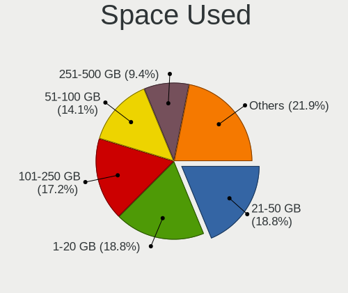
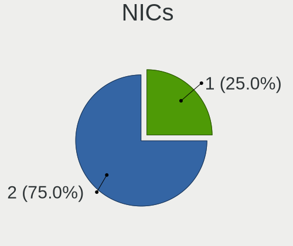

Manjaro Hardware Trends (Notebook)
----------------------------------

A project to identify most popular hardware characteristics and track their change
over time based on data collected by Manjaro users at https://Linux-Hardware.org.

Anyone can contribute to the study by uploading probes of their computers by
the [hw-probe](https://github.com/linuxhw/hw-probe) tool:

    sudo hw-probe -all -upload

Full-feature report is available here: https://linux-hardware.org/?view=trends&formfactor=notebook

Period: Apr, 2020.

Contents
--------

- [ OS                       ](#os)
- [ OS Family                ](#os-family)
- [ Kernel                   ](#kernel)
- [ Kernel Family            ](#kernel-family)
- [ Kernel Major Ver.        ](#kernel-major-ver)
- [ Arch                     ](#arch)
- [ DE                       ](#de)
- [ Display Server           ](#display-server)
- [ Display Manager          ](#display-manager)
- [ OS Lang                  ](#os-lang)
- [ Boot Mode                ](#boot-mode)
- [ Filesystem               ](#filesystem)
- [ Dual Boot with Linux/BSD ](#dual-boot-with-linux/bsd)
- [ Dual Boot (Win)          ](#dual-boot-win)
- [ Country                  ](#country)
- [ City                     ](#city)
- [ Vendor                   ](#vendor)
- [ Model                    ](#model)
- [ Model Family             ](#model-family)
- [ MFG Year                 ](#mfg-year)
- [ Form Factor              ](#form-factor)
- [ Secure Boot              ](#secure-boot)
- [ Coreboot                 ](#coreboot)
- [ RAM Size                 ](#ram-size)
- [ RAM Used                 ](#ram-used)
- [ Drive Vendor             ](#drive-vendor)
- [ Drive Model              ](#drive-model)
- [ Drive Kind               ](#drive-kind)
- [ Drive Connector          ](#drive-connector)
- [ Drive Size               ](#drive-size)
- [ Space Total              ](#space-total)
- [ Space Used               ](#space-used)
- [ Malfunc. Drives          ](#malfunc-drives)
- [ Malfunc. Drive Vendor    ](#malfunc-drive-vendor)
- [ Malfunc. Drive Kind      ](#malfunc-drive-kind)
- [ Failed Drives            ](#failed-drives)
- [ Failed Drive Vendor      ](#failed-drive-vendor)
- [ Drive Status             ](#drive-status)
- [ Storage Vendor           ](#storage-vendor)
- [ Storage Model            ](#storage-model)
- [ Storage Kind             ](#storage-kind)
- [ CPU Vendor               ](#cpu-vendor)
- [ CPU Model                ](#cpu-model)
- [ CPU Model Family         ](#cpu-model-family)
- [ CPU Cores                ](#cpu-cores)
- [ CPU Sockets              ](#cpu-sockets)
- [ CPU Threads              ](#cpu-threads)
- [ CPU Op-Modes             ](#cpu-op-modes)
- [ CPU Microarch            ](#cpu-microarch)
- [ CPU Microcode            ](#cpu-microcode)
- [ GPU Vendor               ](#gpu-vendor)
- [ GPU Model                ](#gpu-model)
- [ GPU Combo                ](#gpu-combo)
- [ GPU Driver               ](#gpu-driver)
- [ GPU Memory               ](#gpu-memory)
- [ Monitor Vendor           ](#monitor-vendor)
- [ Monitor Model            ](#monitor-model)
- [ Monitor Resolution       ](#monitor-resolution)
- [ Monitor Diagonal         ](#monitor-diagonal)
- [ Monitor Width            ](#monitor-width)
- [ Aspect Ratio             ](#aspect-ratio)
- [ Monitor Area             ](#monitor-area)
- [ Pixel Density            ](#pixel-density)
- [ Multiple Monitors        ](#multiple-monitors)
- [ Net Controller Vendor    ](#net-controller-vendor)
- [ Net Controller Model     ](#net-controller-model)
- [ Net Controller Kind      ](#net-controller-kind)
- [ Used Controller          ](#used-controller)
- [ NICs                     ](#nics)
- [ Unsupported Devices      ](#unsupported-devices)
- [ Unsupported Device Types ](#unsupported-device-types)

OS
--

Installed operating systems

| Name           | Computers | Percent |
|----------------|-----------|---------|
| Manjaro        | 49        | 44.95%  |
| Manjaro 20.0   | 36        | 33.03%  |
| Manjaro 19.0.2 | 23        | 21.1%   |
| Manjaro 19.0.1 | 1         | 0.92%   |

OS Family
---------

OS without a version

| Name    | Computers | Percent |
|---------|-----------|---------|
| Manjaro | 109       | 100%    |

Kernel
------

Version of the Linux kernel

| Version             | Computers | Percent |
|---------------------|-----------|---------|
| 5.4.28-1-MANJARO    | 11        | 10.09%  |
| 5.4.31-1-MANJARO    | 10        | 9.17%   |
| 5.6.7-1-MANJARO     | 9         | 8.26%   |
| 5.4.33-3-MANJARO    | 9         | 8.26%   |
| 5.4.34-1-MANJARO    | 7         | 6.42%   |
| 5.6.3-2-MANJARO     | 6         | 5.5%    |
| 5.5.13-1-MANJARO    | 5         | 4.59%   |
| 5.6.5-3-MANJARO     | 4         | 3.67%   |
| 5.4.35-1-MANJARO    | 4         | 3.67%   |
| 5.4.33-1-MANJARO    | 4         | 3.67%   |
| 5.4.23-1-MANJARO    | 4         | 3.67%   |
| 4.19.114-1-MANJARO  | 4         | 3.67%   |
| 5.6.6-1-MANJARO     | 3         | 2.75%   |
| 5.5.19-1-MANJARO    | 3         | 2.75%   |
| 5.5.16-1-MANJARO    | 3         | 2.75%   |
| 5.4.30-1-MANJARO    | 3         | 2.75%   |
| 4.19.116-1-MANJARO  | 3         | 2.75%   |
| 5.6.4-1-rt3-MANJARO | 2         | 1.83%   |
| 5.6.0-1-MANJARO     | 2         | 1.83%   |
| 5.4.24-1-MANJARO    | 2         | 1.83%   |
| 5.6.7-1-ck-nehalem  | 1         | 0.92%   |
| 5.6.6-13-tkg-MuQSS  | 1         | 0.92%   |
| 5.6.5-1-MANJARO     | 1         | 0.92%   |
| 5.6.2-pf            | 1         | 0.92%   |
| 5.6.2-1-MANJARO     | 1         | 0.92%   |
| 5.5.8-1-MANJARO     | 1         | 0.92%   |
| 5.5.6-1-MANJARO     | 1         | 0.92%   |
| 5.5.18-3-MANJARO    | 1         | 0.92%   |
| 5.5.18-2-MANJARO    | 1         | 0.92%   |
| 5.5.15-1-MANJARO    | 1         | 0.92%   |
| 4.19.117-1-MANJARO  | 1         | 0.92%   |

Kernel Family
-------------

Linux kernel without a distro release

| Version  | Computers | Percent |
|----------|-----------|---------|
| 5.4.33   | 13        | 11.93%  |
| 5.4.28   | 11        | 10.09%  |
| 5.6.7    | 10        | 9.17%   |
| 5.4.31   | 10        | 9.17%   |
| 5.4.34   | 7         | 6.42%   |
| 5.6.3    | 6         | 5.5%    |
| 5.6.5    | 5         | 4.59%   |
| 5.5.13   | 5         | 4.59%   |
| 5.6.6    | 4         | 3.67%   |
| 5.4.35   | 4         | 3.67%   |
| 5.4.23   | 4         | 3.67%   |
| 4.19.114 | 4         | 3.67%   |
| 5.5.19   | 3         | 2.75%   |
| 5.5.16   | 3         | 2.75%   |
| 5.4.30   | 3         | 2.75%   |
| 4.19.116 | 3         | 2.75%   |
| 5.6.4    | 2         | 1.83%   |
| 5.6.2    | 2         | 1.83%   |
| 5.6.0    | 2         | 1.83%   |
| 5.5.18   | 2         | 1.83%   |
| 5.4.24   | 2         | 1.83%   |
| 5.5.8    | 1         | 0.92%   |
| 5.5.6    | 1         | 0.92%   |
| 5.5.15   | 1         | 0.92%   |
| 4.19.117 | 1         | 0.92%   |

Kernel Major Ver.
-----------------

Linux kernel major version

| Version | Computers | Percent |
|---------|-----------|---------|
| 5.4     | 54        | 49.54%  |
| 5.6     | 31        | 28.44%  |
| 5.5     | 16        | 14.68%  |
| 4.19    | 8         | 7.34%   |

Arch
----

OS architecture (x86_64, i586, etc.)

| Name   | Computers | Percent |
|--------|-----------|---------|
| x86_64 | 109       | 100%    |

DE
--

Desktop Environment

| Name       | Computers | Percent |
|------------|-----------|---------|
| XFCE       | 33        | 30.28%  |
| KDE5       | 33        | 30.28%  |
| GNOME      | 24        | 22.02%  |
| KDE        | 14        | 12.84%  |
| Unknown    | 2         | 1.83%   |
| X-Cinnamon | 1         | 0.92%   |
| Deepin     | 1         | 0.92%   |
| Awesome    | 1         | 0.92%   |

Display Server
--------------

X11 or Wayland

| Name    | Computers | Percent |
|---------|-----------|---------|
| X11     | 105       | 96.33%  |
| Wayland | 4         | 3.67%   |

Display Manager
---------------

SDDM, LightDM, etc.

| Name    | Computers | Percent |
|---------|-----------|---------|
| Unknown | 48        | 44.04%  |
| SDDM    | 33        | 30.28%  |
| LightDM | 19        | 17.43%  |
| GDM     | 9         | 8.26%   |

OS Lang
-------

Language

| Lang       | Computers | Percent |
|------------|-----------|---------|
| en_US      | 34        | 31.19%  |
| ru_RU      | 18        | 16.51%  |
| en_US.utf8 | 10        | 9.17%   |
| de_DE      | 6         | 5.5%    |
| ru_RU.utf8 | 4         | 3.67%   |
| en_GB      | 4         | 3.67%   |
| pt_BR      | 3         | 2.75%   |
| es_ES      | 3         | 2.75%   |
| en_GB.utf8 | 3         | 2.75%   |
| en_CA      | 3         | 2.75%   |
| sv_SE      | 1         | 0.92%   |
| ru_UA.utf8 | 1         | 0.92%   |
| ru_UA      | 1         | 0.92%   |
| pt_BR.utf8 | 1         | 0.92%   |
| pl_PL.utf8 | 1         | 0.92%   |
| nl_BE.utf8 | 1         | 0.92%   |
| ko_KR      | 1         | 0.92%   |
| it_IT.utf8 | 1         | 0.92%   |
| it_IT      | 1         | 0.92%   |
| hu_HU.utf8 | 1         | 0.92%   |
| fr_FR.utf8 | 1         | 0.92%   |
| fr_FR      | 1         | 0.92%   |
| es_SV      | 1         | 0.92%   |
| es_MX.utf8 | 1         | 0.92%   |
| es_MX      | 1         | 0.92%   |
| es_ES.utf8 | 1         | 0.92%   |
| en_ZA      | 1         | 0.92%   |
| en_IN      | 1         | 0.92%   |
| el_GR      | 1         | 0.92%   |
| de_DE.utf8 | 1         | 0.92%   |
| de_AT      | 1         | 0.92%   |

Boot Mode
---------

EFI or BIOS

| Mode | Computers | Percent |
|------|-----------|---------|
| BIOS | 65        | 59.63%  |
| EFI  | 44        | 40.37%  |

Filesystem
----------

Type of filesystem

| Type    | Computers | Percent |
|---------|-----------|---------|
| Ext4    | 98        | 89.91%  |
| Btrfs   | 6         | 5.5%    |
| Overlay | 3         | 2.75%   |
| Xfs     | 1         | 0.92%   |
| Ext2    | 1         | 0.92%   |

Dual Boot with Linux/BSD
------------------------

Hosting more than one Linux/BSD

| Dual boot | Computers | Percent |
|-----------|-----------|---------|
| No        | 93        | 85.32%  |
| Yes       | 16        | 14.68%  |

Dual Boot (Win)
---------------

Hosting Linux and Windows

| Dual boot | Computers | Percent |
|-----------|-----------|---------|
| No        | 66        | 60.55%  |
| Yes       | 43        | 39.45%  |

Country
-------

Geographic location (country)

| Country                | Computers | Percent |
|------------------------|-----------|---------|
| Russia                 | 24        | 22.02%  |
| USA                    | 18        | 16.51%  |
| Germany                | 7         | 6.42%   |
| Ukraine                | 5         | 4.59%   |
| Spain                  | 4         | 3.67%   |
| Brazil                 | 4         | 3.67%   |
| Romania                | 3         | 2.75%   |
| Canada                 | 3         | 2.75%   |
| UK                     | 2         | 1.83%   |
| Portugal               | 2         | 1.83%   |
| Poland                 | 2         | 1.83%   |
| Netherlands            | 2         | 1.83%   |
| Monaco                 | 2         | 1.83%   |
| Mexico                 | 2         | 1.83%   |
| Italy                  | 2         | 1.83%   |
| Greece                 | 2         | 1.83%   |
| France                 | 2         | 1.83%   |
| Austria                | 2         | 1.83%   |
| Turkey                 | 1         | 0.92%   |
| Switzerland            | 1         | 0.92%   |
| Sweden                 | 1         | 0.92%   |
| South Korea            | 1         | 0.92%   |
| South Africa           | 1         | 0.92%   |
| Philippines            | 1         | 0.92%   |
| Mauritius              | 1         | 0.92%   |
| Lithuania              | 1         | 0.92%   |
| Latvia                 | 1         | 0.92%   |
| Israel                 | 1         | 0.92%   |
| Iran                   | 1         | 0.92%   |
| Indonesia              | 1         | 0.92%   |
| India                  | 1         | 0.92%   |
| Hungary                | 1         | 0.92%   |
| Finland                | 1         | 0.92%   |
| Estonia                | 1         | 0.92%   |
| El Salvador            | 1         | 0.92%   |
| China                  | 1         | 0.92%   |
| Bulgaria               | 1         | 0.92%   |
| Bosnia and Herzegovina | 1         | 0.92%   |
| Belgium                | 1         | 0.92%   |

City
----

Geographic location (city)

| City                     | Computers | Percent |
|--------------------------|-----------|---------|
| Moscow                   | 6         | 5.5%    |
| St Petersburg            | 3         | 2.75%   |
| Porto                    | 2         | 1.83%   |
| Monaco                   | 2         | 1.83%   |
| Krasnoyarsk              | 2         | 1.83%   |
| Kharkiv                  | 2         | 1.83%   |
| Katy                     | 2         | 1.83%   |
| Zurich                   | 1         | 0.92%   |
| Zoetermeer               | 1         | 0.92%   |
| Yaransk                  | 1         | 0.92%   |
| Xochitepec               | 1         | 0.92%   |
| Wuppertal                | 1         | 0.92%   |
| Vladivostok              | 1         | 0.92%   |
| Vitoria-Gasteiz          | 1         | 0.92%   |
| Vancouver                | 1         | 0.92%   |
| Utrecht                  | 1         | 0.92%   |
| Tuzla                    | 1         | 0.92%   |
| Tula                     | 1         | 0.92%   |
| Trivandrum               | 1         | 0.92%   |
| Tolyatti                 | 1         | 0.92%   |
| Toccoa                   | 1         | 0.92%   |
| Tire                     | 1         | 0.92%   |
| Tallinn                  | 1         | 0.92%   |
| Stockholm                | 1         | 0.92%   |
| Sofia                    | 1         | 0.92%   |
| Shenzhen                 | 1         | 0.92%   |
| Saratov                  | 1         | 0.92%   |
| Santurtzi                | 1         | 0.92%   |
| San Salvador             | 1         | 0.92%   |
| San Jose                 | 1         | 0.92%   |
| Salzburg                 | 1         | 0.92%   |
| Salem                    | 1         | 0.92%   |
| Saint Francis            | 1         | 0.92%   |
| Ryazan                   | 1         | 0.92%   |
| Rosenheim                | 1         | 0.92%   |
| Rio de Janeiro           | 1         | 0.92%   |
| Rho                      | 1         | 0.92%   |
| Puebla                   | 1         | 0.92%   |
| Prospect                 | 1         | 0.92%   |
| Porto Alegre             | 1         | 0.92%   |
| Pleidelsheim             | 1         | 0.92%   |
| Pilviškiai              | 1         | 0.92%   |
| Petropavlovsk-Kamchatsky | 1         | 0.92%   |
| Peoria                   | 1         | 0.92%   |
| Penza                    | 1         | 0.92%   |
| Paris                    | 1         | 0.92%   |
| Ogre                     | 1         | 0.92%   |
| Oak Park                 | 1         | 0.92%   |
| Newton Abbot             | 1         | 0.92%   |
| Málaga                  | 1         | 0.92%   |
| Montreal                 | 1         | 0.92%   |
| Mauthausen               | 1         | 0.92%   |
| Mashhad                  | 1         | 0.92%   |
| Marseille                | 1         | 0.92%   |
| Madrid                   | 1         | 0.92%   |
| Madignano                | 1         | 0.92%   |
| Lviv                     | 1         | 0.92%   |
| Leeder                   | 1         | 0.92%   |
| La Mesa                  | 1         | 0.92%   |
| Kyiv                     | 1         | 0.92%   |

Vendor
------

Motherboard manufacturer

| Name                | Computers | Percent |
|---------------------|-----------|---------|
| Lenovo              | 26        | 23.85%  |
| ASUSTek Computer    | 20        | 18.35%  |
| Dell                | 17        | 15.6%   |
| Hewlett-Packard     | 14        | 12.84%  |
| Acer                | 11        | 10.09%  |
| Samsung Electronics | 4         | 3.67%   |
| Toshiba             | 3         | 2.75%   |
| MSI                 | 3         | 2.75%   |
| Sony                | 2         | 1.83%   |
| Apple               | 2         | 1.83%   |
| TWJ                 | 1         | 0.92%   |
| System76            | 1         | 0.92%   |
| Razer               | 1         | 0.92%   |
| Notebook            | 1         | 0.92%   |
| Intel               | 1         | 0.92%   |
| essentiel b         | 1         | 0.92%   |
| Unknown             | 1         | 0.92%   |

Model
-----

Motherboard model

| Name                                                              | Computers | Percent |
|-------------------------------------------------------------------|-----------|---------|
| Sony VPCEH2L9E                                                    | 2         | 1.83%   |
| Dell Latitude E6230                                               | 2         | 1.83%   |
| Dell Inspiron N5110                                               | 2         | 1.83%   |
| ASUS UX430UAR                                                     | 2         | 1.83%   |
| Unknown                                                           | 2         | 1.83%   |
| Toshiba Satellite C55-B                                           | 1         | 0.92%   |
| Toshiba Satellite C50D-B                                          | 1         | 0.92%   |
| Toshiba Satellite C50D-A                                          | 1         | 0.92%   |
| System76 Galago Pro                                               | 1         | 0.92%   |
| Samsung Electronics RV410/RV510/S3510/E3510                       | 1         | 0.92%   |
| Samsung Electronics R440                                          | 1         | 0.92%   |
| Samsung Electronics 3570R/370R/470R/450R/510R/4450RV              | 1         | 0.92%   |
| Samsung Electronics 300E5EV/300E4EV/270E5EV/270E4EV/2470EV/2470EE | 1         | 0.92%   |
| Razer Blade                                                       | 1         | 0.92%   |
| Notebook W54_55_94_95_97AU,AUQ                                    | 1         | 0.92%   |
| MSI PE72 7RD                                                      | 1         | 0.92%   |
| MSI P75 Creator 9SE                                               | 1         | 0.92%   |
| MSI Alpha 15 A3DDK                                                | 1         | 0.92%   |
| Lenovo Yoga S940-14IWL 81Q7                                       | 1         | 0.92%   |
| Lenovo VIWZ1                                                      | 1         | 0.92%   |
| Lenovo V580c 20160                                                | 1         | 0.92%   |
| Lenovo ThinkPad X230 2325VKV                                      | 1         | 0.92%   |
| Lenovo ThinkPad X1 Carbon 7th 20R1S05B00                          | 1         | 0.92%   |
| Lenovo ThinkPad X1 Carbon 3rd 20BTS1D900                          | 1         | 0.92%   |
| Lenovo ThinkPad X1 Carbon 3rd 20BSCTO1WW                          | 1         | 0.92%   |
| Lenovo ThinkPad T460s 20F9004FUS                                  | 1         | 0.92%   |
| Lenovo ThinkPad T460 20FMS1P70E                                   | 1         | 0.92%   |
| Lenovo ThinkPad T420s 4173A57                                     | 1         | 0.92%   |
| Lenovo ThinkPad T420 4177R3U                                      | 1         | 0.92%   |
| Lenovo ThinkPad S5 Yoga 15 20DQ001KUS                             | 1         | 0.92%   |
| Lenovo ThinkPad P53 20QNCTO1WW                                    | 1         | 0.92%   |
| Lenovo ThinkPad L380 20M5003QRT                                   | 1         | 0.92%   |
| Lenovo Legion Y540-15IRH-PG0 81SY                                 | 1         | 0.92%   |
| Lenovo IdeaPad Z510 20287                                         | 1         | 0.92%   |
| Lenovo IdeaPad Y700-15ISK 80NV                                    | 1         | 0.92%   |
| Lenovo IdeaPad S540-15IWL D 81NE                                  | 1         | 0.92%   |
| Lenovo IdeaPad FLEX-14API 81SS                                    | 1         | 0.92%   |
| Lenovo IdeaPad 330S-15ARR 81FB                                    | 1         | 0.92%   |
| Lenovo IdeaPad 330-17IKB 81DM                                     | 1         | 0.92%   |
| Lenovo IdeaPad 330-15ICH 81FK                                     | 1         | 0.92%   |
| Lenovo IdeaPad 130-15IKB 81H7                                     | 1         | 0.92%   |
| Lenovo G500 20236                                                 | 1         | 0.92%   |
| Lenovo B560                                                       | 1         | 0.92%   |
| Lenovo B50-30 Touch 20383                                         | 1         | 0.92%   |
| Intel Intel                                                       | 1         | 0.92%   |
| HP Stream Notebook PC 14                                          | 1         | 0.92%   |
| HP ProBook 450 G5                                                 | 1         | 0.92%   |
| HP Pavilion Gaming Notebook                                       | 1         | 0.92%   |
| HP Pavilion g6                                                    | 1         | 0.92%   |
| HP Pavilion g4                                                    | 1         | 0.92%   |
| HP Pavilion dv7                                                   | 1         | 0.92%   |
| HP Pavilion dv6                                                   | 1         | 0.92%   |
| HP Pavilion 15                                                    | 1         | 0.92%   |
| HP Notebook                                                       | 1         | 0.92%   |
| HP Laptop 17-by0xxx                                               | 1         | 0.92%   |
| HP Laptop 15-bs1xx                                                | 1         | 0.92%   |
| HP G56                                                            | 1         | 0.92%   |
| HP G42                                                            | 1         | 0.92%   |
| HP EliteBook Revolve 810                                          | 1         | 0.92%   |
| essentiel b PCTAB series                                          | 1         | 0.92%   |

Model Family
------------

Motherboard model prefix

| Name                        | Computers | Percent |
|-----------------------------|-----------|---------|
| Lenovo ThinkPad             | 11        | 10.09%  |
| Lenovo IdeaPad              | 8         | 7.34%   |
| HP Pavilion                 | 6         | 5.5%    |
| Dell Latitude               | 6         | 5.5%    |
| Dell Inspiron               | 6         | 5.5%    |
| Acer Aspire                 | 6         | 5.5%    |
| Toshiba Satellite           | 3         | 2.75%   |
| Sony VPCEH2L9E              | 2         | 1.83%   |
| HP Laptop                   | 2         | 1.83%   |
| Dell XPS                    | 2         | 1.83%   |
| ASUS UX430UAR               | 2         | 1.83%   |
| ASUS TUF                    | 2         | 1.83%   |
| Acer Extensa                | 2         | 1.83%   |
| Unknown                     | 2         | 1.83%   |
| System76 Galago             | 1         | 0.92%   |
| Samsung Electronics RV410   | 1         | 0.92%   |
| Samsung Electronics R440    | 1         | 0.92%   |
| Samsung Electronics 3570R   | 1         | 0.92%   |
| Samsung Electronics 300E5EV | 1         | 0.92%   |
| Razer Blade                 | 1         | 0.92%   |
| Notebook W54                | 1         | 0.92%   |
| MSI PE72                    | 1         | 0.92%   |
| MSI P75                     | 1         | 0.92%   |
| MSI Alpha                   | 1         | 0.92%   |
| Lenovo Yoga                 | 1         | 0.92%   |
| Lenovo VIWZ1                | 1         | 0.92%   |
| Lenovo V580c                | 1         | 0.92%   |
| Lenovo Legion               | 1         | 0.92%   |
| Lenovo G500                 | 1         | 0.92%   |
| Lenovo B560                 | 1         | 0.92%   |
| Lenovo B50-30               | 1         | 0.92%   |
| Intel Intel                 | 1         | 0.92%   |
| HP Stream                   | 1         | 0.92%   |
| HP ProBook                  | 1         | 0.92%   |
| HP Notebook                 | 1         | 0.92%   |
| HP G56                      | 1         | 0.92%   |
| HP G42                      | 1         | 0.92%   |
| HP EliteBook                | 1         | 0.92%   |
| essentiel b PCTAB           | 1         | 0.92%   |
| Dell Vostro                 | 1         | 0.92%   |
| Dell Precision              | 1         | 0.92%   |
| Dell G3                     | 1         | 0.92%   |
| ASUS X550ZE                 | 1         | 0.92%   |
| ASUS X550LC                 | 1         | 0.92%   |
| ASUS X510UR                 | 1         | 0.92%   |
| ASUS X510UAR                | 1         | 0.92%   |
| ASUS VivoBook               | 1         | 0.92%   |
| ASUS UX550VE                | 1         | 0.92%   |
| ASUS TAICHI21A              | 1         | 0.92%   |
| ASUS N750JK                 | 1         | 0.92%   |
| ASUS N56VZ                  | 1         | 0.92%   |
| ASUS N53SV                  | 1         | 0.92%   |
| ASUS K73E                   | 1         | 0.92%   |
| ASUS K50IJ                  | 1         | 0.92%   |
| ASUS K42Jc                  | 1         | 0.92%   |
| ASUS GL753VE                | 1         | 0.92%   |
| ASUS G752VSK                | 1         | 0.92%   |
| ASUS E402SA                 | 1         | 0.92%   |
| Apple MacBookPro14          | 1         | 0.92%   |
| Apple MacBookAir6           | 1         | 0.92%   |

MFG Year
--------

Motherboard manufacture year

| Year | Computers | Percent |
|------|-----------|---------|
| 2019 | 30        | 27.52%  |
| 2014 | 13        | 11.93%  |
| 2018 | 11        | 10.09%  |
| 2013 | 9         | 8.26%   |
| 2011 | 9         | 8.26%   |
| 2020 | 8         | 7.34%   |
| 2016 | 6         | 5.5%    |
| 2015 | 6         | 5.5%    |
| 2012 | 6         | 5.5%    |
| 2017 | 5         | 4.59%   |
| 2010 | 4         | 3.67%   |
| 2009 | 1         | 0.92%   |
| 2008 | 1         | 0.92%   |

Form Factor
-----------

Physical design of the computer

| Name     | Computers | Percent |
|----------|-----------|---------|
| Notebook | 109       | 100%    |

Secure Boot
-----------

Enabled or disabled

| State    | Computers | Percent |
|----------|-----------|---------|
| Disabled | 109       | 100%    |

Coreboot
--------

Have coreboot on board

| Used | Computers | Percent |
|------|-----------|---------|
| No   | 107       | 98.17%  |
| Yes  | 2         | 1.83%   |

RAM Size
--------

Total RAM memory

| Size in GB | Computers | Percent |
|------------|-----------|---------|
| 4.01-8.0   | 40        | 36.7%   |
| 16.01-24.0 | 24        | 22.02%  |
| 3.01-4.0   | 20        | 18.35%  |
| 8.01-16.0  | 17        | 15.6%   |
| 1.01-2.0   | 4         | 3.67%   |
| 32.01-64.0 | 3         | 2.75%   |
| 2.01-3.0   | 1         | 0.92%   |

RAM Used
--------

Used RAM memory

| Used GB    | Computers | Percent |
|------------|-----------|---------|
| 1.01-2.0   | 42        | 38.53%  |
| 2.01-3.0   | 34        | 31.19%  |
| 3.01-4.0   | 13        | 11.93%  |
| 4.01-8.0   | 8         | 7.34%   |
| 0.01-1.0   | 7         | 6.42%   |
| 8.01-16.0  | 4         | 3.67%   |
| 16.01-24.0 | 1         | 0.92%   |

Drive Vendor
------------

Hard drive vendors

| Vendor              | Computers | Drives  | Percent |
|---------------------|-----------|---------|---------|
| Samsung Electronics | 22        | 23      | 16.18%  |
| Seagate             | 21        | 23      | 15.44%  |
| WDC                 | 17        | 18      | 12.5%   |
| Toshiba             | 12        | 12      | 8.82%   |
| Hitachi             | 7         | 7       | 5.15%   |
| Unknown             | 6         | 6       | 4.41%   |
| SanDisk             | 6         | 6       | 4.41%   |
| HGST                | 6         | 6       | 4.41%   |
| Crucial             | 5         | 5       | 3.68%   |
| Kingston            | 4         | 4       | 2.94%   |
| Intel               | 3         | 3       | 2.21%   |
| SK Hynix            | 2         | 2       | 1.47%   |
| PLEXTOR             | 2         | 2       | 1.47%   |
| Micron Technology   | 2         | 2       | 1.47%   |
| LITEONIT            | 2         | 2       | 1.47%   |
| HL-DT-ST            | 2         | Unknown | 1.47%   |
| Fujitsu             | 2         | 2       | 1.47%   |
| Apple               | 2         | 2       | 1.47%   |
| Union Memory        | 1         | 1       | 0.74%   |
| Transcend           | 1         | 1       | 0.74%   |
| Sony                | 1         | 1       | 0.74%   |
| PIONEER             | 1         | 1       | 0.74%   |
| Patriot             | 1         | 1       | 0.74%   |
| LITEON              | 1         | 1       | 0.74%   |
| KingSpec            | 1         | 1       | 0.74%   |
| HUAWEI              | 1         | 1       | 0.74%   |
| Generic             | 1         | 1       | 0.74%   |
| FORESEE             | 1         | 1       | 0.74%   |
| BHT                 | 1         | 1       | 0.74%   |
| ASMT109x            | 1         | 1       | 0.74%   |
| A-DATA Technology   | 1         | 1       | 0.74%   |

Drive Model
-----------

Hard drive models

| Model                            | Computers | Percent |
|----------------------------------|-----------|---------|
| ST1000LM035-1RK172 1TB           | 8         | 5.76%   |
| MQ01ABD100 1TB                   | 5         | 3.6%    |
| WD10JPVX-22JC3T0 1TB             | 3         | 2.16%   |
| WD5000LPCX-21VHAT0 500GB         | 2         | 1.44%   |
| WD3200BPVT-22JJ5T0 320GB         | 2         | 1.44%   |
| WD10SPZX-75Z10T2 1TB             | 2         | 1.44%   |
| ST9500325AS 500GB                | 2         | 1.44%   |
| ST1000LM024 HN-M101MBB 1TB       | 2         | 1.44%   |
| SSD 970 EVO Plus 250GB           | 2         | 1.44%   |
| SSD 850 EVO 500GB                | 2         | 1.44%   |
| SD9SN8W512G1002 512GB SSD        | 2         | 1.44%   |
| SA400M8240G 240GB SSD            | 2         | 1.44%   |
| MQ04ABF100 1TB                   | 2         | 1.44%   |
| MQ01ABF050 500GB                 | 2         | 1.44%   |
| HTS721010A9E630 1TB              | 2         | 1.44%   |
| HTS545050A7E380 500GB            | 2         | 1.44%   |
| HTS543232A7A384 320GB            | 2         | 1.44%   |
| Expansion 1TB                    | 2         | 1.44%   |
| DVDRAM GUE1N 3GB                 | 2         | 1.44%   |
| WR202A1032G 670290F5 32GB SSD    | 1         | 0.72%   |
| WDS240G2G0A-00JH30 240GB SSD     | 1         | 0.72%   |
| WDS120G2G0A-00JH30 120GB SSD     | 1         | 0.72%   |
| WD5000BEVT-22ZAT0 500GB          | 1         | 0.72%   |
| WD5000BEKT-22KA9T0 500GB         | 1         | 0.72%   |
| WD10SPZX-75Z10T3 1TB             | 1         | 0.72%   |
| WD10SPCX-00HWST0 1TB             | 1         | 0.72%   |
| WD10JPVX-60JC3T0 1TB             | 1         | 0.72%   |
| WD10JPVT-00A1YT0 1TB             | 1         | 0.72%   |
| Ultra II 240GB SSD               | 1         | 0.72%   |
| TS240GMTS420S 240GB SSD          | 1         | 0.72%   |
| TO  128GB                        | 1         | 0.72%   |
| SUV400S37240G 240GB SSD          | 1         | 0.72%   |
| SU800 128GB SSD                  | 1         | 0.72%   |
| Storage 120GB                    | 1         | 0.72%   |
| ST9750423AS 752GB                | 1         | 0.72%   |
| ST9500420AS 500GB                | 1         | 0.72%   |
| ST9320423AS 320GB                | 1         | 0.72%   |
| ST500LT012-1DG142 500GB          | 1         | 0.72%   |
| ST500LM030-1RK17D 500GB          | 1         | 0.72%   |
| ST1000LM048-2E7172 1TB           | 1         | 0.72%   |
| SSDSC2BF240A5L 240GB             | 1         | 0.72%   |
| SSDPEKNW010T8 1TB                | 1         | 0.72%   |
| SSDPEKKF010T8L 1TB               | 1         | 0.72%   |
| SSD SM0512F 500GB                | 1         | 0.72%   |
| SSD PM871 mSATA 256GB            | 1         | 0.72%   |
| SSD PLUS 120 GB                  | 1         | 0.72%   |
| SSD 970 EVO 500GB                | 1         | 0.72%   |
| SSD 860 EVO 500GB                | 1         | 0.72%   |
| SSD 860 EVO 250GB                | 1         | 0.72%   |
| SSD 850 PRO 512GB                | 1         | 0.72%   |
| SSD 850 EVO mSATA 250GB          | 1         | 0.72%   |
| SSD 840 EVO 500GB mSATA          | 1         | 0.72%   |
| SSD 840 EVO 250GB mSATA          | 1         | 0.72%   |
| SSD 500GB                        | 1         | 0.72%   |
| SKHynix_HFS256GD9TNG-L3A0B 256GB | 1         | 0.72%   |
| SD8SBAT128G1002 128GB SSD        | 1         | 0.72%   |
| SD5SE2256G1002E 256GB SSD        | 1         | 0.72%   |
| SD/MMC/MS PRO 64GB               | 1         | 0.72%   |
| SD Storage 16GB                  | 1         | 0.72%   |
| SA400S37120G 120GB SSD           | 1         | 0.72%   |

Drive Kind
----------

HDD or SSD

| Kind    | Computers | Drives | Percent |
|---------|-----------|--------|---------|
| HDD     | 58        | 64     | 44.27%  |
| SSD     | 45        | 46     | 34.35%  |
| NVMe    | 13        | 15     | 9.92%   |
| Unknown | 9         | 7      | 6.87%   |
| MMC     | 6         | 6      | 4.58%   |

Drive Connector
---------------

SATA, SAS, NVMe, etc.

| Type | Computers | Drives | Percent |
|------|-----------|--------|---------|
| SATA | 95        | 110    | 77.24%  |
| NVMe | 13        | 15     | 10.57%  |
| SAS  | 9         | 7      | 7.32%   |
| MMC  | 6         | 6      | 4.88%   |

Drive Size
----------

Size of hard drive

| Size in TB | Computers | Drives | Percent |
|------------|-----------|--------|---------|
| 0.01-0.5   | 77        | 90     | 62.6%   |
| 0.51-1.0   | 40        | 42     | 32.52%  |
| 1.01-2.0   | 4         | 4      | 3.25%   |
| 4.01-10.0  | 2         | 2      | 1.63%   |

Space Total
-----------

Amount of disk space available on the file system

| Size in GB     | Computers | Percent |
|----------------|-----------|---------|
| 101-250        | 37        | 33.94%  |
| 251-500        | 25        | 22.94%  |
| 501-1000       | 18        | 16.51%  |
| 51-100         | 15        | 13.76%  |
| 1001-2000      | 4         | 3.67%   |
| 21-50          | 3         | 2.75%   |
| Unknown        | 3         | 2.75%   |
| More than 3000 | 2         | 1.83%   |
| 1-20           | 2         | 1.83%   |

Space Used
----------

Amount of used disk space

| Used GB   | Computers | Percent |
|-----------|-----------|---------|
| 1-20      | 35        | 32.11%  |
| 21-50     | 24        | 22.02%  |
| 51-100    | 16        | 14.68%  |
| 101-250   | 14        | 12.84%  |
| 251-500   | 11        | 10.09%  |
| 501-1000  | 5         | 4.59%   |
| Unknown   | 3         | 2.75%   |
| 1001-2000 | 1         | 0.92%   |

Malfunc. Drives
---------------

Drive models with a malfunction

| Model                      | Computers | Drives | Percent |
|----------------------------|-----------|--------|---------|
| ST1000LM035-1RK172 1TB     | 2         | 2      | 20%     |
| WD5000LPCX-21VHAT0 500GB   | 1         | 1      | 10%     |
| ST9750423AS 752GB          | 1         | 1      | 10%     |
| ST9500420AS 500GB          | 1         | 1      | 10%     |
| ST1000LM024 HN-M101MBB 1TB | 1         | 1      | 10%     |
| LMT-256M6M-HP 256GB SSD    | 1         | 1      | 10%     |
| HTS725050A9A364 500GB      | 1         | 1      | 10%     |
| HTS545050A7E680 500GB      | 1         | 1      | 10%     |
| HTS545050A7E380 500GB      | 1         | 1      | 10%     |

Malfunc. Drive Vendor
---------------------

Vendors of faulty drives

| Vendor   | Computers | Drives | Percent |
|----------|-----------|--------|---------|
| Seagate  | 5         | 5      | 50%     |
| HGST     | 2         | 2      | 20%     |
| WDC      | 1         | 1      | 10%     |
| LITEONIT | 1         | 1      | 10%     |
| Hitachi  | 1         | 1      | 10%     |

Malfunc. Drive Kind
-------------------

Kinds of faulty drives

| Kind | Computers | Drives | Percent |
|------|-----------|--------|---------|
| HDD  | 9         | 9      | 90%     |
| SSD  | 1         | 1      | 10%     |

Failed Drives
-------------

Failed drive models

Zero info for selected period =(

Failed Drive Vendor
-------------------

Failed drive vendors

Zero info for selected period =(

Drive Status
------------

Number of failed and malfunc. drives

| Status   | Computers | Drives | Percent |
|----------|-----------|--------|---------|
| Detected | 63        | 78     | 56.25%  |
| Works    | 39        | 50     | 34.82%  |
| Malfunc  | 10        | 10     | 8.93%   |

Storage Vendor
--------------

Storage controller vendors

| Vendor                       | Computers | Percent |
|------------------------------|-----------|---------|
| Intel                        | 89        | 70.63%  |
| AMD                          | 14        | 11.11%  |
| Samsung Electronics          | 12        | 9.52%   |
| Toshiba America Info Systems | 3         | 2.38%   |
| SK Hynix                     | 3         | 2.38%   |
| Sandisk                      | 2         | 1.59%   |
| Unknown                      | 1         | 0.79%   |
| Union Memory (Shenzhen)      | 1         | 0.79%   |
| Micron Technology            | 1         | 0.79%   |

Storage Model
-------------

Storage controller models

| Model                                                                      | Computers | Percent |
|----------------------------------------------------------------------------|-----------|---------|
| FCH SATA Controller [AHCI mode]                                            | 13        | 10.16%  |
| Sunrise Point-LP SATA Controller [AHCI mode]                               | 12        | 9.38%   |
| 7 Series Chipset Family 6-port SATA Controller [AHCI mode]                 | 10        | 7.81%   |
| 6 Series/C200 Series Chipset Family 6 port Mobile SATA AHCI Controller     | 10        | 7.81%   |
| NVMe SSD Controller SM981/PM981/PM983                                      | 8         | 6.25%   |
| 82801 Mobile SATA Controller [RAID mode]                                   | 7         | 5.47%   |
| Wildcat Point-LP SATA Controller [AHCI Mode]                               | 6         | 4.69%   |
| Non-Volatile memory controller                                             | 6         | 4.69%   |
| HM170/QM170 Chipset SATA Controller [AHCI Mode]                            | 6         | 4.69%   |
| Cannon Lake Mobile PCH SATA AHCI Controller                                | 6         | 4.69%   |
| 8 Series SATA Controller 1 [AHCI mode]                                     | 6         | 4.69%   |
| 5 Series/3400 Series Chipset 4 port SATA AHCI Controller                   | 4         | 3.13%   |
| 82801IBM/IEM (ICH9M/ICH9M-E) 4 port SATA Controller [AHCI mode]            | 3         | 2.34%   |
| 8 Series/C220 Series Chipset Family 6-port SATA Controller 1 [AHCI mode]   | 3         | 2.34%   |
| Toshiba America Info Non-Volatile memory controller                        | 2         | 1.56%   |
| NVMe SSD Controller SM961/PM961                                            | 2         | 1.56%   |
| Cannon Point-LP SATA Controller [AHCI Mode]                                | 2         | 1.56%   |
| Atom Processor E3800 Series SATA AHCI Controller                           | 2         | 1.56%   |
| 5 Series/3400 Series Chipset 6 port SATA AHCI Controller                   | 2         | 1.56%   |
| WD Black 2018/PC SN520 NVMe SSD                                            | 1         | 0.78%   |
| SSD Pro 7600p/760p/E 6100p Series                                          | 1         | 0.78%   |
| SSD 660P Series                                                            | 1         | 0.78%   |
| SATA controller                                                            | 1         | 0.78%   |
| Q170/Q150/B150/H170/H110/Z170/CM236 Chipset SATA Controller [AHCI Mode]    | 1         | 0.78%   |
| NM10/ICH7 Family SATA Controller [IDE mode]                                | 1         | 0.78%   |
| NM10/ICH7 Family SATA Controller [AHCI mode]                               | 1         | 0.78%   |
| FCH SATA Controller [IDE mode]                                             | 1         | 0.78%   |
| Electronics Non-Volatile memory controller                                 | 1         | 0.78%   |
| Comet Lake SATA AHCI Controller                                            | 1         | 0.78%   |
| BG3 NVMe SSD Controller                                                    | 1         | 0.78%   |
| BC501 NVMe Solid State Drive 512GB                                         | 1         | 0.78%   |
| Atom/Celeron/Pentium Processor x5-E8000/J3xxx/N3xxx Series SATA Controller | 1         | 0.78%   |
| Apple PCIe SSD                                                             | 1         | 0.78%   |
| 82801HM/HEM (ICH8M/ICH8M-E) SATA Controller [AHCI mode]                    | 1         | 0.78%   |
| 82801HM/HEM (ICH8M/ICH8M-E) IDE Controller                                 | 1         | 0.78%   |
| 7 Series Chipset Family 4-port SATA Controller [IDE mode]                  | 1         | 0.78%   |
| 7 Series Chipset Family 2-port SATA Controller [IDE mode]                  | 1         | 0.78%   |

Storage Kind
------------

Kind of storage controller (IDE, SATA, NVMe, SAS, ...)

| Kind | Computers | Percent |
|------|-----------|---------|
| SATA | 93        | 73.81%  |
| NVMe | 23        | 18.25%  |
| RAID | 7         | 5.56%   |
| IDE  | 3         | 2.38%   |

CPU Vendor
----------

Processor vendors

| Vendor | Computers | Percent |
|--------|-----------|---------|
| Intel  | 94        | 86.24%  |
| AMD    | 15        | 13.76%  |

CPU Model
---------

Processor models

| Model                                         | Computers | Percent |
|-----------------------------------------------|-----------|---------|
| Intel Core i7-8550U CPU @ 1.80GHz             | 4         | 3.67%   |
| Intel Core i5-4200U CPU @ 1.60GHz             | 4         | 3.67%   |
| Intel Core i7-7700HQ CPU @ 2.80GHz            | 3         | 2.75%   |
| Intel Core i5-8265U CPU @ 1.60GHz             | 3         | 2.75%   |
| Intel Core i3-3120M CPU @ 2.50GHz             | 3         | 2.75%   |
| Intel Pentium Dual-Core CPU T4500 @ 2.30GHz   | 2         | 1.83%   |
| Intel Core i7-5600U CPU @ 2.60GHz             | 2         | 1.83%   |
| Intel Core i5-9300H CPU @ 2.40GHz             | 2         | 1.83%   |
| Intel Core i5-8250U CPU @ 1.60GHz             | 2         | 1.83%   |
| Intel Core i5-7200U CPU @ 2.50GHz             | 2         | 1.83%   |
| Intel Core i5-3320M CPU @ 2.60GHz             | 2         | 1.83%   |
| Intel Core i5-2430M CPU @ 2.40GHz             | 2         | 1.83%   |
| Intel Core i5-2410M CPU @ 2.30GHz             | 2         | 1.83%   |
| Intel Core i5 CPU M 460 @ 2.53GHz             | 2         | 1.83%   |
| Intel Core i3-2330M CPU @ 2.20GHz             | 2         | 1.83%   |
| AMD Ryzen 7 3750H with Radeon Vega Mobile Gfx | 2         | 1.83%   |
| AMD Ryzen 5 2500U with Radeon Vega Mobile Gfx | 2         | 1.83%   |
| AMD Ryzen 3 2200U with Radeon Vega Mobile Gfx | 2         | 1.83%   |
| Intel Pentium CPU P6200 @ 2.13GHz             | 1         | 0.92%   |
| Intel Pentium CPU N3540 @ 2.16GHz             | 1         | 0.92%   |
| Intel Pentium CPU N3530 @ 2.16GHz             | 1         | 0.92%   |
| Intel Pentium 3556U @ 1.70GHz                 | 1         | 0.92%   |
| Intel Core m3-8100Y CPU @ 1.10GHz             | 1         | 0.92%   |
| Intel Core i9-8950HK CPU @ 2.90GHz            | 1         | 0.92%   |
| Intel Core i7-9750H CPU @ 2.60GHz             | 1         | 0.92%   |
| Intel Core i7-8750H CPU @ 2.20GHz             | 1         | 0.92%   |
| Intel Core i7-8565U CPU @ 1.80GHz             | 1         | 0.92%   |
| Intel Core i7-7820HK CPU @ 2.90GHz            | 1         | 0.92%   |
| Intel Core i7-6700HQ CPU @ 2.60GHz            | 1         | 0.92%   |
| Intel Core i7-6600U CPU @ 2.60GHz             | 1         | 0.92%   |
| Intel Core i7-5500U CPU @ 2.40GHz             | 1         | 0.92%   |
| Intel Core i7-4800MQ CPU @ 2.70GHz            | 1         | 0.92%   |
| Intel Core i7-4702MQ CPU @ 2.20GHz            | 1         | 0.92%   |
| Intel Core i7-4700HQ CPU @ 2.40GHz            | 1         | 0.92%   |
| Intel Core i7-4650U CPU @ 1.70GHz             | 1         | 0.92%   |
| Intel Core i7-3630QM CPU @ 2.40GHz            | 1         | 0.92%   |
| Intel Core i7-3610QM CPU @ 2.30GHz            | 1         | 0.92%   |
| Intel Core i7-3537U CPU @ 2.00GHz             | 1         | 0.92%   |
| Intel Core i7-3520M CPU @ 2.90GHz             | 1         | 0.92%   |
| Intel Core i7-2630QM CPU @ 2.00GHz            | 1         | 0.92%   |
| Intel Core i7-10710U CPU @ 1.10GHz            | 1         | 0.92%   |
| Intel Core i7 CPU Q 720 @ 1.60GHz             | 1         | 0.92%   |
| Intel Core i5-9400H CPU @ 2.50GHz             | 1         | 0.92%   |
| Intel Core i5-8300H CPU @ 2.30GHz             | 1         | 0.92%   |
| Intel Core i5-7360U CPU @ 2.30GHz             | 1         | 0.92%   |
| Intel Core i5-7300HQ CPU @ 2.50GHz            | 1         | 0.92%   |
| Intel Core i5-6300HQ CPU @ 2.30GHz            | 1         | 0.92%   |
| Intel Core i5-6200U CPU @ 2.30GHz             | 1         | 0.92%   |
| Intel Core i5-5300U CPU @ 2.30GHz             | 1         | 0.92%   |
| Intel Core i5-5200U CPU @ 2.20GHz             | 1         | 0.92%   |
| Intel Core i5-4300U CPU @ 1.90GHz             | 1         | 0.92%   |
| Intel Core i5-4210U CPU @ 1.70GHz             | 1         | 0.92%   |
| Intel Core i5-3437U CPU @ 1.90GHz             | 1         | 0.92%   |
| Intel Core i5-3230M CPU @ 2.60GHz             | 1         | 0.92%   |
| Intel Core i5-3210M CPU @ 2.50GHz             | 1         | 0.92%   |
| Intel Core i5-2540M CPU @ 2.60GHz             | 1         | 0.92%   |
| Intel Core i5-2450M CPU @ 2.50GHz             | 1         | 0.92%   |
| Intel Core i5-10210U CPU @ 1.60GHz            | 1         | 0.92%   |
| Intel Core i5 CPU M 430 @ 2.27GHz             | 1         | 0.92%   |
| Intel Core i3-8145U CPU @ 2.10GHz             | 1         | 0.92%   |

CPU Model Family
----------------

Processor model prefix

| Model                   | Computers | Percent |
|-------------------------|-----------|---------|
| Intel Core i5           | 38        | 34.86%  |
| Intel Core i7           | 27        | 24.77%  |
| Intel Core i3           | 12        | 11.01%  |
| Intel Celeron           | 5         | 4.59%   |
| Intel Pentium           | 4         | 3.67%   |
| AMD Ryzen 7             | 3         | 2.75%   |
| AMD Ryzen 5             | 3         | 2.75%   |
| Intel Pentium Dual-Core | 2         | 1.83%   |
| Intel Core 2 Duo        | 2         | 1.83%   |
| Intel Atom              | 2         | 1.83%   |
| AMD Ryzen 3             | 2         | 1.83%   |
| AMD A6                  | 2         | 1.83%   |
| Intel Core m3           | 1         | 0.92%   |
| Intel Core i9           | 1         | 0.92%   |
| AMD E2                  | 1         | 0.92%   |
| AMD E1                  | 1         | 0.92%   |
| AMD A8                  | 1         | 0.92%   |
| AMD A4                  | 1         | 0.92%   |
| AMD A10                 | 1         | 0.92%   |

CPU Cores
---------

Number of processor cores

| Number | Computers | Percent |
|--------|-----------|---------|
| 2      | 61        | 55.96%  |
| 4      | 42        | 38.53%  |
| 6      | 4         | 3.67%   |
| 1      | 2         | 1.83%   |

CPU Sockets
-----------

Number of sockets

| Number | Computers | Percent |
|--------|-----------|---------|
| 1      | 109       | 100%    |

CPU Threads
-----------

Threads per core (Hyper-Threading)

| Number | Computers | Percent |
|--------|-----------|---------|
| 2      | 88        | 80.73%  |
| 1      | 21        | 19.27%  |

CPU Op-Modes
------------

CPU Operation Modes (32-bit, 64-bit)

| Op mode        | Computers | Percent |
|----------------|-----------|---------|
| 32-bit, 64-bit | 109       | 100%    |

CPU Microarch
-------------

Microarchitecture

| Name          | Computers | Percent |
|---------------|-----------|---------|
| Skylake       | 23        | 21.1%   |
| IvyBridge     | 13        | 11.93%  |
| KabyLake      | 12        | 11.01%  |
| Haswell       | 12        | 11.01%  |
| SandyBridge   | 10        | 9.17%   |
| Broadwell     | 6         | 5.5%    |
| Westmere      | 5         | 4.59%   |
| Zen+          | 4         | 3.67%   |
| Zen           | 4         | 3.67%   |
| Silvermont    | 4         | 3.67%   |
| Penryn        | 4         | 3.67%   |
| Puma          | 3         | 2.75%   |
| Bonnell       | 2         | 1.83%   |
| Steamroller   | 1         | 0.92%   |
| Piledriver    | 1         | 0.92%   |
| Nehalem       | 1         | 0.92%   |
| K10 Llano     | 1         | 0.92%   |
| Jaguar        | 1         | 0.92%   |
| Goldmont plus | 1         | 0.92%   |
| Core          | 1         | 0.92%   |

CPU Microcode
-------------

Microcode number

| Number     | Computers | Percent |
|------------|-----------|---------|
| Unknown    | 51        | 46.79%  |
| 0x306a9    | 9         | 8.26%   |
| 0x206a7    | 6         | 5.5%    |
| 0x906ea    | 4         | 3.67%   |
| 0x806eb    | 4         | 3.67%   |
| 0x806ea    | 4         | 3.67%   |
| 0x806e9    | 4         | 3.67%   |
| 0x40651    | 4         | 3.67%   |
| 0x906e9    | 3         | 2.75%   |
| 0x306d4    | 3         | 2.75%   |
| 0x306c3    | 3         | 2.75%   |
| 0x08108102 | 3         | 2.75%   |
| 0x406e3    | 2         | 1.83%   |
| 0xa0660    | 1         | 0.92%   |
| 0x30678    | 1         | 0.92%   |
| 0x20655    | 1         | 0.92%   |
| 0x20652    | 1         | 0.92%   |
| 0x106e5    | 1         | 0.92%   |
| 0x106ca    | 1         | 0.92%   |
| 0x0810100b | 1         | 0.92%   |
| 0x07030105 | 1         | 0.92%   |
| 0x06001119 | 1         | 0.92%   |

GPU Vendor
----------

Vendors of graphics cards

| Vendor | Computers | Percent |
|--------|-----------|---------|
| Intel  | 90        | 61.64%  |
| Nvidia | 36        | 24.66%  |
| AMD    | 20        | 13.7%   |

GPU Model
---------

Graphics card models

| Model                                                                             | Computers | Percent |
|-----------------------------------------------------------------------------------|-----------|---------|
| 3rd Gen Core processor Graphics Controller                                        | 13        | 8.61%   |
| 2nd Generation Core Processor Family Integrated Graphics Controller               | 10        | 6.62%   |
| Haswell-ULT Integrated Graphics Controller                                        | 9         | 5.96%   |
| UHD Graphics 630 (Mobile)                                                         | 7         | 4.64%   |
| UHD Graphics 620                                                                  | 7         | 4.64%   |
| HD Graphics 5500                                                                  | 6         | 3.97%   |
| UHD Graphics 620 (Whiskey Lake)                                                   | 5         | 3.31%   |
| Raven Ridge [Radeon Vega Series / Radeon Vega Mobile Series]                      | 4         | 2.65%   |
| Picasso                                                                           | 4         | 2.65%   |
| HD Graphics 630                                                                   | 4         | 2.65%   |
| GF117M [GeForce 610M/710M/810M/820M / GT 620M/625M/630M/720M]                     | 4         | 2.65%   |
| Core Processor Integrated Graphics Controller                                     | 4         | 2.65%   |
| Skylake GT2 [HD Graphics 520]                                                     | 3         | 1.99%   |
| Mobile 4 Series Chipset Integrated Graphics Controller                            | 3         | 1.99%   |
| GP107M [GeForce GTX 1050 Mobile]                                                  | 3         | 1.99%   |
| Atom Processor Z36xxx/Z37xxx Series Graphics & Display                            | 3         | 1.99%   |
| 4th Gen Core Processor Integrated Graphics Controller                             | 3         | 1.99%   |
| UHD Graphics                                                                      | 2         | 1.32%   |
| TU117M [GeForce GTX 1650 Mobile / Max-Q]                                          | 2         | 1.32%   |
| Mars [Radeon HD 8670A/8670M/8750M]                                                | 2         | 1.32%   |
| HD Graphics 620                                                                   | 2         | 1.32%   |
| HD Graphics 530                                                                   | 2         | 1.32%   |
| GP108M [GeForce MX250]                                                            | 2         | 1.32%   |
| GP107M [GeForce GTX 1050 Ti Mobile]                                               | 2         | 1.32%   |
| GM108M [GeForce 930MX]                                                            | 2         | 1.32%   |
| GM107M [GeForce GTX 950M]                                                         | 2         | 1.32%   |
| GK208M [GeForce GT 740M]                                                          | 2         | 1.32%   |
| GK107M [GeForce GT 650M]                                                          | 2         | 1.32%   |
| Whistler [Radeon HD 6730M/6770M/7690M XT]                                         | 1         | 0.66%   |
| UHD Graphics 615                                                                  | 1         | 0.66%   |
| UHD Graphics 605                                                                  | 1         | 0.66%   |
| TU117GLM [Quadro T1000 Mobile]                                                    | 1         | 0.66%   |
| TU116M [GeForce GTX 1660 Ti Mobile]                                               | 1         | 0.66%   |
| TU106M [GeForce RTX 2060 Mobile]                                                  | 1         | 0.66%   |
| Trinity 2 [Radeon HD 7520G]                                                       | 1         | 0.66%   |
| Topaz XT [Radeon R7 M260/M265 / M340/M360 / M440/M445 / 530/535 / 620/625 Mobile] | 1         | 0.66%   |
| Sumo [Radeon HD 6620G]                                                            | 1         | 0.66%   |
| RV740/M97 GL [FirePro M7740]                                                      | 1         | 0.66%   |
| RV710/M92 [Mobility Radeon HD 4530/4570/545v]                                     | 1         | 0.66%   |
| Navi 14 [Radeon RX 5500/5500M / Pro 5500M]                                        | 1         | 0.66%   |
| Mullins [Radeon R4/R5 Graphics]                                                   | 1         | 0.66%   |
| Mullins [Radeon R3E Graphics]                                                     | 1         | 0.66%   |
| Mullins [Radeon R3 Graphics]                                                      | 1         | 0.66%   |
| Mobile GM965/GL960 Integrated Graphics Controller (secondary)                     | 1         | 0.66%   |
| Mobile GM965/GL960 Integrated Graphics Controller (primary)                       | 1         | 0.66%   |
| Kaveri [Radeon R6 Graphics]                                                       | 1         | 0.66%   |
| Kabini [Radeon HD 8210]                                                           | 1         | 0.66%   |
| Jet PRO [Radeon R5 M230 / R7 M260DX / Radeon 520 Mobile]                          | 1         | 0.66%   |
| Iris Plus Graphics 640                                                            | 1         | 0.66%   |
| GT218M [GeForce 310M]                                                             | 1         | 0.66%   |
| GT216M [GeForce GT 230M]                                                          | 1         | 0.66%   |
| GP108M [GeForce MX150]                                                            | 1         | 0.66%   |
| GP106M [GeForce GTX 1060 Mobile]                                                  | 1         | 0.66%   |
| GP104BM [GeForce GTX 1070 Mobile]                                                 | 1         | 0.66%   |
| GM108M [GeForce 840M]                                                             | 1         | 0.66%   |
| GM107M [GeForce GTX 960M]                                                         | 1         | 0.66%   |
| GM107M [GeForce GTX 850M]                                                         | 1         | 0.66%   |
| GK107M [GeForce GT 750M]                                                          | 1         | 0.66%   |
| GF119M [GeForce 610M]                                                             | 1         | 0.66%   |
| GF108M [GeForce GT 540M]                                                          | 1         | 0.66%   |

GPU Combo
---------

Combinations of graphics cards

| Name           | Computers | Percent |
|----------------|-----------|---------|
| 1 x Intel      | 54        | 49.54%  |
| Intel + Nvidia | 33        | 30.28%  |
| 1 x AMD        | 12        | 11.01%  |
| 2 x AMD        | 4         | 3.67%   |
| Intel + AMD    | 3         | 2.75%   |
| 1 x Nvidia     | 2         | 1.83%   |
| AMD + Nvidia   | 1         | 0.92%   |

GPU Driver
----------

Free vs proprietary

| Driver      | Computers | Percent |
|-------------|-----------|---------|
| Free        | 95        | 87.16%  |
| Proprietary | 14        | 12.84%  |

GPU Memory
----------

Total video memory

| Size in GB | Computers | Percent |
|------------|-----------|---------|
| Unknown    | 91        | 83.49%  |
| 1.01-2.0   | 8         | 7.34%   |
| 0.51-1.0   | 3         | 2.75%   |
| 0.01-0.5   | 3         | 2.75%   |
| 5.01-6.0   | 2         | 1.83%   |
| 7.01-8.0   | 1         | 0.92%   |
| 3.01-4.0   | 1         | 0.92%   |

Monitor Vendor
--------------

Monitor vendors

| Vendor                  | Computers | Percent |
|-------------------------|-----------|---------|
| LG Display              | 31        | 25.2%   |
| Chimei Innolux          | 24        | 19.51%  |
| AU Optronics            | 20        | 16.26%  |
| BOE                     | 12        | 9.76%   |
| Chi Mei Optoelectronics | 8         | 6.5%    |
| Samsung Electronics     | 6         | 4.88%   |
| Dell                    | 5         | 4.07%   |
| Goldstar                | 3         | 2.44%   |
| Sharp                   | 2         | 1.63%   |
| Philips                 | 2         | 1.63%   |
| Hewlett-Packard         | 2         | 1.63%   |
| Apple                   | 2         | 1.63%   |
| Vestel Elektronik       | 1         | 0.81%   |
| PANDA                   | 1         | 0.81%   |
| InnoLux Display         | 1         | 0.81%   |
| Element                 | 1         | 0.81%   |
| CPT                     | 1         | 0.81%   |
| Arnos Instruments       | 1         | 0.81%   |

Monitor Model
-------------

Monitor models

| Model                                              | Computers | Percent |
|----------------------------------------------------|-----------|---------|
| LCD Monitor LGD033A 1366x768 340x190mm 15.3-inch   | 3         | 2.44%   |
| LCD Monitor CMO15A7 1366x768 350x190mm 15.7-inch   | 3         | 2.44%   |
| U2311H DELA05E 1920x1080 509x286mm 23.0-inch       | 2         | 1.63%   |
| PHL 278E9Q PHLC17F 1920x1080 598x336mm 27.0-inch   | 2         | 1.63%   |
| LCD Monitor LGD0573 1920x1080 344x194mm 15.5-inch  | 2         | 1.63%   |
| LCD Monitor LGD04B3 1920x1080 350x190mm 15.7-inch  | 2         | 1.63%   |
| LCD Monitor LGD036C 1366x768 277x156mm 12.5-inch   | 2         | 1.63%   |
| LCD Monitor LGD02DC 1366x768 344x194mm 15.5-inch   | 2         | 1.63%   |
| LCD Monitor CMO15A3 1366x768 344x193mm 15.5-inch   | 2         | 1.63%   |
| LCD Monitor CMN1735 1920x1080 382x215mm 17.3-inch  | 2         | 1.63%   |
| LCD Monitor CMN15E8 1920x1080 344x193mm 15.5-inch  | 2         | 1.63%   |
| LCD Monitor CMN15BD 1366x768 344x194mm 15.5-inch   | 2         | 1.63%   |
| LCD Monitor CMN14D4 1920x1080 309x173mm 13.9-inch  | 2         | 1.63%   |
| LCD Monitor CMN14D2 1920x1080 309x173mm 13.9-inch  | 2         | 1.63%   |
| LCD Monitor BOE0675 1366x768 344x194mm 15.5-inch   | 2         | 1.63%   |
| W2453 GSM56F3 1920x1080 531x299mm 24.0-inch        | 1         | 0.81%   |
| ULTRAWIDE GSM76FC 3840x1600 874x366mm 37.3-inch    | 1         | 0.81%   |
| U2515H DELD070 2560x1440 553x311mm 25.0-inch       | 1         | 0.81%   |
| SyncMaster SAM0272 1280x1024 338x270mm 17.0-inch   | 1         | 0.81%   |
| SMT27A550 SAM07B8 1920x1080 598x336mm 27.0-inch    | 1         | 0.81%   |
| QF-28 AIC1012 3840x2160 621x341mm 27.9-inch        | 1         | 0.81%   |
| P2417H DELA0DC 1920x1080 527x296mm 23.8-inch       | 1         | 0.81%   |
| P2211H DEL4060 1920x1080 477x268mm 21.5-inch       | 1         | 0.81%   |
| LP156WH2-TLAA LGD0230 1366x768 344x194mm 15.5-inch | 1         | 0.81%   |
| LCD Monitor SHP148D 3840x2160 344x194mm 15.5-inch  | 1         | 0.81%   |
| LCD Monitor SHP1476 3840x2160 346x194mm 15.6-inch  | 1         | 0.81%   |
| LCD Monitor SEC544B 1600x900 382x214mm 17.2-inch   | 1         | 0.81%   |
| LCD Monitor SEC4945 1280x800 330x210mm 15.4-inch   | 1         | 0.81%   |
| LCD Monitor SEC4542 1280x800 303x190mm 14.1-inch   | 1         | 0.81%   |
| LCD Monitor SEC314C 1920x1080 344x194mm 15.5-inch  | 1         | 0.81%   |
| LCD Monitor NCP0036 1920x1080 344x194mm 15.5-inch  | 1         | 0.81%   |
| LCD Monitor LGD4C01 1920x1200 367x230mm 17.1-inch  | 1         | 0.81%   |
| LCD Monitor LGD05B9 1920x1080 380x210mm 17.1-inch  | 1         | 0.81%   |
| LCD Monitor LGD04FF 1920x1080 309x174mm 14.0-inch  | 1         | 0.81%   |
| LCD Monitor LGD04E8 1920x1080 382x215mm 17.3-inch  | 1         | 0.81%   |
| LCD Monitor LGD04A7 1920x1080 340x190mm 15.3-inch  | 1         | 0.81%   |
| LCD Monitor LGD0470 1920x1080 345x194mm 15.6-inch  | 1         | 0.81%   |
| LCD Monitor LGD0466 1366x768 309x174mm 14.0-inch   | 1         | 0.81%   |
| LCD Monitor LGD0465 1366x768 344x194mm 15.5-inch   | 1         | 0.81%   |
| LCD Monitor LGD042D 1920x1080 290x170mm 13.2-inch  | 1         | 0.81%   |
| LCD Monitor LGD0418 2560x1440 310x174mm 14.0-inch  | 1         | 0.81%   |
| LCD Monitor LGD03A3 1366x768 277x156mm 12.5-inch   | 1         | 0.81%   |
| LCD Monitor LGD039F 1366x768 345x194mm 15.6-inch   | 1         | 0.81%   |
| LCD Monitor LGD02F2 1366x768 344x194mm 15.5-inch   | 1         | 0.81%   |
| LCD Monitor LGD02E9 1366x768 309x174mm 14.0-inch   | 1         | 0.81%   |
| LCD Monitor LGD02DA 1920x1080 380x220mm 17.3-inch  | 1         | 0.81%   |
| LCD Monitor LGD02AC 1366x768 344x194mm 15.5-inch   | 1         | 0.81%   |
| LCD Monitor LGD0251 1366x768 310x174mm 14.0-inch   | 1         | 0.81%   |
| LCD Monitor LGD0226 1600x900 382x215mm 17.3-inch   | 1         | 0.81%   |
| LCD Monitor LGD018B 1366x768 310x174mm 14.0-inch   | 1         | 0.81%   |
| LCD Monitor INL000A 1366x768 344x194mm 15.5-inch   | 1         | 0.81%   |
| LCD Monitor CPT14BF 1366x768 344x193mm 15.5-inch   | 1         | 0.81%   |
| LCD Monitor CMO1720 1920x1080 382x215mm 17.3-inch  | 1         | 0.81%   |
| LCD Monitor CMO15A2 1366x768 344x193mm 15.5-inch   | 1         | 0.81%   |
| LCD Monitor CMO1018 1024x600 222x125mm 10.0-inch   | 1         | 0.81%   |
| LCD Monitor CMNAE0D 1600x900 388x219mm 17.5-inch   | 1         | 0.81%   |
| LCD Monitor CMN1760 1920x1080 381x214mm 17.2-inch  | 1         | 0.81%   |
| LCD Monitor CMN15E7 1920x1080 344x193mm 15.5-inch  | 1         | 0.81%   |
| LCD Monitor CMN15E6 1366x768 344x193mm 15.5-inch   | 1         | 0.81%   |
| LCD Monitor CMN15D3 1920x1080 344x193mm 15.5-inch  | 1         | 0.81%   |

Monitor Resolution
------------------

Monitor screen resolution

| Resolution        | Computers | Percent |
|-------------------|-----------|---------|
| 1920x1080 (FHD)   | 51        | 43.59%  |
| 1366x768 (WXGA)   | 46        | 39.32%  |
| 1600x900 (HD+)    | 7         | 5.98%   |
| 3840x2160 (4K)    | 3         | 2.56%   |
| 2560x1440 (QHD)   | 2         | 1.71%   |
| 3840x1600         | 1         | 0.85%   |
| 2880x1800         | 1         | 0.85%   |
| 1920x1200 (WUXGA) | 1         | 0.85%   |
| 1440x900 (WXGA+)  | 1         | 0.85%   |
| 1360x768          | 1         | 0.85%   |
| 1280x800 (WXGA)   | 1         | 0.85%   |
| 1280x1024 (SXGA)  | 1         | 0.85%   |
| 1024x600          | 1         | 0.85%   |

Monitor Diagonal
----------------

Diagonal size in inches

| Inches | Computers | Percent |
|--------|-----------|---------|
| 15     | 55        | 44.72%  |
| 13     | 16        | 13.01%  |
| 17     | 15        | 12.2%   |
| 14     | 12        | 9.76%   |
| 27     | 5         | 4.07%   |
| 12     | 4         | 3.25%   |
| 11     | 4         | 3.25%   |
| 23     | 3         | 2.44%   |
| 21     | 2         | 1.63%   |
| 37     | 1         | 0.81%   |
| 32     | 1         | 0.81%   |
| 29     | 1         | 0.81%   |
| 25     | 1         | 0.81%   |
| 24     | 1         | 0.81%   |
| 18     | 1         | 0.81%   |
| 10     | 1         | 0.81%   |

Monitor Width
-------------

Physical width

| Width in mm | Computers | Percent |
|-------------|-----------|---------|
| 301-350     | 80        | 65.57%  |
| 351-400     | 14        | 11.48%  |
| 201-300     | 12        | 9.84%   |
| 501-600     | 9         | 7.38%   |
| 401-500     | 3         | 2.46%   |
| 601-700     | 2         | 1.64%   |
| 801-900     | 1         | 0.82%   |
| 701-800     | 1         | 0.82%   |

Aspect Ratio
------------

Proportional relationship between the width and the height

| Ratio | Computers | Percent |
|-------|-----------|---------|
| 16/9  | 102       | 94.44%  |
| 16/10 | 4         | 3.7%    |
| 5/4   | 1         | 0.93%   |
| 21/9  | 1         | 0.93%   |

Monitor Area
------------

Area in inch²

| Area in inch² | Computers | Percent |
|----------------|-----------|---------|
| 101-110        | 55        | 44.72%  |
| 81-90          | 25        | 20.33%  |
| 121-130        | 12        | 9.76%   |
| 301-350        | 5         | 4.07%   |
| 61-70          | 4         | 3.25%   |
| 51-60          | 4         | 3.25%   |
| 201-250        | 4         | 3.25%   |
| 71-80          | 3         | 2.44%   |
| 351-500        | 3         | 2.44%   |
| 151-200        | 2         | 1.63%   |
| 141-150        | 2         | 1.63%   |
| 131-140        | 2         | 1.63%   |
| 41-50          | 1         | 0.81%   |
| 251-300        | 1         | 0.81%   |

Pixel Density
-------------

Pixels per inch

| Density       | Computers | Percent |
|---------------|-----------|---------|
| 121-160       | 53        | 44.17%  |
| 101-120       | 48        | 40%     |
| 51-100        | 12        | 10%     |
| 161-240       | 4         | 3.33%   |
| More than 240 | 3         | 2.5%    |

Multiple Monitors
-----------------

Total monitors connected

| Total | Computers | Percent |
|-------|-----------|---------|
| 1     | 93        | 85.32%  |
| 2     | 15        | 13.76%  |
| 3     | 1         | 0.92%   |

Net Controller Vendor
---------------------

Controller vendors

| Vendor                | Computers | Percent |
|-----------------------|-----------|---------|
| Intel                 | 10        | 47.62%  |
| Realtek Semiconductor | 5         | 23.81%  |
| Huawei Technologies   | 2         | 9.52%   |
| SEGGER                | 1         | 4.76%   |
| Qualcomm              | 1         | 4.76%   |
| Lenovo                | 1         | 4.76%   |
| Hewlett-Packard       | 1         | 4.76%   |

Net Controller Model
--------------------

Controller models

| Model                                            | Computers | Percent |
|--------------------------------------------------|-----------|---------|
| 82579LM Gigabit Network Connection (Lewisville)  | 6         | 24%     |
| Wi-Fi 6 AX200                                    | 3         | 12%     |
| Centrino Advanced-N 6205 [Taylor Peak]           | 3         | 12%     |
| RTL8153 Gigabit Ethernet Adapter                 | 2         | 8%      |
| Centrino Advanced-N 6235                         | 2         | 8%      |
| un2430 Mobile Broadband Module                   | 1         | 4%      |
| RTL8822CE 802.11ac PCIe Wireless Network Adapter | 1         | 4%      |
| RTL8723DE Wireless Network Adapter               | 1         | 4%      |
| RTL8187 Wireless LAN Adapter                     | 1         | 4%      |
| OneLink Adapter                                  | 1         | 4%      |
| J-Link                                           | 1         | 4%      |
| E398 LTE/UMTS/GSM Modem/Networkcard              | 1         | 4%      |
| E353/E3131                                       | 1         | 4%      |
| Coolpad                                          | 1         | 4%      |

Net Controller Kind
-------------------

Ethernet, WiFi or modem

| Kind     | Computers | Percent |
|----------|-----------|---------|
| WiFi     | 11        | 47.83%  |
| Ethernet | 10        | 43.48%  |
| Modem    | 2         | 8.7%    |

Used Controller
---------------

Currently used network controller

| Kind     | Computers | Percent |
|----------|-----------|---------|
| WiFi     | 5         | 50%     |
| Ethernet | 5         | 50%     |

NICs
----

Total network controllers on board

| Total | Computers | Percent |
|-------|-----------|---------|
| 2     | 86        | 78.9%   |
| 1     | 23        | 21.1%   |

Unsupported Devices
-------------------

Total unsupported devices on board

| Total | Computers | Percent |
|-------|-----------|---------|
| 0     | 69        | 63.3%   |
| 1     | 33        | 30.28%  |
| 2     | 7         | 6.42%   |

Unsupported Device Types
------------------------

Types of unsupported devices

| Type                  | Computers | Percent |
|-----------------------|-----------|---------|
| Fingerprint reader    | 17        | 36.17%  |
| Graphics card         | 14        | 29.79%  |
| Net/wireless          | 6         | 12.77%  |
| Chipcard              | 3         | 6.38%   |
| Network               | 2         | 4.26%   |
| Camera                | 2         | 4.26%   |
| Net/ethernet          | 1         | 2.13%   |
| Multimedia controller | 1         | 2.13%   |
| Bluetooth             | 1         | 2.13%   |

