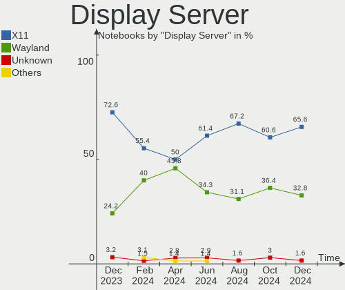
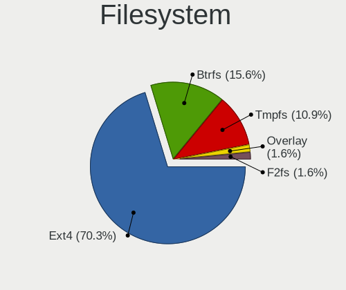
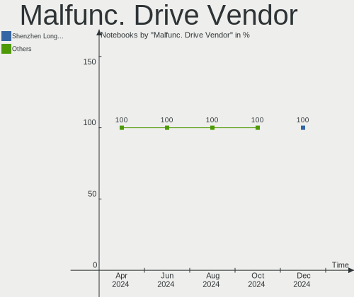
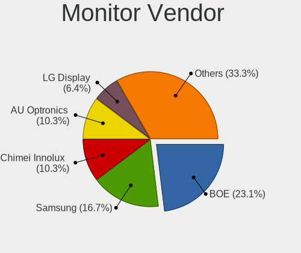
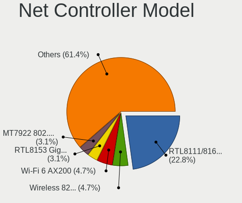
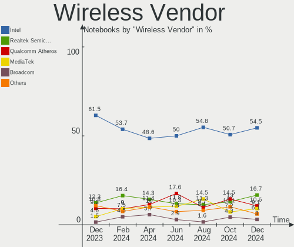
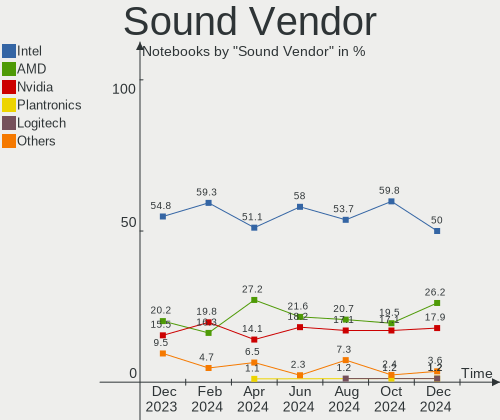
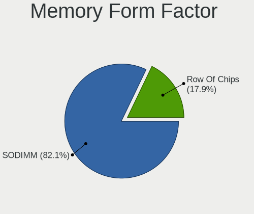
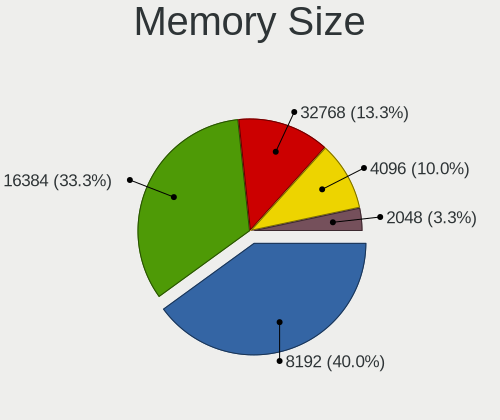

Manjaro Hardware Trends (Notebooks)
-----------------------------------

A project to identify most popular hardware characteristics and track their change
over time based on data collected by Manjaro users at https://Linux-Hardware.org.

Anyone can contribute to this report by the [hw-probe](https://github.com/linuxhw/hw-probe) tool:

    sudo -E hw-probe -all -upload

Full-feature report is available here: https://linux-hardware.org/?view=trends

Period: Mar, 2022.

Contents
--------

* [ System ](#system)
  - [ OS                       ](#os)
  - [ OS Family                ](#os-family)
  - [ Kernel                   ](#kernel)
  - [ Kernel Family            ](#kernel-family)
  - [ Kernel Major Ver.        ](#kernel-major-ver)
  - [ Arch                     ](#arch)
  - [ DE                       ](#de)
  - [ Display Server           ](#display-server)
  - [ Display Manager          ](#display-manager)
  - [ OS Lang                  ](#os-lang)
  - [ Boot Mode                ](#boot-mode)
  - [ Filesystem               ](#filesystem)
  - [ Part. scheme             ](#part-scheme)
  - [ Dual Boot with Linux/BSD ](#dual-boot-with-linuxbsd)
  - [ Dual Boot (Win)          ](#dual-boot-win)

* [ Board ](#board)
  - [ Vendor                   ](#vendor)
  - [ Model                    ](#model)
  - [ Model Family             ](#model-family)
  - [ MFG Year                 ](#mfg-year)
  - [ Form Factor              ](#form-factor)
  - [ Secure Boot              ](#secure-boot)
  - [ Coreboot                 ](#coreboot)
  - [ RAM Size                 ](#ram-size)
  - [ RAM Used                 ](#ram-used)
  - [ Total Drives             ](#total-drives)
  - [ Has CD-ROM               ](#has-cd-rom)
  - [ Has Ethernet             ](#has-ethernet)
  - [ Has WiFi                 ](#has-wifi)
  - [ Has Bluetooth            ](#has-bluetooth)

* [ Location ](#location)
  - [ Country                  ](#country)
  - [ City                     ](#city)

* [ Drives ](#drives)
  - [ Drive Vendor             ](#drive-vendor)
  - [ Drive Model              ](#drive-model)
  - [ HDD Vendor               ](#hdd-vendor)
  - [ SSD Vendor               ](#ssd-vendor)
  - [ Drive Kind               ](#drive-kind)
  - [ Drive Connector          ](#drive-connector)
  - [ Drive Size               ](#drive-size)
  - [ Space Total              ](#space-total)
  - [ Space Used               ](#space-used)
  - [ Malfunc. Drives          ](#malfunc-drives)
  - [ Malfunc. Drive Vendor    ](#malfunc-drive-vendor)
  - [ Malfunc. HDD Vendor      ](#malfunc-hdd-vendor)
  - [ Malfunc. Drive Kind      ](#malfunc-drive-kind)
  - [ Failed Drives            ](#failed-drives)
  - [ Failed Drive Vendor      ](#failed-drive-vendor)
  - [ Drive Status             ](#drive-status)

* [ Storage controller ](#storage-controller)
  - [ Storage Vendor           ](#storage-vendor)
  - [ Storage Model            ](#storage-model)
  - [ Storage Kind             ](#storage-kind)

* [ Processor ](#processor)
  - [ CPU Vendor               ](#cpu-vendor)
  - [ CPU Model                ](#cpu-model)
  - [ CPU Model Family         ](#cpu-model-family)
  - [ CPU Cores                ](#cpu-cores)
  - [ CPU Sockets              ](#cpu-sockets)
  - [ CPU Threads              ](#cpu-threads)
  - [ CPU Op-Modes             ](#cpu-op-modes)
  - [ CPU Microcode            ](#cpu-microcode)
  - [ CPU Microarch            ](#cpu-microarch)

* [ Graphics ](#graphics)
  - [ GPU Vendor               ](#gpu-vendor)
  - [ GPU Model                ](#gpu-model)
  - [ GPU Combo                ](#gpu-combo)
  - [ GPU Driver               ](#gpu-driver)
  - [ GPU Memory               ](#gpu-memory)

* [ Monitor ](#monitor)
  - [ Monitor Vendor           ](#monitor-vendor)
  - [ Monitor Model            ](#monitor-model)
  - [ Monitor Resolution       ](#monitor-resolution)
  - [ Monitor Diagonal         ](#monitor-diagonal)
  - [ Monitor Width            ](#monitor-width)
  - [ Aspect Ratio             ](#aspect-ratio)
  - [ Monitor Area             ](#monitor-area)
  - [ Pixel Density            ](#pixel-density)
  - [ Multiple Monitors        ](#multiple-monitors)

* [ Network ](#network)
  - [ Net Controller Vendor    ](#net-controller-vendor)
  - [ Net Controller Model     ](#net-controller-model)
  - [ Wireless Vendor          ](#wireless-vendor)
  - [ Wireless Model           ](#wireless-model)
  - [ Ethernet Vendor          ](#ethernet-vendor)
  - [ Ethernet Model           ](#ethernet-model)
  - [ Net Controller Kind      ](#net-controller-kind)
  - [ Used Controller          ](#used-controller)
  - [ NICs                     ](#nics)
  - [ IPv6                     ](#ipv6)

* [ Bluetooth ](#bluetooth)
  - [ Bluetooth Vendor         ](#bluetooth-vendor)
  - [ Bluetooth Model          ](#bluetooth-model)

* [ Sound ](#sound)
  - [ Sound Vendor             ](#sound-vendor)
  - [ Sound Model              ](#sound-model)

* [ Memory ](#memory)
  - [ Memory Vendor            ](#memory-vendor)
  - [ Memory Model             ](#memory-model)
  - [ Memory Kind              ](#memory-kind)
  - [ Memory Form Factor       ](#memory-form-factor)
  - [ Memory Size              ](#memory-size)
  - [ Memory Speed             ](#memory-speed)

* [ Printers & scanners ](#printers--scanners)
  - [ Printer Vendor           ](#printer-vendor)
  - [ Printer Model            ](#printer-model)
  - [ Scanner Vendor           ](#scanner-vendor)
  - [ Scanner Model            ](#scanner-model)

* [ Camera ](#camera)
  - [ Camera Vendor            ](#camera-vendor)
  - [ Camera Model             ](#camera-model)

* [ Security ](#security)
  - [ Fingerprint Vendor       ](#fingerprint-vendor)
  - [ Fingerprint Model        ](#fingerprint-model)
  - [ Chipcard Vendor          ](#chipcard-vendor)
  - [ Chipcard Model           ](#chipcard-model)

* [ Unsupported ](#unsupported)
  - [ Unsupported Devices      ](#unsupported-devices)
  - [ Unsupported Device Types ](#unsupported-device-types)

System
------

OS
--

Installed operating systems

| Name           | Notebooks | Percent |
|----------------|-----------|---------|
| Manjaro        | 47        | 45.63%  |
| Manjaro 21.2.5 | 30        | 29.13%  |
| Manjaro 21.2.4 | 25        | 24.27%  |
| Manjaro 21.2.2 | 1         | 0.97%   |

OS Family
---------

OS without a version

| Name    | Notebooks | Percent |
|---------|-----------|---------|
| Manjaro | 103       | 100%    |

Kernel
------

Version of the Linux kernel

| Version                       | Notebooks | Percent |
|-------------------------------|-----------|---------|
| 5.15.28-1-MANJARO             | 29        | 28.16%  |
| 5.15.25-1-MANJARO             | 22        | 21.36%  |
| 5.16.11-2-MANJARO             | 15        | 14.56%  |
| 5.16.14-1-MANJARO             | 10        | 9.71%   |
| 5.17.0-1-MANJARO              | 5         | 4.85%   |
| 5.16.2-2-rt19-MANJARO         | 3         | 2.91%   |
| 5.10.105-1-MANJARO            | 3         | 2.91%   |
| 5.10.102-1-MANJARO            | 3         | 2.91%   |
| 5.4.184-1-MANJARO             | 2         | 1.94%   |
| 5.4.181-2-MANJARO             | 1         | 0.97%   |
| 5.4.173-1-MANJARO             | 1         | 0.97%   |
| 5.17.0-2-MANJARO              | 1         | 0.97%   |
| 5.16.7-1-MANJARO              | 1         | 0.97%   |
| 5.16.16-1-MANJARO             | 1         | 0.97%   |
| 5.16.12-lqx2-1-lqx            | 1         | 0.97%   |
| 5.16.11-MANJARO-gd428da530032 | 1         | 0.97%   |
| 5.15.27-xanmod1-MANJARO       | 1         | 0.97%   |
| 5.15.21-1-MANJARO             | 1         | 0.97%   |
| 5.15.19-1-MANJARO             | 1         | 0.97%   |
| 5.14.21-2-MANJARO             | 1         | 0.97%   |

Kernel Family
-------------

Linux kernel without a distro release

| Version  | Notebooks | Percent |
|----------|-----------|---------|
| 5.15.28  | 29        | 28.16%  |
| 5.15.25  | 22        | 21.36%  |
| 5.16.11  | 16        | 15.53%  |
| 5.16.14  | 10        | 9.71%   |
| 5.17.0   | 6         | 5.83%   |
| 5.16.2   | 3         | 2.91%   |
| 5.10.105 | 3         | 2.91%   |
| 5.10.102 | 3         | 2.91%   |
| 5.4.184  | 2         | 1.94%   |
| 5.4.181  | 1         | 0.97%   |
| 5.4.173  | 1         | 0.97%   |
| 5.16.7   | 1         | 0.97%   |
| 5.16.16  | 1         | 0.97%   |
| 5.16.12  | 1         | 0.97%   |
| 5.15.27  | 1         | 0.97%   |
| 5.15.21  | 1         | 0.97%   |
| 5.15.19  | 1         | 0.97%   |
| 5.14.21  | 1         | 0.97%   |

Kernel Major Ver.
-----------------

Linux kernel major version

| Version | Notebooks | Percent |
|---------|-----------|---------|
| 5.15    | 54        | 52.43%  |
| 5.16    | 32        | 31.07%  |
| 5.17    | 6         | 5.83%   |
| 5.10    | 6         | 5.83%   |
| 5.4     | 4         | 3.88%   |
| 5.14    | 1         | 0.97%   |

Arch
----

OS architecture (x86_64, i586, etc.)

| Name   | Notebooks | Percent |
|--------|-----------|---------|
| x86_64 | 103       | 100%    |

DE
--

Desktop Environment

| Name       | Notebooks | Percent |
|------------|-----------|---------|
| KDE5       | 53        | 51.46%  |
| GNOME      | 21        | 20.39%  |
| XFCE       | 20        | 19.42%  |
| Unknown    | 5         | 4.85%   |
| X-Cinnamon | 2         | 1.94%   |
| Deepin     | 2         | 1.94%   |

Display Server
--------------

X11 or Wayland

| Name    | Notebooks | Percent |
|---------|-----------|---------|
| X11     | 82        | 79.61%  |
| Wayland | 18        | 17.48%  |
| Unknown | 3         | 2.91%   |

Display Manager
---------------

SDDM, LightDM, etc.

| Name    | Notebooks | Percent |
|---------|-----------|---------|
| Unknown | 47        | 45.63%  |
| LightDM | 23        | 22.33%  |
| SDDM    | 19        | 18.45%  |
| GDM     | 14        | 13.59%  |

OS Lang
-------

Language

| Lang    | Notebooks | Percent |
|---------|-----------|---------|
| en_US   | 47        | 45.63%  |
| en_GB   | 12        | 11.65%  |
| ru_RU   | 7         | 6.8%    |
| en_CA   | 5         | 4.85%   |
| pt_BR   | 3         | 2.91%   |
| pl_PL   | 3         | 2.91%   |
| zh_CN   | 2         | 1.94%   |
| it_IT   | 2         | 1.94%   |
| fr_FR   | 2         | 1.94%   |
| es_MX   | 2         | 1.94%   |
| es_ES   | 2         | 1.94%   |
| en_IN   | 2         | 1.94%   |
| en_IE   | 2         | 1.94%   |
| de_AT   | 2         | 1.94%   |
| sk_SK   | 1         | 0.97%   |
| ru_UA   | 1         | 0.97%   |
| pt_PT   | 1         | 0.97%   |
| nl_BE   | 1         | 0.97%   |
| es_CO   | 1         | 0.97%   |
| en_ZA   | 1         | 0.97%   |
| en_AU   | 1         | 0.97%   |
| de_DE   | 1         | 0.97%   |
| cs_CZ   | 1         | 0.97%   |
| Unknown | 1         | 0.97%   |

Boot Mode
---------

EFI or BIOS

| Mode | Notebooks | Percent |
|------|-----------|---------|
| BIOS | 63        | 61.17%  |
| EFI  | 40        | 38.83%  |

Filesystem
----------

Type of filesystem

| Type  | Notebooks | Percent |
|-------|-----------|---------|
| Ext4  | 92        | 89.32%  |
| Btrfs | 9         | 8.74%   |
| Xfs   | 2         | 1.94%   |

Part. scheme
------------

Scheme of partitioning

| Type    | Notebooks | Percent |
|---------|-----------|---------|
| Unknown | 64        | 62.14%  |
| GPT     | 33        | 32.04%  |
| MBR     | 6         | 5.83%   |

Dual Boot with Linux/BSD
------------------------

Hosting more than one Linux/BSD

| Dual boot | Notebooks | Percent |
|-----------|-----------|---------|
| No        | 93        | 90.29%  |
| Yes       | 10        | 9.71%   |

Dual Boot (Win)
---------------

Hosting Linux and Windows

| Dual boot | Notebooks | Percent |
|-----------|-----------|---------|
| No        | 73        | 70.87%  |
| Yes       | 30        | 29.13%  |

Board
-----

Vendor
------

Motherboard manufacturer

| Name                 | Notebooks | Percent |
|----------------------|-----------|---------|
| Dell                 | 23        | 22.33%  |
| Lenovo               | 20        | 19.42%  |
| Hewlett-Packard      | 19        | 18.45%  |
| ASUSTek Computer     | 13        | 12.62%  |
| Acer                 | 5         | 4.85%   |
| MSI                  | 4         | 3.88%   |
| Apple                | 4         | 3.88%   |
| HONOR                | 3         | 2.91%   |
| Samsung Electronics  | 2         | 1.94%   |
| Fujitsu              | 2         | 1.94%   |
| UNOWHY               | 1         | 0.97%   |
| Timi                 | 1         | 0.97%   |
| Intel Client Systems | 1         | 0.97%   |
| Google               | 1         | 0.97%   |
| Gateway              | 1         | 0.97%   |
| Clevo                | 1         | 0.97%   |
| Chuwi                | 1         | 0.97%   |
| Casper               | 1         | 0.97%   |

Model
-----

Motherboard model

| Name                                  | Notebooks | Percent |
|---------------------------------------|-----------|---------|
| HONOR NMH-WCX9                        | 2         | 1.94%   |
| HP ProBook 455 G7                     | 2         | 1.94%   |
| Dell XPS 15 9500                      | 2         | 1.94%   |
| Dell Vostro 5471                      | 2         | 1.94%   |
| ASUS ZenBook UX325UAZ_UM325UAZ        | 2         | 1.94%   |
| UNOWHY Y14G101S2E                     | 1         | 0.97%   |
| Timi RedmiBook 16                     | 1         | 0.97%   |
| Samsung 530XBB                        | 1         | 0.97%   |
| Samsung 530U3BI/530U4BI/530U4BH       | 1         | 0.97%   |
| MSI GS60 2PE Ghost Pro                | 1         | 0.97%   |
| MSI GF65 Thin 9SEXR                   | 1         | 0.97%   |
| MSI GE62 6QF                          | 1         | 0.97%   |
| MSI Alpha 15 B5EEK                    | 1         | 0.97%   |
| Lenovo ThinkPad X250 20CLS06L00       | 1         | 0.97%   |
| Lenovo ThinkPad X230 23202DG          | 1         | 0.97%   |
| Lenovo ThinkPad X131e 33672T5         | 1         | 0.97%   |
| Lenovo ThinkPad X13 Gen 2i 20WK0061CD | 1         | 0.97%   |
| Lenovo ThinkPad W540 20BHS04T0P       | 1         | 0.97%   |
| Lenovo ThinkPad T450s 20BWS4Q200      | 1         | 0.97%   |
| Lenovo ThinkPad L512 2598AM7          | 1         | 0.97%   |
| Lenovo ThinkPad E485 20KUCTO1WW       | 1         | 0.97%   |
| Lenovo ThinkPad E15 Gen 2 20T8000RMX  | 1         | 0.97%   |
| Lenovo ThinkBook 16p Gen 2 20YM       | 1         | 0.97%   |
| Lenovo ThinkBook 15 G3 ACL 21A4       | 1         | 0.97%   |
| Lenovo ThinkBook 15 G2 ITL 20VE       | 1         | 0.97%   |
| Lenovo ThinkBook 15 G2 ARE 20VG       | 1         | 0.97%   |
| Lenovo Legion 5-15IMH05H 81Y6         | 1         | 0.97%   |
| Lenovo Legion 5 17ACH6H 82JY          | 1         | 0.97%   |
| Lenovo Legion 5 15ITH6 82JK           | 1         | 0.97%   |
| Lenovo Legion 5 15ARH05H 82B1         | 1         | 0.97%   |
| Lenovo IdeaPad S540-14API 81NH        | 1         | 0.97%   |
| Lenovo IdeaPad 320-15IKB 81G3         | 1         | 0.97%   |
| Lenovo G580 20150                     | 1         | 0.97%   |
| Intel Client Systems LAPQC71A         | 1         | 0.97%   |
| HONOR HGE-WX6                         | 1         | 0.97%   |
| HP ZHAN 66 Pro A 14 G4 Notebook PC    | 1         | 0.97%   |
| HP ZBook 17 G6                        | 1         | 0.97%   |
| HP Victus by Laptop 16                | 1         | 0.97%   |
| HP ProBook 455 G1                     | 1         | 0.97%   |
| HP ProBook 4340s                      | 1         | 0.97%   |
| HP ProBook 430 G3                     | 1         | 0.97%   |
| HP Pavilion Notebook                  | 1         | 0.97%   |
| HP Pavilion g7                        | 1         | 0.97%   |
| HP Pavilion g6                        | 1         | 0.97%   |
| HP Pavilion dm1                       | 1         | 0.97%   |
| HP OMEN by Laptop 15-dc0xxx           | 1         | 0.97%   |
| HP Laptop 15s-fq1xxx                  | 1         | 0.97%   |
| HP Laptop 15-bs0xx                    | 1         | 0.97%   |
| HP Laptop 14 14s-dq1008ni             | 1         | 0.97%   |
| HP EliteBook 850 G1                   | 1         | 0.97%   |
| HP 255 G7 Notebook PC                 | 1         | 0.97%   |
| HP 250 G8 Notebook PC                 | 1         | 0.97%   |
| Google Nightfury                      | 1         | 0.97%   |
| Gateway NV57H                         | 1         | 0.97%   |
| Fujitsu LIFEBOOK U748                 | 1         | 0.97%   |
| Fujitsu LIFEBOOK T901                 | 1         | 0.97%   |
| Dell XPS 17 9710                      | 1         | 0.97%   |
| Dell XPS 15 9560                      | 1         | 0.97%   |
| Dell XPS 15 7590                      | 1         | 0.97%   |
| Dell XPS 13 9360                      | 1         | 0.97%   |

Model Family
------------

Motherboard model prefix

| Name                          | Notebooks | Percent |
|-------------------------------|-----------|---------|
| Lenovo ThinkPad               | 9         | 8.74%   |
| Dell XPS                      | 7         | 6.8%    |
| Dell Latitude                 | 7         | 6.8%    |
| Dell Vostro                   | 6         | 5.83%   |
| HP ProBook                    | 5         | 4.85%   |
| Lenovo ThinkBook              | 4         | 3.88%   |
| Lenovo Legion                 | 4         | 3.88%   |
| HP Pavilion                   | 4         | 3.88%   |
| HP Laptop                     | 3         | 2.91%   |
| ASUS ZenBook                  | 3         | 2.91%   |
| Lenovo IdeaPad                | 2         | 1.94%   |
| HONOR NMH-WCX9                | 2         | 1.94%   |
| Fujitsu LIFEBOOK              | 2         | 1.94%   |
| Dell Inspiron                 | 2         | 1.94%   |
| ASUS ROG                      | 2         | 1.94%   |
| Acer Swift                    | 2         | 1.94%   |
| Acer Aspire                   | 2         | 1.94%   |
| UNOWHY Y14G101S2E             | 1         | 0.97%   |
| Timi RedmiBook                | 1         | 0.97%   |
| Samsung 530XBB                | 1         | 0.97%   |
| Samsung 530U3BI               | 1         | 0.97%   |
| MSI GS60                      | 1         | 0.97%   |
| MSI GF65                      | 1         | 0.97%   |
| MSI GE62                      | 1         | 0.97%   |
| MSI Alpha                     | 1         | 0.97%   |
| Lenovo G580                   | 1         | 0.97%   |
| Intel Client Systems LAPQC71A | 1         | 0.97%   |
| HONOR HGE-WX6                 | 1         | 0.97%   |
| HP ZHAN                       | 1         | 0.97%   |
| HP ZBook                      | 1         | 0.97%   |
| HP Victus                     | 1         | 0.97%   |
| HP OMEN                       | 1         | 0.97%   |
| HP EliteBook                  | 1         | 0.97%   |
| HP 255                        | 1         | 0.97%   |
| HP 250                        | 1         | 0.97%   |
| Google Nightfury              | 1         | 0.97%   |
| Gateway NV57H                 | 1         | 0.97%   |
| Dell G7                       | 1         | 0.97%   |
| Clevo E512xQ                  | 1         | 0.97%   |
| Chuwi HeroBook                | 1         | 0.97%   |
| Casper EXCALIBUR              | 1         | 0.97%   |
| ASUS X580VD                   | 1         | 0.97%   |
| ASUS X555LAB                  | 1         | 0.97%   |
| ASUS N56VZ                    | 1         | 0.97%   |
| ASUS GL553VD                  | 1         | 0.97%   |
| ASUS GL502VT                  | 1         | 0.97%   |
| ASUS G751JT                   | 1         | 0.97%   |
| ASUS G73Jh                    | 1         | 0.97%   |
| ASUS ASUS                     | 1         | 0.97%   |
| Apple MacBookPro14            | 1         | 0.97%   |
| Apple MacBookPro12            | 1         | 0.97%   |
| Apple MacBookAir6             | 1         | 0.97%   |
| Apple MacBookAir3             | 1         | 0.97%   |
| Acer Nitro                    | 1         | 0.97%   |

MFG Year
--------

Motherboard manufacture year

| Year | Notebooks | Percent |
|------|-----------|---------|
| 2021 | 24        | 23.3%   |
| 2020 | 16        | 15.53%  |
| 2019 | 11        | 10.68%  |
| 2018 | 8         | 7.77%   |
| 2017 | 8         | 7.77%   |
| 2012 | 7         | 6.8%    |
| 2013 | 6         | 5.83%   |
| 2014 | 5         | 4.85%   |
| 2011 | 5         | 4.85%   |
| 2015 | 4         | 3.88%   |
| 2010 | 4         | 3.88%   |
| 2016 | 2         | 1.94%   |
| 2008 | 2         | 1.94%   |
| 2009 | 1         | 0.97%   |

Form Factor
-----------

Physical design of the computer

| Name     | Notebooks | Percent |
|----------|-----------|---------|
| Notebook | 103       | 100%    |

Secure Boot
-----------

Enabled or disabled

| State    | Notebooks | Percent |
|----------|-----------|---------|
| Disabled | 103       | 100%    |

Coreboot
--------

Have coreboot on board

| Used | Notebooks | Percent |
|------|-----------|---------|
| No   | 102       | 99.03%  |
| Yes  | 1         | 0.97%   |

RAM Size
--------

Total RAM memory

| Size in GB | Notebooks | Percent |
|------------|-----------|---------|
| 4.01-8.0   | 29        | 28.16%  |
| 16.01-24.0 | 25        | 24.27%  |
| 8.01-16.0  | 22        | 21.36%  |
| 3.01-4.0   | 12        | 11.65%  |
| 32.01-64.0 | 9         | 8.74%   |
| 24.01-32.0 | 3         | 2.91%   |
| 1.01-2.0   | 2         | 1.94%   |
| 2.01-3.0   | 1         | 0.97%   |

RAM Used
--------

Used RAM memory

| Used GB    | Notebooks | Percent |
|------------|-----------|---------|
| 4.01-8.0   | 28        | 27.18%  |
| 3.01-4.0   | 24        | 23.3%   |
| 2.01-3.0   | 24        | 23.3%   |
| 1.01-2.0   | 18        | 17.48%  |
| 8.01-16.0  | 8         | 7.77%   |
| 16.01-24.0 | 1         | 0.97%   |

Total Drives
------------

Number of drives on board

| Drives | Notebooks | Percent |
|--------|-----------|---------|
| 1      | 64        | 62.14%  |
| 2      | 34        | 33.01%  |
| 3      | 3         | 2.91%   |
| 4      | 2         | 1.94%   |

Has CD-ROM
----------

Has CD-ROM on board

| Presented | Notebooks | Percent |
|-----------|-----------|---------|
| No        | 86        | 83.5%   |
| Yes       | 17        | 16.5%   |

Has Ethernet
------------

Has Ethernet on board

| Presented | Notebooks | Percent |
|-----------|-----------|---------|
| Yes       | 77        | 74.76%  |
| No        | 26        | 25.24%  |

Has WiFi
--------

Has WiFi module

| Presented | Notebooks | Percent |
|-----------|-----------|---------|
| Yes       | 101       | 98.06%  |
| No        | 2         | 1.94%   |

Has Bluetooth
-------------

Has Bluetooth module

| Presented | Notebooks | Percent |
|-----------|-----------|---------|
| Yes       | 88        | 85.44%  |
| No        | 15        | 14.56%  |

Location
--------

Country
-------

Geographic location (country)

| Country      | Notebooks | Percent |
|--------------|-----------|---------|
| USA          | 17        | 16.5%   |
| UK           | 6         | 5.83%   |
| Turkey       | 6         | 5.83%   |
| Russia       | 6         | 5.83%   |
| Brazil       | 6         | 5.83%   |
| Canada       | 5         | 4.85%   |
| Poland       | 4         | 3.88%   |
| Czechia      | 4         | 3.88%   |
| Taiwan       | 3         | 2.91%   |
| Spain        | 3         | 2.91%   |
| Portugal     | 3         | 2.91%   |
| Germany      | 3         | 2.91%   |
| Austria      | 3         | 2.91%   |
| Netherlands  | 2         | 1.94%   |
| Mexico       | 2         | 1.94%   |
| Lithuania    | 2         | 1.94%   |
| Italy        | 2         | 1.94%   |
| Indonesia    | 2         | 1.94%   |
| India        | 2         | 1.94%   |
| France       | 2         | 1.94%   |
| China        | 2         | 1.94%   |
| Venezuela    | 1         | 0.97%   |
| Uzbekistan   | 1         | 0.97%   |
| Ukraine      | 1         | 0.97%   |
| Switzerland  | 1         | 0.97%   |
| South Africa | 1         | 0.97%   |
| Slovakia     | 1         | 0.97%   |
| Norway       | 1         | 0.97%   |
| Mauritius    | 1         | 0.97%   |
| Kenya        | 1         | 0.97%   |
| Ireland      | 1         | 0.97%   |
| Finland      | 1         | 0.97%   |
| Ethiopia     | 1         | 0.97%   |
| Egypt        | 1         | 0.97%   |
| Colombia     | 1         | 0.97%   |
| Bulgaria     | 1         | 0.97%   |
| Belgium      | 1         | 0.97%   |
| Bangladesh   | 1         | 0.97%   |
| Australia    | 1         | 0.97%   |

City
----

Geographic location (city)

| City          | Notebooks | Percent |
|---------------|-----------|---------|
| Taipei        | 3         | 2.91%   |
| Recife        | 3         | 2.91%   |
| Prague        | 3         | 2.91%   |
| St Petersburg | 2         | 1.94%   |
| Porto         | 2         | 1.94%   |
| Izmir         | 2         | 1.94%   |
| Istanbul      | 2         | 1.94%   |
| Atlanta       | 2         | 1.94%   |
| Zutphen       | 1         | 0.97%   |
| Włocławek   | 1         | 0.97%   |
| Warsaw        | 1         | 0.97%   |
| Warrington    | 1         | 0.97%   |
| Vilnius       | 1         | 0.97%   |
| Vigo          | 1         | 0.97%   |
| Vienna        | 1         | 0.97%   |
| Union City    | 1         | 0.97%   |
| Ulm           | 1         | 0.97%   |
| Tukhchar      | 1         | 0.97%   |
| Trondheim     | 1         | 0.97%   |
| Trementines   | 1         | 0.97%   |
| Toronto       | 1         | 0.97%   |
| The Hague     | 1         | 0.97%   |
| Tashkent      | 1         | 0.97%   |
| Sylhet        | 1         | 0.97%   |
| Sydney        | 1         | 0.97%   |
| Somerset      | 1         | 0.97%   |
| Sofia         | 1         | 0.97%   |
| Shanghai      | 1         | 0.97%   |
| Sao Paulo     | 1         | 0.97%   |
| Salzburg      | 1         | 0.97%   |
| Salford       | 1         | 0.97%   |
| Salem         | 1         | 0.97%   |
| Roztoky       | 1         | 0.97%   |
| Roorkee       | 1         | 0.97%   |
| Québec       | 1         | 0.97%   |
| Quatre Bornes | 1         | 0.97%   |
| Portland      | 1         | 0.97%   |
| Polokwane     | 1         | 0.97%   |
| Pittsburgh    | 1         | 0.97%   |
| Pereval'sk    | 1         | 0.97%   |
| Ottawa        | 1         | 0.97%   |
| Oryol         | 1         | 0.97%   |
| Nuvolento     | 1         | 0.97%   |
| Newcastle     | 1         | 0.97%   |
| Naples        | 1         | 0.97%   |
| Moscow        | 1         | 0.97%   |
| Mississauga   | 1         | 0.97%   |
| Meylan        | 1         | 0.97%   |
| Mexico        | 1         | 0.97%   |
| Meridian      | 1         | 0.97%   |
| Mérida       | 1         | 0.97%   |
| Malbork       | 1         | 0.97%   |
| Málaga       | 1         | 0.97%   |
| Lisbon        | 1         | 0.97%   |
| Lawrence      | 1         | 0.97%   |
| Lancaster     | 1         | 0.97%   |
| Krasnodar     | 1         | 0.97%   |
| Košice       | 1         | 0.97%   |
| Konya         | 1         | 0.97%   |
| Kisii         | 1         | 0.97%   |

Drives
------

Drive Vendor
------------

Hard drive vendors

| Vendor                         | Notebooks | Drives | Percent |
|--------------------------------|-----------|--------|---------|
| Sandisk                        | 18        | 20     | 12.68%  |
| Samsung Electronics            | 18        | 19     | 12.68%  |
| WDC                            | 13        | 13     | 9.15%   |
| SK Hynix                       | 11        | 11     | 7.75%   |
| Seagate                        | 8         | 8      | 5.63%   |
| Kingston                       | 8         | 10     | 5.63%   |
| Intel                          | 7         | 7      | 4.93%   |
| Toshiba                        | 6         | 6      | 4.23%   |
| Unknown                        | 5         | 6      | 3.52%   |
| HGST                           | 5         | 5      | 3.52%   |
| Crucial                        | 5         | 5      | 3.52%   |
| A-DATA Technology              | 5         | 6      | 3.52%   |
| Hitachi                        | 4         | 4      | 2.82%   |
| Apple                          | 3         | 3      | 2.11%   |
| Transcend                      | 2         | 2      | 1.41%   |
| Silicon Motion                 | 2         | 2      | 1.41%   |
| Micron Technology              | 2         | 2      | 1.41%   |
| GOODRAM                        | 2         | 2      | 1.41%   |
| TwinMOS                        | 1         | 1      | 0.7%    |
| TEAM L3                        | 1         | 1      | 0.7%    |
| Team                           | 1         | 1      | 0.7%    |
| Solid State Storage Technology | 1         | 1      | 0.7%    |
| PLEXTOR                        | 1         | 1      | 0.7%    |
| Phison                         | 1         | 1      | 0.7%    |
| Netac                          | 1         | 1      | 0.7%    |
| Micron/Crucial Technology      | 1         | 1      | 0.7%    |
| LITEONIT                       | 1         | 1      | 0.7%    |
| LITEON                         | 1         | 1      | 0.7%    |
| Lite-On                        | 1         | 1      | 0.7%    |
| Lenovo                         | 1         | 1      | 0.7%    |
| KIOXIA                         | 1         | 1      | 0.7%    |
| Intenso                        | 1         | 1      | 0.7%    |
| INNOVATION IT                  | 1         | 1      | 0.7%    |
| HS-SSD-C100                    | 1         | 1      | 0.7%    |
| Apricorn                       | 1         | 1      | 0.7%    |
| AEGO                           | 1         | 1      | 0.7%    |

Drive Model
-----------

Hard drive models

| Model                                     | Notebooks | Percent |
|-------------------------------------------|-----------|---------|
| Sandisk NVMe SSD Drive 512GB              | 6         | 4.08%   |
| Sandisk NVMe SSD Drive 256GB              | 4         | 2.72%   |
| Samsung NVMe SSD Drive 512GB              | 3         | 2.04%   |
| Intel NVMe SSD Drive 512GB                | 3         | 2.04%   |
| WDC WDS100T2B0A-00SM50 1TB SSD            | 2         | 1.36%   |
| WDC WD10SPZX-08Z10 1TB                    | 2         | 1.36%   |
| Unknown SD/MMC/MS PRO 32GB                | 2         | 1.36%   |
| Unknown MMC Card  64GB                    | 2         | 1.36%   |
| SK Hynix SKHynix_HFM512GDHTNI-87A0B 512GB | 2         | 1.36%   |
| SK Hynix NVMe SSD Drive 512GB             | 2         | 1.36%   |
| SK Hynix NVMe SSD Drive 1024GB            | 2         | 1.36%   |
| Seagate ST1000LM035-1RK172 1TB            | 2         | 1.36%   |
| Sandisk NVMe SSD Drive 1024GB             | 2         | 1.36%   |
| Samsung SSD 870 EVO 1TB                   | 2         | 1.36%   |
| Kingston NVMe SSD Drive 512GB             | 2         | 1.36%   |
| HGST HTS721010A9E630 1TB                  | 2         | 1.36%   |
| Crucial CT1000MX500SSD1 1TB               | 2         | 1.36%   |
| WDC WDS500G2B0A-00SM50 500GB SSD          | 1         | 0.68%   |
| WDC WDBNCE5000PNC 500GB SSD               | 1         | 0.68%   |
| WDC WD7500BPVX-60JC3T0 752GB              | 1         | 0.68%   |
| WDC WD7500BPKT-75PK4T0 752GB              | 1         | 0.68%   |
| WDC WD20SPZX-22UA7T0 2TB                  | 1         | 0.68%   |
| WDC WD10SPZX-24Z10T0 1TB                  | 1         | 0.68%   |
| WDC WD10JPVX-60JC3T1 1TB                  | 1         | 0.68%   |
| WDC PC SN730 SDBPNTY-512G-1006 512GB      | 1         | 0.68%   |
| WDC PC SN720 SDAPNTW-1T00-1006 1TB        | 1         | 0.68%   |
| Unknown SS32G  32GB                       | 1         | 0.68%   |
| Unknown MMC Card  128GB                   | 1         | 0.68%   |
| TwinMOS SSD 128GB                         | 1         | 0.68%   |
| Transcend TS480GMTS420S 480GB SSD         | 1         | 0.68%   |
| Transcend TS240GMTS420S 240GB SSD         | 1         | 0.68%   |
| Toshiba THNSNK256GVN8 M.2 2280 256GB SSD  | 1         | 0.68%   |
| Toshiba THNSFC128GBSJ SSD                 | 1         | 0.68%   |
| Toshiba NVMe SSD Drive 2TB                | 1         | 0.68%   |
| Toshiba MQ04ABF100 1TB                    | 1         | 0.68%   |
| Toshiba MQ01ABC150 1TB                    | 1         | 0.68%   |
| Toshiba KXG50ZNV256G NVMe 256GB           | 1         | 0.68%   |
| Team T253X2512G 512GB SSD                 | 1         | 0.68%   |
| TEAM L3 SSD 120GB                         | 1         | 0.68%   |
| Solid State Storage NVMe SSD Drive 512GB  | 1         | 0.68%   |
| SK Hynix SC311 SATA 256GB SSD             | 1         | 0.68%   |
| SK Hynix SC311 SATA 128GB SSD             | 1         | 0.68%   |
| SK Hynix HFM512GD3JX013N 512GB            | 1         | 0.68%   |
| SK Hynix BC501 NVMe 256GB                 | 1         | 0.68%   |
| SK Hynix BC501 NVMe 128GB                 | 1         | 0.68%   |
| Silicon Motion NVMe SSD Drive 512GB       | 1         | 0.68%   |
| Silicon Motion NVMe SSD Drive 1024GB      | 1         | 0.68%   |
| Seagate ST9750420AS 752GB                 | 1         | 0.68%   |
| Seagate ST9250410AS 250GB                 | 1         | 0.68%   |
| Seagate ST500LT012-9WS142 500GB           | 1         | 0.68%   |
| Seagate ST500LT012-1DG142 500GB           | 1         | 0.68%   |
| Seagate ST1000LM048-2E7172 1TB            | 1         | 0.68%   |
| Seagate Expansion 320GB                   | 1         | 0.68%   |
| SanDisk SSD i100 16GB                     | 1         | 0.68%   |
| SanDisk SD9SN8W-256G-1016 256GB SSD       | 1         | 0.68%   |
| SanDisk SD6SB1M-128G-1006 128GB SSD       | 1         | 0.68%   |
| Sandisk NVMe SSD Drive 2TB                | 1         | 0.68%   |
| Sandisk NVMe SSD Drive 250GB              | 1         | 0.68%   |
| Sandisk NVMe SSD Drive 1TB                | 1         | 0.68%   |
| Samsung SSD 980 PRO 500GB                 | 1         | 0.68%   |

HDD Vendor
----------

Hard disk drive vendors

| Vendor              | Notebooks | Drives | Percent |
|---------------------|-----------|--------|---------|
| Seagate             | 8         | 8      | 26.67%  |
| WDC                 | 7         | 7      | 23.33%  |
| HGST                | 5         | 5      | 16.67%  |
| Hitachi             | 4         | 4      | 13.33%  |
| Unknown             | 2         | 2      | 6.67%   |
| Toshiba             | 2         | 2      | 6.67%   |
| Samsung Electronics | 1         | 1      | 3.33%   |
| Intenso             | 1         | 1      | 3.33%   |

SSD Vendor
----------

Solid state drive vendors

| Vendor              | Notebooks | Drives | Percent |
|---------------------|-----------|--------|---------|
| Samsung Electronics | 7         | 7      | 14%     |
| Crucial             | 5         | 5      | 10%     |
| WDC                 | 4         | 4      | 8%      |
| A-DATA Technology   | 4         | 4      | 8%      |
| SanDisk             | 3         | 3      | 6%      |
| Kingston            | 3         | 4      | 6%      |
| Apple               | 3         | 3      | 6%      |
| Transcend           | 2         | 2      | 4%      |
| Toshiba             | 2         | 2      | 4%      |
| SK Hynix            | 2         | 2      | 4%      |
| Micron Technology   | 2         | 2      | 4%      |
| Intel               | 2         | 2      | 4%      |
| GOODRAM             | 2         | 2      | 4%      |
| TwinMOS             | 1         | 1      | 2%      |
| TEAM L3             | 1         | 1      | 2%      |
| Team                | 1         | 1      | 2%      |
| PLEXTOR             | 1         | 1      | 2%      |
| Netac               | 1         | 1      | 2%      |
| LITEONIT            | 1         | 1      | 2%      |
| LITEON              | 1         | 1      | 2%      |
| INNOVATION IT       | 1         | 1      | 2%      |
| AEGO                | 1         | 1      | 2%      |

Drive Kind
----------

HDD or SSD

| Kind    | Notebooks | Drives | Percent |
|---------|-----------|--------|---------|
| NVMe    | 53        | 62     | 40.15%  |
| SSD     | 46        | 51     | 34.85%  |
| HDD     | 28        | 30     | 21.21%  |
| MMC     | 3         | 4      | 2.27%   |
| Unknown | 2         | 2      | 1.52%   |

Drive Connector
---------------

SATA, SAS, NVMe, etc.

| Type | Notebooks | Drives | Percent |
|------|-----------|--------|---------|
| SATA | 59        | 75     | 48.36%  |
| NVMe | 53        | 62     | 43.44%  |
| SAS  | 7         | 8      | 5.74%   |
| MMC  | 3         | 4      | 2.46%   |

Drive Size
----------

Size of hard drive

| Size in TB | Notebooks | Drives | Percent |
|------------|-----------|--------|---------|
| 0.01-0.5   | 45        | 52     | 62.5%   |
| 0.51-1.0   | 25        | 27     | 34.72%  |
| 2.01-3.0   | 1         | 1      | 1.39%   |
| 1.01-2.0   | 1         | 1      | 1.39%   |

Space Total
-----------

Amount of disk space available on the file system

| Size in GB     | Notebooks | Percent |
|----------------|-----------|---------|
| 101-250        | 33        | 32.04%  |
| 251-500        | 23        | 22.33%  |
| 1001-2000      | 14        | 13.59%  |
| 501-1000       | 12        | 11.65%  |
| 51-100         | 7         | 6.8%    |
| Unknown        | 7         | 6.8%    |
| 2001-3000      | 3         | 2.91%   |
| More than 3000 | 2         | 1.94%   |
| 21-50          | 1         | 0.97%   |
| 1-20           | 1         | 0.97%   |

Space Used
----------

Amount of used disk space

| Used GB        | Notebooks | Percent |
|----------------|-----------|---------|
| 101-250        | 22        | 21.36%  |
| 51-100         | 20        | 19.42%  |
| 251-500        | 17        | 16.5%   |
| 1-20           | 15        | 14.56%  |
| 21-50          | 12        | 11.65%  |
| 501-1000       | 7         | 6.8%    |
| Unknown        | 7         | 6.8%    |
| 1001-2000      | 2         | 1.94%   |
| More than 3000 | 1         | 0.97%   |

Malfunc. Drives
---------------

Drive models with a malfunction

| Model                                               | Notebooks | Drives | Percent |
|-----------------------------------------------------|-----------|--------|---------|
| WDC WD7500BPVX-60JC3T0 752GB                        | 1         | 1      | 11.11%  |
| Toshiba THNSNK256GVN8 M.2 2280 256GB SSD            | 1         | 1      | 11.11%  |
| Seagate ST9750420AS 752GB                           | 1         | 1      | 11.11%  |
| Seagate ST500LT012-9WS142 500GB                     | 1         | 1      | 11.11%  |
| Samsung Electronics SSD 870 EVO 1TB                 | 1         | 1      | 11.11%  |
| Micron Technology MTFDDAV512TBN-1AR15ABHA 512GB SSD | 1         | 1      | 11.11%  |
| LITEON CV8-8E128-HP 128GB SSD                       | 1         | 1      | 11.11%  |
| Intel SSDSC2CT180A3 180GB                           | 1         | 1      | 11.11%  |
| Crucial CT256M550SSD4 256GB                         | 1         | 1      | 11.11%  |

Malfunc. Drive Vendor
---------------------

Vendors of faulty drives

| Vendor              | Notebooks | Drives | Percent |
|---------------------|-----------|--------|---------|
| Seagate             | 2         | 2      | 22.22%  |
| WDC                 | 1         | 1      | 11.11%  |
| Toshiba             | 1         | 1      | 11.11%  |
| Samsung Electronics | 1         | 1      | 11.11%  |
| Micron Technology   | 1         | 1      | 11.11%  |
| LITEON              | 1         | 1      | 11.11%  |
| Intel               | 1         | 1      | 11.11%  |
| Crucial             | 1         | 1      | 11.11%  |

Malfunc. HDD Vendor
-------------------

Vendors of faulty HDD drives

| Vendor  | Notebooks | Drives | Percent |
|---------|-----------|--------|---------|
| Seagate | 2         | 2      | 66.67%  |
| WDC     | 1         | 1      | 33.33%  |

Malfunc. Drive Kind
-------------------

Kinds of faulty drives

| Kind | Notebooks | Drives | Percent |
|------|-----------|--------|---------|
| SSD  | 5         | 6      | 62.5%   |
| HDD  | 3         | 3      | 37.5%   |

Failed Drives
-------------

Failed drive models

Zero info for selected period =(

Failed Drive Vendor
-------------------

Failed drive vendors

Zero info for selected period =(

Drive Status
------------

Number of failed and malfunc. drives

| Status   | Notebooks | Drives | Percent |
|----------|-----------|--------|---------|
| Detected | 73        | 97     | 66.36%  |
| Works    | 30        | 43     | 27.27%  |
| Malfunc  | 7         | 9      | 6.36%   |

Storage controller
------------------

Storage Vendor
--------------

Storage controller vendors

| Vendor                         | Notebooks | Percent |
|--------------------------------|-----------|---------|
| Intel                          | 64        | 47.41%  |
| Sandisk                        | 17        | 12.59%  |
| AMD                            | 15        | 11.11%  |
| Samsung Electronics            | 11        | 8.15%   |
| SK Hynix                       | 9         | 6.67%   |
| Kingston Technology Company    | 5         | 3.7%    |
| Toshiba America Info Systems   | 2         | 1.48%   |
| Silicon Motion                 | 2         | 1.48%   |
| Solid State Storage Technology | 1         | 0.74%   |
| Realtek Semiconductor          | 1         | 0.74%   |
| Phison Electronics             | 1         | 0.74%   |
| Nvidia                         | 1         | 0.74%   |
| Micron/Crucial Technology      | 1         | 0.74%   |
| Marvell Technology Group       | 1         | 0.74%   |
| Lite-On Technology             | 1         | 0.74%   |
| Lenovo                         | 1         | 0.74%   |
| KIOXIA                         | 1         | 0.74%   |
| ADATA Technology               | 1         | 0.74%   |

Storage Model
-------------

Storage controller models

| Model                                                                            | Notebooks | Percent |
|----------------------------------------------------------------------------------|-----------|---------|
| AMD FCH SATA Controller [AHCI mode]                                              | 14        | 10.14%  |
| Intel 82801 Mobile SATA Controller [RAID mode]                                   | 11        | 7.97%   |
| Intel Sunrise Point-LP SATA Controller [AHCI mode]                               | 7         | 5.07%   |
| Sandisk WD Black SN750 / PC SN730 NVMe SSD                                       | 6         | 4.35%   |
| Intel 7 Series Chipset Family 6-port SATA Controller [AHCI mode]                 | 6         | 4.35%   |
| Sandisk Non-Volatile memory controller                                           | 5         | 3.62%   |
| Intel HM170/QM170 Chipset SATA Controller [AHCI Mode]                            | 5         | 3.62%   |
| Intel Cannon Lake Mobile PCH SATA AHCI Controller                                | 5         | 3.62%   |
| Intel 6 Series/C200 Series Chipset Family 6 port Mobile SATA AHCI Controller     | 5         | 3.62%   |
| Samsung NVMe SSD Controller PM9A1/PM9A3/980PRO                                   | 4         | 2.9%    |
| SK Hynix Gold P31 SSD                                                            | 3         | 2.17%   |
| Sandisk WD Blue SN550 NVMe SSD                                                   | 3         | 2.17%   |
| Samsung NVMe SSD Controller 980                                                  | 3         | 2.17%   |
| Intel Wildcat Point-LP SATA Controller [AHCI Mode]                               | 3         | 2.17%   |
| Intel Non-Volatile memory controller                                             | 3         | 2.17%   |
| Intel 8 Series SATA Controller 1 [AHCI mode]                                     | 3         | 2.17%   |
| Intel 5 Series/3400 Series Chipset 4 port SATA AHCI Controller                   | 3         | 2.17%   |
| SK Hynix BC511                                                                   | 2         | 1.45%   |
| SK Hynix BC501 NVMe Solid State Drive                                            | 2         | 1.45%   |
| Sandisk WD Blue SN500 / PC SN520 NVMe SSD                                        | 2         | 1.45%   |
| Samsung NVMe SSD Controller SM981/PM981/PM983                                    | 2         | 1.45%   |
| Kingston Company U-SNS8154P3 NVMe SSD                                            | 2         | 1.45%   |
| Intel Volume Management Device NVMe RAID Controller                              | 2         | 1.45%   |
| Intel SSD 660P Series                                                            | 2         | 1.45%   |
| Intel Celeron/Pentium Silver Processor SATA Controller                           | 2         | 1.45%   |
| Intel 8 Series/C220 Series Chipset Family 6-port SATA Controller 1 [AHCI mode]   | 2         | 1.45%   |
| Intel 400 Series Chipset Family SATA AHCI Controller                             | 2         | 1.45%   |
| Toshiba America Info Systems XG6 NVMe SSD Controller                             | 1         | 0.72%   |
| Toshiba America Info Systems Toshiba America Info Non-Volatile memory controller | 1         | 0.72%   |
| Solid State Storage Non-Volatile memory controller                               | 1         | 0.72%   |
| SK Hynix PC300 NVMe Solid State Drive 1TB                                        | 1         | 0.72%   |
| SK Hynix Non-Volatile memory controller                                          | 1         | 0.72%   |
| Silicon Motion SM2263EN/SM2263XT SSD Controller                                  | 1         | 0.72%   |
| Silicon Motion SM2262/SM2262EN SSD Controller                                    | 1         | 0.72%   |
| Sandisk WD Black 2018/SN750 / PC SN720 NVMe SSD                                  | 1         | 0.72%   |
| Sandisk PC SN520 NVMe SSD                                                        | 1         | 0.72%   |
| Samsung NVMe SSD Controller SM961/PM961/SM963                                    | 1         | 0.72%   |
| Samsung Electronics SATA controller                                              | 1         | 0.72%   |
| Realtek Realtek Non-Volatile memory controller                                   | 1         | 0.72%   |
| Phison PS5013 E13 NVMe Controller                                                | 1         | 0.72%   |
| Nvidia MCP89 SATA Controller (AHCI mode)                                         | 1         | 0.72%   |
| Micron/Crucial P2 NVMe PCIe SSD                                                  | 1         | 0.72%   |
| Marvell Group 88SS9183 PCIe SSD Controller                                       | 1         | 0.72%   |
| Lite-On NVMe Controller                                                          | 1         | 0.72%   |
| Lenovo Non-Volatile memory controller                                            | 1         | 0.72%   |
| KIOXIA Non-Volatile memory controller                                            | 1         | 0.72%   |
| Kingston Company Company Non-Volatile memory controller                          | 1         | 0.72%   |
| Kingston Company OM3PDP3 NVMe SSD                                                | 1         | 0.72%   |
| Kingston Company A2000 NVMe SSD                                                  | 1         | 0.72%   |
| Intel Tiger Lake-LP SATA Controller [AHCI mode]                                  | 1         | 0.72%   |
| Intel Comet Lake SATA AHCI Controller                                            | 1         | 0.72%   |
| Intel Cannon Point-LP SATA Controller [AHCI Mode]                                | 1         | 0.72%   |
| Intel 82801IBM/IEM (ICH9M/ICH9M-E) 4 port SATA Controller [AHCI mode]            | 1         | 0.72%   |
| Intel 500 Series Chipset Family SATA AHCI Controller                             | 1         | 0.72%   |
| AMD SB7x0/SB8x0/SB9x0 SATA Controller [AHCI mode]                                | 1         | 0.72%   |
| ADATA Non-Volatile memory controller                                             | 1         | 0.72%   |

Storage Kind
------------

Kind of storage controller (IDE, SATA, NVMe, SAS, ...)

| Kind | Notebooks | Percent |
|------|-----------|---------|
| SATA | 66        | 50.38%  |
| NVMe | 52        | 39.69%  |
| RAID | 13        | 9.92%   |

Processor
---------

CPU Vendor
----------

Processor vendors

| Vendor | Notebooks | Percent |
|--------|-----------|---------|
| Intel  | 75        | 72.82%  |
| AMD    | 28        | 27.18%  |

CPU Model
---------

Processor models

| Model                                       | Notebooks | Percent |
|---------------------------------------------|-----------|---------|
| Intel Core i7-9750H CPU @ 2.60GHz           | 5         | 4.85%   |
| Intel Core i7-7700HQ CPU @ 2.80GHz          | 3         | 2.91%   |
| Intel Core i7-10750H CPU @ 2.60GHz          | 3         | 2.91%   |
| AMD Ryzen 7 5800H with Radeon Graphics      | 3         | 2.91%   |
| AMD Ryzen 7 5700U with Radeon Graphics      | 3         | 2.91%   |
| AMD Ryzen 7 4700U with Radeon Graphics      | 3         | 2.91%   |
| AMD Ryzen 5 5500U with Radeon Graphics      | 3         | 2.91%   |
| Intel Core i7-8750H CPU @ 2.20GHz           | 2         | 1.94%   |
| Intel Core i7-8550U CPU @ 1.80GHz           | 2         | 1.94%   |
| Intel Core i7-6700HQ CPU @ 2.60GHz          | 2         | 1.94%   |
| Intel Core i7-4710HQ CPU @ 2.50GHz          | 2         | 1.94%   |
| Intel Core i7-1065G7 CPU @ 1.30GHz          | 2         | 1.94%   |
| Intel Core i5-8250U CPU @ 1.60GHz           | 2         | 1.94%   |
| Intel Core i5-6200U CPU @ 2.30GHz           | 2         | 1.94%   |
| Intel Core i5-5300U CPU @ 2.30GHz           | 2         | 1.94%   |
| Intel Core i5-2430M CPU @ 2.40GHz           | 2         | 1.94%   |
| Intel 11th Gen Core i5-1135G7 @ 2.40GHz     | 2         | 1.94%   |
| AMD Ryzen 5 5600H with Radeon Graphics      | 2         | 1.94%   |
| AMD Ryzen 5 4500U with Radeon Graphics      | 2         | 1.94%   |
| Intel Pentium Dual-Core CPU T4300 @ 2.10GHz | 1         | 0.97%   |
| Intel Pentium CPU B940 @ 2.00GHz            | 1         | 0.97%   |
| Intel Pentium CPU 2020M @ 2.40GHz           | 1         | 0.97%   |
| Intel Core i9-10885H CPU @ 2.40GHz          | 1         | 0.97%   |
| Intel Core i7-8665U CPU @ 1.90GHz           | 1         | 0.97%   |
| Intel Core i7-8565U CPU @ 1.80GHz           | 1         | 0.97%   |
| Intel Core i7-7600U CPU @ 2.80GHz           | 1         | 0.97%   |
| Intel Core i7-7500U CPU @ 2.70GHz           | 1         | 0.97%   |
| Intel Core i7-4800MQ CPU @ 2.70GHz          | 1         | 0.97%   |
| Intel Core i7-4600U CPU @ 2.10GHz           | 1         | 0.97%   |
| Intel Core i7-4500U CPU @ 1.80GHz           | 1         | 0.97%   |
| Intel Core i7-3632QM CPU @ 2.20GHz          | 1         | 0.97%   |
| Intel Core i7-3610QM CPU @ 2.30GHz          | 1         | 0.97%   |
| Intel Core i7-2620M CPU @ 2.70GHz           | 1         | 0.97%   |
| Intel Core i7 CPU Q 720 @ 1.60GHz           | 1         | 0.97%   |
| Intel Core i5-9300H CPU @ 2.40GHz           | 1         | 0.97%   |
| Intel Core i5-8350U CPU @ 1.70GHz           | 1         | 0.97%   |
| Intel Core i5-7360U CPU @ 2.30GHz           | 1         | 0.97%   |
| Intel Core i5-7300U CPU @ 2.60GHz           | 1         | 0.97%   |
| Intel Core i5-5257U CPU @ 2.70GHz           | 1         | 0.97%   |
| Intel Core i5-4300U CPU @ 1.90GHz           | 1         | 0.97%   |
| Intel Core i5-4250U CPU @ 1.30GHz           | 1         | 0.97%   |
| Intel Core i5-3340M CPU @ 2.70GHz           | 1         | 0.97%   |
| Intel Core i5-2467M CPU @ 1.60GHz           | 1         | 0.97%   |
| Intel Core i5-1035G1 CPU @ 1.00GHz          | 1         | 0.97%   |
| Intel Core i5 CPU M 520 @ 2.40GHz           | 1         | 0.97%   |
| Intel Core i5 CPU M 460 @ 2.53GHz           | 1         | 0.97%   |
| Intel Core i3-5010U CPU @ 2.10GHz           | 1         | 0.97%   |
| Intel Core i3-3229Y CPU @ 1.40GHz           | 1         | 0.97%   |
| Intel Core i3-2370M CPU @ 2.40GHz           | 1         | 0.97%   |
| Intel Core i3-10110U CPU @ 2.10GHz          | 1         | 0.97%   |
| Intel Core i3-1005G1 CPU @ 1.20GHz          | 1         | 0.97%   |
| Intel Core 2 Duo CPU U9400 @ 1.40GHz        | 1         | 0.97%   |
| Intel Core 2 Duo CPU P8400 @ 2.26GHz        | 1         | 0.97%   |
| Intel Celeron N4020 CPU @ 1.10GHz           | 1         | 0.97%   |
| Intel Celeron N4000 CPU @ 1.10GHz           | 1         | 0.97%   |
| Intel Celeron CPU 5205U @ 1.90GHz           | 1         | 0.97%   |
| Intel Celeron CPU 1007U @ 1.50GHz           | 1         | 0.97%   |
| Intel 11th Gen Core i7-1185G7 @ 3.00GHz     | 1         | 0.97%   |
| Intel 11th Gen Core i7-11800H @ 2.30GHz     | 1         | 0.97%   |
| Intel 11th Gen Core i7-1165G7 @ 2.80GHz     | 1         | 0.97%   |

CPU Model Family
----------------

Processor model prefix

| Model                   | Notebooks | Percent |
|-------------------------|-----------|---------|
| Intel Core i7           | 32        | 31.07%  |
| Intel Core i5           | 20        | 19.42%  |
| AMD Ryzen 7             | 13        | 12.62%  |
| Other                   | 8         | 7.77%   |
| AMD Ryzen 5             | 8         | 7.77%   |
| Intel Core i3           | 5         | 4.85%   |
| Intel Celeron           | 4         | 3.88%   |
| Intel Pentium           | 2         | 1.94%   |
| Intel Core 2 Duo        | 2         | 1.94%   |
| AMD Ryzen 3             | 2         | 1.94%   |
| AMD A8                  | 2         | 1.94%   |
| Intel Pentium Dual-Core | 1         | 0.97%   |
| Intel Core i9           | 1         | 0.97%   |
| AMD Ryzen 9             | 1         | 0.97%   |
| AMD E                   | 1         | 0.97%   |
| AMD A6                  | 1         | 0.97%   |

CPU Cores
---------

Number of processor cores

| Number | Notebooks | Percent |
|--------|-----------|---------|
| 2      | 38        | 36.89%  |
| 4      | 32        | 31.07%  |
| 6      | 18        | 17.48%  |
| 8      | 15        | 14.56%  |

CPU Sockets
-----------

Number of sockets

| Number | Notebooks | Percent |
|--------|-----------|---------|
| 1      | 103       | 100%    |

CPU Threads
-----------

Threads per core (Hyper-Threading)

| Number | Notebooks | Percent |
|--------|-----------|---------|
| 2      | 84        | 81.55%  |
| 1      | 19        | 18.45%  |

CPU Op-Modes
------------

CPU Operation Modes (32-bit, 64-bit)

| Op mode        | Notebooks | Percent |
|----------------|-----------|---------|
| 32-bit, 64-bit | 103       | 100%    |

CPU Microcode
-------------

Microcode number

| Number     | Notebooks | Percent |
|------------|-----------|---------|
| Unknown    | 65        | 63.11%  |
| 0x906ea    | 5         | 4.85%   |
| 0x806c1    | 3         | 2.91%   |
| 0xa0652    | 2         | 1.94%   |
| 0x906e9    | 2         | 1.94%   |
| 0x806e9    | 2         | 1.94%   |
| 0x706e5    | 2         | 1.94%   |
| 0x306d4    | 2         | 1.94%   |
| 0x306a9    | 2         | 1.94%   |
| 0x206a7    | 2         | 1.94%   |
| 0x0a50000c | 2         | 1.94%   |
| 0x08600106 | 2         | 1.94%   |
| 0x806ec    | 1         | 0.97%   |
| 0x806ea    | 1         | 0.97%   |
| 0x806d1    | 1         | 0.97%   |
| 0x406e3    | 1         | 0.97%   |
| 0x40651    | 1         | 0.97%   |
| 0x306c3    | 1         | 0.97%   |
| 0x08608103 | 1         | 0.97%   |
| 0x08600104 | 1         | 0.97%   |
| 0x08600103 | 1         | 0.97%   |
| 0x08600102 | 1         | 0.97%   |
| 0x0600111f | 1         | 0.97%   |
| 0x05000029 | 1         | 0.97%   |

CPU Microarch
-------------

Microarchitecture

| Name          | Notebooks | Percent |
|---------------|-----------|---------|
| KabyLake      | 24        | 23.3%   |
| Zen 3         | 8         | 7.77%   |
| Zen 2         | 7         | 6.8%    |
| Haswell       | 7         | 6.8%    |
| Unknown       | 7         | 6.8%    |
| TigerLake     | 6         | 5.83%   |
| SandyBridge   | 6         | 5.83%   |
| IvyBridge     | 6         | 5.83%   |
| IceLake       | 5         | 4.85%   |
| Skylake       | 4         | 3.88%   |
| CometLake     | 4         | 3.88%   |
| Broadwell     | 4         | 3.88%   |
| Penryn        | 3         | 2.91%   |
| Zen+          | 2         | 1.94%   |
| Westmere      | 2         | 1.94%   |
| Piledriver    | 2         | 1.94%   |
| Goldmont plus | 2         | 1.94%   |
| Zen           | 1         | 0.97%   |
| Nehalem       | 1         | 0.97%   |
| K10 Llano     | 1         | 0.97%   |
| Bobcat        | 1         | 0.97%   |

Graphics
--------

GPU Vendor
----------

Vendors of graphics cards

| Vendor | Notebooks | Percent |
|--------|-----------|---------|
| Intel  | 70        | 51.09%  |
| Nvidia | 35        | 25.55%  |
| AMD    | 32        | 23.36%  |

GPU Model
---------

Graphics card models

| Model                                                                                 | Notebooks | Percent |
|---------------------------------------------------------------------------------------|-----------|---------|
| Intel CoffeeLake-H GT2 [UHD Graphics 630]                                             | 7         | 5%      |
| AMD Renoir                                                                            | 7         | 5%      |
| AMD Cezanne                                                                           | 7         | 5%      |
| Intel TigerLake-LP GT2 [Iris Xe Graphics]                                             | 6         | 4.29%   |
| Intel 3rd Gen Core processor Graphics Controller                                      | 6         | 4.29%   |
| Intel 2nd Generation Core Processor Family Integrated Graphics Controller             | 6         | 4.29%   |
| AMD Lucienne                                                                          | 6         | 4.29%   |
| Intel UHD Graphics 620                                                                | 5         | 3.57%   |
| Nvidia TU117M [GeForce GTX 1650 Mobile / Max-Q]                                       | 4         | 2.86%   |
| Intel Haswell-ULT Integrated Graphics Controller                                      | 4         | 2.86%   |
| Intel CometLake-H GT2 [UHD Graphics]                                                  | 4         | 2.86%   |
| Nvidia TU106M [GeForce RTX 2060 Mobile]                                               | 3         | 2.14%   |
| Nvidia GP107M [GeForce GTX 1050 Mobile]                                               | 3         | 2.14%   |
| Nvidia GM204M [GeForce GTX 970M]                                                      | 3         | 2.14%   |
| Nvidia GA106M [GeForce RTX 3060 Mobile / Max-Q]                                       | 3         | 2.14%   |
| Intel HD Graphics 630                                                                 | 3         | 2.14%   |
| Intel HD Graphics 620                                                                 | 3         | 2.14%   |
| Intel HD Graphics 5500                                                                | 3         | 2.14%   |
| AMD Topaz XT [Radeon R7 M260/M265 / M340/M360 / M440/M445 / 530/535 / 620/625 Mobile] | 3         | 2.14%   |
| Nvidia TU117M [GeForce GTX 1650 Ti Mobile]                                            | 2         | 1.43%   |
| Nvidia TU116M [GeForce GTX 1660 Ti Mobile]                                            | 2         | 1.43%   |
| Intel WhiskeyLake-U GT2 [UHD Graphics 620]                                            | 2         | 1.43%   |
| Intel Skylake GT2 [HD Graphics 520]                                                   | 2         | 1.43%   |
| Intel Mobile 4 Series Chipset Integrated Graphics Controller                          | 2         | 1.43%   |
| Intel Iris Plus Graphics G7                                                           | 2         | 1.43%   |
| Intel Iris Plus Graphics G1 (Ice Lake)                                                | 2         | 1.43%   |
| Intel HD Graphics 530                                                                 | 2         | 1.43%   |
| Intel GeminiLake [UHD Graphics 600]                                                   | 2         | 1.43%   |
| Intel Core Processor Integrated Graphics Controller                                   | 2         | 1.43%   |
| Intel 4th Gen Core Processor Integrated Graphics Controller                           | 2         | 1.43%   |
| AMD Picasso/Raven 2 [Radeon Vega Series / Radeon Vega Mobile Series]                  | 2         | 1.43%   |
| Nvidia MCP89 [GeForce 320M]                                                           | 1         | 0.71%   |
| Nvidia GP108M [GeForce MX330]                                                         | 1         | 0.71%   |
| Nvidia GP108M [GeForce MX150]                                                         | 1         | 0.71%   |
| Nvidia GP107M [GeForce MX350]                                                         | 1         | 0.71%   |
| Nvidia GP106M [GeForce GTX 1060 Mobile]                                               | 1         | 0.71%   |
| Nvidia GP104BM [GeForce GTX 1070 Mobile]                                              | 1         | 0.71%   |
| Nvidia GM108M [GeForce MX130]                                                         | 1         | 0.71%   |
| Nvidia GM108M [GeForce 930MX]                                                         | 1         | 0.71%   |
| Nvidia GK107M [GeForce GT 650M]                                                       | 1         | 0.71%   |
| Nvidia GK107GLM [Quadro K1100M]                                                       | 1         | 0.71%   |
| Nvidia GK104M [GeForce GTX 870M]                                                      | 1         | 0.71%   |
| Nvidia GF119M [NVS 4200M]                                                             | 1         | 0.71%   |
| Nvidia GF117M [GeForce 610M/710M/810M/820M / GT 620M/625M/630M/720M]                  | 1         | 0.71%   |
| Nvidia GA107M [GeForce RTX 3050 Mobile]                                               | 1         | 0.71%   |
| Nvidia GA107BM [GeForce RTX 3050 Mobile]                                              | 1         | 0.71%   |
| Intel TigerLake-H GT1 [UHD Graphics]                                                  | 1         | 0.71%   |
| Intel Iris Plus Graphics 640                                                          | 1         | 0.71%   |
| Intel Iris Graphics 6100                                                              | 1         | 0.71%   |
| Intel CometLake-U GT2 [UHD Graphics]                                                  | 1         | 0.71%   |
| Intel Comet Lake UHD Graphics                                                         | 1         | 0.71%   |
| AMD Wrestler [Radeon HD 6310]                                                         | 1         | 0.71%   |
| AMD Trinity [Radeon HD 7640G]                                                         | 1         | 0.71%   |
| AMD Sumo [Radeon HD 6520G]                                                            | 1         | 0.71%   |
| AMD Richland [Radeon HD 8510G]                                                        | 1         | 0.71%   |
| AMD Raven Ridge [Radeon Vega Series / Radeon Vega Mobile Series]                      | 1         | 0.71%   |
| AMD Navi 23 [Radeon RX 6600/6600 XT/6600M]                                            | 1         | 0.71%   |
| AMD Navi 22 [Radeon RX 6700/6700 XT/6750 XT / 6800M]                                  | 1         | 0.71%   |
| AMD Mars [Radeon HD 8730M]                                                            | 1         | 0.71%   |
| AMD Mars [Radeon HD 8670A/8670M/8750M / R7 M370]                                      | 1         | 0.71%   |

GPU Combo
---------

Combinations of graphics cards

| Name           | Notebooks | Percent |
|----------------|-----------|---------|
| 1 x Intel      | 40        | 38.83%  |
| Intel + Nvidia | 25        | 24.27%  |
| 1 x AMD        | 21        | 20.39%  |
| 1 x Nvidia     | 6         | 5.83%   |
| Intel + AMD    | 4         | 3.88%   |
| AMD + Nvidia   | 4         | 3.88%   |
| 2 x AMD        | 3         | 2.91%   |

GPU Driver
----------

Free vs proprietary

| Driver      | Notebooks | Percent |
|-------------|-----------|---------|
| Free        | 79        | 76.7%   |
| Proprietary | 24        | 23.3%   |

GPU Memory
----------

Total video memory

| Size in GB | Notebooks | Percent |
|------------|-----------|---------|
| Unknown    | 83        | 80.58%  |
| 0.01-0.5   | 7         | 6.8%    |
| 3.01-4.0   | 4         | 3.88%   |
| 5.01-6.0   | 3         | 2.91%   |
| 1.01-2.0   | 2         | 1.94%   |
| 0.51-1.0   | 2         | 1.94%   |
| 2.01-3.0   | 1         | 0.97%   |
| 8.01-16.0  | 1         | 0.97%   |

Monitor
-------

Monitor Vendor
--------------

Monitor vendors

| Vendor                  | Notebooks | Percent |
|-------------------------|-----------|---------|
| BOE                     | 20        | 15.27%  |
| LG Display              | 18        | 13.74%  |
| AU Optronics            | 18        | 13.74%  |
| Chimei Innolux          | 15        | 11.45%  |
| Samsung Electronics     | 9         | 6.87%   |
| Sharp                   | 8         | 6.11%   |
| Dell                    | 6         | 4.58%   |
| Acer                    | 5         | 3.82%   |
| Apple                   | 4         | 3.05%   |
| Philips                 | 3         | 2.29%   |
| Lenovo                  | 3         | 2.29%   |
| CSO                     | 3         | 2.29%   |
| ViewSonic               | 2         | 1.53%   |
| PANDA                   | 2         | 1.53%   |
| Goldstar                | 2         | 1.53%   |
| Chi Mei Optoelectronics | 2         | 1.53%   |
| ASUSTek Computer        | 2         | 1.53%   |
| Ancor Communications    | 2         | 1.53%   |
| Vizio                   | 1         | 0.76%   |
| TMX                     | 1         | 0.76%   |
| LGD                     | 1         | 0.76%   |
| LG Philips              | 1         | 0.76%   |
| Hewlett-Packard         | 1         | 0.76%   |
| CPT                     | 1         | 0.76%   |
| AOC                     | 1         | 0.76%   |

Monitor Model
-------------

Monitor models

| Model                                                                 | Notebooks | Percent |
|-----------------------------------------------------------------------|-----------|---------|
| BOE LCD Monitor BOE0900 1920x1080 344x194mm 15.5-inch                 | 3         | 2.19%   |
| Sharp LCD Monitor SHP14D0 3840x2400 336x210mm 15.6-inch               | 2         | 1.46%   |
| Samsung Electronics LCD Monitor SDC4158 1920x1080 294x165mm 13.3-inch | 2         | 1.46%   |
| Philips PHL 326P1 PHL0957 2560x1440 698x393mm 31.5-inch               | 2         | 1.46%   |
| LG Display LCD Monitor LGD062E 1920x1080 344x194mm 15.5-inch          | 2         | 1.46%   |
| LG Display LCD Monitor LGD02F2 1366x768 344x194mm 15.5-inch           | 2         | 1.46%   |
| Dell SE2216H DELF071 1920x1080 476x268mm 21.5-inch                    | 2         | 1.46%   |
| Chimei Innolux LCD Monitor CMN14E7 1920x1080 309x173mm 13.9-inch      | 2         | 1.46%   |
| Chimei Innolux LCD Monitor CMN14D4 1920x1080 309x173mm 13.9-inch      | 2         | 1.46%   |
| BOE LCD Monitor BOE092E 1920x1080 310x173mm 14.0-inch                 | 2         | 1.46%   |
| BOE LCD Monitor BOE0687 1920x1080 344x193mm 15.5-inch                 | 2         | 1.46%   |
| AU Optronics LCD Monitor AUOD1ED 1920x1080 344x193mm 15.5-inch        | 2         | 1.46%   |
| AU Optronics LCD Monitor AUO315C 1366x768 256x144mm 11.6-inch         | 2         | 1.46%   |
| ASUSTek Computer VA24E AUS24D1 1920x1080 527x296mm 23.8-inch          | 2         | 1.46%   |
| Vizio D50-D1 VIZ1004 1920x1080 1095x616mm 49.5-inch                   | 1         | 0.73%   |
| ViewSonic VX2376 Series VSC3B32 1920x1080 509x286mm 23.0-inch         | 1         | 0.73%   |
| ViewSonic VA2465 SERIES VSCB730 1920x1080 521x293mm 23.5-inch         | 1         | 0.73%   |
| TMX TL156MDMP01-0 TMX1560 3200x2000 336x210mm 15.6-inch               | 1         | 0.73%   |
| Sharp LQ134N1JW52 SHP151E 1920x1200 288x180mm 13.4-inch               | 1         | 0.73%   |
| Sharp LCD Monitor SHP1518 1920x1200 366x229mm 17.0-inch               | 1         | 0.73%   |
| Sharp LCD Monitor SHP14B9 3840x2160 344x194mm 15.5-inch               | 1         | 0.73%   |
| Sharp LCD Monitor SHP1479 1920x1280 259x173mm 12.3-inch               | 1         | 0.73%   |
| Sharp LCD Monitor SHP1476 3840x2160 346x194mm 15.6-inch               | 1         | 0.73%   |
| Sharp LCD Monitor SHP144A 3200x1800 294x165mm 13.3-inch               | 1         | 0.73%   |
| Samsung Electronics T24B301 SAM098E 1920x1080 520x290mm 23.4-inch     | 1         | 0.73%   |
| Samsung Electronics SyncMaster SAM02E3 1440x900 367x229mm 17.0-inch   | 1         | 0.73%   |
| Samsung Electronics LCD Monitor SEC3859 1366x768 293x165mm 13.2-inch  | 1         | 0.73%   |
| Samsung Electronics LCD Monitor SEC314C 1920x1080 344x194mm 15.5-inch | 1         | 0.73%   |
| Samsung Electronics LCD Monitor SEC3047 1366x768 277x156mm 12.5-inch  | 1         | 0.73%   |
| Samsung Electronics LCD Monitor SDC354A 1366x768 340x190mm 15.3-inch  | 1         | 0.73%   |
| Samsung Electronics C27F390 SAM0D32 1920x1080 598x336mm 27.0-inch     | 1         | 0.73%   |
| Philips PHL 323E7 PHLC121 1920x1080 698x393mm 31.5-inch               | 1         | 0.73%   |
| Philips 190VL PHLC080 1440x900 408x255mm 18.9-inch                    | 1         | 0.73%   |
| PANDA LCD Monitor NCP004D 1920x1080 344x194mm 15.5-inch               | 1         | 0.73%   |
| PANDA LCD Monitor NCP0004 1920x1080 294x165mm 13.3-inch               | 1         | 0.73%   |
| LGD LCD Monitor 1920x1080                                             | 1         | 0.73%   |
| LG Philips LCD Monitor LPL012B 1280x800 304x190mm 14.1-inch           | 1         | 0.73%   |
| LG Display LCD Monitor LGD061A 1920x1080 344x194mm 15.5-inch          | 1         | 0.73%   |
| LG Display LCD Monitor LGD05F3 1920x1080 309x174mm 14.0-inch          | 1         | 0.73%   |
| LG Display LCD Monitor LGD05EC 1920x1080 309x174mm 14.0-inch          | 1         | 0.73%   |
| LG Display LCD Monitor LGD05C0 1920x1080 344x194mm 15.5-inch          | 1         | 0.73%   |
| LG Display LCD Monitor LGD059E 1920x1080 382x215mm 17.3-inch          | 1         | 0.73%   |
| LG Display LCD Monitor LGD0553 1920x1080 309x174mm 14.0-inch          | 1         | 0.73%   |
| LG Display LCD Monitor LGD053F 1920x1080 344x194mm 15.5-inch          | 1         | 0.73%   |
| LG Display LCD Monitor LGD0503 1366x768 344x194mm 15.5-inch           | 1         | 0.73%   |
| LG Display LCD Monitor LGD046F 1920x1080 345x194mm 15.6-inch          | 1         | 0.73%   |
| LG Display LCD Monitor LGD046D 1920x1080 309x174mm 14.0-inch          | 1         | 0.73%   |
| LG Display LCD Monitor LGD03D9 1366x768 345x194mm 15.6-inch           | 1         | 0.73%   |
| LG Display LCD Monitor LGD033A 1366x768 344x194mm 15.5-inch           | 1         | 0.73%   |
| LG Display LCD Monitor LGD027A 1600x900 382x215mm 17.3-inch           | 1         | 0.73%   |
| LG Display LCD Monitor LGD01DD 1600x900 382x215mm 17.3-inch           | 1         | 0.73%   |
| Lenovo LEN Y27q-20 LEN65EE 2560x1440 597x336mm 27.0-inch              | 1         | 0.73%   |
| Lenovo LCD Monitor LEN40B0 1366x768 344x193mm 15.5-inch               | 1         | 0.73%   |
| Lenovo D19-10 LEN61E0 1366x768 430x255mm 19.7-inch                    | 1         | 0.73%   |
| Hewlett-Packard P24h G4 HPN3660 1920x1080 527x296mm 23.8-inch         | 1         | 0.73%   |
| Hewlett-Packard 23xi HWP3032 1920x1080 509x286mm 23.0-inch            | 1         | 0.73%   |
| Goldstar ULTRAWIDE GSM5AFB 2560x1080 798x334mm 34.1-inch              | 1         | 0.73%   |
| Goldstar ULTRAGEAR GSM5BB2 1920x1080 527x296mm 23.8-inch              | 1         | 0.73%   |
| Dell U2419HC DEL419B 1920x1080 527x296mm 23.8-inch                    | 1         | 0.73%   |
| Dell U2419HC DEL417A 1920x1080 527x296mm 23.8-inch                    | 1         | 0.73%   |

Monitor Resolution
------------------

Monitor screen resolution

| Resolution         | Notebooks | Percent |
|--------------------|-----------|---------|
| 1920x1080 (FHD)    | 65        | 55.56%  |
| 1366x768 (WXGA)    | 22        | 18.8%   |
| 3840x2160 (4K)     | 3         | 2.56%   |
| 2560x1440 (QHD)    | 3         | 2.56%   |
| 1920x1200 (WUXGA)  | 3         | 2.56%   |
| 1600x900 (HD+)     | 3         | 2.56%   |
| 1440x900 (WXGA+)   | 3         | 2.56%   |
| 3840x2400          | 2         | 1.71%   |
| 2560x1600          | 2         | 1.71%   |
| 1280x800 (WXGA)    | 2         | 1.71%   |
| 1280x1024 (SXGA)   | 2         | 1.71%   |
| 3200x2000          | 1         | 0.85%   |
| 3200x1800 (QHD+)   | 1         | 0.85%   |
| 2880x1800          | 1         | 0.85%   |
| 2560x1080          | 1         | 0.85%   |
| 2520x1680          | 1         | 0.85%   |
| 1920x1280          | 1         | 0.85%   |
| 1680x1050 (WSXGA+) | 1         | 0.85%   |

Monitor Diagonal
----------------

Diagonal size in inches

| Inches  | Notebooks | Percent |
|---------|-----------|---------|
| 15      | 47        | 35.34%  |
| 13      | 23        | 17.29%  |
| 14      | 12        | 9.02%   |
| 23      | 9         | 6.77%   |
| 17      | 7         | 5.26%   |
| 24      | 5         | 3.76%   |
| 11      | 5         | 3.76%   |
| 21      | 4         | 3.01%   |
| 12      | 4         | 3.01%   |
| 27      | 3         | 2.26%   |
| 19      | 3         | 2.26%   |
| 16      | 3         | 2.26%   |
| 31      | 2         | 1.5%    |
| 22      | 2         | 1.5%    |
| Unknown | 2         | 1.5%    |
| 49      | 1         | 0.75%   |
| 34      | 1         | 0.75%   |

Monitor Width
-------------

Physical width

| Width in mm | Notebooks | Percent |
|-------------|-----------|---------|
| 301-350     | 67        | 52.76%  |
| 201-300     | 24        | 18.9%   |
| 501-600     | 14        | 11.02%  |
| 351-400     | 9         | 7.09%   |
| 401-500     | 7         | 5.51%   |
| 601-700     | 2         | 1.57%   |
| Unknown     | 2         | 1.57%   |
| 701-800     | 1         | 0.79%   |
| 1001-1500   | 1         | 0.79%   |

Aspect Ratio
------------

Proportional relationship between the width and the height

| Ratio   | Notebooks | Percent |
|---------|-----------|---------|
| 16/9    | 87        | 79.09%  |
| 16/10   | 16        | 14.55%  |
| 3/2     | 2         | 1.82%   |
| Unknown | 2         | 1.82%   |
| 6/5     | 1         | 0.91%   |
| 5/4     | 1         | 0.91%   |
| 21/9    | 1         | 0.91%   |

Monitor Area
------------

Area in inch²

| Area in inch² | Notebooks | Percent |
|----------------|-----------|---------|
| 101-110        | 48        | 36.92%  |
| 81-90          | 22        | 16.92%  |
| 201-250        | 16        | 12.31%  |
| 71-80          | 12        | 9.23%   |
| 51-60          | 5         | 3.85%   |
| 61-70          | 4         | 3.08%   |
| 121-130        | 4         | 3.08%   |
| 351-500        | 3         | 2.31%   |
| 301-350        | 3         | 2.31%   |
| 151-200        | 3         | 2.31%   |
| 131-140        | 2         | 1.54%   |
| 111-120        | 2         | 1.54%   |
| 91-100         | 2         | 1.54%   |
| Unknown        | 2         | 1.54%   |
| More than 1000 | 1         | 0.77%   |
| 141-150        | 1         | 0.77%   |

Pixel Density
-------------

Pixels per inch

| Density       | Notebooks | Percent |
|---------------|-----------|---------|
| 121-160       | 61        | 46.92%  |
| 51-100        | 27        | 20.77%  |
| 101-120       | 20        | 15.38%  |
| 161-240       | 12        | 9.23%   |
| More than 240 | 7         | 5.38%   |
| Unknown       | 2         | 1.54%   |
| 1-50          | 1         | 0.77%   |

Multiple Monitors
-----------------

Total monitors connected

| Total | Notebooks | Percent |
|-------|-----------|---------|
| 1     | 76        | 73.79%  |
| 2     | 21        | 20.39%  |
| 3     | 5         | 4.85%   |
| 4     | 1         | 0.97%   |

Network
-------

Net Controller Vendor
---------------------

Controller vendors

| Vendor                     | Notebooks | Percent |
|----------------------------|-----------|---------|
| Intel                      | 64        | 38.55%  |
| Realtek Semiconductor      | 58        | 34.94%  |
| Qualcomm Atheros           | 15        | 9.04%   |
| Broadcom                   | 7         | 4.22%   |
| Broadcom Limited           | 5         | 3.01%   |
| MEDIATEK                   | 4         | 2.41%   |
| Ralink                     | 3         | 1.81%   |
| TP-Link                    | 1         | 0.6%    |
| Samsung Electronics        | 1         | 0.6%    |
| Ralink Technology          | 1         | 0.6%    |
| Quectel Wireless Solutions | 1         | 0.6%    |
| Marvell Technology Group   | 1         | 0.6%    |
| JMicron Technology         | 1         | 0.6%    |
| Hewlett-Packard            | 1         | 0.6%    |
| Dell                       | 1         | 0.6%    |
| Bose                       | 1         | 0.6%    |
| ASUSTek Computer           | 1         | 0.6%    |

Net Controller Model
--------------------

Controller models

| Model                                                             | Notebooks | Percent |
|-------------------------------------------------------------------|-----------|---------|
| Realtek RTL8111/8168/8411 PCI Express Gigabit Ethernet Controller | 41        | 21.93%  |
| Intel Wi-Fi 6 AX200                                               | 16        | 8.56%   |
| Realtek RTL8153 Gigabit Ethernet Adapter                          | 10        | 5.35%   |
| Intel Wireless 7260                                               | 6         | 3.21%   |
| Intel Wi-Fi 6 AX201                                               | 5         | 2.67%   |
| Realtek RTL8821CE 802.11ac PCIe Wireless Network Adapter          | 4         | 2.14%   |
| Realtek RTL810xE PCI Express Fast Ethernet controller             | 4         | 2.14%   |
| Intel Wireless 8265 / 8275                                        | 4         | 2.14%   |
| Intel Cannon Lake PCH CNVi WiFi                                   | 4         | 2.14%   |
| Realtek RTL8852AE 802.11ax PCIe Wireless Network Adapter          | 3         | 1.6%    |
| Qualcomm Atheros QCA6174 802.11ac Wireless Network Adapter        | 3         | 1.6%    |
| MEDIATEK MT7921 802.11ax PCI Express Wireless Network Adapter     | 3         | 1.6%    |
| Intel Wireless 7265                                               | 3         | 1.6%    |
| Intel Comet Lake PCH CNVi WiFi                                    | 3         | 1.6%    |
| Intel Centrino Advanced-N 6205 [Taylor Peak]                      | 3         | 1.6%    |
| Realtek RTL8822CE 802.11ac PCIe Wireless Network Adapter          | 2         | 1.07%   |
| Qualcomm Atheros QCA9377 802.11ac Wireless Network Adapter        | 2         | 1.07%   |
| Qualcomm Atheros Killer E2400 Gigabit Ethernet Controller         | 2         | 1.07%   |
| Qualcomm Atheros AR9285 Wireless Network Adapter (PCI-Express)    | 2         | 1.07%   |
| Intel Wireless 3165                                               | 2         | 1.07%   |
| Intel Wi-Fi 6 AX210/AX211/AX411 160MHz                            | 2         | 1.07%   |
| Intel Tiger Lake PCH CNVi WiFi                                    | 2         | 1.07%   |
| Intel Ethernet Connection I218-LM                                 | 2         | 1.07%   |
| Intel Ethernet Connection (4) I219-LM                             | 2         | 1.07%   |
| Intel Ethernet Connection (3) I218-LM                             | 2         | 1.07%   |
| Intel Comet Lake PCH-LP CNVi WiFi                                 | 2         | 1.07%   |
| Intel Cannon Point-LP CNVi [Wireless-AC]                          | 2         | 1.07%   |
| Intel 82579LM Gigabit Network Connection (Lewisville)             | 2         | 1.07%   |
| TP-Link Archer T3U [Realtek RTL8812BU]                            | 1         | 0.53%   |
| Samsung Galaxy series, misc. (tethering mode)                     | 1         | 0.53%   |
| Realtek RTL8723BU 802.11b/g/n WLAN Adapter                        | 1         | 0.53%   |
| Realtek RTL8723BE PCIe Wireless Network Adapter                   | 1         | 0.53%   |
| Realtek RTL8191SEvB Wireless LAN Controller                       | 1         | 0.53%   |
| Ralink MT7601U Wireless Adapter                                   | 1         | 0.53%   |
| Ralink RT5390 [802.11 b/g/n 1T1R G-band PCI Express Single Chip]  | 1         | 0.53%   |
| Ralink RT5390 Wireless 802.11n 1T/1R PCIe                         | 1         | 0.53%   |
| Ralink RT3290 Wireless 802.11n 1T/1R PCIe                         | 1         | 0.53%   |
| Quectel Wireless Solutions Quectel EM05-CE                        | 1         | 0.53%   |
| Qualcomm Atheros QCA9565 / AR9565 Wireless Network Adapter        | 1         | 0.53%   |
| Qualcomm Atheros Killer E220x Gigabit Ethernet Controller         | 1         | 0.53%   |
| Qualcomm Atheros AR9462 Wireless Network Adapter                  | 1         | 0.53%   |
| Qualcomm Atheros AR8162 Fast Ethernet                             | 1         | 0.53%   |
| Qualcomm Atheros AR8161 Gigabit Ethernet                          | 1         | 0.53%   |
| Qualcomm Atheros AR8131 Gigabit Ethernet                          | 1         | 0.53%   |
| MEDIATEK RZ608 Wi-Fi 6E 80MHz                                     | 1         | 0.53%   |
| Marvell Group 88E8040 PCI-E Fast Ethernet Controller              | 1         | 0.53%   |
| JMicron JMC250 PCI Express Gigabit Ethernet Controller            | 1         | 0.53%   |
| Intel Wireless 8260                                               | 1         | 0.53%   |
| Intel Ice Lake-LP PCH CNVi WiFi                                   | 1         | 0.53%   |
| Intel Gemini Lake PCH CNVi WiFi                                   | 1         | 0.53%   |
| Intel Ethernet Connection I217-LM                                 | 1         | 0.53%   |
| Intel Ethernet Connection (7) I219-LM                             | 1         | 0.53%   |
| Intel Ethernet Connection (6) I219-LM                             | 1         | 0.53%   |
| Intel Ethernet Connection (13) I219-V                             | 1         | 0.53%   |
| Intel Dual Band Wireless-AC 3168NGW [Stone Peak]                  | 1         | 0.53%   |
| Intel Centrino Wireless-N 2230                                    | 1         | 0.53%   |
| Intel Centrino Wireless-N 1000 [Condor Peak]                      | 1         | 0.53%   |
| Intel Centrino Ultimate-N 6300                                    | 1         | 0.53%   |
| Intel Centrino Advanced-N 6235                                    | 1         | 0.53%   |
| Intel Centrino Advanced-N 6230 [Rainbow Peak]                     | 1         | 0.53%   |

Wireless Vendor
---------------

Wireless vendors

| Vendor                     | Notebooks | Percent |
|----------------------------|-----------|---------|
| Intel                      | 63        | 60%     |
| Realtek Semiconductor      | 12        | 11.43%  |
| Qualcomm Atheros           | 9         | 8.57%   |
| Broadcom                   | 5         | 4.76%   |
| MEDIATEK                   | 4         | 3.81%   |
| Broadcom Limited           | 4         | 3.81%   |
| Ralink                     | 3         | 2.86%   |
| TP-Link                    | 1         | 0.95%   |
| Ralink Technology          | 1         | 0.95%   |
| Quectel Wireless Solutions | 1         | 0.95%   |
| Dell                       | 1         | 0.95%   |
| ASUSTek Computer           | 1         | 0.95%   |

Wireless Model
--------------

Wireless models

| Model                                                            | Notebooks | Percent |
|------------------------------------------------------------------|-----------|---------|
| Intel Wi-Fi 6 AX200                                              | 16        | 15.24%  |
| Intel Wireless 7260                                              | 6         | 5.71%   |
| Intel Wi-Fi 6 AX201                                              | 5         | 4.76%   |
| Realtek RTL8821CE 802.11ac PCIe Wireless Network Adapter         | 4         | 3.81%   |
| Intel Wireless 8265 / 8275                                       | 4         | 3.81%   |
| Intel Cannon Lake PCH CNVi WiFi                                  | 4         | 3.81%   |
| Realtek RTL8852AE 802.11ax PCIe Wireless Network Adapter         | 3         | 2.86%   |
| Qualcomm Atheros QCA6174 802.11ac Wireless Network Adapter       | 3         | 2.86%   |
| MEDIATEK MT7921 802.11ax PCI Express Wireless Network Adapter    | 3         | 2.86%   |
| Intel Wireless 7265                                              | 3         | 2.86%   |
| Intel Comet Lake PCH CNVi WiFi                                   | 3         | 2.86%   |
| Intel Centrino Advanced-N 6205 [Taylor Peak]                     | 3         | 2.86%   |
| Realtek RTL8822CE 802.11ac PCIe Wireless Network Adapter         | 2         | 1.9%    |
| Qualcomm Atheros QCA9377 802.11ac Wireless Network Adapter       | 2         | 1.9%    |
| Qualcomm Atheros AR9285 Wireless Network Adapter (PCI-Express)   | 2         | 1.9%    |
| Intel Wireless 3165                                              | 2         | 1.9%    |
| Intel Wi-Fi 6 AX210/AX211/AX411 160MHz                           | 2         | 1.9%    |
| Intel Tiger Lake PCH CNVi WiFi                                   | 2         | 1.9%    |
| Intel Comet Lake PCH-LP CNVi WiFi                                | 2         | 1.9%    |
| Intel Cannon Point-LP CNVi [Wireless-AC]                         | 2         | 1.9%    |
| TP-Link Archer T3U [Realtek RTL8812BU]                           | 1         | 0.95%   |
| Realtek RTL8723BU 802.11b/g/n WLAN Adapter                       | 1         | 0.95%   |
| Realtek RTL8723BE PCIe Wireless Network Adapter                  | 1         | 0.95%   |
| Realtek RTL8191SEvB Wireless LAN Controller                      | 1         | 0.95%   |
| Ralink MT7601U Wireless Adapter                                  | 1         | 0.95%   |
| Ralink RT5390 [802.11 b/g/n 1T1R G-band PCI Express Single Chip] | 1         | 0.95%   |
| Ralink RT5390 Wireless 802.11n 1T/1R PCIe                        | 1         | 0.95%   |
| Ralink RT3290 Wireless 802.11n 1T/1R PCIe                        | 1         | 0.95%   |
| Quectel Wireless Solutions Quectel EM05-CE                       | 1         | 0.95%   |
| Qualcomm Atheros QCA9565 / AR9565 Wireless Network Adapter       | 1         | 0.95%   |
| Qualcomm Atheros AR9462 Wireless Network Adapter                 | 1         | 0.95%   |
| MEDIATEK RZ608 Wi-Fi 6E 80MHz                                    | 1         | 0.95%   |
| Intel Wireless 8260                                              | 1         | 0.95%   |
| Intel Ice Lake-LP PCH CNVi WiFi                                  | 1         | 0.95%   |
| Intel Gemini Lake PCH CNVi WiFi                                  | 1         | 0.95%   |
| Intel Dual Band Wireless-AC 3168NGW [Stone Peak]                 | 1         | 0.95%   |
| Intel Centrino Wireless-N 2230                                   | 1         | 0.95%   |
| Intel Centrino Wireless-N 1000 [Condor Peak]                     | 1         | 0.95%   |
| Intel Centrino Ultimate-N 6300                                   | 1         | 0.95%   |
| Intel Centrino Advanced-N 6235                                   | 1         | 0.95%   |
| Intel Centrino Advanced-N 6230 [Rainbow Peak]                    | 1         | 0.95%   |
| Dell DW5811e Snapdragon™ X7 LTE                             | 1         | 0.95%   |
| Broadcom Limited BCM4360 802.11ac Wireless Network Adapter       | 1         | 0.95%   |
| Broadcom Limited BCM43228 802.11a/b/g/n                          | 1         | 0.95%   |
| Broadcom Limited BCM43142 802.11b/g/n                            | 1         | 0.95%   |
| Broadcom Limited BCM4312 802.11b/g LP-PHY                        | 1         | 0.95%   |
| Broadcom BCM43602 802.11ac Wireless LAN SoC                      | 1         | 0.95%   |
| Broadcom BCM4350 802.11ac Wireless Network Adapter               | 1         | 0.95%   |
| Broadcom BCM43224 802.11a/b/g/n                                  | 1         | 0.95%   |
| Broadcom BCM43142 802.11b/g/n                                    | 1         | 0.95%   |
| Broadcom BCM4313 802.11bgn Wireless Network Adapter              | 1         | 0.95%   |
| ASUS 802.11ac NIC                                                | 1         | 0.95%   |

Ethernet Vendor
---------------

Ethernet vendors

| Vendor                   | Notebooks | Percent |
|--------------------------|-----------|---------|
| Realtek Semiconductor    | 53        | 67.95%  |
| Intel                    | 13        | 16.67%  |
| Qualcomm Atheros         | 6         | 7.69%   |
| Broadcom                 | 2         | 2.56%   |
| Samsung Electronics      | 1         | 1.28%   |
| Marvell Technology Group | 1         | 1.28%   |
| JMicron Technology       | 1         | 1.28%   |
| Broadcom Limited         | 1         | 1.28%   |

Ethernet Model
--------------

Ethernet models

| Model                                                             | Notebooks | Percent |
|-------------------------------------------------------------------|-----------|---------|
| Realtek RTL8111/8168/8411 PCI Express Gigabit Ethernet Controller | 41        | 51.25%  |
| Realtek RTL8153 Gigabit Ethernet Adapter                          | 10        | 12.5%   |
| Realtek RTL810xE PCI Express Fast Ethernet controller             | 4         | 5%      |
| Qualcomm Atheros Killer E2400 Gigabit Ethernet Controller         | 2         | 2.5%    |
| Intel Ethernet Connection I218-LM                                 | 2         | 2.5%    |
| Intel Ethernet Connection (4) I219-LM                             | 2         | 2.5%    |
| Intel Ethernet Connection (3) I218-LM                             | 2         | 2.5%    |
| Intel 82579LM Gigabit Network Connection (Lewisville)             | 2         | 2.5%    |
| Samsung Galaxy series, misc. (tethering mode)                     | 1         | 1.25%   |
| Qualcomm Atheros Killer E220x Gigabit Ethernet Controller         | 1         | 1.25%   |
| Qualcomm Atheros AR8162 Fast Ethernet                             | 1         | 1.25%   |
| Qualcomm Atheros AR8161 Gigabit Ethernet                          | 1         | 1.25%   |
| Qualcomm Atheros AR8131 Gigabit Ethernet                          | 1         | 1.25%   |
| Marvell Group 88E8040 PCI-E Fast Ethernet Controller              | 1         | 1.25%   |
| JMicron JMC250 PCI Express Gigabit Ethernet Controller            | 1         | 1.25%   |
| Intel Ethernet Connection I217-LM                                 | 1         | 1.25%   |
| Intel Ethernet Connection (7) I219-LM                             | 1         | 1.25%   |
| Intel Ethernet Connection (6) I219-LM                             | 1         | 1.25%   |
| Intel Ethernet Connection (13) I219-V                             | 1         | 1.25%   |
| Intel 82567LM Gigabit Network Connection                          | 1         | 1.25%   |
| Broadcom NetXtreme BCM5761 Gigabit Ethernet PCIe                  | 1         | 1.25%   |
| Broadcom NetLink BCM57785 Gigabit Ethernet PCIe                   | 1         | 1.25%   |
| Broadcom Limited NetLink BCM57785 Gigabit Ethernet PCIe           | 1         | 1.25%   |

Net Controller Kind
-------------------

Ethernet, WiFi or modem

| Kind     | Notebooks | Percent |
|----------|-----------|---------|
| WiFi     | 101       | 56.11%  |
| Ethernet | 77        | 42.78%  |
| Modem    | 2         | 1.11%   |

Used Controller
---------------

Currently used network controller

| Kind     | Notebooks | Percent |
|----------|-----------|---------|
| WiFi     | 91        | 73.39%  |
| Ethernet | 33        | 26.61%  |

NICs
----

Total network controllers on board

| Total | Notebooks | Percent |
|-------|-----------|---------|
| 2     | 68        | 66.02%  |
| 1     | 32        | 31.07%  |
| 0     | 3         | 2.91%   |

IPv6
----

IPv6 vs IPv4

| Used | Notebooks | Percent |
|------|-----------|---------|
| No   | 82        | 79.61%  |
| Yes  | 21        | 20.39%  |

Bluetooth
---------

Bluetooth Vendor
----------------

Controller vendors

| Vendor                          | Notebooks | Percent |
|---------------------------------|-----------|---------|
| Intel                           | 53        | 58.89%  |
| Realtek Semiconductor           | 10        | 11.11%  |
| Qualcomm Atheros Communications | 7         | 7.78%   |
| IMC Networks                    | 3         | 3.33%   |
| Apple                           | 3         | 3.33%   |
| Lite-On Technology              | 2         | 2.22%   |
| Broadcom                        | 2         | 2.22%   |
| Realtek                         | 1         | 1.11%   |
| Ralink Technology               | 1         | 1.11%   |
| Ralink                          | 1         | 1.11%   |
| MediaTek                        | 1         | 1.11%   |
| Foxconn International           | 1         | 1.11%   |
| Foxconn / Hon Hai               | 1         | 1.11%   |
| Dynex                           | 1         | 1.11%   |
| Dell                            | 1         | 1.11%   |
| Cambridge Silicon Radio         | 1         | 1.11%   |
| Belkin Components               | 1         | 1.11%   |

Bluetooth Model
---------------

Controller models

| Model                                               | Notebooks | Percent |
|-----------------------------------------------------|-----------|---------|
| Intel AX200 Bluetooth                               | 15        | 16.67%  |
| Intel Bluetooth wireless interface                  | 14        | 15.56%  |
| Intel AX201 Bluetooth                               | 12        | 13.33%  |
| Intel Bluetooth 9460/9560 Jefferson Peak (JfP)      | 8         | 8.89%   |
| Realtek Bluetooth Radio                             | 7         | 7.78%   |
| Qualcomm Atheros  Bluetooth Device                  | 4         | 4.44%   |
| Realtek  Bluetooth 4.2 Adapter                      | 3         | 3.33%   |
| IMC Networks Wireless_Device                        | 3         | 3.33%   |
| Apple Bluetooth USB Host Controller                 | 2         | 2.22%   |
| Realtek Bluetooth Radio                             | 1         | 1.11%   |
| Ralink CSR BS8510                                   | 1         | 1.11%   |
| Ralink RT3290 Bluetooth                             | 1         | 1.11%   |
| Qualcomm Atheros QCA61x4 Bluetooth 4.0              | 1         | 1.11%   |
| Qualcomm Atheros AR9462 Bluetooth                   | 1         | 1.11%   |
| Qualcomm Atheros AR3011 Bluetooth                   | 1         | 1.11%   |
| MediaTek Wireless_Device                            | 1         | 1.11%   |
| Lite-On Broadcom BCM43142A0 Bluetooth Device        | 1         | 1.11%   |
| Lite-On Bluetooth Device                            | 1         | 1.11%   |
| Intel Wireless-AC 3168 Bluetooth                    | 1         | 1.11%   |
| Intel Centrino Bluetooth Wireless Transceiver       | 1         | 1.11%   |
| Intel Centrino Advanced-N 6230 Bluetooth adapter    | 1         | 1.11%   |
| Intel AX210 Bluetooth                               | 1         | 1.11%   |
| Foxconn International BCM43142A0 Bluetooth module   | 1         | 1.11%   |
| Foxconn / Hon Hai BCM20702A0                        | 1         | 1.11%   |
| Dynex BCM20702A0                                    | 1         | 1.11%   |
| Dell BCM20702A0 Bluetooth Module                    | 1         | 1.11%   |
| Cambridge Silicon Radio Bluetooth Dongle (HCI mode) | 1         | 1.11%   |
| Broadcom BCM20702A0                                 | 1         | 1.11%   |
| Broadcom BCM20702 Bluetooth 4.0 [ThinkPad]          | 1         | 1.11%   |
| Belkin Components Bluetooth Mini Dongle             | 1         | 1.11%   |
| Apple Bluetooth Host Controller                     | 1         | 1.11%   |

Sound
-----

Sound Vendor
------------

Sound card vendors

| Vendor                 | Notebooks | Percent |
|------------------------|-----------|---------|
| Intel                  | 74        | 56.06%  |
| AMD                    | 30        | 22.73%  |
| Nvidia                 | 17        | 12.88%  |
| Realtek Semiconductor  | 3         | 2.27%   |
| Plantronics            | 2         | 1.52%   |
| Generalplus Technology | 2         | 1.52%   |
| Samson Technologies    | 1         | 0.76%   |
| Logitech               | 1         | 0.76%   |
| Focusrite-Novation     | 1         | 0.76%   |
| Corsair                | 1         | 0.76%   |

Sound Model
-----------

Sound card models

| Model                                                                      | Notebooks | Percent |
|----------------------------------------------------------------------------|-----------|---------|
| AMD Family 17h/19h HD Audio Controller                                     | 24        | 14.2%   |
| AMD Renoir Radeon High Definition Audio Controller                         | 18        | 10.65%  |
| Intel Sunrise Point-LP HD Audio                                            | 11        | 6.51%   |
| Intel Cannon Lake PCH cAVS                                                 | 8         | 4.73%   |
| Intel 7 Series/C216 Chipset Family High Definition Audio Controller        | 7         | 4.14%   |
| Intel Tiger Lake-LP Smart Sound Technology Audio Controller                | 6         | 3.55%   |
| Nvidia Audio device                                                        | 5         | 2.96%   |
| Intel 6 Series/C200 Series Chipset Family High Definition Audio Controller | 5         | 2.96%   |
| Intel Wildcat Point-LP High Definition Audio Controller                    | 4         | 2.37%   |
| Intel Ice Lake-LP Smart Sound Technology Audio Controller                  | 4         | 2.37%   |
| Intel Haswell-ULT HD Audio Controller                                      | 4         | 2.37%   |
| Intel Comet Lake PCH cAVS                                                  | 4         | 2.37%   |
| Intel Broadwell-U Audio Controller                                         | 4         | 2.37%   |
| Intel 8 Series HD Audio Controller                                         | 4         | 2.37%   |
| Realtek Semiconductor USB Audio                                            | 3         | 1.78%   |
| Nvidia TU106 High Definition Audio Controller                              | 3         | 1.78%   |
| Intel CM238 HD Audio Controller                                            | 3         | 1.78%   |
| Intel 8 Series/C220 Series Chipset High Definition Audio Controller        | 3         | 1.78%   |
| Intel 5 Series/3400 Series Chipset High Definition Audio                   | 3         | 1.78%   |
| AMD Raven/Raven2/Fenghuang HDMI/DP Audio Controller                        | 3         | 1.78%   |
| AMD FCH Azalia Controller                                                  | 3         | 1.78%   |
| Plantronics Blackwire 3210 Series                                          | 2         | 1.18%   |
| Nvidia TU116 High Definition Audio Controller                              | 2         | 1.18%   |
| Nvidia GK107 HDMI Audio Controller                                         | 2         | 1.18%   |
| Intel Xeon E3-1200 v3/4th Gen Core Processor HD Audio Controller           | 2         | 1.18%   |
| Intel Tiger Lake-H HD Audio Controller                                     | 2         | 1.18%   |
| Intel Comet Lake PCH-LP cAVS                                               | 2         | 1.18%   |
| Intel Celeron/Pentium Silver Processor High Definition Audio               | 2         | 1.18%   |
| Intel Cannon Point-LP High Definition Audio Controller                     | 2         | 1.18%   |
| Intel 82801I (ICH9 Family) HD Audio Controller                             | 2         | 1.18%   |
| Intel 100 Series/C230 Series Chipset Family HD Audio Controller            | 2         | 1.18%   |
| Generalplus Technology USB Audio Device                                    | 2         | 1.18%   |
| AMD Trinity HDMI Audio Controller                                          | 2         | 1.18%   |
| AMD Navi 21/23 HDMI/DP Audio Controller                                    | 2         | 1.18%   |
| Samson Technologies C01U Pro condenser microphone                          | 1         | 0.59%   |
| Nvidia TU107 GeForce GTX 1650 High Definition Audio Controller             | 1         | 0.59%   |
| Nvidia MCP89 High Definition Audio                                         | 1         | 0.59%   |
| Nvidia GP106 High Definition Audio Controller                              | 1         | 0.59%   |
| Nvidia GP104 High Definition Audio Controller                              | 1         | 0.59%   |
| Nvidia GM204 High Definition Audio Controller                              | 1         | 0.59%   |
| Logitech Logitech USB Microphone                                           | 1         | 0.59%   |
| Focusrite-Novation Scarlett Solo USB                                       | 1         | 0.59%   |
| Corsair VOID PRO Wireless Gaming Headset                                   | 1         | 0.59%   |
| AMD Wrestler HDMI Audio                                                    | 1         | 0.59%   |
| AMD SBx00 Azalia (Intel HDA)                                               | 1         | 0.59%   |
| AMD Oland/Hainan/Cape Verde/Pitcairn HDMI Audio [Radeon HD 7000 Series]    | 1         | 0.59%   |
| AMD Juniper HDMI Audio [Radeon HD 5700 Series]                             | 1         | 0.59%   |
| AMD BeaverCreek HDMI Audio [Radeon HD 6500D and 6400G-6600G series]        | 1         | 0.59%   |

Memory
------

Memory Vendor
-------------

Memory module vendors

| Vendor              | Notebooks | Percent |
|---------------------|-----------|---------|
| Samsung Electronics | 18        | 32.14%  |
| SK Hynix            | 13        | 23.21%  |
| Kingston            | 7         | 12.5%   |
| Micron Technology   | 5         | 8.93%   |
| A-DATA Technology   | 3         | 5.36%   |
| Crucial             | 2         | 3.57%   |
| Unknown             | 1         | 1.79%   |
| Ramaxel Technology  | 1         | 1.79%   |
| Patriot             | 1         | 1.79%   |
| GOODRAM             | 1         | 1.79%   |
| Elpida              | 1         | 1.79%   |
| Corsair             | 1         | 1.79%   |
| Atermiter           | 1         | 1.79%   |
| Unknown             | 1         | 1.79%   |

Memory Model
------------

Memory module models

| Model                                                            | Notebooks | Percent |
|------------------------------------------------------------------|-----------|---------|
| Samsung RAM M471A1G44AB0-CWE 8GB SODIMM DDR4 3200MT/s            | 3         | 5%      |
| SK Hynix RAM HMA81GS6DJR8N-XN 8GB SODIMM DDR4 3200MT/s           | 2         | 3.33%   |
| Samsung RAM M471B1G73QH0-YK0 8GB SODIMM DDR3 1600MT/s            | 2         | 3.33%   |
| Samsung RAM M471A1K43CB1-CTD 8192MB SODIMM DDR4 2667MT/s         | 2         | 3.33%   |
| Unknown RAM Module 4GB Row Of Chips LPDDR3 1867MT/s              | 1         | 1.67%   |
| SK Hynix RAM Module 8GB SODIMM DDR4 3200MT/s                     | 1         | 1.67%   |
| SK Hynix RAM Module 4GB SODIMM DDR3 1867MT/s                     | 1         | 1.67%   |
| SK Hynix RAM Module 32GB SODIMM DDR4 2667MT/s                    | 1         | 1.67%   |
| SK Hynix RAM HMT451S6BFR8A-PB 4GB SODIMM DDR3 1600MT/s           | 1         | 1.67%   |
| SK Hynix RAM HMT351S6CFR8C-PB 4GB SODIMM DDR3 1600MT/s           | 1         | 1.67%   |
| SK Hynix RAM HMT325S6BFR8C-H9 2GB SODIMM DDR3 1334MT/s           | 1         | 1.67%   |
| SK Hynix RAM HMAA2GS6CJR8N-XN 16GB SODIMM DDR4 3200MT/s          | 1         | 1.67%   |
| SK Hynix RAM HMA851S6AFR6N-UH 4096MB SODIMM DDR4 2667MT/s        | 1         | 1.67%   |
| SK Hynix RAM HMA81GS6AFR8N-UH 8GB SODIMM DDR4 2667MT/s           | 1         | 1.67%   |
| SK Hynix RAM HMA81GS6AFR8N-TF 8GB SODIMM DDR4 2133MT/s           | 1         | 1.67%   |
| SK Hynix RAM H9HCNNNCPMALHR-NEE 8GB Row Of Chips LPDDR4 4267MT/s | 1         | 1.67%   |
| Samsung RAM Module 4GB SODIMM DDR3 1600MT/s                      | 1         | 1.67%   |
| Samsung RAM M471B5173EB0-YK0 4GB SODIMM DDR3 1600MT/s            | 1         | 1.67%   |
| Samsung RAM M471B2873FHS-CH9 1GB SODIMM DDR3 1334MT/s            | 1         | 1.67%   |
| Samsung RAM M471B1G73DB0-YK0 8GB SODIMM DDR3 1600MT/s            | 1         | 1.67%   |
| Samsung RAM M471A5244CB0-CRC 4GB SODIMM DDR4 2667MT/s            | 1         | 1.67%   |
| Samsung RAM M471A2K43CB1-CTD 16384MB SODIMM DDR4 2667MT/s        | 1         | 1.67%   |
| Samsung RAM M471A1K43DB1-CWE 8192MB SODIMM DDR4 3200MT/s         | 1         | 1.67%   |
| Samsung RAM M471A1K43CB1-CRC 8GB SODIMM DDR4 2667MT/s            | 1         | 1.67%   |
| Samsung RAM M471A1K43BB1-CRC 8GB SODIMM DDR4 2667MT/s            | 1         | 1.67%   |
| Samsung RAM M471A1G44AB0-CWE 8GB Row Of Chips DDR4 3200MT/s      | 1         | 1.67%   |
| Samsung RAM M471A1G44AB0-CTD 8GB SODIMM DDR4 2667MT/s            | 1         | 1.67%   |
| Samsung RAM M471A1G43DB0-CPB 8GB SODIMM DDR4 2400MT/s            | 1         | 1.67%   |
| Samsung RAM K4B8G1646B-MYK0 4GB SODIMM DDR3 1600MT/s             | 1         | 1.67%   |
| Ramaxel RAM RMSA3260NA78HAF-2666 8GB SODIMM DDR4 2667MT/s        | 1         | 1.67%   |
| Patriot RAM PSD34G13332S 4GB SODIMM DDR3 1334MT/s                | 1         | 1.67%   |
| Micron RAM MT52L512M32D2PF-10 4GB Row Of Chips LPDDR3 1867MT/s   | 1         | 1.67%   |
| Micron RAM 53E2G32D4NQ-046 4GB Row Of Chips LPDDR4 4267MT/s      | 1         | 1.67%   |
| Micron RAM 53E1G32D2NP-046 2GB Row Of Chips LPDDR4 4267MT/s      | 1         | 1.67%   |
| Micron RAM 4ATF1G64HZ-3G2E1 8GB Row Of Chips DDR4 3200MT/s       | 1         | 1.67%   |
| Micron RAM 16KTF51264HZ-1G6M1 4GB SODIMM DDR3 1600MT/s           | 1         | 1.67%   |
| Kingston RAM Module 8GB SODIMM DDR4 3200MT/s                     | 1         | 1.67%   |
| Kingston RAM LV32D4S2S8HD-8 8GB SODIMM DDR4 3200MT/s             | 1         | 1.67%   |
| Kingston RAM KHX2666C15S4/8G 8GB SODIMM DDR4 2667MT/s            | 1         | 1.67%   |
| Kingston RAM K821PJ-MIB 16384MB SODIMM DDR4 2400MT/s             | 1         | 1.67%   |
| Kingston RAM 9905744-077.A00G 16GB SODIMM DDR4 3200MT/s          | 1         | 1.67%   |
| Kingston RAM 9905700-095.A00G 16GB SODIMM DDR4 3200MT/s          | 1         | 1.67%   |
| Kingston RAM 9905700-011.A00G 8GB SODIMM DDR4 2400MT/s           | 1         | 1.67%   |
| Kingston RAM 9905624-059.A00G 8192MB SODIMM DDR4 2667MT/s        | 1         | 1.67%   |
| GOODRAM RAM GR3200S464L22/16G 16GB SODIMM DDR4 3200MT/s          | 1         | 1.67%   |
| Elpida RAM Module 2GB SODIMM DDR3 1600MT/s                       | 1         | 1.67%   |
| Crucial RAM CT8G4SFS824A.C8FP 8GB SODIMM DDR4 2400MT/s           | 1         | 1.67%   |
| Crucial RAM CT51264BF160B.M16F 4GB SODIMM DDR3 1600MT/s          | 1         | 1.67%   |
| Corsair RAM CMSX32GX4M2A3200C22 16GB SODIMM DDR4 3200MT/s        | 1         | 1.67%   |
| Atermiter RAM Atermiter5.A00LF 8GB SODIMM DDR3 1600MT/s          | 1         | 1.67%   |
| A-DATA RAM Module 8GB SODIMM DDR3 1600MT/s                       | 1         | 1.67%   |
| A-DATA RAM DDR4 3200 16GB SODIMM DDR4 2667MT/s                   | 1         | 1.67%   |
| A-DATA RAM AM1L16BC4R1-B1GS 4GB SODIMM DDR3 1600MT/s             | 1         | 1.67%   |
| A-DATA RAM AD73I1C1674EV 4096MB SODIMM DDR3 1334MT/s             | 1         | 1.67%   |
| Unknown                                                          | 1         | 1.67%   |

Memory Kind
-----------

Memory module kinds

| Kind   | Notebooks | Percent |
|--------|-----------|---------|
| DDR4   | 28        | 57.14%  |
| DDR3   | 14        | 28.57%  |
| LPDDR4 | 5         | 10.2%   |
| LPDDR3 | 2         | 4.08%   |

Memory Form Factor
------------------

Physical design of the memory module

| Name         | Notebooks | Percent |
|--------------|-----------|---------|
| SODIMM       | 43        | 86%     |
| Row Of Chips | 7         | 14%     |

Memory Size
-----------

Memory module size

| Size  | Notebooks | Percent |
|-------|-----------|---------|
| 8192  | 27        | 49.09%  |
| 4096  | 17        | 30.91%  |
| 16384 | 8         | 14.55%  |
| 2048  | 2         | 3.64%   |
| 32768 | 1         | 1.82%   |

Memory Speed
------------

Memory module speed

| Speed | Notebooks | Percent |
|-------|-----------|---------|
| 2667  | 15        | 28.85%  |
| 3200  | 13        | 25%     |
| 1600  | 9         | 17.31%  |
| 2400  | 4         | 7.69%   |
| 4267  | 3         | 5.77%   |
| 1867  | 3         | 5.77%   |
| 1334  | 3         | 5.77%   |
| 4266  | 1         | 1.92%   |
| 2133  | 1         | 1.92%   |

Printers & scanners
-------------------

Printer Vendor
--------------

Printer device vendors

| Vendor             | Notebooks | Percent |
|--------------------|-----------|---------|
| Brother Industries | 1         | 100%    |

Printer Model
-------------

Printer device models

| Model                    | Notebooks | Percent |
|--------------------------|-----------|---------|
| Brother HL-L2300D series | 1         | 100%    |

Scanner Vendor
--------------

Scanner device vendors

Zero info for selected period =(

Scanner Model
-------------

Scanner device models

Zero info for selected period =(

Camera
------

Camera Vendor
-------------

Camera device vendors

| Vendor                                 | Notebooks | Percent |
|----------------------------------------|-----------|---------|
| Chicony Electronics                    | 26        | 28.57%  |
| Microdia                               | 13        | 14.29%  |
| Acer                                   | 7         | 7.69%   |
| Sunplus Innovation Technology          | 6         | 6.59%   |
| IMC Networks                           | 6         | 6.59%   |
| Cheng Uei Precision Industry (Foxlink) | 5         | 5.49%   |
| Realtek Semiconductor                  | 4         | 4.4%    |
| Quanta                                 | 4         | 4.4%    |
| Luxvisions Innotech Limited            | 4         | 4.4%    |
| Syntek                                 | 3         | 3.3%    |
| Lite-On Technology                     | 3         | 3.3%    |
| Silicon Motion                         | 2         | 2.2%    |
| Alcor Micro                            | 2         | 2.2%    |
| USB Camera                             | 1         | 1.1%    |
| Samsung Electronics                    | 1         | 1.1%    |
| Logitech                               | 1         | 1.1%    |
| Lenovo                                 | 1         | 1.1%    |
| KingCome                               | 1         | 1.1%    |
| Apple                                  | 1         | 1.1%    |

Camera Model
------------

Camera device models

| Model                                                           | Notebooks | Percent |
|-----------------------------------------------------------------|-----------|---------|
| Microdia Integrated_Webcam_HD                                   | 10        | 10.87%  |
| Chicony Integrated Camera                                       | 5         | 5.43%   |
| Syntek Integrated Camera                                        | 3         | 3.26%   |
| Sunplus Integrated_Webcam_HD                                    | 3         | 3.26%   |
| IMC Networks USB2.0 HD UVC WebCam                               | 3         | 3.26%   |
| Acer Integrated Camera                                          | 3         | 3.26%   |
| Realtek USB2.0 HD UVC WebCam                                    | 2         | 2.17%   |
| Realtek Integrated_Webcam_HD                                    | 2         | 2.17%   |
| Luxvisions Innotech Limited HP TrueVision HD Camera             | 2         | 2.17%   |
| Lite-On HP HD Camera                                            | 2         | 2.17%   |
| Chicony USB2.0 HD UVC WebCam                                    | 2         | 2.17%   |
| Chicony HP HD Camera                                            | 2         | 2.17%   |
| Chicony HD WebCam                                               | 2         | 2.17%   |
| Chicony HD User Facing                                          | 2         | 2.17%   |
| Chicony FJ Camera                                               | 2         | 2.17%   |
| Cheng Uei Precision Industry (Foxlink) HP TrueVision HD Camera  | 2         | 2.17%   |
| USB Camera USB Camera                                           | 1         | 1.09%   |
| Sunplus MTD Camera                                              | 1         | 1.09%   |
| Sunplus HD WebCam                                               | 1         | 1.09%   |
| Sunplus Asus Webcam                                             | 1         | 1.09%   |
| Sunplus 5M Cam                                                  | 1         | 1.09%   |
| Silicon Motion WebCam SC-13HDL11431N                            | 1         | 1.09%   |
| Silicon Motion Web Camera                                       | 1         | 1.09%   |
| Samsung Galaxy series, misc. (MTP mode)                         | 1         | 1.09%   |
| Quanta USB2.0 HD UVC WebCam                                     | 1         | 1.09%   |
| Quanta USB webcam                                               | 1         | 1.09%   |
| Quanta HP TrueVision HD Camera                                  | 1         | 1.09%   |
| Quanta HD Camera                                                | 1         | 1.09%   |
| Microdia Laptop_Integrated_Webcam_HD                            | 1         | 1.09%   |
| Microdia Integrated Webcam HD                                   | 1         | 1.09%   |
| Microdia Integrated Webcam                                      | 1         | 1.09%   |
| Luxvisions Innotech Limited Integrated Camera                   | 1         | 1.09%   |
| Luxvisions Innotech Limited HP HD Camera                        | 1         | 1.09%   |
| Logitech B525 HD Webcam                                         | 1         | 1.09%   |
| Lite-On Integrated Camera                                       | 1         | 1.09%   |
| Lenovo Integrated Webcam [R5U877]                               | 1         | 1.09%   |
| KingCome 720p HD Camera                                         | 1         | 1.09%   |
| IMC Networks Integrated Camera                                  | 1         | 1.09%   |
| IMC Networks HD Camera                                          | 1         | 1.09%   |
| IMC Networks 2K Camera                                          | 1         | 1.09%   |
| Chicony USB2.0 VGA UVC WebCam                                   | 1         | 1.09%   |
| Chicony USB2.0 FHD UVC WebCam                                   | 1         | 1.09%   |
| Chicony Lenovo EasyCamera                                       | 1         | 1.09%   |
| Chicony Integrated RGB Camera                                   | 1         | 1.09%   |
| Chicony HP Wide Vision HD Camera                                | 1         | 1.09%   |
| Chicony HP Wide Vision HD                                       | 1         | 1.09%   |
| Chicony HP HD Webcam [Fixed]                                    | 1         | 1.09%   |
| Chicony HP HD Webcam                                            | 1         | 1.09%   |
| Chicony CNFA033                                                 | 1         | 1.09%   |
| Chicony 2.0M UVC Webcam / CNF7129                               | 1         | 1.09%   |
| Chicony 1.3M HD WebCam                                          | 1         | 1.09%   |
| Cheng Uei Precision Industry (Foxlink) HP Wide Vision HD Camera | 1         | 1.09%   |
| Cheng Uei Precision Industry (Foxlink) HP Webcam-101            | 1         | 1.09%   |
| Cheng Uei Precision Industry (Foxlink) HP HD Webcam             | 1         | 1.09%   |
| Apple FaceTime Camera                                           | 1         | 1.09%   |
| Alcor Micro HP Webcam-101                                       | 1         | 1.09%   |
| Alcor Micro Acer Integrated Webcam                              | 1         | 1.09%   |
| Acer ThinkPad Integrated Camera                                 | 1         | 1.09%   |
| Acer SunplusIT Integrated Camera                                | 1         | 1.09%   |
| Acer HD Webcam                                                  | 1         | 1.09%   |

Security
--------

Fingerprint Vendor
------------------

Fingerprint sensor vendors

| Vendor                     | Notebooks | Percent |
|----------------------------|-----------|---------|
| Shenzhen Goodix Technology | 8         | 40%     |
| Validity Sensors           | 5         | 25%     |
| Synaptics                  | 3         | 15%     |
| AuthenTec                  | 2         | 10%     |
| Samsung Electronics        | 1         | 5%      |
| LighTuning Technology      | 1         | 5%      |

Fingerprint Model
-----------------

Fingerprint sensor models

| Model                                                     | Notebooks | Percent |
|-----------------------------------------------------------|-----------|---------|
| Shenzhen Goodix  FingerPrint Device                       | 4         | 20%     |
| Validity Sensors VFS495 Fingerprint Reader                | 2         | 10%     |
| Synaptics  FS7604 Touch Fingerprint Sensor with PurePrint | 2         | 10%     |
| Shenzhen Goodix Fingerprint Reader                        | 2         | 10%     |
| Shenzhen Goodix FingerPrint                               | 2         | 10%     |
| Validity Sensors VFS7552 Touch Fingerprint Sensor         | 1         | 5%      |
| Validity Sensors VFS491                                   | 1         | 5%      |
| Validity Sensors VFS 5011 fingerprint sensor              | 1         | 5%      |
| Synaptics  WBDI                                           | 1         | 5%      |
| Samsung Fingerprint Device                                | 1         | 5%      |
| LighTuning EgisTec Touch Fingerprint Sensor               | 1         | 5%      |
| AuthenTec Fingerprint Sensor                              | 1         | 5%      |
| AuthenTec AES2810                                         | 1         | 5%      |

Chipcard Vendor
---------------

Chipcard module vendors

| Vendor      | Notebooks | Percent |
|-------------|-----------|---------|
| Broadcom    | 4         | 50%     |
| Alcor Micro | 2         | 25%     |
| Upek        | 1         | 12.5%   |
| O2 Micro    | 1         | 12.5%   |

Chipcard Model
--------------

Chipcard module models

| Model                                                      | Notebooks | Percent |
|------------------------------------------------------------|-----------|---------|
| Broadcom 5880                                              | 2         | 25%     |
| Alcor Micro AU9540 Smartcard Reader                        | 2         | 25%     |
| Upek TouchChip Fingerprint Coprocessor (WBF advanced mode) | 1         | 12.5%   |
| O2 Micro OZ776 CCID Smartcard Reader                       | 1         | 12.5%   |
| Broadcom BCM5880 Secure Applications Processor             | 1         | 12.5%   |
| Broadcom 58200                                             | 1         | 12.5%   |

Unsupported
-----------

Unsupported Devices
-------------------

Total unsupported devices on board

| Total | Notebooks | Percent |
|-------|-----------|---------|
| 0     | 60        | 58.25%  |
| 1     | 33        | 32.04%  |
| 2     | 8         | 7.77%   |
| 4     | 1         | 0.97%   |
| 3     | 1         | 0.97%   |

Unsupported Device Types
------------------------

Types of unsupported devices

| Type                     | Notebooks | Percent |
|--------------------------|-----------|---------|
| Fingerprint reader       | 20        | 36.36%  |
| Multimedia controller    | 10        | 18.18%  |
| Chipcard                 | 8         | 14.55%  |
| Graphics card            | 7         | 12.73%  |
| Net/wireless             | 5         | 9.09%   |
| Storage                  | 1         | 1.82%   |
| Sound                    | 1         | 1.82%   |
| Communication controller | 1         | 1.82%   |
| Camera                   | 1         | 1.82%   |
| Bluetooth                | 1         | 1.82%   |

