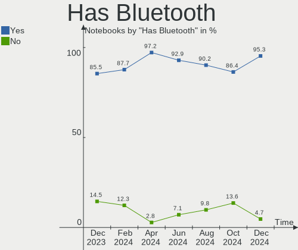
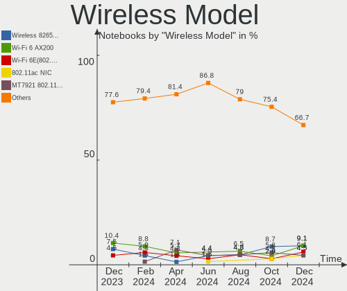

Manjaro Hardware Trends (Notebooks)
-----------------------------------

A project to identify most popular hardware characteristics and track their change
over time based on data collected by Manjaro users at https://Linux-Hardware.org.

Anyone can contribute to this report by the [hw-probe](https://github.com/linuxhw/hw-probe) tool:

    sudo -E hw-probe -all -upload

Full-feature report is available here: https://linux-hardware.org/?view=trends

Period: Feb, 2022.

Contents
--------

* [ System ](#system)
  - [ OS                       ](#os)
  - [ OS Family                ](#os-family)
  - [ Kernel                   ](#kernel)
  - [ Kernel Family            ](#kernel-family)
  - [ Kernel Major Ver.        ](#kernel-major-ver)
  - [ Arch                     ](#arch)
  - [ DE                       ](#de)
  - [ Display Server           ](#display-server)
  - [ Display Manager          ](#display-manager)
  - [ OS Lang                  ](#os-lang)
  - [ Boot Mode                ](#boot-mode)
  - [ Filesystem               ](#filesystem)
  - [ Part. scheme             ](#part-scheme)
  - [ Dual Boot with Linux/BSD ](#dual-boot-with-linuxbsd)
  - [ Dual Boot (Win)          ](#dual-boot-win)

* [ Board ](#board)
  - [ Vendor                   ](#vendor)
  - [ Model                    ](#model)
  - [ Model Family             ](#model-family)
  - [ MFG Year                 ](#mfg-year)
  - [ Form Factor              ](#form-factor)
  - [ Secure Boot              ](#secure-boot)
  - [ Coreboot                 ](#coreboot)
  - [ RAM Size                 ](#ram-size)
  - [ RAM Used                 ](#ram-used)
  - [ Total Drives             ](#total-drives)
  - [ Has CD-ROM               ](#has-cd-rom)
  - [ Has Ethernet             ](#has-ethernet)
  - [ Has WiFi                 ](#has-wifi)
  - [ Has Bluetooth            ](#has-bluetooth)

* [ Location ](#location)
  - [ Country                  ](#country)
  - [ City                     ](#city)

* [ Drives ](#drives)
  - [ Drive Vendor             ](#drive-vendor)
  - [ Drive Model              ](#drive-model)
  - [ HDD Vendor               ](#hdd-vendor)
  - [ SSD Vendor               ](#ssd-vendor)
  - [ Drive Kind               ](#drive-kind)
  - [ Drive Connector          ](#drive-connector)
  - [ Drive Size               ](#drive-size)
  - [ Space Total              ](#space-total)
  - [ Space Used               ](#space-used)
  - [ Malfunc. Drives          ](#malfunc-drives)
  - [ Malfunc. Drive Vendor    ](#malfunc-drive-vendor)
  - [ Malfunc. HDD Vendor      ](#malfunc-hdd-vendor)
  - [ Malfunc. Drive Kind      ](#malfunc-drive-kind)
  - [ Failed Drives            ](#failed-drives)
  - [ Failed Drive Vendor      ](#failed-drive-vendor)
  - [ Drive Status             ](#drive-status)

* [ Storage controller ](#storage-controller)
  - [ Storage Vendor           ](#storage-vendor)
  - [ Storage Model            ](#storage-model)
  - [ Storage Kind             ](#storage-kind)

* [ Processor ](#processor)
  - [ CPU Vendor               ](#cpu-vendor)
  - [ CPU Model                ](#cpu-model)
  - [ CPU Model Family         ](#cpu-model-family)
  - [ CPU Cores                ](#cpu-cores)
  - [ CPU Sockets              ](#cpu-sockets)
  - [ CPU Threads              ](#cpu-threads)
  - [ CPU Op-Modes             ](#cpu-op-modes)
  - [ CPU Microcode            ](#cpu-microcode)
  - [ CPU Microarch            ](#cpu-microarch)

* [ Graphics ](#graphics)
  - [ GPU Vendor               ](#gpu-vendor)
  - [ GPU Model                ](#gpu-model)
  - [ GPU Combo                ](#gpu-combo)
  - [ GPU Driver               ](#gpu-driver)
  - [ GPU Memory               ](#gpu-memory)

* [ Monitor ](#monitor)
  - [ Monitor Vendor           ](#monitor-vendor)
  - [ Monitor Model            ](#monitor-model)
  - [ Monitor Resolution       ](#monitor-resolution)
  - [ Monitor Diagonal         ](#monitor-diagonal)
  - [ Monitor Width            ](#monitor-width)
  - [ Aspect Ratio             ](#aspect-ratio)
  - [ Monitor Area             ](#monitor-area)
  - [ Pixel Density            ](#pixel-density)
  - [ Multiple Monitors        ](#multiple-monitors)

* [ Network ](#network)
  - [ Net Controller Vendor    ](#net-controller-vendor)
  - [ Net Controller Model     ](#net-controller-model)
  - [ Wireless Vendor          ](#wireless-vendor)
  - [ Wireless Model           ](#wireless-model)
  - [ Ethernet Vendor          ](#ethernet-vendor)
  - [ Ethernet Model           ](#ethernet-model)
  - [ Net Controller Kind      ](#net-controller-kind)
  - [ Used Controller          ](#used-controller)
  - [ NICs                     ](#nics)
  - [ IPv6                     ](#ipv6)

* [ Bluetooth ](#bluetooth)
  - [ Bluetooth Vendor         ](#bluetooth-vendor)
  - [ Bluetooth Model          ](#bluetooth-model)

* [ Sound ](#sound)
  - [ Sound Vendor             ](#sound-vendor)
  - [ Sound Model              ](#sound-model)

* [ Memory ](#memory)
  - [ Memory Vendor            ](#memory-vendor)
  - [ Memory Model             ](#memory-model)
  - [ Memory Kind              ](#memory-kind)
  - [ Memory Form Factor       ](#memory-form-factor)
  - [ Memory Size              ](#memory-size)
  - [ Memory Speed             ](#memory-speed)

* [ Printers & scanners ](#printers--scanners)
  - [ Printer Vendor           ](#printer-vendor)
  - [ Printer Model            ](#printer-model)
  - [ Scanner Vendor           ](#scanner-vendor)
  - [ Scanner Model            ](#scanner-model)

* [ Camera ](#camera)
  - [ Camera Vendor            ](#camera-vendor)
  - [ Camera Model             ](#camera-model)

* [ Security ](#security)
  - [ Fingerprint Vendor       ](#fingerprint-vendor)
  - [ Fingerprint Model        ](#fingerprint-model)
  - [ Chipcard Vendor          ](#chipcard-vendor)
  - [ Chipcard Model           ](#chipcard-model)

* [ Unsupported ](#unsupported)
  - [ Unsupported Devices      ](#unsupported-devices)
  - [ Unsupported Device Types ](#unsupported-device-types)

System
------

OS
--

Installed operating systems

| Name           | Notebooks | Percent |
|----------------|-----------|---------|
| Manjaro 21.2.3 | 37        | 44.58%  |
| Manjaro        | 31        | 37.35%  |
| Manjaro 21.2.2 | 10        | 12.05%  |
| Manjaro 21.2.4 | 2         | 2.41%   |
| Manjaro 21.2.0 | 1         | 1.2%    |
| Manjaro 21.1.0 | 1         | 1.2%    |
| Manjaro 21.0.7 | 1         | 1.2%    |

OS Family
---------

OS without a version

| Name    | Notebooks | Percent |
|---------|-----------|---------|
| Manjaro | 83        | 100%    |

Kernel
------

Version of the Linux kernel

| Version                 | Notebooks | Percent |
|-------------------------|-----------|---------|
| 5.15.21-1-MANJARO       | 21        | 25.3%   |
| 5.16.7-1-MANJARO        | 12        | 14.46%  |
| 5.15.16-1-MANJARO       | 9         | 10.84%  |
| 5.15.19-1-MANJARO       | 8         | 9.64%   |
| 5.15.25-1-MANJARO       | 5         | 6.02%   |
| 5.16.5-1-MANJARO        | 4         | 4.82%   |
| 5.10.96-1-MANJARO       | 4         | 4.82%   |
| 5.16.2-1-MANJARO        | 3         | 3.61%   |
| 5.15.7-1-MANJARO        | 3         | 3.61%   |
| 5.10.93-1-MANJARO       | 3         | 3.61%   |
| 5.9.16-1-MANJARO        | 2         | 2.41%   |
| 5.10.98-1-MANJARO       | 2         | 2.41%   |
| 5.16.9-2-MANJARO        | 1         | 1.2%    |
| 5.15.21-xanmod1-MANJARO | 1         | 1.2%    |
| 5.15.18-2-rt28-MANJARO  | 1         | 1.2%    |
| 5.15.13-1-rt26-MANJARO  | 1         | 1.2%    |
| 5.15.12-1-MANJARO       | 1         | 1.2%    |
| 5.13.19-2-MANJARO       | 1         | 1.2%    |
| 5.10.42-1-MANJARO       | 1         | 1.2%    |

Kernel Family
-------------

Linux kernel without a distro release

| Version | Notebooks | Percent |
|---------|-----------|---------|
| 5.15.21 | 22        | 26.51%  |
| 5.16.7  | 12        | 14.46%  |
| 5.15.16 | 9         | 10.84%  |
| 5.15.19 | 8         | 9.64%   |
| 5.15.25 | 5         | 6.02%   |
| 5.16.5  | 4         | 4.82%   |
| 5.10.96 | 4         | 4.82%   |
| 5.16.2  | 3         | 3.61%   |
| 5.15.7  | 3         | 3.61%   |
| 5.10.93 | 3         | 3.61%   |
| 5.9.16  | 2         | 2.41%   |
| 5.10.98 | 2         | 2.41%   |
| 5.16.9  | 1         | 1.2%    |
| 5.15.18 | 1         | 1.2%    |
| 5.15.13 | 1         | 1.2%    |
| 5.15.12 | 1         | 1.2%    |
| 5.13.19 | 1         | 1.2%    |
| 5.10.42 | 1         | 1.2%    |

Kernel Major Ver.
-----------------

Linux kernel major version

| Version | Notebooks | Percent |
|---------|-----------|---------|
| 5.15    | 50        | 60.24%  |
| 5.16    | 20        | 24.1%   |
| 5.10    | 10        | 12.05%  |
| 5.9     | 2         | 2.41%   |
| 5.13    | 1         | 1.2%    |

Arch
----

OS architecture (x86_64, i586, etc.)

| Name   | Notebooks | Percent |
|--------|-----------|---------|
| x86_64 | 83        | 100%    |

DE
--

Desktop Environment

| Name         | Notebooks | Percent |
|--------------|-----------|---------|
| KDE5         | 39        | 46.99%  |
| XFCE         | 24        | 28.92%  |
| GNOME        | 15        | 18.07%  |
| Unknown      | 2         | 2.41%   |
| sway         | 1         | 1.2%    |
| i3           | 1         | 1.2%    |
| herbstluftwm | 1         | 1.2%    |

Display Server
--------------

X11 or Wayland

| Name    | Notebooks | Percent |
|---------|-----------|---------|
| X11     | 69        | 83.13%  |
| Wayland | 13        | 15.66%  |
| Unknown | 1         | 1.2%    |

Display Manager
---------------

SDDM, LightDM, etc.

| Name    | Notebooks | Percent |
|---------|-----------|---------|
| Unknown | 32        | 38.55%  |
| SDDM    | 21        | 25.3%   |
| LightDM | 18        | 21.69%  |
| GDM     | 12        | 14.46%  |

OS Lang
-------

Language

| Lang  | Notebooks | Percent |
|-------|-----------|---------|
| en_US | 35        | 42.17%  |
| en_GB | 8         | 9.64%   |
| de_DE | 7         | 8.43%   |
| es_ES | 4         | 4.82%   |
| zh_CN | 3         | 3.61%   |
| ru_RU | 3         | 3.61%   |
| es_MX | 3         | 3.61%   |
| pl_PL | 2         | 2.41%   |
| fr_FR | 2         | 2.41%   |
| en_IN | 2         | 2.41%   |
| en_CA | 2         | 2.41%   |
| en_AU | 2         | 2.41%   |
| tr_TR | 1         | 1.2%    |
| sv_SE | 1         | 1.2%    |
| nl_BE | 1         | 1.2%    |
| ja_JP | 1         | 1.2%    |
| et_EE | 1         | 1.2%    |
| es_AR | 1         | 1.2%    |
| en_PH | 1         | 1.2%    |
| en_IE | 1         | 1.2%    |
| en_DK | 1         | 1.2%    |
| C     | 1         | 1.2%    |

Boot Mode
---------

EFI or BIOS

| Mode | Notebooks | Percent |
|------|-----------|---------|
| BIOS | 47        | 56.63%  |
| EFI  | 36        | 43.37%  |

Filesystem
----------

Type of filesystem

| Type    | Notebooks | Percent |
|---------|-----------|---------|
| Ext4    | 72        | 86.75%  |
| Overlay | 4         | 4.82%   |
| Btrfs   | 3         | 3.61%   |
| Xfs     | 2         | 2.41%   |
| Tmpfs   | 1         | 1.2%    |
| F2fs    | 1         | 1.2%    |

Part. scheme
------------

Scheme of partitioning

| Type    | Notebooks | Percent |
|---------|-----------|---------|
| Unknown | 44        | 53.01%  |
| GPT     | 36        | 43.37%  |
| MBR     | 3         | 3.61%   |

Dual Boot with Linux/BSD
------------------------

Hosting more than one Linux/BSD

| Dual boot | Notebooks | Percent |
|-----------|-----------|---------|
| No        | 76        | 91.57%  |
| Yes       | 7         | 8.43%   |

Dual Boot (Win)
---------------

Hosting Linux and Windows

| Dual boot | Notebooks | Percent |
|-----------|-----------|---------|
| No        | 56        | 67.47%  |
| Yes       | 27        | 32.53%  |

Board
-----

Vendor
------

Motherboard manufacturer

| Name                 | Notebooks | Percent |
|----------------------|-----------|---------|
| Lenovo               | 18        | 21.69%  |
| Hewlett-Packard      | 12        | 14.46%  |
| Dell                 | 12        | 14.46%  |
| ASUSTek Computer     | 12        | 14.46%  |
| Acer                 | 7         | 8.43%   |
| MSI                  | 6         | 7.23%   |
| Toshiba              | 4         | 4.82%   |
| Samsung Electronics  | 2         | 2.41%   |
| Google               | 2         | 2.41%   |
| Timi                 | 1         | 1.2%    |
| PC Specialist        | 1         | 1.2%    |
| Packard Bell         | 1         | 1.2%    |
| Intel Client Systems | 1         | 1.2%    |
| HUAWEI               | 1         | 1.2%    |
| HONOR                | 1         | 1.2%    |
| Gateway              | 1         | 1.2%    |
| Apple                | 1         | 1.2%    |

Model
-----

Motherboard model

| Name                                                     | Notebooks | Percent |
|----------------------------------------------------------|-----------|---------|
| HP Notebook                                              | 3         | 3.61%   |
| Dell Inspiron 15 7000 Gaming                             | 2         | 2.41%   |
| ASUS ROG Strix G513QY_G513QY                             | 2         | 2.41%   |
| Toshiba Satellite U900                                   | 1         | 1.2%    |
| Toshiba Satellite L300                                   | 1         | 1.2%    |
| Toshiba Satellite C870D-11F                              | 1         | 1.2%    |
| Toshiba Satellite C655D                                  | 1         | 1.2%    |
| Timi RedmiBook 13 R                                      | 1         | 1.2%    |
| Samsung 300E5EV/300E4EV/270E5EV/270E4EV/2470EV/2470EE    | 1         | 1.2%    |
| Samsung 300E4A/300E5A/300E7A/3430EA/3530EA               | 1         | 1.2%    |
| PC Specialist NH5x_7xRCx,RDx                             | 1         | 1.2%    |
| Packard Bell EasyNote TK85                               | 1         | 1.2%    |
| MSI P65 Creator 9SD                                      | 1         | 1.2%    |
| MSI GT72 6QD                                             | 1         | 1.2%    |
| MSI GT680R/GX680R/GT683R/GT683DXR/GT685R/GT687R/GX660DXR | 1         | 1.2%    |
| MSI GS60 2PE                                             | 1         | 1.2%    |
| MSI GP66 Leopard 11UG                                    | 1         | 1.2%    |
| MSI GE76 Raider 11UH                                     | 1         | 1.2%    |
| Lenovo Yoga Slim 7 Carbon 14ACN6 82L0                    | 1         | 1.2%    |
| Lenovo XiaoXinPro 16ACH 2021 82L5                        | 1         | 1.2%    |
| Lenovo V330-15IKB 81AX                                   | 1         | 1.2%    |
| Lenovo ThinkPad W520 427637U                             | 1         | 1.2%    |
| Lenovo ThinkPad ThinkPad L14 20U5000UUS                  | 1         | 1.2%    |
| Lenovo ThinkPad T450s 20BWS06K0G                         | 1         | 1.2%    |
| Lenovo ThinkPad P51 20HHCTO1WW                           | 1         | 1.2%    |
| Lenovo ThinkPad E495 20NES01600                          | 1         | 1.2%    |
| Lenovo ThinkPad E490 20N80029GE                          | 1         | 1.2%    |
| Lenovo Legion R9000P2021H 82JQ                           | 1         | 1.2%    |
| Lenovo IdeaPad S340-15API 81NC                           | 1         | 1.2%    |
| Lenovo IdeaPad S145-15IWL 81MV                           | 1         | 1.2%    |
| Lenovo IdeaPad S145-15IIL 81W8                           | 1         | 1.2%    |
| Lenovo IdeaPad 730S-13IWL 81JB                           | 1         | 1.2%    |
| Lenovo IdeaPad 5 Pro 16ACH6 82L5                         | 1         | 1.2%    |
| Lenovo IdeaPad 5 15IIL05 81YK                            | 1         | 1.2%    |
| Lenovo IdeaPad 330-15ARR 81D2                            | 1         | 1.2%    |
| Lenovo IdeaPad 320-15ISK 80XH                            | 1         | 1.2%    |
| Intel Client Systems LAPBC710                            | 1         | 1.2%    |
| HUAWEI HVY-WXX9                                          | 1         | 1.2%    |
| HONOR BMH-WCX9                                           | 1         | 1.2%    |
| HP Pavilion g7                                           | 1         | 1.2%    |
| HP Pavilion g6                                           | 1         | 1.2%    |
| HP OMEN by Laptop                                        | 1         | 1.2%    |
| HP Laptop 15s-dr1xxx                                     | 1         | 1.2%    |
| HP ENVY Laptop 13-ba1xxx                                 | 1         | 1.2%    |
| HP EliteBook Folio 1040 G2                               | 1         | 1.2%    |
| HP EliteBook 850 G7 Notebook PC                          | 1         | 1.2%    |
| HP EliteBook 745 G3                                      | 1         | 1.2%    |
| HP 250 G8 Notebook PC                                    | 1         | 1.2%    |
| Google Chell                                             | 1         | 1.2%    |
| Google Celes                                             | 1         | 1.2%    |
| Gateway NV57H                                            | 1         | 1.2%    |
| Dell XPS 15 9500                                         | 1         | 1.2%    |
| Dell Latitude E6420                                      | 1         | 1.2%    |
| Dell Latitude E5530 non-vPro                             | 1         | 1.2%    |
| Dell Latitude 9420                                       | 1         | 1.2%    |
| Dell Latitude 7490                                       | 1         | 1.2%    |
| Dell Latitude 5420                                       | 1         | 1.2%    |
| Dell Inspiron 5567                                       | 1         | 1.2%    |
| Dell Inspiron 5558                                       | 1         | 1.2%    |
| Dell Inspiron 5548                                       | 1         | 1.2%    |

Model Family
------------

Motherboard model prefix

| Name                          | Notebooks | Percent |
|-------------------------------|-----------|---------|
| Lenovo IdeaPad                | 8         | 9.64%   |
| Lenovo ThinkPad               | 6         | 7.23%   |
| Dell Inspiron                 | 6         | 7.23%   |
| Dell Latitude                 | 5         | 6.02%   |
| Toshiba Satellite             | 4         | 4.82%   |
| HP Notebook                   | 3         | 3.61%   |
| HP EliteBook                  | 3         | 3.61%   |
| ASUS ROG                      | 3         | 3.61%   |
| Acer Aspire                   | 3         | 3.61%   |
| HP Pavilion                   | 2         | 2.41%   |
| ASUS VivoBook                 | 2         | 2.41%   |
| ASUS ASUS                     | 2         | 2.41%   |
| Acer Swift                    | 2         | 2.41%   |
| Timi RedmiBook                | 1         | 1.2%    |
| Samsung 300E5EV               | 1         | 1.2%    |
| Samsung 300E4A                | 1         | 1.2%    |
| PC Specialist NH5x            | 1         | 1.2%    |
| Packard Bell EasyNote         | 1         | 1.2%    |
| MSI P65                       | 1         | 1.2%    |
| MSI GT72                      | 1         | 1.2%    |
| MSI GT680R                    | 1         | 1.2%    |
| MSI GS60                      | 1         | 1.2%    |
| MSI GP66                      | 1         | 1.2%    |
| MSI GE76                      | 1         | 1.2%    |
| Lenovo Yoga                   | 1         | 1.2%    |
| Lenovo XiaoXinPro             | 1         | 1.2%    |
| Lenovo V330-15IKB             | 1         | 1.2%    |
| Lenovo Legion                 | 1         | 1.2%    |
| Intel Client Systems LAPBC710 | 1         | 1.2%    |
| HUAWEI HVY-WXX9               | 1         | 1.2%    |
| HONOR BMH-WCX9                | 1         | 1.2%    |
| HP OMEN                       | 1         | 1.2%    |
| HP Laptop                     | 1         | 1.2%    |
| HP ENVY                       | 1         | 1.2%    |
| HP 250                        | 1         | 1.2%    |
| Google Chell                  | 1         | 1.2%    |
| Google Celes                  | 1         | 1.2%    |
| Gateway NV57H                 | 1         | 1.2%    |
| Dell XPS                      | 1         | 1.2%    |
| ASUS ZenBook                  | 1         | 1.2%    |
| ASUS X55A                     | 1         | 1.2%    |
| ASUS X555LAB                  | 1         | 1.2%    |
| ASUS UX303UB                  | 1         | 1.2%    |
| ASUS G74Sx                    | 1         | 1.2%    |
| Apple MacBookAir3             | 1         | 1.2%    |
| Acer TravelMate               | 1         | 1.2%    |
| Acer Nitro                    | 1         | 1.2%    |

MFG Year
--------

Motherboard manufacture year

| Year | Notebooks | Percent |
|------|-----------|---------|
| 2021 | 17        | 20.48%  |
| 2020 | 12        | 14.46%  |
| 2019 | 11        | 13.25%  |
| 2011 | 9         | 10.84%  |
| 2018 | 7         | 8.43%   |
| 2017 | 7         | 8.43%   |
| 2015 | 7         | 8.43%   |
| 2012 | 5         | 6.02%   |
| 2014 | 3         | 3.61%   |
| 2016 | 2         | 2.41%   |
| 2010 | 2         | 2.41%   |
| 2008 | 1         | 1.2%    |

Form Factor
-----------

Physical design of the computer

| Name     | Notebooks | Percent |
|----------|-----------|---------|
| Notebook | 83        | 100%    |

Secure Boot
-----------

Enabled or disabled

| State    | Notebooks | Percent |
|----------|-----------|---------|
| Disabled | 83        | 100%    |

Coreboot
--------

Have coreboot on board

| Used | Notebooks | Percent |
|------|-----------|---------|
| No   | 81        | 97.59%  |
| Yes  | 2         | 2.41%   |

RAM Size
--------

Total RAM memory

| Size in GB  | Notebooks | Percent |
|-------------|-----------|---------|
| 4.01-8.0    | 24        | 28.92%  |
| 16.01-24.0  | 19        | 22.89%  |
| 8.01-16.0   | 18        | 21.69%  |
| 32.01-64.0  | 9         | 10.84%  |
| 3.01-4.0    | 9         | 10.84%  |
| 64.01-256.0 | 2         | 2.41%   |
| 1.01-2.0    | 2         | 2.41%   |

RAM Used
--------

Used RAM memory

| Used GB   | Notebooks | Percent |
|-----------|-----------|---------|
| 4.01-8.0  | 21        | 25.3%   |
| 1.01-2.0  | 21        | 25.3%   |
| 2.01-3.0  | 18        | 21.69%  |
| 3.01-4.0  | 15        | 18.07%  |
| 8.01-16.0 | 6         | 7.23%   |
| 0.51-1.0  | 2         | 2.41%   |

Total Drives
------------

Number of drives on board

| Drives | Notebooks | Percent |
|--------|-----------|---------|
| 1      | 56        | 67.47%  |
| 2      | 21        | 25.3%   |
| 3      | 6         | 7.23%   |

Has CD-ROM
----------

Has CD-ROM on board

| Presented | Notebooks | Percent |
|-----------|-----------|---------|
| No        | 61        | 73.49%  |
| Yes       | 22        | 26.51%  |

Has Ethernet
------------

Has Ethernet on board

| Presented | Notebooks | Percent |
|-----------|-----------|---------|
| Yes       | 60        | 72.29%  |
| No        | 23        | 27.71%  |

Has WiFi
--------

Has WiFi module

| Presented | Notebooks | Percent |
|-----------|-----------|---------|
| Yes       | 83        | 100%    |

Has Bluetooth
-------------

Has Bluetooth module

| Presented | Notebooks | Percent |
|-----------|-----------|---------|
| Yes       | 70        | 84.34%  |
| No        | 13        | 15.66%  |

Location
--------

Country
-------

Geographic location (country)

| Country     | Notebooks | Percent |
|-------------|-----------|---------|
| USA         | 11        | 13.25%  |
| Germany     | 10        | 12.05%  |
| Spain       | 5         | 6.02%   |
| Mexico      | 5         | 6.02%   |
| Ukraine     | 4         | 4.82%   |
| UK          | 4         | 4.82%   |
| Russia      | 4         | 4.82%   |
| Turkey      | 3         | 3.61%   |
| Poland      | 3         | 3.61%   |
| Taiwan      | 2         | 2.41%   |
| India       | 2         | 2.41%   |
| France      | 2         | 2.41%   |
| China       | 2         | 2.41%   |
| Canada      | 2         | 2.41%   |
| Belgium     | 2         | 2.41%   |
| Argentina   | 2         | 2.41%   |
| Venezuela   | 1         | 1.2%    |
| Switzerland | 1         | 1.2%    |
| Sweden      | 1         | 1.2%    |
| Serbia      | 1         | 1.2%    |
| Philippines | 1         | 1.2%    |
| Norway      | 1         | 1.2%    |
| Netherlands | 1         | 1.2%    |
| Morocco     | 1         | 1.2%    |
| Japan       | 1         | 1.2%    |
| Italy       | 1         | 1.2%    |
| Indonesia   | 1         | 1.2%    |
| Hungary     | 1         | 1.2%    |
| Georgia     | 1         | 1.2%    |
| Ethiopia    | 1         | 1.2%    |
| Estonia     | 1         | 1.2%    |
| El Salvador | 1         | 1.2%    |
| Denmark     | 1         | 1.2%    |
| Brazil      | 1         | 1.2%    |
| Austria     | 1         | 1.2%    |
| Australia   | 1         | 1.2%    |

City
----

Geographic location (city)

| City                   | Notebooks | Percent |
|------------------------|-----------|---------|
| Kyiv                   | 3         | 3.61%   |
| Perleberg              | 2         | 2.41%   |
| Moscow                 | 2         | 2.41%   |
| Istanbul               | 2         | 2.41%   |
| Fleet                  | 2         | 2.41%   |
| Wolgast                | 1         | 1.2%    |
| Włocławek      | 1         | 1.2%    |
| Vreden                 | 1         | 1.2%    |
| Vitoria de Santo Antao | 1         | 1.2%    |
| Villa María         | 1         | 1.2%    |
| Villa Adelina          | 1         | 1.2%    |
| Vienna                 | 1         | 1.2%    |
| Tijuana                | 1         | 1.2%    |
| The Hague              | 1         | 1.2%    |
| Tbilisi                | 1         | 1.2%    |
| Tallinn                | 1         | 1.2%    |
| St Petersburg          | 1         | 1.2%    |
| Slagelse               | 1         | 1.2%    |
| Shenzhen               | 1         | 1.2%    |
| Schwerin               | 1         | 1.2%    |
| Sarasota               | 1         | 1.2%    |
| San Salvador           | 1         | 1.2%    |
| Raleigh                | 1         | 1.2%    |
| Pune                   | 1         | 1.2%    |
| Poznan                 | 1         | 1.2%    |
| Perth                  | 1         | 1.2%    |
| Paris                  | 1         | 1.2%    |
| Palma                  | 1         | 1.2%    |
| Oslo                   | 1         | 1.2%    |
| Niš                 | 1         | 1.2%    |
| Nagpur                 | 1         | 1.2%    |
| Muelheim-Kaerlich      | 1         | 1.2%    |
| Montreal               | 1         | 1.2%    |
| Monterrey              | 1         | 1.2%    |
| Monmouth               | 1         | 1.2%    |
| Milan                  | 1         | 1.2%    |
| Mexico City            | 1         | 1.2%    |
| Mexico                 | 1         | 1.2%    |
| Meridian               | 1         | 1.2%    |
| Mechelen               | 1         | 1.2%    |
| Mariupol               | 1         | 1.2%    |
| Mandaluyong City       | 1         | 1.2%    |
| Malmo                  | 1         | 1.2%    |
| Madrid                 | 1         | 1.2%    |
| Lugano                 | 1         | 1.2%    |
| Luborzyca              | 1         | 1.2%    |
| Los Angeles            | 1         | 1.2%    |
| London                 | 1         | 1.2%    |
| Linares                | 1         | 1.2%    |
| Las Vegas              | 1         | 1.2%    |
| Kiel                   | 1         | 1.2%    |
| Kaohsiung City         | 1         | 1.2%    |
| Jette                  | 1         | 1.2%    |
| Jakarta                | 1         | 1.2%    |
| Hsinchu                | 1         | 1.2%    |
| Greoux-les-Bains       | 1         | 1.2%    |
| Grand Blanc            | 1         | 1.2%    |
| Fes                    | 1         | 1.2%    |
| Fürth               | 1         | 1.2%    |
| Endicott               | 1         | 1.2%    |

Drives
------

Drive Vendor
------------

Hard drive vendors

| Vendor                         | Notebooks | Drives | Percent |
|--------------------------------|-----------|--------|---------|
| Samsung Electronics            | 17        | 19     | 15.04%  |
| WDC                            | 15        | 15     | 13.27%  |
| Seagate                        | 11        | 11     | 9.73%   |
| SK Hynix                       | 10        | 11     | 8.85%   |
| Intel                          | 9         | 9      | 7.96%   |
| Unknown                        | 7         | 7      | 6.19%   |
| Toshiba                        | 5         | 5      | 4.42%   |
| Crucial                        | 4         | 4      | 3.54%   |
| SanDisk                        | 3         | 3      | 2.65%   |
| Micron Technology              | 3         | 3      | 2.65%   |
| A-DATA Technology              | 3         | 3      | 2.65%   |
| Union Memory (Shenzhen)        | 2         | 2      | 1.77%   |
| Kingston                       | 2         | 2      | 1.77%   |
| Hitachi                        | 2         | 2      | 1.77%   |
| HGST                           | 2         | 2      | 1.77%   |
| Hewlett-Packard                | 2         | 2      | 1.77%   |
| ZHITAI                         | 1         | 1      | 0.88%   |
| Yangtze Memory Technologies    | 1         | 1      | 0.88%   |
| Solid State Storage Technology | 1         | 1      | 0.88%   |
| SABRENT                        | 1         | 1      | 0.88%   |
| RX7                            | 1         | 1      | 0.88%   |
| PLEXTOR                        | 1         | 1      | 0.88%   |
| Phison                         | 1         | 1      | 0.88%   |
| OCZ-VERTEX3                    | 1         | 1      | 0.88%   |
| OCZ-OCTANE                     | 1         | 1      | 0.88%   |
| Micron/Crucial Technology      | 1         | 1      | 0.88%   |
| LITEON                         | 1         | 1      | 0.88%   |
| KingSpec                       | 1         | 1      | 0.88%   |
| Gigabyte Technology            | 1         | 1      | 0.88%   |
| Apple                          | 1         | 1      | 0.88%   |
| ADATA Technology               | 1         | 1      | 0.88%   |
| Unknown                        | 1         | 1      | 0.88%   |

Drive Model
-----------

Hard drive models

| Model                                        | Notebooks | Percent |
|----------------------------------------------|-----------|---------|
| Samsung SM963 2.5" NVMe PCIe SSD 256GB       | 3         | 2.63%   |
| WDC WD10SPZX-24Z10 1TB                       | 2         | 1.75%   |
| Unknown SD/MMC/MS PRO 64GB                   | 2         | 1.75%   |
| Union Memory (Shenzhen) NVMe SSD Drive 256GB | 2         | 1.75%   |
| SK Hynix NVMe SSD Drive 512GB                | 2         | 1.75%   |
| Seagate ST500LM021-1KJ152 500GB              | 2         | 1.75%   |
| Samsung NVMe SSD Drive 512GB                 | 2         | 1.75%   |
| Samsung NVMe SSD Drive 1024GB                | 2         | 1.75%   |
| Intel SSDPEKNW512G8 512GB                    | 2         | 1.75%   |
| ZHITAI TiPro7000 1TB                         | 1         | 0.88%   |
| Yangtze Memory NVMe SSD Drive 1TB            | 1         | 0.88%   |
| WDC WDS500G3X0C-00SJG0 500GB                 | 1         | 0.88%   |
| WDC WDS500G2B0B 500GB SSD                    | 1         | 0.88%   |
| WDC WDS500G2B0A 500GB SSD                    | 1         | 0.88%   |
| WDC WDS120G2G0A-00JH30 120GB SSD             | 1         | 0.88%   |
| WDC WDS100T2B0B 1TB SSD                      | 1         | 0.88%   |
| WDC WDBNCE5000PNC 500GB SSD                  | 1         | 0.88%   |
| WDC WD5000LPCX-60VHAT0 500GB                 | 1         | 0.88%   |
| WDC WD5000BPVT-22HXZT3 500GB                 | 1         | 0.88%   |
| WDC WD5000BEKT-22KA9T0 500GB                 | 1         | 0.88%   |
| WDC WD10SPZX-60Z10T0 1TB                     | 1         | 0.88%   |
| WDC WD10JPVX-75JC3T0 1TB                     | 1         | 0.88%   |
| WDC PC SN730 SDBPNTY-1T00-1101 1TB           | 1         | 0.88%   |
| WDC PC SN520 SDAPMUW-128G-1101 128GB         | 1         | 0.88%   |
| Unknown xD/SD/M.S.                           | 1         | 0.88%   |
| Unknown SU32G  32GB                          | 1         | 0.88%   |
| Unknown SDU1  64GB                           | 1         | 0.88%   |
| Unknown MMC Card  16GB                       | 1         | 0.88%   |
| Unknown BJNB4R  32GB                         | 1         | 0.88%   |
| Toshiba NVMe SSD Drive 512GB                 | 1         | 0.88%   |
| Toshiba MQ04ABF100 1TB                       | 1         | 0.88%   |
| Toshiba MQ01ABD050 500GB                     | 1         | 0.88%   |
| Toshiba MQ01ABD032 320GB                     | 1         | 0.88%   |
| Toshiba MQ01ABC150 1TB                       | 1         | 0.88%   |
| Solid State Storage NVMe SSD Drive 512GB     | 1         | 0.88%   |
| SK Hynix SKHynix_HFS512GDE9X084N 512GB       | 1         | 0.88%   |
| SK Hynix SKHynix_HFM512GDHTNI-87A0B 512GB    | 1         | 0.88%   |
| SK Hynix SHGP31-1000GM-2 1TB                 | 1         | 0.88%   |
| SK Hynix SC300 2.5 7MM 256GB SSD             | 1         | 0.88%   |
| SK Hynix PC611 NVMe 1TB                      | 1         | 0.88%   |
| SK Hynix NVMe SSD Drive 1024GB               | 1         | 0.88%   |
| SK Hynix HFS256G32MND-2200A 256GB SSD        | 1         | 0.88%   |
| SK Hynix BC511 HFM256GDJTNI-82A0A 256GB      | 1         | 0.88%   |
| Seagate ST9750420AS 752GB                    | 1         | 0.88%   |
| Seagate ST9500420AS 500GB                    | 1         | 0.88%   |
| Seagate ST9250410AS 250GB                    | 1         | 0.88%   |
| Seagate ST9250315AS 250GB                    | 1         | 0.88%   |
| Seagate ST320LM000 HM321HI 320GB             | 1         | 0.88%   |
| Seagate ST2000LM015-2E8174 2TB               | 1         | 0.88%   |
| Seagate ST1000LM035-1RK172 1TB               | 1         | 0.88%   |
| Seagate ST1000LM024 HN-M101MBB 1TB           | 1         | 0.88%   |
| Seagate Expansion Desk 8TB                   | 1         | 0.88%   |
| Sandisk NVMe SSD Drive 512GB                 | 1         | 0.88%   |
| Sandisk NVMe SSD Drive 256GB                 | 1         | 0.88%   |
| SanDisk DF4064  64GB                         | 1         | 0.88%   |
| Samsung SSD 980 PRO 1TB                      | 1         | 0.88%   |
| Samsung SSD 970 EVO 500GB                    | 1         | 0.88%   |
| Samsung SSD 860 EVO 1TB                      | 1         | 0.88%   |
| Samsung SSD 850 EVO 500GB                    | 1         | 0.88%   |
| Samsung PM991a NVMe 1024GB                   | 1         | 0.88%   |

HDD Vendor
----------

Hard disk drive vendors

| Vendor  | Notebooks | Drives | Percent |
|---------|-----------|--------|---------|
| Seagate | 11        | 11     | 37.93%  |
| WDC     | 7         | 7      | 24.14%  |
| Toshiba | 4         | 4      | 13.79%  |
| Unknown | 2         | 2      | 6.9%    |
| Hitachi | 2         | 2      | 6.9%    |
| HGST    | 2         | 2      | 6.9%    |
| SABRENT | 1         | 1      | 3.45%   |

SSD Vendor
----------

Solid state drive vendors

| Vendor              | Notebooks | Drives | Percent |
|---------------------|-----------|--------|---------|
| WDC                 | 5         | 5      | 17.24%  |
| Samsung Electronics | 4         | 4      | 13.79%  |
| Crucial             | 4         | 4      | 13.79%  |
| Intel               | 3         | 3      | 10.34%  |
| SK Hynix            | 2         | 2      | 6.9%    |
| OCZ-VERTEX3         | 1         | 1      | 3.45%   |
| OCZ-OCTANE          | 1         | 1      | 3.45%   |
| Micron Technology   | 1         | 1      | 3.45%   |
| LITEON              | 1         | 1      | 3.45%   |
| Kingston            | 1         | 1      | 3.45%   |
| KingSpec            | 1         | 1      | 3.45%   |
| Hewlett-Packard     | 1         | 1      | 3.45%   |
| Gigabyte Technology | 1         | 1      | 3.45%   |
| Apple               | 1         | 1      | 3.45%   |
| A-DATA Technology   | 1         | 1      | 3.45%   |
| Unknown             | 1         | 1      | 3.45%   |

Drive Kind
----------

HDD or SSD

| Kind    | Notebooks | Drives | Percent |
|---------|-----------|--------|---------|
| NVMe    | 44        | 50     | 42.31%  |
| SSD     | 26        | 29     | 25%     |
| HDD     | 26        | 29     | 25%     |
| MMC     | 5         | 5      | 4.81%   |
| Unknown | 3         | 3      | 2.88%   |

Drive Connector
---------------

SATA, SAS, NVMe, etc.

| Type | Notebooks | Drives | Percent |
|------|-----------|--------|---------|
| SATA | 47        | 55     | 46.08%  |
| NVMe | 44        | 50     | 43.14%  |
| SAS  | 6         | 6      | 5.88%   |
| MMC  | 5         | 5      | 4.9%    |

Drive Size
----------

Size of hard drive

| Size in TB | Notebooks | Drives | Percent |
|------------|-----------|--------|---------|
| 0.01-0.5   | 34        | 39     | 65.38%  |
| 0.51-1.0   | 16        | 17     | 30.77%  |
| 1.01-2.0   | 1         | 1      | 1.92%   |
| 4.01-10.0  | 1         | 1      | 1.92%   |

Space Total
-----------

Amount of disk space available on the file system

| Size in GB     | Notebooks | Percent |
|----------------|-----------|---------|
| 251-500        | 22        | 26.51%  |
| 101-250        | 18        | 21.69%  |
| 501-1000       | 12        | 14.46%  |
| Unknown        | 8         | 9.64%   |
| 21-50          | 6         | 7.23%   |
| 1-20           | 6         | 7.23%   |
| 51-100         | 5         | 6.02%   |
| More than 3000 | 2         | 2.41%   |
| 2001-3000      | 2         | 2.41%   |
| 1001-2000      | 2         | 2.41%   |

Space Used
----------

Amount of used disk space

| Used GB        | Notebooks | Percent |
|----------------|-----------|---------|
| 1-20           | 26        | 31.33%  |
| 21-50          | 15        | 18.07%  |
| 101-250        | 13        | 15.66%  |
| Unknown        | 8         | 9.64%   |
| 51-100         | 7         | 8.43%   |
| 251-500        | 6         | 7.23%   |
| 501-1000       | 4         | 4.82%   |
| 1001-2000      | 3         | 3.61%   |
| More than 3000 | 1         | 1.2%    |

Malfunc. Drives
---------------

Drive models with a malfunction

| Model                                               | Notebooks | Drives | Percent |
|-----------------------------------------------------|-----------|--------|---------|
| Toshiba MQ01ABD050 500GB                            | 1         | 1      | 14.29%  |
| Seagate ST9750420AS 752GB                           | 1         | 1      | 14.29%  |
| Seagate ST9250315AS 250GB                           | 1         | 1      | 14.29%  |
| Micron Technology MTFDDAV512TBN-1AR15ABHA 512GB SSD | 1         | 1      | 14.29%  |
| Hitachi HTS543232A7A384 320GB                       | 1         | 1      | 14.29%  |
| Crucial CT256M550SSD4 256GB                         | 1         | 1      | 14.29%  |
| Unknown                                             | 1         | 1      | 14.29%  |

Malfunc. Drive Vendor
---------------------

Vendors of faulty drives

| Vendor            | Notebooks | Drives | Percent |
|-------------------|-----------|--------|---------|
| Seagate           | 2         | 2      | 28.57%  |
| Toshiba           | 1         | 1      | 14.29%  |
| Micron Technology | 1         | 1      | 14.29%  |
| Hitachi           | 1         | 1      | 14.29%  |
| Crucial           | 1         | 1      | 14.29%  |
| Unknown           | 1         | 1      | 14.29%  |

Malfunc. HDD Vendor
-------------------

Vendors of faulty HDD drives

| Vendor  | Notebooks | Drives | Percent |
|---------|-----------|--------|---------|
| Seagate | 2         | 2      | 50%     |
| Toshiba | 1         | 1      | 25%     |
| Hitachi | 1         | 1      | 25%     |

Malfunc. Drive Kind
-------------------

Kinds of faulty drives

| Kind | Notebooks | Drives | Percent |
|------|-----------|--------|---------|
| HDD  | 4         | 4      | 66.67%  |
| SSD  | 2         | 3      | 33.33%  |

Failed Drives
-------------

Failed drive models

Zero info for selected period =(

Failed Drive Vendor
-------------------

Failed drive vendors

Zero info for selected period =(

Drive Status
------------

Number of failed and malfunc. drives

| Status   | Notebooks | Drives | Percent |
|----------|-----------|--------|---------|
| Detected | 55        | 66     | 59.14%  |
| Works    | 32        | 43     | 34.41%  |
| Malfunc  | 6         | 7      | 6.45%   |

Storage controller
------------------

Storage Vendor
--------------

Storage controller vendors

| Vendor                         | Notebooks | Percent |
|--------------------------------|-----------|---------|
| Intel                          | 52        | 49.06%  |
| Samsung Electronics            | 14        | 13.21%  |
| AMD                            | 12        | 11.32%  |
| SK Hynix                       | 8         | 7.55%   |
| Sandisk                        | 5         | 4.72%   |
| Union Memory (Shenzhen)        | 2         | 1.89%   |
| Micron Technology              | 2         | 1.89%   |
| ADATA Technology               | 2         | 1.89%   |
| Yangtze Memory Technologies    | 1         | 0.94%   |
| Toshiba America Info Systems   | 1         | 0.94%   |
| Solid State Storage Technology | 1         | 0.94%   |
| Realtek Semiconductor          | 1         | 0.94%   |
| Phison Electronics             | 1         | 0.94%   |
| Nvidia                         | 1         | 0.94%   |
| Micron/Crucial Technology      | 1         | 0.94%   |
| Lite-On Technology             | 1         | 0.94%   |
| Kingston Technology Company    | 1         | 0.94%   |

Storage Model
-------------

Storage controller models

| Model                                                                            | Notebooks | Percent |
|----------------------------------------------------------------------------------|-----------|---------|
| AMD FCH SATA Controller [AHCI mode]                                              | 11        | 9.91%   |
| Intel Volume Management Device NVMe RAID Controller                              | 7         | 6.31%   |
| Samsung NVMe SSD Controller SM981/PM981/PM983                                    | 6         | 5.41%   |
| Intel 82801 Mobile SATA Controller [RAID mode]                                   | 6         | 5.41%   |
| Intel 6 Series/C200 Series Chipset Family 6 port Mobile SATA AHCI Controller     | 6         | 5.41%   |
| SK Hynix Gold P31 SSD                                                            | 5         | 4.5%    |
| Intel Sunrise Point-LP SATA Controller [AHCI mode]                               | 5         | 4.5%    |
| Intel 7 Series Chipset Family 6-port SATA Controller [AHCI mode]                 | 5         | 4.5%    |
| Samsung NVMe SSD Controller 980                                                  | 4         | 3.6%    |
| Intel Wildcat Point-LP SATA Controller [AHCI Mode]                               | 4         | 3.6%    |
| Intel HM170/QM170 Chipset SATA Controller [AHCI Mode]                            | 4         | 3.6%    |
| Intel SSD 660P Series                                                            | 3         | 2.7%    |
| Union Memory (Shenzhen) Non-Volatile memory controller                           | 2         | 1.8%    |
| SK Hynix BC511                                                                   | 2         | 1.8%    |
| Sandisk WD Black SN750 / PC SN730 NVMe SSD                                       | 2         | 1.8%    |
| Samsung NVMe SSD Controller PM9A1/PM9A3/980PRO                                   | 2         | 1.8%    |
| Micron Non-Volatile memory controller                                            | 2         | 1.8%    |
| Intel Tiger Lake-LP SATA Controller [AHCI mode]                                  | 2         | 1.8%    |
| Intel Non-Volatile memory controller                                             | 2         | 1.8%    |
| Intel Ice Lake-LP SATA Controller [AHCI mode]                                    | 2         | 1.8%    |
| Intel Cannon Point-LP SATA Controller [AHCI Mode]                                | 2         | 1.8%    |
| Yangtze Memory ZHITAI TiPro7000                                                  | 1         | 0.9%    |
| Toshiba America Info Systems BG3 NVMe SSD Controller                             | 1         | 0.9%    |
| Solid State Storage Non-Volatile memory controller                               | 1         | 0.9%    |
| SK Hynix Non-Volatile memory controller                                          | 1         | 0.9%    |
| Sandisk WD Black 2018/SN750 / PC SN720 NVMe SSD                                  | 1         | 0.9%    |
| Sandisk PC SN520 NVMe SSD                                                        | 1         | 0.9%    |
| Sandisk Non-Volatile memory controller                                           | 1         | 0.9%    |
| Samsung NVMe SSD Controller SM961/PM961/SM963                                    | 1         | 0.9%    |
| Samsung NVMe SSD Controller SM951/PM951                                          | 1         | 0.9%    |
| Realtek Realtek Non-Volatile memory controller                                   | 1         | 0.9%    |
| Phison E16 PCIe4 NVMe Controller                                                 | 1         | 0.9%    |
| Nvidia MCP89 SATA Controller (AHCI mode)                                         | 1         | 0.9%    |
| Micron/Crucial P2 NVMe PCIe SSD                                                  | 1         | 0.9%    |
| Lite-On M8Pe Series NVMe SSD                                                     | 1         | 0.9%    |
| Kingston Company OM3PDP3 NVMe SSD                                                | 1         | 0.9%    |
| Intel SSD 600P Series                                                            | 1         | 0.9%    |
| Intel Q170/Q150/B150/H170/H110/Z170/CM236 Chipset SATA Controller [AHCI Mode]    | 1         | 0.9%    |
| Intel Celeron/Pentium Silver Processor SATA Controller                           | 1         | 0.9%    |
| Intel Cannon Lake Mobile PCH SATA AHCI Controller                                | 1         | 0.9%    |
| Intel Atom/Celeron/Pentium Processor x5-E8000/J3xxx/N3xxx Series SATA Controller | 1         | 0.9%    |
| Intel 82801IBM/IEM (ICH9M/ICH9M-E) 4 port SATA Controller [AHCI mode]            | 1         | 0.9%    |
| Intel 8 Series/C220 Series Chipset Family 6-port SATA Controller 1 [AHCI mode]   | 1         | 0.9%    |
| Intel 8 Series SATA Controller 1 [AHCI mode]                                     | 1         | 0.9%    |
| Intel 5 Series/3400 Series Chipset 4 port SATA AHCI Controller                   | 1         | 0.9%    |
| AMD SB7x0/SB8x0/SB9x0 SATA Controller [AHCI mode]                                | 1         | 0.9%    |
| ADATA XPG SX8200 Pro PCIe Gen3x4 M.2 2280 Solid State Drive                      | 1         | 0.9%    |
| ADATA Non-Volatile memory controller                                             | 1         | 0.9%    |

Storage Kind
------------

Kind of storage controller (IDE, SATA, NVMe, SAS, ...)

| Kind | Notebooks | Percent |
|------|-----------|---------|
| SATA | 51        | 47.22%  |
| NVMe | 44        | 40.74%  |
| RAID | 13        | 12.04%  |

Processor
---------

CPU Vendor
----------

Processor vendors

| Vendor | Notebooks | Percent |
|--------|-----------|---------|
| Intel  | 62        | 74.7%   |
| AMD    | 21        | 25.3%   |

CPU Model
---------

Processor models

| Model                                         | Notebooks | Percent |
|-----------------------------------------------|-----------|---------|
| AMD Ryzen 7 5800H with Radeon Graphics        | 4         | 4.82%   |
| Intel Core i7-7700HQ CPU @ 2.80GHz            | 3         | 3.61%   |
| Intel Core i7-10750H CPU @ 2.60GHz            | 3         | 3.61%   |
| Intel Core i5-2430M CPU @ 2.40GHz             | 3         | 3.61%   |
| Intel 11th Gen Core i7-1165G7 @ 2.80GHz       | 3         | 3.61%   |
| Intel Core i7-9750H CPU @ 2.60GHz             | 2         | 2.41%   |
| Intel Core i7-8565U CPU @ 1.80GHz             | 2         | 2.41%   |
| Intel Core i7-5600U CPU @ 2.60GHz             | 2         | 2.41%   |
| Intel Core i7-2630QM CPU @ 2.00GHz            | 2         | 2.41%   |
| Intel Core i5-8265U CPU @ 1.60GHz             | 2         | 2.41%   |
| Intel Celeron CPU N3060 @ 1.60GHz             | 2         | 2.41%   |
| Intel 11th Gen Core i7-11800H @ 2.30GHz       | 2         | 2.41%   |
| Intel 11th Gen Core i3-1115G4 @ 3.00GHz       | 2         | 2.41%   |
| AMD Ryzen 9 5900HX with Radeon Graphics       | 2         | 2.41%   |
| AMD Ryzen 5 4500U with Radeon Graphics        | 2         | 2.41%   |
| AMD Ryzen 5 3500U with Radeon Vega Mobile Gfx | 2         | 2.41%   |
| Intel Pentium Silver N5000 CPU @ 1.10GHz      | 1         | 1.2%    |
| Intel Pentium CPU P6100 @ 2.00GHz             | 1         | 1.2%    |
| Intel Pentium CPU B980 @ 2.40GHz              | 1         | 1.2%    |
| Intel Genuine CPU T1600 @ 1.66GHz             | 1         | 1.2%    |
| Intel Core m7-6Y75 CPU @ 1.20GHz              | 1         | 1.2%    |
| Intel Core m5-6Y54 CPU @ 1.10GHz              | 1         | 1.2%    |
| Intel Core i7-8650U CPU @ 1.90GHz             | 1         | 1.2%    |
| Intel Core i7-8550U CPU @ 1.80GHz             | 1         | 1.2%    |
| Intel Core i7-7820HQ CPU @ 2.90GHz            | 1         | 1.2%    |
| Intel Core i7-6700HQ CPU @ 2.60GHz            | 1         | 1.2%    |
| Intel Core i7-6500U CPU @ 2.50GHz             | 1         | 1.2%    |
| Intel Core i7-5500U CPU @ 2.40GHz             | 1         | 1.2%    |
| Intel Core i7-4710HQ CPU @ 2.50GHz            | 1         | 1.2%    |
| Intel Core i7-3612QM CPU @ 2.10GHz            | 1         | 1.2%    |
| Intel Core i7-2720QM CPU @ 2.20GHz            | 1         | 1.2%    |
| Intel Core i7-1065G7 CPU @ 1.30GHz            | 1         | 1.2%    |
| Intel Core i5-8250U CPU @ 1.60GHz             | 1         | 1.2%    |
| Intel Core i5-7200U CPU @ 2.50GHz             | 1         | 1.2%    |
| Intel Core i5-6200U CPU @ 2.30GHz             | 1         | 1.2%    |
| Intel Core i5-3340M CPU @ 2.70GHz             | 1         | 1.2%    |
| Intel Core i5-3210M CPU @ 2.50GHz             | 1         | 1.2%    |
| Intel Core i5-10310U CPU @ 1.70GHz            | 1         | 1.2%    |
| Intel Core i5-10210U CPU @ 1.60GHz            | 1         | 1.2%    |
| Intel Core i3-6006U CPU @ 2.00GHz             | 1         | 1.2%    |
| Intel Core i3-5010U CPU @ 2.10GHz             | 1         | 1.2%    |
| Intel Core i3-4005U CPU @ 1.70GHz             | 1         | 1.2%    |
| Intel Core i3-3120M CPU @ 2.50GHz             | 1         | 1.2%    |
| Intel Core i3-2375M CPU @ 1.50GHz             | 1         | 1.2%    |
| Intel Core i3-2350M CPU @ 2.30GHz             | 1         | 1.2%    |
| Intel Core i3-1005G1 CPU @ 1.20GHz            | 1         | 1.2%    |
| Intel Core 2 Duo CPU L9400 @ 1.86GHz          | 1         | 1.2%    |
| Intel 11th Gen Core i7-1185G7 @ 3.00GHz       | 1         | 1.2%    |
| Intel 11th Gen Core i7-11370H @ 3.30GHz       | 1         | 1.2%    |
| Intel 11th Gen Core i5-1145G7 @ 2.60GHz       | 1         | 1.2%    |
| AMD Ryzen 7 PRO 4750U with Radeon Graphics    | 1         | 1.2%    |
| AMD Ryzen 7 5800U with Radeon Graphics        | 1         | 1.2%    |
| AMD Ryzen 7 4800H with Radeon Graphics        | 1         | 1.2%    |
| AMD Ryzen 7 3700U with Radeon Vega Mobile Gfx | 1         | 1.2%    |
| AMD Ryzen 5 5500U with Radeon Graphics        | 1         | 1.2%    |
| AMD Ryzen 5 4600H with Radeon Graphics        | 1         | 1.2%    |
| AMD Ryzen 3 2200U with Radeon Vega Mobile Gfx | 1         | 1.2%    |
| AMD PRO A10-8700B R6, 10 Compute Cores 4C+6G  | 1         | 1.2%    |
| AMD E1-1200 APU with Radeon HD Graphics       | 1         | 1.2%    |
| AMD E-350 Processor                           | 1         | 1.2%    |

CPU Model Family
----------------

Processor model prefix

| Model                | Notebooks | Percent |
|----------------------|-----------|---------|
| Intel Core i7        | 24        | 28.92%  |
| Intel Core i5        | 12        | 14.46%  |
| Other                | 10        | 12.05%  |
| Intel Core i3        | 7         | 8.43%   |
| AMD Ryzen 7          | 7         | 8.43%   |
| AMD Ryzen 5          | 6         | 7.23%   |
| Intel Pentium        | 2         | 2.41%   |
| Intel Celeron        | 2         | 2.41%   |
| AMD Ryzen 9          | 2         | 2.41%   |
| Intel Pentium Silver | 1         | 1.2%    |
| Intel Genuine        | 1         | 1.2%    |
| Intel Core m7        | 1         | 1.2%    |
| Intel Core m5        | 1         | 1.2%    |
| Intel Core 2 Duo     | 1         | 1.2%    |
| AMD Ryzen 7 PRO      | 1         | 1.2%    |
| AMD Ryzen 3          | 1         | 1.2%    |
| AMD PRO A10          | 1         | 1.2%    |
| AMD E1               | 1         | 1.2%    |
| AMD E                | 1         | 1.2%    |
| AMD A8               | 1         | 1.2%    |

CPU Cores
---------

Number of processor cores

| Number | Notebooks | Percent |
|--------|-----------|---------|
| 2      | 32        | 38.55%  |
| 4      | 31        | 37.35%  |
| 8      | 11        | 13.25%  |
| 6      | 9         | 10.84%  |

CPU Sockets
-----------

Number of sockets

| Number | Notebooks | Percent |
|--------|-----------|---------|
| 1      | 83        | 100%    |

CPU Threads
-----------

Threads per core (Hyper-Threading)

| Number | Notebooks | Percent |
|--------|-----------|---------|
| 2      | 71        | 85.54%  |
| 1      | 12        | 14.46%  |

CPU Op-Modes
------------

CPU Operation Modes (32-bit, 64-bit)

| Op mode        | Notebooks | Percent |
|----------------|-----------|---------|
| 32-bit, 64-bit | 83        | 100%    |

CPU Microcode
-------------

Microcode number

| Number     | Notebooks | Percent |
|------------|-----------|---------|
| Unknown    | 49        | 59.04%  |
| 0x906e9    | 3         | 3.61%   |
| 0x806ea    | 3         | 3.61%   |
| 0x806c1    | 3         | 3.61%   |
| 0x206a7    | 3         | 3.61%   |
| 0xa0652    | 2         | 2.41%   |
| 0x906ea    | 2         | 2.41%   |
| 0x806ec    | 2         | 2.41%   |
| 0x806d1    | 2         | 2.41%   |
| 0x706e5    | 2         | 2.41%   |
| 0x406e3    | 2         | 2.41%   |
| 0x0a50000c | 2         | 2.41%   |
| 0x08600106 | 2         | 2.41%   |
| 0x306d4    | 1         | 1.2%    |
| 0x306a9    | 1         | 1.2%    |
| 0x0a50000b | 1         | 1.2%    |
| 0x08600104 | 1         | 1.2%    |
| 0x08108109 | 1         | 1.2%    |
| 0x0600611a | 1         | 1.2%    |

CPU Microarch
-------------

Microarchitecture

| Name          | Notebooks | Percent |
|---------------|-----------|---------|
| KabyLake      | 16        | 19.28%  |
| SandyBridge   | 9         | 10.84%  |
| TigerLake     | 8         | 9.64%   |
| Zen 3         | 7         | 8.43%   |
| Skylake       | 6         | 7.23%   |
| Zen 2         | 5         | 6.02%   |
| IvyBridge     | 4         | 4.82%   |
| IceLake       | 4         | 4.82%   |
| Broadwell     | 4         | 4.82%   |
| Zen+          | 3         | 3.61%   |
| CometLake     | 3         | 3.61%   |
| Silvermont    | 2         | 2.41%   |
| Haswell       | 2         | 2.41%   |
| Bobcat        | 2         | 2.41%   |
| Zen           | 1         | 1.2%    |
| Westmere      | 1         | 1.2%    |
| Puma          | 1         | 1.2%    |
| Penryn        | 1         | 1.2%    |
| Goldmont plus | 1         | 1.2%    |
| Excavator     | 1         | 1.2%    |
| Core          | 1         | 1.2%    |
| Unknown       | 1         | 1.2%    |

Graphics
--------

GPU Vendor
----------

Vendors of graphics cards

| Vendor | Notebooks | Percent |
|--------|-----------|---------|
| Intel  | 57        | 51.35%  |
| Nvidia | 28        | 25.23%  |
| AMD    | 26        | 23.42%  |

GPU Model
---------

Graphics card models

| Model                                                                                    | Notebooks | Percent |
|------------------------------------------------------------------------------------------|-----------|---------|
| Intel 2nd Generation Core Processor Family Integrated Graphics Controller                | 7         | 6.14%   |
| Intel TigerLake-LP GT2 [Iris Xe Graphics]                                                | 6         | 5.26%   |
| AMD Cezanne                                                                              | 6         | 5.26%   |
| AMD Renoir                                                                               | 5         | 4.39%   |
| Nvidia TU116M [GeForce GTX 1660 Ti Mobile]                                               | 4         | 3.51%   |
| Intel WhiskeyLake-U GT2 [UHD Graphics 620]                                               | 4         | 3.51%   |
| Intel HD Graphics 630                                                                    | 4         | 3.51%   |
| Intel HD Graphics 5500                                                                   | 4         | 3.51%   |
| Intel 3rd Gen Core processor Graphics Controller                                         | 4         | 3.51%   |
| Nvidia GP107M [GeForce GTX 1050 Ti Mobile]                                               | 3         | 2.63%   |
| Intel UHD Graphics 620                                                                   | 3         | 2.63%   |
| AMD Picasso/Raven 2 [Radeon Vega Series / Radeon Vega Mobile Series]                     | 3         | 2.63%   |
| Nvidia GF116M [GeForce GT 560M]                                                          | 2         | 1.75%   |
| Nvidia GA106M [GeForce RTX 3060 Mobile / Max-Q]                                          | 2         | 1.75%   |
| Intel TigerLake-H GT1 [UHD Graphics]                                                     | 2         | 1.75%   |
| Intel Tiger Lake UHD Graphics                                                            | 2         | 1.75%   |
| Intel Skylake GT2 [HD Graphics 520]                                                      | 2         | 1.75%   |
| Intel HD Graphics 515                                                                    | 2         | 1.75%   |
| Intel CometLake-U GT2 [UHD Graphics]                                                     | 2         | 1.75%   |
| Intel CometLake-H GT2 [UHD Graphics]                                                     | 2         | 1.75%   |
| Intel CoffeeLake-H GT2 [UHD Graphics 630]                                                | 2         | 1.75%   |
| Intel Atom/Celeron/Pentium Processor x5-E8000/J3xxx/N3xxx Integrated Graphics Controller | 2         | 1.75%   |
| AMD Topaz XT [Radeon R7 M260/M265 / M340/M360 / M440/M445 / 530/535 / 620/625 Mobile]    | 2         | 1.75%   |
| AMD Thames [Radeon HD 7500M/7600M Series]                                                | 2         | 1.75%   |
| AMD Navi 22 [Radeon RX 6700/6700 XT / 6800M]                                             | 2         | 1.75%   |
| Nvidia TU117M [GeForce GTX 1650 Ti Mobile]                                               | 1         | 0.88%   |
| Nvidia TU104BM [GeForce RTX 2080 SUPER Mobile / Max-Q]                                   | 1         | 0.88%   |
| Nvidia MCP89 [GeForce 320M]                                                              | 1         | 0.88%   |
| Nvidia GP108M [GeForce MX230]                                                            | 1         | 0.88%   |
| Nvidia GP108M [GeForce MX150]                                                            | 1         | 0.88%   |
| Nvidia GM206GLM [Quadro M2200 Mobile]                                                    | 1         | 0.88%   |
| Nvidia GM204M [GeForce GTX 970M]                                                         | 1         | 0.88%   |
| Nvidia GM108M [GeForce MX130]                                                            | 1         | 0.88%   |
| Nvidia GM108M [GeForce MX110]                                                            | 1         | 0.88%   |
| Nvidia GM108M [GeForce 940M]                                                             | 1         | 0.88%   |
| Nvidia GM108M [GeForce 920MX]                                                            | 1         | 0.88%   |
| Nvidia GK104M [GeForce GTX 870M]                                                         | 1         | 0.88%   |
| Nvidia GF108M [GeForce GT 620M/630M/635M/640M LE]                                        | 1         | 0.88%   |
| Nvidia GF108M [GeForce GT 420M]                                                          | 1         | 0.88%   |
| Nvidia GF108GLM [Quadro 1000M]                                                           | 1         | 0.88%   |
| Nvidia GA104M [GeForce RTX 3080 Mobile / Max-Q 8GB/16GB]                                 | 1         | 0.88%   |
| Nvidia GA104M [GeForce RTX 3070 Mobile / Max-Q]                                          | 1         | 0.88%   |
| Intel Mobile 4 Series Chipset Integrated Graphics Controller                             | 1         | 0.88%   |
| Intel Iris Plus Graphics G7                                                              | 1         | 0.88%   |
| Intel Iris Plus Graphics G1 (Ice Lake)                                                   | 1         | 0.88%   |
| Intel HD Graphics 620                                                                    | 1         | 0.88%   |
| Intel HD Graphics 520                                                                    | 1         | 0.88%   |
| Intel Haswell-ULT Integrated Graphics Controller                                         | 1         | 0.88%   |
| Intel GeminiLake [UHD Graphics 605]                                                      | 1         | 0.88%   |
| Intel Core Processor Integrated Graphics Controller                                      | 1         | 0.88%   |
| Intel 4th Gen Core Processor Integrated Graphics Controller                              | 1         | 0.88%   |
| AMD Wrestler [Radeon HD 7310]                                                            | 1         | 0.88%   |
| AMD Wrestler [Radeon HD 6310]                                                            | 1         | 0.88%   |
| AMD Wani [Radeon R5/R6/R7 Graphics]                                                      | 1         | 0.88%   |
| AMD Sun XT [Radeon HD 8670A/8670M/8690M / R5 M330 / M430 / Radeon 520 Mobile]            | 1         | 0.88%   |
| AMD Raven Ridge [Radeon Vega Series / Radeon Vega Mobile Series]                         | 1         | 0.88%   |
| AMD Opal XT [Radeon R7 M265/M365X/M465]                                                  | 1         | 0.88%   |
| AMD Mullins [Radeon R4/R5 Graphics]                                                      | 1         | 0.88%   |
| AMD Lucienne                                                                             | 1         | 0.88%   |
| AMD Lexa PRO [Radeon 540/540X/550/550X / RX 540X/550/550X]                               | 1         | 0.88%   |

GPU Combo
---------

Combinations of graphics cards

| Name           | Notebooks | Percent |
|----------------|-----------|---------|
| 1 x Intel      | 30        | 36.14%  |
| Intel + Nvidia | 21        | 25.3%   |
| 1 x AMD        | 16        | 19.28%  |
| 1 x Nvidia     | 6         | 7.23%   |
| Intel + AMD    | 6         | 7.23%   |
| 2 x AMD        | 3         | 3.61%   |
| AMD + Nvidia   | 1         | 1.2%    |

GPU Driver
----------

Free vs proprietary

| Driver      | Notebooks | Percent |
|-------------|-----------|---------|
| Free        | 67        | 80.72%  |
| Proprietary | 16        | 19.28%  |

GPU Memory
----------

Total video memory

| Size in GB | Notebooks | Percent |
|------------|-----------|---------|
| Unknown    | 66        | 79.52%  |
| 1.01-2.0   | 4         | 4.82%   |
| 5.01-6.0   | 3         | 3.61%   |
| 0.01-0.5   | 3         | 3.61%   |
| 3.01-4.0   | 2         | 2.41%   |
| 8.01-16.0  | 2         | 2.41%   |
| 7.01-8.0   | 1         | 1.2%    |
| 2.01-3.0   | 1         | 1.2%    |
| 0.51-1.0   | 1         | 1.2%    |

Monitor
-------

Monitor Vendor
--------------

Monitor vendors

| Vendor                  | Notebooks | Percent |
|-------------------------|-----------|---------|
| Chimei Innolux          | 19        | 19.19%  |
| AU Optronics            | 17        | 17.17%  |
| BOE                     | 12        | 12.12%  |
| LG Display              | 11        | 11.11%  |
| Samsung Electronics     | 8         | 8.08%   |
| PANDA                   | 4         | 4.04%   |
| Sharp                   | 3         | 3.03%   |
| Philips                 | 3         | 3.03%   |
| Goldstar                | 3         | 3.03%   |
| Dell                    | 3         | 3.03%   |
| CSO                     | 3         | 3.03%   |
| Chi Mei Optoelectronics | 2         | 2.02%   |
| BenQ                    | 2         | 2.02%   |
| Acer                    | 2         | 2.02%   |
| TMX                     | 1         | 1.01%   |
| Panasonic               | 1         | 1.01%   |
| Lenovo                  | 1         | 1.01%   |
| InfoVision              | 1         | 1.01%   |
| Hewlett-Packard         | 1         | 1.01%   |
| Apple                   | 1         | 1.01%   |
| Ancor Communications    | 1         | 1.01%   |

Monitor Model
-------------

Monitor models

| Model                                                                 | Notebooks | Percent |
|-----------------------------------------------------------------------|-----------|---------|
| Chimei Innolux LCD Monitor CMN14D4 1920x1080 309x173mm 13.9-inch      | 4         | 4%      |
| Philips PHL 328E1 PHLC204 3840x2160 697x392mm 31.5-inch               | 2         | 2%      |
| BOE LCD Monitor BOE07A3 1920x1080 344x193mm 15.5-inch                 | 2         | 2%      |
| AU Optronics LCD Monitor AUO61ED 1920x1080 344x194mm 15.5-inch        | 2         | 2%      |
| AU Optronics LCD Monitor AUO21ED 1920x1080 344x194mm 15.5-inch        | 2         | 2%      |
| TMX TL156VDXP0101 TMX1561 1920x1080 344x194mm 15.5-inch               | 1         | 1%      |
| Sharp LQ133M1JW14 SHP1442 1920x1080 294x165mm 13.3-inch               | 1         | 1%      |
| Sharp LCD Monitor SHP14D0 3840x2400 336x210mm 15.6-inch               | 1         | 1%      |
| Sharp LCD Monitor SHP1450 3840x2160 350x190mm 15.7-inch               | 1         | 1%      |
| Samsung Electronics LCD Monitor SEC504B 1600x900 382x215mm 17.3-inch  | 1         | 1%      |
| Samsung Electronics LCD Monitor SEC4249 1366x768 309x174mm 14.0-inch  | 1         | 1%      |
| Samsung Electronics LCD Monitor SEC3741 1280x800 331x207mm 15.4-inch  | 1         | 1%      |
| Samsung Electronics LCD Monitor SEC3454 1600x900 382x215mm 17.3-inch  | 1         | 1%      |
| Samsung Electronics LCD Monitor SDC415A 3200x1800 293x165mm 13.2-inch | 1         | 1%      |
| Samsung Electronics LCD Monitor SDC4152 2880x1800 302x189mm 14.0-inch | 1         | 1%      |
| Samsung Electronics LCD Monitor SDC354A 1366x768 344x194mm 15.5-inch  | 1         | 1%      |
| Samsung Electronics C24F390 SAM0D2C 1920x1080 521x293mm 23.5-inch     | 1         | 1%      |
| Philips PHL 257E7 PHLC102 1920x1080 520x290mm 23.4-inch               | 1         | 1%      |
| PANDA LCD Monitor NCP004D 1920x1080 344x194mm 15.5-inch               | 1         | 1%      |
| PANDA LCD Monitor NCP0046 1920x1080 344x194mm 15.5-inch               | 1         | 1%      |
| PANDA LCD Monitor NCP0036 1920x1080 344x194mm 15.5-inch               | 1         | 1%      |
| PANDA LCD Monitor NCP0035 1920x1080 344x194mm 15.5-inch               | 1         | 1%      |
| Panasonic TV MEIA096 1920x1080 698x392mm 31.5-inch                    | 1         | 1%      |
| LG Display LP156WH2-TLAA LGD0230 1366x768 344x194mm 15.5-inch         | 1         | 1%      |
| LG Display LCD Monitor LGDD801 1366x768 344x194mm 15.5-inch           | 1         | 1%      |
| LG Display LCD Monitor LGD068D 1920x1080 309x174mm 14.0-inch          | 1         | 1%      |
| LG Display LCD Monitor LGD0590 1920x1080 344x194mm 15.5-inch          | 1         | 1%      |
| LG Display LCD Monitor LGD053F 1920x1080 344x194mm 15.5-inch          | 1         | 1%      |
| LG Display LCD Monitor LGD0503 1366x768 344x194mm 15.5-inch           | 1         | 1%      |
| LG Display LCD Monitor LGD0469 1920x1080 382x215mm 17.3-inch          | 1         | 1%      |
| LG Display LCD Monitor LGD038E 1366x768 344x194mm 15.5-inch           | 1         | 1%      |
| LG Display LCD Monitor LGD02F2 1366x768 344x194mm 15.5-inch           | 1         | 1%      |
| LG Display LCD Monitor LGD02C5 1920x1080 382x215mm 17.3-inch          | 1         | 1%      |
| LG Display LCD Monitor LGD01E9 1920x1080 350x190mm 15.7-inch          | 1         | 1%      |
| Lenovo LCD Monitor LEN40B2 1920x1080 344x193mm 15.5-inch              | 1         | 1%      |
| InfoVision LCD Monitor IVO061F 1920x1080 344x194mm 15.5-inch          | 1         | 1%      |
| Hewlett-Packard P204 HPN3631 1600x900 432x240mm 19.5-inch             | 1         | 1%      |
| Goldstar QHD GSM771D 2560x1440 698x392mm 31.5-inch                    | 1         | 1%      |
| Goldstar LG HDR 4K GSM7706 3840x2160 600x340mm 27.2-inch              | 1         | 1%      |
| Goldstar L1718S GSM443C 1280x1024 338x270mm 17.0-inch                 | 1         | 1%      |
| Dell U2415 DELA0BA 1920x1200 520x320mm 24.0-inch                      | 1         | 1%      |
| Dell P2419HC DELA11C 1920x1080 527x296mm 23.8-inch                    | 1         | 1%      |
| Dell P2419H DELD0D9 1920x1080 527x296mm 23.8-inch                     | 1         | 1%      |
| Dell E1910 DELD034 1440x900 408x255mm 18.9-inch                       | 1         | 1%      |
| CSO LCD Monitor CSO1602 2560x1600 344x215mm 16.0-inch                 | 1         | 1%      |
| CSO LCD Monitor CSO1601 2560x1600 345x215mm 16.0-inch                 | 1         | 1%      |
| CSO LCD Monitor CSO1600 2560x1600 340x220mm 15.9-inch                 | 1         | 1%      |
| Chimei Innolux LCD Monitor CMN176E 1920x1080 381x214mm 17.2-inch      | 1         | 1%      |
| Chimei Innolux LCD Monitor CMN15F5 1920x1080 344x193mm 15.5-inch      | 1         | 1%      |
| Chimei Innolux LCD Monitor CMN15E6 1366x768 344x193mm 15.5-inch       | 1         | 1%      |
| Chimei Innolux LCD Monitor CMN15D5 1920x1080 344x193mm 15.5-inch      | 1         | 1%      |
| Chimei Innolux LCD Monitor CMN15CA 1366x768 344x193mm 15.5-inch       | 1         | 1%      |
| Chimei Innolux LCD Monitor CMN15B1 1920x1080 344x194mm 15.5-inch      | 1         | 1%      |
| Chimei Innolux LCD Monitor CMN1540 2560x1440 344x193mm 15.5-inch      | 1         | 1%      |
| Chimei Innolux LCD Monitor CMN152A 2560x1440 344x193mm 15.5-inch      | 1         | 1%      |
| Chimei Innolux LCD Monitor CMN1512 1920x1080 344x193mm 15.5-inch      | 1         | 1%      |
| Chimei Innolux LCD Monitor CMN14D5 1920x1080 309x173mm 13.9-inch      | 1         | 1%      |
| Chimei Innolux LCD Monitor CMN14D3 1920x1080 309x173mm 13.9-inch      | 1         | 1%      |
| Chimei Innolux LCD Monitor CMN14C0 1920x1080 308x173mm 13.9-inch      | 1         | 1%      |
| Chimei Innolux LCD Monitor CMN1482 1600x900 309x174mm 14.0-inch       | 1         | 1%      |

Monitor Resolution
------------------

Monitor screen resolution

| Resolution        | Notebooks | Percent |
|-------------------|-----------|---------|
| 1920x1080 (FHD)   | 50        | 53.76%  |
| 1366x768 (WXGA)   | 20        | 21.51%  |
| 3840x2160 (4K)    | 5         | 5.38%   |
| 2560x1440 (QHD)   | 4         | 4.3%    |
| 1600x900 (HD+)    | 4         | 4.3%    |
| 2560x1600         | 3         | 3.23%   |
| 1440x900 (WXGA+)  | 2         | 2.15%   |
| 3840x2400         | 1         | 1.08%   |
| 3200x1800 (QHD+)  | 1         | 1.08%   |
| 2880x1800         | 1         | 1.08%   |
| 1920x1200 (WUXGA) | 1         | 1.08%   |
| 1280x1024 (SXGA)  | 1         | 1.08%   |

Monitor Diagonal
----------------

Diagonal size in inches

| Inches  | Notebooks | Percent |
|---------|-----------|---------|
| 15      | 47        | 47.47%  |
| 13      | 16        | 16.16%  |
| 14      | 7         | 7.07%   |
| 17      | 6         | 6.06%   |
| 31      | 4         | 4.04%   |
| 27      | 3         | 3.03%   |
| 24      | 3         | 3.03%   |
| 23      | 3         | 3.03%   |
| 16      | 3         | 3.03%   |
| 21      | 2         | 2.02%   |
| 19      | 1         | 1.01%   |
| 18      | 1         | 1.01%   |
| 12      | 1         | 1.01%   |
| 11      | 1         | 1.01%   |
| Unknown | 1         | 1.01%   |

Monitor Width
-------------

Physical width

| Width in mm | Notebooks | Percent |
|-------------|-----------|---------|
| 301-350     | 66        | 67.35%  |
| 501-600     | 8         | 8.16%   |
| 201-300     | 8         | 8.16%   |
| 351-400     | 6         | 6.12%   |
| 601-700     | 5         | 5.1%    |
| 401-500     | 4         | 4.08%   |
| Unknown     | 1         | 1.02%   |

Aspect Ratio
------------

Proportional relationship between the width and the height

| Ratio   | Notebooks | Percent |
|---------|-----------|---------|
| 16/9    | 76        | 87.36%  |
| 16/10   | 8         | 9.2%    |
| 5/4     | 1         | 1.15%   |
| 3/2     | 1         | 1.15%   |
| Unknown | 1         | 1.15%   |

Monitor Area
------------

Area in inch²

| Area in inch² | Notebooks | Percent |
|----------------|-----------|---------|
| 101-110        | 47        | 47.96%  |
| 81-90          | 17        | 17.35%  |
| 71-80          | 6         | 6.12%   |
| 201-250        | 5         | 5.1%    |
| 121-130        | 5         | 5.1%    |
| 351-500        | 4         | 4.08%   |
| 301-350        | 3         | 3.06%   |
| 151-200        | 3         | 3.06%   |
| 111-120        | 3         | 3.06%   |
| 61-70          | 1         | 1.02%   |
| 51-60          | 1         | 1.02%   |
| 251-300        | 1         | 1.02%   |
| 141-150        | 1         | 1.02%   |
| Unknown        | 1         | 1.02%   |

Pixel Density
-------------

Pixels per inch

| Density       | Notebooks | Percent |
|---------------|-----------|---------|
| 121-160       | 44        | 45.36%  |
| 101-120       | 23        | 23.71%  |
| 51-100        | 14        | 14.43%  |
| 161-240       | 10        | 10.31%  |
| More than 240 | 5         | 5.15%   |
| Unknown       | 1         | 1.03%   |

Multiple Monitors
-----------------

Total monitors connected

| Total | Notebooks | Percent |
|-------|-----------|---------|
| 1     | 68        | 81.93%  |
| 2     | 14        | 16.87%  |
| 3     | 1         | 1.2%    |

Network
-------

Net Controller Vendor
---------------------

Controller vendors

| Vendor                    | Notebooks | Percent |
|---------------------------|-----------|---------|
| Intel                     | 52        | 38.52%  |
| Realtek Semiconductor     | 45        | 33.33%  |
| Qualcomm Atheros          | 16        | 11.85%  |
| Broadcom                  | 7         | 5.19%   |
| Ralink                    | 3         | 2.22%   |
| MEDIATEK                  | 3         | 2.22%   |
| ZyXEL Communications      | 1         | 0.74%   |
| Xiaomi                    | 1         | 0.74%   |
| TP-Link                   | 1         | 0.74%   |
| Spreadtrum Communications | 1         | 0.74%   |
| NetGear                   | 1         | 0.74%   |
| Hewlett-Packard           | 1         | 0.74%   |
| Dell                      | 1         | 0.74%   |
| Broadcom Limited          | 1         | 0.74%   |
| ASIX Electronics          | 1         | 0.74%   |

Net Controller Model
--------------------

Controller models

| Model                                                                   | Notebooks | Percent |
|-------------------------------------------------------------------------|-----------|---------|
| Realtek RTL8111/8168/8411 PCI Express Gigabit Ethernet Controller       | 25        | 16.67%  |
| Realtek RTL810xE PCI Express Fast Ethernet controller                   | 12        | 8%      |
| Intel Wireless 7265                                                     | 7         | 4.67%   |
| Intel Wi-Fi 6 AX201                                                     | 6         | 4%      |
| Intel Wi-Fi 6 AX200                                                     | 6         | 4%      |
| Qualcomm Atheros QCA6174 802.11ac Wireless Network Adapter              | 5         | 3.33%   |
| Intel Wireless 3165                                                     | 4         | 2.67%   |
| Intel Wi-Fi 6 AX210/AX211/AX411 160MHz                                  | 4         | 2.67%   |
| Realtek RTL8821CE 802.11ac PCIe Wireless Network Adapter                | 3         | 2%      |
| Intel Wireless 8265 / 8275                                              | 3         | 2%      |
| Intel Comet Lake PCH CNVi WiFi                                          | 3         | 2%      |
| Realtek RTL8852AE 802.11ax PCIe Wireless Network Adapter                | 2         | 1.33%   |
| Realtek RTL8822CE 802.11ac PCIe Wireless Network Adapter                | 2         | 1.33%   |
| Realtek RTL8822BE 802.11a/b/g/n/ac WiFi adapter                         | 2         | 1.33%   |
| Realtek RTL8188CE 802.11b/g/n WiFi Adapter                              | 2         | 1.33%   |
| Realtek RTL8153 Gigabit Ethernet Adapter                                | 2         | 1.33%   |
| Ralink WLAN controller                                                  | 2         | 1.33%   |
| Qualcomm Atheros AR9287 Wireless Network Adapter (PCI-Express)          | 2         | 1.33%   |
| MEDIATEK MT7921 802.11ax PCI Express Wireless Network Adapter           | 2         | 1.33%   |
| Intel Wireless 8260                                                     | 2         | 1.33%   |
| Intel Ethernet Connection (3) I218-LM                                   | 2         | 1.33%   |
| Intel Dual Band Wireless-AC 3165 Plus Bluetooth                         | 2         | 1.33%   |
| Intel Centrino Wireless-N 130                                           | 2         | 1.33%   |
| Intel Centrino Advanced-N 6205 [Taylor Peak]                            | 2         | 1.33%   |
| Intel Cannon Point-LP CNVi [Wireless-AC]                                | 2         | 1.33%   |
| Intel 82579LM Gigabit Network Connection (Lewisville)                   | 2         | 1.33%   |
| Broadcom NetLink BCM57785 Gigabit Ethernet PCIe                         | 2         | 1.33%   |
| ZyXEL ZyXEL Dual-Band Wireless AC USB Adapter                           | 1         | 0.67%   |
| Xiaomi Mi/Redmi series (RNDIS + ADB)                                    | 1         | 0.67%   |
| TP-Link UE300 10/100/1000 LAN (ethernet mode) [Realtek RTL8153]         | 1         | 0.67%   |
| Spreadtrum Unisoc Phone                                                 | 1         | 0.67%   |
| Realtek RTL8723AE PCIe Wireless Network Adapter                         | 1         | 0.67%   |
| Realtek RTL8125 2.5GbE Controller                                       | 1         | 0.67%   |
| Realtek Killer E3000 2.5GbE Controller                                  | 1         | 0.67%   |
| Ralink RT3290 Wireless 802.11n 1T/1R PCIe                               | 1         | 0.67%   |
| Qualcomm Atheros QCA9565 / AR9565 Wireless Network Adapter              | 1         | 0.67%   |
| Qualcomm Atheros QCA9377 802.11ac Wireless Network Adapter              | 1         | 0.67%   |
| Qualcomm Atheros QCA8171 Gigabit Ethernet                               | 1         | 0.67%   |
| Qualcomm Atheros Killer E2400 Gigabit Ethernet Controller               | 1         | 0.67%   |
| Qualcomm Atheros Killer E220x Gigabit Ethernet Controller               | 1         | 0.67%   |
| Qualcomm Atheros AR9485 Wireless Network Adapter                        | 1         | 0.67%   |
| Qualcomm Atheros AR9285 Wireless Network Adapter (PCI-Express)          | 1         | 0.67%   |
| Qualcomm Atheros AR8161 Gigabit Ethernet                                | 1         | 0.67%   |
| Qualcomm Atheros AR8152 v1.1 Fast Ethernet                              | 1         | 0.67%   |
| Qualcomm Atheros AR242x / AR542x Wireless Network Adapter (PCI-Express) | 1         | 0.67%   |
| NetGear A6210                                                           | 1         | 0.67%   |
| MediaTek moto g(8) power lite                                           | 1         | 0.67%   |
| Intel Wireless-AC 9260                                                  | 1         | 0.67%   |
| Intel Wireless 7260                                                     | 1         | 0.67%   |
| Intel Ice Lake-LP PCH CNVi WiFi                                         | 1         | 0.67%   |
| Intel Gemini Lake PCH CNVi WiFi                                         | 1         | 0.67%   |
| Intel Ethernet Connection (5) I219-LM                                   | 1         | 0.67%   |
| Intel Ethernet Connection (4) I219-LM                                   | 1         | 0.67%   |
| Intel Ethernet Connection (13) I219-LM                                  | 1         | 0.67%   |
| Intel Dual Band Wireless-AC 3168NGW [Stone Peak]                        | 1         | 0.67%   |
| Intel Comet Lake PCH-LP CNVi WiFi                                       | 1         | 0.67%   |
| Intel Centrino Ultimate-N 6300                                          | 1         | 0.67%   |
| Intel Cannon Lake PCH CNVi WiFi                                         | 1         | 0.67%   |
| HP HP lt4120 Snapdragon X5 LTE                                          | 1         | 0.67%   |
| Dell DW5811e Snapdragon™ X7 LTE                                    | 1         | 0.67%   |

Wireless Vendor
---------------

Wireless vendors

| Vendor                | Notebooks | Percent |
|-----------------------|-----------|---------|
| Intel                 | 51        | 59.3%   |
| Realtek Semiconductor | 12        | 13.95%  |
| Qualcomm Atheros      | 12        | 13.95%  |
| Ralink                | 3         | 3.49%   |
| MEDIATEK              | 2         | 2.33%   |
| Broadcom              | 2         | 2.33%   |
| ZyXEL Communications  | 1         | 1.16%   |
| NetGear               | 1         | 1.16%   |
| Dell                  | 1         | 1.16%   |
| Broadcom Limited      | 1         | 1.16%   |

Wireless Model
--------------

Wireless models

| Model                                                                   | Notebooks | Percent |
|-------------------------------------------------------------------------|-----------|---------|
| Intel Wireless 7265                                                     | 7         | 8.14%   |
| Intel Wi-Fi 6 AX201                                                     | 6         | 6.98%   |
| Intel Wi-Fi 6 AX200                                                     | 6         | 6.98%   |
| Qualcomm Atheros QCA6174 802.11ac Wireless Network Adapter              | 5         | 5.81%   |
| Intel Wireless 3165                                                     | 4         | 4.65%   |
| Intel Wi-Fi 6 AX210/AX211/AX411 160MHz                                  | 4         | 4.65%   |
| Realtek RTL8821CE 802.11ac PCIe Wireless Network Adapter                | 3         | 3.49%   |
| Intel Wireless 8265 / 8275                                              | 3         | 3.49%   |
| Intel Comet Lake PCH CNVi WiFi                                          | 3         | 3.49%   |
| Realtek RTL8852AE 802.11ax PCIe Wireless Network Adapter                | 2         | 2.33%   |
| Realtek RTL8822CE 802.11ac PCIe Wireless Network Adapter                | 2         | 2.33%   |
| Realtek RTL8822BE 802.11a/b/g/n/ac WiFi adapter                         | 2         | 2.33%   |
| Realtek RTL8188CE 802.11b/g/n WiFi Adapter                              | 2         | 2.33%   |
| Ralink WLAN controller                                                  | 2         | 2.33%   |
| Qualcomm Atheros AR9287 Wireless Network Adapter (PCI-Express)          | 2         | 2.33%   |
| MEDIATEK MT7921 802.11ax PCI Express Wireless Network Adapter           | 2         | 2.33%   |
| Intel Wireless 8260                                                     | 2         | 2.33%   |
| Intel Dual Band Wireless-AC 3165 Plus Bluetooth                         | 2         | 2.33%   |
| Intel Centrino Wireless-N 130                                           | 2         | 2.33%   |
| Intel Centrino Advanced-N 6205 [Taylor Peak]                            | 2         | 2.33%   |
| Intel Cannon Point-LP CNVi [Wireless-AC]                                | 2         | 2.33%   |
| ZyXEL ZyXEL Dual-Band Wireless AC USB Adapter                           | 1         | 1.16%   |
| Realtek RTL8723AE PCIe Wireless Network Adapter                         | 1         | 1.16%   |
| Ralink RT3290 Wireless 802.11n 1T/1R PCIe                               | 1         | 1.16%   |
| Qualcomm Atheros QCA9565 / AR9565 Wireless Network Adapter              | 1         | 1.16%   |
| Qualcomm Atheros QCA9377 802.11ac Wireless Network Adapter              | 1         | 1.16%   |
| Qualcomm Atheros AR9485 Wireless Network Adapter                        | 1         | 1.16%   |
| Qualcomm Atheros AR9285 Wireless Network Adapter (PCI-Express)          | 1         | 1.16%   |
| Qualcomm Atheros AR242x / AR542x Wireless Network Adapter (PCI-Express) | 1         | 1.16%   |
| NetGear A6210                                                           | 1         | 1.16%   |
| Intel Wireless-AC 9260                                                  | 1         | 1.16%   |
| Intel Wireless 7260                                                     | 1         | 1.16%   |
| Intel Ice Lake-LP PCH CNVi WiFi                                         | 1         | 1.16%   |
| Intel Gemini Lake PCH CNVi WiFi                                         | 1         | 1.16%   |
| Intel Dual Band Wireless-AC 3168NGW [Stone Peak]                        | 1         | 1.16%   |
| Intel Comet Lake PCH-LP CNVi WiFi                                       | 1         | 1.16%   |
| Intel Centrino Ultimate-N 6300                                          | 1         | 1.16%   |
| Intel Cannon Lake PCH CNVi WiFi                                         | 1         | 1.16%   |
| Dell DW5811e Snapdragon™ X7 LTE                                    | 1         | 1.16%   |
| Broadcom Limited BCM43142 802.11b/g/n                                   | 1         | 1.16%   |
| Broadcom BCM43224 802.11a/b/g/n                                         | 1         | 1.16%   |
| Broadcom BCM4313 802.11bgn Wireless Network Adapter                     | 1         | 1.16%   |

Ethernet Vendor
---------------

Ethernet vendors

| Vendor                    | Notebooks | Percent |
|---------------------------|-----------|---------|
| Realtek Semiconductor     | 41        | 64.06%  |
| Intel                     | 7         | 10.94%  |
| Qualcomm Atheros          | 5         | 7.81%   |
| Broadcom                  | 5         | 7.81%   |
| Xiaomi                    | 1         | 1.56%   |
| TP-Link                   | 1         | 1.56%   |
| Spreadtrum Communications | 1         | 1.56%   |
| MediaTek                  | 1         | 1.56%   |
| Hewlett-Packard           | 1         | 1.56%   |
| ASIX Electronics          | 1         | 1.56%   |

Ethernet Model
--------------

Ethernet models

| Model                                                             | Notebooks | Percent |
|-------------------------------------------------------------------|-----------|---------|
| Realtek RTL8111/8168/8411 PCI Express Gigabit Ethernet Controller | 25        | 39.06%  |
| Realtek RTL810xE PCI Express Fast Ethernet controller             | 12        | 18.75%  |
| Realtek RTL8153 Gigabit Ethernet Adapter                          | 2         | 3.13%   |
| Intel Ethernet Connection (3) I218-LM                             | 2         | 3.13%   |
| Intel 82579LM Gigabit Network Connection (Lewisville)             | 2         | 3.13%   |
| Broadcom NetLink BCM57785 Gigabit Ethernet PCIe                   | 2         | 3.13%   |
| Xiaomi Mi/Redmi series (RNDIS + ADB)                              | 1         | 1.56%   |
| TP-Link UE300 10/100/1000 LAN (ethernet mode) [Realtek RTL8153]   | 1         | 1.56%   |
| Spreadtrum Unisoc Phone                                           | 1         | 1.56%   |
| Realtek RTL8125 2.5GbE Controller                                 | 1         | 1.56%   |
| Realtek Killer E3000 2.5GbE Controller                            | 1         | 1.56%   |
| Qualcomm Atheros QCA8171 Gigabit Ethernet                         | 1         | 1.56%   |
| Qualcomm Atheros Killer E2400 Gigabit Ethernet Controller         | 1         | 1.56%   |
| Qualcomm Atheros Killer E220x Gigabit Ethernet Controller         | 1         | 1.56%   |
| Qualcomm Atheros AR8161 Gigabit Ethernet                          | 1         | 1.56%   |
| Qualcomm Atheros AR8152 v1.1 Fast Ethernet                        | 1         | 1.56%   |
| MediaTek moto g(8) power lite                                     | 1         | 1.56%   |
| Intel Ethernet Connection (5) I219-LM                             | 1         | 1.56%   |
| Intel Ethernet Connection (4) I219-LM                             | 1         | 1.56%   |
| Intel Ethernet Connection (13) I219-LM                            | 1         | 1.56%   |
| HP HP lt4120 Snapdragon X5 LTE                                    | 1         | 1.56%   |
| Broadcom NetXtreme BCM5762 Gigabit Ethernet PCIe                  | 1         | 1.56%   |
| Broadcom NetXtreme BCM5761 Gigabit Ethernet PCIe                  | 1         | 1.56%   |
| Broadcom NetLink BCM57780 Gigabit Ethernet PCIe                   | 1         | 1.56%   |
| ASIX AX88179 Gigabit Ethernet                                     | 1         | 1.56%   |

Net Controller Kind
-------------------

Ethernet, WiFi or modem

| Kind     | Notebooks | Percent |
|----------|-----------|---------|
| WiFi     | 83        | 58.45%  |
| Ethernet | 59        | 41.55%  |

Used Controller
---------------

Currently used network controller

| Kind     | Notebooks | Percent |
|----------|-----------|---------|
| WiFi     | 75        | 63.56%  |
| Ethernet | 43        | 36.44%  |

NICs
----

Total network controllers on board

| Total | Notebooks | Percent |
|-------|-----------|---------|
| 2     | 56        | 67.47%  |
| 1     | 27        | 32.53%  |

IPv6
----

IPv6 vs IPv4

| Used | Notebooks | Percent |
|------|-----------|---------|
| No   | 61        | 73.49%  |
| Yes  | 22        | 26.51%  |

Bluetooth
---------

Bluetooth Vendor
----------------

Controller vendors

| Vendor                          | Notebooks | Percent |
|---------------------------------|-----------|---------|
| Intel                           | 44        | 61.97%  |
| Realtek Semiconductor           | 8         | 11.27%  |
| Lite-On Technology              | 5         | 7.04%   |
| Qualcomm Atheros Communications | 4         | 5.63%   |
| IMC Networks                    | 3         | 4.23%   |
| Dell                            | 2         | 2.82%   |
| Toshiba                         | 1         | 1.41%   |
| Ralink                          | 1         | 1.41%   |
| Qualcomm Atheros                | 1         | 1.41%   |
| Cambridge Silicon Radio         | 1         | 1.41%   |
| Apple                           | 1         | 1.41%   |

Bluetooth Model
---------------

Controller models

| Model                                                  | Notebooks | Percent |
|--------------------------------------------------------|-----------|---------|
| Intel Bluetooth wireless interface                     | 14        | 19.72%  |
| Intel Bluetooth Device                                 | 13        | 18.31%  |
| Intel AX201 Bluetooth                                  | 10        | 14.08%  |
| Realtek Bluetooth Radio                                | 7         | 9.86%   |
| Intel AX200 Bluetooth                                  | 6         | 8.45%   |
| Qualcomm Atheros  Bluetooth Device                     | 4         | 5.63%   |
| Lite-On Bluetooth Device                               | 3         | 4.23%   |
| IMC Networks Wireless_Device                           | 2         | 2.82%   |
| Toshiba RT Bluetooth Radio                             | 1         | 1.41%   |
| Realtek  Bluetooth 4.2 Adapter                         | 1         | 1.41%   |
| Ralink RT3290 Bluetooth                                | 1         | 1.41%   |
| Qualcomm Atheros AR3012 Bluetooth 4.0                  | 1         | 1.41%   |
| Lite-On Broadcom BCM43142A0 Bluetooth Device           | 1         | 1.41%   |
| Lite-On Bluetooth Radio                                | 1         | 1.41%   |
| Intel Wireless-AC 9260 Bluetooth Adapter               | 1         | 1.41%   |
| IMC Networks Asus Integrated Bluetooth module [AR3011] | 1         | 1.41%   |
| Dell DW375 Bluetooth Module                            | 1         | 1.41%   |
| Dell BCM20702A0                                        | 1         | 1.41%   |
| Cambridge Silicon Radio Bluetooth Dongle (HCI mode)    | 1         | 1.41%   |
| Apple Bluetooth USB Host Controller                    | 1         | 1.41%   |

Sound
-----

Sound Vendor
------------

Sound card vendors

| Vendor              | Notebooks | Percent |
|---------------------|-----------|---------|
| Intel               | 61        | 59.22%  |
| AMD                 | 21        | 20.39%  |
| Nvidia              | 19        | 18.45%  |
| Samson Technologies | 1         | 0.97%   |
| Focusrite-Novation  | 1         | 0.97%   |

Sound Model
-----------

Sound card models

| Model                                                                                             | Notebooks | Percent |
|---------------------------------------------------------------------------------------------------|-----------|---------|
| AMD Family 17h/19h HD Audio Controller                                                            | 16        | 12.4%   |
| AMD Renoir Radeon High Definition Audio Controller                                                | 12        | 9.3%    |
| Intel Sunrise Point-LP HD Audio                                                                   | 9         | 6.98%   |
| Intel Tiger Lake-LP Smart Sound Technology Audio Controller                                       | 8         | 6.2%    |
| Intel 6 Series/C200 Series Chipset Family High Definition Audio Controller                        | 7         | 5.43%   |
| Intel 7 Series/C216 Chipset Family High Definition Audio Controller                               | 6         | 4.65%   |
| Intel Wildcat Point-LP High Definition Audio Controller                                           | 4         | 3.1%    |
| Intel CM238 HD Audio Controller                                                                   | 4         | 3.1%    |
| Intel Cannon Point-LP High Definition Audio Controller                                            | 4         | 3.1%    |
| Intel Broadwell-U Audio Controller                                                                | 4         | 3.1%    |
| AMD Raven/Raven2/Fenghuang HDMI/DP Audio Controller                                               | 4         | 3.1%    |
| Nvidia TU116 High Definition Audio Controller                                                     | 3         | 2.33%   |
| Nvidia GP107GL High Definition Audio Controller                                                   | 3         | 2.33%   |
| Nvidia GF108 High Definition Audio Controller                                                     | 3         | 2.33%   |
| Intel Comet Lake PCH cAVS                                                                         | 3         | 2.33%   |
| Nvidia GF116 High Definition Audio Controller                                                     | 2         | 1.55%   |
| Nvidia GA104 High Definition Audio Controller                                                     | 2         | 1.55%   |
| Nvidia Audio device                                                                               | 2         | 1.55%   |
| Intel Tiger Lake-H HD Audio Controller                                                            | 2         | 1.55%   |
| Intel Ice Lake-LP Smart Sound Technology Audio Controller                                         | 2         | 1.55%   |
| Intel Comet Lake PCH-LP cAVS                                                                      | 2         | 1.55%   |
| Intel Cannon Lake PCH cAVS                                                                        | 2         | 1.55%   |
| Intel Atom/Celeron/Pentium Processor x5-E8000/J3xxx/N3xxx Series High Definition Audio Controller | 2         | 1.55%   |
| AMD Navi 21 HDMI Audio [Radeon RX 6800/6800 XT / 6900 XT]                                         | 2         | 1.55%   |
| AMD Kabini HDMI/DP Audio                                                                          | 2         | 1.55%   |
| AMD FCH Azalia Controller                                                                         | 2         | 1.55%   |
| Samson Technologies GoMic compact condenser mic                                                   | 1         | 0.78%   |
| Nvidia TU104 HD Audio Controller                                                                  | 1         | 0.78%   |
| Nvidia stereo controller                                                                          | 1         | 0.78%   |
| Nvidia MCP89 High Definition Audio                                                                | 1         | 0.78%   |
| Nvidia GM206 High Definition Audio Controller                                                     | 1         | 0.78%   |
| Nvidia GM204 High Definition Audio Controller                                                     | 1         | 0.78%   |
| Intel Xeon E3-1200 v3/4th Gen Core Processor HD Audio Controller                                  | 1         | 0.78%   |
| Intel Haswell-ULT HD Audio Controller                                                             | 1         | 0.78%   |
| Intel Celeron/Pentium Silver Processor High Definition Audio                                      | 1         | 0.78%   |
| Intel 82801I (ICH9 Family) HD Audio Controller                                                    | 1         | 0.78%   |
| Intel 8 Series/C220 Series Chipset High Definition Audio Controller                               | 1         | 0.78%   |
| Intel 8 Series HD Audio Controller                                                                | 1         | 0.78%   |
| Intel 5 Series/3400 Series Chipset High Definition Audio                                          | 1         | 0.78%   |
| Intel 100 Series/C230 Series Chipset Family HD Audio Controller                                   | 1         | 0.78%   |
| Focusrite-Novation Scarlett Solo USB                                                              | 1         | 0.78%   |
| AMD SBx00 Azalia (Intel HDA)                                                                      | 1         | 0.78%   |
| AMD Family 15h (Models 60h-6fh) Audio Controller                                                  | 1         | 0.78%   |

Memory
------

Memory Vendor
-------------

Memory module vendors

| Vendor              | Notebooks | Percent |
|---------------------|-----------|---------|
| Samsung Electronics | 21        | 38.89%  |
| Micron Technology   | 8         | 14.81%  |
| Kingston            | 8         | 14.81%  |
| SK Hynix            | 6         | 11.11%  |
| Crucial             | 3         | 5.56%   |
| A-DATA Technology   | 3         | 5.56%   |
| Unknown             | 1         | 1.85%   |
| Ramaxel Technology  | 1         | 1.85%   |
| Elpida              | 1         | 1.85%   |
| Corsair             | 1         | 1.85%   |
| ASint Technology    | 1         | 1.85%   |

Memory Model
------------

Memory module models

| Model                                                          | Notebooks | Percent |
|----------------------------------------------------------------|-----------|---------|
| Samsung RAM M471B5273DH0-CH9 4GB SODIMM DDR3 1334MT/s          | 2         | 3.57%   |
| Samsung RAM M471A1G44AB0-CWE 8GB SODIMM DDR4 3200MT/s          | 2         | 3.57%   |
| Micron RAM 4ATF1G64HZ-3G2E2 8GB SODIMM DDR4 3200MT/s           | 2         | 3.57%   |
| Unknown RAM Module 4GB SODIMM DDR4 2400MT/s                    | 1         | 1.79%   |
| SK Hynix RAM HMAA1GS6CMR6N-XN 8GB Row Of Chips DDR4 3200MT/s   | 1         | 1.79%   |
| SK Hynix RAM HMA851S6JJR6N-VK 4096MB SODIMM DDR4 2667MT/s      | 1         | 1.79%   |
| SK Hynix RAM HMA851S6CJR6N-XN 4GB Row Of Chips DDR4 3200MT/s   | 1         | 1.79%   |
| SK Hynix RAM HMA82GS6DJR8N-XN 16GB SODIMM DDR4 3200MT/s        | 1         | 1.79%   |
| SK Hynix RAM HMA81GS6CJR8N-VK 8GB SODIMM DDR4 2667MT/s         | 1         | 1.79%   |
| SK Hynix RAM HMA81GS6AFR8N-UH 8192MB SODIMM DDR4 2667MT/s      | 1         | 1.79%   |
| SK Hynix RAM HCNNNFAMMLXR-NEE 4GB Row Of Chips LPDDR4 4267MT/s | 1         | 1.79%   |
| Samsung RAM Module 8GB SODIMM DDR3 1600MT/s                    | 1         | 1.79%   |
| Samsung RAM Module 4096MB SODIMM LPDDR3 1600MT/s               | 1         | 1.79%   |
| Samsung RAM M471B5273DH0-CK0 4GB SODIMM DDR3 1600MT/s          | 1         | 1.79%   |
| Samsung RAM M471B5273CH0-YK0 4GB SODIMM DDR3 1600MT/s          | 1         | 1.79%   |
| Samsung RAM M471B5173EB0-YK0 4GB SODIMM DDR3 1600MT/s          | 1         | 1.79%   |
| Samsung RAM M471B5173DB0-YK0 4GB SODIMM DDR3 1600MT/s          | 1         | 1.79%   |
| Samsung RAM M471A5244CB0-CTD 4GB Row Of Chips DDR4 2667MT/s    | 1         | 1.79%   |
| Samsung RAM M471A5244CB0-CTD 4096MB SODIMM DDR4 3266MT/s       | 1         | 1.79%   |
| Samsung RAM M471A5244CB0-CRC 4096MB SODIMM DDR4 2667MT/s       | 1         | 1.79%   |
| Samsung RAM M471A4G43AB1-CWE 32GB SODIMM DDR4 3200MT/s         | 1         | 1.79%   |
| Samsung RAM M471A2K43DB1-CWE 16GB SODIMM DDR4 3200MT/s         | 1         | 1.79%   |
| Samsung RAM M471A2K43BB1-CRC 16GB SODIMM DDR4 2400MT/s         | 1         | 1.79%   |
| Samsung RAM M471A1K43EB1-CWE 8GB SODIMM DDR4 3200MT/s          | 1         | 1.79%   |
| Samsung RAM M471A1K43DB1-CWE 8GB SODIMM DDR4 3200MT/s          | 1         | 1.79%   |
| Samsung RAM M471A1G44AB0-CWE 8GB Row Of Chips DDR4 3200MT/s    | 1         | 1.79%   |
| Samsung RAM K4UBE3D4AA-MGCR 8GB Row Of Chips LPDDR4 4267MT/s   | 1         | 1.79%   |
| Samsung RAM K4EBE304EB-EGCF 8GB SODIMM LPDDR3 1867MT/s         | 1         | 1.79%   |
| Samsung RAM K4AAG165WA-BCWE 8GB SODIMM DDR4 3200MT/s           | 1         | 1.79%   |
| Ramaxel RAM RMSA3260ME78HAF-2666 8GB SODIMM DDR4 2667MT/s      | 1         | 1.79%   |
| Micron RAM 53E1G32D4NQ-046 2GB Row Of Chips LPDDR4 4267MT/s    | 1         | 1.79%   |
| Micron RAM 4ATF51264HZ-2G6E1 4GB SODIMM DDR4 2667MT/s          | 1         | 1.79%   |
| Micron RAM 4ATF51264HZ-2G3E1 4GB SODIMM DDR4 2667MT/s          | 1         | 1.79%   |
| Micron RAM 4ATF51264HZ-2G3B1 4GB SODIMM DDR4 2400MT/s          | 1         | 1.79%   |
| Micron RAM 4ATF1G64HZ-3G2E1 8192MB SODIMM DDR4 3200MT/s        | 1         | 1.79%   |
| Micron RAM 4ATF1G64HZ-3G2E1 8192MB Row Of Chips DDR4 3200MT/s  | 1         | 1.79%   |
| Kingston RAM KN2M64-ETB 8GB SODIMM DDR3 1600MT/s               | 1         | 1.79%   |
| Kingston RAM KHX2400C14S4/16G 16GB SODIMM DDR4 2667MT/s        | 1         | 1.79%   |
| Kingston RAM KF3200C20S4/32GX 32GB SODIMM DDR4 3200MT/s        | 1         | 1.79%   |
| Kingston RAM KF3200C20S4/16GX 16GB SODIMM DDR4 3200MT/s        | 1         | 1.79%   |
| Kingston RAM ASU1600S11-4G-EDEG 4GB SODIMM DDR3 1600MT/s       | 1         | 1.79%   |
| Kingston RAM ACR26D4S9S8MH-8 8GB SODIMM DDR4 2667MT/s          | 1         | 1.79%   |
| Kingston RAM 9905700-012.A00G 8GB SODIMM DDR4 2667MT/s         | 1         | 1.79%   |
| Kingston RAM 9905428-071.A00LF 4GB SODIMM DDR3 1333MT/s        | 1         | 1.79%   |
| Elpida RAM EDJ8416E6MB-GN-F 4GB SODIMM DDR3 1600MT/s           | 1         | 1.79%   |
| Crucial RAM CT8G4SFS8266.M8FD 8GB SODIMM DDR4 2667MT/s         | 1         | 1.79%   |
| Crucial RAM CT8G4SFRA32A.M8FRS 8GB SODIMM DDR4 3200MT/s        | 1         | 1.79%   |
| Crucial RAM CT84SFS824A.C8FBR1 8GB SODIMM DDR4 2400MT/s        | 1         | 1.79%   |
| Corsair RAM CMSO16GX4M1A2133C15 16GB SODIMM DDR4 2133MT/s      | 1         | 1.79%   |
| ASint RAM SSA302G08-GDJEC 4GB SODIMM DDR3 1334MT/s             | 1         | 1.79%   |
| A-DATA RAM Module 16384MB SODIMM DDR4 2400MT/s                 | 1         | 1.79%   |
| A-DATA RAM AM1U16BC4P2-B19N 4096MB SODIMM DDR3 1600MT/s        | 1         | 1.79%   |
| A-DATA RAM AM1L16BC8R2-B1QS 8GB SODIMM DDR3 1600MT/s           | 1         | 1.79%   |

Memory Kind
-----------

Memory module kinds

| Kind   | Notebooks | Percent |
|--------|-----------|---------|
| DDR4   | 29        | 67.44%  |
| DDR3   | 9         | 20.93%  |
| LPDDR4 | 3         | 6.98%   |
| LPDDR3 | 2         | 4.65%   |

Memory Form Factor
------------------

Physical design of the memory module

| Name         | Notebooks | Percent |
|--------------|-----------|---------|
| SODIMM       | 37        | 84.09%  |
| Row Of Chips | 7         | 15.91%  |

Memory Size
-----------

Memory module size

| Size  | Notebooks | Percent |
|-------|-----------|---------|
| 8192  | 21        | 43.75%  |
| 4096  | 17        | 35.42%  |
| 16384 | 7         | 14.58%  |
| 32768 | 2         | 4.17%   |
| 2048  | 1         | 2.08%   |

Memory Speed
------------

Memory module speed

| Speed | Notebooks | Percent |
|-------|-----------|---------|
| 3200  | 16        | 34.04%  |
| 2667  | 8         | 17.02%  |
| 1600  | 8         | 17.02%  |
| 2400  | 5         | 10.64%  |
| 4267  | 3         | 6.38%   |
| 1334  | 3         | 6.38%   |
| 3266  | 1         | 2.13%   |
| 2133  | 1         | 2.13%   |
| 1867  | 1         | 2.13%   |
| 1333  | 1         | 2.13%   |

Printers & scanners
-------------------

Printer Vendor
--------------

Printer device vendors

Zero info for selected period =(

Printer Model
-------------

Printer device models

Zero info for selected period =(

Scanner Vendor
--------------

Scanner device vendors

Zero info for selected period =(

Scanner Model
-------------

Scanner device models

Zero info for selected period =(

Camera
------

Camera Vendor
-------------

Camera device vendors

| Vendor                                 | Notebooks | Percent |
|----------------------------------------|-----------|---------|
| Chicony Electronics                    | 23        | 31.94%  |
| Sunplus Innovation Technology          | 9         | 12.5%   |
| IMC Networks                           | 9         | 12.5%   |
| Realtek Semiconductor                  | 5         | 6.94%   |
| Acer                                   | 4         | 5.56%   |
| Suyin                                  | 3         | 4.17%   |
| Quanta                                 | 3         | 4.17%   |
| Microdia                               | 3         | 4.17%   |
| Lite-On Technology                     | 3         | 4.17%   |
| Logitech                               | 2         | 2.78%   |
| Cheng Uei Precision Industry (Foxlink) | 2         | 2.78%   |
| Apple                                  | 2         | 2.78%   |
| Silicon Motion                         | 1         | 1.39%   |
| Luxvisions Innotech Limited            | 1         | 1.39%   |
| Intel                                  | 1         | 1.39%   |
| Goodong Industry                       | 1         | 1.39%   |

Camera Model
------------

Camera device models

| Model                                                   | Notebooks | Percent |
|---------------------------------------------------------|-----------|---------|
| Chicony Integrated Camera                               | 5         | 6.85%   |
| Sunplus WebCamera                                       | 3         | 4.11%   |
| IMC Networks Integrated Camera                          | 3         | 4.11%   |
| Chicony HD WebCam                                       | 3         | 4.11%   |
| Sunplus Integrated_Webcam_HD                            | 2         | 2.74%   |
| Sunplus Asus Webcam                                     | 2         | 2.74%   |
| Realtek Integrated_Webcam_HD                            | 2         | 2.74%   |
| Microdia Integrated_Webcam_HD                           | 2         | 2.74%   |
| Lite-On Integrated Camera                               | 2         | 2.74%   |
| IMC Networks HD Camera                                  | 2         | 2.74%   |
| Chicony TOSHIBA Web Camera - HD                         | 2         | 2.74%   |
| Chicony HP HD Camera                                    | 2         | 2.74%   |
| Suyin Integrated_Webcam_HD                              | 1         | 1.37%   |
| Suyin HP TrueVision HD                                  | 1         | 1.37%   |
| Suyin 1.3M HD WebCam                                    | 1         | 1.37%   |
| Sunplus SPCA2087 PC Camera                              | 1         | 1.37%   |
| Sunplus Laptop_Integrated_Webcam_FHD                    | 1         | 1.37%   |
| Sunplus Integrated_Webcam_FHD                           | 1         | 1.37%   |
| Silicon Motion WebCam SC-0311139N                       | 1         | 1.37%   |
| Realtek Integrated Webcam                               | 1         | 1.37%   |
| Realtek HD WebCam                                       | 1         | 1.37%   |
| Realtek EasyCamera                                      | 1         | 1.37%   |
| Quanta VGA WebCam                                       | 1         | 1.37%   |
| Quanta USB2.0 HD UVC WebCam                             | 1         | 1.37%   |
| Quanta HP Truevision HD                                 | 1         | 1.37%   |
| Microdia Webcam SC-10HDD12636P                          | 1         | 1.37%   |
| Luxvisions Innotech Limited HP TrueVision HD Camera     | 1         | 1.37%   |
| Logitech HD Pro Webcam C920                             | 1         | 1.37%   |
| Logitech BRIO Ultra HD Webcam                           | 1         | 1.37%   |
| Lite-On HP Wide Vision HD Camera                        | 1         | 1.37%   |
| Intel RealSense 3D Camera R200                          | 1         | 1.37%   |
| IMC Networks USB2.0 VGA UVC WebCam                      | 1         | 1.37%   |
| IMC Networks USB2.0 HD UVC WebCam                       | 1         | 1.37%   |
| IMC Networks HP TrueVision HD Camera                    | 1         | 1.37%   |
| IMC Networks EasyCamera                                 | 1         | 1.37%   |
| Goodong Industry USB2.0 HD UVC WebCam                   | 1         | 1.37%   |
| Chicony USB2.0 VGA UVC WebCam                           | 1         | 1.37%   |
| Chicony USB2.0 HD UVC WebCam                            | 1         | 1.37%   |
| Chicony Lenovo Integrated Camera (0.3MP)                | 1         | 1.37%   |
| Chicony Integrated Camera (1280x720@30)                 | 1         | 1.37%   |
| Chicony HP Webcam-50                                    | 1         | 1.37%   |
| Chicony HP TrueVision HD                                | 1         | 1.37%   |
| Chicony HP HD Webcam                                    | 1         | 1.37%   |
| Chicony HD User Facing                                  | 1         | 1.37%   |
| Chicony 720p HD Camera                                  | 1         | 1.37%   |
| Chicony 1.3M Webcam                                     | 1         | 1.37%   |
| Chicony 1.3M HD WebCam                                  | 1         | 1.37%   |
| Cheng Uei Precision Industry (Foxlink) HP Webcam-50     | 1         | 1.37%   |
| Cheng Uei Precision Industry (Foxlink) HP Truevision HD | 1         | 1.37%   |
| Apple iPhone 5/5C/5S/6/SE                               | 1         | 1.37%   |
| Apple FaceTime Camera                                   | 1         | 1.37%   |
| Acer SunplusIT Integrated Camera                        | 1         | 1.37%   |
| Acer Integrated Camera                                  | 1         | 1.37%   |
| Acer HD Webcam                                          | 1         | 1.37%   |
| Acer BisonCam,NB Pro                                    | 1         | 1.37%   |

Security
--------

Fingerprint Vendor
------------------

Fingerprint sensor vendors

| Vendor                     | Notebooks | Percent |
|----------------------------|-----------|---------|
| Synaptics                  | 5         | 27.78%  |
| Shenzhen Goodix Technology | 5         | 27.78%  |
| Validity Sensors           | 4         | 22.22%  |
| LighTuning Technology      | 2         | 11.11%  |
| Upek                       | 1         | 5.56%   |
| AuthenTec                  | 1         | 5.56%   |

Fingerprint Model
-----------------

Fingerprint sensor models

| Model                                                     | Notebooks | Percent |
|-----------------------------------------------------------|-----------|---------|
| Shenzhen Goodix  Fingerprint Device                       | 3         | 16.67%  |
| Validity Sensors VFS495 Fingerprint Reader                | 2         | 11.11%  |
| LighTuning EgisTec Touch Fingerprint Sensor               | 2         | 11.11%  |
| Unknown                                                   | 2         | 11.11%  |
| Validity Sensors VFS 5011 fingerprint sensor              | 1         | 5.56%   |
| Validity Sensors Synaptics WBDI                           | 1         | 5.56%   |
| Upek Biometric Touchchip/Touchstrip Fingerprint Sensor    | 1         | 5.56%   |
| Synaptics  WBDI                                           | 1         | 5.56%   |
| Synaptics  FS7604 Touch Fingerprint Sensor with PurePrint | 1         | 5.56%   |
| Synaptics Metallica MOH Touch Fingerprint Reader          | 1         | 5.56%   |
| Shenzhen Goodix Fingerprint Reader                        | 1         | 5.56%   |
| Shenzhen Goodix FingerPrint                               | 1         | 5.56%   |
| AuthenTec AES2810                                         | 1         | 5.56%   |

Chipcard Vendor
---------------

Chipcard module vendors

| Vendor      | Notebooks | Percent |
|-------------|-----------|---------|
| Broadcom    | 4         | 80%     |
| Alcor Micro | 1         | 20%     |

Chipcard Model
--------------

Chipcard module models

| Model                                          | Notebooks | Percent |
|------------------------------------------------|-----------|---------|
| Broadcom 58200                                 | 2         | 40%     |
| Broadcom BCM5880 Secure Applications Processor | 1         | 20%     |
| Broadcom 5880                                  | 1         | 20%     |
| Alcor Micro AU9540 Smartcard Reader            | 1         | 20%     |

Unsupported
-----------

Unsupported Devices
-------------------

Total unsupported devices on board

| Total | Notebooks | Percent |
|-------|-----------|---------|
| 0     | 45        | 54.22%  |
| 1     | 27        | 32.53%  |
| 2     | 11        | 13.25%  |

Unsupported Device Types
------------------------

Types of unsupported devices

| Type                     | Notebooks | Percent |
|--------------------------|-----------|---------|
| Fingerprint reader       | 18        | 36.73%  |
| Multimedia controller    | 8         | 16.33%  |
| Graphics card            | 6         | 12.24%  |
| Net/wireless             | 5         | 10.2%   |
| Chipcard                 | 5         | 10.2%   |
| Camera                   | 4         | 8.16%   |
| Storage                  | 1         | 2.04%   |
| Communication controller | 1         | 2.04%   |
| Bluetooth                | 1         | 2.04%   |

