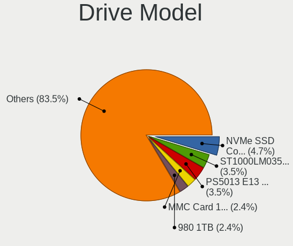
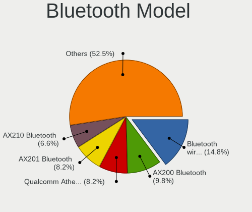
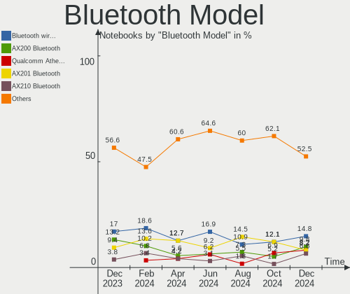

Manjaro Hardware Trends (Notebook)
----------------------------------

A project to identify most popular hardware characteristics and track their change
over time based on data collected by Manjaro users at https://Linux-Hardware.org.

Anyone can contribute to the study by uploading probes of their computers by
the [hw-probe](https://github.com/linuxhw/hw-probe) tool:

    sudo -E hw-probe -all -upload

Full-feature report is available here: https://linux-hardware.org/?view=trends&formfactor=notebook

Period: Dec, 2020.

Contents
--------

- [ OS                       ](#os)
- [ OS Family                ](#os-family)
- [ Kernel                   ](#kernel)
- [ Kernel Family            ](#kernel-family)
- [ Kernel Major Ver.        ](#kernel-major-ver)
- [ Arch                     ](#arch)
- [ DE                       ](#de)
- [ Display Server           ](#display-server)
- [ Display Manager          ](#display-manager)
- [ OS Lang                  ](#os-lang)
- [ Boot Mode                ](#boot-mode)
- [ Filesystem               ](#filesystem)
- [ Part. scheme             ](#part-scheme)
- [ Dual Boot with Linux/BSD ](#dual-boot-with-linux/bsd)
- [ Dual Boot (Win)          ](#dual-boot-win)
- [ Country                  ](#country)
- [ City                     ](#city)
- [ Vendor                   ](#vendor)
- [ Model                    ](#model)
- [ Model Family             ](#model-family)
- [ MFG Year                 ](#mfg-year)
- [ Form Factor              ](#form-factor)
- [ Secure Boot              ](#secure-boot)
- [ Coreboot                 ](#coreboot)
- [ RAM Size                 ](#ram-size)
- [ RAM Used                 ](#ram-used)
- [ Has CD-ROM               ](#has-cd-rom)
- [ Total Drives             ](#total-drives)
- [ Has Ethernet             ](#has-ethernet)
- [ Drive Vendor             ](#drive-vendor)
- [ Drive Model              ](#drive-model)
- [ HDD Vendor               ](#hdd-vendor)
- [ SSD Vendor               ](#ssd-vendor)
- [ Drive Kind               ](#drive-kind)
- [ Drive Connector          ](#drive-connector)
- [ Drive Size               ](#drive-size)
- [ Space Total              ](#space-total)
- [ Space Used               ](#space-used)
- [ Malfunc. Drives          ](#malfunc-drives)
- [ Malfunc. Drive Vendor    ](#malfunc-drive-vendor)
- [ Malfunc. HDD Vendor      ](#malfunc-hdd-vendor)
- [ Malfunc. Drive Kind      ](#malfunc-drive-kind)
- [ Failed Drives            ](#failed-drives)
- [ Failed Drive Vendor      ](#failed-drive-vendor)
- [ Drive Status             ](#drive-status)
- [ Storage Vendor           ](#storage-vendor)
- [ Storage Model            ](#storage-model)
- [ Storage Kind             ](#storage-kind)
- [ CPU Vendor               ](#cpu-vendor)
- [ CPU Model                ](#cpu-model)
- [ CPU Model Family         ](#cpu-model-family)
- [ CPU Cores                ](#cpu-cores)
- [ CPU Sockets              ](#cpu-sockets)
- [ CPU Threads              ](#cpu-threads)
- [ CPU Op-Modes             ](#cpu-op-modes)
- [ CPU Microcode            ](#cpu-microcode)
- [ CPU Microarch            ](#cpu-microarch)
- [ GPU Vendor               ](#gpu-vendor)
- [ GPU Model                ](#gpu-model)
- [ GPU Combo                ](#gpu-combo)
- [ GPU Driver               ](#gpu-driver)
- [ GPU Memory               ](#gpu-memory)
- [ Monitor Vendor           ](#monitor-vendor)
- [ Monitor Model            ](#monitor-model)
- [ Monitor Resolution       ](#monitor-resolution)
- [ Monitor Diagonal         ](#monitor-diagonal)
- [ Monitor Width            ](#monitor-width)
- [ Aspect Ratio             ](#aspect-ratio)
- [ Monitor Area             ](#monitor-area)
- [ Pixel Density            ](#pixel-density)
- [ Multiple Monitors        ](#multiple-monitors)
- [ Net Controller Vendor    ](#net-controller-vendor)
- [ Net Controller Model     ](#net-controller-model)
- [ Wireless Vendor          ](#wireless-vendor)
- [ Wireless Model           ](#wireless-model)
- [ Ethernet Vendor          ](#ethernet-vendor)
- [ Ethernet Model           ](#ethernet-model)
- [ Net Controller Kind      ](#net-controller-kind)
- [ Used Controller          ](#used-controller)
- [ NICs                     ](#nics)
- [ Memory Vendor            ](#memory-vendor)
- [ Memory Model             ](#memory-model)
- [ Memory Kind              ](#memory-kind)
- [ Memory Form Factor       ](#memory-form-factor)
- [ Memory Size              ](#memory-size)
- [ Memory Speed             ](#memory-speed)
- [ Sound Vendor             ](#sound-vendor)
- [ Sound Model              ](#sound-model)
- [ Camera Vendor            ](#camera-vendor)
- [ Camera Model             ](#camera-model)
- [ Fingerprint Vendor       ](#fingerprint-vendor)
- [ Fingerprint Model        ](#fingerprint-model)
- [ Chipcard Vendor          ](#chipcard-vendor)
- [ Chipcard Model           ](#chipcard-model)
- [ Printer Vendor           ](#printer-vendor)
- [ Printer Model            ](#printer-model)
- [ Scanner Vendor           ](#scanner-vendor)
- [ Scanner Model            ](#scanner-model)
- [ Bluetooth Vendor         ](#bluetooth-vendor)
- [ Bluetooth Model          ](#bluetooth-model)
- [ Unsupported Devices      ](#unsupported-devices)
- [ Unsupported Device Types ](#unsupported-device-types)

OS
--

Installed operating systems

| Name           | Notebooks | Percent |
|----------------|-----------|---------|
| Manjaro 20.2   | 65        | 52.42%  |
| Manjaro        | 58        | 46.77%  |
| Manjaro 20.1.2 | 1         | 0.81%   |

OS Family
---------

OS without a version

| Name    | Notebooks | Percent |
|---------|-----------|---------|
| Manjaro | 124       | 100%    |

Kernel
------

Version of the Linux kernel

| Version              | Notebooks | Percent |
|----------------------|-----------|---------|
| 5.9.11-3-MANJARO     | 69        | 55.65%  |
| 5.8.18-1-MANJARO     | 20        | 16.13%  |
| 5.4.80-2-MANJARO     | 11        | 8.87%   |
| 5.9.11-2-MANJARO     | 2         | 1.61%   |
| 5.9.1-1-rt19-MANJARO | 2         | 1.61%   |
| 5.7.19-2-MANJARO     | 2         | 1.61%   |
| 5.10.2-2-MANJARO     | 2         | 1.61%   |
| 5.10.0-1-MANJARO     | 2         | 1.61%   |
| 5.9.3-1-MANJARO      | 1         | 0.81%   |
| 5.9.16-1-MANJARO     | 1         | 0.81%   |
| 5.9.13-lqx1-1-lqx    | 1         | 0.81%   |
| 5.9.13-1-MANJARO     | 1         | 0.81%   |
| 5.9.12-1-MANJARO     | 1         | 0.81%   |
| 5.9.11-lqx1-1-lqx    | 1         | 0.81%   |
| 5.9.10-1-MANJARO     | 1         | 0.81%   |
| 5.8.6-1-MANJARO      | 1         | 0.81%   |
| 5.8.16-2-MANJARO     | 1         | 0.81%   |
| 5.4.78-1-MANJARO     | 1         | 0.81%   |
| 5.4.67-1-MANJARO     | 1         | 0.81%   |
| 5.10.1-5-MANJARO     | 1         | 0.81%   |
| 4.19.157-1-MANJARO   | 1         | 0.81%   |
| 4.14.209-1-MANJARO   | 1         | 0.81%   |

Kernel Family
-------------

Linux kernel without a distro release

| Version  | Notebooks | Percent |
|----------|-----------|---------|
| 5.9.11   | 72        | 58.06%  |
| 5.8.18   | 20        | 16.13%  |
| 5.4.80   | 11        | 8.87%   |
| 5.9.13   | 2         | 1.61%   |
| 5.9.1    | 2         | 1.61%   |
| 5.7.19   | 2         | 1.61%   |
| 5.10.2   | 2         | 1.61%   |
| 5.10.0   | 2         | 1.61%   |
| 5.9.3    | 1         | 0.81%   |
| 5.9.16   | 1         | 0.81%   |
| 5.9.12   | 1         | 0.81%   |
| 5.9.10   | 1         | 0.81%   |
| 5.8.6    | 1         | 0.81%   |
| 5.8.16   | 1         | 0.81%   |
| 5.4.78   | 1         | 0.81%   |
| 5.4.67   | 1         | 0.81%   |
| 5.10.1   | 1         | 0.81%   |
| 4.19.157 | 1         | 0.81%   |
| 4.14.209 | 1         | 0.81%   |

Kernel Major Ver.
-----------------

Linux kernel major version

| Version | Notebooks | Percent |
|---------|-----------|---------|
| 5.9     | 80        | 64.52%  |
| 5.8     | 22        | 17.74%  |
| 5.4     | 13        | 10.48%  |
| 5.10    | 5         | 4.03%   |
| 5.7     | 2         | 1.61%   |
| 4.19    | 1         | 0.81%   |
| 4.14    | 1         | 0.81%   |

Arch
----

OS architecture (x86_64, i586, etc.)

| Name   | Notebooks | Percent |
|--------|-----------|---------|
| x86_64 | 124       | 100%    |

DE
--

Desktop Environment

| Name       | Notebooks | Percent |
|------------|-----------|---------|
| XFCE       | 42        | 33.87%  |
| GNOME      | 26        | 20.97%  |
| KDE5       | 25        | 20.16%  |
| KDE        | 23        | 18.55%  |
| i3         | 2         | 1.61%   |
| Deepin     | 2         | 1.61%   |
| X-Cinnamon | 1         | 0.81%   |
| Cinnamon   | 1         | 0.81%   |
| Budgie     | 1         | 0.81%   |
| Unknown    | 1         | 0.81%   |

Display Server
--------------

X11 or Wayland

| Name    | Notebooks | Percent |
|---------|-----------|---------|
| X11     | 108       | 87.1%   |
| Wayland | 14        | 11.29%  |
| Tty     | 1         | 0.81%   |
| Unknown | 1         | 0.81%   |

Display Manager
---------------

SDDM, LightDM, etc.

| Name    | Notebooks | Percent |
|---------|-----------|---------|
| Unknown | 58        | 46.77%  |
| LightDM | 28        | 22.58%  |
| SDDM    | 25        | 20.16%  |
| GDM     | 10        | 8.06%   |
| TDM     | 3         | 2.42%   |

OS Lang
-------

Language

| Lang       | Notebooks | Percent |
|------------|-----------|---------|
| en_US      | 34        | 27.42%  |
| en_US.utf8 | 18        | 14.52%  |
| de_DE      | 9         | 7.26%   |
| fr_FR      | 6         | 4.84%   |
| en_GB      | 5         | 4.03%   |
| de_DE.utf8 | 5         | 4.03%   |
| ru_RU.utf8 | 3         | 2.42%   |
| pt_BR      | 3         | 2.42%   |
| pl_PL      | 3         | 2.42%   |
| it_IT      | 3         | 2.42%   |
| zh_CN      | 2         | 1.61%   |
| ru_RU      | 2         | 1.61%   |
| fr_BE      | 2         | 1.61%   |
| en_IN      | 2         | 1.61%   |
| en_IL      | 2         | 1.61%   |
| en_GB.utf8 | 2         | 1.61%   |
| sv_SE.utf8 | 1         | 0.81%   |
| sv_SE      | 1         | 0.81%   |
| ru_UA.utf8 | 1         | 0.81%   |
| ru_UA      | 1         | 0.81%   |
| pl_PL.utf8 | 1         | 0.81%   |
| id_ID.utf8 | 1         | 0.81%   |
| hu_HU      | 1         | 0.81%   |
| hr_HR      | 1         | 0.81%   |
| fr_FR.utf8 | 1         | 0.81%   |
| fr_CA      | 1         | 0.81%   |
| fi_FI      | 1         | 0.81%   |
| es_MX.utf8 | 1         | 0.81%   |
| es_ES      | 1         | 0.81%   |
| es_CO.utf8 | 1         | 0.81%   |
| en_IE.utf8 | 1         | 0.81%   |
| en_DK      | 1         | 0.81%   |
| en_CA.utf8 | 1         | 0.81%   |
| en_CA      | 1         | 0.81%   |
| en_AU      | 1         | 0.81%   |
| de_CH      | 1         | 0.81%   |
| cs_CZ      | 1         | 0.81%   |
| C          | 1         | 0.81%   |
| Unknown    | 1         | 0.81%   |

Boot Mode
---------

EFI or BIOS

| Mode | Notebooks | Percent |
|------|-----------|---------|
| BIOS | 69        | 55.65%  |
| EFI  | 55        | 44.35%  |

Filesystem
----------

Type of filesystem

| Type    | Notebooks | Percent |
|---------|-----------|---------|
| Ext4    | 119       | 95.97%  |
| Overlay | 2         | 1.61%   |
| Btrfs   | 2         | 1.61%   |
| Xfs     | 1         | 0.81%   |

Part. scheme
------------

Scheme of partitioning

| Type    | Notebooks | Percent |
|---------|-----------|---------|
| GPT     | 60        | 48.39%  |
| Unknown | 57        | 45.97%  |
| MBR     | 7         | 5.65%   |

Dual Boot with Linux/BSD
------------------------

Hosting more than one Linux/BSD

| Dual boot | Notebooks | Percent |
|-----------|-----------|---------|
| No        | 113       | 91.13%  |
| Yes       | 11        | 8.87%   |

Dual Boot (Win)
---------------

Hosting Linux and Windows

| Dual boot | Notebooks | Percent |
|-----------|-----------|---------|
| No        | 87        | 70.16%  |
| Yes       | 37        | 29.84%  |

Country
-------

Geographic location (country)

| Country                   | Notebooks | Percent |
|---------------------------|-----------|---------|
| Germany                   | 19        | 15.32%  |
| USA                       | 14        | 11.29%  |
| Poland                    | 7         | 5.65%   |
| France                    | 7         | 5.65%   |
| Russia                    | 6         | 4.84%   |
| UK                        | 5         | 4.03%   |
| Switzerland               | 4         | 3.23%   |
| Italy                     | 4         | 3.23%   |
| Canada                    | 4         | 3.23%   |
| Brazil                    | 4         | 3.23%   |
| Vietnam                   | 3         | 2.42%   |
| Israel                    | 3         | 2.42%   |
| Indonesia                 | 3         | 2.42%   |
| Ukraine                   | 2         | 1.61%   |
| Turkey                    | 2         | 1.61%   |
| Sweden                    | 2         | 1.61%   |
| Ireland                   | 2         | 1.61%   |
| India                     | 2         | 1.61%   |
| Colombia                  | 2         | 1.61%   |
| Bulgaria                  | 2         | 1.61%   |
| Australia                 | 2         | 1.61%   |
| Tunisia                   | 1         | 0.81%   |
| Slovenia                  | 1         | 0.81%   |
| Slovakia                  | 1         | 0.81%   |
| Romania                   | 1         | 0.81%   |
| Portugal                  | 1         | 0.81%   |
| Philippines               | 1         | 0.81%   |
| Peru                      | 1         | 0.81%   |
| Nigeria                   | 1         | 0.81%   |
| Netherlands               | 1         | 0.81%   |
| Moldova, Republic of      | 1         | 0.81%   |
| Mexico                    | 1         | 0.81%   |
| Kazakhstan                | 1         | 0.81%   |
| Iran, Islamic Republic of | 1         | 0.81%   |
| Hungary                   | 1         | 0.81%   |
| Honduras                  | 1         | 0.81%   |
| Greece                    | 1         | 0.81%   |
| Finland                   | 1         | 0.81%   |
| Denmark                   | 1         | 0.81%   |
| Czech Republic            | 1         | 0.81%   |
| Croatia                   | 1         | 0.81%   |
| Costa Rica                | 1         | 0.81%   |
| China                     | 1         | 0.81%   |
| Belgium                   | 1         | 0.81%   |
| Austria                   | 1         | 0.81%   |
| Algeria                   | 1         | 0.81%   |

City
----

Geographic location (city)

| City                 | Notebooks | Percent |
|----------------------|-----------|---------|
| Berlin               | 4         | 3.23%   |
| Zurich               | 2         | 1.61%   |
| Warsaw               | 2         | 1.61%   |
| Rome                 | 2         | 1.61%   |
| Novosibirsk          | 2         | 1.61%   |
| Moscow               | 2         | 1.61%   |
| Dublin               | 2         | 1.61%   |
| Bogotá              | 2         | 1.61%   |
| Łódź              | 1         | 0.81%   |
| Zandvoort            | 1         | 0.81%   |
| Xi'an                | 1         | 0.81%   |
| Woodland Hills       | 1         | 0.81%   |
| Westfield            | 1         | 0.81%   |
| Turin                | 1         | 0.81%   |
| Trujillo             | 1         | 0.81%   |
| Toronto              | 1         | 0.81%   |
| Tegucigalpa          | 1         | 0.81%   |
| Tampere              | 1         | 0.81%   |
| São Paulo           | 1         | 0.81%   |
| Surabaya             | 1         | 0.81%   |
| Sunderland           | 1         | 0.81%   |
| Stuttgart            | 1         | 0.81%   |
| Stockholm            | 1         | 0.81%   |
| St Albans            | 1         | 0.81%   |
| Semarang             | 1         | 0.81%   |
| Secaucus             | 1         | 0.81%   |
| Rüsselsheim am Main | 1         | 0.81%   |
| Rotherhithe          | 1         | 0.81%   |
| Rostov-on-Don        | 1         | 0.81%   |
| Rishon LeZiyyon      | 1         | 0.81%   |
| Rio de Janeiro       | 1         | 0.81%   |
| Rijeka               | 1         | 0.81%   |
| Reims                | 1         | 0.81%   |
| Rafraf               | 1         | 0.81%   |
| Port Orange          | 1         | 0.81%   |
| Pompignan            | 1         | 0.81%   |
| Phoenix              | 1         | 0.81%   |
| Petaẖ Tiqwa        | 1         | 0.81%   |
| Perth                | 1         | 0.81%   |
| Paris                | 1         | 0.81%   |
| Osasco               | 1         | 0.81%   |
| Mumbai               | 1         | 0.81%   |
| Moravska Trebova     | 1         | 0.81%   |
| Mont-Cauvaire        | 1         | 0.81%   |
| Mikołów            | 1         | 0.81%   |
| Melbourne            | 1         | 0.81%   |
| Mashhad              | 1         | 0.81%   |
| Marquette            | 1         | 0.81%   |
| Malbork              | 1         | 0.81%   |
| Magdalena Contreras  | 1         | 0.81%   |
| Los Angeles          | 1         | 0.81%   |
| Ljubljana            | 1         | 0.81%   |
| Linz                 | 1         | 0.81%   |
| Lieusaint            | 1         | 0.81%   |
| Lewisville           | 1         | 0.81%   |
| Lethbridge           | 1         | 0.81%   |
| Leipzig              | 1         | 0.81%   |
| Lambeth              | 1         | 0.81%   |
| Lagos                | 1         | 0.81%   |
| La Cote-Saint-Andre  | 1         | 0.81%   |

Vendor
------

Motherboard manufacturer

| Name                | Notebooks | Percent |
|---------------------|-----------|---------|
| Lenovo              | 37        | 29.84%  |
| Hewlett-Packard     | 26        | 20.97%  |
| Dell                | 17        | 13.71%  |
| ASUSTek Computer    | 16        | 12.9%   |
| Acer                | 7         | 5.65%   |
| Samsung Electronics | 3         | 2.42%   |
| MSI                 | 3         | 2.42%   |
| HUAWEI              | 2         | 1.61%   |
| Apple               | 2         | 1.61%   |
| TUXEDO              | 1         | 0.81%   |
| Toshiba             | 1         | 0.81%   |
| Teclast             | 1         | 0.81%   |
| Sony                | 1         | 0.81%   |
| Razer               | 1         | 0.81%   |
| Panasonic           | 1         | 0.81%   |
| Notebook            | 1         | 0.81%   |
| Medion              | 1         | 0.81%   |
| Fujitsu             | 1         | 0.81%   |
| Clevo               | 1         | 0.81%   |
| Unknown             | 1         | 0.81%   |

Model
-----

Motherboard model

| Name                                                  | Notebooks | Percent |
|-------------------------------------------------------|-----------|---------|
| Dell Latitude E5530 non-vPro                          | 3         | 2.42%   |
| Samsung 340XAA/350XAA/550XAA                          | 2         | 1.61%   |
| HP Pavilion Laptop 15-cw1xxx                          | 2         | 1.61%   |
| Unknown                                               | 2         | 1.61%   |
| TUXEDO Pulse 15 Gen1                                  | 1         | 0.81%   |
| Toshiba Satellite C660                                | 1         | 0.81%   |
| Teclast F7 Plus                                       | 1         | 0.81%   |
| Sony VGN-CR11S_W                                      | 1         | 0.81%   |
| Samsung 535U4C                                        | 1         | 0.81%   |
| Razer Blade 15 Advanced Model (Early 2020) - RZ09-033 | 1         | 0.81%   |
| Panasonic CF-C1BD06EFG                                | 1         | 0.81%   |
| Notebook N150ZU                                       | 1         | 0.81%   |
| MSI Prestige 14Evo A11M                               | 1         | 0.81%   |
| MSI GE60 2PC                                          | 1         | 0.81%   |
| MSI Alpha 15 A3DDK                                    | 1         | 0.81%   |
| Medion S15450                                         | 1         | 0.81%   |
| Lenovo Z70-80 80FG                                    | 1         | 0.81%   |
| Lenovo Y520-15IKBN 80WK                               | 1         | 0.81%   |
| Lenovo Y50-70 20378                                   | 1         | 0.81%   |
| Lenovo V330-15IKB 81AX                                | 1         | 0.81%   |
| Lenovo ThinkPad X240 20AMA1W5PB                       | 1         | 0.81%   |
| Lenovo ThinkPad X201 3680U18                          | 1         | 0.81%   |
| Lenovo ThinkPad X1 Carbon Gen 8 20U90044MX            | 1         | 0.81%   |
| Lenovo ThinkPad W540 20BG0015US                       | 1         | 0.81%   |
| Lenovo ThinkPad T470s 20HGS11D00                      | 1         | 0.81%   |
| Lenovo ThinkPad T430 2349A17                          | 1         | 0.81%   |
| Lenovo ThinkPad T420 4180C31                          | 1         | 0.81%   |
| Lenovo ThinkPad P71 20HK0003GE                        | 1         | 0.81%   |
| Lenovo ThinkPad P52s 20LBCTO1WW                       | 1         | 0.81%   |
| Lenovo ThinkPad P14s Gen 1 20Y10002MZ                 | 1         | 0.81%   |
| Lenovo ThinkPad P1 Gen 3 20THS0BK00                   | 1         | 0.81%   |
| Lenovo ThinkPad Edge E145 20BC0006GE                  | 1         | 0.81%   |
| Lenovo ThinkPad E15 20RD0011SC                        | 1         | 0.81%   |
| Lenovo ThinkPad E14 Gen 2 20T6000RSC                  | 1         | 0.81%   |
| Lenovo ThinkPad E14 Gen 2 20T6000RGE                  | 1         | 0.81%   |
| Lenovo ThinkPad E14 20RA005CTX                        | 1         | 0.81%   |
| Lenovo Legion Y9000X 2020 81TH                        | 1         | 0.81%   |
| Lenovo Legion R7000 2020 82B6                         | 1         | 0.81%   |
| Lenovo Legion 5 82B5                                  | 1         | 0.81%   |
| Lenovo Legion 5 15IMH05H 81Y6                         | 1         | 0.81%   |
| Lenovo Legion 5 15ARH05H 82B1                         | 1         | 0.81%   |
| Lenovo Legion 5 15ARH05 82B5                          | 1         | 0.81%   |
| Lenovo IdeaPad Y700-15ISK 80NV                        | 1         | 0.81%   |
| Lenovo IdeaPad Slim 1-14AST-05 81VS                   | 1         | 0.81%   |
| Lenovo IdeaPad Gaming 3 15ARH05 82EY                  | 1         | 0.81%   |
| Lenovo IdeaPad 5 15ARE05 81YQ                         | 1         | 0.81%   |
| Lenovo IdeaPad 5 14IIL05 81YH                         | 1         | 0.81%   |
| Lenovo IdeaPad 330-17IKB 81DM                         | 1         | 0.81%   |
| Lenovo IdeaPad 330-15ICH 81FK                         | 1         | 0.81%   |
| Lenovo IdeaPad 3 14IIL05 81WD                         | 1         | 0.81%   |
| Lenovo G580 20150                                     | 1         | 0.81%   |
| Lenovo B50-70 80EU                                    | 1         | 0.81%   |
| HUAWEI HN-WX9X                                        | 1         | 0.81%   |
| HUAWEI BOHK-WAX9X                                     | 1         | 0.81%   |
| HP ZBook 14u G6                                       | 1         | 0.81%   |
| HP ProBook 650 G1                                     | 1         | 0.81%   |
| HP ProBook 640 G4                                     | 1         | 0.81%   |
| HP ProBook 4330s                                      | 1         | 0.81%   |
| HP Pavilion TS 15                                     | 1         | 0.81%   |
| HP Pavilion Notebook                                  | 1         | 0.81%   |

Model Family
------------

Motherboard model prefix

| Name                   | Notebooks | Percent |
|------------------------|-----------|---------|
| Lenovo ThinkPad        | 16        | 12.9%   |
| HP Pavilion            | 10        | 8.06%   |
| Lenovo IdeaPad         | 8         | 6.45%   |
| Lenovo Legion          | 6         | 4.84%   |
| HP EliteBook           | 5         | 4.03%   |
| Dell Latitude          | 5         | 4.03%   |
| Dell Inspiron          | 5         | 4.03%   |
| Acer Aspire            | 5         | 4.03%   |
| HP Laptop              | 4         | 3.23%   |
| HP ProBook             | 3         | 2.42%   |
| Dell Vostro            | 3         | 2.42%   |
| Samsung 340XAA         | 2         | 1.61%   |
| Dell XPS               | 2         | 1.61%   |
| Dell Precision         | 2         | 1.61%   |
| ASUS TUF               | 2         | 1.61%   |
| Apple MacBookPro11     | 2         | 1.61%   |
| Unknown                | 2         | 1.61%   |
| TUXEDO Pulse           | 1         | 0.81%   |
| Toshiba Satellite      | 1         | 0.81%   |
| Teclast F7             | 1         | 0.81%   |
| Sony VGN-CR11S         | 1         | 0.81%   |
| Samsung 535U4C         | 1         | 0.81%   |
| Razer Blade            | 1         | 0.81%   |
| Panasonic CF-C1BD06EFG | 1         | 0.81%   |
| Notebook N150ZU        | 1         | 0.81%   |
| MSI Prestige           | 1         | 0.81%   |
| MSI GE60               | 1         | 0.81%   |
| MSI Alpha              | 1         | 0.81%   |
| Medion S15450          | 1         | 0.81%   |
| Lenovo Z70-80          | 1         | 0.81%   |
| Lenovo Y520-15IKBN     | 1         | 0.81%   |
| Lenovo Y50-70          | 1         | 0.81%   |
| Lenovo V330-15IKB      | 1         | 0.81%   |
| Lenovo G580            | 1         | 0.81%   |
| Lenovo B50-70          | 1         | 0.81%   |
| HUAWEI HN-WX9X         | 1         | 0.81%   |
| HUAWEI BOHK-WAX9X      | 1         | 0.81%   |
| HP ZBook               | 1         | 0.81%   |
| HP OMEN                | 1         | 0.81%   |
| HP ENVY                | 1         | 0.81%   |
| HP 15                  | 1         | 0.81%   |
| Fujitsu CELSIUS        | 1         | 0.81%   |
| Clevo W860CU           | 1         | 0.81%   |
| ASUS ZenBook           | 1         | 0.81%   |
| ASUS X751LAB           | 1         | 0.81%   |
| ASUS X550LD            | 1         | 0.81%   |
| ASUS VivoBook          | 1         | 0.81%   |
| ASUS UX310UQK          | 1         | 0.81%   |
| ASUS U38N              | 1         | 0.81%   |
| ASUS ROG               | 1         | 0.81%   |
| ASUS N552VX            | 1         | 0.81%   |
| ASUS K55DR             | 1         | 0.81%   |
| ASUS K53Z              | 1         | 0.81%   |
| ASUS GL552VX           | 1         | 0.81%   |
| ASUS G771JW            | 1         | 0.81%   |
| ASUS G751JT            | 1         | 0.81%   |
| ASUS 1015BX            | 1         | 0.81%   |
| Acer Swift             | 1         | 0.81%   |
| Acer Predator          | 1         | 0.81%   |

MFG Year
--------

Motherboard manufacture year

| Year | Notebooks | Percent |
|------|-----------|---------|
| 2020 | 39        | 31.45%  |
| 2019 | 18        | 14.52%  |
| 2018 | 14        | 11.29%  |
| 2017 | 9         | 7.26%   |
| 2015 | 9         | 7.26%   |
| 2012 | 8         | 6.45%   |
| 2013 | 7         | 5.65%   |
| 2014 | 6         | 4.84%   |
| 2016 | 5         | 4.03%   |
| 2010 | 3         | 2.42%   |
| 2011 | 2         | 1.61%   |
| 2009 | 2         | 1.61%   |
| 2007 | 2         | 1.61%   |

Form Factor
-----------

Physical design of the computer

| Name     | Notebooks | Percent |
|----------|-----------|---------|
| Notebook | 124       | 100%    |

Secure Boot
-----------

Enabled or disabled

| State    | Notebooks | Percent |
|----------|-----------|---------|
| Disabled | 124       | 100%    |

Coreboot
--------

Have coreboot on board

| Used | Notebooks | Percent |
|------|-----------|---------|
| No   | 124       | 100%    |

RAM Size
--------

Total RAM memory

| Size in GB  | Notebooks | Percent |
|-------------|-----------|---------|
| 4.01-8.0    | 34        | 27.42%  |
| 16.01-24.0  | 28        | 22.58%  |
| 8.01-16.0   | 25        | 20.16%  |
| 3.01-4.0    | 20        | 16.13%  |
| 32.01-64.0  | 11        | 8.87%   |
| 64.01-256.0 | 3         | 2.42%   |
| 1.01-2.0    | 2         | 1.61%   |
| 24.01-32.0  | 1         | 0.81%   |

RAM Used
--------

Used RAM memory

| Used GB    | Notebooks | Percent |
|------------|-----------|---------|
| 1.01-2.0   | 37        | 29.84%  |
| 2.01-3.0   | 31        | 25%     |
| 4.01-8.0   | 23        | 18.55%  |
| 3.01-4.0   | 18        | 14.52%  |
| 8.01-16.0  | 8         | 6.45%   |
| 0.51-1.0   | 5         | 4.03%   |
| 24.01-32.0 | 1         | 0.81%   |
| 16.01-24.0 | 1         | 0.81%   |

Has CD-ROM
----------

Has CD-ROM on board

| Presented | Notebooks | Percent |
|-----------|-----------|---------|
| No        | 92        | 74.19%  |
| Yes       | 32        | 25.81%  |

Total Drives
------------

Number of drives on board

| Drives | Notebooks | Percent |
|--------|-----------|---------|
| 1      | 77        | 62.1%   |
| 2      | 40        | 32.26%  |
| 3      | 5         | 4.03%   |
| 4      | 1         | 0.81%   |
| 0      | 1         | 0.81%   |

Has Ethernet
------------

Has Ethernet on board

| Presented | Notebooks | Percent |
|-----------|-----------|---------|
| Yes       | 102       | 82.26%  |
| No        | 22        | 17.74%  |

Drive Vendor
------------

Hard drive vendors

| Vendor                    | Notebooks | Drives | Percent |
|---------------------------|-----------|--------|---------|
| Samsung Electronics       | 35        | 38     | 20.59%  |
| Seagate                   | 27        | 27     | 15.88%  |
| WDC                       | 22        | 22     | 12.94%  |
| Toshiba                   | 9         | 9      | 5.29%   |
| SK Hynix                  | 9         | 9      | 5.29%   |
| HGST                      | 8         | 8      | 4.71%   |
| SanDisk                   | 6         | 6      | 3.53%   |
| Kingston                  | 6         | 6      | 3.53%   |
| Hitachi                   | 6         | 6      | 3.53%   |
| Unknown                   | 5         | 5      | 2.94%   |
| Intel                     | 5         | 5      | 2.94%   |
| Crucial                   | 5         | 5      | 2.94%   |
| Silicon Motion            | 2         | 2      | 1.18%   |
| Phison                    | 2         | 2      | 1.18%   |
| OCZ                       | 2         | 2      | 1.18%   |
| Intenso                   | 2         | 2      | 1.18%   |
| China                     | 2         | 2      | 1.18%   |
| Apple                     | 2         | 2      | 1.18%   |
| Union Memory              | 1         | 1      | 0.59%   |
| TO Exter                  | 1         | 1      | 0.59%   |
| SSSTC                     | 1         | 1      | 0.59%   |
| SSD 128G                  | 1         | 1      | 0.59%   |
| Reeinno                   | 1         | 1      | 0.59%   |
| Pioneer                   | 1         | 1      | 0.59%   |
| NGFF                      | 1         | 1      | 0.59%   |
| Micron/Crucial Technology | 1         | 1      | 0.59%   |
| Micron Technology         | 1         | 1      | 0.59%   |
| Maxtor                    | 1         | 1      | 0.59%   |
| KIOXIA-EXCERIA            | 1         | 1      | 0.59%   |
| JMicron                   | 1         | 1      | 0.59%   |
| GOODRAM                   | 1         | 1      | 0.59%   |
| DREVO                     | 1         | 1      | 0.59%   |
| A-DATA Technology         | 1         | 1      | 0.59%   |

Drive Model
-----------

Hard drive models

| Model                                     | Notebooks | Percent |
|-------------------------------------------|-----------|---------|
| Seagate ST1000LM035-1RK172 1TB            | 8         | 4.68%   |
| Samsung NVMe SSD Drive 512GB              | 5         | 2.92%   |
| Samsung SSD 970 EVO 1TB                   | 3         | 1.75%   |
| Kingston SA400S37240G 240GB SSD           | 3         | 1.75%   |
| Hitachi HTS545050A7E380 500GB             | 3         | 1.75%   |
| HGST HTS721010A9E630 1TB                  | 3         | 1.75%   |
| WDC WD5000LPVX-75V0TT0 500GB              | 2         | 1.17%   |
| Unknown SD/MMC/MS PRO 128GB               | 2         | 1.17%   |
| Unknown MMC Card  32GB                    | 2         | 1.17%   |
| Toshiba MQ01ABD100 1TB                    | 2         | 1.17%   |
| Seagate ST9500423AS 500GB                 | 2         | 1.17%   |
| Seagate ST500LM000-1EJ162 500GB           | 2         | 1.17%   |
| Seagate ST1000LM048-2E7172 1TB            | 2         | 1.17%   |
| Samsung SSD 850 EVO 500GB                 | 2         | 1.17%   |
| Samsung NVMe SSD Drive 1TB                | 2         | 1.17%   |
| Samsung MZVLB512HBJQ-000L2 512GB          | 2         | 1.17%   |
| OCZ AGILITY3 240GB SSD                    | 2         | 1.17%   |
| Intel NVMe SSD Drive 512GB                | 2         | 1.17%   |
| HGST HTS545050A7E680 500GB                | 2         | 1.17%   |
| Crucial CT1000MX500SSD1 1TB               | 2         | 1.17%   |
| WDC WDS500G2B0C-00PXH0 500GB              | 1         | 0.58%   |
| WDC WDS480G2G0A-00JH30 480GB SSD          | 1         | 0.58%   |
| WDC WDS240G2G0B-00EPW0 240GB SSD          | 1         | 0.58%   |
| WDC WDS240G2G0A-00JH30 240GB SSD          | 1         | 0.58%   |
| WDC WDS100T2B0B-00YS70 1TB SSD            | 1         | 0.58%   |
| WDC WDBNCE5000PNC 500GB SSD               | 1         | 0.58%   |
| WDC WD7500BPKX-75HPJT0 752GB              | 1         | 0.58%   |
| WDC WD5000BEVT-00ZAT0 500GB               | 1         | 0.58%   |
| WDC WD3200BPVT-80JJ5T0 320GB              | 1         | 0.58%   |
| WDC WD3200BPVT-75JJ5T0 320GB              | 1         | 0.58%   |
| WDC WD10SPZX-60Z10T0 1TB                  | 1         | 0.58%   |
| WDC WD10SPZX-24Z10 1TB                    | 1         | 0.58%   |
| WDC WD10SPZX-21Z10T0 1TB                  | 1         | 0.58%   |
| WDC WD10JPVX-75JC3T0 1TB                  | 1         | 0.58%   |
| WDC WD10JPVX-60JC3T0 1TB                  | 1         | 0.58%   |
| WDC WD10JPVX-22JC3T0 1TB                  | 1         | 0.58%   |
| WDC PC SN730 SDBPNTY-512G-1101 512GB      | 1         | 0.58%   |
| WDC PC SN730 SDBPNTY-512G-1027 512GB      | 1         | 0.58%   |
| WDC PC SN530 SDBPNPZ-256G-1002 256GB      | 1         | 0.58%   |
| WDC PC SN530 SDBPMPZ-512G-1101 512GB      | 1         | 0.58%   |
| Unknown S11-512G-PHISON-DVS-B27 512GB     | 1         | 0.58%   |
| Union Memory RPFTJ128PDD2EWX 128GB        | 1         | 0.58%   |
| Toshiba THNSNC128GCSJ 128GB SSD           | 1         | 0.58%   |
| Toshiba MQ04ABF100 1TB                    | 1         | 0.58%   |
| Toshiba MK6465GSXN 640GB                  | 1         | 0.58%   |
| Toshiba MK5059GSXP 500GB                  | 1         | 0.58%   |
| Toshiba KXG6AZNV512G 512GB                | 1         | 0.58%   |
| Toshiba KXG60ZNV512G NVMe KIOXIA 512GB    | 1         | 0.58%   |
| Toshiba KBG40ZNT512G MEMORY 512GB         | 1         | 0.58%   |
| TO Exter nal USB 3.0 752GB                | 1         | 0.58%   |
| SSSTC CV8-8E128-HP 128GB                  | 1         | 0.58%   |
| SSD 128G B 128GB                          | 1         | 0.58%   |
| SK Hynix SKHynix_HFS512GD9TNI-L2B0B 512GB | 1         | 0.58%   |
| SK Hynix SKHynix_HFM512GDHTNI-87A0B 512GB | 1         | 0.58%   |
| SK Hynix SH920 2.5 7MM 256GB SSD          | 1         | 0.58%   |
| SK Hynix PC601 NVMe 512GB                 | 1         | 0.58%   |
| SK Hynix NVMe SSD Drive 512GB             | 1         | 0.58%   |
| SK Hynix NVMe SSD Drive 256GB             | 1         | 0.58%   |
| SK Hynix HFS256G3BTND-N210A 256GB SSD     | 1         | 0.58%   |
| SK Hynix HFS128G39TND-N210A 128GB SSD     | 1         | 0.58%   |

HDD Vendor
----------

Hard disk drive vendors

| Vendor              | Notebooks | Drives | Percent |
|---------------------|-----------|--------|---------|
| Seagate             | 26        | 26     | 43.33%  |
| WDC                 | 12        | 12     | 20%     |
| HGST                | 8         | 8      | 13.33%  |
| Hitachi             | 6         | 6      | 10%     |
| Toshiba             | 5         | 5      | 8.33%   |
| TO Exter            | 1         | 1      | 1.67%   |
| Samsung Electronics | 1         | 1      | 1.67%   |
| Apple               | 1         | 1      | 1.67%   |

SSD Vendor
----------

Solid state drive vendors

| Vendor              | Notebooks | Drives | Percent |
|---------------------|-----------|--------|---------|
| Samsung Electronics | 12        | 13     | 23.53%  |
| Kingston            | 6         | 6      | 11.76%  |
| WDC                 | 5         | 5      | 9.8%    |
| Crucial             | 5         | 5      | 9.8%    |
| SanDisk             | 4         | 4      | 7.84%   |
| SK Hynix            | 3         | 3      | 5.88%   |
| OCZ                 | 2         | 2      | 3.92%   |
| Intenso             | 2         | 2      | 3.92%   |
| China               | 2         | 2      | 3.92%   |
| Toshiba             | 1         | 1      | 1.96%   |
| Reeinno             | 1         | 1      | 1.96%   |
| Pioneer             | 1         | 1      | 1.96%   |
| NGFF                | 1         | 1      | 1.96%   |
| Micron Technology   | 1         | 1      | 1.96%   |
| Maxtor              | 1         | 1      | 1.96%   |
| Intel               | 1         | 1      | 1.96%   |
| GOODRAM             | 1         | 1      | 1.96%   |
| DREVO               | 1         | 1      | 1.96%   |
| Apple               | 1         | 1      | 1.96%   |

Drive Kind
----------

HDD or SSD

| Kind    | Notebooks | Drives | Percent |
|---------|-----------|--------|---------|
| HDD     | 56        | 60     | 35%     |
| NVMe    | 47        | 51     | 29.38%  |
| SSD     | 47        | 52     | 29.38%  |
| Unknown | 7         | 7      | 4.38%   |
| MMC     | 3         | 3      | 1.88%   |

Drive Connector
---------------

SATA, SAS, NVMe, etc.

| Type | Notebooks | Drives | Percent |
|------|-----------|--------|---------|
| SATA | 84        | 112    | 59.57%  |
| NVMe | 47        | 51     | 33.33%  |
| SAS  | 7         | 7      | 4.96%   |
| MMC  | 3         | 3      | 2.13%   |

Drive Size
----------

Size of hard drive

| Size in TB | Notebooks | Drives | Percent |
|------------|-----------|--------|---------|
| 0.01-0.5   | 55        | 68     | 57.29%  |
| 0.51-1.0   | 37        | 40     | 38.54%  |
| 1.01-2.0   | 3         | 3      | 3.13%   |
| 3.01-4.0   | 1         | 1      | 1.04%   |

Space Total
-----------

Amount of disk space available on the file system

| Size in GB     | Notebooks | Percent |
|----------------|-----------|---------|
| 251-500        | 32        | 25.81%  |
| 101-250        | 29        | 23.39%  |
| 501-1000       | 29        | 23.39%  |
| 1001-2000      | 10        | 8.06%   |
| Unknown        | 7         | 5.65%   |
| 1-20           | 6         | 4.84%   |
| 21-50          | 5         | 4.03%   |
| More than 3000 | 4         | 3.23%   |
| 51-100         | 2         | 1.61%   |

Space Used
----------

Amount of used disk space

| Used GB        | Notebooks | Percent |
|----------------|-----------|---------|
| 1-20           | 33        | 26.61%  |
| 21-50          | 22        | 17.74%  |
| 101-250        | 19        | 15.32%  |
| 251-500        | 14        | 11.29%  |
| 501-1000       | 11        | 8.87%   |
| 51-100         | 11        | 8.87%   |
| Unknown        | 7         | 5.65%   |
| 1001-2000      | 4         | 3.23%   |
| More than 3000 | 3         | 2.42%   |

Malfunc. Drives
---------------

Drive models with a malfunction

| Model                                 | Notebooks | Drives | Percent |
|---------------------------------------|-----------|--------|---------|
| WDC WD10JPVX-75JC3T0 1TB              | 1         | 1      | 14.29%  |
| SK Hynix HFS256G3BTND-N210A 256GB SSD | 1         | 1      | 14.29%  |
| Seagate ST500LT012-9WS142 500GB       | 1         | 1      | 14.29%  |
| Seagate ST1000LM035-1RK172 1TB        | 1         | 1      | 14.29%  |
| SanDisk SD9SN8W-256G-1006 256GB SSD   | 1         | 1      | 14.29%  |
| Hitachi HTS545050A7E380 500GB         | 1         | 1      | 14.29%  |
| HGST HTS545050A7E680 500GB            | 1         | 1      | 14.29%  |

Malfunc. Drive Vendor
---------------------

Vendors of faulty drives

| Vendor   | Notebooks | Drives | Percent |
|----------|-----------|--------|---------|
| Seagate  | 2         | 2      | 28.57%  |
| WDC      | 1         | 1      | 14.29%  |
| SK Hynix | 1         | 1      | 14.29%  |
| SanDisk  | 1         | 1      | 14.29%  |
| Hitachi  | 1         | 1      | 14.29%  |
| HGST     | 1         | 1      | 14.29%  |

Malfunc. HDD Vendor
-------------------

Vendors of faulty HDD drives

| Vendor  | Notebooks | Drives | Percent |
|---------|-----------|--------|---------|
| Seagate | 2         | 2      | 40%     |
| WDC     | 1         | 1      | 20%     |
| Hitachi | 1         | 1      | 20%     |
| HGST    | 1         | 1      | 20%     |

Malfunc. Drive Kind
-------------------

Kinds of faulty drives

| Kind | Notebooks | Drives | Percent |
|------|-----------|--------|---------|
| HDD  | 5         | 5      | 71.43%  |
| SSD  | 2         | 2      | 28.57%  |

Failed Drives
-------------

Failed drive models

Zero info for selected period =(

Failed Drive Vendor
-------------------

Failed drive vendors

Zero info for selected period =(

Drive Status
------------

Number of failed and malfunc. drives

| Status   | Notebooks | Drives | Percent |
|----------|-----------|--------|---------|
| Detected | 73        | 99     | 55.3%   |
| Works    | 52        | 67     | 39.39%  |
| Malfunc  | 7         | 7      | 5.3%    |

Storage Vendor
--------------

Storage controller vendors

| Vendor                       | Notebooks | Percent |
|------------------------------|-----------|---------|
| Intel                        | 73        | 48.67%  |
| AMD                          | 29        | 19.33%  |
| Samsung Electronics          | 24        | 16%     |
| SK Hynix                     | 6         | 4%      |
| Sandisk                      | 6         | 4%      |
| Toshiba America Info Systems | 2         | 1.33%   |
| Silicon Motion               | 2         | 1.33%   |
| Phison Electronics           | 2         | 1.33%   |
| KIOXIA                       | 2         | 1.33%   |
| Union Memory (Shenzhen)      | 1         | 0.67%   |
| Micron/Crucial Technology    | 1         | 0.67%   |
| JMicron Technology           | 1         | 0.67%   |
| ADATA Technology             | 1         | 0.67%   |

Storage Model
-------------

Storage controller models

| Model                                                                          | Notebooks | Percent |
|--------------------------------------------------------------------------------|-----------|---------|
| AMD FCH SATA Controller [AHCI mode]                                            | 27        | 17.65%  |
| Samsung NVMe SSD Controller SM981/PM981/PM983                                  | 20        | 13.07%  |
| Intel Sunrise Point-LP SATA Controller [AHCI mode]                             | 9         | 5.88%   |
| Intel 8 Series/C220 Series Chipset Family 6-port SATA Controller 1 [AHCI mode] | 7         | 4.58%   |
| Intel 7 Series Chipset Family 6-port SATA Controller [AHCI mode]               | 7         | 4.58%   |
| Intel Wildcat Point-LP SATA Controller [AHCI Mode]                             | 6         | 3.92%   |
| SK Hynix Non-Volatile memory controller                                        | 5         | 3.27%   |
| Intel HM170/QM170 Chipset SATA Controller [AHCI Mode]                          | 5         | 3.27%   |
| Intel Cannon Lake Mobile PCH SATA AHCI Controller                              | 5         | 3.27%   |
| Intel 82801 Mobile SATA Controller [RAID mode]                                 | 5         | 3.27%   |
| Intel 8 Series SATA Controller 1 [AHCI mode]                                   | 5         | 3.27%   |
| Intel 6 Series/C200 Series Chipset Family 6 port Mobile SATA AHCI Controller   | 5         | 3.27%   |
| Intel SSD 660P Series                                                          | 3         | 1.96%   |
| Intel 5 Series/3400 Series Chipset 4 port SATA AHCI Controller                 | 3         | 1.96%   |
| Toshiba America Info Systems XG6 NVMe SSD Controller                           | 2         | 1.31%   |
| Silicon Motion SM2263EN/SM2263XT SSD Controller                                | 2         | 1.31%   |
| Sandisk WD Blue SN550 NVMe SSD                                                 | 2         | 1.31%   |
| Sandisk WD Black SN750 / PC SN730 NVMe SSD                                     | 2         | 1.31%   |
| Sandisk Non-Volatile memory controller                                         | 2         | 1.31%   |
| Samsung Electronics Non-Volatile memory controller                             | 2         | 1.31%   |
| Intel Comet Lake SATA AHCI Controller                                          | 2         | 1.31%   |
| Intel Celeron/Pentium Silver Processor SATA Controller                         | 2         | 1.31%   |
| Intel 82801IBM/IEM (ICH9M/ICH9M-E) 4 port SATA Controller [AHCI mode]          | 2         | 1.31%   |
| Intel 5 Series/3400 Series Chipset 6 port SATA AHCI Controller                 | 2         | 1.31%   |
| Union Memory (Shenzhen) Non-Volatile memory controller                         | 1         | 0.65%   |
| SK Hynix BC501 NVMe Solid State Drive 512GB                                    | 1         | 0.65%   |
| Samsung XP941 PCIe SSD                                                         | 1         | 0.65%   |
| Samsung Apple PCIe SSD                                                         | 1         | 0.65%   |
| Phison E16 PCIe4 NVMe Controller                                               | 1         | 0.65%   |
| Phison E12 NVMe Controller                                                     | 1         | 0.65%   |
| Micron/Crucial P1 NVMe PCIe SSD                                                | 1         | 0.65%   |
| KIOXIA NVMe SSD                                                                | 1         | 0.65%   |
| KIOXIA Non-Volatile memory controller                                          | 1         | 0.65%   |
| JMicron JMB360 AHCI Controller                                                 | 1         | 0.65%   |
| Intel SSD 600P Series                                                          | 1         | 0.65%   |
| Intel SATA controller                                                          | 1         | 0.65%   |
| Intel Q170/Q150/B150/H170/H110/Z170/CM236 Chipset SATA Controller [AHCI Mode]  | 1         | 0.65%   |
| Intel Ice Lake-LP SATA Controller [AHCI mode]                                  | 1         | 0.65%   |
| Intel Cannon Point-LP SATA Controller [AHCI Mode]                              | 1         | 0.65%   |
| Intel 82801HM/HEM (ICH8M/ICH8M-E) SATA Controller [IDE mode]                   | 1         | 0.65%   |
| Intel 400 Series Chipset Family SATA AHCI Controller                           | 1         | 0.65%   |
| AMD SB7x0/SB8x0/SB9x0 SATA Controller [AHCI mode]                              | 1         | 0.65%   |
| AMD SB600 Non-Raid-5 SATA                                                      | 1         | 0.65%   |
| AMD SB600 IDE                                                                  | 1         | 0.65%   |
| ADATA XPG SX8200 Pro PCIe Gen3x4 M.2 2280 Solid State Drive                    | 1         | 0.65%   |

Storage Kind
------------

Kind of storage controller (IDE, SATA, NVMe, SAS, ...)

| Kind | Notebooks | Percent |
|------|-----------|---------|
| SATA | 95        | 63.76%  |
| NVMe | 47        | 31.54%  |
| RAID | 5         | 3.36%   |
| IDE  | 2         | 1.34%   |

CPU Vendor
----------

Processor vendors

| Vendor | Notebooks | Percent |
|--------|-----------|---------|
| Intel  | 87        | 70.16%  |
| AMD    | 37        | 29.84%  |

CPU Model
---------

Processor models

| Model                                         | Notebooks | Percent |
|-----------------------------------------------|-----------|---------|
| AMD Ryzen 7 4800H with Radeon Graphics        | 6         | 4.84%   |
| Intel Core i7-10510U CPU @ 1.80GHz            | 4         | 3.23%   |
| Intel Core i7-6700HQ CPU @ 2.60GHz            | 3         | 2.42%   |
| Intel Core i7-4720HQ CPU @ 2.60GHz            | 3         | 2.42%   |
| Intel Core i5-8265U CPU @ 1.60GHz             | 3         | 2.42%   |
| Intel Core i5-5200U CPU @ 2.20GHz             | 3         | 2.42%   |
| AMD Ryzen 5 3500U with Radeon Vega Mobile Gfx | 3         | 2.42%   |
| Intel Core i7-9750H CPU @ 2.60GHz             | 2         | 1.61%   |
| Intel Core i7-8550U CPU @ 1.80GHz             | 2         | 1.61%   |
| Intel Core i7-3632QM CPU @ 2.20GHz            | 2         | 1.61%   |
| Intel Core i5-8250U CPU @ 1.60GHz             | 2         | 1.61%   |
| Intel Core i5-7200U CPU @ 2.50GHz             | 2         | 1.61%   |
| Intel Core i5-4200U CPU @ 1.60GHz             | 2         | 1.61%   |
| Intel Core i5-3320M CPU @ 2.60GHz             | 2         | 1.61%   |
| Intel Core i3 CPU M 370 @ 2.40GHz             | 2         | 1.61%   |
| Intel 11th Gen Core i7-1165G7 @ 2.80GHz       | 2         | 1.61%   |
| AMD Ryzen 7 PRO 4750U with Radeon Graphics    | 2         | 1.61%   |
| AMD Ryzen 5 4600H with Radeon Graphics        | 2         | 1.61%   |
| AMD Ryzen 5 4500U with Radeon Graphics        | 2         | 1.61%   |
| Intel Pentium Silver N5000 CPU @ 1.10GHz      | 1         | 0.81%   |
| Intel Pentium CPU 2020M @ 2.40GHz             | 1         | 0.81%   |
| Intel Pentium 3805U @ 1.90GHz                 | 1         | 0.81%   |
| Intel Core i9-9880H CPU @ 2.30GHz             | 1         | 0.81%   |
| Intel Core i9-8950HK CPU @ 2.90GHz            | 1         | 0.81%   |
| Intel Core i7-8750H CPU @ 2.20GHz             | 1         | 0.81%   |
| Intel Core i7-8650U CPU @ 1.90GHz             | 1         | 0.81%   |
| Intel Core i7-8565U CPU @ 1.80GHz             | 1         | 0.81%   |
| Intel Core i7-7820HQ CPU @ 2.90GHz            | 1         | 0.81%   |
| Intel Core i7-7700HQ CPU @ 2.80GHz            | 1         | 0.81%   |
| Intel Core i7-7600U CPU @ 2.80GHz             | 1         | 0.81%   |
| Intel Core i7-7500U CPU @ 2.70GHz             | 1         | 0.81%   |
| Intel Core i7-6820HQ CPU @ 2.70GHz            | 1         | 0.81%   |
| Intel Core i7-4940MX CPU @ 3.10GHz            | 1         | 0.81%   |
| Intel Core i7-4850HQ CPU @ 2.30GHz            | 1         | 0.81%   |
| Intel Core i7-4800MQ CPU @ 2.70GHz            | 1         | 0.81%   |
| Intel Core i7-4710HQ CPU @ 2.50GHz            | 1         | 0.81%   |
| Intel Core i7-3630QM CPU @ 2.40GHz            | 1         | 0.81%   |
| Intel Core i7-3610QM CPU @ 2.30GHz            | 1         | 0.81%   |
| Intel Core i7-2670QM CPU @ 2.20GHz            | 1         | 0.81%   |
| Intel Core i7-10875H CPU @ 2.30GHz            | 1         | 0.81%   |
| Intel Core i7-10750H CPU @ 2.60GHz            | 1         | 0.81%   |
| Intel Core i7-1065G7 CPU @ 1.30GHz            | 1         | 0.81%   |
| Intel Core i7 CPU Q 720 @ 1.60GHz             | 1         | 0.81%   |
| Intel Core i5-8350U CPU @ 1.70GHz             | 1         | 0.81%   |
| Intel Core i5-8300H CPU @ 2.30GHz             | 1         | 0.81%   |
| Intel Core i5-7300U CPU @ 2.60GHz             | 1         | 0.81%   |
| Intel Core i5-6300HQ CPU @ 2.30GHz            | 1         | 0.81%   |
| Intel Core i5-6200U CPU @ 2.30GHz             | 1         | 0.81%   |
| Intel Core i5-4300U CPU @ 1.90GHz             | 1         | 0.81%   |
| Intel Core i5-4278U CPU @ 2.60GHz             | 1         | 0.81%   |
| Intel Core i5-4210U CPU @ 1.70GHz             | 1         | 0.81%   |
| Intel Core i5-4210M CPU @ 2.60GHz             | 1         | 0.81%   |
| Intel Core i5-3317U CPU @ 1.70GHz             | 1         | 0.81%   |
| Intel Core i5-2540M CPU @ 2.60GHz             | 1         | 0.81%   |
| Intel Core i5-2520M CPU @ 2.50GHz             | 1         | 0.81%   |
| Intel Core i5-2450M CPU @ 2.50GHz             | 1         | 0.81%   |
| Intel Core i5-1035G1 CPU @ 1.00GHz            | 1         | 0.81%   |
| Intel Core i5-10300H CPU @ 2.50GHz            | 1         | 0.81%   |
| Intel Core i5 CPU M 560 @ 2.67GHz             | 1         | 0.81%   |
| Intel Core i3-8130U CPU @ 2.20GHz             | 1         | 0.81%   |

CPU Model Family
----------------

Processor model prefix

| Model                   | Notebooks | Percent |
|-------------------------|-----------|---------|
| Intel Core i7           | 35        | 28.23%  |
| Intel Core i5           | 30        | 24.19%  |
| AMD Ryzen 7             | 10        | 8.06%   |
| Intel Core i3           | 8         | 6.45%   |
| AMD Ryzen 5             | 8         | 6.45%   |
| Other                   | 6         | 4.84%   |
| AMD A6                  | 4         | 3.23%   |
| Intel Core 2 Duo        | 3         | 2.42%   |
| AMD A8                  | 3         | 2.42%   |
| Intel Pentium           | 2         | 1.61%   |
| Intel Core i9           | 2         | 1.61%   |
| Intel Celeron           | 2         | 1.61%   |
| AMD Ryzen 7 PRO         | 2         | 1.61%   |
| Intel Pentium Silver    | 1         | 0.81%   |
| Intel Atom              | 1         | 0.81%   |
| AMD Turion 64 X2 Mobile | 1         | 0.81%   |
| AMD Ryzen 5 PRO         | 1         | 0.81%   |
| AMD Ryzen 3             | 1         | 0.81%   |
| AMD E1                  | 1         | 0.81%   |
| AMD C-60                | 1         | 0.81%   |
| AMD A4                  | 1         | 0.81%   |
| AMD A10                 | 1         | 0.81%   |

CPU Cores
---------

Number of processor cores

| Number | Notebooks | Percent |
|--------|-----------|---------|
| 4      | 53        | 42.74%  |
| 2      | 47        | 37.9%   |
| 8      | 12        | 9.68%   |
| 6      | 10        | 8.06%   |
| 1      | 2         | 1.61%   |

CPU Sockets
-----------

Number of sockets

| Number | Notebooks | Percent |
|--------|-----------|---------|
| 1      | 124       | 100%    |

CPU Threads
-----------

Threads per core (Hyper-Threading)

| Number | Notebooks | Percent |
|--------|-----------|---------|
| 2      | 100       | 80.65%  |
| 1      | 24        | 19.35%  |

CPU Op-Modes
------------

CPU Operation Modes (32-bit, 64-bit)

| Op mode        | Notebooks | Percent |
|----------------|-----------|---------|
| 32-bit, 64-bit | 124       | 100%    |

CPU Microcode
-------------

Microcode number

| Number     | Notebooks | Percent |
|------------|-----------|---------|
| Unknown    | 69        | 55.65%  |
| 0x08600103 | 4         | 3.23%   |
| 0x906ea    | 3         | 2.42%   |
| 0x806ec    | 3         | 2.42%   |
| 0x806ea    | 3         | 2.42%   |
| 0x306a9    | 3         | 2.42%   |
| 0x08600104 | 3         | 2.42%   |
| 0x08108109 | 3         | 2.42%   |
| 0xa0652    | 2         | 1.61%   |
| 0x806e9    | 2         | 1.61%   |
| 0x706e5    | 2         | 1.61%   |
| 0x40651    | 2         | 1.61%   |
| 0x08600106 | 2         | 1.61%   |
| 0x08108102 | 2         | 1.61%   |
| 0x06006705 | 2         | 1.61%   |
| 0x06001119 | 2         | 1.61%   |
| 0x906ed    | 1         | 0.81%   |
| 0x906e9    | 1         | 0.81%   |
| 0x806eb    | 1         | 0.81%   |
| 0x806c1    | 1         | 0.81%   |
| 0x706a1    | 1         | 0.81%   |
| 0x506e3    | 1         | 0.81%   |
| 0x406c4    | 1         | 0.81%   |
| 0x306d4    | 1         | 0.81%   |
| 0x306c3    | 1         | 0.81%   |
| 0x206a7    | 1         | 0.81%   |
| 0x20655    | 1         | 0.81%   |
| 0x106e5    | 1         | 0.81%   |
| 0x08600102 | 1         | 0.81%   |
| 0x07030105 | 1         | 0.81%   |
| 0x0700010f | 1         | 0.81%   |
| 0x06006704 | 1         | 0.81%   |
| 0x05000119 | 1         | 0.81%   |

CPU Microarch
-------------

Microarchitecture

| Name          | Notebooks | Percent |
|---------------|-----------|---------|
| KabyLake      | 28        | 22.58%  |
| Zen 2         | 15        | 12.1%   |
| Haswell       | 14        | 11.29%  |
| IvyBridge     | 8         | 6.45%   |
| Zen+          | 7         | 5.65%   |
| Skylake       | 6         | 4.84%   |
| Broadwell     | 6         | 4.84%   |
| SandyBridge   | 5         | 4.03%   |
| Piledriver    | 5         | 4.03%   |
| Westmere      | 4         | 3.23%   |
| Excavator     | 4         | 3.23%   |
| TigerLake     | 3         | 2.42%   |
| CometLake     | 3         | 2.42%   |
| Silvermont    | 2         | 1.61%   |
| Penryn        | 2         | 1.61%   |
| Jaguar        | 2         | 1.61%   |
| IceLake       | 2         | 1.61%   |
| Goldmont plus | 2         | 1.61%   |
| Puma          | 1         | 0.81%   |
| Nehalem       | 1         | 0.81%   |
| K8 Hammer     | 1         | 0.81%   |
| K10 Llano     | 1         | 0.81%   |
| Core          | 1         | 0.81%   |
| Bobcat        | 1         | 0.81%   |

GPU Vendor
----------

Vendors of graphics cards

| Vendor | Notebooks | Percent |
|--------|-----------|---------|
| Intel  | 77        | 46.95%  |
| Nvidia | 48        | 29.27%  |
| AMD    | 39        | 23.78%  |

GPU Model
---------

Graphics card models

| Model                                                                                    | Notebooks | Percent |
|------------------------------------------------------------------------------------------|-----------|---------|
| AMD Renoir                                                                               | 14        | 8.24%   |
| Intel UHD Graphics 620                                                                   | 7         | 4.12%   |
| Intel 3rd Gen Core processor Graphics Controller                                         | 7         | 4.12%   |
| AMD Picasso                                                                              | 7         | 4.12%   |
| Intel UHD Graphics 630 (Mobile)                                                          | 6         | 3.53%   |
| Intel UHD Graphics                                                                       | 6         | 3.53%   |
| Intel Haswell-ULT Integrated Graphics Controller                                         | 6         | 3.53%   |
| Intel HD Graphics 620                                                                    | 5         | 2.94%   |
| Intel HD Graphics 5500                                                                   | 5         | 2.94%   |
| Intel 4th Gen Core Processor Integrated Graphics Controller                              | 5         | 2.94%   |
| Intel 2nd Generation Core Processor Family Integrated Graphics Controller                | 5         | 2.94%   |
| Nvidia GM107M [GeForce GTX 960M]                                                         | 4         | 2.35%   |
| Intel UHD Graphics 620 (Whiskey Lake)                                                    | 4         | 2.35%   |
| Intel HD Graphics 530                                                                    | 4         | 2.35%   |
| AMD Stoney [Radeon R2/R3/R4/R5 Graphics]                                                 | 4         | 2.35%   |
| Nvidia TU117M [GeForce GTX 1650 Ti Mobile]                                               | 3         | 1.76%   |
| Nvidia TU117M                                                                            | 3         | 1.76%   |
| Nvidia GM108M [GeForce MX110]                                                            | 3         | 1.76%   |
| Intel Iris Xe Graphics                                                                   | 3         | 1.76%   |
| Intel Core Processor Integrated Graphics Controller                                      | 3         | 1.76%   |
| Nvidia GM204M [GeForce GTX 970M]                                                         | 2         | 1.18%   |
| Nvidia GM107M [GeForce GTX 950M]                                                         | 2         | 1.18%   |
| Nvidia GF117M [GeForce 610M/710M/810M/820M / GT 620M/625M/630M/720M]                     | 2         | 1.18%   |
| Intel UHD Graphics 605                                                                   | 2         | 1.18%   |
| Intel Atom/Celeron/Pentium Processor x5-E8000/J3xxx/N3xxx Integrated Graphics Controller | 2         | 1.18%   |
| Nvidia TU117M [GeForce GTX 1650 Mobile / Max-Q]                                          | 1         | 0.59%   |
| Nvidia TU117GLM [Quadro T2000 Mobile / Max-Q]                                            | 1         | 0.59%   |
| Nvidia TU116M [GeForce GTX 1660 Ti Mobile]                                               | 1         | 0.59%   |
| Nvidia TU106M [GeForce RTX 2070 Mobile]                                                  | 1         | 0.59%   |
| Nvidia TU106M [GeForce RTX 2060 Mobile]                                                  | 1         | 0.59%   |
| Nvidia TU104M [GeForce RTX 2080 SUPER Mobile / Max-Q]                                    | 1         | 0.59%   |
| Nvidia GP108M [GeForce MX330]                                                            | 1         | 0.59%   |
| Nvidia GP108M [GeForce MX150]                                                            | 1         | 0.59%   |
| Nvidia GP108GLM [Quadro P500 Mobile]                                                     | 1         | 0.59%   |
| Nvidia GP107M [GeForce MX350]                                                            | 1         | 0.59%   |
| Nvidia GP107M [GeForce GTX 1050 Ti Mobile]                                               | 1         | 0.59%   |
| Nvidia GP107M [GeForce GTX 1050 Mobile]                                                  | 1         | 0.59%   |
| Nvidia GP107GLM [Quadro P2000 Mobile]                                                    | 1         | 0.59%   |
| Nvidia GP106M [GeForce GTX 1060 Mobile]                                                  | 1         | 0.59%   |
| Nvidia GM108M [GeForce MX130]                                                            | 1         | 0.59%   |
| Nvidia GM108M [GeForce 940MX]                                                            | 1         | 0.59%   |
| Nvidia GM108M [GeForce 840M]                                                             | 1         | 0.59%   |
| Nvidia GM107M [GeForce GTX 850M]                                                         | 1         | 0.59%   |
| Nvidia GM107GLM [Quadro M620 Mobile]                                                     | 1         | 0.59%   |
| Nvidia GM107GLM [Quadro M2000M]                                                          | 1         | 0.59%   |
| Nvidia GK107M [GeForce GT 750M Mac Edition]                                              | 1         | 0.59%   |
| Nvidia GK107M [GeForce GT 740M]                                                          | 1         | 0.59%   |
| Nvidia GK106GLM [Quadro K2100M]                                                          | 1         | 0.59%   |
| Nvidia GK104GLM [Quadro K4100M]                                                          | 1         | 0.59%   |
| Nvidia GF108M [GeForce GT 620M/630M/635M/640M LE]                                        | 1         | 0.59%   |
| Nvidia GF108M [GeForce GT 540M]                                                          | 1         | 0.59%   |
| Nvidia GF106M [GeForce GTX 460M]                                                         | 1         | 0.59%   |
| Nvidia G98M [GeForce G 105M]                                                             | 1         | 0.59%   |
| Nvidia G96CM [GeForce 9600M GT]                                                          | 1         | 0.59%   |
| Intel Skylake GT2 [HD Graphics 520]                                                      | 1         | 0.59%   |
| Intel Mobile GM965/GL960 Integrated Graphics Controller (secondary)                      | 1         | 0.59%   |
| Intel Mobile GM965/GL960 Integrated Graphics Controller (primary)                        | 1         | 0.59%   |
| Intel Iris Plus Graphics G7                                                              | 1         | 0.59%   |
| Intel Iris Plus Graphics G1 (Ice Lake)                                                   | 1         | 0.59%   |
| Intel HD Graphics 630                                                                    | 1         | 0.59%   |

GPU Combo
---------

Combinations of graphics cards

| Name           | Notebooks | Percent |
|----------------|-----------|---------|
| 1 x Intel      | 43        | 34.68%  |
| Intel + Nvidia | 32        | 25.81%  |
| 1 x AMD        | 26        | 20.97%  |
| 1 x Nvidia     | 10        | 8.06%   |
| AMD + Nvidia   | 6         | 4.84%   |
| 2 x AMD        | 5         | 4.03%   |
| Intel + AMD    | 2         | 1.61%   |

GPU Driver
----------

Free vs proprietary

| Driver      | Notebooks | Percent |
|-------------|-----------|---------|
| Free        | 96        | 77.42%  |
| Proprietary | 28        | 22.58%  |

GPU Memory
----------

Total video memory

| Size in GB | Notebooks | Percent |
|------------|-----------|---------|
| Unknown    | 88        | 70.97%  |
| 0.01-0.5   | 14        | 11.29%  |
| 3.01-4.0   | 7         | 5.65%   |
| 1.01-2.0   | 7         | 5.65%   |
| 5.01-6.0   | 3         | 2.42%   |
| 7.01-8.0   | 2         | 1.61%   |
| 0.51-1.0   | 2         | 1.61%   |
| 2.01-3.0   | 1         | 0.81%   |

Monitor Vendor
--------------

Monitor vendors

| Vendor                  | Notebooks | Percent |
|-------------------------|-----------|---------|
| AU Optronics            | 34        | 23.29%  |
| Chimei Innolux          | 22        | 15.07%  |
| LG Display              | 19        | 13.01%  |
| BOE                     | 17        | 11.64%  |
| Samsung Electronics     | 13        | 8.9%    |
| Dell                    | 11        | 7.53%   |
| Sharp                   | 4         | 2.74%   |
| PANDA                   | 3         | 2.05%   |
| Lenovo                  | 3         | 2.05%   |
| Goldstar                | 3         | 2.05%   |
| Sony                    | 2         | 1.37%   |
| InfoVision              | 2         | 1.37%   |
| Chi Mei Optoelectronics | 2         | 1.37%   |
| BenQ                    | 2         | 1.37%   |
| Apple                   | 2         | 1.37%   |
| ViewSonic               | 1         | 0.68%   |
| KTC                     | 1         | 0.68%   |
| Insignia                | 1         | 0.68%   |
| Hewlett-Packard         | 1         | 0.68%   |
| CMN                     | 1         | 0.68%   |
| AOC                     | 1         | 0.68%   |
| Ancor Communications    | 1         | 0.68%   |

Monitor Model
-------------

Monitor models

| Model                                                                 | Notebooks | Percent |
|-----------------------------------------------------------------------|-----------|---------|
| AU Optronics LCD Monitor AUO38ED 1920x1080 340x190mm 15.3-inch        | 5         | 3.4%    |
| AU Optronics LCD Monitor 1920x1080                                    | 3         | 2.04%   |
| Samsung Electronics LCD Monitor SEC5448 1920x1080 344x194mm 15.5-inch | 2         | 1.36%   |
| Samsung Electronics LCD Monitor SEC5441 1366x768 344x194mm 15.5-inch  | 2         | 1.36%   |
| LG Display LCD Monitor LGD046F 1920x1080 344x194mm 15.5-inch          | 2         | 1.36%   |
| LG Display LCD Monitor LGD046C 1920x1080 380x210mm 17.1-inch          | 2         | 1.36%   |
| Dell SE2419H DELF109 1920x1080 527x296mm 23.8-inch                    | 2         | 1.36%   |
| Chimei Innolux LCD Monitor CMN15F5 1920x1080 344x193mm 15.5-inch      | 2         | 1.36%   |
| Chimei Innolux LCD Monitor CMN15E8 1920x1080 344x193mm 15.5-inch      | 2         | 1.36%   |
| Chimei Innolux LCD Monitor CMN15C0 1920x1080 344x194mm 15.5-inch      | 2         | 1.36%   |
| Chimei Innolux LCD Monitor CMN15AB 1366x768 350x190mm 15.7-inch       | 2         | 1.36%   |
| AU Optronics LCD Monitor AUOD1ED 1920x1080 340x190mm 15.3-inch        | 2         | 1.36%   |
| AU Optronics LCD Monitor AUO61ED 1920x1080 340x190mm 15.3-inch        | 2         | 1.36%   |
| AU Optronics LCD Monitor AUO403D 1920x1080 309x173mm 13.9-inch        | 2         | 1.36%   |
| ViewSonic VX3276-QHD VSCE635 2560x1440 698x393mm 31.5-inch            | 1         | 0.68%   |
| Sony TV SNY9C01 1920x1080 1600x900mm 72.3-inch                        | 1         | 0.68%   |
| Sony TV SNY5803 1920x1080 1600x900mm 72.3-inch                        | 1         | 0.68%   |
| Sharp LQ156M1JW09 SHP14D3 1920x1080 344x194mm 15.5-inch               | 1         | 0.68%   |
| Sharp LQ156M1JW01 SHP14C3 1920x1080 344x194mm 15.5-inch               | 1         | 0.68%   |
| Sharp LCD Monitor SHP14F9 1920x1200 288x180mm 13.4-inch               | 1         | 0.68%   |
| Sharp LCD Monitor SHP148D 3840x2160 344x194mm 15.5-inch               | 1         | 0.68%   |
| Samsung Electronics U28E590 SAM0C4C 3840x2160 608x345mm 27.5-inch     | 1         | 0.68%   |
| Samsung Electronics S27H85x SAM0E0F 2560x1440 597x336mm 27.0-inch     | 1         | 0.68%   |
| Samsung Electronics LCD Monitor SEC3859 1366x768 293x165mm 13.2-inch  | 1         | 0.68%   |
| Samsung Electronics LCD Monitor SEC3555 1366x768 308x184mm 14.1-inch  | 1         | 0.68%   |
| Samsung Electronics LCD Monitor SEC3449 1366x768 309x174mm 14.0-inch  | 1         | 0.68%   |
| Samsung Electronics LCD Monitor SEC334B 1440x900 367x230mm 17.1-inch  | 1         | 0.68%   |
| Samsung Electronics LCD Monitor SDC5441 1366x768 340x190mm 15.3-inch  | 1         | 0.68%   |
| Samsung Electronics LCD Monitor S24D300                               | 1         | 0.68%   |
| Samsung Electronics Color LCD SDCA029 2160x1440 252x168mm 11.9-inch   | 1         | 0.68%   |
| PANDA LM156LF9L02 NCP002F 1920x1080 344x194mm 15.5-inch               | 1         | 0.68%   |
| PANDA LCD Monitor NCP004D 1920x1080 344x194mm 15.5-inch               | 1         | 0.68%   |
| PANDA LCD Monitor NCP002D 1920x1080 344x194mm 15.5-inch               | 1         | 0.68%   |
| LG Display LCD Monitor LGD0657 1920x1080 344x194mm 15.5-inch          | 1         | 0.68%   |
| LG Display LCD Monitor LGD061A 1920x1080 344x194mm 15.5-inch          | 1         | 0.68%   |
| LG Display LCD Monitor LGD05EC 1920x1080 309x174mm 14.0-inch          | 1         | 0.68%   |
| LG Display LCD Monitor LGD05B9 1920x1080 380x210mm 17.1-inch          | 1         | 0.68%   |
| LG Display LCD Monitor LGD0533 1920x1080 344x194mm 15.5-inch          | 1         | 0.68%   |
| LG Display LCD Monitor LGD0503 1366x768 340x190mm 15.3-inch           | 1         | 0.68%   |
| LG Display LCD Monitor LGD0469 1920x1080 382x215mm 17.3-inch          | 1         | 0.68%   |
| LG Display LCD Monitor LGD0465 1366x768 344x194mm 15.5-inch           | 1         | 0.68%   |
| LG Display LCD Monitor LGD045C 1366x768 350x190mm 15.7-inch           | 1         | 0.68%   |
| LG Display LCD Monitor LGD044F 1920x1080 350x190mm 15.7-inch          | 1         | 0.68%   |
| LG Display LCD Monitor LGD039F 1366x768 345x194mm 15.6-inch           | 1         | 0.68%   |
| LG Display LCD Monitor LGD0368 1366x768 309x174mm 14.0-inch           | 1         | 0.68%   |
| LG Display LCD Monitor LGD033A 1366x768 340x190mm 15.3-inch           | 1         | 0.68%   |
| LG Display LCD Monitor LGD02E9 1366x768 309x174mm 14.0-inch           | 1         | 0.68%   |
| LG Display LCD Monitor LGD02DC 1366x768 344x194mm 15.5-inch           | 1         | 0.68%   |
| Lenovo LEN S22e-19 LEN61C9 1920x1080 476x268mm 21.5-inch              | 1         | 0.68%   |
| Lenovo LCD Monitor LEN40A3 1920x1080 309x175mm 14.0-inch              | 1         | 0.68%   |
| Lenovo LCD Monitor LEN4011 1280x800 261x163mm 12.1-inch               | 1         | 0.68%   |
| KTC 43'TV KTC4300 1920x1080 953x543mm 43.2-inch                       | 1         | 0.68%   |
| Insignia NS-39L240A13 BBY0042 1920x1080 544x326mm 25.0-inch           | 1         | 0.68%   |
| InfoVision LCD Monitor IVO057F 1920x1080 309x174mm 14.0-inch          | 1         | 0.68%   |
| InfoVision LCD Monitor IVO04E3 1366x768 277x156mm 12.5-inch           | 1         | 0.68%   |
| Hewlett-Packard w2007 HWP26A6 1680x1050 433x271mm 20.1-inch           | 1         | 0.68%   |
| Goldstar E2211 GSM5838 1920x1080 477x268mm 21.5-inch                  | 1         | 0.68%   |
| Goldstar 27GL850 GSM5B80 2560x1440 697x392mm 31.5-inch                | 1         | 0.68%   |
| Goldstar 22MP55 GSM5A26 1920x1080 477x268mm 21.5-inch                 | 1         | 0.68%   |
| Dell U2515H DELD070 2560x1440 553x311mm 25.0-inch                     | 1         | 0.68%   |

Monitor Resolution
------------------

Monitor screen resolution

| Resolution         | Notebooks | Percent |
|--------------------|-----------|---------|
| 1920x1080 (FHD)    | 75        | 55.97%  |
| 1366x768 (WXGA)    | 31        | 23.13%  |
| 3840x2160 (4K)     | 5         | 3.73%   |
| 2560x1440 (QHD)    | 5         | 3.73%   |
| 1680x1050 (WSXGA+) | 3         | 2.24%   |
| 1600x900 (HD+)     | 3         | 2.24%   |
| 1280x800 (WXGA)    | 3         | 2.24%   |
| 1920x1200 (WUXGA)  | 2         | 1.49%   |
| 7680x1080          | 1         | 0.75%   |
| 2880x1800          | 1         | 0.75%   |
| 2560x1600          | 1         | 0.75%   |
| 2160x1440          | 1         | 0.75%   |
| 1440x900 (WXGA+)   | 1         | 0.75%   |
| 1360x768           | 1         | 0.75%   |
| Unknown            | 1         | 0.75%   |

Monitor Diagonal
----------------

Diagonal size in inches

| Inches  | Notebooks | Percent |
|---------|-----------|---------|
| 15      | 68        | 47.55%  |
| 13      | 18        | 12.59%  |
| 14      | 14        | 9.79%   |
| 17      | 7         | 4.9%    |
| 24      | 5         | 3.5%    |
| 27      | 4         | 2.8%    |
| 21      | 4         | 2.8%    |
| Unknown | 4         | 2.8%    |
| 12      | 3         | 2.1%    |
| 72      | 2         | 1.4%    |
| 31      | 2         | 1.4%    |
| 20      | 2         | 1.4%    |
| 19      | 2         | 1.4%    |
| 18      | 2         | 1.4%    |
| 11      | 2         | 1.4%    |
| 49      | 1         | 0.7%    |
| 43      | 1         | 0.7%    |
| 25      | 1         | 0.7%    |
| 23      | 1         | 0.7%    |

Monitor Width
-------------

Physical width

| Width in mm | Notebooks | Percent |
|-------------|-----------|---------|
| 301-350     | 92        | 64.34%  |
| 201-300     | 11        | 7.69%   |
| 501-600     | 10        | 6.99%   |
| 351-400     | 10        | 6.99%   |
| 401-500     | 9         | 6.29%   |
| Unknown     | 4         | 2.8%    |
| 601-700     | 3         | 2.1%    |
| 1501-2000   | 2         | 1.4%    |
| 1001-1500   | 1         | 0.7%    |
| 901-1000    | 1         | 0.7%    |

Aspect Ratio
------------

Proportional relationship between the width and the height

| Ratio   | Notebooks | Percent |
|---------|-----------|---------|
| 16/9    | 110       | 87.3%   |
| 16/10   | 9         | 7.14%   |
| Unknown | 4         | 3.17%   |
| 3/2     | 2         | 1.59%   |
| 5/4     | 1         | 0.79%   |

Monitor Area
------------

Area in inch²

| Area in inch² | Notebooks | Percent |
|----------------|-----------|---------|
| 101-110        | 68        | 47.22%  |
| 81-90          | 26        | 18.06%  |
| 201-250        | 8         | 5.56%   |
| 71-80          | 6         | 4.17%   |
| 151-200        | 6         | 4.17%   |
| 121-130        | 6         | 4.17%   |
| 301-350        | 4         | 2.78%   |
| Unknown        | 4         | 2.78%   |
| More than 1000 | 3         | 2.08%   |
| 61-70          | 3         | 2.08%   |
| 51-60          | 2         | 1.39%   |
| 351-500        | 2         | 1.39%   |
| 251-300        | 2         | 1.39%   |
| 141-150        | 2         | 1.39%   |
| 131-140        | 1         | 0.69%   |
| 501-1000       | 1         | 0.69%   |

Pixel Density
-------------

Pixels per inch

| Density       | Notebooks | Percent |
|---------------|-----------|---------|
| 121-160       | 70        | 49.65%  |
| 101-120       | 30        | 21.28%  |
| 51-100        | 23        | 16.31%  |
| 161-240       | 6         | 4.26%   |
| More than 240 | 5         | 3.55%   |
| Unknown       | 4         | 2.84%   |
| 1-50          | 3         | 2.13%   |

Multiple Monitors
-----------------

Total monitors connected

| Total | Notebooks | Percent |
|-------|-----------|---------|
| 1     | 97        | 78.23%  |
| 2     | 21        | 16.94%  |
| 3     | 3         | 2.42%   |
| 0     | 2         | 1.61%   |
| 4     | 1         | 0.81%   |

Net Controller Vendor
---------------------

Controller vendors

| Vendor                         | Notebooks | Percent |
|--------------------------------|-----------|---------|
| Realtek Semiconductor          | 76        | 38.19%  |
| Intel                          | 67        | 33.67%  |
| Qualcomm Atheros               | 25        | 12.56%  |
| Broadcom Inc. and subsidiaries | 9         | 4.52%   |
| Ralink                         | 4         | 2.01%   |
| Broadcom Limited               | 4         | 2.01%   |
| TP-Link                        | 3         | 1.51%   |
| Broadcom                       | 2         | 1.01%   |
| Xiaomi                         | 1         | 0.5%    |
| Samsung Electronics            | 1         | 0.5%    |
| NetGear                        | 1         | 0.5%    |
| Linksys                        | 1         | 0.5%    |
| ICS Advent                     | 1         | 0.5%    |
| Dell                           | 1         | 0.5%    |
| D-Link                         | 1         | 0.5%    |
| Attansic Technology            | 1         | 0.5%    |
| Apple                          | 1         | 0.5%    |

Net Controller Model
--------------------

Controller models

| Model                                                                     | Notebooks | Percent |
|---------------------------------------------------------------------------|-----------|---------|
| Realtek RTL8111/8168/8411 PCI Express Gigabit Ethernet Controller         | 54        | 22.98%  |
| Realtek RTL810xE PCI Express Fast Ethernet controller                     | 14        | 5.96%   |
| Intel Wi-Fi 6 AX200                                                       | 14        | 5.96%   |
| Qualcomm Atheros QCA9377 802.11ac Wireless Network Adapter                | 10        | 4.26%   |
| Intel Wireless 7260                                                       | 9         | 3.83%   |
| Intel Wireless 8265 / 8275                                                | 6         | 2.55%   |
| Realtek RTL8822CE 802.11ac PCIe Wireless Network Adapter                  | 4         | 1.7%    |
| Realtek RTL8821CE 802.11ac PCIe Wireless Network Adapter                  | 4         | 1.7%    |
| Intel Wireless 8260                                                       | 4         | 1.7%    |
| Intel Wireless 3160                                                       | 4         | 1.7%    |
| Intel Ethernet Connection (4) I219-LM                                     | 4         | 1.7%    |
| Intel 82579LM Gigabit Network Connection (Lewisville)                     | 4         | 1.7%    |
| Broadcom Inc. and subsidiaries BCM43142 802.11b/g/n                       | 4         | 1.7%    |
| Realtek RTL8153 Gigabit Ethernet Adapter                                  | 3         | 1.28%   |
| Realtek 802.11ac NIC                                                      | 3         | 1.28%   |
| Qualcomm Atheros AR9485 Wireless Network Adapter                          | 3         | 1.28%   |
| Qualcomm Atheros AR9462 Wireless Network Adapter                          | 3         | 1.28%   |
| Intel Wireless-AC 9560 [Jefferson Peak]                                   | 3         | 1.28%   |
| Intel Wi-Fi 6 AX201                                                       | 3         | 1.28%   |
| Intel Comet Lake PCH-LP CNVi WiFi                                         | 3         | 1.28%   |
| Intel Comet Lake PCH CNVi WiFi                                            | 3         | 1.28%   |
| Realtek RTL8822BE 802.11a/b/g/n/ac WiFi adapter                           | 2         | 0.85%   |
| Realtek RTL8723BE PCIe Wireless Network Adapter                           | 2         | 0.85%   |
| Ralink RT3290 Wireless 802.11n 1T/1R PCIe                                 | 2         | 0.85%   |
| Qualcomm Atheros QCA9565 / AR9565 Wireless Network Adapter                | 2         | 0.85%   |
| Qualcomm Atheros QCA6174 802.11ac Wireless Network Adapter                | 2         | 0.85%   |
| Qualcomm Atheros AR9285 Wireless Network Adapter (PCI-Express)            | 2         | 0.85%   |
| Qualcomm Atheros AR8151 v2.0 Gigabit Ethernet                             | 2         | 0.85%   |
| Intel Wireless 7265                                                       | 2         | 0.85%   |
| Intel PRO/Wireless 5100 AGN [Shiloh] Network Connection                   | 2         | 0.85%   |
| Intel Killer Wi-Fi 6 AX1650i 160MHz Wireless Network Adapter (201NGW)     | 2         | 0.85%   |
| Intel Ethernet Connection I218-LM                                         | 2         | 0.85%   |
| Intel Ethernet Connection I217-LM                                         | 2         | 0.85%   |
| Intel Centrino Advanced-N 6205 [Taylor Peak]                              | 2         | 0.85%   |
| Intel Cannon Point-LP CNVi [Wireless-AC]                                  | 2         | 0.85%   |
| Broadcom Inc. and subsidiaries NetXtreme BCM5761 Gigabit Ethernet PCIe    | 2         | 0.85%   |
| Broadcom Inc. and subsidiaries BCM4313 802.11bgn Wireless Network Adapter | 2         | 0.85%   |
| Xiaomi Mi/Redmi series (RNDIS)                                            | 1         | 0.43%   |
| TP-Link TL-WN822N Version 4 RTL8192EU                                     | 1         | 0.43%   |
| TP-Link Archer T4U v2 [Realtek RTL8812AU]                                 | 1         | 0.43%   |
| TP-Link Archer T2U PLUS [RTL8821AU]                                       | 1         | 0.43%   |
| Samsung WIS09ABGN LinkStick Wireless LAN Adapter                          | 1         | 0.43%   |
| Realtek RTL8821AE 802.11ac PCIe Wireless Network Adapter                  | 1         | 0.43%   |
| Realtek RTL8192CU 802.11n WLAN Adapter                                    | 1         | 0.43%   |
| Realtek RTL8191SEvB Wireless LAN Controller                               | 1         | 0.43%   |
| Realtek RTL8188CE 802.11b/g/n WiFi Adapter                                | 1         | 0.43%   |
| Realtek Killer E2600 Gigabit Ethernet Controller                          | 1         | 0.43%   |
| Ralink RT5390 [802.11 b/g/n 1T1R G-band PCI Express Single Chip]          | 1         | 0.43%   |
| Ralink RT3592 Wireless 802.11abgn 2T/2R PCIe                              | 1         | 0.43%   |
| Qualcomm Atheros Killer E220x Gigabit Ethernet Controller                 | 1         | 0.43%   |
| Qualcomm Atheros AR9287 Wireless Network Adapter (PCI-Express)            | 1         | 0.43%   |
| Qualcomm Atheros AR8162 Fast Ethernet                                     | 1         | 0.43%   |
| NetGear Nighthawk A7000 802.11ac Wireless Adapter AC1900 [Realtek 8814AU] | 1         | 0.43%   |
| Linksys WUSB600N v2 Dual-Band Wireless-N Network Adapter [Ralink RT3572]  | 1         | 0.43%   |
| Intel Wireless-AC 9260                                                    | 1         | 0.43%   |
| Intel Wireless 3165                                                       | 1         | 0.43%   |
| Intel PRO/Wireless 3945ABG [Golan] Network Connection                     | 1         | 0.43%   |
| Intel Ethernet Connection I217-V                                          | 1         | 0.43%   |
| Intel Ethernet Connection (6) I219-V                                      | 1         | 0.43%   |
| Intel Ethernet Connection (5) I219-LM                                     | 1         | 0.43%   |

Wireless Vendor
---------------

Wireless vendors

| Vendor                         | Notebooks | Percent |
|--------------------------------|-----------|---------|
| Intel                          | 65        | 49.62%  |
| Qualcomm Atheros               | 23        | 17.56%  |
| Realtek Semiconductor          | 18        | 13.74%  |
| Broadcom Inc. and subsidiaries | 7         | 5.34%   |
| Ralink                         | 4         | 3.05%   |
| TP-Link                        | 3         | 2.29%   |
| Broadcom Limited               | 3         | 2.29%   |
| Broadcom                       | 2         | 1.53%   |
| Samsung Electronics            | 1         | 0.76%   |
| NetGear                        | 1         | 0.76%   |
| Linksys                        | 1         | 0.76%   |
| Dell                           | 1         | 0.76%   |
| D-Link                         | 1         | 0.76%   |
| Apple                          | 1         | 0.76%   |

Wireless Model
--------------

Wireless models

| Model                                                                     | Notebooks | Percent |
|---------------------------------------------------------------------------|-----------|---------|
| Intel Wi-Fi 6 AX200                                                       | 14        | 10.61%  |
| Qualcomm Atheros QCA9377 802.11ac Wireless Network Adapter                | 10        | 7.58%   |
| Intel Wireless 7260                                                       | 9         | 6.82%   |
| Intel Wireless 8265 / 8275                                                | 6         | 4.55%   |
| Realtek RTL8822CE 802.11ac PCIe Wireless Network Adapter                  | 4         | 3.03%   |
| Realtek RTL8821CE 802.11ac PCIe Wireless Network Adapter                  | 4         | 3.03%   |
| Intel Wireless 8260                                                       | 4         | 3.03%   |
| Intel Wireless 3160                                                       | 4         | 3.03%   |
| Broadcom Inc. and subsidiaries BCM43142 802.11b/g/n                       | 4         | 3.03%   |
| Realtek 802.11ac NIC                                                      | 3         | 2.27%   |
| Qualcomm Atheros AR9485 Wireless Network Adapter                          | 3         | 2.27%   |
| Qualcomm Atheros AR9462 Wireless Network Adapter                          | 3         | 2.27%   |
| Intel Wireless-AC 9560 [Jefferson Peak]                                   | 3         | 2.27%   |
| Intel Wi-Fi 6 AX201                                                       | 3         | 2.27%   |
| Intel Comet Lake PCH-LP CNVi WiFi                                         | 3         | 2.27%   |
| Intel Comet Lake PCH CNVi WiFi                                            | 3         | 2.27%   |
| Realtek RTL8822BE 802.11a/b/g/n/ac WiFi adapter                           | 2         | 1.52%   |
| Realtek RTL8723BE PCIe Wireless Network Adapter                           | 2         | 1.52%   |
| Ralink RT3290 Wireless 802.11n 1T/1R PCIe                                 | 2         | 1.52%   |
| Qualcomm Atheros QCA9565 / AR9565 Wireless Network Adapter                | 2         | 1.52%   |
| Qualcomm Atheros QCA6174 802.11ac Wireless Network Adapter                | 2         | 1.52%   |
| Qualcomm Atheros AR9285 Wireless Network Adapter (PCI-Express)            | 2         | 1.52%   |
| Intel Wireless 7265                                                       | 2         | 1.52%   |
| Intel PRO/Wireless 5100 AGN [Shiloh] Network Connection                   | 2         | 1.52%   |
| Intel Killer Wi-Fi 6 AX1650i 160MHz Wireless Network Adapter (201NGW)     | 2         | 1.52%   |
| Intel Centrino Advanced-N 6205 [Taylor Peak]                              | 2         | 1.52%   |
| Intel Cannon Point-LP CNVi [Wireless-AC]                                  | 2         | 1.52%   |
| Broadcom Inc. and subsidiaries BCM4313 802.11bgn Wireless Network Adapter | 2         | 1.52%   |
| TP-Link TL-WN822N Version 4 RTL8192EU                                     | 1         | 0.76%   |
| TP-Link Archer T4U v2 [Realtek RTL8812AU]                                 | 1         | 0.76%   |
| TP-Link Archer T2U PLUS [RTL8821AU]                                       | 1         | 0.76%   |
| Samsung WIS09ABGN LinkStick Wireless LAN Adapter                          | 1         | 0.76%   |
| Realtek RTL8821AE 802.11ac PCIe Wireless Network Adapter                  | 1         | 0.76%   |
| Realtek RTL8192CU 802.11n WLAN Adapter                                    | 1         | 0.76%   |
| Realtek RTL8191SEvB Wireless LAN Controller                               | 1         | 0.76%   |
| Realtek RTL8188CE 802.11b/g/n WiFi Adapter                                | 1         | 0.76%   |
| Ralink RT5390 [802.11 b/g/n 1T1R G-band PCI Express Single Chip]          | 1         | 0.76%   |
| Ralink RT3592 Wireless 802.11abgn 2T/2R PCIe                              | 1         | 0.76%   |
| Qualcomm Atheros AR9287 Wireless Network Adapter (PCI-Express)            | 1         | 0.76%   |
| NetGear Nighthawk A7000 802.11ac Wireless Adapter AC1900 [Realtek 8814AU] | 1         | 0.76%   |
| Linksys WUSB600N v2 Dual-Band Wireless-N Network Adapter [Ralink RT3572]  | 1         | 0.76%   |
| Intel Wireless-AC 9260                                                    | 1         | 0.76%   |
| Intel Wireless 3165                                                       | 1         | 0.76%   |
| Intel PRO/Wireless 3945ABG [Golan] Network Connection                     | 1         | 0.76%   |
| Intel Dual Band Wireless-AC 3165 Plus Bluetooth                           | 1         | 0.76%   |
| Intel Centrino Wireless-N 1000 [Condor Peak]                              | 1         | 0.76%   |
| Intel Centrino Advanced-N 6235                                            | 1         | 0.76%   |
| Dell Hub of E-Port Replicator                                             | 1         | 0.76%   |
| D-Link DWA-171                                                            | 1         | 0.76%   |
| Broadcom Limited BCM4360 802.11ac Wireless Network Adapter                | 1         | 0.76%   |
| Broadcom Limited BCM4352 802.11ac Wireless Network Adapter                | 1         | 0.76%   |
| Broadcom Limited BCM4312 802.11b/g LP-PHY                                 | 1         | 0.76%   |
| Broadcom Inc. and subsidiaries BCM4312 802.11b/g LP-PHY                   | 1         | 0.76%   |
| Broadcom BCM4360 802.11ac Wireless Network Adapter                        | 1         | 0.76%   |
| Broadcom BCM43228 802.11a/b/g/n                                           | 1         | 0.76%   |
| Apple iPad 3 (wifi)                                                       | 1         | 0.76%   |

Ethernet Vendor
---------------

Ethernet vendors

| Vendor                         | Notebooks | Percent |
|--------------------------------|-----------|---------|
| Realtek Semiconductor          | 72        | 69.9%   |
| Intel                          | 20        | 19.42%  |
| Qualcomm Atheros               | 4         | 3.88%   |
| Broadcom Inc. and subsidiaries | 3         | 2.91%   |
| Xiaomi                         | 1         | 0.97%   |
| ICS Advent                     | 1         | 0.97%   |
| Broadcom Limited               | 1         | 0.97%   |
| Attansic Technology            | 1         | 0.97%   |

Ethernet Model
--------------

Ethernet models

| Model                                                                  | Notebooks | Percent |
|------------------------------------------------------------------------|-----------|---------|
| Realtek RTL8111/8168/8411 PCI Express Gigabit Ethernet Controller      | 54        | 52.43%  |
| Realtek RTL810xE PCI Express Fast Ethernet controller                  | 14        | 13.59%  |
| Intel Ethernet Connection (4) I219-LM                                  | 4         | 3.88%   |
| Intel 82579LM Gigabit Network Connection (Lewisville)                  | 4         | 3.88%   |
| Realtek RTL8153 Gigabit Ethernet Adapter                               | 3         | 2.91%   |
| Qualcomm Atheros AR8151 v2.0 Gigabit Ethernet                          | 2         | 1.94%   |
| Intel Ethernet Connection I218-LM                                      | 2         | 1.94%   |
| Intel Ethernet Connection I217-LM                                      | 2         | 1.94%   |
| Broadcom Inc. and subsidiaries NetXtreme BCM5761 Gigabit Ethernet PCIe | 2         | 1.94%   |
| Xiaomi Mi/Redmi series (RNDIS)                                         | 1         | 0.97%   |
| Realtek Killer E2600 Gigabit Ethernet Controller                       | 1         | 0.97%   |
| Qualcomm Atheros Killer E220x Gigabit Ethernet Controller              | 1         | 0.97%   |
| Qualcomm Atheros AR8162 Fast Ethernet                                  | 1         | 0.97%   |
| Intel Ethernet Connection I217-V                                       | 1         | 0.97%   |
| Intel Ethernet Connection (6) I219-V                                   | 1         | 0.97%   |
| Intel Ethernet Connection (5) I219-LM                                  | 1         | 0.97%   |
| Intel Ethernet Connection (4) I219-V                                   | 1         | 0.97%   |
| Intel Ethernet Connection (3) I218-LM                                  | 1         | 0.97%   |
| Intel Ethernet Connection (2) I219-LM                                  | 1         | 0.97%   |
| Intel Ethernet Connection (10) I219-V                                  | 1         | 0.97%   |
| Intel 82577LM Gigabit Network Connection                               | 1         | 0.97%   |
| ICS Advent DM9601 Fast Ethernet Adapter                                | 1         | 0.97%   |
| Broadcom Limited BCM4401-B0 100Base-TX                                 | 1         | 0.97%   |
| Broadcom Inc. and subsidiaries NetLink BCM57785 Gigabit Ethernet PCIe  | 1         | 0.97%   |
| Attansic AR8152 v2.0 Fast Ethernet                                     | 1         | 0.97%   |

Net Controller Kind
-------------------

Ethernet, WiFi or modem

| Kind     | Notebooks | Percent |
|----------|-----------|---------|
| WiFi     | 122       | 54.71%  |
| Ethernet | 101       | 45.29%  |

Used Controller
---------------

Currently used network controller

| Kind     | Notebooks | Percent |
|----------|-----------|---------|
| WiFi     | 114       | 68.26%  |
| Ethernet | 53        | 31.74%  |

NICs
----

Total network controllers on board

| Total | Notebooks | Percent |
|-------|-----------|---------|
| 2     | 93        | 75%     |
| 1     | 29        | 23.39%  |
| 3     | 1         | 0.81%   |
| 0     | 1         | 0.81%   |

Memory Vendor
-------------

Memory module vendors

| Vendor              | Notebooks | Percent |
|---------------------|-----------|---------|
| Samsung Electronics | 23        | 29.11%  |
| SK Hynix            | 17        | 21.52%  |
| Kingston            | 12        | 15.19%  |
| Micron Technology   | 7         | 8.86%   |
| Unknown             | 5         | 6.33%   |
| Ramaxel Technology  | 3         | 3.8%    |
| A-DATA Technology   | 3         | 3.8%    |
| Elpida              | 2         | 2.53%   |
| Unknown (ABCD)      | 1         | 1.27%   |
| Team                | 1         | 1.27%   |
| Patriot             | 1         | 1.27%   |
| Kllisre             | 1         | 1.27%   |
| Corsair             | 1         | 1.27%   |
| ASint Technology    | 1         | 1.27%   |
| Apacer              | 1         | 1.27%   |

Memory Model
------------

Memory module models

| Model                                                               | Notebooks | Percent |
|---------------------------------------------------------------------|-----------|---------|
| Samsung RAM M471A1K43DB1-CWE 8GB SODIMM DDR4 3200MT/s               | 3         | 3.66%   |
| Samsung RAM M471A4G43MB1-CTD 32GB SODIMM DDR4 2667MT/s              | 2         | 2.44%   |
| Samsung RAM M471A2K43DB1-CWE 16384MB SODIMM DDR4 3200MT/s           | 2         | 2.44%   |
| Samsung RAM M471A1K43CB1-CRC 8192MB SODIMM DDR4 2667MT/s            | 2         | 2.44%   |
| Samsung RAM M471A1G43DB0-CPB 8192MB SODIMM DDR4 2133MT/s            | 2         | 2.44%   |
| Micron RAM Module 4GB SODIMM DDR3 1600MT/s                          | 2         | 2.44%   |
| Kingston RAM LV32D4S2S8HD-8 8GB SODIMM DDR4 3200MT/s                | 2         | 2.44%   |
| Kingston RAM HP16D3LS1KFG/4G 4GB SODIMM DDR3 1600MT/s               | 2         | 2.44%   |
| Kingston RAM 9905624-033.A00G 8GB SODIMM DDR4 2400MT/s              | 2         | 2.44%   |
| Unknown RAM Module 4GB DIMM DDR3 1066MT/s                           | 1         | 1.22%   |
| Unknown RAM Module 2GB SODIMM DRAM                                  | 1         | 1.22%   |
| Unknown RAM Module 2GB SODIMM DDR3 1334MT/s                         | 1         | 1.22%   |
| Unknown RAM Module 2GB SODIMM DDR3 1333MT/s                         | 1         | 1.22%   |
| Unknown RAM Module 2GB Row Of Chips LPDDR4 4267MT/s                 | 1         | 1.22%   |
| Unknown (ABCD) RAM 123456789012345678 2048MB SODIMM LPDDR4 2400MT/s | 1         | 1.22%   |
| Team RAM TEAMGROUP-SD4-2666 8GB SODIMM DDR4 2667MT/s                | 1         | 1.22%   |
| SK Hynix RAM Module 8GB SODIMM DDR4 3200MT/s                        | 1         | 1.22%   |
| SK Hynix RAM Module 8GB Row Of Chips LPDDR3 2133MT/s                | 1         | 1.22%   |
| SK Hynix RAM HMT451S6BFR8A-PB 4096MB SODIMM DDR3 1600MT/s           | 1         | 1.22%   |
| SK Hynix RAM HMT451S6AFR8A-PB 4GB SODIMM DDR3 1600MT/s              | 1         | 1.22%   |
| SK Hynix RAM HMT425S6AFR6A-PB 2GB SODIMM DDR3 1600MT/s              | 1         | 1.22%   |
| SK Hynix RAM HMT351S6CFR8C-H9 4GB SODIMM DDR3 1334MT/s              | 1         | 1.22%   |
| SK Hynix RAM HMT351S6CFR8C-H9 4GB SODIMM DDR3 1333MT/s              | 1         | 1.22%   |
| SK Hynix RAM HMAA1GS6CMR6N-VK 8192MB SODIMM DDR4 2667MT/s           | 1         | 1.22%   |
| SK Hynix RAM HMA851S6JJR6N-VK 4GB SODIMM DDR4 2667MT/s              | 1         | 1.22%   |
| SK Hynix RAM HMA851S6CJR6N-VK 4096MB Row Of Chips DDR4 1866MT/s     | 1         | 1.22%   |
| SK Hynix RAM HMA851S6AFR6N-UH 4GB SODIMM DDR4 2400MT/s              | 1         | 1.22%   |
| SK Hynix RAM HMA82GS6JJR8N-VK 16GB SODIMM DDR4 2667MT/s             | 1         | 1.22%   |
| SK Hynix RAM HMA81GS6CJR8N-VK 8GB SODIMM DDR4 2667MT/s              | 1         | 1.22%   |
| SK Hynix RAM HMA81GS6AFR8N-UH 8GB SODIMM DDR4 2667MT/s              | 1         | 1.22%   |
| SK Hynix RAM HMA81GS6AFR8N-UH 8GB SODIMM DDR4 2400MT/s              | 1         | 1.22%   |
| SK Hynix RAM HCNNNCPMMLXR-NEE 2GB Row Of Chips LPDDR4 4267MT/s      | 1         | 1.22%   |
| SK Hynix RAM H9HCNNNCPUMLHR-NME 4096MB SODIMM LPDDR4 3733MT/s       | 1         | 1.22%   |
| Samsung RAM Module 16384MB SODIMM DDR4 2400MT/s                     | 1         | 1.22%   |
| Samsung RAM M471B5773CHS-CH9 2048MB SODIMM DDR3 4199MT/s            | 1         | 1.22%   |
| Samsung RAM M471B5273DH0-YK0 4GB SODIMM DDR3 1600MT/s               | 1         | 1.22%   |
| Samsung RAM M471B5173DB0-YK0 4GB SODIMM DDR3 1600MT/s               | 1         | 1.22%   |
| Samsung RAM M471B1G73QH0-YK0 8GB SODIMM DDR3 1600MT/s               | 1         | 1.22%   |
| Samsung RAM M471A5244CB0-CWE 4GB Row Of Chips DDR4 3200MT/s         | 1         | 1.22%   |
| Samsung RAM M471A5244CB0-CWE 4096MB SODIMM DDR4 3200MT/s            | 1         | 1.22%   |
| Samsung RAM M471A5244CB0-CTD 4096MB SODIMM DDR4 2667MT/s            | 1         | 1.22%   |
| Samsung RAM M471A2K43CB1-CRC 16384MB SODIMM DDR4 2667MT/s           | 1         | 1.22%   |
| Samsung RAM M471A2G44AM0-CWE 16GB SODIMM DDR4 3200MT/s              | 1         | 1.22%   |
| Samsung RAM M471A2G44AM0-CTD 16GB Row Of Chips DDR4 2667MT/s        | 1         | 1.22%   |
| Samsung RAM M471A1K43CB1-CTD 8GB SODIMM DDR4 2667MT/s               | 1         | 1.22%   |
| Samsung RAM M471A1G44AB0-CWE 8GB SODIMM DDR4 3200MT/s               | 1         | 1.22%   |
| Samsung RAM M471A1G44AB0-CWE 8GB Row Of Chips DDR4 3200MT/s         | 1         | 1.22%   |
| Samsung RAM K4E6E304EC-EGCG 4096MB Row Of Chips LPDDR3 2133MT/s     | 1         | 1.22%   |
| Ramaxel RAM RMSA3320MJ78HAF-3200 8GB SODIMM DDR4 3200MT/s           | 1         | 1.22%   |
| Ramaxel RAM RMSA3300ME78HBF-2666 16GB SODIMM DDR4 2667MT/s          | 1         | 1.22%   |
| Ramaxel RAM RMSA3260NA78HAF-2666 8192MB SODIMM DDR4 2667MT/s        | 1         | 1.22%   |
| Patriot RAM PSD34G13332S 4096MB SODIMM DDR3 1334MT/s                | 1         | 1.22%   |
| Micron RAM 8ATF1G64HZ-3G2J1 8192MB SODIMM DDR4 3200MT/s             | 1         | 1.22%   |
| Micron RAM 8ATF1G64HZ-2G3B1 8192MB SODIMM DDR4 2400MT/s             | 1         | 1.22%   |
| Micron RAM 4ATF51264HZ-2G3B1 4096MB SODIMM DDR4 2400MT/s            | 1         | 1.22%   |
| Micron RAM 16ATF4G64HZ-3G2B2 32GB SODIMM DDR4 3200MT/s              | 1         | 1.22%   |
| Micron RAM 16ATF2G64HZ-3G2J1 16GB SODIMM DDR4 3200MT/s              | 1         | 1.22%   |
| Kllisre RAM KRE-D3S1333M/8G 8GB SODIMM DDR3 1333MT/s                | 1         | 1.22%   |
| Kingston RAM MSI16D3LS1KFG/8G 8GB SODIMM DDR3 1600MT/s              | 1         | 1.22%   |
| Kingston RAM KHYXPX-MIE 8GB SODIMM DDR4 2667MT/s                    | 1         | 1.22%   |

Memory Kind
-----------

Memory module kinds

| Kind   | Notebooks | Percent |
|--------|-----------|---------|
| DDR4   | 41        | 60.29%  |
| DDR3   | 19        | 27.94%  |
| LPDDR4 | 4         | 5.88%   |
| LPDDR3 | 2         | 2.94%   |
| SDRAM  | 1         | 1.47%   |
| DRAM   | 1         | 1.47%   |

Memory Form Factor
------------------

Physical design of the memory module

| Name         | Notebooks | Percent |
|--------------|-----------|---------|
| SODIMM       | 60        | 86.96%  |
| Row Of Chips | 8         | 11.59%  |
| DIMM         | 1         | 1.45%   |

Memory Size
-----------

Memory module size

| Size  | Notebooks | Percent |
|-------|-----------|---------|
| 8192  | 32        | 43.84%  |
| 4096  | 19        | 26.03%  |
| 16384 | 11        | 15.07%  |
| 2048  | 7         | 9.59%   |
| 32768 | 4         | 5.48%   |

Memory Speed
------------

Memory module speed

| Speed   | Notebooks | Percent |
|---------|-----------|---------|
| 2667    | 20        | 26.67%  |
| 3200    | 15        | 20%     |
| 1600    | 14        | 18.67%  |
| 2400    | 8         | 10.67%  |
| 2133    | 4         | 5.33%   |
| 1334    | 4         | 5.33%   |
| 1333    | 3         | 4%      |
| 4267    | 2         | 2.67%   |
| 4199    | 1         | 1.33%   |
| 3733    | 1         | 1.33%   |
| 1866    | 1         | 1.33%   |
| 1066    | 1         | 1.33%   |
| Unknown | 1         | 1.33%   |

Sound Vendor
------------

Sound card vendors

| Vendor                    | Notebooks | Percent |
|---------------------------|-----------|---------|
| Intel                     | 86        | 58.11%  |
| AMD                       | 37        | 25%     |
| Nvidia                    | 16        | 10.81%  |
| GN Netcom                 | 2         | 1.35%   |
| Sennheiser Communications | 1         | 0.68%   |
| Roland                    | 1         | 0.68%   |
| Plantronics               | 1         | 0.68%   |
| Focusrite-Novation        | 1         | 0.68%   |
| C-Media Electronics       | 1         | 0.68%   |
| Astro Gaming              | 1         | 0.68%   |
| Alesis                    | 1         | 0.68%   |

Sound Model
-----------

Sound card models

| Model                                                                                             | Notebooks | Percent |
|---------------------------------------------------------------------------------------------------|-----------|---------|
| AMD Family 17h (Models 10h-1fh) HD Audio Controller                                               | 22        | 11.17%  |
| Intel Sunrise Point-LP HD Audio                                                                   | 13        | 6.6%    |
| AMD Renoir Radeon High Definition Audio Controller                                                | 9         | 4.57%   |
| AMD FCH Azalia Controller                                                                         | 9         | 4.57%   |
| Intel 8 Series/C220 Series Chipset High Definition Audio Controller                               | 8         | 4.06%   |
| Intel 7 Series/C216 Chipset Family High Definition Audio Controller                               | 8         | 4.06%   |
| Intel Wildcat Point-LP High Definition Audio Controller                                           | 6         | 3.05%   |
| Intel Haswell-ULT HD Audio Controller                                                             | 6         | 3.05%   |
| Intel Cannon Lake PCH cAVS                                                                        | 6         | 3.05%   |
| Intel Broadwell-U Audio Controller                                                                | 6         | 3.05%   |
| Intel 8 Series HD Audio Controller                                                                | 6         | 3.05%   |
| AMD Raven/Raven2/Fenghuang HDMI/DP Audio Controller                                               | 6         | 3.05%   |
| Intel Xeon E3-1200 v3/4th Gen Core Processor HD Audio Controller                                  | 5         | 2.54%   |
| Intel 6 Series/C200 Series Chipset Family High Definition Audio Controller                        | 5         | 2.54%   |
| Intel 5 Series/3400 Series Chipset High Definition Audio                                          | 5         | 2.54%   |
| Intel 100 Series/C230 Series Chipset Family HD Audio Controller                                   | 5         | 2.54%   |
| AMD Trinity HDMI Audio Controller                                                                 | 5         | 2.54%   |
| Intel Comet Lake PCH-LP cAVS                                                                      | 4         | 2.03%   |
| Intel Cannon Point-LP High Definition Audio Controller                                            | 4         | 2.03%   |
| AMD High Definition Audio Controller                                                              | 4         | 2.03%   |
| AMD Family 15h (Models 60h-6fh) Audio Controller                                                  | 4         | 2.03%   |
| Nvidia GM107 High Definition Audio Controller [GeForce 940MX]                                     | 3         | 1.52%   |
| Intel Tiger Lake-LP Smart Sound Technology Audio Controller                                       | 3         | 1.52%   |
| Intel Comet Lake PCH cAVS                                                                         | 3         | 1.52%   |
| AMD Kabini HDMI/DP Audio                                                                          | 3         | 1.52%   |
| Nvidia TU107 GeForce GTX 1650 High Definition Audio Controller                                    | 2         | 1.02%   |
| Nvidia GM204 High Definition Audio Controller                                                     | 2         | 1.02%   |
| Nvidia GK107 HDMI Audio Controller                                                                | 2         | 1.02%   |
| Nvidia GF108 High Definition Audio Controller                                                     | 2         | 1.02%   |
| Intel Ice Lake-LP Smart Sound Technology Audio Controller                                         | 2         | 1.02%   |
| Intel CM238 HD Audio Controller                                                                   | 2         | 1.02%   |
| Intel Celeron/Pentium Silver Processor High Definition Audio                                      | 2         | 1.02%   |
| Intel 82801I (ICH9 Family) HD Audio Controller                                                    | 2         | 1.02%   |
| AMD SBx00 Azalia (Intel HDA)                                                                      | 2         | 1.02%   |
| Sennheiser Communications SCx5 MS                                                                 | 1         | 0.51%   |
| Roland QUAD-CAPTURE                                                                               | 1         | 0.51%   |
| Plantronics C725                                                                                  | 1         | 0.51%   |
| Nvidia TU116 High Definition Audio Controller                                                     | 1         | 0.51%   |
| Nvidia GP106 High Definition Audio Controller                                                     | 1         | 0.51%   |
| Nvidia GK106 HDMI Audio Controller                                                                | 1         | 0.51%   |
| Nvidia GK104 HDMI Audio Controller                                                                | 1         | 0.51%   |
| Nvidia GF106 High Definition Audio Controller                                                     | 1         | 0.51%   |
| Intel Crystal Well HD Audio Controller                                                            | 1         | 0.51%   |
| Intel Atom/Celeron/Pentium Processor x5-E8000/J3xxx/N3xxx Series High Definition Audio Controller | 1         | 0.51%   |
| Intel 82801H (ICH8 Family) HD Audio Controller                                                    | 1         | 0.51%   |
| GN Netcom Jabra EVOLVE Link MS                                                                    | 1         | 0.51%   |
| GN Netcom Jabra EVOLVE 65                                                                         | 1         | 0.51%   |
| GN Netcom Jabra Engage 75 Stereo                                                                  | 1         | 0.51%   |
| Focusrite-Novation Focusrite Scarlett 2i2                                                         | 1         | 0.51%   |
| C-Media Electronics Audio Adapter (Unitek Y-247A)                                                 | 1         | 0.51%   |
| Astro Gaming Astro A50                                                                            | 1         | 0.51%   |
| AMD Wrestler HDMI Audio                                                                           | 1         | 0.51%   |
| AMD Navi 10 HDMI Audio                                                                            | 1         | 0.51%   |
| AMD BeaverCreek HDMI Audio [Radeon HD 6500D and 6400G-6600G series]                               | 1         | 0.51%   |
| Alesis io|2                                                                                       | 1         | 0.51%   |

Camera Vendor
-------------

Camera device vendors

| Vendor                                 | Notebooks | Percent |
|----------------------------------------|-----------|---------|
| Chicony Electronics                    | 33        | 29.2%   |
| IMC Networks                           | 14        | 12.39%  |
| Sunplus Innovation Technology          | 10        | 8.85%   |
| Acer                                   | 9         | 7.96%   |
| Realtek Semiconductor                  | 8         | 7.08%   |
| Microdia                               | 7         | 6.19%   |
| Syntek                                 | 6         | 5.31%   |
| Silicon Motion                         | 5         | 4.42%   |
| Quanta                                 | 5         | 4.42%   |
| Suyin                                  | 3         | 2.65%   |
| Luxvisions Innotech Limited            | 2         | 1.77%   |
| Logitech                               | 2         | 1.77%   |
| Lite-On Technology                     | 2         | 1.77%   |
| Cheng Uei Precision Industry (Foxlink) | 2         | 1.77%   |
| Samsung Electronics                    | 1         | 0.88%   |
| Ricoh                                  | 1         | 0.88%   |
| Lenovo                                 | 1         | 0.88%   |
| Creative Technology                    | 1         | 0.88%   |
| Alcor Micro                            | 1         | 0.88%   |

Camera Model
------------

Camera device models

| Model                                               | Notebooks | Percent |
|-----------------------------------------------------|-----------|---------|
| Chicony integrated camera                           | 10        | 8.85%   |
| IMC Networks Integrated Camera                      | 6         | 5.31%   |
| Syntek Integrated Camera                            | 5         | 4.42%   |
| Microdia Integrated_Webcam_HD                       | 5         | 4.42%   |
| Realtek EasyCamera                                  | 3         | 2.65%   |
| Chicony USB2.0 HD UVC WebCam                        | 3         | 2.65%   |
| Chicony HP HD Camera                                | 3         | 2.65%   |
| Chicony HD Webcam                                   | 3         | 2.65%   |
| Acer Integrated Camera                              | 3         | 2.65%   |
| Sunplus Integrated_Webcam_HD                        | 2         | 1.77%   |
| Sunplus HP Wide Vision HD                           | 2         | 1.77%   |
| Sunplus HD WebCam                                   | 2         | 1.77%   |
| Silicon Motion Web Camera                           | 2         | 1.77%   |
| Silicon Motion HP Webcam                            | 2         | 1.77%   |
| IMC Networks USB2.0 HD UVC WebCam                   | 2         | 1.77%   |
| Chicony HP Truevision HD camera                     | 2         | 1.77%   |
| Chicony HP HD Webcam                                | 2         | 1.77%   |
| Acer Lenovo EasyCamera                              | 2         | 1.77%   |
| Syntek Lenovo EasyCamera                            | 1         | 0.88%   |
| Suyin Integrated_Webcam_HD                          | 1         | 0.88%   |
| Suyin HP Truevision HD                              | 1         | 0.88%   |
| Suyin 1.3M HD WebCam                                | 1         | 0.88%   |
| Sunplus Laptop Integrated Webcam HD                 | 1         | 0.88%   |
| Sunplus HP Truevision HD                            | 1         | 0.88%   |
| Sunplus HP HD Webcam [Fixed]                        | 1         | 0.88%   |
| Sunplus Asus Webcam                                 | 1         | 0.88%   |
| Silicon Motion WebCam SC-13HDL11431N                | 1         | 0.88%   |
| Samsung Galaxy (debugging mode)                     | 1         | 0.88%   |
| Ricoh Visual Communication Camera VGP-VCC6 [R5U870] | 1         | 0.88%   |
| Realtek USB2.0 HD UVC WebCam                        | 1         | 0.88%   |
| Realtek USB Camera                                  | 1         | 0.88%   |
| Realtek Lenovo EasyCamera                           | 1         | 0.88%   |
| Realtek Integrated_Webcam_HD                        | 1         | 0.88%   |
| Realtek HP Truevision HD                            | 1         | 0.88%   |
| Quanta Laptop_Integrated_Webcam_2HDM                | 1         | 0.88%   |
| Quanta HP Webcam                                    | 1         | 0.88%   |
| Quanta HP TrueVision HD Camera                      | 1         | 0.88%   |
| Quanta HD Webcam                                    | 1         | 0.88%   |
| Quanta HD User Facing                               | 1         | 0.88%   |
| Microdia Integrated Webcam                          | 1         | 0.88%   |
| Microdia 1.3 MPixel Integrated Webcam               | 1         | 0.88%   |
| Luxvisions Innotech Limited HP TrueVision HD Camera | 1         | 0.88%   |
| Luxvisions Innotech Limited HP HD Camera            | 1         | 0.88%   |
| Logitech Webcam C270                                | 1         | 0.88%   |
| Logitech C922 Pro Stream Webcam                     | 1         | 0.88%   |
| Lite-On Integrated Camera                           | 1         | 0.88%   |
| Lite-On HP Wide Vision HD Camera                    | 1         | 0.88%   |
| Lenovo Integrated Webcam                            | 1         | 0.88%   |
| IMC Networks USB2.0 VGA UVC WebCam                  | 1         | 0.88%   |
| IMC Networks USB2.0 UVC HD Webcam                   | 1         | 0.88%   |
| IMC Networks USB2.0 HD IR UVC WebCam                | 1         | 0.88%   |
| IMC Networks ov9734_azurewave_camera                | 1         | 0.88%   |
| IMC Networks HP TrueVision HD Camera                | 1         | 0.88%   |
| IMC Networks HD Camera                              | 1         | 0.88%   |
| Creative Live! Cam Sync HD [VF0770]                 | 1         | 0.88%   |
| Chicony VGA Webcam                                  | 1         | 0.88%   |
| Chicony USB2.0 Camera                               | 1         | 0.88%   |
| Chicony Lenovo EasyCamera                           | 1         | 0.88%   |
| Chicony Integrated HP HD Webcam                     | 1         | 0.88%   |
| Chicony HP Wide Vision FHD Camera                   | 1         | 0.88%   |

Fingerprint Vendor
------------------

Fingerprint sensor vendors

| Vendor                     | Notebooks | Percent |
|----------------------------|-----------|---------|
| Synaptics                  | 9         | 36%     |
| Validity Sensors           | 8         | 32%     |
| Shenzhen Goodix Technology | 6         | 24%     |
| Upek                       | 2         | 8%      |

Fingerprint Model
-----------------

Fingerprint sensor models

| Model                                                                      | Notebooks | Percent |
|----------------------------------------------------------------------------|-----------|---------|
| Shenzhen Goodix  FingerPrint Device                                        | 5         | 20%     |
| Unknown                                                                    | 4         | 16%     |
| Synaptics Prometheus MIS Touch Fingerprint Reader                          | 3         | 12%     |
| Validity Sensors VFS101 Fingerprint Reader                                 | 2         | 8%      |
| Validity Sensors VFS 5011 fingerprint sensor                               | 2         | 8%      |
| Validity Sensors VFS495 Fingerprint Reader                                 | 1         | 4%      |
| Validity Sensors VFS491                                                    | 1         | 4%      |
| Validity Sensors Synaptics WBDI                                            | 1         | 4%      |
| Validity Sensors Synaptics VFS7552 Touch Fingerprint Sensor with PurePrint | 1         | 4%      |
| Upek TCS5B Fingerprint sensor                                              | 1         | 4%      |
| Upek Biometric Touchchip/Touchstrip Fingerprint Sensor                     | 1         | 4%      |
| Synaptics  WBDI                                                            | 1         | 4%      |
| Synaptics  VFS7552 Touch Fingerprint Sensor with PurePrint                 | 1         | 4%      |
| Shenzhen Goodix Fingerprint Reader                                         | 1         | 4%      |

Chipcard Vendor
---------------

Chipcard module vendors

| Vendor      | Notebooks | Percent |
|-------------|-----------|---------|
| Alcor Micro | 3         | 50%     |
| Yubico.com  | 1         | 16.67%  |
| O2 Micro    | 1         | 16.67%  |
| Broadcom    | 1         | 16.67%  |

Chipcard Model
--------------

Chipcard module models

| Model                                          | Notebooks | Percent |
|------------------------------------------------|-----------|---------|
| Alcor Micro AU9540 Smartcard Reader            | 3         | 50%     |
| Yubico.com Yubikey NEO(-N) OTP+CCID            | 1         | 16.67%  |
| O2 Micro OZ776 CCID Smartcard Reader           | 1         | 16.67%  |
| Broadcom BCM5880 Secure Applications Processor | 1         | 16.67%  |

Printer Vendor
--------------

Printer device vendors

| Vendor              | Notebooks | Percent |
|---------------------|-----------|---------|
| Samsung Electronics | 1         | 100%    |

Printer Model
-------------

Printer device models

| Model                   | Notebooks | Percent |
|-------------------------|-----------|---------|
| Samsung CLX-3180 Series | 1         | 100%    |

Scanner Vendor
--------------

Scanner device vendors

Zero info for selected period =(

Scanner Model
-------------

Scanner device models

Zero info for selected period =(

Bluetooth Vendor
----------------

Controller vendors

| Vendor                          | Notebooks | Percent |
|---------------------------------|-----------|---------|
| Intel                           | 53        | 52.48%  |
| Qualcomm Atheros Communications | 12        | 11.88%  |
| Realtek Semiconductor           | 8         | 7.92%   |
| IMC Networks                    | 6         | 5.94%   |
| Lite-On Technology              | 5         | 4.95%   |
| Broadcom                        | 4         | 3.96%   |
| Dell                            | 3         | 2.97%   |
| Realtek                         | 2         | 1.98%   |
| Ralink                          | 2         | 1.98%   |
| Apple                           | 2         | 1.98%   |
| Hewlett-Packard                 | 1         | 0.99%   |
| Foxconn International           | 1         | 0.99%   |
| Cambridge Silicon Radio         | 1         | 0.99%   |
| Alps Electric                   | 1         | 0.99%   |

Bluetooth Model
---------------

Controller models

| Model                                               | Notebooks | Percent |
|-----------------------------------------------------|-----------|---------|
| Intel Bluetooth Device                              | 28        | 27.72%  |
| Intel Bluetooth wireless interface                  | 15        | 14.85%  |
| Qualcomm Atheros  Bluetooth Device                  | 11        | 10.89%  |
| Intel Bluetooth 9460/9560 Jefferson Peak (JfP)      | 7         | 6.93%   |
| Realtek  Bluetooth 4.2 Adapter                      | 4         | 3.96%   |
| Realtek Bluetooth Radio                             | 4         | 3.96%   |
| IMC Networks Bluetooth Radio                        | 3         | 2.97%   |
| Realtek Bluetooth Radio                             | 2         | 1.98%   |
| Ralink RT3290 Bluetooth                             | 2         | 1.98%   |
| Lite-On Qualcomm Atheros QCA9377 Bluetooth          | 2         | 1.98%   |
| Lite-On Bluetooth Device                            | 2         | 1.98%   |
| Intel Centrino Bluetooth Wireless Transceiver       | 2         | 1.98%   |
| Dell BCM20702A0 Bluetooth Module                    | 2         | 1.98%   |
| Apple Bluetooth Host Controller                     | 2         | 1.98%   |
| Qualcomm Atheros QCA61x4 Bluetooth 4.0              | 1         | 0.99%   |
| Lite-On Broadcom BCM43142A0 Bluetooth Device        | 1         | 0.99%   |
| Intel Wireless-AC 9260 Bluetooth Adapter            | 1         | 0.99%   |
| IMC Networks Bluetooth Device                       | 1         | 0.99%   |
| IMC Networks Azurewave 43228+20702                  | 1         | 0.99%   |
| IMC Networks Atheros AR3012 Bluetooth 4.0 Adapter   | 1         | 0.99%   |
| HP Bluetooth 2.0 Interface [Broadcom BCM2045]       | 1         | 0.99%   |
| Foxconn International BCM43142A0 Bluetooth module   | 1         | 0.99%   |
| Dell Broadcom BCM20702A0 Bluetooth                  | 1         | 0.99%   |
| Cambridge Silicon Radio Bluetooth Dongle (HCI mode) | 1         | 0.99%   |
| Broadcom HP Portable SoftSailing                    | 1         | 0.99%   |
| Broadcom BCM43142A0 Bluetooth Device                | 1         | 0.99%   |
| Broadcom BCM43142 Bluetooth 4.0                     | 1         | 0.99%   |
| Broadcom BCM2045B (BDC-2.1)                         | 1         | 0.99%   |
| Alps Electric Bluetooth Controller (ALPS/UGPZ6)     | 1         | 0.99%   |

Unsupported Devices
-------------------

Total unsupported devices on board

| Total | Notebooks | Percent |
|-------|-----------|---------|
| 0     | 74        | 59.68%  |
| 1     | 43        | 34.68%  |
| 2     | 7         | 5.65%   |

Unsupported Device Types
------------------------

Types of unsupported devices

| Type                  | Notebooks | Percent |
|-----------------------|-----------|---------|
| Fingerprint reader    | 25        | 45.45%  |
| Graphics card         | 13        | 23.64%  |
| Net/wireless          | 6         | 10.91%  |
| Multimedia controller | 5         | 9.09%   |
| Chipcard              | 3         | 5.45%   |
| Bluetooth             | 3         | 5.45%   |

