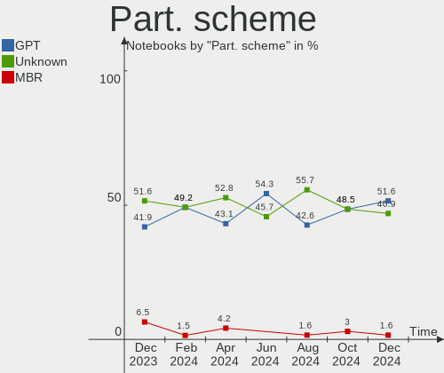
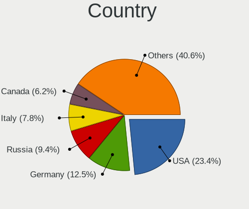
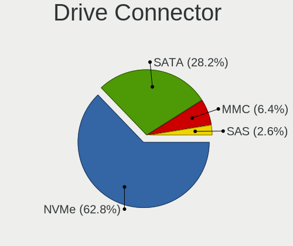
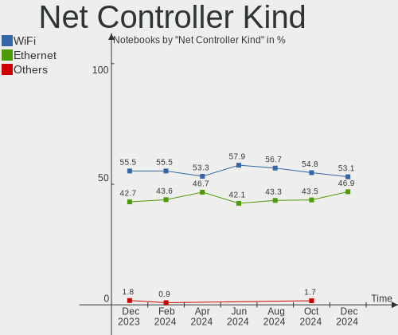

Manjaro Hardware Trends (Notebooks)
-----------------------------------

A project to identify most popular hardware characteristics and track their change
over time based on data collected by Manjaro users at https://Linux-Hardware.org.

Anyone can contribute to this report by the [hw-probe](https://github.com/linuxhw/hw-probe) tool:

    sudo -E hw-probe -all -upload

Full-feature report is available here: https://linux-hardware.org/?view=trends&formfactor=notebook

Period: Aug, 2021.

Contents
--------

* [ System ](#system)
  - [ OS                       ](#os)
  - [ OS Family                ](#os-family)
  - [ Kernel                   ](#kernel)
  - [ Kernel Family            ](#kernel-family)
  - [ Kernel Major Ver.        ](#kernel-major-ver)
  - [ Arch                     ](#arch)
  - [ DE                       ](#de)
  - [ Display Server           ](#display-server)
  - [ Display Manager          ](#display-manager)
  - [ OS Lang                  ](#os-lang)
  - [ Boot Mode                ](#boot-mode)
  - [ Filesystem               ](#filesystem)
  - [ Part. scheme             ](#part-scheme)
  - [ Dual Boot with Linux/BSD ](#dual-boot-with-linuxbsd)
  - [ Dual Boot (Win)          ](#dual-boot-win)

* [ Board ](#board)
  - [ Vendor                   ](#vendor)
  - [ Model                    ](#model)
  - [ Model Family             ](#model-family)
  - [ MFG Year                 ](#mfg-year)
  - [ Form Factor              ](#form-factor)
  - [ Secure Boot              ](#secure-boot)
  - [ Coreboot                 ](#coreboot)
  - [ RAM Size                 ](#ram-size)
  - [ RAM Used                 ](#ram-used)
  - [ Total Drives             ](#total-drives)
  - [ Has CD-ROM               ](#has-cd-rom)
  - [ Has Ethernet             ](#has-ethernet)
  - [ Has WiFi                 ](#has-wifi)
  - [ Has Bluetooth            ](#has-bluetooth)

* [ Location ](#location)
  - [ Country                  ](#country)
  - [ City                     ](#city)

* [ Drives ](#drives)
  - [ Drive Vendor             ](#drive-vendor)
  - [ Drive Model              ](#drive-model)
  - [ HDD Vendor               ](#hdd-vendor)
  - [ SSD Vendor               ](#ssd-vendor)
  - [ Drive Kind               ](#drive-kind)
  - [ Drive Connector          ](#drive-connector)
  - [ Drive Size               ](#drive-size)
  - [ Space Total              ](#space-total)
  - [ Space Used               ](#space-used)
  - [ Malfunc. Drives          ](#malfunc-drives)
  - [ Malfunc. Drive Vendor    ](#malfunc-drive-vendor)
  - [ Malfunc. HDD Vendor      ](#malfunc-hdd-vendor)
  - [ Malfunc. Drive Kind      ](#malfunc-drive-kind)
  - [ Failed Drives            ](#failed-drives)
  - [ Failed Drive Vendor      ](#failed-drive-vendor)
  - [ Drive Status             ](#drive-status)

* [ Storage controller ](#storage-controller)
  - [ Storage Vendor           ](#storage-vendor)
  - [ Storage Model            ](#storage-model)
  - [ Storage Kind             ](#storage-kind)

* [ Processor ](#processor)
  - [ CPU Vendor               ](#cpu-vendor)
  - [ CPU Model                ](#cpu-model)
  - [ CPU Model Family         ](#cpu-model-family)
  - [ CPU Cores                ](#cpu-cores)
  - [ CPU Sockets              ](#cpu-sockets)
  - [ CPU Threads              ](#cpu-threads)
  - [ CPU Op-Modes             ](#cpu-op-modes)
  - [ CPU Microcode            ](#cpu-microcode)
  - [ CPU Microarch            ](#cpu-microarch)

* [ Graphics ](#graphics)
  - [ GPU Vendor               ](#gpu-vendor)
  - [ GPU Model                ](#gpu-model)
  - [ GPU Combo                ](#gpu-combo)
  - [ GPU Driver               ](#gpu-driver)
  - [ GPU Memory               ](#gpu-memory)

* [ Monitor ](#monitor)
  - [ Monitor Vendor           ](#monitor-vendor)
  - [ Monitor Model            ](#monitor-model)
  - [ Monitor Resolution       ](#monitor-resolution)
  - [ Monitor Diagonal         ](#monitor-diagonal)
  - [ Monitor Width            ](#monitor-width)
  - [ Aspect Ratio             ](#aspect-ratio)
  - [ Monitor Area             ](#monitor-area)
  - [ Pixel Density            ](#pixel-density)
  - [ Multiple Monitors        ](#multiple-monitors)

* [ Network ](#network)
  - [ Net Controller Vendor    ](#net-controller-vendor)
  - [ Net Controller Model     ](#net-controller-model)
  - [ Wireless Vendor          ](#wireless-vendor)
  - [ Wireless Model           ](#wireless-model)
  - [ Ethernet Vendor          ](#ethernet-vendor)
  - [ Ethernet Model           ](#ethernet-model)
  - [ Net Controller Kind      ](#net-controller-kind)
  - [ Used Controller          ](#used-controller)
  - [ NICs                     ](#nics)
  - [ IPv6                     ](#ipv6)

* [ Bluetooth ](#bluetooth)
  - [ Bluetooth Vendor         ](#bluetooth-vendor)
  - [ Bluetooth Model          ](#bluetooth-model)

* [ Sound ](#sound)
  - [ Sound Vendor             ](#sound-vendor)
  - [ Sound Model              ](#sound-model)

* [ Memory ](#memory)
  - [ Memory Vendor            ](#memory-vendor)
  - [ Memory Model             ](#memory-model)
  - [ Memory Kind              ](#memory-kind)
  - [ Memory Form Factor       ](#memory-form-factor)
  - [ Memory Size              ](#memory-size)
  - [ Memory Speed             ](#memory-speed)

* [ Printers & scanners ](#printers--scanners)
  - [ Printer Vendor           ](#printer-vendor)
  - [ Printer Model            ](#printer-model)
  - [ Scanner Vendor           ](#scanner-vendor)
  - [ Scanner Model            ](#scanner-model)

* [ Camera ](#camera)
  - [ Camera Vendor            ](#camera-vendor)
  - [ Camera Model             ](#camera-model)

* [ Security ](#security)
  - [ Fingerprint Vendor       ](#fingerprint-vendor)
  - [ Fingerprint Model        ](#fingerprint-model)
  - [ Chipcard Vendor          ](#chipcard-vendor)
  - [ Chipcard Model           ](#chipcard-model)

* [ Unsupported ](#unsupported)
  - [ Unsupported Devices      ](#unsupported-devices)
  - [ Unsupported Device Types ](#unsupported-device-types)

System
------

OS
--

Installed operating systems

| Name           | Notebooks | Percent |
|----------------|-----------|---------|
| Manjaro 21.1.0 | 56        | 51.85%  |
| Manjaro        | 40        | 37.04%  |
| Manjaro 21.1.1 | 10        | 9.26%   |
| Manjaro 21.0.7 | 2         | 1.85%   |

OS Family
---------

OS without a version

| Name    | Notebooks | Percent |
|---------|-----------|---------|
| Manjaro | 108       | 100%    |

Kernel
------

Version of the Linux kernel

| Version                | Notebooks | Percent |
|------------------------|-----------|---------|
| 5.10.56-1-MANJARO      | 19        | 17.59%  |
| 5.10.53-1-MANJARO      | 19        | 17.59%  |
| 5.13.11-1-MANJARO      | 15        | 13.89%  |
| 5.13.12-1-MANJARO      | 11        | 10.19%  |
| 5.13.8-1-MANJARO       | 8         | 7.41%   |
| 5.10.59-1-MANJARO      | 8         | 7.41%   |
| 5.13.5-1-MANJARO       | 7         | 6.48%   |
| 5.12.19-1-MANJARO      | 7         | 6.48%   |
| 5.14.0-1-MANJARO       | 6         | 5.56%   |
| 5.10.60-1-MANJARO      | 2         | 1.85%   |
| 5.4.141-1-MANJARO      | 1         | 0.93%   |
| 5.4.138-1-MANJARO      | 1         | 0.93%   |
| 5.4.124-1-MANJARO      | 1         | 0.93%   |
| 5.12.16-1-MANJARO      | 1         | 0.93%   |
| 5.10.52-3-rt47-MANJARO | 1         | 0.93%   |
| 5.10.42-1-MANJARO      | 1         | 0.93%   |

Kernel Family
-------------

Linux kernel without a distro release

| Version | Notebooks | Percent |
|---------|-----------|---------|
| 5.10.56 | 19        | 17.59%  |
| 5.10.53 | 19        | 17.59%  |
| 5.13.11 | 15        | 13.89%  |
| 5.13.12 | 11        | 10.19%  |
| 5.13.8  | 8         | 7.41%   |
| 5.10.59 | 8         | 7.41%   |
| 5.13.5  | 7         | 6.48%   |
| 5.12.19 | 7         | 6.48%   |
| 5.14.0  | 6         | 5.56%   |
| 5.10.60 | 2         | 1.85%   |
| 5.4.141 | 1         | 0.93%   |
| 5.4.138 | 1         | 0.93%   |
| 5.4.124 | 1         | 0.93%   |
| 5.12.16 | 1         | 0.93%   |
| 5.10.52 | 1         | 0.93%   |
| 5.10.42 | 1         | 0.93%   |

Kernel Major Ver.
-----------------

Linux kernel major version

| Version | Notebooks | Percent |
|---------|-----------|---------|
| 5.10    | 50        | 46.3%   |
| 5.13    | 41        | 37.96%  |
| 5.12    | 8         | 7.41%   |
| 5.14    | 6         | 5.56%   |
| 5.4     | 3         | 2.78%   |

Arch
----

OS architecture (x86_64, i586, etc.)

| Name   | Notebooks | Percent |
|--------|-----------|---------|
| x86_64 | 108       | 100%    |

DE
--

Desktop Environment

| Name       | Notebooks | Percent |
|------------|-----------|---------|
| XFCE       | 28        | 25.93%  |
| KDE5       | 27        | 25%     |
| GNOME      | 26        | 24.07%  |
| KDE        | 12        | 11.11%  |
| X-Cinnamon | 8         | 7.41%   |
| Unknown    | 3         | 2.78%   |
| i3         | 2         | 1.85%   |
| qtile      | 1         | 0.93%   |
| Budgie     | 1         | 0.93%   |

Display Server
--------------

X11 or Wayland

| Name    | Notebooks | Percent |
|---------|-----------|---------|
| X11     | 84        | 77.78%  |
| Wayland | 20        | 18.52%  |
| Unknown | 4         | 3.7%    |

Display Manager
---------------

SDDM, LightDM, etc.

| Name    | Notebooks | Percent |
|---------|-----------|---------|
| Unknown | 39        | 36.11%  |
| SDDM    | 26        | 24.07%  |
| LightDM | 25        | 23.15%  |
| GDM     | 16        | 14.81%  |
| TDM     | 2         | 1.85%   |

OS Lang
-------

Language

| Lang   | Notebooks | Percent |
|--------|-----------|---------|
| en_US  | 46        | 42.59%  |
| de_DE  | 13        | 12.04%  |
| en_GB  | 9         | 8.33%   |
| ru_RU  | 8         | 7.41%   |
| pt_BR  | 5         | 4.63%   |
| fr_FR  | 4         | 3.7%    |
| es_ES  | 3         | 2.78%   |
| ru_UA  | 2         | 1.85%   |
| en_NZ  | 2         | 1.85%   |
| en_AU  | 2         | 1.85%   |
| zh_TW  | 1         | 0.93%   |
| zh_CN  | 1         | 0.93%   |
| uk_UA  | 1         | 0.93%   |
| tr_TR  | 1         | 0.93%   |
| szl_PL | 1         | 0.93%   |
| sv_SE  | 1         | 0.93%   |
| pt_PT  | 1         | 0.93%   |
| it_IT  | 1         | 0.93%   |
| es_VE  | 1         | 0.93%   |
| es_CL  | 1         | 0.93%   |
| en_IN  | 1         | 0.93%   |
| en_IE  | 1         | 0.93%   |
| en_CA  | 1         | 0.93%   |
| de_BE  | 1         | 0.93%   |

Boot Mode
---------

EFI or BIOS

| Mode | Notebooks | Percent |
|------|-----------|---------|
| EFI  | 56        | 51.85%  |
| BIOS | 52        | 48.15%  |

Filesystem
----------

Type of filesystem

| Type    | Notebooks | Percent |
|---------|-----------|---------|
| Ext4    | 96        | 88.89%  |
| Btrfs   | 7         | 6.48%   |
| Overlay | 2         | 1.85%   |
| Xfs     | 1         | 0.93%   |
| Ext3    | 1         | 0.93%   |
| Unknown | 1         | 0.93%   |

Part. scheme
------------

Scheme of partitioning

| Type    | Notebooks | Percent |
|---------|-----------|---------|
| GPT     | 56        | 51.85%  |
| Unknown | 38        | 35.19%  |
| MBR     | 14        | 12.96%  |

Dual Boot with Linux/BSD
------------------------

Hosting more than one Linux/BSD

| Dual boot | Notebooks | Percent |
|-----------|-----------|---------|
| No        | 101       | 93.52%  |
| Yes       | 7         | 6.48%   |

Dual Boot (Win)
---------------

Hosting Linux and Windows

| Dual boot | Notebooks | Percent |
|-----------|-----------|---------|
| No        | 78        | 72.22%  |
| Yes       | 30        | 27.78%  |

Board
-----

Vendor
------

Motherboard manufacturer

| Name                   | Notebooks | Percent |
|------------------------|-----------|---------|
| Lenovo                 | 33        | 30.56%  |
| Hewlett-Packard        | 23        | 21.3%   |
| Dell                   | 14        | 12.96%  |
| ASUSTek Computer       | 10        | 9.26%   |
| Acer                   | 8         | 7.41%   |
| Apple                  | 3         | 2.78%   |
| Timi                   | 2         | 1.85%   |
| Samsung Electronics    | 2         | 1.85%   |
| Notebook               | 2         | 1.85%   |
| HUAWEI                 | 2         | 1.85%   |
| TUXEDO                 | 1         | 0.93%   |
| Toshiba                | 1         | 0.93%   |
| PC Specialist          | 1         | 0.93%   |
| ONE-NETBOOK TECHNOLOGY | 1         | 0.93%   |
| MSI                    | 1         | 0.93%   |
| LG Electronics         | 1         | 0.93%   |
| Google                 | 1         | 0.93%   |
| Clevo                  | 1         | 0.93%   |
| Unknown                | 1         | 0.93%   |

Model
-----

Motherboard model

| Name                                       | Notebooks | Percent |
|--------------------------------------------|-----------|---------|
| HUAWEI BOHK-WAX9X                          | 2         | 1.85%   |
| HP Presario CQ57                           | 2         | 1.85%   |
| HP Pavilion Gaming Laptop 15-ec1xxx        | 2         | 1.85%   |
| Acer Aspire A315-42                        | 2         | 1.85%   |
| Unknown                                    | 2         | 1.85%   |
| Toshiba Satellite L855                     | 1         | 0.93%   |
| Timi TM1612                                | 1         | 0.93%   |
| Timi A35S                                  | 1         | 0.93%   |
| Samsung RC410/RC510/RC710                  | 1         | 0.93%   |
| Samsung 550XCJ/550XCR                      | 1         | 0.93%   |
| PC Specialist NH5x_7xRCx,RDx               | 1         | 0.93%   |
| ONE-NETBOOK TECHNOLOGY ONE XPLAYER         | 1         | 0.93%   |
| Notebook NH5xAx                            | 1         | 0.93%   |
| Notebook N85_N870HL                        | 1         | 0.93%   |
| MSI GF75 Thin 10SC                         | 1         | 0.93%   |
| LG 17Z90P-K.AAC8U1                         | 1         | 0.93%   |
| Lenovo Z50-70 20354                        | 1         | 0.93%   |
| Lenovo V15-IIL 82C5                        | 1         | 0.93%   |
| Lenovo V145-15AST 81MT                     | 1         | 0.93%   |
| Lenovo ThinkPad X140e 20BLS00300           | 1         | 0.93%   |
| Lenovo ThinkPad X1 Carbon Gen 9 20XW005GRT | 1         | 0.93%   |
| Lenovo ThinkPad X1 Carbon Gen 9 20XW003GUS | 1         | 0.93%   |
| Lenovo ThinkPad X1 Carbon 4th 20FC000RAU   | 1         | 0.93%   |
| Lenovo ThinkPad W550s 20E2CTO1WW           | 1         | 0.93%   |
| Lenovo ThinkPad T590 20N4002WGE            | 1         | 0.93%   |
| Lenovo ThinkPad T580 20L9CTO1WW            | 1         | 0.93%   |
| Lenovo ThinkPad T510 4484A63               | 1         | 0.93%   |
| Lenovo ThinkPad T480 20L6S69B00            | 1         | 0.93%   |
| Lenovo ThinkPad T480 20L5CTO1WW            | 1         | 0.93%   |
| Lenovo ThinkPad T470s 20HGS2PL00           | 1         | 0.93%   |
| Lenovo ThinkPad T440s 20ARS2V900           | 1         | 0.93%   |
| Lenovo ThinkPad T430 2349Y3D               | 1         | 0.93%   |
| Lenovo ThinkPad T410 2537NP8               | 1         | 0.93%   |
| Lenovo ThinkPad P52s 20LB0009FR            | 1         | 0.93%   |
| Lenovo ThinkPad P51 20HH000TUS             | 1         | 0.93%   |
| Lenovo ThinkPad Edge 01962AS               | 1         | 0.93%   |
| Lenovo ThinkPad E15 Gen 2 20T9S0B500       | 1         | 0.93%   |
| Lenovo ThinkPad E15 Gen 2 20T8CTO1WW       | 1         | 0.93%   |
| Lenovo ThinkPad E14 Gen 3 20YDCTO1WW       | 1         | 0.93%   |
| Lenovo Legion 5 15ARH05 82B5               | 1         | 0.93%   |
| Lenovo Legion 5 15ACH6H 82JU               | 1         | 0.93%   |
| Lenovo IdeaPad Y510P 20217                 | 1         | 0.93%   |
| Lenovo IdeaPad S145-15IIL 82DJ             | 1         | 0.93%   |
| Lenovo IdeaPad 530S-14ARR 81H1             | 1         | 0.93%   |
| Lenovo IdeaPad 5 14ALC05 82LM              | 1         | 0.93%   |
| Lenovo IdeaPad 3 14IIL05 81WD              | 1         | 0.93%   |
| Lenovo IdeaPad 110-15ISK 80UD              | 1         | 0.93%   |
| Lenovo IdeaPad 100-15IBD 80QQ              | 1         | 0.93%   |
| Lenovo G40-45 80E1                         | 1         | 0.93%   |
| HP ProBook 6550b                           | 1         | 0.93%   |
| HP ProBook 6470b                           | 1         | 0.93%   |
| HP ProBook 6460b                           | 1         | 0.93%   |
| HP Pavilion TS 11                          | 1         | 0.93%   |
| HP Pavilion Sleekbook 15 PC                | 1         | 0.93%   |
| HP Pavilion Laptop 15-eh0xxx               | 1         | 0.93%   |
| HP Pavilion Gaming Laptop 15-dk0xxx        | 1         | 0.93%   |
| HP Pavilion dv7                            | 1         | 0.93%   |
| HP Pavilion dv6500                         | 1         | 0.93%   |
| HP Laptop 15-ef1xxx                        | 1         | 0.93%   |
| HP Laptop 15-dy2xxx                        | 1         | 0.93%   |

Model Family
------------

Motherboard model prefix

| Name                       | Notebooks | Percent |
|----------------------------|-----------|---------|
| Lenovo ThinkPad            | 20        | 18.52%  |
| HP Pavilion                | 8         | 7.41%   |
| Lenovo IdeaPad             | 7         | 6.48%   |
| Dell XPS                   | 5         | 4.63%   |
| HP EliteBook               | 4         | 3.7%    |
| Acer Aspire                | 4         | 3.7%    |
| HP ProBook                 | 3         | 2.78%   |
| HP Laptop                  | 3         | 2.78%   |
| Dell Latitude              | 3         | 2.78%   |
| Dell Inspiron              | 3         | 2.78%   |
| ASUS ROG                   | 3         | 2.78%   |
| Lenovo Legion              | 2         | 1.85%   |
| HUAWEI BOHK-WAX9X          | 2         | 1.85%   |
| HP Presario                | 2         | 1.85%   |
| HP ENVY                    | 2         | 1.85%   |
| ASUS ZenBook               | 2         | 1.85%   |
| Unknown                    | 2         | 1.85%   |
| Toshiba Satellite          | 1         | 0.93%   |
| Timi TM1612                | 1         | 0.93%   |
| Timi A35S                  | 1         | 0.93%   |
| Samsung RC410              | 1         | 0.93%   |
| Samsung 550XCJ             | 1         | 0.93%   |
| PC Specialist NH5x         | 1         | 0.93%   |
| ONE-NETBOOK TECHNOLOGY ONE | 1         | 0.93%   |
| Notebook NH5xAx            | 1         | 0.93%   |
| Notebook N85               | 1         | 0.93%   |
| MSI GF75                   | 1         | 0.93%   |
| LG 17Z90P-K.AAC8U1         | 1         | 0.93%   |
| Lenovo Z50-70              | 1         | 0.93%   |
| Lenovo V15-IIL             | 1         | 0.93%   |
| Lenovo V145-15AST          | 1         | 0.93%   |
| Lenovo G40-45              | 1         | 0.93%   |
| HP Elite                   | 1         | 0.93%   |
| Google Enguarde            | 1         | 0.93%   |
| Dell Vostro                | 1         | 0.93%   |
| Dell Studio                | 1         | 0.93%   |
| Dell G3                    | 1         | 0.93%   |
| Clevo W240EU               | 1         | 0.93%   |
| ASUS X541UV                | 1         | 0.93%   |
| ASUS VivoBook              | 1         | 0.93%   |
| ASUS UX430UQ               | 1         | 0.93%   |
| ASUS UX305CA               | 1         | 0.93%   |
| ASUS GL553VD               | 1         | 0.93%   |
| Apple MacBookPro6          | 1         | 0.93%   |
| Apple MacBookPro10         | 1         | 0.93%   |
| Apple MacBookAir3          | 1         | 0.93%   |
| Acer TravelMate            | 1         | 0.93%   |
| Acer Predator              | 1         | 0.93%   |
| Acer Nitro                 | 1         | 0.93%   |
| Acer Extensa               | 1         | 0.93%   |

MFG Year
--------

Motherboard manufacture year

| Year | Notebooks | Percent |
|------|-----------|---------|
| 2021 | 29        | 26.85%  |
| 2020 | 24        | 22.22%  |
| 2018 | 13        | 12.04%  |
| 2019 | 9         | 8.33%   |
| 2013 | 9         | 8.33%   |
| 2016 | 6         | 5.56%   |
| 2011 | 6         | 5.56%   |
| 2010 | 5         | 4.63%   |
| 2017 | 2         | 1.85%   |
| 2015 | 2         | 1.85%   |
| 2012 | 2         | 1.85%   |
| 2014 | 1         | 0.93%   |

Form Factor
-----------

Physical design of the computer

| Name     | Notebooks | Percent |
|----------|-----------|---------|
| Notebook | 108       | 100%    |

Secure Boot
-----------

Enabled or disabled

| State    | Notebooks | Percent |
|----------|-----------|---------|
| Disabled | 107       | 99.07%  |
| Enabled  | 1         | 0.93%   |

Coreboot
--------

Have coreboot on board

| Used | Notebooks | Percent |
|------|-----------|---------|
| No   | 107       | 99.07%  |
| Yes  | 1         | 0.93%   |

RAM Size
--------

Total RAM memory

| Size in GB | Notebooks | Percent |
|------------|-----------|---------|
| 4.01-8.0   | 33        | 30.56%  |
| 16.01-24.0 | 23        | 21.3%   |
| 3.01-4.0   | 19        | 17.59%  |
| 8.01-16.0  | 18        | 16.67%  |
| 32.01-64.0 | 10        | 9.26%   |
| 24.01-32.0 | 2         | 1.85%   |
| 1.01-2.0   | 2         | 1.85%   |
| 2.01-3.0   | 1         | 0.93%   |

RAM Used
--------

Used RAM memory

| Used GB   | Notebooks | Percent |
|-----------|-----------|---------|
| 2.01-3.0  | 32        | 29.63%  |
| 1.01-2.0  | 32        | 29.63%  |
| 4.01-8.0  | 21        | 19.44%  |
| 3.01-4.0  | 17        | 15.74%  |
| 0.51-1.0  | 5         | 4.63%   |
| 8.01-16.0 | 1         | 0.93%   |

Total Drives
------------

Number of drives on board

| Drives | Notebooks | Percent |
|--------|-----------|---------|
| 1      | 80        | 74.07%  |
| 2      | 22        | 20.37%  |
| 3      | 6         | 5.56%   |

Has CD-ROM
----------

Has CD-ROM on board

| Presented | Notebooks | Percent |
|-----------|-----------|---------|
| No        | 83        | 76.85%  |
| Yes       | 25        | 23.15%  |

Has Ethernet
------------

Has Ethernet on board

| Presented | Notebooks | Percent |
|-----------|-----------|---------|
| Yes       | 79        | 73.15%  |
| No        | 29        | 26.85%  |

Has WiFi
--------

Has WiFi module

| Presented | Notebooks | Percent |
|-----------|-----------|---------|
| Yes       | 105       | 97.22%  |
| No        | 3         | 2.78%   |

Has Bluetooth
-------------

Has Bluetooth module

| Presented | Notebooks | Percent |
|-----------|-----------|---------|
| Yes       | 90        | 83.33%  |
| No        | 18        | 16.67%  |

Location
--------

Country
-------

Geographic location (country)

| Country     | Notebooks | Percent |
|-------------|-----------|---------|
| USA         | 18        | 16.67%  |
| Germany     | 13        | 12.04%  |
| Russia      | 8         | 7.41%   |
| France      | 6         | 5.56%   |
| Brazil      | 6         | 5.56%   |
| Ukraine     | 4         | 3.7%    |
| UK          | 4         | 3.7%    |
| Indonesia   | 4         | 3.7%    |
| Spain       | 3         | 2.78%   |
| India       | 3         | 2.78%   |
| Belarus     | 3         | 2.78%   |
| Tunisia     | 2         | 1.85%   |
| Switzerland | 2         | 1.85%   |
| Portugal    | 2         | 1.85%   |
| New Zealand | 2         | 1.85%   |
| Netherlands | 2         | 1.85%   |
| Belgium     | 2         | 1.85%   |
| Australia   | 2         | 1.85%   |
| Zimbabwe    | 1         | 0.93%   |
| Venezuela   | 1         | 0.93%   |
| Turkey      | 1         | 0.93%   |
| Taiwan      | 1         | 0.93%   |
| Sweden      | 1         | 0.93%   |
| Romania     | 1         | 0.93%   |
| Poland      | 1         | 0.93%   |
| Norway      | 1         | 0.93%   |
| Latvia      | 1         | 0.93%   |
| Jordan      | 1         | 0.93%   |
| Japan       | 1         | 0.93%   |
| Italy       | 1         | 0.93%   |
| Iraq        | 1         | 0.93%   |
| Hungary     | 1         | 0.93%   |
| Estonia     | 1         | 0.93%   |
| Czechia     | 1         | 0.93%   |
| Colombia    | 1         | 0.93%   |
| China       | 1         | 0.93%   |
| Chile       | 1         | 0.93%   |
| Canada      | 1         | 0.93%   |
| Austria     | 1         | 0.93%   |
| Argentina   | 1         | 0.93%   |

City
----

Geographic location (city)

| City                    | Notebooks | Percent |
|-------------------------|-----------|---------|
| Minsk                   | 3         | 2.78%   |
| Weatherford             | 2         | 1.85%   |
| St Petersburg           | 2         | 1.85%   |
| Novosibirsk             | 2         | 1.85%   |
| Nieblum                 | 2         | 1.85%   |
| Moscow                  | 2         | 1.85%   |
| Madrid                  | 2         | 1.85%   |
| Kyiv                    | 2         | 1.85%   |
| Zug                     | 1         | 0.93%   |
| Wimbledon               | 1         | 0.93%   |
| Warsaw                  | 1         | 0.93%   |
| Verfeil                 | 1         | 0.93%   |
| Tallinn                 | 1         | 0.93%   |
| Surakarta               | 1         | 0.93%   |
| Suceava                 | 1         | 0.93%   |
| Stuttgart               | 1         | 0.93%   |
| Springe                 | 1         | 0.93%   |
| Sint-Michiels           | 1         | 0.93%   |
| Seattle                 | 1         | 0.93%   |
| S??o Leopoldo           | 1         | 0.93%   |
| Sarmeola                | 1         | 0.93%   |
| Santiago                | 1         | 0.93%   |
| Sagar                   | 1         | 0.93%   |
| Rostov-on-Don           | 1         | 0.93%   |
| Reno                    | 1         | 0.93%   |
| Remilly                 | 1         | 0.93%   |
| Rades                   | 1         | 0.93%   |
| Providence              | 1         | 0.93%   |
| Porto                   | 1         | 0.93%   |
| Pompano Beach           | 1         | 0.93%   |
| Phoenix                 | 1         | 0.93%   |
| Pforzheim               | 1         | 0.93%   |
| Perth                   | 1         | 0.93%   |
| Penza                   | 1         | 0.93%   |
| Pekalongan              | 1         | 0.93%   |
| P?©cs                   | 1         | 0.93%   |
| Paris                   | 1         | 0.93%   |
| Ougree                  | 1         | 0.93%   |
| Niter??i                | 1         | 0.93%   |
| Newton Aycliffe         | 1         | 0.93%   |
| New Hampton             | 1         | 0.93%   |
| Milpitas                | 1         | 0.93%   |
| Mesquite                | 1         | 0.93%   |
| Medjez el Bab           | 1         | 0.93%   |
| Medell?­n               | 1         | 0.93%   |
| Mattsee                 | 1         | 0.93%   |
| Matosinhos Municipality | 1         | 0.93%   |
| Maple Heights           | 1         | 0.93%   |
| Mannheim                | 1         | 0.93%   |
| Makassar                | 1         | 0.93%   |
| Lutsk                   | 1         | 0.93%   |
| Lugano                  | 1         | 0.93%   |
| Los Angeles             | 1         | 0.93%   |
| Little Rock             | 1         | 0.93%   |
| Limburg an der Lahn     | 1         | 0.93%   |
| Lille                   | 1         | 0.93%   |
| Las Vegas               | 1         | 0.93%   |
| Lambersart              | 1         | 0.93%   |
| Labarthe-sur-Leze       | 1         | 0.93%   |
| K?¶then                 | 1         | 0.93%   |

Drives
------

Drive Vendor
------------

Hard drive vendors

| Vendor                    | Notebooks | Drives | Percent |
|---------------------------|-----------|--------|---------|
| Samsung Electronics       | 28        | 30     | 20.9%   |
| WDC                       | 20        | 21     | 14.93%  |
| Seagate                   | 15        | 16     | 11.19%  |
| Toshiba                   | 10        | 10     | 7.46%   |
| SK Hynix                  | 9         | 9      | 6.72%   |
| Unknown                   | 6         | 6      | 4.48%   |
| Micron Technology         | 6         | 6      | 4.48%   |
| Kingston                  | 6         | 6      | 4.48%   |
| SanDisk                   | 4         | 4      | 2.99%   |
| Intel                     | 4         | 4      | 2.99%   |
| Crucial                   | 4         | 4      | 2.99%   |
| Transcend                 | 3         | 4      | 2.24%   |
| Apple                     | 3         | 3      | 2.24%   |
| Realtek Semiconductor     | 2         | 2      | 1.49%   |
| Phison                    | 2         | 2      | 1.49%   |
| LITEON                    | 2         | 2      | 1.49%   |
| KIOXIA                    | 2         | 2      | 1.49%   |
| Hitachi                   | 2         | 2      | 1.49%   |
| SSK                       | 1         | 1      | 0.75%   |
| Solidata                  | 1         | 3      | 0.75%   |
| Micron/Crucial Technology | 1         | 1      | 0.75%   |
| JMICRON                   | 1         | 1      | 0.75%   |
| HGST                      | 1         | 1      | 0.75%   |
| A-DATA Technology         | 1         | 1      | 0.75%   |

Drive Model
-----------

Hard drive models

| Model                                        | Notebooks | Percent |
|----------------------------------------------|-----------|---------|
| Seagate ST1000LM035-1RK172 1TB               | 3         | 2.19%   |
| WDC WD10JPVX-75JC3T0 1TB                     | 2         | 1.46%   |
| Toshiba MQ04ABF100 1TB                       | 2         | 1.46%   |
| SK Hynix NVMe SSD Drive 512GB                | 2         | 1.46%   |
| Seagate ST500LM000-1EJ162 500GB              | 2         | 1.46%   |
| Seagate Expansion 2TB                        | 2         | 1.46%   |
| Seagate BarraCuda 120 SSD ZA500CM10003 500GB | 2         | 1.46%   |
| Samsung SSD 860 EVO 500GB                    | 2         | 1.46%   |
| Samsung NVMe SSD Drive 512GB                 | 2         | 1.46%   |
| Samsung NVMe SSD Drive 1024GB                | 2         | 1.46%   |
| Intel SSDPEKNW512G8 512GB                    | 2         | 1.46%   |
| Hitachi HTS723232A7A364 320GB                | 2         | 1.46%   |
| Crucial CT240BX500SSD1 240GB                 | 2         | 1.46%   |
| WDC WD7500BPKX-75HPJT0 752GB                 | 1         | 0.73%   |
| WDC WD5000LPVX-75V0TT0 500GB                 | 1         | 0.73%   |
| WDC WD5000LPVT-22G33T0 500GB                 | 1         | 0.73%   |
| WDC WD5000LPCX-24C6HT0 500GB                 | 1         | 0.73%   |
| WDC WD3200LPVX-75V0TT0 320GB                 | 1         | 0.73%   |
| WDC WD3200BPVT-75JJ5T0 320GB                 | 1         | 0.73%   |
| WDC WD3200BEVT-75ZCT2 320GB                  | 1         | 0.73%   |
| WDC WD3200BEVT-60ZCT1 320GB                  | 1         | 0.73%   |
| WDC WD10SPZX-24Z10T0 1TB                     | 1         | 0.73%   |
| WDC WD10SPZX-24Z10 1TB                       | 1         | 0.73%   |
| WDC WD10SPZX-21Z10T0 1TB                     | 1         | 0.73%   |
| WDC WD10SPZX-21Z 1TB                         | 1         | 0.73%   |
| WDC PC SN730 SDBQNTY-512G-1001 512GB         | 1         | 0.73%   |
| WDC PC SN530 SDBPTPZ-1T00-1002 1TB           | 1         | 0.73%   |
| WDC PC SN530 SDBPNPZ-512G-1006 512GB         | 1         | 0.73%   |
| WDC PC SN530 SDBPMPZ-512G-1001 512GB         | 1         | 0.73%   |
| WDC PC SN530 SDBPMPZ-256G-1001 256GB         | 1         | 0.73%   |
| WDC PC SN520 SDAPNUW-512G-1006 512GB         | 1         | 0.73%   |
| WDC PC SN520 SDAPMUW-256G-1101 256GB         | 1         | 0.73%   |
| Unknown SD256  250GB                         | 1         | 0.73%   |
| Unknown SD128  128GB                         | 1         | 0.73%   |
| Unknown SD04G  4GB                           | 1         | 0.73%   |
| Unknown SD/MMC/MS PRO 128GB                  | 1         | 0.73%   |
| Unknown eBtsU BSD 2TB                        | 1         | 0.73%   |
| Unknown AGND3R  16GB                         | 1         | 0.73%   |
| Transcend TS512GMTE220S 512GB                | 1         | 0.73%   |
| Transcend TS1TSSD230S 1TB                    | 1         | 0.73%   |
| Transcend TS120GMTS420S 120GB SSD            | 1         | 0.73%   |
| Toshiba NVMe SSD Drive 512GB                 | 1         | 0.73%   |
| Toshiba MQ01ABF050 500GB                     | 1         | 0.73%   |
| Toshiba MQ01ABD050V 500GB                    | 1         | 0.73%   |
| Toshiba MK7559GSXF 752GB                     | 1         | 0.73%   |
| Toshiba MK6475GSX 640GB                      | 1         | 0.73%   |
| Toshiba MK5075GSX 500GB                      | 1         | 0.73%   |
| Toshiba MK2561GSYN 250GB                     | 1         | 0.73%   |
| Toshiba KBG30ZMS128G 128GB NVMe SSD          | 1         | 0.73%   |
| SSK Disk 64GB                                | 1         | 0.73%   |
| Solidata SSD 480GB                           | 1         | 0.73%   |
| SK Hynix PC711 HFS512GDE9X073N 512GB         | 1         | 0.73%   |
| SK Hynix PC401 HFS256GD9TNG-62A0A 256GB      | 1         | 0.73%   |
| SK Hynix NVMe SSD Drive 256GB                | 1         | 0.73%   |
| SK Hynix NVMe SSD Drive 1TB                  | 1         | 0.73%   |
| SK Hynix NVMe SSD Drive 128GB                | 1         | 0.73%   |
| SK Hynix HFS256G32TND-N210A 256GB SSD        | 1         | 0.73%   |
| SK Hynix HFM512GDJTNG-8310A 512GB            | 1         | 0.73%   |
| Seagate ST750LM022 HN-M750MBB 752GB          | 1         | 0.73%   |
| Seagate ST500LM012 HN-M500MBB 500GB          | 1         | 0.73%   |

HDD Vendor
----------

Hard disk drive vendors

| Vendor  | Notebooks | Drives | Percent |
|---------|-----------|--------|---------|
| WDC     | 14        | 14     | 35.9%   |
| Seagate | 13        | 13     | 33.33%  |
| Toshiba | 8         | 8      | 20.51%  |
| Hitachi | 2         | 2      | 5.13%   |
| HGST    | 1         | 1      | 2.56%   |
| Apple   | 1         | 1      | 2.56%   |

SSD Vendor
----------

Solid state drive vendors

| Vendor              | Notebooks | Drives | Percent |
|---------------------|-----------|--------|---------|
| Samsung Electronics | 10        | 10     | 27.78%  |
| SanDisk             | 4         | 4      | 11.11%  |
| Kingston            | 4         | 4      | 11.11%  |
| Crucial             | 4         | 4      | 11.11%  |
| Seagate             | 3         | 3      | 8.33%   |
| Transcend           | 2         | 2      | 5.56%   |
| Micron Technology   | 2         | 2      | 5.56%   |
| LITEON              | 2         | 2      | 5.56%   |
| Apple               | 2         | 2      | 5.56%   |
| Solidata            | 1         | 3      | 2.78%   |
| SK Hynix            | 1         | 1      | 2.78%   |
| Intel               | 1         | 1      | 2.78%   |

Drive Kind
----------

HDD or SSD

| Kind    | Notebooks | Drives | Percent |
|---------|-----------|--------|---------|
| NVMe    | 53        | 57     | 40.15%  |
| HDD     | 37        | 39     | 28.03%  |
| SSD     | 35        | 38     | 26.52%  |
| MMC     | 4         | 4      | 3.03%   |
| Unknown | 3         | 3      | 2.27%   |

Drive Connector
---------------

SATA, SAS, NVMe, etc.

| Type | Notebooks | Drives | Percent |
|------|-----------|--------|---------|
| SATA | 66        | 74     | 50.77%  |
| NVMe | 53        | 56     | 40.77%  |
| SAS  | 7         | 7      | 5.38%   |
| MMC  | 4         | 4      | 3.08%   |

Drive Size
----------

Size of hard drive

| Size in TB | Notebooks | Drives | Percent |
|------------|-----------|--------|---------|
| 0.01-0.5   | 44        | 49     | 61.97%  |
| 0.51-1.0   | 22        | 23     | 30.99%  |
| 1.01-2.0   | 5         | 5      | 7.04%   |

Space Total
-----------

Amount of disk space available on the file system

| Size in GB     | Notebooks | Percent |
|----------------|-----------|---------|
| 251-500        | 37        | 34.26%  |
| 101-250        | 31        | 28.7%   |
| 501-1000       | 15        | 13.89%  |
| Unknown        | 8         | 7.41%   |
| 1001-2000      | 7         | 6.48%   |
| 1-20           | 5         | 4.63%   |
| 2001-3000      | 2         | 1.85%   |
| More than 3000 | 1         | 0.93%   |
| 21-50          | 1         | 0.93%   |
| 51-100         | 1         | 0.93%   |

Space Used
----------

Amount of used disk space

| Used GB   | Notebooks | Percent |
|-----------|-----------|---------|
| 1-20      | 27        | 25%     |
| 21-50     | 19        | 17.59%  |
| 51-100    | 18        | 16.67%  |
| 251-500   | 15        | 13.89%  |
| 101-250   | 15        | 13.89%  |
| Unknown   | 8         | 7.41%   |
| 501-1000  | 4         | 3.7%    |
| 1001-2000 | 2         | 1.85%   |

Malfunc. Drives
---------------

Drive models with a malfunction

| Model                                | Notebooks | Drives | Percent |
|--------------------------------------|-----------|--------|---------|
| WDC WD3200BEVT-60ZCT1 320GB          | 1         | 1      | 20%     |
| Toshiba MK5075GSX 500GB              | 1         | 1      | 20%     |
| SK Hynix PC711 HFS512GDE9X073N 512GB | 1         | 1      | 20%     |
| Hitachi HTS723232A7A364 320GB        | 1         | 1      | 20%     |
| Crucial CT512M550SSD1 512GB          | 1         | 1      | 20%     |

Malfunc. Drive Vendor
---------------------

Vendors of faulty drives

| Vendor   | Notebooks | Drives | Percent |
|----------|-----------|--------|---------|
| WDC      | 1         | 1      | 20%     |
| Toshiba  | 1         | 1      | 20%     |
| SK Hynix | 1         | 1      | 20%     |
| Hitachi  | 1         | 1      | 20%     |
| Crucial  | 1         | 1      | 20%     |

Malfunc. HDD Vendor
-------------------

Vendors of faulty HDD drives

| Vendor  | Notebooks | Drives | Percent |
|---------|-----------|--------|---------|
| WDC     | 1         | 1      | 33.33%  |
| Toshiba | 1         | 1      | 33.33%  |
| Hitachi | 1         | 1      | 33.33%  |

Malfunc. Drive Kind
-------------------

Kinds of faulty drives

| Kind | Notebooks | Drives | Percent |
|------|-----------|--------|---------|
| HDD  | 3         | 3      | 60%     |
| NVMe | 1         | 1      | 20%     |
| SSD  | 1         | 1      | 20%     |

Failed Drives
-------------

Failed drive models

Zero info for selected period =(

Failed Drive Vendor
-------------------

Failed drive vendors

Zero info for selected period =(

Drive Status
------------

Number of failed and malfunc. drives

| Status   | Notebooks | Drives | Percent |
|----------|-----------|--------|---------|
| Detected | 59        | 81     | 52.21%  |
| Works    | 49        | 55     | 43.36%  |
| Malfunc  | 5         | 5      | 4.42%   |

Storage controller
------------------

Storage Vendor
--------------

Storage controller vendors

| Vendor                       | Notebooks | Percent |
|------------------------------|-----------|---------|
| Intel                        | 64        | 47.06%  |
| AMD                          | 20        | 14.71%  |
| Samsung Electronics          | 19        | 13.97%  |
| SK Hynix                     | 8         | 5.88%   |
| Sandisk                      | 7         | 5.15%   |
| Micron Technology            | 4         | 2.94%   |
| Realtek Semiconductor        | 3         | 2.21%   |
| Toshiba America Info Systems | 2         | 1.47%   |
| Phison Electronics           | 2         | 1.47%   |
| KIOXIA                       | 2         | 1.47%   |
| Kingston Technology Company  | 2         | 1.47%   |
| Silicon Motion               | 1         | 0.74%   |
| Nvidia                       | 1         | 0.74%   |
| Micron/Crucial Technology    | 1         | 0.74%   |

Storage Model
-------------

Storage controller models

| Model                                                                            | Notebooks | Percent |
|----------------------------------------------------------------------------------|-----------|---------|
| AMD FCH SATA Controller [AHCI mode]                                              | 18        | 12.77%  |
| Intel Sunrise Point-LP SATA Controller [AHCI mode]                               | 10        | 7.09%   |
| Samsung NVMe SSD Controller SM981/PM981/PM983                                    | 9         | 6.38%   |
| Intel 7 Series Chipset Family 6-port SATA Controller [AHCI mode]                 | 8         | 5.67%   |
| Intel 82801 Mobile SATA Controller [RAID mode]                                   | 6         | 4.26%   |
| Intel Wildcat Point-LP SATA Controller [AHCI Mode]                               | 5         | 3.55%   |
| Samsung NVMe Controller                                                          | 4         | 2.84%   |
| Micron Non-Volatile memory controller                                            | 4         | 2.84%   |
| Intel HM170/QM170 Chipset SATA Controller [AHCI Mode]                            | 4         | 2.84%   |
| Intel 5 Series/3400 Series Chipset 6 port SATA AHCI Controller                   | 4         | 2.84%   |
| SK Hynix BC511                                                                   | 3         | 2.13%   |
| Sandisk Non-Volatile memory controller                                           | 3         | 2.13%   |
| Samsung NVMe SSD Controller PM9A1/PM9A3/980PRO                                   | 3         | 2.13%   |
| Intel SSD 660P Series                                                            | 3         | 2.13%   |
| Intel Ice Lake-LP SATA Controller [AHCI mode]                                    | 3         | 2.13%   |
| Intel 8 Series SATA Controller 1 [AHCI mode]                                     | 3         | 2.13%   |
| Intel 6 Series/C200 Series Chipset Family 6 port Mobile SATA AHCI Controller     | 3         | 2.13%   |
| SK Hynix BC501 NVMe Solid State Drive                                            | 2         | 1.42%   |
| Samsung NVMe SSD Controller SM961/PM961/SM963                                    | 2         | 1.42%   |
| Realtek Realtek Non-Volatile memory controller                                   | 2         | 1.42%   |
| KIOXIA Non-Volatile memory controller                                            | 2         | 1.42%   |
| Intel Volume Management Device NVMe RAID Controller                              | 2         | 1.42%   |
| Intel Comet Lake SATA AHCI Controller                                            | 2         | 1.42%   |
| Intel Cannon Lake Mobile PCH SATA AHCI Controller                                | 2         | 1.42%   |
| Intel 82801IBM/IEM (ICH9M/ICH9M-E) 4 port SATA Controller [AHCI mode]            | 2         | 1.42%   |
| Intel 5 Series/3400 Series Chipset 4 port SATA AHCI Controller                   | 2         | 1.42%   |
| AMD SB7x0/SB8x0/SB9x0 SATA Controller [AHCI mode]                                | 2         | 1.42%   |
| Toshiba America Info Systems Toshiba America Info Non-Volatile memory controller | 1         | 0.71%   |
| Toshiba America Info Systems BG3 NVMe SSD Controller                             | 1         | 0.71%   |
| SK Hynix PC401 NVMe Solid State Drive 256GB                                      | 1         | 0.71%   |
| SK Hynix NVMe SSD Controller                                                     | 1         | 0.71%   |
| SK Hynix Non-Volatile memory controller                                          | 1         | 0.71%   |
| Silicon Motion SM2262/SM2262EN SSD Controller                                    | 1         | 0.71%   |
| Sandisk WD Blue SN550 NVMe SSD                                                   | 1         | 0.71%   |
| Sandisk WD Blue SN500 / PC SN520 NVMe SSD                                        | 1         | 0.71%   |
| Sandisk WD Black SN750 / PC SN730 NVMe SSD                                       | 1         | 0.71%   |
| Sandisk PC SN520 NVMe SSD                                                        | 1         | 0.71%   |
| Samsung Electronics Non-Volatile memory controller                               | 1         | 0.71%   |
| Realtek RTS5763DL NVMe SSD Controller                                            | 1         | 0.71%   |
| Phison PS5013 E13 NVMe Controller                                                | 1         | 0.71%   |
| Phison E12 NVMe Controller                                                       | 1         | 0.71%   |
| Nvidia MCP89 SATA Controller (AHCI mode)                                         | 1         | 0.71%   |
| Micron/Crucial P2 NVMe PCIe SSD                                                  | 1         | 0.71%   |
| Kingston Company Company Non-Volatile memory controller                          | 1         | 0.71%   |
| Kingston Company A2000 NVMe SSD                                                  | 1         | 0.71%   |
| Intel Tiger Lake-LP SATA Controller [AHCI mode]                                  | 1         | 0.71%   |
| Intel Q170/Q150/B150/H170/H110/Z170/CM236 Chipset SATA Controller [AHCI Mode]    | 1         | 0.71%   |
| Intel Cannon Point-LP SATA Controller [AHCI Mode]                                | 1         | 0.71%   |
| Intel 82801HM/HEM (ICH8M/ICH8M-E) SATA Controller [AHCI mode]                    | 1         | 0.71%   |
| Intel 82801HM/HEM (ICH8M/ICH8M-E) IDE Controller                                 | 1         | 0.71%   |
| Intel 8 Series/C220 Series Chipset Family 6-port SATA Controller 1 [AHCI mode]   | 1         | 0.71%   |
| Intel 5 Series/3400 Series Chipset 4 port SATA IDE Controller                    | 1         | 0.71%   |
| Intel 5 Series/3400 Series Chipset 2 port SATA IDE Controller                    | 1         | 0.71%   |
| Intel 400 Series Chipset Family SATA AHCI Controller                             | 1         | 0.71%   |
| AMD 400 Series Chipset SATA Controller                                           | 1         | 0.71%   |

Storage Kind
------------

Kind of storage controller (IDE, SATA, NVMe, SAS, ...)

| Kind | Notebooks | Percent |
|------|-----------|---------|
| SATA | 75        | 54.35%  |
| NVMe | 53        | 38.41%  |
| RAID | 8         | 5.8%    |
| IDE  | 2         | 1.45%   |

Processor
---------

CPU Vendor
----------

Processor vendors

| Vendor | Notebooks | Percent |
|--------|-----------|---------|
| Intel  | 78        | 72.22%  |
| AMD    | 30        | 27.78%  |

CPU Model
---------

Processor models

| Model                                         | Notebooks | Percent |
|-----------------------------------------------|-----------|---------|
| Intel 11th Gen Core i7-1165G7 @ 2.80GHz       | 5         | 4.63%   |
| Intel Core i7-8550U CPU @ 1.80GHz             | 4         | 3.7%    |
| Intel Core i7-7700HQ CPU @ 2.80GHz            | 3         | 2.78%   |
| Intel Core i5-1035G1 CPU @ 1.00GHz            | 3         | 2.78%   |
| AMD Ryzen 7 4700U with Radeon Graphics        | 3         | 2.78%   |
| AMD Ryzen 5 3500U with Radeon Vega Mobile Gfx | 3         | 2.78%   |
| Intel Core m3-6Y30 CPU @ 0.90GHz              | 2         | 1.85%   |
| Intel Core i7-10750H CPU @ 2.60GHz            | 2         | 1.85%   |
| Intel Core i7-10510U CPU @ 1.80GHz            | 2         | 1.85%   |
| Intel Core i5-8250U CPU @ 1.60GHz             | 2         | 1.85%   |
| Intel Core i5-7300HQ CPU @ 2.50GHz            | 2         | 1.85%   |
| Intel Core i5 CPU M 520 @ 2.40GHz             | 2         | 1.85%   |
| Intel Core i5 CPU M 480 @ 2.67GHz             | 2         | 1.85%   |
| Intel Core i3-5005U CPU @ 2.00GHz             | 2         | 1.85%   |
| Intel Core i3-3120M CPU @ 2.50GHz             | 2         | 1.85%   |
| AMD Ryzen 7 5700U with Radeon Graphics        | 2         | 1.85%   |
| AMD Ryzen 5 4600H with Radeon Graphics        | 2         | 1.85%   |
| AMD Ryzen 3 3200U with Radeon Vega Mobile Gfx | 2         | 1.85%   |
| Intel Pentium CPU B950 @ 2.10GHz              | 1         | 0.93%   |
| Intel Pentium 3558U @ 1.70GHz                 | 1         | 0.93%   |
| Intel Genuine CPU U7300 @ 1.30GHz             | 1         | 0.93%   |
| Intel Core m5-6Y57 CPU @ 1.10GHz              | 1         | 0.93%   |
| Intel Core i7-9750H CPU @ 2.60GHz             | 1         | 0.93%   |
| Intel Core i7-8665U CPU @ 1.90GHz             | 1         | 0.93%   |
| Intel Core i7-8565U CPU @ 1.80GHz             | 1         | 0.93%   |
| Intel Core i7-7Y75 CPU @ 1.30GHz              | 1         | 0.93%   |
| Intel Core i7-7500U CPU @ 2.70GHz             | 1         | 0.93%   |
| Intel Core i7-6700HQ CPU @ 2.60GHz            | 1         | 0.93%   |
| Intel Core i7-5600U CPU @ 2.60GHz             | 1         | 0.93%   |
| Intel Core i7-5500U CPU @ 2.40GHz             | 1         | 0.93%   |
| Intel Core i7-4700MQ CPU @ 2.40GHz            | 1         | 0.93%   |
| Intel Core i7-4600U CPU @ 2.10GHz             | 1         | 0.93%   |
| Intel Core i7-3720QM CPU @ 2.60GHz            | 1         | 0.93%   |
| Intel Core i7-3610QM CPU @ 2.30GHz            | 1         | 0.93%   |
| Intel Core i7-2637M CPU @ 1.70GHz             | 1         | 0.93%   |
| Intel Core i7 CPU Q 820 @ 1.73GHz             | 1         | 0.93%   |
| Intel Core i5-9300H CPU @ 2.40GHz             | 1         | 0.93%   |
| Intel Core i5-8300H CPU @ 2.30GHz             | 1         | 0.93%   |
| Intel Core i5-8265U CPU @ 1.60GHz             | 1         | 0.93%   |
| Intel Core i5-7200U CPU @ 2.50GHz             | 1         | 0.93%   |
| Intel Core i5-6300U CPU @ 2.40GHz             | 1         | 0.93%   |
| Intel Core i5-6200U CPU @ 2.30GHz             | 1         | 0.93%   |
| Intel Core i5-5200U CPU @ 2.20GHz             | 1         | 0.93%   |
| Intel Core i5-4200U CPU @ 1.60GHz             | 1         | 0.93%   |
| Intel Core i5-3380M CPU @ 2.90GHz             | 1         | 0.93%   |
| Intel Core i5-3320M CPU @ 2.60GHz             | 1         | 0.93%   |
| Intel Core i5-3317U CPU @ 1.70GHz             | 1         | 0.93%   |
| Intel Core i5-3230M CPU @ 2.60GHz             | 1         | 0.93%   |
| Intel Core i5-2520M CPU @ 2.50GHz             | 1         | 0.93%   |
| Intel Core i5 CPU M 560 @ 2.67GHz             | 1         | 0.93%   |
| Intel Core i5 CPU M 540 @ 2.53GHz             | 1         | 0.93%   |
| Intel Core i3-6100U CPU @ 2.30GHz             | 1         | 0.93%   |
| Intel Core i3-3217U CPU @ 1.80GHz             | 1         | 0.93%   |
| Intel Core i3-2310M CPU @ 2.10GHz             | 1         | 0.93%   |
| Intel Core i3-10110U CPU @ 2.10GHz            | 1         | 0.93%   |
| Intel Core 2 Duo CPU U9600 @ 1.60GHz          | 1         | 0.93%   |
| Intel Core 2 Duo CPU T6400 @ 2.00GHz          | 1         | 0.93%   |
| Intel Celeron Dual-Core CPU T3300 @ 2.00GHz   | 1         | 0.93%   |
| Intel Celeron CPU N2840 @ 2.16GHz             | 1         | 0.93%   |
| Intel 11th Gen Core i7-1185G7 @ 3.00GHz       | 1         | 0.93%   |

CPU Model Family
----------------

Processor model prefix

| Model                   | Notebooks | Percent |
|-------------------------|-----------|---------|
| Intel Core i5           | 26        | 24.07%  |
| Intel Core i7           | 25        | 23.15%  |
| AMD Ryzen 7             | 10        | 9.26%   |
| Other                   | 9         | 8.33%   |
| Intel Core i3           | 8         | 7.41%   |
| AMD Ryzen 5             | 8         | 7.41%   |
| AMD Ryzen 9             | 3         | 2.78%   |
| Intel Pentium           | 2         | 1.85%   |
| Intel Core m3           | 2         | 1.85%   |
| Intel Core 2 Duo        | 2         | 1.85%   |
| AMD Ryzen 3             | 2         | 1.85%   |
| AMD E                   | 2         | 1.85%   |
| AMD A6                  | 2         | 1.85%   |
| Intel Genuine           | 1         | 0.93%   |
| Intel Core m5           | 1         | 0.93%   |
| Intel Celeron Dual-Core | 1         | 0.93%   |
| Intel Celeron           | 1         | 0.93%   |
| AMD E1                  | 1         | 0.93%   |
| AMD A8                  | 1         | 0.93%   |
| AMD A4                  | 1         | 0.93%   |

CPU Cores
---------

Number of processor cores

| Number | Notebooks | Percent |
|--------|-----------|---------|
| 2      | 47        | 43.52%  |
| 4      | 40        | 37.04%  |
| 8      | 11        | 10.19%  |
| 6      | 8         | 7.41%   |
| 16     | 1         | 0.93%   |
| 1      | 1         | 0.93%   |

CPU Sockets
-----------

Number of sockets

| Number | Notebooks | Percent |
|--------|-----------|---------|
| 1      | 108       | 100%    |

CPU Threads
-----------

Threads per core (Hyper-Threading)

| Number | Notebooks | Percent |
|--------|-----------|---------|
| 2      | 89        | 82.41%  |
| 1      | 19        | 17.59%  |

CPU Op-Modes
------------

CPU Operation Modes (32-bit, 64-bit)

| Op mode        | Notebooks | Percent |
|----------------|-----------|---------|
| 32-bit, 64-bit | 108       | 100%    |

CPU Microcode
-------------

Microcode number

| Number     | Notebooks | Percent |
|------------|-----------|---------|
| Unknown    | 44        | 40.74%  |
| 0x806c1    | 8         | 7.41%   |
| 0x806ea    | 6         | 5.56%   |
| 0x806ec    | 4         | 3.7%    |
| 0x306a9    | 4         | 3.7%    |
| 0x806e9    | 3         | 2.78%   |
| 0x406e3    | 3         | 2.78%   |
| 0x40651    | 3         | 2.78%   |
| 0x306d4    | 3         | 2.78%   |
| 0x1067a    | 3         | 2.78%   |
| 0x0a50000c | 3         | 2.78%   |
| 0x08600106 | 3         | 2.78%   |
| 0x08600103 | 3         | 2.78%   |
| 0x08608103 | 2         | 1.85%   |
| 0x08108109 | 2         | 1.85%   |
| 0x08108102 | 2         | 1.85%   |
| 0xa0652    | 1         | 0.93%   |
| 0x906ea    | 1         | 0.93%   |
| 0x906e9    | 1         | 0.93%   |
| 0x706e5    | 1         | 0.93%   |
| 0x20655    | 1         | 0.93%   |
| 0x20652    | 1         | 0.93%   |
| 0x0a50000b | 1         | 0.93%   |
| 0x08600104 | 1         | 0.93%   |
| 0x0810100b | 1         | 0.93%   |
| 0x07000110 | 1         | 0.93%   |
| 0x06001119 | 1         | 0.93%   |
| 0x05000101 | 1         | 0.93%   |

CPU Microarch
-------------

Microarchitecture

| Name        | Notebooks | Percent |
|-------------|-----------|---------|
| KabyLake    | 22        | 20.37%  |
| Zen 2       | 10        | 9.26%   |
| TigerLake   | 9         | 8.33%   |
| IvyBridge   | 9         | 8.33%   |
| Skylake     | 7         | 6.48%   |
| Westmere    | 6         | 5.56%   |
| Zen+        | 5         | 4.63%   |
| Broadwell   | 5         | 4.63%   |
| Zen 3       | 4         | 3.7%    |
| SandyBridge | 4         | 3.7%    |
| Penryn      | 4         | 3.7%    |
| Haswell     | 4         | 3.7%    |
| IceLake     | 3         | 2.78%   |
| CometLake   | 3         | 2.78%   |
| Unknown     | 3         | 2.78%   |
| Jaguar      | 2         | 1.85%   |
| Bobcat      | 2         | 1.85%   |
| Zen         | 1         | 0.93%   |
| Silvermont  | 1         | 0.93%   |
| Puma        | 1         | 0.93%   |
| Piledriver  | 1         | 0.93%   |
| Nehalem     | 1         | 0.93%   |
| Excavator   | 1         | 0.93%   |

Graphics
--------

GPU Vendor
----------

Vendors of graphics cards

| Vendor | Notebooks | Percent |
|--------|-----------|---------|
| Intel  | 75        | 53.57%  |
| Nvidia | 34        | 24.29%  |
| AMD    | 31        | 22.14%  |

GPU Model
---------

Graphics card models

| Model                                                                                 | Notebooks | Percent |
|---------------------------------------------------------------------------------------|-----------|---------|
| Intel 3rd Gen Core processor Graphics Controller                                      | 9         | 6.34%   |
| AMD Renoir                                                                            | 9         | 6.34%   |
| Intel TigerLake-LP GT2 [Iris Xe Graphics]                                             | 8         | 5.63%   |
| Intel UHD Graphics 620                                                                | 6         | 4.23%   |
| Intel Core Processor Integrated Graphics Controller                                   | 6         | 4.23%   |
| Intel HD Graphics 630                                                                 | 5         | 3.52%   |
| Intel HD Graphics 5500                                                                | 5         | 3.52%   |
| AMD Picasso                                                                           | 5         | 3.52%   |
| Intel 2nd Generation Core Processor Family Integrated Graphics Controller             | 4         | 2.82%   |
| AMD Cezanne                                                                           | 4         | 2.82%   |
| Nvidia TU117M [GeForce GTX 1650 Mobile / Max-Q]                                       | 3         | 2.11%   |
| Nvidia GP107M [GeForce GTX 1050 Mobile]                                               | 3         | 2.11%   |
| Intel WhiskeyLake-U GT2 [UHD Graphics 620]                                            | 3         | 2.11%   |
| Intel Skylake GT2 [HD Graphics 520]                                                   | 3         | 2.11%   |
| Intel Iris Plus Graphics G1 (Ice Lake)                                                | 3         | 2.11%   |
| Intel HD Graphics 515                                                                 | 3         | 2.11%   |
| Intel Haswell-ULT Integrated Graphics Controller                                      | 3         | 2.11%   |
| Intel CoffeeLake-H GT2 [UHD Graphics 630]                                             | 3         | 2.11%   |
| AMD Lucienne                                                                          | 3         | 2.11%   |
| Nvidia TU117M                                                                         | 2         | 1.41%   |
| Nvidia TU116M [GeForce GTX 1660 Ti Mobile]                                            | 2         | 1.41%   |
| Nvidia GP108M [GeForce MX150]                                                         | 2         | 1.41%   |
| Nvidia GP108BM [GeForce MX250]                                                        | 2         | 1.41%   |
| Intel Mobile 4 Series Chipset Integrated Graphics Controller                          | 2         | 1.41%   |
| Intel HD Graphics 620                                                                 | 2         | 1.41%   |
| Intel CometLake-U GT2 [UHD Graphics]                                                  | 2         | 1.41%   |
| Intel CometLake-H GT2 [UHD Graphics]                                                  | 2         | 1.41%   |
| AMD Sun XT [Radeon HD 8670A/8670M/8690M / R5 M330 / M430 / Radeon 520 Mobile]         | 2         | 1.41%   |
| Nvidia TU117M [GeForce GTX 1650 Ti Mobile]                                            | 1         | 0.7%    |
| Nvidia TU106M [GeForce RTX 2070 Mobile / Max-Q Refresh]                               | 1         | 0.7%    |
| Nvidia TU106M [GeForce RTX 2060 Max-Q]                                                | 1         | 0.7%    |
| Nvidia MCP89 [GeForce 320M]                                                           | 1         | 0.7%    |
| Nvidia GT218M [GeForce 315M]                                                          | 1         | 0.7%    |
| Nvidia GT216M [GeForce GT 330M]                                                       | 1         | 0.7%    |
| Nvidia GT216M [GeForce GT 230M]                                                       | 1         | 0.7%    |
| Nvidia GP108GLM [Quadro P500 Mobile]                                                  | 1         | 0.7%    |
| Nvidia GP104BM [GeForce GTX 1070 Mobile]                                              | 1         | 0.7%    |
| Nvidia GM108M [GeForce 940M]                                                          | 1         | 0.7%    |
| Nvidia GM108M [GeForce 940MX]                                                         | 1         | 0.7%    |
| Nvidia GM108M [GeForce 920MX]                                                         | 1         | 0.7%    |
| Nvidia GM108M [GeForce 840M]                                                          | 1         | 0.7%    |
| Nvidia GM108GLM [Quadro K620M / Quadro M500M]                                         | 1         | 0.7%    |
| Nvidia GM107GLM [Quadro M1200 Mobile]                                                 | 1         | 0.7%    |
| Nvidia GK107M [GeForce GT 755M]                                                       | 1         | 0.7%    |
| Nvidia GK107M [GeForce GT 650M Mac Edition]                                           | 1         | 0.7%    |
| Nvidia GF108GLM [NVS 5200M]                                                           | 1         | 0.7%    |
| Nvidia GA107M [GeForce RTX 3050 Ti Mobile]                                            | 1         | 0.7%    |
| Nvidia GA106M [GeForce RTX 3060 Mobile / Max-Q]                                       | 1         | 0.7%    |
| Intel Tiger Lake UHD Graphics                                                         | 1         | 0.7%    |
| Intel Mobile GM965/GL960 Integrated Graphics Controller (secondary)                   | 1         | 0.7%    |
| Intel Mobile GM965/GL960 Integrated Graphics Controller (primary)                     | 1         | 0.7%    |
| Intel HD Graphics 615                                                                 | 1         | 0.7%    |
| Intel Comet Lake UHD Graphics                                                         | 1         | 0.7%    |
| Intel Atom Processor Z36xxx/Z37xxx Series Graphics & Display                          | 1         | 0.7%    |
| Intel 4th Gen Core Processor Integrated Graphics Controller                           | 1         | 0.7%    |
| AMD Wrestler [Radeon HD 6320]                                                         | 1         | 0.7%    |
| AMD Wrestler [Radeon HD 6310]                                                         | 1         | 0.7%    |
| AMD Trinity 2 [Radeon HD 7520G]                                                       | 1         | 0.7%    |
| AMD Topaz XT [Radeon R7 M260/M265 / M340/M360 / M440/M445 / 530/535 / 620/625 Mobile] | 1         | 0.7%    |
| AMD Stoney [Radeon R2/R3/R4/R5 Graphics]                                              | 1         | 0.7%    |

GPU Combo
---------

Combinations of graphics cards

| Name           | Notebooks | Percent |
|----------------|-----------|---------|
| 1 x Intel      | 49        | 45.37%  |
| Intel + Nvidia | 24        | 22.22%  |
| 1 x AMD        | 22        | 20.37%  |
| AMD + Nvidia   | 6         | 5.56%   |
| 1 x Nvidia     | 4         | 3.7%    |
| Intel + AMD    | 2         | 1.85%   |
| 2 x AMD        | 1         | 0.93%   |

GPU Driver
----------

Free vs proprietary

| Driver      | Notebooks | Percent |
|-------------|-----------|---------|
| Free        | 88        | 81.48%  |
| Proprietary | 20        | 18.52%  |

GPU Memory
----------

Total video memory

| Size in GB | Notebooks | Percent |
|------------|-----------|---------|
| Unknown    | 79        | 73.15%  |
| 0.01-0.5   | 15        | 13.89%  |
| 1.01-2.0   | 6         | 5.56%   |
| 3.01-4.0   | 5         | 4.63%   |
| 0.51-1.0   | 2         | 1.85%   |
| 7.01-8.0   | 1         | 0.93%   |

Monitor
-------

Monitor Vendor
--------------

Monitor vendors

| Vendor                  | Notebooks | Percent |
|-------------------------|-----------|---------|
| AU Optronics            | 24        | 18.9%   |
| Chimei Innolux          | 21        | 16.54%  |
| LG Display              | 16        | 12.6%   |
| BOE                     | 14        | 11.02%  |
| Samsung Electronics     | 11        | 8.66%   |
| Sharp                   | 5         | 3.94%   |
| PANDA                   | 4         | 3.15%   |
| Lenovo                  | 4         | 3.15%   |
| Hewlett-Packard         | 3         | 2.36%   |
| Dell                    | 3         | 2.36%   |
| Chi Mei Optoelectronics | 3         | 2.36%   |
| Apple                   | 3         | 2.36%   |
| Philips                 | 2         | 1.57%   |
| Goldstar                | 2         | 1.57%   |
| CSO                     | 2         | 1.57%   |
| Sony                    | 1         | 0.79%   |
| Panasonic               | 1         | 0.79%   |
| MStar                   | 1         | 0.79%   |
| LGD                     | 1         | 0.79%   |
| Iiyama                  | 1         | 0.79%   |
| Denver                  | 1         | 0.79%   |
| CPT                     | 1         | 0.79%   |
| BenQ                    | 1         | 0.79%   |
| Ancor Communications    | 1         | 0.79%   |
| Acer                    | 1         | 0.79%   |

Monitor Model
-------------

Monitor models

| Model                                                                 | Notebooks | Percent |
|-----------------------------------------------------------------------|-----------|---------|
| PANDA LCD Monitor NCP0050 1920x1080 309x174mm 14.0-inch               | 2         | 1.54%   |
| LG Display LCD Monitor LGD062E 1920x1080 344x194mm 15.5-inch          | 2         | 1.54%   |
| CSO LCD Monitor CSO1404 1920x1200 302x189mm 14.0-inch                 | 2         | 1.54%   |
| Chimei Innolux LCD Monitor CMN15F5 1920x1080 344x193mm 15.5-inch      | 2         | 1.54%   |
| Chimei Innolux LCD Monitor CMN15C9 1366x768 344x193mm 15.5-inch       | 2         | 1.54%   |
| Chimei Innolux LCD Monitor CMN15B1 1920x1080 344x194mm 15.5-inch      | 2         | 1.54%   |
| BOE LCD Monitor BOE08E8 1920x1080 344x194mm 15.5-inch                 | 2         | 1.54%   |
| AU Optronics LCD Monitor AUO61ED 1920x1080 340x190mm 15.3-inch        | 2         | 1.54%   |
| AU Optronics LCD Monitor AUO28ED 1920x1080 344x193mm 15.5-inch        | 2         | 1.54%   |
| Sony TV080WUM-NL0 MS_0003 1600x2560 113x181mm 8.4-inch                | 1         | 0.77%   |
| Sharp LQ134N1JW52 SHP151E 1920x1200 288x180mm 13.4-inch               | 1         | 0.77%   |
| Sharp LCD Monitor SHP14F9 1920x1200 288x180mm 13.4-inch               | 1         | 0.77%   |
| Sharp LCD Monitor SHP14D0 3840x2400 336x210mm 15.6-inch               | 1         | 0.77%   |
| Sharp LCD Monitor SHP1482 2880x1920 259x173mm 12.3-inch               | 1         | 0.77%   |
| Sharp LCD Monitor SHP1476 3840x2160 346x194mm 15.6-inch               | 1         | 0.77%   |
| Samsung Electronics U28D590 SAM0B81 3840x2160 608x345mm 27.5-inch     | 1         | 0.77%   |
| Samsung Electronics SyncMaster SAM0364 1360x768 344x194mm 15.5-inch   | 1         | 0.77%   |
| Samsung Electronics S24C450 SAM09CD 1920x1080 521x293mm 23.5-inch     | 1         | 0.77%   |
| Samsung Electronics S22R35x SAM103A 1920x1080 476x268mm 21.5-inch     | 1         | 0.77%   |
| Samsung Electronics LCD Monitor SEC5441 1366x768 344x194mm 15.5-inch  | 1         | 0.77%   |
| Samsung Electronics LCD Monitor SEC4351 1366x768 344x194mm 15.5-inch  | 1         | 0.77%   |
| Samsung Electronics LCD Monitor SEC3959 1366x768 344x194mm 15.5-inch  | 1         | 0.77%   |
| Samsung Electronics LCD Monitor SEC345A 1366x768 309x174mm 14.0-inch  | 1         | 0.77%   |
| Samsung Electronics LCD Monitor SDC5441 1366x768 340x190mm 15.3-inch  | 1         | 0.77%   |
| Samsung Electronics LCD Monitor SDC4150 3456x2160 336x210mm 15.6-inch | 1         | 0.77%   |
| Samsung Electronics LC27G5xT SAM7079 2560x1440 597x336mm 27.0-inch    | 1         | 0.77%   |
| Philips PHL 271E1 PHLC208 1920x1080 598x336mm 27.0-inch               | 1         | 0.77%   |
| Philips PHL 163V5 PHLC0CC 1366x768 344x194mm 15.5-inch                | 1         | 0.77%   |
| PANDA LCD Monitor NCP0036 1920x1080 344x194mm 15.5-inch               | 1         | 0.77%   |
| PANDA LCD Monitor NCP0035 1920x1080 309x174mm 14.0-inch               | 1         | 0.77%   |
| Panasonic VVX13F009G00 MEI96A2 1920x1080 290x170mm 13.2-inch          | 1         | 0.77%   |
| MStar TV_MONITOR MST0030 1440x900 1150x650mm 52.0-inch                | 1         | 0.77%   |
| LGD LCD Monitor 1920x1080                                             | 1         | 0.77%   |
| LG Display LCD Monitor LGD0695 2560x1600 366x229mm 17.0-inch          | 1         | 0.77%   |
| LG Display LCD Monitor LGD062B 1920x1080 344x194mm 15.5-inch          | 1         | 0.77%   |
| LG Display LCD Monitor LGD05EC 1920x1080 309x174mm 14.0-inch          | 1         | 0.77%   |
| LG Display LCD Monitor LGD058B 2560x1440 309x174mm 14.0-inch          | 1         | 0.77%   |
| LG Display LCD Monitor LGD0533 1920x1080 344x194mm 15.5-inch          | 1         | 0.77%   |
| LG Display LCD Monitor LGD0521 1920x1080 309x174mm 14.0-inch          | 1         | 0.77%   |
| LG Display LCD Monitor LGD04A5 1920x1280 253x169mm 12.0-inch          | 1         | 0.77%   |
| LG Display LCD Monitor LGD044B 1366x768 340x190mm 15.3-inch           | 1         | 0.77%   |
| LG Display LCD Monitor LGD0395 1366x768 344x194mm 15.5-inch           | 1         | 0.77%   |
| LG Display LCD Monitor LGD038E 1366x768 340x190mm 15.3-inch           | 1         | 0.77%   |
| LG Display LCD Monitor LGD02F2 1366x768 344x194mm 15.5-inch           | 1         | 0.77%   |
| LG Display LCD Monitor LGD02EB 1366x768 309x174mm 14.0-inch           | 1         | 0.77%   |
| LG Display LCD Monitor LGD02D9 1920x1080 350x190mm 15.7-inch          | 1         | 0.77%   |
| LG Display LCD Monitor LGD0212 1366x768 309x174mm 14.0-inch           | 1         | 0.77%   |
| Lenovo LCD Monitor LEN40BA 1920x1080 344x194mm 15.5-inch              | 1         | 0.77%   |
| Lenovo LCD Monitor LEN40B1 1600x900 344x194mm 15.5-inch               | 1         | 0.77%   |
| Lenovo LCD Monitor LEN4090 1366x768 293x164mm 13.2-inch               | 1         | 0.77%   |
| Lenovo LCD Monitor LEN4035 1280x800 304x190mm 14.1-inch               | 1         | 0.77%   |
| Iiyama PLX2481H IVM611D 1920x1080 521x293mm 23.5-inch                 | 1         | 0.77%   |
| Hewlett-Packard L2208w HWP26FA 1680x1050 473x296mm 22.0-inch          | 1         | 0.77%   |
| Hewlett-Packard 24o HPN337C 1920x1080 531x299mm 24.0-inch             | 1         | 0.77%   |
| Hewlett-Packard 22kd HWP332C 1920x1080 477x268mm 21.5-inch            | 1         | 0.77%   |
| Goldstar ULTRAWIDE GSM76F9 2560x1080 531x298mm 24.0-inch              | 1         | 0.77%   |
| Goldstar 38GN950 GSM7753 3840x1600 879x366mm 37.5-inch                | 1         | 0.77%   |
| Denver UWQHD-100-V2 LHC3500 3440x1440 798x342mm 34.2-inch             | 1         | 0.77%   |
| Dell U2412M DELA07A 1920x1200 518x324mm 24.1-inch                     | 1         | 0.77%   |
| Dell P2717H DEL40F7 1920x1080 598x336mm 27.0-inch                     | 1         | 0.77%   |

Monitor Resolution
------------------

Monitor screen resolution

| Resolution         | Notebooks | Percent |
|--------------------|-----------|---------|
| 1920x1080 (FHD)    | 53        | 44.54%  |
| 1366x768 (WXGA)    | 35        | 29.41%  |
| 1920x1200 (WUXGA)  | 6         | 5.04%   |
| 3840x2160 (4K)     | 5         | 4.2%    |
| 1600x900 (HD+)     | 3         | 2.52%   |
| 2560x1440 (QHD)    | 2         | 1.68%   |
| 1680x1050 (WSXGA+) | 2         | 1.68%   |
| 1280x800 (WXGA)    | 2         | 1.68%   |
| 3840x2400          | 1         | 0.84%   |
| 3840x1600          | 1         | 0.84%   |
| 3456x2160          | 1         | 0.84%   |
| 3440x1440          | 1         | 0.84%   |
| 2880x1920          | 1         | 0.84%   |
| 2880x1800          | 1         | 0.84%   |
| 2560x1600          | 1         | 0.84%   |
| 2560x1080          | 1         | 0.84%   |
| 1920x1280          | 1         | 0.84%   |
| 1600x2560          | 1         | 0.84%   |
| 1360x768           | 1         | 0.84%   |

Monitor Diagonal
----------------

Diagonal size in inches

| Inches  | Notebooks | Percent |
|---------|-----------|---------|
| 15      | 56        | 44.44%  |
| 14      | 19        | 15.08%  |
| 13      | 18        | 14.29%  |
| 17      | 5         | 3.97%   |
| 27      | 4         | 3.17%   |
| 21      | 4         | 3.17%   |
| 11      | 4         | 3.17%   |
| 24      | 3         | 2.38%   |
| 12      | 3         | 2.38%   |
| 34      | 2         | 1.59%   |
| 23      | 2         | 1.59%   |
| 22      | 2         | 1.59%   |
| 52      | 1         | 0.79%   |
| 37      | 1         | 0.79%   |
| 8       | 1         | 0.79%   |
| Unknown | 1         | 0.79%   |

Monitor Width
-------------

Physical width

| Width in mm | Notebooks | Percent |
|-------------|-----------|---------|
| 301-350     | 82        | 65.6%   |
| 201-300     | 16        | 12.8%   |
| 501-600     | 8         | 6.4%    |
| 401-500     | 6         | 4.8%    |
| 351-400     | 6         | 4.8%    |
| 701-800     | 2         | 1.6%    |
| 801-900     | 1         | 0.8%    |
| 601-700     | 1         | 0.8%    |
| 101-200     | 1         | 0.8%    |
| 1001-1500   | 1         | 0.8%    |
| Unknown     | 1         | 0.8%    |

Aspect Ratio
------------

Proportional relationship between the width and the height

| Ratio   | Notebooks | Percent |
|---------|-----------|---------|
| 16/9    | 93        | 81.58%  |
| 16/10   | 14        | 12.28%  |
| 21/9    | 3         | 2.63%   |
| 3/2     | 2         | 1.75%   |
| 0.62    | 1         | 0.88%   |
| Unknown | 1         | 0.88%   |

Monitor Area
------------

Area in inch²

| Area in inch² | Notebooks | Percent |
|----------------|-----------|---------|
| 101-110        | 56        | 44.44%  |
| 81-90          | 28        | 22.22%  |
| 71-80          | 10        | 7.94%   |
| 201-250        | 8         | 6.35%   |
| 51-60          | 4         | 3.17%   |
| 301-350        | 4         | 3.17%   |
| 351-500        | 3         | 2.38%   |
| 121-130        | 3         | 2.38%   |
| 61-70          | 2         | 1.59%   |
| 151-200        | 2         | 1.59%   |
| 131-140        | 2         | 1.59%   |
| More than 1000 | 1         | 0.79%   |
| 1-40           | 1         | 0.79%   |
| 251-300        | 1         | 0.79%   |
| Unknown        | 1         | 0.79%   |

Pixel Density
-------------

Pixels per inch

| Density       | Notebooks | Percent |
|---------------|-----------|---------|
| 121-160       | 51        | 41.46%  |
| 101-120       | 35        | 28.46%  |
| 51-100        | 15        | 12.2%   |
| 161-240       | 13        | 10.57%  |
| More than 240 | 7         | 5.69%   |
| 1-50          | 1         | 0.81%   |
| Unknown       | 1         | 0.81%   |

Multiple Monitors
-----------------

Total monitors connected

| Total | Notebooks | Percent |
|-------|-----------|---------|
| 1     | 87        | 80.56%  |
| 2     | 17        | 15.74%  |
| 3     | 3         | 2.78%   |
| 0     | 1         | 0.93%   |

Network
-------

Net Controller Vendor
---------------------

Controller vendors

| Vendor                                 | Notebooks | Percent |
|----------------------------------------|-----------|---------|
| Intel                                  | 66        | 40.74%  |
| Realtek Semiconductor                  | 52        | 32.1%   |
| Qualcomm Atheros                       | 18        | 11.11%  |
| Broadcom                               | 11        | 6.79%   |
| Ralink                                 | 2         | 1.23%   |
| Lenovo                                 | 2         | 1.23%   |
| Broadcom Limited                       | 2         | 1.23%   |
| ZTE WCDMA Technologies MSM             | 1         | 0.62%   |
| Xiaomi                                 | 1         | 0.62%   |
| TP-Link                                | 1         | 0.62%   |
| Sony Ericsson Mobile Communications AB | 1         | 0.62%   |
| Sierra Wireless                        | 1         | 0.62%   |
| Ralink Technology                      | 1         | 0.62%   |
| Huawei Technologies                    | 1         | 0.62%   |
| Hewlett-Packard                        | 1         | 0.62%   |
| Fibocom                                | 1         | 0.62%   |

Net Controller Model
--------------------

Controller models

| Model                                                                  | Notebooks | Percent |
|------------------------------------------------------------------------|-----------|---------|
| Realtek RTL8111/8168/8411 PCI Express Gigabit Ethernet Controller      | 31        | 15.82%  |
| Intel Wi-Fi 6 AX200                                                    | 17        | 8.67%   |
| Realtek RTL810xE PCI Express Fast Ethernet controller                  | 11        | 5.61%   |
| Realtek RTL8822CE 802.11ac PCIe Wireless Network Adapter               | 8         | 4.08%   |
| Intel Wireless 8265 / 8275                                             | 7         | 3.57%   |
| Intel Wi-Fi 6 AX201                                                    | 7         | 3.57%   |
| Qualcomm Atheros QCA9565 / AR9565 Wireless Network Adapter             | 6         | 3.06%   |
| Qualcomm Atheros QCA9377 802.11ac Wireless Network Adapter             | 5         | 2.55%   |
| Intel Ethernet Connection (4) I219-V                                   | 5         | 2.55%   |
| Intel Wireless 8260                                                    | 4         | 2.04%   |
| Intel Wireless 7265                                                    | 4         | 2.04%   |
| Intel Centrino Advanced-N 6200                                         | 4         | 2.04%   |
| Realtek RTL8153 Gigabit Ethernet Adapter                               | 3         | 1.53%   |
| Intel Wireless 7260                                                    | 3         | 1.53%   |
| Intel Centrino Advanced-N 6205 [Taylor Peak]                           | 3         | 1.53%   |
| Intel 82579LM Gigabit Network Connection (Lewisville)                  | 3         | 1.53%   |
| Intel 82577LM Gigabit Network Connection                               | 3         | 1.53%   |
| Broadcom BCM4313 802.11bgn Wireless Network Adapter                    | 3         | 1.53%   |
| Realtek RTL8821CE 802.11ac PCIe Wireless Network Adapter               | 2         | 1.02%   |
| Realtek RTL8723BE PCIe Wireless Network Adapter                        | 2         | 1.02%   |
| Ralink RT3290 Wireless 802.11n 1T/1R PCIe                              | 2         | 1.02%   |
| Qualcomm Atheros QCA6174 802.11ac Wireless Network Adapter             | 2         | 1.02%   |
| Qualcomm Atheros AR9462 Wireless Network Adapter                       | 2         | 1.02%   |
| Intel WiFi Link 5100                                                   | 2         | 1.02%   |
| Intel Comet Lake PCH-LP CNVi WiFi                                      | 2         | 1.02%   |
| Intel Comet Lake PCH CNVi WiFi                                         | 2         | 1.02%   |
| Intel Cannon Point-LP CNVi [Wireless-AC]                               | 2         | 1.02%   |
| Intel 82579V Gigabit Network Connection                                | 2         | 1.02%   |
| Broadcom BCM43224 802.11a/b/g/n                                        | 2         | 1.02%   |
| ZTE WCDMA MSM ZTE MSM                                                  | 1         | 0.51%   |
| Xiaomi Mi/Redmi series (RNDIS + ADB)                                   | 1         | 0.51%   |
| TP-Link 802.11ac NIC                                                   | 1         | 0.51%   |
| Sony Ericsson Mobile AB K800i (phone mode)                             | 1         | 0.51%   |
| Sierra Wireless EM7345 4G LTE                                          | 1         | 0.51%   |
| Realtek RTL8822BE 802.11a/b/g/n/ac WiFi adapter                        | 1         | 0.51%   |
| Realtek RTL8821AE 802.11ac PCIe Wireless Network Adapter               | 1         | 0.51%   |
| Realtek RTL8723AE PCIe Wireless Network Adapter                        | 1         | 0.51%   |
| Realtek RTL8188CE 802.11b/g/n WiFi Adapter                             | 1         | 0.51%   |
| Realtek Killer E2600 Gigabit Ethernet Controller                       | 1         | 0.51%   |
| Ralink Conceptronic C54RU v2 802.11bg Wireless Adapter [Ralink RT2571] | 1         | 0.51%   |
| Qualcomm Atheros QCA8171 Gigabit Ethernet                              | 1         | 0.51%   |
| Qualcomm Atheros Killer E2400 Gigabit Ethernet Controller              | 1         | 0.51%   |
| Qualcomm Atheros AR8162 Fast Ethernet                                  | 1         | 0.51%   |
| Qualcomm Atheros AR8151 v2.0 Gigabit Ethernet                          | 1         | 0.51%   |
| Lenovo USB-C to LAN                                                    | 1         | 0.51%   |
| Lenovo USB-C Dock Ethernet                                             | 1         | 0.51%   |
| Intel Wireless-AC 9260                                                 | 1         | 0.51%   |
| Intel Wireless 3165                                                    | 1         | 0.51%   |
| Intel Ice Lake-LP PCH CNVi WiFi                                        | 1         | 0.51%   |
| Intel Ethernet Connection I219-LM                                      | 1         | 0.51%   |
| Intel Ethernet Connection I218-LM                                      | 1         | 0.51%   |
| Intel Ethernet Connection (6) I219-V                                   | 1         | 0.51%   |
| Intel Ethernet Connection (6) I219-LM                                  | 1         | 0.51%   |
| Intel Ethernet Connection (5) I219-V                                   | 1         | 0.51%   |
| Intel Ethernet Connection (3) I218-V                                   | 1         | 0.51%   |
| Intel Dual Band Wireless-AC 3168NGW [Stone Peak]                       | 1         | 0.51%   |
| Intel Centrino Wireless-N 2230                                         | 1         | 0.51%   |
| Intel Centrino Wireless-N 1000 [Condor Peak]                           | 1         | 0.51%   |
| Intel Centrino Ultimate-N 6300                                         | 1         | 0.51%   |
| Intel Centrino Advanced-N 6230 [Rainbow Peak]                          | 1         | 0.51%   |

Wireless Vendor
---------------

Wireless vendors

| Vendor                | Notebooks | Percent |
|-----------------------|-----------|---------|
| Intel                 | 65        | 60.19%  |
| Qualcomm Atheros      | 15        | 13.89%  |
| Realtek Semiconductor | 13        | 12.04%  |
| Broadcom              | 8         | 7.41%   |
| Ralink                | 2         | 1.85%   |
| Broadcom Limited      | 2         | 1.85%   |
| TP-Link               | 1         | 0.93%   |
| Ralink Technology     | 1         | 0.93%   |
| Fibocom               | 1         | 0.93%   |

Wireless Model
--------------

Wireless models

| Model                                                                  | Notebooks | Percent |
|------------------------------------------------------------------------|-----------|---------|
| Intel Wi-Fi 6 AX200                                                    | 17        | 15.6%   |
| Intel Wireless 8265 / 8275                                             | 7         | 6.42%   |
| Intel Wi-Fi 6 AX201                                                    | 7         | 6.42%   |
| Qualcomm Atheros QCA9565 / AR9565 Wireless Network Adapter             | 6         | 5.5%    |
| Realtek RTL8822CE 802.11ac PCIe Wireless Network Adapter               | 5         | 4.59%   |
| Qualcomm Atheros QCA9377 802.11ac Wireless Network Adapter             | 5         | 4.59%   |
| Intel Wireless 8260                                                    | 4         | 3.67%   |
| Intel Wireless 7265                                                    | 4         | 3.67%   |
| Intel Centrino Advanced-N 6200                                         | 4         | 3.67%   |
| Intel Wireless 7260                                                    | 3         | 2.75%   |
| Intel Centrino Advanced-N 6205 [Taylor Peak]                           | 3         | 2.75%   |
| Broadcom BCM4313 802.11bgn Wireless Network Adapter                    | 3         | 2.75%   |
| Realtek RTL8821CE 802.11ac PCIe Wireless Network Adapter               | 2         | 1.83%   |
| Realtek RTL8723BE PCIe Wireless Network Adapter                        | 2         | 1.83%   |
| Ralink RT3290 Wireless 802.11n 1T/1R PCIe                              | 2         | 1.83%   |
| Qualcomm Atheros QCA6174 802.11ac Wireless Network Adapter             | 2         | 1.83%   |
| Qualcomm Atheros AR9462 Wireless Network Adapter                       | 2         | 1.83%   |
| Intel WiFi Link 5100                                                   | 2         | 1.83%   |
| Intel Comet Lake PCH-LP CNVi WiFi                                      | 2         | 1.83%   |
| Intel Comet Lake PCH CNVi WiFi                                         | 2         | 1.83%   |
| Intel Cannon Point-LP CNVi [Wireless-AC]                               | 2         | 1.83%   |
| Broadcom BCM43224 802.11a/b/g/n                                        | 2         | 1.83%   |
| TP-Link 802.11ac NIC                                                   | 1         | 0.92%   |
| Realtek RTL8822BE 802.11a/b/g/n/ac WiFi adapter                        | 1         | 0.92%   |
| Realtek RTL8821AE 802.11ac PCIe Wireless Network Adapter               | 1         | 0.92%   |
| Realtek RTL8723AE PCIe Wireless Network Adapter                        | 1         | 0.92%   |
| Realtek RTL8188CE 802.11b/g/n WiFi Adapter                             | 1         | 0.92%   |
| Ralink Conceptronic C54RU v2 802.11bg Wireless Adapter [Ralink RT2571] | 1         | 0.92%   |
| Intel Wireless-AC 9260                                                 | 1         | 0.92%   |
| Intel Wireless 3165                                                    | 1         | 0.92%   |
| Intel Ice Lake-LP PCH CNVi WiFi                                        | 1         | 0.92%   |
| Intel Dual Band Wireless-AC 3168NGW [Stone Peak]                       | 1         | 0.92%   |
| Intel Centrino Wireless-N 2230                                         | 1         | 0.92%   |
| Intel Centrino Wireless-N 1000 [Condor Peak]                           | 1         | 0.92%   |
| Intel Centrino Ultimate-N 6300                                         | 1         | 0.92%   |
| Intel Centrino Advanced-N 6230 [Rainbow Peak]                          | 1         | 0.92%   |
| Intel Cannon Lake PCH CNVi WiFi                                        | 1         | 0.92%   |
| Fibocom L830-EB-00 LTE WWAN Modem                                      | 1         | 0.92%   |
| Broadcom Limited BCM4331 802.11a/b/g/n                                 | 1         | 0.92%   |
| Broadcom Limited BCM43228 802.11a/b/g/n                                | 1         | 0.92%   |
| Broadcom BCM43228 802.11a/b/g/n                                        | 1         | 0.92%   |
| Broadcom BCM4322 802.11a/b/g/n Wireless LAN Controller                 | 1         | 0.92%   |
| Broadcom BCM4311 802.11b/g WLAN                                        | 1         | 0.92%   |

Ethernet Vendor
---------------

Ethernet vendors

| Vendor                                 | Notebooks | Percent |
|----------------------------------------|-----------|---------|
| Realtek Semiconductor                  | 47        | 56.63%  |
| Intel                                  | 20        | 24.1%   |
| Broadcom                               | 5         | 6.02%   |
| Qualcomm Atheros                       | 4         | 4.82%   |
| Lenovo                                 | 2         | 2.41%   |
| ZTE WCDMA Technologies MSM             | 1         | 1.2%    |
| Xiaomi                                 | 1         | 1.2%    |
| Sony Ericsson Mobile Communications AB | 1         | 1.2%    |
| Sierra Wireless                        | 1         | 1.2%    |
| Hewlett-Packard                        | 1         | 1.2%    |

Ethernet Model
--------------

Ethernet models

| Model                                                             | Notebooks | Percent |
|-------------------------------------------------------------------|-----------|---------|
| Realtek RTL8111/8168/8411 PCI Express Gigabit Ethernet Controller | 31        | 36.05%  |
| Realtek RTL810xE PCI Express Fast Ethernet controller             | 11        | 12.79%  |
| Intel Ethernet Connection (4) I219-V                              | 5         | 5.81%   |
| Realtek RTL8822CE 802.11ac PCIe Wireless Network Adapter          | 3         | 3.49%   |
| Realtek RTL8153 Gigabit Ethernet Adapter                          | 3         | 3.49%   |
| Intel 82579LM Gigabit Network Connection (Lewisville)             | 3         | 3.49%   |
| Intel 82577LM Gigabit Network Connection                          | 3         | 3.49%   |
| Intel 82579V Gigabit Network Connection                           | 2         | 2.33%   |
| ZTE WCDMA MSM ZTE MSM                                             | 1         | 1.16%   |
| Xiaomi Mi/Redmi series (RNDIS + ADB)                              | 1         | 1.16%   |
| Sony Ericsson Mobile AB K800i (phone mode)                        | 1         | 1.16%   |
| Sierra Wireless EM7345 4G LTE                                     | 1         | 1.16%   |
| Realtek Killer E2600 Gigabit Ethernet Controller                  | 1         | 1.16%   |
| Qualcomm Atheros QCA8171 Gigabit Ethernet                         | 1         | 1.16%   |
| Qualcomm Atheros Killer E2400 Gigabit Ethernet Controller         | 1         | 1.16%   |
| Qualcomm Atheros AR8162 Fast Ethernet                             | 1         | 1.16%   |
| Qualcomm Atheros AR8151 v2.0 Gigabit Ethernet                     | 1         | 1.16%   |
| Lenovo USB-C to LAN                                               | 1         | 1.16%   |
| Lenovo USB-C Dock Ethernet                                        | 1         | 1.16%   |
| Intel Ethernet Connection I219-LM                                 | 1         | 1.16%   |
| Intel Ethernet Connection I218-LM                                 | 1         | 1.16%   |
| Intel Ethernet Connection (6) I219-V                              | 1         | 1.16%   |
| Intel Ethernet Connection (6) I219-LM                             | 1         | 1.16%   |
| Intel Ethernet Connection (5) I219-V                              | 1         | 1.16%   |
| Intel Ethernet Connection (3) I218-V                              | 1         | 1.16%   |
| Intel 82577LC Gigabit Network Connection                          | 1         | 1.16%   |
| HP lt4120 Snapdragon X5 LTE                                       | 1         | 1.16%   |
| Broadcom NetXtreme BCM57786 Gigabit Ethernet PCIe                 | 1         | 1.16%   |
| Broadcom NetXtreme BCM57762 Gigabit Ethernet PCIe                 | 1         | 1.16%   |
| Broadcom NetXtreme BCM57761 Gigabit Ethernet PCIe                 | 1         | 1.16%   |
| Broadcom NetXtreme BCM5764M Gigabit Ethernet PCIe                 | 1         | 1.16%   |
| Broadcom NetXtreme BCM5761 Gigabit Ethernet PCIe                  | 1         | 1.16%   |
| Broadcom NetLink BCM5784M Gigabit Ethernet PCIe                   | 1         | 1.16%   |

Net Controller Kind
-------------------

Ethernet, WiFi or modem

| Kind     | Notebooks | Percent |
|----------|-----------|---------|
| WiFi     | 105       | 56.76%  |
| Ethernet | 79        | 42.7%   |
| Modem    | 1         | 0.54%   |

Used Controller
---------------

Currently used network controller

| Kind     | Notebooks | Percent |
|----------|-----------|---------|
| WiFi     | 96        | 70.07%  |
| Ethernet | 41        | 29.93%  |

NICs
----

Total network controllers on board

| Total | Notebooks | Percent |
|-------|-----------|---------|
| 2     | 70        | 64.81%  |
| 1     | 36        | 33.33%  |
| 3     | 2         | 1.85%   |

IPv6
----

IPv6 vs IPv4

| Used | Notebooks | Percent |
|------|-----------|---------|
| No   | 81        | 75%     |
| Yes  | 27        | 25%     |

Bluetooth
---------

Bluetooth Vendor
----------------

Controller vendors

| Vendor                          | Notebooks | Percent |
|---------------------------------|-----------|---------|
| Intel                           | 50        | 55.56%  |
| Realtek Semiconductor           | 12        | 13.33%  |
| Qualcomm Atheros Communications | 9         | 10%     |
| Lite-On Technology              | 4         | 4.44%   |
| Hewlett-Packard                 | 3         | 3.33%   |
| Broadcom                        | 3         | 3.33%   |
| Apple                           | 3         | 3.33%   |
| Realtek                         | 2         | 2.22%   |
| Ralink                          | 2         | 2.22%   |
| Foxconn / Hon Hai               | 1         | 1.11%   |
| Dell                            | 1         | 1.11%   |

Bluetooth Model
---------------

Controller models

| Model                                            | Notebooks | Percent |
|--------------------------------------------------|-----------|---------|
| Intel AX200 Bluetooth                            | 17        | 18.68%  |
| Intel Bluetooth wireless interface               | 15        | 16.48%  |
| Realtek Bluetooth Radio                          | 10        | 10.99%  |
| Intel Bluetooth Device                           | 10        | 10.99%  |
| Intel Bluetooth 9460/9560 Jefferson Peak (JfP)   | 6         | 6.59%   |
| Qualcomm Atheros  Bluetooth Device               | 4         | 4.4%    |
| Realtek Bluetooth Radio                          | 2         | 2.2%    |
| Ralink RT3290 Bluetooth                          | 2         | 2.2%    |
| Qualcomm Atheros AR9462 Bluetooth                | 2         | 2.2%    |
| Qualcomm Atheros AR3012 Bluetooth 4.0            | 2         | 2.2%    |
| Lite-On Qualcomm Atheros QCA9377 Bluetooth       | 2         | 2.2%    |
| Lite-On Bluetooth Device                         | 2         | 2.2%    |
| HP Broadcom 2070 Bluetooth Combo                 | 2         | 2.2%    |
| Broadcom HP Portable Valentine                   | 2         | 2.2%    |
| Apple Bluetooth Host Controller                  | 2         | 2.2%    |
| Realtek RTL8723B Bluetooth                       | 1         | 1.1%    |
| Realtek  Bluetooth 4.2 Adapter                   | 1         | 1.1%    |
| Qualcomm Atheros QCA61x4 Bluetooth 4.0           | 1         | 1.1%    |
| Intel Wireless-AC 3168 Bluetooth                 | 1         | 1.1%    |
| Intel Centrino Bluetooth Wireless Transceiver    | 1         | 1.1%    |
| Intel Centrino Advanced-N 6230 Bluetooth adapter | 1         | 1.1%    |
| HP Bluetooth 2.0 Interface [Broadcom BCM2045]    | 1         | 1.1%    |
| Foxconn / Hon Hai Bluetooth Device               | 1         | 1.1%    |
| Dell BCM20702A0 Bluetooth Module                 | 1         | 1.1%    |
| Broadcom BCM20702A0                              | 1         | 1.1%    |
| Apple Bluetooth USB Host Controller              | 1         | 1.1%    |

Sound
-----

Sound Vendor
------------

Sound card vendors

| Vendor                | Notebooks | Percent |
|-----------------------|-----------|---------|
| Intel                 | 77        | 58.33%  |
| AMD                   | 30        | 22.73%  |
| Nvidia                | 15        | 11.36%  |
| GN Netcom             | 2         | 1.52%   |
| Texas Instruments     | 1         | 0.76%   |
| RODE Microphones      | 1         | 0.76%   |
| Realtek Semiconductor | 1         | 0.76%   |
| Logitech              | 1         | 0.76%   |
| Lenovo                | 1         | 0.76%   |
| Kingston Technology   | 1         | 0.76%   |
| C-Media Electronics   | 1         | 0.76%   |
| Alesis                | 1         | 0.76%   |

Sound Model
-----------

Sound card models

| Model                                                                      | Notebooks | Percent |
|----------------------------------------------------------------------------|-----------|---------|
| AMD Family 17h (Models 10h-1fh) HD Audio Controller                        | 22        | 13.41%  |
| Intel Sunrise Point-LP HD Audio                                            | 15        | 9.15%   |
| AMD Renoir Radeon High Definition Audio Controller                         | 12        | 7.32%   |
| Intel 7 Series/C216 Chipset Family High Definition Audio Controller        | 10        | 6.1%    |
| Intel Tiger Lake-LP Smart Sound Technology Audio Controller                | 9         | 5.49%   |
| Intel 5 Series/3400 Series Chipset High Definition Audio                   | 7         | 4.27%   |
| AMD Raven/Raven2/Fenghuang HDMI/DP Audio Controller                        | 6         | 3.66%   |
| Intel Wildcat Point-LP High Definition Audio Controller                    | 5         | 3.05%   |
| Intel CM238 HD Audio Controller                                            | 5         | 3.05%   |
| Intel Broadwell-U Audio Controller                                         | 5         | 3.05%   |
| AMD FCH Azalia Controller                                                  | 4         | 2.44%   |
| Intel Ice Lake-LP Smart Sound Technology Audio Controller                  | 3         | 1.83%   |
| Intel Haswell-ULT HD Audio Controller                                      | 3         | 1.83%   |
| Intel Comet Lake PCH-LP cAVS                                               | 3         | 1.83%   |
| Intel Cannon Point-LP High Definition Audio Controller                     | 3         | 1.83%   |
| Intel Cannon Lake PCH cAVS                                                 | 3         | 1.83%   |
| Intel 8 Series HD Audio Controller                                         | 3         | 1.83%   |
| Intel 6 Series/C200 Series Chipset Family High Definition Audio Controller | 3         | 1.83%   |
| AMD Kabini HDMI/DP Audio                                                   | 3         | 1.83%   |
| Nvidia TU106 High Definition Audio Controller                              | 2         | 1.22%   |
| Nvidia GT216 HDMI Audio Controller                                         | 2         | 1.22%   |
| Nvidia GP107GL High Definition Audio Controller                            | 2         | 1.22%   |
| Nvidia GK107 HDMI Audio Controller                                         | 2         | 1.22%   |
| Intel Comet Lake PCH cAVS                                                  | 2         | 1.22%   |
| Intel 82801I (ICH9 Family) HD Audio Controller                             | 2         | 1.22%   |
| AMD SBx00 Azalia (Intel HDA)                                               | 2         | 1.22%   |
| Texas Instruments PCM2902 Audio Codec                                      | 1         | 0.61%   |
| RODE Microphones RODE NT-USB                                               | 1         | 0.61%   |
| Realtek Semiconductor USB Audio                                            | 1         | 0.61%   |
| Nvidia TU107 GeForce GTX 1650 High Definition Audio Controller             | 1         | 0.61%   |
| Nvidia MCP89 High Definition Audio                                         | 1         | 0.61%   |
| Nvidia High Definition Audio Controller                                    | 1         | 0.61%   |
| Nvidia GP104 High Definition Audio Controller                              | 1         | 0.61%   |
| Nvidia GM107 High Definition Audio Controller [GeForce 940MX]              | 1         | 0.61%   |
| Nvidia GF108 High Definition Audio Controller                              | 1         | 0.61%   |
| Nvidia Audio device                                                        | 1         | 0.61%   |
| Logitech Stereo H650e                                                      | 1         | 0.61%   |
| Lenovo ThinkPad USB-C Dock Gen2 USB Audio                                  | 1         | 0.61%   |
| Kingston Technology HyperX SoloCast                                        | 1         | 0.61%   |
| Intel Xeon E3-1200 v3/4th Gen Core Processor HD Audio Controller           | 1         | 0.61%   |
| Intel Atom Processor Z36xxx/Z37xxx Series High Definition Audio Controller | 1         | 0.61%   |
| Intel 82801H (ICH8 Family) HD Audio Controller                             | 1         | 0.61%   |
| Intel 8 Series/C220 Series Chipset High Definition Audio Controller        | 1         | 0.61%   |
| Intel 100 Series/C230 Series Chipset Family HD Audio Controller            | 1         | 0.61%   |
| GN Netcom Jabra SPEAK 410 USB                                              | 1         | 0.61%   |
| GN Netcom Jabra Link 380                                                   | 1         | 0.61%   |
| C-Media Electronics Audio Adapter (Unitek Y-247A)                          | 1         | 0.61%   |
| AMD Trinity HDMI Audio Controller                                          | 1         | 0.61%   |
| AMD Starship/Matisse HD Audio Controller                                   | 1         | 0.61%   |
| AMD High Definition Audio Controller                                       | 1         | 0.61%   |
| AMD Family 15h (Models 60h-6fh) Audio Controller                           | 1         | 0.61%   |
| Alesis io|2                                                                | 1         | 0.61%   |

Memory
------

Memory Vendor
-------------

Memory module vendors

| Vendor              | Notebooks | Percent |
|---------------------|-----------|---------|
| Samsung Electronics | 21        | 22.34%  |
| Micron Technology   | 21        | 22.34%  |
| SK Hynix            | 20        | 21.28%  |
| Kingston            | 6         | 6.38%   |
| Crucial             | 5         | 5.32%   |
| Unknown             | 4         | 4.26%   |
| A-DATA Technology   | 4         | 4.26%   |
| Transcend           | 2         | 2.13%   |
| Smart               | 2         | 2.13%   |
| Nanya Technology    | 2         | 2.13%   |
| Elpida              | 2         | 2.13%   |
| Corsair             | 2         | 2.13%   |
| Ramaxel Technology  | 1         | 1.06%   |
| G.Skill             | 1         | 1.06%   |
| Apacer              | 1         | 1.06%   |

Memory Model
------------

Memory module models

| Model                                                            | Notebooks | Percent |
|------------------------------------------------------------------|-----------|---------|
| SK Hynix RAM HMA81GS6AFR8N-UH 8GB SODIMM DDR4 2667MT/s           | 4         | 4.04%   |
| Samsung RAM M471A1K43DB1-CWE 8GB SODIMM DDR4 3200MT/s            | 3         | 3.03%   |
| Unknown RAM Module 2GB Row Of Chips LPDDR4 4267MT/s              | 2         | 2.02%   |
| SK Hynix RAM HMA81GS6JJR8N-VK 8GB SODIMM DDR4 2667MT/s           | 2         | 2.02%   |
| Samsung RAM M471A5244CB0-CTD 4GB Row Of Chips DDR4 2667MT/s      | 2         | 2.02%   |
| Samsung RAM M471A5244CB0-CTD 4096MB SODIMM DDR4 2667MT/s         | 2         | 2.02%   |
| Samsung RAM M471A1G44AB0-CWE 8GB SODIMM DDR4 3200MT/s            | 2         | 2.02%   |
| Micron RAM 4ATF51264HZ-3G2J1 4096MB SODIMM DDR4 3200MT/s         | 2         | 2.02%   |
| Crucial RAM CT16G4SFRA32A.C8FE 16GB SODIMM DDR4 3200MT/s         | 2         | 2.02%   |
| A-DATA RAM Module 16GB SODIMM DDR4 2667MT/s                      | 2         | 2.02%   |
| Unknown RAM Module 2GB SODIMM DDR2 667MT/s                       | 1         | 1.01%   |
| Unknown RAM Module 1GB SODIMM DDR2 667MT/s                       | 1         | 1.01%   |
| Unknown RAM 512x8 SOD CL17 4GB SODIMM DDR4 2400MT/s              | 1         | 1.01%   |
| Transcend RAM TS1GSK64W6H 8GB SODIMM DDR3 1600MT/s               | 1         | 1.01%   |
| Transcend RAM JM3200HSB-8G 8192MB SODIMM DDR4 3200MT/s           | 1         | 1.01%   |
| Smart RAM SMS4TDC3C0K0446SCG 4096MB DDR4 2667MT/s                | 1         | 1.01%   |
| Smart RAM SF564128CJ8NWMNSEG 4GB SODIMM DDR3 1600MT/s            | 1         | 1.01%   |
| SK Hynix RAM HMT851S6AMR6A-PB 4GB Chip DDR3 1600MT/s             | 1         | 1.01%   |
| SK Hynix RAM HMT451S6BFR8A-PB 4096MB SODIMM DDR3 1600MT/s        | 1         | 1.01%   |
| SK Hynix RAM HMT451S6AFR8A-PB 4GB SODIMM DDR3 1600MT/s           | 1         | 1.01%   |
| SK Hynix RAM HMT41GS6BFR8A-PB 8GB SODIMM DDR3 1600MT/s           | 1         | 1.01%   |
| SK Hynix RAM HMT351S6EFR8C-PB 4GB SODIMM DDR3 1600MT/s           | 1         | 1.01%   |
| SK Hynix RAM HMT351S6EFR8A-PB 4GB SODIMM DDR3 1600MT/s           | 1         | 1.01%   |
| SK Hynix RAM HMT351S6CFR8C-PB 4GB SODIMM DDR3 1600MT/s           | 1         | 1.01%   |
| SK Hynix RAM HMT325S6BFR8C-G7 2GB SODIMM DDR3 1067MT/s           | 1         | 1.01%   |
| SK Hynix RAM HMA851S6CJR6N-VK 4GB Row Of Chips DDR4 2667MT/s     | 1         | 1.01%   |
| SK Hynix RAM HMA82GS6DJR8N-XN 16GB SODIMM DDR4 3200MT/s          | 1         | 1.01%   |
| SK Hynix RAM HMA82GS6AFR8N-UH 16384MB SODIMM DDR4 2667MT/s       | 1         | 1.01%   |
| SK Hynix RAM HMA81GS6CJR8N-XN 8GB SODIMM DDR4 3200MT/s           | 1         | 1.01%   |
| SK Hynix RAM HMA451S6AFR8N-TF 4GB SODIMM DDR4 2133MT/s           | 1         | 1.01%   |
| SK Hynix RAM 9CCNNNBKTMLBR-NUD 2GB SODIMM LPDDR3 1867MT/s        | 1         | 1.01%   |
| Samsung RAM UBE3D4AA-MGCR 2048MB Row Of Chips LPDDR4 4267MT/s    | 1         | 1.01%   |
| Samsung RAM Module 8GB SODIMM DDR4 3200MT/s                      | 1         | 1.01%   |
| Samsung RAM Module 8GB SODIMM DDR4 2667MT/s                      | 1         | 1.01%   |
| Samsung RAM Module 2GB SODIMM LPDDR3 1600MT/s                    | 1         | 1.01%   |
| Samsung RAM Module 2GB Row Of Chips LPDDR4 4267MT/s              | 1         | 1.01%   |
| Samsung RAM M471B5273DH0-CK0 4GB SODIMM DDR3 1600MT/s            | 1         | 1.01%   |
| Samsung RAM M471B5173EB0-YK0 4096MB SODIMM DDR3 1600MT/s         | 1         | 1.01%   |
| Samsung RAM M471B1G73EB0-YK0 8192MB SODIMM DDR3 1600MT/s         | 1         | 1.01%   |
| Samsung RAM M471A5244CB0-CWE 4GB SODIMM DDR4 3200MT/s            | 1         | 1.01%   |
| Samsung RAM M471A2K43CB1-CRC 16GB SODIMM DDR4 2667MT/s           | 1         | 1.01%   |
| Samsung RAM M471A1K43BB1-CRC 8192MB SODIMM DDR4 2667MT/s         | 1         | 1.01%   |
| Samsung RAM M471A1G44AB0-CWE 8GB Row Of Chips DDR4 3200MT/s      | 1         | 1.01%   |
| Samsung RAM K4EBE3 4ED-EGCG 8GB Row Of Chips LPDDR3 2133MT/s     | 1         | 1.01%   |
| Samsung RAM K4E6E304EE-EGCF 4GB SODIMM LPDDR3 1867MT/s           | 1         | 1.01%   |
| Samsung RAM K4E6E304EE-EGCF 4GB Chip LPDDR3 1867MT/s             | 1         | 1.01%   |
| Ramaxel RAM RMT3170ME68F9F1600 4GB SODIMM DDR3 1600MT/s          | 1         | 1.01%   |
| Nanya RAM NT8GA64D88AX3S-HR 8GB SODIMM DDR4 2667MT/s             | 1         | 1.01%   |
| Nanya RAM NT4GC64B88B0NS-DI 4GB SODIMM DDR3 1600MT/s             | 1         | 1.01%   |
| Micron RAM MT53E1G32D2NP-046 8GB SODIMM LPDDR4 4266MT/s          | 1         | 1.01%   |
| Micron RAM MT52L512M32D2PF-09 4GB Row Of Chips LPDDR3 2133MT/s   | 1         | 1.01%   |
| Micron RAM MT52L1G32D4PG-107 8GB Row Of Chips LPDDR3 1867MT/s    | 1         | 1.01%   |
| Micron RAM 8KTF51264HZ-1G6E1 4GB SODIMM DDR3 1600MT/s            | 1         | 1.01%   |
| Micron RAM 8KTF25664HZ-1G6M1 2GB SODIMM DDR3 1600MT/s            | 1         | 1.01%   |
| Micron RAM 8ATF2G64HZ-3G2E1 16GB SODIMM DDR4 3200MT/s            | 1         | 1.01%   |
| Micron RAM 8ATF1G64HZ-3G2J1 8192MB SODIMM DDR4 3200MT/s          | 1         | 1.01%   |
| Micron RAM 8ATF1G64HZ-2G6E1 8192MB SODIMM DDR4 2667MT/s          | 1         | 1.01%   |
| Micron RAM 8ATF1G64HZ-2G3E1 8GB SODIMM DDR4 2400MT/s             | 1         | 1.01%   |
| Micron RAM 8ATF1G64HZ-2G3B1 8GB SODIMM DDR4 2400MT/s             | 1         | 1.01%   |
| Micron RAM 53E512M32D2NP-046 1024MB Row Of Chips LPDDR4 4267MT/s | 1         | 1.01%   |

Memory Kind
-----------

Memory module kinds

| Kind   | Notebooks | Percent |
|--------|-----------|---------|
| DDR4   | 39        | 53.42%  |
| DDR3   | 18        | 24.66%  |
| LPDDR4 | 8         | 10.96%  |
| LPDDR3 | 6         | 8.22%   |
| DDR2   | 2         | 2.74%   |

Memory Form Factor
------------------

Physical design of the memory module

| Name         | Notebooks | Percent |
|--------------|-----------|---------|
| SODIMM       | 58        | 76.32%  |
| Row Of Chips | 15        | 19.74%  |
| Chip         | 2         | 2.63%   |
| Unknown      | 1         | 1.32%   |

Memory Size
-----------

Memory module size

| Size  | Notebooks | Percent |
|-------|-----------|---------|
| 8192  | 29        | 36.71%  |
| 4096  | 26        | 32.91%  |
| 2048  | 12        | 15.19%  |
| 16384 | 9         | 11.39%  |
| 1024  | 2         | 2.53%   |
| 32768 | 1         | 1.27%   |

Memory Speed
------------

Memory module speed

| Speed | Notebooks | Percent |
|-------|-----------|---------|
| 2667  | 18        | 22.78%  |
| 3200  | 16        | 20.25%  |
| 1600  | 16        | 20.25%  |
| 2400  | 8         | 10.13%  |
| 4267  | 7         | 8.86%   |
| 2133  | 5         | 6.33%   |
| 1867  | 3         | 3.8%    |
| 1067  | 3         | 3.8%    |
| 4266  | 1         | 1.27%   |
| 975   | 1         | 1.27%   |
| 667   | 1         | 1.27%   |

Printers & scanners
-------------------

Printer Vendor
--------------

Printer device vendors

| Vendor          | Notebooks | Percent |
|-----------------|-----------|---------|
| Seiko Epson     | 1         | 50%     |
| Hewlett-Packard | 1         | 50%     |

Printer Model
-------------

Printer device models

| Model                      | Notebooks | Percent |
|----------------------------|-----------|---------|
| Seiko Epson ET-2710 Series | 1         | 50%     |
| HP DeskJet 2700 series     | 1         | 50%     |

Scanner Vendor
--------------

Scanner device vendors

Zero info for selected period =(

Scanner Model
-------------

Scanner device models

Zero info for selected period =(

Camera
------

Camera Vendor
-------------

Camera device vendors

| Vendor                                 | Notebooks | Percent |
|----------------------------------------|-----------|---------|
| Chicony Electronics                    | 18        | 18%     |
| IMC Networks                           | 12        | 12%     |
| Acer                                   | 9         | 9%      |
| Realtek Semiconductor                  | 7         | 7%      |
| Quanta                                 | 6         | 6%      |
| Lite-On Technology                     | 6         | 6%      |
| Syntek                                 | 5         | 5%      |
| Microdia                               | 5         | 5%      |
| Cheng Uei Precision Industry (Foxlink) | 5         | 5%      |
| Apple                                  | 4         | 4%      |
| Suyin                                  | 3         | 3%      |
| Sunplus Innovation Technology          | 3         | 3%      |
| Silicon Motion                         | 3         | 3%      |
| Logitech                               | 2         | 2%      |
| DLEQNA1RSF8M7D                         | 2         | 2%      |
| Alcor Micro                            | 2         | 2%      |
| Ricoh                                  | 1         | 1%      |
| Primax Electronics                     | 1         | 1%      |
| Luxvisions Innotech Limited            | 1         | 1%      |
| Lenovo                                 | 1         | 1%      |
| Importek                               | 1         | 1%      |
| Google                                 | 1         | 1%      |
| Genesys Logic                          | 1         | 1%      |
| DigiTech                               | 1         | 1%      |

Camera Model
------------

Camera device models

| Model                                                                         | Notebooks | Percent |
|-------------------------------------------------------------------------------|-----------|---------|
| IMC Networks Integrated Camera                                                | 6         | 5.94%   |
| Syntek Integrated Camera                                                      | 4         | 3.96%   |
| Microdia Integrated_Webcam_HD                                                 | 4         | 3.96%   |
| Lite-On Integrated Camera                                                     | 4         | 3.96%   |
| Chicony HD WebCam                                                             | 4         | 3.96%   |
| IMC Networks USB2.0 HD UVC WebCam                                             | 3         | 2.97%   |
| Chicony Integrated Camera                                                     | 3         | 2.97%   |
| Acer Integrated Camera                                                        | 3         | 2.97%   |
| Realtek USB2.0 HD UVC WebCam                                                  | 2         | 1.98%   |
| Realtek Integrated_Webcam_HD                                                  | 2         | 1.98%   |
| Quanta HP TrueVision HD Camera                                                | 2         | 1.98%   |
| DLEQNA1RSF8M7D HP TrueVision HD Camera                                        | 2         | 1.98%   |
| Chicony Integrated HP HD Webcam                                               | 2         | 1.98%   |
| Alcor Micro HP Webcam-101                                                     | 2         | 1.98%   |
| Acer BisonCam,NB Pro                                                          | 2         | 1.98%   |
| Syntek EasyCamera                                                             | 1         | 0.99%   |
| Suyin Laptop_Integrated_Webcam_HD                                             | 1         | 0.99%   |
| Suyin HP webcam [dv6-1190en]                                                  | 1         | 0.99%   |
| Suyin Asus Integrated Webcam                                                  | 1         | 0.99%   |
| Sunplus Laptop_Integrated_Webcam_1.3M                                         | 1         | 0.99%   |
| Sunplus HD WebCam                                                             | 1         | 0.99%   |
| Sunplus Dell Integrated Webcam                                                | 1         | 0.99%   |
| Silicon Motion Web Camera                                                     | 1         | 0.99%   |
| Silicon Motion SM731 Camera                                                   | 1         | 0.99%   |
| Silicon Motion 300k Pixel Camera                                              | 1         | 0.99%   |
| Ricoh Integrated Webcam                                                       | 1         | 0.99%   |
| Realtek USB2.0 VGA UVC WebCam                                                 | 1         | 0.99%   |
| Realtek Lenovo EasyCamera                                                     | 1         | 0.99%   |
| Realtek Integrated Webcam                                                     | 1         | 0.99%   |
| Quanta VGA WebCam                                                             | 1         | 0.99%   |
| Quanta USB2.0 HD UVC WebCam                                                   | 1         | 0.99%   |
| Quanta ov9734_techfront_camera                                                | 1         | 0.99%   |
| Quanta HD User Facing                                                         | 1         | 0.99%   |
| Primax HP HD Webcam [Fixed]                                                   | 1         | 0.99%   |
| Microdia Dell Laptop Integrated Webcam HD                                     | 1         | 0.99%   |
| Luxvisions Innotech Limited HP Wide Vision HD Camera                          | 1         | 0.99%   |
| Logitech Webcam C925e                                                         | 1         | 0.99%   |
| Logitech BRIO Ultra HD Webcam                                                 | 1         | 0.99%   |
| Lite-On HP Wide Vision HD Camera                                              | 1         | 0.99%   |
| Lite-On HP HD Camera                                                          | 1         | 0.99%   |
| Lenovo Integrated Webcam [R5U877]                                             | 1         | 0.99%   |
| Importek TOSHIBA Web Camera - HD                                              | 1         | 0.99%   |
| IMC Networks XiaoMi Webcam                                                    | 1         | 0.99%   |
| IMC Networks ov9734_azurewave_camera                                          | 1         | 0.99%   |
| IMC Networks HP TrueVision HD Camera                                          | 1         | 0.99%   |
| Google Nexus Device (debug)                                                   | 1         | 0.99%   |
| Genesys Logic Camera                                                          | 1         | 0.99%   |
| DigiTech WebCam SCB-1110M                                                     | 1         | 0.99%   |
| Chicony VGA 24fps UVC Webcam                                                  | 1         | 0.99%   |
| Chicony USB2.0 Camera                                                         | 1         | 0.99%   |
| Chicony USB 2.0 Camera                                                        | 1         | 0.99%   |
| Chicony LG Camera                                                             | 1         | 0.99%   |
| Chicony Lenovo Integrated Camera                                              | 1         | 0.99%   |
| Chicony Integrated Camera (1280x720@30)                                       | 1         | 0.99%   |
| Chicony HP Truevision HD                                                      | 1         | 0.99%   |
| Chicony HP HD Camera                                                          | 1         | 0.99%   |
| Chicony Chromebook HD Camera                                                  | 1         | 0.99%   |
| Cheng Uei Precision Industry (Foxlink) XiaoMi Webcam                          | 1         | 0.99%   |
| Cheng Uei Precision Industry (Foxlink) Webcam                                 | 1         | 0.99%   |
| Cheng Uei Precision Industry (Foxlink) SunplusIT INC. HP Truevision HD Webcam | 1         | 0.99%   |

Security
--------

Fingerprint Vendor
------------------

Fingerprint sensor vendors

| Vendor                     | Notebooks | Percent |
|----------------------------|-----------|---------|
| Validity Sensors           | 8         | 33.33%  |
| Synaptics                  | 7         | 29.17%  |
| Shenzhen Goodix Technology | 5         | 20.83%  |
| Elan Microelectronics      | 3         | 12.5%   |
| LighTuning Technology      | 1         | 4.17%   |

Fingerprint Model
-----------------

Fingerprint sensor models

| Model                                                      | Notebooks | Percent |
|------------------------------------------------------------|-----------|---------|
| Shenzhen Goodix  Fingerprint Device                        | 4         | 16.67%  |
| Synaptics Metallica MIS Touch Fingerprint Reader           | 3         | 12.5%   |
| Elan ELAN:Fingerprint                                      | 3         | 12.5%   |
| Validity Sensors VFS471 Fingerprint Reader                 | 2         | 8.33%   |
| Validity Sensors VFS451 Fingerprint Reader                 | 2         | 8.33%   |
| Validity Sensors Synaptics WBDI                            | 2         | 8.33%   |
| Unknown                                                    | 2         | 8.33%   |
| Validity Sensors VFS495 Fingerprint Reader                 | 1         | 4.17%   |
| Validity Sensors VFS 5011 fingerprint sensor               | 1         | 4.17%   |
| Synaptics  VFS7552 Touch Fingerprint Sensor with PurePrint | 1         | 4.17%   |
| Synaptics Prometheus MIS Touch Fingerprint Reader          | 1         | 4.17%   |
| Shenzhen Goodix FingerPrint                                | 1         | 4.17%   |
| LighTuning ES603 Swipe Fingerprint Sensor                  | 1         | 4.17%   |

Chipcard Vendor
---------------

Chipcard module vendors

| Vendor          | Notebooks | Percent |
|-----------------|-----------|---------|
| Alcor Micro     | 2         | 50%     |
| Lenovo          | 1         | 25%     |
| Hewlett-Packard | 1         | 25%     |

Chipcard Model
--------------

Chipcard module models

| Model                                         | Notebooks | Percent |
|-----------------------------------------------|-----------|---------|
| Alcor Micro AU9540 Smartcard Reader           | 2         | 50%     |
| Lenovo Integrated Smart Card Reader           | 1         | 25%     |
| Hewlett-Packard SC Keyboard - Apollo (Liteon) | 1         | 25%     |

Unsupported
-----------

Unsupported Devices
-------------------

Total unsupported devices on board

| Total | Notebooks | Percent |
|-------|-----------|---------|
| 0     | 70        | 64.81%  |
| 1     | 36        | 33.33%  |
| 2     | 2         | 1.85%   |

Unsupported Device Types
------------------------

Types of unsupported devices

| Type                  | Notebooks | Percent |
|-----------------------|-----------|---------|
| Fingerprint reader    | 22        | 55%     |
| Multimedia controller | 3         | 7.5%    |
| Graphics card         | 3         | 7.5%    |
| Chipcard              | 3         | 7.5%    |
| Bluetooth             | 3         | 7.5%    |
| Net/wireless          | 2         | 5%      |
| Net/ethernet          | 2         | 5%      |
| Camera                | 2         | 5%      |

