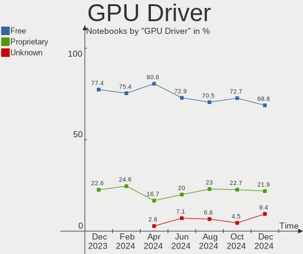
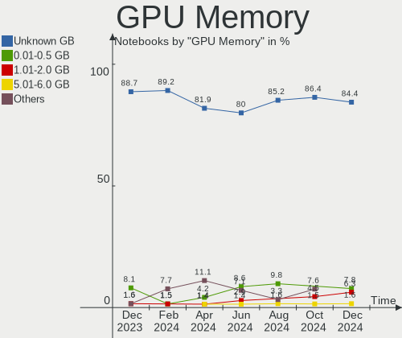
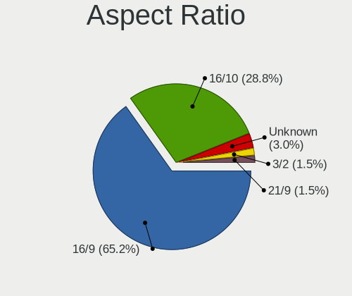
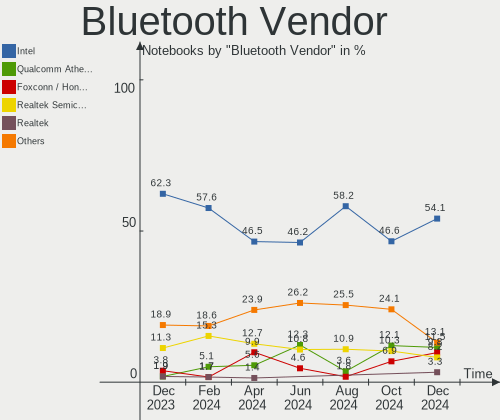
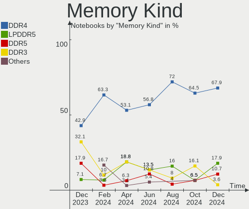

Manjaro - Hardware Trends (Notebooks)
-------------------------------------

A project to identify most popular hardware characteristics and track their change
over time based on data collected by Linux users at https://Linux-Hardware.org.

Anyone can contribute to this report by the [hw-probe](https://github.com/linuxhw/hw-probe) tool:

    sudo -E hw-probe -all -upload

This report is for one last month. Overall report since the beginning of time: [TestDays](https://github.com/linuxhw/TestDays)

Period: Oct, 2023.

Contents
--------

* [ System ](#system)
  - [ OS                       ](#os)
  - [ OS Family                ](#os-family)
  - [ Kernel                   ](#kernel)
  - [ Kernel Family            ](#kernel-family)
  - [ Kernel Major Ver.        ](#kernel-major-ver)
  - [ Arch                     ](#arch)
  - [ DE                       ](#de)
  - [ Display Server           ](#display-server)
  - [ Display Manager          ](#display-manager)
  - [ OS Lang                  ](#os-lang)
  - [ Boot Mode                ](#boot-mode)
  - [ Filesystem               ](#filesystem)
  - [ Part. scheme             ](#part-scheme)
  - [ Dual Boot with Linux/BSD ](#dual-boot-with-linuxbsd)
  - [ Dual Boot (Win)          ](#dual-boot-win)

* [ Board ](#board)
  - [ Vendor                   ](#vendor)
  - [ Model                    ](#model)
  - [ Model Family             ](#model-family)
  - [ MFG Year                 ](#mfg-year)
  - [ Form Factor              ](#form-factor)
  - [ Secure Boot              ](#secure-boot)
  - [ Coreboot                 ](#coreboot)
  - [ RAM Size                 ](#ram-size)
  - [ RAM Used                 ](#ram-used)
  - [ Total Drives             ](#total-drives)
  - [ Has CD-ROM               ](#has-cd-rom)
  - [ Has Ethernet             ](#has-ethernet)
  - [ Has WiFi                 ](#has-wifi)
  - [ Has Bluetooth            ](#has-bluetooth)

* [ Location ](#location)
  - [ Country                  ](#country)
  - [ City                     ](#city)

* [ Drives ](#drives)
  - [ Drive Vendor             ](#drive-vendor)
  - [ Drive Model              ](#drive-model)
  - [ HDD Vendor               ](#hdd-vendor)
  - [ SSD Vendor               ](#ssd-vendor)
  - [ Drive Kind               ](#drive-kind)
  - [ Drive Connector          ](#drive-connector)
  - [ Drive Size               ](#drive-size)
  - [ Space Total              ](#space-total)
  - [ Space Used               ](#space-used)
  - [ Malfunc. Drives          ](#malfunc-drives)
  - [ Malfunc. Drive Vendor    ](#malfunc-drive-vendor)
  - [ Malfunc. HDD Vendor      ](#malfunc-hdd-vendor)
  - [ Malfunc. Drive Kind      ](#malfunc-drive-kind)
  - [ Failed Drives            ](#failed-drives)
  - [ Failed Drive Vendor      ](#failed-drive-vendor)
  - [ Drive Status             ](#drive-status)

* [ Storage controller ](#storage-controller)
  - [ Storage Vendor           ](#storage-vendor)
  - [ Storage Model            ](#storage-model)
  - [ Storage Kind             ](#storage-kind)

* [ Processor ](#processor)
  - [ CPU Vendor               ](#cpu-vendor)
  - [ CPU Model                ](#cpu-model)
  - [ CPU Model Family         ](#cpu-model-family)
  - [ CPU Cores                ](#cpu-cores)
  - [ CPU Sockets              ](#cpu-sockets)
  - [ CPU Threads              ](#cpu-threads)
  - [ CPU Op-Modes             ](#cpu-op-modes)
  - [ CPU Microcode            ](#cpu-microcode)
  - [ CPU Microarch            ](#cpu-microarch)

* [ Graphics ](#graphics)
  - [ GPU Vendor               ](#gpu-vendor)
  - [ GPU Model                ](#gpu-model)
  - [ GPU Combo                ](#gpu-combo)
  - [ GPU Driver               ](#gpu-driver)
  - [ GPU Memory               ](#gpu-memory)

* [ Monitor ](#monitor)
  - [ Monitor Vendor           ](#monitor-vendor)
  - [ Monitor Model            ](#monitor-model)
  - [ Monitor Resolution       ](#monitor-resolution)
  - [ Monitor Diagonal         ](#monitor-diagonal)
  - [ Monitor Width            ](#monitor-width)
  - [ Aspect Ratio             ](#aspect-ratio)
  - [ Monitor Area             ](#monitor-area)
  - [ Pixel Density            ](#pixel-density)
  - [ Multiple Monitors        ](#multiple-monitors)

* [ Network ](#network)
  - [ Net Controller Vendor    ](#net-controller-vendor)
  - [ Net Controller Model     ](#net-controller-model)
  - [ Wireless Vendor          ](#wireless-vendor)
  - [ Wireless Model           ](#wireless-model)
  - [ Ethernet Vendor          ](#ethernet-vendor)
  - [ Ethernet Model           ](#ethernet-model)
  - [ Net Controller Kind      ](#net-controller-kind)
  - [ Used Controller          ](#used-controller)
  - [ NICs                     ](#nics)
  - [ IPv6                     ](#ipv6)

* [ Bluetooth ](#bluetooth)
  - [ Bluetooth Vendor         ](#bluetooth-vendor)
  - [ Bluetooth Model          ](#bluetooth-model)

* [ Sound ](#sound)
  - [ Sound Vendor             ](#sound-vendor)
  - [ Sound Model              ](#sound-model)

* [ Memory ](#memory)
  - [ Memory Vendor            ](#memory-vendor)
  - [ Memory Model             ](#memory-model)
  - [ Memory Kind              ](#memory-kind)
  - [ Memory Form Factor       ](#memory-form-factor)
  - [ Memory Size              ](#memory-size)
  - [ Memory Speed             ](#memory-speed)

* [ Printers & scanners ](#printers--scanners)
  - [ Printer Vendor           ](#printer-vendor)
  - [ Printer Model            ](#printer-model)
  - [ Scanner Vendor           ](#scanner-vendor)
  - [ Scanner Model            ](#scanner-model)

* [ Camera ](#camera)
  - [ Camera Vendor            ](#camera-vendor)
  - [ Camera Model             ](#camera-model)

* [ Security ](#security)
  - [ Fingerprint Vendor       ](#fingerprint-vendor)
  - [ Fingerprint Model        ](#fingerprint-model)
  - [ Chipcard Vendor          ](#chipcard-vendor)
  - [ Chipcard Model           ](#chipcard-model)

* [ Unsupported ](#unsupported)
  - [ Unsupported Devices      ](#unsupported-devices)
  - [ Unsupported Device Types ](#unsupported-device-types)

System
------

OS
--

Installed operating systems

| Name           | Notebooks | Percent |
|----------------|-----------|---------|
| Manjaro        | 27        | 50.94%  |
| Manjaro 23.0.4 | 11        | 20.75%  |
| Manjaro 23.0.2 | 9         | 16.98%  |
| Manjaro 23.1.0 | 2         | 3.77%   |
| Manjaro 23.0.3 | 2         | 3.77%   |
| Manjaro 23.0.1 | 1         | 1.89%   |
| Manjaro 23.0.0 | 1         | 1.89%   |

OS Family
---------

OS without a version

| Name    | Notebooks | Percent |
|---------|-----------|---------|
| Manjaro | 53        | 100%    |

Kernel
------

Version of the Linux kernel

| Version               | Notebooks | Percent |
|-----------------------|-----------|---------|
| 6.5.5-1-MANJARO       | 22        | 41.51%  |
| 6.5.3-1-MANJARO       | 8         | 15.09%  |
| 6.1.55-1-MANJARO      | 8         | 15.09%  |
| 6.6.0-1-MANJARO       | 5         | 9.43%   |
| 6.1.53-1-MANJARO      | 2         | 3.77%   |
| 6.5.9-1-MANJARO       | 1         | 1.89%   |
| 6.5.7-2-MANJARO       | 1         | 1.89%   |
| 6.4.16-6-MANJARO      | 1         | 1.89%   |
| 6.4.10-zen1-1-zen     | 1         | 1.89%   |
| 5.16.2-1-rt19-MANJARO | 1         | 1.89%   |
| 5.15.133-1-MANJARO    | 1         | 1.89%   |
| 5.15.128-1-MANJARO    | 1         | 1.89%   |
| 5.10.197-1-MANJARO    | 1         | 1.89%   |

Kernel Family
-------------

Linux kernel without a distro release

| Version  | Notebooks | Percent |
|----------|-----------|---------|
| 6.5.5    | 22        | 41.51%  |
| 6.5.3    | 8         | 15.09%  |
| 6.1.55   | 8         | 15.09%  |
| 6.6.0    | 5         | 9.43%   |
| 6.1.53   | 2         | 3.77%   |
| 6.5.9    | 1         | 1.89%   |
| 6.5.7    | 1         | 1.89%   |
| 6.4.16   | 1         | 1.89%   |
| 6.4.10   | 1         | 1.89%   |
| 5.16.2   | 1         | 1.89%   |
| 5.15.133 | 1         | 1.89%   |
| 5.15.128 | 1         | 1.89%   |
| 5.10.197 | 1         | 1.89%   |

Kernel Major Ver.
-----------------

Linux kernel major version

| Version | Notebooks | Percent |
|---------|-----------|---------|
| 6.5     | 32        | 60.38%  |
| 6.1     | 10        | 18.87%  |
| 6.6     | 5         | 9.43%   |
| 6.4     | 2         | 3.77%   |
| 5.15    | 2         | 3.77%   |
| 5.16    | 1         | 1.89%   |
| 5.10    | 1         | 1.89%   |

Arch
----

OS architecture (x86_64, i586, etc.)

| Name   | Notebooks | Percent |
|--------|-----------|---------|
| x86_64 | 53        | 100%    |

DE
--

Desktop Environment

| Name       | Notebooks | Percent |
|------------|-----------|---------|
| KDE5       | 21        | 39.62%  |
| GNOME      | 17        | 32.08%  |
| XFCE       | 7         | 13.21%  |
| X-Cinnamon | 5         | 9.43%   |
| i3         | 2         | 3.77%   |
| qtile      | 1         | 1.89%   |

Display Server
--------------

X11 or Wayland

| Name    | Notebooks | Percent |
|---------|-----------|---------|
| X11     | 40        | 75.47%  |
| Wayland | 13        | 24.53%  |

Display Manager
---------------

SDDM, LightDM, etc.

| Name    | Notebooks | Percent |
|---------|-----------|---------|
| Unknown | 27        | 50.94%  |
| GDM     | 10        | 18.87%  |
| SDDM    | 8         | 15.09%  |
| LightDM | 8         | 15.09%  |

OS Lang
-------

Language

| Lang  | Notebooks | Percent |
|-------|-----------|---------|
| en_US | 26        | 49.06%  |
| ru_RU | 4         | 7.55%   |
| de_DE | 4         | 7.55%   |
| fr_FR | 3         | 5.66%   |
| en_GB | 2         | 3.77%   |
| zh_CN | 1         | 1.89%   |
| sv_SE | 1         | 1.89%   |
| ro_RO | 1         | 1.89%   |
| pt_PT | 1         | 1.89%   |
| nb_NO | 1         | 1.89%   |
| it_IT | 1         | 1.89%   |
| id_ID | 1         | 1.89%   |
| es_UY | 1         | 1.89%   |
| es_MX | 1         | 1.89%   |
| es_ES | 1         | 1.89%   |
| es_AR | 1         | 1.89%   |
| en_IN | 1         | 1.89%   |
| en_CA | 1         | 1.89%   |
| en_AU | 1         | 1.89%   |

Boot Mode
---------

EFI or BIOS

| Mode | Notebooks | Percent |
|------|-----------|---------|
| BIOS | 38        | 71.7%   |
| EFI  | 15        | 28.3%   |

Filesystem
----------

Type of filesystem

| Type  | Notebooks | Percent |
|-------|-----------|---------|
| Ext4  | 41        | 77.36%  |
| Tmpfs | 8         | 15.09%  |
| Btrfs | 4         | 7.55%   |

Part. scheme
------------

Scheme of partitioning

| Type    | Notebooks | Percent |
|---------|-----------|---------|
| Unknown | 27        | 50.94%  |
| GPT     | 20        | 37.74%  |
| MBR     | 6         | 11.32%  |

Dual Boot with Linux/BSD
------------------------

Hosting more than one Linux/BSD

| Dual boot | Notebooks | Percent |
|-----------|-----------|---------|
| No        | 51        | 96.23%  |
| Yes       | 2         | 3.77%   |

Dual Boot (Win)
---------------

Hosting Linux and Windows

| Dual boot | Notebooks | Percent |
|-----------|-----------|---------|
| No        | 43        | 81.13%  |
| Yes       | 10        | 18.87%  |

Board
-----

Vendor
------

Motherboard manufacturer

| Name                | Notebooks | Percent |
|---------------------|-----------|---------|
| Lenovo              | 13        | 24.53%  |
| Hewlett-Packard     | 8         | 15.09%  |
| Dell                | 7         | 13.21%  |
| ASUSTek Computer    | 7         | 13.21%  |
| Acer                | 5         | 9.43%   |
| HUAWEI              | 3         | 5.66%   |
| TECNO               | 1         | 1.89%   |
| Sony                | 1         | 1.89%   |
| MSI                 | 1         | 1.89%   |
| Google              | 1         | 1.89%   |
| Gigabyte Technology | 1         | 1.89%   |
| Gateway             | 1         | 1.89%   |
| Framework           | 1         | 1.89%   |
| Eluktronics         | 1         | 1.89%   |
| Clevo               | 1         | 1.89%   |
| Apple               | 1         | 1.89%   |

Model
-----

Motherboard model

| Name                                       | Notebooks | Percent |
|--------------------------------------------|-----------|---------|
| HP Laptop 14-ck0xxx                        | 2         | 3.77%   |
| TECNO MEGABOOK T1                          | 1         | 1.89%   |
| Sony SVE1511B1RB                           | 1         | 1.89%   |
| MSI GL62VR 7RFX                            | 1         | 1.89%   |
| Lenovo V15 G2 ALC 82KD                     | 1         | 1.89%   |
| Lenovo ThinkPad T480s 20L8S4M200           | 1         | 1.89%   |
| Lenovo ThinkPad T420s 4170CTO              | 1         | 1.89%   |
| Lenovo ThinkPad P14s Gen 2a 21A0CTO1WW     | 1         | 1.89%   |
| Lenovo ThinkPad L460 20FVS12A00            | 1         | 1.89%   |
| Lenovo ThinkPad L430 24662W2               | 1         | 1.89%   |
| Lenovo ThinkPad E15 Gen 3 20YG004BMX       | 1         | 1.89%   |
| Lenovo Legion Y7000 2019 PG0 81T0          | 1         | 1.89%   |
| Lenovo Legion 5 Pro 16ITH6H 82JD           | 1         | 1.89%   |
| Lenovo Legion 5 82B5                       | 1         | 1.89%   |
| Lenovo IdeaPad S145-15IIL 81W8             | 1         | 1.89%   |
| Lenovo IdeaPad 3 15IGL05 81WQ              | 1         | 1.89%   |
| Lenovo G40-45 80E1                         | 1         | 1.89%   |
| HUAWEI VLT-WX0                             | 1         | 1.89%   |
| HUAWEI MateBook X                          | 1         | 1.89%   |
| HUAWEI MACHD-WXX9                          | 1         | 1.89%   |
| HP Pavilion dv7                            | 1         | 1.89%   |
| HP Notebook                                | 1         | 1.89%   |
| HP Laptop 17-cp0xxx                        | 1         | 1.89%   |
| HP Laptop 15s-eq2xxx                       | 1         | 1.89%   |
| HP EliteBook 8560w                         | 1         | 1.89%   |
| HP EliteBook 8470p                         | 1         | 1.89%   |
| Google Gandof                              | 1         | 1.89%   |
| Gigabyte AERO 17 XE5                       | 1         | 1.89%   |
| Gateway NV57H                              | 1         | 1.89%   |
| Framework Laptop 13 (AMD Ryzen 7040Series) | 1         | 1.89%   |
| Eluktronics MECH-15 G3                     | 1         | 1.89%   |
| Dell XPS 15 9510                           | 1         | 1.89%   |
| Dell Vostro 7590                           | 1         | 1.89%   |
| Dell Precision 7710                        | 1         | 1.89%   |
| Dell Precision 5480                        | 1         | 1.89%   |
| Dell Latitude E5400                        | 1         | 1.89%   |
| Dell Latitude 7370                         | 1         | 1.89%   |
| Dell G7 7700                               | 1         | 1.89%   |
| Clevo W150ER                               | 1         | 1.89%   |
| ASUS ZenBook UX425EA_UX425EA               | 1         | 1.89%   |

Model Family
------------

Motherboard model prefix

| Name                | Notebooks | Percent |
|---------------------|-----------|---------|
| Lenovo ThinkPad     | 6         | 11.32%  |
| HP Laptop           | 4         | 7.55%   |
| Acer Aspire         | 4         | 7.55%   |
| Lenovo Legion       | 3         | 5.66%   |
| Lenovo IdeaPad      | 2         | 3.77%   |
| HP EliteBook        | 2         | 3.77%   |
| Dell Precision      | 2         | 3.77%   |
| Dell Latitude       | 2         | 3.77%   |
| ASUS ASUS           | 2         | 3.77%   |
| TECNO MEGABOOK      | 1         | 1.89%   |
| Sony SVE1511B1RB    | 1         | 1.89%   |
| MSI GL62VR          | 1         | 1.89%   |
| Lenovo V15          | 1         | 1.89%   |
| Lenovo G40-45       | 1         | 1.89%   |
| HUAWEI VLT-WX0      | 1         | 1.89%   |
| HUAWEI MateBook     | 1         | 1.89%   |
| HUAWEI MACHD-WXX9   | 1         | 1.89%   |
| HP Pavilion         | 1         | 1.89%   |
| HP Notebook         | 1         | 1.89%   |
| Google Gandof       | 1         | 1.89%   |
| Gigabyte AERO       | 1         | 1.89%   |
| Gateway NV57H       | 1         | 1.89%   |
| Framework Laptop    | 1         | 1.89%   |
| Eluktronics MECH-15 | 1         | 1.89%   |
| Dell XPS            | 1         | 1.89%   |
| Dell Vostro         | 1         | 1.89%   |
| Dell G7             | 1         | 1.89%   |
| Clevo W150ER        | 1         | 1.89%   |
| ASUS ZenBook        | 1         | 1.89%   |
| ASUS VivoBook       | 1         | 1.89%   |
| ASUS ROG            | 1         | 1.89%   |
| ASUS N56VB          | 1         | 1.89%   |
| ASUS K84L           | 1         | 1.89%   |
| Apple MacBookPro8   | 1         | 1.89%   |
| Acer Nitro          | 1         | 1.89%   |

MFG Year
--------

Motherboard manufacture year

| Year | Notebooks | Percent |
|------|-----------|---------|
| 2021 | 11        | 20.75%  |
| 2020 | 7         | 13.21%  |
| 2011 | 6         | 11.32%  |
| 2023 | 5         | 9.43%   |
| 2018 | 5         | 9.43%   |
| 2019 | 4         | 7.55%   |
| 2022 | 3         | 5.66%   |
| 2016 | 3         | 5.66%   |
| 2012 | 3         | 5.66%   |
| 2017 | 2         | 3.77%   |
| 2008 | 2         | 3.77%   |
| 2014 | 1         | 1.89%   |
| 2013 | 1         | 1.89%   |

Form Factor
-----------

Physical design of the computer

| Name     | Notebooks | Percent |
|----------|-----------|---------|
| Notebook | 53        | 100%    |

Secure Boot
-----------

Enabled or disabled

| State    | Notebooks | Percent |
|----------|-----------|---------|
| Disabled | 53        | 100%    |

Coreboot
--------

Have coreboot on board

| Used | Notebooks | Percent |
|------|-----------|---------|
| No   | 52        | 98.11%  |
| Yes  | 1         | 1.89%   |

RAM Size
--------

Total RAM memory

| Size in GB  | Notebooks | Percent |
|-------------|-----------|---------|
| 4.01-8.0    | 16        | 30.19%  |
| 3.01-4.0    | 10        | 18.87%  |
| 16.01-24.0  | 9         | 16.98%  |
| 8.01-16.0   | 8         | 15.09%  |
| 32.01-64.0  | 6         | 11.32%  |
| 24.01-32.0  | 3         | 5.66%   |
| 64.01-256.0 | 1         | 1.89%   |

RAM Used
--------

Used RAM memory

| Used GB   | Notebooks | Percent |
|-----------|-----------|---------|
| 4.01-8.0  | 18        | 33.96%  |
| 3.01-4.0  | 12        | 22.64%  |
| 2.01-3.0  | 10        | 18.87%  |
| 1.01-2.0  | 9         | 16.98%  |
| 8.01-16.0 | 3         | 5.66%   |
| 0.51-1.0  | 1         | 1.89%   |

Total Drives
------------

Number of drives on board

| Drives | Notebooks | Percent |
|--------|-----------|---------|
| 1      | 35        | 66.04%  |
| 2      | 15        | 28.3%   |
| 3      | 3         | 5.66%   |

Has CD-ROM
----------

Has CD-ROM on board

| Presented | Notebooks | Percent |
|-----------|-----------|---------|
| No        | 46        | 86.79%  |
| Yes       | 7         | 13.21%  |

Has Ethernet
------------

Has Ethernet on board

| Presented | Notebooks | Percent |
|-----------|-----------|---------|
| Yes       | 39        | 73.58%  |
| No        | 14        | 26.42%  |

Has WiFi
--------

Has WiFi module

| Presented | Notebooks | Percent |
|-----------|-----------|---------|
| Yes       | 53        | 100%    |

Has Bluetooth
-------------

Has Bluetooth module

| Presented | Notebooks | Percent |
|-----------|-----------|---------|
| Yes       | 48        | 90.57%  |
| No        | 5         | 9.43%   |

Location
--------

Country
-------

Geographic location (country)

| Country     | Notebooks | Percent |
|-------------|-----------|---------|
| USA         | 11        | 20.75%  |
| Germany     | 5         | 9.43%   |
| Sweden      | 3         | 5.66%   |
| Russia      | 3         | 5.66%   |
| Italy       | 3         | 5.66%   |
| France      | 3         | 5.66%   |
| Romania     | 2         | 3.77%   |
| Norway      | 2         | 3.77%   |
| Canada      | 2         | 3.77%   |
| Venezuela   | 1         | 1.89%   |
| Uruguay     | 1         | 1.89%   |
| UK          | 1         | 1.89%   |
| Taiwan      | 1         | 1.89%   |
| Spain       | 1         | 1.89%   |
| Portugal    | 1         | 1.89%   |
| Netherlands | 1         | 1.89%   |
| Mexico      | 1         | 1.89%   |
| Kazakhstan  | 1         | 1.89%   |
| Indonesia   | 1         | 1.89%   |
| India       | 1         | 1.89%   |
| Greece      | 1         | 1.89%   |
| Finland     | 1         | 1.89%   |
| Czechia     | 1         | 1.89%   |
| China       | 1         | 1.89%   |
| Brazil      | 1         | 1.89%   |
| Belarus     | 1         | 1.89%   |
| Australia   | 1         | 1.89%   |
| Argentina   | 1         | 1.89%   |

City
----

Geographic location (city)

| City                  | Notebooks | Percent |
|-----------------------|-----------|---------|
| Porsgrunn             | 2         | 3.77%   |
| Milan                 | 2         | 3.77%   |
| Würzburg             | 1         | 1.89%   |
| Tomar                 | 1         | 1.89%   |
| Stockholm             | 1         | 1.89%   |
| Smolensk              | 1         | 1.89%   |
| Samarinda             | 1         | 1.89%   |
| Sacramento            | 1         | 1.89%   |
| Ronkonkoma            | 1         | 1.89%   |
| Recife                | 1         | 1.89%   |
| Puebla City           | 1         | 1.89%   |
| Portland              | 1         | 1.89%   |
| Pontarlier            | 1         | 1.89%   |
| Piteşti              | 1         | 1.89%   |
| Pineville             | 1         | 1.89%   |
| Petare                | 1         | 1.89%   |
| Paris                 | 1         | 1.89%   |
| Orléans              | 1         | 1.89%   |
| Nuremberg             | 1         | 1.89%   |
| Newcastle upon Tyne   | 1         | 1.89%   |
| New Taipei            | 1         | 1.89%   |
| Natchitoches          | 1         | 1.89%   |
| Moscow                | 1         | 1.89%   |
| Montevideo            | 1         | 1.89%   |
| Minsk                 | 1         | 1.89%   |
| Malmo                 | 1         | 1.89%   |
| Magnolia              | 1         | 1.89%   |
| Los Angeles           | 1         | 1.89%   |
| Lipetsk               | 1         | 1.89%   |
| Leptokarya            | 1         | 1.89%   |
| la Bisbal del Penedes | 1         | 1.89%   |
| Kolkata               | 1         | 1.89%   |
| Kings Mountain        | 1         | 1.89%   |
| Kadan                 | 1         | 1.89%   |
| Halikko               | 1         | 1.89%   |
| Halifax               | 1         | 1.89%   |
| Göttingen            | 1         | 1.89%   |
| Gothenburg            | 1         | 1.89%   |
| Drolshagen            | 1         | 1.89%   |
| Chengdu               | 1         | 1.89%   |

Drives
------

Drive Vendor
------------

Hard drive vendors

| Vendor                       | Notebooks | Drives | Percent |
|------------------------------|-----------|--------|---------|
| Samsung Electronics          | 15        | 16     | 21.43%  |
| SanDisk                      | 11        | 11     | 15.71%  |
| WDC                          | 5         | 5      | 7.14%   |
| SK hynix                     | 5         | 5      | 7.14%   |
| Kingston                     | 5         | 6      | 7.14%   |
| Crucial                      | 4         | 5      | 5.71%   |
| Silicon Motion               | 2         | 2      | 2.86%   |
| Seagate                      | 2         | 2      | 2.86%   |
| Phison Electronics           | 2         | 2      | 2.86%   |
| Micron Technology            | 2         | 2      | 2.86%   |
| Intel                        | 2         | 2      | 2.86%   |
| A-DATA Technology            | 2         | 2      | 2.86%   |
| Verbatim                     | 1         | 1      | 1.43%   |
| Unknown                      | 1         | 1      | 1.43%   |
| Union Memory (Shenzhen)      | 1         | 1      | 1.43%   |
| Shenzhen Longsys Electronics | 1         | 1      | 1.43%   |
| Realtek                      | 1         | 1      | 1.43%   |
| Ramos Technology             | 1         | 2      | 1.43%   |
| Phison                       | 1         | 1      | 1.43%   |
| Lite-On Technology           | 1         | 1      | 1.43%   |
| KIOXIA                       | 1         | 1      | 1.43%   |
| Hitachi                      | 1         | 1      | 1.43%   |
| China                        | 1         | 1      | 1.43%   |
| Apacer                       | 1         | 1      | 1.43%   |
| ADATA Technology             | 1         | 1      | 1.43%   |

Drive Model
-----------

Hard drive models

| Model                                               | Notebooks | Percent |
|-----------------------------------------------------|-----------|---------|
| Samsung NVMe SSD Controller PM9A1/PM9A3/980PRO 1TB  | 4         | 5.41%   |
| Samsung NVMe SSD Controller SM961/PM961/SM963 121GB | 3         | 4.05%   |
| Crucial CT240BX500SSD1 240GB                        | 3         | 4.05%   |
| Sandisk WD_BLACK SN770 1TB                          | 2         | 2.7%    |
| Sandisk WD Blue SN550 NVMe SSD 1TB                  | 2         | 2.7%    |
| Samsung NVMe SSD Controller SM981/PM981/PM983 1TB   | 2         | 2.7%    |
| Kingston SA400S37480G 480GB SSD                     | 2         | 2.7%    |
| WDC WD5000LPCX-21VHAT0 500GB                        | 1         | 1.35%   |
| WDC WD3200BPVT-75JJ5T0 320GB                        | 1         | 1.35%   |
| WDC WD3200BPVT-55JJ5T0 320GB                        | 1         | 1.35%   |
| WDC WD2500BEKT-75A25T0 250GB                        | 1         | 1.35%   |
| WDC WD10SPZX-24Z10 1TB                              | 1         | 1.35%   |
| Verbatim Vi550 S3 SSD 256GB                         | 1         | 1.35%   |
| Unknown MMC Card  16GB                              | 1         | 1.35%   |
| Union Memory (Shenzhen) UMIS RPEYJ1T24MKN2QWY 1TB   | 1         | 1.35%   |
| SK hynix SC311 SATA 512GB SSD                       | 1         | 1.35%   |
| SK hynix PC711 NVMe 1TB                             | 1         | 1.35%   |
| SK hynix PC611 NVMe 1TB                             | 1         | 1.35%   |
| SK hynix PC601 NVMe 512GB                           | 1         | 1.35%   |
| SK hynix HFM512GD3JX013N 512GB                      | 1         | 1.35%   |
| Silicon Motion SM2262/SM2262EN SSD Controller 2TB   | 1         | 1.35%   |
| Silicon Motion PCIe-8 SSD 1TB                       | 1         | 1.35%   |
| Shenzhen Longsys FORESEE XP1000F256G 256GB          | 1         | 1.35%   |
| Seagate ST9500325AS 500GB                           | 1         | 1.35%   |
| Seagate ST9160411ASG 160GB                          | 1         | 1.35%   |
| Sandisk WD_BLACK SN750 SE 1TB                       | 1         | 1.35%   |
| Sandisk WD Blue SN570 1TB                           | 1         | 1.35%   |
| Sandisk WD Black SN750 / PC SN730 NVMe SSD 1024GB   | 1         | 1.35%   |
| SanDisk SDSSDH3500G 500GB                           | 1         | 1.35%   |
| SanDisk SDSSDH3 4T00 4TB                            | 1         | 1.35%   |
| SanDisk SD9TN8W256G1001 256GB SSD                   | 1         | 1.35%   |
| Sandisk PC SN520 NVMe SSD 256GB                     | 1         | 1.35%   |
| Samsung SSD 980 500GB                               | 1         | 1.35%   |
| Samsung SSD 850 EVO 250GB                           | 1         | 1.35%   |
| Samsung MZVLQ512HBLU-00B00 512GB                    | 1         | 1.35%   |
| Samsung MZNLN128HAHQ-000H1 128GB SSD                | 1         | 1.35%   |
| Samsung MZALQ512HBLU-00BL1 512GB                    | 1         | 1.35%   |
| Samsung MZ7TD128HAFV-000L1 128GB SSD                | 1         | 1.35%   |
| Samsung MZ7LF128HCHP-000L1 128GB SSD                | 1         | 1.35%   |
| Realtek RTL9210B-CG 250GB                           | 1         | 1.35%   |

HDD Vendor
----------

Hard disk drive vendors

| Vendor  | Notebooks | Drives | Percent |
|---------|-----------|--------|---------|
| WDC     | 5         | 5      | 62.5%   |
| Seagate | 2         | 2      | 25%     |
| Hitachi | 1         | 1      | 12.5%   |

SSD Vendor
----------

Solid state drive vendors

| Vendor              | Notebooks | Drives | Percent |
|---------------------|-----------|--------|---------|
| Samsung Electronics | 4         | 4      | 17.39%  |
| Kingston            | 4         | 5      | 17.39%  |
| Crucial             | 4         | 5      | 17.39%  |
| SanDisk             | 3         | 3      | 13.04%  |
| A-DATA Technology   | 2         | 2      | 8.7%    |
| Verbatim            | 1         | 1      | 4.35%   |
| SK hynix            | 1         | 1      | 4.35%   |
| Ramos Technology    | 1         | 2      | 4.35%   |
| Intel               | 1         | 1      | 4.35%   |
| China               | 1         | 1      | 4.35%   |
| Apacer              | 1         | 1      | 4.35%   |

Drive Kind
----------

HDD or SSD

| Kind | Notebooks | Drives | Percent |
|------|-----------|--------|---------|
| NVMe | 33        | 39     | 53.23%  |
| SSD  | 21        | 26     | 33.87%  |
| HDD  | 7         | 8      | 11.29%  |
| MMC  | 1         | 1      | 1.61%   |

Drive Connector
---------------

SATA, SAS, NVMe, etc.

| Type | Notebooks | Drives | Percent |
|------|-----------|--------|---------|
| NVMe | 33        | 38     | 55%     |
| SATA | 25        | 34     | 41.67%  |
| SAS  | 1         | 1      | 1.67%   |
| MMC  | 1         | 1      | 1.67%   |

Drive Size
----------

Size of hard drive

| Size in TB | Notebooks | Drives | Percent |
|------------|-----------|--------|---------|
| 0.01-0.5   | 21        | 29     | 80.77%  |
| 0.51-1.0   | 4         | 4      | 15.38%  |
| 3.01-4.0   | 1         | 1      | 3.85%   |

Space Total
-----------

Amount of disk space available on the file system

| Size in GB     | Notebooks | Percent |
|----------------|-----------|---------|
| 101-250        | 15        | 28.3%   |
| 501-1000       | 13        | 24.53%  |
| 251-500        | 10        | 18.87%  |
| Unknown        | 5         | 9.43%   |
| 51-100         | 4         | 7.55%   |
| More than 3000 | 2         | 3.77%   |
| 2001-3000      | 2         | 3.77%   |
| 1001-2000      | 2         | 3.77%   |

Space Used
----------

Amount of used disk space

| Used GB   | Notebooks | Percent |
|-----------|-----------|---------|
| 251-500   | 11        | 20.75%  |
| 1-20      | 11        | 20.75%  |
| 21-50     | 8         | 15.09%  |
| 101-250   | 7         | 13.21%  |
| 51-100    | 7         | 13.21%  |
| Unknown   | 5         | 9.43%   |
| 501-1000  | 2         | 3.77%   |
| 2001-3000 | 1         | 1.89%   |
| 1001-2000 | 1         | 1.89%   |

Malfunc. Drives
---------------

Drive models with a malfunction

| Model                  | Notebooks | Drives | Percent |
|------------------------|-----------|--------|---------|
| Apacer AS350 128GB SSD | 1         | 1      | 100%    |

Malfunc. Drive Vendor
---------------------

Vendors of faulty drives

| Vendor | Notebooks | Drives | Percent |
|--------|-----------|--------|---------|
| Apacer | 1         | 1      | 100%    |

Malfunc. HDD Vendor
-------------------

Vendors of faulty HDD drives

Zero info for selected period =(

Malfunc. Drive Kind
-------------------

Kinds of faulty drives

| Kind | Notebooks | Drives | Percent |
|------|-----------|--------|---------|
| SSD  | 1         | 1      | 100%    |

Failed Drives
-------------

Failed drive models

Zero info for selected period =(

Failed Drive Vendor
-------------------

Failed drive vendors

Zero info for selected period =(

Drive Status
------------

Number of failed and malfunc. drives

| Status   | Notebooks | Drives | Percent |
|----------|-----------|--------|---------|
| Detected | 44        | 57     | 78.57%  |
| Works    | 11        | 16     | 19.64%  |
| Malfunc  | 1         | 1      | 1.79%   |

Storage controller
------------------

Storage Vendor
--------------

Storage controller vendors

| Vendor                       | Notebooks | Percent |
|------------------------------|-----------|---------|
| Intel                        | 34        | 45.95%  |
| Samsung Electronics          | 11        | 14.86%  |
| SanDisk                      | 8         | 10.81%  |
| AMD                          | 5         | 6.76%   |
| SK hynix                     | 4         | 5.41%   |
| Phison Electronics           | 3         | 4.05%   |
| Silicon Motion               | 2         | 2.7%    |
| Micron Technology            | 2         | 2.7%    |
| Shenzhen Longsys Electronics | 1         | 1.35%   |
| Lite-On Technology           | 1         | 1.35%   |
| KIOXIA                       | 1         | 1.35%   |
| Kingston Technology Company  | 1         | 1.35%   |
| ADATA Technology             | 1         | 1.35%   |

Storage Model
-------------

Storage controller models

| Model                                                                         | Notebooks | Percent |
|-------------------------------------------------------------------------------|-----------|---------|
| Intel 7 Series Chipset Family 6-port SATA Controller [AHCI mode]              | 5         | 6.58%   |
| Intel 6 Series/C200 Series Chipset Family 6 port Mobile SATA AHCI Controller  | 5         | 6.58%   |
| AMD FCH SATA Controller [AHCI mode]                                           | 5         | 6.58%   |
| Samsung NVMe SSD Controller PM9A1/PM9A3/980PRO                                | 4         | 5.26%   |
| Intel Volume Management Device NVMe RAID Controller                           | 4         | 5.26%   |
| Samsung NVMe SSD Controller SM961/PM961/SM963                                 | 3         | 3.95%   |
| Samsung NVMe SSD Controller 980 (DRAM-less)                                   | 3         | 3.95%   |
| Intel Sunrise Point-LP SATA Controller [AHCI mode]                            | 3         | 3.95%   |
| SK hynix Gold P31/BC711/PC711 NVMe Solid State Drive                          | 2         | 2.63%   |
| SanDisk WD Black SN770 / PC SN740 256GB / PC SN560 (DRAM-less) NVMe SSD       | 2         | 2.63%   |
| SanDisk Ultra 3D / WD Blue SN550 NVMe SSD                                     | 2         | 2.63%   |
| Samsung NVMe SSD Controller SM981/PM981/PM983                                 | 2         | 2.63%   |
| Micron 2450 NVMe SSD [HendrixV] (DRAM-less)                                   | 2         | 2.63%   |
| Intel Celeron/Pentium Silver Processor SATA Controller                        | 2         | 2.63%   |
| Intel Cannon Lake Mobile PCH SATA AHCI Controller                             | 2         | 2.63%   |
| SK hynix PC611 NVMe Solid State Drive                                         | 1         | 1.32%   |
| SK hynix PC601 NVMe Solid State Drive                                         | 1         | 1.32%   |
| Silicon Motion SM2262/SM2262EN SSD Controller                                 | 1         | 1.32%   |
| Silicon Motion Non-Volatile memory controller                                 | 1         | 1.32%   |
| Shenzhen Longsys Lexar NM620 NVME SSD (DRAM-less)                             | 1         | 1.32%   |
| SanDisk Ultra 3D / WD Blue SN570 NVMe SSD (DRAM-less)                         | 1         | 1.32%   |
| SanDisk PC SN735 NVMe SSD (DRAM-less)                                         | 1         | 1.32%   |
| SanDisk PC SN520 x2 M.2 2242 NVMe SSD                                         | 1         | 1.32%   |
| SanDisk Extreme Pro / WD Black SN750 / PC SN730 / Red SN700 NVMe SSD          | 1         | 1.32%   |
| Phison PS5019-E19 PCIe4 NVMe Controller (DRAM-less)                           | 1         | 1.32%   |
| Phison E18 PCIe4 NVMe Controller                                              | 1         | 1.32%   |
| Phison E12 NVMe Controller                                                    | 1         | 1.32%   |
| Lite-On CB1-SD256, CB1-SD512 NVMe SSD                                         | 1         | 1.32%   |
| KIOXIA NVMe SSD Controller BG4 (DRAM-less)                                    | 1         | 1.32%   |
| Kingston Company NV2 NVMe SSD E21T                                            | 1         | 1.32%   |
| Intel Wildcat Point-LP SATA Controller [AHCI Mode]                            | 1         | 1.32%   |
| Intel Volume Management Device NVMe RAID Controller Intel Corporation         | 1         | 1.32%   |
| Intel Tiger Lake SATA AHCI Controller                                         | 1         | 1.32%   |
| Intel SSD 670p Series [Keystone Harbor]                                       | 1         | 1.32%   |
| Intel Q170/Q150/B150/H170/H110/Z170/CM236 Chipset SATA Controller [AHCI Mode] | 1         | 1.32%   |
| Intel Jasper Lake SATA AHCI Controller                                        | 1         | 1.32%   |
| Intel Ice Lake-LP SATA Controller [AHCI mode]                                 | 1         | 1.32%   |
| Intel HM170/QM170 Chipset SATA Controller [AHCI Mode]                         | 1         | 1.32%   |
| Intel Celeron N3350/Pentium N4200/Atom E3900 Series SATA AHCI Controller      | 1         | 1.32%   |
| Intel Alder Lake-P SATA AHCI Controller                                       | 1         | 1.32%   |

Storage Kind
------------

Kind of storage controller (IDE, SATA, NVMe, SAS, ...)

| Kind | Notebooks | Percent |
|------|-----------|---------|
| NVMe | 32        | 45.07%  |
| SATA | 32        | 45.07%  |
| RAID | 6         | 8.45%   |
| IDE  | 1         | 1.41%   |

Processor
---------

CPU Vendor
----------

Processor vendors

| Vendor | Notebooks | Percent |
|--------|-----------|---------|
| Intel  | 41        | 77.36%  |
| AMD    | 12        | 22.64%  |

CPU Model
---------

Processor models

| Model                                   | Notebooks | Percent |
|-----------------------------------------|-----------|---------|
| Intel Core i7-9750H CPU @ 2.60GHz       | 2         | 3.77%   |
| Intel Core i5-8250U CPU @ 1.60GHz       | 2         | 3.77%   |
| Intel 11th Gen Core i7-11800H @ 2.30GHz | 2         | 3.77%   |
| AMD Ryzen 9 5900HX with Radeon Graphics | 2         | 3.77%   |
| AMD Ryzen 7 5700U with Radeon Graphics  | 2         | 3.77%   |
| Intel Pentium CPU B970 @ 2.30GHz        | 1         | 1.89%   |
| Intel Pentium CPU 4405U @ 2.10GHz       | 1         | 1.89%   |
| Intel Pentium CPU 2020M @ 2.40GHz       | 1         | 1.89%   |
| Intel Core m7-6Y75 CPU @ 1.20GHz        | 1         | 1.89%   |
| Intel Core i7-7700HQ CPU @ 2.80GHz      | 1         | 1.89%   |
| Intel Core i7-7500U CPU @ 2.70GHz       | 1         | 1.89%   |
| Intel Core i7-6820HQ CPU @ 2.70GHz      | 1         | 1.89%   |
| Intel Core i7-3610QM CPU @ 2.30GHz      | 1         | 1.89%   |
| Intel Core i7-2720QM CPU @ 2.20GHz      | 1         | 1.89%   |
| Intel Core i7-2620M CPU @ 2.70GHz       | 1         | 1.89%   |
| Intel Core i7-10750H CPU @ 2.60GHz      | 1         | 1.89%   |
| Intel Core i5-8350U CPU @ 1.70GHz       | 1         | 1.89%   |
| Intel Core i5-7200U CPU @ 2.50GHz       | 1         | 1.89%   |
| Intel Core i5-3230M CPU @ 2.60GHz       | 1         | 1.89%   |
| Intel Core i5-2540M CPU @ 2.60GHz       | 1         | 1.89%   |
| Intel Core i5-2430M CPU @ 2.40GHz       | 1         | 1.89%   |
| Intel Core i5-2415M CPU @ 2.30GHz       | 1         | 1.89%   |
| Intel Core i5-1035G1 CPU @ 1.00GHz      | 1         | 1.89%   |
| Intel Core i3-5015U CPU @ 2.10GHz       | 1         | 1.89%   |
| Intel Core i3-3120M CPU @ 2.50GHz       | 1         | 1.89%   |
| Intel Core i3-1005G1 CPU @ 1.20GHz      | 1         | 1.89%   |
| Intel Core 2 Duo CPU P8600 @ 2.40GHz    | 1         | 1.89%   |
| Intel Core 2 Duo CPU P7350 @ 2.00GHz    | 1         | 1.89%   |
| Intel Celeron N4500 @ 1.10GHz           | 1         | 1.89%   |
| Intel Celeron N4020 CPU @ 1.10GHz       | 1         | 1.89%   |
| Intel Celeron N4000 CPU @ 1.10GHz       | 1         | 1.89%   |
| Intel Celeron CPU N3350 @ 1.10GHz       | 1         | 1.89%   |
| Intel 13th Gen Core i7-13700H           | 1         | 1.89%   |
| Intel 13th Gen Core i7-1355U            | 1         | 1.89%   |
| Intel 13th Gen Core i5-13500H           | 1         | 1.89%   |
| Intel 12th Gen Core i7-12700H           | 1         | 1.89%   |
| Intel 12th Gen Core i7-1260P            | 1         | 1.89%   |
| Intel 11th Gen Core i7-1165G7 @ 2.80GHz | 1         | 1.89%   |
| Intel 11th Gen Core i7-11370H @ 3.30GHz | 1         | 1.89%   |
| Intel 11th Gen Core i5-1135G7 @ 2.40GHz | 1         | 1.89%   |

CPU Model Family
----------------

Processor model prefix

| Model            | Notebooks | Percent |
|------------------|-----------|---------|
| Other            | 10        | 18.87%  |
| Intel Core i7    | 9         | 16.98%  |
| Intel Core i5    | 9         | 16.98%  |
| Intel Celeron    | 4         | 7.55%   |
| AMD Ryzen 7      | 4         | 7.55%   |
| Intel Pentium    | 3         | 5.66%   |
| Intel Core i3    | 3         | 5.66%   |
| Intel Core 2 Duo | 2         | 3.77%   |
| AMD Ryzen 9      | 2         | 3.77%   |
| AMD Ryzen 5      | 2         | 3.77%   |
| Intel Core m7    | 1         | 1.89%   |
| AMD Ryzen 7 PRO  | 1         | 1.89%   |
| AMD Ryzen 3      | 1         | 1.89%   |
| AMD E1           | 1         | 1.89%   |
| AMD A8           | 1         | 1.89%   |

CPU Cores
---------

Number of processor cores

| Number | Notebooks | Percent |
|--------|-----------|---------|
| 2      | 21        | 39.62%  |
| 4      | 13        | 24.53%  |
| 8      | 9         | 16.98%  |
| 6      | 5         | 9.43%   |
| 14     | 2         | 3.77%   |
| 12     | 2         | 3.77%   |
| 10     | 1         | 1.89%   |

CPU Sockets
-----------

Number of sockets

| Number | Notebooks | Percent |
|--------|-----------|---------|
| 1      | 53        | 100%    |

CPU Threads
-----------

Threads per core (Hyper-Threading)

| Number | Notebooks | Percent |
|--------|-----------|---------|
| 2      | 42        | 79.25%  |
| 1      | 11        | 20.75%  |

CPU Op-Modes
------------

CPU Operation Modes (32-bit, 64-bit)

| Op mode        | Notebooks | Percent |
|----------------|-----------|---------|
| 32-bit, 64-bit | 53        | 100%    |

CPU Microcode
-------------

Microcode number

| Number     | Notebooks | Percent |
|------------|-----------|---------|
| Unknown    | 42        | 79.25%  |
| 0x0a50000c | 2         | 3.77%   |
| 0x906ea    | 1         | 1.89%   |
| 0x906a3    | 1         | 1.89%   |
| 0x806d1    | 1         | 1.89%   |
| 0x506e3    | 1         | 1.89%   |
| 0x406e3    | 1         | 1.89%   |
| 0x08608103 | 1         | 1.89%   |
| 0x08600106 | 1         | 1.89%   |
| 0x08600103 | 1         | 1.89%   |
| 0x07030104 | 1         | 1.89%   |

CPU Microarch
-------------

Microarchitecture

| Name             | Notebooks | Percent |
|------------------|-----------|---------|
| KabyLake         | 8         | 15.09%  |
| Unknown          | 8         | 15.09%  |
| SandyBridge      | 6         | 11.32%  |
| IvyBridge        | 4         | 7.55%   |
| Alderlake Hybrid | 4         | 7.55%   |
| Zen 3            | 3         | 5.66%   |
| TigerLake        | 3         | 5.66%   |
| Skylake          | 3         | 5.66%   |
| Icelake          | 3         | 5.66%   |
| Zen 2            | 2         | 3.77%   |
| Puma             | 2         | 3.77%   |
| Penryn           | 2         | 3.77%   |
| Goldmont plus    | 2         | 3.77%   |
| Goldmont         | 1         | 1.89%   |
| CometLake        | 1         | 1.89%   |
| Broadwell        | 1         | 1.89%   |

Graphics
--------

GPU Vendor
----------

Vendors of graphics cards

| Vendor | Notebooks | Percent |
|--------|-----------|---------|
| Intel  | 39        | 56.52%  |
| Nvidia | 18        | 26.09%  |
| AMD    | 12        | 17.39%  |

GPU Model
---------

Graphics card models

| Model                                                                                 | Notebooks | Percent |
|---------------------------------------------------------------------------------------|-----------|---------|
| Intel 2nd Generation Core Processor Family Integrated Graphics Controller             | 5         | 7.14%   |
| Intel 3rd Gen Core processor Graphics Controller                                      | 4         | 5.71%   |
| AMD Lucienne                                                                          | 4         | 5.71%   |
| Nvidia GA106M [GeForce RTX 3060 Mobile / Max-Q]                                       | 3         | 4.29%   |
| Intel UHD Graphics 620                                                                | 3         | 4.29%   |
| Intel TigerLake-LP GT2 [Iris Xe Graphics]                                             | 3         | 4.29%   |
| Intel Raptor Lake-P [Iris Xe Graphics]                                                | 3         | 4.29%   |
| Nvidia TU117M [GeForce GTX 1650 Mobile / Max-Q]                                       | 2         | 2.86%   |
| Intel TigerLake-H GT1 [UHD Graphics]                                                  | 2         | 2.86%   |
| Intel Iris Plus Graphics G1 (Ice Lake)                                                | 2         | 2.86%   |
| Intel HD Graphics 620                                                                 | 2         | 2.86%   |
| Intel GeminiLake [UHD Graphics 600]                                                   | 2         | 2.86%   |
| Intel CoffeeLake-H GT2 [UHD Graphics 630]                                             | 2         | 2.86%   |
| Intel Alder Lake-P GT2 [Iris Xe Graphics]                                             | 2         | 2.86%   |
| AMD Renoir [Radeon RX Vega 6 (Ryzen 4000/5000 Mobile Series)]                         | 2         | 2.86%   |
| AMD Cezanne [Radeon Vega Series / Radeon Vega Mobile Series]                          | 2         | 2.86%   |
| Nvidia TU117M [GeForce GTX 1650 Ti Mobile]                                            | 1         | 1.43%   |
| Nvidia TU104M [GeForce RTX 2070 SUPER Mobile / Max-Q]                                 | 1         | 1.43%   |
| Nvidia GP106M [GeForce GTX 1060 Mobile]                                               | 1         | 1.43%   |
| Nvidia GM204GLM [Quadro M3000M]                                                       | 1         | 1.43%   |
| Nvidia GK107M [GeForce GT 740M]                                                       | 1         | 1.43%   |
| Nvidia GK107M [GeForce GT 650M]                                                       | 1         | 1.43%   |
| Nvidia GF108GLM [Quadro 1000M]                                                        | 1         | 1.43%   |
| Nvidia GA107M [GeForce RTX 3050 Ti Mobile]                                            | 1         | 1.43%   |
| Nvidia GA107M [GeForce RTX 2050]                                                      | 1         | 1.43%   |
| Nvidia GA107GLM [RTX A1000 6GB Laptop GPU]                                            | 1         | 1.43%   |
| Nvidia GA104M [GeForce RTX 3070 Mobile / Max-Q]                                       | 1         | 1.43%   |
| Nvidia GA104 [Geforce RTX 3070 Ti Laptop GPU]                                         | 1         | 1.43%   |
| Nvidia G96CM [GeForce 9600M GT]                                                       | 1         | 1.43%   |
| Intel Mobile 4 Series Chipset Integrated Graphics Controller                          | 1         | 1.43%   |
| Intel JasperLake [UHD Graphics]                                                       | 1         | 1.43%   |
| Intel HD Graphics 630                                                                 | 1         | 1.43%   |
| Intel HD Graphics 5500                                                                | 1         | 1.43%   |
| Intel HD Graphics 530                                                                 | 1         | 1.43%   |
| Intel HD Graphics 515                                                                 | 1         | 1.43%   |
| Intel HD Graphics 510                                                                 | 1         | 1.43%   |
| Intel HD Graphics 500                                                                 | 1         | 1.43%   |
| Intel CometLake-H GT2 [UHD Graphics]                                                  | 1         | 1.43%   |
| AMD Topaz XT [Radeon R7 M260/M265 / M340/M360 / M440/M445 / 530/535 / 620/625 Mobile] | 1         | 1.43%   |
| AMD Sun LE [Radeon HD 8550M / R5 M230]                                                | 1         | 1.43%   |

GPU Combo
---------

Combinations of graphics cards

| Name           | Notebooks | Percent |
|----------------|-----------|---------|
| 1 x Intel      | 26        | 49.06%  |
| Intel + Nvidia | 12        | 22.64%  |
| 1 x AMD        | 7         | 13.21%  |
| 1 x Nvidia     | 3         | 5.66%   |
| AMD + Nvidia   | 3         | 5.66%   |
| 2 x AMD        | 1         | 1.89%   |
| Intel + AMD    | 1         | 1.89%   |

GPU Driver
----------

Free vs proprietary

| Driver      | Notebooks | Percent |
|-------------|-----------|---------|
| Free        | 37        | 69.81%  |
| Proprietary | 15        | 28.3%   |
| Unknown     | 1         | 1.89%   |

GPU Memory
----------

Total video memory

| Size in GB | Notebooks | Percent |
|------------|-----------|---------|
| Unknown    | 44        | 83.02%  |
| 3.01-4.0   | 3         | 5.66%   |
| 0.51-1.0   | 2         | 3.77%   |
| 0.01-0.5   | 2         | 3.77%   |
| 7.01-8.0   | 1         | 1.89%   |
| 1.01-2.0   | 1         | 1.89%   |

Monitor
-------

Monitor Vendor
--------------

Monitor vendors

| Vendor                  | Notebooks | Percent |
|-------------------------|-----------|---------|
| Chimei Innolux          | 12        | 18.18%  |
| BOE                     | 11        | 16.67%  |
| Samsung Electronics     | 9         | 13.64%  |
| LG Display              | 7         | 10.61%  |
| AU Optronics            | 7         | 10.61%  |
| Dell                    | 3         | 4.55%   |
| Goldstar                | 2         | 3.03%   |
| Chi Mei Optoelectronics | 2         | 3.03%   |
| BenQ                    | 2         | 3.03%   |
| ViewSonic               | 1         | 1.52%   |
| Tianma XM               | 1         | 1.52%   |
| Sharp                   | 1         | 1.52%   |
| PANDA                   | 1         | 1.52%   |
| MSI                     | 1         | 1.52%   |
| LGD                     | 1         | 1.52%   |
| LG Philips              | 1         | 1.52%   |
| Hewlett-Packard         | 1         | 1.52%   |
| CSO                     | 1         | 1.52%   |
| Apple                   | 1         | 1.52%   |
| Ancor Communications    | 1         | 1.52%   |

Monitor Model
-------------

Monitor models

| Model                                                                 | Notebooks | Percent |
|-----------------------------------------------------------------------|-----------|---------|
| Chimei Innolux LCD Monitor CMN15E7 1920x1080 344x193mm 15.5-inch      | 2         | 2.99%   |
| ViewSonic VA2446 SERIES VSC732E 1920x1080 520x290mm 23.4-inch         | 1         | 1.49%   |
| Tianma XM LCD Monitor TLX1388 3000x2000 293x196mm 13.9-inch           | 1         | 1.49%   |
| Sharp LCD Monitor SHP1461 3200x1800 294x165mm 13.3-inch               | 1         | 1.49%   |
| Samsung Electronics SMB2230N SAM0635 1920x1080 477x268mm 21.5-inch    | 1         | 1.49%   |
| Samsung Electronics LCD Monitor SEC334B 1440x900 367x230mm 17.1-inch  | 1         | 1.49%   |
| Samsung Electronics LCD Monitor SEC304C 1366x768 309x174mm 14.0-inch  | 1         | 1.49%   |
| Samsung Electronics LCD Monitor SDC4642 1366x768 309x174mm 14.0-inch  | 1         | 1.49%   |
| Samsung Electronics LCD Monitor SDC4180 2880x1620 344x194mm 15.5-inch | 1         | 1.49%   |
| Samsung Electronics LCD Monitor SDC4171 2880x1800 302x189mm 14.0-inch | 1         | 1.49%   |
| Samsung Electronics LCD Monitor SDC364D 1920x1080 309x174mm 14.0-inch | 1         | 1.49%   |
| Samsung Electronics F27G3xTFB SAM71B1 1920x1080 600x330mm 27.0-inch   | 1         | 1.49%   |
| Samsung Electronics C27F390 SAM0D32 1920x1080 598x336mm 27.0-inch     | 1         | 1.49%   |
| PANDA LCD Monitor NCP004D 1920x1080 344x194mm 15.5-inch               | 1         | 1.49%   |
| MSI G241V E2 MSI3BA7 1920x1080 527x296mm 23.8-inch                    | 1         | 1.49%   |
| LGD LCD Monitor 1920x1080                                             | 1         | 1.49%   |
| LG Philips LCD Monitor LPL012B 1280x800 304x190mm 14.1-inch           | 1         | 1.49%   |
| LG Display LCD Monitor LGD06B3 1920x1200 336x210mm 15.6-inch          | 1         | 1.49%   |
| LG Display LCD Monitor LGD066C 1920x1080 382x215mm 17.3-inch          | 1         | 1.49%   |
| LG Display LCD Monitor LGD061A 1920x1080 344x194mm 15.5-inch          | 1         | 1.49%   |
| LG Display LCD Monitor LGD0459 1920x1080 382x215mm 17.3-inch          | 1         | 1.49%   |
| LG Display LCD Monitor LGD042D 1920x1080 294x165mm 13.3-inch          | 1         | 1.49%   |
| LG Display LCD Monitor LGD034B 1366x768 345x194mm 15.6-inch           | 1         | 1.49%   |
| LG Display LCD Monitor LGD02E2 1600x900 310x174mm 14.0-inch           | 1         | 1.49%   |
| Hewlett-Packard E240 HWP3266 1920x1080 527x296mm 23.8-inch            | 1         | 1.49%   |
| Goldstar IPS FULLHD GSM5AB7 1920x1080 480x270mm 21.7-inch             | 1         | 1.49%   |
| Goldstar HDR WFHD GSM7714 2560x1080 798x334mm 34.1-inch               | 1         | 1.49%   |
| Dell U2415 DELA0B8 1920x1200 518x324mm 24.1-inch                      | 1         | 1.49%   |
| Dell P2723QE DELF13B 3840x2160 597x336mm 27.0-inch                    | 1         | 1.49%   |
| Dell 2208WFP DEL403B 1680x1050 473x296mm 22.0-inch                    | 1         | 1.49%   |
| Dell 2208WFP DEL4002 1680x1050 473x296mm 22.0-inch                    | 1         | 1.49%   |
| CSO LCD Monitor CSO1606 2560x1600 345x215mm 16.0-inch                 | 1         | 1.49%   |
| Chimei Innolux P130ZFA-BA1 CMN8201 2160x1440 275x183mm 13.0-inch      | 1         | 1.49%   |
| Chimei Innolux LCD Monitor CMN1734 1600x900 382x214mm 17.2-inch       | 1         | 1.49%   |
| Chimei Innolux LCD Monitor CMN15F5 1920x1080 344x193mm 15.5-inch      | 1         | 1.49%   |
| Chimei Innolux LCD Monitor CMN15E8 1920x1080 344x193mm 15.5-inch      | 1         | 1.49%   |
| Chimei Innolux LCD Monitor CMN15E6 1366x768 344x193mm 15.5-inch       | 1         | 1.49%   |
| Chimei Innolux LCD Monitor CMN15D6 1920x1080 344x193mm 15.5-inch      | 1         | 1.49%   |
| Chimei Innolux LCD Monitor CMN153B 1920x1080 344x193mm 15.5-inch      | 1         | 1.49%   |
| Chimei Innolux LCD Monitor CMN151E 1920x1080 344x193mm 15.5-inch      | 1         | 1.49%   |

Monitor Resolution
------------------

Monitor screen resolution

| Resolution         | Notebooks | Percent |
|--------------------|-----------|---------|
| 1920x1080 (FHD)    | 29        | 47.54%  |
| 1366x768 (WXGA)    | 11        | 18.03%  |
| 1600x900 (HD+)     | 3         | 4.92%   |
| 3840x2160 (4K)     | 2         | 3.28%   |
| 2560x1600          | 2         | 3.28%   |
| 1920x1200 (WUXGA)  | 2         | 3.28%   |
| 1280x800 (WXGA)    | 2         | 3.28%   |
| 3200x1800 (QHD+)   | 1         | 1.64%   |
| 3000x2000          | 1         | 1.64%   |
| 2880x1800          | 1         | 1.64%   |
| 2880x1620          | 1         | 1.64%   |
| 2560x1440 (QHD)    | 1         | 1.64%   |
| 2560x1080          | 1         | 1.64%   |
| 2256x1504          | 1         | 1.64%   |
| 2160x1440          | 1         | 1.64%   |
| 1680x1050 (WSXGA+) | 1         | 1.64%   |
| 1440x900 (WXGA+)   | 1         | 1.64%   |

Monitor Diagonal
----------------

Diagonal size in inches

| Inches  | Notebooks | Percent |
|---------|-----------|---------|
| 15      | 23        | 34.85%  |
| 13      | 12        | 18.18%  |
| 14      | 8         | 12.12%  |
| 17      | 7         | 10.61%  |
| 23      | 4         | 6.06%   |
| 27      | 3         | 4.55%   |
| 24      | 2         | 3.03%   |
| 21      | 2         | 3.03%   |
| 40      | 1         | 1.52%   |
| 34      | 1         | 1.52%   |
| 22      | 1         | 1.52%   |
| 16      | 1         | 1.52%   |
| Unknown | 1         | 1.52%   |

Monitor Width
-------------

Physical width

| Width in mm | Notebooks | Percent |
|-------------|-----------|---------|
| 301-350     | 37        | 56.06%  |
| 501-600     | 9         | 13.64%  |
| 351-400     | 8         | 12.12%  |
| 201-300     | 6         | 9.09%   |
| 401-500     | 3         | 4.55%   |
| 801-900     | 1         | 1.52%   |
| 701-800     | 1         | 1.52%   |
| Unknown     | 1         | 1.52%   |

Aspect Ratio
------------

Proportional relationship between the width and the height

| Ratio   | Notebooks | Percent |
|---------|-----------|---------|
| 16/9    | 43        | 75.44%  |
| 16/10   | 9         | 15.79%  |
| 3/2     | 3         | 5.26%   |
| 21/9    | 1         | 1.75%   |
| Unknown | 1         | 1.75%   |

Monitor Area
------------

Area in inch²

| Area in inch² | Notebooks | Percent |
|----------------|-----------|---------|
| 101-110        | 22        | 33.85%  |
| 81-90          | 17        | 26.15%  |
| 201-250        | 7         | 10.77%  |
| 121-130        | 6         | 9.23%   |
| 71-80          | 3         | 4.62%   |
| 301-350        | 3         | 4.62%   |
| 351-500        | 1         | 1.54%   |
| 251-300        | 1         | 1.54%   |
| 131-140        | 1         | 1.54%   |
| 111-120        | 1         | 1.54%   |
| 501-1000       | 1         | 1.54%   |
| 91-100         | 1         | 1.54%   |
| Unknown        | 1         | 1.54%   |

Pixel Density
-------------

Pixels per inch

| Density       | Notebooks | Percent |
|---------------|-----------|---------|
| 121-160       | 23        | 35.94%  |
| 101-120       | 16        | 25%     |
| 51-100        | 13        | 20.31%  |
| 161-240       | 7         | 10.94%  |
| More than 240 | 4         | 6.25%   |
| Unknown       | 1         | 1.56%   |

Multiple Monitors
-----------------

Total monitors connected

| Total | Notebooks | Percent |
|-------|-----------|---------|
| 1     | 40        | 75.47%  |
| 2     | 11        | 20.75%  |
| 3     | 2         | 3.77%   |

Network
-------

Net Controller Vendor
---------------------

Controller vendors

| Vendor                | Notebooks | Percent |
|-----------------------|-----------|---------|
| Intel                 | 34        | 43.04%  |
| Realtek Semiconductor | 30        | 37.97%  |
| Qualcomm Atheros      | 5         | 6.33%   |
| MediaTek              | 5         | 6.33%   |
| Broadcom              | 2         | 2.53%   |
| Xiaomi                | 1         | 1.27%   |
| STMicroelectronics    | 1         | 1.27%   |
| Broadcom Limited      | 1         | 1.27%   |

Net Controller Model
--------------------

Controller models

| Model                                                             | Notebooks | Percent |
|-------------------------------------------------------------------|-----------|---------|
| Realtek RTL8111/8168/8411 PCI Express Gigabit Ethernet Controller | 20        | 21.05%  |
| Realtek RTL8153 Gigabit Ethernet Adapter                          | 4         | 4.21%   |
| MediaTek MT7921 802.11ax PCI Express Wireless Network Adapter     | 3         | 3.16%   |
| Intel Wireless 8265 / 8275                                        | 3         | 3.16%   |
| Intel Wireless 8260                                               | 3         | 3.16%   |
| Intel Wi-Fi 6 AX201                                               | 3         | 3.16%   |
| Intel Wi-Fi 6 AX200                                               | 3         | 3.16%   |
| Intel Centrino Advanced-N 6205 [Taylor Peak]                      | 3         | 3.16%   |
| Intel 82579LM Gigabit Network Connection (Lewisville)             | 3         | 3.16%   |
| Realtek RTL8822CE 802.11ac PCIe Wireless Network Adapter          | 2         | 2.11%   |
| Realtek RTL8821CE 802.11ac PCIe Wireless Network Adapter          | 2         | 2.11%   |
| Realtek RTL8723DE Wireless Network Adapter                        | 2         | 2.11%   |
| Realtek RTL8723BE PCIe Wireless Network Adapter                   | 2         | 2.11%   |
| Qualcomm Atheros AR9485 Wireless Network Adapter                  | 2         | 2.11%   |
| Intel Tiger Lake PCH CNVi WiFi                                    | 2         | 2.11%   |
| Intel Raptor Lake PCH CNVi WiFi                                   | 2         | 2.11%   |
| Intel Dual Band Wireless-AC 3168NGW [Stone Peak]                  | 2         | 2.11%   |
| Intel Centrino Ultimate-N 6300                                    | 2         | 2.11%   |
| Intel Cannon Lake PCH CNVi WiFi                                   | 2         | 2.11%   |
| Xiaomi Mi/Redmi series (RNDIS + ADB)                              | 1         | 1.05%   |
| STMicroelectronics Virtual COM Port                               | 1         | 1.05%   |
| Realtek RTL8852AE 802.11ax PCIe Wireless Network Adapter          | 1         | 1.05%   |
| Realtek RTL8812AU 802.11a/b/g/n/ac 2T2R DB WLAN Adapter           | 1         | 1.05%   |
| Realtek RTL8125 2.5GbE Controller                                 | 1         | 1.05%   |
| Realtek RTL810xE PCI Express Fast Ethernet controller             | 1         | 1.05%   |
| Realtek Killer E2600 Gigabit Ethernet Controller                  | 1         | 1.05%   |
| Realtek Killer E2500 Gigabit Ethernet Controller                  | 1         | 1.05%   |
| Qualcomm Atheros QCA9565 / AR9565 Wireless Network Adapter        | 1         | 1.05%   |
| Qualcomm Atheros QCA9377 802.11ac Wireless Network Adapter        | 1         | 1.05%   |
| Qualcomm Atheros Killer E2400 Gigabit Ethernet Controller         | 1         | 1.05%   |
| Qualcomm Atheros AR8161 Gigabit Ethernet                          | 1         | 1.05%   |
| MediaTek Wi-Fi 6E MT7902 Wireless Network Adapter                 | 1         | 1.05%   |
| MediaTek MT7922 802.11ax PCI Express Wireless Network Adapter     | 1         | 1.05%   |
| Intel Wireless 7260                                               | 1         | 1.05%   |
| Intel WiFi Link 5100                                              | 1         | 1.05%   |
| Intel Wi-Fi 6 AX210/AX211/AX411 160MHz                            | 1         | 1.05%   |
| Intel PRO/Wireless 5100 AGN [Shiloh] Network Connection           | 1         | 1.05%   |
| Intel Ice Lake-LP PCH CNVi WiFi                                   | 1         | 1.05%   |
| Intel Gemini Lake PCH CNVi WiFi                                   | 1         | 1.05%   |
| Intel Ethernet Connection (4) I219-LM                             | 1         | 1.05%   |

Wireless Vendor
---------------

Wireless vendors

| Vendor                | Notebooks | Percent |
|-----------------------|-----------|---------|
| Intel                 | 34        | 64.15%  |
| Realtek Semiconductor | 9         | 16.98%  |
| MediaTek              | 5         | 9.43%   |
| Qualcomm Atheros      | 4         | 7.55%   |
| Broadcom              | 1         | 1.89%   |

Wireless Model
--------------

Wireless models

| Model                                                         | Notebooks | Percent |
|---------------------------------------------------------------|-----------|---------|
| MediaTek MT7921 802.11ax PCI Express Wireless Network Adapter | 3         | 5.56%   |
| Intel Wireless 8265 / 8275                                    | 3         | 5.56%   |
| Intel Wireless 8260                                           | 3         | 5.56%   |
| Intel Wi-Fi 6 AX201                                           | 3         | 5.56%   |
| Intel Wi-Fi 6 AX200                                           | 3         | 5.56%   |
| Intel Centrino Advanced-N 6205 [Taylor Peak]                  | 3         | 5.56%   |
| Realtek RTL8822CE 802.11ac PCIe Wireless Network Adapter      | 2         | 3.7%    |
| Realtek RTL8821CE 802.11ac PCIe Wireless Network Adapter      | 2         | 3.7%    |
| Realtek RTL8723DE Wireless Network Adapter                    | 2         | 3.7%    |
| Realtek RTL8723BE PCIe Wireless Network Adapter               | 2         | 3.7%    |
| Qualcomm Atheros AR9485 Wireless Network Adapter              | 2         | 3.7%    |
| Intel Tiger Lake PCH CNVi WiFi                                | 2         | 3.7%    |
| Intel Raptor Lake PCH CNVi WiFi                               | 2         | 3.7%    |
| Intel Dual Band Wireless-AC 3168NGW [Stone Peak]              | 2         | 3.7%    |
| Intel Centrino Ultimate-N 6300                                | 2         | 3.7%    |
| Intel Cannon Lake PCH CNVi WiFi                               | 2         | 3.7%    |
| Realtek RTL8852AE 802.11ax PCIe Wireless Network Adapter      | 1         | 1.85%   |
| Realtek RTL8812AU 802.11a/b/g/n/ac 2T2R DB WLAN Adapter       | 1         | 1.85%   |
| Qualcomm Atheros QCA9565 / AR9565 Wireless Network Adapter    | 1         | 1.85%   |
| Qualcomm Atheros QCA9377 802.11ac Wireless Network Adapter    | 1         | 1.85%   |
| MediaTek Wi-Fi 6E MT7902 Wireless Network Adapter             | 1         | 1.85%   |
| MediaTek MT7922 802.11ax PCI Express Wireless Network Adapter | 1         | 1.85%   |
| Intel Wireless 7260                                           | 1         | 1.85%   |
| Intel WiFi Link 5100                                          | 1         | 1.85%   |
| Intel Wi-Fi 6 AX210/AX211/AX411 160MHz                        | 1         | 1.85%   |
| Intel PRO/Wireless 5100 AGN [Shiloh] Network Connection       | 1         | 1.85%   |
| Intel Ice Lake-LP PCH CNVi WiFi                               | 1         | 1.85%   |
| Intel Gemini Lake PCH CNVi WiFi                               | 1         | 1.85%   |
| Intel Comet Lake PCH CNVi WiFi                                | 1         | 1.85%   |
| Intel Centrino Wireless-N 2230                                | 1         | 1.85%   |
| Intel Alder Lake-P PCH CNVi WiFi                              | 1         | 1.85%   |
| Broadcom BCM4331 802.11a/b/g/n                                | 1         | 1.85%   |

Ethernet Vendor
---------------

Ethernet vendors

| Vendor                | Notebooks | Percent |
|-----------------------|-----------|---------|
| Realtek Semiconductor | 27        | 69.23%  |
| Intel                 | 6         | 15.38%  |
| Qualcomm Atheros      | 2         | 5.13%   |
| Broadcom              | 2         | 5.13%   |
| Xiaomi                | 1         | 2.56%   |
| Broadcom Limited      | 1         | 2.56%   |

Ethernet Model
--------------

Ethernet models

| Model                                                             | Notebooks | Percent |
|-------------------------------------------------------------------|-----------|---------|
| Realtek RTL8111/8168/8411 PCI Express Gigabit Ethernet Controller | 20        | 50%     |
| Realtek RTL8153 Gigabit Ethernet Adapter                          | 4         | 10%     |
| Intel 82579LM Gigabit Network Connection (Lewisville)             | 3         | 7.5%    |
| Xiaomi Mi/Redmi series (RNDIS + ADB)                              | 1         | 2.5%    |
| Realtek RTL8125 2.5GbE Controller                                 | 1         | 2.5%    |
| Realtek RTL810xE PCI Express Fast Ethernet controller             | 1         | 2.5%    |
| Realtek Killer E2600 Gigabit Ethernet Controller                  | 1         | 2.5%    |
| Realtek Killer E2500 Gigabit Ethernet Controller                  | 1         | 2.5%    |
| Qualcomm Atheros Killer E2400 Gigabit Ethernet Controller         | 1         | 2.5%    |
| Qualcomm Atheros AR8161 Gigabit Ethernet                          | 1         | 2.5%    |
| Intel Ethernet Connection (4) I219-LM                             | 1         | 2.5%    |
| Intel Ethernet Connection (23) I219-V                             | 1         | 2.5%    |
| Intel Ethernet Connection (2) I219-LM                             | 1         | 2.5%    |
| Broadcom NetXtreme BCM57765 Gigabit Ethernet PCIe                 | 1         | 2.5%    |
| Broadcom NetLink BCM57785 Gigabit Ethernet PCIe                   | 1         | 2.5%    |
| Broadcom Limited NetXtreme BCM5761e Gigabit Ethernet PCIe         | 1         | 2.5%    |

Net Controller Kind
-------------------

Ethernet, WiFi or modem

| Kind     | Notebooks | Percent |
|----------|-----------|---------|
| WiFi     | 53        | 56.99%  |
| Ethernet | 39        | 41.94%  |
| Modem    | 1         | 1.08%   |

Used Controller
---------------

Currently used network controller

| Kind     | Notebooks | Percent |
|----------|-----------|---------|
| WiFi     | 45        | 84.91%  |
| Ethernet | 8         | 15.09%  |

NICs
----

Total network controllers on board

| Total | Notebooks | Percent |
|-------|-----------|---------|
| 2     | 34        | 64.15%  |
| 1     | 18        | 33.96%  |
| 3     | 1         | 1.89%   |

IPv6
----

IPv6 vs IPv4

| Used | Notebooks | Percent |
|------|-----------|---------|
| No   | 34        | 64.15%  |
| Yes  | 19        | 35.85%  |

Bluetooth
---------

Bluetooth Vendor
----------------

Controller vendors

| Vendor                          | Notebooks | Percent |
|---------------------------------|-----------|---------|
| Intel                           | 25        | 52.08%  |
| Realtek Semiconductor           | 9         | 18.75%  |
| IMC Networks                    | 3         | 6.25%   |
| Lite-On Technology              | 2         | 4.17%   |
| Foxconn / Hon Hai               | 2         | 4.17%   |
| Qualcomm Atheros Communications | 1         | 2.08%   |
| MediaTek                        | 1         | 2.08%   |
| ISSC                            | 1         | 2.08%   |
| Hewlett-Packard                 | 1         | 2.08%   |
| Cambridge Silicon Radio         | 1         | 2.08%   |
| Broadcom                        | 1         | 2.08%   |
| Apple                           | 1         | 2.08%   |

Bluetooth Model
---------------

Controller models

| Model                                               | Notebooks | Percent |
|-----------------------------------------------------|-----------|---------|
| Realtek Bluetooth Radio                             | 7         | 14.58%  |
| Intel Bluetooth wireless interface                  | 6         | 12.5%   |
| Intel AX201 Bluetooth                               | 6         | 12.5%   |
| Intel Bluetooth 9460/9560 Jefferson Peak (JfP)      | 4         | 8.33%   |
| Intel Bluetooth Device                              | 3         | 6.25%   |
| Intel AX200 Bluetooth                               | 3         | 6.25%   |
| Realtek  Bluetooth 4.2 Adapter                      | 2         | 4.17%   |
| Intel Wireless-AC 3168 Bluetooth                    | 2         | 4.17%   |
| IMC Networks Wireless_Device                        | 2         | 4.17%   |
| Qualcomm Atheros AR3012 Bluetooth 4.0               | 1         | 2.08%   |
| MediaTek Wireless_Device                            | 1         | 2.08%   |
| Lite-On Wireless_Device                             | 1         | 2.08%   |
| Lite-On Qualcomm Atheros QCA9377 Bluetooth          | 1         | 2.08%   |
| ISSC Bluetooth Device                               | 1         | 2.08%   |
| Intel AX210 Bluetooth                               | 1         | 2.08%   |
| IMC Networks Atheros AR3012 Bluetooth 4.0 Adapter   | 1         | 2.08%   |
| HP Broadcom 2070 Bluetooth Combo                    | 1         | 2.08%   |
| Foxconn / Hon Hai Wireless_Device                   | 1         | 2.08%   |
| Foxconn / Hon Hai Bluetooth USB Host Controller     | 1         | 2.08%   |
| Cambridge Silicon Radio Bluetooth Dongle (HCI mode) | 1         | 2.08%   |
| Broadcom BCM2045B (BDC-2.1)                         | 1         | 2.08%   |
| Apple Bluetooth Host Controller                     | 1         | 2.08%   |

Sound
-----

Sound Vendor
------------

Sound card vendors

| Vendor  | Notebooks | Percent |
|---------|-----------|---------|
| Intel   | 41        | 61.19%  |
| Nvidia  | 12        | 17.91%  |
| AMD     | 12        | 17.91%  |
| KTMicro | 1         | 1.49%   |
| JMTek   | 1         | 1.49%   |

Sound Model
-----------

Sound card models

| Model                                                                      | Notebooks | Percent |
|----------------------------------------------------------------------------|-----------|---------|
| AMD Family 17h/19h HD Audio Controller                                     | 10        | 12.99%  |
| Intel Sunrise Point-LP HD Audio                                            | 7         | 9.09%   |
| AMD Renoir Radeon High Definition Audio Controller                         | 6         | 7.79%   |
| Intel 7 Series/C216 Chipset Family High Definition Audio Controller        | 5         | 6.49%   |
| Intel 6 Series/C200 Series Chipset Family High Definition Audio Controller | 5         | 6.49%   |
| Nvidia GA106 High Definition Audio Controller                              | 3         | 3.9%    |
| Intel Tiger Lake-LP Smart Sound Technology Audio Controller                | 3         | 3.9%    |
| Intel Raptor Lake-P/U/H cAVS                                               | 3         | 3.9%    |
| Nvidia TU107 GeForce GTX 1650 High Definition Audio Controller             | 2         | 2.6%    |
| Nvidia GA104 High Definition Audio Controller                              | 2         | 2.6%    |
| Intel Tiger Lake-H HD Audio Controller                                     | 2         | 2.6%    |
| Intel Ice Lake-LP Smart Sound Technology Audio Controller                  | 2         | 2.6%    |
| Intel Celeron/Pentium Silver Processor High Definition Audio               | 2         | 2.6%    |
| Intel Cannon Lake PCH cAVS                                                 | 2         | 2.6%    |
| Intel Alder Lake PCH-P High Definition Audio Controller                    | 2         | 2.6%    |
| Intel 82801I (ICH9 Family) HD Audio Controller                             | 2         | 2.6%    |
| AMD Kabini HDMI/DP Audio                                                   | 2         | 2.6%    |
| AMD FCH Azalia Controller                                                  | 2         | 2.6%    |
| Nvidia TU104 HD Audio Controller                                           | 1         | 1.3%    |
| Nvidia GP106 High Definition Audio Controller                              | 1         | 1.3%    |
| Nvidia GM204 High Definition Audio Controller                              | 1         | 1.3%    |
| Nvidia GK107 HDMI Audio Controller                                         | 1         | 1.3%    |
| Nvidia GF108 High Definition Audio Controller                              | 1         | 1.3%    |
| KTMicro KT USB Audio                                                       | 1         | 1.3%    |
| JMTek USB PnP Audio Device                                                 | 1         | 1.3%    |
| Intel Wildcat Point-LP High Definition Audio Controller                    | 1         | 1.3%    |
| Intel Jasper Lake HD Audio                                                 | 1         | 1.3%    |
| Intel Comet Lake PCH cAVS                                                  | 1         | 1.3%    |
| Intel CM238 HD Audio Controller                                            | 1         | 1.3%    |
| Intel Celeron N3350/Pentium N4200/Atom E3900 Series Audio Cluster          | 1         | 1.3%    |
| Intel Broadwell-U Audio Controller                                         | 1         | 1.3%    |
| Intel 100 Series/C230 Series Chipset Family HD Audio Controller            | 1         | 1.3%    |
| AMD Rembrandt Radeon High Definition Audio Controller                      | 1         | 1.3%    |

Memory
------

Memory Vendor
-------------

Memory module vendors

| Vendor              | Notebooks | Percent |
|---------------------|-----------|---------|
| Samsung Electronics | 8         | 34.78%  |
| SK hynix            | 5         | 21.74%  |
| Kingston            | 3         | 13.04%  |
| Unknown             | 1         | 4.35%   |
| Ramaxel Technology  | 1         | 4.35%   |
| Micron Technology   | 1         | 4.35%   |
| Corsair             | 1         | 4.35%   |
| AMD                 | 1         | 4.35%   |
| A-DATA Technology   | 1         | 4.35%   |
| Unknown             | 1         | 4.35%   |

Memory Model
------------

Memory module models

| Model                                                            | Notebooks | Percent |
|------------------------------------------------------------------|-----------|---------|
| Samsung RAM M471A2G43AB2-CWE 16GB SODIMM DDR4 3200MT/s           | 2         | 8%      |
| Unknown RAM Module 8GB SODIMM LPDDR3 1600MT/s                    | 1         | 4%      |
| SK hynix RAM HMAG68EXNSA051N 8GB SODIMM DDR4 3200MT/s            | 1         | 4%      |
| SK hynix RAM HMAA1GS6CJR6N-XN 8GB SODIMM DDR4 3200MT/s           | 1         | 4%      |
| SK hynix RAM HMA82GS6JJR8N-VK 16GB SODIMM DDR4 2667MT/s          | 1         | 4%      |
| SK hynix RAM HMA41GS6AFR8N-TF 8GB SODIMM DDR4 2667MT/s           | 1         | 4%      |
| SK hynix RAM H9JCNNNFA5MLYR-N6E 4GB Row Of Chips LPDDR5 6400MT/s | 1         | 4%      |
| Samsung RAM M471B5273DH0-CH9 4GB SODIMM DDR3 1334MT/s            | 1         | 4%      |
| Samsung RAM M471B5273CH0-CH9 4GB SODIMM DDR3 1334MT/s            | 1         | 4%      |
| Samsung RAM M471A5244CB0-CTD 4GB SODIMM DDR4 3266MT/s            | 1         | 4%      |
| Samsung RAM M471A2G44AM0-CWE 16384MB SODIMM DDR4 3200MT/s        | 1         | 4%      |
| Samsung RAM M471A1K43DB1-CWE 8GB SODIMM DDR4 3200MT/s            | 1         | 4%      |
| Samsung RAM M471A1G44BB0-CWE 8GB SODIMM DDR4 3200MT/s            | 1         | 4%      |
| Samsung RAM M471A1G44AB0-CWE 8GB SODIMM DDR4 3200MT/s            | 1         | 4%      |
| Samsung RAM K4E6E304EB-EGCG 4GB Row Of Chips LPDDR3 2133MT/s     | 1         | 4%      |
| Ramaxel RAM RMT3170ME68F9F1600 4096MB SODIMM DDR3 1600MT/s       | 1         | 4%      |
| Micron RAM 16ATF4G64HZ-3G2B2 32GB SODIMM DDR4 3200MT/s           | 1         | 4%      |
| Kingston RAM HX426S15IB2/16-SP 16GB SODIMM DDR4 2667MT/s         | 1         | 4%      |
| Kingston RAM HP32D4S2S8MR-8 8GB SODIMM DDR4 3200MT/s             | 1         | 4%      |
| Kingston RAM ACR32D4S2S1ME-8 8GB SODIMM DDR4 3200MT/s            | 1         | 4%      |
| Corsair RAM CMSX8GX3M1A1600C1 8GB SODIMM DDR3 1600MT/s           | 1         | 4%      |
| AMD RAM R538G1601S2S-U 8GB SODIMM DDR3 1600MT/s                  | 1         | 4%      |
| A-DATA RAM AO1V48UCSV1-BGNS 16GB SODIMM DDR5 4800MT/s            | 1         | 4%      |
| Unknown                                                          | 1         | 4%      |

Memory Kind
-----------

Memory module kinds

| Kind   | Notebooks | Percent |
|--------|-----------|---------|
| DDR4   | 11        | 55%     |
| DDR3   | 4         | 20%     |
| LPDDR5 | 2         | 10%     |
| LPDDR3 | 2         | 10%     |
| DDR5   | 1         | 5%      |

Memory Form Factor
------------------

Physical design of the memory module

| Name         | Notebooks | Percent |
|--------------|-----------|---------|
| SODIMM       | 17        | 85%     |
| Row Of Chips | 3         | 15%     |

Memory Size
-----------

Memory module size

| Size  | Notebooks | Percent |
|-------|-----------|---------|
| 8192  | 10        | 47.62%  |
| 16384 | 5         | 23.81%  |
| 4096  | 4         | 19.05%  |
| 32768 | 1         | 4.76%   |
| 2048  | 1         | 4.76%   |

Memory Speed
------------

Memory module speed

| Speed | Notebooks | Percent |
|-------|-----------|---------|
| 3200  | 8         | 40%     |
| 1600  | 4         | 20%     |
| 6400  | 2         | 10%     |
| 2667  | 2         | 10%     |
| 4800  | 1         | 5%      |
| 3266  | 1         | 5%      |
| 2133  | 1         | 5%      |
| 1334  | 1         | 5%      |

Printers & scanners
-------------------

Printer Vendor
--------------

Printer device vendors

| Vendor | Notebooks | Percent |
|--------|-----------|---------|
| Pantum | 1         | 100%    |

Printer Model
-------------

Printer device models

| Model                | Notebooks | Percent |
|----------------------|-----------|---------|
| Pantum P2200W-series | 1         | 100%    |

Scanner Vendor
--------------

Scanner device vendors

Zero info for selected period =(

Scanner Model
-------------

Scanner device models

Zero info for selected period =(

Camera
------

Camera Vendor
-------------

Camera device vendors

| Vendor                        | Notebooks | Percent |
|-------------------------------|-----------|---------|
| Quanta                        | 7         | 16.67%  |
| IMC Networks                  | 7         | 16.67%  |
| Chicony Electronics           | 6         | 14.29%  |
| Sunplus Innovation Technology | 3         | 7.14%   |
| Syntek                        | 2         | 4.76%   |
| Realtek Semiconductor         | 2         | 4.76%   |
| Microdia                      | 2         | 4.76%   |
| Luxvisions Innotech Limited   | 2         | 4.76%   |
| Logitech                      | 2         | 4.76%   |
| Shinetech                     | 1         | 2.38%   |
| Ricoh                         | 1         | 2.38%   |
| Lite-On Technology            | 1         | 2.38%   |
| kingcome                      | 1         | 2.38%   |
| Goodong                       | 1         | 2.38%   |
| Bison Electronics             | 1         | 2.38%   |
| Apple                         | 1         | 2.38%   |
| Alcor Micro                   | 1         | 2.38%   |
| Acer                          | 1         | 2.38%   |

Camera Model
------------

Camera device models

| Model                                               | Notebooks | Percent |
|-----------------------------------------------------|-----------|---------|
| IMC Networks Integrated Camera                      | 4         | 9.52%   |
| Syntek Integrated Camera                            | 2         | 4.76%   |
| Quanta VGA WebCam                                   | 2         | 4.76%   |
| Luxvisions Innotech Limited HP TrueVision HD Camera | 2         | 4.76%   |
| IMC Networks USB2.0 HD UVC WebCam                   | 2         | 4.76%   |
| Chicony Integrated Camera                           | 2         | 4.76%   |
| Sunplus Integrated_Webcam_HD                        | 1         | 2.38%   |
| Sunplus HP Universal Camera                         | 1         | 2.38%   |
| Sunplus Asus Webcam                                 | 1         | 2.38%   |
| Shinetech USB2.0 FHD UVC WebCam                     | 1         | 2.38%   |
| Ricoh USB2.0 Camera                                 | 1         | 2.38%   |
| Realtek Integrated_Webcam_HD                        | 1         | 2.38%   |
| Realtek Acer 640 x 480 laptop camera                | 1         | 2.38%   |
| Quanta Web Camera-HD                                | 1         | 2.38%   |
| Quanta HP Webcam                                    | 1         | 2.38%   |
| Quanta hm1091_techfront                             | 1         | 2.38%   |
| Quanta HD User Facing                               | 1         | 2.38%   |
| Quanta ACER HD User Facing                          | 1         | 2.38%   |
| Microdia USB 2.0 Camera                             | 1         | 2.38%   |
| Microdia Integrated_Webcam_HD                       | 1         | 2.38%   |
| Logitech HP Webcam                                  | 1         | 2.38%   |
| Logitech HD Webcam C510                             | 1         | 2.38%   |
| Lite-On HP Webcam                                   | 1         | 2.38%   |
| kingcome HD Camera                                  | 1         | 2.38%   |
| IMC Networks Huawei Web Camera - HD                 | 1         | 2.38%   |
| Goodong USB Camera                                  | 1         | 2.38%   |
| Chicony Integrated Camera (1280x720@30)             | 1         | 2.38%   |
| Chicony HP TrueVision HD                            | 1         | 2.38%   |
| Chicony HD Webcam                                   | 1         | 2.38%   |
| Chicony 1.3M HD WebCam                              | 1         | 2.38%   |
| Bison ThinkPad Integrated Camera                    | 1         | 2.38%   |
| Apple FaceTime HD Camera                            | 1         | 2.38%   |
| Alcor Micro Asus Integrated Webcam                  | 1         | 2.38%   |
| Acer Lenovo EasyCamera                              | 1         | 2.38%   |

Security
--------

Fingerprint Vendor
------------------

Fingerprint sensor vendors

| Vendor                     | Notebooks | Percent |
|----------------------------|-----------|---------|
| Validity Sensors           | 2         | 33.33%  |
| Synaptics                  | 2         | 33.33%  |
| Upek                       | 1         | 16.67%  |
| Shenzhen Goodix Technology | 1         | 16.67%  |

Fingerprint Model
-----------------

Fingerprint sensor models

| Model                                                  | Notebooks | Percent |
|--------------------------------------------------------|-----------|---------|
| Validity Sensors VFS491                                | 1         | 16.67%  |
| Validity Sensors VFS471 Fingerprint Reader             | 1         | 16.67%  |
| Upek Biometric Touchchip/Touchstrip Fingerprint Sensor | 1         | 16.67%  |
| Synaptics Prometheus MIS Touch Fingerprint Reader      | 1         | 16.67%  |
| Synaptics Metallica MIS Touch Fingerprint Reader       | 1         | 16.67%  |
| Shenzhen Goodix  Fingerprint Device                    | 1         | 16.67%  |

Chipcard Vendor
---------------

Chipcard module vendors

| Vendor      | Notebooks | Percent |
|-------------|-----------|---------|
| Alcor Micro | 2         | 50%     |
| Lenovo      | 1         | 25%     |
| Broadcom    | 1         | 25%     |

Chipcard Model
--------------

Chipcard module models

| Model                               | Notebooks | Percent |
|-------------------------------------|-----------|---------|
| Alcor Micro AU9540 Smartcard Reader | 2         | 50%     |
| Lenovo Integrated Smart Card Reader | 1         | 25%     |
| Broadcom 5880                       | 1         | 25%     |

Unsupported
-----------

Unsupported Devices
-------------------

Total unsupported devices on board

| Total | Notebooks | Percent |
|-------|-----------|---------|
| 0     | 37        | 69.81%  |
| 1     | 13        | 24.53%  |
| 2     | 3         | 5.66%   |

Unsupported Device Types
------------------------

Types of unsupported devices

| Type                  | Notebooks | Percent |
|-----------------------|-----------|---------|
| Fingerprint reader    | 6         | 30%     |
| Multimedia controller | 5         | 25%     |
| Chipcard              | 4         | 20%     |
| Camera                | 2         | 10%     |
| Sound                 | 1         | 5%      |
| Net/wireless          | 1         | 5%      |
| Graphics card         | 1         | 5%      |

