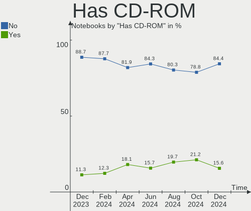
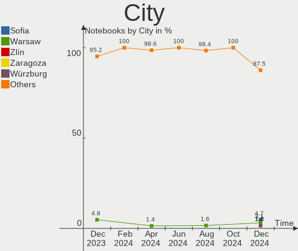
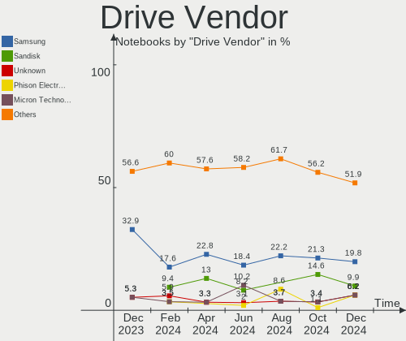
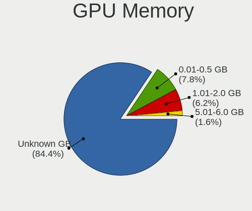

Manjaro - Hardware Trends (Notebooks)
-------------------------------------

A project to identify most popular hardware characteristics and track their change
over time based on data collected by Linux users at https://Linux-Hardware.org.

Anyone can contribute to this report by the [hw-probe](https://github.com/linuxhw/hw-probe) tool:

    sudo -E hw-probe -all -upload

This report is for one last month. Overall report since the beginning of time: [TestDays](https://github.com/linuxhw/TestDays)

Period: Sep, 2023.

Contents
--------

* [ System ](#system)
  - [ OS                       ](#os)
  - [ OS Family                ](#os-family)
  - [ Kernel                   ](#kernel)
  - [ Kernel Family            ](#kernel-family)
  - [ Kernel Major Ver.        ](#kernel-major-ver)
  - [ Arch                     ](#arch)
  - [ DE                       ](#de)
  - [ Display Server           ](#display-server)
  - [ Display Manager          ](#display-manager)
  - [ OS Lang                  ](#os-lang)
  - [ Boot Mode                ](#boot-mode)
  - [ Filesystem               ](#filesystem)
  - [ Part. scheme             ](#part-scheme)
  - [ Dual Boot with Linux/BSD ](#dual-boot-with-linuxbsd)
  - [ Dual Boot (Win)          ](#dual-boot-win)

* [ Board ](#board)
  - [ Vendor                   ](#vendor)
  - [ Model                    ](#model)
  - [ Model Family             ](#model-family)
  - [ MFG Year                 ](#mfg-year)
  - [ Form Factor              ](#form-factor)
  - [ Secure Boot              ](#secure-boot)
  - [ Coreboot                 ](#coreboot)
  - [ RAM Size                 ](#ram-size)
  - [ RAM Used                 ](#ram-used)
  - [ Total Drives             ](#total-drives)
  - [ Has CD-ROM               ](#has-cd-rom)
  - [ Has Ethernet             ](#has-ethernet)
  - [ Has WiFi                 ](#has-wifi)
  - [ Has Bluetooth            ](#has-bluetooth)

* [ Location ](#location)
  - [ Country                  ](#country)
  - [ City                     ](#city)

* [ Drives ](#drives)
  - [ Drive Vendor             ](#drive-vendor)
  - [ Drive Model              ](#drive-model)
  - [ HDD Vendor               ](#hdd-vendor)
  - [ SSD Vendor               ](#ssd-vendor)
  - [ Drive Kind               ](#drive-kind)
  - [ Drive Connector          ](#drive-connector)
  - [ Drive Size               ](#drive-size)
  - [ Space Total              ](#space-total)
  - [ Space Used               ](#space-used)
  - [ Malfunc. Drives          ](#malfunc-drives)
  - [ Malfunc. Drive Vendor    ](#malfunc-drive-vendor)
  - [ Malfunc. HDD Vendor      ](#malfunc-hdd-vendor)
  - [ Malfunc. Drive Kind      ](#malfunc-drive-kind)
  - [ Failed Drives            ](#failed-drives)
  - [ Failed Drive Vendor      ](#failed-drive-vendor)
  - [ Drive Status             ](#drive-status)

* [ Storage controller ](#storage-controller)
  - [ Storage Vendor           ](#storage-vendor)
  - [ Storage Model            ](#storage-model)
  - [ Storage Kind             ](#storage-kind)

* [ Processor ](#processor)
  - [ CPU Vendor               ](#cpu-vendor)
  - [ CPU Model                ](#cpu-model)
  - [ CPU Model Family         ](#cpu-model-family)
  - [ CPU Cores                ](#cpu-cores)
  - [ CPU Sockets              ](#cpu-sockets)
  - [ CPU Threads              ](#cpu-threads)
  - [ CPU Op-Modes             ](#cpu-op-modes)
  - [ CPU Microcode            ](#cpu-microcode)
  - [ CPU Microarch            ](#cpu-microarch)

* [ Graphics ](#graphics)
  - [ GPU Vendor               ](#gpu-vendor)
  - [ GPU Model                ](#gpu-model)
  - [ GPU Combo                ](#gpu-combo)
  - [ GPU Driver               ](#gpu-driver)
  - [ GPU Memory               ](#gpu-memory)

* [ Monitor ](#monitor)
  - [ Monitor Vendor           ](#monitor-vendor)
  - [ Monitor Model            ](#monitor-model)
  - [ Monitor Resolution       ](#monitor-resolution)
  - [ Monitor Diagonal         ](#monitor-diagonal)
  - [ Monitor Width            ](#monitor-width)
  - [ Aspect Ratio             ](#aspect-ratio)
  - [ Monitor Area             ](#monitor-area)
  - [ Pixel Density            ](#pixel-density)
  - [ Multiple Monitors        ](#multiple-monitors)

* [ Network ](#network)
  - [ Net Controller Vendor    ](#net-controller-vendor)
  - [ Net Controller Model     ](#net-controller-model)
  - [ Wireless Vendor          ](#wireless-vendor)
  - [ Wireless Model           ](#wireless-model)
  - [ Ethernet Vendor          ](#ethernet-vendor)
  - [ Ethernet Model           ](#ethernet-model)
  - [ Net Controller Kind      ](#net-controller-kind)
  - [ Used Controller          ](#used-controller)
  - [ NICs                     ](#nics)
  - [ IPv6                     ](#ipv6)

* [ Bluetooth ](#bluetooth)
  - [ Bluetooth Vendor         ](#bluetooth-vendor)
  - [ Bluetooth Model          ](#bluetooth-model)

* [ Sound ](#sound)
  - [ Sound Vendor             ](#sound-vendor)
  - [ Sound Model              ](#sound-model)

* [ Memory ](#memory)
  - [ Memory Vendor            ](#memory-vendor)
  - [ Memory Model             ](#memory-model)
  - [ Memory Kind              ](#memory-kind)
  - [ Memory Form Factor       ](#memory-form-factor)
  - [ Memory Size              ](#memory-size)
  - [ Memory Speed             ](#memory-speed)

* [ Printers & scanners ](#printers--scanners)
  - [ Printer Vendor           ](#printer-vendor)
  - [ Printer Model            ](#printer-model)
  - [ Scanner Vendor           ](#scanner-vendor)
  - [ Scanner Model            ](#scanner-model)

* [ Camera ](#camera)
  - [ Camera Vendor            ](#camera-vendor)
  - [ Camera Model             ](#camera-model)

* [ Security ](#security)
  - [ Fingerprint Vendor       ](#fingerprint-vendor)
  - [ Fingerprint Model        ](#fingerprint-model)
  - [ Chipcard Vendor          ](#chipcard-vendor)
  - [ Chipcard Model           ](#chipcard-model)

* [ Unsupported ](#unsupported)
  - [ Unsupported Devices      ](#unsupported-devices)
  - [ Unsupported Device Types ](#unsupported-device-types)

System
------

OS
--

Installed operating systems

| Name           | Notebooks | Percent |
|----------------|-----------|---------|
| Manjaro        | 30        | 44.12%  |
| Manjaro 23.0.2 | 13        | 19.12%  |
| Manjaro 23.0.0 | 13        | 19.12%  |
| Manjaro 23.0.1 | 11        | 16.18%  |
| Manjaro 23.0   | 1         | 1.47%   |

OS Family
---------

OS without a version

| Name    | Notebooks | Percent |
|---------|-----------|---------|
| Manjaro | 68        | 100%    |

Kernel
------

Version of the Linux kernel

| Version             | Notebooks | Percent |
|---------------------|-----------|---------|
| 6.5.3-1-MANJARO     | 14        | 20.59%  |
| 6.5.1-1-MANJARO     | 11        | 16.18%  |
| 6.5.0-1-MANJARO     | 7         | 10.29%  |
| 6.1.53-1-MANJARO    | 7         | 10.29%  |
| 6.1.51-1-MANJARO    | 7         | 10.29%  |
| 6.1.49-1-MANJARO    | 6         | 8.82%   |
| 6.4.12-1-MANJARO    | 3         | 4.41%   |
| 6.6.0-1-MANJARO     | 2         | 2.94%   |
| 6.5.0-1-rt6-MANJARO | 1         | 1.47%   |
| 6.4.6-3-rt8-MANJARO | 1         | 1.47%   |
| 6.4.12-zen1-1-zen   | 1         | 1.47%   |
| 6.3.13-1-MANJARO    | 1         | 1.47%   |
| 6.1.44-1-MANJARO    | 1         | 1.47%   |
| 6.1.38-1-MANJARO    | 1         | 1.47%   |
| 6.0.19-4-MANJARO    | 1         | 1.47%   |
| 5.15.131-1-MANJARO  | 1         | 1.47%   |
| 5.15.130-1-MANJARO  | 1         | 1.47%   |
| 5.15.128-1-MANJARO  | 1         | 1.47%   |
| 5.15.125-1-MANJARO  | 1         | 1.47%   |

Kernel Family
-------------

Linux kernel without a distro release

| Version  | Notebooks | Percent |
|----------|-----------|---------|
| 6.5.3    | 14        | 20.59%  |
| 6.5.1    | 11        | 16.18%  |
| 6.5.0    | 8         | 11.76%  |
| 6.1.53   | 7         | 10.29%  |
| 6.1.51   | 7         | 10.29%  |
| 6.1.49   | 6         | 8.82%   |
| 6.4.12   | 4         | 5.88%   |
| 6.6.0    | 2         | 2.94%   |
| 6.4.6    | 1         | 1.47%   |
| 6.3.13   | 1         | 1.47%   |
| 6.1.44   | 1         | 1.47%   |
| 6.1.38   | 1         | 1.47%   |
| 6.0.19   | 1         | 1.47%   |
| 5.15.131 | 1         | 1.47%   |
| 5.15.130 | 1         | 1.47%   |
| 5.15.128 | 1         | 1.47%   |
| 5.15.125 | 1         | 1.47%   |

Kernel Major Ver.
-----------------

Linux kernel major version

| Version | Notebooks | Percent |
|---------|-----------|---------|
| 6.5     | 33        | 48.53%  |
| 6.1     | 22        | 32.35%  |
| 6.4     | 5         | 7.35%   |
| 5.15    | 4         | 5.88%   |
| 6.6     | 2         | 2.94%   |
| 6.3     | 1         | 1.47%   |
| 6.0     | 1         | 1.47%   |

Arch
----

OS architecture (x86_64, i586, etc.)

| Name   | Notebooks | Percent |
|--------|-----------|---------|
| x86_64 | 68        | 100%    |

DE
--

Desktop Environment

| Name       | Notebooks | Percent |
|------------|-----------|---------|
| KDE5       | 37        | 54.41%  |
| GNOME      | 13        | 19.12%  |
| XFCE       | 9         | 13.24%  |
| i3         | 2         | 2.94%   |
| X-Cinnamon | 1         | 1.47%   |
| sway       | 1         | 1.47%   |
| qtile      | 1         | 1.47%   |
| KDE        | 1         | 1.47%   |
| Hyprland   | 1         | 1.47%   |
| Cinnamon   | 1         | 1.47%   |
| Unknown    | 1         | 1.47%   |

Display Server
--------------

X11 or Wayland

| Name    | Notebooks | Percent |
|---------|-----------|---------|
| X11     | 49        | 72.06%  |
| Wayland | 17        | 25%     |
| Unknown | 2         | 2.94%   |

Display Manager
---------------

SDDM, LightDM, etc.

| Name    | Notebooks | Percent |
|---------|-----------|---------|
| Unknown | 30        | 44.12%  |
| SDDM    | 16        | 23.53%  |
| LightDM | 14        | 20.59%  |
| GDM     | 7         | 10.29%  |
| GREETD  | 1         | 1.47%   |

OS Lang
-------

Language

| Lang    | Notebooks | Percent |
|---------|-----------|---------|
| en_US   | 30        | 44.12%  |
| de_DE   | 9         | 13.24%  |
| ru_RU   | 4         | 5.88%   |
| pt_BR   | 4         | 5.88%   |
| it_IT   | 4         | 5.88%   |
| en_GB   | 4         | 5.88%   |
| en_CA   | 3         | 4.41%   |
| fr_FR   | 2         | 2.94%   |
| zh_CN   | 1         | 1.47%   |
| pl_PL   | 1         | 1.47%   |
| nb_NO   | 1         | 1.47%   |
| id_ID   | 1         | 1.47%   |
| es_CU   | 1         | 1.47%   |
| es_CO   | 1         | 1.47%   |
| en_IN   | 1         | 1.47%   |
| Unknown | 1         | 1.47%   |

Boot Mode
---------

EFI or BIOS

| Mode | Notebooks | Percent |
|------|-----------|---------|
| BIOS | 37        | 54.41%  |
| EFI  | 31        | 45.59%  |

Filesystem
----------

Type of filesystem

| Type  | Notebooks | Percent |
|-------|-----------|---------|
| Ext4  | 51        | 75%     |
| Btrfs | 13        | 19.12%  |
| Tmpfs | 3         | 4.41%   |
| F2fs  | 1         | 1.47%   |

Part. scheme
------------

Scheme of partitioning

| Type    | Notebooks | Percent |
|---------|-----------|---------|
| GPT     | 35        | 51.47%  |
| Unknown | 28        | 41.18%  |
| MBR     | 5         | 7.35%   |

Dual Boot with Linux/BSD
------------------------

Hosting more than one Linux/BSD

| Dual boot | Notebooks | Percent |
|-----------|-----------|---------|
| No        | 66        | 97.06%  |
| Yes       | 2         | 2.94%   |

Dual Boot (Win)
---------------

Hosting Linux and Windows

| Dual boot | Notebooks | Percent |
|-----------|-----------|---------|
| No        | 53        | 77.94%  |
| Yes       | 15        | 22.06%  |

Board
-----

Vendor
------

Motherboard manufacturer

| Name             | Notebooks | Percent |
|------------------|-----------|---------|
| Lenovo           | 18        | 26.47%  |
| Hewlett-Packard  | 14        | 20.59%  |
| Dell             | 7         | 10.29%  |
| ASUSTek Computer | 7         | 10.29%  |
| Acer             | 6         | 8.82%   |
| MSI              | 3         | 4.41%   |
| HUAWEI           | 3         | 4.41%   |
| Google           | 2         | 2.94%   |
| TUXEDO           | 1         | 1.47%   |
| Toshiba          | 1         | 1.47%   |
| Timi             | 1         | 1.47%   |
| Notebook         | 1         | 1.47%   |
| HONOR            | 1         | 1.47%   |
| Fujitsu          | 1         | 1.47%   |
| Chuwi            | 1         | 1.47%   |
| Apple            | 1         | 1.47%   |

Model
-----

Motherboard model

| Name                                    | Notebooks | Percent |
|-----------------------------------------|-----------|---------|
| HUAWEI HKD-WXX                          | 2         | 2.94%   |
| TUXEDO Stellaris Intel Gen4             | 1         | 1.47%   |
| Toshiba Satellite M645                  | 1         | 1.47%   |
| Timi Redmi Book Pro 14 2022             | 1         | 1.47%   |
| Notebook NK50S5_SZ                      | 1         | 1.47%   |
| MSI Prestige 14Evo A12M                 | 1         | 1.47%   |
| MSI Modern 15 B7M                       | 1         | 1.47%   |
| MSI GP75 Leopard 10SEK                  | 1         | 1.47%   |
| Lenovo Yoga Slim 7 14ITL05 82A3         | 1         | 1.47%   |
| Lenovo V15 G2 IJL 82QY                  | 1         | 1.47%   |
| Lenovo ThinkPad X260 20F60097US         | 1         | 1.47%   |
| Lenovo ThinkPad W540 20BG0016US         | 1         | 1.47%   |
| Lenovo ThinkPad T450 20BUS0H200         | 1         | 1.47%   |
| Lenovo ThinkPad T430 2349KQ3            | 1         | 1.47%   |
| Lenovo ThinkPad T14 Gen 1 20UES2WB00    | 1         | 1.47%   |
| Lenovo ThinkPad P15 Gen 1 20STS02D00    | 1         | 1.47%   |
| Lenovo ThinkPad E560 20EV002FUS         | 1         | 1.47%   |
| Lenovo Slim Pro 7 14ARP8 83AX           | 1         | 1.47%   |
| Lenovo Legion 5 Pro 16ACH6H 82JQ        | 1         | 1.47%   |
| Lenovo Legion 5 15ARH05H 82B1           | 1         | 1.47%   |
| Lenovo IdeaPad S340-14API 81NB          | 1         | 1.47%   |
| Lenovo IdeaPad 5 15ARE05 81YQ           | 1         | 1.47%   |
| Lenovo IdeaPad 5 14IIL05 81YH           | 1         | 1.47%   |
| Lenovo IdeaPad 330-15IKB 81DE           | 1         | 1.47%   |
| Lenovo IdeaPad 3 15ITL6 82H8            | 1         | 1.47%   |
| Lenovo G40-45 80E1                      | 1         | 1.47%   |
| HUAWEI BOM-WXX9                         | 1         | 1.47%   |
| HONOR HYM-WXX                           | 1         | 1.47%   |
| HP Stream Laptop 14-cb0XX               | 1         | 1.47%   |
| HP Pavilion Aero Laptop 13-be0xxx       | 1         | 1.47%   |
| HP Laptop 15s-fq0xxx                    | 1         | 1.47%   |
| HP Laptop 15-ef2xxx                     | 1         | 1.47%   |
| HP Laptop 15-dw1xxx                     | 1         | 1.47%   |
| HP ENVY m4                              | 1         | 1.47%   |
| HP ENVY Laptop 13-ba1xxx                | 1         | 1.47%   |
| HP EliteBook 855 G7 Notebook PC         | 1         | 1.47%   |
| HP EliteBook 845 G8 Notebook PC         | 1         | 1.47%   |
| HP EliteBook 845 14 inch G9 Notebook PC | 1         | 1.47%   |
| HP EliteBook 840 G7 Notebook PC         | 1         | 1.47%   |
| HP 255 G8 Notebook PC                   | 1         | 1.47%   |

Model Family
------------

Motherboard model prefix

| Name              | Notebooks | Percent |
|-------------------|-----------|---------|
| Lenovo ThinkPad   | 7         | 10.29%  |
| Lenovo IdeaPad    | 5         | 7.35%   |
| HP EliteBook      | 4         | 5.88%   |
| Acer Aspire       | 4         | 5.88%   |
| HP Laptop         | 3         | 4.41%   |
| Lenovo Legion     | 2         | 2.94%   |
| HUAWEI HKD-WXX    | 2         | 2.94%   |
| HP ENVY           | 2         | 2.94%   |
| HP 250            | 2         | 2.94%   |
| Dell Precision    | 2         | 2.94%   |
| Dell Latitude     | 2         | 2.94%   |
| Dell Inspiron     | 2         | 2.94%   |
| ASUS VivoBook     | 2         | 2.94%   |
| Acer Nitro        | 2         | 2.94%   |
| TUXEDO Stellaris  | 1         | 1.47%   |
| Toshiba Satellite | 1         | 1.47%   |
| Timi Redmi        | 1         | 1.47%   |
| Notebook NK50S5   | 1         | 1.47%   |
| MSI Prestige      | 1         | 1.47%   |
| MSI Modern        | 1         | 1.47%   |
| MSI GP75          | 1         | 1.47%   |
| Lenovo Yoga       | 1         | 1.47%   |
| Lenovo V15        | 1         | 1.47%   |
| Lenovo Slim       | 1         | 1.47%   |
| Lenovo G40-45     | 1         | 1.47%   |
| HUAWEI BOM-WXX9   | 1         | 1.47%   |
| HONOR HYM-WXX     | 1         | 1.47%   |
| HP Stream         | 1         | 1.47%   |
| HP Pavilion       | 1         | 1.47%   |
| HP 255            | 1         | 1.47%   |
| Google Galtic     | 1         | 1.47%   |
| Google Blorb      | 1         | 1.47%   |
| Fujitsu LIFEBOOK  | 1         | 1.47%   |
| Dell XPS          | 1         | 1.47%   |
| Chuwi GemiBook    | 1         | 1.47%   |
| ASUS Zenbook      | 1         | 1.47%   |
| ASUS Z450UA       | 1         | 1.47%   |
| ASUS ROG          | 1         | 1.47%   |
| ASUS GL553VW      | 1         | 1.47%   |
| ASUS ASUSPRO      | 1         | 1.47%   |

MFG Year
--------

Motherboard manufacture year

| Year | Notebooks | Percent |
|------|-----------|---------|
| 2022 | 13        | 19.12%  |
| 2020 | 13        | 19.12%  |
| 2021 | 10        | 14.71%  |
| 2012 | 6         | 8.82%   |
| 2016 | 5         | 7.35%   |
| 2019 | 4         | 5.88%   |
| 2018 | 4         | 5.88%   |
| 2014 | 4         | 5.88%   |
| 2023 | 3         | 4.41%   |
| 2017 | 1         | 1.47%   |
| 2015 | 1         | 1.47%   |
| 2013 | 1         | 1.47%   |
| 2011 | 1         | 1.47%   |
| 2010 | 1         | 1.47%   |
| 2007 | 1         | 1.47%   |

Form Factor
-----------

Physical design of the computer

| Name     | Notebooks | Percent |
|----------|-----------|---------|
| Notebook | 68        | 100%    |

Secure Boot
-----------

Enabled or disabled

| State    | Notebooks | Percent |
|----------|-----------|---------|
| Disabled | 68        | 100%    |

Coreboot
--------

Have coreboot on board

| Used | Notebooks | Percent |
|------|-----------|---------|
| No   | 66        | 97.06%  |
| Yes  | 2         | 2.94%   |

RAM Size
--------

Total RAM memory

| Size in GB | Notebooks | Percent |
|------------|-----------|---------|
| 4.01-8.0   | 23        | 33.82%  |
| 8.01-16.0  | 19        | 27.94%  |
| 16.01-24.0 | 13        | 19.12%  |
| 32.01-64.0 | 8         | 11.76%  |
| 3.01-4.0   | 3         | 4.41%   |
| 24.01-32.0 | 1         | 1.47%   |
| 1.01-2.0   | 1         | 1.47%   |

RAM Used
--------

Used RAM memory

| Used GB   | Notebooks | Percent |
|-----------|-----------|---------|
| 4.01-8.0  | 23        | 33.82%  |
| 3.01-4.0  | 18        | 26.47%  |
| 2.01-3.0  | 12        | 17.65%  |
| 1.01-2.0  | 7         | 10.29%  |
| 8.01-16.0 | 7         | 10.29%  |
| 0.51-1.0  | 1         | 1.47%   |

Total Drives
------------

Number of drives on board

| Drives | Notebooks | Percent |
|--------|-----------|---------|
| 1      | 53        | 77.94%  |
| 2      | 13        | 19.12%  |
| 3      | 2         | 2.94%   |

Has CD-ROM
----------

Has CD-ROM on board

| Presented | Notebooks | Percent |
|-----------|-----------|---------|
| No        | 52        | 76.47%  |
| Yes       | 16        | 23.53%  |

Has Ethernet
------------

Has Ethernet on board

| Presented | Notebooks | Percent |
|-----------|-----------|---------|
| Yes       | 44        | 64.71%  |
| No        | 24        | 35.29%  |

Has WiFi
--------

Has WiFi module

| Presented | Notebooks | Percent |
|-----------|-----------|---------|
| Yes       | 68        | 100%    |

Has Bluetooth
-------------

Has Bluetooth module

| Presented | Notebooks | Percent |
|-----------|-----------|---------|
| Yes       | 61        | 89.71%  |
| No        | 7         | 10.29%  |

Location
--------

Country
-------

Geographic location (country)

| Country     | Notebooks | Percent |
|-------------|-----------|---------|
| USA         | 13        | 19.12%  |
| Germany     | 9         | 13.24%  |
| Russia      | 6         | 8.82%   |
| Italy       | 4         | 5.88%   |
| Brazil      | 4         | 5.88%   |
| Czechia     | 3         | 4.41%   |
| Canada      | 3         | 4.41%   |
| UK          | 2         | 2.94%   |
| Switzerland | 2         | 2.94%   |
| Poland      | 2         | 2.94%   |
| Netherlands | 2         | 2.94%   |
| France      | 2         | 2.94%   |
| China       | 2         | 2.94%   |
| Bulgaria    | 2         | 2.94%   |
| Portugal    | 1         | 1.47%   |
| Norway      | 1         | 1.47%   |
| Lithuania   | 1         | 1.47%   |
| Latvia      | 1         | 1.47%   |
| Kazakhstan  | 1         | 1.47%   |
| Iran        | 1         | 1.47%   |
| Indonesia   | 1         | 1.47%   |
| India       | 1         | 1.47%   |
| Greece      | 1         | 1.47%   |
| Cuba        | 1         | 1.47%   |
| Colombia    | 1         | 1.47%   |
| Bangladesh  | 1         | 1.47%   |

City
----

Geographic location (city)

| City                    | Notebooks | Percent |
|-------------------------|-----------|---------|
| St Petersburg           | 2         | 2.94%   |
| Shanghai                | 2         | 2.94%   |
| Alexandria              | 2         | 2.94%   |
| Zurich                  | 1         | 1.47%   |
| Wegberg                 | 1         | 1.47%   |
| Varna                   | 1         | 1.47%   |
| Ulm                     | 1         | 1.47%   |
| Tehran                  | 1         | 1.47%   |
| Tampa                   | 1         | 1.47%   |
| Sparks                  | 1         | 1.47%   |
| Sidzina                 | 1         | 1.47%   |
| Seattle                 | 1         | 1.47%   |
| Santiago de Cali        | 1         | 1.47%   |
| Santa Rita do Sapucai   | 1         | 1.47%   |
| Ronkonkoma              | 1         | 1.47%   |
| Riga                    | 1         | 1.47%   |
| Richardson              | 1         | 1.47%   |
| Prague                  | 1         | 1.47%   |
| Plovdiv                 | 1         | 1.47%   |
| Pau dos Ferros          | 1         | 1.47%   |
| Parma                   | 1         | 1.47%   |
| Paris                   | 1         | 1.47%   |
| Novosibirsk             | 1         | 1.47%   |
| Murmansk                | 1         | 1.47%   |
| Munich                  | 1         | 1.47%   |
| Mountain City           | 1         | 1.47%   |
| Moscow                  | 1         | 1.47%   |
| Morgantown              | 1         | 1.47%   |
| Misterbianco            | 1         | 1.47%   |
| Milano                  | 1         | 1.47%   |
| Matosinhos Municipality | 1         | 1.47%   |
| Lüdenscheid            | 1         | 1.47%   |
| Kyzylorda               | 1         | 1.47%   |
| Kifissia                | 1         | 1.47%   |
| Kaunas                  | 1         | 1.47%   |
| Karlsruhe               | 1         | 1.47%   |
| Innopolis               | 1         | 1.47%   |
| Indore                  | 1         | 1.47%   |
| Houten                  | 1         | 1.47%   |
| Houston                 | 1         | 1.47%   |

Drives
------

Drive Vendor
------------

Hard drive vendors

| Vendor                         | Notebooks | Drives | Percent |
|--------------------------------|-----------|--------|---------|
| Samsung Electronics            | 21        | 22     | 25.93%  |
| Sandisk                        | 13        | 14     | 16.05%  |
| WDC                            | 7         | 7      | 8.64%   |
| Unknown                        | 6         | 6      | 7.41%   |
| SK hynix                       | 6         | 6      | 7.41%   |
| Toshiba                        | 4         | 5      | 4.94%   |
| Seagate                        | 3         | 3      | 3.7%    |
| Phison Electronics             | 2         | 2      | 2.47%   |
| Micron Technology              | 2         | 2      | 2.47%   |
| KIOXIA                         | 2         | 2      | 2.47%   |
| Kingston                       | 2         | 2      | 2.47%   |
| China                          | 2         | 2      | 2.47%   |
| XrayDisk                       | 1         | 1      | 1.23%   |
| WALRAM                         | 1         | 1      | 1.23%   |
| Union Memory (Shenzhen)        | 1         | 1      | 1.23%   |
| Solid State Storage Technology | 1         | 1      | 1.23%   |
| Solid State Storage            | 1         | 1      | 1.23%   |
| Silicon Motion                 | 1         | 1      | 1.23%   |
| Shenzhen Longsys Electronics   | 1         | 1      | 1.23%   |
| Ramos Technology               | 1         | 2      | 1.23%   |
| Micron/Crucial Technology      | 1         | 1      | 1.23%   |
| HGST                           | 1         | 1      | 1.23%   |
| Crucial                        | 1         | 1      | 1.23%   |

Drive Model
-----------

Hard drive models

| Model                                                 | Notebooks | Percent |
|-------------------------------------------------------|-----------|---------|
| Samsung NVMe SSD Controller SM981/PM981/PM983 256GB   | 7         | 8.24%   |
| Sandisk WD Blue SN550 NVMe SSD 512GB                  | 3         | 3.53%   |
| Unknown NVMe SSD Drive 512GB                          | 2         | 2.35%   |
| SK hynix HFM512GD3JX013N 512GB                        | 2         | 2.35%   |
| Sandisk WD Black SN750 / PC SN730 NVMe SSD 512GB      | 2         | 2.35%   |
| Samsung NVMe SSD Controller PM9A1/PM9A3/980PRO 1TB    | 2         | 2.35%   |
| Samsung MZ7LN256HCHP-000L7 256GB SSD                  | 2         | 2.35%   |
| Phison PS5013 E13 NVMe Controller 512GB               | 2         | 2.35%   |
| XrayDisk 128GB SSD                                    | 1         | 1.18%   |
| WDC WDS500G2B0A-00SM50 500GB SSD                      | 1         | 1.18%   |
| WDC WDS480G2G0A-00JH30 480GB SSD                      | 1         | 1.18%   |
| WDC WDS120G1G0A-00SS50 120GB SSD                      | 1         | 1.18%   |
| WDC WD5000BEVT-00SCST0 500GB                          | 1         | 1.18%   |
| WDC WD50 00AZLX-60K2TA0 500GB                         | 1         | 1.18%   |
| WDC WD1600BEVT-22ZCT0 160GB                           | 1         | 1.18%   |
| WDC WD10SPZX-21Z10T0 1TB                              | 1         | 1.18%   |
| WALRAM 512GB                                          | 1         | 1.18%   |
| Unknown MMC Card  64GB                                | 1         | 1.18%   |
| Unknown MMC Card  32GB                                | 1         | 1.18%   |
| Unknown MMC Card  256GB                               | 1         | 1.18%   |
| Unknown MMC Card  128GB                               | 1         | 1.18%   |
| Union Memory (Shenzhen) RPFTJ256PDD2MWX 256GB         | 1         | 1.18%   |
| Toshiba THNSNJ128GCSU 128GB SSD                       | 1         | 1.18%   |
| Toshiba NVMe Controller 256GB                         | 1         | 1.18%   |
| Toshiba MQ01ABD100 1TB                                | 1         | 1.18%   |
| Toshiba MQ01ABD050 500GB                              | 1         | 1.18%   |
| Toshiba HDWJ110 1TB                                   | 1         | 1.18%   |
| Solid State Storage CA6-8D2048-Q11 NVMe SSSTC 2048GB  | 1         | 1.18%   |
| Solid State Storage SSSTC CL1-8D512 512GB             | 1         | 1.18%   |
| SK hynix SKHynix_HFS512GD9TNI-L2A0B 512GB             | 1         | 1.18%   |
| SK hynix PC300 NVMe 256GB                             | 1         | 1.18%   |
| SK hynix BC711 HFM512GD3JX013N 512GB                  | 1         | 1.18%   |
| SK hynix BC501 NVMe Solid State Drive 512GB           | 1         | 1.18%   |
| Silicon Motion SM2263EN/SM2263XT SSD Controller 512GB | 1         | 1.18%   |
| Shenzhen Longsys addlink M.2 PCIE Gen3X4 NVMe 512GB   | 1         | 1.18%   |
| Seagate ST500LM021-1KJ152 500GB                       | 1         | 1.18%   |
| Seagate ST1000LM035-1RK172 1TB                        | 1         | 1.18%   |
| Seagate One Touch HDD 2TB                             | 1         | 1.18%   |
| Sandisk WD PC SN740 SDDPNQD-512G-1006 512GB           | 1         | 1.18%   |
| Sandisk WD Blue SN570 1TB                             | 1         | 1.18%   |

HDD Vendor
----------

Hard disk drive vendors

| Vendor  | Notebooks | Drives | Percent |
|---------|-----------|--------|---------|
| WDC     | 4         | 4      | 36.36%  |
| Toshiba | 3         | 3      | 27.27%  |
| Seagate | 3         | 3      | 27.27%  |
| HGST    | 1         | 1      | 9.09%   |

SSD Vendor
----------

Solid state drive vendors

| Vendor              | Notebooks | Drives | Percent |
|---------------------|-----------|--------|---------|
| Samsung Electronics | 6         | 6      | 28.57%  |
| SanDisk             | 5         | 6      | 23.81%  |
| WDC                 | 3         | 3      | 14.29%  |
| China               | 2         | 2      | 9.52%   |
| XrayDisk            | 1         | 1      | 4.76%   |
| Toshiba             | 1         | 1      | 4.76%   |
| Ramos Technology    | 1         | 2      | 4.76%   |
| Kingston            | 1         | 1      | 4.76%   |
| Crucial             | 1         | 1      | 4.76%   |

Drive Kind
----------

HDD or SSD

| Kind    | Notebooks | Drives | Percent |
|---------|-----------|--------|---------|
| NVMe    | 44        | 46     | 55.7%   |
| SSD     | 19        | 23     | 24.05%  |
| HDD     | 11        | 11     | 13.92%  |
| MMC     | 4         | 4      | 5.06%   |
| Unknown | 1         | 1      | 1.27%   |

Drive Connector
---------------

SATA, SAS, NVMe, etc.

| Type | Notebooks | Drives | Percent |
|------|-----------|--------|---------|
| NVMe | 44        | 46     | 55.7%   |
| SATA | 28        | 32     | 35.44%  |
| MMC  | 4         | 4      | 5.06%   |
| SAS  | 3         | 3      | 3.8%    |

Drive Size
----------

Size of hard drive

| Size in TB | Notebooks | Drives | Percent |
|------------|-----------|--------|---------|
| 0.01-0.5   | 22        | 24     | 68.75%  |
| 0.51-1.0   | 9         | 9      | 28.13%  |
| 1.01-2.0   | 1         | 1      | 3.13%   |

Space Total
-----------

Amount of disk space available on the file system

| Size in GB     | Notebooks | Percent |
|----------------|-----------|---------|
| 251-500        | 18        | 26.47%  |
| 101-250        | 17        | 25%     |
| 501-1000       | 12        | 17.65%  |
| Unknown        | 8         | 11.76%  |
| 1001-2000      | 5         | 7.35%   |
| More than 3000 | 4         | 5.88%   |
| 21-50          | 1         | 1.47%   |
| 2001-3000      | 1         | 1.47%   |
| 1-20           | 1         | 1.47%   |
| 51-100         | 1         | 1.47%   |

Space Used
----------

Amount of used disk space

| Used GB   | Notebooks | Percent |
|-----------|-----------|---------|
| 1-20      | 13        | 19.12%  |
| 251-500   | 12        | 17.65%  |
| 21-50     | 11        | 16.18%  |
| 101-250   | 11        | 16.18%  |
| Unknown   | 8         | 11.76%  |
| 51-100    | 6         | 8.82%   |
| 501-1000  | 4         | 5.88%   |
| 1001-2000 | 3         | 4.41%   |

Malfunc. Drives
---------------

Drive models with a malfunction

| Model                                | Notebooks | Drives | Percent |
|--------------------------------------|-----------|--------|---------|
| SK hynix BC711 HFM512GD3JX013N 512GB | 1         | 1      | 100%    |

Malfunc. Drive Vendor
---------------------

Vendors of faulty drives

| Vendor   | Notebooks | Drives | Percent |
|----------|-----------|--------|---------|
| SK hynix | 1         | 1      | 100%    |

Malfunc. HDD Vendor
-------------------

Vendors of faulty HDD drives

Zero info for selected period =(

Malfunc. Drive Kind
-------------------

Kinds of faulty drives

| Kind | Notebooks | Drives | Percent |
|------|-----------|--------|---------|
| NVMe | 1         | 1      | 100%    |

Failed Drives
-------------

Failed drive models

Zero info for selected period =(

Failed Drive Vendor
-------------------

Failed drive vendors

Zero info for selected period =(

Drive Status
------------

Number of failed and malfunc. drives

| Status   | Notebooks | Drives | Percent |
|----------|-----------|--------|---------|
| Detected | 45        | 55     | 65.22%  |
| Works    | 23        | 29     | 33.33%  |
| Malfunc  | 1         | 1      | 1.45%   |

Storage controller
------------------

Storage Vendor
--------------

Storage controller vendors

| Vendor                         | Notebooks | Percent |
|--------------------------------|-----------|---------|
| Intel                          | 34        | 38.2%   |
| Samsung Electronics            | 15        | 16.85%  |
| AMD                            | 10        | 11.24%  |
| SanDisk                        | 8         | 8.99%   |
| SK hynix                       | 6         | 6.74%   |
| Solid State Storage Technology | 2         | 2.25%   |
| Phison Electronics             | 2         | 2.25%   |
| Micron Technology              | 2         | 2.25%   |
| KIOXIA                         | 2         | 2.25%   |
| Unknown                        | 2         | 2.25%   |
| Union Memory (Shenzhen)        | 1         | 1.12%   |
| Toshiba America Info Systems   | 1         | 1.12%   |
| Silicon Motion                 | 1         | 1.12%   |
| Shenzhen Longsys Electronics   | 1         | 1.12%   |
| Micron/Crucial Technology      | 1         | 1.12%   |
| Kingston Technology Company    | 1         | 1.12%   |

Storage Model
-------------

Storage controller models

| Model                                                                         | Notebooks | Percent |
|-------------------------------------------------------------------------------|-----------|---------|
| AMD FCH SATA Controller [AHCI mode]                                           | 10        | 10.99%  |
| Samsung NVMe SSD Controller SM981/PM981/PM983                                 | 7         | 7.69%   |
| Intel Sunrise Point-LP SATA Controller [AHCI mode]                            | 5         | 5.49%   |
| Samsung NVMe SSD Controller 980                                               | 4         | 4.4%    |
| Intel 82801 Mobile SATA Controller [RAID mode]                                | 4         | 4.4%    |
| SK hynix Gold P31/BC711/PC711 NVMe Solid State Drive                          | 3         | 3.3%    |
| SanDisk WD Blue SN550 NVMe SSD                                                | 3         | 3.3%    |
| Intel Volume Management Device NVMe RAID Controller                           | 3         | 3.3%    |
| Intel 7 Series Chipset Family 6-port SATA Controller [AHCI mode]              | 3         | 3.3%    |
| SanDisk WD Black SN750 / PC SN730 NVMe SSD                                    | 2         | 2.2%    |
| Samsung NVMe SSD Controller PM9B1                                             | 2         | 2.2%    |
| Samsung NVMe SSD Controller PM9A1/PM9A3/980PRO                                | 2         | 2.2%    |
| Phison PS5013 E13 NVMe Controller                                             | 2         | 2.2%    |
| Intel Q170/Q150/B150/H170/H110/Z170/CM236 Chipset SATA Controller [AHCI Mode] | 2         | 2.2%    |
| Intel Jasper Lake SATA AHCI Controller                                        | 2         | 2.2%    |
| Intel 400 Series Chipset Family SATA AHCI Controller                          | 2         | 2.2%    |
| Unknown                                                                       | 2         | 2.2%    |
| Union Memory (Shenzhen) AM610 PCIe 3.0 NVMe SSD 128GB                         | 1         | 1.1%    |
| Toshiba America Info Systems XG3 NVMe SSD Controller                          | 1         | 1.1%    |
| Solid State Storage Non-Volatile memory controller                            | 1         | 1.1%    |
| Solid State Storage CL1-3D256-Q11 NVMe SSD M.2                                | 1         | 1.1%    |
| SK hynix PC611 NVMe Solid State Drive                                         | 1         | 1.1%    |
| SK hynix PC300 NVMe Solid State Drive 256GB                                   | 1         | 1.1%    |
| SK hynix BC501 NVMe Solid State Drive                                         | 1         | 1.1%    |
| Silicon Motion SM2263EN/SM2263XT (DRAM-less) NVMe SSD Controllers             | 1         | 1.1%    |
| Shenzhen Longsys Lexar NM620 NVME SSD (DRAM-less)                             | 1         | 1.1%    |
| SanDisk WD Blue SN570 NVMe SSD 1TB                                            | 1         | 1.1%    |
| SanDisk WD Blue SN500 / PC SN520 NVMe SSD                                     | 1         | 1.1%    |
| SanDisk WD Black SN770 / PC SN740 256GB / PC SN560 (DRAM-less) NVMe SSD       | 1         | 1.1%    |
| Samsung NVMe SSD Controller SM961/PM961/SM963                                 | 1         | 1.1%    |
| Micron/Crucial P5 Plus NVMe PCIe SSD                                          | 1         | 1.1%    |
| Micron 3400 NVMe SSD [Hendrix]                                                | 1         | 1.1%    |
| Micron 2450 NVMe SSD [HendrixV] (DRAM-less)                                   | 1         | 1.1%    |
| KIOXIA NVMe SSD Controller BG5 (DRAM-less)                                    | 1         | 1.1%    |
| KIOXIA NVMe SSD Controller BG4 (DRAM-less)                                    | 1         | 1.1%    |
| Kingston Company NVMe Controller                                              | 1         | 1.1%    |
| Intel Wildcat Point-LP SATA Controller [AHCI Mode]                            | 1         | 1.1%    |
| Intel Tiger Lake-LP SATA Controller                                           | 1         | 1.1%    |
| Intel HM170/QM170 Chipset SATA Controller [AHCI Mode]                         | 1         | 1.1%    |
| Intel Celeron/Pentium Silver Processor SATA Controller                        | 1         | 1.1%    |

Storage Kind
------------

Kind of storage controller (IDE, SATA, NVMe, SAS, ...)

| Kind | Notebooks | Percent |
|------|-----------|---------|
| NVMe | 44        | 49.44%  |
| SATA | 37        | 41.57%  |
| RAID | 7         | 7.87%   |
| IDE  | 1         | 1.12%   |

Processor
---------

CPU Vendor
----------

Processor vendors

| Vendor | Notebooks | Percent |
|--------|-----------|---------|
| Intel  | 45        | 66.18%  |
| AMD    | 23        | 33.82%  |

CPU Model
---------

Processor models

| Model                                   | Notebooks | Percent |
|-----------------------------------------|-----------|---------|
| Intel Core i5-6200U CPU @ 2.30GHz       | 3         | 4.41%   |
| AMD Ryzen 5 5500U with Radeon Graphics  | 3         | 4.41%   |
| Intel Core i7-3632QM CPU @ 2.20GHz      | 2         | 2.94%   |
| Intel Core i7-10750H CPU @ 2.60GHz      | 2         | 2.94%   |
| Intel Celeron N4020 CPU @ 1.10GHz       | 2         | 2.94%   |
| Intel 12th Gen Core i7-12700H           | 2         | 2.94%   |
| Intel 11th Gen Core i7-1165G7 @ 2.80GHz | 2         | 2.94%   |
| Intel 11th Gen Core i7-11370H @ 3.30GHz | 2         | 2.94%   |
| AMD Ryzen 7 5800H with Radeon Graphics  | 2         | 2.94%   |
| AMD Ryzen 5 5600H with Radeon Graphics  | 2         | 2.94%   |
| Intel Pentium Silver N6000 @ 1.10GHz    | 1         | 1.47%   |
| Intel Pentium Dual CPU T2390 @ 1.86GHz  | 1         | 1.47%   |
| Intel Core i7-8565U CPU @ 1.80GHz       | 1         | 1.47%   |
| Intel Core i7-6920HQ CPU @ 2.90GHz      | 1         | 1.47%   |
| Intel Core i7-6820HQ CPU @ 2.70GHz      | 1         | 1.47%   |
| Intel Core i7-6700HQ CPU @ 2.60GHz      | 1         | 1.47%   |
| Intel Core i7-6600U CPU @ 2.60GHz       | 1         | 1.47%   |
| Intel Core i7-4800MQ CPU @ 2.70GHz      | 1         | 1.47%   |
| Intel Core i7-3612QM CPU @ 2.10GHz      | 1         | 1.47%   |
| Intel Core i7-10610U CPU @ 1.80GHz      | 1         | 1.47%   |
| Intel Core i7-10510U CPU @ 1.80GHz      | 1         | 1.47%   |
| Intel Core i5-8265U CPU @ 1.60GHz       | 1         | 1.47%   |
| Intel Core i5-8250U CPU @ 1.60GHz       | 1         | 1.47%   |
| Intel Core i5-5300U CPU @ 2.30GHz       | 1         | 1.47%   |
| Intel Core i5-3230M CPU @ 2.60GHz       | 1         | 1.47%   |
| Intel Core i5-3210M CPU @ 2.50GHz       | 1         | 1.47%   |
| Intel Core i5-2410M CPU @ 2.30GHz       | 1         | 1.47%   |
| Intel Core i5-10400 CPU @ 2.90GHz       | 1         | 1.47%   |
| Intel Core i5-1035G1 CPU @ 1.00GHz      | 1         | 1.47%   |
| Intel Core i5-10210U CPU @ 1.60GHz      | 1         | 1.47%   |
| Intel Core i5 CPU M 560 @ 2.67GHz       | 1         | 1.47%   |
| Intel Core i3-4030U CPU @ 1.90GHz       | 1         | 1.47%   |
| Intel Celeron N5100 @ 1.10GHz           | 1         | 1.47%   |
| Intel Celeron N4500 @ 1.10GHz           | 1         | 1.47%   |
| Intel Celeron CPU N3350 @ 1.10GHz       | 1         | 1.47%   |
| Intel Atom x5-E8000 CPU @ 1.04GHz       | 1         | 1.47%   |
| Intel 12th Gen Core i9-12900H           | 1         | 1.47%   |
| Intel 12th Gen Core i7-1280P            | 1         | 1.47%   |
| Intel 12th Gen Core i5-1235U            | 1         | 1.47%   |
| Intel 11th Gen Core i5-1135G7 @ 2.40GHz | 1         | 1.47%   |

CPU Model Family
----------------

Processor model prefix

| Model                | Notebooks | Percent |
|----------------------|-----------|---------|
| Intel Core i7        | 13        | 19.12%  |
| Intel Core i5        | 13        | 19.12%  |
| Other                | 10        | 14.71%  |
| AMD Ryzen 5          | 10        | 14.71%  |
| AMD Ryzen 7          | 6         | 8.82%   |
| Intel Celeron        | 5         | 7.35%   |
| AMD Ryzen 7 PRO      | 2         | 2.94%   |
| AMD Ryzen 5 PRO      | 2         | 2.94%   |
| Intel Pentium Silver | 1         | 1.47%   |
| Intel Pentium Dual   | 1         | 1.47%   |
| Intel Core i3        | 1         | 1.47%   |
| Intel Atom           | 1         | 1.47%   |
| AMD Ryzen 9          | 1         | 1.47%   |
| AMD E1               | 1         | 1.47%   |
| AMD A8               | 1         | 1.47%   |

CPU Cores
---------

Number of processor cores

| Number | Notebooks | Percent |
|--------|-----------|---------|
| 4      | 25        | 36.76%  |
| 2      | 16        | 23.53%  |
| 6      | 14        | 20.59%  |
| 8      | 8         | 11.76%  |
| 14     | 4         | 5.88%   |
| 10     | 1         | 1.47%   |

CPU Sockets
-----------

Number of sockets

| Number | Notebooks | Percent |
|--------|-----------|---------|
| 1      | 68        | 100%    |

CPU Threads
-----------

Threads per core (Hyper-Threading)

| Number | Notebooks | Percent |
|--------|-----------|---------|
| 2      | 56        | 82.35%  |
| 1      | 12        | 17.65%  |

CPU Op-Modes
------------

CPU Operation Modes (32-bit, 64-bit)

| Op mode        | Notebooks | Percent |
|----------------|-----------|---------|
| 32-bit, 64-bit | 68        | 100%    |

CPU Microcode
-------------

Microcode number

| Number     | Notebooks | Percent |
|------------|-----------|---------|
| Unknown    | 47        | 69.12%  |
| 0x08600106 | 3         | 4.41%   |
| 0x806c1    | 2         | 2.94%   |
| 0x0a50000d | 2         | 2.94%   |
| 0x08608103 | 2         | 2.94%   |
| 0x906a3    | 1         | 1.47%   |
| 0x806ec    | 1         | 1.47%   |
| 0x806ea    | 1         | 1.47%   |
| 0x706a8    | 1         | 1.47%   |
| 0x6fd      | 1         | 1.47%   |
| 0x506e3    | 1         | 1.47%   |
| 0x40651    | 1         | 1.47%   |
| 0x306d4    | 1         | 1.47%   |
| 0x0a50000c | 1         | 1.47%   |
| 0x0a404101 | 1         | 1.47%   |
| 0x08600103 | 1         | 1.47%   |
| 0x07030104 | 1         | 1.47%   |

CPU Microarch
-------------

Microarchitecture

| Name             | Notebooks | Percent |
|------------------|-----------|---------|
| Unknown          | 10        | 14.71%  |
| Zen 3            | 8         | 11.76%  |
| Skylake          | 7         | 10.29%  |
| KabyLake         | 6         | 8.82%   |
| Zen 2            | 5         | 7.35%   |
| TigerLake        | 5         | 7.35%   |
| IvyBridge        | 5         | 7.35%   |
| CometLake        | 3         | 4.41%   |
| Zen+             | 2         | 2.94%   |
| Tremont          | 2         | 2.94%   |
| Haswell          | 2         | 2.94%   |
| Goldmont plus    | 2         | 2.94%   |
| Alderlake Hybrid | 2         | 2.94%   |
| Westmere         | 1         | 1.47%   |
| Silvermont       | 1         | 1.47%   |
| SandyBridge      | 1         | 1.47%   |
| Puma             | 1         | 1.47%   |
| Jaguar           | 1         | 1.47%   |
| IceLake          | 1         | 1.47%   |
| Goldmont         | 1         | 1.47%   |
| Core             | 1         | 1.47%   |
| Broadwell        | 1         | 1.47%   |

Graphics
--------

GPU Vendor
----------

Vendors of graphics cards

| Vendor | Notebooks | Percent |
|--------|-----------|---------|
| Intel  | 44        | 50%     |
| AMD    | 23        | 26.14%  |
| Nvidia | 21        | 23.86%  |

GPU Model
---------

Graphics card models

| Model                                                                | Notebooks | Percent |
|----------------------------------------------------------------------|-----------|---------|
| AMD Cezanne [Radeon Vega Series / Radeon Vega Mobile Series]         | 7         | 7.78%   |
| Intel TigerLake-LP GT2 [Iris Xe Graphics]                            | 5         | 5.56%   |
| Intel 3rd Gen Core processor Graphics Controller                     | 5         | 5.56%   |
| AMD Renoir                                                           | 5         | 5.56%   |
| Intel Skylake GT2 [HD Graphics 520]                                  | 4         | 4.44%   |
| Intel Alder Lake-P Integrated Graphics Controller                    | 4         | 4.44%   |
| Intel JasperLake [UHD Graphics]                                      | 3         | 3.33%   |
| Intel HD Graphics 530                                                | 3         | 3.33%   |
| Intel CometLake-U GT2 [UHD Graphics]                                 | 3         | 3.33%   |
| AMD Rembrandt [Radeon 680M]                                          | 3         | 3.33%   |
| AMD Lucienne                                                         | 3         | 3.33%   |
| Nvidia TU106M [GeForce RTX 2060 Mobile]                              | 2         | 2.22%   |
| Nvidia GP107M [GeForce MX350]                                        | 2         | 2.22%   |
| Nvidia GA107M [GeForce RTX 3050 Ti Mobile]                           | 2         | 2.22%   |
| Nvidia GA106M [GeForce RTX 3060 Mobile / Max-Q]                      | 2         | 2.22%   |
| Intel WhiskeyLake-U GT2 [UHD Graphics 620]                           | 2         | 2.22%   |
| Intel GeminiLake [UHD Graphics 600]                                  | 2         | 2.22%   |
| AMD Picasso/Raven 2 [Radeon Vega Series / Radeon Vega Mobile Series] | 2         | 2.22%   |
| Nvidia TU117M [GeForce GTX 1650 Mobile / Max-Q]                      | 1         | 1.11%   |
| Nvidia TU117M                                                        | 1         | 1.11%   |
| Nvidia TU117GLM [Quadro T1000 Mobile]                                | 1         | 1.11%   |
| Nvidia GP108M [GeForce MX330]                                        | 1         | 1.11%   |
| Nvidia GN20-P0-R-K2 [GeForce RTX 3050 6GB Laptop GPU]                | 1         | 1.11%   |
| Nvidia GM204GLM [Quadro M4000M]                                      | 1         | 1.11%   |
| Nvidia GM107M [GeForce GTX 960M]                                     | 1         | 1.11%   |
| Nvidia GM107GLM [Quadro M1200 Mobile]                                | 1         | 1.11%   |
| Nvidia GM107 [GeForce 940MX]                                         | 1         | 1.11%   |
| Nvidia GK106GLM [Quadro K2100M]                                      | 1         | 1.11%   |
| Nvidia GF108M [GeForce GT 525M]                                      | 1         | 1.11%   |
| Nvidia GA107M [GeForce RTX 3050 Mobile]                              | 1         | 1.11%   |
| Nvidia GA104M [GeForce RTX 3070 Mobile / Max-Q]                      | 1         | 1.11%   |
| Intel UHD Graphics 620                                               | 1         | 1.11%   |
| Intel Mobile GM965/GL960 Integrated Graphics Controller (secondary)  | 1         | 1.11%   |
| Intel Mobile GM965/GL960 Integrated Graphics Controller (primary)    | 1         | 1.11%   |
| Intel Iris Plus Graphics G1 (Ice Lake)                               | 1         | 1.11%   |
| Intel HD Graphics 5500                                               | 1         | 1.11%   |
| Intel HD Graphics 500                                                | 1         | 1.11%   |
| Intel Haswell-ULT Integrated Graphics Controller                     | 1         | 1.11%   |
| Intel Core Processor Integrated Graphics Controller                  | 1         | 1.11%   |
| Intel CometLake-S GT2 [UHD Graphics 630]                             | 1         | 1.11%   |

GPU Combo
---------

Combinations of graphics cards

| Name           | Notebooks | Percent |
|----------------|-----------|---------|
| 1 x Intel      | 31        | 45.59%  |
| 1 x AMD        | 14        | 20.59%  |
| Intel + Nvidia | 12        | 17.65%  |
| AMD + Nvidia   | 8         | 11.76%  |
| 2 x Intel      | 1         | 1.47%   |
| 2 x AMD        | 1         | 1.47%   |
| 1 x Nvidia     | 1         | 1.47%   |

GPU Driver
----------

Free vs proprietary

| Driver      | Notebooks | Percent |
|-------------|-----------|---------|
| Free        | 55        | 80.88%  |
| Proprietary | 13        | 19.12%  |

GPU Memory
----------

Total video memory

| Size in GB | Notebooks | Percent |
|------------|-----------|---------|
| Unknown    | 52        | 76.47%  |
| 0.01-0.5   | 6         | 8.82%   |
| 3.01-4.0   | 4         | 5.88%   |
| 0.51-1.0   | 3         | 4.41%   |
| 1.01-2.0   | 2         | 2.94%   |
| 5.01-6.0   | 1         | 1.47%   |

Monitor
-------

Monitor Vendor
--------------

Monitor vendors

| Vendor              | Notebooks | Percent |
|---------------------|-----------|---------|
| AU Optronics        | 19        | 23.17%  |
| BOE                 | 16        | 19.51%  |
| Chimei Innolux      | 15        | 18.29%  |
| Samsung Electronics | 5         | 6.1%    |
| Dell                | 5         | 6.1%    |
| LG Display          | 3         | 3.66%   |
| Philips             | 2         | 2.44%   |
| InfoVision          | 2         | 2.44%   |
| AOC                 | 2         | 2.44%   |
| Vizio               | 1         | 1.22%   |
| ViewSonic           | 1         | 1.22%   |
| TMX                 | 1         | 1.22%   |
| Sharp               | 1         | 1.22%   |
| RGT                 | 1         | 1.22%   |
| PANDA               | 1         | 1.22%   |
| Panasonic           | 1         | 1.22%   |
| Lenovo              | 1         | 1.22%   |
| Hewlett-Packard     | 1         | 1.22%   |
| Goldstar            | 1         | 1.22%   |
| Gigabyte Technology | 1         | 1.22%   |
| CSO                 | 1         | 1.22%   |
| Apple               | 1         | 1.22%   |

Monitor Model
-------------

Monitor models

| Model                                                                 | Notebooks | Percent |
|-----------------------------------------------------------------------|-----------|---------|
| Chimei Innolux LCD Monitor CMN15E7 1920x1080 344x193mm 15.5-inch      | 2         | 2.41%   |
| Chimei Innolux LCD Monitor CMN14E5 1920x1080 309x173mm 13.9-inch      | 2         | 2.41%   |
| Vizio V405-H9 VIZ1039 3840x2160 878x485mm 39.5-inch                   | 1         | 1.2%    |
| ViewSonic VA2446 Series VSC732E 1920x1080 521x293mm 23.5-inch         | 1         | 1.2%    |
| TMX TL142GDXP02-0 TMX1420 2520x1680 300x200mm 14.2-inch               | 1         | 1.2%    |
| Sharp LCD Monitor SHP14AC 1920x1080 309x174mm 14.0-inch               | 1         | 1.2%    |
| Samsung Electronics LCD Monitor SEC5441 1366x768 344x194mm 15.5-inch  | 1         | 1.2%    |
| Samsung Electronics LCD Monitor SEC3741 1366x768 309x174mm 14.0-inch  | 1         | 1.2%    |
| Samsung Electronics LCD Monitor SDC415D 3840x2400 344x215mm 16.0-inch | 1         | 1.2%    |
| Samsung Electronics LCD Monitor SDC4154 2880x1800 302x189mm 14.0-inch | 1         | 1.2%    |
| Samsung Electronics LCD Monitor SDC414D 3456x2160 336x210mm 15.6-inch | 1         | 1.2%    |
| RGT LCD Monitor RGT1352 1920x1080 480x270mm 21.7-inch                 | 1         | 1.2%    |
| Philips PHL 275E1 PHLC20C 2560x1440 597x336mm 27.0-inch               | 1         | 1.2%    |
| Philips FTV PHL04C3 3840x2160 1440x810mm 65.0-inch                    | 1         | 1.2%    |
| PANDA LCD Monitor NCP0040 1920x1080 344x194mm 15.5-inch               | 1         | 1.2%    |
| Panasonic LCD Monitor MEI96A2 2880x1620 344x193mm 15.5-inch           | 1         | 1.2%    |
| LG Display LCD Monitor LGD069A 1920x1080 344x194mm 15.5-inch          | 1         | 1.2%    |
| LG Display LCD Monitor LGD046F 1920x1080 345x194mm 15.6-inch          | 1         | 1.2%    |
| LG Display LCD Monitor LGD0459 1920x1080 382x215mm 17.3-inch          | 1         | 1.2%    |
| Lenovo LCD Monitor LEN40B1 1600x900 345x194mm 15.6-inch               | 1         | 1.2%    |
| InfoVision LCD Monitor IVO8CBE 1920x1200 302x189mm 14.0-inch          | 1         | 1.2%    |
| InfoVision LCD Monitor IVO061F 1920x1080 344x194mm 15.5-inch          | 1         | 1.2%    |
| Hewlett-Packard Z27q G3 HPN36CF 2560x1440 597x336mm 27.0-inch         | 1         | 1.2%    |
| Goldstar HDR 4K GSM7707 3840x2160 600x340mm 27.2-inch                 | 1         | 1.2%    |
| Gigabyte Technology M32QC GBT3205 2560x1440 697x392mm 31.5-inch       | 1         | 1.2%    |
| Dell U2414H DELA0A3 1920x1080 527x296mm 23.8-inch                     | 1         | 1.2%    |
| Dell U2414H DELA0A2 1920x1080 527x296mm 23.8-inch                     | 1         | 1.2%    |
| Dell SE2416H DELD081 1920x1080 527x296mm 23.8-inch                    | 1         | 1.2%    |
| Dell S2721HGF DEL41E7 1920x1080 597x336mm 27.0-inch                   | 1         | 1.2%    |
| Dell P2422H DELA1C4 1920x1080 527x296mm 23.8-inch                     | 1         | 1.2%    |
| Dell E198WFP DELF005 1440x900 408x255mm 18.9-inch                     | 1         | 1.2%    |
| CSO LCD Monitor CSO1600 2560x1600 345x215mm 16.0-inch                 | 1         | 1.2%    |
| Chimei Innolux LCD Monitor CMN1734 1600x900 382x214mm 17.2-inch       | 1         | 1.2%    |
| Chimei Innolux LCD Monitor CMN15F5 1920x1080 344x193mm 15.5-inch      | 1         | 1.2%    |
| Chimei Innolux LCD Monitor CMN15BF 1366x768 344x193mm 15.5-inch       | 1         | 1.2%    |
| Chimei Innolux LCD Monitor CMN1543 1920x1080 344x193mm 15.5-inch      | 1         | 1.2%    |
| Chimei Innolux LCD Monitor CMN1535 1366x768 344x193mm 15.5-inch       | 1         | 1.2%    |
| Chimei Innolux LCD Monitor CMN1521 1920x1080 344x193mm 15.5-inch      | 1         | 1.2%    |
| Chimei Innolux LCD Monitor CMN1512 1920x1080 344x193mm 15.5-inch      | 1         | 1.2%    |
| Chimei Innolux LCD Monitor CMN1493 1366x768 309x173mm 13.9-inch       | 1         | 1.2%    |

Monitor Resolution
------------------

Monitor screen resolution

| Resolution        | Notebooks | Percent |
|-------------------|-----------|---------|
| 1920x1080 (FHD)   | 35        | 45.45%  |
| 1366x768 (WXGA)   | 14        | 18.18%  |
| 3840x2160 (4K)    | 6         | 7.79%   |
| 2560x1440 (QHD)   | 5         | 6.49%   |
| 1600x900 (HD+)    | 4         | 5.19%   |
| 2560x1600         | 3         | 3.9%    |
| 1920x1200 (WUXGA) | 2         | 2.6%    |
| 1280x800 (WXGA)   | 2         | 2.6%    |
| 3840x2400         | 1         | 1.3%    |
| 3456x2160         | 1         | 1.3%    |
| 2880x1800         | 1         | 1.3%    |
| 2520x1680         | 1         | 1.3%    |
| 2160x1440         | 1         | 1.3%    |
| 1440x900 (WXGA+)  | 1         | 1.3%    |

Monitor Diagonal
----------------

Diagonal size in inches

| Inches | Notebooks | Percent |
|--------|-----------|---------|
| 15     | 32        | 39.02%  |
| 14     | 15        | 18.29%  |
| 13     | 10        | 12.2%   |
| 17     | 6         | 7.32%   |
| 27     | 5         | 6.1%    |
| 24     | 3         | 3.66%   |
| 16     | 3         | 3.66%   |
| 69     | 1         | 1.22%   |
| 65     | 1         | 1.22%   |
| 33     | 1         | 1.22%   |
| 31     | 1         | 1.22%   |
| 23     | 1         | 1.22%   |
| 21     | 1         | 1.22%   |
| 19     | 1         | 1.22%   |
| 12     | 1         | 1.22%   |

Monitor Width
-------------

Physical width

| Width in mm | Notebooks | Percent |
|-------------|-----------|---------|
| 301-350     | 53        | 64.63%  |
| 501-600     | 9         | 10.98%  |
| 351-400     | 8         | 9.76%   |
| 201-300     | 6         | 7.32%   |
| 401-500     | 2         | 2.44%   |
| 701-800     | 1         | 1.22%   |
| 601-700     | 1         | 1.22%   |
| 1501-2000   | 1         | 1.22%   |
| 1001-1500   | 1         | 1.22%   |

Aspect Ratio
------------

Proportional relationship between the width and the height

| Ratio | Notebooks | Percent |
|-------|-----------|---------|
| 16/9  | 56        | 80%     |
| 16/10 | 12        | 17.14%  |
| 3/2   | 2         | 2.86%   |

Monitor Area
------------

Area in inch²

| Area in inch² | Notebooks | Percent |
|----------------|-----------|---------|
| 101-110        | 33        | 40.24%  |
| 81-90          | 21        | 25.61%  |
| 121-130        | 6         | 7.32%   |
| 301-350        | 5         | 6.1%    |
| 201-250        | 5         | 6.1%    |
| More than 1000 | 2         | 2.44%   |
| 71-80          | 2         | 2.44%   |
| 351-500        | 2         | 2.44%   |
| 111-120        | 2         | 2.44%   |
| 91-100         | 2         | 2.44%   |
| 61-70          | 1         | 1.22%   |
| 151-200        | 1         | 1.22%   |

Pixel Density
-------------

Pixels per inch

| Density       | Notebooks | Percent |
|---------------|-----------|---------|
| 121-160       | 34        | 41.46%  |
| 101-120       | 19        | 23.17%  |
| 51-100        | 13        | 15.85%  |
| 161-240       | 10        | 12.2%   |
| More than 240 | 5         | 6.1%    |
| 1-50          | 1         | 1.22%   |

Multiple Monitors
-----------------

Total monitors connected

| Total | Notebooks | Percent |
|-------|-----------|---------|
| 1     | 54        | 79.41%  |
| 2     | 13        | 19.12%  |
| 3     | 1         | 1.47%   |

Network
-------

Net Controller Vendor
---------------------

Controller vendors

| Vendor                | Notebooks | Percent |
|-----------------------|-----------|---------|
| Intel                 | 40        | 40.82%  |
| Realtek Semiconductor | 37        | 37.76%  |
| Qualcomm Atheros      | 8         | 8.16%   |
| MediaTek              | 6         | 6.12%   |
| Broadcom              | 3         | 3.06%   |
| ASIX Electronics      | 2         | 2.04%   |
| Qualcomm              | 1         | 1.02%   |
| DisplayLink           | 1         | 1.02%   |

Net Controller Model
--------------------

Controller models

| Model                                                                   | Notebooks | Percent |
|-------------------------------------------------------------------------|-----------|---------|
| Realtek RTL8111/8168/8411 PCI Express Gigabit Ethernet Controller       | 19        | 16.24%  |
| Intel Wi-Fi 6 AX200                                                     | 7         | 5.98%   |
| Intel Wi-Fi 6 AX201                                                     | 5         | 4.27%   |
| Realtek RTL8821CE 802.11ac PCIe Wireless Network Adapter                | 4         | 3.42%   |
| Realtek RTL810xE PCI Express Fast Ethernet controller                   | 4         | 3.42%   |
| Intel Wireless 7260                                                     | 4         | 3.42%   |
| Realtek RTL8822CE 802.11ac PCIe Wireless Network Adapter                | 3         | 2.56%   |
| Realtek RTL8152 Fast Ethernet Adapter                                   | 3         | 2.56%   |
| Qualcomm Atheros QCA9377 802.11ac Wireless Network Adapter              | 3         | 2.56%   |
| MediaTek MT7921 802.11ax PCI Express Wireless Network Adapter           | 3         | 2.56%   |
| Intel Wireless 7265                                                     | 3         | 2.56%   |
| Intel Wi-Fi 6 AX201 160MHz                                              | 3         | 2.56%   |
| Intel Alder Lake-P PCH CNVi WiFi                                        | 3         | 2.56%   |
| Realtek RTL8852AE 802.11ax PCIe Wireless Network Adapter                | 2         | 1.71%   |
| Realtek RTL8153 Gigabit Ethernet Adapter                                | 2         | 1.71%   |
| Qualcomm Atheros QCA9565 / AR9565 Wireless Network Adapter              | 2         | 1.71%   |
| MediaTek MT7922 802.11ax PCI Express Wireless Network Adapter           | 2         | 1.71%   |
| Intel Wireless 8260                                                     | 2         | 1.71%   |
| Intel Comet Lake PCH-LP CNVi WiFi                                       | 2         | 1.71%   |
| Intel Comet Lake PCH CNVi WiFi                                          | 2         | 1.71%   |
| Intel Centrino Advanced-N 6205 [Taylor Peak]                            | 2         | 1.71%   |
| ASIX AX88179 Gigabit Ethernet                                           | 2         | 1.71%   |
| Realtek RTL8852BE PCIe 802.11ax Wireless Network Controller             | 1         | 0.85%   |
| Realtek RTL8723BE PCIe Wireless Network Adapter                         | 1         | 0.85%   |
| Realtek RTL8191SEvA Wireless LAN Controller                             | 1         | 0.85%   |
| Realtek RTL8125 2.5GbE Controller                                       | 1         | 0.85%   |
| Realtek Killer E2600 Gigabit Ethernet Controller                        | 1         | 0.85%   |
| Realtek 802.11ac NIC                                                    | 1         | 0.85%   |
| Qualcomm QCNFA765 Wireless Network Adapter                              | 1         | 0.85%   |
| Qualcomm Atheros QCA8171 Gigabit Ethernet                               | 1         | 0.85%   |
| Qualcomm Atheros QCA6174 802.11ac Wireless Network Adapter              | 1         | 0.85%   |
| Qualcomm Atheros AR9285 Wireless Network Adapter (PCI-Express)          | 1         | 0.85%   |
| Qualcomm Atheros AR242x / AR542x Wireless Network Adapter (PCI-Express) | 1         | 0.85%   |
| MediaTek MT7921K (RZ608) Wi-Fi 6E 80MHz                                 | 1         | 0.85%   |
| Intel Wireless 8265 / 8275                                              | 1         | 0.85%   |
| Intel Wi-Fi 6 AX210/AX211/AX411 160MHz                                  | 1         | 0.85%   |
| Intel Ice Lake-LP PCH CNVi WiFi                                         | 1         | 0.85%   |
| Intel I210 Gigabit Network Connection                                   | 1         | 0.85%   |
| Intel Gemini Lake PCH CNVi WiFi                                         | 1         | 0.85%   |
| Intel Ethernet Connection I219-V                                        | 1         | 0.85%   |

Wireless Vendor
---------------

Wireless vendors

| Vendor                | Notebooks | Percent |
|-----------------------|-----------|---------|
| Intel                 | 40        | 57.14%  |
| Realtek Semiconductor | 13        | 18.57%  |
| Qualcomm Atheros      | 8         | 11.43%  |
| MediaTek              | 6         | 8.57%   |
| Broadcom              | 2         | 2.86%   |
| Qualcomm              | 1         | 1.43%   |

Wireless Model
--------------

Wireless models

| Model                                                                   | Notebooks | Percent |
|-------------------------------------------------------------------------|-----------|---------|
| Intel Wi-Fi 6 AX200                                                     | 7         | 10%     |
| Intel Wi-Fi 6 AX201                                                     | 5         | 7.14%   |
| Realtek RTL8821CE 802.11ac PCIe Wireless Network Adapter                | 4         | 5.71%   |
| Intel Wireless 7260                                                     | 4         | 5.71%   |
| Realtek RTL8822CE 802.11ac PCIe Wireless Network Adapter                | 3         | 4.29%   |
| Qualcomm Atheros QCA9377 802.11ac Wireless Network Adapter              | 3         | 4.29%   |
| MediaTek MT7921 802.11ax PCI Express Wireless Network Adapter           | 3         | 4.29%   |
| Intel Wireless 7265                                                     | 3         | 4.29%   |
| Intel Wi-Fi 6 AX201 160MHz                                              | 3         | 4.29%   |
| Intel Alder Lake-P PCH CNVi WiFi                                        | 3         | 4.29%   |
| Realtek RTL8852AE 802.11ax PCIe Wireless Network Adapter                | 2         | 2.86%   |
| Qualcomm Atheros QCA9565 / AR9565 Wireless Network Adapter              | 2         | 2.86%   |
| MediaTek MT7922 802.11ax PCI Express Wireless Network Adapter           | 2         | 2.86%   |
| Intel Wireless 8260                                                     | 2         | 2.86%   |
| Intel Comet Lake PCH-LP CNVi WiFi                                       | 2         | 2.86%   |
| Intel Comet Lake PCH CNVi WiFi                                          | 2         | 2.86%   |
| Intel Centrino Advanced-N 6205 [Taylor Peak]                            | 2         | 2.86%   |
| Realtek RTL8852BE PCIe 802.11ax Wireless Network Controller             | 1         | 1.43%   |
| Realtek RTL8723BE PCIe Wireless Network Adapter                         | 1         | 1.43%   |
| Realtek RTL8191SEvA Wireless LAN Controller                             | 1         | 1.43%   |
| Realtek 802.11ac NIC                                                    | 1         | 1.43%   |
| Qualcomm QCNFA765 Wireless Network Adapter                              | 1         | 1.43%   |
| Qualcomm Atheros QCA6174 802.11ac Wireless Network Adapter              | 1         | 1.43%   |
| Qualcomm Atheros AR9285 Wireless Network Adapter (PCI-Express)          | 1         | 1.43%   |
| Qualcomm Atheros AR242x / AR542x Wireless Network Adapter (PCI-Express) | 1         | 1.43%   |
| MediaTek MT7921K (RZ608) Wi-Fi 6E 80MHz                                 | 1         | 1.43%   |
| Intel Wireless 8265 / 8275                                              | 1         | 1.43%   |
| Intel Wi-Fi 6 AX210/AX211/AX411 160MHz                                  | 1         | 1.43%   |
| Intel Ice Lake-LP PCH CNVi WiFi                                         | 1         | 1.43%   |
| Intel Gemini Lake PCH CNVi WiFi                                         | 1         | 1.43%   |
| Intel Dual Band Wireless-AC 3168NGW [Stone Peak]                        | 1         | 1.43%   |
| Intel Dual Band Wireless-AC 3165 Plus Bluetooth                         | 1         | 1.43%   |
| Intel Cannon Point-LP CNVi [Wireless-AC]                                | 1         | 1.43%   |
| Broadcom BCM4331 802.11a/b/g/n                                          | 1         | 1.43%   |
| Broadcom BCM43228 802.11a/b/g/n                                         | 1         | 1.43%   |

Ethernet Vendor
---------------

Ethernet vendors

| Vendor                | Notebooks | Percent |
|-----------------------|-----------|---------|
| Realtek Semiconductor | 29        | 63.04%  |
| Intel                 | 10        | 21.74%  |
| Broadcom              | 3         | 6.52%   |
| ASIX Electronics      | 2         | 4.35%   |
| Qualcomm Atheros      | 1         | 2.17%   |
| DisplayLink           | 1         | 2.17%   |

Ethernet Model
--------------

Ethernet models

| Model                                                             | Notebooks | Percent |
|-------------------------------------------------------------------|-----------|---------|
| Realtek RTL8111/8168/8411 PCI Express Gigabit Ethernet Controller | 19        | 40.43%  |
| Realtek RTL810xE PCI Express Fast Ethernet controller             | 4         | 8.51%   |
| Realtek RTL8152 Fast Ethernet Adapter                             | 3         | 6.38%   |
| Realtek RTL8153 Gigabit Ethernet Adapter                          | 2         | 4.26%   |
| ASIX AX88179 Gigabit Ethernet                                     | 2         | 4.26%   |
| Realtek RTL8125 2.5GbE Controller                                 | 1         | 2.13%   |
| Realtek Killer E2600 Gigabit Ethernet Controller                  | 1         | 2.13%   |
| Qualcomm Atheros QCA8171 Gigabit Ethernet                         | 1         | 2.13%   |
| Intel I210 Gigabit Network Connection                             | 1         | 2.13%   |
| Intel Ethernet Connection I219-V                                  | 1         | 2.13%   |
| Intel Ethernet Connection I219-LM                                 | 1         | 2.13%   |
| Intel Ethernet Connection I217-LM                                 | 1         | 2.13%   |
| Intel Ethernet Connection (5) I219-LM                             | 1         | 2.13%   |
| Intel Ethernet Connection (3) I218-LM                             | 1         | 2.13%   |
| Intel Ethernet Connection (2) I219-LM                             | 1         | 2.13%   |
| Intel Ethernet Connection (11) I219-V                             | 1         | 2.13%   |
| Intel 82579V Gigabit Network Connection                           | 1         | 2.13%   |
| Intel 82579LM Gigabit Network Connection (Lewisville)             | 1         | 2.13%   |
| DisplayLink USB-C Triple-4K Dock                                  | 1         | 2.13%   |
| Broadcom NetXtreme BCM57765 Gigabit Ethernet PCIe                 | 1         | 2.13%   |
| Broadcom NetXtreme BCM5761 Gigabit Ethernet PCIe                  | 1         | 2.13%   |
| Broadcom NetLink BCM5906M Fast Ethernet PCI Express               | 1         | 2.13%   |

Net Controller Kind
-------------------

Ethernet, WiFi or modem

| Kind     | Notebooks | Percent |
|----------|-----------|---------|
| WiFi     | 70        | 61.4%   |
| Ethernet | 44        | 38.6%   |

Used Controller
---------------

Currently used network controller

| Kind     | Notebooks | Percent |
|----------|-----------|---------|
| WiFi     | 59        | 81.94%  |
| Ethernet | 13        | 18.06%  |

NICs
----

Total network controllers on board

| Total | Notebooks | Percent |
|-------|-----------|---------|
| 2     | 38        | 55.88%  |
| 1     | 29        | 42.65%  |
| 3     | 1         | 1.47%   |

IPv6
----

IPv6 vs IPv4

| Used | Notebooks | Percent |
|------|-----------|---------|
| No   | 49        | 72.06%  |
| Yes  | 19        | 27.94%  |

Bluetooth
---------

Bluetooth Vendor
----------------

Controller vendors

| Vendor                          | Notebooks | Percent |
|---------------------------------|-----------|---------|
| Intel                           | 35        | 55.56%  |
| Realtek Semiconductor           | 8         | 12.7%   |
| IMC Networks                    | 4         | 6.35%   |
| Foxconn / Hon Hai               | 4         | 6.35%   |
| Qualcomm Atheros Communications | 3         | 4.76%   |
| Lite-On Technology              | 2         | 3.17%   |
| Cambridge Silicon Radio         | 2         | 3.17%   |
| Realtek                         | 1         | 1.59%   |
| Opticis                         | 1         | 1.59%   |
| MediaTek                        | 1         | 1.59%   |
| Broadcom                        | 1         | 1.59%   |
| Apple                           | 1         | 1.59%   |

Bluetooth Model
---------------

Controller models

| Model                                               | Notebooks | Percent |
|-----------------------------------------------------|-----------|---------|
| Intel AX201 Bluetooth                               | 11        | 17.46%  |
| Intel Bluetooth wireless interface                  | 9         | 14.29%  |
| Intel AX200 Bluetooth                               | 7         | 11.11%  |
| Realtek Bluetooth Radio                             | 6         | 9.52%   |
| Intel Bluetooth 9460/9560 Jefferson Peak (JfP)      | 4         | 6.35%   |
| IMC Networks Wireless_Device                        | 4         | 6.35%   |
| Realtek  Bluetooth 4.2 Adapter                      | 2         | 3.17%   |
| Qualcomm Atheros  Bluetooth Device                  | 2         | 3.17%   |
| Intel Bluetooth Device                              | 2         | 3.17%   |
| Foxconn / Hon Hai Bluetooth Device                  | 2         | 3.17%   |
| Cambridge Silicon Radio Bluetooth Dongle (HCI mode) | 2         | 3.17%   |
| Realtek Bluetooth Radio                             | 1         | 1.59%   |
| Qualcomm Atheros AR3012 Bluetooth 4.0               | 1         | 1.59%   |
| Opticis Bluetooth Radio                             | 1         | 1.59%   |
| MediaTek Wireless_Device                            | 1         | 1.59%   |
| Lite-On Bluetooth Device                            | 1         | 1.59%   |
| Lite-On Atheros AR3012 Bluetooth                    | 1         | 1.59%   |
| Intel Wireless-AC 3168 Bluetooth                    | 1         | 1.59%   |
| Intel AX210 Bluetooth                               | 1         | 1.59%   |
| Foxconn / Hon Hai Wireless_Device                   | 1         | 1.59%   |
| Foxconn / Hon Hai BCM20702A0                        | 1         | 1.59%   |
| Broadcom BCM20702 Bluetooth 4.0 [ThinkPad]          | 1         | 1.59%   |
| Apple Bluetooth USB Host Controller                 | 1         | 1.59%   |

Sound
-----

Sound Vendor
------------

Sound card vendors

| Vendor                  | Notebooks | Percent |
|-------------------------|-----------|---------|
| Intel                   | 45        | 51.14%  |
| AMD                     | 23        | 26.14%  |
| Nvidia                  | 12        | 13.64%  |
| Xiamen VBeT Electronics | 1         | 1.14%   |
| Texas Instruments       | 1         | 1.14%   |
| Realtek Semiconductor   | 1         | 1.14%   |
| Razer USA               | 1         | 1.14%   |
| Other World Computing   | 1         | 1.14%   |
| Generalplus Technology  | 1         | 1.14%   |
| C-Media Electronics     | 1         | 1.14%   |
| BR23                    | 1         | 1.14%   |

Sound Model
-----------

Sound card models

| Model                                                                                             | Notebooks | Percent |
|---------------------------------------------------------------------------------------------------|-----------|---------|
| AMD Family 17h/19h HD Audio Controller                                                            | 20        | 18.18%  |
| AMD Renoir Radeon High Definition Audio Controller                                                | 13        | 11.82%  |
| Intel Tiger Lake-LP Smart Sound Technology Audio Controller                                       | 5         | 4.55%   |
| Intel Sunrise Point-LP HD Audio                                                                   | 5         | 4.55%   |
| Intel Alder Lake PCH-P High Definition Audio Controller                                           | 5         | 4.55%   |
| Intel 7 Series/C216 Chipset Family High Definition Audio Controller                               | 5         | 4.55%   |
| Intel Jasper Lake HD Audio                                                                        | 3         | 2.73%   |
| Intel Comet Lake PCH-LP cAVS                                                                      | 3         | 2.73%   |
| AMD Rembrandt Radeon High Definition Audio Controller                                             | 3         | 2.73%   |
| Nvidia TU107 GeForce GTX 1650 High Definition Audio Controller                                    | 2         | 1.82%   |
| Nvidia TU106 High Definition Audio Controller                                                     | 2         | 1.82%   |
| Nvidia GM107 High Definition Audio Controller [GeForce 940MX]                                     | 2         | 1.82%   |
| Nvidia GA106 High Definition Audio Controller                                                     | 2         | 1.82%   |
| Intel Comet Lake PCH cAVS                                                                         | 2         | 1.82%   |
| Intel Celeron/Pentium Silver Processor High Definition Audio                                      | 2         | 1.82%   |
| Intel Cannon Point-LP High Definition Audio Controller                                            | 2         | 1.82%   |
| Intel 100 Series/C230 Series Chipset Family HD Audio Controller                                   | 2         | 1.82%   |
| AMD Raven/Raven2/Fenghuang HDMI/DP Audio Controller                                               | 2         | 1.82%   |
| AMD Kabini HDMI/DP Audio                                                                          | 2         | 1.82%   |
| AMD FCH Azalia Controller                                                                         | 2         | 1.82%   |
| Xiamen VBeT Electronics ODHC95USB                                                                 | 1         | 0.91%   |
| Texas Instruments PCM2902 Audio Codec                                                             | 1         | 0.91%   |
| Realtek Semiconductor USB Audio                                                                   | 1         | 0.91%   |
| Razer USA Kraken 7.1 Chroma                                                                       | 1         | 0.91%   |
| Other World Computing OWC Thunderbolt 3 Audio Device                                              | 1         | 0.91%   |
| Nvidia GM204 High Definition Audio Controller                                                     | 1         | 0.91%   |
| Nvidia GK106 HDMI Audio Controller                                                                | 1         | 0.91%   |
| Nvidia GF108 High Definition Audio Controller                                                     | 1         | 0.91%   |
| Nvidia GA104 High Definition Audio Controller                                                     | 1         | 0.91%   |
| Intel Xeon E3-1200 v3/4th Gen Core Processor HD Audio Controller                                  | 1         | 0.91%   |
| Intel Wildcat Point-LP High Definition Audio Controller                                           | 1         | 0.91%   |
| Intel Ice Lake-LP Smart Sound Technology Audio Controller                                         | 1         | 0.91%   |
| Intel Haswell-ULT HD Audio Controller                                                             | 1         | 0.91%   |
| Intel Comet Lake PCH-V cAVS                                                                       | 1         | 0.91%   |
| Intel CM238 HD Audio Controller                                                                   | 1         | 0.91%   |
| Intel Celeron N3350/Pentium N4200/Atom E3900 Series Audio Cluster                                 | 1         | 0.91%   |
| Intel Broadwell-U Audio Controller                                                                | 1         | 0.91%   |
| Intel Atom/Celeron/Pentium Processor x5-E8000/J3xxx/N3xxx Series High Definition Audio Controller | 1         | 0.91%   |
| Intel 82801H (ICH8 Family) HD Audio Controller                                                    | 1         | 0.91%   |
| Intel 8 Series/C220 Series Chipset High Definition Audio Controller                               | 1         | 0.91%   |

Memory
------

Memory Vendor
-------------

Memory module vendors

| Vendor              | Notebooks | Percent |
|---------------------|-----------|---------|
| Samsung Electronics | 20        | 45.45%  |
| SK hynix            | 7         | 15.91%  |
| Micron Technology   | 5         | 11.36%  |
| Crucial             | 4         | 9.09%   |
| Ramaxel Technology  | 2         | 4.55%   |
| Kingston            | 2         | 4.55%   |
| Nanya Technology    | 1         | 2.27%   |
| G.Skill             | 1         | 2.27%   |
| ff                  | 1         | 2.27%   |
| 4ea5                | 1         | 2.27%   |

Memory Model
------------

Memory module models

| Model                                                            | Notebooks | Percent |
|------------------------------------------------------------------|-----------|---------|
| Samsung RAM UBE3D4AA-MGCR 2048MB Row Of Chips LPDDR4 4267MT/s    | 2         | 4.35%   |
| Samsung RAM M471A1G44BB0-CWE 8GB SODIMM DDR4 3200MT/s            | 2         | 4.35%   |
| Samsung RAM M471A1G44AB0-CWE 8GB SODIMM DDR4 3200MT/s            | 2         | 4.35%   |
| Samsung RAM M471A1G44AB0-CWE 8GB Row Of Chips DDR4 3200MT/s      | 2         | 4.35%   |
| Micron RAM 4ATF51264HZ-3G2J1 4GB Row Of Chips DDR4 3200MT/s      | 2         | 4.35%   |
| SK hynix RAM Module 4GB Row Of Chips LPDDR4 2933MT/s             | 1         | 2.17%   |
| SK hynix RAM Module 16GB SODIMM DDR4 3200MT/s                    | 1         | 2.17%   |
| SK hynix RAM HMAA1GS6CMR8N-VK 8192MB Row Of Chips DDR4 2667MT/s  | 1         | 2.17%   |
| SK hynix RAM HMAA1GS6CMR6N-XN 8GB SODIMM DDR4 3200MT/s           | 1         | 2.17%   |
| SK hynix RAM HMAA1GS6CJR6N-XN 8GB SODIMM DDR4 3200MT/s           | 1         | 2.17%   |
| SK hynix RAM HMA851S6DJR6N-XN 4GB SODIMM DDR4 3200MT/s           | 1         | 2.17%   |
| SK hynix RAM H9HCNNNCPMMLXR-NEE 2GB Row Of Chips LPDDR4 4267MT/s | 1         | 2.17%   |
| Samsung RAM Module 1GB DIMM DDR2 533MT/s                         | 1         | 2.17%   |
| Samsung RAM M471B5273EB0-CK0 4GB SODIMM DDR3 4199MT/s            | 1         | 2.17%   |
| Samsung RAM M471B5273DH0-YH9 4GB SODIMM DDR3 1600MT/s            | 1         | 2.17%   |
| Samsung RAM M471B5273CH0-CH9 4GB SODIMM DDR3 1334MT/s            | 1         | 2.17%   |
| Samsung RAM M471B1G73DB0-YK0 8GB SODIMM DDR3 1600MT/s            | 1         | 2.17%   |
| Samsung RAM M471A5244CB0-CRC 4GB SODIMM DDR4 2667MT/s            | 1         | 2.17%   |
| Samsung RAM M471A2K43BB1-CPB 16GB Chip DDR4 2133MT/s             | 1         | 2.17%   |
| Samsung RAM M471A1K43DB1-CWE 8GB SODIMM DDR4 3200MT/s            | 1         | 2.17%   |
| Samsung RAM M471A1K43BB0-CPB 8GB SODIMM DDR4 2133MT/s            | 1         | 2.17%   |
| Samsung RAM M425R2GA3BB0-CQKOL 16GB SODIMM DDR5 4800MT/s         | 1         | 2.17%   |
| Samsung RAM K4F8E304HB-MGCJ 1GB LPDDR4 2400MT/s                  | 1         | 2.17%   |
| Samsung RAM K4AAG165WA-BCWE 8GB SODIMM DDR4 3200MT/s             | 1         | 2.17%   |
| Samsung RAM K3LKBKB0BM-MGCP 4GB Row Of Chips LPDDR5 6400MT/s     | 1         | 2.17%   |
| Ramaxel RAM RMT3170ME68F9F1600 4GB SODIMM DDR3 1600MT/s          | 1         | 2.17%   |
| Ramaxel RAM RMSA3270NA86H9F-2400 4GB SODIMM DDR4 2400MT/s        | 1         | 2.17%   |
| Nanya RAM NT8GA64D88CX3S-JR 8GB SODIMM DDR4 3200MT/s             | 1         | 2.17%   |
| Micron RAM MT62F1G32D4DR-031B 2GB Row Of Chips LPDDR5 6400MT/s   | 1         | 2.17%   |
| Micron RAM MT62F1G32D4DR-031 WT 4GB Row Of Chips LPDDR5 6400MT/s | 1         | 2.17%   |
| Micron RAM 16ATF1G64HZ-2G1B1 8GB SODIMM DDR4 2133MT/s            | 1         | 2.17%   |
| Kingston RAM ACR32D4S2S1ME-8 8GB SODIMM DDR4 3200MT/s            | 1         | 2.17%   |
| Kingston RAM 9905711-035.A00G 8GB SODIMM DDR4 3200MT/s           | 1         | 2.17%   |
| G.Skill RAM F3-10666CL9-4GBSQ 4GB SODIMM DDR3 1334MT/s           | 1         | 2.17%   |
| ff RAM K4F8E304HB-MGCJ 1GB LPDDR4 2400MT/s                       | 1         | 2.17%   |
| Crucial RAM CT8G4SFS6266.M4FE 8GB SODIMM DDR4 2667MT/s           | 1         | 2.17%   |
| Crucial RAM CT8G4SFRA32A.C8FP 8GB SODIMM DDR4 3200MT/s           | 1         | 2.17%   |
| Crucial RAM CT8G4SFRA266.C8FJ 8GB SODIMM DDR4 2667MT/s           | 1         | 2.17%   |
| Crucial RAM CT16G4SFD832A.M16FJ 16GB SODIMM DDR4 3200MT/s        | 1         | 2.17%   |
| Crucial RAM CT102464BF160B.M16 8GB SODIMM DDR3 1600MT/s          | 1         | 2.17%   |

Memory Kind
-----------

Memory module kinds

| Kind   | Notebooks | Percent |
|--------|-----------|---------|
| DDR4   | 22        | 57.89%  |
| LPDDR4 | 5         | 13.16%  |
| DDR3   | 5         | 13.16%  |
| LPDDR5 | 3         | 7.89%   |
| SDRAM  | 1         | 2.63%   |
| DDR5   | 1         | 2.63%   |
| DDR2   | 1         | 2.63%   |

Memory Form Factor
------------------

Physical design of the memory module

| Name         | Notebooks | Percent |
|--------------|-----------|---------|
| SODIMM       | 24        | 61.54%  |
| Row Of Chips | 12        | 30.77%  |
| DIMM         | 1         | 2.56%   |
| Chip         | 1         | 2.56%   |
| Unknown      | 1         | 2.56%   |

Memory Size
-----------

Memory module size

| Size  | Notebooks | Percent |
|-------|-----------|---------|
| 8192  | 21        | 55.26%  |
| 4096  | 10        | 26.32%  |
| 16384 | 4         | 10.53%  |
| 1024  | 2         | 5.26%   |
| 2048  | 1         | 2.63%   |

Memory Speed
------------

Memory module speed

| Speed | Notebooks | Percent |
|-------|-----------|---------|
| 3200  | 16        | 40%     |
| 1600  | 4         | 10%     |
| 6400  | 3         | 7.5%    |
| 4267  | 3         | 7.5%    |
| 2667  | 3         | 7.5%    |
| 2133  | 3         | 7.5%    |
| 2400  | 2         | 5%      |
| 1334  | 2         | 5%      |
| 4800  | 1         | 2.5%    |
| 4199  | 1         | 2.5%    |
| 2933  | 1         | 2.5%    |
| 533   | 1         | 2.5%    |

Printers & scanners
-------------------

Printer Vendor
--------------

Printer device vendors

Zero info for selected period =(

Printer Model
-------------

Printer device models

Zero info for selected period =(

Scanner Vendor
--------------

Scanner device vendors

Zero info for selected period =(

Scanner Model
-------------

Scanner device models

Zero info for selected period =(

Camera
------

Camera Vendor
-------------

Camera device vendors

| Vendor                        | Notebooks | Percent |
|-------------------------------|-----------|---------|
| Chicony Electronics           | 18        | 29.51%  |
| Quanta                        | 8         | 13.11%  |
| Luxvisions Innotech Limited   | 6         | 9.84%   |
| IMC Networks                  | 6         | 9.84%   |
| Realtek Semiconductor         | 4         | 6.56%   |
| Bison Electronics             | 4         | 6.56%   |
| Sunplus Innovation Technology | 3         | 4.92%   |
| Suyin                         | 2         | 3.28%   |
| Microdia                      | 2         | 3.28%   |
| Lite-On Technology            | 2         | 3.28%   |
| Acer                          | 2         | 3.28%   |
| Syntek                        | 1         | 1.64%   |
| SunplusIT                     | 1         | 1.64%   |
| Sonix Technology              | 1         | 1.64%   |
| Apple                         | 1         | 1.64%   |

Camera Model
------------

Camera device models

| Model                                               | Notebooks | Percent |
|-----------------------------------------------------|-----------|---------|
| Chicony Integrated Camera                           | 7         | 11.48%  |
| Quanta HD User Facing                               | 3         | 4.92%   |
| Luxvisions Innotech Limited HP TrueVision HD Camera | 3         | 4.92%   |
| IMC Networks USB2.0 HD UVC WebCam                   | 3         | 4.92%   |
| IMC Networks Integrated Camera                      | 3         | 4.92%   |
| Realtek Integrated_Webcam_HD                        | 2         | 3.28%   |
| Bison HD Webcam                                     | 2         | 3.28%   |
| Syntek Integrated Camera                            | 1         | 1.64%   |
| Suyin HP TrueVision HD                              | 1         | 1.64%   |
| Suyin HD WebCam                                     | 1         | 1.64%   |
| SunplusIT HD Camera                                 | 1         | 1.64%   |
| Sunplus XiaoMi USB 2.0 Webcam                       | 1         | 1.64%   |
| Sunplus Integrated_Webcam_HD                        | 1         | 1.64%   |
| Sunplus Hy HD Camera                                | 1         | 1.64%   |
| Sonix USB2.0 FHD UVC WebCam                         | 1         | 1.64%   |
| Realtek USB2.0 HD UVC WebCam                        | 1         | 1.64%   |
| Realtek Integrated Webcam                           | 1         | 1.64%   |
| Quanta VGA Webcam                                   | 1         | 1.64%   |
| Quanta USB2.0 HD UVC WebCam                         | 1         | 1.64%   |
| Quanta ov9734_techfront_camera                      | 1         | 1.64%   |
| Quanta HP TrueVision HD Camera                      | 1         | 1.64%   |
| Quanta HP HD Camera                                 | 1         | 1.64%   |
| Microdia speedlink webcam                           | 1         | 1.64%   |
| Microdia Integrated_Webcam_HD                       | 1         | 1.64%   |
| Luxvisions Innotech Limited USB Camera              | 1         | 1.64%   |
| Luxvisions Innotech Limited HP HD Camera            | 1         | 1.64%   |
| Luxvisions Innotech Limited HP 5MP Camera           | 1         | 1.64%   |
| Lite-On Integrated Camera                           | 1         | 1.64%   |
| Lite-On HP Webcam                                   | 1         | 1.64%   |
| Chicony USB2.0 VGA UVC WebCam                       | 1         | 1.64%   |
| Chicony HP Wide Vision HD Camera                    | 1         | 1.64%   |
| Chicony HP Webcam                                   | 1         | 1.64%   |
| Chicony HP TrueVision HD Camera                     | 1         | 1.64%   |
| Chicony HP HD Camera                                | 1         | 1.64%   |
| Chicony HD WebCam                                   | 1         | 1.64%   |
| Chicony FJ Camera                                   | 1         | 1.64%   |
| Chicony FHD Webcam                                  | 1         | 1.64%   |
| Chicony EasyCamera                                  | 1         | 1.64%   |
| Chicony CNF9055 Toshiba Webcam                      | 1         | 1.64%   |
| Chicony Acer Crystal Eye webcam                     | 1         | 1.64%   |

Security
--------

Fingerprint Vendor
------------------

Fingerprint sensor vendors

| Vendor                             | Notebooks | Percent |
|------------------------------------|-----------|---------|
| Synaptics                          | 5         | 31.25%  |
| Shenzhen Goodix Technology         | 5         | 31.25%  |
| Validity Sensors                   | 3         | 18.75%  |
| Realtek USB2.0 Finger Print Bridge | 1         | 6.25%   |
| Elan Microelectronics              | 1         | 6.25%   |
| AuthenTec                          | 1         | 6.25%   |

Fingerprint Model
-----------------

Fingerprint sensor models

| Model                                                           | Notebooks | Percent |
|-----------------------------------------------------------------|-----------|---------|
| Shenzhen Goodix  FingerPrint Device                             | 5         | 31.25%  |
| Validity Sensors VFS 5011 fingerprint sensor                    | 2         | 12.5%   |
| Validity Sensors VFS5011 Fingerprint Reader                     | 1         | 6.25%   |
| Synaptics WBDI Fingerprint Reader USB 086                       | 1         | 6.25%   |
| Synaptics UWP WBDI                                              | 1         | 6.25%   |
| Synaptics  FS7604 Touch Fingerprint Sensor with PurePrint       | 1         | 6.25%   |
| Synaptics Prometheus MIS Touch Fingerprint Reader               | 1         | 6.25%   |
| Synaptics FS7604 Touch Fingerprint Sensor with PurePrint        | 1         | 6.25%   |
| Realtek USB2.0 Finger Print Bridge FocalTech Fingerprint Device | 1         | 6.25%   |
| Elan ELAN:ARM-M4                                                | 1         | 6.25%   |
| AuthenTec Fingerprint Sensor                                    | 1         | 6.25%   |

Chipcard Vendor
---------------

Chipcard module vendors

| Vendor   | Notebooks | Percent |
|----------|-----------|---------|
| Broadcom | 3         | 75%     |
| O2 Micro | 1         | 25%     |

Chipcard Model
--------------

Chipcard module models

| Model                                | Notebooks | Percent |
|--------------------------------------|-----------|---------|
| Broadcom 5880                        | 2         | 50%     |
| O2 Micro OZ776 CCID Smartcard Reader | 1         | 25%     |
| Broadcom 58200                       | 1         | 25%     |

Unsupported
-----------

Unsupported Devices
-------------------

Total unsupported devices on board

| Total | Notebooks | Percent |
|-------|-----------|---------|
| 0     | 42        | 61.76%  |
| 1     | 23        | 33.82%  |
| 2     | 3         | 4.41%   |

Unsupported Device Types
------------------------

Types of unsupported devices

| Type                  | Notebooks | Percent |
|-----------------------|-----------|---------|
| Fingerprint reader    | 16        | 55.17%  |
| Multimedia controller | 5         | 17.24%  |
| Chipcard              | 4         | 13.79%  |
| Graphics card         | 2         | 6.9%    |
| Net/wireless          | 1         | 3.45%   |
| Net/ethernet          | 1         | 3.45%   |

