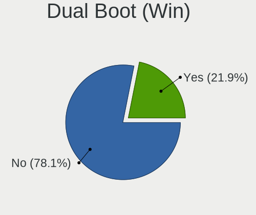
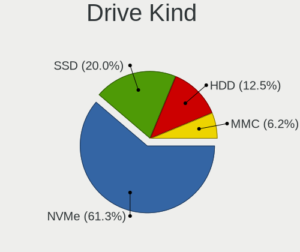
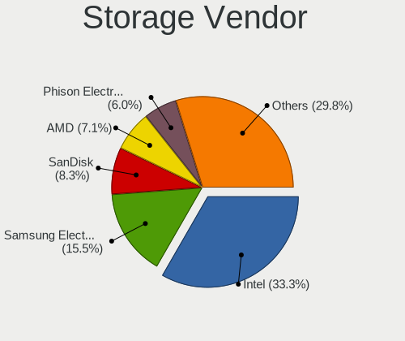
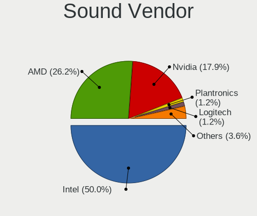

Manjaro - Hardware Trends (Notebooks)
-------------------------------------

A project to identify most popular hardware characteristics and track their change
over time based on data collected by Linux users at https://Linux-Hardware.org.

Anyone can contribute to this report by the [hw-probe](https://github.com/linuxhw/hw-probe) tool:

    sudo -E hw-probe -all -upload

This report is for one last month. Overall report since the beginning of time: [TestDays](https://github.com/linuxhw/TestDays)

Period: Aug, 2023.

Contents
--------

* [ System ](#system)
  - [ OS                       ](#os)
  - [ OS Family                ](#os-family)
  - [ Kernel                   ](#kernel)
  - [ Kernel Family            ](#kernel-family)
  - [ Kernel Major Ver.        ](#kernel-major-ver)
  - [ Arch                     ](#arch)
  - [ DE                       ](#de)
  - [ Display Server           ](#display-server)
  - [ Display Manager          ](#display-manager)
  - [ OS Lang                  ](#os-lang)
  - [ Boot Mode                ](#boot-mode)
  - [ Filesystem               ](#filesystem)
  - [ Part. scheme             ](#part-scheme)
  - [ Dual Boot with Linux/BSD ](#dual-boot-with-linuxbsd)
  - [ Dual Boot (Win)          ](#dual-boot-win)

* [ Board ](#board)
  - [ Vendor                   ](#vendor)
  - [ Model                    ](#model)
  - [ Model Family             ](#model-family)
  - [ MFG Year                 ](#mfg-year)
  - [ Form Factor              ](#form-factor)
  - [ Secure Boot              ](#secure-boot)
  - [ Coreboot                 ](#coreboot)
  - [ RAM Size                 ](#ram-size)
  - [ RAM Used                 ](#ram-used)
  - [ Total Drives             ](#total-drives)
  - [ Has CD-ROM               ](#has-cd-rom)
  - [ Has Ethernet             ](#has-ethernet)
  - [ Has WiFi                 ](#has-wifi)
  - [ Has Bluetooth            ](#has-bluetooth)

* [ Location ](#location)
  - [ Country                  ](#country)
  - [ City                     ](#city)

* [ Drives ](#drives)
  - [ Drive Vendor             ](#drive-vendor)
  - [ Drive Model              ](#drive-model)
  - [ HDD Vendor               ](#hdd-vendor)
  - [ SSD Vendor               ](#ssd-vendor)
  - [ Drive Kind               ](#drive-kind)
  - [ Drive Connector          ](#drive-connector)
  - [ Drive Size               ](#drive-size)
  - [ Space Total              ](#space-total)
  - [ Space Used               ](#space-used)
  - [ Malfunc. Drives          ](#malfunc-drives)
  - [ Malfunc. Drive Vendor    ](#malfunc-drive-vendor)
  - [ Malfunc. HDD Vendor      ](#malfunc-hdd-vendor)
  - [ Malfunc. Drive Kind      ](#malfunc-drive-kind)
  - [ Failed Drives            ](#failed-drives)
  - [ Failed Drive Vendor      ](#failed-drive-vendor)
  - [ Drive Status             ](#drive-status)

* [ Storage controller ](#storage-controller)
  - [ Storage Vendor           ](#storage-vendor)
  - [ Storage Model            ](#storage-model)
  - [ Storage Kind             ](#storage-kind)

* [ Processor ](#processor)
  - [ CPU Vendor               ](#cpu-vendor)
  - [ CPU Model                ](#cpu-model)
  - [ CPU Model Family         ](#cpu-model-family)
  - [ CPU Cores                ](#cpu-cores)
  - [ CPU Sockets              ](#cpu-sockets)
  - [ CPU Threads              ](#cpu-threads)
  - [ CPU Op-Modes             ](#cpu-op-modes)
  - [ CPU Microcode            ](#cpu-microcode)
  - [ CPU Microarch            ](#cpu-microarch)

* [ Graphics ](#graphics)
  - [ GPU Vendor               ](#gpu-vendor)
  - [ GPU Model                ](#gpu-model)
  - [ GPU Combo                ](#gpu-combo)
  - [ GPU Driver               ](#gpu-driver)
  - [ GPU Memory               ](#gpu-memory)

* [ Monitor ](#monitor)
  - [ Monitor Vendor           ](#monitor-vendor)
  - [ Monitor Model            ](#monitor-model)
  - [ Monitor Resolution       ](#monitor-resolution)
  - [ Monitor Diagonal         ](#monitor-diagonal)
  - [ Monitor Width            ](#monitor-width)
  - [ Aspect Ratio             ](#aspect-ratio)
  - [ Monitor Area             ](#monitor-area)
  - [ Pixel Density            ](#pixel-density)
  - [ Multiple Monitors        ](#multiple-monitors)

* [ Network ](#network)
  - [ Net Controller Vendor    ](#net-controller-vendor)
  - [ Net Controller Model     ](#net-controller-model)
  - [ Wireless Vendor          ](#wireless-vendor)
  - [ Wireless Model           ](#wireless-model)
  - [ Ethernet Vendor          ](#ethernet-vendor)
  - [ Ethernet Model           ](#ethernet-model)
  - [ Net Controller Kind      ](#net-controller-kind)
  - [ Used Controller          ](#used-controller)
  - [ NICs                     ](#nics)
  - [ IPv6                     ](#ipv6)

* [ Bluetooth ](#bluetooth)
  - [ Bluetooth Vendor         ](#bluetooth-vendor)
  - [ Bluetooth Model          ](#bluetooth-model)

* [ Sound ](#sound)
  - [ Sound Vendor             ](#sound-vendor)
  - [ Sound Model              ](#sound-model)

* [ Memory ](#memory)
  - [ Memory Vendor            ](#memory-vendor)
  - [ Memory Model             ](#memory-model)
  - [ Memory Kind              ](#memory-kind)
  - [ Memory Form Factor       ](#memory-form-factor)
  - [ Memory Size              ](#memory-size)
  - [ Memory Speed             ](#memory-speed)

* [ Printers & scanners ](#printers--scanners)
  - [ Printer Vendor           ](#printer-vendor)
  - [ Printer Model            ](#printer-model)
  - [ Scanner Vendor           ](#scanner-vendor)
  - [ Scanner Model            ](#scanner-model)

* [ Camera ](#camera)
  - [ Camera Vendor            ](#camera-vendor)
  - [ Camera Model             ](#camera-model)

* [ Security ](#security)
  - [ Fingerprint Vendor       ](#fingerprint-vendor)
  - [ Fingerprint Model        ](#fingerprint-model)
  - [ Chipcard Vendor          ](#chipcard-vendor)
  - [ Chipcard Model           ](#chipcard-model)

* [ Unsupported ](#unsupported)
  - [ Unsupported Devices      ](#unsupported-devices)
  - [ Unsupported Device Types ](#unsupported-device-types)

System
------

OS
--

Installed operating systems

| Name           | Notebooks | Percent |
|----------------|-----------|---------|
| Manjaro 23.0.0 | 33        | 50%     |
| Manjaro        | 33        | 50%     |

OS Family
---------

OS without a version

| Name    | Notebooks | Percent |
|---------|-----------|---------|
| Manjaro | 66        | 100%    |

Kernel
------

Version of the Linux kernel

| Version             | Notebooks | Percent |
|---------------------|-----------|---------|
| 6.1.44-1-MANJARO    | 17        | 25.76%  |
| 6.1.41-1-MANJARO    | 15        | 22.73%  |
| 6.4.6-1-MANJARO     | 8         | 12.12%  |
| 6.4.9-1-MANJARO     | 6         | 9.09%   |
| 6.5.0-1-MANJARO     | 3         | 4.55%   |
| 5.15.122-1-MANJARO  | 3         | 4.55%   |
| 6.4.6-3-rt8-MANJARO | 2         | 3.03%   |
| 6.1.49-1-MANJARO    | 2         | 3.03%   |
| 5.15.125-1-MANJARO  | 2         | 3.03%   |
| 6.4.8-lqx1-1-lqx    | 1         | 1.52%   |
| 6.4.3-1-MANJARO     | 1         | 1.52%   |
| 6.4.12-1-MANJARO    | 1         | 1.52%   |
| 6.3.13-2-MANJARO    | 1         | 1.52%   |
| 6.3.13-1-MANJARO    | 1         | 1.52%   |
| 6.1.38-1-MANJARO    | 1         | 1.52%   |
| 6.1.31-2-MANJARO    | 1         | 1.52%   |
| 5.4.252-1-MANJARO   | 1         | 1.52%   |

Kernel Family
-------------

Linux kernel without a distro release

| Version  | Notebooks | Percent |
|----------|-----------|---------|
| 6.1.44   | 17        | 25.76%  |
| 6.1.41   | 15        | 22.73%  |
| 6.4.6    | 10        | 15.15%  |
| 6.4.9    | 6         | 9.09%   |
| 6.5.0    | 3         | 4.55%   |
| 5.15.122 | 3         | 4.55%   |
| 6.3.13   | 2         | 3.03%   |
| 6.1.49   | 2         | 3.03%   |
| 5.15.125 | 2         | 3.03%   |
| 6.4.8    | 1         | 1.52%   |
| 6.4.3    | 1         | 1.52%   |
| 6.4.12   | 1         | 1.52%   |
| 6.1.38   | 1         | 1.52%   |
| 6.1.31   | 1         | 1.52%   |
| 5.4.252  | 1         | 1.52%   |

Kernel Major Ver.
-----------------

Linux kernel major version

| Version | Notebooks | Percent |
|---------|-----------|---------|
| 6.1     | 36        | 54.55%  |
| 6.4     | 19        | 28.79%  |
| 5.15    | 5         | 7.58%   |
| 6.5     | 3         | 4.55%   |
| 6.3     | 2         | 3.03%   |
| 5.4     | 1         | 1.52%   |

Arch
----

OS architecture (x86_64, i586, etc.)

| Name   | Notebooks | Percent |
|--------|-----------|---------|
| x86_64 | 66        | 100%    |

DE
--

Desktop Environment

| Name       | Notebooks | Percent |
|------------|-----------|---------|
| KDE5       | 37        | 56.06%  |
| XFCE       | 12        | 18.18%  |
| GNOME      | 12        | 18.18%  |
| MATE       | 2         | 3.03%   |
| X-Cinnamon | 1         | 1.52%   |
| KDE        | 1         | 1.52%   |
| i3         | 1         | 1.52%   |

Display Server
--------------

X11 or Wayland

| Name    | Notebooks | Percent |
|---------|-----------|---------|
| X11     | 43        | 65.15%  |
| Wayland | 22        | 33.33%  |
| Unknown | 1         | 1.52%   |

Display Manager
---------------

SDDM, LightDM, etc.

| Name    | Notebooks | Percent |
|---------|-----------|---------|
| Unknown | 33        | 50%     |
| SDDM    | 16        | 24.24%  |
| LightDM | 12        | 18.18%  |
| GDM     | 5         | 7.58%   |

OS Lang
-------

Language

| Lang  | Notebooks | Percent |
|-------|-----------|---------|
| en_US | 20        | 30.3%   |
| de_DE | 10        | 15.15%  |
| pt_BR | 5         | 7.58%   |
| en_GB | 5         | 7.58%   |
| it_IT | 4         | 6.06%   |
| en_AU | 4         | 6.06%   |
| ru_RU | 3         | 4.55%   |
| es_MX | 3         | 4.55%   |
| es_ES | 2         | 3.03%   |
| uk_UA | 1         | 1.52%   |
| pl_PL | 1         | 1.52%   |
| ja_JP | 1         | 1.52%   |
| id_ID | 1         | 1.52%   |
| hu_HU | 1         | 1.52%   |
| fr_FR | 1         | 1.52%   |
| es_PY | 1         | 1.52%   |
| es_CU | 1         | 1.52%   |
| es_AR | 1         | 1.52%   |
| de_CH | 1         | 1.52%   |

Boot Mode
---------

EFI or BIOS

| Mode | Notebooks | Percent |
|------|-----------|---------|
| BIOS | 38        | 57.58%  |
| EFI  | 28        | 42.42%  |

Filesystem
----------

Type of filesystem

| Type  | Notebooks | Percent |
|-------|-----------|---------|
| Ext4  | 54        | 81.82%  |
| Tmpfs | 6         | 9.09%   |
| Btrfs | 6         | 9.09%   |

Part. scheme
------------

Scheme of partitioning

| Type    | Notebooks | Percent |
|---------|-----------|---------|
| Unknown | 32        | 48.48%  |
| GPT     | 31        | 46.97%  |
| MBR     | 3         | 4.55%   |

Dual Boot with Linux/BSD
------------------------

Hosting more than one Linux/BSD

| Dual boot | Notebooks | Percent |
|-----------|-----------|---------|
| No        | 59        | 89.39%  |
| Yes       | 7         | 10.61%  |

Dual Boot (Win)
---------------

Hosting Linux and Windows

| Dual boot | Notebooks | Percent |
|-----------|-----------|---------|
| No        | 48        | 72.73%  |
| Yes       | 18        | 27.27%  |

Board
-----

Vendor
------

Motherboard manufacturer

| Name                | Notebooks | Percent |
|---------------------|-----------|---------|
| Lenovo              | 18        | 27.27%  |
| Hewlett-Packard     | 11        | 16.67%  |
| Dell                | 9         | 13.64%  |
| ASUSTek Computer    | 5         | 7.58%   |
| Acer                | 5         | 7.58%   |
| Packard Bell        | 2         | 3.03%   |
| MSI                 | 2         | 3.03%   |
| HUAWEI              | 2         | 3.03%   |
| Schenker            | 1         | 1.52%   |
| SANTECH             | 1         | 1.52%   |
| Razer               | 1         | 1.52%   |
| Positivo            | 1         | 1.52%   |
| Jumper              | 1         | 1.52%   |
| GPU Company         | 1         | 1.52%   |
| GPD                 | 1         | 1.52%   |
| Gigabyte Technology | 1         | 1.52%   |
| Chuwi               | 1         | 1.52%   |
| BANGHO              | 1         | 1.52%   |
| ARDOR GAMING        | 1         | 1.52%   |
| Apple               | 1         | 1.52%   |

Model
-----

Motherboard model

| Name                                     | Notebooks | Percent |
|------------------------------------------|-----------|---------|
| Schenker VISION 15 (SVS15E21)            | 1         | 1.52%   |
| SANTECH NL5xNU                           | 1         | 1.52%   |
| Razer Blade 17 (Mid 2021) - RZ09-0406    | 1         | 1.52%   |
| Positivo Presley 3                       | 1         | 1.52%   |
| Packard Bell EasyNote TK85               | 1         | 1.52%   |
| Packard Bell EasyNote ENTG81BA           | 1         | 1.52%   |
| MSI GS60 6QE                             | 1         | 1.52%   |
| MSI Bravo 15 C7VE                        | 1         | 1.52%   |
| Lenovo V17 G4 IRU 83A2                   | 1         | 1.52%   |
| Lenovo ThinkPad X230 2324BV7             | 1         | 1.52%   |
| Lenovo ThinkPad T470 20HES0MV00          | 1         | 1.52%   |
| Lenovo ThinkPad T440 20B7S4NV07          | 1         | 1.52%   |
| Lenovo ThinkPad T430 2349KAG             | 1         | 1.52%   |
| Lenovo ThinkPad L430 24662W2             | 1         | 1.52%   |
| Lenovo ThinkPad L15 Gen 1 20U70004GE     | 1         | 1.52%   |
| Lenovo ThinkPad L15 Gen 1 20U3000SGE     | 1         | 1.52%   |
| Lenovo Legion R9000P ARX8 82WM           | 1         | 1.52%   |
| Lenovo Legion 5 82B5                     | 1         | 1.52%   |
| Lenovo Legion 5 15IAH7H 82RB             | 1         | 1.52%   |
| Lenovo Legion 5 15ACH6 82JW              | 1         | 1.52%   |
| Lenovo IdeaPad Pro 5 16ARP8 83AS         | 1         | 1.52%   |
| Lenovo IdeaPad Gaming 3 15ACH6 82K2      | 1         | 1.52%   |
| Lenovo IdeaPad 320-17IKB 80XM            | 1         | 1.52%   |
| Lenovo IdeaPad 3 15IGL05 81WQ            | 1         | 1.52%   |
| Lenovo G40-45 80E1                       | 1         | 1.52%   |
| Lenovo B330-15IKBR 81M1                  | 1         | 1.52%   |
| Jumper QCYL-200                          | 1         | 1.52%   |
| HUAWEI KPRC-WX0                          | 1         | 1.52%   |
| HUAWEI CREF-XX                           | 1         | 1.52%   |
| HP Victus by Laptop 16-e1xxx             | 1         | 1.52%   |
| HP Victus by Laptop 16-e0xxx             | 1         | 1.52%   |
| HP ProBook 4540s                         | 1         | 1.52%   |
| HP ProBook 450 15.6 inch G10 Notebook PC | 1         | 1.52%   |
| HP ProBook 445 G8 Notebook PC            | 1         | 1.52%   |
| HP Pavilion Gaming Laptop                | 1         | 1.52%   |
| HP OMEN by Laptop                        | 1         | 1.52%   |
| HP Laptop 15s-fq0xxx                     | 1         | 1.52%   |
| HP Dragonfly 13.5 inch G4 Notebook PC    | 1         | 1.52%   |
| HP 250 G6 Notebook PC                    | 1         | 1.52%   |
| HP 15                                    | 1         | 1.52%   |

Model Family
------------

Motherboard model prefix

| Name                  | Notebooks | Percent |
|-----------------------|-----------|---------|
| Lenovo ThinkPad       | 7         | 10.61%  |
| Lenovo Legion         | 4         | 6.06%   |
| Lenovo IdeaPad        | 4         | 6.06%   |
| Acer Aspire           | 4         | 6.06%   |
| HP ProBook            | 3         | 4.55%   |
| Dell Inspiron         | 3         | 4.55%   |
| Packard Bell EasyNote | 2         | 3.03%   |
| HP Victus             | 2         | 3.03%   |
| Dell XPS              | 2         | 3.03%   |
| Dell Latitude         | 2         | 3.03%   |
| Schenker VISION       | 1         | 1.52%   |
| SANTECH NL5xNU        | 1         | 1.52%   |
| Razer Blade           | 1         | 1.52%   |
| Positivo Presley      | 1         | 1.52%   |
| MSI GS60              | 1         | 1.52%   |
| MSI Bravo             | 1         | 1.52%   |
| Lenovo V17            | 1         | 1.52%   |
| Lenovo G40-45         | 1         | 1.52%   |
| Lenovo B330-15IKBR    | 1         | 1.52%   |
| Jumper QCYL-200       | 1         | 1.52%   |
| HUAWEI KPRC-WX0       | 1         | 1.52%   |
| HUAWEI CREF-XX        | 1         | 1.52%   |
| HP Pavilion           | 1         | 1.52%   |
| HP OMEN               | 1         | 1.52%   |
| HP Laptop             | 1         | 1.52%   |
| HP Dragonfly          | 1         | 1.52%   |
| HP 250                | 1         | 1.52%   |
| HP 15                 | 1         | 1.52%   |
| GPU Company GWNC21524 | 1         | 1.52%   |
| GPD G1619-01          | 1         | 1.52%   |
| Gigabyte G5           | 1         | 1.52%   |
| Dell Vostro           | 1         | 1.52%   |
| Dell Venue            | 1         | 1.52%   |
| Chuwi GemiBook        | 1         | 1.52%   |
| BANGHO GM-15Z12       | 1         | 1.52%   |
| ASUS ROG              | 1         | 1.52%   |
| ASUS P552LA           | 1         | 1.52%   |
| ASUS N76VZ            | 1         | 1.52%   |
| ASUS N550LF           | 1         | 1.52%   |
| ASUS ASUS             | 1         | 1.52%   |

MFG Year
--------

Motherboard manufacture year

| Year | Notebooks | Percent |
|------|-----------|---------|
| 2021 | 10        | 15.15%  |
| 2023 | 8         | 12.12%  |
| 2022 | 8         | 12.12%  |
| 2020 | 7         | 10.61%  |
| 2012 | 6         | 9.09%   |
| 2019 | 5         | 7.58%   |
| 2017 | 4         | 6.06%   |
| 2016 | 4         | 6.06%   |
| 2015 | 4         | 6.06%   |
| 2013 | 4         | 6.06%   |
| 2018 | 3         | 4.55%   |
| 2014 | 1         | 1.52%   |
| 2011 | 1         | 1.52%   |
| 2010 | 1         | 1.52%   |

Form Factor
-----------

Physical design of the computer

| Name     | Notebooks | Percent |
|----------|-----------|---------|
| Notebook | 66        | 100%    |

Secure Boot
-----------

Enabled or disabled

| State    | Notebooks | Percent |
|----------|-----------|---------|
| Disabled | 66        | 100%    |

Coreboot
--------

Have coreboot on board

| Used | Notebooks | Percent |
|------|-----------|---------|
| No   | 66        | 100%    |

RAM Size
--------

Total RAM memory

| Size in GB  | Notebooks | Percent |
|-------------|-----------|---------|
| 8.01-16.0   | 21        | 31.82%  |
| 4.01-8.0    | 13        | 19.7%   |
| 16.01-24.0  | 13        | 19.7%   |
| 3.01-4.0    | 10        | 15.15%  |
| 32.01-64.0  | 8         | 12.12%  |
| 64.01-256.0 | 1         | 1.52%   |

RAM Used
--------

Used RAM memory

| Used GB   | Notebooks | Percent |
|-----------|-----------|---------|
| 4.01-8.0  | 16        | 24.24%  |
| 2.01-3.0  | 15        | 22.73%  |
| 3.01-4.0  | 13        | 19.7%   |
| 1.01-2.0  | 12        | 18.18%  |
| 8.01-16.0 | 10        | 15.15%  |

Total Drives
------------

Number of drives on board

| Drives | Notebooks | Percent |
|--------|-----------|---------|
| 1      | 41        | 62.12%  |
| 2      | 23        | 34.85%  |
| 3      | 2         | 3.03%   |

Has CD-ROM
----------

Has CD-ROM on board

| Presented | Notebooks | Percent |
|-----------|-----------|---------|
| No        | 58        | 87.88%  |
| Yes       | 8         | 12.12%  |

Has Ethernet
------------

Has Ethernet on board

| Presented | Notebooks | Percent |
|-----------|-----------|---------|
| Yes       | 51        | 77.27%  |
| No        | 15        | 22.73%  |

Has WiFi
--------

Has WiFi module

| Presented | Notebooks | Percent |
|-----------|-----------|---------|
| Yes       | 66        | 100%    |

Has Bluetooth
-------------

Has Bluetooth module

| Presented | Notebooks | Percent |
|-----------|-----------|---------|
| Yes       | 59        | 89.39%  |
| No        | 7         | 10.61%  |

Location
--------

Country
-------

Geographic location (country)

| Country     | Notebooks | Percent |
|-------------|-----------|---------|
| Germany     | 13        | 19.7%   |
| USA         | 9         | 13.64%  |
| Brazil      | 6         | 9.09%   |
| Australia   | 5         | 7.58%   |
| Russia      | 4         | 6.06%   |
| Italy       | 4         | 6.06%   |
| Mexico      | 3         | 4.55%   |
| UK          | 2         | 3.03%   |
| Spain       | 2         | 3.03%   |
| Poland      | 2         | 3.03%   |
| Hungary     | 2         | 3.03%   |
| Turkey      | 1         | 1.52%   |
| Switzerland | 1         | 1.52%   |
| Sweden      | 1         | 1.52%   |
| Norway      | 1         | 1.52%   |
| Nepal       | 1         | 1.52%   |
| Kenya       | 1         | 1.52%   |
| Japan       | 1         | 1.52%   |
| Indonesia   | 1         | 1.52%   |
| France      | 1         | 1.52%   |
| Ecuador     | 1         | 1.52%   |
| Cuba        | 1         | 1.52%   |
| Belarus     | 1         | 1.52%   |
| Austria     | 1         | 1.52%   |
| Argentina   | 1         | 1.52%   |

City
----

Geographic location (city)

| City              | Notebooks | Percent |
|-------------------|-----------|---------|
| Melbourne         | 3         | 4.55%   |
| St Petersburg     | 2         | 3.03%   |
| Seattle           | 2         | 3.03%   |
| Madrid            | 2         | 3.03%   |
| Zary              | 1         | 1.52%   |
| Zapopan           | 1         | 1.52%   |
| Yekaterinburg     | 1         | 1.52%   |
| Würzburg         | 1         | 1.52%   |
| Venosa            | 1         | 1.52%   |
| Vancouver         | 1         | 1.52%   |
| Valença          | 1         | 1.52%   |
| Uppsala           | 1         | 1.52%   |
| Takamatsu         | 1         | 1.52%   |
| Swidnica          | 1         | 1.52%   |
| Surabaya          | 1         | 1.52%   |
| Rio de Janeiro    | 1         | 1.52%   |
| Recklinghausen    | 1         | 1.52%   |
| Ravensburg        | 1         | 1.52%   |
| Querétaro City   | 1         | 1.52%   |
| Pozzomaggiore     | 1         | 1.52%   |
| Porsgrunn         | 1         | 1.52%   |
| Pécs             | 1         | 1.52%   |
| Palermo           | 1         | 1.52%   |
| Oviedo            | 1         | 1.52%   |
| Oschersleben      | 1         | 1.52%   |
| Nairobi           | 1         | 1.52%   |
| Moscow            | 1         | 1.52%   |
| Mönchengladbach  | 1         | 1.52%   |
| Milano            | 1         | 1.52%   |
| Mérida           | 1         | 1.52%   |
| Manchester        | 1         | 1.52%   |
| Linas             | 1         | 1.52%   |
| Kathmandu         | 1         | 1.52%   |
| Kassel            | 1         | 1.52%   |
| Juazeiro do Norte | 1         | 1.52%   |
| Heringen          | 1         | 1.52%   |
| Havana            | 1         | 1.52%   |
| Hammersbach       | 1         | 1.52%   |
| Hamburg           | 1         | 1.52%   |
| Göppingen        | 1         | 1.52%   |

Drives
------

Drive Vendor
------------

Hard drive vendors

| Vendor                      | Notebooks | Drives | Percent |
|-----------------------------|-----------|--------|---------|
| Samsung Electronics         | 15        | 16     | 16.48%  |
| Seagate                     | 10        | 10     | 10.99%  |
| Sandisk                     | 10        | 10     | 10.99%  |
| Crucial                     | 7         | 7      | 7.69%   |
| Toshiba                     | 5         | 5      | 5.49%   |
| Unknown                     | 3         | 4      | 3.3%    |
| Micron Technology           | 3         | 3      | 3.3%    |
| Kingston                    | 3         | 3      | 3.3%    |
| Intel                       | 3         | 3      | 3.3%    |
| WDC                         | 2         | 2      | 2.2%    |
| Silicon Motion              | 2         | 2      | 2.2%    |
| Phison Electronics          | 2         | 2      | 2.2%    |
| Kingston Technology Company | 2         | 2      | 2.2%    |
| HGST                        | 2         | 2      | 2.2%    |
| Unknown                     | 2         | 2      | 2.2%    |
| WALRAM                      | 1         | 1      | 1.1%    |
| USB                         | 1         | 1      | 1.1%    |
| Union Memory                | 1         | 1      | 1.1%    |
| SK hynix                    | 1         | 1      | 1.1%    |
| Realtek                     | 1         | 1      | 1.1%    |
| Ramos Technology            | 1         | 2      | 1.1%    |
| PNY                         | 1         | 1      | 1.1%    |
| Netac                       | 1         | 1      | 1.1%    |
| Micron/Crucial Technology   | 1         | 1      | 1.1%    |
| MAXIO Technology (Hangzhou) | 1         | 1      | 1.1%    |
| KIOXIA                      | 1         | 1      | 1.1%    |
| Kingchuxing                 | 1         | 1      | 1.1%    |
| Intenso                     | 1         | 1      | 1.1%    |
| Gigabyte Technology         | 1         | 1      | 1.1%    |
| China                       | 1         | 1      | 1.1%    |
| C300-CTF                    | 1         | 1      | 1.1%    |
| AS201                       | 1         | 1      | 1.1%    |
| Apacer                      | 1         | 1      | 1.1%    |
| ADATA Technology            | 1         | 1      | 1.1%    |
| Acer                        | 1         | 1      | 1.1%    |

Drive Model
-----------

Hard drive models

| Model                                                 | Notebooks | Percent |
|-------------------------------------------------------|-----------|---------|
| Samsung NVMe SSD Controller PM9A1/PM9A3/980PRO 1024GB | 4         | 4.3%    |
| Unknown MMC Card  128GB                               | 2         | 2.15%   |
| Toshiba MQ01ABD100 1TB                                | 2         | 2.15%   |
| Toshiba KXG50ZNV256G 256GB                            | 2         | 2.15%   |
| Seagate ST1000LM035-1RK172 1TB                        | 2         | 2.15%   |
| Sandisk WD Blue SN550 NVMe SSD 250GB                  | 2         | 2.15%   |
| Samsung NVMe SSD Controller SM981/PM981/PM983 500GB   | 2         | 2.15%   |
| Samsung MZALQ512HBLU-00BL2 512GB                      | 2         | 2.15%   |
| Kingston Company SNV2S1000G 1TB                       | 2         | 2.15%   |
| Crucial CT250MX500SSD1 250GB                          | 2         | 2.15%   |
| Unknown                                               | 2         | 2.15%   |
| WDC WDS500G2B0B-00YS70 500GB SSD                      | 1         | 1.08%   |
| WDC WD10 JPVT-55A1YT0 1TB                             | 1         | 1.08%   |
| WALRAM 512GB                                          | 1         | 1.08%   |
| USB 3.1 512GB                                         | 1         | 1.08%   |
| Unknown MMC Card  32GB                                | 1         | 1.08%   |
| Union Memory UMIS RPJTJ128MEE1MWX 128GB               | 1         | 1.08%   |
| Toshiba THNSNJ128G8NU 128GB SSD                       | 1         | 1.08%   |
| SK hynix SKHynix_HFS001TEJ9X115N 1TB                  | 1         | 1.08%   |
| Silicon Motion SM2263EN/SM2263XT SSD Controller 256GB | 1         | 1.08%   |
| Silicon Motion SM2262/SM2262EN SSD Controller 1024GB  | 1         | 1.08%   |
| Seagate ST9500423AS 500GB                             | 1         | 1.08%   |
| Seagate ST500VT000-1DK142 500GB                       | 1         | 1.08%   |
| Seagate ST500LT012-9WS142 500GB                       | 1         | 1.08%   |
| Seagate ST500LM030-2E717D 500GB                       | 1         | 1.08%   |
| Seagate ST500LM021-1KJ152 500GB                       | 1         | 1.08%   |
| Seagate ST500LM000-1EJ162 500GB                       | 1         | 1.08%   |
| Seagate ST1000LM049-2GH172 1TB                        | 1         | 1.08%   |
| Seagate ST1000LM024 HN-M101MBB 1TB                    | 1         | 1.08%   |
| Sandisk WD_BLACK SN770 250GB                          | 1         | 1.08%   |
| Sandisk WD_BLACK SN750 SE 1TB                         | 1         | 1.08%   |
| Sandisk WD PC SN740 SDDPNQD-256G-1006 256GB           | 1         | 1.08%   |
| Sandisk WD PC SN740 SDDPNQD-1T00-1027 1TB             | 1         | 1.08%   |
| Sandisk WD Black SN850 256GB                          | 1         | 1.08%   |
| Sandisk WD Black SN750 / PC SN730 NVMe SSD 1024GB     | 1         | 1.08%   |
| SanDisk SSD PLUS 480GB                                | 1         | 1.08%   |
| SanDisk SDSSDH3 4T00 4TB                              | 1         | 1.08%   |
| Samsung SSD 870 QVO 1TB                               | 1         | 1.08%   |
| Samsung SSD 860 EVO 1TB                               | 1         | 1.08%   |
| Samsung SSD 850 EVO 120GB                             | 1         | 1.08%   |

HDD Vendor
----------

Hard disk drive vendors

| Vendor  | Notebooks | Drives | Percent |
|---------|-----------|--------|---------|
| Seagate | 10        | 10     | 62.5%   |
| Toshiba | 2         | 2      | 12.5%   |
| HGST    | 2         | 2      | 12.5%   |
| WDC     | 1         | 1      | 6.25%   |
| USB     | 1         | 1      | 6.25%   |

SSD Vendor
----------

Solid state drive vendors

| Vendor              | Notebooks | Drives | Percent |
|---------------------|-----------|--------|---------|
| Crucial             | 7         | 7      | 25%     |
| Samsung Electronics | 4         | 4      | 14.29%  |
| SanDisk             | 2         | 2      | 7.14%   |
| Kingston            | 2         | 2      | 7.14%   |
| WDC                 | 1         | 1      | 3.57%   |
| Toshiba             | 1         | 1      | 3.57%   |
| Ramos Technology    | 1         | 2      | 3.57%   |
| PNY                 | 1         | 1      | 3.57%   |
| Netac               | 1         | 1      | 3.57%   |
| Intenso             | 1         | 1      | 3.57%   |
| Intel               | 1         | 1      | 3.57%   |
| Gigabyte Technology | 1         | 1      | 3.57%   |
| China               | 1         | 1      | 3.57%   |
| AS201               | 1         | 1      | 3.57%   |
| Apacer              | 1         | 1      | 3.57%   |
| Acer                | 1         | 1      | 3.57%   |
| Unknown             | 1         | 1      | 3.57%   |

Drive Kind
----------

HDD or SSD

| Kind    | Notebooks | Drives | Percent |
|---------|-----------|--------|---------|
| NVMe    | 35        | 41     | 42.17%  |
| SSD     | 25        | 29     | 30.12%  |
| HDD     | 16        | 16     | 19.28%  |
| Unknown | 4         | 4      | 4.82%   |
| MMC     | 3         | 4      | 3.61%   |

Drive Connector
---------------

SATA, SAS, NVMe, etc.

| Type | Notebooks | Drives | Percent |
|------|-----------|--------|---------|
| SATA | 36        | 46     | 46.15%  |
| NVMe | 35        | 40     | 44.87%  |
| SAS  | 4         | 4      | 5.13%   |
| MMC  | 3         | 4      | 3.85%   |

Drive Size
----------

Size of hard drive

| Size in TB | Notebooks | Drives | Percent |
|------------|-----------|--------|---------|
| 0.01-0.5   | 24        | 26     | 60%     |
| 0.51-1.0   | 14        | 17     | 35%     |
| 3.01-4.0   | 1         | 1      | 2.5%    |
| 1.01-2.0   | 1         | 1      | 2.5%    |

Space Total
-----------

Amount of disk space available on the file system

| Size in GB     | Notebooks | Percent |
|----------------|-----------|---------|
| 101-250        | 17        | 25.76%  |
| 501-1000       | 15        | 22.73%  |
| 251-500        | 12        | 18.18%  |
| 1001-2000      | 11        | 16.67%  |
| Unknown        | 6         | 9.09%   |
| More than 3000 | 2         | 3.03%   |
| 2001-3000      | 1         | 1.52%   |
| 1-20           | 1         | 1.52%   |
| 51-100         | 1         | 1.52%   |

Space Used
----------

Amount of used disk space

| Used GB   | Notebooks | Percent |
|-----------|-----------|---------|
| 21-50     | 16        | 24.24%  |
| 251-500   | 9         | 13.64%  |
| 101-250   | 9         | 13.64%  |
| 501-1000  | 9         | 13.64%  |
| 51-100    | 8         | 12.12%  |
| 1-20      | 7         | 10.61%  |
| Unknown   | 6         | 9.09%   |
| 1001-2000 | 2         | 3.03%   |

Malfunc. Drives
---------------

Drive models with a malfunction

| Model                      | Notebooks | Drives | Percent |
|----------------------------|-----------|--------|---------|
| Seagate ST9500423AS 500GB  | 1         | 1      | 33.33%  |
| Netac SSD 256GB            | 1         | 1      | 33.33%  |
| HGST HTS725050A7E630 500GB | 1         | 1      | 33.33%  |

Malfunc. Drive Vendor
---------------------

Vendors of faulty drives

| Vendor  | Notebooks | Drives | Percent |
|---------|-----------|--------|---------|
| Seagate | 1         | 1      | 33.33%  |
| Netac   | 1         | 1      | 33.33%  |
| HGST    | 1         | 1      | 33.33%  |

Malfunc. HDD Vendor
-------------------

Vendors of faulty HDD drives

| Vendor  | Notebooks | Drives | Percent |
|---------|-----------|--------|---------|
| Seagate | 1         | 1      | 50%     |
| HGST    | 1         | 1      | 50%     |

Malfunc. Drive Kind
-------------------

Kinds of faulty drives

| Kind | Notebooks | Drives | Percent |
|------|-----------|--------|---------|
| HDD  | 2         | 2      | 66.67%  |
| SSD  | 1         | 1      | 33.33%  |

Failed Drives
-------------

Failed drive models

Zero info for selected period =(

Failed Drive Vendor
-------------------

Failed drive vendors

Zero info for selected period =(

Drive Status
------------

Number of failed and malfunc. drives

| Status   | Notebooks | Drives | Percent |
|----------|-----------|--------|---------|
| Detected | 45        | 63     | 65.22%  |
| Works    | 21        | 28     | 30.43%  |
| Malfunc  | 3         | 3      | 4.35%   |

Storage controller
------------------

Storage Vendor
--------------

Storage controller vendors

| Vendor                       | Notebooks | Percent |
|------------------------------|-----------|---------|
| Intel                        | 43        | 48.86%  |
| Samsung Electronics          | 11        | 12.5%   |
| SanDisk                      | 8         | 9.09%   |
| AMD                          | 8         | 9.09%   |
| Micron Technology            | 3         | 3.41%   |
| Kingston Technology Company  | 3         | 3.41%   |
| Toshiba America Info Systems | 2         | 2.27%   |
| Silicon Motion               | 2         | 2.27%   |
| Phison Electronics           | 2         | 2.27%   |
| Union Memory (Shenzhen)      | 1         | 1.14%   |
| SK hynix                     | 1         | 1.14%   |
| Micron/Crucial Technology    | 1         | 1.14%   |
| MAXIO Technology (Hangzhou)  | 1         | 1.14%   |
| KIOXIA                       | 1         | 1.14%   |
| ADATA Technology             | 1         | 1.14%   |

Storage Model
-------------

Storage controller models

| Model                                                                   | Notebooks | Percent |
|-------------------------------------------------------------------------|-----------|---------|
| AMD FCH SATA Controller [AHCI mode]                                     | 7         | 7.69%   |
| Intel Sunrise Point-LP SATA Controller [AHCI mode]                      | 6         | 6.59%   |
| Intel 7 Series Chipset Family 6-port SATA Controller [AHCI mode]        | 6         | 6.59%   |
| Samsung NVMe SSD Controller 980                                         | 5         | 5.49%   |
| Intel 8 Series SATA Controller 1 [AHCI mode]                            | 5         | 5.49%   |
| Samsung NVMe SSD Controller PM9A1/PM9A3/980PRO                          | 4         | 4.4%    |
| Intel 82801 Mobile SATA Controller [RAID mode]                          | 4         | 4.4%    |
| SanDisk WD Black SN770 / PC SN740 256GB / PC SN560 (DRAM-less) NVMe SSD | 3         | 3.3%    |
| Intel Volume Management Device NVMe RAID Controller                     | 3         | 3.3%    |
| Intel Alder Lake-P SATA AHCI Controller                                 | 3         | 3.3%    |
| Toshiba America Info Systems XG5 NVMe SSD Controller                    | 2         | 2.2%    |
| SanDisk WD Blue SN550 NVMe SSD                                          | 2         | 2.2%    |
| Samsung NVMe SSD Controller SM981/PM981/PM983                           | 2         | 2.2%    |
| Kingston Company Company Non-Volatile memory controller                 | 2         | 2.2%    |
| Intel Wildcat Point-LP SATA Controller [AHCI Mode]                      | 2         | 2.2%    |
| Intel Tiger Lake-LP SATA Controller                                     | 2         | 2.2%    |
| Intel HM170/QM170 Chipset SATA Controller [AHCI Mode]                   | 2         | 2.2%    |
| Intel Celeron/Pentium Silver Processor SATA Controller                  | 2         | 2.2%    |
| Union Memory (Shenzhen) AM620 PCIe 3.0 NVMe SSD 128GB                   | 1         | 1.1%    |
| SK hynix Platinum P41/PC801 NVMe Solid State Drive                      | 1         | 1.1%    |
| Silicon Motion SM2263EN/SM2263XT (DRAM-less) NVMe SSD Controllers       | 1         | 1.1%    |
| Silicon Motion SM2262/SM2262EN SSD Controller                           | 1         | 1.1%    |
| SanDisk WD PC SN810 / Black SN850 NVMe SSD                              | 1         | 1.1%    |
| SanDisk WD Black SN750 / PC SN730 NVMe SSD                              | 1         | 1.1%    |
| SanDisk PC SN735 NVMe SSD (DRAM-less)                                   | 1         | 1.1%    |
| Samsung NVMe SSD Controller PM9B1                                       | 1         | 1.1%    |
| Phison E8 PCIe3 NVMe Controller                                         | 1         | 1.1%    |
| Phison E12 NVMe Controller                                              | 1         | 1.1%    |
| Micron/Crucial P2 [Nick P2] / P3 / P3 Plus NVMe PCIe SSD (DRAM-less)    | 1         | 1.1%    |
| Micron 3400 NVMe SSD [Hendrix]                                          | 1         | 1.1%    |
| Micron 2400 NVMe SSD (DRAM-less)                                        | 1         | 1.1%    |
| Micron 2300 NVMe SSD [Santana]                                          | 1         | 1.1%    |
| MAXIO (Hangzhou) NVMe SSD Controller MAP1202                            | 1         | 1.1%    |
| KIOXIA NVMe SSD Controller BG4 (DRAM-less)                              | 1         | 1.1%    |
| Kingston Company NVMe Controller                                        | 1         | 1.1%    |
| Intel Tiger Lake SATA AHCI Controller                                   | 1         | 1.1%    |
| Intel SSD 670p Series [Keystone Harbor]                                 | 1         | 1.1%    |
| Intel SSD 660P Series                                                   | 1         | 1.1%    |
| Intel Jasper Lake SATA AHCI Controller                                  | 1         | 1.1%    |
| Intel Ice Lake-LP SATA Controller [AHCI mode]                           | 1         | 1.1%    |

Storage Kind
------------

Kind of storage controller (IDE, SATA, NVMe, SAS, ...)

| Kind | Notebooks | Percent |
|------|-----------|---------|
| SATA | 44        | 51.16%  |
| NVMe | 35        | 40.7%   |
| RAID | 7         | 8.14%   |

Processor
---------

CPU Vendor
----------

Processor vendors

| Vendor | Notebooks | Percent |
|--------|-----------|---------|
| Intel  | 48        | 72.73%  |
| AMD    | 18        | 27.27%  |

CPU Model
---------

Processor models

| Model                                   | Notebooks | Percent |
|-----------------------------------------|-----------|---------|
| Intel Celeron N4020 CPU @ 1.10GHz       | 3         | 4.55%   |
| Intel Core i5-7300U CPU @ 2.60GHz       | 2         | 3.03%   |
| Intel Core i5-7200U CPU @ 2.50GHz       | 2         | 3.03%   |
| Intel Core i5-5200U CPU @ 2.20GHz       | 2         | 3.03%   |
| Intel 12th Gen Core i7-12700H           | 2         | 3.03%   |
| AMD Ryzen 7 5800H with Radeon Graphics  | 2         | 3.03%   |
| AMD Ryzen 7 4800H with Radeon Graphics  | 2         | 3.03%   |
| Intel Processor U300                    | 1         | 1.52%   |
| Intel Pentium CPU 4415U @ 2.30GHz       | 1         | 1.52%   |
| Intel Pentium CPU 2020M @ 2.40GHz       | 1         | 1.52%   |
| Intel Core i7-8750H CPU @ 2.20GHz       | 1         | 1.52%   |
| Intel Core i7-8565U CPU @ 1.80GHz       | 1         | 1.52%   |
| Intel Core i7-6700HQ CPU @ 2.60GHz      | 1         | 1.52%   |
| Intel Core i7-4600U CPU @ 2.10GHz       | 1         | 1.52%   |
| Intel Core i7-4500U CPU @ 1.80GHz       | 1         | 1.52%   |
| Intel Core i7-3940XM CPU @ 3.00GHz      | 1         | 1.52%   |
| Intel Core i7-3610QM CPU @ 2.30GHz      | 1         | 1.52%   |
| Intel Core i7-3520M CPU @ 2.90GHz       | 1         | 1.52%   |
| Intel Core i5-9300H CPU @ 2.40GHz       | 1         | 1.52%   |
| Intel Core i5-8265U CPU @ 1.60GHz       | 1         | 1.52%   |
| Intel Core i5-6300HQ CPU @ 2.30GHz      | 1         | 1.52%   |
| Intel Core i5-4300Y CPU @ 1.60GHz       | 1         | 1.52%   |
| Intel Core i5-4200U CPU @ 1.60GHz       | 1         | 1.52%   |
| Intel Core i5-3320M CPU @ 2.60GHz       | 1         | 1.52%   |
| Intel Core i5-3230M CPU @ 2.60GHz       | 1         | 1.52%   |
| Intel Core i5-2435M CPU @ 2.40GHz       | 1         | 1.52%   |
| Intel Core i5-1035G7 CPU @ 1.20GHz      | 1         | 1.52%   |
| Intel Core i5-10210U CPU @ 1.60GHz      | 1         | 1.52%   |
| Intel Core i5 CPU M 450 @ 2.40GHz       | 1         | 1.52%   |
| Intel Core i3-7020U CPU @ 2.30GHz       | 1         | 1.52%   |
| Intel Core i3-6006U CPU @ 2.00GHz       | 1         | 1.52%   |
| Intel Core i3-4030U CPU @ 1.90GHz       | 1         | 1.52%   |
| Intel Celeron N5100 @ 1.10GHz           | 1         | 1.52%   |
| Intel Celeron CPU N3350 @ 1.10GHz       | 1         | 1.52%   |
| Intel Celeron CPU N3150 @ 1.60GHz       | 1         | 1.52%   |
| Intel 13th Gen Core i7-1365U            | 1         | 1.52%   |
| Intel 13th Gen Core i5-1335U            | 1         | 1.52%   |
| Intel 12th Gen Core i9-12900H           | 1         | 1.52%   |
| Intel 12th Gen Core i5-12500H           | 1         | 1.52%   |
| Intel 11th Gen Core i7-11800H @ 2.30GHz | 1         | 1.52%   |

CPU Model Family
----------------

Processor model prefix

| Model           | Notebooks | Percent |
|-----------------|-----------|---------|
| Intel Core i5   | 17        | 25.76%  |
| Other           | 12        | 18.18%  |
| Intel Core i7   | 8         | 12.12%  |
| AMD Ryzen 7     | 7         | 10.61%  |
| Intel Celeron   | 6         | 9.09%   |
| AMD Ryzen 5     | 6         | 9.09%   |
| Intel Core i3   | 3         | 4.55%   |
| Intel Pentium   | 2         | 3.03%   |
| AMD Ryzen 9     | 2         | 3.03%   |
| AMD Ryzen 7 PRO | 1         | 1.52%   |
| AMD A8          | 1         | 1.52%   |
| AMD A10         | 1         | 1.52%   |

CPU Cores
---------

Number of processor cores

| Number | Notebooks | Percent |
|--------|-----------|---------|
| 2      | 26        | 39.39%  |
| 4      | 15        | 22.73%  |
| 8      | 9         | 13.64%  |
| 6      | 7         | 10.61%  |
| 14     | 3         | 4.55%   |
| 12     | 2         | 3.03%   |
| 10     | 2         | 3.03%   |
| 16     | 1         | 1.52%   |
| 5      | 1         | 1.52%   |

CPU Sockets
-----------

Number of sockets

| Number | Notebooks | Percent |
|--------|-----------|---------|
| 1      | 66        | 100%    |

CPU Threads
-----------

Threads per core (Hyper-Threading)

| Number | Notebooks | Percent |
|--------|-----------|---------|
| 2      | 56        | 84.85%  |
| 1      | 10        | 15.15%  |

CPU Op-Modes
------------

CPU Operation Modes (32-bit, 64-bit)

| Op mode        | Notebooks | Percent |
|----------------|-----------|---------|
| 32-bit, 64-bit | 66        | 100%    |

CPU Microcode
-------------

Microcode number

| Number     | Notebooks | Percent |
|------------|-----------|---------|
| Unknown    | 42        | 63.64%  |
| 0xb06a3    | 2         | 3.03%   |
| 0x806d1    | 2         | 3.03%   |
| 0x306a9    | 2         | 3.03%   |
| 0x08600106 | 2         | 3.03%   |
| 0x906c0    | 1         | 1.52%   |
| 0x906a3    | 1         | 1.52%   |
| 0x806e9    | 1         | 1.52%   |
| 0x806c1    | 1         | 1.52%   |
| 0x706e5    | 1         | 1.52%   |
| 0x506c9    | 1         | 1.52%   |
| 0x0a601203 | 1         | 1.52%   |
| 0x0a50000d | 1         | 1.52%   |
| 0x0a50000c | 1         | 1.52%   |
| 0x0a404102 | 1         | 1.52%   |
| 0x0a404101 | 1         | 1.52%   |
| 0x08608103 | 1         | 1.52%   |
| 0x08608102 | 1         | 1.52%   |
| 0x08108102 | 1         | 1.52%   |
| 0x07030104 | 1         | 1.52%   |
| 0x0600611a | 1         | 1.52%   |

CPU Microarch
-------------

Microarchitecture

| Name             | Notebooks | Percent |
|------------------|-----------|---------|
| KabyLake         | 11        | 16.67%  |
| Unknown          | 10        | 15.15%  |
| IvyBridge        | 6         | 9.09%   |
| Zen 3            | 5         | 7.58%   |
| Haswell          | 5         | 7.58%   |
| Alderlake Hybrid | 4         | 6.06%   |
| Zen 2            | 3         | 4.55%   |
| TigerLake        | 3         | 4.55%   |
| Skylake          | 3         | 4.55%   |
| IceLake          | 3         | 4.55%   |
| Goldmont plus    | 3         | 4.55%   |
| Broadwell        | 2         | 3.03%   |
| Zen+             | 1         | 1.52%   |
| Westmere         | 1         | 1.52%   |
| Tremont          | 1         | 1.52%   |
| Silvermont       | 1         | 1.52%   |
| SandyBridge      | 1         | 1.52%   |
| Puma             | 1         | 1.52%   |
| Goldmont         | 1         | 1.52%   |
| Excavator        | 1         | 1.52%   |

Graphics
--------

GPU Vendor
----------

Vendors of graphics cards

| Vendor | Notebooks | Percent |
|--------|-----------|---------|
| Intel  | 46        | 52.87%  |
| Nvidia | 22        | 25.29%  |
| AMD    | 19        | 21.84%  |

GPU Model
---------

Graphics card models

| Model                                                                | Notebooks | Percent |
|----------------------------------------------------------------------|-----------|---------|
| Intel 3rd Gen Core processor Graphics Controller                     | 6         | 6.74%   |
| Intel HD Graphics 620                                                | 5         | 5.62%   |
| Intel Haswell-ULT Integrated Graphics Controller                     | 4         | 4.49%   |
| Intel Alder Lake-P Integrated Graphics Controller                    | 4         | 4.49%   |
| AMD Rembrandt [Radeon 680M]                                          | 4         | 4.49%   |
| AMD Cezanne [Radeon Vega Series / Radeon Vega Mobile Series]         | 4         | 4.49%   |
| Nvidia GA107M [GeForce RTX 3050 Ti Mobile]                           | 3         | 3.37%   |
| Nvidia GA107M [GeForce RTX 3050 Mobile]                              | 3         | 3.37%   |
| Intel GeminiLake [UHD Graphics 600]                                  | 3         | 3.37%   |
| Nvidia GA106M [GeForce RTX 3060 Mobile / Max-Q]                      | 2         | 2.25%   |
| Intel WhiskeyLake-U GT2 [UHD Graphics 620]                           | 2         | 2.25%   |
| Intel TigerLake-LP GT2 [Iris Xe Graphics]                            | 2         | 2.25%   |
| Intel TigerLake-H GT1 [UHD Graphics]                                 | 2         | 2.25%   |
| Intel Raptor Lake-P [UHD Graphics]                                   | 2         | 2.25%   |
| Intel HD Graphics 5500                                               | 2         | 2.25%   |
| Intel HD Graphics 530                                                | 2         | 2.25%   |
| AMD Renoir                                                           | 2         | 2.25%   |
| AMD Lucienne                                                         | 2         | 2.25%   |
| Nvidia TU117M [GeForce GTX 1650 Ti Mobile]                           | 1         | 1.12%   |
| Nvidia TU116M [GeForce GTX 1660 Ti Mobile]                           | 1         | 1.12%   |
| Nvidia GP106BM [GeForce GTX 1060 Mobile 6GB]                         | 1         | 1.12%   |
| Nvidia GM204M [GeForce GTX 960 OEM / 970M]                           | 1         | 1.12%   |
| Nvidia GM107M [GeForce GTX 960M]                                     | 1         | 1.12%   |
| Nvidia GM107M [GeForce GTX 950M]                                     | 1         | 1.12%   |
| Nvidia GK107M [GeForce GT 745M]                                      | 1         | 1.12%   |
| Nvidia GK107M [GeForce GT 650M]                                      | 1         | 1.12%   |
| Nvidia GF117M [GeForce 610M/710M/810M/820M / GT 620M/625M/630M/720M] | 1         | 1.12%   |
| Nvidia GF108M [NVS 5400M]                                            | 1         | 1.12%   |
| Nvidia GA107BM [GeForce RTX 3050 Ti Mobile]                          | 1         | 1.12%   |
| Nvidia GA104M [GeForce RTX 3070 Mobile / Max-Q]                      | 1         | 1.12%   |
| Nvidia AD107M [GeForce RTX 4060 Max-Q / Mobile]                      | 1         | 1.12%   |
| Nvidia AD107M [GeForce RTX 4050 Max-Q / Mobile]                      | 1         | 1.12%   |
| Intel Tiger Lake-LP GT2 [UHD Graphics G4]                            | 1         | 1.12%   |
| Intel Skylake GT2 [HD Graphics 520]                                  | 1         | 1.12%   |
| Intel Raptor Lake-P [Iris Xe Graphics]                               | 1         | 1.12%   |
| Intel JasperLake [UHD Graphics]                                      | 1         | 1.12%   |
| Intel Iris Plus Graphics G7                                          | 1         | 1.12%   |
| Intel HD Graphics 610                                                | 1         | 1.12%   |
| Intel HD Graphics 500                                                | 1         | 1.12%   |
| Intel Haswell-ULT Integrated Graphics Controller [HD Graphics]       | 1         | 1.12%   |

GPU Combo
---------

Combinations of graphics cards

| Name           | Notebooks | Percent |
|----------------|-----------|---------|
| 1 x Intel      | 32        | 48.48%  |
| Intel + Nvidia | 12        | 18.18%  |
| 1 x AMD        | 8         | 12.12%  |
| AMD + Nvidia   | 7         | 10.61%  |
| 1 x Nvidia     | 3         | 4.55%   |
| 2 x AMD        | 2         | 3.03%   |
| Intel + AMD    | 2         | 3.03%   |

GPU Driver
----------

Free vs proprietary

| Driver      | Notebooks | Percent |
|-------------|-----------|---------|
| Free        | 50        | 75.76%  |
| Proprietary | 16        | 24.24%  |

GPU Memory
----------

Total video memory

| Size in GB | Notebooks | Percent |
|------------|-----------|---------|
| Unknown    | 52        | 78.79%  |
| 0.01-0.5   | 6         | 9.09%   |
| 0.51-1.0   | 3         | 4.55%   |
| 1.01-2.0   | 2         | 3.03%   |
| 7.01-8.0   | 1         | 1.52%   |
| 5.01-6.0   | 1         | 1.52%   |
| 3.01-4.0   | 1         | 1.52%   |

Monitor
-------

Monitor Vendor
--------------

Monitor vendors

| Vendor                  | Notebooks | Percent |
|-------------------------|-----------|---------|
| BOE                     | 20        | 23.53%  |
| Chimei Innolux          | 12        | 14.12%  |
| AU Optronics            | 12        | 14.12%  |
| Samsung Electronics     | 6         | 7.06%   |
| LG Display              | 4         | 4.71%   |
| Goldstar                | 4         | 4.71%   |
| Hewlett-Packard         | 3         | 3.53%   |
| BenQ                    | 3         | 3.53%   |
| Sharp                   | 2         | 2.35%   |
| InfoVision              | 2         | 2.35%   |
| Dell                    | 2         | 2.35%   |
| CSO                     | 2         | 2.35%   |
| Chi Mei Optoelectronics | 2         | 2.35%   |
| Philips                 | 1         | 1.18%   |
| NEC Computers           | 1         | 1.18%   |
| Lenovo                  | 1         | 1.18%   |
| Insignia                | 1         | 1.18%   |
| Haier                   | 1         | 1.18%   |
| Gigabyte Technology     | 1         | 1.18%   |
| Fujitsu Siemens         | 1         | 1.18%   |
| ART                     | 1         | 1.18%   |
| Apple                   | 1         | 1.18%   |
| Acer                    | 1         | 1.18%   |
| Unknown                 | 1         | 1.18%   |

Monitor Model
-------------

Monitor models

| Model                                                                 | Notebooks | Percent |
|-----------------------------------------------------------------------|-----------|---------|
| Chimei Innolux LCD Monitor CMN15E7 1920x1080 344x193mm 15.5-inch      | 2         | 2.3%    |
| Chimei Innolux LCD Monitor CMN14C3 1366x768 309x173mm 13.9-inch       | 2         | 2.3%    |
| AU Optronics LCD Monitor AUO71EC 1366x768 344x193mm 15.5-inch         | 2         | 2.3%    |
| Sharp LCD Monitor SHP14BA 1920x1080 340x190mm 15.3-inch               | 1         | 1.15%   |
| Sharp LCD Monitor SHP1453 1920x1080 346x194mm 15.6-inch               | 1         | 1.15%   |
| Samsung Electronics SA300/SA350 SAM078F 1920x1080 477x268mm 21.5-inch | 1         | 1.15%   |
| Samsung Electronics S24F350 SAM0D20 1920x1080 521x293mm 23.5-inch     | 1         | 1.15%   |
| Samsung Electronics LCD Monitor SEC5441 1280x800 331x207mm 15.4-inch  | 1         | 1.15%   |
| Samsung Electronics LCD Monitor SEC304C 1366x768 309x174mm 14.0-inch  | 1         | 1.15%   |
| Samsung Electronics LCD Monitor SDC4C48 1920x1080 344x194mm 15.5-inch | 1         | 1.15%   |
| Samsung Electronics LCD Monitor SDC324C 1920x1080 344x194mm 15.5-inch | 1         | 1.15%   |
| Philips PHL 243V7 PHLC155 1920x1080 527x296mm 23.8-inch               | 1         | 1.15%   |
| NEC Computers EA245WMi NEC2C60 1920x1200 519x324mm 24.1-inch          | 1         | 1.15%   |
| LG Display LCD Monitor LGD0738 1920x1080 344x194mm 15.5-inch          | 1         | 1.15%   |
| LG Display LCD Monitor LGD0625 1920x1080 344x194mm 15.5-inch          | 1         | 1.15%   |
| LG Display LCD Monitor LGD05FE 1920x1080 344x194mm 15.5-inch          | 1         | 1.15%   |
| LG Display LCD Monitor LGD0323 1920x1080 345x194mm 15.6-inch          | 1         | 1.15%   |
| Lenovo LP140QH1-SPB1 LEN40A4 2560x1440 310x174mm 14.0-inch            | 1         | 1.15%   |
| Insignia LCDTV BBY0019 1680x1050 640x384mm 29.4-inch                  | 1         | 1.15%   |
| InfoVision LCD Monitor IVO34D1 1920x1280 285x190mm 13.5-inch          | 1         | 1.15%   |
| InfoVision LCD Monitor IVO057D 1920x1080 309x174mm 14.0-inch          | 1         | 1.15%   |
| Hewlett-Packard LCD Monitor Inc. HP E243i                             | 1         | 1.15%   |
| Hewlett-Packard LA2306 HWP294B 1920x1080 509x286mm 23.0-inch          | 1         | 1.15%   |
| Hewlett-Packard 2310 HWP288E 1920x1080 510x287mm 23.0-inch            | 1         | 1.15%   |
| Haier HL-1805WD HAI0185 1366x768 410x230mm 18.5-inch                  | 1         | 1.15%   |
| Goldstar ULTRAGEAR+ GSM5BBF 3840x2160 600x340mm 27.2-inch             | 1         | 1.15%   |
| Goldstar TV GSM75F0 1920x1080 700x390mm 31.5-inch                     | 1         | 1.15%   |
| Goldstar M2762D GSM576F 1920x1080 598x336mm 27.0-inch                 | 1         | 1.15%   |
| Goldstar HD GSM5ACD 1366x768 410x230mm 18.5-inch                      | 1         | 1.15%   |
| Gigabyte Technology M27Q X GBT2714 2560x1440 596x335mm 26.9-inch      | 1         | 1.15%   |
| Fujitsu Siemens P19-5P ECO FUS07C1 1280x1024 376x301mm 19.0-inch      | 1         | 1.15%   |
| Dell U2412M DELA07B 1920x1200 518x324mm 24.1-inch                     | 1         | 1.15%   |
| Dell U2412M DELA07A 1920x1200 518x324mm 24.1-inch                     | 1         | 1.15%   |
| Dell P2419HC DELA11E 1920x1080 527x296mm 23.8-inch                    | 1         | 1.15%   |
| CSO LCD Monitor CSO1615 2560x1600 344x215mm 16.0-inch                 | 1         | 1.15%   |
| CSO LCD Monitor CSO1509 2560x1440 344x193mm 15.5-inch                 | 1         | 1.15%   |
| Chimei Innolux LCD Monitor CMN1735 1920x1080 382x215mm 17.3-inch      | 1         | 1.15%   |
| Chimei Innolux LCD Monitor CMN1619 1920x1080 355x199mm 16.0-inch      | 1         | 1.15%   |
| Chimei Innolux LCD Monitor CMN15E6 1366x768 344x193mm 15.5-inch       | 1         | 1.15%   |
| Chimei Innolux LCD Monitor CMN15C9 1366x768 344x193mm 15.5-inch       | 1         | 1.15%   |

Monitor Resolution
------------------

Monitor screen resolution

| Resolution        | Notebooks | Percent |
|-------------------|-----------|---------|
| 1920x1080 (FHD)   | 39        | 51.32%  |
| 1366x768 (WXGA)   | 17        | 22.37%  |
| 2560x1440 (QHD)   | 5         | 6.58%   |
| 2560x1600         | 2         | 2.63%   |
| 1920x1200 (WUXGA) | 2         | 2.63%   |
| 1600x900 (HD+)    | 2         | 2.63%   |
| 3840x2160 (4K)    | 1         | 1.32%   |
| 3840x1200         | 1         | 1.32%   |
| 2520x1680         | 1         | 1.32%   |
| 2160x1440         | 1         | 1.32%   |
| 1920x1280         | 1         | 1.32%   |
| 1600x2560         | 1         | 1.32%   |
| 1280x800 (WXGA)   | 1         | 1.32%   |
| 1280x1024 (SXGA)  | 1         | 1.32%   |
| Unknown           | 1         | 1.32%   |

Monitor Diagonal
----------------

Diagonal size in inches

| Inches  | Notebooks | Percent |
|---------|-----------|---------|
| 15      | 34        | 40.48%  |
| 17      | 7         | 8.33%   |
| 13      | 7         | 8.33%   |
| 24      | 6         | 7.14%   |
| 14      | 6         | 7.14%   |
| 23      | 4         | 4.76%   |
| 16      | 4         | 4.76%   |
| 27      | 3         | 3.57%   |
| 18      | 3         | 3.57%   |
| 21      | 2         | 2.38%   |
| 12      | 2         | 2.38%   |
| 31      | 1         | 1.19%   |
| 29      | 1         | 1.19%   |
| 26      | 1         | 1.19%   |
| 19      | 1         | 1.19%   |
| 8       | 1         | 1.19%   |
| Unknown | 1         | 1.19%   |

Monitor Width
-------------

Physical width

| Width in mm | Notebooks | Percent |
|-------------|-----------|---------|
| 301-350     | 44        | 53.01%  |
| 501-600     | 13        | 15.66%  |
| 351-400     | 12        | 14.46%  |
| 401-500     | 5         | 6.02%   |
| 201-300     | 5         | 6.02%   |
| 601-700     | 2         | 2.41%   |
| 101-200     | 1         | 1.2%    |
| Unknown     | 1         | 1.2%    |

Aspect Ratio
------------

Proportional relationship between the width and the height

| Ratio   | Notebooks | Percent |
|---------|-----------|---------|
| 16/9    | 57        | 83.82%  |
| 3/2     | 4         | 5.88%   |
| 16/10   | 4         | 5.88%   |
| 5/4     | 1         | 1.47%   |
| 0.63    | 1         | 1.47%   |
| Unknown | 1         | 1.47%   |

Monitor Area
------------

Area in inch²

| Area in inch² | Notebooks | Percent |
|----------------|-----------|---------|
| 101-110        | 35        | 41.18%  |
| 81-90          | 13        | 15.29%  |
| 201-250        | 9         | 10.59%  |
| 121-130        | 7         | 8.24%   |
| 301-350        | 4         | 4.71%   |
| 141-150        | 3         | 3.53%   |
| 111-120        | 3         | 3.53%   |
| 61-70          | 2         | 2.35%   |
| 351-500        | 2         | 2.35%   |
| 251-300        | 2         | 2.35%   |
| 151-200        | 2         | 2.35%   |
| 1-40           | 1         | 1.18%   |
| 91-100         | 1         | 1.18%   |
| Unknown        | 1         | 1.18%   |

Pixel Density
-------------

Pixels per inch

| Density       | Notebooks | Percent |
|---------------|-----------|---------|
| 121-160       | 34        | 41.98%  |
| 101-120       | 19        | 23.46%  |
| 51-100        | 16        | 19.75%  |
| 161-240       | 10        | 12.35%  |
| More than 240 | 1         | 1.23%   |
| Unknown       | 1         | 1.23%   |

Multiple Monitors
-----------------

Total monitors connected

| Total | Notebooks | Percent |
|-------|-----------|---------|
| 1     | 45        | 68.18%  |
| 2     | 18        | 27.27%  |
| 3     | 3         | 4.55%   |

Network
-------

Net Controller Vendor
---------------------

Controller vendors

| Vendor                | Notebooks | Percent |
|-----------------------|-----------|---------|
| Realtek Semiconductor | 44        | 42.72%  |
| Intel                 | 30        | 29.13%  |
| Qualcomm Atheros      | 12        | 11.65%  |
| MediaTek              | 8         | 7.77%   |
| Broadcom              | 3         | 2.91%   |
| Sierra Wireless       | 1         | 0.97%   |
| Samsung Electronics   | 1         | 0.97%   |
| Ralink                | 1         | 0.97%   |
| DisplayLink           | 1         | 0.97%   |
| D-Link                | 1         | 0.97%   |
| ASIX Electronics      | 1         | 0.97%   |

Net Controller Model
--------------------

Controller models

| Model                                                             | Notebooks | Percent |
|-------------------------------------------------------------------|-----------|---------|
| Realtek RTL8111/8168/8411 PCI Express Gigabit Ethernet Controller | 32        | 25.81%  |
| MediaTek MT7921 802.11ax PCI Express Wireless Network Adapter     | 6         | 4.84%   |
| Intel Wi-Fi 6 AX200                                               | 6         | 4.84%   |
| Qualcomm Atheros QCA9377 802.11ac Wireless Network Adapter        | 5         | 4.03%   |
| Intel Centrino Advanced-N 6205 [Taylor Peak]                      | 4         | 3.23%   |
| Intel Alder Lake-P PCH CNVi WiFi                                  | 4         | 3.23%   |
| Realtek RTL8822CE 802.11ac PCIe Wireless Network Adapter          | 3         | 2.42%   |
| Realtek RTL810xE PCI Express Fast Ethernet controller             | 3         | 2.42%   |
| Qualcomm Atheros QCA9565 / AR9565 Wireless Network Adapter        | 3         | 2.42%   |
| Intel Wi-Fi 6 AX210/AX211/AX411 160MHz                            | 3         | 2.42%   |
| Intel Raptor Lake PCH CNVi WiFi                                   | 3         | 2.42%   |
| Intel 82579LM Gigabit Network Connection (Lewisville)             | 3         | 2.42%   |
| Realtek RTL8821AE 802.11ac PCIe Wireless Network Adapter          | 2         | 1.61%   |
| Realtek Realtek WLAN controller                                   | 2         | 1.61%   |
| Qualcomm Atheros QCA6174 802.11ac Wireless Network Adapter        | 2         | 1.61%   |
| Intel Wireless 7260                                               | 2         | 1.61%   |
| Intel Ethernet Connection (4) I219-LM                             | 2         | 1.61%   |
| Sierra Wireless EM7455                                            | 1         | 0.81%   |
| Samsung Galaxy series, misc. (tethering mode)                     | 1         | 0.81%   |
| Realtek RTL8852AE 802.11ax PCIe Wireless Network Adapter          | 1         | 0.81%   |
| Realtek RTL8822BE 802.11a/b/g/n/ac WiFi adapter                   | 1         | 0.81%   |
| Realtek RTL8821CE 802.11ac PCIe Wireless Network Adapter          | 1         | 0.81%   |
| Realtek RTL8723DE Wireless Network Adapter                        | 1         | 0.81%   |
| Realtek RTL8723BU 802.11b/g/n WLAN Adapter                        | 1         | 0.81%   |
| Realtek RTL8723BE PCIe Wireless Network Adapter                   | 1         | 0.81%   |
| Realtek RTL8188EUS 802.11n Wireless Network Adapter               | 1         | 0.81%   |
| Realtek RTL8153 Gigabit Ethernet Adapter                          | 1         | 0.81%   |
| Realtek RTL8152 Fast Ethernet Adapter                             | 1         | 0.81%   |
| Realtek RTL8125 2.5GbE Controller                                 | 1         | 0.81%   |
| Realtek 802.11n WLAN Adapter                                      | 1         | 0.81%   |
| Realtek 802.11ac NIC                                              | 1         | 0.81%   |
| Ralink RT3290 Wireless 802.11n 1T/1R PCIe                         | 1         | 0.81%   |
| Qualcomm Atheros Killer E2400 Gigabit Ethernet Controller         | 1         | 0.81%   |
| Qualcomm Atheros AR9485 Wireless Network Adapter                  | 1         | 0.81%   |
| Qualcomm Atheros AR8161 Gigabit Ethernet                          | 1         | 0.81%   |
| MediaTek MT7921K (RZ608) Wi-Fi 6E 80MHz                           | 1         | 0.81%   |
| MediaTek 802.11AC MT7663 Wireless Network Adapter                 | 1         | 0.81%   |
| Intel Wireless 8265 / 8275                                        | 1         | 0.81%   |
| Intel Wireless 7265                                               | 1         | 0.81%   |
| Intel Wi-Fi 6 AX201 160MHz                                        | 1         | 0.81%   |

Wireless Vendor
---------------

Wireless vendors

| Vendor                | Notebooks | Percent |
|-----------------------|-----------|---------|
| Intel                 | 30        | 44.12%  |
| Realtek Semiconductor | 15        | 22.06%  |
| Qualcomm Atheros      | 11        | 16.18%  |
| MediaTek              | 8         | 11.76%  |
| Sierra Wireless       | 1         | 1.47%   |
| Ralink                | 1         | 1.47%   |
| D-Link                | 1         | 1.47%   |
| Broadcom              | 1         | 1.47%   |

Wireless Model
--------------

Wireless models

| Model                                                         | Notebooks | Percent |
|---------------------------------------------------------------|-----------|---------|
| MediaTek MT7921 802.11ax PCI Express Wireless Network Adapter | 6         | 8.7%    |
| Intel Wi-Fi 6 AX200                                           | 6         | 8.7%    |
| Qualcomm Atheros QCA9377 802.11ac Wireless Network Adapter    | 5         | 7.25%   |
| Intel Centrino Advanced-N 6205 [Taylor Peak]                  | 4         | 5.8%    |
| Intel Alder Lake-P PCH CNVi WiFi                              | 4         | 5.8%    |
| Realtek RTL8822CE 802.11ac PCIe Wireless Network Adapter      | 3         | 4.35%   |
| Qualcomm Atheros QCA9565 / AR9565 Wireless Network Adapter    | 3         | 4.35%   |
| Intel Wi-Fi 6 AX210/AX211/AX411 160MHz                        | 3         | 4.35%   |
| Intel Raptor Lake PCH CNVi WiFi                               | 3         | 4.35%   |
| Realtek RTL8821AE 802.11ac PCIe Wireless Network Adapter      | 2         | 2.9%    |
| Realtek Realtek WLAN controller                               | 2         | 2.9%    |
| Qualcomm Atheros QCA6174 802.11ac Wireless Network Adapter    | 2         | 2.9%    |
| Intel Wireless 7260                                           | 2         | 2.9%    |
| Sierra Wireless EM7455                                        | 1         | 1.45%   |
| Realtek RTL8852AE 802.11ax PCIe Wireless Network Adapter      | 1         | 1.45%   |
| Realtek RTL8822BE 802.11a/b/g/n/ac WiFi adapter               | 1         | 1.45%   |
| Realtek RTL8821CE 802.11ac PCIe Wireless Network Adapter      | 1         | 1.45%   |
| Realtek RTL8723DE Wireless Network Adapter                    | 1         | 1.45%   |
| Realtek RTL8723BU 802.11b/g/n WLAN Adapter                    | 1         | 1.45%   |
| Realtek RTL8723BE PCIe Wireless Network Adapter               | 1         | 1.45%   |
| Realtek RTL8188EUS 802.11n Wireless Network Adapter           | 1         | 1.45%   |
| Realtek 802.11n WLAN Adapter                                  | 1         | 1.45%   |
| Realtek 802.11ac NIC                                          | 1         | 1.45%   |
| Ralink RT3290 Wireless 802.11n 1T/1R PCIe                     | 1         | 1.45%   |
| Qualcomm Atheros AR9485 Wireless Network Adapter              | 1         | 1.45%   |
| MediaTek MT7921K (RZ608) Wi-Fi 6E 80MHz                       | 1         | 1.45%   |
| MediaTek 802.11AC MT7663 Wireless Network Adapter             | 1         | 1.45%   |
| Intel Wireless 8265 / 8275                                    | 1         | 1.45%   |
| Intel Wireless 7265                                           | 1         | 1.45%   |
| Intel Wi-Fi 6 AX201 160MHz                                    | 1         | 1.45%   |
| Intel Wi-Fi 6 AX201                                           | 1         | 1.45%   |
| Intel Tiger Lake PCH CNVi WiFi                                | 1         | 1.45%   |
| Intel Dual Band Wireless-AC 3165 Plus Bluetooth               | 1         | 1.45%   |
| Intel Centrino Wireless-N 2230                                | 1         | 1.45%   |
| Intel Cannon Lake PCH CNVi WiFi                               | 1         | 1.45%   |
| D-Link 802.11ac WLAN Adapter                                  | 1         | 1.45%   |
| Broadcom BCM4331 802.11a/b/g/n                                | 1         | 1.45%   |

Ethernet Vendor
---------------

Ethernet vendors

| Vendor                | Notebooks | Percent |
|-----------------------|-----------|---------|
| Realtek Semiconductor | 36        | 67.92%  |
| Intel                 | 9         | 16.98%  |
| Broadcom              | 3         | 5.66%   |
| Qualcomm Atheros      | 2         | 3.77%   |
| Samsung Electronics   | 1         | 1.89%   |
| DisplayLink           | 1         | 1.89%   |
| ASIX Electronics      | 1         | 1.89%   |

Ethernet Model
--------------

Ethernet models

| Model                                                             | Notebooks | Percent |
|-------------------------------------------------------------------|-----------|---------|
| Realtek RTL8111/8168/8411 PCI Express Gigabit Ethernet Controller | 32        | 58.18%  |
| Realtek RTL810xE PCI Express Fast Ethernet controller             | 3         | 5.45%   |
| Intel 82579LM Gigabit Network Connection (Lewisville)             | 3         | 5.45%   |
| Intel Ethernet Connection (4) I219-LM                             | 2         | 3.64%   |
| Samsung Galaxy series, misc. (tethering mode)                     | 1         | 1.82%   |
| Realtek RTL8153 Gigabit Ethernet Adapter                          | 1         | 1.82%   |
| Realtek RTL8152 Fast Ethernet Adapter                             | 1         | 1.82%   |
| Realtek RTL8125 2.5GbE Controller                                 | 1         | 1.82%   |
| Qualcomm Atheros Killer E2400 Gigabit Ethernet Controller         | 1         | 1.82%   |
| Qualcomm Atheros AR8161 Gigabit Ethernet                          | 1         | 1.82%   |
| Intel Ethernet Controller (2) I225-LMvP                           | 1         | 1.82%   |
| Intel Ethernet Connection I218-V                                  | 1         | 1.82%   |
| Intel Ethernet Connection (16) I219-V                             | 1         | 1.82%   |
| Intel Ethernet Connection (10) I219-V                             | 1         | 1.82%   |
| DisplayLink USB3.0 Display                                        | 1         | 1.82%   |
| Broadcom NetXtreme BCM57786 Gigabit Ethernet PCIe                 | 1         | 1.82%   |
| Broadcom NetXtreme BCM57765 Gigabit Ethernet PCIe                 | 1         | 1.82%   |
| Broadcom NetLink BCM57780 Gigabit Ethernet PCIe                   | 1         | 1.82%   |
| ASIX AX88179 Gigabit Ethernet                                     | 1         | 1.82%   |

Net Controller Kind
-------------------

Ethernet, WiFi or modem

| Kind     | Notebooks | Percent |
|----------|-----------|---------|
| WiFi     | 66        | 56.41%  |
| Ethernet | 51        | 43.59%  |

Used Controller
---------------

Currently used network controller

| Kind     | Notebooks | Percent |
|----------|-----------|---------|
| WiFi     | 56        | 82.35%  |
| Ethernet | 12        | 17.65%  |

NICs
----

Total network controllers on board

| Total | Notebooks | Percent |
|-------|-----------|---------|
| 2     | 48        | 72.73%  |
| 1     | 15        | 22.73%  |
| 0     | 2         | 3.03%   |
| 3     | 1         | 1.52%   |

IPv6
----

IPv6 vs IPv4

| Used | Notebooks | Percent |
|------|-----------|---------|
| No   | 44        | 66.67%  |
| Yes  | 22        | 33.33%  |

Bluetooth
---------

Bluetooth Vendor
----------------

Controller vendors

| Vendor                          | Notebooks | Percent |
|---------------------------------|-----------|---------|
| Intel                           | 25        | 42.37%  |
| Realtek Semiconductor           | 7         | 11.86%  |
| Qualcomm Atheros Communications | 6         | 10.17%  |
| IMC Networks                    | 5         | 8.47%   |
| Lite-On Technology              | 4         | 6.78%   |
| Foxconn / Hon Hai               | 3         | 5.08%   |
| Realtek                         | 2         | 3.39%   |
| Broadcom                        | 2         | 3.39%   |
| Ralink                          | 1         | 1.69%   |
| MediaTek                        | 1         | 1.69%   |
| Cambridge Silicon Radio         | 1         | 1.69%   |
| ASUSTek Computer                | 1         | 1.69%   |
| Apple                           | 1         | 1.69%   |

Bluetooth Model
---------------

Controller models

| Model                                               | Notebooks | Percent |
|-----------------------------------------------------|-----------|---------|
| Intel AX200 Bluetooth                               | 6         | 10.17%  |
| Intel Bluetooth wireless interface                  | 5         | 8.47%   |
| Intel Bluetooth Device                              | 5         | 8.47%   |
| Intel AX201 Bluetooth                               | 5         | 8.47%   |
| Realtek Bluetooth Radio                             | 4         | 6.78%   |
| Qualcomm Atheros  Bluetooth Device                  | 4         | 6.78%   |
| IMC Networks Wireless_Device                        | 3         | 5.08%   |
| Realtek  Bluetooth 4.2 Adapter                      | 2         | 3.39%   |
| Qualcomm Atheros AR3012 Bluetooth 4.0               | 2         | 3.39%   |
| Lite-On Wireless_Device                             | 2         | 3.39%   |
| Lite-On Qualcomm Atheros QCA9377 Bluetooth          | 2         | 3.39%   |
| Intel AX210 Bluetooth                               | 2         | 3.39%   |
| Foxconn / Hon Hai MediaTek Bluetooth Adapter        | 2         | 3.39%   |
| Broadcom BCM20702 Bluetooth 4.0 [ThinkPad]          | 2         | 3.39%   |
| Realtek RTL8821A Bluetooth                          | 1         | 1.69%   |
| Realtek Bluetooth Radio                             | 1         | 1.69%   |
| Realtek 802.11ac WLAN Adapter                       | 1         | 1.69%   |
| Ralink RT3290 Bluetooth                             | 1         | 1.69%   |
| MediaTek Wireless_Device                            | 1         | 1.69%   |
| Intel Centrino Bluetooth Wireless Transceiver       | 1         | 1.69%   |
| Intel Bluetooth 9460/9560 Jefferson Peak (JfP)      | 1         | 1.69%   |
| IMC Networks Bluetooth USB Host Controller          | 1         | 1.69%   |
| IMC Networks Bluetooth Device                       | 1         | 1.69%   |
| Foxconn / Hon Hai Bluetooth Device                  | 1         | 1.69%   |
| Cambridge Silicon Radio Bluetooth Dongle (HCI mode) | 1         | 1.69%   |
| ASUS Bluetooth Radio                                | 1         | 1.69%   |
| Apple Bluetooth Host Controller                     | 1         | 1.69%   |

Sound
-----

Sound Vendor
------------

Sound card vendors

| Vendor                 | Notebooks | Percent |
|------------------------|-----------|---------|
| Intel                  | 48        | 56.47%  |
| AMD                    | 18        | 21.18%  |
| Nvidia                 | 12        | 14.12%  |
| SteelSeries ApS        | 1         | 1.18%   |
| Sony                   | 1         | 1.18%   |
| No brand               | 1         | 1.18%   |
| Logitech               | 1         | 1.18%   |
| Lenovo                 | 1         | 1.18%   |
| Generalplus Technology | 1         | 1.18%   |
| ASUSTek Computer       | 1         | 1.18%   |

Sound Model
-----------

Sound card models

| Model                                                                                             | Notebooks | Percent |
|---------------------------------------------------------------------------------------------------|-----------|---------|
| AMD Family 17h/19h HD Audio Controller                                                            | 14        | 13.46%  |
| Intel Sunrise Point-LP HD Audio                                                                   | 7         | 6.73%   |
| Nvidia Audio device                                                                               | 6         | 5.77%   |
| Intel 7 Series/C216 Chipset Family High Definition Audio Controller                               | 6         | 5.77%   |
| AMD Renoir Radeon High Definition Audio Controller                                                | 6         | 5.77%   |
| Intel Haswell-ULT HD Audio Controller                                                             | 5         | 4.81%   |
| Intel 8 Series HD Audio Controller                                                                | 5         | 4.81%   |
| Intel Alder Lake PCH-P High Definition Audio Controller                                           | 4         | 3.85%   |
| Intel Tiger Lake-LP Smart Sound Technology Audio Controller                                       | 3         | 2.88%   |
| Intel Raptor Lake-P/U/H cAVS                                                                      | 3         | 2.88%   |
| Intel Celeron/Pentium Silver Processor High Definition Audio                                      | 3         | 2.88%   |
| AMD Rembrandt Radeon High Definition Audio Controller                                             | 3         | 2.88%   |
| Nvidia GA106 High Definition Audio Controller                                                     | 2         | 1.92%   |
| Intel Wildcat Point-LP High Definition Audio Controller                                           | 2         | 1.92%   |
| Intel Tiger Lake-H HD Audio Controller                                                            | 2         | 1.92%   |
| Intel Cannon Point-LP High Definition Audio Controller                                            | 2         | 1.92%   |
| Intel Cannon Lake PCH cAVS                                                                        | 2         | 1.92%   |
| Intel Broadwell-U Audio Controller                                                                | 2         | 1.92%   |
| Intel 100 Series/C230 Series Chipset Family HD Audio Controller                                   | 2         | 1.92%   |
| AMD Kabini HDMI/DP Audio                                                                          | 2         | 1.92%   |
| SteelSeries ApS SteelSeries Arctis 1 Wireless                                                     | 1         | 0.96%   |
| Sony DualSense Wireless Controller                                                                | 1         | 0.96%   |
| Nvidia GP106 High Definition Audio Controller                                                     | 1         | 0.96%   |
| Nvidia GK107 HDMI Audio Controller                                                                | 1         | 0.96%   |
| Nvidia GF108 High Definition Audio Controller                                                     | 1         | 0.96%   |
| Nvidia GA104 High Definition Audio Controller                                                     | 1         | 0.96%   |
| No brand CalDigit TS4 Audio - Rear                                                                | 1         | 0.96%   |
| Logitech G435 SE Wireless Gaming Headset                                                          | 1         | 0.96%   |
| Lenovo ThinkPad Dock USB Audio                                                                    | 1         | 0.96%   |
| Intel Jasper Lake HD Audio                                                                        | 1         | 0.96%   |
| Intel Ice Lake-LP Smart Sound Technology Audio Controller                                         | 1         | 0.96%   |
| Intel Comet Lake PCH-LP cAVS                                                                      | 1         | 0.96%   |
| Intel Celeron N3350/Pentium N4200/Atom E3900 Series Audio Cluster                                 | 1         | 0.96%   |
| Intel Atom/Celeron/Pentium Processor x5-E8000/J3xxx/N3xxx Series High Definition Audio Controller | 1         | 0.96%   |
| Intel 6 Series/C200 Series Chipset Family High Definition Audio Controller                        | 1         | 0.96%   |
| Intel 5 Series/3400 Series Chipset High Definition Audio                                          | 1         | 0.96%   |
| Generalplus Technology USB Audio Device                                                           | 1         | 0.96%   |
| ASUSTek Computer C-Media Audio                                                                    | 1         | 0.96%   |
| AMD Raven/Raven2/Fenghuang HDMI/DP Audio Controller                                               | 1         | 0.96%   |
| AMD Navi 21/23 HDMI/DP Audio Controller                                                           | 1         | 0.96%   |

Memory
------

Memory Vendor
-------------

Memory module vendors

| Vendor              | Notebooks | Percent |
|---------------------|-----------|---------|
| Samsung Electronics | 10        | 28.57%  |
| SK hynix            | 8         | 22.86%  |
| Micron Technology   | 6         | 17.14%  |
| Crucial             | 3         | 8.57%   |
| Unknown (ABCD)      | 1         | 2.86%   |
| Team                | 1         | 2.86%   |
| Ramaxel Technology  | 1         | 2.86%   |
| Kingston            | 1         | 2.86%   |
| G.Skill             | 1         | 2.86%   |
| Corsair             | 1         | 2.86%   |
| A-DATA Technology   | 1         | 2.86%   |
| Unknown             | 1         | 2.86%   |

Memory Model
------------

Memory module models

| Model                                                            | Notebooks | Percent |
|------------------------------------------------------------------|-----------|---------|
| SK hynix RAM HMA81GS6AFR8N-UH 8GB SODIMM DDR4 2667MT/s           | 2         | 5.71%   |
| Samsung RAM M471A1K43EB1-CWE 8GB SODIMM DDR4 3200MT/s            | 2         | 5.71%   |
| Unknown (ABCD) RAM 123456789012345678 4GB SODIMM LPDDR4 2400MT/s | 1         | 2.86%   |
| Team RAM TEAMGROUP-SD4-2666 16GB SODIMM DDR4 2667MT/s            | 1         | 2.86%   |
| SK hynix RAM Module 8GB SODIMM DDR4 3200MT/s                     | 1         | 2.86%   |
| SK hynix RAM Module 8GB Row Of Chips LPDDR4 3200MT/s             | 1         | 2.86%   |
| SK hynix RAM Module 4GB Row Of Chips LPDDR5 6400MT/s             | 1         | 2.86%   |
| SK hynix RAM HMAA1GS6CJR6N-XN 8GB SODIMM DDR4 3200MT/s           | 1         | 2.86%   |
| SK hynix RAM HMA851S6CJR6N-VK 4GB SODIMM DDR4 2667MT/s           | 1         | 2.86%   |
| SK hynix RAM HMA851S6CJR6N-VK 4GB Row Of Chips DDR4 2667MT/s     | 1         | 2.86%   |
| Samsung RAM Module 16GB SODIMM DDR4 3200MT/s                     | 1         | 2.86%   |
| Samsung RAM M471A5244CB0-CRC 4GB SODIMM DDR4 2667MT/s            | 1         | 2.86%   |
| Samsung RAM M471A2K43EB1-CWE 16GB SODIMM DDR4 3200MT/s           | 1         | 2.86%   |
| Samsung RAM M471A2K43DB1-CWE 16GB SODIMM DDR4 3200MT/s           | 1         | 2.86%   |
| Samsung RAM M471A1K43DB1-CTD 8GB SODIMM DDR4 2667MT/s            | 1         | 2.86%   |
| Samsung RAM M471A1G44BB0-CWE 8GB Row Of Chips DDR4 3200MT/s      | 1         | 2.86%   |
| Samsung RAM M425R2GA3BB0-CQKOL 16GB SODIMM DDR5 4800MT/s         | 1         | 2.86%   |
| Samsung RAM M425R1GB4BB0-CWMOD 8GB SODIMM DDR5 5600MT/s          | 1         | 2.86%   |
| Ramaxel RAM RMT3170ME68F9F1600 4GB SODIMM DDR3 1600MT/s          | 1         | 2.86%   |
| Micron RAM MT62F1G32D4DR-031 WT 4GB Row Of Chips LPDDR5 6400MT/s | 1         | 2.86%   |
| Micron RAM 53E1G32D4NQ-046WTE 1GB Row Of Chips LPDDR4 3200MT/s   | 1         | 2.86%   |
| Micron RAM 53E1G32D4NQ-046 2GB Row Of Chips LPDDR4 4267MT/s      | 1         | 2.86%   |
| Micron RAM 4ATF1G64HZ-3G2F1 8GB SODIMM DDR4 3200MT/s             | 1         | 2.86%   |
| Micron RAM 16KTF1G64HZ-1G6E1 8GB SODIMM DDR3 1600MT/s            | 1         | 2.86%   |
| Micron RAM 16ATF4G64HZ-3G2B2 32GB SODIMM DDR4 3200MT/s           | 1         | 2.86%   |
| Kingston RAM ACR256X64D3S1333C9 2GB SODIMM DDR3 1334MT/s         | 1         | 2.86%   |
| G.Skill RAM F4-3200C22-32GRS 32GB SODIMM DDR4 3200MT/s           | 1         | 2.86%   |
| Crucial RAM CT8G4SFS832A.M8FR 8GB SODIMM DDR4 3200MT/s           | 1         | 2.86%   |
| Crucial RAM CT16G4SFRA32A.M16FR 16GB SODIMM DDR4 3200MT/s        | 1         | 2.86%   |
| Crucial RAM CT16G48C40S5.M8A1 16GB SODIMM DDR5 4800MT/s          | 1         | 2.86%   |
| Corsair RAM CMSA8GX3M1A1600C11 8GB SODIMM DDR3 1600MT/s          | 1         | 2.86%   |
| A-DATA RAM Module 8GB SODIMM DDR4 1200MT/s                       | 1         | 2.86%   |
| Unknown                                                          | 1         | 2.86%   |

Memory Kind
-----------

Memory module kinds

| Kind   | Notebooks | Percent |
|--------|-----------|---------|
| DDR4   | 17        | 54.84%  |
| LPDDR4 | 4         | 12.9%   |
| DDR3   | 4         | 12.9%   |
| LPDDR5 | 3         | 9.68%   |
| DDR5   | 3         | 9.68%   |

Memory Form Factor
------------------

Physical design of the memory module

| Name         | Notebooks | Percent |
|--------------|-----------|---------|
| SODIMM       | 24        | 75%     |
| Row Of Chips | 8         | 25%     |

Memory Size
-----------

Memory module size

| Size  | Notebooks | Percent |
|-------|-----------|---------|
| 8192  | 16        | 47.06%  |
| 16384 | 7         | 20.59%  |
| 4096  | 6         | 17.65%  |
| 2048  | 3         | 8.82%   |
| 32768 | 2         | 5.88%   |

Memory Speed
------------

Memory module speed

| Speed | Notebooks | Percent |
|-------|-----------|---------|
| 3200  | 13        | 41.94%  |
| 2667  | 5         | 16.13%  |
| 6400  | 3         | 9.68%   |
| 1600  | 3         | 9.68%   |
| 4800  | 2         | 6.45%   |
| 5600  | 1         | 3.23%   |
| 4267  | 1         | 3.23%   |
| 2400  | 1         | 3.23%   |
| 1334  | 1         | 3.23%   |
| 1200  | 1         | 3.23%   |

Printers & scanners
-------------------

Printer Vendor
--------------

Printer device vendors

| Vendor             | Notebooks | Percent |
|--------------------|-----------|---------|
| Brother Industries | 1         | 100%    |

Printer Model
-------------

Printer device models

| Model                  | Notebooks | Percent |
|------------------------|-----------|---------|
| Brother HL-1110 series | 1         | 100%    |

Scanner Vendor
--------------

Scanner device vendors

Zero info for selected period =(

Scanner Model
-------------

Scanner device models

Zero info for selected period =(

Camera
------

Camera Vendor
-------------

Camera device vendors

| Vendor                                 | Notebooks | Percent |
|----------------------------------------|-----------|---------|
| Chicony Electronics                    | 15        | 24.19%  |
| Bison Electronics                      | 9         | 14.52%  |
| Microdia                               | 7         | 11.29%  |
| Syntek                                 | 5         | 8.06%   |
| Realtek Semiconductor                  | 5         | 8.06%   |
| Quanta                                 | 4         | 6.45%   |
| IMC Networks                           | 3         | 4.84%   |
| Sonix Technology                       | 2         | 3.23%   |
| Luxvisions Innotech Limited            | 2         | 3.23%   |
| Logitech                               | 2         | 3.23%   |
| Suyin                                  | 1         | 1.61%   |
| Sunplus Innovation Technology          | 1         | 1.61%   |
| Silicon Motion                         | 1         | 1.61%   |
| SHENZHEN AONI ELECTRONIC               | 1         | 1.61%   |
| Samsung Electronics                    | 1         | 1.61%   |
| Genesys Logic                          | 1         | 1.61%   |
| Cheng Uei Precision Industry (Foxlink) | 1         | 1.61%   |
| Alpha Imaging Technology               | 1         | 1.61%   |

Camera Model
------------

Camera device models

| Model                                                       | Notebooks | Percent |
|-------------------------------------------------------------|-----------|---------|
| Microdia Integrated_Webcam_HD                               | 5         | 8.06%   |
| Syntek Integrated Camera                                    | 4         | 6.45%   |
| Chicony HD WebCam                                           | 3         | 4.84%   |
| Realtek Bluetooth Radio                                     | 2         | 3.23%   |
| IMC Networks Integrated Camera                              | 2         | 3.23%   |
| Chicony USB2.0 Camera                                       | 2         | 3.23%   |
| Chicony Integrated Camera                                   | 2         | 3.23%   |
| Chicony HP Wide Vision HD Camera                            | 2         | 3.23%   |
| Chicony HP Truevision HD camera                             | 2         | 3.23%   |
| Bison ThinkPad Integrated Camera                            | 2         | 3.23%   |
| Bison Integrated Camera                                     | 2         | 3.23%   |
| Bison BisonCam,NB Pro                                       | 2         | 3.23%   |
| Syntek EasyCamera                                           | 1         | 1.61%   |
| Suyin 1.3M WebCam (notebook emachines E730, Acer sub-brand) | 1         | 1.61%   |
| Sunplus Hy-HD(75M2)-Camera                                  | 1         | 1.61%   |
| Sonix USB2.0 HD UVC WebCam                                  | 1         | 1.61%   |
| Sonix Integrated Webcam_FHD                                 | 1         | 1.61%   |
| Silicon Motion 300k Pixel Camera                            | 1         | 1.61%   |
| SHENZHEN AONI ELECTRONIC NexiGo N930E FHD Webcam            | 1         | 1.61%   |
| Samsung Galaxy series, misc. (MTP mode)                     | 1         | 1.61%   |
| Realtek Integrated_Webcam_HD                                | 1         | 1.61%   |
| Realtek Integrated Webcam_HD                                | 1         | 1.61%   |
| Realtek Integrated Webcam                                   | 1         | 1.61%   |
| Quanta HP Wide Vision HD Camera                             | 1         | 1.61%   |
| Quanta HP TrueVision HD Camera                              | 1         | 1.61%   |
| Quanta HP HD Camera                                         | 1         | 1.61%   |
| Quanta HD User Facing                                       | 1         | 1.61%   |
| Microdia Webcam Vitade AF                                   | 1         | 1.61%   |
| Microdia Integrated Webcam                                  | 1         | 1.61%   |
| Luxvisions Innotech Limited Integrated RGB Camera           | 1         | 1.61%   |
| Luxvisions Innotech Limited Integrated Camera               | 1         | 1.61%   |
| Logitech HD Pro Webcam C920                                 | 1         | 1.61%   |
| Logitech BRIO Ultra HD Webcam                               | 1         | 1.61%   |
| IMC Networks Integrated RGB Camera                          | 1         | 1.61%   |
| Genesys Logic Camera                                        | 1         | 1.61%   |
| Chicony VGA Webcam                                          | 1         | 1.61%   |
| Chicony Thinkpad T430 camera                                | 1         | 1.61%   |
| Chicony HD WebCam (Asus N-series)                           | 1         | 1.61%   |
| Chicony HD User Facing                                      | 1         | 1.61%   |
| Cheng Uei Precision Industry (Foxlink) HP HD Camera         | 1         | 1.61%   |

Security
--------

Fingerprint Vendor
------------------

Fingerprint sensor vendors

| Vendor                     | Notebooks | Percent |
|----------------------------|-----------|---------|
| Validity Sensors           | 2         | 40%     |
| Synaptics                  | 2         | 40%     |
| Shenzhen Goodix Technology | 1         | 20%     |

Fingerprint Model
-----------------

Fingerprint sensor models

| Model                              | Notebooks | Percent |
|------------------------------------|-----------|---------|
| Synaptics WBDI                     | 2         | 40%     |
| Validity Sensors VFS491            | 1         | 20%     |
| Validity Sensors Synaptics WBDI    | 1         | 20%     |
| Shenzhen Goodix Fingerprint Reader | 1         | 20%     |

Chipcard Vendor
---------------

Chipcard module vendors

| Vendor      | Notebooks | Percent |
|-------------|-----------|---------|
| Upek        | 2         | 33.33%  |
| Alcor Micro | 2         | 33.33%  |
| Clay Logic  | 1         | 16.67%  |
| Broadcom    | 1         | 16.67%  |

Chipcard Model
--------------

Chipcard module models

| Model                                                      | Notebooks | Percent |
|------------------------------------------------------------|-----------|---------|
| Upek TouchChip Fingerprint Coprocessor (WBF advanced mode) | 2         | 33.33%  |
| Alcor Micro AU9540 Smartcard Reader                        | 2         | 33.33%  |
| Clay Logic Nitrokey Pro                                    | 1         | 16.67%  |
| Broadcom 5880                                              | 1         | 16.67%  |

Unsupported
-----------

Unsupported Devices
-------------------

Total unsupported devices on board

| Total | Notebooks | Percent |
|-------|-----------|---------|
| 0     | 52        | 78.79%  |
| 1     | 7         | 10.61%  |
| 2     | 6         | 9.09%   |
| 4     | 1         | 1.52%   |

Unsupported Device Types
------------------------

Types of unsupported devices

| Type                  | Notebooks | Percent |
|-----------------------|-----------|---------|
| Fingerprint reader    | 5         | 21.74%  |
| Chipcard              | 5         | 21.74%  |
| Graphics card         | 4         | 17.39%  |
| Multimedia controller | 3         | 13.04%  |
| Bluetooth             | 2         | 8.7%    |
| Network               | 1         | 4.35%   |
| Dvb card              | 1         | 4.35%   |
| Card reader           | 1         | 4.35%   |
| Camera                | 1         | 4.35%   |

