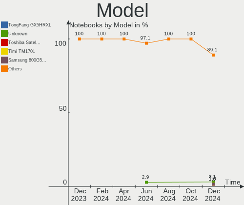
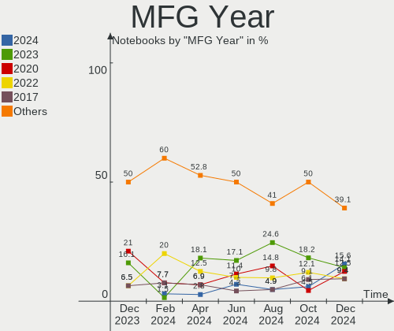
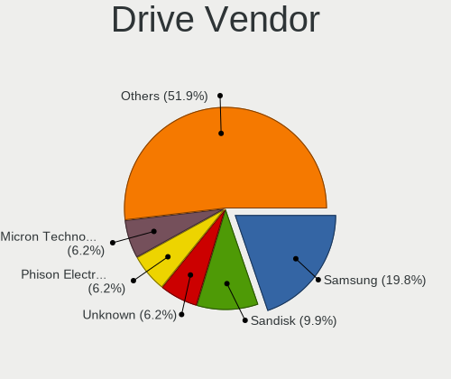
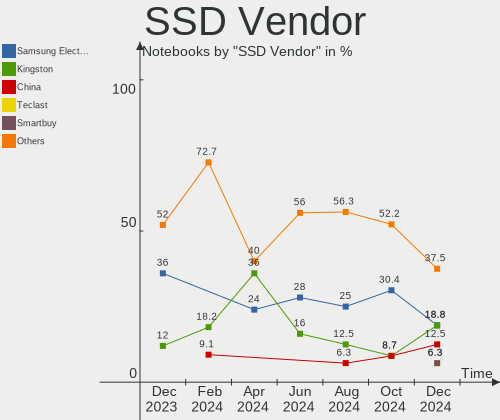
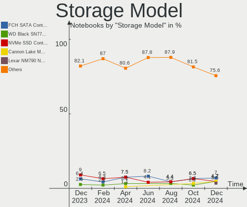
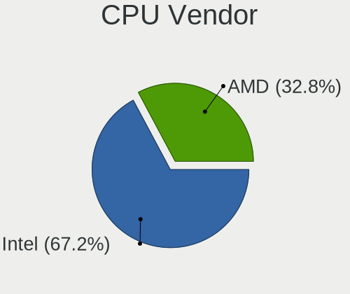
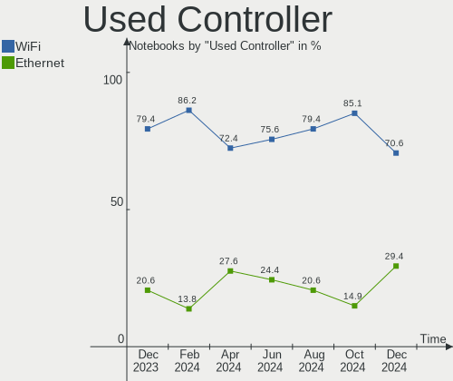

Manjaro Hardware Trends (Notebook)
----------------------------------

A project to identify most popular hardware characteristics and track their change
over time based on data collected by Manjaro users at https://Linux-Hardware.org.

Anyone can contribute to the study by uploading probes of their computers by
the [hw-probe](https://github.com/linuxhw/hw-probe) tool:

    sudo -E hw-probe -all -upload

Full-feature report is available here: https://linux-hardware.org/?view=trends&formfactor=notebook

Period: Apr, 2021.

Contents
--------

- [ OS                       ](#os)
- [ OS Family                ](#os-family)
- [ Kernel                   ](#kernel)
- [ Kernel Family            ](#kernel-family)
- [ Kernel Major Ver.        ](#kernel-major-ver)
- [ Arch                     ](#arch)
- [ DE                       ](#de)
- [ Display Server           ](#display-server)
- [ Display Manager          ](#display-manager)
- [ OS Lang                  ](#os-lang)
- [ Boot Mode                ](#boot-mode)
- [ Filesystem               ](#filesystem)
- [ Part. scheme             ](#part-scheme)
- [ Dual Boot with Linux/BSD ](#dual-boot-with-linux/bsd)
- [ Dual Boot (Win)          ](#dual-boot-win)
- [ Country                  ](#country)
- [ City                     ](#city)
- [ Vendor                   ](#vendor)
- [ Model                    ](#model)
- [ Model Family             ](#model-family)
- [ MFG Year                 ](#mfg-year)
- [ Form Factor              ](#form-factor)
- [ Secure Boot              ](#secure-boot)
- [ Coreboot                 ](#coreboot)
- [ RAM Size                 ](#ram-size)
- [ RAM Used                 ](#ram-used)
- [ Has CD-ROM               ](#has-cd-rom)
- [ Total Drives             ](#total-drives)
- [ Has Ethernet             ](#has-ethernet)
- [ Has WiFi                 ](#has-wifi)
- [ Has Bluetooth            ](#has-bluetooth)
- [ Drive Vendor             ](#drive-vendor)
- [ Drive Model              ](#drive-model)
- [ HDD Vendor               ](#hdd-vendor)
- [ SSD Vendor               ](#ssd-vendor)
- [ Drive Kind               ](#drive-kind)
- [ Drive Connector          ](#drive-connector)
- [ Drive Size               ](#drive-size)
- [ Space Total              ](#space-total)
- [ Space Used               ](#space-used)
- [ Malfunc. Drives          ](#malfunc-drives)
- [ Malfunc. Drive Vendor    ](#malfunc-drive-vendor)
- [ Malfunc. HDD Vendor      ](#malfunc-hdd-vendor)
- [ Malfunc. Drive Kind      ](#malfunc-drive-kind)
- [ Failed Drives            ](#failed-drives)
- [ Failed Drive Vendor      ](#failed-drive-vendor)
- [ Drive Status             ](#drive-status)
- [ Storage Vendor           ](#storage-vendor)
- [ Storage Model            ](#storage-model)
- [ Storage Kind             ](#storage-kind)
- [ CPU Vendor               ](#cpu-vendor)
- [ CPU Model                ](#cpu-model)
- [ CPU Model Family         ](#cpu-model-family)
- [ CPU Cores                ](#cpu-cores)
- [ CPU Sockets              ](#cpu-sockets)
- [ CPU Threads              ](#cpu-threads)
- [ CPU Op-Modes             ](#cpu-op-modes)
- [ CPU Microcode            ](#cpu-microcode)
- [ CPU Microarch            ](#cpu-microarch)
- [ GPU Vendor               ](#gpu-vendor)
- [ GPU Model                ](#gpu-model)
- [ GPU Combo                ](#gpu-combo)
- [ GPU Driver               ](#gpu-driver)
- [ GPU Memory               ](#gpu-memory)
- [ Monitor Vendor           ](#monitor-vendor)
- [ Monitor Model            ](#monitor-model)
- [ Monitor Resolution       ](#monitor-resolution)
- [ Monitor Diagonal         ](#monitor-diagonal)
- [ Monitor Width            ](#monitor-width)
- [ Aspect Ratio             ](#aspect-ratio)
- [ Monitor Area             ](#monitor-area)
- [ Pixel Density            ](#pixel-density)
- [ Multiple Monitors        ](#multiple-monitors)
- [ Net Controller Vendor    ](#net-controller-vendor)
- [ Net Controller Model     ](#net-controller-model)
- [ Wireless Vendor          ](#wireless-vendor)
- [ Wireless Model           ](#wireless-model)
- [ Ethernet Vendor          ](#ethernet-vendor)
- [ Ethernet Model           ](#ethernet-model)
- [ Net Controller Kind      ](#net-controller-kind)
- [ Used Controller          ](#used-controller)
- [ NICs                     ](#nics)
- [ IPv6                     ](#ipv6)
- [ Memory Vendor            ](#memory-vendor)
- [ Memory Model             ](#memory-model)
- [ Memory Kind              ](#memory-kind)
- [ Memory Form Factor       ](#memory-form-factor)
- [ Memory Size              ](#memory-size)
- [ Memory Speed             ](#memory-speed)
- [ Sound Vendor             ](#sound-vendor)
- [ Sound Model              ](#sound-model)
- [ Camera Vendor            ](#camera-vendor)
- [ Camera Model             ](#camera-model)
- [ Fingerprint Vendor       ](#fingerprint-vendor)
- [ Fingerprint Model        ](#fingerprint-model)
- [ Chipcard Vendor          ](#chipcard-vendor)
- [ Chipcard Model           ](#chipcard-model)
- [ Printer Vendor           ](#printer-vendor)
- [ Printer Model            ](#printer-model)
- [ Scanner Vendor           ](#scanner-vendor)
- [ Scanner Model            ](#scanner-model)
- [ Bluetooth Vendor         ](#bluetooth-vendor)
- [ Bluetooth Model          ](#bluetooth-model)
- [ Unsupported Devices      ](#unsupported-devices)
- [ Unsupported Device Types ](#unsupported-device-types)

OS
--

Installed operating systems

| Name           | Notebooks | Percent |
|----------------|-----------|---------|
| Manjaro        | 50        | 49.02%  |
| Manjaro 21.0.2 | 17        | 16.67%  |
| Manjaro 21.0.1 | 17        | 16.67%  |
| Manjaro 21.0   | 14        | 13.73%  |
| Manjaro 21.0.3 | 3         | 2.94%   |
| Manjaro 20.2.1 | 1         | 0.98%   |

OS Family
---------

OS without a version

| Name    | Notebooks | Percent |
|---------|-----------|---------|
| Manjaro | 102       | 100%    |

Kernel
------

Version of the Linux kernel

| Version                | Notebooks | Percent |
|------------------------|-----------|---------|
| 5.10.30-1-MANJARO      | 16        | 15.69%  |
| 5.10.26-1-MANJARO      | 13        | 12.75%  |
| 5.10.23-1-MANJARO      | 12        | 11.76%  |
| 5.12.0-1-MANJARO       | 9         | 8.82%   |
| 5.11.10-1-MANJARO      | 9         | 8.82%   |
| 5.9.16-1-MANJARO       | 7         | 6.86%   |
| 5.11.6-1-MANJARO       | 6         | 5.88%   |
| 5.11.14-1-MANJARO      | 6         | 5.88%   |
| 5.4.105-1-MANJARO      | 3         | 2.94%   |
| 4.19.180-1-MANJARO     | 3         | 2.94%   |
| 5.4.112-1-MANJARO      | 2         | 1.96%   |
| 5.4.111-1-MANJARO      | 2         | 1.96%   |
| 5.11.11-zen1-1-zen-g14 | 2         | 1.96%   |
| 5.9.1-1-rt19-MANJARO   | 1         | 0.98%   |
| 5.6.15-1-MANJARO       | 1         | 0.98%   |
| 5.4.89-1-MANJARO       | 1         | 0.98%   |
| 5.4.114-1-MANJARO      | 1         | 0.98%   |
| 5.4.108-1-MANJARO      | 1         | 0.98%   |
| 5.11.16-2-MANJARO      | 1         | 0.98%   |
| 5.11.15-1-MANJARO      | 1         | 0.98%   |
| 5.11.11-144-tkg-MuQSS  | 1         | 0.98%   |
| 5.10.32-1-MANJARO      | 1         | 0.98%   |
| 5.10.28-1-MANJARO      | 1         | 0.98%   |
| 5.10.19-1-MANJARO      | 1         | 0.98%   |
| 4.19.187-1-MANJARO     | 1         | 0.98%   |

Kernel Family
-------------

Linux kernel without a distro release

| Version  | Notebooks | Percent |
|----------|-----------|---------|
| 5.10.30  | 16        | 15.69%  |
| 5.10.26  | 13        | 12.75%  |
| 5.10.23  | 12        | 11.76%  |
| 5.12.0   | 9         | 8.82%   |
| 5.11.10  | 9         | 8.82%   |
| 5.9.16   | 7         | 6.86%   |
| 5.11.6   | 6         | 5.88%   |
| 5.11.14  | 6         | 5.88%   |
| 5.4.105  | 3         | 2.94%   |
| 5.11.11  | 3         | 2.94%   |
| 4.19.180 | 3         | 2.94%   |
| 5.4.112  | 2         | 1.96%   |
| 5.4.111  | 2         | 1.96%   |
| 5.9.1    | 1         | 0.98%   |
| 5.6.15   | 1         | 0.98%   |
| 5.4.89   | 1         | 0.98%   |
| 5.4.114  | 1         | 0.98%   |
| 5.4.108  | 1         | 0.98%   |
| 5.11.16  | 1         | 0.98%   |
| 5.11.15  | 1         | 0.98%   |
| 5.10.32  | 1         | 0.98%   |
| 5.10.28  | 1         | 0.98%   |
| 5.10.19  | 1         | 0.98%   |
| 4.19.187 | 1         | 0.98%   |

Kernel Major Ver.
-----------------

Linux kernel major version

| Version | Notebooks | Percent |
|---------|-----------|---------|
| 5.10    | 44        | 43.14%  |
| 5.11    | 26        | 25.49%  |
| 5.4     | 10        | 9.8%    |
| 5.12    | 9         | 8.82%   |
| 5.9     | 8         | 7.84%   |
| 4.19    | 4         | 3.92%   |
| 5.6     | 1         | 0.98%   |

Arch
----

OS architecture (x86_64, i586, etc.)

| Name   | Notebooks | Percent |
|--------|-----------|---------|
| x86_64 | 102       | 100%    |

DE
--

Desktop Environment

| Name       | Notebooks | Percent |
|------------|-----------|---------|
| GNOME      | 31        | 30.39%  |
| KDE5       | 24        | 23.53%  |
| XFCE       | 20        | 19.61%  |
| KDE        | 13        | 12.75%  |
| Unknown    | 5         | 4.9%    |
| X-Cinnamon | 4         | 3.92%   |
| Deepin     | 2         | 1.96%   |
| MATE       | 1         | 0.98%   |
| i3         | 1         | 0.98%   |
| Cinnamon   | 1         | 0.98%   |

Display Server
--------------

X11 or Wayland

| Name    | Notebooks | Percent |
|---------|-----------|---------|
| X11     | 81        | 79.41%  |
| Wayland | 17        | 16.67%  |
| Unknown | 3         | 2.94%   |
| Tty     | 1         | 0.98%   |

Display Manager
---------------

SDDM, LightDM, etc.

| Name    | Notebooks | Percent |
|---------|-----------|---------|
| Unknown | 49        | 48.04%  |
| SDDM    | 26        | 25.49%  |
| LightDM | 16        | 15.69%  |
| GDM     | 11        | 10.78%  |

OS Lang
-------

Language

| Lang    | Notebooks | Percent |
|---------|-----------|---------|
| en_US   | 43        | 42.16%  |
| ru_RU   | 10        | 9.8%    |
| pt_BR   | 7         | 6.86%   |
| en_GB   | 7         | 6.86%   |
| fr_FR   | 4         | 3.92%   |
| de_DE   | 4         | 3.92%   |
| es_ES   | 3         | 2.94%   |
| Unknown | 2         | 1.96%   |
| zh_CN   | 1         | 0.98%   |
| tr_TR   | 1         | 0.98%   |
| sk_SK   | 1         | 0.98%   |
| pl_PL   | 1         | 0.98%   |
| nl_NL   | 1         | 0.98%   |
| ja_JP   | 1         | 0.98%   |
| gl_ES   | 1         | 0.98%   |
| fr_CA   | 1         | 0.98%   |
| fi_FI   | 1         | 0.98%   |
| es_VE   | 1         | 0.98%   |
| es_UY   | 1         | 0.98%   |
| es_EC   | 1         | 0.98%   |
| es_CR   | 1         | 0.98%   |
| es_CL   | 1         | 0.98%   |
| en_PH   | 1         | 0.98%   |
| en_IN   | 1         | 0.98%   |
| en_HK   | 1         | 0.98%   |
| en_CA   | 1         | 0.98%   |
| en_AU   | 1         | 0.98%   |
| de_AT   | 1         | 0.98%   |
| ca_AD   | 1         | 0.98%   |
| C       | 1         | 0.98%   |

Boot Mode
---------

EFI or BIOS

| Mode | Notebooks | Percent |
|------|-----------|---------|
| BIOS | 58        | 56.86%  |
| EFI  | 44        | 43.14%  |

Filesystem
----------

Type of filesystem

| Type     | Notebooks | Percent |
|----------|-----------|---------|
| Ext4     | 90        | 88.24%  |
| Btrfs    | 6         | 5.88%   |
| Xfs      | 2         | 1.96%   |
| Overlay  | 2         | 1.96%   |
| Reiserfs | 1         | 0.98%   |
| Ext3     | 1         | 0.98%   |

Part. scheme
------------

Scheme of partitioning

| Type    | Notebooks | Percent |
|---------|-----------|---------|
| GPT     | 46        | 45.1%   |
| Unknown | 46        | 45.1%   |
| MBR     | 10        | 9.8%    |

Dual Boot with Linux/BSD
------------------------

Hosting more than one Linux/BSD

| Dual boot | Notebooks | Percent |
|-----------|-----------|---------|
| No        | 94        | 92.16%  |
| Yes       | 8         | 7.84%   |

Dual Boot (Win)
---------------

Hosting Linux and Windows

| Dual boot | Notebooks | Percent |
|-----------|-----------|---------|
| No        | 75        | 73.53%  |
| Yes       | 27        | 26.47%  |

Country
-------

Geographic location (country)

| Country         | Notebooks | Percent |
|-----------------|-----------|---------|
| USA             | 20        | 19.61%  |
| Russia          | 15        | 14.71%  |
| Brazil          | 10        | 9.8%    |
| Germany         | 6         | 5.88%   |
| UK              | 5         | 4.9%    |
| Spain           | 5         | 4.9%    |
| France          | 4         | 3.92%   |
| Canada          | 3         | 2.94%   |
| Belgium         | 3         | 2.94%   |
| Sweden          | 2         | 1.96%   |
| Romania         | 2         | 1.96%   |
| Poland          | 2         | 1.96%   |
| Netherlands     | 2         | 1.96%   |
| Australia       | 2         | 1.96%   |
| Vietnam         | 1         | 0.98%   |
| Venezuela       | 1         | 0.98%   |
| Uruguay         | 1         | 0.98%   |
| Turkey          | 1         | 0.98%   |
| Portugal        | 1         | 0.98%   |
| Philippines     | 1         | 0.98%   |
| North Macedonia | 1         | 0.98%   |
| Mexico          | 1         | 0.98%   |
| Malawi          | 1         | 0.98%   |
| Japan           | 1         | 0.98%   |
| Italy           | 1         | 0.98%   |
| India           | 1         | 0.98%   |
| Hong Kong       | 1         | 0.98%   |
| Georgia         | 1         | 0.98%   |
| Finland         | 1         | 0.98%   |
| Ecuador         | 1         | 0.98%   |
| Croatia         | 1         | 0.98%   |
| Costa Rica      | 1         | 0.98%   |
| Chile           | 1         | 0.98%   |
| Bulgaria        | 1         | 0.98%   |
| Austria         | 1         | 0.98%   |

City
----

Geographic location (city)

| City               | Notebooks | Percent |
|--------------------|-----------|---------|
| Moscow             | 4         | 3.92%   |
| Paris              | 2         | 1.96%   |
| Dallas             | 2         | 1.96%   |
| Curitiba           | 2         | 1.96%   |
| Campo Grande       | 2         | 1.96%   |
| Zoutleeuw          | 1         | 0.98%   |
| Zagreb             | 1         | 0.98%   |
| Yekaterinburg      | 1         | 0.98%   |
| Winfield           | 1         | 0.98%   |
| Wimbledon          | 1         | 0.98%   |
| Weiden             | 1         | 0.98%   |
| Warsaw             | 1         | 0.98%   |
| Walton on Thames   | 1         | 0.98%   |
| Vladivostok        | 1         | 0.98%   |
| Vienna             | 1         | 0.98%   |
| Udine              | 1         | 0.98%   |
| Tyumen             | 1         | 0.98%   |
| Tuguegarao City    | 1         | 0.98%   |
| Tucson             | 1         | 0.98%   |
| Toronto            | 1         | 0.98%   |
| Tbilisi            | 1         | 0.98%   |
| São Paulo         | 1         | 0.98%   |
| Sydney             | 1         | 0.98%   |
| St Petersburg      | 1         | 0.98%   |
| Sofia              | 1         | 0.98%   |
| Skopje             | 1         | 0.98%   |
| Santo Tirso        | 1         | 0.98%   |
| Santiago           | 1         | 0.98%   |
| Sant Pere Pescador | 1         | 0.98%   |
| San José          | 1         | 0.98%   |
| San Jose           | 1         | 0.98%   |
| Rostov-on-Don      | 1         | 0.98%   |
| Rosenheim          | 1         | 0.98%   |
| Ronda Alta         | 1         | 0.98%   |
| Phoenix            | 1         | 0.98%   |
| Perth              | 1         | 0.98%   |
| Pechora            | 1         | 0.98%   |
| Ottawa             | 1         | 0.98%   |
| Oosterzele         | 1         | 0.98%   |
| Oleiros            | 1         | 0.98%   |
| Nuremberg          | 1         | 0.98%   |
| North Point        | 1         | 0.98%   |
| Nha Trang          | 1         | 0.98%   |
| Nakhodka           | 1         | 0.98%   |
| Mutxamel           | 1         | 0.98%   |
| Murmansk           | 1         | 0.98%   |
| Montreal           | 1         | 0.98%   |
| Montevideo         | 1         | 0.98%   |
| Monte Alto         | 1         | 0.98%   |
| Maracay            | 1         | 0.98%   |
| Malmo              | 1         | 0.98%   |
| Louisville         | 1         | 0.98%   |
| Los Angeles        | 1         | 0.98%   |
| London             | 1         | 0.98%   |
| Lilongwe           | 1         | 0.98%   |
| Lakeland           | 1         | 0.98%   |
| Laguna             | 1         | 0.98%   |
| La Porte           | 1         | 0.98%   |
| Kennesaw           | 1         | 0.98%   |
| Jersey City        | 1         | 0.98%   |

Vendor
------

Motherboard manufacturer

| Name                 | Notebooks | Percent |
|----------------------|-----------|---------|
| Lenovo               | 26        | 25.49%  |
| Hewlett-Packard      | 17        | 16.67%  |
| ASUSTek Computer     | 11        | 10.78%  |
| Dell                 | 10        | 9.8%    |
| MSI                  | 6         | 5.88%   |
| Acer                 | 6         | 5.88%   |
| Apple                | 4         | 3.92%   |
| Toshiba              | 2         | 1.96%   |
| Medion               | 2         | 1.96%   |
| Jumper               | 2         | 1.96%   |
| Google               | 2         | 1.96%   |
| Timi                 | 1         | 0.98%   |
| Teclast              | 1         | 0.98%   |
| Standard             | 1         | 0.98%   |
| Sony                 | 1         | 0.98%   |
| Samsung Electronics  | 1         | 0.98%   |
| Packard Bell         | 1         | 0.98%   |
| Multilaser           | 1         | 0.98%   |
| MECHREVO             | 1         | 0.98%   |
| MAIBENBEN            | 1         | 0.98%   |
| Intel Client Systems | 1         | 0.98%   |
| HUAWEI               | 1         | 0.98%   |
| Gigabyte Technology  | 1         | 0.98%   |
| Fujitsu              | 1         | 0.98%   |
| Chuwi                | 1         | 0.98%   |

Model
-----

Motherboard model

| Name                                     | Notebooks | Percent |
|------------------------------------------|-----------|---------|
| Toshiba Satellite L650                   | 1         | 0.98%   |
| Toshiba Satellite C55-A                  | 1         | 0.98%   |
| Timi TM1701                              | 1         | 0.98%   |
| Teclast TbooK 10 S                       | 1         | 0.98%   |
| Standard SF20BA2                         | 1         | 0.98%   |
| Sony VPCYB35AB                           | 1         | 0.98%   |
| Samsung 350V5C/351V5C/3540VC/3440VC      | 1         | 0.98%   |
| Packard Bell EasyNote TS11HR             | 1         | 0.98%   |
| Multilaser PC132                         | 1         | 0.98%   |
| MSI Prestige 14 A11SCX                   | 1         | 0.98%   |
| MSI GS66 Stealth 10SGS                   | 1         | 0.98%   |
| MSI GL65 Leopard 9SCXR                   | 1         | 0.98%   |
| MSI GF63 Thin 9SC                        | 1         | 0.98%   |
| MSI CX61 2PC                             | 1         | 0.98%   |
| MSI Bravo 15 A4DDR                       | 1         | 0.98%   |
| Medion S15450                            | 1         | 0.98%   |
| Medion P6815                             | 1         | 0.98%   |
| MECHREVO X3 Series GK7CP6R               | 1         | 0.98%   |
| MAIBENBEN S431                           | 1         | 0.98%   |
| Lenovo Yoga Slim 7 15ITL05 82AC          | 1         | 0.98%   |
| Lenovo Yoga 2 13 20344                   | 1         | 0.98%   |
| Lenovo ThinkPad X250 20CLS02000          | 1         | 0.98%   |
| Lenovo ThinkPad X250 20CLS0000C          | 1         | 0.98%   |
| Lenovo ThinkPad X230 232502S             | 1         | 0.98%   |
| Lenovo ThinkPad X1 Carbon 2nd 20A8S38300 | 1         | 0.98%   |
| Lenovo ThinkPad T540p 20BE003AUS         | 1         | 0.98%   |
| Lenovo ThinkPad T480 20L5CTO1WW          | 1         | 0.98%   |
| Lenovo ThinkPad T470s 20HGS0DP00         | 1         | 0.98%   |
| Lenovo ThinkPad T420s 4173A57            | 1         | 0.98%   |
| Lenovo ThinkPad T14s Gen 1 20T0CTO1WW    | 1         | 0.98%   |
| Lenovo ThinkPad E495 20NEA001GE          | 1         | 0.98%   |
| Lenovo ThinkPad E475 20H4CTO1WW          | 1         | 0.98%   |
| Lenovo Legion Y540-17IRH 81Q4            | 1         | 0.98%   |
| Lenovo Legion 5 82B5                     | 1         | 0.98%   |
| Lenovo Legion 5 15ARH05 82B5             | 1         | 0.98%   |
| Lenovo IdeaPad S940-14IWL 81R0           | 1         | 0.98%   |
| Lenovo IdeaPad S340-15API 81NC           | 1         | 0.98%   |
| Lenovo IdeaPad L340-15API 81LW           | 1         | 0.98%   |
| Lenovo IdeaPad Gaming 3 15ARH05 82EY     | 1         | 0.98%   |
| Lenovo IdeaPad Flex 14 20308             | 1         | 0.98%   |
| Lenovo IdeaPad 5 14ARE05 81YM            | 1         | 0.98%   |
| Lenovo IdeaPad 330s-15ARR 81FB           | 1         | 0.98%   |
| Lenovo IdeaPad 320-14IKB 80YD            | 1         | 0.98%   |
| Lenovo IdeaPad 110-15ISK 80UD            | 1         | 0.98%   |
| Lenovo G40-45 80E1                       | 1         | 0.98%   |
| Jumper EZpad6                            | 1         | 0.98%   |
| Jumper EZbook                            | 1         | 0.98%   |
| Intel Client Systems LAPQC71B            | 1         | 0.98%   |
| HUAWEI NBLK-WAX9X                        | 1         | 0.98%   |
| HP ZBook 15 G6                           | 1         | 0.98%   |
| HP ProBook 455 G7                        | 1         | 0.98%   |
| HP ProBook 430 G2                        | 1         | 0.98%   |
| HP Pavilion Gaming Laptop 15-ec1xxx      | 1         | 0.98%   |
| HP Pavilion g6                           | 1         | 0.98%   |
| HP Pavilion dv7                          | 1         | 0.98%   |
| HP OMEN by HP Laptop                     | 1         | 0.98%   |
| HP Laptop 15-bw0xx                       | 1         | 0.98%   |
| HP Laptop 14s-cf2xxx                     | 1         | 0.98%   |
| HP Laptop 14-cm0xxx                      | 1         | 0.98%   |
| HP EliteBook Folio 9480m                 | 1         | 0.98%   |

Model Family
------------

Motherboard model prefix

| Name                          | Notebooks | Percent |
|-------------------------------|-----------|---------|
| Lenovo ThinkPad               | 11        | 10.78%  |
| Lenovo IdeaPad                | 9         | 8.82%   |
| HP EliteBook                  | 5         | 4.9%    |
| ASUS VivoBook                 | 4         | 3.92%   |
| Acer Aspire                   | 4         | 3.92%   |
| Lenovo Legion                 | 3         | 2.94%   |
| HP Pavilion                   | 3         | 2.94%   |
| HP Laptop                     | 3         | 2.94%   |
| Dell XPS                      | 3         | 2.94%   |
| Dell Vostro                   | 3         | 2.94%   |
| ASUS ROG                      | 3         | 2.94%   |
| Toshiba Satellite             | 2         | 1.96%   |
| Lenovo Yoga                   | 2         | 1.96%   |
| HP ProBook                    | 2         | 1.96%   |
| Dell Inspiron                 | 2         | 1.96%   |
| Timi TM1701                   | 1         | 0.98%   |
| Teclast TbooK                 | 1         | 0.98%   |
| Standard SF20BA2              | 1         | 0.98%   |
| Sony VPCYB35AB                | 1         | 0.98%   |
| Samsung 350V5C                | 1         | 0.98%   |
| Packard Bell EasyNote         | 1         | 0.98%   |
| Multilaser PC132              | 1         | 0.98%   |
| MSI Prestige                  | 1         | 0.98%   |
| MSI GS66                      | 1         | 0.98%   |
| MSI GL65                      | 1         | 0.98%   |
| MSI GF63                      | 1         | 0.98%   |
| MSI CX61                      | 1         | 0.98%   |
| MSI Bravo                     | 1         | 0.98%   |
| Medion S15450                 | 1         | 0.98%   |
| Medion P6815                  | 1         | 0.98%   |
| MECHREVO X3                   | 1         | 0.98%   |
| MAIBENBEN S431                | 1         | 0.98%   |
| Lenovo G40-45                 | 1         | 0.98%   |
| Jumper EZpad6                 | 1         | 0.98%   |
| Jumper EZbook                 | 1         | 0.98%   |
| Intel Client Systems LAPQC71B | 1         | 0.98%   |
| HUAWEI NBLK-WAX9X             | 1         | 0.98%   |
| HP ZBook                      | 1         | 0.98%   |
| HP OMEN                       | 1         | 0.98%   |
| HP Compaq                     | 1         | 0.98%   |
| HP 15                         | 1         | 0.98%   |
| Google Samus                  | 1         | 0.98%   |
| Google Falco                  | 1         | 0.98%   |
| Gigabyte M2432                | 1         | 0.98%   |
| Fujitsu LIFEBOOK              | 1         | 0.98%   |
| Dell Precision                | 1         | 0.98%   |
| Dell G7                       | 1         | 0.98%   |
| Chuwi GemiBook                | 1         | 0.98%   |
| ASUS Zephyrus                 | 1         | 0.98%   |
| ASUS X550VX                   | 1         | 0.98%   |
| ASUS X441BA                   | 1         | 0.98%   |
| ASUS G751JT                   | 1         | 0.98%   |
| Apple MacBookPro15            | 1         | 0.98%   |
| Apple MacBookPro11            | 1         | 0.98%   |
| Apple MacBookPro10            | 1         | 0.98%   |
| Apple MacBookAir7             | 1         | 0.98%   |
| Acer Predator                 | 1         | 0.98%   |
| Acer Nitro                    | 1         | 0.98%   |

MFG Year
--------

Motherboard manufacture year

| Year | Notebooks | Percent |
|------|-----------|---------|
| 2020 | 35        | 34.31%  |
| 2019 | 21        | 20.59%  |
| 2018 | 9         | 8.82%   |
| 2021 | 8         | 7.84%   |
| 2017 | 5         | 4.9%    |
| 2014 | 4         | 3.92%   |
| 2012 | 4         | 3.92%   |
| 2011 | 4         | 3.92%   |
| 2016 | 3         | 2.94%   |
| 2013 | 3         | 2.94%   |
| 2015 | 2         | 1.96%   |
| 2008 | 2         | 1.96%   |
| 2010 | 1         | 0.98%   |
| 2009 | 1         | 0.98%   |

Form Factor
-----------

Physical design of the computer

| Name     | Notebooks | Percent |
|----------|-----------|---------|
| Notebook | 102       | 100%    |

Secure Boot
-----------

Enabled or disabled

| State    | Notebooks | Percent |
|----------|-----------|---------|
| Disabled | 101       | 99.02%  |
| Enabled  | 1         | 0.98%   |

Coreboot
--------

Have coreboot on board

| Used | Notebooks | Percent |
|------|-----------|---------|
| No   | 99        | 97.06%  |
| Yes  | 3         | 2.94%   |

RAM Size
--------

Total RAM memory

| Size in GB  | Notebooks | Percent |
|-------------|-----------|---------|
| 4.01-8.0    | 36        | 35.29%  |
| 16.01-24.0  | 20        | 19.61%  |
| 8.01-16.0   | 17        | 16.67%  |
| 32.01-64.0  | 13        | 12.75%  |
| 3.01-4.0    | 11        | 10.78%  |
| 1.01-2.0    | 3         | 2.94%   |
| 2.01-3.0    | 1         | 0.98%   |
| 64.01-256.0 | 1         | 0.98%   |

RAM Used
--------

Used RAM memory

| Used GB   | Notebooks | Percent |
|-----------|-----------|---------|
| 1.01-2.0  | 34        | 33.33%  |
| 2.01-3.0  | 26        | 25.49%  |
| 4.01-8.0  | 18        | 17.65%  |
| 3.01-4.0  | 16        | 15.69%  |
| 8.01-16.0 | 5         | 4.9%    |
| 0.51-1.0  | 3         | 2.94%   |

Has CD-ROM
----------

Has CD-ROM on board

| Presented | Notebooks | Percent |
|-----------|-----------|---------|
| No        | 81        | 79.41%  |
| Yes       | 21        | 20.59%  |

Total Drives
------------

Number of drives on board

| Drives | Notebooks | Percent |
|--------|-----------|---------|
| 1      | 66        | 64.71%  |
| 2      | 26        | 25.49%  |
| 3      | 7         | 6.86%   |
| 4      | 3         | 2.94%   |

Has Ethernet
------------

Has Ethernet on board

| Presented | Notebooks | Percent |
|-----------|-----------|---------|
| Yes       | 79        | 77.45%  |
| No        | 23        | 22.55%  |

Has WiFi
--------

Has WiFi module

| Presented | Notebooks | Percent |
|-----------|-----------|---------|
| Yes       | 97        | 95.1%   |
| No        | 5         | 4.9%    |

Has Bluetooth
-------------

Has Bluetooth module

| Presented | Notebooks | Percent |
|-----------|-----------|---------|
| Yes       | 78        | 76.47%  |
| No        | 24        | 23.53%  |

Drive Vendor
------------

Hard drive vendors

| Vendor                  | Notebooks | Drives | Percent |
|-------------------------|-----------|--------|---------|
| Samsung Electronics     | 21        | 28     | 15.33%  |
| Seagate                 | 16        | 18     | 11.68%  |
| Kingston                | 15        | 15     | 10.95%  |
| WDC                     | 12        | 13     | 8.76%   |
| Toshiba                 | 10        | 10     | 7.3%    |
| Unknown                 | 9         | 11     | 6.57%   |
| SanDisk                 | 9         | 9      | 6.57%   |
| LITEONIT                | 4         | 4      | 2.92%   |
| Hitachi                 | 4         | 4      | 2.92%   |
| Apple                   | 4         | 4      | 2.92%   |
| SK Hynix                | 3         | 3      | 2.19%   |
| Phison                  | 3         | 3      | 2.19%   |
| Intel                   | 3         | 3      | 2.19%   |
| HGST                    | 3         | 3      | 2.19%   |
| XPG                     | 2         | 2      | 1.46%   |
| Union Memory (Shenzhen) | 2         | 2      | 1.46%   |
| LITEON                  | 2         | 2      | 1.46%   |
| Vaseky                  | 1         | 1      | 0.73%   |
| Union Memory            | 1         | 1      | 0.73%   |
| Silicon Motion          | 1         | 1      | 0.73%   |
| PLEXTOR                 | 1         | 1      | 0.73%   |
| PHD 3.0                 | 1         | 1      | 0.73%   |
| Patriot                 | 1         | 1      | 0.73%   |
| Micron Technology       | 1         | 1      | 0.73%   |
| LONDISK                 | 1         | 1      | 0.73%   |
| Lexar                   | 1         | 1      | 0.73%   |
| LaCie                   | 1         | 1      | 0.73%   |
| Hoodisk                 | 1         | 1      | 0.73%   |
| GOODRAM                 | 1         | 1      | 0.73%   |
| Crucial                 | 1         | 1      | 0.73%   |
| Colorful                | 1         | 1      | 0.73%   |
| China                   | 1         | 1      | 0.73%   |

Drive Model
-----------

Hard drive models

| Model                                        | Notebooks | Percent |
|----------------------------------------------|-----------|---------|
| Seagate ST1000LM035-1RK172 1TB               | 6         | 4.05%   |
| Samsung NVMe SSD Drive 512GB                 | 3         | 2.03%   |
| Unknown SD/MMC/MS PRO 32GB                   | 2         | 1.35%   |
| Unknown MMC Card  64GB                       | 2         | 1.35%   |
| Toshiba NVMe SSD Drive 256GB                 | 2         | 1.35%   |
| SK Hynix NVMe SSD Drive 256GB                | 2         | 1.35%   |
| Seagate Expansion Desk 6TB                   | 2         | 1.35%   |
| Sandisk NVMe SSD Drive 512GB                 | 2         | 1.35%   |
| Samsung SSD 850 EVO 500GB                    | 2         | 1.35%   |
| Samsung NVMe SSD Drive 1024GB                | 2         | 1.35%   |
| Kingston SV300S37A120G 120GB SSD             | 2         | 1.35%   |
| Kingston RBUSNS8180S3256GJ 256GB SSD         | 2         | 1.35%   |
| XPG NVMe SSD Drive 2TB                       | 1         | 0.68%   |
| XPG NVMe SSD Drive 1024GB                    | 1         | 0.68%   |
| WDC WDS500G2B0B-00YS70 500GB SSD             | 1         | 0.68%   |
| WDC WDS500G2B0A 500GB SSD                    | 1         | 0.68%   |
| WDC WDS250G3X0C-00SJG0 250GB                 | 1         | 0.68%   |
| WDC WDS240G2G0B-00EPW0 240GB SSD             | 1         | 0.68%   |
| WDC WDS200T2B0B-00YS70 2TB SSD               | 1         | 0.68%   |
| WDC WD5000LPVX-60V0TT0 500GB                 | 1         | 0.68%   |
| WDC WD5000LPVX-22V0TT0 500GB                 | 1         | 0.68%   |
| WDC WD5000BEVT-00ZAT0 500GB                  | 1         | 0.68%   |
| WDC WD20SPZX-08UA7 2TB                       | 1         | 0.68%   |
| WDC WD10SPZX-21Z10T0 1TB                     | 1         | 0.68%   |
| WDC WD10SPZX-00Z10T0 1TB                     | 1         | 0.68%   |
| WDC PC SN530 SDBPNPZ-512G-1032 512GB         | 1         | 0.68%   |
| WDC PC SN520 SDAPNUW-256G-1202 256GB         | 1         | 0.68%   |
| Vaseky V800/240G 240GB                       | 1         | 0.68%   |
| Unknown USD00  32GB                          | 1         | 0.68%   |
| Unknown SU800BR3-128GB                       | 1         | 0.68%   |
| Unknown SS16G  16GB                          | 1         | 0.68%   |
| Unknown SLD32G  32GB                         | 1         | 0.68%   |
| Unknown S11-512G-PHISON-DVS-B27 512GB        | 1         | 0.68%   |
| Unknown NCard  32GB                          | 1         | 0.68%   |
| Unknown MMC Card  16GB                       | 1         | 0.68%   |
| Union Memory UMIS RPJTJ512MEE1OWX 512GB      | 1         | 0.68%   |
| Union Memory (Shenzhen) NVMe SSD Drive 512GB | 1         | 0.68%   |
| Union Memory (Shenzhen) NVMe SSD Drive 256GB | 1         | 0.68%   |
| Toshiba NVMe SSD Drive 512GB                 | 1         | 0.68%   |
| Toshiba NVMe SSD Drive 1TB                   | 1         | 0.68%   |
| Toshiba MQ04ABF100 1TB                       | 1         | 0.68%   |
| Toshiba MQ01ABF050 500GB                     | 1         | 0.68%   |
| Toshiba MQ01ABD100 1TB                       | 1         | 0.68%   |
| Toshiba MK3259GSXP 320GB                     | 1         | 0.68%   |
| Toshiba KXG6AZNV1T02 1TB                     | 1         | 0.68%   |
| Toshiba HDWK105 500GB                        | 1         | 0.68%   |
| SK Hynix NVMe SSD Drive 1TB                  | 1         | 0.68%   |
| Silicon Motion NVMe SSD Drive 1024GB         | 1         | 0.68%   |
| Seagate ST9640320AS 640GB                    | 1         | 0.68%   |
| Seagate ST92503010AS 250GB                   | 1         | 0.68%   |
| Seagate ST500LM030-1RK17D 500GB              | 1         | 0.68%   |
| Seagate ST500LM012 HN-M500MBB 500GB          | 1         | 0.68%   |
| Seagate ST2000LM015-2E8174 2TB               | 1         | 0.68%   |
| Seagate ST2000LM007-1R8174 2TB               | 1         | 0.68%   |
| Seagate ST1000LX015-1U7172 1TB               | 1         | 0.68%   |
| Seagate ST1000LM024 HN-M101MBB 1TB           | 1         | 0.68%   |
| Seagate Expansion 4TB                        | 1         | 0.68%   |
| Seagate Backup+ Hub BK 4TB                   | 1         | 0.68%   |
| SanDisk Ultra II 480GB SSD                   | 1         | 0.68%   |
| SanDisk SDSSDH3500G 500GB                    | 1         | 0.68%   |

HDD Vendor
----------

Hard disk drive vendors

| Vendor              | Notebooks | Drives | Percent |
|---------------------|-----------|--------|---------|
| Seagate             | 16        | 17     | 44.44%  |
| WDC                 | 6         | 6      | 16.67%  |
| Toshiba             | 5         | 5      | 13.89%  |
| Hitachi             | 4         | 4      | 11.11%  |
| HGST                | 3         | 3      | 8.33%   |
| Samsung Electronics | 1         | 1      | 2.78%   |
| PHD 3.0             | 1         | 1      | 2.78%   |

SSD Vendor
----------

Solid state drive vendors

| Vendor              | Notebooks | Drives | Percent |
|---------------------|-----------|--------|---------|
| Kingston            | 14        | 14     | 27.45%  |
| Samsung Electronics | 9         | 10     | 17.65%  |
| SanDisk             | 6         | 6      | 11.76%  |
| WDC                 | 4         | 4      | 7.84%   |
| LITEONIT            | 4         | 4      | 7.84%   |
| LITEON              | 2         | 2      | 3.92%   |
| Apple               | 2         | 2      | 3.92%   |
| Vaseky              | 1         | 1      | 1.96%   |
| PLEXTOR             | 1         | 1      | 1.96%   |
| Patriot             | 1         | 1      | 1.96%   |
| LONDISK             | 1         | 1      | 1.96%   |
| Intel               | 1         | 1      | 1.96%   |
| Hoodisk             | 1         | 1      | 1.96%   |
| GOODRAM             | 1         | 1      | 1.96%   |
| Crucial             | 1         | 1      | 1.96%   |
| Colorful            | 1         | 1      | 1.96%   |
| China               | 1         | 1      | 1.96%   |

Drive Kind
----------

HDD or SSD

| Kind    | Notebooks | Drives | Percent |
|---------|-----------|--------|---------|
| SSD     | 47        | 52     | 35.61%  |
| NVMe    | 41        | 46     | 31.06%  |
| HDD     | 32        | 37     | 24.24%  |
| MMC     | 6         | 8      | 4.55%   |
| Unknown | 6         | 6      | 4.55%   |

Drive Connector
---------------

SATA, SAS, NVMe, etc.

| Type | Notebooks | Drives | Percent |
|------|-----------|--------|---------|
| SATA | 68        | 84     | 54.84%  |
| NVMe | 41        | 46     | 33.06%  |
| SAS  | 9         | 11     | 7.26%   |
| MMC  | 6         | 8      | 4.84%   |

Drive Size
----------

Size of hard drive

| Size in TB | Notebooks | Drives | Percent |
|------------|-----------|--------|---------|
| 0.01-0.5   | 51        | 58     | 62.96%  |
| 0.51-1.0   | 20        | 21     | 24.69%  |
| 1.01-2.0   | 6         | 6      | 7.41%   |
| 3.01-4.0   | 2         | 2      | 2.47%   |
| 4.01-10.0  | 2         | 2      | 2.47%   |

Space Total
-----------

Amount of disk space available on the file system

| Size in GB     | Notebooks | Percent |
|----------------|-----------|---------|
| 101-250        | 36        | 35.29%  |
| 251-500        | 23        | 22.55%  |
| 501-1000       | 14        | 13.73%  |
| Unknown        | 8         | 7.84%   |
| 1001-2000      | 6         | 5.88%   |
| 21-50          | 5         | 4.9%    |
| 51-100         | 4         | 3.92%   |
| 1-20           | 3         | 2.94%   |
| More than 3000 | 2         | 1.96%   |
| 2001-3000      | 1         | 0.98%   |

Space Used
----------

Amount of used disk space

| Used GB   | Notebooks | Percent |
|-----------|-----------|---------|
| 1-20      | 26        | 25.49%  |
| 21-50     | 19        | 18.63%  |
| 251-500   | 14        | 13.73%  |
| 101-250   | 14        | 13.73%  |
| 51-100    | 14        | 13.73%  |
| Unknown   | 8         | 7.84%   |
| 1001-2000 | 3         | 2.94%   |
| 501-1000  | 3         | 2.94%   |
| 2001-3000 | 1         | 0.98%   |

Malfunc. Drives
---------------

Drive models with a malfunction

| Model                          | Notebooks | Drives | Percent |
|--------------------------------|-----------|--------|---------|
| Toshiba MQ01ABD100 1TB         | 1         | 1      | 11.11%  |
| Toshiba MK3259GSXP 320GB       | 1         | 1      | 11.11%  |
| Seagate ST9640320AS 640GB      | 1         | 1      | 11.11%  |
| Seagate ST2000LM007-1R8174 2TB | 1         | 1      | 11.11%  |
| Seagate ST1000LX015-1U7172 1TB | 1         | 1      | 11.11%  |
| Seagate ST1000LM035-1RK172 1TB | 1         | 1      | 11.11%  |
| Hitachi HTS547575A9E384 752GB  | 1         | 1      | 11.11%  |
| Hitachi HTS543232L9A300 320GB  | 1         | 1      | 11.11%  |
| HGST TOURO Mobile 500GB        | 1         | 1      | 11.11%  |

Malfunc. Drive Vendor
---------------------

Vendors of faulty drives

| Vendor  | Notebooks | Drives | Percent |
|---------|-----------|--------|---------|
| Seagate | 4         | 4      | 44.44%  |
| Toshiba | 2         | 2      | 22.22%  |
| Hitachi | 2         | 2      | 22.22%  |
| HGST    | 1         | 1      | 11.11%  |

Malfunc. HDD Vendor
-------------------

Vendors of faulty HDD drives

| Vendor  | Notebooks | Drives | Percent |
|---------|-----------|--------|---------|
| Seagate | 4         | 4      | 44.44%  |
| Toshiba | 2         | 2      | 22.22%  |
| Hitachi | 2         | 2      | 22.22%  |
| HGST    | 1         | 1      | 11.11%  |

Malfunc. Drive Kind
-------------------

Kinds of faulty drives

| Kind | Notebooks | Drives | Percent |
|------|-----------|--------|---------|
| HDD  | 8         | 9      | 100%    |

Failed Drives
-------------

Failed drive models

| Model                                            | Notebooks | Drives | Percent |
|--------------------------------------------------|-----------|--------|---------|
| Samsung Electronics MZNTY128HDHP-000H1 128GB SSD | 1         | 1      | 100%    |

Failed Drive Vendor
-------------------

Failed drive vendors

| Vendor              | Notebooks | Drives | Percent |
|---------------------|-----------|--------|---------|
| Samsung Electronics | 1         | 1      | 100%    |

Drive Status
------------

Number of failed and malfunc. drives

| Status   | Notebooks | Drives | Percent |
|----------|-----------|--------|---------|
| Detected | 62        | 88     | 57.41%  |
| Works    | 37        | 51     | 34.26%  |
| Malfunc  | 8         | 9      | 7.41%   |
| Failed   | 1         | 1      | 0.93%   |

Storage Vendor
--------------

Storage controller vendors

| Vendor                       | Notebooks | Percent |
|------------------------------|-----------|---------|
| Intel                        | 63        | 50%     |
| AMD                          | 20        | 15.87%  |
| Samsung Electronics          | 14        | 11.11%  |
| Sandisk                      | 6         | 4.76%   |
| Toshiba America Info Systems | 5         | 3.97%   |
| Union Memory (Shenzhen)      | 3         | 2.38%   |
| SK Hynix                     | 3         | 2.38%   |
| Phison Electronics           | 3         | 2.38%   |
| Apple                        | 2         | 1.59%   |
| ADATA Technology             | 2         | 1.59%   |
| Silicon Motion               | 1         | 0.79%   |
| Shenzhen Longsys Electronics | 1         | 0.79%   |
| Micron Technology            | 1         | 0.79%   |
| Kingston Technology Company  | 1         | 0.79%   |
| JMicron Technology           | 1         | 0.79%   |

Storage Model
-------------

Storage controller models

| Model                                                                            | Notebooks | Percent |
|----------------------------------------------------------------------------------|-----------|---------|
| AMD FCH SATA Controller [AHCI mode]                                              | 19        | 14.73%  |
| Samsung NVMe SSD Controller SM981/PM981/PM983                                    | 9         | 6.98%   |
| Intel Cannon Lake Mobile PCH SATA AHCI Controller                                | 9         | 6.98%   |
| Intel 8 Series SATA Controller 1 [AHCI mode]                                     | 9         | 6.98%   |
| Intel 7 Series Chipset Family 6-port SATA Controller [AHCI mode]                 | 7         | 5.43%   |
| Intel Sunrise Point-LP SATA Controller [AHCI mode]                               | 6         | 4.65%   |
| Intel 6 Series/C200 Series Chipset Family 6 port Mobile SATA AHCI Controller     | 5         | 3.88%   |
| Intel Wildcat Point-LP SATA Controller [AHCI Mode]                               | 4         | 3.1%    |
| Union Memory (Shenzhen) Non-Volatile memory controller                           | 3         | 2.33%   |
| Toshiba America Info Systems XG6 NVMe SSD Controller                             | 3         | 2.33%   |
| Samsung NVMe SSD Controller SM961/PM961/SM963                                    | 3         | 2.33%   |
| Intel HM170/QM170 Chipset SATA Controller [AHCI Mode]                            | 3         | 2.33%   |
| Intel Celeron/Pentium Silver Processor SATA Controller                           | 3         | 2.33%   |
| Intel 8 Series/C220 Series Chipset Family 6-port SATA Controller 1 [AHCI mode]   | 3         | 2.33%   |
| Toshiba America Info Systems BG3 NVMe SSD Controller                             | 2         | 1.55%   |
| Sandisk WD Blue SN550 NVMe SSD                                                   | 2         | 1.55%   |
| Sandisk WD Black 2018/SN750 / PC SN720 NVMe SSD                                  | 2         | 1.55%   |
| Intel Tiger Lake-LP SATA Controller [AHCI mode]                                  | 2         | 1.55%   |
| Intel SSD 660P Series                                                            | 2         | 1.55%   |
| Intel 82801HM/HEM (ICH8M/ICH8M-E) SATA Controller [AHCI mode]                    | 2         | 1.55%   |
| Intel 82801HM/HEM (ICH8M/ICH8M-E) IDE Controller                                 | 2         | 1.55%   |
| ADATA XPG SX8200 Pro PCIe Gen3x4 M.2 2280 Solid State Drive                      | 2         | 1.55%   |
| SK Hynix PC401 NVMe Solid State Drive 256GB                                      | 1         | 0.78%   |
| SK Hynix NVMe SSD Controller                                                     | 1         | 0.78%   |
| SK Hynix BC511                                                                   | 1         | 0.78%   |
| Silicon Motion SM2262/SM2262EN SSD Controller                                    | 1         | 0.78%   |
| Shenzhen Longsys Non-Volatile memory controller                                  | 1         | 0.78%   |
| Sandisk WD Blue SN500 / PC SN520 NVMe SSD                                        | 1         | 0.78%   |
| Sandisk WD Black SN750 / PC SN730 NVMe SSD                                       | 1         | 0.78%   |
| Samsung NVMe SSD Controller PM9A1/980PRO                                         | 1         | 0.78%   |
| Samsung NVMe Controller                                                          | 1         | 0.78%   |
| Samsung Apple PCIe SSD                                                           | 1         | 0.78%   |
| Phison NVMe Storage Controller                                                   | 1         | 0.78%   |
| Phison E16 PCIe4 NVMe Controller                                                 | 1         | 0.78%   |
| Phison E12 NVMe Controller                                                       | 1         | 0.78%   |
| Micron Non-Volatile memory controller                                            | 1         | 0.78%   |
| Kingston Company U-SNS8154P3 NVMe SSD                                            | 1         | 0.78%   |
| JMicron JMB360 AHCI Controller                                                   | 1         | 0.78%   |
| Intel Cannon Point-LP SATA Controller [AHCI Mode]                                | 1         | 0.78%   |
| Intel Atom/Celeron/Pentium Processor x5-E8000/J3xxx/N3xxx Series SATA Controller | 1         | 0.78%   |
| Intel Atom Processor E3800 Series SATA AHCI Controller                           | 1         | 0.78%   |
| Intel 82801IBM/IEM (ICH9M/ICH9M-E) 4 port SATA Controller [AHCI mode]            | 1         | 0.78%   |
| Intel 82801 Mobile SATA Controller [RAID mode]                                   | 1         | 0.78%   |
| Intel 5 Series/3400 Series Chipset 6 port SATA AHCI Controller                   | 1         | 0.78%   |
| Intel 5 Series/3400 Series Chipset 4 port SATA AHCI Controller                   | 1         | 0.78%   |
| Intel 400 Series Chipset Family SATA AHCI Controller                             | 1         | 0.78%   |
| Apple S1X NVMe Controller                                                        | 1         | 0.78%   |
| Apple ANS2 NVMe Controller                                                       | 1         | 0.78%   |
| AMD SB7x0/SB8x0/SB9x0 SATA Controller [AHCI mode]                                | 1         | 0.78%   |

Storage Kind
------------

Kind of storage controller (IDE, SATA, NVMe, SAS, ...)

| Kind | Notebooks | Percent |
|------|-----------|---------|
| SATA | 81        | 64.8%   |
| NVMe | 41        | 32.8%   |
| IDE  | 2         | 1.6%    |
| RAID | 1         | 0.8%    |

CPU Vendor
----------

Processor vendors

| Vendor | Notebooks | Percent |
|--------|-----------|---------|
| Intel  | 78        | 76.47%  |
| AMD    | 24        | 23.53%  |

CPU Model
---------

Processor models

| Model                                         | Notebooks | Percent |
|-----------------------------------------------|-----------|---------|
| Intel Core i7-9750H CPU @ 2.60GHz             | 4         | 3.92%   |
| Intel Core i5-4210U CPU @ 1.70GHz             | 3         | 2.94%   |
| Intel Atom x5-Z8350 CPU @ 1.44GHz             | 3         | 2.94%   |
| Intel 11th Gen Core i5-1135G7 @ 2.40GHz       | 3         | 2.94%   |
| AMD Ryzen 5 4600H with Radeon Graphics        | 3         | 2.94%   |
| AMD Ryzen 5 3500U with Radeon Vega Mobile Gfx | 3         | 2.94%   |
| Intel Core i7-8565U CPU @ 1.80GHz             | 2         | 1.96%   |
| Intel Core i7-8550U CPU @ 1.80GHz             | 2         | 1.96%   |
| Intel Core i7-3630QM CPU @ 2.40GHz            | 2         | 1.96%   |
| Intel Core i7-10750H CPU @ 2.60GHz            | 2         | 1.96%   |
| Intel Core i5-5200U CPU @ 2.20GHz             | 2         | 1.96%   |
| Intel Core i5-2520M CPU @ 2.50GHz             | 2         | 1.96%   |
| Intel Core i3-4010U CPU @ 1.70GHz             | 2         | 1.96%   |
| Intel 11th Gen Core i7-1185G7 @ 3.00GHz       | 2         | 1.96%   |
| AMD Ryzen 7 4800H with Radeon Graphics        | 2         | 1.96%   |
| AMD Ryzen 7 3700U with Radeon Vega Mobile Gfx | 2         | 1.96%   |
| Intel Xeon E-2286M CPU @ 2.40GHz              | 1         | 0.98%   |
| Intel Pentium Silver N5000 CPU @ 1.10GHz      | 1         | 0.98%   |
| Intel Core i9-9880H CPU @ 2.30GHz             | 1         | 0.98%   |
| Intel Core i9-8950HK CPU @ 2.90GHz            | 1         | 0.98%   |
| Intel Core i9-10980HK CPU @ 2.40GHz           | 1         | 0.98%   |
| Intel Core i7-8750H CPU @ 2.20GHz             | 1         | 0.98%   |
| Intel Core i7-7700HQ CPU @ 2.80GHz            | 1         | 0.98%   |
| Intel Core i7-7600U CPU @ 2.80GHz             | 1         | 0.98%   |
| Intel Core i7-7500U CPU @ 2.70GHz             | 1         | 0.98%   |
| Intel Core i7-6700HQ CPU @ 2.60GHz            | 1         | 0.98%   |
| Intel Core i7-5500U CPU @ 2.40GHz             | 1         | 0.98%   |
| Intel Core i7-4770HQ CPU @ 2.20GHz            | 1         | 0.98%   |
| Intel Core i7-4720HQ CPU @ 2.60GHz            | 1         | 0.98%   |
| Intel Core i7-4510U CPU @ 2.00GHz             | 1         | 0.98%   |
| Intel Core i7-3720QM CPU @ 2.60GHz            | 1         | 0.98%   |
| Intel Core i7-3610QM CPU @ 2.30GHz            | 1         | 0.98%   |
| Intel Core i7-3520M CPU @ 2.90GHz             | 1         | 0.98%   |
| Intel Core i7-2670QM CPU @ 2.20GHz            | 1         | 0.98%   |
| Intel Core i7-10610U CPU @ 1.80GHz            | 1         | 0.98%   |
| Intel Core i5-9300H CPU @ 2.40GHz             | 1         | 0.98%   |
| Intel Core i5-8365U CPU @ 1.60GHz             | 1         | 0.98%   |
| Intel Core i5-8300H CPU @ 2.30GHz             | 1         | 0.98%   |
| Intel Core i5-8265U CPU @ 1.60GHz             | 1         | 0.98%   |
| Intel Core i5-8250U CPU @ 1.60GHz             | 1         | 0.98%   |
| Intel Core i5-7200U CPU @ 2.50GHz             | 1         | 0.98%   |
| Intel Core i5-6300HQ CPU @ 2.30GHz            | 1         | 0.98%   |
| Intel Core i5-5300U CPU @ 2.30GHz             | 1         | 0.98%   |
| Intel Core i5-5250U CPU @ 1.60GHz             | 1         | 0.98%   |
| Intel Core i5-4300U CPU @ 1.90GHz             | 1         | 0.98%   |
| Intel Core i5-4210M CPU @ 2.60GHz             | 1         | 0.98%   |
| Intel Core i5-4200U CPU @ 1.60GHz             | 1         | 0.98%   |
| Intel Core i5-4200M CPU @ 2.50GHz             | 1         | 0.98%   |
| Intel Core i5-3337U CPU @ 1.80GHz             | 1         | 0.98%   |
| Intel Core i5-2540M CPU @ 2.60GHz             | 1         | 0.98%   |
| Intel Core i5-2450M CPU @ 2.50GHz             | 1         | 0.98%   |
| Intel Core i5 CPU M 460 @ 2.53GHz             | 1         | 0.98%   |
| Intel Core i3-8130U CPU @ 2.20GHz             | 1         | 0.98%   |
| Intel Core i3-6100U CPU @ 2.30GHz             | 1         | 0.98%   |
| Intel Core i3-3120M CPU @ 2.50GHz             | 1         | 0.98%   |
| Intel Core i3 CPU M 330 @ 2.13GHz             | 1         | 0.98%   |
| Intel Core 2 Duo CPU T8300 @ 2.40GHz          | 1         | 0.98%   |
| Intel Core 2 Duo CPU T6400 @ 2.00GHz          | 1         | 0.98%   |
| Intel Core 2 Duo CPU T5750 @ 2.00GHz          | 1         | 0.98%   |
| Intel Celeron N4100 CPU @ 1.10GHz             | 1         | 0.98%   |

CPU Model Family
----------------

Processor model prefix

| Model                | Notebooks | Percent |
|----------------------|-----------|---------|
| Intel Core i7        | 26        | 25.49%  |
| Intel Core i5        | 24        | 23.53%  |
| AMD Ryzen 5          | 10        | 9.8%    |
| Other                | 7         | 6.86%   |
| Intel Core i3        | 6         | 5.88%   |
| Intel Celeron        | 6         | 5.88%   |
| AMD Ryzen 7          | 6         | 5.88%   |
| Intel Core i9        | 3         | 2.94%   |
| Intel Core 2 Duo     | 3         | 2.94%   |
| Intel Atom           | 3         | 2.94%   |
| AMD A6               | 2         | 1.96%   |
| Intel Xeon           | 1         | 0.98%   |
| Intel Pentium Silver | 1         | 0.98%   |
| AMD Ryzen 9          | 1         | 0.98%   |
| AMD E                | 1         | 0.98%   |
| AMD Athlon           | 1         | 0.98%   |
| AMD A8               | 1         | 0.98%   |

CPU Cores
---------

Number of processor cores

| Number | Notebooks | Percent |
|--------|-----------|---------|
| 4      | 41        | 40.2%   |
| 2      | 39        | 38.24%  |
| 6      | 13        | 12.75%  |
| 8      | 7         | 6.86%   |
| 1      | 2         | 1.96%   |

CPU Sockets
-----------

Number of sockets

| Number | Notebooks | Percent |
|--------|-----------|---------|
| 1      | 102       | 100%    |

CPU Threads
-----------

Threads per core (Hyper-Threading)

| Number | Notebooks | Percent |
|--------|-----------|---------|
| 2      | 81        | 79.41%  |
| 1      | 21        | 20.59%  |

CPU Op-Modes
------------

CPU Operation Modes (32-bit, 64-bit)

| Op mode        | Notebooks | Percent |
|----------------|-----------|---------|
| 32-bit, 64-bit | 102       | 100%    |

CPU Microcode
-------------

Microcode number

| Number     | Notebooks | Percent |
|------------|-----------|---------|
| Unknown    | 53        | 51.96%  |
| 0x906ea    | 5         | 4.9%    |
| 0x08108109 | 4         | 3.92%   |
| 0x806ea    | 3         | 2.94%   |
| 0x08600106 | 3         | 2.94%   |
| 0x08600104 | 3         | 2.94%   |
| 0x906ed    | 2         | 1.96%   |
| 0x806e9    | 2         | 1.96%   |
| 0x806c1    | 2         | 1.96%   |
| 0x706a1    | 2         | 1.96%   |
| 0x506e3    | 2         | 1.96%   |
| 0x406c4    | 2         | 1.96%   |
| 0x40651    | 2         | 1.96%   |
| 0x306d4    | 2         | 1.96%   |
| 0x306c3    | 2         | 1.96%   |
| 0x306a9    | 2         | 1.96%   |
| 0x206a7    | 2         | 1.96%   |
| 0x806ec    | 1         | 0.98%   |
| 0x6fd      | 1         | 0.98%   |
| 0x20655    | 1         | 0.98%   |
| 0x10676    | 1         | 0.98%   |
| 0x0a50000b | 1         | 0.98%   |
| 0x08108102 | 1         | 0.98%   |
| 0x07030105 | 1         | 0.98%   |
| 0x0600611a | 1         | 0.98%   |
| 0x05000119 | 1         | 0.98%   |

CPU Microarch
-------------

Microarchitecture

| Name          | Notebooks | Percent |
|---------------|-----------|---------|
| KabyLake      | 23        | 22.55%  |
| Haswell       | 13        | 12.75%  |
| Zen 2         | 8         | 7.84%   |
| Zen+          | 7         | 6.86%   |
| IvyBridge     | 7         | 6.86%   |
| TigerLake     | 5         | 4.9%    |
| Silvermont    | 5         | 4.9%    |
| SandyBridge   | 5         | 4.9%    |
| Broadwell     | 5         | 4.9%    |
| Goldmont plus | 4         | 3.92%   |
| Skylake       | 3         | 2.94%   |
| Excavator     | 3         | 2.94%   |
| CometLake     | 3         | 2.94%   |
| Zen           | 2         | 1.96%   |
| Westmere      | 2         | 1.96%   |
| Penryn        | 2         | 1.96%   |
| Zen 3         | 1         | 0.98%   |
| Puma          | 1         | 0.98%   |
| Piledriver    | 1         | 0.98%   |
| Core          | 1         | 0.98%   |
| Bobcat        | 1         | 0.98%   |

GPU Vendor
----------

Vendors of graphics cards

| Vendor | Notebooks | Percent |
|--------|-----------|---------|
| Intel  | 70        | 53.44%  |
| Nvidia | 34        | 25.95%  |
| AMD    | 27        | 20.61%  |

GPU Model
---------

Graphics card models

| Model                                                                                    | Notebooks | Percent |
|------------------------------------------------------------------------------------------|-----------|---------|
| Intel Haswell-ULT Integrated Graphics Controller                                         | 9         | 6.67%   |
| AMD Renoir                                                                               | 7         | 5.19%   |
| AMD Picasso                                                                              | 7         | 5.19%   |
| Intel CoffeeLake-H GT2 [UHD Graphics 630]                                                | 6         | 4.44%   |
| Intel 3rd Gen Core processor Graphics Controller                                         | 6         | 4.44%   |
| Nvidia TU117M                                                                            | 5         | 3.7%    |
| Intel TigerLake-LP GT2 [Iris Xe Graphics]                                                | 5         | 3.7%    |
| Intel 2nd Generation Core Processor Family Integrated Graphics Controller                | 5         | 3.7%    |
| Intel WhiskeyLake-U GT2 [UHD Graphics 620]                                               | 4         | 2.96%   |
| Intel UHD Graphics 620                                                                   | 4         | 2.96%   |
| Intel HD Graphics 5500                                                                   | 4         | 2.96%   |
| Intel Atom/Celeron/Pentium Processor x5-E8000/J3xxx/N3xxx Integrated Graphics Controller | 4         | 2.96%   |
| Nvidia GF117M [GeForce 610M/710M/810M/820M / GT 620M/625M/630M/720M]                     | 3         | 2.22%   |
| Intel HD Graphics 620                                                                    | 3         | 2.22%   |
| Intel GeminiLake [UHD Graphics 600]                                                      | 3         | 2.22%   |
| Intel CometLake-H GT2 [UHD Graphics]                                                     | 3         | 2.22%   |
| Nvidia TU117GLM [Quadro T2000 Mobile / Max-Q]                                            | 2         | 1.48%   |
| Nvidia TU116M [GeForce GTX 1660 Ti Mobile]                                               | 2         | 1.48%   |
| Nvidia GP106M [GeForce GTX 1060 Mobile]                                                  | 2         | 1.48%   |
| Nvidia GM204M [GeForce GTX 970M]                                                         | 2         | 1.48%   |
| Intel HD Graphics 530                                                                    | 2         | 1.48%   |
| Intel 4th Gen Core Processor Integrated Graphics Controller                              | 2         | 1.48%   |
| AMD Stoney [Radeon R2/R3/R4/R5 Graphics]                                                 | 2         | 1.48%   |
| AMD Raven Ridge [Radeon Vega Series / Radeon Vega Mobile Series]                         | 2         | 1.48%   |
| AMD Baffin [Radeon RX 460/560D / Pro 450/455/460/555/555X/560/560X]                      | 2         | 1.48%   |
| Nvidia TU117M [GeForce GTX 1650 Ti Mobile]                                               | 1         | 0.74%   |
| Nvidia TU117M [GeForce GTX 1650 Mobile / Max-Q]                                          | 1         | 0.74%   |
| Nvidia TU106M [GeForce RTX 2070 Mobile]                                                  | 1         | 0.74%   |
| Nvidia TU106M [GeForce RTX 2070 Mobile / Max-Q Refresh]                                  | 1         | 0.74%   |
| Nvidia TU106M [GeForce RTX 2060 Mobile]                                                  | 1         | 0.74%   |
| Nvidia TU104M [GeForce RTX 2080 SUPER Mobile / Max-Q]                                    | 1         | 0.74%   |
| Nvidia TU104BM [GeForce RTX 2080 SUPER Mobile / Max-Q]                                   | 1         | 0.74%   |
| Nvidia GP108M [GeForce MX150]                                                            | 1         | 0.74%   |
| Nvidia GP107M [GeForce GTX 1050 Mobile]                                                  | 1         | 0.74%   |
| Nvidia GM108M [GeForce MX130]                                                            | 1         | 0.74%   |
| Nvidia GM108M [GeForce MX110]                                                            | 1         | 0.74%   |
| Nvidia GM107M [GeForce GTX 960M]                                                         | 1         | 0.74%   |
| Nvidia GM107M [GeForce GTX 950M]                                                         | 1         | 0.74%   |
| Nvidia GK208M [GeForce GT 740M]                                                          | 1         | 0.74%   |
| Nvidia GK107M [GeForce GT 750M]                                                          | 1         | 0.74%   |
| Nvidia GK107M [GeForce GT 650M]                                                          | 1         | 0.74%   |
| Nvidia GK107M [GeForce GT 650M Mac Edition]                                              | 1         | 0.74%   |
| Nvidia G84M [GeForce 8600M GT]                                                           | 1         | 0.74%   |
| Intel Skylake GT2 [HD Graphics 520]                                                      | 1         | 0.74%   |
| Intel Mobile GM965/GL960 Integrated Graphics Controller (secondary)                      | 1         | 0.74%   |
| Intel Mobile GM965/GL960 Integrated Graphics Controller (primary)                        | 1         | 0.74%   |
| Intel Mobile 4 Series Chipset Integrated Graphics Controller                             | 1         | 0.74%   |
| Intel HD Graphics 630                                                                    | 1         | 0.74%   |
| Intel HD Graphics 6000                                                                   | 1         | 0.74%   |
| Intel GeminiLake [UHD Graphics 605]                                                      | 1         | 0.74%   |
| Intel Crystal Well Integrated Graphics Controller                                        | 1         | 0.74%   |
| Intel Core Processor Integrated Graphics Controller                                      | 1         | 0.74%   |
| Intel CometLake-U GT2 [UHD Graphics]                                                     | 1         | 0.74%   |
| Intel Atom Processor Z36xxx/Z37xxx Series Graphics & Display                             | 1         | 0.74%   |
| AMD Wrestler [Radeon HD 6320]                                                            | 1         | 0.74%   |
| AMD Wani [Radeon R5/R6/R7 Graphics]                                                      | 1         | 0.74%   |
| AMD Trinity 2 [Radeon HD 7520G]                                                          | 1         | 0.74%   |
| AMD Topaz XT [Radeon R7 M260/M265 / M340/M360 / M440/M445 / 530/535 / 620/625 Mobile]    | 1         | 0.74%   |
| AMD Thames [Radeon HD 7500M/7600M Series]                                                | 1         | 0.74%   |
| AMD Sun XT [Radeon HD 8670A/8670M/8690M / R5 M330 / M430 / Radeon 520 Mobile]            | 1         | 0.74%   |

GPU Combo
---------

Combinations of graphics cards

| Name           | Notebooks | Percent |
|----------------|-----------|---------|
| 1 x Intel      | 45        | 44.12%  |
| Intel + Nvidia | 23        | 22.55%  |
| 1 x AMD        | 18        | 17.65%  |
| 1 x Nvidia     | 7         | 6.86%   |
| AMD + Nvidia   | 4         | 3.92%   |
| 2 x AMD        | 3         | 2.94%   |
| Intel + AMD    | 2         | 1.96%   |

GPU Driver
----------

Free vs proprietary

| Driver      | Notebooks | Percent |
|-------------|-----------|---------|
| Free        | 85        | 83.33%  |
| Proprietary | 17        | 16.67%  |

GPU Memory
----------

Total video memory

| Size in GB | Notebooks | Percent |
|------------|-----------|---------|
| Unknown    | 77        | 75.49%  |
| 3.01-4.0   | 8         | 7.84%   |
| 0.01-0.5   | 8         | 7.84%   |
| 1.01-2.0   | 5         | 4.9%    |
| 5.01-6.0   | 2         | 1.96%   |
| 2.01-3.0   | 1         | 0.98%   |
| 0.51-1.0   | 1         | 0.98%   |

Monitor Vendor
--------------

Monitor vendors

| Vendor                  | Notebooks | Percent |
|-------------------------|-----------|---------|
| AU Optronics            | 23        | 19.83%  |
| BOE                     | 19        | 16.38%  |
| Chimei Innolux          | 17        | 14.66%  |
| LG Display              | 16        | 13.79%  |
| Samsung Electronics     | 8         | 6.9%    |
| Chi Mei Optoelectronics | 4         | 3.45%   |
| Apple                   | 4         | 3.45%   |
| Dell                    | 3         | 2.59%   |
| Sony                    | 2         | 1.72%   |
| Sharp                   | 2         | 1.72%   |
| Philips                 | 2         | 1.72%   |
| PANDA                   | 2         | 1.72%   |
| BenQ                    | 2         | 1.72%   |
| Toshiba                 | 1         | 0.86%   |
| TMX                     | 1         | 0.86%   |
| LG Philips              | 1         | 0.86%   |
| KDC                     | 1         | 0.86%   |
| InfoVision              | 1         | 0.86%   |
| Hewlett-Packard         | 1         | 0.86%   |
| Goldstar                | 1         | 0.86%   |
| CSO                     | 1         | 0.86%   |
| CMN                     | 1         | 0.86%   |
| BOE Technology Group    | 1         | 0.86%   |
| AOC                     | 1         | 0.86%   |
| Ancor Communications    | 1         | 0.86%   |

Monitor Model
-------------

Monitor models

| Model                                                                 | Notebooks | Percent |
|-----------------------------------------------------------------------|-----------|---------|
| LG Display LCD Monitor LGD0521 1920x1080 309x174mm 14.0-inch          | 2         | 1.72%   |
| Chimei Innolux LCD Monitor CMN15E7 1920x1080 344x193mm 15.5-inch      | 2         | 1.72%   |
| Chimei Innolux LCD Monitor CMN14C4 1366x768 309x173mm 13.9-inch       | 2         | 1.72%   |
| AU Optronics LCD Monitor AUO403D 1920x1080 309x173mm 13.9-inch        | 2         | 1.72%   |
| AU Optronics LCD Monitor AUO38ED 1920x1080 340x190mm 15.3-inch        | 2         | 1.72%   |
| AU Optronics LCD Monitor AUO21ED 1920x1080 344x194mm 15.5-inch        | 2         | 1.72%   |
| AU Optronics LCD Monitor AUO103C 1366x768 310x170mm 13.9-inch         | 2         | 1.72%   |
| Toshiba TV TSB0110 1920x1080 1103x623mm 49.9-inch                     | 1         | 0.86%   |
| TMX TL140BDXP01-0 TMX1400 2560x1440 310x174mm 14.0-inch               | 1         | 0.86%   |
| Sony TV SNYAB03 1920x1080 1600x900mm 72.3-inch                        | 1         | 0.86%   |
| Sony TV *00 SNYF303 1920x1080 952x535mm 43.0-inch                     | 1         | 0.86%   |
| Sharp LCD Monitor SHP14FA 3840x2400 288x180mm 13.4-inch               | 1         | 0.86%   |
| Sharp LCD Monitor SHP1420 1920x1080 290x170mm 13.2-inch               | 1         | 0.86%   |
| Samsung Electronics S27R65x SAM1046 1920x1080 600x340mm 27.2-inch     | 1         | 0.86%   |
| Samsung Electronics S24F350 SAM0D20 1920x1080 521x293mm 23.5-inch     | 1         | 0.86%   |
| Samsung Electronics LCD Monitor SEC5441 1366x768 344x194mm 15.5-inch  | 1         | 0.86%   |
| Samsung Electronics LCD Monitor SEC3942 1366x768 309x174mm 14.0-inch  | 1         | 0.86%   |
| Samsung Electronics LCD Monitor SEC3358 1280x800 331x207mm 15.4-inch  | 1         | 0.86%   |
| Samsung Electronics LCD Monitor SEC3142 1366x768 256x144mm 11.6-inch  | 1         | 0.86%   |
| Samsung Electronics LCD Monitor SDC4C48 1920x1080 409x230mm 18.5-inch | 1         | 0.86%   |
| Samsung Electronics LCD Monitor SDC4942 1366x768 309x174mm 14.0-inch  | 1         | 0.86%   |
| Philips 227E4LH PHLC0AC 1920x1080 477x268mm 21.5-inch                 | 1         | 0.86%   |
| Philips 200VW PHL0852 1680x1050 474x296mm 22.0-inch                   | 1         | 0.86%   |
| PANDA LM156LF9L02 NCP002F 1920x1080 344x194mm 15.5-inch               | 1         | 0.86%   |
| PANDA LCD Monitor NCP0050 1920x1080 309x174mm 14.0-inch               | 1         | 0.86%   |
| LG Philips LP154WX4-TLCB LPL3101 1280x800 331x207mm 15.4-inch         | 1         | 0.86%   |
| LG Display LP141WX5-TLP1 LGD0211 1280x800 304x190mm 14.1-inch         | 1         | 0.86%   |
| LG Display LCD Monitor LGD066C 1920x1080 382x215mm 17.3-inch          | 1         | 0.86%   |
| LG Display LCD Monitor LGD062E 1920x1080 344x194mm 15.5-inch          | 1         | 0.86%   |
| LG Display LCD Monitor LGD0618 1920x1080 344x194mm 15.5-inch          | 1         | 0.86%   |
| LG Display LCD Monitor LGD0573 1920x1080 344x194mm 15.5-inch          | 1         | 0.86%   |
| LG Display LCD Monitor LGD0563 1920x1080 344x194mm 15.5-inch          | 1         | 0.86%   |
| LG Display LCD Monitor LGD04D4 3840x2160 344x194mm 15.5-inch          | 1         | 0.86%   |
| LG Display LCD Monitor LGD046C 1920x1080 380x210mm 17.1-inch          | 1         | 0.86%   |
| LG Display LCD Monitor LGD042E 2560x1700 272x181mm 12.9-inch          | 1         | 0.86%   |
| LG Display LCD Monitor LGD042D 1920x1080 290x170mm 13.2-inch          | 1         | 0.86%   |
| LG Display LCD Monitor LGD0395 1366x768 344x194mm 15.5-inch           | 1         | 0.86%   |
| LG Display LCD Monitor LGD0354 1366x768 293x165mm 13.2-inch           | 1         | 0.86%   |
| LG Display LCD Monitor LGD033A 1366x768 340x190mm 15.3-inch           | 1         | 0.86%   |
| LG Display LCD Monitor LGD02F1 1366x768 344x194mm 15.5-inch           | 1         | 0.86%   |
| KDC LCD Monitor KDC05F1 1366x768 344x193mm 15.5-inch                  | 1         | 0.86%   |
| InfoVision LCD Monitor IVO04E3 1366x768 277x156mm 12.5-inch           | 1         | 0.86%   |
| Hewlett-Packard HP2159 HWP282A 1920x1080 477x268mm 21.5-inch          | 1         | 0.86%   |
| Goldstar 22MP55 GSM5A26 1920x1080 477x268mm 21.5-inch                 | 1         | 0.86%   |
| Dell U3415W DELA0A8 3440x1440 798x335mm 34.1-inch                     | 1         | 0.86%   |
| Dell SE2419H DELF109 1920x1080 527x296mm 23.8-inch                    | 1         | 0.86%   |
| Dell S2721NX DEL4200 1920x1080 600x340mm 27.2-inch                    | 1         | 0.86%   |
| CSO LCD Monitor CSO1400 3840x2160 309x174mm 14.0-inch                 | 1         | 0.86%   |
| CMN LCD Monitor 1920x1080                                             | 1         | 0.86%   |
| Chimei Innolux P130ZDZ-EF1 CMN8201 2160x1440 275x183mm 13.0-inch      | 1         | 0.86%   |
| Chimei Innolux LCD Monitor CMN1728 1600x900 382x215mm 17.3-inch       | 1         | 0.86%   |
| Chimei Innolux LCD Monitor CMN15F5 1920x1080 344x193mm 15.5-inch      | 1         | 0.86%   |
| Chimei Innolux LCD Monitor CMN15DB 1366x768 344x193mm 15.5-inch       | 1         | 0.86%   |
| Chimei Innolux LCD Monitor CMN15B4 1366x768 350x190mm 15.7-inch       | 1         | 0.86%   |
| Chimei Innolux LCD Monitor CMN15AB 1366x768 350x190mm 15.7-inch       | 1         | 0.86%   |
| Chimei Innolux LCD Monitor CMN151B 1920x1080 344x193mm 15.5-inch      | 1         | 0.86%   |
| Chimei Innolux LCD Monitor CMN1515 1920x1080 344x193mm 15.5-inch      | 1         | 0.86%   |
| Chimei Innolux LCD Monitor CMN14E3 1366x768 309x173mm 13.9-inch       | 1         | 0.86%   |
| Chimei Innolux LCD Monitor CMN14D4 1920x1080 309x173mm 13.9-inch      | 1         | 0.86%   |
| Chimei Innolux LCD Monitor CMN14A1 1366x768 309x174mm 14.0-inch       | 1         | 0.86%   |

Monitor Resolution
------------------

Monitor screen resolution

| Resolution         | Notebooks | Percent |
|--------------------|-----------|---------|
| 1920x1080 (FHD)    | 51        | 47.66%  |
| 1366x768 (WXGA)    | 31        | 28.97%  |
| 3840x2160 (4K)     | 6         | 5.61%   |
| 1600x900 (HD+)     | 6         | 5.61%   |
| 2880x1800          | 3         | 2.8%    |
| 2560x1440 (QHD)    | 2         | 1.87%   |
| 1280x800 (WXGA)    | 2         | 1.87%   |
| 3840x2400          | 1         | 0.93%   |
| 3840x1100          | 1         | 0.93%   |
| 3440x1440          | 1         | 0.93%   |
| 2560x1700          | 1         | 0.93%   |
| 2160x1440          | 1         | 0.93%   |
| 1680x1050 (WSXGA+) | 1         | 0.93%   |

Monitor Diagonal
----------------

Diagonal size in inches

| Inches  | Notebooks | Percent |
|---------|-----------|---------|
| 15      | 49        | 42.24%  |
| 14      | 19        | 16.38%  |
| 13      | 17        | 14.66%  |
| 17      | 6         | 5.17%   |
| 21      | 4         | 3.45%   |
| 12      | 4         | 3.45%   |
| 27      | 3         | 2.59%   |
| Unknown | 3         | 2.59%   |
| 23      | 2         | 1.72%   |
| 72      | 1         | 0.86%   |
| 55      | 1         | 0.86%   |
| 49      | 1         | 0.86%   |
| 34      | 1         | 0.86%   |
| 32      | 1         | 0.86%   |
| 24      | 1         | 0.86%   |
| 22      | 1         | 0.86%   |
| 18      | 1         | 0.86%   |
| 11      | 1         | 0.86%   |

Monitor Width
-------------

Physical width

| Width in mm | Notebooks | Percent |
|-------------|-----------|---------|
| 301-350     | 77        | 66.96%  |
| 201-300     | 11        | 9.57%   |
| 351-400     | 7         | 6.09%   |
| 501-600     | 6         | 5.22%   |
| 401-500     | 6         | 5.22%   |
| Unknown     | 3         | 2.61%   |
| 701-800     | 2         | 1.74%   |
| 1001-1500   | 2         | 1.74%   |
| 1501-2000   | 1         | 0.87%   |

Aspect Ratio
------------

Proportional relationship between the width and the height

| Ratio   | Notebooks | Percent |
|---------|-----------|---------|
| 16/9    | 87        | 85.29%  |
| 16/10   | 8         | 7.84%   |
| Unknown | 3         | 2.94%   |
| 3/2     | 2         | 1.96%   |
| 3.40    | 1         | 0.98%   |
| 21/9    | 1         | 0.98%   |

Monitor Area
------------

Area in inch²

| Area in inch² | Notebooks | Percent |
|----------------|-----------|---------|
| 101-110        | 49        | 42.24%  |
| 81-90          | 29        | 25%     |
| 71-80          | 7         | 6.03%   |
| 201-250        | 5         | 4.31%   |
| 121-130        | 4         | 3.45%   |
| More than 1000 | 3         | 2.59%   |
| 61-70          | 3         | 2.59%   |
| 301-350        | 3         | 2.59%   |
| 151-200        | 3         | 2.59%   |
| Unknown        | 3         | 2.59%   |
| 51-60          | 2         | 1.72%   |
| 351-500        | 2         | 1.72%   |
| 131-140        | 2         | 1.72%   |
| 141-150        | 1         | 0.86%   |

Pixel Density
-------------

Pixels per inch

| Density       | Notebooks | Percent |
|---------------|-----------|---------|
| 121-160       | 45        | 39.82%  |
| 101-120       | 33        | 29.2%   |
| 51-100        | 13        | 11.5%   |
| 161-240       | 10        | 8.85%   |
| More than 240 | 6         | 5.31%   |
| 1-50          | 3         | 2.65%   |
| Unknown       | 3         | 2.65%   |

Multiple Monitors
-----------------

Total monitors connected

| Total | Notebooks | Percent |
|-------|-----------|---------|
| 1     | 84        | 82.35%  |
| 2     | 17        | 16.67%  |
| 0     | 1         | 0.98%   |

Net Controller Vendor
---------------------

Controller vendors

| Vendor                            | Notebooks | Percent |
|-----------------------------------|-----------|---------|
| Intel                             | 58        | 36.02%  |
| Realtek Semiconductor             | 56        | 34.78%  |
| Qualcomm Atheros                  | 21        | 13.04%  |
| Broadcom                          | 6         | 3.73%   |
| Broadcom Limited                  | 4         | 2.48%   |
| Sierra Wireless                   | 2         | 1.24%   |
| Ralink Technology                 | 2         | 1.24%   |
| Qualcomm                          | 2         | 1.24%   |
| Lenovo                            | 2         | 1.24%   |
| Xiaomi                            | 1         | 0.62%   |
| Ralink                            | 1         | 0.62%   |
| Marvell Technology Group          | 1         | 0.62%   |
| Ericsson Business Mobile Networks | 1         | 0.62%   |
| DisplayLink                       | 1         | 0.62%   |
| D-Link                            | 1         | 0.62%   |
| ASUSTek Computer                  | 1         | 0.62%   |
| ASIX Electronics                  | 1         | 0.62%   |

Net Controller Model
--------------------

Controller models

| Model                                                                   | Notebooks | Percent |
|-------------------------------------------------------------------------|-----------|---------|
| Realtek RTL8111/8168/8411 PCI Express Gigabit Ethernet Controller       | 35        | 18.72%  |
| Intel Wi-Fi 6 AX200                                                     | 12        | 6.42%   |
| Intel Wireless 7260                                                     | 10        | 5.35%   |
| Realtek RTL810xE PCI Express Fast Ethernet controller                   | 7         | 3.74%   |
| Qualcomm Atheros QCA9377 802.11ac Wireless Network Adapter              | 6         | 3.21%   |
| Intel Wireless-AC 9560 [Jefferson Peak]                                 | 6         | 3.21%   |
| Realtek RTL8822CE 802.11ac PCIe Wireless Network Adapter                | 4         | 2.14%   |
| Realtek RTL8723BE PCIe Wireless Network Adapter                         | 4         | 2.14%   |
| Intel Wireless 8265 / 8275                                              | 4         | 2.14%   |
| Intel Wi-Fi 6 AX201                                                     | 4         | 2.14%   |
| Intel 82579LM Gigabit Network Connection (Lewisville)                   | 4         | 2.14%   |
| Realtek RTL8153 Gigabit Ethernet Adapter                                | 3         | 1.6%    |
| Qualcomm Atheros AR9462 Wireless Network Adapter                        | 3         | 1.6%    |
| Intel Wireless 7265                                                     | 3         | 1.6%    |
| Intel Comet Lake PCH CNVi WiFi                                          | 3         | 1.6%    |
| Realtek RTL8821CE 802.11ac PCIe Wireless Network Adapter                | 2         | 1.07%   |
| Qualcomm Atheros QCA9565 / AR9565 Wireless Network Adapter              | 2         | 1.07%   |
| Qualcomm Atheros AR9285 Wireless Network Adapter (PCI-Express)          | 2         | 1.07%   |
| Intel Wireless-AC 9260                                                  | 2         | 1.07%   |
| Intel Ethernet Connection I218-LM                                       | 2         | 1.07%   |
| Intel Ethernet Connection (7) I219-LM                                   | 2         | 1.07%   |
| Intel Ethernet Connection (3) I218-LM                                   | 2         | 1.07%   |
| Xiaomi Mi/Redmi series (RNDIS)                                          | 1         | 0.53%   |
| Sierra Wireless EM7455                                                  | 1         | 0.53%   |
| Sierra Wireless EM7345 4G LTE                                           | 1         | 0.53%   |
| Realtek RTL8821AE 802.11ac PCIe Wireless Network Adapter                | 1         | 0.53%   |
| Realtek RTL8812AU 802.11a/b/g/n/ac 2T2R DB WLAN Adapter                 | 1         | 0.53%   |
| Realtek RTL8723AE PCIe Wireless Network Adapter                         | 1         | 0.53%   |
| Realtek RTL8191SEvB Wireless LAN Controller                             | 1         | 0.53%   |
| Realtek RTL8188EE Wireless Network Adapter                              | 1         | 0.53%   |
| Realtek RTL8188CE 802.11b/g/n WiFi Adapter                              | 1         | 0.53%   |
| Realtek RTL8152 Fast Ethernet Adapter                                   | 1         | 0.53%   |
| Realtek RTL-8100/8101L/8139 PCI Fast Ethernet Adapter                   | 1         | 0.53%   |
| Realtek Killer E2500 Gigabit Ethernet Controller                        | 1         | 0.53%   |
| Ralink RT5572 Wireless Adapter                                          | 1         | 0.53%   |
| Ralink RT2870/RT3070 Wireless Adapter                                   | 1         | 0.53%   |
| Ralink RT3090 Wireless 802.11n 1T/1R PCIe                               | 1         | 0.53%   |
| Qualcomm QCA6390 Wireless Network Adapter [AX500-DBS (2x2)]             | 1         | 0.53%   |
| Qualcomm GM1917                                                         | 1         | 0.53%   |
| Qualcomm Atheros QCA6174 802.11ac Wireless Network Adapter              | 1         | 0.53%   |
| Qualcomm Atheros AR9485 Wireless Network Adapter                        | 1         | 0.53%   |
| Qualcomm Atheros AR93xx Wireless Network Adapter                        | 1         | 0.53%   |
| Qualcomm Atheros AR9287 Wireless Network Adapter (PCI-Express)          | 1         | 0.53%   |
| Qualcomm Atheros AR8161 Gigabit Ethernet                                | 1         | 0.53%   |
| Qualcomm Atheros AR8152 v1.1 Fast Ethernet                              | 1         | 0.53%   |
| Qualcomm Atheros AR8151 v2.0 Gigabit Ethernet                           | 1         | 0.53%   |
| Qualcomm Atheros AR8131 Gigabit Ethernet                                | 1         | 0.53%   |
| Qualcomm Atheros AR8121/AR8113/AR8114 Gigabit or Fast Ethernet          | 1         | 0.53%   |
| Qualcomm Atheros AR242x / AR542x Wireless Network Adapter (PCI-Express) | 1         | 0.53%   |
| Marvell Group 88E8040 PCI-E Fast Ethernet Controller                    | 1         | 0.53%   |
| Lenovo ThinkPad TBT 3 Dock                                              | 1         | 0.53%   |
| Lenovo RTL8153 Gigabit Ethernet [ThinkPad OneLink Pro Dock]             | 1         | 0.53%   |
| Intel Wireless 3165                                                     | 1         | 0.53%   |
| Intel WiFi Link 5100                                                    | 1         | 0.53%   |
| Intel Ethernet controller                                               | 1         | 0.53%   |
| Intel Ethernet Connection I217-LM                                       | 1         | 0.53%   |
| Intel Ethernet Connection (6) I219-V                                    | 1         | 0.53%   |
| Intel Ethernet Connection (6) I219-LM                                   | 1         | 0.53%   |
| Intel Ethernet Connection (4) I219-V                                    | 1         | 0.53%   |
| Intel Ethernet Connection (4) I219-LM                                   | 1         | 0.53%   |

Wireless Vendor
---------------

Wireless vendors

| Vendor                | Notebooks | Percent |
|-----------------------|-----------|---------|
| Intel                 | 55        | 53.4%   |
| Qualcomm Atheros      | 18        | 17.48%  |
| Realtek Semiconductor | 16        | 15.53%  |
| Broadcom              | 4         | 3.88%   |
| Broadcom Limited      | 3         | 2.91%   |
| Sierra Wireless       | 2         | 1.94%   |
| Ralink Technology     | 2         | 1.94%   |
| Ralink                | 1         | 0.97%   |
| D-Link                | 1         | 0.97%   |
| ASUSTek Computer      | 1         | 0.97%   |

Wireless Model
--------------

Wireless models

| Model                                                                   | Notebooks | Percent |
|-------------------------------------------------------------------------|-----------|---------|
| Intel Wi-Fi 6 AX200                                                     | 12        | 11.65%  |
| Intel Wireless 7260                                                     | 10        | 9.71%   |
| Qualcomm Atheros QCA9377 802.11ac Wireless Network Adapter              | 6         | 5.83%   |
| Intel Wireless-AC 9560 [Jefferson Peak]                                 | 6         | 5.83%   |
| Realtek RTL8822CE 802.11ac PCIe Wireless Network Adapter                | 4         | 3.88%   |
| Realtek RTL8723BE PCIe Wireless Network Adapter                         | 4         | 3.88%   |
| Intel Wireless 8265 / 8275                                              | 4         | 3.88%   |
| Intel Wi-Fi 6 AX201                                                     | 4         | 3.88%   |
| Qualcomm Atheros AR9462 Wireless Network Adapter                        | 3         | 2.91%   |
| Intel Wireless 7265                                                     | 3         | 2.91%   |
| Intel Comet Lake PCH CNVi WiFi                                          | 3         | 2.91%   |
| Realtek RTL8821CE 802.11ac PCIe Wireless Network Adapter                | 2         | 1.94%   |
| Qualcomm Atheros QCA9565 / AR9565 Wireless Network Adapter              | 2         | 1.94%   |
| Qualcomm Atheros AR9285 Wireless Network Adapter (PCI-Express)          | 2         | 1.94%   |
| Intel Wireless-AC 9260                                                  | 2         | 1.94%   |
| Sierra Wireless EM7455                                                  | 1         | 0.97%   |
| Sierra Wireless EM7345 4G LTE                                           | 1         | 0.97%   |
| Realtek RTL8821AE 802.11ac PCIe Wireless Network Adapter                | 1         | 0.97%   |
| Realtek RTL8812AU 802.11a/b/g/n/ac 2T2R DB WLAN Adapter                 | 1         | 0.97%   |
| Realtek RTL8723AE PCIe Wireless Network Adapter                         | 1         | 0.97%   |
| Realtek RTL8191SEvB Wireless LAN Controller                             | 1         | 0.97%   |
| Realtek RTL8188EE Wireless Network Adapter                              | 1         | 0.97%   |
| Realtek RTL8188CE 802.11b/g/n WiFi Adapter                              | 1         | 0.97%   |
| Ralink RT5572 Wireless Adapter                                          | 1         | 0.97%   |
| Ralink RT2870/RT3070 Wireless Adapter                                   | 1         | 0.97%   |
| Ralink RT3090 Wireless 802.11n 1T/1R PCIe                               | 1         | 0.97%   |
| Qualcomm Atheros QCA6174 802.11ac Wireless Network Adapter              | 1         | 0.97%   |
| Qualcomm Atheros AR9485 Wireless Network Adapter                        | 1         | 0.97%   |
| Qualcomm Atheros AR93xx Wireless Network Adapter                        | 1         | 0.97%   |
| Qualcomm Atheros AR9287 Wireless Network Adapter (PCI-Express)          | 1         | 0.97%   |
| Qualcomm Atheros AR242x / AR542x Wireless Network Adapter (PCI-Express) | 1         | 0.97%   |
| Intel Wireless 3165                                                     | 1         | 0.97%   |
| Intel WiFi Link 5100                                                    | 1         | 0.97%   |
| Intel Dual Band Wireless-AC 3168NGW [Stone Peak]                        | 1         | 0.97%   |
| Intel Dual Band Wireless-AC 3165 Plus Bluetooth                         | 1         | 0.97%   |
| Intel Comet Lake PCH-LP CNVi WiFi                                       | 1         | 0.97%   |
| Intel Centrino Wireless-N 2230                                          | 1         | 0.97%   |
| Intel Centrino Wireless-N + WiMAX 6150                                  | 1         | 0.97%   |
| Intel Centrino Ultimate-N 6300                                          | 1         | 0.97%   |
| Intel Centrino Advanced-N 6205 [Taylor Peak]                            | 1         | 0.97%   |
| Intel Cannon Point-LP CNVi [Wireless-AC]                                | 1         | 0.97%   |
| Intel AC 1550i Wireless                                                 | 1         | 0.97%   |
| D-Link WLAN controller                                                  | 1         | 0.97%   |
| Broadcom Limited BCM4360 802.11ac Wireless Network Adapter              | 1         | 0.97%   |
| Broadcom Limited BCM4352 802.11ac Wireless Network Adapter              | 1         | 0.97%   |
| Broadcom Limited BCM4331 802.11a/b/g/n                                  | 1         | 0.97%   |
| Broadcom BCM4364 802.11ac Wireless Network Adapter                      | 1         | 0.97%   |
| Broadcom BCM4360 802.11ac Wireless Network Adapter                      | 1         | 0.97%   |
| Broadcom BCM4350 802.11ac Wireless Network Adapter                      | 1         | 0.97%   |
| Broadcom BCM4312 802.11b/g LP-PHY                                       | 1         | 0.97%   |
| ASUS 802.11ac NIC                                                       | 1         | 0.97%   |

Ethernet Vendor
---------------

Ethernet vendors

| Vendor                   | Notebooks | Percent |
|--------------------------|-----------|---------|
| Realtek Semiconductor    | 48        | 58.54%  |
| Intel                    | 18        | 21.95%  |
| Qualcomm Atheros         | 5         | 6.1%    |
| Qualcomm                 | 2         | 2.44%   |
| Lenovo                   | 2         | 2.44%   |
| Broadcom                 | 2         | 2.44%   |
| Xiaomi                   | 1         | 1.22%   |
| Marvell Technology Group | 1         | 1.22%   |
| DisplayLink              | 1         | 1.22%   |
| Broadcom Limited         | 1         | 1.22%   |
| ASIX Electronics         | 1         | 1.22%   |

Ethernet Model
--------------

Ethernet models

| Model                                                             | Notebooks | Percent |
|-------------------------------------------------------------------|-----------|---------|
| Realtek RTL8111/8168/8411 PCI Express Gigabit Ethernet Controller | 35        | 42.17%  |
| Realtek RTL810xE PCI Express Fast Ethernet controller             | 7         | 8.43%   |
| Intel 82579LM Gigabit Network Connection (Lewisville)             | 4         | 4.82%   |
| Realtek RTL8153 Gigabit Ethernet Adapter                          | 3         | 3.61%   |
| Intel Ethernet Connection I218-LM                                 | 2         | 2.41%   |
| Intel Ethernet Connection (7) I219-LM                             | 2         | 2.41%   |
| Intel Ethernet Connection (3) I218-LM                             | 2         | 2.41%   |
| Xiaomi Mi/Redmi series (RNDIS)                                    | 1         | 1.2%    |
| Realtek RTL8152 Fast Ethernet Adapter                             | 1         | 1.2%    |
| Realtek RTL-8100/8101L/8139 PCI Fast Ethernet Adapter             | 1         | 1.2%    |
| Realtek Killer E2500 Gigabit Ethernet Controller                  | 1         | 1.2%    |
| Qualcomm QCA6390 Wireless Network Adapter [AX500-DBS (2x2)]       | 1         | 1.2%    |
| Qualcomm GM1917                                                   | 1         | 1.2%    |
| Qualcomm Atheros AR8161 Gigabit Ethernet                          | 1         | 1.2%    |
| Qualcomm Atheros AR8152 v1.1 Fast Ethernet                        | 1         | 1.2%    |
| Qualcomm Atheros AR8151 v2.0 Gigabit Ethernet                     | 1         | 1.2%    |
| Qualcomm Atheros AR8131 Gigabit Ethernet                          | 1         | 1.2%    |
| Qualcomm Atheros AR8121/AR8113/AR8114 Gigabit or Fast Ethernet    | 1         | 1.2%    |
| Marvell Group 88E8040 PCI-E Fast Ethernet Controller              | 1         | 1.2%    |
| Lenovo ThinkPad TBT 3 Dock                                        | 1         | 1.2%    |
| Lenovo RTL8153 Gigabit Ethernet [ThinkPad OneLink Pro Dock]       | 1         | 1.2%    |
| Intel Ethernet controller                                         | 1         | 1.2%    |
| Intel Ethernet Connection I217-LM                                 | 1         | 1.2%    |
| Intel Ethernet Connection (6) I219-V                              | 1         | 1.2%    |
| Intel Ethernet Connection (6) I219-LM                             | 1         | 1.2%    |
| Intel Ethernet Connection (4) I219-V                              | 1         | 1.2%    |
| Intel Ethernet Connection (4) I219-LM                             | 1         | 1.2%    |
| Intel Ethernet Connection (10) I219-LM                            | 1         | 1.2%    |
| Intel 82577LM Gigabit Network Connection                          | 1         | 1.2%    |
| DisplayLink USB3.0 5K Graphic Docking                             | 1         | 1.2%    |
| Broadcom NetXtreme BCM57786 Gigabit Ethernet PCIe                 | 1         | 1.2%    |
| Broadcom NetXtreme BCM57762 Gigabit Ethernet PCIe                 | 1         | 1.2%    |
| Broadcom NetLink BCM57785 Gigabit Ethernet PCIe                   | 1         | 1.2%    |
| Broadcom Limited NetLink BCM57780 Gigabit Ethernet PCIe           | 1         | 1.2%    |
| ASIX AX88179 Gigabit Ethernet                                     | 1         | 1.2%    |

Net Controller Kind
-------------------

Ethernet, WiFi or modem

| Kind     | Notebooks | Percent |
|----------|-----------|---------|
| WiFi     | 97        | 55.11%  |
| Ethernet | 78        | 44.32%  |
| Modem    | 1         | 0.57%   |

Used Controller
---------------

Currently used network controller

| Kind     | Notebooks | Percent |
|----------|-----------|---------|
| WiFi     | 85        | 64.89%  |
| Ethernet | 46        | 35.11%  |

NICs
----

Total network controllers on board

| Total | Notebooks | Percent |
|-------|-----------|---------|
| 2     | 68        | 66.67%  |
| 1     | 30        | 29.41%  |
| 0     | 3         | 2.94%   |
| 3     | 1         | 0.98%   |

IPv6
----

IPv6 vs IPv4

| Used | Notebooks | Percent |
|------|-----------|---------|
| No   | 77        | 75.49%  |
| Yes  | 25        | 24.51%  |

Memory Vendor
-------------

Memory module vendors

| Vendor              | Notebooks | Percent |
|---------------------|-----------|---------|
| Samsung Electronics | 21        | 28.77%  |
| SK Hynix            | 13        | 17.81%  |
| Micron Technology   | 9         | 12.33%  |
| Kingston            | 7         | 9.59%   |
| Unknown             | 5         | 6.85%   |
| Elpida              | 4         | 5.48%   |
| Ramaxel Technology  | 3         | 4.11%   |
| Crucial             | 3         | 4.11%   |
| Nanya Technology    | 2         | 2.74%   |
| Unknown (ABCD)      | 1         | 1.37%   |
| GOODRAM             | 1         | 1.37%   |
| Goldkey             | 1         | 1.37%   |
| G.Skill             | 1         | 1.37%   |
| Atermiter           | 1         | 1.37%   |
| AMD                 | 1         | 1.37%   |

Memory Model
------------

Memory module models

| Model                                                                     | Notebooks | Percent |
|---------------------------------------------------------------------------|-----------|---------|
| SK Hynix RAM Module 2GB SODIMM DDR3 1600MT/s                              | 2         | 2.5%    |
| SK Hynix RAM HMA81GS6AFR8N-UH 8192MB SODIMM DDR4 2667MT/s                 | 2         | 2.5%    |
| Samsung RAM M471B5273EB0-CK0 4096MB SODIMM DDR3 4199MT/s                  | 2         | 2.5%    |
| Samsung RAM M471A5244CB0-CRC 4096MB SODIMM DDR4 2667MT/s                  | 2         | 2.5%    |
| Kingston RAM LV32D4S2S8HD-8 8GB SODIMM DDR4 3200MT/s                      | 2         | 2.5%    |
| Kingston RAM 9905700-047.A00G 16GB SODIMM DDR4 2667MT/s                   | 2         | 2.5%    |
| Unknown RAM PJ16TFK256M8 4GB SODIMM DDR3 1334MT/s                         | 1         | 1.25%   |
| Unknown RAM Module 8GB SODIMM DDR3 1600MT/s                               | 1         | 1.25%   |
| Unknown RAM Module 4GB SODIMM DDR3 1066MT/s                               | 1         | 1.25%   |
| Unknown RAM Module 4GB Row Of Chips LPDDR4 4267MT/s                       | 1         | 1.25%   |
| Unknown RAM Module 2GB SODIMM LPDDR4 2400MT/s                             | 1         | 1.25%   |
| Unknown (ABCD) RAM 123456789012345678 2GB SODIMM LPDDR4 2400MT/s          | 1         | 1.25%   |
| SK Hynix RAM Module 16GB SODIMM DDR4 2667MT/s                             | 1         | 1.25%   |
| SK Hynix RAM HMT451S6MFR8C-H9 4GB SODIMM DDR3 1333MT/s                    | 1         | 1.25%   |
| SK Hynix RAM HMT41GS6BFR8A-PB 8GB SODIMM DDR3 1600MT/s                    | 1         | 1.25%   |
| SK Hynix RAM HMT41GS6AFR8A-PB 8GB SODIMM DDR3 1600MT/s                    | 1         | 1.25%   |
| SK Hynix RAM HMT325S6CFR8C-H9 2GB SODIMM DDR3 1333MT/s                    | 1         | 1.25%   |
| SK Hynix RAM HMAB2GS6AMR6N-XN 16384MB SODIMM DDR4 3200MT/s                | 1         | 1.25%   |
| SK Hynix RAM HMA82GS6CJR8N-VK 16384MB SODIMM DDR4 2667MT/s                | 1         | 1.25%   |
| SK Hynix RAM HMA81GS6JJR8N-VK 8192MB SODIMM DDR4 2667MT/s                 | 1         | 1.25%   |
| SK Hynix RAM HCNNNFAMMLXR-NEE 4GB Row Of Chips LPDDR4 4267MT/s            | 1         | 1.25%   |
| SK Hynix RAM 999999999999999999999999999999999999 1GB SODIMM DDR2 667MT/s | 1         | 1.25%   |
| SK Hynix RAM 121212121212121212121212121212121212 2GB SODIMM DDR2 667MT/s | 1         | 1.25%   |
| Samsung RAM Module 8GB Row Of Chips LPDDR3 2133MT/s                       | 1         | 1.25%   |
| Samsung RAM Module 4GB SODIMM DDR3 1600MT/s                               | 1         | 1.25%   |
| Samsung RAM Module 1GB SODIMM DDR2 667MT/s                                | 1         | 1.25%   |
| Samsung RAM Module 16GB SODIMM DDR4 2667MT/s                              | 1         | 1.25%   |
| Samsung RAM M471B5674-H0-YK0--- 4GB Chip DDR3 1600MT/s                    | 1         | 1.25%   |
| Samsung RAM M471B5273DH0-CK0 4GB SODIMM DDR3 1600MT/s                     | 1         | 1.25%   |
| Samsung RAM M471B5273DH0-CH9 4GB SODIMM DDR3 1334MT/s                     | 1         | 1.25%   |
| Samsung RAM M471B5173QH0-YK0 4096MB SODIMM DDR3 1600MT/s                  | 1         | 1.25%   |
| Samsung RAM M471B5173EB0-YK0 4GB SODIMM DDR3 1600MT/s                     | 1         | 1.25%   |
| Samsung RAM M471B1G73DB0-YK0 8192MB SODIMM DDR3 1600MT/s                  | 1         | 1.25%   |
| Samsung RAM M471A5244CB0-CWE 4096MB SODIMM DDR4 3200MT/s                  | 1         | 1.25%   |
| Samsung RAM M471A5244CB0-CTD 4GB SODIMM DDR4 2667MT/s                     | 1         | 1.25%   |
| Samsung RAM M471A5244CB0-CTD 4GB Row Of Chips DDR4 2667MT/s               | 1         | 1.25%   |
| Samsung RAM M471A1K43CB1-CWE 8GB SODIMM DDR4 3200MT/s                     | 1         | 1.25%   |
| Samsung RAM M471A1K43CB1-CTD 8192MB SODIMM DDR4 2667MT/s                  | 1         | 1.25%   |
| Samsung RAM M471A1K43CB1-CRC 8GB SODIMM DDR4 2667MT/s                     | 1         | 1.25%   |
| Samsung RAM M471A1K43BB1-CRC 8GB SODIMM DDR4 2667MT/s                     | 1         | 1.25%   |
| Samsung RAM M471A1K43BB0-CPB 8GB SODIMM DDR4 2133MT/s                     | 1         | 1.25%   |
| Samsung RAM M471A1G44AB0-CWE 8GB SODIMM DDR4 3200MT/s                     | 1         | 1.25%   |
| Samsung RAM M471A1G44AB0-CWE 8GB Row Of Chips DDR4 3200MT/s               | 1         | 1.25%   |
| Ramaxel RAM RMT3170MN68F9F1600 4GB SODIMM DDR3 1600MT/s                   | 1         | 1.25%   |
| Ramaxel RAM RMT3020EC58E9F1333 4096MB SODIMM DDR3 4199MT/s                | 1         | 1.25%   |
| Ramaxel RAM RMSA3270ME86H9F-2666 4GB SODIMM DDR4 2667MT/s                 | 1         | 1.25%   |
| Nanya RAM NT4GC64B8HG0NS-CG 4GB SODIMM DDR3 1333MT/s                      | 1         | 1.25%   |
| Nanya RAM NT2GC64B88B0NS-CG 2GB SODIMM DDR3 1334MT/s                      | 1         | 1.25%   |
| Micron RAM 8ATF2G64HZ-3G2E2 16384MB SODIMM DDR4 3200MT/s                  | 1         | 1.25%   |
| Micron RAM 8ATF1G64HZ-2G3B1 8192MB SODIMM DDR4 2400MT/s                   | 1         | 1.25%   |
| Micron RAM 4ATS1G64HZ-2G3A1 8192MB SODIMM DDR4 2400MT/s                   | 1         | 1.25%   |
| Micron RAM 4ATF51264HZ-2G6E1 4096MB SODIMM DDR4 2667MT/s                  | 1         | 1.25%   |
| Micron RAM 4ATF51264HZ-2G6E! 4GB SODIMM DDR4 2400MT/s                     | 1         | 1.25%   |
| Micron RAM 4ATF1G64HZ-3G2E1 8192MB SODIMM DDR4 3200MT/s                   | 1         | 1.25%   |
| Micron RAM 16JTF51264HZ-1G4M1 4GB SODIMM DDR3 1334MT/s                    | 1         | 1.25%   |
| Micron RAM 16ATS2G64HZ-2G6B1 16GB SODIMM DDR4 2400MT/s                    | 1         | 1.25%   |
| Micron RAM 16ATF4G64HZ-3G2B2 32GB SODIMM DDR4 3200MT/s                    | 1         | 1.25%   |
| Kingston RAM KHYXPX-MIE 8192MB SODIMM DDR4 2667MT/s                       | 1         | 1.25%   |
| Kingston RAM KHX2666C15S4/16G 16GB SODIMM DDR4 2667MT/s                   | 1         | 1.25%   |
| Kingston RAM 9905700-012.A00G 8192MB SODIMM DDR4 2667MT/s                 | 1         | 1.25%   |

Memory Kind
-----------

Memory module kinds

| Kind   | Notebooks | Percent |
|--------|-----------|---------|
| DDR4   | 31        | 49.21%  |
| DDR3   | 19        | 30.16%  |
| LPDDR4 | 4         | 6.35%   |
| SDRAM  | 3         | 4.76%   |
| DDR2   | 3         | 4.76%   |
| LPDDR3 | 2         | 3.17%   |
| DDR    | 1         | 1.59%   |

Memory Form Factor
------------------

Physical design of the memory module

| Name         | Notebooks | Percent |
|--------------|-----------|---------|
| SODIMM       | 53        | 86.89%  |
| Row Of Chips | 5         | 8.2%    |
| Chip         | 2         | 3.28%   |
| Unknown      | 1         | 1.64%   |

Memory Size
-----------

Memory module size

| Size  | Notebooks | Percent |
|-------|-----------|---------|
| 4096  | 27        | 39.13%  |
| 8192  | 24        | 34.78%  |
| 16384 | 9         | 13.04%  |
| 2048  | 7         | 10.14%  |
| 32768 | 1         | 1.45%   |
| 1024  | 1         | 1.45%   |

Memory Speed
------------

Memory module speed

| Speed | Notebooks | Percent |
|-------|-----------|---------|
| 2667  | 19        | 28.79%  |
| 1600  | 15        | 22.73%  |
| 3200  | 9         | 13.64%  |
| 2400  | 7         | 10.61%  |
| 4199  | 3         | 4.55%   |
| 4267  | 2         | 3.03%   |
| 2133  | 2         | 3.03%   |
| 1334  | 2         | 3.03%   |
| 1333  | 2         | 3.03%   |
| 667   | 2         | 3.03%   |
| 1066  | 1         | 1.52%   |
| 975   | 1         | 1.52%   |
| 800   | 1         | 1.52%   |

Sound Vendor
------------

Sound card vendors

| Vendor                      | Notebooks | Percent |
|-----------------------------|-----------|---------|
| Intel                       | 74        | 60.66%  |
| AMD                         | 26        | 21.31%  |
| Nvidia                      | 11        | 9.02%   |
| Lenovo                      | 2         | 1.64%   |
| C-Media Electronics         | 2         | 1.64%   |
| SteelSeries ApS             | 1         | 0.82%   |
| Realtek Semiconductor       | 1         | 0.82%   |
| JMTek                       | 1         | 0.82%   |
| Generalplus Technology      | 1         | 0.82%   |
| FiiO Electronics Technology | 1         | 0.82%   |
| Astro Gaming                | 1         | 0.82%   |
| Apple                       | 1         | 0.82%   |

Sound Model
-----------

Sound card models

| Model                                                                                             | Notebooks | Percent |
|---------------------------------------------------------------------------------------------------|-----------|---------|
| AMD Family 17h (Models 10h-1fh) HD Audio Controller                                               | 18        | 11.39%  |
| Intel Haswell-ULT HD Audio Controller                                                             | 9         | 5.7%    |
| Intel Cannon Lake PCH cAVS                                                                        | 9         | 5.7%    |
| Intel 8 Series HD Audio Controller                                                                | 9         | 5.7%    |
| AMD Raven/Raven2/Fenghuang HDMI/DP Audio Controller                                               | 9         | 5.7%    |
| Intel Sunrise Point-LP HD Audio                                                                   | 8         | 5.06%   |
| Intel 7 Series/C216 Chipset Family High Definition Audio Controller                               | 7         | 4.43%   |
| Intel Tiger Lake-LP Smart Sound Technology Audio Controller                                       | 5         | 3.16%   |
| Intel Broadwell-U Audio Controller                                                                | 5         | 3.16%   |
| Intel 6 Series/C200 Series Chipset Family High Definition Audio Controller                        | 5         | 3.16%   |
| Intel Wildcat Point-LP High Definition Audio Controller                                           | 4         | 2.53%   |
| Intel Celeron/Pentium Silver Processor High Definition Audio                                      | 4         | 2.53%   |
| Intel Cannon Point-LP High Definition Audio Controller                                            | 4         | 2.53%   |
| Intel 8 Series/C220 Series Chipset High Definition Audio Controller                               | 4         | 2.53%   |
| AMD Renoir Radeon High Definition Audio Controller                                                | 4         | 2.53%   |
| Nvidia TU106 High Definition Audio Controller                                                     | 3         | 1.9%    |
| Intel Comet Lake PCH cAVS                                                                         | 3         | 1.9%    |
| AMD Family 15h (Models 60h-6fh) Audio Controller                                                  | 3         | 1.9%    |
| Nvidia TU107 GeForce GTX 1650 High Definition Audio Controller                                    | 2         | 1.27%   |
| Nvidia GM204 High Definition Audio Controller                                                     | 2         | 1.27%   |
| Intel Xeon E3-1200 v3/4th Gen Core Processor HD Audio Controller                                  | 2         | 1.27%   |
| Intel 82801H (ICH8 Family) HD Audio Controller                                                    | 2         | 1.27%   |
| Intel 5 Series/3400 Series Chipset High Definition Audio                                          | 2         | 1.27%   |
| Intel 100 Series/C230 Series Chipset Family HD Audio Controller                                   | 2         | 1.27%   |
| AMD Kabini HDMI/DP Audio                                                                          | 2         | 1.27%   |
| AMD High Definition Audio Controller                                                              | 2         | 1.27%   |
| AMD FCH Azalia Controller                                                                         | 2         | 1.27%   |
| SteelSeries ApS SteelSeries Arctis 5                                                              | 1         | 0.63%   |
| Realtek Semiconductor USB Audio                                                                   | 1         | 0.63%   |
| Nvidia TU116 High Definition Audio Controller                                                     | 1         | 0.63%   |
| Nvidia GP106 High Definition Audio Controller                                                     | 1         | 0.63%   |
| Nvidia GM107 High Definition Audio Controller [GeForce 940MX]                                     | 1         | 0.63%   |
| Nvidia GK107 HDMI Audio Controller                                                                | 1         | 0.63%   |
| Lenovo ThinkPad Thunderbolt 3 Dock USB Audio                                                      | 1         | 0.63%   |
| Lenovo ThinkPad OneLink Pro Dock Audio                                                            | 1         | 0.63%   |
| JMTek USB PnP Audio Device                                                                        | 1         | 0.63%   |
| Intel Crystal Well HD Audio Controller                                                            | 1         | 0.63%   |
| Intel Comet Lake PCH-LP cAVS                                                                      | 1         | 0.63%   |
| Intel CM238 HD Audio Controller                                                                   | 1         | 0.63%   |
| Intel Atom/Celeron/Pentium Processor x5-E8000/J3xxx/N3xxx Series High Definition Audio Controller | 1         | 0.63%   |
| Intel Atom Processor Z36xxx/Z37xxx Series High Definition Audio Controller                        | 1         | 0.63%   |
| Intel 82801I (ICH9 Family) HD Audio Controller                                                    | 1         | 0.63%   |
| Generalplus Technology USB Audio Device                                                           | 1         | 0.63%   |
| FiiO Electronics Technology Exynos                                                                | 1         | 0.63%   |
| C-Media Electronics USB Audio Device                                                              | 1         | 0.63%   |
| C-Media Electronics Audio Adapter (Unitek Y-247A)                                                 | 1         | 0.63%   |
| Astro Gaming Astro A50                                                                            | 1         | 0.63%   |
| Apple Audio Device                                                                                | 1         | 0.63%   |
| AMD Wrestler HDMI Audio                                                                           | 1         | 0.63%   |
| AMD Trinity HDMI Audio Controller                                                                 | 1         | 0.63%   |
| AMD SBx00 Azalia (Intel HDA)                                                                      | 1         | 0.63%   |
| AMD RV710/730 HDMI Audio [Radeon HD 4000 series]                                                  | 1         | 0.63%   |
| AMD Navi 10 HDMI Audio                                                                            | 1         | 0.63%   |
| AMD Baffin HDMI/DP Audio [Radeon RX 550 640SP / RX 560/560X]                                      | 1         | 0.63%   |

Camera Vendor
-------------

Camera device vendors

| Vendor                                 | Notebooks | Percent |
|----------------------------------------|-----------|---------|
| Chicony Electronics                    | 20        | 22.99%  |
| IMC Networks                           | 14        | 16.09%  |
| Realtek Semiconductor                  | 10        | 11.49%  |
| Acer                                   | 7         | 8.05%   |
| Syntek                                 | 5         | 5.75%   |
| Cheng Uei Precision Industry (Foxlink) | 5         | 5.75%   |
| Microdia                               | 4         | 4.6%    |
| Lite-On Technology                     | 4         | 4.6%    |
| Sunplus Innovation Technology          | 3         | 3.45%   |
| Alcor Micro                            | 3         | 3.45%   |
| Suyin                                  | 2         | 2.3%    |
| Silicon Motion                         | 2         | 2.3%    |
| Samsung Electronics                    | 2         | 2.3%    |
| Quanta                                 | 2         | 2.3%    |
| Apple                                  | 2         | 2.3%    |
| SHENZHEN EMEET TECHNOLOGY              | 1         | 1.15%   |
| OmniVision Technologies                | 1         | 1.15%   |

Camera Model
------------

Camera device models

| Model                                                                    | Notebooks | Percent |
|--------------------------------------------------------------------------|-----------|---------|
| Realtek Integrated_Webcam_HD                                             | 6         | 6.9%    |
| IMC Networks Integrated Camera                                           | 6         | 6.9%    |
| Chicony integrated camera                                                | 5         | 5.75%   |
| Chicony HD Webcam                                                        | 5         | 5.75%   |
| Acer Integrated Camera                                                   | 4         | 4.6%    |
| Syntek Integrated Camera                                                 | 3         | 3.45%   |
| IMC Networks USB2.0 HD UVC WebCam                                        | 3         | 3.45%   |
| Sunplus HP HD Webcam [Fixed]                                             | 2         | 2.3%    |
| Samsung Galaxy A5 (MTP)                                                  | 2         | 2.3%    |
| Lite-On Integrated Camera                                                | 2         | 2.3%    |
| Lite-On HP HD Camera                                                     | 2         | 2.3%    |
| IMC Networks USB2.0 VGA UVC WebCam                                       | 2         | 2.3%    |
| Syntek USB 2.0 UVC PC Camera                                             | 1         | 1.15%   |
| Syntek Lenovo EasyCamera                                                 | 1         | 1.15%   |
| Suyin HD WebCam                                                          | 1         | 1.15%   |
| Suyin Acer HD Crystal Eye webcam                                         | 1         | 1.15%   |
| Sunplus HP Wide Vision HD                                                | 1         | 1.15%   |
| Silicon Motion WebCam SC-13HDL11939N                                     | 1         | 1.15%   |
| Silicon Motion NCM-G102                                                  | 1         | 1.15%   |
| SHENZHEN EMEET TECHNOLOGY HD Webcam eMeet C960                           | 1         | 1.15%   |
| Realtek MTD Camera                                                       | 1         | 1.15%   |
| Realtek Lenovo EasyCamera                                                | 1         | 1.15%   |
| Realtek HP Truevision HD integrated webcam                               | 1         | 1.15%   |
| Realtek EasyCamera                                                       | 1         | 1.15%   |
| Quanta VGA WebCam                                                        | 1         | 1.15%   |
| Quanta HP TrueVision HD Camera                                           | 1         | 1.15%   |
| OmniVision OV2640 Webcam                                                 | 1         | 1.15%   |
| Microdia Webcam Vitade AF                                                | 1         | 1.15%   |
| Microdia Laptop_Integrated_Webcam_HD                                     | 1         | 1.15%   |
| Microdia Integrated_Webcam_HD                                            | 1         | 1.15%   |
| Microdia Integrated HD Webcam                                            | 1         | 1.15%   |
| IMC Networks VGA UVC WebCam                                              | 1         | 1.15%   |
| IMC Networks ov9734_azurewave_camera                                     | 1         | 1.15%   |
| IMC Networks HP TrueVision HD Camera                                     | 1         | 1.15%   |
| Chicony USB2.0 VGA UVC WebCam                                            | 1         | 1.15%   |
| Chicony USB2.0 HD UVC WebCam                                             | 1         | 1.15%   |
| Chicony USB 2.0 Camera                                                   | 1         | 1.15%   |
| Chicony Sony Visual Communication Camera                                 | 1         | 1.15%   |
| Chicony Lenovo EasyCamera                                                | 1         | 1.15%   |
| Chicony HP TrueVision HD Camera                                          | 1         | 1.15%   |
| Chicony HP HD Camera                                                     | 1         | 1.15%   |
| Chicony HP Full-HD Camera                                                | 1         | 1.15%   |
| Chicony HD User Facing                                                   | 1         | 1.15%   |
| Chicony HD camera                                                        | 1         | 1.15%   |
| Cheng Uei Precision Industry (Foxlink) XiaoMi USB 2.0 Webcam             | 1         | 1.15%   |
| Cheng Uei Precision Industry (Foxlink) Webcam                            | 1         | 1.15%   |
| Cheng Uei Precision Industry (Foxlink) HP TrueVision HD Camera           | 1         | 1.15%   |
| Cheng Uei Precision Industry (Foxlink) HP Truevision HD                  | 1         | 1.15%   |
| Cheng Uei Precision Industry (Foxlink) HP EliteBook integrated HD Webcam | 1         | 1.15%   |
| Apple iPhone 5/5C/5S/6/SE                                                | 1         | 1.15%   |
| Apple FaceTime HD Camera (Built-in)                                      | 1         | 1.15%   |
| Alcor Micro USB HD Camera                                                | 1         | 1.15%   |
| Alcor Micro USB 2.0 Web Camera                                           | 1         | 1.15%   |
| Alcor Micro 720P USB Webcam                                              | 1         | 1.15%   |
| Acer MSI Integrated Webcam                                               | 1         | 1.15%   |
| Acer HD Camera                                                           | 1         | 1.15%   |
| Acer EasyCamera                                                          | 1         | 1.15%   |

Fingerprint Vendor
------------------

Fingerprint sensor vendors

| Vendor                     | Notebooks | Percent |
|----------------------------|-----------|---------|
| Validity Sensors           | 7         | 36.84%  |
| Synaptics                  | 5         | 26.32%  |
| Shenzhen Goodix Technology | 2         | 10.53%  |
| Elan Microelectronics      | 2         | 10.53%  |
| STMicroelectronics         | 1         | 5.26%   |
| Focal-systems.Corp         | 1         | 5.26%   |
| AuthenTec                  | 1         | 5.26%   |

Fingerprint Model
-----------------

Fingerprint sensor models

| Model                                                      | Notebooks | Percent |
|------------------------------------------------------------|-----------|---------|
| Synaptics  VFS7552 Touch Fingerprint Sensor with PurePrint | 3         | 15.79%  |
| Validity Sensors VFS491                                    | 2         | 10.53%  |
| Validity Sensors VFS 5011 fingerprint sensor               | 2         | 10.53%  |
| Elan ELAN:Fingerprint                                      | 2         | 10.53%  |
| Validity Sensors VFS5011 Fingerprint Reader                | 1         | 5.26%   |
| Validity Sensors VFS495 Fingerprint Reader                 | 1         | 5.26%   |
| Validity Sensors Fingerprint scanner                       | 1         | 5.26%   |
| Synaptics  FS7604 Touch Fingerprint Sensor with PurePrint  | 1         | 5.26%   |
| STMicroelectronics Fingerprint Reader                      | 1         | 5.26%   |
| Shenzhen Goodix  Fingerprint Device                        | 1         | 5.26%   |
| Shenzhen Goodix FingerPrint                                | 1         | 5.26%   |
| Focal-systems.Corp FT9201Fingerprint.                      | 1         | 5.26%   |
| AuthenTec AES2550 Fingerprint Sensor                       | 1         | 5.26%   |
| Unknown                                                    | 1         | 5.26%   |

Chipcard Vendor
---------------

Chipcard module vendors

| Vendor                | Notebooks | Percent |
|-----------------------|-----------|---------|
| Alcor Micro           | 2         | 40%     |
| Yubico.com            | 1         | 20%     |
| Gemalto (was Gemplus) | 1         | 20%     |
| Broadcom              | 1         | 20%     |

Chipcard Model
--------------

Chipcard module models

| Model                                                  | Notebooks | Percent |
|--------------------------------------------------------|-----------|---------|
| Alcor Micro AU9540 Smartcard Reader                    | 2         | 40%     |
| Yubico.com Yubikey NEO(-N) OTP+CCID                    | 1         | 20%     |
| Gemalto (was Gemplus) Compact Smart Card Reader Writer | 1         | 20%     |
| Broadcom 58200                                         | 1         | 20%     |

Printer Vendor
--------------

Printer device vendors

Zero info for selected period =(

Printer Model
-------------

Printer device models

Zero info for selected period =(

Scanner Vendor
--------------

Scanner device vendors

Zero info for selected period =(

Scanner Model
-------------

Scanner device models

Zero info for selected period =(

Bluetooth Vendor
----------------

Controller vendors

| Vendor                          | Notebooks | Percent |
|---------------------------------|-----------|---------|
| Intel                           | 45        | 58.44%  |
| Qualcomm Atheros Communications | 9         | 11.69%  |
| Realtek Semiconductor           | 8         | 10.39%  |
| IMC Networks                    | 4         | 5.19%   |
| Apple                           | 3         | 3.9%    |
| Lite-On Technology              | 2         | 2.6%    |
| Broadcom                        | 2         | 2.6%    |
| Realtek                         | 1         | 1.3%    |
| Ralink Technology               | 1         | 1.3%    |
| Foxconn / Hon Hai               | 1         | 1.3%    |
| Askey Computer                  | 1         | 1.3%    |

Bluetooth Model
---------------

Controller models

| Model                                          | Notebooks | Percent |
|------------------------------------------------|-----------|---------|
| Intel Bluetooth Device                         | 28        | 36.36%  |
| Intel Bluetooth 9460/9560 Jefferson Peak (JfP) | 9         | 11.69%  |
| Realtek Bluetooth Radio                        | 7         | 9.09%   |
| Qualcomm Atheros  Bluetooth Device             | 6         | 7.79%   |
| Intel Bluetooth wireless interface             | 5         | 6.49%   |
| Qualcomm Atheros AR3012 Bluetooth 4.0          | 2         | 2.6%    |
| Intel Wireless-AC 9260 Bluetooth Adapter       | 2         | 2.6%    |
| IMC Networks Bluetooth Radio                   | 2         | 2.6%    |
| Apple Bluetooth Host Controller                | 2         | 2.6%    |
| Realtek RTL8821A Bluetooth                     | 1         | 1.3%    |
| Realtek Bluetooth Radio                        | 1         | 1.3%    |
| Ralink Motorola BC4 Bluetooth 3.0+HS Adapter   | 1         | 1.3%    |
| Qualcomm Atheros AR3011 Bluetooth              | 1         | 1.3%    |
| Lite-On Qualcomm Atheros QCA9377 Bluetooth     | 1         | 1.3%    |
| Lite-On Bluetooth Device                       | 1         | 1.3%    |
| Intel Wireless-AC 3168 Bluetooth               | 1         | 1.3%    |
| IMC Networks Bluetooth Device                  | 1         | 1.3%    |
| IMC Networks Bluetooth                         | 1         | 1.3%    |
| Foxconn / Hon Hai Bluetooth Device             | 1         | 1.3%    |
| Broadcom HP Portable SoftSailing               | 1         | 1.3%    |
| Broadcom BCM2045B (BDC-2.1)                    | 1         | 1.3%    |
| Askey Bluetooth Device                         | 1         | 1.3%    |
| Apple Bluetooth USB Host Controller            | 1         | 1.3%    |

Unsupported Devices
-------------------

Total unsupported devices on board

| Total | Notebooks | Percent |
|-------|-----------|---------|
| 0     | 61        | 59.8%   |
| 1     | 32        | 31.37%  |
| 2     | 8         | 7.84%   |
| 3     | 1         | 0.98%   |

Unsupported Device Types
------------------------

Types of unsupported devices

| Type                     | Notebooks | Percent |
|--------------------------|-----------|---------|
| Fingerprint reader       | 19        | 39.58%  |
| Graphics card            | 7         | 14.58%  |
| Multimedia controller    | 6         | 12.5%   |
| Net/wireless             | 4         | 8.33%   |
| Chipcard                 | 3         | 6.25%   |
| Sound                    | 2         | 4.17%   |
| Net/ethernet             | 2         | 4.17%   |
| Communication controller | 2         | 4.17%   |
| Camera                   | 2         | 4.17%   |
| Storage                  | 1         | 2.08%   |

