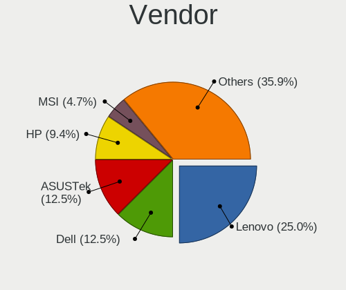
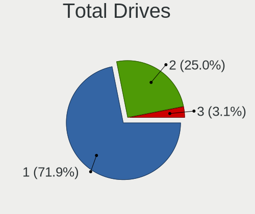
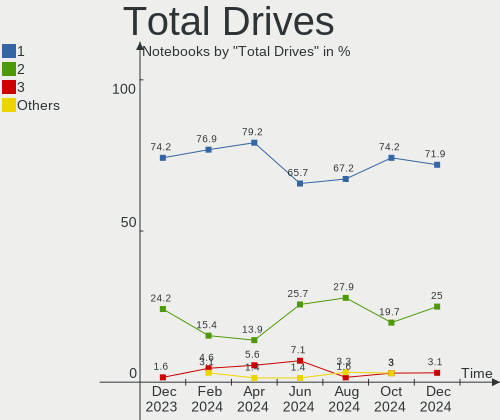
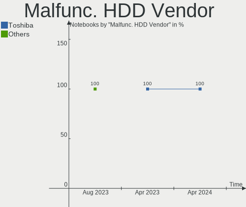
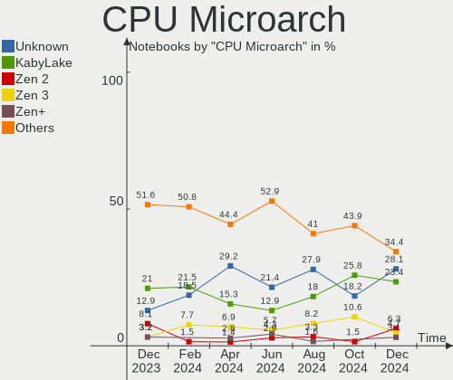
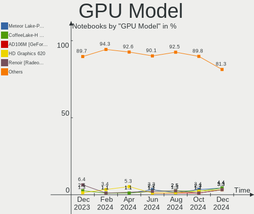
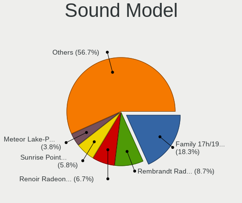
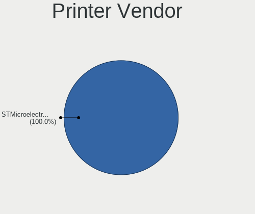

Manjaro Hardware Trends (Notebook)
----------------------------------

A project to identify most popular hardware characteristics and track their change
over time based on data collected by Manjaro users at https://Linux-Hardware.org.

Anyone can contribute to the study by uploading probes of their computers by
the [hw-probe](https://github.com/linuxhw/hw-probe) tool:

    sudo -E hw-probe -all -upload

Full-feature report is available here: https://linux-hardware.org/?view=trends&formfactor=notebook

Period: Sep, 2020.

Contents
--------

- [ OS                       ](#os)
- [ OS Family                ](#os-family)
- [ Kernel                   ](#kernel)
- [ Kernel Family            ](#kernel-family)
- [ Kernel Major Ver.        ](#kernel-major-ver)
- [ Arch                     ](#arch)
- [ DE                       ](#de)
- [ Display Server           ](#display-server)
- [ Display Manager          ](#display-manager)
- [ OS Lang                  ](#os-lang)
- [ Boot Mode                ](#boot-mode)
- [ Filesystem               ](#filesystem)
- [ Part. scheme             ](#part-scheme)
- [ Dual Boot with Linux/BSD ](#dual-boot-with-linux/bsd)
- [ Dual Boot (Win)          ](#dual-boot-win)
- [ Country                  ](#country)
- [ City                     ](#city)
- [ Vendor                   ](#vendor)
- [ Model                    ](#model)
- [ Model Family             ](#model-family)
- [ MFG Year                 ](#mfg-year)
- [ Form Factor              ](#form-factor)
- [ Secure Boot              ](#secure-boot)
- [ Coreboot                 ](#coreboot)
- [ RAM Size                 ](#ram-size)
- [ RAM Used                 ](#ram-used)
- [ Has CD-ROM               ](#has-cd-rom)
- [ Total Drives             ](#total-drives)
- [ Has Ethernet             ](#has-ethernet)
- [ Drive Vendor             ](#drive-vendor)
- [ HDD Vendor               ](#hdd-vendor)
- [ SSD Vendor               ](#ssd-vendor)
- [ Drive Model              ](#drive-model)
- [ Drive Kind               ](#drive-kind)
- [ Drive Connector          ](#drive-connector)
- [ Drive Size               ](#drive-size)
- [ Space Total              ](#space-total)
- [ Space Used               ](#space-used)
- [ Malfunc. Drives          ](#malfunc-drives)
- [ Malfunc. Drive Vendor    ](#malfunc-drive-vendor)
- [ Malfunc. HDD Vendor      ](#malfunc-hdd-vendor)
- [ Malfunc. Drive Kind      ](#malfunc-drive-kind)
- [ Failed Drives            ](#failed-drives)
- [ Failed Drive Vendor      ](#failed-drive-vendor)
- [ Drive Status             ](#drive-status)
- [ Storage Vendor           ](#storage-vendor)
- [ Storage Model            ](#storage-model)
- [ Storage Kind             ](#storage-kind)
- [ CPU Vendor               ](#cpu-vendor)
- [ CPU Model                ](#cpu-model)
- [ CPU Model Family         ](#cpu-model-family)
- [ CPU Cores                ](#cpu-cores)
- [ CPU Sockets              ](#cpu-sockets)
- [ CPU Threads              ](#cpu-threads)
- [ CPU Op-Modes             ](#cpu-op-modes)
- [ CPU Microcode            ](#cpu-microcode)
- [ CPU Microarch            ](#cpu-microarch)
- [ GPU Vendor               ](#gpu-vendor)
- [ GPU Model                ](#gpu-model)
- [ GPU Combo                ](#gpu-combo)
- [ GPU Driver               ](#gpu-driver)
- [ GPU Memory               ](#gpu-memory)
- [ Monitor Vendor           ](#monitor-vendor)
- [ Monitor Model            ](#monitor-model)
- [ Monitor Resolution       ](#monitor-resolution)
- [ Monitor Diagonal         ](#monitor-diagonal)
- [ Monitor Width            ](#monitor-width)
- [ Aspect Ratio             ](#aspect-ratio)
- [ Monitor Area             ](#monitor-area)
- [ Pixel Density            ](#pixel-density)
- [ Multiple Monitors        ](#multiple-monitors)
- [ Net Controller Vendor    ](#net-controller-vendor)
- [ Net Controller Model     ](#net-controller-model)
- [ Wireless Vendor          ](#wireless-vendor)
- [ Wireless Model           ](#wireless-model)
- [ Ethernet Vendor          ](#ethernet-vendor)
- [ Ethernet Model           ](#ethernet-model)
- [ Net Controller Kind      ](#net-controller-kind)
- [ Used Controller          ](#used-controller)
- [ NICs                     ](#nics)
- [ Memory Vendor            ](#memory-vendor)
- [ Memory Model             ](#memory-model)
- [ Memory Kind              ](#memory-kind)
- [ Memory Form Factor       ](#memory-form-factor)
- [ Memory Size              ](#memory-size)
- [ Memory Speed             ](#memory-speed)
- [ Sound Vendor             ](#sound-vendor)
- [ Sound Model              ](#sound-model)
- [ Camera Vendor            ](#camera-vendor)
- [ Camera Model             ](#camera-model)
- [ Fingerprint Vendor       ](#fingerprint-vendor)
- [ Fingerprint Model        ](#fingerprint-model)
- [ Chipcard Vendor          ](#chipcard-vendor)
- [ Chipcard Model           ](#chipcard-model)
- [ Printer Vendor           ](#printer-vendor)
- [ Printer Model            ](#printer-model)
- [ Scanner Vendor           ](#scanner-vendor)
- [ Scanner Model            ](#scanner-model)
- [ Bluetooth Vendor         ](#bluetooth-vendor)
- [ Bluetooth Model          ](#bluetooth-model)
- [ Unsupported Devices      ](#unsupported-devices)
- [ Unsupported Device Types ](#unsupported-device-types)

OS
--

Installed operating systems

| Name             | Notebooks | Percent |
|------------------|-----------|---------|
| Manjaro 20.1     | 111       | 65.29%  |
| Manjaro          | 57        | 33.53%  |
| Manjaro 20.1-rc5 | 1         | 0.59%   |
| Manjaro 20.0.3   | 1         | 0.59%   |

OS Family
---------

OS without a version

| Name    | Notebooks | Percent |
|---------|-----------|---------|
| Manjaro | 170       | 100%    |

Kernel
------

Version of the Linux kernel

| Version               | Notebooks | Percent |
|-----------------------|-----------|---------|
| 5.8.6-1-MANJARO       | 63        | 37.06%  |
| 5.8.3-2-MANJARO       | 29        | 17.06%  |
| 5.7.17-2-MANJARO      | 25        | 14.71%  |
| 5.7.19-2-MANJARO      | 13        | 7.65%   |
| 5.4.60-2-MANJARO      | 13        | 7.65%   |
| 5.4.64-1-MANJARO      | 10        | 5.88%   |
| 5.8.5-2-MANJARO       | 3         | 1.76%   |
| 5.8.1-3-MANJARO       | 3         | 1.76%   |
| 5.7.15-1-MANJARO      | 2         | 1.18%   |
| 5.6.15-1-MANJARO      | 2         | 1.18%   |
| 5.9.0-1-MANJARO       | 1         | 0.59%   |
| 5.8.11-1-MANJARO      | 1         | 0.59%   |
| 5.8.0-1-MANJARO       | 1         | 0.59%   |
| 5.6.19-3-rt12-MANJARO | 1         | 0.59%   |
| 5.4.57-1-MANJARO      | 1         | 0.59%   |
| 5.4.52-1-MANJARO      | 1         | 0.59%   |
| 4.19.141-2-MANJARO    | 1         | 0.59%   |

Kernel Family
-------------

Linux kernel without a distro release

| Version  | Notebooks | Percent |
|----------|-----------|---------|
| 5.8.6    | 63        | 37.06%  |
| 5.8.3    | 29        | 17.06%  |
| 5.7.17   | 25        | 14.71%  |
| 5.7.19   | 13        | 7.65%   |
| 5.4.60   | 13        | 7.65%   |
| 5.4.64   | 10        | 5.88%   |
| 5.8.5    | 3         | 1.76%   |
| 5.8.1    | 3         | 1.76%   |
| 5.7.15   | 2         | 1.18%   |
| 5.6.15   | 2         | 1.18%   |
| 5.9.0    | 1         | 0.59%   |
| 5.8.11   | 1         | 0.59%   |
| 5.8.0    | 1         | 0.59%   |
| 5.6.19   | 1         | 0.59%   |
| 5.4.57   | 1         | 0.59%   |
| 5.4.52   | 1         | 0.59%   |
| 4.19.141 | 1         | 0.59%   |

Kernel Major Ver.
-----------------

Linux kernel major version

| Version | Notebooks | Percent |
|---------|-----------|---------|
| 5.8     | 100       | 58.82%  |
| 5.7     | 40        | 23.53%  |
| 5.4     | 25        | 14.71%  |
| 5.6     | 3         | 1.76%   |
| 5.9     | 1         | 0.59%   |
| 4.19    | 1         | 0.59%   |

Arch
----

OS architecture (x86_64, i586, etc.)

| Name   | Notebooks | Percent |
|--------|-----------|---------|
| x86_64 | 170       | 100%    |

DE
--

Desktop Environment

| Name       | Notebooks | Percent |
|------------|-----------|---------|
| KDE5       | 48        | 28.24%  |
| XFCE       | 45        | 26.47%  |
| GNOME      | 32        | 18.82%  |
| KDE        | 26        | 15.29%  |
| i3         | 6         | 3.53%   |
| Unknown    | 4         | 2.35%   |
| X-Cinnamon | 3         | 1.76%   |
| Sway       | 1         | 0.59%   |
| LXDE       | 1         | 0.59%   |
| dwm        | 1         | 0.59%   |
| Deepin     | 1         | 0.59%   |
| Cinnamon   | 1         | 0.59%   |
| Awesome    | 1         | 0.59%   |

Display Server
--------------

X11 or Wayland

| Name    | Notebooks | Percent |
|---------|-----------|---------|
| X11     | 163       | 95.88%  |
| Wayland | 4         | 2.35%   |
| Tty     | 2         | 1.18%   |
| Unknown | 1         | 0.59%   |

Display Manager
---------------

SDDM, LightDM, etc.

| Name    | Notebooks | Percent |
|---------|-----------|---------|
| Unknown | 56        | 32.94%  |
| SDDM    | 52        | 30.59%  |
| LightDM | 35        | 20.59%  |
| GDM     | 20        | 11.76%  |
| TDM     | 6         | 3.53%   |
| LXDM    | 1         | 0.59%   |

OS Lang
-------

Language

| Lang       | Notebooks | Percent |
|------------|-----------|---------|
| en_US      | 59        | 34.71%  |
| en_US.utf8 | 20        | 11.76%  |
| de_DE      | 11        | 6.47%   |
| en_GB      | 8         | 4.71%   |
| ru_RU      | 6         | 3.53%   |
| en_IN      | 6         | 3.53%   |
| pt_BR      | 5         | 2.94%   |
| it_IT      | 4         | 2.35%   |
| en_GB.utf8 | 4         | 2.35%   |
| de_DE.utf8 | 4         | 2.35%   |
| fr_FR      | 3         | 1.76%   |
| es_ES      | 3         | 1.76%   |
| en_IN      | 2         | 1.18%   |
| en_CA.utf8 | 2         | 1.18%   |
| Unknown    | 2         | 1.18%   |
| szl_PL     | 1         | 0.59%   |
| ru_RU.utf8 | 1         | 0.59%   |
| pt_BR.utf8 | 1         | 0.59%   |
| pl_PL.utf8 | 1         | 0.59%   |
| pl_PL      | 1         | 0.59%   |
| id_ID      | 1         | 0.59%   |
| fr_FR.utf8 | 1         | 0.59%   |
| fr_CH.utf8 | 1         | 0.59%   |
| fr_CA      | 1         | 0.59%   |
| es_VE.utf8 | 1         | 0.59%   |
| es_UY      | 1         | 0.59%   |
| es_US      | 1         | 0.59%   |
| es_PE      | 1         | 0.59%   |
| es_PA.utf8 | 1         | 0.59%   |
| es_ES.utf8 | 1         | 0.59%   |
| es_EC.utf8 | 1         | 0.59%   |
| es_DO      | 1         | 0.59%   |
| es_CR      | 1         | 0.59%   |
| es_CO      | 1         | 0.59%   |
| es_BO      | 1         | 0.59%   |
| en_ZA      | 1         | 0.59%   |
| en_SG.utf8 | 1         | 0.59%   |
| en_PH      | 1         | 0.59%   |
| en_NZ      | 1         | 0.59%   |
| en_IN.utf8 | 1         | 0.59%   |
| en_IE      | 1         | 0.59%   |
| en_HK.utf8 | 1         | 0.59%   |
| en_DK      | 1         | 0.59%   |
| en_AU      | 1         | 0.59%   |
| el_GR      | 1         | 0.59%   |
| cs_CZ.utf8 | 1         | 0.59%   |

Boot Mode
---------

EFI or BIOS

| Mode | Notebooks | Percent |
|------|-----------|---------|
| EFI  | 106       | 62.35%  |
| BIOS | 64        | 37.65%  |

Filesystem
----------

Type of filesystem

| Type    | Notebooks | Percent |
|---------|-----------|---------|
| Ext4    | 160       | 94.12%  |
| Btrfs   | 7         | 4.12%   |
| Xfs     | 1         | 0.59%   |
| Overlay | 1         | 0.59%   |
| F2fs    | 1         | 0.59%   |

Part. scheme
------------

Scheme of partitioning

| Type    | Notebooks | Percent |
|---------|-----------|---------|
| GPT     | 104       | 61.18%  |
| Unknown | 55        | 32.35%  |
| MBR     | 11        | 6.47%   |

Dual Boot with Linux/BSD
------------------------

Hosting more than one Linux/BSD

| Dual boot | Notebooks | Percent |
|-----------|-----------|---------|
| No        | 153       | 90%     |
| Yes       | 17        | 10%     |

Dual Boot (Win)
---------------

Hosting Linux and Windows

| Dual boot | Notebooks | Percent |
|-----------|-----------|---------|
| No        | 110       | 64.71%  |
| Yes       | 60        | 35.29%  |

Country
-------

Geographic location (country)

| Country            | Notebooks | Percent |
|--------------------|-----------|---------|
| USA                | 24        | 14.12%  |
| Germany            | 17        | 10%     |
| India              | 12        | 7.06%   |
| Brazil             | 9         | 5.29%   |
| Russia             | 7         | 4.12%   |
| Italy              | 7         | 4.12%   |
| France             | 7         | 4.12%   |
| Canada             | 7         | 4.12%   |
| UK                 | 5         | 2.94%   |
| Spain              | 5         | 2.94%   |
| Poland             | 5         | 2.94%   |
| Romania            | 4         | 2.35%   |
| Netherlands        | 4         | 2.35%   |
| Turkey             | 3         | 1.76%   |
| Taiwan             | 3         | 1.76%   |
| Peru               | 3         | 1.76%   |
| Ukraine            | 2         | 1.18%   |
| Sweden             | 2         | 1.18%   |
| Singapore          | 2         | 1.18%   |
| Philippines        | 2         | 1.18%   |
| Panama             | 2         | 1.18%   |
| Lithuania          | 2         | 1.18%   |
| Indonesia          | 2         | 1.18%   |
| Hong Kong          | 2         | 1.18%   |
| Greece             | 2         | 1.18%   |
| Estonia            | 2         | 1.18%   |
| Denmark            | 2         | 1.18%   |
| Austria            | 2         | 1.18%   |
| Australia          | 2         | 1.18%   |
| Vietnam            | 1         | 0.59%   |
| Venezuela          | 1         | 0.59%   |
| Uruguay            | 1         | 0.59%   |
| Switzerland        | 1         | 0.59%   |
| South Africa       | 1         | 0.59%   |
| Pakistan           | 1         | 0.59%   |
| Norway             | 1         | 0.59%   |
| Mexico             | 1         | 0.59%   |
| Korea, Republic of | 1         | 0.59%   |
| Kenya              | 1         | 0.59%   |
| Kazakhstan         | 1         | 0.59%   |
| Hungary            | 1         | 0.59%   |
| Finland            | 1         | 0.59%   |
| Ecuador            | 1         | 0.59%   |
| Dominican Republic | 1         | 0.59%   |
| Czech Republic     | 1         | 0.59%   |
| Costa Rica         | 1         | 0.59%   |
| Colombia           | 1         | 0.59%   |
| Bolivia            | 1         | 0.59%   |
| Armenia            | 1         | 0.59%   |
| Argentina          | 1         | 0.59%   |
| Algeria            | 1         | 0.59%   |

City
----

Geographic location (city)

| City                  | Notebooks | Percent |
|-----------------------|-----------|---------|
| Lima                  | 3         | 1.76%   |
| Bucharest             | 3         | 1.76%   |
| Vienna                | 2         | 1.18%   |
| Turin                 | 2         | 1.18%   |
| Tallinn               | 2         | 1.18%   |
| Taipei                | 2         | 1.18%   |
| St Petersburg         | 2         | 1.18%   |
| Singapore             | 2         | 1.18%   |
| Panama City           | 2         | 1.18%   |
| New Delhi             | 2         | 1.18%   |
| Munich                | 2         | 1.18%   |
| Montcalm              | 2         | 1.18%   |
| Elk Grove Village     | 2         | 1.18%   |
| Bengaluru             | 2         | 1.18%   |
| Amsterdam             | 2         | 1.18%   |
| Zöblitz              | 1         | 0.59%   |
| Yaroslavl             | 1         | 0.59%   |
| Woodford Green        | 1         | 0.59%   |
| Waterdown             | 1         | 0.59%   |
| Vitória da Conquista | 1         | 0.59%   |
| Visakhapatnam         | 1         | 0.59%   |
| Vilnius               | 1         | 0.59%   |
| Verona                | 1         | 0.59%   |
| Valladolid            | 1         | 0.59%   |
| Valencia              | 1         | 0.59%   |
| Utterson              | 1         | 0.59%   |
| Târgu Jiu            | 1         | 0.59%   |
| Tver                  | 1         | 0.59%   |
| Tucson                | 1         | 0.59%   |
| Tlemcen               | 1         | 0.59%   |
| Tai Po                | 1         | 0.59%   |
| São Paulo            | 1         | 0.59%   |
| São Leopoldo         | 1         | 0.59%   |
| Surrey                | 1         | 0.59%   |
| Surgut                | 1         | 0.59%   |
| Stuttgart             | 1         | 0.59%   |
| Strzyzow              | 1         | 0.59%   |
| St. Albert            | 1         | 0.59%   |
| Somerset West         | 1         | 0.59%   |
| Sohland               | 1         | 0.59%   |
| Sobradinho            | 1         | 0.59%   |
| Sindelfingen          | 1         | 0.59%   |
| Shenavan              | 1         | 0.59%   |
| Sheffield             | 1         | 0.59%   |
| Sevastopol’         | 1         | 0.59%   |
| Seoul                 | 1         | 0.59%   |
| Sceaux                | 1         | 0.59%   |
| Santo Domingo Este    | 1         | 0.59%   |
| Santa Cruz            | 1         | 0.59%   |
| San José             | 1         | 0.59%   |
| San Jose              | 1         | 0.59%   |
| Saint-Gregoire        | 1         | 0.59%   |
| Rybnik                | 1         | 0.59%   |
| Rouen                 | 1         | 0.59%   |
| Regenstauf            | 1         | 0.59%   |
| Reading               | 1         | 0.59%   |
| Raipur                | 1         | 0.59%   |
| Racibórz             | 1         | 0.59%   |
| Québec               | 1         | 0.59%   |
| Prague                | 1         | 0.59%   |

Vendor
------

Motherboard manufacturer

| Name                | Notebooks | Percent |
|---------------------|-----------|---------|
| Lenovo              | 43        | 25.29%  |
| Hewlett-Packard     | 24        | 14.12%  |
| Dell                | 24        | 14.12%  |
| ASUSTek Computer    | 20        | 11.76%  |
| MSI                 | 13        | 7.65%   |
| Acer                | 12        | 7.06%   |
| Apple               | 5         | 2.94%   |
| Fujitsu             | 3         | 1.76%   |
| TUXEDO              | 2         | 1.18%   |
| Toshiba             | 2         | 1.18%   |
| Timi                | 2         | 1.18%   |
| Sony                | 2         | 1.18%   |
| Samsung Electronics | 2         | 1.18%   |
| Panasonic           | 2         | 1.18%   |
| Notebook            | 2         | 1.18%   |
| HUAWEI              | 2         | 1.18%   |
| Aftershock          | 2         | 1.18%   |
| YEPO                | 1         | 0.59%   |
| Wortmann AG         | 1         | 0.59%   |
| TrekStor            | 1         | 0.59%   |
| System76            | 1         | 0.59%   |
| Schenker            | 1         | 0.59%   |
| Google              | 1         | 0.59%   |
| Clevo               | 1         | 0.59%   |
| Chuwi               | 1         | 0.59%   |

Model
-----

Motherboard model

| Name                                      | Notebooks | Percent |
|-------------------------------------------|-----------|---------|
| Unknown                                   | 3         | 1.76%   |
| Lenovo Legion 5 15ARH05 82B5              | 2         | 1.18%   |
| Lenovo IdeaPad 5 15ARE05 81YQ             | 2         | 1.18%   |
| HP OMEN by HP Laptop                      | 2         | 1.18%   |
| HP Notebook                               | 2         | 1.18%   |
| HP 2000                                   | 2         | 1.18%   |
| Dell Precision 5520                       | 2         | 1.18%   |
| Dell Inspiron 5570                        | 2         | 1.18%   |
| Dell Inspiron 3542                        | 2         | 1.18%   |
| Dell Inspiron 15 7000 Gaming              | 2         | 1.18%   |
| Apple MacBookPro9,2                       | 2         | 1.18%   |
| Acer Nitro AN515-54                       | 2         | 1.18%   |
| Acer Aspire A315-42G                      | 2         | 1.18%   |
| Wortmann AG 1220579_1470096               | 1         | 0.59%   |
| TUXEDO N24_25JU                           | 1         | 0.59%   |
| TrekStor Surfbook A13B                    | 1         | 0.59%   |
| Toshiba Satellite L510                    | 1         | 0.59%   |
| Toshiba Satellite C55-B                   | 1         | 0.59%   |
| Timi TM1701                               | 1         | 0.59%   |
| Timi RedmiBook 16                         | 1         | 0.59%   |
| System76 Lemur Pro                        | 1         | 0.59%   |
| Sony SVT15115CXS                          | 1         | 0.59%   |
| Sony SVE14A35CXH                          | 1         | 0.59%   |
| Schenker SCHENKER_SLIM_SERIES_L18         | 1         | 0.59%   |
| Samsung Electronics 300E5M/300E5L         | 1         | 0.59%   |
| Samsung Electronics 270E5G/270E5U         | 1         | 0.59%   |
| Panasonic CF-AX2LDCHCE                    | 1         | 0.59%   |
| Panasonic CF-195HD8DDM                    | 1         | 0.59%   |
| Notebook P7xxTM1                          | 1         | 0.59%   |
| Notebook N150ZU                           | 1         | 0.59%   |
| MSI PS63 Modern 8RC                       | 1         | 0.59%   |
| MSI PS42 Modern 8MO                       | 1         | 0.59%   |
| MSI PS42 8RB                              | 1         | 0.59%   |
| MSI PE62 7RD                              | 1         | 0.59%   |
| MSI P75 Creator 9SE                       | 1         | 0.59%   |
| MSI GT70 2PC                              | 1         | 0.59%   |
| MSI GS63 7RE                              | 1         | 0.59%   |
| MSI GL63 9SEK                             | 1         | 0.59%   |
| MSI GL63 8RD                              | 1         | 0.59%   |
| MSI GL63 8RC                              | 1         | 0.59%   |
| MSI GE63 Raider RGB 9SE                   | 1         | 0.59%   |
| MSI GE62 6QD                              | 1         | 0.59%   |
| MSI Alpha 15 A3DD                         | 1         | 0.59%   |
| Lenovo Yoga Slim 7 14ARE05 82A2           | 1         | 0.59%   |
| Lenovo Y520-15IKBA 80WY                   | 1         | 0.59%   |
| Lenovo ThinkPad X220 42912XG              | 1         | 0.59%   |
| Lenovo ThinkPad X1 Extreme 2nd 20QVCTO1WW | 1         | 0.59%   |
| Lenovo ThinkPad W541 20EGS03100           | 1         | 0.59%   |
| Lenovo ThinkPad T495s 20QKS2DF00          | 1         | 0.59%   |
| Lenovo ThinkPad T490 20N3S88305           | 1         | 0.59%   |
| Lenovo ThinkPad T480 20L6SF8X00           | 1         | 0.59%   |
| Lenovo ThinkPad T470 20HES0JQ00           | 1         | 0.59%   |
| Lenovo ThinkPad T470 20HDCTO1WW           | 1         | 0.59%   |
| Lenovo ThinkPad T460 20FMS20H09           | 1         | 0.59%   |
| Lenovo ThinkPad T430 23492D1              | 1         | 0.59%   |
| Lenovo ThinkPad T430 2342CTO              | 1         | 0.59%   |
| Lenovo ThinkPad T420 4180GH5              | 1         | 0.59%   |
| Lenovo ThinkPad SL510 28479XU             | 1         | 0.59%   |
| Lenovo ThinkPad L590 20Q8S1J200           | 1         | 0.59%   |
| Lenovo ThinkPad L440 20ASS0QF00           | 1         | 0.59%   |

Model Family
------------

Motherboard model prefix

| Name                       | Notebooks | Percent |
|----------------------------|-----------|---------|
| Lenovo ThinkPad            | 21        | 12.35%  |
| Dell Inspiron              | 12        | 7.06%   |
| Lenovo IdeaPad             | 11        | 6.47%   |
| Acer Aspire                | 7         | 4.12%   |
| Lenovo Legion              | 5         | 2.94%   |
| HP Pavilion                | 5         | 2.94%   |
| HP ProBook                 | 4         | 2.35%   |
| Dell Latitude              | 4         | 2.35%   |
| MSI GL63                   | 3         | 1.76%   |
| HP Compaq                  | 3         | 1.76%   |
| Fujitsu LIFEBOOK           | 3         | 1.76%   |
| Dell XPS                   | 3         | 1.76%   |
| Dell Precision             | 3         | 1.76%   |
| Unknown                    | 3         | 1.76%   |
| Toshiba Satellite          | 2         | 1.18%   |
| MSI PS42                   | 2         | 1.18%   |
| Lenovo ThinkBook           | 2         | 1.18%   |
| HP OMEN                    | 2         | 1.18%   |
| HP Notebook                | 2         | 1.18%   |
| HP EliteBook               | 2         | 1.18%   |
| HP 2000                    | 2         | 1.18%   |
| Dell G5                    | 2         | 1.18%   |
| ASUS TUF                   | 2         | 1.18%   |
| ASUS ASUS                  | 2         | 1.18%   |
| Apple MacBookPro9          | 2         | 1.18%   |
| Acer Swift                 | 2         | 1.18%   |
| Acer Nitro                 | 2         | 1.18%   |
| Wortmann AG 1220579        | 1         | 0.59%   |
| TUXEDO N24                 | 1         | 0.59%   |
| TrekStor Surfbook          | 1         | 0.59%   |
| Timi TM1701                | 1         | 0.59%   |
| Timi RedmiBook             | 1         | 0.59%   |
| System76 Lemur             | 1         | 0.59%   |
| Sony SVT15115CXS           | 1         | 0.59%   |
| Sony SVE14A35CXH           | 1         | 0.59%   |
| Schenker SCHENKER          | 1         | 0.59%   |
| Samsung Electronics 300E5M | 1         | 0.59%   |
| Samsung Electronics 270E5G | 1         | 0.59%   |
| Panasonic CF-AX2LDCHCE     | 1         | 0.59%   |
| Panasonic CF-195HD8DDM     | 1         | 0.59%   |
| Notebook P7xxTM1           | 1         | 0.59%   |
| Notebook N150ZU            | 1         | 0.59%   |
| MSI PS63                   | 1         | 0.59%   |
| MSI PE62                   | 1         | 0.59%   |
| MSI P75                    | 1         | 0.59%   |
| MSI GT70                   | 1         | 0.59%   |
| MSI GS63                   | 1         | 0.59%   |
| MSI GE63                   | 1         | 0.59%   |
| MSI GE62                   | 1         | 0.59%   |
| MSI Alpha                  | 1         | 0.59%   |
| Lenovo Yoga                | 1         | 0.59%   |
| Lenovo Y520-15IKBA         | 1         | 0.59%   |
| Lenovo G70-80              | 1         | 0.59%   |
| HUAWEI MACH-WX9            | 1         | 0.59%   |
| HUAWEI KPR-WX9             | 1         | 0.59%   |
| HP Laptop                  | 1         | 0.59%   |
| HP ENVY                    | 1         | 0.59%   |
| HP 450                     | 1         | 0.59%   |
| HP 15                      | 1         | 0.59%   |
| Google Falco               | 1         | 0.59%   |

MFG Year
--------

Motherboard manufacture year

| Year | Notebooks | Percent |
|------|-----------|---------|
| 2020 | 42        | 24.71%  |
| 2019 | 41        | 24.12%  |
| 2018 | 36        | 21.18%  |
| 2017 | 10        | 5.88%   |
| 2016 | 10        | 5.88%   |
| 2015 | 9         | 5.29%   |
| 2012 | 6         | 3.53%   |
| 2014 | 4         | 2.35%   |
| 2013 | 4         | 2.35%   |
| 2011 | 3         | 1.76%   |
| 2010 | 2         | 1.18%   |
| 2009 | 1         | 0.59%   |
| 2008 | 1         | 0.59%   |
| 2007 | 1         | 0.59%   |

Form Factor
-----------

Physical design of the computer

| Name     | Notebooks | Percent |
|----------|-----------|---------|
| Notebook | 170       | 100%    |

Secure Boot
-----------

Enabled or disabled

| State    | Notebooks | Percent |
|----------|-----------|---------|
| Disabled | 170       | 100%    |

Coreboot
--------

Have coreboot on board

| Used | Notebooks | Percent |
|------|-----------|---------|
| No   | 168       | 98.82%  |
| Yes  | 2         | 1.18%   |

RAM Size
--------

Total RAM memory

| Size in GB  | Notebooks | Percent |
|-------------|-----------|---------|
| 4.01-8.0    | 61        | 35.88%  |
| 16.01-24.0  | 33        | 19.41%  |
| 8.01-16.0   | 27        | 15.88%  |
| 3.01-4.0    | 22        | 12.94%  |
| 32.01-64.0  | 15        | 8.82%   |
| 64.01-256.0 | 5         | 2.94%   |
| 2.01-3.0    | 3         | 1.76%   |
| 24.01-32.0  | 2         | 1.18%   |
| 1.01-2.0    | 2         | 1.18%   |

RAM Used
--------

Used RAM memory

| Used GB    | Notebooks | Percent |
|------------|-----------|---------|
| 2.01-3.0   | 50        | 29.41%  |
| 1.01-2.0   | 41        | 24.12%  |
| 4.01-8.0   | 35        | 20.59%  |
| 3.01-4.0   | 28        | 16.47%  |
| 8.01-16.0  | 10        | 5.88%   |
| 0.01-1.0   | 4         | 2.35%   |
| 16.01-24.0 | 2         | 1.18%   |

Has CD-ROM
----------

Has CD-ROM on board

| Presented | Notebooks | Percent |
|-----------|-----------|---------|
| No        | 120       | 70.59%  |
| Yes       | 50        | 29.41%  |

Total Drives
------------

Number of drives on board

| Drives | Notebooks | Percent |
|--------|-----------|---------|
| 1      | 114       | 67.06%  |
| 2      | 46        | 27.06%  |
| 3      | 9         | 5.29%   |
| 7      | 1         | 0.59%   |

Has Ethernet
------------

Has Ethernet on board

| Presented | Notebooks | Percent |
|-----------|-----------|---------|
| Yes       | 141       | 82.94%  |
| No        | 29        | 17.06%  |

Drive Vendor
------------

Hard drive vendors

| Vendor                    | Notebooks | Drives  | Percent |
|---------------------------|-----------|---------|---------|
| Samsung Electronics       | 45        | 50      | 19.31%  |
| Seagate                   | 33        | 35      | 14.16%  |
| WDC                       | 25        | 25      | 10.73%  |
| Toshiba                   | 20        | 20      | 8.58%   |
| Sandisk                   | 13        | 15      | 5.58%   |
| SK Hynix                  | 11        | 11      | 4.72%   |
| Kingston                  | 10        | 10      | 4.29%   |
| HGST                      | 9         | 9       | 3.86%   |
| Unknown                   | 7         | 7       | 3%      |
| Phison                    | 6         | 7       | 2.58%   |
| Micron Technology         | 6         | 6       | 2.58%   |
| Intel                     | 5         | 5       | 2.15%   |
| HL-DT-ST                  | 4         | Unknown | 1.72%   |
| Hitachi                   | 4         | 4       | 1.72%   |
| Crucial                   | 4         | 4       | 1.72%   |
| A-DATA Technology         | 4         | 4       | 1.72%   |
| JMicron                   | 3         | 3       | 1.29%   |
| OWC                       | 2         | 2       | 0.86%   |
| China                     | 2         | 2       | 0.86%   |
| Union Memory (Shenzhen)   | 1         | 1       | 0.43%   |
| Union Memory              | 1         | 1       | 0.43%   |
| Transcend                 | 1         | 1       | 0.43%   |
| SPCC                      | 1         | 1       | 0.43%   |
| SABRENT                   | 1         | 1       | 0.43%   |
| PNY                       | 1         | 1       | 0.43%   |
| Pioneer                   | 1         | 1       | 0.43%   |
| Patriot                   | 1         | 1       | 0.43%   |
| Micron/Crucial Technology | 1         | 1       | 0.43%   |
| LITEONIT                  | 1         | 1       | 0.43%   |
| Leven                     | 1         | 1       | 0.43%   |
| Lenovo                    | 1         | 1       | 0.43%   |
| KIOXIA                    | 1         | 1       | 0.43%   |
| ITHOO                     | 1         | 1       | 0.43%   |
| GOODRAM                   | 1         | 1       | 0.43%   |
| Golden                    | 1         | 1       | 0.43%   |
| asmedia                   | 1         | 3       | 0.43%   |
| Apple                     | 1         | 1       | 0.43%   |
| Apacer                    | 1         | 1       | 0.43%   |
| ACCLAMATOR                | 1         | 1       | 0.43%   |

HDD Vendor
----------

Hard disk drive vendors

| Vendor  | Notebooks | Drives | Percent |
|---------|-----------|--------|---------|
| Seagate | 32        | 34     | 45.71%  |
| WDC     | 12        | 12     | 17.14%  |
| Toshiba | 12        | 12     | 17.14%  |
| HGST    | 9         | 9      | 12.86%  |
| Hitachi | 4         | 4      | 5.71%   |
| asmedia | 1         | 3      | 1.43%   |

SSD Vendor
----------

Solid state drive vendors

| Vendor              | Notebooks | Drives | Percent |
|---------------------|-----------|--------|---------|
| Samsung Electronics | 23        | 24     | 29.87%  |
| WDC                 | 8         | 8      | 10.39%  |
| SanDisk             | 7         | 7      | 9.09%   |
| Kingston            | 7         | 7      | 9.09%   |
| Crucial             | 4         | 4      | 5.19%   |
| Toshiba             | 3         | 3      | 3.9%    |
| Micron Technology   | 3         | 3      | 3.9%    |
| A-DATA Technology   | 3         | 3      | 3.9%    |
| OWC                 | 2         | 2      | 2.6%    |
| JMicron             | 2         | 2      | 2.6%    |
| China               | 2         | 2      | 2.6%    |
| Transcend           | 1         | 1      | 1.3%    |
| SK Hynix            | 1         | 1      | 1.3%    |
| SABRENT             | 1         | 1      | 1.3%    |
| PNY                 | 1         | 1      | 1.3%    |
| Pioneer             | 1         | 1      | 1.3%    |
| Patriot             | 1         | 1      | 1.3%    |
| LITEONIT            | 1         | 1      | 1.3%    |
| Intel               | 1         | 1      | 1.3%    |
| GOODRAM             | 1         | 1      | 1.3%    |
| Golden              | 1         | 1      | 1.3%    |
| Apple               | 1         | 1      | 1.3%    |
| Apacer              | 1         | 1      | 1.3%    |
| ACCLAMATOR          | 1         | 1      | 1.3%    |

Drive Model
-----------

Hard drive models

| Model                            | Notebooks | Percent |
|----------------------------------|-----------|---------|
| NVMe SSD Drive 512GB             | 12        | 4.96%   |
| NVMe SSD Drive 256GB             | 10        | 4.13%   |
| ST1000LM035-1RK172 1TB           | 9         | 3.72%   |
| HTS721010A9E630 1TB              | 5         | 2.07%   |
| ST1000LM049-2GH172 1TB           | 4         | 1.65%   |
| WDS240G2G0B-00EPW0 240GB SSD     | 3         | 1.24%   |
| WDS100T2B0B-00YS70 1TB SSD       | 3         | 1.24%   |
| ST1000LX015-1U7172 1TB           | 3         | 1.24%   |
| ST1000LM024 HN-M101MBB 1TB       | 3         | 1.24%   |
| SSD 970 EVO Plus 500GB           | 3         | 1.24%   |
| SSD 860 QVO 1TB                  | 3         | 1.24%   |
| SSD 860 EVO 500GB                | 3         | 1.24%   |
| NVMe SSD Drive 500GB             | 3         | 1.24%   |
| NVMe SSD Drive 1024GB            | 3         | 1.24%   |
| MZVLB512HBJQ-000L2 512GB         | 3         | 1.24%   |
| MQ01ABF050 500GB                 | 3         | 1.24%   |
| DVDRAM GUE1N 3GB                 | 3         | 1.24%   |
| CT1000MX500SSD1 1TB              | 3         | 1.24%   |
| 1100_MTFDDAV256TBN 256GB SSD     | 3         | 1.24%   |
| SSD 970 EVO 1TB                  | 2         | 0.83%   |
| SSD 860 EVO 1TB                  | 2         | 0.83%   |
| SSD 850 EVO 500GB                | 2         | 0.83%   |
| SSD 850 EVO 250GB                | 2         | 0.83%   |
| Sabrent Rocket Q 2TB             | 2         | 0.83%   |
| SA400S37240G 240GB SSD           | 2         | 0.83%   |
| NVMe SSD Drive 1TB               | 2         | 0.83%   |
| NVMe SSD Drive 128GB             | 2         | 0.83%   |
| MZVLB512HAJQ-00000 512GB         | 2         | 0.83%   |
| MQ01ABD032 320GB                 | 2         | 0.83%   |
| HTS545050A7E380 500GB            | 2         | 0.83%   |
| Generic 256GB                    | 2         | 0.83%   |
| WDS500G2B0B-00YS70 500GB SSD     | 1         | 0.41%   |
| WDS500G2B0B 500GB SSD            | 1         | 0.41%   |
| WDS100T3X0C-00SJG0 1TB           | 1         | 0.41%   |
| WD7500BPVT-80HXZT3 752GB         | 1         | 0.41%   |
| WD5000LPCX-35VHAT0 500GB         | 1         | 0.41%   |
| WD5000LPCX-21VHAT0 500GB         | 1         | 0.41%   |
| WD5000BPVT-60HXZT3 500GB         | 1         | 0.41%   |
| WD3200BEVT-26ZCT0 320GB          | 1         | 0.41%   |
| WD20SPZX-75UA7T1 2TB             | 1         | 0.41%   |
| WD10SPZX-60Z10T0 1TB             | 1         | 0.41%   |
| WD10SPZX-24Z10T0 1TB             | 1         | 0.41%   |
| WD10SPCX-16HWST0 1TB             | 1         | 0.41%   |
| WD10JPVX-75JC3T0 1TB             | 1         | 0.41%   |
| WD10JPVX-60JC3T0 1TB             | 1         | 0.41%   |
| WD10JPCX-24UE4T0 1TB             | 1         | 0.41%   |
| USDU1  64GB                      | 1         | 0.41%   |
| TS512GMTS430S 512GB SSD          | 1         | 0.41%   |
| THNSNK128GVN8 M.2 2280 128GB SSD | 1         | 0.41%   |
| THNSNJ256GCSU 256GB SSD          | 1         | 0.41%   |
| THNSNJ128GCST 128GB SSD          | 1         | 0.41%   |
| Tech 256GB                       | 1         | 0.41%   |
| SX8200PNP 256GB                  | 1         | 0.41%   |
| SUV500MS120G 120GB SSD           | 1         | 0.41%   |
| SU810NS38 SATA 256 GB SSD        | 1         | 0.41%   |
| SU800 512GB SSD                  | 1         | 0.41%   |
| ST9320320AS 320GB                | 1         | 0.41%   |
| ST9250320AS 250GB                | 1         | 0.41%   |
| ST500VT000-1DK142 500GB          | 1         | 0.41%   |
| ST500LT012-1DG142 500GB          | 1         | 0.41%   |

Drive Kind
----------

HDD or SSD

| Kind    | Notebooks | Drives | Percent |
|---------|-----------|--------|---------|
| SSD     | 74        | 78     | 32.89%  |
| NVMe    | 70        | 80     | 31.11%  |
| HDD     | 68        | 74     | 30.22%  |
| Unknown | 7         | 3      | 3.11%   |
| MMC     | 6         | 6      | 2.67%   |

Drive Connector
---------------

SATA, SAS, NVMe, etc.

| Type | Notebooks | Drives | Percent |
|------|-----------|--------|---------|
| SATA | 118       | 143    | 57%     |
| NVMe | 70        | 79     | 33.82%  |
| SAS  | 13        | 13     | 6.28%   |
| MMC  | 6         | 6      | 2.9%    |

Drive Size
----------

Size of hard drive

| Size in TB | Notebooks | Drives | Percent |
|------------|-----------|--------|---------|
| 0.01-0.5   | 110       | 126    | 51.89%  |
| 0.51-1.0   | 86        | 97     | 40.57%  |
| 1.01-2.0   | 13        | 14     | 6.13%   |
| 3.01-4.0   | 2         | 3      | 0.94%   |
| 4.01-10.0  | 1         | 1      | 0.47%   |

Space Total
-----------

Amount of disk space available on the file system

| Size in GB     | Notebooks | Percent |
|----------------|-----------|---------|
| 251-500        | 48        | 28.24%  |
| 101-250        | 45        | 26.47%  |
| 501-1000       | 28        | 16.47%  |
| 1001-2000      | 19        | 11.18%  |
| Unknown        | 9         | 5.29%   |
| 51-100         | 8         | 4.71%   |
| 2001-3000      | 4         | 2.35%   |
| More than 3000 | 3         | 1.76%   |
| 21-50          | 3         | 1.76%   |
| 1-20           | 3         | 1.76%   |

Space Used
----------

Amount of used disk space

| Used GB        | Notebooks | Percent |
|----------------|-----------|---------|
| 51-100         | 34        | 20%     |
| 21-50          | 31        | 18.24%  |
| 1-20           | 29        | 17.06%  |
| 251-500        | 26        | 15.29%  |
| 101-250        | 22        | 12.94%  |
| 501-1000       | 13        | 7.65%   |
| Unknown        | 9         | 5.29%   |
| 1001-2000      | 3         | 1.76%   |
| 2001-3000      | 2         | 1.18%   |
| More than 3000 | 1         | 0.59%   |

Malfunc. Drives
---------------

Drive models with a malfunction

| Model                            | Notebooks | Drives | Percent |
|----------------------------------|-----------|--------|---------|
| WD5000BPVT-60HXZT3 500GB         | 1         | 1      | 11.11%  |
| THNSNK128GVN8 M.2 2280 128GB SSD | 1         | 1      | 11.11%  |
| ST320LT022-1AE142 320GB          | 1         | 1      | 11.11%  |
| ST2000LX001-1RG174 2TB           | 1         | 1      | 11.11%  |
| ST1000LX015-1U7172 1TB           | 1         | 1      | 11.11%  |
| ST1000LM049-2GH172 1TB           | 1         | 1      | 11.11%  |
| MQ01ABF050 500GB                 | 1         | 1      | 11.11%  |
| MQ01ABD032 320GB                 | 1         | 1      | 11.11%  |
| HTS545050A7E380 500GB            | 1         | 1      | 11.11%  |

Malfunc. Drive Vendor
---------------------

Vendors of faulty drives

| Vendor  | Notebooks | Drives | Percent |
|---------|-----------|--------|---------|
| Seagate | 4         | 4      | 44.44%  |
| Toshiba | 3         | 3      | 33.33%  |
| WDC     | 1         | 1      | 11.11%  |
| HGST    | 1         | 1      | 11.11%  |

Malfunc. HDD Vendor
-------------------

Vendors of faulty HDD drives

| Vendor  | Notebooks | Drives | Percent |
|---------|-----------|--------|---------|
| Seagate | 4         | 4      | 50%     |
| Toshiba | 2         | 2      | 25%     |
| WDC     | 1         | 1      | 12.5%   |
| HGST    | 1         | 1      | 12.5%   |

Malfunc. Drive Kind
-------------------

Kinds of faulty drives

| Kind | Notebooks | Drives | Percent |
|------|-----------|--------|---------|
| HDD  | 8         | 8      | 88.89%  |
| SSD  | 1         | 1      | 11.11%  |

Failed Drives
-------------

Failed drive models

Zero info for selected period =(

Failed Drive Vendor
-------------------

Failed drive vendors

Zero info for selected period =(

Drive Status
------------

Number of failed and malfunc. drives

| Status   | Notebooks | Drives | Percent |
|----------|-----------|--------|---------|
| Detected | 88        | 121    | 47.57%  |
| Works    | 88        | 111    | 47.57%  |
| Malfunc  | 9         | 9      | 4.86%   |

Storage Vendor
--------------

Storage controller vendors

| Vendor                       | Notebooks | Percent |
|------------------------------|-----------|---------|
| Intel                        | 130       | 57.78%  |
| Samsung Electronics          | 25        | 11.11%  |
| AMD                          | 24        | 10.67%  |
| Sandisk                      | 11        | 4.89%   |
| SK Hynix                     | 10        | 4.44%   |
| Phison Electronics           | 7         | 3.11%   |
| Toshiba America Info Systems | 5         | 2.22%   |
| Micron Technology            | 3         | 1.33%   |
| Kingston Technology Company  | 3         | 1.33%   |
| ADATA Technology             | 2         | 0.89%   |
| Seagate Technology           | 1         | 0.44%   |
| Nvidia                       | 1         | 0.44%   |
| Micron/Crucial Technology    | 1         | 0.44%   |
| Lenovo                       | 1         | 0.44%   |
| KIOXIA                       | 1         | 0.44%   |

Storage Model
-------------

Storage controller models

| Model                                                                      | Notebooks | Percent |
|----------------------------------------------------------------------------|-----------|---------|
| Sunrise Point-LP SATA Controller [AHCI mode]                               | 23        | 9.96%   |
| FCH SATA Controller [AHCI mode]                                            | 21        | 9.09%   |
| Non-Volatile memory controller                                             | 20        | 8.66%   |
| NVMe SSD Controller SM981/PM981/PM983                                      | 19        | 8.23%   |
| 82801 Mobile SATA Controller [RAID mode]                                   | 17        | 7.36%   |
| Cannon Lake Mobile PCH SATA AHCI Controller                                | 16        | 6.93%   |
| 7 Series Chipset Family 6-port SATA Controller [AHCI mode]                 | 15        | 6.49%   |
| HM170/QM170 Chipset SATA Controller [AHCI Mode]                            | 9         | 3.9%    |
| 6 Series/C200 Series Chipset Family 6 port Mobile SATA AHCI Controller     | 7         | 3.03%   |
| E12 NVMe Controller                                                        | 6         | 2.6%    |
| 8 Series/C220 Series Chipset Family 6-port SATA Controller 1 [AHCI mode]   | 6         | 2.6%    |
| Comet Lake SATA AHCI Controller                                            | 5         | 2.16%   |
| BC501 NVMe Solid State Drive 512GB                                         | 5         | 2.16%   |
| 8 Series SATA Controller 1 [AHCI mode]                                     | 5         | 2.16%   |
| Toshiba America Info Non-Volatile memory controller                        | 4         | 1.73%   |
| NVMe SSD Controller SM961/PM961                                            | 4         | 1.73%   |
| Cannon Point-LP SATA Controller [AHCI Mode]                                | 4         | 1.73%   |
| Wildcat Point-LP SATA Controller [AHCI Mode]                               | 3         | 1.3%    |
| WD Black 2018/PC SN520 NVMe SSD                                            | 3         | 1.3%    |
| SSD 660P Series                                                            | 3         | 1.3%    |
| Q170/Q150/B150/H170/H110/Z170/CM236 Chipset SATA Controller [AHCI Mode]    | 3         | 1.3%    |
| SB7x0/SB8x0/SB9x0 SATA Controller [AHCI mode]                              | 2         | 0.87%   |
| Electronics Non-Volatile memory controller                                 | 2         | 0.87%   |
| Celeron N3350/Pentium N4200/Atom E3900 Series SATA AHCI Controller         | 2         | 0.87%   |
| Atom/Celeron/Pentium Processor x5-E8000/J3xxx/N3xxx Series SATA Controller | 2         | 0.87%   |
| Atom Processor E3800 Series SATA AHCI Controller                           | 2         | 0.87%   |
| 82801HM/HEM (ICH8M/ICH8M-E) SATA Controller [AHCI mode]                    | 2         | 0.87%   |
| 7 Series Chipset Family 4-port SATA Controller [IDE mode]                  | 2         | 0.87%   |
| 7 Series Chipset Family 2-port SATA Controller [IDE mode]                  | 2         | 0.87%   |
| XPG SX8200 Pro PCIe Gen3x4 M.2 2280 Solid State Drive                      | 1         | 0.43%   |
| WD Black 2018/PC SN720 NVMe SSD                                            | 1         | 0.43%   |
| Technology Company Non-Volatile memory controller                          | 1         | 0.43%   |
| SSD Pro 7600p/760p/E 6100p Series                                          | 1         | 0.43%   |
| SB7x0/SB8x0/SB9x0 SATA Controller [IDE mode]                               | 1         | 0.43%   |
| SB7x0/SB8x0/SB9x0 IDE Controller                                           | 1         | 0.43%   |
| SATA controller                                                            | 1         | 0.43%   |
| PC300 NVMe Solid State Drive 512GB                                         | 1         | 0.43%   |
| PC300 NVMe Solid State Drive 256GB                                         | 1         | 0.43%   |
| NVMe Storage Controller                                                    | 1         | 0.43%   |
| MCP79 AHCI Controller                                                      | 1         | 0.43%   |
| Ice Lake-LP SATA Controller [AHCI mode]                                    | 1         | 0.43%   |
| BG3 NVMe SSD Controller                                                    | 1         | 0.43%   |
| 82801IBM/IEM (ICH9M/ICH9M-E) 4 port SATA Controller [AHCI mode]            | 1         | 0.43%   |
| 82801HM/HEM (ICH8M/ICH8M-E) IDE Controller                                 | 1         | 0.43%   |
| 5 Series/3400 Series Chipset 4 port SATA AHCI Controller                   | 1         | 0.43%   |
| 200 Series PCH SATA controller [AHCI mode]                                 | 1         | 0.43%   |

Storage Kind
------------

Kind of storage controller (IDE, SATA, NVMe, SAS, ...)

| Kind | Notebooks | Percent |
|------|-----------|---------|
| SATA | 134       | 59.82%  |
| NVMe | 69        | 30.8%   |
| RAID | 17        | 7.59%   |
| IDE  | 4         | 1.79%   |

CPU Vendor
----------

Processor vendors

| Vendor | Notebooks | Percent |
|--------|-----------|---------|
| Intel  | 140       | 82.35%  |
| AMD    | 30        | 17.65%  |

CPU Model
---------

Processor models

| Model                                         | Notebooks | Percent |
|-----------------------------------------------|-----------|---------|
| Intel Core i7-8565U CPU @ 1.80GHz             | 8         | 4.71%   |
| Intel Core i7-7700HQ CPU @ 2.80GHz            | 8         | 4.71%   |
| Intel Core i5-8250U CPU @ 1.60GHz             | 8         | 4.71%   |
| Intel Core i7-8550U CPU @ 1.80GHz             | 7         | 4.12%   |
| Intel Core i7-9750H CPU @ 2.60GHz             | 6         | 3.53%   |
| Intel Core i7-8750H CPU @ 2.20GHz             | 6         | 3.53%   |
| Intel Core i7-7500U CPU @ 2.70GHz             | 5         | 2.94%   |
| AMD Ryzen 7 4800H with Radeon Graphics        | 5         | 2.94%   |
| Intel Core i7-6700HQ CPU @ 2.60GHz            | 4         | 2.35%   |
| Intel Core i5-8265U CPU @ 1.60GHz             | 4         | 2.35%   |
| Intel Core i5-10210U CPU @ 1.60GHz            | 4         | 2.35%   |
| AMD Ryzen 5 3500U with Radeon Vega Mobile Gfx | 4         | 2.35%   |
| Intel Core i7-10510U CPU @ 1.80GHz            | 3         | 1.76%   |
| Intel Core i5-8300H CPU @ 2.30GHz             | 3         | 1.76%   |
| Intel Core i5-3230M CPU @ 2.60GHz             | 3         | 1.76%   |
| Intel Core i5-3210M CPU @ 2.50GHz             | 3         | 1.76%   |
| AMD Ryzen 7 4700U with Radeon Graphics        | 3         | 1.76%   |
| AMD Ryzen 7 3700U with Radeon Vega Mobile Gfx | 3         | 1.76%   |
| Intel Core i7-7820HQ CPU @ 2.90GHz            | 2         | 1.18%   |
| Intel Core i7-5500U CPU @ 2.40GHz             | 2         | 1.18%   |
| Intel Core i7-4720HQ CPU @ 2.60GHz            | 2         | 1.18%   |
| Intel Core i5-7200U CPU @ 2.50GHz             | 2         | 1.18%   |
| Intel Core i5-6200U CPU @ 2.30GHz             | 2         | 1.18%   |
| Intel Core i5-2540M CPU @ 2.60GHz             | 2         | 1.18%   |
| Intel Core i5-2410M CPU @ 2.30GHz             | 2         | 1.18%   |
| Intel Core i3-6100U CPU @ 2.30GHz             | 2         | 1.18%   |
| AMD E-300 APU with Radeon HD Graphics         | 2         | 1.18%   |
| Intel Pentium CPU N4200 @ 1.10GHz             | 1         | 0.59%   |
| Intel Pentium CPU N3540 @ 2.16GHz             | 1         | 0.59%   |
| Intel Core i9-9900K CPU @ 3.60GHz             | 1         | 0.59%   |
| Intel Core i9-9880H CPU @ 2.30GHz             | 1         | 0.59%   |
| Intel Core i7-9850H CPU @ 2.60GHz             | 1         | 0.59%   |
| Intel Core i7-8850H CPU @ 2.60GHz             | 1         | 0.59%   |
| Intel Core i7-7700T CPU @ 2.90GHz             | 1         | 0.59%   |
| Intel Core i7-5600U CPU @ 2.60GHz             | 1         | 0.59%   |
| Intel Core i7-4810MQ CPU @ 2.80GHz            | 1         | 0.59%   |
| Intel Core i7-4710MQ CPU @ 2.50GHz            | 1         | 0.59%   |
| Intel Core i7-4600U CPU @ 2.10GHz             | 1         | 0.59%   |
| Intel Core i7-3740QM CPU @ 2.70GHz            | 1         | 0.59%   |
| Intel Core i7-3720QM CPU @ 2.60GHz            | 1         | 0.59%   |
| Intel Core i7-3632QM CPU @ 2.20GHz            | 1         | 0.59%   |
| Intel Core i7-3630QM CPU @ 2.40GHz            | 1         | 0.59%   |
| Intel Core i7-3537U CPU @ 2.00GHz             | 1         | 0.59%   |
| Intel Core i7-3520M CPU @ 2.90GHz             | 1         | 0.59%   |
| Intel Core i7-2670QM CPU @ 2.20GHz            | 1         | 0.59%   |
| Intel Core i7-1065G7 CPU @ 1.30GHz            | 1         | 0.59%   |
| Intel Core i5-9300HF CPU @ 2.40GHz            | 1         | 0.59%   |
| Intel Core i5-9300H CPU @ 2.40GHz             | 1         | 0.59%   |
| Intel Core i5-8365U CPU @ 1.60GHz             | 1         | 0.59%   |
| Intel Core i5-8350U CPU @ 1.70GHz             | 1         | 0.59%   |
| Intel Core i5-7300HQ CPU @ 2.50GHz            | 1         | 0.59%   |
| Intel Core i5-6300U CPU @ 2.40GHz             | 1         | 0.59%   |
| Intel Core i5-5200U CPU @ 2.20GHz             | 1         | 0.59%   |
| Intel Core i5-4300M CPU @ 2.60GHz             | 1         | 0.59%   |
| Intel Core i5-4200U CPU @ 1.60GHz             | 1         | 0.59%   |
| Intel Core i5-4200M CPU @ 2.50GHz             | 1         | 0.59%   |
| Intel Core i5-3427U CPU @ 1.80GHz             | 1         | 0.59%   |
| Intel Core i5-3340M CPU @ 2.70GHz             | 1         | 0.59%   |
| Intel Core i5-3320M CPU @ 2.60GHz             | 1         | 0.59%   |
| Intel Core i5-3317U CPU @ 1.70GHz             | 1         | 0.59%   |

CPU Model Family
----------------

Processor model prefix

| Model                          | Notebooks | Percent |
|--------------------------------|-----------|---------|
| Intel Core i7                  | 68        | 40%     |
| Intel Core i5                  | 49        | 28.82%  |
| AMD Ryzen 7                    | 14        | 8.24%   |
| Intel Celeron                  | 8         | 4.71%   |
| Intel Core i3                  | 7         | 4.12%   |
| AMD Ryzen 5                    | 6         | 3.53%   |
| Intel Core 2 Duo               | 4         | 2.35%   |
| Intel Pentium                  | 2         | 1.18%   |
| Intel Core i9                  | 2         | 1.18%   |
| AMD Ryzen 7 PRO                | 2         | 1.18%   |
| AMD E                          | 2         | 1.18%   |
| Other                          | 1         | 0.59%   |
| AMD Turion X2 Dual-Core Mobile | 1         | 0.59%   |
| AMD E1                         | 1         | 0.59%   |
| AMD Athlon X2                  | 1         | 0.59%   |
| AMD A8                         | 1         | 0.59%   |
| AMD A10                        | 1         | 0.59%   |

CPU Cores
---------

Number of processor cores

| Number | Notebooks | Percent |
|--------|-----------|---------|
| 4      | 84        | 49.41%  |
| 2      | 59        | 34.71%  |
| 6      | 15        | 8.82%   |
| 8      | 12        | 7.06%   |

CPU Sockets
-----------

Number of sockets

| Number | Notebooks | Percent |
|--------|-----------|---------|
| 1      | 170       | 100%    |

CPU Threads
-----------

Threads per core (Hyper-Threading)

| Number | Notebooks | Percent |
|--------|-----------|---------|
| 2      | 145       | 85.29%  |
| 1      | 25        | 14.71%  |

CPU Op-Modes
------------

CPU Operation Modes (32-bit, 64-bit)

| Op mode        | Notebooks | Percent |
|----------------|-----------|---------|
| 32-bit, 64-bit | 170       | 100%    |

CPU Microcode
-------------

Microcode number

| Number     | Notebooks | Percent |
|------------|-----------|---------|
| Unknown    | 69        | 40.59%  |
| 0x806ea    | 15        | 8.82%   |
| 0x806ec    | 9         | 5.29%   |
| 0x906ea    | 8         | 4.71%   |
| 0x906e9    | 7         | 4.12%   |
| 0x806eb    | 6         | 3.53%   |
| 0x306a9    | 6         | 3.53%   |
| 0x08600103 | 6         | 3.53%   |
| 0x08108102 | 6         | 3.53%   |
| 0x806e9    | 5         | 2.94%   |
| 0x406e3    | 5         | 2.94%   |
| 0x40651    | 4         | 2.35%   |
| 0x306d4    | 3         | 1.76%   |
| 0x306c3    | 3         | 1.76%   |
| 0x206a7    | 3         | 1.76%   |
| 0x506e3    | 2         | 1.18%   |
| 0x08600102 | 2         | 1.18%   |
| 0x05000119 | 2         | 1.18%   |
| 0x906ed    | 1         | 0.59%   |
| 0x706e5    | 1         | 0.59%   |
| 0x6fd      | 1         | 0.59%   |
| 0x506c9    | 1         | 0.59%   |
| 0x30678    | 1         | 0.59%   |
| 0x10676    | 1         | 0.59%   |
| 0x08600104 | 1         | 0.59%   |
| 0x06006704 | 1         | 0.59%   |
| 0x06006110 | 1         | 0.59%   |

CPU Microarch
-------------

Microarchitecture

| Name            | Notebooks | Percent |
|-----------------|-----------|---------|
| Skylake         | 49        | 28.82%  |
| KabyLake        | 38        | 22.35%  |
| IvyBridge       | 16        | 9.41%   |
| Zen 2           | 11        | 6.47%   |
| Haswell         | 11        | 6.47%   |
| Zen+            | 9         | 5.29%   |
| SandyBridge     | 9         | 5.29%   |
| Silvermont      | 4         | 2.35%   |
| Broadwell       | 4         | 2.35%   |
| Zen             | 2         | 1.18%   |
| Penryn          | 2         | 1.18%   |
| K8 & K10 hybrid | 2         | 1.18%   |
| Goldmont        | 2         | 1.18%   |
| Excavator       | 2         | 1.18%   |
| Core            | 2         | 1.18%   |
| Bobcat          | 2         | 1.18%   |
| Westmere        | 1         | 0.59%   |
| Puma            | 1         | 0.59%   |
| Jaguar          | 1         | 0.59%   |
| Icelake         | 1         | 0.59%   |
| Goldmont plus   | 1         | 0.59%   |

GPU Vendor
----------

Vendors of graphics cards

| Vendor | Notebooks | Percent |
|--------|-----------|---------|
| Intel  | 133       | 56.12%  |
| Nvidia | 68        | 28.69%  |
| AMD    | 36        | 15.19%  |

GPU Model
---------

Graphics card models

| Model                                                                              | Notebooks | Percent |
|------------------------------------------------------------------------------------|-----------|---------|
| UHD Graphics 630 (Mobile)                                                          | 19        | 7.79%   |
| UHD Graphics 620                                                                   | 16        | 6.56%   |
| 3rd Gen Core processor Graphics Controller                                         | 15        | 6.15%   |
| UHD Graphics 620 (Whiskey Lake)                                                    | 13        | 5.33%   |
| HD Graphics 630                                                                    | 12        | 4.92%   |
| Renoir                                                                             | 11        | 4.51%   |
| Picasso                                                                            | 9         | 3.69%   |
| GP107M [GeForce GTX 1050 Ti Mobile]                                                | 9         | 3.69%   |
| HD Graphics 620                                                                    | 8         | 3.28%   |
| 2nd Generation Core Processor Family Integrated Graphics Controller                | 8         | 3.28%   |
| UHD Graphics                                                                       | 7         | 2.87%   |
| GP107M [GeForce GTX 1050 Mobile]                                                   | 7         | 2.87%   |
| TU117M [GeForce GTX 1650 Mobile / Max-Q]                                           | 6         | 2.46%   |
| 4th Gen Core Processor Integrated Graphics Controller                              | 6         | 2.46%   |
| Skylake GT2 [HD Graphics 520]                                                      | 5         | 2.05%   |
| Haswell-ULT Integrated Graphics Controller                                         | 5         | 2.05%   |
| GP108M [GeForce MX150]                                                             | 5         | 2.05%   |
| TU106M [GeForce RTX 2060 Mobile]                                                   | 4         | 1.64%   |
| HD Graphics 5500                                                                   | 4         | 1.64%   |
| GM108M [GeForce MX130]                                                             | 4         | 1.64%   |
| Lexa [Radeon 540X/550X/630 / RX 640 / E9171 MCM]                                   | 3         | 1.23%   |
| HD Graphics 530                                                                    | 3         | 1.23%   |
| GM108M [GeForce 940MX]                                                             | 3         | 1.23%   |
| GM107M [GeForce GTX 960M]                                                          | 3         | 1.23%   |
| Wrestler [Radeon HD 6310]                                                          | 2         | 0.82%   |
| TU117M [GeForce GTX 1650 Ti Mobile]                                                | 2         | 0.82%   |
| Sun XT [Radeon HD 8670A/8670M/8690M / R5 M330 / M430 / Radeon 520 Mobile]          | 2         | 0.82%   |
| Raven Ridge [Radeon Vega Series / Radeon Vega Mobile Series]                       | 2         | 0.82%   |
| GM206M [GeForce GTX 965M]                                                          | 2         | 0.82%   |
| GM108M [GeForce 920MX]                                                             | 2         | 0.82%   |
| GM107M [GeForce GTX 950M]                                                          | 2         | 0.82%   |
| GM107GLM [Quadro M1200 Mobile]                                                     | 2         | 0.82%   |
| GF117M [GeForce 610M/710M/810M/820M / GT 620M/625M/630M/720M]                      | 2         | 0.82%   |
| Atom/Celeron/Pentium Processor x5-E8000/J3xxx/N3xxx Integrated Graphics Controller | 2         | 0.82%   |
| Atom Processor Z36xxx/Z37xxx Series Graphics & Display                             | 2         | 0.82%   |
| Wani [Radeon R5/R6/R7 Graphics]                                                    | 1         | 0.41%   |
| UHD Graphics 605                                                                   | 1         | 0.41%   |
| TU117M                                                                             | 1         | 0.41%   |
| TU106M [GeForce RTX 2060 Max-Q]                                                    | 1         | 0.41%   |
| TU104BM [GeForce RTX 2080 Mobile]                                                  | 1         | 0.41%   |
| Topaz XT [Radeon R7 M260/M265 / M340/M360 / M440/M445 / 530/535 / 620/625 Mobile]  | 1         | 0.41%   |
| Stoney [Radeon R2/R3/R4/R5 Graphics]                                               | 1         | 0.41%   |
| RV730/M96 [Mobility Radeon HD 4650/5165]                                           | 1         | 0.41%   |
| RV710/M92 [Mobility Radeon HD 4530/4570/545v]                                      | 1         | 0.41%   |
| RS780M [Mobility Radeon HD 3200]                                                   | 1         | 0.41%   |
| Navi 14 [Radeon RX 5500/5500M / Pro 5500M]                                         | 1         | 0.41%   |
| Navi 10 [Radeon RX 5600 OEM/5600 XT / 5700/5700 XT]                                | 1         | 0.41%   |
| Mullins [Radeon R4/R5 Graphics]                                                    | 1         | 0.41%   |
| Mobile GME965/GLE960 Integrated Graphics Controller                                | 1         | 0.41%   |
| Mobile GM965/GL960 Integrated Graphics Controller (secondary)                      | 1         | 0.41%   |
| Mobile GM965/GL960 Integrated Graphics Controller (primary)                        | 1         | 0.41%   |
| Mobile 4 Series Chipset Integrated Graphics Controller                             | 1         | 0.41%   |
| Mars [Radeon HD 8730M]                                                             | 1         | 0.41%   |
| Kaby Lake-U GT1 Integrated Graphics Controller                                     | 1         | 0.41%   |
| Kabini [Radeon HD 8240 / R3 Series]                                                | 1         | 0.41%   |
| Iris Plus Graphics G7                                                              | 1         | 0.41%   |
| HD Graphics 500                                                                    | 1         | 0.41%   |
| GP108BM [GeForce MX250]                                                            | 1         | 0.41%   |
| GP106M [GeForce GTX 1060 Mobile]                                                   | 1         | 0.41%   |
| GP104M [GeForce GTX 1070 Mobile]                                                   | 1         | 0.41%   |

GPU Combo
---------

Combinations of graphics cards

| Name           | Notebooks | Percent |
|----------------|-----------|---------|
| 1 x Intel      | 71        | 41.76%  |
| Intel + Nvidia | 57        | 33.53%  |
| 1 x AMD        | 21        | 12.35%  |
| 2 x AMD        | 5         | 2.94%   |
| 1 x Nvidia     | 5         | 2.94%   |
| Intel + AMD    | 5         | 2.94%   |
| AMD + Nvidia   | 5         | 2.94%   |
| 2 x Nvidia     | 1         | 0.59%   |

GPU Driver
----------

Free vs proprietary

| Driver      | Notebooks | Percent |
|-------------|-----------|---------|
| Free        | 127       | 74.71%  |
| Proprietary | 43        | 25.29%  |

GPU Memory
----------

Total video memory

| Size in GB | Notebooks | Percent |
|------------|-----------|---------|
| Unknown    | 133       | 78.24%  |
| 0.01-0.5   | 13        | 7.65%   |
| 3.01-4.0   | 12        | 7.06%   |
| 1.01-2.0   | 11        | 6.47%   |
| 7.01-8.0   | 1         | 0.59%   |

Monitor Vendor
--------------

Monitor vendors

| Vendor                  | Notebooks | Percent |
|-------------------------|-----------|---------|
| Chimei Innolux          | 38        | 18.54%  |
| AU Optronics            | 38        | 18.54%  |
| LG Display              | 33        | 16.1%   |
| BOE                     | 21        | 10.24%  |
| Samsung Electronics     | 18        | 8.78%   |
| Dell                    | 6         | 2.93%   |
| Sharp                   | 5         | 2.44%   |
| PANDA                   | 5         | 2.44%   |
| Apple                   | 5         | 2.44%   |
| Goldstar                | 4         | 1.95%   |
| Ancor Communications    | 4         | 1.95%   |
| ViewSonic               | 3         | 1.46%   |
| Lenovo                  | 3         | 1.46%   |
| Hewlett-Packard         | 3         | 1.46%   |
| Chi Mei Optoelectronics | 3         | 1.46%   |
| InfoVision              | 2         | 0.98%   |
| Iiyama                  | 2         | 0.98%   |
| Acer                    | 2         | 0.98%   |
| VMO                     | 1         | 0.49%   |
| Vestel Elektronik       | 1         | 0.49%   |
| Olevia                  | 1         | 0.49%   |
| LG Philips              | 1         | 0.49%   |
| JDI                     | 1         | 0.49%   |
| EXP                     | 1         | 0.49%   |
| CMN                     | 1         | 0.49%   |
| BenQ                    | 1         | 0.49%   |
| ARM                     | 1         | 0.49%   |
| AOC                     | 1         | 0.49%   |

Monitor Model
-------------

Monitor models

| Model                                                 | Notebooks | Percent |
|-------------------------------------------------------|-----------|---------|
| LCD Monitor AUO38ED 1920x1080 340x190mm 15.3-inch     | 5         | 2.44%   |
| LCD Monitor CMN14D5 1920x1080 309x173mm 13.9-inch     | 4         | 1.95%   |
| LCD Monitor LGD05E5 1920x1080 344x194mm 15.5-inch     | 3         | 1.46%   |
| LCD Monitor LGD046F 1920x1080 344x194mm 15.5-inch     | 3         | 1.46%   |
| LCD Monitor CMN15F5 1920x1080 344x193mm 15.5-inch     | 3         | 1.46%   |
| LCD Monitor AUO61ED 1920x1080 340x190mm 15.3-inch     | 3         | 1.46%   |
| LCD Monitor AUO21ED 1920x1080 344x194mm 15.5-inch     | 3         | 1.46%   |
| LCD Monitor SHP1453 1920x1080 346x194mm 15.6-inch     | 2         | 0.98%   |
| LCD Monitor LGD053F 1920x1080 344x194mm 15.5-inch     | 2         | 0.98%   |
| LCD Monitor CMN15E8 1920x1080 344x193mm 15.5-inch     | 2         | 0.98%   |
| LCD Monitor CMN15D6 1920x1080 344x193mm 15.5-inch     | 2         | 0.98%   |
| LCD Monitor CMN15CA 1366x768 340x190mm 15.3-inch      | 2         | 0.98%   |
| LCD Monitor CMN14D4 1920x1080 309x173mm 13.9-inch     | 2         | 0.98%   |
| LCD Monitor CMN1493 1366x768 310x170mm 13.9-inch      | 2         | 0.98%   |
| LCD Monitor BOE0852 1920x1080 344x194mm 15.5-inch     | 2         | 0.98%   |
| LCD Monitor BOE06FF 1920x1080 344x194mm 15.5-inch     | 2         | 0.98%   |
| LCD Monitor BOE06BA 1920x1080 344x193mm 15.5-inch     | 2         | 0.98%   |
| LCD Monitor AUOD1ED 1920x1080 340x190mm 15.3-inch     | 2         | 0.98%   |
| LCD Monitor AUO71ED 1920x1080 340x190mm 15.3-inch     | 2         | 0.98%   |
| LCD Monitor AUO70EC 1366x768 340x190mm 15.3-inch      | 2         | 0.98%   |
| LCD Monitor AUO403D 1920x1080 309x173mm 13.9-inch     | 2         | 0.98%   |
| LCD Monitor AUO203E 1600x900 310x170mm 13.9-inch      | 2         | 0.98%   |
| XF24HD ARM1912 1920x1080 527x296mm 23.8-inch          | 1         | 0.49%   |
| X2483_2481 IVM6128 1920x1080 527x296mm 23.8-inch      | 1         | 0.49%   |
| VX3276-QHD VSCE635 2560x1440 698x393mm 31.5-inch      | 1         | 0.49%   |
| VX2458-mhd VSC0437 1920x1080 520x290mm 23.4-inch      | 1         | 0.49%   |
| VS278 ACI27A1 1920x1080 598x336mm 27.0-inch           | 1         | 0.49%   |
| VG271 P ACR06DC 1920x1080 600x340mm 27.2-inch         | 1         | 0.49%   |
| VG248 ACI24A5 1920x1080 531x299mm 24.0-inch           | 1         | 0.49%   |
| VA2407 SERIES VSC8C31 1920x1080 521x293mm 23.5-inch   | 1         | 0.49%   |
| U2717D DEL40EB 2560x1440 597x336mm 27.0-inch          | 1         | 0.49%   |
| U2414H DELA0A2 1920x1080 527x296mm 23.8-inch          | 1         | 0.49%   |
| T24D390 SAM0B6E 1920x1080 520x290mm 23.4-inch         | 1         | 0.49%   |
| T22B300 SAM092D 1920x1080 477x268mm 21.5-inch         | 1         | 0.49%   |
| SMBX2450 SAM0722 1920x1080 531x299mm 24.0-inch        | 1         | 0.49%   |
| SMBX2235 SAM0700 1920x1080 477x268mm 21.5-inch        | 1         | 0.49%   |
| ROG PG278Q ACI27B1 2560x1440 600x340mm 27.2-inch      | 1         | 0.49%   |
| R240HY ACR0553 1920x1080 527x296mm 23.8-inch          | 1         | 0.49%   |
| PLX2380H IVM5621 1920x1080 510x290mm 23.1-inch        | 1         | 0.49%   |
| P2715Q DEL40BD 3840x2160 597x336mm 27.0-inch          | 1         | 0.49%   |
| Non-PnP SYN3000 1920x1080 530x290mm 23.8-inch         | 1         | 0.49%   |
| MX27AQ ACI27A5 2560x1440 600x340mm 27.2-inch          | 1         | 0.49%   |
| LQ133M1JW08 SHP1425 1920x1080 294x165mm 13.3-inch     | 1         | 0.49%   |
| LQ133M1JW01 SHP141B 1920x1080 294x165mm 13.3-inch     | 1         | 0.49%   |
| LP154WX4-TLAB LPL3D01 1280x800 331x207mm 15.4-inch    | 1         | 0.49%   |
| LM156LF1L03 NCP001C 1920x1080 344x194mm 15.5-inch     | 1         | 0.49%   |
| LG ULTRAWIDE GSM59F1 1920x1080 580x240mm 24.7-inch    | 1         | 0.49%   |
| LEN L27q-10 LEN65CE 2560x1440 597x336mm 27.0-inch     | 1         | 0.49%   |
| LCD WQXGA HDM VMO1506 2560x1600 1600x1000mm 74.3-inch | 1         | 0.49%   |
| LCD Monitor SHP148D 3840x2160 344x194mm 15.5-inch     | 1         | 0.49%   |
| LCD Monitor SEC3859 1366x768 293x165mm 13.2-inch      | 1         | 0.49%   |
| LCD Monitor SEC384A 1366x768 344x194mm 15.5-inch      | 1         | 0.49%   |
| LCD Monitor SEC345A 1366x768 309x174mm 14.0-inch      | 1         | 0.49%   |
| LCD Monitor SEC315A 1366x768 344x194mm 15.5-inch      | 1         | 0.49%   |
| LCD Monitor SEC314F 1600x900 382x215mm 17.3-inch      | 1         | 0.49%   |
| LCD Monitor SEC314C 1920x1080 344x194mm 15.5-inch     | 1         | 0.49%   |
| LCD Monitor SDC4C48 1920x1080 409x230mm 18.5-inch     | 1         | 0.49%   |
| LCD Monitor SDC4141 1366x768 340x190mm 15.3-inch      | 1         | 0.49%   |
| LCD Monitor SDC3654 1600x900 382x215mm 17.3-inch      | 1         | 0.49%   |
| LCD Monitor SDC334E 1366x768 344x194mm 15.5-inch      | 1         | 0.49%   |

Monitor Resolution
------------------

Monitor screen resolution

| Resolution       | Notebooks | Percent |
|------------------|-----------|---------|
| 1920x1080 (FHD)  | 110       | 60.77%  |
| 1366x768 (WXGA)  | 41        | 22.65%  |
| 2560x1440 (QHD)  | 7         | 3.87%   |
| 1600x900 (HD+)   | 7         | 3.87%   |
| 3840x2160 (4K)   | 5         | 2.76%   |
| 1280x800 (WXGA)  | 3         | 1.66%   |
| 1440x900 (WXGA+) | 2         | 1.1%    |
| 3840x1080        | 1         | 0.55%   |
| 3000x2000        | 1         | 0.55%   |
| 2880x1800        | 1         | 0.55%   |
| 2560x1080        | 1         | 0.55%   |
| 1280x720 (HD)    | 1         | 0.55%   |
| Unknown          | 1         | 0.55%   |

Monitor Diagonal
----------------

Diagonal size in inches

| Inches  | Notebooks | Percent |
|---------|-----------|---------|
| 15      | 97        | 48.02%  |
| 13      | 30        | 14.85%  |
| 14      | 25        | 12.38%  |
| 23      | 11        | 5.45%   |
| 17      | 9         | 4.46%   |
| 27      | 8         | 3.96%   |
| 24      | 7         | 3.47%   |
| 21      | 3         | 1.49%   |
| 31      | 2         | 0.99%   |
| 16      | 2         | 0.99%   |
| 84      | 1         | 0.5%    |
| 74      | 1         | 0.5%    |
| 52      | 1         | 0.5%    |
| 32      | 1         | 0.5%    |
| 29      | 1         | 0.5%    |
| 12      | 1         | 0.5%    |
| 11      | 1         | 0.5%    |
| Unknown | 1         | 0.5%    |

Monitor Width
-------------

Physical width

| Width in mm | Notebooks | Percent |
|-------------|-----------|---------|
| 301-350     | 143       | 71.5%   |
| 501-600     | 24        | 12%     |
| 351-400     | 11        | 5.5%    |
| 201-300     | 11        | 5.5%    |
| 601-700     | 3         | 1.5%    |
| 401-500     | 3         | 1.5%    |
| 1501-2000   | 2         | 1%      |
| 701-800     | 1         | 0.5%    |
| 1001-1500   | 1         | 0.5%    |
| Unknown     | 1         | 0.5%    |

Aspect Ratio
------------

Proportional relationship between the width and the height

| Ratio   | Notebooks | Percent |
|---------|-----------|---------|
| 16/9    | 159       | 94.08%  |
| 16/10   | 6         | 3.55%   |
| 3/2     | 2         | 1.18%   |
| 21/9    | 1         | 0.59%   |
| Unknown | 1         | 0.59%   |

Monitor Area
------------

Area in inch²

| Area in inch² | Notebooks | Percent |
|----------------|-----------|---------|
| 101-110        | 98        | 48.76%  |
| 81-90          | 47        | 23.38%  |
| 201-250        | 17        | 8.46%   |
| 301-350        | 9         | 4.48%   |
| 121-130        | 9         | 4.48%   |
| 71-80          | 8         | 3.98%   |
| More than 1000 | 3         | 1.49%   |
| 351-500        | 3         | 1.49%   |
| 151-200        | 2         | 1%      |
| 61-70          | 1         | 0.5%    |
| 51-60          | 1         | 0.5%    |
| 251-300        | 1         | 0.5%    |
| 111-120        | 1         | 0.5%    |
| Unknown        | 1         | 0.5%    |

Pixel Density
-------------

Pixels per inch

| Density       | Notebooks | Percent |
|---------------|-----------|---------|
| 121-160       | 108       | 54%     |
| 101-120       | 52        | 26%     |
| 51-100        | 26        | 13%     |
| 161-240       | 7         | 3.5%    |
| More than 240 | 4         | 2%      |
| 1-50          | 2         | 1%      |
| Unknown       | 1         | 0.5%    |

Multiple Monitors
-----------------

Total monitors connected

| Total | Notebooks | Percent |
|-------|-----------|---------|
| 1     | 135       | 79.41%  |
| 2     | 30        | 17.65%  |
| 3     | 5         | 2.94%   |

Net Controller Vendor
---------------------

Controller vendors

| Vendor                          | Notebooks | Percent |
|---------------------------------|-----------|---------|
| Intel                           | 111       | 40.36%  |
| Realtek Semiconductor           | 95        | 34.55%  |
| Qualcomm Atheros                | 36        | 13.09%  |
| Broadcom Inc. and subsidiaries  | 13        | 4.73%   |
| Qualcomm Atheros Communications | 2         | 0.73%   |
| Huawei Technologies             | 2         | 0.73%   |
| Dell                            | 2         | 0.73%   |
| Broadcom Limited                | 2         | 0.73%   |
| TP-Link                         | 1         | 0.36%   |
| Sierra Wireless                 | 1         | 0.36%   |
| Ralink                          | 1         | 0.36%   |
| Qualcomm                        | 1         | 0.36%   |
| Nvidia                          | 1         | 0.36%   |
| Marvell Technology Group        | 1         | 0.36%   |
| Linksys                         | 1         | 0.36%   |
| Lenovo                          | 1         | 0.36%   |
| Edimax Technology               | 1         | 0.36%   |
| DisplayLink                     | 1         | 0.36%   |
| D-Link                          | 1         | 0.36%   |
| Broadcom                        | 1         | 0.36%   |

Net Controller Model
--------------------

Controller models

| Model                                                          | Notebooks | Percent |
|----------------------------------------------------------------|-----------|---------|
| RTL8111/8168/8411 PCI Express Gigabit Ethernet Controller      | 65        | 20%     |
| RTL810xE PCI Express Fast Ethernet controller                  | 23        | 7.08%   |
| Wireless-AC 9560 [Jefferson Peak]                              | 14        | 4.31%   |
| Wi-Fi 6 AX200                                                  | 13        | 4%      |
| Wireless 8265 / 8275                                           | 10        | 3.08%   |
| Wireless 3165                                                  | 9         | 2.77%   |
| QCA9377 802.11ac Wireless Network Adapter                      | 9         | 2.77%   |
| Cannon Point-LP CNVi [Wireless-AC]                             | 9         | 2.77%   |
| 82579LM Gigabit Network Connection (Lewisville)                | 8         | 2.46%   |
| Wireless-AC 9260                                               | 7         | 2.15%   |
| Wireless 8260                                                  | 7         | 2.15%   |
| Wireless 7260                                                  | 6         | 1.85%   |
| AR9485 Wireless Network Adapter                                | 6         | 1.85%   |
| Wireless 7265                                                  | 5         | 1.54%   |
| RTL8822CE 802.11ac PCIe Wireless Network Adapter               | 5         | 1.54%   |
| Dual Band Wireless-AC 3168NGW [Stone Peak]                     | 5         | 1.54%   |
| Centrino Advanced-N 6205 [Taylor Peak]                         | 5         | 1.54%   |
| RTL8822BE 802.11a/b/g/n/ac WiFi adapter                        | 4         | 1.23%   |
| RTL8153 Gigabit Ethernet Adapter                               | 4         | 1.23%   |
| QCA8171 Gigabit Ethernet                                       | 4         | 1.23%   |
| QCA6174 802.11ac Wireless Network Adapter                      | 4         | 1.23%   |
| Comet Lake PCH-LP CNVi WiFi                                    | 4         | 1.23%   |
| BCM43142 802.11b/g/n                                           | 4         | 1.23%   |
| RTL8821AE 802.11ac PCIe Wireless Network Adapter               | 3         | 0.92%   |
| RTL8188EE Wireless Network Adapter                             | 3         | 0.92%   |
| QCA9565 / AR9565 Wireless Network Adapter                      | 3         | 0.92%   |
| Killer E2500 Gigabit Ethernet Controller                       | 3         | 0.92%   |
| Killer E2400 Gigabit Ethernet Controller                       | 3         | 0.92%   |
| Ethernet Connection (7) I219-LM                                | 3         | 0.92%   |
| BCM4331 802.11a/b/g/n                                          | 3         | 0.92%   |
| AR9285 Wireless Network Adapter (PCI-Express)                  | 3         | 0.92%   |
| Wireless 3160                                                  | 2         | 0.62%   |
| RTL8723BE PCIe Wireless Network Adapter                        | 2         | 0.62%   |
| NetXtreme BCM57765 Gigabit Ethernet PCIe                       | 2         | 0.62%   |
| Ethernet Connection I218-LM                                    | 2         | 0.62%   |
| Ethernet Connection I217-LM                                    | 2         | 0.62%   |
| Ethernet Connection (4) I219-V                                 | 2         | 0.62%   |
| Dual Band Wireless-AC 3165 Plus Bluetooth                      | 2         | 0.62%   |
| Centrino Wireless-N 2230                                       | 2         | 0.62%   |
| Centrino Advanced-N 6235                                       | 2         | 0.62%   |
| BCM43228 802.11a/b/g/n                                         | 2         | 0.62%   |
| AR9271 802.11n                                                 | 2         | 0.62%   |
| 82579V Gigabit Network Connection                              | 2         | 0.62%   |
| WUSB6300 802.11a/b/g/n/ac Wireless Adapter [Realtek RTL8812AU] | 1         | 0.31%   |
| Wireless N Nano USB Adapter                                    | 1         | 0.31%   |
| Wireless 5808e Gobi™ 4G LTE Mobile Broadband Card         | 1         | 0.31%   |
| USB3.0 Dual Video Dock                                         | 1         | 0.31%   |
| USB3.0 802.11ac 1200M Adapter                                  | 1         | 0.31%   |
| USB-C Dock Ethernet                                            | 1         | 0.31%   |
| U693CL                                                         | 1         | 0.31%   |
| TL-WN722N v2                                                   | 1         | 0.31%   |
| RTL8821CE 802.11ac PCIe Wireless Network Adapter               | 1         | 0.31%   |
| RTL8191SEvB Wireless LAN Controller                            | 1         | 0.31%   |
| RTL8188CUS 802.11n WLAN Adapter                                | 1         | 0.31%   |
| RT5390R 802.11bgn PCIe Wireless Network Adapter                | 1         | 0.31%   |
| PRO/Wireless 4965 AG or AGN [Kedron] Network Connection        | 1         | 0.31%   |
| PRO/Wireless 3945ABG [Golan] Network Connection                | 1         | 0.31%   |
| NetXtreme BCM57786 Gigabit Ethernet PCIe                       | 1         | 0.31%   |
| NetLink BCM5787M Gigabit Ethernet PCI Express                  | 1         | 0.31%   |
| Mobile Broadband Module                                        | 1         | 0.31%   |

Wireless Vendor
---------------

Wireless vendors

| Vendor                          | Notebooks | Percent |
|---------------------------------|-----------|---------|
| Intel                           | 108       | 60%     |
| Qualcomm Atheros                | 26        | 14.44%  |
| Realtek Semiconductor           | 22        | 12.22%  |
| Broadcom Inc. and subsidiaries  | 12        | 6.67%   |
| Qualcomm Atheros Communications | 2         | 1.11%   |
| Dell                            | 2         | 1.11%   |
| Broadcom Limited                | 2         | 1.11%   |
| TP-Link                         | 1         | 0.56%   |
| Sierra Wireless                 | 1         | 0.56%   |
| Ralink                          | 1         | 0.56%   |
| Linksys                         | 1         | 0.56%   |
| Edimax Technology               | 1         | 0.56%   |
| D-Link                          | 1         | 0.56%   |

Wireless Model
--------------

Wireless models

| Model                                                           | Notebooks | Percent |
|-----------------------------------------------------------------|-----------|---------|
| Wireless-AC 9560 [Jefferson Peak]                               | 14        | 7.78%   |
| Wi-Fi 6 AX200                                                   | 13        | 7.22%   |
| Wireless 8265 / 8275                                            | 10        | 5.56%   |
| Wireless 3165                                                   | 9         | 5%      |
| QCA9377 802.11ac Wireless Network Adapter                       | 9         | 5%      |
| Cannon Point-LP CNVi [Wireless-AC]                              | 9         | 5%      |
| Wireless-AC 9260                                                | 7         | 3.89%   |
| Wireless 8260                                                   | 7         | 3.89%   |
| Wireless 7260                                                   | 6         | 3.33%   |
| AR9485 Wireless Network Adapter                                 | 6         | 3.33%   |
| Wireless 7265                                                   | 5         | 2.78%   |
| RTL8822CE 802.11ac PCIe Wireless Network Adapter                | 5         | 2.78%   |
| Dual Band Wireless-AC 3168NGW [Stone Peak]                      | 5         | 2.78%   |
| Centrino Advanced-N 6205 [Taylor Peak]                          | 5         | 2.78%   |
| RTL8822BE 802.11a/b/g/n/ac WiFi adapter                         | 4         | 2.22%   |
| QCA6174 802.11ac Wireless Network Adapter                       | 4         | 2.22%   |
| Comet Lake PCH-LP CNVi WiFi                                     | 4         | 2.22%   |
| BCM43142 802.11b/g/n                                            | 4         | 2.22%   |
| RTL8821AE 802.11ac PCIe Wireless Network Adapter                | 3         | 1.67%   |
| RTL8188EE Wireless Network Adapter                              | 3         | 1.67%   |
| QCA9565 / AR9565 Wireless Network Adapter                       | 3         | 1.67%   |
| BCM4331 802.11a/b/g/n                                           | 3         | 1.67%   |
| AR9285 Wireless Network Adapter (PCI-Express)                   | 3         | 1.67%   |
| Wireless 3160                                                   | 2         | 1.11%   |
| RTL8723BE PCIe Wireless Network Adapter                         | 2         | 1.11%   |
| Dual Band Wireless-AC 3165 Plus Bluetooth                       | 2         | 1.11%   |
| Centrino Wireless-N 2230                                        | 2         | 1.11%   |
| Centrino Advanced-N 6235                                        | 2         | 1.11%   |
| BCM43228 802.11a/b/g/n                                          | 2         | 1.11%   |
| AR9271 802.11n                                                  | 2         | 1.11%   |
| WUSB6300 802.11a/b/g/n/ac Wireless Adapter [Realtek RTL8812AU]  | 1         | 0.56%   |
| Wireless N Nano USB Adapter                                     | 1         | 0.56%   |
| Wireless 5808e Gobi™ 4G LTE Mobile Broadband Card          | 1         | 0.56%   |
| USB3.0 802.11ac 1200M Adapter                                   | 1         | 0.56%   |
| TL-WN722N v2                                                    | 1         | 0.56%   |
| RTL8821CE 802.11ac PCIe Wireless Network Adapter                | 1         | 0.56%   |
| RTL8191SEvB Wireless LAN Controller                             | 1         | 0.56%   |
| RTL8188CUS 802.11n WLAN Adapter                                 | 1         | 0.56%   |
| RT5390R 802.11bgn PCIe Wireless Network Adapter                 | 1         | 0.56%   |
| PRO/Wireless 4965 AG or AGN [Kedron] Network Connection         | 1         | 0.56%   |
| PRO/Wireless 3945ABG [Golan] Network Connection                 | 1         | 0.56%   |
| MC8305                                                          | 1         | 0.56%   |
| Killer Wi-Fi 6 AX1650i 160MHz Wireless Network Adapter (201NGW) | 1         | 0.56%   |
| EW-7811Un 802.11n Wireless Adapter [Realtek RTL8188CUS]         | 1         | 0.56%   |
| DW5811e Snapdragon™ X7 LTE                                 | 1         | 0.56%   |
| Centrino Wireless-N 1030 [Rainbow Peak]                         | 1         | 0.56%   |
| Centrino Wireless-N 1000 [Condor Peak]                          | 1         | 0.56%   |
| Centrino Ultimate-N 6300                                        | 1         | 0.56%   |
| BCM4360 802.11ac Wireless Network Adapter                       | 1         | 0.56%   |
| BCM43224 802.11a/b/g/n                                          | 1         | 0.56%   |
| BCM4322 802.11a/b/g/n Wireless LAN Controller                   | 1         | 0.56%   |
| BCM4313 802.11bgn Wireless Network Adapter                      | 1         | 0.56%   |
| BCM4312 802.11b/g LP-PHY                                        | 1         | 0.56%   |
| AR9462 Wireless Network Adapter                                 | 1         | 0.56%   |
| 802.11ac NIC                                                    | 1         | 0.56%   |

Ethernet Vendor
---------------

Ethernet vendors

| Vendor                         | Notebooks | Percent |
|--------------------------------|-----------|---------|
| Realtek Semiconductor          | 92        | 64.79%  |
| Intel                          | 30        | 21.13%  |
| Qualcomm Atheros               | 11        | 7.75%   |
| Broadcom Inc. and subsidiaries | 3         | 2.11%   |
| Qualcomm                       | 1         | 0.7%    |
| Nvidia                         | 1         | 0.7%    |
| Marvell Technology Group       | 1         | 0.7%    |
| Lenovo                         | 1         | 0.7%    |
| DisplayLink                    | 1         | 0.7%    |
| Broadcom                       | 1         | 0.7%    |

Ethernet Model
--------------

Ethernet models

| Model                                                     | Notebooks | Percent |
|-----------------------------------------------------------|-----------|---------|
| RTL8111/8168/8411 PCI Express Gigabit Ethernet Controller | 65        | 45.45%  |
| RTL810xE PCI Express Fast Ethernet controller             | 23        | 16.08%  |
| 82579LM Gigabit Network Connection (Lewisville)           | 8         | 5.59%   |
| RTL8153 Gigabit Ethernet Adapter                          | 4         | 2.8%    |
| QCA8171 Gigabit Ethernet                                  | 4         | 2.8%    |
| Killer E2500 Gigabit Ethernet Controller                  | 3         | 2.1%    |
| Killer E2400 Gigabit Ethernet Controller                  | 3         | 2.1%    |
| Ethernet Connection (7) I219-LM                           | 3         | 2.1%    |
| NetXtreme BCM57765 Gigabit Ethernet PCIe                  | 2         | 1.4%    |
| Ethernet Connection I218-LM                               | 2         | 1.4%    |
| Ethernet Connection I217-LM                               | 2         | 1.4%    |
| Ethernet Connection (4) I219-V                            | 2         | 1.4%    |
| 82579V Gigabit Network Connection                         | 2         | 1.4%    |
| USB3.0 Dual Video Dock                                    | 1         | 0.7%    |
| USB-C Dock Ethernet                                       | 1         | 0.7%    |
| U693CL                                                    | 1         | 0.7%    |
| NetXtreme BCM57786 Gigabit Ethernet PCIe                  | 1         | 0.7%    |
| NetLink BCM5787M Gigabit Ethernet PCI Express             | 1         | 0.7%    |
| MCP79 Ethernet                                            | 1         | 0.7%    |
| Killer E2600 Gigabit Ethernet Controller                  | 1         | 0.7%    |
| Killer E220x Gigabit Ethernet Controller                  | 1         | 0.7%    |
| I210 Gigabit Network Connection                           | 1         | 0.7%    |
| Ethernet Connection I219-V                                | 1         | 0.7%    |
| Ethernet Connection I219-LM                               | 1         | 0.7%    |
| Ethernet Connection I217-V                                | 1         | 0.7%    |
| Ethernet Connection (6) I219-V                            | 1         | 0.7%    |
| Ethernet Connection (6) I219-LM                           | 1         | 0.7%    |
| Ethernet Connection (4) I219-LM                           | 1         | 0.7%    |
| Ethernet Connection (3) I218-LM                           | 1         | 0.7%    |
| Ethernet Connection (2) I219-V                            | 1         | 0.7%    |
| Ethernet Connection (10) I219-V                           | 1         | 0.7%    |
| 88E8042 PCI-E Fast Ethernet Controller                    | 1         | 0.7%    |
| 82566MM Gigabit Network Connection                        | 1         | 0.7%    |

Net Controller Kind
-------------------

Ethernet, WiFi or modem

| Kind     | Notebooks | Percent |
|----------|-----------|---------|
| WiFi     | 168       | 54.19%  |
| Ethernet | 140       | 45.16%  |
| Modem    | 2         | 0.65%   |

Used Controller
---------------

Currently used network controller

| Kind     | Notebooks | Percent |
|----------|-----------|---------|
| WiFi     | 154       | 70.97%  |
| Ethernet | 63        | 29.03%  |

NICs
----

Total network controllers on board

| Total | Notebooks | Percent |
|-------|-----------|---------|
| 2     | 132       | 77.65%  |
| 1     | 37        | 21.76%  |
| 3     | 1         | 0.59%   |

Memory Vendor
-------------

Memory module vendors

| Vendor              | Notebooks | Percent |
|---------------------|-----------|---------|
| Samsung Electronics | 52        | 35.62%  |
| SK Hynix            | 37        | 25.34%  |
| Micron Technology   | 16        | 10.96%  |
| Kingston            | 15        | 10.27%  |
| Ramaxel Technology  | 5         | 3.42%   |
| Crucial             | 4         | 2.74%   |
| A-DATA Technology   | 4         | 2.74%   |
| Unknown             | 3         | 2.05%   |
| Smart               | 3         | 2.05%   |
| Unknown (ABCD)      | 2         | 1.37%   |
| SMART Brazil        | 1         | 0.68%   |
| Silicon Power       | 1         | 0.68%   |
| G.Skill             | 1         | 0.68%   |
| Corsair             | 1         | 0.68%   |
| ASint Technology    | 1         | 0.68%   |

Memory Model
------------

Memory module models

| Model                                                     | Notebooks | Percent |
|-----------------------------------------------------------|-----------|---------|
| RAM HMA81GS6AFR8N-UH 8192MB SODIMM DDR4 2667MT/s          | 9         | 5.88%   |
| RAM M471A1K43CB1-CTD 8192MB SODIMM DDR4 2667MT/s          | 6         | 3.92%   |
| RAM M471A1K43BB1-CRC 8192MB SODIMM DDR4 2667MT/s          | 5         | 3.27%   |
| RAM M471A5244CB0-CTD 4096MB SODIMM DDR4 2667MT/s          | 4         | 2.61%   |
| RAM HMT41GS6BFR8A-PB 8192MB SODIMM DDR3 1600MT/s          | 4         | 2.61%   |
| RAM M471B5173QH0-YK0 4096MB SODIMM DDR3 1600MT/s          | 3         | 1.96%   |
| RAM M471A1K43CB1-CRC 8192MB SODIMM DDR4 2667MT/s          | 3         | 1.96%   |
| RAM HMA851S6AFR6N-UH 4096MB SODIMM DDR4 2667MT/s          | 3         | 1.96%   |
| RAM HMA81GS6JJR8N-VK 8192MB SODIMM DDR4 2667MT/s          | 3         | 1.96%   |
| RAM RMSA3270ME86H9F-2666 4GB SODIMM DDR4 2667MT/s         | 2         | 1.31%   |
| RAM M471B5273DH0-CH9 4096MB SODIMM DDR3 1334MT/s          | 2         | 1.31%   |
| RAM M471B5173EB0-YK0 4096MB SODIMM DDR3 1600MT/s          | 2         | 1.31%   |
| RAM M471A4G43MB1-CTD 32GB SODIMM DDR4 2667MT/s            | 2         | 1.31%   |
| RAM M471A1K43DB1-CWE 8192MB SODIMM DDR4 3200MT/s          | 2         | 1.31%   |
| RAM M471A1K43DB1-CTD 8192MB SODIMM DDR4 2667MT/s          | 2         | 1.31%   |
| RAM M471A1G44AB0-CWE 8192MB SODIMM DDR4 3200MT/s          | 2         | 1.31%   |
| RAM KHX2666C16S4/32G 32GB SODIMM DDR4 2667MT/s            | 2         | 1.31%   |
| RAM KHX2666C15S4/16G 16384MB SODIMM DDR4 2667MT/s         | 2         | 1.31%   |
| RAM HMT425S6AFR6A-PB 2048MB SODIMM DDR3 1600MT/s          | 2         | 1.31%   |
| RAM HMA82GS6CJR8N-VK 16384MB SODIMM DDR4 2667MT/s         | 2         | 1.31%   |
| RAM HMA81GS6CJR8N-VK 8192MB SODIMM DDR4 2667MT/s          | 2         | 1.31%   |
| RAM HMA41GS6AFR8N-TF 8192MB SODIMM DDR4 2133MT/s          | 2         | 1.31%   |
| RAM AM1U16BC2P1-B1AH 2048MB SODIMM DDR3 4199MT/s          | 2         | 1.31%   |
| RAM 8ATF1G64HZ-3G2J1 8192MB SODIMM DDR4 3200MT/s          | 2         | 1.31%   |
| RAM 4ATF51264HZ-3G2J1 4096MB SODIMM DDR4 3200MT/s         | 2         | 1.31%   |
| RAM 123456789012345678 16384MB DIMM DDR4 2400MT/s         | 2         | 1.31%   |
| RAM SSA302G08-GGN1C 4096MB SODIMM DDR3 1600MT/s           | 1         | 0.65%   |
| RAM SMS4TDC3C0K0446SCG 4096MB SODIMM DDR4 2667MT/s        | 1         | 0.65%   |
| RAM SH564568FJ8NZRNSDR 2048MB SODIMM DDR3 1600MT/s        | 1         | 0.65%   |
| RAM SF4641G8CK8IEHLSBG 8192MB SODIMM DDR4 2667MT/s        | 1         | 0.65%   |
| RAM RMT3170MN68F9F1600 4096MB SODIMM DDR3 1600MHz         | 1         | 0.65%   |
| RAM RMSA3320MJ78HAF-3200 8192MB SODIMM DDR4 3200MT/s      | 1         | 0.65%   |
| RAM RMSA3300ME78HBF-2666 16384MB SODIMM DDR4 2667MT/s     | 1         | 0.65%   |
| RAM MT52L1G32D4PG-093 8192MB Row Of Chips LPDDR3 2133MT/s | 1         | 0.65%   |
| RAM MSI24D4S7S8MB-8 8192MB SODIMM DDR4 2400MT/s           | 1         | 0.65%   |
| RAM MSI16D3LS1KFG/8G 8192MB SODIMM DDR3 1600MT/s          | 1         | 0.65%   |
| RAM Module 8192MB SODIMM DDR4 2667MT/s                    | 1         | 0.65%   |
| RAM Module 8192MB SODIMM DDR3 1600MT/s                    | 1         | 0.65%   |
| RAM Module 4096MB SODIMM DDR4 2400MT/s                    | 1         | 0.65%   |
| RAM Module 4096MB SODIMM DDR3 1600MT/s                    | 1         | 0.65%   |
| RAM Module 4096MB SODIMM DDR3 1067MT/s                    | 1         | 0.65%   |
| RAM Module 2048MB SODIMM DDR3 1600MT/s                    | 1         | 0.65%   |
| RAM Module 16384MB SODIMM DDR4 2667MT/s                   | 1         | 0.65%   |
| RAM Module 1024MB SODIMM DDR3 1333MT/s                    | 1         | 0.65%   |
| RAM M471B5773CHS-CH9 2048MB SODIMM DDR3 4199MT/s          | 1         | 0.65%   |
| RAM M471B5674EB0-YK0 2048MB SODIMM DDR3 1600MT/s          | 1         | 0.65%   |
| RAM M471B5673FH0-CH9 2048MB SODIMM 1334MT/s               | 1         | 0.65%   |
| RAM M471B5273DH0-YK0 4096MB SODIMM DDR3 1600MT/s          | 1         | 0.65%   |
| RAM M471B5273DH0-CK0 4096MB SODIMM DDR3 1600MT/s          | 1         | 0.65%   |
| RAM M471B5273CH0-CK0 4096MB SODIMM DDR3 1600MT/s          | 1         | 0.65%   |
| RAM M471B5173DB0-YK0 4096MB SODIMM DDR3 1600MT/s          | 1         | 0.65%   |
| RAM M471B1G73QH0-YK0 8192MB SODIMM DDR3 1600MT/s          | 1         | 0.65%   |
| RAM M471B1G73DB0-YK0 8192MB SODIMM DDR3 1600MT/s          | 1         | 0.65%   |
| RAM M471B1G73BH0-CK0 8192MB SODIMM DDR3 1600MT/s          | 1         | 0.65%   |
| RAM M471A5644EB0-CPB 2048MB SODIMM DDR4 2133MT/s          | 1         | 0.65%   |
| RAM M471A5244CB0-CRC 4096MB SODIMM DDR4 2667MT/s          | 1         | 0.65%   |
| RAM M471A5244BB0-CRC 4096MB SODIMM DDR4 2400MT/s          | 1         | 0.65%   |
| RAM M471A5143EB0-CPB 4096MB SODIMM DDR4 2133MT/s          | 1         | 0.65%   |
| RAM M471A5143DB0-CPB 4096MB SODIMM DDR4 2133MT/s          | 1         | 0.65%   |
| RAM M471A4G43AB1-CWE 32GB SODIMM DDR4 3200MT/s            | 1         | 0.65%   |

Memory Kind
-----------

Memory module kinds

| Kind   | Notebooks | Percent |
|--------|-----------|---------|
| DDR4   | 78        | 65.55%  |
| DDR3   | 36        | 30.25%  |
| LPDDR3 | 3         | 2.52%   |
| LPDDR4 | 1         | 0.84%   |
| DDR2   | 1         | 0.84%   |

Memory Form Factor
------------------

Physical design of the memory module

| Name         | Notebooks | Percent |
|--------------|-----------|---------|
| SODIMM       | 112       | 94.12%  |
| Row Of Chips | 5         | 4.2%    |
| DIMM         | 2         | 1.68%   |

Memory Size
-----------

Memory module size

| Size  | Notebooks | Percent |
|-------|-----------|---------|
| 8192  | 60        | 45.11%  |
| 4096  | 37        | 27.82%  |
| 16384 | 15        | 11.28%  |
| 2048  | 8         | 6.02%   |
| 32000 | 7         | 5.26%   |
| 4000  | 4         | 3.01%   |
| 16000 | 1         | 0.75%   |
| 1024  | 1         | 0.75%   |

Memory Speed
------------

Memory module speed

| Speed | Notebooks | Percent |
|-------|-----------|---------|
| 2667  | 31        | 23.48%  |
| 2400  | 31        | 23.48%  |
| 1600  | 21        | 15.91%  |
| 3200  | 11        | 8.33%   |
| 2133  | 11        | 8.33%   |
| 1333  | 10        | 7.58%   |
| 1866  | 6         | 4.55%   |
| 800   | 3         | 2.27%   |
| 1867  | 2         | 1.52%   |
| 1066  | 2         | 1.52%   |
| 4266  | 1         | 0.76%   |
| 1777  | 1         | 0.76%   |
| 1067  | 1         | 0.76%   |
| 667   | 1         | 0.76%   |

Sound Vendor
------------

Sound card vendors

| Vendor                | Notebooks | Percent |
|-----------------------|-----------|---------|
| Intel                 | 139       | 67.48%  |
| AMD                   | 31        | 15.05%  |
| Nvidia                | 17        | 8.25%   |
| Kingston Technology   | 4         | 1.94%   |
| Logitech              | 2         | 0.97%   |
| GYROCOM C&C           | 2         | 0.97%   |
| Texas Instruments     | 1         | 0.49%   |
| Samson Technologies   | 1         | 0.49%   |
| Realtek Semiconductor | 1         | 0.49%   |
| Pioneer DJ            | 1         | 0.49%   |
| Lenovo                | 1         | 0.49%   |
| JMTek                 | 1         | 0.49%   |
| GN Netcom             | 1         | 0.49%   |
| Focusrite-Novation    | 1         | 0.49%   |
| CalDigit              | 1         | 0.49%   |
| C-Media Electronics   | 1         | 0.49%   |
| Alesis                | 1         | 0.49%   |

Sound Model
-----------

Sound card models

| Model                                                                                       | Notebooks | Percent |
|---------------------------------------------------------------------------------------------|-----------|---------|
| Sunrise Point-LP HD Audio                                                                   | 30        | 12.2%   |
| Family 17h (Models 10h-1fh) HD Audio Controller                                             | 22        | 8.94%   |
| Cannon Lake PCH cAVS                                                                        | 20        | 8.13%   |
| 7 Series/C216 Chipset Family High Definition Audio Controller                               | 18        | 7.32%   |
| Cannon Point-LP High Definition Audio Controller                                            | 13        | 5.28%   |
| CM238 HD Audio Controller                                                                   | 11        | 4.47%   |
| Raven/Raven2/Fenghuang HDMI/DP Audio Controller                                             | 10        | 4.07%   |
| Renoir Radeon High Definition Audio Controller                                              | 8         | 3.25%   |
| Comet Lake PCH-LP cAVS                                                                      | 7         | 2.85%   |
| 6 Series/C200 Series Chipset Family High Definition Audio Controller                        | 7         | 2.85%   |
| 8 Series/C220 Series Chipset High Definition Audio Controller                               | 6         | 2.44%   |
| Xeon E3-1200 v3/4th Gen Core Processor HD Audio Controller                                  | 5         | 2.03%   |
| Haswell-ULT HD Audio Controller                                                             | 5         | 2.03%   |
| 8 Series HD Audio Controller                                                                | 5         | 2.03%   |
| 100 Series/C230 Series Chipset Family HD Audio Controller                                   | 5         | 2.03%   |
| Wildcat Point-LP High Definition Audio Controller                                           | 4         | 1.63%   |
| Broadwell-U Audio Controller                                                                | 4         | 1.63%   |
| TU107 GeForce GTX 1650 High Definition Audio Controller                                     | 3         | 1.22%   |
| SBx00 Azalia (Intel HDA)                                                                    | 3         | 1.22%   |
| Kabini HDMI/DP Audio                                                                        | 3         | 1.22%   |
| HyperX 7.1 Audio                                                                            | 3         | 1.22%   |
| GP107GL High Definition Audio Controller                                                    | 3         | 1.22%   |
| GK107 HDMI Audio Controller                                                                 | 3         | 1.22%   |
| FCH Azalia Controller                                                                       | 3         | 1.22%   |
| RV710/730 HDMI Audio [Radeon HD 4000 series]                                                | 2         | 0.81%   |
| Navi 10 HDMI Audio                                                                          | 2         | 0.81%   |
| GK104 HDMI Audio Controller                                                                 | 2         | 0.81%   |
| Family 15h (Models 60h-6fh) Audio Controller                                                | 2         | 0.81%   |
| Celeron N3350/Pentium N4200/Atom E3900 Series Audio Cluster                                 | 2         | 0.81%   |
| Atom/Celeron/Pentium Processor x5-E8000/J3xxx/N3xxx Series High Definition Audio Controller | 2         | 0.81%   |
| Atom Processor Z36xxx/Z37xxx Series High Definition Audio Controller                        | 2         | 0.81%   |
| 82801H (ICH8 Family) HD Audio Controller                                                    | 2         | 0.81%   |
| [G533 Wireless Headset Dongle]                                                              | 1         | 0.41%   |
| Wrestler HDMI Audio                                                                         | 1         | 0.41%   |
| V49                                                                                         | 1         | 0.41%   |
| USB-C Pro Audio                                                                             | 1         | 0.41%   |
| USB Audio Device                                                                            | 1         | 0.41%   |
| USB Audio                                                                                   | 1         | 0.41%   |
| TU104 HD Audio Controller                                                                   | 1         | 0.41%   |
| ThinkPad USB-C Dock Gen2 USB Audio                                                          | 1         | 0.41%   |
| Smart Sound Technology Audio Controller                                                     | 1         | 0.41%   |
| Scarlett Solo (3rd Gen.)                                                                    | 1         | 0.41%   |
| Q2U handheld microphone with XLR                                                            | 1         | 0.41%   |
| PCM2912A Audio Codec                                                                        | 1         | 0.41%   |
| OWC USB-C Dock                                                                              | 1         | 0.41%   |
| MCP79 High Definition Audio                                                                 | 1         | 0.41%   |
| Jabra EVOLVE 30 II                                                                          | 1         | 0.41%   |
| HyperX Cloud Revolver S                                                                     | 1         | 0.41%   |
| High Definition Audio Controller                                                            | 1         | 0.41%   |
| GP104 High Definition Audio Controller                                                      | 1         | 0.41%   |
| GM206 High Definition Audio Controller                                                      | 1         | 0.41%   |
| GF116 High Definition Audio Controller                                                      | 1         | 0.41%   |
| GF108 High Definition Audio Controller                                                      | 1         | 0.41%   |
| G430 Surround Sound Gaming Headset                                                          | 1         | 0.41%   |
| FiiO USB DAC-E17                                                                            | 1         | 0.41%   |
| Fiio E10                                                                                    | 1         | 0.41%   |
| DDJ-400                                                                                     | 1         | 0.41%   |
| Celeron/Pentium Silver Processor High Definition Audio                                      | 1         | 0.41%   |
| 82801I (ICH9 Family) HD Audio Controller                                                    | 1         | 0.41%   |
| 5 Series/3400 Series Chipset High Definition Audio                                          | 1         | 0.41%   |

Camera Vendor
-------------

Camera device vendors

| Vendor                                 | Notebooks | Percent |
|----------------------------------------|-----------|---------|
| Chicony Electronics                    | 44        | 27.33%  |
| Acer                                   | 21        | 13.04%  |
| IMC Networks                           | 19        | 11.8%   |
| Realtek Semiconductor                  | 15        | 9.32%   |
| Microdia                               | 13        | 8.07%   |
| Sunplus Innovation Technology          | 8         | 4.97%   |
| Cheng Uei Precision Industry (Foxlink) | 8         | 4.97%   |
| Quanta                                 | 7         | 4.35%   |
| Apple                                  | 6         | 3.73%   |
| Syntek                                 | 5         | 3.11%   |
| Silicon Motion                         | 2         | 1.24%   |
| Microsoft                              | 2         | 1.24%   |
| Logitech                               | 2         | 1.24%   |
| Suyin                                  | 1         | 0.62%   |
| Samsung Electronics                    | 1         | 0.62%   |
| Ricoh                                  | 1         | 0.62%   |
| Primax Electronics                     | 1         | 0.62%   |
| LG Electronics                         | 1         | 0.62%   |
| Lenovo                                 | 1         | 0.62%   |
| Holitech                               | 1         | 0.62%   |
| Genesys Logic                          | 1         | 0.62%   |
| Alcor Micro                            | 1         | 0.62%   |

Camera Model
------------

Camera device models

| Model                                       | Notebooks | Percent |
|---------------------------------------------|-----------|---------|
| Integrated Camera                           | 29        | 18.01%  |
| Integrated_Webcam_HD                        | 16        | 9.94%   |
| HD Webcam                                   | 13        | 8.07%   |
| USB2.0 HD UVC WebCam                        | 10        | 6.21%   |
| USB2.0 Camera                               | 6         | 3.73%   |
| USB2.0 VGA UVC WebCam                       | 5         | 3.11%   |
| HP Truevision HD                            | 5         | 3.11%   |
| VGA WebCam                                  | 4         | 2.48%   |
| Integrated Webcam                           | 4         | 2.48%   |
| EasyCamera                                  | 4         | 2.48%   |
| BisonCam, NB Pro                            | 4         | 2.48%   |
| USB 2.0 Camera                              | 3         | 1.86%   |
| HP Webcam                                   | 3         | 1.86%   |
| HD User Facing                              | 3         | 1.86%   |
| Lenovo EasyCamera                           | 2         | 1.24%   |
| Integrated Camera (1280x720@30)             | 2         | 1.24%   |
| HP Wide Vision HD Camera                    | 2         | 1.24%   |
| HP Wide Vision HD                           | 2         | 1.24%   |
| HP HD Webcam                                | 2         | 1.24%   |
| HP HD Camera                                | 2         | 1.24%   |
| FJ Camera                                   | 2         | 1.24%   |
| FaceTime HD Camera                          | 2         | 1.24%   |
| XiaoMi USB 2.0 Webcam                       | 1         | 0.62%   |
| WebCam SC-10HDD12636N                       | 1         | 0.62%   |
| Webcam C270                                 | 1         | 0.62%   |
| Webcam                                      | 1         | 0.62%   |
| Web Camera                                  | 1         | 0.62%   |
| VGA UVC WebCam                              | 1         | 0.62%   |
| UVC 1.00 device HD UVC WebCam               | 1         | 0.62%   |
| USB2.0 UVC WebCam                           | 1         | 0.62%   |
| USB HD Webcam                               | 1         | 0.62%   |
| TOSHIBA Web Camera - HD                     | 1         | 0.62%   |
| ThinkPad T490 Webcam                        | 1         | 0.62%   |
| LifeCam VX-2000                             | 1         | 0.62%   |
| LifeCam HD-3000                             | 1         | 0.62%   |
| Lenovo Integrated Camera (0.3MP)            | 1         | 0.62%   |
| Laptop_Integrated_Webcam_HD                 | 1         | 0.62%   |
| Laptop_Integrated_Webcam_FHD                | 1         | 0.62%   |
| Laptop_Integrated_Webcam_E4HD               | 1         | 0.62%   |
| iPhone5/5C/5S/6                             | 1         | 0.62%   |
| Integrated Webcam [R5U877]                  | 1         | 0.62%   |
| Integrated HP HD Webcam                     | 1         | 0.62%   |
| HP Webcam-50                                | 1         | 0.62%   |
| HP TrueVision HD Camera                     | 1         | 0.62%   |
| HP HD Webcam [Fixed]                        | 1         | 0.62%   |
| HP "Truevision HD" laptop camera            | 1         | 0.62%   |
| hm1091_techfront                            | 1         | 0.62%   |
| HD Camera                                   | 1         | 0.62%   |
| Galaxy series, misc. (MTP mode)             | 1         | 0.62%   |
| G2/G3 Android Phone [MTP/PTP/Download mode] | 1         | 0.62%   |
| FULL HD 1080P Webcam                        | 1         | 0.62%   |
| Fujitsu Integrated Camera                   | 1         | 0.62%   |
| FaceTime HD Camera (Built-in)               | 1         | 0.62%   |
| FaceTime Camera                             | 1         | 0.62%   |
| Camera                                      | 1         | 0.62%   |
| C922 Pro Stream Webcam                      | 1         | 0.62%   |
| Built-in iSight                             | 1         | 0.62%   |
| ASUS Webcam                                 | 1         | 0.62%   |

Fingerprint Vendor
------------------

Fingerprint sensor vendors

| Vendor                     | Notebooks | Percent |
|----------------------------|-----------|---------|
| Synaptics                  | 12        | 33.33%  |
| Validity Sensors           | 10        | 27.78%  |
| Shenzhen Goodix Technology | 6         | 16.67%  |
| LighTuning Technology      | 3         | 8.33%   |
| Upek                       | 2         | 5.56%   |
| Elan Microelectronics      | 2         | 5.56%   |
| AuthenTec                  | 1         | 2.78%   |

Fingerprint Model
-----------------

Fingerprint sensor models

| Model                                             | Notebooks | Percent |
|---------------------------------------------------|-----------|---------|
| Unknown                                           | 6         | 16.67%  |
| Swipe Fingerprint Sensor                          | 3         | 8.33%   |
| Prometheus MIS Touch Fingerprint Reader           | 3         | 8.33%   |
| Goodix FingerPrint Device                         | 3         | 8.33%   |
| Fingerprint Reader                                | 3         | 8.33%   |
| VFS Fingerprint sensor                            | 2         | 5.56%   |
| ELAN:Fingerprint                                  | 2         | 5.56%   |
| EgisTec Touch Fingerprint Sensor                  | 2         | 5.56%   |
| Biometric Touchchip/Touchstrip Fingerprint Sensor | 2         | 5.56%   |
| WBDI Device                                       | 1         | 2.78%   |
| VFS495 Fingerprint Reader                         | 1         | 2.78%   |
| VFS491                                            | 1         | 2.78%   |
| VFS471 Fingerprint Reader                         | 1         | 2.78%   |
| VFS 5011 fingerprint sensor                       | 1         | 2.78%   |
| Synaptics WBDI                                    | 1         | 2.78%   |
| Metallica MOH Touch Fingerprint Reader            | 1         | 2.78%   |
| Metallica MIS Touch Fingerprint Reader            | 1         | 2.78%   |
| EgisTec_ES603                                     | 1         | 2.78%   |
| AES2810                                           | 1         | 2.78%   |

Chipcard Vendor
---------------

Chipcard module vendors

| Vendor      | Notebooks | Percent |
|-------------|-----------|---------|
| Broadcom    | 5         | 45.45%  |
| Lenovo      | 2         | 18.18%  |
| Yubico.com  | 1         | 9.09%   |
| Upek        | 1         | 9.09%   |
| O2 Micro    | 1         | 9.09%   |
| Alcor Micro | 1         | 9.09%   |

Chipcard Model
--------------

Chipcard module models

| Model                                                               | Notebooks | Percent |
|---------------------------------------------------------------------|-----------|---------|
| Integrated Smart Card Reader                                        | 2         | 18.18%  |
| BCM5880 Secure Applications Processor                               | 2         | 18.18%  |
| Yubikey NEO(-N) OTP+CCID                                            | 1         | 9.09%   |
| TouchChip Fingerprint Coprocessor (WBF advanced mode)               | 1         | 9.09%   |
| OZ776 CCID Smartcard Reader                                         | 1         | 9.09%   |
| BCM5880 Secure Applications Processor with fingerprint swipe sensor | 1         | 9.09%   |
| AU9540 Smartcard Reader                                             | 1         | 9.09%   |
| 5880                                                                | 1         | 9.09%   |
| 58200                                                               | 1         | 9.09%   |

Printer Vendor
--------------

Printer device vendors

| Vendor              | Notebooks | Percent |
|---------------------|-----------|---------|
| Samsung Electronics | 1         | 100%    |

Printer Model
-------------

Printer device models

| Model   | Notebooks | Percent |
|---------|-----------|---------|
| ML-1865 | 1         | 100%    |

Scanner Vendor
--------------

Scanner device vendors

Zero info for selected period =(

Scanner Model
-------------

Scanner device models

Zero info for selected period =(

Bluetooth Vendor
----------------

Controller vendors

| Vendor                          | Notebooks | Percent |
|---------------------------------|-----------|---------|
| Intel                           | 90        | 64.29%  |
| Qualcomm Atheros Communications | 12        | 8.57%   |
| Realtek Semiconductor           | 9         | 6.43%   |
| IMC Networks                    | 7         | 5%      |
| Apple                           | 6         | 4.29%   |
| Lite-On Technology              | 5         | 3.57%   |
| Broadcom                        | 5         | 3.57%   |
| Hewlett-Packard                 | 2         | 1.43%   |
| Foxconn / Hon Hai               | 2         | 1.43%   |
| Realtek                         | 1         | 0.71%   |
| Alps Electric                   | 1         | 0.71%   |

Bluetooth Model
---------------

Controller models

| Model                                      | Notebooks | Percent |
|--------------------------------------------|-----------|---------|
| Bluetooth Device                           | 95        | 67.86%  |
| Bluetooth Radio                            | 14        | 10%     |
| Qualcomm Atheros Bluetooth Device          | 9         | 6.43%   |
| Bluetooth USB Host Controller              | 5         | 3.57%   |
| Wireless-AC 3168 Bluetooth                 | 3         | 2.14%   |
| Bluetooth Host Controller                  | 2         | 1.43%   |
| Bluetooth 2.0 Interface [Broadcom BCM2045] | 2         | 1.43%   |
| BCM43142A0 Bluetooth Device                | 2         | 1.43%   |
| UGNZH                                      | 1         | 0.71%   |
| HP Portable SoftSailing                    | 1         | 0.71%   |
| HP Portable Bumble Bee                     | 1         | 0.71%   |
| Built-in Bluetooth 2.0+EDR HCI             | 1         | 0.71%   |
| Broadcom BCM43142A0 Bluetooth Device       | 1         | 0.71%   |
| BCM43142 Bluetooth 4.0                     | 1         | 0.71%   |
| AR3012 Bluetooth 4.0                       | 1         | 0.71%   |
| AR3011 Bluetooth                           | 1         | 0.71%   |

Unsupported Devices
-------------------

Total unsupported devices on board

| Total | Notebooks | Percent |
|-------|-----------|---------|
| 0     | 104       | 61.18%  |
| 1     | 56        | 32.94%  |
| 2     | 10        | 5.88%   |

Unsupported Device Types
------------------------

Types of unsupported devices

| Type                  | Notebooks | Percent |
|-----------------------|-----------|---------|
| Fingerprint reader    | 36        | 48.65%  |
| Graphics card         | 17        | 22.97%  |
| Chipcard              | 10        | 13.51%  |
| Net/wireless          | 3         | 4.05%   |
| Multimedia controller | 3         | 4.05%   |
| Net/ethernet          | 2         | 2.7%    |
| Camera                | 2         | 2.7%    |
| Storage               | 1         | 1.35%   |

