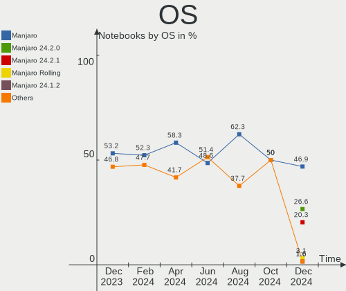
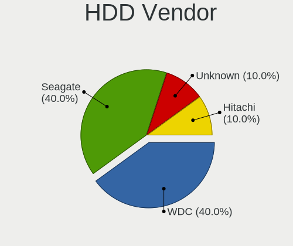

Manjaro Hardware Trends (Notebooks)
-----------------------------------

A project to identify most popular hardware characteristics and track their change
over time based on data collected by Manjaro users at https://Linux-Hardware.org.

Anyone can contribute to this report by the [hw-probe](https://github.com/linuxhw/hw-probe) tool:

    sudo -E hw-probe -all -upload

This report is for one last month. Overall report since the beginning of time: [TestCoverage](https://github.com/linuxhw/TestCoverage)

Period: Apr, 2022.

Contents
--------

* [ System ](#system)
  - [ OS                       ](#os)
  - [ OS Family                ](#os-family)
  - [ Kernel                   ](#kernel)
  - [ Kernel Family            ](#kernel-family)
  - [ Kernel Major Ver.        ](#kernel-major-ver)
  - [ Arch                     ](#arch)
  - [ DE                       ](#de)
  - [ Display Server           ](#display-server)
  - [ Display Manager          ](#display-manager)
  - [ OS Lang                  ](#os-lang)
  - [ Boot Mode                ](#boot-mode)
  - [ Filesystem               ](#filesystem)
  - [ Part. scheme             ](#part-scheme)
  - [ Dual Boot with Linux/BSD ](#dual-boot-with-linuxbsd)
  - [ Dual Boot (Win)          ](#dual-boot-win)

* [ Board ](#board)
  - [ Vendor                   ](#vendor)
  - [ Model                    ](#model)
  - [ Model Family             ](#model-family)
  - [ MFG Year                 ](#mfg-year)
  - [ Form Factor              ](#form-factor)
  - [ Secure Boot              ](#secure-boot)
  - [ Coreboot                 ](#coreboot)
  - [ RAM Size                 ](#ram-size)
  - [ RAM Used                 ](#ram-used)
  - [ Total Drives             ](#total-drives)
  - [ Has CD-ROM               ](#has-cd-rom)
  - [ Has Ethernet             ](#has-ethernet)
  - [ Has WiFi                 ](#has-wifi)
  - [ Has Bluetooth            ](#has-bluetooth)

* [ Location ](#location)
  - [ Country                  ](#country)
  - [ City                     ](#city)

* [ Drives ](#drives)
  - [ Drive Vendor             ](#drive-vendor)
  - [ Drive Model              ](#drive-model)
  - [ HDD Vendor               ](#hdd-vendor)
  - [ SSD Vendor               ](#ssd-vendor)
  - [ Drive Kind               ](#drive-kind)
  - [ Drive Connector          ](#drive-connector)
  - [ Drive Size               ](#drive-size)
  - [ Space Total              ](#space-total)
  - [ Space Used               ](#space-used)
  - [ Malfunc. Drives          ](#malfunc-drives)
  - [ Malfunc. Drive Vendor    ](#malfunc-drive-vendor)
  - [ Malfunc. HDD Vendor      ](#malfunc-hdd-vendor)
  - [ Malfunc. Drive Kind      ](#malfunc-drive-kind)
  - [ Failed Drives            ](#failed-drives)
  - [ Failed Drive Vendor      ](#failed-drive-vendor)
  - [ Drive Status             ](#drive-status)

* [ Storage controller ](#storage-controller)
  - [ Storage Vendor           ](#storage-vendor)
  - [ Storage Model            ](#storage-model)
  - [ Storage Kind             ](#storage-kind)

* [ Processor ](#processor)
  - [ CPU Vendor               ](#cpu-vendor)
  - [ CPU Model                ](#cpu-model)
  - [ CPU Model Family         ](#cpu-model-family)
  - [ CPU Cores                ](#cpu-cores)
  - [ CPU Sockets              ](#cpu-sockets)
  - [ CPU Threads              ](#cpu-threads)
  - [ CPU Op-Modes             ](#cpu-op-modes)
  - [ CPU Microcode            ](#cpu-microcode)
  - [ CPU Microarch            ](#cpu-microarch)

* [ Graphics ](#graphics)
  - [ GPU Vendor               ](#gpu-vendor)
  - [ GPU Model                ](#gpu-model)
  - [ GPU Combo                ](#gpu-combo)
  - [ GPU Driver               ](#gpu-driver)
  - [ GPU Memory               ](#gpu-memory)

* [ Monitor ](#monitor)
  - [ Monitor Vendor           ](#monitor-vendor)
  - [ Monitor Model            ](#monitor-model)
  - [ Monitor Resolution       ](#monitor-resolution)
  - [ Monitor Diagonal         ](#monitor-diagonal)
  - [ Monitor Width            ](#monitor-width)
  - [ Aspect Ratio             ](#aspect-ratio)
  - [ Monitor Area             ](#monitor-area)
  - [ Pixel Density            ](#pixel-density)
  - [ Multiple Monitors        ](#multiple-monitors)

* [ Network ](#network)
  - [ Net Controller Vendor    ](#net-controller-vendor)
  - [ Net Controller Model     ](#net-controller-model)
  - [ Wireless Vendor          ](#wireless-vendor)
  - [ Wireless Model           ](#wireless-model)
  - [ Ethernet Vendor          ](#ethernet-vendor)
  - [ Ethernet Model           ](#ethernet-model)
  - [ Net Controller Kind      ](#net-controller-kind)
  - [ Used Controller          ](#used-controller)
  - [ NICs                     ](#nics)
  - [ IPv6                     ](#ipv6)

* [ Bluetooth ](#bluetooth)
  - [ Bluetooth Vendor         ](#bluetooth-vendor)
  - [ Bluetooth Model          ](#bluetooth-model)

* [ Sound ](#sound)
  - [ Sound Vendor             ](#sound-vendor)
  - [ Sound Model              ](#sound-model)

* [ Memory ](#memory)
  - [ Memory Vendor            ](#memory-vendor)
  - [ Memory Model             ](#memory-model)
  - [ Memory Kind              ](#memory-kind)
  - [ Memory Form Factor       ](#memory-form-factor)
  - [ Memory Size              ](#memory-size)
  - [ Memory Speed             ](#memory-speed)

* [ Printers & scanners ](#printers--scanners)
  - [ Printer Vendor           ](#printer-vendor)
  - [ Printer Model            ](#printer-model)
  - [ Scanner Vendor           ](#scanner-vendor)
  - [ Scanner Model            ](#scanner-model)

* [ Camera ](#camera)
  - [ Camera Vendor            ](#camera-vendor)
  - [ Camera Model             ](#camera-model)

* [ Security ](#security)
  - [ Fingerprint Vendor       ](#fingerprint-vendor)
  - [ Fingerprint Model        ](#fingerprint-model)
  - [ Chipcard Vendor          ](#chipcard-vendor)
  - [ Chipcard Model           ](#chipcard-model)

* [ Unsupported ](#unsupported)
  - [ Unsupported Devices      ](#unsupported-devices)
  - [ Unsupported Device Types ](#unsupported-device-types)

System
------

OS
--

Installed operating systems

| Name           | Notebooks | Percent |
|----------------|-----------|---------|
| Manjaro        | 59        | 47.58%  |
| Manjaro 21.2.5 | 36        | 29.03%  |
| Manjaro 21.2.6 | 29        | 23.39%  |

OS Family
---------

OS without a version

| Name    | Notebooks | Percent |
|---------|-----------|---------|
| Manjaro | 124       | 100%    |

Kernel
------

Version of the Linux kernel

| Version                | Notebooks | Percent |
|------------------------|-----------|---------|
| 5.15.28-1-MANJARO      | 33        | 26.61%  |
| 5.15.32-1-MANJARO      | 29        | 23.39%  |
| 5.16.14-1-MANJARO      | 15        | 12.1%   |
| 5.17.1-3-MANJARO       | 14        | 11.29%  |
| 5.10.105-1-MANJARO     | 7         | 5.65%   |
| 5.16.18-1-MANJARO      | 5         | 4.03%   |
| 5.17.1-1-rt16-MANJARO  | 3         | 2.42%   |
| 5.17.0-1-MANJARO       | 3         | 2.42%   |
| 5.10.109-1-MANJARO     | 3         | 2.42%   |
| 5.4.184-1-MANJARO      | 1         | 0.81%   |
| 5.17.4-1-ck            | 1         | 0.81%   |
| 5.17.3-zen1-1-zen      | 1         | 0.81%   |
| 5.17.2-xanmod1-1       | 1         | 0.81%   |
| 5.16.2-2-rt19-MANJARO  | 1         | 0.81%   |
| 5.16.18-lqx1-1-lqx     | 1         | 0.81%   |
| 5.16.15-lqx2-1-lqx     | 1         | 0.81%   |
| 5.15.7-1-MANJARO       | 1         | 0.81%   |
| 5.15.34-1-MANJARO      | 1         | 0.81%   |
| 5.15.32-1-rt39-MANJARO | 1         | 0.81%   |
| 5.14.7-2-MANJARO       | 1         | 0.81%   |
| 5.13.19-2-MANJARO      | 1         | 0.81%   |

Kernel Family
-------------

Linux kernel without a distro release

| Version  | Notebooks | Percent |
|----------|-----------|---------|
| 5.15.28  | 33        | 26.61%  |
| 5.15.32  | 30        | 24.19%  |
| 5.17.1   | 17        | 13.71%  |
| 5.16.14  | 15        | 12.1%   |
| 5.10.105 | 7         | 5.65%   |
| 5.16.18  | 6         | 4.84%   |
| 5.17.0   | 3         | 2.42%   |
| 5.10.109 | 3         | 2.42%   |
| 5.4.184  | 1         | 0.81%   |
| 5.17.4   | 1         | 0.81%   |
| 5.17.3   | 1         | 0.81%   |
| 5.17.2   | 1         | 0.81%   |
| 5.16.2   | 1         | 0.81%   |
| 5.16.15  | 1         | 0.81%   |
| 5.15.7   | 1         | 0.81%   |
| 5.15.34  | 1         | 0.81%   |
| 5.14.7   | 1         | 0.81%   |
| 5.13.19  | 1         | 0.81%   |

Kernel Major Ver.
-----------------

Linux kernel major version

| Version | Notebooks | Percent |
|---------|-----------|---------|
| 5.15    | 65        | 52.42%  |
| 5.17    | 23        | 18.55%  |
| 5.16    | 23        | 18.55%  |
| 5.10    | 10        | 8.06%   |
| 5.4     | 1         | 0.81%   |
| 5.14    | 1         | 0.81%   |
| 5.13    | 1         | 0.81%   |

Arch
----

OS architecture (x86_64, i586, etc.)

| Name   | Notebooks | Percent |
|--------|-----------|---------|
| x86_64 | 124       | 100%    |

DE
--

Desktop Environment

| Name            | Notebooks | Percent |
|-----------------|-----------|---------|
| KDE5            | 55        | 44.35%  |
| GNOME           | 31        | 25%     |
| XFCE            | 27        | 21.77%  |
| Unknown         | 4         | 3.23%   |
| MATE            | 3         | 2.42%   |
| i3              | 3         | 2.42%   |
| GNOME Flashback | 1         | 0.81%   |

Display Server
--------------

X11 or Wayland

| Name    | Notebooks | Percent |
|---------|-----------|---------|
| X11     | 85        | 68.55%  |
| Wayland | 36        | 29.03%  |
| Unknown | 2         | 1.61%   |
| Tty     | 1         | 0.81%   |

Display Manager
---------------

SDDM, LightDM, etc.

| Name    | Notebooks | Percent |
|---------|-----------|---------|
| Unknown | 59        | 47.58%  |
| LightDM | 28        | 22.58%  |
| GDM     | 21        | 16.94%  |
| SDDM    | 15        | 12.1%   |
| Ly      | 1         | 0.81%   |

OS Lang
-------

Language

| Lang    | Notebooks | Percent |
|---------|-----------|---------|
| en_US   | 59        | 47.58%  |
| en_GB   | 9         | 7.26%   |
| de_DE   | 8         | 6.45%   |
| ru_RU   | 6         | 4.84%   |
| en_AU   | 5         | 4.03%   |
| pl_PL   | 4         | 3.23%   |
| es_ES   | 4         | 3.23%   |
| en_CA   | 3         | 2.42%   |
| pt_BR   | 2         | 1.61%   |
| fr_FR   | 2         | 1.61%   |
| en_ZA   | 2         | 1.61%   |
| en_NZ   | 2         | 1.61%   |
| cs_CZ   | 2         | 1.61%   |
| szl_PL  | 1         | 0.81%   |
| sv_SE   | 1         | 0.81%   |
| pt_PT   | 1         | 0.81%   |
| nl_NL   | 1         | 0.81%   |
| it_IT   | 1         | 0.81%   |
| fr_CH   | 1         | 0.81%   |
| fr_CA   | 1         | 0.81%   |
| es_PA   | 1         | 0.81%   |
| es_MX   | 1         | 0.81%   |
| es_EC   | 1         | 0.81%   |
| es_CO   | 1         | 0.81%   |
| en_IN   | 1         | 0.81%   |
| en_IL   | 1         | 0.81%   |
| en_DK   | 1         | 0.81%   |
| en_DE   | 1         | 0.81%   |
| Unknown | 1         | 0.81%   |

Boot Mode
---------

EFI or BIOS

| Mode | Notebooks | Percent |
|------|-----------|---------|
| BIOS | 82        | 66.13%  |
| EFI  | 42        | 33.87%  |

Filesystem
----------

Type of filesystem

| Type    | Notebooks | Percent |
|---------|-----------|---------|
| Ext4    | 100       | 80.65%  |
| Btrfs   | 22        | 17.74%  |
| F2fs    | 1         | 0.81%   |
| Unknown | 1         | 0.81%   |

Part. scheme
------------

Scheme of partitioning

| Type    | Notebooks | Percent |
|---------|-----------|---------|
| Unknown | 79        | 63.71%  |
| GPT     | 41        | 33.06%  |
| MBR     | 4         | 3.23%   |

Dual Boot with Linux/BSD
------------------------

Hosting more than one Linux/BSD

| Dual boot | Notebooks | Percent |
|-----------|-----------|---------|
| No        | 114       | 91.94%  |
| Yes       | 10        | 8.06%   |

Dual Boot (Win)
---------------

Hosting Linux and Windows

| Dual boot | Notebooks | Percent |
|-----------|-----------|---------|
| No        | 96        | 77.42%  |
| Yes       | 28        | 22.58%  |

Board
-----

Vendor
------

Motherboard manufacturer

| Name                   | Notebooks | Percent |
|------------------------|-----------|---------|
| Lenovo                 | 35        | 28.23%  |
| Hewlett-Packard        | 23        | 18.55%  |
| Dell                   | 18        | 14.52%  |
| ASUSTek Computer       | 13        | 10.48%  |
| Acer                   | 7         | 5.65%   |
| Timi                   | 6         | 4.84%   |
| MSI                    | 5         | 4.03%   |
| Apple                  | 4         | 3.23%   |
| Toshiba                | 3         | 2.42%   |
| TUXEDO                 | 1         | 0.81%   |
| Sony                   | 1         | 0.81%   |
| Schenker               | 1         | 0.81%   |
| Monster                | 1         | 0.81%   |
| HUAWEI                 | 1         | 0.81%   |
| HONOR                  | 1         | 0.81%   |
| Gigabyte Technology    | 1         | 0.81%   |
| Framework              | 1         | 0.81%   |
| Avell High Performance | 1         | 0.81%   |
| A-DATA Technology      | 1         | 0.81%   |

Model
-----

Motherboard model

| Name                                      | Notebooks | Percent |
|-------------------------------------------|-----------|---------|
| Timi RedmiBook Pro 15S                    | 3         | 2.42%   |
| ASUS X550VX                               | 3         | 2.42%   |
| Timi A35S                                 | 2         | 1.61%   |
| HP ProBook 445 G8 Notebook PC             | 2         | 1.61%   |
| HP Notebook                               | 2         | 1.61%   |
| Dell Latitude 5480                        | 2         | 1.61%   |
| TUXEDO PA70ES                             | 1         | 0.81%   |
| Toshiba Satellite L775-151                | 1         | 0.81%   |
| Toshiba Satellite L50-C                   | 1         | 0.81%   |
| Toshiba Satellite C855D                   | 1         | 0.81%   |
| Timi A35                                  | 1         | 0.81%   |
| Sony VPCF120FL                            | 1         | 0.81%   |
| Schenker VISION 15 (SVS15E21)             | 1         | 0.81%   |
| MSI MS-7816                               | 1         | 0.81%   |
| MSI Modern 15 A11MU                       | 1         | 0.81%   |
| MSI Modern 14 B10MW                       | 1         | 0.81%   |
| MSI GS70 6QE                              | 1         | 0.81%   |
| MSI GS60 2PE Ghost Pro                    | 1         | 0.81%   |
| Monster ABRA A5 V12.1                     | 1         | 0.81%   |
| Lenovo Z51-70 80K6                        | 1         | 0.81%   |
| Lenovo Yoga 300-11IBY 80M0                | 1         | 0.81%   |
| Lenovo ThinkPad X230 2325YGM              | 1         | 0.81%   |
| Lenovo ThinkPad X230 23202DG              | 1         | 0.81%   |
| Lenovo ThinkPad X131e 33672T5             | 1         | 0.81%   |
| Lenovo ThinkPad X1 Extreme 2nd 20QVCTO1WW | 1         | 0.81%   |
| Lenovo ThinkPad T495s 20QKS01E00          | 1         | 0.81%   |
| Lenovo ThinkPad T460s 20F90044MX          | 1         | 0.81%   |
| Lenovo ThinkPad T460 20FMS66R00           | 1         | 0.81%   |
| Lenovo ThinkPad T440p 20AWS1EH00          | 1         | 0.81%   |
| Lenovo ThinkPad T440p 20AWS03H00          | 1         | 0.81%   |
| Lenovo ThinkPad T420 41786KG              | 1         | 0.81%   |
| Lenovo ThinkPad T400 6474WBN              | 1         | 0.81%   |
| Lenovo ThinkPad T15 Gen 2i 20W4003FUK     | 1         | 0.81%   |
| Lenovo ThinkPad P15v Gen 1 20TQCTO1WW     | 1         | 0.81%   |
| Lenovo ThinkPad L440 20ASA02800           | 1         | 0.81%   |
| Lenovo ThinkPad E485 20KUCTO1WW           | 1         | 0.81%   |
| Lenovo ThinkPad E15 Gen 3 20YG003JUS      | 1         | 0.81%   |
| Lenovo ThinkPad E14 Gen 3 20YDCTO1WW      | 1         | 0.81%   |
| Lenovo ThinkBook 16p Gen 2 20YM           | 1         | 0.81%   |
| Lenovo ThinkBook 15-IIL 20SM              | 1         | 0.81%   |
| Lenovo ThinkBook 14 G2 ARE 20VF           | 1         | 0.81%   |
| Lenovo Legion 5 15ARH05H 82B1             | 1         | 0.81%   |
| Lenovo Legion 5 15ACH6H 82JU              | 1         | 0.81%   |
| Lenovo IdeaPadFlex 15 20309               | 1         | 0.81%   |
| Lenovo IdeaPad S540-14API 81NH            | 1         | 0.81%   |
| Lenovo IdeaPad S340-15API 81NC            | 1         | 0.81%   |
| Lenovo IdeaPad Gaming 3 15ARH05 82EY      | 1         | 0.81%   |
| Lenovo IdeaPad C340-14API 81N6            | 1         | 0.81%   |
| Lenovo IdeaPad 530S-14ARR 81H1            | 1         | 0.81%   |
| Lenovo IdeaPad 320-15IAP 81A3             | 1         | 0.81%   |
| Lenovo IdeaPad 3 14ALC6 82KT              | 1         | 0.81%   |
| Lenovo IdeaPad 100-15IBD 80QQ             | 1         | 0.81%   |
| Lenovo B560                               | 1         | 0.81%   |
| Lenovo 3000 N100 076835U                  | 1         | 0.81%   |
| HUAWEI KLVL-WXX9                          | 1         | 0.81%   |
| HONOR BMH-WCX9                            | 1         | 0.81%   |
| HP ZBook 15 G5                            | 1         | 0.81%   |
| HP ZBook 15 G3                            | 1         | 0.81%   |
| HP ZBook 15                               | 1         | 0.81%   |
| HP Victus by Laptop 16                    | 1         | 0.81%   |

Model Family
------------

Motherboard model prefix

| Name                        | Notebooks | Percent |
|-----------------------------|-----------|---------|
| Lenovo ThinkPad             | 17        | 13.71%  |
| Dell Inspiron               | 9         | 7.26%   |
| Lenovo IdeaPad              | 8         | 6.45%   |
| HP Pavilion                 | 5         | 4.03%   |
| HP Laptop                   | 5         | 4.03%   |
| Acer Aspire                 | 5         | 4.03%   |
| HP ProBook                  | 4         | 3.23%   |
| Dell XPS                    | 4         | 3.23%   |
| Dell Latitude               | 4         | 3.23%   |
| Toshiba Satellite           | 3         | 2.42%   |
| Timi RedmiBook              | 3         | 2.42%   |
| Lenovo ThinkBook            | 3         | 2.42%   |
| HP ZBook                    | 3         | 2.42%   |
| ASUS X550VX                 | 3         | 2.42%   |
| Timi A35S                   | 2         | 1.61%   |
| MSI Modern                  | 2         | 1.61%   |
| Lenovo Legion               | 2         | 1.61%   |
| HP Notebook                 | 2         | 1.61%   |
| ASUS ZenBook                | 2         | 1.61%   |
| ASUS ROG                    | 2         | 1.61%   |
| ASUS ASUS                   | 2         | 1.61%   |
| TUXEDO PA70ES               | 1         | 0.81%   |
| Timi A35                    | 1         | 0.81%   |
| Sony VPCF120FL              | 1         | 0.81%   |
| Schenker VISION             | 1         | 0.81%   |
| MSI MS-7816                 | 1         | 0.81%   |
| MSI GS70                    | 1         | 0.81%   |
| MSI GS60                    | 1         | 0.81%   |
| Monster ABRA                | 1         | 0.81%   |
| Lenovo Z51-70               | 1         | 0.81%   |
| Lenovo Yoga                 | 1         | 0.81%   |
| Lenovo IdeaPadFlex          | 1         | 0.81%   |
| Lenovo B560                 | 1         | 0.81%   |
| Lenovo 3000                 | 1         | 0.81%   |
| HUAWEI KLVL-WXX9            | 1         | 0.81%   |
| HONOR BMH-WCX9              | 1         | 0.81%   |
| HP Victus                   | 1         | 0.81%   |
| HP OMEN                     | 1         | 0.81%   |
| HP 250                      | 1         | 0.81%   |
| Gigabyte AERO               | 1         | 0.81%   |
| Framework Laptop            | 1         | 0.81%   |
| Dell Vostro                 | 1         | 0.81%   |
| Avell High Performance B.ON | 1         | 0.81%   |
| ASUS X510UAR                | 1         | 0.81%   |
| ASUS VivoBook               | 1         | 0.81%   |
| ASUS UX310UA                | 1         | 0.81%   |
| ASUS G752VL                 | 1         | 0.81%   |
| Apple MacBookPro9           | 1         | 0.81%   |
| Apple MacBookPro12          | 1         | 0.81%   |
| Apple MacBookPro11          | 1         | 0.81%   |
| Apple MacBookAir5           | 1         | 0.81%   |
| Acer Swift                  | 1         | 0.81%   |
| Acer Nitro                  | 1         | 0.81%   |
| A-DATA XENIAXe15TI7G11GXELX | 1         | 0.81%   |
| Unknown                     | 1         | 0.81%   |

MFG Year
--------

Motherboard manufacture year

| Year | Notebooks | Percent |
|------|-----------|---------|
| 2021 | 30        | 24.19%  |
| 2019 | 15        | 12.1%   |
| 2016 | 12        | 9.68%   |
| 2015 | 11        | 8.87%   |
| 2020 | 9         | 7.26%   |
| 2018 | 9         | 7.26%   |
| 2012 | 8         | 6.45%   |
| 2017 | 7         | 5.65%   |
| 2014 | 7         | 5.65%   |
| 2013 | 5         | 4.03%   |
| 2011 | 4         | 3.23%   |
| 2010 | 3         | 2.42%   |
| 2008 | 2         | 1.61%   |
| 2009 | 1         | 0.81%   |
| 2007 | 1         | 0.81%   |

Form Factor
-----------

Physical design of the computer

| Name     | Notebooks | Percent |
|----------|-----------|---------|
| Notebook | 124       | 100%    |

Secure Boot
-----------

Enabled or disabled

| State    | Notebooks | Percent |
|----------|-----------|---------|
| Disabled | 124       | 100%    |

Coreboot
--------

Have coreboot on board

| Used | Notebooks | Percent |
|------|-----------|---------|
| No   | 124       | 100%    |

RAM Size
--------

Total RAM memory

| Size in GB  | Notebooks | Percent |
|-------------|-----------|---------|
| 8.01-16.0   | 40        | 32.26%  |
| 4.01-8.0    | 30        | 24.19%  |
| 16.01-24.0  | 22        | 17.74%  |
| 3.01-4.0    | 16        | 12.9%   |
| 32.01-64.0  | 8         | 6.45%   |
| 24.01-32.0  | 4         | 3.23%   |
| 64.01-256.0 | 3         | 2.42%   |
| 2.01-3.0    | 1         | 0.81%   |

RAM Used
--------

Used RAM memory

| Used GB    | Notebooks | Percent |
|------------|-----------|---------|
| 2.01-3.0   | 34        | 27.42%  |
| 4.01-8.0   | 33        | 26.61%  |
| 1.01-2.0   | 27        | 21.77%  |
| 3.01-4.0   | 19        | 15.32%  |
| 8.01-16.0  | 8         | 6.45%   |
| 24.01-32.0 | 1         | 0.81%   |
| 16.01-24.0 | 1         | 0.81%   |
| 0.51-1.0   | 1         | 0.81%   |

Total Drives
------------

Number of drives on board

| Drives | Notebooks | Percent |
|--------|-----------|---------|
| 1      | 89        | 71.77%  |
| 2      | 31        | 25%     |
| 3      | 3         | 2.42%   |
| 4      | 1         | 0.81%   |

Has CD-ROM
----------

Has CD-ROM on board

| Presented | Notebooks | Percent |
|-----------|-----------|---------|
| No        | 96        | 77.42%  |
| Yes       | 28        | 22.58%  |

Has Ethernet
------------

Has Ethernet on board

| Presented | Notebooks | Percent |
|-----------|-----------|---------|
| Yes       | 87        | 70.16%  |
| No        | 37        | 29.84%  |

Has WiFi
--------

Has WiFi module

| Presented | Notebooks | Percent |
|-----------|-----------|---------|
| Yes       | 122       | 98.39%  |
| No        | 2         | 1.61%   |

Has Bluetooth
-------------

Has Bluetooth module

| Presented | Notebooks | Percent |
|-----------|-----------|---------|
| Yes       | 105       | 84.68%  |
| No        | 19        | 15.32%  |

Location
--------

Country
-------

Geographic location (country)

| Country                | Notebooks | Percent |
|------------------------|-----------|---------|
| USA                    | 24        | 19.35%  |
| Germany                | 11        | 8.87%   |
| UK                     | 7         | 5.65%   |
| Poland                 | 7         | 5.65%   |
| Canada                 | 6         | 4.84%   |
| Russia                 | 5         | 4.03%   |
| Netherlands            | 5         | 4.03%   |
| France                 | 5         | 4.03%   |
| Spain                  | 4         | 3.23%   |
| Australia              | 4         | 3.23%   |
| Turkey                 | 3         | 2.42%   |
| Romania                | 3         | 2.42%   |
| Brazil                 | 3         | 2.42%   |
| Ukraine                | 2         | 1.61%   |
| South Africa           | 2         | 1.61%   |
| India                  | 2         | 1.61%   |
| Czechia                | 2         | 1.61%   |
| China                  | 2         | 1.61%   |
| Belarus                | 2         | 1.61%   |
| Switzerland            | 1         | 0.81%   |
| Sweden                 | 1         | 0.81%   |
| Saudi Arabia           | 1         | 0.81%   |
| Portugal               | 1         | 0.81%   |
| Peru                   | 1         | 0.81%   |
| Panama                 | 1         | 0.81%   |
| Norway                 | 1         | 0.81%   |
| New Zealand            | 1         | 0.81%   |
| Mexico                 | 1         | 0.81%   |
| Kenya                  | 1         | 0.81%   |
| Japan                  | 1         | 0.81%   |
| Italy                  | 1         | 0.81%   |
| Israel                 | 1         | 0.81%   |
| Isle of Man            | 1         | 0.81%   |
| Iraq                   | 1         | 0.81%   |
| Hungary                | 1         | 0.81%   |
| Greece                 | 1         | 0.81%   |
| Ghana                  | 1         | 0.81%   |
| Finland                | 1         | 0.81%   |
| Egypt                  | 1         | 0.81%   |
| Ecuador                | 1         | 0.81%   |
| Denmark                | 1         | 0.81%   |
| Croatia                | 1         | 0.81%   |
| Colombia               | 1         | 0.81%   |
| Bosnia and Herzegovina | 1         | 0.81%   |

City
----

Geographic location (city)

| City            | Notebooks | Percent |
|-----------------|-----------|---------|
| Wuhan           | 2         | 1.61%   |
| Warsaw          | 2         | 1.61%   |
| Redding         | 2         | 1.61%   |
| Lebanon         | 2         | 1.61%   |
| Collierville    | 2         | 1.61%   |
| Boise           | 2         | 1.61%   |
| Amsterdam       | 2         | 1.61%   |
| Zutphen         | 1         | 0.81%   |
| Zapopan         | 1         | 0.81%   |
| Zagreb          | 1         | 0.81%   |
| White River     | 1         | 0.81%   |
| Washington      | 1         | 0.81%   |
| Villa Rica      | 1         | 0.81%   |
| Valence         | 1         | 0.81%   |
| Ulfborg         | 1         | 0.81%   |
| Uddevalla       | 1         | 0.81%   |
| Toronto         | 1         | 0.81%   |
| Ternopil        | 1         | 0.81%   |
| Tel Aviv        | 1         | 0.81%   |
| Słupsk         | 1         | 0.81%   |
| Sydney          | 1         | 0.81%   |
| Sulaymaniyah    | 1         | 0.81%   |
| St Petersburg   | 1         | 0.81%   |
| Sherbrooke      | 1         | 0.81%   |
| Satu Mare       | 1         | 0.81%   |
| Sarreguemines   | 1         | 0.81%   |
| Sarajevo        | 1         | 0.81%   |
| Sao Paulo       | 1         | 0.81%   |
| Samara          | 1         | 0.81%   |
| Saint-Jerome    | 1         | 0.81%   |
| Saint Ives      | 1         | 0.81%   |
| Rotterdam       | 1         | 0.81%   |
| Rostock         | 1         | 0.81%   |
| Riyadh          | 1         | 0.81%   |
| Regina          | 1         | 0.81%   |
| Rastatt         | 1         | 0.81%   |
| Quito           | 1         | 0.81%   |
| Pretoria        | 1         | 0.81%   |
| Poznan          | 1         | 0.81%   |
| Porto Velho     | 1         | 0.81%   |
| Porto           | 1         | 0.81%   |
| Pontevedra      | 1         | 0.81%   |
| Ploieşti       | 1         | 0.81%   |
| Piura           | 1         | 0.81%   |
| Perth           | 1         | 0.81%   |
| Panama City     | 1         | 0.81%   |
| Palakkad        | 1         | 0.81%   |
| Ottawa          | 1         | 0.81%   |
| Ostrava         | 1         | 0.81%   |
| Nuremberg       | 1         | 0.81%   |
| Nicholasville   | 1         | 0.81%   |
| Naples          | 1         | 0.81%   |
| Munich          | 1         | 0.81%   |
| Moscow          | 1         | 0.81%   |
| Minsk           | 1         | 0.81%   |
| Miami           | 1         | 0.81%   |
| Mesa            | 1         | 0.81%   |
| Menomonee Falls | 1         | 0.81%   |
| Melbourne       | 1         | 0.81%   |
| Medford         | 1         | 0.81%   |

Drives
------

Drive Vendor
------------

Hard drive vendors

| Vendor                         | Notebooks | Drives | Percent |
|--------------------------------|-----------|--------|---------|
| Samsung Electronics            | 27        | 30     | 16.98%  |
| WDC                            | 16        | 16     | 10.06%  |
| Sandisk                        | 15        | 15     | 9.43%   |
| Toshiba                        | 12        | 13     | 7.55%   |
| Seagate                        | 12        | 12     | 7.55%   |
| Kingston                       | 11        | 12     | 6.92%   |
| Crucial                        | 9         | 9      | 5.66%   |
| SK Hynix                       | 8         | 8      | 5.03%   |
| Micron Technology              | 8         | 8      | 5.03%   |
| Unknown                        | 5         | 5      | 3.14%   |
| KIOXIA                         | 4         | 4      | 2.52%   |
| Hitachi                        | 4         | 4      | 2.52%   |
| HGST                           | 4         | 4      | 2.52%   |
| Intel                          | 3         | 4      | 1.89%   |
| Solid State Storage Technology | 2         | 2      | 1.26%   |
| PNY                            | 2         | 2      | 1.26%   |
| Apple                          | 2         | 2      | 1.26%   |
| A-DATA Technology              | 2         | 2      | 1.26%   |
| XPG                            | 1         | 1      | 0.63%   |
| TwinMOS                        | 1         | 1      | 0.63%   |
| TEAM L3                        | 1         | 1      | 0.63%   |
| SSSTC                          | 1         | 1      | 0.63%   |
| Phison                         | 1         | 2      | 0.63%   |
| oyunkey                        | 1         | 1      | 0.63%   |
| Netac                          | 1         | 1      | 0.63%   |
| Lenovo                         | 1         | 1      | 0.63%   |
| KIOXIA-EXCERIA                 | 1         | 1      | 0.63%   |
| HS-SSD-C100                    | 1         | 1      | 0.63%   |
| GOODRAM                        | 1         | 1      | 0.63%   |
| Gigabyte Technology            | 1         | 1      | 0.63%   |
| ADATA Technology               | 1         | 1      | 0.63%   |

Drive Model
-----------

Hard drive models

| Model                                    | Notebooks | Percent |
|------------------------------------------|-----------|---------|
| Samsung NVMe SSD Drive 512GB             | 5         | 3.05%   |
| Crucial CT500MX500SSD1 500GB             | 5         | 3.05%   |
| Toshiba MQ04ABF100 1TB                   | 4         | 2.44%   |
| SK Hynix NVMe SSD Drive 512GB            | 4         | 2.44%   |
| Sandisk NVMe SSD Drive 512GB             | 4         | 2.44%   |
| Micron NVMe SSD Drive 512GB              | 3         | 1.83%   |
| KIOXIA NVMe SSD Drive 512GB              | 3         | 1.83%   |
| Kingston SA400S37240G 240GB SSD          | 3         | 1.83%   |
| Kingston SA400S37120G 120GB SSD          | 3         | 1.83%   |
| WDC PC SN520 SDAPMUW-256G-1101 256GB     | 2         | 1.22%   |
| Seagate ST1000LM024 HN-M101MBB 1TB       | 2         | 1.22%   |
| Seagate SSD 1TB                          | 2         | 1.22%   |
| Sandisk NVMe SSD Drive 500GB             | 2         | 1.22%   |
| Samsung SSD 970 EVO Plus 250GB           | 2         | 1.22%   |
| Samsung NVMe SSD Drive 1TB               | 2         | 1.22%   |
| Intel NVMe SSD Drive 512GB               | 2         | 1.22%   |
| HGST HTS721010A9E630 1TB                 | 2         | 1.22%   |
| XPG GAMMIX S50 1TB                       | 1         | 0.61%   |
| WDC WDS500G2B0A-00SM50 500GB SSD         | 1         | 0.61%   |
| WDC WDS240G2G0A-00JH30 240GB SSD         | 1         | 0.61%   |
| WDC WDS100T2B0A-00SM50 1TB SSD           | 1         | 0.61%   |
| WDC WDBNCE0010PNC 1TB SSD                | 1         | 0.61%   |
| WDC WD5000LPCX-60VHAT0 500GB             | 1         | 0.61%   |
| WDC WD5000BPKT-75PK4T0 500GB             | 1         | 0.61%   |
| WDC WD3200BPVT-22JJ5T0 320GB             | 1         | 0.61%   |
| WDC WD10SPZX-75Z10T2 1TB                 | 1         | 0.61%   |
| WDC WD10JPVX-75JC3T0 1TB                 | 1         | 0.61%   |
| WDC WD10JPVX-60JC3T1 1TB                 | 1         | 0.61%   |
| WDC WD10JPVX-22JC3T0 1TB                 | 1         | 0.61%   |
| WDC WD10JPCX-24UE4T0 1TB                 | 1         | 0.61%   |
| WDC PC SN730 SDBPNTY-512G-1006 512GB     | 1         | 0.61%   |
| WDC PC SN720 NVMe 1024GB                 | 1         | 0.61%   |
| Unknown SD64G  64GB                      | 1         | 0.61%   |
| Unknown SD16G  16GB                      | 1         | 0.61%   |
| Unknown SD/MMC/MS PRO 16GB               | 1         | 0.61%   |
| Unknown MMC Card  16GB                   | 1         | 0.61%   |
| Unknown MMC Card  128GB                  | 1         | 0.61%   |
| TwinMOS SSD 128GB                        | 1         | 0.61%   |
| Toshiba THNSNJ512GDNU A 512GB SSD        | 1         | 0.61%   |
| Toshiba NVMe SSD Drive 2TB               | 1         | 0.61%   |
| Toshiba MQ01ABF050 500GB                 | 1         | 0.61%   |
| Toshiba MQ01ABD100 1TB                   | 1         | 0.61%   |
| Toshiba MQ01ABC150 1TB                   | 1         | 0.61%   |
| Toshiba MK3276GSX 320GB                  | 1         | 0.61%   |
| Toshiba KBG40ZNT512G MEMORY 512GB        | 1         | 0.61%   |
| Toshiba KBG30ZMS128G 128GB NVMe SSD      | 1         | 0.61%   |
| TEAM L3 SSD 120GB                        | 1         | 0.61%   |
| SSSTC CL1-8D256-HP 256GB                 | 1         | 0.61%   |
| Solid State Storage NVMe SSD Drive 512GB | 1         | 0.61%   |
| Solid State Storage NVMe SSD Drive 128GB | 1         | 0.61%   |
| SK Hynix SH920 mSATA 256GB SSD           | 1         | 0.61%   |
| SK Hynix NVMe SSD Drive 128GB            | 1         | 0.61%   |
| SK Hynix HFM001TD3JX013N 1TB             | 1         | 0.61%   |
| SK Hynix BC511 HFM256GDJTNI-82A0A 256GB  | 1         | 0.61%   |
| Seagate ST500LT012-1DG142 500GB          | 1         | 0.61%   |
| Seagate ST500LM012 HN-M500MBB 500GB      | 1         | 0.61%   |
| Seagate ST2000LM015-2E8174 2TB           | 1         | 0.61%   |
| Seagate ST2000LM007-1R8174 2TB           | 1         | 0.61%   |
| Seagate ST1000LM049-2GH172 1TB           | 1         | 0.61%   |
| Seagate ST1000LM048-2E7172 1TB           | 1         | 0.61%   |

HDD Vendor
----------

Hard disk drive vendors

| Vendor              | Notebooks | Drives | Percent |
|---------------------|-----------|--------|---------|
| Seagate             | 10        | 10     | 27.78%  |
| WDC                 | 8         | 8      | 22.22%  |
| Toshiba             | 8         | 8      | 22.22%  |
| Hitachi             | 4         | 4      | 11.11%  |
| HGST                | 4         | 4      | 11.11%  |
| Unknown             | 1         | 1      | 2.78%   |
| Samsung Electronics | 1         | 1      | 2.78%   |

SSD Vendor
----------

Solid state drive vendors

| Vendor              | Notebooks | Drives | Percent |
|---------------------|-----------|--------|---------|
| Crucial             | 9         | 9      | 16.07%  |
| Samsung Electronics | 8         | 8      | 14.29%  |
| Kingston            | 8         | 9      | 14.29%  |
| SanDisk             | 6         | 6      | 10.71%  |
| Micron Technology   | 5         | 5      | 8.93%   |
| WDC                 | 4         | 4      | 7.14%   |
| Seagate             | 2         | 2      | 3.57%   |
| PNY                 | 2         | 2      | 3.57%   |
| Apple               | 2         | 2      | 3.57%   |
| A-DATA Technology   | 2         | 2      | 3.57%   |
| TwinMOS             | 1         | 1      | 1.79%   |
| Toshiba             | 1         | 1      | 1.79%   |
| TEAM L3             | 1         | 1      | 1.79%   |
| SK Hynix            | 1         | 1      | 1.79%   |
| Netac               | 1         | 1      | 1.79%   |
| KIOXIA-EXCERIA      | 1         | 1      | 1.79%   |
| GOODRAM             | 1         | 1      | 1.79%   |
| Gigabyte Technology | 1         | 1      | 1.79%   |

Drive Kind
----------

HDD or SSD

| Kind    | Notebooks | Drives | Percent |
|---------|-----------|--------|---------|
| NVMe    | 60        | 67     | 39.47%  |
| SSD     | 51        | 57     | 33.55%  |
| HDD     | 35        | 36     | 23.03%  |
| MMC     | 4         | 4      | 2.63%   |
| Unknown | 2         | 2      | 1.32%   |

Drive Connector
---------------

SATA, SAS, NVMe, etc.

| Type | Notebooks | Drives | Percent |
|------|-----------|--------|---------|
| SATA | 75        | 90     | 52.45%  |
| NVMe | 60        | 67     | 41.96%  |
| SAS  | 4         | 5      | 2.8%    |
| MMC  | 4         | 4      | 2.8%    |

Drive Size
----------

Size of hard drive

| Size in TB | Notebooks | Drives | Percent |
|------------|-----------|--------|---------|
| 0.01-0.5   | 52        | 58     | 60.47%  |
| 0.51-1.0   | 30        | 31     | 34.88%  |
| 1.01-2.0   | 3         | 3      | 3.49%   |
| 3.01-4.0   | 1         | 1      | 1.16%   |

Space Total
-----------

Amount of disk space available on the file system

| Size in GB     | Notebooks | Percent |
|----------------|-----------|---------|
| 251-500        | 33        | 26.61%  |
| 101-250        | 30        | 24.19%  |
| 501-1000       | 20        | 16.13%  |
| 1001-2000      | 12        | 9.68%   |
| Unknown        | 11        | 8.87%   |
| 51-100         | 8         | 6.45%   |
| 2001-3000      | 4         | 3.23%   |
| More than 3000 | 2         | 1.61%   |
| 21-50          | 2         | 1.61%   |
| 1-20           | 2         | 1.61%   |

Space Used
----------

Amount of used disk space

| Used GB        | Notebooks | Percent |
|----------------|-----------|---------|
| 51-100         | 28        | 22.58%  |
| 21-50          | 25        | 20.16%  |
| 101-250        | 21        | 16.94%  |
| 1-20           | 18        | 14.52%  |
| 251-500        | 15        | 12.1%   |
| Unknown        | 11        | 8.87%   |
| 1001-2000      | 3         | 2.42%   |
| 501-1000       | 2         | 1.61%   |
| More than 3000 | 1         | 0.81%   |

Malfunc. Drives
---------------

Drive models with a malfunction

| Model                                               | Notebooks | Drives | Percent |
|-----------------------------------------------------|-----------|--------|---------|
| Seagate ST1000LM048-2E7172 1TB                      | 1         | 1      | 33.33%  |
| Micron Technology MTFDDAV512TBN-1AR15ABHA 512GB SSD | 1         | 1      | 33.33%  |
| Crucial CT256M550SSD4 256GB                         | 1         | 1      | 33.33%  |

Malfunc. Drive Vendor
---------------------

Vendors of faulty drives

| Vendor            | Notebooks | Drives | Percent |
|-------------------|-----------|--------|---------|
| Seagate           | 1         | 1      | 33.33%  |
| Micron Technology | 1         | 1      | 33.33%  |
| Crucial           | 1         | 1      | 33.33%  |

Malfunc. HDD Vendor
-------------------

Vendors of faulty HDD drives

| Vendor  | Notebooks | Drives | Percent |
|---------|-----------|--------|---------|
| Seagate | 1         | 1      | 100%    |

Malfunc. Drive Kind
-------------------

Kinds of faulty drives

| Kind | Notebooks | Drives | Percent |
|------|-----------|--------|---------|
| SSD  | 1         | 2      | 50%     |
| HDD  | 1         | 1      | 50%     |

Failed Drives
-------------

Failed drive models

Zero info for selected period =(

Failed Drive Vendor
-------------------

Failed drive vendors

Zero info for selected period =(

Drive Status
------------

Number of failed and malfunc. drives

| Status   | Notebooks | Drives | Percent |
|----------|-----------|--------|---------|
| Detected | 100       | 132    | 77.52%  |
| Works    | 27        | 31     | 20.93%  |
| Malfunc  | 2         | 3      | 1.55%   |

Storage controller
------------------

Storage Vendor
--------------

Storage controller vendors

| Vendor                         | Notebooks | Percent |
|--------------------------------|-----------|---------|
| Intel                          | 66        | 43.42%  |
| AMD                            | 27        | 17.76%  |
| Samsung Electronics            | 20        | 13.16%  |
| Sandisk                        | 12        | 7.89%   |
| SK Hynix                       | 7         | 4.61%   |
| KIOXIA                         | 5         | 3.29%   |
| Solid State Storage Technology | 3         | 1.97%   |
| Micron Technology              | 3         | 1.97%   |
| Kingston Technology Company    | 3         | 1.97%   |
| Toshiba America Info Systems   | 2         | 1.32%   |
| ADATA Technology               | 2         | 1.32%   |
| Phison Electronics             | 1         | 0.66%   |
| Lenovo                         | 1         | 0.66%   |

Storage Model
-------------

Storage controller models

| Model                                                                                  | Notebooks | Percent |
|----------------------------------------------------------------------------------------|-----------|---------|
| AMD FCH SATA Controller [AHCI mode]                                                    | 27        | 17.09%  |
| Samsung NVMe SSD Controller SM981/PM981/PM983                                          | 13        | 8.23%   |
| Intel Sunrise Point-LP SATA Controller [AHCI mode]                                     | 10        | 6.33%   |
| Intel 7 Series Chipset Family 6-port SATA Controller [AHCI mode]                       | 8         | 5.06%   |
| Intel Wildcat Point-LP SATA Controller [AHCI Mode]                                     | 7         | 4.43%   |
| Intel 82801 Mobile SATA Controller [RAID mode]                                         | 6         | 3.8%    |
| Sandisk WD Black SN750 / PC SN730 NVMe SSD                                             | 5         | 3.16%   |
| KIOXIA Non-Volatile memory controller                                                  | 5         | 3.16%   |
| Intel HM170/QM170 Chipset SATA Controller [AHCI Mode]                                  | 5         | 3.16%   |
| Intel 8 Series/C220 Series Chipset Family 6-port SATA Controller 1 [AHCI mode]         | 5         | 3.16%   |
| Intel Volume Management Device NVMe RAID Controller                                    | 4         | 2.53%   |
| Solid State Storage Non-Volatile memory controller                                     | 3         | 1.9%    |
| SK Hynix Gold P31 SSD                                                                  | 3         | 1.9%    |
| Samsung NVMe SSD Controller PM9A1/PM9A3/980PRO                                         | 3         | 1.9%    |
| Samsung NVMe SSD Controller 980                                                        | 3         | 1.9%    |
| Micron Non-Volatile memory controller                                                  | 3         | 1.9%    |
| Intel 8 Series SATA Controller 1 [AHCI mode]                                           | 3         | 1.9%    |
| SK Hynix BC511                                                                         | 2         | 1.27%   |
| SK Hynix BC501 NVMe Solid State Drive                                                  | 2         | 1.27%   |
| Sandisk PC SN520 NVMe SSD                                                              | 2         | 1.27%   |
| Kingston Company OM3PDP3 NVMe SSD                                                      | 2         | 1.27%   |
| Intel Q170/Q150/B150/H170/H110/Z170/CM236 Chipset SATA Controller [AHCI Mode]          | 2         | 1.27%   |
| Intel Cannon Lake Mobile PCH SATA AHCI Controller                                      | 2         | 1.27%   |
| Intel 6 Series/C200 Series Chipset Family 6 port Mobile SATA AHCI Controller           | 2         | 1.27%   |
| Intel 5 Series/3400 Series Chipset 6 port SATA AHCI Controller                         | 2         | 1.27%   |
| Intel 5 Series/3400 Series Chipset 4 port SATA AHCI Controller                         | 2         | 1.27%   |
| ADATA Non-Volatile memory controller                                                   | 2         | 1.27%   |
| Toshiba America Info Systems XG6 NVMe SSD Controller                                   | 1         | 0.63%   |
| Toshiba America Info Systems BG3 NVMe SSD Controller                                   | 1         | 0.63%   |
| Sandisk WD PC SN810 / Black SN850 NVMe SSD                                             | 1         | 0.63%   |
| Sandisk WD Blue SN550 NVMe SSD                                                         | 1         | 0.63%   |
| Sandisk WD Blue SN500 / PC SN520 NVMe SSD                                              | 1         | 0.63%   |
| Sandisk WD Black 2018/SN750 / PC SN720 NVMe SSD                                        | 1         | 0.63%   |
| Sandisk Non-Volatile memory controller                                                 | 1         | 0.63%   |
| Samsung Apple PCIe SSD                                                                 | 1         | 0.63%   |
| Phison E16 PCIe4 NVMe Controller                                                       | 1         | 0.63%   |
| Lenovo Non-Volatile memory controller                                                  | 1         | 0.63%   |
| Kingston Company Company Non-Volatile memory controller                                | 1         | 0.63%   |
| Intel Tiger Lake-LP SATA Controller [AHCI mode]                                        | 1         | 0.63%   |
| Intel SSD 660P Series                                                                  | 1         | 0.63%   |
| Intel SSD 600P Series                                                                  | 1         | 0.63%   |
| Intel Non-Volatile memory controller                                                   | 1         | 0.63%   |
| Intel Ice Lake-LP SATA Controller [AHCI mode]                                          | 1         | 0.63%   |
| Intel Celeron N3350/Pentium N4200/Atom E3900 Series SATA AHCI Controller               | 1         | 0.63%   |
| Intel Cannon Point-LP SATA Controller [AHCI Mode]                                      | 1         | 0.63%   |
| Intel Atom/Celeron/Pentium Processor x5-E8000/J3xxx/N3xxx Series SATA Controller       | 1         | 0.63%   |
| Intel Atom Processor E3800 Series SATA AHCI Controller                                 | 1         | 0.63%   |
| Intel 82801IBM/IEM (ICH9M/ICH9M-E) 4 port SATA Controller [AHCI mode]                  | 1         | 0.63%   |
| Intel 82801GBM/GHM (ICH7-M Family) SATA Controller [IDE mode]                          | 1         | 0.63%   |
| Intel 6 Series/C200 Series Chipset Family Mobile SATA Controller (IDE mode, ports 4-5) | 1         | 0.63%   |
| Intel 6 Series/C200 Series Chipset Family Mobile SATA Controller (IDE mode, ports 0-3) | 1         | 0.63%   |
| AMD FCH IDE Controller                                                                 | 1         | 0.63%   |

Storage Kind
------------

Kind of storage controller (IDE, SATA, NVMe, SAS, ...)

| Kind | Notebooks | Percent |
|------|-----------|---------|
| SATA | 83        | 53.21%  |
| NVMe | 60        | 38.46%  |
| RAID | 10        | 6.41%   |
| IDE  | 3         | 1.92%   |

Processor
---------

CPU Vendor
----------

Processor vendors

| Vendor | Notebooks | Percent |
|--------|-----------|---------|
| Intel  | 82        | 66.13%  |
| AMD    | 42        | 33.87%  |

CPU Model
---------

Processor models

| Model                                         | Notebooks | Percent |
|-----------------------------------------------|-----------|---------|
| AMD Ryzen 7 5800H with Radeon Graphics        | 8         | 6.45%   |
| Intel Core i7-6700HQ CPU @ 2.60GHz            | 5         | 4.03%   |
| AMD Ryzen 5 3500U with Radeon Vega Mobile Gfx | 5         | 4.03%   |
| Intel 11th Gen Core i7-1165G7 @ 2.80GHz       | 4         | 3.23%   |
| AMD Ryzen 5 5500U with Radeon Graphics        | 4         | 3.23%   |
| Intel Core i7-8565U CPU @ 1.80GHz             | 3         | 2.42%   |
| Intel Core i5-5200U CPU @ 2.20GHz             | 3         | 2.42%   |
| Intel Core i7-8750H CPU @ 2.20GHz             | 2         | 1.61%   |
| Intel Core i7-7500U CPU @ 2.70GHz             | 2         | 1.61%   |
| Intel Core i7-6600U CPU @ 2.60GHz             | 2         | 1.61%   |
| Intel Core i7-5500U CPU @ 2.40GHz             | 2         | 1.61%   |
| Intel Core i7-4700MQ CPU @ 2.40GHz            | 2         | 1.61%   |
| Intel Core i7-4500U CPU @ 1.80GHz             | 2         | 1.61%   |
| Intel Core i5-6200U CPU @ 2.30GHz             | 2         | 1.61%   |
| Intel Core i5-3230M CPU @ 2.60GHz             | 2         | 1.61%   |
| Intel 11th Gen Core i7-11800H @ 2.30GHz       | 2         | 1.61%   |
| Intel 11th Gen Core i5-1135G7 @ 2.40GHz       | 2         | 1.61%   |
| AMD Ryzen 7 5800U with Radeon Graphics        | 2         | 1.61%   |
| AMD Ryzen 7 5700U with Radeon Graphics        | 2         | 1.61%   |
| AMD Ryzen 7 4800H with Radeon Graphics        | 2         | 1.61%   |
| AMD Ryzen 7 2700U with Radeon Vega Mobile Gfx | 2         | 1.61%   |
| AMD Ryzen 5 5600H with Radeon Graphics        | 2         | 1.61%   |
| AMD Ryzen 5 4600H with Radeon Graphics        | 2         | 1.61%   |
| Intel Pentium Gold 7505 @ 2.00GHz             | 1         | 0.81%   |
| Intel Pentium CPU P6200 @ 2.13GHz             | 1         | 0.81%   |
| Intel Pentium CPU B960 @ 2.20GHz              | 1         | 0.81%   |
| Intel Pentium CPU 3825U @ 1.90GHz             | 1         | 0.81%   |
| Intel Pentium 3556U @ 1.70GHz                 | 1         | 0.81%   |
| Intel Core i9-9880H CPU @ 2.30GHz             | 1         | 0.81%   |
| Intel Core i7-8850H CPU @ 2.60GHz             | 1         | 0.81%   |
| Intel Core i7-7600U CPU @ 2.80GHz             | 1         | 0.81%   |
| Intel Core i7-6820HQ CPU @ 2.70GHz            | 1         | 0.81%   |
| Intel Core i7-6500U CPU @ 2.50GHz             | 1         | 0.81%   |
| Intel Core i7-4790K CPU @ 4.00GHz             | 1         | 0.81%   |
| Intel Core i7-4710HQ CPU @ 2.50GHz            | 1         | 0.81%   |
| Intel Core i7-3667U CPU @ 2.00GHz             | 1         | 0.81%   |
| Intel Core i7-3520M CPU @ 2.90GHz             | 1         | 0.81%   |
| Intel Core i7-10875H CPU @ 2.30GHz            | 1         | 0.81%   |
| Intel Core i7-10510U CPU @ 1.80GHz            | 1         | 0.81%   |
| Intel Core i7 CPU Q 740 @ 1.73GHz             | 1         | 0.81%   |
| Intel Core i5-8250U CPU @ 1.60GHz             | 1         | 0.81%   |
| Intel Core i5-7300HQ CPU @ 2.50GHz            | 1         | 0.81%   |
| Intel Core i5-7200U CPU @ 2.50GHz             | 1         | 0.81%   |
| Intel Core i5-6300U CPU @ 2.40GHz             | 1         | 0.81%   |
| Intel Core i5-5300U CPU @ 2.30GHz             | 1         | 0.81%   |
| Intel Core i5-5257U CPU @ 2.70GHz             | 1         | 0.81%   |
| Intel Core i5-4310U CPU @ 2.00GHz             | 1         | 0.81%   |
| Intel Core i5-4300M CPU @ 2.60GHz             | 1         | 0.81%   |
| Intel Core i5-4288U CPU @ 2.60GHz             | 1         | 0.81%   |
| Intel Core i5-4210M CPU @ 2.60GHz             | 1         | 0.81%   |
| Intel Core i5-3320M CPU @ 2.60GHz             | 1         | 0.81%   |
| Intel Core i5-2450M CPU @ 2.50GHz             | 1         | 0.81%   |
| Intel Core i5-2430M CPU @ 2.40GHz             | 1         | 0.81%   |
| Intel Core i5-2410M CPU @ 2.30GHz             | 1         | 0.81%   |
| Intel Core i5-1035G4 CPU @ 1.10GHz            | 1         | 0.81%   |
| Intel Core i5 CPU M 430 @ 2.27GHz             | 1         | 0.81%   |
| Intel Core i3-5005U CPU @ 2.00GHz             | 1         | 0.81%   |
| Intel Core i3-2370M CPU @ 2.40GHz             | 1         | 0.81%   |
| Intel Core i3-10110U CPU @ 2.10GHz            | 1         | 0.81%   |
| Intel Core i3 CPU M 370 @ 2.40GHz             | 1         | 0.81%   |

CPU Model Family
----------------

Processor model prefix

| Model              | Notebooks | Percent |
|--------------------|-----------|---------|
| Intel Core i7      | 31        | 25%     |
| Intel Core i5      | 23        | 18.55%  |
| AMD Ryzen 7        | 19        | 15.32%  |
| AMD Ryzen 5        | 15        | 12.1%   |
| Other              | 12        | 9.68%   |
| Intel Celeron      | 5         | 4.03%   |
| Intel Pentium      | 4         | 3.23%   |
| Intel Core i3      | 4         | 3.23%   |
| AMD E2             | 2         | 1.61%   |
| Intel Pentium Gold | 1         | 0.81%   |
| Intel Core i9      | 1         | 0.81%   |
| Intel Core 2 Duo   | 1         | 0.81%   |
| Intel Core 2       | 1         | 0.81%   |
| AMD Ryzen 7 PRO    | 1         | 0.81%   |
| AMD Ryzen 3        | 1         | 0.81%   |
| AMD E              | 1         | 0.81%   |
| AMD A8             | 1         | 0.81%   |
| AMD A6             | 1         | 0.81%   |

CPU Cores
---------

Number of processor cores

| Number | Notebooks | Percent |
|--------|-----------|---------|
| 2      | 53        | 42.74%  |
| 4      | 37        | 29.84%  |
| 8      | 19        | 15.32%  |
| 6      | 14        | 11.29%  |
| 1      | 1         | 0.81%   |

CPU Sockets
-----------

Number of sockets

| Number | Notebooks | Percent |
|--------|-----------|---------|
| 1      | 124       | 100%    |

CPU Threads
-----------

Threads per core (Hyper-Threading)

| Number | Notebooks | Percent |
|--------|-----------|---------|
| 2      | 106       | 85.48%  |
| 1      | 18        | 14.52%  |

CPU Op-Modes
------------

CPU Operation Modes (32-bit, 64-bit)

| Op mode        | Notebooks | Percent |
|----------------|-----------|---------|
| 32-bit, 64-bit | 124       | 100%    |

CPU Microcode
-------------

Microcode number

| Number     | Notebooks | Percent |
|------------|-----------|---------|
| Unknown    | 88        | 70.97%  |
| 0x806c1    | 5         | 4.03%   |
| 0x08108109 | 3         | 2.42%   |
| 0x08108102 | 3         | 2.42%   |
| 0x806e9    | 2         | 1.61%   |
| 0x806d1    | 2         | 1.61%   |
| 0x306a9    | 2         | 1.61%   |
| 0x08608103 | 2         | 1.61%   |
| 0x08600106 | 2         | 1.61%   |
| 0x906e9    | 1         | 0.81%   |
| 0x806ec    | 1         | 0.81%   |
| 0x806eb    | 1         | 0.81%   |
| 0x806ea    | 1         | 0.81%   |
| 0x6f6      | 1         | 0.81%   |
| 0x406e3    | 1         | 0.81%   |
| 0x40651    | 1         | 0.81%   |
| 0x306c3    | 1         | 0.81%   |
| 0x30678    | 1         | 0.81%   |
| 0x106e5    | 1         | 0.81%   |
| 0x0a50000c | 1         | 0.81%   |
| 0x0a50000b | 1         | 0.81%   |
| 0x0810100b | 1         | 0.81%   |
| 0x06006705 | 1         | 0.81%   |
| 0x03000027 | 1         | 0.81%   |

CPU Microarch
-------------

Microarchitecture

| Name        | Notebooks | Percent |
|-------------|-----------|---------|
| KabyLake    | 15        | 12.1%   |
| Zen 3       | 12        | 9.68%   |
| Skylake     | 12        | 9.68%   |
| Haswell     | 11        | 8.87%   |
| Zen+        | 9         | 7.26%   |
| TigerLake   | 9         | 7.26%   |
| Broadwell   | 9         | 7.26%   |
| Unknown     | 8         | 6.45%   |
| Zen 2       | 7         | 5.65%   |
| IvyBridge   | 6         | 4.84%   |
| SandyBridge | 5         | 4.03%   |
| Westmere    | 3         | 2.42%   |
| IceLake     | 3         | 2.42%   |
| Zen         | 2         | 1.61%   |
| Silvermont  | 2         | 1.61%   |
| K10 Llano   | 2         | 1.61%   |
| Excavator   | 2         | 1.61%   |
| Piledriver  | 1         | 0.81%   |
| Penryn      | 1         | 0.81%   |
| Nehalem     | 1         | 0.81%   |
| Goldmont    | 1         | 0.81%   |
| Core        | 1         | 0.81%   |
| CometLake   | 1         | 0.81%   |
| Bobcat      | 1         | 0.81%   |

Graphics
--------

GPU Vendor
----------

Vendors of graphics cards

| Vendor | Notebooks | Percent |
|--------|-----------|---------|
| Intel  | 78        | 48.45%  |
| AMD    | 48        | 29.81%  |
| Nvidia | 35        | 21.74%  |

GPU Model
---------

Graphics card models

| Model                                                                                    | Notebooks | Percent |
|------------------------------------------------------------------------------------------|-----------|---------|
| AMD Cezanne                                                                              | 12        | 7.41%   |
| AMD Picasso/Raven 2 [Radeon Vega Series / Radeon Vega Mobile Series]                     | 9         | 5.56%   |
| Intel TigerLake-LP GT2 [Iris Xe Graphics]                                                | 8         | 4.94%   |
| Intel HD Graphics 5500                                                                   | 7         | 4.32%   |
| Intel Skylake GT2 [HD Graphics 520]                                                      | 6         | 3.7%    |
| Intel 3rd Gen Core processor Graphics Controller                                         | 6         | 3.7%    |
| AMD Renoir                                                                               | 6         | 3.7%    |
| AMD Lucienne                                                                             | 6         | 3.7%    |
| Intel HD Graphics 530                                                                    | 5         | 3.09%   |
| Intel Haswell-ULT Integrated Graphics Controller                                         | 5         | 3.09%   |
| Intel 4th Gen Core Processor Integrated Graphics Controller                              | 5         | 3.09%   |
| Nvidia GM107M [GeForce GTX 950M]                                                         | 4         | 2.47%   |
| Intel HD Graphics 620                                                                    | 4         | 2.47%   |
| Intel CoffeeLake-H GT2 [UHD Graphics 630]                                                | 4         | 2.47%   |
| Intel 2nd Generation Core Processor Family Integrated Graphics Controller                | 4         | 2.47%   |
| Nvidia GA106M [GeForce RTX 3060 Mobile / Max-Q]                                          | 3         | 1.85%   |
| Intel WhiskeyLake-U GT2 [UHD Graphics 620]                                               | 3         | 1.85%   |
| Intel TigerLake-H GT1 [UHD Graphics]                                                     | 3         | 1.85%   |
| Intel Core Processor Integrated Graphics Controller                                      | 3         | 1.85%   |
| Nvidia TU117M                                                                            | 2         | 1.23%   |
| Nvidia GP107M [GeForce GTX 1050 Mobile]                                                  | 2         | 1.23%   |
| Nvidia GA107M [GeForce RTX 3050 Mobile]                                                  | 2         | 1.23%   |
| Nvidia GA104M [GeForce RTX 3080 Mobile / Max-Q 8GB/16GB]                                 | 2         | 1.23%   |
| Intel CometLake-U GT2 [UHD Graphics]                                                     | 2         | 1.23%   |
| AMD Topaz XT [Radeon R7 M260/M265 / M340/M360 / M440/M445 / 530/535 / 620/625 Mobile]    | 2         | 1.23%   |
| AMD Stoney [Radeon R2/R3/R4/R5 Graphics]                                                 | 2         | 1.23%   |
| AMD Raven Ridge [Radeon Vega Series / Radeon Vega Mobile Series]                         | 2         | 1.23%   |
| Nvidia TU117M [GeForce GTX 1650 Mobile / Max-Q]                                          | 1         | 0.62%   |
| Nvidia TU116M [GeForce GTX 1660 Ti Mobile]                                               | 1         | 0.62%   |
| Nvidia TU106M [GeForce RTX 2060 Mobile]                                                  | 1         | 0.62%   |
| Nvidia GT216M [GeForce GT 330M]                                                          | 1         | 0.62%   |
| Nvidia GP107M [GeForce GTX 1050 Ti Mobile]                                               | 1         | 0.62%   |
| Nvidia GP107M [GeForce GTX 1050 3 GB Max-Q]                                              | 1         | 0.62%   |
| Nvidia GP106M [GeForce GTX 1060 Mobile]                                                  | 1         | 0.62%   |
| Nvidia GP106 [GeForce GTX 1060 6GB]                                                      | 1         | 0.62%   |
| Nvidia GM204M [GeForce GTX 970M]                                                         | 1         | 0.62%   |
| Nvidia GM204M [GeForce GTX 965M]                                                         | 1         | 0.62%   |
| Nvidia GM108M [GeForce 930M]                                                             | 1         | 0.62%   |
| Nvidia GM108M [GeForce 930MX]                                                            | 1         | 0.62%   |
| Nvidia GM108M [GeForce 845M]                                                             | 1         | 0.62%   |
| Nvidia GM107GLM [Quadro M2000M]                                                          | 1         | 0.62%   |
| Nvidia GK208GLM [Quadro K610M]                                                           | 1         | 0.62%   |
| Nvidia GK208BM [GeForce 920M]                                                            | 1         | 0.62%   |
| Nvidia GK104M [GeForce GTX 870M]                                                         | 1         | 0.62%   |
| Nvidia GF117M [GeForce 610M/710M/810M/820M / GT 620M/625M/630M/720M]                     | 1         | 0.62%   |
| Nvidia GF108M [GeForce GT 525M]                                                          | 1         | 0.62%   |
| Nvidia GA107M [GeForce RTX 3050 Ti Mobile]                                               | 1         | 0.62%   |
| Intel UHD Graphics 620                                                                   | 1         | 0.62%   |
| Intel Tiger Lake UHD Graphics                                                            | 1         | 0.62%   |
| Intel Mobile 945GM/GMS/GME, 943/940GML Express Integrated Graphics Controller            | 1         | 0.62%   |
| Intel Mobile 945GM/GMS, 943/940GML Express Integrated Graphics Controller                | 1         | 0.62%   |
| Intel Mobile 4 Series Chipset Integrated Graphics Controller                             | 1         | 0.62%   |
| Intel JasperLake [UHD Graphics]                                                          | 1         | 0.62%   |
| Intel Iris Plus Graphics G4 (Ice Lake)                                                   | 1         | 0.62%   |
| Intel Iris Graphics 6100                                                                 | 1         | 0.62%   |
| Intel HD Graphics 630                                                                    | 1         | 0.62%   |
| Intel HD Graphics 500                                                                    | 1         | 0.62%   |
| Intel HD Graphics                                                                        | 1         | 0.62%   |
| Intel CometLake-H GT2 [UHD Graphics]                                                     | 1         | 0.62%   |
| Intel Atom/Celeron/Pentium Processor x5-E8000/J3xxx/N3xxx Integrated Graphics Controller | 1         | 0.62%   |

GPU Combo
---------

Combinations of graphics cards

| Name           | Notebooks | Percent |
|----------------|-----------|---------|
| 1 x Intel      | 50        | 40.32%  |
| 1 x AMD        | 32        | 25.81%  |
| Intel + Nvidia | 21        | 16.94%  |
| AMD + Nvidia   | 9         | 7.26%   |
| Intel + AMD    | 7         | 5.65%   |
| 1 x Nvidia     | 5         | 4.03%   |

GPU Driver
----------

Free vs proprietary

| Driver      | Notebooks | Percent |
|-------------|-----------|---------|
| Free        | 99        | 79.84%  |
| Proprietary | 25        | 20.16%  |

GPU Memory
----------

Total video memory

| Size in GB | Notebooks | Percent |
|------------|-----------|---------|
| Unknown    | 101       | 81.45%  |
| 1.01-2.0   | 9         | 7.26%   |
| 0.01-0.5   | 7         | 5.65%   |
| 5.01-6.0   | 3         | 2.42%   |
| 3.01-4.0   | 2         | 1.61%   |
| 2.01-3.0   | 1         | 0.81%   |
| 0.51-1.0   | 1         | 0.81%   |

Monitor
-------

Monitor Vendor
--------------

Monitor vendors

| Vendor                  | Notebooks | Percent |
|-------------------------|-----------|---------|
| LG Display              | 23        | 16.2%   |
| Chimei Innolux          | 23        | 16.2%   |
| BOE                     | 23        | 16.2%   |
| AU Optronics            | 20        | 14.08%  |
| Samsung Electronics     | 12        | 8.45%   |
| Apple                   | 5         | 3.52%   |
| BenQ                    | 4         | 2.82%   |
| TMX                     | 3         | 2.11%   |
| Sharp                   | 3         | 2.11%   |
| Goldstar                | 3         | 2.11%   |
| Chi Mei Optoelectronics | 3         | 2.11%   |
| Philips                 | 2         | 1.41%   |
| PANDA                   | 2         | 1.41%   |
| Lenovo                  | 2         | 1.41%   |
| CSO                     | 2         | 1.41%   |
| ASUSTek Computer        | 2         | 1.41%   |
| Acer                    | 2         | 1.41%   |
| ViewSonic               | 1         | 0.7%    |
| Sony                    | 1         | 0.7%    |
| LGD                     | 1         | 0.7%    |
| Iiyama                  | 1         | 0.7%    |
| Hewlett-Packard         | 1         | 0.7%    |
| Dell                    | 1         | 0.7%    |
| AOC                     | 1         | 0.7%    |
| Unknown                 | 1         | 0.7%    |

Monitor Model
-------------

Monitor models

| Model                                                                    | Notebooks | Percent |
|--------------------------------------------------------------------------|-----------|---------|
| TMX TL156MDMP01-0 TMX1560 3200x2000 336x210mm 15.6-inch                  | 3         | 2.1%    |
| Samsung Electronics LCD Monitor SDC4150 3456x2160 336x210mm 15.6-inch    | 3         | 2.1%    |
| LG Display LCD Monitor LGD02DC 1366x768 344x194mm 15.5-inch              | 3         | 2.1%    |
| Chimei Innolux LCD Monitor CMN15C4 1920x1080 344x193mm 15.5-inch         | 3         | 2.1%    |
| BOE LCD Monitor BOE08F5 1920x1080 344x194mm 15.5-inch                    | 3         | 2.1%    |
| Samsung Electronics LCD Monitor SEC3047 1366x768 277x156mm 12.5-inch     | 2         | 1.4%    |
| LG Display LCD Monitor LGD05EC 1920x1080 309x174mm 14.0-inch             | 2         | 1.4%    |
| LG Display LCD Monitor LGD0484 1366x768 344x194mm 15.5-inch              | 2         | 1.4%    |
| LG Display LCD Monitor LGD0456 1366x768 344x194mm 15.5-inch              | 2         | 1.4%    |
| Chimei Innolux LCD Monitor CMN1735 1920x1080 382x215mm 17.3-inch         | 2         | 1.4%    |
| Chimei Innolux LCD Monitor CMN1482 1600x900 309x174mm 14.0-inch          | 2         | 1.4%    |
| Chi Mei Optoelectronics LCD Monitor CMO15A2 1366x768 344x193mm 15.5-inch | 2         | 1.4%    |
| BOE LCD Monitor BOE08E8 1920x1080 344x194mm 15.5-inch                    | 2         | 1.4%    |
| AU Optronics LCD Monitor AUO403D 1920x1080 309x174mm 14.0-inch           | 2         | 1.4%    |
| AU Optronics LCD Monitor AUO38ED 1920x1080 344x193mm 15.5-inch           | 2         | 1.4%    |
| ViewSonic VA2465 SERIES VSCB730 1920x1080 521x293mm 23.5-inch            | 1         | 0.7%    |
| Sony Nvidia Defaul t Flat Panel MS_0025 1920x1080 360x200mm 16.2-inch    | 1         | 0.7%    |
| Sharp LQ173M1JW04 SHP14E1 1920x1080 382x215mm 17.3-inch                  | 1         | 0.7%    |
| Sharp LQ156M1JW01 SHP14C3 1920x1080 344x194mm 15.5-inch                  | 1         | 0.7%    |
| Sharp LCD Monitor SHP14AD 3840x2160 294x165mm 13.3-inch                  | 1         | 0.7%    |
| Samsung Electronics LCD Monitor SyncMaster 3840x1080                     | 1         | 0.7%    |
| Samsung Electronics LCD Monitor SEC4351 1366x768 344x194mm 15.5-inch     | 1         | 0.7%    |
| Samsung Electronics LCD Monitor SDC5344 1920x1080 344x194mm 15.5-inch    | 1         | 0.7%    |
| Samsung Electronics LCD Monitor SDC4C51 1366x768 344x194mm 15.5-inch     | 1         | 0.7%    |
| Samsung Electronics LCD Monitor SDC414D 3456x2160 336x210mm 15.6-inch    | 1         | 0.7%    |
| Samsung Electronics LCD Monitor SDC4143 3840x2160 344x194mm 15.5-inch    | 1         | 0.7%    |
| Samsung Electronics LCD Monitor SDC374A 3200x1800 293x165mm 13.2-inch    | 1         | 0.7%    |
| Samsung Electronics LCD Monitor C27FG7x                                  | 1         | 0.7%    |
| Philips PHL 246V5 PHLC0C5 1920x1080 531x299mm 24.0-inch                  | 1         | 0.7%    |
| Philips PHL 242V8 PHLC219 1920x1080 530x300mm 24.0-inch                  | 1         | 0.7%    |
| PANDA LCD Monitor NCP004F 1920x1080 309x174mm 14.0-inch                  | 1         | 0.7%    |
| PANDA LCD Monitor NCP0046 1920x1080 344x194mm 15.5-inch                  | 1         | 0.7%    |
| LGD LCD Monitor 1920x1080                                                | 1         | 0.7%    |
| LG Display LCD Monitor LGD070B 1920x1080 309x174mm 14.0-inch             | 1         | 0.7%    |
| LG Display LCD Monitor LGD06CA 1920x1080 309x174mm 14.0-inch             | 1         | 0.7%    |
| LG Display LCD Monitor LGD0684 1920x1080 344x194mm 15.5-inch             | 1         | 0.7%    |
| LG Display LCD Monitor LGD05CE 1920x1080 344x194mm 15.5-inch             | 1         | 0.7%    |
| LG Display LCD Monitor LGD0573 1920x1080 344x194mm 15.5-inch             | 1         | 0.7%    |
| LG Display LCD Monitor LGD056D 1920x1080 382x215mm 17.3-inch             | 1         | 0.7%    |
| LG Display LCD Monitor LGD0563 1920x1080 344x194mm 15.5-inch             | 1         | 0.7%    |
| LG Display LCD Monitor LGD04FF 1920x1080 309x174mm 14.0-inch             | 1         | 0.7%    |
| LG Display LCD Monitor LGD045E 1366x768 310x174mm 14.0-inch              | 1         | 0.7%    |
| LG Display LCD Monitor LGD0450 1366x768 277x156mm 12.5-inch              | 1         | 0.7%    |
| LG Display LCD Monitor LGD03FD 1920x1080 276x156mm 12.5-inch             | 1         | 0.7%    |
| LG Display LCD Monitor LGD033A 1366x768 344x194mm 15.5-inch              | 1         | 0.7%    |
| LG Display LCD Monitor LGD0258 1600x900 345x194mm 15.6-inch              | 1         | 0.7%    |
| LG Display LCD Monitor LGD021D 1600x900 382x215mm 17.3-inch              | 1         | 0.7%    |
| Lenovo LCD Monitor LEN40B0 1366x768 344x194mm 15.5-inch                  | 1         | 0.7%    |
| Lenovo LCD Monitor LEN4031 1280x800 304x190mm 14.1-inch                  | 1         | 0.7%    |
| Iiyama 17NE1 IVM46CA 1280x1024 338x270mm 17.0-inch                       | 1         | 0.7%    |
| Hewlett-Packard 27es HWP3326 1920x1080 598x336mm 27.0-inch               | 1         | 0.7%    |
| Goldstar ULTRAGEAR GSM5BB2 1920x1080 527x296mm 23.8-inch                 | 1         | 0.7%    |
| Goldstar IPS235 GSM587E 1920x1080 510x290mm 23.1-inch                    | 1         | 0.7%    |
| Goldstar FULL HD GSM5ABB 1920x1080 480x270mm 21.7-inch                   | 1         | 0.7%    |
| Dell P2722H DEL4241 1920x1080 598x336mm 27.0-inch                        | 1         | 0.7%    |
| CSO LCD Monitor CSO1603 2560x1600 344x215mm 16.0-inch                    | 1         | 0.7%    |
| CSO LCD Monitor CSO1500 3840x2160 344x194mm 15.5-inch                    | 1         | 0.7%    |
| Chimei Innolux P140ZKA-BZ1 CMN8C03 2160x1440 296x197mm 14.0-inch         | 1         | 0.7%    |
| Chimei Innolux LCD Monitor CMN176F 1920x1080 381x214mm 17.2-inch         | 1         | 0.7%    |
| Chimei Innolux LCD Monitor CMN1606 1920x1080 355x199mm 16.0-inch         | 1         | 0.7%    |

Monitor Resolution
------------------

Monitor screen resolution

| Resolution         | Notebooks | Percent |
|--------------------|-----------|---------|
| 1920x1080 (FHD)    | 72        | 54.96%  |
| 1366x768 (WXGA)    | 28        | 21.37%  |
| 1600x900 (HD+)     | 5         | 3.82%   |
| 3840x2160 (4K)     | 4         | 3.05%   |
| 3456x2160          | 4         | 3.05%   |
| 3200x2000          | 3         | 2.29%   |
| 2560x1600          | 3         | 2.29%   |
| 1280x800 (WXGA)    | 3         | 2.29%   |
| 1440x900 (WXGA+)   | 2         | 1.53%   |
| 3840x1080          | 1         | 0.76%   |
| 3200x1800 (QHD+)   | 1         | 0.76%   |
| 2256x1504          | 1         | 0.76%   |
| 2160x1440          | 1         | 0.76%   |
| 1680x1050 (WSXGA+) | 1         | 0.76%   |
| 1280x1024 (SXGA)   | 1         | 0.76%   |
| Unknown            | 1         | 0.76%   |

Monitor Diagonal
----------------

Diagonal size in inches

| Inches  | Notebooks | Percent |
|---------|-----------|---------|
| 15      | 63        | 44.68%  |
| 14      | 23        | 16.31%  |
| 13      | 18        | 12.77%  |
| 17      | 7         | 4.96%   |
| 24      | 5         | 3.55%   |
| 23      | 5         | 3.55%   |
| 27      | 4         | 2.84%   |
| 12      | 4         | 2.84%   |
| Unknown | 4         | 2.84%   |
| 21      | 2         | 1.42%   |
| 16      | 2         | 1.42%   |
| 11      | 2         | 1.42%   |
| 22      | 1         | 0.71%   |
| 20      | 1         | 0.71%   |

Monitor Width
-------------

Physical width

| Width in mm | Notebooks | Percent |
|-------------|-----------|---------|
| 301-350     | 96        | 68.57%  |
| 201-300     | 15        | 10.71%  |
| 501-600     | 12        | 8.57%   |
| 351-400     | 7         | 5%      |
| 401-500     | 4         | 2.86%   |
| Unknown     | 4         | 2.86%   |
| 601-700     | 2         | 1.43%   |

Aspect Ratio
------------

Proportional relationship between the width and the height

| Ratio   | Notebooks | Percent |
|---------|-----------|---------|
| 16/9    | 107       | 82.31%  |
| 16/10   | 16        | 12.31%  |
| Unknown | 4         | 3.08%   |
| 3/2     | 2         | 1.54%   |
| 5/4     | 1         | 0.77%   |

Monitor Area
------------

Area in inch²

| Area in inch² | Notebooks | Percent |
|----------------|-----------|---------|
| 101-110        | 64        | 45.39%  |
| 81-90          | 36        | 25.53%  |
| 201-250        | 13        | 9.22%   |
| 121-130        | 6         | 4.26%   |
| 71-80          | 5         | 3.55%   |
| 61-70          | 4         | 2.84%   |
| 301-350        | 4         | 2.84%   |
| Unknown        | 4         | 2.84%   |
| 51-60          | 2         | 1.42%   |
| 151-200        | 1         | 0.71%   |
| 141-150        | 1         | 0.71%   |
| 111-120        | 1         | 0.71%   |

Pixel Density
-------------

Pixels per inch

| Density       | Notebooks | Percent |
|---------------|-----------|---------|
| 121-160       | 72        | 51.8%   |
| 101-120       | 26        | 18.71%  |
| 51-100        | 19        | 13.67%  |
| More than 240 | 11        | 7.91%   |
| 161-240       | 7         | 5.04%   |
| Unknown       | 4         | 2.88%   |

Multiple Monitors
-----------------

Total monitors connected

| Total | Notebooks | Percent |
|-------|-----------|---------|
| 1     | 105       | 84.68%  |
| 2     | 17        | 13.71%  |
| 3     | 2         | 1.61%   |

Network
-------

Net Controller Vendor
---------------------

Controller vendors

| Vendor                            | Notebooks | Percent |
|-----------------------------------|-----------|---------|
| Intel                             | 68        | 38.2%   |
| Realtek Semiconductor             | 65        | 36.52%  |
| Qualcomm Atheros                  | 15        | 8.43%   |
| Broadcom                          | 9         | 5.06%   |
| Ralink Technology                 | 4         | 2.25%   |
| MEDIATEK                          | 3         | 1.69%   |
| Xiaomi                            | 2         | 1.12%   |
| TP-Link                           | 2         | 1.12%   |
| Broadcom Limited                  | 2         | 1.12%   |
| ASUSTek Computer                  | 2         | 1.12%   |
| Spreadtrum Communications         | 1         | 0.56%   |
| Ralink                            | 1         | 0.56%   |
| Marvell Technology Group          | 1         | 0.56%   |
| Linksys                           | 1         | 0.56%   |
| Ericsson Business Mobile Networks | 1         | 0.56%   |
| ASIX Electronics                  | 1         | 0.56%   |

Net Controller Model
--------------------

Controller models

| Model                                                             | Notebooks | Percent |
|-------------------------------------------------------------------|-----------|---------|
| Realtek RTL8111/8168/8411 PCI Express Gigabit Ethernet Controller | 39        | 17.57%  |
| Realtek RTL810xE PCI Express Fast Ethernet controller             | 14        | 6.31%   |
| Intel Wi-Fi 6 AX200                                               | 14        | 6.31%   |
| Intel Wireless 7260                                               | 7         | 3.15%   |
| Realtek RTL8822CE 802.11ac PCIe Wireless Network Adapter          | 6         | 2.7%    |
| Qualcomm Atheros QCA9377 802.11ac Wireless Network Adapter        | 6         | 2.7%    |
| Intel Wi-Fi 6 AX201                                               | 6         | 2.7%    |
| Intel Wireless 8265 / 8275                                        | 5         | 2.25%   |
| Intel Wireless 3160                                               | 5         | 2.25%   |
| Realtek RTL8821CE 802.11ac PCIe Wireless Network Adapter          | 4         | 1.8%    |
| Qualcomm Atheros QCA6174 802.11ac Wireless Network Adapter        | 4         | 1.8%    |
| Intel Wireless 7265                                               | 4         | 1.8%    |
| Intel Wi-Fi 6 AX210/AX211/AX411 160MHz                            | 4         | 1.8%    |
| Intel 82579LM Gigabit Network Connection (Lewisville)             | 4         | 1.8%    |
| Realtek RTL8852AE 802.11ax PCIe Wireless Network Adapter          | 3         | 1.35%   |
| Realtek RTL8821AE 802.11ac PCIe Wireless Network Adapter          | 3         | 1.35%   |
| MEDIATEK MT7921 802.11ax PCI Express Wireless Network Adapter     | 3         | 1.35%   |
| Intel Wireless 8260                                               | 3         | 1.35%   |
| Intel Ethernet Connection I217-LM                                 | 3         | 1.35%   |
| Intel Centrino Advanced-N 6205 [Taylor Peak]                      | 3         | 1.35%   |
| Xiaomi Mi/Redmi series (RNDIS)                                    | 2         | 0.9%    |
| Realtek RTL8188CE 802.11b/g/n WiFi Adapter                        | 2         | 0.9%    |
| Realtek RTL8153 Gigabit Ethernet Adapter                          | 2         | 0.9%    |
| Realtek Realtek Network controller                                | 2         | 0.9%    |
| Intel Ethernet Connection (7) I219-LM                             | 2         | 0.9%    |
| Intel Ethernet Connection (4) I219-LM                             | 2         | 0.9%    |
| Intel Dual Band Wireless-AC 3168NGW [Stone Peak]                  | 2         | 0.9%    |
| Intel Cannon Point-LP CNVi [Wireless-AC]                          | 2         | 0.9%    |
| Broadcom NetLink BCM57785 Gigabit Ethernet PCIe                   | 2         | 0.9%    |
| Broadcom BCM43224 802.11a/b/g/n                                   | 2         | 0.9%    |
| Broadcom BCM43142 802.11b/g/n                                     | 2         | 0.9%    |
| ASUS 802.11ac NIC                                                 | 2         | 0.9%    |
| TP-Link USB 10/100 LAN                                            | 1         | 0.45%   |
| TP-Link 802.11ac NIC                                              | 1         | 0.45%   |
| Spreadtrum Unisoc Phone                                           | 1         | 0.45%   |
| Realtek RTL8822BE 802.11a/b/g/n/ac WiFi adapter                   | 1         | 0.45%   |
| Realtek RTL8812AU 802.11a/b/g/n/ac 2T2R DB WLAN Adapter           | 1         | 0.45%   |
| Realtek RTL8723DE Wireless Network Adapter                        | 1         | 0.45%   |
| Realtek RTL8723BE PCIe Wireless Network Adapter                   | 1         | 0.45%   |
| Realtek RTL8188FTV 802.11b/g/n 1T1R 2.4G WLAN Adapter             | 1         | 0.45%   |
| Realtek RTL8188EUS 802.11n Wireless Network Adapter               | 1         | 0.45%   |
| Realtek RTL8188EE Wireless Network Adapter                        | 1         | 0.45%   |
| Realtek RTL8125 2.5GbE Controller                                 | 1         | 0.45%   |
| Realtek RTL-8100/8101L/8139 PCI Fast Ethernet Adapter             | 1         | 0.45%   |
| Realtek Realtek Ethernet controller                               | 1         | 0.45%   |
| Realtek Killer E2600 Gigabit Ethernet Controller                  | 1         | 0.45%   |
| Realtek 802.11ac NIC                                              | 1         | 0.45%   |
| Ralink RT5370 Wireless Adapter                                    | 1         | 0.45%   |
| Ralink RT3072 Wireless Adapter                                    | 1         | 0.45%   |
| Ralink MT7610U ("Archer T2U" 2.4G+5G WLAN Adapter                 | 1         | 0.45%   |
| Ralink MT7601U Wireless Adapter                                   | 1         | 0.45%   |
| Ralink RT5390 Wireless 802.11n 1T/1R PCIe                         | 1         | 0.45%   |
| Qualcomm Atheros QCA9565 / AR9565 Wireless Network Adapter        | 1         | 0.45%   |
| Qualcomm Atheros Killer E2400 Gigabit Ethernet Controller         | 1         | 0.45%   |
| Qualcomm Atheros Killer E220x Gigabit Ethernet Controller         | 1         | 0.45%   |
| Qualcomm Atheros AR9485 Wireless Network Adapter                  | 1         | 0.45%   |
| Qualcomm Atheros AR9285 Wireless Network Adapter (PCI-Express)    | 1         | 0.45%   |
| Qualcomm Atheros AR8131 Gigabit Ethernet                          | 1         | 0.45%   |
| Marvell Group 88E8057 PCI-E Gigabit Ethernet Controller           | 1         | 0.45%   |
| Linksys AE2500 802.11abgn Wireless Adapter [Broadcom BCM43236]    | 1         | 0.45%   |

Wireless Vendor
---------------

Wireless vendors

| Vendor                | Notebooks | Percent |
|-----------------------|-----------|---------|
| Intel                 | 67        | 52.76%  |
| Realtek Semiconductor | 25        | 19.69%  |
| Qualcomm Atheros      | 13        | 10.24%  |
| Broadcom              | 8         | 6.3%    |
| Ralink Technology     | 4         | 3.15%   |
| MEDIATEK              | 3         | 2.36%   |
| Broadcom Limited      | 2         | 1.57%   |
| ASUSTek Computer      | 2         | 1.57%   |
| TP-Link               | 1         | 0.79%   |
| Ralink                | 1         | 0.79%   |
| Linksys               | 1         | 0.79%   |

Wireless Model
--------------

Wireless models

| Model                                                          | Notebooks | Percent |
|----------------------------------------------------------------|-----------|---------|
| Intel Wi-Fi 6 AX200                                            | 14        | 10.94%  |
| Intel Wireless 7260                                            | 7         | 5.47%   |
| Realtek RTL8822CE 802.11ac PCIe Wireless Network Adapter       | 6         | 4.69%   |
| Qualcomm Atheros QCA9377 802.11ac Wireless Network Adapter     | 6         | 4.69%   |
| Intel Wi-Fi 6 AX201                                            | 6         | 4.69%   |
| Intel Wireless 8265 / 8275                                     | 5         | 3.91%   |
| Intel Wireless 3160                                            | 5         | 3.91%   |
| Realtek RTL8821CE 802.11ac PCIe Wireless Network Adapter       | 4         | 3.13%   |
| Qualcomm Atheros QCA6174 802.11ac Wireless Network Adapter     | 4         | 3.13%   |
| Intel Wireless 7265                                            | 4         | 3.13%   |
| Intel Wi-Fi 6 AX210/AX211/AX411 160MHz                         | 4         | 3.13%   |
| Realtek RTL8852AE 802.11ax PCIe Wireless Network Adapter       | 3         | 2.34%   |
| Realtek RTL8821AE 802.11ac PCIe Wireless Network Adapter       | 3         | 2.34%   |
| MEDIATEK MT7921 802.11ax PCI Express Wireless Network Adapter  | 3         | 2.34%   |
| Intel Wireless 8260                                            | 3         | 2.34%   |
| Intel Centrino Advanced-N 6205 [Taylor Peak]                   | 3         | 2.34%   |
| Realtek RTL8188CE 802.11b/g/n WiFi Adapter                     | 2         | 1.56%   |
| Intel Dual Band Wireless-AC 3168NGW [Stone Peak]               | 2         | 1.56%   |
| Intel Cannon Point-LP CNVi [Wireless-AC]                       | 2         | 1.56%   |
| Broadcom BCM43224 802.11a/b/g/n                                | 2         | 1.56%   |
| Broadcom BCM43142 802.11b/g/n                                  | 2         | 1.56%   |
| ASUS 802.11ac NIC                                              | 2         | 1.56%   |
| TP-Link 802.11ac NIC                                           | 1         | 0.78%   |
| Realtek RTL8822BE 802.11a/b/g/n/ac WiFi adapter                | 1         | 0.78%   |
| Realtek RTL8812AU 802.11a/b/g/n/ac 2T2R DB WLAN Adapter        | 1         | 0.78%   |
| Realtek RTL8723DE Wireless Network Adapter                     | 1         | 0.78%   |
| Realtek RTL8723BE PCIe Wireless Network Adapter                | 1         | 0.78%   |
| Realtek RTL8188FTV 802.11b/g/n 1T1R 2.4G WLAN Adapter          | 1         | 0.78%   |
| Realtek RTL8188EUS 802.11n Wireless Network Adapter            | 1         | 0.78%   |
| Realtek RTL8188EE Wireless Network Adapter                     | 1         | 0.78%   |
| Realtek 802.11ac NIC                                           | 1         | 0.78%   |
| Ralink RT5370 Wireless Adapter                                 | 1         | 0.78%   |
| Ralink RT3072 Wireless Adapter                                 | 1         | 0.78%   |
| Ralink MT7610U ("Archer T2U" 2.4G+5G WLAN Adapter              | 1         | 0.78%   |
| Ralink MT7601U Wireless Adapter                                | 1         | 0.78%   |
| Ralink RT5390 Wireless 802.11n 1T/1R PCIe                      | 1         | 0.78%   |
| Qualcomm Atheros QCA9565 / AR9565 Wireless Network Adapter     | 1         | 0.78%   |
| Qualcomm Atheros AR9485 Wireless Network Adapter               | 1         | 0.78%   |
| Qualcomm Atheros AR9285 Wireless Network Adapter (PCI-Express) | 1         | 0.78%   |
| Linksys AE2500 802.11abgn Wireless Adapter [Broadcom BCM43236] | 1         | 0.78%   |
| Intel Wireless-AC 9260                                         | 1         | 0.78%   |
| Intel Wireless 3165                                            | 1         | 0.78%   |
| Intel WiMAX/WiFi Link 5150                                     | 1         | 0.78%   |
| Intel Tiger Lake PCH CNVi WiFi                                 | 1         | 0.78%   |
| Intel Ice Lake-LP PCH CNVi WiFi                                | 1         | 0.78%   |
| Intel Dual Band Wireless-AC 3165 Plus Bluetooth                | 1         | 0.78%   |
| Intel Comet Lake PCH-LP CNVi WiFi                              | 1         | 0.78%   |
| Intel Comet Lake PCH CNVi WiFi                                 | 1         | 0.78%   |
| Intel Centrino Wireless-N 2200                                 | 1         | 0.78%   |
| Intel Centrino Advanced-N 6235                                 | 1         | 0.78%   |
| Intel Centrino Advanced-N 6200                                 | 1         | 0.78%   |
| Intel Cannon Lake PCH CNVi WiFi                                | 1         | 0.78%   |
| Broadcom Limited BCM4360 802.11ac Wireless Network Adapter     | 1         | 0.78%   |
| Broadcom Limited BCM4313 802.11bgn Wireless Network Adapter    | 1         | 0.78%   |
| Broadcom BCM43602 802.11ac Wireless LAN SoC                    | 1         | 0.78%   |
| Broadcom BCM4331 802.11a/b/g/n                                 | 1         | 0.78%   |
| Broadcom BCM43228 802.11a/b/g/n                                | 1         | 0.78%   |
| Broadcom BCM4313 802.11bgn Wireless Network Adapter            | 1         | 0.78%   |

Ethernet Vendor
---------------

Ethernet vendors

| Vendor                    | Notebooks | Percent |
|---------------------------|-----------|---------|
| Realtek Semiconductor     | 59        | 64.84%  |
| Intel                     | 20        | 21.98%  |
| Qualcomm Atheros          | 3         | 3.3%    |
| Broadcom                  | 3         | 3.3%    |
| Xiaomi                    | 2         | 2.2%    |
| TP-Link                   | 1         | 1.1%    |
| Spreadtrum Communications | 1         | 1.1%    |
| Marvell Technology Group  | 1         | 1.1%    |
| ASIX Electronics          | 1         | 1.1%    |

Ethernet Model
--------------

Ethernet models

| Model                                                             | Notebooks | Percent |
|-------------------------------------------------------------------|-----------|---------|
| Realtek RTL8111/8168/8411 PCI Express Gigabit Ethernet Controller | 39        | 42.86%  |
| Realtek RTL810xE PCI Express Fast Ethernet controller             | 14        | 15.38%  |
| Intel 82579LM Gigabit Network Connection (Lewisville)             | 4         | 4.4%    |
| Intel Ethernet Connection I217-LM                                 | 3         | 3.3%    |
| Xiaomi Mi/Redmi series (RNDIS)                                    | 2         | 2.2%    |
| Realtek RTL8153 Gigabit Ethernet Adapter                          | 2         | 2.2%    |
| Intel Ethernet Connection (7) I219-LM                             | 2         | 2.2%    |
| Intel Ethernet Connection (4) I219-LM                             | 2         | 2.2%    |
| Broadcom NetLink BCM57785 Gigabit Ethernet PCIe                   | 2         | 2.2%    |
| TP-Link USB 10/100 LAN                                            | 1         | 1.1%    |
| Spreadtrum Unisoc Phone                                           | 1         | 1.1%    |
| Realtek RTL8125 2.5GbE Controller                                 | 1         | 1.1%    |
| Realtek RTL-8100/8101L/8139 PCI Fast Ethernet Adapter             | 1         | 1.1%    |
| Realtek Realtek Ethernet controller                               | 1         | 1.1%    |
| Realtek Killer E2600 Gigabit Ethernet Controller                  | 1         | 1.1%    |
| Qualcomm Atheros Killer E2400 Gigabit Ethernet Controller         | 1         | 1.1%    |
| Qualcomm Atheros Killer E220x Gigabit Ethernet Controller         | 1         | 1.1%    |
| Qualcomm Atheros AR8131 Gigabit Ethernet                          | 1         | 1.1%    |
| Marvell Group 88E8057 PCI-E Gigabit Ethernet Controller           | 1         | 1.1%    |
| Intel WiMAX Connection 2400m                                      | 1         | 1.1%    |
| Intel Ethernet Connection I219-LM                                 | 1         | 1.1%    |
| Intel Ethernet Connection I218-LM                                 | 1         | 1.1%    |
| Intel Ethernet Connection I217-V                                  | 1         | 1.1%    |
| Intel Ethernet Connection (3) I218-LM                             | 1         | 1.1%    |
| Intel Ethernet Connection (2) I219-LM                             | 1         | 1.1%    |
| Intel Ethernet Connection (13) I219-V                             | 1         | 1.1%    |
| Intel Ethernet Connection (11) I219-LM                            | 1         | 1.1%    |
| Intel 82567LM Gigabit Network Connection                          | 1         | 1.1%    |
| Broadcom NetXtreme BCM57765 Gigabit Ethernet PCIe                 | 1         | 1.1%    |
| ASIX AX88179 Gigabit Ethernet                                     | 1         | 1.1%    |

Net Controller Kind
-------------------

Ethernet, WiFi or modem

| Kind     | Notebooks | Percent |
|----------|-----------|---------|
| WiFi     | 122       | 57.55%  |
| Ethernet | 87        | 41.04%  |
| Unknown  | 2         | 0.94%   |
| Modem    | 1         | 0.47%   |

Used Controller
---------------

Currently used network controller

| Kind     | Notebooks | Percent |
|----------|-----------|---------|
| WiFi     | 112       | 86.82%  |
| Ethernet | 17        | 13.18%  |

NICs
----

Total network controllers on board

| Total | Notebooks | Percent |
|-------|-----------|---------|
| 2     | 79        | 63.71%  |
| 1     | 43        | 34.68%  |
| 0     | 2         | 1.61%   |

IPv6
----

IPv6 vs IPv4

| Used | Notebooks | Percent |
|------|-----------|---------|
| No   | 88        | 70.97%  |
| Yes  | 36        | 29.03%  |

Bluetooth
---------

Bluetooth Vendor
----------------

Controller vendors

| Vendor                          | Notebooks | Percent |
|---------------------------------|-----------|---------|
| Intel                           | 54        | 50.94%  |
| Realtek Semiconductor           | 13        | 12.26%  |
| Broadcom                        | 10        | 9.43%   |
| Qualcomm Atheros Communications | 9         | 8.49%   |
| Lite-On Technology              | 5         | 4.72%   |
| Apple                           | 4         | 3.77%   |
| Opticis                         | 3         | 2.83%   |
| IMC Networks                    | 3         | 2.83%   |
| Foxconn / Hon Hai               | 2         | 1.89%   |
| TP-Link                         | 1         | 0.94%   |
| Realtek                         | 1         | 0.94%   |
| ASUSTek Computer                | 1         | 0.94%   |

Bluetooth Model
---------------

Controller models

| Model                                                                               | Notebooks | Percent |
|-------------------------------------------------------------------------------------|-----------|---------|
| Intel Bluetooth wireless interface                                                  | 21        | 19.81%  |
| Intel AX200 Bluetooth                                                               | 13        | 12.26%  |
| Realtek Bluetooth Radio                                                             | 9         | 8.49%   |
| Intel Bluetooth Device                                                              | 9         | 8.49%   |
| Qualcomm Atheros  Bluetooth Device                                                  | 5         | 4.72%   |
| Realtek  Bluetooth 4.2 Adapter                                                      | 4         | 3.77%   |
| Intel Bluetooth 9460/9560 Jefferson Peak (JfP)                                      | 4         | 3.77%   |
| Opticis Bluetooth Radio                                                             | 3         | 2.83%   |
| Lite-On Bluetooth Device                                                            | 3         | 2.83%   |
| Intel AX210 Bluetooth                                                               | 3         | 2.83%   |
| Qualcomm Atheros QCA61x4 Bluetooth 4.0                                              | 2         | 1.89%   |
| Qualcomm Atheros AR3012 Bluetooth 4.0                                               | 2         | 1.89%   |
| Intel Wireless-AC 3168 Bluetooth                                                    | 2         | 1.89%   |
| IMC Networks Bluetooth Radio                                                        | 2         | 1.89%   |
| Broadcom BCM20702 Bluetooth 4.0 [ThinkPad]                                          | 2         | 1.89%   |
| Apple Bluetooth USB Host Controller                                                 | 2         | 1.89%   |
| TP-Link UB500 Adapter                                                               | 1         | 0.94%   |
| Realtek Bluetooth Radio                                                             | 1         | 0.94%   |
| Lite-On Wireless_Device                                                             | 1         | 0.94%   |
| Lite-On Bluetooth Radio                                                             | 1         | 0.94%   |
| Intel Wireless-AC 9260 Bluetooth Adapter                                            | 1         | 0.94%   |
| Intel Centrino Bluetooth Wireless Transceiver                                       | 1         | 0.94%   |
| IMC Networks Wireless_Device                                                        | 1         | 0.94%   |
| Foxconn / Hon Hai Foxconn T77H114 BCM2070 [Single-Chip Bluetooth 2.1 + EDR Adapter] | 1         | 0.94%   |
| Foxconn / Hon Hai BCM20702A0                                                        | 1         | 0.94%   |
| Broadcom HP Portable SoftSailing                                                    | 1         | 0.94%   |
| Broadcom BCM43142A0 Bluetooth 4.0                                                   | 1         | 0.94%   |
| Broadcom BCM43142 Bluetooth 4.0                                                     | 1         | 0.94%   |
| Broadcom BCM20702A0 Bluetooth 4.0                                                   | 1         | 0.94%   |
| Broadcom BCM2070 Bluetooth 2.1 + EDR                                                | 1         | 0.94%   |
| Broadcom BCM2045B (BDC-2.1) [Bluetooth Controller]                                  | 1         | 0.94%   |
| Broadcom BCM2045B (BDC-2.1)                                                         | 1         | 0.94%   |
| Broadcom BCM2045 Bluetooth                                                          | 1         | 0.94%   |
| ASUS Broadcom BCM20702A0 Bluetooth                                                  | 1         | 0.94%   |
| Apple Built-in Bluetooth 2.0+EDR HCI                                                | 1         | 0.94%   |
| Apple Bluetooth Host Controller                                                     | 1         | 0.94%   |

Sound
-----

Sound Vendor
------------

Sound card vendors

| Vendor                  | Notebooks | Percent |
|-------------------------|-----------|---------|
| Intel                   | 81        | 51.27%  |
| AMD                     | 43        | 27.22%  |
| Nvidia                  | 25        | 15.82%  |
| C-Media Electronics     | 2         | 1.27%   |
| Samson Technologies     | 1         | 0.63%   |
| Plantronics             | 1         | 0.63%   |
| Logitech                | 1         | 0.63%   |
| Generalplus Technology  | 1         | 0.63%   |
| Elite Silicon           | 1         | 0.63%   |
| Corsair                 | 1         | 0.63%   |
| Cambridge Silicon Radio | 1         | 0.63%   |

Sound Model
-----------

Sound card models

| Model                                                                                             | Notebooks | Percent |
|---------------------------------------------------------------------------------------------------|-----------|---------|
| AMD Family 17h/19h HD Audio Controller                                                            | 36        | 16.98%  |
| AMD Renoir Radeon High Definition Audio Controller                                                | 20        | 9.43%   |
| Intel Sunrise Point-LP HD Audio                                                                   | 11        | 5.19%   |
| AMD Raven/Raven2/Fenghuang HDMI/DP Audio Controller                                               | 10        | 4.72%   |
| Intel Wildcat Point-LP High Definition Audio Controller                                           | 9         | 4.25%   |
| Intel Tiger Lake-LP Smart Sound Technology Audio Controller                                       | 9         | 4.25%   |
| Intel Broadwell-U Audio Controller                                                                | 9         | 4.25%   |
| Intel 7 Series/C216 Chipset Family High Definition Audio Controller                               | 8         | 3.77%   |
| Intel 100 Series/C230 Series Chipset Family HD Audio Controller                                   | 6         | 2.83%   |
| Nvidia Audio device                                                                               | 5         | 2.36%   |
| Intel Haswell-ULT HD Audio Controller                                                             | 5         | 2.36%   |
| Intel 8 Series/C220 Series Chipset High Definition Audio Controller                               | 5         | 2.36%   |
| Intel 8 Series HD Audio Controller                                                                | 5         | 2.36%   |
| Nvidia GP107GL High Definition Audio Controller                                                   | 4         | 1.89%   |
| Intel Xeon E3-1200 v3/4th Gen Core Processor HD Audio Controller                                  | 4         | 1.89%   |
| Intel Cannon Lake PCH cAVS                                                                        | 4         | 1.89%   |
| Intel 5 Series/3400 Series Chipset High Definition Audio                                          | 4         | 1.89%   |
| AMD FCH Azalia Controller                                                                         | 4         | 1.89%   |
| Nvidia TU107 GeForce GTX 1650 High Definition Audio Controller                                    | 3         | 1.42%   |
| Nvidia GM107 High Definition Audio Controller [GeForce 940MX]                                     | 3         | 1.42%   |
| Intel Tiger Lake-H HD Audio Controller                                                            | 3         | 1.42%   |
| Intel Cannon Point-LP High Definition Audio Controller                                            | 3         | 1.42%   |
| Intel 6 Series/C200 Series Chipset Family High Definition Audio Controller                        | 3         | 1.42%   |
| Nvidia GK208 HDMI/DP Audio Controller                                                             | 2         | 0.94%   |
| Nvidia GA104 High Definition Audio Controller                                                     | 2         | 0.94%   |
| Intel Comet Lake PCH-LP cAVS                                                                      | 2         | 0.94%   |
| AMD High Definition Audio Controller                                                              | 2         | 0.94%   |
| AMD Family 15h (Models 60h-6fh) Audio Controller                                                  | 2         | 0.94%   |
| AMD BeaverCreek HDMI Audio [Radeon HD 6500D and 6400G-6600G series]                               | 2         | 0.94%   |
| Samson Technologies Q2U handheld mic with XLR                                                     | 1         | 0.47%   |
| Plantronics Blackwire 3210 Series                                                                 | 1         | 0.47%   |
| Nvidia TU116 High Definition Audio Controller                                                     | 1         | 0.47%   |
| Nvidia TU106 High Definition Audio Controller                                                     | 1         | 0.47%   |
| Nvidia GT216 HDMI Audio Controller                                                                | 1         | 0.47%   |
| Nvidia GP106 High Definition Audio Controller                                                     | 1         | 0.47%   |
| Nvidia GM204 High Definition Audio Controller                                                     | 1         | 0.47%   |
| Nvidia GF108 High Definition Audio Controller                                                     | 1         | 0.47%   |
| Logitech G433 Gaming Headset                                                                      | 1         | 0.47%   |
| Intel NM10/ICH7 Family High Definition Audio Controller                                           | 1         | 0.47%   |
| Intel Jasper Lake HD Audio                                                                        | 1         | 0.47%   |
| Intel Ice Lake-LP Smart Sound Technology Audio Controller                                         | 1         | 0.47%   |
| Intel Comet Lake PCH cAVS                                                                         | 1         | 0.47%   |
| Intel CM238 HD Audio Controller                                                                   | 1         | 0.47%   |
| Intel Celeron N3350/Pentium N4200/Atom E3900 Series Audio Cluster                                 | 1         | 0.47%   |
| Intel Atom/Celeron/Pentium Processor x5-E8000/J3xxx/N3xxx Series High Definition Audio Controller | 1         | 0.47%   |
| Intel Atom Processor Z36xxx/Z37xxx Series High Definition Audio Controller                        | 1         | 0.47%   |
| Intel 82801I (ICH9 Family) HD Audio Controller                                                    | 1         | 0.47%   |
| Generalplus Technology USB Audio Device                                                           | 1         | 0.47%   |
| Elite Silicon USB Audio Device                                                                    | 1         | 0.47%   |
| Corsair HS60 PRO Surround USB Sound Adapter                                                       | 1         | 0.47%   |
| Cambridge Silicon Radio B10                                                                       | 1         | 0.47%   |
| C-Media Electronics USB Audio Device                                                              | 1         | 0.47%   |
| C-Media Electronics CMI8788 [Oxygen HD Audio]                                                     | 1         | 0.47%   |
| AMD Wrestler HDMI Audio                                                                           | 1         | 0.47%   |
| AMD Trinity HDMI Audio Controller                                                                 | 1         | 0.47%   |
| AMD Baffin HDMI/DP Audio [Radeon RX 550 640SP / RX 560/560X]                                      | 1         | 0.47%   |

Memory
------

Memory Vendor
-------------

Memory module vendors

| Vendor              | Notebooks | Percent |
|---------------------|-----------|---------|
| Samsung Electronics | 25        | 37.88%  |
| Micron Technology   | 12        | 18.18%  |
| SK Hynix            | 10        | 15.15%  |
| Crucial             | 9         | 13.64%  |
| Unknown             | 2         | 3.03%   |
| Kingston            | 2         | 3.03%   |
| G.Skill             | 2         | 3.03%   |
| Apacer              | 2         | 3.03%   |
| Ramaxel Technology  | 1         | 1.52%   |
| Nanya Technology    | 1         | 1.52%   |

Memory Model
------------

Memory module models

| Model                                                         | Notebooks | Percent |
|---------------------------------------------------------------|-----------|---------|
| Samsung RAM M471A1G44AB0-CWE 8GB Row Of Chips DDR4 3200MT/s   | 5         | 7.04%   |
| Samsung RAM M471A5244CB0-CTD 4096MB SODIMM DDR4 3266MT/s      | 3         | 4.23%   |
| Micron RAM 53E1G32D4NQ-046 2GB Row Of Chips LPDDR4 4267MT/s   | 3         | 4.23%   |
| SK Hynix RAM HMAA1GS6CJR6N-XN 8GB SODIMM DDR4 3200MT/s        | 2         | 2.82%   |
| Samsung RAM M471A1G44AB0-CWE 8192MB SODIMM DDR4 3200MT/s      | 2         | 2.82%   |
| Micron RAM 4ATF51264HZ-2G6E1 4GB SODIMM DDR4 2667MT/s         | 2         | 2.82%   |
| Unknown RAM Module 4GB SODIMM DDR3                            | 1         | 1.41%   |
| Unknown RAM Module 4GB Chip DDR4 2133MT/s                     | 1         | 1.41%   |
| SK Hynix RAM Module 16GB SODIMM DDR4 3200MT/s                 | 1         | 1.41%   |
| SK Hynix RAM Module 16GB SODIMM DDR4 2133MT/s                 | 1         | 1.41%   |
| SK Hynix RAM HMT451S6MFR8C-PB 4GB SODIMM DDR3 1600MT/s        | 1         | 1.41%   |
| SK Hynix RAM HMT451S6BFR8A-PB 4GB SODIMM DDR3 1600MT/s        | 1         | 1.41%   |
| SK Hynix RAM HMT451S6AFR8A-PB 4GB SODIMM DDR3 1600MT/s        | 1         | 1.41%   |
| SK Hynix RAM HMA81GS6AFR8N-UH 8GB SODIMM DDR4 2667MT/s        | 1         | 1.41%   |
| SK Hynix RAM HMA41GS6AFR8N-TF 8GB SODIMM DDR4 2667MT/s        | 1         | 1.41%   |
| SK Hynix RAM H9HCNNNCPMMLXR-NEE 8192MB SODIMM LPDDR4 4266MT/s | 1         | 1.41%   |
| Samsung RAM Module 8192MB SODIMM DDR3 1867MT/s                | 1         | 1.41%   |
| Samsung RAM M471B5773DH0-CK0 2GB SODIMM DDR3 1600MT/s         | 1         | 1.41%   |
| Samsung RAM M471B5273DH0-CH9 4096MB SODIMM DDR3 1334MT/s      | 1         | 1.41%   |
| Samsung RAM M471B5173QH0-YK0 4GB SODIMM DDR3 1600MT/s         | 1         | 1.41%   |
| Samsung RAM M471B1G73QH0-YK0 8GB SODIMM DDR3 1600MT/s         | 1         | 1.41%   |
| Samsung RAM M471A5244CB0-CRC 4GB SODIMM DDR4 2667MT/s         | 1         | 1.41%   |
| Samsung RAM M471A4G43MB1-CTD 32GB SODIMM DDR4 2667MT/s        | 1         | 1.41%   |
| Samsung RAM M471A2G43BB2-CWE 16GB SODIMM DDR4 3200MT/s        | 1         | 1.41%   |
| Samsung RAM M471A2G43AB2-CWE 16GB SODIMM DDR4 3200MT/s        | 1         | 1.41%   |
| Samsung RAM M471A1K43EB1-CWE 8GB SODIMM DDR4 3200MT/s         | 1         | 1.41%   |
| Samsung RAM M471A1K43DB1-CWE 8192MB SODIMM DDR4 3200MT/s      | 1         | 1.41%   |
| Samsung RAM M471A1K43DB1-CTD 8GB SODIMM DDR4 2667MT/s         | 1         | 1.41%   |
| Samsung RAM M471A1K43BB1-CRC 8192MB SODIMM DDR4 2667MT/s      | 1         | 1.41%   |
| Samsung RAM M471A1G44AB0-CTD 8GB SODIMM DDR4 2667MT/s         | 1         | 1.41%   |
| Samsung RAM M471A1G44AB0-CTD 8GB Row Of Chips DDR4 2667MT/s   | 1         | 1.41%   |
| Samsung RAM M471A1G43DB0-CPB 8GB SODIMM DDR4 2400MT/s         | 1         | 1.41%   |
| Samsung RAM K4EBE304EC-EGCG 8GB Row Of Chips LPDDR3 2133MT/s  | 1         | 1.41%   |
| Samsung RAM K4E6E304EC-EGCG 4GB Row Of Chips LPDDR3 2133MT/s  | 1         | 1.41%   |
| Ramaxel RAM RMT3170KE68F9F1600 4GB SODIMM DDR3 1600MT/s       | 1         | 1.41%   |
| Nanya RAM NT4GC64B8HB0NS-CG 4GB SODIMM DDR3 1334MT/s          | 1         | 1.41%   |
| Micron RAM Module 2GB SODIMM DDR3 1333MT/s                    | 1         | 1.41%   |
| Micron RAM 8ATF2G64HZ-3G2E2 16GB SODIMM DDR4 3200MT/s         | 1         | 1.41%   |
| Micron RAM 8ATF1G64HZ-2G6E1 8GB SODIMM DDR4 2667MT/s          | 1         | 1.41%   |
| Micron RAM 4KTF25664HZ-1G6E1 2GB SODIMM DDR3 1600MT/s         | 1         | 1.41%   |
| Micron RAM 4ATF51264HZ-3G2R1 4GB SODIMM DDR4 3200MT/s         | 1         | 1.41%   |
| Micron RAM 4ATF51264HZ-3G2J1 4GB SODIMM DDR4 3200MT/s         | 1         | 1.41%   |
| Micron RAM 4ATF51264HZ-2G3B1 4GB SODIMM DDR4 2400MT/s         | 1         | 1.41%   |
| Micron RAM 4ATF51264HZ-2G3A1 4GB SODIMM DDR4 2400MT/s         | 1         | 1.41%   |
| Kingston RAM HP26D4S9S8ME-8 8GB SODIMM DDR4 2667MT/s          | 1         | 1.41%   |
| Kingston RAM 99U5428-018.A00LF 8GB SODIMM DDR3 1600MT/s       | 1         | 1.41%   |
| G.Skill RAM F4-3200C22-16GRS 16GB SODIMM DDR4 3200MT/s        | 1         | 1.41%   |
| G.Skill RAM F3-1600C9-8GRSL 8GB SODIMM DDR3 1600MT/s          | 1         | 1.41%   |
| Crucial RAM CT8G4SFS824A.C8FJ 8GB SODIMM DDR4 2400MT/s        | 1         | 1.41%   |
| Crucial RAM CT8G4SFS824A.C8FDD1 8GB SODIMM DDR4 2400MT/s      | 1         | 1.41%   |
| Crucial RAM CT8G4SFS632A.M4FE 8GB SODIMM DDR4 3200MT/s        | 1         | 1.41%   |
| Crucial RAM CT8G4SFD824A.C16FHP 8GB SODIMM DDR4 2400MT/s      | 1         | 1.41%   |
| Crucial RAM CT16G4SFRA32A.C8FE 16GB SODIMM DDR4 3200MT/s      | 1         | 1.41%   |
| Crucial RAM CT16G4SFD832A.M16FE 16GB SODIMM DDR4 3200MT/s     | 1         | 1.41%   |
| Crucial RAM CT102464BF160B.C16 8GB SODIMM DDR3 1600MT/s       | 1         | 1.41%   |
| Crucial RAM CB16GS2666.C8ET 16384MB SODIMM DDR4 2667MT/s      | 1         | 1.41%   |
| Crucial RAM BLS8G4S240FSDK.8FBD 8GB SODIMM DDR4 2400MT/s      | 1         | 1.41%   |
| Crucial RAM BL8G32C16S4B.8FE 8GB SODIMM DDR4 2667MT/s         | 1         | 1.41%   |
| Apacer RAM D22.2756BS.001 8GB SODIMM DDR4 3200MT/s            | 1         | 1.41%   |
| Apacer RAM 76.A302G.D330B 2GB SODIMM DDR4 2400MT/s            | 1         | 1.41%   |

Memory Kind
-----------

Memory module kinds

| Kind   | Notebooks | Percent |
|--------|-----------|---------|
| DDR4   | 38        | 67.86%  |
| DDR3   | 12        | 21.43%  |
| LPDDR4 | 4         | 7.14%   |
| LPDDR3 | 2         | 3.57%   |

Memory Form Factor
------------------

Physical design of the memory module

| Name         | Notebooks | Percent |
|--------------|-----------|---------|
| SODIMM       | 45        | 78.95%  |
| Row Of Chips | 11        | 19.3%   |
| Chip         | 1         | 1.75%   |

Memory Size
-----------

Memory module size

| Size  | Notebooks | Percent |
|-------|-----------|---------|
| 8192  | 31        | 47.69%  |
| 4096  | 18        | 27.69%  |
| 16384 | 8         | 12.31%  |
| 2048  | 7         | 10.77%  |
| 32768 | 1         | 1.54%   |

Memory Speed
------------

Memory module speed

| Speed   | Notebooks | Percent |
|---------|-----------|---------|
| 3200    | 19        | 29.69%  |
| 2667    | 14        | 21.88%  |
| 1600    | 8         | 12.5%   |
| 2400    | 7         | 10.94%  |
| 2133    | 4         | 6.25%   |
| 4267    | 3         | 4.69%   |
| 3266    | 3         | 4.69%   |
| 1334    | 2         | 3.13%   |
| 4266    | 1         | 1.56%   |
| 1867    | 1         | 1.56%   |
| 1333    | 1         | 1.56%   |
| Unknown | 1         | 1.56%   |

Printers & scanners
-------------------

Printer Vendor
--------------

Printer device vendors

| Vendor | Notebooks | Percent |
|--------|-----------|---------|
| Xiaomi | 1         | 100%    |

Printer Model
-------------

Printer device models

| Model            | Notebooks | Percent |
|------------------|-----------|---------|
| Xiaomi MiMouse 2 | 1         | 100%    |

Scanner Vendor
--------------

Scanner device vendors

Zero info for selected period =(

Scanner Model
-------------

Scanner device models

Zero info for selected period =(

Camera
------

Camera Vendor
-------------

Camera device vendors

| Vendor                                 | Notebooks | Percent |
|----------------------------------------|-----------|---------|
| Chicony Electronics                    | 27        | 25.47%  |
| IMC Networks                           | 18        | 16.98%  |
| Sunplus Innovation Technology          | 9         | 8.49%   |
| Realtek Semiconductor                  | 9         | 8.49%   |
| Microdia                               | 7         | 6.6%    |
| Acer                                   | 7         | 6.6%    |
| Quanta                                 | 6         | 5.66%   |
| Cheng Uei Precision Industry (Foxlink) | 6         | 5.66%   |
| Lite-On Technology                     | 3         | 2.83%   |
| Apple                                  | 3         | 2.83%   |
| Syntek                                 | 2         | 1.89%   |
| Samsung Electronics                    | 2         | 1.89%   |
| Sonix Technology                       | 1         | 0.94%   |
| Ricoh                                  | 1         | 0.94%   |
| MacroSilicon                           | 1         | 0.94%   |
| Luxvisions Innotech Limited            | 1         | 0.94%   |
| Logitech                               | 1         | 0.94%   |
| Importek                               | 1         | 0.94%   |
| Goodong Industry                       | 1         | 0.94%   |

Camera Model
------------

Camera device models

| Model                                                   | Notebooks | Percent |
|---------------------------------------------------------|-----------|---------|
| Chicony Integrated Camera                               | 12        | 11.32%  |
| IMC Networks Integrated Camera                          | 6         | 5.66%   |
| Sunplus Integrated_Webcam_HD                            | 4         | 3.77%   |
| Sunplus XiaoMi USB 2.0 Webcam                           | 3         | 2.83%   |
| IMC Networks XiaoMi Webcam                              | 3         | 2.83%   |
| Cheng Uei Precision Industry (Foxlink) HP TrueVision HD | 3         | 2.83%   |
| Samsung Galaxy A5 (MTP)                                 | 2         | 1.89%   |
| Realtek USB2.0 VGA UVC WebCam                           | 2         | 1.89%   |
| Quanta HP TrueVision HD Camera                          | 2         | 1.89%   |
| Quanta HD User Facing                                   | 2         | 1.89%   |
| Microdia Integrated_Webcam_HD                           | 2         | 1.89%   |
| IMC Networks USB2.0 HD IR UVC WebCam                    | 2         | 1.89%   |
| IMC Networks HP TrueVision HD Camera                    | 2         | 1.89%   |
| IMC Networks HD Camera                                  | 2         | 1.89%   |
| Chicony HP Webcam                                       | 2         | 1.89%   |
| Acer ThinkPad Integrated Camera                         | 2         | 1.89%   |
| Syntek Lenovo EasyCamera                                | 1         | 0.94%   |
| Syntek Integrated Camera                                | 1         | 0.94%   |
| Sunplus Laptop Integrated Webcam HD                     | 1         | 0.94%   |
| Sunplus HD WebCam                                       | 1         | 0.94%   |
| Sonix USB2.0 HD UVC WebCam                              | 1         | 0.94%   |
| Ricoh Sony Visual Communication Camera                  | 1         | 0.94%   |
| Realtek USB2.0 HD UVC WebCam                            | 1         | 0.94%   |
| Realtek Integrated_Webcam_HD                            | 1         | 0.94%   |
| Realtek Integrated Webcam_HD                            | 1         | 0.94%   |
| Realtek Integrated Webcam HD                            | 1         | 0.94%   |
| Realtek Integrated Webcam                               | 1         | 0.94%   |
| Realtek Integrated Camera                               | 1         | 0.94%   |
| Realtek HD WebCam                                       | 1         | 0.94%   |
| Quanta VGA WebCam                                       | 1         | 0.94%   |
| Quanta HP HD Camera                                     | 1         | 0.94%   |
| Microdia Laptop_Integrated_Webcam_HD                    | 1         | 0.94%   |
| Microdia Laptop_Integrated_Webcam_2M                    | 1         | 0.94%   |
| Microdia Integrated Webcam HD                           | 1         | 0.94%   |
| Microdia Integrated HD Webcam                           | 1         | 0.94%   |
| Microdia 1.3 MPixel Integrated Webcam                   | 1         | 0.94%   |
| MacroSilicon USB Video                                  | 1         | 0.94%   |
| Luxvisions Innotech Limited HP HD Camera                | 1         | 0.94%   |
| Logitech HD Webcam C510                                 | 1         | 0.94%   |
| Lite-On Integrated Camera                               | 1         | 0.94%   |
| Lite-On HP Wide Vision HD Camera                        | 1         | 0.94%   |
| Lite-On HP HD Webcam                                    | 1         | 0.94%   |
| Importek TOSHIBA Web Camera                             | 1         | 0.94%   |
| IMC Networks VGA UVC WebCam                             | 1         | 0.94%   |
| IMC Networks Lenovo EasyCamera                          | 1         | 0.94%   |
| IMC Networks EasyCamera                                 | 1         | 0.94%   |
| Goodong Industry USB2.0 HD UVC WebCam                   | 1         | 0.94%   |
| Chicony USB2.0 HD UVC WebCam                            | 1         | 0.94%   |
| Chicony USB2.0 Camera                                   | 1         | 0.94%   |
| Chicony USB 2.0 Camera                                  | 1         | 0.94%   |
| Chicony TOSHIBA Web Camera - HD                         | 1         | 0.94%   |
| Chicony Lenovo EasyCamera                               | 1         | 0.94%   |
| Chicony Integrated HP HD Webcam                         | 1         | 0.94%   |
| Chicony HP Wide Vision HD Camera                        | 1         | 0.94%   |
| Chicony HP Wide Vision FHD Camera                       | 1         | 0.94%   |
| Chicony HP TrueVision HD                                | 1         | 0.94%   |
| Chicony HP HD Webcam [Fixed]                            | 1         | 0.94%   |
| Chicony HP HD Webcam                                    | 1         | 0.94%   |
| Chicony HP HD Camera                                    | 1         | 0.94%   |
| Chicony HD WebCam                                       | 1         | 0.94%   |

Security
--------

Fingerprint Vendor
------------------

Fingerprint sensor vendors

| Vendor                     | Notebooks | Percent |
|----------------------------|-----------|---------|
| Validity Sensors           | 6         | 28.57%  |
| Shenzhen Goodix Technology | 6         | 28.57%  |
| Synaptics                  | 5         | 23.81%  |
| Elan Microelectronics      | 2         | 9.52%   |
| Upek                       | 1         | 4.76%   |
| LighTuning Technology      | 1         | 4.76%   |

Fingerprint Model
-----------------

Fingerprint sensor models

| Model                                                                      | Notebooks | Percent |
|----------------------------------------------------------------------------|-----------|---------|
| Synaptics Prometheus MIS Touch Fingerprint Reader                          | 4         | 19.05%  |
| Shenzhen Goodix  Fingerprint Device                                        | 4         | 19.05%  |
| Validity Sensors VFS 5011 fingerprint sensor                               | 2         | 9.52%   |
| Shenzhen Goodix Fingerprint Reader                                         | 2         | 9.52%   |
| Elan ELAN:ARM-M4                                                           | 2         | 9.52%   |
| Validity Sensors VFS7500 Touch Fingerprint Sensor                          | 1         | 4.76%   |
| Validity Sensors VFS495 Fingerprint Reader                                 | 1         | 4.76%   |
| Validity Sensors Synaptics VFS7552 Touch Fingerprint Sensor with PurePrint | 1         | 4.76%   |
| Validity Sensors Fingerprint scanner                                       | 1         | 4.76%   |
| Upek Biometric Touchchip/Touchstrip Fingerprint Sensor                     | 1         | 4.76%   |
| Synaptics WBDI Device                                                      | 1         | 4.76%   |
| LighTuning Fingerprint Reader                                              | 1         | 4.76%   |

Chipcard Vendor
---------------

Chipcard module vendors

| Vendor      | Notebooks | Percent |
|-------------|-----------|---------|
| Broadcom    | 3         | 42.86%  |
| Alcor Micro | 2         | 28.57%  |
| Upek        | 1         | 14.29%  |
| Clay Logic  | 1         | 14.29%  |

Chipcard Model
--------------

Chipcard module models

| Model                                                      | Notebooks | Percent |
|------------------------------------------------------------|-----------|---------|
| Broadcom BCM5880 Secure Applications Processor             | 2         | 28.57%  |
| Alcor Micro AU9540 Smartcard Reader                        | 2         | 28.57%  |
| Upek TouchChip Fingerprint Coprocessor (WBF advanced mode) | 1         | 14.29%  |
| Clay Logic Nitrokey Pro                                    | 1         | 14.29%  |
| Broadcom 5880                                              | 1         | 14.29%  |

Unsupported
-----------

Unsupported Devices
-------------------

Total unsupported devices on board

| Total | Notebooks | Percent |
|-------|-----------|---------|
| 0     | 78        | 62.9%   |
| 1     | 35        | 28.23%  |
| 2     | 8         | 6.45%   |
| 3     | 3         | 2.42%   |

Unsupported Device Types
------------------------

Types of unsupported devices

| Type                     | Notebooks | Percent |
|--------------------------|-----------|---------|
| Fingerprint reader       | 21        | 36.21%  |
| Multimedia controller    | 13        | 22.41%  |
| Graphics card            | 5         | 8.62%   |
| Chipcard                 | 5         | 8.62%   |
| Net/wireless             | 4         | 6.9%    |
| Net/ethernet             | 4         | 6.9%    |
| Network                  | 2         | 3.45%   |
| Camera                   | 2         | 3.45%   |
| Sound                    | 1         | 1.72%   |
| Communication controller | 1         | 1.72%   |

