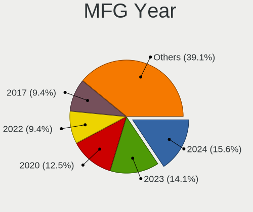
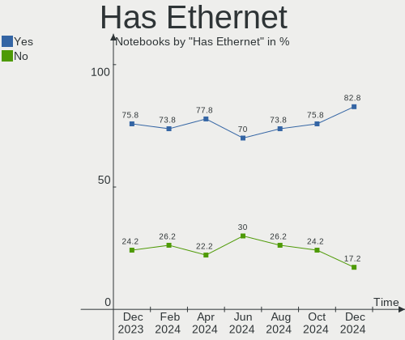

Manjaro Hardware Trends (Notebooks)
-----------------------------------

A project to identify most popular hardware characteristics and track their change
over time based on data collected by Manjaro users at https://Linux-Hardware.org.

Anyone can contribute to this report by the [hw-probe](https://github.com/linuxhw/hw-probe) tool:

    sudo -E hw-probe -all -upload

Full-feature report is available here: https://linux-hardware.org/?view=trends

Period: Nov, 2021.

Contents
--------

* [ System ](#system)
  - [ OS                       ](#os)
  - [ OS Family                ](#os-family)
  - [ Kernel                   ](#kernel)
  - [ Kernel Family            ](#kernel-family)
  - [ Kernel Major Ver.        ](#kernel-major-ver)
  - [ Arch                     ](#arch)
  - [ DE                       ](#de)
  - [ Display Server           ](#display-server)
  - [ Display Manager          ](#display-manager)
  - [ OS Lang                  ](#os-lang)
  - [ Boot Mode                ](#boot-mode)
  - [ Filesystem               ](#filesystem)
  - [ Part. scheme             ](#part-scheme)
  - [ Dual Boot with Linux/BSD ](#dual-boot-with-linuxbsd)
  - [ Dual Boot (Win)          ](#dual-boot-win)

* [ Board ](#board)
  - [ Vendor                   ](#vendor)
  - [ Model                    ](#model)
  - [ Model Family             ](#model-family)
  - [ MFG Year                 ](#mfg-year)
  - [ Form Factor              ](#form-factor)
  - [ Secure Boot              ](#secure-boot)
  - [ Coreboot                 ](#coreboot)
  - [ RAM Size                 ](#ram-size)
  - [ RAM Used                 ](#ram-used)
  - [ Total Drives             ](#total-drives)
  - [ Has CD-ROM               ](#has-cd-rom)
  - [ Has Ethernet             ](#has-ethernet)
  - [ Has WiFi                 ](#has-wifi)
  - [ Has Bluetooth            ](#has-bluetooth)

* [ Location ](#location)
  - [ Country                  ](#country)
  - [ City                     ](#city)

* [ Drives ](#drives)
  - [ Drive Vendor             ](#drive-vendor)
  - [ Drive Model              ](#drive-model)
  - [ HDD Vendor               ](#hdd-vendor)
  - [ SSD Vendor               ](#ssd-vendor)
  - [ Drive Kind               ](#drive-kind)
  - [ Drive Connector          ](#drive-connector)
  - [ Drive Size               ](#drive-size)
  - [ Space Total              ](#space-total)
  - [ Space Used               ](#space-used)
  - [ Malfunc. Drives          ](#malfunc-drives)
  - [ Malfunc. Drive Vendor    ](#malfunc-drive-vendor)
  - [ Malfunc. HDD Vendor      ](#malfunc-hdd-vendor)
  - [ Malfunc. Drive Kind      ](#malfunc-drive-kind)
  - [ Failed Drives            ](#failed-drives)
  - [ Failed Drive Vendor      ](#failed-drive-vendor)
  - [ Drive Status             ](#drive-status)

* [ Storage controller ](#storage-controller)
  - [ Storage Vendor           ](#storage-vendor)
  - [ Storage Model            ](#storage-model)
  - [ Storage Kind             ](#storage-kind)

* [ Processor ](#processor)
  - [ CPU Vendor               ](#cpu-vendor)
  - [ CPU Model                ](#cpu-model)
  - [ CPU Model Family         ](#cpu-model-family)
  - [ CPU Cores                ](#cpu-cores)
  - [ CPU Sockets              ](#cpu-sockets)
  - [ CPU Threads              ](#cpu-threads)
  - [ CPU Op-Modes             ](#cpu-op-modes)
  - [ CPU Microcode            ](#cpu-microcode)
  - [ CPU Microarch            ](#cpu-microarch)

* [ Graphics ](#graphics)
  - [ GPU Vendor               ](#gpu-vendor)
  - [ GPU Model                ](#gpu-model)
  - [ GPU Combo                ](#gpu-combo)
  - [ GPU Driver               ](#gpu-driver)
  - [ GPU Memory               ](#gpu-memory)

* [ Monitor ](#monitor)
  - [ Monitor Vendor           ](#monitor-vendor)
  - [ Monitor Model            ](#monitor-model)
  - [ Monitor Resolution       ](#monitor-resolution)
  - [ Monitor Diagonal         ](#monitor-diagonal)
  - [ Monitor Width            ](#monitor-width)
  - [ Aspect Ratio             ](#aspect-ratio)
  - [ Monitor Area             ](#monitor-area)
  - [ Pixel Density            ](#pixel-density)
  - [ Multiple Monitors        ](#multiple-monitors)

* [ Network ](#network)
  - [ Net Controller Vendor    ](#net-controller-vendor)
  - [ Net Controller Model     ](#net-controller-model)
  - [ Wireless Vendor          ](#wireless-vendor)
  - [ Wireless Model           ](#wireless-model)
  - [ Ethernet Vendor          ](#ethernet-vendor)
  - [ Ethernet Model           ](#ethernet-model)
  - [ Net Controller Kind      ](#net-controller-kind)
  - [ Used Controller          ](#used-controller)
  - [ NICs                     ](#nics)
  - [ IPv6                     ](#ipv6)

* [ Bluetooth ](#bluetooth)
  - [ Bluetooth Vendor         ](#bluetooth-vendor)
  - [ Bluetooth Model          ](#bluetooth-model)

* [ Sound ](#sound)
  - [ Sound Vendor             ](#sound-vendor)
  - [ Sound Model              ](#sound-model)

* [ Memory ](#memory)
  - [ Memory Vendor            ](#memory-vendor)
  - [ Memory Model             ](#memory-model)
  - [ Memory Kind              ](#memory-kind)
  - [ Memory Form Factor       ](#memory-form-factor)
  - [ Memory Size              ](#memory-size)
  - [ Memory Speed             ](#memory-speed)

* [ Printers & scanners ](#printers--scanners)
  - [ Printer Vendor           ](#printer-vendor)
  - [ Printer Model            ](#printer-model)
  - [ Scanner Vendor           ](#scanner-vendor)
  - [ Scanner Model            ](#scanner-model)

* [ Camera ](#camera)
  - [ Camera Vendor            ](#camera-vendor)
  - [ Camera Model             ](#camera-model)

* [ Security ](#security)
  - [ Fingerprint Vendor       ](#fingerprint-vendor)
  - [ Fingerprint Model        ](#fingerprint-model)
  - [ Chipcard Vendor          ](#chipcard-vendor)
  - [ Chipcard Model           ](#chipcard-model)

* [ Unsupported ](#unsupported)
  - [ Unsupported Devices      ](#unsupported-devices)
  - [ Unsupported Device Types ](#unsupported-device-types)

System
------

OS
--

Installed operating systems

| Name             | Notebooks | Percent |
|------------------|-----------|---------|
| Manjaro 21.1.6   | 40        | 37.04%  |
| Manjaro          | 37        | 34.26%  |
| Manjaro 21.2.0   | 25        | 23.15%  |
| Manjaro 21.2pre1 | 4         | 3.7%    |
| Manjaro 21.1.2   | 1         | 0.93%   |
| Manjaro 21.0.7   | 1         | 0.93%   |

OS Family
---------

OS without a version

| Name    | Notebooks | Percent |
|---------|-----------|---------|
| Manjaro | 108       | 100%    |

Kernel
------

Version of the Linux kernel

| Version                     | Notebooks | Percent |
|-----------------------------|-----------|---------|
| 5.13.19-2-MANJARO           | 31        | 28.7%   |
| 5.14.10-1-MANJARO           | 17        | 15.74%  |
| 5.15.2-2-MANJARO            | 14        | 12.96%  |
| 5.10.70-1-MANJARO           | 13        | 12.04%  |
| 5.10.79-1-MANJARO           | 9         | 8.33%   |
| 5.15.0-1-MANJARO            | 4         | 3.7%    |
| 5.9.16-1-MANJARO            | 3         | 2.78%   |
| 5.14.18-1-MANJARO           | 3         | 2.78%   |
| 5.4.150-1-MANJARO           | 2         | 1.85%   |
| 5.16.0-1-MANJARO            | 2         | 1.85%   |
| 5.15.2-1-rt19-MANJARO       | 2         | 1.85%   |
| 5.14.15-xanmod1-cacule-1    | 1         | 0.93%   |
| 5.14.14-1-MANJARO           | 1         | 0.93%   |
| 5.13.13-1-MANJARO           | 1         | 0.93%   |
| 5.11.22-2-MANJARO           | 1         | 0.93%   |
| 5.10.75-1-MANJARO           | 1         | 0.93%   |
| 5.10.73-xanmod1-MANJARO-LTS | 1         | 0.93%   |
| 5.10.56-1-MANJARO           | 1         | 0.93%   |
| 4.19.217-1-MANJARO          | 1         | 0.93%   |

Kernel Family
-------------

Linux kernel without a distro release

| Version  | Notebooks | Percent |
|----------|-----------|---------|
| 5.13.19  | 31        | 28.7%   |
| 5.14.10  | 17        | 15.74%  |
| 5.15.2   | 16        | 14.81%  |
| 5.10.70  | 13        | 12.04%  |
| 5.10.79  | 9         | 8.33%   |
| 5.15.0   | 4         | 3.7%    |
| 5.9.16   | 3         | 2.78%   |
| 5.14.18  | 3         | 2.78%   |
| 5.4.150  | 2         | 1.85%   |
| 5.16.0   | 2         | 1.85%   |
| 5.14.15  | 1         | 0.93%   |
| 5.14.14  | 1         | 0.93%   |
| 5.13.13  | 1         | 0.93%   |
| 5.11.22  | 1         | 0.93%   |
| 5.10.75  | 1         | 0.93%   |
| 5.10.73  | 1         | 0.93%   |
| 5.10.56  | 1         | 0.93%   |
| 4.19.217 | 1         | 0.93%   |

Kernel Major Ver.
-----------------

Linux kernel major version

| Version | Notebooks | Percent |
|---------|-----------|---------|
| 5.13    | 32        | 29.63%  |
| 5.10    | 25        | 23.15%  |
| 5.14    | 22        | 20.37%  |
| 5.15    | 20        | 18.52%  |
| 5.9     | 3         | 2.78%   |
| 5.4     | 2         | 1.85%   |
| 5.16    | 2         | 1.85%   |
| 5.11    | 1         | 0.93%   |
| 4.19    | 1         | 0.93%   |

Arch
----

OS architecture (x86_64, i586, etc.)

| Name   | Notebooks | Percent |
|--------|-----------|---------|
| x86_64 | 108       | 100%    |

DE
--

Desktop Environment

| Name           | Notebooks | Percent |
|----------------|-----------|---------|
| KDE5           | 37        | 34.26%  |
| GNOME          | 27        | 25%     |
| XFCE           | 26        | 24.07%  |
| Unknown        | 9         | 8.33%   |
| X-Cinnamon     | 3         | 2.78%   |
| KDE            | 1         | 0.93%   |
| i3-with-shmlog | 1         | 0.93%   |
| i3             | 1         | 0.93%   |
| Deepin         | 1         | 0.93%   |
| Cinnamon       | 1         | 0.93%   |
| bspwm          | 1         | 0.93%   |

Display Server
--------------

X11 or Wayland

| Name    | Notebooks | Percent |
|---------|-----------|---------|
| X11     | 84        | 77.78%  |
| Wayland | 21        | 19.44%  |
| Unknown | 2         | 1.85%   |
| Tty     | 1         | 0.93%   |

Display Manager
---------------

SDDM, LightDM, etc.

| Name    | Notebooks | Percent |
|---------|-----------|---------|
| Unknown | 37        | 34.26%  |
| SDDM    | 28        | 25.93%  |
| LightDM | 27        | 25%     |
| GDM     | 16        | 14.81%  |

OS Lang
-------

Language

| Lang    | Notebooks | Percent |
|---------|-----------|---------|
| en_US   | 48        | 44.44%  |
| de_DE   | 13        | 12.04%  |
| en_GB   | 8         | 7.41%   |
| fr_FR   | 7         | 6.48%   |
| ru_RU   | 4         | 3.7%    |
| en_CA   | 4         | 3.7%    |
| Unknown | 4         | 3.7%    |
| pl_PL   | 3         | 2.78%   |
| it_IT   | 3         | 2.78%   |
| pt_BR   | 2         | 1.85%   |
| zh_CN   | 1         | 0.93%   |
| tr_TR   | 1         | 0.93%   |
| es_US   | 1         | 0.93%   |
| es_MX   | 1         | 0.93%   |
| es_ES   | 1         | 0.93%   |
| es_CL   | 1         | 0.93%   |
| en_IL   | 1         | 0.93%   |
| en_IE   | 1         | 0.93%   |
| en_AU   | 1         | 0.93%   |
| en_AT   | 1         | 0.93%   |
| el_GR   | 1         | 0.93%   |
| de_AT   | 1         | 0.93%   |

Boot Mode
---------

EFI or BIOS

| Mode | Notebooks | Percent |
|------|-----------|---------|
| BIOS | 61        | 56.48%  |
| EFI  | 47        | 43.52%  |

Filesystem
----------

Type of filesystem

| Type    | Notebooks | Percent |
|---------|-----------|---------|
| Ext4    | 92        | 85.19%  |
| Btrfs   | 10        | 9.26%   |
| Overlay | 3         | 2.78%   |
| Xfs     | 1         | 0.93%   |
| Tmpfs   | 1         | 0.93%   |
| F2fs    | 1         | 0.93%   |

Part. scheme
------------

Scheme of partitioning

| Type    | Notebooks | Percent |
|---------|-----------|---------|
| Unknown | 55        | 50.93%  |
| GPT     | 44        | 40.74%  |
| MBR     | 9         | 8.33%   |

Dual Boot with Linux/BSD
------------------------

Hosting more than one Linux/BSD

| Dual boot | Notebooks | Percent |
|-----------|-----------|---------|
| No        | 96        | 88.89%  |
| Yes       | 12        | 11.11%  |

Dual Boot (Win)
---------------

Hosting Linux and Windows

| Dual boot | Notebooks | Percent |
|-----------|-----------|---------|
| No        | 73        | 67.59%  |
| Yes       | 35        | 32.41%  |

Board
-----

Vendor
------

Motherboard manufacturer

| Name             | Notebooks | Percent |
|------------------|-----------|---------|
| Lenovo           | 29        | 26.85%  |
| Dell             | 19        | 17.59%  |
| Hewlett-Packard  | 16        | 14.81%  |
| Acer             | 13        | 12.04%  |
| ASUSTek Computer | 11        | 10.19%  |
| HUAWEI           | 4         | 3.7%    |
| Toshiba          | 3         | 2.78%   |
| MSI              | 3         | 2.78%   |
| Sony             | 2         | 1.85%   |
| Timi             | 1         | 0.93%   |
| Schenker         | 1         | 0.93%   |
| PC Specialist    | 1         | 0.93%   |
| Notebook         | 1         | 0.93%   |
| LG Electronics   | 1         | 0.93%   |
| Google           | 1         | 0.93%   |
| Fujitsu          | 1         | 0.93%   |
| Clevo            | 1         | 0.93%   |

Model
-----

Motherboard model

| Name                                         | Notebooks | Percent |
|----------------------------------------------|-----------|---------|
| Toshiba Satellite NB10t-A-102                | 2         | 1.85%   |
| Lenovo Z50-70 20354                          | 2         | 1.85%   |
| Lenovo ThinkBook 15-IIL 20SM                 | 2         | 1.85%   |
| Lenovo IdeaPad 120S-14IAP 81A5               | 2         | 1.85%   |
| Dell XPS 13 9310                             | 2         | 1.85%   |
| Dell Vostro 5402                             | 2         | 1.85%   |
| Toshiba Satellite C50-A                      | 1         | 0.93%   |
| Timi RedmiBook Pro 14S                       | 1         | 0.93%   |
| Sony VPCEB2Z1E                               | 1         | 0.93%   |
| Sony SVF14N1E2ES                             | 1         | 0.93%   |
| Schenker XMG CORE 15(M20, RTX 2060)          | 1         | 0.93%   |
| PC Specialist NH5x_7xRCx,RDx                 | 1         | 0.93%   |
| Notebook NH5xAx                              | 1         | 0.93%   |
| MSI Prestige 15 A11SCX                       | 1         | 0.93%   |
| MSI GP66 Leopard 11UG                        | 1         | 0.93%   |
| MSI GP66 Leopard 10UG                        | 1         | 0.93%   |
| LG R510                                      | 1         | 0.93%   |
| Lenovo V330-15IKB 81AX                       | 1         | 0.93%   |
| Lenovo ThinkPad X250 20CLS7R400              | 1         | 0.93%   |
| Lenovo ThinkPad X230 2324FV6                 | 1         | 0.93%   |
| Lenovo ThinkPad X1 Extreme Gen 4i 20Y50011US | 1         | 0.93%   |
| Lenovo ThinkPad X1 Extreme 2nd 20QVCTO1WW    | 1         | 0.93%   |
| Lenovo ThinkPad X1 Carbon Gen 9 20XW00A9US   | 1         | 0.93%   |
| Lenovo ThinkPad X1 Carbon Gen 8 20U9005MUS   | 1         | 0.93%   |
| Lenovo ThinkPad T470s 20HF003QUS             | 1         | 0.93%   |
| Lenovo ThinkPad T460s 20F9S08Y00             | 1         | 0.93%   |
| Lenovo ThinkPad T450s 20BWS3MG00             | 1         | 0.93%   |
| Lenovo ThinkPad T440s 20AQ004URT             | 1         | 0.93%   |
| Lenovo ThinkPad T430 2349Y3D                 | 1         | 0.93%   |
| Lenovo ThinkPad T430 2349G4G                 | 1         | 0.93%   |
| Lenovo ThinkPad E15 Gen 3 20YHS00A00         | 1         | 0.93%   |
| Lenovo ThinkPad E14 Gen 2 20TA000DUK         | 1         | 0.93%   |
| Lenovo ThinkBook 14 G2 ARE 20VF              | 1         | 0.93%   |
| Lenovo ThinkBook 13s G2 ITL 20V9             | 1         | 0.93%   |
| Lenovo IdeaPad 5 14ITL05 82FE                | 1         | 0.93%   |
| Lenovo IdeaPad 320S-14IKB 80X4               | 1         | 0.93%   |
| Lenovo IdeaPad 320-15ISK 80XH                | 1         | 0.93%   |
| Lenovo IdeaPad 100-15IBD 80QQ                | 1         | 0.93%   |
| Lenovo G70-35 80Q5                           | 1         | 0.93%   |
| Lenovo G50-80 80E5                           | 1         | 0.93%   |
| HUAWEI WRT-WX9                               | 1         | 0.93%   |
| HUAWEI NBLB-WAX9N                            | 1         | 0.93%   |
| HUAWEI HVY-WXX9                              | 1         | 0.93%   |
| HUAWEI BOHK-WAX9X                            | 1         | 0.93%   |
| HP ZBook Studio G5                           | 1         | 0.93%   |
| HP Stream Laptop 14-ax0XX                    | 1         | 0.93%   |
| HP ProBook 450 G6                            | 1         | 0.93%   |
| HP ProBook 450 G5                            | 1         | 0.93%   |
| HP Pavilion Laptop 14-ce3xxx                 | 1         | 0.93%   |
| HP Pavilion Gaming Laptop 15-ec1xxx          | 1         | 0.93%   |
| HP Pavilion g6                               | 1         | 0.93%   |
| HP Pavilion dv6                              | 1         | 0.93%   |
| HP Pavilion 15                               | 1         | 0.93%   |
| HP Laptop 15-dy2xxx                          | 1         | 0.93%   |
| HP Laptop 15-db1xxx                          | 1         | 0.93%   |
| HP EliteBook 850 G7 Notebook PC              | 1         | 0.93%   |
| HP EliteBook 840 G6                          | 1         | 0.93%   |
| HP 250 G5 Notebook PC                        | 1         | 0.93%   |
| HP 250 G3                                    | 1         | 0.93%   |
| HP 2000                                      | 1         | 0.93%   |

Model Family
------------

Motherboard model prefix

| Name               | Notebooks | Percent |
|--------------------|-----------|---------|
| Lenovo ThinkPad    | 14        | 12.96%  |
| Acer Aspire        | 10        | 9.26%   |
| Lenovo IdeaPad     | 6         | 5.56%   |
| HP Pavilion        | 5         | 4.63%   |
| Dell XPS           | 5         | 4.63%   |
| Dell Latitude      | 5         | 4.63%   |
| Dell Inspiron      | 5         | 4.63%   |
| Lenovo ThinkBook   | 4         | 3.7%    |
| Dell Vostro        | 4         | 3.7%    |
| Toshiba Satellite  | 3         | 2.78%   |
| ASUS VivoBook      | 3         | 2.78%   |
| MSI GP66           | 2         | 1.85%   |
| Lenovo Z50-70      | 2         | 1.85%   |
| HP ProBook         | 2         | 1.85%   |
| HP Laptop          | 2         | 1.85%   |
| HP EliteBook       | 2         | 1.85%   |
| HP 250             | 2         | 1.85%   |
| ASUS ASUS          | 2         | 1.85%   |
| Acer Swift         | 2         | 1.85%   |
| Timi RedmiBook     | 1         | 0.93%   |
| Sony VPCEB2Z1E     | 1         | 0.93%   |
| Sony SVF14N1E2ES   | 1         | 0.93%   |
| Schenker XMG       | 1         | 0.93%   |
| PC Specialist NH5x | 1         | 0.93%   |
| Notebook NH5xAx    | 1         | 0.93%   |
| MSI Prestige       | 1         | 0.93%   |
| LG R510            | 1         | 0.93%   |
| Lenovo V330-15IKB  | 1         | 0.93%   |
| Lenovo G70-35      | 1         | 0.93%   |
| Lenovo G50-80      | 1         | 0.93%   |
| HUAWEI WRT-WX9     | 1         | 0.93%   |
| HUAWEI NBLB-WAX9N  | 1         | 0.93%   |
| HUAWEI HVY-WXX9    | 1         | 0.93%   |
| HUAWEI BOHK-WAX9X  | 1         | 0.93%   |
| HP ZBook           | 1         | 0.93%   |
| HP Stream          | 1         | 0.93%   |
| HP 2000            | 1         | 0.93%   |
| Google Nami        | 1         | 0.93%   |
| Fujitsu LIFEBOOK   | 1         | 0.93%   |
| Clevo W240EU       | 1         | 0.93%   |
| ASUS X550LA        | 1         | 0.93%   |
| ASUS X541UAK       | 1         | 0.93%   |
| ASUS TUF           | 1         | 0.93%   |
| ASUS TP300LJ       | 1         | 0.93%   |
| ASUS ROG           | 1         | 0.93%   |
| ASUS GL753VD       | 1         | 0.93%   |
| Acer Predator      | 1         | 0.93%   |

MFG Year
--------

Motherboard manufacture year

| Year | Notebooks | Percent |
|------|-----------|---------|
| 2021 | 32        | 29.63%  |
| 2019 | 17        | 15.74%  |
| 2020 | 15        | 13.89%  |
| 2013 | 10        | 9.26%   |
| 2018 | 6         | 5.56%   |
| 2017 | 6         | 5.56%   |
| 2014 | 6         | 5.56%   |
| 2015 | 5         | 4.63%   |
| 2012 | 3         | 2.78%   |
| 2016 | 2         | 1.85%   |
| 2011 | 2         | 1.85%   |
| 2009 | 2         | 1.85%   |
| 2010 | 1         | 0.93%   |
| 2008 | 1         | 0.93%   |

Form Factor
-----------

Physical design of the computer

| Name     | Notebooks | Percent |
|----------|-----------|---------|
| Notebook | 108       | 100%    |

Secure Boot
-----------

Enabled or disabled

| State    | Notebooks | Percent |
|----------|-----------|---------|
| Disabled | 108       | 100%    |

Coreboot
--------

Have coreboot on board

| Used | Notebooks | Percent |
|------|-----------|---------|
| No   | 107       | 99.07%  |
| Yes  | 1         | 0.93%   |

RAM Size
--------

Total RAM memory

| Size in GB  | Notebooks | Percent |
|-------------|-----------|---------|
| 4.01-8.0    | 34        | 31.48%  |
| 3.01-4.0    | 23        | 21.3%   |
| 8.01-16.0   | 22        | 20.37%  |
| 16.01-24.0  | 17        | 15.74%  |
| 32.01-64.0  | 8         | 7.41%   |
| 64.01-256.0 | 2         | 1.85%   |
| 24.01-32.0  | 1         | 0.93%   |
| 2.01-3.0    | 1         | 0.93%   |

RAM Used
--------

Used RAM memory

| Used GB   | Notebooks | Percent |
|-----------|-----------|---------|
| 2.01-3.0  | 33        | 30.56%  |
| 1.01-2.0  | 31        | 28.7%   |
| 4.01-8.0  | 22        | 20.37%  |
| 3.01-4.0  | 17        | 15.74%  |
| 8.01-16.0 | 3         | 2.78%   |
| 0.51-1.0  | 2         | 1.85%   |

Total Drives
------------

Number of drives on board

| Drives | Notebooks | Percent |
|--------|-----------|---------|
| 1      | 71        | 65.74%  |
| 2      | 32        | 29.63%  |
| 3      | 4         | 3.7%    |
| 4      | 1         | 0.93%   |

Has CD-ROM
----------

Has CD-ROM on board

| Presented | Notebooks | Percent |
|-----------|-----------|---------|
| No        | 80        | 74.07%  |
| Yes       | 28        | 25.93%  |

Has Ethernet
------------

Has Ethernet on board

| Presented | Notebooks | Percent |
|-----------|-----------|---------|
| Yes       | 82        | 75.93%  |
| No        | 26        | 24.07%  |

Has WiFi
--------

Has WiFi module

| Presented | Notebooks | Percent |
|-----------|-----------|---------|
| Yes       | 108       | 100%    |

Has Bluetooth
-------------

Has Bluetooth module

| Presented | Notebooks | Percent |
|-----------|-----------|---------|
| Yes       | 90        | 83.33%  |
| No        | 18        | 16.67%  |

Location
--------

Country
-------

Geographic location (country)

| Country     | Notebooks | Percent |
|-------------|-----------|---------|
| Germany     | 19        | 17.59%  |
| USA         | 17        | 15.74%  |
| France      | 8         | 7.41%   |
| Italy       | 5         | 4.63%   |
| Russia      | 4         | 3.7%    |
| Poland      | 4         | 3.7%    |
| Brazil      | 4         | 3.7%    |
| Turkey      | 3         | 2.78%   |
| Netherlands | 3         | 2.78%   |
| Hungary     | 3         | 2.78%   |
| Greece      | 3         | 2.78%   |
| Canada      | 3         | 2.78%   |
| Austria     | 3         | 2.78%   |
| UK          | 2         | 1.85%   |
| Sri Lanka   | 2         | 1.85%   |
| Romania     | 2         | 1.85%   |
| Kenya       | 2         | 1.85%   |
| India       | 2         | 1.85%   |
| Bulgaria    | 2         | 1.85%   |
| Venezuela   | 1         | 0.93%   |
| Uruguay     | 1         | 0.93%   |
| Switzerland | 1         | 0.93%   |
| Sweden      | 1         | 0.93%   |
| Spain       | 1         | 0.93%   |
| Slovenia    | 1         | 0.93%   |
| Portugal    | 1         | 0.93%   |
| Peru        | 1         | 0.93%   |
| Pakistan    | 1         | 0.93%   |
| Lebanon     | 1         | 0.93%   |
| Japan       | 1         | 0.93%   |
| Israel      | 1         | 0.93%   |
| Iran        | 1         | 0.93%   |
| Indonesia   | 1         | 0.93%   |
| Chile       | 1         | 0.93%   |
| Belarus     | 1         | 0.93%   |
| Australia   | 1         | 0.93%   |

City
----

Geographic location (city)

| City         | Notebooks | Percent |
|--------------|-----------|---------|
| Chamb?©ry    | 4         | 3.7%    |
| Budapest     | 3         | 2.78%   |
| Vienna       | 2         | 1.85%   |
| Sofia        | 2         | 1.85%   |
| Nairobi      | 2         | 1.85%   |
| Montreal     | 2         | 1.85%   |
| Iasi         | 2         | 1.85%   |
| Ankara       | 2         | 1.85%   |
| Yulee        | 1         | 0.93%   |
| Wonosari     | 1         | 0.93%   |
| Warsaw       | 1         | 0.93%   |
| Vladimir     | 1         | 0.93%   |
| Vilshult     | 1         | 0.93%   |
| Viguzzolo    | 1         | 0.93%   |
| Venice       | 1         | 0.93%   |
| Ulyanovsk    | 1         | 0.93%   |
| Trofarello   | 1         | 0.93%   |
| Trikala      | 1         | 0.93%   |
| Thomasville  | 1         | 0.93%   |
| The Hague    | 1         | 0.93%   |
| Tehran       | 1         | 0.93%   |
| Tarn??w      | 1         | 0.93%   |
| Sydney       | 1         | 0.93%   |
| Stuttgart    | 1         | 0.93%   |
| S??o Paulo   | 1         | 0.93%   |
| Santiago     | 1         | 0.93%   |
| Santa Ana    | 1         | 0.93%   |
| San Diego    | 1         | 0.93%   |
| San Antonio  | 1         | 0.93%   |
| Rome         | 1         | 0.93%   |
| Rockford     | 1         | 0.93%   |
| Ribnica      | 1         | 0.93%   |
| Rho          | 1         | 0.93%   |
| Rawalpindi   | 1         | 0.93%   |
| Piliyandala  | 1         | 0.93%   |
| Paris        | 1         | 0.93%   |
| Panama City  | 1         | 0.93%   |
| Palm Harbor  | 1         | 0.93%   |
| Oldenburg    | 1         | 0.93%   |
| Norwich      | 1         | 0.93%   |
| Norfolk      | 1         | 0.93%   |
| Nieblum      | 1         | 0.93%   |
| New York     | 1         | 0.93%   |
| Netanya      | 1         | 0.93%   |
| Navi Mumbai  | 1         | 0.93%   |
| Nanaimo      | 1         | 0.93%   |
| Munich       | 1         | 0.93%   |
| Minsk        | 1         | 0.93%   |
| Matur?­n     | 1         | 0.93%   |
| Massagno     | 1         | 0.93%   |
| Maple Valley | 1         | 0.93%   |
| Maldonado    | 1         | 0.93%   |
| Lima         | 1         | 0.93%   |
| Leojac       | 1         | 0.93%   |
| L??beck      | 1         | 0.93%   |
| Laxenburg    | 1         | 0.93%   |
| Larissa      | 1         | 0.93%   |
| Langenhagen  | 1         | 0.93%   |
| Krefeld      | 1         | 0.93%   |
| Krakow       | 1         | 0.93%   |

Drives
------

Drive Vendor
------------

Hard drive vendors

| Vendor              | Notebooks | Drives | Percent |
|---------------------|-----------|--------|---------|
| Samsung Electronics | 20        | 25     | 14.39%  |
| Seagate             | 15        | 16     | 10.79%  |
| WDC                 | 14        | 14     | 10.07%  |
| Sandisk             | 11        | 12     | 7.91%   |
| Kingston            | 11        | 12     | 7.91%   |
| Toshiba             | 10        | 10     | 7.19%   |
| Intel               | 8         | 9      | 5.76%   |
| Crucial             | 7         | 7      | 5.04%   |
| Unknown             | 6         | 8      | 4.32%   |
| SK Hynix            | 5         | 5      | 3.6%    |
| Phison              | 5         | 5      | 3.6%    |
| A-DATA Technology   | 5         | 6      | 3.6%    |
| Micron Technology   | 4         | 4      | 2.88%   |
| KIOXIA              | 4         | 4      | 2.88%   |
| ADATA Technology    | 2         | 2      | 1.44%   |
| ZTE                 | 1         | 1      | 0.72%   |
| YMTC                | 1         | 1      | 0.72%   |
| Transcend           | 1         | 1      | 0.72%   |
| Mushkin             | 1         | 1      | 0.72%   |
| Morebeck-V602       | 1         | 1      | 0.72%   |
| Lexar               | 1         | 1      | 0.72%   |
| Leven               | 1         | 1      | 0.72%   |
| JMicron             | 1         | 1      | 0.72%   |
| Intenso             | 1         | 1      | 0.72%   |
| Hitachi             | 1         | 1      | 0.72%   |
| HGST                | 1         | 1      | 0.72%   |
| China               | 1         | 1      | 0.72%   |

Drive Model
-----------

Hard drive models

| Model                                        | Notebooks | Percent |
|----------------------------------------------|-----------|---------|
| Samsung NVMe SSD Drive 512GB                 | 4         | 2.65%   |
| Toshiba MQ04ABF100 1TB                       | 3         | 1.99%   |
| Seagate ST500LT012-1DG142 500GB              | 3         | 1.99%   |
| Samsung MZALQ512HALU-000L2 512GB             | 3         | 1.99%   |
| WDC PC SN730 NVMe 512GB                      | 2         | 1.32%   |
| Unknown HBG4a2  32GB                         | 2         | 1.32%   |
| Toshiba MQ01ABF050 500GB                     | 2         | 1.32%   |
| Seagate ST1000LM035-1RK172 1TB               | 2         | 1.32%   |
| Seagate Expansion 1TB                        | 2         | 1.32%   |
| Sandisk NVMe SSD Drive 512GB                 | 2         | 1.32%   |
| Sandisk NVMe SSD Drive 256GB                 | 2         | 1.32%   |
| Samsung SSD 970 EVO Plus 1TB                 | 2         | 1.32%   |
| Samsung SSD 850 EVO 500GB                    | 2         | 1.32%   |
| KIOXIA KBG40ZNV256G 256GB                    | 2         | 1.32%   |
| Kingston SV300S37A 60G SSD                   | 2         | 1.32%   |
| Kingston NVMe SSD Drive 512GB                | 2         | 1.32%   |
| Kingston NVMe SSD Drive 256GB                | 2         | 1.32%   |
| Intel SSDPEKNW512G8 512GB                    | 2         | 1.32%   |
| Crucial CT480BX500SSD1 480GB                 | 2         | 1.32%   |
| Crucial CT1000MX500SSD1 1TB                  | 2         | 1.32%   |
| ZTE MMC Storage 8GB                          | 1         | 0.66%   |
| YMTC PC005 512GB                             | 1         | 0.66%   |
| WDC WDS100T2B0B 1TB SSD                      | 1         | 0.66%   |
| WDC WD7500BPKX-75HPJT0 752GB                 | 1         | 0.66%   |
| WDC WD5000LUCT-63RC2Y0 500GB                 | 1         | 0.66%   |
| WDC WD5000LPVX-75V0TT0 500GB                 | 1         | 0.66%   |
| WDC WD5000LPCX-24VHAT0 500GB                 | 1         | 0.66%   |
| WDC WD3200BPVT-22JJ5T0 320GB                 | 1         | 0.66%   |
| WDC WD2500BEVT-75ZCT2 250GB                  | 1         | 0.66%   |
| WDC WD20SPZX-22CRAT0 2TB                     | 1         | 0.66%   |
| WDC WD10JPVT-75A1YT0 1TB                     | 1         | 0.66%   |
| WDC PC SN530 SDBPMPZ-256G-1101 256GB         | 1         | 0.66%   |
| WDC PC SN520 SDAPNUW-512G-1014 512GB         | 1         | 0.66%   |
| WDC PC SN520 SDAPNUW-256G-1002 256GB         | 1         | 0.66%   |
| Unknown TO  128GB                            | 1         | 0.66%   |
| Unknown SE32G  32GB                          | 1         | 0.66%   |
| Unknown MMC64G  64GB                         | 1         | 0.66%   |
| Unknown MMC Card  64GB                       | 1         | 0.66%   |
| Unknown MMC Card  32GB                       | 1         | 0.66%   |
| Unknown AFGCD  32GB                          | 1         | 0.66%   |
| Transcend TS128GMSA230S 128GB SSD            | 1         | 0.66%   |
| Toshiba NVMe SSD Drive 512GB                 | 1         | 0.66%   |
| Toshiba NVMe SSD Drive 256GB                 | 1         | 0.66%   |
| Toshiba MQ01ABD100 1TB                       | 1         | 0.66%   |
| Toshiba MK1652GSX 160GB                      | 1         | 0.66%   |
| Toshiba KXG50ZNV512G 512GB                   | 1         | 0.66%   |
| SK Hynix SKHynix_HFS512GDE9X081N 512GB       | 1         | 0.66%   |
| SK Hynix NVMe SSD Drive 256GB                | 1         | 0.66%   |
| SK Hynix NVMe SSD Drive 128GB                | 1         | 0.66%   |
| SK Hynix NVMe SSD Drive 1024GB               | 1         | 0.66%   |
| SK Hynix HFS128G39TND-N210A 128GB SSD        | 1         | 0.66%   |
| Seagate ST9500325AS 500GB                    | 1         | 0.66%   |
| Seagate ST640LM000 HM641JI 640GB             | 1         | 0.66%   |
| Seagate ST500LM021-1KJ152 500GB              | 1         | 0.66%   |
| Seagate ST500LM012 HN-M500MBB 500GB          | 1         | 0.66%   |
| Seagate ST2000LM015-2E8174 2TB               | 1         | 0.66%   |
| Seagate ST1000LM024 HN-M101MBB 1TB           | 1         | 0.66%   |
| Seagate BUP Slim SL 1TB                      | 1         | 0.66%   |
| Seagate BarraCuda 120 SSD ZA500CM10003 500GB | 1         | 0.66%   |
| Seagate BarraCuda 120 SSD ZA1000CM10003 1TB  | 1         | 0.66%   |

HDD Vendor
----------

Hard disk drive vendors

| Vendor  | Notebooks | Drives | Percent |
|---------|-----------|--------|---------|
| Seagate | 14        | 14     | 45.16%  |
| WDC     | 8         | 8      | 25.81%  |
| Toshiba | 7         | 7      | 22.58%  |
| Hitachi | 1         | 1      | 3.23%   |
| HGST    | 1         | 1      | 3.23%   |

SSD Vendor
----------

Solid state drive vendors

| Vendor              | Notebooks | Drives | Percent |
|---------------------|-----------|--------|---------|
| Samsung Electronics | 8         | 8      | 19.51%  |
| Crucial             | 7         | 7      | 17.07%  |
| Kingston            | 5         | 5      | 12.2%   |
| A-DATA Technology   | 4         | 5      | 9.76%   |
| SanDisk             | 3         | 4      | 7.32%   |
| Seagate             | 2         | 2      | 4.88%   |
| Intel               | 2         | 2      | 4.88%   |
| WDC                 | 1         | 1      | 2.44%   |
| Transcend           | 1         | 1      | 2.44%   |
| SK Hynix            | 1         | 1      | 2.44%   |
| Mushkin             | 1         | 1      | 2.44%   |
| Morebeck-V602       | 1         | 1      | 2.44%   |
| Lexar               | 1         | 1      | 2.44%   |
| Leven               | 1         | 1      | 2.44%   |
| JMicron             | 1         | 1      | 2.44%   |
| Intenso             | 1         | 1      | 2.44%   |
| China               | 1         | 1      | 2.44%   |

Drive Kind
----------

HDD or SSD

| Kind    | Notebooks | Drives | Percent |
|---------|-----------|--------|---------|
| NVMe    | 55        | 65     | 41.35%  |
| SSD     | 37        | 43     | 27.82%  |
| HDD     | 31        | 31     | 23.31%  |
| MMC     | 8         | 10     | 6.02%   |
| Unknown | 2         | 2      | 1.5%    |

Drive Connector
---------------

SATA, SAS, NVMe, etc.

| Type | Notebooks | Drives | Percent |
|------|-----------|--------|---------|
| SATA | 61        | 67     | 46.56%  |
| NVMe | 55        | 65     | 41.98%  |
| MMC  | 8         | 10     | 6.11%   |
| SAS  | 7         | 9      | 5.34%   |

Drive Size
----------

Size of hard drive

| Size in TB | Notebooks | Drives | Percent |
|------------|-----------|--------|---------|
| 0.01-0.5   | 41        | 47     | 61.19%  |
| 0.51-1.0   | 23        | 24     | 34.33%  |
| 1.01-2.0   | 3         | 3      | 4.48%   |

Space Total
-----------

Amount of disk space available on the file system

| Size in GB     | Notebooks | Percent |
|----------------|-----------|---------|
| 251-500        | 27        | 25%     |
| 101-250        | 22        | 20.37%  |
| 501-1000       | 17        | 15.74%  |
| 1001-2000      | 11        | 10.19%  |
| Unknown        | 11        | 10.19%  |
| 51-100         | 10        | 9.26%   |
| 1-20           | 4         | 3.7%    |
| 21-50          | 3         | 2.78%   |
| 2001-3000      | 2         | 1.85%   |
| More than 3000 | 1         | 0.93%   |

Space Used
----------

Amount of used disk space

| Used GB   | Notebooks | Percent |
|-----------|-----------|---------|
| 21-50     | 23        | 21.3%   |
| 1-20      | 21        | 19.44%  |
| 101-250   | 19        | 17.59%  |
| 51-100    | 15        | 13.89%  |
| Unknown   | 11        | 10.19%  |
| 251-500   | 10        | 9.26%   |
| 501-1000  | 6         | 5.56%   |
| 1001-2000 | 3         | 2.78%   |

Malfunc. Drives
---------------

Drive models with a malfunction

| Model                           | Notebooks | Drives | Percent |
|---------------------------------|-----------|--------|---------|
| WDC WD3200BPVT-22JJ5T0 320GB    | 1         | 1      | 25%     |
| WDC WD10JPVT-75A1YT0 1TB        | 1         | 1      | 25%     |
| Seagate ST500LM021-1KJ152 500GB | 1         | 1      | 25%     |
| HGST HTS545050A7E680 500GB      | 1         | 1      | 25%     |

Malfunc. Drive Vendor
---------------------

Vendors of faulty drives

| Vendor  | Notebooks | Drives | Percent |
|---------|-----------|--------|---------|
| WDC     | 2         | 2      | 50%     |
| Seagate | 1         | 1      | 25%     |
| HGST    | 1         | 1      | 25%     |

Malfunc. HDD Vendor
-------------------

Vendors of faulty HDD drives

| Vendor  | Notebooks | Drives | Percent |
|---------|-----------|--------|---------|
| WDC     | 2         | 2      | 50%     |
| Seagate | 1         | 1      | 25%     |
| HGST    | 1         | 1      | 25%     |

Malfunc. Drive Kind
-------------------

Kinds of faulty drives

| Kind | Notebooks | Drives | Percent |
|------|-----------|--------|---------|
| HDD  | 4         | 4      | 100%    |

Failed Drives
-------------

Failed drive models

Zero info for selected period =(

Failed Drive Vendor
-------------------

Failed drive vendors

Zero info for selected period =(

Drive Status
------------

Number of failed and malfunc. drives

| Status   | Notebooks | Drives | Percent |
|----------|-----------|--------|---------|
| Detected | 68        | 90     | 58.62%  |
| Works    | 44        | 57     | 37.93%  |
| Malfunc  | 4         | 4      | 3.45%   |

Storage controller
------------------

Storage Vendor
--------------

Storage controller vendors

| Vendor                       | Notebooks | Percent |
|------------------------------|-----------|---------|
| Intel                        | 75        | 54.74%  |
| Samsung Electronics          | 14        | 10.22%  |
| Sandisk                      | 11        | 8.03%   |
| AMD                          | 9         | 6.57%   |
| Kingston Technology Company  | 6         | 4.38%   |
| SK Hynix                     | 4         | 2.92%   |
| Phison Electronics           | 4         | 2.92%   |
| KIOXIA                       | 4         | 2.92%   |
| Toshiba America Info Systems | 3         | 2.19%   |
| Micron Technology            | 3         | 2.19%   |
| ADATA Technology             | 2         | 1.46%   |
| Yangtze Memory Technologies  | 1         | 0.73%   |
| Realtek Semiconductor        | 1         | 0.73%   |

Storage Model
-------------

Storage controller models

| Model                                                                            | Notebooks | Percent |
|----------------------------------------------------------------------------------|-----------|---------|
| Intel 7 Series Chipset Family 6-port SATA Controller [AHCI mode]                 | 12        | 8.16%   |
| AMD FCH SATA Controller [AHCI mode]                                              | 9         | 6.12%   |
| Samsung NVMe SSD Controller SM981/PM981/PM983                                    | 7         | 4.76%   |
| Intel Sunrise Point-LP SATA Controller [AHCI mode]                               | 7         | 4.76%   |
| Samsung NVMe SSD Controller 980                                                  | 6         | 4.08%   |
| Intel Volume Management Device NVMe RAID Controller                              | 6         | 4.08%   |
| Intel Cannon Lake Mobile PCH SATA AHCI Controller                                | 6         | 4.08%   |
| Intel 82801 Mobile SATA Controller [RAID mode]                                   | 6         | 4.08%   |
| Intel Wildcat Point-LP SATA Controller [AHCI Mode]                               | 5         | 3.4%    |
| Intel 8 Series SATA Controller 1 [AHCI mode]                                     | 5         | 3.4%    |
| KIOXIA Non-Volatile memory controller                                            | 4         | 2.72%   |
| Intel Cannon Point-LP SATA Controller [AHCI Mode]                                | 4         | 2.72%   |
| Sandisk WD Blue SN550 NVMe SSD                                                   | 3         | 2.04%   |
| Sandisk WD Black SN750 / PC SN730 NVMe SSD                                       | 3         | 2.04%   |
| Micron Non-Volatile memory controller                                            | 3         | 2.04%   |
| Intel SSD 660P Series                                                            | 3         | 2.04%   |
| Intel Atom Processor E3800 Series SATA AHCI Controller                           | 3         | 2.04%   |
| SK Hynix Gold P31 SSD                                                            | 2         | 1.36%   |
| Sandisk WD Blue SN500 / PC SN520 NVMe SSD                                        | 2         | 1.36%   |
| Sandisk Non-Volatile memory controller                                           | 2         | 1.36%   |
| Phison E16 PCIe4 NVMe Controller                                                 | 2         | 1.36%   |
| Phison E12 NVMe Controller                                                       | 2         | 1.36%   |
| Kingston Company Company Non-Volatile memory controller                          | 2         | 1.36%   |
| Kingston Company A2000 NVMe SSD                                                  | 2         | 1.36%   |
| Intel Tiger Lake-LP SATA Controller [AHCI mode]                                  | 2         | 1.36%   |
| Intel Non-Volatile memory controller                                             | 2         | 1.36%   |
| Intel Ice Lake-LP SATA Controller [AHCI mode]                                    | 2         | 1.36%   |
| Intel HM170/QM170 Chipset SATA Controller [AHCI Mode]                            | 2         | 1.36%   |
| Intel Celeron/Pentium Silver Processor SATA Controller                           | 2         | 1.36%   |
| Intel Celeron N3350/Pentium N4200/Atom E3900 Series SATA AHCI Controller         | 2         | 1.36%   |
| Intel 82801IBM/IEM (ICH9M/ICH9M-E) 4 port SATA Controller [AHCI mode]            | 2         | 1.36%   |
| Intel 82801HM/HEM (ICH8M/ICH8M-E) SATA Controller [AHCI mode]                    | 2         | 1.36%   |
| Intel 82801HM/HEM (ICH8M/ICH8M-E) IDE Controller                                 | 2         | 1.36%   |
| Intel 6 Series/C200 Series Chipset Family 6 port Mobile SATA AHCI Controller     | 2         | 1.36%   |
| ADATA Non-Volatile memory controller                                             | 2         | 1.36%   |
| Yangtze Memory Non-Volatile memory controller                                    | 1         | 0.68%   |
| Toshiba America Info Systems XG6 NVMe SSD Controller                             | 1         | 0.68%   |
| Toshiba America Info Systems XG4 NVMe SSD Controller                             | 1         | 0.68%   |
| Toshiba America Info Systems Toshiba America Info Non-Volatile memory controller | 1         | 0.68%   |
| SK Hynix BC511                                                                   | 1         | 0.68%   |
| SK Hynix BC501 NVMe Solid State Drive                                            | 1         | 0.68%   |
| Sandisk WD Black 2018/SN750 / PC SN720 NVMe SSD                                  | 1         | 0.68%   |
| Samsung NVMe SSD Controller SM961/PM961/SM963                                    | 1         | 0.68%   |
| Realtek Realtek Non-Volatile memory controller                                   | 1         | 0.68%   |
| Kingston Company U-SNS8154P3 NVMe SSD                                            | 1         | 0.68%   |
| Kingston Company OM3PDP3 NVMe SSD                                                | 1         | 0.68%   |
| Intel SSD 600P Series                                                            | 1         | 0.68%   |
| Intel Comet Lake SATA AHCI Controller                                            | 1         | 0.68%   |
| Intel Atom/Celeron/Pentium Processor x5-E8000/J3xxx/N3xxx Series SATA Controller | 1         | 0.68%   |
| Intel 5 Series/3400 Series Chipset 4 port SATA IDE Controller                    | 1         | 0.68%   |
| Intel 5 Series/3400 Series Chipset 4 port SATA AHCI Controller                   | 1         | 0.68%   |
| Intel 5 Series/3400 Series Chipset 2 port SATA IDE Controller                    | 1         | 0.68%   |
| Intel 400 Series Chipset Family SATA AHCI Controller                             | 1         | 0.68%   |
| AMD 400 Series Chipset SATA Controller                                           | 1         | 0.68%   |

Storage Kind
------------

Kind of storage controller (IDE, SATA, NVMe, SAS, ...)

| Kind | Notebooks | Percent |
|------|-----------|---------|
| SATA | 71        | 50.71%  |
| NVMe | 54        | 38.57%  |
| RAID | 12        | 8.57%   |
| IDE  | 3         | 2.14%   |

Processor
---------

CPU Vendor
----------

Processor vendors

| Vendor | Notebooks | Percent |
|--------|-----------|---------|
| Intel  | 96        | 88.89%  |
| AMD    | 12        | 11.11%  |

CPU Model
---------

Processor models

| Model                                         | Notebooks | Percent |
|-----------------------------------------------|-----------|---------|
| Intel 11th Gen Core i5-1135G7 @ 2.40GHz       | 8         | 7.41%   |
| Intel Core i7-9750H CPU @ 2.60GHz             | 5         | 4.63%   |
| Intel Core i5-8265U CPU @ 1.60GHz             | 4         | 3.7%    |
| Intel 11th Gen Core i7-1165G7 @ 2.80GHz       | 3         | 2.78%   |
| Intel Pentium CPU N3510 @ 1.99GHz             | 2         | 1.85%   |
| Intel Core i7-8565U CPU @ 1.80GHz             | 2         | 1.85%   |
| Intel Core i7-8550U CPU @ 1.80GHz             | 2         | 1.85%   |
| Intel Core i7-7700HQ CPU @ 2.80GHz            | 2         | 1.85%   |
| Intel Core i7-3632QM CPU @ 2.20GHz            | 2         | 1.85%   |
| Intel Core i5-8250U CPU @ 1.60GHz             | 2         | 1.85%   |
| Intel Core i5-7200U CPU @ 2.50GHz             | 2         | 1.85%   |
| Intel Core i5-5200U CPU @ 2.20GHz             | 2         | 1.85%   |
| Intel Core i5-3320M CPU @ 2.60GHz             | 2         | 1.85%   |
| Intel Core i5-1035G4 CPU @ 1.10GHz            | 2         | 1.85%   |
| Intel Core i3-6006U CPU @ 2.00GHz             | 2         | 1.85%   |
| Intel Core i3-5010U CPU @ 2.10GHz             | 2         | 1.85%   |
| Intel Celeron CPU N3350 @ 1.10GHz             | 2         | 1.85%   |
| Intel Celeron CPU 1000M @ 1.80GHz             | 2         | 1.85%   |
| Intel 11th Gen Core i7-1185G7 @ 3.00GHz       | 2         | 1.85%   |
| AMD Ryzen 5 4600H with Radeon Graphics        | 2         | 1.85%   |
| AMD Ryzen 5 3500U with Radeon Vega Mobile Gfx | 2         | 1.85%   |
| Intel Pentium Silver N5000 CPU @ 1.10GHz      | 1         | 0.93%   |
| Intel Pentium Dual-Core CPU T4400 @ 2.20GHz   | 1         | 0.93%   |
| Intel Pentium Dual-Core CPU T4200 @ 2.00GHz   | 1         | 0.93%   |
| Intel Pentium CPU N3710 @ 1.60GHz             | 1         | 0.93%   |
| Intel Pentium CPU B950 @ 2.10GHz              | 1         | 0.93%   |
| Intel Pentium CPU 4415U @ 2.30GHz             | 1         | 0.93%   |
| Intel Pentium 3558U @ 1.70GHz                 | 1         | 0.93%   |
| Intel Pentium 3556U @ 1.70GHz                 | 1         | 0.93%   |
| Intel Core i9-10885H CPU @ 2.40GHz            | 1         | 0.93%   |
| Intel Core i7-8750H CPU @ 2.20GHz             | 1         | 0.93%   |
| Intel Core i7-8665U CPU @ 1.90GHz             | 1         | 0.93%   |
| Intel Core i7-7600U CPU @ 2.80GHz             | 1         | 0.93%   |
| Intel Core i7-4510U CPU @ 2.00GHz             | 1         | 0.93%   |
| Intel Core i7-3520M CPU @ 2.90GHz             | 1         | 0.93%   |
| Intel Core i7-2630QM CPU @ 2.00GHz            | 1         | 0.93%   |
| Intel Core i7-10750H CPU @ 2.60GHz            | 1         | 0.93%   |
| Intel Core i7-10510U CPU @ 1.80GHz            | 1         | 0.93%   |
| Intel Core i5-9300H CPU @ 2.40GHz             | 1         | 0.93%   |
| Intel Core i5-7300U CPU @ 2.60GHz             | 1         | 0.93%   |
| Intel Core i5-6200U CPU @ 2.30GHz             | 1         | 0.93%   |
| Intel Core i5-5300U CPU @ 2.30GHz             | 1         | 0.93%   |
| Intel Core i5-4210U CPU @ 1.70GHz             | 1         | 0.93%   |
| Intel Core i5-4200U CPU @ 1.60GHz             | 1         | 0.93%   |
| Intel Core i5-3380M CPU @ 2.90GHz             | 1         | 0.93%   |
| Intel Core i5-3230M CPU @ 2.60GHz             | 1         | 0.93%   |
| Intel Core i5-2450M CPU @ 2.50GHz             | 1         | 0.93%   |
| Intel Core i5-1035G1 CPU @ 1.00GHz            | 1         | 0.93%   |
| Intel Core i5-10300H CPU @ 2.50GHz            | 1         | 0.93%   |
| Intel Core i5-10210U CPU @ 1.60GHz            | 1         | 0.93%   |
| Intel Core i5 CPU M 430 @ 2.27GHz             | 1         | 0.93%   |
| Intel Core i3-8130U CPU @ 2.20GHz             | 1         | 0.93%   |
| Intel Core i3-3217U CPU @ 1.80GHz             | 1         | 0.93%   |
| Intel Core i3-3110M CPU @ 2.40GHz             | 1         | 0.93%   |
| Intel Core i3-10110U CPU @ 2.10GHz            | 1         | 0.93%   |
| Intel Core i3 CPU M 380 @ 2.53GHz             | 1         | 0.93%   |
| Intel Core 2 Duo CPU T7500 @ 2.20GHz          | 1         | 0.93%   |
| Intel Core 2 Duo CPU P9700 @ 2.80GHz          | 1         | 0.93%   |
| Intel Core 2 Duo CPU P8600 @ 2.40GHz          | 1         | 0.93%   |
| Intel Celeron N4000 CPU @ 1.10GHz             | 1         | 0.93%   |

CPU Model Family
----------------

Processor model prefix

| Model                   | Notebooks | Percent |
|-------------------------|-----------|---------|
| Intel Core i5           | 27        | 25%     |
| Intel Core i7           | 21        | 19.44%  |
| Other                   | 17        | 15.74%  |
| Intel Core i3           | 9         | 8.33%   |
| Intel Celeron           | 8         | 7.41%   |
| Intel Pentium           | 7         | 6.48%   |
| AMD Ryzen 5             | 5         | 4.63%   |
| Intel Core 2 Duo        | 3         | 2.78%   |
| AMD Ryzen 7             | 3         | 2.78%   |
| Intel Pentium Dual-Core | 2         | 1.85%   |
| Intel Pentium Silver    | 1         | 0.93%   |
| Intel Core i9           | 1         | 0.93%   |
| AMD Ryzen 9             | 1         | 0.93%   |
| AMD Ryzen 3             | 1         | 0.93%   |
| AMD E2                  | 1         | 0.93%   |
| AMD A4                  | 1         | 0.93%   |

CPU Cores
---------

Number of processor cores

| Number | Notebooks | Percent |
|--------|-----------|---------|
| 2      | 46        | 42.59%  |
| 4      | 44        | 40.74%  |
| 6      | 10        | 9.26%   |
| 8      | 7         | 6.48%   |
| 16     | 1         | 0.93%   |

CPU Sockets
-----------

Number of sockets

| Number | Notebooks | Percent |
|--------|-----------|---------|
| 1      | 108       | 100%    |

CPU Threads
-----------

Threads per core (Hyper-Threading)

| Number | Notebooks | Percent |
|--------|-----------|---------|
| 2      | 84        | 77.78%  |
| 1      | 24        | 22.22%  |

CPU Op-Modes
------------

CPU Operation Modes (32-bit, 64-bit)

| Op mode        | Notebooks | Percent |
|----------------|-----------|---------|
| 32-bit, 64-bit | 108       | 100%    |

CPU Microcode
-------------

Microcode number

| Number     | Notebooks | Percent |
|------------|-----------|---------|
| Unknown    | 52        | 48.15%  |
| 0x806c1    | 9         | 8.33%   |
| 0x306a9    | 7         | 6.48%   |
| 0x906ea    | 5         | 4.63%   |
| 0x806eb    | 4         | 3.7%    |
| 0xa0652    | 3         | 2.78%   |
| 0x806ec    | 3         | 2.78%   |
| 0x806ea    | 3         | 2.78%   |
| 0x806e9    | 2         | 1.85%   |
| 0x806d1    | 2         | 1.85%   |
| 0x506c9    | 2         | 1.85%   |
| 0x406e3    | 2         | 1.85%   |
| 0x30673    | 2         | 1.85%   |
| 0x08600106 | 2         | 1.85%   |
| 0x906e9    | 1         | 0.93%   |
| 0x706e5    | 1         | 0.93%   |
| 0x406c4    | 1         | 0.93%   |
| 0x40651    | 1         | 0.93%   |
| 0x306d4    | 1         | 0.93%   |
| 0x30678    | 1         | 0.93%   |
| 0x1067a    | 1         | 0.93%   |
| 0x08608103 | 1         | 0.93%   |
| 0x08600104 | 1         | 0.93%   |
| 0x07030105 | 1         | 0.93%   |

CPU Microarch
-------------

Microarchitecture

| Name          | Notebooks | Percent |
|---------------|-----------|---------|
| KabyLake      | 29        | 26.85%  |
| TigerLake     | 14        | 12.96%  |
| IvyBridge     | 11        | 10.19%  |
| Zen 2         | 5         | 4.63%   |
| Silvermont    | 5         | 4.63%   |
| Icelake       | 5         | 4.63%   |
| Haswell       | 5         | 4.63%   |
| Broadwell     | 5         | 4.63%   |
| Skylake       | 4         | 3.7%    |
| Penryn        | 4         | 3.7%    |
| Zen+          | 3         | 2.78%   |
| SandyBridge   | 3         | 2.78%   |
| CometLake     | 3         | 2.78%   |
| Unknown       | 3         | 2.78%   |
| Westmere      | 2         | 1.85%   |
| Goldmont plus | 2         | 1.85%   |
| Goldmont      | 2         | 1.85%   |
| Puma          | 1         | 0.93%   |
| Core          | 1         | 0.93%   |
| Bobcat        | 1         | 0.93%   |

Graphics
--------

GPU Vendor
----------

Vendors of graphics cards

| Vendor | Notebooks | Percent |
|--------|-----------|---------|
| Intel  | 93        | 64.58%  |
| Nvidia | 32        | 22.22%  |
| AMD    | 19        | 13.19%  |

GPU Model
---------

Graphics card models

| Model                                                                                    | Notebooks | Percent |
|------------------------------------------------------------------------------------------|-----------|---------|
| Intel TigerLake-LP GT2 [Iris Xe Graphics]                                                | 13        | 8.9%    |
| Intel 3rd Gen Core processor Graphics Controller                                         | 11        | 7.53%   |
| Intel WhiskeyLake-U GT2 [UHD Graphics 620]                                               | 7         | 4.79%   |
| Intel CoffeeLake-H GT2 [UHD Graphics 630]                                                | 7         | 4.79%   |
| Intel UHD Graphics 620                                                                   | 5         | 3.42%   |
| Intel HD Graphics 5500                                                                   | 5         | 3.42%   |
| Intel Haswell-ULT Integrated Graphics Controller                                         | 5         | 3.42%   |
| Intel HD Graphics 620                                                                    | 4         | 2.74%   |
| AMD Renoir                                                                               | 4         | 2.74%   |
| Nvidia TU117M                                                                            | 3         | 2.05%   |
| Nvidia GA104M [GeForce RTX 3070 Mobile / Max-Q]                                          | 3         | 2.05%   |
| Intel Mobile 4 Series Chipset Integrated Graphics Controller                             | 3         | 2.05%   |
| Intel CometLake-U GT2 [UHD Graphics]                                                     | 3         | 2.05%   |
| Intel CometLake-H GT2 [UHD Graphics]                                                     | 3         | 2.05%   |
| Intel Atom Processor Z36xxx/Z37xxx Series Graphics & Display                             | 3         | 2.05%   |
| AMD Picasso/Raven 2 [Radeon Vega Series / Radeon Vega Mobile Series]                     | 3         | 2.05%   |
| Nvidia TU117M [GeForce GTX 1650 Mobile / Max-Q]                                          | 2         | 1.37%   |
| Nvidia TU116M [GeForce GTX 1660 Ti Mobile]                                               | 2         | 1.37%   |
| Nvidia TU106M [GeForce RTX 2060 Mobile]                                                  | 2         | 1.37%   |
| Nvidia GP107M [GeForce GTX 1050 Mobile]                                                  | 2         | 1.37%   |
| Nvidia GP106M [GeForce GTX 1060 Mobile]                                                  | 2         | 1.37%   |
| Nvidia GM108M [GeForce 920MX]                                                            | 2         | 1.37%   |
| Nvidia GM108M [GeForce 840M]                                                             | 2         | 1.37%   |
| Intel TigerLake-H GT1 [UHD Graphics]                                                     | 2         | 1.37%   |
| Intel Skylake GT2 [HD Graphics 520]                                                      | 2         | 1.37%   |
| Intel Mobile GM965/GL960 Integrated Graphics Controller (secondary)                      | 2         | 1.37%   |
| Intel Mobile GM965/GL960 Integrated Graphics Controller (primary)                        | 2         | 1.37%   |
| Intel Iris Plus Graphics G4 (Ice Lake)                                                   | 2         | 1.37%   |
| Intel HD Graphics 630                                                                    | 2         | 1.37%   |
| Intel HD Graphics 500                                                                    | 2         | 1.37%   |
| Intel Atom/Celeron/Pentium Processor x5-E8000/J3xxx/N3xxx Integrated Graphics Controller | 2         | 1.37%   |
| Intel 2nd Generation Core Processor Family Integrated Graphics Controller                | 2         | 1.37%   |
| AMD Topaz XT [Radeon R7 M260/M265 / M340/M360 / M440/M445 / 530/535 / 620/625 Mobile]    | 2         | 1.37%   |
| AMD Sun XT [Radeon HD 8670A/8670M/8690M / R5 M330 / M430 / Radeon 520 Mobile]            | 2         | 1.37%   |
| AMD Lucienne                                                                             | 2         | 1.37%   |
| Nvidia TU117M [GeForce GTX 1650 Ti Mobile]                                               | 1         | 0.68%   |
| Nvidia TU106M [GeForce RTX 2070 Mobile / Max-Q Refresh]                                  | 1         | 0.68%   |
| Nvidia GT218M [GeForce 310M]                                                             | 1         | 0.68%   |
| Nvidia GP108M [GeForce MX330]                                                            | 1         | 0.68%   |
| Nvidia GP108M [GeForce MX250]                                                            | 1         | 0.68%   |
| Nvidia GP108M [GeForce MX150]                                                            | 1         | 0.68%   |
| Nvidia GP107GLM [Quadro P2000 Mobile]                                                    | 1         | 0.68%   |
| Nvidia GM108M [GeForce MX130]                                                            | 1         | 0.68%   |
| Nvidia GK208M [GeForce GT 730M]                                                          | 1         | 0.68%   |
| Nvidia GK208BM [GeForce 920M]                                                            | 1         | 0.68%   |
| Nvidia GF108M [NVS 5400M]                                                                | 1         | 0.68%   |
| Nvidia GA107M [GeForce RTX 3050 Ti Mobile]                                               | 1         | 0.68%   |
| Intel Tiger Lake UHD Graphics                                                            | 1         | 0.68%   |
| Intel Kaby Lake-U GT1 Integrated Graphics Controller                                     | 1         | 0.68%   |
| Intel Iris Plus Graphics G1 (Ice Lake)                                                   | 1         | 0.68%   |
| Intel HD Graphics 520                                                                    | 1         | 0.68%   |
| Intel HD Graphics 510                                                                    | 1         | 0.68%   |
| Intel GeminiLake [UHD Graphics 605]                                                      | 1         | 0.68%   |
| Intel GeminiLake [UHD Graphics 600]                                                      | 1         | 0.68%   |
| Intel Core Processor Integrated Graphics Controller                                      | 1         | 0.68%   |
| AMD Wrestler [Radeon HD 7340]                                                            | 1         | 0.68%   |
| AMD Whistler [Radeon HD 6730M/6770M/7690M XT]                                            | 1         | 0.68%   |
| AMD Whistler [Radeon HD 6630M/6650M/6750M/7670M/7690M]                                   | 1         | 0.68%   |
| AMD Thames [Radeon HD 7500M/7600M Series]                                                | 1         | 0.68%   |
| AMD Mullins [Radeon R3 Graphics]                                                         | 1         | 0.68%   |

GPU Combo
---------

Combinations of graphics cards

| Name           | Notebooks | Percent |
|----------------|-----------|---------|
| 1 x Intel      | 60        | 55.56%  |
| Intel + Nvidia | 27        | 25%     |
| 1 x AMD        | 11        | 10.19%  |
| Intel + AMD    | 6         | 5.56%   |
| 1 x Nvidia     | 2         | 1.85%   |
| AMD + Nvidia   | 2         | 1.85%   |

GPU Driver
----------

Free vs proprietary

| Driver      | Notebooks | Percent |
|-------------|-----------|---------|
| Free        | 85        | 78.7%   |
| Proprietary | 23        | 21.3%   |

GPU Memory
----------

Total video memory

| Size in GB | Notebooks | Percent |
|------------|-----------|---------|
| Unknown    | 95        | 87.96%  |
| 3.01-4.0   | 4         | 3.7%    |
| 7.01-8.0   | 3         | 2.78%   |
| 0.01-0.5   | 3         | 2.78%   |
| 0.51-1.0   | 2         | 1.85%   |
| 1.01-2.0   | 1         | 0.93%   |

Monitor
-------

Monitor Vendor
--------------

Monitor vendors

| Vendor                  | Notebooks | Percent |
|-------------------------|-----------|---------|
| LG Display              | 25        | 19.38%  |
| BOE                     | 23        | 17.83%  |
| AU Optronics            | 21        | 16.28%  |
| Chimei Innolux          | 16        | 12.4%   |
| Samsung Electronics     | 6         | 4.65%   |
| Sharp                   | 5         | 3.88%   |
| PANDA                   | 5         | 3.88%   |
| LGD                     | 2         | 1.55%   |
| LG Philips              | 2         | 1.55%   |
| InfoVision              | 2         | 1.55%   |
| Dell                    | 2         | 1.55%   |
| Chi Mei Optoelectronics | 2         | 1.55%   |
| AOC                     | 2         | 1.55%   |
| Ancor Communications    | 2         | 1.55%   |
| Sony                    | 1         | 0.78%   |
| Positivo                | 1         | 0.78%   |
| Philips                 | 1         | 0.78%   |
| NEC Computers           | 1         | 0.78%   |
| MSI                     | 1         | 0.78%   |
| Lenovo Group Limited    | 1         | 0.78%   |
| KTC                     | 1         | 0.78%   |
| Hitachi                 | 1         | 0.78%   |
| Hewlett-Packard         | 1         | 0.78%   |
| Fujitsu Siemens         | 1         | 0.78%   |
| Eizo                    | 1         | 0.78%   |
| DZX                     | 1         | 0.78%   |
| CAL                     | 1         | 0.78%   |
| BenQ                    | 1         | 0.78%   |

Monitor Model
-------------

Monitor models

| Model                                                                 | Notebooks | Percent |
|-----------------------------------------------------------------------|-----------|---------|
| BOE LCD Monitor BOE0700 1920x1080 344x194mm 15.5-inch                 | 3         | 2.33%   |
| AU Optronics LCD Monitor AUO403D 1920x1080 309x173mm 13.9-inch        | 3         | 2.33%   |
| Sharp LCD Monitor SHP14F9 1920x1200 288x180mm 13.4-inch               | 2         | 1.55%   |
| LG Display LCD Monitor LGD0384 1366x768 344x194mm 15.5-inch           | 2         | 1.55%   |
| Chimei Innolux LCD Monitor CMN14D4 1920x1080 309x173mm 13.9-inch      | 2         | 1.55%   |
| Chimei Innolux LCD Monitor CMN1119 1366x768 260x140mm 11.6-inch       | 2         | 1.55%   |
| BOE LCD Monitor BOE06BD 1366x768 309x173mm 13.9-inch                  | 2         | 1.55%   |
| AU Optronics LCD Monitor AUO213E 1600x900 309x174mm 14.0-inch         | 2         | 1.55%   |
| Sony Nvidia Defaul SNY05FA 1366x768 290x170mm 13.2-inch               | 1         | 0.78%   |
| Sharp LCD Monitor SHP14D0 3840x2400 336x210mm 15.6-inch               | 1         | 0.78%   |
| Sharp LCD Monitor SHP14BA 1920x1080 344x194mm 15.5-inch               | 1         | 0.78%   |
| Sharp LCD Monitor SHP1479 1920x1280 259x173mm 12.3-inch               | 1         | 0.78%   |
| Samsung Electronics LCD Monitor SEC3050 1366x768 309x174mm 14.0-inch  | 1         | 0.78%   |
| Samsung Electronics LCD Monitor SDC5441 1366x768 340x190mm 15.3-inch  | 1         | 0.78%   |
| Samsung Electronics LCD Monitor SDC4852 3840x2160 340x190mm 15.3-inch | 1         | 0.78%   |
| Samsung Electronics LCD Monitor SDC414D 1366x768 309x174mm 14.0-inch  | 1         | 0.78%   |
| Samsung Electronics C27F390 SAM0D32 1920x1080 600x340mm 27.2-inch     | 1         | 0.78%   |
| Samsung Electronics C24F390 SAM0D2C 1920x1080 520x290mm 23.4-inch     | 1         | 0.78%   |
| Positivo SMILE563 NON1503 1360x768 344x194mm 15.5-inch                | 1         | 0.78%   |
| Philips PHL 436M6VBP PHLC179 3840x2160 941x529mm 42.5-inch            | 1         | 0.78%   |
| PANDA LCD Monitor NCP0059 2560x1600 302x189mm 14.0-inch               | 1         | 0.78%   |
| PANDA LCD Monitor NCP004D 1920x1080 344x194mm 15.5-inch               | 1         | 0.78%   |
| PANDA LCD Monitor NCP004B 1920x1080 344x194mm 15.5-inch               | 1         | 0.78%   |
| PANDA LCD Monitor NCP0040 1920x1080 344x194mm 15.5-inch               | 1         | 0.78%   |
| PANDA LCD Monitor NCP0036 1920x1080 344x194mm 15.5-inch               | 1         | 0.78%   |
| NEC Computers E221N NEC2C82 1920x1080 476x268mm 21.5-inch             | 1         | 0.78%   |
| MSI G271 MSI3CB5 1920x1080 598x336mm 27.0-inch                        | 1         | 0.78%   |
| LGD LCD Monitor 1920x1080                                             | 1         | 0.78%   |
| LGD LCD Monitor 11520x2400                                            | 1         | 0.78%   |
| LG Philips LCD Monitor LPL1E01 1280x800 330x210mm 15.4-inch           | 1         | 0.78%   |
| LG Philips LCD Monitor LPL0C01 1280x800 304x190mm 14.1-inch           | 1         | 0.78%   |
| LG Display LP156WH2-TLAA LGD0230 1366x768 344x194mm 15.5-inch         | 1         | 0.78%   |
| LG Display LCD Monitor LGD068A 1920x1080 309x174mm 14.0-inch          | 1         | 0.78%   |
| LG Display LCD Monitor LGD0671 1920x1080 382x215mm 17.3-inch          | 1         | 0.78%   |
| LG Display LCD Monitor LGD0655 1920x1080 344x194mm 15.5-inch          | 1         | 0.78%   |
| LG Display LCD Monitor LGD064C 1920x1080 344x194mm 15.5-inch          | 1         | 0.78%   |
| LG Display LCD Monitor LGD0625 1920x1080 344x194mm 15.5-inch          | 1         | 0.78%   |
| LG Display LCD Monitor LGD0620 1920x1080 382x215mm 17.3-inch          | 1         | 0.78%   |
| LG Display LCD Monitor LGD061E 1920x1080 344x194mm 15.5-inch          | 1         | 0.78%   |
| LG Display LCD Monitor LGD0618 1920x1080 344x194mm 15.5-inch          | 1         | 0.78%   |
| LG Display LCD Monitor LGD05F6 1920x1080 309x174mm 14.0-inch          | 1         | 0.78%   |
| LG Display LCD Monitor LGD05F2 1920x1080 344x194mm 15.5-inch          | 1         | 0.78%   |
| LG Display LCD Monitor LGD059D 1920x1080 309x174mm 14.0-inch          | 1         | 0.78%   |
| LG Display LCD Monitor LGD04E8 1920x1080 382x215mm 17.3-inch          | 1         | 0.78%   |
| LG Display LCD Monitor LGD046B 1366x768 340x190mm 15.3-inch           | 1         | 0.78%   |
| LG Display LCD Monitor LGD044B 1366x768 340x190mm 15.3-inch           | 1         | 0.78%   |
| LG Display LCD Monitor LGD03FF 1920x1080 309x175mm 14.0-inch          | 1         | 0.78%   |
| LG Display LCD Monitor LGD03CD 1366x768 277x156mm 12.5-inch           | 1         | 0.78%   |
| LG Display LCD Monitor LGD0395 1366x768 344x194mm 15.5-inch           | 1         | 0.78%   |
| LG Display LCD Monitor LGD034D 1366x768 344x194mm 15.5-inch           | 1         | 0.78%   |
| LG Display LCD Monitor LGD033E 1366x768 309x174mm 14.0-inch           | 1         | 0.78%   |
| LG Display LCD Monitor LGD033B 1366x768 344x194mm 15.5-inch           | 1         | 0.78%   |
| LG Display LCD Monitor LGD02DC 1366x768 344x194mm 15.5-inch           | 1         | 0.78%   |
| LG Display LCD Monitor LGD01F5 1280x800 304x190mm 14.1-inch           | 1         | 0.78%   |
| Lenovo Group Limited LCD Monitor LEN S28u-10                          | 1         | 0.78%   |
| KTC 32L22-H-CS KTC3202 1360x768 708x398mm 32.0-inch                   | 1         | 0.78%   |
| InfoVision LCD Monitor IVO057D 1920x1080 309x174mm 14.0-inch          | 1         | 0.78%   |
| InfoVision LCD Monitor IVO0533 1366x768 293x164mm 13.2-inch           | 1         | 0.78%   |
| Hitachi FPD TV HTC0083 1920x540                                       | 1         | 0.78%   |
| Hewlett-Packard 27fw HPN354A 1920x1080 598x336mm 27.0-inch            | 1         | 0.78%   |

Monitor Resolution
------------------

Monitor screen resolution

| Resolution         | Notebooks | Percent |
|--------------------|-----------|---------|
| 1920x1080 (FHD)    | 56        | 46.28%  |
| 1366x768 (WXGA)    | 33        | 27.27%  |
| 3840x2160 (4K)     | 5         | 4.13%   |
| 1600x900 (HD+)     | 4         | 3.31%   |
| 1280x800 (WXGA)    | 4         | 3.31%   |
| 2560x1440 (QHD)    | 3         | 2.48%   |
| 1920x1200 (WUXGA)  | 3         | 2.48%   |
| 2560x1600          | 2         | 1.65%   |
| 1360x768           | 2         | 1.65%   |
| 3840x2400          | 1         | 0.83%   |
| 3456x2160          | 1         | 0.83%   |
| 2160x1440          | 1         | 0.83%   |
| 1920x540           | 1         | 0.83%   |
| 1920x1280          | 1         | 0.83%   |
| 1680x1050 (WSXGA+) | 1         | 0.83%   |
| 1280x1024 (SXGA)   | 1         | 0.83%   |
| 11520x2400         | 1         | 0.83%   |
| Unknown            | 1         | 0.83%   |

Monitor Diagonal
----------------

Diagonal size in inches

| Inches  | Notebooks | Percent |
|---------|-----------|---------|
| 15      | 55        | 42.97%  |
| 14      | 24        | 18.75%  |
| 13      | 15        | 11.72%  |
| 17      | 6         | 4.69%   |
| 27      | 5         | 3.91%   |
| 21      | 4         | 3.13%   |
| Unknown | 4         | 3.13%   |
| 12      | 3         | 2.34%   |
| 11      | 3         | 2.34%   |
| 24      | 2         | 1.56%   |
| 23      | 2         | 1.56%   |
| 22      | 2         | 1.56%   |
| 42      | 1         | 0.78%   |
| 32      | 1         | 0.78%   |
| 16      | 1         | 0.78%   |

Monitor Width
-------------

Physical width

| Width in mm | Notebooks | Percent |
|-------------|-----------|---------|
| 301-350     | 88        | 69.84%  |
| 201-300     | 11        | 8.73%   |
| 501-600     | 8         | 6.35%   |
| 351-400     | 7         | 5.56%   |
| 401-500     | 5         | 3.97%   |
| Unknown     | 4         | 3.17%   |
| 701-800     | 1         | 0.79%   |
| 601-700     | 1         | 0.79%   |
| 901-1000    | 1         | 0.79%   |

Aspect Ratio
------------

Proportional relationship between the width and the height

| Ratio   | Notebooks | Percent |
|---------|-----------|---------|
| 16/9    | 94        | 83.19%  |
| 16/10   | 13        | 11.5%   |
| 3/2     | 2         | 1.77%   |
| Unknown | 2         | 1.77%   |
| 5/4     | 1         | 0.88%   |
| 32/9    | 1         | 0.88%   |

Monitor Area
------------

Area in inch²

| Area in inch² | Notebooks | Percent |
|----------------|-----------|---------|
| 101-110        | 55        | 42.97%  |
| 81-90          | 33        | 25.78%  |
| 201-250        | 8         | 6.25%   |
| 121-130        | 6         | 4.69%   |
| 71-80          | 5         | 3.91%   |
| 301-350        | 5         | 3.91%   |
| Unknown        | 4         | 3.13%   |
| 61-70          | 3         | 2.34%   |
| 51-60          | 3         | 2.34%   |
| 151-200        | 2         | 1.56%   |
| 91-100         | 2         | 1.56%   |
| 351-500        | 1         | 0.78%   |
| 501-1000       | 1         | 0.78%   |

Pixel Density
-------------

Pixels per inch

| Density       | Notebooks | Percent |
|---------------|-----------|---------|
| 121-160       | 58        | 46.4%   |
| 101-120       | 36        | 28.8%   |
| 51-100        | 13        | 10.4%   |
| 161-240       | 9         | 7.2%    |
| More than 240 | 4         | 3.2%    |
| Unknown       | 4         | 3.2%    |
| 1-50          | 1         | 0.8%    |

Multiple Monitors
-----------------

Total monitors connected

| Total | Notebooks | Percent |
|-------|-----------|---------|
| 1     | 88        | 81.48%  |
| 2     | 19        | 17.59%  |
| 3     | 1         | 0.93%   |

Network
-------

Net Controller Vendor
---------------------

Controller vendors

| Vendor                     | Notebooks | Percent |
|----------------------------|-----------|---------|
| Realtek Semiconductor      | 63        | 36.84%  |
| Intel                      | 62        | 36.26%  |
| Qualcomm Atheros           | 23        | 13.45%  |
| Broadcom                   | 7         | 4.09%   |
| Xiaomi                     | 2         | 1.17%   |
| TP-Link                    | 2         | 1.17%   |
| Sierra Wireless            | 2         | 1.17%   |
| Ralink                     | 2         | 1.17%   |
| MEDIATEK                   | 2         | 1.17%   |
| Marvell Technology Group   | 2         | 1.17%   |
| ZTE WCDMA Technologies MSM | 1         | 0.58%   |
| Qualcomm                   | 1         | 0.58%   |
| Huawei Technologies        | 1         | 0.58%   |
| ASUSTek Computer           | 1         | 0.58%   |

Net Controller Model
--------------------

Controller models

| Model                                                                          | Notebooks | Percent |
|--------------------------------------------------------------------------------|-----------|---------|
| Realtek RTL8111/8168/8411 PCI Express Gigabit Ethernet Controller              | 40        | 20.1%   |
| Realtek RTL810xE PCI Express Fast Ethernet controller                          | 10        | 5.03%   |
| Intel Wi-Fi 6 AX201                                                            | 10        | 5.03%   |
| Intel Wi-Fi 6 AX200                                                            | 10        | 5.03%   |
| Realtek RTL8153 Gigabit Ethernet Adapter                                       | 7         | 3.52%   |
| Qualcomm Atheros QCA9565 / AR9565 Wireless Network Adapter                     | 6         | 3.02%   |
| Intel Wireless 7265                                                            | 5         | 2.51%   |
| Realtek RTL8822CE 802.11ac PCIe Wireless Network Adapter                       | 4         | 2.01%   |
| Realtek RTL8723BE PCIe Wireless Network Adapter                                | 4         | 2.01%   |
| Qualcomm Atheros QCA9377 802.11ac Wireless Network Adapter                     | 4         | 2.01%   |
| Qualcomm Atheros QCA6174 802.11ac Wireless Network Adapter                     | 4         | 2.01%   |
| Qualcomm Atheros AR9485 Wireless Network Adapter                               | 4         | 2.01%   |
| Intel 82579LM Gigabit Network Connection (Lewisville)                          | 4         | 2.01%   |
| Intel Wireless 8265 / 8275                                                     | 3         | 1.51%   |
| Intel Wireless 7260                                                            | 3         | 1.51%   |
| Intel Ice Lake-LP PCH CNVi WiFi                                                | 3         | 1.51%   |
| Intel Dual Band Wireless-AC 3165 Plus Bluetooth                                | 3         | 1.51%   |
| Intel Comet Lake PCH-LP CNVi WiFi                                              | 3         | 1.51%   |
| Intel Cannon Point-LP CNVi [Wireless-AC]                                       | 3         | 1.51%   |
| Intel Cannon Lake PCH CNVi WiFi                                                | 3         | 1.51%   |
| Realtek RTL8822BE 802.11a/b/g/n/ac WiFi adapter                                | 2         | 1.01%   |
| Ralink RT3290 Wireless 802.11n 1T/1R PCIe                                      | 2         | 1.01%   |
| Qualcomm Atheros AR9287 Wireless Network Adapter (PCI-Express)                 | 2         | 1.01%   |
| MEDIATEK Network controller                                                    | 2         | 1.01%   |
| Intel Wi-Fi 6 AX210/AX211/AX411 160MHz                                         | 2         | 1.01%   |
| Intel Ethernet Connection (4) I219-LM                                          | 2         | 1.01%   |
| Intel Ethernet Connection (3) I218-LM                                          | 2         | 1.01%   |
| Broadcom BCM4313 802.11bgn Wireless Network Adapter                            | 2         | 1.01%   |
| ZTE WCDMA MSM ZTE Mobile Broadband                                             | 1         | 0.5%    |
| Xiaomi Redmi 9A                                                                | 1         | 0.5%    |
| Xiaomi Mi/Redmi series (RNDIS)                                                 | 1         | 0.5%    |
| TP-Link UE300 10/100/1000 LAN (ethernet mode) [Realtek RTL8153]                | 1         | 0.5%    |
| TP-Link 802.11ac NIC                                                           | 1         | 0.5%    |
| Sierra Wireless EM7421                                                         | 1         | 0.5%    |
| Sierra Wireless EM7345 4G LTE                                                  | 1         | 0.5%    |
| Realtek RTL88x2bu [AC1200 Techkey]                                             | 1         | 0.5%    |
| Realtek RTL8852AE 802.11ax PCIe Wireless Network Adapter                       | 1         | 0.5%    |
| Realtek RTL8821CE 802.11ac PCIe Wireless Network Adapter                       | 1         | 0.5%    |
| Realtek RTL8821AE 802.11ac PCIe Wireless Network Adapter                       | 1         | 0.5%    |
| Realtek RTL8723AE PCIe Wireless Network Adapter                                | 1         | 0.5%    |
| Realtek RTL8188EE Wireless Network Adapter                                     | 1         | 0.5%    |
| Realtek RTL8125 2.5GbE Controller                                              | 1         | 0.5%    |
| Qualcomm QCA6390 Wireless Network Adapter [AX500-DBS (2x2)]                    | 1         | 0.5%    |
| Qualcomm Atheros Killer E2500 Gigabit Ethernet Controller                      | 1         | 0.5%    |
| Qualcomm Atheros AR928X Wireless Network Adapter (PCI-Express)                 | 1         | 0.5%    |
| Qualcomm Atheros AR9285 Wireless Network Adapter (PCI-Express)                 | 1         | 0.5%    |
| Qualcomm Atheros AR8162 Fast Ethernet                                          | 1         | 0.5%    |
| Qualcomm Atheros AR8151 v2.0 Gigabit Ethernet                                  | 1         | 0.5%    |
| Qualcomm Atheros AR8132 Fast Ethernet                                          | 1         | 0.5%    |
| Marvell Group Yukon Optima 88E8059 [PCIe Gigabit Ethernet Controller with AVB] | 1         | 0.5%    |
| Marvell Group 88E8040 PCI-E Fast Ethernet Controller                           | 1         | 0.5%    |
| Intel Wireless 8260                                                            | 1         | 0.5%    |
| Intel Wireless 3165                                                            | 1         | 0.5%    |
| Intel Wireless 3160                                                            | 1         | 0.5%    |
| Intel Ultimate N WiFi Link 5300                                                | 1         | 0.5%    |
| Intel Tiger Lake PCH CNVi WiFi                                                 | 1         | 0.5%    |
| Intel PRO/Wireless 3945ABG [Golan] Network Connection                          | 1         | 0.5%    |
| Intel Gemini Lake PCH CNVi WiFi                                                | 1         | 0.5%    |
| Intel Ethernet Controller I225-V                                               | 1         | 0.5%    |
| Intel Ethernet Connection I219-V                                               | 1         | 0.5%    |

Wireless Vendor
---------------

Wireless vendors

| Vendor                | Notebooks | Percent |
|-----------------------|-----------|---------|
| Intel                 | 60        | 54.05%  |
| Qualcomm Atheros      | 22        | 19.82%  |
| Realtek Semiconductor | 16        | 14.41%  |
| Broadcom              | 4         | 3.6%    |
| Sierra Wireless       | 2         | 1.8%    |
| Ralink                | 2         | 1.8%    |
| MEDIATEK              | 2         | 1.8%    |
| TP-Link               | 1         | 0.9%    |
| Qualcomm              | 1         | 0.9%    |
| ASUSTek Computer      | 1         | 0.9%    |

Wireless Model
--------------

Wireless models

| Model                                                          | Notebooks | Percent |
|----------------------------------------------------------------|-----------|---------|
| Intel Wi-Fi 6 AX201                                            | 10        | 9.01%   |
| Intel Wi-Fi 6 AX200                                            | 10        | 9.01%   |
| Qualcomm Atheros QCA9565 / AR9565 Wireless Network Adapter     | 6         | 5.41%   |
| Intel Wireless 7265                                            | 5         | 4.5%    |
| Realtek RTL8822CE 802.11ac PCIe Wireless Network Adapter       | 4         | 3.6%    |
| Realtek RTL8723BE PCIe Wireless Network Adapter                | 4         | 3.6%    |
| Qualcomm Atheros QCA9377 802.11ac Wireless Network Adapter     | 4         | 3.6%    |
| Qualcomm Atheros QCA6174 802.11ac Wireless Network Adapter     | 4         | 3.6%    |
| Qualcomm Atheros AR9485 Wireless Network Adapter               | 4         | 3.6%    |
| Intel Wireless 8265 / 8275                                     | 3         | 2.7%    |
| Intel Wireless 7260                                            | 3         | 2.7%    |
| Intel Ice Lake-LP PCH CNVi WiFi                                | 3         | 2.7%    |
| Intel Dual Band Wireless-AC 3165 Plus Bluetooth                | 3         | 2.7%    |
| Intel Comet Lake PCH-LP CNVi WiFi                              | 3         | 2.7%    |
| Intel Cannon Point-LP CNVi [Wireless-AC]                       | 3         | 2.7%    |
| Intel Cannon Lake PCH CNVi WiFi                                | 3         | 2.7%    |
| Realtek RTL8822BE 802.11a/b/g/n/ac WiFi adapter                | 2         | 1.8%    |
| Ralink RT3290 Wireless 802.11n 1T/1R PCIe                      | 2         | 1.8%    |
| Qualcomm Atheros AR9287 Wireless Network Adapter (PCI-Express) | 2         | 1.8%    |
| MEDIATEK Network controller                                    | 2         | 1.8%    |
| Intel Wi-Fi 6 AX210/AX211/AX411 160MHz                         | 2         | 1.8%    |
| Broadcom BCM4313 802.11bgn Wireless Network Adapter            | 2         | 1.8%    |
| TP-Link 802.11ac NIC                                           | 1         | 0.9%    |
| Sierra Wireless EM7421                                         | 1         | 0.9%    |
| Sierra Wireless EM7345 4G LTE                                  | 1         | 0.9%    |
| Realtek RTL88x2bu [AC1200 Techkey]                             | 1         | 0.9%    |
| Realtek RTL8852AE 802.11ax PCIe Wireless Network Adapter       | 1         | 0.9%    |
| Realtek RTL8821CE 802.11ac PCIe Wireless Network Adapter       | 1         | 0.9%    |
| Realtek RTL8821AE 802.11ac PCIe Wireless Network Adapter       | 1         | 0.9%    |
| Realtek RTL8723AE PCIe Wireless Network Adapter                | 1         | 0.9%    |
| Realtek RTL8188EE Wireless Network Adapter                     | 1         | 0.9%    |
| Qualcomm QCA6390 Wireless Network Adapter [AX500-DBS (2x2)]    | 1         | 0.9%    |
| Qualcomm Atheros AR928X Wireless Network Adapter (PCI-Express) | 1         | 0.9%    |
| Qualcomm Atheros AR9285 Wireless Network Adapter (PCI-Express) | 1         | 0.9%    |
| Intel Wireless 8260                                            | 1         | 0.9%    |
| Intel Wireless 3165                                            | 1         | 0.9%    |
| Intel Wireless 3160                                            | 1         | 0.9%    |
| Intel Ultimate N WiFi Link 5300                                | 1         | 0.9%    |
| Intel Tiger Lake PCH CNVi WiFi                                 | 1         | 0.9%    |
| Intel PRO/Wireless 3945ABG [Golan] Network Connection          | 1         | 0.9%    |
| Intel Gemini Lake PCH CNVi WiFi                                | 1         | 0.9%    |
| Intel Comet Lake PCH CNVi WiFi                                 | 1         | 0.9%    |
| Intel Centrino Wireless-N 2230                                 | 1         | 0.9%    |
| Intel Centrino Wireless-N 1030 [Rainbow Peak]                  | 1         | 0.9%    |
| Intel Centrino Ultimate-N 6300                                 | 1         | 0.9%    |
| Intel Centrino Advanced-N 6205 [Taylor Peak]                   | 1         | 0.9%    |
| Broadcom BCM43142 802.11b/g/n                                  | 1         | 0.9%    |
| Broadcom BCM4312 802.11b/g LP-PHY                              | 1         | 0.9%    |
| ASUS 802.11n WLAN Adapter                                      | 1         | 0.9%    |

Ethernet Vendor
---------------

Ethernet vendors

| Vendor                   | Notebooks | Percent |
|--------------------------|-----------|---------|
| Realtek Semiconductor    | 57        | 67.86%  |
| Intel                    | 16        | 19.05%  |
| Qualcomm Atheros         | 4         | 4.76%   |
| Broadcom                 | 3         | 3.57%   |
| Marvell Technology Group | 2         | 2.38%   |
| Xiaomi                   | 1         | 1.19%   |
| TP-Link                  | 1         | 1.19%   |

Ethernet Model
--------------

Ethernet models

| Model                                                                          | Notebooks | Percent |
|--------------------------------------------------------------------------------|-----------|---------|
| Realtek RTL8111/8168/8411 PCI Express Gigabit Ethernet Controller              | 40        | 47.06%  |
| Realtek RTL810xE PCI Express Fast Ethernet controller                          | 10        | 11.76%  |
| Realtek RTL8153 Gigabit Ethernet Adapter                                       | 7         | 8.24%   |
| Intel 82579LM Gigabit Network Connection (Lewisville)                          | 4         | 4.71%   |
| Intel Ethernet Connection (4) I219-LM                                          | 2         | 2.35%   |
| Intel Ethernet Connection (3) I218-LM                                          | 2         | 2.35%   |
| Xiaomi Mi/Redmi series (RNDIS)                                                 | 1         | 1.18%   |
| TP-Link UE300 10/100/1000 LAN (ethernet mode) [Realtek RTL8153]                | 1         | 1.18%   |
| Realtek RTL8125 2.5GbE Controller                                              | 1         | 1.18%   |
| Qualcomm Atheros Killer E2500 Gigabit Ethernet Controller                      | 1         | 1.18%   |
| Qualcomm Atheros AR8162 Fast Ethernet                                          | 1         | 1.18%   |
| Qualcomm Atheros AR8151 v2.0 Gigabit Ethernet                                  | 1         | 1.18%   |
| Qualcomm Atheros AR8132 Fast Ethernet                                          | 1         | 1.18%   |
| Marvell Group Yukon Optima 88E8059 [PCIe Gigabit Ethernet Controller with AVB] | 1         | 1.18%   |
| Marvell Group 88E8040 PCI-E Fast Ethernet Controller                           | 1         | 1.18%   |
| Intel Ethernet Controller I225-V                                               | 1         | 1.18%   |
| Intel Ethernet Connection I219-V                                               | 1         | 1.18%   |
| Intel Ethernet Connection I218-V                                               | 1         | 1.18%   |
| Intel Ethernet Connection (7) I219-V                                           | 1         | 1.18%   |
| Intel Ethernet Connection (6) I219-LM                                          | 1         | 1.18%   |
| Intel Ethernet Connection (13) I219-LM                                         | 1         | 1.18%   |
| Intel Ethernet Connection (10) I219-V                                          | 1         | 1.18%   |
| Intel 82567LM Gigabit Network Connection                                       | 1         | 1.18%   |
| Broadcom NetXtreme BCM5755M Gigabit Ethernet PCI Express                       | 1         | 1.18%   |
| Broadcom NetLink BCM57785 Gigabit Ethernet PCIe                                | 1         | 1.18%   |
| Broadcom NetLink BCM57780 Gigabit Ethernet PCIe                                | 1         | 1.18%   |

Net Controller Kind
-------------------

Ethernet, WiFi or modem

| Kind     | Notebooks | Percent |
|----------|-----------|---------|
| WiFi     | 108       | 55.67%  |
| Ethernet | 83        | 42.78%  |
| Modem    | 3         | 1.55%   |

Used Controller
---------------

Currently used network controller

| Kind     | Notebooks | Percent |
|----------|-----------|---------|
| WiFi     | 98        | 66.67%  |
| Ethernet | 49        | 33.33%  |

NICs
----

Total network controllers on board

| Total | Notebooks | Percent |
|-------|-----------|---------|
| 2     | 75        | 69.44%  |
| 1     | 32        | 29.63%  |
| 0     | 1         | 0.93%   |

IPv6
----

IPv6 vs IPv4

| Used | Notebooks | Percent |
|------|-----------|---------|
| No   | 80        | 74.07%  |
| Yes  | 28        | 25.93%  |

Bluetooth
---------

Bluetooth Vendor
----------------

Controller vendors

| Vendor                          | Notebooks | Percent |
|---------------------------------|-----------|---------|
| Intel                           | 51        | 55.43%  |
| Realtek Semiconductor           | 8         | 8.7%    |
| Qualcomm Atheros Communications | 8         | 8.7%    |
| IMC Networks                    | 6         | 6.52%   |
| Lite-On Technology              | 4         | 4.35%   |
| Cambridge Silicon Radio         | 4         | 4.35%   |
| Toshiba                         | 3         | 3.26%   |
| Ralink                          | 2         | 2.17%   |
| Broadcom                        | 2         | 2.17%   |
| Realtek                         | 1         | 1.09%   |
| Opticis                         | 1         | 1.09%   |
| Foxconn / Hon Hai               | 1         | 1.09%   |
| Dell                            | 1         | 1.09%   |

Bluetooth Model
---------------

Controller models

| Model                                               | Notebooks | Percent |
|-----------------------------------------------------|-----------|---------|
| Intel Bluetooth Device                              | 16        | 17.39%  |
| Intel Bluetooth wireless interface                  | 14        | 15.22%  |
| Intel Bluetooth 9460/9560 Jefferson Peak (JfP)      | 9         | 9.78%   |
| Intel AX200 Bluetooth                               | 9         | 9.78%   |
| Qualcomm Atheros  Bluetooth Device                  | 5         | 5.43%   |
| IMC Networks Bluetooth Radio                        | 4         | 4.35%   |
| Cambridge Silicon Radio Bluetooth Dongle (HCI mode) | 4         | 4.35%   |
| Toshiba Bluetooth Device                            | 3         | 3.26%   |
| Realtek RTL8723B Bluetooth                          | 3         | 3.26%   |
| Realtek Bluetooth Radio                             | 3         | 3.26%   |
| Ralink RT3290 Bluetooth                             | 2         | 2.17%   |
| Lite-On Qualcomm Atheros QCA9377 Bluetooth          | 2         | 2.17%   |
| Intel AX210 Bluetooth                               | 2         | 2.17%   |
| Realtek RTL8821A Bluetooth                          | 1         | 1.09%   |
| Realtek  Bluetooth 4.2 Adapter                      | 1         | 1.09%   |
| Realtek Bluetooth Radio                             | 1         | 1.09%   |
| Qualcomm Atheros Bluetooth USB Host Controller      | 1         | 1.09%   |
| Qualcomm Atheros AR9462 Bluetooth                   | 1         | 1.09%   |
| Qualcomm Atheros AR3012 Bluetooth 4.0               | 1         | 1.09%   |
| Opticis Bluetooth Radio                             | 1         | 1.09%   |
| Lite-On Wireless_Device                             | 1         | 1.09%   |
| Lite-On Bluetooth Device                            | 1         | 1.09%   |
| Intel Centrino Advanced-N 6230 Bluetooth adapter    | 1         | 1.09%   |
| IMC Networks Wireless_Device                        | 1         | 1.09%   |
| IMC Networks Bluetooth Device                       | 1         | 1.09%   |
| Foxconn / Hon Hai BCM43142A0                        | 1         | 1.09%   |
| Dell Wireless 360 Bluetooth                         | 1         | 1.09%   |
| Broadcom BCM20702 Bluetooth 4.0 [ThinkPad]          | 1         | 1.09%   |
| Broadcom BCM2070 Bluetooth Device                   | 1         | 1.09%   |

Sound
-----

Sound Vendor
------------

Sound card vendors

| Vendor                  | Notebooks | Percent |
|-------------------------|-----------|---------|
| Intel                   | 96        | 74.42%  |
| Nvidia                  | 14        | 10.85%  |
| AMD                     | 14        | 10.85%  |
| Yamaha                  | 1         | 0.78%   |
| Realtek Semiconductor   | 1         | 0.78%   |
| Huawei Technologies     | 1         | 0.78%   |
| GN Netcom               | 1         | 0.78%   |
| BEHRINGER International | 1         | 0.78%   |

Sound Model
-----------

Sound card models

| Model                                                                                             | Notebooks | Percent |
|---------------------------------------------------------------------------------------------------|-----------|---------|
| Intel Tiger Lake-LP Smart Sound Technology Audio Controller                                       | 14        | 9.52%   |
| Intel Sunrise Point-LP HD Audio                                                                   | 14        | 9.52%   |
| Intel 7 Series/C216 Chipset Family High Definition Audio Controller                               | 12        | 8.16%   |
| AMD Family 17h (Models 10h-1fh) HD Audio Controller                                               | 8         | 5.44%   |
| Intel Cannon Point-LP High Definition Audio Controller                                            | 7         | 4.76%   |
| Intel Cannon Lake PCH cAVS                                                                        | 7         | 4.76%   |
| Intel Wildcat Point-LP High Definition Audio Controller                                           | 5         | 3.4%    |
| Intel Haswell-ULT HD Audio Controller                                                             | 5         | 3.4%    |
| Intel Broadwell-U Audio Controller                                                                | 5         | 3.4%    |
| Intel 8 Series HD Audio Controller                                                                | 5         | 3.4%    |
| AMD Renoir Radeon High Definition Audio Controller                                                | 4         | 2.72%   |
| Nvidia TU107 GeForce GTX 1650 High Definition Audio Controller                                    | 3         | 2.04%   |
| Nvidia TU106 High Definition Audio Controller                                                     | 3         | 2.04%   |
| Nvidia GA104 High Definition Audio Controller                                                     | 3         | 2.04%   |
| Intel Tiger Lake-H HD Audio Controller                                                            | 3         | 2.04%   |
| Intel Ice Lake-LP Smart Sound Technology Audio Controller                                         | 3         | 2.04%   |
| Intel Comet Lake PCH-LP cAVS                                                                      | 3         | 2.04%   |
| Intel Comet Lake PCH cAVS                                                                         | 3         | 2.04%   |
| Intel Atom Processor Z36xxx/Z37xxx Series High Definition Audio Controller                        | 3         | 2.04%   |
| Intel 82801I (ICH9 Family) HD Audio Controller                                                    | 3         | 2.04%   |
| AMD Raven/Raven2/Fenghuang HDMI/DP Audio Controller                                               | 3         | 2.04%   |
| Intel CM238 HD Audio Controller                                                                   | 2         | 1.36%   |
| Intel Celeron/Pentium Silver Processor High Definition Audio                                      | 2         | 1.36%   |
| Intel Celeron N3350/Pentium N4200/Atom E3900 Series Audio Cluster                                 | 2         | 1.36%   |
| Intel Atom/Celeron/Pentium Processor x5-E8000/J3xxx/N3xxx Series High Definition Audio Controller | 2         | 1.36%   |
| Intel 82801H (ICH8 Family) HD Audio Controller                                                    | 2         | 1.36%   |
| Intel 6 Series/C200 Series Chipset Family High Definition Audio Controller                        | 2         | 1.36%   |
| Intel 5 Series/3400 Series Chipset High Definition Audio                                          | 2         | 1.36%   |
| AMD FCH Azalia Controller                                                                         | 2         | 1.36%   |
| Yamaha Steinberg UR12                                                                             | 1         | 0.68%   |
| Realtek Semiconductor USB Audio                                                                   | 1         | 0.68%   |
| Nvidia TU116 High Definition Audio Controller                                                     | 1         | 0.68%   |
| Nvidia High Definition Audio Controller                                                           | 1         | 0.68%   |
| Nvidia GP106 High Definition Audio Controller                                                     | 1         | 0.68%   |
| Nvidia GK208 HDMI/DP Audio Controller                                                             | 1         | 0.68%   |
| Nvidia GF108 High Definition Audio Controller                                                     | 1         | 0.68%   |
| Huawei Technologies USB-C HEADSET                                                                 | 1         | 0.68%   |
| GN Netcom Jabra SPEAK 510                                                                         | 1         | 0.68%   |
| BEHRINGER International UMC202HD 192k                                                             | 1         | 0.68%   |
| AMD Wrestler HDMI Audio                                                                           | 1         | 0.68%   |
| AMD Turks HDMI Audio [Radeon HD 6500/6600 / 6700M Series]                                         | 1         | 0.68%   |
| AMD Starship/Matisse HD Audio Controller                                                          | 1         | 0.68%   |
| AMD Redwood HDMI Audio [Radeon HD 5000 Series]                                                    | 1         | 0.68%   |
| AMD Kabini HDMI/DP Audio                                                                          | 1         | 0.68%   |

Memory
------

Memory Vendor
-------------

Memory module vendors

| Vendor              | Notebooks | Percent |
|---------------------|-----------|---------|
| Samsung Electronics | 29        | 39.19%  |
| SK Hynix            | 15        | 20.27%  |
| Micron Technology   | 10        | 13.51%  |
| Kingston            | 5         | 6.76%   |
| Unknown             | 4         | 5.41%   |
| Ramaxel Technology  | 3         | 4.05%   |
| Crucial             | 3         | 4.05%   |
| Transcend           | 1         | 1.35%   |
| Smart               | 1         | 1.35%   |
| Nanya Technology    | 1         | 1.35%   |
| Corsair             | 1         | 1.35%   |
| A-DATA Technology   | 1         | 1.35%   |

Memory Model
------------

Memory module models

| Model                                                                    | Notebooks | Percent |
|--------------------------------------------------------------------------|-----------|---------|
| Samsung RAM M471B5173QH0-YK0 4096MB SODIMM DDR3 1600MT/s                 | 3         | 3.66%   |
| Samsung RAM M471A5244CB0-CRC 4GB SODIMM DDR4 2667MT/s                    | 3         | 3.66%   |
| Samsung RAM M471A1K43DB1-CWE 8GB SODIMM DDR4 3200MT/s                    | 3         | 3.66%   |
| Unknown RAM Module 1GB Row Of Chips LPDDR4 4267MT/s                      | 2         | 2.44%   |
| SK Hynix RAM HMA82GS6JJR8N-VK 16GB SODIMM DDR4 2667MT/s                  | 2         | 2.44%   |
| Samsung RAM Module 16GB SODIMM DDR4 2667MT/s                             | 2         | 2.44%   |
| Samsung RAM M471A2G43AB2-CWE 16384MB SODIMM DDR4 3200MT/s                | 2         | 2.44%   |
| Samsung RAM M471A1G44AB0-CWE 8192MB SODIMM DDR4 3200MT/s                 | 2         | 2.44%   |
| Samsung RAM K4F8E304HB-MGCj 4GB SODIMM DDR4 2400MT/s                     | 2         | 2.44%   |
| Ramaxel RAM RMT3170ME68F9F1600 4GB SODIMM DDR3 1600MT/s                  | 2         | 2.44%   |
| Micron RAM 8KTF51264HZ-1G6E1 4GB SODIMM DDR3 1600MT/s                    | 2         | 2.44%   |
| Unknown RAM Module 4GB SODIMM DDR4 2400MT/s                              | 1         | 1.22%   |
| Unknown RAM Module 4GB Row Of Chips LPDDR3 1867MT/s                      | 1         | 1.22%   |
| Transcend RAM Module 16GB SODIMM DDR4 2667MT/s                           | 1         | 1.22%   |
| Smart RAM SH564128FJ8NZRNSDG 4096MB SODIMM DDR3 1600MT/s                 | 1         | 1.22%   |
| Smart RAM SH564128FJ8NWRNSQG 4GB SODIMM DDR3 1600MT/s                    | 1         | 1.22%   |
| SK Hynix RAM Module 8GB SODIMM DDR4 3200MT/s                             | 1         | 1.22%   |
| SK Hynix RAM Module 16GB SODIMM DDR4 2667MT/s                            | 1         | 1.22%   |
| SK Hynix RAM HYMP125S64CP8-S6 2048MB SODIMM DDR 975MT/s                  | 1         | 1.22%   |
| SK Hynix RAM HYMP112S64CP6-S6 1GB SODIMM DDR 975MT/s                     | 1         | 1.22%   |
| SK Hynix RAM HMT41GS6BFR8A-PB 8GB SODIMM DDR3 1600MT/s                   | 1         | 1.22%   |
| SK Hynix RAM HMT351S6EFR8C-PB 4GB SODIMM DDR3 1600MT/s                   | 1         | 1.22%   |
| SK Hynix RAM HMT351S6CFR8C-PB 4GB SODIMM DDR3 1600MT/s                   | 1         | 1.22%   |
| SK Hynix RAM HMT325S6CFR8C-H9 2GB SODIMM DDR3 1334MT/s                   | 1         | 1.22%   |
| SK Hynix RAM HMT325S6BFR8C-H9 2GB SODIMM DDR3 1600MT/s                   | 1         | 1.22%   |
| SK Hynix RAM HMAA4GS6AJR8N-XN 32GB SODIMM DDR4 3200MT/s                  | 1         | 1.22%   |
| SK Hynix RAM HMAA2GS6AJR8N-XN 16GB SODIMM DDR4 3200MT/s                  | 1         | 1.22%   |
| SK Hynix RAM HMA851S6DJR6N-XN 4096MB Row Of Chips DDR4 3200MT/s          | 1         | 1.22%   |
| SK Hynix RAM HMA851S6CJR6N-XN 4GB Row Of Chips DDR4 3200MT/s             | 1         | 1.22%   |
| SK Hynix RAM HMA851S6CJR6N-VK 4096MB SODIMM DDR4 2667MT/s                | 1         | 1.22%   |
| SK Hynix RAM HMA81GS6AFR8N-UH 8192MB SODIMM DDR4 2667MT/s                | 1         | 1.22%   |
| SK Hynix RAM H9CCNNNBJTALAR-NVD 4GB Row Of Chips LPDDR3 2133MT/s         | 1         | 1.22%   |
| Samsung RAM M471B5273DH0-CK0 4GB SODIMM DDR3 1600MT/s                    | 1         | 1.22%   |
| Samsung RAM M471B5173EB0-YK0 4096MB SODIMM DDR3 1600MT/s                 | 1         | 1.22%   |
| Samsung RAM M471B1G73DB0-YK0 8GB SODIMM DDR3 1600MT/s                    | 1         | 1.22%   |
| Samsung RAM M471A5244CB0-CTD 4096MB DDR4 2667MT/s                        | 1         | 1.22%   |
| Samsung RAM M471A5244BB0-CRC 4GB SODIMM DDR4 2667MT/s                    | 1         | 1.22%   |
| Samsung RAM M471A2K43DB1-CWE 16GB SODIMM DDR4 3200MT/s                   | 1         | 1.22%   |
| Samsung RAM M471A2K43CB1-CTD 16384MB SODIMM DDR4 2667MT/s                | 1         | 1.22%   |
| Samsung RAM M471A1K43DB1-CTD 8GB SODIMM DDR4 2667MT/s                    | 1         | 1.22%   |
| Samsung RAM M471A1K43CB1-CRC 8GB SODIMM DDR4 2667MT/s                    | 1         | 1.22%   |
| Samsung RAM M471A1G44BB0-CWE 8GB SODIMM DDR4 3200MT/s                    | 1         | 1.22%   |
| Samsung RAM M471A1G44AB0-CWE 8192MB Row Of Chips DDR4 3200MT/s           | 1         | 1.22%   |
| Samsung RAM K4B8G1646B-MYK0 4GB Chip DDR3 1600MT/s                       | 1         | 1.22%   |
| Samsung RAM 8E8E8E8E8E8E8E8E8E8E8E8E8E8E8E8E8E8E 4GB SODIMM DDR2 800MT/s | 1         | 1.22%   |
| Samsung RAM 818181818181818181818181818181818181 4GB SODIMM DDR2 800MT/s | 1         | 1.22%   |
| Samsung RAM 1G73BH0-YK0 8GB SODIMM DDR3 1333MT/s                         | 1         | 1.22%   |
| Ramaxel RAM RMSA3320MJ78HAF-3200 8GB SODIMM DDR4 3200MT/s                | 1         | 1.22%   |
| Nanya RAM NT8GA64D88CX3S-JR 8192MB SODIMM DDR4 3200MT/s                  | 1         | 1.22%   |
| Micron RAM 8KTF51264HZ-1G6P1 4GB SODIMM DDR3 1600MT/s                    | 1         | 1.22%   |
| Micron RAM 8ATF1G64HZ-3G2J1 8GB SODIMM DDR4 3200MT/s                     | 1         | 1.22%   |
| Micron RAM 8ATF1G64HZ-2G6E1 8GB SODIMM DDR4 2667MT/s                     | 1         | 1.22%   |
| Micron RAM 53E2G32D4NQ-046 4096MB Row Of Chips LPDDR4 4267MT/s           | 1         | 1.22%   |
| Micron RAM 4ATF51264HZ-3G2J1 4GB SODIMM DDR4 3200MT/s                    | 1         | 1.22%   |
| Micron RAM 4ATF51264HZ-2G3B1 4GB SODIMM DDR4 2400MT/s                    | 1         | 1.22%   |
| Micron RAM 4ATF1G64HZ-3G2E1 8GB SODIMM DDR4 3200MT/s                     | 1         | 1.22%   |
| Micron RAM 16ATF2G64HZ-2G3E1 16GB SODIMM DDR4 2667MT/s                   | 1         | 1.22%   |
| Kingston RAM KHX2666C15S4/8G 8GB SODIMM DDR4 2667MT/s                    | 1         | 1.22%   |
| Kingston RAM KHX2666C15S4/16G 16384MB SODIMM DDR4 2667MT/s               | 1         | 1.22%   |
| Kingston RAM KF3200C20S4/16GX 16GB SODIMM DDR4 3200MT/s                  | 1         | 1.22%   |

Memory Kind
-----------

Memory module kinds

| Kind   | Notebooks | Percent |
|--------|-----------|---------|
| DDR4   | 42        | 62.69%  |
| DDR3   | 16        | 23.88%  |
| LPDDR4 | 5         | 7.46%   |
| LPDDR3 | 2         | 2.99%   |
| DDR2   | 2         | 2.99%   |

Memory Form Factor
------------------

Physical design of the memory module

| Name         | Notebooks | Percent |
|--------------|-----------|---------|
| SODIMM       | 58        | 85.29%  |
| Row Of Chips | 8         | 11.76%  |
| Chip         | 1         | 1.47%   |
| Unknown      | 1         | 1.47%   |

Memory Size
-----------

Memory module size

| Size  | Notebooks | Percent |
|-------|-----------|---------|
| 4096  | 29        | 39.73%  |
| 8192  | 22        | 30.14%  |
| 16384 | 16        | 21.92%  |
| 1024  | 3         | 4.11%   |
| 2048  | 2         | 2.74%   |
| 32768 | 1         | 1.37%   |

Memory Speed
------------

Memory module speed

| Speed | Notebooks | Percent |
|-------|-----------|---------|
| 3200  | 19        | 27.54%  |
| 2667  | 19        | 27.54%  |
| 1600  | 15        | 21.74%  |
| 2400  | 6         | 8.7%    |
| 4267  | 3         | 4.35%   |
| 2133  | 2         | 2.9%    |
| 1867  | 1         | 1.45%   |
| 1334  | 1         | 1.45%   |
| 1333  | 1         | 1.45%   |
| 975   | 1         | 1.45%   |
| 800   | 1         | 1.45%   |

Printers & scanners
-------------------

Printer Vendor
--------------

Printer device vendors

Zero info for selected period =(

Printer Model
-------------

Printer device models

Zero info for selected period =(

Scanner Vendor
--------------

Scanner device vendors

| Vendor | Notebooks | Percent |
|--------|-----------|---------|
| Canon  | 1         | 100%    |

Scanner Model
-------------

Scanner device models

| Model                   | Notebooks | Percent |
|-------------------------|-----------|---------|
| Canon CanoScan LiDE 220 | 1         | 100%    |

Camera
------

Camera Vendor
-------------

Camera device vendors

| Vendor                                 | Notebooks | Percent |
|----------------------------------------|-----------|---------|
| Chicony Electronics                    | 21        | 20.59%  |
| Acer                                   | 19        | 18.63%  |
| IMC Networks                           | 14        | 13.73%  |
| Realtek Semiconductor                  | 11        | 10.78%  |
| Microdia                               | 8         | 7.84%   |
| Quanta                                 | 7         | 6.86%   |
| Lite-On Technology                     | 5         | 4.9%    |
| Suyin                                  | 4         | 3.92%   |
| Sunplus Innovation Technology          | 3         | 2.94%   |
| Syntek                                 | 2         | 1.96%   |
| Logitech                               | 2         | 1.96%   |
| Sunplus Technology                     | 1         | 0.98%   |
| Sonix Technology                       | 1         | 0.98%   |
| LG Electronics                         | 1         | 0.98%   |
| Importek                               | 1         | 0.98%   |
| Cheng Uei Precision Industry (Foxlink) | 1         | 0.98%   |
| ALi                                    | 1         | 0.98%   |

Camera Model
------------

Camera device models

| Model                                                 | Notebooks | Percent |
|-------------------------------------------------------|-----------|---------|
| Chicony Integrated Camera                             | 8         | 7.84%   |
| Acer Integrated Camera                                | 6         | 5.88%   |
| Realtek Integrated_Webcam_HD                          | 5         | 4.9%    |
| IMC Networks USB2.0 HD UVC WebCam                     | 4         | 3.92%   |
| Acer EasyCamera                                       | 4         | 3.92%   |
| Quanta HD User Facing                                 | 3         | 2.94%   |
| Microdia Integrated_Webcam_HD                         | 3         | 2.94%   |
| IMC Networks USB2.0 VGA UVC WebCam                    | 3         | 2.94%   |
| IMC Networks HD Camera                                | 3         | 2.94%   |
| Syntek Integrated Camera                              | 2         | 1.96%   |
| Realtek HD WebCam                                     | 2         | 1.96%   |
| Quanta HP TrueVision HD Camera                        | 2         | 1.96%   |
| Microdia HP Webcam                                    | 2         | 1.96%   |
| Lite-On TOSHIBA Web Camera - HD                       | 2         | 1.96%   |
| Lite-On HP HD Camera                                  | 2         | 1.96%   |
| Chicony HP HD Camera                                  | 2         | 1.96%   |
| Acer Lenovo EasyCamera                                | 2         | 1.96%   |
| Acer HD Webcam                                        | 2         | 1.96%   |
| Acer BisonCam,NB Pro                                  | 2         | 1.96%   |
| Suyin Laptop_Integrated_Webcam_HD                     | 1         | 0.98%   |
| Suyin HP TrueVision HD Integrated Webcam              | 1         | 0.98%   |
| Suyin HP Truevision HD                                | 1         | 0.98%   |
| Suyin Asus Integrated Webcam                          | 1         | 0.98%   |
| Sunplus 1.3M HD WebCam                                | 1         | 0.98%   |
| Sunplus XiaoMi USB 2.0 Webcam                         | 1         | 0.98%   |
| Sunplus HD WebCam                                     | 1         | 0.98%   |
| Sunplus HD User Facing                                | 1         | 0.98%   |
| Sonix USB2.0 HD UVC WebCam                            | 1         | 0.98%   |
| Realtek USB Camera                                    | 1         | 0.98%   |
| Realtek Lenovo EasyCamera                             | 1         | 0.98%   |
| Realtek Integrated Webcam HD                          | 1         | 0.98%   |
| Realtek Integrated Webcam                             | 1         | 0.98%   |
| Quanta LG Webcam                                      | 1         | 0.98%   |
| Quanta HP HD Camera                                   | 1         | 0.98%   |
| Microdia Webcam                                       | 1         | 0.98%   |
| Microdia Laptop_Integrated_Webcam_HD                  | 1         | 0.98%   |
| Microdia Dell Laptop Integrated Webcam HD             | 1         | 0.98%   |
| Logitech Webcam C270                                  | 1         | 0.98%   |
| Logitech HD Pro Webcam C920                           | 1         | 0.98%   |
| Lite-On HP Webcam                                     | 1         | 0.98%   |
| LG LM-X420xxx/G2/G3 Android Phone (MTP/download mode) | 1         | 0.98%   |
| Importek TOSHIBA Web Camera - HD                      | 1         | 0.98%   |
| IMC Networks ov9734_azurewave_camera                  | 1         | 0.98%   |
| IMC Networks Lenovo EasyCamera                        | 1         | 0.98%   |
| IMC Networks Integrated RGB Camera                    | 1         | 0.98%   |
| IMC Networks Integrated Camera                        | 1         | 0.98%   |
| Chicony VGA WebCam                                    | 1         | 0.98%   |
| Chicony thinkpad t430s camera                         | 1         | 0.98%   |
| Chicony Lenovo EasyCamera                             | 1         | 0.98%   |
| Chicony Integrated Camera (1280x720@30)               | 1         | 0.98%   |
| Chicony HP Wide Vision FHD Camera                     | 1         | 0.98%   |
| Chicony HP Truevision HD                              | 1         | 0.98%   |
| Chicony HD WebCam                                     | 1         | 0.98%   |
| Chicony HD User Facing                                | 1         | 0.98%   |
| Chicony FJ Camera                                     | 1         | 0.98%   |
| Chicony EasyCamera                                    | 1         | 0.98%   |
| Chicony Acer CrystalEye Webcam                        | 1         | 0.98%   |
| Cheng Uei Precision Industry (Foxlink) HP Webcam      | 1         | 0.98%   |
| ALi Gateway Webcam                                    | 1         | 0.98%   |
| Acer HP TrueVision HD Webcam                          | 1         | 0.98%   |

Security
--------

Fingerprint Vendor
------------------

Fingerprint sensor vendors

| Vendor                     | Notebooks | Percent |
|----------------------------|-----------|---------|
| Shenzhen Goodix Technology | 8         | 34.78%  |
| Synaptics                  | 7         | 30.43%  |
| Validity Sensors           | 5         | 21.74%  |
| LighTuning Technology      | 2         | 8.7%    |
| Elan Microelectronics      | 1         | 4.35%   |

Fingerprint Model
-----------------

Fingerprint sensor models

| Model                                                                      | Notebooks | Percent |
|----------------------------------------------------------------------------|-----------|---------|
| Shenzhen Goodix  Fingerprint Device                                        | 5         | 21.74%  |
| Shenzhen Goodix FingerPrint                                                | 3         | 13.04%  |
| Synaptics Prometheus MIS Touch Fingerprint Reader                          | 2         | 8.7%    |
| LighTuning EgisTec Touch Fingerprint Sensor                                | 2         | 8.7%    |
| Unknown                                                                    | 2         | 8.7%    |
| Validity Sensors VFS7500 Touch Fingerprint Sensor                          | 1         | 4.35%   |
| Validity Sensors VFS495 Fingerprint Reader                                 | 1         | 4.35%   |
| Validity Sensors Synaptics WBDI                                            | 1         | 4.35%   |
| Validity Sensors Synaptics VFS7552 Touch Fingerprint Sensor with PurePrint | 1         | 4.35%   |
| Validity Sensors Fingerprint scanner                                       | 1         | 4.35%   |
| Synaptics  WBDI                                                            | 1         | 4.35%   |
| Synaptics  VFS7552 Touch Fingerprint Sensor with PurePrint                 | 1         | 4.35%   |
| Synaptics  FS7604 Touch Fingerprint Sensor with PurePrint                  | 1         | 4.35%   |
| Elan ELAN:Fingerprint                                                      | 1         | 4.35%   |

Chipcard Vendor
---------------

Chipcard module vendors

| Vendor      | Notebooks | Percent |
|-------------|-----------|---------|
| Alcor Micro | 3         | 50%     |
| Upek        | 1         | 16.67%  |
| O2 Micro    | 1         | 16.67%  |
| Broadcom    | 1         | 16.67%  |

Chipcard Model
--------------

Chipcard module models

| Model                                                      | Notebooks | Percent |
|------------------------------------------------------------|-----------|---------|
| Alcor Micro AU9540 Smartcard Reader                        | 3         | 50%     |
| Upek TouchChip Fingerprint Coprocessor (WBF advanced mode) | 1         | 16.67%  |
| O2 Micro OZ776 CCID Smartcard Reader                       | 1         | 16.67%  |
| Broadcom BCM5880 Secure Applications Processor             | 1         | 16.67%  |

Unsupported
-----------

Unsupported Devices
-------------------

Total unsupported devices on board

| Total | Notebooks | Percent |
|-------|-----------|---------|
| 0     | 66        | 61.11%  |
| 1     | 37        | 34.26%  |
| 2     | 4         | 3.7%    |
| 3     | 1         | 0.93%   |

Unsupported Device Types
------------------------

Types of unsupported devices

| Type                  | Notebooks | Percent |
|-----------------------|-----------|---------|
| Fingerprint reader    | 23        | 48.94%  |
| Chipcard              | 6         | 12.77%  |
| Net/ethernet          | 4         | 8.51%   |
| Graphics card         | 4         | 8.51%   |
| Camera                | 3         | 6.38%   |
| Net/wireless          | 2         | 4.26%   |
| Bluetooth             | 2         | 4.26%   |
| Network               | 1         | 2.13%   |
| Multimedia controller | 1         | 2.13%   |
| Card reader           | 1         | 2.13%   |

