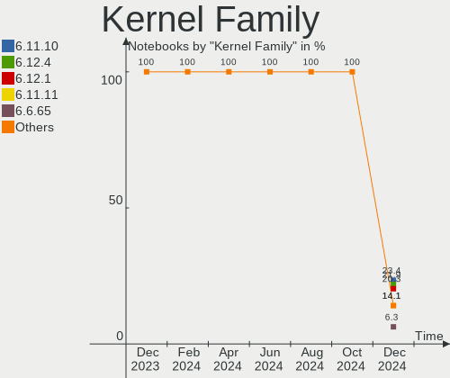
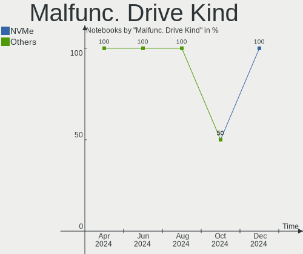
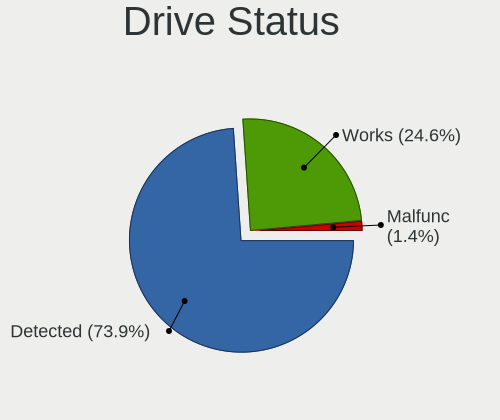
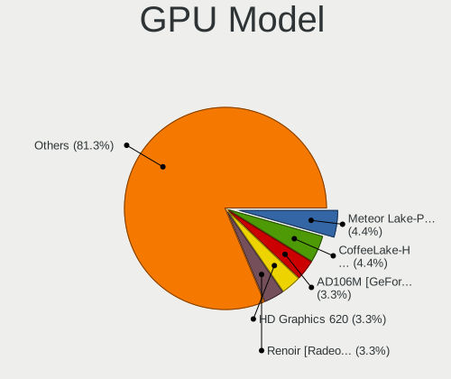

Manjaro - Hardware Trends (Notebooks)
-------------------------------------

A project to identify most popular hardware characteristics and track their change
over time based on data collected by Linux users at https://Linux-Hardware.org.

Anyone can contribute to this report by the [hw-probe](https://github.com/linuxhw/hw-probe) tool:

    sudo -E hw-probe -all -upload

This report is for one last month. Overall report since the beginning of time: [TestCoverage](https://github.com/linuxhw/TestCoverage)

Period: Dec, 2022.

Contents
--------

* [ System ](#system)
  - [ OS                       ](#os)
  - [ OS Family                ](#os-family)
  - [ Kernel                   ](#kernel)
  - [ Kernel Family            ](#kernel-family)
  - [ Kernel Major Ver.        ](#kernel-major-ver)
  - [ Arch                     ](#arch)
  - [ DE                       ](#de)
  - [ Display Server           ](#display-server)
  - [ Display Manager          ](#display-manager)
  - [ OS Lang                  ](#os-lang)
  - [ Boot Mode                ](#boot-mode)
  - [ Filesystem               ](#filesystem)
  - [ Part. scheme             ](#part-scheme)
  - [ Dual Boot with Linux/BSD ](#dual-boot-with-linuxbsd)
  - [ Dual Boot (Win)          ](#dual-boot-win)

* [ Board ](#board)
  - [ Vendor                   ](#vendor)
  - [ Model                    ](#model)
  - [ Model Family             ](#model-family)
  - [ MFG Year                 ](#mfg-year)
  - [ Form Factor              ](#form-factor)
  - [ Secure Boot              ](#secure-boot)
  - [ Coreboot                 ](#coreboot)
  - [ RAM Size                 ](#ram-size)
  - [ RAM Used                 ](#ram-used)
  - [ Total Drives             ](#total-drives)
  - [ Has CD-ROM               ](#has-cd-rom)
  - [ Has Ethernet             ](#has-ethernet)
  - [ Has WiFi                 ](#has-wifi)
  - [ Has Bluetooth            ](#has-bluetooth)

* [ Location ](#location)
  - [ Country                  ](#country)
  - [ City                     ](#city)

* [ Drives ](#drives)
  - [ Drive Vendor             ](#drive-vendor)
  - [ Drive Model              ](#drive-model)
  - [ HDD Vendor               ](#hdd-vendor)
  - [ SSD Vendor               ](#ssd-vendor)
  - [ Drive Kind               ](#drive-kind)
  - [ Drive Connector          ](#drive-connector)
  - [ Drive Size               ](#drive-size)
  - [ Space Total              ](#space-total)
  - [ Space Used               ](#space-used)
  - [ Malfunc. Drives          ](#malfunc-drives)
  - [ Malfunc. Drive Vendor    ](#malfunc-drive-vendor)
  - [ Malfunc. HDD Vendor      ](#malfunc-hdd-vendor)
  - [ Malfunc. Drive Kind      ](#malfunc-drive-kind)
  - [ Failed Drives            ](#failed-drives)
  - [ Failed Drive Vendor      ](#failed-drive-vendor)
  - [ Drive Status             ](#drive-status)

* [ Storage controller ](#storage-controller)
  - [ Storage Vendor           ](#storage-vendor)
  - [ Storage Model            ](#storage-model)
  - [ Storage Kind             ](#storage-kind)

* [ Processor ](#processor)
  - [ CPU Vendor               ](#cpu-vendor)
  - [ CPU Model                ](#cpu-model)
  - [ CPU Model Family         ](#cpu-model-family)
  - [ CPU Cores                ](#cpu-cores)
  - [ CPU Sockets              ](#cpu-sockets)
  - [ CPU Threads              ](#cpu-threads)
  - [ CPU Op-Modes             ](#cpu-op-modes)
  - [ CPU Microcode            ](#cpu-microcode)
  - [ CPU Microarch            ](#cpu-microarch)

* [ Graphics ](#graphics)
  - [ GPU Vendor               ](#gpu-vendor)
  - [ GPU Model                ](#gpu-model)
  - [ GPU Combo                ](#gpu-combo)
  - [ GPU Driver               ](#gpu-driver)
  - [ GPU Memory               ](#gpu-memory)

* [ Monitor ](#monitor)
  - [ Monitor Vendor           ](#monitor-vendor)
  - [ Monitor Model            ](#monitor-model)
  - [ Monitor Resolution       ](#monitor-resolution)
  - [ Monitor Diagonal         ](#monitor-diagonal)
  - [ Monitor Width            ](#monitor-width)
  - [ Aspect Ratio             ](#aspect-ratio)
  - [ Monitor Area             ](#monitor-area)
  - [ Pixel Density            ](#pixel-density)
  - [ Multiple Monitors        ](#multiple-monitors)

* [ Network ](#network)
  - [ Net Controller Vendor    ](#net-controller-vendor)
  - [ Net Controller Model     ](#net-controller-model)
  - [ Wireless Vendor          ](#wireless-vendor)
  - [ Wireless Model           ](#wireless-model)
  - [ Ethernet Vendor          ](#ethernet-vendor)
  - [ Ethernet Model           ](#ethernet-model)
  - [ Net Controller Kind      ](#net-controller-kind)
  - [ Used Controller          ](#used-controller)
  - [ NICs                     ](#nics)
  - [ IPv6                     ](#ipv6)

* [ Bluetooth ](#bluetooth)
  - [ Bluetooth Vendor         ](#bluetooth-vendor)
  - [ Bluetooth Model          ](#bluetooth-model)

* [ Sound ](#sound)
  - [ Sound Vendor             ](#sound-vendor)
  - [ Sound Model              ](#sound-model)

* [ Memory ](#memory)
  - [ Memory Vendor            ](#memory-vendor)
  - [ Memory Model             ](#memory-model)
  - [ Memory Kind              ](#memory-kind)
  - [ Memory Form Factor       ](#memory-form-factor)
  - [ Memory Size              ](#memory-size)
  - [ Memory Speed             ](#memory-speed)

* [ Printers & scanners ](#printers--scanners)
  - [ Printer Vendor           ](#printer-vendor)
  - [ Printer Model            ](#printer-model)
  - [ Scanner Vendor           ](#scanner-vendor)
  - [ Scanner Model            ](#scanner-model)

* [ Camera ](#camera)
  - [ Camera Vendor            ](#camera-vendor)
  - [ Camera Model             ](#camera-model)

* [ Security ](#security)
  - [ Fingerprint Vendor       ](#fingerprint-vendor)
  - [ Fingerprint Model        ](#fingerprint-model)
  - [ Chipcard Vendor          ](#chipcard-vendor)
  - [ Chipcard Model           ](#chipcard-model)

* [ Unsupported ](#unsupported)
  - [ Unsupported Devices      ](#unsupported-devices)
  - [ Unsupported Device Types ](#unsupported-device-types)

System
------

OS
--

Installed operating systems

| Name                      | Notebooks | Percent |
|---------------------------|-----------|---------|
| Manjaro 22.0.0            | 52        | 48.6%   |
| Manjaro                   | 50        | 46.73%  |
| Manjaro 22.0              | 3         | 2.8%    |
| Manjaro 22.12-development | 1         | 0.93%   |
| Manjaro 21.3.7            | 1         | 0.93%   |

OS Family
---------

OS without a version

| Name    | Notebooks | Percent |
|---------|-----------|---------|
| Manjaro | 107       | 100%    |

Kernel
------

Version of the Linux kernel

| Version              | Notebooks | Percent |
|----------------------|-----------|---------|
| 5.15.81-1-MANJARO    | 30        | 28.04%  |
| 6.1.1-1-MANJARO      | 16        | 14.95%  |
| 6.1.0-1-MANJARO      | 13        | 12.15%  |
| 6.0.11-1-MANJARO     | 11        | 10.28%  |
| 5.15.78-1-MANJARO    | 10        | 9.35%   |
| 6.0.8-1-MANJARO      | 6         | 5.61%   |
| 5.15.84-1-MANJARO    | 5         | 4.67%   |
| 5.15.60-1-MANJARO    | 4         | 3.74%   |
| 5.15.85-1-MANJARO    | 3         | 2.8%    |
| 6.0.5-2-rt14-MANJARO | 1         | 0.93%   |
| 6.0.14-1-MANJARO     | 1         | 0.93%   |
| 6.0.13-1-MANJARO     | 1         | 0.93%   |
| 6.0.11-AMD           | 1         | 0.93%   |
| 5.19.17-2-MANJARO    | 1         | 0.93%   |
| 5.15.72-1-MANJARO    | 1         | 0.93%   |
| 5.11.22-2-MANJARO    | 1         | 0.93%   |
| 5.10.157-1-MANJARO   | 1         | 0.93%   |
| 4.19.260-1-MANJARO   | 1         | 0.93%   |

Kernel Family
-------------

Linux kernel without a distro release

| Version  | Notebooks | Percent |
|----------|-----------|---------|
| 5.15.81  | 30        | 28.04%  |
| 6.1.1    | 16        | 14.95%  |
| 6.1.0    | 13        | 12.15%  |
| 6.0.11   | 12        | 11.21%  |
| 5.15.78  | 10        | 9.35%   |
| 6.0.8    | 6         | 5.61%   |
| 5.15.84  | 5         | 4.67%   |
| 5.15.60  | 4         | 3.74%   |
| 5.15.85  | 3         | 2.8%    |
| 6.0.5    | 1         | 0.93%   |
| 6.0.14   | 1         | 0.93%   |
| 6.0.13   | 1         | 0.93%   |
| 5.19.17  | 1         | 0.93%   |
| 5.15.72  | 1         | 0.93%   |
| 5.11.22  | 1         | 0.93%   |
| 5.10.157 | 1         | 0.93%   |
| 4.19.260 | 1         | 0.93%   |

Kernel Major Ver.
-----------------

Linux kernel major version

| Version | Notebooks | Percent |
|---------|-----------|---------|
| 5.15    | 53        | 49.53%  |
| 6.1     | 29        | 27.1%   |
| 6.0     | 21        | 19.63%  |
| 5.19    | 1         | 0.93%   |
| 5.11    | 1         | 0.93%   |
| 5.10    | 1         | 0.93%   |
| 4.19    | 1         | 0.93%   |

Arch
----

OS architecture (x86_64, i586, etc.)

| Name   | Notebooks | Percent |
|--------|-----------|---------|
| x86_64 | 107       | 100%    |

DE
--

Desktop Environment

| Name           | Notebooks | Percent |
|----------------|-----------|---------|
| KDE5           | 56        | 52.34%  |
| GNOME          | 27        | 25.23%  |
| XFCE           | 12        | 11.21%  |
| KDE            | 4         | 3.74%   |
| i3             | 4         | 3.74%   |
| X-Cinnamon     | 1         | 0.93%   |
| i3-with-shmlog | 1         | 0.93%   |
| Deepin         | 1         | 0.93%   |
| Unknown        | 1         | 0.93%   |

Display Server
--------------

X11 or Wayland

| Name    | Notebooks | Percent |
|---------|-----------|---------|
| X11     | 76        | 71.03%  |
| Wayland | 26        | 24.3%   |
| Tty     | 3         | 2.8%    |
| Unknown | 2         | 1.87%   |

Display Manager
---------------

SDDM, LightDM, etc.

| Name    | Notebooks | Percent |
|---------|-----------|---------|
| Unknown | 50        | 46.73%  |
| SDDM    | 27        | 25.23%  |
| LightDM | 15        | 14.02%  |
| GDM     | 15        | 14.02%  |

OS Lang
-------

Language

| Lang  | Notebooks | Percent |
|-------|-----------|---------|
| en_US | 59        | 55.14%  |
| en_GB | 7         | 6.54%   |
| ru_RU | 4         | 3.74%   |
| fr_FR | 4         | 3.74%   |
| de_DE | 4         | 3.74%   |
| pt_BR | 3         | 2.8%    |
| pl_PL | 3         | 2.8%    |
| es_MX | 3         | 2.8%    |
| zh_CN | 2         | 1.87%   |
| nl_NL | 2         | 1.87%   |
| es_BO | 2         | 1.87%   |
| de_AT | 2         | 1.87%   |
| tr_TR | 1         | 0.93%   |
| it_IT | 1         | 0.93%   |
| fi_FI | 1         | 0.93%   |
| es_ES | 1         | 0.93%   |
| en_SG | 1         | 0.93%   |
| en_IN | 1         | 0.93%   |
| en_DK | 1         | 0.93%   |
| en_DE | 1         | 0.93%   |
| en_CA | 1         | 0.93%   |
| en_AU | 1         | 0.93%   |
| C     | 1         | 0.93%   |
| aa_DJ | 1         | 0.93%   |

Boot Mode
---------

EFI or BIOS

| Mode | Notebooks | Percent |
|------|-----------|---------|
| BIOS | 61        | 57.01%  |
| EFI  | 46        | 42.99%  |

Filesystem
----------

Type of filesystem

| Type    | Notebooks | Percent |
|---------|-----------|---------|
| Ext4    | 84        | 78.5%   |
| Btrfs   | 16        | 14.95%  |
| Tmpfs   | 3         | 2.8%    |
| Xfs     | 2         | 1.87%   |
| Overlay | 2         | 1.87%   |

Part. scheme
------------

Scheme of partitioning

| Type    | Notebooks | Percent |
|---------|-----------|---------|
| GPT     | 53        | 49.53%  |
| Unknown | 47        | 43.93%  |
| MBR     | 7         | 6.54%   |

Dual Boot with Linux/BSD
------------------------

Hosting more than one Linux/BSD

| Dual boot | Notebooks | Percent |
|-----------|-----------|---------|
| No        | 99        | 92.52%  |
| Yes       | 8         | 7.48%   |

Dual Boot (Win)
---------------

Hosting Linux and Windows

| Dual boot | Notebooks | Percent |
|-----------|-----------|---------|
| No        | 80        | 74.77%  |
| Yes       | 27        | 25.23%  |

Board
-----

Vendor
------

Motherboard manufacturer

| Name                     | Notebooks | Percent |
|--------------------------|-----------|---------|
| Lenovo                   | 26        | 24.3%   |
| Hewlett-Packard          | 18        | 16.82%  |
| Dell                     | 14        | 13.08%  |
| Acer                     | 9         | 8.41%   |
| ASUSTek Computer         | 7         | 6.54%   |
| HUAWEI                   | 5         | 4.67%   |
| MSI                      | 3         | 2.8%    |
| Toshiba                  | 2         | 1.87%   |
| Medion                   | 2         | 1.87%   |
| K.A.Technologies Limited | 2         | 1.87%   |
| GPU Company              | 2         | 1.87%   |
| Chuwi                    | 2         | 1.87%   |
| Apple                    | 2         | 1.87%   |
| Unknown                  | 2         | 1.87%   |
| Valve                    | 1         | 0.93%   |
| TUXEDO                   | 1         | 0.93%   |
| Schenker                 | 1         | 0.93%   |
| Samsung Electronics      | 1         | 0.93%   |
| Razer                    | 1         | 0.93%   |
| MECHREVO                 | 1         | 0.93%   |
| IPASON                   | 1         | 0.93%   |
| Framework                | 1         | 0.93%   |
| Clevo                    | 1         | 0.93%   |
| BESSTAR Tech             | 1         | 0.93%   |
| Alienware                | 1         | 0.93%   |

Model
-----

Motherboard model

| Name                                                                                     | Notebooks | Percent |
|------------------------------------------------------------------------------------------|-----------|---------|
| K.A.Technologies Limited TM1                                                             | 2         | 1.87%   |
| GPU Company GWNR71517                                                                    | 2         | 1.87%   |
| Unknown                                                                                  | 2         | 1.87%   |
| Valve Jupiter                                                                            | 1         | 0.93%   |
| TUXEDO Pulse 14 Gen1                                                                     | 1         | 0.93%   |
| Toshiba Satellite Pro L300                                                               | 1         | 0.93%   |
| Toshiba Satellite C650D                                                                  | 1         | 0.93%   |
| Schenker VISION 15 (SVS15E21)                                                            | 1         | 0.93%   |
| Samsung 355V4C/355V4X/355V5C/355V5X/356V4C/356V4X/356V5C/356V5X/3445VC/3445VX/3545VC/354 | 1         | 0.93%   |
| Razer Blade 15 (2022) - RZ09-0421                                                        | 1         | 0.93%   |
| MSI Prestige 14 A11SC                                                                    | 1         | 0.93%   |
| MSI Katana GF66 11UE                                                                     | 1         | 0.93%   |
| MSI GS60 6QE                                                                             | 1         | 0.93%   |
| Medion E4251 MD61435                                                                     | 1         | 0.93%   |
| Medion E4251                                                                             | 1         | 0.93%   |
| MECHREVO X3 Series GK7CP6R                                                               | 1         | 0.93%   |
| Lenovo Yoga Slim 7 Pro 16ACH6 82QQ                                                       | 1         | 0.93%   |
| Lenovo ThinkPad X1 Extreme 2nd 20QVS0FP00                                                | 1         | 0.93%   |
| Lenovo ThinkPad X1 Carbon 6th 20KHS18V00                                                 | 1         | 0.93%   |
| Lenovo ThinkPad X1 Carbon 4th 20FCS11P0B                                                 | 1         | 0.93%   |
| Lenovo ThinkPad T540p 20BFS0MQ00                                                         | 1         | 0.93%   |
| Lenovo ThinkPad T490 20N20048GE                                                          | 1         | 0.93%   |
| Lenovo ThinkPad T480 20L50004GE                                                          | 1         | 0.93%   |
| Lenovo ThinkPad T480 20L50000UK                                                          | 1         | 0.93%   |
| Lenovo ThinkPad T470s 20HF005QMX                                                         | 1         | 0.93%   |
| Lenovo ThinkPad T450s 20BWS2KM00                                                         | 1         | 0.93%   |
| Lenovo ThinkPad T14 Gen 1 20UDCTO1WW                                                     | 1         | 0.93%   |
| Lenovo ThinkPad T14 Gen 1 20UD000HUS                                                     | 1         | 0.93%   |
| Lenovo ThinkPad P73 20QR0028GE                                                           | 1         | 0.93%   |
| Lenovo ThinkPad L15 Gen 2 20X4S27200                                                     | 1         | 0.93%   |
| Lenovo ThinkPad L14 Gen 3 21C5S00300                                                     | 1         | 0.93%   |
| Lenovo ThinkPad E15 Gen 4 21EDCTO1WW                                                     | 1         | 0.93%   |
| Lenovo ThinkPad E15 Gen 2 20TDS0XG00                                                     | 1         | 0.93%   |
| Lenovo ThinkPad E15 Gen 2 20TD00JYMH                                                     | 1         | 0.93%   |
| Lenovo ThinkPad E14 Gen 2 20T6000MRT                                                     | 1         | 0.93%   |
| Lenovo ThinkBook 15-IIL 20SM                                                             | 1         | 0.93%   |
| Lenovo ThinkBook 13s G4 ARB 21AS                                                         | 1         | 0.93%   |
| Lenovo IdeaPad Slim 7 14ITL05 82A6                                                       | 1         | 0.93%   |
| Lenovo IdeaPad 5 Pro 16ACH6 82L5                                                         | 1         | 0.93%   |
| Lenovo IdeaPad 5 15ARE05 81YQ                                                            | 1         | 0.93%   |

Model Family
------------

Motherboard model prefix

| Name                         | Notebooks | Percent |
|------------------------------|-----------|---------|
| Lenovo ThinkPad              | 18        | 16.82%  |
| Acer Aspire                  | 7         | 6.54%   |
| HP Pavilion                  | 6         | 5.61%   |
| Lenovo IdeaPad               | 5         | 4.67%   |
| Dell XPS                     | 4         | 3.74%   |
| Dell Inspiron                | 4         | 3.74%   |
| HP EliteBook                 | 3         | 2.8%    |
| Toshiba Satellite            | 2         | 1.87%   |
| Medion E4251                 | 2         | 1.87%   |
| Lenovo ThinkBook             | 2         | 1.87%   |
| K.A.Technologies Limited TM1 | 2         | 1.87%   |
| HP ProBook                   | 2         | 1.87%   |
| HP OMEN                      | 2         | 1.87%   |
| GPU Company GWNR71517        | 2         | 1.87%   |
| Dell Precision               | 2         | 1.87%   |
| ASUS ROG                     | 2         | 1.87%   |
| ASUS ASUS                    | 2         | 1.87%   |
| Unknown                      | 2         | 1.87%   |
| Valve Jupiter                | 1         | 0.93%   |
| TUXEDO Pulse                 | 1         | 0.93%   |
| Schenker VISION              | 1         | 0.93%   |
| Samsung 355V4C               | 1         | 0.93%   |
| Razer Blade                  | 1         | 0.93%   |
| MSI Prestige                 | 1         | 0.93%   |
| MSI Katana                   | 1         | 0.93%   |
| MSI GS60                     | 1         | 0.93%   |
| MECHREVO X3                  | 1         | 0.93%   |
| Lenovo Yoga                  | 1         | 0.93%   |
| IPASON MaxBook               | 1         | 0.93%   |
| HUAWEI VLT-WX0               | 1         | 0.93%   |
| HUAWEI NBLB-WAX9N            | 1         | 0.93%   |
| HUAWEI KPR-WX9               | 1         | 0.93%   |
| HUAWEI HVY-WXX9              | 1         | 0.93%   |
| HUAWEI CREM-WXX9             | 1         | 0.93%   |
| HP ZBook                     | 1         | 0.93%   |
| HP Laptop                    | 1         | 0.93%   |
| HP ENVY                      | 1         | 0.93%   |
| HP 245                       | 1         | 0.93%   |
| HP 2000                      | 1         | 0.93%   |
| Framework Laptop             | 1         | 0.93%   |

MFG Year
--------

Motherboard manufacture year

| Year | Notebooks | Percent |
|------|-----------|---------|
| 2021 | 27        | 25.23%  |
| 2022 | 17        | 15.89%  |
| 2020 | 14        | 13.08%  |
| 2019 | 13        | 12.15%  |
| 2018 | 6         | 5.61%   |
| 2017 | 5         | 4.67%   |
| 2012 | 5         | 4.67%   |
| 2011 | 5         | 4.67%   |
| 2016 | 4         | 3.74%   |
| 2015 | 3         | 2.8%    |
| 2014 | 2         | 1.87%   |
| 2013 | 2         | 1.87%   |
| 2010 | 2         | 1.87%   |
| 2009 | 1         | 0.93%   |
| 2008 | 1         | 0.93%   |

Form Factor
-----------

Physical design of the computer

| Name     | Notebooks | Percent |
|----------|-----------|---------|
| Notebook | 107       | 100%    |

Secure Boot
-----------

Enabled or disabled

| State    | Notebooks | Percent |
|----------|-----------|---------|
| Disabled | 107       | 100%    |

Coreboot
--------

Have coreboot on board

| Used | Notebooks | Percent |
|------|-----------|---------|
| No   | 107       | 100%    |

RAM Size
--------

Total RAM memory

| Size in GB  | Notebooks | Percent |
|-------------|-----------|---------|
| 4.01-8.0    | 26        | 24.3%   |
| 8.01-16.0   | 26        | 24.3%   |
| 16.01-24.0  | 20        | 18.69%  |
| 32.01-64.0  | 16        | 14.95%  |
| 3.01-4.0    | 13        | 12.15%  |
| 64.01-256.0 | 4         | 3.74%   |
| 24.01-32.0  | 2         | 1.87%   |

RAM Used
--------

Used RAM memory

| Used GB   | Notebooks | Percent |
|-----------|-----------|---------|
| 4.01-8.0  | 29        | 27.1%   |
| 3.01-4.0  | 27        | 25.23%  |
| 2.01-3.0  | 24        | 22.43%  |
| 1.01-2.0  | 15        | 14.02%  |
| 8.01-16.0 | 11        | 10.28%  |
| 0.51-1.0  | 1         | 0.93%   |

Total Drives
------------

Number of drives on board

| Drives | Notebooks | Percent |
|--------|-----------|---------|
| 1      | 86        | 80.37%  |
| 2      | 18        | 16.82%  |
| 3      | 3         | 2.8%    |

Has CD-ROM
----------

Has CD-ROM on board

| Presented | Notebooks | Percent |
|-----------|-----------|---------|
| No        | 94        | 87.85%  |
| Yes       | 13        | 12.15%  |

Has Ethernet
------------

Has Ethernet on board

| Presented | Notebooks | Percent |
|-----------|-----------|---------|
| Yes       | 74        | 69.16%  |
| No        | 33        | 30.84%  |

Has WiFi
--------

Has WiFi module

| Presented | Notebooks | Percent |
|-----------|-----------|---------|
| Yes       | 107       | 100%    |

Has Bluetooth
-------------

Has Bluetooth module

| Presented | Notebooks | Percent |
|-----------|-----------|---------|
| Yes       | 87        | 81.31%  |
| No        | 20        | 18.69%  |

Location
--------

Country
-------

Geographic location (country)

| Country     | Notebooks | Percent |
|-------------|-----------|---------|
| USA         | 16        | 14.95%  |
| Germany     | 9         | 8.41%   |
| Italy       | 8         | 7.48%   |
| Russia      | 7         | 6.54%   |
| France      | 7         | 6.54%   |
| Netherlands | 5         | 4.67%   |
| Mexico      | 4         | 3.74%   |
| Canada      | 4         | 3.74%   |
| Brazil      | 4         | 3.74%   |
| Poland      | 3         | 2.8%    |
| India       | 3         | 2.8%    |
| China       | 3         | 2.8%    |
| Argentina   | 3         | 2.8%    |
| UK          | 2         | 1.87%   |
| Switzerland | 2         | 1.87%   |
| Spain       | 2         | 1.87%   |
| Hungary     | 2         | 1.87%   |
| Ghana       | 2         | 1.87%   |
| Finland     | 2         | 1.87%   |
| Bolivia     | 2         | 1.87%   |
| Belgium     | 2         | 1.87%   |
| Belarus     | 2         | 1.87%   |
| Austria     | 2         | 1.87%   |
| Turkey      | 1         | 0.93%   |
| Sweden      | 1         | 0.93%   |
| South Korea | 1         | 0.93%   |
| Singapore   | 1         | 0.93%   |
| Romania     | 1         | 0.93%   |
| Georgia     | 1         | 0.93%   |
| Egypt       | 1         | 0.93%   |
| Denmark     | 1         | 0.93%   |
| Croatia     | 1         | 0.93%   |
| Bulgaria    | 1         | 0.93%   |
| Australia   | 1         | 0.93%   |

City
----

Geographic location (city)

| City                   | Notebooks | Percent |
|------------------------|-----------|---------|
| Milan                  | 4         | 3.74%   |
| Toronto                | 2         | 1.87%   |
| St Petersburg          | 2         | 1.87%   |
| Paris                  | 2         | 1.87%   |
| Nuremberg              | 2         | 1.87%   |
| Moscow                 | 2         | 1.87%   |
| La Paz                 | 2         | 1.87%   |
| Delhi                  | 2         | 1.87%   |
| Cleveland              | 2         | 1.87%   |
| Blaricum               | 2         | 1.87%   |
| Beijing                | 2         | 1.87%   |
| Yuseong-gu             | 1         | 0.93%   |
| Wilde                  | 1         | 0.93%   |
| Wels                   | 1         | 0.93%   |
| Villingen-Schwenningen | 1         | 0.93%   |
| Vienna                 | 1         | 0.93%   |
| Tychy                  | 1         | 0.93%   |
| Tuczno                 | 1         | 0.93%   |
| Tijuana                | 1         | 0.93%   |
| Tbilisi                | 1         | 0.93%   |
| Tamworth               | 1         | 0.93%   |
| Tacoma                 | 1         | 0.93%   |
| Springfield            | 1         | 0.93%   |
| Spokane                | 1         | 0.93%   |
| Split                  | 1         | 0.93%   |
| Sparta                 | 1         | 0.93%   |
| Singapore              | 1         | 0.93%   |
| Seville                | 1         | 0.93%   |
| Seattle                | 1         | 0.93%   |
| Sao Bernardo do Campo  | 1         | 0.93%   |
| Santa Fe               | 1         | 0.93%   |
| Salerno                | 1         | 0.93%   |
| Saint-Germain-en-Laye  | 1         | 0.93%   |
| Ruda Śląska          | 1         | 0.93%   |
| Rouen                  | 1         | 0.93%   |
| Podolsk                | 1         | 0.93%   |
| Pleasant Grove         | 1         | 0.93%   |
| Pittsburgh             | 1         | 0.93%   |
| Perm                   | 1         | 0.93%   |
| Parola                 | 1         | 0.93%   |

Drives
------

Drive Vendor
------------

Hard drive vendors

| Vendor                         | Notebooks | Drives | Percent |
|--------------------------------|-----------|--------|---------|
| Samsung Electronics            | 30        | 30     | 23.62%  |
| SanDisk                        | 18        | 19     | 14.17%  |
| Seagate                        | 9         | 9      | 7.09%   |
| SK hynix                       | 8         | 8      | 6.3%    |
| Kingston                       | 6         | 6      | 4.72%   |
| Netac                          | 5         | 5      | 3.94%   |
| Crucial                        | 5         | 5      | 3.94%   |
| WDC                            | 4         | 5      | 3.15%   |
| Unknown                        | 4         | 4      | 3.15%   |
| Toshiba                        | 4         | 4      | 3.15%   |
| Micron Technology              | 4         | 4      | 3.15%   |
| Intel                          | 4         | 4      | 3.15%   |
| Kingston Technology Company    | 3         | 3      | 2.36%   |
| Unknown                        | 3         | 3      | 2.36%   |
| Silicon Motion                 | 2         | 2      | 1.57%   |
| Phison Electronics             | 2         | 2      | 1.57%   |
| A-DATA Technology              | 2         | 2      | 1.57%   |
| TwinMOS                        | 1         | 1      | 0.79%   |
| Solid State Storage Technology | 1         | 1      | 0.79%   |
| Solid State Storage            | 1         | 1      | 0.79%   |
| ShiJi                          | 1         | 1      | 0.79%   |
| Phison                         | 1         | 1      | 0.79%   |
| Micron/Crucial Technology      | 1         | 1      | 0.79%   |
| LITEONIT                       | 1         | 1      | 0.79%   |
| LITEON                         | 1         | 1      | 0.79%   |
| KIOXIA                         | 1         | 1      | 0.79%   |
| HS-SSD-C100                    | 1         | 1      | 0.79%   |
| Hewlett-Packard                | 1         | 1      | 0.79%   |
| GOODRAM                        | 1         | 1      | 0.79%   |
| China                          | 1         | 1      | 0.79%   |
| Apple                          | 1         | 1      | 0.79%   |

Drive Model
-----------

Hard drive models

| Model                                                  | Notebooks | Percent |
|--------------------------------------------------------|-----------|---------|
| Samsung NVMe SSD Controller SM981/PM981/PM983 500GB    | 11        | 8.53%   |
| Sandisk WD Black SN750 / PC SN730 NVMe SSD 512GB       | 5         | 3.88%   |
| Sandisk WD Black SN850 1TB                             | 4         | 3.1%    |
| Samsung NVMe SSD Controller PM9A1/PM9A3/980PRO 2TB     | 3         | 2.33%   |
| Netac SSD 256GB                                        | 3         | 2.33%   |
| Unknown                                                | 3         | 2.33%   |
| SK hynix SKHynix_HFS512GD9TNI-L2A0B 512GB              | 2         | 1.55%   |
| Silicon Motion SM2263EN/SM2263XT SSD Controller 1024GB | 2         | 1.55%   |
| Seagate ST9500325AS 500GB                              | 2         | 1.55%   |
| Kingston Company OM3PDP3 NVMe SSD 512GB                | 2         | 1.55%   |
| Intel SSD 660P Series 1024GB                           | 2         | 1.55%   |
| WDC WD7500BPVT-80HXZT3 752GB                           | 1         | 0.78%   |
| WDC WD7500BPKT-75PK4T0 752GB                           | 1         | 0.78%   |
| WDC WD3200BEKT-75PVMT1 320GB                           | 1         | 0.78%   |
| WDC WD2500BEVT-22ZCT0 250GB                            | 1         | 0.78%   |
| WDC WD10JPVX-60JC3T1 1TB                               | 1         | 0.78%   |
| Unknown NVMe SSD Drive 1TB                             | 1         | 0.78%   |
| Unknown MMC Card  968MB                                | 1         | 0.78%   |
| Unknown MMC Card  32GB                                 | 1         | 0.78%   |
| Unknown MMC Card  128GB                                | 1         | 0.78%   |
| TwinMOS SSD 128GB                                      | 1         | 0.78%   |
| Toshiba XG6 NVMe SSD Controller 256GB                  | 1         | 0.78%   |
| Toshiba THNSNJ512GCSU 512GB SSD                        | 1         | 0.78%   |
| Toshiba THNSNJ128G8NU 128GB SSD                        | 1         | 0.78%   |
| Toshiba BG3 NVMe SSD Controller 256GB                  | 1         | 0.78%   |
| Solid State Storage SSSTC CL4-4D256-Q79 256GB          | 1         | 0.78%   |
| Solid State Storage SSSTC CL1-4D256 256GB              | 1         | 0.78%   |
| SK hynix SKHynix_HFS256GD9TNI-L2B0B 256GB              | 1         | 0.78%   |
| SK hynix SKHynix_HFS001TD9TNI-L2B0B 1TB                | 1         | 0.78%   |
| SK hynix PC711 HFS001TDE9X073N 1024GB                  | 1         | 0.78%   |
| SK hynix PC611 NVMe 1TB                                | 1         | 0.78%   |
| SK hynix PC601 NVMe 512GB                              | 1         | 0.78%   |
| SK hynix PC401 NVMe Solid State Drive 256GB            | 1         | 0.78%   |
| ShiJi 256GB                                            | 1         | 0.78%   |
| Seagate ST9160823AS 160GB                              | 1         | 0.78%   |
| Seagate ST500LT012-9WS142 500GB                        | 1         | 0.78%   |
| Seagate ST500LM012 HN-M500MBB 500GB                    | 1         | 0.78%   |
| Seagate ST320LT012-9WS14C 320GB                        | 1         | 0.78%   |
| Seagate ST1000LM049-2GH172 1TB                         | 1         | 0.78%   |
| Seagate ST1000LM048-2E7172 1TB                         | 1         | 0.78%   |

HDD Vendor
----------

Hard disk drive vendors

| Vendor  | Notebooks | Drives | Percent |
|---------|-----------|--------|---------|
| Seagate | 9         | 9      | 69.23%  |
| WDC     | 4         | 5      | 30.77%  |

SSD Vendor
----------

Solid state drive vendors

| Vendor              | Notebooks | Drives | Percent |
|---------------------|-----------|--------|---------|
| Netac               | 5         | 5      | 15.63%  |
| Crucial             | 5         | 5      | 15.63%  |
| Samsung Electronics | 4         | 4      | 12.5%   |
| SanDisk             | 3         | 3      | 9.38%   |
| Toshiba             | 2         | 2      | 6.25%   |
| A-DATA Technology   | 2         | 2      | 6.25%   |
| Unknown             | 2         | 2      | 6.25%   |
| TwinMOS             | 1         | 1      | 3.13%   |
| Phison              | 1         | 1      | 3.13%   |
| Micron Technology   | 1         | 1      | 3.13%   |
| LITEONIT            | 1         | 1      | 3.13%   |
| LITEON              | 1         | 1      | 3.13%   |
| Kingston            | 1         | 1      | 3.13%   |
| GOODRAM             | 1         | 1      | 3.13%   |
| China               | 1         | 1      | 3.13%   |
| Apple               | 1         | 1      | 3.13%   |

Drive Kind
----------

HDD or SSD

| Kind    | Notebooks | Drives | Percent |
|---------|-----------|--------|---------|
| NVMe    | 70        | 77     | 60.34%  |
| SSD     | 27        | 32     | 23.28%  |
| HDD     | 13        | 14     | 11.21%  |
| MMC     | 4         | 4      | 3.45%   |
| Unknown | 2         | 2      | 1.72%   |

Drive Connector
---------------

SATA, SAS, NVMe, etc.

| Type | Notebooks | Drives | Percent |
|------|-----------|--------|---------|
| NVMe | 70        | 77     | 62.5%   |
| SATA | 38        | 48     | 33.93%  |
| MMC  | 4         | 4      | 3.57%   |

Drive Size
----------

Size of hard drive

| Size in TB | Notebooks | Drives | Percent |
|------------|-----------|--------|---------|
| 0.01-0.5   | 29        | 34     | 70.73%  |
| 0.51-1.0   | 12        | 12     | 29.27%  |

Space Total
-----------

Amount of disk space available on the file system

| Size in GB     | Notebooks | Percent |
|----------------|-----------|---------|
| 101-250        | 30        | 28.04%  |
| 251-500        | 29        | 27.1%   |
| 501-1000       | 19        | 17.76%  |
| Unknown        | 11        | 10.28%  |
| 1001-2000      | 5         | 4.67%   |
| More than 3000 | 4         | 3.74%   |
| 1-20           | 4         | 3.74%   |
| 51-100         | 4         | 3.74%   |
| 21-50          | 1         | 0.93%   |

Space Used
----------

Amount of used disk space

| Used GB   | Notebooks | Percent |
|-----------|-----------|---------|
| 1-20      | 25        | 23.36%  |
| 21-50     | 23        | 21.5%   |
| 101-250   | 19        | 17.76%  |
| 251-500   | 12        | 11.21%  |
| Unknown   | 11        | 10.28%  |
| 501-1000  | 8         | 7.48%   |
| 51-100    | 6         | 5.61%   |
| 1001-2000 | 3         | 2.8%    |

Malfunc. Drives
---------------

Drive models with a malfunction

| Model                        | Notebooks | Drives | Percent |
|------------------------------|-----------|--------|---------|
| Seagate ST9500325AS 500GB    | 1         | 1      | 33.33%  |
| SanDisk SSD PLUS 480GB       | 1         | 1      | 33.33%  |
| Intel SSD 660P Series 1024GB | 1         | 1      | 33.33%  |

Malfunc. Drive Vendor
---------------------

Vendors of faulty drives

| Vendor  | Notebooks | Drives | Percent |
|---------|-----------|--------|---------|
| Seagate | 1         | 1      | 33.33%  |
| SanDisk | 1         | 1      | 33.33%  |
| Intel   | 1         | 1      | 33.33%  |

Malfunc. HDD Vendor
-------------------

Vendors of faulty HDD drives

| Vendor  | Notebooks | Drives | Percent |
|---------|-----------|--------|---------|
| Seagate | 1         | 1      | 100%    |

Malfunc. Drive Kind
-------------------

Kinds of faulty drives

| Kind | Notebooks | Drives | Percent |
|------|-----------|--------|---------|
| NVMe | 1         | 1      | 33.33%  |
| SSD  | 1         | 1      | 33.33%  |
| HDD  | 1         | 1      | 33.33%  |

Failed Drives
-------------

Failed drive models

Zero info for selected period =(

Failed Drive Vendor
-------------------

Failed drive vendors

Zero info for selected period =(

Drive Status
------------

Number of failed and malfunc. drives

| Status   | Notebooks | Drives | Percent |
|----------|-----------|--------|---------|
| Detected | 71        | 83     | 63.96%  |
| Works    | 37        | 43     | 33.33%  |
| Malfunc  | 3         | 3      | 2.7%    |

Storage controller
------------------

Storage Vendor
--------------

Storage controller vendors

| Vendor                         | Notebooks | Percent |
|--------------------------------|-----------|---------|
| Intel                          | 51        | 36.43%  |
| Samsung Electronics            | 26        | 18.57%  |
| AMD                            | 16        | 11.43%  |
| SanDisk                        | 14        | 10%     |
| SK hynix                       | 8         | 5.71%   |
| Kingston Technology Company    | 8         | 5.71%   |
| Silicon Motion                 | 3         | 2.14%   |
| Phison Electronics             | 3         | 2.14%   |
| Micron Technology              | 3         | 2.14%   |
| Toshiba America Info Systems   | 2         | 1.43%   |
| Solid State Storage Technology | 2         | 1.43%   |
| Transcend                      | 1         | 0.71%   |
| Micron/Crucial Technology      | 1         | 0.71%   |
| Marvell Technology Group       | 1         | 0.71%   |
| KIOXIA                         | 1         | 0.71%   |

Storage Model
-------------

Storage controller models

| Model                                                                        | Notebooks | Percent |
|------------------------------------------------------------------------------|-----------|---------|
| AMD FCH SATA Controller [AHCI mode]                                          | 15        | 10.34%  |
| Samsung NVMe SSD Controller SM981/PM981/PM983                                | 11        | 7.59%   |
| Samsung NVMe SSD Controller 980                                              | 10        | 6.9%    |
| Intel Celeron/Pentium Silver Processor SATA Controller                       | 8         | 5.52%   |
| SK hynix Non-Volatile memory controller                                      | 6         | 4.14%   |
| Kingston Company Company Non-Volatile memory controller                      | 6         | 4.14%   |
| Intel Volume Management Device NVMe RAID Controller                          | 6         | 4.14%   |
| Intel Sunrise Point-LP SATA Controller [AHCI mode]                           | 6         | 4.14%   |
| Intel 82801 Mobile SATA Controller [RAID mode]                               | 6         | 4.14%   |
| SanDisk WD Black SN750 / PC SN730 NVMe SSD                                   | 5         | 3.45%   |
| SanDisk WD PC SN810 / Black SN850 NVMe SSD                                   | 4         | 2.76%   |
| Sandisk Non-Volatile memory controller                                       | 3         | 2.07%   |
| Samsung NVMe SSD Controller PM9A1/PM9A3/980PRO                               | 3         | 2.07%   |
| Micron Non-Volatile memory controller                                        | 3         | 2.07%   |
| Intel HM170/QM170 Chipset SATA Controller [AHCI Mode]                        | 3         | 2.07%   |
| Intel Cannon Lake Mobile PCH SATA AHCI Controller                            | 3         | 2.07%   |
| Solid State Storage Non-Volatile memory controller                           | 2         | 1.38%   |
| Silicon Motion SM2263EN/SM2263XT SSD Controller                              | 2         | 1.38%   |
| Kingston Company OM3PDP3 NVMe SSD                                            | 2         | 1.38%   |
| Intel Wildcat Point-LP SATA Controller [AHCI Mode]                           | 2         | 1.38%   |
| Intel SSD 660P Series                                                        | 2         | 1.38%   |
| Intel 82801IBM/IEM (ICH9M/ICH9M-E) 4 port SATA Controller [AHCI mode]        | 2         | 1.38%   |
| Intel 7 Series Chipset Family 6-port SATA Controller [AHCI mode]             | 2         | 1.38%   |
| Intel 6 Series/C200 Series Chipset Family 6 port Mobile SATA AHCI Controller | 2         | 1.38%   |
| Intel 5 Series/3400 Series Chipset 6 port SATA AHCI Controller               | 2         | 1.38%   |
| Transcend Non-Volatile memory controller                                     | 1         | 0.69%   |
| Toshiba America Info Systems XG6 NVMe SSD Controller                         | 1         | 0.69%   |
| Toshiba America Info Systems BG3 NVMe SSD Controller                         | 1         | 0.69%   |
| SK hynix PC401 NVMe Solid State Drive 256GB                                  | 1         | 0.69%   |
| SK hynix Gold P31/PC711 NVMe Solid State Drive                               | 1         | 0.69%   |
| Silicon Motion SM2262/SM2262EN SSD Controller                                | 1         | 0.69%   |
| SanDisk WD Blue SN550 NVMe SSD                                               | 1         | 0.69%   |
| SanDisk WD Blue SN500 / PC SN520 NVMe SSD                                    | 1         | 0.69%   |
| SanDisk WD Black 2018/SN750 / PC SN720 NVMe SSD                              | 1         | 0.69%   |
| Samsung NVMe SSD Controller SM961/PM961/SM963                                | 1         | 0.69%   |
| Samsung NVMe SSD Controller PM9B1                                            | 1         | 0.69%   |
| Phison NVMe Storage Controller                                               | 1         | 0.69%   |
| Phison E16 PCIe4 NVMe Controller                                             | 1         | 0.69%   |
| Phison E12 NVMe Controller                                                   | 1         | 0.69%   |
| Micron/Crucial P5 Plus NVMe PCIe SSD                                         | 1         | 0.69%   |

Storage Kind
------------

Kind of storage controller (IDE, SATA, NVMe, SAS, ...)

| Kind | Notebooks | Percent |
|------|-----------|---------|
| NVMe | 69        | 50.36%  |
| SATA | 56        | 40.88%  |
| RAID | 12        | 8.76%   |

Processor
---------

CPU Vendor
----------

Processor vendors

| Vendor | Notebooks | Percent |
|--------|-----------|---------|
| Intel  | 72        | 67.29%  |
| AMD    | 35        | 32.71%  |

CPU Model
---------

Processor models

| Model                                         | Notebooks | Percent |
|-----------------------------------------------|-----------|---------|
| AMD Ryzen 7 5800H with Radeon Graphics        | 5         | 4.67%   |
| Intel Core i5-8250U CPU @ 1.60GHz             | 4         | 3.74%   |
| Intel Celeron N4020 CPU @ 1.10GHz             | 4         | 3.74%   |
| Intel Core i7-9750H CPU @ 2.60GHz             | 3         | 2.8%    |
| Intel Core i7-8565U CPU @ 1.80GHz             | 3         | 2.8%    |
| Intel 11th Gen Core i7-1165G7 @ 2.80GHz       | 3         | 2.8%    |
| AMD Ryzen 7 4800H with Radeon Graphics        | 3         | 2.8%    |
| AMD Ryzen 7 3700U with Radeon Vega Mobile Gfx | 3         | 2.8%    |
| Intel Core i7-7500U CPU @ 2.70GHz             | 2         | 1.87%   |
| Intel Celeron J4125 CPU @ 2.00GHz             | 2         | 1.87%   |
| Intel 12th Gen Core i7-12700H                 | 2         | 1.87%   |
| Intel 12th Gen Core i7-1260P                  | 2         | 1.87%   |
| Intel 11th Gen Core i7-1185G7 @ 3.00GHz       | 2         | 1.87%   |
| Intel 11th Gen Core i7-11800H @ 2.30GHz       | 2         | 1.87%   |
| Intel 11th Gen Core i5-1135G7 @ 2.40GHz       | 2         | 1.87%   |
| AMD Ryzen 5 5625U with Radeon Graphics        | 2         | 1.87%   |
| AMD Ryzen 5 5500U with Radeon Graphics        | 2         | 1.87%   |
| AMD Ryzen 5 3500U with Radeon Vega Mobile Gfx | 2         | 1.87%   |
| Intel Pentium Silver N5000 CPU @ 1.10GHz      | 1         | 0.93%   |
| Intel Pentium Dual-Core CPU T4300 @ 2.10GHz   | 1         | 0.93%   |
| Intel Pentium Dual CPU T3200 @ 2.00GHz        | 1         | 0.93%   |
| Intel Core i9-9880H CPU @ 2.30GHz             | 1         | 0.93%   |
| Intel Core i7-9850H CPU @ 2.60GHz             | 1         | 0.93%   |
| Intel Core i7-8650U CPU @ 1.90GHz             | 1         | 0.93%   |
| Intel Core i7-8550U CPU @ 1.80GHz             | 1         | 0.93%   |
| Intel Core i7-7820HQ CPU @ 2.90GHz            | 1         | 0.93%   |
| Intel Core i7-7700HQ CPU @ 2.80GHz            | 1         | 0.93%   |
| Intel Core i7-6700HQ CPU @ 2.60GHz            | 1         | 0.93%   |
| Intel Core i7-5600U CPU @ 2.60GHz             | 1         | 0.93%   |
| Intel Core i7-4750HQ CPU @ 2.00GHz            | 1         | 0.93%   |
| Intel Core i7-4720HQ CPU @ 2.60GHz            | 1         | 0.93%   |
| Intel Core i7-3610QM CPU @ 2.30GHz            | 1         | 0.93%   |
| Intel Core i7-2720QM CPU @ 2.20GHz            | 1         | 0.93%   |
| Intel Core i7-2630QM CPU @ 2.00GHz            | 1         | 0.93%   |
| Intel Core i7-10750H CPU @ 2.60GHz            | 1         | 0.93%   |
| Intel Core i7-10510U CPU @ 1.80GHz            | 1         | 0.93%   |
| Intel Core i5-8279U CPU @ 2.40GHz             | 1         | 0.93%   |
| Intel Core i5-7300HQ CPU @ 2.50GHz            | 1         | 0.93%   |
| Intel Core i5-6300U CPU @ 2.40GHz             | 1         | 0.93%   |
| Intel Core i5-6200U CPU @ 2.30GHz             | 1         | 0.93%   |

CPU Model Family
----------------

Processor model prefix

| Model                   | Notebooks | Percent |
|-------------------------|-----------|---------|
| Intel Core i7           | 22        | 20.56%  |
| Intel Core i5           | 19        | 17.76%  |
| Other                   | 18        | 16.82%  |
| AMD Ryzen 7             | 15        | 14.02%  |
| Intel Celeron           | 9         | 8.41%   |
| AMD Ryzen 5             | 9         | 8.41%   |
| AMD Ryzen 7 PRO         | 4         | 3.74%   |
| AMD Ryzen 9             | 2         | 1.87%   |
| AMD E                   | 2         | 1.87%   |
| Intel Pentium Silver    | 1         | 0.93%   |
| Intel Pentium Dual-Core | 1         | 0.93%   |
| Intel Pentium Dual      | 1         | 0.93%   |
| Intel Core i9           | 1         | 0.93%   |
| Intel Core i3           | 1         | 0.93%   |
| AMD Ryzen 5 PRO         | 1         | 0.93%   |
| AMD A6                  | 1         | 0.93%   |

CPU Cores
---------

Number of processor cores

| Number | Notebooks | Percent |
|--------|-----------|---------|
| 4      | 41        | 38.32%  |
| 2      | 25        | 23.36%  |
| 8      | 21        | 19.63%  |
| 6      | 13        | 12.15%  |
| 14     | 3         | 2.8%    |
| 12     | 3         | 2.8%    |
| 1      | 1         | 0.93%   |

CPU Sockets
-----------

Number of sockets

| Number | Notebooks | Percent |
|--------|-----------|---------|
| 1      | 107       | 100%    |

CPU Threads
-----------

Threads per core (Hyper-Threading)

| Number | Notebooks | Percent |
|--------|-----------|---------|
| 2      | 90        | 84.11%  |
| 1      | 17        | 15.89%  |

CPU Op-Modes
------------

CPU Operation Modes (32-bit, 64-bit)

| Op mode        | Notebooks | Percent |
|----------------|-----------|---------|
| 32-bit, 64-bit | 107       | 100%    |

CPU Microcode
-------------

Microcode number

| Number     | Notebooks | Percent |
|------------|-----------|---------|
| Unknown    | 54        | 50.47%  |
| 0x806c1    | 6         | 5.61%   |
| 0x0a50000c | 6         | 5.61%   |
| 0x0a50000d | 5         | 4.67%   |
| 0x906a3    | 3         | 2.8%    |
| 0x806ea    | 3         | 2.8%    |
| 0x906ed    | 2         | 1.87%   |
| 0x806ec    | 2         | 1.87%   |
| 0x706a8    | 2         | 1.87%   |
| 0x406e3    | 2         | 1.87%   |
| 0x20655    | 2         | 1.87%   |
| 0x08108102 | 2         | 1.87%   |
| 0x906ea    | 1         | 0.93%   |
| 0x806eb    | 1         | 0.93%   |
| 0x806e9    | 1         | 0.93%   |
| 0x806d1    | 1         | 0.93%   |
| 0x706e5    | 1         | 0.93%   |
| 0x40651    | 1         | 0.93%   |
| 0x306c3    | 1         | 0.93%   |
| 0x306a9    | 1         | 0.93%   |
| 0x30678    | 1         | 0.93%   |
| 0x206a7    | 1         | 0.93%   |
| 0x1067a    | 1         | 0.93%   |
| 0x0a404102 | 1         | 0.93%   |
| 0x08900201 | 1         | 0.93%   |
| 0x08608103 | 1         | 0.93%   |
| 0x08600106 | 1         | 0.93%   |
| 0x08600104 | 1         | 0.93%   |
| 0x08600103 | 1         | 0.93%   |
| 0x08108109 | 1         | 0.93%   |

CPU Microarch
-------------

Microarchitecture

| Name             | Notebooks | Percent |
|------------------|-----------|---------|
| KabyLake         | 23        | 21.5%   |
| Unknown          | 13        | 12.15%  |
| Zen 3            | 11        | 10.28%  |
| TigerLake        | 9         | 8.41%   |
| Zen 2            | 8         | 7.48%   |
| Goldmont plus    | 8         | 7.48%   |
| Zen+             | 5         | 4.67%   |
| Haswell          | 4         | 3.74%   |
| Skylake          | 3         | 2.8%    |
| SandyBridge      | 3         | 2.8%    |
| IvyBridge        | 3         | 2.8%    |
| Alderlake Hybrid | 3         | 2.8%    |
| Westmere         | 2         | 1.87%   |
| Icelake          | 2         | 1.87%   |
| CometLake        | 2         | 1.87%   |
| Broadwell        | 2         | 1.87%   |
| Bobcat           | 2         | 1.87%   |
| Silvermont       | 1         | 0.93%   |
| Piledriver       | 1         | 0.93%   |
| Penryn           | 1         | 0.93%   |
| Core             | 1         | 0.93%   |

Graphics
--------

GPU Vendor
----------

Vendors of graphics cards

| Vendor | Notebooks | Percent |
|--------|-----------|---------|
| Intel  | 68        | 48.23%  |
| AMD    | 37        | 26.24%  |
| Nvidia | 36        | 25.53%  |

GPU Model
---------

Graphics card models

| Model                                                                | Notebooks | Percent |
|----------------------------------------------------------------------|-----------|---------|
| Intel TigerLake-LP GT2 [Iris Xe Graphics]                            | 8         | 5.59%   |
| AMD Renoir                                                           | 8         | 5.59%   |
| AMD Cezanne [Radeon Vega Series / Radeon Vega Mobile Series]         | 8         | 5.59%   |
| Intel GeminiLake [UHD Graphics 600]                                  | 7         | 4.9%    |
| Intel UHD Graphics 620                                               | 6         | 4.2%    |
| Intel CoffeeLake-H GT2 [UHD Graphics 630]                            | 5         | 3.5%    |
| Intel Alder Lake-P Integrated Graphics Controller                    | 5         | 3.5%    |
| AMD Picasso/Raven 2 [Radeon Vega Series / Radeon Vega Mobile Series] | 5         | 3.5%    |
| Nvidia TU117M [GeForce GTX 1650 Mobile / Max-Q]                      | 4         | 2.8%    |
| AMD Rembrandt [Radeon 680M]                                          | 4         | 2.8%    |
| Nvidia TU116M [GeForce GTX 1660 Ti Mobile]                           | 3         | 2.1%    |
| Nvidia GA107M [GeForce RTX 3050 Ti Mobile]                           | 3         | 2.1%    |
| Nvidia GA107M [GeForce RTX 3050 Mobile]                              | 3         | 2.1%    |
| Intel WhiskeyLake-U GT2 [UHD Graphics 620]                           | 3         | 2.1%    |
| Intel HD Graphics 620                                                | 3         | 2.1%    |
| Intel 3rd Gen Core processor Graphics Controller                     | 3         | 2.1%    |
| AMD Lucienne                                                         | 3         | 2.1%    |
| AMD Barcelo                                                          | 3         | 2.1%    |
| Nvidia GP108M [GeForce MX250]                                        | 2         | 1.4%    |
| Nvidia GM204M [GeForce GTX 970M]                                     | 2         | 1.4%    |
| Nvidia GA106M [GeForce RTX 3060 Mobile / Max-Q]                      | 2         | 1.4%    |
| Intel TigerLake-H GT1 [UHD Graphics]                                 | 2         | 1.4%    |
| Intel Skylake GT2 [HD Graphics 520]                                  | 2         | 1.4%    |
| Intel Mobile 4 Series Chipset Integrated Graphics Controller         | 2         | 1.4%    |
| Intel HD Graphics 630                                                | 2         | 1.4%    |
| Intel HD Graphics 5500                                               | 2         | 1.4%    |
| Intel Core Processor Integrated Graphics Controller                  | 2         | 1.4%    |
| Intel CometLake-U GT2 [UHD Graphics]                                 | 2         | 1.4%    |
| Intel CometLake-H GT2 [UHD Graphics]                                 | 2         | 1.4%    |
| Intel 4th Gen Core Processor Integrated Graphics Controller          | 2         | 1.4%    |
| AMD Wrestler [Radeon HD 6310]                                        | 2         | 1.4%    |
| Nvidia TU117M [GeForce MX450]                                        | 1         | 0.7%    |
| Nvidia TU117M [GeForce GTX 1650 Ti Mobile]                           | 1         | 0.7%    |
| Nvidia TU117GLM [Quadro T2000 Mobile / Max-Q]                        | 1         | 0.7%    |
| Nvidia GP107M [GeForce GTX 1050 Ti Mobile]                           | 1         | 0.7%    |
| Nvidia GP107GLM [Quadro P620]                                        | 1         | 0.7%    |
| Nvidia GM206GLM [Quadro M2200 Mobile]                                | 1         | 0.7%    |
| Nvidia GM108M [GeForce MX130]                                        | 1         | 0.7%    |
| Nvidia GM108M [GeForce 940M]                                         | 1         | 0.7%    |
| Nvidia GM108M [GeForce 840M]                                         | 1         | 0.7%    |

GPU Combo
---------

Combinations of graphics cards

| Name           | Notebooks | Percent |
|----------------|-----------|---------|
| 1 x Intel      | 41        | 38.32%  |
| 1 x AMD        | 27        | 25.23%  |
| Intel + Nvidia | 26        | 24.3%   |
| AMD + Nvidia   | 7         | 6.54%   |
| 1 x Nvidia     | 3         | 2.8%    |
| 2 x AMD        | 2         | 1.87%   |
| Intel + AMD    | 1         | 0.93%   |

GPU Driver
----------

Free vs proprietary

| Driver      | Notebooks | Percent |
|-------------|-----------|---------|
| Free        | 80        | 74.77%  |
| Proprietary | 27        | 25.23%  |

GPU Memory
----------

Total video memory

| Size in GB | Notebooks | Percent |
|------------|-----------|---------|
| Unknown    | 80        | 74.77%  |
| 0.01-0.5   | 13        | 12.15%  |
| 0.51-1.0   | 5         | 4.67%   |
| 3.01-4.0   | 4         | 3.74%   |
| 1.01-2.0   | 3         | 2.8%    |
| 5.01-6.0   | 1         | 0.93%   |
| 8.01-16.0  | 1         | 0.93%   |

Monitor
-------

Monitor Vendor
--------------

Monitor vendors

| Vendor                  | Notebooks | Percent |
|-------------------------|-----------|---------|
| BOE                     | 33        | 25.58%  |
| AU Optronics            | 22        | 17.05%  |
| LG Display              | 16        | 12.4%   |
| Chimei Innolux          | 12        | 9.3%    |
| Sharp                   | 4         | 3.1%    |
| Goldstar                | 4         | 3.1%    |
| Dell                    | 4         | 3.1%    |
| PANDA                   | 3         | 2.33%   |
| InfoVision              | 3         | 2.33%   |
| Hewlett-Packard         | 3         | 2.33%   |
| CSO                     | 3         | 2.33%   |
| Ancor Communications    | 3         | 2.33%   |
| Acer                    | 3         | 2.33%   |
| Samsung Electronics     | 2         | 1.55%   |
| Mi                      | 2         | 1.55%   |
| Lenovo                  | 2         | 1.55%   |
| Apple                   | 2         | 1.55%   |
| ViewSonic               | 1         | 0.78%   |
| Valve                   | 1         | 0.78%   |
| Toshiba                 | 1         | 0.78%   |
| TMX                     | 1         | 0.78%   |
| LG Philips              | 1         | 0.78%   |
| HKC                     | 1         | 0.78%   |
| Chi Mei Optoelectronics | 1         | 0.78%   |
| AOC                     | 1         | 0.78%   |

Monitor Model
-------------

Monitor models

| Model                                                                 | Notebooks | Percent |
|-----------------------------------------------------------------------|-----------|---------|
| LG Display LCD Monitor LGD0521 1920x1080 309x174mm 14.0-inch          | 2         | 1.5%    |
| BOE LCD Monitor BOE085E 1920x1080 344x194mm 15.5-inch                 | 2         | 1.5%    |
| BOE LCD Monitor BOE083C 1920x1080 309x173mm 13.9-inch                 | 2         | 1.5%    |
| BOE LCD Monitor BOE0700 1920x1080 344x194mm 15.5-inch                 | 2         | 1.5%    |
| BOE LCD Monitor BOE06F8 1366x768 293x165mm 13.2-inch                  | 2         | 1.5%    |
| BOE LCD Monitor BOE06DF 1920x1080 309x173mm 13.9-inch                 | 2         | 1.5%    |
| AU Optronics LCD Monitor AUO21EC 1366x768 344x193mm 15.5-inch         | 2         | 1.5%    |
| ViewSonic VX2255wm-2 VSC9B1F 1680x1050 474x296mm 22.0-inch            | 1         | 0.75%   |
| Valve ANX7530 U VLV3001 800x1280 100x150mm 7.1-inch                   | 1         | 0.75%   |
| Toshiba TV TSB010F 1920x1080 710x400mm 32.1-inch                      | 1         | 0.75%   |
| TMX LCD Monitor TMX1560 1920x1080 340x190mm 15.3-inch                 | 1         | 0.75%   |
| Sharp LCD Monitor SHP1548 1920x1200 288x180mm 13.4-inch               | 1         | 0.75%   |
| Sharp LCD Monitor SHP14D6 3840x2400 366x229mm 17.0-inch               | 1         | 0.75%   |
| Sharp LCD Monitor SHP14BA 1920x1080 344x194mm 15.5-inch               | 1         | 0.75%   |
| Sharp LCD Monitor SHP1449 1920x1080 294x165mm 13.3-inch               | 1         | 0.75%   |
| Samsung Electronics LCD Monitor SEC5441 1366x768 344x194mm 15.5-inch  | 1         | 0.75%   |
| Samsung Electronics LCD Monitor SDC324C 1920x1080 344x194mm 15.5-inch | 1         | 0.75%   |
| PANDA LCD Monitor NCP005F 1920x1080 344x194mm 15.5-inch               | 1         | 0.75%   |
| PANDA LCD Monitor NCP0058 1920x1080 344x194mm 15.5-inch               | 1         | 0.75%   |
| PANDA LCD Monitor NCP004D 1920x1080 344x194mm 15.5-inch               | 1         | 0.75%   |
| Mi Monitor XMI3445 3440x1440 797x334mm 34.0-inch                      | 1         | 0.75%   |
| Mi Monitor XMI23C3 1920x1080 527x293mm 23.7-inch                      | 1         | 0.75%   |
| LG Philips LP154WX4-TLA8 LPL0123 1280x800 331x207mm 15.4-inch         | 1         | 0.75%   |
| LG Display LP156WH2-TLAA LGD0230 1366x768 344x194mm 15.5-inch         | 1         | 0.75%   |
| LG Display LCD Monitor LGD068B 1920x1080 309x174mm 14.0-inch          | 1         | 0.75%   |
| LG Display LCD Monitor LGD05FE 1920x1080 344x194mm 15.5-inch          | 1         | 0.75%   |
| LG Display LCD Monitor LGD05FA 1920x1080 309x174mm 14.0-inch          | 1         | 0.75%   |
| LG Display LCD Monitor LGD05BE 1920x1080 382x215mm 17.3-inch          | 1         | 0.75%   |
| LG Display LCD Monitor LGD05AB 1920x1080 309x174mm 14.0-inch          | 1         | 0.75%   |
| LG Display LCD Monitor LGD053F 1920x1080 344x194mm 15.5-inch          | 1         | 0.75%   |
| LG Display LCD Monitor LGD046F 1920x1080 344x194mm 15.5-inch          | 1         | 0.75%   |
| LG Display LCD Monitor LGD046D 1920x1080 309x174mm 14.0-inch          | 1         | 0.75%   |
| LG Display LCD Monitor LGD038E 1366x768 344x194mm 15.5-inch           | 1         | 0.75%   |
| LG Display LCD Monitor LGD0386 1366x768 309x174mm 14.0-inch           | 1         | 0.75%   |
| LG Display LCD Monitor LGD02F8 1366x768 309x174mm 14.0-inch           | 1         | 0.75%   |
| LG Display LCD Monitor LGD02DA 1920x1080 380x220mm 17.3-inch          | 1         | 0.75%   |
| LG Display LCD Monitor LGD0266 1366x768 344x194mm 15.5-inch           | 1         | 0.75%   |
| Lenovo T24i-10 LEN61A6 1920x1080 527x296mm 23.8-inch                  | 1         | 0.75%   |
| Lenovo Pro2840m LEN60B4 3840x2160 621x341mm 27.9-inch                 | 1         | 0.75%   |
| Lenovo LEN L28u-30 LEN65FA 3840x2160 621x341mm 27.9-inch              | 1         | 0.75%   |

Monitor Resolution
------------------

Monitor screen resolution

| Resolution         | Notebooks | Percent |
|--------------------|-----------|---------|
| 1920x1080 (FHD)    | 69        | 57.02%  |
| 1366x768 (WXGA)    | 19        | 15.7%   |
| 2560x1600          | 5         | 4.13%   |
| 2560x1440 (QHD)    | 5         | 4.13%   |
| 1920x1200 (WUXGA)  | 5         | 4.13%   |
| 3440x1440          | 3         | 2.48%   |
| 3840x1600          | 2         | 1.65%   |
| 1680x1050 (WSXGA+) | 2         | 1.65%   |
| 800x1280           | 1         | 0.83%   |
| 3840x2400          | 1         | 0.83%   |
| 3840x2160 (4K)     | 1         | 0.83%   |
| 2880x1800          | 1         | 0.83%   |
| 2560x1080          | 1         | 0.83%   |
| 2520x1680          | 1         | 0.83%   |
| 2256x1504          | 1         | 0.83%   |
| 2160x1440          | 1         | 0.83%   |
| 1440x900 (WXGA+)   | 1         | 0.83%   |
| 1280x800 (WXGA)    | 1         | 0.83%   |
| 1280x1024 (SXGA)   | 1         | 0.83%   |

Monitor Diagonal
----------------

Diagonal size in inches

| Inches | Notebooks | Percent |
|--------|-----------|---------|
| 15     | 50        | 38.46%  |
| 13     | 23        | 17.69%  |
| 14     | 17        | 13.08%  |
| 16     | 7         | 5.38%   |
| 27     | 5         | 3.85%   |
| 17     | 5         | 3.85%   |
| 24     | 4         | 3.08%   |
| 34     | 3         | 2.31%   |
| 23     | 3         | 2.31%   |
| 40     | 2         | 1.54%   |
| 37     | 2         | 1.54%   |
| 22     | 2         | 1.54%   |
| 21     | 2         | 1.54%   |
| 11     | 2         | 1.54%   |
| 31     | 1         | 0.77%   |
| 19     | 1         | 0.77%   |
| 7      | 1         | 0.77%   |

Monitor Width
-------------

Physical width

| Width in mm | Notebooks | Percent |
|-------------|-----------|---------|
| 301-350     | 84        | 65.12%  |
| 201-300     | 12        | 9.3%    |
| 501-600     | 9         | 6.98%   |
| 351-400     | 9         | 6.98%   |
| 801-900     | 4         | 3.1%    |
| 401-500     | 4         | 3.1%    |
| 701-800     | 3         | 2.33%   |
| 601-700     | 3         | 2.33%   |
| 1-100       | 1         | 0.78%   |

Aspect Ratio
------------

Proportional relationship between the width and the height

| Ratio | Notebooks | Percent |
|-------|-----------|---------|
| 16/9  | 90        | 77.59%  |
| 16/10 | 16        | 13.79%  |
| 21/9  | 5         | 4.31%   |
| 3/2   | 3         | 2.59%   |
| 5/4   | 1         | 0.86%   |
| 0.67  | 1         | 0.86%   |

Monitor Area
------------

Area in inch²

| Area in inch² | Notebooks | Percent |
|----------------|-----------|---------|
| 101-110        | 51        | 39.53%  |
| 81-90          | 33        | 25.58%  |
| 201-250        | 9         | 6.98%   |
| 71-80          | 7         | 5.43%   |
| 301-350        | 5         | 3.88%   |
| 121-130        | 5         | 3.88%   |
| 111-120        | 5         | 3.88%   |
| 351-500        | 4         | 3.1%    |
| 501-1000       | 4         | 3.1%    |
| 51-60          | 2         | 1.55%   |
| 1-40           | 1         | 0.78%   |
| 251-300        | 1         | 0.78%   |
| 151-200        | 1         | 0.78%   |
| 91-100         | 1         | 0.78%   |

Pixel Density
-------------

Pixels per inch

| Density       | Notebooks | Percent |
|---------------|-----------|---------|
| 121-160       | 68        | 53.13%  |
| 101-120       | 23        | 17.97%  |
| 161-240       | 18        | 14.06%  |
| 51-100        | 18        | 14.06%  |
| More than 240 | 1         | 0.78%   |

Multiple Monitors
-----------------

Total monitors connected

| Total | Notebooks | Percent |
|-------|-----------|---------|
| 1     | 85        | 79.44%  |
| 2     | 18        | 16.82%  |
| 3     | 3         | 2.8%    |
| 4     | 1         | 0.93%   |

Network
-------

Net Controller Vendor
---------------------

Controller vendors

| Vendor                          | Notebooks | Percent |
|---------------------------------|-----------|---------|
| Realtek Semiconductor           | 64        | 39.26%  |
| Intel                           | 59        | 36.2%   |
| Qualcomm Atheros                | 12        | 7.36%   |
| MediaTek                        | 12        | 7.36%   |
| Broadcom                        | 3         | 1.84%   |
| Lenovo                          | 2         | 1.23%   |
| ASIX Electronics                | 2         | 1.23%   |
| TP-Link                         | 1         | 0.61%   |
| Sierra Wireless                 | 1         | 0.61%   |
| Ralink                          | 1         | 0.61%   |
| Quectel Wireless Solutions      | 1         | 0.61%   |
| Qualcomm Atheros Communications | 1         | 0.61%   |
| Microsoft                       | 1         | 0.61%   |
| JMicron Technology              | 1         | 0.61%   |
| Fibocom                         | 1         | 0.61%   |
| Broadcom Limited                | 1         | 0.61%   |

Net Controller Model
--------------------

Controller models

| Model                                                             | Notebooks | Percent |
|-------------------------------------------------------------------|-----------|---------|
| Realtek RTL8111/8168/8411 PCI Express Gigabit Ethernet Controller | 35        | 18.04%  |
| Intel Wi-Fi 6 AX200                                               | 11        | 5.67%   |
| Realtek RTL8822CE 802.11ac PCIe Wireless Network Adapter          | 7         | 3.61%   |
| Realtek RTL8153 Gigabit Ethernet Adapter                          | 7         | 3.61%   |
| Intel Wireless 8265 / 8275                                        | 7         | 3.61%   |
| Intel Wi-Fi 6 AX201                                               | 7         | 3.61%   |
| MediaTek MT7921 802.11ax PCI Express Wireless Network Adapter     | 6         | 3.09%   |
| Realtek RTL810xE PCI Express Fast Ethernet controller             | 5         | 2.58%   |
| Intel Wi-Fi 6 AX210/AX211/AX411 160MHz                            | 5         | 2.58%   |
| Intel Alder Lake-P PCH CNVi WiFi                                  | 5         | 2.58%   |
| Realtek RTL8821CE 802.11ac PCIe Wireless Network Adapter          | 4         | 2.06%   |
| Qualcomm Atheros AR9485 Wireless Network Adapter                  | 4         | 2.06%   |
| Realtek 802.11n WLAN Adapter                                      | 3         | 1.55%   |
| MediaTek MT7922 802.11ax PCI Express Wireless Network Adapter     | 3         | 1.55%   |
| Intel Gemini Lake PCH CNVi WiFi                                   | 3         | 1.55%   |
| Intel Ethernet Connection (4) I219-V                              | 3         | 1.55%   |
| Realtek RTL8852AE 802.11ax PCIe Wireless Network Adapter          | 2         | 1.03%   |
| Realtek RTL8188CE 802.11b/g/n WiFi Adapter                        | 2         | 1.03%   |
| Realtek RTL8152 Fast Ethernet Adapter                             | 2         | 1.03%   |
| Realtek RTL8125 2.5GbE Controller                                 | 2         | 1.03%   |
| Realtek 802.11ac NIC                                              | 2         | 1.03%   |
| Qualcomm Atheros QCA9565 / AR9565 Wireless Network Adapter        | 2         | 1.03%   |
| Qualcomm Atheros QCA6174 802.11ac Wireless Network Adapter        | 2         | 1.03%   |
| Intel Wireless 3165                                               | 2         | 1.03%   |
| Intel Comet Lake PCH-LP CNVi WiFi                                 | 2         | 1.03%   |
| Intel Comet Lake PCH CNVi WiFi                                    | 2         | 1.03%   |
| Intel Cannon Point-LP CNVi [Wireless-AC]                          | 2         | 1.03%   |
| Intel Cannon Lake PCH CNVi WiFi                                   | 2         | 1.03%   |
| TP-Link AC600 wireless Realtek RTL8811AU [Archer T2U Nano]        | 1         | 0.52%   |
| Sierra Wireless EM7455                                            | 1         | 0.52%   |
| Realtek RTL8822BE 802.11a/b/g/n/ac WiFi adapter                   | 1         | 0.52%   |
| Realtek RTL8821AE 802.11ac PCIe Wireless Network Adapter          | 1         | 0.52%   |
| Realtek RTL8187B Wireless Adapter                                 | 1         | 0.52%   |
| Realtek Realtek Ethernet controller                               | 1         | 0.52%   |
| Realtek Killer E2600 Gigabit Ethernet Controller                  | 1         | 0.52%   |
| Ralink RT3290 Wireless 802.11n 1T/1R PCIe                         | 1         | 0.52%   |
| Quectel Wireless Solutions EM12G-ACER                             | 1         | 0.52%   |
| Qualcomm Atheros QCA9377 802.11ac Wireless Network Adapter        | 1         | 0.52%   |
| Qualcomm Atheros Killer E2400 Gigabit Ethernet Controller         | 1         | 0.52%   |
| Qualcomm Atheros Killer E220x Gigabit Ethernet Controller         | 1         | 0.52%   |

Wireless Vendor
---------------

Wireless vendors

| Vendor                          | Notebooks | Percent |
|---------------------------------|-----------|---------|
| Intel                           | 57        | 50.89%  |
| Realtek Semiconductor           | 23        | 20.54%  |
| Qualcomm Atheros                | 11        | 9.82%   |
| MediaTek                        | 10        | 8.93%   |
| Broadcom                        | 3         | 2.68%   |
| TP-Link                         | 1         | 0.89%   |
| Sierra Wireless                 | 1         | 0.89%   |
| Ralink                          | 1         | 0.89%   |
| Quectel Wireless Solutions      | 1         | 0.89%   |
| Qualcomm Atheros Communications | 1         | 0.89%   |
| Microsoft                       | 1         | 0.89%   |
| Fibocom                         | 1         | 0.89%   |
| Broadcom Limited                | 1         | 0.89%   |

Wireless Model
--------------

Wireless models

| Model                                                          | Notebooks | Percent |
|----------------------------------------------------------------|-----------|---------|
| Intel Wi-Fi 6 AX200                                            | 11        | 9.82%   |
| Realtek RTL8822CE 802.11ac PCIe Wireless Network Adapter       | 7         | 6.25%   |
| Intel Wireless 8265 / 8275                                     | 7         | 6.25%   |
| Intel Wi-Fi 6 AX201                                            | 7         | 6.25%   |
| MediaTek MT7921 802.11ax PCI Express Wireless Network Adapter  | 6         | 5.36%   |
| Intel Wi-Fi 6 AX210/AX211/AX411 160MHz                         | 5         | 4.46%   |
| Intel Alder Lake-P PCH CNVi WiFi                               | 5         | 4.46%   |
| Realtek RTL8821CE 802.11ac PCIe Wireless Network Adapter       | 4         | 3.57%   |
| Qualcomm Atheros AR9485 Wireless Network Adapter               | 4         | 3.57%   |
| Realtek 802.11n WLAN Adapter                                   | 3         | 2.68%   |
| MediaTek MT7922 802.11ax PCI Express Wireless Network Adapter  | 3         | 2.68%   |
| Intel Gemini Lake PCH CNVi WiFi                                | 3         | 2.68%   |
| Realtek RTL8852AE 802.11ax PCIe Wireless Network Adapter       | 2         | 1.79%   |
| Realtek RTL8188CE 802.11b/g/n WiFi Adapter                     | 2         | 1.79%   |
| Realtek 802.11ac NIC                                           | 2         | 1.79%   |
| Qualcomm Atheros QCA9565 / AR9565 Wireless Network Adapter     | 2         | 1.79%   |
| Qualcomm Atheros QCA6174 802.11ac Wireless Network Adapter     | 2         | 1.79%   |
| Intel Wireless 3165                                            | 2         | 1.79%   |
| Intel Comet Lake PCH-LP CNVi WiFi                              | 2         | 1.79%   |
| Intel Comet Lake PCH CNVi WiFi                                 | 2         | 1.79%   |
| Intel Cannon Point-LP CNVi [Wireless-AC]                       | 2         | 1.79%   |
| Intel Cannon Lake PCH CNVi WiFi                                | 2         | 1.79%   |
| TP-Link AC600 wireless Realtek RTL8811AU [Archer T2U Nano]     | 1         | 0.89%   |
| Sierra Wireless EM7455                                         | 1         | 0.89%   |
| Realtek RTL8822BE 802.11a/b/g/n/ac WiFi adapter                | 1         | 0.89%   |
| Realtek RTL8821AE 802.11ac PCIe Wireless Network Adapter       | 1         | 0.89%   |
| Realtek RTL8187B Wireless Adapter                              | 1         | 0.89%   |
| Ralink RT3290 Wireless 802.11n 1T/1R PCIe                      | 1         | 0.89%   |
| Quectel Wireless Solutions EM12G-ACER                          | 1         | 0.89%   |
| Qualcomm Atheros QCA9377 802.11ac Wireless Network Adapter     | 1         | 0.89%   |
| Qualcomm Atheros AR9271 802.11n                                | 1         | 0.89%   |
| Qualcomm Atheros AR928X Wireless Network Adapter (PCI-Express) | 1         | 0.89%   |
| Qualcomm Atheros AR9285 Wireless Network Adapter (PCI-Express) | 1         | 0.89%   |
| Microsoft Xbox 360 Wireless Adapter                            | 1         | 0.89%   |
| MediaTek WLAN controller                                       | 1         | 0.89%   |
| Intel Wireless-AC 9260                                         | 1         | 0.89%   |
| Intel Wireless 8260                                            | 1         | 0.89%   |
| Intel Wireless 7265                                            | 1         | 0.89%   |
| Intel Wireless 7260                                            | 1         | 0.89%   |
| Intel Tiger Lake PCH CNVi WiFi                                 | 1         | 0.89%   |

Ethernet Vendor
---------------

Ethernet vendors

| Vendor                | Notebooks | Percent |
|-----------------------|-----------|---------|
| Realtek Semiconductor | 51        | 63.75%  |
| Intel                 | 18        | 22.5%   |
| Qualcomm Atheros      | 4         | 5%      |
| MediaTek              | 2         | 2.5%    |
| Lenovo                | 2         | 2.5%    |
| ASIX Electronics      | 2         | 2.5%    |
| JMicron Technology    | 1         | 1.25%   |

Ethernet Model
--------------

Ethernet models

| Model                                                             | Notebooks | Percent |
|-------------------------------------------------------------------|-----------|---------|
| Realtek RTL8111/8168/8411 PCI Express Gigabit Ethernet Controller | 35        | 42.68%  |
| Realtek RTL8153 Gigabit Ethernet Adapter                          | 7         | 8.54%   |
| Realtek RTL810xE PCI Express Fast Ethernet controller             | 5         | 6.1%    |
| Intel Ethernet Connection (4) I219-V                              | 3         | 3.66%   |
| Realtek RTL8152 Fast Ethernet Adapter                             | 2         | 2.44%   |
| Realtek RTL8125 2.5GbE Controller                                 | 2         | 2.44%   |
| Realtek Realtek Ethernet controller                               | 1         | 1.22%   |
| Realtek Killer E2600 Gigabit Ethernet Controller                  | 1         | 1.22%   |
| Qualcomm Atheros Killer E2400 Gigabit Ethernet Controller         | 1         | 1.22%   |
| Qualcomm Atheros Killer E220x Gigabit Ethernet Controller         | 1         | 1.22%   |
| Qualcomm Atheros AR8152 v2.0 Fast Ethernet                        | 1         | 1.22%   |
| Qualcomm Atheros AR8131 Gigabit Ethernet                          | 1         | 1.22%   |
| MediaTek TECNO CAMON 18P                                          | 1         | 1.22%   |
| MediaTek Infinix NOTE 11                                          | 1         | 1.22%   |
| Lenovo ThinkPad TBT3 LAN                                          | 1         | 1.22%   |
| Lenovo ThinkPad TBT 3 Dock                                        | 1         | 1.22%   |
| JMicron JMC250 PCI Express Gigabit Ethernet Controller            | 1         | 1.22%   |
| Intel Ethernet Controller I225-V                                  | 1         | 1.22%   |
| Intel Ethernet Connection I219-LM                                 | 1         | 1.22%   |
| Intel Ethernet Connection I217-LM                                 | 1         | 1.22%   |
| Intel Ethernet Connection (7) I219-V                              | 1         | 1.22%   |
| Intel Ethernet Connection (7) I219-LM                             | 1         | 1.22%   |
| Intel Ethernet Connection (6) I219-V                              | 1         | 1.22%   |
| Intel Ethernet Connection (6) I219-LM                             | 1         | 1.22%   |
| Intel Ethernet Connection (4) I219-LM                             | 1         | 1.22%   |
| Intel Ethernet Connection (3) I218-LM                             | 1         | 1.22%   |
| Intel Ethernet Connection (2) I219-LM                             | 1         | 1.22%   |
| Intel Ethernet Connection (16) I219-LM                            | 1         | 1.22%   |
| Intel Ethernet Connection (13) I219-V                             | 1         | 1.22%   |
| Intel Ethernet Connection (13) I219-LM                            | 1         | 1.22%   |
| Intel 82579V Gigabit Network Connection                           | 1         | 1.22%   |
| Intel 82579LM Gigabit Network Connection (Lewisville)             | 1         | 1.22%   |
| ASIX AX88772                                                      | 1         | 1.22%   |
| ASIX AX88179 Gigabit Ethernet                                     | 1         | 1.22%   |

Net Controller Kind
-------------------

Ethernet, WiFi or modem

| Kind     | Notebooks | Percent |
|----------|-----------|---------|
| WiFi     | 107       | 59.12%  |
| Ethernet | 74        | 40.88%  |

Used Controller
---------------

Currently used network controller

| Kind     | Notebooks | Percent |
|----------|-----------|---------|
| WiFi     | 94        | 88.68%  |
| Ethernet | 12        | 11.32%  |

NICs
----

Total network controllers on board

| Total | Notebooks | Percent |
|-------|-----------|---------|
| 2     | 60        | 56.07%  |
| 1     | 37        | 34.58%  |
| 0     | 6         | 5.61%   |
| 3     | 4         | 3.74%   |

IPv6
----

IPv6 vs IPv4

| Used | Notebooks | Percent |
|------|-----------|---------|
| No   | 71        | 66.36%  |
| Yes  | 36        | 33.64%  |

Bluetooth
---------

Bluetooth Vendor
----------------

Controller vendors

| Vendor                          | Notebooks | Percent |
|---------------------------------|-----------|---------|
| Intel                           | 51        | 57.95%  |
| Realtek Semiconductor           | 10        | 11.36%  |
| Qualcomm Atheros Communications | 5         | 5.68%   |
| Lite-On Technology              | 5         | 5.68%   |
| IMC Networks                    | 5         | 5.68%   |
| Foxconn / Hon Hai               | 5         | 5.68%   |
| Broadcom                        | 3         | 3.41%   |
| Apple                           | 2         | 2.27%   |
| Realtek                         | 1         | 1.14%   |
| Ralink                          | 1         | 1.14%   |

Bluetooth Model
---------------

Controller models

| Model                                          | Notebooks | Percent |
|------------------------------------------------|-----------|---------|
| Intel AX201 Bluetooth                          | 12        | 13.64%  |
| Intel AX200 Bluetooth                          | 11        | 12.5%   |
| Intel Bluetooth wireless interface             | 10        | 11.36%  |
| Realtek Bluetooth Radio                        | 8         | 9.09%   |
| Intel Bluetooth 9460/9560 Jefferson Peak (JfP) | 8         | 9.09%   |
| Intel AX210 Bluetooth                          | 5         | 5.68%   |
| Foxconn / Hon Hai Wireless_Device              | 5         | 5.68%   |
| Intel Bluetooth Device                         | 4         | 4.55%   |
| IMC Networks Bluetooth Radio                   | 3         | 3.41%   |
| Realtek  Bluetooth 4.2 Adapter                 | 2         | 2.27%   |
| Qualcomm Atheros AR3012 Bluetooth 4.0          | 2         | 2.27%   |
| Lite-On Wireless_Device                        | 2         | 2.27%   |
| IMC Networks Wireless_Device                   | 2         | 2.27%   |
| Realtek Bluetooth Radio                        | 1         | 1.14%   |
| Ralink RT3290 Bluetooth                        | 1         | 1.14%   |
| Qualcomm Atheros QCA61x4 Bluetooth 4.0         | 1         | 1.14%   |
| Qualcomm Atheros AR9462 Bluetooth              | 1         | 1.14%   |
| Qualcomm Atheros AR3011 Bluetooth              | 1         | 1.14%   |
| Lite-On Qualcomm Atheros QCA9377 Bluetooth     | 1         | 1.14%   |
| Lite-On Atheros Bluetooth                      | 1         | 1.14%   |
| Lite-On Atheros AR3012 Bluetooth               | 1         | 1.14%   |
| Intel Wireless-AC 3168 Bluetooth               | 1         | 1.14%   |
| Broadcom HP Portable SoftSailing               | 1         | 1.14%   |
| Broadcom BCM2045A0                             | 1         | 1.14%   |
| Broadcom BCM2035 Bluetooth dongle              | 1         | 1.14%   |
| Apple Bluetooth USB Host Controller            | 1         | 1.14%   |
| Apple Bluetooth Host Controller                | 1         | 1.14%   |

Sound
-----

Sound Vendor
------------

Sound card vendors

| Vendor               | Notebooks | Percent |
|----------------------|-----------|---------|
| Intel                | 72        | 51.43%  |
| AMD                  | 36        | 25.71%  |
| Nvidia               | 18        | 12.86%  |
| Lenovo               | 3         | 2.14%   |
| Texas Instruments    | 1         | 0.71%   |
| Nam Tai E&E Products | 1         | 0.71%   |
| Logitech             | 1         | 0.71%   |
| Hewlett-Packard      | 1         | 0.71%   |
| GYROCOM C&C          | 1         | 0.71%   |
| Focusrite-Novation   | 1         | 0.71%   |
| Elgato Systems       | 1         | 0.71%   |
| DSEA A/S             | 1         | 0.71%   |
| Creative Technology  | 1         | 0.71%   |
| C-Media Electronics  | 1         | 0.71%   |
| ASUSTek Computer     | 1         | 0.71%   |

Sound Model
-----------

Sound card models

| Model                                                                      | Notebooks | Percent |
|----------------------------------------------------------------------------|-----------|---------|
| AMD Family 17h/19h HD Audio Controller                                     | 30        | 16.85%  |
| AMD Renoir Radeon High Definition Audio Controller                         | 20        | 11.24%  |
| Intel Sunrise Point-LP HD Audio                                            | 11        | 6.18%   |
| Intel Tiger Lake-LP Smart Sound Technology Audio Controller                | 9         | 5.06%   |
| Intel Celeron/Pentium Silver Processor High Definition Audio               | 8         | 4.49%   |
| Intel Alder Lake PCH-P High Definition Audio Controller                    | 6         | 3.37%   |
| Intel Cannon Lake PCH cAVS                                                 | 5         | 2.81%   |
| AMD Rembrandt Radeon High Definition Audio Controller                      | 5         | 2.81%   |
| AMD Raven/Raven2/Fenghuang HDMI/DP Audio Controller                        | 5         | 2.81%   |
| Nvidia Audio device                                                        | 4         | 2.25%   |
| Intel Cannon Point-LP High Definition Audio Controller                     | 4         | 2.25%   |
| Nvidia TU116 High Definition Audio Controller                              | 3         | 1.69%   |
| Nvidia GF108 High Definition Audio Controller                              | 3         | 1.69%   |
| Intel CM238 HD Audio Controller                                            | 3         | 1.69%   |
| Intel 8 Series/C220 Series Chipset High Definition Audio Controller        | 3         | 1.69%   |
| Intel 7 Series/C216 Chipset Family High Definition Audio Controller        | 3         | 1.69%   |
| Intel 6 Series/C200 Series Chipset Family High Definition Audio Controller | 3         | 1.69%   |
| Nvidia GP107GL High Definition Audio Controller                            | 2         | 1.12%   |
| Nvidia GA106 High Definition Audio Controller                              | 2         | 1.12%   |
| Intel Xeon E3-1200 v3/4th Gen Core Processor HD Audio Controller           | 2         | 1.12%   |
| Intel Wildcat Point-LP High Definition Audio Controller                    | 2         | 1.12%   |
| Intel Tiger Lake-H HD Audio Controller                                     | 2         | 1.12%   |
| Intel Comet Lake PCH-LP cAVS                                               | 2         | 1.12%   |
| Intel Comet Lake PCH cAVS                                                  | 2         | 1.12%   |
| Intel Broadwell-U Audio Controller                                         | 2         | 1.12%   |
| Intel 82801I (ICH9 Family) HD Audio Controller                             | 2         | 1.12%   |
| Intel 5 Series/3400 Series Chipset High Definition Audio                   | 2         | 1.12%   |
| AMD FCH Azalia Controller                                                  | 2         | 1.12%   |
| Texas Instruments PCM2912A Audio Codec                                     | 1         | 0.56%   |
| Nvidia GM206 High Definition Audio Controller                              | 1         | 0.56%   |
| Nvidia GM107 High Definition Audio Controller [GeForce 940MX]              | 1         | 0.56%   |
| Nvidia GF106 High Definition Audio Controller                              | 1         | 0.56%   |
| Nvidia GA104 High Definition Audio Controller                              | 1         | 0.56%   |
| Nam Tai E&E Products Sony Wireless SingStar                                | 1         | 0.56%   |
| Logitech H390 headset with microphone                                      | 1         | 0.56%   |
| Lenovo ThinkPad Thunderbolt 3 Dock USB Audio                               | 1         | 0.56%   |
| Lenovo ThinkPad Thunderbolt 3 Dock Audio                                   | 1         | 0.56%   |
| Lenovo ThinkPad Dock USB Audio                                             | 1         | 0.56%   |
| Intel Jasper Lake HD Audio                                                 | 1         | 0.56%   |
| Intel Ice Lake-LP Smart Sound Technology Audio Controller                  | 1         | 0.56%   |

Memory
------

Memory Vendor
-------------

Memory module vendors

| Vendor              | Notebooks | Percent |
|---------------------|-----------|---------|
| Samsung Electronics | 25        | 37.31%  |
| SK hynix            | 13        | 19.4%   |
| Micron Technology   | 12        | 17.91%  |
| Kingston            | 4         | 5.97%   |
| Crucial             | 4         | 5.97%   |
| A-DATA Technology   | 3         | 4.48%   |
| Unknown (ABCD)      | 2         | 2.99%   |
| Unknown (0x0B6B)    | 1         | 1.49%   |
| Goldkey             | 1         | 1.49%   |
| Corsair             | 1         | 1.49%   |
| Unknown             | 1         | 1.49%   |

Memory Model
------------

Memory module models

| Model                                                            | Notebooks | Percent |
|------------------------------------------------------------------|-----------|---------|
| Samsung RAM M471A2K43DB1-CWE 16GB SODIMM DDR4 3200MT/s           | 3         | 4.29%   |
| Unknown (ABCD) RAM 123456789012345678 2GB SODIMM LPDDR4 2400MT/s | 2         | 2.86%   |
| SK hynix RAM HMAA1GS6CJR6N-XN 8GB SODIMM DDR4 3200MT/s           | 2         | 2.86%   |
| SK hynix RAM HMA82GS6JJR8N-VK 16GB SODIMM DDR4 2667MT/s          | 2         | 2.86%   |
| Samsung RAM M471A5244CB0-CWE 4GB Row Of Chips DDR4 3200MT/s      | 2         | 2.86%   |
| Unknown (0x0B6B) RAM AHN19S8G26S 8GB SODIMM DDR4 2667MT/s        | 1         | 1.43%   |
| SK hynix RAM Module 4GB SODIMM DDR3 1600MT/s                     | 1         | 1.43%   |
| SK hynix RAM HMT351S6BFR8C-H9 4GB SODIMM DDR3 1334MT/s           | 1         | 1.43%   |
| SK hynix RAM HMT325S6BFR8C-H9 2GB SODIMM DDR3 1600MT/s           | 1         | 1.43%   |
| SK hynix RAM HMCG66MEBSA092N 8GB SODIMM DDR5 4800MT/s            | 1         | 1.43%   |
| SK hynix RAM HMAA1GS6CMR6N-VK 8GB SODIMM DDR4 2667MT/s           | 1         | 1.43%   |
| SK hynix RAM HMA81GS6JJR8N-VK 8GB SODIMM DDR4 2667MT/s           | 1         | 1.43%   |
| SK hynix RAM HMA81GS6DJR8N-XN 8GB SODIMM DDR4 3200MT/s           | 1         | 1.43%   |
| SK hynix RAM HMA81GS6CJR8N-VK 8GB SODIMM DDR4 2667MT/s           | 1         | 1.43%   |
| SK hynix RAM H9CCNNNBJTMLAR-NUD 4GB Chip LPDDR3 1867MT/s         | 1         | 1.43%   |
| Samsung RAM Module 2GB SODIMM DDR3 1600MT/s                      | 1         | 1.43%   |
| Samsung RAM Module 16GB SODIMM DDR4 3200MT/s                     | 1         | 1.43%   |
| Samsung RAM M471B5773CHS-CH9 2GB SODIMM DDR3 4199MT/s            | 1         | 1.43%   |
| Samsung RAM M471B5273CHO-H9 4GB SODIMM DDR3 1333MT/s             | 1         | 1.43%   |
| Samsung RAM M471B5173QH0-YK0 4GB SODIMM DDR3 1600MT/s            | 1         | 1.43%   |
| Samsung RAM M471B5173BH0-CK0 4GB SODIMM DDR3 1600MT/s            | 1         | 1.43%   |
| Samsung RAM M471B1G73DB0-YK0 8GB SODIMM DDR3 1600MT/s            | 1         | 1.43%   |
| Samsung RAM M471A5244CB0-CTD 4GB Row Of Chips DDR4 2667MT/s      | 1         | 1.43%   |
| Samsung RAM M471A4G43AB1-CWE 32GB SODIMM DDR4 3200MT/s           | 1         | 1.43%   |
| Samsung RAM M471A2G44AM0-CWE 16GB Row Of Chips DDR4 3200MT/s     | 1         | 1.43%   |
| Samsung RAM M471A2G43BB2-CWE 16GB SODIMM DDR4 3200MT/s           | 1         | 1.43%   |
| Samsung RAM M471A1K43EB1-CWE 8GB SODIMM DDR4 3200MT/s            | 1         | 1.43%   |
| Samsung RAM M471A1K43DB1-CWE 8GB SODIMM DDR4 3200MT/s            | 1         | 1.43%   |
| Samsung RAM M471A1K43DB1-CTD 8GB SODIMM DDR4 2667MT/s            | 1         | 1.43%   |
| Samsung RAM M471A1K43BB1-CRC 8192MB SODIMM DDR4 2667MT/s         | 1         | 1.43%   |
| Samsung RAM M425R4GA3BB0-CQKOD 32GB SODIMM DDR5 4800MT/s         | 1         | 1.43%   |
| Samsung RAM M425R2GA3BB0-CQKOL 16GB SODIMM 4800MT/s              | 1         | 1.43%   |
| Samsung RAM K4EBE304EB-EGCG 8GB Row Of Chips LPDDR3 2133MT/s     | 1         | 1.43%   |
| Samsung RAM K4E6E304EE-EGCF 4GB SODIMM LPDDR3 1867MT/s           | 1         | 1.43%   |
| Samsung RAM K4E6E304EE-EGCF 4GB Chip LPDDR3 1867MT/s             | 1         | 1.43%   |
| Samsung RAM K4E6E304EB-EGCG 4GB Row Of Chips LPDDR3 2133MT/s     | 1         | 1.43%   |
| Samsung RAM K4A8G165WC-BCTD 4GB SODIMM DDR4 2667MT/s             | 1         | 1.43%   |
| Micron RAM MTC4C10163S1SC48BA1 8GB SODIMM DDR5 4800MT/s          | 1         | 1.43%   |
| Micron RAM MT41K512M16TNA-125 4GB SODIMM DDR3 1600MT/s           | 1         | 1.43%   |
| Micron RAM MT40A1G16RC-062E:B 8GB SODIMM DDR4 3200MT/s           | 1         | 1.43%   |

Memory Kind
-----------

Memory module kinds

| Kind   | Notebooks | Percent |
|--------|-----------|---------|
| DDR4   | 39        | 66.1%   |
| DDR3   | 8         | 13.56%  |
| LPDDR3 | 4         | 6.78%   |
| LPDDR4 | 3         | 5.08%   |
| DDR5   | 3         | 5.08%   |
| SDRAM  | 1         | 1.69%   |
| LPDDR5 | 1         | 1.69%   |

Memory Form Factor
------------------

Physical design of the memory module

| Name         | Notebooks | Percent |
|--------------|-----------|---------|
| SODIMM       | 50        | 81.97%  |
| Row Of Chips | 9         | 14.75%  |
| Chip         | 2         | 3.28%   |

Memory Size
-----------

Memory module size

| Size  | Notebooks | Percent |
|-------|-----------|---------|
| 8192  | 27        | 42.86%  |
| 16384 | 14        | 22.22%  |
| 4096  | 14        | 22.22%  |
| 32768 | 4         | 6.35%   |
| 2048  | 4         | 6.35%   |

Memory Speed
------------

Memory module speed

| Speed | Notebooks | Percent |
|-------|-----------|---------|
| 3200  | 23        | 36.51%  |
| 2667  | 14        | 22.22%  |
| 1600  | 7         | 11.11%  |
| 2400  | 5         | 7.94%   |
| 4800  | 3         | 4.76%   |
| 2133  | 2         | 3.17%   |
| 1867  | 2         | 3.17%   |
| 1333  | 2         | 3.17%   |
| 4267  | 1         | 1.59%   |
| 4266  | 1         | 1.59%   |
| 4199  | 1         | 1.59%   |
| 2933  | 1         | 1.59%   |
| 1334  | 1         | 1.59%   |

Printers & scanners
-------------------

Printer Vendor
--------------

Printer device vendors

Zero info for selected period =(

Printer Model
-------------

Printer device models

Zero info for selected period =(

Scanner Vendor
--------------

Scanner device vendors

Zero info for selected period =(

Scanner Model
-------------

Scanner device models

Zero info for selected period =(

Camera
------

Camera Vendor
-------------

Camera device vendors

| Vendor                                 | Notebooks | Percent |
|----------------------------------------|-----------|---------|
| Chicony Electronics                    | 23        | 23.96%  |
| IMC Networks                           | 14        | 14.58%  |
| Quanta                                 | 11        | 11.46%  |
| Acer                                   | 9         | 9.38%   |
| Microdia                               | 8         | 8.33%   |
| Sunplus Innovation Technology          | 6         | 6.25%   |
| Luxvisions Innotech Limited            | 5         | 5.21%   |
| Realtek Semiconductor                  | 4         | 4.17%   |
| USB Camera                             | 3         | 3.13%   |
| Cheng Uei Precision Industry (Foxlink) | 3         | 3.13%   |
| Y Media                                | 2         | 2.08%   |
| Suyin                                  | 2         | 2.08%   |
| HRY                                    | 2         | 2.08%   |
| Sonix Technology                       | 1         | 1.04%   |
| Lite-On Technology                     | 1         | 1.04%   |
| GEMBIRD                                | 1         | 1.04%   |
| Alcor Micro                            | 1         | 1.04%   |

Camera Model
------------

Camera device models

| Model                                                          | Notebooks | Percent |
|----------------------------------------------------------------|-----------|---------|
| Chicony Integrated Camera                                      | 9         | 9.28%   |
| IMC Networks Integrated Camera                                 | 7         | 7.22%   |
| Acer Integrated Camera                                         | 5         | 5.15%   |
| Microdia Integrated_Webcam_HD                                  | 4         | 4.12%   |
| Chicony HD Webcam                                              | 4         | 4.12%   |
| USB Camera USB Camera                                          | 3         | 3.09%   |
| Sunplus Integrated_Webcam_HD                                   | 3         | 3.09%   |
| Quanta HP Wide Vision HD Camera                                | 3         | 3.09%   |
| IMC Networks HD Camera                                         | 3         | 3.09%   |
| Y Media USB Camera                                             | 2         | 2.06%   |
| Realtek Integrated_Webcam_HD                                   | 2         | 2.06%   |
| Quanta hm1091_techfront                                        | 2         | 2.06%   |
| Quanta HD User Facing                                          | 2         | 2.06%   |
| Luxvisions Innotech Limited Integrated Camera                  | 2         | 2.06%   |
| IMC Networks USB2.0 HD UVC WebCam                              | 2         | 2.06%   |
| HRY USB Camera                                                 | 2         | 2.06%   |
| Chicony HD User Facing                                         | 2         | 2.06%   |
| Cheng Uei Precision Industry (Foxlink) HP TrueVision HD Camera | 2         | 2.06%   |
| Acer BisonCam, NB Pro                                          | 2         | 2.06%   |
| Suyin USB 2.0 Camera                                           | 1         | 1.03%   |
| Suyin HP TrueVision HD Integrated Webcam                       | 1         | 1.03%   |
| Sunplus Laptop Integrated WebCam HD                            | 1         | 1.03%   |
| Sunplus HP HD Webcam [Fixed]                                   | 1         | 1.03%   |
| Sunplus Dell HD Webcam                                         | 1         | 1.03%   |
| Sonix USB2.0 HD UVC WebCam                                     | 1         | 1.03%   |
| Realtek USB2.0 VGA UVC WebCam                                  | 1         | 1.03%   |
| Realtek Laptop Camera                                          | 1         | 1.03%   |
| Quanta USB2.0 HD UVC WebCam                                    | 1         | 1.03%   |
| Quanta Laptop_Integrated_Webcam_2HDM                           | 1         | 1.03%   |
| Quanta HP True Vision 5MP Camera                               | 1         | 1.03%   |
| Quanta HP HD Camera                                            | 1         | 1.03%   |
| Microdia Webcam Vitade AF                                      | 1         | 1.03%   |
| Microdia WebCam SC-13HDL12639P                                 | 1         | 1.03%   |
| Microdia USB 2.0 Camera                                        | 1         | 1.03%   |
| Microdia Laptop_Integrated_Webcam_1.3M                         | 1         | 1.03%   |
| Luxvisions Innotech Limited Integrated RGB Camera              | 1         | 1.03%   |
| Luxvisions Innotech Limited HP TrueVision HD Camera            | 1         | 1.03%   |
| Luxvisions Innotech Limited HP 5MP Camera                      | 1         | 1.03%   |
| Lite-On HP Wide Vision FHD Camera                              | 1         | 1.03%   |
| IMC Networks VGA UVC WebCam                                    | 1         | 1.03%   |

Security
--------

Fingerprint Vendor
------------------

Fingerprint sensor vendors

| Vendor                     | Notebooks | Percent |
|----------------------------|-----------|---------|
| Synaptics                  | 10        | 33.33%  |
| Shenzhen Goodix Technology | 9         | 30%     |
| Validity Sensors           | 5         | 16.67%  |
| Elan Microelectronics      | 3         | 10%     |
| Focal-systems.Corp         | 2         | 6.67%   |
| Upek                       | 1         | 3.33%   |

Fingerprint Model
-----------------

Fingerprint sensor models

| Model                                             | Notebooks | Percent |
|---------------------------------------------------|-----------|---------|
| Shenzhen Goodix  FingerPrint Device               | 7         | 23.33%  |
| Synaptics Prometheus MIS Touch Fingerprint Reader | 4         | 13.33%  |
| Synaptics Metallica MIS Touch Fingerprint Reader  | 4         | 13.33%  |
| Focal-systems.Corp FT9201Fingerprint.             | 2         | 6.67%   |
| Elan ELAN:ARM-M4                                  | 2         | 6.67%   |
| Unknown                                           | 2         | 6.67%   |
| Validity Sensors VFS7500 Touch Fingerprint Sensor | 1         | 3.33%   |
| Validity Sensors VFS495 Fingerprint Reader        | 1         | 3.33%   |
| Validity Sensors VFS491                           | 1         | 3.33%   |
| Validity Sensors VFS 5011 fingerprint sensor      | 1         | 3.33%   |
| Validity Sensors Synaptics WBDI                   | 1         | 3.33%   |
| Upek TCS5B Fingerprint sensor                     | 1         | 3.33%   |
| Shenzhen Goodix Fingerprint Reader                | 1         | 3.33%   |
| Shenzhen Goodix FingerPrint                       | 1         | 3.33%   |
| Elan ELAN:Fingerprint                             | 1         | 3.33%   |

Chipcard Vendor
---------------

Chipcard module vendors

| Vendor      | Notebooks | Percent |
|-------------|-----------|---------|
| Alcor Micro | 6         | 66.67%  |
| Broadcom    | 2         | 22.22%  |
| Clay Logic  | 1         | 11.11%  |

Chipcard Model
--------------

Chipcard module models

| Model                                          | Notebooks | Percent |
|------------------------------------------------|-----------|---------|
| Alcor Micro AU9540 Smartcard Reader            | 6         | 66.67%  |
| Clay Logic Nitrokey Pro                        | 1         | 11.11%  |
| Broadcom BCM5880 Secure Applications Processor | 1         | 11.11%  |
| Broadcom 58200                                 | 1         | 11.11%  |

Unsupported
-----------

Unsupported Devices
-------------------

Total unsupported devices on board

| Total | Notebooks | Percent |
|-------|-----------|---------|
| 0     | 59        | 55.14%  |
| 1     | 35        | 32.71%  |
| 2     | 13        | 12.15%  |

Unsupported Device Types
------------------------

Types of unsupported devices

| Type                  | Notebooks | Percent |
|-----------------------|-----------|---------|
| Fingerprint reader    | 29        | 48.33%  |
| Chipcard              | 8         | 13.33%  |
| Multimedia controller | 7         | 11.67%  |
| Graphics card         | 5         | 8.33%   |
| Net/ethernet          | 3         | 5%      |
| Card reader           | 2         | 3.33%   |
| Camera                | 2         | 3.33%   |
| Storage/nvme          | 1         | 1.67%   |
| Storage               | 1         | 1.67%   |
| Net/wireless          | 1         | 1.67%   |
| Bluetooth             | 1         | 1.67%   |

