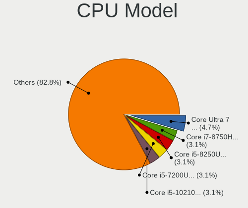
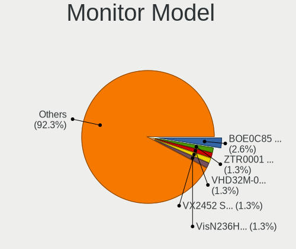
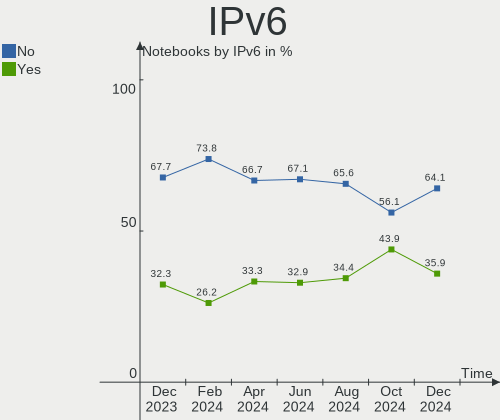
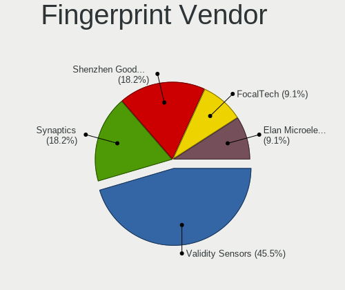

Manjaro Hardware Trends (Notebook)
----------------------------------

A project to identify most popular hardware characteristics and track their change
over time based on data collected by Manjaro users at https://Linux-Hardware.org.

Anyone can contribute to the study by uploading probes of their computers by
the [hw-probe](https://github.com/linuxhw/hw-probe) tool:

    sudo -E hw-probe -all -upload

Full-feature report is available here: https://linux-hardware.org/?view=trends&formfactor=notebook

Period: Jun, 2021.

Contents
--------

- [ OS                       ](#os)
- [ OS Family                ](#os-family)
- [ Kernel                   ](#kernel)
- [ Kernel Family            ](#kernel-family)
- [ Kernel Major Ver.        ](#kernel-major-ver)
- [ Arch                     ](#arch)
- [ DE                       ](#de)
- [ Display Server           ](#display-server)
- [ Display Manager          ](#display-manager)
- [ OS Lang                  ](#os-lang)
- [ Boot Mode                ](#boot-mode)
- [ Filesystem               ](#filesystem)
- [ Part. scheme             ](#part-scheme)
- [ Dual Boot with Linux/BSD ](#dual-boot-with-linux/bsd)
- [ Dual Boot (Win)          ](#dual-boot-win)
- [ Country                  ](#country)
- [ City                     ](#city)
- [ Vendor                   ](#vendor)
- [ Model                    ](#model)
- [ Model Family             ](#model-family)
- [ MFG Year                 ](#mfg-year)
- [ Form Factor              ](#form-factor)
- [ Secure Boot              ](#secure-boot)
- [ Coreboot                 ](#coreboot)
- [ RAM Size                 ](#ram-size)
- [ RAM Used                 ](#ram-used)
- [ Has CD-ROM               ](#has-cd-rom)
- [ Total Drives             ](#total-drives)
- [ Has Ethernet             ](#has-ethernet)
- [ Has WiFi                 ](#has-wifi)
- [ Has Bluetooth            ](#has-bluetooth)
- [ Drive Vendor             ](#drive-vendor)
- [ Drive Model              ](#drive-model)
- [ HDD Vendor               ](#hdd-vendor)
- [ SSD Vendor               ](#ssd-vendor)
- [ Drive Kind               ](#drive-kind)
- [ Drive Connector          ](#drive-connector)
- [ Drive Size               ](#drive-size)
- [ Space Total              ](#space-total)
- [ Space Used               ](#space-used)
- [ Malfunc. Drives          ](#malfunc-drives)
- [ Malfunc. Drive Vendor    ](#malfunc-drive-vendor)
- [ Malfunc. HDD Vendor      ](#malfunc-hdd-vendor)
- [ Malfunc. Drive Kind      ](#malfunc-drive-kind)
- [ Failed Drives            ](#failed-drives)
- [ Failed Drive Vendor      ](#failed-drive-vendor)
- [ Drive Status             ](#drive-status)
- [ Storage Vendor           ](#storage-vendor)
- [ Storage Model            ](#storage-model)
- [ Storage Kind             ](#storage-kind)
- [ CPU Vendor               ](#cpu-vendor)
- [ CPU Model                ](#cpu-model)
- [ CPU Model Family         ](#cpu-model-family)
- [ CPU Cores                ](#cpu-cores)
- [ CPU Sockets              ](#cpu-sockets)
- [ CPU Threads              ](#cpu-threads)
- [ CPU Op-Modes             ](#cpu-op-modes)
- [ CPU Microcode            ](#cpu-microcode)
- [ CPU Microarch            ](#cpu-microarch)
- [ GPU Vendor               ](#gpu-vendor)
- [ GPU Model                ](#gpu-model)
- [ GPU Combo                ](#gpu-combo)
- [ GPU Driver               ](#gpu-driver)
- [ GPU Memory               ](#gpu-memory)
- [ Monitor Vendor           ](#monitor-vendor)
- [ Monitor Model            ](#monitor-model)
- [ Monitor Resolution       ](#monitor-resolution)
- [ Monitor Diagonal         ](#monitor-diagonal)
- [ Monitor Width            ](#monitor-width)
- [ Aspect Ratio             ](#aspect-ratio)
- [ Monitor Area             ](#monitor-area)
- [ Pixel Density            ](#pixel-density)
- [ Multiple Monitors        ](#multiple-monitors)
- [ Net Controller Vendor    ](#net-controller-vendor)
- [ Net Controller Model     ](#net-controller-model)
- [ Wireless Vendor          ](#wireless-vendor)
- [ Wireless Model           ](#wireless-model)
- [ Ethernet Vendor          ](#ethernet-vendor)
- [ Ethernet Model           ](#ethernet-model)
- [ Net Controller Kind      ](#net-controller-kind)
- [ Used Controller          ](#used-controller)
- [ NICs                     ](#nics)
- [ IPv6                     ](#ipv6)
- [ Memory Vendor            ](#memory-vendor)
- [ Memory Model             ](#memory-model)
- [ Memory Kind              ](#memory-kind)
- [ Memory Form Factor       ](#memory-form-factor)
- [ Memory Size              ](#memory-size)
- [ Memory Speed             ](#memory-speed)
- [ Sound Vendor             ](#sound-vendor)
- [ Sound Model              ](#sound-model)
- [ Camera Vendor            ](#camera-vendor)
- [ Camera Model             ](#camera-model)
- [ Fingerprint Vendor       ](#fingerprint-vendor)
- [ Fingerprint Model        ](#fingerprint-model)
- [ Chipcard Vendor          ](#chipcard-vendor)
- [ Chipcard Model           ](#chipcard-model)
- [ Printer Vendor           ](#printer-vendor)
- [ Printer Model            ](#printer-model)
- [ Scanner Vendor           ](#scanner-vendor)
- [ Scanner Model            ](#scanner-model)
- [ Bluetooth Vendor         ](#bluetooth-vendor)
- [ Bluetooth Model          ](#bluetooth-model)
- [ Unsupported Devices      ](#unsupported-devices)
- [ Unsupported Device Types ](#unsupported-device-types)

OS
--

Installed operating systems

| Name           | Notebooks | Percent |
|----------------|-----------|---------|
| Manjaro        | 37        | 38.14%  |
| Manjaro 21.0.7 | 33        | 34.02%  |
| Manjaro 21.0.5 | 14        | 14.43%  |
| Manjaro 21.0.6 | 10        | 10.31%  |
| Manjaro 20.2.1 | 2         | 2.06%   |
| Manjaro 21.0.3 | 1         | 1.03%   |

OS Family
---------

OS without a version

| Name    | Notebooks | Percent |
|---------|-----------|---------|
| Manjaro | 97        | 100%    |

Kernel
------

Version of the Linux kernel

| Version               | Notebooks | Percent |
|-----------------------|-----------|---------|
| 5.10.42-1-MANJARO     | 30        | 30.93%  |
| 5.12.9-1-MANJARO      | 17        | 17.53%  |
| 5.10.36-2-MANJARO     | 10        | 10.31%  |
| 5.13.0-1-MANJARO      | 8         | 8.25%   |
| 5.10.41-1-MANJARO     | 7         | 7.22%   |
| 5.9.16-1-MANJARO      | 6         | 6.19%   |
| 5.4.118-1-MANJARO     | 4         | 4.12%   |
| 5.12.2-1-MANJARO      | 4         | 4.12%   |
| 5.12.8-1-MANJARO      | 3         | 3.09%   |
| 5.11.22-2-MANJARO     | 2         | 2.06%   |
| 5.10.43-1-MANJARO     | 2         | 2.06%   |
| 5.4.124-1-MANJARO     | 1         | 1.03%   |
| 5.12.10-1-MANJARO     | 1         | 1.03%   |
| 5.11.4-1-rt11-MANJARO | 1         | 1.03%   |
| 5.11.18-lqx1-1-lqx    | 1         | 1.03%   |

Kernel Family
-------------

Linux kernel without a distro release

| Version | Notebooks | Percent |
|---------|-----------|---------|
| 5.10.42 | 30        | 30.93%  |
| 5.12.9  | 17        | 17.53%  |
| 5.10.36 | 10        | 10.31%  |
| 5.13.0  | 8         | 8.25%   |
| 5.10.41 | 7         | 7.22%   |
| 5.9.16  | 6         | 6.19%   |
| 5.4.118 | 4         | 4.12%   |
| 5.12.2  | 4         | 4.12%   |
| 5.12.8  | 3         | 3.09%   |
| 5.11.22 | 2         | 2.06%   |
| 5.10.43 | 2         | 2.06%   |
| 5.4.124 | 1         | 1.03%   |
| 5.12.10 | 1         | 1.03%   |
| 5.11.4  | 1         | 1.03%   |
| 5.11.18 | 1         | 1.03%   |

Kernel Major Ver.
-----------------

Linux kernel major version

| Version | Notebooks | Percent |
|---------|-----------|---------|
| 5.10    | 49        | 50.52%  |
| 5.12    | 25        | 25.77%  |
| 5.13    | 8         | 8.25%   |
| 5.9     | 6         | 6.19%   |
| 5.4     | 5         | 5.15%   |
| 5.11    | 4         | 4.12%   |

Arch
----

OS architecture (x86_64, i586, etc.)

| Name   | Notebooks | Percent |
|--------|-----------|---------|
| x86_64 | 97        | 100%    |

DE
--

Desktop Environment

| Name       | Notebooks | Percent |
|------------|-----------|---------|
| KDE5       | 24        | 24.74%  |
| XFCE       | 21        | 21.65%  |
| GNOME      | 19        | 19.59%  |
| KDE        | 15        | 15.46%  |
| i3         | 6         | 6.19%   |
| X-Cinnamon | 3         | 3.09%   |
| Deepin     | 2         | 2.06%   |
| Budgie     | 2         | 2.06%   |
| sway       | 1         | 1.03%   |
| MATE       | 1         | 1.03%   |
| DWM        | 1         | 1.03%   |
| Cinnamon   | 1         | 1.03%   |
| Unknown    | 1         | 1.03%   |

Display Server
--------------

X11 or Wayland

| Name    | Notebooks | Percent |
|---------|-----------|---------|
| X11     | 77        | 79.38%  |
| Wayland | 12        | 12.37%  |
| Unknown | 7         | 7.22%   |
| Tty     | 1         | 1.03%   |

Display Manager
---------------

SDDM, LightDM, etc.

| Name    | Notebooks | Percent |
|---------|-----------|---------|
| Unknown | 37        | 38.14%  |
| SDDM    | 27        | 27.84%  |
| LightDM | 19        | 19.59%  |
| GDM     | 14        | 14.43%  |

OS Lang
-------

Language

| Lang  | Notebooks | Percent |
|-------|-----------|---------|
| en_US | 49        | 50.52%  |
| de_DE | 10        | 10.31%  |
| ru_RU | 6         | 6.19%   |
| it_IT | 4         | 4.12%   |
| fr_FR | 4         | 4.12%   |
| en_GB | 4         | 4.12%   |
| pt_BR | 3         | 3.09%   |
| ru_UA | 2         | 2.06%   |
| en_CA | 2         | 2.06%   |
| zh_TW | 1         | 1.03%   |
| pt_PT | 1         | 1.03%   |
| my_MM | 1         | 1.03%   |
| mn_CN | 1         | 1.03%   |
| hu_HU | 1         | 1.03%   |
| es_ES | 1         | 1.03%   |
| es_CL | 1         | 1.03%   |
| en_SG | 1         | 1.03%   |
| en_IN | 1         | 1.03%   |
| en_AU | 1         | 1.03%   |
| el_GR | 1         | 1.03%   |
| de_BE | 1         | 1.03%   |
| C     | 1         | 1.03%   |

Boot Mode
---------

EFI or BIOS

| Mode | Notebooks | Percent |
|------|-----------|---------|
| EFI  | 55        | 56.7%   |
| BIOS | 42        | 43.3%   |

Filesystem
----------

Type of filesystem

| Type    | Notebooks | Percent |
|---------|-----------|---------|
| Ext4    | 88        | 90.72%  |
| Btrfs   | 4         | 4.12%   |
| Overlay | 3         | 3.09%   |
| Xfs     | 1         | 1.03%   |
| F2fs    | 1         | 1.03%   |

Part. scheme
------------

Scheme of partitioning

| Type    | Notebooks | Percent |
|---------|-----------|---------|
| GPT     | 52        | 53.61%  |
| Unknown | 36        | 37.11%  |
| MBR     | 9         | 9.28%   |

Dual Boot with Linux/BSD
------------------------

Hosting more than one Linux/BSD

| Dual boot | Notebooks | Percent |
|-----------|-----------|---------|
| No        | 94        | 96.91%  |
| Yes       | 3         | 3.09%   |

Dual Boot (Win)
---------------

Hosting Linux and Windows

| Dual boot | Notebooks | Percent |
|-----------|-----------|---------|
| No        | 67        | 69.07%  |
| Yes       | 30        | 30.93%  |

Country
-------

Geographic location (country)

| Country                | Notebooks | Percent |
|------------------------|-----------|---------|
| USA                    | 14        | 14.43%  |
| Germany                | 13        | 13.4%   |
| Russia                 | 9         | 9.28%   |
| France                 | 7         | 7.22%   |
| Italy                  | 5         | 5.15%   |
| Brazil                 | 5         | 5.15%   |
| China                  | 4         | 4.12%   |
| Ukraine                | 3         | 3.09%   |
| India                  | 3         | 3.09%   |
| UK                     | 2         | 2.06%   |
| Spain                  | 2         | 2.06%   |
| Portugal               | 2         | 2.06%   |
| Netherlands            | 2         | 2.06%   |
| Hungary                | 2         | 2.06%   |
| Finland                | 2         | 2.06%   |
| Estonia                | 2         | 2.06%   |
| Canada                 | 2         | 2.06%   |
| Taiwan                 | 1         | 1.03%   |
| Sweden                 | 1         | 1.03%   |
| Serbia                 | 1         | 1.03%   |
| Poland                 | 1         | 1.03%   |
| Myanmar                | 1         | 1.03%   |
| Kenya                  | 1         | 1.03%   |
| Jordan                 | 1         | 1.03%   |
| Israel                 | 1         | 1.03%   |
| Hong Kong              | 1         | 1.03%   |
| Greece                 | 1         | 1.03%   |
| Fiji                   | 1         | 1.03%   |
| Croatia                | 1         | 1.03%   |
| Chile                  | 1         | 1.03%   |
| Bosnia and Herzegovina | 1         | 1.03%   |
| Belgium                | 1         | 1.03%   |
| Bangladesh             | 1         | 1.03%   |
| Australia              | 1         | 1.03%   |
| Argentina              | 1         | 1.03%   |

City
----

Geographic location (city)

| City                    | Notebooks | Percent |
|-------------------------|-----------|---------|
| Moscow                  | 4         | 4.12%   |
| Stuttgart               | 2         | 2.06%   |
| Rio de Janeiro          | 2         | 2.06%   |
| Pune                    | 2         | 2.06%   |
| Madrid                  | 2         | 2.06%   |
| London                  | 2         | 2.06%   |
| Ingolstadt              | 2         | 2.06%   |
| Helsinki                | 2         | 2.06%   |
| Beijing                 | 2         | 2.06%   |
| Zhuhai                  | 1         | 1.03%   |
| Zhubei                  | 1         | 1.03%   |
| Zagreb                  | 1         | 1.03%   |
| Yekaterinburg           | 1         | 1.03%   |
| Yangon                  | 1         | 1.03%   |
| Westminster             | 1         | 1.03%   |
| Vancouver               | 1         | 1.03%   |
| Valbom                  | 1         | 1.03%   |
| Tigre                   | 1         | 1.03%   |
| Ternopil                | 1         | 1.03%   |
| Tel Aviv                | 1         | 1.03%   |
| Tartu                   | 1         | 1.03%   |
| Tallinn                 | 1         | 1.03%   |
| Talairan                | 1         | 1.03%   |
| Suva                    | 1         | 1.03%   |
| Stockholm               | 1         | 1.03%   |
| Sparti                  | 1         | 1.03%   |
| Sorocaba                | 1         | 1.03%   |
| Smila                   | 1         | 1.03%   |
| Sesto San Giovanni      | 1         | 1.03%   |
| Schwalbach am Taunus    | 1         | 1.03%   |
| Sarajevo                | 1         | 1.03%   |
| Santiago                | 1         | 1.03%   |
| San Mateo               | 1         | 1.03%   |
| San Jose                | 1         | 1.03%   |
| San Antonio             | 1         | 1.03%   |
| Saint-Germain-en-Laye   | 1         | 1.03%   |
| Saint-Esteve            | 1         | 1.03%   |
| Saint Paul              | 1         | 1.03%   |
| Rome                    | 1         | 1.03%   |
| Pontoise                | 1         | 1.03%   |
| Plattling               | 1         | 1.03%   |
| Plano                   | 1         | 1.03%   |
| Paris                   | 1         | 1.03%   |
| Ocean City              | 1         | 1.03%   |
| Novosibirsk             | 1         | 1.03%   |
| Niedernberg             | 1         | 1.03%   |
| Nairobi                 | 1         | 1.03%   |
| Montgeron               | 1         | 1.03%   |
| Minneapolis             | 1         | 1.03%   |
| Mielec                  | 1         | 1.03%   |
| Matosinhos Municipality | 1         | 1.03%   |
| Mainz                   | 1         | 1.03%   |
| Maceió                 | 1         | 1.03%   |
| Lucknow                 | 1         | 1.03%   |
| Laken                   | 1         | 1.03%   |
| Kyiv                    | 1         | 1.03%   |
| Kennesaw                | 1         | 1.03%   |
| Kemerovo                | 1         | 1.03%   |
| Kazan’                | 1         | 1.03%   |
| Kabitsyno               | 1         | 1.03%   |

Vendor
------

Motherboard manufacturer

| Name                | Notebooks | Percent |
|---------------------|-----------|---------|
| Lenovo              | 32        | 32.99%  |
| Hewlett-Packard     | 15        | 15.46%  |
| Dell                | 11        | 11.34%  |
| ASUSTek Computer    | 7         | 7.22%   |
| Acer                | 7         | 7.22%   |
| HUAWEI              | 4         | 4.12%   |
| Toshiba             | 3         | 3.09%   |
| Timi                | 3         | 3.09%   |
| Razer               | 3         | 3.09%   |
| Notebook            | 2         | 2.06%   |
| Multilaser          | 2         | 2.06%   |
| MSI                 | 2         | 2.06%   |
| Sony                | 1         | 1.03%   |
| Schenker            | 1         | 1.03%   |
| SANTECH             | 1         | 1.03%   |
| Samsung Electronics | 1         | 1.03%   |
| MECHREVO            | 1         | 1.03%   |
| Google              | 1         | 1.03%   |

Model
-----

Motherboard model

| Name                                 | Notebooks | Percent |
|--------------------------------------|-----------|---------|
| HUAWEI KLVL-WXX9                     | 3         | 3.09%   |
| Razer Blade 14 - RZ09-0370           | 2         | 2.06%   |
| Multilaser PC301                     | 2         | 2.06%   |
| Lenovo ThinkPad T14 Gen 1 20UDCTO1WW | 2         | 2.06%   |
| Lenovo IdeaPad 110-15IBR 80T7        | 2         | 2.06%   |
| Toshiba Satellite L10W-B-101         | 1         | 1.03%   |
| Toshiba Satellite C660               | 1         | 1.03%   |
| Toshiba Satellite C55-B              | 1         | 1.03%   |
| Timi RedmiBook Pro 14S               | 1         | 1.03%   |
| Timi RedmiBook 16                    | 1         | 1.03%   |
| Timi RedmiBook 14 II                 | 1         | 1.03%   |
| Sony VGN-SR11MR                      | 1         | 1.03%   |
| Schenker SCHENKER_SLIM14_SSL14L19    | 1         | 1.03%   |
| SANTECH PCX0DX                       | 1         | 1.03%   |
| Samsung RF712                        | 1         | 1.03%   |
| Razer Blade 15 Mid 2019-Base         | 1         | 1.03%   |
| Notebook W740SU                      | 1         | 1.03%   |
| Notebook W65_W67RZ1                  | 1         | 1.03%   |
| MSI GS66 Stealth 10SGS               | 1         | 1.03%   |
| MSI GP63 Leopard 8RF                 | 1         | 1.03%   |
| MECHREVO X3 Series GK7CP6R           | 1         | 1.03%   |
| Lenovo Yoga S730-13IML 81U4          | 1         | 1.03%   |
| Lenovo XiaoXin-15ARE 2020 81YR       | 1         | 1.03%   |
| Lenovo ThinkPad X240 20AMS26F00      | 1         | 1.03%   |
| Lenovo ThinkPad X201 Tablet 2985EZG  | 1         | 1.03%   |
| Lenovo ThinkPad T490 20N3S2NJ00      | 1         | 1.03%   |
| Lenovo ThinkPad T470s 20HF0000RT     | 1         | 1.03%   |
| Lenovo ThinkPad T460 20FMS2D600      | 1         | 1.03%   |
| Lenovo ThinkPad T450s 20BWS2YL00     | 1         | 1.03%   |
| Lenovo ThinkPad T450s 20BWS2US00     | 1         | 1.03%   |
| Lenovo ThinkPad T450s 20BWS0WL00     | 1         | 1.03%   |
| Lenovo ThinkPad T450 20BV000DUS      | 1         | 1.03%   |
| Lenovo ThinkPad T14 Gen 1 20UES00L00 | 1         | 1.03%   |
| Lenovo ThinkPad P53 20QNS00X00       | 1         | 1.03%   |
| Lenovo ThinkPad L490 20Q6S08600      | 1         | 1.03%   |
| Lenovo ThinkPad Edge E330 3354AMG    | 1         | 1.03%   |
| Lenovo ThinkPad E475 20H4CTO1WW      | 1         | 1.03%   |
| Lenovo ThinkPad E15 Gen 2 20T9S0B500 | 1         | 1.03%   |
| Lenovo ThinkBook 15-IIL 20SM         | 1         | 1.03%   |
| Lenovo Legion 5 82B5                 | 1         | 1.03%   |
| Lenovo Legion 5 17IMH05H 81Y8        | 1         | 1.03%   |
| Lenovo Legion 5 15ARH05H 82B1        | 1         | 1.03%   |
| Lenovo Legion 5 15ARH05 82B5         | 1         | 1.03%   |
| Lenovo IdeaPad Gaming 3 15ARH05 82EY | 1         | 1.03%   |
| Lenovo IdeaPad 330-17IKB 81DM        | 1         | 1.03%   |
| Lenovo IdeaPad 3 15IIL05 81WE        | 1         | 1.03%   |
| Lenovo IdeaPad 3 15ADA05 81W1        | 1         | 1.03%   |
| Lenovo IdeaPad 3 14IML05 81WA        | 1         | 1.03%   |
| Lenovo G575 20081                    | 1         | 1.03%   |
| HUAWEI MACHC-WAX9                    | 1         | 1.03%   |
| HP ZBook Studio G5                   | 1         | 1.03%   |
| HP ProBook 650 G5                    | 1         | 1.03%   |
| HP ProBook 430 G1                    | 1         | 1.03%   |
| HP Pavilion Laptop 15z-cw100         | 1         | 1.03%   |
| HP Pavilion Laptop 15-cw1xxx         | 1         | 1.03%   |
| HP Pavilion 15                       | 1         | 1.03%   |
| HP OMEN by HP Laptop                 | 1         | 1.03%   |
| HP Laptop 15-da0xxx                  | 1         | 1.03%   |
| HP Laptop 15-bw0xx                   | 1         | 1.03%   |
| HP ENVY 15                           | 1         | 1.03%   |

Model Family
------------

Motherboard model prefix

| Name                 | Notebooks | Percent |
|----------------------|-----------|---------|
| Lenovo ThinkPad      | 17        | 17.53%  |
| Lenovo IdeaPad       | 7         | 7.22%   |
| Lenovo Legion        | 4         | 4.12%   |
| Dell Latitude        | 4         | 4.12%   |
| Dell Inspiron        | 4         | 4.12%   |
| Toshiba Satellite    | 3         | 3.09%   |
| Timi RedmiBook       | 3         | 3.09%   |
| Razer Blade          | 3         | 3.09%   |
| HUAWEI KLVL-WXX9     | 3         | 3.09%   |
| HP Pavilion          | 3         | 3.09%   |
| HP EliteBook         | 3         | 3.09%   |
| Acer Swift           | 3         | 3.09%   |
| Acer Aspire          | 3         | 3.09%   |
| Multilaser PC301     | 2         | 2.06%   |
| HP ProBook           | 2         | 2.06%   |
| HP Laptop            | 2         | 2.06%   |
| ASUS VivoBook        | 2         | 2.06%   |
| Sony VGN-SR11MR      | 1         | 1.03%   |
| Schenker SCHENKER    | 1         | 1.03%   |
| SANTECH PCX0DX       | 1         | 1.03%   |
| Samsung RF712        | 1         | 1.03%   |
| Notebook W740SU      | 1         | 1.03%   |
| Notebook W65         | 1         | 1.03%   |
| MSI GS66             | 1         | 1.03%   |
| MSI GP63             | 1         | 1.03%   |
| MECHREVO X3          | 1         | 1.03%   |
| Lenovo Yoga          | 1         | 1.03%   |
| Lenovo XiaoXin-15ARE | 1         | 1.03%   |
| Lenovo ThinkBook     | 1         | 1.03%   |
| Lenovo G575          | 1         | 1.03%   |
| HUAWEI MACHC-WAX9    | 1         | 1.03%   |
| HP ZBook             | 1         | 1.03%   |
| HP OMEN              | 1         | 1.03%   |
| HP ENVY              | 1         | 1.03%   |
| HP 255               | 1         | 1.03%   |
| HP 250               | 1         | 1.03%   |
| Google Peppy         | 1         | 1.03%   |
| Dell XPS             | 1         | 1.03%   |
| Dell Vostro          | 1         | 1.03%   |
| Dell Precision       | 1         | 1.03%   |
| ASUS UX310UAK        | 1         | 1.03%   |
| ASUS U36SD           | 1         | 1.03%   |
| ASUS ROG             | 1         | 1.03%   |
| ASUS K53U            | 1         | 1.03%   |
| ASUS ASUS            | 1         | 1.03%   |
| Acer Nitro           | 1         | 1.03%   |

MFG Year
--------

Motherboard manufacture year

| Year | Notebooks | Percent |
|------|-----------|---------|
| 2020 | 30        | 30.93%  |
| 2021 | 20        | 20.62%  |
| 2019 | 14        | 14.43%  |
| 2018 | 7         | 7.22%   |
| 2016 | 7         | 7.22%   |
| 2011 | 5         | 5.15%   |
| 2015 | 3         | 3.09%   |
| 2014 | 3         | 3.09%   |
| 2017 | 2         | 2.06%   |
| 2012 | 2         | 2.06%   |
| 2009 | 2         | 2.06%   |
| 2013 | 1         | 1.03%   |
| 2010 | 1         | 1.03%   |

Form Factor
-----------

Physical design of the computer

| Name     | Notebooks | Percent |
|----------|-----------|---------|
| Notebook | 97        | 100%    |

Secure Boot
-----------

Enabled or disabled

| State    | Notebooks | Percent |
|----------|-----------|---------|
| Disabled | 97        | 100%    |

Coreboot
--------

Have coreboot on board

| Used | Notebooks | Percent |
|------|-----------|---------|
| No   | 96        | 98.97%  |
| Yes  | 1         | 1.03%   |

RAM Size
--------

Total RAM memory

| Size in GB  | Notebooks | Percent |
|-------------|-----------|---------|
| 8.01-16.0   | 24        | 24.74%  |
| 4.01-8.0    | 23        | 23.71%  |
| 16.01-24.0  | 22        | 22.68%  |
| 3.01-4.0    | 12        | 12.37%  |
| 32.01-64.0  | 6         | 6.19%   |
| 24.01-32.0  | 3         | 3.09%   |
| 64.01-256.0 | 3         | 3.09%   |
| 1.01-2.0    | 3         | 3.09%   |
| 2.01-3.0    | 1         | 1.03%   |

RAM Used
--------

Used RAM memory

| Used GB   | Notebooks | Percent |
|-----------|-----------|---------|
| 2.01-3.0  | 29        | 29.9%   |
| 1.01-2.0  | 23        | 23.71%  |
| 3.01-4.0  | 20        | 20.62%  |
| 4.01-8.0  | 13        | 13.4%   |
| 8.01-16.0 | 7         | 7.22%   |
| 0.51-1.0  | 5         | 5.15%   |

Has CD-ROM
----------

Has CD-ROM on board

| Presented | Notebooks | Percent |
|-----------|-----------|---------|
| No        | 82        | 84.54%  |
| Yes       | 15        | 15.46%  |

Total Drives
------------

Number of drives on board

| Drives | Notebooks | Percent |
|--------|-----------|---------|
| 1      | 69        | 71.13%  |
| 2      | 26        | 26.8%   |
| 3      | 2         | 2.06%   |

Has Ethernet
------------

Has Ethernet on board

| Presented | Notebooks | Percent |
|-----------|-----------|---------|
| Yes       | 73        | 75.26%  |
| No        | 24        | 24.74%  |

Has WiFi
--------

Has WiFi module

| Presented | Notebooks | Percent |
|-----------|-----------|---------|
| Yes       | 97        | 100%    |

Has Bluetooth
-------------

Has Bluetooth module

| Presented | Notebooks | Percent |
|-----------|-----------|---------|
| Yes       | 80        | 82.47%  |
| No        | 17        | 17.53%  |

Drive Vendor
------------

Hard drive vendors

| Vendor                  | Notebooks | Drives | Percent |
|-------------------------|-----------|--------|---------|
| Samsung Electronics     | 19        | 20     | 15.45%  |
| WDC                     | 14        | 14     | 11.38%  |
| Kingston                | 11        | 11     | 8.94%   |
| SK Hynix                | 10        | 10     | 8.13%   |
| Toshiba                 | 9         | 9      | 7.32%   |
| Seagate                 | 9         | 9      | 7.32%   |
| Unknown                 | 8         | 8      | 6.5%    |
| SanDisk                 | 8         | 8      | 6.5%    |
| Intel                   | 6         | 7      | 4.88%   |
| Crucial                 | 6         | 6      | 4.88%   |
| Micron Technology       | 4         | 4      | 3.25%   |
| HGST                    | 3         | 3      | 2.44%   |
| Silicon Motion          | 2         | 2      | 1.63%   |
| Phison                  | 2         | 2      | 1.63%   |
| KIOXIA                  | 2         | 2      | 1.63%   |
| A-DATA Technology       | 2         | 2      | 1.63%   |
| XPG                     | 1         | 1      | 0.81%   |
| Union Memory (Shenzhen) | 1         | 1      | 0.81%   |
| Transcend               | 1         | 1      | 0.81%   |
| LITEON                  | 1         | 1      | 0.81%   |
| Lite-On                 | 1         | 1      | 0.81%   |
| Hitachi                 | 1         | 1      | 0.81%   |
| FASPEED                 | 1         | 1      | 0.81%   |
| EMTEC                   | 1         | 1      | 0.81%   |

Drive Model
-----------

Hard drive models

| Model                                        | Notebooks | Percent |
|----------------------------------------------|-----------|---------|
| SK Hynix NVMe SSD Drive 512GB                | 4         | 3.2%    |
| Seagate ST1000LM035-1RK172 1TB               | 4         | 3.2%    |
| Sandisk NVMe SSD Drive 512GB                 | 4         | 3.2%    |
| WDC PC SN730 SDBPNTY-512G-1027 512GB         | 3         | 2.4%    |
| Toshiba MQ01ABF050 500GB                     | 3         | 2.4%    |
| WDC WD10SPZX-60Z10T0 1TB                     | 2         | 1.6%    |
| Unknown MMC Card  32GB                       | 2         | 1.6%    |
| SK Hynix NVMe SSD Drive 256GB                | 2         | 1.6%    |
| Seagate ST500LM021-1KJ152 500GB              | 2         | 1.6%    |
| Samsung NVMe SSD Drive 512GB                 | 2         | 1.6%    |
| Samsung MZNLH512HALU-00000 512GB SSD         | 2         | 1.6%    |
| Intel SSDPEKNW010T8 1TB                      | 2         | 1.6%    |
| HGST HTS545050A7E380 500GB                   | 2         | 1.6%    |
| Crucial CT1000MX500SSD1 1TB                  | 2         | 1.6%    |
| XPG NVMe SSD Drive 1024GB                    | 1         | 0.8%    |
| WDC WDS240G2G0B-00EPW0 240GB SSD             | 1         | 0.8%    |
| WDC WD5000LPLX-75ZNTT0 500GB                 | 1         | 0.8%    |
| WDC WD5000LPCX-24VHAT0 500GB                 | 1         | 0.8%    |
| WDC WD5000BEVT-75A0RT0 500GB                 | 1         | 0.8%    |
| WDC WD10SPZX-17Z10T0 1TB                     | 1         | 0.8%    |
| WDC WD10SPZX-08Z10 1TB                       | 1         | 0.8%    |
| WDC WD10JPVX-22JC3T0 1TB                     | 1         | 0.8%    |
| WDC PC SN730 SDBQNTY-1T00-1001 1TB           | 1         | 0.8%    |
| WDC PC SN720 SDAPNTW-512G-1006 512GB         | 1         | 0.8%    |
| Unknown SPCC  64GB                           | 1         | 0.8%    |
| Unknown SD128  128GB                         | 1         | 0.8%    |
| Unknown SD02G  2GB                           | 1         | 0.8%    |
| Unknown SD/MMC/MS PRO 128GB                  | 1         | 0.8%    |
| Unknown SB64G  64GB                          | 1         | 0.8%    |
| Unknown MMC Card  16GB                       | 1         | 0.8%    |
| Union Memory (Shenzhen) NVMe SSD Drive 128GB | 1         | 0.8%    |
| Transcend TS1TSSD230S 1024GB                 | 1         | 0.8%    |
| Toshiba THNSFJ256GCSU 256GB SSD              | 1         | 0.8%    |
| Toshiba THNSF5256GPUK 256GB                  | 1         | 0.8%    |
| Toshiba NVMe SSD Drive 512GB                 | 1         | 0.8%    |
| Toshiba MK2565GSX 250GB                      | 1         | 0.8%    |
| Toshiba MK2546GSX 200 200GB                  | 1         | 0.8%    |
| Toshiba KBG40ZNT256G MEMORY 256GB            | 1         | 0.8%    |
| SK Hynix SKHynix_HFS001TD9TNI-L2B0B 1TB      | 1         | 0.8%    |
| SK Hynix SKHynix_HFM512GDHTNI-87A0B 512GB    | 1         | 0.8%    |
| SK Hynix HFS256G3BTND-N210A 256GB SSD        | 1         | 0.8%    |
| SK Hynix HFM512GD3JX013N 512GB               | 1         | 0.8%    |
| Silicon Motion NVMe SSD Drive 500GB          | 1         | 0.8%    |
| Silicon Motion NVMe SSD Drive 1024GB         | 1         | 0.8%    |
| Seagate ST9160412AS 160GB                    | 1         | 0.8%    |
| Seagate ST9100821AS 100GB                    | 1         | 0.8%    |
| Seagate ST1000LX015-1U7172 1TB               | 1         | 0.8%    |
| SanDisk SSD PLUS 240GB                       | 1         | 0.8%    |
| SanDisk SDSSDH3 4T00 4TB                     | 1         | 0.8%    |
| SanDisk SD9SN8W256G1014 256GB SSD            | 1         | 0.8%    |
| Sandisk NVMe SSD Drive 256GB                 | 1         | 0.8%    |
| Samsung SSD 980 PRO 500GB                    | 1         | 0.8%    |
| Samsung SSD 970 PRO 512GB                    | 1         | 0.8%    |
| Samsung SSD 970 EVO Plus 500GB               | 1         | 0.8%    |
| Samsung SSD 970 EVO Plus 250GB               | 1         | 0.8%    |
| Samsung SSD 870 EVO 500GB                    | 1         | 0.8%    |
| Samsung SSD 860 EVO 1TB                      | 1         | 0.8%    |
| Samsung SSD 850 EVO 500GB                    | 1         | 0.8%    |
| Samsung SSD 840 PRO Series 512GB             | 1         | 0.8%    |
| Samsung NVMe SSD Drive 1TB                   | 1         | 0.8%    |

HDD Vendor
----------

Hard disk drive vendors

| Vendor              | Notebooks | Drives | Percent |
|---------------------|-----------|--------|---------|
| Seagate             | 9         | 9      | 33.33%  |
| WDC                 | 8         | 8      | 29.63%  |
| Toshiba             | 5         | 5      | 18.52%  |
| HGST                | 3         | 3      | 11.11%  |
| Samsung Electronics | 1         | 1      | 3.7%    |
| Hitachi             | 1         | 1      | 3.7%    |

SSD Vendor
----------

Solid state drive vendors

| Vendor              | Notebooks | Drives | Percent |
|---------------------|-----------|--------|---------|
| Samsung Electronics | 8         | 8      | 22.86%  |
| Kingston            | 6         | 6      | 17.14%  |
| Crucial             | 6         | 6      | 17.14%  |
| SanDisk             | 3         | 3      | 8.57%   |
| Micron Technology   | 2         | 2      | 5.71%   |
| A-DATA Technology   | 2         | 2      | 5.71%   |
| WDC                 | 1         | 1      | 2.86%   |
| Transcend           | 1         | 1      | 2.86%   |
| Toshiba             | 1         | 1      | 2.86%   |
| SK Hynix            | 1         | 1      | 2.86%   |
| LITEON              | 1         | 1      | 2.86%   |
| Intel               | 1         | 1      | 2.86%   |
| FASPEED             | 1         | 1      | 2.86%   |
| EMTEC               | 1         | 1      | 2.86%   |

Drive Kind
----------

HDD or SSD

| Kind    | Notebooks | Drives | Percent |
|---------|-----------|--------|---------|
| NVMe    | 47        | 55     | 41.23%  |
| SSD     | 32        | 35     | 28.07%  |
| HDD     | 27        | 27     | 23.68%  |
| MMC     | 7         | 7      | 6.14%   |
| Unknown | 1         | 1      | 0.88%   |

Drive Connector
---------------

SATA, SAS, NVMe, etc.

| Type | Notebooks | Drives | Percent |
|------|-----------|--------|---------|
| SATA | 54        | 61     | 49.09%  |
| NVMe | 47        | 55     | 42.73%  |
| MMC  | 7         | 7      | 6.36%   |
| SAS  | 2         | 2      | 1.82%   |

Drive Size
----------

Size of hard drive

| Size in TB | Notebooks | Drives | Percent |
|------------|-----------|--------|---------|
| 0.01-0.5   | 37        | 38     | 60.66%  |
| 0.51-1.0   | 22        | 22     | 36.07%  |
| 3.01-4.0   | 1         | 1      | 1.64%   |
| 1.01-2.0   | 1         | 1      | 1.64%   |

Space Total
-----------

Amount of disk space available on the file system

| Size in GB     | Notebooks | Percent |
|----------------|-----------|---------|
| 251-500        | 37        | 38.14%  |
| 101-250        | 22        | 22.68%  |
| 1001-2000      | 8         | 8.25%   |
| 1-20           | 7         | 7.22%   |
| 501-1000       | 6         | 6.19%   |
| 51-100         | 6         | 6.19%   |
| Unknown        | 6         | 6.19%   |
| 21-50          | 3         | 3.09%   |
| More than 3000 | 2         | 2.06%   |

Space Used
----------

Amount of used disk space

| Used GB        | Notebooks | Percent |
|----------------|-----------|---------|
| 1-20           | 29        | 29.9%   |
| 51-100         | 18        | 18.56%  |
| 101-250        | 16        | 16.49%  |
| 21-50          | 12        | 12.37%  |
| 251-500        | 10        | 10.31%  |
| Unknown        | 6         | 6.19%   |
| 501-1000       | 3         | 3.09%   |
| 1001-2000      | 2         | 2.06%   |
| More than 3000 | 1         | 1.03%   |

Malfunc. Drives
---------------

Drive models with a malfunction

| Model                                          | Notebooks | Drives | Percent |
|------------------------------------------------|-----------|--------|---------|
| WDC WD5000BEVT-75A0RT0 500GB                   | 1         | 1      | 12.5%   |
| SK Hynix HFS256G3BTND-N210A 256GB SSD          | 1         | 1      | 12.5%   |
| Seagate ST9160412AS 160GB                      | 1         | 1      | 12.5%   |
| Seagate ST1000LM035-1RK172 1TB                 | 1         | 1      | 12.5%   |
| Micron Technology 1100_MTFDDAV512TBN 512GB SSD | 1         | 1      | 12.5%   |
| Hitachi HTS545050A7E380 500GB                  | 1         | 1      | 12.5%   |
| HGST HTS545050A7E380 500GB                     | 1         | 1      | 12.5%   |
| FASPEED H5-500G SSD                            | 1         | 1      | 12.5%   |

Malfunc. Drive Vendor
---------------------

Vendors of faulty drives

| Vendor            | Notebooks | Drives | Percent |
|-------------------|-----------|--------|---------|
| Seagate           | 2         | 2      | 25%     |
| WDC               | 1         | 1      | 12.5%   |
| SK Hynix          | 1         | 1      | 12.5%   |
| Micron Technology | 1         | 1      | 12.5%   |
| Hitachi           | 1         | 1      | 12.5%   |
| HGST              | 1         | 1      | 12.5%   |
| FASPEED           | 1         | 1      | 12.5%   |

Malfunc. HDD Vendor
-------------------

Vendors of faulty HDD drives

| Vendor  | Notebooks | Drives | Percent |
|---------|-----------|--------|---------|
| Seagate | 2         | 2      | 40%     |
| WDC     | 1         | 1      | 20%     |
| Hitachi | 1         | 1      | 20%     |
| HGST    | 1         | 1      | 20%     |

Malfunc. Drive Kind
-------------------

Kinds of faulty drives

| Kind | Notebooks | Drives | Percent |
|------|-----------|--------|---------|
| HDD  | 5         | 5      | 62.5%   |
| SSD  | 3         | 3      | 37.5%   |

Failed Drives
-------------

Failed drive models

Zero info for selected period =(

Failed Drive Vendor
-------------------

Failed drive vendors

Zero info for selected period =(

Drive Status
------------

Number of failed and malfunc. drives

| Status   | Notebooks | Drives | Percent |
|----------|-----------|--------|---------|
| Detected | 58        | 72     | 55.24%  |
| Works    | 39        | 45     | 37.14%  |
| Malfunc  | 8         | 8      | 7.62%   |

Storage Vendor
--------------

Storage controller vendors

| Vendor                       | Notebooks | Percent |
|------------------------------|-----------|---------|
| Intel                        | 58        | 47.15%  |
| AMD                          | 18        | 14.63%  |
| Samsung Electronics          | 10        | 8.13%   |
| SK Hynix                     | 9         | 7.32%   |
| Sandisk                      | 9         | 7.32%   |
| Kingston Technology Company  | 5         | 4.07%   |
| KIOXIA                       | 3         | 2.44%   |
| Toshiba America Info Systems | 2         | 1.63%   |
| Silicon Motion               | 2         | 1.63%   |
| Phison Electronics           | 2         | 1.63%   |
| Micron Technology            | 2         | 1.63%   |
| Union Memory (Shenzhen)      | 1         | 0.81%   |
| Lite-On Technology           | 1         | 0.81%   |
| ADATA Technology             | 1         | 0.81%   |

Storage Model
-------------

Storage controller models

| Model                                                                            | Notebooks | Percent |
|----------------------------------------------------------------------------------|-----------|---------|
| AMD FCH SATA Controller [AHCI mode]                                              | 16        | 12.7%   |
| Samsung NVMe SSD Controller SM981/PM981/PM983                                    | 10        | 7.94%   |
| Intel 82801 Mobile SATA Controller [RAID mode]                                   | 7         | 5.56%   |
| Intel Wildcat Point-LP SATA Controller [AHCI Mode]                               | 6         | 4.76%   |
| Intel Sunrise Point-LP SATA Controller [AHCI mode]                               | 6         | 4.76%   |
| SK Hynix BC511                                                                   | 5         | 3.97%   |
| Sandisk WD Black SN750 / PC SN730 NVMe SSD                                       | 5         | 3.97%   |
| Intel Cannon Lake Mobile PCH SATA AHCI Controller                                | 5         | 3.97%   |
| Intel 8 Series SATA Controller 1 [AHCI mode]                                     | 5         | 3.97%   |
| SK Hynix Non-Volatile memory controller                                          | 3         | 2.38%   |
| KIOXIA Non-Volatile memory controller                                            | 3         | 2.38%   |
| Kingston Company A2000 NVMe SSD                                                  | 3         | 2.38%   |
| Intel SSD 660P Series                                                            | 3         | 2.38%   |
| Intel Atom/Celeron/Pentium Processor x5-E8000/J3xxx/N3xxx Series SATA Controller | 3         | 2.38%   |
| Intel 6 Series/C200 Series Chipset Family 6 port Mobile SATA AHCI Controller     | 3         | 2.38%   |
| Silicon Motion SM2262/SM2262EN SSD Controller                                    | 2         | 1.59%   |
| Sandisk WD Black 2018/SN750 / PC SN720 NVMe SSD                                  | 2         | 1.59%   |
| Micron Non-Volatile memory controller                                            | 2         | 1.59%   |
| Intel Comet Lake SATA AHCI Controller                                            | 2         | 1.59%   |
| Intel Atom Processor E3800 Series SATA AHCI Controller                           | 2         | 1.59%   |
| Intel 82801IBM/IEM (ICH9M/ICH9M-E) 4 port SATA Controller [AHCI mode]            | 2         | 1.59%   |
| Intel 8 Series/C220 Series Chipset Family 6-port SATA Controller 1 [AHCI mode]   | 2         | 1.59%   |
| Intel 7 Series Chipset Family 6-port SATA Controller [AHCI mode]                 | 2         | 1.59%   |
| Intel 400 Series Chipset Family SATA AHCI Controller                             | 2         | 1.59%   |
| AMD SB7x0/SB8x0/SB9x0 SATA Controller [AHCI mode]                                | 2         | 1.59%   |
| Union Memory (Shenzhen) Non-Volatile memory controller                           | 1         | 0.79%   |
| Toshiba America Info Systems XG6 NVMe SSD Controller                             | 1         | 0.79%   |
| Toshiba America Info Systems XG4 NVMe SSD Controller                             | 1         | 0.79%   |
| SK Hynix NVMe SSD Controller                                                     | 1         | 0.79%   |
| Sandisk WD Blue SN500 / PC SN520 NVMe SSD                                        | 1         | 0.79%   |
| Sandisk Non-Volatile memory controller                                           | 1         | 0.79%   |
| Samsung NVMe SSD Controller PM9A1/PM9A3/980PRO                                   | 1         | 0.79%   |
| Phison NVMe Storage Controller                                                   | 1         | 0.79%   |
| Phison E12 NVMe Controller                                                       | 1         | 0.79%   |
| Lite-On Non-Volatile memory controller                                           | 1         | 0.79%   |
| Kingston Company U-SNS8154P3 NVMe SSD                                            | 1         | 0.79%   |
| Kingston Company Company Non-Volatile memory controller                          | 1         | 0.79%   |
| Intel Tiger Lake-LP SATA Controller [AHCI mode]                                  | 1         | 0.79%   |
| Intel SSD Pro 7600p/760p/E 6100p Series                                          | 1         | 0.79%   |
| Intel Non-Volatile memory controller                                             | 1         | 0.79%   |
| Intel Ice Lake-LP SATA Controller [AHCI mode]                                    | 1         | 0.79%   |
| Intel HM170/QM170 Chipset SATA Controller [AHCI Mode]                            | 1         | 0.79%   |
| Intel Celeron/Pentium Silver Processor SATA Controller                           | 1         | 0.79%   |
| Intel Cannon Point-LP SATA Controller [AHCI Mode]                                | 1         | 0.79%   |
| Intel 5 Series/3400 Series Chipset 6 port SATA AHCI Controller                   | 1         | 0.79%   |
| Intel 5 Series/3400 Series Chipset 4 port SATA AHCI Controller                   | 1         | 0.79%   |
| AMD SB7x0/SB8x0/SB9x0 IDE Controller                                             | 1         | 0.79%   |
| ADATA XPG SX8200 Pro PCIe Gen3x4 M.2 2280 Solid State Drive                      | 1         | 0.79%   |

Storage Kind
------------

Kind of storage controller (IDE, SATA, NVMe, SAS, ...)

| Kind | Notebooks | Percent |
|------|-----------|---------|
| SATA | 65        | 54.17%  |
| NVMe | 47        | 39.17%  |
| RAID | 7         | 5.83%   |
| IDE  | 1         | 0.83%   |

CPU Vendor
----------

Processor vendors

| Vendor | Notebooks | Percent |
|--------|-----------|---------|
| Intel  | 67        | 69.07%  |
| AMD    | 30        | 30.93%  |

CPU Model
---------

Processor models

| Model                                         | Notebooks | Percent |
|-----------------------------------------------|-----------|---------|
| AMD Ryzen 7 4800H with Radeon Graphics        | 6         | 6.19%   |
| Intel Core i7-9750H CPU @ 2.60GHz             | 5         | 5.15%   |
| AMD Ryzen 7 PRO 4750U with Radeon Graphics    | 4         | 4.12%   |
| Intel Core i7-10510U CPU @ 1.80GHz            | 3         | 3.09%   |
| Intel Core i5-8265U CPU @ 1.60GHz             | 3         | 3.09%   |
| Intel Core i5-7200U CPU @ 2.50GHz             | 3         | 3.09%   |
| Intel Core i5-5200U CPU @ 2.20GHz             | 3         | 3.09%   |
| AMD Ryzen 5 3500U with Radeon Vega Mobile Gfx | 3         | 3.09%   |
| Intel Pentium CPU N3700 @ 1.60GHz             | 2         | 2.06%   |
| Intel Core i7-8550U CPU @ 1.80GHz             | 2         | 2.06%   |
| Intel Core i7-5600U CPU @ 2.60GHz             | 2         | 2.06%   |
| Intel Core i7-10750H CPU @ 2.60GHz            | 2         | 2.06%   |
| Intel Core i7-1065G7 CPU @ 1.30GHz            | 2         | 2.06%   |
| Intel Core i5-5300U CPU @ 2.30GHz             | 2         | 2.06%   |
| Intel Core i5-4200U CPU @ 1.60GHz             | 2         | 2.06%   |
| Intel Celeron CPU N3060 @ 1.60GHz             | 2         | 2.06%   |
| Intel Celeron CPU N2840 @ 2.16GHz             | 2         | 2.06%   |
| AMD Ryzen 9 5900HX with Radeon Graphics       | 2         | 2.06%   |
| AMD Ryzen 5 4500U with Radeon Graphics        | 2         | 2.06%   |
| Intel Pentium Silver N5030 CPU @ 1.10GHz      | 1         | 1.03%   |
| Intel Pentium Dual-Core CPU T4300 @ 2.10GHz   | 1         | 1.03%   |
| Intel Pentium CPU B980 @ 2.40GHz              | 1         | 1.03%   |
| Intel Pentium CPU 6405U @ 2.40GHz             | 1         | 1.03%   |
| Intel Core i7-8750H CPU @ 2.20GHz             | 1         | 1.03%   |
| Intel Core i7-8650U CPU @ 1.90GHz             | 1         | 1.03%   |
| Intel Core i7-8565U CPU @ 1.80GHz             | 1         | 1.03%   |
| Intel Core i7-6600U CPU @ 2.60GHz             | 1         | 1.03%   |
| Intel Core i7-4760HQ CPU @ 2.10GHz            | 1         | 1.03%   |
| Intel Core i7-4702MQ CPU @ 2.20GHz            | 1         | 1.03%   |
| Intel Core i7-4600U CPU @ 2.10GHz             | 1         | 1.03%   |
| Intel Core i7-3612QM CPU @ 2.10GHz            | 1         | 1.03%   |
| Intel Core i7-2630QM CPU @ 2.00GHz            | 1         | 1.03%   |
| Intel Core i7-2620M CPU @ 2.70GHz             | 1         | 1.03%   |
| Intel Core i7-10875H CPU @ 2.30GHz            | 1         | 1.03%   |
| Intel Core i7 CPU L 620 @ 2.00GHz             | 1         | 1.03%   |
| Intel Core i5-9300H CPU @ 2.40GHz             | 1         | 1.03%   |
| Intel Core i5-6300U CPU @ 2.40GHz             | 1         | 1.03%   |
| Intel Core i5-2520M CPU @ 2.50GHz             | 1         | 1.03%   |
| Intel Core i5-2430M CPU @ 2.40GHz             | 1         | 1.03%   |
| Intel Core i5-1035G1 CPU @ 1.00GHz            | 1         | 1.03%   |
| Intel Core i5-10210U CPU @ 1.60GHz            | 1         | 1.03%   |
| Intel Core i3-7100U CPU @ 2.40GHz             | 1         | 1.03%   |
| Intel Core i3-6100H CPU @ 2.70GHz             | 1         | 1.03%   |
| Intel Core i3-4005U CPU @ 1.70GHz             | 1         | 1.03%   |
| Intel Core i3-1005G1 CPU @ 1.20GHz            | 1         | 1.03%   |
| Intel Core i3 CPU M 380 @ 2.53GHz             | 1         | 1.03%   |
| Intel Core 2 Duo CPU P8400 @ 2.26GHz          | 1         | 1.03%   |
| Intel Celeron CPU N3050 @ 1.60GHz             | 1         | 1.03%   |
| Intel Celeron 2955U @ 1.40GHz                 | 1         | 1.03%   |
| Intel 11th Gen Core i5-1135G7 @ 2.40GHz       | 1         | 1.03%   |
| Intel 11th Gen Core i5-11300H @ 3.10GHz       | 1         | 1.03%   |
| AMD Ryzen 9 4900HS with Radeon Graphics       | 1         | 1.03%   |
| AMD Ryzen 7 5700U with Radeon Graphics        | 1         | 1.03%   |
| AMD Ryzen 7 4800U with Radeon Graphics        | 1         | 1.03%   |
| AMD Ryzen 7 4700U with Radeon Graphics        | 1         | 1.03%   |
| AMD Ryzen 7 3700U with Radeon Vega Mobile Gfx | 1         | 1.03%   |
| AMD Ryzen 7 2700U with Radeon Vega Mobile Gfx | 1         | 1.03%   |
| AMD Ryzen 5 4600H with Radeon Graphics        | 1         | 1.03%   |
| AMD Ryzen 3 3250U with Radeon Graphics        | 1         | 1.03%   |
| AMD Ryzen 3 3200U with Radeon Vega Mobile Gfx | 1         | 1.03%   |

CPU Model Family
----------------

Processor model prefix

| Model                   | Notebooks | Percent |
|-------------------------|-----------|---------|
| Intel Core i7           | 28        | 28.87%  |
| Intel Core i5           | 19        | 19.59%  |
| AMD Ryzen 7             | 11        | 11.34%  |
| Intel Celeron           | 6         | 6.19%   |
| AMD Ryzen 5             | 6         | 6.19%   |
| Intel Core i3           | 5         | 5.15%   |
| Intel Pentium           | 4         | 4.12%   |
| AMD Ryzen 7 PRO         | 4         | 4.12%   |
| Other                   | 3         | 3.09%   |
| AMD Ryzen 9             | 3         | 3.09%   |
| AMD Ryzen 3             | 2         | 2.06%   |
| AMD E                   | 2         | 2.06%   |
| Intel Pentium Silver    | 1         | 1.03%   |
| Intel Pentium Dual-Core | 1         | 1.03%   |
| Intel Core 2 Duo        | 1         | 1.03%   |
| AMD A10                 | 1         | 1.03%   |

CPU Cores
---------

Number of processor cores

| Number | Notebooks | Percent |
|--------|-----------|---------|
| 2      | 39        | 40.21%  |
| 4      | 29        | 29.9%   |
| 8      | 17        | 17.53%  |
| 6      | 11        | 11.34%  |
| 1      | 1         | 1.03%   |

CPU Sockets
-----------

Number of sockets

| Number | Notebooks | Percent |
|--------|-----------|---------|
| 1      | 97        | 100%    |

CPU Threads
-----------

Threads per core (Hyper-Threading)

| Number | Notebooks | Percent |
|--------|-----------|---------|
| 2      | 80        | 82.47%  |
| 1      | 17        | 17.53%  |

CPU Op-Modes
------------

CPU Operation Modes (32-bit, 64-bit)

| Op mode        | Notebooks | Percent |
|----------------|-----------|---------|
| 32-bit, 64-bit | 97        | 100%    |

CPU Microcode
-------------

Microcode number

| Number     | Notebooks | Percent |
|------------|-----------|---------|
| Unknown    | 41        | 42.27%  |
| 0x08600104 | 6         | 6.19%   |
| 0x806ec    | 5         | 5.15%   |
| 0x08600106 | 5         | 5.15%   |
| 0x906ea    | 4         | 4.12%   |
| 0x706e5    | 4         | 4.12%   |
| 0x306d4    | 4         | 4.12%   |
| 0x806e9    | 3         | 3.09%   |
| 0x806ea    | 2         | 2.06%   |
| 0x40651    | 2         | 2.06%   |
| 0x0a50000c | 2         | 2.06%   |
| 0x08600103 | 2         | 2.06%   |
| 0x08108102 | 2         | 2.06%   |
| 0xa0652    | 1         | 1.03%   |
| 0x806c1    | 1         | 1.03%   |
| 0x706a8    | 1         | 1.03%   |
| 0x506e3    | 1         | 1.03%   |
| 0x406e3    | 1         | 1.03%   |
| 0x40661    | 1         | 1.03%   |
| 0x306c3    | 1         | 1.03%   |
| 0x30678    | 1         | 1.03%   |
| 0x20655    | 1         | 1.03%   |
| 0x1067a    | 1         | 1.03%   |
| 0x08608103 | 1         | 1.03%   |
| 0x08108109 | 1         | 1.03%   |
| 0x0810100b | 1         | 1.03%   |
| 0x0600611a | 1         | 1.03%   |
| 0x05000029 | 1         | 1.03%   |

CPU Microarch
-------------

Microarchitecture

| Name          | Notebooks | Percent |
|---------------|-----------|---------|
| KabyLake      | 23        | 23.71%  |
| Zen 2         | 16        | 16.49%  |
| Silvermont    | 7         | 7.22%   |
| Haswell       | 7         | 7.22%   |
| Broadwell     | 7         | 7.22%   |
| Zen+          | 6         | 6.19%   |
| SandyBridge   | 5         | 5.15%   |
| IceLake       | 4         | 4.12%   |
| Skylake       | 3         | 3.09%   |
| CometLake     | 3         | 3.09%   |
| Zen 3         | 2         | 2.06%   |
| Westmere      | 2         | 2.06%   |
| TigerLake     | 2         | 2.06%   |
| Penryn        | 2         | 2.06%   |
| Excavator     | 2         | 2.06%   |
| Bobcat        | 2         | 2.06%   |
| Zen           | 1         | 1.03%   |
| IvyBridge     | 1         | 1.03%   |
| Goldmont plus | 1         | 1.03%   |
| Unknown       | 1         | 1.03%   |

GPU Vendor
----------

Vendors of graphics cards

| Vendor | Notebooks | Percent |
|--------|-----------|---------|
| Intel  | 62        | 51.67%  |
| AMD    | 32        | 26.67%  |
| Nvidia | 26        | 21.67%  |

GPU Model
---------

Graphics card models

| Model                                                                                    | Notebooks | Percent |
|------------------------------------------------------------------------------------------|-----------|---------|
| AMD Renoir                                                                               | 15        | 12.4%   |
| Intel HD Graphics 5500                                                                   | 7         | 5.79%   |
| Intel CoffeeLake-H GT2 [UHD Graphics 630]                                                | 6         | 4.96%   |
| AMD Picasso                                                                              | 6         | 4.96%   |
| Intel Haswell-ULT Integrated Graphics Controller                                         | 5         | 4.13%   |
| Intel Atom/Celeron/Pentium Processor x5-E8000/J3xxx/N3xxx Integrated Graphics Controller | 5         | 4.13%   |
| Nvidia TU116M [GeForce GTX 1660 Ti Mobile]                                               | 4         | 3.31%   |
| Intel WhiskeyLake-U GT2 [UHD Graphics 620]                                               | 4         | 3.31%   |
| Intel HD Graphics 620                                                                    | 4         | 3.31%   |
| Intel CometLake-U GT2 [UHD Graphics]                                                     | 4         | 3.31%   |
| Nvidia TU106M [GeForce RTX 2060 Mobile]                                                  | 3         | 2.48%   |
| Intel UHD Graphics 620                                                                   | 3         | 2.48%   |
| Intel 2nd Generation Core Processor Family Integrated Graphics Controller                | 3         | 2.48%   |
| Nvidia TU117M [GeForce GTX 1650 Ti Mobile]                                               | 2         | 1.65%   |
| Nvidia GA104M [GeForce RTX 3080 Mobile / Max-Q 8GB/16GB]                                 | 2         | 1.65%   |
| Intel TigerLake-LP GT2 [Iris Xe Graphics]                                                | 2         | 1.65%   |
| Intel Skylake GT2 [HD Graphics 520]                                                      | 2         | 1.65%   |
| Intel Iris Plus Graphics G7                                                              | 2         | 1.65%   |
| Intel Iris Plus Graphics G1 (Ice Lake)                                                   | 2         | 1.65%   |
| Intel Core Processor Integrated Graphics Controller                                      | 2         | 1.65%   |
| Intel CometLake-H GT2 [UHD Graphics]                                                     | 2         | 1.65%   |
| Intel Atom Processor Z36xxx/Z37xxx Series Graphics & Display                             | 2         | 1.65%   |
| AMD Wani [Radeon R5/R6/R7 Graphics]                                                      | 2         | 1.65%   |
| AMD Cezanne                                                                              | 2         | 1.65%   |
| Nvidia TU117M [GeForce GTX 1650 Mobile / Max-Q]                                          | 1         | 0.83%   |
| Nvidia TU117M                                                                            | 1         | 0.83%   |
| Nvidia TU117GLM [Quadro T2000 Mobile / Max-Q]                                            | 1         | 0.83%   |
| Nvidia TU104M [GeForce RTX 2080 SUPER Mobile / Max-Q]                                    | 1         | 0.83%   |
| Nvidia GP108M [GeForce MX150]                                                            | 1         | 0.83%   |
| Nvidia GP107M [GeForce MX350]                                                            | 1         | 0.83%   |
| Nvidia GP107GLM [Quadro P2000 Mobile]                                                    | 1         | 0.83%   |
| Nvidia GP104M [GeForce GTX 1070 Mobile]                                                  | 1         | 0.83%   |
| Nvidia GM108M [GeForce 940MX]                                                            | 1         | 0.83%   |
| Nvidia GM108M [GeForce 840M]                                                             | 1         | 0.83%   |
| Nvidia GK208M [GeForce GT 740M]                                                          | 1         | 0.83%   |
| Nvidia GK107M [GeForce GT 750M]                                                          | 1         | 0.83%   |
| Nvidia GF119M [GeForce GT 520M]                                                          | 1         | 0.83%   |
| Nvidia GF117M [GeForce 610M/710M/810M/820M / GT 620M/625M/630M/720M]                     | 1         | 0.83%   |
| Nvidia GA107M [GeForce RTX 3050 Ti Mobile]                                               | 1         | 0.83%   |
| Intel Mobile 4 Series Chipset Integrated Graphics Controller                             | 1         | 0.83%   |
| Intel HD Graphics 530                                                                    | 1         | 0.83%   |
| Intel GeminiLake [UHD Graphics 605]                                                      | 1         | 0.83%   |
| Intel Crystal Well Integrated Graphics Controller                                        | 1         | 0.83%   |
| Intel Comet Lake UHD Graphics                                                            | 1         | 0.83%   |
| Intel 4th Gen Core Processor Integrated Graphics Controller                              | 1         | 0.83%   |
| Intel 3rd Gen Core processor Graphics Controller                                         | 1         | 0.83%   |
| AMD Wrestler [Radeon HD 6320]                                                            | 1         | 0.83%   |
| AMD Wrestler [Radeon HD 6310]                                                            | 1         | 0.83%   |
| AMD Whistler [Radeon HD 6730M/6770M/7690M XT]                                            | 1         | 0.83%   |
| AMD Whistler [Radeon HD 6630M/6650M/6750M/7670M/7690M]                                   | 1         | 0.83%   |
| AMD Topaz XT [Radeon R7 M260/M265 / M340/M360 / M440/M445 / 530/535 / 620/625 Mobile]    | 1         | 0.83%   |
| AMD RV620/M82 [Mobility Radeon HD 3450/3470]                                             | 1         | 0.83%   |
| AMD Raven Ridge [Radeon Vega Series / Radeon Vega Mobile Series]                         | 1         | 0.83%   |
| AMD Lucienne                                                                             | 1         | 0.83%   |

GPU Combo
---------

Combinations of graphics cards

| Name           | Notebooks | Percent |
|----------------|-----------|---------|
| 1 x Intel      | 45        | 46.39%  |
| 1 x AMD        | 25        | 25.77%  |
| Intel + Nvidia | 17        | 17.53%  |
| AMD + Nvidia   | 6         | 6.19%   |
| 1 x Nvidia     | 3         | 3.09%   |
| 2 x AMD        | 1         | 1.03%   |

GPU Driver
----------

Free vs proprietary

| Driver      | Notebooks | Percent |
|-------------|-----------|---------|
| Free        | 81        | 83.51%  |
| Proprietary | 16        | 16.49%  |

GPU Memory
----------

Total video memory

| Size in GB | Notebooks | Percent |
|------------|-----------|---------|
| Unknown    | 72        | 74.23%  |
| 0.01-0.5   | 13        | 13.4%   |
| 1.01-2.0   | 5         | 5.15%   |
| 5.01-6.0   | 3         | 3.09%   |
| 3.01-4.0   | 2         | 2.06%   |
| 7.01-8.0   | 1         | 1.03%   |
| 0.51-1.0   | 1         | 1.03%   |

Monitor Vendor
--------------

Monitor vendors

| Vendor                  | Notebooks | Percent |
|-------------------------|-----------|---------|
| AU Optronics            | 23        | 18.85%  |
| Chimei Innolux          | 22        | 18.03%  |
| BOE                     | 20        | 16.39%  |
| LG Display              | 18        | 14.75%  |
| Dell                    | 7         | 5.74%   |
| Goldstar                | 5         | 4.1%    |
| Samsung Electronics     | 4         | 3.28%   |
| Lenovo                  | 3         | 2.46%   |
| Chi Mei Optoelectronics | 3         | 2.46%   |
| BenQ                    | 3         | 2.46%   |
| TMX                     | 2         | 1.64%   |
| PANDA                   | 2         | 1.64%   |
| TIANMA XM               | 1         | 0.82%   |
| Sony                    | 1         | 0.82%   |
| QSM                     | 1         | 0.82%   |
| Philips                 | 1         | 0.82%   |
| Insignia                | 1         | 0.82%   |
| Iiyama                  | 1         | 0.82%   |
| Hewlett-Packard         | 1         | 0.82%   |
| CPT                     | 1         | 0.82%   |
| AOC                     | 1         | 0.82%   |
| Acer                    | 1         | 0.82%   |

Monitor Model
-------------

Monitor models

| Model                                                                 | Notebooks | Percent |
|-----------------------------------------------------------------------|-----------|---------|
| TMX TL140BDXP01-0 TMX1400 2560x1440 310x174mm 14.0-inch               | 2         | 1.6%    |
| LG Display LCD Monitor LGD0618 1920x1080 344x194mm 15.5-inch          | 2         | 1.6%    |
| LG Display LCD Monitor LGD05E5 1920x1080 344x194mm 15.5-inch          | 2         | 1.6%    |
| LG Display LCD Monitor LGD0354 1366x768 293x165mm 13.2-inch           | 2         | 1.6%    |
| Chimei Innolux LCD Monitor CMN1735 1920x1080 382x215mm 17.3-inch      | 2         | 1.6%    |
| Chimei Innolux LCD Monitor CMN15F5 1920x1080 344x193mm 15.5-inch      | 2         | 1.6%    |
| BOE LCD Monitor BOE0893 2160x1440 296x197mm 14.0-inch                 | 2         | 1.6%    |
| BOE LCD Monitor BOE0771 1366x768 256x144mm 11.6-inch                  | 2         | 1.6%    |
| AU Optronics LCD Monitor AUO573D 1920x1080 309x174mm 14.0-inch        | 2         | 1.6%    |
| AU Optronics LCD Monitor AUO38ED 1920x1080 340x190mm 15.3-inch        | 2         | 1.6%    |
| AU Optronics LCD Monitor AUO133D 1920x1080 309x173mm 13.9-inch        | 2         | 1.6%    |
| TIANMA XM LCD Monitor TLX1388 3000x2000 293x196mm 13.9-inch           | 1         | 0.8%    |
| Sony TV SNYC901 1920x1080 1600x900mm 72.3-inch                        | 1         | 0.8%    |
| Samsung Electronics LCD Monitor SECD033 1920x1080 380x220mm 17.3-inch | 1         | 0.8%    |
| Samsung Electronics LCD Monitor SEC4252 1366x768 344x194mm 15.5-inch  | 1         | 0.8%    |
| Samsung Electronics Color LCD SDCA029 2160x1440 252x168mm 11.9-inch   | 1         | 0.8%    |
| Samsung Electronics C27F591 SAM0D36 1920x1080 598x336mm 27.0-inch     | 1         | 0.8%    |
| Samsung Electronics C27F398 SAM0D45 1920x1080 600x340mm 27.2-inch     | 1         | 0.8%    |
| QSM QUSHIMEI220 QSM2200 1680x1050                                     | 1         | 0.8%    |
| Philips PHL 342B1C PHL093C 2560x1080 797x334mm 34.0-inch              | 1         | 0.8%    |
| PANDA LCD Monitor NCP006A 2560x1600 302x189mm 14.0-inch               | 1         | 0.8%    |
| PANDA LCD Monitor NCP0031 1920x1080 344x194mm 15.5-inch               | 1         | 0.8%    |
| LG Display LP156WH2-TLAA LGD0230 1366x768 344x194mm 15.5-inch         | 1         | 0.8%    |
| LG Display LCD Monitor LGDD901 1366x768 344x194mm 15.5-inch           | 1         | 0.8%    |
| LG Display LCD Monitor LGD40BA 1920x1080 344x194mm 15.5-inch          | 1         | 0.8%    |
| LG Display LCD Monitor LGD0625 1920x1080 344x194mm 15.5-inch          | 1         | 0.8%    |
| LG Display LCD Monitor LGD05FA 1920x1080 309x174mm 14.0-inch          | 1         | 0.8%    |
| LG Display LCD Monitor LGD05C0 1920x1080 344x194mm 15.5-inch          | 1         | 0.8%    |
| LG Display LCD Monitor LGD05B9 1920x1080 380x210mm 17.1-inch          | 1         | 0.8%    |
| LG Display LCD Monitor LGD0546 1920x1080 344x194mm 15.5-inch          | 1         | 0.8%    |
| LG Display LCD Monitor LGD04FC 1366x768 344x194mm 15.5-inch           | 1         | 0.8%    |
| LG Display LCD Monitor LGD046D 1920x1080 309x174mm 14.0-inch          | 1         | 0.8%    |
| LG Display LCD Monitor LGD0456 1366x768 344x194mm 15.5-inch           | 1         | 0.8%    |
| LG Display LCD Monitor LGD033A 1366x768 340x190mm 15.3-inch           | 1         | 0.8%    |
| Lenovo LEN L2021wA LEN10B8 1600x900 443x249mm 20.0-inch               | 1         | 0.8%    |
| Lenovo LEN D24-10 LEN65E2 1920x1080 521x293mm 23.5-inch               | 1         | 0.8%    |
| Lenovo LCD Monitor LEN4011 1280x800 261x163mm 12.1-inch               | 1         | 0.8%    |
| Insignia NS-32D310NA17 BBY0050 1360x768 760x450mm 34.8-inch           | 1         | 0.8%    |
| Iiyama PL2493H IVM6141 1920x1080 527x296mm 23.8-inch                  | 1         | 0.8%    |
| Hewlett-Packard w2448h HWP2815 1920x1200 520x320mm 24.0-inch          | 1         | 0.8%    |
| Goldstar W2220 GSM577C 1680x1050 470x290mm 21.7-inch                  | 1         | 0.8%    |
| Goldstar IPS FULLHD GSM5AB8 1920x1080 480x270mm 21.7-inch             | 1         | 0.8%    |
| Goldstar HDR 4K GSM7706 3840x2160 600x340mm 27.2-inch                 | 1         | 0.8%    |
| Goldstar FULL HD GSM5B55 1920x1080 480x270mm 21.7-inch                | 1         | 0.8%    |
| Goldstar BK750Y GSM5B3D 1920x1080 480x270mm 21.7-inch                 | 1         | 0.8%    |
| Dell U2414H DELA0A2 1920x1080 527x296mm 23.8-inch                     | 1         | 0.8%    |
| Dell S2719DC DEL4189 2560x1440 597x336mm 27.0-inch                    | 1         | 0.8%    |
| Dell S2316M DELD080 1920x1080 509x286mm 23.0-inch                     | 1         | 0.8%    |
| Dell P2419HC DELA11C 1920x1080 527x296mm 23.8-inch                    | 1         | 0.8%    |
| Dell P2419H DELD0DA 1920x1080 527x296mm 23.8-inch                     | 1         | 0.8%    |
| Dell P2418D DELD0C2 2560x1440 526x296mm 23.8-inch                     | 1         | 0.8%    |
| Dell P2314H DEL4099 1920x1080 510x290mm 23.1-inch                     | 1         | 0.8%    |
| Dell E248WFP DELA02E 1920x1200 518x324mm 24.1-inch                    | 1         | 0.8%    |
| Dell E178WFP DELD016 1440x900 370x230mm 17.2-inch                     | 1         | 0.8%    |
| CPT LCD Monitor COR5244 1366x768 293x164mm 13.2-inch                  | 1         | 0.8%    |
| Chimei Innolux P140ZKA-BZ1 CMN8C03 2160x1440 296x197mm 14.0-inch      | 1         | 0.8%    |
| Chimei Innolux LCD Monitor CMN1728 1600x900 382x215mm 17.3-inch       | 1         | 0.8%    |
| Chimei Innolux LCD Monitor CMN1608 1920x1080 355x199mm 16.0-inch      | 1         | 0.8%    |
| Chimei Innolux LCD Monitor CMN15F4 1920x1080 344x193mm 15.5-inch      | 1         | 0.8%    |
| Chimei Innolux LCD Monitor CMN15E6 1366x768 344x193mm 15.5-inch       | 1         | 0.8%    |

Monitor Resolution
------------------

Monitor screen resolution

| Resolution         | Notebooks | Percent |
|--------------------|-----------|---------|
| 1920x1080 (FHD)    | 58        | 51.33%  |
| 1366x768 (WXGA)    | 28        | 24.78%  |
| 3840x2160 (4K)     | 5         | 4.42%   |
| 2560x1440 (QHD)    | 5         | 4.42%   |
| 1600x900 (HD+)     | 4         | 3.54%   |
| 2160x1440          | 3         | 2.65%   |
| 1920x1200 (WUXGA)  | 2         | 1.77%   |
| 1680x1050 (WSXGA+) | 2         | 1.77%   |
| 3000x2000          | 1         | 0.88%   |
| 2560x1600          | 1         | 0.88%   |
| 2560x1080          | 1         | 0.88%   |
| 2256x1504          | 1         | 0.88%   |
| 1440x900 (WXGA+)   | 1         | 0.88%   |
| 1280x800 (WXGA)    | 1         | 0.88%   |

Monitor Diagonal
----------------

Diagonal size in inches

| Inches  | Notebooks | Percent |
|---------|-----------|---------|
| 15      | 45        | 36.59%  |
| 13      | 20        | 16.26%  |
| 14      | 17        | 13.82%  |
| 17      | 8         | 6.5%    |
| 24      | 6         | 4.88%   |
| 27      | 5         | 4.07%   |
| 23      | 4         | 3.25%   |
| 21      | 4         | 3.25%   |
| 11      | 4         | 3.25%   |
| 34      | 2         | 1.63%   |
| 12      | 2         | 1.63%   |
| 72      | 1         | 0.81%   |
| 32      | 1         | 0.81%   |
| 31      | 1         | 0.81%   |
| 20      | 1         | 0.81%   |
| 16      | 1         | 0.81%   |
| Unknown | 1         | 0.81%   |

Monitor Width
-------------

Physical width

| Width in mm | Notebooks | Percent |
|-------------|-----------|---------|
| 301-350     | 71        | 58.2%   |
| 201-300     | 17        | 13.93%  |
| 501-600     | 14        | 11.48%  |
| 351-400     | 9         | 7.38%   |
| 401-500     | 5         | 4.1%    |
| 701-800     | 3         | 2.46%   |
| 601-700     | 1         | 0.82%   |
| 1501-2000   | 1         | 0.82%   |
| Unknown     | 1         | 0.82%   |

Aspect Ratio
------------

Proportional relationship between the width and the height

| Ratio | Notebooks | Percent |
|-------|-----------|---------|
| 16/9  | 92        | 88.46%  |
| 3/2   | 6         | 5.77%   |
| 16/10 | 5         | 4.81%   |
| 21/9  | 1         | 0.96%   |

Monitor Area
------------

Area in inch²

| Area in inch² | Notebooks | Percent |
|----------------|-----------|---------|
| 101-110        | 46        | 37.4%   |
| 81-90          | 31        | 25.2%   |
| 201-250        | 12        | 9.76%   |
| 71-80          | 6         | 4.88%   |
| 121-130        | 6         | 4.88%   |
| 301-350        | 5         | 4.07%   |
| 51-60          | 4         | 3.25%   |
| 351-500        | 3         | 2.44%   |
| 61-70          | 2         | 1.63%   |
| 251-300        | 2         | 1.63%   |
| 131-140        | 2         | 1.63%   |
| More than 1000 | 1         | 0.81%   |
| 151-200        | 1         | 0.81%   |
| 501-1000       | 1         | 0.81%   |
| Unknown        | 1         | 0.81%   |

Pixel Density
-------------

Pixels per inch

| Density       | Notebooks | Percent |
|---------------|-----------|---------|
| 121-160       | 62        | 51.24%  |
| 101-120       | 27        | 22.31%  |
| 51-100        | 16        | 13.22%  |
| 161-240       | 11        | 9.09%   |
| More than 240 | 2         | 1.65%   |
| 1-50          | 2         | 1.65%   |
| Unknown       | 1         | 0.83%   |

Multiple Monitors
-----------------

Total monitors connected

| Total | Notebooks | Percent |
|-------|-----------|---------|
| 1     | 71        | 73.2%   |
| 2     | 20        | 20.62%  |
| 3     | 5         | 5.15%   |
| 0     | 1         | 1.03%   |

Net Controller Vendor
---------------------

Controller vendors

| Vendor                   | Notebooks | Percent |
|--------------------------|-----------|---------|
| Intel                    | 60        | 41.1%   |
| Realtek Semiconductor    | 57        | 39.04%  |
| Qualcomm Atheros         | 14        | 9.59%   |
| Broadcom                 | 4         | 2.74%   |
| Ralink Technology        | 2         | 1.37%   |
| Marvell Technology Group | 2         | 1.37%   |
| Sierra Wireless          | 1         | 0.68%   |
| NetGear                  | 1         | 0.68%   |
| Lenovo                   | 1         | 0.68%   |
| DisplayLink              | 1         | 0.68%   |
| Dell                     | 1         | 0.68%   |
| Broadcom Limited         | 1         | 0.68%   |
| ASIX Electronics         | 1         | 0.68%   |

Net Controller Model
--------------------

Controller models

| Model                                                             | Notebooks | Percent |
|-------------------------------------------------------------------|-----------|---------|
| Realtek RTL8111/8168/8411 PCI Express Gigabit Ethernet Controller | 36        | 20.11%  |
| Intel Wi-Fi 6 AX200                                               | 17        | 9.5%    |
| Realtek RTL8822CE 802.11ac PCIe Wireless Network Adapter          | 9         | 5.03%   |
| Realtek RTL810xE PCI Express Fast Ethernet controller             | 7         | 3.91%   |
| Intel Wireless 7265                                               | 6         | 3.35%   |
| Realtek RTL8153 Gigabit Ethernet Adapter                          | 5         | 2.79%   |
| Intel Ethernet Connection (3) I218-LM                             | 5         | 2.79%   |
| Realtek RTL8821CE 802.11ac PCIe Wireless Network Adapter          | 4         | 2.23%   |
| Intel Wireless 8260                                               | 4         | 2.23%   |
| Intel Ethernet Connection (6) I219-V                              | 4         | 2.23%   |
| Intel Comet Lake PCH-LP CNVi WiFi                                 | 4         | 2.23%   |
| Intel Cannon Lake PCH CNVi WiFi                                   | 4         | 2.23%   |
| Qualcomm Atheros QCA9565 / AR9565 Wireless Network Adapter        | 3         | 1.68%   |
| Qualcomm Atheros QCA9377 802.11ac Wireless Network Adapter        | 3         | 1.68%   |
| Intel Ice Lake-LP PCH CNVi WiFi                                   | 3         | 1.68%   |
| Intel Centrino Wireless-N 2230                                    | 3         | 1.68%   |
| Realtek RTL8821AE 802.11ac PCIe Wireless Network Adapter          | 2         | 1.12%   |
| Realtek RTL8723BU 802.11b/g/n WLAN Adapter                        | 2         | 1.12%   |
| Ralink RT5370 Wireless Adapter                                    | 2         | 1.12%   |
| Qualcomm Atheros AR9462 Wireless Network Adapter                  | 2         | 1.12%   |
| Qualcomm Atheros AR9285 Wireless Network Adapter (PCI-Express)    | 2         | 1.12%   |
| Marvell Group 88E8040 PCI-E Fast Ethernet Controller              | 2         | 1.12%   |
| Intel Wireless 8265 / 8275                                        | 2         | 1.12%   |
| Intel Wi-Fi 6 AX210/AX211/AX411 160MHz                            | 2         | 1.12%   |
| Intel Wi-Fi 6 AX201                                               | 2         | 1.12%   |
| Intel Ethernet Connection I219-LM                                 | 2         | 1.12%   |
| Intel Comet Lake PCH CNVi WiFi                                    | 2         | 1.12%   |
| Intel 82579LM Gigabit Network Connection (Lewisville)             | 2         | 1.12%   |
| Broadcom BCM4313 802.11bgn Wireless Network Adapter               | 2         | 1.12%   |
| Sierra Wireless EM7345 4G LTE                                     | 1         | 0.56%   |
| Realtek RTL8822BE 802.11a/b/g/n/ac WiFi adapter                   | 1         | 0.56%   |
| Realtek RTL8723DE Wireless Network Adapter                        | 1         | 0.56%   |
| Realtek RTL8723BE PCIe Wireless Network Adapter                   | 1         | 0.56%   |
| Realtek RTL8192EE PCIe Wireless Network Adapter                   | 1         | 0.56%   |
| Realtek RTL8188EUS 802.11n Wireless Network Adapter               | 1         | 0.56%   |
| Realtek 802.11ac NIC                                              | 1         | 0.56%   |
| Qualcomm Atheros Killer E2400 Gigabit Ethernet Controller         | 1         | 0.56%   |
| Qualcomm Atheros AR9485 Wireless Network Adapter                  | 1         | 0.56%   |
| Qualcomm Atheros AR928X Wireless Network Adapter (PCI-Express)    | 1         | 0.56%   |
| Qualcomm Atheros AR8152 v2.0 Fast Ethernet                        | 1         | 0.56%   |
| Qualcomm Atheros AR8151 v2.0 Gigabit Ethernet                     | 1         | 0.56%   |
| NetGear A6100 AC600 DB Wireless Adapter [Realtek RTL8811AU]       | 1         | 0.56%   |
| Lenovo USB-C Dock Ethernet                                        | 1         | 0.56%   |
| Intel Wireless-AC 9260                                            | 1         | 0.56%   |
| Intel Wireless 3165                                               | 1         | 0.56%   |
| Intel Wireless 3160                                               | 1         | 0.56%   |
| Intel Gemini Lake PCH CNVi WiFi                                   | 1         | 0.56%   |
| Intel Ethernet controller                                         | 1         | 0.56%   |
| Intel Ethernet Connection I218-LM                                 | 1         | 0.56%   |
| Intel Ethernet Connection I217-V                                  | 1         | 0.56%   |
| Intel Ethernet Connection (7) I219-V                              | 1         | 0.56%   |
| Intel Ethernet Connection (4) I219-V                              | 1         | 0.56%   |
| Intel Ethernet Connection (4) I219-LM                             | 1         | 0.56%   |
| Intel Dual Band Wireless-AC 3168NGW [Stone Peak]                  | 1         | 0.56%   |
| Intel Centrino Ultimate-N 6300                                    | 1         | 0.56%   |
| Intel Centrino Advanced-N 6235                                    | 1         | 0.56%   |
| Intel Centrino Advanced-N 6205 [Taylor Peak]                      | 1         | 0.56%   |
| Intel Cannon Point-LP CNVi [Wireless-AC]                          | 1         | 0.56%   |
| Intel 82577LM Gigabit Network Connection                          | 1         | 0.56%   |
| DisplayLink USB-C Triple-4K Dock                                  | 1         | 0.56%   |

Wireless Vendor
---------------

Wireless vendors

| Vendor                | Notebooks | Percent |
|-----------------------|-----------|---------|
| Intel                 | 58        | 56.86%  |
| Realtek Semiconductor | 22        | 21.57%  |
| Qualcomm Atheros      | 12        | 11.76%  |
| Broadcom              | 4         | 3.92%   |
| Ralink Technology     | 2         | 1.96%   |
| Sierra Wireless       | 1         | 0.98%   |
| NetGear               | 1         | 0.98%   |
| Dell                  | 1         | 0.98%   |
| Broadcom Limited      | 1         | 0.98%   |

Wireless Model
--------------

Wireless models

| Model                                                          | Notebooks | Percent |
|----------------------------------------------------------------|-----------|---------|
| Intel Wi-Fi 6 AX200                                            | 17        | 16.5%   |
| Realtek RTL8822CE 802.11ac PCIe Wireless Network Adapter       | 9         | 8.74%   |
| Intel Wireless 7265                                            | 6         | 5.83%   |
| Realtek RTL8821CE 802.11ac PCIe Wireless Network Adapter       | 4         | 3.88%   |
| Intel Wireless 8260                                            | 4         | 3.88%   |
| Intel Comet Lake PCH-LP CNVi WiFi                              | 4         | 3.88%   |
| Intel Cannon Lake PCH CNVi WiFi                                | 4         | 3.88%   |
| Qualcomm Atheros QCA9565 / AR9565 Wireless Network Adapter     | 3         | 2.91%   |
| Qualcomm Atheros QCA9377 802.11ac Wireless Network Adapter     | 3         | 2.91%   |
| Intel Ice Lake-LP PCH CNVi WiFi                                | 3         | 2.91%   |
| Intel Centrino Wireless-N 2230                                 | 3         | 2.91%   |
| Realtek RTL8821AE 802.11ac PCIe Wireless Network Adapter       | 2         | 1.94%   |
| Realtek RTL8723BU 802.11b/g/n WLAN Adapter                     | 2         | 1.94%   |
| Ralink RT5370 Wireless Adapter                                 | 2         | 1.94%   |
| Qualcomm Atheros AR9462 Wireless Network Adapter               | 2         | 1.94%   |
| Qualcomm Atheros AR9285 Wireless Network Adapter (PCI-Express) | 2         | 1.94%   |
| Intel Wireless 8265 / 8275                                     | 2         | 1.94%   |
| Intel Wi-Fi 6 AX210/AX211/AX411 160MHz                         | 2         | 1.94%   |
| Intel Wi-Fi 6 AX201                                            | 2         | 1.94%   |
| Intel Comet Lake PCH CNVi WiFi                                 | 2         | 1.94%   |
| Broadcom BCM4313 802.11bgn Wireless Network Adapter            | 2         | 1.94%   |
| Sierra Wireless EM7345 4G LTE                                  | 1         | 0.97%   |
| Realtek RTL8822BE 802.11a/b/g/n/ac WiFi adapter                | 1         | 0.97%   |
| Realtek RTL8723DE Wireless Network Adapter                     | 1         | 0.97%   |
| Realtek RTL8723BE PCIe Wireless Network Adapter                | 1         | 0.97%   |
| Realtek RTL8192EE PCIe Wireless Network Adapter                | 1         | 0.97%   |
| Realtek RTL8188EUS 802.11n Wireless Network Adapter            | 1         | 0.97%   |
| Realtek 802.11ac NIC                                           | 1         | 0.97%   |
| Qualcomm Atheros AR9485 Wireless Network Adapter               | 1         | 0.97%   |
| Qualcomm Atheros AR928X Wireless Network Adapter (PCI-Express) | 1         | 0.97%   |
| NetGear A6100 AC600 DB Wireless Adapter [Realtek RTL8811AU]    | 1         | 0.97%   |
| Intel Wireless-AC 9260                                         | 1         | 0.97%   |
| Intel Wireless 3165                                            | 1         | 0.97%   |
| Intel Wireless 3160                                            | 1         | 0.97%   |
| Intel Gemini Lake PCH CNVi WiFi                                | 1         | 0.97%   |
| Intel Dual Band Wireless-AC 3168NGW [Stone Peak]               | 1         | 0.97%   |
| Intel Centrino Ultimate-N 6300                                 | 1         | 0.97%   |
| Intel Centrino Advanced-N 6235                                 | 1         | 0.97%   |
| Intel Centrino Advanced-N 6205 [Taylor Peak]                   | 1         | 0.97%   |
| Intel Cannon Point-LP CNVi [Wireless-AC]                       | 1         | 0.97%   |
| Dell DW5811e Snapdragon™ X7 LTE                           | 1         | 0.97%   |
| Broadcom Limited BCM4312 802.11b/g LP-PHY                      | 1         | 0.97%   |
| Broadcom BCM43225 802.11b/g/n                                  | 1         | 0.97%   |
| Broadcom BCM43142 802.11b/g/n                                  | 1         | 0.97%   |

Ethernet Vendor
---------------

Ethernet vendors

| Vendor                   | Notebooks | Percent |
|--------------------------|-----------|---------|
| Realtek Semiconductor    | 46        | 62.16%  |
| Intel                    | 20        | 27.03%  |
| Qualcomm Atheros         | 3         | 4.05%   |
| Marvell Technology Group | 2         | 2.7%    |
| Lenovo                   | 1         | 1.35%   |
| DisplayLink              | 1         | 1.35%   |
| ASIX Electronics         | 1         | 1.35%   |

Ethernet Model
--------------

Ethernet models

| Model                                                             | Notebooks | Percent |
|-------------------------------------------------------------------|-----------|---------|
| Realtek RTL8111/8168/8411 PCI Express Gigabit Ethernet Controller | 36        | 47.37%  |
| Realtek RTL810xE PCI Express Fast Ethernet controller             | 7         | 9.21%   |
| Realtek RTL8153 Gigabit Ethernet Adapter                          | 5         | 6.58%   |
| Intel Ethernet Connection (3) I218-LM                             | 5         | 6.58%   |
| Intel Ethernet Connection (6) I219-V                              | 4         | 5.26%   |
| Marvell Group 88E8040 PCI-E Fast Ethernet Controller              | 2         | 2.63%   |
| Intel Ethernet Connection I219-LM                                 | 2         | 2.63%   |
| Intel 82579LM Gigabit Network Connection (Lewisville)             | 2         | 2.63%   |
| Qualcomm Atheros Killer E2400 Gigabit Ethernet Controller         | 1         | 1.32%   |
| Qualcomm Atheros AR8152 v2.0 Fast Ethernet                        | 1         | 1.32%   |
| Qualcomm Atheros AR8151 v2.0 Gigabit Ethernet                     | 1         | 1.32%   |
| Lenovo USB-C Dock Ethernet                                        | 1         | 1.32%   |
| Intel Ethernet controller                                         | 1         | 1.32%   |
| Intel Ethernet Connection I218-LM                                 | 1         | 1.32%   |
| Intel Ethernet Connection I217-V                                  | 1         | 1.32%   |
| Intel Ethernet Connection (7) I219-V                              | 1         | 1.32%   |
| Intel Ethernet Connection (4) I219-V                              | 1         | 1.32%   |
| Intel Ethernet Connection (4) I219-LM                             | 1         | 1.32%   |
| Intel 82577LM Gigabit Network Connection                          | 1         | 1.32%   |
| DisplayLink USB-C Triple-4K Dock                                  | 1         | 1.32%   |
| ASIX AX88179 Gigabit Ethernet                                     | 1         | 1.32%   |

Net Controller Kind
-------------------

Ethernet, WiFi or modem

| Kind     | Notebooks | Percent |
|----------|-----------|---------|
| WiFi     | 97        | 57.4%   |
| Ethernet | 72        | 42.6%   |

Used Controller
---------------

Currently used network controller

| Kind     | Notebooks | Percent |
|----------|-----------|---------|
| WiFi     | 83        | 68.03%  |
| Ethernet | 39        | 31.97%  |

NICs
----

Total network controllers on board

| Total | Notebooks | Percent |
|-------|-----------|---------|
| 2     | 64        | 65.98%  |
| 1     | 28        | 28.87%  |
| 3     | 3         | 3.09%   |
| 0     | 2         | 2.06%   |

IPv6
----

IPv6 vs IPv4

| Used | Notebooks | Percent |
|------|-----------|---------|
| No   | 73        | 75.26%  |
| Yes  | 24        | 24.74%  |

Memory Vendor
-------------

Memory module vendors

| Vendor              | Notebooks | Percent |
|---------------------|-----------|---------|
| Samsung Electronics | 33        | 39.76%  |
| SK Hynix            | 15        | 18.07%  |
| Micron Technology   | 11        | 13.25%  |
| Kingston            | 7         | 8.43%   |
| G.Skill             | 3         | 3.61%   |
| Elpida              | 3         | 3.61%   |
| A-DATA Technology   | 3         | 3.61%   |
| Ramaxel Technology  | 2         | 2.41%   |
| Crucial             | 2         | 2.41%   |
| Unknown             | 1         | 1.2%    |
| Transcend           | 1         | 1.2%    |
| Nanya Technology    | 1         | 1.2%    |
| Apogee              | 1         | 1.2%    |

Memory Model
------------

Memory module models

| Model                                                            | Notebooks | Percent |
|------------------------------------------------------------------|-----------|---------|
| SK Hynix RAM HMT451S6BFR8A-PB 4GB SODIMM DDR3 1600MT/s           | 4         | 4.55%   |
| Samsung RAM M471A1G44AB0-CTD 8GB Row Of Chips DDR4 2667MT/s      | 3         | 3.41%   |
| SK Hynix RAM H9CCNNNCLGALAR-NVD 8GB Row Of Chips LPDDR3 2133MT/s | 2         | 2.27%   |
| Samsung RAM Module 16GB SODIMM DDR4 2667MT/s                     | 2         | 2.27%   |
| Samsung RAM M471B5173DB0-YK0 4096MB SODIMM DDR3 1600MT/s         | 2         | 2.27%   |
| Samsung RAM M471A2K43DB1-CWE 16GB SODIMM DDR4 3200MT/s           | 2         | 2.27%   |
| Samsung RAM M471A2G44AM0-CWE 16GB SODIMM DDR4 3200MT/s           | 2         | 2.27%   |
| Samsung RAM M471A1K43DB1-CWE 8GB SODIMM DDR4 3200MT/s            | 2         | 2.27%   |
| Samsung RAM M471A1G44AB0-CWE 8GB SODIMM DDR4 3200MT/s            | 2         | 2.27%   |
| Samsung RAM M471A1G44AB0-CWE 8192MB Row Of Chips DDR4 3200MT/s   | 2         | 2.27%   |
| Samsung RAM K4B8G1646B-MYK0 4GB SODIMM DDR3 1600MT/s             | 2         | 2.27%   |
| Micron RAM 8ATF1G64HZ-3G2J1 8GB SODIMM DDR4 3200MT/s             | 2         | 2.27%   |
| Micron RAM 4ATF1G64HZ-3G2E1 8GB Row Of Chips DDR4 3200MT/s       | 2         | 2.27%   |
| Unknown RAM Module 4GB SODIMM DDR4 2400MT/s                      | 1         | 1.14%   |
| Transcend RAM Module 16GB SODIMM DDR4 2667MT/s                   | 1         | 1.14%   |
| SK Hynix RAM Module 8GB SODIMM DDR4 3200MT/s                     | 1         | 1.14%   |
| SK Hynix RAM Module 16GB SODIMM DDR4 3200MT/s                    | 1         | 1.14%   |
| SK Hynix RAM Module 16GB SODIMM DDR4 2667MT/s                    | 1         | 1.14%   |
| SK Hynix RAM HYMP125S64CP8-S6 2GB SODIMM DDR 975MT/s             | 1         | 1.14%   |
| SK Hynix RAM HMA851S6DJR6N-XN 4GB SODIMM DDR4 3200MT/s           | 1         | 1.14%   |
| SK Hynix RAM HMA82GS6CJR8N-VK 16GB SODIMM DDR4 2667MT/s          | 1         | 1.14%   |
| SK Hynix RAM HMA81GS6JJR8N-VK 8192MB SODIMM DDR4 2667MT/s        | 1         | 1.14%   |
| SK Hynix RAM HMA81GS6DJR8N-XN 8GB SODIMM DDR4 3200MT/s           | 1         | 1.14%   |
| SK Hynix RAM HMA81GS6AFR8N-UH 8GB SODIMM DDR4 2667MT/s           | 1         | 1.14%   |
| Samsung RAM Module 8GB SODIMM DDR4 2667MT/s                      | 1         | 1.14%   |
| Samsung RAM M471B5773DH0-CH9 2048MB SODIMM DDR3 1600MT/s         | 1         | 1.14%   |
| Samsung RAM M471B5173QH0-YK0 4096MB SODIMM DDR3 1600MT/s         | 1         | 1.14%   |
| Samsung RAM M471B2873FHS-CH9 1GB SODIMM DDR3 1334MT/s            | 1         | 1.14%   |
| Samsung RAM M471B1G73BH0-YK0 8GB SODIMM DDR3 1600MT/s            | 1         | 1.14%   |
| Samsung RAM M471A5244CB0-CWE 4GB SODIMM DDR4 3200MT/s            | 1         | 1.14%   |
| Samsung RAM M471A5244CB0-CTD 4096MB Row Of Chips DDR4 2667MT/s   | 1         | 1.14%   |
| Samsung RAM M471A5244BB0-CRC 4GB SODIMM DDR4 2400MT/s            | 1         | 1.14%   |
| Samsung RAM M471A5143SB1-CRC 4GB SODIMM DDR4 2400MT/s            | 1         | 1.14%   |
| Samsung RAM M471A4G43MB1-CTD 32GB SODIMM DDR4 2667MT/s           | 1         | 1.14%   |
| Samsung RAM M471A2K43DB1-CTD 16GB SODIMM DDR4 2667MT/s           | 1         | 1.14%   |
| Samsung RAM M471A1K43DB1-CTD 8GB SODIMM DDR4 2667MT/s            | 1         | 1.14%   |
| Samsung RAM M471A1K43CB1-CTD 8GB SODIMM DDR4 2667MT/s            | 1         | 1.14%   |
| Samsung RAM M471A1K43BB1-CTD 8GB SODIMM DDR4 2667MT/s            | 1         | 1.14%   |
| Samsung RAM M471A1G44AB0-CTD 8GB SODIMM DDR4 2667MT/s            | 1         | 1.14%   |
| Samsung RAM K4UBE3D4AA-MGCH 8GB Row Of Chips LPDDR4 3200MT/s     | 1         | 1.14%   |
| Samsung RAM K4EBE304ED-EGCG 8GB Row Of Chips LPDDR3 2133MT/s     | 1         | 1.14%   |
| Samsung RAM K4EBE304EC-EGCG 8192MB Row Of Chips LPDDR3 2133MT/s  | 1         | 1.14%   |
| Ramaxel RAM RMSA3310MJ86H9F-3200 4GB Row Of Chips DDR4 2400MT/s  | 1         | 1.14%   |
| Ramaxel RAM RMSA3300ME78HBF-2666 16384MB SODIMM DDR4 2667MT/s    | 1         | 1.14%   |
| Nanya RAM NT4GC64B8HG0NS-DI 4GB SODIMM DDR3 1600MT/s             | 1         | 1.14%   |
| Micron RAM 8ATF51264HZ-2G3B1 4GB SODIMM DDR4 2400MT/s            | 1         | 1.14%   |
| Micron RAM 8ATF2G64HZ-3G2E1 16GB SODIMM DDR4 3200MT/s            | 1         | 1.14%   |
| Micron RAM 8ATF1G64HZ-2G6E1 8GB SODIMM DDR4 2667MT/s             | 1         | 1.14%   |
| Micron RAM 4ATS2G64HZ-3G2B1 16GB SODIMM DDR4 3200MT/s            | 1         | 1.14%   |
| Micron RAM 4ATF51264HZ-2G6E! 4GB SODIMM DDR4 2400MT/s            | 1         | 1.14%   |
| Micron RAM 16KTF2G64HZ-1G6A1 16GB SODIMM DDR3 1600MT/s           | 1         | 1.14%   |
| Micron RAM 16ATF4G64HZ-3G2B2 32GB SODIMM DDR4 3200MT/s           | 1         | 1.14%   |
| Micron RAM 16ATF1G64HZ-2G1B1 8GB SODIMM DDR4 2133MT/s            | 1         | 1.14%   |
| Kingston RAM KHX2666C15S4/8G 8GB SODIMM DDR4 2667MT/s            | 1         | 1.14%   |
| Kingston RAM KHX1600C9S3L/8G 8GB SODIMM DDR3 1600MT/s            | 1         | 1.14%   |
| Kingston RAM HP16D3LS1KFG/4G 4GB SODIMM DDR3 1600MT/s            | 1         | 1.14%   |
| Kingston RAM CL15-15-15 D4-2133 4GB SODIMM DDR4 2133MT/s         | 1         | 1.14%   |
| Kingston RAM ACR26D4S9S8HJ-8 8GB SODIMM DDR4 2667MT/s            | 1         | 1.14%   |
| Kingston RAM 9905711-032.A00G 8GB SODIMM DDR4 2667MT/s           | 1         | 1.14%   |
| Kingston RAM 9905700-047.A00G 16GB SODIMM DDR4 2667MT/s          | 1         | 1.14%   |

Memory Kind
-----------

Memory module kinds

| Kind   | Notebooks | Percent |
|--------|-----------|---------|
| DDR4   | 46        | 67.65%  |
| DDR3   | 15        | 22.06%  |
| LPDDR3 | 4         | 5.88%   |
| LPDDR4 | 1         | 1.47%   |
| DDR2   | 1         | 1.47%   |
| DDR    | 1         | 1.47%   |

Memory Form Factor
------------------

Physical design of the memory module

| Name         | Notebooks | Percent |
|--------------|-----------|---------|
| SODIMM       | 55        | 79.71%  |
| Row Of Chips | 14        | 20.29%  |

Memory Size
-----------

Memory module size

| Size  | Notebooks | Percent |
|-------|-----------|---------|
| 8192  | 36        | 49.32%  |
| 4096  | 16        | 21.92%  |
| 16384 | 14        | 19.18%  |
| 2048  | 4         | 5.48%   |
| 32768 | 3         | 4.11%   |

Memory Speed
------------

Memory module speed

| Speed | Notebooks | Percent |
|-------|-----------|---------|
| 2667  | 24        | 32.88%  |
| 3200  | 20        | 27.4%   |
| 1600  | 13        | 17.81%  |
| 2133  | 7         | 9.59%   |
| 2400  | 4         | 5.48%   |
| 1334  | 2         | 2.74%   |
| 1333  | 1         | 1.37%   |
| 975   | 1         | 1.37%   |
| 800   | 1         | 1.37%   |

Sound Vendor
------------

Sound card vendors

| Vendor                    | Notebooks | Percent |
|---------------------------|-----------|---------|
| Intel                     | 67        | 57.76%  |
| AMD                       | 32        | 27.59%  |
| Nvidia                    | 6         | 5.17%   |
| C-Media Electronics       | 3         | 2.59%   |
| Texas Instruments         | 2         | 1.72%   |
| JMTek                     | 2         | 1.72%   |
| SteelSeries ApS           | 1         | 0.86%   |
| Sennheiser Communications | 1         | 0.86%   |
| Logitech                  | 1         | 0.86%   |
| Lenovo                    | 1         | 0.86%   |

Sound Model
-----------

Sound card models

| Model                                                                                             | Notebooks | Percent |
|---------------------------------------------------------------------------------------------------|-----------|---------|
| AMD Family 17h (Models 10h-1fh) HD Audio Controller                                               | 26        | 16.99%  |
| AMD Renoir Radeon High Definition Audio Controller                                                | 13        | 8.5%    |
| Intel Sunrise Point-LP HD Audio                                                                   | 9         | 5.88%   |
| Intel Wildcat Point-LP High Definition Audio Controller                                           | 7         | 4.58%   |
| Intel Cannon Lake PCH cAVS                                                                        | 7         | 4.58%   |
| Intel Broadwell-U Audio Controller                                                                | 7         | 4.58%   |
| AMD Raven/Raven2/Fenghuang HDMI/DP Audio Controller                                               | 7         | 4.58%   |
| Intel Haswell-ULT HD Audio Controller                                                             | 5         | 3.27%   |
| Intel Comet Lake PCH-LP cAVS                                                                      | 5         | 3.27%   |
| Intel Atom/Celeron/Pentium Processor x5-E8000/J3xxx/N3xxx Series High Definition Audio Controller | 5         | 3.27%   |
| Intel 8 Series HD Audio Controller                                                                | 5         | 3.27%   |
| Intel Ice Lake-LP Smart Sound Technology Audio Controller                                         | 4         | 2.61%   |
| Intel Cannon Point-LP High Definition Audio Controller                                            | 4         | 2.61%   |
| Intel 6 Series/C200 Series Chipset Family High Definition Audio Controller                        | 4         | 2.61%   |
| Nvidia TU107 GeForce GTX 1650 High Definition Audio Controller                                    | 3         | 1.96%   |
| Intel Comet Lake PCH cAVS                                                                         | 3         | 1.96%   |
| Nvidia TU106 High Definition Audio Controller                                                     | 2         | 1.31%   |
| JMTek USB PnP Audio Device                                                                        | 2         | 1.31%   |
| Intel Tiger Lake-LP Smart Sound Technology Audio Controller                                       | 2         | 1.31%   |
| Intel Atom Processor Z36xxx/Z37xxx Series High Definition Audio Controller                        | 2         | 1.31%   |
| Intel 82801I (ICH9 Family) HD Audio Controller                                                    | 2         | 1.31%   |
| Intel 8 Series/C220 Series Chipset High Definition Audio Controller                               | 2         | 1.31%   |
| Intel 7 Series/C216 Chipset Family High Definition Audio Controller                               | 2         | 1.31%   |
| Intel 5 Series/3400 Series Chipset High Definition Audio                                          | 2         | 1.31%   |
| AMD Turks HDMI Audio [Radeon HD 6500/6600 / 6700M Series]                                         | 2         | 1.31%   |
| AMD SBx00 Azalia (Intel HDA)                                                                      | 2         | 1.31%   |
| AMD Kabini HDMI/DP Audio                                                                          | 2         | 1.31%   |
| AMD Family 15h (Models 60h-6fh) Audio Controller                                                  | 2         | 1.31%   |
| Texas Instruments Sabaj A3 AMP                                                                    | 1         | 0.65%   |
| Texas Instruments PCM2902C Audio CODEC                                                            | 1         | 0.65%   |
| SteelSeries ApS SteelSeries Arctis 5                                                              | 1         | 0.65%   |
| Sennheiser Communications Headset [PC 8]                                                          | 1         | 0.65%   |
| Nvidia TU116 High Definition Audio Controller                                                     | 1         | 0.65%   |
| Logitech Logitech USB Microphone                                                                  | 1         | 0.65%   |
| Lenovo ThinkPad USB-C Dock Gen2 USB Audio                                                         | 1         | 0.65%   |
| Intel Xeon E3-1200 v3/4th Gen Core Processor HD Audio Controller                                  | 1         | 0.65%   |
| Intel Crystal Well HD Audio Controller                                                            | 1         | 0.65%   |
| Intel Celeron/Pentium Silver Processor High Definition Audio                                      | 1         | 0.65%   |
| Intel 100 Series/C230 Series Chipset Family HD Audio Controller                                   | 1         | 0.65%   |
| C-Media Electronics USB PnP Audio Device                                                          | 1         | 0.65%   |
| C-Media Electronics Blue Snowball                                                                 | 1         | 0.65%   |
| C-Media Electronics Audio Adapter (Unitek Y-247A)                                                 | 1         | 0.65%   |
| AMD Wrestler HDMI Audio                                                                           | 1         | 0.65%   |

Camera Vendor
-------------

Camera device vendors

| Vendor                                 | Notebooks | Percent |
|----------------------------------------|-----------|---------|
| Chicony Electronics                    | 24        | 26.09%  |
| IMC Networks                           | 16        | 17.39%  |
| Sunplus Innovation Technology          | 7         | 7.61%   |
| Realtek Semiconductor                  | 6         | 6.52%   |
| Lite-On Technology                     | 6         | 6.52%   |
| Microdia                               | 5         | 5.43%   |
| Acer                                   | 5         | 5.43%   |
| Syntek                                 | 4         | 4.35%   |
| Quanta                                 | 4         | 4.35%   |
| Cheng Uei Precision Industry (Foxlink) | 4         | 4.35%   |
| Ricoh                                  | 2         | 2.17%   |
| Logitech                               | 2         | 2.17%   |
| Denron                                 | 2         | 2.17%   |
| Suyin                                  | 1         | 1.09%   |
| Silicon Motion                         | 1         | 1.09%   |
| Lenovo                                 | 1         | 1.09%   |
| KYE Systems (Mouse Systems)            | 1         | 1.09%   |
| Alcor Micro                            | 1         | 1.09%   |

Camera Model
------------

Camera device models

| Model                                                                      | Notebooks | Percent |
|----------------------------------------------------------------------------|-----------|---------|
| Chicony Integrated Camera                                                  | 10        | 10.87%  |
| IMC Networks Integrated Camera                                             | 8         | 8.7%    |
| Syntek Integrated Camera                                                   | 4         | 4.35%   |
| Chicony HD WebCam                                                          | 4         | 4.35%   |
| Microdia Integrated_Webcam_HD                                              | 3         | 3.26%   |
| Lite-On Integrated Camera                                                  | 3         | 3.26%   |
| IMC Networks ov9734_azurewave_camera                                       | 3         | 3.26%   |
| Realtek Integrated_Webcam_HD                                               | 2         | 2.17%   |
| Quanta HP HD Camera                                                        | 2         | 2.17%   |
| IMC Networks USB2.0 HD UVC WebCam                                          | 2         | 2.17%   |
| Denron USB 2.0 Camera                                                      | 2         | 2.17%   |
| Chicony VGA Webcam                                                         | 2         | 2.17%   |
| Cheng Uei Precision Industry (Foxlink) HP Webcam                           | 2         | 2.17%   |
| Acer BisonCam,NB Pro                                                       | 2         | 2.17%   |
| Suyin HP Truevision HD                                                     | 1         | 1.09%   |
| Sunplus XiaoMi USB 2.0 Webcam                                              | 1         | 1.09%   |
| Sunplus Laptop_Integrated_Webcam_FHD                                       | 1         | 1.09%   |
| Sunplus Integrated_Webcam_HD                                               | 1         | 1.09%   |
| Sunplus HP TrueVision HD Camera                                            | 1         | 1.09%   |
| Sunplus HD WebCam                                                          | 1         | 1.09%   |
| Sunplus HD User Facing                                                     | 1         | 1.09%   |
| Sunplus FHD Camera Microphone                                              | 1         | 1.09%   |
| Silicon Motion WebCam SCB-1100N                                            | 1         | 1.09%   |
| Ricoh Visual Communication Camera VGP-VCC9 [R5U870]                        | 1         | 1.09%   |
| Ricoh Integrated Webcam                                                    | 1         | 1.09%   |
| Realtek USB2.0 HD UVC WebCam                                               | 1         | 1.09%   |
| Realtek Integrated Webcam                                                  | 1         | 1.09%   |
| Realtek HP Truevision HD                                                   | 1         | 1.09%   |
| Realtek EasyCamera                                                         | 1         | 1.09%   |
| Quanta HP Wide Vision HD Camera                                            | 1         | 1.09%   |
| Quanta HD User Facing                                                      | 1         | 1.09%   |
| Microdia USB Live camera                                                   | 1         | 1.09%   |
| Microdia Laptop_Integrated_Webcam_HD                                       | 1         | 1.09%   |
| Logitech HD Pro Webcam C920                                                | 1         | 1.09%   |
| Logitech BRIO 4K Stream Edition                                            | 1         | 1.09%   |
| Lite-On HP Wide Vision HD Camera                                           | 1         | 1.09%   |
| Lite-On HP TrueVision HD Camera                                            | 1         | 1.09%   |
| Lite-On HP HD Camera                                                       | 1         | 1.09%   |
| Lenovo Integrated Webcam                                                   | 1         | 1.09%   |
| KYE Systems (Mouse Systems) PC-LM1E Camera                                 | 1         | 1.09%   |
| IMC Networks USB Camera                                                    | 1         | 1.09%   |
| IMC Networks TOSHIBA Web Camera - HD                                       | 1         | 1.09%   |
| IMC Networks EasyCamera                                                    | 1         | 1.09%   |
| Chicony USB2.0 Camera                                                      | 1         | 1.09%   |
| Chicony ThinkPad T490 Webcam                                               | 1         | 1.09%   |
| Chicony Lenovo EasyCamera                                                  | 1         | 1.09%   |
| Chicony Integrated HP HD Webcam                                            | 1         | 1.09%   |
| Chicony HP Wide Vision FHD Camera                                          | 1         | 1.09%   |
| Chicony EasyCamera                                                         | 1         | 1.09%   |
| Chicony CNFA078                                                            | 1         | 1.09%   |
| Chicony CNF9055 Toshiba Webcam                                             | 1         | 1.09%   |
| Cheng Uei Precision Industry (Foxlink) HP Wide Vision HD Integrated Webcam | 1         | 1.09%   |
| Cheng Uei Precision Industry (Foxlink) HD Camera                           | 1         | 1.09%   |
| Alcor Micro Asus Integrated Webcam                                         | 1         | 1.09%   |
| Acer HD Webcam                                                             | 1         | 1.09%   |
| Acer EasyCamera                                                            | 1         | 1.09%   |
| Acer BisonCam, NB Pro                                                      | 1         | 1.09%   |

Fingerprint Vendor
------------------

Fingerprint sensor vendors

| Vendor                     | Notebooks | Percent |
|----------------------------|-----------|---------|
| Validity Sensors           | 8         | 32%     |
| Synaptics                  | 6         | 24%     |
| Shenzhen Goodix Technology | 5         | 20%     |
| LighTuning Technology      | 3         | 12%     |
| Elan Microelectronics      | 2         | 8%      |
| Upek                       | 1         | 4%      |

Fingerprint Model
-----------------

Fingerprint sensor models

| Model                                                                      | Notebooks | Percent |
|----------------------------------------------------------------------------|-----------|---------|
| Validity Sensors VFS 5011 fingerprint sensor                               | 3         | 12%     |
| Shenzhen Goodix  Fingerprint Device                                        | 3         | 12%     |
| LighTuning EgisTec Touch Fingerprint Sensor                                | 3         | 12%     |
| Synaptics  VFS7552 Touch Fingerprint Sensor with PurePrint                 | 2         | 8%      |
| Synaptics Prometheus MIS Touch Fingerprint Reader                          | 2         | 8%      |
| Shenzhen Goodix Fingerprint Reader                                         | 2         | 8%      |
| Elan ELAN:Fingerprint                                                      | 2         | 8%      |
| Validity Sensors VFS495 Fingerprint Reader                                 | 1         | 4%      |
| Validity Sensors VFS471 Fingerprint Reader                                 | 1         | 4%      |
| Validity Sensors Synaptics WBDI                                            | 1         | 4%      |
| Validity Sensors Synaptics VFS7552 Touch Fingerprint Sensor with PurePrint | 1         | 4%      |
| Validity Sensors Swipe Fingerprint Sensor                                  | 1         | 4%      |
| Upek Biometric Touchchip/Touchstrip Fingerprint Sensor                     | 1         | 4%      |
| Synaptics  FS7604 Touch Fingerprint Sensor with PurePrint                  | 1         | 4%      |
| Unknown                                                                    | 1         | 4%      |

Chipcard Vendor
---------------

Chipcard module vendors

| Vendor      | Notebooks | Percent |
|-------------|-----------|---------|
| Alcor Micro | 5         | 55.56%  |
| Broadcom    | 3         | 33.33%  |
| Yubico.com  | 1         | 11.11%  |

Chipcard Model
--------------

Chipcard module models

| Model                                          | Notebooks | Percent |
|------------------------------------------------|-----------|---------|
| Alcor Micro AU9540 Smartcard Reader            | 5         | 55.56%  |
| Broadcom 5880                                  | 2         | 22.22%  |
| Yubico.com Yubikey NEO(-N) OTP+CCID            | 1         | 11.11%  |
| Broadcom BCM5880 Secure Applications Processor | 1         | 11.11%  |

Printer Vendor
--------------

Printer device vendors

Zero info for selected period =(

Printer Model
-------------

Printer device models

Zero info for selected period =(

Scanner Vendor
--------------

Scanner device vendors

Zero info for selected period =(

Scanner Model
-------------

Scanner device models

Zero info for selected period =(

Bluetooth Vendor
----------------

Controller vendors

| Vendor                          | Notebooks | Percent |
|---------------------------------|-----------|---------|
| Intel                           | 51        | 63.75%  |
| Realtek Semiconductor           | 11        | 13.75%  |
| Realtek                         | 5         | 6.25%   |
| Qualcomm Atheros Communications | 3         | 3.75%   |
| Lite-On Technology              | 2         | 2.5%    |
| IMC Networks                    | 2         | 2.5%    |
| Foxconn / Hon Hai               | 2         | 2.5%    |
| Broadcom                        | 2         | 2.5%    |
| Toshiba                         | 1         | 1.25%   |
| Hewlett-Packard                 | 1         | 1.25%   |

Bluetooth Model
---------------

Controller models

| Model                                                  | Notebooks | Percent |
|--------------------------------------------------------|-----------|---------|
| Intel AX200 Bluetooth                                  | 17        | 21.25%  |
| Intel Bluetooth 9460/9560 Jefferson Peak (JfP)         | 12        | 15%     |
| Realtek Bluetooth Radio                                | 10        | 12.5%   |
| Intel Bluetooth wireless interface                     | 10        | 12.5%   |
| Intel Bluetooth Device                                 | 6         | 7.5%    |
| Realtek Bluetooth Radio                                | 5         | 6.25%   |
| Intel Centrino Bluetooth Wireless Transceiver          | 4         | 5%      |
| Qualcomm Atheros  Bluetooth Device                     | 3         | 3.75%   |
| Foxconn / Hon Hai Bluetooth Device                     | 2         | 2.5%    |
| Toshiba Bluetooth Radio                                | 1         | 1.25%   |
| Realtek  Bluetooth 4.2 Adapter                         | 1         | 1.25%   |
| Lite-On Qualcomm Atheros QCA9377 Bluetooth             | 1         | 1.25%   |
| Lite-On Bluetooth Device                               | 1         | 1.25%   |
| Intel Wireless-AC 9260 Bluetooth Adapter               | 1         | 1.25%   |
| Intel Wireless-AC 3168 Bluetooth                       | 1         | 1.25%   |
| IMC Networks Bluetooth Radio                           | 1         | 1.25%   |
| IMC Networks Asus Integrated Bluetooth module [AR3011] | 1         | 1.25%   |
| HP Broadcom 2070 Bluetooth Combo                       | 1         | 1.25%   |
| Broadcom BCM43142 Bluetooth 4.0                        | 1         | 1.25%   |
| Broadcom BCM2070 Bluetooth Device                      | 1         | 1.25%   |

Unsupported Devices
-------------------

Total unsupported devices on board

| Total | Notebooks | Percent |
|-------|-----------|---------|
| 0     | 60        | 61.86%  |
| 1     | 29        | 29.9%   |
| 2     | 8         | 8.25%   |

Unsupported Device Types
------------------------

Types of unsupported devices

| Type                  | Notebooks | Percent |
|-----------------------|-----------|---------|
| Fingerprint reader    | 25        | 55.56%  |
| Graphics card         | 6         | 13.33%  |
| Chipcard              | 6         | 13.33%  |
| Net/wireless          | 2         | 4.44%   |
| Net/ethernet          | 2         | 4.44%   |
| Storage               | 1         | 2.22%   |
| Multimedia controller | 1         | 2.22%   |
| Dvb card              | 1         | 2.22%   |
| Bluetooth             | 1         | 2.22%   |

