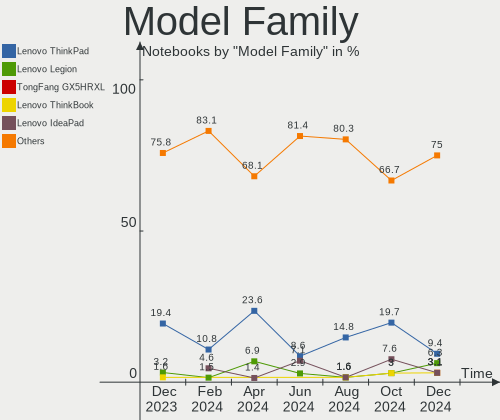
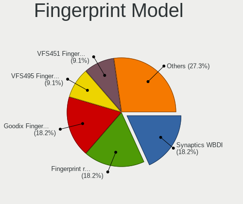

Manjaro Hardware Trends (Notebook)
----------------------------------

A project to identify most popular hardware characteristics and track their change
over time based on data collected by Manjaro users at https://Linux-Hardware.org.

Anyone can contribute to the study by uploading probes of their computers by
the [hw-probe](https://github.com/linuxhw/hw-probe) tool:

    sudo -E hw-probe -all -upload

Full-feature report is available here: https://linux-hardware.org/?view=trends&formfactor=notebook

Period: Mar, 2021.

Contents
--------

- [ OS                       ](#os)
- [ OS Family                ](#os-family)
- [ Kernel                   ](#kernel)
- [ Kernel Family            ](#kernel-family)
- [ Kernel Major Ver.        ](#kernel-major-ver)
- [ Arch                     ](#arch)
- [ DE                       ](#de)
- [ Display Server           ](#display-server)
- [ Display Manager          ](#display-manager)
- [ OS Lang                  ](#os-lang)
- [ Boot Mode                ](#boot-mode)
- [ Filesystem               ](#filesystem)
- [ Part. scheme             ](#part-scheme)
- [ Dual Boot with Linux/BSD ](#dual-boot-with-linux/bsd)
- [ Dual Boot (Win)          ](#dual-boot-win)
- [ Country                  ](#country)
- [ City                     ](#city)
- [ Vendor                   ](#vendor)
- [ Model                    ](#model)
- [ Model Family             ](#model-family)
- [ MFG Year                 ](#mfg-year)
- [ Form Factor              ](#form-factor)
- [ Secure Boot              ](#secure-boot)
- [ Coreboot                 ](#coreboot)
- [ RAM Size                 ](#ram-size)
- [ RAM Used                 ](#ram-used)
- [ Has CD-ROM               ](#has-cd-rom)
- [ Total Drives             ](#total-drives)
- [ Has Ethernet             ](#has-ethernet)
- [ Has WiFi                 ](#has-wifi)
- [ Has Bluetooth            ](#has-bluetooth)
- [ Drive Vendor             ](#drive-vendor)
- [ Drive Model              ](#drive-model)
- [ HDD Vendor               ](#hdd-vendor)
- [ SSD Vendor               ](#ssd-vendor)
- [ Drive Kind               ](#drive-kind)
- [ Drive Connector          ](#drive-connector)
- [ Drive Size               ](#drive-size)
- [ Space Total              ](#space-total)
- [ Space Used               ](#space-used)
- [ Malfunc. Drives          ](#malfunc-drives)
- [ Malfunc. Drive Vendor    ](#malfunc-drive-vendor)
- [ Malfunc. HDD Vendor      ](#malfunc-hdd-vendor)
- [ Malfunc. Drive Kind      ](#malfunc-drive-kind)
- [ Failed Drives            ](#failed-drives)
- [ Failed Drive Vendor      ](#failed-drive-vendor)
- [ Drive Status             ](#drive-status)
- [ Storage Vendor           ](#storage-vendor)
- [ Storage Model            ](#storage-model)
- [ Storage Kind             ](#storage-kind)
- [ CPU Vendor               ](#cpu-vendor)
- [ CPU Model                ](#cpu-model)
- [ CPU Model Family         ](#cpu-model-family)
- [ CPU Cores                ](#cpu-cores)
- [ CPU Sockets              ](#cpu-sockets)
- [ CPU Threads              ](#cpu-threads)
- [ CPU Op-Modes             ](#cpu-op-modes)
- [ CPU Microcode            ](#cpu-microcode)
- [ CPU Microarch            ](#cpu-microarch)
- [ GPU Vendor               ](#gpu-vendor)
- [ GPU Model                ](#gpu-model)
- [ GPU Combo                ](#gpu-combo)
- [ GPU Driver               ](#gpu-driver)
- [ GPU Memory               ](#gpu-memory)
- [ Monitor Vendor           ](#monitor-vendor)
- [ Monitor Model            ](#monitor-model)
- [ Monitor Resolution       ](#monitor-resolution)
- [ Monitor Diagonal         ](#monitor-diagonal)
- [ Monitor Width            ](#monitor-width)
- [ Aspect Ratio             ](#aspect-ratio)
- [ Monitor Area             ](#monitor-area)
- [ Pixel Density            ](#pixel-density)
- [ Multiple Monitors        ](#multiple-monitors)
- [ Net Controller Vendor    ](#net-controller-vendor)
- [ Net Controller Model     ](#net-controller-model)
- [ Wireless Vendor          ](#wireless-vendor)
- [ Wireless Model           ](#wireless-model)
- [ Ethernet Vendor          ](#ethernet-vendor)
- [ Ethernet Model           ](#ethernet-model)
- [ Net Controller Kind      ](#net-controller-kind)
- [ Used Controller          ](#used-controller)
- [ NICs                     ](#nics)
- [ IPv6                     ](#ipv6)
- [ Memory Vendor            ](#memory-vendor)
- [ Memory Model             ](#memory-model)
- [ Memory Kind              ](#memory-kind)
- [ Memory Form Factor       ](#memory-form-factor)
- [ Memory Size              ](#memory-size)
- [ Memory Speed             ](#memory-speed)
- [ Sound Vendor             ](#sound-vendor)
- [ Sound Model              ](#sound-model)
- [ Camera Vendor            ](#camera-vendor)
- [ Camera Model             ](#camera-model)
- [ Fingerprint Vendor       ](#fingerprint-vendor)
- [ Fingerprint Model        ](#fingerprint-model)
- [ Chipcard Vendor          ](#chipcard-vendor)
- [ Chipcard Model           ](#chipcard-model)
- [ Printer Vendor           ](#printer-vendor)
- [ Printer Model            ](#printer-model)
- [ Scanner Vendor           ](#scanner-vendor)
- [ Scanner Model            ](#scanner-model)
- [ Bluetooth Vendor         ](#bluetooth-vendor)
- [ Bluetooth Model          ](#bluetooth-model)
- [ Unsupported Devices      ](#unsupported-devices)
- [ Unsupported Device Types ](#unsupported-device-types)

OS
--

Installed operating systems

| Name           | Notebooks | Percent |
|----------------|-----------|---------|
| Manjaro        | 51        | 39.53%  |
| Manjaro 20.2.1 | 47        | 36.43%  |
| Manjaro 21.0   | 30        | 23.26%  |
| Manjaro 20.0.1 | 1         | 0.78%   |

OS Family
---------

OS without a version

| Name    | Notebooks | Percent |
|---------|-----------|---------|
| Manjaro | 129       | 100%    |

Kernel
------

Version of the Linux kernel

| Version                 | Notebooks | Percent |
|-------------------------|-----------|---------|
| 5.9.16-1-MANJARO        | 41        | 31.78%  |
| 5.11.6-1-MANJARO        | 15        | 11.63%  |
| 5.10.23-1-MANJARO       | 11        | 8.53%   |
| 5.10.18-1-MANJARO       | 11        | 8.53%   |
| 5.10.19-1-MANJARO       | 10        | 7.75%   |
| 5.11.2-1-MANJARO        | 9         | 6.98%   |
| 5.4.105-1-MANJARO       | 4         | 3.1%    |
| 5.11.1-1-MANJARO        | 4         | 3.1%    |
| 5.4.100-1-MANJARO       | 3         | 2.33%   |
| 5.12.0-1-MANJARO        | 3         | 2.33%   |
| 5.9.1-1-rt19-MANJARO    | 2         | 1.55%   |
| 5.10.15-1-MANJARO       | 2         | 1.55%   |
| 5.6.11-1-MANJARO        | 1         | 0.78%   |
| 5.4.95-1-MANJARO        | 1         | 0.78%   |
| 5.4.101-1-MANJARO       | 1         | 0.78%   |
| 5.11.8-1-ck             | 1         | 0.78%   |
| 5.11.6-1-ck-sandybridge | 1         | 0.78%   |
| 5.11.4-AMD-znver2       | 1         | 0.78%   |
| 5.11.4-1-MANJARO        | 1         | 0.78%   |
| 5.11.4-1-ck-haswell     | 1         | 0.78%   |
| 5.11.3-lqx1-1-lqx       | 1         | 0.78%   |
| 5.11.10-AMD             | 1         | 0.78%   |
| 5.11.0-2-ck             | 1         | 0.78%   |
| 5.10.4-arch2-1          | 1         | 0.78%   |
| 5.10.21-1-MANJARO       | 1         | 0.78%   |
| 4.19.177-1-MANJARO      | 1         | 0.78%   |

Kernel Family
-------------

Linux kernel without a distro release

| Version  | Notebooks | Percent |
|----------|-----------|---------|
| 5.9.16   | 41        | 31.78%  |
| 5.11.6   | 16        | 12.4%   |
| 5.10.23  | 11        | 8.53%   |
| 5.10.18  | 11        | 8.53%   |
| 5.10.19  | 10        | 7.75%   |
| 5.11.2   | 9         | 6.98%   |
| 5.4.105  | 4         | 3.1%    |
| 5.11.1   | 4         | 3.1%    |
| 5.4.100  | 3         | 2.33%   |
| 5.12.0   | 3         | 2.33%   |
| 5.11.4   | 3         | 2.33%   |
| 5.9.1    | 2         | 1.55%   |
| 5.10.15  | 2         | 1.55%   |
| 5.6.11   | 1         | 0.78%   |
| 5.4.95   | 1         | 0.78%   |
| 5.4.101  | 1         | 0.78%   |
| 5.11.8   | 1         | 0.78%   |
| 5.11.3   | 1         | 0.78%   |
| 5.11.10  | 1         | 0.78%   |
| 5.11.0   | 1         | 0.78%   |
| 5.10.4   | 1         | 0.78%   |
| 5.10.21  | 1         | 0.78%   |
| 4.19.177 | 1         | 0.78%   |

Kernel Major Ver.
-----------------

Linux kernel major version

| Version | Notebooks | Percent |
|---------|-----------|---------|
| 5.9     | 43        | 33.33%  |
| 5.11    | 36        | 27.91%  |
| 5.10    | 36        | 27.91%  |
| 5.4     | 9         | 6.98%   |
| 5.12    | 3         | 2.33%   |
| 5.6     | 1         | 0.78%   |
| 4.19    | 1         | 0.78%   |

Arch
----

OS architecture (x86_64, i586, etc.)

| Name   | Notebooks | Percent |
|--------|-----------|---------|
| x86_64 | 129       | 100%    |

DE
--

Desktop Environment

| Name       | Notebooks | Percent |
|------------|-----------|---------|
| KDE5       | 38        | 29.46%  |
| GNOME      | 25        | 19.38%  |
| XFCE       | 24        | 18.6%   |
| KDE        | 22        | 17.05%  |
| i3         | 5         | 3.88%   |
| Unknown    | 5         | 3.88%   |
| X-Cinnamon | 3         | 2.33%   |
| MATE       | 3         | 2.33%   |
| Cinnamon   | 2         | 1.55%   |
| LXQt       | 1         | 0.78%   |
| Deepin     | 1         | 0.78%   |

Display Server
--------------

X11 or Wayland

| Name    | Notebooks | Percent |
|---------|-----------|---------|
| X11     | 115       | 89.15%  |
| Wayland | 10        | 7.75%   |
| Unknown | 4         | 3.1%    |

Display Manager
---------------

SDDM, LightDM, etc.

| Name    | Notebooks | Percent |
|---------|-----------|---------|
| Unknown | 48        | 37.21%  |
| SDDM    | 38        | 29.46%  |
| GDM     | 19        | 14.73%  |
| LightDM | 18        | 13.95%  |
| TDM     | 5         | 3.88%   |
| LXDM    | 1         | 0.78%   |

OS Lang
-------

Language

| Lang  | Notebooks | Percent |
|-------|-----------|---------|
| en_US | 55        | 42.64%  |
| ru_RU | 15        | 11.63%  |
| de_DE | 13        | 10.08%  |
| pt_BR | 7         | 5.43%   |
| en_GB | 7         | 5.43%   |
| pl_PL | 3         | 2.33%   |
| en_CA | 3         | 2.33%   |
| nl_NL | 2         | 1.55%   |
| it_IT | 2         | 1.55%   |
| es_MX | 2         | 1.55%   |
| es_ES | 2         | 1.55%   |
| en_PH | 2         | 1.55%   |
| en_IN | 2         | 1.55%   |
| en_IL | 2         | 1.55%   |
| uk_UA | 1         | 0.78%   |
| tr_TR | 1         | 0.78%   |
| ru_UA | 1         | 0.78%   |
| nl_BE | 1         | 0.78%   |
| hr_HR | 1         | 0.78%   |
| fr_FR | 1         | 0.78%   |
| fr_CA | 1         | 0.78%   |
| es_CL | 1         | 0.78%   |
| en_DK | 1         | 0.78%   |
| da_DK | 1         | 0.78%   |
| C     | 1         | 0.78%   |
| bg_BG | 1         | 0.78%   |

Boot Mode
---------

EFI or BIOS

| Mode | Notebooks | Percent |
|------|-----------|---------|
| BIOS | 69        | 53.49%  |
| EFI  | 60        | 46.51%  |

Filesystem
----------

Type of filesystem

| Type    | Notebooks | Percent |
|---------|-----------|---------|
| Ext4    | 109       | 84.5%   |
| Btrfs   | 10        | 7.75%   |
| Overlay | 8         | 6.2%    |
| Jfs     | 1         | 0.78%   |
| Unknown | 1         | 0.78%   |

Part. scheme
------------

Scheme of partitioning

| Type    | Notebooks | Percent |
|---------|-----------|---------|
| GPT     | 62        | 48.06%  |
| Unknown | 47        | 36.43%  |
| MBR     | 20        | 15.5%   |

Dual Boot with Linux/BSD
------------------------

Hosting more than one Linux/BSD

| Dual boot | Notebooks | Percent |
|-----------|-----------|---------|
| No        | 109       | 84.5%   |
| Yes       | 20        | 15.5%   |

Dual Boot (Win)
---------------

Hosting Linux and Windows

| Dual boot | Notebooks | Percent |
|-----------|-----------|---------|
| No        | 93        | 72.09%  |
| Yes       | 36        | 27.91%  |

Country
-------

Geographic location (country)

| Country     | Notebooks | Percent |
|-------------|-----------|---------|
| Germany     | 17        | 13.18%  |
| USA         | 16        | 12.4%   |
| Russia      | 14        | 10.85%  |
| Ukraine     | 8         | 6.2%    |
| Brazil      | 8         | 6.2%    |
| Poland      | 6         | 4.65%   |
| UK          | 5         | 3.88%   |
| Canada      | 4         | 3.1%    |
| Sweden      | 3         | 2.33%   |
| Netherlands | 3         | 2.33%   |
| Mexico      | 3         | 2.33%   |
| Italy       | 3         | 2.33%   |
| Spain       | 2         | 1.55%   |
| Philippines | 2         | 1.55%   |
| Norway      | 2         | 1.55%   |
| Israel      | 2         | 1.55%   |
| India       | 2         | 1.55%   |
| France      | 2         | 1.55%   |
| Denmark     | 2         | 1.55%   |
| Croatia     | 2         | 1.55%   |
| Belgium     | 2         | 1.55%   |
| Belarus     | 2         | 1.55%   |
| Bangladesh  | 2         | 1.55%   |
| Turkey      | 1         | 0.78%   |
| South Korea | 1         | 0.78%   |
| Romania     | 1         | 0.78%   |
| Malaysia    | 1         | 0.78%   |
| Lithuania   | 1         | 0.78%   |
| Indonesia   | 1         | 0.78%   |
| Guatemala   | 1         | 0.78%   |
| Greece      | 1         | 0.78%   |
| Finland     | 1         | 0.78%   |
| Ethiopia    | 1         | 0.78%   |
| Egypt       | 1         | 0.78%   |
| Czechia     | 1         | 0.78%   |
| Costa Rica  | 1         | 0.78%   |
| Chile       | 1         | 0.78%   |
| Bulgaria    | 1         | 0.78%   |
| Australia   | 1         | 0.78%   |
| Armenia     | 1         | 0.78%   |

City
----

Geographic location (city)

| City                     | Notebooks | Percent |
|--------------------------|-----------|---------|
| Moscow                   | 6         | 4.65%   |
| Warsaw                   | 2         | 1.55%   |
| Voronezh                 | 2         | 1.55%   |
| Osasco                   | 2         | 1.55%   |
| Munich                   | 2         | 1.55%   |
| Montreal                 | 2         | 1.55%   |
| Minsk                    | 2         | 1.55%   |
| Kyiv                     | 2         | 1.55%   |
| Hamburg                  | 2         | 1.55%   |
| Dhaka                    | 2         | 1.55%   |
| Zagreb                   | 1         | 0.78%   |
| Yogyakarta               | 1         | 0.78%   |
| Yerevan                  | 1         | 0.78%   |
| Yekaterinburg            | 1         | 0.78%   |
| Wrzesnia                 | 1         | 0.78%   |
| Wijchen                  | 1         | 0.78%   |
| Walton on Thames         | 1         | 0.78%   |
| Vinnytsia                | 1         | 0.78%   |
| Tuxpam de Rodriguez Cano | 1         | 0.78%   |
| Trondheim                | 1         | 0.78%   |
| Treviolo                 | 1         | 0.78%   |
| Toronto                  | 1         | 0.78%   |
| Tonawanda                | 1         | 0.78%   |
| Tel Aviv                 | 1         | 0.78%   |
| Swansea                  | 1         | 0.78%   |
| Suhopolje                | 1         | 0.78%   |
| Strasbourg               | 1         | 0.78%   |
| Stadthagen               | 1         | 0.78%   |
| Senhor do Bonfim         | 1         | 0.78%   |
| Sector 6                 | 1         | 0.78%   |
| Saratoga Springs         | 1         | 0.78%   |
| Santos                   | 1         | 0.78%   |
| Santiago                 | 1         | 0.78%   |
| San José                | 1         | 0.78%   |
| San Jose                 | 1         | 0.78%   |
| Rotterdam                | 1         | 0.78%   |
| Ramat Gan                | 1         | 0.78%   |
| Radium Hot Springs       | 1         | 0.78%   |
| Pulheim                  | 1         | 0.78%   |
| Puerto Vallarta          | 1         | 0.78%   |
| Presidente Prudente      | 1         | 0.78%   |
| Poznan                   | 1         | 0.78%   |
| Port Charlotte           | 1         | 0.78%   |
| Oryol                    | 1         | 0.78%   |
| Orchard Park             | 1         | 0.78%   |
| Omsk                     | 1         | 0.78%   |
| Odessa                   | 1         | 0.78%   |
| Odense                   | 1         | 0.78%   |
| Ocean City               | 1         | 0.78%   |
| Nysa                     | 1         | 0.78%   |
| Novosibirsk              | 1         | 0.78%   |
| New Delhi                | 1         | 0.78%   |
| Naperville               | 1         | 0.78%   |
| Myllykoski               | 1         | 0.78%   |
| Mosedis                  | 1         | 0.78%   |
| Miami                    | 1         | 0.78%   |
| Manassas                 | 1         | 0.78%   |
| Malmo                    | 1         | 0.78%   |
| Malbork                  | 1         | 0.78%   |
| Madrid                   | 1         | 0.78%   |

Vendor
------

Motherboard manufacturer

| Name                | Notebooks | Percent |
|---------------------|-----------|---------|
| Lenovo              | 33        | 25.58%  |
| Hewlett-Packard     | 25        | 19.38%  |
| Dell                | 18        | 13.95%  |
| Acer                | 14        | 10.85%  |
| ASUSTek Computer    | 12        | 9.3%    |
| MSI                 | 4         | 3.1%    |
| Toshiba             | 3         | 2.33%   |
| Notebook            | 3         | 2.33%   |
| Unknown             | 3         | 2.33%   |
| Samsung Electronics | 2         | 1.55%   |
| Alienware           | 2         | 1.55%   |
| Wortmann AG         | 1         | 0.78%   |
| TrekStor            | 1         | 0.78%   |
| Sony                | 1         | 0.78%   |
| Pegatron            | 1         | 0.78%   |
| Login Informatica   | 1         | 0.78%   |
| HUAWEI              | 1         | 0.78%   |
| Google              | 1         | 0.78%   |
| eMachines           | 1         | 0.78%   |
| Chuwi               | 1         | 0.78%   |
| AZW                 | 1         | 0.78%   |

Model
-----

Motherboard model

| Name                                     | Notebooks | Percent |
|------------------------------------------|-----------|---------|
| Unknown                                  | 3         | 2.33%   |
| HP 15                                    | 2         | 1.55%   |
| Wortmann AG TERRA Mobile 1748            | 1         | 0.78%   |
| TrekStor SurfBook W2                     | 1         | 0.78%   |
| Toshiba Satellite M300                   | 1         | 0.78%   |
| Toshiba Satellite L855                   | 1         | 0.78%   |
| Toshiba QOSMIO X775                      | 1         | 0.78%   |
| Sony VPCF23P1E                           | 1         | 0.78%   |
| Samsung R530/R730/R540                   | 1         | 0.78%   |
| Samsung 340XAA/350XAA/550XAA             | 1         | 0.78%   |
| Pegatron A35                             | 1         | 0.78%   |
| Notebook PA70ES                          | 1         | 0.78%   |
| Notebook N7x0WU                          | 1         | 0.78%   |
| Notebook N14xWU                          | 1         | 0.78%   |
| MSI GX60 1AC/GX60 3AE/GX60 3BE           | 1         | 0.78%   |
| MSI GV62 8RD                             | 1         | 0.78%   |
| MSI GS63 7RD                             | 1         | 0.78%   |
| MSI GP60 2QF                             | 1         | 0.78%   |
| Login Informatica LOG-QAL30              | 1         | 0.78%   |
| Lenovo Z50-70 20354                      | 1         | 0.78%   |
| Lenovo ThinkPad X250 20CM003WMS          | 1         | 0.78%   |
| Lenovo ThinkPad X201 4492A23             | 1         | 0.78%   |
| Lenovo ThinkPad X140e 20BL000BUS         | 1         | 0.78%   |
| Lenovo ThinkPad X1 Carbon 7th 20QD003ART | 1         | 0.78%   |
| Lenovo ThinkPad W500 4061AZ8             | 1         | 0.78%   |
| Lenovo ThinkPad T490 20N3S8HL00          | 1         | 0.78%   |
| Lenovo ThinkPad T480s 20L8S4T801         | 1         | 0.78%   |
| Lenovo ThinkPad T460s 20F9003RRT         | 1         | 0.78%   |
| Lenovo ThinkPad T430 2349GZG             | 1         | 0.78%   |
| Lenovo ThinkPad T14 Gen 1 20S00008RT     | 1         | 0.78%   |
| Lenovo ThinkPad SL 2746AGG               | 1         | 0.78%   |
| Lenovo ThinkPad P53 20QQS2KB00           | 1         | 0.78%   |
| Lenovo ThinkPad L420 7829BH2             | 1         | 0.78%   |
| Lenovo ThinkPad E475 20H4CTO1WW          | 1         | 0.78%   |
| Lenovo ThinkPad E15 Gen 2 20TD0003RA     | 1         | 0.78%   |
| Lenovo ThinkPad E15 Gen 2 20T8000VMX     | 1         | 0.78%   |
| Lenovo ThinkPad E14 Gen 2 20T7S00W00     | 1         | 0.78%   |
| Lenovo Legion Y530-15ICH 81FV            | 1         | 0.78%   |
| Lenovo Legion 5 82B5                     | 1         | 0.78%   |
| Lenovo Legion 5 15ARH05 82B5             | 1         | 0.78%   |
| Lenovo IdeaPad S540-15IWL GTX 81SW       | 1         | 0.78%   |
| Lenovo IdeaPad S540-15IWL 81NE           | 1         | 0.78%   |
| Lenovo IdeaPad L340-17IRH Gaming 81LL    | 1         | 0.78%   |
| Lenovo IdeaPad L340-15IRH Gaming 81LK    | 1         | 0.78%   |
| Lenovo IdeaPad 5 15IIL05 81YK            | 1         | 0.78%   |
| Lenovo IdeaPad 5 14ARE05 81YM            | 1         | 0.78%   |
| Lenovo IdeaPad 330-17IKB 81DM            | 1         | 0.78%   |
| Lenovo IdeaPad 3 15IIL05 81WE            | 1         | 0.78%   |
| Lenovo IdeaPad 3 15ADA05 81W1            | 1         | 0.78%   |
| Lenovo IdeaPad 110-15IBR 80T7            | 1         | 0.78%   |
| Lenovo G580 20150                        | 1         | 0.78%   |
| Lenovo Flex 2 Pro-15 80FL                | 1         | 0.78%   |
| HUAWEI HN-WX9X                           | 1         | 0.78%   |
| HP ZBook 15u G3                          | 1         | 0.78%   |
| HP Stream Laptop 14-ds0xxx               | 1         | 0.78%   |
| HP ProBook 640 G8 Notebook PC            | 1         | 0.78%   |
| HP ProBook 470 G3                        | 1         | 0.78%   |
| HP ProBook 455R G6                       | 1         | 0.78%   |
| HP ProBook 450 G6                        | 1         | 0.78%   |
| HP ProBook 440 G5                        | 1         | 0.78%   |

Model Family
------------

Motherboard model prefix

| Name                        | Notebooks | Percent |
|-----------------------------|-----------|---------|
| Lenovo ThinkPad             | 17        | 13.18%  |
| Acer Aspire                 | 12        | 9.3%    |
| Lenovo IdeaPad              | 10        | 7.75%   |
| Dell Latitude               | 7         | 5.43%   |
| Dell Inspiron               | 7         | 5.43%   |
| HP ProBook                  | 5         | 3.88%   |
| HP Pavilion                 | 4         | 3.1%    |
| Lenovo Legion               | 3         | 2.33%   |
| HP Laptop                   | 3         | 2.33%   |
| HP EliteBook                | 3         | 2.33%   |
| ASUS TUF                    | 3         | 2.33%   |
| Unknown                     | 3         | 2.33%   |
| Toshiba Satellite           | 2         | 1.55%   |
| HP 15                       | 2         | 1.55%   |
| Dell XPS                    | 2         | 1.55%   |
| Dell Precision              | 2         | 1.55%   |
| ASUS VivoBook               | 2         | 1.55%   |
| Wortmann AG TERRA           | 1         | 0.78%   |
| TrekStor SurfBook           | 1         | 0.78%   |
| Toshiba QOSMIO              | 1         | 0.78%   |
| Sony VPCF23P1E              | 1         | 0.78%   |
| Samsung R530                | 1         | 0.78%   |
| Samsung 340XAA              | 1         | 0.78%   |
| Pegatron A35                | 1         | 0.78%   |
| Notebook PA70ES             | 1         | 0.78%   |
| Notebook N7x0WU             | 1         | 0.78%   |
| Notebook N14xWU             | 1         | 0.78%   |
| MSI GX60                    | 1         | 0.78%   |
| MSI GV62                    | 1         | 0.78%   |
| MSI GS63                    | 1         | 0.78%   |
| MSI GP60                    | 1         | 0.78%   |
| Login Informatica LOG-QAL30 | 1         | 0.78%   |
| Lenovo Z50-70               | 1         | 0.78%   |
| Lenovo G580                 | 1         | 0.78%   |
| Lenovo Flex                 | 1         | 0.78%   |
| HUAWEI HN-WX9X              | 1         | 0.78%   |
| HP ZBook                    | 1         | 0.78%   |
| HP Stream                   | 1         | 0.78%   |
| HP Notebook                 | 1         | 0.78%   |
| HP ENVY                     | 1         | 0.78%   |
| HP 625                      | 1         | 0.78%   |
| HP 350                      | 1         | 0.78%   |
| HP 255                      | 1         | 0.78%   |
| HP 14                       | 1         | 0.78%   |
| Google Link                 | 1         | 0.78%   |
| eMachines eMD732            | 1         | 0.78%   |
| Chuwi GemiBook              | 1         | 0.78%   |
| AZW GTi                     | 1         | 0.78%   |
| ASUS ZenBook                | 1         | 0.78%   |
| ASUS X75A1                  | 1         | 0.78%   |
| ASUS X510UAR                | 1         | 0.78%   |
| ASUS UX331UN                | 1         | 0.78%   |
| ASUS K53Z                   | 1         | 0.78%   |
| ASUS K52F                   | 1         | 0.78%   |
| ASUS GL502VSK               | 1         | 0.78%   |
| Alienware M17x              | 1         | 0.78%   |
| Alienware m15               | 1         | 0.78%   |
| Acer Swift                  | 1         | 0.78%   |
| Acer Nitro                  | 1         | 0.78%   |

MFG Year
--------

Motherboard manufacture year

| Year | Notebooks | Percent |
|------|-----------|---------|
| 2020 | 43        | 33.33%  |
| 2018 | 17        | 13.18%  |
| 2019 | 13        | 10.08%  |
| 2015 | 9         | 6.98%   |
| 2017 | 8         | 6.2%    |
| 2016 | 7         | 5.43%   |
| 2021 | 6         | 4.65%   |
| 2013 | 6         | 4.65%   |
| 2011 | 5         | 3.88%   |
| 2012 | 4         | 3.1%    |
| 2010 | 4         | 3.1%    |
| 2014 | 3         | 2.33%   |
| 2009 | 2         | 1.55%   |
| 2008 | 2         | 1.55%   |

Form Factor
-----------

Physical design of the computer

| Name     | Notebooks | Percent |
|----------|-----------|---------|
| Notebook | 129       | 100%    |

Secure Boot
-----------

Enabled or disabled

| State    | Notebooks | Percent |
|----------|-----------|---------|
| Disabled | 129       | 100%    |

Coreboot
--------

Have coreboot on board

| Used | Notebooks | Percent |
|------|-----------|---------|
| No   | 127       | 98.45%  |
| Yes  | 2         | 1.55%   |

RAM Size
--------

Total RAM memory

| Size in GB  | Notebooks | Percent |
|-------------|-----------|---------|
| 4.01-8.0    | 42        | 32.56%  |
| 8.01-16.0   | 26        | 20.16%  |
| 3.01-4.0    | 24        | 18.6%   |
| 16.01-24.0  | 24        | 18.6%   |
| 32.01-64.0  | 7         | 5.43%   |
| 24.01-32.0  | 2         | 1.55%   |
| 64.01-256.0 | 2         | 1.55%   |
| 2.01-3.0    | 1         | 0.78%   |
| 1.01-2.0    | 1         | 0.78%   |

RAM Used
--------

Used RAM memory

| Used GB   | Notebooks | Percent |
|-----------|-----------|---------|
| 1.01-2.0  | 41        | 31.78%  |
| 2.01-3.0  | 35        | 27.13%  |
| 4.01-8.0  | 26        | 20.16%  |
| 3.01-4.0  | 19        | 14.73%  |
| 8.01-16.0 | 6         | 4.65%   |
| 0.51-1.0  | 2         | 1.55%   |

Has CD-ROM
----------

Has CD-ROM on board

| Presented | Notebooks | Percent |
|-----------|-----------|---------|
| No        | 86        | 66.67%  |
| Yes       | 43        | 33.33%  |

Total Drives
------------

Number of drives on board

| Drives | Notebooks | Percent |
|--------|-----------|---------|
| 1      | 85        | 65.89%  |
| 2      | 36        | 27.91%  |
| 3      | 4         | 3.1%    |
| 4      | 3         | 2.33%   |
| 0      | 1         | 0.78%   |

Has Ethernet
------------

Has Ethernet on board

| Presented | Notebooks | Percent |
|-----------|-----------|---------|
| Yes       | 105       | 81.4%   |
| No        | 24        | 18.6%   |

Has WiFi
--------

Has WiFi module

| Presented | Notebooks | Percent |
|-----------|-----------|---------|
| Yes       | 128       | 99.22%  |
| No        | 1         | 0.78%   |

Has Bluetooth
-------------

Has Bluetooth module

| Presented | Notebooks | Percent |
|-----------|-----------|---------|
| Yes       | 102       | 79.07%  |
| No        | 27        | 20.93%  |

Drive Vendor
------------

Hard drive vendors

| Vendor              | Notebooks | Drives | Percent |
|---------------------|-----------|--------|---------|
| Samsung Electronics | 34        | 40     | 20.24%  |
| WDC                 | 20        | 22     | 11.9%   |
| Seagate             | 20        | 20     | 11.9%   |
| Toshiba             | 13        | 15     | 7.74%   |
| Kingston            | 13        | 14     | 7.74%   |
| Unknown             | 8         | 8      | 4.76%   |
| SanDisk             | 8         | 8      | 4.76%   |
| Intel               | 7         | 7      | 4.17%   |
| SK Hynix            | 6         | 6      | 3.57%   |
| Micron Technology   | 5         | 5      | 2.98%   |
| Crucial             | 4         | 4      | 2.38%   |
| Hitachi             | 3         | 3      | 1.79%   |
| HGST                | 3         | 3      | 1.79%   |
| Phison              | 2         | 2      | 1.19%   |
| KIOXIA              | 2         | 2      | 1.19%   |
| A-DATA Technology   | 2         | 2      | 1.19%   |
| XPG                 | 1         | 1      | 0.6%    |
| Union Memory        | 1         | 1      | 0.6%    |
| TSA                 | 1         | 1      | 0.6%    |
| Transcend           | 1         | 1      | 0.6%    |
| SPCC                | 1         | 1      | 0.6%    |
| Silicon Motion      | 1         | 1      | 0.6%    |
| OCZ                 | 1         | 1      | 0.6%    |
| MILAN               | 1         | 1      | 0.6%    |
| JMicron             | 1         | 1      | 0.6%    |
| Intenso             | 1         | 1      | 0.6%    |
| GOODRAM             | 1         | 1      | 0.6%    |
| Fujitsu             | 1         | 1      | 0.6%    |
| Corsair             | 1         | 1      | 0.6%    |
| China               | 1         | 1      | 0.6%    |
| BIWIN               | 1         | 1      | 0.6%    |
| BHT                 | 1         | 1      | 0.6%    |
| ASMT109x            | 1         | 1      | 0.6%    |
| Apacer              | 1         | 1      | 0.6%    |

Drive Model
-----------

Hard drive models

| Model                                     | Notebooks | Percent |
|-------------------------------------------|-----------|---------|
| Seagate ST1000LM035-1RK172 1TB            | 4         | 2.31%   |
| Toshiba MQ04ABF100 1TB                    | 3         | 1.73%   |
| Samsung NVMe SSD Drive 512GB              | 3         | 1.73%   |
| Kingston SA400S37120G 120GB SSD           | 3         | 1.73%   |
| WDC WD5000LPCX-24VHAT0 500GB              | 2         | 1.16%   |
| WDC WD10JPVX-60JC3T0 1TB                  | 2         | 1.16%   |
| Unknown MMC Card  32GB                    | 2         | 1.16%   |
| Seagate ST500LT012-1DG142 500GB           | 2         | 1.16%   |
| Samsung SSD 860 EVO 500GB                 | 2         | 1.16%   |
| Samsung SSD 860 EVO 1TB                   | 2         | 1.16%   |
| Samsung SSD 850 EVO 120GB                 | 2         | 1.16%   |
| Samsung NVMe SSD Drive 250GB              | 2         | 1.16%   |
| Kingston SUV500MS480G 480GB SSD           | 2         | 1.16%   |
| Kingston SA400S37240G 240GB SSD           | 2         | 1.16%   |
| Intel NVMe SSD Drive 512GB                | 2         | 1.16%   |
| Crucial CT480BX500SSD1 480GB              | 2         | 1.16%   |
| XPG NVMe SSD Drive 1024GB                 | 1         | 0.58%   |
| WDC WDS500G2B0B-00YS70 500GB SSD          | 1         | 0.58%   |
| WDC WDS500G1R0A-68A4W0 500GB SSD          | 1         | 0.58%   |
| WDC WDS200T2B0B-00YS70 2TB SSD            | 1         | 0.58%   |
| WDC WDS120G2G0B-00EPW0 120GB SSD          | 1         | 0.58%   |
| WDC WDBNCE5000PNC 500GB SSD               | 1         | 0.58%   |
| WDC WD7500BPVX-00FA7T0 752GB              | 1         | 0.58%   |
| WDC WD5000LPVX-60V0TT0 500GB              | 1         | 0.58%   |
| WDC WD5000LPVX-22V0TT0 500GB              | 1         | 0.58%   |
| WDC WD5000LPCX-21VHAT0 500GB              | 1         | 0.58%   |
| WDC WD5000BEVT-00ZAT0 500GB               | 1         | 0.58%   |
| WDC WD3200BJKT-75F4T0 320GB               | 1         | 0.58%   |
| WDC WD1600BEKT-60A25T1 160GB              | 1         | 0.58%   |
| WDC WD10SPZX-75Z10T0 1TB                  | 1         | 0.58%   |
| WDC WD10SPZX-21Z10T0 1TB                  | 1         | 0.58%   |
| WDC WD10SPZX-17Z10T1 1TB                  | 1         | 0.58%   |
| WDC WD10JPVX-22JC3T0 1TB                  | 1         | 0.58%   |
| WDC PC SN730 SDBQNTY-512G-1001 512GB      | 1         | 0.58%   |
| Unknown SD64G  64GB                       | 1         | 0.58%   |
| Unknown NVMe SSD Drive 256GB              | 1         | 0.58%   |
| Unknown NCard  64GB                       | 1         | 0.58%   |
| Unknown MMC Card  64GB                    | 1         | 0.58%   |
| Unknown MMC Card  128GB                   | 1         | 0.58%   |
| Unknown HBG4a2  32GB                      | 1         | 0.58%   |
| Union Memory RPFTJ256PDD2MWX 256GB        | 1         | 0.58%   |
| TSA SSD 480GB                             | 1         | 0.58%   |
| Transcend TS512GMTS430S 512GB SSD         | 1         | 0.58%   |
| Toshiba NVMe SSD Drive 512GB              | 1         | 0.58%   |
| Toshiba NVMe SSD Drive 256GB              | 1         | 0.58%   |
| Toshiba MQ02ABF100 1TB                    | 1         | 0.58%   |
| Toshiba MQ01ABD050 500GB                  | 1         | 0.58%   |
| Toshiba MK6461GSY 640GB                   | 1         | 0.58%   |
| Toshiba MK5076GSX 500GB                   | 1         | 0.58%   |
| Toshiba MK3261GSYN 320GB                  | 1         | 0.58%   |
| Toshiba KXG60ZNV512G NVMe 512GB           | 1         | 0.58%   |
| Toshiba KXG60ZNV256G KIOXIA 256GB         | 1         | 0.58%   |
| Toshiba KBG40ZNT512G MEMORY 512GB         | 1         | 0.58%   |
| Toshiba KBG30ZMV256G 256GB                | 1         | 0.58%   |
| SPCC M.2 PCIe SSD 2TB                     | 1         | 0.58%   |
| SK Hynix SKHynix_HFM256GDHTNI-87A0B 256GB | 1         | 0.58%   |
| SK Hynix PC300 NVMe 512GB                 | 1         | 0.58%   |
| SK Hynix NVMe SSD Drive 256GB             | 1         | 0.58%   |
| SK Hynix HFS512G39TND-N210A 512GB SSD     | 1         | 0.58%   |
| SK Hynix HBG4e  32GB                      | 1         | 0.58%   |

HDD Vendor
----------

Hard disk drive vendors

| Vendor              | Notebooks | Drives | Percent |
|---------------------|-----------|--------|---------|
| Seagate             | 20        | 20     | 38.46%  |
| WDC                 | 15        | 16     | 28.85%  |
| Toshiba             | 8         | 8      | 15.38%  |
| Hitachi             | 3         | 3      | 5.77%   |
| HGST                | 3         | 3      | 5.77%   |
| Samsung Electronics | 1         | 1      | 1.92%   |
| Intenso             | 1         | 1      | 1.92%   |
| Fujitsu             | 1         | 1      | 1.92%   |

SSD Vendor
----------

Solid state drive vendors

| Vendor              | Notebooks | Drives | Percent |
|---------------------|-----------|--------|---------|
| Samsung Electronics | 20        | 20     | 32.26%  |
| Kingston            | 11        | 12     | 17.74%  |
| WDC                 | 5         | 5      | 8.06%   |
| SanDisk             | 4         | 4      | 6.45%   |
| Micron Technology   | 4         | 4      | 6.45%   |
| Crucial             | 4         | 4      | 6.45%   |
| Intel               | 2         | 2      | 3.23%   |
| TSA                 | 1         | 1      | 1.61%   |
| Transcend           | 1         | 1      | 1.61%   |
| SK Hynix            | 1         | 1      | 1.61%   |
| OCZ                 | 1         | 1      | 1.61%   |
| JMicron             | 1         | 1      | 1.61%   |
| GOODRAM             | 1         | 1      | 1.61%   |
| China               | 1         | 1      | 1.61%   |
| BIWIN               | 1         | 1      | 1.61%   |
| BHT                 | 1         | 1      | 1.61%   |
| ASMT109x            | 1         | 1      | 1.61%   |
| Apacer              | 1         | 1      | 1.61%   |
| A-DATA Technology   | 1         | 1      | 1.61%   |

Drive Kind
----------

HDD or SSD

| Kind    | Notebooks | Drives | Percent |
|---------|-----------|--------|---------|
| SSD     | 58        | 63     | 35.58%  |
| HDD     | 51        | 53     | 31.29%  |
| NVMe    | 45        | 54     | 27.61%  |
| MMC     | 8         | 8      | 4.91%   |
| Unknown | 1         | 1      | 0.61%   |

Drive Connector
---------------

SATA, SAS, NVMe, etc.

| Type | Notebooks | Drives | Percent |
|------|-----------|--------|---------|
| SATA | 94        | 111    | 61.44%  |
| NVMe | 45        | 54     | 29.41%  |
| MMC  | 8         | 8      | 5.23%   |
| SAS  | 6         | 6      | 3.92%   |

Drive Size
----------

Size of hard drive

| Size in TB | Notebooks | Drives | Percent |
|------------|-----------|--------|---------|
| 0.01-0.5   | 66        | 74     | 61.11%  |
| 0.51-1.0   | 37        | 37     | 34.26%  |
| 1.01-2.0   | 3         | 3      | 2.78%   |
| 3.01-4.0   | 1         | 1      | 0.93%   |
| 4.01-10.0  | 1         | 1      | 0.93%   |

Space Total
-----------

Amount of disk space available on the file system

| Size in GB     | Notebooks | Percent |
|----------------|-----------|---------|
| 101-250        | 35        | 27.13%  |
| 251-500        | 34        | 26.36%  |
| 501-1000       | 19        | 14.73%  |
| Unknown        | 13        | 10.08%  |
| 1001-2000      | 8         | 6.2%    |
| 51-100         | 8         | 6.2%    |
| 1-20           | 4         | 3.1%    |
| More than 3000 | 3         | 2.33%   |
| 2001-3000      | 3         | 2.33%   |
| 21-50          | 2         | 1.55%   |

Space Used
----------

Amount of used disk space

| Used GB   | Notebooks | Percent |
|-----------|-----------|---------|
| 101-250   | 29        | 22.48%  |
| 21-50     | 26        | 20.16%  |
| 1-20      | 24        | 18.6%   |
| 51-100    | 15        | 11.63%  |
| 251-500   | 14        | 10.85%  |
| Unknown   | 13        | 10.08%  |
| 501-1000  | 4         | 3.1%    |
| 1001-2000 | 3         | 2.33%   |
| 2001-3000 | 1         | 0.78%   |

Malfunc. Drives
---------------

Drive models with a malfunction

| Model                           | Notebooks | Drives | Percent |
|---------------------------------|-----------|--------|---------|
| Toshiba MQ01ABD050 500GB        | 1         | 1      | 16.67%  |
| Seagate ST500LT012-9WS142 500GB | 1         | 1      | 16.67%  |
| Seagate ST1000LM049-2GH172 1TB  | 1         | 1      | 16.67%  |
| Hitachi HTS723225A7A364 250GB   | 1         | 1      | 16.67%  |
| HGST HTS721010A9E630 1TB        | 1         | 1      | 16.67%  |
| HGST HTS545050A7E380 500GB      | 1         | 1      | 16.67%  |

Malfunc. Drive Vendor
---------------------

Vendors of faulty drives

| Vendor  | Notebooks | Drives | Percent |
|---------|-----------|--------|---------|
| Seagate | 2         | 2      | 33.33%  |
| HGST    | 2         | 2      | 33.33%  |
| Toshiba | 1         | 1      | 16.67%  |
| Hitachi | 1         | 1      | 16.67%  |

Malfunc. HDD Vendor
-------------------

Vendors of faulty HDD drives

| Vendor  | Notebooks | Drives | Percent |
|---------|-----------|--------|---------|
| Seagate | 2         | 2      | 33.33%  |
| HGST    | 2         | 2      | 33.33%  |
| Toshiba | 1         | 1      | 16.67%  |
| Hitachi | 1         | 1      | 16.67%  |

Malfunc. Drive Kind
-------------------

Kinds of faulty drives

| Kind | Notebooks | Drives | Percent |
|------|-----------|--------|---------|
| HDD  | 6         | 6      | 100%    |

Failed Drives
-------------

Failed drive models

Zero info for selected period =(

Failed Drive Vendor
-------------------

Failed drive vendors

Zero info for selected period =(

Drive Status
------------

Number of failed and malfunc. drives

| Status   | Notebooks | Drives | Percent |
|----------|-----------|--------|---------|
| Detected | 70        | 98     | 51.09%  |
| Works    | 61        | 75     | 44.53%  |
| Malfunc  | 6         | 6      | 4.38%   |

Storage Vendor
--------------

Storage controller vendors

| Vendor                         | Notebooks | Percent |
|--------------------------------|-----------|---------|
| Intel                          | 89        | 56.33%  |
| AMD                            | 24        | 15.19%  |
| Samsung Electronics            | 16        | 10.13%  |
| Sandisk                        | 5         | 3.16%   |
| Toshiba America Info Systems   | 4         | 2.53%   |
| SK Hynix                       | 4         | 2.53%   |
| Phison Electronics             | 3         | 1.9%    |
| KIOXIA                         | 3         | 1.9%    |
| Kingston Technology Company    | 2         | 1.27%   |
| Union Memory (Shenzhen)        | 1         | 0.63%   |
| Solid State Storage Technology | 1         | 0.63%   |
| Silicon Motion                 | 1         | 0.63%   |
| Realtek Semiconductor          | 1         | 0.63%   |
| Nvidia                         | 1         | 0.63%   |
| Micron Technology              | 1         | 0.63%   |
| JMicron Technology             | 1         | 0.63%   |
| ADATA Technology               | 1         | 0.63%   |

Storage Model
-------------

Storage controller models

| Model                                                                            | Notebooks | Percent |
|----------------------------------------------------------------------------------|-----------|---------|
| AMD FCH SATA Controller [AHCI mode]                                              | 22        | 13.17%  |
| Intel Sunrise Point-LP SATA Controller [AHCI mode]                               | 21        | 12.57%  |
| Samsung NVMe SSD Controller SM981/PM981/PM983                                    | 11        | 6.59%   |
| Intel 7 Series Chipset Family 6-port SATA Controller [AHCI mode]                 | 10        | 5.99%   |
| Intel Cannon Lake Mobile PCH SATA AHCI Controller                                | 7         | 4.19%   |
| Intel 8 Series SATA Controller 1 [AHCI mode]                                     | 7         | 4.19%   |
| Intel Wildcat Point-LP SATA Controller [AHCI Mode]                               | 5         | 2.99%   |
| Intel SSD 660P Series                                                            | 5         | 2.99%   |
| Sandisk WD Black SN750 / PC SN730 NVMe SSD                                       | 4         | 2.4%    |
| Samsung NVMe Controller                                                          | 4         | 2.4%    |
| Intel HM170/QM170 Chipset SATA Controller [AHCI Mode]                            | 4         | 2.4%    |
| Intel 82801IBM/IEM (ICH9M/ICH9M-E) 4 port SATA Controller [AHCI mode]            | 4         | 2.4%    |
| Intel 82801 Mobile SATA Controller [RAID mode]                                   | 4         | 2.4%    |
| Intel 6 Series/C200 Series Chipset Family 6 port Mobile SATA AHCI Controller     | 4         | 2.4%    |
| Toshiba America Info Systems XG6 NVMe SSD Controller                             | 3         | 1.8%    |
| Phison E12 NVMe Controller                                                       | 3         | 1.8%    |
| KIOXIA Non-Volatile memory controller                                            | 3         | 1.8%    |
| Intel Ice Lake-LP SATA Controller [AHCI mode]                                    | 3         | 1.8%    |
| Intel Celeron N3350/Pentium N4200/Atom E3900 Series SATA AHCI Controller         | 3         | 1.8%    |
| Intel Cannon Point-LP SATA Controller [AHCI Mode]                                | 3         | 1.8%    |
| Intel 5 Series/3400 Series Chipset 4 port SATA AHCI Controller                   | 3         | 1.8%    |
| SK Hynix BC501 NVMe Solid State Drive 512GB                                      | 2         | 1.2%    |
| Kingston Company Company Non-Volatile memory controller                          | 2         | 1.2%    |
| Intel Celeron/Pentium Silver Processor SATA Controller                           | 2         | 1.2%    |
| Union Memory (Shenzhen) Non-Volatile memory controller                           | 1         | 0.6%    |
| Toshiba America Info Systems BG3 NVMe SSD Controller                             | 1         | 0.6%    |
| Solid State Storage Non-Volatile memory controller                               | 1         | 0.6%    |
| SK Hynix PC300 NVMe Solid State Drive 512GB                                      | 1         | 0.6%    |
| SK Hynix BC511                                                                   | 1         | 0.6%    |
| Silicon Motion SM2263EN/SM2263XT SSD Controller                                  | 1         | 0.6%    |
| Sandisk WD Blue SN550 NVMe SSD                                                   | 1         | 0.6%    |
| Samsung NVMe SSD Controller SM951/PM951                                          | 1         | 0.6%    |
| Realtek Realtek Non-Volatile memory controller                                   | 1         | 0.6%    |
| Nvidia MCP79 AHCI Controller                                                     | 1         | 0.6%    |
| Micron Non-Volatile memory controller                                            | 1         | 0.6%    |
| JMicron JMB360 AHCI Controller                                                   | 1         | 0.6%    |
| Intel Volume Management Device NVMe RAID Controller                              | 1         | 0.6%    |
| Intel Mobile 4 Series Chipset PT IDER Controller                                 | 1         | 0.6%    |
| Intel Comet Lake SATA AHCI Controller                                            | 1         | 0.6%    |
| Intel Atom/Celeron/Pentium Processor x5-E8000/J3xxx/N3xxx Series SATA Controller | 1         | 0.6%    |
| Intel Atom Processor E3800 Series SATA AHCI Controller                           | 1         | 0.6%    |
| Intel 82801HM/HEM (ICH8M/ICH8M-E) SATA Controller [IDE mode]                     | 1         | 0.6%    |
| Intel 82801HM/HEM (ICH8M/ICH8M-E) IDE Controller                                 | 1         | 0.6%    |
| Intel 8 Series/C220 Series Chipset Family 6-port SATA Controller 1 [AHCI mode]   | 1         | 0.6%    |
| Intel 7 Series Chipset Family 4-port SATA Controller [IDE mode]                  | 1         | 0.6%    |
| Intel 7 Series Chipset Family 2-port SATA Controller [IDE mode]                  | 1         | 0.6%    |
| Intel 5 Series/3400 Series Chipset 6 port SATA AHCI Controller                   | 1         | 0.6%    |
| AMD SB7x0/SB8x0/SB9x0 SATA Controller [IDE mode]                                 | 1         | 0.6%    |
| AMD SB7x0/SB8x0/SB9x0 SATA Controller [AHCI mode]                                | 1         | 0.6%    |
| AMD SB7x0/SB8x0/SB9x0 IDE Controller                                             | 1         | 0.6%    |
| AMD FCH IDE Controller                                                           | 1         | 0.6%    |
| ADATA XPG SX8200 Pro PCIe Gen3x4 M.2 2280 Solid State Drive                      | 1         | 0.6%    |

Storage Kind
------------

Kind of storage controller (IDE, SATA, NVMe, SAS, ...)

| Kind | Notebooks | Percent |
|------|-----------|---------|
| SATA | 106       | 65.84%  |
| NVMe | 45        | 27.95%  |
| RAID | 5         | 3.11%   |
| IDE  | 5         | 3.11%   |

CPU Vendor
----------

Processor vendors

| Vendor | Notebooks | Percent |
|--------|-----------|---------|
| Intel  | 100       | 77.52%  |
| AMD    | 29        | 22.48%  |

CPU Model
---------

Processor models

| Model                                         | Notebooks | Percent |
|-----------------------------------------------|-----------|---------|
| Intel Core i5-8250U CPU @ 1.60GHz             | 5         | 3.88%   |
| Intel Core i5-4210U CPU @ 1.70GHz             | 5         | 3.88%   |
| Intel Core i5-6200U CPU @ 2.30GHz             | 4         | 3.1%    |
| AMD Ryzen 5 4500U with Radeon Graphics        | 4         | 3.1%    |
| Intel Core i7-7700HQ CPU @ 2.80GHz            | 3         | 2.33%   |
| Intel Core i7-7500U CPU @ 2.70GHz             | 3         | 2.33%   |
| Intel Core i5-8265U CPU @ 1.60GHz             | 3         | 2.33%   |
| Intel Core i5-7200U CPU @ 2.50GHz             | 3         | 2.33%   |
| Intel Pentium CPU 2020M @ 2.40GHz             | 2         | 1.55%   |
| Intel Core i7-8750H CPU @ 2.20GHz             | 2         | 1.55%   |
| Intel Core i7-8550U CPU @ 1.80GHz             | 2         | 1.55%   |
| Intel Core i7-3630QM CPU @ 2.40GHz            | 2         | 1.55%   |
| Intel Core i7-10510U CPU @ 1.80GHz            | 2         | 1.55%   |
| Intel Core i5-9300H CPU @ 2.40GHz             | 2         | 1.55%   |
| Intel Core i5-5200U CPU @ 2.20GHz             | 2         | 1.55%   |
| Intel Celeron CPU N3450 @ 1.10GHz             | 2         | 1.55%   |
| Intel 11th Gen Core i5-1135G7 @ 2.40GHz       | 2         | 1.55%   |
| AMD Ryzen 7 4800H with Radeon Graphics        | 2         | 1.55%   |
| AMD Ryzen 7 3700U with Radeon Vega Mobile Gfx | 2         | 1.55%   |
| AMD Ryzen 5 3550H with Radeon Vega Mobile Gfx | 2         | 1.55%   |
| AMD Ryzen 3 3250U with Radeon Graphics        | 2         | 1.55%   |
| AMD A10-5750M APU with Radeon HD Graphics     | 2         | 1.55%   |
| Intel Xeon W-10885M CPU @ 2.40GHz             | 1         | 0.78%   |
| Intel Pentium CPU P6200 @ 2.13GHz             | 1         | 0.78%   |
| Intel Pentium CPU N4200 @ 1.10GHz             | 1         | 0.78%   |
| Intel Pentium CPU N3540 @ 2.16GHz             | 1         | 0.78%   |
| Intel Core m5-6Y54 CPU @ 1.10GHz              | 1         | 0.78%   |
| Intel Core i9-9880H CPU @ 2.30GHz             | 1         | 0.78%   |
| Intel Core i7-9850H CPU @ 2.60GHz             | 1         | 0.78%   |
| Intel Core i7-9750H CPU @ 2.60GHz             | 1         | 0.78%   |
| Intel Core i7-8665U CPU @ 1.90GHz             | 1         | 0.78%   |
| Intel Core i7-8650U CPU @ 1.90GHz             | 1         | 0.78%   |
| Intel Core i7-8565U CPU @ 1.80GHz             | 1         | 0.78%   |
| Intel Core i7-6700HQ CPU @ 2.60GHz            | 1         | 0.78%   |
| Intel Core i7-6600U CPU @ 2.60GHz             | 1         | 0.78%   |
| Intel Core i7-6500U CPU @ 2.50GHz             | 1         | 0.78%   |
| Intel Core i7-5600U CPU @ 2.60GHz             | 1         | 0.78%   |
| Intel Core i7-4720HQ CPU @ 2.60GHz            | 1         | 0.78%   |
| Intel Core i7-4600U CPU @ 2.10GHz             | 1         | 0.78%   |
| Intel Core i7-4510U CPU @ 2.00GHz             | 1         | 0.78%   |
| Intel Core i7-2670QM CPU @ 2.20GHz            | 1         | 0.78%   |
| Intel Core i7-2640M CPU @ 2.80GHz             | 1         | 0.78%   |
| Intel Core i7-2630QM CPU @ 2.00GHz            | 1         | 0.78%   |
| Intel Core i7-1065G7 CPU @ 1.30GHz            | 1         | 0.78%   |
| Intel Core i5-8365U CPU @ 1.60GHz             | 1         | 0.78%   |
| Intel Core i5-8350U CPU @ 1.70GHz             | 1         | 0.78%   |
| Intel Core i5-8300H CPU @ 2.30GHz             | 1         | 0.78%   |
| Intel Core i5-8259U CPU @ 2.30GHz             | 1         | 0.78%   |
| Intel Core i5-5300U CPU @ 2.30GHz             | 1         | 0.78%   |
| Intel Core i5-3427U CPU @ 1.80GHz             | 1         | 0.78%   |
| Intel Core i5-3320M CPU @ 2.60GHz             | 1         | 0.78%   |
| Intel Core i5-3230M CPU @ 2.60GHz             | 1         | 0.78%   |
| Intel Core i5-2520M CPU @ 2.50GHz             | 1         | 0.78%   |
| Intel Core i5-1035G1 CPU @ 1.00GHz            | 1         | 0.78%   |
| Intel Core i5 CPU M 520 @ 2.40GHz             | 1         | 0.78%   |
| Intel Core i3-8130U CPU @ 2.20GHz             | 1         | 0.78%   |
| Intel Core i3-7020U CPU @ 2.30GHz             | 1         | 0.78%   |
| Intel Core i3-5005U CPU @ 2.00GHz             | 1         | 0.78%   |
| Intel Core i3-4030U CPU @ 1.90GHz             | 1         | 0.78%   |
| Intel Core i3-3120M CPU @ 2.50GHz             | 1         | 0.78%   |

CPU Model Family
----------------

Processor model prefix

| Model             | Notebooks | Percent |
|-------------------|-----------|---------|
| Intel Core i5     | 35        | 27.13%  |
| Intel Core i7     | 30        | 23.26%  |
| Intel Core i3     | 10        | 7.75%   |
| AMD Ryzen 5       | 8         | 6.2%    |
| Intel Celeron     | 7         | 5.43%   |
| Other             | 5         | 3.88%   |
| Intel Pentium     | 5         | 3.88%   |
| Intel Core 2 Duo  | 5         | 3.88%   |
| AMD Ryzen 7       | 5         | 3.88%   |
| AMD Ryzen 3       | 4         | 3.1%    |
| AMD A4            | 3         | 2.33%   |
| AMD A10           | 3         | 2.33%   |
| Intel Xeon        | 1         | 0.78%   |
| Intel Core m5     | 1         | 0.78%   |
| Intel Core i9     | 1         | 0.78%   |
| Intel Core 2 Quad | 1         | 0.78%   |
| Intel Atom        | 1         | 0.78%   |
| AMD Turion II     | 1         | 0.78%   |
| AMD Athlon II     | 1         | 0.78%   |
| AMD Athlon        | 1         | 0.78%   |
| AMD A6            | 1         | 0.78%   |

CPU Cores
---------

Number of processor cores

| Number | Notebooks | Percent |
|--------|-----------|---------|
| 2      | 64        | 49.61%  |
| 4      | 50        | 38.76%  |
| 6      | 9         | 6.98%   |
| 8      | 5         | 3.88%   |
| 1      | 1         | 0.78%   |

CPU Sockets
-----------

Number of sockets

| Number | Notebooks | Percent |
|--------|-----------|---------|
| 1      | 129       | 100%    |

CPU Threads
-----------

Threads per core (Hyper-Threading)

| Number | Notebooks | Percent |
|--------|-----------|---------|
| 2      | 96        | 74.42%  |
| 1      | 33        | 25.58%  |

CPU Op-Modes
------------

CPU Operation Modes (32-bit, 64-bit)

| Op mode        | Notebooks | Percent |
|----------------|-----------|---------|
| 32-bit, 64-bit | 129       | 100%    |

CPU Microcode
-------------

Microcode number

| Number     | Notebooks | Percent |
|------------|-----------|---------|
| Unknown    | 50        | 38.76%  |
| 0x806ea    | 6         | 4.65%   |
| 0x306a9    | 5         | 3.88%   |
| 0x906ea    | 4         | 3.1%    |
| 0x406e3    | 4         | 3.1%    |
| 0x40651    | 4         | 3.1%    |
| 0x08600103 | 4         | 3.1%    |
| 0x08108109 | 4         | 3.1%    |
| 0x906e9    | 3         | 2.33%   |
| 0x806ec    | 3         | 2.33%   |
| 0x806e9    | 3         | 2.33%   |
| 0x306d4    | 3         | 2.33%   |
| 0x806c1    | 2         | 1.55%   |
| 0x706e5    | 2         | 1.55%   |
| 0x406c3    | 2         | 1.55%   |
| 0x206a7    | 2         | 1.55%   |
| 0x20655    | 2         | 1.55%   |
| 0x10676    | 2         | 1.55%   |
| 0x08600102 | 2         | 1.55%   |
| 0x08108102 | 2         | 1.55%   |
| 0x06006705 | 2         | 1.55%   |
| 0x010000c8 | 2         | 1.55%   |
| 0xa0652    | 1         | 0.78%   |
| 0x806eb    | 1         | 0.78%   |
| 0x706a1    | 1         | 0.78%   |
| 0x6fd      | 1         | 0.78%   |
| 0x506e3    | 1         | 0.78%   |
| 0x506c9    | 1         | 0.78%   |
| 0x306c3    | 1         | 0.78%   |
| 0x30678    | 1         | 0.78%   |
| 0x20652    | 1         | 0.78%   |
| 0x1067a    | 1         | 0.78%   |
| 0x08600106 | 1         | 0.78%   |
| 0x07000110 | 1         | 0.78%   |
| 0x0600611a | 1         | 0.78%   |
| 0x06006118 | 1         | 0.78%   |
| 0x06001119 | 1         | 0.78%   |
| 0x03000027 | 1         | 0.78%   |

CPU Microarch
-------------

Microarchitecture

| Name          | Notebooks | Percent |
|---------------|-----------|---------|
| KabyLake      | 37        | 28.68%  |
| Zen+          | 9         | 6.98%   |
| Haswell       | 9         | 6.98%   |
| Zen 2         | 8         | 6.2%    |
| Skylake       | 8         | 6.2%    |
| IvyBridge     | 8         | 6.2%    |
| SandyBridge   | 7         | 5.43%   |
| Penryn        | 5         | 3.88%   |
| Broadwell     | 5         | 3.88%   |
| Westmere      | 4         | 3.1%    |
| Silvermont    | 4         | 3.1%    |
| Excavator     | 4         | 3.1%    |
| TigerLake     | 3         | 2.33%   |
| IceLake       | 3         | 2.33%   |
| Goldmont      | 3         | 2.33%   |
| Piledriver    | 2         | 1.55%   |
| K10           | 2         | 1.55%   |
| Goldmont plus | 2         | 1.55%   |
| Zen           | 1         | 0.78%   |
| Puma          | 1         | 0.78%   |
| K10 Llano     | 1         | 0.78%   |
| Jaguar        | 1         | 0.78%   |
| Core          | 1         | 0.78%   |
| CometLake     | 1         | 0.78%   |

GPU Vendor
----------

Vendors of graphics cards

| Vendor | Notebooks | Percent |
|--------|-----------|---------|
| Intel  | 91        | 54.82%  |
| Nvidia | 41        | 24.7%   |
| AMD    | 34        | 20.48%  |

GPU Model
---------

Graphics card models

| Model                                                                                    | Notebooks | Percent |
|------------------------------------------------------------------------------------------|-----------|---------|
| Intel UHD Graphics 620                                                                   | 10        | 5.85%   |
| AMD Picasso                                                                              | 9         | 5.26%   |
| Intel Haswell-ULT Integrated Graphics Controller                                         | 8         | 4.68%   |
| AMD Renoir                                                                               | 8         | 4.68%   |
| Intel WhiskeyLake-U GT2 [UHD Graphics 620]                                               | 6         | 3.51%   |
| Intel Skylake GT2 [HD Graphics 520]                                                      | 6         | 3.51%   |
| Intel HD Graphics 620                                                                    | 6         | 3.51%   |
| Intel 3rd Gen Core processor Graphics Controller                                         | 6         | 3.51%   |
| Intel 2nd Generation Core Processor Family Integrated Graphics Controller                | 6         | 3.51%   |
| Intel HD Graphics 5500                                                                   | 5         | 2.92%   |
| Intel CoffeeLake-H GT2 [UHD Graphics 630]                                                | 5         | 2.92%   |
| Nvidia TU117M [GeForce GTX 1650 Mobile / Max-Q]                                          | 4         | 2.34%   |
| Intel Core Processor Integrated Graphics Controller                                      | 4         | 2.34%   |
| Nvidia GP108M [GeForce MX250]                                                            | 3         | 1.75%   |
| Nvidia GF117M [GeForce 610M/710M/810M/820M / GT 620M/625M/630M/720M]                     | 3         | 1.75%   |
| Intel TigerLake GT2 [Iris Xe Graphics]                                                   | 3         | 1.75%   |
| Intel Mobile 4 Series Chipset Integrated Graphics Controller                             | 3         | 1.75%   |
| Intel Atom/Celeron/Pentium Processor x5-E8000/J3xxx/N3xxx Integrated Graphics Controller | 3         | 1.75%   |
| Nvidia TU117GLM [Quadro T2000 Mobile / Max-Q]                                            | 2         | 1.17%   |
| Nvidia GP107M [GeForce GTX 1050 Ti Mobile]                                               | 2         | 1.17%   |
| Nvidia GP107M [GeForce GTX 1050 Mobile]                                                  | 2         | 1.17%   |
| Nvidia GM108M [GeForce 940MX]                                                            | 2         | 1.17%   |
| Nvidia GM108M [GeForce 840M]                                                             | 2         | 1.17%   |
| Intel Iris Plus Graphics G1 (Ice Lake)                                                   | 2         | 1.17%   |
| Intel HD Graphics 630                                                                    | 2         | 1.17%   |
| Intel HD Graphics 500                                                                    | 2         | 1.17%   |
| Intel GeminiLake [UHD Graphics 600]                                                      | 2         | 1.17%   |
| Intel CometLake-U GT2 [UHD Graphics]                                                     | 2         | 1.17%   |
| AMD Wani [Radeon R5/R6/R7 Graphics]                                                      | 2         | 1.17%   |
| AMD Stoney [Radeon R2/R3/R4/R5 Graphics]                                                 | 2         | 1.17%   |
| AMD Richland [Radeon HD 8650G]                                                           | 2         | 1.17%   |
| AMD Opal XT [Radeon R7 M265/M365X/M465]                                                  | 2         | 1.17%   |
| Nvidia TU117M [GeForce GTX 1650 Ti Mobile]                                               | 1         | 0.58%   |
| Nvidia TU117M                                                                            | 1         | 0.58%   |
| Nvidia TU116M [GeForce GTX 1660 Ti Mobile]                                               | 1         | 0.58%   |
| Nvidia TU104M [GeForce RTX 2080 Mobile]                                                  | 1         | 0.58%   |
| Nvidia TU104GLM [Quadro RTX 4000 Mobile / Max-Q]                                         | 1         | 0.58%   |
| Nvidia GP108M [GeForce MX150]                                                            | 1         | 0.58%   |
| Nvidia GP107M [GeForce MX350]                                                            | 1         | 0.58%   |
| Nvidia GP106BM [GeForce GTX 1060 Mobile 6GB]                                             | 1         | 0.58%   |
| Nvidia GP104BM [GeForce GTX 1070 Mobile]                                                 | 1         | 0.58%   |
| Nvidia GM204M [GeForce GTX 970M]                                                         | 1         | 0.58%   |
| Nvidia GM108M [GeForce MX130]                                                            | 1         | 0.58%   |
| Nvidia GM108M [GeForce MX110]                                                            | 1         | 0.58%   |
| Nvidia GM107M [GeForce GTX 960M]                                                         | 1         | 0.58%   |
| Nvidia GM107M [GeForce GTX 950M]                                                         | 1         | 0.58%   |
| Nvidia GM107 [GeForce 940MX]                                                             | 1         | 0.58%   |
| Nvidia GK107M [GeForce GT 750M]                                                          | 1         | 0.58%   |
| Nvidia GK107M [GeForce GT 730M]                                                          | 1         | 0.58%   |
| Nvidia GK107M [GeForce GT 650M]                                                          | 1         | 0.58%   |
| Nvidia GF116M [GeForce GT 560M]                                                          | 1         | 0.58%   |
| Nvidia GF108M [GeForce GT 540M]                                                          | 1         | 0.58%   |
| Nvidia G92M [GeForce GTX 260M]                                                           | 1         | 0.58%   |
| Nvidia C79 [GeForce 9400M G]                                                             | 1         | 0.58%   |
| Intel Mobile GM965/GL960 Integrated Graphics Controller (secondary)                      | 1         | 0.58%   |
| Intel Mobile GM965/GL960 Integrated Graphics Controller (primary)                        | 1         | 0.58%   |
| Intel Kaby Lake-U GT2f HD 620 Graphics Controller                                        | 1         | 0.58%   |
| Intel Iris Plus Graphics G7                                                              | 1         | 0.58%   |
| Intel HD Graphics 530                                                                    | 1         | 0.58%   |
| Intel HD Graphics 515                                                                    | 1         | 0.58%   |

GPU Combo
---------

Combinations of graphics cards

| Name           | Notebooks | Percent |
|----------------|-----------|---------|
| 1 x Intel      | 58        | 44.96%  |
| Intel + Nvidia | 30        | 23.26%  |
| 1 x AMD        | 24        | 18.6%   |
| 1 x Nvidia     | 6         | 4.65%   |
| AMD + Nvidia   | 4         | 3.1%    |
| 2 x AMD        | 3         | 2.33%   |
| Intel + AMD    | 3         | 2.33%   |
| 2 x Nvidia     | 1         | 0.78%   |

GPU Driver
----------

Free vs proprietary

| Driver      | Notebooks | Percent |
|-------------|-----------|---------|
| Free        | 105       | 81.4%   |
| Proprietary | 24        | 18.6%   |

GPU Memory
----------

Total video memory

| Size in GB | Notebooks | Percent |
|------------|-----------|---------|
| Unknown    | 99        | 76.74%  |
| 0.01-0.5   | 13        | 10.08%  |
| 1.01-2.0   | 8         | 6.2%    |
| 3.01-4.0   | 6         | 4.65%   |
| 7.01-8.0   | 1         | 0.78%   |
| 5.01-6.0   | 1         | 0.78%   |
| 0.51-1.0   | 1         | 0.78%   |

Monitor Vendor
--------------

Monitor vendors

| Vendor                  | Notebooks | Percent |
|-------------------------|-----------|---------|
| BOE                     | 28        | 18.06%  |
| AU Optronics            | 28        | 18.06%  |
| LG Display              | 23        | 14.84%  |
| Chimei Innolux          | 21        | 13.55%  |
| Samsung Electronics     | 16        | 10.32%  |
| Lenovo                  | 6         | 3.87%   |
| Goldstar                | 4         | 2.58%   |
| Chi Mei Optoelectronics | 4         | 2.58%   |
| Dell                    | 3         | 1.94%   |
| Sharp                   | 2         | 1.29%   |
| Philips                 | 2         | 1.29%   |
| PANDA                   | 2         | 1.29%   |
| BenQ                    | 2         | 1.29%   |
| XKX                     | 1         | 0.65%   |
| Sony                    | 1         | 0.65%   |
| RTK                     | 1         | 0.65%   |
| Packard Bell            | 1         | 0.65%   |
| LGD                     | 1         | 0.65%   |
| Lenovo Group Limited    | 1         | 0.65%   |
| InfoVision              | 1         | 0.65%   |
| IBM                     | 1         | 0.65%   |
| Hewlett-Packard         | 1         | 0.65%   |
| CMN                     | 1         | 0.65%   |
| BOE Technology Group    | 1         | 0.65%   |
| AOC                     | 1         | 0.65%   |
| Ancor Communications    | 1         | 0.65%   |
| Acer                    | 1         | 0.65%   |

Monitor Model
-------------

Monitor models

| Model                                                                 | Notebooks | Percent |
|-----------------------------------------------------------------------|-----------|---------|
| LG Display LCD Monitor LGD046F 1920x1080 344x194mm 15.5-inch          | 3         | 1.91%   |
| AU Optronics LCD Monitor AUO38ED 1920x1080 340x190mm 15.3-inch        | 3         | 1.91%   |
| LG Display LCD Monitor LGD0259 1920x1080 350x190mm 15.7-inch          | 2         | 1.27%   |
| Lenovo LCD Monitor LEN40BA 1920x1080 344x194mm 15.5-inch              | 2         | 1.27%   |
| Chimei Innolux P130ZDZ-EF1 CMN8201 2160x1440 275x183mm 13.0-inch      | 2         | 1.27%   |
| Chimei Innolux LCD Monitor CMN15F5 1920x1080 344x193mm 15.5-inch      | 2         | 1.27%   |
| BOE LCD Monitor BOE06FB 1920x1080 344x194mm 15.5-inch                 | 2         | 1.27%   |
| BOE LCD Monitor BOE06A4 1366x768 344x194mm 15.5-inch                  | 2         | 1.27%   |
| AU Optronics LCD Monitor AUO61ED 1920x1080 340x190mm 15.3-inch        | 2         | 1.27%   |
| AU Optronics LCD Monitor AUO403D 1920x1080 309x173mm 13.9-inch        | 2         | 1.27%   |
| XKX LED-2151 XKX2150 1920x1080 368x207mm 16.6-inch                    | 1         | 0.64%   |
| Sony TV *00 SNYF303 1920x1080 952x535mm 43.0-inch                     | 1         | 0.64%   |
| Sharp LCD Monitor SHP14FA 3840x2400 288x180mm 13.4-inch               | 1         | 0.64%   |
| Sharp LCD Monitor SHP1453 1920x1080 346x194mm 15.6-inch               | 1         | 0.64%   |
| Samsung Electronics T27B300 SAM0933 1920x1080 598x336mm 27.0-inch     | 1         | 0.64%   |
| Samsung Electronics SyncMaster SAM03C2 1680x1050 459x296mm 21.5-inch  | 1         | 0.64%   |
| Samsung Electronics S27D590 SAM0B49 1920x1080 598x336mm 27.0-inch     | 1         | 0.64%   |
| Samsung Electronics S24F350 SAM0D20 1920x1080 521x293mm 23.5-inch     | 1         | 0.64%   |
| Samsung Electronics S22E310 SAM0C2D 1920x1080 477x268mm 21.5-inch     | 1         | 0.64%   |
| Samsung Electronics LCD Monitor SECD033 1920x1080 380x220mm 17.3-inch | 1         | 0.64%   |
| Samsung Electronics LCD Monitor SEC544B 1600x900 382x214mm 17.2-inch  | 1         | 0.64%   |
| Samsung Electronics LCD Monitor SEC5443 1920x1200 367x230mm 17.1-inch | 1         | 0.64%   |
| Samsung Electronics LCD Monitor SEC5341 1366x768 340x190mm 15.3-inch  | 1         | 0.64%   |
| Samsung Electronics LCD Monitor SEC3150 1366x768 344x193mm 15.5-inch  | 1         | 0.64%   |
| Samsung Electronics LCD Monitor SDC5441 1366x768 340x190mm 15.3-inch  | 1         | 0.64%   |
| Samsung Electronics LCD Monitor SDC4C48 1920x1080 409x230mm 18.5-inch | 1         | 0.64%   |
| Samsung Electronics LCD Monitor SDC4349 1920x1080 276x155mm 12.5-inch | 1         | 0.64%   |
| Samsung Electronics LCD Monitor SAM07D0 1920x1080 700x390mm 31.5-inch | 1         | 0.64%   |
| Samsung Electronics Color LCD SDCA029 2160x1440 252x168mm 11.9-inch   | 1         | 0.64%   |
| Samsung Electronics C27JG5x SAM0F58 2560x1440 597x336mm 27.0-inch     | 1         | 0.64%   |
| Samsung Electronics C27JG5x SAM0F57 2560x1440 600x340mm 27.2-inch     | 1         | 0.64%   |
| RTK FHD HDR RTK3B3A 1920x1080 344x195mm 15.6-inch                     | 1         | 0.64%   |
| Philips PHL 275E1 PHLC20C 2560x1440 597x336mm 27.0-inch               | 1         | 0.64%   |
| Philips PHL 243V5 PHLC0D1 1920x1080 521x293mm 23.5-inch               | 1         | 0.64%   |
| PANDA LM156LF1L03 NCP001C 1920x1080 344x194mm 15.5-inch               | 1         | 0.64%   |
| PANDA LCD Monitor NCP002D 1920x1080 344x194mm 15.5-inch               | 1         | 0.64%   |
| Packard Bell Maestro234DL PKB0275 1920x1080 509x286mm 23.0-inch       | 1         | 0.64%   |
| LGD LCD Monitor 3840x1080                                             | 1         | 0.64%   |
| LG Display LCD Monitor LGD065A 1920x1080 344x194mm 15.5-inch          | 1         | 0.64%   |
| LG Display LCD Monitor LGD062E 1920x1080 344x194mm 15.5-inch          | 1         | 0.64%   |
| LG Display LCD Monitor LGD05E5 1920x1080 344x194mm 15.5-inch          | 1         | 0.64%   |
| LG Display LCD Monitor LGD0534 1920x1080 344x194mm 15.5-inch          | 1         | 0.64%   |
| LG Display LCD Monitor LGD0505 1366x768 344x194mm 15.5-inch           | 1         | 0.64%   |
| LG Display LCD Monitor LGD04FF 1920x1080 309x174mm 14.0-inch          | 1         | 0.64%   |
| LG Display LCD Monitor LGD04B2 1920x1080 309x175mm 14.0-inch          | 1         | 0.64%   |
| LG Display LCD Monitor LGD0465 1366x768 344x194mm 15.5-inch           | 1         | 0.64%   |
| LG Display LCD Monitor LGD039F 1366x768 345x194mm 15.6-inch           | 1         | 0.64%   |
| LG Display LCD Monitor LGD0390 1600x900 380x210mm 17.1-inch           | 1         | 0.64%   |
| LG Display LCD Monitor LGD0379 2560x1700 272x181mm 12.9-inch          | 1         | 0.64%   |
| LG Display LCD Monitor LGD0354 1366x768 293x165mm 13.2-inch           | 1         | 0.64%   |
| LG Display LCD Monitor LGD033A 1366x768 340x190mm 15.3-inch           | 1         | 0.64%   |
| LG Display LCD Monitor LGD032C 1920x1080 344x194mm 15.5-inch          | 1         | 0.64%   |
| LG Display LCD Monitor LGD02EB 1366x768 309x174mm 14.0-inch           | 1         | 0.64%   |
| LG Display LCD Monitor LGD02DC 1366x768 344x194mm 15.5-inch           | 1         | 0.64%   |
| LG Display LCD Monitor LGD02AC 1366x768 344x194mm 15.5-inch           | 1         | 0.64%   |
| LG Display LCD Monitor LGD027E 1280x800 304x190mm 14.1-inch           | 1         | 0.64%   |
| Lenovo T24m-10 LEN61B8 1920x1080 527x296mm 23.8-inch                  | 1         | 0.64%   |
| Lenovo LEN L2021wA LEN10B8 1600x900 443x249mm 20.0-inch               | 1         | 0.64%   |
| Lenovo LCD Monitor LEN4050 1280x800 331x207mm 15.4-inch               | 1         | 0.64%   |
| Lenovo LCD Monitor LEN4011 1280x800 261x163mm 12.1-inch               | 1         | 0.64%   |

Monitor Resolution
------------------

Monitor screen resolution

| Resolution         | Notebooks | Percent |
|--------------------|-----------|---------|
| 1920x1080 (FHD)    | 75        | 52.45%  |
| 1366x768 (WXGA)    | 34        | 23.78%  |
| 1600x900 (HD+)     | 7         | 4.9%    |
| 1280x800 (WXGA)    | 5         | 3.5%    |
| 3840x2160 (4K)     | 3         | 2.1%    |
| 2560x1440 (QHD)    | 3         | 2.1%    |
| 1680x1050 (WSXGA+) | 3         | 2.1%    |
| 2160x1440          | 2         | 1.4%    |
| Unknown            | 2         | 1.4%    |
| 5760x2160          | 1         | 0.7%    |
| 3840x2400          | 1         | 0.7%    |
| 3840x1600          | 1         | 0.7%    |
| 3840x1080          | 1         | 0.7%    |
| 2560x1700          | 1         | 0.7%    |
| 2560x1080          | 1         | 0.7%    |
| 1920x1200 (WUXGA)  | 1         | 0.7%    |
| 1440x900 (WXGA+)   | 1         | 0.7%    |
| 1360x768           | 1         | 0.7%    |

Monitor Diagonal
----------------

Diagonal size in inches

| Inches  | Notebooks | Percent |
|---------|-----------|---------|
| 15      | 69        | 44.81%  |
| 13      | 20        | 12.99%  |
| 14      | 14        | 9.09%   |
| 17      | 12        | 7.79%   |
| 27      | 7         | 4.55%   |
| 21      | 6         | 3.9%    |
| 12      | 6         | 3.9%    |
| 23      | 5         | 3.25%   |
| Unknown | 4         | 2.6%    |
| 31      | 2         | 1.3%    |
| 16      | 2         | 1.3%    |
| 55      | 1         | 0.65%   |
| 37      | 1         | 0.65%   |
| 34      | 1         | 0.65%   |
| 22      | 1         | 0.65%   |
| 20      | 1         | 0.65%   |
| 18      | 1         | 0.65%   |
| 11      | 1         | 0.65%   |

Monitor Width
-------------

Physical width

| Width in mm | Notebooks | Percent |
|-------------|-----------|---------|
| 301-350     | 95        | 62.09%  |
| 351-400     | 14        | 9.15%   |
| 201-300     | 14        | 9.15%   |
| 501-600     | 11        | 7.19%   |
| 401-500     | 10        | 6.54%   |
| Unknown     | 4         | 2.61%   |
| 601-700     | 2         | 1.31%   |
| 801-900     | 1         | 0.65%   |
| 701-800     | 1         | 0.65%   |
| 1001-1500   | 1         | 0.65%   |

Aspect Ratio
------------

Proportional relationship between the width and the height

| Ratio   | Notebooks | Percent |
|---------|-----------|---------|
| 16/9    | 113       | 84.33%  |
| 16/10   | 10        | 7.46%   |
| 3/2     | 5         | 3.73%   |
| Unknown | 4         | 2.99%   |
| 21/9    | 2         | 1.49%   |

Monitor Area
------------

Area in inch²

| Area in inch² | Notebooks | Percent |
|----------------|-----------|---------|
| 101-110        | 69        | 45.1%   |
| 81-90          | 27        | 17.65%  |
| 201-250        | 10        | 6.54%   |
| 121-130        | 10        | 6.54%   |
| 71-80          | 8         | 5.23%   |
| 301-350        | 7         | 4.58%   |
| 61-70          | 5         | 3.27%   |
| Unknown        | 4         | 2.61%   |
| 351-500        | 3         | 1.96%   |
| 151-200        | 2         | 1.31%   |
| 131-140        | 2         | 1.31%   |
| 111-120        | 2         | 1.31%   |
| More than 1000 | 1         | 0.65%   |
| 51-60          | 1         | 0.65%   |
| 141-150        | 1         | 0.65%   |
| 501-1000       | 1         | 0.65%   |

Pixel Density
-------------

Pixels per inch

| Density       | Notebooks | Percent |
|---------------|-----------|---------|
| 121-160       | 74        | 48.05%  |
| 101-120       | 46        | 29.87%  |
| 51-100        | 19        | 12.34%  |
| 161-240       | 6         | 3.9%    |
| Unknown       | 4         | 2.6%    |
| More than 240 | 3         | 1.95%   |
| 1-50          | 2         | 1.3%    |

Multiple Monitors
-----------------

Total monitors connected

| Total | Notebooks | Percent |
|-------|-----------|---------|
| 1     | 102       | 79.07%  |
| 2     | 24        | 18.6%   |
| 3     | 3         | 2.33%   |

Net Controller Vendor
---------------------

Controller vendors

| Vendor                            | Notebooks | Percent |
|-----------------------------------|-----------|---------|
| Realtek Semiconductor             | 74        | 35.92%  |
| Intel                             | 67        | 32.52%  |
| Qualcomm Atheros                  | 35        | 16.99%  |
| Broadcom Inc. and subsidiaries    | 9         | 4.37%   |
| Ericsson Business Mobile Networks | 3         | 1.46%   |
| Xiaomi                            | 2         | 0.97%   |
| Ralink Technology                 | 2         | 0.97%   |
| Ralink                            | 2         | 0.97%   |
| Marvell Technology Group          | 2         | 0.97%   |
| JMicron Technology                | 2         | 0.97%   |
| Broadcom Limited                  | 2         | 0.97%   |
| TP-Link                           | 1         | 0.49%   |
| Nvidia                            | 1         | 0.49%   |
| Linksys                           | 1         | 0.49%   |
| ICS Advent                        | 1         | 0.49%   |
| Foxconn / Hon Hai                 | 1         | 0.49%   |
| Dell                              | 1         | 0.49%   |

Net Controller Model
--------------------

Controller models

| Model                                                                 | Notebooks | Percent |
|-----------------------------------------------------------------------|-----------|---------|
| Realtek RTL8111/8168/8411 PCI Express Gigabit Ethernet Controller     | 54        | 22.04%  |
| Realtek RTL810xE PCI Express Fast Ethernet controller                 | 12        | 4.9%    |
| Realtek RTL8821CE 802.11ac PCIe Wireless Network Adapter              | 9         | 3.67%   |
| Intel Wi-Fi 6 AX200                                                   | 9         | 3.67%   |
| Qualcomm Atheros QCA9377 802.11ac Wireless Network Adapter            | 8         | 3.27%   |
| Intel Wireless 8265 / 8275                                            | 8         | 3.27%   |
| Qualcomm Atheros QCA6174 802.11ac Wireless Network Adapter            | 5         | 2.04%   |
| Qualcomm Atheros AR9285 Wireless Network Adapter (PCI-Express)        | 5         | 2.04%   |
| Intel Cannon Point-LP CNVi [Wireless-AC]                              | 5         | 2.04%   |
| Realtek RTL8822CE 802.11ac PCIe Wireless Network Adapter              | 4         | 1.63%   |
| Realtek RTL8723BE PCIe Wireless Network Adapter                       | 4         | 1.63%   |
| Qualcomm Atheros QCA9565 / AR9565 Wireless Network Adapter            | 4         | 1.63%   |
| Qualcomm Atheros AR9485 Wireless Network Adapter                      | 4         | 1.63%   |
| Intel Wireless 8260                                                   | 4         | 1.63%   |
| Intel Wireless 3165                                                   | 4         | 1.63%   |
| Intel Wireless 3160                                                   | 4         | 1.63%   |
| Realtek RTL8153 Gigabit Ethernet Adapter                              | 3         | 1.22%   |
| Qualcomm Atheros AR9462 Wireless Network Adapter                      | 3         | 1.22%   |
| Intel Wireless 7260                                                   | 3         | 1.22%   |
| Intel Wi-Fi 6 AX201                                                   | 3         | 1.22%   |
| Intel Killer Wi-Fi 6 AX1650i 160MHz Wireless Network Adapter (201NGW) | 3         | 1.22%   |
| Intel Centrino Advanced-N 6205 [Taylor Peak]                          | 3         | 1.22%   |
| Xiaomi Mi/Redmi series (RNDIS)                                        | 2         | 0.82%   |
| Realtek RTL8822BE 802.11a/b/g/n/ac WiFi adapter                       | 2         | 0.82%   |
| Ralink RT3290 Wireless 802.11n 1T/1R PCIe                             | 2         | 0.82%   |
| Qualcomm Atheros Killer E220x Gigabit Ethernet Controller             | 2         | 0.82%   |
| Qualcomm Atheros AR8162 Fast Ethernet                                 | 2         | 0.82%   |
| JMicron JMC250 PCI Express Gigabit Ethernet Controller                | 2         | 0.82%   |
| Intel Wireless-AC 9560 [Jefferson Peak]                               | 2         | 0.82%   |
| Intel Wireless 7265                                                   | 2         | 0.82%   |
| Intel Ethernet Connection (7) I219-LM                                 | 2         | 0.82%   |
| Intel Ethernet Connection (6) I219-LM                                 | 2         | 0.82%   |
| Intel Ethernet Connection (4) I219-LM                                 | 2         | 0.82%   |
| Intel Ethernet Connection (3) I218-LM                                 | 2         | 0.82%   |
| Intel Dual Band Wireless-AC 3168NGW [Stone Peak]                      | 2         | 0.82%   |
| Intel Dual Band Wireless-AC 3165 Plus Bluetooth                       | 2         | 0.82%   |
| Intel Comet Lake PCH-LP CNVi WiFi                                     | 2         | 0.82%   |
| Intel 82579LM Gigabit Network Connection (Lewisville)                 | 2         | 0.82%   |
| Intel 82567LM Gigabit Network Connection                              | 2         | 0.82%   |
| Broadcom Inc. and subsidiaries BCM43142 802.11b/g/n                   | 2         | 0.82%   |
| TP-Link Archer T4U ver.3                                              | 1         | 0.41%   |
| Realtek RTL88x2bu [AC1200 Techkey]                                    | 1         | 0.41%   |
| Realtek RTL8821AE 802.11ac PCIe Wireless Network Adapter              | 1         | 0.41%   |
| Realtek RTL8188EE Wireless Network Adapter                            | 1         | 0.41%   |
| Realtek RTL8188CE 802.11b/g/n WiFi Adapter                            | 1         | 0.41%   |
| Realtek Killer E3000 2.5GbE Controller                                | 1         | 0.41%   |
| Ralink RT5572 Wireless Adapter                                        | 1         | 0.41%   |
| Ralink MT7601U Wireless Adapter                                       | 1         | 0.41%   |
| Qualcomm Atheros QCA8171 Gigabit Ethernet                             | 1         | 0.41%   |
| Qualcomm Atheros AR9287 Wireless Network Adapter (PCI-Express)        | 1         | 0.41%   |
| Qualcomm Atheros AR8161 Gigabit Ethernet                              | 1         | 0.41%   |
| Nvidia MCP79 Ethernet                                                 | 1         | 0.41%   |
| Marvell Group 88E8072 PCI-E Gigabit Ethernet Controller               | 1         | 0.41%   |
| Marvell Group 88E8040 PCI-E Fast Ethernet Controller                  | 1         | 0.41%   |
| Linksys AE6000 802.11a/b/g/n/ac Wireless Adapter [MediaTek MT7610U]   | 1         | 0.41%   |
| Intel Wireless-AC 9260                                                | 1         | 0.41%   |
| Intel WiFi Link 5100                                                  | 1         | 0.41%   |
| Intel Ultimate N WiFi Link 5300                                       | 1         | 0.41%   |
| Intel PRO/Wireless 5100 AGN [Shiloh] Network Connection               | 1         | 0.41%   |
| Intel PRO/Wireless 3945ABG [Golan] Network Connection                 | 1         | 0.41%   |

Wireless Vendor
---------------

Wireless vendors

| Vendor                         | Notebooks | Percent |
|--------------------------------|-----------|---------|
| Intel                          | 66        | 50%     |
| Qualcomm Atheros               | 30        | 22.73%  |
| Realtek Semiconductor          | 23        | 17.42%  |
| Broadcom Inc. and subsidiaries | 5         | 3.79%   |
| Ralink Technology              | 2         | 1.52%   |
| Ralink                         | 2         | 1.52%   |
| TP-Link                        | 1         | 0.76%   |
| Linksys                        | 1         | 0.76%   |
| Dell                           | 1         | 0.76%   |
| Broadcom Limited               | 1         | 0.76%   |

Wireless Model
--------------

Wireless models

| Model                                                                        | Notebooks | Percent |
|------------------------------------------------------------------------------|-----------|---------|
| Realtek RTL8821CE 802.11ac PCIe Wireless Network Adapter                     | 9         | 6.82%   |
| Intel Wi-Fi 6 AX200                                                          | 9         | 6.82%   |
| Qualcomm Atheros QCA9377 802.11ac Wireless Network Adapter                   | 8         | 6.06%   |
| Intel Wireless 8265 / 8275                                                   | 8         | 6.06%   |
| Qualcomm Atheros QCA6174 802.11ac Wireless Network Adapter                   | 5         | 3.79%   |
| Qualcomm Atheros AR9285 Wireless Network Adapter (PCI-Express)               | 5         | 3.79%   |
| Intel Cannon Point-LP CNVi [Wireless-AC]                                     | 5         | 3.79%   |
| Realtek RTL8822CE 802.11ac PCIe Wireless Network Adapter                     | 4         | 3.03%   |
| Realtek RTL8723BE PCIe Wireless Network Adapter                              | 4         | 3.03%   |
| Qualcomm Atheros QCA9565 / AR9565 Wireless Network Adapter                   | 4         | 3.03%   |
| Qualcomm Atheros AR9485 Wireless Network Adapter                             | 4         | 3.03%   |
| Intel Wireless 8260                                                          | 4         | 3.03%   |
| Intel Wireless 3165                                                          | 4         | 3.03%   |
| Intel Wireless 3160                                                          | 4         | 3.03%   |
| Qualcomm Atheros AR9462 Wireless Network Adapter                             | 3         | 2.27%   |
| Intel Wireless 7260                                                          | 3         | 2.27%   |
| Intel Wi-Fi 6 AX201                                                          | 3         | 2.27%   |
| Intel Killer Wi-Fi 6 AX1650i 160MHz Wireless Network Adapter (201NGW)        | 3         | 2.27%   |
| Intel Centrino Advanced-N 6205 [Taylor Peak]                                 | 3         | 2.27%   |
| Realtek RTL8822BE 802.11a/b/g/n/ac WiFi adapter                              | 2         | 1.52%   |
| Ralink RT3290 Wireless 802.11n 1T/1R PCIe                                    | 2         | 1.52%   |
| Intel Wireless-AC 9560 [Jefferson Peak]                                      | 2         | 1.52%   |
| Intel Wireless 7265                                                          | 2         | 1.52%   |
| Intel Dual Band Wireless-AC 3168NGW [Stone Peak]                             | 2         | 1.52%   |
| Intel Dual Band Wireless-AC 3165 Plus Bluetooth                              | 2         | 1.52%   |
| Intel Comet Lake PCH-LP CNVi WiFi                                            | 2         | 1.52%   |
| Broadcom Inc. and subsidiaries BCM43142 802.11b/g/n                          | 2         | 1.52%   |
| TP-Link Archer T4U ver.3                                                     | 1         | 0.76%   |
| Realtek RTL88x2bu [AC1200 Techkey]                                           | 1         | 0.76%   |
| Realtek RTL8821AE 802.11ac PCIe Wireless Network Adapter                     | 1         | 0.76%   |
| Realtek RTL8188EE Wireless Network Adapter                                   | 1         | 0.76%   |
| Realtek RTL8188CE 802.11b/g/n WiFi Adapter                                   | 1         | 0.76%   |
| Ralink RT5572 Wireless Adapter                                               | 1         | 0.76%   |
| Ralink MT7601U Wireless Adapter                                              | 1         | 0.76%   |
| Qualcomm Atheros AR9287 Wireless Network Adapter (PCI-Express)               | 1         | 0.76%   |
| Linksys AE6000 802.11a/b/g/n/ac Wireless Adapter [MediaTek MT7610U]          | 1         | 0.76%   |
| Intel Wireless-AC 9260                                                       | 1         | 0.76%   |
| Intel WiFi Link 5100                                                         | 1         | 0.76%   |
| Intel Ultimate N WiFi Link 5300                                              | 1         | 0.76%   |
| Intel PRO/Wireless 5100 AGN [Shiloh] Network Connection                      | 1         | 0.76%   |
| Intel PRO/Wireless 3945ABG [Golan] Network Connection                        | 1         | 0.76%   |
| Intel Comet Lake PCH CNVi WiFi                                               | 1         | 0.76%   |
| Intel Centrino Wireless-N 2200                                               | 1         | 0.76%   |
| Intel Centrino Ultimate-N 6300                                               | 1         | 0.76%   |
| Intel Centrino Advanced-N 6235                                               | 1         | 0.76%   |
| Intel AC 1550i Wireless                                                      | 1         | 0.76%   |
| Dell Wireless 5809e Gobi™ 4G LTE Mobile Broadband Card                  | 1         | 0.76%   |
| Broadcom Limited BCM4322 802.11a/b/g/n Wireless LAN Controller               | 1         | 0.76%   |
| Broadcom Inc. and subsidiaries BCM43225 802.11b/g/n                          | 1         | 0.76%   |
| Broadcom Inc. and subsidiaries BCM4322 802.11a/b/g/n Wireless LAN Controller | 1         | 0.76%   |
| Broadcom Inc. and subsidiaries BCM4312 802.11b/g LP-PHY                      | 1         | 0.76%   |

Ethernet Vendor
---------------

Ethernet vendors

| Vendor                         | Notebooks | Percent |
|--------------------------------|-----------|---------|
| Realtek Semiconductor          | 69        | 63.3%   |
| Intel                          | 20        | 18.35%  |
| Qualcomm Atheros               | 6         | 5.5%    |
| Broadcom Inc. and subsidiaries | 4         | 3.67%   |
| Xiaomi                         | 2         | 1.83%   |
| Marvell Technology Group       | 2         | 1.83%   |
| JMicron Technology             | 2         | 1.83%   |
| Nvidia                         | 1         | 0.92%   |
| ICS Advent                     | 1         | 0.92%   |
| Foxconn / Hon Hai              | 1         | 0.92%   |
| Broadcom Limited               | 1         | 0.92%   |

Ethernet Model
--------------

Ethernet models

| Model                                                                          | Notebooks | Percent |
|--------------------------------------------------------------------------------|-----------|---------|
| Realtek RTL8111/8168/8411 PCI Express Gigabit Ethernet Controller              | 54        | 49.09%  |
| Realtek RTL810xE PCI Express Fast Ethernet controller                          | 12        | 10.91%  |
| Realtek RTL8153 Gigabit Ethernet Adapter                                       | 3         | 2.73%   |
| Xiaomi Mi/Redmi series (RNDIS)                                                 | 2         | 1.82%   |
| Qualcomm Atheros Killer E220x Gigabit Ethernet Controller                      | 2         | 1.82%   |
| Qualcomm Atheros AR8162 Fast Ethernet                                          | 2         | 1.82%   |
| JMicron JMC250 PCI Express Gigabit Ethernet Controller                         | 2         | 1.82%   |
| Intel Ethernet Connection (7) I219-LM                                          | 2         | 1.82%   |
| Intel Ethernet Connection (6) I219-LM                                          | 2         | 1.82%   |
| Intel Ethernet Connection (4) I219-LM                                          | 2         | 1.82%   |
| Intel Ethernet Connection (3) I218-LM                                          | 2         | 1.82%   |
| Intel 82579LM Gigabit Network Connection (Lewisville)                          | 2         | 1.82%   |
| Intel 82567LM Gigabit Network Connection                                       | 2         | 1.82%   |
| Realtek Killer E3000 2.5GbE Controller                                         | 1         | 0.91%   |
| Qualcomm Atheros QCA8171 Gigabit Ethernet                                      | 1         | 0.91%   |
| Qualcomm Atheros AR8161 Gigabit Ethernet                                       | 1         | 0.91%   |
| Nvidia MCP79 Ethernet                                                          | 1         | 0.91%   |
| Marvell Group 88E8072 PCI-E Gigabit Ethernet Controller                        | 1         | 0.91%   |
| Marvell Group 88E8040 PCI-E Fast Ethernet Controller                           | 1         | 0.91%   |
| Intel Ethernet Connection I219-V                                               | 1         | 0.91%   |
| Intel Ethernet Connection I219-LM                                              | 1         | 0.91%   |
| Intel Ethernet Connection I218-LM                                              | 1         | 0.91%   |
| Intel Ethernet Connection (6) I219-V                                           | 1         | 0.91%   |
| Intel Ethernet Connection (13) I219-V                                          | 1         | 0.91%   |
| Intel Ethernet Connection (11) I219-LM                                         | 1         | 0.91%   |
| Intel Ethernet Connection (10) I219-V                                          | 1         | 0.91%   |
| Intel 82577LM Gigabit Network Connection                                       | 1         | 0.91%   |
| ICS Advent DM9601 Fast Ethernet Adapter                                        | 1         | 0.91%   |
| Foxconn / Hon Hai Nokia 6.1 Plus                                               | 1         | 0.91%   |
| Broadcom Limited NetLink BCM57780 Gigabit Ethernet PCIe                        | 1         | 0.91%   |
| Broadcom Inc. and subsidiaries NetXtreme BCM5761 Gigabit Ethernet PCIe         | 1         | 0.91%   |
| Broadcom Inc. and subsidiaries NetXtreme BCM5755M Gigabit Ethernet PCI Express | 1         | 0.91%   |
| Broadcom Inc. and subsidiaries NetLink BCM57785 Gigabit Ethernet PCIe          | 1         | 0.91%   |
| Broadcom Inc. and subsidiaries NetLink BCM57780 Gigabit Ethernet PCIe          | 1         | 0.91%   |

Net Controller Kind
-------------------

Ethernet, WiFi or modem

| Kind     | Notebooks | Percent |
|----------|-----------|---------|
| WiFi     | 128       | 54.24%  |
| Ethernet | 105       | 44.49%  |
| Modem    | 3         | 1.27%   |

Used Controller
---------------

Currently used network controller

| Kind     | Notebooks | Percent |
|----------|-----------|---------|
| WiFi     | 111       | 69.81%  |
| Ethernet | 48        | 30.19%  |

NICs
----

Total network controllers on board

| Total | Notebooks | Percent |
|-------|-----------|---------|
| 2     | 100       | 77.52%  |
| 1     | 27        | 20.93%  |
| 3     | 1         | 0.78%   |
| 0     | 1         | 0.78%   |

IPv6
----

IPv6 vs IPv4

| Used | Notebooks | Percent |
|------|-----------|---------|
| No   | 107       | 82.95%  |
| Yes  | 22        | 17.05%  |

Memory Vendor
-------------

Memory module vendors

| Vendor              | Notebooks | Percent |
|---------------------|-----------|---------|
| Samsung Electronics | 37        | 35.58%  |
| SK Hynix            | 19        | 18.27%  |
| Kingston            | 13        | 12.5%   |
| Micron Technology   | 11        | 10.58%  |
| Unknown             | 8         | 7.69%   |
| Crucial             | 4         | 3.85%   |
| Patriot             | 3         | 2.88%   |
| G.Skill             | 2         | 1.92%   |
| A-DATA Technology   | 2         | 1.92%   |
| Teikon              | 1         | 0.96%   |
| Smart               | 1         | 0.96%   |
| SHARETRONIC         | 1         | 0.96%   |
| GOODRAM             | 1         | 0.96%   |
| Elpida              | 1         | 0.96%   |

Memory Model
------------

Memory module models

| Model                                                           | Notebooks | Percent |
|-----------------------------------------------------------------|-----------|---------|
| Samsung RAM M471A5244CB0-CTD 4096MB SODIMM DDR4 2667MT/s        | 4         | 3.57%   |
| Samsung RAM Module 8GB SODIMM DDR4 2667MT/s                     | 3         | 2.68%   |
| Samsung RAM M471B5273DH0-CH9 4096MB SODIMM DDR3 1334MT/s        | 3         | 2.68%   |
| SK Hynix RAM HMA81GS6DJR8N-XN 8GB SODIMM DDR4 3200MT/s          | 2         | 1.79%   |
| Samsung RAM M471B5673DZ1-CF8 2GB SODIMM DDR3 1067MT/s           | 2         | 1.79%   |
| Samsung RAM M471B5173QH0-YK0 4096MB SODIMM DDR3 1600MT/s        | 2         | 1.79%   |
| Samsung RAM M471A1K43DB1-CTD 8192MB SODIMM DDR4 2667MT/s        | 2         | 1.79%   |
| Samsung RAM M471A1G44AB0-CWE 8192MB SODIMM DDR4 3200MT/s        | 2         | 1.79%   |
| Kingston RAM KHX1600C9S3L/8G 8GB SODIMM DDR3 1600MT/s           | 2         | 1.79%   |
| Unknown RAM Module 8GB SODIMM DDR3 1600MT/s                     | 1         | 0.89%   |
| Unknown RAM Module 4GB SODIMM DDR4 2133MT/s                     | 1         | 0.89%   |
| Unknown RAM Module 4GB SODIMM DDR3 1066MT/s                     | 1         | 0.89%   |
| Unknown RAM Module 4GB Chip DDR4 2133MT/s                       | 1         | 0.89%   |
| Unknown RAM Module 2GB SODIMM DDR2 667MT/s                      | 1         | 0.89%   |
| Unknown RAM Module 2GB SODIMM 800MT/s                           | 1         | 0.89%   |
| Unknown RAM Module 2GB DDR3 1600MT/s                            | 1         | 0.89%   |
| Unknown RAM DDR4 NB 8G 2666 8GB SODIMM DDR4 2667MT/s            | 1         | 0.89%   |
| Teikon RAM TML251S6EFR8A-PBHC 4GB SODIMM DDR3 1600MT/s          | 1         | 0.89%   |
| Smart RAM SH564128FH8NZPHSCR 4GB SODIMM DDR3 1333MT/s           | 1         | 0.89%   |
| SK Hynix RAM Module 8GB SODIMM DDR4 2400MT/s                    | 1         | 0.89%   |
| SK Hynix RAM Module 8GB Row Of Chips LPDDR3 2133MT/s            | 1         | 0.89%   |
| SK Hynix RAM Module 4GB SODIMM LPDDR3 1867MT/s                  | 1         | 0.89%   |
| SK Hynix RAM HMT451S6BFR8A-PB 4GB SODIMM DDR3 1600MT/s          | 1         | 0.89%   |
| SK Hynix RAM HMT425S6CFR6A-PB 2GB SODIMM DDR3 1600MT/s          | 1         | 0.89%   |
| SK Hynix RAM HMT425S6AFR6A-PB 2GB SODIMM DDR3 1600MT/s          | 1         | 0.89%   |
| SK Hynix RAM HMT41GS6BFR8A-PB 8192MB SODIMM DDR3 1600MT/s       | 1         | 0.89%   |
| SK Hynix RAM HMT351S6BFR8C-H9 4096MB SODIMM DDR3 1334MT/s       | 1         | 0.89%   |
| SK Hynix RAM HMAB2GS6AMR6N-XN 16GB SODIMM DDR4 3200MT/s         | 1         | 0.89%   |
| SK Hynix RAM HMAA1GS6CMR8N-VK 8192MB Row Of Chips DDR4 2667MT/s | 1         | 0.89%   |
| SK Hynix RAM HMAA1GS6CMR6N-VK 8GB SODIMM DDR4 2667MT/s          | 1         | 0.89%   |
| SK Hynix RAM HMA851S6DJR6N-VK 4096MB SODIMM DDR4 2667MT/s       | 1         | 0.89%   |
| SK Hynix RAM HMA851S6CJR6N-VK 4096MB SODIMM DDR4 2667MT/s       | 1         | 0.89%   |
| SK Hynix RAM HMA82GS6DJR8N-XN 16384MB SODIMM DDR4 3200MT/s      | 1         | 0.89%   |
| SK Hynix RAM HMA82GS6AFR8N-UH 16384MB SODIMM DDR4 2400MT/s      | 1         | 0.89%   |
| SK Hynix RAM HMA81GS6JJR8N-VK 8GB SODIMM DDR4 2667MT/s          | 1         | 0.89%   |
| SK Hynix RAM HMA81GS6CJR8N-VK 8192MB SODIMM DDR4 2667MT/s       | 1         | 0.89%   |
| SK Hynix RAM H5TC4G63CFR-PBA 2GB SODIMM DDR3 1600MT/s           | 1         | 0.89%   |
| SHARETRONIC RAM Module 4GB SODIMM DDR3 1600MT/s                 | 1         | 0.89%   |
| Samsung RAM Module 8GB SODIMM DDR4 3200MT/s                     | 1         | 0.89%   |
| Samsung RAM Module 8GB SODIMM DDR4 2133MT/s                     | 1         | 0.89%   |
| Samsung RAM Module 8GB SODIMM DDR3 1600MT/s                     | 1         | 0.89%   |
| Samsung RAM Module 4GB SODIMM DDR4 2667MT/s                     | 1         | 0.89%   |
| Samsung RAM M471B5674QH0-YK0 2GB SODIMM DDR3 1600MT/s           | 1         | 0.89%   |
| Samsung RAM M471B5674EB0-YK0 2GB SODIMM DDR3 1600MT/s           | 1         | 0.89%   |
| Samsung RAM M471B5673FH0-CH9 2GB SODIMM DDR3 1334MT/s           | 1         | 0.89%   |
| Samsung RAM M471B5273DH0-YK0 4GB SODIMM DDR3 1600MT/s           | 1         | 0.89%   |
| Samsung RAM M471B5273CH0-CH9 4GB SODIMM DDR3 1334MT/s           | 1         | 0.89%   |
| Samsung RAM M471B5173EB0-YK0 4GB SODIMM DDR3 1600MT/s           | 1         | 0.89%   |
| Samsung RAM M471B5173BH0-YK0 4GB SODIMM DDR3 1600MT/s           | 1         | 0.89%   |
| Samsung RAM M471B1G73DB0-YK0 8GB SODIMM DDR3 1600MT/s           | 1         | 0.89%   |
| Samsung RAM M471A5244CB0-CWE 4096MB Row Of Chips DDR4 3200MT/s  | 1         | 0.89%   |
| Samsung RAM M471A5244CB0-CRC 4GB SODIMM DDR4 2667MT/s           | 1         | 0.89%   |
| Samsung RAM M471A2K43CB1-CTD 16384MB SODIMM DDR4 2667MT/s       | 1         | 0.89%   |
| Samsung RAM M471A2K43CB1-CRC 16GB SODIMM DDR4 2667MT/s          | 1         | 0.89%   |
| Samsung RAM M471A2K43BB1-CPB 16GB SODIMM DDR4 2133MT/s          | 1         | 0.89%   |
| Samsung RAM M471A1K43CB1-CTD 8192MB SODIMM DDR4 2667MT/s        | 1         | 0.89%   |
| Samsung RAM M471A1K43CB1-CRC 8GB SODIMM DDR4 2667MT/s           | 1         | 0.89%   |
| Samsung RAM M471A1K43BB1-CTD 8GB SODIMM DDR4 2667MT/s           | 1         | 0.89%   |
| Samsung RAM M471A1K43BB1-CRC 8GB SODIMM DDR4 2667MT/s           | 1         | 0.89%   |
| Samsung RAM M471A1K43BB0-CPB 8192MB SODIMM DDR4 2133MT/s        | 1         | 0.89%   |

Memory Kind
-----------

Memory module kinds

| Kind    | Notebooks | Percent |
|---------|-----------|---------|
| DDR4    | 47        | 53.41%  |
| DDR3    | 35        | 39.77%  |
| LPDDR3  | 3         | 3.41%   |
| LPDDR4  | 1         | 1.14%   |
| DDR2    | 1         | 1.14%   |
| Unknown | 1         | 1.14%   |

Memory Form Factor
------------------

Physical design of the memory module

| Name         | Notebooks | Percent |
|--------------|-----------|---------|
| SODIMM       | 83        | 93.26%  |
| Row Of Chips | 4         | 4.49%   |
| Chip         | 1         | 1.12%   |
| Unknown      | 1         | 1.12%   |

Memory Size
-----------

Memory module size

| Size  | Notebooks | Percent |
|-------|-----------|---------|
| 8192  | 38        | 38.78%  |
| 4096  | 34        | 34.69%  |
| 2048  | 13        | 13.27%  |
| 16384 | 11        | 11.22%  |
| 32768 | 2         | 2.04%   |

Memory Speed
------------

Memory module speed

| Speed | Notebooks | Percent |
|-------|-----------|---------|
| 2667  | 27        | 28.42%  |
| 1600  | 25        | 26.32%  |
| 3200  | 11        | 11.58%  |
| 2400  | 8         | 8.42%   |
| 2133  | 7         | 7.37%   |
| 1334  | 7         | 7.37%   |
| 1867  | 2         | 2.11%   |
| 1333  | 2         | 2.11%   |
| 1067  | 2         | 2.11%   |
| 4266  | 1         | 1.05%   |
| 1066  | 1         | 1.05%   |
| 800   | 1         | 1.05%   |
| 667   | 1         | 1.05%   |

Sound Vendor
------------

Sound card vendors

| Vendor                               | Notebooks | Percent |
|--------------------------------------|-----------|---------|
| Intel                                | 97        | 63.4%   |
| AMD                                  | 31        | 20.26%  |
| Nvidia                               | 13        | 8.5%    |
| Realtek Semiconductor                | 2         | 1.31%   |
| Thesycon Systemsoftware & Consulting | 1         | 0.65%   |
| Plantronics                          | 1         | 0.65%   |
| Microsoft                            | 1         | 0.65%   |
| Microchip Technology                 | 1         | 0.65%   |
| Logitech                             | 1         | 0.65%   |
| Kingston Technology                  | 1         | 0.65%   |
| JMTek                                | 1         | 0.65%   |
| Generalplus Technology               | 1         | 0.65%   |
| Creative Technology                  | 1         | 0.65%   |
| Blue Microphones                     | 1         | 0.65%   |

Sound Model
-----------

Sound card models

| Model                                                                                             | Notebooks | Percent |
|---------------------------------------------------------------------------------------------------|-----------|---------|
| Intel Sunrise Point-LP HD Audio                                                                   | 24        | 12.44%  |
| AMD Family 17h (Models 10h-1fh) HD Audio Controller                                               | 18        | 9.33%   |
| Intel 7 Series/C216 Chipset Family High Definition Audio Controller                               | 11        | 5.7%    |
| AMD Raven/Raven2/Fenghuang HDMI/DP Audio Controller                                               | 9         | 4.66%   |
| Intel Haswell-ULT HD Audio Controller                                                             | 8         | 4.15%   |
| Intel 8 Series HD Audio Controller                                                                | 8         | 4.15%   |
| Intel Cannon Point-LP High Definition Audio Controller                                            | 7         | 3.63%   |
| Intel Cannon Lake PCH cAVS                                                                        | 7         | 3.63%   |
| AMD Renoir Radeon High Definition Audio Controller                                                | 6         | 3.11%   |
| Intel Wildcat Point-LP High Definition Audio Controller                                           | 5         | 2.59%   |
| Intel Broadwell-U Audio Controller                                                                | 5         | 2.59%   |
| AMD FCH Azalia Controller                                                                         | 5         | 2.59%   |
| Nvidia TU107 GeForce GTX 1650 High Definition Audio Controller                                    | 4         | 2.07%   |
| Intel 82801I (ICH9 Family) HD Audio Controller                                                    | 4         | 2.07%   |
| Intel 6 Series/C200 Series Chipset Family High Definition Audio Controller                        | 4         | 2.07%   |
| Intel 5 Series/3400 Series Chipset High Definition Audio                                          | 4         | 2.07%   |
| AMD Kabini HDMI/DP Audio                                                                          | 4         | 2.07%   |
| AMD Family 15h (Models 60h-6fh) Audio Controller                                                  | 4         | 2.07%   |
| Intel Tiger Lake-LP Smart Sound Technology Audio Controller                                       | 3         | 1.55%   |
| Intel Ice Lake-LP Smart Sound Technology Audio Controller                                         | 3         | 1.55%   |
| Intel CM238 HD Audio Controller                                                                   | 3         | 1.55%   |
| Intel Celeron N3350/Pentium N4200/Atom E3900 Series Audio Cluster                                 | 3         | 1.55%   |
| Realtek Semiconductor USB Audio                                                                   | 2         | 1.04%   |
| Intel Comet Lake PCH-LP cAVS                                                                      | 2         | 1.04%   |
| Intel Celeron/Pentium Silver Processor High Definition Audio                                      | 2         | 1.04%   |
| Intel Atom/Celeron/Pentium Processor x5-E8000/J3xxx/N3xxx Series High Definition Audio Controller | 2         | 1.04%   |
| AMD Trinity HDMI Audio Controller                                                                 | 2         | 1.04%   |
| AMD SBx00 Azalia (Intel HDA)                                                                      | 2         | 1.04%   |
| AMD High Definition Audio Controller                                                              | 2         | 1.04%   |
| Thesycon Systemsoftware & Consulting DX3 Pro                                                      | 1         | 0.52%   |
| Plantronics HD1                                                                                   | 1         | 0.52%   |
| Nvidia TU116 High Definition Audio Controller                                                     | 1         | 0.52%   |
| Nvidia MCP79 High Definition Audio                                                                | 1         | 0.52%   |
| Nvidia GP107GL High Definition Audio Controller                                                   | 1         | 0.52%   |
| Nvidia GP106 High Definition Audio Controller                                                     | 1         | 0.52%   |
| Nvidia GP104 High Definition Audio Controller                                                     | 1         | 0.52%   |
| Nvidia GM204 High Definition Audio Controller                                                     | 1         | 0.52%   |
| Nvidia GM107 High Definition Audio Controller [GeForce 940MX]                                     | 1         | 0.52%   |
| Nvidia GF116 High Definition Audio Controller                                                     | 1         | 0.52%   |
| Nvidia GF108 High Definition Audio Controller                                                     | 1         | 0.52%   |
| Microsoft LifeChat LX-6000 Headset                                                                | 1         | 0.52%   |
| Microchip Technology Cyrus soundKey                                                               | 1         | 0.52%   |
| Logitech G935 Gaming Headset                                                                      | 1         | 0.52%   |
| Kingston Technology HyperX 7.1 Audio                                                              | 1         | 0.52%   |
| JMTek USB PnP Audio Device                                                                        | 1         | 0.52%   |
| Intel Xeon E3-1200 v3/4th Gen Core Processor HD Audio Controller                                  | 1         | 0.52%   |
| Intel Comet Lake PCH cAVS                                                                         | 1         | 0.52%   |
| Intel Atom Processor Z36xxx/Z37xxx Series High Definition Audio Controller                        | 1         | 0.52%   |
| Intel 82801H (ICH8 Family) HD Audio Controller                                                    | 1         | 0.52%   |
| Intel 8 Series/C220 Series Chipset High Definition Audio Controller                               | 1         | 0.52%   |
| Intel 100 Series/C230 Series Chipset Family HD Audio Controller                                   | 1         | 0.52%   |
| Generalplus Technology USB Audio Device                                                           | 1         | 0.52%   |
| Creative Technology SB Omni Surround 5.1                                                          | 1         | 0.52%   |
| Blue Microphones Yeti Stereo Microphone                                                           | 1         | 0.52%   |
| AMD RV620 HDMI Audio [Radeon HD 3450/3470/3550/3570]                                              | 1         | 0.52%   |
| AMD RS880 HDMI Audio [Radeon HD 4200 Series]                                                      | 1         | 0.52%   |
| AMD Oland/Hainan/Cape Verde/Pitcairn HDMI Audio [Radeon HD 7000 Series]                           | 1         | 0.52%   |
| AMD Cedar HDMI Audio [Radeon HD 5400/6300/7300 Series]                                            | 1         | 0.52%   |
| AMD BeaverCreek HDMI Audio [Radeon HD 6500D and 6400G-6600G series]                               | 1         | 0.52%   |

Camera Vendor
-------------

Camera device vendors

| Vendor                                 | Notebooks | Percent |
|----------------------------------------|-----------|---------|
| Chicony Electronics                    | 27        | 22.69%  |
| IMC Networks                           | 16        | 13.45%  |
| Realtek Semiconductor                  | 14        | 11.76%  |
| Cheng Uei Precision Industry (Foxlink) | 8         | 6.72%   |
| Acer                                   | 8         | 6.72%   |
| Suyin                                  | 7         | 5.88%   |
| Microdia                               | 7         | 5.88%   |
| Quanta                                 | 6         | 5.04%   |
| Syntek                                 | 4         | 3.36%   |
| Sunplus Innovation Technology          | 3         | 2.52%   |
| Silicon Motion                         | 3         | 2.52%   |
| Apple                                  | 3         | 2.52%   |
| Alcor Micro                            | 3         | 2.52%   |
| Lite-On Technology                     | 2         | 1.68%   |
| Lenovo                                 | 2         | 1.68%   |
| DigiTech                               | 2         | 1.68%   |
| Ricoh                                  | 1         | 0.84%   |
| MacroSilicon                           | 1         | 0.84%   |
| Importek                               | 1         | 0.84%   |
| Denron                                 | 1         | 0.84%   |

Camera Model
------------

Camera device models

| Model                                                       | Notebooks | Percent |
|-------------------------------------------------------------|-----------|---------|
| Chicony Integrated Camera                                   | 7         | 5.83%   |
| IMC Networks Integrated Camera                              | 6         | 5%      |
| Realtek Integrated_Webcam_HD                                | 5         | 4.17%   |
| Acer Integrated Camera                                      | 5         | 4.17%   |
| IMC Networks USB2.0 VGA UVC WebCam                          | 4         | 3.33%   |
| Chicony HP HD Camera                                        | 4         | 3.33%   |
| Syntek Integrated Camera                                    | 3         | 2.5%    |
| Realtek HD WebCam                                           | 3         | 2.5%    |
| IMC Networks USB2.0 HD UVC WebCam                           | 3         | 2.5%    |
| Cheng Uei Precision Industry (Foxlink) Webcam               | 3         | 2.5%    |
| Apple iPhone 5/5C/5S/6/SE                                   | 3         | 2.5%    |
| Alcor Micro USB 2.0 Camera                                  | 3         | 2.5%    |
| Suyin Integrated_Webcam_HD                                  | 2         | 1.67%   |
| Suyin HP Truevision HD                                      | 2         | 1.67%   |
| Realtek HP Truevision HD                                    | 2         | 1.67%   |
| Quanta HD User Facing                                       | 2         | 1.67%   |
| Microdia Integrated_Webcam_HD                               | 2         | 1.67%   |
| Chicony USB2.0 Camera                                       | 2         | 1.67%   |
| Chicony HP TrueVision HD Camera                             | 2         | 1.67%   |
| Cheng Uei Precision Industry (Foxlink) HP Webcam            | 2         | 1.67%   |
| Cheng Uei Precision Industry (Foxlink) HP HD Camera         | 2         | 1.67%   |
| Syntek Lenovo EasyCamera                                    | 1         | 0.83%   |
| Suyin VGA Webcam                                            | 1         | 0.83%   |
| Suyin USB 2.0 Webcam Device                                 | 1         | 0.83%   |
| Suyin 1.3M WebCam (notebook emachines E730, Acer sub-brand) | 1         | 0.83%   |
| Sunplus Laptop Integrated Webcam HD                         | 1         | 0.83%   |
| Sunplus Integrated_Webcam_HD                                | 1         | 0.83%   |
| Sunplus HP HD Webcam [Fixed]                                | 1         | 0.83%   |
| Silicon Motion Web Camera                                   | 1         | 0.83%   |
| Silicon Motion HD WebCam                                    | 1         | 0.83%   |
| Silicon Motion Chromebook HD WebCam                         | 1         | 0.83%   |
| Ricoh USB2.0 Camera                                         | 1         | 0.83%   |
| Realtek Integrated Webcam_HD                                | 1         | 0.83%   |
| Realtek Integrated Webcam HD                                | 1         | 0.83%   |
| Realtek Integrated Webcam                                   | 1         | 0.83%   |
| Realtek HD Webcam - Realtek                                 | 1         | 0.83%   |
| Quanta VGA WebCam                                           | 1         | 0.83%   |
| Quanta HP TrueVision HD Camera                              | 1         | 0.83%   |
| Quanta HP HD Camera                                         | 1         | 0.83%   |
| Quanta HD WebCam                                            | 1         | 0.83%   |
| Microdia Webcam Vitade AF                                   | 1         | 0.83%   |
| Microdia Laptop_Integrated_Webcam_2M                        | 1         | 0.83%   |
| Microdia Laptop_Integrated_Webcam_0.3M                      | 1         | 0.83%   |
| Microdia Integrated Webcam                                  | 1         | 0.83%   |
| Microdia Integrated HD Webcam                               | 1         | 0.83%   |
| MacroSilicon USB Video                                      | 1         | 0.83%   |
| Lite-On Integrated Camera                                   | 1         | 0.83%   |
| Lite-On HP Wide Vision HD Camera                            | 1         | 0.83%   |
| Lenovo Integrated Webcam                                    | 1         | 0.83%   |
| Lenovo CNF7237&CNF7238                                      | 1         | 0.83%   |
| Importek TOSHIBA Web Camera - HD                            | 1         | 0.83%   |
| IMC Networks USB2.0 HD IR UVC WebCam                        | 1         | 0.83%   |
| IMC Networks HD Camera                                      | 1         | 0.83%   |
| IMC Networks EasyCamera                                     | 1         | 0.83%   |
| DigiTech USB 2.0 PC Camera                                  | 1         | 0.83%   |
| DigiTech SC-20FHL11146M                                     | 1         | 0.83%   |
| Denron 2M Front Camera                                      | 1         | 0.83%   |
| Chicony VGA Webcam                                          | 1         | 0.83%   |
| Chicony USB2.0 0.3M UVC WebCam                              | 1         | 0.83%   |
| Chicony Thinkpad T430 camera                                | 1         | 0.83%   |

Fingerprint Vendor
------------------

Fingerprint sensor vendors

| Vendor                     | Notebooks | Percent |
|----------------------------|-----------|---------|
| Synaptics                  | 8         | 34.78%  |
| Validity Sensors           | 6         | 26.09%  |
| Shenzhen Goodix Technology | 5         | 21.74%  |
| Upek                       | 3         | 13.04%  |
| AuthenTec                  | 1         | 4.35%   |

Fingerprint Model
-----------------

Fingerprint sensor models

| Model                                                      | Notebooks | Percent |
|------------------------------------------------------------|-----------|---------|
| Upek Biometric Touchchip/Touchstrip Fingerprint Sensor     | 3         | 13.04%  |
| Synaptics  VFS7552 Touch Fingerprint Sensor with PurePrint | 3         | 13.04%  |
| Synaptics Prometheus MIS Touch Fingerprint Reader          | 3         | 13.04%  |
| Shenzhen Goodix Fingerprint Reader                         | 3         | 13.04%  |
| Validity Sensors VFS495 Fingerprint Reader                 | 2         | 8.7%    |
| Validity Sensors VFS7500 Touch Fingerprint Sensor          | 1         | 4.35%   |
| Validity Sensors VFS491                                    | 1         | 4.35%   |
| Validity Sensors VFS 5011 fingerprint sensor               | 1         | 4.35%   |
| Validity Sensors Swipe Fingerprint Sensor                  | 1         | 4.35%   |
| Synaptics WBDI Device                                      | 1         | 4.35%   |
| Synaptics Metallica MIS Touch Fingerprint Reader           | 1         | 4.35%   |
| Shenzhen Goodix  FingerPrint Device                        | 1         | 4.35%   |
| Shenzhen Goodix FingerPrint                                | 1         | 4.35%   |
| AuthenTec AES1600                                          | 1         | 4.35%   |

Chipcard Vendor
---------------

Chipcard module vendors

| Vendor      | Notebooks | Percent |
|-------------|-----------|---------|
| Broadcom    | 5         | 45.45%  |
| Alcor Micro | 2         | 18.18%  |
| Yubico.com  | 1         | 9.09%   |
| Upek        | 1         | 9.09%   |
| O2 Micro    | 1         | 9.09%   |
| Lenovo      | 1         | 9.09%   |

Chipcard Model
--------------

Chipcard module models

| Model                                                                        | Notebooks | Percent |
|------------------------------------------------------------------------------|-----------|---------|
| Broadcom BCM5880 Secure Applications Processor with fingerprint swipe sensor | 2         | 18.18%  |
| Broadcom 58200                                                               | 2         | 18.18%  |
| Alcor Micro AU9540 Smartcard Reader                                          | 2         | 18.18%  |
| Yubico.com Yubikey NEO(-N) OTP+CCID                                          | 1         | 9.09%   |
| Upek TouchChip Fingerprint Coprocessor (WBF advanced mode)                   | 1         | 9.09%   |
| O2 Micro OZ776 CCID Smartcard Reader                                         | 1         | 9.09%   |
| Lenovo Integrated Smart Card Reader                                          | 1         | 9.09%   |
| Broadcom 5880                                                                | 1         | 9.09%   |

Printer Vendor
--------------

Printer device vendors

| Vendor          | Notebooks | Percent |
|-----------------|-----------|---------|
| Hewlett-Packard | 1         | 100%    |

Printer Model
-------------

Printer device models

| Model               | Notebooks | Percent |
|---------------------|-----------|---------|
| HP ENVY 4520 series | 1         | 100%    |

Scanner Vendor
--------------

Scanner device vendors

Zero info for selected period =(

Scanner Model
-------------

Scanner device models

Zero info for selected period =(

Bluetooth Vendor
----------------

Controller vendors

| Vendor                          | Notebooks | Percent |
|---------------------------------|-----------|---------|
| Intel                           | 52        | 50.98%  |
| Realtek Semiconductor           | 14        | 13.73%  |
| Qualcomm Atheros Communications | 9         | 8.82%   |
| Lite-On Technology              | 8         | 7.84%   |
| IMC Networks                    | 6         | 5.88%   |
| Foxconn / Hon Hai               | 4         | 3.92%   |
| Broadcom                        | 3         | 2.94%   |
| Ralink                          | 2         | 1.96%   |
| Cambridge Silicon Radio         | 2         | 1.96%   |
| Realtek                         | 1         | 0.98%   |
| Foxconn International           | 1         | 0.98%   |

Bluetooth Model
---------------

Controller models

| Model                                                | Notebooks | Percent |
|------------------------------------------------------|-----------|---------|
| Intel Bluetooth wireless interface                   | 23        | 22.55%  |
| Intel AX200 Bluetooth                                | 10        | 9.8%    |
| Intel Bluetooth 9460/9560 Jefferson Peak (JfP)       | 9         | 8.82%   |
| Intel Bluetooth Device                               | 8         | 7.84%   |
| Realtek  Bluetooth 4.2 Adapter                       | 7         | 6.86%   |
| Realtek Bluetooth Radio                              | 6         | 5.88%   |
| Qualcomm Atheros  Bluetooth Device                   | 4         | 3.92%   |
| IMC Networks Bluetooth Radio                         | 4         | 3.92%   |
| Lite-On Qualcomm Atheros QCA9377 Bluetooth           | 3         | 2.94%   |
| Lite-On Qualcomm Atheros Bluetooth                   | 3         | 2.94%   |
| Foxconn / Hon Hai Bluetooth Device                   | 3         | 2.94%   |
| Ralink RT3290 Bluetooth                              | 2         | 1.96%   |
| Lite-On Bluetooth Device                             | 2         | 1.96%   |
| Cambridge Silicon Radio Bluetooth Dongle (HCI mode)  | 2         | 1.96%   |
| Realtek RTL8723B Bluetooth                           | 1         | 0.98%   |
| Realtek Bluetooth Radio                              | 1         | 0.98%   |
| Qualcomm Atheros QCA61x4 Bluetooth 4.0               | 1         | 0.98%   |
| Qualcomm Atheros Dell Wireless 1802 Bluetooth 4.0 LE | 1         | 0.98%   |
| Qualcomm Atheros Bluetooth (AR3011)                  | 1         | 0.98%   |
| Qualcomm Atheros AR9462 Bluetooth                    | 1         | 0.98%   |
| Qualcomm Atheros AR3011 Bluetooth                    | 1         | 0.98%   |
| Intel Wireless-AC 9260 Bluetooth Adapter             | 1         | 0.98%   |
| Intel Centrino Bluetooth Wireless Transceiver        | 1         | 0.98%   |
| IMC Networks Bluetooth Device                        | 1         | 0.98%   |
| IMC Networks Atheros AR3012 Bluetooth 4.0 Adapter    | 1         | 0.98%   |
| Foxconn International BCM43142A0 Bluetooth module    | 1         | 0.98%   |
| Foxconn / Hon Hai Bluetooth USB Host Controller      | 1         | 0.98%   |
| Broadcom HP Portable SoftSailing                     | 1         | 0.98%   |
| Broadcom BCM43142A0 Bluetooth Device                 | 1         | 0.98%   |
| Broadcom BCM2045B (BDC-2.1) [Bluetooth Controller]   | 1         | 0.98%   |

Unsupported Devices
-------------------

Total unsupported devices on board

| Total | Notebooks | Percent |
|-------|-----------|---------|
| 0     | 83        | 64.34%  |
| 1     | 36        | 27.91%  |
| 2     | 10        | 7.75%   |

Unsupported Device Types
------------------------

Types of unsupported devices

| Type                     | Notebooks | Percent |
|--------------------------|-----------|---------|
| Fingerprint reader       | 23        | 42.59%  |
| Graphics card            | 9         | 16.67%  |
| Chipcard                 | 9         | 16.67%  |
| Net/ethernet             | 4         | 7.41%   |
| Net/wireless             | 2         | 3.7%    |
| Multimedia controller    | 2         | 3.7%    |
| Bluetooth                | 2         | 3.7%    |
| Storage                  | 1         | 1.85%   |
| Communication controller | 1         | 1.85%   |
| Card reader              | 1         | 1.85%   |

