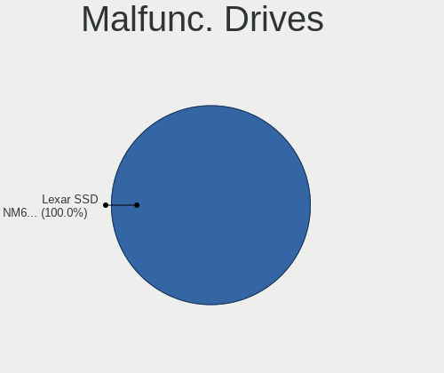
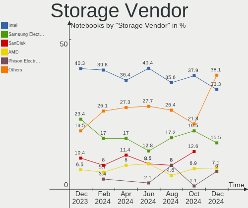
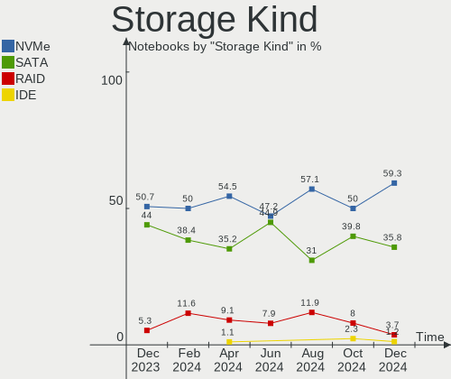

Manjaro - Hardware Trends (Notebooks)
-------------------------------------

A project to identify most popular hardware characteristics and track their change
over time based on data collected by Linux users at https://Linux-Hardware.org.

Anyone can contribute to this report by the [hw-probe](https://github.com/linuxhw/hw-probe) tool:

    sudo -E hw-probe -all -upload

This report is for one last month. Overall report since the beginning of time: [TestCoverage](https://github.com/linuxhw/TestCoverage)

Period: Oct, 2022.

Contents
--------

* [ System ](#system)
  - [ OS                       ](#os)
  - [ OS Family                ](#os-family)
  - [ Kernel                   ](#kernel)
  - [ Kernel Family            ](#kernel-family)
  - [ Kernel Major Ver.        ](#kernel-major-ver)
  - [ Arch                     ](#arch)
  - [ DE                       ](#de)
  - [ Display Server           ](#display-server)
  - [ Display Manager          ](#display-manager)
  - [ OS Lang                  ](#os-lang)
  - [ Boot Mode                ](#boot-mode)
  - [ Filesystem               ](#filesystem)
  - [ Part. scheme             ](#part-scheme)
  - [ Dual Boot with Linux/BSD ](#dual-boot-with-linuxbsd)
  - [ Dual Boot (Win)          ](#dual-boot-win)

* [ Board ](#board)
  - [ Vendor                   ](#vendor)
  - [ Model                    ](#model)
  - [ Model Family             ](#model-family)
  - [ MFG Year                 ](#mfg-year)
  - [ Form Factor              ](#form-factor)
  - [ Secure Boot              ](#secure-boot)
  - [ Coreboot                 ](#coreboot)
  - [ RAM Size                 ](#ram-size)
  - [ RAM Used                 ](#ram-used)
  - [ Total Drives             ](#total-drives)
  - [ Has CD-ROM               ](#has-cd-rom)
  - [ Has Ethernet             ](#has-ethernet)
  - [ Has WiFi                 ](#has-wifi)
  - [ Has Bluetooth            ](#has-bluetooth)

* [ Location ](#location)
  - [ Country                  ](#country)
  - [ City                     ](#city)

* [ Drives ](#drives)
  - [ Drive Vendor             ](#drive-vendor)
  - [ Drive Model              ](#drive-model)
  - [ HDD Vendor               ](#hdd-vendor)
  - [ SSD Vendor               ](#ssd-vendor)
  - [ Drive Kind               ](#drive-kind)
  - [ Drive Connector          ](#drive-connector)
  - [ Drive Size               ](#drive-size)
  - [ Space Total              ](#space-total)
  - [ Space Used               ](#space-used)
  - [ Malfunc. Drives          ](#malfunc-drives)
  - [ Malfunc. Drive Vendor    ](#malfunc-drive-vendor)
  - [ Malfunc. HDD Vendor      ](#malfunc-hdd-vendor)
  - [ Malfunc. Drive Kind      ](#malfunc-drive-kind)
  - [ Failed Drives            ](#failed-drives)
  - [ Failed Drive Vendor      ](#failed-drive-vendor)
  - [ Drive Status             ](#drive-status)

* [ Storage controller ](#storage-controller)
  - [ Storage Vendor           ](#storage-vendor)
  - [ Storage Model            ](#storage-model)
  - [ Storage Kind             ](#storage-kind)

* [ Processor ](#processor)
  - [ CPU Vendor               ](#cpu-vendor)
  - [ CPU Model                ](#cpu-model)
  - [ CPU Model Family         ](#cpu-model-family)
  - [ CPU Cores                ](#cpu-cores)
  - [ CPU Sockets              ](#cpu-sockets)
  - [ CPU Threads              ](#cpu-threads)
  - [ CPU Op-Modes             ](#cpu-op-modes)
  - [ CPU Microcode            ](#cpu-microcode)
  - [ CPU Microarch            ](#cpu-microarch)

* [ Graphics ](#graphics)
  - [ GPU Vendor               ](#gpu-vendor)
  - [ GPU Model                ](#gpu-model)
  - [ GPU Combo                ](#gpu-combo)
  - [ GPU Driver               ](#gpu-driver)
  - [ GPU Memory               ](#gpu-memory)

* [ Monitor ](#monitor)
  - [ Monitor Vendor           ](#monitor-vendor)
  - [ Monitor Model            ](#monitor-model)
  - [ Monitor Resolution       ](#monitor-resolution)
  - [ Monitor Diagonal         ](#monitor-diagonal)
  - [ Monitor Width            ](#monitor-width)
  - [ Aspect Ratio             ](#aspect-ratio)
  - [ Monitor Area             ](#monitor-area)
  - [ Pixel Density            ](#pixel-density)
  - [ Multiple Monitors        ](#multiple-monitors)

* [ Network ](#network)
  - [ Net Controller Vendor    ](#net-controller-vendor)
  - [ Net Controller Model     ](#net-controller-model)
  - [ Wireless Vendor          ](#wireless-vendor)
  - [ Wireless Model           ](#wireless-model)
  - [ Ethernet Vendor          ](#ethernet-vendor)
  - [ Ethernet Model           ](#ethernet-model)
  - [ Net Controller Kind      ](#net-controller-kind)
  - [ Used Controller          ](#used-controller)
  - [ NICs                     ](#nics)
  - [ IPv6                     ](#ipv6)

* [ Bluetooth ](#bluetooth)
  - [ Bluetooth Vendor         ](#bluetooth-vendor)
  - [ Bluetooth Model          ](#bluetooth-model)

* [ Sound ](#sound)
  - [ Sound Vendor             ](#sound-vendor)
  - [ Sound Model              ](#sound-model)

* [ Memory ](#memory)
  - [ Memory Vendor            ](#memory-vendor)
  - [ Memory Model             ](#memory-model)
  - [ Memory Kind              ](#memory-kind)
  - [ Memory Form Factor       ](#memory-form-factor)
  - [ Memory Size              ](#memory-size)
  - [ Memory Speed             ](#memory-speed)

* [ Printers & scanners ](#printers--scanners)
  - [ Printer Vendor           ](#printer-vendor)
  - [ Printer Model            ](#printer-model)
  - [ Scanner Vendor           ](#scanner-vendor)
  - [ Scanner Model            ](#scanner-model)

* [ Camera ](#camera)
  - [ Camera Vendor            ](#camera-vendor)
  - [ Camera Model             ](#camera-model)

* [ Security ](#security)
  - [ Fingerprint Vendor       ](#fingerprint-vendor)
  - [ Fingerprint Model        ](#fingerprint-model)
  - [ Chipcard Vendor          ](#chipcard-vendor)
  - [ Chipcard Model           ](#chipcard-model)

* [ Unsupported ](#unsupported)
  - [ Unsupported Devices      ](#unsupported-devices)
  - [ Unsupported Device Types ](#unsupported-device-types)

System
------

OS
--

Installed operating systems

| Name           | Notebooks | Percent |
|----------------|-----------|---------|
| Manjaro        | 51        | 50.5%   |
| Manjaro 22.0.0 | 47        | 46.53%  |
| Manjaro 21.3.7 | 3         | 2.97%   |

OS Family
---------

OS without a version

| Name    | Notebooks | Percent |
|---------|-----------|---------|
| Manjaro | 101       | 100%    |

Kernel
------

Version of the Linux kernel

| Version               | Notebooks | Percent |
|-----------------------|-----------|---------|
| 5.15.74-3-MANJARO     | 26        | 25.74%  |
| 5.15.65-1-MANJARO     | 17        | 16.83%  |
| 6.0.0-1-MANJARO       | 13        | 12.87%  |
| 6.0.2-2-MANJARO       | 10        | 9.9%    |
| 5.15.71-1-MANJARO     | 7         | 6.93%   |
| 5.15.72-1-MANJARO     | 6         | 5.94%   |
| 5.19.16-2-MANJARO     | 5         | 4.95%   |
| 5.19.0-3-rt10-MANJARO | 3         | 2.97%   |
| 5.15.60-1-MANJARO     | 3         | 2.97%   |
| 6.1.0-1-MANJARO       | 2         | 1.98%   |
| 5.19.7-1-MANJARO      | 2         | 1.98%   |
| 5.19.13-1-MANJARO     | 2         | 1.98%   |
| 5.4.218-2-MANJARO     | 1         | 0.99%   |
| 5.19.14-lqx1-2-lqx    | 1         | 0.99%   |
| 5.14.21-2-MANJARO     | 1         | 0.99%   |
| 5.10.141-1-MANJARO    | 1         | 0.99%   |
| 5.10.136-1-MANJARO    | 1         | 0.99%   |

Kernel Family
-------------

Linux kernel without a distro release

| Version  | Notebooks | Percent |
|----------|-----------|---------|
| 5.15.74  | 26        | 25.74%  |
| 5.15.65  | 17        | 16.83%  |
| 6.0.0    | 13        | 12.87%  |
| 6.0.2    | 10        | 9.9%    |
| 5.15.71  | 7         | 6.93%   |
| 5.15.72  | 6         | 5.94%   |
| 5.19.16  | 5         | 4.95%   |
| 5.19.0   | 3         | 2.97%   |
| 5.15.60  | 3         | 2.97%   |
| 6.1.0    | 2         | 1.98%   |
| 5.19.7   | 2         | 1.98%   |
| 5.19.13  | 2         | 1.98%   |
| 5.4.218  | 1         | 0.99%   |
| 5.19.14  | 1         | 0.99%   |
| 5.14.21  | 1         | 0.99%   |
| 5.10.141 | 1         | 0.99%   |
| 5.10.136 | 1         | 0.99%   |

Kernel Major Ver.
-----------------

Linux kernel major version

| Version | Notebooks | Percent |
|---------|-----------|---------|
| 5.15    | 59        | 58.42%  |
| 6.0     | 23        | 22.77%  |
| 5.19    | 13        | 12.87%  |
| 6.1     | 2         | 1.98%   |
| 5.10    | 2         | 1.98%   |
| 5.4     | 1         | 0.99%   |
| 5.14    | 1         | 0.99%   |

Arch
----

OS architecture (x86_64, i586, etc.)

| Name   | Notebooks | Percent |
|--------|-----------|---------|
| x86_64 | 101       | 100%    |

DE
--

Desktop Environment

| Name       | Notebooks | Percent |
|------------|-----------|---------|
| KDE5       | 57        | 56.44%  |
| GNOME      | 22        | 21.78%  |
| XFCE       | 12        | 11.88%  |
| Unknown    | 3         | 2.97%   |
| X-Cinnamon | 2         | 1.98%   |
| MATE       | 2         | 1.98%   |
| i3         | 1         | 0.99%   |
| Deepin     | 1         | 0.99%   |
| Cinnamon   | 1         | 0.99%   |

Display Server
--------------

X11 or Wayland

| Name    | Notebooks | Percent |
|---------|-----------|---------|
| X11     | 77        | 76.24%  |
| Wayland | 19        | 18.81%  |
| Unknown | 3         | 2.97%   |
| Tty     | 2         | 1.98%   |

Display Manager
---------------

SDDM, LightDM, etc.

| Name    | Notebooks | Percent |
|---------|-----------|---------|
| Unknown | 50        | 49.5%   |
| SDDM    | 26        | 25.74%  |
| LightDM | 15        | 14.85%  |
| GDM     | 10        | 9.9%    |

OS Lang
-------

Language

| Lang    | Notebooks | Percent |
|---------|-----------|---------|
| en_US   | 38        | 37.62%  |
| de_DE   | 9         | 8.91%   |
| it_IT   | 8         | 7.92%   |
| pt_BR   | 7         | 6.93%   |
| en_GB   | 5         | 4.95%   |
| ru_RU   | 4         | 3.96%   |
| es_ES   | 3         | 2.97%   |
| es_CL   | 3         | 2.97%   |
| zh_CN   | 2         | 1.98%   |
| pl_PL   | 2         | 1.98%   |
| fr_FR   | 2         | 1.98%   |
| es_MX   | 2         | 1.98%   |
| es_AR   | 2         | 1.98%   |
| en_IN   | 2         | 1.98%   |
| cs_CZ   | 2         | 1.98%   |
| pt_PT   | 1         | 0.99%   |
| nl_NL   | 1         | 0.99%   |
| en_PH   | 1         | 0.99%   |
| en_DK   | 1         | 0.99%   |
| en_DE   | 1         | 0.99%   |
| el_GR   | 1         | 0.99%   |
| de_AT   | 1         | 0.99%   |
| Default | 1         | 0.99%   |
| C       | 1         | 0.99%   |
| Unknown | 1         | 0.99%   |

Boot Mode
---------

EFI or BIOS

| Mode | Notebooks | Percent |
|------|-----------|---------|
| BIOS | 67        | 66.34%  |
| EFI  | 34        | 33.66%  |

Filesystem
----------

Type of filesystem

| Type    | Notebooks | Percent |
|---------|-----------|---------|
| Ext4    | 84        | 83.17%  |
| Btrfs   | 14        | 13.86%  |
| Overlay | 2         | 1.98%   |
| Xfs     | 1         | 0.99%   |

Part. scheme
------------

Scheme of partitioning

| Type    | Notebooks | Percent |
|---------|-----------|---------|
| Unknown | 49        | 48.51%  |
| GPT     | 47        | 46.53%  |
| MBR     | 5         | 4.95%   |

Dual Boot with Linux/BSD
------------------------

Hosting more than one Linux/BSD

| Dual boot | Notebooks | Percent |
|-----------|-----------|---------|
| No        | 94        | 93.07%  |
| Yes       | 7         | 6.93%   |

Dual Boot (Win)
---------------

Hosting Linux and Windows

| Dual boot | Notebooks | Percent |
|-----------|-----------|---------|
| No        | 74        | 73.27%  |
| Yes       | 27        | 26.73%  |

Board
-----

Vendor
------

Motherboard manufacturer

| Name                    | Notebooks | Percent |
|-------------------------|-----------|---------|
| Lenovo                  | 25        | 24.75%  |
| Hewlett-Packard         | 20        | 19.8%   |
| ASUSTek Computer        | 12        | 11.88%  |
| Dell                    | 10        | 9.9%    |
| Acer                    | 10        | 9.9%    |
| MSI                     | 5         | 4.95%   |
| HUAWEI                  | 3         | 2.97%   |
| Toshiba                 | 2         | 1.98%   |
| Chuwi                   | 2         | 1.98%   |
| Tactus                  | 1         | 0.99%   |
| Sony                    | 1         | 0.99%   |
| Schenker                | 1         | 0.99%   |
| SANTECH                 | 1         | 0.99%   |
| Medion                  | 1         | 0.99%   |
| HONOR                   | 1         | 0.99%   |
| GPD                     | 1         | 0.99%   |
| Global Distribution FZE | 1         | 0.99%   |
| CyberPowerPC            | 1         | 0.99%   |
| AVITA                   | 1         | 0.99%   |
| Apple                   | 1         | 0.99%   |
| Alienware               | 1         | 0.99%   |

Model
-----

Motherboard model

| Name                                   | Notebooks | Percent |
|----------------------------------------|-----------|---------|
| ASUS VivoBook_ASUSLaptop X512FJ_X512FJ | 2         | 1.98%   |
| Acer Aspire E5-553G                    | 2         | 1.98%   |
| Toshiba Satellite P755                 | 1         | 0.99%   |
| Toshiba Encore                         | 1         | 0.99%   |
| Tactus GeoBook_240                     | 1         | 0.99%   |
| Sony SVF15N17CXB                       | 1         | 0.99%   |
| Schenker VISION 15 (SVS15E21)          | 1         | 0.99%   |
| SANTECH NL5xRU                         | 1         | 0.99%   |
| MSI Raider GE76 12UGS                  | 1         | 0.99%   |
| MSI Pulse GL76 12UEK                   | 1         | 0.99%   |
| MSI Modern 15 A11MU                    | 1         | 0.99%   |
| MSI Katana GF76 11UG                   | 1         | 0.99%   |
| MSI GP66 Leopard 11UG                  | 1         | 0.99%   |
| Medion S15449                          | 1         | 0.99%   |
| Lenovo Z50-75 80EC                     | 1         | 0.99%   |
| Lenovo Yoga Slim 7 ProX 14ARH7 82TL    | 1         | 0.99%   |
| Lenovo Yoga Slim 7 Pro 14IAP7 82SV     | 1         | 0.99%   |
| Lenovo Yoga Slim 7 14ARE05 82A2        | 1         | 0.99%   |
| Lenovo Y50-70 20378                    | 1         | 0.99%   |
| Lenovo ThinkPad X270 W10DG 20K5S0B700  | 1         | 0.99%   |
| Lenovo ThinkPad T490 20RYS07R00        | 1         | 0.99%   |
| Lenovo ThinkPad T440p 20AW005BGE       | 1         | 0.99%   |
| Lenovo ThinkPad T440p 20AN0069US       | 1         | 0.99%   |
| Lenovo ThinkPad T410s 2912AJ7          | 1         | 0.99%   |
| Lenovo ThinkPad T14 Gen 3 21CFCTO1WW   | 1         | 0.99%   |
| Lenovo ThinkPad S1 Yoga 20CD00B1US     | 1         | 0.99%   |
| Lenovo ThinkPad R500 2716W2K           | 1         | 0.99%   |
| Lenovo ThinkPad E14 Gen 3 20YDS05600   | 1         | 0.99%   |
| Lenovo ThinkBook 15-IIL 20SM           | 1         | 0.99%   |
| Lenovo ThinkBook 14p Gen 2 20YN        | 1         | 0.99%   |
| Lenovo Legion 5 82B5                   | 1         | 0.99%   |
| Lenovo Legion 5 15ACH6H 82JU           | 1         | 0.99%   |
| Lenovo IdeaPad Y700-15ISK 80NV         | 1         | 0.99%   |
| Lenovo IdeaPad Slim 7 14ITL05 82A6     | 1         | 0.99%   |
| Lenovo IdeaPad 320-15IAP 80XR          | 1         | 0.99%   |
| Lenovo IdeaPad 3 17IML05 81WC          | 1         | 0.99%   |
| Lenovo IdeaPad 110-15ACL 80TJ          | 1         | 0.99%   |
| Lenovo G580 20150                      | 1         | 0.99%   |
| Lenovo G470 20078                      | 1         | 0.99%   |
| HUAWEI KLVL-WXX9                       | 1         | 0.99%   |

Model Family
------------

Motherboard model prefix

| Name              | Notebooks | Percent |
|-------------------|-----------|---------|
| Lenovo ThinkPad   | 9         | 8.91%   |
| Acer Aspire       | 8         | 7.92%   |
| Lenovo IdeaPad    | 5         | 4.95%   |
| HP ProBook        | 5         | 4.95%   |
| HP Pavilion       | 5         | 4.95%   |
| HP Laptop         | 4         | 3.96%   |
| Dell Latitude     | 4         | 3.96%   |
| ASUS VivoBook     | 4         | 3.96%   |
| Lenovo Yoga       | 3         | 2.97%   |
| Dell Inspiron     | 3         | 2.97%   |
| Lenovo ThinkBook  | 2         | 1.98%   |
| Lenovo Legion     | 2         | 1.98%   |
| ASUS ROG          | 2         | 1.98%   |
| Toshiba Satellite | 1         | 0.99%   |
| Toshiba Encore    | 1         | 0.99%   |
| Tactus GeoBook    | 1         | 0.99%   |
| Sony SVF15N17CXB  | 1         | 0.99%   |
| Schenker VISION   | 1         | 0.99%   |
| SANTECH NL5xRU    | 1         | 0.99%   |
| MSI Raider        | 1         | 0.99%   |
| MSI Pulse         | 1         | 0.99%   |
| MSI Modern        | 1         | 0.99%   |
| MSI Katana        | 1         | 0.99%   |
| MSI GP66          | 1         | 0.99%   |
| Medion S15449     | 1         | 0.99%   |
| Lenovo Z50-75     | 1         | 0.99%   |
| Lenovo Y50-70     | 1         | 0.99%   |
| Lenovo G580       | 1         | 0.99%   |
| Lenovo G470       | 1         | 0.99%   |
| HUAWEI KLVL-WXX9  | 1         | 0.99%   |
| HUAWEI HVY-WXX9   | 1         | 0.99%   |
| HUAWEI BOM-WXX9   | 1         | 0.99%   |
| HONOR BBR-WAX9    | 1         | 0.99%   |
| HP ZBook          | 1         | 0.99%   |
| HP Spectre        | 1         | 0.99%   |
| HP InsydeH2O      | 1         | 0.99%   |
| HP ENVY           | 1         | 0.99%   |
| HP EliteBook      | 1         | 0.99%   |
| HP 250            | 1         | 0.99%   |
| GPD G1621-02      | 1         | 0.99%   |

MFG Year
--------

Motherboard manufacture year

| Year | Notebooks | Percent |
|------|-----------|---------|
| 2021 | 24        | 23.76%  |
| 2020 | 14        | 13.86%  |
| 2019 | 9         | 8.91%   |
| 2014 | 9         | 8.91%   |
| 2016 | 7         | 6.93%   |
| 2022 | 6         | 5.94%   |
| 2011 | 6         | 5.94%   |
| 2017 | 5         | 4.95%   |
| 2013 | 5         | 4.95%   |
| 2015 | 4         | 3.96%   |
| 2012 | 4         | 3.96%   |
| 2010 | 4         | 3.96%   |
| 2008 | 3         | 2.97%   |
| 2018 | 1         | 0.99%   |

Form Factor
-----------

Physical design of the computer

| Name     | Notebooks | Percent |
|----------|-----------|---------|
| Notebook | 101       | 100%    |

Secure Boot
-----------

Enabled or disabled

| State    | Notebooks | Percent |
|----------|-----------|---------|
| Disabled | 101       | 100%    |

Coreboot
--------

Have coreboot on board

| Used | Notebooks | Percent |
|------|-----------|---------|
| No   | 101       | 100%    |

RAM Size
--------

Total RAM memory

| Size in GB  | Notebooks | Percent |
|-------------|-----------|---------|
| 4.01-8.0    | 27        | 26.73%  |
| 16.01-24.0  | 22        | 21.78%  |
| 8.01-16.0   | 18        | 17.82%  |
| 3.01-4.0    | 16        | 15.84%  |
| 32.01-64.0  | 8         | 7.92%   |
| 24.01-32.0  | 5         | 4.95%   |
| 64.01-256.0 | 2         | 1.98%   |
| 1.01-2.0    | 2         | 1.98%   |
| 2.01-3.0    | 1         | 0.99%   |

RAM Used
--------

Used RAM memory

| Used GB    | Notebooks | Percent |
|------------|-----------|---------|
| 4.01-8.0   | 30        | 29.7%   |
| 2.01-3.0   | 29        | 28.71%  |
| 1.01-2.0   | 16        | 15.84%  |
| 3.01-4.0   | 14        | 13.86%  |
| 8.01-16.0  | 7         | 6.93%   |
| 0.51-1.0   | 3         | 2.97%   |
| 24.01-32.0 | 1         | 0.99%   |
| 16.01-24.0 | 1         | 0.99%   |

Total Drives
------------

Number of drives on board

| Drives | Notebooks | Percent |
|--------|-----------|---------|
| 1      | 76        | 75.25%  |
| 2      | 18        | 17.82%  |
| 3      | 7         | 6.93%   |

Has CD-ROM
----------

Has CD-ROM on board

| Presented | Notebooks | Percent |
|-----------|-----------|---------|
| No        | 82        | 81.19%  |
| Yes       | 19        | 18.81%  |

Has Ethernet
------------

Has Ethernet on board

| Presented | Notebooks | Percent |
|-----------|-----------|---------|
| Yes       | 67        | 66.34%  |
| No        | 34        | 33.66%  |

Has WiFi
--------

Has WiFi module

| Presented | Notebooks | Percent |
|-----------|-----------|---------|
| Yes       | 99        | 98.02%  |
| No        | 2         | 1.98%   |

Has Bluetooth
-------------

Has Bluetooth module

| Presented | Notebooks | Percent |
|-----------|-----------|---------|
| Yes       | 85        | 84.16%  |
| No        | 16        | 15.84%  |

Location
--------

Country
-------

Geographic location (country)

| Country     | Notebooks | Percent |
|-------------|-----------|---------|
| Germany     | 13        | 12.87%  |
| USA         | 12        | 11.88%  |
| Italy       | 11        | 10.89%  |
| Russia      | 7         | 6.93%   |
| Brazil      | 7         | 6.93%   |
| India       | 4         | 3.96%   |
| Spain       | 3         | 2.97%   |
| Poland      | 3         | 2.97%   |
| Netherlands | 3         | 2.97%   |
| Greece      | 3         | 2.97%   |
| Chile       | 3         | 2.97%   |
| UK          | 2         | 1.98%   |
| Turkey      | 2         | 1.98%   |
| Mexico      | 2         | 1.98%   |
| France      | 2         | 1.98%   |
| Czechia     | 2         | 1.98%   |
| China       | 2         | 1.98%   |
| Austria     | 2         | 1.98%   |
| Argentina   | 2         | 1.98%   |
| Vatican     | 1         | 0.99%   |
| Taiwan      | 1         | 0.99%   |
| Switzerland | 1         | 0.99%   |
| Portugal    | 1         | 0.99%   |
| Philippines | 1         | 0.99%   |
| Nepal       | 1         | 0.99%   |
| Morocco     | 1         | 0.99%   |
| Moldova     | 1         | 0.99%   |
| Indonesia   | 1         | 0.99%   |
| Hungary     | 1         | 0.99%   |
| Estonia     | 1         | 0.99%   |
| Denmark     | 1         | 0.99%   |
| Croatia     | 1         | 0.99%   |
| Bulgaria    | 1         | 0.99%   |
| Belgium     | 1         | 0.99%   |
| Bahrain     | 1         | 0.99%   |

City
----

Geographic location (city)

| City                   | Notebooks | Percent |
|------------------------|-----------|---------|
| St Petersburg          | 3         | 2.97%   |
| Maracanau              | 3         | 2.97%   |
| Vienna                 | 2         | 1.98%   |
| Munich                 | 2         | 1.98%   |
| Maipu                  | 2         | 1.98%   |
| Heidelberg             | 2         | 1.98%   |
| Coventry               | 2         | 1.98%   |
| Cincinnati             | 2         | 1.98%   |
| Athens                 | 2         | 1.98%   |
| Amsterdam              | 2         | 1.98%   |
| Zurich                 | 1         | 0.99%   |
| Zagreb                 | 1         | 0.99%   |
| Vatican City           | 1         | 0.99%   |
| Turin                  | 1         | 0.99%   |
| Todtnau                | 1         | 0.99%   |
| Tiraspol               | 1         | 0.99%   |
| Tijuana                | 1         | 0.99%   |
| Taipei                 | 1         | 0.99%   |
| Skawina                | 1         | 0.99%   |
| Siemianowice Śląskie | 1         | 0.99%   |
| Severodvinsk           | 1         | 0.99%   |
| Saronno                | 1         | 0.99%   |
| Sao Paulo              | 1         | 0.99%   |
| Queens                 | 1         | 0.99%   |
| Pune                   | 1         | 0.99%   |
| Prague                 | 1         | 0.99%   |
| Porto Alegre           | 1         | 0.99%   |
| Pofi                   | 1         | 0.99%   |
| Piancogno              | 1         | 0.99%   |
| Petronà               | 1         | 0.99%   |
| Pärnu                 | 1         | 0.99%   |
| Paris                  | 1         | 0.99%   |
| Paraná                | 1         | 0.99%   |
| Palermo                | 1         | 0.99%   |
| Ourinhos               | 1         | 0.99%   |
| Oeversee               | 1         | 0.99%   |
| Nuremberg              | 1         | 0.99%   |
| New York               | 1         | 0.99%   |
| Nagpur                 | 1         | 0.99%   |
| Mumbai                 | 1         | 0.99%   |

Drives
------

Drive Vendor
------------

Hard drive vendors

| Vendor                       | Notebooks | Drives | Percent |
|------------------------------|-----------|--------|---------|
| Samsung Electronics          | 24        | 25     | 18.05%  |
| WDC                          | 11        | 12     | 8.27%   |
| Seagate                      | 11        | 11     | 8.27%   |
| SanDisk                      | 11        | 11     | 8.27%   |
| Unknown                      | 9         | 9      | 6.77%   |
| Micron Technology            | 8         | 8      | 6.02%   |
| Toshiba                      | 7         | 7      | 5.26%   |
| SK hynix                     | 6         | 6      | 4.51%   |
| Kingston                     | 5         | 6      | 3.76%   |
| Crucial                      | 5         | 5      | 3.76%   |
| KIOXIA                       | 4         | 4      | 3.01%   |
| Phison Electronics           | 3         | 3      | 2.26%   |
| SPCC                         | 2         | 2      | 1.5%    |
| Netac                        | 2         | 2      | 1.5%    |
| Micron/Crucial Technology    | 2         | 2      | 1.5%    |
| Intenso                      | 2         | 2      | 1.5%    |
| Hitachi                      | 2         | 2      | 1.5%    |
| GOODRAM                      | 2         | 2      | 1.5%    |
| China                        | 2         | 2      | 1.5%    |
| Unknown                      | 2         | 2      | 1.5%    |
| WALRAM                       | 1         | 1      | 0.75%   |
| Transcend                    | 1         | 1      | 0.75%   |
| Shenzhen Longsys Electronics | 1         | 1      | 0.75%   |
| PNY                          | 1         | 1      | 0.75%   |
| Patriot                      | 1         | 1      | 0.75%   |
| OCZ                          | 1         | 1      | 0.75%   |
| Mushkin                      | 1         | 1      | 0.75%   |
| Kingston Technology Company  | 1         | 1      | 0.75%   |
| JMicron Technology           | 1         | 1      | 0.75%   |
| Intel                        | 1         | 2      | 0.75%   |
| HGST                         | 1         | 1      | 0.75%   |
| FORESEE                      | 1         | 1      | 0.75%   |
| Apple                        | 1         | 1      | 0.75%   |

Drive Model
-----------

Hard drive models

| Model                                                | Notebooks | Percent |
|------------------------------------------------------|-----------|---------|
| Unknown MMC Card  32GB                               | 3         | 2.21%   |
| Sandisk WD Blue SN550 NVMe SSD 1TB                   | 3         | 2.21%   |
| Samsung NVMe SSD Controller SM981/PM981/PM983 500GB  | 3         | 2.21%   |
| Samsung NVMe SSD Controller PM9A1/PM9A3/980PRO 250GB | 3         | 2.21%   |
| Samsung MZVLQ512HALU-000H1 512GB                     | 3         | 2.21%   |
| SK hynix SKHynix_HFS512GD9TNI-L2A0B 512GB            | 2         | 1.47%   |
| Seagate ST1000LM024 HN-M101MBB 1TB                   | 2         | 1.47%   |
| Sandisk WD Black SN750 / PC SN730 NVMe SSD 1TB       | 2         | 1.47%   |
| Samsung NVMe SSD Controller SM961/PM961/SM963 250GB  | 2         | 1.47%   |
| Phison E12 NVMe Controller 2TB                       | 2         | 1.47%   |
| KIOXIA KBG40ZNV256G 256GB                            | 2         | 1.47%   |
| China SSD 128GB                                      | 2         | 1.47%   |
| Unknown                                              | 2         | 1.47%   |
| WDC WDS240G2G0A-00JH30 240GB SSD                     | 1         | 0.74%   |
| WDC WD7500BPVX-00FA7T0 752GB                         | 1         | 0.74%   |
| WDC WD5000LPVX-80V0TT0 500GB                         | 1         | 0.74%   |
| WDC WD5000LPVX-22V0TT0 500GB                         | 1         | 0.74%   |
| WDC WD5000LPCX-22VHAT1 500GB                         | 1         | 0.74%   |
| WDC WD5000LPCX-21VHAT0 500GB                         | 1         | 0.74%   |
| WDC WD5000LPCX-00VHAT0 500GB                         | 1         | 0.74%   |
| WDC WD3200BEKT-00F3T0 320GB                          | 1         | 0.74%   |
| WDC WD10SPCX-24HWST1 1TB                             | 1         | 0.74%   |
| WDC WD10S12X-55JTET0 1016GB                          | 1         | 0.74%   |
| WDC WD10JPVX-22JC3T0 1TB                             | 1         | 0.74%   |
| WDC WD10JPCX-24UE4T0 1TB                             | 1         | 0.74%   |
| WALRAM 120GB                                         | 1         | 0.74%   |
| Unknown xD/SD/M.S.                                   | 1         | 0.74%   |
| Unknown MMC Card  8GB                                | 1         | 0.74%   |
| Unknown MMC Card  64GB                               | 1         | 0.74%   |
| Unknown MMC Card  393GB                              | 1         | 0.74%   |
| Unknown MMC Card  1GB                                | 1         | 0.74%   |
| Unknown External 128GB                               | 1         | 0.74%   |
| Transcend TS512GMTS430S 512GB SSD                    | 1         | 0.74%   |
| Toshiba XG6 NVMe SSD Controller 512GB                | 1         | 0.74%   |
| Toshiba MQ04ABF100 1TB                               | 1         | 0.74%   |
| Toshiba MQ01ABF050 500GB                             | 1         | 0.74%   |
| Toshiba MQ01ABD100 1TB                               | 1         | 0.74%   |
| Toshiba MQ01ABD050 500GB                             | 1         | 0.74%   |
| Toshiba MK2561GSYN 250GB                             | 1         | 0.74%   |
| Toshiba KXG50ZNV512G 512GB                           | 1         | 0.74%   |

HDD Vendor
----------

Hard disk drive vendors

| Vendor  | Notebooks | Drives | Percent |
|---------|-----------|--------|---------|
| WDC     | 11        | 11     | 35.48%  |
| Seagate | 10        | 10     | 32.26%  |
| Toshiba | 5         | 5      | 16.13%  |
| Hitachi | 2         | 2      | 6.45%   |
| Unknown | 1         | 1      | 3.23%   |
| HGST    | 1         | 1      | 3.23%   |
| Unknown | 1         | 1      | 3.23%   |

SSD Vendor
----------

Solid state drive vendors

| Vendor              | Notebooks | Drives | Percent |
|---------------------|-----------|--------|---------|
| Samsung Electronics | 6         | 7      | 15.79%  |
| Crucial             | 5         | 5      | 13.16%  |
| Kingston            | 4         | 5      | 10.53%  |
| SanDisk             | 3         | 3      | 7.89%   |
| SPCC                | 2         | 2      | 5.26%   |
| Netac               | 2         | 2      | 5.26%   |
| Intenso             | 2         | 2      | 5.26%   |
| GOODRAM             | 2         | 2      | 5.26%   |
| China               | 2         | 2      | 5.26%   |
| WDC                 | 1         | 1      | 2.63%   |
| Transcend           | 1         | 1      | 2.63%   |
| PNY                 | 1         | 1      | 2.63%   |
| Patriot             | 1         | 1      | 2.63%   |
| OCZ                 | 1         | 1      | 2.63%   |
| Mushkin             | 1         | 1      | 2.63%   |
| Micron Technology   | 1         | 1      | 2.63%   |
| FORESEE             | 1         | 1      | 2.63%   |
| Apple               | 1         | 1      | 2.63%   |
| Unknown             | 1         | 1      | 2.63%   |

Drive Kind
----------

HDD or SSD

| Kind    | Notebooks | Drives | Percent |
|---------|-----------|--------|---------|
| NVMe    | 53        | 55     | 42.06%  |
| SSD     | 32        | 40     | 25.4%   |
| HDD     | 30        | 31     | 23.81%  |
| MMC     | 7         | 7      | 5.56%   |
| Unknown | 4         | 4      | 3.17%   |

Drive Connector
---------------

SATA, SAS, NVMe, etc.

| Type | Notebooks | Drives | Percent |
|------|-----------|--------|---------|
| NVMe | 53        | 55     | 43.8%   |
| SATA | 53        | 67     | 43.8%   |
| SAS  | 8         | 8      | 6.61%   |
| MMC  | 7         | 7      | 5.79%   |

Drive Size
----------

Size of hard drive

| Size in TB | Notebooks | Drives | Percent |
|------------|-----------|--------|---------|
| 0.01-0.5   | 39        | 47     | 62.9%   |
| 0.51-1.0   | 18        | 19     | 29.03%  |
| 1.01-2.0   | 4         | 4      | 6.45%   |
| 3.01-4.0   | 1         | 1      | 1.61%   |

Space Total
-----------

Amount of disk space available on the file system

| Size in GB     | Notebooks | Percent |
|----------------|-----------|---------|
| 251-500        | 34        | 33.66%  |
| 101-250        | 18        | 17.82%  |
| 1001-2000      | 10        | 9.9%    |
| Unknown        | 10        | 9.9%    |
| 501-1000       | 9         | 8.91%   |
| 51-100         | 7         | 6.93%   |
| More than 3000 | 5         | 4.95%   |
| 1-20           | 5         | 4.95%   |
| 21-50          | 2         | 1.98%   |
| 2001-3000      | 1         | 0.99%   |

Space Used
----------

Amount of used disk space

| Used GB   | Notebooks | Percent |
|-----------|-----------|---------|
| 21-50     | 21        | 20.79%  |
| 101-250   | 18        | 17.82%  |
| 51-100    | 18        | 17.82%  |
| 1-20      | 12        | 11.88%  |
| Unknown   | 10        | 9.9%    |
| 501-1000  | 9         | 8.91%   |
| 251-500   | 6         | 5.94%   |
| 1001-2000 | 5         | 4.95%   |
| 2001-3000 | 1         | 0.99%   |
| 0         | 1         | 0.99%   |

Malfunc. Drives
---------------

Drive models with a malfunction

| Model                                            | Notebooks | Drives | Percent |
|--------------------------------------------------|-----------|--------|---------|
| Toshiba MQ01ABD100 1TB                           | 1         | 1      | 25%     |
| Seagate ST500LT012-9WS142 500GB                  | 1         | 1      | 25%     |
| Samsung Electronics SSD 840 Series 120GB         | 1         | 1      | 25%     |
| Samsung Electronics MMCRE28G8MXP-0VBH1 128GB SSD | 1         | 1      | 25%     |

Malfunc. Drive Vendor
---------------------

Vendors of faulty drives

| Vendor              | Notebooks | Drives | Percent |
|---------------------|-----------|--------|---------|
| Toshiba             | 1         | 1      | 33.33%  |
| Seagate             | 1         | 1      | 33.33%  |
| Samsung Electronics | 1         | 2      | 33.33%  |

Malfunc. HDD Vendor
-------------------

Vendors of faulty HDD drives

| Vendor  | Notebooks | Drives | Percent |
|---------|-----------|--------|---------|
| Toshiba | 1         | 1      | 50%     |
| Seagate | 1         | 1      | 50%     |

Malfunc. Drive Kind
-------------------

Kinds of faulty drives

| Kind | Notebooks | Drives | Percent |
|------|-----------|--------|---------|
| HDD  | 2         | 2      | 66.67%  |
| SSD  | 1         | 2      | 33.33%  |

Failed Drives
-------------

Failed drive models

Zero info for selected period =(

Failed Drive Vendor
-------------------

Failed drive vendors

Zero info for selected period =(

Drive Status
------------

Number of failed and malfunc. drives

| Status   | Notebooks | Drives | Percent |
|----------|-----------|--------|---------|
| Detected | 71        | 92     | 67.62%  |
| Works    | 31        | 41     | 29.52%  |
| Malfunc  | 3         | 4      | 2.86%   |

Storage controller
------------------

Storage Vendor
--------------

Storage controller vendors

| Vendor                       | Notebooks | Percent |
|------------------------------|-----------|---------|
| Intel                        | 59        | 46.46%  |
| Samsung Electronics          | 18        | 14.17%  |
| AMD                          | 14        | 11.02%  |
| SanDisk                      | 8         | 6.3%    |
| Micron Technology            | 7         | 5.51%   |
| SK hynix                     | 6         | 4.72%   |
| KIOXIA                       | 4         | 3.15%   |
| Phison Electronics           | 3         | 2.36%   |
| Toshiba America Info Systems | 2         | 1.57%   |
| Micron/Crucial Technology    | 2         | 1.57%   |
| Kingston Technology Company  | 2         | 1.57%   |
| Shenzhen Longsys Electronics | 1         | 0.79%   |
| ASMedia Technology           | 1         | 0.79%   |

Storage Model
-------------

Storage controller models

| Model                                                                            | Notebooks | Percent |
|----------------------------------------------------------------------------------|-----------|---------|
| AMD FCH SATA Controller [AHCI mode]                                              | 14        | 10.69%  |
| Intel 82801 Mobile SATA Controller [RAID mode]                                   | 9         | 6.87%   |
| Samsung NVMe SSD Controller 980                                                  | 7         | 5.34%   |
| Micron Non-Volatile memory controller                                            | 7         | 5.34%   |
| Intel Volume Management Device NVMe RAID Controller                              | 5         | 3.82%   |
| Intel Sunrise Point-LP SATA Controller [AHCI mode]                               | 5         | 3.82%   |
| Intel 8 Series/C220 Series Chipset Family 6-port SATA Controller 1 [AHCI mode]   | 5         | 3.82%   |
| Intel 7 Series Chipset Family 6-port SATA Controller [AHCI mode]                 | 5         | 3.82%   |
| SanDisk WD Blue SN550 NVMe SSD                                                   | 4         | 3.05%   |
| Samsung NVMe SSD Controller SM981/PM981/PM983                                    | 4         | 3.05%   |
| KIOXIA NVMe SSD Controller BG4                                                   | 4         | 3.05%   |
| Intel Celeron/Pentium Silver Processor SATA Controller                           | 4         | 3.05%   |
| Intel 8 Series SATA Controller 1 [AHCI mode]                                     | 4         | 3.05%   |
| Intel 6 Series/C200 Series Chipset Family 6 port Mobile SATA AHCI Controller     | 4         | 3.05%   |
| SK hynix Gold P31 SSD                                                            | 3         | 2.29%   |
| Samsung NVMe SSD Controller PM9A1/PM9A3/980PRO                                   | 3         | 2.29%   |
| Intel Comet Lake SATA AHCI Controller                                            | 3         | 2.29%   |
| SK hynix Non-Volatile memory controller                                          | 2         | 1.53%   |
| SanDisk WD Black SN750 / PC SN730 NVMe SSD                                       | 2         | 1.53%   |
| Samsung NVMe SSD Controller SM961/PM961/SM963                                    | 2         | 1.53%   |
| Phison E12 NVMe Controller                                                       | 2         | 1.53%   |
| Intel Atom Processor E3800 Series SATA AHCI Controller                           | 2         | 1.53%   |
| Toshiba America Info Systems XG6 NVMe SSD Controller                             | 1         | 0.76%   |
| Toshiba America Info Systems Toshiba America Info Non-Volatile memory controller | 1         | 0.76%   |
| SK hynix BC501 NVMe Solid State Drive                                            | 1         | 0.76%   |
| Shenzhen Longsys Non-Volatile memory controller                                  | 1         | 0.76%   |
| SanDisk WD Black 2018/SN750 / PC SN720 NVMe SSD                                  | 1         | 0.76%   |
| SanDisk Non-Volatile memory controller                                           | 1         | 0.76%   |
| Samsung NVMe SSD Controller SM951/PM951                                          | 1         | 0.76%   |
| Samsung Electronics Non-Volatile memory controller                               | 1         | 0.76%   |
| Phison PS5013 E13 NVMe Controller                                                | 1         | 0.76%   |
| Micron/Crucial P2 NVMe PCIe SSD                                                  | 1         | 0.76%   |
| Micron/Crucial Non-Volatile memory controller                                    | 1         | 0.76%   |
| Kingston Company Company Non-Volatile memory controller                          | 1         | 0.76%   |
| Kingston Company A2000 NVMe SSD                                                  | 1         | 0.76%   |
| Intel Wildcat Point-LP SATA Controller [AHCI Mode]                               | 1         | 0.76%   |
| Intel Tiger Lake-LP SATA Controller                                              | 1         | 0.76%   |
| Intel Q170/Q150/B150/H170/H110/Z170/CM236 Chipset SATA Controller [AHCI Mode]    | 1         | 0.76%   |
| Intel Non-Volatile memory controller                                             | 1         | 0.76%   |
| Intel Jasper Lake SATA AHCI Controller                                           | 1         | 0.76%   |

Storage Kind
------------

Kind of storage controller (IDE, SATA, NVMe, SAS, ...)

| Kind | Notebooks | Percent |
|------|-----------|---------|
| SATA | 60        | 46.88%  |
| NVMe | 53        | 41.41%  |
| RAID | 14        | 10.94%  |
| IDE  | 1         | 0.78%   |

Processor
---------

CPU Vendor
----------

Processor vendors

| Vendor | Notebooks | Percent |
|--------|-----------|---------|
| Intel  | 74        | 73.27%  |
| AMD    | 27        | 26.73%  |

CPU Model
---------

Processor models

| Model                                           | Notebooks | Percent |
|-------------------------------------------------|-----------|---------|
| Intel Core i7-8550U CPU @ 1.80GHz               | 3         | 2.97%   |
| Intel Core i5-10210U CPU @ 1.60GHz              | 3         | 2.97%   |
| Intel 11th Gen Core i7-1165G7 @ 2.80GHz         | 3         | 2.97%   |
| AMD Ryzen 7 4800H with Radeon Graphics          | 3         | 2.97%   |
| AMD Ryzen 7 4700U with Radeon Graphics          | 3         | 2.97%   |
| Intel Core i7-8565U CPU @ 1.80GHz               | 2         | 1.98%   |
| Intel Core i5-2450M CPU @ 2.50GHz               | 2         | 1.98%   |
| Intel Core i5-2410M CPU @ 2.30GHz               | 2         | 1.98%   |
| Intel Core i3-4005U CPU @ 1.70GHz               | 2         | 1.98%   |
| Intel Celeron N4020 CPU @ 1.10GHz               | 2         | 1.98%   |
| Intel 11th Gen Core i7-1195G7 @ 2.90GHz         | 2         | 1.98%   |
| Intel 11th Gen Core i7-11800H @ 2.30GHz         | 2         | 1.98%   |
| Intel 11th Gen Core i5-1135G7 @ 2.40GHz         | 2         | 1.98%   |
| AMD Ryzen 5 5500U with Radeon Graphics          | 2         | 1.98%   |
| AMD A10-9600P RADEON R5, 10 COMPUTE CORES 4C+6G | 2         | 1.98%   |
| Intel Pentium Silver N5030 CPU @ 1.10GHz        | 1         | 0.99%   |
| Intel Pentium CPU N3540 @ 2.16GHz               | 1         | 0.99%   |
| Intel Pentium CPU 2117U @ 1.80GHz               | 1         | 0.99%   |
| Intel Pentium CPU 2020M @ 2.40GHz               | 1         | 0.99%   |
| Intel Core i7-9750H CPU @ 2.60GHz               | 1         | 0.99%   |
| Intel Core i7-7700HQ CPU @ 2.80GHz              | 1         | 0.99%   |
| Intel Core i7-4720HQ CPU @ 2.60GHz              | 1         | 0.99%   |
| Intel Core i7-4710MQ CPU @ 2.50GHz              | 1         | 0.99%   |
| Intel Core i7-4600U CPU @ 2.10GHz               | 1         | 0.99%   |
| Intel Core i7-4500U CPU @ 1.80GHz               | 1         | 0.99%   |
| Intel Core i7-3632QM CPU @ 2.20GHz              | 1         | 0.99%   |
| Intel Core i7-3520M CPU @ 2.90GHz               | 1         | 0.99%   |
| Intel Core i7-1065G7 CPU @ 1.30GHz              | 1         | 0.99%   |
| Intel Core i7-10610U CPU @ 1.80GHz              | 1         | 0.99%   |
| Intel Core i7-10510U CPU @ 1.80GHz              | 1         | 0.99%   |
| Intel Core i5-8250U CPU @ 1.60GHz               | 1         | 0.99%   |
| Intel Core i5-7200U CPU @ 2.50GHz               | 1         | 0.99%   |
| Intel Core i5-6300HQ CPU @ 2.30GHz              | 1         | 0.99%   |
| Intel Core i5-6200U CPU @ 2.30GHz               | 1         | 0.99%   |
| Intel Core i5-6198DU CPU @ 2.30GHz              | 1         | 0.99%   |
| Intel Core i5-5300U CPU @ 2.30GHz               | 1         | 0.99%   |
| Intel Core i5-4300M CPU @ 2.60GHz               | 1         | 0.99%   |
| Intel Core i5-4200M CPU @ 2.50GHz               | 1         | 0.99%   |
| Intel Core i5-4200H CPU @ 2.80GHz               | 1         | 0.99%   |
| Intel Core i5-3320M CPU @ 2.60GHz               | 1         | 0.99%   |

CPU Model Family
----------------

Processor model prefix

| Model                | Notebooks | Percent |
|----------------------|-----------|---------|
| Intel Core i5        | 22        | 21.78%  |
| Other                | 17        | 16.83%  |
| Intel Core i7        | 16        | 15.84%  |
| AMD Ryzen 7          | 9         | 8.91%   |
| Intel Core i3        | 6         | 5.94%   |
| Intel Celeron        | 6         | 5.94%   |
| AMD Ryzen 5          | 6         | 5.94%   |
| Intel Pentium        | 3         | 2.97%   |
| AMD A10              | 3         | 2.97%   |
| Intel Core 2 Duo     | 2         | 1.98%   |
| Intel Atom           | 2         | 1.98%   |
| AMD Ryzen 9          | 2         | 1.98%   |
| AMD Ryzen 7 PRO      | 2         | 1.98%   |
| Intel Pentium Silver | 1         | 0.99%   |
| AMD Ryzen 3          | 1         | 0.99%   |
| AMD FX               | 1         | 0.99%   |
| AMD A8               | 1         | 0.99%   |
| AMD A4               | 1         | 0.99%   |

CPU Cores
---------

Number of processor cores

| Number | Notebooks | Percent |
|--------|-----------|---------|
| 2      | 38        | 37.62%  |
| 4      | 37        | 36.63%  |
| 8      | 16        | 15.84%  |
| 6      | 6         | 5.94%   |
| 12     | 2         | 1.98%   |
| 14     | 1         | 0.99%   |
| 1      | 1         | 0.99%   |

CPU Sockets
-----------

Number of sockets

| Number | Notebooks | Percent |
|--------|-----------|---------|
| 1      | 101       | 100%    |

CPU Threads
-----------

Threads per core (Hyper-Threading)

| Number | Notebooks | Percent |
|--------|-----------|---------|
| 2      | 79        | 78.22%  |
| 1      | 22        | 21.78%  |

CPU Op-Modes
------------

CPU Operation Modes (32-bit, 64-bit)

| Op mode        | Notebooks | Percent |
|----------------|-----------|---------|
| 32-bit, 64-bit | 101       | 100%    |

CPU Microcode
-------------

Microcode number

| Number     | Notebooks | Percent |
|------------|-----------|---------|
| Unknown    | 62        | 61.39%  |
| 0x08600106 | 5         | 4.95%   |
| 0x806ec    | 4         | 3.96%   |
| 0x0a50000c | 4         | 3.96%   |
| 0x806d1    | 3         | 2.97%   |
| 0x806c1    | 3         | 2.97%   |
| 0x906a3    | 2         | 1.98%   |
| 0x806ea    | 2         | 1.98%   |
| 0x306c3    | 2         | 1.98%   |
| 0x306a9    | 2         | 1.98%   |
| 0x906ea    | 1         | 0.99%   |
| 0x706e5    | 1         | 0.99%   |
| 0x706a8    | 1         | 0.99%   |
| 0x40651    | 1         | 0.99%   |
| 0x30673    | 1         | 0.99%   |
| 0x206a7    | 1         | 0.99%   |
| 0x20655    | 1         | 0.99%   |
| 0x0a404101 | 1         | 0.99%   |
| 0x08608103 | 1         | 0.99%   |
| 0x07030105 | 1         | 0.99%   |
| 0x0600611a | 1         | 0.99%   |
| 0x03000027 | 1         | 0.99%   |

CPU Microarch
-------------

Microarchitecture

| Name             | Notebooks | Percent |
|------------------|-----------|---------|
| KabyLake         | 15        | 14.85%  |
| TigerLake        | 10        | 9.9%    |
| Unknown          | 10        | 9.9%    |
| Haswell          | 9         | 8.91%   |
| Zen 2            | 8         | 7.92%   |
| SandyBridge      | 6         | 5.94%   |
| IvyBridge        | 6         | 5.94%   |
| Zen 3            | 5         | 4.95%   |
| Silvermont       | 4         | 3.96%   |
| Goldmont plus    | 4         | 3.96%   |
| Westmere         | 3         | 2.97%   |
| Skylake          | 3         | 2.97%   |
| Icelake          | 3         | 2.97%   |
| Excavator        | 3         | 2.97%   |
| Penryn           | 2         | 1.98%   |
| Broadwell        | 2         | 1.98%   |
| Alderlake Hybrid | 2         | 1.98%   |
| Zen+             | 1         | 0.99%   |
| Steamroller      | 1         | 0.99%   |
| Puma             | 1         | 0.99%   |
| Piledriver       | 1         | 0.99%   |
| K10 Llano        | 1         | 0.99%   |
| Goldmont         | 1         | 0.99%   |

Graphics
--------

GPU Vendor
----------

Vendors of graphics cards

| Vendor | Notebooks | Percent |
|--------|-----------|---------|
| Intel  | 74        | 55.22%  |
| Nvidia | 32        | 23.88%  |
| AMD    | 28        | 20.9%   |

GPU Model
---------

Graphics card models

| Model                                                                                 | Notebooks | Percent |
|---------------------------------------------------------------------------------------|-----------|---------|
| Intel TigerLake-LP GT2 [Iris Xe Graphics]                                             | 10        | 7.19%   |
| AMD Renoir                                                                            | 8         | 5.76%   |
| Intel 3rd Gen Core processor Graphics Controller                                      | 6         | 4.32%   |
| Intel 2nd Generation Core Processor Family Integrated Graphics Controller             | 6         | 4.32%   |
| Intel CometLake-U GT2 [UHD Graphics]                                                  | 5         | 3.6%    |
| Intel 4th Gen Core Processor Integrated Graphics Controller                           | 5         | 3.6%    |
| AMD Cezanne                                                                           | 5         | 3.6%    |
| Nvidia GA106M [GeForce RTX 3060 Mobile / Max-Q]                                       | 4         | 2.88%   |
| Intel UHD Graphics 620                                                                | 4         | 2.88%   |
| Intel Haswell-ULT Integrated Graphics Controller                                      | 4         | 2.88%   |
| Intel TigerLake-H GT1 [UHD Graphics]                                                  | 3         | 2.16%   |
| Intel GeminiLake [UHD Graphics 600]                                                   | 3         | 2.16%   |
| Intel Core Processor Integrated Graphics Controller                                   | 3         | 2.16%   |
| Intel Atom Processor Z36xxx/Z37xxx Series Graphics & Display                          | 3         | 2.16%   |
| Intel Alder Lake-P Integrated Graphics Controller                                     | 3         | 2.16%   |
| AMD Rembrandt [Radeon 680M]                                                           | 3         | 2.16%   |
| AMD Lucienne                                                                          | 3         | 2.16%   |
| Nvidia GP108M [GeForce MX250]                                                         | 2         | 1.44%   |
| Nvidia GP108M [GeForce MX230]                                                         | 2         | 1.44%   |
| Nvidia GM107M [GeForce GTX 860M]                                                      | 2         | 1.44%   |
| Nvidia GA107M [GeForce RTX 3050 Mobile]                                               | 2         | 1.44%   |
| Nvidia GA104M [GeForce RTX 3070 Mobile / Max-Q]                                       | 2         | 1.44%   |
| Nvidia GA104 [Geforce RTX 3070 Ti Laptop GPU]                                         | 2         | 1.44%   |
| Intel WhiskeyLake-U GT2 [UHD Graphics 620]                                            | 2         | 1.44%   |
| Intel Mobile 4 Series Chipset Integrated Graphics Controller                          | 2         | 1.44%   |
| Intel HD Graphics 620                                                                 | 2         | 1.44%   |
| Intel HD Graphics 5500                                                                | 2         | 1.44%   |
| AMD Wani [Radeon R5/R6/R7 Graphics]                                                   | 2         | 1.44%   |
| AMD Topaz XT [Radeon R7 M260/M265 / M340/M360 / M440/M445 / 530/535 / 620/625 Mobile] | 2         | 1.44%   |
| Nvidia TU117M [GeForce GTX 1650 Ti Mobile]                                            | 1         | 0.72%   |
| Nvidia TU117M                                                                         | 1         | 0.72%   |
| Nvidia GP108M [GeForce MX150]                                                         | 1         | 0.72%   |
| Nvidia GP104BM [GeForce GTX 1070 Mobile]                                              | 1         | 0.72%   |
| Nvidia GM108M [GeForce 920MX]                                                         | 1         | 0.72%   |
| Nvidia GM107M [GeForce GTX 960M]                                                      | 1         | 0.72%   |
| Nvidia GM107M [GeForce GTX 950M]                                                      | 1         | 0.72%   |
| Nvidia GM107 [GeForce 940MX]                                                          | 1         | 0.72%   |
| Nvidia GK208M [GeForce GT 735M]                                                       | 1         | 0.72%   |
| Nvidia GK208BM [GeForce 920M]                                                         | 1         | 0.72%   |
| Nvidia GK107M [GeForce GT 740M]                                                       | 1         | 0.72%   |

GPU Combo
---------

Combinations of graphics cards

| Name           | Notebooks | Percent |
|----------------|-----------|---------|
| 1 x Intel      | 48        | 47.52%  |
| Intel + Nvidia | 24        | 23.76%  |
| 1 x AMD        | 15        | 14.85%  |
| AMD + Nvidia   | 7         | 6.93%   |
| 2 x AMD        | 5         | 4.95%   |
| 1 x Nvidia     | 1         | 0.99%   |
| Intel + AMD    | 1         | 0.99%   |

GPU Driver
----------

Free vs proprietary

| Driver      | Notebooks | Percent |
|-------------|-----------|---------|
| Free        | 86        | 85.15%  |
| Proprietary | 15        | 14.85%  |

GPU Memory
----------

Total video memory

| Size in GB | Notebooks | Percent |
|------------|-----------|---------|
| Unknown    | 82        | 81.19%  |
| 0.01-0.5   | 7         | 6.93%   |
| 1.01-2.0   | 5         | 4.95%   |
| 0.51-1.0   | 3         | 2.97%   |
| 5.01-6.0   | 2         | 1.98%   |
| 3.01-4.0   | 2         | 1.98%   |

Monitor
-------

Monitor Vendor
--------------

Monitor vendors

| Vendor                  | Notebooks | Percent |
|-------------------------|-----------|---------|
| BOE                     | 21        | 16.8%   |
| Chimei Innolux          | 17        | 13.6%   |
| AU Optronics            | 17        | 13.6%   |
| LG Display              | 16        | 12.8%   |
| Samsung Electronics     | 10        | 8%      |
| ViewSonic               | 5         | 4%      |
| PANDA                   | 5         | 4%      |
| Goldstar                | 4         | 3.2%    |
| Dell                    | 4         | 3.2%    |
| Lenovo                  | 3         | 2.4%    |
| Sharp                   | 2         | 1.6%    |
| InfoVision              | 2         | 1.6%    |
| Chi Mei Optoelectronics | 2         | 1.6%    |
| ASUSTek Computer        | 2         | 1.6%    |
| TMX                     | 1         | 0.8%    |
| Sony                    | 1         | 0.8%    |
| Philips                 | 1         | 0.8%    |
| ONB                     | 1         | 0.8%    |
| MStar                   | 1         | 0.8%    |
| MSI                     | 1         | 0.8%    |
| Iiyama                  | 1         | 0.8%    |
| Hewlett-Packard         | 1         | 0.8%    |
| FUN                     | 1         | 0.8%    |
| eMachines               | 1         | 0.8%    |
| Eizo                    | 1         | 0.8%    |
| CSO                     | 1         | 0.8%    |
| BenQ                    | 1         | 0.8%    |
| Apple                   | 1         | 0.8%    |
| Acer                    | 1         | 0.8%    |

Monitor Model
-------------

Monitor models

| Model                                                                 | Notebooks | Percent |
|-----------------------------------------------------------------------|-----------|---------|
| Chimei Innolux LCD Monitor CMN15F5 1920x1080 344x193mm 15.5-inch      | 3         | 2.36%   |
| PANDA LCD Monitor NCP0040 1920x1080 344x194mm 15.5-inch               | 2         | 1.57%   |
| BOE LCD Monitor BOE0872 1920x1080 344x194mm 15.5-inch                 | 2         | 1.57%   |
| BOE LCD Monitor BOE07F6 1920x1080 309x174mm 14.0-inch                 | 2         | 1.57%   |
| AU Optronics LCD Monitor AUOD1ED 1920x1080 344x193mm 15.5-inch        | 2         | 1.57%   |
| ViewSonic VX2739wm VSC3F24 1920x1080 598x336mm 27.0-inch              | 1         | 0.79%   |
| ViewSonic VX2376 Series VSC3B32 1920x1080 509x286mm 23.0-inch         | 1         | 0.79%   |
| ViewSonic VA2730 Series VSCA539 1920x1080 598x336mm 27.0-inch         | 1         | 0.79%   |
| ViewSonic VA2418-FHD VSCD739 1920x1080 527x296mm 23.8-inch            | 1         | 0.79%   |
| ViewSonic VA2407 Series VSC8C31 1920x1080 521x293mm 23.5-inch         | 1         | 0.79%   |
| TMX TL140BDXP01-0 TMX1400 2560x1440 310x174mm 14.0-inch               | 1         | 0.79%   |
| Sony TV SNYE903 1920x1080                                             | 1         | 0.79%   |
| Sharp LCD Monitor SHP1515 1920x1200 336x210mm 15.6-inch               | 1         | 0.79%   |
| Sharp LCD Monitor SHP14F9 1920x1200 288x180mm 13.4-inch               | 1         | 0.79%   |
| Samsung Electronics SMT22A300 SAM087B 1920x1080 477x268mm 21.5-inch   | 1         | 0.79%   |
| Samsung Electronics S27F350 SAM0D22 1920x1080 598x336mm 27.0-inch     | 1         | 0.79%   |
| Samsung Electronics LCD Monitor SEC5541 1366x768 344x193mm 15.5-inch  | 1         | 0.79%   |
| Samsung Electronics LCD Monitor SEC5448 1920x1080 344x194mm 15.5-inch | 1         | 0.79%   |
| Samsung Electronics LCD Monitor SEC5441 1366x768 344x194mm 15.5-inch  | 1         | 0.79%   |
| Samsung Electronics LCD Monitor SEC4351 1366x768 344x194mm 15.5-inch  | 1         | 0.79%   |
| Samsung Electronics LCD Monitor SEC3959 1366x768 344x194mm 15.5-inch  | 1         | 0.79%   |
| Samsung Electronics LCD Monitor SDC4158 1920x1080 294x165mm 13.3-inch | 1         | 0.79%   |
| Samsung Electronics LCD Monitor SDC3752 1920x1080 344x194mm 15.5-inch | 1         | 0.79%   |
| Samsung Electronics LC49G95T SAM7052 3840x1080 1193x336mm 48.8-inch   | 1         | 0.79%   |
| Philips PHL 273V7 PHLC156 1920x1080 598x336mm 27.0-inch               | 1         | 0.79%   |
| PANDA LCD Monitor NCP0058 1920x1080 344x194mm 15.5-inch               | 1         | 0.79%   |
| PANDA LCD Monitor NCP004F 1920x1080 309x174mm 14.0-inch               | 1         | 0.79%   |
| PANDA LCD Monitor NCP004D 1920x1080 344x194mm 15.5-inch               | 1         | 0.79%   |
| ONB LCD Monitor ONB0026 1366x768                                      | 1         | 0.79%   |
| MStar Demo MST0030 1920x1080 708x398mm 32.0-inch                      | 1         | 0.79%   |
| MSI MAG321CURV MSI3DA2 3840x2160 700x390mm 31.5-inch                  | 1         | 0.79%   |
| LG Display LCD Monitor LGD062E 1920x1080 344x194mm 15.5-inch          | 1         | 0.79%   |
| LG Display LCD Monitor LGD060F 1920x1080 309x174mm 14.0-inch          | 1         | 0.79%   |
| LG Display LCD Monitor LGD05FA 1920x1080 309x174mm 14.0-inch          | 1         | 0.79%   |
| LG Display LCD Monitor LGD05DB 1920x1080 294x165mm 13.3-inch          | 1         | 0.79%   |
| LG Display LCD Monitor LGD059E 1920x1080 382x215mm 17.3-inch          | 1         | 0.79%   |
| LG Display LCD Monitor LGD0450 1366x768 277x156mm 12.5-inch           | 1         | 0.79%   |
| LG Display LCD Monitor LGD044F 1920x1080 345x194mm 15.6-inch          | 1         | 0.79%   |
| LG Display LCD Monitor LGD0437 1920x1080 276x156mm 12.5-inch          | 1         | 0.79%   |
| LG Display LCD Monitor LGD03FE 1920x1080 345x194mm 15.6-inch          | 1         | 0.79%   |

Monitor Resolution
------------------

Monitor screen resolution

| Resolution         | Notebooks | Percent |
|--------------------|-----------|---------|
| 1920x1080 (FHD)    | 59        | 52.21%  |
| 1366x768 (WXGA)    | 27        | 23.89%  |
| 3840x2160 (4K)     | 5         | 4.42%   |
| 2560x1440 (QHD)    | 4         | 3.54%   |
| 1920x1200 (WUXGA)  | 3         | 2.65%   |
| 1600x900 (HD+)     | 3         | 2.65%   |
| 1280x800 (WXGA)    | 2         | 1.77%   |
| 3840x1080          | 1         | 0.88%   |
| 3440x1440          | 1         | 0.88%   |
| 3072x1920          | 1         | 0.88%   |
| 2880x1800          | 1         | 0.88%   |
| 2560x1600          | 1         | 0.88%   |
| 2240x1400          | 1         | 0.88%   |
| 2160x1440          | 1         | 0.88%   |
| 1680x1050 (WSXGA+) | 1         | 0.88%   |
| 1440x900 (WXGA+)   | 1         | 0.88%   |
| 1280x1024 (SXGA)   | 1         | 0.88%   |

Monitor Diagonal
----------------

Diagonal size in inches

| Inches  | Notebooks | Percent |
|---------|-----------|---------|
| 15      | 49        | 39.2%   |
| 14      | 20        | 16%     |
| 13      | 13        | 10.4%   |
| 27      | 7         | 5.6%    |
| 17      | 7         | 5.6%    |
| 24      | 5         | 4%      |
| 23      | 5         | 4%      |
| 12      | 3         | 2.4%    |
| 31      | 2         | 1.6%    |
| 19      | 2         | 1.6%    |
| 18      | 2         | 1.6%    |
| 72      | 1         | 0.8%    |
| 54      | 1         | 0.8%    |
| 52      | 1         | 0.8%    |
| 48      | 1         | 0.8%    |
| 40      | 1         | 0.8%    |
| 22      | 1         | 0.8%    |
| 21      | 1         | 0.8%    |
| 16      | 1         | 0.8%    |
| 11      | 1         | 0.8%    |
| Unknown | 1         | 0.8%    |

Monitor Width
-------------

Physical width

| Width in mm | Notebooks | Percent |
|-------------|-----------|---------|
| 301-350     | 73        | 59.84%  |
| 501-600     | 16        | 13.11%  |
| 201-300     | 11        | 9.02%   |
| 351-400     | 10        | 8.2%    |
| 401-500     | 4         | 3.28%   |
| 1001-1500   | 3         | 2.46%   |
| 601-700     | 2         | 1.64%   |
| 801-900     | 1         | 0.82%   |
| 1501-2000   | 1         | 0.82%   |
| Unknown     | 1         | 0.82%   |

Aspect Ratio
------------

Proportional relationship between the width and the height

| Ratio | Notebooks | Percent |
|-------|-----------|---------|
| 16/9  | 91        | 86.67%  |
| 16/10 | 11        | 10.48%  |
| 5/4   | 1         | 0.95%   |
| 32/9  | 1         | 0.95%   |
| 3/2   | 1         | 0.95%   |

Monitor Area
------------

Area in inch²

| Area in inch² | Notebooks | Percent |
|----------------|-----------|---------|
| 101-110        | 49        | 39.52%  |
| 81-90          | 27        | 21.77%  |
| 201-250        | 10        | 8.06%   |
| 301-350        | 7         | 5.65%   |
| 121-130        | 7         | 5.65%   |
| 71-80          | 5         | 4.03%   |
| More than 1000 | 3         | 2.42%   |
| 61-70          | 3         | 2.42%   |
| 351-500        | 2         | 1.61%   |
| 151-200        | 2         | 1.61%   |
| 141-150        | 2         | 1.61%   |
| 501-1000       | 2         | 1.61%   |
| 51-60          | 1         | 0.81%   |
| 251-300        | 1         | 0.81%   |
| 111-120        | 1         | 0.81%   |
| 91-100         | 1         | 0.81%   |
| Unknown        | 1         | 0.81%   |

Pixel Density
-------------

Pixels per inch

| Density       | Notebooks | Percent |
|---------------|-----------|---------|
| 121-160       | 53        | 44.54%  |
| 101-120       | 24        | 20.17%  |
| 51-100        | 24        | 20.17%  |
| 161-240       | 13        | 10.92%  |
| More than 240 | 2         | 1.68%   |
| 1-50          | 2         | 1.68%   |
| Unknown       | 1         | 0.84%   |

Multiple Monitors
-----------------

Total monitors connected

| Total | Notebooks | Percent |
|-------|-----------|---------|
| 1     | 76        | 75.25%  |
| 2     | 23        | 22.77%  |
| 3     | 2         | 1.98%   |

Network
-------

Net Controller Vendor
---------------------

Controller vendors

| Vendor                | Notebooks | Percent |
|-----------------------|-----------|---------|
| Realtek Semiconductor | 54        | 35.76%  |
| Intel                 | 52        | 34.44%  |
| Qualcomm Atheros      | 19        | 12.58%  |
| Broadcom              | 7         | 4.64%   |
| MediaTek              | 5         | 3.31%   |
| ASIX Electronics      | 3         | 1.99%   |
| Ralink                | 2         | 1.32%   |
| DisplayLink           | 2         | 1.32%   |
| Xiaomi                | 1         | 0.66%   |
| Sierra Wireless       | 1         | 0.66%   |
| Ralink Technology     | 1         | 0.66%   |
| Qualcomm              | 1         | 0.66%   |
| Lenovo                | 1         | 0.66%   |
| Huawei Technologies   | 1         | 0.66%   |
| Broadcom Limited      | 1         | 0.66%   |

Net Controller Model
--------------------

Controller models

| Model                                                             | Notebooks | Percent |
|-------------------------------------------------------------------|-----------|---------|
| Realtek RTL8111/8168/8411 PCI Express Gigabit Ethernet Controller | 34        | 19.21%  |
| Intel Wi-Fi 6 AX200                                               | 11        | 6.21%   |
| Intel Wi-Fi 6 AX201                                               | 7         | 3.95%   |
| Realtek RTL8821CE 802.11ac PCIe Wireless Network Adapter          | 6         | 3.39%   |
| Realtek RTL810xE PCI Express Fast Ethernet controller             | 6         | 3.39%   |
| Qualcomm Atheros QCA9565 / AR9565 Wireless Network Adapter        | 6         | 3.39%   |
| Realtek RTL8822CE 802.11ac PCIe Wireless Network Adapter          | 5         | 2.82%   |
| Intel Wireless 7260                                               | 5         | 2.82%   |
| Intel Comet Lake PCH-LP CNVi WiFi                                 | 5         | 2.82%   |
| Realtek RTL8723BE PCIe Wireless Network Adapter                   | 4         | 2.26%   |
| Qualcomm Atheros QCA9377 802.11ac Wireless Network Adapter        | 4         | 2.26%   |
| Realtek RTL8125 2.5GbE Controller                                 | 3         | 1.69%   |
| Qualcomm Atheros AR9485 Wireless Network Adapter                  | 3         | 1.69%   |
| Intel Wireless 8265 / 8275                                        | 3         | 1.69%   |
| Intel Alder Lake-P PCH CNVi WiFi                                  | 3         | 1.69%   |
| Realtek RTL8821AE 802.11ac PCIe Wireless Network Adapter          | 2         | 1.13%   |
| Realtek RTL8153 Gigabit Ethernet Adapter                          | 2         | 1.13%   |
| Qualcomm Atheros AR9287 Wireless Network Adapter (PCI-Express)    | 2         | 1.13%   |
| MediaTek MT7922 802.11ax PCI Express Wireless Network Adapter     | 2         | 1.13%   |
| MediaTek MT7921 802.11ax PCI Express Wireless Network Adapter     | 2         | 1.13%   |
| Intel Wireless 8260                                               | 2         | 1.13%   |
| Intel Wireless 7265                                               | 2         | 1.13%   |
| Intel Wi-Fi 6 AX210/AX211/AX411 160MHz                            | 2         | 1.13%   |
| Intel Tiger Lake PCH CNVi WiFi                                    | 2         | 1.13%   |
| Intel Ethernet Connection I217-LM                                 | 2         | 1.13%   |
| Intel Cannon Point-LP CNVi [Wireless-AC]                          | 2         | 1.13%   |
| Broadcom NetLink BCM57785 Gigabit Ethernet PCIe                   | 2         | 1.13%   |
| ASIX AX88179 Gigabit Ethernet                                     | 2         | 1.13%   |
| Xiaomi Mi/Redmi series (RNDIS)                                    | 1         | 0.56%   |
| Sierra Wireless EM7455 Qualcomm Snapdragon X7 LTE-A               | 1         | 0.56%   |
| Realtek RTL8723BU 802.11b/g/n WLAN Adapter                        | 1         | 0.56%   |
| Realtek RTL8152 Fast Ethernet Adapter                             | 1         | 0.56%   |
| Realtek Realtek Network controller                                | 1         | 0.56%   |
| Realtek Killer E3000 2.5GbE Controller                            | 1         | 0.56%   |
| Ralink WLAN controller                                            | 1         | 0.56%   |
| Ralink RT5370 Wireless Adapter                                    | 1         | 0.56%   |
| Ralink RT3290 Wireless 802.11n 1T/1R PCIe                         | 1         | 0.56%   |
| Qualcomm QCNFA765 Wireless Network Adapter                        | 1         | 0.56%   |
| Qualcomm Atheros QCA6174 802.11ac Wireless Network Adapter        | 1         | 0.56%   |
| Qualcomm Atheros Killer E2500 Gigabit Ethernet Controller         | 1         | 0.56%   |

Wireless Vendor
---------------

Wireless vendors

| Vendor                | Notebooks | Percent |
|-----------------------|-----------|---------|
| Intel                 | 50        | 49.5%   |
| Realtek Semiconductor | 19        | 18.81%  |
| Qualcomm Atheros      | 17        | 16.83%  |
| MediaTek              | 5         | 4.95%   |
| Broadcom              | 4         | 3.96%   |
| Ralink                | 2         | 1.98%   |
| Sierra Wireless       | 1         | 0.99%   |
| Ralink Technology     | 1         | 0.99%   |
| Qualcomm              | 1         | 0.99%   |
| Broadcom Limited      | 1         | 0.99%   |

Wireless Model
--------------

Wireless models

| Model                                                          | Notebooks | Percent |
|----------------------------------------------------------------|-----------|---------|
| Intel Wi-Fi 6 AX200                                            | 11        | 10.89%  |
| Intel Wi-Fi 6 AX201                                            | 7         | 6.93%   |
| Realtek RTL8821CE 802.11ac PCIe Wireless Network Adapter       | 6         | 5.94%   |
| Qualcomm Atheros QCA9565 / AR9565 Wireless Network Adapter     | 6         | 5.94%   |
| Realtek RTL8822CE 802.11ac PCIe Wireless Network Adapter       | 5         | 4.95%   |
| Intel Wireless 7260                                            | 5         | 4.95%   |
| Intel Comet Lake PCH-LP CNVi WiFi                              | 5         | 4.95%   |
| Realtek RTL8723BE PCIe Wireless Network Adapter                | 4         | 3.96%   |
| Qualcomm Atheros QCA9377 802.11ac Wireless Network Adapter     | 4         | 3.96%   |
| Qualcomm Atheros AR9485 Wireless Network Adapter               | 3         | 2.97%   |
| Intel Wireless 8265 / 8275                                     | 3         | 2.97%   |
| Intel Alder Lake-P PCH CNVi WiFi                               | 3         | 2.97%   |
| Realtek RTL8821AE 802.11ac PCIe Wireless Network Adapter       | 2         | 1.98%   |
| Qualcomm Atheros AR9287 Wireless Network Adapter (PCI-Express) | 2         | 1.98%   |
| MediaTek MT7922 802.11ax PCI Express Wireless Network Adapter  | 2         | 1.98%   |
| MediaTek MT7921 802.11ax PCI Express Wireless Network Adapter  | 2         | 1.98%   |
| Intel Wireless 8260                                            | 2         | 1.98%   |
| Intel Wireless 7265                                            | 2         | 1.98%   |
| Intel Wi-Fi 6 AX210/AX211/AX411 160MHz                         | 2         | 1.98%   |
| Intel Tiger Lake PCH CNVi WiFi                                 | 2         | 1.98%   |
| Intel Cannon Point-LP CNVi [Wireless-AC]                       | 2         | 1.98%   |
| Sierra Wireless EM7455 Qualcomm Snapdragon X7 LTE-A            | 1         | 0.99%   |
| Realtek RTL8723BU 802.11b/g/n WLAN Adapter                     | 1         | 0.99%   |
| Realtek Realtek Network controller                             | 1         | 0.99%   |
| Ralink WLAN controller                                         | 1         | 0.99%   |
| Ralink RT5370 Wireless Adapter                                 | 1         | 0.99%   |
| Ralink RT3290 Wireless 802.11n 1T/1R PCIe                      | 1         | 0.99%   |
| Qualcomm QCNFA765 Wireless Network Adapter                     | 1         | 0.99%   |
| Qualcomm Atheros QCA6174 802.11ac Wireless Network Adapter     | 1         | 0.99%   |
| Qualcomm Atheros AR9462 Wireless Network Adapter               | 1         | 0.99%   |
| MediaTek MT7630e 802.11bgn Wireless Network Adapter            | 1         | 0.99%   |
| Intel Wi-Fi 6 AX201 160MHz                                     | 1         | 0.99%   |
| Intel Ultimate N WiFi Link 5300                                | 1         | 0.99%   |
| Intel Ice Lake-LP PCH CNVi WiFi                                | 1         | 0.99%   |
| Intel Centrino Ultimate-N 6300                                 | 1         | 0.99%   |
| Intel Centrino Advanced-N 6205 [Taylor Peak]                   | 1         | 0.99%   |
| Intel Centrino Advanced-N 6200                                 | 1         | 0.99%   |
| Broadcom Limited BCM4312 802.11b/g LP-PHY                      | 1         | 0.99%   |
| Broadcom BCM4331 802.11a/b/g/n                                 | 1         | 0.99%   |
| Broadcom BCM43228 802.11a/b/g/n                                | 1         | 0.99%   |

Ethernet Vendor
---------------

Ethernet vendors

| Vendor                | Notebooks | Percent |
|-----------------------|-----------|---------|
| Realtek Semiconductor | 45        | 60.81%  |
| Intel                 | 12        | 16.22%  |
| Qualcomm Atheros      | 5         | 6.76%   |
| Broadcom              | 4         | 5.41%   |
| ASIX Electronics      | 3         | 4.05%   |
| DisplayLink           | 2         | 2.7%    |
| Xiaomi                | 1         | 1.35%   |
| Lenovo                | 1         | 1.35%   |
| Huawei Technologies   | 1         | 1.35%   |

Ethernet Model
--------------

Ethernet models

| Model                                                             | Notebooks | Percent |
|-------------------------------------------------------------------|-----------|---------|
| Realtek RTL8111/8168/8411 PCI Express Gigabit Ethernet Controller | 34        | 44.74%  |
| Realtek RTL810xE PCI Express Fast Ethernet controller             | 6         | 7.89%   |
| Realtek RTL8125 2.5GbE Controller                                 | 3         | 3.95%   |
| Realtek RTL8153 Gigabit Ethernet Adapter                          | 2         | 2.63%   |
| Intel Ethernet Connection I217-LM                                 | 2         | 2.63%   |
| Broadcom NetLink BCM57785 Gigabit Ethernet PCIe                   | 2         | 2.63%   |
| ASIX AX88179 Gigabit Ethernet                                     | 2         | 2.63%   |
| Xiaomi Mi/Redmi series (RNDIS)                                    | 1         | 1.32%   |
| Realtek RTL8152 Fast Ethernet Adapter                             | 1         | 1.32%   |
| Realtek Killer E3000 2.5GbE Controller                            | 1         | 1.32%   |
| Qualcomm Atheros Killer E2500 Gigabit Ethernet Controller         | 1         | 1.32%   |
| Qualcomm Atheros AR8162 Fast Ethernet                             | 1         | 1.32%   |
| Qualcomm Atheros AR8152 v2.0 Fast Ethernet                        | 1         | 1.32%   |
| Qualcomm Atheros AR8151 v2.0 Gigabit Ethernet                     | 1         | 1.32%   |
| Qualcomm Atheros AR8151 v1.0 Gigabit Ethernet                     | 1         | 1.32%   |
| Lenovo ThinkPad Lan                                               | 1         | 1.32%   |
| Intel Ethernet Connection I219-V                                  | 1         | 1.32%   |
| Intel Ethernet Connection (7) I219-LM                             | 1         | 1.32%   |
| Intel Ethernet Connection (6) I219-V                              | 1         | 1.32%   |
| Intel Ethernet Connection (3) I218-LM                             | 1         | 1.32%   |
| Intel Ethernet Connection (10) I219-LM                            | 1         | 1.32%   |
| Intel 82579V Gigabit Network Connection                           | 1         | 1.32%   |
| Intel 82579LM Gigabit Network Connection (Lewisville)             | 1         | 1.32%   |
| Intel 82577LM Gigabit Network Connection                          | 1         | 1.32%   |
| Intel 82577LC Gigabit Network Connection                          | 1         | 1.32%   |
| Intel 82567LM Gigabit Network Connection                          | 1         | 1.32%   |
| Huawei MOBILE                                                     | 1         | 1.32%   |
| DisplayLink USB3.0 5K Graphic Docking                             | 1         | 1.32%   |
| DisplayLink HP Port Replicator (Composite Device)                 | 1         | 1.32%   |
| Broadcom NetXtreme BCM57786 Gigabit Ethernet PCIe                 | 1         | 1.32%   |
| Broadcom NetLink BCM5787M Gigabit Ethernet PCI Express            | 1         | 1.32%   |
| ASIX AX88772B                                                     | 1         | 1.32%   |

Net Controller Kind
-------------------

Ethernet, WiFi or modem

| Kind     | Notebooks | Percent |
|----------|-----------|---------|
| WiFi     | 99        | 59.64%  |
| Ethernet | 67        | 40.36%  |

Used Controller
---------------

Currently used network controller

| Kind     | Notebooks | Percent |
|----------|-----------|---------|
| WiFi     | 85        | 80.19%  |
| Ethernet | 21        | 19.81%  |

NICs
----

Total network controllers on board

| Total | Notebooks | Percent |
|-------|-----------|---------|
| 2     | 65        | 64.36%  |
| 1     | 33        | 32.67%  |
| 0     | 3         | 2.97%   |

IPv6
----

IPv6 vs IPv4

| Used | Notebooks | Percent |
|------|-----------|---------|
| No   | 71        | 70.3%   |
| Yes  | 30        | 29.7%   |

Bluetooth
---------

Bluetooth Vendor
----------------

Controller vendors

| Vendor                          | Notebooks | Percent |
|---------------------------------|-----------|---------|
| Intel                           | 44        | 51.76%  |
| Realtek Semiconductor           | 15        | 17.65%  |
| Qualcomm Atheros Communications | 6         | 7.06%   |
| Foxconn / Hon Hai               | 5         | 5.88%   |
| Lite-On Technology              | 4         | 4.71%   |
| IMC Networks                    | 3         | 3.53%   |
| Realtek                         | 2         | 2.35%   |
| USI                             | 1         | 1.18%   |
| Ralink                          | 1         | 1.18%   |
| Foxconn International           | 1         | 1.18%   |
| Cambridge Silicon Radio         | 1         | 1.18%   |
| Broadcom                        | 1         | 1.18%   |
| Apple                           | 1         | 1.18%   |

Bluetooth Model
---------------

Controller models

| Model                                               | Notebooks | Percent |
|-----------------------------------------------------|-----------|---------|
| Intel AX201 Bluetooth                               | 15        | 17.65%  |
| Intel AX200 Bluetooth                               | 11        | 12.94%  |
| Intel Bluetooth wireless interface                  | 10        | 11.76%  |
| Realtek Bluetooth Radio                             | 9         | 10.59%  |
| Intel Bluetooth 9460/9560 Jefferson Peak (JfP)      | 5         | 5.88%   |
| Realtek  Bluetooth 4.2 Adapter                      | 3         | 3.53%   |
| Foxconn / Hon Hai Wireless_Device                   | 3         | 3.53%   |
| Realtek RTL8821A Bluetooth                          | 2         | 2.35%   |
| Realtek Bluetooth Radio                             | 2         | 2.35%   |
| Qualcomm Atheros  Bluetooth Device                  | 2         | 2.35%   |
| Lite-On Qualcomm Atheros QCA9377 Bluetooth          | 2         | 2.35%   |
| Intel AX210 Bluetooth                               | 2         | 2.35%   |
| IMC Networks Bluetooth Device                       | 2         | 2.35%   |
| USI Bluetooth Device                                | 1         | 1.18%   |
| Realtek RTL8723B Bluetooth                          | 1         | 1.18%   |
| Ralink RT3290 Bluetooth                             | 1         | 1.18%   |
| Qualcomm Atheros Bluetooth USB Host Controller      | 1         | 1.18%   |
| Qualcomm Atheros AR9462 Bluetooth                   | 1         | 1.18%   |
| Qualcomm Atheros AR3012 Bluetooth 4.0               | 1         | 1.18%   |
| Qualcomm Atheros AR3011 Bluetooth                   | 1         | 1.18%   |
| Lite-On Wireless_Device                             | 1         | 1.18%   |
| Lite-On Bluetooth Device                            | 1         | 1.18%   |
| Intel Bluetooth Device                              | 1         | 1.18%   |
| IMC Networks Bluetooth Radio                        | 1         | 1.18%   |
| Foxconn International BCM43142A0 Bluetooth module   | 1         | 1.18%   |
| Foxconn / Hon Hai BT                                | 1         | 1.18%   |
| Foxconn / Hon Hai Bluetooth Device                  | 1         | 1.18%   |
| Cambridge Silicon Radio Bluetooth Dongle (HCI mode) | 1         | 1.18%   |
| Broadcom HP Portable SoftSailing                    | 1         | 1.18%   |
| Apple Bluetooth Host Controller                     | 1         | 1.18%   |

Sound
-----

Sound Vendor
------------

Sound card vendors

| Vendor                | Notebooks | Percent |
|-----------------------|-----------|---------|
| Intel                 | 72        | 59.5%   |
| AMD                   | 27        | 22.31%  |
| Nvidia                | 14        | 11.57%  |
| C-Media Electronics   | 2         | 1.65%   |
| RODE Microphones      | 1         | 0.83%   |
| Realtek Semiconductor | 1         | 0.83%   |
| Plantronics           | 1         | 0.83%   |
| Medeli Electronics    | 1         | 0.83%   |
| JMTek                 | 1         | 0.83%   |
| Creative Technology   | 1         | 0.83%   |

Sound Model
-----------

Sound card models

| Model                                                                      | Notebooks | Percent |
|----------------------------------------------------------------------------|-----------|---------|
| AMD Family 17h/19h HD Audio Controller                                     | 17        | 11.18%  |
| AMD Renoir Radeon High Definition Audio Controller                         | 13        | 8.55%   |
| Intel Tiger Lake-LP Smart Sound Technology Audio Controller                | 10        | 6.58%   |
| Intel Sunrise Point-LP HD Audio                                            | 8         | 5.26%   |
| Intel 7 Series/C216 Chipset Family High Definition Audio Controller        | 7         | 4.61%   |
| Intel Xeon E3-1200 v3/4th Gen Core Processor HD Audio Controller           | 5         | 3.29%   |
| Intel Comet Lake PCH-LP cAVS                                               | 5         | 3.29%   |
| Intel 8 Series/C220 Series Chipset High Definition Audio Controller        | 5         | 3.29%   |
| Intel 6 Series/C200 Series Chipset Family High Definition Audio Controller | 5         | 3.29%   |
| Nvidia GA104 High Definition Audio Controller                              | 4         | 2.63%   |
| Intel Haswell-ULT HD Audio Controller                                      | 4         | 2.63%   |
| Intel Celeron/Pentium Silver Processor High Definition Audio               | 4         | 2.63%   |
| Intel 8 Series HD Audio Controller                                         | 4         | 2.63%   |
| AMD FCH Azalia Controller                                                  | 4         | 2.63%   |
| Nvidia GA106 High Definition Audio Controller                              | 3         | 1.97%   |
| Intel Tiger Lake-H HD Audio Controller                                     | 3         | 1.97%   |
| Intel Alder Lake PCH-P High Definition Audio Controller                    | 3         | 1.97%   |
| Intel 5 Series/3400 Series Chipset High Definition Audio                   | 3         | 1.97%   |
| AMD Kabini HDMI/DP Audio                                                   | 3         | 1.97%   |
| AMD Family 15h (Models 60h-6fh) Audio Controller                           | 3         | 1.97%   |
| Nvidia GF108 High Definition Audio Controller                              | 2         | 1.32%   |
| Intel Wildcat Point-LP High Definition Audio Controller                    | 2         | 1.32%   |
| Intel Ice Lake-LP Smart Sound Technology Audio Controller                  | 2         | 1.32%   |
| Intel Cannon Point-LP High Definition Audio Controller                     | 2         | 1.32%   |
| Intel Broadwell-U Audio Controller                                         | 2         | 1.32%   |
| Intel Atom Processor Z36xxx/Z37xxx Series High Definition Audio Controller | 2         | 1.32%   |
| Intel 82801I (ICH9 Family) HD Audio Controller                             | 2         | 1.32%   |
| C-Media Electronics Audio Adapter (Unitek Y-247A)                          | 2         | 1.32%   |
| AMD Rembrandt Radeon High Definition Audio Controller                      | 2         | 1.32%   |
| RODE Microphones RODE NT-USB Mini                                          | 1         | 0.66%   |
| Realtek Semiconductor Alienware 510H                                       | 1         | 0.66%   |
| Plantronics Blackwire 3220 Series                                          | 1         | 0.66%   |
| Nvidia TU107 GeForce GTX 1650 High Definition Audio Controller             | 1         | 0.66%   |
| Nvidia GP104 High Definition Audio Controller                              | 1         | 0.66%   |
| Nvidia GM107 High Definition Audio Controller [GeForce 940MX]              | 1         | 0.66%   |
| Nvidia GK208 HDMI/DP Audio Controller                                      | 1         | 0.66%   |
| Nvidia GK107 HDMI Audio Controller                                         | 1         | 0.66%   |
| Medeli Electronics USB Audio Device                                        | 1         | 0.66%   |
| JMTek USB PnP Audio Device                                                 | 1         | 0.66%   |
| Intel Jasper Lake HD Audio                                                 | 1         | 0.66%   |

Memory
------

Memory Vendor
-------------

Memory module vendors

| Vendor              | Notebooks | Percent |
|---------------------|-----------|---------|
| Samsung Electronics | 19        | 31.67%  |
| SK hynix            | 13        | 21.67%  |
| Micron Technology   | 11        | 18.33%  |
| Kingston            | 6         | 10%     |
| Crucial             | 5         | 8.33%   |
| Unknown             | 3         | 5%      |
| Unknown (ABCD)      | 1         | 1.67%   |
| Ramaxel Technology  | 1         | 1.67%   |
| Patriot             | 1         | 1.67%   |

Memory Model
------------

Memory module models

| Model                                                            | Notebooks | Percent |
|------------------------------------------------------------------|-----------|---------|
| Samsung RAM M471A1K43CB1-CRC 8GB SODIMM DDR4 2667MT/s            | 3         | 4.92%   |
| SK hynix RAM HMAB2GS6AMR6N-XN 16GB SODIMM DDR4 3200MT/s          | 2         | 3.28%   |
| SK hynix RAM HMAA1GS6CJR6N-XN 8192MB SODIMM DDR4 3200MT/s        | 2         | 3.28%   |
| Samsung RAM M471A1G44AB0-CWE 8GB SODIMM DDR4 3200MT/s            | 2         | 3.28%   |
| Unknown RAM Module 8GB SODIMM DDR3 800MT/s                       | 1         | 1.64%   |
| Unknown RAM Module 8GB SODIMM DDR3 1600MT/s                      | 1         | 1.64%   |
| Unknown RAM Module 1GB SODIMM DDR3 1066MT/s                      | 1         | 1.64%   |
| Unknown (ABCD) RAM 123456789012345678 2GB SODIMM LPDDR4 2400MT/s | 1         | 1.64%   |
| SK hynix RAM Module 8GB SODIMM DDR4 2400MT/s                     | 1         | 1.64%   |
| SK hynix RAM Module 32GB SODIMM DDR4 2667MT/s                    | 1         | 1.64%   |
| SK hynix RAM Module 16GB SODIMM DDR4 3200MT/s                    | 1         | 1.64%   |
| SK hynix RAM HMT451S6MFR8C-PB 4GB SODIMM DDR3 1600MT/s           | 1         | 1.64%   |
| SK hynix RAM HMT451S6BFR8A-PB 4GB SODIMM DDR3 1600MT/s           | 1         | 1.64%   |
| SK hynix RAM HMT325S6CFR8C-PB 2GB SODIMM DDR3 1600MT/s           | 1         | 1.64%   |
| SK hynix RAM HMT325S6BFR8C-H9 2GB SODIMM DDR3 1333MT/s           | 1         | 1.64%   |
| SK hynix RAM HMAB2GS6AMR6N-XN 16GB Row Of Chips DDR4 3200MT/s    | 1         | 1.64%   |
| SK hynix RAM HMA851S6CJR6N-VK 4GB SODIMM DDR4 2667MT/s           | 1         | 1.64%   |
| SK hynix RAM HMA82GS6JJR8N-VK 16GB SODIMM DDR4 2667MT/s          | 1         | 1.64%   |
| Samsung RAM UBE3D4AA-MGCR 8GB Row Of Chips LPDDR4 4267MT/s       | 1         | 1.64%   |
| Samsung RAM Module 16GB SODIMM DDR4 3200MT/s                     | 1         | 1.64%   |
| Samsung RAM M471B5773CHS-CH9 2GB SODIMM DDR3 4199MT/s            | 1         | 1.64%   |
| Samsung RAM M471B1G73EB0-YK0 8GB SODIMM DDR3 1600MT/s            | 1         | 1.64%   |
| Samsung RAM M471A5244CB0-CWE 4GB SODIMM DDR4 3200MT/s            | 1         | 1.64%   |
| Samsung RAM M471A5244CB0-CWE 4GB Row Of Chips DDR4 3200MT/s      | 1         | 1.64%   |
| Samsung RAM M471A2G43BB2-CWE 16GB SODIMM DDR4 3200MT/s           | 1         | 1.64%   |
| Samsung RAM M471A1K44BM0-CRC 8GB SODIMM DDR4 2400MT/s            | 1         | 1.64%   |
| Samsung RAM M471A1K43EB1-CWE 8GB SODIMM DDR4 3200MT/s            | 1         | 1.64%   |
| Samsung RAM M471A1G44AB0-CWE 8GB Row Of Chips DDR4 3200MT/s      | 1         | 1.64%   |
| Samsung RAM M425R2GA3BB0-CQKOD 16GB SODIMM DDR5 4800MT/s         | 1         | 1.64%   |
| Samsung RAM M425R1GB4BB0-CQKOL 8GB SODIMM DDR5 4800MT/s          | 1         | 1.64%   |
| Samsung RAM M378B5273EBO-YKO 8GB SODIMM DDR3 1600MT/s            | 1         | 1.64%   |
| Samsung RAM K3LKBKB0BM-MGCP 2GB Row Of Chips LPDDR5 6400MT/s     | 1         | 1.64%   |
| Ramaxel RAM RMSA3260NA78HAF-2666 8GB SODIMM DDR4 2667MT/s        | 1         | 1.64%   |
| Patriot RAM PSD34G13332S 4096MB SODIMM DDR3 1334MT/s             | 1         | 1.64%   |
| Micron RAM MT62F2G32D8DR-031 WT 8GB Row Of Chips LPDDR5 6400MT/s | 1         | 1.64%   |
| Micron RAM MT53E1G32D4NQ-046WTE 8GB Row Of Chips LPDDR4 4266MT/s | 1         | 1.64%   |
| Micron RAM MT52L1G32D4PG-093 8GB Row Of Chips LPDDR3 2133MT/s    | 1         | 1.64%   |
| Micron RAM MT40A512M16TB-062E:R 4GB Row Of Chips DDR4 3200MT/s   | 1         | 1.64%   |
| Micron RAM 8ATF2G64HZ-3G2E2 16GB SODIMM DDR4 3200MT/s            | 1         | 1.64%   |
| Micron RAM 8ATF1G64HZ-3G2R1 8GB SODIMM DDR4 3200MT/s             | 1         | 1.64%   |

Memory Kind
-----------

Memory module kinds

| Kind   | Notebooks | Percent |
|--------|-----------|---------|
| DDR4   | 31        | 60.78%  |
| DDR3   | 10        | 19.61%  |
| LPDDR4 | 4         | 7.84%   |
| LPDDR5 | 2         | 3.92%   |
| DDR5   | 2         | 3.92%   |
| SDRAM  | 1         | 1.96%   |
| LPDDR3 | 1         | 1.96%   |

Memory Form Factor
------------------

Physical design of the memory module

| Name         | Notebooks | Percent |
|--------------|-----------|---------|
| SODIMM       | 40        | 78.43%  |
| Row Of Chips | 11        | 21.57%  |

Memory Size
-----------

Memory module size

| Size  | Notebooks | Percent |
|-------|-----------|---------|
| 8192  | 24        | 44.44%  |
| 16384 | 11        | 20.37%  |
| 4096  | 9         | 16.67%  |
| 2048  | 5         | 9.26%   |
| 32768 | 4         | 7.41%   |
| 1024  | 1         | 1.85%   |

Memory Speed
------------

Memory module speed

| Speed | Notebooks | Percent |
|-------|-----------|---------|
| 3200  | 20        | 36.36%  |
| 2667  | 9         | 16.36%  |
| 1600  | 7         | 12.73%  |
| 2400  | 4         | 7.27%   |
| 6400  | 2         | 3.64%   |
| 4800  | 2         | 3.64%   |
| 4267  | 2         | 3.64%   |
| 2133  | 2         | 3.64%   |
| 1334  | 2         | 3.64%   |
| 4266  | 1         | 1.82%   |
| 4199  | 1         | 1.82%   |
| 1333  | 1         | 1.82%   |
| 1066  | 1         | 1.82%   |
| 800   | 1         | 1.82%   |

Printers & scanners
-------------------

Printer Vendor
--------------

Printer device vendors

| Vendor | Notebooks | Percent |
|--------|-----------|---------|
| Canon  | 1         | 100%    |

Printer Model
-------------

Printer device models

| Model              | Notebooks | Percent |
|--------------------|-----------|---------|
| Canon G4010 series | 1         | 100%    |

Scanner Vendor
--------------

Scanner device vendors

Zero info for selected period =(

Scanner Model
-------------

Scanner device models

Zero info for selected period =(

Camera
------

Camera Vendor
-------------

Camera device vendors

| Vendor                                 | Notebooks | Percent |
|----------------------------------------|-----------|---------|
| Chicony Electronics                    | 18        | 20.69%  |
| Acer                                   | 12        | 13.79%  |
| IMC Networks                           | 11        | 12.64%  |
| Realtek Semiconductor                  | 6         | 6.9%    |
| Alcor Micro                            | 6         | 6.9%    |
| Quanta                                 | 5         | 5.75%   |
| Microdia                               | 5         | 5.75%   |
| Lite-On Technology                     | 5         | 5.75%   |
| Sunplus Innovation Technology          | 3         | 3.45%   |
| Luxvisions Innotech Limited            | 3         | 3.45%   |
| Cheng Uei Precision Industry (Foxlink) | 2         | 2.3%    |
| YGTek                                  | 1         | 1.15%   |
| Syntek                                 | 1         | 1.15%   |
| SunplusIT                              | 1         | 1.15%   |
| Sonix Technology                       | 1         | 1.15%   |
| Samsung Electronics                    | 1         | 1.15%   |
| Novatek Microelectronics               | 1         | 1.15%   |
| Lenovo                                 | 1         | 1.15%   |
| Intel                                  | 1         | 1.15%   |
| icSpring                               | 1         | 1.15%   |
| Apple                                  | 1         | 1.15%   |
| ALi                                    | 1         | 1.15%   |

Camera Model
------------

Camera device models

| Model                                             | Notebooks | Percent |
|---------------------------------------------------|-----------|---------|
| Acer Integrated Camera                            | 5         | 5.75%   |
| IMC Networks USB2.0 HD UVC WebCam                 | 4         | 4.6%    |
| Chicony Integrated Camera                         | 4         | 4.6%    |
| Chicony HD WebCam                                 | 4         | 4.6%    |
| Microdia Integrated_Webcam_HD                     | 3         | 3.45%   |
| IMC Networks HD Camera                            | 3         | 3.45%   |
| Acer HD Webcam                                    | 3         | 3.45%   |
| Realtek Integrated_Webcam_HD                      | 2         | 2.3%    |
| Quanta HP TrueVision HD Camera                    | 2         | 2.3%    |
| Lite-On Integrated Camera                         | 2         | 2.3%    |
| Chicony USB2.0 VGA UVC WebCam                     | 2         | 2.3%    |
| Chicony Lenovo EasyCamera                         | 2         | 2.3%    |
| Chicony HP HD Camera                              | 2         | 2.3%    |
| YGTek Webcam                                      | 1         | 1.15%   |
| Syntek Lenovo EasyCamera                          | 1         | 1.15%   |
| SunplusIT USB camera                              | 1         | 1.15%   |
| Sunplus Laptop Integrated Webcam HD               | 1         | 1.15%   |
| Sunplus HP HD Webcam [Fixed]                      | 1         | 1.15%   |
| Sunplus HD WebCam                                 | 1         | 1.15%   |
| Sonix USB2.0 VGAUVC WebCam                        | 1         | 1.15%   |
| Samsung Galaxy series, misc. (MTP mode)           | 1         | 1.15%   |
| Realtek USB Camera                                | 1         | 1.15%   |
| Realtek Integrated Webcam HD                      | 1         | 1.15%   |
| Realtek Integrated Camera                         | 1         | 1.15%   |
| Realtek HP Wide Vision HD Camera                  | 1         | 1.15%   |
| Quanta VGA WebCam                                 | 1         | 1.15%   |
| Quanta HP HD Camera                               | 1         | 1.15%   |
| Quanta HD User Facing                             | 1         | 1.15%   |
| Novatek AF HD 720P Webcam                         | 1         | 1.15%   |
| Microdia Webcam Vitade AF                         | 1         | 1.15%   |
| Microdia Laptop_Integrated_Webcam_HD              | 1         | 1.15%   |
| Luxvisions Innotech Limited Integrated RGB Camera | 1         | 1.15%   |
| Luxvisions Innotech Limited Integrated Camera     | 1         | 1.15%   |
| Luxvisions Innotech Limited HP HD Camera          | 1         | 1.15%   |
| Lite-On HP Wide Vision HD Camera                  | 1         | 1.15%   |
| Lite-On HP Webcam                                 | 1         | 1.15%   |
| Lite-On HP HD Camera                              | 1         | 1.15%   |
| Lenovo Integrated Webcam [R5U877]                 | 1         | 1.15%   |
| Intel RealSense 3D Camera (Front F200)            | 1         | 1.15%   |
| IMC Networks Integrated RGB Camera                | 1         | 1.15%   |

Security
--------

Fingerprint Vendor
------------------

Fingerprint sensor vendors

| Vendor                     | Notebooks | Percent |
|----------------------------|-----------|---------|
| Shenzhen Goodix Technology | 8         | 40%     |
| Validity Sensors           | 7         | 35%     |
| Synaptics                  | 4         | 20%     |
| Elan Microelectronics      | 1         | 5%      |

Fingerprint Model
-----------------

Fingerprint sensor models

| Model                                                      | Notebooks | Percent |
|------------------------------------------------------------|-----------|---------|
| Shenzhen Goodix  FingerPrint Device                        | 7         | 35%     |
| Validity Sensors VFS495 Fingerprint Reader                 | 1         | 5%      |
| Validity Sensors VFS491                                    | 1         | 5%      |
| Validity Sensors VFS451 Fingerprint Reader                 | 1         | 5%      |
| Validity Sensors VFS 5011 fingerprint sensor               | 1         | 5%      |
| Validity Sensors Synaptics WBDI                            | 1         | 5%      |
| Validity Sensors Swipe Fingerprint Sensor                  | 1         | 5%      |
| Validity Sensors Fingerprint scanner                       | 1         | 5%      |
| Synaptics  VFS7552 Touch Fingerprint Sensor with PurePrint | 1         | 5%      |
| Synaptics  FS7604 Touch Fingerprint Sensor with PurePrint  | 1         | 5%      |
| Synaptics Prometheus MIS Touch Fingerprint Reader          | 1         | 5%      |
| Shenzhen Goodix FingerPrint                                | 1         | 5%      |
| Elan ELAN:ARM-M4                                           | 1         | 5%      |
| Unknown                                                    | 1         | 5%      |

Chipcard Vendor
---------------

Chipcard module vendors

| Vendor                    | Notebooks | Percent |
|---------------------------|-----------|---------|
| Broadcom                  | 4         | 50%     |
| Lenovo                    | 1         | 12.5%   |
| Clay Logic                | 1         | 12.5%   |
| Alcor Micro               | 1         | 12.5%   |
| Aladdin Knowledge Systems | 1         | 12.5%   |

Chipcard Model
--------------

Chipcard module models

| Model                                          | Notebooks | Percent |
|------------------------------------------------|-----------|---------|
| Broadcom BCM5880 Secure Applications Processor | 3         | 37.5%   |
| Lenovo Integrated Smart Card Reader            | 1         | 12.5%   |
| Clay Logic Nitrokey Pro                        | 1         | 12.5%   |
| Broadcom 58200                                 | 1         | 12.5%   |
| Alcor Micro AU9540 Smartcard Reader            | 1         | 12.5%   |
| Aladdin Knowledge Systems Token JC             | 1         | 12.5%   |

Unsupported
-----------

Unsupported Devices
-------------------

Total unsupported devices on board

| Total | Notebooks | Percent |
|-------|-----------|---------|
| 0     | 62        | 61.39%  |
| 1     | 32        | 31.68%  |
| 2     | 6         | 5.94%   |
| 3     | 1         | 0.99%   |

Unsupported Device Types
------------------------

Types of unsupported devices

| Type                     | Notebooks | Percent |
|--------------------------|-----------|---------|
| Fingerprint reader       | 19        | 41.3%   |
| Graphics card            | 6         | 13.04%  |
| Chipcard                 | 6         | 13.04%  |
| Multimedia controller    | 4         | 8.7%    |
| Bluetooth                | 3         | 6.52%   |
| Net/ethernet             | 2         | 4.35%   |
| Camera                   | 2         | 4.35%   |
| Storage                  | 1         | 2.17%   |
| Net/wireless             | 1         | 2.17%   |
| Communication controller | 1         | 2.17%   |
| Card reader              | 1         | 2.17%   |

