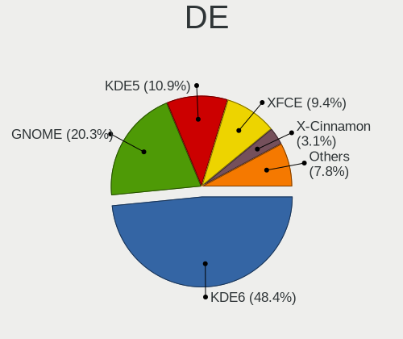
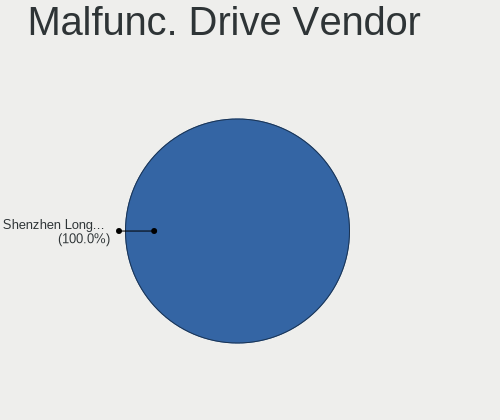
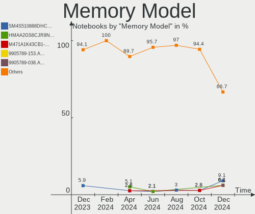

Manjaro Hardware Trends (Notebooks)
-----------------------------------

A project to identify most popular hardware characteristics and track their change
over time based on data collected by Manjaro users at https://Linux-Hardware.org.

Anyone can contribute to this report by the [hw-probe](https://github.com/linuxhw/hw-probe) tool:

    sudo -E hw-probe -all -upload

Full-feature report is available here: https://linux-hardware.org/?view=trends&formfactor=notebook

Period: Jul, 2021.

Contents
--------

* [ System ](#system)
  - [ OS                       ](#os)
  - [ OS Family                ](#os-family)
  - [ Kernel                   ](#kernel)
  - [ Kernel Family            ](#kernel-family)
  - [ Kernel Major Ver.        ](#kernel-major-ver)
  - [ Arch                     ](#arch)
  - [ DE                       ](#de)
  - [ Display Server           ](#display-server)
  - [ Display Manager          ](#display-manager)
  - [ OS Lang                  ](#os-lang)
  - [ Boot Mode                ](#boot-mode)
  - [ Filesystem               ](#filesystem)
  - [ Part. scheme             ](#part-scheme)
  - [ Dual Boot with Linux/BSD ](#dual-boot-with-linuxbsd)
  - [ Dual Boot (Win)          ](#dual-boot-win)

* [ Board ](#board)
  - [ Vendor                   ](#vendor)
  - [ Model                    ](#model)
  - [ Model Family             ](#model-family)
  - [ MFG Year                 ](#mfg-year)
  - [ Form Factor              ](#form-factor)
  - [ Secure Boot              ](#secure-boot)
  - [ Coreboot                 ](#coreboot)
  - [ RAM Size                 ](#ram-size)
  - [ RAM Used                 ](#ram-used)
  - [ Total Drives             ](#total-drives)
  - [ Has CD-ROM               ](#has-cd-rom)
  - [ Has Ethernet             ](#has-ethernet)
  - [ Has WiFi                 ](#has-wifi)
  - [ Has Bluetooth            ](#has-bluetooth)

* [ Location ](#location)
  - [ Country                  ](#country)
  - [ City                     ](#city)

* [ Drives ](#drives)
  - [ Drive Vendor             ](#drive-vendor)
  - [ Drive Model              ](#drive-model)
  - [ HDD Vendor               ](#hdd-vendor)
  - [ SSD Vendor               ](#ssd-vendor)
  - [ Drive Kind               ](#drive-kind)
  - [ Drive Connector          ](#drive-connector)
  - [ Drive Size               ](#drive-size)
  - [ Space Total              ](#space-total)
  - [ Space Used               ](#space-used)
  - [ Malfunc. Drives          ](#malfunc-drives)
  - [ Malfunc. Drive Vendor    ](#malfunc-drive-vendor)
  - [ Malfunc. HDD Vendor      ](#malfunc-hdd-vendor)
  - [ Malfunc. Drive Kind      ](#malfunc-drive-kind)
  - [ Failed Drives            ](#failed-drives)
  - [ Failed Drive Vendor      ](#failed-drive-vendor)
  - [ Drive Status             ](#drive-status)

* [ Storage controller ](#storage-controller)
  - [ Storage Vendor           ](#storage-vendor)
  - [ Storage Model            ](#storage-model)
  - [ Storage Kind             ](#storage-kind)

* [ Processor ](#processor)
  - [ CPU Vendor               ](#cpu-vendor)
  - [ CPU Model                ](#cpu-model)
  - [ CPU Model Family         ](#cpu-model-family)
  - [ CPU Cores                ](#cpu-cores)
  - [ CPU Sockets              ](#cpu-sockets)
  - [ CPU Threads              ](#cpu-threads)
  - [ CPU Op-Modes             ](#cpu-op-modes)
  - [ CPU Microcode            ](#cpu-microcode)
  - [ CPU Microarch            ](#cpu-microarch)

* [ Graphics ](#graphics)
  - [ GPU Vendor               ](#gpu-vendor)
  - [ GPU Model                ](#gpu-model)
  - [ GPU Combo                ](#gpu-combo)
  - [ GPU Driver               ](#gpu-driver)
  - [ GPU Memory               ](#gpu-memory)

* [ Monitor ](#monitor)
  - [ Monitor Vendor           ](#monitor-vendor)
  - [ Monitor Model            ](#monitor-model)
  - [ Monitor Resolution       ](#monitor-resolution)
  - [ Monitor Diagonal         ](#monitor-diagonal)
  - [ Monitor Width            ](#monitor-width)
  - [ Aspect Ratio             ](#aspect-ratio)
  - [ Monitor Area             ](#monitor-area)
  - [ Pixel Density            ](#pixel-density)
  - [ Multiple Monitors        ](#multiple-monitors)

* [ Network ](#network)
  - [ Net Controller Vendor    ](#net-controller-vendor)
  - [ Net Controller Model     ](#net-controller-model)
  - [ Wireless Vendor          ](#wireless-vendor)
  - [ Wireless Model           ](#wireless-model)
  - [ Ethernet Vendor          ](#ethernet-vendor)
  - [ Ethernet Model           ](#ethernet-model)
  - [ Net Controller Kind      ](#net-controller-kind)
  - [ Used Controller          ](#used-controller)
  - [ NICs                     ](#nics)
  - [ IPv6                     ](#ipv6)

* [ Bluetooth ](#bluetooth)
  - [ Bluetooth Vendor         ](#bluetooth-vendor)
  - [ Bluetooth Model          ](#bluetooth-model)

* [ Sound ](#sound)
  - [ Sound Vendor             ](#sound-vendor)
  - [ Sound Model              ](#sound-model)

* [ Memory ](#memory)
  - [ Memory Vendor            ](#memory-vendor)
  - [ Memory Model             ](#memory-model)
  - [ Memory Kind              ](#memory-kind)
  - [ Memory Form Factor       ](#memory-form-factor)
  - [ Memory Size              ](#memory-size)
  - [ Memory Speed             ](#memory-speed)

* [ Printers & scanners ](#printers--scanners)
  - [ Printer Vendor           ](#printer-vendor)
  - [ Printer Model            ](#printer-model)
  - [ Scanner Vendor           ](#scanner-vendor)
  - [ Scanner Model            ](#scanner-model)

* [ Camera ](#camera)
  - [ Camera Vendor            ](#camera-vendor)
  - [ Camera Model             ](#camera-model)

* [ Security ](#security)
  - [ Fingerprint Vendor       ](#fingerprint-vendor)
  - [ Fingerprint Model        ](#fingerprint-model)
  - [ Chipcard Vendor          ](#chipcard-vendor)
  - [ Chipcard Model           ](#chipcard-model)

* [ Unsupported ](#unsupported)
  - [ Unsupported Devices      ](#unsupported-devices)
  - [ Unsupported Device Types ](#unsupported-device-types)

System
------

OS
--

Installed operating systems

| Name                      | Notebooks | Percent |
|---------------------------|-----------|---------|
| Manjaro 21.1.0            | 35        | 33.98%  |
| Manjaro 21.0.7            | 33        | 32.04%  |
| Manjaro                   | 30        | 29.13%  |
| Manjaro 21.0.1            | 2         | 1.94%   |
| Manjaro 21.07-development | 1         | 0.97%   |
| Manjaro 21.0.6            | 1         | 0.97%   |
| Manjaro 21.0              | 1         | 0.97%   |

OS Family
---------

OS without a version

| Name    | Notebooks | Percent |
|---------|-----------|---------|
| Manjaro | 103       | 100%    |

Kernel
------

Version of the Linux kernel

| Version               | Notebooks | Percent |
|-----------------------|-----------|---------|
| 5.10.42-1-MANJARO     | 25        | 24.27%  |
| 5.12.9-1-MANJARO      | 21        | 20.39%  |
| 5.10.49-1-MANJARO     | 10        | 9.71%   |
| 5.10.52-1-MANJARO     | 8         | 7.77%   |
| 5.13.1-3-MANJARO      | 6         | 5.83%   |
| 5.10.53-1-MANJARO     | 5         | 4.85%   |
| 5.13.4-1-MANJARO      | 4         | 3.88%   |
| 5.13.0-1-MANJARO      | 4         | 3.88%   |
| 5.12.19-1-MANJARO     | 3         | 2.91%   |
| 5.13.5-1-MANJARO      | 2         | 1.94%   |
| 5.11.4-1-rt11-MANJARO | 2         | 1.94%   |
| 5.10.26-1-MANJARO     | 2         | 1.94%   |
| 5.4.134-1-MANJARO     | 1         | 0.97%   |
| 5.4.118-1-MANJARO     | 1         | 0.97%   |
| 5.14.0-1-MANJARO      | 1         | 0.97%   |
| 5.12.16-1-MANJARO     | 1         | 0.97%   |
| 5.12.14-lqx2-2-lqx    | 1         | 0.97%   |
| 5.11.22-2-MANJARO     | 1         | 0.97%   |
| 5.11.19-1-MANJARO     | 1         | 0.97%   |
| 5.10.46Cros+          | 1         | 0.97%   |
| 5.10.41-1-MANJARO     | 1         | 0.97%   |
| 5.10.30-1-MANJARO     | 1         | 0.97%   |
| 4.19.193-1-MANJARO    | 1         | 0.97%   |

Kernel Family
-------------

Linux kernel without a distro release

| Version  | Notebooks | Percent |
|----------|-----------|---------|
| 5.10.42  | 25        | 24.27%  |
| 5.12.9   | 21        | 20.39%  |
| 5.10.49  | 10        | 9.71%   |
| 5.10.52  | 8         | 7.77%   |
| 5.13.1   | 6         | 5.83%   |
| 5.10.53  | 5         | 4.85%   |
| 5.13.4   | 4         | 3.88%   |
| 5.13.0   | 4         | 3.88%   |
| 5.12.19  | 3         | 2.91%   |
| 5.13.5   | 2         | 1.94%   |
| 5.11.4   | 2         | 1.94%   |
| 5.10.26  | 2         | 1.94%   |
| 5.4.134  | 1         | 0.97%   |
| 5.4.118  | 1         | 0.97%   |
| 5.14.0   | 1         | 0.97%   |
| 5.12.16  | 1         | 0.97%   |
| 5.12.14  | 1         | 0.97%   |
| 5.11.22  | 1         | 0.97%   |
| 5.11.19  | 1         | 0.97%   |
| 5.10.46  | 1         | 0.97%   |
| 5.10.41  | 1         | 0.97%   |
| 5.10.30  | 1         | 0.97%   |
| 4.19.193 | 1         | 0.97%   |

Kernel Major Ver.
-----------------

Linux kernel major version

| Version | Notebooks | Percent |
|---------|-----------|---------|
| 5.10    | 53        | 51.46%  |
| 5.12    | 26        | 25.24%  |
| 5.13    | 16        | 15.53%  |
| 5.11    | 4         | 3.88%   |
| 5.4     | 2         | 1.94%   |
| 5.14    | 1         | 0.97%   |
| 4.19    | 1         | 0.97%   |

Arch
----

OS architecture (x86_64, i586, etc.)

| Name   | Notebooks | Percent |
|--------|-----------|---------|
| x86_64 | 103       | 100%    |

DE
--

Desktop Environment

| Name                 | Notebooks | Percent |
|----------------------|-----------|---------|
| GNOME                | 26        | 25.24%  |
| KDE5                 | 24        | 23.3%   |
| XFCE                 | 21        | 20.39%  |
| KDE                  | 11        | 10.68%  |
| i3                   | 6         | 5.83%   |
| X-Cinnamon           | 4         | 3.88%   |
| Unknown              | 4         | 3.88%   |
| MATE                 | 2         | 1.94%   |
| Deepin               | 2         | 1.94%   |
| Cinnamon             | 2         | 1.94%   |
| swayLANG=en_CA.UTF-8 | 1         | 0.97%   |

Display Server
--------------

X11 or Wayland

| Name    | Notebooks | Percent |
|---------|-----------|---------|
| X11     | 79        | 76.7%   |
| Wayland | 20        | 19.42%  |
| Unknown | 4         | 3.88%   |

Display Manager
---------------

SDDM, LightDM, etc.

| Name    | Notebooks | Percent |
|---------|-----------|---------|
| Unknown | 31        | 30.1%   |
| SDDM    | 29        | 28.16%  |
| GDM     | 22        | 21.36%  |
| LightDM | 19        | 18.45%  |
| TDM     | 2         | 1.94%   |

OS Lang
-------

Language

| Lang    | Notebooks | Percent |
|---------|-----------|---------|
| en_US   | 49        | 47.57%  |
| en_GB   | 12        | 11.65%  |
| ru_RU   | 6         | 5.83%   |
| pt_BR   | 5         | 4.85%   |
| de_DE   | 4         | 3.88%   |
| pl_PL   | 3         | 2.91%   |
| en_IN   | 3         | 2.91%   |
| fr_FR   | 2         | 1.94%   |
| fi_FI   | 2         | 1.94%   |
| es_CL   | 2         | 1.94%   |
| en_IE   | 2         | 1.94%   |
| en_CA   | 2         | 1.94%   |
| zh_HK   | 1         | 0.97%   |
| sv_SE   | 1         | 0.97%   |
| ru_UA   | 1         | 0.97%   |
| pt_PT   | 1         | 0.97%   |
| id_ID   | 1         | 0.97%   |
| es_ES   | 1         | 0.97%   |
| es_CO   | 1         | 0.97%   |
| en_AU   | 1         | 0.97%   |
| el_GR   | 1         | 0.97%   |
| cs_CZ   | 1         | 0.97%   |
| Unknown | 1         | 0.97%   |

Boot Mode
---------

EFI or BIOS

| Mode | Notebooks | Percent |
|------|-----------|---------|
| EFI  | 68        | 66.02%  |
| BIOS | 35        | 33.98%  |

Filesystem
----------

Type of filesystem

| Type    | Notebooks | Percent |
|---------|-----------|---------|
| Ext4    | 81        | 78.64%  |
| Btrfs   | 13        | 12.62%  |
| Overlay | 8         | 7.77%   |
| Xfs     | 1         | 0.97%   |

Part. scheme
------------

Scheme of partitioning

| Type    | Notebooks | Percent |
|---------|-----------|---------|
| GPT     | 66        | 64.08%  |
| Unknown | 29        | 28.16%  |
| MBR     | 8         | 7.77%   |

Dual Boot with Linux/BSD
------------------------

Hosting more than one Linux/BSD

| Dual boot | Notebooks | Percent |
|-----------|-----------|---------|
| No        | 95        | 92.23%  |
| Yes       | 8         | 7.77%   |

Dual Boot (Win)
---------------

Hosting Linux and Windows

| Dual boot | Notebooks | Percent |
|-----------|-----------|---------|
| No        | 64        | 62.14%  |
| Yes       | 39        | 37.86%  |

Board
-----

Vendor
------

Motherboard manufacturer

| Name                | Notebooks | Percent |
|---------------------|-----------|---------|
| Lenovo              | 35        | 33.98%  |
| Dell                | 14        | 13.59%  |
| Hewlett-Packard     | 11        | 10.68%  |
| ASUSTek Computer    | 10        | 9.71%   |
| Acer                | 10        | 9.71%   |
| MSI                 | 4         | 3.88%   |
| Samsung Electronics | 3         | 2.91%   |
| Timi                | 2         | 1.94%   |
| Apple               | 2         | 1.94%   |
| TUXEDO              | 1         | 0.97%   |
| Toshiba             | 1         | 0.97%   |
| Teclast             | 1         | 0.97%   |
| Star Labs           | 1         | 0.97%   |
| Sony                | 1         | 0.97%   |
| Semp Toshiba        | 1         | 0.97%   |
| Packard Bell        | 1         | 0.97%   |
| Notebook            | 1         | 0.97%   |
| HONOR               | 1         | 0.97%   |
| Google              | 1         | 0.97%   |
| Gigabyte Technology | 1         | 0.97%   |
| Unknown             | 1         | 0.97%   |

Model
-----

Motherboard model

| Name                                       | Notebooks | Percent |
|--------------------------------------------|-----------|---------|
| Lenovo Legion 5 15ACH6H 82JU               | 2         | 1.94%   |
| Lenovo IdeaPad 5 15ARE05 81YQ              | 2         | 1.94%   |
| Lenovo IdeaPad 3 15IIL05 81WE              | 2         | 1.94%   |
| Dell Inspiron 3542                         | 2         | 1.94%   |
| Acer Swift SF314-42                        | 2         | 1.94%   |
| TUXEDO Pulse 14 Gen1                       | 1         | 0.97%   |
| Toshiba Satellite C50-B                    | 1         | 0.97%   |
| Timi RedmiBook 13 R                        | 1         | 0.97%   |
| Timi A35S                                  | 1         | 0.97%   |
| Teclast TbooK 10 S                         | 1         | 0.97%   |
| Star Labs LabTop                           | 1         | 0.97%   |
| Sony VGN-SR11MR                            | 1         | 0.97%   |
| Semp Toshiba IS 1412                       | 1         | 0.97%   |
| Samsung R530/R730                          | 1         | 0.97%   |
| Samsung 520U4C/520U4X                      | 1         | 0.97%   |
| Samsung 350V5C/351V5C/3540VC/3440VC        | 1         | 0.97%   |
| Packard Bell EasyNote TV11HC               | 1         | 0.97%   |
| Notebook NV4XMB,ME,MZ                      | 1         | 0.97%   |
| MSI PS42 8RB                               | 1         | 0.97%   |
| MSI Prestige 14 A10SC                      | 1         | 0.97%   |
| MSI GL63 8RD                               | 1         | 0.97%   |
| MSI GF65 Thin 9SEXR                        | 1         | 0.97%   |
| Lenovo Yoga Slim 7 14ARE05 82A2            | 1         | 0.97%   |
| Lenovo XiaoXinAir 14+ ACN 2021 82L7        | 1         | 0.97%   |
| Lenovo ThinkPad X1 Carbon Gen 8 20UASBBC00 | 1         | 0.97%   |
| Lenovo ThinkPad T470 20HES0FX00            | 1         | 0.97%   |
| Lenovo ThinkPad T420 423663G               | 1         | 0.97%   |
| Lenovo ThinkPad T410 2537KR6               | 1         | 0.97%   |
| Lenovo ThinkPad T14s Gen 1 20T1S2WF00      | 1         | 0.97%   |
| Lenovo ThinkPad P53 20QQS0LW00             | 1         | 0.97%   |
| Lenovo ThinkPad E15 Gen 2 20T9S0B500       | 1         | 0.97%   |
| Lenovo ThinkPad E15 Gen 2 20T8CTO1WW       | 1         | 0.97%   |
| Lenovo ThinkPad E15 20RD0086UE             | 1         | 0.97%   |
| Lenovo ThinkPad E14 Gen 3 20Y7003XGE       | 1         | 0.97%   |
| Lenovo ThinkPad E14 Gen 2 20T7S00W00       | 1         | 0.97%   |
| Lenovo ThinkBook 14-IML 20RV               | 1         | 0.97%   |
| Lenovo Legion 5 82B5                       | 1         | 0.97%   |
| Lenovo Legion 5 15ARH05 82B5               | 1         | 0.97%   |
| Lenovo IdeaPad S540-15IWL GTX 81SW         | 1         | 0.97%   |
| Lenovo IdeaPad S510p 20298                 | 1         | 0.97%   |
| Lenovo IdeaPad S340-14IIL 81VV             | 1         | 0.97%   |
| Lenovo IdeaPad L340-15IRH Gaming 81LK      | 1         | 0.97%   |
| Lenovo IdeaPad Gaming 3 15ARH05 82EY       | 1         | 0.97%   |
| Lenovo IdeaPad 5 14ARE05 81YM              | 1         | 0.97%   |
| Lenovo IdeaPad 330S-15IKB 81F5             | 1         | 0.97%   |
| Lenovo IdeaPad 330-15IKB 81FE              | 1         | 0.97%   |
| Lenovo IdeaPad 120S-14IAP 81A5             | 1         | 0.97%   |
| Lenovo G770 1037                           | 1         | 0.97%   |
| Lenovo G580 20150                          | 1         | 0.97%   |
| Lenovo G50-80 80E5                         | 1         | 0.97%   |
| Lenovo G40-45 80E1                         | 1         | 0.97%   |
| HONOR NBD-WXX9                             | 1         | 0.97%   |
| HP ProBook 440 G7                          | 1         | 0.97%   |
| HP Pavilion Gaming Laptop 15-cx0xxx        | 1         | 0.97%   |
| HP Notebook                                | 1         | 0.97%   |
| HP Laptop 15-da2xxx                        | 1         | 0.97%   |
| HP Laptop 14s-dk0xxx                       | 1         | 0.97%   |
| HP ENVY 15                                 | 1         | 0.97%   |
| HP EliteBook Folio 1040 G3                 | 1         | 0.97%   |
| HP EliteBook 8470p                         | 1         | 0.97%   |

Model Family
------------

Motherboard model prefix

| Name                  | Notebooks | Percent |
|-----------------------|-----------|---------|
| Lenovo IdeaPad        | 13        | 12.62%  |
| Lenovo ThinkPad       | 11        | 10.68%  |
| Dell Inspiron         | 7         | 6.8%    |
| Acer Aspire           | 7         | 6.8%    |
| Lenovo Legion         | 4         | 3.88%   |
| Dell XPS              | 3         | 2.91%   |
| HP Laptop             | 2         | 1.94%   |
| HP EliteBook          | 2         | 1.94%   |
| HP 255                | 2         | 1.94%   |
| Dell Latitude         | 2         | 1.94%   |
| ASUS ZenBook          | 2         | 1.94%   |
| ASUS VivoBook         | 2         | 1.94%   |
| Acer Swift            | 2         | 1.94%   |
| TUXEDO Pulse          | 1         | 0.97%   |
| Toshiba Satellite     | 1         | 0.97%   |
| Timi RedmiBook        | 1         | 0.97%   |
| Timi A35S             | 1         | 0.97%   |
| Teclast TbooK         | 1         | 0.97%   |
| Star Labs LabTop      | 1         | 0.97%   |
| Sony VGN-SR11MR       | 1         | 0.97%   |
| Semp Toshiba IS       | 1         | 0.97%   |
| Samsung R530          | 1         | 0.97%   |
| Samsung 520U4C        | 1         | 0.97%   |
| Samsung 350V5C        | 1         | 0.97%   |
| Packard Bell EasyNote | 1         | 0.97%   |
| Notebook NV4XMB       | 1         | 0.97%   |
| MSI PS42              | 1         | 0.97%   |
| MSI Prestige          | 1         | 0.97%   |
| MSI GL63              | 1         | 0.97%   |
| MSI GF65              | 1         | 0.97%   |
| Lenovo Yoga           | 1         | 0.97%   |
| Lenovo XiaoXinAir     | 1         | 0.97%   |
| Lenovo ThinkBook      | 1         | 0.97%   |
| Lenovo G770           | 1         | 0.97%   |
| Lenovo G580           | 1         | 0.97%   |
| Lenovo G50-80         | 1         | 0.97%   |
| Lenovo G40-45         | 1         | 0.97%   |
| HONOR NBD-WXX9        | 1         | 0.97%   |
| HP ProBook            | 1         | 0.97%   |
| HP Pavilion           | 1         | 0.97%   |
| HP Notebook           | 1         | 0.97%   |
| HP ENVY               | 1         | 0.97%   |
| HP Elite              | 1         | 0.97%   |
| Google Ekko           | 1         | 0.97%   |
| Gigabyte AERO         | 1         | 0.97%   |
| Dell Vostro           | 1         | 0.97%   |
| Dell Precision        | 1         | 0.97%   |
| ASUS X540LA           | 1         | 0.97%   |
| ASUS TUF              | 1         | 0.97%   |
| ASUS ROG              | 1         | 0.97%   |
| ASUS K73BY            | 1         | 0.97%   |
| ASUS K401UQ           | 1         | 0.97%   |
| ASUS G751JT           | 1         | 0.97%   |
| Apple MacBookAir7     | 1         | 0.97%   |
| Apple MacBookAir5     | 1         | 0.97%   |
| Acer TravelMate       | 1         | 0.97%   |
| Unknown               | 1         | 0.97%   |

MFG Year
--------

Motherboard manufacture year

| Year | Notebooks | Percent |
|------|-----------|---------|
| 2020 | 33        | 32.04%  |
| 2021 | 26        | 25.24%  |
| 2013 | 8         | 7.77%   |
| 2019 | 7         | 6.8%    |
| 2018 | 7         | 6.8%    |
| 2016 | 6         | 5.83%   |
| 2015 | 3         | 2.91%   |
| 2014 | 3         | 2.91%   |
| 2011 | 3         | 2.91%   |
| 2009 | 3         | 2.91%   |
| 2017 | 2         | 1.94%   |
| 2012 | 1         | 0.97%   |
| 2010 | 1         | 0.97%   |

Form Factor
-----------

Physical design of the computer

| Name     | Notebooks | Percent |
|----------|-----------|---------|
| Notebook | 103       | 100%    |

Secure Boot
-----------

Enabled or disabled

| State    | Notebooks | Percent |
|----------|-----------|---------|
| Disabled | 102       | 99.03%  |
| Enabled  | 1         | 0.97%   |

Coreboot
--------

Have coreboot on board

| Used | Notebooks | Percent |
|------|-----------|---------|
| No   | 101       | 98.06%  |
| Yes  | 2         | 1.94%   |

RAM Size
--------

Total RAM memory

| Size in GB  | Notebooks | Percent |
|-------------|-----------|---------|
| 4.01-8.0    | 34        | 33.01%  |
| 8.01-16.0   | 26        | 25.24%  |
| 16.01-24.0  | 19        | 18.45%  |
| 3.01-4.0    | 13        | 12.62%  |
| 32.01-64.0  | 6         | 5.83%   |
| 24.01-32.0  | 2         | 1.94%   |
| 1.01-2.0    | 2         | 1.94%   |
| 64.01-256.0 | 1         | 0.97%   |

RAM Used
--------

Used RAM memory

| Used GB    | Notebooks | Percent |
|------------|-----------|---------|
| 2.01-3.0   | 26        | 25.24%  |
| 1.01-2.0   | 26        | 25.24%  |
| 3.01-4.0   | 25        | 24.27%  |
| 4.01-8.0   | 16        | 15.53%  |
| 8.01-16.0  | 6         | 5.83%   |
| 0.51-1.0   | 3         | 2.91%   |
| 16.01-24.0 | 1         | 0.97%   |

Total Drives
------------

Number of drives on board

| Drives | Notebooks | Percent |
|--------|-----------|---------|
| 1      | 74        | 71.84%  |
| 2      | 26        | 25.24%  |
| 3      | 2         | 1.94%   |
| 0      | 1         | 0.97%   |

Has CD-ROM
----------

Has CD-ROM on board

| Presented | Notebooks | Percent |
|-----------|-----------|---------|
| No        | 80        | 77.67%  |
| Yes       | 23        | 22.33%  |

Has Ethernet
------------

Has Ethernet on board

| Presented | Notebooks | Percent |
|-----------|-----------|---------|
| Yes       | 72        | 69.9%   |
| No        | 31        | 30.1%   |

Has WiFi
--------

Has WiFi module

| Presented | Notebooks | Percent |
|-----------|-----------|---------|
| Yes       | 102       | 99.03%  |
| No        | 1         | 0.97%   |

Has Bluetooth
-------------

Has Bluetooth module

| Presented | Notebooks | Percent |
|-----------|-----------|---------|
| Yes       | 88        | 85.44%  |
| No        | 15        | 14.56%  |

Location
--------

Country
-------

Geographic location (country)

| Country     | Notebooks | Percent |
|-------------|-----------|---------|
| Germany     | 10        | 9.71%   |
| Brazil      | 9         | 8.74%   |
| USA         | 8         | 7.77%   |
| Russia      | 8         | 7.77%   |
| Ukraine     | 5         | 4.85%   |
| UK          | 5         | 4.85%   |
| India       | 4         | 3.88%   |
| Poland      | 3         | 2.91%   |
| Malaysia    | 3         | 2.91%   |
| Indonesia   | 3         | 2.91%   |
| France      | 3         | 2.91%   |
| Finland     | 3         | 2.91%   |
| Chile       | 3         | 2.91%   |
| Canada      | 3         | 2.91%   |
| Austria     | 3         | 2.91%   |
| Netherlands | 2         | 1.94%   |
| Mexico      | 2         | 1.94%   |
| Ireland     | 2         | 1.94%   |
| Greece      | 2         | 1.94%   |
| Czechia     | 2         | 1.94%   |
| Colombia    | 2         | 1.94%   |
| Uzbekistan  | 1         | 0.97%   |
| Turkey      | 1         | 0.97%   |
| Switzerland | 1         | 0.97%   |
| Sweden      | 1         | 0.97%   |
| Spain       | 1         | 0.97%   |
| Portugal    | 1         | 0.97%   |
| Oman        | 1         | 0.97%   |
| Norway      | 1         | 0.97%   |
| Myanmar     | 1         | 0.97%   |
| Italy       | 1         | 0.97%   |
| Iraq        | 1         | 0.97%   |
| Hungary     | 1         | 0.97%   |
| Hong Kong   | 1         | 0.97%   |
| Croatia     | 1         | 0.97%   |
| China       | 1         | 0.97%   |
| Belarus     | 1         | 0.97%   |
| Australia   | 1         | 0.97%   |
| Argentina   | 1         | 0.97%   |

City
----

Geographic location (city)

| City                  | Notebooks | Percent |
|-----------------------|-----------|---------|
| Moscow                | 3         | 2.91%   |
| Kuala Lumpur          | 3         | 2.91%   |
| Winnipeg              | 2         | 1.94%   |
| Tijuana               | 2         | 1.94%   |
| São Paulo            | 2         | 1.94%   |
| St Petersburg         | 2         | 1.94%   |
| Campo Grande          | 2         | 1.94%   |
| Zagreb                | 1         | 0.97%   |
| Yangon                | 1         | 0.97%   |
| Wolverhampton         | 1         | 0.97%   |
| Winterswijk           | 1         | 0.97%   |
| Watertown             | 1         | 0.97%   |
| Warsaw                | 1         | 0.97%   |
| Waldbronn             | 1         | 0.97%   |
| Vyshneve              | 1         | 0.97%   |
| Volgograd             | 1         | 0.97%   |
| Vienna                | 1         | 0.97%   |
| Toronto               | 1         | 0.97%   |
| Tilburg               | 1         | 0.97%   |
| Tegalgede             | 1         | 0.97%   |
| Tashkent              | 1         | 0.97%   |
| Tampere               | 1         | 0.97%   |
| Szigetszentmiklos     | 1         | 0.97%   |
| Sulaymaniyah          | 1         | 0.97%   |
| Sparti                | 1         | 0.97%   |
| Souligne-sous-Ballon  | 1         | 0.97%   |
| Santiago              | 1         | 0.97%   |
| Santa Cruz            | 1         | 0.97%   |
| Sacavem               | 1         | 0.97%   |
| Rouen                 | 1         | 0.97%   |
| Rostov-on-Don         | 1         | 0.97%   |
| Rosbach vor der Hoehe | 1         | 0.97%   |
| Prague                | 1         | 0.97%   |
| P??trai               | 1         | 0.97%   |
| Ostrava               | 1         | 0.97%   |
| OEsmo                 | 1         | 0.97%   |
| Neckarbischofsheim    | 1         | 0.97%   |
| Muscat                | 1         | 0.97%   |
| Mumbai                | 1         | 0.97%   |
| Minsk                 | 1         | 0.97%   |
| Minneapolis           | 1         | 0.97%   |
| Miami                 | 1         | 0.97%   |
| Medellín             | 1         | 0.97%   |
| Mattsee               | 1         | 0.97%   |
| Malbork               | 1         | 0.97%   |
| Maipu                 | 1         | 0.97%   |
| Maceió               | 1         | 0.97%   |
| Londrina              | 1         | 0.97%   |
| London                | 1         | 0.97%   |
| Lewiston              | 1         | 0.97%   |
| Lemoore               | 1         | 0.97%   |
| Leicester             | 1         | 0.97%   |
| L?ˆ™Aquila            | 1         | 0.97%   |
| Lambersart            | 1         | 0.97%   |
| Kyiv                  | 1         | 0.97%   |
| Kopervik              | 1         | 0.97%   |
| Kolkata               | 1         | 0.97%   |
| Kharkiv               | 1         | 0.97%   |
| Jakarta               | 1         | 0.97%   |
| Istanbul              | 1         | 0.97%   |

Drives
------

Drive Vendor
------------

Hard drive vendors

| Vendor                    | Notebooks | Drives | Percent |
|---------------------------|-----------|--------|---------|
| Samsung Electronics       | 21        | 22     | 16.54%  |
| WDC                       | 17        | 17     | 13.39%  |
| Toshiba                   | 17        | 19     | 13.39%  |
| SanDisk                   | 10        | 10     | 7.87%   |
| Unknown                   | 8         | 8      | 6.3%    |
| SK Hynix                  | 8         | 8      | 6.3%    |
| Seagate                   | 7         | 7      | 5.51%   |
| Micron Technology         | 4         | 4      | 3.15%   |
| Phison                    | 3         | 3      | 2.36%   |
| Kingston                  | 3         | 3      | 2.36%   |
| HGST                      | 3         | 3      | 2.36%   |
| Apple                     | 3         | 3      | 2.36%   |
| Silicon Motion            | 2         | 2      | 1.57%   |
| KIOXIA                    | 2         | 2      | 1.57%   |
| JMicron                   | 2         | 2      | 1.57%   |
| Intel                     | 2         | 2      | 1.57%   |
| GOODRAM                   | 2         | 2      | 1.57%   |
| Crucial                   | 2         | 2      | 1.57%   |
| A-DATA Technology         | 2         | 2      | 1.57%   |
| Union Memory (Shenzhen)   | 1         | 1      | 0.79%   |
| Solid State Storage       | 1         | 1      | 0.79%   |
| Micron/Crucial Technology | 1         | 1      | 0.79%   |
| LITEON                    | 1         | 1      | 0.79%   |
| Lite-On                   | 1         | 1      | 0.79%   |
| Lenovo                    | 1         | 2      | 0.79%   |
| Hewlett-Packard           | 1         | 1      | 0.79%   |
| External                  | 1         | 1      | 0.79%   |
| Apacer                    | 1         | 1      | 0.79%   |

Drive Model
-----------

Hard drive models

| Model                                        | Notebooks | Percent |
|----------------------------------------------|-----------|---------|
| Toshiba MQ04ABF100 1TB                       | 3         | 2.33%   |
| Toshiba MQ01ABD100 1TB                       | 3         | 2.33%   |
| Toshiba NVMe SSD Drive 512GB                 | 2         | 1.55%   |
| Toshiba MQ01ABF050 500GB                     | 2         | 1.55%   |
| SK Hynix NVMe SSD Drive 512GB                | 2         | 1.55%   |
| SK Hynix NVMe SSD Drive 256GB                | 2         | 1.55%   |
| Seagate ST1000LM035-1RK172 1TB               | 2         | 1.55%   |
| Seagate ST1000LM024 HN-M101MBB 1TB           | 2         | 1.55%   |
| Samsung SSD 850 EVO 500GB                    | 2         | 1.55%   |
| Samsung NVMe SSD Drive 512GB                 | 2         | 1.55%   |
| Samsung MZVLB512HBJQ-000L2 512GB             | 2         | 1.55%   |
| WDC WDS500G2B0A-00SM50 500GB SSD             | 1         | 0.78%   |
| WDC WDS100T3X0C-00SJG0 1TB                   | 1         | 0.78%   |
| WDC WD5000LPCX-24C6HT0 500GB                 | 1         | 0.78%   |
| WDC WD2500BPVT-75JJ5T0 250GB                 | 1         | 0.78%   |
| WDC WD10SPZX-75Z10T1 1TB                     | 1         | 0.78%   |
| WDC WD10SPZX-60Z10T0 1TB                     | 1         | 0.78%   |
| WDC WD10SPZX-21Z10T0 1TB                     | 1         | 0.78%   |
| WDC WD10JPVX-60JC3T0 1TB                     | 1         | 0.78%   |
| WDC WD10JPVX-22JC3T0 1TB                     | 1         | 0.78%   |
| WDC PC SN730 SDBQNTY-1T00-1001 1TB           | 1         | 0.78%   |
| WDC PC SN730 SDBPNTY-512G-1101 512GB         | 1         | 0.78%   |
| WDC PC SN730 SDBPNTY-512G-1027 512GB         | 1         | 0.78%   |
| WDC PC SN530 SDBPMPZ-512G-1101 512GB         | 1         | 0.78%   |
| WDC PC SN530 SDBPMPZ-512G-1001 512GB         | 1         | 0.78%   |
| WDC PC SN530 SDBPMPZ-256G-1001 256GB         | 1         | 0.78%   |
| WDC PC SN520 SDAPNUW-256G-1006 256GB         | 1         | 0.78%   |
| WDC PC SN520 SDAPNUW-256G-1002 256GB         | 1         | 0.78%   |
| Unknown Y032V  32GB                          | 1         | 0.78%   |
| Unknown USDU1  121GB                         | 1         | 0.78%   |
| Unknown SN128  128GB                         | 1         | 0.78%   |
| Unknown SC32G  32GB                          | 1         | 0.78%   |
| Unknown NVMe SSD Drive 256GB                 | 1         | 0.78%   |
| Unknown MMC Card  64GB                       | 1         | 0.78%   |
| Unknown MMC Card  16GB                       | 1         | 0.78%   |
| Unknown DA4128  128GB                        | 1         | 0.78%   |
| Union Memory (Shenzhen) NVMe SSD Drive 256GB | 1         | 0.78%   |
| Toshiba TR200 480GB SSD                      | 1         | 0.78%   |
| Toshiba MQ02ABD100H 1TB                      | 1         | 0.78%   |
| Toshiba MQ01ABD050V 500GB                    | 1         | 0.78%   |
| Toshiba MK6459GSXP 640GB                     | 1         | 0.78%   |
| Toshiba MK2555GSX 250GB                      | 1         | 0.78%   |
| Toshiba MK2546GSX 200 200GB                  | 1         | 0.78%   |
| Toshiba KXG60ZNV1T02 NVMe KIOXIA 1024GB      | 1         | 0.78%   |
| Toshiba KBG40ZMT128G MEMORY 128GB            | 1         | 0.78%   |
| Solid State Storage SSSTC CL1-4D512 512GB    | 1         | 0.78%   |
| SK Hynix SKHynix_HFS001TDE9X081N 1TB         | 1         | 0.78%   |
| SK Hynix HFM512GDJTNI-82A0A 512GB            | 1         | 0.78%   |
| SK Hynix HFM256GDJTNG-8310A 256GB            | 1         | 0.78%   |
| SK Hynix HFM001TD3JX013N 1TB                 | 1         | 0.78%   |
| Silicon Motion NVMe SSD Drive 512GB          | 1         | 0.78%   |
| Silicon Motion NVMe SSD Drive 500GB          | 1         | 0.78%   |
| Seagate ST9250410AS 250GB                    | 1         | 0.78%   |
| Seagate ST500LT012-9WS142 500GB              | 1         | 0.78%   |
| Seagate ST1000LM049-2GH172 1TB               | 1         | 0.78%   |
| SanDisk X400 M.2 2280 256GB SSD              | 1         | 0.78%   |
| SanDisk SDSSDH3 4T00 4TB                     | 1         | 0.78%   |
| SanDisk SDSSDA480G 480GB                     | 1         | 0.78%   |
| SanDisk SD9SN8W256G1102 256GB SSD            | 1         | 0.78%   |
| SanDisk SD7SN6S-128G-1006 128GB SSD          | 1         | 0.78%   |

HDD Vendor
----------

Hard disk drive vendors

| Vendor              | Notebooks | Drives | Percent |
|---------------------|-----------|--------|---------|
| Toshiba             | 13        | 13     | 40.63%  |
| WDC                 | 7         | 7      | 21.88%  |
| Seagate             | 7         | 7      | 21.88%  |
| HGST                | 3         | 3      | 9.38%   |
| Samsung Electronics | 1         | 1      | 3.13%   |
| Apple               | 1         | 1      | 3.13%   |

SSD Vendor
----------

Solid state drive vendors

| Vendor              | Notebooks | Drives | Percent |
|---------------------|-----------|--------|---------|
| Samsung Electronics | 7         | 7      | 25.93%  |
| SanDisk             | 5         | 5      | 18.52%  |
| Micron Technology   | 2         | 2      | 7.41%   |
| Kingston            | 2         | 2      | 7.41%   |
| GOODRAM             | 2         | 2      | 7.41%   |
| Apple               | 2         | 2      | 7.41%   |
| WDC                 | 1         | 1      | 3.7%    |
| Toshiba             | 1         | 1      | 3.7%    |
| LITEON              | 1         | 1      | 3.7%    |
| JMicron             | 1         | 1      | 3.7%    |
| Hewlett-Packard     | 1         | 1      | 3.7%    |
| Crucial             | 1         | 1      | 3.7%    |
| Apacer              | 1         | 1      | 3.7%    |

Drive Kind
----------

HDD or SSD

| Kind    | Notebooks | Drives | Percent |
|---------|-----------|--------|---------|
| NVMe    | 55        | 63     | 45.08%  |
| HDD     | 32        | 32     | 26.23%  |
| SSD     | 27        | 27     | 22.13%  |
| MMC     | 7         | 8      | 5.74%   |
| Unknown | 1         | 1      | 0.82%   |

Drive Connector
---------------

SATA, SAS, NVMe, etc.

| Type | Notebooks | Drives | Percent |
|------|-----------|--------|---------|
| NVMe | 55        | 62     | 46.61%  |
| SATA | 52        | 57     | 44.07%  |
| MMC  | 7         | 8      | 5.93%   |
| SAS  | 4         | 4      | 3.39%   |

Drive Size
----------

Size of hard drive

| Size in TB | Notebooks | Drives | Percent |
|------------|-----------|--------|---------|
| 0.01-0.5   | 33        | 34     | 56.9%   |
| 0.51-1.0   | 24        | 24     | 41.38%  |
| 3.01-4.0   | 1         | 1      | 1.72%   |

Space Total
-----------

Amount of disk space available on the file system

| Size in GB     | Notebooks | Percent |
|----------------|-----------|---------|
| 101-250        | 26        | 25.24%  |
| 251-500        | 21        | 20.39%  |
| 501-1000       | 19        | 18.45%  |
| 1-20           | 12        | 11.65%  |
| 1001-2000      | 9         | 8.74%   |
| 51-100         | 7         | 6.8%    |
| Unknown        | 6         | 5.83%   |
| More than 3000 | 2         | 1.94%   |
| 21-50          | 1         | 0.97%   |

Space Used
----------

Amount of used disk space

| Used GB   | Notebooks | Percent |
|-----------|-----------|---------|
| 1-20      | 30        | 29.13%  |
| 101-250   | 25        | 24.27%  |
| 21-50     | 20        | 19.42%  |
| 251-500   | 10        | 9.71%   |
| 51-100    | 8         | 7.77%   |
| Unknown   | 6         | 5.83%   |
| 1001-2000 | 2         | 1.94%   |
| 501-1000  | 2         | 1.94%   |

Malfunc. Drives
---------------

Drive models with a malfunction

| Model                              | Notebooks | Drives | Percent |
|------------------------------------|-----------|--------|---------|
| WDC WD2500BPVT-75JJ5T0 250GB       | 1         | 1      | 20%     |
| Toshiba MK6459GSXP 640GB           | 1         | 1      | 20%     |
| Seagate ST500LT012-9WS142 500GB    | 1         | 1      | 20%     |
| Seagate ST1000LM024 HN-M101MBB 1TB | 1         | 1      | 20%     |
| Apple SSD TS128E 121GB             | 1         | 1      | 20%     |

Malfunc. Drive Vendor
---------------------

Vendors of faulty drives

| Vendor  | Notebooks | Drives | Percent |
|---------|-----------|--------|---------|
| Seagate | 2         | 2      | 40%     |
| WDC     | 1         | 1      | 20%     |
| Toshiba | 1         | 1      | 20%     |
| Apple   | 1         | 1      | 20%     |

Malfunc. HDD Vendor
-------------------

Vendors of faulty HDD drives

| Vendor  | Notebooks | Drives | Percent |
|---------|-----------|--------|---------|
| Seagate | 2         | 2      | 50%     |
| WDC     | 1         | 1      | 25%     |
| Toshiba | 1         | 1      | 25%     |

Malfunc. Drive Kind
-------------------

Kinds of faulty drives

| Kind | Notebooks | Drives | Percent |
|------|-----------|--------|---------|
| HDD  | 4         | 4      | 80%     |
| SSD  | 1         | 1      | 20%     |

Failed Drives
-------------

Failed drive models

Zero info for selected period =(

Failed Drive Vendor
-------------------

Failed drive vendors

Zero info for selected period =(

Drive Status
------------

Number of failed and malfunc. drives

| Status   | Notebooks | Drives | Percent |
|----------|-----------|--------|---------|
| Detected | 57        | 72     | 52.78%  |
| Works    | 46        | 54     | 42.59%  |
| Malfunc  | 5         | 5      | 4.63%   |

Storage controller
------------------

Storage Vendor
--------------

Storage controller vendors

| Vendor                         | Notebooks | Percent |
|--------------------------------|-----------|---------|
| Intel                          | 54        | 40%     |
| AMD                            | 23        | 17.04%  |
| Samsung Electronics            | 14        | 10.37%  |
| Sandisk                        | 13        | 9.63%   |
| SK Hynix                       | 8         | 5.93%   |
| Toshiba America Info Systems   | 3         | 2.22%   |
| Phison Electronics             | 3         | 2.22%   |
| KIOXIA                         | 3         | 2.22%   |
| Solid State Storage Technology | 2         | 1.48%   |
| Silicon Motion                 | 2         | 1.48%   |
| Micron/Crucial Technology      | 2         | 1.48%   |
| Micron Technology              | 2         | 1.48%   |
| ADATA Technology               | 2         | 1.48%   |
| Union Memory (Shenzhen)        | 1         | 0.74%   |
| Lite-On Technology             | 1         | 0.74%   |
| Lenovo                         | 1         | 0.74%   |
| Kingston Technology Company    | 1         | 0.74%   |

Storage Model
-------------

Storage controller models

| Model                                                                            | Notebooks | Percent |
|----------------------------------------------------------------------------------|-----------|---------|
| AMD FCH SATA Controller [AHCI mode]                                              | 21        | 15.22%  |
| Intel Sunrise Point-LP SATA Controller [AHCI mode]                               | 10        | 7.25%   |
| Samsung NVMe SSD Controller SM981/PM981/PM983                                    | 9         | 6.52%   |
| Intel 7 Series Chipset Family 6-port SATA Controller [AHCI mode]                 | 6         | 4.35%   |
| SK Hynix BC511                                                                   | 5         | 3.62%   |
| Sandisk WD Black SN750 / PC SN730 NVMe SSD                                       | 5         | 3.62%   |
| Sandisk Non-Volatile memory controller                                           | 4         | 2.9%    |
| Intel Comet Lake SATA AHCI Controller                                            | 4         | 2.9%    |
| Intel Cannon Lake Mobile PCH SATA AHCI Controller                                | 4         | 2.9%    |
| Sandisk WD Blue SN500 / PC SN520 NVMe SSD                                        | 3         | 2.17%   |
| Samsung NVMe Controller                                                          | 3         | 2.17%   |
| KIOXIA Non-Volatile memory controller                                            | 3         | 2.17%   |
| Intel Wildcat Point-LP SATA Controller [AHCI Mode]                               | 3         | 2.17%   |
| Intel Ice Lake-LP SATA Controller [AHCI mode]                                    | 3         | 2.17%   |
| Intel 82801 Mobile SATA Controller [RAID mode]                                   | 3         | 2.17%   |
| Intel 8 Series SATA Controller 1 [AHCI mode]                                     | 3         | 2.17%   |
| Intel 6 Series/C200 Series Chipset Family 6 port Mobile SATA AHCI Controller     | 3         | 2.17%   |
| Toshiba America Info Systems XG6 NVMe SSD Controller                             | 2         | 1.45%   |
| Solid State Storage Non-Volatile memory controller                               | 2         | 1.45%   |
| SK Hynix NVMe SSD Controller                                                     | 2         | 1.45%   |
| Phison E12 NVMe Controller                                                       | 2         | 1.45%   |
| Micron Non-Volatile memory controller                                            | 2         | 1.45%   |
| Intel SSD 660P Series                                                            | 2         | 1.45%   |
| Intel Cannon Point-LP SATA Controller [AHCI Mode]                                | 2         | 1.45%   |
| Intel 82801IBM/IEM (ICH9M/ICH9M-E) 4 port SATA Controller [AHCI mode]            | 2         | 1.45%   |
| AMD SB7x0/SB8x0/SB9x0 SATA Controller [AHCI mode]                                | 2         | 1.45%   |
| Union Memory (Shenzhen) Non-Volatile memory controller                           | 1         | 0.72%   |
| Toshiba America Info Systems Toshiba America Info Non-Volatile memory controller | 1         | 0.72%   |
| SK Hynix BC501 NVMe Solid State Drive                                            | 1         | 0.72%   |
| Silicon Motion SM2263EN/SM2263XT SSD Controller                                  | 1         | 0.72%   |
| Silicon Motion SM2262/SM2262EN SSD Controller                                    | 1         | 0.72%   |
| Sandisk WD Blue SN550 NVMe SSD                                                   | 1         | 0.72%   |
| Samsung NVMe SSD Controller SM961/PM961/SM963                                    | 1         | 0.72%   |
| Samsung Electronics SATA controller                                              | 1         | 0.72%   |
| Phison PS5013 E13 NVMe Controller                                                | 1         | 0.72%   |
| Micron/Crucial P1 NVMe PCIe SSD                                                  | 1         | 0.72%   |
| Micron/Crucial Non-Volatile memory controller                                    | 1         | 0.72%   |
| Lite-On NVMe Controller                                                          | 1         | 0.72%   |
| Lenovo Non-Volatile memory controller                                            | 1         | 0.72%   |
| Kingston Company U-SNS8154P3 NVMe SSD                                            | 1         | 0.72%   |
| Intel Volume Management Device NVMe RAID Controller                              | 1         | 0.72%   |
| Intel Tiger Lake-LP SATA Controller [AHCI mode]                                  | 1         | 0.72%   |
| Intel HM170/QM170 Chipset SATA Controller [AHCI Mode]                            | 1         | 0.72%   |
| Intel Celeron N3350/Pentium N4200/Atom E3900 Series SATA AHCI Controller         | 1         | 0.72%   |
| Intel Atom/Celeron/Pentium Processor x5-E8000/J3xxx/N3xxx Series SATA Controller | 1         | 0.72%   |
| Intel Atom Processor E3800 Series SATA AHCI Controller                           | 1         | 0.72%   |
| Intel 82801IBM/IEM (ICH9M/ICH9M-E) 2 port SATA Controller [IDE mode]             | 1         | 0.72%   |
| Intel 82801HM/HEM (ICH8M/ICH8M-E) SATA Controller [AHCI mode]                    | 1         | 0.72%   |
| Intel 82801HM/HEM (ICH8M/ICH8M-E) IDE Controller                                 | 1         | 0.72%   |
| Intel 8 Series/C220 Series Chipset Family 6-port SATA Controller 1 [AHCI mode]   | 1         | 0.72%   |
| Intel 5 Series/3400 Series Chipset 6 port SATA AHCI Controller                   | 1         | 0.72%   |
| AMD SB7x0/SB8x0/SB9x0 IDE Controller                                             | 1         | 0.72%   |
| ADATA XPG SX8200 Pro PCIe Gen3x4 M.2 2280 Solid State Drive                      | 1         | 0.72%   |
| ADATA Non-Volatile memory controller                                             | 1         | 0.72%   |

Storage Kind
------------

Kind of storage controller (IDE, SATA, NVMe, SAS, ...)

| Kind | Notebooks | Percent |
|------|-----------|---------|
| SATA | 72        | 53.73%  |
| NVMe | 55        | 41.04%  |
| RAID | 4         | 2.99%   |
| IDE  | 3         | 2.24%   |

Processor
---------

CPU Vendor
----------

Processor vendors

| Vendor | Notebooks | Percent |
|--------|-----------|---------|
| Intel  | 71        | 68.93%  |
| AMD    | 32        | 31.07%  |

CPU Model
---------

Processor models

| Model                                         | Notebooks | Percent |
|-----------------------------------------------|-----------|---------|
| AMD Ryzen 7 4700U with Radeon Graphics        | 7         | 6.8%    |
| Intel Core i5-8265U CPU @ 1.60GHz             | 4         | 3.88%   |
| AMD Ryzen 3 3200U with Radeon Vega Mobile Gfx | 4         | 3.88%   |
| Intel Core i5-8250U CPU @ 1.60GHz             | 3         | 2.91%   |
| Intel 11th Gen Core i5-1135G7 @ 2.40GHz       | 3         | 2.91%   |
| AMD Ryzen 7 4800H with Radeon Graphics        | 3         | 2.91%   |
| AMD Ryzen 5 4500U with Radeon Graphics        | 3         | 2.91%   |
| Intel Core i7-8550U CPU @ 1.80GHz             | 2         | 1.94%   |
| Intel Core i7-10750H CPU @ 2.60GHz            | 2         | 1.94%   |
| Intel Core i7-10710U CPU @ 1.10GHz            | 2         | 1.94%   |
| Intel Core i7-10510U CPU @ 1.80GHz            | 2         | 1.94%   |
| Intel Core i5-7200U CPU @ 2.50GHz             | 2         | 1.94%   |
| Intel Core i5-1035G1 CPU @ 1.00GHz            | 2         | 1.94%   |
| Intel Core i3-10110U CPU @ 2.10GHz            | 2         | 1.94%   |
| Intel 11th Gen Core i7-1165G7 @ 2.80GHz       | 2         | 1.94%   |
| AMD Ryzen 7 5800H with Radeon Graphics        | 2         | 1.94%   |
| AMD E-450 APU with Radeon HD Graphics         | 2         | 1.94%   |
| Intel Pentium Dual-Core CPU T4500 @ 2.30GHz   | 1         | 0.97%   |
| Intel Pentium Dual-Core CPU T4300 @ 2.10GHz   | 1         | 0.97%   |
| Intel Pentium CPU N3700 @ 1.60GHz             | 1         | 0.97%   |
| Intel Pentium CPU N3540 @ 2.16GHz             | 1         | 0.97%   |
| Intel Pentium CPU B980 @ 2.40GHz              | 1         | 0.97%   |
| Intel Pentium CPU B970 @ 2.30GHz              | 1         | 0.97%   |
| Intel Pentium CPU 2020M @ 2.40GHz             | 1         | 0.97%   |
| Intel Core m7-6Y75 CPU @ 1.20GHz              | 1         | 0.97%   |
| Intel Core m5-6Y57 CPU @ 1.10GHz              | 1         | 0.97%   |
| Intel Core i9-8950HK CPU @ 2.90GHz            | 1         | 0.97%   |
| Intel Core i7-9850H CPU @ 2.60GHz             | 1         | 0.97%   |
| Intel Core i7-9750H CPU @ 2.60GHz             | 1         | 0.97%   |
| Intel Core i7-8750H CPU @ 2.20GHz             | 1         | 0.97%   |
| Intel Core i7-7700HQ CPU @ 2.80GHz            | 1         | 0.97%   |
| Intel Core i7-7500U CPU @ 2.70GHz             | 1         | 0.97%   |
| Intel Core i7-6600U CPU @ 2.60GHz             | 1         | 0.97%   |
| Intel Core i7-6500U CPU @ 2.50GHz             | 1         | 0.97%   |
| Intel Core i7-5500U CPU @ 2.40GHz             | 1         | 0.97%   |
| Intel Core i7-4720HQ CPU @ 2.60GHz            | 1         | 0.97%   |
| Intel Core i7-1065G7 CPU @ 1.30GHz            | 1         | 0.97%   |
| Intel Core i7-10610U CPU @ 1.80GHz            | 1         | 0.97%   |
| Intel Core i5-9300H CPU @ 2.40GHz             | 1         | 0.97%   |
| Intel Core i5-8300H CPU @ 2.30GHz             | 1         | 0.97%   |
| Intel Core i5-6200U CPU @ 2.30GHz             | 1         | 0.97%   |
| Intel Core i5-5250U CPU @ 1.60GHz             | 1         | 0.97%   |
| Intel Core i5-5200U CPU @ 2.20GHz             | 1         | 0.97%   |
| Intel Core i5-4210U CPU @ 1.70GHz             | 1         | 0.97%   |
| Intel Core i5-3427U CPU @ 1.80GHz             | 1         | 0.97%   |
| Intel Core i5-3360M CPU @ 2.80GHz             | 1         | 0.97%   |
| Intel Core i5-3210M CPU @ 2.50GHz             | 1         | 0.97%   |
| Intel Core i5-2540M CPU @ 2.60GHz             | 1         | 0.97%   |
| Intel Core i5-2450M CPU @ 2.50GHz             | 1         | 0.97%   |
| Intel Core i5-10210U CPU @ 1.60GHz            | 1         | 0.97%   |
| Intel Core i5 CPU M 520 @ 2.40GHz             | 1         | 0.97%   |
| Intel Core i3-8130U CPU @ 2.20GHz             | 1         | 0.97%   |
| Intel Core i3-5005U CPU @ 2.00GHz             | 1         | 0.97%   |
| Intel Core i3-4010U CPU @ 1.70GHz             | 1         | 0.97%   |
| Intel Core i3-4005U CPU @ 1.70GHz             | 1         | 0.97%   |
| Intel Core i3-2310M CPU @ 2.10GHz             | 1         | 0.97%   |
| Intel Core i3-1005G1 CPU @ 1.20GHz            | 1         | 0.97%   |
| Intel Core 2 Duo CPU T5750 @ 2.00GHz          | 1         | 0.97%   |
| Intel Core 2 Duo CPU P8400 @ 2.26GHz          | 1         | 0.97%   |
| Intel Celeron CPU N3350 @ 1.10GHz             | 1         | 0.97%   |

CPU Model Family
----------------

Processor model prefix

| Model                   | Notebooks | Percent |
|-------------------------|-----------|---------|
| Intel Core i5           | 24        | 23.3%   |
| Intel Core i7           | 19        | 18.45%  |
| AMD Ryzen 7             | 13        | 12.62%  |
| Intel Core i3           | 8         | 7.77%   |
| AMD Ryzen 5             | 8         | 7.77%   |
| Other                   | 6         | 5.83%   |
| Intel Pentium           | 5         | 4.85%   |
| AMD Ryzen 3             | 4         | 3.88%   |
| Intel Pentium Dual-Core | 2         | 1.94%   |
| Intel Core 2 Duo        | 2         | 1.94%   |
| AMD E                   | 2         | 1.94%   |
| Intel Core m7           | 1         | 0.97%   |
| Intel Core m5           | 1         | 0.97%   |
| Intel Core i9           | 1         | 0.97%   |
| Intel Celeron           | 1         | 0.97%   |
| Intel Atom              | 1         | 0.97%   |
| AMD Ryzen 9             | 1         | 0.97%   |
| AMD A8                  | 1         | 0.97%   |
| AMD A6                  | 1         | 0.97%   |
| AMD A4                  | 1         | 0.97%   |
| AMD A10                 | 1         | 0.97%   |

CPU Cores
---------

Number of processor cores

| Number | Notebooks | Percent |
|--------|-----------|---------|
| 2      | 41        | 39.81%  |
| 4      | 33        | 32.04%  |
| 8      | 14        | 13.59%  |
| 6      | 14        | 13.59%  |
| 1      | 1         | 0.97%   |

CPU Sockets
-----------

Number of sockets

| Number | Notebooks | Percent |
|--------|-----------|---------|
| 1      | 103       | 100%    |

CPU Threads
-----------

Threads per core (Hyper-Threading)

| Number | Notebooks | Percent |
|--------|-----------|---------|
| 2      | 78        | 75.73%  |
| 1      | 25        | 24.27%  |

CPU Op-Modes
------------

CPU Operation Modes (32-bit, 64-bit)

| Op mode        | Notebooks | Percent |
|----------------|-----------|---------|
| 32-bit, 64-bit | 103       | 100%    |

CPU Microcode
-------------

Microcode number

| Number     | Notebooks | Percent |
|------------|-----------|---------|
| Unknown    | 37        | 35.92%  |
| 0x806c1    | 5         | 4.85%   |
| 0x206a7    | 5         | 4.85%   |
| 0x08600106 | 5         | 4.85%   |
| 0x08600103 | 5         | 4.85%   |
| 0x806ea    | 4         | 3.88%   |
| 0x906ea    | 3         | 2.91%   |
| 0x806eb    | 3         | 2.91%   |
| 0x706e5    | 3         | 2.91%   |
| 0x406e3    | 3         | 2.91%   |
| 0x306a9    | 3         | 2.91%   |
| 0x0a50000b | 3         | 2.91%   |
| 0xa0660    | 2         | 1.94%   |
| 0xa0652    | 2         | 1.94%   |
| 0x806ec    | 2         | 1.94%   |
| 0x806e9    | 2         | 1.94%   |
| 0x0a50000c | 2         | 1.94%   |
| 0x08108102 | 2         | 1.94%   |
| 0x906ed    | 1         | 0.97%   |
| 0x506c9    | 1         | 0.97%   |
| 0x406c3    | 1         | 0.97%   |
| 0x306d4    | 1         | 0.97%   |
| 0x306c3    | 1         | 0.97%   |
| 0x1067a    | 1         | 0.97%   |
| 0x08608103 | 1         | 0.97%   |
| 0x08600104 | 1         | 0.97%   |
| 0x08600102 | 1         | 0.97%   |
| 0x08108109 | 1         | 0.97%   |
| 0x0700010f | 1         | 0.97%   |
| 0x06001119 | 1         | 0.97%   |

CPU Microarch
-------------

Microarchitecture

| Name        | Notebooks | Percent |
|-------------|-----------|---------|
| KabyLake    | 25        | 24.27%  |
| Zen 2       | 14        | 13.59%  |
| Zen+        | 6         | 5.83%   |
| TigerLake   | 6         | 5.83%   |
| Zen 3       | 5         | 4.85%   |
| Skylake     | 5         | 4.85%   |
| SandyBridge | 5         | 4.85%   |
| CometLake   | 5         | 4.85%   |
| IvyBridge   | 4         | 3.88%   |
| IceLake     | 4         | 3.88%   |
| Haswell     | 4         | 3.88%   |
| Broadwell   | 4         | 3.88%   |
| Silvermont  | 3         | 2.91%   |
| Penryn      | 3         | 2.91%   |
| Piledriver  | 2         | 1.94%   |
| Bobcat      | 2         | 1.94%   |
| Westmere    | 1         | 0.97%   |
| Puma        | 1         | 0.97%   |
| Jaguar      | 1         | 0.97%   |
| Goldmont    | 1         | 0.97%   |
| Core        | 1         | 0.97%   |
| Unknown     | 1         | 0.97%   |

Graphics
--------

GPU Vendor
----------

Vendors of graphics cards

| Vendor | Notebooks | Percent |
|--------|-----------|---------|
| Intel  | 69        | 49.29%  |
| AMD    | 38        | 27.14%  |
| Nvidia | 33        | 23.57%  |

GPU Model
---------

Graphics card models

| Model                                                                                    | Notebooks | Percent |
|------------------------------------------------------------------------------------------|-----------|---------|
| AMD Renoir                                                                               | 14        | 9.79%   |
| Intel UHD Graphics 620                                                                   | 6         | 4.2%    |
| Intel CoffeeLake-H GT2 [UHD Graphics 630]                                                | 6         | 4.2%    |
| AMD Picasso                                                                              | 6         | 4.2%    |
| Intel TigerLake-LP GT2 [Iris Xe Graphics]                                                | 5         | 3.5%    |
| Intel CometLake-U GT2 [UHD Graphics]                                                     | 5         | 3.5%    |
| Intel 2nd Generation Core Processor Family Integrated Graphics Controller                | 5         | 3.5%    |
| AMD Cezanne                                                                              | 5         | 3.5%    |
| Intel WhiskeyLake-U GT2 [UHD Graphics 620]                                               | 4         | 2.8%    |
| Intel 3rd Gen Core processor Graphics Controller                                         | 4         | 2.8%    |
| Nvidia TU117M [GeForce GTX 1650 Mobile / Max-Q]                                          | 3         | 2.1%    |
| Nvidia GF117M [GeForce 610M/710M/810M/820M / GT 620M/625M/630M/720M]                     | 3         | 2.1%    |
| Intel Skylake GT2 [HD Graphics 520]                                                      | 3         | 2.1%    |
| Intel Iris Plus Graphics G1 (Ice Lake)                                                   | 3         | 2.1%    |
| Intel HD Graphics 620                                                                    | 3         | 2.1%    |
| Intel HD Graphics 5500                                                                   | 3         | 2.1%    |
| Intel Haswell-ULT Integrated Graphics Controller                                         | 3         | 2.1%    |
| Intel Comet Lake UHD Graphics                                                            | 3         | 2.1%    |
| Nvidia TU117M [GeForce GTX 1650 Ti Mobile]                                               | 2         | 1.4%    |
| Nvidia TU117M                                                                            | 2         | 1.4%    |
| Nvidia TU106M [GeForce RTX 2060 Mobile]                                                  | 2         | 1.4%    |
| Nvidia GP108M [GeForce MX330]                                                            | 2         | 1.4%    |
| Nvidia GP108M [GeForce MX150]                                                            | 2         | 1.4%    |
| Nvidia GP107M [GeForce GTX 1050 Ti Mobile]                                               | 2         | 1.4%    |
| Nvidia GM108M [GeForce 840M]                                                             | 2         | 1.4%    |
| Nvidia GA106M [GeForce RTX 3060 Mobile / Max-Q]                                          | 2         | 1.4%    |
| Intel Mobile 4 Series Chipset Integrated Graphics Controller                             | 2         | 1.4%    |
| Intel HD Graphics 515                                                                    | 2         | 1.4%    |
| Intel CometLake-H GT2 [UHD Graphics]                                                     | 2         | 1.4%    |
| Intel Atom/Celeron/Pentium Processor x5-E8000/J3xxx/N3xxx Integrated Graphics Controller | 2         | 1.4%    |
| AMD Sun XT [Radeon HD 8670A/8670M/8690M / R5 M330 / M430 / Radeon 520 Mobile]            | 2         | 1.4%    |
| Nvidia TU117M [GeForce MX450]                                                            | 1         | 0.7%    |
| Nvidia TU117GLM [Quadro T2000 Mobile / Max-Q]                                            | 1         | 0.7%    |
| Nvidia GP108M [GeForce MX250]                                                            | 1         | 0.7%    |
| Nvidia GP107M [GeForce GTX 1050 Mobile]                                                  | 1         | 0.7%    |
| Nvidia GP107M [GeForce GTX 1050 3 GB Max-Q]                                              | 1         | 0.7%    |
| Nvidia GP107GLM [Quadro P2000 Mobile]                                                    | 1         | 0.7%    |
| Nvidia GM204M [GeForce GTX 970M]                                                         | 1         | 0.7%    |
| Nvidia GM108M [GeForce MX130]                                                            | 1         | 0.7%    |
| Nvidia GM108M [GeForce 940MX]                                                            | 1         | 0.7%    |
| Nvidia GF108M [GeForce GT 540M]                                                          | 1         | 0.7%    |
| Nvidia GA104M [GeForce RTX 3080 Mobile / Max-Q 8GB/16GB]                                 | 1         | 0.7%    |
| Intel Tiger Lake Iris Xe Graphics                                                        | 1         | 0.7%    |
| Intel Mobile GM965/GL960 Integrated Graphics Controller (secondary)                      | 1         | 0.7%    |
| Intel Mobile GM965/GL960 Integrated Graphics Controller (primary)                        | 1         | 0.7%    |
| Intel Iris Plus Graphics G7                                                              | 1         | 0.7%    |
| Intel HD Graphics 630                                                                    | 1         | 0.7%    |
| Intel HD Graphics 6000                                                                   | 1         | 0.7%    |
| Intel HD Graphics 500                                                                    | 1         | 0.7%    |
| Intel Core Processor Integrated Graphics Controller                                      | 1         | 0.7%    |
| Intel Atom Processor Z36xxx/Z37xxx Series Graphics & Display                             | 1         | 0.7%    |
| AMD Wrestler [Radeon HD 6320]                                                            | 1         | 0.7%    |
| AMD Whistler [Radeon HD 6630M/6650M/6750M/7670M/7690M]                                   | 1         | 0.7%    |
| AMD Trinity 2 [Radeon HD 7520G]                                                          | 1         | 0.7%    |
| AMD Thames [Radeon HD 7500M/7600M Series]                                                | 1         | 0.7%    |
| AMD Sun LE [Radeon HD 8550M / R5 M230]                                                   | 1         | 0.7%    |
| AMD Seymour [Radeon HD 6400M/7400M Series]                                               | 1         | 0.7%    |
| AMD RV620/M82 [Mobility Radeon HD 3450/3470]                                             | 1         | 0.7%    |
| AMD Richland [Radeon HD 8650G]                                                           | 1         | 0.7%    |
| AMD Mullins [Radeon R4/R5 Graphics]                                                      | 1         | 0.7%    |

GPU Combo
---------

Combinations of graphics cards

| Name           | Notebooks | Percent |
|----------------|-----------|---------|
| 1 x Intel      | 40        | 38.83%  |
| Intel + Nvidia | 24        | 23.3%   |
| 1 x AMD        | 23        | 22.33%  |
| AMD + Nvidia   | 8         | 7.77%   |
| Intel + AMD    | 5         | 4.85%   |
| 2 x AMD        | 2         | 1.94%   |
| 1 x Nvidia     | 1         | 0.97%   |

GPU Driver
----------

Free vs proprietary

| Driver      | Notebooks | Percent |
|-------------|-----------|---------|
| Free        | 102       | 99.03%  |
| Proprietary | 1         | 0.97%   |

GPU Memory
----------

Total video memory

| Size in GB | Notebooks | Percent |
|------------|-----------|---------|
| Unknown    | 75        | 72.82%  |
| 0.01-0.5   | 14        | 13.59%  |
| 1.01-2.0   | 6         | 5.83%   |
| 3.01-4.0   | 3         | 2.91%   |
| 0.51-1.0   | 3         | 2.91%   |
| 2.01-3.0   | 2         | 1.94%   |

Monitor
-------

Monitor Vendor
--------------

Monitor vendors

| Vendor                  | Notebooks | Percent |
|-------------------------|-----------|---------|
| BOE                     | 23        | 19.33%  |
| AU Optronics            | 23        | 19.33%  |
| Chimei Innolux          | 21        | 17.65%  |
| LG Display              | 12        | 10.08%  |
| Samsung Electronics     | 7         | 5.88%   |
| Sharp                   | 5         | 4.2%    |
| Goldstar                | 4         | 3.36%   |
| PANDA                   | 3         | 2.52%   |
| BenQ                    | 3         | 2.52%   |
| Lenovo                  | 2         | 1.68%   |
| Apple                   | 2         | 1.68%   |
| Acer                    | 2         | 1.68%   |
| Sony                    | 1         | 0.84%   |
| Sceptre Tech            | 1         | 0.84%   |
| Pixio                   | 1         | 0.84%   |
| Panasonic               | 1         | 0.84%   |
| MTD                     | 1         | 0.84%   |
| InnoLux Display         | 1         | 0.84%   |
| Iiyama                  | 1         | 0.84%   |
| Hewlett-Packard         | 1         | 0.84%   |
| Dell                    | 1         | 0.84%   |
| Chi Mei Optoelectronics | 1         | 0.84%   |
| AOC                     | 1         | 0.84%   |
| Ancor Communications    | 1         | 0.84%   |

Monitor Model
-------------

Monitor models

| Model                                                                    | Notebooks | Percent |
|--------------------------------------------------------------------------|-----------|---------|
| Chimei Innolux LCD Monitor CMN15F5 1920x1080 344x193mm 15.5-inch         | 5         | 4.17%   |
| BOE LCD Monitor BOE08E8 1920x1080 344x194mm 15.5-inch                    | 4         | 3.33%   |
| Chimei Innolux LCD Monitor CMN15E6 1366x768 344x193mm 15.5-inch          | 3         | 2.5%    |
| Chimei Innolux LCD Monitor CMN14D5 1920x1080 309x173mm 13.9-inch         | 3         | 2.5%    |
| AU Optronics LCD Monitor AUO403D 1920x1080 309x173mm 13.9-inch           | 3         | 2.5%    |
| LG Display LCD Monitor LGD033A 1366x768 340x190mm 15.3-inch              | 2         | 1.67%   |
| Goldstar HDR WFHD GSM7714 2560x1080 798x334mm 34.1-inch                  | 2         | 1.67%   |
| Chimei Innolux LCD Monitor CMN14D4 1920x1080 309x173mm 13.9-inch         | 2         | 1.67%   |
| Chimei Innolux LCD Monitor CMN14C3 1366x768 309x173mm 13.9-inch          | 2         | 1.67%   |
| AU Optronics LCD Monitor AUO70EC 1366x768 340x190mm 15.3-inch            | 2         | 1.67%   |
| Sony BW8 MS_9001 1600x2560 113x181mm 8.4-inch                            | 1         | 0.83%   |
| Sharp LCD Monitor SHP14D1 1920x1200 336x210mm 15.6-inch                  | 1         | 0.83%   |
| Sharp LCD Monitor SHP14CC 3840x2400 288x180mm 13.4-inch                  | 1         | 0.83%   |
| Sharp LCD Monitor SHP148D 3840x2160 344x194mm 15.5-inch                  | 1         | 0.83%   |
| Sharp LCD Monitor SHP1461 3200x1800 294x165mm 13.3-inch                  | 1         | 0.83%   |
| Sharp LCD Monitor SHP1453 1920x1080 346x194mm 15.6-inch                  | 1         | 0.83%   |
| Sceptre Tech Sceptre H43 SPT1104 1920x1080 575x323mm 26.0-inch           | 1         | 0.83%   |
| Samsung Electronics U28E590 SAM0C4C 3840x2160 608x345mm 27.5-inch        | 1         | 0.83%   |
| Samsung Electronics LCD Monitor SEC544B 1600x900 382x214mm 17.2-inch     | 1         | 0.83%   |
| Samsung Electronics LCD Monitor SEC5441 1366x768 344x194mm 15.5-inch     | 1         | 0.83%   |
| Samsung Electronics LCD Monitor SEC3358 1280x800 331x207mm 15.4-inch     | 1         | 0.83%   |
| Samsung Electronics LCD Monitor SDC4155 1920x1080 294x165mm 13.3-inch    | 1         | 0.83%   |
| Samsung Electronics LCD Monitor SDC4150 3456x2160 336x210mm 15.6-inch    | 1         | 0.83%   |
| Samsung Electronics LCD Monitor SAM7016 3840x2160 950x540mm 43.0-inch    | 1         | 0.83%   |
| Pixio PX275h WAM2700 2560x1440 600x330mm 27.0-inch                       | 1         | 0.83%   |
| PANDA LCD Monitor NCP002D 1920x1080 344x194mm 15.5-inch                  | 1         | 0.83%   |
| PANDA LCD Monitor NCP002B 1920x1080 309x174mm 14.0-inch                  | 1         | 0.83%   |
| PANDA LC133LF1L02 NCP0019 1920x1080 294x165mm 13.3-inch                  | 1         | 0.83%   |
| Panasonic TV MEIA296 1920x1080 1280x720mm 57.8-inch                      | 1         | 0.83%   |
| MTD LCD Monitor MTD0001 1280x800 303x190mm 14.1-inch                     | 1         | 0.83%   |
| LG Display LCD Monitor LGD0625 1920x1080 344x194mm 15.5-inch             | 1         | 0.83%   |
| LG Display LCD Monitor LGD053C 1920x1080 309x174mm 14.0-inch             | 1         | 0.83%   |
| LG Display LCD Monitor LGD0505 1366x768 344x194mm 15.5-inch              | 1         | 0.83%   |
| LG Display LCD Monitor LGD04A7 1920x1080 340x190mm 15.3-inch             | 1         | 0.83%   |
| LG Display LCD Monitor LGD04A5 1920x1280 253x169mm 12.0-inch             | 1         | 0.83%   |
| LG Display LCD Monitor LGD046C 1920x1080 380x210mm 17.1-inch             | 1         | 0.83%   |
| LG Display LCD Monitor LGD0456 1366x768 344x194mm 15.5-inch              | 1         | 0.83%   |
| LG Display LCD Monitor LGD039F 1366x768 345x194mm 15.6-inch              | 1         | 0.83%   |
| LG Display LCD Monitor LGD0335 1366x768 310x174mm 14.0-inch              | 1         | 0.83%   |
| LG Display LCD Monitor LGD02DC 1366x768 344x194mm 15.5-inch              | 1         | 0.83%   |
| Lenovo LEN T24i-20 LEN61F7 1920x1080 527x296mm 23.8-inch                 | 1         | 0.83%   |
| Lenovo LCD Monitor LEN4035 1280x800 304x190mm 14.1-inch                  | 1         | 0.83%   |
| InnoLux Display LCD Monitor INL0017 1366x768 309x174mm 14.0-inch         | 1         | 0.83%   |
| Iiyama PL2730H IVM6639 1920x1080 598x336mm 27.0-inch                     | 1         | 0.83%   |
| Hewlett-Packard VH240a HPN3499 1920x1080 527x296mm 23.8-inch             | 1         | 0.83%   |
| Goldstar QHD GSM7729 2560x1440 697x392mm 31.5-inch                       | 1         | 0.83%   |
| Goldstar 25UM58G GSM5B98 2560x1080 673x284mm 28.8-inch                   | 1         | 0.83%   |
| Dell U3219Q DELA134 3840x2160 697x392mm 31.5-inch                        | 1         | 0.83%   |
| Chimei Innolux LCD Monitor CMN15DB 1366x768 344x193mm 15.5-inch          | 1         | 0.83%   |
| Chimei Innolux LCD Monitor CMN15BC 1366x768 350x190mm 15.7-inch          | 1         | 0.83%   |
| Chimei Innolux LCD Monitor CMN15B7 1366x768 340x190mm 15.3-inch          | 1         | 0.83%   |
| Chimei Innolux LCD Monitor CMN15B4 1366x768 350x190mm 15.7-inch          | 1         | 0.83%   |
| Chimei Innolux LCD Monitor CMN151E 1920x1080 344x193mm 15.5-inch         | 1         | 0.83%   |
| Chimei Innolux LCD Monitor CMN14E3 1366x768 309x173mm 13.9-inch          | 1         | 0.83%   |
| Chi Mei Optoelectronics LCD Monitor CMO1721 1600x900 382x215mm 17.3-inch | 1         | 0.83%   |
| BOE LCD Monitor BOE0973 2560x1440 344x194mm 15.5-inch                    | 1         | 0.83%   |
| BOE LCD Monitor BOE0931 2240x1400 302x189mm 14.0-inch                    | 1         | 0.83%   |
| BOE LCD Monitor BOE08D7 1920x1080 309x174mm 14.0-inch                    | 1         | 0.83%   |
| BOE LCD Monitor BOE08CD 1366x768 344x194mm 15.5-inch                     | 1         | 0.83%   |
| BOE LCD Monitor BOE08B5 1920x1080 309x174mm 14.0-inch                    | 1         | 0.83%   |

Monitor Resolution
------------------

Monitor screen resolution

| Resolution         | Notebooks | Percent |
|--------------------|-----------|---------|
| 1920x1080 (FHD)    | 53        | 48.18%  |
| 1366x768 (WXGA)    | 29        | 26.36%  |
| 3840x2160 (4K)     | 5         | 4.55%   |
| 1600x900 (HD+)     | 4         | 3.64%   |
| 2560x1440 (QHD)    | 3         | 2.73%   |
| 2560x1080          | 3         | 2.73%   |
| 1280x800 (WXGA)    | 3         | 2.73%   |
| 1440x900 (WXGA+)   | 2         | 1.82%   |
| 3840x2400          | 1         | 0.91%   |
| 3456x2160          | 1         | 0.91%   |
| 3200x1800 (QHD+)   | 1         | 0.91%   |
| 2560x1600          | 1         | 0.91%   |
| 2240x1400          | 1         | 0.91%   |
| 1920x1280          | 1         | 0.91%   |
| 1920x1200 (WUXGA)  | 1         | 0.91%   |
| 1680x1050 (WSXGA+) | 1         | 0.91%   |

Monitor Diagonal
----------------

Diagonal size in inches

| Inches | Notebooks | Percent |
|--------|-----------|---------|
| 15     | 51        | 42.86%  |
| 13     | 22        | 18.49%  |
| 14     | 19        | 15.97%  |
| 24     | 5         | 4.2%    |
| 17     | 5         | 4.2%    |
| 27     | 3         | 2.52%   |
| 23     | 3         | 2.52%   |
| 84     | 2         | 1.68%   |
| 34     | 2         | 1.68%   |
| 31     | 2         | 1.68%   |
| 28     | 1         | 0.84%   |
| 26     | 1         | 0.84%   |
| 22     | 1         | 0.84%   |
| 12     | 1         | 0.84%   |
| 8      | 1         | 0.84%   |

Monitor Width
-------------

Physical width

| Width in mm | Notebooks | Percent |
|-------------|-----------|---------|
| 301-350     | 83        | 69.75%  |
| 501-600     | 11        | 9.24%   |
| 201-300     | 9         | 7.56%   |
| 351-400     | 6         | 5.04%   |
| 601-700     | 4         | 3.36%   |
| 701-800     | 2         | 1.68%   |
| 1501-2000   | 2         | 1.68%   |
| 401-500     | 1         | 0.84%   |
| 101-200     | 1         | 0.84%   |

Aspect Ratio
------------

Proportional relationship between the width and the height

| Ratio | Notebooks | Percent |
|-------|-----------|---------|
| 16/9  | 90        | 84.91%  |
| 16/10 | 11        | 10.38%  |
| 21/9  | 3         | 2.83%   |
| 3/2   | 1         | 0.94%   |
| 0.62  | 1         | 0.94%   |

Monitor Area
------------

Area in inch²

| Area in inch² | Notebooks | Percent |
|----------------|-----------|---------|
| 101-110        | 51        | 42.86%  |
| 81-90          | 34        | 28.57%  |
| 201-250        | 8         | 6.72%   |
| 71-80          | 7         | 5.88%   |
| 121-130        | 5         | 4.2%    |
| 351-500        | 4         | 3.36%   |
| 301-350        | 3         | 2.52%   |
| 251-300        | 3         | 2.52%   |
| More than 1000 | 2         | 1.68%   |
| 61-70          | 1         | 0.84%   |
| 1-40           | 1         | 0.84%   |

Pixel Density
-------------

Pixels per inch

| Density       | Notebooks | Percent |
|---------------|-----------|---------|
| 121-160       | 54        | 45.38%  |
| 101-120       | 31        | 26.05%  |
| 51-100        | 22        | 18.49%  |
| 161-240       | 7         | 5.88%   |
| More than 240 | 5         | 4.2%    |

Multiple Monitors
-----------------

Total monitors connected

| Total | Notebooks | Percent |
|-------|-----------|---------|
| 1     | 82        | 79.61%  |
| 2     | 19        | 18.45%  |
| 3     | 1         | 0.97%   |
| 0     | 1         | 0.97%   |

Network
-------

Net Controller Vendor
---------------------

Controller vendors

| Vendor                          | Notebooks | Percent |
|---------------------------------|-----------|---------|
| Intel                           | 52        | 33.55%  |
| Realtek Semiconductor           | 50        | 32.26%  |
| Qualcomm Atheros                | 28        | 18.06%  |
| Broadcom                        | 5         | 3.23%   |
| Marvell Technology Group        | 3         | 1.94%   |
| Broadcom Limited                | 3         | 1.94%   |
| TP-Link                         | 2         | 1.29%   |
| MediaTek                        | 2         | 1.29%   |
| Lenovo                          | 2         | 1.29%   |
| Hewlett-Packard                 | 2         | 1.29%   |
| Ralink                          | 1         | 0.65%   |
| Qualcomm Atheros Communications | 1         | 0.65%   |
| Qualcomm                        | 1         | 0.65%   |
| Meizu                           | 1         | 0.65%   |
| ICS Advent                      | 1         | 0.65%   |
| D-Link                          | 1         | 0.65%   |

Net Controller Model
--------------------

Controller models

| Model                                                             | Notebooks | Percent |
|-------------------------------------------------------------------|-----------|---------|
| Realtek RTL8111/8168/8411 PCI Express Gigabit Ethernet Controller | 39        | 21.2%   |
| Intel Wi-Fi 6 AX200                                               | 18        | 9.78%   |
| Realtek RTL810xE PCI Express Fast Ethernet controller             | 8         | 4.35%   |
| Qualcomm Atheros QCA9377 802.11ac Wireless Network Adapter        | 7         | 3.8%    |
| Intel Comet Lake PCH-LP CNVi WiFi                                 | 7         | 3.8%    |
| Qualcomm Atheros QCA9565 / AR9565 Wireless Network Adapter        | 6         | 3.26%   |
| Intel Wi-Fi 6 AX201                                               | 5         | 2.72%   |
| Realtek RTL8821CE 802.11ac PCIe Wireless Network Adapter          | 4         | 2.17%   |
| Qualcomm Atheros QCA6174 802.11ac Wireless Network Adapter        | 4         | 2.17%   |
| Realtek RTL8822CE 802.11ac PCIe Wireless Network Adapter          | 3         | 1.63%   |
| Qualcomm Atheros AR9485 Wireless Network Adapter                  | 3         | 1.63%   |
| Qualcomm Atheros AR9285 Wireless Network Adapter (PCI-Express)    | 3         | 1.63%   |
| Marvell Group 88E8040 PCI-E Fast Ethernet Controller              | 3         | 1.63%   |
| Intel Ice Lake-LP PCH CNVi WiFi                                   | 3         | 1.63%   |
| Realtek RTL8723BE PCIe Wireless Network Adapter                   | 2         | 1.09%   |
| Realtek RTL8153 Gigabit Ethernet Adapter                          | 2         | 1.09%   |
| Realtek Realtek Network controller                                | 2         | 1.09%   |
| Qualcomm Atheros AR8151 v2.0 Gigabit Ethernet                     | 2         | 1.09%   |
| Intel Wireless 8265 / 8275                                        | 2         | 1.09%   |
| Intel Wireless 8260                                               | 2         | 1.09%   |
| Intel Wireless 7265                                               | 2         | 1.09%   |
| Intel Ethernet Connection I219-LM                                 | 2         | 1.09%   |
| Intel Centrino Advanced-N 6205 [Taylor Peak]                      | 2         | 1.09%   |
| Intel Cannon Point-LP CNVi [Wireless-AC]                          | 2         | 1.09%   |
| Intel Cannon Lake PCH CNVi WiFi                                   | 2         | 1.09%   |
| Intel 82579LM Gigabit Network Connection (Lewisville)             | 2         | 1.09%   |
| Broadcom BCM43142 802.11b/g/n                                     | 2         | 1.09%   |
| TP-Link TL-WN823N v2/v3 [Realtek RTL8192EU]                       | 1         | 0.54%   |
| TP-Link Archer T3U [Realtek RTL8812BU]                            | 1         | 0.54%   |
| Realtek RTL8822BE 802.11a/b/g/n/ac WiFi adapter                   | 1         | 0.54%   |
| Realtek RTL8723DE Wireless Network Adapter                        | 1         | 0.54%   |
| Realtek RTL8188FTV 802.11b/g/n 1T1R 2.4G WLAN Adapter             | 1         | 0.54%   |
| Realtek RTL8187B Wireless 802.11g 54Mbps Network Adapter          | 1         | 0.54%   |
| Realtek Killer E2600 Gigabit Ethernet Controller                  | 1         | 0.54%   |
| Ralink RT3290 Wireless 802.11n 1T/1R PCIe                         | 1         | 0.54%   |
| Qualcomm SM8250-ALIOTH _SN:137D8A6F                               | 1         | 0.54%   |
| Qualcomm Atheros QCA8172 Fast Ethernet                            | 1         | 0.54%   |
| Qualcomm Atheros QCA8171 Gigabit Ethernet                         | 1         | 0.54%   |
| Qualcomm Atheros AR9271 802.11n                                   | 1         | 0.54%   |
| Qualcomm Atheros AR9462 Wireless Network Adapter                  | 1         | 0.54%   |
| Qualcomm Atheros AR928X Wireless Network Adapter (PCI-Express)    | 1         | 0.54%   |
| Qualcomm Atheros AR9287 Wireless Network Adapter (PCI-Express)    | 1         | 0.54%   |
| Qualcomm Atheros AR8162 Fast Ethernet                             | 1         | 0.54%   |
| Qualcomm Atheros AR8152 v2.0 Fast Ethernet                        | 1         | 0.54%   |
| Meizu 16th                                                        | 1         | 0.54%   |
| MEDIATEK Network controller                                       | 1         | 0.54%   |
| MediaTek 100015685-A                                              | 1         | 0.54%   |
| Lenovo USB-C Dock Ethernet                                        | 1         | 0.54%   |
| Lenovo ThinkPad TBT 3 Dock                                        | 1         | 0.54%   |
| Intel Wireless 7260                                               | 1         | 0.54%   |
| Intel Wireless 3160                                               | 1         | 0.54%   |
| Intel Ethernet Connection (7) I219-LM                             | 1         | 0.54%   |
| Intel Ethernet Connection (4) I219-V                              | 1         | 0.54%   |
| Intel Ethernet Connection (4) I219-LM                             | 1         | 0.54%   |
| Intel Ethernet Connection (10) I219-V                             | 1         | 0.54%   |
| Intel Ethernet Connection (10) I219-LM                            | 1         | 0.54%   |
| Intel Dual Band Wireless-AC 3168NGW [Stone Peak]                  | 1         | 0.54%   |
| Intel Dual Band Wireless-AC 3165 Plus Bluetooth                   | 1         | 0.54%   |
| Intel Comet Lake PCH CNVi WiFi                                    | 1         | 0.54%   |
| Intel Centrino Advanced-N 6235                                    | 1         | 0.54%   |

Wireless Vendor
---------------

Wireless vendors

| Vendor                          | Notebooks | Percent |
|---------------------------------|-----------|---------|
| Intel                           | 52        | 49.52%  |
| Qualcomm Atheros                | 26        | 24.76%  |
| Realtek Semiconductor           | 14        | 13.33%  |
| Broadcom                        | 4         | 3.81%   |
| Broadcom Limited                | 3         | 2.86%   |
| TP-Link                         | 2         | 1.9%    |
| Ralink                          | 1         | 0.95%   |
| Qualcomm Atheros Communications | 1         | 0.95%   |
| MEDIATEK                        | 1         | 0.95%   |
| D-Link                          | 1         | 0.95%   |

Wireless Model
--------------

Wireless models

| Model                                                                  | Notebooks | Percent |
|------------------------------------------------------------------------|-----------|---------|
| Intel Wi-Fi 6 AX200                                                    | 18        | 16.98%  |
| Qualcomm Atheros QCA9377 802.11ac Wireless Network Adapter             | 7         | 6.6%    |
| Intel Comet Lake PCH-LP CNVi WiFi                                      | 7         | 6.6%    |
| Qualcomm Atheros QCA9565 / AR9565 Wireless Network Adapter             | 6         | 5.66%   |
| Intel Wi-Fi 6 AX201                                                    | 5         | 4.72%   |
| Realtek RTL8821CE 802.11ac PCIe Wireless Network Adapter               | 4         | 3.77%   |
| Qualcomm Atheros QCA6174 802.11ac Wireless Network Adapter             | 4         | 3.77%   |
| Realtek RTL8822CE 802.11ac PCIe Wireless Network Adapter               | 3         | 2.83%   |
| Qualcomm Atheros AR9485 Wireless Network Adapter                       | 3         | 2.83%   |
| Qualcomm Atheros AR9285 Wireless Network Adapter (PCI-Express)         | 3         | 2.83%   |
| Intel Ice Lake-LP PCH CNVi WiFi                                        | 3         | 2.83%   |
| Realtek RTL8723BE PCIe Wireless Network Adapter                        | 2         | 1.89%   |
| Realtek Realtek Network controller                                     | 2         | 1.89%   |
| Intel Wireless 8265 / 8275                                             | 2         | 1.89%   |
| Intel Wireless 8260                                                    | 2         | 1.89%   |
| Intel Wireless 7265                                                    | 2         | 1.89%   |
| Intel Centrino Advanced-N 6205 [Taylor Peak]                           | 2         | 1.89%   |
| Intel Cannon Point-LP CNVi [Wireless-AC]                               | 2         | 1.89%   |
| Intel Cannon Lake PCH CNVi WiFi                                        | 2         | 1.89%   |
| Broadcom BCM43142 802.11b/g/n                                          | 2         | 1.89%   |
| TP-Link TL-WN823N v2/v3 [Realtek RTL8192EU]                            | 1         | 0.94%   |
| TP-Link Archer T3U [Realtek RTL8812BU]                                 | 1         | 0.94%   |
| Realtek RTL8822BE 802.11a/b/g/n/ac WiFi adapter                        | 1         | 0.94%   |
| Realtek RTL8723DE Wireless Network Adapter                             | 1         | 0.94%   |
| Realtek RTL8188FTV 802.11b/g/n 1T1R 2.4G WLAN Adapter                  | 1         | 0.94%   |
| Realtek RTL8187B Wireless 802.11g 54Mbps Network Adapter               | 1         | 0.94%   |
| Ralink RT3290 Wireless 802.11n 1T/1R PCIe                              | 1         | 0.94%   |
| Qualcomm Atheros AR9271 802.11n                                        | 1         | 0.94%   |
| Qualcomm Atheros AR9462 Wireless Network Adapter                       | 1         | 0.94%   |
| Qualcomm Atheros AR928X Wireless Network Adapter (PCI-Express)         | 1         | 0.94%   |
| Qualcomm Atheros AR9287 Wireless Network Adapter (PCI-Express)         | 1         | 0.94%   |
| MEDIATEK Network controller                                            | 1         | 0.94%   |
| Intel Wireless 7260                                                    | 1         | 0.94%   |
| Intel Wireless 3160                                                    | 1         | 0.94%   |
| Intel Dual Band Wireless-AC 3168NGW [Stone Peak]                       | 1         | 0.94%   |
| Intel Dual Band Wireless-AC 3165 Plus Bluetooth                        | 1         | 0.94%   |
| Intel Comet Lake PCH CNVi WiFi                                         | 1         | 0.94%   |
| Intel Centrino Advanced-N 6235                                         | 1         | 0.94%   |
| Intel Centrino Advanced-N 6200                                         | 1         | 0.94%   |
| D-Link DWA-182 Wireless AC Dualband Adapter(rev.C) [Realtek RTL8812AU] | 1         | 0.94%   |
| Broadcom Limited BCM4360 802.11ac Wireless Network Adapter             | 1         | 0.94%   |
| Broadcom Limited BCM4313 802.11bgn Wireless Network Adapter            | 1         | 0.94%   |
| Broadcom Limited BCM4311 802.11a/b/g                                   | 1         | 0.94%   |
| Broadcom BCM4350 802.11ac Wireless Network Adapter                     | 1         | 0.94%   |
| Broadcom BCM43224 802.11a/b/g/n                                        | 1         | 0.94%   |

Ethernet Vendor
---------------

Ethernet vendors

| Vendor                   | Notebooks | Percent |
|--------------------------|-----------|---------|
| Realtek Semiconductor    | 49        | 65.33%  |
| Intel                    | 10        | 13.33%  |
| Qualcomm Atheros         | 6         | 8%      |
| Marvell Technology Group | 3         | 4%      |
| Lenovo                   | 2         | 2.67%   |
| Qualcomm                 | 1         | 1.33%   |
| MediaTek                 | 1         | 1.33%   |
| ICS Advent               | 1         | 1.33%   |
| Hewlett-Packard          | 1         | 1.33%   |
| Broadcom                 | 1         | 1.33%   |

Ethernet Model
--------------

Ethernet models

| Model                                                             | Notebooks | Percent |
|-------------------------------------------------------------------|-----------|---------|
| Realtek RTL8111/8168/8411 PCI Express Gigabit Ethernet Controller | 39        | 51.32%  |
| Realtek RTL810xE PCI Express Fast Ethernet controller             | 8         | 10.53%  |
| Marvell Group 88E8040 PCI-E Fast Ethernet Controller              | 3         | 3.95%   |
| Realtek RTL8153 Gigabit Ethernet Adapter                          | 2         | 2.63%   |
| Qualcomm Atheros AR8151 v2.0 Gigabit Ethernet                     | 2         | 2.63%   |
| Intel Ethernet Connection I219-LM                                 | 2         | 2.63%   |
| Intel 82579LM Gigabit Network Connection (Lewisville)             | 2         | 2.63%   |
| Realtek Killer E2600 Gigabit Ethernet Controller                  | 1         | 1.32%   |
| Qualcomm SM8250-ALIOTH _SN:137D8A6F                               | 1         | 1.32%   |
| Qualcomm Atheros QCA8172 Fast Ethernet                            | 1         | 1.32%   |
| Qualcomm Atheros QCA8171 Gigabit Ethernet                         | 1         | 1.32%   |
| Qualcomm Atheros AR8162 Fast Ethernet                             | 1         | 1.32%   |
| Qualcomm Atheros AR8152 v2.0 Fast Ethernet                        | 1         | 1.32%   |
| MediaTek 100015685-A                                              | 1         | 1.32%   |
| Lenovo USB-C Dock Ethernet                                        | 1         | 1.32%   |
| Lenovo ThinkPad TBT 3 Dock                                        | 1         | 1.32%   |
| Intel Ethernet Connection (7) I219-LM                             | 1         | 1.32%   |
| Intel Ethernet Connection (4) I219-V                              | 1         | 1.32%   |
| Intel Ethernet Connection (4) I219-LM                             | 1         | 1.32%   |
| Intel Ethernet Connection (10) I219-V                             | 1         | 1.32%   |
| Intel Ethernet Connection (10) I219-LM                            | 1         | 1.32%   |
| Intel 82577LM Gigabit Network Connection                          | 1         | 1.32%   |
| ICS Advent USB 10/100 LAN                                         | 1         | 1.32%   |
| HP lt4120 Snapdragon X5 LTE                                       | 1         | 1.32%   |
| Broadcom NetLink BCM57785 Gigabit Ethernet PCIe                   | 1         | 1.32%   |

Net Controller Kind
-------------------

Ethernet, WiFi or modem

| Kind     | Notebooks | Percent |
|----------|-----------|---------|
| WiFi     | 102       | 57.95%  |
| Ethernet | 72        | 40.91%  |
| Modem    | 1         | 0.57%   |
| Unknown  | 1         | 0.57%   |

Used Controller
---------------

Currently used network controller

| Kind     | Notebooks | Percent |
|----------|-----------|---------|
| WiFi     | 90        | 72%     |
| Ethernet | 35        | 28%     |

NICs
----

Total network controllers on board

| Total | Notebooks | Percent |
|-------|-----------|---------|
| 2     | 66        | 64.08%  |
| 1     | 36        | 34.95%  |
| 0     | 1         | 0.97%   |

IPv6
----

IPv6 vs IPv4

| Used | Notebooks | Percent |
|------|-----------|---------|
| No   | 80        | 77.67%  |
| Yes  | 23        | 22.33%  |

Bluetooth
---------

Bluetooth Vendor
----------------

Controller vendors

| Vendor                          | Notebooks | Percent |
|---------------------------------|-----------|---------|
| Intel                           | 47        | 54.02%  |
| Qualcomm Atheros Communications | 13        | 14.94%  |
| Realtek Semiconductor           | 10        | 11.49%  |
| Lite-On Technology              | 5         | 5.75%   |
| IMC Networks                    | 4         | 4.6%    |
| Broadcom                        | 4         | 4.6%    |
| Apple                           | 2         | 2.3%    |
| Ralink                          | 1         | 1.15%   |
| Foxconn International           | 1         | 1.15%   |

Bluetooth Model
---------------

Controller models

| Model                                             | Notebooks | Percent |
|---------------------------------------------------|-----------|---------|
| Intel AX200 Bluetooth                             | 18        | 20.69%  |
| Intel AX201 Bluetooth                             | 10        | 11.49%  |
| Intel Bluetooth 9460/9560 Jefferson Peak (JfP)    | 9         | 10.34%  |
| Realtek Bluetooth Radio                           | 8         | 9.2%    |
| Qualcomm Atheros  Bluetooth Device                | 8         | 9.2%    |
| Intel Bluetooth wireless interface                | 8         | 9.2%    |
| Qualcomm Atheros AR3012 Bluetooth 4.0             | 4         | 4.6%    |
| Realtek  Bluetooth 4.2 Adapter                    | 2         | 2.3%    |
| Lite-On Qualcomm Atheros QCA9377 Bluetooth        | 2         | 2.3%    |
| Lite-On Bluetooth Device                          | 2         | 2.3%    |
| IMC Networks Bluetooth Device                     | 2         | 2.3%    |
| Ralink RT3290 Bluetooth                           | 1         | 1.15%   |
| Qualcomm Atheros AR9462 Bluetooth                 | 1         | 1.15%   |
| Lite-On Qualcomm Atheros Bluetooth                | 1         | 1.15%   |
| Intel Wireless-AC 3168 Bluetooth                  | 1         | 1.15%   |
| Intel Centrino Bluetooth Wireless Transceiver     | 1         | 1.15%   |
| IMC Networks Wireless_Device                      | 1         | 1.15%   |
| IMC Networks Bluetooth Radio                      | 1         | 1.15%   |
| Foxconn International BCM43142A0 Bluetooth module | 1         | 1.15%   |
| Broadcom HP Portable SoftSailing                  | 1         | 1.15%   |
| Broadcom BCM43142 Bluetooth 4.0                   | 1         | 1.15%   |
| Broadcom BCM2070 Bluetooth 2.1 + EDR              | 1         | 1.15%   |
| Broadcom BCM2045A0                                | 1         | 1.15%   |
| Apple Built-in Bluetooth 2.0+EDR HCI              | 1         | 1.15%   |
| Apple Bluetooth USB Host Controller               | 1         | 1.15%   |

Sound
-----

Sound Vendor
------------

Sound card vendors

| Vendor                    | Notebooks | Percent |
|---------------------------|-----------|---------|
| Intel                     | 70        | 59.83%  |
| AMD                       | 32        | 27.35%  |
| Nvidia                    | 8         | 6.84%   |
| SteelSeries ApS           | 2         | 1.71%   |
| Lenovo                    | 2         | 1.71%   |
| Sennheiser Communications | 1         | 0.85%   |
| Plantronics               | 1         | 0.85%   |
| C-Media Electronics       | 1         | 0.85%   |

Sound Model
-----------

Sound card models

| Model                                                                                             | Notebooks | Percent |
|---------------------------------------------------------------------------------------------------|-----------|---------|
| AMD Family 17h (Models 10h-1fh) HD Audio Controller                                               | 26        | 17.33%  |
| AMD Renoir Radeon High Definition Audio Controller                                                | 15        | 10%     |
| Intel Sunrise Point-LP HD Audio                                                                   | 14        | 9.33%   |
| Intel Comet Lake PCH-LP cAVS                                                                      | 8         | 5.33%   |
| Intel Tiger Lake-LP Smart Sound Technology Audio Controller                                       | 6         | 4%      |
| Intel Cannon Lake PCH cAVS                                                                        | 6         | 4%      |
| Intel 7 Series/C216 Chipset Family High Definition Audio Controller                               | 6         | 4%      |
| AMD Raven/Raven2/Fenghuang HDMI/DP Audio Controller                                               | 5         | 3.33%   |
| Intel Wildcat Point-LP High Definition Audio Controller                                           | 4         | 2.67%   |
| Intel Ice Lake-LP Smart Sound Technology Audio Controller                                         | 4         | 2.67%   |
| Intel Cannon Point-LP High Definition Audio Controller                                            | 4         | 2.67%   |
| Intel Broadwell-U Audio Controller                                                                | 4         | 2.67%   |
| AMD FCH Azalia Controller                                                                         | 4         | 2.67%   |
| Intel Haswell-ULT HD Audio Controller                                                             | 3         | 2%      |
| Intel 82801I (ICH9 Family) HD Audio Controller                                                    | 3         | 2%      |
| Intel 8 Series HD Audio Controller                                                                | 3         | 2%      |
| Intel 6 Series/C200 Series Chipset Family High Definition Audio Controller                        | 3         | 2%      |
| Nvidia TU107 GeForce GTX 1650 High Definition Audio Controller                                    | 2         | 1.33%   |
| Nvidia GP107GL High Definition Audio Controller                                                   | 2         | 1.33%   |
| Nvidia Audio device                                                                               | 2         | 1.33%   |
| Intel Comet Lake PCH cAVS                                                                         | 2         | 1.33%   |
| AMD Trinity HDMI Audio Controller                                                                 | 2         | 1.33%   |
| AMD SBx00 Azalia (Intel HDA)                                                                      | 2         | 1.33%   |
| AMD Kabini HDMI/DP Audio                                                                          | 2         | 1.33%   |
| SteelSeries ApS SteelSeries Arctis 9                                                              | 1         | 0.67%   |
| SteelSeries ApS SteelSeries Arctis 7                                                              | 1         | 0.67%   |
| Sennheiser Communications SCx5 MS                                                                 | 1         | 0.67%   |
| Plantronics Blackwire 3220 Series                                                                 | 1         | 0.67%   |
| Nvidia GM204 High Definition Audio Controller                                                     | 1         | 0.67%   |
| Nvidia GF108 High Definition Audio Controller                                                     | 1         | 0.67%   |
| Lenovo ThinkPad USB-C Dock Gen2 USB Audio                                                         | 1         | 0.67%   |
| Lenovo ThinkPad Thunderbolt 3 Dock USB Audio                                                      | 1         | 0.67%   |
| Intel CM238 HD Audio Controller                                                                   | 1         | 0.67%   |
| Intel Celeron N3350/Pentium N4200/Atom E3900 Series Audio Cluster                                 | 1         | 0.67%   |
| Intel Atom/Celeron/Pentium Processor x5-E8000/J3xxx/N3xxx Series High Definition Audio Controller | 1         | 0.67%   |
| Intel Atom Processor Z36xxx/Z37xxx Series High Definition Audio Controller                        | 1         | 0.67%   |
| Intel 82801H (ICH8 Family) HD Audio Controller                                                    | 1         | 0.67%   |
| Intel 8 Series/C220 Series Chipset High Definition Audio Controller                               | 1         | 0.67%   |
| Intel 5 Series/3400 Series Chipset High Definition Audio                                          | 1         | 0.67%   |
| C-Media Electronics CM108 Audio Controller                                                        | 1         | 0.67%   |
| AMD Wrestler HDMI Audio                                                                           | 1         | 0.67%   |
| AMD Caicos HDMI Audio [Radeon HD 6450 / 7450/8450/8490 OEM / R5 230/235/235X OEM]                 | 1         | 0.67%   |

Memory
------

Memory Vendor
-------------

Memory module vendors

| Vendor              | Notebooks | Percent |
|---------------------|-----------|---------|
| Samsung Electronics | 26        | 29.21%  |
| SK Hynix            | 17        | 19.1%   |
| Micron Technology   | 17        | 19.1%   |
| Kingston            | 7         | 7.87%   |
| Unknown             | 5         | 5.62%   |
| Crucial             | 5         | 5.62%   |
| Elpida              | 2         | 2.25%   |
| A-DATA Technology   | 2         | 2.25%   |
| Ramaxel Technology  | 1         | 1.12%   |
| Patriot             | 1         | 1.12%   |
| Nanya Technology    | 1         | 1.12%   |
| Kllisre             | 1         | 1.12%   |
| GOODRAM             | 1         | 1.12%   |
| G.Skill             | 1         | 1.12%   |
| Corsair             | 1         | 1.12%   |
| Apacer              | 1         | 1.12%   |

Memory Model
------------

Memory module models

| Model                                                            | Notebooks | Percent |
|------------------------------------------------------------------|-----------|---------|
| Samsung RAM M471A5244CB0-CTD 4GB SODIMM DDR4 2667MT/s            | 5         | 5.38%   |
| Samsung RAM M471A1G44AB0-CWE 8GB SODIMM DDR4 3200MT/s            | 4         | 4.3%    |
| SK Hynix RAM HMA851S6CJR6N-VK 4096MB SODIMM DDR4 2667MT/s        | 2         | 2.15%   |
| Samsung RAM M471B5273EB0-CK0 4096MB SODIMM DDR3 4199MT/s         | 2         | 2.15%   |
| Samsung RAM M471A1K43DB1-CWE 8GB SODIMM DDR4 3200MT/s            | 2         | 2.15%   |
| Samsung RAM M471A1K43CB1-CTD 8192MB SODIMM DDR4 2667MT/s         | 2         | 2.15%   |
| Micron RAM 8ATF1G64HZ-3G2J1 8GB SODIMM DDR4 3200MT/s             | 2         | 2.15%   |
| Micron RAM 4ATF1G64HZ-3G2E1 8192MB SODIMM DDR4 3200MT/s          | 2         | 2.15%   |
| Unknown SODIMM 2GB SODIMM DDR2 800MT/s                           | 1         | 1.08%   |
| Unknown RAM Module 8GB SODIMM LPDDR4 4266MT/s                    | 1         | 1.08%   |
| Unknown RAM Module 8GB Row Of Chips LPDDR4 4267MT/s              | 1         | 1.08%   |
| Unknown RAM Module 4GB SODIMM LPDDR3 1867MT/s                    | 1         | 1.08%   |
| Unknown RAM 512x8 SOD CL17 4GB SODIMM DDR4 2400MT/s              | 1         | 1.08%   |
| SK Hynix RAM Module 2048MB SODIMM DDR3 1600MT/s                  | 1         | 1.08%   |
| SK Hynix RAM HMT41GS6BFR8A-PB 8GB SODIMM DDR3 1600MT/s           | 1         | 1.08%   |
| SK Hynix RAM HMT41GS6AFR8A-PB 8GB SODIMM DDR3 1600MT/s           | 1         | 1.08%   |
| SK Hynix RAM HMT351S6CFR8C-PB 4GB SODIMM DDR3 1600MT/s           | 1         | 1.08%   |
| SK Hynix RAM HMT351S6CFR8C-H9 4GB SODIMM DDR3 1334MT/s           | 1         | 1.08%   |
| SK Hynix RAM HMT351S6BFR8C-H9 4GB SODIMM DDR3 1334MT/s           | 1         | 1.08%   |
| SK Hynix RAM HMAB2GS6AMR6N-XN 16GB SODIMM DDR4 3200MT/s          | 1         | 1.08%   |
| SK Hynix RAM HMAA1GS6CMR6N-XN 8GB SODIMM DDR4 3200MT/s           | 1         | 1.08%   |
| SK Hynix RAM HMAA1GS6CMR6N-XN 8GB Row Of Chips DDR4 3200MT/s     | 1         | 1.08%   |
| SK Hynix RAM HMA851S6DJR6N-XN 4GB SODIMM DDR4 3200MT/s           | 1         | 1.08%   |
| SK Hynix RAM HMA851S6CJR6N-XN 4GB Row Of Chips DDR4 3200MT/s     | 1         | 1.08%   |
| SK Hynix RAM HMA851S6CJR6N-VK 4GB SODIMM DDR4 2400MT/s           | 1         | 1.08%   |
| SK Hynix RAM HMA81GS6JJR8N-VK 8GB SODIMM DDR4 2667MT/s           | 1         | 1.08%   |
| SK Hynix RAM HMA451S6AFR8N-TF 4GB SODIMM DDR4 2133MT/s           | 1         | 1.08%   |
| SK Hynix RAM H9HCNNNCPUMLHR-NME 4GB SODIMM LPDDR4 3733MT/s       | 1         | 1.08%   |
| SK Hynix RAM H9CCNNNCLGALAR-NVD 8GB Row Of Chips LPDDR3 2133MT/s | 1         | 1.08%   |
| Samsung RAM Module 8GB Row Of Chips LPDDR3 2133MT/s              | 1         | 1.08%   |
| Samsung RAM Module 4GB SODIMM DDR4 2133MT/s                      | 1         | 1.08%   |
| Samsung RAM Module 2GB Row Of Chips LPDDR4 4267MT/s              | 1         | 1.08%   |
| Samsung RAM Module 16GB SODIMM DDR4 2667MT/s                     | 1         | 1.08%   |
| Samsung RAM M471B5273DH0-CK0 4GB SODIMM DDR3 1600MT/s            | 1         | 1.08%   |
| Samsung RAM M471B5273DH0-CH9 4GB SODIMM DDR3 1334MT/s            | 1         | 1.08%   |
| Samsung RAM M471B5173DB0-YK0 4096MB SODIMM DDR3 1600MT/s         | 1         | 1.08%   |
| Samsung RAM M471A5244CB0-CRC 4GB SODIMM DDR4 2667MT/s            | 1         | 1.08%   |
| Samsung RAM M471A2K43DB1-CTD 16GB SODIMM DDR4 2667MT/s           | 1         | 1.08%   |
| Samsung RAM M471A2G44AM0-CWE 16GB SODIMM DDR4 3200MT/s           | 1         | 1.08%   |
| Samsung RAM M471A2G43AB2-CWE 16GB SODIMM DDR4 3200MT/s           | 1         | 1.08%   |
| Samsung RAM M471A1G44AB0-CWE 8192MB Row Of Chips DDR4 3200MT/s   | 1         | 1.08%   |
| Samsung RAM M471A1G44AB0-CTD 8GB SODIMM DDR4 2667MT/s            | 1         | 1.08%   |
| Samsung RAM K4F8E304HB-MGCJ 1GB SODIMM LPDDR4 2400MT/s           | 1         | 1.08%   |
| Ramaxel RAM RMSA3260MH78HAF-2666 8GB SODIMM DDR4 2667MT/s        | 1         | 1.08%   |
| Patriot RAM PSD34G13332S 4GB SODIMM DDR3 1334MT/s                | 1         | 1.08%   |
| Nanya RAM NT4GC64B8HD0NS-CG 4GB SODIMM DDR3 1334MT/s             | 1         | 1.08%   |
| Micron RAM MT53E1G32D4NQ-046WTE 8GB Row Of Chips LPDDR4 4266MT/s | 1         | 1.08%   |
| Micron RAM MT52L512M32D2PF-09 4GB Row Of Chips LPDDR3 2133MT/s   | 1         | 1.08%   |
| Micron RAM MT40A1G16KD-062E:E 8GB SODIMM DDR4 2667MT/s           | 1         | 1.08%   |
| Micron RAM 8JSF25664HZ-1G4D1 2048MB SODIMM DDR3 1334MT/s         | 1         | 1.08%   |
| Micron RAM 8ATF1G64HZ-2G3H1 8GB SODIMM DDR4 2400MT/s             | 1         | 1.08%   |
| Micron RAM 53E512M32D2NP-046 1GB Row Of Chips LPDDR4 4267MT/s    | 1         | 1.08%   |
| Micron RAM 4ATF51264HZ-3G2J1 4GB Row Of Chips DDR4 3200MT/s      | 1         | 1.08%   |
| Micron RAM 4ATF51264HZ-3G2J1 4096MB SODIMM DDR4 3200MT/s         | 1         | 1.08%   |
| Micron RAM 4ATF51264HZ-2G3B1 4GB SODIMM DDR4 2400MT/s            | 1         | 1.08%   |
| Micron RAM 4ATF1G64HZ-3G2E1 8GB Row Of Chips DDR4 3200MT/s       | 1         | 1.08%   |
| Micron RAM 4ATF1G64HZ-3G2B1 8GB SODIMM DDR4 3200MT/s             | 1         | 1.08%   |
| Micron RAM 16ATF4G64HZ-3G2B2 32GB SODIMM DDR4 3200MT/s           | 1         | 1.08%   |
| Micron RAM 16ATF2G64HZ-2G6J1 16GB SODIMM DDR4 2667MT/s           | 1         | 1.08%   |
| Kllisre RAM CL191919 16384MB SODIMM DDR4 2133MT/s                | 1         | 1.08%   |

Memory Kind
-----------

Memory module kinds

| Kind   | Notebooks | Percent |
|--------|-----------|---------|
| DDR4   | 47        | 61.84%  |
| DDR3   | 15        | 19.74%  |
| LPDDR4 | 7         | 9.21%   |
| LPDDR3 | 4         | 5.26%   |
| SDRAM  | 2         | 2.63%   |
| DDR2   | 1         | 1.32%   |

Memory Form Factor
------------------

Physical design of the memory module

| Name         | Notebooks | Percent |
|--------------|-----------|---------|
| SODIMM       | 64        | 84.21%  |
| Row Of Chips | 12        | 15.79%  |

Memory Size
-----------

Memory module size

| Size  | Notebooks | Percent |
|-------|-----------|---------|
| 8192  | 31        | 38.27%  |
| 4096  | 31        | 38.27%  |
| 16384 | 10        | 12.35%  |
| 2048  | 5         | 6.17%   |
| 32768 | 2         | 2.47%   |
| 1024  | 2         | 2.47%   |

Memory Speed
------------

Memory module speed

| Speed | Notebooks | Percent |
|-------|-----------|---------|
| 3200  | 22        | 26.51%  |
| 2667  | 19        | 22.89%  |
| 1600  | 9         | 10.84%  |
| 2400  | 8         | 9.64%   |
| 2133  | 7         | 8.43%   |
| 1334  | 7         | 8.43%   |
| 4267  | 3         | 3.61%   |
| 4266  | 2         | 2.41%   |
| 4199  | 2         | 2.41%   |
| 3733  | 1         | 1.2%    |
| 1867  | 1         | 1.2%    |
| 1333  | 1         | 1.2%    |
| 800   | 1         | 1.2%    |

Printers & scanners
-------------------

Printer Vendor
--------------

Printer device vendors

Zero info for selected period =(

Printer Model
-------------

Printer device models

Zero info for selected period =(

Scanner Vendor
--------------

Scanner device vendors

Zero info for selected period =(

Scanner Model
-------------

Scanner device models

Zero info for selected period =(

Camera
------

Camera Vendor
-------------

Camera device vendors

| Vendor                                 | Notebooks | Percent |
|----------------------------------------|-----------|---------|
| Chicony Electronics                    | 22        | 22.68%  |
| IMC Networks                           | 14        | 14.43%  |
| Realtek Semiconductor                  | 13        | 13.4%   |
| Acer                                   | 11        | 11.34%  |
| Microdia                               | 7         | 7.22%   |
| Syntek                                 | 6         | 6.19%   |
| Quanta                                 | 6         | 6.19%   |
| Sunplus Innovation Technology          | 4         | 4.12%   |
| Cheng Uei Precision Industry (Foxlink) | 3         | 3.09%   |
| Microsoft                              | 2         | 2.06%   |
| Apple                                  | 2         | 2.06%   |
| Silicon Motion                         | 1         | 1.03%   |
| Ricoh                                  | 1         | 1.03%   |
| OmniVision Technologies                | 1         | 1.03%   |
| Lite-On Technology                     | 1         | 1.03%   |
| Lenovo                                 | 1         | 1.03%   |
| DigiTech                               | 1         | 1.03%   |
| Alcor Micro                            | 1         | 1.03%   |

Camera Model
------------

Camera device models

| Model                                                    | Notebooks | Percent |
|----------------------------------------------------------|-----------|---------|
| Chicony integrated camera                                | 8         | 8.25%   |
| IMC Networks Integrated Camera                           | 6         | 6.19%   |
| Syntek Integrated Camera                                 | 5         | 5.15%   |
| Microdia Integrated_Webcam_HD                            | 5         | 5.15%   |
| IMC Networks USB2.0 HD UVC WebCam                        | 5         | 5.15%   |
| Acer Integrated Camera                                   | 5         | 5.15%   |
| Realtek Integrated_Webcam_HD                             | 4         | 4.12%   |
| Chicony HD WebCam                                        | 4         | 4.12%   |
| Sunplus HD Webcam                                        | 2         | 2.06%   |
| Realtek USB2.0 VGA UVC WebCam                            | 2         | 2.06%   |
| Realtek Integrated Webcam                                | 2         | 2.06%   |
| Quanta HP TrueVision HD Camera                           | 2         | 2.06%   |
| Quanta HD User Facing                                    | 2         | 2.06%   |
| Chicony HD User Facing                                   | 2         | 2.06%   |
| Acer Lenovo EasyCamera                                   | 2         | 2.06%   |
| Acer HD Webcam                                           | 2         | 2.06%   |
| Syntek Lenovo EasyCamera                                 | 1         | 1.03%   |
| Sunplus Integrated_Webcam_HD                             | 1         | 1.03%   |
| Sunplus HP HD Webcam [Fixed]                             | 1         | 1.03%   |
| Silicon Motion WebCam SC-13HDL12131N                     | 1         | 1.03%   |
| Ricoh Visual Communication Camera VGP-VCC9 [R5U870]      | 1         | 1.03%   |
| Realtek USB Camera                                       | 1         | 1.03%   |
| Realtek Integrated Webcam_HD                             | 1         | 1.03%   |
| Realtek HP Truevision HD                                 | 1         | 1.03%   |
| Realtek HD WebCam                                        | 1         | 1.03%   |
| Realtek EasyCamera                                       | 1         | 1.03%   |
| Quanta ov9734_techfront_camera                           | 1         | 1.03%   |
| Quanta HP HD Camera                                      | 1         | 1.03%   |
| OmniVision OV2640 Webcam                                 | 1         | 1.03%   |
| Microsoft Microsoft LifeCam Cinema                     | 1         | 1.03%   |
| Microsoft LifeCam Cinema                                 | 1         | 1.03%   |
| Microdia WebCam SC-13HDL12639P                           | 1         | 1.03%   |
| Microdia PC-LM1E                                         | 1         | 1.03%   |
| Lite-On Integrated Camera                                | 1         | 1.03%   |
| Lenovo Integrated Webcam [R5U877]                        | 1         | 1.03%   |
| IMC Networks XiaoMi Webcam                               | 1         | 1.03%   |
| IMC Networks USB2.0 HD IR UVC WebCam                     | 1         | 1.03%   |
| IMC Networks Lenovo EasyCamera                           | 1         | 1.03%   |
| DigiTech USB 2.0 PC Camera                               | 1         | 1.03%   |
| Chicony USB2.0 HD UVC WebCam                             | 1         | 1.03%   |
| Chicony USB2.0 Camera                                    | 1         | 1.03%   |
| Chicony TOSHIBA Web Camera - HD                          | 1         | 1.03%   |
| Chicony Lenovo EasyCamera                                | 1         | 1.03%   |
| Chicony HP Wide Vision HD Camera                         | 1         | 1.03%   |
| Chicony HP HD Camera                                     | 1         | 1.03%   |
| Chicony CNFA078                                          | 1         | 1.03%   |
| Chicony CNF8161                                          | 1         | 1.03%   |
| Cheng Uei Precision Industry (Foxlink) HP Webcam         | 1         | 1.03%   |
| Cheng Uei Precision Industry (Foxlink) HP TrueVision HD  | 1         | 1.03%   |
| Cheng Uei Precision Industry (Foxlink) HP Full HD Camera | 1         | 1.03%   |
| Apple iPhone 5/5C/5S/6/SE                                | 1         | 1.03%   |
| Apple FaceTime HD Camera (Built-in)                      | 1         | 1.03%   |
| Alcor Micro Acer Integrated Webcam                       | 1         | 1.03%   |
| Acer HD Camera                                           | 1         | 1.03%   |
| Acer EasyCamera                                          | 1         | 1.03%   |

Security
--------

Fingerprint Vendor
------------------

Fingerprint sensor vendors

| Vendor                     | Notebooks | Percent |
|----------------------------|-----------|---------|
| Validity Sensors           | 5         | 31.25%  |
| Synaptics                  | 5         | 31.25%  |
| Shenzhen Goodix Technology | 4         | 25%     |
| Upek                       | 1         | 6.25%   |
| Elan Microelectronics      | 1         | 6.25%   |

Fingerprint Model
-----------------

Fingerprint sensor models

| Model                                                  | Notebooks | Percent |
|--------------------------------------------------------|-----------|---------|
| Synaptics Prometheus MIS Touch Fingerprint Reader      | 3         | 18.75%  |
| Validity Sensors VFS495 Fingerprint Reader             | 2         | 12.5%   |
| Shenzhen Goodix FingerPrint                            | 2         | 12.5%   |
| Unknown                                                | 2         | 12.5%   |
| Validity Sensors VFS7552 Touch Fingerprint Sensor      | 1         | 6.25%   |
| Validity Sensors Synaptics WBDI                        | 1         | 6.25%   |
| Validity Sensors Swipe Fingerprint Sensor              | 1         | 6.25%   |
| Upek Biometric Touchchip/Touchstrip Fingerprint Sensor | 1         | 6.25%   |
| Shenzhen Goodix  FingerPrint Device                    | 1         | 6.25%   |
| Shenzhen Goodix Fingerprint Reader                     | 1         | 6.25%   |
| Elan ELAN:Fingerprint                                  | 1         | 6.25%   |

Chipcard Vendor
---------------

Chipcard module vendors

| Vendor      | Notebooks | Percent |
|-------------|-----------|---------|
| Broadcom    | 2         | 40%     |
| Yubico.com  | 1         | 20%     |
| Lenovo      | 1         | 20%     |
| Alcor Micro | 1         | 20%     |

Chipcard Model
--------------

Chipcard module models

| Model                               | Notebooks | Percent |
|-------------------------------------|-----------|---------|
| Broadcom 5880                       | 2         | 40%     |
| Yubico.com Yubikey NEO(-N) OTP+CCID | 1         | 20%     |
| Lenovo Integrated Smart Card Reader | 1         | 20%     |
| Alcor Micro AU9540 Smartcard Reader | 1         | 20%     |

Unsupported
-----------

Unsupported Devices
-------------------

Total unsupported devices on board

| Total | Notebooks | Percent |
|-------|-----------|---------|
| 0     | 70        | 67.96%  |
| 1     | 29        | 28.16%  |
| 2     | 4         | 3.88%   |

Unsupported Device Types
------------------------

Types of unsupported devices

| Type                  | Notebooks | Percent |
|-----------------------|-----------|---------|
| Fingerprint reader    | 16        | 44.44%  |
| Net/wireless          | 5         | 13.89%  |
| Multimedia controller | 5         | 13.89%  |
| Graphics card         | 4         | 11.11%  |
| Chipcard              | 4         | 11.11%  |
| Modem                 | 1         | 2.78%   |
| Bluetooth             | 1         | 2.78%   |

