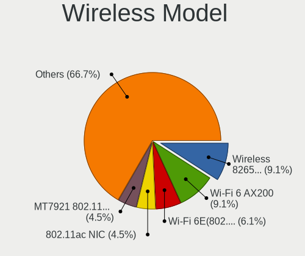
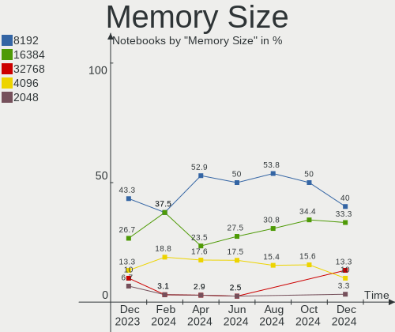

Manjaro - Hardware Trends (Notebooks)
-------------------------------------

A project to identify most popular hardware characteristics and track their change
over time based on data collected by Linux users at https://Linux-Hardware.org.

Anyone can contribute to this report by the [hw-probe](https://github.com/linuxhw/hw-probe) tool:

    sudo -E hw-probe -all -upload

This report is for one last month. Overall report since the beginning of time: [TestCoverage](https://github.com/linuxhw/TestCoverage)

Period: Aug, 2022.

Contents
--------

* [ System ](#system)
  - [ OS                       ](#os)
  - [ OS Family                ](#os-family)
  - [ Kernel                   ](#kernel)
  - [ Kernel Family            ](#kernel-family)
  - [ Kernel Major Ver.        ](#kernel-major-ver)
  - [ Arch                     ](#arch)
  - [ DE                       ](#de)
  - [ Display Server           ](#display-server)
  - [ Display Manager          ](#display-manager)
  - [ OS Lang                  ](#os-lang)
  - [ Boot Mode                ](#boot-mode)
  - [ Filesystem               ](#filesystem)
  - [ Part. scheme             ](#part-scheme)
  - [ Dual Boot with Linux/BSD ](#dual-boot-with-linuxbsd)
  - [ Dual Boot (Win)          ](#dual-boot-win)

* [ Board ](#board)
  - [ Vendor                   ](#vendor)
  - [ Model                    ](#model)
  - [ Model Family             ](#model-family)
  - [ MFG Year                 ](#mfg-year)
  - [ Form Factor              ](#form-factor)
  - [ Secure Boot              ](#secure-boot)
  - [ Coreboot                 ](#coreboot)
  - [ RAM Size                 ](#ram-size)
  - [ RAM Used                 ](#ram-used)
  - [ Total Drives             ](#total-drives)
  - [ Has CD-ROM               ](#has-cd-rom)
  - [ Has Ethernet             ](#has-ethernet)
  - [ Has WiFi                 ](#has-wifi)
  - [ Has Bluetooth            ](#has-bluetooth)

* [ Location ](#location)
  - [ Country                  ](#country)
  - [ City                     ](#city)

* [ Drives ](#drives)
  - [ Drive Vendor             ](#drive-vendor)
  - [ Drive Model              ](#drive-model)
  - [ HDD Vendor               ](#hdd-vendor)
  - [ SSD Vendor               ](#ssd-vendor)
  - [ Drive Kind               ](#drive-kind)
  - [ Drive Connector          ](#drive-connector)
  - [ Drive Size               ](#drive-size)
  - [ Space Total              ](#space-total)
  - [ Space Used               ](#space-used)
  - [ Malfunc. Drives          ](#malfunc-drives)
  - [ Malfunc. Drive Vendor    ](#malfunc-drive-vendor)
  - [ Malfunc. HDD Vendor      ](#malfunc-hdd-vendor)
  - [ Malfunc. Drive Kind      ](#malfunc-drive-kind)
  - [ Failed Drives            ](#failed-drives)
  - [ Failed Drive Vendor      ](#failed-drive-vendor)
  - [ Drive Status             ](#drive-status)

* [ Storage controller ](#storage-controller)
  - [ Storage Vendor           ](#storage-vendor)
  - [ Storage Model            ](#storage-model)
  - [ Storage Kind             ](#storage-kind)

* [ Processor ](#processor)
  - [ CPU Vendor               ](#cpu-vendor)
  - [ CPU Model                ](#cpu-model)
  - [ CPU Model Family         ](#cpu-model-family)
  - [ CPU Cores                ](#cpu-cores)
  - [ CPU Sockets              ](#cpu-sockets)
  - [ CPU Threads              ](#cpu-threads)
  - [ CPU Op-Modes             ](#cpu-op-modes)
  - [ CPU Microcode            ](#cpu-microcode)
  - [ CPU Microarch            ](#cpu-microarch)

* [ Graphics ](#graphics)
  - [ GPU Vendor               ](#gpu-vendor)
  - [ GPU Model                ](#gpu-model)
  - [ GPU Combo                ](#gpu-combo)
  - [ GPU Driver               ](#gpu-driver)
  - [ GPU Memory               ](#gpu-memory)

* [ Monitor ](#monitor)
  - [ Monitor Vendor           ](#monitor-vendor)
  - [ Monitor Model            ](#monitor-model)
  - [ Monitor Resolution       ](#monitor-resolution)
  - [ Monitor Diagonal         ](#monitor-diagonal)
  - [ Monitor Width            ](#monitor-width)
  - [ Aspect Ratio             ](#aspect-ratio)
  - [ Monitor Area             ](#monitor-area)
  - [ Pixel Density            ](#pixel-density)
  - [ Multiple Monitors        ](#multiple-monitors)

* [ Network ](#network)
  - [ Net Controller Vendor    ](#net-controller-vendor)
  - [ Net Controller Model     ](#net-controller-model)
  - [ Wireless Vendor          ](#wireless-vendor)
  - [ Wireless Model           ](#wireless-model)
  - [ Ethernet Vendor          ](#ethernet-vendor)
  - [ Ethernet Model           ](#ethernet-model)
  - [ Net Controller Kind      ](#net-controller-kind)
  - [ Used Controller          ](#used-controller)
  - [ NICs                     ](#nics)
  - [ IPv6                     ](#ipv6)

* [ Bluetooth ](#bluetooth)
  - [ Bluetooth Vendor         ](#bluetooth-vendor)
  - [ Bluetooth Model          ](#bluetooth-model)

* [ Sound ](#sound)
  - [ Sound Vendor             ](#sound-vendor)
  - [ Sound Model              ](#sound-model)

* [ Memory ](#memory)
  - [ Memory Vendor            ](#memory-vendor)
  - [ Memory Model             ](#memory-model)
  - [ Memory Kind              ](#memory-kind)
  - [ Memory Form Factor       ](#memory-form-factor)
  - [ Memory Size              ](#memory-size)
  - [ Memory Speed             ](#memory-speed)

* [ Printers & scanners ](#printers--scanners)
  - [ Printer Vendor           ](#printer-vendor)
  - [ Printer Model            ](#printer-model)
  - [ Scanner Vendor           ](#scanner-vendor)
  - [ Scanner Model            ](#scanner-model)

* [ Camera ](#camera)
  - [ Camera Vendor            ](#camera-vendor)
  - [ Camera Model             ](#camera-model)

* [ Security ](#security)
  - [ Fingerprint Vendor       ](#fingerprint-vendor)
  - [ Fingerprint Model        ](#fingerprint-model)
  - [ Chipcard Vendor          ](#chipcard-vendor)
  - [ Chipcard Model           ](#chipcard-model)

* [ Unsupported ](#unsupported)
  - [ Unsupported Devices      ](#unsupported-devices)
  - [ Unsupported Device Types ](#unsupported-device-types)

System
------

OS
--

Installed operating systems

| Name           | Notebooks | Percent |
|----------------|-----------|---------|
| Manjaro        | 28        | 37.84%  |
| Manjaro 21.3.6 | 25        | 33.78%  |
| Manjaro 21.3.7 | 17        | 22.97%  |
| Manjaro 21.3.5 | 2         | 2.7%    |
| Manjaro 22.0.0 | 1         | 1.35%   |
| Manjaro 21.2.6 | 1         | 1.35%   |

OS Family
---------

OS without a version

| Name    | Notebooks | Percent |
|---------|-----------|---------|
| Manjaro | 74        | 100%    |

Kernel
------

Version of the Linux kernel

| Version               | Notebooks | Percent |
|-----------------------|-----------|---------|
| 5.15.60-1-MANJARO     | 18        | 24.32%  |
| 5.15.57-2-MANJARO     | 11        | 14.86%  |
| 5.18.14-1-MANJARO     | 9         | 12.16%  |
| 5.19.1-3-MANJARO      | 8         | 10.81%  |
| 5.19.0-2-MANJARO      | 4         | 5.41%   |
| 5.19.0-1-MANJARO      | 4         | 5.41%   |
| 5.19.1-2-MANJARO      | 3         | 4.05%   |
| 5.15.55-1-MANJARO     | 3         | 4.05%   |
| 5.18.17-1-MANJARO     | 2         | 2.7%    |
| 5.15.59-1-MANJARO     | 2         | 2.7%    |
| 5.15.53-1-MANJARO     | 2         | 2.7%    |
| 5.10.136-1-MANJARO    | 2         | 2.7%    |
| 5.19.4-lqx1-1-lqx     | 1         | 1.35%   |
| 5.19.0-4-MANJARO      | 1         | 1.35%   |
| 5.19.0-1-rt10-MANJARO | 1         | 1.35%   |
| 5.18.16-1-MANJARO     | 1         | 1.35%   |
| 5.17.15-1-MANJARO     | 1         | 1.35%   |
| 5.15.41-1-MANJARO     | 1         | 1.35%   |

Kernel Family
-------------

Linux kernel without a distro release

| Version  | Notebooks | Percent |
|----------|-----------|---------|
| 5.15.60  | 18        | 24.32%  |
| 5.19.1   | 11        | 14.86%  |
| 5.15.57  | 11        | 14.86%  |
| 5.19.0   | 10        | 13.51%  |
| 5.18.14  | 9         | 12.16%  |
| 5.15.55  | 3         | 4.05%   |
| 5.18.17  | 2         | 2.7%    |
| 5.15.59  | 2         | 2.7%    |
| 5.15.53  | 2         | 2.7%    |
| 5.10.136 | 2         | 2.7%    |
| 5.19.4   | 1         | 1.35%   |
| 5.18.16  | 1         | 1.35%   |
| 5.17.15  | 1         | 1.35%   |
| 5.15.41  | 1         | 1.35%   |

Kernel Major Ver.
-----------------

Linux kernel major version

| Version | Notebooks | Percent |
|---------|-----------|---------|
| 5.15    | 37        | 50%     |
| 5.19    | 22        | 29.73%  |
| 5.18    | 12        | 16.22%  |
| 5.10    | 2         | 2.7%    |
| 5.17    | 1         | 1.35%   |

Arch
----

OS architecture (x86_64, i586, etc.)

| Name   | Notebooks | Percent |
|--------|-----------|---------|
| x86_64 | 74        | 100%    |

DE
--

Desktop Environment

| Name     | Notebooks | Percent |
|----------|-----------|---------|
| KDE5     | 37        | 50%     |
| XFCE     | 14        | 18.92%  |
| GNOME    | 14        | 18.92%  |
| Unknown  | 5         | 6.76%   |
| MATE     | 1         | 1.35%   |
| i3       | 1         | 1.35%   |
| Deepin   | 1         | 1.35%   |
| Cinnamon | 1         | 1.35%   |

Display Server
--------------

X11 or Wayland

| Name    | Notebooks | Percent |
|---------|-----------|---------|
| X11     | 61        | 82.43%  |
| Wayland | 12        | 16.22%  |
| Unknown | 1         | 1.35%   |

Display Manager
---------------

SDDM, LightDM, etc.

| Name    | Notebooks | Percent |
|---------|-----------|---------|
| Unknown | 28        | 37.84%  |
| SDDM    | 25        | 33.78%  |
| LightDM | 14        | 18.92%  |
| GDM     | 7         | 9.46%   |

OS Lang
-------

Language

| Lang    | Notebooks | Percent |
|---------|-----------|---------|
| en_US   | 37        | 50%     |
| en_GB   | 5         | 6.76%   |
| ru_RU   | 4         | 5.41%   |
| pt_BR   | 3         | 4.05%   |
| pl_PL   | 3         | 4.05%   |
| es_ES   | 3         | 4.05%   |
| fr_FR   | 2         | 2.7%    |
| es_MX   | 2         | 2.7%    |
| en_AG   | 2         | 2.7%    |
| de_DE   | 2         | 2.7%    |
| Unknown | 2         | 2.7%    |
| tr_TR   | 1         | 1.35%   |
| ja_JP   | 1         | 1.35%   |
| it_IT   | 1         | 1.35%   |
| he_IL   | 1         | 1.35%   |
| en_IN   | 1         | 1.35%   |
| en_IE   | 1         | 1.35%   |
| en_DK   | 1         | 1.35%   |
| en_AU   | 1         | 1.35%   |
| Default | 1         | 1.35%   |

Boot Mode
---------

EFI or BIOS

| Mode | Notebooks | Percent |
|------|-----------|---------|
| BIOS | 39        | 52.7%   |
| EFI  | 35        | 47.3%   |

Filesystem
----------

Type of filesystem

| Type  | Notebooks | Percent |
|-------|-----------|---------|
| Ext4  | 62        | 83.78%  |
| Btrfs | 11        | 14.86%  |
| Xfs   | 1         | 1.35%   |

Part. scheme
------------

Scheme of partitioning

| Type    | Notebooks | Percent |
|---------|-----------|---------|
| Unknown | 37        | 50%     |
| GPT     | 34        | 45.95%  |
| MBR     | 3         | 4.05%   |

Dual Boot with Linux/BSD
------------------------

Hosting more than one Linux/BSD

| Dual boot | Notebooks | Percent |
|-----------|-----------|---------|
| No        | 68        | 91.89%  |
| Yes       | 6         | 8.11%   |

Dual Boot (Win)
---------------

Hosting Linux and Windows

| Dual boot | Notebooks | Percent |
|-----------|-----------|---------|
| No        | 55        | 74.32%  |
| Yes       | 19        | 25.68%  |

Board
-----

Vendor
------

Motherboard manufacturer

| Name             | Notebooks | Percent |
|------------------|-----------|---------|
| Lenovo           | 17        | 22.97%  |
| ASUSTek Computer | 14        | 18.92%  |
| Hewlett-Packard  | 13        | 17.57%  |
| Dell             | 11        | 14.86%  |
| MSI              | 3         | 4.05%   |
| Acer             | 3         | 4.05%   |
| Razer            | 2         | 2.7%    |
| HUAWEI           | 2         | 2.7%    |
| TUXEDO           | 1         | 1.35%   |
| Timi             | 1         | 1.35%   |
| GPD              | 1         | 1.35%   |
| Google           | 1         | 1.35%   |
| Framework        | 1         | 1.35%   |
| Digma            | 1         | 1.35%   |
| Daten Tecnologia | 1         | 1.35%   |
| Chuwi            | 1         | 1.35%   |
| Unknown          | 1         | 1.35%   |

Model
-----

Motherboard model

| Name                                   | Notebooks | Percent |
|----------------------------------------|-----------|---------|
| Dell XPS 15 9500                       | 2         | 2.7%    |
| ASUS ROG Strix G513QY_G513QY           | 2         | 2.7%    |
| Unknown                                | 2         | 2.7%    |
| TUXEDO Polaris AMD Gen2 (REN)          | 1         | 1.35%   |
| Timi RedmiBook 14                      | 1         | 1.35%   |
| Razer Book 13 - RZ09-0357              | 1         | 1.35%   |
| Razer Blade                            | 1         | 1.35%   |
| MSI PS63 Modern 8RC                    | 1         | 1.35%   |
| MSI GS66 Stealth 10SGS                 | 1         | 1.35%   |
| MSI GE75 Raider 10SF                   | 1         | 1.35%   |
| Lenovo Z710 20250                      | 1         | 1.35%   |
| Lenovo V14-ADA 82C6                    | 1         | 1.35%   |
| Lenovo ThinkPad X250 20CLS3UW00        | 1         | 1.35%   |
| Lenovo ThinkPad T450s 20BXCTO1WW       | 1         | 1.35%   |
| Lenovo ThinkPad T14 Gen 2a 20XLS0BP00  | 1         | 1.35%   |
| Lenovo ThinkPad E580 20KS003GMH        | 1         | 1.35%   |
| Lenovo Legion 5 15ARH05H 82B1          | 1         | 1.35%   |
| Lenovo IdeaPad S145-15IIL 82DJ         | 1         | 1.35%   |
| Lenovo IdeaPad S145-15API 81V7         | 1         | 1.35%   |
| Lenovo IdeaPad Gaming 3 15ACH6 82K2    | 1         | 1.35%   |
| Lenovo IdeaPad Flex-14API 81SS         | 1         | 1.35%   |
| Lenovo IdeaPad 5 Pro 14ACN6 82L7       | 1         | 1.35%   |
| Lenovo IdeaPad 5 15ITL05 82FG          | 1         | 1.35%   |
| Lenovo IdeaPad 5 15ALC05 82LN          | 1         | 1.35%   |
| Lenovo IdeaPad 3 15IML05 D1 81WB       | 1         | 1.35%   |
| Lenovo IdeaPad 1 15ALC7 82R4           | 1         | 1.35%   |
| Lenovo G580 20150                      | 1         | 1.35%   |
| HUAWEI NBD-WXX9                        | 1         | 1.35%   |
| HUAWEI MACHC-WAX9                      | 1         | 1.35%   |
| HP ZBook 17 G6                         | 1         | 1.35%   |
| HP ProBook 450 G7                      | 1         | 1.35%   |
| HP Pavilion Laptop 14-ec0xxx           | 1         | 1.35%   |
| HP Pavilion Gaming Laptop 15-cx0xxx    | 1         | 1.35%   |
| HP Laptop 15-dw3xxx                    | 1         | 1.35%   |
| HP Laptop 14-dq1xxx                    | 1         | 1.35%   |
| HP ENVY m6 Notebook                    | 1         | 1.35%   |
| HP EliteBook 8460p                     | 1         | 1.35%   |
| HP EliteBook 755 G5                    | 1         | 1.35%   |
| HP EliteBook 2760p                     | 1         | 1.35%   |
| HP Dratini                             | 1         | 1.35%   |
| HP 255 G4                              | 1         | 1.35%   |
| GPD G1621-02                           | 1         | 1.35%   |
| Google Blorb                           | 1         | 1.35%   |
| Framework Laptop                       | 1         | 1.35%   |
| Digma EVE 15 C407 ES5054EW             | 1         | 1.35%   |
| Dell XPS 15 9520                       | 1         | 1.35%   |
| Dell XPS 13 7390                       | 1         | 1.35%   |
| Dell Vostro 5625                       | 1         | 1.35%   |
| Dell Vostro 3550                       | 1         | 1.35%   |
| Dell Latitude 7490                     | 1         | 1.35%   |
| Dell Latitude 5421                     | 1         | 1.35%   |
| Dell Latitude 5290 2-in-1              | 1         | 1.35%   |
| Dell Inspiron 5505                     | 1         | 1.35%   |
| Dell G15 Special Edition 5521          | 1         | 1.35%   |
| Daten Tecnologia DT02-M4               | 1         | 1.35%   |
| Chuwi HeroBook Air                     | 1         | 1.35%   |
| ASUS ZenBook UX435EG_UX435EG           | 1         | 1.35%   |
| ASUS ZenBook Pro Duo UX582LR_UX582LR   | 1         | 1.35%   |
| ASUS X202E                             | 1         | 1.35%   |
| ASUS VivoBook_ASUSLaptop X712EA_K712EA | 1         | 1.35%   |

Model Family
------------

Motherboard model prefix

| Name                     | Notebooks | Percent |
|--------------------------|-----------|---------|
| Lenovo IdeaPad           | 9         | 12.16%  |
| ASUS ROG                 | 7         | 9.46%   |
| Lenovo ThinkPad          | 4         | 5.41%   |
| Dell XPS                 | 4         | 5.41%   |
| HP EliteBook             | 3         | 4.05%   |
| Dell Latitude            | 3         | 4.05%   |
| ASUS VivoBook            | 3         | 4.05%   |
| Acer Aspire              | 3         | 4.05%   |
| HP Pavilion              | 2         | 2.7%    |
| HP Laptop                | 2         | 2.7%    |
| Dell Vostro              | 2         | 2.7%    |
| ASUS ZenBook             | 2         | 2.7%    |
| Unknown                  | 2         | 2.7%    |
| TUXEDO Polaris           | 1         | 1.35%   |
| Timi RedmiBook           | 1         | 1.35%   |
| Razer Book               | 1         | 1.35%   |
| Razer Blade              | 1         | 1.35%   |
| MSI PS63                 | 1         | 1.35%   |
| MSI GS66                 | 1         | 1.35%   |
| MSI GE75                 | 1         | 1.35%   |
| Lenovo Z710              | 1         | 1.35%   |
| Lenovo V14-ADA           | 1         | 1.35%   |
| Lenovo Legion            | 1         | 1.35%   |
| Lenovo G580              | 1         | 1.35%   |
| HUAWEI NBD-WXX9          | 1         | 1.35%   |
| HUAWEI MACHC-WAX9        | 1         | 1.35%   |
| HP ZBook                 | 1         | 1.35%   |
| HP ProBook               | 1         | 1.35%   |
| HP ENVY                  | 1         | 1.35%   |
| HP Dratini               | 1         | 1.35%   |
| HP 255                   | 1         | 1.35%   |
| GPD G1621-02             | 1         | 1.35%   |
| Google Blorb             | 1         | 1.35%   |
| Framework Laptop         | 1         | 1.35%   |
| Digma EVE                | 1         | 1.35%   |
| Dell Inspiron            | 1         | 1.35%   |
| Dell G15                 | 1         | 1.35%   |
| Daten Tecnologia DT02-M4 | 1         | 1.35%   |
| Chuwi HeroBook           | 1         | 1.35%   |
| ASUS X202E               | 1         | 1.35%   |
| ASUS ASUS                | 1         | 1.35%   |

MFG Year
--------

Motherboard manufacture year

| Year | Notebooks | Percent |
|------|-----------|---------|
| 2021 | 23        | 31.08%  |
| 2020 | 13        | 17.57%  |
| 2022 | 10        | 13.51%  |
| 2019 | 8         | 10.81%  |
| 2018 | 5         | 6.76%   |
| 2015 | 4         | 5.41%   |
| 2011 | 4         | 5.41%   |
| 2012 | 2         | 2.7%    |
| 2017 | 1         | 1.35%   |
| 2016 | 1         | 1.35%   |
| 2013 | 1         | 1.35%   |
| 2009 | 1         | 1.35%   |
| 2008 | 1         | 1.35%   |

Form Factor
-----------

Physical design of the computer

| Name     | Notebooks | Percent |
|----------|-----------|---------|
| Notebook | 74        | 100%    |

Secure Boot
-----------

Enabled or disabled

| State    | Notebooks | Percent |
|----------|-----------|---------|
| Disabled | 74        | 100%    |

Coreboot
--------

Have coreboot on board

| Used | Notebooks | Percent |
|------|-----------|---------|
| No   | 72        | 97.3%   |
| Yes  | 2         | 2.7%    |

RAM Size
--------

Total RAM memory

| Size in GB  | Notebooks | Percent |
|-------------|-----------|---------|
| 4.01-8.0    | 21        | 28.38%  |
| 8.01-16.0   | 19        | 25.68%  |
| 16.01-24.0  | 15        | 20.27%  |
| 32.01-64.0  | 9         | 12.16%  |
| 3.01-4.0    | 7         | 9.46%   |
| 64.01-256.0 | 2         | 2.7%    |
| 24.01-32.0  | 1         | 1.35%   |

RAM Used
--------

Used RAM memory

| Used GB    | Notebooks | Percent |
|------------|-----------|---------|
| 2.01-3.0   | 22        | 29.73%  |
| 4.01-8.0   | 17        | 22.97%  |
| 1.01-2.0   | 14        | 18.92%  |
| 3.01-4.0   | 13        | 17.57%  |
| 8.01-16.0  | 5         | 6.76%   |
| 32.01-64.0 | 1         | 1.35%   |
| 16.01-24.0 | 1         | 1.35%   |
| 0.51-1.0   | 1         | 1.35%   |

Total Drives
------------

Number of drives on board

| Drives | Notebooks | Percent |
|--------|-----------|---------|
| 1      | 51        | 68.92%  |
| 2      | 21        | 28.38%  |
| 3      | 2         | 2.7%    |

Has CD-ROM
----------

Has CD-ROM on board

| Presented | Notebooks | Percent |
|-----------|-----------|---------|
| No        | 67        | 90.54%  |
| Yes       | 7         | 9.46%   |

Has Ethernet
------------

Has Ethernet on board

| Presented | Notebooks | Percent |
|-----------|-----------|---------|
| Yes       | 41        | 55.41%  |
| No        | 33        | 44.59%  |

Has WiFi
--------

Has WiFi module

| Presented | Notebooks | Percent |
|-----------|-----------|---------|
| Yes       | 73        | 98.65%  |
| No        | 1         | 1.35%   |

Has Bluetooth
-------------

Has Bluetooth module

| Presented | Notebooks | Percent |
|-----------|-----------|---------|
| Yes       | 65        | 87.84%  |
| No        | 9         | 12.16%  |

Location
--------

Country
-------

Geographic location (country)

| Country      | Notebooks | Percent |
|--------------|-----------|---------|
| USA          | 18        | 24.32%  |
| Russia       | 6         | 8.11%   |
| Brazil       | 6         | 8.11%   |
| Poland       | 5         | 6.76%   |
| Spain        | 4         | 5.41%   |
| India        | 4         | 5.41%   |
| Mexico       | 3         | 4.05%   |
| Germany      | 3         | 4.05%   |
| UK           | 2         | 2.7%    |
| Netherlands  | 2         | 2.7%    |
| Japan        | 2         | 2.7%    |
| Canada       | 2         | 2.7%    |
| Turkey       | 1         | 1.35%   |
| Tunisia      | 1         | 1.35%   |
| Sweden       | 1         | 1.35%   |
| Saudi Arabia | 1         | 1.35%   |
| Morocco      | 1         | 1.35%   |
| Latvia       | 1         | 1.35%   |
| Italy        | 1         | 1.35%   |
| Israel       | 1         | 1.35%   |
| Ireland      | 1         | 1.35%   |
| Iran         | 1         | 1.35%   |
| Georgia      | 1         | 1.35%   |
| France       | 1         | 1.35%   |
| Egypt        | 1         | 1.35%   |
| Denmark      | 1         | 1.35%   |
| Czechia      | 1         | 1.35%   |
| Croatia      | 1         | 1.35%   |
| Australia    | 1         | 1.35%   |

City
----

Geographic location (city)

| City                        | Notebooks | Percent |
|-----------------------------|-----------|---------|
| Pune                        | 2         | 2.7%    |
| Zagreb                      | 1         | 1.35%   |
| Wolnzach                    | 1         | 1.35%   |
| West Bromwich               | 1         | 1.35%   |
| Welland                     | 1         | 1.35%   |
| Vladimir                    | 1         | 1.35%   |
| Tunis                       | 1         | 1.35%   |
| Tolyatti                    | 1         | 1.35%   |
| Tijuana                     | 1         | 1.35%   |
| Targuist                    | 1         | 1.35%   |
| Tajrīsh                    | 1         | 1.35%   |
| Szczecin                    | 1         | 1.35%   |
| Sydney                      | 1         | 1.35%   |
| Stockholm                   | 1         | 1.35%   |
| St Petersburg               | 1         | 1.35%   |
| Skawina                     | 1         | 1.35%   |
| Siemianowice Śląskie      | 1         | 1.35%   |
| Riga                        | 1         | 1.35%   |
| Queretaro                   | 1         | 1.35%   |
| Providence                  | 1         | 1.35%   |
| Pelotas                     | 1         | 1.35%   |
| Ovid                        | 1         | 1.35%   |
| Novosibirsk                 | 1         | 1.35%   |
| Norfolk                     | 1         | 1.35%   |
| Nijkerk                     | 1         | 1.35%   |
| New Rochelle                | 1         | 1.35%   |
| Natchez                     | 1         | 1.35%   |
| Milwaukee                   | 1         | 1.35%   |
| Milan                       | 1         | 1.35%   |
| Midland                     | 1         | 1.35%   |
| Mexico City                 | 1         | 1.35%   |
| Medina                      | 1         | 1.35%   |
| Malbork                     | 1         | 1.35%   |
| Madrid                      | 1         | 1.35%   |
| Madison                     | 1         | 1.35%   |
| La Línea de la Concepción | 1         | 1.35%   |
| Kyoto                       | 1         | 1.35%   |
| Kurukshetra                 | 1         | 1.35%   |
| Kent                        | 1         | 1.35%   |
| Kennesaw                    | 1         | 1.35%   |
| Kazan’                    | 1         | 1.35%   |
| Karlín                     | 1         | 1.35%   |
| Joinville                   | 1         | 1.35%   |
| Jarosław                   | 1         | 1.35%   |
| Honcho                      | 1         | 1.35%   |
| Holstebro                   | 1         | 1.35%   |
| Herzliya                    | 1         | 1.35%   |
| Guanambi                    | 1         | 1.35%   |
| Grozny                      | 1         | 1.35%   |
| Glendale                    | 1         | 1.35%   |
| Giddings                    | 1         | 1.35%   |
| Fürth                      | 1         | 1.35%   |
| Fortaleza                   | 1         | 1.35%   |
| Flushing                    | 1         | 1.35%   |
| Florianópolis              | 1         | 1.35%   |
| Fletcher                    | 1         | 1.35%   |
| Erie                        | 1         | 1.35%   |
| Dublin                      | 1         | 1.35%   |
| Donostia / San Sebastian    | 1         | 1.35%   |
| Delft                       | 1         | 1.35%   |

Drives
------

Drive Vendor
------------

Hard drive vendors

| Vendor                    | Notebooks | Drives | Percent |
|---------------------------|-----------|--------|---------|
| Samsung Electronics       | 16        | 18     | 16.16%  |
| SanDisk                   | 10        | 10     | 10.1%   |
| WDC                       | 8         | 8      | 8.08%   |
| Unknown                   | 8         | 8      | 8.08%   |
| Micron Technology         | 8         | 8      | 8.08%   |
| SK hynix                  | 7         | 7      | 7.07%   |
| Kingston                  | 6         | 6      | 6.06%   |
| Intel                     | 6         | 6      | 6.06%   |
| Toshiba                   | 3         | 3      | 3.03%   |
| KIOXIA                    | 3         | 3      | 3.03%   |
| GOODRAM                   | 3         | 3      | 3.03%   |
| Seagate                   | 2         | 2      | 2.02%   |
| China                     | 2         | 2      | 2.02%   |
| A-DATA Technology         | 2         | 2      | 2.02%   |
| XPG                       | 1         | 1      | 1.01%   |
| Union Memory (Shenzhen)   | 1         | 1      | 1.01%   |
| Teclast                   | 1         | 1      | 1.01%   |
| Realtek Semiconductor     | 1         | 1      | 1.01%   |
| Realtek                   | 1         | 1      | 1.01%   |
| Phison Electronics        | 1         | 1      | 1.01%   |
| Phison                    | 1         | 1      | 1.01%   |
| Oyen                      | 1         | 1      | 1.01%   |
| Netac                     | 1         | 1      | 1.01%   |
| Micron/Crucial Technology | 1         | 1      | 1.01%   |
| JMicron Technology        | 1         | 1      | 1.01%   |
| Hitachi                   | 1         | 1      | 1.01%   |
| Fujitsu                   | 1         | 1      | 1.01%   |
| Crucial                   | 1         | 1      | 1.01%   |
| BIWIN                     | 1         | 1      | 1.01%   |

Drive Model
-----------

Hard drive models

| Model                                               | Notebooks | Percent |
|-----------------------------------------------------|-----------|---------|
| SanDisk NVMe SSD Drive 256GB                        | 3         | 2.97%   |
| Samsung NVMe SSD Drive 512GB                        | 3         | 2.97%   |
| Micron NVMe SSD Drive 512GB                         | 3         | 2.97%   |
| Intel NVMe SSD Drive 512GB                          | 3         | 2.97%   |
| Unknown MMC Card  64GB                              | 2         | 1.98%   |
| Kingston SA400S37240G 240GB SSD                     | 2         | 1.98%   |
| Kingston NVMe SSD Drive 512GB                       | 2         | 1.98%   |
| XPG NVMe SSD Drive 1024GB                           | 1         | 0.99%   |
| WDC WDS240G2G0C-00AJM0 240GB                        | 1         | 0.99%   |
| WDC WDBRPG5000ANC-WRSN 500GB                        | 1         | 0.99%   |
| WDC WD2500LPCX-24C6HT0 250GB                        | 1         | 0.99%   |
| WDC WD10SPZX-24Z10 1TB                              | 1         | 0.99%   |
| WDC WD10SPZX-08Z10 1TB                              | 1         | 0.99%   |
| WDC WD10 SPZX-08Z10 1TB                             | 1         | 0.99%   |
| WDC PC SN530 SDBPNPZ-256G-1006 256GB                | 1         | 0.99%   |
| WDC PC SN530 SDBPMPZ-512G-1101 512GB                | 1         | 0.99%   |
| Unknown xD/SD/M.S.                                  | 1         | 0.99%   |
| Unknown MMC Card  32GB                              | 1         | 0.99%   |
| Unknown MMC Card  16GB                              | 1         | 0.99%   |
| Unknown hC8aP  64GB                                 | 1         | 0.99%   |
| Unknown 58K722  128GB                               | 1         | 0.99%   |
| Unknown 00000  32GB                                 | 1         | 0.99%   |
| Union Memory (Shenzhen) NVMe SSD Drive 512GB        | 1         | 0.99%   |
| Toshiba THNSFJ256GCSU 256GB SSD                     | 1         | 0.99%   |
| Toshiba NVMe SSD Drive 2TB                          | 1         | 0.99%   |
| Toshiba A100 240GB SSD                              | 1         | 0.99%   |
| Teclast BD256GB SHCB-2280 SSD                       | 1         | 0.99%   |
| SK hynix PC401 NVMe Solid State Drive 256GB         | 1         | 0.99%   |
| SK hynix NVMe SSD Drive 256GB                       | 1         | 0.99%   |
| SK hynix NVMe SSD Drive 1024GB                      | 1         | 0.99%   |
| SK hynix HFM512GD3JX013N 512GB                      | 1         | 0.99%   |
| SK hynix HFM001TD3JX013N 1TB                        | 1         | 0.99%   |
| SK hynix BC711 NVMe 512GB                           | 1         | 0.99%   |
| SK hynix BC511 256GB                                | 1         | 0.99%   |
| Seagate ST500LT012-9WS142 500GB                     | 1         | 0.99%   |
| Seagate ST1000LM014-SSHD-8GB                        | 1         | 0.99%   |
| SanDisk X600 M.2 2280 SATA 128GB SSD                | 1         | 0.99%   |
| Sandisk WD Black SN750 / PC SN730 NVMe SSD 512GB    | 1         | 0.99%   |
| Sandisk WD Black 2018/SN750 / PC SN720 NVMe SSD 1TB | 1         | 0.99%   |
| SanDisk SSD PLUS 240GB                              | 1         | 0.99%   |
| SanDisk SL32G  32GB                                 | 1         | 0.99%   |
| SanDisk NVMe SSD Drive 512GB                        | 1         | 0.99%   |
| SanDisk NVMe SSD Drive 500GB                        | 1         | 0.99%   |
| Samsung SSD 970 EVO Plus 500GB                      | 1         | 0.99%   |
| Samsung SSD 970 EVO 2TB                             | 1         | 0.99%   |
| Samsung SSD 870 EVO 500GB                           | 1         | 0.99%   |
| Samsung SSD 860 EVO 500GB                           | 1         | 0.99%   |
| Samsung SSD 850 EVO 1TB                             | 1         | 0.99%   |
| Samsung PSSD T7 1TB                                 | 1         | 0.99%   |
| Samsung NVMe SSD Drive 2TB                          | 1         | 0.99%   |
| Samsung NVMe SSD Controller SM981/PM981/PM983 1TB   | 1         | 0.99%   |
| Samsung NVMe SSD Controller SM961/PM961/SM963 256GB | 1         | 0.99%   |
| Samsung NVMe SSD Controller PM9A1/PM9A3/980PRO 1TB  | 1         | 0.99%   |
| Samsung MZVLV256HCHP-00000 256GB                    | 1         | 0.99%   |
| Samsung MZVLB256HBHQ-00A00 256GB                    | 1         | 0.99%   |
| Samsung MZVLB1T0HBLR-000L2 1TB                      | 1         | 0.99%   |
| Samsung MZVLB1T0HBLR-00000 1TB                      | 1         | 0.99%   |
| Samsung MZNLN512HAJQ-00000 512GB SSD                | 1         | 0.99%   |
| Realtek NVMe SSD Drive 128GB                        | 1         | 0.99%   |
| Realtek RTL9210B-CG 512GB                           | 1         | 0.99%   |

HDD Vendor
----------

Hard disk drive vendors

| Vendor  | Notebooks | Drives | Percent |
|---------|-----------|--------|---------|
| WDC     | 4         | 4      | 50%     |
| Seagate | 2         | 2      | 25%     |
| Hitachi | 1         | 1      | 12.5%   |
| Fujitsu | 1         | 1      | 12.5%   |

SSD Vendor
----------

Solid state drive vendors

| Vendor              | Notebooks | Drives | Percent |
|---------------------|-----------|--------|---------|
| Samsung Electronics | 5         | 5      | 21.74%  |
| Kingston            | 3         | 3      | 13.04%  |
| GOODRAM             | 3         | 3      | 13.04%  |
| Toshiba             | 2         | 2      | 8.7%    |
| SanDisk             | 2         | 2      | 8.7%    |
| China               | 2         | 2      | 8.7%    |
| A-DATA Technology   | 2         | 2      | 8.7%    |
| Teclast             | 1         | 1      | 4.35%   |
| Netac               | 1         | 1      | 4.35%   |
| Micron Technology   | 1         | 1      | 4.35%   |
| JMicron Technology  | 1         | 1      | 4.35%   |

Drive Kind
----------

HDD or SSD

| Kind    | Notebooks | Drives | Percent |
|---------|-----------|--------|---------|
| NVMe    | 51        | 60     | 56.04%  |
| SSD     | 23        | 23     | 25.27%  |
| HDD     | 8         | 8      | 8.79%   |
| MMC     | 7         | 8      | 7.69%   |
| Unknown | 2         | 2      | 2.2%    |

Drive Connector
---------------

SATA, SAS, NVMe, etc.

| Type | Notebooks | Drives | Percent |
|------|-----------|--------|---------|
| NVMe | 51        | 59     | 57.3%   |
| SATA | 25        | 28     | 28.09%  |
| MMC  | 7         | 8      | 7.87%   |
| SAS  | 6         | 6      | 6.74%   |

Drive Size
----------

Size of hard drive

| Size in TB | Notebooks | Drives | Percent |
|------------|-----------|--------|---------|
| 0.01-0.5   | 21        | 23     | 75%     |
| 0.51-1.0   | 7         | 8      | 25%     |

Space Total
-----------

Amount of disk space available on the file system

| Size in GB     | Notebooks | Percent |
|----------------|-----------|---------|
| 251-500        | 20        | 27.03%  |
| 101-250        | 18        | 24.32%  |
| Unknown        | 11        | 14.86%  |
| 501-1000       | 10        | 13.51%  |
| 51-100         | 8         | 10.81%  |
| 1001-2000      | 3         | 4.05%   |
| More than 3000 | 2         | 2.7%    |
| 21-50          | 1         | 1.35%   |
| 2001-3000      | 1         | 1.35%   |

Space Used
----------

Amount of used disk space

| Used GB        | Notebooks | Percent |
|----------------|-----------|---------|
| 21-50          | 15        | 20.27%  |
| 101-250        | 14        | 18.92%  |
| 1-20           | 14        | 18.92%  |
| Unknown        | 11        | 14.86%  |
| 51-100         | 9         | 12.16%  |
| 251-500        | 7         | 9.46%   |
| 1001-2000      | 3         | 4.05%   |
| More than 3000 | 1         | 1.35%   |

Malfunc. Drives
---------------

Drive models with a malfunction

| Model                           | Notebooks | Drives | Percent |
|---------------------------------|-----------|--------|---------|
| WDC WD10 SPZX-08Z10 1TB         | 1         | 1      | 50%     |
| Seagate ST500LT012-9WS142 500GB | 1         | 1      | 50%     |

Malfunc. Drive Vendor
---------------------

Vendors of faulty drives

| Vendor  | Notebooks | Drives | Percent |
|---------|-----------|--------|---------|
| WDC     | 1         | 1      | 50%     |
| Seagate | 1         | 1      | 50%     |

Malfunc. HDD Vendor
-------------------

Vendors of faulty HDD drives

| Vendor  | Notebooks | Drives | Percent |
|---------|-----------|--------|---------|
| WDC     | 1         | 1      | 50%     |
| Seagate | 1         | 1      | 50%     |

Malfunc. Drive Kind
-------------------

Kinds of faulty drives

| Kind | Notebooks | Drives | Percent |
|------|-----------|--------|---------|
| HDD  | 2         | 2      | 100%    |

Failed Drives
-------------

Failed drive models

Zero info for selected period =(

Failed Drive Vendor
-------------------

Failed drive vendors

Zero info for selected period =(

Drive Status
------------

Number of failed and malfunc. drives

| Status   | Notebooks | Drives | Percent |
|----------|-----------|--------|---------|
| Detected | 50        | 64     | 61.73%  |
| Works    | 29        | 35     | 35.8%   |
| Malfunc  | 2         | 2      | 2.47%   |

Storage controller
------------------

Storage Vendor
--------------

Storage controller vendors

| Vendor                       | Notebooks | Percent |
|------------------------------|-----------|---------|
| Intel                        | 39        | 38.24%  |
| Samsung Electronics          | 12        | 11.76%  |
| AMD                          | 12        | 11.76%  |
| SanDisk                      | 10        | 9.8%    |
| SK hynix                     | 7         | 6.86%   |
| Micron Technology            | 7         | 6.86%   |
| KIOXIA                       | 3         | 2.94%   |
| Kingston Technology Company  | 3         | 2.94%   |
| Phison Electronics           | 2         | 1.96%   |
| Micron/Crucial Technology    | 2         | 1.96%   |
| Union Memory (Shenzhen)      | 1         | 0.98%   |
| Toshiba America Info Systems | 1         | 0.98%   |
| Realtek Semiconductor        | 1         | 0.98%   |
| Biwin Storage Technology     | 1         | 0.98%   |
| ADATA Technology             | 1         | 0.98%   |

Storage Model
-------------

Storage controller models

| Model                                                                            | Notebooks | Percent |
|----------------------------------------------------------------------------------|-----------|---------|
| AMD FCH SATA Controller [AHCI mode]                                              | 11        | 9.91%   |
| Samsung NVMe SSD Controller SM981/PM981/PM983                                    | 8         | 7.21%   |
| Intel Volume Management Device NVMe RAID Controller                              | 8         | 7.21%   |
| Micron Non-Volatile memory controller                                            | 7         | 6.31%   |
| SK hynix Gold P31 SSD                                                            | 4         | 3.6%    |
| Intel Non-Volatile memory controller                                             | 4         | 3.6%    |
| Intel Comet Lake SATA AHCI Controller                                            | 4         | 3.6%    |
| SanDisk WD Blue SN550 NVMe SSD                                                   | 3         | 2.7%    |
| Intel Tiger Lake-LP SATA Controller                                              | 3         | 2.7%    |
| Intel Celeron/Pentium Silver Processor SATA Controller                           | 3         | 2.7%    |
| Intel 82801 Mobile SATA Controller [RAID mode]                                   | 3         | 2.7%    |
| Intel 6 Series/C200 Series Chipset Family 6 port Mobile SATA AHCI Controller     | 3         | 2.7%    |
| SanDisk WD Blue SN500 / PC SN520 NVMe SSD                                        | 2         | 1.8%    |
| SanDisk WD Black SN750 / PC SN730 NVMe SSD                                       | 2         | 1.8%    |
| SanDisk Non-Volatile memory controller                                           | 2         | 1.8%    |
| Samsung NVMe SSD Controller PM9A1/PM9A3/980PRO                                   | 2         | 1.8%    |
| Micron/Crucial P2 NVMe PCIe SSD                                                  | 2         | 1.8%    |
| KIOXIA Non-Volatile memory controller                                            | 2         | 1.8%    |
| Intel Wildcat Point-LP SATA Controller [AHCI Mode]                               | 2         | 1.8%    |
| Intel Sunrise Point-LP SATA Controller [AHCI mode]                               | 2         | 1.8%    |
| Intel SSD 660P Series                                                            | 2         | 1.8%    |
| Intel Cannon Lake Mobile PCH SATA AHCI Controller                                | 2         | 1.8%    |
| Intel 7 Series Chipset Family 6-port SATA Controller [AHCI mode]                 | 2         | 1.8%    |
| Union Memory (Shenzhen) AM630 PCIe 4.0 x4 NVMe SSD Controller                    | 1         | 0.9%    |
| Toshiba America Info Systems XG6 NVMe SSD Controller                             | 1         | 0.9%    |
| SK hynix PC401 NVMe Solid State Drive 256GB                                      | 1         | 0.9%    |
| SK hynix Non-Volatile memory controller                                          | 1         | 0.9%    |
| SK hynix BC511                                                                   | 1         | 0.9%    |
| SanDisk WD Black 2018/SN750 / PC SN720 NVMe SSD                                  | 1         | 0.9%    |
| Samsung NVMe SSD Controller SM961/PM961/SM963                                    | 1         | 0.9%    |
| Samsung NVMe SSD Controller SM951/PM951                                          | 1         | 0.9%    |
| Samsung NVMe SSD Controller 980                                                  | 1         | 0.9%    |
| Realtek Realtek Non-Volatile memory controller                                   | 1         | 0.9%    |
| Phison PS5013 E13 NVMe Controller                                                | 1         | 0.9%    |
| Phison E12 NVMe Controller                                                       | 1         | 0.9%    |
| KIOXIA NVMe SSD Controller BG4                                                   | 1         | 0.9%    |
| Kingston Company U-SNS8154P3 NVMe SSD                                            | 1         | 0.9%    |
| Kingston Company Company Non-Volatile memory controller                          | 1         | 0.9%    |
| Kingston Company OM3PDP3 NVMe SSD                                                | 1         | 0.9%    |
| Intel Ice Lake-LP SATA Controller [AHCI mode]                                    | 1         | 0.9%    |
| Intel Celeron N3350/Pentium N4200/Atom E3900 Series SATA AHCI Controller         | 1         | 0.9%    |
| Intel Cannon Point-LP SATA Controller [AHCI Mode]                                | 1         | 0.9%    |
| Intel Atom/Celeron/Pentium Processor x5-E8000/J3xxx/N3xxx Series SATA Controller | 1         | 0.9%    |
| Intel 82801IBM/IEM (ICH9M/ICH9M-E) 4 port SATA Controller [AHCI mode]            | 1         | 0.9%    |
| Intel 8 Series/C220 Series Chipset Family 6-port SATA Controller 1 [AHCI mode]   | 1         | 0.9%    |
| Intel 6 Series/C200 Series Chipset Family IDE-r Controller                       | 1         | 0.9%    |
| Intel 400 Series Chipset Family SATA AHCI Controller                             | 1         | 0.9%    |
| Biwin Storage Non-Volatile memory controller                                     | 1         | 0.9%    |
| AMD SB600 Non-Raid-5 SATA                                                        | 1         | 0.9%    |
| AMD SB600 IDE                                                                    | 1         | 0.9%    |
| ADATA XPG SX8200 Pro PCIe Gen3x4 M.2 2280 Solid State Drive                      | 1         | 0.9%    |

Storage Kind
------------

Kind of storage controller (IDE, SATA, NVMe, SAS, ...)

| Kind | Notebooks | Percent |
|------|-----------|---------|
| NVMe | 51        | 49.04%  |
| SATA | 40        | 38.46%  |
| RAID | 11        | 10.58%  |
| IDE  | 2         | 1.92%   |

Processor
---------

CPU Vendor
----------

Processor vendors

| Vendor | Notebooks | Percent |
|--------|-----------|---------|
| Intel  | 49        | 66.22%  |
| AMD    | 25        | 33.78%  |

CPU Model
---------

Processor models

| Model                                           | Notebooks | Percent |
|-------------------------------------------------|-----------|---------|
| Intel 11th Gen Core i7-1165G7 @ 2.80GHz         | 5         | 6.76%   |
| Intel Core i7-10750H CPU @ 2.60GHz              | 3         | 4.05%   |
| Intel Core i5-10210U CPU @ 1.60GHz              | 3         | 4.05%   |
| Intel Celeron N4020 CPU @ 1.10GHz               | 3         | 4.05%   |
| AMD Ryzen 9 5900HX with Radeon Graphics         | 3         | 4.05%   |
| Intel Core i7-10510U CPU @ 1.80GHz              | 2         | 2.7%    |
| Intel Core i5-5200U CPU @ 2.20GHz               | 2         | 2.7%    |
| Intel Core i5-2520M CPU @ 2.50GHz               | 2         | 2.7%    |
| Intel Core i3-1005G1 CPU @ 1.20GHz              | 2         | 2.7%    |
| Intel 12th Gen Core i7-12700H                   | 2         | 2.7%    |
| AMD Ryzen 7 5700U with Radeon Graphics          | 2         | 2.7%    |
| AMD Ryzen 7 4800H with Radeon Graphics          | 2         | 2.7%    |
| Intel Pentium Dual-Core CPU T4400 @ 2.20GHz     | 1         | 1.35%   |
| Intel Pentium CPU N3710 @ 1.60GHz               | 1         | 1.35%   |
| Intel Pentium CPU 2020M @ 2.40GHz               | 1         | 1.35%   |
| Intel Core i7-9750H CPU @ 2.60GHz               | 1         | 1.35%   |
| Intel Core i7-8650U CPU @ 1.90GHz               | 1         | 1.35%   |
| Intel Core i7-8565U CPU @ 1.80GHz               | 1         | 1.35%   |
| Intel Core i7-7700HQ CPU @ 2.80GHz              | 1         | 1.35%   |
| Intel Core i7-2620M CPU @ 2.70GHz               | 1         | 1.35%   |
| Intel Core i7-10870H CPU @ 2.20GHz              | 1         | 1.35%   |
| Intel Core i5-8350U CPU @ 1.70GHz               | 1         | 1.35%   |
| Intel Core i5-8300H CPU @ 2.30GHz               | 1         | 1.35%   |
| Intel Core i5-8250U CPU @ 1.60GHz               | 1         | 1.35%   |
| Intel Core i5-4200M CPU @ 2.50GHz               | 1         | 1.35%   |
| Intel Core i5-1035G1 CPU @ 1.00GHz              | 1         | 1.35%   |
| Intel Core i5-10310U CPU @ 1.70GHz              | 1         | 1.35%   |
| Intel Core i5-10300H CPU @ 2.50GHz              | 1         | 1.35%   |
| Intel Core i3-3217U CPU @ 1.80GHz               | 1         | 1.35%   |
| Intel Celeron N4120 CPU @ 1.10GHz               | 1         | 1.35%   |
| Intel Celeron CPU N3350 @ 1.10GHz               | 1         | 1.35%   |
| Intel 12th Gen Core i9-12900H                   | 1         | 1.35%   |
| Intel 11th Gen Core i7-1195G7 @ 2.90GHz         | 1         | 1.35%   |
| Intel 11th Gen Core i7-11850H @ 2.50GHz         | 1         | 1.35%   |
| Intel 11th Gen Core i5-1135G7 @ 2.40GHz         | 1         | 1.35%   |
| Intel 11th Gen Core i3-1125G4 @ 2.00GHz         | 1         | 1.35%   |
| Intel 11th Gen Core i3-1115G4 @ 3.00GHz         | 1         | 1.35%   |
| AMD Turion 64 X2 Mobile Technology TL-58        | 1         | 1.35%   |
| AMD Ryzen 9 6900HS with Radeon Graphics         | 1         | 1.35%   |
| AMD Ryzen 9 5900HS with Radeon Graphics         | 1         | 1.35%   |
| AMD Ryzen 7 6800H with Radeon Graphics          | 1         | 1.35%   |
| AMD Ryzen 7 5825U with Radeon Graphics          | 1         | 1.35%   |
| AMD Ryzen 7 5800U with Radeon Graphics          | 1         | 1.35%   |
| AMD Ryzen 7 3700U with Radeon Vega Mobile Gfx   | 1         | 1.35%   |
| AMD Ryzen 5 PRO 5650U with Radeon Graphics      | 1         | 1.35%   |
| AMD Ryzen 5 5600H with Radeon Graphics          | 1         | 1.35%   |
| AMD Ryzen 5 5500U with Radeon Graphics          | 1         | 1.35%   |
| AMD Ryzen 5 4600H with Radeon Graphics          | 1         | 1.35%   |
| AMD Ryzen 5 4500U with Radeon Graphics          | 1         | 1.35%   |
| AMD Ryzen 5 3500U with Radeon Vega Mobile Gfx   | 1         | 1.35%   |
| AMD Ryzen 3 PRO 2300U w/ Radeon Vega Mobile Gfx | 1         | 1.35%   |
| AMD Ryzen 3 3200U with Radeon Vega Mobile Gfx   | 1         | 1.35%   |
| AMD FX-8800P Radeon R7, 12 Compute Cores 4C+8G  | 1         | 1.35%   |
| AMD Athlon Gold 3150U with Radeon Graphics      | 1         | 1.35%   |
| AMD A6-6310 APU with AMD Radeon R4 Graphics     | 1         | 1.35%   |

CPU Model Family
----------------

Processor model prefix

| Model                   | Notebooks | Percent |
|-------------------------|-----------|---------|
| Intel Core i5           | 14        | 18.92%  |
| Other                   | 13        | 17.57%  |
| Intel Core i7           | 11        | 14.86%  |
| AMD Ryzen 7             | 8         | 10.81%  |
| Intel Celeron           | 5         | 6.76%   |
| AMD Ryzen 9             | 5         | 6.76%   |
| AMD Ryzen 5             | 5         | 6.76%   |
| Intel Core i3           | 3         | 4.05%   |
| Intel Pentium           | 2         | 2.7%    |
| Intel Pentium Dual-Core | 1         | 1.35%   |
| AMD Turion 64 X2 Mobile | 1         | 1.35%   |
| AMD Ryzen 5 PRO         | 1         | 1.35%   |
| AMD Ryzen 3 PRO         | 1         | 1.35%   |
| AMD Ryzen 3             | 1         | 1.35%   |
| AMD FX                  | 1         | 1.35%   |
| AMD Athlon              | 1         | 1.35%   |
| AMD A6                  | 1         | 1.35%   |

CPU Cores
---------

Number of processor cores

| Number | Notebooks | Percent |
|--------|-----------|---------|
| 4      | 28        | 37.84%  |
| 2      | 20        | 27.03%  |
| 8      | 14        | 18.92%  |
| 6      | 9         | 12.16%  |
| 14     | 3         | 4.05%   |

CPU Sockets
-----------

Number of sockets

| Number | Notebooks | Percent |
|--------|-----------|---------|
| 1      | 74        | 100%    |

CPU Threads
-----------

Threads per core (Hyper-Threading)

| Number | Notebooks | Percent |
|--------|-----------|---------|
| 2      | 61        | 82.43%  |
| 1      | 13        | 17.57%  |

CPU Op-Modes
------------

CPU Operation Modes (32-bit, 64-bit)

| Op mode        | Notebooks | Percent |
|----------------|-----------|---------|
| 32-bit, 64-bit | 74        | 100%    |

CPU Microcode
-------------

Microcode number

| Number     | Notebooks | Percent |
|------------|-----------|---------|
| Unknown    | 40        | 54.05%  |
| 0x0a50000c | 5         | 6.76%   |
| 0xa0652    | 3         | 4.05%   |
| 0x806ec    | 3         | 4.05%   |
| 0x806ea    | 3         | 4.05%   |
| 0x806c1    | 2         | 2.7%    |
| 0x206a7    | 2         | 2.7%    |
| 0x08608103 | 2         | 2.7%    |
| 0x906ea    | 1         | 1.35%   |
| 0x906e9    | 1         | 1.35%   |
| 0x706e5    | 1         | 1.35%   |
| 0x706a8    | 1         | 1.35%   |
| 0x506ca    | 1         | 1.35%   |
| 0x406c4    | 1         | 1.35%   |
| 0x306a9    | 1         | 1.35%   |
| 0x0a404101 | 1         | 1.35%   |
| 0x08608102 | 1         | 1.35%   |
| 0x08600106 | 1         | 1.35%   |
| 0x08600104 | 1         | 1.35%   |
| 0x08108109 | 1         | 1.35%   |
| 0x07030106 | 1         | 1.35%   |
| 0x06006110 | 1         | 1.35%   |

CPU Microarch
-------------

Microarchitecture

| Name          | Notebooks | Percent |
|---------------|-----------|---------|
| KabyLake      | 13        | 17.57%  |
| TigerLake     | 9         | 12.16%  |
| Unknown       | 9         | 12.16%  |
| Zen 3         | 8         | 10.81%  |
| CometLake     | 5         | 6.76%   |
| Zen+          | 4         | 5.41%   |
| Zen 2         | 4         | 5.41%   |
| Goldmont plus | 4         | 5.41%   |
| SandyBridge   | 3         | 4.05%   |
| IceLake       | 3         | 4.05%   |
| IvyBridge     | 2         | 2.7%    |
| Broadwell     | 2         | 2.7%    |
| Zen           | 1         | 1.35%   |
| Silvermont    | 1         | 1.35%   |
| Puma          | 1         | 1.35%   |
| Penryn        | 1         | 1.35%   |
| K8 Hammer     | 1         | 1.35%   |
| Haswell       | 1         | 1.35%   |
| Goldmont      | 1         | 1.35%   |
| Excavator     | 1         | 1.35%   |

Graphics
--------

GPU Vendor
----------

Vendors of graphics cards

| Vendor | Notebooks | Percent |
|--------|-----------|---------|
| Intel  | 48        | 49.48%  |
| AMD    | 25        | 25.77%  |
| Nvidia | 24        | 24.74%  |

GPU Model
---------

Graphics card models

| Model                                                                                    | Notebooks | Percent |
|------------------------------------------------------------------------------------------|-----------|---------|
| Intel TigerLake-LP GT2 [Iris Xe Graphics]                                                | 7         | 7%      |
| AMD Cezanne                                                                              | 7         | 7%      |
| Intel CometLake-U GT2 [UHD Graphics]                                                     | 6         | 6%      |
| Intel CometLake-H GT2 [UHD Graphics]                                                     | 5         | 5%      |
| Intel GeminiLake [UHD Graphics 600]                                                      | 4         | 4%      |
| AMD Picasso/Raven 2 [Radeon Vega Series / Radeon Vega Mobile Series]                     | 4         | 4%      |
| Nvidia TU117M [GeForce MX450]                                                            | 3         | 3%      |
| Nvidia GA104M [GeForce RTX 3070 Mobile / Max-Q]                                          | 3         | 3%      |
| Intel UHD Graphics 620                                                                   | 3         | 3%      |
| Intel Iris Plus Graphics G1 (Ice Lake)                                                   | 3         | 3%      |
| Intel Alder Lake-P Integrated Graphics Controller                                        | 3         | 3%      |
| Intel 2nd Generation Core Processor Family Integrated Graphics Controller                | 3         | 3%      |
| AMD Renoir                                                                               | 3         | 3%      |
| AMD Lucienne                                                                             | 3         | 3%      |
| Nvidia TU117M [GeForce GTX 1650 Ti Mobile]                                               | 2         | 2%      |
| Nvidia GP107M [GeForce GTX 1050 Mobile]                                                  | 2         | 2%      |
| Nvidia GA107M [GeForce RTX 3050 Ti Mobile]                                               | 2         | 2%      |
| Nvidia GA106M [GeForce RTX 3060 Mobile / Max-Q]                                          | 2         | 2%      |
| Intel Tiger Lake UHD Graphics                                                            | 2         | 2%      |
| Intel HD Graphics 5500                                                                   | 2         | 2%      |
| Intel CoffeeLake-H GT2 [UHD Graphics 630]                                                | 2         | 2%      |
| Intel 3rd Gen Core processor Graphics Controller                                         | 2         | 2%      |
| AMD Rembrandt [Radeon 680M]                                                              | 2         | 2%      |
| AMD Navi 22 [Radeon RX 6700/6700 XT/6750 XT / 6800M]                                     | 2         | 2%      |
| Nvidia TU106M [GeForce RTX 2070 Mobile / Max-Q Refresh]                                  | 1         | 1%      |
| Nvidia TU106M [GeForce RTX 2060 Mobile]                                                  | 1         | 1%      |
| Nvidia TU104M [GeForce RTX 2080 SUPER Mobile / Max-Q]                                    | 1         | 1%      |
| Nvidia GP108M [GeForce MX250]                                                            | 1         | 1%      |
| Nvidia GP108BM [GeForce MX250]                                                           | 1         | 1%      |
| Nvidia GP107M [GeForce MX350]                                                            | 1         | 1%      |
| Nvidia GP106M [GeForce GTX 1060 Mobile]                                                  | 1         | 1%      |
| Nvidia GM108M [GeForce MX130]                                                            | 1         | 1%      |
| Nvidia GA104M [Geforce RTX 3070 Ti Laptop GPU]                                           | 1         | 1%      |
| Nvidia GA104 [Geforce RTX 3070 Ti Laptop GPU]                                            | 1         | 1%      |
| Intel WhiskeyLake-U GT2 [UHD Graphics 620]                                               | 1         | 1%      |
| Intel TigerLake-H GT1 [UHD Graphics]                                                     | 1         | 1%      |
| Intel HD Graphics 630                                                                    | 1         | 1%      |
| Intel HD Graphics 500                                                                    | 1         | 1%      |
| Intel Atom/Celeron/Pentium Processor x5-E8000/J3xxx/N3xxx Integrated Graphics Controller | 1         | 1%      |
| Intel 4th Gen Core Processor Integrated Graphics Controller                              | 1         | 1%      |
| AMD Wani [Radeon R5/R6/R7 Graphics]                                                      | 1         | 1%      |
| AMD RV710/M92 [Mobility Radeon HD 4530/4570/545v]                                        | 1         | 1%      |
| AMD RS690M [Radeon Xpress 1200/1250/1270]                                                | 1         | 1%      |
| AMD Raven Ridge [Radeon Vega Series / Radeon Vega Mobile Series]                         | 1         | 1%      |
| AMD Navi 23 [Radeon RX 6650 XT]                                                          | 1         | 1%      |
| AMD Mullins [Radeon R4/R5 Graphics]                                                      | 1         | 1%      |
| AMD Barcelo                                                                              | 1         | 1%      |

GPU Combo
---------

Combinations of graphics cards

| Name           | Notebooks | Percent |
|----------------|-----------|---------|
| 1 x Intel      | 30        | 40.54%  |
| Intel + Nvidia | 17        | 22.97%  |
| 1 x AMD        | 16        | 21.62%  |
| AMD + Nvidia   | 6         | 8.11%   |
| 2 x AMD        | 3         | 4.05%   |
| Other          | 1         | 1.35%   |
| 1 x Nvidia     | 1         | 1.35%   |

GPU Driver
----------

Free vs proprietary

| Driver      | Notebooks | Percent |
|-------------|-----------|---------|
| Free        | 53        | 71.62%  |
| Proprietary | 21        | 28.38%  |

GPU Memory
----------

Total video memory

| Size in GB | Notebooks | Percent |
|------------|-----------|---------|
| Unknown    | 54        | 72.97%  |
| 1.01-2.0   | 6         | 8.11%   |
| 7.01-8.0   | 4         | 5.41%   |
| 0.01-0.5   | 4         | 5.41%   |
| 0.51-1.0   | 3         | 4.05%   |
| 5.01-6.0   | 2         | 2.7%    |
| 8.01-16.0  | 1         | 1.35%   |

Monitor
-------

Monitor Vendor
--------------

Monitor vendors

| Vendor                  | Notebooks | Percent |
|-------------------------|-----------|---------|
| BOE                     | 21        | 23.6%   |
| AU Optronics            | 15        | 16.85%  |
| LG Display              | 12        | 13.48%  |
| Chimei Innolux          | 9         | 10.11%  |
| Sharp                   | 8         | 8.99%   |
| Samsung Electronics     | 3         | 3.37%   |
| PANDA                   | 3         | 3.37%   |
| Dell                    | 3         | 3.37%   |
| ViewSonic               | 1         | 1.12%   |
| Toshiba                 | 1         | 1.12%   |
| TMX                     | 1         | 1.12%   |
| Tianma XM               | 1         | 1.12%   |
| MSI                     | 1         | 1.12%   |
| Marantz                 | 1         | 1.12%   |
| KDC                     | 1         | 1.12%   |
| Hewlett-Packard         | 1         | 1.12%   |
| Goldstar                | 1         | 1.12%   |
| Daewoo                  | 1         | 1.12%   |
| CSO                     | 1         | 1.12%   |
| Chi Mei Optoelectronics | 1         | 1.12%   |
| ASUSTek Computer        | 1         | 1.12%   |
| Ancor Communications    | 1         | 1.12%   |
| Acer                    | 1         | 1.12%   |

Monitor Model
-------------

Monitor models

| Model                                                                     | Notebooks | Percent |
|---------------------------------------------------------------------------|-----------|---------|
| Sharp LQ156M1JW25 SHP152C 1920x1080 344x194mm 15.5-inch                   | 2         | 2.22%   |
| ViewSonic VG2755-2K VSC4E37 2560x1440 597x336mm 27.0-inch                 | 1         | 1.11%   |
| Toshiba ScreenXpert TSB8888 1080x2160                                     | 1         | 1.11%   |
| TMX TL156MDMP11-0 TMX1560 3200x2000 336x210mm 15.6-inch                   | 1         | 1.11%   |
| Tianma XM LCD Monitor TLX1388 3000x2000 293x196mm 13.9-inch               | 1         | 1.11%   |
| Sharp LQ156M1JW26 SHP1532 1920x1080 344x194mm 15.5-inch                   | 1         | 1.11%   |
| Sharp LQ134N1JW48 SHP1527 1920x1200 288x180mm 13.4-inch                   | 1         | 1.11%   |
| Sharp LCD Monitor SHP1515 1920x1200 336x210mm 15.6-inch                   | 1         | 1.11%   |
| Sharp LCD Monitor SHP14D1 1920x1200 336x210mm 15.6-inch                   | 1         | 1.11%   |
| Sharp LCD Monitor SHP14D0 3840x2400 336x210mm 15.6-inch                   | 1         | 1.11%   |
| Sharp LCD Monitor SHP1479 1920x1280 259x173mm 12.3-inch                   | 1         | 1.11%   |
| Samsung Electronics SMB2440L SAM069F 1920x1080 521x293mm 23.5-inch        | 1         | 1.11%   |
| Samsung Electronics LCD Monitor SEC5741 1280x800 261x163mm 12.1-inch      | 1         | 1.11%   |
| Samsung Electronics LCD Monitor SDC4143 3840x2160 344x194mm 15.5-inch     | 1         | 1.11%   |
| PANDA LCD Monitor NCP004D 1920x1080 344x194mm 15.5-inch                   | 1         | 1.11%   |
| PANDA LCD Monitor NCP004A 1920x1080 309x174mm 14.0-inch                   | 1         | 1.11%   |
| PANDA LCD Monitor NCP0035 1920x1080 309x174mm 14.0-inch                   | 1         | 1.11%   |
| MSI MAG322CQR MSI3DA7 2560x1440 697x392mm 31.5-inch                       | 1         | 1.11%   |
| Marantz AVR MJI003C 1920x540                                              | 1         | 1.11%   |
| LG Display LP156WH1-TLA3 LGD01C2 1366x768 344x194mm 15.5-inch             | 1         | 1.11%   |
| LG Display LCD Monitor LGD06F0 1920x1080 309x174mm 14.0-inch              | 1         | 1.11%   |
| LG Display LCD Monitor LGD06DA 1920x1080 344x194mm 15.5-inch              | 1         | 1.11%   |
| LG Display LCD Monitor LGD0690 2560x1440 344x194mm 15.5-inch              | 1         | 1.11%   |
| LG Display LCD Monitor LGD065A 1920x1080 344x194mm 15.5-inch              | 1         | 1.11%   |
| LG Display LCD Monitor LGD059E 1920x1080 382x215mm 17.3-inch              | 1         | 1.11%   |
| LG Display LCD Monitor LGD0569 1920x1080 309x174mm 14.0-inch              | 1         | 1.11%   |
| LG Display LCD Monitor LGD046D 1920x1080 309x174mm 14.0-inch              | 1         | 1.11%   |
| LG Display LCD Monitor LGD0465 1366x768 344x194mm 15.5-inch               | 1         | 1.11%   |
| LG Display LCD Monitor LGD0437 1920x1080 276x156mm 12.5-inch              | 1         | 1.11%   |
| LG Display LCD Monitor LGD033A 1366x768 344x194mm 15.5-inch               | 1         | 1.11%   |
| LG Display LCD Monitor LGD02E3 1366x768 344x194mm 15.5-inch               | 1         | 1.11%   |
| KDC LCD Monitor KDC0830 1920x1080 344x193mm 15.5-inch                     | 1         | 1.11%   |
| Hewlett-Packard 27xi HWP3038 1920x1080 600x340mm 27.2-inch                | 1         | 1.11%   |
| Goldstar HDR QHD GSM5B95 2560x1440 698x392mm 31.5-inch                    | 1         | 1.11%   |
| Dell P3221D DEL41EA 2560x1440 698x393mm 31.5-inch                         | 1         | 1.11%   |
| Dell P2415Q DELA0C0 3840x2160 527x296mm 23.8-inch                         | 1         | 1.11%   |
| Dell P2213 DELF042 1680x1050 473x296mm 22.0-inch                          | 1         | 1.11%   |
| Dell P1917S DELD093 1280x1024 375x300mm 18.9-inch                         | 1         | 1.11%   |
| Daewoo HDMI DWE1810 1366x768 340x190mm 15.3-inch                          | 1         | 1.11%   |
| CSO LCD Monitor CSO1402 2880x1800 302x188mm 14.0-inch                     | 1         | 1.11%   |
| Chimei Innolux LCD Monitor CMN15E8 1920x1080 344x193mm 15.5-inch          | 1         | 1.11%   |
| Chimei Innolux LCD Monitor CMN15BE 1366x768 344x193mm 15.5-inch           | 1         | 1.11%   |
| Chimei Innolux LCD Monitor CMN1540 2560x1440 344x193mm 15.5-inch          | 1         | 1.11%   |
| Chimei Innolux LCD Monitor CMN1515 1920x1080 344x193mm 15.5-inch          | 1         | 1.11%   |
| Chimei Innolux LCD Monitor CMN1505 1920x1080 344x193mm 15.5-inch          | 1         | 1.11%   |
| Chimei Innolux LCD Monitor CMN14FF 1920x1080 309x173mm 13.9-inch          | 1         | 1.11%   |
| Chimei Innolux LCD Monitor CMN14E7 1920x1080 309x173mm 13.9-inch          | 1         | 1.11%   |
| Chimei Innolux LCD Monitor CMN1404 1920x1080 309x173mm 13.9-inch          | 1         | 1.11%   |
| Chimei Innolux LCD Monitor CMN1400 1920x1080 309x173mm 13.9-inch          | 1         | 1.11%   |
| Chi Mei Optoelectronics LCD Monitor CMO1726 1920x1080 381x214mm 17.2-inch | 1         | 1.11%   |
| BOE LCD Monitor BOE0A78 1920x1080 309x174mm 14.0-inch                     | 1         | 1.11%   |
| BOE LCD Monitor BOE0A69 2560x1440 381x214mm 17.2-inch                     | 1         | 1.11%   |
| BOE LCD Monitor BOE0A34 1920x1200 345x215mm 16.0-inch                     | 1         | 1.11%   |
| BOE LCD Monitor BOE0A23 1366x768 344x194mm 15.5-inch                      | 1         | 1.11%   |
| BOE LCD Monitor BOE0A1D 2560x1600 302x189mm 14.0-inch                     | 1         | 1.11%   |
| BOE LCD Monitor BOE09D3 1920x1080 344x194mm 15.5-inch                     | 1         | 1.11%   |
| BOE LCD Monitor BOE09AD 1366x768 256x144mm 11.6-inch                      | 1         | 1.11%   |
| BOE LCD Monitor BOE0976 1920x1080 309x174mm 14.0-inch                     | 1         | 1.11%   |
| BOE LCD Monitor BOE0973 2560x1440 344x194mm 15.5-inch                     | 1         | 1.11%   |
| BOE LCD Monitor BOE095F 2256x1504 285x190mm 13.5-inch                     | 1         | 1.11%   |

Monitor Resolution
------------------

Monitor screen resolution

| Resolution         | Notebooks | Percent |
|--------------------|-----------|---------|
| 1920x1080 (FHD)    | 44        | 51.76%  |
| 1366x768 (WXGA)    | 13        | 15.29%  |
| 2560x1440 (QHD)    | 8         | 9.41%   |
| 1920x1200 (WUXGA)  | 4         | 4.71%   |
| 3840x2160 (4K)     | 2         | 2.35%   |
| 1280x800 (WXGA)    | 2         | 2.35%   |
| 1280x1024 (SXGA)   | 2         | 2.35%   |
| 3840x2400          | 1         | 1.18%   |
| 3840x1100          | 1         | 1.18%   |
| 3200x2000          | 1         | 1.18%   |
| 3000x2000          | 1         | 1.18%   |
| 2880x1800          | 1         | 1.18%   |
| 2560x1600          | 1         | 1.18%   |
| 2256x1504          | 1         | 1.18%   |
| 1920x540           | 1         | 1.18%   |
| 1920x1280          | 1         | 1.18%   |
| 1680x1050 (WSXGA+) | 1         | 1.18%   |

Monitor Diagonal
----------------

Diagonal size in inches

| Inches  | Notebooks | Percent |
|---------|-----------|---------|
| 15      | 40        | 44.44%  |
| 14      | 12        | 13.33%  |
| 13      | 10        | 11.11%  |
| 17      | 6         | 6.67%   |
| 31      | 3         | 3.33%   |
| 27      | 3         | 3.33%   |
| 12      | 3         | 3.33%   |
| 11      | 3         | 3.33%   |
| 23      | 2         | 2.22%   |
| Unknown | 2         | 2.22%   |
| 26      | 1         | 1.11%   |
| 24      | 1         | 1.11%   |
| 22      | 1         | 1.11%   |
| 21      | 1         | 1.11%   |
| 19      | 1         | 1.11%   |
| 16      | 1         | 1.11%   |

Monitor Width
-------------

Physical width

| Width in mm | Notebooks | Percent |
|-------------|-----------|---------|
| 301-350     | 58        | 65.17%  |
| 201-300     | 10        | 11.24%  |
| 501-600     | 7         | 7.87%   |
| 351-400     | 7         | 7.87%   |
| 601-700     | 3         | 3.37%   |
| 401-500     | 2         | 2.25%   |
| Unknown     | 2         | 2.25%   |

Aspect Ratio
------------

Proportional relationship between the width and the height

| Ratio   | Notebooks | Percent |
|---------|-----------|---------|
| 16/9    | 61        | 76.25%  |
| 16/10   | 11        | 13.75%  |
| 3/2     | 3         | 3.75%   |
| 5/4     | 1         | 1.25%   |
| 4/3     | 1         | 1.25%   |
| 32/9    | 1         | 1.25%   |
| 3.40    | 1         | 1.25%   |
| Unknown | 1         | 1.25%   |

Monitor Area
------------

Area in inch²

| Area in inch² | Notebooks | Percent |
|----------------|-----------|---------|
| 101-110        | 38        | 42.22%  |
| 81-90          | 19        | 21.11%  |
| 121-130        | 6         | 6.67%   |
| 51-60          | 4         | 4.44%   |
| 301-350        | 4         | 4.44%   |
| 201-250        | 4         | 4.44%   |
| 61-70          | 3         | 3.33%   |
| 351-500        | 3         | 3.33%   |
| 71-80          | 2         | 2.22%   |
| 151-200        | 2         | 2.22%   |
| 111-120        | 2         | 2.22%   |
| Unknown        | 2         | 2.22%   |
| 91-100         | 1         | 1.11%   |

Pixel Density
-------------

Pixels per inch

| Density       | Notebooks | Percent |
|---------------|-----------|---------|
| 121-160       | 47        | 52.81%  |
| 101-120       | 14        | 15.73%  |
| 161-240       | 11        | 12.36%  |
| 51-100        | 10        | 11.24%  |
| More than 240 | 5         | 5.62%   |
| Unknown       | 2         | 2.25%   |

Multiple Monitors
-----------------

Total monitors connected

| Total | Notebooks | Percent |
|-------|-----------|---------|
| 1     | 59        | 79.73%  |
| 2     | 14        | 18.92%  |
| 3     | 1         | 1.35%   |

Network
-------

Net Controller Vendor
---------------------

Controller vendors

| Vendor                | Notebooks | Percent |
|-----------------------|-----------|---------|
| Intel                 | 41        | 39.81%  |
| Realtek Semiconductor | 34        | 33.01%  |
| Qualcomm Atheros      | 12        | 11.65%  |
| MediaTek              | 7         | 6.8%    |
| Broadcom              | 2         | 1.94%   |
| TP-Link               | 1         | 0.97%   |
| Motorola PCS          | 1         | 0.97%   |
| Hewlett-Packard       | 1         | 0.97%   |
| Google                | 1         | 0.97%   |
| Broadcom Limited      | 1         | 0.97%   |
| ASUSTek Computer      | 1         | 0.97%   |
| ASIX Electronics      | 1         | 0.97%   |

Net Controller Model
--------------------

Controller models

| Model                                                             | Notebooks | Percent |
|-------------------------------------------------------------------|-----------|---------|
| Realtek RTL8111/8168/8411 PCI Express Gigabit Ethernet Controller | 18        | 14.52%  |
| Intel Wi-Fi 6 AX201                                               | 7         | 5.65%   |
| MediaTek MT7921 802.11ax PCI Express Wireless Network Adapter     | 5         | 4.03%   |
| Intel Comet Lake PCH-LP CNVi WiFi                                 | 5         | 4.03%   |
| Intel Comet Lake PCH CNVi WiFi                                    | 5         | 4.03%   |
| Realtek RTL8822CE 802.11ac PCIe Wireless Network Adapter          | 4         | 3.23%   |
| Realtek RTL8153 Gigabit Ethernet Adapter                          | 4         | 3.23%   |
| Realtek RTL8125 2.5GbE Controller                                 | 4         | 3.23%   |
| Qualcomm Atheros QCA6174 802.11ac Wireless Network Adapter        | 4         | 3.23%   |
| Intel Wi-Fi 6 AX200                                               | 4         | 3.23%   |
| Realtek RTL8822BE 802.11a/b/g/n/ac WiFi adapter                   | 3         | 2.42%   |
| Intel Wi-Fi 6 AX210/AX211/AX411 160MHz                            | 3         | 2.42%   |
| Intel Alder Lake-P PCH CNVi WiFi                                  | 3         | 2.42%   |
| Realtek RTL8852AE 802.11ax PCIe Wireless Network Adapter          | 2         | 1.61%   |
| Realtek RTL8723BU 802.11b/g/n WLAN Adapter                        | 2         | 1.61%   |
| Qualcomm Atheros QCA9377 802.11ac Wireless Network Adapter        | 2         | 1.61%   |
| Qualcomm Atheros AR9485 Wireless Network Adapter                  | 2         | 1.61%   |
| Qualcomm Atheros AR8162 Fast Ethernet                             | 2         | 1.61%   |
| Intel Wireless 8265 / 8275                                        | 2         | 1.61%   |
| Intel Wireless 7265                                               | 2         | 1.61%   |
| Intel Wireless 3165                                               | 2         | 1.61%   |
| Intel Centrino Advanced-N 6205 [Taylor Peak]                      | 2         | 1.61%   |
| Intel 82579LM Gigabit Network Connection (Lewisville)             | 2         | 1.61%   |
| Broadcom BCM43142 802.11b/g/n                                     | 2         | 1.61%   |
| TP-Link 802.11ac WLAN Adapter                                     | 1         | 0.81%   |
| Realtek RTL8723BE PCIe Wireless Network Adapter                   | 1         | 0.81%   |
| Realtek RTL8192EU 802.11b/g/n WLAN Adapter                        | 1         | 0.81%   |
| Realtek RTL8188EUS 802.11n Wireless Network Adapter               | 1         | 0.81%   |
| Realtek RTL810xE PCI Express Fast Ethernet controller             | 1         | 0.81%   |
| Realtek Killer E2600 Gigabit Ethernet Controller                  | 1         | 0.81%   |
| Realtek 802.11n WLAN Adapter                                      | 1         | 0.81%   |
| Realtek 802.11ac NIC                                              | 1         | 0.81%   |
| Qualcomm Atheros QCA8171 Gigabit Ethernet                         | 1         | 0.81%   |
| Qualcomm Atheros Killer E2500 Gigabit Ethernet Controller         | 1         | 0.81%   |
| Qualcomm Atheros AR928X Wireless Network Adapter (PCI-Express)    | 1         | 0.81%   |
| Qualcomm Atheros AR9285 Wireless Network Adapter (PCI-Express)    | 1         | 0.81%   |
| Qualcomm Atheros AR8132 Fast Ethernet                             | 1         | 0.81%   |
| Motorola PCS Moto E (4) Plus                                      | 1         | 0.81%   |
| MediaTek WLAN controller                                          | 1         | 0.81%   |
| MediaTek MT7922 802.11ax PCI Express Wireless Network Adapter     | 1         | 0.81%   |
| Intel Wireless-AC 9260                                            | 1         | 0.81%   |
| Intel Tiger Lake PCH CNVi WiFi                                    | 1         | 0.81%   |
| Intel Ice Lake-LP PCH CNVi WiFi                                   | 1         | 0.81%   |
| Intel Gemini Lake PCH CNVi WiFi                                   | 1         | 0.81%   |
| Intel Ethernet controller                                         | 1         | 0.81%   |
| Intel Ethernet Connection (7) I219-LM                             | 1         | 0.81%   |
| Intel Ethernet Connection (4) I219-LM                             | 1         | 0.81%   |
| Intel Ethernet Connection (3) I218-V                              | 1         | 0.81%   |
| Intel Ethernet Connection (3) I218-LM                             | 1         | 0.81%   |
| Intel Ethernet Connection (14) I219-LM                            | 1         | 0.81%   |
| Intel Dual Band Wireless-AC 3165 Plus Bluetooth                   | 1         | 0.81%   |
| Intel Cannon Point-LP CNVi [Wireless-AC]                          | 1         | 0.81%   |
| HP hs2340 HSPA+ mobile broadband                                  | 1         | 0.81%   |
| Google Pixel 6                                                    | 1         | 0.81%   |
| Broadcom Limited NetLink BCM5787M Gigabit Ethernet PCI Express    | 1         | 0.81%   |
| ASUS USB 10/100/1G/2.5G LAN                                       | 1         | 0.81%   |
| ASIX AX88179 Gigabit Ethernet                                     | 1         | 0.81%   |

Wireless Vendor
---------------

Wireless vendors

| Vendor                | Notebooks | Percent |
|-----------------------|-----------|---------|
| Intel                 | 41        | 53.95%  |
| Realtek Semiconductor | 15        | 19.74%  |
| Qualcomm Atheros      | 10        | 13.16%  |
| MediaTek              | 7         | 9.21%   |
| Broadcom              | 2         | 2.63%   |
| TP-Link               | 1         | 1.32%   |

Wireless Model
--------------

Wireless models

| Model                                                          | Notebooks | Percent |
|----------------------------------------------------------------|-----------|---------|
| Intel Wi-Fi 6 AX201                                            | 7         | 9.09%   |
| MediaTek MT7921 802.11ax PCI Express Wireless Network Adapter  | 5         | 6.49%   |
| Intel Comet Lake PCH-LP CNVi WiFi                              | 5         | 6.49%   |
| Intel Comet Lake PCH CNVi WiFi                                 | 5         | 6.49%   |
| Realtek RTL8822CE 802.11ac PCIe Wireless Network Adapter       | 4         | 5.19%   |
| Qualcomm Atheros QCA6174 802.11ac Wireless Network Adapter     | 4         | 5.19%   |
| Intel Wi-Fi 6 AX200                                            | 4         | 5.19%   |
| Realtek RTL8822BE 802.11a/b/g/n/ac WiFi adapter                | 3         | 3.9%    |
| Intel Wi-Fi 6 AX210/AX211/AX411 160MHz                         | 3         | 3.9%    |
| Intel Alder Lake-P PCH CNVi WiFi                               | 3         | 3.9%    |
| Realtek RTL8852AE 802.11ax PCIe Wireless Network Adapter       | 2         | 2.6%    |
| Realtek RTL8723BU 802.11b/g/n WLAN Adapter                     | 2         | 2.6%    |
| Qualcomm Atheros QCA9377 802.11ac Wireless Network Adapter     | 2         | 2.6%    |
| Qualcomm Atheros AR9485 Wireless Network Adapter               | 2         | 2.6%    |
| Intel Wireless 8265 / 8275                                     | 2         | 2.6%    |
| Intel Wireless 7265                                            | 2         | 2.6%    |
| Intel Wireless 3165                                            | 2         | 2.6%    |
| Intel Centrino Advanced-N 6205 [Taylor Peak]                   | 2         | 2.6%    |
| Broadcom BCM43142 802.11b/g/n                                  | 2         | 2.6%    |
| TP-Link 802.11ac WLAN Adapter                                  | 1         | 1.3%    |
| Realtek RTL8723BE PCIe Wireless Network Adapter                | 1         | 1.3%    |
| Realtek RTL8192EU 802.11b/g/n WLAN Adapter                     | 1         | 1.3%    |
| Realtek RTL8188EUS 802.11n Wireless Network Adapter            | 1         | 1.3%    |
| Realtek 802.11n WLAN Adapter                                   | 1         | 1.3%    |
| Realtek 802.11ac NIC                                           | 1         | 1.3%    |
| Qualcomm Atheros AR928X Wireless Network Adapter (PCI-Express) | 1         | 1.3%    |
| Qualcomm Atheros AR9285 Wireless Network Adapter (PCI-Express) | 1         | 1.3%    |
| MediaTek WLAN controller                                       | 1         | 1.3%    |
| MediaTek MT7922 802.11ax PCI Express Wireless Network Adapter  | 1         | 1.3%    |
| Intel Wireless-AC 9260                                         | 1         | 1.3%    |
| Intel Tiger Lake PCH CNVi WiFi                                 | 1         | 1.3%    |
| Intel Ice Lake-LP PCH CNVi WiFi                                | 1         | 1.3%    |
| Intel Gemini Lake PCH CNVi WiFi                                | 1         | 1.3%    |
| Intel Dual Band Wireless-AC 3165 Plus Bluetooth                | 1         | 1.3%    |
| Intel Cannon Point-LP CNVi [Wireless-AC]                       | 1         | 1.3%    |

Ethernet Vendor
---------------

Ethernet vendors

| Vendor                | Notebooks | Percent |
|-----------------------|-----------|---------|
| Realtek Semiconductor | 26        | 59.09%  |
| Intel                 | 8         | 18.18%  |
| Qualcomm Atheros      | 5         | 11.36%  |
| Motorola PCS          | 1         | 2.27%   |
| Google                | 1         | 2.27%   |
| Broadcom Limited      | 1         | 2.27%   |
| ASUSTek Computer      | 1         | 2.27%   |
| ASIX Electronics      | 1         | 2.27%   |

Ethernet Model
--------------

Ethernet models

| Model                                                             | Notebooks | Percent |
|-------------------------------------------------------------------|-----------|---------|
| Realtek RTL8111/8168/8411 PCI Express Gigabit Ethernet Controller | 18        | 39.13%  |
| Realtek RTL8153 Gigabit Ethernet Adapter                          | 4         | 8.7%    |
| Realtek RTL8125 2.5GbE Controller                                 | 4         | 8.7%    |
| Qualcomm Atheros AR8162 Fast Ethernet                             | 2         | 4.35%   |
| Intel 82579LM Gigabit Network Connection (Lewisville)             | 2         | 4.35%   |
| Realtek RTL810xE PCI Express Fast Ethernet controller             | 1         | 2.17%   |
| Realtek Killer E2600 Gigabit Ethernet Controller                  | 1         | 2.17%   |
| Qualcomm Atheros QCA8171 Gigabit Ethernet                         | 1         | 2.17%   |
| Qualcomm Atheros Killer E2500 Gigabit Ethernet Controller         | 1         | 2.17%   |
| Qualcomm Atheros AR8132 Fast Ethernet                             | 1         | 2.17%   |
| Motorola PCS Moto E (4) Plus                                      | 1         | 2.17%   |
| Intel Ethernet controller                                         | 1         | 2.17%   |
| Intel Ethernet Connection (7) I219-LM                             | 1         | 2.17%   |
| Intel Ethernet Connection (4) I219-LM                             | 1         | 2.17%   |
| Intel Ethernet Connection (3) I218-V                              | 1         | 2.17%   |
| Intel Ethernet Connection (3) I218-LM                             | 1         | 2.17%   |
| Intel Ethernet Connection (14) I219-LM                            | 1         | 2.17%   |
| Google Pixel 6                                                    | 1         | 2.17%   |
| Broadcom Limited NetLink BCM5787M Gigabit Ethernet PCI Express    | 1         | 2.17%   |
| ASUS USB 10/100/1G/2.5G LAN                                       | 1         | 2.17%   |
| ASIX AX88179 Gigabit Ethernet                                     | 1         | 2.17%   |

Net Controller Kind
-------------------

Ethernet, WiFi or modem

| Kind     | Notebooks | Percent |
|----------|-----------|---------|
| WiFi     | 73        | 63.48%  |
| Ethernet | 41        | 35.65%  |
| Modem    | 1         | 0.87%   |

Used Controller
---------------

Currently used network controller

| Kind     | Notebooks | Percent |
|----------|-----------|---------|
| WiFi     | 67        | 88.16%  |
| Ethernet | 9         | 11.84%  |

NICs
----

Total network controllers on board

| Total | Notebooks | Percent |
|-------|-----------|---------|
| 2     | 36        | 48.65%  |
| 1     | 34        | 45.95%  |
| 0     | 3         | 4.05%   |
| 3     | 1         | 1.35%   |

IPv6
----

IPv6 vs IPv4

| Used | Notebooks | Percent |
|------|-----------|---------|
| No   | 59        | 79.73%  |
| Yes  | 15        | 20.27%  |

Bluetooth
---------

Bluetooth Vendor
----------------

Controller vendors

| Vendor                          | Notebooks | Percent |
|---------------------------------|-----------|---------|
| Intel                           | 37        | 56.92%  |
| Realtek Semiconductor           | 7         | 10.77%  |
| Qualcomm Atheros Communications | 7         | 10.77%  |
| IMC Networks                    | 5         | 7.69%   |
| Foxconn / Hon Hai               | 3         | 4.62%   |
| Hewlett-Packard                 | 2         | 3.08%   |
| Lite-On Technology              | 1         | 1.54%   |
| Foxconn International           | 1         | 1.54%   |
| Broadcom                        | 1         | 1.54%   |
| ASUSTek Computer                | 1         | 1.54%   |

Bluetooth Model
---------------

Controller models

| Model                                             | Notebooks | Percent |
|---------------------------------------------------|-----------|---------|
| Intel AX201 Bluetooth                             | 15        | 23.08%  |
| Intel Bluetooth 9460/9560 Jefferson Peak (JfP)    | 7         | 10.77%  |
| Realtek Bluetooth Radio                           | 5         | 7.69%   |
| Intel Bluetooth wireless interface                | 5         | 7.69%   |
| Intel AX200 Bluetooth                             | 4         | 6.15%   |
| IMC Networks Wireless_Device                      | 4         | 6.15%   |
| Qualcomm Atheros  Bluetooth Device                | 3         | 4.62%   |
| Intel AX210 Bluetooth                             | 3         | 4.62%   |
| Foxconn / Hon Hai Wireless_Device                 | 3         | 4.62%   |
| Qualcomm Atheros QCA61x4 Bluetooth 4.0            | 2         | 3.08%   |
| Intel Bluetooth Device                            | 2         | 3.08%   |
| HP Broadcom 2070 Bluetooth Combo                  | 2         | 3.08%   |
| Realtek RTL8822BE Bluetooth 4.2 Adapter           | 1         | 1.54%   |
| Realtek  Bluetooth 4.2 Adapter                    | 1         | 1.54%   |
| Qualcomm Atheros AR3012 Bluetooth 4.0             | 1         | 1.54%   |
| Qualcomm Atheros AR3011 Bluetooth                 | 1         | 1.54%   |
| Lite-On Bluetooth Device                          | 1         | 1.54%   |
| Intel Wireless-AC 9260 Bluetooth Adapter          | 1         | 1.54%   |
| IMC Networks Bluetooth Radio                      | 1         | 1.54%   |
| Foxconn International BCM43142A0 Bluetooth module | 1         | 1.54%   |
| Broadcom BCM43142A0 Bluetooth 4.0                 | 1         | 1.54%   |
| ASUS Broadcom BCM20702A0 Bluetooth                | 1         | 1.54%   |

Sound
-----

Sound Vendor
------------

Sound card vendors

| Vendor                     | Notebooks | Percent |
|----------------------------|-----------|---------|
| Intel                      | 49        | 53.85%  |
| AMD                        | 25        | 27.47%  |
| Nvidia                     | 10        | 10.99%  |
| GN Netcom                  | 2         | 2.2%    |
| Yealink Network Technology | 1         | 1.1%    |
| SteelSeries ApS            | 1         | 1.1%    |
| JMTek                      | 1         | 1.1%    |
| DCMT Technology            | 1         | 1.1%    |
| Corsair                    | 1         | 1.1%    |

Sound Model
-----------

Sound card models

| Model                                                                                             | Notebooks | Percent |
|---------------------------------------------------------------------------------------------------|-----------|---------|
| AMD Family 17h/19h HD Audio Controller                                                            | 22        | 18.64%  |
| AMD Renoir Radeon High Definition Audio Controller                                                | 13        | 11.02%  |
| Intel Tiger Lake-LP Smart Sound Technology Audio Controller                                       | 9         | 7.63%   |
| Intel Comet Lake PCH-LP cAVS                                                                      | 6         | 5.08%   |
| Intel Comet Lake PCH cAVS                                                                         | 5         | 4.24%   |
| AMD Raven/Raven2/Fenghuang HDMI/DP Audio Controller                                               | 5         | 4.24%   |
| Nvidia GA104 High Definition Audio Controller                                                     | 4         | 3.39%   |
| Intel Celeron/Pentium Silver Processor High Definition Audio                                      | 4         | 3.39%   |
| Intel Sunrise Point-LP HD Audio                                                                   | 3         | 2.54%   |
| Intel Ice Lake-LP Smart Sound Technology Audio Controller                                         | 3         | 2.54%   |
| Intel Alder Lake PCH-P High Definition Audio Controller                                           | 3         | 2.54%   |
| Intel 6 Series/C200 Series Chipset Family High Definition Audio Controller                        | 3         | 2.54%   |
| AMD Navi 21/23 HDMI/DP Audio Controller                                                           | 3         | 2.54%   |
| Nvidia TU106 High Definition Audio Controller                                                     | 2         | 1.69%   |
| Intel Wildcat Point-LP High Definition Audio Controller                                           | 2         | 1.69%   |
| Intel Cannon Lake PCH cAVS                                                                        | 2         | 1.69%   |
| Intel Broadwell-U Audio Controller                                                                | 2         | 1.69%   |
| Intel 7 Series/C216 Chipset Family High Definition Audio Controller                               | 2         | 1.69%   |
| AMD Kabini HDMI/DP Audio                                                                          | 2         | 1.69%   |
| Yealink Network Technology Yealink UH34                                                           | 1         | 0.85%   |
| SteelSeries ApS SteelSeries Arctis Pro                                                            | 1         | 0.85%   |
| Nvidia TU107 GeForce GTX 1650 High Definition Audio Controller                                    | 1         | 0.85%   |
| Nvidia GP107GL High Definition Audio Controller                                                   | 1         | 0.85%   |
| Nvidia GP106 High Definition Audio Controller                                                     | 1         | 0.85%   |
| Nvidia GA106 High Definition Audio Controller                                                     | 1         | 0.85%   |
| JMTek USB PnP Audio Device                                                                        | 1         | 0.85%   |
| Intel Xeon E3-1200 v3/4th Gen Core Processor HD Audio Controller                                  | 1         | 0.85%   |
| Intel Tiger Lake-H HD Audio Controller                                                            | 1         | 0.85%   |
| Intel CM238 HD Audio Controller                                                                   | 1         | 0.85%   |
| Intel Celeron N3350/Pentium N4200/Atom E3900 Series Audio Cluster                                 | 1         | 0.85%   |
| Intel Cannon Point-LP High Definition Audio Controller                                            | 1         | 0.85%   |
| Intel Atom/Celeron/Pentium Processor x5-E8000/J3xxx/N3xxx Series High Definition Audio Controller | 1         | 0.85%   |
| Intel 82801I (ICH9 Family) HD Audio Controller                                                    | 1         | 0.85%   |
| Intel 8 Series/C220 Series Chipset High Definition Audio Controller                               | 1         | 0.85%   |
| GN Netcom Jabra Link 380                                                                          | 1         | 0.85%   |
| GN Netcom Jabra EVOLVE 20 MS                                                                      | 1         | 0.85%   |
| DCMT Technology USB Condenser Microphone                                                          | 1         | 0.85%   |
| Corsair HS60 PRO Surround USB Sound Adapter                                                       | 1         | 0.85%   |
| AMD SBx00 Azalia (Intel HDA)                                                                      | 1         | 0.85%   |
| AMD Rembrandt Radeon High Definition Audio Controller                                             | 1         | 0.85%   |
| AMD FCH Azalia Controller                                                                         | 1         | 0.85%   |
| AMD Family 15h (Models 60h-6fh) Audio Controller                                                  | 1         | 0.85%   |

Memory
------

Memory Vendor
-------------

Memory module vendors

| Vendor              | Notebooks | Percent |
|---------------------|-----------|---------|
| SK hynix            | 14        | 29.17%  |
| Samsung Electronics | 14        | 29.17%  |
| Micron Technology   | 7         | 14.58%  |
| Unknown             | 3         | 6.25%   |
| Team                | 2         | 4.17%   |
| G.Skill             | 2         | 4.17%   |
| Crucial             | 2         | 4.17%   |
| Unknown (ABCD)      | 1         | 2.08%   |
| Patriot             | 1         | 2.08%   |
| Kingston            | 1         | 2.08%   |
| GOODRAM             | 1         | 2.08%   |

Memory Model
------------

Memory module models

| Model                                                               | Notebooks | Percent |
|---------------------------------------------------------------------|-----------|---------|
| Samsung RAM M471A1G44AB0-CWE 8GB SODIMM DDR4 3200MT/s               | 3         | 6%      |
| Unknown RAM Module 8GB SODIMM DDR3 800MT/s                          | 1         | 2%      |
| Unknown RAM Module 4GB SODIMM DDR4 2667MT/s                         | 1         | 2%      |
| Unknown RAM Module 4GB Row Of Chips LPDDR3 1867MT/s                 | 1         | 2%      |
| Unknown (ABCD) RAM 123456789012345678 2048MB SODIMM LPDDR4 2400MT/s | 1         | 2%      |
| Team RAM TEAMGROUP-SD4-3200 16GB SODIMM DDR4 3200MT/s               | 1         | 2%      |
| Team RAM TEAMGROUP-SD3-1600 8192MB SODIMM DDR3 1600MT/s             | 1         | 2%      |
| SK hynix RAM Module 4GB SODIMM DDR3 1600MT/s                        | 1         | 2%      |
| SK hynix RAM Module 32GB SODIMM DDR4 2667MT/s                       | 1         | 2%      |
| SK hynix RAM HMT451S6BFR8A-PB 4GB SODIMM DDR3 1600MT/s              | 1         | 2%      |
| SK hynix RAM HMT451S6AFR8C-PB 4GB SODIMM DDR3 1600MT/s              | 1         | 2%      |
| SK hynix RAM HMT41GS6AFR8A-PB 8GB SODIMM DDR3 1600MT/s              | 1         | 2%      |
| SK hynix RAM HMT351S6CFR8C-PB 4GB SODIMM DDR3 1600MT/s              | 1         | 2%      |
| SK hynix RAM HMT351S6CFR8A-PB 4GB SODIMM DDR3 1600MT/s              | 1         | 2%      |
| SK hynix RAM HMCG66MEBSA095N 8GB SODIMM DDR5 4800MT/s               | 1         | 2%      |
| SK hynix RAM HMAA1GS6CJR6N-XN 8GB SODIMM DDR4 3200MT/s              | 1         | 2%      |
| SK hynix RAM HMA851S6DJR6N-XN 4GB SODIMM DDR4 3200MT/s              | 1         | 2%      |
| SK hynix RAM HMA851S6CJR6N-VK 4GB Row Of Chips DDR4 2667MT/s        | 1         | 2%      |
| SK hynix RAM HMA81GS6DJR8N-XN 8GB SODIMM DDR4 3200MT/s              | 1         | 2%      |
| SK hynix RAM HMA81GS6DJR8N-VK 8GB SODIMM DDR4 2667MT/s              | 1         | 2%      |
| SK hynix RAM HMA81GS6CJR8N-VK 8GB SODIMM DDR4 2667MT/s              | 1         | 2%      |
| SK hynix RAM H9CCNNNCLGALAR-NVD 8GB Row Of Chips LPDDR3 2133MT/s    | 1         | 2%      |
| Samsung RAM UBE3D4AA-MGCR 2GB Row Of Chips LPDDR4 4267MT/s          | 1         | 2%      |
| Samsung RAM M471B5173QH0-YK0 4GB SODIMM DDR3 1600MT/s               | 1         | 2%      |
| Samsung RAM M471A5244CB0-CWE 4GB SODIMM DDR4 3200MT/s               | 1         | 2%      |
| Samsung RAM M471A5244BB0-CRC 4GB SODIMM DDR4 2667MT/s               | 1         | 2%      |
| Samsung RAM M471A4G43AB1-CWE 32GB SODIMM DDR4 3200MT/s              | 1         | 2%      |
| Samsung RAM M471A2K43CB1-CTD 16GB SODIMM DDR4 8400MT/s              | 1         | 2%      |
| Samsung RAM M471A1K43DB1-CTD 8GB SODIMM DDR4 2667MT/s               | 1         | 2%      |
| Samsung RAM M471A1K43CB1-CTD 8GB SODIMM DDR4 2667MT/s               | 1         | 2%      |
| Samsung RAM M471A1G44BB0-CWE 8GB Row Of Chips DDR4 3200MT/s         | 1         | 2%      |
| Samsung RAM M471A1G44AB0-CWE 8GB Row Of Chips DDR4 3200MT/s         | 1         | 2%      |
| Samsung RAM M425R1GB4BB0-CQKOL 8GB SODIMM 4800MT/s                  | 1         | 2%      |
| Samsung RAM K4E6E304EC-EGCG 4GB Row Of Chips LPDDR3 2133MT/s        | 1         | 2%      |
| Patriot RAM PSD34G13332S 4GB SODIMM DDR3 1334MT/s                   | 1         | 2%      |
| Micron RAM Module 16GB SODIMM DDR4 3200MT/s                         | 1         | 2%      |
| Micron RAM 8ATF1G64HZ-3G2R1 8GB SODIMM DDR4 3200MT/s                | 1         | 2%      |
| Micron RAM 8ATF1G64HZ-3G2J1 8GB SODIMM DDR4 3200MT/s                | 1         | 2%      |
| Micron RAM 53E1G32D2NP-046 2GB Row Of Chips LPDDR4 4267MT/s         | 1         | 2%      |
| Micron RAM 4ATF51264HZ-2G6E! 4GB SODIMM DDR4 2400MT/s               | 1         | 2%      |
| Micron RAM 4ATF1G64HZ-3G2E2 8GB SODIMM DDR4 3200MT/s                | 1         | 2%      |
| Micron RAM 16KTF51264HZ-1G6M1 4GB SODIMM DDR3 1600MT/s              | 1         | 2%      |
| Kingston RAM KF3200C20S4/16G 16GB SODIMM DDR4 3200MT/s              | 1         | 2%      |
| GOODRAM RAM GR1333S364L9/8G 8GB SODIMM DDR3 1333MT/s                | 1         | 2%      |
| G.Skill RAM F4-3200C22-8GRS 8GB SODIMM DDR4 3200MT/s                | 1         | 2%      |
| G.Skill RAM F4-3200C18-16GRS 16GB SODIMM DDR4 3200MT/s              | 1         | 2%      |
| Crucial RAM CT8G4SFS824A.C8FP 8GB Row Of Chips DDR4 2400MT/s        | 1         | 2%      |
| Crucial RAM BL32G32C16S4B.M16FB1 32GB SODIMM DDR4 2667MT/s          | 1         | 2%      |

Memory Kind
-----------

Memory module kinds

| Kind   | Notebooks | Percent |
|--------|-----------|---------|
| DDR4   | 25        | 62.5%   |
| DDR3   | 7         | 17.5%   |
| LPDDR4 | 3         | 7.5%    |
| LPDDR3 | 3         | 7.5%    |
| DDR5   | 2         | 5%      |

Memory Form Factor
------------------

Physical design of the memory module

| Name         | Notebooks | Percent |
|--------------|-----------|---------|
| SODIMM       | 34        | 79.07%  |
| Row Of Chips | 9         | 20.93%  |

Memory Size
-----------

Memory module size

| Size  | Notebooks | Percent |
|-------|-----------|---------|
| 8192  | 25        | 54.35%  |
| 4096  | 13        | 28.26%  |
| 32768 | 4         | 8.7%    |
| 16384 | 4         | 8.7%    |

Memory Speed
------------

Memory module speed

| Speed | Notebooks | Percent |
|-------|-----------|---------|
| 3200  | 17        | 38.64%  |
| 2667  | 8         | 18.18%  |
| 1600  | 6         | 13.64%  |
| 4800  | 2         | 4.55%   |
| 4267  | 2         | 4.55%   |
| 2400  | 2         | 4.55%   |
| 2133  | 2         | 4.55%   |
| 8400  | 1         | 2.27%   |
| 1867  | 1         | 2.27%   |
| 1334  | 1         | 2.27%   |
| 1333  | 1         | 2.27%   |
| 800   | 1         | 2.27%   |

Printers & scanners
-------------------

Printer Vendor
--------------

Printer device vendors

| Vendor          | Notebooks | Percent |
|-----------------|-----------|---------|
| Hewlett-Packard | 1         | 100%    |

Printer Model
-------------

Printer device models

| Model                  | Notebooks | Percent |
|------------------------|-----------|---------|
| HP DeskJet 1110 series | 1         | 100%    |

Scanner Vendor
--------------

Scanner device vendors

Zero info for selected period =(

Scanner Model
-------------

Scanner device models

Zero info for selected period =(

Camera
------

Camera Vendor
-------------

Camera device vendors

| Vendor                                 | Notebooks | Percent |
|----------------------------------------|-----------|---------|
| Chicony Electronics                    | 14        | 20.9%   |
| IMC Networks                           | 13        | 19.4%   |
| Realtek Semiconductor                  | 5         | 7.46%   |
| Quanta                                 | 5         | 7.46%   |
| Microdia                               | 5         | 7.46%   |
| Syntek                                 | 4         | 5.97%   |
| Acer                                   | 4         | 5.97%   |
| Suyin                                  | 2         | 2.99%   |
| Sunplus Innovation Technology          | 2         | 2.99%   |
| Logitech                               | 2         | 2.99%   |
| Lite-On Technology                     | 2         | 2.99%   |
| Cheng Uei Precision Industry (Foxlink) | 2         | 2.99%   |
| Y Media                                | 1         | 1.49%   |
| USB Camera CS                          | 1         | 1.49%   |
| Samsung Electronics                    | 1         | 1.49%   |
| Ricoh                                  | 1         | 1.49%   |
| Microsoft                              | 1         | 1.49%   |
| icSpring                               | 1         | 1.49%   |
| Alcor Micro                            | 1         | 1.49%   |

Camera Model
------------

Camera device models

| Model                                                           | Notebooks | Percent |
|-----------------------------------------------------------------|-----------|---------|
| Chicony Integrated Camera                                       | 6         | 8.96%   |
| IMC Networks USB2.0 HD UVC WebCam                               | 5         | 7.46%   |
| Microdia Integrated_Webcam_HD                                   | 4         | 5.97%   |
| IMC Networks Integrated Camera                                  | 4         | 5.97%   |
| Syntek Integrated Camera                                        | 3         | 4.48%   |
| Realtek Integrated_Webcam_HD                                    | 3         | 4.48%   |
| Lite-On HP HD Camera                                            | 2         | 2.99%   |
| Chicony HD Webcam                                               | 2         | 2.99%   |
| Y Media USB Camera                                              | 1         | 1.49%   |
| USB Camera CS USB Camera CS                                     | 1         | 1.49%   |
| Syntek Lenovo EasyCamera                                        | 1         | 1.49%   |
| Suyin HP Truevision HD                                          | 1         | 1.49%   |
| Suyin Acer/HP Integrated Webcam [CN0314]                        | 1         | 1.49%   |
| Sunplus Integrated_Webcam_HD                                    | 1         | 1.49%   |
| Sunplus HP Universal Camera                                     | 1         | 1.49%   |
| Samsung Galaxy series, misc. (MTP mode)                         | 1         | 1.49%   |
| Ricoh Integrated Webcam                                         | 1         | 1.49%   |
| Realtek USB Camera                                              | 1         | 1.49%   |
| Realtek Laptop Camera                                           | 1         | 1.49%   |
| Quanta USB2.0 HD UVC WebCam                                     | 1         | 1.49%   |
| Quanta HP Wide Vision HD Camera                                 | 1         | 1.49%   |
| Quanta HP TrueVision HD Camera                                  | 1         | 1.49%   |
| Quanta HD User Facing                                           | 1         | 1.49%   |
| Quanta HD Camera                                                | 1         | 1.49%   |
| Microsoft LifeCam HD-3000                                       | 1         | 1.49%   |
| Microdia Integrated_Webcam_FHD                                  | 1         | 1.49%   |
| Logitech Webcam C270                                            | 1         | 1.49%   |
| Logitech C920 PRO HD Webcam                                     | 1         | 1.49%   |
| IMC Networks XHC Camera                                         | 1         | 1.49%   |
| IMC Networks USB2.0 VGA UVC WebCam                              | 1         | 1.49%   |
| IMC Networks USB2.0 UVC HD Webcam                               | 1         | 1.49%   |
| IMC Networks HP TrueVision HD Camera                            | 1         | 1.49%   |
| icSpring camera                                                 | 1         | 1.49%   |
| Chicony Lenovo EasyCamera                                       | 1         | 1.49%   |
| Chicony HP Wide Vision HD Camera                                | 1         | 1.49%   |
| Chicony HP Webcam                                               | 1         | 1.49%   |
| Chicony HP HD Webcam [Fixed]                                    | 1         | 1.49%   |
| Chicony HP HD Camera                                            | 1         | 1.49%   |
| Chicony HD User Facing                                          | 1         | 1.49%   |
| Cheng Uei Precision Industry (Foxlink) HP Wide Vision HD Camera | 1         | 1.49%   |
| Cheng Uei Precision Industry (Foxlink) HD Camera                | 1         | 1.49%   |
| Alcor Micro USB 2.0 Camera                                      | 1         | 1.49%   |
| Acer SunplusIT Integrated Camera                                | 1         | 1.49%   |
| Acer Integrated Camera                                          | 1         | 1.49%   |
| Acer HD Webcam                                                  | 1         | 1.49%   |
| Acer HD Camera                                                  | 1         | 1.49%   |

Security
--------

Fingerprint Vendor
------------------

Fingerprint sensor vendors

| Vendor                     | Notebooks | Percent |
|----------------------------|-----------|---------|
| Shenzhen Goodix Technology | 6         | 42.86%  |
| Synaptics                  | 4         | 28.57%  |
| Validity Sensors           | 2         | 14.29%  |
| Elan Microelectronics      | 1         | 7.14%   |
| AuthenTec                  | 1         | 7.14%   |

Fingerprint Model
-----------------

Fingerprint sensor models

| Model                                                      | Notebooks | Percent |
|------------------------------------------------------------|-----------|---------|
| Shenzhen Goodix  FingerPrint Device                        | 3         | 21.43%  |
| Validity Sensors VFS471 Fingerprint Reader                 | 2         | 14.29%  |
| Shenzhen Goodix FingerPrint                                | 2         | 14.29%  |
| Synaptics  VFS7552 Touch Fingerprint Sensor with PurePrint | 1         | 7.14%   |
| Synaptics Prometheus MIS Touch Fingerprint Reader          | 1         | 7.14%   |
| Synaptics Metallica MOH Touch Fingerprint Reader           | 1         | 7.14%   |
| Shenzhen Goodix Fingerprint Reader                         | 1         | 7.14%   |
| Elan ELAN:ARM-M4                                           | 1         | 7.14%   |
| AuthenTec AES2501 Fingerprint Sensor                       | 1         | 7.14%   |
| Unknown                                                    | 1         | 7.14%   |

Chipcard Vendor
---------------

Chipcard module vendors

| Vendor      | Notebooks | Percent |
|-------------|-----------|---------|
| Broadcom    | 2         | 40%     |
| Alcor Micro | 2         | 40%     |
| Yubico.com  | 1         | 20%     |

Chipcard Model
--------------

Chipcard module models

| Model                               | Notebooks | Percent |
|-------------------------------------|-----------|---------|
| Alcor Micro AU9540 Smartcard Reader | 2         | 40%     |
| Yubico.com Yubikey 4 U2F+CCID       | 1         | 20%     |
| Broadcom 5880                       | 1         | 20%     |
| Broadcom 58200                      | 1         | 20%     |

Unsupported
-----------

Unsupported Devices
-------------------

Total unsupported devices on board

| Total | Notebooks | Percent |
|-------|-----------|---------|
| 0     | 48        | 64.86%  |
| 1     | 21        | 28.38%  |
| 2     | 5         | 6.76%   |

Unsupported Device Types
------------------------

Types of unsupported devices

| Type                  | Notebooks | Percent |
|-----------------------|-----------|---------|
| Fingerprint reader    | 13        | 43.33%  |
| Graphics card         | 4         | 13.33%  |
| Chipcard              | 4         | 13.33%  |
| Net/wireless          | 3         | 10%     |
| Multimedia controller | 3         | 10%     |
| Net/ethernet          | 1         | 3.33%   |
| Camera                | 1         | 3.33%   |
| Bluetooth             | 1         | 3.33%   |

