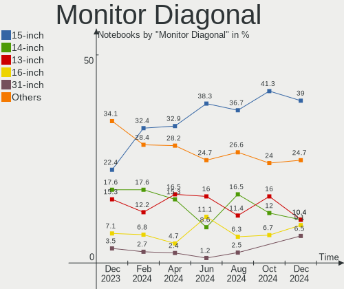
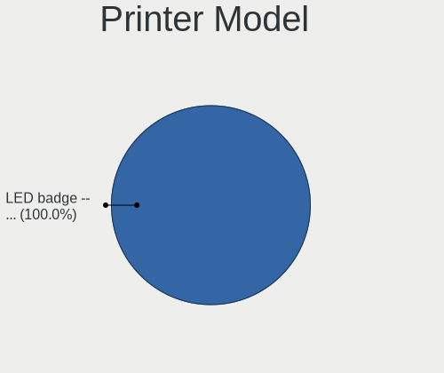
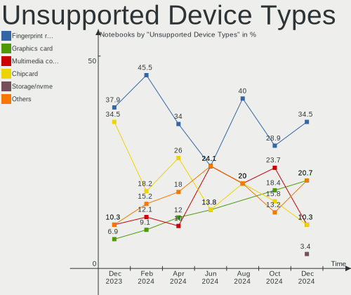

Manjaro - Hardware Trends (Notebooks)
-------------------------------------

A project to identify most popular hardware characteristics and track their change
over time based on data collected by Linux users at https://Linux-Hardware.org.

Anyone can contribute to this report by the [hw-probe](https://github.com/linuxhw/hw-probe) tool:

    sudo -E hw-probe -all -upload

This report is for one last month. Overall report since the beginning of time: [TestDays](https://github.com/linuxhw/TestDays)

Period: May, 2023.

Contents
--------

* [ System ](#system)
  - [ OS                       ](#os)
  - [ OS Family                ](#os-family)
  - [ Kernel                   ](#kernel)
  - [ Kernel Family            ](#kernel-family)
  - [ Kernel Major Ver.        ](#kernel-major-ver)
  - [ Arch                     ](#arch)
  - [ DE                       ](#de)
  - [ Display Server           ](#display-server)
  - [ Display Manager          ](#display-manager)
  - [ OS Lang                  ](#os-lang)
  - [ Boot Mode                ](#boot-mode)
  - [ Filesystem               ](#filesystem)
  - [ Part. scheme             ](#part-scheme)
  - [ Dual Boot with Linux/BSD ](#dual-boot-with-linuxbsd)
  - [ Dual Boot (Win)          ](#dual-boot-win)

* [ Board ](#board)
  - [ Vendor                   ](#vendor)
  - [ Model                    ](#model)
  - [ Model Family             ](#model-family)
  - [ MFG Year                 ](#mfg-year)
  - [ Form Factor              ](#form-factor)
  - [ Secure Boot              ](#secure-boot)
  - [ Coreboot                 ](#coreboot)
  - [ RAM Size                 ](#ram-size)
  - [ RAM Used                 ](#ram-used)
  - [ Total Drives             ](#total-drives)
  - [ Has CD-ROM               ](#has-cd-rom)
  - [ Has Ethernet             ](#has-ethernet)
  - [ Has WiFi                 ](#has-wifi)
  - [ Has Bluetooth            ](#has-bluetooth)

* [ Location ](#location)
  - [ Country                  ](#country)
  - [ City                     ](#city)

* [ Drives ](#drives)
  - [ Drive Vendor             ](#drive-vendor)
  - [ Drive Model              ](#drive-model)
  - [ HDD Vendor               ](#hdd-vendor)
  - [ SSD Vendor               ](#ssd-vendor)
  - [ Drive Kind               ](#drive-kind)
  - [ Drive Connector          ](#drive-connector)
  - [ Drive Size               ](#drive-size)
  - [ Space Total              ](#space-total)
  - [ Space Used               ](#space-used)
  - [ Malfunc. Drives          ](#malfunc-drives)
  - [ Malfunc. Drive Vendor    ](#malfunc-drive-vendor)
  - [ Malfunc. HDD Vendor      ](#malfunc-hdd-vendor)
  - [ Malfunc. Drive Kind      ](#malfunc-drive-kind)
  - [ Failed Drives            ](#failed-drives)
  - [ Failed Drive Vendor      ](#failed-drive-vendor)
  - [ Drive Status             ](#drive-status)

* [ Storage controller ](#storage-controller)
  - [ Storage Vendor           ](#storage-vendor)
  - [ Storage Model            ](#storage-model)
  - [ Storage Kind             ](#storage-kind)

* [ Processor ](#processor)
  - [ CPU Vendor               ](#cpu-vendor)
  - [ CPU Model                ](#cpu-model)
  - [ CPU Model Family         ](#cpu-model-family)
  - [ CPU Cores                ](#cpu-cores)
  - [ CPU Sockets              ](#cpu-sockets)
  - [ CPU Threads              ](#cpu-threads)
  - [ CPU Op-Modes             ](#cpu-op-modes)
  - [ CPU Microcode            ](#cpu-microcode)
  - [ CPU Microarch            ](#cpu-microarch)

* [ Graphics ](#graphics)
  - [ GPU Vendor               ](#gpu-vendor)
  - [ GPU Model                ](#gpu-model)
  - [ GPU Combo                ](#gpu-combo)
  - [ GPU Driver               ](#gpu-driver)
  - [ GPU Memory               ](#gpu-memory)

* [ Monitor ](#monitor)
  - [ Monitor Vendor           ](#monitor-vendor)
  - [ Monitor Model            ](#monitor-model)
  - [ Monitor Resolution       ](#monitor-resolution)
  - [ Monitor Diagonal         ](#monitor-diagonal)
  - [ Monitor Width            ](#monitor-width)
  - [ Aspect Ratio             ](#aspect-ratio)
  - [ Monitor Area             ](#monitor-area)
  - [ Pixel Density            ](#pixel-density)
  - [ Multiple Monitors        ](#multiple-monitors)

* [ Network ](#network)
  - [ Net Controller Vendor    ](#net-controller-vendor)
  - [ Net Controller Model     ](#net-controller-model)
  - [ Wireless Vendor          ](#wireless-vendor)
  - [ Wireless Model           ](#wireless-model)
  - [ Ethernet Vendor          ](#ethernet-vendor)
  - [ Ethernet Model           ](#ethernet-model)
  - [ Net Controller Kind      ](#net-controller-kind)
  - [ Used Controller          ](#used-controller)
  - [ NICs                     ](#nics)
  - [ IPv6                     ](#ipv6)

* [ Bluetooth ](#bluetooth)
  - [ Bluetooth Vendor         ](#bluetooth-vendor)
  - [ Bluetooth Model          ](#bluetooth-model)

* [ Sound ](#sound)
  - [ Sound Vendor             ](#sound-vendor)
  - [ Sound Model              ](#sound-model)

* [ Memory ](#memory)
  - [ Memory Vendor            ](#memory-vendor)
  - [ Memory Model             ](#memory-model)
  - [ Memory Kind              ](#memory-kind)
  - [ Memory Form Factor       ](#memory-form-factor)
  - [ Memory Size              ](#memory-size)
  - [ Memory Speed             ](#memory-speed)

* [ Printers & scanners ](#printers--scanners)
  - [ Printer Vendor           ](#printer-vendor)
  - [ Printer Model            ](#printer-model)
  - [ Scanner Vendor           ](#scanner-vendor)
  - [ Scanner Model            ](#scanner-model)

* [ Camera ](#camera)
  - [ Camera Vendor            ](#camera-vendor)
  - [ Camera Model             ](#camera-model)

* [ Security ](#security)
  - [ Fingerprint Vendor       ](#fingerprint-vendor)
  - [ Fingerprint Model        ](#fingerprint-model)
  - [ Chipcard Vendor          ](#chipcard-vendor)
  - [ Chipcard Model           ](#chipcard-model)

* [ Unsupported ](#unsupported)
  - [ Unsupported Devices      ](#unsupported-devices)
  - [ Unsupported Device Types ](#unsupported-device-types)

System
------

OS
--

Installed operating systems

| Name           | Notebooks | Percent |
|----------------|-----------|---------|
| Manjaro        | 36        | 47.37%  |
| Manjaro 22.1.1 | 18        | 23.68%  |
| Manjaro 22.1.3 | 9         | 11.84%  |
| Manjaro 22.1.0 | 9         | 11.84%  |
| Manjaro 22.1.2 | 4         | 5.26%   |

OS Family
---------

OS without a version

| Name    | Notebooks | Percent |
|---------|-----------|---------|
| Manjaro | 76        | 100%    |

Kernel
------

Version of the Linux kernel

| Version                     | Notebooks | Percent |
|-----------------------------|-----------|---------|
| 6.1.26-1-MANJARO            | 22        | 28.95%  |
| 6.1.25-1-MANJARO            | 9         | 11.84%  |
| 6.1.29-1-MANJARO            | 8         | 10.53%  |
| 6.2.12-1-MANJARO            | 6         | 7.89%   |
| 6.1.30-1-MANJARO            | 6         | 7.89%   |
| 6.3.0-1-MANJARO             | 5         | 6.58%   |
| 5.15.109-1-MANJARO          | 4         | 5.26%   |
| 6.3.3-1-MANJARO             | 2         | 2.63%   |
| 5.15.108-1-MANJARO          | 2         | 2.63%   |
| 6.3.4-2-MANJARO             | 1         | 1.32%   |
| 6.3.1-arch1-1-g14-3         | 1         | 1.32%   |
| 6.2.9-x64v1-xanmod1-MANJARO | 1         | 1.32%   |
| 6.2.15-1-MANJARO            | 1         | 1.32%   |
| 6.2.14-2-MANJARO            | 1         | 1.32%   |
| 5.15.94-1-MANJARO           | 1         | 1.32%   |
| 5.15.113-1-MANJARO          | 1         | 1.32%   |
| 5.15.112-1-MANJARO          | 1         | 1.32%   |
| 5.14.21-2-MANJARO           | 1         | 1.32%   |
| 5.10.180-1-MANJARO          | 1         | 1.32%   |
| 5.10.179-1-MANJARO          | 1         | 1.32%   |
| 5.10.178-1-MANJARO          | 1         | 1.32%   |

Kernel Family
-------------

Linux kernel without a distro release

| Version  | Notebooks | Percent |
|----------|-----------|---------|
| 6.1.26   | 22        | 28.95%  |
| 6.1.25   | 9         | 11.84%  |
| 6.1.29   | 8         | 10.53%  |
| 6.2.12   | 6         | 7.89%   |
| 6.1.30   | 6         | 7.89%   |
| 6.3.0    | 5         | 6.58%   |
| 5.15.109 | 4         | 5.26%   |
| 6.3.3    | 2         | 2.63%   |
| 5.15.108 | 2         | 2.63%   |
| 6.3.4    | 1         | 1.32%   |
| 6.3.1    | 1         | 1.32%   |
| 6.2.9    | 1         | 1.32%   |
| 6.2.15   | 1         | 1.32%   |
| 6.2.14   | 1         | 1.32%   |
| 5.15.94  | 1         | 1.32%   |
| 5.15.113 | 1         | 1.32%   |
| 5.15.112 | 1         | 1.32%   |
| 5.14.21  | 1         | 1.32%   |
| 5.10.180 | 1         | 1.32%   |
| 5.10.179 | 1         | 1.32%   |
| 5.10.178 | 1         | 1.32%   |

Kernel Major Ver.
-----------------

Linux kernel major version

| Version | Notebooks | Percent |
|---------|-----------|---------|
| 6.1     | 45        | 59.21%  |
| 6.3     | 9         | 11.84%  |
| 6.2     | 9         | 11.84%  |
| 5.15    | 9         | 11.84%  |
| 5.10    | 3         | 3.95%   |
| 5.14    | 1         | 1.32%   |

Arch
----

OS architecture (x86_64, i586, etc.)

| Name   | Notebooks | Percent |
|--------|-----------|---------|
| x86_64 | 76        | 100%    |

DE
--

Desktop Environment

| Name       | Notebooks | Percent |
|------------|-----------|---------|
| KDE5       | 41        | 53.95%  |
| GNOME      | 18        | 23.68%  |
| XFCE       | 9         | 11.84%  |
| X-Cinnamon | 2         | 2.63%   |
| i3         | 2         | 2.63%   |
| Unknown    | 2         | 2.63%   |
| sway       | 1         | 1.32%   |
| KDE        | 1         | 1.32%   |

Display Server
--------------

X11 or Wayland

| Name    | Notebooks | Percent |
|---------|-----------|---------|
| X11     | 54        | 71.05%  |
| Wayland | 20        | 26.32%  |
| Tty     | 1         | 1.32%   |
| Unknown | 1         | 1.32%   |

Display Manager
---------------

SDDM, LightDM, etc.

| Name    | Notebooks | Percent |
|---------|-----------|---------|
| Unknown | 37        | 48.68%  |
| SDDM    | 22        | 28.95%  |
| LightDM | 10        | 13.16%  |
| GDM     | 7         | 9.21%   |

OS Lang
-------

Language

| Lang    | Notebooks | Percent |
|---------|-----------|---------|
| en_US   | 26        | 34.21%  |
| en_GB   | 8         | 10.53%  |
| de_DE   | 7         | 9.21%   |
| pt_BR   | 6         | 7.89%   |
| ru_RU   | 4         | 5.26%   |
| it_IT   | 4         | 5.26%   |
| pl_PL   | 2         | 2.63%   |
| fr_FR   | 2         | 2.63%   |
| es_ES   | 2         | 2.63%   |
| en_AU   | 2         | 2.63%   |
| Unknown | 2         | 2.63%   |
| tr_TR   | 1         | 1.32%   |
| hu_HU   | 1         | 1.32%   |
| es_PE   | 1         | 1.32%   |
| es_MX   | 1         | 1.32%   |
| es_GT   | 1         | 1.32%   |
| es_CO   | 1         | 1.32%   |
| es_CL   | 1         | 1.32%   |
| en_NZ   | 1         | 1.32%   |
| en_IN   | 1         | 1.32%   |
| en_CA   | 1         | 1.32%   |
| de_AT   | 1         | 1.32%   |

Boot Mode
---------

EFI or BIOS

| Mode | Notebooks | Percent |
|------|-----------|---------|
| BIOS | 43        | 56.58%  |
| EFI  | 33        | 43.42%  |

Filesystem
----------

Type of filesystem

| Type  | Notebooks | Percent |
|-------|-----------|---------|
| Ext4  | 62        | 81.58%  |
| Btrfs | 8         | 10.53%  |
| Tmpfs | 4         | 5.26%   |
| Xfs   | 1         | 1.32%   |
| Ext2  | 1         | 1.32%   |

Part. scheme
------------

Scheme of partitioning

| Type    | Notebooks | Percent |
|---------|-----------|---------|
| GPT     | 38        | 50%     |
| Unknown | 33        | 43.42%  |
| MBR     | 5         | 6.58%   |

Dual Boot with Linux/BSD
------------------------

Hosting more than one Linux/BSD

| Dual boot | Notebooks | Percent |
|-----------|-----------|---------|
| No        | 72        | 94.74%  |
| Yes       | 4         | 5.26%   |

Dual Boot (Win)
---------------

Hosting Linux and Windows

| Dual boot | Notebooks | Percent |
|-----------|-----------|---------|
| No        | 60        | 78.95%  |
| Yes       | 16        | 21.05%  |

Board
-----

Vendor
------

Motherboard manufacturer

| Name                | Notebooks | Percent |
|---------------------|-----------|---------|
| Lenovo              | 18        | 23.68%  |
| Hewlett-Packard     | 17        | 22.37%  |
| Dell                | 12        | 15.79%  |
| ASUSTek Computer    | 8         | 10.53%  |
| Acer                | 7         | 9.21%   |
| MSI                 | 2         | 2.63%   |
| Apple               | 2         | 2.63%   |
| TUXEDO              | 1         | 1.32%   |
| Toshiba             | 1         | 1.32%   |
| Sony                | 1         | 1.32%   |
| Schenker            | 1         | 1.32%   |
| MECHREVO            | 1         | 1.32%   |
| Itautec             | 1         | 1.32%   |
| Gigabyte Technology | 1         | 1.32%   |
| Getac               | 1         | 1.32%   |
| Framework           | 1         | 1.32%   |
| Unknown             | 1         | 1.32%   |

Model
-----

Motherboard model

| Name                                   | Notebooks | Percent |
|----------------------------------------|-----------|---------|
| HP Laptop 15-ef2xxx                    | 2         | 2.63%   |
| Acer Nitro AN517-54                    | 2         | 2.63%   |
| TUXEDO N24_25BU                        | 1         | 1.32%   |
| Toshiba Satellite L855                 | 1         | 1.32%   |
| Sony SVE1513Z1EB                       | 1         | 1.32%   |
| Schenker VISION (E22)                  | 1         | 1.32%   |
| MSI Katana GF76 12UGSO                 | 1         | 1.32%   |
| MSI GT70 2PC                           | 1         | 1.32%   |
| MECHREVO WUJIE16 Pro                   | 1         | 1.32%   |
| Lenovo V15 G2 ITL 82KB                 | 1         | 1.32%   |
| Lenovo V15 G2 ALC 82KD                 | 1         | 1.32%   |
| Lenovo ThinkPad X230 2325SV7           | 1         | 1.32%   |
| Lenovo ThinkPad W541 20EGS1AR00        | 1         | 1.32%   |
| Lenovo ThinkPad T470s 20HF0000MD       | 1         | 1.32%   |
| Lenovo ThinkPad T470 W10DG 20JNS1FJ00  | 1         | 1.32%   |
| Lenovo ThinkPad T14 Gen 3 21AJS0E700   | 1         | 1.32%   |
| Lenovo ThinkPad P51 20HJS02000         | 1         | 1.32%   |
| Lenovo ThinkPad P14s Gen 3 21AK0054FR  | 1         | 1.32%   |
| Lenovo ThinkPad P14s Gen 2a 21A0000QGE | 1         | 1.32%   |
| Lenovo ThinkPad L470 20J5S01S00        | 1         | 1.32%   |
| Lenovo Legion 5 Pro 16ARH7H 82RG       | 1         | 1.32%   |
| Lenovo Legion 5 Pro 16ACH6H 82JQ       | 1         | 1.32%   |
| Lenovo IdeaPad L340-17IRH Gaming 81LL  | 1         | 1.32%   |
| Lenovo IdeaPad Gaming 3 15IHU6 82K1    | 1         | 1.32%   |
| Lenovo IdeaPad 720S-13ARR 81BR         | 1         | 1.32%   |
| Lenovo IdeaPad 5 15ARE05 81YQ          | 1         | 1.32%   |
| Lenovo IdeaPad 330-15ICH 81FK          | 1         | 1.32%   |
| Itautec Infoway w7440                  | 1         | 1.32%   |
| HP ProBook 6560b                       | 1         | 1.32%   |
| HP Pavilion Laptop 15-eg0xxx           | 1         | 1.32%   |
| HP Pavilion dv6                        | 1         | 1.32%   |
| HP Pavilion dv4                        | 1         | 1.32%   |
| HP OMEN Laptop 15-en1xxx               | 1         | 1.32%   |
| HP Laptop 17-cn2xxx                    | 1         | 1.32%   |
| HP Laptop 15-gw0xxx                    | 1         | 1.32%   |
| HP Laptop 15-dy1xxx                    | 1         | 1.32%   |
| HP Laptop 15-db1xxx                    | 1         | 1.32%   |
| HP ENVY Laptop 17-cr0xxx               | 1         | 1.32%   |
| HP EliteBook 840 G6                    | 1         | 1.32%   |
| HP EliteBook 840 G2                    | 1         | 1.32%   |

Model Family
------------

Motherboard model prefix

| Name               | Notebooks | Percent |
|--------------------|-----------|---------|
| Lenovo ThinkPad    | 9         | 11.84%  |
| HP Laptop          | 6         | 7.89%   |
| Lenovo IdeaPad     | 5         | 6.58%   |
| HP Pavilion        | 3         | 3.95%   |
| HP EliteBook       | 3         | 3.95%   |
| Dell XPS           | 3         | 3.95%   |
| Dell Inspiron      | 3         | 3.95%   |
| ASUS VivoBook      | 3         | 3.95%   |
| ASUS ROG           | 3         | 3.95%   |
| Lenovo V15         | 2         | 2.63%   |
| Lenovo Legion      | 2         | 2.63%   |
| Dell Vostro        | 2         | 2.63%   |
| Dell Precision     | 2         | 2.63%   |
| Acer Swift         | 2         | 2.63%   |
| Acer Nitro         | 2         | 2.63%   |
| Acer Aspire        | 2         | 2.63%   |
| TUXEDO N24         | 1         | 1.32%   |
| Toshiba Satellite  | 1         | 1.32%   |
| Sony SVE1513Z1EB   | 1         | 1.32%   |
| Schenker VISION    | 1         | 1.32%   |
| MSI Katana         | 1         | 1.32%   |
| MSI GT70           | 1         | 1.32%   |
| MECHREVO WUJIE16   | 1         | 1.32%   |
| Itautec Infoway    | 1         | 1.32%   |
| HP ProBook         | 1         | 1.32%   |
| HP OMEN            | 1         | 1.32%   |
| HP ENVY            | 1         | 1.32%   |
| HP Compaq          | 1         | 1.32%   |
| HP 250             | 1         | 1.32%   |
| Gigabyte G5        | 1         | 1.32%   |
| Getac V110G3       | 1         | 1.32%   |
| Framework Laptop   | 1         | 1.32%   |
| Dell System        | 1         | 1.32%   |
| Dell Latitude      | 1         | 1.32%   |
| ASUS TUF           | 1         | 1.32%   |
| ASUS ASUS          | 1         | 1.32%   |
| Apple MacBookPro8  | 1         | 1.32%   |
| Apple MacBookPro11 | 1         | 1.32%   |
| Acer TravelMate    | 1         | 1.32%   |
| Unknown            | 1         | 1.32%   |

MFG Year
--------

Motherboard manufacture year

| Year | Notebooks | Percent |
|------|-----------|---------|
| 2021 | 16        | 21.05%  |
| 2022 | 15        | 19.74%  |
| 2019 | 7         | 9.21%   |
| 2017 | 7         | 9.21%   |
| 2011 | 5         | 6.58%   |
| 2020 | 4         | 5.26%   |
| 2018 | 4         | 5.26%   |
| 2016 | 4         | 5.26%   |
| 2012 | 4         | 5.26%   |
| 2014 | 3         | 3.95%   |
| 2015 | 2         | 2.63%   |
| 2008 | 2         | 2.63%   |
| 2013 | 1         | 1.32%   |
| 2009 | 1         | 1.32%   |
| 2007 | 1         | 1.32%   |

Form Factor
-----------

Physical design of the computer

| Name     | Notebooks | Percent |
|----------|-----------|---------|
| Notebook | 76        | 100%    |

Secure Boot
-----------

Enabled or disabled

| State    | Notebooks | Percent |
|----------|-----------|---------|
| Disabled | 76        | 100%    |

Coreboot
--------

Have coreboot on board

| Used | Notebooks | Percent |
|------|-----------|---------|
| No   | 76        | 100%    |

RAM Size
--------

Total RAM memory

| Size in GB  | Notebooks | Percent |
|-------------|-----------|---------|
| 4.01-8.0    | 23        | 30.26%  |
| 32.01-64.0  | 16        | 21.05%  |
| 8.01-16.0   | 16        | 21.05%  |
| 16.01-24.0  | 9         | 11.84%  |
| 3.01-4.0    | 6         | 7.89%   |
| 64.01-256.0 | 3         | 3.95%   |
| 24.01-32.0  | 2         | 2.63%   |
| 2.01-3.0    | 1         | 1.32%   |

RAM Used
--------

Used RAM memory

| Used GB    | Notebooks | Percent |
|------------|-----------|---------|
| 4.01-8.0   | 27        | 35.53%  |
| 2.01-3.0   | 20        | 26.32%  |
| 3.01-4.0   | 10        | 13.16%  |
| 1.01-2.0   | 9         | 11.84%  |
| 8.01-16.0  | 7         | 9.21%   |
| 24.01-32.0 | 1         | 1.32%   |
| 0.51-1.0   | 1         | 1.32%   |
| 0.01-0.5   | 1         | 1.32%   |

Total Drives
------------

Number of drives on board

| Drives | Notebooks | Percent |
|--------|-----------|---------|
| 1      | 52        | 68.42%  |
| 2      | 20        | 26.32%  |
| 3      | 3         | 3.95%   |
| 4      | 1         | 1.32%   |

Has CD-ROM
----------

Has CD-ROM on board

| Presented | Notebooks | Percent |
|-----------|-----------|---------|
| No        | 63        | 82.89%  |
| Yes       | 13        | 17.11%  |

Has Ethernet
------------

Has Ethernet on board

| Presented | Notebooks | Percent |
|-----------|-----------|---------|
| Yes       | 59        | 77.63%  |
| No        | 17        | 22.37%  |

Has WiFi
--------

Has WiFi module

| Presented | Notebooks | Percent |
|-----------|-----------|---------|
| Yes       | 75        | 98.68%  |
| No        | 1         | 1.32%   |

Has Bluetooth
-------------

Has Bluetooth module

| Presented | Notebooks | Percent |
|-----------|-----------|---------|
| Yes       | 68        | 89.47%  |
| No        | 8         | 10.53%  |

Location
--------

Country
-------

Geographic location (country)

| Country            | Notebooks | Percent |
|--------------------|-----------|---------|
| Germany            | 9         | 11.84%  |
| Brazil             | 9         | 11.84%  |
| USA                | 8         | 10.53%  |
| Italy              | 5         | 6.58%   |
| Russia             | 4         | 5.26%   |
| Netherlands        | 4         | 5.26%   |
| Poland             | 3         | 3.95%   |
| Turkey             | 2         | 2.63%   |
| Spain              | 2         | 2.63%   |
| Kenya              | 2         | 2.63%   |
| India              | 2         | 2.63%   |
| France             | 2         | 2.63%   |
| Dominican Republic | 2         | 2.63%   |
| Canada             | 2         | 2.63%   |
| Australia          | 2         | 2.63%   |
| UK                 | 1         | 1.32%   |
| Tunisia            | 1         | 1.32%   |
| Thailand           | 1         | 1.32%   |
| Taiwan             | 1         | 1.32%   |
| Slovakia           | 1         | 1.32%   |
| Serbia             | 1         | 1.32%   |
| Peru               | 1         | 1.32%   |
| New Zealand        | 1         | 1.32%   |
| Mexico             | 1         | 1.32%   |
| Hungary            | 1         | 1.32%   |
| Guatemala          | 1         | 1.32%   |
| Denmark            | 1         | 1.32%   |
| Croatia            | 1         | 1.32%   |
| Colombia           | 1         | 1.32%   |
| China              | 1         | 1.32%   |
| Chile              | 1         | 1.32%   |
| Belarus            | 1         | 1.32%   |
| Austria            | 1         | 1.32%   |

City
----

Geographic location (city)

| City                  | Notebooks | Percent |
|-----------------------|-----------|---------|
| Moscow                | 3         | 3.95%   |
| Sao Paulo             | 2         | 2.63%   |
| Nantes                | 2         | 2.63%   |
| Milan                 | 2         | 2.63%   |
| Kikuyu                | 2         | 2.63%   |
| Berlin                | 2         | 2.63%   |
| Amsterdam             | 2         | 2.63%   |
| Zagreb                | 1         | 1.32%   |
| Vienna                | 1         | 1.32%   |
| Viby J                | 1         | 1.32%   |
| Taichung              | 1         | 1.32%   |
| Suchy Las             | 1         | 1.32%   |
| Sucha Beskidzka       | 1         | 1.32%   |
| Staufenberg           | 1         | 1.32%   |
| St Petersburg         | 1         | 1.32%   |
| Sfax                  | 1         | 1.32%   |
| Santiago              | 1         | 1.32%   |
| SantAntioco           | 1         | 1.32%   |
| Saint Paul            | 1         | 1.32%   |
| Rio de Janeiro        | 1         | 1.32%   |
| Richmond              | 1         | 1.32%   |
| Plano                 | 1         | 1.32%   |
| Osasco                | 1         | 1.32%   |
| Neunkirchen           | 1         | 1.32%   |
| Naaldwijk             | 1         | 1.32%   |
| Munich                | 1         | 1.32%   |
| Minsk                 | 1         | 1.32%   |
| Mexico City           | 1         | 1.32%   |
| Medgyesegyhaza        | 1         | 1.32%   |
| Medellín             | 1         | 1.32%   |
| Martins Ferry         | 1         | 1.32%   |
| Manaus                | 1         | 1.32%   |
| Ludwigshafen am Rhein | 1         | 1.32%   |
| Lomonosov             | 1         | 1.32%   |
| Livingston            | 1         | 1.32%   |
| Laguna de Duero       | 1         | 1.32%   |
| Kielce                | 1         | 1.32%   |
| Kalamazoo             | 1         | 1.32%   |
| Jonquiere             | 1         | 1.32%   |
| Istanbul              | 1         | 1.32%   |

Drives
------

Drive Vendor
------------

Hard drive vendors

| Vendor                      | Notebooks | Drives | Percent |
|-----------------------------|-----------|--------|---------|
| Samsung Electronics         | 17        | 21     | 17.35%  |
| Sandisk                     | 9         | 9      | 9.18%   |
| WDC                         | 7         | 7      | 7.14%   |
| SK hynix                    | 7         | 7      | 7.14%   |
| Crucial                     | 6         | 6      | 6.12%   |
| Unknown                     | 5         | 5      | 5.1%    |
| Seagate                     | 5         | 5      | 5.1%    |
| Micron/Crucial Technology   | 4         | 4      | 4.08%   |
| Micron Technology           | 4         | 4      | 4.08%   |
| Intel                       | 4         | 6      | 4.08%   |
| Toshiba                     | 3         | 3      | 3.06%   |
| KIOXIA                      | 3         | 3      | 3.06%   |
| Kingston                    | 3         | 3      | 3.06%   |
| Phison Electronics          | 2         | 2      | 2.04%   |
| Kingston Technology Company | 2         | 2      | 2.04%   |
| Hitachi                     | 2         | 2      | 2.04%   |
| HGST                        | 2         | 2      | 2.04%   |
| Union Memory                | 1         | 1      | 1.02%   |
| Transcend                   | 1         | 1      | 1.02%   |
| SPCC                        | 1         | 1      | 1.02%   |
| Solid State Storage         | 1         | 1      | 1.02%   |
| Silicon Motion              | 1         | 1      | 1.02%   |
| Realtek Semiconductor       | 1         | 1      | 1.02%   |
| OSCOO                       | 1         | 1      | 1.02%   |
| MARSHAL                     | 1         | 1      | 1.02%   |
| LITEON                      | 1         | 1      | 1.02%   |
| CT500P3S                    | 1         | 1      | 1.02%   |
| Apple                       | 1         | 1      | 1.02%   |
| ADATA Technology            | 1         | 1      | 1.02%   |
| A-DATA Technology           | 1         | 1      | 1.02%   |

Drive Model
-----------

Hard drive models

| Model                                               | Notebooks | Percent |
|-----------------------------------------------------|-----------|---------|
| Samsung NVMe SSD Controller SM981/PM981/PM983 256GB | 5         | 4.81%   |
| Samsung NVMe SSD Controller PM9A1/PM9A3/980PRO 1TB  | 4         | 3.85%   |
| Crucial CT1000MX500SSD1 1TB                         | 3         | 2.88%   |
| Unknown MMC Card  64GB                              | 2         | 1.92%   |
| SK hynix BC511 256GB                                | 2         | 1.92%   |
| Sandisk WD Blue SN550 NVMe SSD 512GB                | 2         | 1.92%   |
| Sandisk WD Black SN850 500GB                        | 2         | 1.92%   |
| Phison E16 PCIe4 NVMe Controller 1TB                | 2         | 1.92%   |
| Micron/Crucial P2 NVMe PCIe SSD 1TB                 | 2         | 1.92%   |
| KIOXIA KBG40ZNV256G 256GB                           | 2         | 1.92%   |
| Intel SSD 660P Series 512GB                         | 2         | 1.92%   |
| Crucial CT2000BX500SSD1 2TB                         | 2         | 1.92%   |
| WDC WDS480G2G0A-00JH30 480GB SSD                    | 1         | 0.96%   |
| WDC WD5000BPVT-00HXZT3 500GB                        | 1         | 0.96%   |
| WDC WD5000BEVT-60ZAT1 500GB                         | 1         | 0.96%   |
| WDC WD10SPZX-60Z10T0 1TB                            | 1         | 0.96%   |
| WDC WD10SPZX-24Z10 1TB                              | 1         | 0.96%   |
| WDC WD10SPCX-08HWST0 1TB                            | 1         | 0.96%   |
| WDC WD10JPVX-60JC3T0 1TB                            | 1         | 0.96%   |
| Unknown USB DISK 3.2 2TB                            | 1         | 0.96%   |
| Unknown NVMe SSD Drive 2TB                          | 1         | 0.96%   |
| Unknown MMC Card  4GB                               | 1         | 0.96%   |
| Union Memory UMIS RPJTJ256MEE1OWX 256GB             | 1         | 0.96%   |
| Transcend TS128GMTS800GT 128GB SSD                  | 1         | 0.96%   |
| Toshiba MQ04ABF100 1TB                              | 1         | 0.96%   |
| Toshiba MK6475GSX 640GB                             | 1         | 0.96%   |
| Toshiba MK1234GSX 120GB                             | 1         | 0.96%   |
| SPCC Solid State Disk 128GB                         | 1         | 0.96%   |
| Solid State Storage SSSTC CL1-4D256 256GB           | 1         | 0.96%   |
| SK hynix SKHynix_HFS001TDE9X081N 1024GB             | 1         | 0.96%   |
| SK hynix PC711 NVMe 1TB                             | 1         | 0.96%   |
| SK hynix PC401 NVMe Solid State Drive 256GB         | 1         | 0.96%   |
| SK hynix HFM001TD3JX013N 1TB                        | 1         | 0.96%   |
| SK hynix BC711 HFM512GD3JX013N 512GB                | 1         | 0.96%   |
| Silicon Motion SM2263EN/SM2263XT SSD Controller 1TB | 1         | 0.96%   |
| Seagate ST9320325AS 320GB                           | 1         | 0.96%   |
| Seagate ST500LM012 HN-M500MBB 500GB                 | 1         | 0.96%   |
| Seagate ST1000LM048-2E7172 1TB                      | 1         | 0.96%   |
| Seagate FireCuda 530 ZP1000GM30013 1TB              | 1         | 0.96%   |
| Seagate Expansion HDD 8TB                           | 1         | 0.96%   |

HDD Vendor
----------

Hard disk drive vendors

| Vendor  | Notebooks | Drives | Percent |
|---------|-----------|--------|---------|
| WDC     | 6         | 6      | 33.33%  |
| Seagate | 4         | 4      | 22.22%  |
| Toshiba | 3         | 3      | 16.67%  |
| Hitachi | 2         | 2      | 11.11%  |
| HGST    | 2         | 2      | 11.11%  |
| MARSHAL | 1         | 1      | 5.56%   |

SSD Vendor
----------

Solid state drive vendors

| Vendor              | Notebooks | Drives | Percent |
|---------------------|-----------|--------|---------|
| Samsung Electronics | 9         | 10     | 32.14%  |
| Crucial             | 6         | 6      | 21.43%  |
| SanDisk             | 3         | 3      | 10.71%  |
| Kingston            | 3         | 3      | 10.71%  |
| WDC                 | 1         | 1      | 3.57%   |
| Transcend           | 1         | 1      | 3.57%   |
| SPCC                | 1         | 1      | 3.57%   |
| OSCOO               | 1         | 1      | 3.57%   |
| LITEON              | 1         | 1      | 3.57%   |
| Apple               | 1         | 1      | 3.57%   |
| A-DATA Technology   | 1         | 1      | 3.57%   |

Drive Kind
----------

HDD or SSD

| Kind    | Notebooks | Drives | Percent |
|---------|-----------|--------|---------|
| NVMe    | 45        | 52     | 47.87%  |
| SSD     | 26        | 29     | 27.66%  |
| HDD     | 18        | 18     | 19.15%  |
| MMC     | 3         | 3      | 3.19%   |
| Unknown | 2         | 2      | 2.13%   |

Drive Connector
---------------

SATA, SAS, NVMe, etc.

| Type | Notebooks | Drives | Percent |
|------|-----------|--------|---------|
| NVMe | 45        | 52     | 50%     |
| SATA | 38        | 44     | 42.22%  |
| SAS  | 4         | 5      | 4.44%   |
| MMC  | 3         | 3      | 3.33%   |

Drive Size
----------

Size of hard drive

| Size in TB | Notebooks | Drives | Percent |
|------------|-----------|--------|---------|
| 0.01-0.5   | 26        | 27     | 59.09%  |
| 0.51-1.0   | 13        | 14     | 29.55%  |
| 1.01-2.0   | 3         | 4      | 6.82%   |
| 3.01-4.0   | 1         | 1      | 2.27%   |
| 4.01-10.0  | 1         | 1      | 2.27%   |

Space Total
-----------

Amount of disk space available on the file system

| Size in GB     | Notebooks | Percent |
|----------------|-----------|---------|
| 251-500        | 16        | 21.05%  |
| 101-250        | 15        | 19.74%  |
| 501-1000       | 14        | 18.42%  |
| 1001-2000      | 9         | 11.84%  |
| Unknown        | 9         | 11.84%  |
| More than 3000 | 5         | 6.58%   |
| 51-100         | 4         | 5.26%   |
| 2001-3000      | 2         | 2.63%   |
| 21-50          | 1         | 1.32%   |
| 1-20           | 1         | 1.32%   |

Space Used
----------

Amount of used disk space

| Used GB        | Notebooks | Percent |
|----------------|-----------|---------|
| 21-50          | 12        | 15.79%  |
| 1-20           | 12        | 15.79%  |
| 251-500        | 10        | 13.16%  |
| 51-100         | 10        | 13.16%  |
| 101-250        | 9         | 11.84%  |
| Unknown        | 9         | 11.84%  |
| 501-1000       | 8         | 10.53%  |
| 1001-2000      | 3         | 3.95%   |
| 2001-3000      | 2         | 2.63%   |
| More than 3000 | 1         | 1.32%   |

Malfunc. Drives
---------------

Drive models with a malfunction

| Model                            | Notebooks | Drives | Percent |
|----------------------------------|-----------|--------|---------|
| WDC WDS480G2G0A-00JH30 480GB SSD | 1         | 1      | 25%     |
| Seagate ST9320325AS 320GB        | 1         | 1      | 25%     |
| MARSHAL MAL2500SA-T54L 500GB     | 1         | 1      | 25%     |
| HGST HTS725032A7E630 320GB       | 1         | 1      | 25%     |

Malfunc. Drive Vendor
---------------------

Vendors of faulty drives

| Vendor  | Notebooks | Drives | Percent |
|---------|-----------|--------|---------|
| WDC     | 1         | 1      | 25%     |
| Seagate | 1         | 1      | 25%     |
| MARSHAL | 1         | 1      | 25%     |
| HGST    | 1         | 1      | 25%     |

Malfunc. HDD Vendor
-------------------

Vendors of faulty HDD drives

| Vendor  | Notebooks | Drives | Percent |
|---------|-----------|--------|---------|
| Seagate | 1         | 1      | 33.33%  |
| MARSHAL | 1         | 1      | 33.33%  |
| HGST    | 1         | 1      | 33.33%  |

Malfunc. Drive Kind
-------------------

Kinds of faulty drives

| Kind | Notebooks | Drives | Percent |
|------|-----------|--------|---------|
| HDD  | 3         | 3      | 75%     |
| SSD  | 1         | 1      | 25%     |

Failed Drives
-------------

Failed drive models

Zero info for selected period =(

Failed Drive Vendor
-------------------

Failed drive vendors

Zero info for selected period =(

Drive Status
------------

Number of failed and malfunc. drives

| Status   | Notebooks | Drives | Percent |
|----------|-----------|--------|---------|
| Detected | 53        | 74     | 67.09%  |
| Works    | 22        | 26     | 27.85%  |
| Malfunc  | 4         | 4      | 5.06%   |

Storage controller
------------------

Storage Vendor
--------------

Storage controller vendors

| Vendor                         | Notebooks | Percent |
|--------------------------------|-----------|---------|
| Intel                          | 48        | 47.52%  |
| Samsung Electronics            | 10        | 9.9%    |
| SK hynix                       | 7         | 6.93%   |
| AMD                            | 7         | 6.93%   |
| SanDisk                        | 6         | 5.94%   |
| Micron/Crucial Technology      | 4         | 3.96%   |
| Micron Technology              | 4         | 3.96%   |
| KIOXIA                         | 3         | 2.97%   |
| Phison Electronics             | 2         | 1.98%   |
| Kingston Technology Company    | 2         | 1.98%   |
| Union Memory (Shenzhen)        | 1         | 0.99%   |
| Solid State Storage Technology | 1         | 0.99%   |
| Silicon Motion                 | 1         | 0.99%   |
| Seagate Technology             | 1         | 0.99%   |
| Realtek Semiconductor          | 1         | 0.99%   |
| Marvell Technology Group       | 1         | 0.99%   |
| INNOGRIT                       | 1         | 0.99%   |
| ADATA Technology               | 1         | 0.99%   |

Storage Model
-------------

Storage controller models

| Model                                                                          | Notebooks | Percent |
|--------------------------------------------------------------------------------|-----------|---------|
| Intel Volume Management Device NVMe RAID Controller                            | 7         | 6.36%   |
| AMD FCH SATA Controller [AHCI mode]                                            | 7         | 6.36%   |
| Intel Sunrise Point-LP SATA Controller [AHCI mode]                             | 6         | 5.45%   |
| Samsung NVMe SSD Controller SM981/PM981/PM983                                  | 5         | 4.55%   |
| Intel 7 Series Chipset Family 6-port SATA Controller [AHCI mode]               | 5         | 4.55%   |
| SK hynix Gold P31/PC711 NVMe Solid State Drive                                 | 4         | 3.64%   |
| Samsung NVMe SSD Controller PM9A1/PM9A3/980PRO                                 | 4         | 3.64%   |
| Micron NVMe Storage Controller                                                 | 4         | 3.64%   |
| Intel Cannon Lake Mobile PCH SATA AHCI Controller                              | 4         | 3.64%   |
| Intel 6 Series/C200 Series Chipset Family 6 port Mobile SATA AHCI Controller   | 4         | 3.64%   |
| KIOXIA NVMe SSD Controller BG4                                                 | 3         | 2.73%   |
| Intel Tiger Lake-LP SATA Controller                                            | 3         | 2.73%   |
| Intel Alder Lake-P SATA AHCI Controller                                        | 3         | 2.73%   |
| Intel 8 Series/C220 Series Chipset Family 6-port SATA Controller 1 [AHCI mode] | 3         | 2.73%   |
| Intel 500 Series Chipset Family SATA AHCI Controller                           | 3         | 2.73%   |
| SK hynix BC511                                                                 | 2         | 1.82%   |
| SanDisk WD PC SN810 / Black SN850 NVMe SSD                                     | 2         | 1.82%   |
| SanDisk WD Blue SN550 NVMe SSD                                                 | 2         | 1.82%   |
| Samsung NVMe SSD Controller 980                                                | 2         | 1.82%   |
| Phison E16 PCIe4 NVMe Controller                                               | 2         | 1.82%   |
| Micron/Crucial P2 NVMe PCIe SSD                                                | 2         | 1.82%   |
| Micron/Crucial NVMe Storage Controller                                         | 2         | 1.82%   |
| Intel SSD 660P Series                                                          | 2         | 1.82%   |
| Intel Q170/Q150/B150/H170/H110/Z170/CM236 Chipset SATA Controller [AHCI Mode]  | 2         | 1.82%   |
| Intel NVMe Controller                                                          | 2         | 1.82%   |
| Intel 82801IBM/IEM (ICH9M/ICH9M-E) 4 port SATA Controller [AHCI mode]          | 2         | 1.82%   |
| Intel 82801 Mobile SATA Controller [RAID mode]                                 | 2         | 1.82%   |
| Union Memory (Shenzhen) Non-Volatile memory controller                         | 1         | 0.91%   |
| Solid State Storage Non-Volatile memory controller                             | 1         | 0.91%   |
| SK hynix PC401 NVMe Solid State Drive 256GB                                    | 1         | 0.91%   |
| Silicon Motion SM2263EN/SM2263XT SSD Controller                                | 1         | 0.91%   |
| Seagate FireCuda 530 SSD                                                       | 1         | 0.91%   |
| Sandisk Western Digital WD Black SN850X NVMe SSD                               | 1         | 0.91%   |
| SanDisk NVMe Controller                                                        | 1         | 0.91%   |
| Realtek NVMe Controller                                                        | 1         | 0.91%   |
| Marvell Group 88SS9183 PCIe SSD Controller                                     | 1         | 0.91%   |
| Kingston Company Company Non-Volatile memory controller                        | 1         | 0.91%   |
| Kingston Company OM3PDP3 NVMe SSD                                              | 1         | 0.91%   |
| Intel Wildcat Point-LP SATA Controller [AHCI Mode]                             | 1         | 0.91%   |
| Intel Celeron/Pentium Silver Processor SATA Controller                         | 1         | 0.91%   |

Storage Kind
------------

Kind of storage controller (IDE, SATA, NVMe, SAS, ...)

| Kind | Notebooks | Percent |
|------|-----------|---------|
| SATA | 50        | 47.62%  |
| NVMe | 45        | 42.86%  |
| RAID | 9         | 8.57%   |
| IDE  | 1         | 0.95%   |

Processor
---------

CPU Vendor
----------

Processor vendors

| Vendor | Notebooks | Percent |
|--------|-----------|---------|
| Intel  | 58        | 76.32%  |
| AMD    | 18        | 23.68%  |

CPU Model
---------

Processor models

| Model                                         | Notebooks | Percent |
|-----------------------------------------------|-----------|---------|
| Intel 12th Gen Core i7-12700H                 | 4         | 5.26%   |
| Intel Core i7-8750H CPU @ 2.20GHz             | 3         | 3.95%   |
| Intel 12th Gen Core i7-1260P                  | 3         | 3.95%   |
| AMD Ryzen 7 5800H with Radeon Graphics        | 3         | 3.95%   |
| Intel Core i7-6500U CPU @ 2.50GHz             | 2         | 2.63%   |
| Intel Core i5-7200U CPU @ 2.50GHz             | 2         | 2.63%   |
| Intel 11th Gen Core i7-11800H @ 2.30GHz       | 2         | 2.63%   |
| Intel 11th Gen Core i5-11400H @ 2.70GHz       | 2         | 2.63%   |
| Intel 11th Gen Core i5-1135G7 @ 2.40GHz       | 2         | 2.63%   |
| AMD Ryzen 7 5700U with Radeon Graphics        | 2         | 2.63%   |
| AMD Ryzen 5 3500U with Radeon Vega Mobile Gfx | 2         | 2.63%   |
| Intel Xeon CPU E3-1505M v6 @ 3.00GHz          | 1         | 1.32%   |
| Intel Pentium Silver N5000 CPU @ 1.10GHz      | 1         | 1.32%   |
| Intel Core i7-8550U CPU @ 1.80GHz             | 1         | 1.32%   |
| Intel Core i7-7500U CPU @ 2.70GHz             | 1         | 1.32%   |
| Intel Core i7-6920HQ CPU @ 2.90GHz            | 1         | 1.32%   |
| Intel Core i7-4810MQ CPU @ 2.80GHz            | 1         | 1.32%   |
| Intel Core i7-4710MQ CPU @ 2.50GHz            | 1         | 1.32%   |
| Intel Core i7-3632QM CPU @ 2.20GHz            | 1         | 1.32%   |
| Intel Core i7-3610QM CPU @ 2.30GHz            | 1         | 1.32%   |
| Intel Core i7-3520M CPU @ 2.90GHz             | 1         | 1.32%   |
| Intel Core i7-1065G7 CPU @ 1.30GHz            | 1         | 1.32%   |
| Intel Core i7-10610U CPU @ 1.80GHz            | 1         | 1.32%   |
| Intel Core i7 CPU Q 720 @ 1.60GHz             | 1         | 1.32%   |
| Intel Core i5-9300H CPU @ 2.40GHz             | 1         | 1.32%   |
| Intel Core i5-8265U CPU @ 1.60GHz             | 1         | 1.32%   |
| Intel Core i5-6300U CPU @ 2.40GHz             | 1         | 1.32%   |
| Intel Core i5-6200U CPU @ 2.30GHz             | 1         | 1.32%   |
| Intel Core i5-5200U CPU @ 2.20GHz             | 1         | 1.32%   |
| Intel Core i5-4310M CPU @ 2.70GHz             | 1         | 1.32%   |
| Intel Core i5-4258U CPU @ 2.40GHz             | 1         | 1.32%   |
| Intel Core i5-3320M CPU @ 2.60GHz             | 1         | 1.32%   |
| Intel Core i5-3230M CPU @ 2.60GHz             | 1         | 1.32%   |
| Intel Core i5-2435M CPU @ 2.40GHz             | 1         | 1.32%   |
| Intel Core i5-2430M CPU @ 2.40GHz             | 1         | 1.32%   |
| Intel Core i5-2410M CPU @ 2.30GHz             | 1         | 1.32%   |
| Intel Core i3-4005U CPU @ 1.70GHz             | 1         | 1.32%   |
| Intel Core i3-2310M CPU @ 2.10GHz             | 1         | 1.32%   |
| Intel Core i3 CPU M 380 @ 2.53GHz             | 1         | 1.32%   |
| Intel Core 2 Duo CPU T6670 @ 2.20GHz          | 1         | 1.32%   |

CPU Model Family
----------------

Processor model prefix

| Model                | Notebooks | Percent |
|----------------------|-----------|---------|
| Other                | 19        | 25%     |
| Intel Core i7        | 16        | 21.05%  |
| Intel Core i5        | 14        | 18.42%  |
| AMD Ryzen 7          | 7         | 9.21%   |
| AMD Ryzen 5          | 7         | 9.21%   |
| Intel Core i3        | 3         | 3.95%   |
| Intel Core 2 Duo     | 3         | 3.95%   |
| AMD Ryzen 3          | 2         | 2.63%   |
| Intel Xeon           | 1         | 1.32%   |
| Intel Pentium Silver | 1         | 1.32%   |
| Intel Celeron        | 1         | 1.32%   |
| AMD Ryzen 9          | 1         | 1.32%   |
| AMD Ryzen 7 PRO      | 1         | 1.32%   |

CPU Cores
---------

Number of processor cores

| Number | Notebooks | Percent |
|--------|-----------|---------|
| 2      | 24        | 31.58%  |
| 4      | 22        | 28.95%  |
| 8      | 11        | 14.47%  |
| 6      | 9         | 11.84%  |
| 14     | 4         | 5.26%   |
| 12     | 3         | 3.95%   |
| 10     | 2         | 2.63%   |
| 16     | 1         | 1.32%   |

CPU Sockets
-----------

Number of sockets

| Number | Notebooks | Percent |
|--------|-----------|---------|
| 1      | 76        | 100%    |

CPU Threads
-----------

Threads per core (Hyper-Threading)

| Number | Notebooks | Percent |
|--------|-----------|---------|
| 2      | 67        | 88.16%  |
| 1      | 9         | 11.84%  |

CPU Op-Modes
------------

CPU Operation Modes (32-bit, 64-bit)

| Op mode        | Notebooks | Percent |
|----------------|-----------|---------|
| 32-bit, 64-bit | 76        | 100%    |

CPU Microcode
-------------

Microcode number

| Number     | Notebooks | Percent |
|------------|-----------|---------|
| Unknown    | 43        | 56.58%  |
| 0x906a3    | 5         | 6.58%   |
| 0x306a9    | 4         | 5.26%   |
| 0x0a50000c | 3         | 3.95%   |
| 0x906ea    | 2         | 2.63%   |
| 0x806e9    | 2         | 2.63%   |
| 0x806c1    | 2         | 2.63%   |
| 0x406e3    | 2         | 2.63%   |
| 0x206a7    | 2         | 2.63%   |
| 0x0a404102 | 2         | 2.63%   |
| 0x08108109 | 2         | 2.63%   |
| 0x906a4    | 1         | 1.32%   |
| 0x806ec    | 1         | 1.32%   |
| 0x706a1    | 1         | 1.32%   |
| 0x306c3    | 1         | 1.32%   |
| 0x1067a    | 1         | 1.32%   |
| 0x08600104 | 1         | 1.32%   |
| 0x08101004 | 1         | 1.32%   |

CPU Microarch
-------------

Microarchitecture

| Name             | Notebooks | Percent |
|------------------|-----------|---------|
| KabyLake         | 11        | 14.47%  |
| Unknown          | 11        | 14.47%  |
| Alderlake Hybrid | 8         | 10.53%  |
| Zen+             | 5         | 6.58%   |
| Zen 3            | 5         | 6.58%   |
| Skylake          | 5         | 6.58%   |
| IvyBridge        | 5         | 6.58%   |
| Haswell          | 5         | 6.58%   |
| TigerLake        | 4         | 5.26%   |
| SandyBridge      | 4         | 5.26%   |
| Zen 2            | 2         | 2.63%   |
| Penryn           | 2         | 2.63%   |
| IceLake          | 2         | 2.63%   |
| Zen              | 1         | 1.32%   |
| Westmere         | 1         | 1.32%   |
| Nehalem          | 1         | 1.32%   |
| Goldmont plus    | 1         | 1.32%   |
| Goldmont         | 1         | 1.32%   |
| Core             | 1         | 1.32%   |
| Broadwell        | 1         | 1.32%   |

Graphics
--------

GPU Vendor
----------

Vendors of graphics cards

| Vendor | Notebooks | Percent |
|--------|-----------|---------|
| Intel  | 55        | 51.89%  |
| Nvidia | 28        | 26.42%  |
| AMD    | 23        | 21.7%   |

GPU Model
---------

Graphics card models

| Model                                                                                 | Notebooks | Percent |
|---------------------------------------------------------------------------------------|-----------|---------|
| Intel Alder Lake-P Integrated Graphics Controller                                     | 7         | 6.48%   |
| AMD Picasso/Raven 2 [Radeon Vega Series / Radeon Vega Mobile Series]                  | 5         | 4.63%   |
| AMD Cezanne [Radeon Vega Series / Radeon Vega Mobile Series]                          | 5         | 4.63%   |
| Nvidia GA107M [GeForce RTX 3050 Ti Mobile]                                            | 4         | 3.7%    |
| Intel TigerLake-LP GT2 [Iris Xe Graphics]                                             | 4         | 3.7%    |
| Intel TigerLake-H GT1 [UHD Graphics]                                                  | 4         | 3.7%    |
| Intel Skylake GT2 [HD Graphics 520]                                                   | 4         | 3.7%    |
| Intel CoffeeLake-H GT2 [UHD Graphics 630]                                             | 4         | 3.7%    |
| Intel 2nd Generation Core Processor Family Integrated Graphics Controller             | 4         | 3.7%    |
| Nvidia TU117M [GeForce GTX 1650 Mobile / Max-Q]                                       | 3         | 2.78%   |
| Nvidia GA106M [GeForce RTX 3060 Mobile / Max-Q]                                       | 3         | 2.78%   |
| Intel HD Graphics 620                                                                 | 3         | 2.78%   |
| Intel 4th Gen Core Processor Integrated Graphics Controller                           | 3         | 2.78%   |
| Intel 3rd Gen Core processor Graphics Controller                                      | 3         | 2.78%   |
| AMD Lucienne                                                                          | 3         | 2.78%   |
| Nvidia GA107M [GeForce RTX 3050 Mobile]                                               | 2         | 1.85%   |
| Nvidia GA104M [GeForce RTX 3070 Mobile / Max-Q]                                       | 2         | 1.85%   |
| Intel Mobile 4 Series Chipset Integrated Graphics Controller                          | 2         | 1.85%   |
| Intel Haswell-ULT Integrated Graphics Controller                                      | 2         | 1.85%   |
| Intel Alder Lake-UP3 GT2 [Iris Xe Graphics]                                           | 2         | 1.85%   |
| AMD Topaz XT [Radeon R7 M260/M265 / M340/M360 / M440/M445 / 530/535 / 620/625 Mobile] | 2         | 1.85%   |
| AMD Sun XT [Radeon HD 8670A/8670M/8690M / R5 M330 / M430 / Radeon 520 Mobile]         | 2         | 1.85%   |
| AMD Renoir                                                                            | 2         | 1.85%   |
| AMD Rembrandt [Radeon 680M]                                                           | 2         | 1.85%   |
| Nvidia TU117M                                                                         | 1         | 0.93%   |
| Nvidia TU117GLM [T550 Laptop GPU]                                                     | 1         | 0.93%   |
| Nvidia GT216M [GeForce GT 230M]                                                       | 1         | 0.93%   |
| Nvidia GP108GLM [Quadro P520]                                                         | 1         | 0.93%   |
| Nvidia GP107M [GeForce GTX 1050 Ti Mobile]                                            | 1         | 0.93%   |
| Nvidia GP107M [GeForce GTX 1050 Mobile]                                               | 1         | 0.93%   |
| Nvidia GM206GLM [Quadro M2200 Mobile]                                                 | 1         | 0.93%   |
| Nvidia GM107GLM [Quadro M1200 Mobile]                                                 | 1         | 0.93%   |
| Nvidia GK106GLM [Quadro K2100M]                                                       | 1         | 0.93%   |
| Nvidia GK104M [GeForce GTX 870M]                                                      | 1         | 0.93%   |
| Nvidia GF108M [GeForce GT 540M]                                                       | 1         | 0.93%   |
| Nvidia GA107M [GeForce RTX 2050]                                                      | 1         | 0.93%   |
| Nvidia GA104 [Geforce RTX 3070 Ti Laptop GPU]                                         | 1         | 0.93%   |
| Nvidia GA103M [GeForce RTX 3080 Ti Mobile]                                            | 1         | 0.93%   |
| Intel WhiskeyLake-U GT2 [UHD Graphics 620]                                            | 1         | 0.93%   |
| Intel UHD Graphics 620                                                                | 1         | 0.93%   |

GPU Combo
---------

Combinations of graphics cards

| Name           | Notebooks | Percent |
|----------------|-----------|---------|
| 1 x Intel      | 31        | 40.79%  |
| Intel + Nvidia | 19        | 25%     |
| 1 x AMD        | 12        | 15.79%  |
| AMD + Nvidia   | 7         | 9.21%   |
| Intel + AMD    | 3         | 3.95%   |
| 1 x Nvidia     | 2         | 2.63%   |
| 2 x Intel      | 1         | 1.32%   |
| 2 x AMD        | 1         | 1.32%   |

GPU Driver
----------

Free vs proprietary

| Driver      | Notebooks | Percent |
|-------------|-----------|---------|
| Free        | 58        | 76.32%  |
| Proprietary | 18        | 23.68%  |

GPU Memory
----------

Total video memory

| Size in GB | Notebooks | Percent |
|------------|-----------|---------|
| Unknown    | 63        | 82.89%  |
| 1.01-2.0   | 5         | 6.58%   |
| 3.01-4.0   | 3         | 3.95%   |
| 0.01-0.5   | 3         | 3.95%   |
| 7.01-8.0   | 2         | 2.63%   |

Monitor
-------

Monitor Vendor
--------------

Monitor vendors

| Vendor                  | Notebooks | Percent |
|-------------------------|-----------|---------|
| AU Optronics            | 16        | 19.05%  |
| LG Display              | 14        | 16.67%  |
| Chimei Innolux          | 13        | 15.48%  |
| BOE                     | 13        | 15.48%  |
| Samsung Electronics     | 6         | 7.14%   |
| ASUSTek Computer        | 3         | 3.57%   |
| Sharp                   | 2         | 2.38%   |
| Philips                 | 2         | 2.38%   |
| PANDA                   | 2         | 2.38%   |
| LG Philips              | 2         | 2.38%   |
| Dell                    | 2         | 2.38%   |
| CSO                     | 2         | 2.38%   |
| Chi Mei Optoelectronics | 2         | 2.38%   |
| Apple                   | 2         | 2.38%   |
| ViewSonic               | 1         | 1.19%   |
| Lenovo                  | 1         | 1.19%   |
| IPA                     | 1         | 1.19%   |

Monitor Model
-------------

Monitor models

| Model                                                                 | Notebooks | Percent |
|-----------------------------------------------------------------------|-----------|---------|
| Chimei Innolux LCD Monitor CMN15F5 1920x1080 344x193mm 15.5-inch      | 3         | 3.53%   |
| LG Display LCD Monitor LGD06B3 1920x1200 336x210mm 15.6-inch          | 2         | 2.35%   |
| LG Display LCD Monitor LGD0521 1920x1080 309x174mm 14.0-inch          | 2         | 2.35%   |
| LG Display LCD Monitor LGD046D 1920x1080 309x174mm 14.0-inch          | 2         | 2.35%   |
| AU Optronics LCD Monitor AUO978F 1920x1080 382x215mm 17.3-inch        | 2         | 2.35%   |
| ASUSTek Computer VG27A AUS2723 2560x1440 600x340mm 27.2-inch          | 2         | 2.35%   |
| ViewSonic VA2342 SERIES VSCFA2B 1920x1080 509x286mm 23.0-inch         | 1         | 1.18%   |
| Sharp LQ140M1JW49 SHP1523 1920x1080 309x174mm 14.0-inch               | 1         | 1.18%   |
| Sharp LCD Monitor SHP148D 3840x2160 344x194mm 15.5-inch               | 1         | 1.18%   |
| Samsung Electronics U28E570 SAM0D71 3840x2160 608x345mm 27.5-inch     | 1         | 1.18%   |
| Samsung Electronics LCD Monitor SEC5441 1280x800 331x207mm 15.4-inch  | 1         | 1.18%   |
| Samsung Electronics LCD Monitor SEC4351 1366x768 344x194mm 15.5-inch  | 1         | 1.18%   |
| Samsung Electronics LCD Monitor SEC4149 1366x768 292x174mm 13.4-inch  | 1         | 1.18%   |
| Samsung Electronics LCD Monitor SEC3651 1366x768 344x194mm 15.5-inch  | 1         | 1.18%   |
| Samsung Electronics LCD Monitor SDC416B 3840x2400 344x215mm 16.0-inch | 1         | 1.18%   |
| Philips PHL 223V5LH PHLC114 1920x1080 477x268mm 21.5-inch             | 1         | 1.18%   |
| Philips 225B PHL088B 1680x1050 474x296mm 22.0-inch                    | 1         | 1.18%   |
| PANDA LCD Monitor NCP004F 1920x1080 309x174mm 14.0-inch               | 1         | 1.18%   |
| PANDA LCD Monitor NCP002D 1920x1080 344x194mm 15.5-inch               | 1         | 1.18%   |
| LG Philips LP154WX4-TLCB LPL3101 1280x800 331x207mm 15.4-inch         | 1         | 1.18%   |
| LG Philips LCD Monitor LPL1201 1280x800 304x190mm 14.1-inch           | 1         | 1.18%   |
| LG Display LCD Monitor LGD06DB 1920x1080 382x215mm 17.3-inch          | 1         | 1.18%   |
| LG Display LCD Monitor LGD062E 1920x1080 344x194mm 15.5-inch          | 1         | 1.18%   |
| LG Display LCD Monitor LGD0612 1920x1080 344x194mm 15.5-inch          | 1         | 1.18%   |
| LG Display LCD Monitor LGD05FE 1920x1080 344x194mm 15.5-inch          | 1         | 1.18%   |
| LG Display LCD Monitor LGD05C4 1920x1080 344x194mm 15.5-inch          | 1         | 1.18%   |
| LG Display LCD Monitor LGD0570 1920x1080 344x194mm 15.5-inch          | 1         | 1.18%   |
| LG Display LCD Monitor LGD0538 1920x1080 344x194mm 15.5-inch          | 1         | 1.18%   |
| LG Display LCD Monitor LGD04EF 1920x1080 294x165mm 13.3-inch          | 1         | 1.18%   |
| Lenovo LEN G34w-10 LEN66A1 3440x1440 797x334mm 34.0-inch              | 1         | 1.18%   |
| IPA E2725U-T IPA2700 3840x2160 600x340mm 27.2-inch                    | 1         | 1.18%   |
| Dell U2414H DELA0A3 1920x1080 527x296mm 23.8-inch                     | 1         | 1.18%   |
| Dell U2414H DELA0A2 1920x1080 527x296mm 23.8-inch                     | 1         | 1.18%   |
| Dell P2422H DELA1C5 1920x1080 530x300mm 24.0-inch                     | 1         | 1.18%   |
| CSO LCD Monitor CSO160A 2560x1600 345x215mm 16.0-inch                 | 1         | 1.18%   |
| CSO LCD Monitor CSO1402 2880x1800 302x188mm 14.0-inch                 | 1         | 1.18%   |
| Chimei Innolux LCD Monitor CMN1738 1920x1080 381x214mm 17.2-inch      | 1         | 1.18%   |
| Chimei Innolux LCD Monitor CMN15E6 1366x768 344x193mm 15.5-inch       | 1         | 1.18%   |
| Chimei Innolux LCD Monitor CMN15D5 1920x1080 344x193mm 15.5-inch      | 1         | 1.18%   |
| Chimei Innolux LCD Monitor CMN15C3 1920x1080 344x193mm 15.5-inch      | 1         | 1.18%   |

Monitor Resolution
------------------

Monitor screen resolution

| Resolution         | Notebooks | Percent |
|--------------------|-----------|---------|
| 1920x1080 (FHD)    | 44        | 54.32%  |
| 1366x768 (WXGA)    | 14        | 17.28%  |
| 2560x1600          | 4         | 4.94%   |
| 1920x1200 (WUXGA)  | 4         | 4.94%   |
| 3840x2160 (4K)     | 3         | 3.7%    |
| 1280x800 (WXGA)    | 3         | 3.7%    |
| 2560x1440 (QHD)    | 2         | 2.47%   |
| 1600x900 (HD+)     | 2         | 2.47%   |
| 3840x2400          | 1         | 1.23%   |
| 3440x1440          | 1         | 1.23%   |
| 2880x1800          | 1         | 1.23%   |
| 2256x1504          | 1         | 1.23%   |
| 1680x1050 (WSXGA+) | 1         | 1.23%   |

Monitor Diagonal
----------------

Diagonal size in inches

| Inches | Notebooks | Percent |
|--------|-----------|---------|
| 15     | 36        | 42.86%  |
| 14     | 13        | 15.48%  |
| 13     | 10        | 11.9%   |
| 17     | 9         | 10.71%  |
| 27     | 4         | 4.76%   |
| 24     | 3         | 3.57%   |
| 16     | 3         | 3.57%   |
| 34     | 1         | 1.19%   |
| 23     | 1         | 1.19%   |
| 22     | 1         | 1.19%   |
| 21     | 1         | 1.19%   |
| 12     | 1         | 1.19%   |
| 11     | 1         | 1.19%   |

Monitor Width
-------------

Physical width

| Width in mm | Notebooks | Percent |
|-------------|-----------|---------|
| 301-350     | 55        | 65.48%  |
| 351-400     | 10        | 11.9%   |
| 201-300     | 8         | 9.52%   |
| 501-600     | 7         | 8.33%   |
| 401-500     | 2         | 2.38%   |
| 701-800     | 1         | 1.19%   |
| 601-700     | 1         | 1.19%   |

Aspect Ratio
------------

Proportional relationship between the width and the height

| Ratio | Notebooks | Percent |
|-------|-----------|---------|
| 16/9  | 64        | 81.01%  |
| 16/10 | 13        | 16.46%  |
| 3/2   | 1         | 1.27%   |
| 21/9  | 1         | 1.27%   |

Monitor Area
------------

Area in inch²

| Area in inch² | Notebooks | Percent |
|----------------|-----------|---------|
| 101-110        | 35        | 41.67%  |
| 81-90          | 19        | 22.62%  |
| 121-130        | 9         | 10.71%  |
| 201-250        | 6         | 7.14%   |
| 71-80          | 4         | 4.76%   |
| 301-350        | 4         | 4.76%   |
| 111-120        | 4         | 4.76%   |
| 61-70          | 1         | 1.19%   |
| 51-60          | 1         | 1.19%   |
| 351-500        | 1         | 1.19%   |

Pixel Density
-------------

Pixels per inch

| Density       | Notebooks | Percent |
|---------------|-----------|---------|
| 121-160       | 46        | 55.42%  |
| 101-120       | 19        | 22.89%  |
| 161-240       | 8         | 9.64%   |
| 51-100        | 7         | 8.43%   |
| More than 240 | 3         | 3.61%   |

Multiple Monitors
-----------------

Total monitors connected

| Total | Notebooks | Percent |
|-------|-----------|---------|
| 1     | 65        | 85.53%  |
| 2     | 10        | 13.16%  |
| 3     | 1         | 1.32%   |

Network
-------

Net Controller Vendor
---------------------

Controller vendors

| Vendor                | Notebooks | Percent |
|-----------------------|-----------|---------|
| Realtek Semiconductor | 45        | 36.59%  |
| Intel                 | 45        | 36.59%  |
| Qualcomm Atheros      | 11        | 8.94%   |
| Broadcom              | 6         | 4.88%   |
| MediaTek              | 5         | 4.07%   |
| Sierra Wireless       | 2         | 1.63%   |
| Broadcom Limited      | 2         | 1.63%   |
| TP-Link               | 1         | 0.81%   |
| Ralink Technology     | 1         | 0.81%   |
| OPPO Electronics      | 1         | 0.81%   |
| Lenovo                | 1         | 0.81%   |
| Hewlett-Packard       | 1         | 0.81%   |
| Fibocom               | 1         | 0.81%   |
| ASIX Electronics      | 1         | 0.81%   |

Net Controller Model
--------------------

Controller models

| Model                                                             | Notebooks | Percent |
|-------------------------------------------------------------------|-----------|---------|
| Realtek RTL8111/8168/8411 PCI Express Gigabit Ethernet Controller | 25        | 17.48%  |
| Intel Alder Lake-P PCH CNVi WiFi                                  | 7         | 4.9%    |
| Realtek RTL8153 Gigabit Ethernet Adapter                          | 6         | 4.2%    |
| Realtek RTL8821CE 802.11ac PCIe Wireless Network Adapter          | 5         | 3.5%    |
| Intel Wireless 8265 / 8275                                        | 5         | 3.5%    |
| Intel Wi-Fi 6 AX200                                               | 4         | 2.8%    |
| Intel Tiger Lake PCH CNVi WiFi                                    | 4         | 2.8%    |
| Realtek RTL810xE PCI Express Fast Ethernet controller             | 3         | 2.1%    |
| Qualcomm Atheros QCA9377 802.11ac Wireless Network Adapter        | 3         | 2.1%    |
| Intel Wi-Fi 6 AX210/AX211/AX411 160MHz                            | 3         | 2.1%    |
| Intel Wi-Fi 6 AX201                                               | 3         | 2.1%    |
| Intel Cannon Lake PCH CNVi WiFi                                   | 3         | 2.1%    |
| Realtek RTL8822CE 802.11ac PCIe Wireless Network Adapter          | 2         | 1.4%    |
| Realtek RTL8723DE Wireless Network Adapter                        | 2         | 1.4%    |
| Realtek Killer E2600 Gigabit Ethernet Controller                  | 2         | 1.4%    |
| Qualcomm Atheros QCA6174 802.11ac Wireless Network Adapter        | 2         | 1.4%    |
| Qualcomm Atheros AR9485 Wireless Network Adapter                  | 2         | 1.4%    |
| MediaTek MT7922 802.11ax PCI Express Wireless Network Adapter     | 2         | 1.4%    |
| MediaTek MT7921 802.11ax PCI Express Wireless Network Adapter     | 2         | 1.4%    |
| Intel Wireless 8260                                               | 2         | 1.4%    |
| Intel Wireless 7260                                               | 2         | 1.4%    |
| Intel Ethernet Connection I219-LM                                 | 2         | 1.4%    |
| Intel Ethernet Connection I217-LM                                 | 2         | 1.4%    |
| Intel Ethernet Connection (5) I219-LM                             | 2         | 1.4%    |
| Intel Ethernet Connection (4) I219-V                              | 2         | 1.4%    |
| Intel Ethernet Connection (16) I219-V                             | 2         | 1.4%    |
| Intel Centrino Advanced-N 6235                                    | 2         | 1.4%    |
| Intel Centrino Advanced-N 6205 [Taylor Peak]                      | 2         | 1.4%    |
| Intel 82579LM Gigabit Network Connection (Lewisville)             | 2         | 1.4%    |
| Broadcom BCM4312 802.11b/g LP-PHY                                 | 2         | 1.4%    |
| TP-Link 802.11n NIC                                               | 1         | 0.7%    |
| Sierra Wireless EM7345 4G LTE                                     | 1         | 0.7%    |
| Sierra Wireless EM7305 Modem                                      | 1         | 0.7%    |
| Realtek RTL8852AE WiFi 6 802.11ax PCIe Adapter                    | 1         | 0.7%    |
| Realtek RTL8125 2.5GbE Controller                                 | 1         | 0.7%    |
| Realtek RTL-8100/8101L/8139 PCI Fast Ethernet Adapter             | 1         | 0.7%    |
| Realtek 802.11n WLAN Adapter                                      | 1         | 0.7%    |
| Ralink MT7601U Wireless Adapter                                   | 1         | 0.7%    |
| Qualcomm Atheros QCA9565 / AR9565 Wireless Network Adapter        | 1         | 0.7%    |
| Qualcomm Atheros Killer E220x Gigabit Ethernet Controller         | 1         | 0.7%    |

Wireless Vendor
---------------

Wireless vendors

| Vendor                | Notebooks | Percent |
|-----------------------|-----------|---------|
| Intel                 | 44        | 54.32%  |
| Realtek Semiconductor | 11        | 13.58%  |
| Qualcomm Atheros      | 9         | 11.11%  |
| MediaTek              | 5         | 6.17%   |
| Broadcom              | 5         | 6.17%   |
| Sierra Wireless       | 2         | 2.47%   |
| Broadcom Limited      | 2         | 2.47%   |
| TP-Link               | 1         | 1.23%   |
| Ralink Technology     | 1         | 1.23%   |
| Fibocom               | 1         | 1.23%   |

Wireless Model
--------------

Wireless models

| Model                                                          | Notebooks | Percent |
|----------------------------------------------------------------|-----------|---------|
| Intel Alder Lake-P PCH CNVi WiFi                               | 7         | 8.64%   |
| Realtek RTL8821CE 802.11ac PCIe Wireless Network Adapter       | 5         | 6.17%   |
| Intel Wireless 8265 / 8275                                     | 5         | 6.17%   |
| Intel Wi-Fi 6 AX200                                            | 4         | 4.94%   |
| Intel Tiger Lake PCH CNVi WiFi                                 | 4         | 4.94%   |
| Qualcomm Atheros QCA9377 802.11ac Wireless Network Adapter     | 3         | 3.7%    |
| Intel Wi-Fi 6 AX210/AX211/AX411 160MHz                         | 3         | 3.7%    |
| Intel Wi-Fi 6 AX201                                            | 3         | 3.7%    |
| Intel Cannon Lake PCH CNVi WiFi                                | 3         | 3.7%    |
| Realtek RTL8822CE 802.11ac PCIe Wireless Network Adapter       | 2         | 2.47%   |
| Realtek RTL8723DE Wireless Network Adapter                     | 2         | 2.47%   |
| Qualcomm Atheros QCA6174 802.11ac Wireless Network Adapter     | 2         | 2.47%   |
| Qualcomm Atheros AR9485 Wireless Network Adapter               | 2         | 2.47%   |
| MediaTek MT7922 802.11ax PCI Express Wireless Network Adapter  | 2         | 2.47%   |
| MediaTek MT7921 802.11ax PCI Express Wireless Network Adapter  | 2         | 2.47%   |
| Intel Wireless 8260                                            | 2         | 2.47%   |
| Intel Wireless 7260                                            | 2         | 2.47%   |
| Intel Centrino Advanced-N 6235                                 | 2         | 2.47%   |
| Intel Centrino Advanced-N 6205 [Taylor Peak]                   | 2         | 2.47%   |
| Broadcom BCM4312 802.11b/g LP-PHY                              | 2         | 2.47%   |
| TP-Link 802.11n NIC                                            | 1         | 1.23%   |
| Sierra Wireless EM7345 4G LTE                                  | 1         | 1.23%   |
| Sierra Wireless EM7305 Modem                                   | 1         | 1.23%   |
| Realtek RTL8852AE WiFi 6 802.11ax PCIe Adapter                 | 1         | 1.23%   |
| Realtek 802.11n WLAN Adapter                                   | 1         | 1.23%   |
| Ralink MT7601U Wireless Adapter                                | 1         | 1.23%   |
| Qualcomm Atheros QCA9565 / AR9565 Wireless Network Adapter     | 1         | 1.23%   |
| Qualcomm Atheros AR9285 Wireless Network Adapter (PCI-Express) | 1         | 1.23%   |
| MediaTek 802.11AC MT7663 Wireless Network Adapter              | 1         | 1.23%   |
| Intel Wireless 7265                                            | 1         | 1.23%   |
| Intel Wireless 3165                                            | 1         | 1.23%   |
| Intel PRO/Wireless 3945ABG [Golan] Network Connection          | 1         | 1.23%   |
| Intel Gemini Lake PCH CNVi WiFi                                | 1         | 1.23%   |
| Intel Comet Lake PCH-LP CNVi WiFi                              | 1         | 1.23%   |
| Intel Centrino Wireless-N 1030 [Rainbow Peak]                  | 1         | 1.23%   |
| Intel Alder Lake-S PCH CNVi WiFi                               | 1         | 1.23%   |
| Fibocom L831-EAU-00                                            | 1         | 1.23%   |
| Broadcom Limited BCM4360 802.11ac Wireless Network Adapter     | 1         | 1.23%   |
| Broadcom Limited BCM43224 802.11a/b/g/n                        | 1         | 1.23%   |
| Broadcom BCM4331 802.11a/b/g/n                                 | 1         | 1.23%   |

Ethernet Vendor
---------------

Ethernet vendors

| Vendor                | Notebooks | Percent |
|-----------------------|-----------|---------|
| Realtek Semiconductor | 38        | 62.3%   |
| Intel                 | 16        | 26.23%  |
| Qualcomm Atheros      | 3         | 4.92%   |
| OPPO Electronics      | 1         | 1.64%   |
| Lenovo                | 1         | 1.64%   |
| Broadcom              | 1         | 1.64%   |
| ASIX Electronics      | 1         | 1.64%   |

Ethernet Model
--------------

Ethernet models

| Model                                                             | Notebooks | Percent |
|-------------------------------------------------------------------|-----------|---------|
| Realtek RTL8111/8168/8411 PCI Express Gigabit Ethernet Controller | 25        | 40.98%  |
| Realtek RTL8153 Gigabit Ethernet Adapter                          | 6         | 9.84%   |
| Realtek RTL810xE PCI Express Fast Ethernet controller             | 3         | 4.92%   |
| Realtek Killer E2600 Gigabit Ethernet Controller                  | 2         | 3.28%   |
| Intel Ethernet Connection I219-LM                                 | 2         | 3.28%   |
| Intel Ethernet Connection I217-LM                                 | 2         | 3.28%   |
| Intel Ethernet Connection (5) I219-LM                             | 2         | 3.28%   |
| Intel Ethernet Connection (4) I219-V                              | 2         | 3.28%   |
| Intel Ethernet Connection (16) I219-V                             | 2         | 3.28%   |
| Intel 82579LM Gigabit Network Connection (Lewisville)             | 2         | 3.28%   |
| Realtek RTL8125 2.5GbE Controller                                 | 1         | 1.64%   |
| Realtek RTL-8100/8101L/8139 PCI Fast Ethernet Adapter             | 1         | 1.64%   |
| Qualcomm Atheros Killer E220x Gigabit Ethernet Controller         | 1         | 1.64%   |
| Qualcomm Atheros AR8161 Gigabit Ethernet                          | 1         | 1.64%   |
| Qualcomm Atheros AR8151 v2.0 Gigabit Ethernet                     | 1         | 1.64%   |
| OPPO SM8350-MTP _SN:1518BD09                                      | 1         | 1.64%   |
| Lenovo ThinkPad Lan                                               | 1         | 1.64%   |
| Intel Ethernet Connection (6) I219-V                              | 1         | 1.64%   |
| Intel Ethernet Connection (3) I218-LM                             | 1         | 1.64%   |
| Intel Ethernet Connection (10) I219-LM                            | 1         | 1.64%   |
| Intel 82579V Gigabit Network Connection                           | 1         | 1.64%   |
| Broadcom NetXtreme BCM57761 Gigabit Ethernet PCIe                 | 1         | 1.64%   |
| ASIX AX88179 Gigabit Ethernet                                     | 1         | 1.64%   |

Net Controller Kind
-------------------

Ethernet, WiFi or modem

| Kind     | Notebooks | Percent |
|----------|-----------|---------|
| WiFi     | 75        | 55.56%  |
| Ethernet | 59        | 43.7%   |
| Modem    | 1         | 0.74%   |

Used Controller
---------------

Currently used network controller

| Kind     | Notebooks | Percent |
|----------|-----------|---------|
| WiFi     | 68        | 81.93%  |
| Ethernet | 15        | 18.07%  |

NICs
----

Total network controllers on board

| Total | Notebooks | Percent |
|-------|-----------|---------|
| 2     | 50        | 65.79%  |
| 1     | 24        | 31.58%  |
| 3     | 1         | 1.32%   |
| 0     | 1         | 1.32%   |

IPv6
----

IPv6 vs IPv4

| Used | Notebooks | Percent |
|------|-----------|---------|
| No   | 56        | 73.68%  |
| Yes  | 20        | 26.32%  |

Bluetooth
---------

Bluetooth Vendor
----------------

Controller vendors

| Vendor                          | Notebooks | Percent |
|---------------------------------|-----------|---------|
| Intel                           | 40        | 58.82%  |
| Realtek Semiconductor           | 6         | 8.82%   |
| Qualcomm Atheros Communications | 6         | 8.82%   |
| Foxconn / Hon Hai               | 5         | 7.35%   |
| IMC Networks                    | 4         | 5.88%   |
| Lite-On Technology              | 2         | 2.94%   |
| Apple                           | 2         | 2.94%   |
| Toshiba                         | 1         | 1.47%   |
| Hewlett-Packard                 | 1         | 1.47%   |
| Broadcom                        | 1         | 1.47%   |

Bluetooth Model
---------------

Controller models

| Model                                           | Notebooks | Percent |
|-------------------------------------------------|-----------|---------|
| Intel Bluetooth wireless interface              | 10        | 14.71%  |
| Intel AX201 Bluetooth                           | 10        | 14.71%  |
| Intel Bluetooth Device                          | 6         | 8.82%   |
| Intel Bluetooth 9460/9560 Jefferson Peak (JfP)  | 5         | 7.35%   |
| Qualcomm Atheros  Bluetooth Device              | 4         | 5.88%   |
| Intel AX200 Bluetooth                           | 4         | 5.88%   |
| Realtek  Bluetooth 4.2 Adapter                  | 3         | 4.41%   |
| Realtek Bluetooth Radio                         | 3         | 4.41%   |
| Intel AX210 Bluetooth                           | 3         | 4.41%   |
| IMC Networks Bluetooth Radio                    | 3         | 4.41%   |
| Intel Centrino Bluetooth Wireless Transceiver   | 2         | 2.94%   |
| Foxconn / Hon Hai Wireless_Device               | 2         | 2.94%   |
| Apple Bluetooth Host Controller                 | 2         | 2.94%   |
| Toshiba Bluetooth USB Host Controller           | 1         | 1.47%   |
| Qualcomm Atheros AR9462 Bluetooth               | 1         | 1.47%   |
| Qualcomm Atheros AR3011 Bluetooth               | 1         | 1.47%   |
| Lite-On Wireless_Device                         | 1         | 1.47%   |
| Lite-On Bluetooth Radio                         | 1         | 1.47%   |
| IMC Networks Wireless_Device                    | 1         | 1.47%   |
| HP Broadcom 2070 Bluetooth Combo                | 1         | 1.47%   |
| Foxconn / Hon Hai MediaTek Bluetooth Adapter    | 1         | 1.47%   |
| Foxconn / Hon Hai Bluetooth USB Host Controller | 1         | 1.47%   |
| Foxconn / Hon Hai Acer Module                   | 1         | 1.47%   |
| Broadcom HP Portable SoftSailing                | 1         | 1.47%   |

Sound
-----

Sound Vendor
------------

Sound card vendors

| Vendor                    | Notebooks | Percent |
|---------------------------|-----------|---------|
| Intel                     | 58        | 55.24%  |
| AMD                       | 20        | 19.05%  |
| Nvidia                    | 19        | 18.1%   |
| Sennheiser Communications | 1         | 0.95%   |
| Samson Technologies       | 1         | 0.95%   |
| Realtek Semiconductor     | 1         | 0.95%   |
| JMTek                     | 1         | 0.95%   |
| Hewlett-Packard           | 1         | 0.95%   |
| Generalplus Technology    | 1         | 0.95%   |
| C-Media Electronics       | 1         | 0.95%   |
| BlueTrm                   | 1         | 0.95%   |

Sound Model
-----------

Sound card models

| Model                                                                      | Notebooks | Percent |
|----------------------------------------------------------------------------|-----------|---------|
| AMD Family 17h/19h HD Audio Controller                                     | 18        | 14.52%  |
| Intel Alder Lake PCH-P High Definition Audio Controller                    | 10        | 8.06%   |
| Intel Sunrise Point-LP HD Audio                                            | 8         | 6.45%   |
| AMD Renoir Radeon High Definition Audio Controller                         | 8         | 6.45%   |
| Intel 7 Series/C216 Chipset Family High Definition Audio Controller        | 5         | 4.03%   |
| AMD Raven/Raven2/Fenghuang HDMI/DP Audio Controller                        | 5         | 4.03%   |
| Nvidia TU107 GeForce GTX 1650 High Definition Audio Controller             | 4         | 3.23%   |
| Intel Tiger Lake-LP Smart Sound Technology Audio Controller                | 4         | 3.23%   |
| Intel Tiger Lake-H HD Audio Controller                                     | 4         | 3.23%   |
| Intel Cannon Lake PCH cAVS                                                 | 4         | 3.23%   |
| Intel 6 Series/C200 Series Chipset Family High Definition Audio Controller | 4         | 3.23%   |
| Nvidia GA106 High Definition Audio Controller                              | 3         | 2.42%   |
| Nvidia GA104 High Definition Audio Controller                              | 3         | 2.42%   |
| Nvidia Audio device                                                        | 3         | 2.42%   |
| Intel 8 Series/C220 Series Chipset High Definition Audio Controller        | 3         | 2.42%   |
| Intel Xeon E3-1200 v3/4th Gen Core Processor HD Audio Controller           | 2         | 1.61%   |
| Intel Haswell-ULT HD Audio Controller                                      | 2         | 1.61%   |
| Intel CM238 HD Audio Controller                                            | 2         | 1.61%   |
| Intel 82801I (ICH9 Family) HD Audio Controller                             | 2         | 1.61%   |
| Intel 8 Series HD Audio Controller                                         | 2         | 1.61%   |
| Intel 5 Series/3400 Series Chipset High Definition Audio                   | 2         | 1.61%   |
| AMD Turks HDMI Audio [Radeon HD 6500/6600 / 6700M Series]                  | 2         | 1.61%   |
| Sennheiser Communications EPOS BTD 800                                     | 1         | 0.81%   |
| Samson Technologies GoMic compact condenser mic                            | 1         | 0.81%   |
| Realtek Semiconductor USB Audio                                            | 1         | 0.81%   |
| Nvidia GT216 HDMI Audio Controller                                         | 1         | 0.81%   |
| Nvidia GM206 High Definition Audio Controller                              | 1         | 0.81%   |
| Nvidia GM107 High Definition Audio Controller [GeForce 940MX]              | 1         | 0.81%   |
| Nvidia GK106 HDMI Audio Controller                                         | 1         | 0.81%   |
| Nvidia GK104 HDMI Audio Controller                                         | 1         | 0.81%   |
| Nvidia GF108 High Definition Audio Controller                              | 1         | 0.81%   |
| JMTek USB PnP Audio Device                                                 | 1         | 0.81%   |
| Intel Wildcat Point-LP High Definition Audio Controller                    | 1         | 0.81%   |
| Intel Ice Lake-LP Smart Sound Technology Audio Controller                  | 1         | 0.81%   |
| Intel Comet Lake PCH-LP cAVS                                               | 1         | 0.81%   |
| Intel Celeron/Pentium Silver Processor High Definition Audio               | 1         | 0.81%   |
| Intel Celeron N3350/Pentium N4200/Atom E3900 Series Audio Cluster          | 1         | 0.81%   |
| Intel Cannon Point-LP High Definition Audio Controller                     | 1         | 0.81%   |
| Intel Broadwell-U Audio Controller                                         | 1         | 0.81%   |
| Intel Alder Lake-S HD Audio Controller                                     | 1         | 0.81%   |

Memory
------

Memory Vendor
-------------

Memory module vendors

| Vendor              | Notebooks | Percent |
|---------------------|-----------|---------|
| Samsung Electronics | 13        | 25.49%  |
| SK hynix            | 10        | 19.61%  |
| Kingston            | 7         | 13.73%  |
| Micron Technology   | 6         | 11.76%  |
| Crucial             | 6         | 11.76%  |
| Unknown             | 2         | 3.92%   |
| Corsair             | 2         | 3.92%   |
| Transcend           | 1         | 1.96%   |
| Nanya Technology    | 1         | 1.96%   |
| G.Skill             | 1         | 1.96%   |
| Elpida              | 1         | 1.96%   |
| Unknown             | 1         | 1.96%   |

Memory Model
------------

Memory module models

| Model                                                      | Notebooks | Percent |
|------------------------------------------------------------|-----------|---------|
| SK hynix RAM HMT451S6BFR8A-PB 4GB SODIMM DDR3 1600MT/s     | 2         | 3.45%   |
| Samsung RAM M471B5173QH0-YK0 4GB SODIMM DDR3 1600MT/s      | 2         | 3.45%   |
| Samsung RAM M471A2K43DB1-CWE 16GB SODIMM DDR4 3200MT/s     | 2         | 3.45%   |
| Micron RAM 8ATF1G64HZ-3G2J1 8GB SODIMM DDR4 3200MT/s       | 2         | 3.45%   |
| Crucial RAM CT32G4SFD832A.M16FF 32GB SODIMM DDR4 3200MT/s  | 2         | 3.45%   |
| Crucial RAM CT32G4SFD832A.C16FF 32GB SODIMM DDR4 3200MT/s  | 2         | 3.45%   |
| Crucial RAM CT16G4SFRA32A.M8FF 16GB SODIMM DDR4 3200MT/s   | 2         | 3.45%   |
| Unknown RAM Module 8GB SODIMM DDR3 1333MT/s                | 1         | 1.72%   |
| Unknown RAM Module 4GB SODIMM DDR4 2400MT/s                | 1         | 1.72%   |
| Transcend RAM TS512MSK64V1N 4GB SODIMM DDR3 1067MT/s       | 1         | 1.72%   |
| SK hynix RAM HMT351S6EFR8A-PB 4GB SODIMM DDR3 1600MT/s     | 1         | 1.72%   |
| SK hynix RAM HMT325S6BFR8C-H9 2GB SODIMM DDR3 1600MT/s     | 1         | 1.72%   |
| SK hynix RAM HMCG66MEBSA092N 8GB SODIMM DDR5 4800MT/s      | 1         | 1.72%   |
| SK hynix RAM HMAB2GS6CMR6N-XN 16GB SODIMM DDR4 3200MT/s    | 1         | 1.72%   |
| SK hynix RAM HMAA1GS6CJR6N-XN 8GB SODIMM DDR4 3200MT/s     | 1         | 1.72%   |
| SK hynix RAM HMA851S6DJR6N-XN 4GB SODIMM DDR4 3200MT/s     | 1         | 1.72%   |
| SK hynix RAM HMA851S6AFR6N-UH 4GB SODIMM DDR4 2667MT/s     | 1         | 1.72%   |
| SK hynix RAM H9JCNNNCP3MLYR-N6E 4GB SODIMM LPDDR5 6400MT/s | 1         | 1.72%   |
| Samsung RAM M471B5273DH0-CK0 4GB SODIMM DDR3 1600MT/s      | 1         | 1.72%   |
| Samsung RAM M471B5173EB0-YK0 4GB SODIMM DDR3 1600MT/s      | 1         | 1.72%   |
| Samsung RAM M471B5173DB0-YK0 4GB SODIMM DDR3 1600MT/s      | 1         | 1.72%   |
| Samsung RAM M471A5244BB0-CRC 4GB SODIMM DDR4 2667MT/s      | 1         | 1.72%   |
| Samsung RAM M471A2K43EB1-CWE 16GB SODIMM DDR4 3200MT/s     | 1         | 1.72%   |
| Samsung RAM M471A2G44BM0-CWE 16GB SODIMM DDR4 3200MT/s     | 1         | 1.72%   |
| Samsung RAM M471A2G43BB2-CWE 16GB SODIMM DDR4 3200MT/s     | 1         | 1.72%   |
| Samsung RAM M471A1K43CB1-CRC 8GB SODIMM DDR4 2667MT/s      | 1         | 1.72%   |
| Samsung RAM M471A1K43BB1-CRC 8GB SODIMM DDR4 2667MT/s      | 1         | 1.72%   |
| Samsung RAM M471A1G44AB0-CWE 8GB SODIMM DDR4 3200MT/s      | 1         | 1.72%   |
| Samsung RAM M425R1GB4BB0-CQKOL 8GB SODIMM DDR5 4800MT/s    | 1         | 1.72%   |
| Nanya RAM NT1GC64BH4B0PS-CG 1GB SODIMM DDR3 1333MT/s       | 1         | 1.72%   |
| Micron RAM Module 32GB SODIMM DDR4 3200MT/s                | 1         | 1.72%   |
| Micron RAM 8ATF1G64HZ-3G2R1 8GB SODIMM DDR4 3200MT/s       | 1         | 1.72%   |
| Micron RAM 4ATS2G64HZ-3G2B1 16GB SODIMM DDR4 3200MT/s      | 1         | 1.72%   |
| Micron RAM 4ATF1G64HZ-3G2E2 8GB SODIMM DDR4 3200MT/s       | 1         | 1.72%   |
| Micron RAM 4ATF1G64HZ-3G2E1 8GB SODIMM DDR4 3200MT/s       | 1         | 1.72%   |
| Micron RAM 4ATF1G64HZ-3G2B1 8GB SODIMM DDR4 3200MT/s       | 1         | 1.72%   |
| Kingston RAM MSI16D3LS1KFG/8G 8GB SODIMM DDR3 1600MT/s     | 1         | 1.72%   |
| Kingston RAM KWTHG4-MIE 16GB SODIMM DDR4 3200MT/s          | 1         | 1.72%   |
| Kingston RAM KHX2400C15S4/8G 8GB SODIMM DDR4 2400MT/s      | 1         | 1.72%   |
| Kingston RAM ASU1600S11-4G-EDEG 4GB SODIMM DDR3 1600MT/s   | 1         | 1.72%   |

Memory Kind
-----------

Memory module kinds

| Kind   | Notebooks | Percent |
|--------|-----------|---------|
| DDR4   | 26        | 63.41%  |
| DDR3   | 10        | 24.39%  |
| DDR5   | 3         | 7.32%   |
| LPDDR5 | 1         | 2.44%   |
| LPDDR4 | 1         | 2.44%   |

Memory Form Factor
------------------

Physical design of the memory module

| Name   | Notebooks | Percent |
|--------|-----------|---------|
| SODIMM | 40        | 100%    |

Memory Size
-----------

Memory module size

| Size  | Notebooks | Percent |
|-------|-----------|---------|
| 8192  | 14        | 32.56%  |
| 16384 | 12        | 27.91%  |
| 4096  | 11        | 25.58%  |
| 32768 | 4         | 9.3%    |
| 2048  | 1         | 2.33%   |
| 1024  | 1         | 2.33%   |

Memory Speed
------------

Memory module speed

| Speed | Notebooks | Percent |
|-------|-----------|---------|
| 3200  | 17        | 40.48%  |
| 1600  | 8         | 19.05%  |
| 2667  | 6         | 14.29%  |
| 2400  | 3         | 7.14%   |
| 4800  | 2         | 4.76%   |
| 1333  | 2         | 4.76%   |
| 6400  | 1         | 2.38%   |
| 5200  | 1         | 2.38%   |
| 1334  | 1         | 2.38%   |
| 1067  | 1         | 2.38%   |

Printers & scanners
-------------------

Printer Vendor
--------------

Printer device vendors

| Vendor      | Notebooks | Percent |
|-------------|-----------|---------|
| Seiko Epson | 1         | 100%    |

Printer Model
-------------

Printer device models

| Model                      | Notebooks | Percent |
|----------------------------|-----------|---------|
| Seiko Epson ET-2810 Series | 1         | 100%    |

Scanner Vendor
--------------

Scanner device vendors

Zero info for selected period =(

Scanner Model
-------------

Scanner device models

Zero info for selected period =(

Camera
------

Camera Vendor
-------------

Camera device vendors

| Vendor                                 | Notebooks | Percent |
|----------------------------------------|-----------|---------|
| Chicony Electronics                    | 15        | 22.06%  |
| Quanta                                 | 7         | 10.29%  |
| IMC Networks                           | 7         | 10.29%  |
| Microdia                               | 6         | 8.82%   |
| Bison Electronics                      | 4         | 5.88%   |
| Suyin                                  | 3         | 4.41%   |
| Sunplus Innovation Technology          | 3         | 4.41%   |
| Luxvisions Innotech Limited            | 3         | 4.41%   |
| Cheng Uei Precision Industry (Foxlink) | 3         | 4.41%   |
| Syntek                                 | 2         | 2.94%   |
| Sonix Technology                       | 2         | 2.94%   |
| Samsung Electronics                    | 2         | 2.94%   |
| Realtek Semiconductor                  | 2         | 2.94%   |
| Ricoh                                  | 1         | 1.47%   |
| MacroSilicon                           | 1         | 1.47%   |
| Logitech                               | 1         | 1.47%   |
| Importek                               | 1         | 1.47%   |
| icSpring                               | 1         | 1.47%   |
| Generalplus Technology                 | 1         | 1.47%   |
| ELMCU                                  | 1         | 1.47%   |
| Apple                                  | 1         | 1.47%   |
| Acer                                   | 1         | 1.47%   |

Camera Model
------------

Camera device models

| Model                                                | Notebooks | Percent |
|------------------------------------------------------|-----------|---------|
| Microdia Integrated_Webcam_HD                        | 4         | 5.88%   |
| Chicony Integrated Camera                            | 4         | 5.88%   |
| IMC Networks USB2.0 HD UVC WebCam                    | 3         | 4.41%   |
| IMC Networks Integrated Camera                       | 3         | 4.41%   |
| Sunplus Integrated_Webcam_HD                         | 2         | 2.94%   |
| Sonix USB2.0 HD UVC WebCam                           | 2         | 2.94%   |
| Samsung Galaxy series, misc. (MTP mode)              | 2         | 2.94%   |
| Realtek Integrated_Webcam_HD                         | 2         | 2.94%   |
| Quanta HP TrueVision HD Camera                       | 2         | 2.94%   |
| Chicony USB2.0 Camera                                | 2         | 2.94%   |
| Chicony HP Webcam                                    | 2         | 2.94%   |
| Syntek Integrated Camera                             | 1         | 1.47%   |
| Syntek EasyCamera                                    | 1         | 1.47%   |
| Suyin Webcam-101                                     | 1         | 1.47%   |
| Suyin Laptop_Integrated_Webcam_2HDM                  | 1         | 1.47%   |
| Suyin HD WebCam                                      | 1         | 1.47%   |
| Sunplus 1.3M HD WebCam                               | 1         | 1.47%   |
| Ricoh Laptop_Integrated_Webcam_FHD                   | 1         | 1.47%   |
| Quanta HP True Vision 5MP Camera                     | 1         | 1.47%   |
| Quanta HP HD Camera                                  | 1         | 1.47%   |
| Quanta HD User Facing                                | 1         | 1.47%   |
| Quanta ACER HD User Facing                           | 1         | 1.47%   |
| Quanta Acer FHD User Facing                          | 1         | 1.47%   |
| Microdia USB 2.0 Camera                              | 1         | 1.47%   |
| Microdia Integrated Webcam                           | 1         | 1.47%   |
| MacroSilicon usb video                               | 1         | 1.47%   |
| Luxvisions Innotech Limited Integrated RGB Camera    | 1         | 1.47%   |
| Luxvisions Innotech Limited HP Wide Vision HD Camera | 1         | 1.47%   |
| Luxvisions Innotech Limited HP TrueVision HD Camera  | 1         | 1.47%   |
| Logitech HD Pro Webcam C920                          | 1         | 1.47%   |
| Importek TOSHIBA Web Camera - HD                     | 1         | 1.47%   |
| IMC Networks HP TrueVision HD Camera                 | 1         | 1.47%   |
| icSpring camera                                      | 1         | 1.47%   |
| Generalplus WEB CAM                                  | 1         | 1.47%   |
| ELMCU RS 6088Cam                                     | 1         | 1.47%   |
| Chicony Integrated Camera (1280x720@30)              | 1         | 1.47%   |
| Chicony HP TrueVision HD Camera                      | 1         | 1.47%   |
| Chicony HP HD Webcam [Fixed]                         | 1         | 1.47%   |
| Chicony HP HD Webcam                                 | 1         | 1.47%   |
| Chicony HD WebCam                                    | 1         | 1.47%   |

Security
--------

Fingerprint Vendor
------------------

Fingerprint sensor vendors

| Vendor                     | Notebooks | Percent |
|----------------------------|-----------|---------|
| Validity Sensors           | 10        | 52.63%  |
| Synaptics                  | 3         | 15.79%  |
| LighTuning Technology      | 3         | 15.79%  |
| Shenzhen Goodix Technology | 2         | 10.53%  |
| Elan Microelectronics      | 1         | 5.26%   |

Fingerprint Model
-----------------

Fingerprint sensor models

| Model                                                      | Notebooks | Percent |
|------------------------------------------------------------|-----------|---------|
| Validity Sensors Synaptics WBDI                            | 3         | 15.79%  |
| Validity Sensors VFS5011 Fingerprint Reader                | 2         | 10.53%  |
| LighTuning ES603 Swipe Fingerprint Sensor                  | 2         | 10.53%  |
| Validity Sensors VFS495 Fingerprint Reader                 | 1         | 5.26%   |
| Validity Sensors VFS491                                    | 1         | 5.26%   |
| Validity Sensors VFS301 Fingerprint Reader                 | 1         | 5.26%   |
| Validity Sensors VFS101 Fingerprint Reader                 | 1         | 5.26%   |
| Validity Sensors VFS 5011 fingerprint sensor               | 1         | 5.26%   |
| Synaptics UWP WBDI Device                                  | 1         | 5.26%   |
| Synaptics  VFS7552 Touch Fingerprint Sensor with PurePrint | 1         | 5.26%   |
| Synaptics Prometheus MIS Touch Fingerprint Reader          | 1         | 5.26%   |
| Shenzhen Goodix  FingerPrint Device                        | 1         | 5.26%   |
| Shenzhen Goodix Fingerprint Reader                         | 1         | 5.26%   |
| LighTuning EgisTec Touch Fingerprint Sensor                | 1         | 5.26%   |
| Elan ELAN:ARM-M4                                           | 1         | 5.26%   |

Chipcard Vendor
---------------

Chipcard module vendors

| Vendor                | Notebooks | Percent |
|-----------------------|-----------|---------|
| Alcor Micro           | 3         | 50%     |
| Broadcom              | 2         | 33.33%  |
| Gemalto (was Gemplus) | 1         | 16.67%  |

Chipcard Model
--------------

Chipcard module models

| Model                                             | Notebooks | Percent |
|---------------------------------------------------|-----------|---------|
| Alcor Micro AU9540 Smartcard Reader               | 3         | 50%     |
| Gemalto (was Gemplus) GemPC Twin SmartCard Reader | 1         | 16.67%  |
| Broadcom 5880                                     | 1         | 16.67%  |
| Broadcom 58200                                    | 1         | 16.67%  |

Unsupported
-----------

Unsupported Devices
-------------------

Total unsupported devices on board

| Total | Notebooks | Percent |
|-------|-----------|---------|
| 0     | 39        | 51.32%  |
| 1     | 31        | 40.79%  |
| 2     | 6         | 7.89%   |

Unsupported Device Types
------------------------

Types of unsupported devices

| Type                  | Notebooks | Percent |
|-----------------------|-----------|---------|
| Fingerprint reader    | 19        | 44.19%  |
| Chipcard              | 6         | 13.95%  |
| Multimedia controller | 5         | 11.63%  |
| Graphics card         | 5         | 11.63%  |
| Net/wireless          | 4         | 9.3%    |
| Net/ethernet          | 1         | 2.33%   |
| Dvb card              | 1         | 2.33%   |
| Card reader           | 1         | 2.33%   |
| Camera                | 1         | 2.33%   |

