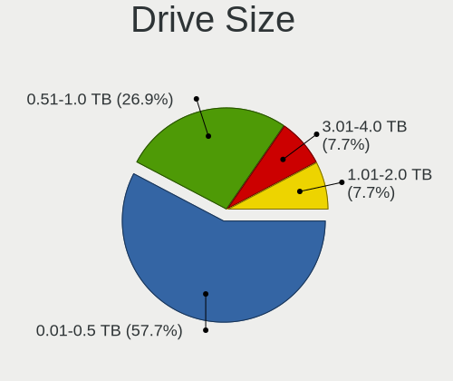
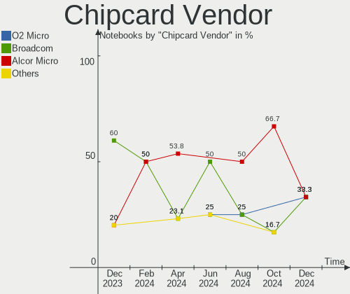

Manjaro - Hardware Trends (Notebooks)
-------------------------------------

A project to identify most popular hardware characteristics and track their change
over time based on data collected by Linux users at https://Linux-Hardware.org.

Anyone can contribute to this report by the [hw-probe](https://github.com/linuxhw/hw-probe) tool:

    sudo -E hw-probe -all -upload

This report is for one last month. Overall report since the beginning of time: [TestDays](https://github.com/linuxhw/TestDays)

Period: Apr, 2024.

Contents
--------

* [ System ](#system)
  - [ OS                       ](#os)
  - [ OS Family                ](#os-family)
  - [ Kernel                   ](#kernel)
  - [ Kernel Family            ](#kernel-family)
  - [ Kernel Major Ver.        ](#kernel-major-ver)
  - [ Arch                     ](#arch)
  - [ DE                       ](#de)
  - [ Display Server           ](#display-server)
  - [ Display Manager          ](#display-manager)
  - [ OS Lang                  ](#os-lang)
  - [ Boot Mode                ](#boot-mode)
  - [ Filesystem               ](#filesystem)
  - [ Part. scheme             ](#part-scheme)
  - [ Dual Boot with Linux/BSD ](#dual-boot-with-linuxbsd)
  - [ Dual Boot (Win)          ](#dual-boot-win)

* [ Board ](#board)
  - [ Vendor                   ](#vendor)
  - [ Model                    ](#model)
  - [ Model Family             ](#model-family)
  - [ MFG Year                 ](#mfg-year)
  - [ Form Factor              ](#form-factor)
  - [ Secure Boot              ](#secure-boot)
  - [ Coreboot                 ](#coreboot)
  - [ RAM Size                 ](#ram-size)
  - [ RAM Used                 ](#ram-used)
  - [ Total Drives             ](#total-drives)
  - [ Has CD-ROM               ](#has-cd-rom)
  - [ Has Ethernet             ](#has-ethernet)
  - [ Has WiFi                 ](#has-wifi)
  - [ Has Bluetooth            ](#has-bluetooth)

* [ Location ](#location)
  - [ Country                  ](#country)
  - [ City                     ](#city)

* [ Drives ](#drives)
  - [ Drive Vendor             ](#drive-vendor)
  - [ Drive Model              ](#drive-model)
  - [ HDD Vendor               ](#hdd-vendor)
  - [ SSD Vendor               ](#ssd-vendor)
  - [ Drive Kind               ](#drive-kind)
  - [ Drive Connector          ](#drive-connector)
  - [ Drive Size               ](#drive-size)
  - [ Space Total              ](#space-total)
  - [ Space Used               ](#space-used)
  - [ Malfunc. Drives          ](#malfunc-drives)
  - [ Malfunc. Drive Vendor    ](#malfunc-drive-vendor)
  - [ Malfunc. HDD Vendor      ](#malfunc-hdd-vendor)
  - [ Malfunc. Drive Kind      ](#malfunc-drive-kind)
  - [ Failed Drives            ](#failed-drives)
  - [ Failed Drive Vendor      ](#failed-drive-vendor)
  - [ Drive Status             ](#drive-status)

* [ Storage controller ](#storage-controller)
  - [ Storage Vendor           ](#storage-vendor)
  - [ Storage Model            ](#storage-model)
  - [ Storage Kind             ](#storage-kind)

* [ Processor ](#processor)
  - [ CPU Vendor               ](#cpu-vendor)
  - [ CPU Model                ](#cpu-model)
  - [ CPU Model Family         ](#cpu-model-family)
  - [ CPU Cores                ](#cpu-cores)
  - [ CPU Sockets              ](#cpu-sockets)
  - [ CPU Threads              ](#cpu-threads)
  - [ CPU Op-Modes             ](#cpu-op-modes)
  - [ CPU Microcode            ](#cpu-microcode)
  - [ CPU Microarch            ](#cpu-microarch)

* [ Graphics ](#graphics)
  - [ GPU Vendor               ](#gpu-vendor)
  - [ GPU Model                ](#gpu-model)
  - [ GPU Combo                ](#gpu-combo)
  - [ GPU Driver               ](#gpu-driver)
  - [ GPU Memory               ](#gpu-memory)

* [ Monitor ](#monitor)
  - [ Monitor Vendor           ](#monitor-vendor)
  - [ Monitor Model            ](#monitor-model)
  - [ Monitor Resolution       ](#monitor-resolution)
  - [ Monitor Diagonal         ](#monitor-diagonal)
  - [ Monitor Width            ](#monitor-width)
  - [ Aspect Ratio             ](#aspect-ratio)
  - [ Monitor Area             ](#monitor-area)
  - [ Pixel Density            ](#pixel-density)
  - [ Multiple Monitors        ](#multiple-monitors)

* [ Network ](#network)
  - [ Net Controller Vendor    ](#net-controller-vendor)
  - [ Net Controller Model     ](#net-controller-model)
  - [ Wireless Vendor          ](#wireless-vendor)
  - [ Wireless Model           ](#wireless-model)
  - [ Ethernet Vendor          ](#ethernet-vendor)
  - [ Ethernet Model           ](#ethernet-model)
  - [ Net Controller Kind      ](#net-controller-kind)
  - [ Used Controller          ](#used-controller)
  - [ NICs                     ](#nics)
  - [ IPv6                     ](#ipv6)

* [ Bluetooth ](#bluetooth)
  - [ Bluetooth Vendor         ](#bluetooth-vendor)
  - [ Bluetooth Model          ](#bluetooth-model)

* [ Sound ](#sound)
  - [ Sound Vendor             ](#sound-vendor)
  - [ Sound Model              ](#sound-model)

* [ Memory ](#memory)
  - [ Memory Vendor            ](#memory-vendor)
  - [ Memory Model             ](#memory-model)
  - [ Memory Kind              ](#memory-kind)
  - [ Memory Form Factor       ](#memory-form-factor)
  - [ Memory Size              ](#memory-size)
  - [ Memory Speed             ](#memory-speed)

* [ Printers & scanners ](#printers--scanners)
  - [ Printer Vendor           ](#printer-vendor)
  - [ Printer Model            ](#printer-model)
  - [ Scanner Vendor           ](#scanner-vendor)
  - [ Scanner Model            ](#scanner-model)

* [ Camera ](#camera)
  - [ Camera Vendor            ](#camera-vendor)
  - [ Camera Model             ](#camera-model)

* [ Security ](#security)
  - [ Fingerprint Vendor       ](#fingerprint-vendor)
  - [ Fingerprint Model        ](#fingerprint-model)
  - [ Chipcard Vendor          ](#chipcard-vendor)
  - [ Chipcard Model           ](#chipcard-model)

* [ Unsupported ](#unsupported)
  - [ Unsupported Devices      ](#unsupported-devices)
  - [ Unsupported Device Types ](#unsupported-device-types)

System
------

OS
--

Installed operating systems

| Name           | Notebooks | Percent |
|----------------|-----------|---------|
| Manjaro        | 42        | 58.33%  |
| Manjaro 23.1.4 | 27        | 37.5%   |
| Manjaro 23.1.3 | 3         | 4.17%   |

OS Family
---------

OS without a version

| Name    | Notebooks | Percent |
|---------|-----------|---------|
| Manjaro | 72        | 100%    |

Kernel
------

Version of the Linux kernel

| Version                    | Notebooks | Percent |
|----------------------------|-----------|---------|
| 6.6.26-1-MANJARO           | 17        | 23.61%  |
| 6.6.25-1-MANJARO           | 14        | 19.44%  |
| 6.8.5-1-MANJARO            | 9         | 12.5%   |
| 6.6.19-1-MANJARO           | 6         | 8.33%   |
| 6.8.4-1-MANJARO            | 5         | 6.94%   |
| 6.8.0-1-MANJARO            | 2         | 2.78%   |
| 6.7.7-1-MANJARO            | 2         | 2.78%   |
| 6.5.5-1-MANJARO            | 2         | 2.78%   |
| 6.5.13-7-MANJARO           | 2         | 2.78%   |
| 6.1.85-1-MANJARO           | 2         | 2.78%   |
| 6.8.7-zen2-xanmod2-2       | 1         | 1.39%   |
| 6.8.3-1-MANJARO            | 1         | 1.39%   |
| 6.8.2-x64v2-xanmod1-1-edge | 1         | 1.39%   |
| 6.7.12-1-MANJARO           | 1         | 1.39%   |
| 6.6.28-1-MANJARO           | 1         | 1.39%   |
| 6.6.24-1-MANJARO           | 1         | 1.39%   |
| 6.6.23-1-MANJARO           | 1         | 1.39%   |
| 6.6.22-x64v3-xanmod1       | 1         | 1.39%   |
| 6.5.3-1-MANJARO            | 1         | 1.39%   |
| 6.1.80-1-MANJARO           | 1         | 1.39%   |
| 5.15.154-1-MANJARO         | 1         | 1.39%   |

Kernel Family
-------------

Linux kernel without a distro release

| Version  | Notebooks | Percent |
|----------|-----------|---------|
| 6.6.26   | 17        | 23.61%  |
| 6.6.25   | 14        | 19.44%  |
| 6.8.5    | 9         | 12.5%   |
| 6.6.19   | 6         | 8.33%   |
| 6.8.4    | 5         | 6.94%   |
| 6.8.0    | 2         | 2.78%   |
| 6.7.7    | 2         | 2.78%   |
| 6.5.5    | 2         | 2.78%   |
| 6.5.13   | 2         | 2.78%   |
| 6.1.85   | 2         | 2.78%   |
| 6.8.7    | 1         | 1.39%   |
| 6.8.3    | 1         | 1.39%   |
| 6.8.2    | 1         | 1.39%   |
| 6.7.12   | 1         | 1.39%   |
| 6.6.28   | 1         | 1.39%   |
| 6.6.24   | 1         | 1.39%   |
| 6.6.23   | 1         | 1.39%   |
| 6.6.22   | 1         | 1.39%   |
| 6.5.3    | 1         | 1.39%   |
| 6.1.80   | 1         | 1.39%   |
| 5.15.154 | 1         | 1.39%   |

Kernel Major Ver.
-----------------

Linux kernel major version

| Version | Notebooks | Percent |
|---------|-----------|---------|
| 6.6     | 41        | 56.94%  |
| 6.8     | 19        | 26.39%  |
| 6.5     | 5         | 6.94%   |
| 6.7     | 3         | 4.17%   |
| 6.1     | 3         | 4.17%   |
| 5.15    | 1         | 1.39%   |

Arch
----

OS architecture (x86_64, i586, etc.)

| Name   | Notebooks | Percent |
|--------|-----------|---------|
| x86_64 | 72        | 100%    |

DE
--

Desktop Environment

| Name       | Notebooks | Percent |
|------------|-----------|---------|
| KDE5       | 41        | 56.94%  |
| GNOME      | 14        | 19.44%  |
| XFCE       | 4         | 5.56%   |
| i3         | 4         | 5.56%   |
| X-Cinnamon | 3         | 4.17%   |
| KDE6       | 2         | 2.78%   |
| Unknown    | 2         | 2.78%   |
| sway       | 1         | 1.39%   |
| MATE       | 1         | 1.39%   |

Display Server
--------------

X11 or Wayland

| Name    | Notebooks | Percent |
|---------|-----------|---------|
| X11     | 36        | 50%     |
| Wayland | 33        | 45.83%  |
| Unknown | 2         | 2.78%   |
| Tty     | 1         | 1.39%   |

Display Manager
---------------

SDDM, LightDM, etc.

| Name    | Notebooks | Percent |
|---------|-----------|---------|
| Unknown | 42        | 58.33%  |
| SDDM    | 19        | 26.39%  |
| LightDM | 8         | 11.11%  |
| GDM     | 3         | 4.17%   |

OS Lang
-------

Language

| Lang    | Notebooks | Percent |
|---------|-----------|---------|
| en_US   | 33        | 45.83%  |
| de_DE   | 6         | 8.33%   |
| ru_RU   | 5         | 6.94%   |
| pt_BR   | 3         | 4.17%   |
| it_IT   | 3         | 4.17%   |
| en_GB   | 3         | 4.17%   |
| pl_PL   | 2         | 2.78%   |
| en_CA   | 2         | 2.78%   |
| Unknown | 2         | 2.78%   |
| zh_CN   | 1         | 1.39%   |
| tr_TR   | 1         | 1.39%   |
| ru      | 1         | 1.39%   |
| nl_NL   | 1         | 1.39%   |
| es_MX   | 1         | 1.39%   |
| es_ES   | 1         | 1.39%   |
| es_AR   | 1         | 1.39%   |
| en_NZ   | 1         | 1.39%   |
| en_IL   | 1         | 1.39%   |
| en_IE   | 1         | 1.39%   |
| de_AT   | 1         | 1.39%   |
| cs_CZ   | 1         | 1.39%   |
| C       | 1         | 1.39%   |

Boot Mode
---------

EFI or BIOS

| Mode | Notebooks | Percent |
|------|-----------|---------|
| BIOS | 44        | 61.11%  |
| EFI  | 28        | 38.89%  |

Filesystem
----------

Type of filesystem

| Type  | Notebooks | Percent |
|-------|-----------|---------|
| Ext4  | 58        | 80.56%  |
| Btrfs | 8         | 11.11%  |
| Tmpfs | 5         | 6.94%   |
| Xfs   | 1         | 1.39%   |

Part. scheme
------------

Scheme of partitioning

| Type    | Notebooks | Percent |
|---------|-----------|---------|
| Unknown | 38        | 52.78%  |
| GPT     | 31        | 43.06%  |
| MBR     | 3         | 4.17%   |

Dual Boot with Linux/BSD
------------------------

Hosting more than one Linux/BSD

| Dual boot | Notebooks | Percent |
|-----------|-----------|---------|
| No        | 67        | 93.06%  |
| Yes       | 5         | 6.94%   |

Dual Boot (Win)
---------------

Hosting Linux and Windows

| Dual boot | Notebooks | Percent |
|-----------|-----------|---------|
| No        | 62        | 86.11%  |
| Yes       | 10        | 13.89%  |

Board
-----

Vendor
------

Motherboard manufacturer

| Name                | Notebooks | Percent |
|---------------------|-----------|---------|
| Lenovo              | 26        | 36.11%  |
| Hewlett-Packard     | 13        | 18.06%  |
| Dell                | 12        | 16.67%  |
| Acer                | 5         | 6.94%   |
| ASUSTek Computer    | 4         | 5.56%   |
| Apple               | 4         | 5.56%   |
| HONOR               | 2         | 2.78%   |
| Chuwi               | 2         | 2.78%   |
| Sony                | 1         | 1.39%   |
| Samsung Electronics | 1         | 1.39%   |
| MSI                 | 1         | 1.39%   |
| HUAWEI              | 1         | 1.39%   |

Model
-----

Motherboard model

| Name                                   | Notebooks | Percent |
|----------------------------------------|-----------|---------|
| Chuwi MiniBook X                       | 2         | 2.78%   |
| Acer Aspire ES1-523                    | 2         | 2.78%   |
| Sony VGN-Z21VRN_X                      | 1         | 1.39%   |
| Samsung 530U3C/530U4C/532U3C           | 1         | 1.39%   |
| MSI Prestige 14 A12UC                  | 1         | 1.39%   |
| Lenovo Yoga Pro 9 16IMH9 83DN          | 1         | 1.39%   |
| Lenovo Yoga 500-15ISK 80R6             | 1         | 1.39%   |
| Lenovo XiaoXinPro 14 APH8 83AM         | 1         | 1.39%   |
| Lenovo ThinkPad X270 20K5S1A524        | 1         | 1.39%   |
| Lenovo ThinkPad X260 20F60093US        | 1         | 1.39%   |
| Lenovo ThinkPad X13 Gen 4 21J3CTO1WW   | 1         | 1.39%   |
| Lenovo ThinkPad W530 24474KG           | 1         | 1.39%   |
| Lenovo ThinkPad T530 2392AQU           | 1         | 1.39%   |
| Lenovo ThinkPad T480 20L6S4XW00        | 1         | 1.39%   |
| Lenovo ThinkPad T16 Gen 1 21BWS2U600   | 1         | 1.39%   |
| Lenovo ThinkPad T14s Gen 4 21F8002TGE  | 1         | 1.39%   |
| Lenovo ThinkPad T14s Gen 4 21F7S09V0D  | 1         | 1.39%   |
| Lenovo ThinkPad T14 Gen 4 21K3CTO1WW   | 1         | 1.39%   |
| Lenovo ThinkPad P14s Gen 2i 20VX005FMX | 1         | 1.39%   |
| Lenovo ThinkPad P1 Gen 4i 20Y4S57200   | 1         | 1.39%   |
| Lenovo ThinkPad L15 Gen 3 21C7003VGE   | 1         | 1.39%   |
| Lenovo ThinkPad L15 Gen 3 21C3000CPG   | 1         | 1.39%   |
| Lenovo ThinkPad L13 Gen 2 20VH004EUK   | 1         | 1.39%   |
| Lenovo ThinkPad E490 20N8002ART        | 1         | 1.39%   |
| Lenovo ThinkPad E14 Gen 5 21JSS0Y500   | 1         | 1.39%   |
| Lenovo Legion Y530-15ICH 81FV          | 1         | 1.39%   |
| Lenovo Legion Slim 5 14APH8 82Y5       | 1         | 1.39%   |
| Lenovo Legion 5 17ACH6H 82JY           | 1         | 1.39%   |
| Lenovo Legion 5 15ARH7 82RE            | 1         | 1.39%   |
| Lenovo Legion 5 15ARH05H 82B1          | 1         | 1.39%   |
| Lenovo IdeaPad 1 15AMN7 82VG           | 1         | 1.39%   |
| HUAWEI NBLK-WAX9X                      | 1         | 1.39%   |
| HONOR GLO-GXXX                         | 1         | 1.39%   |
| HONOR BMH-WCX9                         | 1         | 1.39%   |
| HP Victus by Laptop 16-e0xxx           | 1         | 1.39%   |
| HP ProBook 640 G2                      | 1         | 1.39%   |
| HP Pavilion Laptop 15-cc5xx            | 1         | 1.39%   |
| HP Pavilion Gaming Laptop 15-ec0xxx    | 1         | 1.39%   |
| HP Pavilion Gaming Laptop 15-dk1xxx    | 1         | 1.39%   |
| HP Pavilion 15                         | 1         | 1.39%   |

Model Family
------------

Motherboard model prefix

| Name               | Notebooks | Percent |
|--------------------|-----------|---------|
| Lenovo ThinkPad    | 17        | 23.61%  |
| Lenovo Legion      | 5         | 6.94%   |
| Dell Inspiron      | 5         | 6.94%   |
| HP Pavilion        | 4         | 5.56%   |
| Dell Latitude      | 4         | 5.56%   |
| Acer Aspire        | 4         | 5.56%   |
| Lenovo Yoga        | 2         | 2.78%   |
| HP Laptop          | 2         | 2.78%   |
| HP EliteBook       | 2         | 2.78%   |
| Dell XPS           | 2         | 2.78%   |
| Chuwi MiniBook     | 2         | 2.78%   |
| ASUS Vivobook      | 2         | 2.78%   |
| Sony VGN-Z21VRN    | 1         | 1.39%   |
| Samsung 530U3C     | 1         | 1.39%   |
| MSI Prestige       | 1         | 1.39%   |
| Lenovo XiaoXinPro  | 1         | 1.39%   |
| Lenovo IdeaPad     | 1         | 1.39%   |
| HUAWEI NBLK-WAX9X  | 1         | 1.39%   |
| HONOR GLO-GXXX     | 1         | 1.39%   |
| HONOR BMH-WCX9     | 1         | 1.39%   |
| HP Victus          | 1         | 1.39%   |
| HP ProBook         | 1         | 1.39%   |
| HP ENVY            | 1         | 1.39%   |
| HP 255             | 1         | 1.39%   |
| HP 240             | 1         | 1.39%   |
| Dell G15           | 1         | 1.39%   |
| ASUS X540SAA       | 1         | 1.39%   |
| ASUS ASUS          | 1         | 1.39%   |
| Apple MacBookPro9  | 1         | 1.39%   |
| Apple MacBookPro8  | 1         | 1.39%   |
| Apple MacBookPro7  | 1         | 1.39%   |
| Apple MacBookPro14 | 1         | 1.39%   |
| Acer Swift         | 1         | 1.39%   |

MFG Year
--------

Motherboard manufacture year

| Year | Notebooks | Percent |
|------|-----------|---------|
| 2023 | 13        | 18.06%  |
| 2022 | 9         | 12.5%   |
| 2021 | 9         | 12.5%   |
| 2016 | 9         | 12.5%   |
| 2018 | 6         | 8.33%   |
| 2012 | 6         | 8.33%   |
| 2020 | 5         | 6.94%   |
| 2019 | 4         | 5.56%   |
| 2017 | 4         | 5.56%   |
| 2024 | 2         | 2.78%   |
| 2010 | 2         | 2.78%   |
| 2013 | 1         | 1.39%   |
| 2011 | 1         | 1.39%   |
| 2009 | 1         | 1.39%   |

Form Factor
-----------

Physical design of the computer

| Name     | Notebooks | Percent |
|----------|-----------|---------|
| Notebook | 72        | 100%    |

Secure Boot
-----------

Enabled or disabled

| State    | Notebooks | Percent |
|----------|-----------|---------|
| Disabled | 71        | 98.61%  |
| Enabled  | 1         | 1.39%   |

Coreboot
--------

Have coreboot on board

| Used | Notebooks | Percent |
|------|-----------|---------|
| No   | 72        | 100%    |

RAM Size
--------

Total RAM memory

| Size in GB  | Notebooks | Percent |
|-------------|-----------|---------|
| 16.01-24.0  | 16        | 22.22%  |
| 8.01-16.0   | 15        | 20.83%  |
| 4.01-8.0    | 14        | 19.44%  |
| 32.01-64.0  | 11        | 15.28%  |
| 3.01-4.0    | 7         | 9.72%   |
| 24.01-32.0  | 7         | 9.72%   |
| 64.01-256.0 | 2         | 2.78%   |

RAM Used
--------

Used RAM memory

| Used GB    | Notebooks | Percent |
|------------|-----------|---------|
| 4.01-8.0   | 30        | 41.67%  |
| 2.01-3.0   | 13        | 18.06%  |
| 1.01-2.0   | 10        | 13.89%  |
| 3.01-4.0   | 9         | 12.5%   |
| 8.01-16.0  | 9         | 12.5%   |
| 24.01-32.0 | 1         | 1.39%   |

Total Drives
------------

Number of drives on board

| Drives | Notebooks | Percent |
|--------|-----------|---------|
| 1      | 57        | 79.17%  |
| 2      | 10        | 13.89%  |
| 3      | 4         | 5.56%   |
| 4      | 1         | 1.39%   |

Has CD-ROM
----------

Has CD-ROM on board

| Presented | Notebooks | Percent |
|-----------|-----------|---------|
| No        | 59        | 81.94%  |
| Yes       | 13        | 18.06%  |

Has Ethernet
------------

Has Ethernet on board

| Presented | Notebooks | Percent |
|-----------|-----------|---------|
| Yes       | 52        | 72.22%  |
| No        | 20        | 27.78%  |

Has WiFi
--------

Has WiFi module

| Presented | Notebooks | Percent |
|-----------|-----------|---------|
| Yes       | 72        | 100%    |

Has Bluetooth
-------------

Has Bluetooth module

| Presented | Notebooks | Percent |
|-----------|-----------|---------|
| Yes       | 70        | 97.22%  |
| No        | 2         | 2.78%   |

Location
--------

Country
-------

Geographic location (country)

| Country     | Notebooks | Percent |
|-------------|-----------|---------|
| USA         | 14        | 19.44%  |
| Russia      | 9         | 12.5%   |
| Germany     | 9         | 12.5%   |
| Italy       | 5         | 6.94%   |
| Brazil      | 4         | 5.56%   |
| UK          | 3         | 4.17%   |
| Austria     | 3         | 4.17%   |
| Turkey      | 2         | 2.78%   |
| Sweden      | 2         | 2.78%   |
| Spain       | 2         | 2.78%   |
| Netherlands | 2         | 2.78%   |
| Mexico      | 2         | 2.78%   |
| Canada      | 2         | 2.78%   |
| Portugal    | 1         | 1.39%   |
| Poland      | 1         | 1.39%   |
| New Zealand | 1         | 1.39%   |
| Japan       | 1         | 1.39%   |
| Israel      | 1         | 1.39%   |
| Iran        | 1         | 1.39%   |
| France      | 1         | 1.39%   |
| Denmark     | 1         | 1.39%   |
| Czechia     | 1         | 1.39%   |
| Costa Rica  | 1         | 1.39%   |
| Chile       | 1         | 1.39%   |
| Bulgaria    | 1         | 1.39%   |
| Argentina   | 1         | 1.39%   |

City
----

Geographic location (city)

| City              | Notebooks | Percent |
|-------------------|-----------|---------|
| Moscow            | 5         | 6.94%   |
| Milan             | 2         | 2.78%   |
| Frankfurt am Main | 2         | 2.78%   |
| Yazd              | 1         | 1.39%   |
| Xique-Xique       | 1         | 1.39%   |
| Warwick           | 1         | 1.39%   |
| Warsaw            | 1         | 1.39%   |
| Vladivostok       | 1         | 1.39%   |
| Vitoria-Gasteiz   | 1         | 1.39%   |
| Villa del Dique   | 1         | 1.39%   |
| Vienna            | 1         | 1.39%   |
| Urbana            | 1         | 1.39%   |
| Turin             | 1         | 1.39%   |
| Tourcoing         | 1         | 1.39%   |
| Surgut            | 1         | 1.39%   |
| Stuttgart         | 1         | 1.39%   |
| Spruce Grove      | 1         | 1.39%   |
| Springe           | 1         | 1.39%   |
| Sollentuna        | 1         | 1.39%   |
| Sao Paulo         | 1         | 1.39%   |
| Santiago          | 1         | 1.39%   |
| San Pedro         | 1         | 1.39%   |
| Saarbrücken      | 1         | 1.39%   |
| Ruda              | 1         | 1.39%   |
| Rubilovo          | 1         | 1.39%   |
| Prague            | 1         | 1.39%   |
| Porto             | 1         | 1.39%   |
| Petah Tikva       | 1         | 1.39%   |
| Perugia           | 1         | 1.39%   |
| Oosternijkerk     | 1         | 1.39%   |
| Ogden             | 1         | 1.39%   |
| Normal            | 1         | 1.39%   |
| Naaldwijk         | 1         | 1.39%   |
| Munich            | 1         | 1.39%   |
| Mazatlán         | 1         | 1.39%   |
| Linsengericht     | 1         | 1.39%   |
| León             | 1         | 1.39%   |
| Juelsminde        | 1         | 1.39%   |
| Juazeiro do Norte | 1         | 1.39%   |
| Johnston          | 1         | 1.39%   |

Drives
------

Drive Vendor
------------

Hard drive vendors

| Vendor                         | Notebooks | Drives | Percent |
|--------------------------------|-----------|--------|---------|
| Samsung Electronics            | 21        | 21     | 22.83%  |
| Sandisk                        | 12        | 12     | 13.04%  |
| Kingston                       | 9         | 9      | 9.78%   |
| Toshiba                        | 6         | 6      | 6.52%   |
| SK hynix                       | 6         | 6      | 6.52%   |
| Seagate                        | 5         | 5      | 5.43%   |
| Intel                          | 4         | 4      | 4.35%   |
| Unknown                        | 3         | 3      | 3.26%   |
| Micron Technology              | 3         | 4      | 3.26%   |
| KIOXIA                         | 3         | 3      | 3.26%   |
| Solid State Storage Technology | 2         | 2      | 2.17%   |
| Micron/Crucial Technology      | 2         | 2      | 2.17%   |
| MAXIO Technology (Hangzhou)    | 2         | 2      | 2.17%   |
| Hitachi                        | 2         | 2      | 2.17%   |
| Crucial                        | 2         | 2      | 2.17%   |
| Union Memory (Shenzhen)        | 1         | 1      | 1.09%   |
| Team                           | 1         | 1      | 1.09%   |
| Solid State Storage            | 1         | 1      | 1.09%   |
| SABRENT                        | 1         | 1      | 1.09%   |
| PNY                            | 1         | 1      | 1.09%   |
| LITEON                         | 1         | 1      | 1.09%   |
| Kingston Technology Company    | 1         | 1      | 1.09%   |
| Fanxiang                       | 1         | 1      | 1.09%   |
| Dell                           | 1         | 1      | 1.09%   |
| Apple                          | 1         | 2      | 1.09%   |

Drive Model
-----------

Hard drive models

| Model                                                | Notebooks | Percent |
|------------------------------------------------------|-----------|---------|
| Samsung NVMe SSD Controller SM981/PM981/PM983 1TB    | 6         | 6.45%   |
| Sandisk WD Black SN750 / PC SN730 NVMe SSD 512GB     | 3         | 3.23%   |
| Kingston SA400S37240G 240GB SSD                      | 3         | 3.23%   |
| Toshiba MQ01ABD100 1TB                               | 2         | 2.15%   |
| SK hynix SKHynix_HFS001TEJ9X115N 1024GB              | 2         | 2.15%   |
| Seagate Expansion HDD 12TB                           | 2         | 2.15%   |
| Samsung NVMe SSD Controller PM9A1/PM9A3/980PRO 1TB   | 2         | 2.15%   |
| Micron 2450_MTFDKBA512TFK 512GB                      | 2         | 2.15%   |
| MAXIO (Hangzhou) NVMe SSD Controller MAP1202 256GB   | 2         | 2.15%   |
| Kingston SA400S37480G 480GB SSD                      | 2         | 2.15%   |
| Intel SSDPEKNU512GZ 512GB                            | 2         | 2.15%   |
| Crucial CT1000MX500SSD1 1TB                          | 2         | 2.15%   |
| Unknown SD/MMC/MS PRO 128GB                          | 1         | 1.08%   |
| Unknown MMC Card  4GB                                | 1         | 1.08%   |
| Unknown MMC Card  128GB                              | 1         | 1.08%   |
| Union Memory (Shenzhen) UMIS RPEYJ1T24MKN2QWY 1024GB | 1         | 1.08%   |
| Toshiba XG6 NVMe SSD Controller 1024GB               | 1         | 1.08%   |
| Toshiba TR200 240GB SSD                              | 1         | 1.08%   |
| Toshiba MQ04ABF100 1TB                               | 1         | 1.08%   |
| Toshiba MK5065GSXF 500GB                             | 1         | 1.08%   |
| Team TM8PS7001T 1TB SSD                              | 1         | 1.08%   |
| Solid State Storage SSSTC CL4-4D512-Q79 512GB        | 1         | 1.08%   |
| Solid State Storage SSSTC CL4-4D256-Q79 256GB        | 1         | 1.08%   |
| Solid State Storage SSSTC CL1-8D512 512GB            | 1         | 1.08%   |
| SK hynix SKHynix_HFS001TEJ9X162N 1TB                 | 1         | 1.08%   |
| SK hynix BC901 HFS512GEJ9X108N 512GB                 | 1         | 1.08%   |
| SK hynix BC711 NVMe 512GB                            | 1         | 1.08%   |
| SK hynix BC511 256GB                                 | 1         | 1.08%   |
| Seagate ST1000LM049-2GH172 1TB                       | 1         | 1.08%   |
| Seagate ST1000LM024 HN-M101MBB 1TB                   | 1         | 1.08%   |
| Seagate Expansion 2TB                                | 1         | 1.08%   |
| Sandisk WD_BLACK SN850X 4000GB                       | 1         | 1.08%   |
| Sandisk WD_BLACK SN770 2TB                           | 1         | 1.08%   |
| Sandisk WD PC SN740 SDDQNQD-512G-1201 512GB          | 1         | 1.08%   |
| Sandisk WD PC SN740 SDDQNQD-1T00-1014 1TB            | 1         | 1.08%   |
| Sandisk WD Blue SN580 1TB                            | 1         | 1.08%   |
| Sandisk WD Blue SN550 NVMe SSD 2TB                   | 1         | 1.08%   |
| SanDisk SSD PLUS 240GB                               | 1         | 1.08%   |
| SanDisk SSD i100 24GB                                | 1         | 1.08%   |
| Sandisk PC SN530 NVMe WDC 256GB                      | 1         | 1.08%   |

HDD Vendor
----------

Hard disk drive vendors

| Vendor  | Notebooks | Drives | Percent |
|---------|-----------|--------|---------|
| Seagate | 5         | 5      | 41.67%  |
| Toshiba | 4         | 4      | 33.33%  |
| Hitachi | 2         | 2      | 16.67%  |
| Unknown | 1         | 1      | 8.33%   |

SSD Vendor
----------

Solid state drive vendors

| Vendor              | Notebooks | Drives | Percent |
|---------------------|-----------|--------|---------|
| Kingston            | 9         | 9      | 34.62%  |
| Samsung Electronics | 6         | 6      | 23.08%  |
| SanDisk             | 2         | 2      | 7.69%   |
| Crucial             | 2         | 2      | 7.69%   |
| Toshiba             | 1         | 1      | 3.85%   |
| Team                | 1         | 1      | 3.85%   |
| SABRENT             | 1         | 1      | 3.85%   |
| PNY                 | 1         | 1      | 3.85%   |
| Micron Technology   | 1         | 1      | 3.85%   |
| LITEON              | 1         | 1      | 3.85%   |
| Dell                | 1         | 1      | 3.85%   |

Drive Kind
----------

HDD or SSD

| Kind    | Notebooks | Drives | Percent |
|---------|-----------|--------|---------|
| NVMe    | 48        | 53     | 55.81%  |
| SSD     | 23        | 26     | 26.74%  |
| HDD     | 12        | 12     | 13.95%  |
| MMC     | 2         | 2      | 2.33%   |
| Unknown | 1         | 1      | 1.16%   |

Drive Connector
---------------

SATA, SAS, NVMe, etc.

| Type | Notebooks | Drives | Percent |
|------|-----------|--------|---------|
| NVMe | 48        | 53     | 57.14%  |
| SATA | 27        | 30     | 32.14%  |
| SAS  | 7         | 9      | 8.33%   |
| MMC  | 2         | 2      | 2.38%   |

Drive Size
----------

Size of hard drive

| Size in TB | Notebooks | Drives | Percent |
|------------|-----------|--------|---------|
| 0.01-0.5   | 19        | 23     | 57.58%  |
| 0.51-1.0   | 9         | 10     | 27.27%  |
| 3.01-4.0   | 2         | 2      | 6.06%   |
| 10.01-20.0 | 2         | 2      | 6.06%   |
| 1.01-2.0   | 1         | 1      | 3.03%   |

Space Total
-----------

Amount of disk space available on the file system

| Size in GB     | Notebooks | Percent |
|----------------|-----------|---------|
| 251-500        | 22        | 30.56%  |
| 501-1000       | 14        | 19.44%  |
| 101-250        | 11        | 15.28%  |
| 1001-2000      | 7         | 9.72%   |
| Unknown        | 7         | 9.72%   |
| More than 3000 | 5         | 6.94%   |
| 51-100         | 3         | 4.17%   |
| 2001-3000      | 2         | 2.78%   |
| 21-50          | 1         | 1.39%   |

Space Used
----------

Amount of used disk space

| Used GB   | Notebooks | Percent |
|-----------|-----------|---------|
| 1-20      | 17        | 23.61%  |
| 251-500   | 14        | 19.44%  |
| 51-100    | 13        | 18.06%  |
| 21-50     | 8         | 11.11%  |
| Unknown   | 7         | 9.72%   |
| 101-250   | 6         | 8.33%   |
| 501-1000  | 5         | 6.94%   |
| 2001-3000 | 1         | 1.39%   |
| 1001-2000 | 1         | 1.39%   |

Malfunc. Drives
---------------

Drive models with a malfunction

| Model                               | Notebooks | Drives | Percent |
|-------------------------------------|-----------|--------|---------|
| Toshiba MK5065GSXF 500GB            | 1         | 1      | 50%     |
| Samsung Electronics SSD 870 EVO 1TB | 1         | 1      | 50%     |

Malfunc. Drive Vendor
---------------------

Vendors of faulty drives

| Vendor              | Notebooks | Drives | Percent |
|---------------------|-----------|--------|---------|
| Toshiba             | 1         | 1      | 50%     |
| Samsung Electronics | 1         | 1      | 50%     |

Malfunc. HDD Vendor
-------------------

Vendors of faulty HDD drives

| Vendor  | Notebooks | Drives | Percent |
|---------|-----------|--------|---------|
| Toshiba | 1         | 1      | 100%    |

Malfunc. Drive Kind
-------------------

Kinds of faulty drives

| Kind | Notebooks | Drives | Percent |
|------|-----------|--------|---------|
| SSD  | 1         | 1      | 50%     |
| HDD  | 1         | 1      | 50%     |

Failed Drives
-------------

Failed drive models

Zero info for selected period =(

Failed Drive Vendor
-------------------

Failed drive vendors

Zero info for selected period =(

Drive Status
------------

Number of failed and malfunc. drives

| Status   | Notebooks | Drives | Percent |
|----------|-----------|--------|---------|
| Detected | 49        | 64     | 64.47%  |
| Works    | 25        | 28     | 32.89%  |
| Malfunc  | 2         | 2      | 2.63%   |

Storage controller
------------------

Storage Vendor
--------------

Storage controller vendors

| Vendor                                  | Notebooks | Percent |
|-----------------------------------------|-----------|---------|
| Intel                                   | 32        | 36.36%  |
| Samsung Electronics                     | 15        | 17.05%  |
| SanDisk                                 | 10        | 11.36%  |
| AMD                                     | 7         | 7.95%   |
| SK hynix                                | 6         | 6.82%   |
| Solid State Storage Technology          | 3         | 3.41%   |
| Micron Technology                       | 3         | 3.41%   |
| KIOXIA                                  | 3         | 3.41%   |
| Micron/Crucial Technology               | 2         | 2.27%   |
| MAXIO Technology (Hangzhou)             | 2         | 2.27%   |
| Toshiba America Info Systems            | 1         | 1.14%   |
| Shenzhen Unionmemory Information System | 1         | 1.14%   |
| Nvidia                                  | 1         | 1.14%   |
| Kingston Technology Company             | 1         | 1.14%   |
| Apple                                   | 1         | 1.14%   |

Storage Model
-------------

Storage controller models

| Model                                                                                         | Notebooks | Percent |
|-----------------------------------------------------------------------------------------------|-----------|---------|
| Intel Sunrise Point-LP SATA Controller [AHCI mode]                                            | 8         | 8.6%    |
| Samsung NVMe SSD Controller SM981/PM981/PM983                                                 | 7         | 7.53%   |
| AMD FCH SATA Controller [AHCI mode]                                                           | 7         | 7.53%   |
| Intel 7 Series Chipset Family 6-port SATA Controller [AHCI mode]                              | 5         | 5.38%   |
| Intel Volume Management Device NVMe RAID Controller                                           | 4         | 4.3%    |
| SK hynix Platinum P41/PC801 NVMe Solid State Drive                                            | 3         | 3.23%   |
| SanDisk WD Black SN770 / PC SN740 256GB / PC SN560 (DRAM-less) NVMe SSD                       | 3         | 3.23%   |
| SanDisk Extreme Pro / WD Black SN750 / PC SN730 / Red SN700 NVMe SSD                          | 3         | 3.23%   |
| Samsung NVMe SSD Controller PM9B1 (DRAM-less)                                                 | 3         | 3.23%   |
| Samsung NVMe SSD Controller PM9A1/PM9A3/980PRO                                                | 3         | 3.23%   |
| Micron 2450 NVMe SSD [HendrixV] (DRAM-less)                                                   | 3         | 3.23%   |
| Intel SSD 670p Series [Keystone Harbor]                                                       | 3         | 3.23%   |
| Intel 82801 Mobile SATA Controller [RAID mode]                                                | 3         | 3.23%   |
| Solid State Storage CL4-8D512 NVMe SSD M.2 (DRAM-less)                                        | 2         | 2.15%   |
| MAXIO (Hangzhou) NVMe SSD Controller MAP1202 (DRAM-less)                                      | 2         | 2.15%   |
| KIOXIA NVMe SSD Controller BG5 (DRAM-less)                                                    | 2         | 2.15%   |
| Intel Atom/Celeron/Pentium Processor x5-E8000/J3xxx/N3xxx Series SATA Controller              | 2         | 2.15%   |
| Toshiba America Info Systems XG6 NVMe SSD Controller                                          | 1         | 1.08%   |
| Solid State Storage CL1-3D256-Q11 NVMe SSD M.2                                                | 1         | 1.08%   |
| SK hynix Gold P31/BC711/PC711 NVMe Solid State Drive                                          | 1         | 1.08%   |
| SK hynix BC901 NVMe Solid State Drive (DRAM-less)                                             | 1         | 1.08%   |
| SK hynix BC511 NVMe SSD                                                                       | 1         | 1.08%   |
| Shenzhen Unionmemory Information System RPEYJ1T24MKN2QWY PCIe 4.0 NVMe SSD 1024GB (DRAM-less) | 1         | 1.08%   |
| Sandisk WD Blue SN580 NVMe SSD (DRAM-less)                                                    | 1         | 1.08%   |
| Sandisk WD Black SN850X NVMe SSD                                                              | 1         | 1.08%   |
| SanDisk Ultra 3D / WD Blue SN550 NVMe SSD                                                     | 1         | 1.08%   |
| SanDisk IX SN530 NVMe SSD (DRAM-less)                                                         | 1         | 1.08%   |
| Samsung NVMe SSD Controller SM961/PM961/SM963                                                 | 1         | 1.08%   |
| Samsung NVMe SSD Controller 980 (DRAM-less)                                                   | 1         | 1.08%   |
| Nvidia MCP89 SATA Controller (AHCI mode)                                                      | 1         | 1.08%   |
| Micron/Crucial P5 Plus NVMe PCIe SSD                                                          | 1         | 1.08%   |
| Micron/Crucial Non-Volatile memory controller                                                 | 1         | 1.08%   |
| KIOXIA NVMe SSD Controller BG4 (DRAM-less)                                                    | 1         | 1.08%   |
| Kingston Company NV2 NVMe SSD SM2267XT (DRAM-less)                                            | 1         | 1.08%   |
| Intel Volume Management Device NVMe RAID Controller Intel Corporation                         | 1         | 1.08%   |
| Intel Tiger Lake-LP SATA Controller                                                           | 1         | 1.08%   |
| Intel Tiger Lake SATA AHCI Controller                                                         | 1         | 1.08%   |
| Intel SSD 660P Series                                                                         | 1         | 1.08%   |
| Intel Cannon Point-LP SATA Controller [AHCI Mode]                                             | 1         | 1.08%   |
| Intel Cannon Lake Mobile PCH SATA AHCI Controller                                             | 1         | 1.08%   |

Storage Kind
------------

Kind of storage controller (IDE, SATA, NVMe, SAS, ...)

| Kind | Notebooks | Percent |
|------|-----------|---------|
| NVMe | 48        | 54.55%  |
| SATA | 31        | 35.23%  |
| RAID | 8         | 9.09%   |
| IDE  | 1         | 1.14%   |

Processor
---------

CPU Vendor
----------

Processor vendors

| Vendor | Notebooks | Percent |
|--------|-----------|---------|
| Intel  | 48        | 66.67%  |
| AMD    | 24        | 33.33%  |

CPU Model
---------

Processor models

| Model                                         | Notebooks | Percent |
|-----------------------------------------------|-----------|---------|
| Intel Core i5-7200U CPU @ 2.50GHz             | 3         | 4.17%   |
| Intel Core i5-6300U CPU @ 2.40GHz             | 3         | 4.17%   |
| AMD Ryzen 7 PRO 7840U w/ Radeon 780M Graphics | 3         | 4.17%   |
| AMD Ryzen 7 5700U with Radeon Graphics        | 3         | 4.17%   |
| Intel N100                                    | 2         | 2.78%   |
| Intel Core i7-8650U CPU @ 1.90GHz             | 2         | 2.78%   |
| Intel Celeron CPU N3060 @ 1.60GHz             | 2         | 2.78%   |
| Intel 11th Gen Core i7-11800H @ 2.30GHz       | 2         | 2.78%   |
| Intel 11th Gen Core i7-1165G7 @ 2.80GHz       | 2         | 2.78%   |
| AMD Ryzen 7 7840HS with Radeon 780M Graphics  | 2         | 2.78%   |
| AMD Ryzen 7 7730U with Radeon Graphics        | 2         | 2.78%   |
| AMD A8-7410 APU with AMD Radeon R5 Graphics   | 2         | 2.78%   |
| Intel Core Ultra 9 185H                       | 1         | 1.39%   |
| Intel Core i7-8565U CPU @ 1.80GHz             | 1         | 1.39%   |
| Intel Core i7-7500U CPU @ 2.70GHz             | 1         | 1.39%   |
| Intel Core i7-6500U CPU @ 2.50GHz             | 1         | 1.39%   |
| Intel Core i7-4510U CPU @ 2.00GHz             | 1         | 1.39%   |
| Intel Core i7-3940XM CPU @ 3.00GHz            | 1         | 1.39%   |
| Intel Core i7-3632QM CPU @ 2.20GHz            | 1         | 1.39%   |
| Intel Core i7-3630QM CPU @ 2.40GHz            | 1         | 1.39%   |
| Intel Core i7-10750H CPU @ 2.60GHz            | 1         | 1.39%   |
| Intel Core i7-1065G7 CPU @ 1.30GHz            | 1         | 1.39%   |
| Intel Core i5-8300H CPU @ 2.30GHz             | 1         | 1.39%   |
| Intel Core i5-8265U CPU @ 1.60GHz             | 1         | 1.39%   |
| Intel Core i5-7360U CPU @ 2.30GHz             | 1         | 1.39%   |
| Intel Core i5-3340M CPU @ 2.70GHz             | 1         | 1.39%   |
| Intel Core i5-3210M CPU @ 2.50GHz             | 1         | 1.39%   |
| Intel Core i5-2537M CPU @ 1.40GHz             | 1         | 1.39%   |
| Intel Core i5-2415M CPU @ 2.30GHz             | 1         | 1.39%   |
| Intel Core i3-7020U CPU @ 2.30GHz             | 1         | 1.39%   |
| Intel Core i3-3217U CPU @ 1.80GHz             | 1         | 1.39%   |
| Intel Core 2 Duo CPU P9500 @ 2.53GHz          | 1         | 1.39%   |
| Intel Core 2 Duo CPU P8600 @ 2.40GHz          | 1         | 1.39%   |
| Intel 13th Gen Core i7-1360P                  | 1         | 1.39%   |
| Intel 13th Gen Core i5-13500H                 | 1         | 1.39%   |
| Intel 13th Gen Core i5-1345U                  | 1         | 1.39%   |
| Intel 12th Gen Core i9-12900HK                | 1         | 1.39%   |
| Intel 12th Gen Core i7-1280P                  | 1         | 1.39%   |
| Intel 12th Gen Core i7-1260P                  | 1         | 1.39%   |
| Intel 12th Gen Core i7-1255U                  | 1         | 1.39%   |

CPU Model Family
----------------

Processor model prefix

| Model            | Notebooks | Percent |
|------------------|-----------|---------|
| Other            | 17        | 23.61%  |
| Intel Core i5    | 13        | 18.06%  |
| Intel Core i7    | 11        | 15.28%  |
| AMD Ryzen 7      | 11        | 15.28%  |
| AMD Ryzen 5      | 5         | 6.94%   |
| AMD Ryzen 7 PRO  | 3         | 4.17%   |
| Intel Core i3    | 2         | 2.78%   |
| Intel Core 2 Duo | 2         | 2.78%   |
| Intel Celeron    | 2         | 2.78%   |
| AMD A8           | 2         | 2.78%   |
| Intel Core       | 1         | 1.39%   |
| AMD Ryzen 5 PRO  | 1         | 1.39%   |
| AMD Ryzen 3      | 1         | 1.39%   |
| AMD A6           | 1         | 1.39%   |

CPU Cores
---------

Number of processor cores

| Number | Notebooks | Percent |
|--------|-----------|---------|
| 4      | 21        | 29.17%  |
| 2      | 21        | 29.17%  |
| 8      | 15        | 20.83%  |
| 6      | 6         | 8.33%   |
| 12     | 3         | 4.17%   |
| 10     | 3         | 4.17%   |
| 14     | 2         | 2.78%   |
| 16     | 1         | 1.39%   |

CPU Sockets
-----------

Number of sockets

| Number | Notebooks | Percent |
|--------|-----------|---------|
| 1      | 72        | 100%    |

CPU Threads
-----------

Threads per core (Hyper-Threading)

| Number | Notebooks | Percent |
|--------|-----------|---------|
| 2      | 61        | 84.72%  |
| 1      | 11        | 15.28%  |

CPU Op-Modes
------------

CPU Operation Modes (32-bit, 64-bit)

| Op mode        | Notebooks | Percent |
|----------------|-----------|---------|
| 32-bit, 64-bit | 72        | 100%    |

CPU Microcode
-------------

Microcode number

| Number     | Notebooks | Percent |
|------------|-----------|---------|
| Unknown    | 64        | 88.89%  |
| 0x306a9    | 2         | 2.78%   |
| 0x406e3    | 1         | 1.39%   |
| 0x0a704104 | 1         | 1.39%   |
| 0x08a00008 | 1         | 1.39%   |
| 0x08608104 | 1         | 1.39%   |
| 0x07030105 | 1         | 1.39%   |
| 0x06006704 | 1         | 1.39%   |

CPU Microarch
-------------

Microarchitecture

| Name              | Notebooks | Percent |
|-------------------|-----------|---------|
| Unknown           | 21        | 29.17%  |
| KabyLake          | 11        | 15.28%  |
| IvyBridge         | 6         | 8.33%   |
| Zen 3             | 5         | 6.94%   |
| TigerLake         | 4         | 5.56%   |
| Skylake           | 4         | 5.56%   |
| Icelake           | 3         | 4.17%   |
| Alderlake Hybrid  | 3         | 4.17%   |
| Zen+              | 2         | 2.78%   |
| Silvermont        | 2         | 2.78%   |
| SandyBridge       | 2         | 2.78%   |
| Puma              | 2         | 2.78%   |
| Penryn            | 2         | 2.78%   |
| Zen 2             | 1         | 1.39%   |
| Meteorlake Hybrid | 1         | 1.39%   |
| Haswell           | 1         | 1.39%   |
| Excavator         | 1         | 1.39%   |
| CometLake         | 1         | 1.39%   |

Graphics
--------

GPU Vendor
----------

Vendors of graphics cards

| Vendor | Notebooks | Percent |
|--------|-----------|---------|
| Intel  | 46        | 48.94%  |
| AMD    | 27        | 28.72%  |
| Nvidia | 21        | 22.34%  |

GPU Model
---------

Graphics card models

| Model                                                                                    | Notebooks | Percent |
|------------------------------------------------------------------------------------------|-----------|---------|
| Intel 3rd Gen Core processor Graphics Controller                                         | 6         | 6.38%   |
| AMD Phoenix1                                                                             | 6         | 6.38%   |
| Intel HD Graphics 620                                                                    | 5         | 5.32%   |
| Intel TigerLake-LP GT2 [Iris Xe Graphics]                                                | 4         | 4.26%   |
| Intel Skylake GT2 [HD Graphics 520]                                                      | 4         | 4.26%   |
| AMD Lucienne                                                                             | 4         | 4.26%   |
| Nvidia GA107M [GeForce RTX 3050 Mobile]                                                  | 3         | 3.19%   |
| Intel Raptor Lake-P [Iris Xe Graphics]                                                   | 3         | 3.19%   |
| Intel Alder Lake-P GT2 [Iris Xe Graphics]                                                | 3         | 3.19%   |
| AMD Barcelo                                                                              | 3         | 3.19%   |
| Nvidia GA106M [GeForce RTX 3060 Mobile / Max-Q]                                          | 2         | 2.13%   |
| Nvidia AD107M [GeForce RTX 4060 Max-Q / Mobile]                                          | 2         | 2.13%   |
| Intel WhiskeyLake-U GT2 [UHD Graphics 620]                                               | 2         | 2.13%   |
| Intel UHD Graphics 620                                                                   | 2         | 2.13%   |
| Intel TigerLake-H GT1 [UHD Graphics]                                                     | 2         | 2.13%   |
| Intel Atom/Celeron/Pentium Processor x5-E8000/J3xxx/N3xxx Integrated Graphics Controller | 2         | 2.13%   |
| Intel Alder Lake-UP3 GT2 [Iris Xe Graphics]                                              | 2         | 2.13%   |
| Intel Alder Lake-N [UHD Graphics]                                                        | 2         | 2.13%   |
| Intel 2nd Generation Core Processor Family Integrated Graphics Controller                | 2         | 2.13%   |
| AMD Picasso/Raven 2 [Radeon Vega Series / Radeon Vega Mobile Series]                     | 2         | 2.13%   |
| AMD Mullins [Radeon R4/R5 Graphics]                                                      | 2         | 2.13%   |
| AMD Mendocino                                                                            | 2         | 2.13%   |
| AMD Cezanne [Radeon Vega Series / Radeon Vega Mobile Series]                             | 2         | 2.13%   |
| Nvidia TU117M [GeForce GTX 1650 Ti Mobile]                                               | 1         | 1.06%   |
| Nvidia TU117M [GeForce GTX 1650 Mobile / Max-Q]                                          | 1         | 1.06%   |
| Nvidia TU117GLM [Quadro T500 Mobile]                                                     | 1         | 1.06%   |
| Nvidia TU116M [GeForce GTX 1660 Ti Mobile]                                               | 1         | 1.06%   |
| Nvidia MCP89 [GeForce 320M]                                                              | 1         | 1.06%   |
| Nvidia GP107M [GeForce GTX 1050 Mobile]                                                  | 1         | 1.06%   |
| Nvidia GM108M [GeForce 940M]                                                             | 1         | 1.06%   |
| Nvidia GM107M [GeForce GTX 850M]                                                         | 1         | 1.06%   |
| Nvidia GK107GLM [Quadro K1000M]                                                          | 1         | 1.06%   |
| Nvidia GF108M [NVS 5400M]                                                                | 1         | 1.06%   |
| Nvidia GA107M [GeForce RTX 3050 Ti Mobile]                                               | 1         | 1.06%   |
| Nvidia GA107GLM [RTX A2000 Mobile]                                                       | 1         | 1.06%   |
| Nvidia GA107BM [GeForce RTX 3050 Ti Mobile]                                              | 1         | 1.06%   |
| Nvidia G98M [GeForce 9300M GS]                                                           | 1         | 1.06%   |
| Intel Mobile 4 Series Chipset Integrated Graphics Controller                             | 1         | 1.06%   |
| Intel Meteor Lake-P [Intel Arc Graphics]                                                 | 1         | 1.06%   |
| Intel Iris Plus Graphics G7                                                              | 1         | 1.06%   |

GPU Combo
---------

Combinations of graphics cards

| Name           | Notebooks | Percent |
|----------------|-----------|---------|
| 1 x Intel      | 29        | 40.28%  |
| 1 x AMD        | 18        | 25%     |
| Intel + Nvidia | 13        | 18.06%  |
| AMD + Nvidia   | 5         | 6.94%   |
| Intel + AMD    | 4         | 5.56%   |
| 1 x Nvidia     | 3         | 4.17%   |

GPU Driver
----------

Free vs proprietary

| Driver      | Notebooks | Percent |
|-------------|-----------|---------|
| Free        | 58        | 80.56%  |
| Proprietary | 12        | 16.67%  |
| Unknown     | 2         | 2.78%   |

GPU Memory
----------

Total video memory

| Size in GB | Notebooks | Percent |
|------------|-----------|---------|
| Unknown    | 59        | 81.94%  |
| 0.51-1.0   | 5         | 6.94%   |
| 3.01-4.0   | 3         | 4.17%   |
| 0.01-0.5   | 3         | 4.17%   |
| 5.01-6.0   | 1         | 1.39%   |
| 1.01-2.0   | 1         | 1.39%   |

Monitor
-------

Monitor Vendor
--------------

Monitor vendors

| Vendor                  | Notebooks | Percent |
|-------------------------|-----------|---------|
| BOE                     | 18        | 21.18%  |
| AU Optronics            | 16        | 18.82%  |
| Chimei Innolux          | 14        | 16.47%  |
| Lenovo                  | 5         | 5.88%   |
| Apple                   | 4         | 4.71%   |
| Samsung Electronics     | 3         | 3.53%   |
| Goldstar                | 3         | 3.53%   |
| Sharp                   | 2         | 2.35%   |
| LG Display              | 2         | 2.35%   |
| Hewlett-Packard         | 2         | 2.35%   |
| Dell                    | 2         | 2.35%   |
| CSO                     | 2         | 2.35%   |
| AOC                     | 2         | 2.35%   |
| VIE                     | 1         | 1.18%   |
| Unknown (XXX)           | 1         | 1.18%   |
| Unknown                 | 1         | 1.18%   |
| TMX                     | 1         | 1.18%   |
| PANDA                   | 1         | 1.18%   |
| Iiyama                  | 1         | 1.18%   |
| CSW                     | 1         | 1.18%   |
| Chi Mei Optoelectronics | 1         | 1.18%   |
| Ancor Communications    | 1         | 1.18%   |
| Unknown                 | 1         | 1.18%   |

Monitor Model
-------------

Monitor models

| Model                                                                 | Notebooks | Percent |
|-----------------------------------------------------------------------|-----------|---------|
| CSO LCD Monitor CSO1404 1920x1200 302x189mm 14.0-inch                 | 2         | 2.33%   |
| Chimei Innolux LCD Monitor CMN15F5 1920x1080 344x193mm 15.5-inch      | 2         | 2.33%   |
| VIE LED MONITOR VIE2302 1920x1080 473x296mm 22.0-inch                 | 1         | 1.16%   |
| Unknown LCD Monitor FFFF 2288x1287 2550x2550mm 142.0-inch             | 1         | 1.16%   |
| Unknown (XXX) Beyond TV XXX2851 3840x2160 1209x680mm 54.6-inch        | 1         | 1.16%   |
| TMX TL142GVXP12-0 TMX2007 2520x1680 300x200mm 14.2-inch               | 1         | 1.16%   |
| Sharp LCD Monitor SHP1548 1920x1200 288x180mm 13.4-inch               | 1         | 1.16%   |
| Sharp LCD Monitor SHP1515 1920x1200 336x210mm 15.6-inch               | 1         | 1.16%   |
| Samsung Electronics LCD Monitor SEC5448 1920x1080 344x194mm 15.5-inch | 1         | 1.16%   |
| Samsung Electronics LCD Monitor SDC4188 2880x1800 344x215mm 16.0-inch | 1         | 1.16%   |
| Samsung Electronics LCD Monitor SDC3752 1920x1080 344x194mm 15.5-inch | 1         | 1.16%   |
| PANDA LCD Monitor NCP004D 1920x1080 344x194mm 15.5-inch               | 1         | 1.16%   |
| LG Display LCD Monitor LGD062E 1920x1080 344x194mm 15.5-inch          | 1         | 1.16%   |
| LG Display LCD Monitor LGD0557 1920x1080 309x174mm 14.0-inch          | 1         | 1.16%   |
| Lenovo P27h-28 LEN62ED 2560x1440 597x336mm 27.0-inch                  | 1         | 1.16%   |
| Lenovo LEN LT2013pwA LEN60A0 1600x900 432x240mm 19.5-inch             | 1         | 1.16%   |
| Lenovo LCD Monitor LEN40B1 1600x900 345x194mm 15.6-inch               | 1         | 1.16%   |
| Lenovo L24e-30 LEN66BC 1920x1080 527x296mm 23.8-inch                  | 1         | 1.16%   |
| Lenovo D27-30 LEN66B8 1920x1080 597x336mm 27.0-inch                   | 1         | 1.16%   |
| Iiyama PL2493H IVM6148 1920x1080 527x296mm 23.8-inch                  | 1         | 1.16%   |
| Hewlett-Packard LV2311 HWP300E 1920x1080 510x287mm 23.0-inch          | 1         | 1.16%   |
| Hewlett-Packard 27f HPN354B 1920x1080 598x336mm 27.0-inch             | 1         | 1.16%   |
| Goldstar ULTRAFINE GSM5BC1 3840x2160 600x340mm 27.2-inch              | 1         | 1.16%   |
| Goldstar SDQHD GSM5BF4 2560x2880 465x523mm 27.6-inch                  | 1         | 1.16%   |
| Goldstar FULL HD GSM5B55 1920x1080 480x270mm 21.7-inch                | 1         | 1.16%   |
| Dell P3421W DELA1A8 3440x1440 800x335mm 34.1-inch                     | 1         | 1.16%   |
| Dell P2418D DELD0C1 2560x1440 526x296mm 23.8-inch                     | 1         | 1.16%   |
| CSW LCD Monitor CSW1640 3200x2000 344x215mm 16.0-inch                 | 1         | 1.16%   |
| Chimei Innolux LCD Monitor CMN1614 1920x1200 344x215mm 16.0-inch      | 1         | 1.16%   |
| Chimei Innolux LCD Monitor CMN1606 1920x1080 355x199mm 16.0-inch      | 1         | 1.16%   |
| Chimei Innolux LCD Monitor CMN15D8 1920x1080 344x193mm 15.5-inch      | 1         | 1.16%   |
| Chimei Innolux LCD Monitor CMN15B1 1920x1080 344x194mm 15.5-inch      | 1         | 1.16%   |
| Chimei Innolux LCD Monitor CMN1522 1920x1080 344x193mm 15.5-inch      | 1         | 1.16%   |
| Chimei Innolux LCD Monitor CMN1512 1920x1080 344x193mm 15.5-inch      | 1         | 1.16%   |
| Chimei Innolux LCD Monitor CMN14E0 1920x1080 309x173mm 13.9-inch      | 1         | 1.16%   |
| Chimei Innolux LCD Monitor CMN14C9 1920x1080 309x173mm 13.9-inch      | 1         | 1.16%   |
| Chimei Innolux LCD Monitor CMN143C 1920x1200 301x188mm 14.0-inch      | 1         | 1.16%   |
| Chimei Innolux LCD Monitor CMN1435 1920x1200 301x188mm 14.0-inch      | 1         | 1.16%   |
| Chimei Innolux LCD Monitor CMN1408 1920x1080 309x173mm 13.9-inch      | 1         | 1.16%   |
| Chimei Innolux LCD Monitor CMN1375 1920x1080 293x165mm 13.2-inch      | 1         | 1.16%   |

Monitor Resolution
------------------

Monitor screen resolution

| Resolution        | Notebooks | Percent |
|-------------------|-----------|---------|
| 1920x1080 (FHD)   | 42        | 52.5%   |
| 1366x768 (WXGA)   | 10        | 12.5%   |
| 1920x1200 (WUXGA) | 9         | 11.25%  |
| 3840x2160 (4K)    | 3         | 3.75%   |
| 2880x1800         | 3         | 3.75%   |
| 1280x800 (WXGA)   | 3         | 3.75%   |
| 2560x1440 (QHD)   | 2         | 2.5%    |
| 1600x900 (HD+)    | 2         | 2.5%    |
| 3840x2400         | 1         | 1.25%   |
| 3440x1440         | 1         | 1.25%   |
| 3200x2000         | 1         | 1.25%   |
| 2560x2880         | 1         | 1.25%   |
| 2520x1680         | 1         | 1.25%   |
| 2288x1287         | 1         | 1.25%   |

Monitor Diagonal
----------------

Diagonal size in inches

| Inches  | Notebooks | Percent |
|---------|-----------|---------|
| 15      | 28        | 32.94%  |
| 13      | 14        | 16.47%  |
| 14      | 13        | 15.29%  |
| 27      | 4         | 4.71%   |
| 16      | 4         | 4.71%   |
| 24      | 3         | 3.53%   |
| 23      | 3         | 3.53%   |
| 17      | 3         | 3.53%   |
| 21      | 2         | 2.35%   |
| 12      | 2         | 2.35%   |
| 142     | 1         | 1.18%   |
| 54      | 1         | 1.18%   |
| 34      | 1         | 1.18%   |
| 31      | 1         | 1.18%   |
| 22      | 1         | 1.18%   |
| 19      | 1         | 1.18%   |
| 18      | 1         | 1.18%   |
| 11      | 1         | 1.18%   |
| Unknown | 1         | 1.18%   |

Monitor Width
-------------

Physical width

| Width in mm    | Notebooks | Percent |
|----------------|-----------|---------|
| 301-350        | 49        | 58.33%  |
| 201-300        | 12        | 14.29%  |
| 501-600        | 9         | 10.71%  |
| 401-500        | 5         | 5.95%   |
| 351-400        | 4         | 4.76%   |
| More than 2000 | 1         | 1.19%   |
| 701-800        | 1         | 1.19%   |
| 601-700        | 1         | 1.19%   |
| 1001-1500      | 1         | 1.19%   |
| Unknown        | 1         | 1.19%   |

Aspect Ratio
------------

Proportional relationship between the width and the height

| Ratio   | Notebooks | Percent |
|---------|-----------|---------|
| 16/9    | 55        | 71.43%  |
| 16/10   | 17        | 22.08%  |
| 3/2     | 1         | 1.3%    |
| 21/9    | 1         | 1.3%    |
| 1.00    | 1         | 1.3%    |
| 0.89    | 1         | 1.3%    |
| Unknown | 1         | 1.3%    |

Monitor Area
------------

Area in inch²

| Area in inch² | Notebooks | Percent |
|----------------|-----------|---------|
| 101-110        | 28        | 32.94%  |
| 81-90          | 20        | 23.53%  |
| 201-250        | 9         | 10.59%  |
| 71-80          | 6         | 7.06%   |
| 111-120        | 4         | 4.71%   |
| 351-500        | 3         | 3.53%   |
| 301-350        | 3         | 3.53%   |
| 121-130        | 3         | 3.53%   |
| More than 1000 | 2         | 2.35%   |
| 61-70          | 2         | 2.35%   |
| 51-60          | 1         | 1.18%   |
| 151-200        | 1         | 1.18%   |
| 141-150        | 1         | 1.18%   |
| 91-100         | 1         | 1.18%   |
| Unknown        | 1         | 1.18%   |

Pixel Density
-------------

Pixels per inch

| Density       | Notebooks | Percent |
|---------------|-----------|---------|
| 121-160       | 39        | 45.88%  |
| 101-120       | 19        | 22.35%  |
| 161-240       | 14        | 16.47%  |
| 51-100        | 9         | 10.59%  |
| More than 240 | 2         | 2.35%   |
| 1-50          | 1         | 1.18%   |
| Unknown       | 1         | 1.18%   |

Multiple Monitors
-----------------

Total monitors connected

| Total | Notebooks | Percent |
|-------|-----------|---------|
| 1     | 54        | 75%     |
| 2     | 16        | 22.22%  |
| 3     | 1         | 1.39%   |
| 0     | 1         | 1.39%   |

Network
-------

Net Controller Vendor
---------------------

Controller vendors

| Vendor                | Notebooks | Percent |
|-----------------------|-----------|---------|
| Realtek Semiconductor | 40        | 35.4%   |
| Intel                 | 37        | 32.74%  |
| MediaTek              | 11        | 9.73%   |
| Qualcomm Atheros      | 8         | 7.08%   |
| Broadcom              | 5         | 4.42%   |
| ASIX Electronics      | 4         | 3.54%   |
| Qualcomm              | 3         | 2.65%   |
| TP-Link               | 1         | 0.88%   |
| Ralink                | 1         | 0.88%   |
| FIBOCOM               | 1         | 0.88%   |
| DisplayLink           | 1         | 0.88%   |
| Dell                  | 1         | 0.88%   |

Net Controller Model
--------------------

Controller models

| Model                                                                  | Notebooks | Percent |
|------------------------------------------------------------------------|-----------|---------|
| Realtek RTL8111/8168/8211/8411 PCI Express Gigabit Ethernet Controller | 23        | 17.04%  |
| Realtek RTL8153 Gigabit Ethernet Adapter                               | 6         | 4.44%   |
| MediaTek MT7922 802.11ax PCI Express Wireless Network Adapter          | 5         | 3.7%    |
| MediaTek MT7921 802.11ax PCI Express Wireless Network Adapter          | 5         | 3.7%    |
| Realtek RTL8822CE 802.11ac PCIe Wireless Network Adapter               | 4         | 2.96%   |
| Realtek RTL810xE PCI Express Fast Ethernet controller                  | 4         | 2.96%   |
| Qualcomm Atheros QCA9565 / AR9565 Wireless Network Adapter             | 4         | 2.96%   |
| Intel Wi-Fi 6 AX201                                                    | 4         | 2.96%   |
| Intel Wi-Fi 6 AX200                                                    | 4         | 2.96%   |
| Intel Alder Lake-P PCH CNVi WiFi                                       | 4         | 2.96%   |
| ASIX AX88179 Gigabit Ethernet                                          | 4         | 2.96%   |
| Qualcomm QCNFA765 Wireless Network Adapter                             | 3         | 2.22%   |
| Intel Wireless 8260                                                    | 3         | 2.22%   |
| Intel Wi-Fi 6E(802.11ax) AX210/AX1675* 2x2 [Typhoon Peak]              | 3         | 2.22%   |
| Intel Raptor Lake PCH CNVi WiFi                                        | 3         | 2.22%   |
| Qualcomm Atheros QCA9377 802.11ac Wireless Network Adapter             | 2         | 1.48%   |
| Qualcomm Atheros AR9485 Wireless Network Adapter                       | 2         | 1.48%   |
| Intel Wireless 7260                                                    | 2         | 1.48%   |
| Intel Ethernet Connection I219-LM                                      | 2         | 1.48%   |
| Intel Ethernet Connection (4) I219-LM                                  | 2         | 1.48%   |
| Intel Ethernet Connection (13) I219-V                                  | 2         | 1.48%   |
| Intel CNVi: Wi-Fi                                                      | 2         | 1.48%   |
| Intel Centrino Advanced-N 6205 [Taylor Peak]                           | 2         | 1.48%   |
| Intel 82579LM Gigabit Network Connection (Lewisville)                  | 2         | 1.48%   |
| Broadcom NetXtreme BCM57765 Gigabit Ethernet PCIe                      | 2         | 1.48%   |
| Broadcom BCM4331 802.11a/b/g/n                                         | 2         | 1.48%   |
| TP-Link 802.11ac WLAN Adapter                                          | 1         | 0.74%   |
| Realtek RTL8852CE PCIe 802.11ax Wireless Network Controller            | 1         | 0.74%   |
| Realtek RTL8852BE PCIe 802.11ax Wireless Network Controller [1T1R]     | 1         | 0.74%   |
| Realtek RTL8852BE PCIe 802.11ax Wireless Network Controller            | 1         | 0.74%   |
| Realtek RTL8852AE 802.11ax PCIe Wireless Network Adapter               | 1         | 0.74%   |
| Realtek RTL8822BE 802.11a/b/g/n/ac WiFi adapter                        | 1         | 0.74%   |
| Realtek RTL8821CE 802.11ac PCIe Wireless Network Adapter               | 1         | 0.74%   |
| Realtek RTL8188EUS 802.11n Wireless Network Adapter                    | 1         | 0.74%   |
| Realtek Killer E2600 GbE Controller                                    | 1         | 0.74%   |
| Ralink RT3290 Wireless 802.11n 1T/1R PCIe                              | 1         | 0.74%   |
| MediaTek Wi-Fi 6E MT7902 Wireless Network Adapter                      | 1         | 0.74%   |
| Intel Wireless-AC                                                      | 1         | 0.74%   |
| Intel Wireless 8265 / 8275                                             | 1         | 0.74%   |
| Intel Wireless 7265                                                    | 1         | 0.74%   |

Wireless Vendor
---------------

Wireless vendors

| Vendor                | Notebooks | Percent |
|-----------------------|-----------|---------|
| Intel                 | 37        | 47.44%  |
| Realtek Semiconductor | 11        | 14.1%   |
| MediaTek              | 11        | 14.1%   |
| Qualcomm Atheros      | 8         | 10.26%  |
| Broadcom              | 4         | 5.13%   |
| Qualcomm              | 3         | 3.85%   |
| TP-Link               | 1         | 1.28%   |
| Ralink                | 1         | 1.28%   |
| FIBOCOM               | 1         | 1.28%   |
| Dell                  | 1         | 1.28%   |

Wireless Model
--------------

Wireless models

| Model                                                              | Notebooks | Percent |
|--------------------------------------------------------------------|-----------|---------|
| MediaTek MT7922 802.11ax PCI Express Wireless Network Adapter      | 5         | 6.41%   |
| MediaTek MT7921 802.11ax PCI Express Wireless Network Adapter      | 5         | 6.41%   |
| Realtek RTL8822CE 802.11ac PCIe Wireless Network Adapter           | 4         | 5.13%   |
| Qualcomm Atheros QCA9565 / AR9565 Wireless Network Adapter         | 4         | 5.13%   |
| Intel Wi-Fi 6 AX201                                                | 4         | 5.13%   |
| Intel Wi-Fi 6 AX200                                                | 4         | 5.13%   |
| Intel Alder Lake-P PCH CNVi WiFi                                   | 4         | 5.13%   |
| Qualcomm QCNFA765 Wireless Network Adapter                         | 3         | 3.85%   |
| Intel Wireless 8260                                                | 3         | 3.85%   |
| Intel Wi-Fi 6E(802.11ax) AX210/AX1675* 2x2 [Typhoon Peak]          | 3         | 3.85%   |
| Intel Raptor Lake PCH CNVi WiFi                                    | 3         | 3.85%   |
| Qualcomm Atheros QCA9377 802.11ac Wireless Network Adapter         | 2         | 2.56%   |
| Qualcomm Atheros AR9485 Wireless Network Adapter                   | 2         | 2.56%   |
| Intel Wireless 7260                                                | 2         | 2.56%   |
| Intel CNVi: Wi-Fi                                                  | 2         | 2.56%   |
| Intel Centrino Advanced-N 6205 [Taylor Peak]                       | 2         | 2.56%   |
| Broadcom BCM4331 802.11a/b/g/n                                     | 2         | 2.56%   |
| TP-Link 802.11ac WLAN Adapter                                      | 1         | 1.28%   |
| Realtek RTL8852CE PCIe 802.11ax Wireless Network Controller        | 1         | 1.28%   |
| Realtek RTL8852BE PCIe 802.11ax Wireless Network Controller [1T1R] | 1         | 1.28%   |
| Realtek RTL8852BE PCIe 802.11ax Wireless Network Controller        | 1         | 1.28%   |
| Realtek RTL8852AE 802.11ax PCIe Wireless Network Adapter           | 1         | 1.28%   |
| Realtek RTL8822BE 802.11a/b/g/n/ac WiFi adapter                    | 1         | 1.28%   |
| Realtek RTL8821CE 802.11ac PCIe Wireless Network Adapter           | 1         | 1.28%   |
| Realtek RTL8188EUS 802.11n Wireless Network Adapter                | 1         | 1.28%   |
| Ralink RT3290 Wireless 802.11n 1T/1R PCIe                          | 1         | 1.28%   |
| MediaTek Wi-Fi 6E MT7902 Wireless Network Adapter                  | 1         | 1.28%   |
| Intel Wireless-AC                                                  | 1         | 1.28%   |
| Intel Wireless 8265 / 8275                                         | 1         | 1.28%   |
| Intel Wireless 7265                                                | 1         | 1.28%   |
| Intel Wireless 3165                                                | 1         | 1.28%   |
| Intel WiFi Link 5100                                               | 1         | 1.28%   |
| Intel Tiger Lake PCH CNVi WiFi                                     | 1         | 1.28%   |
| Intel Dual Band Wireless-AC 3168NGW [Stone Peak]                   | 1         | 1.28%   |
| Intel Dual Band Wireless-AC 3165 Plus Bluetooth                    | 1         | 1.28%   |
| Intel Centrino Ultimate-N 6300                                     | 1         | 1.28%   |
| Intel Centrino Advanced-N 6235                                     | 1         | 1.28%   |
| FIBOCOM L831-EAU                                                   | 1         | 1.28%   |
| Dell DW5811e Snapdragon™ X7 LTE                               | 1         | 1.28%   |
| Broadcom BCM4350 802.11ac Wireless Network Adapter                 | 1         | 1.28%   |

Ethernet Vendor
---------------

Ethernet vendors

| Vendor                | Notebooks | Percent |
|-----------------------|-----------|---------|
| Realtek Semiconductor | 34        | 59.65%  |
| Intel                 | 14        | 24.56%  |
| Broadcom              | 4         | 7.02%   |
| ASIX Electronics      | 4         | 7.02%   |
| DisplayLink           | 1         | 1.75%   |

Ethernet Model
--------------

Ethernet models

| Model                                                                  | Notebooks | Percent |
|------------------------------------------------------------------------|-----------|---------|
| Realtek RTL8111/8168/8211/8411 PCI Express Gigabit Ethernet Controller | 23        | 40.35%  |
| Realtek RTL8153 Gigabit Ethernet Adapter                               | 6         | 10.53%  |
| Realtek RTL810xE PCI Express Fast Ethernet controller                  | 4         | 7.02%   |
| ASIX AX88179 Gigabit Ethernet                                          | 4         | 7.02%   |
| Intel Ethernet Connection I219-LM                                      | 2         | 3.51%   |
| Intel Ethernet Connection (4) I219-LM                                  | 2         | 3.51%   |
| Intel Ethernet Connection (13) I219-V                                  | 2         | 3.51%   |
| Intel 82579LM Gigabit Network Connection (Lewisville)                  | 2         | 3.51%   |
| Broadcom NetXtreme BCM57765 Gigabit Ethernet PCIe                      | 2         | 3.51%   |
| Realtek Killer E2600 GbE Controller                                    | 1         | 1.75%   |
| Intel Ethernet Connection (6) I219-V                                   | 1         | 1.75%   |
| Intel Ethernet Connection (4) I219-V                                   | 1         | 1.75%   |
| Intel Ethernet Connection (16) I219-V                                  | 1         | 1.75%   |
| Intel Ethernet Connection (16) I219-LM                                 | 1         | 1.75%   |
| Intel Ethernet Connection (13) I219-LM                                 | 1         | 1.75%   |
| Intel 82567LM Gigabit Network Connection                               | 1         | 1.75%   |
| DisplayLink HP Port Replicator (Composite Device)                      | 1         | 1.75%   |
| Broadcom NetXtreme BCM5764M Gigabit Ethernet PCIe                      | 1         | 1.75%   |
| Broadcom NetXtreme BCM5761 Gigabit Ethernet PCIe                       | 1         | 1.75%   |

Net Controller Kind
-------------------

Ethernet, WiFi or modem

| Kind     | Notebooks | Percent |
|----------|-----------|---------|
| WiFi     | 72        | 58.06%  |
| Ethernet | 52        | 41.94%  |

Used Controller
---------------

Currently used network controller

| Kind     | Notebooks | Percent |
|----------|-----------|---------|
| WiFi     | 63        | 81.82%  |
| Ethernet | 14        | 18.18%  |

NICs
----

Total network controllers on board

| Total | Notebooks | Percent |
|-------|-----------|---------|
| 2     | 45        | 62.5%   |
| 1     | 26        | 36.11%  |
| 3     | 1         | 1.39%   |

IPv6
----

IPv6 vs IPv4

| Used | Notebooks | Percent |
|------|-----------|---------|
| No   | 48        | 66.67%  |
| Yes  | 24        | 33.33%  |

Bluetooth
---------

Bluetooth Vendor
----------------

Controller vendors

| Vendor                          | Notebooks | Percent |
|---------------------------------|-----------|---------|
| Intel                           | 33        | 46.48%  |
| Realtek Semiconductor           | 9         | 12.68%  |
| Foxconn / Hon Hai               | 7         | 9.86%   |
| Qualcomm Atheros Communications | 4         | 5.63%   |
| Lite-On Technology              | 4         | 5.63%   |
| USI                             | 3         | 4.23%   |
| IMC Networks                    | 3         | 4.23%   |
| Apple                           | 3         | 4.23%   |
| Broadcom                        | 2         | 2.82%   |
| Realtek                         | 1         | 1.41%   |
| Ralink                          | 1         | 1.41%   |
| Dell                            | 1         | 1.41%   |

Bluetooth Model
---------------

Controller models

| Model                                          | Notebooks | Percent |
|------------------------------------------------|-----------|---------|
| Intel AX201 Bluetooth                          | 9         | 12.68%  |
| Intel AX211 Bluetooth                          | 6         | 8.45%   |
| Intel Bluetooth wireless interface             | 5         | 7.04%   |
| Foxconn / Hon Hai Wireless_Device              | 5         | 7.04%   |
| Realtek Bluetooth Radio                        | 4         | 5.63%   |
| Intel Bluetooth Device                         | 4         | 5.63%   |
| Intel AX200 Bluetooth                          | 4         | 5.63%   |
| USI Bluetooth Device                           | 3         | 4.23%   |
| Realtek 802.11ac WLAN Adapter                  | 3         | 4.23%   |
| Qualcomm Atheros  Bluetooth Device             | 3         | 4.23%   |
| Intel AX210 Bluetooth                          | 3         | 4.23%   |
| Lite-On Wireless_Device                        | 2         | 2.82%   |
| Lite-On Qualcomm Atheros QCA9377 Bluetooth     | 2         | 2.82%   |
| IMC Networks Wireless_Device                   | 2         | 2.82%   |
| Foxconn / Hon Hai MediaTek Bluetooth Adapter   | 2         | 2.82%   |
| Broadcom BCM20702 Bluetooth 4.0 [ThinkPad]     | 2         | 2.82%   |
| Apple Bluetooth Host Controller                | 2         | 2.82%   |
| Realtek RTL8822BE Bluetooth 4.2 Adapter        | 1         | 1.41%   |
| Realtek  Bluetooth 4.2 Adapter                 | 1         | 1.41%   |
| Realtek Bluetooth Radio                        | 1         | 1.41%   |
| Ralink RT3290 Bluetooth                        | 1         | 1.41%   |
| Qualcomm Atheros Bluetooth USB Host Controller | 1         | 1.41%   |
| Intel Wireless-AC 3168 Bluetooth               | 1         | 1.41%   |
| Intel Centrino Bluetooth Wireless Transceiver  | 1         | 1.41%   |
| IMC Networks Bluetooth Device                  | 1         | 1.41%   |
| Dell BCM20702A0 Bluetooth Module               | 1         | 1.41%   |
| Apple Bluetooth USB Host Controller            | 1         | 1.41%   |

Sound
-----

Sound Vendor
------------

Sound card vendors

| Vendor              | Notebooks | Percent |
|---------------------|-----------|---------|
| Intel               | 47        | 51.09%  |
| AMD                 | 25        | 27.17%  |
| Nvidia              | 13        | 14.13%  |
| C-Media Electronics | 2         | 2.17%   |
| Sony                | 1         | 1.09%   |
| Razer USA           | 1         | 1.09%   |
| Plantronics         | 1         | 1.09%   |
| JBL                 | 1         | 1.09%   |
| Creative Technology | 1         | 1.09%   |

Sound Model
-----------

Sound card models

| Model                                                                                             | Notebooks | Percent |
|---------------------------------------------------------------------------------------------------|-----------|---------|
| AMD Family 17h/19h HD Audio Controller                                                            | 21        | 18.42%  |
| Intel Sunrise Point-LP HD Audio                                                                   | 12        | 10.53%  |
| AMD Rembrandt Radeon High Definition Audio Controller                                             | 9         | 7.89%   |
| AMD Renoir Radeon High Definition Audio Controller                                                | 8         | 7.02%   |
| Intel 7 Series/C216 Chipset Family High Definition Audio Controller                               | 7         | 6.14%   |
| Nvidia Audio device                                                                               | 5         | 4.39%   |
| Intel Alder Lake PCH-P High Definition Audio Controller                                           | 5         | 4.39%   |
| Intel Tiger Lake-LP Smart Sound Technology Audio Controller                                       | 4         | 3.51%   |
| Intel Tiger Lake-H HD Audio Controller                                                            | 3         | 2.63%   |
| Intel Raptor Lake-P/U/H cAVS                                                                      | 3         | 2.63%   |
| Nvidia GA106 High Definition Audio Controller                                                     | 2         | 1.75%   |
| Intel Cannon Point-LP High Definition Audio Controller                                            | 2         | 1.75%   |
| Intel Atom/Celeron/Pentium Processor x5-E8000/J3xxx/N3xxx Series High Definition Audio Controller | 2         | 1.75%   |
| Intel Alder Lake-N PCH High Definition Audio Controller                                           | 2         | 1.75%   |
| AMD Kabini HDMI/DP Audio                                                                          | 2         | 1.75%   |
| AMD FCH Azalia Controller                                                                         | 2         | 1.75%   |
| Sony DualShock 4 [CUH-ZCT2x]                                                                      | 1         | 0.88%   |
| Razer USA Razer Barracuda X 2.4                                                                   | 1         | 0.88%   |
| Plantronics Plantronics C320                                                                      | 1         | 0.88%   |
| Nvidia TU116 High Definition Audio Controller                                                     | 1         | 0.88%   |
| Nvidia TU107 GeForce GTX 1650 High Definition Audio Controller                                    | 1         | 0.88%   |
| Nvidia MCP89 High Definition Audio                                                                | 1         | 0.88%   |
| Nvidia GP107GL High Definition Audio Controller                                                   | 1         | 0.88%   |
| Nvidia GK107 HDMI Audio Controller                                                                | 1         | 0.88%   |
| Nvidia GF108 High Definition Audio Controller                                                     | 1         | 0.88%   |
| JBL JBL Quantum 300                                                                               | 1         | 0.88%   |
| Intel Meteor Lake-P HD Audio Controller                                                           | 1         | 0.88%   |
| Intel Ice Lake-LP Smart Sound Technology Audio Controller                                         | 1         | 0.88%   |
| Intel Haswell-ULT HD Audio Controller                                                             | 1         | 0.88%   |
| Intel Comet Lake PCH cAVS                                                                         | 1         | 0.88%   |
| Intel Cannon Lake PCH cAVS                                                                        | 1         | 0.88%   |
| Intel 82801I (ICH9 Family) HD Audio Controller                                                    | 1         | 0.88%   |
| Intel 8 Series HD Audio Controller                                                                | 1         | 0.88%   |
| Intel 6 Series/C200 Series Chipset Family High Definition Audio Controller                        | 1         | 0.88%   |
| Creative Technology Sound Blaster Play! 3                                                         | 1         | 0.88%   |
| C-Media Electronics USB Audio Device                                                              | 1         | 0.88%   |
| C-Media Electronics Blue Snowball                                                                 | 1         | 0.88%   |
| AMD Vega 10 HDMI Audio [Radeon Vega 56/64]                                                        | 1         | 0.88%   |
| AMD Raven/Raven2/Fenghuang HDMI/DP Audio Controller                                               | 1         | 0.88%   |
| AMD High Definition Audio Controller                                                              | 1         | 0.88%   |

Memory
------

Memory Vendor
-------------

Memory module vendors

| Vendor              | Notebooks | Percent |
|---------------------|-----------|---------|
| SK hynix            | 10        | 26.32%  |
| Samsung Electronics | 9         | 23.68%  |
| Micron Technology   | 6         | 15.79%  |
| Kingston            | 4         | 10.53%  |
| Unknown             | 1         | 2.63%   |
| Timetec             | 1         | 2.63%   |
| Teikon              | 1         | 2.63%   |
| Ramaxel Technology  | 1         | 2.63%   |
| PUSKILL             | 1         | 2.63%   |
| Patriot             | 1         | 2.63%   |
| Apacer              | 1         | 2.63%   |
| A-DATA Technology   | 1         | 2.63%   |
| Unknown             | 1         | 2.63%   |

Memory Model
------------

Memory module models

| Model                                                         | Notebooks | Percent |
|---------------------------------------------------------------|-----------|---------|
| SK hynix RAM HMAA2GS6CJR8N-XN 16GB SODIMM DDR4 3200MT/s       | 2         | 5.13%   |
| Micron RAM MT62F2G32D4DS-026 WT 8GB SODIMM LPDDR5 7500MT/s    | 2         | 5.13%   |
| Unknown RAM Module 8GB SODIMM DDR3 1600MT/s                   | 1         | 2.56%   |
| Timetec RAM S16G-2400 16GB SODIMM DDR4 2400MT/s               | 1         | 2.56%   |
| Teikon RAM TMA851S6CJR6N-VKSC 4GB SODIMM DDR4 2667MT/s        | 1         | 2.56%   |
| SK hynix RAM HMAA1GS6CJR6N-XN 8GB SODIMM DDR4 3200MT/s        | 1         | 2.56%   |
| SK hynix RAM HMA851S6CJR6N-UH 4GB SODIMM DDR4 2400MT/s        | 1         | 2.56%   |
| SK hynix RAM HMA82GS6JJR8N-VK 16GB SODIMM DDR4 2667MT/s       | 1         | 2.56%   |
| SK hynix RAM HMA82GS6DJR8N-XN 16GB SODIMM DDR4 3200MT/s       | 1         | 2.56%   |
| SK hynix RAM HMA81GS6CJR8N-XN 8GB SODIMM DDR4 3200MT/s        | 1         | 2.56%   |
| SK hynix RAM HMA81GS6CJR8N-VK 8GB SODIMM DDR4 2667MT/s        | 1         | 2.56%   |
| SK hynix RAM HMA41GS6AFR8N-TF 8GB SODIMM DDR4 2667MT/s        | 1         | 2.56%   |
| SK hynix RAM H9HCNNNCPMMLXR-NEE 8GB SODIMM LPDDR4 4266MT/s    | 1         | 2.56%   |
| SK hynix RAM H58G66BK7BX067 8GB SODIMM LPDDR5 6400MT/s        | 1         | 2.56%   |
| Samsung RAM M471B5173EB0-YK0 4GB DDR3 1600MT/s                | 1         | 2.56%   |
| Samsung RAM M471B1G73QH0-YK0 8GB SODIMM DDR3 1600MT/s         | 1         | 2.56%   |
| Samsung RAM M471A2K43CB1-CRC 16GB SODIMM DDR4 2667MT/s        | 1         | 2.56%   |
| Samsung RAM M471A1K43CB1-CTD 8GB SODIMM DDR4 2667MT/s         | 1         | 2.56%   |
| Samsung RAM M471A1K43CB1-CRC 8GB Chip DDR4 2133MT/s           | 1         | 2.56%   |
| Samsung RAM M471A1G44AB0-CWE 8192MB SODIMM DDR4 3200MT/s      | 1         | 2.56%   |
| Samsung RAM M425R4GA3BB0-CQKOD 32GB SODIMM DDR5 4800MT/s      | 1         | 2.56%   |
| Samsung RAM M425R1GB4BB0-CQKOL 8GB SODIMM 4800MT/s            | 1         | 2.56%   |
| Samsung RAM K3LKBKB0BM-MGCP 4GB SODIMM LPDDR5 6400MT/s        | 1         | 2.56%   |
| Ramaxel RAM RMSA3300ME78HBF-2666 16GB SODIMM DDR4 2667MT/s    | 1         | 2.56%   |
| PUSKILL RAM PJ8TFK1GM8 8GB SODIMM DDR4 3200MT/s               | 1         | 2.56%   |
| Patriot RAM PSD38G1600L2S 8GB SODIMM DDR3 1600MT/s            | 1         | 2.56%   |
| Micron RAM MT62F2G32D4DS-026 4GB Row Of Chips LPDDR5 7467MT/s | 1         | 2.56%   |
| Micron RAM Module 8GB SODIMM DDR4 2133MT/s                    | 1         | 2.56%   |
| Micron RAM 8ATF1G64HZ-3G2R1 8GB SODIMM DDR4 3200MT/s          | 1         | 2.56%   |
| Micron RAM 4ATS2G64HZ-3G2B1 16GB SODIMM DDR4 3200MT/s         | 1         | 2.56%   |
| Kingston RAM Module 4GB SODIMM DDR3 1333MT/s                  | 1         | 2.56%   |
| Kingston RAM LV32D4S2S8HD-8 8GB SODIMM DDR4 3200MT/s          | 1         | 2.56%   |
| Kingston RAM ACR16D3LS1KBGR/8G 8GB SODIMM DDR3 1600MT/s       | 1         | 2.56%   |
| Kingston RAM 99U5700-027.A00G 8GB SODIMM DDR4 2667MT/s        | 1         | 2.56%   |
| Apacer RAM 78.B2GCZ.B700C 4GB SODIMM DDR3 1600MT/s            | 1         | 2.56%   |
| A-DATA RAM AM1L16BC4R1-B1GS 4GB SODIMM DDR3 1600MT/s          | 1         | 2.56%   |
| Unknown                                                       | 1         | 2.56%   |

Memory Kind
-----------

Memory module kinds

| Kind   | Notebooks | Percent |
|--------|-----------|---------|
| DDR4   | 17        | 53.13%  |
| LPDDR5 | 6         | 18.75%  |
| DDR3   | 6         | 18.75%  |
| DDR5   | 2         | 6.25%   |
| LPDDR4 | 1         | 3.13%   |

Memory Form Factor
------------------

Physical design of the memory module

| Name         | Notebooks | Percent |
|--------------|-----------|---------|
| SODIMM       | 28        | 87.5%   |
| Row Of Chips | 2         | 6.25%   |
| Chip         | 1         | 3.13%   |
| Unknown      | 1         | 3.13%   |

Memory Size
-----------

Memory module size

| Size  | Notebooks | Percent |
|-------|-----------|---------|
| 8192  | 18        | 54.55%  |
| 16384 | 7         | 21.21%  |
| 4096  | 6         | 18.18%  |
| 32768 | 1         | 3.03%   |
| 2048  | 1         | 3.03%   |

Memory Speed
------------

Memory module speed

| Speed | Notebooks | Percent |
|-------|-----------|---------|
| 3200  | 9         | 26.47%  |
| 2667  | 6         | 17.65%  |
| 1600  | 5         | 14.71%  |
| 6400  | 3         | 8.82%   |
| 7500  | 2         | 5.88%   |
| 4800  | 2         | 5.88%   |
| 2400  | 2         | 5.88%   |
| 2133  | 2         | 5.88%   |
| 7467  | 1         | 2.94%   |
| 4266  | 1         | 2.94%   |
| 1333  | 1         | 2.94%   |

Printers & scanners
-------------------

Printer Vendor
--------------

Printer device vendors

Zero info for selected period =(

Printer Model
-------------

Printer device models

Zero info for selected period =(

Scanner Vendor
--------------

Scanner device vendors

Zero info for selected period =(

Scanner Model
-------------

Scanner device models

Zero info for selected period =(

Camera
------

Camera Vendor
-------------

Camera device vendors

| Vendor                                 | Notebooks | Percent |
|----------------------------------------|-----------|---------|
| Chicony Electronics                    | 11        | 15.94%  |
| Realtek Semiconductor                  | 9         | 13.04%  |
| IMC Networks                           | 8         | 11.59%  |
| Quanta                                 | 6         | 8.7%    |
| Luxvisions Innotech Limited            | 6         | 8.7%    |
| Syntek                                 | 5         | 7.25%   |
| Bison Electronics                      | 5         | 7.25%   |
| Microdia                               | 4         | 5.8%    |
| Cheng Uei Precision Industry (Foxlink) | 4         | 5.8%    |
| Apple                                  | 3         | 4.35%   |
| HYGD-220831-A                          | 2         | 2.9%    |
| Sonix Technology                       | 1         | 1.45%   |
| Silicon Motion                         | 1         | 1.45%   |
| Ricoh                                  | 1         | 1.45%   |
| Logitech                               | 1         | 1.45%   |
| Lite-On Technology                     | 1         | 1.45%   |
| Acer                                   | 1         | 1.45%   |

Camera Model
------------

Camera device models

| Model                                                                         | Notebooks | Percent |
|-------------------------------------------------------------------------------|-----------|---------|
| Syntek Integrated Camera                                                      | 5         | 7.25%   |
| Realtek Integrated_Webcam_HD                                                  | 5         | 7.25%   |
| IMC Networks Integrated Camera                                                | 5         | 7.25%   |
| Chicony Integrated Camera                                                     | 4         | 5.8%    |
| Quanta ACER HD User Facing                                                    | 2         | 2.9%    |
| Luxvisions Innotech Limited Integrated Camera                                 | 2         | 2.9%    |
| IMC Networks USB2.0 HD UVC WebCam                                             | 2         | 2.9%    |
| HYGD-220831-A Hy-Usb2.0-1*MIC                                                 | 2         | 2.9%    |
| Chicony HP HD Camera                                                          | 2         | 2.9%    |
| Bison Integrated Camera                                                       | 2         | 2.9%    |
| Apple FaceTime HD Camera                                                      | 2         | 2.9%    |
| Sonix USB2.0 HD UVC WebCam                                                    | 1         | 1.45%   |
| Silicon Motion WebCam SC-13HDL12131N                                          | 1         | 1.45%   |
| Ricoh Sony Vaio Integrated Webcam                                             | 1         | 1.45%   |
| Realtek Integrated Webcam_HD                                                  | 1         | 1.45%   |
| Realtek Integrated Webcam HD                                                  | 1         | 1.45%   |
| Realtek Integrated Webcam                                                     | 1         | 1.45%   |
| Realtek Acer 640 x 480 laptop camera                                          | 1         | 1.45%   |
| Quanta HP Wide Vision HD Camera                                               | 1         | 1.45%   |
| Quanta HP TrueVision HD Camera                                                | 1         | 1.45%   |
| Quanta HD User Facing                                                         | 1         | 1.45%   |
| Quanta HD Camera                                                              | 1         | 1.45%   |
| Microdia USB Live camera                                                      | 1         | 1.45%   |
| Microdia Laptop_Integrated_Webcam_HD                                          | 1         | 1.45%   |
| Microdia Integrated_Webcam_HD                                                 | 1         | 1.45%   |
| Microdia Dell Integrated HD Webcam                                            | 1         | 1.45%   |
| Luxvisions Innotech Limited Integrated RGB Camera                             | 1         | 1.45%   |
| Luxvisions Innotech Limited HP Wide Vision HD Camera                          | 1         | 1.45%   |
| Luxvisions Innotech Limited HP True Vision HD Camera                          | 1         | 1.45%   |
| Luxvisions Innotech Limited HP 5MP Camera                                     | 1         | 1.45%   |
| Logitech C922 Pro Stream Webcam                                               | 1         | 1.45%   |
| Lite-On Integrated Camera                                                     | 1         | 1.45%   |
| IMC Networks ov9734_azurewave_camera                                          | 1         | 1.45%   |
| Chicony VGA Webcam                                                            | 1         | 1.45%   |
| Chicony USB2.0 VGA UVC WebCam                                                 | 1         | 1.45%   |
| Chicony Integrated Camera [ThinkPad]                                          | 1         | 1.45%   |
| Chicony Integrated Camera (1280x720@30)                                       | 1         | 1.45%   |
| Chicony HP Wide Vision HD Camera                                              | 1         | 1.45%   |
| Cheng Uei Precision Industry (Foxlink) Webcam                                 | 1         | 1.45%   |
| Cheng Uei Precision Industry (Foxlink) SunplusIT INC. HP Truevision HD Webcam | 1         | 1.45%   |

Security
--------

Fingerprint Vendor
------------------

Fingerprint sensor vendors

| Vendor                     | Notebooks | Percent |
|----------------------------|-----------|---------|
| Synaptics                  | 10        | 58.82%  |
| Validity Sensors           | 4         | 23.53%  |
| Shenzhen Goodix Technology | 2         | 11.76%  |
| Upek                       | 1         | 5.88%   |

Fingerprint Model
-----------------

Fingerprint sensor models

| Model                                                    | Notebooks | Percent |
|----------------------------------------------------------|-----------|---------|
| Synaptics UWP WBDI Device                                | 3         | 17.65%  |
| Synaptics Prometheus MIS Touch Fingerprint Reader        | 2         | 11.76%  |
| Shenzhen Goodix  Fingerprint Device                      | 2         | 11.76%  |
| Validity Sensors VFS495 Fingerprint Reader               | 1         | 5.88%   |
| Validity Sensors VFS 5011 fingerprint sensor             | 1         | 5.88%   |
| Validity Sensors Synaptics WBDI                          | 1         | 5.88%   |
| Validity Sensors Swipe Fingerprint Sensor                | 1         | 5.88%   |
| Upek Biometric Touchchip/Touchstrip Fingerprint Sensor   | 1         | 5.88%   |
| Synaptics WBDI Fingerprint Reader USB 086                | 1         | 5.88%   |
| Synaptics Metallica MOH Touch Fingerprint Reader         | 1         | 5.88%   |
| Synaptics Metallica MIS Touch Fingerprint Reader         | 1         | 5.88%   |
| Synaptics FS7604 Touch Fingerprint Sensor with PurePrint | 1         | 5.88%   |
| Synaptics Fingerprint reader [HP G6]                     | 1         | 5.88%   |

Chipcard Vendor
---------------

Chipcard module vendors

| Vendor                    | Notebooks | Percent |
|---------------------------|-----------|---------|
| Alcor Micro               | 7         | 53.85%  |
| Broadcom                  | 3         | 23.08%  |
| Upek                      | 2         | 15.38%  |
| Aladdin Knowledge Systems | 1         | 7.69%   |

Chipcard Model
--------------

Chipcard module models

| Model                                                      | Notebooks | Percent |
|------------------------------------------------------------|-----------|---------|
| Alcor Micro AU9540 Smartcard Reader                        | 7         | 53.85%  |
| Upek TouchChip Fingerprint Coprocessor (WBF advanced mode) | 2         | 15.38%  |
| Broadcom 5880                                              | 2         | 15.38%  |
| Broadcom 58200                                             | 1         | 7.69%   |
| Aladdin Knowledge Systems Token JC                         | 1         | 7.69%   |

Unsupported
-----------

Unsupported Devices
-------------------

Total unsupported devices on board

| Total | Notebooks | Percent |
|-------|-----------|---------|
| 0     | 35        | 48.61%  |
| 1     | 26        | 36.11%  |
| 2     | 9         | 12.5%   |
| 3     | 2         | 2.78%   |

Unsupported Device Types
------------------------

Types of unsupported devices

| Type                  | Notebooks | Percent |
|-----------------------|-----------|---------|
| Fingerprint reader    | 17        | 34%     |
| Chipcard              | 13        | 26%     |
| Graphics card         | 6         | 12%     |
| Multimedia controller | 5         | 10%     |
| Net/wireless          | 3         | 6%      |
| Camera                | 3         | 6%      |
| Network               | 1         | 2%      |
| Net/ethernet          | 1         | 2%      |
| Card reader           | 1         | 2%      |

