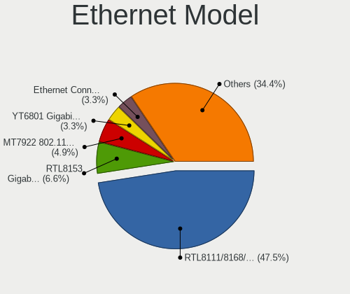
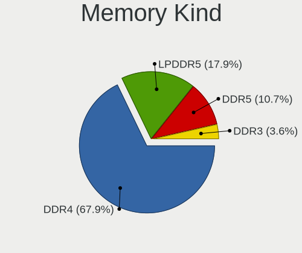

Manjaro - Hardware Trends (Notebooks)
-------------------------------------

A project to identify most popular hardware characteristics and track their change
over time based on data collected by Linux users at https://Linux-Hardware.org.

Anyone can contribute to this report by the [hw-probe](https://github.com/linuxhw/hw-probe) tool:

    sudo -E hw-probe -all -upload

This report is for one last month. Overall report since the beginning of time: [TestCoverage](https://github.com/linuxhw/TestCoverage)

Period: Jun, 2022.

Contents
--------

* [ System ](#system)
  - [ OS                       ](#os)
  - [ OS Family                ](#os-family)
  - [ Kernel                   ](#kernel)
  - [ Kernel Family            ](#kernel-family)
  - [ Kernel Major Ver.        ](#kernel-major-ver)
  - [ Arch                     ](#arch)
  - [ DE                       ](#de)
  - [ Display Server           ](#display-server)
  - [ Display Manager          ](#display-manager)
  - [ OS Lang                  ](#os-lang)
  - [ Boot Mode                ](#boot-mode)
  - [ Filesystem               ](#filesystem)
  - [ Part. scheme             ](#part-scheme)
  - [ Dual Boot with Linux/BSD ](#dual-boot-with-linuxbsd)
  - [ Dual Boot (Win)          ](#dual-boot-win)

* [ Board ](#board)
  - [ Vendor                   ](#vendor)
  - [ Model                    ](#model)
  - [ Model Family             ](#model-family)
  - [ MFG Year                 ](#mfg-year)
  - [ Form Factor              ](#form-factor)
  - [ Secure Boot              ](#secure-boot)
  - [ Coreboot                 ](#coreboot)
  - [ RAM Size                 ](#ram-size)
  - [ RAM Used                 ](#ram-used)
  - [ Total Drives             ](#total-drives)
  - [ Has CD-ROM               ](#has-cd-rom)
  - [ Has Ethernet             ](#has-ethernet)
  - [ Has WiFi                 ](#has-wifi)
  - [ Has Bluetooth            ](#has-bluetooth)

* [ Location ](#location)
  - [ Country                  ](#country)
  - [ City                     ](#city)

* [ Drives ](#drives)
  - [ Drive Vendor             ](#drive-vendor)
  - [ Drive Model              ](#drive-model)
  - [ HDD Vendor               ](#hdd-vendor)
  - [ SSD Vendor               ](#ssd-vendor)
  - [ Drive Kind               ](#drive-kind)
  - [ Drive Connector          ](#drive-connector)
  - [ Drive Size               ](#drive-size)
  - [ Space Total              ](#space-total)
  - [ Space Used               ](#space-used)
  - [ Malfunc. Drives          ](#malfunc-drives)
  - [ Malfunc. Drive Vendor    ](#malfunc-drive-vendor)
  - [ Malfunc. HDD Vendor      ](#malfunc-hdd-vendor)
  - [ Malfunc. Drive Kind      ](#malfunc-drive-kind)
  - [ Failed Drives            ](#failed-drives)
  - [ Failed Drive Vendor      ](#failed-drive-vendor)
  - [ Drive Status             ](#drive-status)

* [ Storage controller ](#storage-controller)
  - [ Storage Vendor           ](#storage-vendor)
  - [ Storage Model            ](#storage-model)
  - [ Storage Kind             ](#storage-kind)

* [ Processor ](#processor)
  - [ CPU Vendor               ](#cpu-vendor)
  - [ CPU Model                ](#cpu-model)
  - [ CPU Model Family         ](#cpu-model-family)
  - [ CPU Cores                ](#cpu-cores)
  - [ CPU Sockets              ](#cpu-sockets)
  - [ CPU Threads              ](#cpu-threads)
  - [ CPU Op-Modes             ](#cpu-op-modes)
  - [ CPU Microcode            ](#cpu-microcode)
  - [ CPU Microarch            ](#cpu-microarch)

* [ Graphics ](#graphics)
  - [ GPU Vendor               ](#gpu-vendor)
  - [ GPU Model                ](#gpu-model)
  - [ GPU Combo                ](#gpu-combo)
  - [ GPU Driver               ](#gpu-driver)
  - [ GPU Memory               ](#gpu-memory)

* [ Monitor ](#monitor)
  - [ Monitor Vendor           ](#monitor-vendor)
  - [ Monitor Model            ](#monitor-model)
  - [ Monitor Resolution       ](#monitor-resolution)
  - [ Monitor Diagonal         ](#monitor-diagonal)
  - [ Monitor Width            ](#monitor-width)
  - [ Aspect Ratio             ](#aspect-ratio)
  - [ Monitor Area             ](#monitor-area)
  - [ Pixel Density            ](#pixel-density)
  - [ Multiple Monitors        ](#multiple-monitors)

* [ Network ](#network)
  - [ Net Controller Vendor    ](#net-controller-vendor)
  - [ Net Controller Model     ](#net-controller-model)
  - [ Wireless Vendor          ](#wireless-vendor)
  - [ Wireless Model           ](#wireless-model)
  - [ Ethernet Vendor          ](#ethernet-vendor)
  - [ Ethernet Model           ](#ethernet-model)
  - [ Net Controller Kind      ](#net-controller-kind)
  - [ Used Controller          ](#used-controller)
  - [ NICs                     ](#nics)
  - [ IPv6                     ](#ipv6)

* [ Bluetooth ](#bluetooth)
  - [ Bluetooth Vendor         ](#bluetooth-vendor)
  - [ Bluetooth Model          ](#bluetooth-model)

* [ Sound ](#sound)
  - [ Sound Vendor             ](#sound-vendor)
  - [ Sound Model              ](#sound-model)

* [ Memory ](#memory)
  - [ Memory Vendor            ](#memory-vendor)
  - [ Memory Model             ](#memory-model)
  - [ Memory Kind              ](#memory-kind)
  - [ Memory Form Factor       ](#memory-form-factor)
  - [ Memory Size              ](#memory-size)
  - [ Memory Speed             ](#memory-speed)

* [ Printers & scanners ](#printers--scanners)
  - [ Printer Vendor           ](#printer-vendor)
  - [ Printer Model            ](#printer-model)
  - [ Scanner Vendor           ](#scanner-vendor)
  - [ Scanner Model            ](#scanner-model)

* [ Camera ](#camera)
  - [ Camera Vendor            ](#camera-vendor)
  - [ Camera Model             ](#camera-model)

* [ Security ](#security)
  - [ Fingerprint Vendor       ](#fingerprint-vendor)
  - [ Fingerprint Model        ](#fingerprint-model)
  - [ Chipcard Vendor          ](#chipcard-vendor)
  - [ Chipcard Model           ](#chipcard-model)

* [ Unsupported ](#unsupported)
  - [ Unsupported Devices      ](#unsupported-devices)
  - [ Unsupported Device Types ](#unsupported-device-types)

System
------

OS
--

Installed operating systems

| Name           | Notebooks | Percent |
|----------------|-----------|---------|
| Manjaro        | 36        | 40.45%  |
| Manjaro 21.2.6 | 23        | 25.84%  |
| Manjaro 21.3.0 | 19        | 21.35%  |
| Manjaro 21.3.1 | 11        | 12.36%  |

OS Family
---------

OS without a version

| Name    | Notebooks | Percent |
|---------|-----------|---------|
| Manjaro | 89        | 100%    |

Kernel
------

Version of the Linux kernel

| Version                | Notebooks | Percent |
|------------------------|-----------|---------|
| 5.15.41-1-MANJARO      | 20        | 22.47%  |
| 5.15.48-1-MANJARO      | 10        | 11.24%  |
| 5.18.5-1-MANJARO       | 9         | 10.11%  |
| 5.15.49-1-MANJARO      | 8         | 8.99%   |
| 5.15.46-1-MANJARO      | 6         | 6.74%   |
| 5.18.6-1-MANJARO       | 4         | 4.49%   |
| 5.18.3-1-MANJARO       | 4         | 4.49%   |
| 5.17.9-1-MANJARO       | 4         | 4.49%   |
| 5.15.32-1-MANJARO      | 3         | 3.37%   |
| 5.19.0-1-MANJARO       | 2         | 2.25%   |
| 5.18.0-1-MANJARO       | 2         | 2.25%   |
| 5.17.7-xanmod1-MANJARO | 2         | 2.25%   |
| 5.17.15-1-MANJARO      | 2         | 2.25%   |
| 5.16.20-2-MANJARO      | 2         | 2.25%   |
| 5.18.7-lqx1-2-lqx      | 1         | 1.12%   |
| 5.18.4-xanmod1-1-zen2  | 1         | 1.12%   |
| 5.18.3-xanmod1-1-x64v2 | 1         | 1.12%   |
| 5.18.1-1-MANJARO       | 1         | 1.12%   |
| 5.18.0-zen1-1-zen      | 1         | 1.12%   |
| 5.17.1-3-rt17-MANJARO  | 1         | 1.12%   |
| 5.15.50-1-MANJARO      | 1         | 1.12%   |
| 5.15.44-1-MANJARO      | 1         | 1.12%   |
| 5.15.38-1-MANJARO      | 1         | 1.12%   |
| 5.10.117-1-MANJARO     | 1         | 1.12%   |
| 4.19.248-1-MANJARO     | 1         | 1.12%   |

Kernel Family
-------------

Linux kernel without a distro release

| Version  | Notebooks | Percent |
|----------|-----------|---------|
| 5.15.41  | 20        | 22.47%  |
| 5.15.48  | 10        | 11.24%  |
| 5.18.5   | 9         | 10.11%  |
| 5.15.49  | 8         | 8.99%   |
| 5.15.46  | 6         | 6.74%   |
| 5.18.3   | 5         | 5.62%   |
| 5.18.6   | 4         | 4.49%   |
| 5.17.9   | 4         | 4.49%   |
| 5.18.0   | 3         | 3.37%   |
| 5.15.32  | 3         | 3.37%   |
| 5.19.0   | 2         | 2.25%   |
| 5.17.7   | 2         | 2.25%   |
| 5.17.15  | 2         | 2.25%   |
| 5.16.20  | 2         | 2.25%   |
| 5.18.7   | 1         | 1.12%   |
| 5.18.4   | 1         | 1.12%   |
| 5.18.1   | 1         | 1.12%   |
| 5.17.1   | 1         | 1.12%   |
| 5.15.50  | 1         | 1.12%   |
| 5.15.44  | 1         | 1.12%   |
| 5.15.38  | 1         | 1.12%   |
| 5.10.117 | 1         | 1.12%   |
| 4.19.248 | 1         | 1.12%   |

Kernel Major Ver.
-----------------

Linux kernel major version

| Version | Notebooks | Percent |
|---------|-----------|---------|
| 5.15    | 50        | 56.18%  |
| 5.18    | 24        | 26.97%  |
| 5.17    | 9         | 10.11%  |
| 5.19    | 2         | 2.25%   |
| 5.16    | 2         | 2.25%   |
| 5.10    | 1         | 1.12%   |
| 4.19    | 1         | 1.12%   |

Arch
----

OS architecture (x86_64, i586, etc.)

| Name   | Notebooks | Percent |
|--------|-----------|---------|
| x86_64 | 89        | 100%    |

DE
--

Desktop Environment

| Name          | Notebooks | Percent |
|---------------|-----------|---------|
| KDE5          | 54        | 60.67%  |
| GNOME         | 14        | 15.73%  |
| XFCE          | 12        | 13.48%  |
| Unknown       | 3         | 3.37%   |
| MATE          | 1         | 1.12%   |
| GNOME Classic | 1         | 1.12%   |
| Deepin        | 1         | 1.12%   |
| Cinnamon      | 1         | 1.12%   |
| Budgie        | 1         | 1.12%   |
| awesome       | 1         | 1.12%   |

Display Server
--------------

X11 or Wayland

| Name    | Notebooks | Percent |
|---------|-----------|---------|
| X11     | 71        | 79.78%  |
| Wayland | 14        | 15.73%  |
| Unknown | 3         | 3.37%   |
| Tty     | 1         | 1.12%   |

Display Manager
---------------

SDDM, LightDM, etc.

| Name    | Notebooks | Percent |
|---------|-----------|---------|
| Unknown | 36        | 40.45%  |
| SDDM    | 26        | 29.21%  |
| GDM     | 14        | 15.73%  |
| LightDM | 13        | 14.61%  |

OS Lang
-------

Language

| Lang    | Notebooks | Percent |
|---------|-----------|---------|
| en_US   | 38        | 42.7%   |
| de_DE   | 10        | 11.24%  |
| fr_FR   | 4         | 4.49%   |
| en_CA   | 4         | 4.49%   |
| ru_RU   | 3         | 3.37%   |
| pl_PL   | 3         | 3.37%   |
| es_AR   | 3         | 3.37%   |
| en_GB   | 3         | 3.37%   |
| pt_PT   | 2         | 2.25%   |
| pt_BR   | 2         | 2.25%   |
| ja_JP   | 2         | 2.25%   |
| es_MX   | 2         | 2.25%   |
| en_DK   | 2         | 2.25%   |
| en_AU   | 2         | 2.25%   |
| hu_HU   | 1         | 1.12%   |
| en_SG   | 1         | 1.12%   |
| en_PH   | 1         | 1.12%   |
| en_IN   | 1         | 1.12%   |
| en_IE   | 1         | 1.12%   |
| de_CH   | 1         | 1.12%   |
| de_AT   | 1         | 1.12%   |
| C       | 1         | 1.12%   |
| Unknown | 1         | 1.12%   |

Boot Mode
---------

EFI or BIOS

| Mode | Notebooks | Percent |
|------|-----------|---------|
| BIOS | 53        | 59.55%  |
| EFI  | 36        | 40.45%  |

Filesystem
----------

Type of filesystem

| Type    | Notebooks | Percent |
|---------|-----------|---------|
| Ext4    | 78        | 87.64%  |
| Btrfs   | 8         | 8.99%   |
| Xfs     | 1         | 1.12%   |
| Overlay | 1         | 1.12%   |
| F2fs    | 1         | 1.12%   |

Part. scheme
------------

Scheme of partitioning

| Type    | Notebooks | Percent |
|---------|-----------|---------|
| Unknown | 47        | 52.81%  |
| GPT     | 38        | 42.7%   |
| MBR     | 4         | 4.49%   |

Dual Boot with Linux/BSD
------------------------

Hosting more than one Linux/BSD

| Dual boot | Notebooks | Percent |
|-----------|-----------|---------|
| No        | 80        | 89.89%  |
| Yes       | 9         | 10.11%  |

Dual Boot (Win)
---------------

Hosting Linux and Windows

| Dual boot | Notebooks | Percent |
|-----------|-----------|---------|
| No        | 67        | 75.28%  |
| Yes       | 22        | 24.72%  |

Board
-----

Vendor
------

Motherboard manufacturer

| Name                 | Notebooks | Percent |
|----------------------|-----------|---------|
| Lenovo               | 25        | 28.09%  |
| Hewlett-Packard      | 20        | 22.47%  |
| ASUSTek Computer     | 16        | 17.98%  |
| Dell                 | 11        | 12.36%  |
| Samsung Electronics  | 3         | 3.37%   |
| MSI                  | 3         | 3.37%   |
| Acer                 | 2         | 2.25%   |
| System76             | 1         | 1.12%   |
| Sony                 | 1         | 1.12%   |
| SLIMBOOK             | 1         | 1.12%   |
| Razer                | 1         | 1.12%   |
| Purism               | 1         | 1.12%   |
| LG Electronics       | 1         | 1.12%   |
| Intel Client Systems | 1         | 1.12%   |
| HONOR                | 1         | 1.12%   |
| Fujitsu              | 1         | 1.12%   |

Model
-----

Motherboard model

| Name                                                                                     | Notebooks | Percent |
|------------------------------------------------------------------------------------------|-----------|---------|
| HP ProBook 455 G7                                                                        | 2         | 2.25%   |
| HP EliteBook 8470p                                                                       | 2         | 2.25%   |
| ASUS TUF Gaming FX504GD_FX80GD                                                           | 2         | 2.25%   |
| System76 Lemur Pro                                                                       | 1         | 1.12%   |
| Sony VPCF236FM                                                                           | 1         | 1.12%   |
| SLIMBOOK PROX14-AMD                                                                      | 1         | 1.12%   |
| Samsung RC420/RC520/RC720                                                                | 1         | 1.12%   |
| Samsung 355V4C/355V4X/355V5C/355V5X/356V4C/356V4X/356V5C/356V5X/3445VC/3445VX/3545VC/354 | 1         | 1.12%   |
| Samsung 300E5M/300E5L                                                                    | 1         | 1.12%   |
| Razer Blade 15 Advanced Model (Early 2021) - RZ09-036                                    | 1         | 1.12%   |
| Purism Librem 14                                                                         | 1         | 1.12%   |
| MSI GP60 2OD                                                                             | 1         | 1.12%   |
| MSI GE75 Raider 10SF                                                                     | 1         | 1.12%   |
| MSI Bravo 15 A4DDR                                                                       | 1         | 1.12%   |
| LG 14Z90N-VA76K                                                                          | 1         | 1.12%   |
| Lenovo ThinkPad X61 Tablet 7762B6G                                                       | 1         | 1.12%   |
| Lenovo ThinkPad X250 20CLS06L00                                                          | 1         | 1.12%   |
| Lenovo ThinkPad X230 23252EG                                                             | 1         | 1.12%   |
| Lenovo ThinkPad X1 Carbon 7th 20QES2PW00                                                 | 1         | 1.12%   |
| Lenovo ThinkPad T550 20CK003HMD                                                          | 1         | 1.12%   |
| Lenovo ThinkPad T470s 20HGS2KW16                                                         | 1         | 1.12%   |
| Lenovo ThinkPad T450 20BV0005US                                                          | 1         | 1.12%   |
| Lenovo ThinkPad T420 4177Q5U                                                             | 1         | 1.12%   |
| Lenovo ThinkPad T14s Gen 1 20T0004KGE                                                    | 1         | 1.12%   |
| Lenovo ThinkPad T14 Gen 1 20UDCTO1WW                                                     | 1         | 1.12%   |
| Lenovo ThinkPad T14 Gen 1 20UD0005US                                                     | 1         | 1.12%   |
| Lenovo ThinkPad S2 20GJA00S00                                                            | 1         | 1.12%   |
| Lenovo ThinkPad P15v Gen 1 20TQCTO1WW                                                    | 1         | 1.12%   |
| Lenovo ThinkPad E15 Gen 4 21EES00100                                                     | 1         | 1.12%   |
| Lenovo ThinkPad E14 Gen 3 20YDS06J00                                                     | 1         | 1.12%   |
| Lenovo ThinkPad E14 Gen 3 20Y7CTO1WW                                                     | 1         | 1.12%   |
| Lenovo ThinkBook 15-IIL 20SM                                                             | 1         | 1.12%   |
| Lenovo Legion S7 15IMH5 82BC                                                             | 1         | 1.12%   |
| Lenovo Legion 5 Pro 16ACH6H 82JQ                                                         | 1         | 1.12%   |
| Lenovo Legion 5 82B5                                                                     | 1         | 1.12%   |
| Lenovo IdeaPad Slim 7 Carbon 14ACN6 82L1                                                 | 1         | 1.12%   |
| Lenovo IdeaPad Gaming 3 15IMH05 81Y4                                                     | 1         | 1.12%   |
| Lenovo IdeaPad 5 15ARE05 81YQ                                                            | 1         | 1.12%   |
| Lenovo IdeaPad 320-14AST 80XU                                                            | 1         | 1.12%   |
| Lenovo G580 20150                                                                        | 1         | 1.12%   |
| Intel Client Systems LAPKC71F                                                            | 1         | 1.12%   |
| HONOR BMH-WCX9                                                                           | 1         | 1.12%   |
| HP ProBook 6550b                                                                         | 1         | 1.12%   |
| HP ProBook 455 G8 Notebook PC                                                            | 1         | 1.12%   |
| HP ProBook 430 G2                                                                        | 1         | 1.12%   |
| HP Pavilion Notebook                                                                     | 1         | 1.12%   |
| HP Pavilion Laptop 15-cs1xxx                                                             | 1         | 1.12%   |
| HP OMEN Laptop 15-en0xxx                                                                 | 1         | 1.12%   |
| HP Laptop 17-cn0xxx                                                                      | 1         | 1.12%   |
| HP Laptop 15s-fq3xxx                                                                     | 1         | 1.12%   |
| HP Laptop 15s-fq2xxx                                                                     | 1         | 1.12%   |
| HP Laptop 15-dy2xxx                                                                      | 1         | 1.12%   |
| HP Laptop 15-dy0xxx                                                                      | 1         | 1.12%   |
| HP Laptop 15-bs0xx                                                                       | 1         | 1.12%   |
| HP Laptop 14s-fq0xxx                                                                     | 1         | 1.12%   |
| HP EliteBook 850 G2                                                                      | 1         | 1.12%   |
| HP EliteBook 840 G5                                                                      | 1         | 1.12%   |
| HP 255 G8 Notebook PC                                                                    | 1         | 1.12%   |
| Fujitsu LIFEBOOK A512                                                                    | 1         | 1.12%   |
| Dell XPS 15 9500                                                                         | 1         | 1.12%   |

Model Family
------------

Motherboard model prefix

| Name                          | Notebooks | Percent |
|-------------------------------|-----------|---------|
| Lenovo ThinkPad               | 16        | 17.98%  |
| HP Laptop                     | 7         | 7.87%   |
| Dell Latitude                 | 6         | 6.74%   |
| HP ProBook                    | 5         | 5.62%   |
| Lenovo IdeaPad                | 4         | 4.49%   |
| HP EliteBook                  | 4         | 4.49%   |
| ASUS VivoBook                 | 4         | 4.49%   |
| ASUS ROG                      | 4         | 4.49%   |
| Lenovo Legion                 | 3         | 3.37%   |
| Dell Inspiron                 | 3         | 3.37%   |
| HP Pavilion                   | 2         | 2.25%   |
| ASUS TUF                      | 2         | 2.25%   |
| System76 Lemur                | 1         | 1.12%   |
| Sony VPCF236FM                | 1         | 1.12%   |
| SLIMBOOK PROX14-AMD           | 1         | 1.12%   |
| Samsung RC420                 | 1         | 1.12%   |
| Samsung 355V4C                | 1         | 1.12%   |
| Samsung 300E5M                | 1         | 1.12%   |
| Razer Blade                   | 1         | 1.12%   |
| Purism Librem                 | 1         | 1.12%   |
| MSI GP60                      | 1         | 1.12%   |
| MSI GE75                      | 1         | 1.12%   |
| MSI Bravo                     | 1         | 1.12%   |
| LG 14Z90N-VA76K               | 1         | 1.12%   |
| Lenovo ThinkBook              | 1         | 1.12%   |
| Lenovo G580                   | 1         | 1.12%   |
| Intel Client Systems LAPKC71F | 1         | 1.12%   |
| HONOR BMH-WCX9                | 1         | 1.12%   |
| HP OMEN                       | 1         | 1.12%   |
| HP 255                        | 1         | 1.12%   |
| Fujitsu LIFEBOOK              | 1         | 1.12%   |
| Dell XPS                      | 1         | 1.12%   |
| Dell Vostro                   | 1         | 1.12%   |
| ASUS Zenbook                  | 1         | 1.12%   |
| ASUS X751LK                   | 1         | 1.12%   |
| ASUS X550VXK                  | 1         | 1.12%   |
| ASUS X507UB                   | 1         | 1.12%   |
| ASUS G751JT                   | 1         | 1.12%   |
| ASUS ASUS                     | 1         | 1.12%   |
| Acer Nitro                    | 1         | 1.12%   |
| Acer Aspire                   | 1         | 1.12%   |

MFG Year
--------

Motherboard manufacture year

| Year    | Notebooks | Percent |
|---------|-----------|---------|
| 2020    | 23        | 25.84%  |
| 2021    | 16        | 17.98%  |
| 2019    | 8         | 8.99%   |
| 2018    | 8         | 8.99%   |
| 2011    | 6         | 6.74%   |
| 2014    | 5         | 5.62%   |
| 2012    | 5         | 5.62%   |
| 2017    | 4         | 4.49%   |
| 2015    | 4         | 4.49%   |
| 2022    | 2         | 2.25%   |
| 2013    | 2         | 2.25%   |
| 2010    | 2         | 2.25%   |
| 2016    | 1         | 1.12%   |
| 2008    | 1         | 1.12%   |
| 2007    | 1         | 1.12%   |
| Unknown | 1         | 1.12%   |

Form Factor
-----------

Physical design of the computer

| Name     | Notebooks | Percent |
|----------|-----------|---------|
| Notebook | 89        | 100%    |

Secure Boot
-----------

Enabled or disabled

| State    | Notebooks | Percent |
|----------|-----------|---------|
| Disabled | 89        | 100%    |

Coreboot
--------

Have coreboot on board

| Used | Notebooks | Percent |
|------|-----------|---------|
| No   | 86        | 96.63%  |
| Yes  | 3         | 3.37%   |

RAM Size
--------

Total RAM memory

| Size in GB  | Notebooks | Percent |
|-------------|-----------|---------|
| 8.01-16.0   | 32        | 35.96%  |
| 4.01-8.0    | 18        | 20.22%  |
| 16.01-24.0  | 18        | 20.22%  |
| 3.01-4.0    | 10        | 11.24%  |
| 32.01-64.0  | 4         | 4.49%   |
| 64.01-256.0 | 4         | 4.49%   |
| 24.01-32.0  | 2         | 2.25%   |
| 1.01-2.0    | 1         | 1.12%   |

RAM Used
--------

Used RAM memory

| Used GB   | Notebooks | Percent |
|-----------|-----------|---------|
| 2.01-3.0  | 25        | 28.09%  |
| 4.01-8.0  | 22        | 24.72%  |
| 3.01-4.0  | 21        | 23.6%   |
| 1.01-2.0  | 16        | 17.98%  |
| 8.01-16.0 | 4         | 4.49%   |
| 0.51-1.0  | 1         | 1.12%   |

Total Drives
------------

Number of drives on board

| Drives | Notebooks | Percent |
|--------|-----------|---------|
| 1      | 60        | 67.42%  |
| 2      | 27        | 30.34%  |
| 3      | 2         | 2.25%   |

Has CD-ROM
----------

Has CD-ROM on board

| Presented | Notebooks | Percent |
|-----------|-----------|---------|
| No        | 74        | 83.15%  |
| Yes       | 15        | 16.85%  |

Has Ethernet
------------

Has Ethernet on board

| Presented | Notebooks | Percent |
|-----------|-----------|---------|
| Yes       | 72        | 80.9%   |
| No        | 17        | 19.1%   |

Has WiFi
--------

Has WiFi module

| Presented | Notebooks | Percent |
|-----------|-----------|---------|
| Yes       | 87        | 97.75%  |
| No        | 2         | 2.25%   |

Has Bluetooth
-------------

Has Bluetooth module

| Presented | Notebooks | Percent |
|-----------|-----------|---------|
| Yes       | 81        | 91.01%  |
| No        | 8         | 8.99%   |

Location
--------

Country
-------

Geographic location (country)

| Country         | Notebooks | Percent |
|-----------------|-----------|---------|
| USA             | 11        | 12.36%  |
| Germany         | 10        | 11.24%  |
| Russia          | 5         | 5.62%   |
| France          | 5         | 5.62%   |
| Poland          | 4         | 4.49%   |
| Mexico          | 3         | 3.37%   |
| Hungary         | 3         | 3.37%   |
| Brazil          | 3         | 3.37%   |
| Argentina       | 3         | 3.37%   |
| Ukraine         | 2         | 2.25%   |
| UK              | 2         | 2.25%   |
| South Korea     | 2         | 2.25%   |
| Serbia          | 2         | 2.25%   |
| Portugal        | 2         | 2.25%   |
| Pakistan        | 2         | 2.25%   |
| Japan           | 2         | 2.25%   |
| Denmark         | 2         | 2.25%   |
| Czechia         | 2         | 2.25%   |
| China           | 2         | 2.25%   |
| Canada          | 2         | 2.25%   |
| Australia       | 2         | 2.25%   |
| Syria           | 1         | 1.12%   |
| Switzerland     | 1         | 1.12%   |
| Spain           | 1         | 1.12%   |
| Slovenia        | 1         | 1.12%   |
| Slovakia        | 1         | 1.12%   |
| Singapore       | 1         | 1.12%   |
| Philippines     | 1         | 1.12%   |
| North Macedonia | 1         | 1.12%   |
| Nigeria         | 1         | 1.12%   |
| Netherlands     | 1         | 1.12%   |
| Nepal           | 1         | 1.12%   |
| Malaysia        | 1         | 1.12%   |
| Italy           | 1         | 1.12%   |
| Ireland         | 1         | 1.12%   |
| India           | 1         | 1.12%   |
| Bulgaria        | 1         | 1.12%   |
| Bangladesh      | 1         | 1.12%   |
| Austria         | 1         | 1.12%   |

City
----

Geographic location (city)

| City               | Notebooks | Percent |
|--------------------|-----------|---------|
| Setagaya-ku        | 2         | 2.25%   |
| Seocho-gu          | 2         | 2.25%   |
| San Francisco      | 2         | 2.25%   |
| Lviv               | 2         | 2.25%   |
| Budapest           | 2         | 2.25%   |
| Belgrade           | 2         | 2.25%   |
| Yekaterinburg      | 1         | 1.12%   |
| Xicheng District   | 1         | 1.12%   |
| Wittmund           | 1         | 1.12%   |
| Winnipeg           | 1         | 1.12%   |
| Warsaw             | 1         | 1.12%   |
| Voderady           | 1         | 1.12%   |
| Villa Ballester    | 1         | 1.12%   |
| Vienna             | 1         | 1.12%   |
| Ufa                | 1         | 1.12%   |
| Tomsk              | 1         | 1.12%   |
| The Hague          | 1         | 1.12%   |
| Sungai Buloh       | 1         | 1.12%   |
| St Petersburg      | 1         | 1.12%   |
| Sofia              | 1         | 1.12%   |
| Singapore          | 1         | 1.12%   |
| Sesto San Giovanni | 1         | 1.12%   |
| Seattle            | 1         | 1.12%   |
| Sao Paulo          | 1         | 1.12%   |
| Rio de Janeiro     | 1         | 1.12%   |
| Quezon City        | 1         | 1.12%   |
| Prague             | 1         | 1.12%   |
| Posadas            | 1         | 1.12%   |
| Portland           | 1         | 1.12%   |
| Pilsen             | 1         | 1.12%   |
| Perth              | 1         | 1.12%   |
| Overland Park      | 1         | 1.12%   |
| Odemira            | 1         | 1.12%   |
| Newbury Center     | 1         | 1.12%   |
| Naperville         | 1         | 1.12%   |
| Muscle Shoals      | 1         | 1.12%   |
| Munich             | 1         | 1.12%   |
| Multan             | 1         | 1.12%   |
| Moscow             | 1         | 1.12%   |
| Mirpur             | 1         | 1.12%   |
| Mexico City        | 1         | 1.12%   |
| Malbork            | 1         | 1.12%   |
| Lucerne            | 1         | 1.12%   |
| Lublin             | 1         | 1.12%   |
| London             | 1         | 1.12%   |
| Ljubljana          | 1         | 1.12%   |
| Lisbon             | 1         | 1.12%   |
| León              | 1         | 1.12%   |
| Leipzig            | 1         | 1.12%   |
| La Madeleine       | 1         | 1.12%   |
| La Bridoire        | 1         | 1.12%   |
| Krakow             | 1         | 1.12%   |
| Kolkata            | 1         | 1.12%   |
| Kathmandu          | 1         | 1.12%   |
| Karlsruhe          | 1         | 1.12%   |
| Kano               | 1         | 1.12%   |
| Ivry-sur-Seine     | 1         | 1.12%   |
| Holstebro          | 1         | 1.12%   |
| Hampstead          | 1         | 1.12%   |
| Hamburg            | 1         | 1.12%   |

Drives
------

Drive Vendor
------------

Hard drive vendors

| Vendor                         | Notebooks | Drives | Percent |
|--------------------------------|-----------|--------|---------|
| Samsung Electronics            | 22        | 23     | 18.97%  |
| Seagate                        | 14        | 14     | 12.07%  |
| WDC                            | 10        | 12     | 8.62%   |
| SK hynix                       | 10        | 10     | 8.62%   |
| SanDisk                        | 10        | 10     | 8.62%   |
| Toshiba                        | 6         | 7      | 5.17%   |
| Kingston                       | 5         | 5      | 4.31%   |
| Solid State Storage Technology | 4         | 4      | 3.45%   |
| Phison                         | 4         | 4      | 3.45%   |
| Micron Technology              | 4         | 4      | 3.45%   |
| Intel                          | 4         | 4      | 3.45%   |
| Unknown                        | 3         | 3      | 2.59%   |
| KIOXIA                         | 3         | 3      | 2.59%   |
| SPCC                           | 2         | 2      | 1.72%   |
| Lite-On                        | 2         | 2      | 1.72%   |
| Hitachi                        | 2         | 2      | 1.72%   |
| Crucial                        | 2         | 2      | 1.72%   |
| UMIS                           | 1         | 1      | 0.86%   |
| Transcend                      | 1         | 1      | 0.86%   |
| Mushkin                        | 1         | 1      | 0.86%   |
| INNOVATION IT                  | 1         | 1      | 0.86%   |
| Inateck                        | 1         | 1      | 0.86%   |
| HS-SSD-E100                    | 1         | 1      | 0.86%   |
| HGST                           | 1         | 1      | 0.86%   |
| Goodram                        | 1         | 1      | 0.86%   |
| A-DATA Technology              | 1         | 1      | 0.86%   |

Drive Model
-----------

Hard drive models

| Model                                     | Notebooks | Percent |
|-------------------------------------------|-----------|---------|
| SK hynix NVMe SSD Drive 512GB             | 5         | 4.2%    |
| SanDisk NVMe SSD Drive 1TB                | 4         | 3.36%   |
| Toshiba MQ04ABF100 1TB                    | 2         | 1.68%   |
| Seagate ST500LM012 HN-M500MBB 500GB       | 2         | 1.68%   |
| Seagate ST1000LM035-1RK172 1TB            | 2         | 1.68%   |
| SanDisk NVMe SSD Drive 256GB              | 2         | 1.68%   |
| Samsung NVMe SSD Drive 512GB              | 2         | 1.68%   |
| Samsung NVMe SSD Drive 256GB              | 2         | 1.68%   |
| Samsung NVMe SSD Drive 1TB                | 2         | 1.68%   |
| Phison Sabrent Rocket Q 1TB               | 2         | 1.68%   |
| KIOXIA NVMe SSD Drive 256GB               | 2         | 1.68%   |
| WDC WDS500G2B0C-00PXH0 500GB              | 1         | 0.84%   |
| WDC WDS240G2G0B-00EPW0 240GB SSD          | 1         | 0.84%   |
| WDC WDS100T2B0C-00PXH0 1TB                | 1         | 0.84%   |
| WDC WD7500BPVX-22JC3T0 752GB              | 1         | 0.84%   |
| WDC WD5000LPCX-24VHAT0 500GB              | 1         | 0.84%   |
| WDC WD5000LPCX-24C6HT0 500GB              | 1         | 0.84%   |
| WDC WD5000BPKT-22PK4T0 500GB              | 1         | 0.84%   |
| WDC WD3200BEKT-08PVMT1 320GB              | 1         | 0.84%   |
| WDC PC SN730 SDBPNTY-512G-1101 512GB      | 1         | 0.84%   |
| WDC PC SN730 SDBPNTY-1T00-1032 1TB        | 1         | 0.84%   |
| WDC PC SN530 SDBPNPZ-512G-1014 512GB      | 1         | 0.84%   |
| WDC PC SN530 SDBPNPZ-256G-1006 256GB      | 1         | 0.84%   |
| Unknown SD16G  16GB                       | 1         | 0.84%   |
| Unknown SD/MMC/MS PRO 128GB               | 1         | 0.84%   |
| Unknown DA4128  128GB                     | 1         | 0.84%   |
| UMIS RPJTJ512MGE1QDQ 512GB                | 1         | 0.84%   |
| Transcend TS240GMTS820S 240GB SSD         | 1         | 0.84%   |
| Toshiba NVMe SSD Drive 2TB                | 1         | 0.84%   |
| Toshiba MQ01ABD100 1TB                    | 1         | 0.84%   |
| Toshiba MK7559GSXP 752GB                  | 1         | 0.84%   |
| Toshiba MK2561GSYN 250GB                  | 1         | 0.84%   |
| SPCC Solid State Disk 1024GB              | 1         | 0.84%   |
| SPCC M.2 PCIe SSD 2TB                     | 1         | 0.84%   |
| Solid State Storage NVMe SSD Drive 512GB  | 1         | 0.84%   |
| Solid State Storage NVMe SSD Drive 256GB  | 1         | 0.84%   |
| Solid State Storage NVMe SSD Drive 128GB  | 1         | 0.84%   |
| Solid State Storage NVMe SSD Drive 1024GB | 1         | 0.84%   |
| SK hynix SKHynix_HFS001TD9TNI-L2A0B 1TB   | 1         | 0.84%   |
| SK hynix NVMe SSD Drive 256GB             | 1         | 0.84%   |
| SK hynix NVMe SSD Drive 1024GB            | 1         | 0.84%   |
| SK hynix HFS256GD9TNG-L2A0A 256GB         | 1         | 0.84%   |
| SK hynix BC511 HFM256GDJTNI-82A0A 256GB   | 1         | 0.84%   |
| Seagate ST9500423AS 500GB                 | 1         | 0.84%   |
| Seagate ST9500325AS 500GB                 | 1         | 0.84%   |
| Seagate ST9120817AS 120GB                 | 1         | 0.84%   |
| Seagate ST500LT012-9WS142 500GB           | 1         | 0.84%   |
| Seagate ST500LT012-1DG142 500GB           | 1         | 0.84%   |
| Seagate ST1000LX015-1U7172 1TB            | 1         | 0.84%   |
| Seagate ST1000LM048-2E7172 1TB            | 1         | 0.84%   |
| Seagate ST1000LM014-1EJ164 1TB            | 1         | 0.84%   |
| Seagate FireCuda 530 ZP4000GM30013 4TB    | 1         | 0.84%   |
| Seagate Expansion 1TB                     | 1         | 0.84%   |
| SanDisk SDSSDH3 4T00 4TB                  | 1         | 0.84%   |
| SanDisk SDSSDA240G 240GB                  | 1         | 0.84%   |
| SanDisk SD6PP4M-256G-1006 256GB SSD       | 1         | 0.84%   |
| SanDisk NVMe SSD Drive 1024GB             | 1         | 0.84%   |
| Samsung SSD PM851 2.5 7mm 256GB           | 1         | 0.84%   |
| Samsung SSD 970 EVO Plus 1TB              | 1         | 0.84%   |
| Samsung SSD 860 EVO 500GB                 | 1         | 0.84%   |

HDD Vendor
----------

Hard disk drive vendors

| Vendor  | Notebooks | Drives | Percent |
|---------|-----------|--------|---------|
| Seagate | 13        | 13     | 46.43%  |
| WDC     | 5         | 5      | 17.86%  |
| Toshiba | 5         | 5      | 17.86%  |
| Hitachi | 2         | 2      | 7.14%   |
| Unknown | 1         | 1      | 3.57%   |
| Inateck | 1         | 1      | 3.57%   |
| HGST    | 1         | 1      | 3.57%   |

SSD Vendor
----------

Solid state drive vendors

| Vendor              | Notebooks | Drives | Percent |
|---------------------|-----------|--------|---------|
| Samsung Electronics | 9         | 10     | 34.62%  |
| Kingston            | 4         | 4      | 15.38%  |
| SanDisk             | 3         | 3      | 11.54%  |
| Crucial             | 2         | 2      | 7.69%   |
| WDC                 | 1         | 1      | 3.85%   |
| Transcend           | 1         | 1      | 3.85%   |
| SPCC                | 1         | 1      | 3.85%   |
| Mushkin             | 1         | 1      | 3.85%   |
| Micron Technology   | 1         | 1      | 3.85%   |
| INNOVATION IT       | 1         | 1      | 3.85%   |
| HS-SSD-E100         | 1         | 1      | 3.85%   |
| Goodram             | 1         | 1      | 3.85%   |

Drive Kind
----------

HDD or SSD

| Kind | Notebooks | Drives | Percent |
|------|-----------|--------|---------|
| NVMe | 51        | 63     | 47.66%  |
| HDD  | 28        | 28     | 26.17%  |
| SSD  | 26        | 27     | 24.3%   |
| MMC  | 2         | 2      | 1.87%   |

Drive Connector
---------------

SATA, SAS, NVMe, etc.

| Type | Notebooks | Drives | Percent |
|------|-----------|--------|---------|
| NVMe | 51        | 63     | 51.52%  |
| SATA | 43        | 52     | 43.43%  |
| SAS  | 3         | 3      | 3.03%   |
| MMC  | 2         | 2      | 2.02%   |

Drive Size
----------

Size of hard drive

| Size in TB | Notebooks | Drives | Percent |
|------------|-----------|--------|---------|
| 0.01-0.5   | 30        | 36     | 61.22%  |
| 0.51-1.0   | 16        | 16     | 32.65%  |
| 3.01-4.0   | 1         | 1      | 2.04%   |
| 1.01-2.0   | 1         | 1      | 2.04%   |
| 4.01-10.0  | 1         | 1      | 2.04%   |

Space Total
-----------

Amount of disk space available on the file system

| Size in GB     | Notebooks | Percent |
|----------------|-----------|---------|
| 251-500        | 23        | 25.84%  |
| 101-250        | 23        | 25.84%  |
| 501-1000       | 16        | 17.98%  |
| Unknown        | 11        | 12.36%  |
| 1001-2000      | 6         | 6.74%   |
| 1-20           | 3         | 3.37%   |
| 51-100         | 3         | 3.37%   |
| More than 3000 | 2         | 2.25%   |
| 2001-3000      | 2         | 2.25%   |

Space Used
----------

Amount of used disk space

| Used GB        | Notebooks | Percent |
|----------------|-----------|---------|
| 101-250        | 18        | 20.22%  |
| 21-50          | 15        | 16.85%  |
| 51-100         | 13        | 14.61%  |
| 1-20           | 12        | 13.48%  |
| Unknown        | 11        | 12.36%  |
| 251-500        | 8         | 8.99%   |
| 501-1000       | 8         | 8.99%   |
| 1001-2000      | 3         | 3.37%   |
| More than 3000 | 1         | 1.12%   |

Malfunc. Drives
---------------

Drive models with a malfunction

| Model                                   | Notebooks | Drives | Percent |
|-----------------------------------------|-----------|--------|---------|
| Toshiba MK7559GSXP 752GB                | 1         | 1      | 14.29%  |
| SK hynix BC511 HFM256GDJTNI-82A0A 256GB | 1         | 1      | 14.29%  |
| Seagate ST500LT012-9WS142 500GB         | 1         | 1      | 14.29%  |
| Seagate ST500LM012 HN-M500MBB 500GB     | 1         | 1      | 14.29%  |
| Seagate ST1000LM035-1RK172 1TB          | 1         | 1      | 14.29%  |
| HGST HTS721010A9E630 1TB                | 1         | 1      | 14.29%  |
| A-DATA Technology SX8100NP 4TB          | 1         | 1      | 14.29%  |

Malfunc. Drive Vendor
---------------------

Vendors of faulty drives

| Vendor            | Notebooks | Drives | Percent |
|-------------------|-----------|--------|---------|
| Seagate           | 3         | 3      | 42.86%  |
| Toshiba           | 1         | 1      | 14.29%  |
| SK hynix          | 1         | 1      | 14.29%  |
| HGST              | 1         | 1      | 14.29%  |
| A-DATA Technology | 1         | 1      | 14.29%  |

Malfunc. HDD Vendor
-------------------

Vendors of faulty HDD drives

| Vendor  | Notebooks | Drives | Percent |
|---------|-----------|--------|---------|
| Seagate | 3         | 3      | 60%     |
| Toshiba | 1         | 1      | 20%     |
| HGST    | 1         | 1      | 20%     |

Malfunc. Drive Kind
-------------------

Kinds of faulty drives

| Kind | Notebooks | Drives | Percent |
|------|-----------|--------|---------|
| HDD  | 5         | 5      | 71.43%  |
| NVMe | 2         | 2      | 28.57%  |

Failed Drives
-------------

Failed drive models

Zero info for selected period =(

Failed Drive Vendor
-------------------

Failed drive vendors

Zero info for selected period =(

Drive Status
------------

Number of failed and malfunc. drives

| Status   | Notebooks | Drives | Percent |
|----------|-----------|--------|---------|
| Detected | 57        | 71     | 58.16%  |
| Works    | 34        | 42     | 34.69%  |
| Malfunc  | 7         | 7      | 7.14%   |

Storage controller
------------------

Storage Vendor
--------------

Storage controller vendors

| Vendor                         | Notebooks | Percent |
|--------------------------------|-----------|---------|
| Intel                          | 49        | 40.5%   |
| AMD                            | 15        | 12.4%   |
| Samsung Electronics            | 13        | 10.74%  |
| SanDisk                        | 11        | 9.09%   |
| SK hynix                       | 10        | 8.26%   |
| Phison Electronics             | 5         | 4.13%   |
| Solid State Storage Technology | 4         | 3.31%   |
| Micron Technology              | 3         | 2.48%   |
| KIOXIA                         | 3         | 2.48%   |
| Lite-On Technology             | 2         | 1.65%   |
| Union Memory (Shenzhen)        | 1         | 0.83%   |
| Toshiba America Info Systems   | 1         | 0.83%   |
| Seagate Technology             | 1         | 0.83%   |
| Realtek Semiconductor          | 1         | 0.83%   |
| Marvell Technology Group       | 1         | 0.83%   |
| Kingston Technology Company    | 1         | 0.83%   |

Storage Model
-------------

Storage controller models

| Model                                                                                  | Notebooks | Percent |
|----------------------------------------------------------------------------------------|-----------|---------|
| AMD FCH SATA Controller [AHCI mode]                                                    | 15        | 11.72%  |
| SanDisk WD Blue SN550 NVMe SSD                                                         | 7         | 5.47%   |
| Samsung NVMe SSD Controller SM981/PM981/PM983                                          | 7         | 5.47%   |
| Intel 7 Series Chipset Family 6-port SATA Controller [AHCI mode]                       | 7         | 5.47%   |
| SK hynix Gold P31 SSD                                                                  | 6         | 4.69%   |
| SanDisk WD Black SN750 / PC SN730 NVMe SSD                                             | 5         | 3.91%   |
| Intel Sunrise Point-LP SATA Controller [AHCI mode]                                     | 5         | 3.91%   |
| Solid State Storage Non-Volatile memory controller                                     | 4         | 3.13%   |
| Samsung NVMe SSD Controller 980                                                        | 4         | 3.13%   |
| Intel Wildcat Point-LP SATA Controller [AHCI Mode]                                     | 4         | 3.13%   |
| Phison E12 NVMe Controller                                                             | 3         | 2.34%   |
| Micron Non-Volatile memory controller                                                  | 3         | 2.34%   |
| KIOXIA Non-Volatile memory controller                                                  | 3         | 2.34%   |
| Intel Volume Management Device NVMe RAID Controller                                    | 3         | 2.34%   |
| Intel Cannon Lake Mobile PCH SATA AHCI Controller                                      | 3         | 2.34%   |
| Intel 82801 Mobile SATA Controller [RAID mode]                                         | 3         | 2.34%   |
| Intel 6 Series/C200 Series Chipset Family 6 port Mobile SATA AHCI Controller           | 3         | 2.34%   |
| Intel 400 Series Chipset Family SATA AHCI Controller                                   | 3         | 2.34%   |
| SK hynix Non-Volatile memory controller                                                | 2         | 1.56%   |
| SK hynix BC511                                                                         | 2         | 1.56%   |
| Intel Non-Volatile memory controller                                                   | 2         | 1.56%   |
| Intel Ice Lake-LP SATA Controller [AHCI mode]                                          | 2         | 1.56%   |
| Intel HM170/QM170 Chipset SATA Controller [AHCI Mode]                                  | 2         | 1.56%   |
| Intel Celeron/Pentium Silver Processor SATA Controller                                 | 2         | 1.56%   |
| Intel 8 Series/C220 Series Chipset Family 6-port SATA Controller 1 [AHCI mode]         | 2         | 1.56%   |
| Intel 8 Series SATA Controller 1 [AHCI mode]                                           | 2         | 1.56%   |
| Union Memory (Shenzhen) AM630 PCIe 4.0 x4 NVMe SSD Controller                          | 1         | 0.78%   |
| Toshiba America Info Systems XG6 NVMe SSD Controller                                   | 1         | 0.78%   |
| Seagate FireCuda 530 SSD                                                               | 1         | 0.78%   |
| Samsung NVMe SSD Controller SM961/PM961/SM963                                          | 1         | 0.78%   |
| Samsung NVMe SSD Controller PM9A1/PM9A3/980PRO                                         | 1         | 0.78%   |
| Realtek RTS5763DL NVMe SSD Controller                                                  | 1         | 0.78%   |
| Phison PS5013 E13 NVMe Controller                                                      | 1         | 0.78%   |
| Phison E16 PCIe4 NVMe Controller                                                       | 1         | 0.78%   |
| Marvell Group 88SS9183 PCIe SSD Controller                                             | 1         | 0.78%   |
| Lite-On NVMe Controller                                                                | 1         | 0.78%   |
| Lite-On Non-Volatile memory controller                                                 | 1         | 0.78%   |
| Kingston Company SNVS2000G [NV1 NVMe PCIe SSD 2TB]                                     | 1         | 0.78%   |
| Intel Tiger Lake-LP SATA Controller [AHCI mode]                                        | 1         | 0.78%   |
| Intel SSD Pro 7600p/760p/E 6100p Series                                                | 1         | 0.78%   |
| Intel SSD 660P Series                                                                  | 1         | 0.78%   |
| Intel Atom/Celeron/Pentium Processor x5-E8000/J3xxx/N3xxx Series SATA Controller       | 1         | 0.78%   |
| Intel 82801IBM/IEM (ICH9M/ICH9M-E) 4 port SATA Controller [AHCI mode]                  | 1         | 0.78%   |
| Intel 82801HM/HEM (ICH8M/ICH8M-E) SATA Controller [AHCI mode]                          | 1         | 0.78%   |
| Intel 82801HM/HEM (ICH8M/ICH8M-E) IDE Controller                                       | 1         | 0.78%   |
| Intel 6 Series/C200 Series Chipset Family Mobile SATA Controller (IDE mode, ports 4-5) | 1         | 0.78%   |
| Intel 6 Series/C200 Series Chipset Family Mobile SATA Controller (IDE mode, ports 0-3) | 1         | 0.78%   |
| Intel 5 Series/3400 Series Chipset 6 port SATA AHCI Controller                         | 1         | 0.78%   |
| Intel 5 Series/3400 Series Chipset 4 port SATA IDE Controller                          | 1         | 0.78%   |
| Intel 5 Series/3400 Series Chipset 2 port SATA IDE Controller                          | 1         | 0.78%   |

Storage Kind
------------

Kind of storage controller (IDE, SATA, NVMe, SAS, ...)

| Kind | Notebooks | Percent |
|------|-----------|---------|
| SATA | 56        | 48.28%  |
| NVMe | 51        | 43.97%  |
| RAID | 6         | 5.17%   |
| IDE  | 3         | 2.59%   |

Processor
---------

CPU Vendor
----------

Processor vendors

| Vendor | Notebooks | Percent |
|--------|-----------|---------|
| Intel  | 61        | 68.54%  |
| AMD    | 28        | 31.46%  |

CPU Model
---------

Processor models

| Model                                      | Notebooks | Percent |
|--------------------------------------------|-----------|---------|
| Intel Core i5-5200U CPU @ 2.20GHz          | 4         | 4.49%   |
| Intel Core i7-10750H CPU @ 2.60GHz         | 3         | 3.37%   |
| Intel Core i5-7200U CPU @ 2.50GHz          | 3         | 3.37%   |
| AMD Ryzen 7 5800H with Radeon Graphics     | 3         | 3.37%   |
| AMD Ryzen 7 4800H with Radeon Graphics     | 3         | 3.37%   |
| AMD Ryzen 5 4500U with Radeon Graphics     | 3         | 3.37%   |
| Intel Core i7-10875H CPU @ 2.30GHz         | 2         | 2.25%   |
| Intel Core i7-10510U CPU @ 1.80GHz         | 2         | 2.25%   |
| Intel 11th Gen Core i5-1135G7 @ 2.40GHz    | 2         | 2.25%   |
| AMD Ryzen 9 5900HX with Radeon Graphics    | 2         | 2.25%   |
| AMD Ryzen 7 PRO 4750U with Radeon Graphics | 2         | 2.25%   |
| AMD Ryzen 7 5700U with Radeon Graphics     | 2         | 2.25%   |
| Intel Pentium Silver N5030 CPU @ 1.10GHz   | 1         | 1.12%   |
| Intel Pentium CPU N3710 @ 1.60GHz          | 1         | 1.12%   |
| Intel Pentium CPU 2020M @ 2.40GHz          | 1         | 1.12%   |
| Intel Core i7-8750H CPU @ 2.20GHz          | 1         | 1.12%   |
| Intel Core i7-8565U CPU @ 1.80GHz          | 1         | 1.12%   |
| Intel Core i7-6700HQ CPU @ 2.60GHz         | 1         | 1.12%   |
| Intel Core i7-6500U CPU @ 2.50GHz          | 1         | 1.12%   |
| Intel Core i7-4710HQ CPU @ 2.50GHz         | 1         | 1.12%   |
| Intel Core i7-4700MQ CPU @ 2.40GHz         | 1         | 1.12%   |
| Intel Core i7-4510U CPU @ 2.00GHz          | 1         | 1.12%   |
| Intel Core i7-3630QM CPU @ 2.40GHz         | 1         | 1.12%   |
| Intel Core i7-3520M CPU @ 2.90GHz          | 1         | 1.12%   |
| Intel Core i7-2670QM CPU @ 2.20GHz         | 1         | 1.12%   |
| Intel Core i7-2640M CPU @ 2.80GHz          | 1         | 1.12%   |
| Intel Core i7-10870H CPU @ 2.20GHz         | 1         | 1.12%   |
| Intel Core i7-10710U CPU @ 1.10GHz         | 1         | 1.12%   |
| Intel Core i7-1065G7 CPU @ 1.30GHz         | 1         | 1.12%   |
| Intel Core i5-9300H CPU @ 2.40GHz          | 1         | 1.12%   |
| Intel Core i5-8300H CPU @ 2.30GHz          | 1         | 1.12%   |
| Intel Core i5-8265U CPU @ 1.60GHz          | 1         | 1.12%   |
| Intel Core i5-8250U CPU @ 1.60GHz          | 1         | 1.12%   |
| Intel Core i5-7300U CPU @ 2.60GHz          | 1         | 1.12%   |
| Intel Core i5-7300HQ CPU @ 2.50GHz         | 1         | 1.12%   |
| Intel Core i5-6300U CPU @ 2.40GHz          | 1         | 1.12%   |
| Intel Core i5-6200U CPU @ 2.30GHz          | 1         | 1.12%   |
| Intel Core i5-5300U CPU @ 2.30GHz          | 1         | 1.12%   |
| Intel Core i5-4310U CPU @ 2.00GHz          | 1         | 1.12%   |
| Intel Core i5-3360M CPU @ 2.80GHz          | 1         | 1.12%   |
| Intel Core i5-3320M CPU @ 2.60GHz          | 1         | 1.12%   |
| Intel Core i5-3230M CPU @ 2.60GHz          | 1         | 1.12%   |
| Intel Core i5-3210M CPU @ 2.50GHz          | 1         | 1.12%   |
| Intel Core i5-2520M CPU @ 2.50GHz          | 1         | 1.12%   |
| Intel Core i5-2410M CPU @ 2.30GHz          | 1         | 1.12%   |
| Intel Core i5-1035G4 CPU @ 1.10GHz         | 1         | 1.12%   |
| Intel Core i5-1035G1 CPU @ 1.00GHz         | 1         | 1.12%   |
| Intel Core i5-10300H CPU @ 2.50GHz         | 1         | 1.12%   |
| Intel Core i5 CPU M 580 @ 2.67GHz          | 1         | 1.12%   |
| Intel Core i5 CPU M 480 @ 2.67GHz          | 1         | 1.12%   |
| Intel Core i3-4010U CPU @ 1.70GHz          | 1         | 1.12%   |
| Intel Core 2 Duo CPU P8700 @ 2.53GHz       | 1         | 1.12%   |
| Intel Core 2 Duo CPU L7500 @ 1.60GHz       | 1         | 1.12%   |
| Intel Celeron N4500 @ 1.10GHz              | 1         | 1.12%   |
| Intel Celeron N4020 CPU @ 1.10GHz          | 1         | 1.12%   |
| Intel 11th Gen Core i7-11800H @ 2.30GHz    | 1         | 1.12%   |
| Intel 11th Gen Core i7-1165G7 @ 2.80GHz    | 1         | 1.12%   |
| AMD Ryzen 9 4900HS with Radeon Graphics    | 1         | 1.12%   |
| AMD Ryzen 7 6800U with Radeon Graphics     | 1         | 1.12%   |
| AMD Ryzen 7 5825U with Radeon Graphics     | 1         | 1.12%   |

CPU Model Family
----------------

Processor model prefix

| Model                | Notebooks | Percent |
|----------------------|-----------|---------|
| Intel Core i5        | 28        | 31.46%  |
| Intel Core i7        | 21        | 23.6%   |
| AMD Ryzen 7          | 11        | 12.36%  |
| AMD Ryzen 5          | 7         | 7.87%   |
| Other                | 5         | 5.62%   |
| AMD Ryzen 9          | 3         | 3.37%   |
| Intel Pentium        | 2         | 2.25%   |
| Intel Core 2 Duo     | 2         | 2.25%   |
| Intel Celeron        | 2         | 2.25%   |
| AMD Ryzen 7 PRO      | 2         | 2.25%   |
| AMD Ryzen 3          | 2         | 2.25%   |
| AMD A6               | 2         | 2.25%   |
| Intel Pentium Silver | 1         | 1.12%   |
| Intel Core i3        | 1         | 1.12%   |

CPU Cores
---------

Number of processor cores

| Number | Notebooks | Percent |
|--------|-----------|---------|
| 2      | 33        | 37.08%  |
| 4      | 23        | 25.84%  |
| 8      | 20        | 22.47%  |
| 6      | 12        | 13.48%  |
| 1      | 1         | 1.12%   |

CPU Sockets
-----------

Number of sockets

| Number | Notebooks | Percent |
|--------|-----------|---------|
| 1      | 89        | 100%    |

CPU Threads
-----------

Threads per core (Hyper-Threading)

| Number | Notebooks | Percent |
|--------|-----------|---------|
| 2      | 76        | 85.39%  |
| 1      | 13        | 14.61%  |

CPU Op-Modes
------------

CPU Operation Modes (32-bit, 64-bit)

| Op mode        | Notebooks | Percent |
|----------------|-----------|---------|
| 32-bit, 64-bit | 89        | 100%    |

CPU Microcode
-------------

Microcode number

| Number     | Notebooks | Percent |
|------------|-----------|---------|
| Unknown    | 53        | 59.55%  |
| 0x306a9    | 5         | 5.62%   |
| 0xa0652    | 3         | 3.37%   |
| 0x0a50000c | 3         | 3.37%   |
| 0x806ec    | 2         | 2.25%   |
| 0x806c1    | 2         | 2.25%   |
| 0x706e5    | 2         | 2.25%   |
| 0x40651    | 2         | 2.25%   |
| 0x08600106 | 2         | 2.25%   |
| 0x08600104 | 2         | 2.25%   |
| 0xa0660    | 1         | 1.12%   |
| 0x806ea    | 1         | 1.12%   |
| 0x806e9    | 1         | 1.12%   |
| 0x806d1    | 1         | 1.12%   |
| 0x706a8    | 1         | 1.12%   |
| 0x506e3    | 1         | 1.12%   |
| 0x406e3    | 1         | 1.12%   |
| 0x306d4    | 1         | 1.12%   |
| 0x206a7    | 1         | 1.12%   |
| 0x0a404101 | 1         | 1.12%   |
| 0x08608103 | 1         | 1.12%   |
| 0x08600103 | 1         | 1.12%   |
| 0x08200103 | 1         | 1.12%   |

CPU Microarch
-------------

Microarchitecture

| Name          | Notebooks | Percent |
|---------------|-----------|---------|
| KabyLake      | 13        | 14.61%  |
| Zen 2         | 10        | 11.24%  |
| Zen 3         | 9         | 10.11%  |
| CometLake     | 8         | 8.99%   |
| IvyBridge     | 7         | 7.87%   |
| Unknown       | 6         | 6.74%   |
| Haswell       | 5         | 5.62%   |
| Broadwell     | 5         | 5.62%   |
| Skylake       | 4         | 4.49%   |
| SandyBridge   | 4         | 4.49%   |
| IceLake       | 4         | 4.49%   |
| TigerLake     | 3         | 3.37%   |
| Westmere      | 2         | 2.25%   |
| Goldmont plus | 2         | 2.25%   |
| Zen+          | 1         | 1.12%   |
| Zen           | 1         | 1.12%   |
| Silvermont    | 1         | 1.12%   |
| Piledriver    | 1         | 1.12%   |
| Penryn        | 1         | 1.12%   |
| Excavator     | 1         | 1.12%   |
| Core          | 1         | 1.12%   |

Graphics
--------

GPU Vendor
----------

Vendors of graphics cards

| Vendor | Notebooks | Percent |
|--------|-----------|---------|
| Intel  | 57        | 48.31%  |
| Nvidia | 32        | 27.12%  |
| AMD    | 29        | 24.58%  |

GPU Model
---------

Graphics card models

| Model                                                                                    | Notebooks | Percent |
|------------------------------------------------------------------------------------------|-----------|---------|
| AMD Renoir                                                                               | 10        | 8.33%   |
| Intel CometLake-H GT2 [UHD Graphics]                                                     | 7         | 5.83%   |
| AMD Cezanne                                                                              | 7         | 5.83%   |
| Intel 3rd Gen Core processor Graphics Controller                                         | 6         | 5%      |
| Intel HD Graphics 5500                                                                   | 5         | 4.17%   |
| Nvidia GA106M [GeForce RTX 3060 Mobile / Max-Q]                                          | 4         | 3.33%   |
| Intel HD Graphics 620                                                                    | 4         | 3.33%   |
| AMD Lucienne                                                                             | 4         | 3.33%   |
| Nvidia TU117M [GeForce GTX 1650 Ti Mobile]                                               | 3         | 2.5%    |
| Intel TigerLake-LP GT2 [Iris Xe Graphics]                                                | 3         | 2.5%    |
| Intel Skylake GT2 [HD Graphics 520]                                                      | 3         | 2.5%    |
| Intel Haswell-ULT Integrated Graphics Controller                                         | 3         | 2.5%    |
| Intel CoffeeLake-H GT2 [UHD Graphics 630]                                                | 3         | 2.5%    |
| Nvidia GP107M [GeForce GTX 1050 Mobile]                                                  | 2         | 1.67%   |
| Nvidia GK208M [GeForce GT 740M]                                                          | 2         | 1.67%   |
| Nvidia GA104M [GeForce RTX 3070 Mobile / Max-Q]                                          | 2         | 1.67%   |
| Intel WhiskeyLake-U GT2 [UHD Graphics 620]                                               | 2         | 1.67%   |
| Intel Core Processor Integrated Graphics Controller                                      | 2         | 1.67%   |
| Intel CometLake-U GT2 [UHD Graphics]                                                     | 2         | 1.67%   |
| Intel 2nd Generation Core Processor Family Integrated Graphics Controller                | 2         | 1.67%   |
| AMD Picasso/Raven 2 [Radeon Vega Series / Radeon Vega Mobile Series]                     | 2         | 1.67%   |
| Nvidia TU117M [GeForce MX450]                                                            | 1         | 0.83%   |
| Nvidia TU117M [GeForce GTX 1650 Mobile / Max-Q]                                          | 1         | 0.83%   |
| Nvidia TU116M [GeForce GTX 1660 Ti Mobile]                                               | 1         | 0.83%   |
| Nvidia TU106M [GeForce RTX 2070 Mobile / Max-Q Refresh]                                  | 1         | 0.83%   |
| Nvidia TU106M [GeForce RTX 2060 Max-Q]                                                   | 1         | 0.83%   |
| Nvidia GP108M [GeForce MX230]                                                            | 1         | 0.83%   |
| Nvidia GM204M [GeForce GTX 970M]                                                         | 1         | 0.83%   |
| Nvidia GM108M [GeForce MX110]                                                            | 1         | 0.83%   |
| Nvidia GM108M [GeForce 920MX]                                                            | 1         | 0.83%   |
| Nvidia GM107M [GeForce GTX 960M]                                                         | 1         | 0.83%   |
| Nvidia GM107M [GeForce GTX 950M]                                                         | 1         | 0.83%   |
| Nvidia GM107M [GeForce GTX 850M]                                                         | 1         | 0.83%   |
| Nvidia GM107 [GeForce 940MX]                                                             | 1         | 0.83%   |
| Nvidia GF119M [NVS 4200M]                                                                | 1         | 0.83%   |
| Nvidia GF119M [GeForce GT 520M]                                                          | 1         | 0.83%   |
| Nvidia GF117M [GeForce 610M/710M/810M/820M / GT 620M/625M/630M/720M]                     | 1         | 0.83%   |
| Nvidia GF108M [GeForce GT 540M]                                                          | 1         | 0.83%   |
| Nvidia GA107M [GeForce RTX 3050 Mobile]                                                  | 1         | 0.83%   |
| Nvidia GA104M [GeForce RTX 3080 Mobile / Max-Q 8GB/16GB]                                 | 1         | 0.83%   |
| Intel UHD Graphics 620                                                                   | 1         | 0.83%   |
| Intel TigerLake-H GT1 [UHD Graphics]                                                     | 1         | 0.83%   |
| Intel Mobile GM965/GL960 Integrated Graphics Controller (secondary)                      | 1         | 0.83%   |
| Intel Mobile GM965/GL960 Integrated Graphics Controller (primary)                        | 1         | 0.83%   |
| Intel Mobile 4 Series Chipset Integrated Graphics Controller                             | 1         | 0.83%   |
| Intel JasperLake [UHD Graphics]                                                          | 1         | 0.83%   |
| Intel Iris Plus Graphics G7                                                              | 1         | 0.83%   |
| Intel Iris Plus Graphics G4 (Ice Lake)                                                   | 1         | 0.83%   |
| Intel Iris Plus Graphics G1 (Ice Lake)                                                   | 1         | 0.83%   |
| Intel HD Graphics 630                                                                    | 1         | 0.83%   |
| Intel HD Graphics 530                                                                    | 1         | 0.83%   |
| Intel GeminiLake [UHD Graphics 605]                                                      | 1         | 0.83%   |
| Intel GeminiLake [UHD Graphics 600]                                                      | 1         | 0.83%   |
| Intel Comet Lake UHD Graphics                                                            | 1         | 0.83%   |
| Intel Atom/Celeron/Pentium Processor x5-E8000/J3xxx/N3xxx Integrated Graphics Controller | 1         | 0.83%   |
| Intel 4th Gen Core Processor Integrated Graphics Controller                              | 1         | 0.83%   |
| AMD Trinity 2 [Radeon HD 7520G]                                                          | 1         | 0.83%   |
| AMD Thames [Radeon HD 7550M/7570M/7650M]                                                 | 1         | 0.83%   |
| AMD Thames [Radeon HD 7500M/7600M Series]                                                | 1         | 0.83%   |
| AMD Stoney [Radeon R2/R3/R4/R5 Graphics]                                                 | 1         | 0.83%   |

GPU Combo
---------

Combinations of graphics cards

| Name           | Notebooks | Percent |
|----------------|-----------|---------|
| 1 x Intel      | 36        | 40.45%  |
| Intel + Nvidia | 20        | 22.47%  |
| 1 x AMD        | 20        | 22.47%  |
| AMD + Nvidia   | 7         | 7.87%   |
| 1 x Nvidia     | 4         | 4.49%   |
| 2 x AMD        | 1         | 1.12%   |
| Intel + AMD    | 1         | 1.12%   |

GPU Driver
----------

Free vs proprietary

| Driver      | Notebooks | Percent |
|-------------|-----------|---------|
| Free        | 64        | 71.91%  |
| Proprietary | 25        | 28.09%  |

GPU Memory
----------

Total video memory

| Size in GB | Notebooks | Percent |
|------------|-----------|---------|
| Unknown    | 72        | 80.9%   |
| 0.01-0.5   | 7         | 7.87%   |
| 0.51-1.0   | 4         | 4.49%   |
| 5.01-6.0   | 3         | 3.37%   |
| 1.01-2.0   | 2         | 2.25%   |
| 3.01-4.0   | 1         | 1.12%   |

Monitor
-------

Monitor Vendor
--------------

Monitor vendors

| Vendor                  | Notebooks | Percent |
|-------------------------|-----------|---------|
| Chimei Innolux          | 21        | 19.63%  |
| AU Optronics            | 18        | 16.82%  |
| BOE                     | 15        | 14.02%  |
| Samsung Electronics     | 14        | 13.08%  |
| LG Display              | 13        | 12.15%  |
| Dell                    | 4         | 3.74%   |
| Chi Mei Optoelectronics | 4         | 3.74%   |
| Sharp                   | 2         | 1.87%   |
| Lenovo                  | 2         | 1.87%   |
| CSO                     | 2         | 1.87%   |
| AOC                     | 2         | 1.87%   |
| Seiko/Epson             | 1         | 0.93%   |
| PANDA                   | 1         | 0.93%   |
| LG Electronics          | 1         | 0.93%   |
| Kogan                   | 1         | 0.93%   |
| InfoVision              | 1         | 0.93%   |
| Iiyama                  | 1         | 0.93%   |
| Hewlett-Packard         | 1         | 0.93%   |
| Goldstar                | 1         | 0.93%   |
| Ancor Communications    | 1         | 0.93%   |
| Unknown                 | 1         | 0.93%   |

Monitor Model
-------------

Monitor models

| Model                                                                 | Notebooks | Percent |
|-----------------------------------------------------------------------|-----------|---------|
| Chimei Innolux LCD Monitor CMN14D5 1920x1080 309x173mm 13.9-inch      | 3         | 2.73%   |
| Samsung Electronics U28E590 SAM0C4C 3840x2160 608x345mm 27.5-inch     | 2         | 1.82%   |
| Samsung Electronics LCD Monitor SEC5441 1366x768 344x194mm 15.5-inch  | 2         | 1.82%   |
| Chimei Innolux LCD Monitor CMN15DB 1366x768 344x193mm 15.5-inch       | 2         | 1.82%   |
| Chimei Innolux LCD Monitor CMN1521 1920x1080 344x193mm 15.5-inch      | 2         | 1.82%   |
| Chimei Innolux LCD Monitor CMN151E 1920x1080 344x193mm 15.5-inch      | 2         | 1.82%   |
| BOE LCD Monitor BOE0920 1366x768 344x194mm 15.5-inch                  | 2         | 1.82%   |
| BOE LCD Monitor BOE0903 1920x1080 344x194mm 15.5-inch                 | 2         | 1.82%   |
| BOE LCD Monitor BOE069C 1920x1080 344x193mm 15.5-inch                 | 2         | 1.82%   |
| AU Optronics LCD Monitor AUO35ED 1920x1080 344x193mm 15.5-inch        | 2         | 1.82%   |
| AU Optronics LCD Monitor AUO21ED 1920x1080 344x193mm 15.5-inch        | 2         | 1.82%   |
| Sharp LQ173M1JW04 SHP14E1 1920x1080 382x215mm 17.3-inch               | 1         | 0.91%   |
| Sharp LCD Monitor SHP14D0 3840x2400 336x210mm 15.6-inch               | 1         | 0.91%   |
| Seiko/Epson LCD Monitor                                               | 1         | 0.91%   |
| Samsung Electronics S34J55x SAM0F72 3440x1440 797x333mm 34.0-inch     | 1         | 0.91%   |
| Samsung Electronics LCD Monitor SEC4351 1366x768 344x194mm 15.5-inch  | 1         | 0.91%   |
| Samsung Electronics LCD Monitor SEC3859 1366x768 293x165mm 13.2-inch  | 1         | 0.91%   |
| Samsung Electronics LCD Monitor SEC304C 1366x768 353x198mm 15.9-inch  | 1         | 0.91%   |
| Samsung Electronics LCD Monitor SDC4172 2880x1800 289x186mm 13.5-inch | 1         | 0.91%   |
| Samsung Electronics LCD Monitor SDC4171 2880x1800 302x189mm 14.0-inch | 1         | 0.91%   |
| Samsung Electronics LCD Monitor SDC4161 1920x1080 344x194mm 15.5-inch | 1         | 0.91%   |
| Samsung Electronics LCD Monitor SDC4152 2880x1800 302x189mm 14.0-inch | 1         | 0.91%   |
| Samsung Electronics LCD Monitor C27F390 4480x1600                     | 1         | 0.91%   |
| Samsung Electronics LCD Monitor C27F390                               | 1         | 0.91%   |
| Samsung Electronics Color LCD SDCA029 2160x1440 252x168mm 11.9-inch   | 1         | 0.91%   |
| Samsung Electronics C49HG9x SAM0E5D 3840x1080 1196x336mm 48.9-inch    | 1         | 0.91%   |
| PANDA LCD Monitor NCP002D 1920x1080 344x194mm 15.5-inch               | 1         | 0.91%   |
| LG Electronics LCD Monitor LG ULTRAGEAR 1920x1080                     | 1         | 0.91%   |
| LG Display LCD Monitor LGD070C 1920x1080 309x174mm 14.0-inch          | 1         | 0.91%   |
| LG Display LCD Monitor LGD0644 1920x1080 309x174mm 14.0-inch          | 1         | 0.91%   |
| LG Display LCD Monitor LGD062E 1920x1080 344x194mm 15.5-inch          | 1         | 0.91%   |
| LG Display LCD Monitor LGD05FA 1920x1080 309x174mm 14.0-inch          | 1         | 0.91%   |
| LG Display LCD Monitor LGD05E5 1920x1080 340x190mm 15.3-inch          | 1         | 0.91%   |
| LG Display LCD Monitor LGD0519 1920x1080 344x194mm 15.5-inch          | 1         | 0.91%   |
| LG Display LCD Monitor LGD048C 1920x1080 294x165mm 13.3-inch          | 1         | 0.91%   |
| LG Display LCD Monitor LGD046C 1920x1080 382x215mm 17.3-inch          | 1         | 0.91%   |
| LG Display LCD Monitor LGD03E3 1366x768 309x174mm 14.0-inch           | 1         | 0.91%   |
| LG Display LCD Monitor LGD033B 1366x768 344x194mm 15.5-inch           | 1         | 0.91%   |
| LG Display LCD Monitor LGD033A 1366x768 344x194mm 15.5-inch           | 1         | 0.91%   |
| LG Display LCD Monitor LGD02D3 1366x768 277x156mm 12.5-inch           | 1         | 0.91%   |
| LG Display LCD Monitor LGD0259 1920x1080 345x194mm 15.6-inch          | 1         | 0.91%   |
| Lenovo LEN G32qc-10 LEN66A2 2560x1440 698x392mm 31.5-inch             | 1         | 0.91%   |
| Lenovo LCD Monitor LEN4002 1024x768 245x184mm 12.1-inch               | 1         | 0.91%   |
| Kogan HDMI1 KGN0D48 3440x1440 800x340mm 34.2-inch                     | 1         | 0.91%   |
| InfoVision LCD Monitor IVO057F 1920x1080 309x174mm 14.0-inch          | 1         | 0.91%   |
| Iiyama PL2440HS IVM615E 1920x1080 527x296mm 23.8-inch                 | 1         | 0.91%   |
| Hewlett-Packard L2208w HWP26FA 1680x1050 473x296mm 22.0-inch          | 1         | 0.91%   |
| Goldstar Ultra HD GSM5B09 3840x2160 600x340mm 27.2-inch               | 1         | 0.91%   |
| Dell P2723QE DELF13B 3840x2160 597x336mm 27.0-inch                    | 1         | 0.91%   |
| Dell P2213 DELF042 1680x1050 473x296mm 22.0-inch                      | 1         | 0.91%   |
| Dell LCD Monitor P2419HC 3286x1080                                    | 1         | 0.91%   |
| Dell LCD Monitor P2419H                                               | 1         | 0.91%   |
| Dell 1908FP DEL4026 1280x1024 376x301mm 19.0-inch                     | 1         | 0.91%   |
| CSO LCD Monitor CSO1506 1920x1080 344x194mm 15.5-inch                 | 1         | 0.91%   |
| CSO LCD Monitor CSO1500 3840x2160 344x194mm 15.5-inch                 | 1         | 0.91%   |
| Chimei Innolux LCD Monitor CMN176F 1920x1080 381x214mm 17.2-inch      | 1         | 0.91%   |
| Chimei Innolux LCD Monitor CMN15F5 1920x1080 344x193mm 15.5-inch      | 1         | 0.91%   |
| Chimei Innolux LCD Monitor CMN1537 1366x768 344x193mm 15.5-inch       | 1         | 0.91%   |
| Chimei Innolux LCD Monitor CMN1526 1920x1080 344x193mm 15.5-inch      | 1         | 0.91%   |
| Chimei Innolux LCD Monitor CMN14F2 1920x1080 309x173mm 13.9-inch      | 1         | 0.91%   |

Monitor Resolution
------------------

Monitor screen resolution

| Resolution         | Notebooks | Percent |
|--------------------|-----------|---------|
| 1920x1080 (FHD)    | 55        | 51.4%   |
| 1366x768 (WXGA)    | 24        | 22.43%  |
| 3840x2160 (4K)     | 7         | 6.54%   |
| 2560x1440 (QHD)    | 4         | 3.74%   |
| 2880x1800          | 3         | 2.8%    |
| 3440x1440          | 2         | 1.87%   |
| 1680x1050 (WSXGA+) | 2         | 1.87%   |
| Unknown            | 2         | 1.87%   |
| 4480x1600          | 1         | 0.93%   |
| 3840x2400          | 1         | 0.93%   |
| 3840x1080          | 1         | 0.93%   |
| 3286x1080          | 1         | 0.93%   |
| 1600x900 (HD+)     | 1         | 0.93%   |
| 1280x800 (WXGA)    | 1         | 0.93%   |
| 1280x1024 (SXGA)   | 1         | 0.93%   |
| 1024x768 (XGA)     | 1         | 0.93%   |

Monitor Diagonal
----------------

Diagonal size in inches

| Inches  | Notebooks | Percent |
|---------|-----------|---------|
| 15      | 49        | 46.67%  |
| 13      | 15        | 14.29%  |
| 14      | 13        | 12.38%  |
| 17      | 6         | 5.71%   |
| 27      | 5         | 4.76%   |
| 12      | 3         | 2.86%   |
| Unknown | 3         | 2.86%   |
| 34      | 2         | 1.9%    |
| 22      | 2         | 1.9%    |
| 49      | 1         | 0.95%   |
| 33      | 1         | 0.95%   |
| 31      | 1         | 0.95%   |
| 23      | 1         | 0.95%   |
| 21      | 1         | 0.95%   |
| 19      | 1         | 0.95%   |
| 16      | 1         | 0.95%   |

Monitor Width
-------------

Physical width

| Width in mm | Notebooks | Percent |
|-------------|-----------|---------|
| 301-350     | 71        | 67.62%  |
| 351-400     | 11        | 10.48%  |
| 201-300     | 6         | 5.71%   |
| 501-600     | 4         | 3.81%   |
| 701-800     | 3         | 2.86%   |
| 601-700     | 3         | 2.86%   |
| 401-500     | 3         | 2.86%   |
| Unknown     | 3         | 2.86%   |
| 1001-1500   | 1         | 0.95%   |

Aspect Ratio
------------

Proportional relationship between the width and the height

| Ratio   | Notebooks | Percent |
|---------|-----------|---------|
| 16/9    | 83        | 83.84%  |
| 16/10   | 8         | 8.08%   |
| Unknown | 3         | 3.03%   |
| 21/9    | 2         | 2.02%   |
| 5/4     | 1         | 1.01%   |
| 4/3     | 1         | 1.01%   |
| 32/9    | 1         | 1.01%   |

Monitor Area
------------

Area in inch²

| Area in inch² | Notebooks | Percent |
|----------------|-----------|---------|
| 101-110        | 49        | 46.67%  |
| 81-90          | 26        | 24.76%  |
| 121-130        | 6         | 5.71%   |
| 301-350        | 5         | 4.76%   |
| 351-500        | 4         | 3.81%   |
| 61-70          | 3         | 2.86%   |
| 201-250        | 3         | 2.86%   |
| Unknown        | 3         | 2.86%   |
| 71-80          | 2         | 1.9%    |
| 151-200        | 2         | 1.9%    |
| 111-120        | 1         | 0.95%   |
| 501-1000       | 1         | 0.95%   |

Pixel Density
-------------

Pixels per inch

| Density       | Notebooks | Percent |
|---------------|-----------|---------|
| 121-160       | 55        | 52.88%  |
| 101-120       | 24        | 23.08%  |
| 51-100        | 12        | 11.54%  |
| More than 240 | 7         | 6.73%   |
| 161-240       | 3         | 2.88%   |
| Unknown       | 3         | 2.88%   |

Multiple Monitors
-----------------

Total monitors connected

| Total | Notebooks | Percent |
|-------|-----------|---------|
| 1     | 72        | 80.9%   |
| 2     | 16        | 17.98%  |
| 3     | 1         | 1.12%   |

Network
-------

Net Controller Vendor
---------------------

Controller vendors

| Vendor                | Notebooks | Percent |
|-----------------------|-----------|---------|
| Realtek Semiconductor | 54        | 39.42%  |
| Intel                 | 54        | 39.42%  |
| Qualcomm Atheros      | 11        | 8.03%   |
| MediaTek              | 6         | 4.38%   |
| Broadcom              | 4         | 2.92%   |
| Hewlett-Packard       | 2         | 1.46%   |
| ASUSTek Computer      | 2         | 1.46%   |
| Xiaomi                | 1         | 0.73%   |
| Huawei Technologies   | 1         | 0.73%   |
| Dell                  | 1         | 0.73%   |
| Broadcom Limited      | 1         | 0.73%   |

Net Controller Model
--------------------

Controller models

| Model                                                             | Notebooks | Percent |
|-------------------------------------------------------------------|-----------|---------|
| Realtek RTL8111/8168/8411 PCI Express Gigabit Ethernet Controller | 37        | 21.26%  |
| Intel Wi-Fi 6 AX200                                               | 13        | 7.47%   |
| Realtek RTL8821CE 802.11ac PCIe Wireless Network Adapter          | 7         | 4.02%   |
| Realtek RTL8153 Gigabit Ethernet Adapter                          | 7         | 4.02%   |
| Intel Comet Lake PCH CNVi WiFi                                    | 6         | 3.45%   |
| MediaTek MT7921 802.11ax PCI Express Wireless Network Adapter     | 5         | 2.87%   |
| Intel Wireless 7265                                               | 5         | 2.87%   |
| Intel 82579LM Gigabit Network Connection (Lewisville)             | 5         | 2.87%   |
| Realtek RTL8822CE 802.11ac PCIe Wireless Network Adapter          | 4         | 2.3%    |
| Realtek RTL810xE PCI Express Fast Ethernet controller             | 4         | 2.3%    |
| Intel Centrino Advanced-N 6205 [Taylor Peak]                      | 4         | 2.3%    |
| Qualcomm Atheros QCA9377 802.11ac Wireless Network Adapter        | 3         | 1.72%   |
| Qualcomm Atheros AR9485 Wireless Network Adapter                  | 3         | 1.72%   |
| Intel Wireless 8265 / 8275                                        | 3         | 1.72%   |
| Intel Wireless 7260                                               | 3         | 1.72%   |
| Realtek RTL8821AE 802.11ac PCIe Wireless Network Adapter          | 2         | 1.15%   |
| Realtek RTL8152 Fast Ethernet Adapter                             | 2         | 1.15%   |
| Intel Wi-Fi 6 AX210/AX211/AX411 160MHz                            | 2         | 1.15%   |
| Intel Ice Lake-LP PCH CNVi WiFi                                   | 2         | 1.15%   |
| Intel Ethernet Connection (4) I219-LM                             | 2         | 1.15%   |
| Intel Ethernet Connection (3) I218-V                              | 2         | 1.15%   |
| Intel Ethernet Connection (3) I218-LM                             | 2         | 1.15%   |
| Intel Comet Lake PCH-LP CNVi WiFi                                 | 2         | 1.15%   |
| Intel Cannon Point-LP CNVi [Wireless-AC]                          | 2         | 1.15%   |
| Intel Cannon Lake PCH CNVi WiFi                                   | 2         | 1.15%   |
| Broadcom BCM43142 802.11b/g/n                                     | 2         | 1.15%   |
| Xiaomi Mi/Redmi series (RNDIS)                                    | 1         | 0.57%   |
| Realtek RTL8811AU 802.11a/b/g/n/ac WLAN Adapter                   | 1         | 0.57%   |
| Realtek RTL8723DE Wireless Network Adapter                        | 1         | 0.57%   |
| Realtek RTL8723BE PCIe Wireless Network Adapter                   | 1         | 0.57%   |
| Realtek RTL8723AE PCIe Wireless Network Adapter                   | 1         | 0.57%   |
| Realtek RTL8188EUS 802.11n Wireless Network Adapter               | 1         | 0.57%   |
| Realtek Realtek Network controller                                | 1         | 0.57%   |
| Realtek Killer E2600 Gigabit Ethernet Controller                  | 1         | 0.57%   |
| Qualcomm Atheros QCA6174 802.11ac Wireless Network Adapter        | 1         | 0.57%   |
| Qualcomm Atheros Osprey Emulation Wireless Network Adapter        | 1         | 0.57%   |
| Qualcomm Atheros Killer E2500 Gigabit Ethernet Controller         | 1         | 0.57%   |
| Qualcomm Atheros AR8162 Fast Ethernet                             | 1         | 0.57%   |
| Qualcomm Atheros AR8161 Gigabit Ethernet                          | 1         | 0.57%   |
| MediaTek MT7922 802.11ax PCI Express Wireless Network Adapter     | 1         | 0.57%   |
| Intel Wireless 8260                                               | 1         | 0.57%   |
| Intel Wireless 3160                                               | 1         | 0.57%   |
| Intel Wi-Fi 6 AX201                                               | 1         | 0.57%   |
| Intel Tiger Lake PCH CNVi WiFi                                    | 1         | 0.57%   |
| Intel PRO/Wireless 4965 AG or AGN [Kedron] Network Connection     | 1         | 0.57%   |
| Intel Ethernet Controller I225-V                                  | 1         | 0.57%   |
| Intel Ethernet Connection I219-V                                  | 1         | 0.57%   |
| Intel Ethernet Connection I218-LM                                 | 1         | 0.57%   |
| Intel Ethernet Connection (6) I219-V                              | 1         | 0.57%   |
| Intel Ethernet Connection (4) I219-V                              | 1         | 0.57%   |
| Intel Ethernet Connection (11) I219-LM                            | 1         | 0.57%   |
| Intel Ethernet Connection (10) I219-V                             | 1         | 0.57%   |
| Intel Centrino Wireless-N 6150                                    | 1         | 0.57%   |
| Intel Centrino Wireless-N + WiMAX 6150                            | 1         | 0.57%   |
| Intel Centrino Ultimate-N 6300                                    | 1         | 0.57%   |
| Intel Centrino Advanced-N 6200                                    | 1         | 0.57%   |
| Intel 82577LM Gigabit Network Connection                          | 1         | 0.57%   |
| Intel 82577LC Gigabit Network Connection                          | 1         | 0.57%   |
| Intel 82567LM Gigabit Network Connection                          | 1         | 0.57%   |
| Intel 82566MM Gigabit Network Connection                          | 1         | 0.57%   |

Wireless Vendor
---------------

Wireless vendors

| Vendor                | Notebooks | Percent |
|-----------------------|-----------|---------|
| Intel                 | 52        | 57.14%  |
| Realtek Semiconductor | 19        | 20.88%  |
| Qualcomm Atheros      | 7         | 7.69%   |
| MediaTek              | 6         | 6.59%   |
| Broadcom              | 4         | 4.4%    |
| Hewlett-Packard       | 1         | 1.1%    |
| Broadcom Limited      | 1         | 1.1%    |
| ASUSTek Computer      | 1         | 1.1%    |

Wireless Model
--------------

Wireless models

| Model                                                         | Notebooks | Percent |
|---------------------------------------------------------------|-----------|---------|
| Intel Wi-Fi 6 AX200                                           | 13        | 14.13%  |
| Realtek RTL8821CE 802.11ac PCIe Wireless Network Adapter      | 7         | 7.61%   |
| Intel Comet Lake PCH CNVi WiFi                                | 6         | 6.52%   |
| MediaTek MT7921 802.11ax PCI Express Wireless Network Adapter | 5         | 5.43%   |
| Intel Wireless 7265                                           | 5         | 5.43%   |
| Realtek RTL8822CE 802.11ac PCIe Wireless Network Adapter      | 4         | 4.35%   |
| Intel Centrino Advanced-N 6205 [Taylor Peak]                  | 4         | 4.35%   |
| Qualcomm Atheros QCA9377 802.11ac Wireless Network Adapter    | 3         | 3.26%   |
| Qualcomm Atheros AR9485 Wireless Network Adapter              | 3         | 3.26%   |
| Intel Wireless 8265 / 8275                                    | 3         | 3.26%   |
| Intel Wireless 7260                                           | 3         | 3.26%   |
| Realtek RTL8821AE 802.11ac PCIe Wireless Network Adapter      | 2         | 2.17%   |
| Intel Wi-Fi 6 AX210/AX211/AX411 160MHz                        | 2         | 2.17%   |
| Intel Ice Lake-LP PCH CNVi WiFi                               | 2         | 2.17%   |
| Intel Comet Lake PCH-LP CNVi WiFi                             | 2         | 2.17%   |
| Intel Cannon Point-LP CNVi [Wireless-AC]                      | 2         | 2.17%   |
| Intel Cannon Lake PCH CNVi WiFi                               | 2         | 2.17%   |
| Broadcom BCM43142 802.11b/g/n                                 | 2         | 2.17%   |
| Realtek RTL8811AU 802.11a/b/g/n/ac WLAN Adapter               | 1         | 1.09%   |
| Realtek RTL8723DE Wireless Network Adapter                    | 1         | 1.09%   |
| Realtek RTL8723BE PCIe Wireless Network Adapter               | 1         | 1.09%   |
| Realtek RTL8723AE PCIe Wireless Network Adapter               | 1         | 1.09%   |
| Realtek RTL8188EUS 802.11n Wireless Network Adapter           | 1         | 1.09%   |
| Realtek Realtek Network controller                            | 1         | 1.09%   |
| Qualcomm Atheros QCA6174 802.11ac Wireless Network Adapter    | 1         | 1.09%   |
| MediaTek MT7922 802.11ax PCI Express Wireless Network Adapter | 1         | 1.09%   |
| Intel Wireless 8260                                           | 1         | 1.09%   |
| Intel Wireless 3160                                           | 1         | 1.09%   |
| Intel Wi-Fi 6 AX201                                           | 1         | 1.09%   |
| Intel Tiger Lake PCH CNVi WiFi                                | 1         | 1.09%   |
| Intel PRO/Wireless 4965 AG or AGN [Kedron] Network Connection | 1         | 1.09%   |
| Intel Centrino Wireless-N 6150                                | 1         | 1.09%   |
| Intel Centrino Wireless-N + WiMAX 6150                        | 1         | 1.09%   |
| Intel Centrino Ultimate-N 6300                                | 1         | 1.09%   |
| Intel Centrino Advanced-N 6200                                | 1         | 1.09%   |
| HP lt4112 Gobi 4G Module Network Device                       | 1         | 1.09%   |
| Broadcom Limited BCM4313 802.11bgn Wireless Network Adapter   | 1         | 1.09%   |
| Broadcom BCM43228 802.11a/b/g/n                               | 1         | 1.09%   |
| Broadcom BCM4322 802.11a/b/g/n Wireless LAN Controller        | 1         | 1.09%   |
| ASUS 802.11ac NIC                                             | 1         | 1.09%   |

Ethernet Vendor
---------------

Ethernet vendors

| Vendor                | Notebooks | Percent |
|-----------------------|-----------|---------|
| Realtek Semiconductor | 47        | 61.84%  |
| Intel                 | 22        | 28.95%  |
| Qualcomm Atheros      | 4         | 5.26%   |
| Xiaomi                | 1         | 1.32%   |
| Huawei Technologies   | 1         | 1.32%   |
| ASUSTek Computer      | 1         | 1.32%   |

Ethernet Model
--------------

Ethernet models

| Model                                                             | Notebooks | Percent |
|-------------------------------------------------------------------|-----------|---------|
| Realtek RTL8111/8168/8411 PCI Express Gigabit Ethernet Controller | 37        | 46.25%  |
| Realtek RTL8153 Gigabit Ethernet Adapter                          | 7         | 8.75%   |
| Intel 82579LM Gigabit Network Connection (Lewisville)             | 5         | 6.25%   |
| Realtek RTL810xE PCI Express Fast Ethernet controller             | 4         | 5%      |
| Realtek RTL8152 Fast Ethernet Adapter                             | 2         | 2.5%    |
| Intel Ethernet Connection (4) I219-LM                             | 2         | 2.5%    |
| Intel Ethernet Connection (3) I218-V                              | 2         | 2.5%    |
| Intel Ethernet Connection (3) I218-LM                             | 2         | 2.5%    |
| Xiaomi Mi/Redmi series (RNDIS)                                    | 1         | 1.25%   |
| Realtek Killer E2600 Gigabit Ethernet Controller                  | 1         | 1.25%   |
| Qualcomm Atheros Osprey Emulation Wireless Network Adapter        | 1         | 1.25%   |
| Qualcomm Atheros Killer E2500 Gigabit Ethernet Controller         | 1         | 1.25%   |
| Qualcomm Atheros AR8162 Fast Ethernet                             | 1         | 1.25%   |
| Qualcomm Atheros AR8161 Gigabit Ethernet                          | 1         | 1.25%   |
| Intel Ethernet Controller I225-V                                  | 1         | 1.25%   |
| Intel Ethernet Connection I219-V                                  | 1         | 1.25%   |
| Intel Ethernet Connection I218-LM                                 | 1         | 1.25%   |
| Intel Ethernet Connection (6) I219-V                              | 1         | 1.25%   |
| Intel Ethernet Connection (4) I219-V                              | 1         | 1.25%   |
| Intel Ethernet Connection (11) I219-LM                            | 1         | 1.25%   |
| Intel Ethernet Connection (10) I219-V                             | 1         | 1.25%   |
| Intel 82577LM Gigabit Network Connection                          | 1         | 1.25%   |
| Intel 82577LC Gigabit Network Connection                          | 1         | 1.25%   |
| Intel 82567LM Gigabit Network Connection                          | 1         | 1.25%   |
| Intel 82566MM Gigabit Network Connection                          | 1         | 1.25%   |
| Huawei COL-L29                                                    | 1         | 1.25%   |
| ASUS USB 10/100/1G/2.5G LAN                                       | 1         | 1.25%   |

Net Controller Kind
-------------------

Ethernet, WiFi or modem

| Kind     | Notebooks | Percent |
|----------|-----------|---------|
| WiFi     | 87        | 54.38%  |
| Ethernet | 71        | 44.38%  |
| Modem    | 2         | 1.25%   |

Used Controller
---------------

Currently used network controller

| Kind     | Notebooks | Percent |
|----------|-----------|---------|
| WiFi     | 72        | 77.42%  |
| Ethernet | 21        | 22.58%  |

NICs
----

Total network controllers on board

| Total | Notebooks | Percent |
|-------|-----------|---------|
| 2     | 64        | 71.91%  |
| 1     | 23        | 25.84%  |
| 3     | 2         | 2.25%   |

IPv6
----

IPv6 vs IPv4

| Used | Notebooks | Percent |
|------|-----------|---------|
| No   | 64        | 71.91%  |
| Yes  | 25        | 28.09%  |

Bluetooth
---------

Bluetooth Vendor
----------------

Controller vendors

| Vendor                          | Notebooks | Percent |
|---------------------------------|-----------|---------|
| Intel                           | 42        | 51.85%  |
| Realtek Semiconductor           | 12        | 14.81%  |
| IMC Networks                    | 9         | 11.11%  |
| Qualcomm Atheros Communications | 7         | 8.64%   |
| Broadcom                        | 5         | 6.17%   |
| Foxconn / Hon Hai               | 2         | 2.47%   |
| Lite-On Technology              | 1         | 1.23%   |
| Foxconn International           | 1         | 1.23%   |
| Dell                            | 1         | 1.23%   |
| Cambridge Silicon Radio         | 1         | 1.23%   |

Bluetooth Model
---------------

Controller models

| Model                                               | Notebooks | Percent |
|-----------------------------------------------------|-----------|---------|
| Intel AX200 Bluetooth                               | 13        | 16.05%  |
| Intel Bluetooth wireless interface                  | 11        | 13.58%  |
| Intel Bluetooth Device                              | 11        | 13.58%  |
| Realtek Bluetooth Radio                             | 9         | 11.11%  |
| Intel Bluetooth 9460/9560 Jefferson Peak (JfP)      | 5         | 6.17%   |
| IMC Networks Wireless_Device                        | 4         | 4.94%   |
| IMC Networks Bluetooth Radio                        | 4         | 4.94%   |
| Qualcomm Atheros  Bluetooth Device                  | 3         | 3.7%    |
| Realtek  Bluetooth 4.2 Adapter                      | 2         | 2.47%   |
| Qualcomm Atheros Bluetooth USB Host Controller      | 2         | 2.47%   |
| Qualcomm Atheros AR3012 Bluetooth 4.0               | 2         | 2.47%   |
| Intel AX210 Bluetooth                               | 2         | 2.47%   |
| Foxconn / Hon Hai Wireless_Device                   | 2         | 2.47%   |
| Broadcom HP Portable SoftSailing                    | 2         | 2.47%   |
| Realtek RTL8821A Bluetooth                          | 1         | 1.23%   |
| Lite-On Qualcomm Atheros QCA9377 Bluetooth          | 1         | 1.23%   |
| IMC Networks Bluetooth                              | 1         | 1.23%   |
| Foxconn International BCM43142A0 Bluetooth module   | 1         | 1.23%   |
| Dell DW375 Bluetooth Module                         | 1         | 1.23%   |
| Cambridge Silicon Radio Bluetooth Dongle (HCI mode) | 1         | 1.23%   |
| Broadcom BCM43142 Bluetooth 4.0                     | 1         | 1.23%   |
| Broadcom BCM20702 Bluetooth 4.0 [ThinkPad]          | 1         | 1.23%   |
| Broadcom BCM2070 Bluetooth Device                   | 1         | 1.23%   |

Sound
-----

Sound Vendor
------------

Sound card vendors

| Vendor                 | Notebooks | Percent |
|------------------------|-----------|---------|
| Intel                  | 61        | 52.14%  |
| AMD                    | 29        | 24.79%  |
| Nvidia                 | 17        | 14.53%  |
| GN Netcom              | 2         | 1.71%   |
| Texas Instruments      | 1         | 0.85%   |
| TC Electronic          | 1         | 0.85%   |
| Realtek Semiconductor  | 1         | 0.85%   |
| Logitech               | 1         | 0.85%   |
| Kingston Technology    | 1         | 0.85%   |
| Generalplus Technology | 1         | 0.85%   |
| Focusrite-Novation     | 1         | 0.85%   |
| C-Media Electronics    | 1         | 0.85%   |

Sound Model
-----------

Sound card models

| Model                                                                                             | Notebooks | Percent |
|---------------------------------------------------------------------------------------------------|-----------|---------|
| AMD Family 17h/19h HD Audio Controller                                                            | 26        | 17.11%  |
| AMD Renoir Radeon High Definition Audio Controller                                                | 19        | 12.5%   |
| Intel Sunrise Point-LP HD Audio                                                                   | 8         | 5.26%   |
| Intel Comet Lake PCH cAVS                                                                         | 7         | 4.61%   |
| Intel 7 Series/C216 Chipset Family High Definition Audio Controller                               | 7         | 4.61%   |
| Intel Wildcat Point-LP High Definition Audio Controller                                           | 5         | 3.29%   |
| Intel Broadwell-U Audio Controller                                                                | 5         | 3.29%   |
| Nvidia Audio device                                                                               | 4         | 2.63%   |
| Intel 6 Series/C200 Series Chipset Family High Definition Audio Controller                        | 4         | 2.63%   |
| Nvidia GA104 High Definition Audio Controller                                                     | 3         | 1.97%   |
| Intel Tiger Lake-LP Smart Sound Technology Audio Controller                                       | 3         | 1.97%   |
| Intel Ice Lake-LP Smart Sound Technology Audio Controller                                         | 3         | 1.97%   |
| Intel Haswell-ULT HD Audio Controller                                                             | 3         | 1.97%   |
| Intel Comet Lake PCH-LP cAVS                                                                      | 3         | 1.97%   |
| Intel Cannon Lake PCH cAVS                                                                        | 3         | 1.97%   |
| Intel 8 Series HD Audio Controller                                                                | 3         | 1.97%   |
| Nvidia TU107 GeForce GTX 1650 High Definition Audio Controller                                    | 2         | 1.32%   |
| Nvidia TU106 High Definition Audio Controller                                                     | 2         | 1.32%   |
| Nvidia GM107 High Definition Audio Controller [GeForce 940MX]                                     | 2         | 1.32%   |
| Intel Celeron/Pentium Silver Processor High Definition Audio                                      | 2         | 1.32%   |
| Intel Cannon Point-LP High Definition Audio Controller                                            | 2         | 1.32%   |
| Intel 8 Series/C220 Series Chipset High Definition Audio Controller                               | 2         | 1.32%   |
| Intel 5 Series/3400 Series Chipset High Definition Audio                                          | 2         | 1.32%   |
| AMD Raven/Raven2/Fenghuang HDMI/DP Audio Controller                                               | 2         | 1.32%   |
| Texas Instruments PCM2902 Audio Codec                                                             | 1         | 0.66%   |
| TC Electronic GoXLRMini                                                                           | 1         | 0.66%   |
| Realtek Semiconductor USB Audio                                                                   | 1         | 0.66%   |
| Nvidia TU116 High Definition Audio Controller                                                     | 1         | 0.66%   |
| Nvidia GM204 High Definition Audio Controller                                                     | 1         | 0.66%   |
| Nvidia GF119 HDMI Audio Controller                                                                | 1         | 0.66%   |
| Nvidia GF108 High Definition Audio Controller                                                     | 1         | 0.66%   |
| Logitech USB Headset                                                                              | 1         | 0.66%   |
| Kingston Technology HyperX Cloud Flight Wireless Headset                                          | 1         | 0.66%   |
| Intel Xeon E3-1200 v3/4th Gen Core Processor HD Audio Controller                                  | 1         | 0.66%   |
| Intel Tiger Lake-H HD Audio Controller                                                            | 1         | 0.66%   |
| Intel Jasper Lake HD Audio                                                                        | 1         | 0.66%   |
| Intel CM238 HD Audio Controller                                                                   | 1         | 0.66%   |
| Intel Atom/Celeron/Pentium Processor x5-E8000/J3xxx/N3xxx Series High Definition Audio Controller | 1         | 0.66%   |
| Intel 82801I (ICH9 Family) HD Audio Controller                                                    | 1         | 0.66%   |
| Intel 82801H (ICH8 Family) HD Audio Controller                                                    | 1         | 0.66%   |
| Intel 100 Series/C230 Series Chipset Family HD Audio Controller                                   | 1         | 0.66%   |
| GN Netcom Jabra SPEAK 510 USB                                                                     | 1         | 0.66%   |
| GN Netcom Jabra Link 370                                                                          | 1         | 0.66%   |
| GN Netcom Jabra EVOLVE 65                                                                         | 1         | 0.66%   |
| Generalplus Technology IMYB 7.1 Channel                                                           | 1         | 0.66%   |
| Focusrite-Novation iTrack Solo                                                                    | 1         | 0.66%   |
| C-Media Electronics CM108 Audio Controller                                                        | 1         | 0.66%   |
| AMD Turks HDMI Audio [Radeon HD 6500/6600 / 6700M Series]                                         | 1         | 0.66%   |
| AMD Trinity HDMI Audio Controller                                                                 | 1         | 0.66%   |
| AMD Rembrandt Radeon High Definition Audio Controller                                             | 1         | 0.66%   |
| AMD Navi 10 HDMI Audio                                                                            | 1         | 0.66%   |
| AMD High Definition Audio Controller                                                              | 1         | 0.66%   |
| AMD FCH Azalia Controller                                                                         | 1         | 0.66%   |
| AMD Family 15h (Models 60h-6fh) Audio Controller                                                  | 1         | 0.66%   |

Memory
------

Memory Vendor
-------------

Memory module vendors

| Vendor              | Notebooks | Percent |
|---------------------|-----------|---------|
| Samsung Electronics | 19        | 32.2%   |
| SK hynix            | 15        | 25.42%  |
| Micron Technology   | 7         | 11.86%  |
| Unknown             | 3         | 5.08%   |
| Patriot             | 2         | 3.39%   |
| Kingston            | 2         | 3.39%   |
| Crucial             | 2         | 3.39%   |
| A-DATA Technology   | 2         | 3.39%   |
| TwinMOS             | 1         | 1.69%   |
| Team                | 1         | 1.69%   |
| Ramaxel Technology  | 1         | 1.69%   |
| Nanya Technology    | 1         | 1.69%   |
| Goldkey             | 1         | 1.69%   |
| Elpida              | 1         | 1.69%   |
| Corsair             | 1         | 1.69%   |

Memory Model
------------

Memory module models

| Model                                                        | Notebooks | Percent |
|--------------------------------------------------------------|-----------|---------|
| Samsung RAM M471A1K43DB1-CWE 8GB SODIMM DDR4 3200MT/s        | 3         | 4.84%   |
| Samsung RAM M471A1G44AB0-CWE 8192MB SODIMM DDR4 3200MT/s     | 3         | 4.84%   |
| Micron RAM 8ATF1G64HZ-3G2J1 8GB SODIMM DDR4 3200MT/s         | 3         | 4.84%   |
| SK hynix RAM HMAA1GS6CJR6N-XN 8GB SODIMM DDR4 3200MT/s       | 2         | 3.23%   |
| Samsung RAM M471B1G73QH0-YK0 8GB SODIMM DDR3 1600MT/s        | 2         | 3.23%   |
| Unknown RAM Module 8GB SODIMM DDR3 1600MT/s                  | 1         | 1.61%   |
| Unknown RAM Module 4GB SODIMM DDR4 2133MT/s                  | 1         | 1.61%   |
| Unknown RAM Module 4GB SODIMM DDR3                           | 1         | 1.61%   |
| TwinMOS RAM CT16G4SFS8266.C8FB 16GB SODIMM DDR4 3200MT/s     | 1         | 1.61%   |
| Team RAM TEAMGROUP-SD4-3200 16GB SODIMM DDR4 3200MT/s        | 1         | 1.61%   |
| SK hynix RAM Module 8GB SODIMM DDR4 3200MT/s                 | 1         | 1.61%   |
| SK hynix RAM Module 8GB Row Of Chips LPDDR3 2133MT/s         | 1         | 1.61%   |
| SK hynix RAM Module 4GB SODIMM DDR3 1600MT/s                 | 1         | 1.61%   |
| SK hynix RAM HMT451S6BFR8A-PB 4096MB SODIMM DDR3 1600MT/s    | 1         | 1.61%   |
| SK hynix RAM HMT425S6AFR6A-PB 2GB SODIMM DDR3 1600MT/s       | 1         | 1.61%   |
| SK hynix RAM HMT41GS6BFR8A-PB 8GB SODIMM DDR3 1600MT/s       | 1         | 1.61%   |
| SK hynix RAM HMAA1GS6CMR6N-XN 8GB Row Of Chips DDR4 3200MT/s | 1         | 1.61%   |
| SK hynix RAM HMA82GS6JJR8N-VK 16GB SODIMM DDR4 2667MT/s      | 1         | 1.61%   |
| SK hynix RAM HMA81GS6DJR8N-XN 8192MB SODIMM DDR4 3200MT/s    | 1         | 1.61%   |
| SK hynix RAM HMA81GS6DJR8N-VK 8GB SODIMM DDR4 2667MT/s       | 1         | 1.61%   |
| SK hynix RAM HMA81GS6CJR8N-XN 8GB SODIMM DDR4 3200MT/s       | 1         | 1.61%   |
| SK hynix RAM HMA81GS6AFR8N-UH 8GB SODIMM DDR4 2667MT/s       | 1         | 1.61%   |
| SK hynix RAM HMA41GS6AFR8N-TF 8GB SODIMM DDR4 2667MT/s       | 1         | 1.61%   |
| Samsung RAM Module 16GB SODIMM DDR4 2400MT/s                 | 1         | 1.61%   |
| Samsung RAM M471B5273CH0-CH9 4GB SODIMM DDR3 1334MT/s        | 1         | 1.61%   |
| Samsung RAM M471A5244CB0-CWE 4GB SODIMM DDR4 3200MT/s        | 1         | 1.61%   |
| Samsung RAM M471A4G43MB1-CTD 32GB SODIMM DDR4 2667MT/s       | 1         | 1.61%   |
| Samsung RAM M471A4G43AB1-CWE 32GB SODIMM DDR4 3200MT/s       | 1         | 1.61%   |
| Samsung RAM M471A2K43BB1-CPB 16GB SODIMM DDR4 2133MT/s       | 1         | 1.61%   |
| Samsung RAM M471A1K43EB1-CWE 8GB SODIMM DDR4 3200MT/s        | 1         | 1.61%   |
| Samsung RAM M471A1K43BB1-CRC 8GB SODIMM DDR4 2667MT/s        | 1         | 1.61%   |
| Samsung RAM M471A1G44BB0-CWE 8GB SODIMM DDR4 3200MT/s        | 1         | 1.61%   |
| Samsung RAM K4UBE3D4AA-MGCR 2GB Row Of Chips LPDDR4 4267MT/s | 1         | 1.61%   |
| Samsung RAM K4AAG165WA-BCTD 8GB SODIMM DDR4 2667MT/s         | 1         | 1.61%   |
| Samsung RAM K3LKBKB0BM-MGCP 4GB SODIMM 6400MT/s              | 1         | 1.61%   |
| Ramaxel RAM RMSA3320MJ78HAF-3200 8GB SODIMM DDR4 3200MT/s    | 1         | 1.61%   |
| Patriot RAM PSD48G266681S 8GB SODIMM DDR4 2667MT/s           | 1         | 1.61%   |
| Patriot RAM PSD34G13332S 4GB SODIMM DDR3 1334MT/s            | 1         | 1.61%   |
| Patriot RAM 2400 C15 Series 8GB SODIMM DDR4 2667MT/s         | 1         | 1.61%   |
| Nanya RAM NT4GC64B8HG0NS-DI 4GB SODIMM DDR3 1600MT/s         | 1         | 1.61%   |
| Micron RAM 4ATS2G64HZ-3G2B1 16GB SODIMM DDR4 3200MT/s        | 1         | 1.61%   |
| Micron RAM 4ATF1G64HZ-3G2E2 8GB SODIMM DDR4 3200MT/s         | 1         | 1.61%   |
| Micron RAM 4ATF1264HZ-2G6E1 4GB SODIMM DDR4 2400MT/s         | 1         | 1.61%   |
| Micron RAM 16ATF4G64HZ-3G2B2 32GB SODIMM DDR4 3200MT/s       | 1         | 1.61%   |
| Kingston RAM MSI16D3LS1KBG/4G 4GB SODIMM DDR3 1600MT/s       | 1         | 1.61%   |
| Kingston RAM 99U5469-045.A00LF 4GB SODIMM DDR3 1600MT/s      | 1         | 1.61%   |
| Kingston RAM 99U5428-068.A00LF 8GB SODIMM DDR3 1334MT/s      | 1         | 1.61%   |
| Goldkey RAM GKE160SO102408-2666 16GB SODIMM DDR4 2667MT/s    | 1         | 1.61%   |
| Elpida RAM EBJ41UF8BCS0-DJ-F 4096MB SODIMM DDR3 1334MT/s     | 1         | 1.61%   |
| Crucial RAM CT16G4SFS832A.M8FF 16GB SODIMM DDR4 3200MT/s     | 1         | 1.61%   |
| Crucial RAM CT102464BF160B.M16 8GB SODIMM DDR3 1600MT/s      | 1         | 1.61%   |
| Corsair RAM CMSX16GX3M2B1600C9 8GB SODIMM DDR3 1600MT/s      | 1         | 1.61%   |
| A-DATA RAM Module 8GB SODIMM DDR4 3200MT/s                   | 1         | 1.61%   |
| A-DATA RAM Module 32GB SODIMM DDR4 3200MT/s                  | 1         | 1.61%   |

Memory Kind
-----------

Memory module kinds

| Kind    | Notebooks | Percent |
|---------|-----------|---------|
| DDR4    | 31        | 64.58%  |
| DDR3    | 14        | 29.17%  |
| LPDDR4  | 1         | 2.08%   |
| LPDDR3  | 1         | 2.08%   |
| Unknown | 1         | 2.08%   |

Memory Form Factor
------------------

Physical design of the memory module

| Name         | Notebooks | Percent |
|--------------|-----------|---------|
| SODIMM       | 46        | 93.88%  |
| Row Of Chips | 3         | 6.12%   |

Memory Size
-----------

Memory module size

| Size  | Notebooks | Percent |
|-------|-----------|---------|
| 8192  | 28        | 52.83%  |
| 4096  | 12        | 22.64%  |
| 16384 | 7         | 13.21%  |
| 32768 | 5         | 9.43%   |
| 2048  | 1         | 1.89%   |

Memory Speed
------------

Memory module speed

| Speed   | Notebooks | Percent |
|---------|-----------|---------|
| 3200    | 21        | 42.86%  |
| 2667    | 9         | 18.37%  |
| 1600    | 8         | 16.33%  |
| 2133    | 3         | 6.12%   |
| 1334    | 3         | 6.12%   |
| 2400    | 2         | 4.08%   |
| 6400    | 1         | 2.04%   |
| 4267    | 1         | 2.04%   |
| Unknown | 1         | 2.04%   |

Printers & scanners
-------------------

Printer Vendor
--------------

Printer device vendors

Zero info for selected period =(

Printer Model
-------------

Printer device models

Zero info for selected period =(

Scanner Vendor
--------------

Scanner device vendors

Zero info for selected period =(

Scanner Model
-------------

Scanner device models

Zero info for selected period =(

Camera
------

Camera Vendor
-------------

Camera device vendors

| Vendor                                 | Notebooks | Percent |
|----------------------------------------|-----------|---------|
| Chicony Electronics                    | 22        | 26.83%  |
| IMC Networks                           | 12        | 14.63%  |
| Acer                                   | 7         | 8.54%   |
| Realtek Semiconductor                  | 6         | 7.32%   |
| Microdia                               | 6         | 7.32%   |
| Quanta                                 | 5         | 6.1%    |
| Lite-On Technology                     | 4         | 4.88%   |
| Sunplus Innovation Technology          | 3         | 3.66%   |
| Luxvisions Innotech Limited            | 3         | 3.66%   |
| Cheng Uei Precision Industry (Foxlink) | 3         | 3.66%   |
| Syntek                                 | 2         | 2.44%   |
| Ricoh                                  | 2         | 2.44%   |
| Sonix Technology                       | 1         | 1.22%   |
| Silicon Motion                         | 1         | 1.22%   |
| Samsung Electronics                    | 1         | 1.22%   |
| Logitech                               | 1         | 1.22%   |
| DigiTech                               | 1         | 1.22%   |
| ARC International                      | 1         | 1.22%   |
| Apple                                  | 1         | 1.22%   |

Camera Model
------------

Camera device models

| Model                                                                      | Notebooks | Percent |
|----------------------------------------------------------------------------|-----------|---------|
| Chicony integrated camera                                                  | 10        | 12.2%   |
| IMC Networks USB2.0 HD UVC WebCam                                          | 5         | 6.1%    |
| Quanta HP TrueVision HD Camera                                             | 3         | 3.66%   |
| IMC Networks USB2.0 VGA UVC WebCam                                         | 3         | 3.66%   |
| IMC Networks Integrated Camera                                             | 3         | 3.66%   |
| Chicony HD Webcam                                                          | 3         | 3.66%   |
| Acer Integrated Camera                                                     | 3         | 3.66%   |
| Realtek Integrated_Webcam_HD                                               | 2         | 2.44%   |
| Microdia Integrated Webcam                                                 | 2         | 2.44%   |
| Luxvisions Innotech Limited HP TrueVision HD Camera                        | 2         | 2.44%   |
| Chicony Integrated HP HD Webcam                                            | 2         | 2.44%   |
| Chicony HP TrueVision HD Camera                                            | 2         | 2.44%   |
| Syntek Integrated Camera                                                   | 1         | 1.22%   |
| Syntek EasyCamera                                                          | 1         | 1.22%   |
| Sunplus Laptop_Integrated_Webcam_FHD                                       | 1         | 1.22%   |
| Sunplus HP Wide Vision HD                                                  | 1         | 1.22%   |
| Sunplus HP TrueVision HD Camera                                            | 1         | 1.22%   |
| Sonix USB2.0 HD UVC WebCam                                                 | 1         | 1.22%   |
| Silicon Motion Web Camera                                                  | 1         | 1.22%   |
| Samsung Galaxy series, misc. (MTP mode)                                    | 1         | 1.22%   |
| Ricoh USB2.0 Camera                                                        | 1         | 1.22%   |
| Ricoh HD Webcam                                                            | 1         | 1.22%   |
| Realtek USB2.0 VGA UVC WebCam                                              | 1         | 1.22%   |
| Realtek USB Camera                                                         | 1         | 1.22%   |
| Realtek LG Camera                                                          | 1         | 1.22%   |
| Realtek Integrated Webcam_HD                                               | 1         | 1.22%   |
| Quanta USB2.0 HD UVC WebCam                                                | 1         | 1.22%   |
| Quanta HD User Facing                                                      | 1         | 1.22%   |
| Microdia WebCam SC-13HDL12639P                                             | 1         | 1.22%   |
| Microdia Laptop_Integrated_Webcam_HD                                       | 1         | 1.22%   |
| Microdia Integrated_Webcam_HD                                              | 1         | 1.22%   |
| Microdia Integrated HD Webcam                                              | 1         | 1.22%   |
| Luxvisions Innotech Limited HP HD Camera                                   | 1         | 1.22%   |
| Logitech Webcam C270                                                       | 1         | 1.22%   |
| Lite-On Integrated Camera                                                  | 1         | 1.22%   |
| Lite-On HP Wide Vision HD Camera                                           | 1         | 1.22%   |
| Lite-On HP HD Webcam                                                       | 1         | 1.22%   |
| Lite-On HP HD Camera                                                       | 1         | 1.22%   |
| IMC Networks HD Camera                                                     | 1         | 1.22%   |
| DigiTech WebCam SCB-1110M                                                  | 1         | 1.22%   |
| Chicony USB2.0 HD UVC WebCam                                               | 1         | 1.22%   |
| Chicony USB2.0 Camera                                                      | 1         | 1.22%   |
| Chicony Lenovo EasyCamera                                                  | 1         | 1.22%   |
| Chicony HP HD Camera                                                       | 1         | 1.22%   |
| Chicony FJ Camera                                                          | 1         | 1.22%   |
| Cheng Uei Precision Industry (Foxlink) Webcam                              | 1         | 1.22%   |
| Cheng Uei Precision Industry (Foxlink) HP Wide Vision HD Integrated Webcam | 1         | 1.22%   |
| Cheng Uei Precision Industry (Foxlink) HP EliteBook integrated HD Webcam   | 1         | 1.22%   |
| ARC International Camera                                                   | 1         | 1.22%   |
| Apple iPhone 5/5C/5S/6/SE                                                  | 1         | 1.22%   |
| Acer ThinkPad Integrated Camera                                            | 1         | 1.22%   |
| Acer MSI Integrated Webcam                                                 | 1         | 1.22%   |
| Acer Integrated RGB Camera                                                 | 1         | 1.22%   |
| Acer HD Webcam                                                             | 1         | 1.22%   |

Security
--------

Fingerprint Vendor
------------------

Fingerprint sensor vendors

| Vendor                     | Notebooks | Percent |
|----------------------------|-----------|---------|
| Validity Sensors           | 9         | 37.5%   |
| Synaptics                  | 7         | 29.17%  |
| Shenzhen Goodix Technology | 6         | 25%     |
| STMicroelectronics         | 1         | 4.17%   |
| Elan Microelectronics      | 1         | 4.17%   |

Fingerprint Model
-----------------

Fingerprint sensor models

| Model                                                                      | Notebooks | Percent |
|----------------------------------------------------------------------------|-----------|---------|
| Shenzhen Goodix  FingerPrint Device                                        | 5         | 20.83%  |
| Synaptics Prometheus MIS Touch Fingerprint Reader                          | 4         | 16.67%  |
| Validity Sensors VFS495 Fingerprint Reader                                 | 2         | 8.33%   |
| Validity Sensors VFS491                                                    | 2         | 8.33%   |
| Synaptics  FS7604 Touch Fingerprint Sensor with PurePrint                  | 2         | 8.33%   |
| Validity Sensors VFS5011 Fingerprint Reader                                | 1         | 4.17%   |
| Validity Sensors VFS451 Fingerprint Reader                                 | 1         | 4.17%   |
| Validity Sensors VFS 5011 fingerprint sensor                               | 1         | 4.17%   |
| Validity Sensors Synaptics WBDI                                            | 1         | 4.17%   |
| Validity Sensors Synaptics VFS7552 Touch Fingerprint Sensor with PurePrint | 1         | 4.17%   |
| STMicroelectronics Fingerprint Reader                                      | 1         | 4.17%   |
| Shenzhen Goodix FingerPrint                                                | 1         | 4.17%   |
| Elan ELAN:ARM-M4                                                           | 1         | 4.17%   |
| Unknown                                                                    | 1         | 4.17%   |

Chipcard Vendor
---------------

Chipcard module vendors

| Vendor      | Notebooks | Percent |
|-------------|-----------|---------|
| Broadcom    | 4         | 50%     |
| Alcor Micro | 3         | 37.5%   |
| Upek        | 1         | 12.5%   |

Chipcard Model
--------------

Chipcard module models

| Model                                                                        | Notebooks | Percent |
|------------------------------------------------------------------------------|-----------|---------|
| Broadcom BCM5880 Secure Applications Processor                               | 3         | 37.5%   |
| Alcor Micro AU9540 Smartcard Reader                                          | 3         | 37.5%   |
| Upek TouchChip Fingerprint Coprocessor (WBF advanced mode)                   | 1         | 12.5%   |
| Broadcom BCM5880 Secure Applications Processor with fingerprint swipe sensor | 1         | 12.5%   |

Unsupported
-----------

Unsupported Devices
-------------------

Total unsupported devices on board

| Total | Notebooks | Percent |
|-------|-----------|---------|
| 0     | 42        | 47.19%  |
| 1     | 39        | 43.82%  |
| 2     | 8         | 8.99%   |

Unsupported Device Types
------------------------

Types of unsupported devices

| Type                     | Notebooks | Percent |
|--------------------------|-----------|---------|
| Fingerprint reader       | 23        | 41.82%  |
| Multimedia controller    | 9         | 16.36%  |
| Chipcard                 | 7         | 12.73%  |
| Graphics card            | 5         | 9.09%   |
| Net/ethernet             | 3         | 5.45%   |
| Net/wireless             | 2         | 3.64%   |
| Camera                   | 2         | 3.64%   |
| Bluetooth                | 2         | 3.64%   |
| Storage                  | 1         | 1.82%   |
| Communication controller | 1         | 1.82%   |

