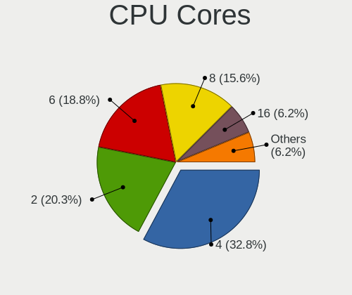
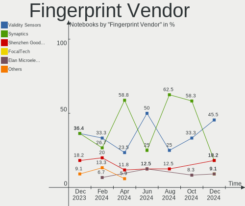

Manjaro - Hardware Trends (Notebooks)
-------------------------------------

A project to identify most popular hardware characteristics and track their change
over time based on data collected by Linux users at https://Linux-Hardware.org.

Anyone can contribute to this report by the [hw-probe](https://github.com/linuxhw/hw-probe) tool:

    sudo -E hw-probe -all -upload

This report is for one last month. Overall report since the beginning of time: [TestCoverage](https://github.com/linuxhw/TestCoverage)

Period: Sep, 2022.

Contents
--------

* [ System ](#system)
  - [ OS                       ](#os)
  - [ OS Family                ](#os-family)
  - [ Kernel                   ](#kernel)
  - [ Kernel Family            ](#kernel-family)
  - [ Kernel Major Ver.        ](#kernel-major-ver)
  - [ Arch                     ](#arch)
  - [ DE                       ](#de)
  - [ Display Server           ](#display-server)
  - [ Display Manager          ](#display-manager)
  - [ OS Lang                  ](#os-lang)
  - [ Boot Mode                ](#boot-mode)
  - [ Filesystem               ](#filesystem)
  - [ Part. scheme             ](#part-scheme)
  - [ Dual Boot with Linux/BSD ](#dual-boot-with-linuxbsd)
  - [ Dual Boot (Win)          ](#dual-boot-win)

* [ Board ](#board)
  - [ Vendor                   ](#vendor)
  - [ Model                    ](#model)
  - [ Model Family             ](#model-family)
  - [ MFG Year                 ](#mfg-year)
  - [ Form Factor              ](#form-factor)
  - [ Secure Boot              ](#secure-boot)
  - [ Coreboot                 ](#coreboot)
  - [ RAM Size                 ](#ram-size)
  - [ RAM Used                 ](#ram-used)
  - [ Total Drives             ](#total-drives)
  - [ Has CD-ROM               ](#has-cd-rom)
  - [ Has Ethernet             ](#has-ethernet)
  - [ Has WiFi                 ](#has-wifi)
  - [ Has Bluetooth            ](#has-bluetooth)

* [ Location ](#location)
  - [ Country                  ](#country)
  - [ City                     ](#city)

* [ Drives ](#drives)
  - [ Drive Vendor             ](#drive-vendor)
  - [ Drive Model              ](#drive-model)
  - [ HDD Vendor               ](#hdd-vendor)
  - [ SSD Vendor               ](#ssd-vendor)
  - [ Drive Kind               ](#drive-kind)
  - [ Drive Connector          ](#drive-connector)
  - [ Drive Size               ](#drive-size)
  - [ Space Total              ](#space-total)
  - [ Space Used               ](#space-used)
  - [ Malfunc. Drives          ](#malfunc-drives)
  - [ Malfunc. Drive Vendor    ](#malfunc-drive-vendor)
  - [ Malfunc. HDD Vendor      ](#malfunc-hdd-vendor)
  - [ Malfunc. Drive Kind      ](#malfunc-drive-kind)
  - [ Failed Drives            ](#failed-drives)
  - [ Failed Drive Vendor      ](#failed-drive-vendor)
  - [ Drive Status             ](#drive-status)

* [ Storage controller ](#storage-controller)
  - [ Storage Vendor           ](#storage-vendor)
  - [ Storage Model            ](#storage-model)
  - [ Storage Kind             ](#storage-kind)

* [ Processor ](#processor)
  - [ CPU Vendor               ](#cpu-vendor)
  - [ CPU Model                ](#cpu-model)
  - [ CPU Model Family         ](#cpu-model-family)
  - [ CPU Cores                ](#cpu-cores)
  - [ CPU Sockets              ](#cpu-sockets)
  - [ CPU Threads              ](#cpu-threads)
  - [ CPU Op-Modes             ](#cpu-op-modes)
  - [ CPU Microcode            ](#cpu-microcode)
  - [ CPU Microarch            ](#cpu-microarch)

* [ Graphics ](#graphics)
  - [ GPU Vendor               ](#gpu-vendor)
  - [ GPU Model                ](#gpu-model)
  - [ GPU Combo                ](#gpu-combo)
  - [ GPU Driver               ](#gpu-driver)
  - [ GPU Memory               ](#gpu-memory)

* [ Monitor ](#monitor)
  - [ Monitor Vendor           ](#monitor-vendor)
  - [ Monitor Model            ](#monitor-model)
  - [ Monitor Resolution       ](#monitor-resolution)
  - [ Monitor Diagonal         ](#monitor-diagonal)
  - [ Monitor Width            ](#monitor-width)
  - [ Aspect Ratio             ](#aspect-ratio)
  - [ Monitor Area             ](#monitor-area)
  - [ Pixel Density            ](#pixel-density)
  - [ Multiple Monitors        ](#multiple-monitors)

* [ Network ](#network)
  - [ Net Controller Vendor    ](#net-controller-vendor)
  - [ Net Controller Model     ](#net-controller-model)
  - [ Wireless Vendor          ](#wireless-vendor)
  - [ Wireless Model           ](#wireless-model)
  - [ Ethernet Vendor          ](#ethernet-vendor)
  - [ Ethernet Model           ](#ethernet-model)
  - [ Net Controller Kind      ](#net-controller-kind)
  - [ Used Controller          ](#used-controller)
  - [ NICs                     ](#nics)
  - [ IPv6                     ](#ipv6)

* [ Bluetooth ](#bluetooth)
  - [ Bluetooth Vendor         ](#bluetooth-vendor)
  - [ Bluetooth Model          ](#bluetooth-model)

* [ Sound ](#sound)
  - [ Sound Vendor             ](#sound-vendor)
  - [ Sound Model              ](#sound-model)

* [ Memory ](#memory)
  - [ Memory Vendor            ](#memory-vendor)
  - [ Memory Model             ](#memory-model)
  - [ Memory Kind              ](#memory-kind)
  - [ Memory Form Factor       ](#memory-form-factor)
  - [ Memory Size              ](#memory-size)
  - [ Memory Speed             ](#memory-speed)

* [ Printers & scanners ](#printers--scanners)
  - [ Printer Vendor           ](#printer-vendor)
  - [ Printer Model            ](#printer-model)
  - [ Scanner Vendor           ](#scanner-vendor)
  - [ Scanner Model            ](#scanner-model)

* [ Camera ](#camera)
  - [ Camera Vendor            ](#camera-vendor)
  - [ Camera Model             ](#camera-model)

* [ Security ](#security)
  - [ Fingerprint Vendor       ](#fingerprint-vendor)
  - [ Fingerprint Model        ](#fingerprint-model)
  - [ Chipcard Vendor          ](#chipcard-vendor)
  - [ Chipcard Model           ](#chipcard-model)

* [ Unsupported ](#unsupported)
  - [ Unsupported Devices      ](#unsupported-devices)
  - [ Unsupported Device Types ](#unsupported-device-types)

System
------

OS
--

Installed operating systems

| Name           | Notebooks | Percent |
|----------------|-----------|---------|
| Manjaro        | 37        | 43.02%  |
| Manjaro 22.0.0 | 35        | 40.7%   |
| Manjaro 21.3.7 | 12        | 13.95%  |
| Manjaro 21.3.6 | 1         | 1.16%   |
| Manjaro 21.2.6 | 1         | 1.16%   |

OS Family
---------

OS without a version

| Name    | Notebooks | Percent |
|---------|-----------|---------|
| Manjaro | 86        | 100%    |

Kernel
------

Version of the Linux kernel

| Version                                      | Notebooks | Percent |
|----------------------------------------------|-----------|---------|
| 5.15.65-1-MANJARO                            | 26        | 30.23%  |
| 5.19.7-1-MANJARO                             | 13        | 15.12%  |
| 5.15.60-1-MANJARO                            | 13        | 15.12%  |
| 5.19.1-3-MANJARO                             | 5         | 5.81%   |
| 5.19.0-3-rt10-MANJARO                        | 5         | 5.81%   |
| 6.0.0-1-MANJARO                              | 4         | 4.65%   |
| 5.19.10-1-MANJARO                            | 2         | 2.33%   |
| 5.18.17-1-MANJARO                            | 2         | 2.33%   |
| 6.0.0-rc4-2-git-rtw89-00284-gce888220d5c7    | 1         | 1.16%   |
| 5.19.7-arch1-g14-1                           | 1         | 1.16%   |
| 5.19.6-lqx1-1-lqx                            | 1         | 1.16%   |
| 5.19.0-2-T2                                  | 1         | 1.16%   |
| 5.18.19-3-MANJARO                            | 1         | 1.16%   |
| 5.18.0-2-rt11-MANJARO                        | 1         | 1.16%   |
| 5.18.0-1-rt11-MANJARO                        | 1         | 1.16%   |
| 5.17.6-1-MANJARO                             | 1         | 1.16%   |
| 5.17.15-1-MANJARO                            | 1         | 1.16%   |
| 5.15.67-1-MANJARO                            | 1         | 1.16%   |
| 5.15.66-1-MANJARO                            | 1         | 1.16%   |
| 5.15.41-1-MANJARO                            | 1         | 1.16%   |
| 5.15.28-1-MANJARO                            | 1         | 1.16%   |
| 5.14.10-1-MANJARO                            | 1         | 1.16%   |
| 5.13.0-valve21-1-steamos-02209-g2a5bdc1102a0 | 1         | 1.16%   |
| 5.10.41-1-MANJARO                            | 1         | 1.16%   |

Kernel Family
-------------

Linux kernel without a distro release

| Version | Notebooks | Percent |
|---------|-----------|---------|
| 5.15.65 | 26        | 30.23%  |
| 5.19.7  | 14        | 16.28%  |
| 5.15.60 | 13        | 15.12%  |
| 5.19.0  | 6         | 6.98%   |
| 6.0.0   | 5         | 5.81%   |
| 5.19.1  | 5         | 5.81%   |
| 5.19.10 | 2         | 2.33%   |
| 5.18.17 | 2         | 2.33%   |
| 5.18.0  | 2         | 2.33%   |
| 5.19.6  | 1         | 1.16%   |
| 5.18.19 | 1         | 1.16%   |
| 5.17.6  | 1         | 1.16%   |
| 5.17.15 | 1         | 1.16%   |
| 5.15.67 | 1         | 1.16%   |
| 5.15.66 | 1         | 1.16%   |
| 5.15.41 | 1         | 1.16%   |
| 5.15.28 | 1         | 1.16%   |
| 5.14.10 | 1         | 1.16%   |
| 5.13.0  | 1         | 1.16%   |
| 5.10.41 | 1         | 1.16%   |

Kernel Major Ver.
-----------------

Linux kernel major version

| Version | Notebooks | Percent |
|---------|-----------|---------|
| 5.15    | 43        | 50%     |
| 5.19    | 28        | 32.56%  |
| 6.0     | 5         | 5.81%   |
| 5.18    | 5         | 5.81%   |
| 5.17    | 2         | 2.33%   |
| 5.14    | 1         | 1.16%   |
| 5.13    | 1         | 1.16%   |
| 5.10    | 1         | 1.16%   |

Arch
----

OS architecture (x86_64, i586, etc.)

| Name   | Notebooks | Percent |
|--------|-----------|---------|
| x86_64 | 86        | 100%    |

DE
--

Desktop Environment

| Name       | Notebooks | Percent |
|------------|-----------|---------|
| KDE5       | 45        | 52.33%  |
| GNOME      | 20        | 23.26%  |
| XFCE       | 18        | 20.93%  |
| X-Cinnamon | 1         | 1.16%   |
| Deepin     | 1         | 1.16%   |
| Unknown    | 1         | 1.16%   |

Display Server
--------------

X11 or Wayland

| Name    | Notebooks | Percent |
|---------|-----------|---------|
| X11     | 64        | 74.42%  |
| Wayland | 20        | 23.26%  |
| Unknown | 2         | 2.33%   |

Display Manager
---------------

SDDM, LightDM, etc.

| Name    | Notebooks | Percent |
|---------|-----------|---------|
| Unknown | 37        | 43.02%  |
| SDDM    | 22        | 25.58%  |
| GDM     | 14        | 16.28%  |
| LightDM | 12        | 13.95%  |
| CDM     | 1         | 1.16%   |

OS Lang
-------

Language

| Lang  | Notebooks | Percent |
|-------|-----------|---------|
| en_US | 46        | 53.49%  |
| ru_RU | 7         | 8.14%   |
| en_GB | 6         | 6.98%   |
| de_DE | 6         | 6.98%   |
| it_IT | 3         | 3.49%   |
| fr_FR | 3         | 3.49%   |
| es_ES | 3         | 3.49%   |
| de_AT | 2         | 2.33%   |
| zh_CN | 1         | 1.16%   |
| ru_UA | 1         | 1.16%   |
| pl_PL | 1         | 1.16%   |
| es_UY | 1         | 1.16%   |
| es_MX | 1         | 1.16%   |
| es_CO | 1         | 1.16%   |
| en_PH | 1         | 1.16%   |
| en_DK | 1         | 1.16%   |
| en_CA | 1         | 1.16%   |
| en_AU | 1         | 1.16%   |

Boot Mode
---------

EFI or BIOS

| Mode | Notebooks | Percent |
|------|-----------|---------|
| BIOS | 56        | 65.12%  |
| EFI  | 30        | 34.88%  |

Filesystem
----------

Type of filesystem

| Type    | Notebooks | Percent |
|---------|-----------|---------|
| Ext4    | 74        | 86.05%  |
| Btrfs   | 10        | 11.63%  |
| Xfs     | 1         | 1.16%   |
| Overlay | 1         | 1.16%   |

Part. scheme
------------

Scheme of partitioning

| Type    | Notebooks | Percent |
|---------|-----------|---------|
| Unknown | 51        | 59.3%   |
| GPT     | 30        | 34.88%  |
| MBR     | 5         | 5.81%   |

Dual Boot with Linux/BSD
------------------------

Hosting more than one Linux/BSD

| Dual boot | Notebooks | Percent |
|-----------|-----------|---------|
| No        | 79        | 91.86%  |
| Yes       | 7         | 8.14%   |

Dual Boot (Win)
---------------

Hosting Linux and Windows

| Dual boot | Notebooks | Percent |
|-----------|-----------|---------|
| No        | 63        | 73.26%  |
| Yes       | 23        | 26.74%  |

Board
-----

Vendor
------

Motherboard manufacturer

| Name                 | Notebooks | Percent |
|----------------------|-----------|---------|
| Lenovo               | 22        | 25.58%  |
| ASUSTek Computer     | 21        | 24.42%  |
| Hewlett-Packard      | 13        | 15.12%  |
| Dell                 | 7         | 8.14%   |
| Timi                 | 3         | 3.49%   |
| Acer                 | 3         | 3.49%   |
| Toshiba              | 2         | 2.33%   |
| HUAWEI               | 2         | 2.33%   |
| Apple                | 2         | 2.33%   |
| Sony                 | 1         | 1.16%   |
| Schenker             | 1         | 1.16%   |
| Samsung Electronics  | 1         | 1.16%   |
| MSI                  | 1         | 1.16%   |
| Irbis                | 1         | 1.16%   |
| Intel Client Systems | 1         | 1.16%   |
| Gateway              | 1         | 1.16%   |
| CyberPowerPC         | 1         | 1.16%   |
| Chuwi                | 1         | 1.16%   |
| AXDIA International  | 1         | 1.16%   |
| Unknown              | 1         | 1.16%   |

Model
-----

Motherboard model

| Name                                              | Notebooks | Percent |
|---------------------------------------------------|-----------|---------|
| Timi RedmiBook Pro 15S                            | 2         | 2.33%   |
| Toshiba Satellite NB10t-A-102                     | 1         | 1.16%   |
| Toshiba Satellite C650D                           | 1         | 1.16%   |
| Timi Redmi Book Pro 15 2022                       | 1         | 1.16%   |
| Sony VPCF236FM                                    | 1         | 1.16%   |
| Schenker VISION 15 (SVS15E21)                     | 1         | 1.16%   |
| Samsung RV420/RV520/RV720/E3530/S3530/E3420/E3520 | 1         | 1.16%   |
| MSI Delta 15 A5EFK                                | 1         | 1.16%   |
| Lenovo Yoga Slim 7 Pro 14IAP7 82SV                | 1         | 1.16%   |
| Lenovo Yoga Slim 7 14ARE05 82A2                   | 1         | 1.16%   |
| Lenovo V310-15ISK 80SY                            | 1         | 1.16%   |
| Lenovo ThinkPad X270 W10DG 20K5S17R0L             | 1         | 1.16%   |
| Lenovo ThinkPad X1 Extreme 20MF000BUS             | 1         | 1.16%   |
| Lenovo ThinkPad X1 Carbon 5th 20HR000DUS          | 1         | 1.16%   |
| Lenovo ThinkPad T540p 20BFA05FUS                  | 1         | 1.16%   |
| Lenovo ThinkPad T460p 20FW000EGE                  | 1         | 1.16%   |
| Lenovo ThinkPad T430 2349A17                      | 1         | 1.16%   |
| Lenovo ThinkPad Edge E531 68852BS                 | 1         | 1.16%   |
| Lenovo ThinkPad E560 20EV002FUS                   | 1         | 1.16%   |
| Lenovo ThinkPad E14 Gen 3 20Y70073GE              | 1         | 1.16%   |
| Lenovo Legion S7 15ACH6 82K8                      | 1         | 1.16%   |
| Lenovo Legion 5 15ACH6 82QJ                       | 1         | 1.16%   |
| Lenovo Legion 5 15ACH6 82JW                       | 1         | 1.16%   |
| Lenovo IdeaPad Slim 1-14AST-05 81VS               | 1         | 1.16%   |
| Lenovo IdeaPad Gaming 3 15ARH05 82EY              | 1         | 1.16%   |
| Lenovo IdeaPad 700-15ISK 80RU                     | 1         | 1.16%   |
| Lenovo IdeaPad 5 Pro 14ARH7 82SJ                  | 1         | 1.16%   |
| Lenovo IdeaPad 3 14ADA05 81W0                     | 1         | 1.16%   |
| Lenovo G580 20150                                 | 1         | 1.16%   |
| Lenovo B580 20144                                 | 1         | 1.16%   |
| Irbis NB121                                       | 1         | 1.16%   |
| Intel Client Systems LAPQC71A                     | 1         | 1.16%   |
| HUAWEI VLT-WX0                                    | 1         | 1.16%   |
| HUAWEI KLVD-WXX9                                  | 1         | 1.16%   |
| HP Victus by Laptop 16-e0xxx                      | 1         | 1.16%   |
| HP ProBook 4520s                                  | 1         | 1.16%   |
| HP ProBook 450 G1                                 | 1         | 1.16%   |
| HP ProBook 430 G6                                 | 1         | 1.16%   |
| HP Pavilion Laptop 15-cc1xx                       | 1         | 1.16%   |
| HP Pavilion Gaming Laptop 15-dk2xxx               | 1         | 1.16%   |

Model Family
------------

Motherboard model prefix

| Name                          | Notebooks | Percent |
|-------------------------------|-----------|---------|
| Lenovo ThinkPad               | 9         | 10.47%  |
| ASUS ROG                      | 7         | 8.14%   |
| Lenovo IdeaPad                | 5         | 5.81%   |
| Lenovo Legion                 | 3         | 3.49%   |
| HP ProBook                    | 3         | 3.49%   |
| HP Pavilion                   | 3         | 3.49%   |
| Dell Latitude                 | 3         | 3.49%   |
| Toshiba Satellite             | 2         | 2.33%   |
| Timi RedmiBook                | 2         | 2.33%   |
| Lenovo Yoga                   | 2         | 2.33%   |
| HP Laptop                     | 2         | 2.33%   |
| HP ENVY                       | 2         | 2.33%   |
| Dell Inspiron                 | 2         | 2.33%   |
| ASUS ZenBook                  | 2         | 2.33%   |
| ASUS VivoBook                 | 2         | 2.33%   |
| ASUS TUF                      | 2         | 2.33%   |
| ASUS ASUS                     | 2         | 2.33%   |
| Acer Nitro                    | 2         | 2.33%   |
| Timi Redmi                    | 1         | 1.16%   |
| Sony VPCF236FM                | 1         | 1.16%   |
| Schenker VISION               | 1         | 1.16%   |
| Samsung RV420                 | 1         | 1.16%   |
| MSI Delta                     | 1         | 1.16%   |
| Lenovo V310-15ISK             | 1         | 1.16%   |
| Lenovo G580                   | 1         | 1.16%   |
| Lenovo B580                   | 1         | 1.16%   |
| Irbis NB121                   | 1         | 1.16%   |
| Intel Client Systems LAPQC71A | 1         | 1.16%   |
| HUAWEI VLT-WX0                | 1         | 1.16%   |
| HUAWEI KLVD-WXX9              | 1         | 1.16%   |
| HP Victus                     | 1         | 1.16%   |
| HP Notebook                   | 1         | 1.16%   |
| HP EliteBook                  | 1         | 1.16%   |
| Gateway NV57H                 | 1         | 1.16%   |
| Dell XPS                      | 1         | 1.16%   |
| Dell Precision                | 1         | 1.16%   |
| CyberPowerPC FANG             | 1         | 1.16%   |
| Chuwi HeroBook                | 1         | 1.16%   |
| AXDIA International WINPAD    | 1         | 1.16%   |
| ASUS X556UF                   | 1         | 1.16%   |

MFG Year
--------

Motherboard manufacture year

| Year | Notebooks | Percent |
|------|-----------|---------|
| 2021 | 21        | 24.42%  |
| 2022 | 8         | 9.3%    |
| 2020 | 8         | 9.3%    |
| 2019 | 7         | 8.14%   |
| 2017 | 5         | 5.81%   |
| 2016 | 5         | 5.81%   |
| 2015 | 5         | 5.81%   |
| 2013 | 5         | 5.81%   |
| 2012 | 5         | 5.81%   |
| 2014 | 4         | 4.65%   |
| 2011 | 4         | 4.65%   |
| 2018 | 3         | 3.49%   |
| 2010 | 3         | 3.49%   |
| 2009 | 1         | 1.16%   |
| 2008 | 1         | 1.16%   |
| 2005 | 1         | 1.16%   |

Form Factor
-----------

Physical design of the computer

| Name     | Notebooks | Percent |
|----------|-----------|---------|
| Notebook | 86        | 100%    |

Secure Boot
-----------

Enabled or disabled

| State    | Notebooks | Percent |
|----------|-----------|---------|
| Disabled | 86        | 100%    |

Coreboot
--------

Have coreboot on board

| Used | Notebooks | Percent |
|------|-----------|---------|
| No   | 86        | 100%    |

RAM Size
--------

Total RAM memory

| Size in GB | Notebooks | Percent |
|------------|-----------|---------|
| 8.01-16.0  | 27        | 31.4%   |
| 4.01-8.0   | 25        | 29.07%  |
| 16.01-24.0 | 17        | 19.77%  |
| 3.01-4.0   | 8         | 9.3%    |
| 32.01-64.0 | 5         | 5.81%   |
| 2.01-3.0   | 2         | 2.33%   |
| 24.01-32.0 | 1         | 1.16%   |
| 1.01-2.0   | 1         | 1.16%   |

RAM Used
--------

Used RAM memory

| Used GB    | Notebooks | Percent |
|------------|-----------|---------|
| 2.01-3.0   | 22        | 25.58%  |
| 3.01-4.0   | 21        | 24.42%  |
| 1.01-2.0   | 17        | 19.77%  |
| 4.01-8.0   | 15        | 17.44%  |
| 8.01-16.0  | 7         | 8.14%   |
| 0.51-1.0   | 3         | 3.49%   |
| 24.01-32.0 | 1         | 1.16%   |

Total Drives
------------

Number of drives on board

| Drives | Notebooks | Percent |
|--------|-----------|---------|
| 1      | 54        | 62.79%  |
| 2      | 27        | 31.4%   |
| 3      | 5         | 5.81%   |

Has CD-ROM
----------

Has CD-ROM on board

| Presented | Notebooks | Percent |
|-----------|-----------|---------|
| No        | 66        | 76.74%  |
| Yes       | 20        | 23.26%  |

Has Ethernet
------------

Has Ethernet on board

| Presented | Notebooks | Percent |
|-----------|-----------|---------|
| Yes       | 60        | 69.77%  |
| No        | 26        | 30.23%  |

Has WiFi
--------

Has WiFi module

| Presented | Notebooks | Percent |
|-----------|-----------|---------|
| Yes       | 85        | 98.84%  |
| No        | 1         | 1.16%   |

Has Bluetooth
-------------

Has Bluetooth module

| Presented | Notebooks | Percent |
|-----------|-----------|---------|
| Yes       | 72        | 83.72%  |
| No        | 14        | 16.28%  |

Location
--------

Country
-------

Geographic location (country)

| Country         | Notebooks | Percent |
|-----------------|-----------|---------|
| USA             | 22        | 25.58%  |
| Russia          | 7         | 8.14%   |
| Italy           | 7         | 8.14%   |
| Germany         | 7         | 8.14%   |
| Spain           | 5         | 5.81%   |
| Vietnam         | 3         | 3.49%   |
| UK              | 2         | 2.33%   |
| Poland          | 2         | 2.33%   |
| Netherlands     | 2         | 2.33%   |
| Mexico          | 2         | 2.33%   |
| France          | 2         | 2.33%   |
| Belarus         | 2         | 2.33%   |
| Austria         | 2         | 2.33%   |
| Australia       | 2         | 2.33%   |
| Venezuela       | 1         | 1.16%   |
| Uruguay         | 1         | 1.16%   |
| Turkey          | 1         | 1.16%   |
| Tunisia         | 1         | 1.16%   |
| Sri Lanka       | 1         | 1.16%   |
| Portugal        | 1         | 1.16%   |
| Philippines     | 1         | 1.16%   |
| Norway          | 1         | 1.16%   |
| North Macedonia | 1         | 1.16%   |
| Kyrgyzstan      | 1         | 1.16%   |
| Israel          | 1         | 1.16%   |
| Hungary         | 1         | 1.16%   |
| Ghana           | 1         | 1.16%   |
| Ethiopia        | 1         | 1.16%   |
| Denmark         | 1         | 1.16%   |
| Colombia        | 1         | 1.16%   |
| Canada          | 1         | 1.16%   |
| Bulgaria        | 1         | 1.16%   |
| Brazil          | 1         | 1.16%   |

City
----

Geographic location (city)

| City                      | Notebooks | Percent |
|---------------------------|-----------|---------|
| St Petersburg             | 2         | 2.33%   |
| Milan                     | 2         | 2.33%   |
| Melbourne                 | 2         | 2.33%   |
| Ho Chi Minh City          | 2         | 2.33%   |
| Barcelona                 | 2         | 2.33%   |
| Aachen                    | 2         | 2.33%   |
| Yekaterinburg             | 1         | 1.16%   |
| West Palm Beach           | 1         | 1.16%   |
| Wendelstein               | 1         | 1.16%   |
| Wembley                   | 1         | 1.16%   |
| Wasilla                   | 1         | 1.16%   |
| Vienna                    | 1         | 1.16%   |
| Valencia                  | 1         | 1.16%   |
| Turin                     | 1         | 1.16%   |
| Tunis                     | 1         | 1.16%   |
| Trondheim                 | 1         | 1.16%   |
| Trofa                     | 1         | 1.16%   |
| Tolyatti                  | 1         | 1.16%   |
| Tel Aviv                  | 1         | 1.16%   |
| Sri Jayewardenepura Kotte | 1         | 1.16%   |
| Sofia                     | 1         | 1.16%   |
| Skopje                    | 1         | 1.16%   |
| Sellersville              | 1         | 1.16%   |
| Seattle                   | 1         | 1.16%   |
| Salzburg                  | 1         | 1.16%   |
| Saint Paul                | 1         | 1.16%   |
| Ravenna                   | 1         | 1.16%   |
| Potomac                   | 1         | 1.16%   |
| Phoenix                   | 1         | 1.16%   |
| Paris                     | 1         | 1.16%   |
| Oxford                    | 1         | 1.16%   |
| Omsk                      | 1         | 1.16%   |
| Nakhodka                  | 1         | 1.16%   |
| Montevideo                | 1         | 1.16%   |
| Mayen                     | 1         | 1.16%   |
| Malbork                   | 1         | 1.16%   |
| Lublin                    | 1         | 1.16%   |
| Los Angeles               | 1         | 1.16%   |
| León                     | 1         | 1.16%   |
| Lake Worth                | 1         | 1.16%   |

Drives
------

Drive Vendor
------------

Hard drive vendors

| Vendor                       | Notebooks | Drives | Percent |
|------------------------------|-----------|--------|---------|
| Samsung Electronics          | 17        | 19     | 14.29%  |
| WDC                          | 12        | 12     | 10.08%  |
| Seagate                      | 11        | 11     | 9.24%   |
| Toshiba                      | 10        | 10     | 8.4%    |
| Micron Technology            | 10        | 10     | 8.4%    |
| Unknown                      | 9         | 11     | 7.56%   |
| SanDisk                      | 6         | 9      | 5.04%   |
| SK hynix                     | 5         | 5      | 4.2%    |
| Crucial                      | 4         | 4      | 3.36%   |
| KIOXIA                       | 3         | 3      | 2.52%   |
| Kingston                     | 3         | 3      | 2.52%   |
| Intel                        | 3         | 3      | 2.52%   |
| Shenzhen Longsys Electronics | 2         | 2      | 1.68%   |
| Phison Electronics           | 2         | 2      | 1.68%   |
| Apple                        | 2         | 2      | 1.68%   |
| Transcend                    | 1         | 1      | 0.84%   |
| TO Exter                     | 1         | 1      | 0.84%   |
| Teclast                      | 1         | 1      | 0.84%   |
| SK 2TB                       | 1         | 1      | 0.84%   |
| PNY                          | 1         | 1      | 0.84%   |
| Plextor                      | 1         | 1      | 0.84%   |
| Netac                        | 1         | 1      | 0.84%   |
| Micron/Crucial Technology    | 1         | 2      | 0.84%   |
| Maxtor                       | 1         | 1      | 0.84%   |
| LITEON                       | 1         | 1      | 0.84%   |
| Lexar                        | 1         | 1      | 0.84%   |
| Kingmax                      | 1         | 1      | 0.84%   |
| Kingchuxing                  | 1         | 1      | 0.84%   |
| JMicron Technology           | 1         | 1      | 0.84%   |
| Intenso                      | 1         | 1      | 0.84%   |
| Hitachi                      | 1         | 1      | 0.84%   |
| HGST                         | 1         | 1      | 0.84%   |
| GOODRAM                      | 1         | 1      | 0.84%   |
| China                        | 1         | 1      | 0.84%   |
| Unknown                      | 1         | 1      | 0.84%   |

Drive Model
-----------

Hard drive models

| Model                                               | Notebooks | Percent |
|-----------------------------------------------------|-----------|---------|
| Samsung NVMe SSD Controller SM981/PM981/PM983 256GB | 5         | 4.07%   |
| Unknown MMC Card  64GB                              | 3         | 2.44%   |
| Seagate ST500LM021-1KJ152 500GB                     | 3         | 2.44%   |
| Samsung NVMe SSD Drive 256GB                        | 3         | 2.44%   |
| WDC WDS500G2B0A-00SM50 500GB SSD                    | 2         | 1.63%   |
| Unknown MMC Card  32GB                              | 2         | 1.63%   |
| Unknown MMC Card  16GB                              | 2         | 1.63%   |
| Toshiba MQ04ABF100 1TB                              | 2         | 1.63%   |
| Toshiba MQ01ABD100 1TB                              | 2         | 1.63%   |
| SK hynix HFM001TD3JX013N 1024GB                     | 2         | 1.63%   |
| Phison PS5013 E13 NVMe Controller 512GB             | 2         | 1.63%   |
| Micron MTFDHBA256TCK-1AS1AABHA 256GB                | 2         | 1.63%   |
| Kingston NVMe SSD Drive 128GB                       | 2         | 1.63%   |
| WDC WDS240G2G0B-00EPW0 240GB SSD                    | 1         | 0.81%   |
| WDC WDS100T2B0C-00PXH0 1TB                          | 1         | 0.81%   |
| WDC WD5000LPLX-60ZNTT2 500GB                        | 1         | 0.81%   |
| WDC WD10SPZX-21Z10T0 1TB                            | 1         | 0.81%   |
| WDC WD10SPCX-24HWST1 1TB                            | 1         | 0.81%   |
| WDC WD10JPVX-80JC3T0 1TB                            | 1         | 0.81%   |
| WDC WD10JPVX-75JC3T0 1TB                            | 1         | 0.81%   |
| WDC WD10JPLX-00MBPT0 1TB                            | 1         | 0.81%   |
| WDC WD10JPCX-24UE4T0 1TB                            | 1         | 0.81%   |
| WDC PC SN530 SDBPNPZ-512G-1002 512GB                | 1         | 0.81%   |
| Unknown xD/SD/M.S.                                  | 1         | 0.81%   |
| Unknown SF64G  64GB                                 | 1         | 0.81%   |
| Unknown SD/MMC/MS PRO 2GB                           | 1         | 0.81%   |
| Unknown MMC Card  393GB                             | 1         | 0.81%   |
| Transcend TS240GMTS420S 240GB SSD                   | 1         | 0.81%   |
| Toshiba XG6 NVMe SSD Controller 512GB               | 1         | 0.81%   |
| Toshiba MQ01ABD075 752GB                            | 1         | 0.81%   |
| Toshiba MK7559GSXP 752GB                            | 1         | 0.81%   |
| Toshiba MK3275GSX 320GB                             | 1         | 0.81%   |
| Toshiba KXG50ZNV512G 512GB                          | 1         | 0.81%   |
| Toshiba HDWK105 500GB                               | 1         | 0.81%   |
| TO Exter nal USB 3.0 180GB                          | 1         | 0.81%   |
| Teclast BD256GB SHCB-2280 SSD                       | 1         | 0.81%   |
| SK hynix SKHynix_HFS001TDE9X084N 1TB                | 1         | 0.81%   |
| SK hynix NVMe SSD Drive 512GB                       | 1         | 0.81%   |
| SK hynix NVMe SSD Drive 1024GB                      | 1         | 0.81%   |
| SK 2TB Disk 2TB                                     | 1         | 0.81%   |

HDD Vendor
----------

Hard disk drive vendors

| Vendor  | Notebooks | Drives | Percent |
|---------|-----------|--------|---------|
| Seagate | 11        | 11     | 37.93%  |
| Toshiba | 8         | 8      | 27.59%  |
| WDC     | 7         | 7      | 24.14%  |
| Unknown | 1         | 1      | 3.45%   |
| Hitachi | 1         | 1      | 3.45%   |
| HGST    | 1         | 1      | 3.45%   |

SSD Vendor
----------

Solid state drive vendors

| Vendor              | Notebooks | Drives | Percent |
|---------------------|-----------|--------|---------|
| Samsung Electronics | 4         | 4      | 13.79%  |
| Crucial             | 4         | 4      | 13.79%  |
| WDC                 | 3         | 3      | 10.34%  |
| Micron Technology   | 2         | 2      | 6.9%    |
| Transcend           | 1         | 1      | 3.45%   |
| TO Exter            | 1         | 1      | 3.45%   |
| Teclast             | 1         | 1      | 3.45%   |
| PNY                 | 1         | 1      | 3.45%   |
| Plextor             | 1         | 1      | 3.45%   |
| Netac               | 1         | 1      | 3.45%   |
| Maxtor              | 1         | 1      | 3.45%   |
| LITEON              | 1         | 1      | 3.45%   |
| Lexar               | 1         | 1      | 3.45%   |
| Kingmax             | 1         | 1      | 3.45%   |
| Intenso             | 1         | 1      | 3.45%   |
| Intel               | 1         | 1      | 3.45%   |
| GOODRAM             | 1         | 1      | 3.45%   |
| China               | 1         | 1      | 3.45%   |
| Apple               | 1         | 1      | 3.45%   |
| Unknown             | 1         | 1      | 3.45%   |

Drive Kind
----------

HDD or SSD

| Kind    | Notebooks | Drives | Percent |
|---------|-----------|--------|---------|
| NVMe    | 48        | 57     | 42.11%  |
| HDD     | 28        | 29     | 24.56%  |
| SSD     | 27        | 29     | 23.68%  |
| MMC     | 8         | 9      | 7.02%   |
| Unknown | 3         | 3      | 2.63%   |

Drive Connector
---------------

SATA, SAS, NVMe, etc.

| Type | Notebooks | Drives | Percent |
|------|-----------|--------|---------|
| NVMe | 48        | 56     | 43.64%  |
| SATA | 47        | 55     | 42.73%  |
| MMC  | 8         | 9      | 7.27%   |
| SAS  | 7         | 7      | 6.36%   |

Drive Size
----------

Size of hard drive

| Size in TB | Notebooks | Drives | Percent |
|------------|-----------|--------|---------|
| 0.01-0.5   | 33        | 40     | 64.71%  |
| 0.51-1.0   | 17        | 17     | 33.33%  |
| 1.01-2.0   | 1         | 1      | 1.96%   |

Space Total
-----------

Amount of disk space available on the file system

| Size in GB     | Notebooks | Percent |
|----------------|-----------|---------|
| 251-500        | 21        | 24.42%  |
| 501-1000       | 20        | 23.26%  |
| 101-250        | 19        | 22.09%  |
| 1001-2000      | 10        | 11.63%  |
| 51-100         | 7         | 8.14%   |
| Unknown        | 4         | 4.65%   |
| 1-20           | 3         | 3.49%   |
| More than 3000 | 1         | 1.16%   |
| 2001-3000      | 1         | 1.16%   |

Space Used
----------

Amount of used disk space

| Used GB        | Notebooks | Percent |
|----------------|-----------|---------|
| 101-250        | 19        | 22.09%  |
| 1-20           | 17        | 19.77%  |
| 251-500        | 14        | 16.28%  |
| 21-50          | 11        | 12.79%  |
| 51-100         | 11        | 12.79%  |
| 501-1000       | 6         | 6.98%   |
| Unknown        | 4         | 4.65%   |
| 1001-2000      | 2         | 2.33%   |
| More than 3000 | 1         | 1.16%   |
| 0              | 1         | 1.16%   |

Malfunc. Drives
---------------

Drive models with a malfunction

| Model                           | Notebooks | Drives | Percent |
|---------------------------------|-----------|--------|---------|
| Toshiba MK7559GSXP 752GB        | 1         | 1      | 33.33%  |
| Seagate ST500LT012-9WS142 500GB | 1         | 1      | 33.33%  |
| Intel SSDSC2KW120H6 120GB       | 1         | 1      | 33.33%  |

Malfunc. Drive Vendor
---------------------

Vendors of faulty drives

| Vendor  | Notebooks | Drives | Percent |
|---------|-----------|--------|---------|
| Toshiba | 1         | 1      | 33.33%  |
| Seagate | 1         | 1      | 33.33%  |
| Intel   | 1         | 1      | 33.33%  |

Malfunc. HDD Vendor
-------------------

Vendors of faulty HDD drives

| Vendor  | Notebooks | Drives | Percent |
|---------|-----------|--------|---------|
| Toshiba | 1         | 1      | 50%     |
| Seagate | 1         | 1      | 50%     |

Malfunc. Drive Kind
-------------------

Kinds of faulty drives

| Kind | Notebooks | Drives | Percent |
|------|-----------|--------|---------|
| HDD  | 2         | 2      | 66.67%  |
| SSD  | 1         | 1      | 33.33%  |

Failed Drives
-------------

Failed drive models

Zero info for selected period =(

Failed Drive Vendor
-------------------

Failed drive vendors

Zero info for selected period =(

Drive Status
------------

Number of failed and malfunc. drives

| Status   | Notebooks | Drives | Percent |
|----------|-----------|--------|---------|
| Detected | 63        | 89     | 67.74%  |
| Works    | 27        | 35     | 29.03%  |
| Malfunc  | 3         | 3      | 3.23%   |

Storage controller
------------------

Storage Vendor
--------------

Storage controller vendors

| Vendor                       | Notebooks | Percent |
|------------------------------|-----------|---------|
| Intel                        | 49        | 44.55%  |
| Samsung Electronics          | 14        | 12.73%  |
| AMD                          | 13        | 11.82%  |
| Micron Technology            | 8         | 7.27%   |
| SanDisk                      | 7         | 6.36%   |
| SK hynix                     | 5         | 4.55%   |
| KIOXIA                       | 3         | 2.73%   |
| Kingston Technology Company  | 3         | 2.73%   |
| Toshiba America Info Systems | 2         | 1.82%   |
| Shenzhen Longsys Electronics | 2         | 1.82%   |
| Phison Electronics           | 2         | 1.82%   |
| Micron/Crucial Technology    | 1         | 0.91%   |
| Apple                        | 1         | 0.91%   |

Storage Model
-------------

Storage controller models

| Model                                                                            | Notebooks | Percent |
|----------------------------------------------------------------------------------|-----------|---------|
| AMD FCH SATA Controller [AHCI mode]                                              | 11        | 9.82%   |
| Intel Sunrise Point-LP SATA Controller [AHCI mode]                               | 9         | 8.04%   |
| Micron Non-Volatile memory controller                                            | 8         | 7.14%   |
| Samsung NVMe SSD Controller SM981/PM981/PM983                                    | 5         | 4.46%   |
| Intel Celeron/Pentium Silver Processor SATA Controller                           | 5         | 4.46%   |
| Intel 82801 Mobile SATA Controller [RAID mode]                                   | 5         | 4.46%   |
| SK hynix Gold P31 SSD                                                            | 4         | 3.57%   |
| Intel Volume Management Device NVMe RAID Controller                              | 4         | 3.57%   |
| Intel Cannon Lake Mobile PCH SATA AHCI Controller                                | 4         | 3.57%   |
| Intel 7 Series Chipset Family 6-port SATA Controller [AHCI mode]                 | 4         | 3.57%   |
| Intel 6 Series/C200 Series Chipset Family 6 port Mobile SATA AHCI Controller     | 4         | 3.57%   |
| SanDisk Non-Volatile memory controller                                           | 3         | 2.68%   |
| Samsung NVMe SSD Controller 980                                                  | 3         | 2.68%   |
| Intel HM170/QM170 Chipset SATA Controller [AHCI Mode]                            | 3         | 2.68%   |
| Intel 8 Series/C220 Series Chipset Family 6-port SATA Controller 1 [AHCI mode]   | 3         | 2.68%   |
| SanDisk WD Blue SN550 NVMe SSD                                                   | 2         | 1.79%   |
| Samsung NVMe SSD Controller SM951/PM951                                          | 2         | 1.79%   |
| Phison PS5013 E13 NVMe Controller                                                | 2         | 1.79%   |
| KIOXIA Non-Volatile memory controller                                            | 2         | 1.79%   |
| Kingston Company U-SNS8154P3 NVMe SSD                                            | 2         | 1.79%   |
| Intel 8 Series SATA Controller 1 [AHCI mode]                                     | 2         | 1.79%   |
| AMD SB7x0/SB8x0/SB9x0 SATA Controller [AHCI mode]                                | 2         | 1.79%   |
| Toshiba America Info Systems XG6 NVMe SSD Controller                             | 1         | 0.89%   |
| Toshiba America Info Systems Toshiba America Info Non-Volatile memory controller | 1         | 0.89%   |
| SK hynix BC511                                                                   | 1         | 0.89%   |
| Shenzhen Longsys SM2263EN/SM2263XT-based OEM SSD                                 | 1         | 0.89%   |
| Shenzhen Longsys Non-Volatile memory controller                                  | 1         | 0.89%   |
| SanDisk WD Blue SN500 / PC SN520 NVMe SSD                                        | 1         | 0.89%   |
| SanDisk WD Black SN750 / PC SN730 NVMe SSD                                       | 1         | 0.89%   |
| Samsung NVMe SSD Controller SM961/PM961/SM963                                    | 1         | 0.89%   |
| Samsung NVMe SSD Controller PM9A1/PM9A3/980PRO                                   | 1         | 0.89%   |
| Samsung Electronics SATA controller                                              | 1         | 0.89%   |
| Samsung Electronics Non-Volatile memory controller                               | 1         | 0.89%   |
| Micron/Crucial Non-Volatile memory controller                                    | 1         | 0.89%   |
| KIOXIA NVMe SSD Controller BG4                                                   | 1         | 0.89%   |
| Kingston Company Company Non-Volatile memory controller                          | 1         | 0.89%   |
| Intel Tiger Lake-LP SATA Controller                                              | 1         | 0.89%   |
| Intel SSD 660P Series                                                            | 1         | 0.89%   |
| Intel Q170/Q150/B150/H170/H110/Z170/CM236 Chipset SATA Controller [AHCI Mode]    | 1         | 0.89%   |
| Intel Non-Volatile memory controller                                             | 1         | 0.89%   |

Storage Kind
------------

Kind of storage controller (IDE, SATA, NVMe, SAS, ...)

| Kind | Notebooks | Percent |
|------|-----------|---------|
| SATA | 53        | 48.18%  |
| NVMe | 47        | 42.73%  |
| RAID | 9         | 8.18%   |
| IDE  | 1         | 0.91%   |

Processor
---------

CPU Vendor
----------

Processor vendors

| Vendor | Notebooks | Percent |
|--------|-----------|---------|
| Intel  | 58        | 67.44%  |
| AMD    | 28        | 32.56%  |

CPU Model
---------

Processor models

| Model                                   | Notebooks | Percent |
|-----------------------------------------|-----------|---------|
| Intel Celeron N4020 CPU @ 1.10GHz       | 4         | 4.65%   |
| AMD Ryzen 7 5800H with Radeon Graphics  | 4         | 4.65%   |
| AMD Ryzen 9 5900HX with Radeon Graphics | 3         | 3.49%   |
| AMD Ryzen 5 5600H with Radeon Graphics  | 3         | 3.49%   |
| Intel Core i7-9750H CPU @ 2.60GHz       | 2         | 2.33%   |
| Intel Core i7-8750H CPU @ 2.20GHz       | 2         | 2.33%   |
| Intel Core i7-8550U CPU @ 1.80GHz       | 2         | 2.33%   |
| Intel Core i7-6700HQ CPU @ 2.60GHz      | 2         | 2.33%   |
| Intel Core i7-6500U CPU @ 2.50GHz       | 2         | 2.33%   |
| Intel Core i5-8250U CPU @ 1.60GHz       | 2         | 2.33%   |
| Intel Core i5-6200U CPU @ 2.30GHz       | 2         | 2.33%   |
| Intel Core i5-2430M CPU @ 2.40GHz       | 2         | 2.33%   |
| Intel 11th Gen Core i7-1165G7 @ 2.80GHz | 2         | 2.33%   |
| AMD Ryzen 7 6800HS with Radeon Graphics | 2         | 2.33%   |
| Intel Pentium CPU N3510 @ 1.99GHz       | 1         | 1.16%   |
| Intel Pentium CPU 2020M @ 2.40GHz       | 1         | 1.16%   |
| Intel Core i7-4810MQ CPU @ 2.80GHz      | 1         | 1.16%   |
| Intel Core i7-4710MQ CPU @ 2.50GHz      | 1         | 1.16%   |
| Intel Core i7-4702MQ CPU @ 2.20GHz      | 1         | 1.16%   |
| Intel Core i7-4600U CPU @ 2.10GHz       | 1         | 1.16%   |
| Intel Core i7-4600M CPU @ 2.90GHz       | 1         | 1.16%   |
| Intel Core i7-3632QM CPU @ 2.20GHz      | 1         | 1.16%   |
| Intel Core i7-2670QM CPU @ 2.20GHz      | 1         | 1.16%   |
| Intel Core i5-9300H CPU @ 2.40GHz       | 1         | 1.16%   |
| Intel Core i5-8265U CPU @ 1.60GHz       | 1         | 1.16%   |
| Intel Core i5-7300U CPU @ 2.60GHz       | 1         | 1.16%   |
| Intel Core i5-7300HQ CPU @ 2.50GHz      | 1         | 1.16%   |
| Intel Core i5-7200U CPU @ 2.50GHz       | 1         | 1.16%   |
| Intel Core i5-6440HQ CPU @ 2.60GHz      | 1         | 1.16%   |
| Intel Core i5-6300U CPU @ 2.40GHz       | 1         | 1.16%   |
| Intel Core i5-5250U CPU @ 1.60GHz       | 1         | 1.16%   |
| Intel Core i5-4310U CPU @ 2.00GHz       | 1         | 1.16%   |
| Intel Core i5-3320M CPU @ 2.60GHz       | 1         | 1.16%   |
| Intel Core i5-3230M CPU @ 2.60GHz       | 1         | 1.16%   |
| Intel Core i5-3210M CPU @ 2.50GHz       | 1         | 1.16%   |
| Intel Core i5-2410M CPU @ 2.30GHz       | 1         | 1.16%   |
| Intel Core i5-1035G4 CPU @ 1.10GHz      | 1         | 1.16%   |
| Intel Core i5 CPU M 480 @ 2.67GHz       | 1         | 1.16%   |
| Intel Core i3-7100U CPU @ 2.40GHz       | 1         | 1.16%   |
| Intel Core i3-1005G1 CPU @ 1.20GHz      | 1         | 1.16%   |

CPU Model Family
----------------

Processor model prefix

| Model            | Notebooks | Percent |
|------------------|-----------|---------|
| Intel Core i5    | 21        | 24.42%  |
| Intel Core i7    | 17        | 19.77%  |
| Other            | 8         | 9.3%    |
| AMD Ryzen 7      | 8         | 9.3%    |
| AMD Ryzen 5      | 8         | 9.3%    |
| AMD Ryzen 9      | 6         | 6.98%   |
| Intel Celeron    | 5         | 5.81%   |
| Intel Pentium    | 2         | 2.33%   |
| Intel Core i3    | 2         | 2.33%   |
| AMD E            | 2         | 2.33%   |
| Intel Core 2 Duo | 1         | 1.16%   |
| Intel Core 2     | 1         | 1.16%   |
| Intel Atom       | 1         | 1.16%   |
| AMD Ryzen 3      | 1         | 1.16%   |
| AMD Athlon       | 1         | 1.16%   |
| AMD A6           | 1         | 1.16%   |
| AMD A10          | 1         | 1.16%   |

CPU Cores
---------

Number of processor cores

| Number | Notebooks | Percent |
|--------|-----------|---------|
| 2      | 33        | 38.37%  |
| 4      | 25        | 29.07%  |
| 8      | 16        | 18.6%   |
| 6      | 10        | 11.63%  |
| 14     | 1         | 1.16%   |
| 12     | 1         | 1.16%   |

CPU Sockets
-----------

Number of sockets

| Number | Notebooks | Percent |
|--------|-----------|---------|
| 1      | 86        | 100%    |

CPU Threads
-----------

Threads per core (Hyper-Threading)

| Number | Notebooks | Percent |
|--------|-----------|---------|
| 2      | 69        | 80.23%  |
| 1      | 17        | 19.77%  |

CPU Op-Modes
------------

CPU Operation Modes (32-bit, 64-bit)

| Op mode        | Notebooks | Percent |
|----------------|-----------|---------|
| 32-bit, 64-bit | 86        | 100%    |

CPU Microcode
-------------

Microcode number

| Number     | Notebooks | Percent |
|------------|-----------|---------|
| Unknown    | 53        | 61.63%  |
| 0x0a50000c | 6         | 6.98%   |
| 0x906a3    | 3         | 3.49%   |
| 0x806ea    | 3         | 3.49%   |
| 0x806c1    | 3         | 3.49%   |
| 0x306c3    | 2         | 2.33%   |
| 0x306a9    | 2         | 2.33%   |
| 0x0a404102 | 2         | 2.33%   |
| 0x806ec    | 1         | 1.16%   |
| 0x806e9    | 1         | 1.16%   |
| 0x706a8    | 1         | 1.16%   |
| 0x506e3    | 1         | 1.16%   |
| 0x30673    | 1         | 1.16%   |
| 0x206a7    | 1         | 1.16%   |
| 0x0a404101 | 1         | 1.16%   |
| 0x08608103 | 1         | 1.16%   |
| 0x08600106 | 1         | 1.16%   |
| 0x08108109 | 1         | 1.16%   |
| 0x08108102 | 1         | 1.16%   |
| 0x05000029 | 1         | 1.16%   |

CPU Microarch
-------------

Microarchitecture

| Name             | Notebooks | Percent |
|------------------|-----------|---------|
| KabyLake         | 14        | 16.28%  |
| Zen 3            | 11        | 12.79%  |
| Skylake          | 8         | 9.3%    |
| Unknown          | 8         | 9.3%    |
| Haswell          | 6         | 6.98%   |
| IvyBridge        | 5         | 5.81%   |
| Goldmont plus    | 5         | 5.81%   |
| TigerLake        | 4         | 4.65%   |
| SandyBridge      | 4         | 4.65%   |
| Zen+             | 3         | 3.49%   |
| Zen 2            | 3         | 3.49%   |
| Silvermont       | 2         | 2.33%   |
| IceLake          | 2         | 2.33%   |
| Bobcat           | 2         | 2.33%   |
| Alderlake Hybrid | 2         | 2.33%   |
| Zen              | 1         | 1.16%   |
| Westmere         | 1         | 1.16%   |
| Piledriver       | 1         | 1.16%   |
| Penryn           | 1         | 1.16%   |
| Excavator        | 1         | 1.16%   |
| Core             | 1         | 1.16%   |
| Broadwell        | 1         | 1.16%   |

Graphics
--------

GPU Vendor
----------

Vendors of graphics cards

| Vendor | Notebooks | Percent |
|--------|-----------|---------|
| Intel  | 52        | 45.22%  |
| AMD    | 33        | 28.7%   |
| Nvidia | 30        | 26.09%  |

GPU Model
---------

Graphics card models

| Model                                                                         | Notebooks | Percent |
|-------------------------------------------------------------------------------|-----------|---------|
| AMD Cezanne                                                                   | 10        | 8.26%   |
| Intel Skylake GT2 [HD Graphics 520]                                           | 5         | 4.13%   |
| Intel GeminiLake [UHD Graphics 600]                                           | 5         | 4.13%   |
| Intel 3rd Gen Core processor Graphics Controller                              | 5         | 4.13%   |
| AMD Rembrandt [Radeon 680M]                                                   | 5         | 4.13%   |
| Intel UHD Graphics 620                                                        | 4         | 3.31%   |
| Intel TigerLake-LP GT2 [Iris Xe Graphics]                                     | 4         | 3.31%   |
| Intel CoffeeLake-H GT2 [UHD Graphics 630]                                     | 4         | 3.31%   |
| Intel 4th Gen Core Processor Integrated Graphics Controller                   | 4         | 3.31%   |
| Nvidia GA107M [GeForce RTX 3050 Mobile]                                       | 3         | 2.48%   |
| Intel HD Graphics 620                                                         | 3         | 2.48%   |
| AMD Renoir                                                                    | 3         | 2.48%   |
| AMD Picasso/Raven 2 [Radeon Vega Series / Radeon Vega Mobile Series]          | 3         | 2.48%   |
| AMD Baffin [Radeon RX 460/560D / Pro 450/455/460/555/555X/560/560X]           | 3         | 2.48%   |
| Nvidia GM107M [GeForce GTX 950M]                                              | 2         | 1.65%   |
| Nvidia GA107BM [GeForce RTX 3050 Mobile]                                      | 2         | 1.65%   |
| Nvidia GA106M [GeForce RTX 3060 Mobile / Max-Q]                               | 2         | 1.65%   |
| Intel HD Graphics 530                                                         | 2         | 1.65%   |
| Intel Haswell-ULT Integrated Graphics Controller                              | 2         | 1.65%   |
| Intel Atom Processor Z36xxx/Z37xxx Series Graphics & Display                  | 2         | 1.65%   |
| Intel Alder Lake-P Integrated Graphics Controller                             | 2         | 1.65%   |
| Intel 2nd Generation Core Processor Family Integrated Graphics Controller     | 2         | 1.65%   |
| AMD Wrestler [Radeon HD 6310]                                                 | 2         | 1.65%   |
| AMD Sun XT [Radeon HD 8670A/8670M/8690M / R5 M330 / M430 / Radeon 520 Mobile] | 2         | 1.65%   |
| AMD Navi 23 [Radeon RX 6650 XT]                                               | 2         | 1.65%   |
| AMD Navi 22 [Radeon RX 6700/6700 XT/6750 XT / 6800M]                          | 2         | 1.65%   |
| Nvidia TU117M [GeForce GTX 1650 Ti Mobile]                                    | 1         | 0.83%   |
| Nvidia TU117M [GeForce GTX 1650 Mobile / Max-Q]                               | 1         | 0.83%   |
| Nvidia TU117M                                                                 | 1         | 0.83%   |
| Nvidia TU116M [GeForce GTX 1660 Ti Mobile]                                    | 1         | 0.83%   |
| Nvidia GP108M [GeForce MX150]                                                 | 1         | 0.83%   |
| Nvidia GP107M [GeForce GTX 1050 Ti Mobile]                                    | 1         | 0.83%   |
| Nvidia GP106M [GeForce GTX 1060 Mobile]                                       | 1         | 0.83%   |
| Nvidia GM204M [GeForce GTX 970M]                                              | 1         | 0.83%   |
| Nvidia GM108M [GeForce 940MX]                                                 | 1         | 0.83%   |
| Nvidia GM108M [GeForce 930M]                                                  | 1         | 0.83%   |
| Nvidia GM107M [GeForce GTX 860M]                                              | 1         | 0.83%   |
| Nvidia GK208BM [GeForce 920M]                                                 | 1         | 0.83%   |
| Nvidia GF119M [GeForce GT 520M]                                               | 1         | 0.83%   |
| Nvidia GF116M [GeForce GT 555M/635M]                                          | 1         | 0.83%   |

GPU Combo
---------

Combinations of graphics cards

| Name           | Notebooks | Percent |
|----------------|-----------|---------|
| 1 x Intel      | 33        | 38.37%  |
| Intel + Nvidia | 14        | 16.28%  |
| 1 x AMD        | 12        | 13.95%  |
| AMD + Nvidia   | 10        | 11.63%  |
| 2 x AMD        | 6         | 6.98%   |
| 1 x Nvidia     | 6         | 6.98%   |
| Intel + AMD    | 5         | 5.81%   |

GPU Driver
----------

Free vs proprietary

| Driver      | Notebooks | Percent |
|-------------|-----------|---------|
| Free        | 66        | 76.74%  |
| Proprietary | 20        | 23.26%  |

GPU Memory
----------

Total video memory

| Size in GB | Notebooks | Percent |
|------------|-----------|---------|
| Unknown    | 68        | 79.07%  |
| 1.01-2.0   | 7         | 8.14%   |
| 0.01-0.5   | 6         | 6.98%   |
| 3.01-4.0   | 2         | 2.33%   |
| 0.51-1.0   | 2         | 2.33%   |
| 7.01-8.0   | 1         | 1.16%   |

Monitor
-------

Monitor Vendor
--------------

Monitor vendors

| Vendor                  | Notebooks | Percent |
|-------------------------|-----------|---------|
| BOE                     | 22        | 22.92%  |
| AU Optronics            | 13        | 13.54%  |
| LG Display              | 12        | 12.5%   |
| Chimei Innolux          | 11        | 11.46%  |
| Samsung Electronics     | 9         | 9.38%   |
| TMX                     | 5         | 5.21%   |
| Goldstar                | 5         | 5.21%   |
| PANDA                   | 3         | 3.13%   |
| CSO                     | 3         | 3.13%   |
| Chi Mei Optoelectronics | 3         | 3.13%   |
| Sharp                   | 2         | 2.08%   |
| Apple                   | 2         | 2.08%   |
| Vizio                   | 1         | 1.04%   |
| Philips                 | 1         | 1.04%   |
| Lenovo                  | 1         | 1.04%   |
| Insignia                | 1         | 1.04%   |
| eMachines               | 1         | 1.04%   |
| Ancor Communications    | 1         | 1.04%   |

Monitor Model
-------------

Monitor models

| Model                                                                 | Notebooks | Percent |
|-----------------------------------------------------------------------|-----------|---------|
| TMX TL156MDMP01-0 TMX1560 3200x2000 336x210mm 15.6-inch               | 4         | 4.17%   |
| Samsung Electronics LCD Monitor SDC4158 1920x1080 294x165mm 13.3-inch | 2         | 2.08%   |
| CSO LCD Monitor CSO140C 2880x1800 302x188mm 14.0-inch                 | 2         | 2.08%   |
| Chimei Innolux LCD Monitor CMN14D6 1366x768 309x173mm 13.9-inch       | 2         | 2.08%   |
| AU Optronics LCD Monitor AUO46EC 1366x768 344x193mm 15.5-inch         | 2         | 2.08%   |
| AU Optronics LCD Monitor AUO21ED 1920x1080 344x193mm 15.5-inch        | 2         | 2.08%   |
| Vizio D24h-C1 VIZ0095 1360x768 521x293mm 23.5-inch                    | 1         | 1.04%   |
| TMX TL140VDXP10 TMX1485 1920x1200 301x188mm 14.0-inch                 | 1         | 1.04%   |
| Sharp LQ173M1JW04 SHP14E1 1920x1080 382x215mm 17.3-inch               | 1         | 1.04%   |
| Sharp LQ156M1JW03 SHP155D 1920x1080 344x194mm 15.5-inch               | 1         | 1.04%   |
| Samsung Electronics S24F350 SAM0D20 1920x1080 521x293mm 23.5-inch     | 1         | 1.04%   |
| Samsung Electronics LCD Monitor SEC5442 1440x900 303x190mm 14.1-inch  | 1         | 1.04%   |
| Samsung Electronics LCD Monitor SEC3245 1366x768 344x194mm 15.5-inch  | 1         | 1.04%   |
| Samsung Electronics LCD Monitor SEC3150 1366x768 344x193mm 15.5-inch  | 1         | 1.04%   |
| Samsung Electronics LCD Monitor SDC5441 1366x768 344x193mm 15.5-inch  | 1         | 1.04%   |
| Samsung Electronics LCD Monitor SDC4171 2880x1800 302x189mm 14.0-inch | 1         | 1.04%   |
| Samsung Electronics C49HG9x SAM0E5E 3840x1080 1196x336mm 48.9-inch    | 1         | 1.04%   |
| Philips PHL 243V7 PHLC155 1920x1080 527x296mm 23.8-inch               | 1         | 1.04%   |
| PANDA LCD Monitor NCP0058 1920x1080 344x194mm 15.5-inch               | 1         | 1.04%   |
| PANDA LCD Monitor NCP004D 1920x1080 344x194mm 15.5-inch               | 1         | 1.04%   |
| PANDA LCD Monitor NCP0036 1920x1080 344x194mm 15.5-inch               | 1         | 1.04%   |
| LG Display LCD Monitor LGD06B3 1920x1200 336x210mm 15.6-inch          | 1         | 1.04%   |
| LG Display LCD Monitor LGD05D8 1920x1080 344x194mm 15.5-inch          | 1         | 1.04%   |
| LG Display LCD Monitor LGD0597 1920x1080 294x165mm 13.3-inch          | 1         | 1.04%   |
| LG Display LCD Monitor LGD04FD 1366x768 344x194mm 15.5-inch           | 1         | 1.04%   |
| LG Display LCD Monitor LGD04FC 1366x768 344x194mm 15.5-inch           | 1         | 1.04%   |
| LG Display LCD Monitor LGD04E8 1920x1080 382x215mm 17.3-inch          | 1         | 1.04%   |
| LG Display LCD Monitor LGD04A4 1920x1080 309x174mm 14.0-inch          | 1         | 1.04%   |
| LG Display LCD Monitor LGD046F 1920x1080 345x194mm 15.6-inch          | 1         | 1.04%   |
| LG Display LCD Monitor LGD03D5 1366x768 345x194mm 15.6-inch           | 1         | 1.04%   |
| LG Display LCD Monitor LGD033A 1366x768 344x194mm 15.5-inch           | 1         | 1.04%   |
| LG Display LCD Monitor LGD02F8 1366x768 309x174mm 14.0-inch           | 1         | 1.04%   |
| LG Display LCD Monitor LGD02AD 1366x768 344x194mm 15.5-inch           | 1         | 1.04%   |
| Lenovo LEN T2424pA LEN60C8 1920x1080 527x296mm 23.8-inch              | 1         | 1.04%   |
| Insignia NS-L19Q-10A BBY1910 1360x768 410x230mm 18.5-inch             | 1         | 1.04%   |
| Goldstar ULTRAWIDE GSM5AFB 2560x1080 798x334mm 34.1-inch              | 1         | 1.04%   |
| Goldstar MP59G GSM5B34 1920x1080 480x270mm 21.7-inch                  | 1         | 1.04%   |
| Goldstar LG HDR 4K GSM7706 3840x2160 600x340mm 27.2-inch              | 1         | 1.04%   |
| Goldstar FULL HD GSM5B55 1920x1080 480x270mm 21.7-inch                | 1         | 1.04%   |
| Goldstar 27GN7 GSM5B8D 1920x1080 600x303mm 26.5-inch                  | 1         | 1.04%   |

Monitor Resolution
------------------

Monitor screen resolution

| Resolution        | Notebooks | Percent |
|-------------------|-----------|---------|
| 1920x1080 (FHD)   | 46        | 50%     |
| 1366x768 (WXGA)   | 23        | 25%     |
| 3200x2000         | 4         | 4.35%   |
| 2880x1800         | 4         | 4.35%   |
| 3840x2160 (4K)    | 3         | 3.26%   |
| 2560x1440 (QHD)   | 2         | 2.17%   |
| 1920x1200 (WUXGA) | 2         | 2.17%   |
| 1440x900 (WXGA+)  | 2         | 2.17%   |
| 3840x1080         | 1         | 1.09%   |
| 2560x1600         | 1         | 1.09%   |
| 2560x1080         | 1         | 1.09%   |
| 2160x1440         | 1         | 1.09%   |
| 1600x900 (HD+)    | 1         | 1.09%   |
| 1360x768          | 1         | 1.09%   |

Monitor Diagonal
----------------

Diagonal size in inches

| Inches | Notebooks | Percent |
|--------|-----------|---------|
| 15     | 46        | 47.92%  |
| 14     | 14        | 14.58%  |
| 13     | 11        | 11.46%  |
| 17     | 4         | 4.17%   |
| 11     | 4         | 4.17%   |
| 23     | 3         | 3.13%   |
| 16     | 3         | 3.13%   |
| 27     | 2         | 2.08%   |
| 21     | 2         | 2.08%   |
| 18     | 2         | 2.08%   |
| 49     | 1         | 1.04%   |
| 34     | 1         | 1.04%   |
| 31     | 1         | 1.04%   |
| 24     | 1         | 1.04%   |
| 12     | 1         | 1.04%   |

Monitor Width
-------------

Physical width

| Width in mm | Notebooks | Percent |
|-------------|-----------|---------|
| 301-350     | 65        | 67.71%  |
| 201-300     | 11        | 11.46%  |
| 351-400     | 7         | 7.29%   |
| 501-600     | 5         | 5.21%   |
| 401-500     | 4         | 4.17%   |
| 601-700     | 2         | 2.08%   |
| 701-800     | 1         | 1.04%   |
| 1001-1500   | 1         | 1.04%   |

Aspect Ratio
------------

Proportional relationship between the width and the height

| Ratio | Notebooks | Percent |
|-------|-----------|---------|
| 16/9  | 72        | 81.82%  |
| 16/10 | 13        | 14.77%  |
| 32/9  | 1         | 1.14%   |
| 3/2   | 1         | 1.14%   |
| 21/9  | 1         | 1.14%   |

Monitor Area
------------

Area in inch²

| Area in inch² | Notebooks | Percent |
|----------------|-----------|---------|
| 101-110        | 47        | 48.96%  |
| 81-90          | 20        | 20.83%  |
| 201-250        | 6         | 6.25%   |
| 71-80          | 5         | 5.21%   |
| 51-60          | 4         | 4.17%   |
| 121-130        | 3         | 3.13%   |
| 351-500        | 2         | 2.08%   |
| 301-350        | 2         | 2.08%   |
| 141-150        | 2         | 2.08%   |
| 61-70          | 1         | 1.04%   |
| 131-140        | 1         | 1.04%   |
| 111-120        | 1         | 1.04%   |
| 501-1000       | 1         | 1.04%   |
| 91-100         | 1         | 1.04%   |

Pixel Density
-------------

Pixels per inch

| Density       | Notebooks | Percent |
|---------------|-----------|---------|
| 121-160       | 44        | 46.32%  |
| 101-120       | 18        | 18.95%  |
| 161-240       | 12        | 12.63%  |
| 51-100        | 11        | 11.58%  |
| More than 240 | 8         | 8.42%   |
| 1-50          | 2         | 2.11%   |

Multiple Monitors
-----------------

Total monitors connected

| Total | Notebooks | Percent |
|-------|-----------|---------|
| 1     | 73        | 84.88%  |
| 2     | 12        | 13.95%  |
| 0     | 1         | 1.16%   |

Network
-------

Net Controller Vendor
---------------------

Controller vendors

| Vendor                | Notebooks | Percent |
|-----------------------|-----------|---------|
| Realtek Semiconductor | 52        | 40.94%  |
| Intel                 | 41        | 32.28%  |
| Qualcomm Atheros      | 11        | 8.66%   |
| Broadcom              | 7         | 5.51%   |
| MediaTek              | 6         | 4.72%   |
| Ralink Technology     | 2         | 1.57%   |
| Broadcom Limited      | 2         | 1.57%   |
| Xiaomi                | 1         | 0.79%   |
| Ralink                | 1         | 0.79%   |
| Qualcomm              | 1         | 0.79%   |
| ASUSTek Computer      | 1         | 0.79%   |
| ASIX Electronics      | 1         | 0.79%   |
| Apple                 | 1         | 0.79%   |

Net Controller Model
--------------------

Controller models

| Model                                                             | Notebooks | Percent |
|-------------------------------------------------------------------|-----------|---------|
| Realtek RTL8111/8168/8411 PCI Express Gigabit Ethernet Controller | 33        | 21.57%  |
| Realtek RTL8852AE 802.11ax PCIe Wireless Network Adapter          | 6         | 3.92%   |
| Intel Wi-Fi 6 AX200                                               | 6         | 3.92%   |
| Realtek RTL8153 Gigabit Ethernet Adapter                          | 4         | 2.61%   |
| Realtek RTL810xE PCI Express Fast Ethernet controller             | 4         | 2.61%   |
| Intel Wireless 8265 / 8275                                        | 4         | 2.61%   |
| Intel Wireless 7260                                               | 4         | 2.61%   |
| Realtek RTL8822CE 802.11ac PCIe Wireless Network Adapter          | 3         | 1.96%   |
| Realtek RTL8821CE 802.11ac PCIe Wireless Network Adapter          | 3         | 1.96%   |
| Realtek RTL8723BE PCIe Wireless Network Adapter                   | 3         | 1.96%   |
| Qualcomm Atheros QCA9377 802.11ac Wireless Network Adapter        | 3         | 1.96%   |
| Intel Wi-Fi 6 AX201                                               | 3         | 1.96%   |
| Intel Cannon Lake PCH CNVi WiFi                                   | 3         | 1.96%   |
| Intel Alder Lake-P PCH CNVi WiFi                                  | 3         | 1.96%   |
| Realtek RTL8723BU 802.11b/g/n WLAN Adapter                        | 2         | 1.31%   |
| Realtek RTL8125 2.5GbE Controller                                 | 2         | 1.31%   |
| Realtek Realtek Network controller                                | 2         | 1.31%   |
| Qualcomm Atheros QCA6174 802.11ac Wireless Network Adapter        | 2         | 1.31%   |
| Qualcomm Atheros AR9285 Wireless Network Adapter (PCI-Express)    | 2         | 1.31%   |
| MediaTek WLAN controller                                          | 2         | 1.31%   |
| MediaTek MT7922 802.11ax PCI Express Wireless Network Adapter     | 2         | 1.31%   |
| Intel Wireless 8260                                               | 2         | 1.31%   |
| Intel Wireless 7265                                               | 2         | 1.31%   |
| Intel Wireless 3165                                               | 2         | 1.31%   |
| Intel Wi-Fi 6 AX210/AX211/AX411 160MHz                            | 2         | 1.31%   |
| Intel Ethernet Connection I218-LM                                 | 2         | 1.31%   |
| Intel Ethernet Connection I217-LM                                 | 2         | 1.31%   |
| Intel Dual Band Wireless-AC 3165 Plus Bluetooth                   | 2         | 1.31%   |
| Intel 82579LM Gigabit Network Connection (Lewisville)             | 2         | 1.31%   |
| Broadcom BCM43142 802.11b/g/n                                     | 2         | 1.31%   |
| Broadcom BCM4313 802.11bgn Wireless Network Adapter               | 2         | 1.31%   |
| Xiaomi Mi/Redmi series (RNDIS + ADB)                              | 1         | 0.65%   |
| Realtek RTL8822BE 802.11a/b/g/n/ac WiFi adapter                   | 1         | 0.65%   |
| Realtek RTL8821AE 802.11ac PCIe Wireless Network Adapter          | 1         | 0.65%   |
| Realtek RTL8188CE 802.11b/g/n WiFi Adapter                        | 1         | 0.65%   |
| Ralink RT5370 Wireless Adapter                                    | 1         | 0.65%   |
| Ralink RT2870/RT3070 Wireless Adapter                             | 1         | 0.65%   |
| Ralink RT5390 [802.11 b/g/n 1T1R G-band PCI Express Single Chip]  | 1         | 0.65%   |
| Qualcomm Redmi 5 Plus                                             | 1         | 0.65%   |
| Qualcomm Atheros QCA9565 / AR9565 Wireless Network Adapter        | 1         | 0.65%   |

Wireless Vendor
---------------

Wireless vendors

| Vendor                | Notebooks | Percent |
|-----------------------|-----------|---------|
| Intel                 | 40        | 45.45%  |
| Realtek Semiconductor | 22        | 25%     |
| Qualcomm Atheros      | 9         | 10.23%  |
| MediaTek              | 6         | 6.82%   |
| Broadcom              | 6         | 6.82%   |
| Ralink Technology     | 2         | 2.27%   |
| Ralink                | 1         | 1.14%   |
| Broadcom Limited      | 1         | 1.14%   |
| ASUSTek Computer      | 1         | 1.14%   |

Wireless Model
--------------

Wireless models

| Model                                                            | Notebooks | Percent |
|------------------------------------------------------------------|-----------|---------|
| Realtek RTL8852AE 802.11ax PCIe Wireless Network Adapter         | 6         | 6.74%   |
| Intel Wi-Fi 6 AX200                                              | 6         | 6.74%   |
| Intel Wireless 8265 / 8275                                       | 4         | 4.49%   |
| Intel Wireless 7260                                              | 4         | 4.49%   |
| Realtek RTL8822CE 802.11ac PCIe Wireless Network Adapter         | 3         | 3.37%   |
| Realtek RTL8821CE 802.11ac PCIe Wireless Network Adapter         | 3         | 3.37%   |
| Realtek RTL8723BE PCIe Wireless Network Adapter                  | 3         | 3.37%   |
| Qualcomm Atheros QCA9377 802.11ac Wireless Network Adapter       | 3         | 3.37%   |
| Intel Wi-Fi 6 AX201                                              | 3         | 3.37%   |
| Intel Cannon Lake PCH CNVi WiFi                                  | 3         | 3.37%   |
| Intel Alder Lake-P PCH CNVi WiFi                                 | 3         | 3.37%   |
| Realtek RTL8723BU 802.11b/g/n WLAN Adapter                       | 2         | 2.25%   |
| Realtek Realtek Network controller                               | 2         | 2.25%   |
| Qualcomm Atheros QCA6174 802.11ac Wireless Network Adapter       | 2         | 2.25%   |
| Qualcomm Atheros AR9285 Wireless Network Adapter (PCI-Express)   | 2         | 2.25%   |
| MediaTek WLAN controller                                         | 2         | 2.25%   |
| MediaTek MT7922 802.11ax PCI Express Wireless Network Adapter    | 2         | 2.25%   |
| Intel Wireless 8260                                              | 2         | 2.25%   |
| Intel Wireless 7265                                              | 2         | 2.25%   |
| Intel Wireless 3165                                              | 2         | 2.25%   |
| Intel Wi-Fi 6 AX210/AX211/AX411 160MHz                           | 2         | 2.25%   |
| Intel Dual Band Wireless-AC 3165 Plus Bluetooth                  | 2         | 2.25%   |
| Broadcom BCM43142 802.11b/g/n                                    | 2         | 2.25%   |
| Broadcom BCM4313 802.11bgn Wireless Network Adapter              | 2         | 2.25%   |
| Realtek RTL8822BE 802.11a/b/g/n/ac WiFi adapter                  | 1         | 1.12%   |
| Realtek RTL8821AE 802.11ac PCIe Wireless Network Adapter         | 1         | 1.12%   |
| Realtek RTL8188CE 802.11b/g/n WiFi Adapter                       | 1         | 1.12%   |
| Ralink RT5370 Wireless Adapter                                   | 1         | 1.12%   |
| Ralink RT2870/RT3070 Wireless Adapter                            | 1         | 1.12%   |
| Ralink RT5390 [802.11 b/g/n 1T1R G-band PCI Express Single Chip] | 1         | 1.12%   |
| Qualcomm Atheros QCA9565 / AR9565 Wireless Network Adapter       | 1         | 1.12%   |
| Qualcomm Atheros AR9485 Wireless Network Adapter                 | 1         | 1.12%   |
| MediaTek MT7921 802.11ax PCI Express Wireless Network Adapter    | 1         | 1.12%   |
| MediaTek MT7630e 802.11bgn Wireless Network Adapter              | 1         | 1.12%   |
| Intel WiFi Link 5100                                             | 1         | 1.12%   |
| Intel Tiger Lake PCH CNVi WiFi                                   | 1         | 1.12%   |
| Intel Ice Lake-LP PCH CNVi WiFi                                  | 1         | 1.12%   |
| Intel Dual Band Wireless-AC 3168NGW [Stone Peak]                 | 1         | 1.12%   |
| Intel Centrino Wireless-N 6150                                   | 1         | 1.12%   |
| Intel Centrino Wireless-N 2230                                   | 1         | 1.12%   |

Ethernet Vendor
---------------

Ethernet vendors

| Vendor                | Notebooks | Percent |
|-----------------------|-----------|---------|
| Realtek Semiconductor | 42        | 66.67%  |
| Intel                 | 12        | 19.05%  |
| Qualcomm Atheros      | 3         | 4.76%   |
| Xiaomi                | 1         | 1.59%   |
| Qualcomm              | 1         | 1.59%   |
| Broadcom Limited      | 1         | 1.59%   |
| Broadcom              | 1         | 1.59%   |
| ASIX Electronics      | 1         | 1.59%   |
| Apple                 | 1         | 1.59%   |

Ethernet Model
--------------

Ethernet models

| Model                                                             | Notebooks | Percent |
|-------------------------------------------------------------------|-----------|---------|
| Realtek RTL8111/8168/8411 PCI Express Gigabit Ethernet Controller | 33        | 51.56%  |
| Realtek RTL8153 Gigabit Ethernet Adapter                          | 4         | 6.25%   |
| Realtek RTL810xE PCI Express Fast Ethernet controller             | 4         | 6.25%   |
| Realtek RTL8125 2.5GbE Controller                                 | 2         | 3.13%   |
| Intel Ethernet Connection I218-LM                                 | 2         | 3.13%   |
| Intel Ethernet Connection I217-LM                                 | 2         | 3.13%   |
| Intel 82579LM Gigabit Network Connection (Lewisville)             | 2         | 3.13%   |
| Xiaomi Mi/Redmi series (RNDIS + ADB)                              | 1         | 1.56%   |
| Qualcomm Redmi 5 Plus                                             | 1         | 1.56%   |
| Qualcomm Atheros AR8162 Fast Ethernet                             | 1         | 1.56%   |
| Qualcomm Atheros AR8152 v2.0 Fast Ethernet                        | 1         | 1.56%   |
| Qualcomm Atheros AR8151 v2.0 Gigabit Ethernet                     | 1         | 1.56%   |
| Intel Ethernet Connection I219-V                                  | 1         | 1.56%   |
| Intel Ethernet Connection I219-LM                                 | 1         | 1.56%   |
| Intel Ethernet Connection (7) I219-V                              | 1         | 1.56%   |
| Intel Ethernet Connection (4) I219-LM                             | 1         | 1.56%   |
| Intel Ethernet Connection (2) I219-LM                             | 1         | 1.56%   |
| Intel 82567LM Gigabit Network Connection                          | 1         | 1.56%   |
| Broadcom NetLink BCM57785 Gigabit Ethernet PCIe                   | 1         | 1.56%   |
| Broadcom Limited BCM4401-B0 100Base-TX                            | 1         | 1.56%   |
| ASIX AX88179 Gigabit Ethernet                                     | 1         | 1.56%   |
| Apple iBridge                                                     | 1         | 1.56%   |

Net Controller Kind
-------------------

Ethernet, WiFi or modem

| Kind     | Notebooks | Percent |
|----------|-----------|---------|
| WiFi     | 85        | 58.62%  |
| Ethernet | 60        | 41.38%  |

Used Controller
---------------

Currently used network controller

| Kind     | Notebooks | Percent |
|----------|-----------|---------|
| WiFi     | 75        | 83.33%  |
| Ethernet | 15        | 16.67%  |

NICs
----

Total network controllers on board

| Total | Notebooks | Percent |
|-------|-----------|---------|
| 2     | 56        | 65.12%  |
| 1     | 27        | 31.4%   |
| 0     | 3         | 3.49%   |

IPv6
----

IPv6 vs IPv4

| Used | Notebooks | Percent |
|------|-----------|---------|
| No   | 68        | 79.07%  |
| Yes  | 18        | 20.93%  |

Bluetooth
---------

Bluetooth Vendor
----------------

Controller vendors

| Vendor                          | Notebooks | Percent |
|---------------------------------|-----------|---------|
| Intel                           | 35        | 47.95%  |
| Realtek Semiconductor           | 14        | 19.18%  |
| IMC Networks                    | 8         | 10.96%  |
| Qualcomm Atheros Communications | 4         | 5.48%   |
| Foxconn / Hon Hai               | 2         | 2.74%   |
| Broadcom                        | 2         | 2.74%   |
| Toshiba                         | 1         | 1.37%   |
| Ralink Technology               | 1         | 1.37%   |
| Opticis                         | 1         | 1.37%   |
| MediaTek                        | 1         | 1.37%   |
| Lite-On Technology              | 1         | 1.37%   |
| Foxconn International           | 1         | 1.37%   |
| Dell                            | 1         | 1.37%   |
| Apple                           | 1         | 1.37%   |

Bluetooth Model
---------------

Controller models

| Model                                             | Notebooks | Percent |
|---------------------------------------------------|-----------|---------|
| Intel Bluetooth wireless interface                | 14        | 19.18%  |
| Realtek Bluetooth Radio                           | 13        | 17.81%  |
| Intel AX201 Bluetooth                             | 7         | 9.59%   |
| Intel AX200 Bluetooth                             | 6         | 8.22%   |
| IMC Networks Bluetooth Radio                      | 4         | 5.48%   |
| Intel Bluetooth 9460/9560 Jefferson Peak (JfP)    | 3         | 4.11%   |
| IMC Networks Wireless_Device                      | 3         | 4.11%   |
| Qualcomm Atheros  Bluetooth Device                | 2         | 2.74%   |
| Intel AX210 Bluetooth                             | 2         | 2.74%   |
| Foxconn / Hon Hai Wireless_Device                 | 2         | 2.74%   |
| Toshiba Bluetooth Device                          | 1         | 1.37%   |
| Realtek  Bluetooth 4.2 Adapter                    | 1         | 1.37%   |
| Ralink CSR BS8510                                 | 1         | 1.37%   |
| Qualcomm Atheros QCA61x4 Bluetooth 4.0            | 1         | 1.37%   |
| Qualcomm Atheros AR3011 Bluetooth                 | 1         | 1.37%   |
| Opticis Bluetooth Radio                           | 1         | 1.37%   |
| MediaTek MT7630e Bluetooth Adapter                | 1         | 1.37%   |
| Lite-On Bluetooth Device                          | 1         | 1.37%   |
| Intel Wireless-AC 3168 Bluetooth                  | 1         | 1.37%   |
| Intel Centrino Bluetooth Wireless Transceiver     | 1         | 1.37%   |
| Intel Bluetooth Device                            | 1         | 1.37%   |
| IMC Networks Bluetooth Device                     | 1         | 1.37%   |
| Foxconn International BCM43142A0 Bluetooth module | 1         | 1.37%   |
| Dell Wireless 370 Bluetooth Mini-card             | 1         | 1.37%   |
| Broadcom BCM20702 Bluetooth 4.0 [ThinkPad]        | 1         | 1.37%   |
| Broadcom BCM2070 Bluetooth 2.1 + EDR              | 1         | 1.37%   |
| Apple Bluetooth USB Host Controller               | 1         | 1.37%   |

Sound
-----

Sound Vendor
------------

Sound card vendors

| Vendor            | Notebooks | Percent |
|-------------------|-----------|---------|
| Intel             | 56        | 49.56%  |
| AMD               | 31        | 27.43%  |
| Nvidia            | 19        | 16.81%  |
| Texas Instruments | 1         | 0.88%   |
| SteelSeries ApS   | 1         | 0.88%   |
| Logitech          | 1         | 0.88%   |
| Hewlett-Packard   | 1         | 0.88%   |
| Corsair           | 1         | 0.88%   |
| Apple             | 1         | 0.88%   |
| Unknown           | 1         | 0.88%   |

Sound Model
-----------

Sound card models

| Model                                                                      | Notebooks | Percent |
|----------------------------------------------------------------------------|-----------|---------|
| AMD Family 17h/19h HD Audio Controller                                     | 24        | 16.44%  |
| Intel Sunrise Point-LP HD Audio                                            | 12        | 8.22%   |
| AMD Renoir Radeon High Definition Audio Controller                         | 11        | 7.53%   |
| Intel Celeron/Pentium Silver Processor High Definition Audio               | 5         | 3.42%   |
| Intel 7 Series/C216 Chipset Family High Definition Audio Controller        | 5         | 3.42%   |
| Nvidia Audio device                                                        | 4         | 2.74%   |
| Intel Xeon E3-1200 v3/4th Gen Core Processor HD Audio Controller           | 4         | 2.74%   |
| Intel Tiger Lake-LP Smart Sound Technology Audio Controller                | 4         | 2.74%   |
| Intel Cannon Lake PCH cAVS                                                 | 4         | 2.74%   |
| Intel 8 Series/C220 Series Chipset High Definition Audio Controller        | 4         | 2.74%   |
| Intel 6 Series/C200 Series Chipset Family High Definition Audio Controller | 4         | 2.74%   |
| AMD Rembrandt Radeon High Definition Audio Controller                      | 4         | 2.74%   |
| AMD Raven/Raven2/Fenghuang HDMI/DP Audio Controller                        | 4         | 2.74%   |
| AMD Navi 21/23 HDMI/DP Audio Controller                                    | 4         | 2.74%   |
| Nvidia TU107 GeForce GTX 1650 High Definition Audio Controller             | 3         | 2.05%   |
| Nvidia GA106 High Definition Audio Controller                              | 3         | 2.05%   |
| Intel Alder Lake PCH-P High Definition Audio Controller                    | 3         | 2.05%   |
| Intel 100 Series/C230 Series Chipset Family HD Audio Controller            | 3         | 2.05%   |
| Nvidia GA104 High Definition Audio Controller                              | 2         | 1.37%   |
| Intel Ice Lake-LP Smart Sound Technology Audio Controller                  | 2         | 1.37%   |
| Intel Haswell-ULT HD Audio Controller                                      | 2         | 1.37%   |
| Intel 8 Series HD Audio Controller                                         | 2         | 1.37%   |
| AMD SBx00 Azalia (Intel HDA)                                               | 2         | 1.37%   |
| AMD Oland/Hainan/Cape Verde/Pitcairn HDMI Audio [Radeon HD 7000 Series]    | 2         | 1.37%   |
| Texas Instruments PCM2902 Audio Codec                                      | 1         | 0.68%   |
| SteelSeries ApS Arctis 7P+                                                 | 1         | 0.68%   |
| Nvidia TU116 High Definition Audio Controller                              | 1         | 0.68%   |
| Nvidia GP106 High Definition Audio Controller                              | 1         | 0.68%   |
| Nvidia GM204 High Definition Audio Controller                              | 1         | 0.68%   |
| Nvidia GK208 HDMI/DP Audio Controller                                      | 1         | 0.68%   |
| Nvidia GF119 HDMI Audio Controller                                         | 1         | 0.68%   |
| Nvidia GF116 High Definition Audio Controller                              | 1         | 0.68%   |
| Nvidia GF108 High Definition Audio Controller                              | 1         | 0.68%   |
| Logitech H570e Stereo                                                      | 1         | 0.68%   |
| Intel Wildcat Point-LP High Definition Audio Controller                    | 1         | 0.68%   |
| Intel Tiger Lake-H HD Audio Controller                                     | 1         | 0.68%   |
| Intel NM10/ICH7 Family High Definition Audio Controller                    | 1         | 0.68%   |
| Intel CM238 HD Audio Controller                                            | 1         | 0.68%   |
| Intel Cannon Point-LP High Definition Audio Controller                     | 1         | 0.68%   |
| Intel Broadwell-U Audio Controller                                         | 1         | 0.68%   |

Memory
------

Memory Vendor
-------------

Memory module vendors

| Vendor              | Notebooks | Percent |
|---------------------|-----------|---------|
| Samsung Electronics | 25        | 48.08%  |
| SK hynix            | 7         | 13.46%  |
| Micron Technology   | 7         | 13.46%  |
| Unknown             | 3         | 5.77%   |
| Kingston            | 3         | 5.77%   |
| Timetec             | 1         | 1.92%   |
| Smart               | 1         | 1.92%   |
| Patriot             | 1         | 1.92%   |
| Crucial             | 1         | 1.92%   |
| Corsair             | 1         | 1.92%   |
| Atermiter           | 1         | 1.92%   |
| A-DATA Technology   | 1         | 1.92%   |

Memory Model
------------

Memory module models

| Model                                                            | Notebooks | Percent |
|------------------------------------------------------------------|-----------|---------|
| Samsung RAM M471A1G44AB0-CWE 8GB Row Of Chips DDR4 3200MT/s      | 4         | 7.27%   |
| Samsung RAM M425R1GB4BB0-CQKOL 8GB SODIMM DDR5 4800MT/s          | 3         | 5.45%   |
| Unknown RAM Module 8GB SODIMM DDR3 800MT/s                       | 1         | 1.82%   |
| Unknown RAM Module 4GB SODIMM DDR3                               | 1         | 1.82%   |
| Unknown RAM Module 2GB SODIMM DDR3 1333MT/s                      | 1         | 1.82%   |
| Timetec RAM SD3-1600 8GB SODIMM DDR3 1600MT/s                    | 1         | 1.82%   |
| Smart RAM SMS4WEC8C1K0446FCG 8GB SODIMM DDR4 3200MT/s            | 1         | 1.82%   |
| SK hynix RAM HMT451S6CFR6A-PB 4GB SODIMM DDR3 1600MT/s           | 1         | 1.82%   |
| SK hynix RAM HMT41GS6AFR8A-PB 8GB SODIMM DDR3 1600MT/s           | 1         | 1.82%   |
| SK hynix RAM HMT325S6BFR8C-H9 2GB SODIMM DDR3 1334MT/s           | 1         | 1.82%   |
| SK hynix RAM HMAA1GS6CJR6N-XN 8GB SODIMM DDR4 3200MT/s           | 1         | 1.82%   |
| SK hynix RAM HMA851S6AFR6N-UH 4GB SODIMM DDR4 2667MT/s           | 1         | 1.82%   |
| SK hynix RAM HMA82GS6CJR8N-VK 16GB SODIMM DDR4 2667MT/s          | 1         | 1.82%   |
| SK hynix RAM HMA81GS6MFR8N-TF 8GB SODIMM DDR4 2133MT/s           | 1         | 1.82%   |
| SK hynix RAM H9JCNNNCP3MLYR-N6E 2GB Row Of Chips 6400MT/s        | 1         | 1.82%   |
| Samsung RAM UBE3D4AA-MGCR 2GB Row Of Chips LPDDR4 4267MT/s       | 1         | 1.82%   |
| Samsung RAM Module 8GB SODIMM DDR4 2667MT/s                      | 1         | 1.82%   |
| Samsung RAM M471B5273DH0-CH9 4GB SODIMM DDR3 1334MT/s            | 1         | 1.82%   |
| Samsung RAM M471B5173EB0-YK0 4GB SODIMM DDR3 1600MT/s            | 1         | 1.82%   |
| Samsung RAM M471B2873FHS-CH9 1GB SODIMM DDR3 1334MT/s            | 1         | 1.82%   |
| Samsung RAM M471B1G73QH0-YK0 8192MB SODIMM DDR3 1600MT/s         | 1         | 1.82%   |
| Samsung RAM M471B1G73DB0-YK0 8GB SODIMM DDR3 1600MT/s            | 1         | 1.82%   |
| Samsung RAM M471A5244CB0-CWE 4GB SODIMM DDR4 3200MT/s            | 1         | 1.82%   |
| Samsung RAM M471A5244CB0-CTD 4GB SODIMM DDR4 3266MT/s            | 1         | 1.82%   |
| Samsung RAM M471A1K43EB1-CWE 8GB SODIMM DDR4 3200MT/s            | 1         | 1.82%   |
| Samsung RAM M471A1K43CB1-CRC 8GB SODIMM DDR4 2667MT/s            | 1         | 1.82%   |
| Samsung RAM M471A1G44AB0-CWE 8GB SODIMM DDR4 3200MT/s            | 1         | 1.82%   |
| Samsung RAM M471A1G43DB0-CPB 8GB SODIMM DDR4 2400MT/s            | 1         | 1.82%   |
| Samsung RAM M425R1GB4BB0-CQKOD 8GB SODIMM DDR5 4800MT/s          | 1         | 1.82%   |
| Samsung RAM K4U6E3S4AA-MGCL 2GB Row Of Chips LPDDR4 4267MT/s     | 1         | 1.82%   |
| Samsung RAM K4E6E304EB-EGCG 4GB Row Of Chips LPDDR3 2133MT/s     | 1         | 1.82%   |
| Samsung RAM K4E6E304EB-EGCF 4096MB Row Of Chips LPDDR3 1867MT/s  | 1         | 1.82%   |
| Samsung RAM K3LKBKB@BM-MGCP 2GB Row Of Chips LPDDR5 6400MT/s     | 1         | 1.82%   |
| Samsung RAM K3LKBKB0BM-MGCP 2GB Row Of Chips LPDDR5 6400MT/s     | 1         | 1.82%   |
| Samsung RAM 1G73BH0-YK0 8GB SODIMM DDR3 1333MT/s                 | 1         | 1.82%   |
| Patriot RAM PSD34G13332S 4GB SODIMM DDR3 1334MT/s                | 1         | 1.82%   |
| Micron RAM MTC4C10163S1SC48BA1 8GB SODIMM DDR5 4800MT/s          | 1         | 1.82%   |
| Micron RAM MT62F1G32D4DR-031 WT 4GB Row Of Chips LPDDR5 6400MT/s | 1         | 1.82%   |
| Micron RAM MT53E1G32D4NQ-046WTE 8GB Row Of Chips LPDDR4 4266MT/s | 1         | 1.82%   |
| Micron RAM 53E1G32D4NQ-046 2GB Row Of Chips LPDDR4 4267MT/s      | 1         | 1.82%   |

Memory Kind
-----------

Memory module kinds

| Kind   | Notebooks | Percent |
|--------|-----------|---------|
| DDR4   | 18        | 41.86%  |
| DDR3   | 11        | 25.58%  |
| LPDDR4 | 5         | 11.63%  |
| LPDDR5 | 4         | 9.3%    |
| DDR5   | 3         | 6.98%   |
| LPDDR3 | 2         | 4.65%   |

Memory Form Factor
------------------

Physical design of the memory module

| Name         | Notebooks | Percent |
|--------------|-----------|---------|
| SODIMM       | 29        | 65.91%  |
| Row Of Chips | 14        | 31.82%  |
| Chip         | 1         | 2.27%   |

Memory Size
-----------

Memory module size

| Size  | Notebooks | Percent |
|-------|-----------|---------|
| 8192  | 25        | 53.19%  |
| 4096  | 13        | 27.66%  |
| 2048  | 6         | 12.77%  |
| 16384 | 3         | 6.38%   |

Memory Speed
------------

Memory module speed

| Speed   | Notebooks | Percent |
|---------|-----------|---------|
| 3200    | 11        | 23.4%   |
| 2667    | 6         | 12.77%  |
| 1600    | 5         | 10.64%  |
| 6400    | 4         | 8.51%   |
| 4800    | 3         | 6.38%   |
| 4267    | 3         | 6.38%   |
| 2133    | 3         | 6.38%   |
| 1334    | 3         | 6.38%   |
| 2400    | 2         | 4.26%   |
| 1333    | 2         | 4.26%   |
| 4266    | 1         | 2.13%   |
| 3266    | 1         | 2.13%   |
| 1867    | 1         | 2.13%   |
| 800     | 1         | 2.13%   |
| Unknown | 1         | 2.13%   |

Printers & scanners
-------------------

Printer Vendor
--------------

Printer device vendors

Zero info for selected period =(

Printer Model
-------------

Printer device models

Zero info for selected period =(

Scanner Vendor
--------------

Scanner device vendors

Zero info for selected period =(

Scanner Model
-------------

Scanner device models

Zero info for selected period =(

Camera
------

Camera Vendor
-------------

Camera device vendors

| Vendor                                 | Notebooks | Percent |
|----------------------------------------|-----------|---------|
| Chicony Electronics                    | 15        | 21.43%  |
| IMC Networks                           | 13        | 18.57%  |
| Acer                                   | 7         | 10%     |
| Quanta                                 | 6         | 8.57%   |
| Realtek Semiconductor                  | 4         | 5.71%   |
| Lite-On Technology                     | 4         | 5.71%   |
| Sunplus Innovation Technology          | 3         | 4.29%   |
| Microdia                               | 3         | 4.29%   |
| Syntek                                 | 2         | 2.86%   |
| Sonix Technology                       | 2         | 2.86%   |
| Cheng Uei Precision Industry (Foxlink) | 2         | 2.86%   |
| Apple                                  | 2         | 2.86%   |
| USB Camera CS                          | 1         | 1.43%   |
| SunplusIT                              | 1         | 1.43%   |
| Silicon Motion                         | 1         | 1.43%   |
| Ricoh                                  | 1         | 1.43%   |
| Primax Electronics                     | 1         | 1.43%   |
| Importek                               | 1         | 1.43%   |
| icSpring                               | 1         | 1.43%   |

Camera Model
------------

Camera device models

| Model                                    | Notebooks | Percent |
|------------------------------------------|-----------|---------|
| Chicony Integrated Camera                | 6         | 8.57%   |
| IMC Networks USB2.0 HD UVC WebCam        | 5         | 7.14%   |
| Acer Integrated Camera                   | 4         | 5.71%   |
| Microdia Integrated Webcam               | 3         | 4.29%   |
| Syntek Integrated Camera                 | 2         | 2.86%   |
| Sunplus XiaoMi USB 2.0 Webcam            | 2         | 2.86%   |
| Quanta USB2.0 HD UVC WebCam              | 2         | 2.86%   |
| Quanta HP Wide Vision HD Camera          | 2         | 2.86%   |
| Chicony USB2.0 VGA UVC WebCam            | 2         | 2.86%   |
| Chicony Lenovo EasyCamera                | 2         | 2.86%   |
| Acer HD Webcam                           | 2         | 2.86%   |
| USB Camera CS USB Camera CS              | 1         | 1.43%   |
| SunplusIT XiaoMi USB 2.0 Webcam          | 1         | 1.43%   |
| Sunplus ASUS USB2.0 Webcam               | 1         | 1.43%   |
| Sonix USB2.0 VGAUVC WebCam               | 1         | 1.43%   |
| Sonix USB2.0 HD UVC WebCam               | 1         | 1.43%   |
| Silicon Motion WebCam SC-0311139N        | 1         | 1.43%   |
| Ricoh USB2.0 Camera                      | 1         | 1.43%   |
| Realtek USB2.0 VGA UVC WebCam            | 1         | 1.43%   |
| Realtek Integrated_Webcam_HD             | 1         | 1.43%   |
| Realtek HP Wide Vision HD Camera         | 1         | 1.43%   |
| Realtek HD WebCam                        | 1         | 1.43%   |
| Quanta hm1091_techfront                  | 1         | 1.43%   |
| Quanta HD Webcam                         | 1         | 1.43%   |
| Primax Villem                            | 1         | 1.43%   |
| Lite-On TOSHIBA Web Camera - HD          | 1         | 1.43%   |
| Lite-On HP Wide Vision HD Camera         | 1         | 1.43%   |
| Lite-On HP HD Webcam                     | 1         | 1.43%   |
| Lite-On HP HD Camera                     | 1         | 1.43%   |
| Importek TOSHIBA Web Camera              | 1         | 1.43%   |
| IMC Networks XHC Camera                  | 1         | 1.43%   |
| IMC Networks USB2.0 VGA UVC WebCam       | 1         | 1.43%   |
| IMC Networks SunplusIT Integrated Camera | 1         | 1.43%   |
| IMC Networks Integrated RGB Camera       | 1         | 1.43%   |
| IMC Networks Integrated Camera           | 1         | 1.43%   |
| IMC Networks HP TrueVision HD Camera     | 1         | 1.43%   |
| IMC Networks HD Camera                   | 1         | 1.43%   |
| IMC Networks EasyCamera                  | 1         | 1.43%   |
| icSpring camera                          | 1         | 1.43%   |
| Chicony HP Wide Vision HD Camera         | 1         | 1.43%   |

Security
--------

Fingerprint Vendor
------------------

Fingerprint sensor vendors

| Vendor                     | Notebooks | Percent |
|----------------------------|-----------|---------|
| Validity Sensors           | 7         | 70%     |
| Shenzhen Goodix Technology | 2         | 20%     |
| Synaptics                  | 1         | 10%     |

Fingerprint Model
-----------------

Fingerprint sensor models

| Model                                                                      | Notebooks | Percent |
|----------------------------------------------------------------------------|-----------|---------|
| Shenzhen Goodix  Fingerprint Device                                        | 2         | 20%     |
| Validity Sensors VFS7500 Touch Fingerprint Sensor                          | 1         | 10%     |
| Validity Sensors VFS5011 Fingerprint Reader                                | 1         | 10%     |
| Validity Sensors VFS495 Fingerprint Reader                                 | 1         | 10%     |
| Validity Sensors VFS 5011 fingerprint sensor                               | 1         | 10%     |
| Validity Sensors Synaptics WBDI                                            | 1         | 10%     |
| Validity Sensors Synaptics VFS7552 Touch Fingerprint Sensor with PurePrint | 1         | 10%     |
| Validity Sensors Swipe Fingerprint Sensor                                  | 1         | 10%     |
| Synaptics Metallica MIS Touch Fingerprint Reader                           | 1         | 10%     |

Chipcard Vendor
---------------

Chipcard module vendors

| Vendor      | Notebooks | Percent |
|-------------|-----------|---------|
| Broadcom    | 2         | 50%     |
| Clay Logic  | 1         | 25%     |
| Alcor Micro | 1         | 25%     |

Chipcard Model
--------------

Chipcard module models

| Model                                          | Notebooks | Percent |
|------------------------------------------------|-----------|---------|
| Broadcom BCM5880 Secure Applications Processor | 2         | 50%     |
| Clay Logic Nitrokey Pro                        | 1         | 25%     |
| Alcor Micro AU9540 Smartcard Reader            | 1         | 25%     |

Unsupported
-----------

Unsupported Devices
-------------------

Total unsupported devices on board

| Total | Notebooks | Percent |
|-------|-----------|---------|
| 0     | 54        | 62.79%  |
| 1     | 25        | 29.07%  |
| 2     | 7         | 8.14%   |

Unsupported Device Types
------------------------

Types of unsupported devices

| Type                  | Notebooks | Percent |
|-----------------------|-----------|---------|
| Graphics card         | 10        | 25%     |
| Fingerprint reader    | 10        | 25%     |
| Multimedia controller | 8         | 20%     |
| Camera                | 5         | 12.5%   |
| Net/wireless          | 3         | 7.5%    |
| Chipcard              | 2         | 5%      |
| Bluetooth             | 2         | 5%      |

