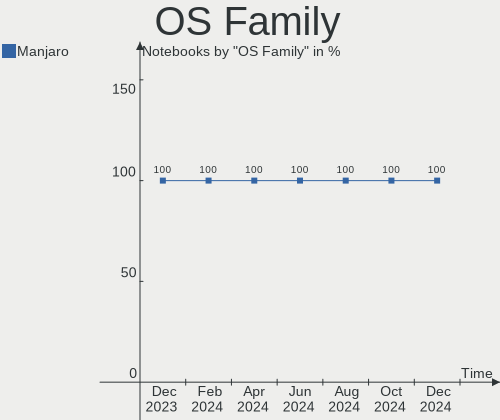
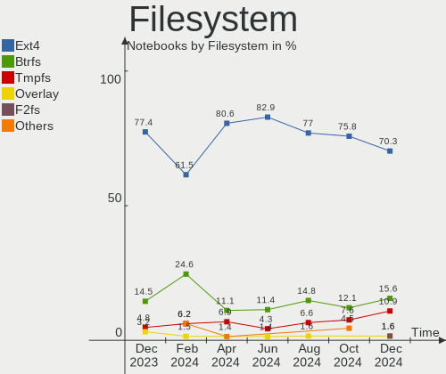
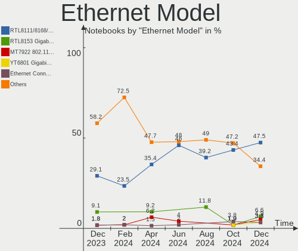

Manjaro - Hardware Trends (Notebooks)
-------------------------------------

A project to identify most popular hardware characteristics and track their change
over time based on data collected by Linux users at https://Linux-Hardware.org.

Anyone can contribute to this report by the [hw-probe](https://github.com/linuxhw/hw-probe) tool:

    sudo -E hw-probe -all -upload

This report is for one last month. Overall report since the beginning of time: [TestDays](https://github.com/linuxhw/TestDays)

Period: Jun, 2023.

Contents
--------

* [ System ](#system)
  - [ OS                       ](#os)
  - [ OS Family                ](#os-family)
  - [ Kernel                   ](#kernel)
  - [ Kernel Family            ](#kernel-family)
  - [ Kernel Major Ver.        ](#kernel-major-ver)
  - [ Arch                     ](#arch)
  - [ DE                       ](#de)
  - [ Display Server           ](#display-server)
  - [ Display Manager          ](#display-manager)
  - [ OS Lang                  ](#os-lang)
  - [ Boot Mode                ](#boot-mode)
  - [ Filesystem               ](#filesystem)
  - [ Part. scheme             ](#part-scheme)
  - [ Dual Boot with Linux/BSD ](#dual-boot-with-linuxbsd)
  - [ Dual Boot (Win)          ](#dual-boot-win)

* [ Board ](#board)
  - [ Vendor                   ](#vendor)
  - [ Model                    ](#model)
  - [ Model Family             ](#model-family)
  - [ MFG Year                 ](#mfg-year)
  - [ Form Factor              ](#form-factor)
  - [ Secure Boot              ](#secure-boot)
  - [ Coreboot                 ](#coreboot)
  - [ RAM Size                 ](#ram-size)
  - [ RAM Used                 ](#ram-used)
  - [ Total Drives             ](#total-drives)
  - [ Has CD-ROM               ](#has-cd-rom)
  - [ Has Ethernet             ](#has-ethernet)
  - [ Has WiFi                 ](#has-wifi)
  - [ Has Bluetooth            ](#has-bluetooth)

* [ Location ](#location)
  - [ Country                  ](#country)
  - [ City                     ](#city)

* [ Drives ](#drives)
  - [ Drive Vendor             ](#drive-vendor)
  - [ Drive Model              ](#drive-model)
  - [ HDD Vendor               ](#hdd-vendor)
  - [ SSD Vendor               ](#ssd-vendor)
  - [ Drive Kind               ](#drive-kind)
  - [ Drive Connector          ](#drive-connector)
  - [ Drive Size               ](#drive-size)
  - [ Space Total              ](#space-total)
  - [ Space Used               ](#space-used)
  - [ Malfunc. Drives          ](#malfunc-drives)
  - [ Malfunc. Drive Vendor    ](#malfunc-drive-vendor)
  - [ Malfunc. HDD Vendor      ](#malfunc-hdd-vendor)
  - [ Malfunc. Drive Kind      ](#malfunc-drive-kind)
  - [ Failed Drives            ](#failed-drives)
  - [ Failed Drive Vendor      ](#failed-drive-vendor)
  - [ Drive Status             ](#drive-status)

* [ Storage controller ](#storage-controller)
  - [ Storage Vendor           ](#storage-vendor)
  - [ Storage Model            ](#storage-model)
  - [ Storage Kind             ](#storage-kind)

* [ Processor ](#processor)
  - [ CPU Vendor               ](#cpu-vendor)
  - [ CPU Model                ](#cpu-model)
  - [ CPU Model Family         ](#cpu-model-family)
  - [ CPU Cores                ](#cpu-cores)
  - [ CPU Sockets              ](#cpu-sockets)
  - [ CPU Threads              ](#cpu-threads)
  - [ CPU Op-Modes             ](#cpu-op-modes)
  - [ CPU Microcode            ](#cpu-microcode)
  - [ CPU Microarch            ](#cpu-microarch)

* [ Graphics ](#graphics)
  - [ GPU Vendor               ](#gpu-vendor)
  - [ GPU Model                ](#gpu-model)
  - [ GPU Combo                ](#gpu-combo)
  - [ GPU Driver               ](#gpu-driver)
  - [ GPU Memory               ](#gpu-memory)

* [ Monitor ](#monitor)
  - [ Monitor Vendor           ](#monitor-vendor)
  - [ Monitor Model            ](#monitor-model)
  - [ Monitor Resolution       ](#monitor-resolution)
  - [ Monitor Diagonal         ](#monitor-diagonal)
  - [ Monitor Width            ](#monitor-width)
  - [ Aspect Ratio             ](#aspect-ratio)
  - [ Monitor Area             ](#monitor-area)
  - [ Pixel Density            ](#pixel-density)
  - [ Multiple Monitors        ](#multiple-monitors)

* [ Network ](#network)
  - [ Net Controller Vendor    ](#net-controller-vendor)
  - [ Net Controller Model     ](#net-controller-model)
  - [ Wireless Vendor          ](#wireless-vendor)
  - [ Wireless Model           ](#wireless-model)
  - [ Ethernet Vendor          ](#ethernet-vendor)
  - [ Ethernet Model           ](#ethernet-model)
  - [ Net Controller Kind      ](#net-controller-kind)
  - [ Used Controller          ](#used-controller)
  - [ NICs                     ](#nics)
  - [ IPv6                     ](#ipv6)

* [ Bluetooth ](#bluetooth)
  - [ Bluetooth Vendor         ](#bluetooth-vendor)
  - [ Bluetooth Model          ](#bluetooth-model)

* [ Sound ](#sound)
  - [ Sound Vendor             ](#sound-vendor)
  - [ Sound Model              ](#sound-model)

* [ Memory ](#memory)
  - [ Memory Vendor            ](#memory-vendor)
  - [ Memory Model             ](#memory-model)
  - [ Memory Kind              ](#memory-kind)
  - [ Memory Form Factor       ](#memory-form-factor)
  - [ Memory Size              ](#memory-size)
  - [ Memory Speed             ](#memory-speed)

* [ Printers & scanners ](#printers--scanners)
  - [ Printer Vendor           ](#printer-vendor)
  - [ Printer Model            ](#printer-model)
  - [ Scanner Vendor           ](#scanner-vendor)
  - [ Scanner Model            ](#scanner-model)

* [ Camera ](#camera)
  - [ Camera Vendor            ](#camera-vendor)
  - [ Camera Model             ](#camera-model)

* [ Security ](#security)
  - [ Fingerprint Vendor       ](#fingerprint-vendor)
  - [ Fingerprint Model        ](#fingerprint-model)
  - [ Chipcard Vendor          ](#chipcard-vendor)
  - [ Chipcard Model           ](#chipcard-model)

* [ Unsupported ](#unsupported)
  - [ Unsupported Devices      ](#unsupported-devices)
  - [ Unsupported Device Types ](#unsupported-device-types)

System
------

OS
--

Installed operating systems

| Name           | Notebooks | Percent |
|----------------|-----------|---------|
| Manjaro        | 40        | 50.63%  |
| Manjaro 23.0.0 | 34        | 43.04%  |
| Manjaro 22.1.3 | 5         | 6.33%   |

OS Family
---------

OS without a version

| Name    | Notebooks | Percent |
|---------|-----------|---------|
| Manjaro | 79        | 100%    |

Kernel
------

Version of the Linux kernel

| Version               | Notebooks | Percent |
|-----------------------|-----------|---------|
| 6.1.31-2-MANJARO      | 34        | 43.04%  |
| 6.3.5-2-MANJARO       | 19        | 24.05%  |
| 6.1.31-1-MANJARO      | 5         | 6.33%   |
| 6.1.30-1-MANJARO      | 5         | 6.33%   |
| 6.4.0-1-MANJARO       | 2         | 2.53%   |
| 6.3.1-1-rt13-MANJARO  | 2         | 2.53%   |
| 6.2.0-2-rt3-MANJARO   | 2         | 2.53%   |
| 5.15.114-2-MANJARO    | 2         | 2.53%   |
| 6.3.8-4-MANJARO       | 1         | 1.27%   |
| 6.3.7-x64v2-xanmod1-1 | 1         | 1.27%   |
| 6.3.5-1-MANJARO       | 1         | 1.27%   |
| 6.3.3-1-rt15-MANJARO  | 1         | 1.27%   |
| 6.3.3-1-MANJARO       | 1         | 1.27%   |
| 6.1.19-1-MANJARO      | 1         | 1.27%   |
| 5.4.244-2-MANJARO     | 1         | 1.27%   |
| 5.15.113-1-MANJARO    | 1         | 1.27%   |

Kernel Family
-------------

Linux kernel without a distro release

| Version  | Notebooks | Percent |
|----------|-----------|---------|
| 6.1.31   | 39        | 49.37%  |
| 6.3.5    | 20        | 25.32%  |
| 6.1.30   | 5         | 6.33%   |
| 6.4.0    | 2         | 2.53%   |
| 6.3.3    | 2         | 2.53%   |
| 6.3.1    | 2         | 2.53%   |
| 6.2.0    | 2         | 2.53%   |
| 5.15.114 | 2         | 2.53%   |
| 6.3.8    | 1         | 1.27%   |
| 6.3.7    | 1         | 1.27%   |
| 6.1.19   | 1         | 1.27%   |
| 5.4.244  | 1         | 1.27%   |
| 5.15.113 | 1         | 1.27%   |

Kernel Major Ver.
-----------------

Linux kernel major version

| Version | Notebooks | Percent |
|---------|-----------|---------|
| 6.1     | 45        | 56.96%  |
| 6.3     | 26        | 32.91%  |
| 5.15    | 3         | 3.8%    |
| 6.4     | 2         | 2.53%   |
| 6.2     | 2         | 2.53%   |
| 5.4     | 1         | 1.27%   |

Arch
----

OS architecture (x86_64, i586, etc.)

| Name   | Notebooks | Percent |
|--------|-----------|---------|
| x86_64 | 79        | 100%    |

DE
--

Desktop Environment

| Name       | Notebooks | Percent |
|------------|-----------|---------|
| KDE5       | 40        | 50.63%  |
| GNOME      | 22        | 27.85%  |
| XFCE       | 10        | 12.66%  |
| MATE       | 3         | 3.8%    |
| X-Cinnamon | 1         | 1.27%   |
| sway       | 1         | 1.27%   |
| Budgie     | 1         | 1.27%   |
| Unknown    | 1         | 1.27%   |

Display Server
--------------

X11 or Wayland

| Name    | Notebooks | Percent |
|---------|-----------|---------|
| X11     | 51        | 64.56%  |
| Wayland | 27        | 34.18%  |
| Tty     | 1         | 1.27%   |

Display Manager
---------------

SDDM, LightDM, etc.

| Name    | Notebooks | Percent |
|---------|-----------|---------|
| Unknown | 40        | 50.63%  |
| SDDM    | 20        | 25.32%  |
| LightDM | 12        | 15.19%  |
| GDM     | 6         | 7.59%   |
| GREETD  | 1         | 1.27%   |

OS Lang
-------

Language

| Lang  | Notebooks | Percent |
|-------|-----------|---------|
| en_US | 30        | 37.97%  |
| en_GB | 12        | 15.19%  |
| ru_RU | 6         | 7.59%   |
| pt_BR | 5         | 6.33%   |
| de_DE | 4         | 5.06%   |
| es_ES | 3         | 3.8%    |
| en_CA | 3         | 3.8%    |
| zh_CN | 2         | 2.53%   |
| es_CL | 2         | 2.53%   |
| de_AT | 2         | 2.53%   |
| pt_PT | 1         | 1.27%   |
| it_IT | 1         | 1.27%   |
| hu_HU | 1         | 1.27%   |
| fr_FR | 1         | 1.27%   |
| fi_FI | 1         | 1.27%   |
| es_UY | 1         | 1.27%   |
| es_PE | 1         | 1.27%   |
| es_MX | 1         | 1.27%   |
| en_IL | 1         | 1.27%   |
| en_AU | 1         | 1.27%   |

Boot Mode
---------

EFI or BIOS

| Mode | Notebooks | Percent |
|------|-----------|---------|
| BIOS | 43        | 54.43%  |
| EFI  | 36        | 45.57%  |

Filesystem
----------

Type of filesystem

| Type  | Notebooks | Percent |
|-------|-----------|---------|
| Ext4  | 50        | 63.29%  |
| Btrfs | 19        | 24.05%  |
| Tmpfs | 10        | 12.66%  |

Part. scheme
------------

Scheme of partitioning

| Type    | Notebooks | Percent |
|---------|-----------|---------|
| Unknown | 40        | 50.63%  |
| GPT     | 36        | 45.57%  |
| MBR     | 3         | 3.8%    |

Dual Boot with Linux/BSD
------------------------

Hosting more than one Linux/BSD

| Dual boot | Notebooks | Percent |
|-----------|-----------|---------|
| No        | 74        | 93.67%  |
| Yes       | 5         | 6.33%   |

Dual Boot (Win)
---------------

Hosting Linux and Windows

| Dual boot | Notebooks | Percent |
|-----------|-----------|---------|
| No        | 66        | 83.54%  |
| Yes       | 13        | 16.46%  |

Board
-----

Vendor
------

Motherboard manufacturer

| Name                | Notebooks | Percent |
|---------------------|-----------|---------|
| Lenovo              | 17        | 21.52%  |
| Dell                | 10        | 12.66%  |
| Hewlett-Packard     | 9         | 11.39%  |
| Acer                | 9         | 11.39%  |
| ASUSTek Computer    | 7         | 8.86%   |
| MSI                 | 4         | 5.06%   |
| HONOR               | 3         | 3.8%    |
| Google              | 3         | 3.8%    |
| HUAWEI              | 2         | 2.53%   |
| Apple               | 2         | 2.53%   |
| WOOKING             | 1         | 1.27%   |
| Timi                | 1         | 1.27%   |
| Teclast             | 1         | 1.27%   |
| Sony                | 1         | 1.27%   |
| Schenker            | 1         | 1.27%   |
| Samsung Electronics | 1         | 1.27%   |
| LG Electronics      | 1         | 1.27%   |
| Fujitsu             | 1         | 1.27%   |
| Framework           | 1         | 1.27%   |
| Chuwi               | 1         | 1.27%   |
| Alurin              | 1         | 1.27%   |
| Alienware           | 1         | 1.27%   |
| Unknown             | 1         | 1.27%   |

Model
-----

Motherboard model

| Name                                     | Notebooks | Percent |
|------------------------------------------|-----------|---------|
| WOOKING X16                              | 1         | 1.27%   |
| Timi Redmi Book Pro 15 2022              | 1         | 1.27%   |
| Teclast F15Plus 2                        | 1         | 1.27%   |
| Sony VGN-FW41J_H                         | 1         | 1.27%   |
| Schenker VIA 15 Pro                      | 1         | 1.27%   |
| Samsung 300E5K/300E5Q                    | 1         | 1.27%   |
| MSI U200                                 | 1         | 1.27%   |
| MSI Prestige 14Evo A12M                  | 1         | 1.27%   |
| MSI GT70 2OC/2OD                         | 1         | 1.27%   |
| MSI GS60 6QE                             | 1         | 1.27%   |
| LG 16Z90P-G.AA55H                        | 1         | 1.27%   |
| Lenovo Y520-15IKBN 80WK                  | 1         | 1.27%   |
| Lenovo ThinkPad X1 Carbon 3rd 20BTS1SQ00 | 1         | 1.27%   |
| Lenovo ThinkPad T480 20L6S7PE0G          | 1         | 1.27%   |
| Lenovo ThinkPad T470s 20HF005QMX         | 1         | 1.27%   |
| Lenovo ThinkPad T470 W10DG 20JNS1FJ00    | 1         | 1.27%   |
| Lenovo ThinkPad T440p 20AWS38H0G         | 1         | 1.27%   |
| Lenovo ThinkPad P51 20HJS02000           | 1         | 1.27%   |
| Lenovo ThinkPad L470 20J5S01S00          | 1         | 1.27%   |
| Lenovo ThinkPad E560 20EV002FUS          | 1         | 1.27%   |
| Lenovo ThinkPad E15 Gen 4 21EDCTO1WW     | 1         | 1.27%   |
| Lenovo Legion Y740-15IRHg 81UH           | 1         | 1.27%   |
| Lenovo Legion S7 16IAH7 82TF             | 1         | 1.27%   |
| Lenovo IdeaPad Y700-15ISK 80NV           | 1         | 1.27%   |
| Lenovo IdeaPad S145-15API 81V7           | 1         | 1.27%   |
| Lenovo IdeaPad Pro 5 16ARP8 83AS         | 1         | 1.27%   |
| Lenovo IdeaPad 330-17IKB 81DM            | 1         | 1.27%   |
| Lenovo G50-45 80E3                       | 1         | 1.27%   |
| HUAWEI NBLK-WAX9X                        | 1         | 1.27%   |
| HUAWEI NBLB-WAX9N                        | 1         | 1.27%   |
| HONOR NMH-WCX9                           | 1         | 1.27%   |
| HONOR HYM-WXX                            | 1         | 1.27%   |
| HONOR HGF-WX6                            | 1         | 1.27%   |
| HP ProBook 470 G0                        | 1         | 1.27%   |
| HP Pavilion Gaming Laptop 15-ec0xxx      | 1         | 1.27%   |
| HP OMEN Laptop 15-en0xxx                 | 1         | 1.27%   |
| HP Laptop 15-dy1xxx                      | 1         | 1.27%   |
| HP EliteBook 8740w                       | 1         | 1.27%   |
| HP EliteBook 850 G1                      | 1         | 1.27%   |
| HP EliteBook 845 G7 Notebook pc          | 1         | 1.27%   |

Model Family
------------

Motherboard model prefix

| Name               | Notebooks | Percent |
|--------------------|-----------|---------|
| Lenovo ThinkPad    | 9         | 11.39%  |
| Acer Aspire        | 8         | 10.13%  |
| Dell Latitude      | 5         | 6.33%   |
| Lenovo IdeaPad     | 4         | 5.06%   |
| HP EliteBook       | 4         | 5.06%   |
| ASUS VivoBook      | 4         | 5.06%   |
| Dell XPS           | 3         | 3.8%    |
| Lenovo Legion      | 2         | 2.53%   |
| Dell Inspiron      | 2         | 2.53%   |
| ASUS ROG           | 2         | 2.53%   |
| WOOKING X16        | 1         | 1.27%   |
| Timi Redmi         | 1         | 1.27%   |
| Teclast F15Plus    | 1         | 1.27%   |
| Sony VGN-FW41J     | 1         | 1.27%   |
| Schenker VIA       | 1         | 1.27%   |
| Samsung 300E5K     | 1         | 1.27%   |
| MSI U200           | 1         | 1.27%   |
| MSI Prestige       | 1         | 1.27%   |
| MSI GT70           | 1         | 1.27%   |
| MSI GS60           | 1         | 1.27%   |
| LG 16Z90P-G.AA55H  | 1         | 1.27%   |
| Lenovo Y520-15IKBN | 1         | 1.27%   |
| Lenovo G50-45      | 1         | 1.27%   |
| HUAWEI NBLK-WAX9X  | 1         | 1.27%   |
| HUAWEI NBLB-WAX9N  | 1         | 1.27%   |
| HONOR NMH-WCX9     | 1         | 1.27%   |
| HONOR HYM-WXX      | 1         | 1.27%   |
| HONOR HGF-WX6      | 1         | 1.27%   |
| HP ProBook         | 1         | 1.27%   |
| HP Pavilion        | 1         | 1.27%   |
| HP OMEN            | 1         | 1.27%   |
| HP Laptop          | 1         | 1.27%   |
| HP 240             | 1         | 1.27%   |
| Google Reef        | 1         | 1.27%   |
| Google Chell       | 1         | 1.27%   |
| Google Atlas       | 1         | 1.27%   |
| Fujitsu LIFEBOOK   | 1         | 1.27%   |
| Framework Laptop   | 1         | 1.27%   |
| Chuwi GemiBook     | 1         | 1.27%   |
| ASUS UX530UQ       | 1         | 1.27%   |

MFG Year
--------

Motherboard manufacture year

| Year    | Notebooks | Percent |
|---------|-----------|---------|
| 2022    | 12        | 15.19%  |
| 2021    | 11        | 13.92%  |
| 2017    | 9         | 11.39%  |
| 2023    | 8         | 10.13%  |
| 2020    | 7         | 8.86%   |
| 2014    | 7         | 8.86%   |
| 2019    | 5         | 6.33%   |
| 2018    | 5         | 6.33%   |
| 2015    | 4         | 5.06%   |
| 2016    | 3         | 3.8%    |
| 2013    | 3         | 3.8%    |
| 2009    | 2         | 2.53%   |
| 2010    | 1         | 1.27%   |
| 2008    | 1         | 1.27%   |
| Unknown | 1         | 1.27%   |

Form Factor
-----------

Physical design of the computer

| Name     | Notebooks | Percent |
|----------|-----------|---------|
| Notebook | 79        | 100%    |

Secure Boot
-----------

Enabled or disabled

| State    | Notebooks | Percent |
|----------|-----------|---------|
| Disabled | 79        | 100%    |

Coreboot
--------

Have coreboot on board

| Used | Notebooks | Percent |
|------|-----------|---------|
| No   | 76        | 96.2%   |
| Yes  | 3         | 3.8%    |

RAM Size
--------

Total RAM memory

| Size in GB  | Notebooks | Percent |
|-------------|-----------|---------|
| 4.01-8.0    | 26        | 32.91%  |
| 16.01-24.0  | 18        | 22.78%  |
| 8.01-16.0   | 15        | 18.99%  |
| 3.01-4.0    | 9         | 11.39%  |
| 32.01-64.0  | 8         | 10.13%  |
| 64.01-256.0 | 2         | 2.53%   |
| 24.01-32.0  | 1         | 1.27%   |

RAM Used
--------

Used RAM memory

| Used GB   | Notebooks | Percent |
|-----------|-----------|---------|
| 4.01-8.0  | 27        | 34.18%  |
| 2.01-3.0  | 17        | 21.52%  |
| 3.01-4.0  | 16        | 20.25%  |
| 1.01-2.0  | 12        | 15.19%  |
| 8.01-16.0 | 5         | 6.33%   |
| 0.51-1.0  | 2         | 2.53%   |

Total Drives
------------

Number of drives on board

| Drives | Notebooks | Percent |
|--------|-----------|---------|
| 1      | 61        | 77.22%  |
| 2      | 16        | 20.25%  |
| 4      | 2         | 2.53%   |

Has CD-ROM
----------

Has CD-ROM on board

| Presented | Notebooks | Percent |
|-----------|-----------|---------|
| No        | 69        | 87.34%  |
| Yes       | 10        | 12.66%  |

Has Ethernet
------------

Has Ethernet on board

| Presented | Notebooks | Percent |
|-----------|-----------|---------|
| Yes       | 48        | 60.76%  |
| No        | 31        | 39.24%  |

Has WiFi
--------

Has WiFi module

| Presented | Notebooks | Percent |
|-----------|-----------|---------|
| Yes       | 78        | 98.73%  |
| No        | 1         | 1.27%   |

Has Bluetooth
-------------

Has Bluetooth module

| Presented | Notebooks | Percent |
|-----------|-----------|---------|
| Yes       | 71        | 89.87%  |
| No        | 8         | 10.13%  |

Location
--------

Country
-------

Geographic location (country)

| Country            | Notebooks | Percent |
|--------------------|-----------|---------|
| Germany            | 9         | 11.39%  |
| Brazil             | 8         | 10.13%  |
| USA                | 7         | 8.86%   |
| UK                 | 6         | 7.59%   |
| Russia             | 6         | 7.59%   |
| France             | 4         | 5.06%   |
| Canada             | 4         | 5.06%   |
| Spain              | 3         | 3.8%    |
| Israel             | 3         | 3.8%    |
| China              | 3         | 3.8%    |
| Hungary            | 2         | 2.53%   |
| Chile              | 2         | 2.53%   |
| Austria            | 2         | 2.53%   |
| Australia          | 2         | 2.53%   |
| Uruguay            | 1         | 1.27%   |
| Turkey             | 1         | 1.27%   |
| Sweden             | 1         | 1.27%   |
| Sri Lanka          | 1         | 1.27%   |
| Portugal           | 1         | 1.27%   |
| Poland             | 1         | 1.27%   |
| Peru               | 1         | 1.27%   |
| Netherlands        | 1         | 1.27%   |
| Moldova            | 1         | 1.27%   |
| Mexico             | 1         | 1.27%   |
| Kyrgyzstan         | 1         | 1.27%   |
| Italy              | 1         | 1.27%   |
| Ireland            | 1         | 1.27%   |
| Indonesia          | 1         | 1.27%   |
| India              | 1         | 1.27%   |
| Finland            | 1         | 1.27%   |
| Dominican Republic | 1         | 1.27%   |
| Cyprus             | 1         | 1.27%   |

City
----

Geographic location (city)

| City                 | Notebooks | Percent |
|----------------------|-----------|---------|
| Moscow               | 5         | 6.33%   |
| Seattle              | 2         | 2.53%   |
| Rio de Janeiro       | 2         | 2.53%   |
| Zhengzhou            | 1         | 1.27%   |
| Xuzhou               | 1         | 1.27%   |
| Wuppertal            | 1         | 1.27%   |
| Wels                 | 1         | 1.27%   |
| Vila Velha           | 1         | 1.27%   |
| Vienna               | 1         | 1.27%   |
| Uruguaiana           | 1         | 1.27%   |
| Twickenham           | 1         | 1.27%   |
| Toronto              | 1         | 1.27%   |
| Tomar                | 1         | 1.27%   |
| Thunder Bay          | 1         | 1.27%   |
| Sydney               | 1         | 1.27%   |
| Sucha Beskidzka      | 1         | 1.27%   |
| Sapucaia do Sul      | 1         | 1.27%   |
| Sao Paulo            | 1         | 1.27%   |
| Santiago             | 1         | 1.27%   |
| Reutlingen           | 1         | 1.27%   |
| Rennes               | 1         | 1.27%   |
| Pointe-a-la-Croix    | 1         | 1.27%   |
| Pocking              | 1         | 1.27%   |
| Petah Tikva          | 1         | 1.27%   |
| Paris                | 1         | 1.27%   |
| Nicosia              | 1         | 1.27%   |
| Nice                 | 1         | 1.27%   |
| Newmarket            | 1         | 1.27%   |
| Naples               | 1         | 1.27%   |
| Nanchong             | 1         | 1.27%   |
| Montevideo           | 1         | 1.27%   |
| Molina               | 1         | 1.27%   |
| Mexico City          | 1         | 1.27%   |
| McKinney             | 1         | 1.27%   |
| Marburg              | 1         | 1.27%   |
| Leeds                | 1         | 1.27%   |
| L'Entregu/El Entrego | 1         | 1.27%   |
| Kissimmee            | 1         | 1.27%   |
| Kaliningrad          | 1         | 1.27%   |
| Juazeiro do Norte    | 1         | 1.27%   |

Drives
------

Drive Vendor
------------

Hard drive vendors

| Vendor                      | Notebooks | Drives | Percent |
|-----------------------------|-----------|--------|---------|
| Samsung Electronics         | 24        | 25     | 24%     |
| WDC                         | 7         | 7      | 7%      |
| Unknown                     | 6         | 6      | 6%      |
| Toshiba                     | 6         | 6      | 6%      |
| SK hynix                    | 6         | 6      | 6%      |
| Sandisk                     | 6         | 7      | 6%      |
| Seagate                     | 5         | 5      | 5%      |
| Micron Technology           | 4         | 4      | 4%      |
| Crucial                     | 4         | 4      | 4%      |
| Micron/Crucial Technology   | 3         | 3      | 3%      |
| Intel                       | 3         | 4      | 3%      |
| China                       | 3         | 3      | 3%      |
| KIOXIA                      | 2         | 2      | 2%      |
| Kingston Technology Company | 2         | 2      | 2%      |
| HGST                        | 2         | 2      | 2%      |
| Apple                       | 2         | 2      | 2%      |
| ZTE                         | 1         | 1      | 1%      |
| Yangtze Memory Technologies | 1         | 1      | 1%      |
| Transcend                   | 1         | 1      | 1%      |
| Teclast                     | 1         | 1      | 1%      |
| Solid State Storage         | 1         | 1      | 1%      |
| ShiJi                       | 1         | 1      | 1%      |
| OCZ                         | 1         | 1      | 1%      |
| MAXIO Technology (Hangzhou) | 1         | 1      | 1%      |
| KingSpec                    | 1         | 2      | 1%      |
| KingFast                    | 1         | 1      | 1%      |
| Biwin Storage Technology    | 1         | 1      | 1%      |
| ASMT                        | 1         | 1      | 1%      |
| ADATA Technology            | 1         | 1      | 1%      |
| ADATA LE                    | 1         | 1      | 1%      |
| A-DATA Technology           | 1         | 1      | 1%      |

Drive Model
-----------

Hard drive models

| Model                                               | Notebooks | Percent |
|-----------------------------------------------------|-----------|---------|
| Samsung NVMe SSD Controller SM981/PM981/PM983 250GB | 11        | 10.58%  |
| Unknown MMC Card  64GB                              | 3         | 2.88%   |
| Samsung NVMe SSD Controller PM9A1/PM9A3/980PRO 2TB  | 3         | 2.88%   |
| Unknown MMC Card  32GB                              | 2         | 1.92%   |
| Toshiba XG6 NVMe SSD Controller 2TB                 | 2         | 1.92%   |
| Samsung NVMe SSD Controller SM961/PM961/SM963 256GB | 2         | 1.92%   |
| Micron 2450_MTFDKBA512TFK 512GB                     | 2         | 1.92%   |
| Intel SSD 660P Series 512GB                         | 2         | 1.92%   |
| HGST HTS545050A7E380 500GB                          | 2         | 1.92%   |
| ZTE MMC Storage 942MB                               | 1         | 0.96%   |
| Yangtze Memory ZHITAI TiPlus5000 1TB                | 1         | 0.96%   |
| WDC WDS500G2B0A-00SM50 500GB SSD                    | 1         | 0.96%   |
| WDC WD5000LPVX-75V0TT0 500GB                        | 1         | 0.96%   |
| WDC WD5000LPCX-24C6HT0 500GB                        | 1         | 0.96%   |
| WDC WD14 1KRYZ-01C66B0 14TB                         | 1         | 0.96%   |
| WDC WD10SPZX-24Z10 1TB                              | 1         | 0.96%   |
| WDC WD10JPVX-60JC3T1 1TB                            | 1         | 0.96%   |
| WDC WD10JPVX-35JC3T0 1TB                            | 1         | 0.96%   |
| Unknown NVMe SSD Drive 256GB                        | 1         | 0.96%   |
| Transcend TS120GMTS420S 120GB SSD                   | 1         | 0.96%   |
| Toshiba THNSNJ128G8NU 128GB SSD                     | 1         | 0.96%   |
| Toshiba Q300. 480GB SSD                             | 1         | 0.96%   |
| Toshiba MQ01ABD100 1TB                              | 1         | 0.96%   |
| Toshiba BG3 NVMe SSD Controller 512GB               | 1         | 0.96%   |
| Teclast BD256GB SHCB-2280 SSD                       | 1         | 0.96%   |
| Solid State Storage SSSTC CL1-8D512 512GB           | 1         | 0.96%   |
| SK hynix SKHynix_HFS512GEJ9X115N 512GB              | 1         | 0.96%   |
| SK hynix SC401 SATA 512GB SSD                       | 1         | 0.96%   |
| SK hynix PC801 NVMe 512GB                           | 1         | 0.96%   |
| SK hynix HFS256G3BTND-N210A 256GB SSD               | 1         | 0.96%   |
| SK hynix HFS256G39TND-N210A 256GB SSD               | 1         | 0.96%   |
| SK hynix BC511 256GB                                | 1         | 0.96%   |
| ShiJi 256GB                                         | 1         | 0.96%   |
| Seagate ST9160823AS 160GB                           | 1         | 0.96%   |
| Seagate ST500LM021-1KJ152 500GB                     | 1         | 0.96%   |
| Seagate ST2000LM015-2E8174 2TB                      | 1         | 0.96%   |
| Seagate ST1000LM035-1RK172 1TB                      | 1         | 0.96%   |
| Seagate BUP Slim SL 1TB                             | 1         | 0.96%   |
| Sandisk WD_BLACK SN770 1TB                          | 1         | 0.96%   |
| Sandisk WD PC SN560 SDDPNQE-1T00-1002 1TB           | 1         | 0.96%   |

HDD Vendor
----------

Hard disk drive vendors

| Vendor  | Notebooks | Drives | Percent |
|---------|-----------|--------|---------|
| WDC     | 6         | 6      | 42.86%  |
| Seagate | 5         | 5      | 35.71%  |
| HGST    | 2         | 2      | 14.29%  |
| Toshiba | 1         | 1      | 7.14%   |

SSD Vendor
----------

Solid state drive vendors

| Vendor              | Notebooks | Drives | Percent |
|---------------------|-----------|--------|---------|
| Samsung Electronics | 5         | 5      | 17.86%  |
| Crucial             | 4         | 4      | 14.29%  |
| SK hynix            | 3         | 3      | 10.71%  |
| China               | 3         | 3      | 10.71%  |
| Toshiba             | 2         | 2      | 7.14%   |
| Apple               | 2         | 2      | 7.14%   |
| WDC                 | 1         | 1      | 3.57%   |
| Transcend           | 1         | 1      | 3.57%   |
| Teclast             | 1         | 1      | 3.57%   |
| SanDisk             | 1         | 1      | 3.57%   |
| OCZ                 | 1         | 1      | 3.57%   |
| KingSpec            | 1         | 2      | 3.57%   |
| ASMT                | 1         | 1      | 3.57%   |
| ADATA LE            | 1         | 1      | 3.57%   |
| A-DATA Technology   | 1         | 1      | 3.57%   |

Drive Kind
----------

HDD or SSD

| Kind    | Notebooks | Drives | Percent |
|---------|-----------|--------|---------|
| NVMe    | 46        | 53     | 49.46%  |
| SSD     | 25        | 29     | 26.88%  |
| HDD     | 14        | 14     | 15.05%  |
| MMC     | 5         | 5      | 5.38%   |
| Unknown | 3         | 3      | 3.23%   |

Drive Connector
---------------

SATA, SAS, NVMe, etc.

| Type | Notebooks | Drives | Percent |
|------|-----------|--------|---------|
| NVMe | 46        | 53     | 51.11%  |
| SATA | 36        | 39     | 40%     |
| MMC  | 5         | 5      | 5.56%   |
| SAS  | 3         | 7      | 3.33%   |

Drive Size
----------

Size of hard drive

| Size in TB | Notebooks | Drives | Percent |
|------------|-----------|--------|---------|
| 0.01-0.5   | 21        | 22     | 51.22%  |
| 0.51-1.0   | 13        | 13     | 31.71%  |
| 1.01-2.0   | 5         | 6      | 12.2%   |
| 10.01-20.0 | 1         | 1      | 2.44%   |
| 4.01-10.0  | 1         | 1      | 2.44%   |

Space Total
-----------

Amount of disk space available on the file system

| Size in GB     | Notebooks | Percent |
|----------------|-----------|---------|
| 101-250        | 24        | 30.38%  |
| 251-500        | 18        | 22.78%  |
| 501-1000       | 12        | 15.19%  |
| More than 3000 | 7         | 8.86%   |
| 1001-2000      | 6         | 7.59%   |
| Unknown        | 5         | 6.33%   |
| 21-50          | 3         | 3.8%    |
| 2001-3000      | 2         | 2.53%   |
| 51-100         | 2         | 2.53%   |

Space Used
----------

Amount of used disk space

| Used GB        | Notebooks | Percent |
|----------------|-----------|---------|
| 101-250        | 18        | 22.78%  |
| 1-20           | 18        | 22.78%  |
| 21-50          | 12        | 15.19%  |
| 51-100         | 12        | 15.19%  |
| Unknown        | 5         | 6.33%   |
| 251-500        | 4         | 5.06%   |
| 1001-2000      | 4         | 5.06%   |
| 501-1000       | 4         | 5.06%   |
| More than 3000 | 1         | 1.27%   |
| 2001-3000      | 1         | 1.27%   |

Malfunc. Drives
---------------

Drive models with a malfunction

Zero info for selected period =(

Malfunc. Drive Vendor
---------------------

Vendors of faulty drives

Zero info for selected period =(

Malfunc. HDD Vendor
-------------------

Vendors of faulty HDD drives

Zero info for selected period =(

Malfunc. Drive Kind
-------------------

Kinds of faulty drives

Zero info for selected period =(

Failed Drives
-------------

Failed drive models

Zero info for selected period =(

Failed Drive Vendor
-------------------

Failed drive vendors

Zero info for selected period =(

Drive Status
------------

Number of failed and malfunc. drives

| Status   | Notebooks | Drives | Percent |
|----------|-----------|--------|---------|
| Detected | 62        | 79     | 76.54%  |
| Works    | 19        | 25     | 23.46%  |

Storage controller
------------------

Storage Vendor
--------------

Storage controller vendors

| Vendor                         | Notebooks | Percent |
|--------------------------------|-----------|---------|
| Intel                          | 45        | 44.55%  |
| Samsung Electronics            | 21        | 20.79%  |
| AMD                            | 6         | 5.94%   |
| SanDisk                        | 5         | 4.95%   |
| Micron Technology              | 4         | 3.96%   |
| Toshiba America Info Systems   | 3         | 2.97%   |
| SK hynix                       | 3         | 2.97%   |
| Micron/Crucial Technology      | 3         | 2.97%   |
| KIOXIA                         | 2         | 1.98%   |
| Kingston Technology Company    | 2         | 1.98%   |
| Yangtze Memory Technologies    | 1         | 0.99%   |
| Solid State Storage Technology | 1         | 0.99%   |
| Netac Technology               | 1         | 0.99%   |
| MAXIO Technology (Hangzhou)    | 1         | 0.99%   |
| Marvell Technology Group       | 1         | 0.99%   |
| Biwin Storage Technology       | 1         | 0.99%   |
| ADATA Technology               | 1         | 0.99%   |

Storage Model
-------------

Storage controller models

| Model                                                                          | Notebooks | Percent |
|--------------------------------------------------------------------------------|-----------|---------|
| Samsung NVMe SSD Controller SM981/PM981/PM983                                  | 11        | 10%     |
| Intel Volume Management Device NVMe RAID Controller                            | 6         | 5.45%   |
| Intel Sunrise Point-LP SATA Controller [AHCI mode]                             | 6         | 5.45%   |
| Intel Celeron/Pentium Silver Processor SATA Controller                         | 6         | 5.45%   |
| AMD FCH SATA Controller [AHCI mode]                                            | 6         | 5.45%   |
| Micron 2450 NVMe SSD (DRAM-less)                                               | 4         | 3.64%   |
| Intel HM170/QM170 Chipset SATA Controller [AHCI Mode]                          | 4         | 3.64%   |
| Samsung NVMe SSD Controller PM9A1/PM9A3/980PRO                                 | 3         | 2.73%   |
| Samsung NVMe SSD Controller 980                                                | 3         | 2.73%   |
| Intel Tiger Lake-LP SATA Controller                                            | 3         | 2.73%   |
| Intel Q170/Q150/B150/H170/H110/Z170/CM236 Chipset SATA Controller [AHCI Mode]  | 3         | 2.73%   |
| Intel 82801 Mobile SATA Controller [RAID mode]                                 | 3         | 2.73%   |
| Intel 8 Series SATA Controller 1 [AHCI mode]                                   | 3         | 2.73%   |
| Toshiba America Info Systems XG6 NVMe SSD Controller                           | 2         | 1.82%   |
| SK hynix Platinum P41/PC801 NVMe Solid State Drive                             | 2         | 1.82%   |
| SanDisk WD Black SN770 NVMe SSD                                                | 2         | 1.82%   |
| Samsung NVMe SSD Controller SM961/PM961/SM963                                  | 2         | 1.82%   |
| Micron/Crucial NVMe Storage Controller                                         | 2         | 1.82%   |
| KIOXIA Non-Volatile memory controller                                          | 2         | 1.82%   |
| Intel Wildcat Point-LP SATA Controller [AHCI Mode]                             | 2         | 1.82%   |
| Intel SSD 660P Series                                                          | 2         | 1.82%   |
| Intel Cannon Lake Mobile PCH SATA AHCI Controller                              | 2         | 1.82%   |
| Intel 82801IBM/IEM (ICH9M/ICH9M-E) 4 port SATA Controller [AHCI mode]          | 2         | 1.82%   |
| Intel 8 Series/C220 Series Chipset Family 6-port SATA Controller 1 [AHCI mode] | 2         | 1.82%   |
| Yangtze Memory ZHITAI TiPro5000 NVMe SSD                                       | 1         | 0.91%   |
| Toshiba America Info Systems BG3 NVMe SSD Controller                           | 1         | 0.91%   |
| Solid State Storage CL1-3D256-Q11 NVMe SSD M.2                                 | 1         | 0.91%   |
| SK hynix BC511 NVMe SSD                                                        | 1         | 0.91%   |
| SanDisk WD PC SN810 / Black SN850 NVMe SSD                                     | 1         | 0.91%   |
| SanDisk WD Blue SN570 NVMe SSD 1TB                                             | 1         | 0.91%   |
| SanDisk WD Blue SN550 NVMe SSD                                                 | 1         | 0.91%   |
| SanDisk WD Black SN750 / PC SN730 NVMe SSD                                     | 1         | 0.91%   |
| Samsung NVMe SSD Controller PM9B1                                              | 1         | 0.91%   |
| Samsung Electronics SATA controller                                            | 1         | 0.91%   |
| Netac Non-Volatile memory controller                                           | 1         | 0.91%   |
| Micron/Crucial P2 NVMe PCIe SSD                                                | 1         | 0.91%   |
| MAXIO (Hangzhou) NVMe SSD Controller MAP1202                                   | 1         | 0.91%   |
| Marvell Group 88SS9183 PCIe SSD Controller                                     | 1         | 0.91%   |
| Kingston Company Company Non-Volatile memory controller                        | 1         | 0.91%   |
| Kingston Company OM3PDP3 NVMe SSD                                              | 1         | 0.91%   |

Storage Kind
------------

Kind of storage controller (IDE, SATA, NVMe, SAS, ...)

| Kind | Notebooks | Percent |
|------|-----------|---------|
| SATA | 47        | 45.19%  |
| NVMe | 46        | 44.23%  |
| RAID | 10        | 9.62%   |
| IDE  | 1         | 0.96%   |

Processor
---------

CPU Vendor
----------

Processor vendors

| Vendor | Notebooks | Percent |
|--------|-----------|---------|
| Intel  | 64        | 81.01%  |
| AMD    | 15        | 18.99%  |

CPU Model
---------

Processor models

| Model                                         | Notebooks | Percent |
|-----------------------------------------------|-----------|---------|
| Intel Core i5-7200U CPU @ 2.50GHz             | 4         | 5.06%   |
| Intel Celeron N4020 CPU @ 1.10GHz             | 3         | 3.8%    |
| Intel 11th Gen Core i5-1135G7 @ 2.40GHz       | 3         | 3.8%    |
| Intel Core i7-8550U CPU @ 1.80GHz             | 2         | 2.53%   |
| Intel Core i7-6700HQ CPU @ 2.60GHz            | 2         | 2.53%   |
| Intel 12th Gen Core i7-12700H                 | 2         | 2.53%   |
| Intel 11th Gen Core i3-1115G4 @ 3.00GHz       | 2         | 2.53%   |
| AMD Ryzen 7 7735HS with Radeon Graphics       | 2         | 2.53%   |
| AMD Ryzen 7 4800H with Radeon Graphics        | 2         | 2.53%   |
| AMD Ryzen 7 3700U with Radeon Vega Mobile Gfx | 2         | 2.53%   |
| Intel Xeon CPU E3-1505M v6 @ 3.00GHz          | 1         | 1.27%   |
| Intel Pentium Silver N6000 @ 1.10GHz          | 1         | 1.27%   |
| Intel N200                                    | 1         | 1.27%   |
| Intel Core m7-6Y75 CPU @ 1.20GHz              | 1         | 1.27%   |
| Intel Core m3-8100Y CPU @ 1.10GHz             | 1         | 1.27%   |
| Intel Core i7-9750H CPU @ 2.60GHz             | 1         | 1.27%   |
| Intel Core i7-8650U CPU @ 1.90GHz             | 1         | 1.27%   |
| Intel Core i7-7820HQ CPU @ 2.90GHz            | 1         | 1.27%   |
| Intel Core i7-7820HK CPU @ 2.90GHz            | 1         | 1.27%   |
| Intel Core i7-7700HQ CPU @ 2.80GHz            | 1         | 1.27%   |
| Intel Core i7-7500U CPU @ 2.70GHz             | 1         | 1.27%   |
| Intel Core i7-5600U CPU @ 2.60GHz             | 1         | 1.27%   |
| Intel Core i7-4700MQ CPU @ 2.40GHz            | 1         | 1.27%   |
| Intel Core i7-4600U CPU @ 2.10GHz             | 1         | 1.27%   |
| Intel Core i7-1065G7 CPU @ 1.30GHz            | 1         | 1.27%   |
| Intel Core i7 CPU M 640 @ 2.80GHz             | 1         | 1.27%   |
| Intel Core i5-8300H CPU @ 2.30GHz             | 1         | 1.27%   |
| Intel Core i5-7300HQ CPU @ 2.50GHz            | 1         | 1.27%   |
| Intel Core i5-6300U CPU @ 2.40GHz             | 1         | 1.27%   |
| Intel Core i5-6200U CPU @ 2.30GHz             | 1         | 1.27%   |
| Intel Core i5-5250U CPU @ 1.60GHz             | 1         | 1.27%   |
| Intel Core i5-5200U CPU @ 2.20GHz             | 1         | 1.27%   |
| Intel Core i5-4300M CPU @ 2.60GHz             | 1         | 1.27%   |
| Intel Core i5-4258U CPU @ 2.40GHz             | 1         | 1.27%   |
| Intel Core i5-4210M CPU @ 2.60GHz             | 1         | 1.27%   |
| Intel Core i5-10210U CPU @ 1.60GHz            | 1         | 1.27%   |
| Intel Core i3-N305                            | 1         | 1.27%   |
| Intel Core i3-4030U CPU @ 1.90GHz             | 1         | 1.27%   |
| Intel Core i3-4005U CPU @ 1.70GHz             | 1         | 1.27%   |
| Intel Core i3-3120M CPU @ 2.50GHz             | 1         | 1.27%   |

CPU Model Family
----------------

Processor model prefix

| Model                | Notebooks | Percent |
|----------------------|-----------|---------|
| Other                | 16        | 20.25%  |
| Intel Core i7        | 15        | 18.99%  |
| Intel Core i5        | 14        | 17.72%  |
| Intel Celeron        | 8         | 10.13%  |
| AMD Ryzen 7          | 8         | 10.13%  |
| Intel Core i3        | 5         | 6.33%   |
| AMD Ryzen 5          | 3         | 3.8%    |
| Intel Core 2 Duo     | 2         | 2.53%   |
| AMD Ryzen 9          | 2         | 2.53%   |
| Intel Xeon           | 1         | 1.27%   |
| Intel Pentium Silver | 1         | 1.27%   |
| Intel Core m7        | 1         | 1.27%   |
| Intel Core m3        | 1         | 1.27%   |
| AMD Ryzen 5 PRO      | 1         | 1.27%   |
| AMD E1               | 1         | 1.27%   |

CPU Cores
---------

Number of processor cores

| Number | Notebooks | Percent |
|--------|-----------|---------|
| 2      | 30        | 37.97%  |
| 4      | 26        | 32.91%  |
| 8      | 9         | 11.39%  |
| 14     | 5         | 6.33%   |
| 10     | 3         | 3.8%    |
| 6      | 3         | 3.8%    |
| 12     | 2         | 2.53%   |
| 1      | 1         | 1.27%   |

CPU Sockets
-----------

Number of sockets

| Number | Notebooks | Percent |
|--------|-----------|---------|
| 1      | 79        | 100%    |

CPU Threads
-----------

Threads per core (Hyper-Threading)

| Number | Notebooks | Percent |
|--------|-----------|---------|
| 2      | 64        | 81.01%  |
| 1      | 15        | 18.99%  |

CPU Op-Modes
------------

CPU Operation Modes (32-bit, 64-bit)

| Op mode        | Notebooks | Percent |
|----------------|-----------|---------|
| 32-bit, 64-bit | 79        | 100%    |

CPU Microcode
-------------

Microcode number

| Number     | Notebooks | Percent |
|------------|-----------|---------|
| Unknown    | 48        | 60.76%  |
| 0x906a3    | 2         | 2.53%   |
| 0x806c1    | 2         | 2.53%   |
| 0x706a8    | 2         | 2.53%   |
| 0x306d4    | 2         | 2.53%   |
| 0x1067a    | 2         | 2.53%   |
| 0x0a404102 | 2         | 2.53%   |
| 0x08108109 | 2         | 2.53%   |
| 0xb06a2    | 1         | 1.27%   |
| 0x906ea    | 1         | 1.27%   |
| 0x906a4    | 1         | 1.27%   |
| 0x806ea    | 1         | 1.27%   |
| 0x806e9    | 1         | 1.27%   |
| 0x506c9    | 1         | 1.27%   |
| 0x406e3    | 1         | 1.27%   |
| 0x40651    | 1         | 1.27%   |
| 0x306c3    | 1         | 1.27%   |
| 0x306a9    | 1         | 1.27%   |
| 0x0a601203 | 1         | 1.27%   |
| 0x0a50000c | 1         | 1.27%   |
| 0x08608103 | 1         | 1.27%   |
| 0x08600109 | 1         | 1.27%   |
| 0x08600106 | 1         | 1.27%   |
| 0x08600103 | 1         | 1.27%   |
| 0x08108102 | 1         | 1.27%   |

CPU Microarch
-------------

Microarchitecture

| Name             | Notebooks | Percent |
|------------------|-----------|---------|
| KabyLake         | 17        | 21.52%  |
| Unknown          | 12        | 15.19%  |
| Haswell          | 7         | 8.86%   |
| Goldmont plus    | 6         | 7.59%   |
| TigerLake        | 5         | 6.33%   |
| Skylake          | 5         | 6.33%   |
| Alderlake Hybrid | 5         | 6.33%   |
| Zen+             | 4         | 5.06%   |
| Zen 3            | 3         | 3.8%    |
| Zen 2            | 3         | 3.8%    |
| Penryn           | 3         | 3.8%    |
| Broadwell        | 3         | 3.8%    |
| IceLake          | 2         | 2.53%   |
| Westmere         | 1         | 1.27%   |
| Puma             | 1         | 1.27%   |
| IvyBridge        | 1         | 1.27%   |
| Goldmont         | 1         | 1.27%   |

Graphics
--------

GPU Vendor
----------

Vendors of graphics cards

| Vendor | Notebooks | Percent |
|--------|-----------|---------|
| Intel  | 61        | 59.22%  |
| Nvidia | 25        | 24.27%  |
| AMD    | 17        | 16.5%   |

GPU Model
---------

Graphics card models

| Model                                                                | Notebooks | Percent |
|----------------------------------------------------------------------|-----------|---------|
| Intel GeminiLake [UHD Graphics 600]                                  | 6         | 5.83%   |
| Intel HD Graphics 620                                                | 5         | 4.85%   |
| Intel HD Graphics 630                                                | 4         | 3.88%   |
| Intel Haswell-ULT Integrated Graphics Controller                     | 4         | 3.88%   |
| Intel Alder Lake-P Integrated Graphics Controller                    | 4         | 3.88%   |
| AMD Picasso/Raven 2 [Radeon Vega Series / Radeon Vega Mobile Series] | 4         | 3.88%   |
| Intel UHD Graphics 620                                               | 3         | 2.91%   |
| Intel TigerLake-LP GT2 [Iris Xe Graphics]                            | 3         | 2.91%   |
| Intel 4th Gen Core Processor Integrated Graphics Controller          | 3         | 2.91%   |
| AMD Renoir                                                           | 3         | 2.91%   |
| Nvidia TU117M [GeForce GTX 1650 Mobile / Max-Q]                      | 2         | 1.94%   |
| Nvidia GP108M [GeForce MX150]                                        | 2         | 1.94%   |
| Nvidia GA107M [GeForce RTX 2050]                                     | 2         | 1.94%   |
| Nvidia AD106M [GeForce RTX 4070 Max-Q / Mobile]                      | 2         | 1.94%   |
| Intel Tiger Lake-LP GT2 [UHD Graphics G4]                            | 2         | 1.94%   |
| Intel Skylake GT2 [HD Graphics 520]                                  | 2         | 1.94%   |
| Intel Raptor Lake-P [Iris Xe Graphics]                               | 2         | 1.94%   |
| Intel Mobile 4 Series Chipset Integrated Graphics Controller         | 2         | 1.94%   |
| Intel HD Graphics 5500                                               | 2         | 1.94%   |
| Intel HD Graphics 530                                                | 2         | 1.94%   |
| Intel Alder Lake-UP3 GT2 [Iris Xe Graphics]                          | 2         | 1.94%   |
| Intel Alder Lake-N [UHD Graphics]                                    | 2         | 1.94%   |
| AMD Rembrandt [Radeon 680M]                                          | 2         | 1.94%   |
| AMD Cezanne [Radeon Vega Series / Radeon Vega Mobile Series]         | 2         | 1.94%   |
| Nvidia TU117M [GeForce MX550]                                        | 1         | 0.97%   |
| Nvidia TU116M [GeForce GTX 1660 Ti Mobile]                           | 1         | 0.97%   |
| Nvidia TU106BM [GeForce RTX 2070 Mobile / Max-Q]                     | 1         | 0.97%   |
| Nvidia GP108M [GeForce MX330]                                        | 1         | 0.97%   |
| Nvidia GP107M [GeForce GTX 1050 Ti Mobile]                           | 1         | 0.97%   |
| Nvidia GP107M [GeForce GTX 1050 3 GB Max-Q]                          | 1         | 0.97%   |
| Nvidia GP106M [GeForce GTX 1060 Mobile]                              | 1         | 0.97%   |
| Nvidia GP104BM [GeForce GTX 1080 Mobile]                             | 1         | 0.97%   |
| Nvidia GM206GLM [Quadro M2200 Mobile]                                | 1         | 0.97%   |
| Nvidia GM204M [GeForce GTX 960 OEM / 970M]                           | 1         | 0.97%   |
| Nvidia GM107M [GeForce GTX 960M]                                     | 1         | 0.97%   |
| Nvidia GM107 [GeForce 940MX]                                         | 1         | 0.97%   |
| Nvidia GK208BM [GeForce 910M]                                        | 1         | 0.97%   |
| Nvidia GK104M [GeForce GTX 780M]                                     | 1         | 0.97%   |
| Nvidia GA107M [GeForce RTX 3050 Mobile]                              | 1         | 0.97%   |
| Nvidia G92GLM [Quadro FX 2800M]                                      | 1         | 0.97%   |

GPU Combo
---------

Combinations of graphics cards

| Name           | Notebooks | Percent |
|----------------|-----------|---------|
| 1 x Intel      | 41        | 51.9%   |
| Intel + Nvidia | 17        | 21.52%  |
| 1 x AMD        | 11        | 13.92%  |
| AMD + Nvidia   | 5         | 6.33%   |
| 1 x Nvidia     | 3         | 3.8%    |
| 2 x Intel      | 1         | 1.27%   |
| Intel + AMD    | 1         | 1.27%   |

GPU Driver
----------

Free vs proprietary

| Driver      | Notebooks | Percent |
|-------------|-----------|---------|
| Free        | 62        | 78.48%  |
| Proprietary | 17        | 21.52%  |

GPU Memory
----------

Total video memory

| Size in GB | Notebooks | Percent |
|------------|-----------|---------|
| Unknown    | 63        | 79.75%  |
| 1.01-2.0   | 5         | 6.33%   |
| 0.01-0.5   | 5         | 6.33%   |
| 0.51-1.0   | 3         | 3.8%    |
| 7.01-8.0   | 2         | 2.53%   |
| 3.01-4.0   | 1         | 1.27%   |

Monitor
-------

Monitor Vendor
--------------

Monitor vendors

| Vendor                  | Notebooks | Percent |
|-------------------------|-----------|---------|
| BOE                     | 24        | 26.09%  |
| LG Display              | 12        | 13.04%  |
| Chimei Innolux          | 12        | 13.04%  |
| AU Optronics            | 12        | 13.04%  |
| Samsung Electronics     | 8         | 8.7%    |
| TMX                     | 3         | 3.26%   |
| Sharp                   | 2         | 2.17%   |
| Lenovo                  | 2         | 2.17%   |
| Iiyama                  | 2         | 2.17%   |
| Apple                   | 2         | 2.17%   |
| PANDA                   | 1         | 1.09%   |
| MSI                     | 1         | 1.09%   |
| Mi                      | 1         | 1.09%   |
| LG Philips              | 1         | 1.09%   |
| LG Electronics          | 1         | 1.09%   |
| Higer                   | 1         | 1.09%   |
| HannStar                | 1         | 1.09%   |
| Goldstar                | 1         | 1.09%   |
| Gigabyte Technology     | 1         | 1.09%   |
| Dell                    | 1         | 1.09%   |
| CSO                     | 1         | 1.09%   |
| Chi Mei Optoelectronics | 1         | 1.09%   |
| BenQ                    | 1         | 1.09%   |

Monitor Model
-------------

Monitor models

| Model                                                                 | Notebooks | Percent |
|-----------------------------------------------------------------------|-----------|---------|
| Samsung Electronics C27F390 SAM0D32 1920x1080 598x336mm 27.0-inch     | 2         | 2.17%   |
| LG Display LCD Monitor LGD0521 1920x1080 309x174mm 14.0-inch          | 2         | 2.17%   |
| BOE LCD Monitor BOE092E 1920x1080 310x173mm 14.0-inch                 | 2         | 2.17%   |
| BOE LCD Monitor BOE0877 1920x1080 309x173mm 13.9-inch                 | 2         | 2.17%   |
| BOE LCD Monitor BOE084E 1920x1080 382x215mm 17.3-inch                 | 2         | 2.17%   |
| TMX TL156MDMP11-0 TMX1560 3200x2000 336x210mm 15.6-inch               | 1         | 1.09%   |
| TMX TL142GDXP02-0 TMX1420 2520x1680 300x200mm 14.2-inch               | 1         | 1.09%   |
| TMX TL140BDXP02-0 TMX1400 2560x1440 310x174mm 14.0-inch               | 1         | 1.09%   |
| Sharp LCD Monitor SHP1517 3840x2400 366x229mm 17.0-inch               | 1         | 1.09%   |
| Sharp LCD Monitor SHP1484 1920x1080 294x165mm 13.3-inch               | 1         | 1.09%   |
| Samsung Electronics SMB2340 SAM0691 1920x1080 510x287mm 23.0-inch     | 1         | 1.09%   |
| Samsung Electronics LCD Monitor SEC544B 1600x900 382x215mm 17.3-inch  | 1         | 1.09%   |
| Samsung Electronics LCD Monitor SEC4C47 1680x1050 367x229mm 17.0-inch | 1         | 1.09%   |
| Samsung Electronics LCD Monitor SDC415A 3200x1800 293x165mm 13.2-inch | 1         | 1.09%   |
| Samsung Electronics LCD Monitor SDC414D 3456x2160 336x210mm 15.6-inch | 1         | 1.09%   |
| Samsung Electronics LCD Monitor SDC324C 1920x1080 344x194mm 15.5-inch | 1         | 1.09%   |
| PANDA LCD Monitor NCP0046 1920x1080 344x194mm 15.5-inch               | 1         | 1.09%   |
| MSI MAG321CURV MSI3DA2 3840x2160 700x390mm 31.5-inch                  | 1         | 1.09%   |
| Mi Redmi 27 NQ XMIE001 2560x1440 598x336mm 27.0-inch                  | 1         | 1.09%   |
| LG Philips LCD Monitor LPL012B 1280x800 304x190mm 14.1-inch           | 1         | 1.09%   |
| LG Electronics LCD Monitor LG ULTRAWIDE                               | 1         | 1.09%   |
| LG Display LCD Monitor LGD0694 2560x1600 344x215mm 16.0-inch          | 1         | 1.09%   |
| LG Display LCD Monitor LGD0671 1920x1080 382x215mm 17.3-inch          | 1         | 1.09%   |
| LG Display LCD Monitor LGD05FE 1920x1080 344x194mm 15.5-inch          | 1         | 1.09%   |
| LG Display LCD Monitor LGD05B9 1920x1080 382x215mm 17.3-inch          | 1         | 1.09%   |
| LG Display LCD Monitor LGD0590 1920x1080 344x194mm 15.5-inch          | 1         | 1.09%   |
| LG Display LCD Monitor LGD0538 1920x1080 344x194mm 15.5-inch          | 1         | 1.09%   |
| LG Display LCD Monitor LGD04A7 1920x1080 344x194mm 15.5-inch          | 1         | 1.09%   |
| LG Display LCD Monitor LGD046D 1920x1080 309x174mm 14.0-inch          | 1         | 1.09%   |
| LG Display LCD Monitor LGD0468 1366x768 344x194mm 15.5-inch           | 1         | 1.09%   |
| LG Display LCD Monitor LGD0458 1366x768 310x174mm 14.0-inch           | 1         | 1.09%   |
| Lenovo LEN Y27gq-20 LEN65EC 2560x1440 597x336mm 27.0-inch             | 1         | 1.09%   |
| Lenovo LEN S22e-19 LEN61C9 1920x1080 476x268mm 21.5-inch              | 1         | 1.09%   |
| Iiyama X2483/2481 IVM6128 1920x1080 527x296mm 23.8-inch               | 1         | 1.09%   |
| Iiyama PL2493H IVM6141 1920x1080 527x296mm 23.8-inch                  | 1         | 1.09%   |
| Higer H19W HII1922 1440x900 410x257mm 19.1-inch                       | 1         | 1.09%   |
| HannStar HSD121PHW1 HSD04B6 1366x768 270x150mm 12.2-inch              | 1         | 1.09%   |
| Goldstar HDR 4K GSM7707 3840x2160 600x340mm 27.2-inch                 | 1         | 1.09%   |
| Gigabyte Technology AORUS FI27Q GBT2706 2560x1440 596x335mm 26.9-inch | 1         | 1.09%   |
| Dell 1908FP DEL4025 1280x1024 376x301mm 19.0-inch                     | 1         | 1.09%   |

Monitor Resolution
------------------

Monitor screen resolution

| Resolution         | Notebooks | Percent |
|--------------------|-----------|---------|
| 1920x1080 (FHD)    | 44        | 50.57%  |
| 1366x768 (WXGA)    | 13        | 14.94%  |
| 2560x1600          | 5         | 5.75%   |
| 2560x1440 (QHD)    | 5         | 5.75%   |
| 3840x2160 (4K)     | 4         | 4.6%    |
| 3840x2400          | 2         | 2.3%    |
| 1440x900 (WXGA+)   | 2         | 2.3%    |
| 6000x1440          | 1         | 1.15%   |
| 3456x2160          | 1         | 1.15%   |
| 3200x2000          | 1         | 1.15%   |
| 2520x1680          | 1         | 1.15%   |
| 2256x1504          | 1         | 1.15%   |
| 2160x1440          | 1         | 1.15%   |
| 1920x1200 (WUXGA)  | 1         | 1.15%   |
| 1680x1050 (WSXGA+) | 1         | 1.15%   |
| 1600x900 (HD+)     | 1         | 1.15%   |
| 1280x800 (WXGA)    | 1         | 1.15%   |
| 1280x1024 (SXGA)   | 1         | 1.15%   |
| Unknown            | 1         | 1.15%   |

Monitor Diagonal
----------------

Diagonal size in inches

| Inches  | Notebooks | Percent |
|---------|-----------|---------|
| 15      | 28        | 30.77%  |
| 13      | 16        | 17.58%  |
| 14      | 14        | 15.38%  |
| 17      | 11        | 12.09%  |
| 27      | 5         | 5.49%   |
| 16      | 5         | 5.49%   |
| 40      | 2         | 2.2%    |
| 23      | 2         | 2.2%    |
| 19      | 2         | 2.2%    |
| 31      | 1         | 1.1%    |
| 24      | 1         | 1.1%    |
| 21      | 1         | 1.1%    |
| 12      | 1         | 1.1%    |
| 11      | 1         | 1.1%    |
| Unknown | 1         | 1.1%    |

Monitor Width
-------------

Physical width

| Width in mm | Notebooks | Percent |
|-------------|-----------|---------|
| 301-350     | 54        | 59.34%  |
| 351-400     | 13        | 14.29%  |
| 201-300     | 10        | 10.99%  |
| 501-600     | 7         | 7.69%   |
| 801-900     | 2         | 2.2%    |
| 601-700     | 2         | 2.2%    |
| 401-500     | 2         | 2.2%    |
| Unknown     | 1         | 1.1%    |

Aspect Ratio
------------

Proportional relationship between the width and the height

| Ratio   | Notebooks | Percent |
|---------|-----------|---------|
| 16/9    | 62        | 76.54%  |
| 16/10   | 14        | 17.28%  |
| 3/2     | 3         | 3.7%    |
| 5/4     | 1         | 1.23%   |
| Unknown | 1         | 1.23%   |

Monitor Area
------------

Area in inch

| Area in inch | Notebooks | Percent |
|----------------|-----------|---------|
| 101-110        | 27        | 30%     |
| 81-90          | 23        | 25.56%  |
| 121-130        | 10        | 11.11%  |
| 71-80          | 6         | 6.67%   |
| 301-350        | 5         | 5.56%   |
| 111-120        | 5         | 5.56%   |
| 201-250        | 3         | 3.33%   |
| 151-200        | 2         | 2.22%   |
| 501-1000       | 2         | 2.22%   |
| 91-100         | 2         | 2.22%   |
| 61-70          | 1         | 1.11%   |
| 51-60          | 1         | 1.11%   |
| 351-500        | 1         | 1.11%   |
| 131-140        | 1         | 1.11%   |
| Unknown        | 1         | 1.11%   |

Pixel Density
-------------

Pixels per inch

| Density       | Notebooks | Percent |
|---------------|-----------|---------|
| 121-160       | 43        | 48.31%  |
| 101-120       | 19        | 21.35%  |
| 161-240       | 14        | 15.73%  |
| 51-100        | 7         | 7.87%   |
| More than 240 | 5         | 5.62%   |
| Unknown       | 1         | 1.12%   |

Multiple Monitors
-----------------

Total monitors connected

| Total | Notebooks | Percent |
|-------|-----------|---------|
| 1     | 64        | 81.01%  |
| 2     | 13        | 16.46%  |
| 3     | 1         | 1.27%   |
| 0     | 1         | 1.27%   |

Network
-------

Net Controller Vendor
---------------------

Controller vendors

| Vendor                            | Notebooks | Percent |
|-----------------------------------|-----------|---------|
| Intel                             | 45        | 37.5%   |
| Realtek Semiconductor             | 36        | 30%     |
| Qualcomm Atheros                  | 13        | 10.83%  |
| MediaTek                          | 6         | 5%      |
| Broadcom Limited                  | 3         | 2.5%    |
| TP-Link                           | 2         | 1.67%   |
| Sierra Wireless                   | 2         | 1.67%   |
| ZTE WCDMA Technologies MSM        | 1         | 0.83%   |
| Samsung Electronics               | 1         | 0.83%   |
| Ralink Technology                 | 1         | 0.83%   |
| Qualcomm                          | 1         | 0.83%   |
| NetGear                           | 1         | 0.83%   |
| Marvell Technology Group          | 1         | 0.83%   |
| Lenovo                            | 1         | 0.83%   |
| Fibocom                           | 1         | 0.83%   |
| Ericsson Business Mobile Networks | 1         | 0.83%   |
| Edimax Technology                 | 1         | 0.83%   |
| DisplayLink                       | 1         | 0.83%   |
| ASUSTek Computer                  | 1         | 0.83%   |
| ASIX Electronics                  | 1         | 0.83%   |

Net Controller Model
--------------------

Controller models

| Model                                                             | Notebooks | Percent |
|-------------------------------------------------------------------|-----------|---------|
| Realtek RTL8111/8168/8411 PCI Express Gigabit Ethernet Controller | 19        | 13.29%  |
| Realtek RTL8153 Gigabit Ethernet Adapter                          | 5         | 3.5%    |
| Intel Wireless 8265 / 8275                                        | 5         | 3.5%    |
| Intel Wi-Fi 6 AX200                                               | 5         | 3.5%    |
| Intel Alder Lake-P PCH CNVi WiFi                                  | 5         | 3.5%    |
| Realtek RTL8821CE 802.11ac PCIe Wireless Network Adapter          | 4         | 2.8%    |
| Qualcomm Atheros QCA9565 / AR9565 Wireless Network Adapter        | 4         | 2.8%    |
| Intel Wireless 7260                                               | 4         | 2.8%    |
| Realtek RTL8822CE 802.11ac PCIe Wireless Network Adapter          | 3         | 2.1%    |
| Realtek RTL810xE PCI Express Fast Ethernet controller             | 3         | 2.1%    |
| Qualcomm Atheros QCA9377 802.11ac Wireless Network Adapter        | 3         | 2.1%    |
| Qualcomm Atheros QCA6174 802.11ac Wireless Network Adapter        | 3         | 2.1%    |
| MediaTek MT7921 802.11ax PCI Express Wireless Network Adapter     | 3         | 2.1%    |
| Intel Wireless 7265                                               | 3         | 2.1%    |
| Intel WiFi Link 5100                                              | 3         | 2.1%    |
| Intel Wi-Fi 6 AX210/AX211/AX411 160MHz                            | 3         | 2.1%    |
| Realtek RTL8723DE Wireless Network Adapter                        | 2         | 1.4%    |
| Intel Wireless 8260                                               | 2         | 1.4%    |
| Intel Wi-Fi 6 AX201                                               | 2         | 1.4%    |
| Intel Ethernet Connection I218-LM                                 | 2         | 1.4%    |
| Intel Ethernet Connection (5) I219-LM                             | 2         | 1.4%    |
| Intel Ethernet Connection (4) I219-V                              | 2         | 1.4%    |
| Intel Cannon Lake PCH CNVi WiFi                                   | 2         | 1.4%    |
| Intel Alder Lake-U CNVi: Wireless-AC                              | 2         | 1.4%    |
| Intel Alder Lake-N Wireless-AC                                    | 2         | 1.4%    |
| Broadcom Limited BCM4360 802.11ac Wireless Network Adapter        | 2         | 1.4%    |
| ZTE WCDMA MSM ZTE Mobile Broadband                                | 1         | 0.7%    |
| TP-Link TL-WN821N v5/v6 [RTL8192EU]                               | 1         | 0.7%    |
| TP-Link AC600 wireless Realtek RTL8811AU [Archer T2U Nano]        | 1         | 0.7%    |
| Sierra Wireless EM7455                                            | 1         | 0.7%    |
| Sierra Wireless AirPrime MC7455 3G/4G LTE Modem                   | 1         | 0.7%    |
| Samsung Galaxy series, misc. (tethering mode)                     | 1         | 0.7%    |
| Realtek RTL8852BE PCIe 802.11ax Wireless Network Controller       | 1         | 0.7%    |
| Realtek RTL8723BU 802.11b/g/n WLAN Adapter                        | 1         | 0.7%    |
| Realtek Realtek WLAN controller                                   | 1         | 0.7%    |
| Realtek Killer E2600 Gigabit Ethernet Controller                  | 1         | 0.7%    |
| Ralink RT5572 Wireless Adapter                                    | 1         | 0.7%    |
| Qualcomm QCNFA765 Wireless Network Adapter                        | 1         | 0.7%    |
| Qualcomm Atheros Killer E2500 Gigabit Ethernet Controller         | 1         | 0.7%    |
| Qualcomm Atheros Killer E2400 Gigabit Ethernet Controller         | 1         | 0.7%    |

Wireless Vendor
---------------

Wireless vendors

| Vendor                | Notebooks | Percent |
|-----------------------|-----------|---------|
| Intel                 | 45        | 52.33%  |
| Realtek Semiconductor | 12        | 13.95%  |
| Qualcomm Atheros      | 12        | 13.95%  |
| MediaTek              | 5         | 5.81%   |
| TP-Link               | 2         | 2.33%   |
| Sierra Wireless       | 2         | 2.33%   |
| Broadcom Limited      | 2         | 2.33%   |
| Ralink Technology     | 1         | 1.16%   |
| Qualcomm              | 1         | 1.16%   |
| NetGear               | 1         | 1.16%   |
| Fibocom               | 1         | 1.16%   |
| Edimax Technology     | 1         | 1.16%   |
| ASUSTek Computer      | 1         | 1.16%   |

Wireless Model
--------------

Wireless models

| Model                                                                     | Notebooks | Percent |
|---------------------------------------------------------------------------|-----------|---------|
| Intel Wireless 8265 / 8275                                                | 5         | 5.68%   |
| Intel Wi-Fi 6 AX200                                                       | 5         | 5.68%   |
| Intel Alder Lake-P PCH CNVi WiFi                                          | 5         | 5.68%   |
| Realtek RTL8821CE 802.11ac PCIe Wireless Network Adapter                  | 4         | 4.55%   |
| Qualcomm Atheros QCA9565 / AR9565 Wireless Network Adapter                | 4         | 4.55%   |
| Intel Wireless 7260                                                       | 4         | 4.55%   |
| Realtek RTL8822CE 802.11ac PCIe Wireless Network Adapter                  | 3         | 3.41%   |
| Qualcomm Atheros QCA9377 802.11ac Wireless Network Adapter                | 3         | 3.41%   |
| Qualcomm Atheros QCA6174 802.11ac Wireless Network Adapter                | 3         | 3.41%   |
| MediaTek MT7921 802.11ax PCI Express Wireless Network Adapter             | 3         | 3.41%   |
| Intel Wireless 7265                                                       | 3         | 3.41%   |
| Intel WiFi Link 5100                                                      | 3         | 3.41%   |
| Intel Wi-Fi 6 AX210/AX211/AX411 160MHz                                    | 3         | 3.41%   |
| Realtek RTL8723DE Wireless Network Adapter                                | 2         | 2.27%   |
| Intel Wireless 8260                                                       | 2         | 2.27%   |
| Intel Wi-Fi 6 AX201                                                       | 2         | 2.27%   |
| Intel Cannon Lake PCH CNVi WiFi                                           | 2         | 2.27%   |
| Intel Alder Lake-U CNVi: Wireless-AC                                      | 2         | 2.27%   |
| Intel Alder Lake-N Wireless-AC                                            | 2         | 2.27%   |
| Broadcom Limited BCM4360 802.11ac Wireless Network Adapter                | 2         | 2.27%   |
| TP-Link TL-WN821N v5/v6 [RTL8192EU]                                       | 1         | 1.14%   |
| TP-Link AC600 wireless Realtek RTL8811AU [Archer T2U Nano]                | 1         | 1.14%   |
| Sierra Wireless EM7455                                                    | 1         | 1.14%   |
| Sierra Wireless AirPrime MC7455 3G/4G LTE Modem                           | 1         | 1.14%   |
| Realtek RTL8852BE PCIe 802.11ax Wireless Network Controller               | 1         | 1.14%   |
| Realtek RTL8723BU 802.11b/g/n WLAN Adapter                                | 1         | 1.14%   |
| Realtek Realtek WLAN controller                                           | 1         | 1.14%   |
| Ralink RT5572 Wireless Adapter                                            | 1         | 1.14%   |
| Qualcomm QCNFA765 Wireless Network Adapter                                | 1         | 1.14%   |
| Qualcomm Atheros AR9485 Wireless Network Adapter                          | 1         | 1.14%   |
| Qualcomm Atheros AR9462 Wireless Network Adapter                          | 1         | 1.14%   |
| NetGear Wireless_Device                                                   | 1         | 1.14%   |
| NetGear Nighthawk A7000 802.11ac Wireless Adapter AC1900 [Realtek 8814AU] | 1         | 1.14%   |
| MediaTek MT7922 802.11ax PCI Express Wireless Network Adapter             | 1         | 1.14%   |
| MediaTek 802.11AC MT7663 Wireless Network Adapter                         | 1         | 1.14%   |
| Intel Wireless-AC 9260                                                    | 1         | 1.14%   |
| Intel Wireless Gigabit 17265                                              | 1         | 1.14%   |
| Intel Wireless 3165                                                       | 1         | 1.14%   |
| Intel Tiger Lake PCH CNVi WiFi                                            | 1         | 1.14%   |
| Intel Dual Band Wireless-AC 3168NGW [Stone Peak]                          | 1         | 1.14%   |

Ethernet Vendor
---------------

Ethernet vendors

| Vendor                   | Notebooks | Percent |
|--------------------------|-----------|---------|
| Realtek Semiconductor    | 26        | 52%     |
| Intel                    | 15        | 30%     |
| Qualcomm Atheros         | 3         | 6%      |
| Samsung Electronics      | 1         | 2%      |
| Marvell Technology Group | 1         | 2%      |
| Lenovo                   | 1         | 2%      |
| DisplayLink              | 1         | 2%      |
| Broadcom Limited         | 1         | 2%      |
| ASIX Electronics         | 1         | 2%      |

Ethernet Model
--------------

Ethernet models

| Model                                                             | Notebooks | Percent |
|-------------------------------------------------------------------|-----------|---------|
| Realtek RTL8111/8168/8411 PCI Express Gigabit Ethernet Controller | 19        | 36.54%  |
| Realtek RTL8153 Gigabit Ethernet Adapter                          | 5         | 9.62%   |
| Realtek RTL810xE PCI Express Fast Ethernet controller             | 3         | 5.77%   |
| Intel Ethernet Connection I218-LM                                 | 2         | 3.85%   |
| Intel Ethernet Connection (5) I219-LM                             | 2         | 3.85%   |
| Intel Ethernet Connection (4) I219-V                              | 2         | 3.85%   |
| Samsung Galaxy series, misc. (tethering mode)                     | 1         | 1.92%   |
| Realtek Killer E2600 Gigabit Ethernet Controller                  | 1         | 1.92%   |
| Qualcomm Atheros Killer E2500 Gigabit Ethernet Controller         | 1         | 1.92%   |
| Qualcomm Atheros Killer E2400 Gigabit Ethernet Controller         | 1         | 1.92%   |
| Qualcomm Atheros Killer E220x Gigabit Ethernet Controller         | 1         | 1.92%   |
| Marvell Group 88E8055 PCI-E Gigabit Ethernet Controller           | 1         | 1.92%   |
| Lenovo ThinkPad Lan                                               | 1         | 1.92%   |
| Intel Ethernet Connection I219-V                                  | 1         | 1.92%   |
| Intel Ethernet Connection I219-LM                                 | 1         | 1.92%   |
| Intel Ethernet Connection I217-V                                  | 1         | 1.92%   |
| Intel Ethernet Connection I217-LM                                 | 1         | 1.92%   |
| Intel Ethernet Connection (7) I219-LM                             | 1         | 1.92%   |
| Intel Ethernet Connection (4) I219-LM                             | 1         | 1.92%   |
| Intel Ethernet Connection (3) I218-LM                             | 1         | 1.92%   |
| Intel Ethernet Connection (16) I219-LM                            | 1         | 1.92%   |
| Intel 82577LM Gigabit Network Connection                          | 1         | 1.92%   |
| DisplayLink HP Port Replicator (Composite Device)                 | 1         | 1.92%   |
| Broadcom Limited NetXtreme BCM5761e Gigabit Ethernet PCIe         | 1         | 1.92%   |
| ASIX AX88179 Gigabit Ethernet                                     | 1         | 1.92%   |

Net Controller Kind
-------------------

Ethernet, WiFi or modem

| Kind     | Notebooks | Percent |
|----------|-----------|---------|
| WiFi     | 78        | 60.47%  |
| Ethernet | 48        | 37.21%  |
| Modem    | 3         | 2.33%   |

Used Controller
---------------

Currently used network controller

| Kind     | Notebooks | Percent |
|----------|-----------|---------|
| WiFi     | 67        | 83.75%  |
| Ethernet | 13        | 16.25%  |

NICs
----

Total network controllers on board

| Total | Notebooks | Percent |
|-------|-----------|---------|
| 2     | 41        | 51.9%   |
| 1     | 35        | 44.3%   |
| 0     | 2         | 2.53%   |
| 3     | 1         | 1.27%   |

IPv6
----

IPv6 vs IPv4

| Used | Notebooks | Percent |
|------|-----------|---------|
| No   | 53        | 67.09%  |
| Yes  | 26        | 32.91%  |

Bluetooth
---------

Bluetooth Vendor
----------------

Controller vendors

| Vendor                          | Notebooks | Percent |
|---------------------------------|-----------|---------|
| Intel                           | 39        | 54.17%  |
| Qualcomm Atheros Communications | 8         | 11.11%  |
| Lite-On Technology              | 6         | 8.33%   |
| Realtek Semiconductor           | 5         | 6.94%   |
| Foxconn / Hon Hai               | 4         | 5.56%   |
| IMC Networks                    | 2         | 2.78%   |
| Apple                           | 2         | 2.78%   |
| Realtek                         | 1         | 1.39%   |
| Opticis                         | 1         | 1.39%   |
| Hewlett-Packard                 | 1         | 1.39%   |
| Cambridge Silicon Radio         | 1         | 1.39%   |
| ASUSTek Computer                | 1         | 1.39%   |
| Alps Electric                   | 1         | 1.39%   |

Bluetooth Model
---------------

Controller models

| Model                                               | Notebooks | Percent |
|-----------------------------------------------------|-----------|---------|
| Intel Bluetooth wireless interface                  | 14        | 19.44%  |
| Intel Bluetooth Device                              | 7         | 9.72%   |
| Intel AX200 Bluetooth                               | 6         | 8.33%   |
| Intel AX201 Bluetooth                               | 4         | 5.56%   |
| Realtek Bluetooth Radio                             | 3         | 4.17%   |
| Qualcomm Atheros  Bluetooth Device                  | 3         | 4.17%   |
| Qualcomm Atheros AR3012 Bluetooth 4.0               | 3         | 4.17%   |
| Lite-On Wireless_Device                             | 3         | 4.17%   |
| Intel Bluetooth 9460/9560 Jefferson Peak (JfP)      | 3         | 4.17%   |
| Intel AX210 Bluetooth                               | 3         | 4.17%   |
| Realtek  Bluetooth 4.2 Adapter                      | 2         | 2.78%   |
| IMC Networks Bluetooth Radio                        | 2         | 2.78%   |
| Foxconn / Hon Hai Bluetooth Device                  | 2         | 2.78%   |
| Realtek Bluetooth Radio                             | 1         | 1.39%   |
| Qualcomm Atheros QCA61x4 Bluetooth 4.0              | 1         | 1.39%   |
| Qualcomm Atheros AR9462 Bluetooth                   | 1         | 1.39%   |
| Opticis Bluetooth Radio                             | 1         | 1.39%   |
| Lite-On Qualcomm Atheros QCA9377 Bluetooth          | 1         | 1.39%   |
| Lite-On Bluetooth Radio                             | 1         | 1.39%   |
| Lite-On Bluetooth Device                            | 1         | 1.39%   |
| Intel Wireless-AC 9260 Bluetooth Adapter            | 1         | 1.39%   |
| Intel Wireless-AC 3168 Bluetooth                    | 1         | 1.39%   |
| HP Broadcom 2070 Bluetooth Combo                    | 1         | 1.39%   |
| Foxconn / Hon Hai Wireless_Device                   | 1         | 1.39%   |
| Foxconn / Hon Hai MediaTek Bluetooth Adapter        | 1         | 1.39%   |
| Cambridge Silicon Radio Bluetooth Dongle (HCI mode) | 1         | 1.39%   |
| ASUS Broadcom BCM20702A0 Bluetooth                  | 1         | 1.39%   |
| Apple Bluetooth USB Host Controller                 | 1         | 1.39%   |
| Apple Bluetooth Host Controller                     | 1         | 1.39%   |
| Alps Electric BCM2046 Bluetooth Device              | 1         | 1.39%   |

Sound
-----

Sound Vendor
------------

Sound card vendors

| Vendor              | Notebooks | Percent |
|---------------------|-----------|---------|
| Intel               | 64        | 65.31%  |
| AMD                 | 16        | 16.33%  |
| Nvidia              | 12        | 12.24%  |
| C-Media Electronics | 3         | 3.06%   |
| JMTek               | 2         | 2.04%   |
| Creative Technology | 1         | 1.02%   |

Sound Model
-----------

Sound card models

| Model                                                               | Notebooks | Percent |
|---------------------------------------------------------------------|-----------|---------|
| AMD Family 17h/19h HD Audio Controller                              | 14        | 11.76%  |
| Intel Sunrise Point-LP HD Audio                                     | 12        | 10.08%  |
| Intel Alder Lake PCH-P High Definition Audio Controller             | 7         | 5.88%   |
| Intel Celeron/Pentium Silver Processor High Definition Audio        | 6         | 5.04%   |
| AMD Renoir Radeon High Definition Audio Controller                  | 6         | 5.04%   |
| Intel Tiger Lake-LP Smart Sound Technology Audio Controller         | 5         | 4.2%    |
| Intel CM238 HD Audio Controller                                     | 5         | 4.2%    |
| Intel Haswell-ULT HD Audio Controller                               | 4         | 3.36%   |
| Intel 8 Series HD Audio Controller                                  | 4         | 3.36%   |
| Intel Wildcat Point-LP High Definition Audio Controller             | 3         | 2.52%   |
| Intel Broadwell-U Audio Controller                                  | 3         | 2.52%   |
| Intel 82801I (ICH9 Family) HD Audio Controller                      | 3         | 2.52%   |
| Intel 8 Series/C220 Series Chipset High Definition Audio Controller | 3         | 2.52%   |
| AMD Raven/Raven2/Fenghuang HDMI/DP Audio Controller                 | 3         | 2.52%   |
| Nvidia Audio device                                                 | 2         | 1.68%   |
| JMTek USB PnP Audio Device                                          | 2         | 1.68%   |
| Intel Xeon E3-1200 v3/4th Gen Core Processor HD Audio Controller    | 2         | 1.68%   |
| Intel Ice Lake-LP Smart Sound Technology Audio Controller           | 2         | 1.68%   |
| Intel Cannon Lake PCH cAVS                                          | 2         | 1.68%   |
| Intel Alder Lake-U cAVS (Audio, Voice, Speech)                      | 2         | 1.68%   |
| Intel Alder Lake-N HD Graphics SGPC                                 | 2         | 1.68%   |
| Intel 100 Series/C230 Series Chipset Family HD Audio Controller     | 2         | 1.68%   |
| AMD Rembrandt Radeon High Definition Audio Controller               | 2         | 1.68%   |
| Nvidia TU116 High Definition Audio Controller                       | 1         | 0.84%   |
| Nvidia TU107 GeForce GTX 1650 High Definition Audio Controller      | 1         | 0.84%   |
| Nvidia TU106 High Definition Audio Controller                       | 1         | 0.84%   |
| Nvidia GP107GL High Definition Audio Controller                     | 1         | 0.84%   |
| Nvidia GP106 High Definition Audio Controller                       | 1         | 0.84%   |
| Nvidia GP104 High Definition Audio Controller                       | 1         | 0.84%   |
| Nvidia GM206 High Definition Audio Controller                       | 1         | 0.84%   |
| Nvidia GM107 High Definition Audio Controller [GeForce 940MX]       | 1         | 0.84%   |
| Nvidia GK208 HDMI/DP Audio Controller                               | 1         | 0.84%   |
| Nvidia GK104 HDMI Audio Controller                                  | 1         | 0.84%   |
| Intel Tiger Lake-H HD Audio Controller                              | 1         | 0.84%   |
| Intel Jasper Lake HD Audio                                          | 1         | 0.84%   |
| Intel Comet Lake PCH-LP cAVS                                        | 1         | 0.84%   |
| Intel Celeron N3350/Pentium N4200/Atom E3900 Series Audio Cluster   | 1         | 0.84%   |
| Intel 7 Series/C216 Chipset Family High Definition Audio Controller | 1         | 0.84%   |
| Intel 5 Series/3400 Series Chipset High Definition Audio            | 1         | 0.84%   |
| Creative Technology Sound Blaster Play! 4                           | 1         | 0.84%   |

Memory
------

Memory Vendor
-------------

Memory module vendors

| Vendor              | Notebooks | Percent |
|---------------------|-----------|---------|
| Samsung Electronics | 13        | 28.89%  |
| SK hynix            | 7         | 15.56%  |
| Micron Technology   | 7         | 15.56%  |
| Crucial             | 5         | 11.11%  |
| Kingston            | 4         | 8.89%   |
| Unknown (ABCD)      | 1         | 2.22%   |
| Transcend           | 1         | 2.22%   |
| Smart Brazil        | 1         | 2.22%   |
| Ramaxel Technology  | 1         | 2.22%   |
| PNY                 | 1         | 2.22%   |
| Kingmax             | 1         | 2.22%   |
| fef5                | 1         | 2.22%   |
| AMD                 | 1         | 2.22%   |
| A-DATA Technology   | 1         | 2.22%   |

Memory Model
------------

Memory module models

| Model                                                            | Notebooks | Percent |
|------------------------------------------------------------------|-----------|---------|
| Samsung RAM M425R1GB4BB0-CQKOL 8GB SODIMM DDR5 4800MT/s          | 2         | 4.17%   |
| Unknown (ABCD) RAM 123456789012345678 3GB SODIMM LPDDR4 2400MT/s | 1         | 2.08%   |
| Transcend RAM TS256MSQ64V6U 2GB SODIMM DDR2                      | 1         | 2.08%   |
| Smart Brazil RAM SMS4TDC3C0K0446SCG 4GB SODIMM DDR4 2667MT/s     | 1         | 2.08%   |
| SK hynix RAM HMT351S6EFR8A-PB 4GB SODIMM DDR3 1600MT/s           | 1         | 2.08%   |
| SK hynix RAM HMCG78MEBSA095N 16GB SODIMM DDR5 4800MT/s           | 1         | 2.08%   |
| SK hynix RAM HMA82GS6JJR8N-VK 16GB SODIMM DDR4 2667MT/s          | 1         | 2.08%   |
| SK hynix RAM HMA41GS6AFR8N-TF 8GB SODIMM DDR4 2667MT/s           | 1         | 2.08%   |
| SK hynix RAM HCNNNCPMMLXR-NEE 2GB Row Of Chips LPDDR4 4267MT/s   | 1         | 2.08%   |
| SK hynix RAM H9HCNNNCPMMLXR-NEE 2GB Row Of Chips LPDDR4 4267MT/s | 1         | 2.08%   |
| SK hynix RAM H9CCNNNCLGALAR-NVD 8GB Row Of Chips LPDDR3 2133MT/s | 1         | 2.08%   |
| Samsung RAM M471B5773DH0-CK0 2GB SODIMM DDR3 1600MT/s            | 1         | 2.08%   |
| Samsung RAM M471B5674-M0-YK0 4GB Chip DDR3 1600MT/s              | 1         | 2.08%   |
| Samsung RAM M471B1G73QH0-YK0 8GB SODIMM DDR3 1867MT/s            | 1         | 2.08%   |
| Samsung RAM M471A4G43AB1-CWE 32GB SODIMM DDR4 3200MT/s           | 1         | 2.08%   |
| Samsung RAM M471A1G44BB0-CWE 8GB SODIMM DDR4 3200MT/s            | 1         | 2.08%   |
| Samsung RAM M471A1G44AB0-CWE 8GB SODIMM DDR4 3200MT/s            | 1         | 2.08%   |
| Samsung RAM M425R1GB4BB0-CQKOD 8GB Row Of Chips DDR5 4800MT/s    | 1         | 2.08%   |
| Samsung RAM M4 70T5663EH3-CF7 2GB SODIMM DDR2 975MT/s            | 1         | 2.08%   |
| Samsung RAM K4F8E304HB-MGCJ 1GB 2400MT/s                         | 1         | 2.08%   |
| Samsung RAM K4EBE304EB-EGCF 8GB LPDDR3 1867MT/s                  | 1         | 2.08%   |
| Samsung RAM K4E6E304ED-EGCG 4GB LPDDR3 1867MT/s                  | 1         | 2.08%   |
| Samsung RAM K3LKBKB@BM-MGCP 2GB Row Of Chips LPDDR5 6400MT/s     | 1         | 2.08%   |
| Ramaxel RAM RMSA3260ME78HAF-2666 8GB SODIMM DDR4 2667MT/s        | 1         | 2.08%   |
| PNY RAM M4S16S682LJJJ43-12 16GB SODIMM DDR4 2667MT/s             | 1         | 2.08%   |
| Micron RAM MT62F1G32D4DR-031 WT 4GB Row Of Chips LPDDR5 6400MT/s | 1         | 2.08%   |
| Micron RAM Module 8GB SODIMM DDR4 3200MT/s                       | 1         | 2.08%   |
| Micron RAM 8JSF25664HZ-1G4D1 2GB SODIMM DDR3 1334MT/s            | 1         | 2.08%   |
| Micron RAM 4ATF51264HZ-3G2J1 4GB Row Of Chips DDR4 3200MT/s      | 1         | 2.08%   |
| Micron RAM 4ATF51264HZ-3G2E1 4GB SODIMM DDR4 3200MT/s            | 1         | 2.08%   |
| Micron RAM 4ATF1G64HZ-3G2B2 8GB SODIMM DDR4 3200MT/s             | 1         | 2.08%   |
| Micron RAM 4ATF1264HZ-2G6E1 4GB SODIMM DDR4 2400MT/s             | 1         | 2.08%   |
| Kingston RAM KF3200C20S4/16G 16GB SODIMM DDR4 3200MT/s           | 1         | 2.08%   |
| Kingston RAM ACR256X64D3S1333C9 2048MB SODIMM DDR3 1334MT/s      | 1         | 2.08%   |
| Kingston RAM ACR24D4S7S8MB-8 8GB SODIMM DDR4 2400MT/s            | 1         | 2.08%   |
| Kingston RAM 9905295-052.A00LF 2GB SODIMM DDR2 667MT/s           | 1         | 2.08%   |
| Kingmax RAM KSDE88F-B8MO5 2GB SODIMM DDR2                        | 1         | 2.08%   |
| fef5 RAM K4F8E304HB-MGCJ 1GB 2400MT/s                            | 1         | 2.08%   |
| Crucial RAM Module 16GB SODIMM DDR4 3200MT/s                     | 1         | 2.08%   |
| Crucial RAM CT8G4SFS832A.M8FRS 8GB SODIMM DDR4 3200MT/s          | 1         | 2.08%   |

Memory Kind
-----------

Memory module kinds

| Kind    | Notebooks | Percent |
|---------|-----------|---------|
| DDR4    | 16        | 43.24%  |
| LPDDR4  | 4         | 10.81%  |
| DDR5    | 4         | 10.81%  |
| DDR3    | 4         | 10.81%  |
| LPDDR3  | 3         | 8.11%   |
| LPDDR5  | 2         | 5.41%   |
| DDR2    | 2         | 5.41%   |
| SDRAM   | 1         | 2.7%    |
| Unknown | 1         | 2.7%    |

Memory Form Factor
------------------

Physical design of the memory module

| Name         | Notebooks | Percent |
|--------------|-----------|---------|
| SODIMM       | 25        | 69.44%  |
| Row Of Chips | 7         | 19.44%  |
| Unknown      | 3         | 8.33%   |
| Chip         | 1         | 2.78%   |

Memory Size
-----------

Memory module size

| Size  | Notebooks | Percent |
|-------|-----------|---------|
| 8192  | 16        | 43.24%  |
| 4096  | 8         | 21.62%  |
| 16384 | 7         | 18.92%  |
| 2048  | 3         | 8.11%   |
| 32768 | 2         | 5.41%   |
| 1024  | 1         | 2.7%    |

Memory Speed
------------

Memory module speed

| Speed   | Notebooks | Percent |
|---------|-----------|---------|
| 3200    | 10        | 25.64%  |
| 2667    | 5         | 12.82%  |
| 2400    | 5         | 12.82%  |
| 4800    | 4         | 10.26%  |
| 1600    | 3         | 7.69%   |
| 6400    | 2         | 5.13%   |
| 4267    | 2         | 5.13%   |
| 1867    | 2         | 5.13%   |
| 667     | 2         | 5.13%   |
| 2133    | 1         | 2.56%   |
| 2048    | 1         | 2.56%   |
| 1334    | 1         | 2.56%   |
| Unknown | 1         | 2.56%   |

Printers & scanners
-------------------

Printer Vendor
--------------

Printer device vendors

Zero info for selected period =(

Printer Model
-------------

Printer device models

Zero info for selected period =(

Scanner Vendor
--------------

Scanner device vendors

Zero info for selected period =(

Scanner Model
-------------

Scanner device models

Zero info for selected period =(

Camera
------

Camera Vendor
-------------

Camera device vendors

| Vendor                                 | Notebooks | Percent |
|----------------------------------------|-----------|---------|
| Quanta                                 | 13        | 17.57%  |
| Chicony Electronics                    | 12        | 16.22%  |
| Realtek Semiconductor                  | 10        | 13.51%  |
| Microdia                               | 8         | 10.81%  |
| IMC Networks                           | 8         | 10.81%  |
| Bison Electronics                      | 5         | 6.76%   |
| SunplusIT                              | 2         | 2.7%    |
| Sunplus Innovation Technology          | 2         | 2.7%    |
| Cheng Uei Precision Industry (Foxlink) | 2         | 2.7%    |
| YGTek                                  | 1         | 1.35%   |
| USB Camera                             | 1         | 1.35%   |
| Tobii Technology AB                    | 1         | 1.35%   |
| Syntek                                 | 1         | 1.35%   |
| Sonix Technology                       | 1         | 1.35%   |
| Silicon Motion                         | 1         | 1.35%   |
| Ricoh                                  | 1         | 1.35%   |
| Luxvisions Innotech Limited            | 1         | 1.35%   |
| Logitech                               | 1         | 1.35%   |
| Linux Foundation                       | 1         | 1.35%   |
| Apple                                  | 1         | 1.35%   |
| Acer                                   | 1         | 1.35%   |

Camera Model
------------

Camera device models

| Model                                     | Notebooks | Percent |
|-------------------------------------------|-----------|---------|
| Chicony Integrated Camera                 | 5         | 6.67%   |
| Realtek Integrated_Webcam_HD              | 3         | 4%      |
| Quanta HD User Facing                     | 3         | 4%      |
| Quanta ACER HD User Facing                | 3         | 4%      |
| Sunplus Integrated_Webcam_HD              | 2         | 2.67%   |
| Realtek EasyCamera                        | 2         | 2.67%   |
| Quanta ov9734_techfront_camera            | 2         | 2.67%   |
| Microdia Webcam Vitade AF                 | 2         | 2.67%   |
| Microdia Integrated_Webcam_HD             | 2         | 2.67%   |
| Microdia Integrated_Webcam_FHD            | 2         | 2.67%   |
| IMC Networks USB2.0 VGA UVC WebCam        | 2         | 2.67%   |
| IMC Networks USB2.0 HD UVC WebCam         | 2         | 2.67%   |
| IMC Networks Integrated Camera            | 2         | 2.67%   |
| YGTek Webcam                              | 1         | 1.33%   |
| USB Camera USB Camera                     | 1         | 1.33%   |
| Tobii AB EyeChip                          | 1         | 1.33%   |
| Syntek Integrated Camera                  | 1         | 1.33%   |
| SunplusIT XiaoMi USB 2.0 Webcam           | 1         | 1.33%   |
| SunplusIT HD Camera                       | 1         | 1.33%   |
| Sonix USB2.0 HD UVC WebCam                | 1         | 1.33%   |
| Silicon Motion Web Camera                 | 1         | 1.33%   |
| Ricoh Sony Vaio Integrated Webcam         | 1         | 1.33%   |
| Realtek USB2.0 HD UVC WebCam              | 1         | 1.33%   |
| Realtek USB2.0 camera                     | 1         | 1.33%   |
| Realtek Integrated Webcam HD              | 1         | 1.33%   |
| Realtek HD WebCam                         | 1         | 1.33%   |
| Realtek Bluetooth Radio                   | 1         | 1.33%   |
| Quanta VGA WebCam                         | 1         | 1.33%   |
| Quanta USB2.0 HD UVC WebCam               | 1         | 1.33%   |
| Quanta HP TrueVision HD Camera            | 1         | 1.33%   |
| Quanta HP Truevision HD                   | 1         | 1.33%   |
| Quanta HD Camera                          | 1         | 1.33%   |
| Microdia USB Camera                       | 1         | 1.33%   |
| Microdia Lenovo EasyCamera                | 1         | 1.33%   |
| Luxvisions Innotech Limited HP 5MP Camera | 1         | 1.33%   |
| Logitech StreamCam                        | 1         | 1.33%   |
| Linux Foundation EEM Gadget               | 1         | 1.33%   |
| IMC Networks USB2.0 5M AF UVC WebCam      | 1         | 1.33%   |
| IMC Networks HP TrueVision HD Camera      | 1         | 1.33%   |
| IMC Networks 2K Camera                    | 1         | 1.33%   |

Security
--------

Fingerprint Vendor
------------------

Fingerprint sensor vendors

| Vendor                     | Notebooks | Percent |
|----------------------------|-----------|---------|
| Validity Sensors           | 9         | 50%     |
| Synaptics                  | 3         | 16.67%  |
| Shenzhen Goodix Technology | 3         | 16.67%  |
| Elan Microelectronics      | 3         | 16.67%  |

Fingerprint Model
-----------------

Fingerprint sensor models

| Model                                                     | Notebooks | Percent |
|-----------------------------------------------------------|-----------|---------|
| Validity Sensors Synaptics WBDI                           | 3         | 16.67%  |
| Shenzhen Goodix  Fingerprint Device                       | 3         | 16.67%  |
| Validity Sensors VFS5011 Fingerprint Reader               | 2         | 11.11%  |
| Validity Sensors VFS 5011 fingerprint sensor              | 2         | 11.11%  |
| Elan ELAN:Fingerprint                                     | 2         | 11.11%  |
| Validity Sensors VFS495 Fingerprint Reader                | 1         | 5.56%   |
| Validity Sensors VFS451 Fingerprint Reader                | 1         | 5.56%   |
| Synaptics WBDI Fingerprint Reader USB 086                 | 1         | 5.56%   |
| Synaptics  FS7604 Touch Fingerprint Sensor with PurePrint | 1         | 5.56%   |
| Synaptics Metallica MIS Touch Fingerprint Reader          | 1         | 5.56%   |
| Elan ELAN:ARM-M4                                          | 1         | 5.56%   |

Chipcard Vendor
---------------

Chipcard module vendors

| Vendor      | Notebooks | Percent |
|-------------|-----------|---------|
| Alcor Micro | 3         | 60%     |
| Broadcom    | 2         | 40%     |

Chipcard Model
--------------

Chipcard module models

| Model                               | Notebooks | Percent |
|-------------------------------------|-----------|---------|
| Alcor Micro AU9540 Smartcard Reader | 3         | 60%     |
| Broadcom 5880                       | 1         | 20%     |
| Broadcom 58200                      | 1         | 20%     |

Unsupported
-----------

Unsupported Devices
-------------------

Total unsupported devices on board

| Total | Notebooks | Percent |
|-------|-----------|---------|
| 0     | 49        | 62.03%  |
| 1     | 25        | 31.65%  |
| 2     | 5         | 6.33%   |

Unsupported Device Types
------------------------

Types of unsupported devices

| Type                  | Notebooks | Percent |
|-----------------------|-----------|---------|
| Fingerprint reader    | 17        | 48.57%  |
| Chipcard              | 5         | 14.29%  |
| Net/wireless          | 4         | 11.43%  |
| Multimedia controller | 4         | 11.43%  |
| Graphics card         | 3         | 8.57%   |
| Sound                 | 1         | 2.86%   |
| Camera                | 1         | 2.86%   |

