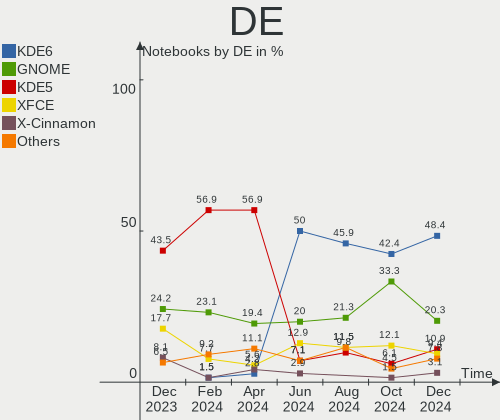
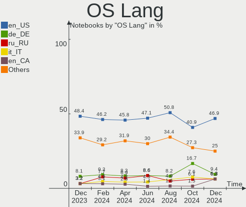
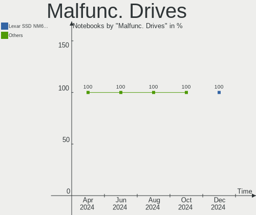
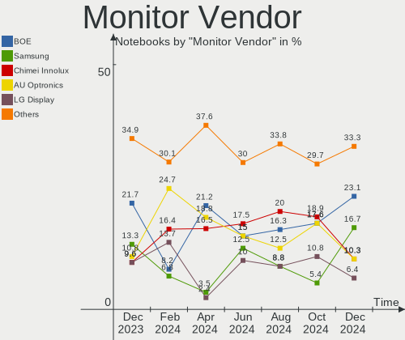

Manjaro Hardware Trends (Notebook)
----------------------------------

A project to identify most popular hardware characteristics and track their change
over time based on data collected by Manjaro users at https://Linux-Hardware.org.

Anyone can contribute to the study by uploading probes of their computers by
the [hw-probe](https://github.com/linuxhw/hw-probe) tool:

    sudo -E hw-probe -all -upload

Full-feature report is available here: https://linux-hardware.org/?view=trends&formfactor=notebook

Period: May, 2020.

Contents
--------

- [ OS                       ](#os)
- [ OS Family                ](#os-family)
- [ Kernel                   ](#kernel)
- [ Kernel Family            ](#kernel-family)
- [ Kernel Major Ver.        ](#kernel-major-ver)
- [ Arch                     ](#arch)
- [ DE                       ](#de)
- [ Display Server           ](#display-server)
- [ Display Manager          ](#display-manager)
- [ OS Lang                  ](#os-lang)
- [ Boot Mode                ](#boot-mode)
- [ Filesystem               ](#filesystem)
- [ Part. scheme             ](#part-scheme)
- [ Dual Boot with Linux/BSD ](#dual-boot-with-linux/bsd)
- [ Dual Boot (Win)          ](#dual-boot-win)
- [ Country                  ](#country)
- [ City                     ](#city)
- [ Vendor                   ](#vendor)
- [ Model                    ](#model)
- [ Model Family             ](#model-family)
- [ MFG Year                 ](#mfg-year)
- [ Form Factor              ](#form-factor)
- [ Secure Boot              ](#secure-boot)
- [ Coreboot                 ](#coreboot)
- [ RAM Size                 ](#ram-size)
- [ RAM Used                 ](#ram-used)
- [ Drive Vendor             ](#drive-vendor)
- [ Drive Model              ](#drive-model)
- [ Drive Kind               ](#drive-kind)
- [ Drive Connector          ](#drive-connector)
- [ Drive Size               ](#drive-size)
- [ Space Total              ](#space-total)
- [ Space Used               ](#space-used)
- [ Malfunc. Drives          ](#malfunc-drives)
- [ Malfunc. Drive Vendor    ](#malfunc-drive-vendor)
- [ Malfunc. HDD Vendor      ](#malfunc-hdd-vendor)
- [ Malfunc. Drive Kind      ](#malfunc-drive-kind)
- [ Failed Drives            ](#failed-drives)
- [ Failed Drive Vendor      ](#failed-drive-vendor)
- [ Drive Status             ](#drive-status)
- [ Storage Vendor           ](#storage-vendor)
- [ Storage Model            ](#storage-model)
- [ Storage Kind             ](#storage-kind)
- [ CPU Vendor               ](#cpu-vendor)
- [ CPU Model                ](#cpu-model)
- [ CPU Model Family         ](#cpu-model-family)
- [ CPU Cores                ](#cpu-cores)
- [ CPU Sockets              ](#cpu-sockets)
- [ CPU Threads              ](#cpu-threads)
- [ CPU Op-Modes             ](#cpu-op-modes)
- [ CPU Microcode            ](#cpu-microcode)
- [ CPU Microarch            ](#cpu-microarch)
- [ GPU Vendor               ](#gpu-vendor)
- [ GPU Model                ](#gpu-model)
- [ GPU Combo                ](#gpu-combo)
- [ GPU Driver               ](#gpu-driver)
- [ GPU Memory               ](#gpu-memory)
- [ Monitor Vendor           ](#monitor-vendor)
- [ Monitor Model            ](#monitor-model)
- [ Monitor Resolution       ](#monitor-resolution)
- [ Monitor Diagonal         ](#monitor-diagonal)
- [ Monitor Width            ](#monitor-width)
- [ Aspect Ratio             ](#aspect-ratio)
- [ Monitor Area             ](#monitor-area)
- [ Pixel Density            ](#pixel-density)
- [ Multiple Monitors        ](#multiple-monitors)
- [ Net Controller Vendor    ](#net-controller-vendor)
- [ Net Controller Model     ](#net-controller-model)
- [ Wireless Vendor          ](#wireless-vendor)
- [ Wireless Model           ](#wireless-model)
- [ Ethernet Vendor          ](#ethernet-vendor)
- [ Ethernet Model           ](#ethernet-model)
- [ Net Controller Kind      ](#net-controller-kind)
- [ Used Controller          ](#used-controller)
- [ NICs                     ](#nics)
- [ Bluetooth Vendor         ](#bluetooth-vendor)
- [ Bluetooth Model          ](#bluetooth-model)
- [ Unsupported Devices      ](#unsupported-devices)
- [ Unsupported Device Types ](#unsupported-device-types)

OS
--

Installed operating systems

| Name           | Computers | Percent |
|----------------|-----------|---------|
| Manjaro        | 39        | 44.32%  |
| Manjaro 20.0.1 | 33        | 37.5%   |
| Manjaro 20.0   | 16        | 18.18%  |

OS Family
---------

OS without a version

| Name    | Computers | Percent |
|---------|-----------|---------|
| Manjaro | 88        | 100%    |

Kernel
------

Version of the Linux kernel

| Version                | Computers | Percent |
|------------------------|-----------|---------|
| 5.6.12-1-MANJARO       | 19        | 21.59%  |
| 5.6.11-1-MANJARO       | 10        | 11.36%  |
| 5.4.40-1-MANJARO       | 10        | 11.36%  |
| 5.6.8-1-MANJARO        | 9         | 10.23%  |
| 5.6.7-1-MANJARO        | 8         | 9.09%   |
| 5.6.10-3-MANJARO       | 5         | 5.68%   |
| 5.4.35-1-MANJARO       | 5         | 5.68%   |
| 5.4.34-1-MANJARO       | 4         | 4.55%   |
| 5.4.39-1-MANJARO       | 3         | 3.41%   |
| 5.7.0-1-MANJARO        | 2         | 2.27%   |
| 5.6.14-1-MANJARO       | 2         | 2.27%   |
| 5.6.10-1-MANJARO       | 2         | 2.27%   |
| 5.5.19-1-MANJARO       | 2         | 2.27%   |
| 5.6.12-2-ck            | 1         | 1.14%   |
| 5.6.10-arch1-1-macbook | 1         | 1.14%   |
| 5.5.18-3-MANJARO       | 1         | 1.14%   |
| 5.4.38-1-MANJARO       | 1         | 1.14%   |
| 5.4.31-1-MANJARO       | 1         | 1.14%   |
| 5.4.23-1-MANJARO       | 1         | 1.14%   |
| 4.19.122-1-MANJARO     | 1         | 1.14%   |

Kernel Family
-------------

Linux kernel without a distro release

| Version  | Computers | Percent |
|----------|-----------|---------|
| 5.6.12   | 20        | 22.73%  |
| 5.6.11   | 10        | 11.36%  |
| 5.4.40   | 10        | 11.36%  |
| 5.6.8    | 9         | 10.23%  |
| 5.6.7    | 8         | 9.09%   |
| 5.6.10   | 8         | 9.09%   |
| 5.4.35   | 5         | 5.68%   |
| 5.4.34   | 4         | 4.55%   |
| 5.4.39   | 3         | 3.41%   |
| 5.7.0    | 2         | 2.27%   |
| 5.6.14   | 2         | 2.27%   |
| 5.5.19   | 2         | 2.27%   |
| 5.5.18   | 1         | 1.14%   |
| 5.4.38   | 1         | 1.14%   |
| 5.4.31   | 1         | 1.14%   |
| 5.4.23   | 1         | 1.14%   |
| 4.19.122 | 1         | 1.14%   |

Kernel Major Ver.
-----------------

Linux kernel major version

| Version | Computers | Percent |
|---------|-----------|---------|
| 5.6     | 57        | 64.77%  |
| 5.4     | 25        | 28.41%  |
| 5.5     | 3         | 3.41%   |
| 5.7     | 2         | 2.27%   |
| 4.19    | 1         | 1.14%   |

Arch
----

OS architecture (x86_64, i586, etc.)

| Name   | Computers | Percent |
|--------|-----------|---------|
| x86_64 | 88        | 100%    |

DE
--

Desktop Environment

| Name       | Computers | Percent |
|------------|-----------|---------|
| KDE5       | 24        | 27.27%  |
| XFCE       | 19        | 21.59%  |
| KDE        | 16        | 18.18%  |
| GNOME      | 13        | 14.77%  |
| X-Cinnamon | 4         | 4.55%   |
| MATE       | 3         | 3.41%   |
| Cinnamon   | 3         | 3.41%   |
| i3         | 2         | 2.27%   |
| Unknown    | 2         | 2.27%   |
| Deepin     | 1         | 1.14%   |
| Budgie     | 1         | 1.14%   |

Display Server
--------------

X11 or Wayland

| Name    | Computers | Percent |
|---------|-----------|---------|
| X11     | 81        | 92.05%  |
| Wayland | 4         | 4.55%   |
| Tty     | 2         | 2.27%   |
| Unknown | 1         | 1.14%   |

Display Manager
---------------

SDDM, LightDM, etc.

| Name    | Computers | Percent |
|---------|-----------|---------|
| Unknown | 40        | 45.45%  |
| SDDM    | 24        | 27.27%  |
| LightDM | 19        | 21.59%  |
| GDM     | 5         | 5.68%   |

OS Lang
-------

Language

| Lang       | Computers | Percent |
|------------|-----------|---------|
| en_US      | 31        | 35.23%  |
| ru_RU      | 14        | 15.91%  |
| en_US.utf8 | 6         | 6.82%   |
| de_DE      | 6         | 6.82%   |
| ru_RU.utf8 | 3         | 3.41%   |
| it_IT      | 3         | 3.41%   |
| zh_TW      | 2         | 2.27%   |
| uk_UA      | 2         | 2.27%   |
| pl_PL      | 2         | 2.27%   |
| nl_NL.utf8 | 2         | 2.27%   |
| fr_FR      | 2         | 2.27%   |
| de_DE.utf8 | 2         | 2.27%   |
| C          | 2         | 2.27%   |
| tr_TR.utf8 | 1         | 1.14%   |
| pt_BR      | 1         | 1.14%   |
| nl_NL      | 1         | 1.14%   |
| nl_BE      | 1         | 1.14%   |
| es_CL      | 1         | 1.14%   |
| es_AR      | 1         | 1.14%   |
| en_IE      | 1         | 1.14%   |
| en_GB.utf8 | 1         | 1.14%   |
| en_CA      | 1         | 1.14%   |
| de_AT      | 1         | 1.14%   |
| Unknown    | 1         | 1.14%   |

Boot Mode
---------

EFI or BIOS

| Mode | Computers | Percent |
|------|-----------|---------|
| BIOS | 48        | 54.55%  |
| EFI  | 40        | 45.45%  |

Filesystem
----------

Type of filesystem

| Type    | Computers | Percent |
|---------|-----------|---------|
| Ext4    | 80        | 90.91%  |
| Btrfs   | 5         | 5.68%   |
| Xfs     | 2         | 2.27%   |
| Overlay | 1         | 1.14%   |

Part. scheme
------------

Scheme of partitioning

| Type    | Computers | Percent |
|---------|-----------|---------|
| Unknown | 64        | 72.73%  |
| GPT     | 18        | 20.45%  |
| MBR     | 6         | 6.82%   |

Dual Boot with Linux/BSD
------------------------

Hosting more than one Linux/BSD

| Dual boot | Computers | Percent |
|-----------|-----------|---------|
| No        | 78        | 88.64%  |
| Yes       | 10        | 11.36%  |

Dual Boot (Win)
---------------

Hosting Linux and Windows

| Dual boot | Computers | Percent |
|-----------|-----------|---------|
| No        | 64        | 72.73%  |
| Yes       | 24        | 27.27%  |

Country
-------

Geographic location (country)

| Country     | Computers | Percent |
|-------------|-----------|---------|
| Russia      | 20        | 22.73%  |
| USA         | 15        | 17.05%  |
| Germany     | 11        | 12.5%   |
| Ukraine     | 6         | 6.82%   |
| Netherlands | 3         | 3.41%   |
| China       | 3         | 3.41%   |
| Taiwan      | 2         | 2.27%   |
| Sweden      | 2         | 2.27%   |
| Romania     | 2         | 2.27%   |
| Poland      | 2         | 2.27%   |
| Italy       | 2         | 2.27%   |
| France      | 2         | 2.27%   |
| Brazil      | 2         | 2.27%   |
| Austria     | 2         | 2.27%   |
| Uruguay     | 1         | 1.14%   |
| Turkey      | 1         | 1.14%   |
| Spain       | 1         | 1.14%   |
| Mexico      | 1         | 1.14%   |
| Ireland     | 1         | 1.14%   |
| Egypt       | 1         | 1.14%   |
| Denmark     | 1         | 1.14%   |
| Colombia    | 1         | 1.14%   |
| Chile       | 1         | 1.14%   |
| Canada      | 1         | 1.14%   |
| Belgium     | 1         | 1.14%   |
| Bangladesh  | 1         | 1.14%   |
| Armenia     | 1         | 1.14%   |
| Argentina   | 1         | 1.14%   |

City
----

Geographic location (city)

| City              | Computers | Percent |
|-------------------|-----------|---------|
| Kyiv              | 3         | 3.41%   |
| Voronezh          | 2         | 2.27%   |
| Vienna            | 2         | 2.27%   |
| Taoyuan District  | 2         | 2.27%   |
| Stockholm         | 2         | 2.27%   |
| St Petersburg     | 2         | 2.27%   |
| Moscow            | 2         | 2.27%   |
| Demorest          | 2         | 2.27%   |
| Yegor'yevsk       | 1         | 1.14%   |
| Xochimilco        | 1         | 1.14%   |
| Xi'an             | 1         | 1.14%   |
| Westminster       | 1         | 1.14%   |
| Warffum           | 1         | 1.14%   |
| Vyshhorod         | 1         | 1.14%   |
| Vladivostok       | 1         | 1.14%   |
| Tver              | 1         | 1.14%   |
| Tula              | 1         | 1.14%   |
| Trieste           | 1         | 1.14%   |
| Tomsk             | 1         | 1.14%   |
| Taboao da Serra   | 1         | 1.14%   |
| Szczecin          | 1         | 1.14%   |
| Sueca             | 1         | 1.14%   |
| Shanghai          | 1         | 1.14%   |
| Sevan             | 1         | 1.14%   |
| Savona            | 1         | 1.14%   |
| Santiago          | 1         | 1.14%   |
| Salt Lake City    | 1         | 1.14%   |
| Roseburg          | 1         | 1.14%   |
| Porta Westfalica  | 1         | 1.14%   |
| Port Saint Lucie  | 1         | 1.14%   |
| Pioneertown       | 1         | 1.14%   |
| Perm              | 1         | 1.14%   |
| Nieuwersluis      | 1         | 1.14%   |
| Nefteyugansk      | 1         | 1.14%   |
| Munich            | 1         | 1.14%   |
| Montevideo        | 1         | 1.14%   |
| Milford           | 1         | 1.14%   |
| Medellín         | 1         | 1.14%   |
| Marseille         | 1         | 1.14%   |
| Malbork           | 1         | 1.14%   |
| Lobnya            | 1         | 1.14%   |
| Langley           | 1         | 1.14%   |
| Landujan          | 1         | 1.14%   |
| Konakovo          | 1         | 1.14%   |
| Kolbermoor        | 1         | 1.14%   |
| Koersel           | 1         | 1.14%   |
| Kirov             | 1         | 1.14%   |
| Jinhua            | 1         | 1.14%   |
| Ingolstadt        | 1         | 1.14%   |
| Houston           | 1         | 1.14%   |
| Hohn              | 1         | 1.14%   |
| Gus'-Khrustal'nyy | 1         | 1.14%   |
| Gumperda          | 1         | 1.14%   |
| Gouda             | 1         | 1.14%   |
| Galway            | 1         | 1.14%   |
| Freiburg          | 1         | 1.14%   |
| Frankfurt am Main | 1         | 1.14%   |
| Frankenthal       | 1         | 1.14%   |
| Eugene            | 1         | 1.14%   |
| Dzerzhinsk        | 1         | 1.14%   |

Vendor
------

Motherboard manufacturer

| Name                   | Computers | Percent |
|------------------------|-----------|---------|
| Lenovo                 | 21        | 23.86%  |
| Hewlett-Packard        | 17        | 19.32%  |
| ASUSTek Computer       | 14        | 15.91%  |
| Acer                   | 11        | 12.5%   |
| Dell                   | 10        | 11.36%  |
| Apple                  | 2         | 2.27%   |
| Timi                   | 1         | 1.14%   |
| Sony                   | 1         | 1.14%   |
| Semp Toshiba           | 1         | 1.14%   |
| Prestigio              | 1         | 1.14%   |
| PC Specialist          | 1         | 1.14%   |
| Panasonic              | 1         | 1.14%   |
| ONE-NETBOOK TECHNOLOGY | 1         | 1.14%   |
| MSI                    | 1         | 1.14%   |
| LG Electronics         | 1         | 1.14%   |
| HUAWEI                 | 1         | 1.14%   |
| Hannspree              | 1         | 1.14%   |
| Alienware              | 1         | 1.14%   |
| Unknown                | 1         | 1.14%   |

Model
-----

Motherboard model

| Name                                     | Computers | Percent |
|------------------------------------------|-----------|---------|
| Lenovo G580 20150                        | 3         | 3.41%   |
| HP Notebook                              | 3         | 3.41%   |
| HP Pavilion Laptop 15-cc0xx              | 2         | 2.27%   |
| Dell G3 3779                             | 2         | 2.27%   |
| Timi RedmiBook 14                        | 1         | 1.14%   |
| Sony SVF13N2J2RS                         | 1         | 1.14%   |
| Semp Toshiba IS 1412                     | 1         | 1.14%   |
| Prestigio PSB133S01ZFH                   | 1         | 1.14%   |
| PC Specialist N141CU                     | 1         | 1.14%   |
| Panasonic CF-31WBM7BLM                   | 1         | 1.14%   |
| ONE-NETBOOK TECHNOLOGY One-Mix3 Pro      | 1         | 1.14%   |
| MSI GT72 2QD                             | 1         | 1.14%   |
| LG Electronics 13Z990-V.AA53C            | 1         | 1.14%   |
| Lenovo ZHAOYANG E42-80 80T8              | 1         | 1.14%   |
| Lenovo Z710 20250                        | 1         | 1.14%   |
| Lenovo V330-14IKB 81B0                   | 1         | 1.14%   |
| Lenovo ThinkPad X1 Carbon 6th 20KHCTO1WW | 1         | 1.14%   |
| Lenovo ThinkPad T540p 20BE00B4GE         | 1         | 1.14%   |
| Lenovo ThinkPad T480s 20L8S5U502         | 1         | 1.14%   |
| Lenovo ThinkPad T460s 20FAS23L07         | 1         | 1.14%   |
| Lenovo ThinkPad T430 23495B2             | 1         | 1.14%   |
| Lenovo ThinkPad P50 20EQS20D00           | 1         | 1.14%   |
| Lenovo ThinkPad P1 Gen 2 20QUS0PW00      | 1         | 1.14%   |
| Lenovo ThinkPad Edge E540 20C6005VRT     | 1         | 1.14%   |
| Lenovo Legion Y530-15ICH 81FV            | 1         | 1.14%   |
| Lenovo IdeaPad Y580                      | 1         | 1.14%   |
| Lenovo IdeaPad L340-17IRH Gaming 81LL    | 1         | 1.14%   |
| Lenovo IdeaPad 330S-15ARR 81FB           | 1         | 1.14%   |
| Lenovo IdeaPad 330-15ICH 81FK            | 1         | 1.14%   |
| Lenovo G500 20236                        | 1         | 1.14%   |
| Lenovo B590 20208                        | 1         | 1.14%   |
| HUAWEI NBLK-WAX9X                        | 1         | 1.14%   |
| HP ZBook 14u G6                          | 1         | 1.14%   |
| HP ProBook 6560b                         | 1         | 1.14%   |
| HP ProBook 450 G6                        | 1         | 1.14%   |
| HP Pavilion Gaming Laptop 17-cd0xxx      | 1         | 1.14%   |
| HP Pavilion g6                           | 1         | 1.14%   |
| HP Laptop 17-ca1xxx                      | 1         | 1.14%   |
| HP Laptop 15-bs0xx                       | 1         | 1.14%   |
| HP ENVY Sleekbook 6 PC                   | 1         | 1.14%   |
| HP EliteBook 840 G2                      | 1         | 1.14%   |
| HP 255 G6 Notebook PC                    | 1         | 1.14%   |
| HP 250 G7 Notebook PC                    | 1         | 1.14%   |
| HP 15 Notebook PC                        | 1         | 1.14%   |
| Hannspree SN12E200                       | 1         | 1.14%   |
| Dell XPS 15 7590                         | 1         | 1.14%   |
| Dell Latitude 5591                       | 1         | 1.14%   |
| Dell Inspiron N5110                      | 1         | 1.14%   |
| Dell Inspiron 7472                       | 1         | 1.14%   |
| Dell Inspiron 5767                       | 1         | 1.14%   |
| Dell Inspiron 5584                       | 1         | 1.14%   |
| Dell Inspiron 5520                       | 1         | 1.14%   |
| Dell G3 3590                             | 1         | 1.14%   |
| ASUS ZenBook UX431FLC_UX431FL            | 1         | 1.14%   |
| ASUS X550VC                              | 1         | 1.14%   |
| ASUS X541UJ                              | 1         | 1.14%   |
| ASUS X540NV                              | 1         | 1.14%   |
| ASUS VivoBook_ASUSLaptop X512JP_X512JP   | 1         | 1.14%   |
| ASUS VivoBook_ASUSLaptop X512DK_X512DK   | 1         | 1.14%   |
| ASUS Q550LF                              | 1         | 1.14%   |

Model Family
------------

Motherboard model prefix

| Name                            | Computers | Percent |
|---------------------------------|-----------|---------|
| Lenovo ThinkPad                 | 8         | 9.09%   |
| Acer Aspire                     | 8         | 9.09%   |
| Dell Inspiron                   | 5         | 5.68%   |
| Lenovo IdeaPad                  | 4         | 4.55%   |
| HP Pavilion                     | 4         | 4.55%   |
| Lenovo G580                     | 3         | 3.41%   |
| HP Notebook                     | 3         | 3.41%   |
| Dell G3                         | 3         | 3.41%   |
| HP ProBook                      | 2         | 2.27%   |
| HP Laptop                       | 2         | 2.27%   |
| ASUS VivoBook                   | 2         | 2.27%   |
| Timi RedmiBook                  | 1         | 1.14%   |
| Sony SVF13N2J2RS                | 1         | 1.14%   |
| Semp Toshiba IS                 | 1         | 1.14%   |
| Prestigio PSB133S01ZFH          | 1         | 1.14%   |
| PC Specialist N141CU            | 1         | 1.14%   |
| Panasonic CF-31WBM7BLM          | 1         | 1.14%   |
| ONE-NETBOOK TECHNOLOGY One-Mix3 | 1         | 1.14%   |
| MSI GT72                        | 1         | 1.14%   |
| LG Electronics 13Z990-V.AA53C   | 1         | 1.14%   |
| Lenovo ZHAOYANG                 | 1         | 1.14%   |
| Lenovo Z710                     | 1         | 1.14%   |
| Lenovo V330-14IKB               | 1         | 1.14%   |
| Lenovo Legion                   | 1         | 1.14%   |
| Lenovo G500                     | 1         | 1.14%   |
| Lenovo B590                     | 1         | 1.14%   |
| HUAWEI NBLK-WAX9X               | 1         | 1.14%   |
| HP ZBook                        | 1         | 1.14%   |
| HP ENVY                         | 1         | 1.14%   |
| HP EliteBook                    | 1         | 1.14%   |
| HP 255                          | 1         | 1.14%   |
| HP 250                          | 1         | 1.14%   |
| HP 15                           | 1         | 1.14%   |
| Hannspree SN12E200              | 1         | 1.14%   |
| Dell XPS                        | 1         | 1.14%   |
| Dell Latitude                   | 1         | 1.14%   |
| ASUS ZenBook                    | 1         | 1.14%   |
| ASUS X550VC                     | 1         | 1.14%   |
| ASUS X541UJ                     | 1         | 1.14%   |
| ASUS X540NV                     | 1         | 1.14%   |
| ASUS Q550LF                     | 1         | 1.14%   |
| ASUS N60Dp                      | 1         | 1.14%   |
| ASUS K55VD                      | 1         | 1.14%   |
| ASUS K54L                       | 1         | 1.14%   |
| ASUS K52F                       | 1         | 1.14%   |
| ASUS GL753VD                    | 1         | 1.14%   |
| ASUS E402SA                     | 1         | 1.14%   |
| ASUS E402NA                     | 1         | 1.14%   |
| Apple MacBookPro5               | 1         | 1.14%   |
| Apple MacBookPro11              | 1         | 1.14%   |
| Alienware 17                    | 1         | 1.14%   |
| Acer TravelMate                 | 1         | 1.14%   |
| Acer Switch                     | 1         | 1.14%   |
| Acer Nitro                      | 1         | 1.14%   |
| Unknown                         | 1         | 1.14%   |

MFG Year
--------

Motherboard manufacture year

| Year    | Computers | Percent |
|---------|-----------|---------|
| 2019    | 29        | 32.95%  |
| 2013    | 10        | 11.36%  |
| 2018    | 9         | 10.23%  |
| 2017    | 7         | 7.95%   |
| 2015    | 6         | 6.82%   |
| 2014    | 6         | 6.82%   |
| 2012    | 5         | 5.68%   |
| 2020    | 4         | 4.55%   |
| 2016    | 3         | 3.41%   |
| 2011    | 3         | 3.41%   |
| 2009    | 3         | 3.41%   |
| 2010    | 2         | 2.27%   |
| Unknown | 1         | 1.14%   |

Form Factor
-----------

Physical design of the computer

| Name     | Computers | Percent |
|----------|-----------|---------|
| Notebook | 88        | 100%    |

Secure Boot
-----------

Enabled or disabled

| State    | Computers | Percent |
|----------|-----------|---------|
| Disabled | 88        | 100%    |

Coreboot
--------

Have coreboot on board

| Used | Computers | Percent |
|------|-----------|---------|
| No   | 88        | 100%    |

RAM Size
--------

Total RAM memory

| Size in GB | Computers | Percent |
|------------|-----------|---------|
| 4.01-8.0   | 30        | 34.09%  |
| 16.01-24.0 | 18        | 20.45%  |
| 3.01-4.0   | 16        | 18.18%  |
| 8.01-16.0  | 16        | 18.18%  |
| 32.01-64.0 | 4         | 4.55%   |
| 2.01-3.0   | 3         | 3.41%   |
| 24.01-32.0 | 1         | 1.14%   |

RAM Used
--------

Used RAM memory

| Used GB   | Computers | Percent |
|-----------|-----------|---------|
| 2.01-3.0  | 28        | 31.82%  |
| 1.01-2.0  | 28        | 31.82%  |
| 4.01-8.0  | 14        | 15.91%  |
| 3.01-4.0  | 11        | 12.5%   |
| 0.01-1.0  | 5         | 5.68%   |
| 8.01-16.0 | 2         | 2.27%   |

Drive Vendor
------------

Hard drive vendors

| Vendor              | Computers | Drives | Percent |
|---------------------|-----------|--------|---------|
| Seagate             | 23        | 23     | 21.9%   |
| WDC                 | 15        | 16     | 14.29%  |
| Samsung Electronics | 11        | 11     | 10.48%  |
| Unknown             | 6         | 6      | 5.71%   |
| Kingston            | 6         | 6      | 5.71%   |
| Toshiba             | 5         | 5      | 4.76%   |
| Crucial             | 5         | 5      | 4.76%   |
| SanDisk             | 4         | 5      | 3.81%   |
| HGST                | 4         | 4      | 3.81%   |
| HL-DT-ST            | 3         | 2      | 2.86%   |
| Transcend           | 2         | 2      | 1.9%    |
| SK Hynix            | 2         | 2      | 1.9%    |
| Hitachi             | 2         | 2      | 1.9%    |
| GOODRAM             | 2         | 2      | 1.9%    |
| Union Memory        | 1         | 1      | 0.95%   |
| SPCC                | 1         | 1      | 0.95%   |
| ShineDisk           | 1         | 1      | 0.95%   |
| Ramsta              | 1         | 1      | 0.95%   |
| PLEXTOR             | 1         | 1      | 0.95%   |
| Micron Technology   | 1         | 1      | 0.95%   |
| Lenovo              | 1         | 1      | 0.95%   |
| KIOXIA              | 1         | 1      | 0.95%   |
| Intel               | 1         | 1      | 0.95%   |
| Generic             | 1         | 1      | 0.95%   |
| FORESEE             | 1         | 1      | 0.95%   |
| Corsair             | 1         | 1      | 0.95%   |
| China               | 1         | 1      | 0.95%   |
| Apple               | 1         | 1      | 0.95%   |
| A-DATA Technology   | 1         | 1      | 0.95%   |

Drive Model
-----------

Hard drive models

| Model                        | Computers | Percent |
|------------------------------|-----------|---------|
| ST1000LM035-1RK172 1TB       | 5         | 4.67%   |
| SA400S37240G 240GB SSD       | 3         | 2.8%    |
| MMC Card  64GB               | 3         | 2.8%    |
| ST750LM022 HN-M750MBB 752GB  | 2         | 1.87%   |
| ST500LT012-9WS142 500GB      | 2         | 1.87%   |
| ST500LM012 HN-M500MBB 500GB  | 2         | 1.87%   |
| ST2000LM007-1R8174 2TB       | 2         | 1.87%   |
| ST1000LM049-2GH172 1TB       | 2         | 1.87%   |
| ST1000LM024 HN-M101MBB 1TB   | 2         | 1.87%   |
| SSD 860 EVO 500GB            | 2         | 1.87%   |
| HTS721010A9E630 1TB          | 2         | 1.87%   |
| DVDRAM GUE1N 3GB             | 2         | 1.87%   |
| 512GB SSD                    | 2         | 1.87%   |
| WDS500G3X0C-00SJG0 500GB     | 1         | 0.93%   |
| WDS500G2B0B-00YS70 500GB SSD | 1         | 0.93%   |
| WDS240G2G0A-00JH30 240GB SSD | 1         | 0.93%   |
| WDS120G2G0B-00EPW0 120GB SSD | 1         | 0.93%   |
| WD5000LPLX-00ZNTT0 500GB     | 1         | 0.93%   |
| WD5000LPCX-60VHAT0 500GB     | 1         | 0.93%   |
| WD5000BPVT-22HXZT3 500GB     | 1         | 0.93%   |
| WD20SPZX-22UA7T0 2TB         | 1         | 0.93%   |
| WD1200BEVS-75UST0 120GB      | 1         | 0.93%   |
| WD10SPZX-75Z10T1 1TB         | 1         | 0.93%   |
| WD10SPZX-60Z10T0 1TB         | 1         | 0.93%   |
| WD10SPZX-21Z10T0 1TB         | 1         | 0.93%   |
| WD10JPVX-75JC3T0 1TB         | 1         | 0.93%   |
| WD10JPVX-22JC3T0 1TB         | 1         | 0.93%   |
| WD10JPVT-75A1YT0 1TB         | 1         | 0.93%   |
| Ultra II 480GB SSD           | 1         | 0.93%   |
| TS128GSSD360S 128GB          | 1         | 0.93%   |
| TS120GMTS420S 120GB SSD      | 1         | 0.93%   |
| THNSNJ128G8NU 128GB SSD      | 1         | 0.93%   |
| THNSFJ256GCSU 256GB SSD      | 1         | 0.93%   |
| SUV400S37240G 240GB SSD      | 1         | 0.93%   |
| SU800 512GB SSD              | 1         | 0.93%   |
| ST95005620AS 500GB           | 1         | 0.93%   |
| ST9500325AS 500GB            | 1         | 0.93%   |
| ST9320325AS 320GB            | 1         | 0.93%   |
| ST9250315AS 250GB            | 1         | 0.93%   |
| ST500LT012-1DG142 500GB      | 1         | 0.93%   |
| ST480HM000 480GB SSD         | 1         | 0.93%   |
| SSDPR-CX300-120 120GB        | 1         | 0.93%   |
| SSDPEKNW512G8 512GB          | 1         | 0.93%   |
| SSD162 240GB                 | 1         | 0.93%   |
| SSD U110 16GB                | 1         | 0.93%   |
| SSD ST600 120G               | 1         | 0.93%   |
| SSD SM0256F 256GB            | 1         | 0.93%   |
| SSD R800 120GB               | 1         | 0.93%   |
| SSD PLUS 120GB               | 1         | 0.93%   |
| SSD 860 QVO 1TB              | 1         | 0.93%   |
| SSD 860 EVO 250GB            | 1         | 0.93%   |
| SSD 850 PRO 256GB            | 1         | 0.93%   |
| SSD 850 EVO M.2 500GB        | 1         | 0.93%   |
| SSD 850 EVO M.2 250GB        | 1         | 0.93%   |
| SSD 850 EVO 500GB            | 1         | 0.93%   |
| SSD 120GB                    | 1         | 0.93%   |
| SN400  394GB                 | 1         | 0.93%   |
| SD8SBAT128G1002 128GB SSD    | 1         | 0.93%   |
| SD/MMC/MS PRO 4GB            | 1         | 0.93%   |
| SC311 SATA 256GB SSD         | 1         | 0.93%   |

Drive Kind
----------

HDD or SSD

| Kind    | Computers | Drives | Percent |
|---------|-----------|--------|---------|
| HDD     | 41        | 41     | 39.42%  |
| SSD     | 40        | 42     | 38.46%  |
| NVMe    | 11        | 12     | 10.58%  |
| MMC     | 6         | 6      | 5.77%   |
| Unknown | 6         | 5      | 5.77%   |

Drive Connector
---------------

SATA, SAS, NVMe, etc.

| Type | Computers | Drives | Percent |
|------|-----------|--------|---------|
| SATA | 71        | 85     | 77.17%  |
| NVMe | 11        | 12     | 11.96%  |
| MMC  | 6         | 6      | 6.52%   |
| SAS  | 4         | 3      | 4.35%   |

Drive Size
----------

Size of hard drive

| Size in TB | Computers | Drives | Percent |
|------------|-----------|--------|---------|
| 0.01-0.5   | 58        | 71     | 63.74%  |
| 0.51-1.0   | 30        | 32     | 32.97%  |
| 1.01-2.0   | 3         | 3      | 3.3%    |

Space Total
-----------

Amount of disk space available on the file system

| Size in GB | Computers | Percent |
|------------|-----------|---------|
| 101-250    | 33        | 37.5%   |
| 251-500    | 26        | 29.55%  |
| 501-1000   | 12        | 13.64%  |
| 51-100     | 5         | 5.68%   |
| Unknown    | 5         | 5.68%   |
| 1001-2000  | 4         | 4.55%   |
| 1-20       | 2         | 2.27%   |
| 21-50      | 1         | 1.14%   |

Space Used
----------

Amount of used disk space

| Used GB  | Computers | Percent |
|----------|-----------|---------|
| 1-20     | 21        | 23.86%  |
| 21-50    | 19        | 21.59%  |
| 51-100   | 18        | 20.45%  |
| 101-250  | 16        | 18.18%  |
| 251-500  | 7         | 7.95%   |
| Unknown  | 5         | 5.68%   |
| 501-1000 | 2         | 2.27%   |

Malfunc. Drives
---------------

Drive models with a malfunction

| Model                    | Computers | Drives | Percent |
|--------------------------|-----------|--------|---------|
| ST500LT012-9WS142 500GB  | 2         | 2      | 22.22%  |
| WD5000LPLX-00ZNTT0 500GB | 1         | 1      | 11.11%  |
| WD5000BPVT-22HXZT3 500GB | 1         | 1      | 11.11%  |
| WD10JPVX-75JC3T0 1TB     | 1         | 1      | 11.11%  |
| WD10JPVX-22JC3T0 1TB     | 1         | 1      | 11.11%  |
| ST9320325AS 320GB        | 1         | 1      | 11.11%  |
| MQ01ABD100 1TB           | 1         | 1      | 11.11%  |
| HTS723232A7A364 320GB    | 1         | 1      | 11.11%  |

Malfunc. Drive Vendor
---------------------

Vendors of faulty drives

| Vendor  | Computers | Drives | Percent |
|---------|-----------|--------|---------|
| WDC     | 4         | 4      | 44.44%  |
| Seagate | 3         | 3      | 33.33%  |
| Toshiba | 1         | 1      | 11.11%  |
| Hitachi | 1         | 1      | 11.11%  |

Malfunc. HDD Vendor
-------------------

Vendors of faulty HDD drives

| Vendor  | Computers | Drives | Percent |
|---------|-----------|--------|---------|
| WDC     | 4         | 4      | 44.44%  |
| Seagate | 3         | 3      | 33.33%  |
| Toshiba | 1         | 1      | 11.11%  |
| Hitachi | 1         | 1      | 11.11%  |

Malfunc. Drive Kind
-------------------

Kinds of faulty drives

| Kind | Computers | Drives | Percent |
|------|-----------|--------|---------|
| HDD  | 9         | 9      | 100%    |

Failed Drives
-------------

Failed drive models

Zero info for selected period =(

Failed Drive Vendor
-------------------

Failed drive vendors

Zero info for selected period =(

Drive Status
------------

Number of failed and malfunc. drives

| Status   | Computers | Drives | Percent |
|----------|-----------|--------|---------|
| Detected | 46        | 56     | 52.87%  |
| Works    | 32        | 41     | 36.78%  |
| Malfunc  | 9         | 9      | 10.34%  |

Storage Vendor
--------------

Storage controller vendors

| Vendor                       | Computers | Percent |
|------------------------------|-----------|---------|
| Intel                        | 69        | 66.35%  |
| AMD                          | 10        | 9.62%   |
| Samsung Electronics          | 8         | 7.69%   |
| Toshiba America Info Systems | 3         | 2.88%   |
| SK Hynix                     | 3         | 2.88%   |
| Sandisk                      | 3         | 2.88%   |
| Union Memory (Shenzhen)      | 2         | 1.92%   |
| Micron Technology            | 2         | 1.92%   |
| Shenzhen Longsys Electronics | 1         | 0.96%   |
| Phison Electronics           | 1         | 0.96%   |
| Nvidia                       | 1         | 0.96%   |
| Kingston Technology Company  | 1         | 0.96%   |

Storage Model
-------------

Storage controller models

| Model                                                                      | Computers | Percent |
|----------------------------------------------------------------------------|-----------|---------|
| 7 Series Chipset Family 6-port SATA Controller [AHCI mode]                 | 10        | 9.43%   |
| Non-Volatile memory controller                                             | 9         | 8.49%   |
| FCH SATA Controller [AHCI mode]                                            | 9         | 8.49%   |
| Cannon Lake Mobile PCH SATA AHCI Controller                                | 9         | 8.49%   |
| Sunrise Point-LP SATA Controller [AHCI mode]                               | 8         | 7.55%   |
| 82801 Mobile SATA Controller [RAID mode]                                   | 7         | 6.6%    |
| 8 Series SATA Controller 1 [AHCI mode]                                     | 5         | 4.72%   |
| Wildcat Point-LP SATA Controller [AHCI Mode]                               | 4         | 3.77%   |
| NVMe SSD Controller SM981/PM981/PM983                                      | 4         | 3.77%   |
| 8 Series/C220 Series Chipset Family 6-port SATA Controller 1 [AHCI mode]   | 4         | 3.77%   |
| Celeron N3350/Pentium N4200/Atom E3900 Series SATA AHCI Controller         | 3         | 2.83%   |
| Cannon Point-LP SATA Controller [AHCI Mode]                                | 3         | 2.83%   |
| Atom/Celeron/Pentium Processor x5-E8000/J3xxx/N3xxx Series SATA Controller | 3         | 2.83%   |
| 6 Series/C200 Series Chipset Family 6 port Mobile SATA AHCI Controller     | 3         | 2.83%   |
| 5 Series/3400 Series Chipset 4 port SATA AHCI Controller                   | 3         | 2.83%   |
| NVMe SSD Controller SM961/PM961                                            | 2         | 1.89%   |
| WD Black 2018/PC SN720 NVMe SSD                                            | 1         | 0.94%   |
| WD Black 2018/PC SN520 NVMe SSD                                            | 1         | 0.94%   |
| Toshiba America Info Non-Volatile memory controller                        | 1         | 0.94%   |
| SSD 660P Series                                                            | 1         | 0.94%   |
| SB7x0/SB8x0/SB9x0 SATA Controller [AHCI mode]                              | 1         | 0.94%   |
| Q170/Q150/B150/H170/H110/Z170/CM236 Chipset SATA Controller [AHCI Mode]    | 1         | 0.94%   |
| NVMe Controller                                                            | 1         | 0.94%   |
| MCP79 AHCI Controller                                                      | 1         | 0.94%   |
| Ice Lake-LP SATA Controller [AHCI mode]                                    | 1         | 0.94%   |
| HM170/QM170 Chipset SATA Controller [AHCI Mode]                            | 1         | 0.94%   |
| Electronics Non-Volatile memory controller                                 | 1         | 0.94%   |
| E12 NVMe Controller                                                        | 1         | 0.94%   |
| Comet Lake SATA AHCI Controller                                            | 1         | 0.94%   |
| BG3 NVMe SSD Controller                                                    | 1         | 0.94%   |
| BC501 NVMe Solid State Drive 512GB                                         | 1         | 0.94%   |
| Apple PCIe SSD                                                             | 1         | 0.94%   |
| 82801IBM/IEM (ICH9M/ICH9M-E) 4 port SATA Controller [AHCI mode]            | 1         | 0.94%   |
| 82801IBM/IEM (ICH9M/ICH9M-E) 2 port SATA Controller [IDE mode]             | 1         | 0.94%   |
| 7 Series Chipset Family 4-port SATA Controller [IDE mode]                  | 1         | 0.94%   |
| 7 Series Chipset Family 2-port SATA Controller [IDE mode]                  | 1         | 0.94%   |

Storage Kind
------------

Kind of storage controller (IDE, SATA, NVMe, SAS, ...)

| Kind | Computers | Percent |
|------|-----------|---------|
| SATA | 72        | 68.57%  |
| NVMe | 24        | 22.86%  |
| RAID | 7         | 6.67%   |
| IDE  | 2         | 1.9%    |

CPU Vendor
----------

Processor vendors

| Vendor | Computers | Percent |
|--------|-----------|---------|
| Intel  | 77        | 87.5%   |
| AMD    | 11        | 12.5%   |

CPU Model
---------

Processor models

| Model                                         | Computers | Percent |
|-----------------------------------------------|-----------|---------|
| Intel Core i5-3230M CPU @ 2.60GHz             | 4         | 4.55%   |
| Intel Core i7-8750H CPU @ 2.20GHz             | 3         | 3.41%   |
| Intel Core i7-8565U CPU @ 1.80GHz             | 3         | 3.41%   |
| Intel Core i7-7500U CPU @ 2.70GHz             | 3         | 3.41%   |
| Intel Core i5-8265U CPU @ 1.60GHz             | 3         | 3.41%   |
| Intel Core i3-5005U CPU @ 2.00GHz             | 3         | 3.41%   |
| AMD Ryzen 5 3500U with Radeon Vega Mobile Gfx | 3         | 3.41%   |
| Intel Pentium CPU P6200 @ 2.13GHz             | 2         | 2.27%   |
| Intel Pentium CPU N4200 @ 1.10GHz             | 2         | 2.27%   |
| Intel Pentium CPU N3710 @ 1.60GHz             | 2         | 2.27%   |
| Intel Core i7-9750H CPU @ 2.60GHz             | 2         | 2.27%   |
| Intel Core i7-8550U CPU @ 1.80GHz             | 2         | 2.27%   |
| Intel Core i7-4720HQ CPU @ 2.60GHz            | 2         | 2.27%   |
| Intel Core i5-9300H CPU @ 2.40GHz             | 2         | 2.27%   |
| Intel Core i5-7200U CPU @ 2.50GHz             | 2         | 2.27%   |
| Intel Core i3-4005U CPU @ 1.70GHz             | 2         | 2.27%   |
| AMD Ryzen 5 2500U with Radeon Vega Mobile Gfx | 2         | 2.27%   |
| Intel Pentium Dual-Core CPU T4200 @ 2.00GHz   | 1         | 1.14%   |
| Intel Pentium CPU 4405U @ 2.10GHz             | 1         | 1.14%   |
| Intel Pentium CPU 2020M @ 2.40GHz             | 1         | 1.14%   |
| Intel Genuine CPU U4100 @ 1.30GHz             | 1         | 1.14%   |
| Intel Core i9-9880H CPU @ 2.30GHz             | 1         | 1.14%   |
| Intel Core i9-8950HK CPU @ 2.90GHz            | 1         | 1.14%   |
| Intel Core i7-8650U CPU @ 1.90GHz             | 1         | 1.14%   |
| Intel Core i7-7700HQ CPU @ 2.80GHz            | 1         | 1.14%   |
| Intel Core i7-6820HQ CPU @ 2.70GHz            | 1         | 1.14%   |
| Intel Core i7-4710MQ CPU @ 2.50GHz            | 1         | 1.14%   |
| Intel Core i7-4700MQ CPU @ 2.40GHz            | 1         | 1.14%   |
| Intel Core i7-4500U CPU @ 1.80GHz             | 1         | 1.14%   |
| Intel Core i7-3632QM CPU @ 2.20GHz            | 1         | 1.14%   |
| Intel Core i7-3610QM CPU @ 2.30GHz            | 1         | 1.14%   |
| Intel Core i7-1065G7 CPU @ 1.30GHz            | 1         | 1.14%   |
| Intel Core i7-10510Y CPU @ 1.20GHz            | 1         | 1.14%   |
| Intel Core i7-10510U CPU @ 1.80GHz            | 1         | 1.14%   |
| Intel Core i7 CPU M 640 @ 2.80GHz             | 1         | 1.14%   |
| Intel Core i5-8400H CPU @ 2.50GHz             | 1         | 1.14%   |
| Intel Core i5-8300H CPU @ 2.30GHz             | 1         | 1.14%   |
| Intel Core i5-8250U CPU @ 1.60GHz             | 1         | 1.14%   |
| Intel Core i5-6300U CPU @ 2.40GHz             | 1         | 1.14%   |
| Intel Core i5-5200U CPU @ 2.20GHz             | 1         | 1.14%   |
| Intel Core i5-4258U CPU @ 2.40GHz             | 1         | 1.14%   |
| Intel Core i5-4210U CPU @ 1.70GHz             | 1         | 1.14%   |
| Intel Core i5-4200U CPU @ 1.60GHz             | 1         | 1.14%   |
| Intel Core i5-4200M CPU @ 2.50GHz             | 1         | 1.14%   |
| Intel Core i5-3340M CPU @ 2.70GHz             | 1         | 1.14%   |
| Intel Core i5-3320M CPU @ 2.60GHz             | 1         | 1.14%   |
| Intel Core i5-3210M CPU @ 2.50GHz             | 1         | 1.14%   |
| Intel Core i5-2540M CPU @ 2.60GHz             | 1         | 1.14%   |
| Intel Core i5-2450M CPU @ 2.50GHz             | 1         | 1.14%   |
| Intel Core i5-2410M CPU @ 2.30GHz             | 1         | 1.14%   |
| Intel Core i5-10210U CPU @ 1.60GHz            | 1         | 1.14%   |
| Intel Core i3-3110M CPU @ 2.40GHz             | 1         | 1.14%   |
| Intel Core 2 Duo CPU P8800 @ 2.66GHz          | 1         | 1.14%   |
| Intel Celeron CPU N3350 @ 1.10GHz             | 1         | 1.14%   |
| Intel Celeron CPU N3160 @ 1.60GHz             | 1         | 1.14%   |
| Intel Celeron CPU 3865U @ 1.80GHz             | 1         | 1.14%   |
| Intel Atom x5-Z8350 CPU @ 1.44GHz             | 1         | 1.14%   |
| AMD Athlon II Dual-Core M300                  | 1         | 1.14%   |
| AMD A8-4555M APU with Radeon HD Graphics      | 1         | 1.14%   |
| AMD A6-9225 RADEON R4, 5 COMPUTE CORES 2C+3G  | 1         | 1.14%   |

CPU Model Family
----------------

Processor model prefix

| Model                   | Computers | Percent |
|-------------------------|-----------|---------|
| Intel Core i7           | 27        | 30.68%  |
| Intel Core i5           | 27        | 30.68%  |
| Intel Pentium           | 8         | 9.09%   |
| Intel Core i3           | 6         | 6.82%   |
| AMD Ryzen 5             | 5         | 5.68%   |
| Intel Celeron           | 3         | 3.41%   |
| AMD A6                  | 3         | 3.41%   |
| Intel Core i9           | 2         | 2.27%   |
| Intel Pentium Dual-Core | 1         | 1.14%   |
| Intel Genuine           | 1         | 1.14%   |
| Intel Core 2 Duo        | 1         | 1.14%   |
| Intel Atom              | 1         | 1.14%   |
| AMD Athlon II Dual-Core | 1         | 1.14%   |
| AMD A8                  | 1         | 1.14%   |
| AMD A10                 | 1         | 1.14%   |

CPU Cores
---------

Number of processor cores

| Number | Computers | Percent |
|--------|-----------|---------|
| 2      | 42        | 47.73%  |
| 4      | 38        | 43.18%  |
| 6      | 6         | 6.82%   |
| 8      | 1         | 1.14%   |
| 1      | 1         | 1.14%   |

CPU Sockets
-----------

Number of sockets

| Number | Computers | Percent |
|--------|-----------|---------|
| 1      | 88        | 100%    |

CPU Threads
-----------

Threads per core (Hyper-Threading)

| Number | Computers | Percent |
|--------|-----------|---------|
| 2      | 71        | 80.68%  |
| 1      | 17        | 19.32%  |

CPU Op-Modes
------------

CPU Operation Modes (32-bit, 64-bit)

| Op mode        | Computers | Percent |
|----------------|-----------|---------|
| 32-bit, 64-bit | 88        | 100%    |

CPU Microcode
-------------

Microcode number

| Number     | Computers | Percent |
|------------|-----------|---------|
| Unknown    | 39        | 44.32%  |
| 0x306a9    | 9         | 10.23%  |
| 0x906ea    | 7         | 7.95%   |
| 0x806ec    | 3         | 3.41%   |
| 0x506c9    | 3         | 3.41%   |
| 0x306c3    | 3         | 3.41%   |
| 0x806ea    | 2         | 2.27%   |
| 0x806e9    | 2         | 2.27%   |
| 0x406c4    | 2         | 2.27%   |
| 0x40651    | 2         | 2.27%   |
| 0x20655    | 2         | 2.27%   |
| 0x06001119 | 2         | 2.27%   |
| 0x906ed    | 1         | 1.14%   |
| 0x906e9    | 1         | 1.14%   |
| 0x806eb    | 1         | 1.14%   |
| 0x706e5    | 1         | 1.14%   |
| 0x506e3    | 1         | 1.14%   |
| 0x406e3    | 1         | 1.14%   |
| 0x306d4    | 1         | 1.14%   |
| 0x206a7    | 1         | 1.14%   |
| 0x1067a    | 1         | 1.14%   |
| 0x08108109 | 1         | 1.14%   |
| 0x08108102 | 1         | 1.14%   |
| 0x0810100b | 1         | 1.14%   |

CPU Microarch
-------------

Microarchitecture

| Name        | Computers | Percent |
|-------------|-----------|---------|
| KabyLake    | 18        | 20.45%  |
| Skylake     | 16        | 18.18%  |
| IvyBridge   | 11        | 12.5%   |
| Haswell     | 11        | 12.5%   |
| Silvermont  | 4         | 4.55%   |
| Broadwell   | 4         | 4.55%   |
| Zen+        | 3         | 3.41%   |
| Westmere    | 3         | 3.41%   |
| SandyBridge | 3         | 3.41%   |
| Piledriver  | 3         | 3.41%   |
| Goldmont    | 3         | 3.41%   |
| Zen         | 2         | 2.27%   |
| Penryn      | 2         | 2.27%   |
| K10         | 1         | 1.14%   |
| Jaguar      | 1         | 1.14%   |
| Icelake     | 1         | 1.14%   |
| Excavator   | 1         | 1.14%   |
| Core        | 1         | 1.14%   |

GPU Vendor
----------

Vendors of graphics cards

| Vendor | Computers | Percent |
|--------|-----------|---------|
| Intel  | 74        | 59.68%  |
| Nvidia | 35        | 28.23%  |
| AMD    | 15        | 12.1%   |

GPU Model
---------

Graphics card models

| Model                                                                              | Computers | Percent |
|------------------------------------------------------------------------------------|-----------|---------|
| UHD Graphics 630 (Mobile)                                                          | 11        | 8.53%   |
| 3rd Gen Core processor Graphics Controller                                         | 11        | 8.53%   |
| UHD Graphics 620 (Whiskey Lake)                                                    | 6         | 4.65%   |
| Haswell-ULT Integrated Graphics Controller                                         | 6         | 4.65%   |
| HD Graphics 620                                                                    | 5         | 3.88%   |
| UHD Graphics 620                                                                   | 4         | 3.1%    |
| HD Graphics 5500                                                                   | 4         | 3.1%    |
| GF117M [GeForce 610M/710M/810M/820M / GT 620M/625M/630M/720M]                      | 4         | 3.1%    |
| Atom/Celeron/Pentium Processor x5-E8000/J3xxx/N3xxx Integrated Graphics Controller | 4         | 3.1%    |
| 4th Gen Core Processor Integrated Graphics Controller                              | 4         | 3.1%    |
| Picasso                                                                            | 3         | 2.33%   |
| Core Processor Integrated Graphics Controller                                      | 3         | 2.33%   |
| UHD Graphics                                                                       | 2         | 1.55%   |
| Sun XT [Radeon HD 8670A/8670M/8690M / R5 M330 / M430 / Radeon 520 Mobile]          | 2         | 1.55%   |
| Raven Ridge [Radeon Vega Series / Radeon Vega Mobile Series]                       | 2         | 1.55%   |
| Mobile 4 Series Chipset Integrated Graphics Controller                             | 2         | 1.55%   |
| GP107M [GeForce GTX 1050 Mobile]                                                   | 2         | 1.55%   |
| GP107M [GeForce GTX 1050 3 GB Max-Q]                                               | 2         | 1.55%   |
| GP106M [GeForce GTX 1060 Mobile]                                                   | 2         | 1.55%   |
| GM108M [GeForce MX130]                                                             | 2         | 1.55%   |
| GK208M [GeForce GT 740M]                                                           | 2         | 1.55%   |
| Celeron N3350/Pentium N4200/Atom E3900 Series Integrated Graphics Controller       | 2         | 1.55%   |
| 2nd Generation Core Processor Family Integrated Graphics Controller                | 2         | 1.55%   |
| UHD Graphics 615                                                                   | 1         | 0.78%   |
| TU117M [GeForce GTX 1650 Mobile / Max-Q]                                           | 1         | 0.78%   |
| TU117GLM [Quadro T2000 Mobile / Max-Q]                                             | 1         | 0.78%   |
| TU116M [GeForce GTX 1660 Ti Mobile]                                                | 1         | 0.78%   |
| Trinity [Radeon HD 7600G]                                                          | 1         | 0.78%   |
| Trinity 2 [Radeon HD 7520G]                                                        | 1         | 0.78%   |
| Topaz XT [Radeon R7 M260/M265 / M340/M360 / M440/M445 / 530/535 / 620/625 Mobile]  | 1         | 0.78%   |
| Thames [Radeon HD 7500M/7600M Series]                                              | 1         | 0.78%   |
| Sun PRO [Radeon HD 8570A/8570M]                                                    | 1         | 0.78%   |
| Stoney [Radeon R2/R3/R4/R5 Graphics]                                               | 1         | 0.78%   |
| Skylake GT2 [HD Graphics 520]                                                      | 1         | 0.78%   |
| Seymour [Radeon HD 6400M/7400M Series]                                             | 1         | 0.78%   |
| RV730/M96-XT [Mobility Radeon HD 4670]                                             | 1         | 0.78%   |
| Richland [Radeon HD 8650G]                                                         | 1         | 0.78%   |
| Mars [Radeon HD 8670A/8670M/8750M]                                                 | 1         | 0.78%   |
| Lexa PRO [Radeon 540/540X/550/550X / RX 540X/550/550X]                             | 1         | 0.78%   |
| Kaby Lake-U GT1 Integrated Graphics Controller                                     | 1         | 0.78%   |
| Iris Plus Graphics G7                                                              | 1         | 0.78%   |
| HD Graphics 630                                                                    | 1         | 0.78%   |
| HD Graphics 530                                                                    | 1         | 0.78%   |
| HD Graphics 510                                                                    | 1         | 0.78%   |
| HD Graphics 500                                                                    | 1         | 0.78%   |
| GP108M [GeForce MX330]                                                             | 1         | 0.78%   |
| GP108M [GeForce MX250]                                                             | 1         | 0.78%   |
| GP108M [GeForce MX150]                                                             | 1         | 0.78%   |
| GP108BM [GeForce MX250]                                                            | 1         | 0.78%   |
| GP107M [GeForce GTX 1050 Ti Mobile]                                                | 1         | 0.78%   |
| GP104BM [GeForce GTX 1080 Mobile]                                                  | 1         | 0.78%   |
| GM204M [GeForce GTX 970M]                                                          | 1         | 0.78%   |
| GM108M [GeForce 920MX]                                                             | 1         | 0.78%   |
| GM107M [GeForce GTX 960M]                                                          | 1         | 0.78%   |
| GM107GLM [Quadro M2000M]                                                           | 1         | 0.78%   |
| GK208M [GeForce GT 730M]                                                           | 1         | 0.78%   |
| GK208BM [GeForce 920M]                                                             | 1         | 0.78%   |
| GK107M [GeForce GTX 660M]                                                          | 1         | 0.78%   |
| GK107M [GeForce GT 750M]                                                           | 1         | 0.78%   |
| GK107M [GeForce GT 745M]                                                           | 1         | 0.78%   |

GPU Combo
---------

Combinations of graphics cards

| Name           | Computers | Percent |
|----------------|-----------|---------|
| 1 x Intel      | 37        | 42.05%  |
| Intel + Nvidia | 32        | 36.36%  |
| 1 x AMD        | 8         | 9.09%   |
| 2 x AMD        | 4         | 4.55%   |
| Intel + AMD    | 4         | 4.55%   |
| 1 x Nvidia     | 2         | 2.27%   |
| 2 x Nvidia     | 1         | 1.14%   |

GPU Driver
----------

Free vs proprietary

| Driver      | Computers | Percent |
|-------------|-----------|---------|
| Free        | 75        | 85.23%  |
| Proprietary | 13        | 14.77%  |

GPU Memory
----------

Total video memory

| Size in GB | Computers | Percent |
|------------|-----------|---------|
| Unknown    | 71        | 80.68%  |
| 1.01-2.0   | 5         | 5.68%   |
| 0.51-1.0   | 4         | 4.55%   |
| 0.01-0.5   | 4         | 4.55%   |
| 2.01-3.0   | 2         | 2.27%   |
| 7.01-8.0   | 1         | 1.14%   |
| 3.01-4.0   | 1         | 1.14%   |

Monitor Vendor
--------------

Monitor vendors

| Vendor                  | Computers | Percent |
|-------------------------|-----------|---------|
| LG Display              | 21        | 23.33%  |
| AU Optronics            | 18        | 20%     |
| Chimei Innolux          | 16        | 17.78%  |
| BOE                     | 9         | 10%     |
| Samsung Electronics     | 7         | 7.78%   |
| PANDA                   | 3         | 3.33%   |
| Sharp                   | 2         | 2.22%   |
| Iiyama                  | 2         | 2.22%   |
| Chi Mei Optoelectronics | 2         | 2.22%   |
| Apple                   | 2         | 2.22%   |
| Acer                    | 2         | 2.22%   |
| Sony                    | 1         | 1.11%   |
| Panasonic               | 1         | 1.11%   |
| Hewlett-Packard         | 1         | 1.11%   |
| HannStar                | 1         | 1.11%   |
| ASUSTek Computer        | 1         | 1.11%   |
| AOC                     | 1         | 1.11%   |

Monitor Model
-------------

Monitor models

| Model                                               | Computers | Percent |
|-----------------------------------------------------|-----------|---------|
| LCD Monitor LGD033A 1366x768 340x190mm 15.3-inch    | 2         | 2.22%   |
| LCD Monitor LGD02DC 1366x768 344x194mm 15.5-inch    | 2         | 2.22%   |
| LCD Monitor CMN1738 1920x1080 381x214mm 17.2-inch   | 2         | 2.22%   |
| LCD Monitor CMN15CA 1366x768 340x190mm 15.3-inch    | 2         | 2.22%   |
| LCD Monitor BOE0696 1366x768 309x173mm 13.9-inch    | 2         | 2.22%   |
| LCD Monitor AUO23ED 1920x1080 344x193mm 15.5-inch   | 2         | 2.22%   |
| LCD Monitor AUO10EC 1366x768 340x190mm 15.3-inch    | 2         | 2.22%   |
| VVX13F009G00 MEI96A2 1920x1080 290x170mm 13.2-inch  | 1         | 1.11%   |
| VH240a HPN3499 1920x1080 527x296mm 23.8-inch        | 1         | 1.11%   |
| VG278 AUS27AD 1920x1080 598x336mm 27.0-inch         | 1         | 1.11%   |
| V206HQL ACR0334 1280x1024 430x240mm 19.4-inch       | 1         | 1.11%   |
| PL3270Q IVM7608 2560x1440 698x393mm 31.5-inch       | 1         | 1.11%   |
| PL2530H IVM6132 1920x1080 544x303mm 24.5-inch       | 1         | 1.11%   |
| LP156WH2-TLE1 LGDCF01 1366x768 344x194mm 15.5-inch  | 1         | 1.11%   |
| LCD Monitor SHP14BA 1920x1080 344x194mm 15.5-inch   | 1         | 1.11%   |
| LCD Monitor SHP143B 3840x2160 350x190mm 15.7-inch   | 1         | 1.11%   |
| LCD Monitor SEC4442 1280x800 303x190mm 14.1-inch    | 1         | 1.11%   |
| LCD Monitor SEC4252 1366x768 344x194mm 15.5-inch    | 1         | 1.11%   |
| LCD Monitor SEC334A 1366x768 340x190mm 15.3-inch    | 1         | 1.11%   |
| LCD Monitor SEC324A 1366x768 344x194mm 15.5-inch    | 1         | 1.11%   |
| LCD Monitor SDC4A52 1366x768 344x194mm 15.5-inch    | 1         | 1.11%   |
| LCD Monitor SDC4752 1366x768 340x190mm 15.3-inch    | 1         | 1.11%   |
| LCD Monitor SAM0D43 3840x2160 1872x1053mm 84.6-inch | 1         | 1.11%   |
| LCD Monitor NCP0046 1920x1080 344x194mm 15.5-inch   | 1         | 1.11%   |
| LCD Monitor NCP0035 1920x1080 309x174mm 14.0-inch   | 1         | 1.11%   |
| LCD Monitor NCP002C 1920x1080 309x174mm 14.0-inch   | 1         | 1.11%   |
| LCD Monitor LGD0611 1920x1080 382x215mm 17.3-inch   | 1         | 1.11%   |
| LCD Monitor LGD05D8 1920x1080 344x194mm 15.5-inch   | 1         | 1.11%   |
| LCD Monitor LGD05CF 1920x1080 344x194mm 15.5-inch   | 1         | 1.11%   |
| LCD Monitor LGD05B0 1920x1080 294x165mm 13.3-inch   | 1         | 1.11%   |
| LCD Monitor LGD0521 1920x1080 309x174mm 14.0-inch   | 1         | 1.11%   |
| LCD Monitor LGD04E8 1920x1080 382x215mm 17.3-inch   | 1         | 1.11%   |
| LCD Monitor LGD046E 1920x1080 380x210mm 17.1-inch   | 1         | 1.11%   |
| LCD Monitor LGD0469 1920x1080 382x215mm 17.3-inch   | 1         | 1.11%   |
| LCD Monitor LGD0465 1366x768 344x194mm 15.5-inch    | 1         | 1.11%   |
| LCD Monitor LGD042C 1920x1080 345x194mm 15.6-inch   | 1         | 1.11%   |
| LCD Monitor LGD03D4 1920x1080 345x194mm 15.6-inch   | 1         | 1.11%   |
| LCD Monitor LGD034D 1366x768 344x194mm 15.5-inch    | 1         | 1.11%   |
| LCD Monitor LGD0335 1366x768 310x174mm 14.0-inch    | 1         | 1.11%   |
| LCD Monitor LGD0258 1600x900 345x194mm 15.6-inch    | 1         | 1.11%   |
| LCD Monitor LGD0250 1366x768 345x194mm 15.6-inch    | 1         | 1.11%   |
| LCD Monitor LGD01E9 1920x1080 345x194mm 15.6-inch   | 1         | 1.11%   |
| LCD Monitor CMO1726 1920x1080 382x215mm 17.3-inch   | 1         | 1.11%   |
| LCD Monitor CMO1592 1366x768 344x193mm 15.5-inch    | 1         | 1.11%   |
| LCD Monitor CMN15E7 1920x1080 344x193mm 15.5-inch   | 1         | 1.11%   |
| LCD Monitor CMN15DC 1366x768 344x193mm 15.5-inch    | 1         | 1.11%   |
| LCD Monitor CMN15C6 1366x768 340x190mm 15.3-inch    | 1         | 1.11%   |
| LCD Monitor CMN15C4 1920x1080 344x193mm 15.5-inch   | 1         | 1.11%   |
| LCD Monitor CMN15C0 1920x1080 344x194mm 15.5-inch   | 1         | 1.11%   |
| LCD Monitor CMN15B6 1366x768 340x190mm 15.3-inch    | 1         | 1.11%   |
| LCD Monitor CMN15AA 1366x768 344x194mm 15.5-inch    | 1         | 1.11%   |
| LCD Monitor CMN150C 1920x1080 344x193mm 15.5-inch   | 1         | 1.11%   |
| LCD Monitor CMN14FF 1920x1080 309x173mm 13.9-inch   | 1         | 1.11%   |
| LCD Monitor CMN14C3 1366x768 309x173mm 13.9-inch    | 1         | 1.11%   |
| LCD Monitor CMN14A3 1600x900 309x174mm 14.0-inch    | 1         | 1.11%   |
| LCD Monitor CMN1493 1366x768 310x170mm 13.9-inch    | 1         | 1.11%   |
| LCD Monitor BOE0877 1920x1080 309x173mm 13.9-inch   | 1         | 1.11%   |
| LCD Monitor BOE07D5 1920x1080 344x194mm 15.5-inch   | 1         | 1.11%   |
| LCD Monitor BOE06CB 1920x1080 344x194mm 15.5-inch   | 1         | 1.11%   |
| LCD Monitor BOE06A5 1366x768 344x194mm 15.5-inch    | 1         | 1.11%   |

Monitor Resolution
------------------

Monitor screen resolution

| Resolution       | Computers | Percent |
|------------------|-----------|---------|
| 1920x1080 (FHD)  | 39        | 44.83%  |
| 1366x768 (WXGA)  | 35        | 40.23%  |
| 3840x2160 (4K)   | 3         | 3.45%   |
| 1600x900 (HD+)   | 3         | 3.45%   |
| 2560x1440 (QHD)  | 2         | 2.3%    |
| 3000x2000        | 1         | 1.15%   |
| 2560x1600        | 1         | 1.15%   |
| 1600x2560        | 1         | 1.15%   |
| 1440x900 (WXGA+) | 1         | 1.15%   |
| 1280x800 (WXGA)  | 1         | 1.15%   |

Monitor Diagonal
----------------

Diagonal size in inches

| Inches  | Computers | Percent |
|---------|-----------|---------|
| 15      | 49        | 54.44%  |
| 13      | 11        | 12.22%  |
| 17      | 10        | 11.11%  |
| 14      | 8         | 8.89%   |
| 27      | 2         | 2.22%   |
| 23      | 2         | 2.22%   |
| 12      | 2         | 2.22%   |
| 46      | 1         | 1.11%   |
| 31      | 1         | 1.11%   |
| 24      | 1         | 1.11%   |
| 19      | 1         | 1.11%   |
| 8       | 1         | 1.11%   |
| Unknown | 1         | 1.11%   |

Monitor Width
-------------

Physical width

| Width in mm | Computers | Percent |
|-------------|-----------|---------|
| 301-350     | 65        | 72.22%  |
| 351-400     | 10        | 11.11%  |
| 501-600     | 5         | 5.56%   |
| 201-300     | 5         | 5.56%   |
| 601-700     | 1         | 1.11%   |
| 401-500     | 1         | 1.11%   |
| 101-200     | 1         | 1.11%   |
| 1001-1500   | 1         | 1.11%   |
| Unknown     | 1         | 1.11%   |

Aspect Ratio
------------

Proportional relationship between the width and the height

| Ratio   | Computers | Percent |
|---------|-----------|---------|
| 16/9    | 76        | 92.68%  |
| 16/10   | 3         | 3.66%   |
| 3/2     | 1         | 1.22%   |
| 0.62    | 1         | 1.22%   |
| Unknown | 1         | 1.22%   |

Monitor Area
------------

Area in inch²

| Area in inch² | Computers | Percent |
|----------------|-----------|---------|
| 101-110        | 48        | 53.33%  |
| 81-90          | 17        | 18.89%  |
| 121-130        | 10        | 11.11%  |
| 71-80          | 2         | 2.22%   |
| 61-70          | 2         | 2.22%   |
| 301-350        | 2         | 2.22%   |
| 201-250        | 2         | 2.22%   |
| 351-500        | 1         | 1.11%   |
| 1-40           | 1         | 1.11%   |
| 251-300        | 1         | 1.11%   |
| 151-200        | 1         | 1.11%   |
| 501-1000       | 1         | 1.11%   |
| 91-100         | 1         | 1.11%   |
| Unknown        | 1         | 1.11%   |

Pixel Density
-------------

Pixels per inch

| Density       | Computers | Percent |
|---------------|-----------|---------|
| 121-160       | 39        | 43.33%  |
| 101-120       | 36        | 40%     |
| 51-100        | 8         | 8.89%   |
| More than 240 | 3         | 3.33%   |
| 161-240       | 3         | 3.33%   |
| Unknown       | 1         | 1.11%   |

Multiple Monitors
-----------------

Total monitors connected

| Total | Computers | Percent |
|-------|-----------|---------|
| 1     | 78        | 88.64%  |
| 2     | 9         | 10.23%  |
| 0     | 1         | 1.14%   |

Net Controller Vendor
---------------------

Controller vendors

| Vendor                         | Computers | Percent |
|--------------------------------|-----------|---------|
| Realtek Semiconductor          | 46        | 32.39%  |
| Intel                          | 43        | 30.28%  |
| Qualcomm Atheros               | 31        | 21.83%  |
| Broadcom Inc. and subsidiaries | 7         | 4.93%   |
| Xiaomi                         | 2         | 1.41%   |
| TP-Link                        | 2         | 1.41%   |
| Sierra Wireless                | 2         | 1.41%   |
| Ralink Technology              | 2         | 1.41%   |
| ASIX Electronics               | 2         | 1.41%   |
| Nvidia                         | 1         | 0.7%    |
| MediaTek                       | 1         | 0.7%    |
| JMicron Technology             | 1         | 0.7%    |
| Huawei Technologies            | 1         | 0.7%    |
| Broadcom Limited               | 1         | 0.7%    |

Net Controller Model
--------------------

Controller models

| Model                                                           | Computers | Percent |
|-----------------------------------------------------------------|-----------|---------|
| RTL8111/8168/8411 PCI Express Gigabit Ethernet Controller       | 32        | 18.39%  |
| RTL810xE PCI Express Fast Ethernet controller                   | 12        | 6.9%    |
| AR9485 Wireless Network Adapter                                 | 6         | 3.45%   |
| Wireless-AC 9560 [Jefferson Peak]                               | 5         | 2.87%   |
| Wireless 7260                                                   | 5         | 2.87%   |
| RTL8723BE PCIe Wireless Network Adapter                         | 5         | 2.87%   |
| QCA9565 / AR9565 Wireless Network Adapter                       | 5         | 2.87%   |
| Wireless 7265                                                   | 4         | 2.3%    |
| QCA9377 802.11ac Wireless Network Adapter                       | 4         | 2.3%    |
| QCA6174 802.11ac Wireless Network Adapter                       | 4         | 2.3%    |
| Cannon Point-LP CNVi [Wireless-AC]                              | 4         | 2.3%    |
| Wireless 8265 / 8275                                            | 3         | 1.72%   |
| Wi-Fi 6 AX200                                                   | 3         | 1.72%   |
| RTL8821CE 802.11ac PCIe Wireless Network Adapter                | 3         | 1.72%   |
| BCM43142 802.11b/g/n                                            | 3         | 1.72%   |
| AR9285 Wireless Network Adapter (PCI-Express)                   | 3         | 1.72%   |
| AR8162 Fast Ethernet                                            | 3         | 1.72%   |
| Wireless-AC 9260                                                | 2         | 1.15%   |
| Wireless 8260                                                   | 2         | 1.15%   |
| Wireless 3165                                                   | 2         | 1.15%   |
| RTL8822BE 802.11a/b/g/n/ac WiFi adapter                         | 2         | 1.15%   |
| QCA8171 Gigabit Ethernet                                        | 2         | 1.15%   |
| NetLink BCM57780 Gigabit Ethernet PCIe                          | 2         | 1.15%   |
| Mi/Redmi series (RNDIS)                                         | 2         | 1.15%   |
| Ethernet Connection (7) I219-LM                                 | 2         | 1.15%   |
| Dual Band Wireless-AC 3168NGW [Stone Peak]                      | 2         | 1.15%   |
| AR9462 Wireless Network Adapter                                 | 2         | 1.15%   |
| AR8131 Gigabit Ethernet                                         | 2         | 1.15%   |
| 82579LM Gigabit Network Connection (Lewisville)                 | 2         | 1.15%   |
| 802.11ac WLAN Adapter                                           | 2         | 1.15%   |
| Wireless-AC 9462                                                | 1         | 0.57%   |
| WiFi Link 5100                                                  | 1         | 0.57%   |
| WiFi                                                            | 1         | 0.57%   |
| SLA-L22                                                         | 1         | 0.57%   |
| RTL8822CE 802.11ac PCIe Wireless Network Adapter                | 1         | 0.57%   |
| RTL8723DE Wireless Network Adapter                              | 1         | 0.57%   |
| RTL8188EUS 802.11n Wireless Network Adapter                     | 1         | 0.57%   |
| RTL8188EE Wireless Network Adapter                              | 1         | 0.57%   |
| RTL8187B Wireless 802.11g 54Mbps Network Adapter                | 1         | 0.57%   |
| RT5370 Wireless Adapter                                         | 1         | 0.57%   |
| QCA8172 Fast Ethernet                                           | 1         | 0.57%   |
| MT7601U Wireless Adapter                                        | 1         | 0.57%   |
| MCP79 Ethernet                                                  | 1         | 0.57%   |
| Killer Wi-Fi 6 AX1650i 160MHz Wireless Network Adapter (201NGW) | 1         | 0.57%   |
| Killer E2500 Gigabit Ethernet Controller                        | 1         | 0.57%   |
| Killer E220x Gigabit Ethernet Controller                        | 1         | 0.57%   |
| JMC250 PCI Express Gigabit Ethernet Controller                  | 1         | 0.57%   |
| Ethernet Connection I219-LM                                     | 1         | 0.57%   |
| Ethernet Connection I217-LM                                     | 1         | 0.57%   |
| Ethernet Connection (6) I219-V                                  | 1         | 0.57%   |
| Ethernet Connection (4) I219-V                                  | 1         | 0.57%   |
| Ethernet Connection (4) I219-LM                                 | 1         | 0.57%   |
| Ethernet Connection (3) I218-LM                                 | 1         | 0.57%   |
| Ethernet Connection (2) I219-LM                                 | 1         | 0.57%   |
| EM7455 Qualcomm Snapdragon X7 LTE-A                             | 1         | 0.57%   |
| EM7345 4G LTE                                                   | 1         | 0.57%   |
| Dual Band Wireless-AC 3165 Plus Bluetooth                       | 1         | 0.57%   |
| Centrino Wireless-N 2230                                        | 1         | 0.57%   |
| Centrino Wireless-N 2200                                        | 1         | 0.57%   |
| Centrino Wireless-N 130                                         | 1         | 0.57%   |

Wireless Vendor
---------------

Wireless vendors

| Vendor                         | Computers | Percent |
|--------------------------------|-----------|---------|
| Intel                          | 42        | 44.68%  |
| Qualcomm Atheros               | 24        | 25.53%  |
| Realtek Semiconductor          | 15        | 15.96%  |
| Broadcom Inc. and subsidiaries | 5         | 5.32%   |
| TP-Link                        | 2         | 2.13%   |
| Sierra Wireless                | 2         | 2.13%   |
| Ralink Technology              | 2         | 2.13%   |
| MediaTek                       | 1         | 1.06%   |
| Broadcom Limited               | 1         | 1.06%   |

Wireless Model
--------------

Wireless models

| Model                                                           | Computers | Percent |
|-----------------------------------------------------------------|-----------|---------|
| AR9485 Wireless Network Adapter                                 | 6         | 6.32%   |
| Wireless-AC 9560 [Jefferson Peak]                               | 5         | 5.26%   |
| Wireless 7260                                                   | 5         | 5.26%   |
| RTL8723BE PCIe Wireless Network Adapter                         | 5         | 5.26%   |
| QCA9565 / AR9565 Wireless Network Adapter                       | 5         | 5.26%   |
| Wireless 7265                                                   | 4         | 4.21%   |
| QCA9377 802.11ac Wireless Network Adapter                       | 4         | 4.21%   |
| QCA6174 802.11ac Wireless Network Adapter                       | 4         | 4.21%   |
| Cannon Point-LP CNVi [Wireless-AC]                              | 4         | 4.21%   |
| Wireless 8265 / 8275                                            | 3         | 3.16%   |
| Wi-Fi 6 AX200                                                   | 3         | 3.16%   |
| RTL8821CE 802.11ac PCIe Wireless Network Adapter                | 3         | 3.16%   |
| BCM43142 802.11b/g/n                                            | 3         | 3.16%   |
| AR9285 Wireless Network Adapter (PCI-Express)                   | 3         | 3.16%   |
| Wireless-AC 9260                                                | 2         | 2.11%   |
| Wireless 8260                                                   | 2         | 2.11%   |
| Wireless 3165                                                   | 2         | 2.11%   |
| RTL8822BE 802.11a/b/g/n/ac WiFi adapter                         | 2         | 2.11%   |
| Dual Band Wireless-AC 3168NGW [Stone Peak]                      | 2         | 2.11%   |
| AR9462 Wireless Network Adapter                                 | 2         | 2.11%   |
| 802.11ac WLAN Adapter                                           | 2         | 2.11%   |
| Wireless-AC 9462                                                | 1         | 1.05%   |
| WiFi Link 5100                                                  | 1         | 1.05%   |
| WiFi                                                            | 1         | 1.05%   |
| RTL8822CE 802.11ac PCIe Wireless Network Adapter                | 1         | 1.05%   |
| RTL8723DE Wireless Network Adapter                              | 1         | 1.05%   |
| RTL8188EUS 802.11n Wireless Network Adapter                     | 1         | 1.05%   |
| RTL8188EE Wireless Network Adapter                              | 1         | 1.05%   |
| RTL8187B Wireless 802.11g 54Mbps Network Adapter                | 1         | 1.05%   |
| RT5370 Wireless Adapter                                         | 1         | 1.05%   |
| MT7601U Wireless Adapter                                        | 1         | 1.05%   |
| Killer Wi-Fi 6 AX1650i 160MHz Wireless Network Adapter (201NGW) | 1         | 1.05%   |
| EM7455 Qualcomm Snapdragon X7 LTE-A                             | 1         | 1.05%   |
| EM7345 4G LTE                                                   | 1         | 1.05%   |
| Dual Band Wireless-AC 3165 Plus Bluetooth                       | 1         | 1.05%   |
| Centrino Wireless-N 2230                                        | 1         | 1.05%   |
| Centrino Wireless-N 2200                                        | 1         | 1.05%   |
| Centrino Wireless-N 130                                         | 1         | 1.05%   |
| Centrino Wireless-N 1030 [Rainbow Peak]                         | 1         | 1.05%   |
| Centrino Advanced-N 6235                                        | 1         | 1.05%   |
| Centrino Advanced-N 6205 [Taylor Peak]                          | 1         | 1.05%   |
| BCM4360 802.11ac Wireless Network Adapter                       | 1         | 1.05%   |
| BCM4322 802.11a/b/g/n Wireless LAN Controller                   | 1         | 1.05%   |
| BCM4313 802.11bgn Wireless Network Adapter                      | 1         | 1.05%   |
| 802.11n WLAN Adapter                                            | 1         | 1.05%   |

Ethernet Vendor
---------------

Ethernet vendors

| Vendor                         | Computers | Percent |
|--------------------------------|-----------|---------|
| Realtek Semiconductor          | 44        | 55.7%   |
| Qualcomm Atheros               | 13        | 16.46%  |
| Intel                          | 13        | 16.46%  |
| Xiaomi                         | 2         | 2.53%   |
| Broadcom Inc. and subsidiaries | 2         | 2.53%   |
| ASIX Electronics               | 2         | 2.53%   |
| Nvidia                         | 1         | 1.27%   |
| JMicron Technology             | 1         | 1.27%   |
| Huawei Technologies            | 1         | 1.27%   |

Ethernet Model
--------------

Ethernet models

| Model                                                     | Computers | Percent |
|-----------------------------------------------------------|-----------|---------|
| RTL8111/8168/8411 PCI Express Gigabit Ethernet Controller | 32        | 40.51%  |
| RTL810xE PCI Express Fast Ethernet controller             | 12        | 15.19%  |
| AR8162 Fast Ethernet                                      | 3         | 3.8%    |
| QCA8171 Gigabit Ethernet                                  | 2         | 2.53%   |
| NetLink BCM57780 Gigabit Ethernet PCIe                    | 2         | 2.53%   |
| Mi/Redmi series (RNDIS)                                   | 2         | 2.53%   |
| Ethernet Connection (7) I219-LM                           | 2         | 2.53%   |
| AR8131 Gigabit Ethernet                                   | 2         | 2.53%   |
| 82579LM Gigabit Network Connection (Lewisville)           | 2         | 2.53%   |
| SLA-L22                                                   | 1         | 1.27%   |
| QCA8172 Fast Ethernet                                     | 1         | 1.27%   |
| MCP79 Ethernet                                            | 1         | 1.27%   |
| Killer E2500 Gigabit Ethernet Controller                  | 1         | 1.27%   |
| Killer E220x Gigabit Ethernet Controller                  | 1         | 1.27%   |
| JMC250 PCI Express Gigabit Ethernet Controller            | 1         | 1.27%   |
| Ethernet Connection I219-LM                               | 1         | 1.27%   |
| Ethernet Connection I217-LM                               | 1         | 1.27%   |
| Ethernet Connection (6) I219-V                            | 1         | 1.27%   |
| Ethernet Connection (4) I219-V                            | 1         | 1.27%   |
| Ethernet Connection (4) I219-LM                           | 1         | 1.27%   |
| Ethernet Connection (3) I218-LM                           | 1         | 1.27%   |
| Ethernet Connection (2) I219-LM                           | 1         | 1.27%   |
| Centrino Wireless-N + WiMAX 6150                          | 1         | 1.27%   |
| AX88772                                                   | 1         | 1.27%   |
| AX88179 Gigabit Ethernet                                  | 1         | 1.27%   |
| AR8161 Gigabit Ethernet                                   | 1         | 1.27%   |
| AR8152 v2.0 Fast Ethernet                                 | 1         | 1.27%   |
| AR8151 v2.0 Gigabit Ethernet                              | 1         | 1.27%   |
| 82579V Gigabit Network Connection                         | 1         | 1.27%   |

Net Controller Kind
-------------------

Ethernet, WiFi or modem

| Kind     | Computers | Percent |
|----------|-----------|---------|
| WiFi     | 88        | 54.66%  |
| Ethernet | 73        | 45.34%  |

Used Controller
---------------

Currently used network controller

| Kind     | Computers | Percent |
|----------|-----------|---------|
| WiFi     | 80        | 87.91%  |
| Ethernet | 11        | 12.09%  |

NICs
----

Total network controllers on board

| Total | Computers | Percent |
|-------|-----------|---------|
| 2     | 71        | 80.68%  |
| 1     | 15        | 17.05%  |
| 0     | 2         | 2.27%   |

Bluetooth Vendor
----------------

Controller vendors

| Vendor                          | Computers | Percent |
|---------------------------------|-----------|---------|
| Intel                           | 38        | 52.78%  |
| Realtek Semiconductor           | 10        | 13.89%  |
| Qualcomm Atheros Communications | 8         | 11.11%  |
| Lite-On Technology              | 5         | 6.94%   |
| IMC Networks                    | 4         | 5.56%   |
| Foxconn International           | 2         | 2.78%   |
| Apple                           | 2         | 2.78%   |
| Realtek                         | 1         | 1.39%   |
| Foxconn / Hon Hai               | 1         | 1.39%   |
| Cambridge Silicon Radio         | 1         | 1.39%   |

Bluetooth Model
---------------

Controller models

| Model                                | Computers | Percent |
|--------------------------------------|-----------|---------|
| Bluetooth Device                     | 44        | 61.11%  |
| Bluetooth Radio                      | 10        | 13.89%  |
| Qualcomm Atheros Bluetooth Device    | 3         | 4.17%   |
| AR3012 Bluetooth 4.0                 | 3         | 4.17%   |
| BCM43142A0 Bluetooth module          | 2         | 2.78%   |
| Atheros AR3012 Bluetooth 4.0 Adapter | 2         | 2.78%   |
| Qualcomm Atheros Bluetooth           | 1         | 1.39%   |
| Bluetooth USB Host Controller        | 1         | 1.39%   |
| Bluetooth Host Controller            | 1         | 1.39%   |
| Bluetooth Dongle (HCI mode)          | 1         | 1.39%   |
| Atheros AR3012 Bluetooth             | 1         | 1.39%   |
| AR3012 Bluetooth                     | 1         | 1.39%   |
| AR3011 Bluetooth                     | 1         | 1.39%   |
| 802.11n WLAN Adapter                 | 1         | 1.39%   |

Unsupported Devices
-------------------

Total unsupported devices on board

| Total | Computers | Percent |
|-------|-----------|---------|
| 0     | 53        | 60.23%  |
| 1     | 28        | 31.82%  |
| 2     | 7         | 7.95%   |

Unsupported Device Types
------------------------

Types of unsupported devices

| Type                  | Computers | Percent |
|-----------------------|-----------|---------|
| Graphics card         | 19        | 44.19%  |
| Fingerprint reader    | 12        | 27.91%  |
| Net/wireless          | 5         | 11.63%  |
| Multimedia controller | 2         | 4.65%   |
| Chipcard              | 2         | 4.65%   |
| Net/ethernet          | 1         | 2.33%   |
| Card reader           | 1         | 2.33%   |
| Camera                | 1         | 2.33%   |

