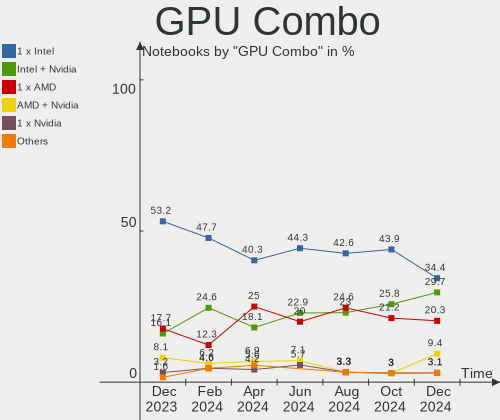
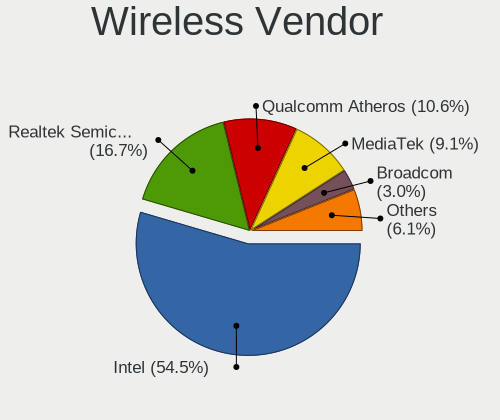

Manjaro - Hardware Trends (Notebooks)
-------------------------------------

A project to identify most popular hardware characteristics and track their change
over time based on data collected by Linux users at https://Linux-Hardware.org.

Anyone can contribute to this report by the [hw-probe](https://github.com/linuxhw/hw-probe) tool:

    sudo -E hw-probe -all -upload

This report is for one last month. Overall report since the beginning of time: [TestCoverage](https://github.com/linuxhw/TestCoverage)

Period: Jan, 2023.

Contents
--------

* [ System ](#system)
  - [ OS                       ](#os)
  - [ OS Family                ](#os-family)
  - [ Kernel                   ](#kernel)
  - [ Kernel Family            ](#kernel-family)
  - [ Kernel Major Ver.        ](#kernel-major-ver)
  - [ Arch                     ](#arch)
  - [ DE                       ](#de)
  - [ Display Server           ](#display-server)
  - [ Display Manager          ](#display-manager)
  - [ OS Lang                  ](#os-lang)
  - [ Boot Mode                ](#boot-mode)
  - [ Filesystem               ](#filesystem)
  - [ Part. scheme             ](#part-scheme)
  - [ Dual Boot with Linux/BSD ](#dual-boot-with-linuxbsd)
  - [ Dual Boot (Win)          ](#dual-boot-win)

* [ Board ](#board)
  - [ Vendor                   ](#vendor)
  - [ Model                    ](#model)
  - [ Model Family             ](#model-family)
  - [ MFG Year                 ](#mfg-year)
  - [ Form Factor              ](#form-factor)
  - [ Secure Boot              ](#secure-boot)
  - [ Coreboot                 ](#coreboot)
  - [ RAM Size                 ](#ram-size)
  - [ RAM Used                 ](#ram-used)
  - [ Total Drives             ](#total-drives)
  - [ Has CD-ROM               ](#has-cd-rom)
  - [ Has Ethernet             ](#has-ethernet)
  - [ Has WiFi                 ](#has-wifi)
  - [ Has Bluetooth            ](#has-bluetooth)

* [ Location ](#location)
  - [ Country                  ](#country)
  - [ City                     ](#city)

* [ Drives ](#drives)
  - [ Drive Vendor             ](#drive-vendor)
  - [ Drive Model              ](#drive-model)
  - [ HDD Vendor               ](#hdd-vendor)
  - [ SSD Vendor               ](#ssd-vendor)
  - [ Drive Kind               ](#drive-kind)
  - [ Drive Connector          ](#drive-connector)
  - [ Drive Size               ](#drive-size)
  - [ Space Total              ](#space-total)
  - [ Space Used               ](#space-used)
  - [ Malfunc. Drives          ](#malfunc-drives)
  - [ Malfunc. Drive Vendor    ](#malfunc-drive-vendor)
  - [ Malfunc. HDD Vendor      ](#malfunc-hdd-vendor)
  - [ Malfunc. Drive Kind      ](#malfunc-drive-kind)
  - [ Failed Drives            ](#failed-drives)
  - [ Failed Drive Vendor      ](#failed-drive-vendor)
  - [ Drive Status             ](#drive-status)

* [ Storage controller ](#storage-controller)
  - [ Storage Vendor           ](#storage-vendor)
  - [ Storage Model            ](#storage-model)
  - [ Storage Kind             ](#storage-kind)

* [ Processor ](#processor)
  - [ CPU Vendor               ](#cpu-vendor)
  - [ CPU Model                ](#cpu-model)
  - [ CPU Model Family         ](#cpu-model-family)
  - [ CPU Cores                ](#cpu-cores)
  - [ CPU Sockets              ](#cpu-sockets)
  - [ CPU Threads              ](#cpu-threads)
  - [ CPU Op-Modes             ](#cpu-op-modes)
  - [ CPU Microcode            ](#cpu-microcode)
  - [ CPU Microarch            ](#cpu-microarch)

* [ Graphics ](#graphics)
  - [ GPU Vendor               ](#gpu-vendor)
  - [ GPU Model                ](#gpu-model)
  - [ GPU Combo                ](#gpu-combo)
  - [ GPU Driver               ](#gpu-driver)
  - [ GPU Memory               ](#gpu-memory)

* [ Monitor ](#monitor)
  - [ Monitor Vendor           ](#monitor-vendor)
  - [ Monitor Model            ](#monitor-model)
  - [ Monitor Resolution       ](#monitor-resolution)
  - [ Monitor Diagonal         ](#monitor-diagonal)
  - [ Monitor Width            ](#monitor-width)
  - [ Aspect Ratio             ](#aspect-ratio)
  - [ Monitor Area             ](#monitor-area)
  - [ Pixel Density            ](#pixel-density)
  - [ Multiple Monitors        ](#multiple-monitors)

* [ Network ](#network)
  - [ Net Controller Vendor    ](#net-controller-vendor)
  - [ Net Controller Model     ](#net-controller-model)
  - [ Wireless Vendor          ](#wireless-vendor)
  - [ Wireless Model           ](#wireless-model)
  - [ Ethernet Vendor          ](#ethernet-vendor)
  - [ Ethernet Model           ](#ethernet-model)
  - [ Net Controller Kind      ](#net-controller-kind)
  - [ Used Controller          ](#used-controller)
  - [ NICs                     ](#nics)
  - [ IPv6                     ](#ipv6)

* [ Bluetooth ](#bluetooth)
  - [ Bluetooth Vendor         ](#bluetooth-vendor)
  - [ Bluetooth Model          ](#bluetooth-model)

* [ Sound ](#sound)
  - [ Sound Vendor             ](#sound-vendor)
  - [ Sound Model              ](#sound-model)

* [ Memory ](#memory)
  - [ Memory Vendor            ](#memory-vendor)
  - [ Memory Model             ](#memory-model)
  - [ Memory Kind              ](#memory-kind)
  - [ Memory Form Factor       ](#memory-form-factor)
  - [ Memory Size              ](#memory-size)
  - [ Memory Speed             ](#memory-speed)

* [ Printers & scanners ](#printers--scanners)
  - [ Printer Vendor           ](#printer-vendor)
  - [ Printer Model            ](#printer-model)
  - [ Scanner Vendor           ](#scanner-vendor)
  - [ Scanner Model            ](#scanner-model)

* [ Camera ](#camera)
  - [ Camera Vendor            ](#camera-vendor)
  - [ Camera Model             ](#camera-model)

* [ Security ](#security)
  - [ Fingerprint Vendor       ](#fingerprint-vendor)
  - [ Fingerprint Model        ](#fingerprint-model)
  - [ Chipcard Vendor          ](#chipcard-vendor)
  - [ Chipcard Model           ](#chipcard-model)

* [ Unsupported ](#unsupported)
  - [ Unsupported Devices      ](#unsupported-devices)
  - [ Unsupported Device Types ](#unsupported-device-types)

System
------

OS
--

Installed operating systems

| Name           | Notebooks | Percent |
|----------------|-----------|---------|
| Manjaro        | 42        | 46.15%  |
| Manjaro 22.0.0 | 28        | 30.77%  |
| Manjaro 22.0   | 11        | 12.09%  |
| Manjaro 22.0.1 | 9         | 9.89%   |
| Manjaro 21.0.7 | 1         | 1.1%    |

OS Family
---------

OS without a version

| Name    | Notebooks | Percent |
|---------|-----------|---------|
| Manjaro | 91        | 100%    |

Kernel
------

Version of the Linux kernel

| Version              | Notebooks | Percent |
|----------------------|-----------|---------|
| 6.1.1-1-MANJARO      | 36        | 39.56%  |
| 5.15.85-1-MANJARO    | 22        | 24.18%  |
| 6.1.7-1-MANJARO      | 11        | 12.09%  |
| 6.0.15-1-MANJARO     | 5         | 5.49%   |
| 5.15.89-1-MANJARO    | 3         | 3.3%    |
| 6.0.5-2-rt14-MANJARO | 2         | 2.2%    |
| 5.19.17-2-MANJARO    | 2         | 2.2%    |
| 5.10.161-1-MANJARO   | 2         | 2.2%    |
| 6.0.15-1-espMANJARO  | 1         | 1.1%    |
| 5.19.16-2-MANJARO    | 1         | 1.1%    |
| 5.19.0-2-MANJARO     | 1         | 1.1%    |
| 5.15.72-1-MANJARO    | 1         | 1.1%    |
| 5.14.21-2-MANJARO    | 1         | 1.1%    |
| 5.13.19-2-MANJARO    | 1         | 1.1%    |
| 5.10.42-1-MANJARO    | 1         | 1.1%    |
| 5.10.164-1-MANJARO   | 1         | 1.1%    |

Kernel Family
-------------

Linux kernel without a distro release

| Version  | Notebooks | Percent |
|----------|-----------|---------|
| 6.1.1    | 36        | 39.56%  |
| 5.15.85  | 22        | 24.18%  |
| 6.1.7    | 11        | 12.09%  |
| 6.0.15   | 6         | 6.59%   |
| 5.15.89  | 3         | 3.3%    |
| 6.0.5    | 2         | 2.2%    |
| 5.19.17  | 2         | 2.2%    |
| 5.10.161 | 2         | 2.2%    |
| 5.19.16  | 1         | 1.1%    |
| 5.19.0   | 1         | 1.1%    |
| 5.15.72  | 1         | 1.1%    |
| 5.14.21  | 1         | 1.1%    |
| 5.13.19  | 1         | 1.1%    |
| 5.10.42  | 1         | 1.1%    |
| 5.10.164 | 1         | 1.1%    |

Kernel Major Ver.
-----------------

Linux kernel major version

| Version | Notebooks | Percent |
|---------|-----------|---------|
| 6.1     | 47        | 51.65%  |
| 5.15    | 26        | 28.57%  |
| 6.0     | 8         | 8.79%   |
| 5.19    | 4         | 4.4%    |
| 5.10    | 4         | 4.4%    |
| 5.14    | 1         | 1.1%    |
| 5.13    | 1         | 1.1%    |

Arch
----

OS architecture (x86_64, i586, etc.)

| Name   | Notebooks | Percent |
|--------|-----------|---------|
| x86_64 | 91        | 100%    |

DE
--

Desktop Environment

| Name       | Notebooks | Percent |
|------------|-----------|---------|
| KDE5       | 47        | 51.65%  |
| GNOME      | 21        | 23.08%  |
| XFCE       | 13        | 14.29%  |
| X-Cinnamon | 6         | 6.59%   |
| MATE       | 2         | 2.2%    |
| i3         | 1         | 1.1%    |
| Unknown    | 1         | 1.1%    |

Display Server
--------------

X11 or Wayland

| Name    | Notebooks | Percent |
|---------|-----------|---------|
| X11     | 73        | 80.22%  |
| Wayland | 16        | 17.58%  |
| Tty     | 1         | 1.1%    |
| Unknown | 1         | 1.1%    |

Display Manager
---------------

SDDM, LightDM, etc.

| Name    | Notebooks | Percent |
|---------|-----------|---------|
| Unknown | 42        | 46.15%  |
| SDDM    | 20        | 21.98%  |
| LightDM | 18        | 19.78%  |
| GDM     | 11        | 12.09%  |

OS Lang
-------

Language

| Lang    | Notebooks | Percent |
|---------|-----------|---------|
| en_US   | 42        | 46.15%  |
| en_GB   | 8         | 8.79%   |
| fr_FR   | 5         | 5.49%   |
| de_DE   | 4         | 4.4%    |
| ru_RU   | 3         | 3.3%    |
| pt_BR   | 3         | 3.3%    |
| nl_NL   | 3         | 3.3%    |
| es_MX   | 3         | 3.3%    |
| pt_PT   | 2         | 2.2%    |
| pl_PL   | 2         | 2.2%    |
| es_ES   | 2         | 2.2%    |
| en_CA   | 2         | 2.2%    |
| C       | 2         | 2.2%    |
| zh_TW   | 1         | 1.1%    |
| zh_CN   | 1         | 1.1%    |
| sv_SE   | 1         | 1.1%    |
| it_IT   | 1         | 1.1%    |
| es_CO   | 1         | 1.1%    |
| es_CL   | 1         | 1.1%    |
| de_AT   | 1         | 1.1%    |
| Default | 1         | 1.1%    |
| bg_BG   | 1         | 1.1%    |
| Unknown | 1         | 1.1%    |

Boot Mode
---------

EFI or BIOS

| Mode | Notebooks | Percent |
|------|-----------|---------|
| BIOS | 46        | 50.55%  |
| EFI  | 45        | 49.45%  |

Filesystem
----------

Type of filesystem

| Type  | Notebooks | Percent |
|-------|-----------|---------|
| Ext4  | 75        | 82.42%  |
| Btrfs | 14        | 15.38%  |
| Xfs   | 1         | 1.1%    |
| Tmpfs | 1         | 1.1%    |

Part. scheme
------------

Scheme of partitioning

| Type    | Notebooks | Percent |
|---------|-----------|---------|
| GPT     | 50        | 54.95%  |
| Unknown | 40        | 43.96%  |
| MBR     | 1         | 1.1%    |

Dual Boot with Linux/BSD
------------------------

Hosting more than one Linux/BSD

| Dual boot | Notebooks | Percent |
|-----------|-----------|---------|
| No        | 85        | 93.41%  |
| Yes       | 6         | 6.59%   |

Dual Boot (Win)
---------------

Hosting Linux and Windows

| Dual boot | Notebooks | Percent |
|-----------|-----------|---------|
| No        | 74        | 81.32%  |
| Yes       | 17        | 18.68%  |

Board
-----

Vendor
------

Motherboard manufacturer

| Name                | Notebooks | Percent |
|---------------------|-----------|---------|
| Lenovo              | 24        | 26.37%  |
| Hewlett-Packard     | 19        | 20.88%  |
| Dell                | 10        | 10.99%  |
| Acer                | 8         | 8.79%   |
| ASUSTek Computer    | 7         | 7.69%   |
| MSI                 | 3         | 3.3%    |
| Apple               | 3         | 3.3%    |
| Schenker            | 2         | 2.2%    |
| Samsung Electronics | 2         | 2.2%    |
| Medion              | 2         | 2.2%    |
| TUXEDO              | 1         | 1.1%    |
| Toshiba             | 1         | 1.1%    |
| System76            | 1         | 1.1%    |
| Sony                | 1         | 1.1%    |
| realme              | 1         | 1.1%    |
| PC Specialist       | 1         | 1.1%    |
| Notebook            | 1         | 1.1%    |
| LG Electronics      | 1         | 1.1%    |
| IPASON              | 1         | 1.1%    |
| HUAWEI              | 1         | 1.1%    |
| HONOR               | 1         | 1.1%    |

Model
-----

Motherboard model

| Name                                   | Notebooks | Percent |
|----------------------------------------|-----------|---------|
| Lenovo IdeaPad 5 14ALC05 82LM          | 2         | 2.2%    |
| HP Laptop 15s-eq2xxx                   | 2         | 2.2%    |
| HP EliteBook 840 G5                    | 2         | 2.2%    |
| TUXEDO Aura 15 Gen1                    | 1         | 1.1%    |
| Toshiba Satellite C50-C                | 1         | 1.1%    |
| System76 Darter UltraThin              | 1         | 1.1%    |
| Sony SVS1512U1RW                       | 1         | 1.1%    |
| Schenker XMG FUSION 15 (XFU15L19)      | 1         | 1.1%    |
| Schenker VISION 15 (SVS15E21)          | 1         | 1.1%    |
| Samsung R530/R730                      | 1         | 1.1%    |
| Samsung 350V5C/351V5C/3540VC/3440VC    | 1         | 1.1%    |
| realme CloudProXXXX                    | 1         | 1.1%    |
| PC Specialist NH5x_7xRCx,RDx           | 1         | 1.1%    |
| Notebook L14xMU                        | 1         | 1.1%    |
| MSI Prestige 15 A11SCX                 | 1         | 1.1%    |
| MSI Modern 14 A10RB                    | 1         | 1.1%    |
| MSI GS63 Stealth 8RE                   | 1         | 1.1%    |
| Medion E4251 MD61435                   | 1         | 1.1%    |
| Medion E4251                           | 1         | 1.1%    |
| LG 17Z90N-R.AAS9U1                     | 1         | 1.1%    |
| Lenovo Z50-75 80EC                     | 1         | 1.1%    |
| Lenovo Yoga 900-13ISK 80MK             | 1         | 1.1%    |
| Lenovo V15 G2 ITL 82KB                 | 1         | 1.1%    |
| Lenovo ThinkPad X270 20K5S1A524        | 1         | 1.1%    |
| Lenovo ThinkPad X230 23254UY           | 1         | 1.1%    |
| Lenovo ThinkPad X1 Carbon 3460AN4      | 1         | 1.1%    |
| Lenovo ThinkPad T490 20N20048GE        | 1         | 1.1%    |
| Lenovo ThinkPad T480 20L50011US        | 1         | 1.1%    |
| Lenovo ThinkPad T480 20L50000UK        | 1         | 1.1%    |
| Lenovo ThinkPad T14s Gen 2a 20XF006FGE | 1         | 1.1%    |
| Lenovo ThinkPad T14s Gen 1 20UJS2YE00  | 1         | 1.1%    |
| Lenovo ThinkPad T14 Gen 2i 20W0003KUS  | 1         | 1.1%    |
| Lenovo ThinkPad P15 Gen 2i 20YRS7H900  | 1         | 1.1%    |
| Lenovo ThinkPad L440 20ASEB3           | 1         | 1.1%    |
| Lenovo ThinkPad E485 20KUCTO1WW        | 1         | 1.1%    |
| Lenovo ThinkPad E480 20KN0064PB        | 1         | 1.1%    |
| Lenovo ThinkPad E14 Gen 3 20Y7CTO1WW   | 1         | 1.1%    |
| Lenovo Legion 5 Pro 16ACH6 82JS        | 1         | 1.1%    |
| Lenovo IdeaPad S540-14IWL 81ND         | 1         | 1.1%    |
| Lenovo IdeaPad 330-15IGM 81D1          | 1         | 1.1%    |

Model Family
------------

Motherboard model prefix

| Name                | Notebooks | Percent |
|---------------------|-----------|---------|
| Lenovo ThinkPad     | 14        | 15.38%  |
| HP Laptop           | 6         | 6.59%   |
| Lenovo IdeaPad      | 5         | 5.49%   |
| HP EliteBook        | 4         | 4.4%    |
| Acer Aspire         | 4         | 4.4%    |
| HP Pavilion         | 3         | 3.3%    |
| Dell XPS            | 3         | 3.3%    |
| Dell Inspiron       | 3         | 3.3%    |
| Medion E4251        | 2         | 2.2%    |
| HP ProBook          | 2         | 2.2%    |
| HP OMEN             | 2         | 2.2%    |
| Dell Latitude       | 2         | 2.2%    |
| ASUS VivoBook       | 2         | 2.2%    |
| Acer Predator       | 2         | 2.2%    |
| TUXEDO Aura         | 1         | 1.1%    |
| Toshiba Satellite   | 1         | 1.1%    |
| System76 Darter     | 1         | 1.1%    |
| Sony SVS1512U1RW    | 1         | 1.1%    |
| Schenker XMG        | 1         | 1.1%    |
| Schenker VISION     | 1         | 1.1%    |
| Samsung R530        | 1         | 1.1%    |
| Samsung 350V5C      | 1         | 1.1%    |
| realme CloudProXXXX | 1         | 1.1%    |
| PC Specialist NH5x  | 1         | 1.1%    |
| Notebook L14xMU     | 1         | 1.1%    |
| MSI Prestige        | 1         | 1.1%    |
| MSI Modern          | 1         | 1.1%    |
| MSI GS63            | 1         | 1.1%    |
| LG 17Z90N-R.AAS9U1  | 1         | 1.1%    |
| Lenovo Z50-75       | 1         | 1.1%    |
| Lenovo Yoga         | 1         | 1.1%    |
| Lenovo V15          | 1         | 1.1%    |
| Lenovo Legion       | 1         | 1.1%    |
| Lenovo B50-30       | 1         | 1.1%    |
| IPASON MaxBook      | 1         | 1.1%    |
| HUAWEI VLT-WX0      | 1         | 1.1%    |
| HONOR NMH-WCX9      | 1         | 1.1%    |
| HP ZBook            | 1         | 1.1%    |
| HP Compaq           | 1         | 1.1%    |
| Dell Precision      | 1         | 1.1%    |

MFG Year
--------

Motherboard manufacture year

| Year | Notebooks | Percent |
|------|-----------|---------|
| 2021 | 18        | 19.78%  |
| 2020 | 15        | 16.48%  |
| 2018 | 14        | 15.38%  |
| 2019 | 12        | 13.19%  |
| 2014 | 6         | 6.59%   |
| 2013 | 6         | 6.59%   |
| 2012 | 6         | 6.59%   |
| 2022 | 4         | 4.4%    |
| 2017 | 4         | 4.4%    |
| 2009 | 3         | 3.3%    |
| 2015 | 2         | 2.2%    |
| 2010 | 1         | 1.1%    |

Form Factor
-----------

Physical design of the computer

| Name     | Notebooks | Percent |
|----------|-----------|---------|
| Notebook | 91        | 100%    |

Secure Boot
-----------

Enabled or disabled

| State    | Notebooks | Percent |
|----------|-----------|---------|
| Disabled | 91        | 100%    |

Coreboot
--------

Have coreboot on board

| Used | Notebooks | Percent |
|------|-----------|---------|
| No   | 91        | 100%    |

RAM Size
--------

Total RAM memory

| Size in GB  | Notebooks | Percent |
|-------------|-----------|---------|
| 4.01-8.0    | 23        | 25.27%  |
| 16.01-24.0  | 20        | 21.98%  |
| 8.01-16.0   | 20        | 21.98%  |
| 32.01-64.0  | 14        | 15.38%  |
| 3.01-4.0    | 10        | 10.99%  |
| 24.01-32.0  | 3         | 3.3%    |
| 64.01-256.0 | 1         | 1.1%    |

RAM Used
--------

Used RAM memory

| Used GB    | Notebooks | Percent |
|------------|-----------|---------|
| 4.01-8.0   | 28        | 30.77%  |
| 2.01-3.0   | 21        | 23.08%  |
| 3.01-4.0   | 19        | 20.88%  |
| 1.01-2.0   | 15        | 16.48%  |
| 8.01-16.0  | 7         | 7.69%   |
| 16.01-24.0 | 1         | 1.1%    |

Total Drives
------------

Number of drives on board

| Drives | Notebooks | Percent |
|--------|-----------|---------|
| 1      | 72        | 79.12%  |
| 2      | 15        | 16.48%  |
| 3      | 4         | 4.4%    |

Has CD-ROM
----------

Has CD-ROM on board

| Presented | Notebooks | Percent |
|-----------|-----------|---------|
| No        | 75        | 82.42%  |
| Yes       | 16        | 17.58%  |

Has Ethernet
------------

Has Ethernet on board

| Presented | Notebooks | Percent |
|-----------|-----------|---------|
| Yes       | 64        | 70.33%  |
| No        | 27        | 29.67%  |

Has WiFi
--------

Has WiFi module

| Presented | Notebooks | Percent |
|-----------|-----------|---------|
| Yes       | 91        | 100%    |

Has Bluetooth
-------------

Has Bluetooth module

| Presented | Notebooks | Percent |
|-----------|-----------|---------|
| Yes       | 81        | 89.01%  |
| No        | 10        | 10.99%  |

Location
--------

Country
-------

Geographic location (country)

| Country      | Notebooks | Percent |
|--------------|-----------|---------|
| USA          | 13        | 14.29%  |
| France       | 9         | 9.89%   |
| Russia       | 7         | 7.69%   |
| Netherlands  | 5         | 5.49%   |
| Germany      | 5         | 5.49%   |
| Italy        | 4         | 4.4%    |
| Spain        | 3         | 3.3%    |
| Poland       | 3         | 3.3%    |
| Bulgaria     | 3         | 3.3%    |
| Brazil       | 3         | 3.3%    |
| UK           | 2         | 2.2%    |
| Sweden       | 2         | 2.2%    |
| Portugal     | 2         | 2.2%    |
| Mexico       | 2         | 2.2%    |
| Indonesia    | 2         | 2.2%    |
| Chile        | 2         | 2.2%    |
| Canada       | 2         | 2.2%    |
| Turkey       | 1         | 1.1%    |
| Taiwan       | 1         | 1.1%    |
| Switzerland  | 1         | 1.1%    |
| Slovenia     | 1         | 1.1%    |
| Saudi Arabia | 1         | 1.1%    |
| Oman         | 1         | 1.1%    |
| Nicaragua    | 1         | 1.1%    |
| Kazakhstan   | 1         | 1.1%    |
| Japan        | 1         | 1.1%    |
| India        | 1         | 1.1%    |
| Ghana        | 1         | 1.1%    |
| Georgia      | 1         | 1.1%    |
| Finland      | 1         | 1.1%    |
| El Salvador  | 1         | 1.1%    |
| Egypt        | 1         | 1.1%    |
| Denmark      | 1         | 1.1%    |
| Czechia      | 1         | 1.1%    |
| Colombia     | 1         | 1.1%    |
| China        | 1         | 1.1%    |
| Bolivia      | 1         | 1.1%    |
| Austria      | 1         | 1.1%    |
| Argentina    | 1         | 1.1%    |

City
----

Geographic location (city)

| City                 | Notebooks | Percent |
|----------------------|-----------|---------|
| Moscow               | 3         | 3.3%    |
| Warsaw               | 2         | 2.2%    |
| St Petersburg        | 2         | 2.2%    |
| Narbonne             | 2         | 2.2%    |
| Madrid               | 2         | 2.2%    |
| Blaricum             | 2         | 2.2%    |
| Waldshut-Tiengen     | 1         | 1.1%    |
| Vienna               | 1         | 1.1%    |
| Urbana               | 1         | 1.1%    |
| Tucson               | 1         | 1.1%    |
| Tokyo                | 1         | 1.1%    |
| Taman Sari           | 1         | 1.1%    |
| Taipei               | 1         | 1.1%    |
| Sundbyberg           | 1         | 1.1%    |
| Spokane              | 1         | 1.1%    |
| Sofia                | 1         | 1.1%    |
| Shanghai             | 1         | 1.1%    |
| Semarang             | 1         | 1.1%    |
| Scottsdale           | 1         | 1.1%    |
| Sao Paulo            | 1         | 1.1%    |
| Santiago             | 1         | 1.1%    |
| Santa Cruz           | 1         | 1.1%    |
| San Salvador         | 1         | 1.1%    |
| San Antonio          | 1         | 1.1%    |
| Saint-Clair-du-Rhone | 1         | 1.1%    |
| Rouen                | 1         | 1.1%    |
| Roswell              | 1         | 1.1%    |
| Ronchamp             | 1         | 1.1%    |
| Rome                 | 1         | 1.1%    |
| Quinta Do Conde      | 1         | 1.1%    |
| Prien am Chiemsee    | 1         | 1.1%    |
| Presidente Prudente  | 1         | 1.1%    |
| Poznan               | 1         | 1.1%    |
| Plovdiv              | 1         | 1.1%    |
| Pavlodar             | 1         | 1.1%    |
| Ottawa               | 1         | 1.1%    |
| Osnabrück           | 1         | 1.1%    |
| Olympia              | 1         | 1.1%    |
| Olivos               | 1         | 1.1%    |
| Nuremberg            | 1         | 1.1%    |

Drives
------

Drive Vendor
------------

Hard drive vendors

| Vendor                       | Notebooks | Drives | Percent |
|------------------------------|-----------|--------|---------|
| Samsung Electronics          | 24        | 25     | 20.87%  |
| Sandisk                      | 14        | 14     | 12.17%  |
| WDC                          | 11        | 11     | 9.57%   |
| SK hynix                     | 9         | 9      | 7.83%   |
| Seagate                      | 6         | 6      | 5.22%   |
| Toshiba                      | 4         | 4      | 3.48%   |
| Kingston                     | 4         | 4      | 3.48%   |
| Crucial                      | 4         | 4      | 3.48%   |
| Micron Technology            | 3         | 3      | 2.61%   |
| KIOXIA                       | 3         | 3      | 2.61%   |
| Intel                        | 3         | 4      | 2.61%   |
| A-DATA Technology            | 3         | 3      | 2.61%   |
| Union Memory (Shenzhen)      | 2         | 2      | 1.74%   |
| Silicon Motion               | 2         | 2      | 1.74%   |
| Phison Electronics           | 2         | 2      | 1.74%   |
| Hitachi                      | 2         | 2      | 1.74%   |
| ADATA Technology             | 2         | 2      | 1.74%   |
| V-GeN                        | 1         | 1      | 0.87%   |
| Unknown                      | 1         | 1      | 0.87%   |
| TwinMOS                      | 1         | 1      | 0.87%   |
| Thinkplus                    | 1         | 1      | 0.87%   |
| Solid State Storage          | 1         | 1      | 0.87%   |
| Shenzhen Longsys Electronics | 1         | 1      | 0.87%   |
| Realtek Semiconductor        | 1         | 1      | 0.87%   |
| Phison                       | 1         | 1      | 0.87%   |
| Micron/Crucial Technology    | 1         | 1      | 0.87%   |
| LITEONIT                     | 1         | 1      | 0.87%   |
| Lexar                        | 1         | 1      | 0.87%   |
| Lenovo                       | 1         | 1      | 0.87%   |
| Kingston Technology Company  | 1         | 1      | 0.87%   |
| HS-SSD-C100                  | 1         | 1      | 0.87%   |
| HGST                         | 1         | 1      | 0.87%   |
| Apple                        | 1         | 1      | 0.87%   |
| Unknown                      | 1         | 1      | 0.87%   |

Drive Model
-----------

Hard drive models

| Model                                                             | Notebooks | Percent |
|-------------------------------------------------------------------|-----------|---------|
| Samsung NVMe SSD Controller SM981/PM981/PM983 500GB               | 11        | 9.48%   |
| Toshiba MQ04ABF100 1TB                                            | 2         | 1.72%   |
| Silicon Motion SM2263EN/SM2263XT SSD Controller 512GB             | 2         | 1.72%   |
| Seagate ST2000LM007-1R8174 2TB                                    | 2         | 1.72%   |
| Sandisk WD Black SN850 2TB                                        | 2         | 1.72%   |
| Sandisk WD Black SN750 / PC SN730 NVMe SSD 1TB                    | 2         | 1.72%   |
| Sandisk WD Black 2018/SN750 / PC SN720 NVMe SSD 512GB             | 2         | 1.72%   |
| SanDisk SD9SN8W-128G-1006 128GB SSD                               | 2         | 1.72%   |
| Samsung SSD 980 1TB                                               | 2         | 1.72%   |
| Samsung NVMe SSD Controller SM961/PM961/SM963 256GB               | 2         | 1.72%   |
| Samsung MZALQ512HBLU-00BL2 512GB                                  | 2         | 1.72%   |
| Kingston SA400S37960G 960GB SSD                                   | 2         | 1.72%   |
| Intel SSDPEKNU512GZ 512GB                                         | 2         | 1.72%   |
| ADATA XPG SX8200 Pro PCIe Gen3x4 M.2 2280 Solid State Drive 256GB | 2         | 1.72%   |
| WDC WDS500G2B0A-00SM50 500GB SSD                                  | 1         | 0.86%   |
| WDC WDS100T2B0A-00SM50 1TB SSD                                    | 1         | 0.86%   |
| WDC WDS100T1R0B-68A4Z0 1TB SSD                                    | 1         | 0.86%   |
| WDC WD5000LPCX-24VHAT0 500GB                                      | 1         | 0.86%   |
| WDC WD2500BEKT-60F3T1 250GB                                       | 1         | 0.86%   |
| WDC WD10SPZX-22Z10T1 1TB                                          | 1         | 0.86%   |
| WDC WD10SPZX-17Z10T1 1TB                                          | 1         | 0.86%   |
| WDC WD10JUCT-63CYNY0 1TB                                          | 1         | 0.86%   |
| WDC WD10JPVX-60JC3T1 1TB                                          | 1         | 0.86%   |
| WDC WD10JPVX-60JC3T0 1TB                                          | 1         | 0.86%   |
| WDC WD10JPVX-00JC3T0 1TB                                          | 1         | 0.86%   |
| V-GeN V-GEN10SM21SCY512IN 512GB SSD                               | 1         | 0.86%   |
| Unknown MMC Card  128GB                                           | 1         | 0.86%   |
| Union Memory (Shenzhen) UMIS RPETJ512MGE2QDQ 512GB                | 1         | 0.86%   |
| Union Memory (Shenzhen) RPFTJ256PDD2MWX 256GB                     | 1         | 0.86%   |
| TwinMOS SSD 128GB                                                 | 1         | 0.86%   |
| Toshiba HDWJ110 1TB                                               | 1         | 0.86%   |
| Toshiba BG3 NVMe SSD Controller 256GB                             | 1         | 0.86%   |
| Thinkplus SSD ST900 M.2 256G                                      | 1         | 0.86%   |
| Solid State Storage SSSTC CL1-8D512 512GB                         | 1         | 0.86%   |
| SK hynix SKHynix_HFS512GDE9X081N 512GB                            | 1         | 0.86%   |
| SK hynix SKHynix_HFM512GD3HX015N 512GB                            | 1         | 0.86%   |
| SK hynix SHGS31-500GS-2 500GB SSD                                 | 1         | 0.86%   |
| SK hynix PC711 HFS001TDE9X073N 1TB                                | 1         | 0.86%   |
| SK hynix PC611 NVMe 1TB                                           | 1         | 0.86%   |
| SK hynix PC401 NVMe Solid State Drive 256GB                       | 1         | 0.86%   |

HDD Vendor
----------

Hard disk drive vendors

| Vendor              | Notebooks | Drives | Percent |
|---------------------|-----------|--------|---------|
| WDC                 | 8         | 8      | 38.1%   |
| Seagate             | 6         | 6      | 28.57%  |
| Toshiba             | 3         | 3      | 14.29%  |
| Hitachi             | 2         | 2      | 9.52%   |
| Samsung Electronics | 1         | 1      | 4.76%   |
| HGST                | 1         | 1      | 4.76%   |

SSD Vendor
----------

Solid state drive vendors

| Vendor            | Notebooks | Drives | Percent |
|-------------------|-----------|--------|---------|
| SanDisk           | 4         | 4      | 13.79%  |
| Crucial           | 4         | 4      | 13.79%  |
| WDC               | 3         | 3      | 10.34%  |
| Kingston          | 3         | 3      | 10.34%  |
| A-DATA Technology | 3         | 3      | 10.34%  |
| SK hynix          | 2         | 2      | 6.9%    |
| V-GeN             | 1         | 1      | 3.45%   |
| TwinMOS           | 1         | 1      | 3.45%   |
| Thinkplus         | 1         | 1      | 3.45%   |
| Phison            | 1         | 1      | 3.45%   |
| Micron Technology | 1         | 1      | 3.45%   |
| LITEONIT          | 1         | 1      | 3.45%   |
| Lexar             | 1         | 1      | 3.45%   |
| HS-SSD-C100       | 1         | 1      | 3.45%   |
| Apple             | 1         | 1      | 3.45%   |
| Unknown           | 1         | 1      | 3.45%   |

Drive Kind
----------

HDD or SSD

| Kind | Notebooks | Drives | Percent |
|------|-----------|--------|---------|
| NVMe | 57        | 66     | 54.29%  |
| SSD  | 26        | 29     | 24.76%  |
| HDD  | 21        | 21     | 20%     |
| MMC  | 1         | 1      | 0.95%   |

Drive Connector
---------------

SATA, SAS, NVMe, etc.

| Type | Notebooks | Drives | Percent |
|------|-----------|--------|---------|
| NVMe | 57        | 66     | 57%     |
| SATA | 42        | 50     | 42%     |
| MMC  | 1         | 1      | 1%      |

Drive Size
----------

Size of hard drive

| Size in TB | Notebooks | Drives | Percent |
|------------|-----------|--------|---------|
| 0.01-0.5   | 26        | 28     | 55.32%  |
| 0.51-1.0   | 18        | 19     | 38.3%   |
| 1.01-2.0   | 3         | 3      | 6.38%   |

Space Total
-----------

Amount of disk space available on the file system

| Size in GB     | Notebooks | Percent |
|----------------|-----------|---------|
| 251-500        | 27        | 29.67%  |
| 501-1000       | 21        | 23.08%  |
| 101-250        | 17        | 18.68%  |
| Unknown        | 9         | 9.89%   |
| 1001-2000      | 8         | 8.79%   |
| 2001-3000      | 4         | 4.4%    |
| More than 3000 | 2         | 2.2%    |
| 51-100         | 2         | 2.2%    |
| 1-20           | 1         | 1.1%    |

Space Used
----------

Amount of used disk space

| Used GB   | Notebooks | Percent |
|-----------|-----------|---------|
| 251-500   | 18        | 19.78%  |
| 51-100    | 17        | 18.68%  |
| 101-250   | 13        | 14.29%  |
| 1-20      | 12        | 13.19%  |
| 21-50     | 10        | 10.99%  |
| 501-1000  | 10        | 10.99%  |
| Unknown   | 9         | 9.89%   |
| 2001-3000 | 1         | 1.1%    |
| 1001-2000 | 1         | 1.1%    |

Malfunc. Drives
---------------

Drive models with a malfunction

| Model             | Notebooks | Drives | Percent |
|-------------------|-----------|--------|---------|
| TwinMOS SSD 128GB | 1         | 1      | 100%    |

Malfunc. Drive Vendor
---------------------

Vendors of faulty drives

| Vendor  | Notebooks | Drives | Percent |
|---------|-----------|--------|---------|
| TwinMOS | 1         | 1      | 100%    |

Malfunc. HDD Vendor
-------------------

Vendors of faulty HDD drives

Zero info for selected period =(

Malfunc. Drive Kind
-------------------

Kinds of faulty drives

| Kind | Notebooks | Drives | Percent |
|------|-----------|--------|---------|
| SSD  | 1         | 1      | 100%    |

Failed Drives
-------------

Failed drive models

Zero info for selected period =(

Failed Drive Vendor
-------------------

Failed drive vendors

Zero info for selected period =(

Drive Status
------------

Number of failed and malfunc. drives

| Status   | Notebooks | Drives | Percent |
|----------|-----------|--------|---------|
| Detected | 60        | 75     | 63.16%  |
| Works    | 34        | 41     | 35.79%  |
| Malfunc  | 1         | 1      | 1.05%   |

Storage controller
------------------

Storage Vendor
--------------

Storage controller vendors

| Vendor                         | Notebooks | Percent |
|--------------------------------|-----------|---------|
| Intel                          | 46        | 38.02%  |
| Samsung Electronics            | 23        | 19.01%  |
| AMD                            | 14        | 11.57%  |
| SanDisk                        | 9         | 7.44%   |
| SK hynix                       | 7         | 5.79%   |
| KIOXIA                         | 3         | 2.48%   |
| Union Memory (Shenzhen)        | 2         | 1.65%   |
| Silicon Motion                 | 2         | 1.65%   |
| Phison Electronics             | 2         | 1.65%   |
| Micron Technology              | 2         | 1.65%   |
| Kingston Technology Company    | 2         | 1.65%   |
| ADATA Technology               | 2         | 1.65%   |
| Toshiba America Info Systems   | 1         | 0.83%   |
| Solid State Storage Technology | 1         | 0.83%   |
| Shenzhen Longsys Electronics   | 1         | 0.83%   |
| Realtek Semiconductor          | 1         | 0.83%   |
| Nvidia                         | 1         | 0.83%   |
| Micron/Crucial Technology      | 1         | 0.83%   |
| Lenovo                         | 1         | 0.83%   |

Storage Model
-------------

Storage controller models

| Model                                                                          | Notebooks | Percent |
|--------------------------------------------------------------------------------|-----------|---------|
| AMD FCH SATA Controller [AHCI mode]                                            | 14        | 11.29%  |
| Samsung NVMe SSD Controller SM981/PM981/PM983                                  | 11        | 8.87%   |
| Samsung NVMe SSD Controller 980                                                | 8         | 6.45%   |
| Intel Cannon Lake Mobile PCH SATA AHCI Controller                              | 7         | 5.65%   |
| Intel 7 Series Chipset Family 6-port SATA Controller [AHCI mode]               | 7         | 5.65%   |
| Intel 82801 Mobile SATA Controller [RAID mode]                                 | 5         | 4.03%   |
| Intel Celeron/Pentium Silver Processor SATA Controller                         | 4         | 3.23%   |
| SK hynix Gold P31/PC711 NVMe Solid State Drive                                 | 3         | 2.42%   |
| Intel Volume Management Device NVMe RAID Controller                            | 3         | 2.42%   |
| Intel Sunrise Point-LP SATA Controller [AHCI mode]                             | 3         | 2.42%   |
| Intel Non-Volatile memory controller                                           | 3         | 2.42%   |
| Intel 8 Series SATA Controller 1 [AHCI mode]                                   | 3         | 2.42%   |
| Silicon Motion SM2263EN/SM2263XT SSD Controller                                | 2         | 1.61%   |
| SanDisk WD PC SN810 / Black SN850 NVMe SSD                                     | 2         | 1.61%   |
| SanDisk WD Black 2018/SN750 / PC SN720 NVMe SSD                                | 2         | 1.61%   |
| Samsung NVMe SSD Controller PM9A1/PM9A3/980PRO                                 | 2         | 1.61%   |
| Micron Non-Volatile memory controller                                          | 2         | 1.61%   |
| KIOXIA NVMe SSD Controller BG4                                                 | 2         | 1.61%   |
| Intel 82801IBM/IEM (ICH9M/ICH9M-E) 4 port SATA Controller [AHCI mode]          | 2         | 1.61%   |
| Intel 8 Series/C220 Series Chipset Family 6-port SATA Controller 1 [AHCI mode] | 2         | 1.61%   |
| Intel 400 Series Chipset Family SATA AHCI Controller                           | 2         | 1.61%   |
| ADATA XPG SX8200 Pro PCIe Gen3x4 M.2 2280 Solid State Drive                    | 2         | 1.61%   |
| Union Memory (Shenzhen) Non-Volatile memory controller                         | 1         | 0.81%   |
| Union Memory (Shenzhen) AM630 PCIe 4.0 x4 NVMe SSD Controller                  | 1         | 0.81%   |
| Toshiba America Info Systems BG3 NVMe SSD Controller                           | 1         | 0.81%   |
| Solid State Storage Non-Volatile memory controller                             | 1         | 0.81%   |
| SK hynix PC401 NVMe Solid State Drive 256GB                                    | 1         | 0.81%   |
| SK hynix Non-Volatile memory controller                                        | 1         | 0.81%   |
| SK hynix BC511                                                                 | 1         | 0.81%   |
| SK hynix BC501 NVMe Solid State Drive                                          | 1         | 0.81%   |
| Shenzhen Longsys Electronics Non-Volatile memory controller                    | 1         | 0.81%   |
| SanDisk WD Blue SN570 NVMe SSD                                                 | 1         | 0.81%   |
| SanDisk WD Blue SN550 NVMe SSD                                                 | 1         | 0.81%   |
| SanDisk WD Black SN750 / PC SN730 NVMe SSD                                     | 1         | 0.81%   |
| SanDisk PC SN520 NVMe SSD                                                      | 1         | 0.81%   |
| SanDisk Non-Volatile memory controller                                         | 1         | 0.81%   |
| Samsung NVMe SSD Controller SM961/PM961/SM963                                  | 1         | 0.81%   |
| Samsung Apple PCIe SSD                                                         | 1         | 0.81%   |
| Realtek Realtek Non-Volatile memory controller                                 | 1         | 0.81%   |
| Phison PS5013 E13 NVMe Controller                                              | 1         | 0.81%   |

Storage Kind
------------

Kind of storage controller (IDE, SATA, NVMe, SAS, ...)

| Kind | Notebooks | Percent |
|------|-----------|---------|
| NVMe | 55        | 47.01%  |
| SATA | 52        | 44.44%  |
| RAID | 9         | 7.69%   |
| IDE  | 1         | 0.85%   |

Processor
---------

CPU Vendor
----------

Processor vendors

| Vendor | Notebooks | Percent |
|--------|-----------|---------|
| Intel  | 65        | 71.43%  |
| AMD    | 26        | 28.57%  |

CPU Model
---------

Processor models

| Model                                   | Notebooks | Percent |
|-----------------------------------------|-----------|---------|
| AMD Ryzen 7 5700U with Radeon Graphics  | 5         | 5.49%   |
| Intel Core i7-9750H CPU @ 2.60GHz       | 3         | 3.3%    |
| Intel Core i7-8750H CPU @ 2.20GHz       | 3         | 3.3%    |
| Intel Core i5-8265U CPU @ 1.60GHz       | 3         | 3.3%    |
| Intel Core i5-8250U CPU @ 1.60GHz       | 3         | 3.3%    |
| Intel Core i5-3210M CPU @ 2.50GHz       | 3         | 3.3%    |
| AMD Ryzen 7 5800H with Radeon Graphics  | 3         | 3.3%    |
| Intel Core i7-10750H CPU @ 2.60GHz      | 2         | 2.2%    |
| Intel Core i5-8350U CPU @ 1.70GHz       | 2         | 2.2%    |
| Intel 11th Gen Core i7-1185G7 @ 3.00GHz | 2         | 2.2%    |
| Intel 11th Gen Core i7-1165G7 @ 2.80GHz | 2         | 2.2%    |
| AMD Ryzen 7 4800H with Radeon Graphics  | 2         | 2.2%    |
| AMD Ryzen 5 5500U with Radeon Graphics  | 2         | 2.2%    |
| Intel Core i9-10885H CPU @ 2.40GHz      | 1         | 1.1%    |
| Intel Core i7-8850H CPU @ 2.60GHz       | 1         | 1.1%    |
| Intel Core i7-8650U CPU @ 1.90GHz       | 1         | 1.1%    |
| Intel Core i7-8565U CPU @ 1.80GHz       | 1         | 1.1%    |
| Intel Core i7-7700HQ CPU @ 2.80GHz      | 1         | 1.1%    |
| Intel Core i7-7500U CPU @ 2.70GHz       | 1         | 1.1%    |
| Intel Core i7-6820HQ CPU @ 2.70GHz      | 1         | 1.1%    |
| Intel Core i7-6500U CPU @ 2.50GHz       | 1         | 1.1%    |
| Intel Core i7-4850HQ CPU @ 2.30GHz      | 1         | 1.1%    |
| Intel Core i7-4712MQ CPU @ 2.30GHz      | 1         | 1.1%    |
| Intel Core i7-4500U CPU @ 1.80GHz       | 1         | 1.1%    |
| Intel Core i7-1065G7 CPU @ 1.30GHz      | 1         | 1.1%    |
| Intel Core i7-10610U CPU @ 1.80GHz      | 1         | 1.1%    |
| Intel Core i5-9300H CPU @ 2.40GHz       | 1         | 1.1%    |
| Intel Core i5-8300H CPU @ 2.30GHz       | 1         | 1.1%    |
| Intel Core i5-7200U CPU @ 2.50GHz       | 1         | 1.1%    |
| Intel Core i5-4310U CPU @ 2.00GHz       | 1         | 1.1%    |
| Intel Core i5-4200M CPU @ 2.50GHz       | 1         | 1.1%    |
| Intel Core i5-3427U CPU @ 1.80GHz       | 1         | 1.1%    |
| Intel Core i5-3320M CPU @ 2.60GHz       | 1         | 1.1%    |
| Intel Core i5-3317U CPU @ 1.70GHz       | 1         | 1.1%    |
| Intel Core i5-1035G1 CPU @ 1.00GHz      | 1         | 1.1%    |
| Intel Core i5-10210U CPU @ 1.60GHz      | 1         | 1.1%    |
| Intel Core i5 CPU M 430 @ 2.27GHz       | 1         | 1.1%    |
| Intel Core i3-7020U CPU @ 2.30GHz       | 1         | 1.1%    |
| Intel Core i3-5005U CPU @ 2.00GHz       | 1         | 1.1%    |
| Intel Core i3-4005U CPU @ 1.70GHz       | 1         | 1.1%    |

CPU Model Family
----------------

Processor model prefix

| Model                   | Notebooks | Percent |
|-------------------------|-----------|---------|
| Intel Core i5           | 22        | 24.18%  |
| Intel Core i7           | 20        | 21.98%  |
| AMD Ryzen 7             | 13        | 14.29%  |
| Other                   | 9         | 9.89%   |
| Intel Celeron           | 6         | 6.59%   |
| Intel Core i3           | 4         | 4.4%    |
| AMD Ryzen 5             | 4         | 4.4%    |
| Intel Core 2 Duo        | 2         | 2.2%    |
| AMD Ryzen 7 PRO         | 2         | 2.2%    |
| AMD Ryzen 3             | 2         | 2.2%    |
| Intel Core i9           | 1         | 1.1%    |
| Intel Celeron Dual-Core | 1         | 1.1%    |
| AMD Ryzen 5 PRO         | 1         | 1.1%    |
| AMD FX                  | 1         | 1.1%    |
| AMD E1                  | 1         | 1.1%    |
| AMD A8                  | 1         | 1.1%    |
| AMD A10                 | 1         | 1.1%    |

CPU Cores
---------

Number of processor cores

| Number | Notebooks | Percent |
|--------|-----------|---------|
| 4      | 31        | 34.07%  |
| 2      | 30        | 32.97%  |
| 8      | 16        | 17.58%  |
| 6      | 13        | 14.29%  |
| 12     | 1         | 1.1%    |

CPU Sockets
-----------

Number of sockets

| Number | Notebooks | Percent |
|--------|-----------|---------|
| 1      | 91        | 100%    |

CPU Threads
-----------

Threads per core (Hyper-Threading)

| Number | Notebooks | Percent |
|--------|-----------|---------|
| 2      | 80        | 87.91%  |
| 1      | 11        | 12.09%  |

CPU Op-Modes
------------

CPU Operation Modes (32-bit, 64-bit)

| Op mode        | Notebooks | Percent |
|----------------|-----------|---------|
| 32-bit, 64-bit | 91        | 100%    |

CPU Microcode
-------------

Microcode number

| Number     | Notebooks | Percent |
|------------|-----------|---------|
| Unknown    | 45        | 49.45%  |
| 0x806ea    | 5         | 5.49%   |
| 0x0a50000c | 4         | 4.4%    |
| 0x08608103 | 4         | 4.4%    |
| 0xa0652    | 3         | 3.3%    |
| 0x40651    | 3         | 3.3%    |
| 0x306a9    | 3         | 3.3%    |
| 0x08600106 | 3         | 3.3%    |
| 0x906ea    | 2         | 2.2%    |
| 0x806c1    | 2         | 2.2%    |
| 0x706e5    | 2         | 2.2%    |
| 0x1067a    | 2         | 2.2%    |
| 0x08600104 | 2         | 2.2%    |
| 0x806ec    | 1         | 1.1%    |
| 0x806eb    | 1         | 1.1%    |
| 0x806e9    | 1         | 1.1%    |
| 0x706a1    | 1         | 1.1%    |
| 0x506e3    | 1         | 1.1%    |
| 0x406e3    | 1         | 1.1%    |
| 0x40661    | 1         | 1.1%    |
| 0x0a50000d | 1         | 1.1%    |
| 0x08608102 | 1         | 1.1%    |
| 0x08108102 | 1         | 1.1%    |
| 0x0600111f | 1         | 1.1%    |

CPU Microarch
-------------

Microarchitecture

| Name          | Notebooks | Percent |
|---------------|-----------|---------|
| KabyLake      | 25        | 27.47%  |
| Unknown       | 10        | 10.99%  |
| TigerLake     | 7         | 7.69%   |
| IvyBridge     | 7         | 7.69%   |
| Zen 3         | 6         | 6.59%   |
| Haswell       | 6         | 6.59%   |
| Zen 2         | 5         | 5.49%   |
| Goldmont plus | 4         | 4.4%    |
| Penryn        | 3         | 3.3%    |
| IceLake       | 3         | 3.3%    |
| CometLake     | 3         | 3.3%    |
| Zen+          | 2         | 2.2%    |
| Steamroller   | 2         | 2.2%    |
| Skylake       | 2         | 2.2%    |
| Zen           | 1         | 1.1%    |
| Westmere      | 1         | 1.1%    |
| Silvermont    | 1         | 1.1%    |
| Piledriver    | 1         | 1.1%    |
| Jaguar        | 1         | 1.1%    |
| Broadwell     | 1         | 1.1%    |

Graphics
--------

GPU Vendor
----------

Vendors of graphics cards

| Vendor | Notebooks | Percent |
|--------|-----------|---------|
| Intel  | 62        | 52.54%  |
| Nvidia | 28        | 23.73%  |
| AMD    | 28        | 23.73%  |

GPU Model
---------

Graphics card models

| Model                                                                                 | Notebooks | Percent |
|---------------------------------------------------------------------------------------|-----------|---------|
| Intel CoffeeLake-H GT2 [UHD Graphics 630]                                             | 9         | 7.5%    |
| AMD Lucienne                                                                          | 8         | 6.67%   |
| Intel 3rd Gen Core processor Graphics Controller                                      | 7         | 5.83%   |
| Intel UHD Graphics 620                                                                | 6         | 5%      |
| Intel TigerLake-LP GT2 [Iris Xe Graphics]                                             | 6         | 5%      |
| AMD Renoir                                                                            | 5         | 4.17%   |
| Nvidia TU116M [GeForce GTX 1660 Ti Mobile]                                            | 4         | 3.33%   |
| Intel WhiskeyLake-U GT2 [UHD Graphics 620]                                            | 4         | 3.33%   |
| Intel GeminiLake [UHD Graphics 600]                                                   | 4         | 3.33%   |
| AMD Cezanne [Radeon Vega Series / Radeon Vega Mobile Series]                          | 4         | 3.33%   |
| Nvidia GP108M [GeForce MX250]                                                         | 3         | 2.5%    |
| Intel HD Graphics 620                                                                 | 3         | 2.5%    |
| Intel Haswell-ULT Integrated Graphics Controller                                      | 3         | 2.5%    |
| Intel CometLake-H GT2 [UHD Graphics]                                                  | 3         | 2.5%    |
| Nvidia TU106M [GeForce RTX 2060 Mobile]                                               | 2         | 1.67%   |
| Nvidia GP107M [GeForce GTX 1050 Ti Mobile]                                            | 2         | 1.67%   |
| Nvidia GP107M [GeForce GTX 1050 Mobile]                                               | 2         | 1.67%   |
| Nvidia GF117M [GeForce 610M/710M/810M/820M / GT 620M/625M/630M/720M]                  | 2         | 1.67%   |
| Intel Mobile 4 Series Chipset Integrated Graphics Controller                          | 2         | 1.67%   |
| Intel Iris Plus Graphics G1 (Ice Lake)                                                | 2         | 1.67%   |
| Intel CometLake-U GT2 [UHD Graphics]                                                  | 2         | 1.67%   |
| Intel 4th Gen Core Processor Integrated Graphics Controller                           | 2         | 1.67%   |
| AMD Topaz XT [Radeon R7 M260/M265 / M340/M360 / M440/M445 / 530/535 / 620/625 Mobile] | 2         | 1.67%   |
| AMD Picasso/Raven 2 [Radeon Vega Series / Radeon Vega Mobile Series]                  | 2         | 1.67%   |
| Nvidia TU117M [GeForce GTX 1650 Ti Mobile]                                            | 1         | 0.83%   |
| Nvidia TU117M                                                                         | 1         | 0.83%   |
| Nvidia TU106M [GeForce RTX 2070 Mobile / Max-Q Refresh]                               | 1         | 0.83%   |
| Nvidia MCP89 [GeForce 320M]                                                           | 1         | 0.83%   |
| Nvidia GP108M [GeForce MX230]                                                         | 1         | 0.83%   |
| Nvidia GP107M [GeForce GTX 1050 3 GB Max-Q]                                           | 1         | 0.83%   |
| Nvidia GP106M [GeForce GTX 1060 Mobile]                                               | 1         | 0.83%   |
| Nvidia GM204GLM [Quadro M4000M]                                                       | 1         | 0.83%   |
| Nvidia GK107M [GeForce GT 750M Mac Edition]                                           | 1         | 0.83%   |
| Nvidia GK107M [GeForce GT 640M LE]                                                    | 1         | 0.83%   |
| Nvidia GA107GLM [RTX A2000 Mobile]                                                    | 1         | 0.83%   |
| Nvidia GA107BM [GeForce RTX 3050 Mobile]                                              | 1         | 0.83%   |
| Nvidia GA106M [GeForce RTX 3060 Mobile / Max-Q]                                       | 1         | 0.83%   |
| Intel TigerLake-H GT1 [UHD Graphics]                                                  | 1         | 0.83%   |
| Intel Tiger Lake-LP GT2 [UHD Graphics G4]                                             | 1         | 0.83%   |
| Intel Skylake GT2 [HD Graphics 520]                                                   | 1         | 0.83%   |

GPU Combo
---------

Combinations of graphics cards

| Name           | Notebooks | Percent |
|----------------|-----------|---------|
| 1 x Intel      | 38        | 41.76%  |
| Intel + Nvidia | 22        | 24.18%  |
| 1 x AMD        | 21        | 23.08%  |
| 1 x Nvidia     | 3         | 3.3%    |
| AMD + Nvidia   | 3         | 3.3%    |
| 2 x AMD        | 2         | 2.2%    |
| Intel + AMD    | 2         | 2.2%    |

GPU Driver
----------

Free vs proprietary

| Driver      | Notebooks | Percent |
|-------------|-----------|---------|
| Free        | 70        | 76.92%  |
| Proprietary | 21        | 23.08%  |

GPU Memory
----------

Total video memory

| Size in GB | Notebooks | Percent |
|------------|-----------|---------|
| Unknown    | 65        | 71.43%  |
| 0.01-0.5   | 12        | 13.19%  |
| 1.01-2.0   | 6         | 6.59%   |
| 3.01-4.0   | 4         | 4.4%    |
| 5.01-6.0   | 2         | 2.2%    |
| 0.51-1.0   | 2         | 2.2%    |

Monitor
-------

Monitor Vendor
--------------

Monitor vendors

| Vendor                  | Notebooks | Percent |
|-------------------------|-----------|---------|
| BOE                     | 29        | 25.44%  |
| Chimei Innolux          | 17        | 14.91%  |
| LG Display              | 14        | 12.28%  |
| AU Optronics            | 12        | 10.53%  |
| Samsung Electronics     | 8         | 7.02%   |
| Goldstar                | 6         | 5.26%   |
| Sharp                   | 3         | 2.63%   |
| Hewlett-Packard         | 3         | 2.63%   |
| Apple                   | 3         | 2.63%   |
| AOC                     | 3         | 2.63%   |
| ViewSonic               | 2         | 1.75%   |
| PANDA                   | 2         | 1.75%   |
| Dell                    | 2         | 1.75%   |
| Chi Mei Optoelectronics | 2         | 1.75%   |
| BenQ                    | 2         | 1.75%   |
| Sony                    | 1         | 0.88%   |
| Sceptre Tech            | 1         | 0.88%   |
| Olevia                  | 1         | 0.88%   |
| InfoVision              | 1         | 0.88%   |
| Ancor Communications    | 1         | 0.88%   |
| Acer                    | 1         | 0.88%   |

Monitor Model
-------------

Monitor models

| Model                                                                   | Notebooks | Percent |
|-------------------------------------------------------------------------|-----------|---------|
| LG Display LCD Monitor LGD0521 1920x1080 309x174mm 14.0-inch            | 2         | 1.72%   |
| Chimei Innolux LCD Monitor CMN14F2 1920x1080 309x173mm 13.9-inch        | 2         | 1.72%   |
| Chimei Innolux LCD Monitor CMN14D4 1920x1080 309x173mm 13.9-inch        | 2         | 1.72%   |
| BOE LCD Monitor BOE0852 1920x1080 344x194mm 15.5-inch                   | 2         | 1.72%   |
| AU Optronics LCD Monitor AUO82ED 1920x1080 344x193mm 15.5-inch          | 2         | 1.72%   |
| ViewSonic VG2449 Series VSCF332 1920x1080 521x293mm 23.5-inch           | 1         | 0.86%   |
| ViewSonic VA2465 SERIES VSCB730 1920x1080 521x293mm 23.5-inch           | 1         | 0.86%   |
| Sony TV SNYE903 1920x1080                                               | 1         | 0.86%   |
| Sharp LCD Monitor SHP1548 1920x1200 288x180mm 13.4-inch                 | 1         | 0.86%   |
| Sharp LCD Monitor SHP14D1 1920x1200 336x210mm 15.6-inch                 | 1         | 0.86%   |
| Sharp LCD Monitor SHP148D 3840x2160 344x194mm 15.5-inch                 | 1         | 0.86%   |
| Sceptre Tech W50 SPT13C5 3840x2160 575x323mm 26.0-inch                  | 1         | 0.86%   |
| Samsung Electronics LCD Monitor SEC4C42 1280x800 303x190mm 14.1-inch    | 1         | 0.86%   |
| Samsung Electronics LCD Monitor SEC3245 1366x768 344x194mm 15.5-inch    | 1         | 0.86%   |
| Samsung Electronics LCD Monitor SEC3047 1366x768 277x156mm 12.5-inch    | 1         | 0.86%   |
| Samsung Electronics LCD Monitor SDC4851 1366x768 344x194mm 15.5-inch    | 1         | 0.86%   |
| Samsung Electronics LCD Monitor SDC454A 3200x1800 293x165mm 13.2-inch   | 1         | 0.86%   |
| Samsung Electronics LCD Monitor SDC416E 2880x1620 344x194mm 15.5-inch   | 1         | 0.86%   |
| Samsung Electronics LCD Monitor SAM0DF3 3840x2160 1872x1053mm 84.6-inch | 1         | 0.86%   |
| Samsung Electronics LCD Monitor SAM0C3C 1366x768 609x347mm 27.6-inch    | 1         | 0.86%   |
| PANDA LCD Monitor NCP0061 2560x1600 302x189mm 14.0-inch                 | 1         | 0.86%   |
| PANDA LCD Monitor NCP0036 1920x1080 344x194mm 15.5-inch                 | 1         | 0.86%   |
| Olevia Non-PnP SYN3000 1920x1080 530x290mm 23.8-inch                    | 1         | 0.86%   |
| LG Display LCD Monitor LGD061E 1920x1080 344x194mm 15.5-inch            | 1         | 0.86%   |
| LG Display LCD Monitor LGD05F8 2560x1600 366x229mm 17.0-inch            | 1         | 0.86%   |
| LG Display LCD Monitor LGD05F1 1920x1080 309x174mm 14.0-inch            | 1         | 0.86%   |
| LG Display LCD Monitor LGD05EC 1920x1080 309x174mm 14.0-inch            | 1         | 0.86%   |
| LG Display LCD Monitor LGD05D8 1920x1080 344x194mm 15.5-inch            | 1         | 0.86%   |
| LG Display LCD Monitor LGD05C8 1920x1080 344x194mm 15.5-inch            | 1         | 0.86%   |
| LG Display LCD Monitor LGD05C4 1920x1080 344x194mm 15.5-inch            | 1         | 0.86%   |
| LG Display LCD Monitor LGD053F 1920x1080 344x194mm 15.5-inch            | 1         | 0.86%   |
| LG Display LCD Monitor LGD0465 1366x768 344x194mm 15.5-inch             | 1         | 0.86%   |
| LG Display LCD Monitor LGD0459 1920x1080 382x215mm 17.3-inch            | 1         | 0.86%   |
| LG Display LCD Monitor LGD03A5 1920x1080 345x194mm 15.6-inch            | 1         | 0.86%   |
| LG Display LCD Monitor LGD0382 1600x900 309x174mm 14.0-inch             | 1         | 0.86%   |
| InfoVision LCD Monitor IVO3D41 1920x1080 344x194mm 15.5-inch            | 1         | 0.86%   |
| Hewlett-Packard X24ih HPN36DA 1920x1080 527x297mm 23.8-inch             | 1         | 0.86%   |
| Hewlett-Packard E24m G4 HPN3750 1920x1080 527x296mm 23.8-inch           | 1         | 0.86%   |
| Hewlett-Packard E24 G4 HPN3688 1920x1080 527x296mm 23.8-inch            | 1         | 0.86%   |
| Hewlett-Packard 24f HPN3545 1920x1080 527x296mm 23.8-inch               | 1         | 0.86%   |

Monitor Resolution
------------------

Monitor screen resolution

| Resolution        | Notebooks | Percent |
|-------------------|-----------|---------|
| 1920x1080 (FHD)   | 61        | 58.65%  |
| 1366x768 (WXGA)   | 16        | 15.38%  |
| 3840x2160 (4K)    | 5         | 4.81%   |
| 2560x1600         | 3         | 2.88%   |
| 2560x1080         | 3         | 2.88%   |
| 1280x800 (WXGA)   | 3         | 2.88%   |
| 3440x1440         | 2         | 1.92%   |
| 2560x1440 (QHD)   | 2         | 1.92%   |
| 1920x1200 (WUXGA) | 2         | 1.92%   |
| 1600x900 (HD+)    | 2         | 1.92%   |
| 3200x1800 (QHD+)  | 1         | 0.96%   |
| 2880x1800         | 1         | 0.96%   |
| 2880x1620         | 1         | 0.96%   |
| 2160x1440         | 1         | 0.96%   |
| 1360x768          | 1         | 0.96%   |

Monitor Diagonal
----------------

Diagonal size in inches

| Inches | Notebooks | Percent |
|--------|-----------|---------|
| 15     | 46        | 40%     |
| 13     | 19        | 16.52%  |
| 14     | 17        | 14.78%  |
| 23     | 6         | 5.22%   |
| 24     | 4         | 3.48%   |
| 17     | 4         | 3.48%   |
| 34     | 3         | 2.61%   |
| 31     | 3         | 2.61%   |
| 27     | 2         | 1.74%   |
| 18     | 2         | 1.74%   |
| 12     | 2         | 1.74%   |
| 84     | 1         | 0.87%   |
| 72     | 1         | 0.87%   |
| 40     | 1         | 0.87%   |
| 32     | 1         | 0.87%   |
| 28     | 1         | 0.87%   |
| 26     | 1         | 0.87%   |
| 21     | 1         | 0.87%   |

Monitor Width
-------------

Physical width

| Width in mm | Notebooks | Percent |
|-------------|-----------|---------|
| 301-350     | 76        | 66.67%  |
| 501-600     | 12        | 10.53%  |
| 201-300     | 8         | 7.02%   |
| 701-800     | 4         | 3.51%   |
| 601-700     | 4         | 3.51%   |
| 351-400     | 4         | 3.51%   |
| 401-500     | 3         | 2.63%   |
| 1501-2000   | 2         | 1.75%   |
| 801-900     | 1         | 0.88%   |

Aspect Ratio
------------

Proportional relationship between the width and the height

| Ratio | Notebooks | Percent |
|-------|-----------|---------|
| 16/9  | 83        | 85.57%  |
| 16/10 | 9         | 9.28%   |
| 21/9  | 4         | 4.12%   |
| 3/2   | 1         | 1.03%   |

Monitor Area
------------

Area in inch²

| Area in inch² | Notebooks | Percent |
|----------------|-----------|---------|
| 101-110        | 45        | 39.47%  |
| 81-90          | 32        | 28.07%  |
| 201-250        | 9         | 7.89%   |
| 351-500        | 7         | 6.14%   |
| 71-80          | 4         | 3.51%   |
| 121-130        | 4         | 3.51%   |
| More than 1000 | 2         | 1.75%   |
| 61-70          | 2         | 1.75%   |
| 301-350        | 2         | 1.75%   |
| 251-300        | 2         | 1.75%   |
| 141-150        | 2         | 1.75%   |
| 151-200        | 1         | 0.88%   |
| 111-120        | 1         | 0.88%   |
| 501-1000       | 1         | 0.88%   |

Pixel Density
-------------

Pixels per inch

| Density       | Notebooks | Percent |
|---------------|-----------|---------|
| 121-160       | 60        | 53.57%  |
| 101-120       | 20        | 17.86%  |
| 51-100        | 16        | 14.29%  |
| 161-240       | 11        | 9.82%   |
| 1-50          | 3         | 2.68%   |
| More than 240 | 2         | 1.79%   |

Multiple Monitors
-----------------

Total monitors connected

| Total | Notebooks | Percent |
|-------|-----------|---------|
| 1     | 71        | 78.02%  |
| 2     | 17        | 18.68%  |
| 3     | 2         | 2.2%    |
| 4     | 1         | 1.1%    |

Network
-------

Net Controller Vendor
---------------------

Controller vendors

| Vendor                            | Notebooks | Percent |
|-----------------------------------|-----------|---------|
| Intel                             | 52        | 38.24%  |
| Realtek Semiconductor             | 50        | 36.76%  |
| Qualcomm Atheros                  | 13        | 9.56%   |
| Broadcom                          | 6         | 4.41%   |
| MediaTek                          | 5         | 3.68%   |
| Fibocom                           | 2         | 1.47%   |
| ASIX Electronics                  | 2         | 1.47%   |
| Ralink Technology                 | 1         | 0.74%   |
| Qualcomm                          | 1         | 0.74%   |
| Marvell Technology Group          | 1         | 0.74%   |
| Google                            | 1         | 0.74%   |
| Ericsson Business Mobile Networks | 1         | 0.74%   |
| Broadcom Limited                  | 1         | 0.74%   |

Net Controller Model
--------------------

Controller models

| Model                                                             | Notebooks | Percent |
|-------------------------------------------------------------------|-----------|---------|
| Realtek RTL8111/8168/8411 PCI Express Gigabit Ethernet Controller | 29        | 17.68%  |
| Intel Wi-Fi 6 AX200                                               | 8         | 4.88%   |
| Realtek RTL8153 Gigabit Ethernet Adapter                          | 7         | 4.27%   |
| Intel Wireless 8265 / 8275                                        | 7         | 4.27%   |
| Realtek RTL8822CE 802.11ac PCIe Wireless Network Adapter          | 4         | 2.44%   |
| Realtek RTL8822BE 802.11a/b/g/n/ac WiFi adapter                   | 4         | 2.44%   |
| Realtek RTL810xE PCI Express Fast Ethernet controller             | 4         | 2.44%   |
| Intel Wi-Fi 6 AX210/AX211/AX411 160MHz                            | 4         | 2.44%   |
| Intel Wi-Fi 6 AX201                                               | 4         | 2.44%   |
| Intel Cannon Lake PCH CNVi WiFi                                   | 4         | 2.44%   |
| Realtek RTL8852AE 802.11ax PCIe Wireless Network Adapter          | 3         | 1.83%   |
| Realtek RTL8821CE 802.11ac PCIe Wireless Network Adapter          | 3         | 1.83%   |
| Realtek RTL8723BE PCIe Wireless Network Adapter                   | 3         | 1.83%   |
| Qualcomm Atheros QCA9377 802.11ac Wireless Network Adapter        | 3         | 1.83%   |
| MediaTek MT7921 802.11ax PCI Express Wireless Network Adapter     | 3         | 1.83%   |
| Intel Ethernet Connection (4) I219-LM                             | 3         | 1.83%   |
| Intel Centrino Advanced-N 6235                                    | 3         | 1.83%   |
| Qualcomm Atheros QCA9565 / AR9565 Wireless Network Adapter        | 2         | 1.22%   |
| Qualcomm Atheros QCA6174 802.11ac Wireless Network Adapter        | 2         | 1.22%   |
| Qualcomm Atheros Killer E2500 Gigabit Ethernet Controller         | 2         | 1.22%   |
| Qualcomm Atheros AR9485 Wireless Network Adapter                  | 2         | 1.22%   |
| MediaTek WLAN controller                                          | 2         | 1.22%   |
| Intel Wireless 8260                                               | 2         | 1.22%   |
| Intel Wireless 7260                                               | 2         | 1.22%   |
| Intel Ice Lake-LP PCH CNVi WiFi                                   | 2         | 1.22%   |
| Intel Gemini Lake PCH CNVi WiFi                                   | 2         | 1.22%   |
| Intel Ethernet Connection I217-V                                  | 2         | 1.22%   |
| Intel Ethernet Connection (4) I219-V                              | 2         | 1.22%   |
| Intel Dual Band Wireless-AC 3165 Plus Bluetooth                   | 2         | 1.22%   |
| Intel Comet Lake PCH-LP CNVi WiFi                                 | 2         | 1.22%   |
| Intel Comet Lake PCH CNVi WiFi                                    | 2         | 1.22%   |
| Intel Centrino Advanced-N 6205 [Taylor Peak]                      | 2         | 1.22%   |
| Intel Cannon Point-LP CNVi [Wireless-AC]                          | 2         | 1.22%   |
| ASIX AX88179 Gigabit Ethernet                                     | 2         | 1.22%   |
| Realtek RTL8192EE PCIe Wireless Network Adapter                   | 1         | 0.61%   |
| Realtek RTL8152 Fast Ethernet Adapter                             | 1         | 0.61%   |
| Realtek Realtek Network controller                                | 1         | 0.61%   |
| Realtek Killer E2600 Gigabit Ethernet Controller                  | 1         | 0.61%   |
| Realtek Killer E2500 Gigabit Ethernet Controller                  | 1         | 0.61%   |
| Ralink MT7601U Wireless Adapter                                   | 1         | 0.61%   |

Wireless Vendor
---------------

Wireless vendors

| Vendor                | Notebooks | Percent |
|-----------------------|-----------|---------|
| Intel                 | 51        | 53.68%  |
| Realtek Semiconductor | 19        | 20%     |
| Qualcomm Atheros      | 11        | 11.58%  |
| MediaTek              | 5         | 5.26%   |
| Broadcom              | 5         | 5.26%   |
| Fibocom               | 2         | 2.11%   |
| Ralink Technology     | 1         | 1.05%   |
| Qualcomm              | 1         | 1.05%   |

Wireless Model
--------------

Wireless models

| Model                                                          | Notebooks | Percent |
|----------------------------------------------------------------|-----------|---------|
| Intel Wi-Fi 6 AX200                                            | 8         | 8.42%   |
| Intel Wireless 8265 / 8275                                     | 7         | 7.37%   |
| Realtek RTL8822CE 802.11ac PCIe Wireless Network Adapter       | 4         | 4.21%   |
| Realtek RTL8822BE 802.11a/b/g/n/ac WiFi adapter                | 4         | 4.21%   |
| Intel Wi-Fi 6 AX210/AX211/AX411 160MHz                         | 4         | 4.21%   |
| Intel Wi-Fi 6 AX201                                            | 4         | 4.21%   |
| Intel Cannon Lake PCH CNVi WiFi                                | 4         | 4.21%   |
| Realtek RTL8852AE 802.11ax PCIe Wireless Network Adapter       | 3         | 3.16%   |
| Realtek RTL8821CE 802.11ac PCIe Wireless Network Adapter       | 3         | 3.16%   |
| Realtek RTL8723BE PCIe Wireless Network Adapter                | 3         | 3.16%   |
| Qualcomm Atheros QCA9377 802.11ac Wireless Network Adapter     | 3         | 3.16%   |
| MediaTek MT7921 802.11ax PCI Express Wireless Network Adapter  | 3         | 3.16%   |
| Intel Centrino Advanced-N 6235                                 | 3         | 3.16%   |
| Qualcomm Atheros QCA9565 / AR9565 Wireless Network Adapter     | 2         | 2.11%   |
| Qualcomm Atheros QCA6174 802.11ac Wireless Network Adapter     | 2         | 2.11%   |
| Qualcomm Atheros AR9485 Wireless Network Adapter               | 2         | 2.11%   |
| MediaTek WLAN controller                                       | 2         | 2.11%   |
| Intel Wireless 8260                                            | 2         | 2.11%   |
| Intel Wireless 7260                                            | 2         | 2.11%   |
| Intel Ice Lake-LP PCH CNVi WiFi                                | 2         | 2.11%   |
| Intel Gemini Lake PCH CNVi WiFi                                | 2         | 2.11%   |
| Intel Dual Band Wireless-AC 3165 Plus Bluetooth                | 2         | 2.11%   |
| Intel Comet Lake PCH-LP CNVi WiFi                              | 2         | 2.11%   |
| Intel Comet Lake PCH CNVi WiFi                                 | 2         | 2.11%   |
| Intel Centrino Advanced-N 6205 [Taylor Peak]                   | 2         | 2.11%   |
| Intel Cannon Point-LP CNVi [Wireless-AC]                       | 2         | 2.11%   |
| Realtek RTL8192EE PCIe Wireless Network Adapter                | 1         | 1.05%   |
| Realtek Realtek Network controller                             | 1         | 1.05%   |
| Ralink MT7601U Wireless Adapter                                | 1         | 1.05%   |
| Qualcomm QCA6390 Wireless Network Adapter                      | 1         | 1.05%   |
| Qualcomm Atheros AR928X Wireless Network Adapter (PCI-Express) | 1         | 1.05%   |
| Qualcomm Atheros AR9285 Wireless Network Adapter (PCI-Express) | 1         | 1.05%   |
| Intel PRO/Wireless 5100 AGN [Shiloh] Network Connection        | 1         | 1.05%   |
| Intel Dual Band Wireless-AC 3168NGW [Stone Peak]               | 1         | 1.05%   |
| Intel Alder Lake-P PCH CNVi WiFi                               | 1         | 1.05%   |
| Fibocom L831-EAU-00                                            | 1         | 1.05%   |
| Fibocom L830-EB-00 LTE WWAN Modem                              | 1         | 1.05%   |
| Broadcom BCM4360 802.11ac Wireless Network Adapter             | 1         | 1.05%   |
| Broadcom BCM4331 802.11a/b/g/n                                 | 1         | 1.05%   |
| Broadcom BCM43228 802.11a/b/g/n                                | 1         | 1.05%   |

Ethernet Vendor
---------------

Ethernet vendors

| Vendor                   | Notebooks | Percent |
|--------------------------|-----------|---------|
| Realtek Semiconductor    | 42        | 62.69%  |
| Intel                    | 14        | 20.9%   |
| Qualcomm Atheros         | 3         | 4.48%   |
| Broadcom                 | 3         | 4.48%   |
| ASIX Electronics         | 2         | 2.99%   |
| Marvell Technology Group | 1         | 1.49%   |
| Google                   | 1         | 1.49%   |
| Broadcom Limited         | 1         | 1.49%   |

Ethernet Model
--------------

Ethernet models

| Model                                                             | Notebooks | Percent |
|-------------------------------------------------------------------|-----------|---------|
| Realtek RTL8111/8168/8411 PCI Express Gigabit Ethernet Controller | 29        | 42.65%  |
| Realtek RTL8153 Gigabit Ethernet Adapter                          | 7         | 10.29%  |
| Realtek RTL810xE PCI Express Fast Ethernet controller             | 4         | 5.88%   |
| Intel Ethernet Connection (4) I219-LM                             | 3         | 4.41%   |
| Qualcomm Atheros Killer E2500 Gigabit Ethernet Controller         | 2         | 2.94%   |
| Intel Ethernet Connection I217-V                                  | 2         | 2.94%   |
| Intel Ethernet Connection (4) I219-V                              | 2         | 2.94%   |
| ASIX AX88179 Gigabit Ethernet                                     | 2         | 2.94%   |
| Realtek RTL8152 Fast Ethernet Adapter                             | 1         | 1.47%   |
| Realtek Killer E2600 Gigabit Ethernet Controller                  | 1         | 1.47%   |
| Realtek Killer E2500 Gigabit Ethernet Controller                  | 1         | 1.47%   |
| Qualcomm Atheros QCA8171 Gigabit Ethernet                         | 1         | 1.47%   |
| Marvell Group 88E8040 PCI-E Fast Ethernet Controller              | 1         | 1.47%   |
| Intel Ethernet Controller I225-V                                  | 1         | 1.47%   |
| Intel Ethernet Connection I218-LM                                 | 1         | 1.47%   |
| Intel Ethernet Connection (7) I219-LM                             | 1         | 1.47%   |
| Intel Ethernet Connection (6) I219-V                              | 1         | 1.47%   |
| Intel Ethernet Connection (2) I219-LM                             | 1         | 1.47%   |
| Intel Ethernet Connection (13) I219-V                             | 1         | 1.47%   |
| Intel 82579LM Gigabit Network Connection (Lewisville)             | 1         | 1.47%   |
| Google Pixel 6                                                    | 1         | 1.47%   |
| Broadcom NetXtreme BCM57765 Gigabit Ethernet PCIe                 | 1         | 1.47%   |
| Broadcom NetXtreme BCM5764M Gigabit Ethernet PCIe                 | 1         | 1.47%   |
| Broadcom NetLink BCM57780 Gigabit Ethernet PCIe                   | 1         | 1.47%   |
| Broadcom Limited NetLink BCM5787M Gigabit Ethernet PCI Express    | 1         | 1.47%   |

Net Controller Kind
-------------------

Ethernet, WiFi or modem

| Kind     | Notebooks | Percent |
|----------|-----------|---------|
| WiFi     | 91        | 58.33%  |
| Ethernet | 64        | 41.03%  |
| Modem    | 1         | 0.64%   |

Used Controller
---------------

Currently used network controller

| Kind     | Notebooks | Percent |
|----------|-----------|---------|
| WiFi     | 80        | 85.11%  |
| Ethernet | 14        | 14.89%  |

NICs
----

Total network controllers on board

| Total | Notebooks | Percent |
|-------|-----------|---------|
| 2     | 57        | 62.64%  |
| 1     | 34        | 37.36%  |

IPv6
----

IPv6 vs IPv4

| Used | Notebooks | Percent |
|------|-----------|---------|
| No   | 59        | 64.84%  |
| Yes  | 32        | 35.16%  |

Bluetooth
---------

Bluetooth Vendor
----------------

Controller vendors

| Vendor                          | Notebooks | Percent |
|---------------------------------|-----------|---------|
| Intel                           | 43        | 51.19%  |
| Realtek Semiconductor           | 17        | 20.24%  |
| Qualcomm Atheros Communications | 6         | 7.14%   |
| Lite-On Technology              | 3         | 3.57%   |
| IMC Networks                    | 3         | 3.57%   |
| Broadcom                        | 3         | 3.57%   |
| Apple                           | 3         | 3.57%   |
| Foxconn / Hon Hai               | 2         | 2.38%   |
| Cambridge Silicon Radio         | 2         | 2.38%   |
| Toshiba                         | 1         | 1.19%   |
| Hewlett-Packard                 | 1         | 1.19%   |

Bluetooth Model
---------------

Controller models

| Model                                               | Notebooks | Percent |
|-----------------------------------------------------|-----------|---------|
| Intel Bluetooth wireless interface                  | 12        | 14.29%  |
| Realtek Bluetooth Radio                             | 11        | 13.1%   |
| Intel Bluetooth Device                              | 10        | 11.9%   |
| Intel Bluetooth 9460/9560 Jefferson Peak (JfP)      | 7         | 8.33%   |
| Intel AX200 Bluetooth                               | 7         | 8.33%   |
| Realtek  Bluetooth 4.2 Adapter                      | 4         | 4.76%   |
| Qualcomm Atheros  Bluetooth Device                  | 3         | 3.57%   |
| Intel Centrino Bluetooth Wireless Transceiver       | 3         | 3.57%   |
| Intel AX210 Bluetooth                               | 3         | 3.57%   |
| Realtek RTL8723B Bluetooth                          | 2         | 2.38%   |
| IMC Networks Wireless_Device                        | 2         | 2.38%   |
| Foxconn / Hon Hai Wireless_Device                   | 2         | 2.38%   |
| Cambridge Silicon Radio Bluetooth Dongle (HCI mode) | 2         | 2.38%   |
| Broadcom BCM20702 Bluetooth 4.0 [ThinkPad]          | 2         | 2.38%   |
| Apple Bluetooth Host Controller                     | 2         | 2.38%   |
| Toshiba BCM43142A0                                  | 1         | 1.19%   |
| Qualcomm Atheros QCA61x4 Bluetooth 4.0              | 1         | 1.19%   |
| Qualcomm Atheros AR9462 Bluetooth                   | 1         | 1.19%   |
| Qualcomm Atheros AR3012 Bluetooth 4.0               | 1         | 1.19%   |
| Lite-On Wireless_Device                             | 1         | 1.19%   |
| Lite-On Bluetooth Device                            | 1         | 1.19%   |
| Lite-On Atheros AR3012 Bluetooth                    | 1         | 1.19%   |
| Intel Wireless-AC 3168 Bluetooth                    | 1         | 1.19%   |
| IMC Networks Atheros AR3012 Bluetooth 4.0 Adapter   | 1         | 1.19%   |
| HP Bluetooth 2.0 Interface [Broadcom BCM2045]       | 1         | 1.19%   |
| Broadcom HP Portable Bumble Bee                     | 1         | 1.19%   |
| Apple Bluetooth USB Host Controller                 | 1         | 1.19%   |

Sound
-----

Sound Vendor
------------

Sound card vendors

| Vendor              | Notebooks | Percent |
|---------------------|-----------|---------|
| Intel               | 64        | 55.17%  |
| AMD                 | 28        | 24.14%  |
| Nvidia              | 16        | 13.79%  |
| Hewlett-Packard     | 2         | 1.72%   |
| Logitech            | 1         | 0.86%   |
| Lenovo              | 1         | 0.86%   |
| Kingston Technology | 1         | 0.86%   |
| JMTek               | 1         | 0.86%   |
| eMeet               | 1         | 0.86%   |
| C-Media Electronics | 1         | 0.86%   |

Sound Model
-----------

Sound card models

| Model                                                                      | Notebooks | Percent |
|----------------------------------------------------------------------------|-----------|---------|
| AMD Family 17h/19h HD Audio Controller                                     | 22        | 15.17%  |
| AMD Renoir Radeon High Definition Audio Controller                         | 16        | 11.03%  |
| Intel Sunrise Point-LP HD Audio                                            | 10        | 6.9%    |
| Intel Cannon Lake PCH cAVS                                                 | 9         | 6.21%   |
| Intel Tiger Lake-LP Smart Sound Technology Audio Controller                | 7         | 4.83%   |
| Intel 7 Series/C216 Chipset Family High Definition Audio Controller        | 7         | 4.83%   |
| Intel Celeron/Pentium Silver Processor High Definition Audio               | 4         | 2.76%   |
| Intel Cannon Point-LP High Definition Audio Controller                     | 4         | 2.76%   |
| AMD FCH Azalia Controller                                                  | 4         | 2.76%   |
| Nvidia TU116 High Definition Audio Controller                              | 3         | 2.07%   |
| Nvidia TU106 High Definition Audio Controller                              | 3         | 2.07%   |
| Nvidia GP107GL High Definition Audio Controller                            | 3         | 2.07%   |
| Intel Ice Lake-LP Smart Sound Technology Audio Controller                  | 3         | 2.07%   |
| Intel Haswell-ULT HD Audio Controller                                      | 3         | 2.07%   |
| Intel Comet Lake PCH cAVS                                                  | 3         | 2.07%   |
| Intel 8 Series/C220 Series Chipset High Definition Audio Controller        | 3         | 2.07%   |
| Intel 8 Series HD Audio Controller                                         | 3         | 2.07%   |
| AMD Raven/Raven2/Fenghuang HDMI/DP Audio Controller                        | 3         | 2.07%   |
| Nvidia Audio device                                                        | 2         | 1.38%   |
| Intel Xeon E3-1200 v3/4th Gen Core Processor HD Audio Controller           | 2         | 1.38%   |
| Intel Comet Lake PCH-LP cAVS                                               | 2         | 1.38%   |
| Intel 82801I (ICH9 Family) HD Audio Controller                             | 2         | 1.38%   |
| Hewlett-Packard USB Audio                                                  | 2         | 1.38%   |
| AMD Kaveri HDMI/DP Audio Controller                                        | 2         | 1.38%   |
| Nvidia MCP89 High Definition Audio                                         | 1         | 0.69%   |
| Nvidia GP106 High Definition Audio Controller                              | 1         | 0.69%   |
| Nvidia GM204 High Definition Audio Controller                              | 1         | 0.69%   |
| Nvidia GK107 HDMI Audio Controller                                         | 1         | 0.69%   |
| Nvidia GA106 High Definition Audio Controller                              | 1         | 0.69%   |
| Logitech G935 Gaming Headset                                               | 1         | 0.69%   |
| Lenovo ThinkPad USB-C Dock Audio                                           | 1         | 0.69%   |
| Kingston Technology HyperX QuadCast S                                      | 1         | 0.69%   |
| JMTek USB PnP Audio Device                                                 | 1         | 0.69%   |
| Intel Wildcat Point-LP High Definition Audio Controller                    | 1         | 0.69%   |
| Intel Tiger Lake-H HD Audio Controller                                     | 1         | 0.69%   |
| Intel CM238 HD Audio Controller                                            | 1         | 0.69%   |
| Intel Broadwell-U Audio Controller                                         | 1         | 0.69%   |
| Intel Atom Processor Z36xxx/Z37xxx Series High Definition Audio Controller | 1         | 0.69%   |
| Intel Alder Lake PCH-P High Definition Audio Controller                    | 1         | 0.69%   |
| Intel 5 Series/3400 Series Chipset High Definition Audio                   | 1         | 0.69%   |

Memory
------

Memory Vendor
-------------

Memory module vendors

| Vendor              | Notebooks | Percent |
|---------------------|-----------|---------|
| Samsung Electronics | 16        | 27.59%  |
| Micron Technology   | 12        | 20.69%  |
| SK hynix            | 8         | 13.79%  |
| Kingston            | 5         | 8.62%   |
| Crucial             | 5         | 8.62%   |
| Elpida              | 3         | 5.17%   |
| Corsair             | 3         | 5.17%   |
| Unknown (0x8AF1)    | 1         | 1.72%   |
| Unknown             | 1         | 1.72%   |
| Silicon Power       | 1         | 1.72%   |
| Ramaxel Technology  | 1         | 1.72%   |
| Nanya Technology    | 1         | 1.72%   |
| GOODRAM             | 1         | 1.72%   |

Memory Model
------------

Memory module models

| Model                                                          | Notebooks | Percent |
|----------------------------------------------------------------|-----------|---------|
| Samsung RAM M471A1K43DB1-CWE 8GB SODIMM DDR4 3200MT/s          | 3         | 4.92%   |
| Samsung RAM M471A2K43DB1-CWE 16GB SODIMM DDR4 3200MT/s         | 2         | 3.28%   |
| Samsung RAM M471A1K43BB1-CRC 8GB SODIMM DDR4 2667MT/s          | 2         | 3.28%   |
| Unknown RAM Module 4GB SODIMM DDR3                             | 1         | 1.64%   |
| Unknown (0x8AF1) RAM Module 8GB SODIMM DDR3 1600MT/s           | 1         | 1.64%   |
| SK hynix RAM Module 8GB SODIMM DDR4 2400MT/s                   | 1         | 1.64%   |
| SK hynix RAM Module 8GB SODIMM DDR4 2133MT/s                   | 1         | 1.64%   |
| SK hynix RAM HMT451S6BFR8A-PB 4096MB SODIMM DDR3 1600MT/s      | 1         | 1.64%   |
| SK hynix RAM HMAB2GS6AMR6N-XN 16GB SODIMM DDR4 3200MT/s        | 1         | 1.64%   |
| SK hynix RAM HMAA1GS6CMR8N-VK 8GB Row Of Chips DDR4 2667MT/s   | 1         | 1.64%   |
| SK hynix RAM HMA851S6AFR6N-UH 4GB SODIMM DDR4 2667MT/s         | 1         | 1.64%   |
| SK hynix RAM HMA81GS6AFR8N-UH 8GB SODIMM DDR4                  | 1         | 1.64%   |
| SK hynix RAM HMA81GS6AFR8N-UH 8192MB SODIMM DDR4 2667MT/s      | 1         | 1.64%   |
| Silicon Power RAM Module 16GB SODIMM DDR4 2667MT/s             | 1         | 1.64%   |
| Samsung RAM Module 8GB SODIMM DDR4 2133MT/s                    | 1         | 1.64%   |
| Samsung RAM Module 16GB SODIMM DDR4 3200MT/s                   | 1         | 1.64%   |
| Samsung RAM M471B5173QH0-YK0 4GB SODIMM DDR3 1600MT/s          | 1         | 1.64%   |
| Samsung RAM M471A5244CB0-CTD 4GB SODIMM DDR4 3266MT/s          | 1         | 1.64%   |
| Samsung RAM M471A1K43EB1-CWE 8GB SODIMM DDR4 3200MT/s          | 1         | 1.64%   |
| Samsung RAM M471A1K43CB1-CRC 8GB SODIMM DDR4 2667MT/s          | 1         | 1.64%   |
| Samsung RAM M471A1G44BB0-CWE 8GB SODIMM DDR4 3200MT/s          | 1         | 1.64%   |
| Samsung RAM M471A1G44AB0-CWE 8GB SODIMM DDR4 3200MT/s          | 1         | 1.64%   |
| Samsung RAM K4UBE3D4AA-MGCR 8GB SODIMM LPDDR4 4266MT/s         | 1         | 1.64%   |
| Samsung RAM K4E6E304EB-EGCG 4GB Row Of Chips LPDDR3 2133MT/s   | 1         | 1.64%   |
| Ramaxel RAM RMT3170MN68F9F1600 4GB SODIMM DDR3 1600MT/s        | 1         | 1.64%   |
| Nanya RAM NT4GC64B8HG0NS-DI 4GB SODIMM DDR3 1600MT/s           | 1         | 1.64%   |
| Micron RAM V-GeN D4M8GS24A8 8GB SODIMM DDR4 2400MT/s           | 1         | 1.64%   |
| Micron RAM MT53E1G32D2NP-046 8192MB SODIMM LPDDR4 4266MT/s     | 1         | 1.64%   |
| Micron RAM MT40A512M16TB-062E:R 4GB Row Of Chips DDR4 3200MT/s | 1         | 1.64%   |
| Micron RAM MT40A1G16RC-062E:B 8GB Row Of Chips DDR4 3200MT/s   | 1         | 1.64%   |
| Micron RAM Module 4GB Row Of Chips LPDDR4 4267MT/s             | 1         | 1.64%   |
| Micron RAM 8ATF2G64HZ-3G2F1 16GB SODIMM DDR4 3200MT/s          | 1         | 1.64%   |
| Micron RAM 8ATF2G64HZ-3G2B1 16GB SODIMM DDR4 3200MT/s          | 1         | 1.64%   |
| Micron RAM 8ATF1G64HZ-2G6E1 8GB SODIMM DDR4 2667MT/s           | 1         | 1.64%   |
| Micron RAM 53E1G32D4NQ-046 2GB Row Of Chips LPDDR4 4267MT/s    | 1         | 1.64%   |
| Micron RAM 4ATS2G64HZ-3G2B1 16GB SODIMM DDR4 3200MT/s          | 1         | 1.64%   |
| Micron RAM 4ATF1G64HZ-3G2E2 8GB SODIMM DDR4 3200MT/s           | 1         | 1.64%   |
| Micron RAM 4ATF1G64HZ-3G2E1 8GB Row Of Chips DDR4 3200MT/s     | 1         | 1.64%   |
| Micron RAM 16ATF2G64HZ-3G2J1 16GB SODIMM DDR4 3200MT/s         | 1         | 1.64%   |
| Micron RAM 16ATF1G64HZ-2G1B1 8GB SODIMM DDR4 2133MT/s          | 1         | 1.64%   |

Memory Kind
-----------

Memory module kinds

| Kind   | Notebooks | Percent |
|--------|-----------|---------|
| DDR4   | 34        | 68%     |
| DDR3   | 9         | 18%     |
| LPDDR4 | 5         | 10%     |
| LPDDR3 | 2         | 4%      |

Memory Form Factor
------------------

Physical design of the memory module

| Name         | Notebooks | Percent |
|--------------|-----------|---------|
| SODIMM       | 44        | 86.27%  |
| Row Of Chips | 7         | 13.73%  |

Memory Size
-----------

Memory module size

| Size  | Notebooks | Percent |
|-------|-----------|---------|
| 8192  | 25        | 48.08%  |
| 16384 | 16        | 30.77%  |
| 4096  | 9         | 17.31%  |
| 2048  | 2         | 3.85%   |

Memory Speed
------------

Memory module speed

| Speed   | Notebooks | Percent |
|---------|-----------|---------|
| 3200    | 17        | 33.33%  |
| 2667    | 10        | 19.61%  |
| 1600    | 8         | 15.69%  |
| 2133    | 4         | 7.84%   |
| 2400    | 3         | 5.88%   |
| 4267    | 2         | 3.92%   |
| 4266    | 2         | 3.92%   |
| 3266    | 1         | 1.96%   |
| 3000    | 1         | 1.96%   |
| 2933    | 1         | 1.96%   |
| 1067    | 1         | 1.96%   |
| Unknown | 1         | 1.96%   |

Printers & scanners
-------------------

Printer Vendor
--------------

Printer device vendors

Zero info for selected period =(

Printer Model
-------------

Printer device models

Zero info for selected period =(

Scanner Vendor
--------------

Scanner device vendors

Zero info for selected period =(

Scanner Model
-------------

Scanner device models

Zero info for selected period =(

Camera
------

Camera Vendor
-------------

Camera device vendors

| Vendor                                 | Notebooks | Percent |
|----------------------------------------|-----------|---------|
| Chicony Electronics                    | 17        | 19.77%  |
| IMC Networks                           | 12        | 13.95%  |
| Acer                                   | 12        | 13.95%  |
| Realtek Semiconductor                  | 7         | 8.14%   |
| Quanta                                 | 7         | 8.14%   |
| Cheng Uei Precision Industry (Foxlink) | 6         | 6.98%   |
| Microdia                               | 5         | 5.81%   |
| Logitech                               | 4         | 4.65%   |
| Luxvisions Innotech Limited            | 3         | 3.49%   |
| Suyin                                  | 2         | 2.33%   |
| Apple                                  | 2         | 2.33%   |
| Syntek                                 | 1         | 1.16%   |
| SunplusIT                              | 1         | 1.16%   |
| Silicon Motion                         | 1         | 1.16%   |
| Microsoft                              | 1         | 1.16%   |
| Lite-On Technology                     | 1         | 1.16%   |
| icSpring                               | 1         | 1.16%   |
| Foxconn / Hon Hai                      | 1         | 1.16%   |
| DigiTech                               | 1         | 1.16%   |
| Alcor Micro                            | 1         | 1.16%   |

Camera Model
------------

Camera device models

| Model                                                          | Notebooks | Percent |
|----------------------------------------------------------------|-----------|---------|
| IMC Networks Integrated Camera                                 | 6         | 6.98%   |
| Chicony Integrated Camera                                      | 5         | 5.81%   |
| Realtek Integrated_Webcam_HD                                   | 4         | 4.65%   |
| Acer Integrated Camera                                         | 4         | 4.65%   |
| Microdia Integrated_Webcam_HD                                  | 3         | 3.49%   |
| IMC Networks USB2.0 HD UVC WebCam                              | 3         | 3.49%   |
| Cheng Uei Precision Industry (Foxlink) HP HD Camera            | 3         | 3.49%   |
| Quanta HD User Facing                                          | 2         | 2.33%   |
| Luxvisions Innotech Limited HP TrueVision HD Camera            | 2         | 2.33%   |
| Logitech Webcam C270                                           | 2         | 2.33%   |
| Chicony HP Truevision HD camera                                | 2         | 2.33%   |
| Chicony HD WebCam                                              | 2         | 2.33%   |
| Cheng Uei Precision Industry (Foxlink) HP TrueVision HD Camera | 2         | 2.33%   |
| Acer Lenovo EasyCamera                                         | 2         | 2.33%   |
| Acer BisonCam,NB Pro                                           | 2         | 2.33%   |
| Syntek Integrated Camera                                       | 1         | 1.16%   |
| Suyin HD WebCam                                                | 1         | 1.16%   |
| Suyin HD Video WebCam                                          | 1         | 1.16%   |
| SunplusIT 720p HD Camera                                       | 1         | 1.16%   |
| Silicon Motion WebCam SC-13HDL11939N                           | 1         | 1.16%   |
| Realtek USB Camera                                             | 1         | 1.16%   |
| Realtek LG Camera                                              | 1         | 1.16%   |
| Realtek HD WebCam                                              | 1         | 1.16%   |
| Quanta VGA WebCam                                              | 1         | 1.16%   |
| Quanta HP Wide Vision HD Camera                                | 1         | 1.16%   |
| Quanta HP HD Camera                                            | 1         | 1.16%   |
| Quanta hm1091_techfront                                        | 1         | 1.16%   |
| Quanta HD Camera                                               | 1         | 1.16%   |
| Microsoft LifeCam HD-3000                                      | 1         | 1.16%   |
| Microdia Integrated Webcam                                     | 1         | 1.16%   |
| Microdia HP Integrated Webcam                                  | 1         | 1.16%   |
| Luxvisions Innotech Limited HP Wide Vision HD Camera           | 1         | 1.16%   |
| Logitech HD Pro Webcam C920                                    | 1         | 1.16%   |
| Logitech C922 Pro Stream Webcam                                | 1         | 1.16%   |
| Lite-On TOSHIBA Web Camera - HD                                | 1         | 1.16%   |
| IMC Networks USB2.0 VGA UVC WebCam                             | 1         | 1.16%   |
| IMC Networks Lenovo EasyCamera                                 | 1         | 1.16%   |
| IMC Networks HP TrueVision HD Camera                           | 1         | 1.16%   |
| icSpring camera                                                | 1         | 1.16%   |
| Foxconn / Hon Hai USB2.0 Camera                                | 1         | 1.16%   |

Security
--------

Fingerprint Vendor
------------------

Fingerprint sensor vendors

| Vendor                     | Notebooks | Percent |
|----------------------------|-----------|---------|
| Synaptics                  | 9         | 40.91%  |
| Validity Sensors           | 6         | 27.27%  |
| Shenzhen Goodix Technology | 4         | 18.18%  |
| LighTuning Technology      | 1         | 4.55%   |
| Elan Microelectronics      | 1         | 4.55%   |
| AuthenTec                  | 1         | 4.55%   |

Fingerprint Model
-----------------

Fingerprint sensor models

| Model                                                                      | Notebooks | Percent |
|----------------------------------------------------------------------------|-----------|---------|
| Synaptics Prometheus MIS Touch Fingerprint Reader                          | 4         | 18.18%  |
| Validity Sensors VFS5011 Fingerprint Reader                                | 2         | 9.09%   |
| Validity Sensors Synaptics VFS7552 Touch Fingerprint Sensor with PurePrint | 2         | 9.09%   |
| Synaptics Metallica MIS Touch Fingerprint Reader                           | 2         | 9.09%   |
| Shenzhen Goodix Fingerprint Reader                                         | 2         | 9.09%   |
| Unknown                                                                    | 2         | 9.09%   |
| Validity Sensors VFS495 Fingerprint Reader                                 | 1         | 4.55%   |
| Validity Sensors Synaptics WBDI                                            | 1         | 4.55%   |
| Synaptics Metallica MOH Touch Fingerprint Reader                           | 1         | 4.55%   |
| Shenzhen Goodix  Fingerprint Device                                        | 1         | 4.55%   |
| Shenzhen Goodix FingerPrint                                                | 1         | 4.55%   |
| LighTuning EgisTec Touch Fingerprint Sensor                                | 1         | 4.55%   |
| Elan ELAN:ARM-M4                                                           | 1         | 4.55%   |
| AuthenTec AES2810                                                          | 1         | 4.55%   |

Chipcard Vendor
---------------

Chipcard module vendors

| Vendor      | Notebooks | Percent |
|-------------|-----------|---------|
| Alcor Micro | 4         | 44.44%  |
| Broadcom    | 2         | 22.22%  |
| Upek        | 1         | 11.11%  |
| O2 Micro    | 1         | 11.11%  |
| Clay Logic  | 1         | 11.11%  |

Chipcard Model
--------------

Chipcard module models

| Model                                                      | Notebooks | Percent |
|------------------------------------------------------------|-----------|---------|
| Alcor Micro AU9540 Smartcard Reader                        | 4         | 44.44%  |
| Upek TouchChip Fingerprint Coprocessor (WBF advanced mode) | 1         | 11.11%  |
| O2 Micro OZ776 CCID Smartcard Reader                       | 1         | 11.11%  |
| Clay Logic Nitrokey Pro                                    | 1         | 11.11%  |
| Broadcom 5880                                              | 1         | 11.11%  |
| Broadcom 58200                                             | 1         | 11.11%  |

Unsupported
-----------

Unsupported Devices
-------------------

Total unsupported devices on board

| Total | Notebooks | Percent |
|-------|-----------|---------|
| 0     | 55        | 60.44%  |
| 1     | 29        | 31.87%  |
| 2     | 7         | 7.69%   |

Unsupported Device Types
------------------------

Types of unsupported devices

| Type                  | Notebooks | Percent |
|-----------------------|-----------|---------|
| Fingerprint reader    | 22        | 48.89%  |
| Chipcard              | 8         | 17.78%  |
| Multimedia controller | 7         | 15.56%  |
| Graphics card         | 4         | 8.89%   |
| Net/wireless          | 3         | 6.67%   |
| Camera                | 1         | 2.22%   |

